# 第57章 appendices and index

<!-- 章节边界按正文内容恢复；原始 MinerU 内容保留如下。 -->

# Appendix A: Answers

NOTE: Answers to Scientific Skills Exercises, Problem-Solving Exercises, Interpret the Data questions, and short-answer essay questions are available only for instructors in the Instructor Resources area of Mastering Biology. Scientific Skills Exercises, Problem-Solving Exercises, Interpret the Data questions, and additional questions for the Visualizing Figures can be assigned and automatically graded in Mastering Biology.

## Chapter 1

## Figure Questions

Figure 1.4 Dividing the length of the prokaryotic cell by the length of the scale bar, the length of the prokaryotic cell is about 1.4 scale bars. Each scale bar represents 1 $\mu$ m, so the prokaryotic cell is about 1.4 $\mu$ m long. Dividing the diameter of the eukaryotic cell by the length of the scale bar, the diameter of the eukaryotic cell is about 8.2 scale bars,

Figure 1.18

  
5 Environmental change resulting in survival of organisms with different traits

which is 8.2 $\mu$ m. Figure 1.10 The response to high blood glucose is increased glucose uptake by cells and glucose storage in liver cells and muscle. The response lowers blood glucose levels—thus, it acts in opposition to the original stimulus.

As the soil gradually becomes lighter gray, beetles that match the color of the soil will not be seen by birds and therefore will not be eaten. For example, when the soil is medium-colored, it will be easiest for birds to see and eat the darkest and lightest of the beetles in a population. (Most or all of the lighter beetles will have been eaten earlier, but new light beetles will arise due to variation in new generations of the population.) Thus, over time, the population will become lighter as the soil becomes lighter.

## Concept Check 1.1

1. Examples: A molecule consists of atoms bonded together. Each organelle has an orderly arrangement of molecules. Photosynthetic plant cells contain organelles called chloroplasts. A tissue consists of a group of similar cells. Organs such as the heart are constructed from several tissues. A complex multicellular organism, such as a plant, has several types of organs, such as leaves and roots. A population is a set of organisms of the same species. A community consists of populations of the various species inhabiting a specific area. An ecosystem consists of a biological community along with the nonliving factors important to life, such as air, soil, and water. The biosphere is made up of all of Earth's ecosystems. 2. (a) New properties emerge at successive levels of biological organization: Structure and function are correlated. (b) Life's processes involve the expression and transmission of genetic information. (c) Life requires the transfer and transformation of energy and matter. 3. Sample answers: Organization (Emergent properties): The ability of a human heart to pump blood requires an intact heart; it is not a capability of any of the heart's tissues or cells working alone. Organization (Structure and function): The strong, sharp teeth of a wolf are well suited to grasping and dismembering its prey. Information: Human eye color is determined by the combination of genes inherited from the two parents. Energy and Matter: A plant, such as a grass, absorbs energy from the sun and transforms it into molecules that act as stored fuel. Animals can eat parts of the plant and use the food for energy to carry out their activities. Interactions (Molecules): When your stomach is full, it signals your brain to decrease your appetite. Interactions (Ecosystems): A mouse eats food, such as nuts or grasses, and deposits some of the food material as wastes (feces and urine). Construction of a nest rearranges the physical environment and may hasten degradation of some of its components. The mouse may also act as food for a predator.

## Concept Check 1.2

1. The naturally occurring heritable variation in a population is “edited” by natural selection because individuals with traits better suited to the environment survive and reproduce more successfully than others, and these traits are passed on to the next generation more often. Over time, better-suited individuals persist and their percentage in the population increases, while less well-suited individuals become less prevalent—a type of population editing. 2. Here is one possible explanation: The ancestor species of the green warbler finch lived on an island where insects were a plentiful food source. Among individuals in the ancestor population, there was likely variation in beak shape and size. Individuals with slender, sharp beaks were likely more successful at picking up insects for food. Being well-nourished, they gave rise to more offspring than birds with thick, short beaks. Their many offspring inherited slender, sharp beaks (because of genetic information being passed from generation to generation, although Darwin didn’t know this). In each generation, the offspring birds with the beaks of a shape best at picking up insects would eat more and have more offspring. Therefore, the green warbler finch of today has a slender beak that is very well matched (adapted) to its food source, insects.
3.

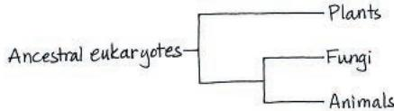

## Concept Check 1.3

1. Mouse coat color matches the environment for both beach and inland populations.
2. Inductive reasoning derives generalizations from specific cases; deductive reasoning predicts specific outcomes from general premises.
3. Compared to a hypothesis, a scientific theory is usually more general and substantiated by a much greater amount of evidence. Natural selection is an explanatory idea that applies to all kinds of organisms and is supported by vast amounts of evidence of various kinds.
4. Based on the mouse coloration in Figure 1.25, you might expect that the mice that live on the sandy soil would be lighter in color and those that live on the lava rock would be much darker. And in fact, that is what researchers have found. You would predict that each color of mouse would be less preyed upon in its native habitat than it would be in the other habitat. (Research results also support this prediction.) You could repeat the Hoekstra experiment with colored models, painted to resemble these two types of mouse. Or you could try transplanting some of each population to its non-native habitat and counting how many you can recapture over the next few days, then comparing the four samples as was done in Hoekstra's experiment. (The painted models are easier to recapture, of course!) In the live mouse transplantation experiment, you would have to do controls to eliminate the variable represented by the transplanted mice being in a new, unknown territory. You could control for the transplantation process by transplanting some dark mice from one area of lava rock to one far distant, and some light mice from one area of sandy soil to a distant area.

## Concept Check 1.4

1. Science aims to understand natural phenomena and the underlying mechanisms that affect them, while technology involves application of scientific discoveries for a particular purpose or to solve a specific problem.
2. Natural selection could be operating. Malaria is present in sub-Saharan Africa, India, southeast Asia, and other warm regions, so there might be an advantage to people with the sickle-cell disease form of the gene that makes them more able to survive and pass on their genes to offspring. Among descendants of ancestors from those regions living in the United States, where malaria is absent, there would be no advantage, so they would be selected against more strongly, resulting in fewer individuals with the sickle-cell disease form of the gene.

## Summary of Key Concepts Questions

1.1 Finger movements rely on the coordination of the many structural components of the hand (muscles, nerves, bones, etc.), each of which is composed of elements from lower levels of biological organization (cells, molecules). The development of the hand relies on the genetic information encoded in chromosomes found in cells throughout the body. To power the finger movements that result in a text message, muscle and nerve cells require chemical energy that they transform in powering muscle contraction or in propagating nerve impulses. Texting is in essence communication, an interaction that conveys information between organisms, in this case of the same species. 1.2 Ancestors of the beach mouse may have exhibited variations in their coat color. Because of the prevalence of visual predators, the better-camouflaged (lighter) mice in the beach habitat may have survived longer and been able to produce more offspring. Over time, a higher and higher proportion of individuals in the population would have had the adaptation of lighter fur that acted to camouflage the mouse in the beach habitat. 1.3 Gathering and interpreting data are core activities in the scientific process, and they are affected by, and affect in turn, three other arenas of the scientific process: exploration and discovery, community analysis and feedback, and societal benefits and outcomes. 1.4 Different approaches taken by scientists studying natural phenomena at different levels complement each other, so more is learned about each problem being studied. A diversity of backgrounds among scientists may lead to fruitful ideas in the same way that important innovations have often arisen where a mix of cultures coexist, due to multiple different viewpoints.

## Test Your Understanding

1. B 2. C 3. C 4. B 5. C 6. A 7. D 8. Your figure should show the following: (1) for the biosphere, the Earth with an arrow coming out of a tropical ocean; (2) for the ecosystem, a distant view of a coral reef; (3) for the community, a collection of reef animals and algae, with corals, fishes, some seaweed, and any other organisms you can think of; (4) for the population, a group of fish of the same

species; (5) for the organism, one fish from your population; (6) for the organ, the fish's stomach; (7) for a tissue, a group of similar cells from the stomach; (8) for a cell, one cell from the tissue, showing its nucleus and a few other organelles; (9) for an organelle, the nucleus, where most of the cell's DNA is located; and (10) for a molecule, a DNA double helix. Your sketches can be very rough!

## Chapter 2

## Figure Questions

Figure 2.7 Atomic number = 12; 12 protons, 12 electrons; three electron shells; 2 valence electrons

Figure 2.14 One possible answer:  
Figure 2.17  
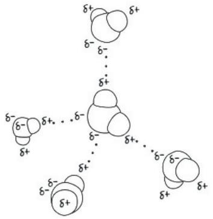

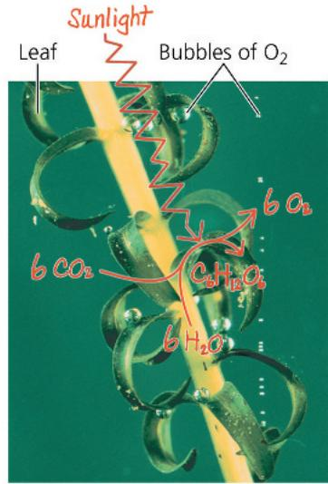

## Concept Check 2.1

1. Table salt (sodium chloride) is made up of sodium and chlorine. We are able to eat the compound, showing that it has different properties from those of a metal (sodium) and a poisonous gas (chlorine). 2. Yes. An organism requires trace elements, though only in small amounts. 3. A person with an iron deficiency will probably show fatigue and other effects of a low oxygen level in the blood. (The condition is called anemia and can also result from too few red blood cells or abnormal hemoglobin.) 4. Variant ancestral plants that could tolerate elevated levels of the elements in serpentine soils could grow and reproduce there. (Plants that were well adapted to nonserpentine soils would not be expected to survive in serpentine areas.) The offspring of the variants would also vary, with those most capable of thriving under serpentine conditions growing best and reproducing most. Over many generations, this probably led to the serpentine-adapted species we see today.

## Concept Check 2.2

1.7 2. $^{15}_{7}\mathrm{N}$ 3.9 electrons; two electron shells; 1s, 2s, 2p (three orbitals); 1 electron is needed to fill the valence shell. 4. The elements in a row all have the same number of electron shells. All the elements in a column have the same number of electrons in their valence shells.

## Concept Check 2.3

1. In this structure, each carbon atom has only three covalent bonds instead of the required four.
2. The attraction between oppositely charged ions, forming ionic bonds
3. If you could synthesize molecules that mimic these shapes, you might be able to treat diseases or conditions caused by the inability of affected individuals to synthesize such molecules—or to block the function of such molecules if overproduction is the cause of the disorder.

## Concept Check 2.4

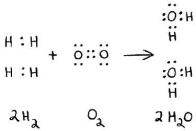

2. At equilibrium, the forward and reverse reactions occur at the same rate. 3. $C_{6}H_{12}O_{6} + 6O_{2} \rightarrow 6CO_{2} + 6H_{2}O + Energy$ . Glucose and oxygen react to form carbon dioxide and water, releasing energy. We breathe in oxygen because we need it for this reaction to occur, and we breathe out carbon dioxide because it is a by-product of this reaction. (This reaction is called cellular respiration, and you will learn more about it in Chapter 9.)

## Summary of Key Concepts Questions

2.1 A compound is made up of two or more elements combined in a fixed ratio, while an element is a substance that cannot be broken down to other substances.
2.2

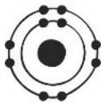  
Neon(10Ne)

Both neon and argon have completed valence shells, containing 8 electrons. They do not have unpaired electrons that could participate in chemical bonds. 2.3 Electrons are shared equally between the two atoms in a nonpolar covalent bond. In a polar covalent bond, the electrons are drawn closer to the more

electronegative atom. In the formation of ions, an electron is completely transferred from one atom to a much more electronegative atom. 2.4 The concentration of products would increase as the added reactants were converted to products. Eventually, an equilibrium would again be reached in which the forward and reverse reactions were proceeding at the same rate and the relative concentrations of reactants and products returned to where they were before the addition of more reactants.

## Test Your Understanding

1. D 2. A 3. B 4. A 5. D 6. B 7. C 8. D

$$
H: \ddot {O}: \begin{array}{c} H \\ C \\ H \end{array} : \begin{array}{c} H \\ C \\ C \end{array} :: \ddot {O}\tag{9.}
$$

This structure makes sense because all valence shells are complete, and all bonds have the correct number of electrons.

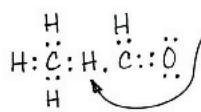

This structure doesn't make sense because H has only 1 electron to share, so it cannot form bonds with 2 atoms.

## Chapter 3

Figure Questions

Figure 3.2 One possible answer:  
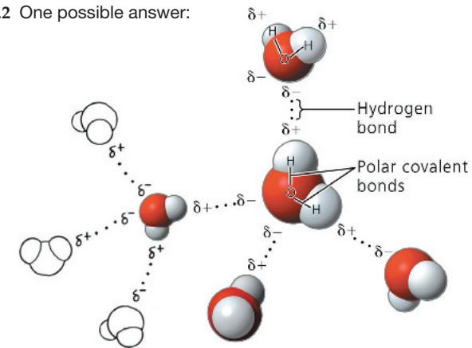

Figure 3.8 Heating the solution would cause the water to evaporate faster than it is evaporating at room temperature. At a certain point, there wouldn't be enough water molecules to dissolve the salt ions. The salt would start coming out of solution and re-forming crystals. Eventually, all the water would evaporate, leaving behind a pile of salt like the original pile. Figure 3.12 Adding excess $\mathrm{CO}_{2}$ to the oceans ultimately reduces the rate at which calcification (by organisms) can occur.

## Concept Check 3.1

1. Electronegativity is the attraction of an atom for the electrons of a covalent bond. Because oxygen is more electronegative than hydrogen, the oxygen atom in $H_{2}O$ pulls electrons toward itself, resulting in two partial negative charges on the oxygen atom and a partial positive charge on each hydrogen atom. Atoms in neighboring water molecules with opposite partial charges are attracted to each other, forming a hydrogen bond. 2. Due to its two polar covalent bonds, a water molecule has regions of partial negative charge on the O atom that allow it to form hydrogen bonds with hydrogen atoms on neighboring water molecules, and regions of partial positive charge on the H atoms that allow them to form hydrogen bonds with oxygen atoms on neighboring water molecules. 3. The hydrogen atoms of one molecule, with their partial positive charges, would repel the partially positively charged hydrogen atoms of the adjacent molecule. 4. The covalent bonds of water molecules would not be polar, so no regions of the molecule would carry partial charges and water molecules would not form hydrogen bonds with each other.

## Concept Check 3.2

1. Hydrogen bonds hold neighboring water molecules together. This cohesion helps chains of water molecules move upward against gravity in water-conducting cells as water evaporates from the leaves. Adhesion between water molecules and the walls of the water-conducting cells also helps counter gravity.
2. High humidity hampers cooling by suppressing the evaporation of sweat.
3. As water freezes, it expands because water molecules move farther apart in forming ice crystals. When there is water in a crevice of a boulder, expansion due to freezing may crack the boulder.
4. The hydrophobic substance repels water, perhaps helping to keep the ends of the legs from becoming coated with water and breaking through the surface. If the legs were coated with a hydrophilic substance, water would be drawn up them, possibly making it more difficult for the water strider to walk on water.

## Concept Check 3.3

1. $10^{5}$ , or 100,000
2. $[H^{+}] = 0.01M = 10^{-2}M$ , so pH = 2.

3. $CH_{3}COOH \rightarrow CH_{3}COO^{-} + H^{+}$ . $CH_{3}COOH$ is the acid (the $H^{+}$ donor), and $CH_{3}COO^{-}$ is the base (the $H^{+}$ acceptor). 4. The pH of the water should decrease from 7 to about 2 (as mentioned in the text); the pH of the acetic acid solution will decrease only a small amount, because as a weak acid, it acts (like carbonic acid) as a buffer. The reaction shown for question 3 will shift to the left, with $CH_{3}COO^{-}$ accepting the influx of $H^{+}$ and becoming $CH_{3}COOH$ molecules.

## Summary of Key Concepts Questions

3.1

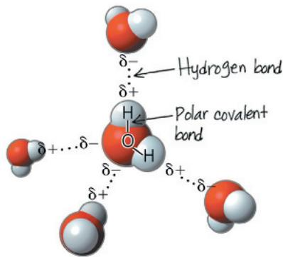

No. A covalent bond is a strong bond in which electrons are shared between two atoms. A hydrogen bond is a weak bond, which does not involve electron sharing, but is simply an attraction between two partial charges on neighboring atoms. 3.2 Ions dissolve in water when polar water molecules form a hydration shell around them, with partially charged regions of water molecules being attracted to ions of the opposite charge. Polar molecules dissolve as water molecules form hydrogen bonds with them and surround them. A solution is a homogeneous mixture of a solute and a solvent. 3.3 The concentration of hydrogen ions ( $H^{+}$ ) would be $10^{-11}$ , and the pH of the solution would be 11.

## Test Your Understanding

1.C 2.D 3.C 4.A 5.D

7. Due to intermolecular hydrogen bonds, water has a high specific heat (the amount of heat required to increase the temperature of water by $1^{\circ}$ C). When water is heated, much of the heat is absorbed in breaking hydrogen bonds before the water molecules increase their motion and the temperature increases. Conversely, when water is cooled, many H bonds are formed, which releases a significant amount of heat. This release of heat can provide some protection against freezing of the plants' leaves, thus protecting the cells from damage. 8. Both global warming and ocean acidification are caused by increasing levels of carbon dioxide in the atmosphere, the result of burning fossil fuels.

## Chapter 4

## Figure Questions

Figure 4.2 Because the concentration of the reactants influences the equilibrium (as discussed in Concept 2.4), there might have been more HCN relative to $CH_{2}O$ since there would have been a higher concentration of the reactant gas containing nitrogen.

Figure 4.4  
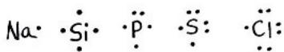

Figure 4.6 The tails of fats contain only carbon-hydrogen bonds, which are relatively nonpolar. Because the tails occupy the bulk of a fat molecule, they make the molecule as a whole nonpolar and therefore incapable of forming hydrogen bonds with water.

Figure 4.7

## Concept Check 4.1

1. The sparks provided energy needed for the inorganic molecules in the atmosphere to react with each other. (You'll learn more about energy and chemical reactions in Chapter 8.)

## Concept Check 4.2

2. The forms of $C_{4}H_{10}$ in (b) are structural isomers, as are the butenes (forms of $C_{4}H_{8}$ ) in (c). 3. Both consist largely of hydrocarbon chains, which provide fuel—gasoline for engines and fats for plant embryos and animals. Reactions of both types of molecules release energy. 4. No. There is not enough diversity in propane's atoms. It can't form structural isomers because there is only one way for three carbons to attach to each other (in a line). There are no double bonds, so cis-trans isomers are not possible. Each carbon has at least two hydrogens attached to it, so the molecule is symmetrical and cannot have enantiomers.

## Concept Check 4.3

1. An amino acid has both an amino group ( $—NH_{2}$ ), which makes it an amine, and a carboxyl group (—COOH), which makes it a carboxylic acid. 2. The ATP molecule loses a phosphate, becoming ADP.

A chemical group that can act as a base has been replaced with a group that can act as an acid, increasing the acidic properties of the molecule. The shape of the molecule would also change, likely changing the molecules with which it can interact. The original cysteine molecule has an asymmetric carbon in the center. After replacement of the amino group with a carboxyl group, this carbon is no longer asymmetric.

## Summary of Key Concepts Questions

4.1 Miller showed that organic molecules could form under the physical and chemical conditions estimated to have been present on early Earth. This abiotic synthesis of organic molecules would have been a first step in the origin of life. 4.2 Acetone and propanal are structural isomers. Acetic acid and glycine have no asymmetric carbons, whereas glycerol phosphate has one. Therefore, glycerol phosphate can exist as forms that are enantiomers, but acetic acid and glycine cannot. 4.3 The methyl group is nonpolar and not reactive. The other six groups are called functional groups because they can participate in chemical reactions. Also, all except the sulfhydryl group are hydrophilic, increasing the solubility of organic compounds in water.

## Test Your Understanding

1. B 2. B 3. C 4. C 5. A 6. B 7. A 8. The molecule on the right; the middle carbon is asymmetric.

9. Silicon has 4 valence electrons, the same number as carbon. Therefore, silicon would be able to form long chains, including branches, that could act as skeletons for large molecules. It would clearly do this much better than neon (with no valence electrons) or aluminum (with 3 valence electrons).

## Chapter 5

## Figure Questions

Figure 5.3 Glucose and fructose are structural isomers.

Figure 5.4

Four carbons are in the fructose ring, and two are not. (The latter two carbons are attached to carbons 2 and 5, which are in the ring.) The fructose ring differs from the glucose ring, which has five carbons in the ring and one that is not. (Note that the orientation of this fructose molecule is flipped horizontally relative to that of the one in Figure 5.5b; also, note that the oxygen on carbon 5 lost its proton and that the oxygen on carbon 2, which used to be the carbonyl oxygen, gained a proton.

Figure 5.5  

a. In maltose, the linkage is called a 1–4 glycosidic linkage because the number 1 carbon in the left monosaccharide (glucose) is linked to the number 4 carbon in the right monosaccharide (also glucose). b. In sucrose, the linkage is called a 1–2 glycosidic linkage because the number 1 carbon in the left monosaccharide (glucose) is linked to the number 2 carbon in the right monosaccharide (fructose). (Note that the fructose molecule is oriented differently from glucose in Figures 5.4 and 5.5b, where carbon 2 is on the right. In fructose in Figure 5.5b and here, carbon 2 of fructose is on the left.)  
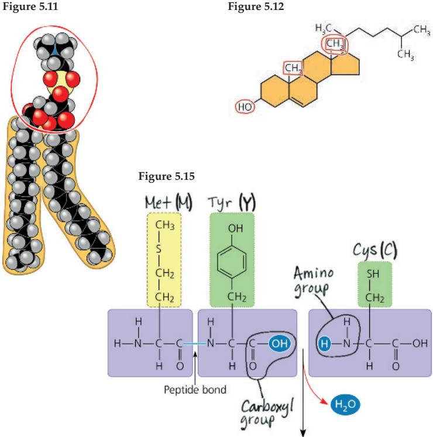

Figure 5.16 1. The polypeptide backbone is most easily followed in the ribbon model.  

3. The point of this diagram is to show that a pancreas cell secretes insulin proteins, so the shape is not important to the process being illustrated. Figure 5.17 We can see that their complementary shapes allow the two proteins to fit together quite precisely. Figure 5.19 The R group on glutamic acid is acidic and hydrophilic, whereas that on valine is nonpolar and hydrophobic. Therefore, it is unlikely that valine and glutamic acid participate in the same intramolecular interactions. A change in these interactions could (and does) cause a disruption of molecular structure. Figure 5.26 Using a genomics approach allows us to use gene sequences to identify species and to learn about evolutionary relationships among any two species. This is because all species are related by their evolutionary history, and the evidence is in the DNA sequences. Proteomics—looking at proteins that are expressed—allows us to learn about how organisms or cells are functioning at a given time or in an association with another species.

## Concept Check 5.1

1. The four main classes are proteins, carbohydrates, lipids, and nucleic acids. Lipids are not polymers.
2. Nine, with one water molecule required to hydrolyze each connection between adjacent monomers.
3. The amino acids in the fish protein must be released in hydrolysis reactions and incorporated into other proteins in dehydration reactions.

## Concept Check 5.2

1. $C_{3}H_{6}O_{3}$ 2. $C_{12}H_{22}O_{11}$ 3. The antibiotic treatment is likely to have killed the cellulose-digesting prokaryotic organisms in the cow's gut. The absence of these prokaryotic organisms would hamper the cow's ability to obtain energy from food and could lead to weight loss and possibly death. Thus, prokaryotic species are reintroduced, in appropriate combinations, in the gut culture given to treated cows.

## Concept Check 5.3

1. Both have a glycerol molecule attached to fatty acids. The glycerol of a fat has three fatty acids attached, whereas the glycerol of a phospholipid is attached to two fatty acids and one phosphate group.
2. Human sex hormones are steroids, a type of compound that is hydrophobic and thus classified as a lipid.
3. The oil droplet membrane could consist of a single layer of phospholipids rather than a bilayer, because an arrangement in which the hydrophobic tails of the membrane phospholipids were in contact with the hydrocarbon regions of the oil molecules would be more stable.

## Concept Check 5.4

1. Secondary structure involves hydrogen bonds between atoms of the polypeptide backbone. Tertiary structure involves interactions between atoms of the side chains of the amino acid subunits. 2. The two ring forms of glucose are called $\alpha$ and $\beta$ , depending on how the glycosidic bond dictates the position of a hydroxyl group. Proteins have $\alpha$ helices and $\beta$ pleated sheets, two types of repeating structures found in polypeptides due to interactions between the repeating constituents of the chain (not the side chains). The hemoglobin molecule is made up of two types of polypeptides: It contains two molecules each of $\alpha$ -globin and $\beta$ -globin. 3. During formation of a polypeptide by polymerization of amino acids, the amino group of one amino acid reacts with the carboxyl group of the next, forming a peptide bond. Therefore, in a polypeptide, there is only one amino group on the N-terminus and one carboxyl group on the C-terminus, along with any carboxyl groups or amino groups located in the amino acid side chains (R groups). 4. These are all nonpolar, hydrophobic amino acids, so you would expect this region to be located in the interior of the folded polypeptide, where it would not contact the aqueous environment inside the cell.

## Concept Check 5.5

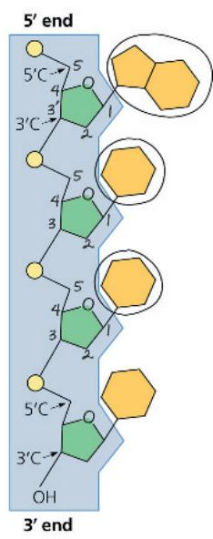

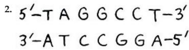

## Concept Check 5.6

1. The DNA of an organism encodes all of its proteins, and proteins are the molecules that carry out the work of cells, whether an organism is unicellular or multicellular. By knowing the DNA sequence of an organism, scientists would be able to catalog the protein sequences as well.
2. Ultimately, the DNA sequence carries the information necessary to make the proteins that determine the traits of a particular species. Because the traits of the two species are similar, you would expect the proteins to be similar as well, and therefore the gene sequences should also have a high degree of similarity.

## Summary of Key Concepts Questions

5.1 The polymers of large carbohydrates (polysaccharides), proteins, and nucleic acids are built from three different types of monomers (monosaccharides, amino acids, and nucleotides, respectively). 5.2 Both starch and cellulose are polymers of glucose, but the glucose monomers are in the $\alpha$ configuration in starch and the $\beta$ configura tion in cellulose. The glycosidic linkages thus have different geometries, giving the polymers different shapes and thus different properties. Starch is an energy-storage compound in plants; cellulose is a structural component of plant cell walls. Humans can hydrolyze starch to provide energy but cannot hydrolyze cellulose. Cellulose aids in the passage of food through the digestive tract. 5.3 Lipids are not polymers because they do not exist as a chain of linked monomers. They are not considered macromolecules because they do not reach the giant size of many polysaccharides, proteins, and nucleic acids. 5.4 A polypeptide, which may consist of hundreds of amino acids in a specific sequence (primary structure), has regions of coils and pleats (secondary structure), which are then folded into irregular contortions (tertiary structure) and may be noncovalently associated with other polypeptides (quaternary structure). The linear order of amino acids, with the varying properties of their side chains (R groups), determines what secondary and

8.

tertiary structures will form to produce a protein. The resulting unique three-dimensional shapes of proteins are key to their specific and diverse functions. 5.5 The complementary base pairing of the two strands of DNA makes possible the precise replication of DNA every time a cell divides, ensuring that genetic information is faithfully transmitted. In some types of RNA, complementary base pairing enables RNA molecules to assume specific three-dimensional shapes that facilitate diverse functions. 5.6 You would expect the human gene sequence to be most similar to that of the mouse (another mammal), then to that of the fish (another vertebrate), and least similar to that of the fruit fly (an invertebrate).

## Test Your Understanding

1. D  2. A  3. B  4. A  5. B  6. B  7. C

<table><tr><td></td><td>Monomers or Components</td><td>Polymer or larger molecule</td><td>Type of linkage</td></tr><tr><td>Carbohydrates</td><td>Monosaccharides</td><td>Polysaccharides</td><td>Glycosidic linkages</td></tr><tr><td>Fats</td><td>Fatty acids</td><td>Triacylglycerols</td><td>Ester linkages</td></tr><tr><td>Proteins</td><td>Amino acids</td><td>Polypeptides</td><td>Peptide bonds</td></tr><tr><td>Nucleic acids</td><td>Nucleotides</td><td>Polynucleotides</td><td>Phosphodiester linkages</td></tr></table>

## Practice Applying Your Learning

11. (a) T (b) F (c) F (d) T (e) F (f) T (g) T (h) T

## Chapter 6

## Figure Questions

Figure 6.3 The cilia in the lower portion of the TEM were oriented lengthwise in the plane of the slice, while those in the upper portion of the TEM were oriented perpendicular to the plane of the slice. Therefore, the cilia in the lower portion were cut in longitudinal section, and the cilia in the upper portion were cut in cross section. Figure 6.4 You would use the pellet from the final fraction, which is rich in ribosomes. These are the sites of protein translation. Figure 6.6 The dark bands in the TEM correspond to the hydrophilic heads of the phospholipids, while the light band corresponds to the hydrophobic fatty acid tails of the phospholipids. Figure 6.9 The DNA in a chromosome dictates synthesis of a messenger RNA (mRNA) molecule,

which then moves out to the cytoplasm. There, the information is used for the production, on ribosomes, of proteins that carry out cellular functions. Figure 6.10 Any of the bound ribosomes (attached to the endoplasmic reticulum) could be circled, because any could be making a protein that will be secreted. Table 6.1 Three dimers Figure 6.22 Each centriole has nine sets of 3 microtubules, so the entire centrosome

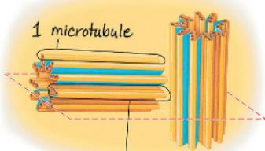  
Triplet of microtubules

(two centrioles) has 54 microtubules. Each microtubule consists of a helical array of tubulin dimers (as shown in Table 6.1). Figure 6.24 The two central microtubules terminate above the basal body, so they aren't present at the level of the cross section through the basal body, indicated by the lower red rectangle shown in the EM on the left.

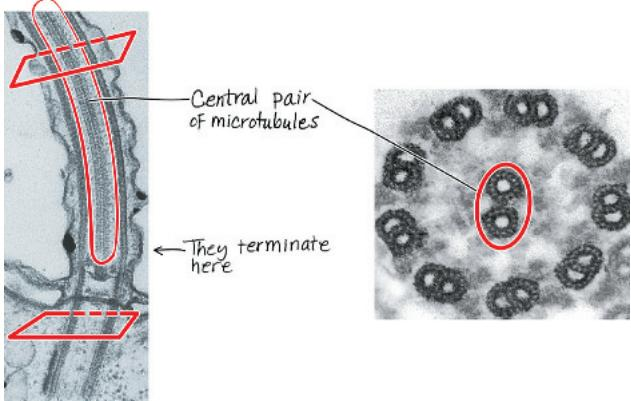  
Figure 6.32 1. Nuclear pore, ribosome, proton pump, cyt c. 2. As shown in the figure, the enzyme RNA polymerase moves along the DNA, transcribing the genetic information into an mRNA molecule. Given that RNA polymerase is somewhat larger than a nucleosome, the enzyme would not be able to fit between the histone proteins of the nucleosome and the DNA itself. Thus, the group of histone proteins must be separated from or moved along the DNA somehow in order for the RNA polymerase enzyme to access the DNA. 3. A mitochondrion.

## Concept Check 6.1

1. Stains used for light microscopy are colored molecules that bind to cell components, affecting the light passing through, while stains used for electron microscopy involve heavy metals that affect the beams of electrons.
2. (a) Light microscope, (b) scanning electron microscope.

## Concept Check 6.2

1. See Figure 6.8.

This cell would have the same volume as the cells in columns 2 and 3 in Figure 6.7 but proportionally more surface area than that in column 2 and less than that in column 3. Thus, the surface-to-volume ratio should be greater than 1.2 but less than 6. To obtain the surface area, you would add the area of the six sides (the top, bottom, sides, and ends): $125 + 125 + 125 + 125 + 1 + 1 = 502$ . The surface-to-volume ratio equals 502 divided by a volume of 125, or roughly 4.0.

## Concept Check 6.3

1. Ribosomes in the cytoplasm translate the genetic message, carried from the DNA in the nucleus by mRNA, into a polypeptide chain.
2. Nucleoli consist of DNA and the ribosomal RNAs (rRNAs) made according to its genes in the DNA, as well as proteins imported from the cytoplasm. Together, the rRNAs and proteins are assembled into large and small ribosomal subunits. (These are exported through nuclear pores to the cytoplasm, where they will participate in polypeptide synthesis.)
3. Each chromosome consists of one long DNA molecule attached to numerous protein molecules, a combination called chromatin. As a cell begins division, each chromosome becomes “condensed” as its diffuse mass of chromatin coils up.

## Concept Check 6.4

1. The primary distinction between rough and smooth ER is the presence of bound ribosomes on the rough ER. Both types of ER make phospholipids, but membrane proteins and secretory proteins are all produced by the ribosomes on the rough ER. The smooth ER also functions in detoxification, carbohydrate metabolism, and storage of calcium ions.
2. Transport vesicles move membranes and the substances they enclose between other components of the endomembrane system.
3. The mRNA is synthesized in the nucleus and then passes out through a nuclear pore to the cytoplasm, where it is translated on a bound ribosome, attached to the rough ER. The protein is synthesized into the lumen of the ER and may be modified there. A transport vesicle carries the protein to the Golgi apparatus. After further modification in the Golgi, another transport vesicle carries it back to the ER, where it will perform its cellular function.

## Concept Check 6.5

1. Both organelles are involved in energy transformation, mitochondria in cellular respiration and chloroplasts in photosynthesis. They both have multiple membranes that separate their interiors into compartments. In both organelles, the innermost membranes—cristae, or infoldings of the inner membrane, in mitochondria and the thylakoid membranes in chloroplasts—have large surface areas with embedded enzymes that carry out their main functions. 2. Yes. Plant cells are able to make their own sugar by photosynthesis, but mitochondria in plant cells (which are, of course, eukaryotic) are the organelles that are able to generate ATP molecules to be used for energy generation from sugars, a function required in all cells. 3. Mitochondria and chloroplasts are not derived from the ER, nor are they connected physically or via transport vesicles to organelles of the endomembrane system. Mitochondria and chloroplasts are structurally different from vesicles derived from the ER, which are bounded by a single membrane.

## Concept Check 6.6

1. Dynein arms, powered by ATP, move neighboring doublets of microtubules relative to each other. Because they are anchored within the flagellum or cilium and with respect to one another, the doublets bend instead of sliding past each other. Synchronized bending of the nine microtubule doublets brings about bending of both cilia and flagella.
2. Such individuals have defects in the microtubule-based movement of cilia and flagella. Thus, the sperm can't move because of malfunctioning or nonexistent flagella, and the airways are compromised because cilia that line the trachea malfunction or don't exist, and so mucus cannot be cleared from the lungs.

## Concept Check 6.7

1. The most obvious difference is the presence of direct cytoplasmic connections between cells of plants (plasmodesmata) and animals (gap junctions). These connections result in the cytoplasm being continuous between adjacent cells. 2. The cell would not be able to function properly and would probably soon die, as the cell wall or ECM must be permeable to allow the exchange of matter between the cell and its external environment. Molecules involved in energy production and use must be allowed entry, as well as those that provide information about the cell's environment. Other molecules, such as products synthesized by the cell for export and the by-products of cellular respiration, must be allowed to exit. 3. The parts of the protein that face aqueous regions would be expected to have polar or charged (hydrophilic) amino acids, while the parts that go through the membrane would be expected to have nonpolar (hydrophobic) amino acids. You would predict polar or charged amino acids at each end (tail), in the region of the cytoplasmic loop, and in the regions of the two extracellular loops. You would predict nonpolar amino acids in the four regions that go through the membrane between the tails and loops.

## Concept Check 6.8

1. Colpidium colpoda moves around in freshwater using cilia, projections from the plasma membrane that enclose microtubules in a "9 + 2" arrangement. The interactions between motor proteins and microtubules cause the cilia to bend synchronously, propelling the cell through the water. This is powered by ATP, obtained via breaking down sugars from food in a process that occurs in mitochondria. C. colpoda obtains bacteria as their food source, maybe via the same process (involving filopodia) the macrophage uses in Figure 6.31. This process uses actin filaments and other elements of the cytoskeleton to ingest the bacteria. Once ingested, the bacteria are broken down by enzymes in lysosomes. The proteins involved in all of these processes are encoded by genes on DNA in the nucleus of the C. colpoda.

## Summary of Key Concepts Questions

6.1 Both light and electron microscopy allow cells to be studied visually, thus helping us understand internal cellular structure and the arrangement of cell components. Cell fractionation techniques separate out different groups of cell components, which can then be analyzed biochemically to determine their function. Performing microscopy on the same cell fraction helps to correlate the biochemical function of the cell with the cell component responsible. 6.2 The separation of different functions in different organelles has several advantages. Reactants and enzymes can be concentrated in one area instead of spread throughout the cell. Reactions that require specific conditions, such as a lower pH, can be compartmentalized. And enzymes for specific reactions are often embedded in the membranes that enclose or partition an organelle. 6.3 The nucleus contains the genetic material of the cell in the form of DNA, which specifies messenger RNA, which in turn provides instructions for the synthesis of proteins (including the proteins that make up part of the ribosomes). DNA also codes for ribosomal RNAs, which are combined with proteins in the nucleolus into the subunits of ribosomes. Within the cytoplasm, ribosomes join with mRNA to build polypeptides, using the genetic information in the mRNA. 6.4 Transport vesicles move proteins and membranes synthesized by the rough ER to the Golgi for further processing and then to the plasma membrane, lysosomes, or other locations in the cell, including back to the ER. 6.5 According to the endosymbiont theory, mitochondria originated from an oxygen-using bacterial cell that was engulfed by an archaeal cell that was ancestral to eukaryotic cells. Over time, the host and endosymbiont evolved into a single unicellular organism containing a mitochondrion. Chloroplasts originated when at least one of these eukaryotic cells containing mitochondria engulfed and then retained a photosynthetic bacterial cell, which eventually evolved into a chloroplast. 6.6 Inside the cell, motor proteins interact with components of the cytoskeleton to move cellular parts. Motor proteins "walk" vesicles along microtubules. The movement of cytoplasm within a cell involves interactions of the motor protein myosin and microfilaments (actin filaments). Whole cells can be moved by the rapid bending of flagella or cilia, which is caused by the motor protein-powered sliding of microtubules within these structures. Cell movement can also occur when pseudopodia form at one end of a cell (caused by actin polymerization into a filamentous network), followed by contraction of the cell toward that end; this amoeboid movement is powered by interactions of microfilaments with myosin. Interactions of motor proteins and microfilaments in muscle cells causes muscle contraction that can propel whole organisms (for example, by walking or swimming). 6.7 A plant cell wall is primarily composed of microfibrils of cellulose embedded in other polysaccharides and proteins. The ECM of animal cells is primarily composed of collagen and other protein fibers, such as fibronectin and other glycoproteins. These fibers are embedded in a network of carbohydrate-rich proteoglycans. A plant cell wall provides structural support for the cell and, collectively, for the plant body. In addition to giving support, the ECM of an animal cell allows for communication of environmental changes into the cell. 6.8 The nucleus houses the chromosomes; each is made up of proteins and a single DNA molecule. The genes that exist along the DNA carry the genetic information necessary to make the proteins involved in ingesting a bacterial cell, such as the actin of microfilaments that form pseudopodia (filopodia), the proteins in the mitochondria responsible for providing the necessary ATP, and the enzymes present in the lysosomes that will digest the bacterial cell.

## Test Your Understanding

1. B 2. C 3. B 4. A 5. D 6. See Figure 6.8.

## Chapter 7

Figure Questions

Figure 7.2  
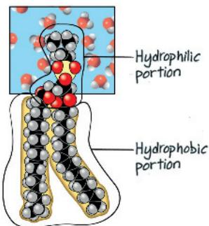

The hydrophilic portion is in contact with an aqueous environment (cytosol or extracellular fluid), and the hydrophobic portion is in contact with the hydrophobic portions of other phospholipids in the interior of the bilayer. Figure 7.4 You couldn't rule out movement of proteins within membranes of the same species. You might propose that the membrane lipids and proteins from one species weren't able to mingle with those from the other species because of some incompatibility. Figure 7.7 A transmembrane protein like the dimer in (f) might change its shape upon binding to a particular extracellular matrix (ECM) molecule. The new shape

might enable the interior portion of the protein to bind to a second, cytoplasmic protein that would relay the message to the inside of the cell, as shown in (c). Figure 7.8 The shape of a protein on the HIV surface is likely to be complementary to the shape of the receptor (CD4) and also to that of the co-receptor (CCR5). A molecule with a shape similar to that of the HIV surface protein could bind CCR5, blocking HIV binding. (Another answer would be a molecule that bound to CCR5 and changed the shape of CCR5 so it could no longer bind HIV; in fact, this is how maraviroc works.)

Figure 7.9  
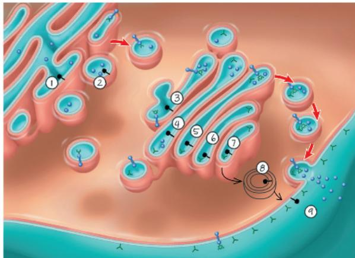

The protein would contact the extracellular fluid. (Because one end of the protein is in the ER membrane, no part of the protein extends into the cytoplasm.) The part of the protein not in the membrane extends into the ER lumen. Once the vesicle fuses with the plasma membrane, the "inside" of the ER membrane, facing the lumen, will become the "outside" of the plasma membrane, facing the extracellular fluid. Figure 7.12 The orange dye would be evenly distributed throughout the solution on both sides of the membrane. The solution levels would not be affected because the orange dye can diffuse through the membrane and equalize its concentration. Thus, no additional osmosis would take place in either direction. In this experiment, the membrane is meant to represent the plasma membrane of a cell. Figure 7.13 The cells take up water and become turgid, causing the stalk to lose its limpness and become crisp. Figure 7.16 The sodium ion concentration $\left(\left[\mathrm{Na}^{+}\right]\right)$ is low inside the cell and high outside, while potassium ion concentration $\left(\left[\mathrm{K}^{+}\right]\right)$ is low outside the cell and high inside. Three $\mathrm{Na}^{+}$ ions are moved out of the cell and two $\mathrm{K}^{+}$ ions into the cell for each cycle. Figure 7.17 The diamond solutes are moving into the cell (downward), and the round solutes are moving out of the cell (upward); each is moving against its concentration gradient. Figure 7.21 (a) In the micrograph of the algal cell, the diameter of the algal cell is about 2.3 times longer than the scale bar, which represents $5\mu \mathrm{m}$ , so the diameter of the algal cell is about $11.5\mu \mathrm{m}$ . (b) In the micrograph of the coated vesicle, the diameter of the coated vesicle is about 1.2 times longer than the scale bar, which represents $0.25\mu \mathrm{m}$ , so the diameter of the coated vesicle is about $0.3\mu \mathrm{m}$ . (c) Therefore, the food vacuole around the algal cell will be about $40\times$ larger than the coated vesicle.

## Concept Check 7.1

1. They are on the inside of the transport vesicle membrane. 2. The grasses living in the cooler region would be expected to have more unsaturated fatty acids in their membranes because those fatty acids remain fluid at lower temperatures. The grasses living immediately adjacent to the hot springs would be expected to have more saturated fatty acids, which would allow the fatty acids to "stack" more closely, making the membranes less fluid and therefore helping them to stay intact at higher temperatures. (In plants, cholesterol is generally not used to moderate the effects of temperature on membrane fluidity because it is found at vastly lower levels in membranes of plant cells than in those of animal cells.)

## Concept Check 7.2

1. $O_{2}$ and $CO_{2}$ are both small, nonpolar molecules that can easily pass through the hydrophobic interior of a membrane.
2. Water is a polar molecule, so it cannot pass very rapidly through the hydrophobic region in the middle of a phospholipid bilayer.
3. The hydronium ion is charged, while glycerol is not. Charge is probably more significant than size as a basis for exclusion by the aquaporin channel.

## Concept Check 7.3

1. $CO_{2}$ is a nonpolar molecule that can diffuse through the plasma membrane. As long as it diffuses away so that the concentration remains low outside the cell, it will continue to exit the cell in this way. (This is the opposite of the case for $O_{2}$ , described in this section of the text.) 2. Paramecium's contractile vacuole will become less active. The vacuole pumps out excess water that accumulates in the cell; this accumulation occurs only in a hypotonic environment.

## Concept Check 7.4

1. These pumps use ATP. To establish a voltage, ions have to be pumped against their gradients, which requires energy.
2. Each ion is being transported against its electrochemical gradient. If either ion were transported down its electrochemical

gradient, this would be considered cotransport. 3. The internal environment of a lysosome is acidic, so it has a higher concentration of $H^{+}$ than does the cytoplasm. Therefore, you might expect the membrane of the lysosome to have a proton pump such as that shown in Figure 7.18 to pump $H^{+}$ into the lysosome.

Figure 8.13

## Concept Check 7.5

1. Exocytosis. When a transport vesicle fuses with the plasma membrane, the vesicle membrane becomes part of the plasma membrane.

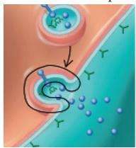

3. The glycoprotein is synthesized in the ER lumen, moves through the Golgi apparatus, and then travels in a vesicle to the plasma membrane, where it undergoes exocytosis and becomes part of the ECM.

## Summary of Key Concepts Questions

7.1 Plasma membranes define the cell by separating the cellular components from the external environment. This allows conditions inside cells to be controlled by membrane proteins, which regulate entry and exit of molecules and even cell function (see Figure 7.7). The processes of life can be carried out inside the controlled environment of the cell, so membranes are crucial. In eukaryotes, membranes also function to subdivide the cytoplasm into different compartments where distinct processes can occur, even under differing conditions such as low or high pH.
7.2 Aquaporins are channel proteins that greatly increase the permeability of a membrane to water molecules, which are polar and therefore do not readily diffuse through the hydrophobic interior of the membrane. 7.3 There will be a net diffusion of water out of a cell into a hypertonic solution. The free water concentration is higher inside the cell than in the solution (where not as many water molecules are free, because many are clustered around the numerous solute particles).
7.4 One of the solutes moved by the cotransporter is actively transported against its concentration gradient. The energy for this transport comes from the concentration gradient of the other solute, which was established by an electrogenic pump that used energy to transport the other solute across the membrane. Because energy is required overall to drive this process (because ATP is used to establish the concentration gradient), it is considered active transport. 7.5 In receptor-mediated endocytosis, specific molecules bind to receptors on the plasma membrane in a region where a coated pit develops. The cell can acquire bulk quantities of those specific molecules when the coated pit forms a vesicle and carries the bound molecules into the cell.

## Test Your Understanding

1. B 2. C 3. A 4. C 5. B

6. (a)  

(b) The solution outside is hypotonic. It has less sucrose, which is a nonpenetrating solute. (c) See answer for (a). (d) The artificial cell will become more turgid. (e) Eventually, the two solutions will have the same solute concentrations. Even though sucrose can't move through the membrane, water flow (osmosis) will lead to isotonic conditions.

## Chapter 8

## Figure Questions

Figure 8.5 With a proton pump (Figure 7.18), the energy stored in ATP is used to pump protons across the membrane and build up a higher (nonrandom) concentration outside of the cell, so this process results in higher free energy. When solute molecules (analogous to hydrogen ions) are uniformly distributed, similar to the random distribution in the bottom of (b), the system has less free energy than it does in the top of (b). The system in the bottom can do no work. Because the concentration gradient created by a proton pump (Figure 7.18) represents higher free energy, this system has the potential to do work once there is a higher concentration of protons on one side of the membrane (as you will see in Figure 9.15). Figure 8.10 Glutamic acid (Glu) has a carboxyl group at the end of its R group. Glutamine (Gln) has exactly the same structure as glutamic acid, except that there is an amino group in place of the $-\mathrm{O}^{-}$ on the R group. (This O atom on the R group leaves during the synthesis reaction.) Thus, in this figure, Gln is drawn as a Glu with an attached $\mathrm{NH}_2$ .

Figure 8.16  
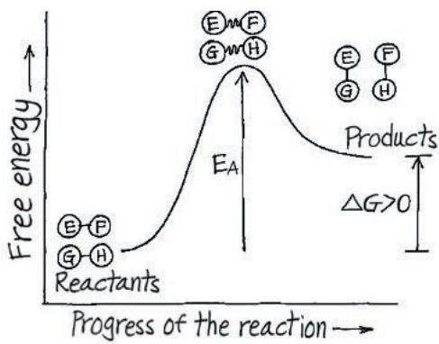

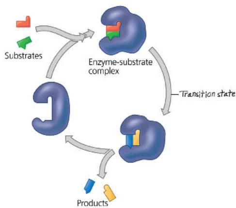

## Concept Check 8.1

1. The second law is the trend toward randomization, or increasing entropy. When the concentrations of a substance on both sides of a membrane are equal, the distribution is more random than when they are unequal. Diffusion of a substance to a region where it is initially less concentrated increases entropy, making it an energetically favorable (spontaneous) process as described by the second law. This explains the process seen in Figure 7.11. 2. The apple has potential energy in its position hanging on the tree, and the sugars and other nutrients it contains have chemical energy. The apple has kinetic energy as it falls from the tree to the ground. Finally, when the apple is digested and its molecules broken down, some of the chemical energy is used to do work, and the rest is lost as thermal energy. 3. The sugar crystals become less ordered (entropy increases) as they dissolve and become randomly spread out in the water. Over time, the water evaporates, and the crystals form again because the water volume is insufficient to keep them in solution. While the reappearance of sugar crystals may represent a “spontaneous” increase in order (decrease in entropy), it is balanced by the decrease in order (increase in entropy) of the water molecules, which changed from a relatively compact arrangement as liquid water to a much more dispersed and disordered form as water vapor.

## Concept Check 8.2

1. Cellular respiration is a spontaneous and exergonic process. The energy released from glucose is used to do work in the cell or is lost as heat.
2. Catabolism breaks down organic molecules, releasing their chemical energy and resulting in smaller products with more entropy, as when moving from the top to the bottom of Figure 8.5c. Anabolism consumes energy to synthesize larger molecules from simpler ones, as when moving from the bottom to the top of part (c).
3. The reaction is exergonic because it releases energy—in this case, in the form of light. (This is a non-biological version of the bioluminescence seen in Figure 8.1.)

## Concept Check 8.3

1. ATP usually transfers energy to an endergonic process by phosphorylating (adding a phosphate group to) another molecule. (Exergonic processes, in turn, phosphorylate ADP to regenerate ATP.) 2. A set of coupled reactions can transform the first combination into the second. Since this is an exergonic process overall, $\Delta G$ is negative and the first combination must have more free energy (see Figure 8.10). 3. Active transport: The solute is being transported against its concentration gradient, which requires energy, provided by ATP hydrolysis.

## Concept Check 8.4

1. A spontaneous reaction is a reaction that is exergonic. However, if it has a high activation energy that is rarely attained, the rate of the reaction may be low. 2. $O_{2}$ is required as a substrate to react with the gas. There is $O_{2}$ in the lab air, which is why

the Bunsen burner has a flame above the gas delivery opening, but there is no $O_{2}$ in the rubber tubing or the gas supply. 3. In the presence of malonate, increase the concentration of the normal substrate (succinate) and see whether the rate of reaction increases. If it does, malonate is a competitive inhibitor.

## Concept Check 8.5

1. The activator binds in such a way that it stabilizes the active form of an enzyme, whereas the inhibitor stabilizes the inactive form.
2. A catabolic pathway breaks down organic molecules, generating energy that is stored in ATP molecules. In feedback inhibition of such a pathway, ATP (one product) would act as an allosteric inhibitor of an enzyme catalyzing an early step in the catabolic process. When ATP is plentiful, the pathway would be turned off and no more would be made.

## Summary of Key Concepts Questions

8.1 The process of "ordering" a cell's structure is accompanied by an increase in the entropy (disorder) of the universe. For example, an animal cell takes in highly ordered organic molecules as the source of matter and energy used to build and maintain its structures. In the same process, however, the cell releases heat and the simple molecules of $\mathrm{CO}_{2}$ and $\mathrm{H}_2\mathrm{O}$ to the surroundings. The increase in entropy of the latter process offsets the entropy decrease in the former. 8.2 A spontaneous reaction has a negative $\Delta G$ and is exergonic. For a chemical reaction to proceed with a net release of free energy $(- \Delta G)$ , the enthalpy or total energy of the system must decrease $(- \Delta H)$ , and/or the entropy or disorder must increase (yielding a more negative term, $-T\Delta S$ ). Spontaneous reactions supply the energy to perform cellular work. 8.3 The free energy released from the hydrolysis of ATP may drive endergonic reactions through the transfer of a phosphate group to a reactant molecule, forming a more reactive phosphorylated intermediate. ATP hydrolysis also powers the mechanical and transport work of a cell, often by powering shape changes in the relevant motor proteins. Cellular respiration, the catabolic breakdown of glucose, provides the energy for the endergonic regeneration of ATP from ADP and $\mathbb{P}_i$ . 8.4 Activation energy barriers prevent the complex molecules of the cell, which are rich in free energy, from spontaneously breaking down to less ordered, more stable molecules. Enzymes permit a regulated metabolism by binding to specific substrates and forming enzyme-substrate complexes that selectively lower the $\mathrm{E_A}$ for the chemical reactions in a cell. 8.5 A cell tightly regulates its metabolic pathways in response to fluctuating needs for energy and materials. The binding of activators or inhibitors to regulatory sites on allosteric enzymes stabilizes either the active or the inactive form of the subunits. For example, the binding of ATP to a catabolic enzyme in a cell with excess ATP would inhibit that pathway. Such types of feedback inhibition preserve chemical resources within a cell. If ATP supplies are depleted, binding of ADP to the regulatory site of catabolic enzymes would activate that pathway, generating more ATP.

## Test Your Understanding

1. B 2. C 3. B 4. A 5. C 6. D 7. C

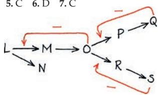

Practice Applying Your Learning
11. (a) T (b) F (c) F (d) F (e) T (f) T

## Chapter 9

## Figure Questions

Figure 9.2 The C atom is oxidized. The electrons that used to be equally shared with H atoms in methane are now much closer to the O atoms in $CO_{2}$ than they are to the C. Figure 9.3 The reduced form has an extra hydrogen, along with 2 electrons, bound to the carbon shown at the top of the nicotinamide (opposite the N). There are different numbers and positions of double bonds in the two forms: The oxidized form has three double bonds in the ring, while the reduced form has only two. (In organic chemistry you may have learned, or will learn, that three double bonds in a ring are able to “resonate,” or act as a ring of electrons. Having three resonant double bonds is more “oxidized” than having only two double bonds in the ring.) In the oxidized form there is a + charge on the N (because it is sharing 4 electron pairs), whereas in the reduced form it is only sharing 3 electron pairs (having a pair of electrons to itself). Figure 9.6 Because there is no external source of energy for the reaction, it must be exergonic, and the reactants must be at a higher energy level than the products. Figure 9.8 The removal would probably stop glycolysis, or at least slow it down, since it would push the equilibrium for step 5 toward DHAP. If less (or no) glyceraldehyde 3-phosphate were available, step 6 would slow down (or be unable to occur). Figure 9.12 The electrons in NADH are in a C—H bond (right side of Figure 9.3). In $H_{2}O$ , the electrons are in an O—H bond. Because the electronegativities of C and H are similar, the electrons are equally shared in NADH. The electronegativity of O is much higher than that of C or H, so the electrons are much closer to O in $H_{2}O$ and have “fallen” in potential energy. Figure 9.14 At first, some ATP could be made, since electron transport could proceed as far as complex III, and a small $H^{+}$ gradient could be built up. Soon, however, no more electrons could be passed to complex III because it could not be reoxidized by passing its electrons to complex IV. Figure 9.15 First, there are 2 NADH from the oxidation of pyruvate plus 6 NADH from the citric acid cycle (CAC); 8 NADH × 2.5 ATP/NADH = 20 ATP. Second, there are 2 FADH₂ from the CAC; 2 FADH₂ × 1.5 ATP/FADH₂ = 3 ATP. Third, the 2 NADH from glycolysis enter the mitochondrion through one of two types of shuttle. They pass their electrons either to 2 FAD, which become FADH₂ and result in 3 ATP, or to 2 NAD⁺, which become NADH and result in 5 ATP. Thus, 20 + 3 + 3 = 26 ATP, or 20 + 3 + 5 = 28 ATP from all NADH and FADH₂.

## Concept Check 9.1

1. Both processes include glycolysis, the citric acid cycle, and oxidative phosphorylation. In aerobic respiration, the final electron acceptor is molecular oxygen $\left(\mathrm{O}_{2}\right)$ ; in anaerobic respiration, the final electron acceptor is a different substance.
2. $C_{4}H_{6}O_{5}$ would be oxidized and $NAD^{+}$ would be reduced.

## Concept Check 9.2

1. $NAD^{+}$ acts as the oxidizing agent in step 6, accepting electrons from glyceraldehyde 3-phosphate (G3P), which thus acts as the reducing agent.

## Concept Check 9.3

1. NADH and FADH $_{2}$ ; one ATP (or its equivalent) is produced during substrate-level phosphorylation in step 5.
2. The CO $_{2}$ that we exhale is produced by pyruvate oxidation and the citric acid cycle.
3. In both cases, the precursor molecule loses a CO $_{2}$ molecule and then donates electrons to an electron carrier in an oxidation step. Also, the product has been activated due to the attachment of a CoA group by its S atom.

## Concept Check 9.4

1. Oxidative phosphorylation would eventually stop entirely, resulting in no ATP production by this process. Without oxygen to "pull" electrons down the electron transport chain, $\mathrm{H^{+}}$ would not be pumped into the mitochondrion's intermembrane space and chemiosmosis would not occur. 2. Decreasing the pH means addition of $\mathrm{H^{+}}$ . This would establish a proton gradient even without the function of the electron transport chain, and we would expect ATP synthase to function and synthesize ATP. (In fact, it was experiments like this that provided support for chemiosmosis as an energy-coupling mechanism.) 3. One of the components of the electron transport chain, ubiquinone (Q), must be able to diffuse within the membrane. It could not do so if the membrane components were locked rigidly into place.

## Concept Check 9.5

1. A derivative of pyruvate, such as acetaldehyde during alcohol fermentation, or pyruvate itself during lactic acid fermentation; $O_{2}$ ; another electron acceptor at the end of an electron transport chain, such as sulfate ( $SO_{4}^{2-}$ ) 2. The cell would need to consume glucose at a rate about 16 times the consumption rate in the aerobic environment (2 ATP are generated by fermentation versus up to 32 ATP by cellular respiration).

## Concept Check 9.6

1. The fat is much more reduced; it has many $-CH_{2}-$ units, and in all these bonds the electrons are equally shared. The electrons present in a carbohydrate molecule are already somewhat oxidized (shared unequally in bonds; there are more C—O and O—H bonds), as quite a few of them are bound to oxygen. Electrons that are equally shared, as in fat, have a higher energy level than electrons that are unequally shared, as in carbohydrates. Thus, fat is a much better fuel than carbohydrate. 2. When you consume more food than necessary for metabolic processes, your body synthesizes fat as a way of storing energy for later use. 3. AMP will accumulate, stimulating phosphofructokinase, and thus increasing the rate of glycolysis. Since oxygen is not present, the cell will convert more pyruvate to lactate, providing a supply of ATP. 4. When $O_{2}$ is present, the fatty acid chains containing most of the energy of a fat are oxidized and fed into the citric acid cycle and the electron transport chain. During intense exercise, however, $O_{2}$ is scarce in muscle cells, so ATP must be generated by glycolysis alone. A very small part of the fat molecule, the glycerol backbone, can be oxidized via glycolysis, but the amount of energy released by this portion is insignificant compared to that released by the fatty acid chains. (This is why moderate exercise, staying below 70% maximum heart rate, is better for burning fat—because enough $O_{2}$ remains available to the muscles.)

## Summary of Key Concepts Questions

9.1 Most of the ATP produced in cellular respiration comes from oxidative phosphorylation, in which the energy released from redox reactions in an electron transport chain is used to produce ATP. In substrate-level phosphorylation, an enzyme directly transfers a phosphate group to ADP from an intermediate substrate. All ATP production in glycolysis occurs by substrate-level phosphorylation; this form of ATP production also occurs at one step in the citric acid cycle. 9.2 The oxidation of the three-carbon sugar, glyceraldehyde 3-phosphate, yields energy. In this oxidation, electrons and $\mathrm{H^{+}}$ are transferred to $\mathrm{NAD^{+}}$ , forming NADH, and a phosphate group is attached to the oxidized substrate. ATP is then formed by substrate-level phosphorylation when this phosphate group is transferred to ADP. 9.3 The release of six molecules of $\mathrm{CO}_{2}$ represents the complete oxidation of glucose. During the processing of two pyruvates to acetyl CoA, the fully oxidized carboxyl groups ( $-\mathrm{COO^{-}}$ ) are given off as $2\mathrm{CO}_{2}$ . The remaining four carbons are released as $\mathrm{CO}_{2}$ in the citric acid cycle as citrate is oxidized back to oxaloacetate. 9.4 The flow of $\mathrm{H^{+}}$ through the ATP synthase complex causes the rotor and attached rod to rotate, exposing catalytic sites in the knob portion that produce ATP from ADP and $\mathbb{P}_i$ . ATP synthases are found in the inner mitochondrial membrane, the plasma membrane of prokaryotic organisms, and membranes within chloroplasts. 9.5 Anaerobic respiration yields more ATP. The 2 ATP produced by substrate-level phosphorylation in glycolysis represent the total energy yield of fermentation. NADH passes its "high-energy" electrons to pyruvate or a derivative of pyruvate, recycling $\mathrm{NAD^{+}}$ and allowing glycolysis to continue. In anaerobic respiration, the NADH produced during glycolysis, as well as additional molecules of NADH produced when pyruvate is oxidized, are used to generate ATP molecules. An electron transport chain captures the energy of the electrons in NADH via a series of redox reactions; ultimately, the electrons are transferred to an electronegative atom in a molecule other than oxygen. 9.6 The ATP produced by catabolic pathways is used to drive anabolic pathways. Also, many of the intermediates of glycolysis and the citric acid cycle are used in the biosynthesis of a cell's molecules.

## Test Your Understanding

1. C 2. C 3. A 4. B 5. D 6. A 7. B 8. Since the overall process of glycolysis results in net production of ATP, it would make sense for the process to slow down when ATP levels have increased substantially. Thus, we would expect ATP to allosterically inhibit phosphofructokinase.9. The proton pump in Figures 7.18 and 7.19 is carrying out active transport, using ATP hydrolysis to pump protons against their concentration gradient. Because ATP is required, this is active transport of protons. The ATP synthase in Figure 9.13 is using the flow of protons down their concentration gradient to power ATP synthesis. Because the protons are moving down their concentration gradient, no energy is required, and this is passive transport.

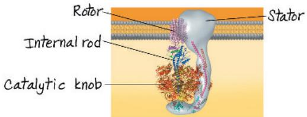

12.  
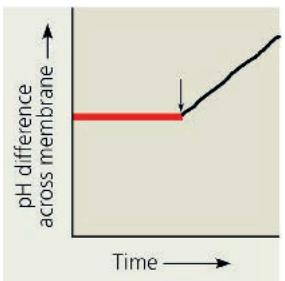

$H^{+}$ would continue to be pumped across the membrane into the intermembrane space, increasing the difference between the matrix pH and the intermembrane space pH. $H^{+}$ would not be able to flow back through ATP synthase, since the enzyme is inhibited by the poison, so rather than maintaining a constant difference across the membrane, the difference would continue to increase. (Over a longer period of time, the $H^{+}$ concentration in the intermembrane space would be so high that no more $H^{+}$ would be able to be

pumped against the gradient. This wasn't asked for in the question, but if your graph levels off at the right end and this is your reasoning, your answer is correct.)

## Chapter 10

## Figure Questions

Figure 10.11 In the leaf, most of the chlorophyll electrons excited by photon absorption are used to power the reactions of photosynthesis. Figure 10.15 The person at the top of the photosystem I tower would not turn to his left and throw his electron into the NADPH bucket. Instead, he would throw it onto the top of the ramp at his right, next to the photosystem II tower. The electron would then roll down the ramp, get energized by a photon, and return to him. This cycle would continue as long as light was available. (This is why it's called cyclic electron flow.) Figure 10.16 You would (a) decrease the pH outside the mitochondrion (thus increasing the $\mathrm{H^{+}}$ concentration) and (b) increase the pH in the chloroplast stroma (thus decreasing the $\mathrm{H^{+}}$ concentration). In both cases, this would generate an $\mathrm{H^{+}}$ gradient across the membrane that would cause ATP synthase to synthesize ATP. Figure 10.17 Steps that increase $[\mathrm{H^{+}}]$ in the thylakoid space or decrease $[\mathrm{H^{+}}]$ in the stroma contribute to the $[\mathrm{H^{+}}]$ gradient across the thylakoid membrane. In step 2, water is split in the thylakoid space, releasing $2\mathrm{H^{+}}$ and increasing $[\mathrm{H^{+}}]$ . In step 3, as electrons travel down the electron transport chain, $4\mathrm{H^{+}}$ are pumped into the thylakoid space, increasing $[\mathrm{H^{+}}]$ . In step 5, NADPH formation uses an $\mathrm{H^{+}}$

from the stroma, decreasing $[H^{+}]$ in the stroma. Figure 10.22 The gene encoding hexokinase is part of the DNA of a chromosome in the nucleus. There, the gene is transcribed into mRNA, which is transported to the cytoplasm where it is translated on a free ribosome into a polypeptide. The polypeptide folds into a functional protein with secondary and tertiary structure. Once functional, it carries out the first reaction of glycolysis in the cytoplasm.

## Concept Check 10.1

1. Because heterotrophs cannot photosynthesize, they cannot capture the energy of sunlight and produce energy-rich compounds like sugars, as autotrophs can. [Sugars are oxidized by cellular respiration, providing energy (in the form of ATP) for cellular processes.] Without this ability, heterotrophs depend on autotrophs to provide sugars as the food molecules that fuel their vital processes. 2. The main product of fossil fuel combustion (for example, by cars) is $CO_{2}$ . Placing containers of algae near sources of $CO_{2}$ emission makes sense because the algae need $CO_{2}$ to carry out photosynthesis. The higher the $CO_{2}$ concentration, the higher will be the rate of algal photosynthesis. (At the same time, algae would be reducing the $CO_{2}$ concentration in those areas, which would otherwise contribute to climate change; see Concept 1.1.)

## Concept Check 10.2

1. $CO_{2}$ enters the leaves via stomata, and, being a nonpolar molecule, can cross the leaf cell membrane and the chloroplast membranes to reach the stroma of the chloroplast.
2. Using ${}^{18}O$ , a heavy isotope of oxygen, as a label, researchers were able to confirm van Niel's hypothesis that the oxygen atoms in $O_{2}$ produced during photosynthesis comes from $H_{2}O$ , not from $CO_{2}$ .
3. The light reactions could not keep producing NADPH and ATP without the $NADP^{+}$ , ADP, and $P_{i}$ that the Calvin cycle generates. The two cycles are interdependent.

## Concept Check 10.3

1. Green, because green light is mostly transmitted and reflected—not absorbed—by photosynthetic pigments 2. Water ( $H_{2}O$ ) is the initial electron donor; $NADP^{+}$ accepts electrons at the end of the electron transport chain, becoming reduced to NADPH. 3. In this experiment, the rate of ATP synthesis would slow and eventually stop. Because the added compound would not allow a proton gradient to build up across the membrane, ATP synthase could not catalyze ATP production.

## Concept Check 10.4

1. 6, 18, 12
2. The more potential energy and reducing power a molecule stores, the more energy and reducing power are required for the formation of that molecule. Glucose is a valuable energy source because it is highly reduced (has lots of C—H bonds), storing lots of potential energy in its electrons. To reduce $CO_{2}$ to glucose, a large amount of energy and a lot of reducing power are required in the form of large numbers of ATP and NADPH molecules, respectively.
3. Yes, it would inhibit the dark reactions. The light reactions require ADP and $NADP^{+}$ , which would not be formed in sufficient quantities from ATP and NADPH if the Calvin cycle stopped.

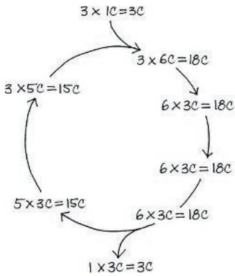

For every three turns of the Calvin cycle, the total number of carbon atoms remains constant because three carbons enter as part of $CO_{2}$ molecules, replacing the three that left as part of a G3P molecule. 5. In glycolysis, G3P acts as an intermediate. The six-carbon sugar fructose 1,6-bisphosphate is cleaved into two three-carbon sugars, one of which is G3P. The other is an isomer called dihydroxyacetone phosphate (DHAP), which can be converted to G3P by an isomerase. Because G3P is the substrate for the next enzyme, it is constantly removed, and the

reaction equilibrium is pulled in the direction of conversion of DHAP to more G3P. In the Calvin cycle, G3P acts as both an intermediate and a product. For every three $CO_{2}$ molecules that enter the cycle, six G3P molecules are formed, five of which must remain in the cycle and become rearranged to regenerate three five-carbon RuBP molecules. The one remaining G3P is a product, which can be thought of as the result of “reducing” the three $CO_{2}$ molecules that entered the cycle into a three-carbon sugar that can later be used to generate energy.

## Concept Check 10.5

1. Photorespiration decreases photosynthetic output by adding $O_{2}$ , instead of $CO_{2}$ , to the Calvin cycle. As a result, no sugar is generated (no carbon is fixed), and $O_{2}$ is used rather than generated.
2. Without PS II, no $O_{2}$ is generated in

10.4

bundle-sheath cells. This avoids the problem of $O_{2}$ competing with $CO_{2}$ for binding to rubisco in these cells. 3. Both problems are caused by a drastic change in Earth's atmosphere due to burning of fossil fuels. The increase in $CO_{2}$ concentration affects ocean chemistry by decreasing pH, thus affecting calcification by marine organisms. On land, $CO_{2}$ concentration and air temperature are conditions that plants have become adapted to, and changes in these characteristics have a strong effect on photosynthesis by plants. Thus, alteration of these two fundamental factors could have critical effects on organisms all around the planet, in all different habitats. 4. You would expect that $C_{4}$ and CAM species would replace many of the $C_{3}$ species.

## Concept Check 10.6

1. Plants can break down the sugar they make (in the form of glucose) by cellular respiration, producing ATPs for various cellular processes such as endergonic chemical reactions, transport of substances across membranes, and movement of molecules in the cell. ATPs are also used for the movement of chloroplasts during cellular streaming in some plant cells (see Figure 6.26).

## Summary of Key Concepts Questions

10.1 Photosynthesizing autotrophs are called producers because they use sunlight as energy to make their own organic molecules (including sugars) from $CO_{2}$ and $H_{2}O$ . Heterotrophs are called consumers because they cannot make their own food and therefore must feed on other organisms, either autotrophs or other heterotrophs. Heterotrophs that consume the remains of dead organisms are called decomposers. Photosynthesis enables almost all organisms to survive because it makes food for photosynthesizing autotrophs, which in turn are food for most heterotrophs.
10.2 $CO_{2}$ and $H_{2}O$ are the products of cellular respiration; they are the reactants in photosynthesis. In respiration, glucose is oxidized to $CO_{2}$ and electrons are passed through an electron transfer chain from glucose to $O_{2}$ , producing $H_{2}O$ . In photosynthesis, $H_{2}O$ is the source of electrons, which are energized by light, temporarily stored in NADPH, and used to reduce $CO_{2}$ to carbohydrate.
10.3 The action spectrum of photosynthesis shows that some wavelengths of light that are not absorbed by chlorophyll a are still effective at promoting photosynthesis. The light-harvesting complexes of photosystems contain accessory pigments such as chlorophyll b and carotenoids, which absorb different wavelengths and pass the energy to chlorophyll a, broadening the spectrum of light usable for photosynthesis.

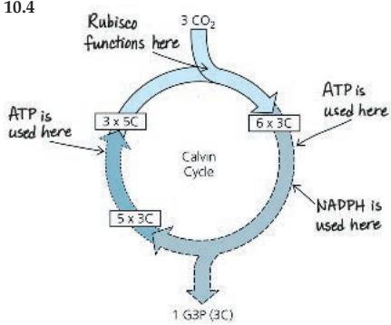

In the reduction phase of the Calvin cycle, ATP phosphorylates a three-carbon compound, and NADPH then reduces this compound to G3P. ATP is also used in the regeneration phase, when five molecules of G3P are converted to three molecules of the five-carbon compound RuBP. Rubisco catalyzes the first step of carbon fixation—the addition of $CO_{2}$ to RuBP.

10.5 Both $C_{4}$ photosynthesis and CAM photosynthesis involve initial fixation of $CO_{2}$ to produce a four-carbon compound

(in mesophyll cells in $C_{4}$ plants and at night in CAM plants). These compounds are then broken down to release $CO_{2}$ (in the bundle-sheath cells in $C_{4}$ plants and during the day in CAM plants). ATP is required for recycling the molecule that is used initially to combine with $CO_{2}$ . These pathways avoid the photorespiration that consumes ATP and reduces the photosynthetic output of $C_{3}$ plants when they close stomata on hot, dry, bright days. Thus, hot, arid climates would favor $C_{4}$ and CAM plants. 10.6 Sucrose made in the leaves of plants is transported through veins to nonphotosynthetic parts of the plant, where some of it is oxidized by cellular respiration, producing ATP for cellular processes. Other sugar molecules enter anabolic pathways, where they are used for synthesis of proteins, lipids, and polysaccharides such as cellulose, the main component of cell walls. Excess sugar is stockpiled as glucose subunits of the polysaccharide starch.

## Test Your Understanding

1. D  2. B  3. C  4. A  5. A  6. B  7. C

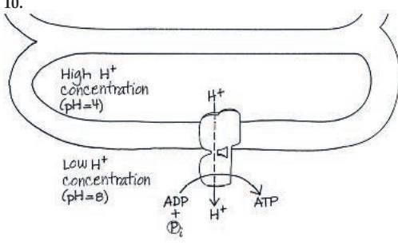

The ATP would end up outside the thylakoid. The thylakoids were able to make ATP in the dark because the researchers set up an artificial proton concentration gradient across the thylakoid membrane; thus, the light reactions were not necessary to establish the $H^{+}$ gradient required for ATP synthesis by ATP synthase.

## Chapter 11

## Figure Questions

Figure 11.6 Epinephrine is a signaling molecule outside the cell; presumably, it binds to a cell-surface receptor protein and thus is part of the signal reception step. Figure 11.8 This is an example of passive transport. The ion is moving down its concentration gradient, and no energy is required. Figure 11.9 The aldosterone molecule, a steroid, doesn't need a receptor protein—it is hydrophobic and can therefore pass directly through the hydrophobic lipid bilayer of the plasma membrane into the cell. (Hydrophilic molecules cannot do this.) Figure 11.10 The entire phosphorylation cascade wouldn't operate. Regardless of whether or not the signaling molecule was bound, protein kinase 2 would always be inactive and would not be able to activate the purple-colored protein leading to the cellular response. Figure 11.11 The signaling molecule (cAMP) would remain in its active form and would continue to signal; the pathway would remain active even in the absence of ligand because the cAMP would persist. Figure 11.14 The $\mathrm{Ca^{2+}}$ pump shown in Figure 11.13 is carrying out active transport of $\mathrm{Ca^{2+}}$ ions against their concentration gradient, using ATP for energy. These pumps help maintain a significantly lower $[\mathrm{Ca^{2+}}]$ in the cytoplasm than outside the cell and inside the ER. The $\mathrm{Ca^{2+}}$ channel proteins seen in Figure 11.14 are facilitating diffusion of $\mathrm{Ca^{2+}}$ down its concentration gradient; here, the $\mathrm{Ca^{2+}}$ is moving from inside the ER, where it is more concentrated, to the cytoplasm. Because the ion is moving down its concentration gradient, no energy is required—this is passive transport. Figure 11.16 100,000,000 (one hundred million, or $10^{8}$ ) glucose molecules are released just from one epinephrine binding to the receptor. The first step results in $100\times$ amplification (one epinephrine activates $100\mathrm{G}$ proteins); the next step does not amplify the response; the next step is a $100\times$ amplification ( $10^{2}$ active adenylyl cyclase molecules to $10^{4}$ cyclic AMPs); the next step does not amplify; the next two steps are each $10\times$ amplifications, and the final step is a $100\times$ amplification. Figure 11.17 The signaling pathway shown in Figure 11.14 leads to the splitting of $\mathrm{PIP}_2$ into the second messengers DAG and $\mathrm{IP}_3$ , which produce different responses. (The response elicited by DAG is mentioned but not shown.) The pathway shown for cell B is similar in that it branches and leads to two responses.

## Concept Check 11.1

1. The two cells of opposite mating type (a and $\alpha$ ) each secrete a unique signaling molecule, which can only be bound by receptors carried on cells of the opposite mating type. Thus, the a mating factor cannot bind to another a cell and cause it to grow toward the first a cell. Only an $\alpha$ cell can “receive” the signaling molecule and respond by directed growth.
2. Glycogen phosphorylase acts in the third stage, the cellular response to epinephrine signaling.
3. Glucose 1-phosphate would not be generated because the activation of the enzyme requires an intact cell, with an intact receptor in the membrane and an intact signal transduction pathway. The enzyme cannot be activated directly by interaction with the signaling molecule in the cell-free mixture.

## Concept Check 11.2

1. NGF is water-soluble (hydrophilic), so it cannot pass through the lipid membrane to reach intracellular receptors, as steroid hormones can. Therefore, you'd expect the NGF receptor to be in the plasma membrane—which is, in fact, the case. 2. The cell with the faulty receptor would not be able to respond appropriately to the signaling molecule when it was present. This would most likely have dire consequences for the cell since regulation of the cell's activities by this receptor would not occur appropriately. 3. Binding of a ligand to a receptor changes the shape of the receptor, altering the ability of the receptor to transmit a signal. Binding of an allosteric regulator to an enzyme changes the shape of the enzyme, either promoting or inhibiting enzyme activity.

## Concept Check 11.3

1. A protein kinase is an enzyme that transfers a phosphate group from ATP to a protein, usually activating that protein (often a second type of protein kinase). Many signal transduction pathways include a series of such interactions, in which each phosphorylated protein kinase in turn phosphorylates the next protein kinase in the series. Such phosphorylation cascades carry a signal from outside the cell to the cellular protein(s) that will carry out the response. 2. Protein phosphatases reverse the effects of the kinases by dephosphorylation, and unless the signaling molecule is at a high enough concentration that it is continuously rebinding the receptor, the kinase molecules will all be returned to their inactive states by phosphatases. 3. The signal that is being transduced is the information that a signaling molecule is bound to the cell-surface receptor. Information is transduced by way of sequential protein-protein interactions that change protein shapes, causing them to function in a way that passes the signal (the information) along. 4. The IP $_{3}$ -gated channel would open, allowing calcium ions to flow out of the ER and into the cytoplasm, which would raise the cytosolic Ca $^{2+}$ concentration.

## Concept Check 11.4

1. At each step in a cascade of sequential activations, one molecule or ion may activate numerous molecules functioning in the next step. This causes the response to be amplified at each such step and overall results in a large amplification of the original signal.
2. Scaffolding proteins hold molecular components of signaling pathways in a complex with each other. Different scaffolding proteins would assemble different

collections of proteins, facilitating different molecular interactions and leading to different cellular responses in the two cells. 3. A malfunctioning protein phosphatase would not be able to dephosphorylate a particular receptor or relay protein. As a result, the signaling pathway, once activated, would not be able to be terminated. (In fact, one study found altered protein phosphatases in cells from $25\%$ of colorectal tumors.) 4. The proteins in the two cells are different, so the cellular response is different. In heart muscle cells, the pathway shown in Figure 11.16 allows glucose to fuel faster muscle contractions and heart rate. In respiratory muscles, the relay proteins must be different, so that the effect is to block muscle contraction. [In fact, the steps are the same through protein kinase A (PKA), but in respiratory muscle cells, PKA phosphorylates a protein that is required for muscle contraction—and in this case, phosphorylation inactivates that protein. So muscle contraction cannot occur.]

## Concept Check 11.5

1. In formation of the hand or paw in mammals, cells in the regions between the digits are programmed to undergo apoptosis. This serves to shape the digits of the hand or paw so that they are not webbed. (A lack of apoptosis in these regions in water birds results in webbed feet.) 2. If a receptor protein for a death-signaling molecule were defective such that it was activated even in the absence of the death signal, this would lead to apoptosis when it wouldn't normally occur. Similar defects in any of the proteins in the signaling pathway would have the same effect if the defective proteins activated relay or response proteins in the absence of interaction with the previous protein or second messenger in the pathway. Conversely, if any protein in the pathway were defective in its ability to respond to an interaction with an early protein or other molecule or ion, apoptosis would not occur when it normally should. For example, a receptor protein for a death-signaling ligand might not be able to be activated, even when ligand was bound. This would stop the signal from being transduced into the cell.

## Summary of Key Concepts Questions

11.1 A cell is able to respond to a hormone only if it has a receptor protein on the cell surface or inside the cell that can bind to the hormone. The response to a hormone depends on the specific signal transduction pathway within the cell, which will lead to the specific cellular response. The response can vary for different types of cells. 11.2 Both GPCRs and RTKs have an extracellular binding site for a signaling molecule (ligand) and one or more $\alpha$ -helical regions of the polypeptide that spans the membrane. A GPCR functions singly, while RTKs tend to dimerize or form larger groups of RTKs. GPCRs usually trigger a single transduction pathway, whereas the multiple activated tyrosines on an RTK dimer may trigger several different transduction pathways at the same time. 11.3 A protein kinase is an enzyme that adds a phosphate group to another protein. Protein kinases are often part of a phosphorylation cascade that transduces a signal. A second messenger is a small, nonprotein molecule or ion that rapidly diffuses and relays a signal throughout a cell. Both protein kinases and second messengers can operate in the same pathway. For example, the second messenger cAMP often activates protein kinase A, which then phosphorylates other proteins. 11.4 In G protein-coupled pathways, the GTPase portion of a G protein converts GTP to GDP, inactivating the G protein. Protein phosphatases remove phosphate groups from activated proteins, thus stopping a phosphorylation cascade of protein kinases. Phosphodiesterase converts cAMP to AMP, thus reducing the effect of cAMP in a signal transduction pathway. 11.5 The basic mechanism of controlled cell suicide evolved early in eukaryotic evolution, and the genetic basis for these pathways has been conserved during animal evolution. Such a mechanism is essential to the development and maintenance of all animals.

## Test Your Understanding

1. D 2. A 3. B 4. A 5. C 6. C 7. C 8. This is one possible drawing of the pathway. (Similar drawings would also be correct.)

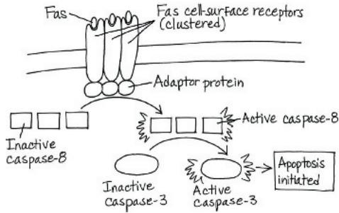

## Chapter 12

Figure Questions

Figure 12.4

Circling the other chromatid instead would also be correct. Figure 12.5 The chromosome has four arms. The single (duplicated) chromosome in ② becomes two (unduplicated) chromosomes in ③. The duplicated chromosome in step 2 is considered one single chromosome. Figure 12.7 12;2;2;1
Figure 12.8

  
Figure 12.9 The mark would have moved toward the pole closer to it. The lengths of fluorescent microtubules between that pole and the mark would have decreased, while the lengths between the chromosomes and the mark would have remained the same. Figure 12.14 In both cases, the $G_{1}$ nucleus would have remained in $G_{1}$ until the time it normally would have entered the S phase. Chromosome condensation and spindle formation would not have occurred until the S and $G_{2}$ phases had been completed. Figure 12.16 Passing the $G_{2}$ checkpoint in the diagram corresponds to the beginning of the “Time” axis of the graph, and entry into the mitotic phase (yellow background on the diagram) corresponds to the peaks of MPF activity and cyclin concentration on the graph (see the yellow M banner over the peaks). During $G_{1}$ and S phase in the diagram, Cdk is present without cyclin, so on the graph both cyclin concentration and MPF activity are low. The wide curved purple gradient arrow in the diagram shows increasing cyclin concentration, seen on the graph during the end of S phase and throughout $G_{2}$ phase. Then, the cell cycle begins again. Figure 12.17 The cell would divide under conditions where it was inappropriate to do so. If the daughter cells and their descendants also ignored either of the checkpoints and divided, there would soon be an abnormal mass of cells. (This type of inappropriate cell division can contribute to the development of cancer.) Figure 12.18 The cells in the vessel with PDGF would not be able to respond to the growth factor signal and thus would not divide. The culture would resemble that without the added PDGF.

## Concept Check 12.1

1. 1; 1; 2
2. 39; 39; 78

## Concept Check 12.2

1. 6 chromosomes; they are duplicated; 12 chromatids  
2. Following mitosis, cytokinesis results in two genetically identical daughter cells in both plant cells and animal cells. However, the mechanism of dividing the cytoplasm is different in animals and plants. In an animal cell, cytokinesis occurs by cleavage, which divides the parent cell in two with a contractile ring of actin filaments. In a plant cell, a cell plate forms in the middle of the cell and grows until its membrane fuses with the plasma membrane of the parent cell. A new cell wall grows from material inside the cell plate, thus eventually between the two new cells.  
3. From the end of S phase in interphase through the end of metaphase in mitosis  
4. During eukaryotic cell division, tubulin is involved in spindle formation and chromosome movement, while actin functions during cytokinesis. In bacterial binary fission, it's the opposite: Actin-like molecules are thought to move the daughter bacterial chromosomes to opposite ends of the cell, and tubulin-like molecules are thought to act in daughter cell separation.  
5. A kinetochore connects the spindle (a motor; note that it has motor proteins) to a chromosome (the cargo it will move).  
6. Microtubules made up of tubulin in the cell provide "rails" along which vesicles and other organelles can travel, based on interactions of motor proteins with tubulin in the microtubules. In muscle cells, actin in microfilaments interacts with myosin filaments to cause muscle contraction.

## Concept Check 12.3

1. The nucleus on the right was originally in the $G_{1}$ phase; therefore, it had not yet duplicated its chromosomes. The nucleus on the left was in the M phase, so it had already duplicated its chromosomes.
2. A sufficient amount of MPF has to exist for a cell to pass the $G_{2}$ checkpoint; this occurs through the accumulation of cyclin proteins, which combine with Cdk to form (active) MPF. MPF then phosphorylates other proteins, initiating mitosis.
3. The intracellular receptor (for example, an estrogen receptor), once activated, would be able to act as a transcription factor in the nucleus, turning on genes that may cause the cell to pass a checkpoint and divide. The RTK receptor, when activated by a ligand, would form a dimer, and each subunit of the dimer would phosphorylate the other. This would lead to a series of signal transduction steps, ultimately turning on genes in the nucleus. As in the case of the estrogen receptor, the genes would code for proteins necessary to cause the cell to pass a checkpoint and divide.

Figure 13.7

## Summary of Key Concepts Questions

12.1 The DNA of a eukaryotic cell is packaged into structures called chromosomes. Each chromosome is a long molecule of DNA, which carries hundreds to thousands of genes, with associated proteins that maintain chromosome structure and help control gene activity. This DNA-protein complex is called chromatin. The chromatin of each chromosome is long and thin when the cell is not dividing. Prior to cell division, each chromosome is duplicated, and the resulting sister chromatids are attached to each other by proteins at the centromeres and, for many species, all along their lengths (a phenomenon called sister chromatid cohesion). 12.2 A chromosome exists as a single DNA molecule in $G_{1}$ of interphase and in anaphase and telophase of mitosis. During S phase, DNA replication produces two sister chromatids per chromosome, which persist during $G_{2}$ of interphase and through prophase, prometaphase, and metaphase of mitosis. 12.3 Checkpoints allow cellular surveillance mechanisms to determine whether the cell is prepared to go to the next stage. Internal and external signals move a cell past these checkpoints. The $G_{1}$ checkpoint determines whether a cell will proceed forward in the cell cycle or switch into the $G_{0}$ phase. The signals to pass this checkpoint often are external, such as growth factors. Passing the $G_{2}$ checkpoint requires sufficient numbers of active MPF complexes, which in turn orchestrate several mitotic events. MPF also initiates degradation of its cyclin component, terminating the M phase. The M phase will not begin again until sufficient cyclin is produced during the next S and $G_{2}$ phases. The signal to pass the M phase checkpoint is not activated until all chromosomes are attached to kinetochore fibers and are aligned at the metaphase plate. Only then will sister chromatid separation occur.

## Test Your Understanding

1. B 2. A 3. C 4. C 5. A 6. B 7. A 8. D 9. See Figure 12.7 for a description of major events. Only one cell is indicated for each stage, but other correct answers are also present in this micrograph.

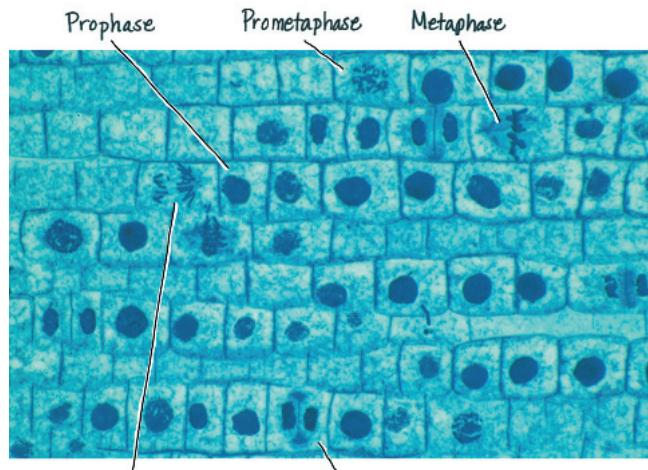

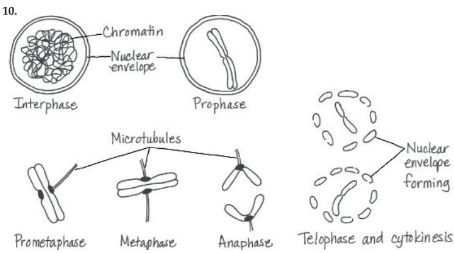

## Figure Questions

Figure 13.3 The chromosomes in a karyotype are photographed at their most condensed, at metaphase, which occurs during M phase of the cell cycle. At this point, the chromosomes have already been duplicated during S phase, so each chromosome exists as two sister chromatids. Figure 13.4 Two sets of chromosomes are present. Three pairs of homologous chromosomes are present. One long chromosome would be red (maternal), and one would be blue (paternal); one medium chromosome would be red, and one would be blue; one short chromosome would be red, and one would be blue. Figure 13.6 In (a), haploid cells do not undergo mitosis. In (b), haploid spores undergo mitosis to form the gametophyte, and certain haploid cells of the gametophyte undergo mitosis to form gametes. In (c), haploid cells undergo mitosis to form either a multicellular haploid organism or a new unicellular haploid organism, and these haploid cells undergo mitosis to form gametes.

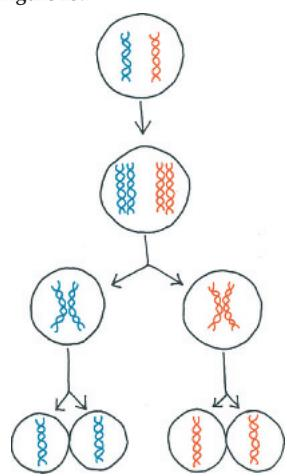

(A short strand of DNA is shown here for simplicity, but each chromosome or chromatid contains a very coiled and folded DNA molecule.) Figure 13.8 If a cell with six chromosomes undergoes two rounds of mitosis, each of the four resulting cells will have six chromosomes, while the four cells resulting from meiosis in Figure 13.8 each have three chromosomes. In mitosis, DNA replication (and thus chromosome duplication) precedes each prophase, ensuring that daughter cells have the same number of chromosomes as the parent cell. In contrast, in meiosis, DNA replication occurs only before prophase I (not before prophase II). Thus, in two rounds of mitosis, the chromosomes duplicate twice and divide twice, while in meiosis, the chromosomes duplicate once and divide twice.

Figure 13.10 Yes. Each of the six chromosomes (three per cell) shown in telophase I has one nonrecombinant chromatid and one recombinant chromatid. Therefore, eight (2 possibilities for the first chromosome ×2 for the second ×2 for the third) possible sets of chromosomes can be generated for the cell on the left and eight for the cell on the right.

## Concept Check 13.1

1. Parents pass genes to their offspring; by dictating the production of messenger RNAs (mRNAs), the genes program cells to make specific enzymes and other proteins, whose cumulative action produces an individual's inherited traits. 2. Such organisms reproduce by mitosis, which generates offspring whose genomes are exact copies of the parent's genome (in the absence of mutation). 3. She should clone (generate a clone of) it. Crossbreeding it with another plant would generate offspring that have additional variation, which she no longer desires now that she has obtained her ideal orchid.

## Concept Check 13.2

1. Each of the six chromosomes is duplicated, so each contains two DNA molecules (double helices), so there are 12 DNA molecules in the cell. The haploid number, n, is 3. One set is always haploid.
2. There are 23 pairs of chromosomes and two sets.
3. A human diploid cell would have 23 “pairs of shoes.” A haploid cell would have 23 “shoes,” one of each pair.
4. This organism has the life cycle shown in Figure 13.6c, since the zygote doesn’t undergo mitosis but immediately undergoes meiosis. Therefore, it must be a fungus or a protist.

## Concept Check 13.3

1. The chromosomes are similar in that each is composed of two sister chromatids, and the individual chromosomes are positioned similarly at the metaphase plate. The chromosomes differ in that in a mitotically dividing cell, sister chromatids of each chromosome are genetically identical, but in a meiotically dividing cell, sister chromatids are genetically distinct because of crossing over in meiosis I. Moreover, the chromosomes in metaphase of mitosis can be a diploid set or a haploid set, but the chromosomes in metaphase of meiosis II always consist of a haploid set. 2. If crossing over did not occur, the two homologs would not be associated in any way. This is because each sister chromatid would be either all maternal or all paternal DNA, and the single DNA molecule would therefore not have been joined to the DNA of a non-sister chromatid, holding the complex together. The lack of association of homologs could easily result in the incorrect arrangement of homologs during metaphase I (both might go toward the same pole, for instance) and ultimately in formation of gametes with an abnormal number of chromosomes.

## Concept Check 13.4

1. Mutations in a gene lead to the different versions (alleles) of that gene. 2. Without crossing over, independent assortment of chromosomes during meiosis I theoretically can generate $2^{n}$ possible haploid gametes, and random fertilization can produce $2^{n} \times 2^{n}$ possible diploid zygotes. Because the haploid number (n) of grasshoppers is 23 and that of fruit flies is 4, two grasshoppers would be expected to produce a greater variety of zygotes than would two fruit flies. 3. If the segments of the maternal and paternal chromatids that undergo crossing over are genetically identical and thus have the same two alleles for every gene, then the recombinant chromosomes will be genetically equivalent to the parental chromosomes. Crossing over contributes to genetic variation only when it involves the rearrangement of different alleles.

## Summary of Key Concepts Questions

13.1 Genes program specific traits, and offspring inherit their genes from each parent, accounting for similarities in their appearance to one or the other parent. Humans reproduce sexually, which ensures new combinations of genes (and thus traits) in the offspring. Consequently, the offspring are not clones of their parents (which would be the case if humans reproduced asexually). 13.2 Animals and plants both reproduce sexually, alternating meiosis with fertilization. Both have haploid gametes that unite to form a diploid zygote, which then goes on to divide mitotically, forming a diploid multicellular organism. In animals, haploid cells become gametes and don't undergo mitosis, while in plants, the haploid cells resulting from meiosis undergo mitosis to form a haploid multicellular organism, the gametophyte. This organism then goes on to generate haploid gametes. (In plants such as trees, the gametophyte is quite reduced in size and not obvious to the casual observer.) 13.3 At the end of meiosis I, the two members of a homologous pair end up in different cells, so they cannot pair up and undergo crossing over during prophase II. 13.4 First, during independent assortment in metaphase I, each pair of homologous chromosomes lines up independently of each other pair at the metaphase plate, so a daughter cell of meiosis I randomly inherits either a maternal or a paternal chromosome of each pair. Second, due to crossing over, each chromosome is not exclusively maternal or paternal, but includes regions at the ends of the chromatid from a nonsister chromatid (a chromatid of the other homolog). (The nonsister segment can also be in an internal region of the chromatid if a second crossover occurs beyond the first one before the end of the chromatid.) This provides much additional diversity in the form of new combinations of alleles. Third, random fertilization ensures even more variation since any sperm of a large number containing many possible genetic combinations can fertilize any egg of a similarly large number of possible combinations.

## Test Your Understanding

1. A 2. B 3. A 4. D 5. C

6. (a) One possible answer:

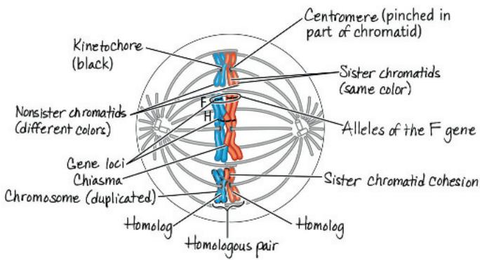

(b) A haploid set is made up of one long, one medium, and one short chromosome, no matter what combination of colors. For example, one red long, one blue medium, and one red short chromosome make up a haploid set. (In cases where crossovers have occurred, a haploid set of one color may include segments of chromatids of the other color.) All red and blue chromosomes together make up a diploid set. (c) Metaphase I 7. This cell must be undergoing meiosis because the two homologs of a homologous pair are associated with each other at the metaphase plate; this does not occur in mitosis. Also, chiasmata are clearly present, meaning that crossing over has occurred, another process unique to meiosis.

## Chapter 14

## Figure Questions

Figure 14.3 All offspring would have purple flowers. (The ratio of purple to white flowers would be 1 purple: 0 white.) The P generation plants are true-breeding, so mating two purple-flowered plants produces the same result as self-pollination: All the offspring have the same trait. If Mendel had stopped after the $F_{1}$ generation, he could have concluded that the white factor had disappeared entirely and would not ever reappear.

Figure 14.8  

Yes, this cross would also have allowed Mendel to make different predictions for the two hypotheses, thereby allowing him to distinguish the correct one. Figure 14.10 Your classmate would probably point out that the $F_{1}$ generation hybrids show an intermediate phenotype between those of the homozygous parents, which supports the blending hypothesis. You could respond that crossing the $F_{1}$ hybrids results in the reappearance of the white phenotype, rather than identical pink offspring, which fails to support the idea of traits blending during inheritance. The blending hypothesis predicts that the white trait would have been lost after the $F_{1}$ generation. Figure 14.11 Both the $I^{A}$ and $I^{B}$ alleles are dominant to the i allele because the i allele results in no attached carbohydrate. The $I^{A}$ and $I^{B}$ alleles are codominant; both are expressed in the phenotype of $I^{A}I^{B}$ heterozygotes, who have type AB blood. Figure 14.12 In this cross, the final “3” and “1” of a standard cross are lumped together as a single phenotype. This occurs because in dogs that are ee, no pigment is deposited, thus the three dogs that have a B in their genotype (normally black) can no longer be distinguished from the dog that is bb (normally brown). Figure 14.16 In the Punnett square, two of the three individuals without albinism are carriers, so the probability is $\frac{2}{3}$ . (Note that you must take into account everything you know when you calculate probability: You know she is not aa, so there are only three possible genotypes to consider.)

## Concept Check 14.1

1. According to the law of independent assortment, 25 plants ( $\frac{1}{16}$ of the offspring) are predicted to be aatt, or recessive for both characters. The actual result is likely to differ slightly from this value.
2. The plant could make eight different gametes (YRI, YRI, YrI, Yri, yRI, yRi, yrI and yri). To fit all the possible gametes in a self-pollination, a Punnett square would need 8 rows and 8 columns. It would have spaces for the 64 possible unions

of gametes in the offspring. 3. Self-pollination is sexual reproduction because meiosis is involved in forming gametes, which unite during fertilization. As a result, the offspring in self-pollination are genetically different from the parent. (As mentioned in the footnote near the beginning of Concept 14.1, we have simplified the explanation in referring to the single pea plant as a parent. Technically, the gametophytes in the flower are the two “parents.”)

<table><tr><td></td><td>At</td><td>At</td><td>aT</td><td>at</td></tr><tr><td>AT</td><td>AATT</td><td>AATT</td><td>AATT</td><td>AATT</td></tr><tr><td>At</td><td>AATT</td><td>AATT</td><td>AATT</td><td>AATT</td></tr><tr><td>aT</td><td>AATT</td><td>AATT</td><td>aATT</td><td>aATT</td></tr><tr><td>at</td><td>AATT</td><td>AATT</td><td>aATT</td><td>aATT</td></tr></table>

Concept Check 14.2
1. $\frac{1}{2}$ homozygous dominant (AA), 0 homozygous recessive (aa), and $\frac{1}{2}$ heterozygous (Aa)
2. $\frac{1}{4}$ BBDD; $\frac{1}{4}$ BbDD;

$\frac{1}{4}BBDd;\ \frac{1}{4}BbDd$ 3. The genotypes that fulfill this condition are ppyyII, ppyyIi, ppYYii, ppYyii, Ppyyii, and ppyyii. Use the multiplication rule to find the probability of getting each genotype, and then use the addition rule to find the overall probability of meeting the conditions of this problem:

Genotypic ratio 1 Ii: 1 ii (2:2 is equivalent)

<table><tr><td>ρρyyII</td><td>1/2(probability of pp)×1/4(yy)×1/4(II)=1/32</td><td></td></tr><tr><td>ρρyyIi</td><td>1/2(pp)×1/4(yy)×1/2(Ii)</td><td>=1/16=2/32</td></tr><tr><td>ρρYyii</td><td>1/2(pp)×1/4(YY)×1/4(ii)</td><td>=1/32</td></tr><tr><td>ρρYyii</td><td>1/2(pp)×1/2(YY)×1/4(ii)</td><td>=1/16=2/32</td></tr><tr><td>ρρyyii</td><td>1/2(Pp)×1/4(yy)×1/4(ii)</td><td>=1/32</td></tr><tr><td>ρρyyii</td><td>1/2(pp)×1/4(yy)×1/4(ii)</td><td>=1/32</td></tr><tr><td colspan="2">Fraction predicted to be homozygous recessive</td><td>8/32=1/4</td></tr><tr><td colspan="3">for at least two of the three characters</td></tr></table>

## Concept Check 14.3

1. Incomplete dominance describes the relationship between two alleles of a single gene, whereas epistasis relates to the genetic relationship between two genes (and the respective alleles of each). 2. Half of the children would be expected to have type A blood and half type B blood. 3. The black and white alleles are incompletely dominant, with heterozygotes being gray in color. A cross between a gray rooster and a black hen should yield approximately equal numbers of gray and black offspring.

## Concept Check 14.4

1. $\frac{1}{9}$ (Since cystic fibrosis is caused by a recessive allele, Lucia and Jared's siblings who have CF must be homozygous recessive. Therefore, each parent must be a carrier of the recessive allele. Since neither Lucia nor Jared has CF and are thus not cc (using C/c as the alleles for the CF gene), this means they each have a $\frac{2}{3}$ chance of being a carrier. If they are both carriers, there is a $\frac{1}{4}$ chance that they will have a child with CF; $\frac{2}{3} \times \frac{2}{3} \times \frac{1}{4} = \frac{1}{9}$ ); virtually 0 (Both Lucia and Jared would have to be carriers to produce a child with the disease, unless a very rare mutation (change) occurred in the DNA of cells making eggs or sperm in a noncarrier that resulted in the CF allele.) 2. In normal hemoglobin, the sixth amino acid is glutamic acid (Glu), which is acidic (has a negative charge on its side chain). In sickle-cell hemoglobin, Glu is replaced by valine (Val), which is a nonpolar amino acid, very different from Glu. The primary structure of a protein (its amino acid sequence) ultimately determines the shape of the protein and thus its function. The substitution of Val for Glu enables the hemoglobin molecules to interact with each other and form long fibers, leading to the protein's deficient function and the deformation of the red blood cell. 3. Juanita's genotype is Dd. Because the allele for polydactyly (D) is dominant to the allele for five digits per appendage (d), the trait is expressed in people with either the DD or Dd genotype. But because Juanita's father does not have polydactyly, his genotype must be dd, which means that Juanita inherited a d allele from him. Therefore, Juanita, who does have the trait, must be heterozygous. 4. In the monohybrid cross involving flower color, the ratio is 3.15 purple : 1 white, while in the human family in the pedigree, the ratio in the third generation is 1 taster of PTC : 1 nontaster of PTC. The difference is due to the small sample size (two offspring) in the human family. If the second-generation couple in this pedigree were able to have 929 offspring as in the pea plant cross, the ratio would likely be closer to 3:1. (Note that none of the pea plant crosses in Table 14.1 yielded exactly a 3:1 ratio.)

## Summary of Key Concepts Questions

14.1 Alternative versions of genes, called alleles, are passed from parent to offspring during sexual reproduction. In a cross between purple- and white-flowered homozygous parents, the $F_{1}$ offspring are all heterozygous, each inheriting a purple allele from one parent and a white allele from the other. Because the purple allele is dominant, it determines the phenotype of the $F_{1}$ offspring to be purple, and the expression of the recessive white allele is masked. Only in the $F_{2}$ generation is it possible for some of the offspring to be homozygous recessive, which causes the white trait to be expressed.
14.2

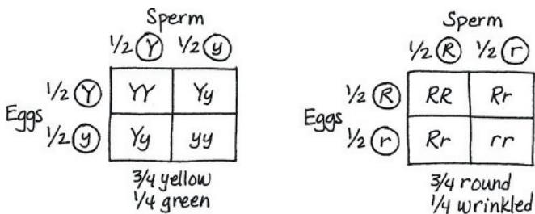

$3/4 \text{ yellow} \times 3/4 \text{ round} = 9/16 \text{ yellow round}$

3/4 yellow × 1/4 wrinkled = 3/16 yellow wrinkled

1/4 green × 3/4 round = 3/16 green round

1/4 green × 1/4 wrinkled = 1/16 green wrinkled

=9 yellow round:3 yellow wrinkled:3 green round:1 green wrinkled

14.3 The ABO blood group is an example of multiple alleles because this single gene has more than two alleles ( $I^{A}$ , $I^{B}$ , and i). Two of the alleles, $I^{A}$ and $I^{B}$ , exhibit codominance since both carbohydrates (A and B) are present when these two alleles exist together in a genotype. $I^{A}$ and $I^{B}$ each exhibit complete dominance over the i allele. This situation is not an example of incomplete dominance because each allele affects the phenotype in a distinguishable way, so the result is not intermediate between the two phenotypes. Because this situation involves a single gene, it is not an example of epistasis or polygenic inheritance. 14.4 The chance of the fourth child having cystic fibrosis is $\frac{1}{4}$ , as it was for each of the other children, because each birth is an independent event. We already know both parents are carriers, so whether their first three children are carriers or not has no bearing on the probability that their next child will have the disease. The parents' genotypes provide the only relevant information.

## Test Your Understanding

1. A cross of $Ii \times ii$ would yield offspring with a genotypic ratio of 1 $Ii: 1\ ii$ (2:2 is an equivalent answer) and a phenotypic ratio of 1 inflated : 1 constricted (2:2 is equivalent).

2. Male parent $I^{A}i$ ; female parent $I^{B}i$ ; child ii. Genotypes for future children are predicted to be $\frac{1}{4}I^{A}I^{B}$ , $\frac{1}{4}I^{A}i$ , $\frac{1}{4}I^{B}i$ , $\frac{1}{4}ii$ .
3. $\frac{1}{2}$

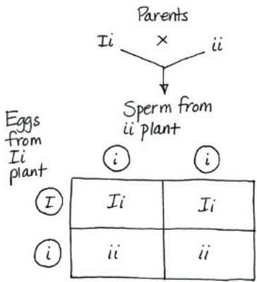

Phenotypic ratio 1 inflated : 1 constricted (2:2 is equivalent)

4. The green pod trait is dominant, so the green pod allele is G and the yellow pod allele is g; the inflated pod trait is dominant, so the inflated pod allele is I and the constricted pod allele is i. The cross described is $GgIi \times GgIi$ .

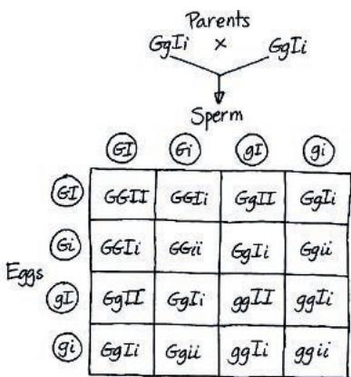  
9 green inflated: 3 green constricted; 3 yellow inflated: 1 yellow constricted

$$
5. (a) ^ {3 / 4} \times^ {3 / 4} \times^ {3 / 4} = ^ {2 7 / 6 4}; (b) 1 - ^ {2 7 / 6 4} = ^ {3 7 / 6 4}; (c) ^ {1 / 4} \times^ {1 / 4} \times^ {1 / 4} = ^ {1 / 6 4};
$$

7. (a) 1; (b) $\frac{1}{32}$ ; (c) $\frac{1}{8}$ ; (d) $\frac{1}{2}$ 8. $\frac{1}{9}$ 9. Matings of the original mutant cat with true-breeding noncurl cats will produce both curl and noncurl $F_1$ offspring if the curl allele is dominant, but only noncurl offspring if the curl allele is recessive. Whether the curl trait is dominant or recessive, you would obtain some true-breeding offspring homozygous for the curl allele from matings between the $F_1$ cats resulting from the original curl × noncurl crosses. If dominant, you wouldn't be able to tell true-breeding, homozygous offspring from heterozygotes without further crosses. You know that cats are true-breeding when curl × curl matings produce only curl offspring. As it turns out, the allele that causes curled ears is dominant. 10. Recessive. All individuals with alkaptonuria (Ariana, Benito, Elena, and Carlota) are homozygous recessive aa. Jorge is Aa, since some of his children with Ariana have alkaptonuria. Diego, Carmen, Hector, and Julio are each Aa, since they are all unaffected children with one affected parent. Miguel also is Aa, since he has an affected child (Carlota) with Carmen, who is heterozygous. Mariposa, Paloma, and Roberto can each have either the AA or Aa genotype. 11. $\frac{1}{6}$

Practice Applying Your Learning
16. (a) F (b) T (c) F (d) T (e) T (f) F (g) F

## Figure Questions

Figure 15.3 About $\frac{3}{4}$ of the $F_2$ offspring would have red eyes and about $\frac{1}{4}$ would have white eyes. Since this hypothetical cross assumes the sex chromosomes are not involved in determining eye color, about half of the white-eyed flies would be female and half would be male; similarly, about half of the red-eyed flies would be female and half would be male. (Note that the two autosomes with the eye color alleles would be the same shape in the Punnett square—unlike the X and Y chromosomes—and each offspring would inherit two alleles. The sex of the flies would be determined separately by inheritance of the sex chromosomes. Thus your $F_2$ Punnett square would have four possible combinations in sperm and two in eggs; it would have eight squares altogether.) Figure 15.4 The ratio would be 1 yellow round : 1 green round : 1 yellow wrinkled : 1 green wrinkled. (This is similar to a test cross.) Figure 15.7 All the males would be color-blind, and all the females would be carriers. (Another way to say this is that $\frac{1}{2}$ the offspring would be color-blind males, and $\frac{1}{2}$ the offspring would be carrier females.) Figure 15.9 The two largest classes would still be the offspring with the phenotypes of the true-breeding P generation flies, but now they would be gray vestigial and black normal, which is now the “parental type” because those were the specific allele combinations in the P generation (the linked alleles on their chromosomes). Figure 15.10 The two chromosomes on the left side of the sketch below are like the two chromosomes inherited by the $F_1$ female, one from each P generation fly. They are passed by the $F_1$ female intact to the offspring and thus could be called “parental” chromosomes. The other two chromosomes result from crossing over during meiosis in the $F_1$ female. Because they have combinations of alleles not seen in either of the $F_1$ female’s chromosomes, they can be called “recombinant” chromosomes. (Note that in this example, the allele combinations on the recombinant chromosomes, $b^+vg^+$ and $bvg$ , are the allele combinations that were on the parental chromosomes in the cross shown in Figures 15.9 and 15.10. The basis for calling them parental chromosomes is that they have the combination of alleles that was present on the P generation chromosomes.)

  
Parental Chromosomes

  
Recombinant chromosomes

## Concept Check 15.1

1. To show the mutant phenotype, a male needs to possess only one mutant allele. If this gene had been on a pair of autosomes, an individual would show the recessive phenotype only if both alleles were mutant, a much less probable situation.
2. The law of segregation describes the inheritance of alleles for a single character. The law of independent assortment of alleles describes the inheritance of alleles for two characters.
3. The physical basis for the law of segregation is the separation of homologs in anaphase I. The physical basis for the law of independent assortment is the alternative arrangements of all the different homologous chromosome pairs in metaphase I.

## Concept Check 15.2

1. Because the gene for this eye color character is located on the X chromosome, all female offspring will be red-eyed and heterozygous $(X^{w}+X^{w})$ ; all male offspring will inherit a Y chromosome from the male parent and be white-eyed $(X^{w}Y)$ . (Another way to say this is that $\frac{1}{2}$ the offspring will be red-eyed heterozygous [carrier] females, and $\frac{1}{2}$ will be white-eyed males.) 2. $\frac{1}{4}$ ( $\frac{1}{2}$ chance that the child will inherit a Y chromosome from the male parent and be male $\times\frac{1}{2}$ chance that he will inherit the X carrying the disease allele from the female parent). If the child is a male, there is a $\frac{1}{2}$ chance he will have the disease; a female would have zero chance (but $\frac{1}{2}$ chance of being a carrier). 3. In a disorder caused by a dominant allele, there is no such thing as a “carrier,” since those with the allele have the disorder. Because the allele is dominant, the females lose any “advantage” in having two X chromosomes, since one disorder-associated allele is sufficient to result in the disorder. All males who have the dominant allele will pass it along to all their female offspring, who will also have the disorder. A female who has the allele (and thus the disorder) will pass it to half of her male offspring and half of her female offspring.

## Concept Check 15.3

1. Crossing over during meiosis I in the heterozygous parent produces some gametes with recombinant genotypes for the two genes. Offspring with a recombinant phenotype arise from fertilization of the recombinant gametes by homozygous recessive gametes from the double-mutant parent.
2. In each case, the alleles contributed by the female parent (in the egg) determine the phenotype of the offspring because the male in this cross contributes only recessive alleles. Thus, identifying the phenotype of the offspring tells you what alleles were in the female parent's (the dihybrid female's) egg. 3. No. The order could be A-C-B or C-A-B. To determine which possibility is correct, you need to know the recombination frequency between B and C.

## Concept Check 15.4

1. In meiosis, a combined 14-21 chromosome will behave as one chromosome. If a gamete receives the combined 14-21 chromosome and a normal copy of chromosome 21, trisomy 21 will result when this gamete combines with a normal gamete (with its own chromosome 21) during fertilization.
2. No. The child can be either $I^{A}I^{A}i$ or $I^{A}ii$ . A sperm of genotype $I^{A}I^{A}$ could result from nondisjunction in the male parent during meiosis II, while an egg with the genotype ii could result from nondisjunction in the female parent during either meiosis I or meiosis II.
3. Activation of this gene could lead to the production of too much of this kinase. If the kinase is involved in a signaling pathway that triggers cell division, too much of it could trigger unrestricted cell division, which in turn could contribute to the development of a cancer (in this case, a cancer of one type of white blood cell).

## Concept Check 15.5

1. Inactivation of an X chromosome in females and genomic imprinting. Because of X inactivation, the effective dose of genes on the X chromosome is the same in males and females. As a result of genomic imprinting, only one allele of certain genes is phenotypically expressed.
2. The genes for leaf coloration are located in plastids within the cytoplasm. Normally, only the maternal parent transmits plastid genes to offspring. Since variegated offspring are produced only when the female parent is of the B variety, we can conclude that variety B contains both the wild-type and mutant alleles of pigment genes, producing variegated leaves. (Variety A must contain only the wild-type allele of pigment genes.)
3. Each cell contains numerous mitochondria, and in affected individuals, most cells contain a variable mixture of normal and mutant mitochondria. The normal mitochondria carry out enough cellular respiration for survival. (The situation is similar for chloroplasts.)

## Summary of Key Concepts Questions

15.1 Because the sex chromosomes are different from each other and because they determine the sex of the offspring, Morgan could use the sex of the offspring as a phenotypic character to follow the parental chromosomes. (He could also have followed them under a microscope, as the X and Y chromosomes look different.) At the same time, he could record eye color to follow the eye color alleles. 15.2 Males have only one X chromosome, along with a Y chromosome, while females have two X chromosomes. The Y chromosome has very few genes on it, while the X has about 1,000. When a recessive X-linked allele that causes a disorder is inherited by a male on the X from his female parent, there isn't a second allele present on the Y (males are hemizygous), so the male has the disorder. Because females have two X chromosomes, they must inherit two recessive alleles in order to have the disorder, a rarer occurrence. 15.3 Crossing over results in new combinations of alleles. Crossing over is a random occurrence, and the more distance there is between two genes, the more chances there are for crossing over to occur, leading to new allele combinations. 15.4 In inversions and reciprocal translocations, the same genetic material is present in the same relative amount but just organized differently. In aneuploidy, duplications, deletions, and nonreciprocal translocations, the balance of genetic material is upset, as large segments are either missing or present in more than one copy. Apparently, this type of imbalance is very damaging to the organism. (Although it isn't lethal in the developing embryo, the reciprocal translocation during mitosis that produces the Philadelphia chromosome can lead to a serious condition, cancer, by altering the expression of important genes.) 15.5 In these cases, the sex of the parent contributing an allele affects the inheritance pattern. For imprinted genes, either the paternal or the maternal allele is expressed, depending on the imprint. For mitochondrial and chloroplast genes, only the maternal contribution will affect offspring phenotype because the offspring inherit these organelles from the female parent, via the egg cytoplasm.

## Test Your Understanding

1. 0; $\frac{1}{2}$ ; $\frac{1}{16}$ 2. Recessive; if the disorder were dominant, it would affect at least one parent of a child born with the disorder. The disorder's inheritance is sex-linked because it is seen only in males. For a female to have the disorder, she would have to inherit recessive alleles from both parents. This would be very rare, since males with the recessive allele on their X chromosome die in their early teens. 3. 17%; yes, it is consistent. In Figure 15.9, the recombination frequency was also 17%. (You'd expect this to be the case since these are the very same two genes, and their distance from each other wouldn't change from one experiment to another.)

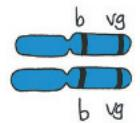  
Wild-type parents chromosomes  
Black Parents
chromosomes

4. Between T and A, 12%; between A and S, 5% 5. Between T and S, 16%; sequence of genes is T-A-S 6. 6%; wild-type heterozygous for normal wings and red eyes × recessive homozygous for vestigial wings and purple eyes 7. Fifty percent of the offspring will show phenotypes resulting from crossovers. These results would be the same as those from a cross where A and B were not on the same chromosome, and you would interpret the results to mean that the genes are unlinked. (Further crosses involving other genes between A and B on the same chromosome would reveal the genetic linkage and map distances.) 8. 450 each of blue/oval and white/round (parentals) and 50 each of blue/round and white/oval (recombinants) 9. About one-third of the distance along the chromosome from the vestigial wing locus toward the brown eye locus 10. Because bananas are triploid, homologous pairs cannot line up during meiosis. Therefore, it is not possible to generate gametes that can fuse to produce a zygote with the triploid number of chromosomes. 12. (a) For each pair of genes, you had to generate an $\mathrm{F}_1$ dihybrid fly; let's use the $A$ and $B$ genes as an example. You obtained homozygous parental flies, either the first with dominant alleles of the two genes (AABB) and the second with recessive alleles (aabb), or the first with dominant alleles of gene $A$ and recessive alleles of gene $B$ (AAbb) and the second with recessive alleles of gene $A$ and dominant alleles of gene $B$ (aaBB). Breeding either of these pairs of P generation flies gave you an $\mathrm{F}_1$ dihybrid, which you then testcrossed with a doubly homozygous recessive fly (aabb). You classed the offspring as parental or recombinant, based on the genotypes of the P generation parents (either of the two pairs described above). You added up the number of recombinant types and then divided by the total number of offspring. This gave you the recombination percentage (in this case, $8\%$ ), which you can translate into map units (8 map units) to construct your map.

(b)  

## Chapter 16

## Figure Questions

Figure 16.2 The living S cells found in the blood sample were able to reproduce to yield more S cells, indicating that the S trait is a permanent, heritable change, rather than just a one-time use of the dead S cells' capsules. Figure 16.4 The radioactivity would have been found in the pellet when proteins were labeled (batch 1) because proteins would have had to enter the bacterial cells to program them with genetic instructions. It's hard for us to imagine now, but the DNA might have played a structural role that allowed some of the proteins to be injected while it remained outside the bacterial cell (thus no radioactivity would be found in the pellet in batch 2). Figure 16.7 (1) The nucleotides in a single DNA strand are held together by covalent bonds between an oxygen on the $3^{\prime}$ carbon of one nucleotide and the phosphate group on the $5^{\prime}$ carbon of the next nucleotide in the chain. Instead of covalent bonds, the bonds that hold the two strands together are hydrogen bonds between a nitrogenous base on one strand and the complementary nitrogenous base on the other strand. (Hydrogen bonds are weaker than covalent bonds, but there are so many hydrogen bonds in a DNA double helix that, together, they are enough to hold the two strands together.) (2) One end, the $5^{\prime}$ end, has a phosphate group, which is attached to the $5^{\prime}$ carbon of the sugar, the one that is not in the ring. The other end, the $3^{\prime}$ end, has an —OH group attached to the $3^{\prime}$ carbon of the sugar; this carbon is in the ring. (3) The left diagram shows the most detail. It shows that each sugar-phosphate backbone is made up of sugars (blue pentagons) and phosphates (yellow circles) joined by covalent bonds (black lines). The middle diagram doesn't show any detail in the backbone. Both the left and middle diagrams label the bases and represent their complementarity by the complementary shapes at the ends of the bases (curves/ indents for G/C or V's/notches for T/A). The diagram on the right is the least detailed, implying that the base pairs pair up, but showing all bases as the same shape so not including the information about specificity and complementarity visible in the other two diagrams. The left and right diagrams show that the strand on the left was synthesized most recently, as indicated by the light blue color. All three diagrams show the $5^{\prime}$ and $3^{\prime}$ ends of the strands. Figure 16.12 The tube from the first replication would look the same, with a middle band of hybrid ${}^{15}\mathrm{N}-{}^{14}\mathrm{N}$ DNA, but the second tube would not have the upper band of DNA molecules made up of two light blue strands. Instead, it would have a bottom band of DNA made up of two dark blue strands, like the bottom band in the result predicted after one replication in the conservative model. Figure 16.13 In the bubble at the top of the micrograph in (b), arrows should be drawn pointing left and right to indicate the two replication forks.

New strand Template strand  
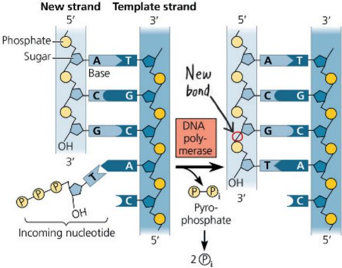

Figure 16.18  

Figure 16.19  
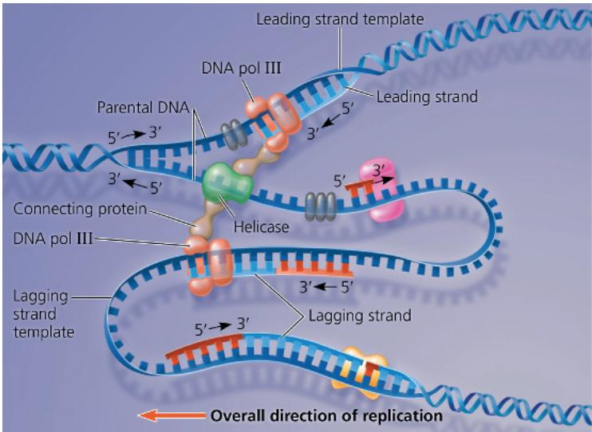  
Figure 16.24 The two members of a homologous pair (which would be the same color) would be associated tightly together at the metaphase plate during metaphase I of meiosis I. In metaphase of mitosis, however, each chromosome would be lined up individually, so the two chromosomes of the same color would be in different places at the metaphase plate.

## Concept Check 16.1

1. In order to tell which end is the 5' end, you need to know which end has a phosphate group on the 5' carbon (the 5' end) and/or which end has an —OH group on the 3' carbon (the 3' end).
2. Griffith expected that the mouse injected with the mixture of heat-killed S cells and living R cells would survive, since neither type of cell alone would kill the mouse.

## Concept Check 16.2

1. Complementary base pairing ensures that the two daughter molecules are exact copies of the parental molecule. When the two strands of the parental molecule separate, each serves as a template on which nucleotides are arranged by the base-pairing rules; they will then be polymerized by enzymes into new complementary strands.
2. DNA pol III covalently adds nucleotides to new DNA strands and proof-reads each added nucleotide for correct base pairing.
3. In the cell cycle, DNA synthesis occurs during the S phase, between the $G_{1}$ and $G_{2}$ phases of interphase. DNA replication is therefore complete before the mitotic phase begins.
4. Synthesis of the leading strand is initiated by an RNA primer, which must be removed and replaced with DNA, a task that could not be performed if the cell's DNA pol I were nonfunctional. In the overview box in Figure 16.18, just to the left of the top origin of replication, a functional DNA pol I would replace the RNA primer of the leading strand (shown in red) with DNA nucleotides (blue). The nucleotides would be added on to the 3' end of the first Okazaki fragment of the upper lagging strand (the right half of the replication bubble).

## Concept Check 16.3

1. A nucleosome is made up of eight histone proteins, two each of four different types, around which DNA is wound. Linker DNA runs from one nucleosome to the next. 2. The 10-nm fiber of euchromatin is less compacted during interphase than in mitosis and is accessible to the cellular proteins responsible for gene expression. In contrast, the 10-nm fiber of heterochromatin is relatively compacted (densely arranged) during interphase, and genes in heterochromatin are largely inaccessible to proteins necessary for gene expression. 3. The nuclear lamina is a netlike array of protein filaments that provides mechanical support just inside the nuclear envelope and thus maintains the shape of the nucleus. Considerable evidence also supports the existence of a nuclear matrix, a framework of protein fibers extending throughout the nuclear interior.

## Summary of Key Concepts Questions

16.1 Each strand in the double helix has polarity; the end with a phosphate group on the 5' carbon of the sugar is called the 5' end, and the end with an —OH group on the 3' carbon of the sugar is called the 3' end. The two strands run in opposite directions, one running 5' → 3' and the other alongside it running 3' → 5'. Thus, each end of the molecule has both a 5' and a 3' end, one on each strand of the double helix. This arrangement is called antiparallel. If the strands were parallel, they would both run 5' → 3' in the same direction, so an end of the molecule would have either two 5' ends or two 3' ends. 16.2 On both the leading and lagging strands, DNA polymerase adds onto the 3' end of an RNA primer synthesized by primase, synthesizing DNA in the 5' → 3' direction. Because the parental strands are antiparallel, however, only on the leading strand does synthesis proceed continuously into the replication fork. The lagging strand is synthesized bit by bit in the direction away from the fork as a series of shorter Okazaki fragments, which are later joined together by DNA ligase. Each fragment is initiated by synthesis of an RNA primer by primase as soon as a given stretch of single-stranded template strand is opened up. Although both strands are synthesized at the same rate, synthesis of the lagging strand is delayed because initiation of each fragment begins only when sufficient template strand is available. 16.3 The chromatin in an interphase nucleus is present as the 10-nm fiber, either fairly loosely arranged in euchromatin or more densely arranged in heterochromatin (such as at the centromeres and telomeres). The euchromatin is also subdivided into larger compartments and smaller looped domains. This organization may reflect differences in gene expression occurring in these regions.

## Test Your Understanding

1. C 2. C 3. B 4. D 5. A 6. D 7. B 8. A 9. Like histones, the E. coli proteins would be expected to contain many basic (positively charged) amino acids, such as lysine and arginine, which can form weak bonds with the negatively charged phosphate groups on the sugar-phosphate backbone of the DNA molecule.

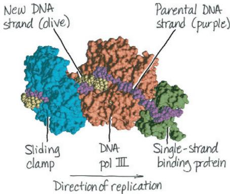

## Chapter 17

## Figure Questions

Figure 17.3 The previously presumed pathway would have been wrong. The new results would support this pathway: precursor → citrulline → ornithine → arginine. They would also indicate that class I mutants have a defect in the second step and class II mutants have a defect in the first step. Figure 17.5 The mRNA sequence (5'-UGGUUUGGCUCA-3') is the same as the nontemplate DNA strand sequence (5'-TGGTTTGGCTCA-3'), except there is a U in the mRNA wherever there is a T in the DNA. The nontemplate strand is probably used to represent a DNA sequence because it so closely resembles the mRNA sequence, containing codons. (This is why it's called the coding strand.) Figure 17.6 Arg (or R)-Glu (or E)-Pro (or P)-Arg (or R) Figure 17.8 The processes are similar in that polymerases form polynucleotides complementary to an antiparallel DNA template strand. In replication, however, both strands act as templates, whereas in transcription, only one DNA strand acts as a template. This reflects, of course, the fact that replication results in a double-stranded product (DNA) while transcription results in a single-stranded product (an RNA). Figure 17.9 The RNA polymerase would bind directly to the promoter, rather than being dependent on the previous binding of transcription factors.
Figure 17.12

  
Figure 17.16 The anticodon on the tRNA is so it would bind to the mRNA codon 5'-UUC-3'. This codon codes for phenylalanine (Phe, or F), which is the amino acid this tRNA would carry. Figure 17.22 It would be packaged in a vesicle, transported to the Golgi apparatus for further processing, and then transported via

a vesicle to the plasma membrane. The vesicle would fuse with the membrane, releasing the protein outside the cell. Figure 17.24 The mRNA farthest to the right (the longest one) started transcription first. The ribosome at the top, closest to the DNA, started translating first and thus has the longest polypeptide.

## Concept Check 17.1

1. Recessive 2. A polypeptide made up of 10 Gly (glycine) amino acids

3. Nontemplate sequence (from template sequence given in problem), written $3' \rightarrow 5'$ : $3'$ -ACGACTGAA- $5'$

If above used as template, mRNA sequence: 5'-UGCUGACUU-3'

Translated:

Cys-STOP

If the nontemplate sequence could have been used as a template for transcribing the mRNA, the protein translated from the mRNA would have a completely different amino acid sequence, so it would not be able to function as the original protein (translated from an mRNA transcribed from the template strand). It would also be shorter because of the UGA stop signal shown in the mRNA sequence above—and possibly others earlier in the mRNA sequence.

## Concept Check 17.2

1. A promoter is the region of DNA to which RNA polymerase binds to begin transcription. It is at the upstream end of the gene (transcription unit). 2. In a bacterial cell, part of the RNA polymerase recognizes the gene's promoter and binds to it. In a eukaryotic cell, transcription factors must bind to the promoter first, then the RNA polymerase binds to them. In both cases, sequences in the promoter determine the precise binding of RNA polymerase so the enzyme is in the right location and orientation. 3. The transcription factor that recognizes the TATA sequence would be unable to bind, so RNA polymerase could not bind and transcription of that gene most likely would not occur.

## Concept Check 17.3

1. Due to alternative splicing of exons, each gene can result in multiple different mRNAs and can thus direct synthesis of multiple different proteins. 2. In watching a pre-recorded show, you watch segments of the show itself (exons) and fast-forward through the commercials, which are thus like introns. However, unlike introns, commercials remain in the recording, while the introns are cut out of the RNA transcript during RNA processing. 3. Once the mRNA has exited the nucleus, the cap prevents it from being degraded by hydrolytic enzymes and facilitates its attachment to ribosomes. If the cap were removed from all mRNAs, the cell would no longer be able to synthesize any proteins and would probably die.

## Concept Check 17.4

1. First, each aminoacyl-tRNA synthetase specifically recognizes a single amino acid and attaches it only to an appropriate tRNA. Second, a tRNA charged with its

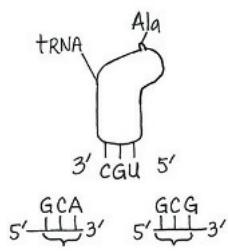

specific amino acid binds only to an mRNA codon for that amino acid. 2. A signal peptide on the leading end (amino end, or N-terminus) of the polypeptide being synthesized is recognized by a signal-recognition particle that brings the ribosome to the ER membrane. There, the ribosome attaches and continues to synthesize the polypeptide, depositing it in the ER lumen. 3. Because of wobble, the tRNA could bind to either 5'-GCA-3' or 5'-GCG-3', both of which code for alanine (Ala, or A). Alanine would be attached to the tRNA (see diagram, upper right). 4. When one ribosome terminates translation and dissociates, the two

subunits would be very close to the cap. This could facilitate their rebinding and initiating synthesis of a new polypeptide, thus increasing the efficiency of translation.

## Concept Check 17.5

1. In the mRNA, the reading frame downstream from the deletion is shifted, leading to a long string of incorrect amino acids in the polypeptide, and in most cases, a stop codon will occur, leading to premature termination. The polypeptide will most likely be nonfunctional.
2. Heterozygous individuals, said to have sickle-cell trait, have a copy each of the wild-type allele and the sickle-cell allele. Both alleles will be expressed, so these individuals will have both normal and sickle-cell hemoglobin molecules. Apparently, having a mix of the two forms of $\beta$ -globin has no effect under most conditions, but during prolonged periods of low blood oxygen (such as at higher altitudes), these individuals can show some signs of sickle-cell disease.

<table><tr><td>Normal DNA sequence(template strand is on top):</td><td>3′-TACTTGTCCGATATC-5′5′-ATGAACAGGCTATAG-3′</td></tr><tr><td>mRNA sequence:</td><td>5′-AUGAACAGGCUAUAG-3′</td></tr><tr><td>Amino acid sequence:</td><td>Met-Asn-Arg-Leu-STOP</td></tr><tr><td>Mutated DNA sequence(template strand is on top):</td><td>3′-TACTTGTCCAATATC-5′5′-ATGAACAGGTTATAG-3′</td></tr><tr><td>mRNA sequence:</td><td>5′-AUGAACAGGUUAUAG-3′</td></tr><tr><td>Amino acid sequence:</td><td>Met-Asn-Arg-Leu-STOP</td></tr></table>

No effect: The amino acid sequence is Met-Asn-Arg-Leu both before and after the mutation because the mRNA codons 5'-CUA-3' and 5'-UUA-3' both code for Leu. (The fifth codon is a stop codon.) 4. A Cas9–guide RNA could be synthesized complementary to the mutated sequence, and the Cas9–guide RNA complex injected into a cell with the mutation. A region of double-stranded DNA with the correct sequence would also be provided. Cas9 would cut the mutated sequence, and the DNA repair system in the cell would repair the DNA, using the correct sequence as a template. Based on the answer to question 3, however, this would not be worthwhile because there is no amino acid change in the encoded protein, so the function of the protein encoded by the mutated gene is normal.

## Summary of Key Concepts Questions

17.1 A gene contains genetic information in the form of a nucleotide sequence. The gene is first transcribed into an RNA molecule, and a messenger RNA molecule is ultimately translated into a polypeptide. The polypeptide makes up part or all of a protein, which performs a function in the cell and contributes to the phenotype of the organism. 17.2 Both bacterial and eukaryotic genes have promoters, regions where RNA polymerase ultimately binds and begins transcription. In bacteria, RNA polymerase binds directly to the promoter; in eukaryotes, transcription factors bind first to the promoter, and then RNA polymerase binds to the transcription factors and promoter together. 17.3 Both the 5' cap and the 3' poly-A tail help the mRNA exit from the nucleus and then, in the cytoplasm, help ensure mRNA stability and allow it to bind to ribosomes. 17.4 In the context of the ribosome, tRNAs function as translators between the nucleotide-based language of mRNA and the amino-acid-based language of polypeptides. A tRNA carries a specific amino acid, and the anticodon on the tRNA is complementary to the codon on the mRNA that codes for that amino acid. In the ribosome, the tRNA binds to the A site. Then, the polypeptide being synthesized (currently on the tRNA in the P site) is joined to the new amino acid, which becomes the new (C-terminal) end of the polypeptide. Next, the tRNA in the A site moves to the P site. After the polypeptide is transferred to the new tRNA, thus adding the new amino acid, the now empty tRNA moves from the P site to the E site, where it exits the ribosome. 17.5 When a nucleotide base is altered chemically, its base-pairing characteristics may be changed. When that happens, an incorrect nucleotide is likely to be incorporated into the complementary strand during the next replication of the DNA, and successive rounds of replication will perpetuate the mutation. Once the gene is transcribed, the mutated codon may code for a different amino acid that inhibits or changes the function of a protein. If, however, the chemical change in the base is detected and repaired by the DNA repair system before the next replication, no mutation will result.

## Test Your Understanding

1. B 2. C 3. A 4. B 5. B 6. C 7. D 8. No. Transcription and translation are separated in space and time in a eukaryotic cell, as a result of the eukaryotic cell's nuclear membrane

<table><tr><td>Type of RNA</td><td>Functions</td></tr><tr><td>Messenger RNA (mRNA)</td><td>Carries information specifying amino acid sequences of polypeptides from DNA to ribosomes</td></tr><tr><td>Transfer RNA (tRNA)</td><td>Serves as translator molecule in protein synthesis; translates mRNA codons into amino acids</td></tr><tr><td>Ribosomal RNA (rRNA)</td><td>In a ribosome, plays a structural role; as a ribozyme, plays a catalytic role (catalyzes peptide bond formation)</td></tr><tr><td>Primary transcript</td><td>Is a precursor to mRNA, rRNA, or tRNA, before being processed; some intron RNA acts as a ribozyme, catalyzing its own splicing</td></tr><tr><td>Small RNAs in spliceosome</td><td>Play structural and catalytic roles in spliceosomes, the complexes of protein and RNA that splice pre-mRNA</td></tr></table>

## Chapter 18

## Figure Questions

Figure 18.3 As the concentration of tryptophan in the cell falls, eventually there will be none bound to trp repressor molecules. These will then change into their inactive shapes and dissociate from the operator, allowing transcription of the operon to resume. The enzymes for tryptophan synthesis will be made, and they will again synthesize tryptophan in the cell. Figure 18.10 Each of the two polypeptides has two regions—one that makes up part of MyoD's DNA-binding domain and one that makes up part of MyoD's activation domain. Each functional domain in the complete MyoD protein is made up of parts of both polypeptides. Figure 18.12 In both types of cell, the albumin gene enhancer has the three control elements colored yellow, gray, and

red. The sequences in the liver and lens cells would be identical, since the cells are in the same organism. Figure 18.18 Even if the mutant MyoD protein couldn't activate the myoD gene, it could still turn on genes for the other proteins in the pathway (other transcription factors, which would turn on the genes for muscle-specific proteins, for example). Therefore, some differentiation would occur. But unless there were other activators that could compensate for the loss of the MyoD protein's activation of the myoD gene, the cell would not be able to maintain its differentiated state. Figure 18.22 Normal Bicoid protein would be made in the anterior end and compensate for the presence of mutant bicoid mRNA put into the egg by the female. Development should be normal, with a head present. (This is what was observed.) Figure 18.25 The mutation is likely to be recessive because it is more likely to have an effect if both copies of the gene are mutated and code for nonfunctional proteins. If one normal copy of the gene is present, its product could inhibit the cell cycle. (However, there are also known cases of dominant p53 mutations, and the HNPCC gene, discussed later, is a dominant mutation in a tumor-suppressor pathway.) Figure 18.27 Cancer is a disease in which cell division occurs without its usual regulation. Cell division can be stimulated by growth factors (see Figure 12.18), which bind to cell-surface receptors (see Figure 11.8). Cancer cells evade these normal controls and can often divide in the absence of growth factors (see Figure 12.19). This suggests that the receptor proteins or some other components in a signaling pathway are abnormal in some way (see, for example, the mutant Ras protein in Figure 18.24) or are expressed at abnormal levels, as seen for the receptors in this figure. Under some circumstances in the mammalian body, steroid hormones such as estrogen and progesterone can also promote cell division. These molecules also use cell-signaling pathways, as described in Concept 11.2 (see Figure 11.9). Because signaling receptors are involved in triggering cells to undergo cell division, it is not surprising that altered genes encoding these proteins might play a significant role in the development of cancer. Genes might be altered through either a mutation that changes the function of the protein product or a mutation that causes the gene to be expressed at abnormal levels that disrupt the overall regulation of the signaling pathway.

## Concept Check 18.1

1. Binding by the trp corepressor (tryptophan) activates the trp repressor, which binds to the trp operator, shutting off transcription of the trp operon. Binding by the lac inducer (allolactose) inactivates the lac repressor, so that it can no longer bind to the lac operator, leading to transcription of the lac operon. 2. When glucose is scarce, cAMP is bound to CRP and CRP is bound to the lac promoter, favoring the binding of RNA polymerase. However, in the absence of lactose, the lac repressor is bound to the lac operator, blocking RNA polymerase from transcribing the lac operon genes. 3. The cell would continuously produce $\beta$ -galactosidase and the two other enzymes for using lactose, even in the absence of lactose, thus wasting cell resources.

## Concept Check 18.2

1. Histone acetylation is generally associated with gene expression, while DNA methylation is generally associated with lack of expression. 2. The same enzyme could not methylate both a histone and a DNA base. Enzymes are very specific in structure, and an enzyme that could methylate an amino acid of a protein would not be able to fit the base of a DNA nucleotide into the same active site. 3. General transcription factors function in assembling the transcription initiation complex at the promoters for all genes. Specific transcription factors bind to control elements associated with a particular gene and, once bound, either increase (activators) or decrease (repressors) transcription of that gene. 4. Regulation of translation initiation, degradation of the mRNA, activation of the protein (by chemical modification, for example), and protein degradation 5. The three genes should have some similar or identical sequences in the control elements of their enhancers. Because of this similarity, the same specific transcription factors that are present in muscle cells could bind to the enhancers of all three genes and stimulate their expression coordinately.

## Concept Check 18.3

1. Both miRNAs and siRNAs are small, single-stranded RNAs that associate with a complex of proteins and then can base-pair with mRNAs that have a complementary sequence. This base pairing leads to either degradation of the mRNA or blockage of its translation. In some yeasts, siRNAs associated with proteins in a different complex can bind back to centromeric chromatin, recruiting enzymes that cause condensation of that chromatin into heterochromatin. Both miRNAs and siRNAs are processed from double-stranded RNA precursors but have subtle variations in the structure of those precursors. 2. The mRNA would persist and be translated into the cell division-promoting protein, and the cell would probably divide. If the intact miRNA is necessary for inhibition of cell division, then division of this cell might be inappropriate. Uncontrolled cell division could lead to formation of a mass of cells (tumor) that prevents proper functioning of the organism and could contribute to the development of cancer. 3. The XIST RNA is transcribed from the XIST gene on the X chromosome that will be inactivated. It then binds to that chromosome and induces heterochromatin formation. A likely model is that XIST RNA somehow recruits chromatin modification enzymes that lead to formation of heterochromatin.

## Concept Check 18.4

1. Cells undergo differentiation during embryonic development, becoming different from each other. Therefore, the adult organism is made up of many highly specialized cell types that are different from each other. 2. By binding to a receptor on the receiving cell's surface and triggering a signal transduction pathway, involving intracellular molecules such as second messengers and transcription factors that affect gene expression 3. The products of maternal effect genes, made and deposited into the egg by the female, determine the head and tail ends, as well as the back and belly, of the egg and embryo (and eventually the adult fly). 4. The lower cell is synthesizing signaling molecules because the gene encoding them is activated, meaning that the appropriate specific transcription factors are binding to the gene's enhancer. The genes encoding these specific transcription factors are also being expressed in this cell because the transcription factor activators that can turn them on were expressed in the precursor to this cell. A similar explanation also applies to the cells expressing the receptor proteins. This scenario began with specific cytoplasmic determinants localized in specific regions of the egg. These cytoplasmic determinants were distributed unevenly to daughter cells, resulting in cells going down different developmental pathways.

## Concept Check 18.5

1. A cancer-causing mutation in a proto-oncogene usually makes the gene product overactive, whereas a cancer-causing mutation in a tumor-suppressor gene usually makes the gene product nonfunctional.
2. When an individual has inherited an oncogene or a mutant allele of a tumor-suppressor gene
3. Apoptosis is signaled by the p53 protein when a cell has extensive DNA damage, so apoptosis plays a protective role in eliminating a cell that might contribute to cancer. If mutations in the genes in the apoptotic pathway blocked apoptosis, a cell with such damage could continue to divide and might lead to tumor formation.

## Summary of Key Concepts Questions

18.1 A corepressor and an inducer are both small molecules that bind to the repressor protein in an operon, causing the repressor to change shape. In the case of a corepressor (like tryptophan), this shape change allows the repressor to bind to the operator, blocking transcription. In contrast, an inducer causes the repressor to dissociate from the operator, allowing transcription to begin. 18.2 In that specific type of cell, the chromatin must not be tightly condensed because it must be accessible to transcription factors. The appropriate specific transcription factors (activators), which are made in that type of cell, must bind to the control elements in the enhancer of the gene, while repressors must not be bound. The DNA must be bent by a bending protein so the activators can contact the mediator proteins and form a complex with general transcription factors at the promoter. Then RNA polymerase must bind and begin transcription. 18.3 miRNAs do not "code" for the amino acids of a protein—they are never translated. Each miRNA associates with a group of proteins to form a complex. Binding of the complex to an mRNA with a complementary sequence causes that mRNA to be degraded or blocks its translation. This is considered gene regulation because it controls the amount of a particular mRNA that can be translated into a functional protein. 18.4 The first process involves cytoplasmic determinants, including mRNAs and proteins, placed into specific locations in the egg by maternal cells. The embryonic cells that are formed from different regions of the egg during early cell divisions will have different proteins in them, which will direct different programs of gene expression. The second process involves the cell in question responding to signaling molecules secreted by neighboring cells (induction). The signaling pathway in the responding cell also leads to a different pattern of gene expression. The coordination of these two processes results in each cell following a unique pathway in the developing embryo.

18.5 The protein product of a proto-oncogene is usually involved in a pathway that stimulates cell division. The protein product of a tumor-suppressor gene is usually involved in a pathway that inhibits cell division.

## Test Your Understanding

1. C 2. A 3. B 4. C 5. C 6. D 7. A 8. C 9. B 10. D
11. (a)

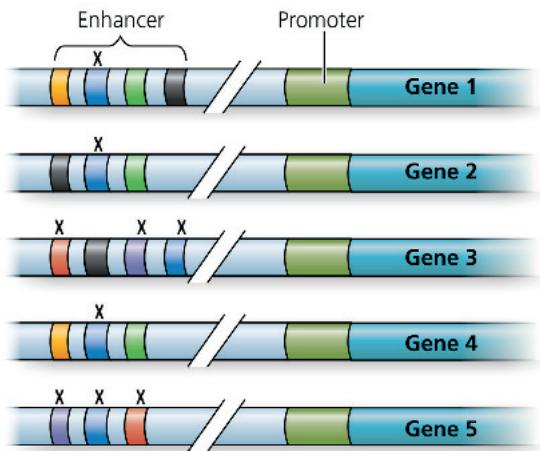

The purple, blue, and red activator proteins would be present.

Only gene 4 would be transcribed. (c) In nerve cells, the yellow, blue, green, and black activators would have to be present, thus activating transcription of genes 1, 2, and 4. In skin cells, the red, black, purple, and blue activators would have to be present, thus activating genes 3 and 5.

## Chapter 19

## Figure Questions

Figure 19.2 Beijerinck might have concluded that the agent was a toxin produced by the plant that was able to pass through a filter but that became more and more dilute. In this case, he would have concluded that the infectious agent could not replicate. Figure 19.4

Figure 19.9 The main protein on the cell surface that HIV binds to is called CD4. However, HIV also requires a “co-receptor,” which in many cases is a protein called CCR5. HIV binds to both of these proteins together and then is taken into the cell. Researchers discovered this requirement by studying individuals who seemed to be resistant to HIV infection despite multiple exposures. These individuals turned out to have mutations in the gene that encodes CCR5 such that the protein apparently cannot act as a co-receptor, and so HIV can’t enter and infect cells.

## Concept Check 19.1

1. Both viruses consist of RNA as the genetic material, associated with proteins. However, TMV consists of one molecule of RNA surrounded by a helical array of proteins, while the influenza virus has eight molecules of RNA, each associated with proteins and wound into a double helix. Another difference between the viruses is that the influenza virus has an outer envelope and TMV does not.
2. The T2 phages were an excellent choice for use in the Hershey-Chase experiment because they consist of only DNA surrounded by a protein coat, and DNA and protein were the two candidates for macromolecules that carried genetic information. Hershey and Chase were able to radioactively label each type of molecule alone and follow it during separate infections of E. coli cells with T2. Only the DNA entered the bacterial cell during infection, and only labeled DNA showed up in some of the progeny phage. Hershey and Chase concluded that the DNA must carry the genetic information necessary for the phage to reprogram the cell and produce progeny phages.

## Concept Check 19.2

1. Lytic phages can only carry out lysis of the host cell, whereas lysogenic phages may either lyse the host cell or integrate into the host chromosome. In the latter case, the viral DNA (prophage) is simply replicated along with the host chromosome. Under certain conditions, a prophage may exit the host chromosome and initiate a lytic cycle. 2. Both the CRISPR-Cas system and miRNAs involve RNA molecules bound in a protein complex and acting as "homing devices" that enable the complex to bind a complementary sequence. However, miRNAs are involved in regulating gene expression (by affecting mRNAs) and the CRISPR-Cas system protects bacterial cells from foreign invaders—infecting phages. Thus the CRISPR-Cas system is more like an immune system than is the miRNA system. 3. Both the viral RNA polymerase and the RNA polymerase in Figure 17.10 synthesize an RNA molecule complementary to a template strand. However, the RNA polymerase in Figure 17.10 uses one of the strands of the DNA double helix as a template, whereas the viral RNA polymerase uses the RNA of the viral genome as a template. 4. HIV is called a retrovirus because it synthesizes DNA using its RNA genome as a template. This is the reverse ("retro") of the usual DNA → RNA information flow. 5. There are many steps that could be interfered with: binding of the virus to the cell, reverse transcriptase function, integration into the host cell chromosome, genome synthesis (in this case, transcription of RNA from the integrated provirus), assembly of the virus inside the cell, and budding of the virus. (Many of these, if not all, are targets of actual medical strategies to block progress of the infection in HIV-infected people.)

## Concept Check 19.3

1. Mutations can lead to a new strain of a virus that can no longer be effectively fought by the immune system, even if an animal had been exposed to the original strain; a virus can jump from one species to a new host; and a rare virus can spread if a host population becomes less isolated.
2. In horizontal transmission, a plant is infected from an external source of virus, which enters through a break in the plant's epidermis due to damage by herbivores or other agents. In vertical transmission, a plant inherits viruses from its parent either via infected seeds (sexual reproduction) or via an infected cutting (asexual reproduction).
3. Humans are not within the host range of TMV, so they can't be infected by the virus. (TMV can't bind to receptors on human cells and infect them.)

## Summary of Key Concepts Questions

19.1 Viruses are generally considered nonliving because they are not capable of replicating outside of a host cell and are unable to carry out the energy-transforming reactions of metabolism. To replicate and carry out metabolism, they depend completely on host enzymes and resources. 19.2 Single-stranded RNA viruses require an RNA polymerase that can make RNA using an RNA template. (Cellular RNA polymerases make RNA using a DNA template.) Retroviruses require reverse transcriptases to make DNA using an RNA template. (Once the first DNA strand has been made, the same enzyme can promote synthesis of the second DNA strand.) 19.3 The mutation rate of RNA viruses is higher than that of DNA viruses because RNA polymerase has no proofreading function, so errors in replication are not corrected. Their higher mutation rate is one reason that RNA viruses change faster than DNA viruses, leading to their being able to have an altered host range and to evade immune defenses in possible hosts.

## Test Your Understanding

1. C 2. D 3. C 4. D 5. B 6. As shown below, the viral genome would be translated into capsid proteins and envelope glycoproteins directly, rather than after a complementary RNA copy was made. A complementary RNA strand would still be made, however, that could be used as a template for many new copies of the viral genome.

## Chapter 20

## Figure Questions

Figure 20.5  

Figure 20.16 None of the eggs with the transplanted nuclei from the four-cell embryo at the upper left would have developed into a tadpole. Also, the result might include only some of the tissues of a tadpole, which might differ, depending on which nucleus was transplanted. (This assumes that there was some way to tell the four cells apart, as one can in some frog species.) Figure 20.21 Using converted iPS cells would not carry the same risk, which is its major advantage. Because the donor cells would come from the patient, they would be perfectly matched. The patient's immune system would recognize them as "self" cells and would not mount an attack (which is what leads to rejection). On the other hand, cells that are rapidly dividing might carry a risk of inducing some type of tumor or contributing to development of cancer.

## Concept Check 20.1

1. The covalent sugar-phosphate bonds of the DNA strands 2. Yes, PvuI will cut the molecule (at the position indicated by the dashed red line).

3. Some eukaryotic genes are too large to be incorporated into bacterial plasmids. Bacterial cells lack the means to process RNA transcripts into mRNA, and even if the need for RNA processing is avoided by using cDNA, bacteria lack enzymes to catalyze the post-translational processing that many eukaryotic proteins require to function properly. (This is often the case for human proteins, which are a focus of biotechnology.) 4. During the replication of the ends of linear DNA molecules (see Figure 16.21), an RNA primer is used at the 5' end of each new strand. The RNA must be replaced by DNA nucleotides, but DNA polymerase is incapable of starting from scratch at the 5' end of a new DNA strand. During PCR, the primers are made of DNA nucleotides already, so they don't need to be replaced—they just remain as part of each new strand. Therefore, there is no problem with end replication during PCR, and the fragments don't shorten with each replication.

## Concept Check 20.2

1. Complementary base pairing is involved in cDNA synthesis, which is required for all three techniques: RT-PCR, DNA microarray analysis, and RNA sequencing. Reverse transcriptase uses mRNA as a template to synthesize the first strand of cDNA, adding nucleotides complementary to those on the mRNA. Complementary base pairing is also involved when DNA polymerase synthesizes the second strand of the cDNA. Furthermore, in RT-PCR, the primers must base-pair with their target sequences in the DNA mixture, locating one specific region among many. Also, the DNA polymerase (for example, Taq polymerase) used in PCR relies on complementary base pairing to the template strand to add new nucleotides during synthesis of the fragments. In DNA microarray analysis, the labeled cDNA probe binds only to the specific target sequence due to complementary nucleic acid hybridization (DNA-DNA hybridization). In RNA-seq, when sequencing the cDNAs, base complementarity plays a role in the sequencing process.
2. As a researcher interested in how cancer develops, you would want to study genes represented by spots that are green or red because these are genes for which the expression level differs between the two types of tissue. Some of these genes may be expressed differently as a result of cancer, while others might play a role in causing cancer, so both would be of interest.

## Concept Check 20.3

1. The state of chromatin modification in the nucleus from the intestinal cell was undoubtedly less similar to that of a nucleus from a fertilized egg, explaining why many fewer of these nuclei were able to be reprogrammed. In contrast, the chromatin in a nucleus from a cell at the four-cell stage would have been much more like that of a nucleus in a fertilized egg and therefore much more easily programmed to direct development. 2. No, primarily because of subtle (and perhaps not so subtle) differences in the environment in which the clone develops and lives compared with that in which the original pet lived (see the differences noted in Figure 20.18). This does provoke ethical questions. To produce Dolly, also a mammal, several hundred embryos were cloned, but only one survived to adulthood. If any of the "reject" dog embryos survived to birth as defective dogs, would they be killed? Is it ethical to produce living animals that may be defective? You can probably think of other ethical issues as well. 3. Given that muscle cell differentiation involves a master regulatory gene (MyoD), you might start by introducing either the MyoD protein or an expression vector carrying the MyoD gene into stem cells. (This is not likely to work, because the embryonic precursor cell in Figure 18.18 is more differentiated than the stem cells you are working with, and some other changes would have to be introduced as well. But it's a good way to start! And you may be able to think of others.)

## Concept Check 20.4

1. Stem cells continue to reproduce themselves, ensuring that the corrective gene product will continue to be made.
2. Herbicide resistance, pest resistance, disease resistance, drought resistance, enhanced nutritional value, and delayed ripening
3. Because hepatitis A is an RNA virus, you could isolate RNA from the blood and try to detect copies of hepatitis A RNA by RT-PCR. You would first reverse-transcribe the blood mRNA into cDNA and then use PCR to amplify the cDNA, using primers specific to hepatitis A sequences. If you then ran the products on an electrophoretic gel, the presence of a band of the appropriate size would support your hypothesis. Alternatively, you could use RNA-seq to sequence all the RNAs in your patient's blood and see whether any of the sequences match up with that of hepatitis A. (Since you are only seeking one sequence, though, RT-PCR is probably a better choice.)

## Summary of Key Concepts Questions

20.1 A plasmid vector and a source of foreign DNA to be cloned are both cut with the same restriction enzyme, generating restriction fragments with sticky ends. These fragments are mixed together, ligated, and reintroduced into bacterial cells. The plasmid has a gene for resistance to an antibiotic. That antibiotic is added to the host cells, and only cells that have taken up a plasmid will grow. (Another technique allows researchers to select only the cells that have a recombinant plasmid, rather than the original plasmid without an inserted gene.) 20.2 The genes that are expressed in a given tissue or cell type determine the proteins (and non-coding RNAs) that are the basis of the structure and functions of that tissue or cell type. Understanding which groups of interacting genes establish particular structures and carry out certain functions will help us learn how the parts of an organism work together. We will also be better able to treat diseases that occur when faulty gene expression leads to malfunctioning tissues. 20.3 (1) Cloning a mouse involves transplanting a nucleus from a differentiated mouse cell into a mouse egg cell that has had its own nucleus removed. Activating the egg cell and promoting its development into an embryo in a surrogate carrier results in a mouse that is genetically identical to the mouse that donated the nucleus. In this case, the differentiated nucleus has been reprogrammed by factors in the egg cytoplasm. (2) Mouse ES cells are generated from inner cells in mouse blastocysts, so in this case the cells are “naturally” reprogrammed by the process of reproduction and development. (Cloned mouse embryos can also be used as a source of ES cells.) (3) iPS cells can be generated without the use of embryos from a differentiated adult mouse cell by adding certain transcription factors into the cell. In this case, the transcription factors are reprogramming the cells to become pluripotent. 20.4 First, the disease must be caused by a single gene, and the molecular basis of the problem must be understood. Second, the cells that are going to be introduced into the patient must be cells that will integrate into body tissues and continue to multiply (and provide the needed gene product). Third, the gene must be able to be introduced into the cells in question in a safe way, as there have been instances of cancer resulting from some gene therapy trials. (Note that this will require testing the procedure in mice; moreover, the factors that determine a safe vector are not yet well understood. Maybe one of you will go on to solve this problem!)

## Test Your Understanding

1. D 2. B 3. C 4. B 5. C 6. A 7. B 8. You would use PCR to amplify the gene. This could be done from genomic DNA. Alternatively, mRNA could be isolated from lens cells and reverse-transcribed by reverse transcriptase to make cDNA. This cDNA could then be used for PCR. In either case, the gene would then be inserted into an expression vector so you could produce the protein and study it. 9. Crossing over, which causes recombination, is a random event. The chance of crossing over occurring between two loci increases as the distance between them increases. If a SNP is located very close to a disease-associated allele, it is said to be genetically linked. Crossing over will rarely occur between the SNP and the allele, so the SNP can be used as a genetic marker indicating the presence of the particular allele.

10.

## Chapter 21

## Figure Questions

Figure 21.2 In step 2 of this figure, the order of the fragments relative to each other is not known and will be determined later by computer. The unordered nature of the fragments is reflected by their scattered arrangement in the diagram. Figure 21.8 The transposon would be cut out of the DNA at the original site rather than copied, so the figure would show the original stretch of DNA without the transposon after the mobile transposon had been cut out. Figure 21.10 The RNA transcripts extending from the DNA in each transcription unit are shorter on the left and longer on the right. This means that RNA polymerase must be starting on the left end of the unit and moving toward the right.

Figure 21.13

Figure 21.14 Pseudogenes are nonfunctional. They could have arisen by any mutations in the second copy that made the gene product unable to function. Examples are base changes that introduce stop codons in the sequence, alter amino acids, or change a region of the gene promoter so that the gene can no longer be expressed. Figure 21.15 At position 5, there is an R (arginine) in lysozyme and a K (lysine) in $\alpha$ -lactalbumin; both of these are basic amino acids. Figure 21.16 Let's say a transposable

element (TE) existed in the intron to the left of the indicated EGF exon in the EGF gene, and the same TE was present in the intron to the right of the indicated F exon in the fibronectin gene. During meiotic recombination, these TEs could cause nonsister chromatids on homologous chromosomes to pair up incorrectly, as seen in Figure 21.13. One gene might end up with an F exon next to an EGF exon. Further mistakes in pairing over many generations might result in these two exons being separated from the rest of the gene and placed next to a single or duplicated K exon. In general, the presence of repeated sequences in introns and between genes facilitates these processes because it allows incorrect pairing of nonsister chromatids, leading to novel exon combinations. Figure 21.18 Since you know that chimpanzees do not speak but humans do, you'd probably want to know how many amino acid differences there are between the human wild-type FOXP2 protein and that of the chimpanzee and whether these changes affect the function of the protein. You know that humans with mutations in this gene have severe language impairment. You would want to learn more about the human mutations by checking whether they affect the same amino acids in the gene product that the chimpanzee sequence differences affect. If so, those amino acids might play an important role in the function of the protein in language. Going further, you could analyze the differences between the chimpanzee and mouse FOXP2 proteins. You might ask: Are they more similar than the chimpanzee and human proteins? (It turns out that the chimpanzee and mouse proteins have only one amino acid difference and thus are more similar than the chimpanzee and human proteins,

which have two differences, and also are more similar than the human and mouse proteins, which have three differences.)

## Concept Check 21.1

1. In the whole-genome shotgun approach, short fragments are generated by cutting the genome with multiple restriction enzymes. These fragments are sequenced by high-throughput machines, and then ordered by computer programs that identify overlapping regions.

## Concept Check 21.2

1. The Internet allows centralization of databases such as GenBank and software resources such as BLAST, making them freely accessible. Having all the data in a central database, easily accessible on the Internet, minimizes the possibility of errors and of researchers working with different data. It streamlines the process of science, since all researchers are able to use the same software programs, rather than each having to obtain their own, possibly different, software. It speeds up dissemination of data and ensures as much as possible that errors are corrected in a timely fashion. These are just a few answers; you can probably think of more.
2. Cancer is a disease caused by multiple factors. Focusing on a single gene or a single defect would mean ignoring other factors that may influence the cancer and even the behavior of the single gene being studied. The systems approach, because it takes into account many factors at the same time, is more likely to lead to an understanding of the causes and most useful treatments for cancer.
3. Some of the transcribed region is accounted for by introns. The rest is transcribed into noncoding RNAs, including small RNAs, such as microRNAs (miRNAs), siRNAs, and piRNAs. Some of these RNAs help regulate gene expression by blocking translation, causing degradation of mRNA, binding to the promoter and repressing transcription, or causing remodeling of chromatin structure. The long noncoding RNAs (lncRNAs) may also contribute to gene regulation or to remodeling of chromatin structure.
4. Genome-wide association studies use the systems biology approach in that they consider the correlation of many single nucleotide polymorphisms (SNPs) with particular diseases, such as heart disease and diabetes, in an attempt to find patterns of SNPs that correlate with each disease.

## Concept Check 21.3

1. Alternative splicing of RNA transcripts from a gene and post-translational processing of polypeptides 2. At the top of the web page, you can see the number of genomes completed and those considered permanent drafts in a bar graph by year. Scrolling down, you can see the number of complete and incomplete sequencing projects by year, the number of projects by “domain group” by year (the genomes of viruses and metagenomes are counted too, even though these are not “domain groups”), the phylogenetic distribution of bacterial genome projects, and projects by sequencing center. Finally, near the bottom, you can see a pie chart of the “Project Relevance of Bacterial Genome Projects,” which shows that about 50–55% have medical relevance. (This number may vary over time.) The web page ends with several pie charts showing the major sequencing centers for archaeal and bacterial projects, fungal genomes, and plant genomes. 3. A prokaryotic cell is generally smaller than a eukaryotic cell, and prokaryotic organisms reproduce by binary fission. The evolutionary process involved is natural selection for more quickly reproducing cells: The faster they can replicate their DNA and divide, the more likely they will be able to dominate a population of prokaryotic organisms. The less DNA they have to replicate, then, the faster they will reproduce.

## Concept Check 21.4

1. The number of genes is higher in mammals, and the amount of noncoding DNA is greater. Also, the presence of introns in mammalian genes makes them larger, on average, than prokaryotic genes.
2. The copy-and-paste transposon mechanism and retrotransposition
3. In the rRNA gene family, identical transcription units, each containing genes for all three different RNA products, are present in long arrays, repeated one after the other. The large number of copies of the rRNA genes enable organisms to produce the rRNA for enough ribosomes to carry out active protein synthesis, and the single transcription unit for the three rRNAs ensures that the relative amounts of the different rRNA molecules produced are correct—every time one rRNA is made, a copy of each of the other two is made as well. Rather than numerous identical units, each globin gene family consists of a relatively small number of nonidentical genes. The differences in the globin proteins encoded by these genes result in production of hemoglobin molecules adapted to particular developmental stages of the organism.
4. The exons would be classified as exons (1.5%); the enhancer region containing the distal control elements, the region closer to the promoter containing the proximal control elements, and the promoter itself would be classified as regulatory sequences (5%); and the introns would be classified as introns (20%).

## Concept Check 21.5

1. If meiosis is faulty, two copies of the entire genome can end up in a single cell. Errors in crossing over during meiosis can lead to one segment being duplicated while another is deleted. During DNA replication, slippage backward along the template strand can result in segment duplication. Also, a "copy-and-paste" transposable element could copy and paste a segment of DNA, resulting in a duplication of that segment (and of the transposable element itself.) 2. For either gene, a mistake in crossing over during meiosis could have occurred between the two copies of that gene, such that one ended up with a duplicated exon. (The other copy would have ended up with a deleted exon.) This could have happened several times, resulting in the multiple copies of a particular exon in each gene. 3. Homologous transposable elements scattered throughout the genome provide sites where recombination can occur between different chromosomes. Movement of these elements into coding or regulatory sequences may change expression of genes, which can affect the phenotype in a way that is subject to natural selection. Transposable elements also can carry genes with them, leading to dispersion of genes and in some cases different patterns of expression. Transport of an exon during transposition and its insertion into a gene may add a new functional domain to the originally encoded protein, a type of exon shuffling. (For any of these changes to be heritable, they must happen in germ cells, cells that will give rise to gametes.) 4. Because more offspring are born to females who have this inversion, it must provide some advantage during the process of reproduction and development. Because proportionally more offspring have this inversion, we would expect it to persist and spread in the population. (In fact, evidence in the study allowed the researchers to conclude that it has been increasing in proportion in the population. You'll learn more about population genetics in the next unit.)

## Concept Check 21.6

1. Because both humans and macaques are primates, their genomes are expected to be more similar than the macaque and mouse genomes are. The mouse lineage diverged from the primate lineage before the human and macaque lineages diverged. 2. Homeotic genes differ in their nonhomeobox sequences, which determine the interactions of homeotic gene products with other transcription factors and hence which genes are regulated by the homeotic genes. These nonhomeobox sequences differ in the two species, as do the expression patterns of the homeobox genes. 3. Alu elements underwent transposition more actively in the human genome for some reason. Their increased sites of insertion may have then allowed more recombination errors in the human genome, resulting in more or different duplications. The divergence of the organization and content of the two genomes presumably made the chromosomes of each genome less similar to those of the other, thus accelerating divergence of the two species by making matings less and less likely to result in fertile offspring due to the mismatch of genetic information.

## Summary of Key Concepts Questions

21.1 One focus of the Human Genome Project was to improve sequencing technology in order to speed up the process. During the project, many advances in sequencing technology allowed faster reactions and detection of products, which were therefore less expensive. 21.2 The most significant finding is that more than 75% of the human genome appears to be transcribed at some point in at least one of the cell types studied. Also, at least 80% of the genome contains an element that is functional, participating in gene regulation or maintaining chromatin structure in some way. The project was expanded to include other species to further investigate the functions of these transcribed DNA elements. It is necessary to carry out this type of analysis on the genomes of species that can be used in laboratory experiments. 21.3 (a) In general, prokaryotic organisms in Bacteria and Archaea have smaller genomes, lower numbers of genes, and higher gene density than eukaryotes. (b) Among eukaryotes, there is no apparent systematic relationship between genome size and phenotype. The number of genes is often lower than would be expected from the size of the genome—in other words, the gene density is often lower in larger genomes. (Humans are a good example.) 21.4 Transposable element-related sequences can move from place to place in the genome, and some of these sequences make a new copy of themselves when they do so. Thus, it is not surprising that they make up a significant percentage of the genome, and this percentage might be expected to increase over evolutionary time. 21.5 Chromosomal rearrangements within a species lead to some individuals having different chromosomal arrangements. Each of these individuals could still undergo meiosis and produce gametes, and fertilization involving gametes with different chromosomal arrangements could result in viable offspring. However, during meiosis in the offspring, the maternal and paternal chromosomes might not be able to pair up, causing gametes with incomplete sets of chromosomes to form. Most often, when zygotes are produced from such gametes, they do not survive. Ultimately, a new species could form if two different chromosomal arrangements became prevalent within a population and individuals could mate successfully only with other individuals having the same arrangement. 21.6 Comparing the genomes of two closely related species can reveal information about more recent evolutionary events, perhaps events that resulted in the distinguishing characteristics of the two species. Comparing the genomes of very distantly related species can tell us about evolutionary events that occurred a very long time ago. For example, genes that are shared between two distantly related species must have arisen before the two species diverged.

## Test Your Understanding

1. B 2. A 3. C 4. Answers for (a) through (c):

Chimpanzee PKSSD ... TSSTT ... NARRD
Mouse PKSSE ... TSSTT ... NARRD
Gorilla PKSSD ... TSSTT ... NARRD
Human PKSSD ... TSSNT ... SARRD
Rhesus monkey PKSSD ... TSSTT ... NARRD (d) There is one difference between the sequence for the mouse and the sequence for the chimpanzee, gorilla, and rhesus monkey. There are two differences between the human sequence and the sequence for the chimpanzee, gorilla, and rhesus monkey. These facts might lead to the hypothesis that the FOXP2 gene has been evolving faster in the human lineage than in other primates: Two differences between humans and other primates occurred during the 6 million years since they diverged, but only one difference occurred during the much longer period of 65 million years since rodents and primates diverged. However, as described in the text, later analysis that included more genomes that were more diverse failed to support this hypothesis.

## Chapter 22

## Figure Questions

Figure 22.6 You should have circled the branch located at the far left of Figure 1.20. Although three of the descendants (Certhidea olivacea, Camarhynchus pallidus, and Camarhynchus parvulus) of this common ancestor ate insects, the other three species that descended from this ancestor did not eat insects. Figure 22.8 The common ancestor lived about 5.5 million years ago. Figure 22.13 These results show that being reared from the egg stage on one plant species or the other did not result in the adult having a beak length appropriate for that host; instead, adult beak lengths were determined primarily by the population from which the eggs were obtained. Because an egg from a balloon vine population likely had long-beaked parents, while an egg from a golden rain tree population likely had short-beaked parents, these results indicate that beak length is an inherited trait. Figure 22.14 Both strategies should increase the time that it takes S. aureus to become resistant to a new drug. If a drug that harms S. aureus does not harm other bacteria, natural selection will not favor resistance to that drug in the other species. This would decrease the chance that S. aureus would acquire resistance genes from other bacteria—thus slowing the evolution of resistance. Similarly, selection for resistance to a drug that slows the growth but does not kill S. aureus is much weaker than selection for resistance to a drug that kills S. aureus—again slowing the evolution of resistance. Figure 22.17 Based on this evolutionary tree, crocodiles are more closely related to birds than to lizards because they share a more recent common ancestor with birds (ancestor ⑤) than with lizards (ancestor ④). Figure 22.20 Hind limb structure changed first. Rodhocetus lacked flukes, but its pelvic bones and hind limbs had changed substantially from how those bones were shaped and arranged in Pakicetus. For example, in Rodhocetus, the pelvis and hind limbs appear to be oriented for paddling, whereas they were oriented for walking in Pakicetus.

## Concept Check 22.1

1. Hutton and Lyell proposed that geologic events in the past were caused by the same processes operating today, at the same gradual rate. This principle suggested that Earth must be much older than a few thousand years, the age that was widely accepted in the early 19th century. Hutton's and Lyell's ideas also stimulated Darwin to reason that the slow accumulation of small changes could ultimately produce the profound changes documented in the fossil record. In this context, the age of Earth was important to Darwin, because unless Earth was very old, he could not envision how there would have been enough time for evolution to occur.
2. By this criterion, Cuvier's explanation of the fossil record and Lamarck's hypothesis of evolution are both scientific. Cuvier thought that species did not evolve over time. He also suggested that sudden, catastrophic events caused extinctions in particular areas and that such regions were later repopulated by a different set of species that immigrated from other areas. These assertions can be tested against the fossil record. Lamarck's principle of use and disuse can be used to make testable predictions for fossils of groups such as whale ancestors as they adapted to a new habitat. Lamarck's principle of use and disuse and his associated principle of the inheritance of acquired characteristics can also be tested directly in living organisms.

## Concept Check 22.2

1. Organisms share characteristics (the unity of life) because they share common ancestors; the great diversity of life occurs because new species have repeatedly formed when descendant organisms gradually adapted to different environments, thereby becoming different from their ancestors. 2. The fossil mammal species (or its ancestors) would most likely have colonized the Andes from within South America, whereas ancestors of mammals currently found in Asian mountains would most likely have colonized those mountains from other parts of Asia. As a result, the Andes fossil species would share a more recent common ancestor with South American mammals than with mammals in Asia. Thus, for many of its traits, the fossil mammal species would probably more closely resemble mammals that live in South American jungles than mammals that live on Asian mountains. It is also possible that for some of its features, the Andean fossil mammal species could closely resemble a mammal from the mountains of Asia. This could happen because similar environments had selected for similar adaptations (even though the fossil and Asian species were only distantly related to one another). 3. As long as the white phenotype (encoded by the genotype pp) continues to be favored by natural selection, the proportion of white individuals in the population should increase over time relative to the proportion of purple individuals (encoded by the genotypes PP and Pp). As a result, the frequency of the p allele in the population would likely increase over time.

## Concept Check 22.3

1. An environmental factor such as a drug does not create new traits, such as drug resistance, but rather selects for traits among those that are already present in the population.
2. (a) Despite their different functions, the forelimbs of different mammals are structurally similar because they all represent modifications of a structure found in the common ancestor; thus, they are homologous structures. (b) In this case, the similar features of these mammals represent analogous features that arose by convergent evolution. The similarities between the sugar glider and flying squirrel indicate that similar environments selected for similar adaptations despite different ancestry.
3. At the time that dinosaurs originated, Earth's landmasses formed a single large continent, Pangaea. Because many dinosaurs were large and mobile, it is likely that early members of these groups lived on many different parts of Pangaea. When Pangaea broke apart, fossils of these organisms would have moved with the rocks in which they were deposited. As a result, we would predict that fossils of early dinosaurs would have a broad geographic distribution (this prediction has been upheld).

## Summary of Key Concepts Questions

Concept 22.1 Darwin thought that descent with modification occurred as a gradual, steplike process. The age of Earth was important to him because if Earth were only a few thousand years old (as conventional wisdom suggested), there wouldn't have been sufficient time for major evolutionary change. Concept 22.2 All species have the potential to overreproduce—that is, to produce more offspring than can be supported by the environment. This ensures that there will be what Darwin called a “struggle for existence” in which many of the offspring are eaten, starved, diseased, or unable to reproduce for a variety of other reasons. Members of a population exhibit a range of heritable variations, some of which make it likely that their bearers will leave more offspring than other individuals (for example, the bearer may escape predators more effectively or be more tolerant of the physical conditions of the environment). Over time, natural selection resulting from factors such as predators, lack of food, or the physical conditions of the environment can increase the proportion of individuals with favorable traits in a population (evolutionary adaptation). Concept 22.3 The hypothesis that cetaceans originated from a terrestrial mammal and are closely related to even-toed ungulates is supported by several lines of evidence. For example, fossils document that early cetaceans had hind limbs, as expected for organisms that descended from a land mammal; these fossils also show that cetacean hind limbs became reduced over time. Other fossils show that early cetaceans had a type of ankle bone that is otherwise found only in even-toed ungulates, providing strong evidence that even-toed ungulates are the land mammals to which cetaceans are most closely related. DNA sequence data also indicate that even-toed ungulates are the land mammals to which cetaceans are, most closely related.

## Test Your Understanding

(b) The rapid rise in the percentage of mosquitoes resistant to DDT was most likely caused by natural selection in which mosquitoes resistant to DDT could survive and reproduce while other mosquitoes could not. (c) In India—where DDT resistance first appeared—natural selection would have caused the frequency of resistant mosquitoes to increase over time. If resistant mosquitoes then migrated from India (for example, transported by wind or in planes, trains, or ships) to other parts of the world, the frequency of DDT

resistance would increase there as well. In addition, if resistance to DDT were to arise independently in mosquito populations outside of India, those populations would also experience an increase in the frequency of DDT resistance.

## Chapter 23

## Figure Questions

Figure 23.4 The genetic code is redundant, meaning that more than one codon can specify the same amino acid. As a result, a substitution at a particular site in a coding region of the Adh gene might change the codon but not the translated amino acid, and thus not the resulting protein encoded by the gene. One way an insertion in an exon would not affect the gene produced is if it occurs in an untranslated region of the exon. (This is the case for the insertion at location 1,703.) Figure 23.7 There should be 24 red balls. Figure 23.8 The predicted frequencies are 36% $C^{RC}$ , 48% $C^{RC}$ , and 16% $C^{WC}$ . Figure 23.9 Overall, by chance the frequency of the $C^{W}$ allele first increases in generation 2 and then falls to zero in generation 3—causing the $C^{R}$ allele to become fixed (reach a frequency of 100%). Figure 23.12 The frequency of banded color patterns in island populations would probably increase in the year immediately after the storm. Since mainland populations did not decline in size, the number of individuals migrating from the mainland to the islands would probably not decline either. As a result, after island populations had decreased in size (because of the storm), alleles encoding banded coloration that were transferred from the mainland would comprise a larger proportion of the gene pool in island populations. This would cause the frequency of banded color patterns in island populations to increase. Figure 23.13 Directional selection. The seeds of golden rain tree are buried less deeply than are the seeds of the native host, balloon vine. Thus, in soapberry bug populations feeding on golden rain tree, bugs with shorter beaks had an advantage, resulting in directional selection for shorter beak length. Figure 23.16 Crossing a single female's eggs with both an SC and an LC male's sperm allowed the researchers to directly compare the effects of the males' contribution to the next generation since both batches of offspring had the same maternal contribution. This isolation of the male's impact enabled researchers to draw conclusions about differences in genetic "quality" between the SC and LC males. Figure 23.18 Under prolonged low-oxygen conditions, some of the red blood cells of a heterozygote may sickle, leading to harmful effects. This does not occur in individuals with two wild-type hemoglobin alleles, suggesting that there may be selection against heterozygotes in malaria-free regions (where heterozygote advantage does not occur). However, since heterozygotes are healthy under most conditions, selection against them is unlikely to be strong.

## Concept Check 23.1

1. Within a population, genetic differences among individuals provide the raw material on which natural selection and other mechanisms can act. Without such differences, allele frequencies could not change over time—and hence the population could not evolve. 2. Many mutations occur in somatic cells, which do not produce gametes and so are lost when the organism dies. Of the mutations that do occur in cell lines that produce gametes, many do not have a phenotypic effect on which natural selection can act. Others have a harmful effect and are thus unlikely to increase in frequency because they decrease the reproductive success of their bearers. 3. Genetic variation is a measure of the different alleles in a population and may or may not be expressed phenotypically. Phenotypic variation is a measure of how variable the traits are in a population. Selection differentiates among phenotypic variation but cannot differentiate genetic variation that is not expressed phenotypically. Both are required for evolution by natural selection—phenotypic variation is required for some individuals to be selected over others, while genetic variation is required for the transmission of the selected trait to the next generation. 4. Its genetic variation (whether measured at the level of the gene or at the level of nucleotide sequences) would probably drop over time. During meiosis, crossing over and the independent assortment of chromosomes produce many new combinations of alleles. In addition, a population contains a vast number of possible mating combinations, and fertilization brings together the gametes of individuals with different genetic backgrounds. Thus, via crossing over, independent assortment of chromosomes, and fertilization, sexual reproduction reshuffles alleles into fresh combinations each generation. Without sexual reproduction, the rate of forming new combinations of alleles would be vastly reduced, causing the overall amount of genetic variation to drop.

## Concept Check 23.2

1. There are 700 individuals in the population: 85 of genotype AA, 320 of genotype Aa, and 295 of genotype aa. The genotype frequencies are thus 0.12 (85/700) for genotype AA, 0.46 (320/700) for genotype Aa, and 0.46 (295/700) for genotype aa. Each individual has two alleles, so the total number of alleles is 1,400. To calculate the frequency of allele A, note that each of the 85 individuals of genotype AA has two A alleles, each of the 320 individuals of genotype Aa has one A allele, and each of the 295 individuals of genotype aa has zero A alleles. Thus, the frequency (p) of allele A is

$$
p = \frac {(2 \times 8 5) + (1 \times 3 2 0) + (0 \times 2 9 5)}{1 , 4 0 0} = 0. 3 5
$$

There are only two alleles (A and a) in our population, so the frequency of allele a must be q = 1 - p = 0.65. 2. Because the frequency of allele a is 0.45, the frequency of allele A must be 0.55. Thus, the expected genotype frequencies are $p^{2} = 0.3025$ for genotype AA, 2pq = 0.495 for genotype Aa, and $q^{2} = 0.2025$ for genotype aa. 3. There are 120 individuals in the population, so there are 240 alleles. Of these, there are 124 V alleles—32 from the 16 VV individuals and 92 from the 92 Vv individuals. Thus, the frequency of the V allele is p = 124/240 = 0.52; hence, the frequency of the v allele is q = 0.48. For the population from 5 years ago, similar calculations show that V = 0.25 and v = 0.75. The frequency of v has decreased from 0.75 to 0.48, indicating selection against this allele.

## Concept Check 23.3

1. Natural selection is more “predictable” in that it alters allele frequencies in a nonrandom way: It tends to increase the frequency of alleles that increase the organism’s reproductive success in its environment and decrease the frequency of alleles that decrease the organism’s reproductive success. Alleles subject to genetic drift increase or decrease in frequency by chance alone, whether or not they are advantageous.
2. Genetic drift results from chance events that cause allele frequencies to fluctuate at random from generation to generation; within a population, this process tends to decrease genetic variation over time. Gene flow is the transfer of alleles between populations, a process that can introduce new alleles to a population and hence may increase its genetic variation (albeit slightly, since rates of gene flow are often low).
3. Selection is not important at this locus; furthermore, the populations are not small, and hence the effects of genetic drift should not be pronounced. Gene flow is occurring via the movement of pollen and seeds. Thus, allele and genotype frequencies in these populations should become more similar over time as a result of gene flow.

## Concept Check 23.4

1. The relative fitness of a mule is zero, because fitness includes reproductive contribution to the next generation, and a sterile mule cannot produce offspring.
2. Although both gene flow and genetic drift can increase the frequency of advantageous alleles in a population, they can also decrease the frequency of advantageous alleles or increase the frequency of harmful alleles. Only natural selection consistently results in an increase in the frequency of alleles that enhance survival or reproduction. Thus, natural selection is the only mechanism that consistently leads to adaptive evolution.
3. The three modes of natural selection (directional, stabilizing, and disruptive) are defined in terms of the selective advantage of different phenotypes, not different genotypes. Thus, the type of selection represented by heterozygote advantage depends on the phenotype of the heterozygotes. In this question, because heterozygous individuals have a more extreme phenotype than either homozygote, heterozygote advantage represents directional selection.

## Summary of Key Concepts Questions

23.1 Much of the nucleotide variability at a genetic locus occurs within introns. Nucleotide variation at these sites typically does not affect the phenotype because introns do not code for the protein product of the gene. (Note: In certain circumstances, it is possible that a change in an intron could affect RNA splicing and ultimately have some phenotypic effect on the organism, but such mechanisms are not covered in this introductory text.) There are also many variable nucleotide sites within exons. However, most of the variable sites within exons reflect changes to the DNA sequence that do not change the sequence of amino acids encoded by the gene (and hence may not affect the phenotype). 23.2 Having a small population size does not itself change allele frequencies, but it increases the likelihood that frequencies will change over time due to random chance (genetic drift). 23.3 It is unlikely that two such populations would evolve in similar ways. Since their environments are very different, the alleles favored by natural selection would probably differ between the two populations. Although genetic drift may have important effects in each of these small populations, drift causes unpredictable changes in allele frequencies, so it is unlikely that drift would cause the populations to evolve in similar ways. Both populations are geographically isolated, suggesting that little gene flow would occur between them (again making it less likely that they would evolve in similar ways). 23.4 Compared to males, it is likely that the females of such species would be larger, more colorful, endowed with more elaborate ornamentation (for example, a large morphological feature such as the peacock's tail), and more apt to engage in behaviors intended to attract mates or prevent other members of their sex from obtaining mates.

Test Your Understanding

1. D  2. C  3. B  4. A  5. C

Practice Applying Your Learning
10. (a) T (b) T (c) F (d) F (e) T (f) F (g) F

## Chapter 24

## Figure Questions

Figure 24.7 If this had not been done, the strong preference of “starch flies” and “maltose flies” to mate with like-adapted flies could have occurred simply because the flies could detect (for example, by sense of smell) what their potential mates had eaten as larvae—and preferred to mate with flies that had a similar smell to their own. Figure 24.11 Tragopogon dubius and T. pratenis are the parent species of the polyploid species T. miscellus. T. dubius and T. porrifolius are the parent species of the other polyploid species, T. mirus. Figure 24.12 In murky waters where females distinguish colors poorly, females of each species might mate often with males of the other species. Hence, since hybrids between these species are viable and fertile, the gene pools of the two species might become more similar over time.

Figure 24.13 The graph indicates that there has been gene flow of some fire-bellied toad alleles into the range of the yellow-bellied toad. Otherwise, all individuals located to the left of the hybrid zone portion of the graph would have allele frequencies equal to 1. Figure 24.15 Because the populations had only just begun to diverge from one another at this point in the process, it is likely that any existing barriers to reproduction would weaken over time. Figure 24.19 Over time, the chromosomes of the experimental hybrids came to resemble those of H. anomalus. This occurred even though conditions in the laboratory differed greatly from conditions in the field, where H. anomalus is found, suggesting that selection for laboratory conditions was not strong. Thus, it is unlikely that the observed rise in the fertility of the experimental hybrids was due to selection for life under laboratory conditions. Figure 24.20 The presence of M. cardinalis plants that carry the M. lewisii yup allele would make it more likely that bumblebees would transfer pollen between the two monkey flower species. As a result, we would expect the number of hybrid offspring to increase.

## Concept Check 24.1

1. (a) All except the biological species concept can be applied to both asexual and sexual species because they define species on the basis of characteristics other than the ability to reproduce. In contrast, the biological species concept can be applied only to sexual species. (b) The easiest species concept to apply in the field would be the morphological species concept because it is based only on the appearance of the organism. Additional information about its ecological habits or reproduction is not required. 2. Because these birds live in fairly similar environments and can breed successfully in captivity, the reproductive barrier in nature is probably prezygotic; given the species' differences in habitat preference, this barrier could result from habitat isolation.

## Concept Check 24.2

1. In allopatric speciation, a new species forms while in geographic isolation from its parent species; in sympatric speciation, a new species forms in the absence of geographic isolation. Geographic isolation greatly reduces gene flow between populations, whereas ongoing gene flow is more likely in sympatric populations. As a result, allopatric speciation is more common than sympatric speciation. 2. Gene flow between subsets of a population that live in the same area can be reduced in a variety of ways. In some species—especially plants—changes in chromosome number can block gene flow and establish reproductive isolation in a single generation. Gene flow can also be reduced in sympatric populations by habitat differentiation (as seen in the apple maggot fly, Rhagoletis) and sexual selection (as seen in Lake Victoria cichlids). 3. Allopatric speciation would be less likely to occur on an island near a mainland than on a more isolated island of the same size. We expect this result because continued gene flow between mainland populations and those on a nearby island reduces the chance that enough genetic divergence will take place for allopatric speciation to occur. 4. If all of the homologs failed to separate during anaphase I of meiosis, some gametes would end up with an extra set of chromosomes (and others would end up with no chromosomes). If a gamete with an extra set of chromosomes fused with a normal gamete, a triploid would result; if two gametes with an extra set of chromosomes fused with each other, a tetraploid would result.

## Concept Check 24.3

1. Hybrid zones are regions in which members of different species meet and mate, producing some offspring of mixed ancestry. Such regions can be viewed as “natural laboratories” in which to study speciation because scientists can directly observe factors that cause (or fail to cause) reproductive isolation. 2. (a) If hybrids consistently survived and reproduced poorly compared with the offspring of intraspecific matings, reinforcement could occur. If it did, natural selection would cause prezygotic barriers to reproduction between the parent species to strengthen over time, decreasing the production of unfit hybrids and leading to a completion of the speciation process. If reinforcement did not occur, hybrids may continue to be produced even though they are selected against (as in the Bombina hybrid zone). (b) If hybrid offspring survived and reproduced as well as the offspring of intraspecific matings, indiscriminate mating between the parent species would lead to the production of large numbers of hybrid offspring. As these hybrids mated with each other and with members of both parent species, the gene pools of the parent species could fuse over time, reversing the speciation process.

## Concept Check 24.4

1. The time between speciation events includes (1) the length of time that it takes for populations of a newly formed species to begin diverging reproductively from one another and (2) the time it takes for speciation to be complete once this divergence begins. Although speciation can occur rapidly once populations have begun to diverge from one another, it may take millions of years for that divergence to begin.
2. Investigators transferred alleles at the yup locus (which influences flower color) from each parent species to the other. M. lewisii plants with an M. cardinalis yup allele received many more visits from hummingbirds than usual; hummingbirds usually pollinate M. cardinalis but avoid M. lewisii. Similarly, M. cardinalis plants with an M. lewisii yup allele received many more visits from bumblebees than usual; bumblebees usually pollinate M. lewisii and avoid M. cardinalis. Thus, alleles at the yup locus can influence pollinator choice, which in these species provides the primary barrier to interspecific mating. Nevertheless, the experiment does not prove that the $yup$ locus alone controls barriers to reproduction between M. lewisii and M. cardinalis; other genes might enhance the effect of the $yup$ locus (by modifying flower color) or cause entirely different barriers to reproduction (for example, gametic isolation or a postzygotic barrier). 3. Crossing over. If crossing over did not occur, each chromosome in an experimental hybrid would remain as in the $\mathrm{F}_1$ generation: composed entirely of DNA from one parent species or the other.

## Summary of Key Concepts Questions

24.1 According to the biological species concept, a species is a group of populations whose members interbreed and produce viable, fertile offspring; thus, gene flow occurs between populations of a species. In contrast, members of different species do not interbreed and hence no gene flow occurs between their populations. Overall, then, in the biological species concept, species can be viewed as designated by the absence of gene flow—making gene flow of central importance to the biological species concept. 24.2 Sympatric speciation can be promoted by factors such as polyploidy, sexual selection, and habitat shifts, all of which can reduce gene flow between the subpopulations of a larger population. Of these factors, sexual selection and habitat shifts can also occur in allopatric populations and hence can also promote allopatric speciation. 24.3 If the hybrids are selected against, the hybrid zone could persist if individuals from the parent species regularly travel into the zone, where they mate to produce hybrid offspring. If hybrids are not selected against, there is no cost to the continued production of hybrids, and large numbers of hybrid offspring may be produced. However, natural selection for life in different environments may keep the gene pools of the two parent species distinct, thus preventing the loss (by fusion) of the parent species and once again causing the hybrid zone to be stable over time. 24.4 As the goats-beard plant, Bahamas mosquitofish, and apple maggot fly illustrate, speciation continues to happen today. A new species can begin to form whenever gene flow is reduced between populations of the parent species. Such reductions in gene flow can occur in many ways: A new, geographically isolated population may be founded by a few colonists; some members of the parent species may begin to utilize a new habitat; or sexual selection may isolate formerly connected populations or subpopulations. These and many other such events are happening today.

## Test Your Understanding

8. Here is one possibility:

## Chapter 25

## Figure Questions

Figure 25.2 Proteins are almost always composed of the same 20 amino acids shown in Figure 5.14. However, many other amino acids could potentially form in this or any other experiment. For example, any molecule that had an R group that differed from those listed in Figure 5.14 would still be an amino acid as long as it also contained an $\alpha$ carbon, an amino group, and a carboxyl group—but that molecule would not be one of the 20 amino acids commonly found in nature. Figure 25.4 The hydrophobic regions of such molecules are attracted to one another and excluded from water, whereas the hydrophilic regions have an affinity for water. As a result, the molecules can form a bilayer in which the hydrophilic regions are on the outside of the bilayer (facing water on each side of the bilayer) and the hydrophobic regions point toward each other (that is, toward the inside of the bilayer). Figure 25.6 Because uranium-238 has a half-life of 4.5 billion years, the $x$ -axis would be relabeled (in billions of years) as 4.5, 9, 13.5, and 18. Figure 25.8 (1) The earliest direct evidence of life comes from fossils of prokaryotic organisms that date to 3.5 billion years ago. Fossil evidence also shows that for the next 2 billion years (3.5 to 1.5 billion years ago), life on Earth consisted entirely of unicellular organisms. In fact, from 3.5 billion years ago to 1.8 billion years ago, all of Earth's organisms were prokaryotic organisms; around

1.8 billion years ago, these prokaryotic organisms were joined by unicellular eukaryotes (multicellular eukaryotes emerged about 1.3 billion years ago). (2) Sample answer: In Figure 25.12, there are two hatch marks on the x-axis. These hatch marks represent large time spans. Unless the graph was very wide, showing these entire time spans would obscure key details for the figure, such as when selected animal groups first appear in the fossil record. (3) The horizontal time scale indicates that prokaryotic organisms originated 3.5 billion years ago and that the colonization of land took place 500 million years ago. On a 1-hour time scale, this indicates that prokaryotic organisms appeared about 46 minutes ago, while the colonization of land took place less than 7 minutes ago. Figure 25.12 You should have circled the node, shown in the tree diagram at approximately 635 million years ago (mya), that leads to the echinoderm–chordate lineage and to the lineage that gave rise to brachiopods, annelids, molluscs, and arthropods. To determine a minimum estimate of the age of the ancestor represented by this node, note that the most recent common ancestor of chordates and annelids must be at least as old as any of its descendants. Since fossil molluscs date to about 560mya, the common ancestor represented by the circled branch point must be at least 560 million years old. Figure 25.14 There are two speciation events and five extinctions in lineage A, while there are five speciation events and one extinction in lineage B during the last 2 million years. Figure 25.17 The Australian plate's current direction of movement is roughly similar to the northeasterly direction the continent traveled over the past 66 million years. Figure 25.27 The coding sequence of the Pitx1 gene would differ between the marine and lake populations, but patterns of gene expression would not.

## Concept Check 25.1

1. The hypothesis that conditions on early Earth could have permitted the synthesis of organic molecules from inorganic ingredients 2. In contrast to random mingling of molecules in an open solution, segregation of molecular systems by membranes could concentrate organic molecules, assisting biochemical reactions. 3. Today, genetic information usually flows from DNA to RNA, as when the DNA sequence of a gene is used as a template to synthesize the mRNA encoding a particular protein. However, the life cycle of retroviruses such as HIV shows that genetic information can flow in the reverse direction (from RNA to DNA). In these viruses, the enzyme reverse transcriptase uses RNA as a template for DNA synthesis, suggesting that a similar enzyme could have played a key role in the transition from an RNA world to a DNA world.

## Concept Check 25.2

1. The fossil record shows that different groups of organisms dominated life on Earth at different points in time and that many organisms once alive are now extinct; specific examples of these points can be found in Figure 25.5. The fossil record also indicates that new groups of organisms can arise via the gradual modification of previously existing organisms, as illustrated by fossils that document the origin of mammals from their cynodont ancestors (see Figure 25.7). 2. 22,920 years (four half-lives: $5,730 \times 4$ )

## Concept Check 25.3

1. Free oxygen attacks chemical bonds and can inhibit enzymes and damage cells. As a result, the appearance of oxygen in the atmosphere probably caused many prokaryotic organisms that had thrived in anaerobic environments to survive and reproduce poorly, ultimately driving many of these species to extinction.
2. All eukaryotes have mitochondria or remnants of these organelles, but not all eukaryotes have plastids.
3. A fossil record of life today would include many organisms with hard body parts (such as vertebrates and many marine invertebrates), but might not include some species we are very familiar with, such as those that have small geographic ranges and/or small population sizes (for example, endangered species such as the giant panda, tiger, and several rhinoceros species).

## Concept Check 25.4

1. The theory of plate tectonics describes the movement of Earth's continental plates, which alters the physical geography and climate of Earth, as well as the extent to which organisms are geographically isolated. Because these factors affect extinction and speciation rates, plate tectonics has a major impact on life on Earth.
2. Mass extinctions; major evolutionary innovations; the diversification of another group of organisms (which can provide new sources of food); migration to new locations where few competitor species exist
3. Evidence from previous mass extinctions indicates that the diversity of life on Earth would not recover, for millions of years, to what it had been before the mass extinction—a much greater period of time than our species has been in existence (about 200,000 years). Although new speciation events would eventually cause the total number of species on Earth to recover, the many species and evolutionary lineages driven to extinction would be gone forever, thus forever changing the course of evolution on our planet. In addition, previous evidence suggests that a sixth mass extinction would reduce thriving and complex ecological communities (such as forests and coral reefs) so greatly that they might hardly resemble what they are like now. A sixth mass extinction would also change the types of organisms that live in ecological communities and how those organisms interact with one another. Finally, a sixth mass extinction would pave the way for new adaptive radiations in some of the groups that survive the extinction.

## Concept Check 25.5

1. Heterochrony can cause a variety of morphological changes. For example, if the timing of the onset of sexual maturity changes, retention of juvenile characteristics (paedomorphosis) may result. Paedomorphosis can be caused by small genetic changes that result in large changes in morphology, as seen in the axolotl salamander.
2. In animal embryos, Hox genes influence the development of structures such as limbs and feeding appendages. As a result, changes in these genes—or in the regulation of these genes—are likely to have major effects on morphology.
3. From genetics, we know that gene regulation is altered by how well transcription factors bind to noncoding DNA sequences called control elements. Thus, if changes in morphology are often caused by changes in gene regulation, portions of noncoding DNA that contain control elements are likely to be strongly affected by natural selection.

## Concept Check 25.6

1. Complex structures do not evolve all at once, but in increments, with natural selection selecting for adaptive variants of the earlier versions. 2. Although the myxoma virus is highly lethal, initially some of the rabbits are resistant (0.2% of infected rabbits are not killed). Thus, assuming resistance is an inherited trait, we would expect the rabbit population to show a trend for increased resistance to the virus. We would also expect the virus to show an evolutionary trend toward reduced lethality. We would expect this trend because a rabbit infected with a less lethal virus would be more likely to live long enough for a mosquito to bite it and hence potentially transmit the virus to another rabbit. (A virus that kills its rabbit host before a mosquito transmits the virus to another rabbit dies with its host.)

## Summary of Key Concepts Questions

Concept 25.1 Particles of montmorillonite clay may have provided surfaces on which organic molecules became concentrated and hence were more likely to react with one another. Montmorillonite clay particles may also have facilitated the transport of key molecules, such as short strands of RNA, into vesicles. These vesicles can form spontaneously from simple precursor molecules, "reproduce" and "grow" on their own, and maintain internal concentrations of molecules that differ from those in the surrounding environment. These features of vesicles represent key steps in the emergence of protocells and (ultimately) the first living cells. Concept 25.2 One challenge is that radioisotopes with very long half-lives are not used by organisms to build their bones or shells. As a result, fossils older than 75,000 years cannot be dated directly. Fossils are often found in sedimentary rock, but those rocks typically contain sediments of different ages, again posing a challenge when trying to date old fossils. To circumvent these challenges, geologists use radioisotopes with long half-lives to date layers of volcanic rock that surround old fossils. This approach provides minimum and maximum estimates for the ages of fossils sandwiched between two layers of volcanic rock. Concept 25.3 The "Cambrian explosion" refers to a relatively short interval of time (535–525 million years ago) during which large forms of many present-day animal phyla first appear in the fossil record. The evolutionary changes that occurred during this time, such as the appearance of large predators and well-defended prey, were important because they set the stage for many of the key events in the history of life over the last 500 million years. Concept 25.4 The broad evolutionary changes documented by the fossil record reflect the rise and fall of major groups of organisms. In turn, the rise or fall of any particular group results from a balance between speciation and extinction rates: A group increases in size when the rate at which its members produce new species is greater than the rate at which its member species are lost to extinction, while a group shrinks in size if extinction rates are greater than speciation rates. Concept 25.5 A change in the sequence or regulation of a developmental gene can produce major morphological changes. In some cases, such morphological changes may enable organisms to perform new functions or live in new environments—thus potentially leading to an adaptive radiation and the formation of a new group of organisms. Concept 25.6 Evolutionary change results from interactions between organisms and their current environments. No goal is involved in this process. As environments change over time, the features of organisms favored by natural selection may also change. When this happens, what once may have seemed like a "goal" of evolution (for example, improvements in the function of a feature previously favored by natural selection) may cease to be beneficial or may even be harmful.

## Test Your Understanding

1. B 2. A 3. D 4. B 5. D 6. C 7. A

## Chapter 26

## Figure Questions

Figure 26.5 (1) In this tree, frogs are most closely related to a group consisting of lizards, chimps, and humans. (2) You should have circled the branch point splitting the frog lineage from the lineage leading to lizards, chimps, and humans. (3) Four: chimps–humans, lizards–chimps/humans; frogs–lizards/chimps/humans; and fishes–frogs/lizards/chimps/humans.

(4)  
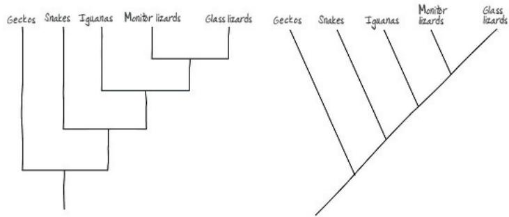

(5)  
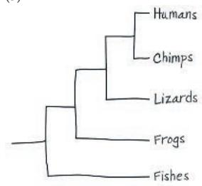

Each of the three trees identifies chimps and lizards as the two closest relatives of humans in these trees because they are the groups shown with whom we share the two most recent common ancestors.

Figure 26.6 Unknown 1b (a portion of sample 1) and unknowns 9–13 all would have to be located on the branch of the tree that currently leads to Minke (Southern Hemisphere) and unknowns 1a and 2–8. Figure 26.8 You should have circled the branch point that is drawn farthest to the left (the common ancestor of all taxa shown). Both cetaceans and seals descended from terrestrial lineages of mammals, indicating that the cetacean–seal common ancestor lacked a streamlined body form and hence would not be part of the cetacean–seal group. Figure 26.9 Hinged jaws are a shared ancestral character for the group that includes frogs, turtles, and leopards. Thus, you should have circled the frog, turtle, and leopard lineages, along with their most recent common ancestor. Figure 26.10 Crocodilians are the sister taxon to the dinosaur clade (which includes birds) because crocodilians and the dinosaur clade share an immediate common ancestor that is not shared by any other group. Figure 26.14 There are four possible bases (A, C, G, T) at each nucleotide position. If the base at each position depends on chance, not common descent, we would expect roughly one out of four (25%) of them to be the same. Figure 26.21 This tree indicates that the sequences of rRNA and other genes in mitochondria are most closely related to those of proteobacteria, while the sequences of chloroplast genes are most closely related to those of cyanobacteria. These gene sequence relationships are what would be predicted from endosymbiont theory, which posits that both mitochondria and chloroplasts originated as engulfed prokaryotic cells.

## Concept Check 26.1

1. In Figure 26.4, leopards are the sister taxon to a group consisting of the family Mustelidae (which includes badgers) and the family Canidae (which includes wolves). Since members of a sister group are each other's closest relatives, leopards are equally related to badgers and to wolves.
2. The tree in (c) shows a different pattern of evolutionary relationships. In (c), C and B are sister taxa, whereas C and D are sister taxa in (a) and (b).
3. The redrawn version of Figure 26.4 is shown below.

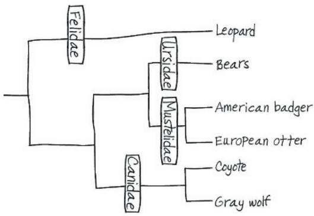

## Concept Check 26.2

1. No; hair is a shared ancestral character common to all mammals and thus is not helpful in distinguishing different mammalian subgroups.
2. Four limbs would be a shared ancestral character of the group descended from the common ancestor of the turtle and the leopard (that is, the amniotes). All amniotes have four limbs (unless they were lost) but this trait is not unique to this group. Four limbs would be a shared derived trait of the group descended from the common ancestor of the frog and the turtle-leopard lineage (that is, the tetrapods). This trait was new in this group's common ancestor.

The traditional classification provides a poor match to evolutionary history, thus violating the basic principle of cladistics—that classification should be based on common descent. Both birds and mammals originated from groups traditionally designated as reptiles, making reptiles (as traditionally delineated) a paraphyletic group. These problems can be addressed by removing Dimetrodon and cynodonts from the reptiles and by regarding birds as a group of reptiles (specifically, as a group of dinosaurs).

## Concept Check 26.3

1. (a) Analogy, since porcupines and cacti are not closely related and since most other animals and plants do not have similar structures; (b) homology, since cats and humans are both mammals and have homologous forelimbs, of which the hand and paw are the lower part; (c) analogy, since owls and hornets are not closely related and since the structure of their wings is very different. 2. Species B and C are more likely to be closely related. Small genetic changes (as between species B and C) can produce divergent physical appearances, but if many genes have diverged greatly (as in species A and B), then the lineages have probably been separate for a long time. 3. The common name for a species in a language such as English or Spanish may be completely based on analogous similarity. People may tend to default to thinking that, for example, all “fish” are closely related, when in fact these commonalities may result from convergent evolution of analogous similarity (animals that swim). 4. The principle of maximum parsimony states that the hypothesis about nature we investigate first should be the simplest explanation found to be consistent with the facts. Actual evolutionary relationships may differ from those inferred by parsimony owing to complicating factors such as convergent evolution.

## Concept Check 26.4

1. Proteins are gene products. Their amino acid sequences are determined by the nucleotide sequences of the DNA that codes for them. Thus, differences between comparable proteins in two species reflect underlying genetic differences that have accumulated as the species diverged from one another. As a result, differences between the proteins can reflect the evolutionary history of the species.
2. Orthologous genes are homologous genes in which the homology results from a speciation event and hence occurs between genes found in different species. Paralogous genes are homologous genes in which the homology results from gene duplication. Orthologous genes should be used to infer phylogeny since differences among them reflect the history of speciation events.
3. In RNA processing, the exons or coding regions of a gene can be spliced together in different ways, yielding different mRNAs and hence different protein products. As a result, different proteins could potentially be produced from the same gene in different tissues, thereby enabling the gene to perform different functions in these different tissues.

## Concept Check 26.5

1. A molecular clock is a method of estimating the actual time of evolutionary events based on numbers of base changes in orthologous genes. It is based on the assumption that the regions of genomes being compared evolve at constant rates. 2. There are many portions of the genome that do not code for genes; mutations that alter the sequence of bases in such regions could accumulate through drift without affecting an organism's fitness. Even in coding regions of the genome, some mutations may not have a critical effect on genes or proteins.

## Concept Check 26.6

1. The kingdom Monera included bacteria and archaea, but we now know that these organisms are in separate domains. Kingdoms are subsets of domains, so a single kingdom (like Monera) that includes taxa from different domains is not

valid. 2. Because of horizontal gene transfer, some genes in eukaryotes are more closely related to bacteria, while others are more closely related to archaea; thus, depending on which genes are used, phylogenetic trees constructed from DNA data can yield conflicting results. 3. Eukaryotes are hypothesized to have originated when a heterotrophic prokaryotic organism (an archaeal host cell) engulfed a bacterium that would later become an organelle found in all eukaryotes—the mitochondrion. Over time, a fusion of organisms occurred as the archaeal host cell and its bacterial endosymbiont evolved to become a single organism. As a result, we would expect the cell of a eukaryote to include both archaeal DNA and bacterial DNA, making the origin of eukaryotes an example of horizontal gene transfer.

## Summary of Key Concepts Questions

26.1 The fact that humans and chimpanzees are sister species indicates that we share a more recent common ancestor with chimpanzees than we do with any other living primate species. But that does not mean that humans evolved from chimpanzees, or vice versa; instead, it indicates that both humans and chimpanzees are descendants of that common ancestor. 26.2 For example, four limbs can be considered a shared ancestral character of mammals (because the shared ancestor of mammals and their closest relatives, reptiles, had four limbs), and a shared derived character of tetrapods (because this trait appeared in the common ancestor of tetrapods, but not the ancestor they share with their closest relatives). 26.3 Homologous characters result from shared ancestry. As organisms diverge over time, some of their homologous characters will also diverge. The homologous characters of organisms that diverged long ago typically differ more than do the homologous characters of organisms that diverged more recently. As a result, differences in homologous characters can be used to infer phylogeny. In contrast, analogous characters result from convergent evolution, not shared ancestry, and hence can give misleading estimates of phylogeny. 26.4 Orthologous genes should be used; for such genes, the homology results from speciation and hence reflects evolutionary history. 26.5 A key assumption of molecular clocks is that nucleotide substitutions occur at fixed rates, and hence the number of nucleotide differences between two DNA sequences is proportional to the time since the sequences diverged from each other. Some limitations of molecular clocks: No gene marks time with complete precision; natural selection can favor certain DNA changes over others; nucleotide substitution rates can change over long periods of time (causing molecular clock estimates of when events in the distant past occurred to be highly uncertain); and the same gene can evolve at different rates in different organisms. 26.6 Genetic data indicated that many prokaryotic organisms differed as much from each other as they did from eukaryotes. This indicated that organisms should be grouped into three broad domains (Archaea, Bacteria, and Eukarya). These data also indicated that the previous kingdom Monera (which had contained all the prokaryotic organisms) did not make biological sense and should be abandoned. Later genetic and morphological data also indicated that the former kingdom Protista (which had primarily contained single-celled organisms) should be abandoned because some protists are more closely related to plants, fungi, or animals than they are to other protists.

## Test Your Understanding

1. A 2. C 3. B 4. C 5. B 6. A 7. D  
9.  
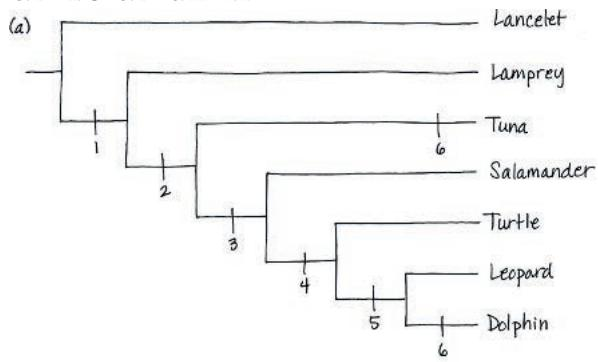

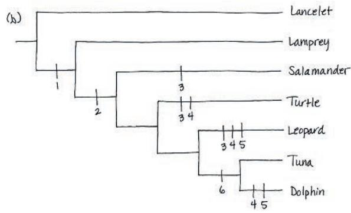

(c) The tree in (a) requires seven evolutionary changes, while the tree in (b) requires eleven evolutionary changes. Thus, the tree in (a) is more parsimonious since it requires fewer evolutionary changes.

## Chapter 27

## Figure Questions

Figure 27.7 The top ring, to which the hook is attached, is embedded within the interior, hydrophobic portion of the lipid bilayer of the outer membrane, suggesting that the top ring is hydrophobic. Likewise, the third ring down is embedded within the hydrophobic portion of the plasma membrane's lipid bilayer, suggesting that this ring also is hydrophobic. Figure 27.9 The third plasmid is the separate, small twisted loop located just above and to the left of the line pointing to the label "Chromosome." Figure 27.10 It is likely that the expression or sequence of genes that affect glucose metabolism may have changed; genes for metabolic processes no longer needed by the cell also may have changed. Figure 27.11 Transduction results in horizontal gene transfer when the host and recipient cells are members of different species. Figure 27.18 Thermophiles live in very hot environments, so it is likely that their enzymes can continue to function normally at much higher temperatures than can the enzymes of other organisms. At low temperatures, however, the enzymes of thermophiles may not function as well as the enzymes of other organisms. Figure 27.19 From the graph, plant uptake can be estimated as 0.72, 0.62, and $0.96\mathrm{mgK^{+}}$ for strains 1, 2, and 3, respectively. These values average to $0.77\mathrm{mgK^{+}}$ . If bacteria had no effect, the average plant uptake of $\mathrm{K}^+$ for strains 1, 2, and 3 should be close to $0.51\mathrm{mgK^{+}}$ the value observed for plants grown in bacteria-free soil. Figure 27.22 Penicillin.

## Concept Check 27.1

1. Adaptations include the capsule (shields prokaryotic organisms from the host's immune system) and endospores (enable cells to survive harsh conditions and to revive when the environment becomes favorable). 2. Prokaryotic cells lack the complex compartmentalization associated with the membrane-enclosed organelles of eukaryotic cells. Prokaryotic genomes have much less DNA than eukaryotic genomes, and most of this DNA is contained in a single ring-shaped chromosome located in the nucleoid rather than within a true membrane-enclosed nucleus. In addition, many prokaryotic organisms also have plasmids, small ring-shaped DNA molecules containing a few genes. 3. Plastids such as chloroplasts are thought to have evolved from an endosymbiotic photosynthetic prokaryotic organisms. More specifically, the phylogenetic tree shown in Figure 26.21 indicates that plastids are closely related to cyanobacteria. Hence, we can hypothesize that the thylakoid membranes of chloroplasts resemble those of cyanobacteria because chloroplasts evolved from an endosymbiotic cyanobacterium.

## Concept Check 27.2

1. Prokaryotic organisms can have extremely large population sizes, in part because they often have short generation times. The large number of individuals in prokaryotic populations makes it likely that in each generation there will be many individuals that have new mutations at any particular gene, thereby adding considerable genetic diversity to the population.
2. In transformation, naked, foreign DNA from the environment is taken up by a bacterial cell. In transduction, phages carry bacterial genes from one bacterial cell to another. In conjugation, a bacterial cell directly transfers plasmid or chromosomal DNA to another cell via a mating bridge that temporarily connects the two cells.
3. Yes. Genes for antibiotic resistance could be transferred (by transformation, transduction, or conjugation) from the nonpathogenic bacterium to a pathogenic bacterium; this could make the pathogen an even greater threat to human health. In general, transformation, transduction, and conjugation tend to increase the spread of resistance genes.

## Concept Check 27.3

1. A phototroph derives its energy from light, while a chemotroph gets its energy from chemical sources. An autotroph derives its carbon from $CO_{2}$ , $HCO_{3}^{-}$ , or related compounds, while a heterotroph gets its carbon from organic nutrients such as glucose. Thus, there are four nutritional modes: photoautotrophic, photoheterotrophic (unique to prokaryotic organisms), chemoautotrophic (unique to prokaryotic organisms), and chemoheterotrophic.
2. Chemoheterotrophy; the bacterium must rely on chemical sources of energy, since it is not exposed to light, and it must be a heterotroph if it requires a source of carbon other than $CO_{2}$ (or a related compound, such as $HCO_{3}^{-}$ ). 3. If humans could fix nitrogen, we could build proteins using atmospheric $N_{2}$ and hence would not need to eat high-protein foods such as meat, fish, or soy. Our diet would, however, need to include a source of carbon, along with minerals and water. Thus, a typical meal might consist of carbohydrates as a carbon source, along with fruits and vegetables to provide essential minerals (and additional carbon).

## Concept Check 27.4

1. Molecular systematic studies indicate that some organisms once classified as bacteria are more closely related to eukaryotes and belong in a domain of their own: Archaea. Such studies have also shown that horizontal gene transfer is common and plays an important role in the evolution of prokaryotic organisms. By not requiring that organisms be cultured in the laboratory, metagenomic studies have revealed an immense diversity of previously unknown prokaryotic species. Over time, the ongoing discovery of new species by metagenomic analyses may alter our understanding of prokaryotic phylogeny greatly.

## Concept Check 27.5

1. Although prokaryotic organisms are small, their large numbers and metabolic abilities enable them to play key roles in ecosystems by decomposing wastes, recycling chemicals, and affecting the concentrations of nutrients available to other organisms.
2. Cyanobacteria produce oxygen when water is split in the light reactions of photosynthesis. The Calvin cycle incorporates $CO_{2}$ from the air into organic molecules, which are then converted to sugars.

## Concept Check 27.6

1. Sample answers: eating fermented foods such as yogurt, sourdough bread, or cheese; receiving clean water from sewage treatment; taking medicines produced by bacteria 2. No. If the poison is secreted as an exotoxin, live bacteria could be transmitted to another person. But the same is true if the poison is an endotoxin—only in this case, the live bacteria that are transmitted may be descendants of the (now-dead) bacteria that produced the poison. 3. Some of the many different species of prokaryotic organisms that live in the human gut compete with one another for resources (from the food that you eat). Because different prokaryotic species have different adaptations, a change in diet may alter which species can grow most rapidly, thus altering species abundance.

## Summary of Key Concepts Questions

27.1 Specific structural features that enable prokaryotic organisms to thrive in diverse environments include their cell walls (which provide shape and protection), flagella (which function in directed movement), and ability to form capsules or endospores (both of which can protect against harsh conditions). Prokaryotic organisms also possess biochemical adaptations for growth in varied conditions, such as those that enable them to tolerate extremely hot or salty environments. 27.2 Many prokaryotic species can reproduce extremely rapidly, and their populations can number in the trillions. As a result, even though mutations are rare, every day many offspring are produced that have new mutations at particular gene loci. In addition, even though prokaryotic organisms reproduce asexually and hence the vast majority of offspring are genetically identical to their parent, the genetic variation of their populations can be increased by transduction, transformation, and conjugation. Each of these (nonreproductive) processes can increase genetic variation by transferring DNA from one cell to another—even among cells that are of different species. 27.3 Prokaryotic organisms have an exceptionally broad range of metabolic adaptations. As a group, prokaryotic organisms perform all four modes of nutrition (photoautotrophy, chemoautotrophy, photoheterotrophy, and chemoheterotrophy), whereas eukaryotes perform only two of these (photoautotrophy and chemoheterotrophy). Prokaryotic organisms are also able to metabolize nitrogen in a wide variety of forms (again unlike eukaryotes), and they frequently cooperate with other prokaryotic cells of the same or different species. 27.4 Phenotypic criteria such as shape, motility, and nutritional mode do not provide a clear picture of the evolutionary history of the prokaryotic organisms. In contrast, molecular data have elucidated relationships among major groups of prokaryotic organisms. Molecular data have also allowed researchers to sample genes directly from the environment; using such genes to construct phylogenies has led to the discovery of major new groups of prokaryotic organisms. 27.5 Prokaryotic organisms play key roles in the chemical cycles on which life depends. For example, prokaryotic organisms are important decomposers, breaking down corpses and waste materials, thereby releasing nutrients to the environment where they can be used by other organisms. Prokaryotic organisms also convert inorganic compounds to forms that other organisms can use. With respect to their ecological interactions, many Prokaryotic species form life-sustaining mutualisms with other species. In some cases, such as hydrothermal vent communities, the metabolic activities of prokaryotic organisms provide an energy source on which hundreds of other species depend; in the absence of the prokaryotic organisms, the community would collapse. 27.6 Human well-being depends on our associations with mutualistic prokaryotic organisms, such as the many species that live in our intestines and digest food that we cannot. Humans also can harness the remarkable metabolic capabilities of prokaryotic organisms to produce a wide range of useful products and to perform key services such as bioremediation. Negative effects of prokaryotic organisms result primarily from bacterial pathogens that cause disease.

Test Your Understanding

1. D  2. A  3. B  4. C  5. D  6. A

## Chapter 28

## Figure Questions

Figure 28.4 The diagram shows that a single secondary endosymbiosis event gave rise to the stramenopiles and alveolates—thus, these groups can trace their ancestry back to a single heterotrophic protist (shown in yellow) that ingested a red alga. In contrast, euglenids and chlorarachniophytes each descended from a different heterotrophic protist (one of which is shown in gray, the other in brown). Hence, it is likely that stramenopiles and alveolates are more closely related than are euglenids and chlorarachniophytes.

Figure 28.6

Figure 28.10 The sperm cells in the diagram are produced by the asexual (mitotic) division of cells in a single male gametophyte, which was itself produced by the asexual (mitotic) division of a single zoospore. Thus, the sperm cells are all derived from a single zoospore and so are genetically identical to one another. Figure 28.14 Merozoites are produced by the asexual (mitotic) cell division of haploid sporozoites; similarly, gametocytes are produced by the asexual cell division of merozoites. Hence, it is likely that individuals in these three stages have the same complement of genes and that morphological differences between them result from changes in gene expression. Figure 28.15 These events have a similar overall effect to fertilization. In both cases, haploid nuclei that were originally from two genetically different cells fuse to form a diploid nucleus. Figure 28.21 The following stage should be circled: step 6, where a mature cell undergoes mitosis and forms four or more daughter cells. In step 7, the zoospores eventually grow into mature haploid cells, but they do not produce new daughter cells. Likewise, in step 2, a mature cell develops into a gamete, but it does not produce new daughter cells. Figure 28.23 They would be haploid because originally each of these cells was a haploid, solitary amoeba.

## Concept Check 28.1

1. Sample response: Protists include unicellular, colonial, and multicellular organisms; photoautotrophs, heterotrophs, and mixotrophs; species that reproduce asexually, sexually, or both ways; and organisms with diverse physical forms and adaptations.
2. Strong evidence shows that eukaryotes acquired mitochondria after a host cell (either an archaean or a cell closely related to the archaea) first engulfed and then formed an endosymbiotic association with an alpha proteobacterium. Similarly, chloroplasts in red and green algae appear to have descended from a photosynthetic cyanobacterium that was engulfed by an ancient heterotrophic eukaryote. Secondary endosymbiosis also played an important role: Various protistan lineages acquired plastids by engulfing unicellular red or green algae.

4. Four. The first (and primary) genome is the DNA located in the chlorarachniophyte nucleus. A chlorarachniophyte also contain remnants of a green alga's nuclear DNA, located in the nucleomorph. Finally, mitochondria and chloroplasts contain DNA from the (different) bacteria from which they evolved. These two prokaryotic genomes comprise the third and fourth genomes contained within a chlorarachniophyte.

## Concept Check 28.2

1. Because foram tests are hardened with calcium carbonate, they form long-lasting fossils in marine sediments and sedimentary rocks.
2. The plastid DNA would likely be more similar to the chromosomal DNA of cyanobacteria based on the well-supported hypothesis that eukaryotic plastids (such as those found in the eukaryotic groups listed) originated by an endosymbiosis event in which a eukaryote engulfed a cyanobacterium. If the plastid is derived from the cyanobacterium, its DNA would be derived from the bacterial DNA.
3. Figure 13.6b. Algae and plants with alternation of generations have a multicellular haploid stage and a multicellular diploid stage. In the other two life cycles, either the haploid stage or the diploid stage is unicellular.
4. During photosynthesis, aerobic algae produce $O_{2}$ and use $CO_{2}$ . $O_{2}$ is produced as a by-product of the light reactions, while $CO_{2}$ is used as an input to the Calvin cycle (the end products of which are sugars). Aerobic algae also perform cellular respiration, which uses $O_{2}$ as an input and produces $CO_{2}$ as a waste product.

## Concept Check 28.3

1. Many red algae contain a photosynthetic pigment called phycoerythrin, which gives them a reddish color and allows them to carry out photosynthesis in relatively deep

coastal water. Also unlike brown algae, red algae have no flagellated stages in their life cycle and must depend on water currents to bring gametes together for fertilization. 2. Ulva contains many cells and its body is differentiated into leaflike blades and a rootlike holdfast. Caulerpa's body is composed of multinucleate filaments without cross-walls, so it is essentially one large cell. 3. Red algae have no flagellated stages in their life cycle and hence must depend on water currents to bring their gametes together. This feature of their biology might increase the difficulty of reproducing on land. In contrast, the gametes of green algae are flagellated, making it possible for them to swim in thin films of water. In addition, a variety of green algae contain compounds in their cytoplasm, cell wall, or zygote coat that protect against intense sunlight and other terrestrial conditions. Such compounds may have increased the chance that descendants of green algae could survive on land.

## Concept Check 28.4

1. Amoebozoans have lobe- or tube-shaped pseudopodia, whereas forams have threadlike pseudopodia.
2. Slime molds are fungus-like in that they produce fruiting bodies that aid in the dispersal of spores, and they are animal-like in that they are motile and ingest food. However, slime molds are more closely related to tubulinids and archamoebas than to fungi or animals.
3. This is a zygotic life cycle, because mitosis only occurs in haploid cells, and the zygote is the only diploid cell.

## Concept Check 28.5

1. Haptophytes, which have coccoliths made of calcium carbonate, are likely the phytoplankton that produced these calcareous deposits.
2. Because the genetic material of Provora is so different from organisms in other eukaryotic supergroups, molecular clocks suggest a very early divergence of this group in eukaryotic history.

## Concept Check 28.6

1. Because photosynthetic protists constitute the base of aquatic food webs, many aquatic organisms depend on them for food, either directly or indirectly. (In addition, a substantial percentage of the oxygen produced by photosynthesis is made by photosynthetic protists.) 2. Protists form mutualistic and parasitic associations with other organisms. Examples include photosynthetic dinoflagellates that form a mutualistic symbiosis with coral polyps; parabasalids that form a mutualistic symbiosis with termites; and the stramenopile Phytophthora ramorum, a parasite of oak trees. 3. Corals depend on their dinoflagellate symbionts for nourishment, so coral bleaching could cause the corals to die. As the corals die, less food would be available for fishes and other species that eat coral. As a result, populations of these species might decline, and that, in turn, might cause populations of their predators to decline. 4. The two approaches differ in the evolutionary changes they may bring about. A strain of Wolbachia that confers resistance to infection by Plasmodium and does not harm mosquitoes would spread rapidly through the mosquito population. In this case, natural selection would favor any Plasmodium individuals that could overcome the resistance to infection conferred by Wolbachia. If insecticides are used, mosquitoes that are resistant to the insecticide would be favored by natural selection. Hence, use of Wolbachia could cause evolution in Plasmodium populations, while using insecticides could cause evolution in mosquito populations.

## Summary of Key Concepts Questions

28.1 Sample response: Protists, plants, animals, and fungi are similar in that their cells have a nucleus and other membrane-enclosed organelles, unlike the cells of prokaryotic organisms. These membrane-enclosed organelles make the cells of eukaryotes more complex than the cells of prokaryotic organisms. Protists and other eukaryotes also differ from prokaryotic organisms in having a well-developed cytoskeleton that enables them to have asymmetric forms and to change in shape as they feed, move, or grow. With respect to differences between protists and other eukaryotes, most protists are unicellular, unlike animals, plants, and most fungi. Protists also have greater nutritional diversity than other eukaryotes.
28.2 Stramenopiles and alveolates are hypothesized to have originated by secondary endosymbiosis. Under this hypothesis, we can infer that the common ancestor of these two groups had a plastid, in this case of red algal origin. Thus, we would expect that apicomplexans (and alveolate or stramenopile protists) either would have plastids or would have lost their plastids over the course of evolution.
28.3 Red algae, green algae, and plants are placed in the same supergroup because considerable evidence indicates that these organisms all descended from the same ancestor, an ancient heterotrophic protist that acquired a cyanobacterial endosymbiont.
28.4 The amorpheans are a diverse group of eukaryotes that includes many protists, along with animals and fungi. Most of the protists in Amorphea are amoebozoans, a clade of amoebas that have lobe- or tube-shaped pseudopodia (as opposed to the threadlike pseudopodia of rhizarians). Other protists in Amorphea include several groups that are closely related to fungi and several other groups that are closely related to animals.
28.6 Sample response: Ecologically important protists include photosynthetic dinoflagellates that provide essential sources of energy to their symbiotic partners, the corals that build coral reefs. Other important protistan symbionts include those that enable termites to digest wood and Plasmodium, the pathogen that causes malaria. Photosynthetic protists such as diatoms are among the most important producers in aquatic communities; as such, many other species in aquatic environments depend on them for food.

Test Your Understanding 1. D 2. B 3. C 4. D 5. D 6. C

Pathogens that share a relatively recent common ancestor with humans will likely also share metabolic and structural characteristics with humans. Because drugs target the pathogen's metabolism or structure, developing drugs that harm the pathogen but not the patient should be most difficult for pathogens with whom we share the most recent evolutionary history. Working backward in time, we can use the phylogenetic tree to determine the order in which humans shared a common ancestor with pathogens in different taxa. This process leads to the prediction that it should be hardest to develop drugs to combat animal pathogens, followed by choanoflagellate pathogens, fungal and nucleariid pathogens, amoebozoans, other protists, and finally prokaryotic organisms.

## Chapter 29

## Figure Questions

Figure 29.5 The life cycles of plants and some algae, shown in Figure 13.6b, have alternation of generations; other life cycles do not. Unlike in the animal life cycle (Figure 13.6a), in the plant/algal life cycle, meiosis produces spores, not gametes. These haploid spores then divide repeatedly by mitosis, ultimately forming a multicellular haploid individual that produces gametes. There is no multicellular haploid stage in the animal life cycle. An alternation of generations life cycle also has a multicellular diploid stage, whereas the life cycle of most fungi and some protists shown in Figure 13.6c does not. Figure 29.10 Plants, nonvascular plants, vascular plants, and seed plants are monophyletic because each of these groups includes the common ancestor of the group and all of the descendants of that common ancestor. The seedless vascular plants are paraphyletic: This group does not include all of the descendants of the group's most recent common ancestor. Figure 29.11 Yes. As shown in the diagram, the sperm cell and the egg cell that fuse each resulted from the mitotic division of spores produced by the same sporophyte. However, these spores would differ genetically from one another because they were produced by meiosis, a cell division process that generates genetic variation among the offspring cells. Figure 29.14 Because the moss reduces nitrogen loss from the ecosystem, species that typically colonize the soils after the moss probably experience higher soil nitrogen levels than they otherwise would. The resulting increased availability of nitrogen may benefit these species because nitrogen is an essential nutrient that often is in short supply. Figure 29.17 A fern that had wind-dispersed sperm would not require water for fertilization, thus removing a difficulty that ferns face when they live in arid environments. The fern would also be under strong selection to produce sperm above ground (as opposed to the current situation, where some fern gametophytes are located below ground).

## Concept Check 29.1

1. Plants share some key traits only with charophytes: rings of cellulose-synthesizing complexes and similarity in sperm structure. Comparisons of nuclear, chloroplast, and mitochondrial DNA sequences also indicate that certain groups of charophytes (such as Zygnema) are the closest living relatives of plants. 2. Possible answers include walls toughened by sporopollenin (protects against harsh environmental conditions); multicellular, dependent embryos (provide nutrients and protection to the developing embryo); cuticle (reduces water loss); stomata (control gas exchange and reduce water loss) 3. The multicellular diploid stage of the life cycle would not produce gametes. Instead, both males and females would produce haploid spores by meiosis. These spores would give rise to multicellular male and female haploid stages—a major change from the single-celled haploid stages (sperm and eggs) that we actually have. The multicellular haploid stages would produce gametes and reproduce sexually. An individual at the multicellular haploid stage of the human life cycle might look like us, or it might look completely different.

## Concept Check 29.2

1. Most bryophytes do not have a vascular transport system, and their life cycle is dominated by gametophytes rather than sporophytes.
2. Answers may include the following: Large surface area of protonema enhances absorption of water and minerals; the vase-shaped archegonia protect eggs during fertilization and transport nutrients to the embryos via placental transfer cells; the stalk-like seta conducts nutrients from the gametophyte to the capsule, where spores are produced; the peristome enables gradual spore discharge; stomata enable $CO_{2}/O_{2}$ exchange while minimizing water loss; lightweight spores are readily dispersed by wind.
3. Effects of global warming on peatlands could result in positive feedback, which occurs when an end product of a process increases its own production. In this case, global warming is expected to lower the water levels of some peatlands. This would expose peat to air and cause it to decompose, thereby releasing stored $CO_{2}$ to the atmosphere. The release of more stored $CO_{2}$ to the atmosphere could cause additional global warming, which in turn could cause further drops in water levels, the release of still more $CO_{2}$ to the atmosphere, additional warming, and so on: an example of positive feedback.

## Concept Check 29.3

1. Lycophytes have microphylls, whereas seed plants and monilophytes (ferns and their relatives) have megaphylls. Monilophytes and seed plants also share other traits not found in lycophytes, such as the initiation of new root branches at various points along the length of an existing root.
2. Both seedless vascular plants and bryophytes have flagellated sperm that require moisture for fertilization; this shared similarity poses challenges for these species in arid regions. With respect to key differences, seedless vascular plants have lignified, well-developed vascular tissue, a trait that enables the sporophyte to grow tall and that has transformed life on Earth (via the formation of forests). Seedless vascular plants also have true leaves and roots, which, when compared with bryophytes, provide increased surface area for photosynthesis and improve their ability to extract nutrients from soil.
3. Three mechanisms contribute to the production of genetic variation in sexual reproduction: independent assortment of chromosomes, crossing over, and random fertilization. If fertilization were to occur between gametes from the same gametophyte, all of the offspring would be genetically identical. This would be the case because all of the cells produced by a gametophyte—including its sperm and egg cells—are the descendants of a single spore and hence are genetically identical. Although crossing over and the independent assortment of chromosomes would continue to generate genetic variation during the production of spores (which ultimately develop into gametophytes), overall the amount of genetic variation produced by sexual reproduction would drop.

## Summary of Key Concepts Questions 29.1

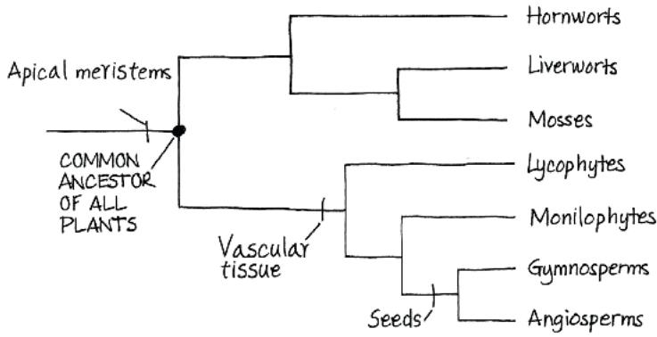  
29.2 Some mosses colonize bare, sandy soils, leading to the increased retention of nitrogen in these otherwise low-nitrogen environments. Other mosses harbor nitrogen-fixing cyanobacteria that increase the availability of nitrogen in the ecosystem. The moss Sphagnum is often a major component of deposits of peat (partially decayed organic material). Boggy regions with thick layers of peat, known as peatlands, cover broad geographic regions and contain large reservoirs of carbon. By storing large amounts of carbon—in effect, removing $CO_{2}$ from the atmosphere—peatlands affect the global climate, making them of considerable ecological importance.

29.3 Lignified vascular tissue provided the strength needed to support a tall plant against gravity, as well as a means to transport water and nutrients to plant parts located high above ground. Roots were another key trait, anchoring the plant to the ground and providing additional structural support for plants that grew tall. Tall plants could shade shorter plants, thereby outcompeting them for light. Because the spores of a tall plant disperse farther than the spores of a short plant, it is also likely that tall plants could colonize new habitats more rapidly than short plants.

## Test Your Understanding

1. B 2. D 3. C 4. A 5. C 6. (a) diploid; (b) haploid; (c) haploid; (d) diploid 7. Based on our current understanding of the evolution of major plant groups, the phylogeny has the four branch points shown here:

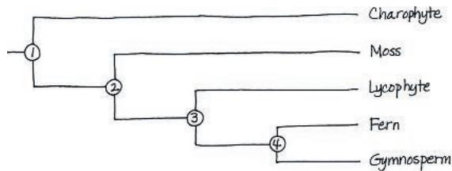  
Derived characters unique to the charophyte and plant clade (indicated by branch point 1) include rings of cellulose-synthesizing complexes and flagellated sperm structure. Derived characters unique to the plant clade (branch point 2) include alternation of generations; multicellular, dependent embryos; walled spores produced in sporangia; and apical meristems. Derived characters unique to the vascular plant clade (branch point 3) include life cycles with dominant sporophytes, complex vascular systems (xylem and phloem), and well-developed roots and leaves. Derived characters unique to the monilophyte and seed plant clade (branch point 4) include megaphylls and roots that can branch at various points along the length of an existing root.

## Chapter 30

## Figure Questions

Figure 30.2 Retaining the gametophyte within the sporophyte shields the egg-containing gametophyte from UV radiation. UV radiation is a mutagen. Hence, we would expect fewer mutations to occur in the egg cells produced by a gametophyte retained within the body of a sporophyte. Most mutations are harmful. Thus, the fitness of embryos should increase because fewer embryos would carry harmful mutations. Figure 30.3 The seed contains cells from three generations: (1) the current sporophyte (cells of ploidy 2n, found in the seed coat and in the megasporangium remnant that surrounds the spore wall), (2) the female gametophyte (cells of ploidy n, found in the food supply), and (3) the sporophyte of the next generation (cells of ploidy 2n, found in the embryo). Figure 30.4 Mitosis. A single haploid megaspore divides by mitosis to produce a multicellular, haploid female gametophyte. (Likewise, a single haploid microspore divides by mitosis to produce a multicellular male gametophyte.)

Figure 30.9

Figure 30.12 The largest number of seeds this flower could produce is six. We can infer this because the flower is shown as having six ovules, each of which can develop into a single seed. At least six pollen grains would have to germinate to produce six seeds. Figure 30.14 No. The branching order shown could still be correct if species on the lineages leading to Amborella, water lilies, star anise, and magnoliids had originated prior to 150 million years ago, but fossils of that age from those lineages had not yet been discovered. In such a situation, the 140-million-year-old date for the origin of the angiosperms shown on the phylogeny would be incorrect.

## Concept Check 30.1

1. To reach the eggs, the flagellated sperm of seedless plants must swim through a film of water, usually over a distance of no more than a few centimeters. In contrast, the sperm of seed plants do not require water because they are produced within pollen grains that can be transported long distances by wind or by animal pollinators. Although flagellated in some species, the sperm of seed plants do not require mobility because pollen tubes convey them from the point at which the pollen grain is deposited (near the ovules) directly to the eggs.
2. The reduced gametophytes of seed plants are nurtured by sporophytes and protected from stress, such as drought conditions and UV radiation. Pollen grains, with walls containing sporopollenin, provide protection during transport by wind or animals. Seeds have one or two layers of protective tissue, the seed coat, that improve survival by providing more protection from environmental stresses than do the walls of spores. Seeds also contain a stored supply of food, which provides nourishment for growth after dormancy is broken and the embryo emerges as a seedling.
3. If a seed could not enter dormancy, the embryo would continue to grow after it was fertilized. As a result, the embryo might rapidly become too large to be dispersed, thus limiting its transport. The embryo's chance of survival might also be reduced because it could not delay growth until conditions become favorable.

## Concept Check 30.2

1. The pine life cycle illustrates heterospory, as ovulate cones produce megaspores and pollen cones produce microspores. The reduced gametophytes are evident in the form of the microscopic pollen grains that develop from microspores and the microscopic female gametophyte that develops from the megaspore. The egg is shown developing within an ovule, and a pollen tube is shown conveying the sperm. The figure also shows the protective and nutritive features of a seed. 2. In pines, pollination occurs when a pollen grain is transferred to an ovulate cone scale, the part of a pine that contains ovules. Fertilization occurs when a sperm nucleus unites with an egg nucleus, forming a diploid zygote. Although pollination is required for fertilization, they are separate events: In pines, pollination usually occurs more than a year before fertilization.

## Concept Check 30.3

1. In the oak's life cycle, the tree (the sporophyte) produces flowers, which contain gametophytes in pollen grains and ovules; the eggs in ovules are fertilized; the mature ovaries develop into dry fruits called acorns. We can view the oak's life cycle as starting when the acorn seeds germinate, resulting in embryos giving rise to seedlings and finally to mature trees, which produce flowers—and then more acorns.
2. Pine cones and flowers both have sporophylls, modified leaves that produce spores. Pine trees have separate pollen cones (with pollen grains) and ovulate cones (with ovules inside cone scales). In flowers, pollen grains are produced by the anthers of stamens, and ovules are within the ovaries of carpels. Unlike pine cones, many flowers produce both pollen and ovules.
3. The fact that the clade with bilaterally symmetrical flowers had more species establishes a correlation between flower shape and the rate of plant speciation. Flower shape is not necessarily responsible for the result because the shape (that is, bilateral or radial symmetry) may have been correlated with another factor that was the actual cause of the observed result. Note, however, that flower shape was associated with increased speciation rates when averaged across 19 different pairs of plant lineages. Since these 19 lineage pairs were independent of one another, this association suggests—but does not establish—that differences in flower shape cause differences in speciation rates. In general, strong evidence for causation can come from controlled, manipulative experiments, but such experiments are usually not possible for studies of past evolutionary events.

## Concept Check 30.4

1. Plant diversity can be considered a resource because plants provide many important benefits to humans; as a resource, plant diversity is nonrenewable because if a species is lost to extinction, that loss is permanent.
2. A detailed phylogeny of the seed plants would identify many different monophyletic groups of seed plants. Using this phylogeny, researchers could look for clades that contained species in which medicinally useful compounds had already been discovered. Identification of such clades would allow researchers to concentrate their search for new medicinal compounds among clade members—as opposed to searching for new compounds in species that were selected at random from the more than 290,000 existing species of seed plants.

## Summary of Key Concepts Questions

30.1 The integument of an ovule develops into the protective coat of a seed. The ovule's megaspore develops into a haploid female gametophyte, and two parts of the seed are related to that gametophyte: The food supply of the seed is derived from haploid gametophyte cells, and the embryo of the seed develops after the female gametophyte's egg cell is fertilized by a sperm cell. A remnant of the ovule's megasporangium surrounds the spore wall that encloses the seed's food supply and embryo. 30.2 Gymnosperms arose about 305 million years ago, making them a successful group in terms of their evolutionary longevity. Gymnosperms have the five derived traits common to all seed plants (reduced gametophytes, heterospory, ovules, pollen, and seeds), making them well adapted for life on land. Finally, because gymnosperms dominate immense geographic regions today, the group is also highly successful in geographic distribution. 30.3 Based on fossils known during his lifetime, Darwin was troubled by the relatively sudden and geographically widespread appearance of angiosperms in the fossil record. Recent fossil evidence shows that angiosperms arose and began to diversify over a period of 20–30 million years, a less rapid event than was suggested by the fossils known during Darwin's lifetime. Fossil discoveries have also uncovered extinct lineages of woody seed plants thought to have been more closely related to angiosperms than to gymnosperms; one such group, the Bennettitales, had flowerlike structures that may have been pollinated by insects. In addition, phylogenetic analyses have identified a woody species, Amborella, as the lineage of extant angiosperms that was the first to diverge from other angiosperms. The fact that both the extinct seed plant ancestors of angiosperms and the earliest-diverging taxon of extant angiosperms were woody

suggests that the common ancestor of angiosperms also was woody. 30.4 The loss of tropical forests could contribute to global warming (which would have negative effects on many human societies). People also depend on Earth's biodiversity for many products and services and hence would be harmed by the loss of species that would occur if the world's remaining tropical forests were cut down. With respect to a possible mass extinction, tropical forests harbor at least $50\%$ of the species on Earth. If the remaining tropical forests were destroyed, large numbers of these species could be driven to extinction, thus rivaling the losses that occurred in the five mass extinction events documented in the fossil record.

  
(b) The phylogeny indicates that the lineages of extant angiosperms that were the first to diverge from other angiosperms differed from other angiosperms in terms of the number of cells in female gametophytes and the ploidy of the endosperm. The ancestral state of the angiosperms cannot be determined from these data alone. It is possible that the common ancestor of angiosperms had seven-celled female gametophytes and triploid endosperm and hence that the eight-celled and four-celled conditions represent derived traits for those lineages. Alternatively, either the eight-celled or four-celled condition may represent the ancestral state.

## Chapter 31

## Figure Questions

Figure 31.2 DNA from each of these mushrooms would be identical if each mushroom is part of a single hyphal network, as is likely. Figure 31.5 The haploid spores produced in the sexual portion of the life cycle develop from haploid nuclei that were produced by meiosis; because genetic recombination occurs during meiosis, these spores will differ genetically from one another. In contrast, the haploid spores produced in the asexual portion of the life cycle develop from nuclei that were produced by mitosis; as a result, these spores are genetically identical to one another. Figure 31.17 One or both of the following would apply to each species: DNA analyses would reveal that it is a member of the ascomycete clade, or aspects of its sexual life cycle would indicate that it is an ascomycete (for example, it would produce asci and ascospores). Figure 31.18 The hypha is composed of cells that are haploid $(n)$ , as indicated by the teal-colored arrow behind it. Figure 31.20 The mushroom is a basidiocarp, or fruiting body, of the dikaryotic mycelium, and so a cell from its stalk would be dikaryotic $(n + n)$ . Figure 31.22 Two possible controls would be E-P- and E+P-. Results from an E-P-control could be compared with results from the E-P+ experiment, and results from an E+P-control could be compared with results from the E+P+ experiment. Together, these two comparisons would indicate whether the addition of the pathogen causes an increase in leaf mortality. Results from an E-P-experiment could also be compared with results from the second control $(\mathrm{E} + \mathrm{P}-)$ to determine whether adding the fungal endophytes has a negative effect on the plant.

## Concept Check 31.1

1. Both a fungus and a human are heterotrophs. Many fungi digest their food externally by secreting enzymes into the food and then absorbing the small molecules that result from digestion. Other fungi absorb such small molecules directly from their environment. In contrast, humans (and most other animals) ingest relatively

large pieces of food and digest the food within their bodies. 2. The ancestors of such a mutualist most likely secreted powerful enzymes to digest the body of their insect host. Since such enzymes would harm a living host, it is likely that the mutualist would not produce such enzymes or would restrict their secretion and use. 3. Carbon that enters the plant through stomata is fixed into sugar through photosynthesis. Some of these sugars are absorbed by the fungus that partners with the plant to form mycorrhizae; others are transported within the plant body and used in the plant. Thus, the carbon may be deposited in either the body of the plant or the body of the fungus.

## Concept Check 31.2

1. The majority of the fungal life cycle is spent in the haploid stage, whereas the majority of the human life cycle is spent in the diploid stage.
2. The two mushrooms might be reproductive structures of the same mycelium (the same organism). Or they might be parts of two separate organisms that have arisen from a single parent organism through asexual reproduction (for example, from two genetically identical asexual spores) and thus carry the same genetic information.

## Concept Check 31.3

1. DNA evidence indicates that fungi, animals, and their protistan relatives form a clade, the opisthokonts. Furthermore, chytrids have posterior flagella, as do most other opisthokonts. This suggests that other fungal lineages lost their flagella after diverging from ancestors that had flagella.
2. Mycorrhizae form extensive networks of hyphae through the soil, enabling nutrients to be absorbed more efficiently than a plant can do on its own; this is true today, and similar associations were probably very important for the earliest plants (which lacked roots). Evidence for the antiquity of mycorrhizal associations includes fossils showing arbuscular mycorrhizae in the early plant Aglaophyton and molecular results showing that genes required for the formation of mycorrhizae are present in liverworts and other early-diverging plant lineages.
3. Fungi are heterotrophs. Prior to the colonization of land by plants, terrestrial fungi would have lived where other organisms (or their remains) were present and provided a source of food. Thus, if fungi colonized land before plants, they could have fed on prokaryotic organisms or protists that lived on land or by the water's edge—but not on the plants or animals on which many fungi feed today.

## Concept Check 31.4

1. One explanation would be that the ancestor of present-day microsporidians had flagellated spores, but that over the course of evolution within the microsporidian lineage, the flagella were lost.
2. Possible answers include the following: In mucoromycetes, the sturdy, thick-walled zygosporangium can withstand harsh conditions and then undergo karyogamy and meiosis when the environment is favorable for reproduction. In one group of mucoromycetes, the glomeromycetes, the hyphae have a specialized morphology that enables the fungi to form arbuscular mycorrhizae with plant roots. In ascomycetes, the asexual spores (conidia) are often produced in chains or clusters at the tips of conidiophores, where they are easily dispersed by wind. The often cup-shaped ascocarps house the sexual spore-forming asci. In basidiomycetes, the basidiocarp supports and protects a large surface area of basidia, from which spores are dispersed.
3. Such a change to the life cycle of an ascomycete would reduce the number and genetic diversity of ascospores that result from a mating event. Ascospore number would drop because a mating event would lead to the formation of only one ascus. Ascospore genetic diversity would also drop because in ascomycetes, one mating event leads to the formation of asci by many different dikaryotic cells. As a result, genetic recombination and meiosis occur independently many different times—which could not happen if only a single ascus was formed. It is also likely that if such an ascomycete formed an ascocarp, the shape of the ascocarp would differ considerably from that found in its close relatives.

## Concept Check 31.5

1. A suitable environment for growth, retention of water and minerals, protection from intense sunlight, and protection from being eaten 2. A hardy spore stage enables dispersal to host organisms through a variety of mechanisms; their ability to grow rapidly in a favorable new environment enables them to capitalize on the host's resources. 3. Many different outcomes might have occurred. Organisms that currently form mutualisms with fungi might have gained the ability to perform the tasks currently done by their fungal partners, or they might have formed similar mutualisms with other organisms (such as bacteria). Alternatively, organisms that currently form mutualisms with fungi might be less effective at living in their present environments. For example, the colonization of land by plants might have been more difficult. And if plants did eventually colonize land without fungal mutualists, natural selection might have favored plants that formed more highly divided and extensive root systems (in part replacing mycorrhizae).

## Summary of Key Concepts Questions

31.1 The body of a multicellular fungus typically consists of thin filaments called hyphae. These filaments form an interwoven mass (mycelium) that penetrates the substrate on which the fungus grows and feeds. Because the individual filaments are thin, the surface-to-volume ratio of the mycelium is maximized, making nutrient absorption highly efficient.

31.3 Phylogenetic analyses show that fungi and animals are more closely related to each other than either is to other multicellular eukaryotes (such as plants or multicellular algae). These analyses also show that fungi are more closely related to single-celled protists called nucleariids than they are to animals, whereas animals are more closely related to a different group of single-celled protists, the choanoflagellates, than they are to fungi. In combination, these results indicate that multicellularity evolved in fungi and animals independently, from different single-celled ancestors.
31.4  
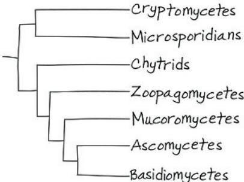

31.5 As decomposers, fungi break down the bodies of dead organisms, thereby recycling elements between the living and nonliving environments. Without the activities of fungi and bacterial decomposers, essential nutrients would remain tied up in organic matter, and life as we know it would cease. As an example of their key role as mutualists, fungi form mycorrhizal associations with plants. These associations improve the growth and survival of plants, thereby indirectly affecting the many other species (humans included) that depend on plants. As pathogens, fungi harm other species. In some cases, fungal pathogens have caused their host populations to decline across broad geographic regions, as in the case of the American chestnut.

## Test Your Understanding

1. B 2. D 3. A 4. D

## Chapter 32

## Figure Questions

Figure 32.3 As described in ① and ②, choanoflagellates and a broad range of animals have collar cells. Since collar cells have never been observed in plants, fungi, or non-choanoflagellate protists, this suggests that choanoflagellates may be more closely related to animals than to other eukaryotes. If choanoflagellates are more closely related to animals than to any other group of eukaryotes, choanoflagellates and animals should share other traits that are not found in other eukaryotes. The data described in ③ are consistent with this prediction. Figure 32.8 (1) Any imaginary slice through the central axis of a radial animal divides its body into mirror images. As a result, a radial animal has no front and back sides and no left and right sides.

(2)  
  
Figure 32.11 Cnidaria is the sister phylum in this tree.

## Concept Check 32.1

1. In most animals, the zygote undergoes cleavage, which leads to the formation of a blastula. Next, in gastrulation, one end of the embryo folds inward, producing layers of embryonic tissue. As the cells of these layers differentiate, a wide variety of animal forms are produced. Despite the diversity of animal forms, animal development is controlled by a similar set of Hox genes across a broad range of taxa. 2. The imaginary plant would require tissues composed of cells that were analogous to the muscle and nerve cells found in animals: "Muscle" tissue would be necessary for the plant to chase prey, and "nerve" tissue would be required for the plant to coordinate its movements when chasing prey. To digest captured prey, the plant would need to either secrete enzymes into one or more digestive cavities (which could be modified leaves, as in a Venus flytrap) or secrete enzymes outside of its body and feed by absorption. To extract nutrients from the soil—yet be able to chase prey—the plant would need something other than fixed roots, perhaps retractable "roots" or a way to ingest soil. To conduct photosynthesis, the plant would require chloroplasts. Overall, such an imaginary plant would be very similar to an animal that had chloroplasts and retractable roots.

## Concept Check 32.2

1. c, b, a, d 2. The branch with a question mark should be labeled "Choanoflagellates." One line of evidence for this is morphological: Collar cells similar to present-day choanoflagellates are found in animals but have never been seen in plants, fungi, or protists other than choanoflagellates. Additionally, there is strong molecular evidence that choanoflagellates are the lineage most closely related to animals. 3. In descent with modification, an organism shares characteristics with its ancestors (due to their shared ancestry), yet it also differs from its ancestors (because organisms accumulate differences over time as they adapt to their surroundings). As an example, consider the evolution of animal cadherin proteins, a key step in the origin of multicellular animals. These proteins illustrate both of these aspects of descent with modification: Animal cadherin proteins share many protein domains with a cadherin-like protein found in their choanoflagellate ancestors, yet they also have a unique "CCD" domain that is not found in choanoflagellates.

## Concept Check 32.3

1. A snail has a spiral and determinate cleavage pattern; a human has radial, indeterminate cleavage. In a snail, the coelomic cavity is formed by splitting of mesoderm masses; in a human, the coelom forms from folds of archenteron. In a snail, the mouth forms from the blastopore; in a human, the anus develops from the blastopore.
2. Animals that lack a body cavity tend to have thin, flat bodies. Such animals don't require an internal transport system: With bodies that are only a few cells thick, the exchange of nutrients, gases, and wastes can occur across the entire body surface.
3. Most triploblasts have two openings to their digestive tract, a mouth and an anus. As such, their bodies have a structure that is analogous to that of a doughnut: The digestive tract (the hole of the doughnut) runs from the mouth to the anus and is surrounded by various tissues (the solid part of the doughnut). The doughnut analogy is most obvious at early stages of development (see Figure 32.10c).

## Concept Check 32.4

1. Cnidarians possess tissues, while sponges do not. Also unlike sponges, cnidarians exhibit body symmetry, though it is radial and not bilateral as in most other animal phyla.

Under the hypothesis that ctenophores are the first lineage of metazoans to diverge from other animals, sponges (which lack tissues) would be nested within a clade whose other members all have tissues. As a result, a group composed of animals with tissues would not form a clade. 3. The phylogeny in Figure 32.11 indicates that molluscs are members of Lophotrochozoa, one of the three main groups of bilaterians (the others being Deuterostomia and Ecdysozoa).

As seen in Figure 25.11, the fossil record shows that molluscs were present tens of millions of years before the Cambrian explosion. Thus, long before the Cambrian explosion, the lophotrochozoan clade had formed and was evolving independently of the evolutionary lineages leading to Deuterostomia and Ecdysozoa. Based on the phylogeny in Figure 32.11, we can also conclude that the lineages leading to Deuterostomia and Ecdysozoa were independent of one another before the Cambrian explosion. Since the lineages leading to the three main clades of bilaterians were evolving independently of one another prior to the Cambrian explosion, that explosion could be viewed as consisting of three “explosions,” not one.

## Summary of Key Concepts Questions

32.1 Unlike animals, which are heterotrophs that ingest their food, plants are autotrophs, and fungi are heterotrophs that grow on their food and feed by absorption. Animals lack cell walls, which are found in both plants and fungi. Animals also have muscle tissue and nerve tissue, which are not found in either plants or fungi. In addition, the sperm and egg cells of animals are produced by meiotic division, unlike what occurs in plants and fungi (where reproductive cells such as sperm and eggs are produced by mitotic division). Finally, animals regulate the development of body form with Hox genes, a unique group of genes that is not found in either plants or fungi. 32.2 Current hypotheses about the cause of the Cambrian explosion include new predator-prey relationships, an increase in atmospheric oxygen, and an increase in developmental flexibility provided by the origin of Hox genes and other genetic changes. 32.3 Body plans provide a helpful way to compare and contrast key features of organisms. However, phylogenetic analyses show that similar body plans have arisen independently in different groups of organisms. As such, similar body plans may have arisen by convergent evolution and hence may not be informative about evolutionary relationships. 32.4 Listed in order from the most to the least inclusive clade, humans belong to Metazoa, Bilateria, Deuterostomia, and Chordata.

Test Your Understanding

1. A  2. D  3. C  4. C

Practice Applying Your Learning

7. (a) F (b) F (c) T (d) T (e) F (f) T

## Chapter 33

## Figure Questions

Figure 33.8 Obelia is an animal, and its life cycle is indeed most similar to the generalized life cycle of animals (Figure 13.6a). In Obelia, both the polyp and the medusa are diploid organisms. As in other animals, in Obelia only the single-celled gametes are haploid. By contrast, plants and some algae (Figure 13.6b) have a multicellular haploid generation and a multicellular diploid generation. Obelia also differs from fungi and some protists (Figure 13.6c) in that the diploid stage of those organisms is unicellular. Figure 33.9 Possible examples include the Golgi apparatus (flattening; increases area for receiving and transporting proteins), the cristae of mitochondria (folding; increases the surface area available for cellular respiration), the cardiovascular system (branching; increase area for materials exchange in tissues), and root hairs (projections; increase area for absorption). Figure 33.11 Adding fertilizer to the water supply would probably increase the abundance of algae, and that, in turn, would likely increase the abundance of snails (which eat algae). If the water was also contaminated with infected human feces or urine, an increase in the number of snails would likely lead to an increase in the abundance of blood flukes (which require snails as an intermediate host). As a result, the occurrence of schistosomiasis might increase. Figure 33.22 The extinction of freshwater bivalves might lead to an increase in the abundance of photosynthetic protists and bacteria. Because these organisms are at the base of aquatic food webs, increases in their abundance could have major effects on aquatic communities (including both increases and decreases in the abundance of other species). Figure 33.30 Such a result would be consistent with the origin of the Ubx and abd-A Hox genes having played a major role in the evolution of increased body segment diversity in arthropods. However, note that such a result would simply show that the presence of the Ubx and abd-A Hox genes was correlated with an increase in body segment diversity in arthropods; it would not provide direct experimental evidence that the origin of the Ubx and abd-A genes caused an increase in arthropod body segment diversity. Figure 33.36 You should have circled the clade that includes the insects, remipedians, and other crustaceans, along with the branch point that represents their most recent common ancestor.

## Concept Check 33.1

1. The flagella of choanocytes draw water through their collars, which trap food particles. The particles are engulfed by phagocytosis and digested, either by choanocytes or by amoebocytes.
2. Ctenophores have diploblastic spherical or oval-shaped gelatinous bodies with modified radial symmetry. They have two unique features: ctenes, plates of partially fused cilia arranged in eight rows that can beat and propel the ctenophore in the water column, and colloblasts, structures with sticky cells on the ctenophore's tentacles that allow it to capture zooplankton prey.

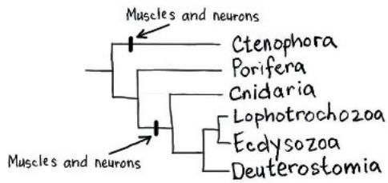

## Concept Check 33.2

1. Both the polyp and the medusa are composed of an outer epidermis and an inner gastrodermis separated by a gelatinous layer, the mesoglea. The polyp is a cylindrical form that adheres to the substrate by its aboral end; the medusa is a flattened, mouthdown form that moves freely in the water. 2. Both a feeding polyp and a medusa are diploid, as indicated by the pink arrow in the diagram. The medusa stage produces haploid gametes. This is an example of a gametic life cycle. 3. Evolution is not goal oriented; hence, it would not be correct to argue that cnidarians are not “highly evolved” simply because their form had changed relatively little over the past 560 million years. Instead, the fact that cnidarians have persisted for hundreds of millions of years indicates that the cnidarian body plan is a highly successful one.

## Concept Check 33.3

1. Tapeworms can absorb food from their environment and release ammonia into their environment through their body surface because their body is very flat, due in part to the lack of a body cavity.
2. The inner tube is the alimentary canal, which runs the length of the body. The outer tube is the body wall. The two tubes are separated by the coelom.
3. All molluscs have inherited a foot from their common ancestor. However, in different groups of molluscs, the structure of the foot has been modified over time by natural selection. In gastropods, the foot is used as a holdfast or to move slowly on the substrate. In cephalopods, the foot has been modified into part of the tentacles and into an excurrent siphon, through which water is propelled (resulting in movement in the opposite direction).

## Concept Check 33.4

1. Nematodes lack body segments and a coelom; annelids have both. 2. The arthropod exoskeleton, which had already evolved in the ocean, allows terrestrial species to retain water and support their bodies on land. Wings allow insects to disperse quickly to new habitats and to find food and mates. The tracheal system allows for efficient gas exchange despite the presence of an exoskeleton. 3. Yes. Under the traditional hypothesis, we would expect body segmentation to be controlled by similar Hox genes in annelids and arthropods. However, if annelids are in Lophotrochozoa and arthropods are in Ecdysozoa (as current evidence suggests), body segmentation may have evolved independently in these two groups. In such a case, we might expect that different Hox genes would control the development of body segmentation in the two clades.

## Concept Check 33.5

1. Each tube foot consists of an ampulla and a podium. When the ampulla squeezes, it forces water into the podium, which causes the podium to expand and contact the substrate. Adhesive chemicals are then secreted from the base of the podium, thereby attaching the podium to the substrate.
2. Both insects and nematodes are members of Ecdysozoa, one of the three major clades of bilaterians. Therefore, a characteristic

shared by Drosophila and Caenorhabditis may be informative for other members of their clade—but not necessarily for members of Deuterostomia. Instead, Figure 33.2 suggests that a species within Echinodermata or Chordata might be a more appropriate invertebrate model organism from which to draw inferences about humans and other vertebrates. 3. Echinoderms include species with a wide range of body forms. However, even echinoderms that look very different from one another, such as sea stars and sea cucumbers, share characteristics unique to their phylum, including a water vascular system and tube feet. The differences between echinoderm species illustrate the diversity of life, while the characteristics they share illustrate the unity of life. The match between organisms and their environments can be seen in such echinoderm features as the eversible stomachs of sea stars (enabling them to digest prey that are larger than their mouth) and the complex, jaw-like structure that sea urchins use to eat seaweed.

## Summary of Key Concepts Questions

33.1 The sponge body consists of two layers of cells, both of which are in contact with water. As a result, gas exchange and waste removal occur as substances diffuse into and out of the cells of the body. Choenocytes and amoebocytes ingest food particles from the surrounding water. Choenocytes also release food particles to amoebocytes, which then digest the food particles and deliver nutrients to other cells. 33.2 The cnidarian body plan consists of a sac with a central digestive compartment, the gastrovascular cavity. The single opening to this compartment serves as both a mouth and an anus. The two main variations on this body plan are sessile polyps (which adhere to the substrate at the end of the body opposite to the mouth/anus) and motile medusae (which move freely through the water and resemble flattened, mouth-down versions of polyps). 33.3 No. Some lophotrochozoans have a crown of ciliated tentacles that function in feeding (called a lophophore), while others go through a distinctive developmental stage known as trochophore larvae. Many other lophotrochozoans do not have either of these features. As a result, the clade is defined primarily by DNA similarities, not morphological similarities.

33.4 Many nematode species live in soil and in sediments on the bottom of bodies of water. These free-living species play important roles in decomposition and nutrient cycling. Other nematodes are parasites, including many species that attack the roots of plants and some that attack animals (including humans). Arthropods have profound effects on all aspects of ecology. In aquatic environments, crustaceans play key roles as grazers (of algae), scavengers, and predators and some species, such as krill, are important sources of food for whales and other vertebrates. On land, it is difficult to think of features of the natural world that are not affected in some way by insects and other arthropods, such as spiders and ticks. There are more than 1 million species of insects, many of which have enormous ecological effects as herbivores, predators, parasites, decomposers, and vectors of disease. Insects are also key sources of food for many organisms, including humans in some regions of the world.

33.5 Echinoderms and chordates are both members of Deuterostomia, one of the three main clades of bilaterian animals. As such, chordates (including humans) are more closely related to echinoderms than we are to animals in any of the other phyla covered in this chapter. Nevertheless, echinoderms and chordates have evolved independently for over 500 million years. This statement does not contradict the close relationship of echinoderms and chordates, but it does make clear that "close" is a relative term indicating that these two phyla are more closely related to each other than either is to animal phyla not in Deuterostomia.

## Test Your Understanding

1. A 2. C 3. B 4. C 5. C 6. D

## Chapter 34

Figure Questions  

The redrawn tree shows mammals (including humans) as nested near the middle of the evolutionary tree of vertebrates. Showing the vertebrate tree in this way provides a visual illustration of the fact that the evolutionary history of vertebrates did not consist of a series of steps “leading to” humans. Figure 34.6 The patterns in these figures suggest that specific Hox genes, as well as the order in which they are expressed, have been highly conserved over the course of evolution.

Figure 34.20 Tiktaalik was a lobe-fin fish that had both fish and tetrapod characters. Like a fish, Tiktaalik had fins, scales, and gills. As described by Darwin's concept of descent with modification, such shared characters can be attributed to descent from ancestral species—in this case, Tiktaalik's descent from fish ancestors. Tiktaalik also had traits that were unlike a fish but like a tetrapod, including a flat skull, a neck, a full set of ribs, and the skeletal structure of its fin. These characters illustrate the second part of descent with modification, showing how ancestral features had become modified over time. Figure 34.21 Sometime between 350 mya and 340 mya. We can infer this because amphibians must have originated after the most recent common ancestor of amphibians and amniotes (and that ancestor is shown as having lived 350 mya), but no later than the date of the earliest known fossils of amphibians (shown in the figure as 340 mya). Figure 34.25 Pterosaurs did not descend from the common ancestor of all dinosaurs; hence, pterosaurs are not dinosaurs. However, birds are descendants of the common ancestor of the dinosaurs. As a result, a monophyletic clade of dinosaurs must include birds. In that sense, birds are dinosaurs. Figure 34.37 In a catabolic pathway, like the aerobic processes of cellular respiration, water is released as a by-product when an organic compound such as glucose is mixed with oxygen. The kangaroo rat can retain and use that water, decreasing its need to drink water. Figure 34.38 In general, the process of exaptation occurs as a structure that had one function acquires a different function via a series of intermediate stages. Each of these intermediate stages typically has some function in the organism in which it is found. The incorporation of articular and quadrate bones into the mammalian ear illustrates exaptation because these bones originally evolved as part of the jaw, where they functioned as the jaw hinge, but over time they became co-opted for another function, namely, the transmission of sound. Figure 34.44 As shown in this phylogeny, chimpanzees and humans represent the tips of separate branches of evolution. As such, the human and chimpanzee lineages have evolved independently after they diverged from their common ancestor—an event that took place 7–8 million years ago. Hence, it is incorrect to say that humans evolved from chimpanzees (or vice versa). If humans had descended from chimpanzees, for example, the human lineage would be nested within the chimpanzee lineage, much as birds are nested within the reptile clade (see Figure 34.25).

## Concept Check 34.1

1. The four characters are a notochord; a dorsal, hollow nerve chord; pharyngeal slits or clefts; and a muscular, post-anal tail.
2. In humans, these characters are present only in the embryo. The notochord becomes disks between the vertebrae; the dorsal, hollow nerve cord develops into the brain and spinal cord; the pharyngeal clefts develop into various adult structures, and the tail is almost completely lost.
3. You would expect the vertebrate groups Actinopterygii, Actinistia, Dipnoi, Amphibia, Reptilia, and Mammalia to have lungs or lung derivatives. All of these groups originate to the right of (evolved after) the hatch mark indicating the appearance of this derived character in their lineage.

## Concept Check 34.2

1. Parasitic lampreys have a round, rasping mouth, which they use to attach to fish. Non-parasitic lampreys feed only as larvae; these larvae resemble lancelets and like them, are suspension feeders. Conodonts had two sets of mineralized dental elements, which may have been used to impale prey and cut it into smaller pieces. 2. Such a finding suggests that early organisms with a head were favored by natural selection in several different evolutionary lineages. However, while a logical argument can be made that having a head was advantageous, fossils alone do not constitute proof. 3. In armored jawless vertebrates, bone served as external armor that may have provided protection from predators. Some species also had mineralized mouthparts, which could be used for either predation or scavenging.

## Concept Check 34.3

1. Both are gnathostomes and have jaws, four clusters of Hox genes, enlarged forebrains, and lateral line systems. Shark skeletons consist mainly of cartilage, whereas tuna have bony skeletons. Sharks also have a spiral valve. Tuna have an operculum and a swim bladder, as well as flexible rays supporting their fins.
2. Aquatic gnathostomes have jaws (an adaptation for feeding) and paired fins and a tail (adaptations for swimming). Aquatic gnathostomes also typically have streamlined bodies for efficient swimming and swim bladders or other mechanisms (such as oil storage in sharks) for buoyancy.

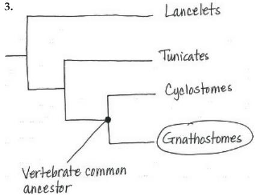

4. Yes, that could have happened. The paired appendages of aquatic gnathostomes other than the lobe-fins could have served as a starting point for the evolution of limbs. The colonization of land by aquatic gnathostomes other than the lobe-fins might have been facilitated in lineages that possessed lungs, as that would have enabled those organisms to breathe air.

## Concept Check 34.4

1. Tetrapods are thought to have originated about 365 million years ago when the fins of some lobe-fins evolved into the limbs of tetrapods. In addition to their four limbs with digits—a key derived trait for which the group is named—other derived traits of tetrapods include a neck (consisting of vertebrae that separate the head from the rest of the body) and a pelvic girdle that is fused to the backbone. 2. Some fully aquatic species are paedomorphic, retaining larval features for life in water as adults. Species that live in dry environments may avoid dehydration by burrowing or living under moist leaves, and they protect their eggs with foam nests, viviparity, and other adaptations. 3. Many amphibians spend part of their life cycle in aquatic environments and part on land. Thus, they may be exposed to a wide range of environmental problems, including water and air pollution and the loss or degradation of aquatic and/or terrestrial habitats. In addition, amphibians have highly permeable skin, providing relatively little protection from external conditions, and their eggs do not have a protective shell.

## Concept Check 34.5

1. The amniotic egg provides protection to the embryo and allows the embryo to develop on land, eliminating the necessity of a watery environment for reproduction. Another key adaptation is rib cage ventilation, which improves the efficiency of air intake and may have allowed early amniotes to dispense with breathing through their skin. Finally, not breathing through their skin allowed amniotes to develop relatively impermeable skin, thereby conserving water. 2. Yes. Although snakes lack limbs, they descended from lizards with legs. Some snakes retain vestigial pelvic and leg bones, providing evidence of their descent from an ancestor with legs. 3. Birds have weight-saving modifications, including the absence of teeth, a urinary bladder, and a second ovary in females. The wings and feathers are adaptations that facilitate flight, as do efficient respiratory and circulatory systems that support a high metabolic rate. 4. (a) synapsids, (b) tuataras, (c) turtles

## Concept Check 34.6

1. Monotremes lay eggs. Marsupials give birth to very small live young that attach to a nipple in the female's pouch, where they complete development. Eutherians give birth to more developed live young.
2. Hands and feet adapted for grasping, flat nails, large brain, forward-looking eyes on a flat face, parental care, and movable big toe and thumb.
3. Mammals are endothermic, enabling them to live in a wide range of habitats. Milk provides young with a balanced set of nutrients, and hair and a layer of fat under the skin help mammals retain heat. Mammals have differentiated teeth, enabling them to eat many different kinds of food. Mammals also have relatively large brains, and many species are capable learners. Following the mass extinction at the end of the Cretaceous period, the absence of large terrestrial dinosaurs may have opened many new ecological niches to mammals, promoting an adaptive radiation. Continental drift also isolated many groups of mammals from one another, promoting the formation of many new species.

## Concept Check 34.7

1. Hominins are a clade within the ape clade that includes humans and all species more closely related to humans than to other apes. The derived characters of hominins include bipedal locomotion and relatively larger brains. 2. In hominins, bipedal locomotion evolved long before large brain size. Homo ergaster, for example, was fully upright, bipedal, and as tall as modern humans, but its brain was significantly smaller than that of modern humans. 3. Yes, both can be correct. Homo sapiens may have established populations outside of Africa as early as 180,000 years ago, as indicated by the fossil record. However, those populations may have left few or no descendants today. Instead, all living humans may have descended from Africans that spread from Africa roughly 50,000 years ago, as indicated by genetic data.

## Summary of Key Concepts Questions

34.1 Lancelets represent the lineage of living chordates that was first to diverge from other chordates, and as adults they have key derived characters of chordates. This suggests that the chordate common ancestor may have resembled a lancelet in having an anterior end with a mouth along with the following four derived characters: a notochord; a dorsal, hollow nerve cord; pharyngeal slits or clefts; and a muscular, post-anal tail. 34.2 Conodonts, among the earliest vertebrates in the fossil record, were very abundant for 300 million years. While jawless, their well-developed teeth provide early signs of bone formation. Other species of jawless vertebrates developed armor on the outside of their bodies, which probably helped protect them from predators. Like lampreys, these species had paired fins for locomotion and an inner ear with semicircular canals that provided a sense of balance. There were many species of these armored jawless vertebrates, but they all became extinct by the close of the Devonian period, 359 million years ago. 34.3 The origin of jaws altered how fossil gnathostomes obtained food, which in turn had large effects on ecological interactions. Predators could use their jaws to grab prey or remove chunks of flesh, stimulating the evolution of increasingly sophisticated means of defense in prey species. Evidence for these changes can be found in the fossil record, which includes fossils of 10-m-long predators with remarkably powerful jaws, as well as lineages of well-defended prey species whose bodies were covered by armored plates. 34.4 Amphibians require water for reproduction; their bodies can lose water rapidly through their moist, highly permeable skin; and amphibian eggs do not have a shell and hence are vulnerable to desiccation. 34.5 Birds are descended from theropod dinosaurs, and dinosaurs are nested within the archosaur lineage, one of the two main reptile lineages. Thus, the other living archosaur reptiles, the crocodilians, are more closely related to birds than they are to non-archosaur reptiles such as lizards. As a result, birds are considered reptiles. (Note that if reptiles were defined as excluding birds, the reptiles would not form a clade; instead, the reptiles would be a paraphyletic group.) 34.6 Mammals are members of a group of amniotes called synapsids. Early (nonmammalian) synapsids laid eggs and had a sprawling gait. Fossil evidence shows that mammalian features arose gradually over a period of more than 100 million years. For example, the jaw was modified over time in nonmammalian synapsids, eventually coming to resemble that of a mammal. By 180 million years ago, the first mammals had appeared. There were many species of early mammals, but most of them were small, and they were not abundant or dominant members of their community. Mammals did not rise to ecological dominance until after the extinction of the dinosaurs. 34.7 The fossil record shows that from 4.5 to 2.5 million years ago, a wide range of hominin species walked upright but had relatively small brain sizes. About 2.5 million years ago, the first members of genus Homo emerged. These species used tools and had larger brains than those of earlier hominins. Fossil evidence indicates that multiple members of our genus were alive at any given point in time. Furthermore, until about 1.3 million years ago, these various Homo species also coexisted with members of earlier hominin lineages, such as Paranthropus. The different hominins alive at the same periods of time varied in body size, body shape, brain size, dental morphology, and the capacity for tool use. Ultimately, except for Homo sapiens, all of these species became extinct. Overall, human evolution can be viewed as an evolutionary tree with many branches—the only surviving lineage of which is our own.

(c)  
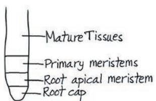  
(1)

## Test Your Understanding

## 1. D  2. C  3. B  4. C  5. D  6. A

8. (a) Because brain size tends to increase consistently in such lineages, we can conclude that natural selection favored the evolution of larger brains and hence that the benefits outweighed the costs. (b) As long as the benefits of brains that are large relative to body size are greater than the costs, large brains can evolve. Natural selection might favor the evolution of brains that are large relative to body size because such brains confer an advantage in obtaining mates and/or an advantage in survival.

  
Mortality tends to be lower in birds with larger brains.

## Chapter 35

## Figure Questions

Figure 35.5 All three examples have nodes because they're all stems. The nodes are the locations where the axillary buds arise.

Figure 35.11

-Mature Tissues

-Primary meristems

-Root apical meristem

-Root cap

X1 X2 X3 X4 X5 V P3 P2 P1

As a result of the addition of secondary xylem cells, the vascular cambium is pushed farther to the outside. Figure 35.15

Figure 35.17 Pith and cortex are defined, respectively, as ground tissue that is internal and ground tissue that is external to vascular tissue. Since vascular bundles of monocot stems are scattered throughout the ground tissue, there is no clear distinction between internal and external relative to the vascular tissue. Figure 35.19 The vascular cambium produces growth that increases the diameter of a stem or root. The tissues that are exterior to the vascular cambium cannot keep pace with the growth because their cells no longer divide. As a result, these tissues rupture. Figure 35.23 Periderm (mainly cork and cork cambium), primary phloem, secondary phloem, vascular cambium, secondary xylem (sapwood and heartwood), primary xylem, and pith. At the base of ancient redwood that is many centuries old, the remnants of primary growth (primary phloem, primary xylem, and pith) would be quite insignificant. Figure 35.30 Every root epidermal cell would develop a root hair. Figure 35.32 Another example of homeotic gene mutation is the mutation in a Hox gene that causes legs to form in place of antennae in Drosophila (see Figure 18.20). Figure 35.33

## Concept Check 35.1

1. The vascular tissue system connects leaves and roots, allowing sugars to move from leaves to roots in the phloem and allowing water and minerals to move to the leaves in the xylem.
2. To get sufficient energy from photosynthesis, we would need lots of surface area exposed to the sun. This large surface-to-volume ratio, however, would create a new problem—evaporative water loss. We would have to be permanently connected to a water source—the soil, also our source of minerals. In short, we would probably look and behave very much like plants.
3. As plant cells enlarge, they typically form a huge central vacuole that contains a dilute, watery sap. Central vacuoles enable plant cells to become large with only a minimal investment of new cytoplasm. The orientation of the cellulose microfibrils in plant cell walls affects the growth pattern of cells.

## Concept Check 35.2

1. Yes. In a woody plant, secondary growth is occurring in the older parts of the stem and root, while primary growth is occurring at the root and shoot tips. 2. The largest, oldest leaves would be lowest on the shoot. Since they would probably be heavily shaded, they would not photosynthesize much regardless of their size. Determinate growth benefits the plant by keeping it from investing an ever-increasing amount of resources into organs that provide little photosynthetic product. 3. No. The carrot roots will probably be smaller at the end of the second year because the food stored in the roots will be used to produce flowers, fruits, and seeds.

## Concept Check 35.3

1. In roots, primary growth occurs in three successive stages, moving away from the tip of the root: the zones of cell division, elongation, and differentiation. In shoots, it occurs at the tip of apical buds, with leaf primordia arising along the sides of an apical meristem. Most growth in length occurs in older internodes below the shoot tip.
2. The fossil probably came from a floating leaf because having stomata exclusively on the upper surface would be a poor adaptation for a desert plant since it would lead to water loss. A floating leaf, on the other hand, would benefit from having stomata on its upper surface since only that surface is in contact with the gaseous environment.
3. Root hairs are cellular extensions that increase the surface area of the root epidermis, thereby enhancing the absorption of minerals and water. Microvilli are extensions that increase the absorption of nutrients by increasing the surface area of the gut.

## Concept Check 35.4

1. The sign will still be 2 m above the ground because this part of the tree is no longer growing in length (primary growth); it is now growing only in thickness (secondary growth).
2. Stomata must be able to close because evaporation is much more intensive from leaves than from the trunks of woody trees as a result of the higher surface-to-volume ratio in leaves.
3. Since there is little seasonal temperature variation in the tropics, the growth rings of a tree from the tropics would be difficult to discern unless the tree came from an area that had pronounced wet and dry seasons.
4. The tree would die slowly. Girdling removes an entire ring of secondary phloem (part of the bark), completely preventing transport of sugars and starches from the shoots to the roots. After several weeks, the roots would have used all of their stored carbohydrate reserves and would die.

## Concept Check 35.5

1. Although all the living vegetative cells of a plant have the same genome, they develop different forms and functions because of differential gene expression. 2. Plants show indeterminate growth; juvenile and mature phases are found on the same individual plant; and cell differentiation in plants is more dependent on final position than on lineage. 3. One hypothesis is that tepals arise if B gene activity is present in all three of the outer whorls of the flower.

## Summary of Key Concepts Questions

35.1 Here are a few examples: The cuticle of leaves and stems protects these structures from desiccation. Collenchyma and sclerenchyma cells have thick walls that provide support for plants. Strong, branching root systems help anchor plants in the soil. 35.2 Primary growth arises from apical meristems and involves production and elongation of organs. Secondary growth arises from lateral meristems and adds to the diameter of roots and stems. 35.3 Lateral roots emerge from the pericycle and destroy plant cells as they emerge. In stems, branches arise from axillary buds and do not destroy any cells. 35.4 With the evolution of secondary growth, plants were able to grow taller and shade competitors. 35.5 The orientation of cellulose microfibrils in the innermost layers of the cell wall causes growth along one axis. Microtubules in the cell's outermost cytoplasm play a key role in regulating the axis of cell expansion because it is their orientation that determines the orientation of cellulose microfibrils.

## Test Your Understanding

1. D  2. C  3. C  4. A  5. D  6. C  7. D  8. B  9. D  10. D

12. The tea and iris leaves differ in the arrangement of photosynthetic mesophyll cells. In the tea leaf, the mesophyll cells are divided into two layers, with the lower part of the leaf having a loosely arranged spongy layer with large air spaces, and the upper part having a palisade layer of tightly packed cells. In contrast, the mesophyll cells in the iris leaf are evenly distributed with no large air spaces. These differences are associated with the natural orientation of the leaves of these two species. Tea leaves are horizontally oriented and are more likely to receive light on the upper surface, so most of the mesophyll cells are concentrated in a palisade layer to absorb light efficiently. In contrast, iris leaves are vertically oriented with both sides illuminated about equally during the course of the day, so the mesophyll cells are evenly distributed. In both leaves, structure fits function because the arrangement of mesophyll cells maximizes photosynthesis. 13. Pranksters must have been carried the bicycle high into the tree and threaded it over a young woody branch: Primary growth did not raise the bicycle off the ground. Over time, secondary growth in the region of the tree notch enveloped the bicycle.

## Chapter 36

## Figure Questions

Figure 36.2 There would be no reference to photosynthesis because it ceases at night. Also, the directions of the $\mathrm{CO}_{2}$ and $\mathrm{O}_2$ arrows associated with the leaves would be reversed because at night only the gas exchange related to cellular respiration is occurring. Figure 36.3 The leaves are being produced in a counterclockwise spiral. The next leaf primordium will emerge approximately between and to the inside of leaves 8 and 13. Figure 36.4 A higher leaf area index will not necessarily increase photosynthesis because of upper leaves shading lower leaves. Figure 36.6 A proton pump inhibitor would depolarize (increase) the membrane potential because fewer hydrogen ions would be pumped out across the plasma membrane. The immediate effect of an inhibitor of the $\mathrm{H}^{+}/\mathrm{sucrose}$ transporter would be to hyperpolarize (decrease) the membrane potential because fewer hydrogen ions would be leaking back into the cell through these cotransporters. An inhibitor of the $\mathrm{H}^{+}/\mathrm{NO}_{3}^{-}$ cotransporter would have no effect on the membrane potential because the simultaneous cotransport of a positively charged ion and a negatively charged ion has no net effect on charge difference across the membrane. An inhibitor of the potassium ion channels would decrease the membrane potential because additional positively charged ions would not be accumulating outside the cell. Figure 36.8 Few, if any, mesophyll cells are more than three cells from a vein. Figure 36.9 The Casparian strip blocks water and minerals from moving between endodermal cells or moving around an endodermal cell via the cell's wall. Therefore, water and minerals must pass through an endodermal cell's plasma membrane. Figure 36.13 A section $500\mu \mathrm{m}$ by $300\mu \mathrm{m}$ is equal to $150,000\mu \mathrm{m}^2$

or 0.0015 cm $^{2}$ . Since there are five stomata visible in 0.0015 cm $^{2}$ , the stomatal density of this bean leaf is approximately 3,333 stomata per square centimeter of leaf surface. Figure 36.18 Because the xylem is under negative pressure (tension), excising a stylet that had been inserted into a tracheid or vessel element would probably introduce air into the cell. No xylem sap would exude unless positive root pressure was predominant.

## Concept Check 36.1

1. Vascular plants must transport minerals and water absorbed by the roots to all the other parts of the plant. They must also transport sugars from sites of production to sites of use.
2. Increased stem elongation would raise the plant's upper leaves. Erect leaves and reduced lateral branching would make the plant less subject to shading by the encroaching neighbors.
3. Pruning shoot tips removes apical dominance, resulting in lateral shoots (branches) growing from axillary buds (see Concept 35.3). This branching produces a bushier plant with a higher leaf area index.

## Concept Check 36.2

1. The cell's $\Psi_{\mathrm{P}}$ is $0.7\mathrm{MPa}$ . In a solution with a $\Psi$ of $-0.4\mathrm{MPa}$ , the cell's $\Psi_{\mathrm{P}}$ at equilibrium would be $0.3\mathrm{MPa}$ . 2. The cell would still adjust to changes in its osmotic environment, but its responses would be slower. Although aquaporins do not affect the water potential gradient across membranes, they allow for more rapid osmotic adjustments. 3. If tracheids and vessel elements were alive at maturity, their cytoplasm would impede water movement, preventing rapid long-distance transport. 4. The protoplasts would burst. Because the cytoplasm has many dissolved solutes, water would enter the protoplast continuously without reaching equilibrium. (When present, the cell wall prevents rupturing by limiting expansion of the protoplast.)

## Concept Check 36.3

1. At dawn, a drop is exuded from the rooted stump because the xylem is under positive pressure due to root pressure. At noon, the xylem is under negative pressure (tension) when it is cut, and the xylem sap is pulled back into the rooted stump. Root pressure cannot keep pace with the increased rate of transpiration at noon.
2. Perhaps greater root mass helps compensate for the lower water permeability of the plasma membranes.
3. The Casparian strip and tight junctions both prevent movement of fluid between cells.

## Concept Check 36.4

1. Stomatal opening at dawn is controlled mainly by light, $CO_{2}$ concentration, and a circadian rhythm. Environmental stresses such as drought, high temperature, and wind can stimulate stomata to close during the day. Water deficiency during the peak of the day can trigger release of the plant hormone abscisic acid, which signals guard cells to close stomata.
2. The activation of the proton pumps of stomatal cells would cause the guard cells to take up $K^{+}$ . The increased turgor of the guard cells would lock the stomata open and lead to extreme evaporation from the leaf.
3. After the flowers are cut, transpiration from any leaves and from the petals (which are modified leaves) will continue to draw water up the xylem. If cut flowers are transferred directly to a vase, air pockets in xylem vessels prevent delivery of water from the vase to the flowers. Cutting stems again underwater, a few centimeters from the original cut, will sever the xylem above the air pocket. The water droplets prevent another air pocket from forming while the flowers are transferred to a vase.
4. Water molecules are in constant motion, traveling at different speeds. If water molecules gain enough energy, the most energetic molecules near the liquid's surface will have sufficient speed, and therefore sufficient kinetic energy, to leave the liquid in the form of gaseous molecules (water vapor). As the molecules with the highest kinetic energy leave the liquid, the average kinetic energy of the remaining liquid decreases. Because a liquid's temperature is directly related to the average kinetic energy of its molecules, the temperature drops as evaporation proceeds.

## Concept Check 36.5

1. In both cases, the long-distance transport is a bulk flow driven by a pressure difference at opposite ends of tubes. Pressure is generated at the source end of a sieve tube by the loading of sugar and resulting osmotic flow of water into the phloem, and this pressure pushes sap from the source end to the sink end of the tube. In contrast, transpiration generates a negative pressure potential (tension) that pulls the ascent of xylem sap. 2. The main sources are fully grown leaves (producing sugar by photosynthesis) and fully developed storage organs (producing sugar by breakdown of starch). Roots, buds, stems, expanding leaves, and fruits are powerful sinks because they are actively growing. A storage organ may be a sink in the summer when accumulating carbohydrates but a source in the spring when breaking down starch into sugar for growing shoot tips. 3. Positive pressure, whether it be in the xylem when root pressure predominates or in the sieve-tube elements of the phloem, requires active transport. Most long-distance transport in the xylem depends on bulk flow driven by the negative pressure potential generated ultimately by the evaporation of water from the leaf and does not require living cells. 4. The spiral slash prevents optimal bulk flow of the phloem sap to the root sinks. Therefore, more phloem sap can move from the source leaves to the fruit sinks, making them sweeter.

## Concept Check 36.6

1. Plasmodesmata, unlike gap junctions, have the ability to pass RNA, proteins, and viruses from cell to cell.
2. Long-distance signaling is critical for the integrated functioning of all large organisms, but the speed of such signaling is much less critical to plants because their responses to the environment, unlike those of animals, do not typically involve rapid movements.
3. Although this strategy would eliminate the systemic spread of viral infections, it would also severely impact the development of the plants.

## Summary of Key Concepts Questions

36.1 Plants with tall shoots and elevated leaf canopies generally had an advantage over shorter competitors. A consequence of the selective pressure for tall shoots was the further separation of leaves from roots. This separation created problems for the transport of materials between root and shoot systems. Plants with xylem cells were more successful at supplying their shoot systems with soil resources (water and minerals). Similarly, those with phloem cells were more successful at supplying sugar sinks with carbohydrates. 36.2 Xylem sap is pulled up the plant by transpiration much more often than it is pushed up the plant by root pressure. 36.3 Hydrogen bonds are necessary for the cohesion of water molecules to each other and for the adhesion of water to other materials, such as cell walls. Both adhesion and cohesion of water molecules are involved in the ascent of xylem sap under conditions of negative pressure. 36.4 Although stomata account for most of the water lost from plants, they are necessary for exchange of gases—for example, for the uptake of carbon dioxide needed for photosynthesis. The loss of water through stomata also drives the long-distance transport of water that brings soil nutrients from roots to the rest of the plant. 36.5 Although the movement of phloem sap depends on bulk flow, the pressure gradient that drives phloem transport depends on the osmotic uptake of water in response to the loading of sugars into sieve-tube elements at sugar sources. Phloem loading depends on $\mathrm{H^{+}}$ cotransport processes that ultimately depend on $\mathrm{H^{+}}$ gradients established by active $\mathrm{K^{+}}$ pumping. 36.6 Electrical signaling, cytoplasmic pH, cytoplasmic $\mathrm{Ca^{2 + }}$ concentration, and viral movement proteins all affect symplastic communication, as do developmental changes in the number of plasmodesmata.

Test Your Understanding

1. A 2. B 3. B 4. C 5. B 6. C 7. A 8. D

## Chapter 37

## Figure Questions

Figure 37.3 Cations. At low pH, there would be more protons ( $H^{+}$ ) to displace mineral cations from negatively charged soil particles into the soil solution. Figure 37.4 The A horizon, which consists of the topsoil Table 37.1 During photosynthesis, $CO_{2}$ is fixed into carbohydrates, which contribute to the dry mass. In cellular respiration, $O_{2}$ is reduced to $H_{2}O$ and does not contribute to the dry mass. Figure 37.9 Some other examples of mutualism are the following relationships. Flashlight fish and bioluminescent bacteria: The bacteria gain nutrients and protection from the fish, while the bioluminescence attracts prey and mates for the fish. Flowering plants and pollinators: Animals distribute the pollen and are rewarded by a meal of nectar or pollen. Vertebrate herbivores and some bacteria in the digestive system: Microorganisms in the alimentary canal break down cellulose to glucose and, in some cases, provide the animal with vitamins or amino acids. Meanwhile, the microorganisms have a steady supply of food and a warm environment. Humans and some bacteria in the digestive system: Some bacteria provide humans with vitamins, while the bacteria get nutrients from the digested food. Figure 37.11 Both ammonium and nitrate. A decomposing animal would release amino acids into the soil that would be converted into ammonium by ammonifying bacteria. Some of this ammonium could be used directly by the plant. A large part of the ammonium, however, would be converted by nitrifying bacteria to form nitrate ions that could also be absorbed by the plant root system. Figure 37.12 The legume plants benefit because the bacteria fix nitrogen that is absorbed by their roots. The bacteria benefit because they acquire photosynthetic products from the plants. Figure 37.13 All three plant tissue systems are affected. Root hairs (dermal tissue) are modified to allow Rhizobium penetration. The cortex (ground tissue) and pericycle (vascular tissue) proliferate during nodule formation. The vascular tissue of the nodule connects to the vascular cylinder of the root to allow for efficient nutrient exchange.

## Concept Check 37.1

1. Overwatering deprives roots of oxygen. Overfertilizing is wasteful and can lead to soil salinization and water pollution.
2. As lawn clippings decompose, they restore mineral nutrients to the soil. If they are removed, the minerals lost from the soil must be replaced by fertilization.
3. Because of their small size and negative charge, clay particles would increase the number of binding sites for cations and water molecules and would therefore increase cation exchange and water retention in the soil.
4. Due to hydrogen bonding between water molecules, water expands when it freezes, and this causes mechanical fracturing of rocks. Water also coheres to many objects, and this cohesion combined with other forces, such as gravity, can help tug particles from rock. Finally, water, because it is polar, is an excellent solvent that allows many substances, including ions, to become dissolved in solution.

## Concept Check 37.2

1. No. Even though macronutrients are required in greater amounts, all essential elements are necessary for a plant to complete its life cycle.
2. No. The fact that the addition of an element results in an increase in the growth rate of a crop does not mean that the element is strictly required for the plant to complete its life cycle.
3. Inadequate aeration of the roots of hydroponically grown plants would promote alcohol fermentation, which uses more energy and may lead to the accumulation of ethanol, a toxic by-product of fermentation.

## Concept Check 37.3

1. The rhizosphere is the zone in the soil immediately adjacent to living roots. It harbors many rhizobacteria with which the root systems form beneficial mutualisms. Some rhizobacteria produce antibiotics that protect roots from disease. Others absorb toxic metals or make nutrients more available to roots. Still others convert gaseous nitrogen into forms usable by the plant or produce chemicals that stimulate plant growth.
2. Soil bacteria and mycorrhizae enhance plant nutrition by making certain minerals more available to plants. For example, many types of soil bacteria are involved in the nitrogen cycle, and the hyphae of mycorrhizae provide a large surface area for the absorption of nutrients, particularly phosphate ions.
3. Mixotrophy refers to the strategy of using photosynthesis and heterotrophy for nutrition. Euglenids are well-known mixotrophic protists.
4. Saturating rainfall may deplete the soil of oxygen. A lack of soil oxygen would inhibit nitrogen fixation by the peanut root nodules and decrease the nitrogen available to the plants. Alternatively, heavy rain may leach nitrate from the soil. A symptom of nitrogen deficiency is yellowing of older leaves.

## Summary of Key Concepts Questions

37.1 The term ecosystem refers to the communities of organisms within a given area and their interactions with the physical environment around them. Soil is teeming with many communities of organisms, including bacteria, fungi, animals, and the root systems of plants. The vigor of these individual communities depends on nonliving factors in the soil environment, such as minerals, oxygen, and water, as well as on interactions, both positive and negative, between different communities of organisms. 37.2 No. Plants can complete their life cycle when grown hydroponically, that is, in aerated salt solutions containing the proper ratios of all the minerals needed by plants. 37.3 No. Some parasitic plants obtain their energy by siphoning off carbon nutrients from other organisms.

## Test Your Understanding

1. B  2. B  3. A  4. D  5. B  6. B  7. D  8. C  9. D

## Chapter 38

## Figure Questions

Figure 38.4 Having a specific pollinator is more efficient because less pollen gets delivered to flowers of the wrong species. However, it is also a risky strategy: If the pollinator population suffers to an unusual degree from predation, disease, or climate change, then the plant may not be able to produce seeds. Figure 38.6 The part of the angiosperm life cycle characterized by the most mitotic divisions is the step between seed germination and the mature sporophyte. Figure 38.8 Make Connections In addition to having a single cotyledon, monocots have leaves with parallel leaf venation, scattered vascular bundles in their stems, a fibrous root system, floral parts in threes or multiples of threes, and pollen grains with only one opening. In contrast, eudicots have two cotyledons, netlike leaf venation, vascular bundles in a ring, taproots, floral parts in fours or fives or multiples thereof, and pollen grains with three openings. Visual Skills The mature garden bean seed lacks an endosperm at maturity. Its endosperm was consumed during seed development, and its nutrients were stored anew in the cotyledons. Figure 38.9 Beans use a hypocotyl hook to push through the soil. The delicate leaves and shoot apical meristem are also protected by being sandwiched between two large cotyledons. The coleoptile of maize seedlings helps protect the emerging leaves.

## Concept Check 38.1

1. In angiosperms, pollination is the transfer of pollen from an anther to a stigma. Fertilization is the fusion of the egg and sperm to form the zygote; it cannot occur until after the growth of the pollen tube from the pollen grain. 2. Long styles help to weed out pollen grains that are genetically inferior and not capable of successfully growing long pollen tubes. 3. No. The haploid (gametophyte) generation of plants is multicellular and arises from spores. The haploid phase of the animal life cycles is a single-celled gamete (egg or sperm) that arises directly from meiosis: There are no spores.

## Concept Check 38.2

1. Flowering plants can avoid self-fertilization by self-incompatibility, having male and female flowers on separate plants (dioecious species), or having stamens and styles of different heights on separate plants ("pin" and "thrum" flowers). 2. Asexually propagated crops lack genetic diversity. Genetically diverse populations are less likely to become extinct in the face of an epidemic because there is a greater likelihood that a few individuals in the population are resistant. 3. In the short term, selfing may be advantageous in a population that is so dispersed and sparse that pollen delivery is unreliable. In the long term, however, selfing is an evolutionary dead end because it leads to a loss of genetic diversity that may preclude adaptive evolution.

## Concept Check 38.3

1. Traditional breeding and genetic engineering both involve artificial selection for desired traits. However, genetic engineering techniques facilitate faster gene transfer and are not limited to transferring genes between closely related varieties or species.
2. Bt maize suffers less insect damage; therefore, Bt maize plants are less likely to be infected by fumonisin-producing fungi that infect plants through wounds.
3. In such species, engineering the transgene into the chloroplast DNA would not prevent its escape in pollen; such a method requires that the chloroplast DNA be found only in the egg. An entirely different method of preventing transgene escape would therefore be needed, such as male sterility, apomixis, or self-pollinating closed flowers.

## Summary of Key Concepts Questions

38.1 After pollination and fertilization, a flower changes into a fruit. The petals, sepals, and stamens typically fall off the flower. The stigma of the pistil withers, and the ovary begins to swell. The ovules (embryonic seeds) inside the ovary begin to mature. 38.2 Asexual reproduction can be advantageous in a stable environment because individual plants that are well suited to that environment pass on all their genes to offspring. Also, asexual reproduction generally results in offspring that are less fragile than the seedlings produced by sexual reproduction. However, sexual reproduction offers the advantage of dispersal of tough seeds. Moreover, sexual reproduction produces genetic variety, which may be advantageous in an unstable environment. The likelihood is better that at least one offspring of sexual reproduction will survive in a changed environment. 38.3 "Golden Rice," although not yet in widespread commercial production, has been engineered to produce more vitamin A, thereby raising the nutritional value of rice. A protoxin gene from a soil bacterium has been engineered into Bt maize. This protoxin is lethal to invertebrates but harmless to vertebrates. Bt crops require less pesticide spraying and have lower levels of fungal infection and fungal toxins. The nutritional value of cassava is being increased in many ways by genetic engineering. Enriched levels of iron and beta-carotene (a vitamin A precursor) have been achieved, and cyanide-producing chemicals have been almost eliminated from the roots.

## Test Your Understanding

1. A 2. C 3. C 4. D 5. D

Practice Applying Your Learning
11. (a) F (b) T (c) T (d) F (e) F (f) F (g) T

## Chapter 39

## Figure Questions

Figure 39.4 Panel B in Figure 11.17 shows a branching signal transduction pathway that resembles the branching phytochrome-dependent pathway involved in de-etiolation. Figure 39.5 To determine which wavelengths of light are most effective in phototropism, you could use a glass prism to split white light into its component colors and see which colors cause the quickest bending (the answer is blue; see Figure 39.15). Figure 39.6 No. Polar auxin transport depends on the distribution of auxin transport proteins at the basal ends of cells. Figure 39.13 No. Since the ein mutation renders the seedling "blind" to ethylene, enhancing ethylene production by adding an eto mutation would have no effect on phenotype compared with the ein mutation alone. Figure 39.16 Yes. The white light, which contains red light, would stimulate seed germination in all treatments. Figure 39.20 Since far-red light, like darkness, causes an accumulation of the red-absorbing form $(\mathrm{P_r})$ of phytochrome, single flashes of far-red light at night would have no effect on flowering beyond what the dark periods alone would have. Figure 39.21 If this were true, then florigen would be an inhibitor of flowering, not an inducer. Figure 39.27 Photosynthetic adaptations can occur at the molecular level, as is apparent in the fact that $\mathrm{C_3}$ plants use rubisco to fix carbon dioxide initially, whereas $\mathrm{C_4}$ and CAM plants use PEP carboxylase. An adaptation at the tissue level is that plants have different stomatal densities based on their genotype and environmental conditions. At the organismal level, plants alter their shoot architectures to make photosynthesis more efficient. For example, self-pruning removes branches and leaves that respire more than they photosynthesize.

## Concept Check 39.1

1. Dark-grown seedlings are etiolated: They have long stems, underdeveloped root systems, and unexpanded leaves, and their shoots lack chlorophyll. Etiolated growth is beneficial to seeds sprouting under the dark conditions they would encounter

underground. By devoting more energy to stem elongation and less to leaf expansion and root growth, a plant increases the likelihood that the shoot will reach the sunlight before its stored foods run out. 2. Cycloheximide should inhibit de-etiolation by preventing the synthesis of new proteins necessary for de-etiolation. 3. No. Applying Viagra, like injecting cyclic GMP as described in the text, should cause only a partial de-etiolation response. Full de-etiolation would require activation of the calcium branch of the signal transduction pathway.

## Concept Check 39.2

1. Fusicoccin's ability to cause an increase in plasma $\mathrm{H^{+}}$ pump activity has an auxin-like effect and promotes stem cell elongation. 2. The plant will exhibit a constitutive triple response. Because the kinase that normally prevents the triple response is dysfunctional, the plant will undergo the triple response regardless of whether ethylene is present or the ethylene receptor is functional. 3. Since ethylene often stimulates its own synthesis, it is under positive-feedback regulation.

## Concept Check 39.3

1. Not necessarily. Many environmental factors, such as temperature and light, change over a 24-hour period in the field. To determine whether the enzyme is under circadian control, a scientist would have to demonstrate that its activity oscillates even when environmental conditions are held constant.
2. It is impossible to say. To establish that this species is a short-day plant, it would be necessary to establish the critical night length for flowering and that this species only flowers when the night is longer than the critical night length.
3. According to the action spectrum of photosynthesis, red and blue light are the most effective in photosynthesis. Thus, it is not surprising that plants assess their light environment using blue- and red-light-absorbing photoreceptors.

## Concept Check 39.4

1. A plant that overproduces ABA would undergo less evaporative cooling because its stomata would not open as widely.
2. Plants close to the aisles may be more subject to mechanical stresses caused by passing workers and air currents. The plants nearer the center of the bench may also be taller as a result of shading and less evaporative stress.
3. No. Because root caps are involved in sensing gravity, roots that have their root caps removed are almost completely insensitive to gravity.

## Concept Check 39.5

1. An infection can trigger the hypersensitive response, which causes a ring of cell death around the infection site, thereby isolating the pathogen from living host cells and preventing systemic infection.
2. Mechanical damage breaches a plant's first line of defense against infection, its protective dermal tissue.
3. No. Pathogens that kill their hosts would soon run out of victims and might themselves go extinct.
4. Perhaps the breeze dilutes the local concentration of a volatile defense compound that the plants produce.

## Summary of Key Concepts Questions

39.1 Signal transduction pathways often activate protein kinases, enzymes that phosphorylate other proteins. Protein kinases can directly activate certain preexisting enzymes by phosphorylating them, or they can regulate gene transcription (and enzyme production) by phosphorylating specific transcription factors. 39.2 Yes, there is truth to the old adage that one bad apple spoils the whole bunch. Ethylene, a gaseous hormone that stimulates ripening, is produced by damaged, infected, or overripe fruits. Ethylene can diffuse to healthy fruit in the "bunch" and stimulate their rapid ripening. 39.3 Plant physiologists proposed the existence of a floral-promoting factor (florigen) based on the fact that a plant induced to flower could induce flowering in a second plant to which it was grafted, even though the second plant was not in an environment that would normally induce flowering in that species. 39.4 Plants subjected to drought stress are often more resistant to freezing stress because the two types of stress are quite similar. Freezing of water in the extracellular spaces causes free water concentrations outside the cell to decrease. This, in turn, causes free water to leave the cell by osmosis, leading to the dehydration of cytoplasm, much like what is seen in drought stress. 39.5 Chewing insects make plants more susceptible to pathogen invasion by disrupting the waxy cuticle of shoots, thereby creating an opening for infection. Moreover, substances released from damaged cells can serve as nutrients for the invading pathogens.

## Test Your Understanding

1. B 2. C 3. D 4. C 5. B 6. B 7. C

## Chapter 40

## Figure Questions

Figure 40.4 Such exchange surfaces are internal in the sense that they cannot be easily visualized without specialized equipment (such as endoscopes). However, they are also continuous with openings on the external body surface that contact the environment. Figure 40.6 Signals in the nervous system always travel on a direct route between the sending and receiving cell. In contrast, hormones that reach target cells can have an effect regardless of the path by which they arrive or how many times they travel through the circulatory system.

Figure 40.8  

Figure 40.13 The conduction arrows would be in the opposite direction, transferring heat from the penguin to the ice because the penguin is warmer than the ice. Figure 40.17 If a female Burmese python were not incubating eggs, her oxygen consumption would decrease with decreasing temperature, as for any other ectotherm. Figure 40.18 The skeletal muscles, blood vessels in skin, and sweat glands are all effectors. Figure 40.19 The transport of nutrients across membranes and the synthesis of RNA and protein are coupled to ATP hydrolysis. These processes proceed spontaneously because there is an overall drop in free energy, with the excess energy given off as heat. Similarly, less than half of the free energy in glucose is captured in the coupled reactions of cellular respiration. The remainder of the energy is released as heat. Figure 40.23 Nothing. Although genes that show a circadian variation in expression during euthermia exhibit constant RNA levels during hibernation, a gene that shows constant expression during hibernation might also show constant expression during euthermia. Figure 40.24 In hot environments, both plants and animals experience evaporative cooling as a result of transpiration (in plants) or bathing, sweating, and panting (in animals); both plants and animals synthesize heat-shock proteins, which protect other proteins from heat stress; and animals also use various behavioral responses to minimize heat absorption. In cold environments, both plants and animals increase the proportion of unsaturated fatty acids in their membrane lipids and use antifreeze proteins that prevent or limit the formation of intracellular ice crystals; plants increase cytoplasmic levels of specific solutes that help reduce the loss of intracellular water during extracellular freezing; and animals increase metabolic heat production and use insulation, circulatory adaptations such as countercurrent exchange, and behavioral responses to minimize heat loss.

## Concept Check 40.1

1. All types of epithelia consist of cells that line a surface, are tightly packed, are situated on top of a basal lamina, and form an active and protective interface with the external environment.
2. An oxygen molecule must cross a plasma membrane when entering the body at an exchange surface in the respiratory system, in both entering and exiting the circulatory system, and in moving from the interstitial fluid to the cytoplasm of the body cell.
3. The individual would not grow normally without functional growth hormone receptors, because hormones require a specific hormone receptor to influence body cells.

## Concept Check 40.2

1. Both negative feedback in thermoregulation and feedback inhibition involve the end result of a pathway inhibiting the activity of the pathway. However, in thermoregulation, the end result (response) of the pathway (change in body temperature) decreases pathway activity by reducing the stimulus (change in body temperature). In an enzyme-catalyzed biosynthetic process, the end result (product) of the pathway (in this case, isoleucine) directly interacts with and inhibits a component of the pathway that generated it (threonine deaminase). There are also elements of negative feedback loops (sensor, control center, set point) that are not involved in feedback inhibition.
2. You would want to put the thermostat close to where you would be spending time, where it would be protected from environmental perturbations, such as direct sunshine, and not right in the path of the output of the heating system. Similarly, the sensors for homeostasis located in the human brain are separated from environmental influences and can monitor conditions in a vital and sensitive tissue.
3. In convergent evolution, the same biological trait arises independently in two or more species. Gene analysis can provide evidence for an independent origin. In particular, if the genes responsible for the trait in one species lack significant sequence similarity to the corresponding genes in another species, scientists conclude that there is a separate genetic basis for the trait in the two species and thus an independent origin. In the case of circadian rhythms, the clock genes in cyanobacteria appear unrelated to those in humans.

## Concept Check 40.3

1. The hummingbird, being a very small endotherm, has a very high metabolic rate. If by absorbing sunlight certain flowers warm their nectar, a hummingbird feeding on these flowers is saved the metabolic expense of warming the nectar to its body temperature. 2. Yes. Increased sweat production maintains homeostasis under hot conditions by keeping body temperature relatively constant. 3. To raise body temperature to the higher range of fever, the hypothalamus triggers heat generation by muscular contractions, or shivering. The person with a fever may in fact say that they feel cold, even though their body temperature is above normal.

## Concept Check 40.4

1. The mouse would consume oxygen at a higher rate because it is an endotherm, so its basal metabolic rate is higher than the ectothermic lizard's standard metabolic rate.
2. The house cat; smaller animals have a higher metabolic rate per unit body mass and a greater demand for food per unit body mass.
3. The alligator's body temperature would decrease along with the air temperature. Its metabolic rate would therefore also decrease as chemical reactions slowed. In contrast, the lion's body temperature would not change. Its metabolic rate would increase as it shivered and produced heat to keep its body temperature constant.

## Summary of Key Concepts Questions

40.1 Animals exchange materials with their environment across their body surface, and a spherical shape has the minimum surface area per unit volume. As body size increases, the ratio of surface area to body volume decreases. 40.2 No; an animal's internal environment fluctuates slightly around set points. Homeostasis is a dynamic state. Furthermore, there are sometimes programmed changes in set points, such as those resulting in radical increases in hormone levels at particular times in development. 40.3 Heat exchange across the skin is a primary mechanism for the regulation of body core temperature, with the result that the skin is cooler than the body core. 40.4 Small animals have a higher BMR per unit mass and therefore consume more oxygen per unit mass than large animals. A higher breathing rate enables this increased oxygen consumption.

## Test Your Understanding

1. B 2. C 3. A 4. B 5. C 6. B 7. D 8. You would expect ethylene to increase fruit ripening. In positive feedback loops, the signal (ethylene) causes a response (more ripening) that amplifies the stimulus (ripening).

## Chapter 41

## Figure Questions

Figure 41.6 Your diagram should show food entering through the hydra's mouth and being digested into nutrients in the large portion of the gastrovascular cavity. The nutrients then diffuse into the extensions of that cavity that reach into the tentacles. There, nutrients would be absorbed by cells of the gastrodermis and transported to cells of the epidermis of a tentacle. Figure 41.9 The airway must be open for exhaling to occur. If the epiglottis is up, water that entered the throat from the mouth encounters air forced out of the lungs and is carried along into the nasal cavity and out the nose. Figure 41.12 Circular fold, villus, microvillus, epithelial cell Figure 41.13 Membrane transport: arrows for fatty acids and monoglycerides entering epithelial cell and arrow for chylomicron leaving epithelial cell; mechanical assembly: arrows from fatty acids and monoglycerides to triglycerides and arrow from triglycerides to chylomicron; mechanical digestion: arrow from fat globule to fat droplet; chemical reaction: arrows from triglycerides to fatty acids and monoglycerides Figure 41.23 Both insulin and glucagon are involved in negative feedback circuits.

## Concept Check 41.1

1. The only essential amino acids are those that an animal cannot synthesize from other molecules.
2. Many vitamins serve as enzyme cofactors, which, like enzymes themselves, are unchanged by the chemical reactions in which they participate. Therefore, only very small amounts of vitamins are needed.
3. To identify the essential nutrient missing from an animal's diet, a researcher could supplement the diet with individual nutrients one at a time and determine which nutrient eliminates the signs of malnutrition.

## Concept Check 41.2

1. A gastrovascular cavity is a digestive pouch with a single opening that functions in both ingestion and elimination; an alimentary canal is a digestive tube with a separate mouth and anus at opposite ends. 2. Since the function of the gizzard is to aid in mechanical digestion, you might predict that the seed-eating songbird would have a more muscular gizzard with more ridges or other adaptations to grind and break up hard seeds than a nectar-drinking hummingbird. You might predict that the hummingbird's crop would be larger than the songbird's since it likely needs to hold a larger volume of lower-nutrient density nectar. 3. In both cases, high-energy fuels are consumed, complex molecules are broken down into simpler ones, and waste products are eliminated. In addition, gasoline, like food, is broken down in a specialized compartment, so that surrounding structures are protected from disassembly. Finally, just as food and wastes remain outside the body in a digestive tract, neither gasoline nor its waste products enter the passenger compartment of the automobile.

## Concept Check 41.3

1. Because parietal cells in the stomach pump hydrogen ions into the stomach lumen where they combine with chloride ions to form HCl, a proton pump inhibitor reduces the acidity of chyme and thus the irritation that occurs when chyme enters the esophagus.
2. Bile acids act as emulsifiers, dispersing large fat globules into smaller fat droplets. The lipid-soluble surfaces of the bile acids bind to the fat droplets and the

water-soluble surfaces of the bile acids interact with the digestive fluids. As a result, surface tension is reduced and the droplets are stabilized, facilitating enzymatic digestion of fats by lipases. 3. Proteins would be denatured and digested into peptides. Further digestion, to individual amino acids, would require enzymatic secretions found in the small intestine. Minimal digestion of carbohydrates or lipids would occur.

## Concept Check 41.4

1. The increased time for transit through the alimentary canal allows for more extensive processing, and the increased surface area of the canal provides greater opportunity for absorption.
2. A mammal's digestive system provides mutualistic microorganisms with an environment that is protected against other microorganisms by saliva and gastric juice, that is held at a constant temperature conducive to enzyme action, and that provides a steady source of nutrients.
3. For the yogurt treatment to be effective, the bacteria from yogurt would have to establish a mutualistic relationship with the small intestine, where disaccharides are broken down and sugars are absorbed. Conditions in the small intestine are likely to be very different from those in a yogurt culture. The bacteria might be killed before they reach the small intestine, or they might not be able to grow there in sufficient numbers to aid in digestion.

## Concept Check 41.5

1. Over the long term, the body stores excess calories in fat, whether those calories come from fat, carbohydrate, or protein in food.
2. In most individuals, leptin levels decline during fasting. Individuals in the group with low levels of leptin are likely to be unable to produce leptin, so leptin levels would remain low regardless of food intake. Individuals in the group with high leptin levels are likely to be unable to respond to leptin, but leptin production will still decline as fat stores decrease.
3. Excess insulin production will cause the blood glucose level to decrease below normal physiological levels. It will also trigger glycogen synthesis in the liver, further decreasing the blood glucose level. However, a low blood glucose level will stimulate the release of glucagon from alpha cells in the pancreas, which will trigger glycogen breakdown. Thus, there will be antagonistic effects in the liver.

## Summary of Key Concepts Questions

41.1 Since the cofactor is necessary in all animals, those animals that do not require it in their diet must be able to synthesize it from other organic molecules. 41.2 A liquid diet containing glucose, amino acids, and other building blocks could be ingested and absorbed without the need for mechanical or chemical digestion. 41.3 The small intestine has a much larger surface area than the stomach. 41.4 The assortment of teeth in our mouth and the short length of our cecum suggest that our ancestors' digestive systems were not specialized for digesting plant material. 41.5 When mealtime arrives, nervous inputs from the brain signal the stomach to prepare to digest food through secretions and churning.

## Test Your Understanding

1. B 2. A 3. B 4. B 5. B 6. D 7. B
8.

## Chapter 42

## Figure Questions

Figure 42.2 Although gas exchange might be improved by a steady, one-way flow of fluid, there would likely be inadequate time for food to be digested and nutrients absorbed if fluid flowed through the cavity in this manner. Figure 42.5 Two capillary beds. The molecule of carbon dioxide would need to enter a capillary bed in the thumb before returning to the right atrium and ventricle, then travel to the lung and enter a capillary from which it could diffuse into an alveolus and be available to be

exhaled. Figure 42.8 Each feature of the ECG recording, such as the sharp upward spike, occurs once per cardiac cycle. Using the x-axis to measure the time in seconds between successive spikes and dividing that number by 60 would yield the heart rate as the number of cycles per minute. Figure 42.25 The reduction in surface tension results from the presence of surfactant. Therefore, for all the infants who had died of RDS, you would expect the amount of surfactant to be near zero. For infants who had died of other causes, you would expect the amount of surfactant to be near zero for body masses less than 1,200 g but much greater than zero for body masses above 1,200 g. Figure 42.26 Since exhalation is largely passive, the recoil of the elastic fibers in alveoli helps force air out of the lungs. When alveoli lose their elasticity, as occurs in the disease emphysema, less air is exhaled. Because more air is left in the lungs, less fresh air can be inhaled. With a smaller volume of air exchanged, there is a decrease in the partial pressure gradient that drives gas exchange. Figure 42.28 Breathing at a rate or depth that eliminates more $CO_{2}$ than the body produces (hyper-ventilation) would lower the blood $CO_{2}$ level. Sensors in major blood vessels and the medulla would signal the breathing control center to decrease the rate of contraction of the diaphragm and rib muscles, decreasing the breathing rate and depth, thereby restoring normal $CO_{2}$ level in the blood and other tissues. Figure 42.29 The resulting increase in tidal volume would enhance ventilation within the lungs, increasing $P_{O_{2}}$ and decreasing $P_{CO_{2}}$ in the alveoli. Figure 42.31 No, the amount of oxygen available would be reduced by much less than 20%. Because of the shape of the dissociation curve, reducing the $P_{O_{2}}$ from 100 mm Hg to 80 mm Hg only reduces the saturation of hemoglobin from about 98% to about 95%.

## Concept Check 42.1

1. The ability to shut off blood supply to the lungs when the animal is submerged 2. The systemic circulation delivers oxygen-rich blood to lung cells. These cells might not receive enough oxygen if they were only supplied by the oxygen-poor blood of the pulmonary circuit. 3. The $\mathrm{O}_2$ content would be abnormally low because some oxygen-depleted blood returned to the right atrium from the systemic circuit would mix with the oxygen-rich blood in the left atrium.

## Concept Check 42.2

1. The pulmonary veins carry blood that has just passed through capillary beds in the lungs, where it accumulated $O_{2}$ . The venae cavae carry blood that has just passed through capillary beds in the rest of the body, where it lost $O_{2}$ to the tissues. 2. The delay allows the atria to empty completely, filling ventricles fully before they contract. 3. The heart, like any other muscle, becomes stronger through regular exercise. You would expect a stronger heart to have a greater stroke volume, which would allow for the decrease in heart rate.

## Concept Check 42.3

1. The large total cross-sectional area of the capillaries 2. Your diagram should show blood pressure as the regulated variable in the center, heavy bleeding as the stimulus, sensors, a control center, effectors, and increase in blood pressure as the response. 3. Additional hearts could be used to improve blood return from the legs. However, it might be difficult to coordinate the activity of multiple hearts and to maintain adequate blood flow to hearts far from the gas exchange organs.

## Concept Check 42.4

1. An increase in the number of white blood cells (leukocytes) may indicate that the person is combating an infection 2. The chest pain results from inadequate blood flow in coronary arteries. Vasodilation promoted by nitric oxide from nitroglycerin increases blood flow, providing the heart muscle with additional oxygen and thus relieving the pain. 3. Embryonic stem cells are pluripotent rather than multipotent, meaning they can give rise to many rather than a few different cell types.

## Concept Check 42.5

1. Their interior position helps gas exchange tissues stay moist. If the respiratory surfaces of lungs extended into the terrestrial environment, they would quickly dry out, and diffusion of $O_{2}$ and $CO_{2}$ across these surfaces would stop. 2. Earthworms need to keep their skin moist for gas exchange, but they need air outside this moist layer. If they stay in their waterlogged tunnels after a heavy rain, they will suffocate because they cannot get as much $O_{2}$ from water as from air. 3. In fish, water passes over the gills in the direction opposite to that of blood flowing through the gill capillaries, maximizing the extraction of oxygen from the water along the length of the exchange surface. Similarly, in the extremities of some vertebrates, blood flows in opposite directions in neighboring veins and arteries; this countercurrent arrangement maximizes the recapture of heat from blood leaving the body core in arteries, which is important for thermoregulation in cold environments.

## Concept Check 42.6

1. An increase in blood $CO_{2}$ concentration causes an increase in the rate of $CO_{2}$ diffusion into the cerebrospinal fluid, where the $CO_{2}$ combines with water to form carbonic acid. Dissociation of carbonic acid releases hydrogen ions, decreasing the pH of the cerebrospinal fluid.
2. Increased heart rate increases the rate at which $CO_{2}$ -rich blood is delivered to the lungs, where $CO_{2}$ is removed.
3. A hole would allow air to enter the space between the inner and outer layers of the double membrane, resulting in a condition called a pneumothorax. The two layers would no longer stick together, and the lung on the side with the hole would collapse and cease functioning.

## Concept Check 42.7

1. Differences in partial pressure between the capillaries and the surrounding tissues or medium; the net diffusion of a gas occurs from a region of higher partial pressure to a region of lower partial pressure. 2. The Bohr shift causes hemoglobin to release more $O_{2}$ at a lower pH, such as is found in the vicinity of tissues with high rates of cellular respiration and $CO_{2}$ release. 3. The doctor is assuming that the rapid breathing is the body's response to low blood pH. Metabolic acidosis, the lowering of blood pH as a result of metabolism, can have many causes, including complications of certain types of diabetes, shock (extremely low blood pressure), and poisoning.

## Summary of Key Concepts Questions

42.1 In a closed circulatory system, an ATP-driven muscular pump generally moves fluids in one direction on a scale of millimeters to meters. Exchange between cells and their environment relies on diffusion, which involves random movements of molecules. Concentration gradients of molecules across exchange surfaces can drive rapid net diffusion on a scale of 1 mm or less. 42.2 Replacement of a defective valve should increase stroke volume. A lower heart rate would therefore be sufficient to maintain the same cardiac output. 42.3 Blood pressure in the arm would fall by 25–30 mm Hg, the same difference as is normally seen between your heart and your brain. 42.4 One microliter of blood contains about 5 million erythrocytes and 5,000 leukocytes, so leukocytes make up only about 0.1% of the cells in the absence of infection. 42.5 Because $CO_{2}$ is such a small fraction of atmospheric gas (0.29 mm Hg/760 mm Hg, or less than 0.04%), the partial pressure gradient of $CO_{2}$ between the respiratory surface and the environment always strongly favors the release of $CO_{2}$ to the atmosphere. 42.6 Because the lungs do not empty completely with each breath, incoming and outgoing air mix. Lungs thus contain a mixture of fresh and stale air. 42.7 An enzyme speeds up a reaction without changing the equilibrium and without being consumed. Similarly, a respiratory pigment speeds up the exchange of gases between the body and the external environment without changing the equilibrium state and without being consumed.

Test Your Understanding

1. C  2. D  3. C  4. C  5. A  6. A

Practice Applying Your Learning

11. (a) T (b) F (c) F (d) T (e) F (f) F

## Chapter 43

## Figure Questions

Figure 43.3 Dicer-2 binds double-stranded RNA without regard to size or sequence and then cuts that RNA into fragments, each 21 base pairs long. The Argo complex binds to double-stranded RNA fragments that are each 21 base pairs long, displaces one strand, and then uses the remaining strand to match to a particular target sequence in a single-stranded mRNA. Figure 43.4 Cell-surface TLRs recognize molecules on the surface of pathogens, whereas TLRs in vesicles recognize internal molecules of pathogens after the pathogens are broken down. Figure 43.5 Because the pain of a splinter stops almost immediately when you remove it from the skin, you can correctly deduce that the signals that mediate the inflammatory response are quite short-lived. Figure 43.10 Part of the enzyme or antigen receptor provides a structural "backbone" that maintains overall shape, while interaction occurs at a surface with a close fit to the substrate or antigen. The combined effect of multiple noncovalent interactions at the active site or binding site is a high-affinity interaction of tremendous specificity. Figure 43.14 After gene rearrangement, a lymphocyte and its daughter cells make a single version of the antigen receptor. In contrast, alternative splicing is not heritable and can give rise to diverse gene products in a single cell. Figure 43.16 A single B cell has more than 100,000 identical antigen receptors on its surface, not four, and there are more than 1 million B cells differing in their antigen specificity, not three. Figure 43.19 These receptors enable memory cells to present antigen on their cell surface to a helper T cell. This presentation of antigen is required to activate memory cells in a secondary immune response. Figure 43.23 Primary response: arrows extending from Antigen (1st exposure), Antigen-presenting cell, Helper T cell, B cell, Plasma cells, Cytotoxic T cell, and Active cytotoxic T cells; secondary response: arrows extending from Antigen (2nd exposure), Memory helper T cells, Memory B cells, Memory cytotoxic T cells, Plasma cells, and Active cytotoxic T cells. Figure 43.26 There would be no change in the results. Because the two antigen-binding sites of an antibody have identical specificity, the two bacteriophages bound would have to display the same viral peptide.

## Concept Check 43.1

1. Because pus contains white blood cells, fluid, and cell debris, it indicates an active and at least partially successful inflammatory response against invading pathogens.
2. Whereas the ligand for the TLR receptor is a foreign molecule, the ligand for many signal transduction pathways is a molecule produced by the organism itself.
3. Mounting an immune response would require recognition of some molecular feature of the wasp egg not found in the host. It might be that only some potential hosts have a receptor with the necessary specificity.

## Concept Check 43.2

1. See Figure 43.9. The transmembrane regions lie within the C regions, which also form the disulfide bridges. In contrast, the antigen-binding sites are in the V regions.
2. Generating memory cells ensures both that a receptor specific for a particular epitope will be present and that there will be more lymphocytes with this specificity than in a host that had never encountered the antigen.
3. If each B cell produced two different light and heavy chains for its antigen receptor, different combinations would make four different receptors. If any one were self-reactive, the lymphocyte would be eliminated in the generation of self-tolerance. For this reason, many more B cells would be eliminated, and those that could respond to a foreign antigen would be less effective at doing so due to the variety of receptors (and antibodies) they express.

## Concept Check 43.3

1. A child lacking a thymus would have no functional T cells. Without helper T cells to help activate B cells, the child would be unable to produce antibodies against extracellular bacteria. Furthermore, without cytotoxic T cells or helper T cells, the child's immune system would be unable to kill virus-infected cells.
2. Since the antigen-binding site is intact, the antibody fragments could neutralize viruses and opsonize bacteria.
3. If the handler developed immunity to proteins in the anti-venin, another injection could provoke a severe immune response.

## Concept Check 43.4

1. Myasthenia gravis is considered an autoimmune disease because the immune system produces antibodies against self molecules (certain receptors on muscle cells). 2. A person with a cold is likely to produce oral and nasal secretions that facilitate viral transfer. In addition, since sickness can cause incapacitation or death, a virus that is programmed to exit the host when there is a physiological stress has the opportunity to find a new host at a time when the current host may cease to function. 3. A person with a macrophage deficiency would have frequent infections. The causes would be poor innate responses, due to diminished phagocytosis and inflammation, and poor adaptive responses, due to the lack of macrophages to present antigens to helper T cells.

## Summary of Key Concepts Questions

43.1 Lysozyme in saliva destroys bacterial cell walls; the viscosity of mucus helps trap bacteria; acidic pH in the stomach kills many bacteria; and the tight packing of cells lining the gut provides a physical barrier to infection. 43.2 Sufficient numbers of cells to mediate an innate immune response are always present, whereas an adaptive response requires selection and proliferation of an initially very small cell population specific for the infecting pathogen. 43.3 No. Immunological memory after a natural infection and that after vaccination are very similar. There may be minor differences in the particular antigens that can be recognized in a subsequent infection. 43.4 No. AIDS refers to a loss of immune function that can occur over time in an individual infected with HIV. However, certain multidrug combinations (“cocktails”) or rare genetic variations usually prevent progression to AIDS in people infected with HIV.

Test Your Understanding

1. B 2. C 3. C 4. B 5. B 6. B 7. C

8. One possible answer:

9. Lamarck's discredited idea was that organisms changed their form to fit challenges and then somehow passed those changes on to their descendants. In clonal selection, heritable differences that give rise to variation arise prior to any challenge. An encounter with a particular antigen results in proliferation of the variants best suited to recognize and respond to that challenge.

## Chapter 44

## Figure Questions

Figure 44.13 You would expect to find these cells lining tubules where they pass through the renal medulla. Because the extracellular fluid of the renal medulla has a very high osmolarity, production of organic solutes by tubule cells in this region keeps intracellular osmolarity high, with the result that these cells maintain normal volume. Figure 44.14 Furosemide increases urine volume. The absence of ion transport in the ascending limb reduces the osmolarity of the interstitial fluid, so less fluid will move out of the collecting duct by osmosis. Figure 44.20 The ADH levels would likely be elevated in both sets of patients with mutations because either defect prevents the recapture of water that restores blood osmolarity to normal levels. Figure 44.21 Arrows that would be labeled “secretion” are the arrows indicating secretion of aldosterone, angiotensinogen, and renin.

## Concept Check 44.1

1. Because the salt is moved against its concentration gradient, from low concentration (fresh water) to high concentration (blood) 2. A freshwater osmoconformer would have body fluids too dilute to carry out life's processes. 3. Without a layer of insulating fur, the camel must use the cooling effect of evaporative water loss to maintain body temperature, thus linking thermoregulation and osmoregulation.

## Concept Check 44.2

1. Because uric acid is largely insoluble in water, it can be excreted as a semisolid paste, thereby reducing an animal's water loss.
2. Humans produce uric acid from purine breakdown, and reducing purines in the diet often lessens the severity of gout. Birds, however, produce uric acid as a waste product of general nitrogen metabolism. They would therefore need a diet low in all nitrogen-containing compounds, not just purines.

## Concept Check 44.3

1. In flatworms, ciliated cells draw interstitial fluids containing waste products into protonephridia. In earthworms, waste products pass from interstitial fluids into the coelom. From there, cilia move the wastes into metanephridia via a funnel surrounding an internal opening to the metanephridia. In insects, the Malpighian tubules pump fluids from the hemolymph, which receives waste products during exchange with cells in the course of circulation.
2. Filtrate is formed when the glomerulus filters blood from the renal artery within Bowman's capsule. Some of the filtrate contents are recovered, enter capillaries, and exit in the renal vein; the rest remain in the filtrate and pass out of the kidney in the ureter.
3. The presence of $Na^{+}$ and other ions (electrolytes) in the dialysate would limit the extent to which they would be removed from the filtrate during dialysis. Adjusting the electrolytes in the starting dialysate can thus lead to the restoration of proper electrolyte concentrations in the plasma. Similarly, the absence of urea and other waste products in the starting dialysate facilitates their removal from the filtrate.

## Concept Check 44.4

1. The numerous nephrons and well-developed glomeruli of freshwater fishes produce urine at a high rate, while the small numbers of nephrons and smaller glomeruli of marine fishes produce urine at a low rate. 2. Less water would leave the collecting duct; thus, the drug would increase the amount of water lost in the urine. 3. Blood pressure provides the force to move fluid across the walls of the glomerulus and Bowman's capsule; thus a decline in blood pressure in the afferent arteriole would reduce the rate of filtration.

## Concept Check 44.5

1. Less water would be reabsorbed in the collecting duct. Consequently, the drugs would increase both blood osmolarity and the amount of water lost in the urine. 2. The consumption of a very large amount of water in a short period of time, coupled with an absence of solute intake, can reduce sodium levels in the blood below tolerable levels. This condition, called hyponatremia, leads to disorientation and, sometimes, respiratory distress. It has occurred in some marathon runners who drink water rather than sports drinks. (It has also caused the death of a fraternity pledge as a consequence of a water hazing ritual and the death of a contestant in a water-drinking competition.) 3. High blood pressure. The increased aldosterone would increase sodium retention, which would increase water retention and thus blood pressure. A second problem would be very low levels of potassium in the plasma, which also has serious side effects such as fatigue, muscle weakness, and muscle cramps.

## Summary of Key Concepts Questions

44.1 Water moves into a cell by osmosis when the fluid outside the cells is hypoosmotic (has a lower solute concentration than the cytosol). 44.2 As cofactors for the enzymes that catalyze metabolism, nitrogen-containing molecules such as NAD+/NADH are "recycled" during cellular respiration. They thus are not broken down and their components are not absorbed or excreted. 44.3 Filtration produces a fluid for exchange processes that is free of cells and large molecules, which are of benefit to the animal and could not readily be reabsorbed. 44.4 Both types of nephrons have proximal tubules that can reabsorb nutrients, but only juxtamedullary nephrons have loops of Henle that extend deep into the renal medulla. Thus, only kidneys containing juxtamedullary nephrons can produce urine that is more concentrated than the blood. 44.5 Individuals who don't produce ADH have symptoms relieved by treatment with the hormone, but many individuals with diabetes insipidus lack functional receptors for ADH.

Test Your Understanding
1. C  2. A  3. C  4. D  5. C  6. B

## Chapter 45

Figure Questions

Figure 45.4

  
Concept Check 45.1

Figure 45.5 The hormone is water-soluble and has a cell-surface receptor. Such receptors, unlike those for lipid-soluble hormones, can cause observable changes in cells without hormone-dependent gene transcription. Figure 45.6 ATP is enzymatically converted to cAMP. The other steps represent the element at the beginning of the arrow binding to the element at the end of the arrow. Figure 45.21 The embryonic gonad can become either a testis or an ovary. In contrast, the ducts either form a particular structure or degenerate, and the bladder forms in both males and females.

1. Water-soluble hormones, which cannot penetrate the plasma membrane, bind to cell-surface receptors. This interaction triggers an intracellular signal transduction pathway that ultimately alters the activity of a preexisting protein in the cytoplasm and/or changes transcription of specific genes in the nucleus. Steroid hormones are lipid-soluble and can cross the plasma membrane into the cell interior, where they bind to receptors located in the cytosol or nucleus. The hormone-receptor complex then functions directly as a transcription factor that changes transcription of specific genes. 2. An exocrine gland, because pheromones are not secreted into interstitial fluid but instead are typically released onto a body surface or into the environment 3. Because receptors for water-soluble hormones are located on the cell surface, facing the extracellular space, injecting the hormone into the cytosol would not trigger a response.

## Concept Check 45.2

1. Prolactin regulates milk production, and oxytocin regulates milk release. 2. The posterior pituitary, an extension of the hypothalamus that contains the axons of neurosecretory cells, is the storage and release site for two neurohormones, oxytocin and antidiuretic hormone (ADH). The anterior pituitary contains endocrine cells that make at least six different hormones. Secretion of anterior pituitary hormones is controlled by hypothalamic hormones that travel via blood vessels to the anterior pituitary. 3. The hypothalamus and pituitary glands function in many different endocrine pathways. Major defects in these structures, such as those affecting growth or organization, would therefore disrupt many hormone pathways. Only a very specific defect, such as a mutation affecting a particular hormone receptor, would alter just one endocrine pathway. The situation is quite different for the final gland in a pathway, such as the thyroid gland. In this case, a wide range of defects that disrupt gland function would disrupt only the one pathway or small set of pathways in which that gland functions. 4. Both diagnoses could be correct. In the first case, a problem with the pituitary gland or hypothalamus resulted in elevated TSH levels, which then increased thyroid hormone levels. In the other case, a problem with the thyroid gland itself resulted in elevated thyroid hormone levels, which would actually inhibit production of TRH and TSH from the hypothalamus and pituitary gland (respectively).

## Concept Check 45.3

1. If the function of the pathway is to provide a transient response, a short-lived stimulus would be less dependent on negative feedback.
2. You would be exploiting the anti-inflammatory activity of glucocorticoids. Local injection avoids the effects on glucose metabolism that would occur if glucocorticoids were taken orally and transported throughout the body in the bloodstream.
3. Both hormones produce opposite effects in different target tissues. In the fight-or-flight response, epinephrine increases flow through airways and reduces blood flow to smooth muscles in the digestive system. In establishing apical dominance, auxin promotes the growth of apical buds and inhibits the growth of lateral buds.

## Summary of Key Concepts Questions

45.1 As shown in Figure 43.18, helper T cell activation by cytokines acting as local regulators involves both autocrine and paracrine signaling. 45.2 The pancreas, parathyroid glands, and pineal gland 45.3 Both the pituitary and the adrenal glands are formed by fusion of neural and nonneural tissue. ADH is secreted by the neurosecretory portion of the pituitary gland, and epinephrine is secreted by the neurosecretory portion of the adrenal gland.

Test Your Understanding

1. C 2. D 3. D 4. A 5. B 6. B 7. A

Practice Applying Your Learning
12. (a) T (b) F (c) T (d) F (e) F

## Chapter 46

## Figure Questions

Figure 46.7 Newly formed sperm enter the seminal vesicle from the testis and exit via the ejaculatory duct during intercourse. Sperm enter the spermatheca after intercourse and, after storage, are released into the oviduct to fertilize an egg moving into the uterus. Figure 46.8 When successfully courted by a second male, regardless of his genotype, about one-third of the females rid themselves of all sperm from the first mating. Thus, two-thirds retained some sperm from the first mating. We would therefore predict that two-thirds of those females would have some offspring exhibiting the small-eye phenotype of the dominant mutation carried by the males with which the females mated first. Figure 46.11 The analysis would be informative because the polar bodies contain all of the maternal chromosomes that don't end up in the mature egg. For example, finding two copies of the disease gene in the polar bodies would indicate its absence in the egg. This method of genetic testing is sometimes carried out when oocytes collected from a female are fertilized with sperm in a laboratory dish. Figure 46.15 The embryo normally implants about a week after conception, but it spends several days in the uterus before implanting, receiving nutrients from the endometrium. Therefore, the fertilized egg should be cultured for several days in liquid that is at normal body temperature and contains the same nutrients as those provided by the endometrium before implantation. Figure 46.16 Testosterone can pass from fetal blood to maternal blood via the placental circulation, temporarily upsetting the hormonal balance in the female parent. Figure 46.18 Oxytocin would most likely induce labor, starting a positive-feedback loop that would direct labor to completion. Synthetic oxytocin is in fact frequently used to induce labor when prolonged pregnancy might endanger the parent or fetus.

## Concept Check 46.1

1. The offspring of sexual reproduction are more genetically diverse. However, asexual reproduction can produce more offspring over multiple generations. 2. Unlike other forms of asexual reproduction, parthenogenesis involves gamete production. By controlling whether or not haploid eggs are fertilized, species such as honeybees can readily switch between asexual and sexual reproduction. 3. No. Owing to random assortment of chromosomes during meiosis, the offspring may receive the same copy or different copies of a particular parental chromosome from the sperm and the egg. Furthermore, genetic recombination during meiosis will result in reassortment of genes between pairs of parental chromosomes. 4. Fragmentation occurs in both plants and animals. Also, budding in animals and the growth of adventitious plant roots both involve emergence of new individuals from outgrowths of the parent.

## Concept Check 46.2

1. Internal fertilization allows sperm to reach the egg without either gamete drying out.
2. (a) Animals with external fertilization tend to release many gametes at once, resulting in the production of enormous numbers of zygotes. This increases the chances that some will survive to adulthood.
(b) Animals with internal fertilization produce fewer offspring but generally exhibit greater care of the embryos and the young.
3. Like the uterus of an insect, the ovary of a plant is the site of fertilization. Unlike the plant ovary, the uterus is not the site of egg production, which occurs in the insect ovary. In addition, the fertilized insect egg is expelled from the uterus, whereas the plant embryo develops within a seed in the ovary.

## Concept Check 46.3

1. Spermatogenesis occurs normally only when the testicles are cooler than normal body temperature. Extensive use of a hot tub (or of very tight-fitting underwear) can cause a decrease in sperm quality and number. 2. In humans, the secondary oocyte combines with a sperm before it finishes the second meiotic division. Thus, oogenesis is completed after, not before, fertilization. 3. The only effect of sealing off each vas deferens is an absence of sperm in the ejaculate. Sexual response and ejaculate volume are unchanged. The cutting and sealing off of these ducts, a vasectomy, is a common surgical procedure for males who do not wish to produce any (more) offspring.

## Concept Check 46.4

1. In the testis, FSH stimulates the Sertoli cells, which nourish developing sperm. LH stimulates the production of androgens (mainly testosterone), which in turn stimulate sperm production. In both females and males, FSH encourages the growth of cells that support and nourish developing gametes (follicle cells in females and Sertoli cells in males), and LH stimulates the production of sex hormones that promote gametogenesis (estrogens, primarily estradiol, in females and androgens, especially testosterone, in males). 2. In estrous cycles, which occur in most female mammals, the endometrium is reabsorbed (rather than shed) if fertilization does not occur. Estrous cycles often occur just once or a few times a year, and the female is usually receptive to copulation only during the period around ovulation. Menstrual cycles are found only in humans and some other primates. They control the buildup and breakdown of the uterine lining, but not sexual receptivity. 3. The combination of estradiol and progesterone would have a negative-feedback effect on the hypothalamus, blocking release of GnRH. This would interfere with LH secretion by the pituitary, thus preventing ovulation. This is in fact one basis of action of the most common hormonal contraceptives. 4. In the viral replicative cycle, the production of new viral genomes is coordinated with capsid protein expression and with the production of phospholipids for viral coats. In the reproductive cycle of a human female, there is hormonally based coordination of egg maturation with the development of support tissues of the uterus.

## Concept Check 46.5

1. Typically, hCG is produced only by tissues present in pregnant individuals (the embryo, and eventually the placenta), so it is diagnostic of pregnancy. The secretion of hCG by the early embryo stimulates the corpus luteum to make progesterone, which helps maintain the pregnancy.
2. Both tubal ligation and vasectomy block the movement of gametes from the gonads to a site where fertilization could take place.
3. The introduction of a sperm nucleus directly into an oocyte bypasses the sperm's acquisition of motility in the epididymis, its swimming to meet the egg in the oviduct, and its fusion with the egg.

## Summary of Key Concepts Questions

46.1 No. Because parthenogenesis involves meiosis, the female parent would pass on to each offspring a random and therefore typically distinct combination of the chromosomes she inherited from her parents. 46.2 None 46.3 The small size and lack of cytoplasm characteristic of a sperm are adaptations well suited to its function as a delivery vehicle for DNA. The large size and rich cytoplasmic contents of eggs support the growth and development of the embryo. 46.4 Circulating anabolic steroids mimic the feedback regulation of testosterone, turning off pituitary signaling to the testes and thereby blocking the release of signals required for spermatogenesis. 46.5 Oxygen in maternal blood diffuses from pools in the endometrium into fetal capillaries in the chorionic villi of the placenta and from there travels throughout the circulatory system of the fetus.

Test Your Understanding

1. D 2. B 3. B 4. C 5. A 6. B 7. C 8. C

(c) The supply of stem cells would be used up, and spermatogenesis would not be able to continue.

## Chapter 47

## Figure Questions

Figure 47.3 You could inject the compound into an unfertilized egg, expose the egg to sperm, and see whether the fertilization envelope forms. Figure 47.6 There would be fewer cells, and they would be closer together. Figure 47.8 (1) The blastocoel forms a single compartment that surrounds the gut, much like a doughnut surrounds a hole. (2) Ectoderm forms the outer covering of the animal, and endoderm lines the internal organs, such as the digestive tract. Mesoderm fills much of the space between these two layers. Figure 47.19 Eight cell divisions are required to give rise to the intestinal cell closest to the mouth. Figure 47.22 When the researchers allowed normal cortical rotation to occur, the "back-forming" determinants were activated. When they then forced the opposite rotation to occur, the back was established on the opposite side as well. Because the molecules on the normal side were already activated, forcing the opposite rotation apparently did not "cancel out" the establishment of the back side by the first rotation.

What If? In Spemann's control, the two blastomeres were physically separated, and each grew into a whole embryo. In Roux's experiment, remnants of the dead blastomere were still contacting the live blastomere, which developed into a half-embryo. Therefore, molecules present in the dead cell's remnants may have been signaling to the live cell, inhibiting it from making all the embryonic structures. Figure 47.24 You could inject the isolated protein (or an mRNA encoding it) into ventral cells of an earlier gastrula. If dorsal structures form on the ventral side, that would support the idea that the protein is the signaling molecule secreted or presented by the dorsal lip. You should also do a control experiment to make sure the injection process alone did not cause dorsal structures to form. Figure 47.26 Either Sonic hedgehog mRNA or protein can serve as a marker of the zone of polarizing activity (ZPA). The absence of either one after removal of the apical ectodermal ridge would support your hypothesis. You could also block fibroblast growth factor function and see whether the ZPA formed (by looking for Sonic hedgehog).

## Concept Check 47.1

1. The fertilization envelope forms after cortical granules release their contents outside the egg, causing the vitelline membrane to rise and harden. The fertilization envelope serves as a barrier to fertilization by more than one sperm.
2. The increased $Ca^{2+}$ concentration in the egg would cause the cortical granules to fuse with the plasma membrane, releasing their contents and causing a fertilization envelope to form, even though no sperm had entered. This would prevent fertilization.
3. You would expect it to fluctuate. The fluctuation of MPF drives the transition between DNA replication (S phase) and mitosis (M phase), which is still required in the abbreviated cleavage cell cycle.

## Concept Check 47.2

1. The cells of the notochord migrate toward the midline of the embryo (converge), rearranging themselves so there are fewer cells across the notochord, which thus becomes longer overall (extends; see Figure 47.17).
2. Because microfilaments would not be able to contract and decrease the size of one end of the cell, both the inward bending in the middle of the neural tube and the outward bending of the hinge regions at the edges would be blocked. Therefore, the neural tube probably would not form.
3. Dietary intake of the vitamin folic acid dramatically reduces the frequency of neural tube defects.

## Concept Check 47.3

1. Axis formation establishes the location and polarity of the three axes that provide the coordinates for development. Pattern formation positions particular tissues and organs in the three-dimensional space defined by those coordinates. 2. Morphogen gradients act by specifying cell fates across a field of cells through variation in the level of a determinant. Morphogen gradients thus act more globally than cytoplasmic determinants or inductive interactions between pairs of cells. 3. Yes, a second embryo could develop because inhibiting BMP-4 activity would have the same effect as transplanting an organizer. 4. The limb that developed probably would have a mirror-image duplication, with the most posterior digits in the middle and the most anterior digits at either end.

## Summary of Key Concepts Questions

47.1 The binding of a sperm to a receptor on the egg surface is very specific and likely would not occur if the two gametes were from different species. Without sperm binding, the sperm and egg membranes would not fuse. 47.2 Apoptosis functions to eliminate structures required only in an immature form, nonfunctional cells from a pool larger than the number required, and tissues formed by a developmental program that is not adaptive for the organism as it has evolved. 47.3 Mutations that affected both limb and kidney development would be more likely to alter the function of monocilia because these organelles are important in several signaling pathways. Mutations that affected limb development but not kidney development would more likely alter a single pathway, such as Hedgehog signaling.

## Test Your Understanding

1. A 2. B 3. D 4. A 5. D 6. C 7. B

## Chapter 48

## Figure Questions

Figure 48.7 Potassium and sodium channels must differ in the structure of the channel through which the ions pass. The channel could differ in the size of the opening, the distribution of charge, or other properties that would allow one type of ion but not others to diffuse through the channel. Figure 48.8 Adding chloride channels would make the membrane potential less positive. Adding potassium channels would have no effect because there are no potassium ions present. Figure 48.10 In the absence of other forces, chemical concentration gradients govern net diffusion. In this case, ions are more concentrated outside of the cell and move in when the channel opens.

Figure 48.11

Figure 48.12  
  
Figure 48.13  
Figure 48.16 The production and transmission of action potentials would be unaffected. However, action potentials arriving at chemical synapses would be unable to trigger release of neurotransmitter. Signaling at such synapses would thus be blocked. Figure 48.17 Since EPSPs become smaller as they spread from the synapse, the synapse that is closer to the axon hillock ( $E_{1}$ ) would produce a stronger EPSP than the synapse that is farther away ( $E_{2}$ ).

## Concept Check 48.1

1. A typical neuron has multiple dendrites and one axon. Dendrites transfer information to the cell body, whereas axons transmit information from the cell body. Both axons and dendrites extend from the cell body and function in information flow.
2. Sensors in your ear transmit information to your brain. There, the activity of interneurons in processing centers enables you to recognize your name. In response, signals transmitted via motor neurons cause contraction of muscles that turn your neck.
3. Increased branching would allow control of a greater number of postsynaptic cells, enhancing coordination of responses to nervous system signals.

## Concept Check 48.2

1. Ions can flow against a chemical concentration gradient if there is an opposing electrical gradient of greater magnitude.
2. A decrease in permeability to $K^{+}$ , an increase in permeability to $Na^{+}$ , or both
3. Charged dye molecules could equilibrate only if other charged molecules could also cross the membrane. If not, a membrane potential would develop that would counterbalance the chemical gradient.

## Concept Check 48.3

1. A graded potential has a magnitude that varies with stimulus strength, whereas an action potential has an all-or-none magnitude that is independent of stimulus strength.
2. Loss of the insulation provided by myelin sheaths leads to a disruption of action potential propagation along axons. Voltage-gated sodium channels are restricted to the nodes of Ranvier, and without the insulating effect of myelin, the inward current produced at one node during an action potential cannot depolarize the membrane to the threshold at the next node.
3. Positive feedback is responsible for the rapid opening of many voltage-gated sodium channels, causing the rapid outflow of sodium ions responsible for the rising phase of the action potential. As the membrane potential becomes positive, voltage-gated potassium channels open in a form of negative feedback that helps bring about the falling phase of the action potential.
4. The maximum frequency would decrease because the refractory period would be extended.

## Concept Check 48.4

1. It can bind to different types of receptors, each triggering a specific response in postsynaptic cells.
2. These toxins would prolong the EPSPs that acetylcholine produces because the neurotransmitter would remain longer in the synaptic cleft.
3. Membrane depolarization, exocytosis, and membrane fusion each occur in fertilization and in neurotransmission.

## Summary of Key Concepts Questions

48.1 It would prevent information from being transmitted away from the cell body along the axon. 48.2 There are very few open sodium channels in a resting neuron, so the resting potential either would not change or would become slightly more negative (hyperpolarization). 48.4 A given neurotransmitter can have many receptors

that differ in their location and activity. Drugs that target receptor activity rather than neurotransmitter release or stability are therefore likely to exhibit greater specificity and potentially have fewer undesirable side effects.

## Test Your Understanding

1. C 2. C 3. C 4. B 5. A 6. D 7. The activity of the sodium-potassium pump is essential to maintain the resting potential. With the pump inactivated, the sodium and potassium concentration gradients would gradually disappear, resulting in a greatly reduced resting potential. 8. Since GABA is an inhibitory neurotransmitter in the CNS, this drug would be expected to decrease brain activity. A decrease in brain activity might be expected to slow down or reduce behavioral activity. Many sedative drugs act in this fashion. 9. As shown in this pair of drawings, a pair of action potentials would move outward in both directions from each electrode. (Action potentials are unidirectional only if they begin at one end of an axon.) However, because of the refractory period, the two action potentials between the electrodes both stop where they meet. Thus, only one action potential reaches the synaptic terminals.

## Chapter 49

## Figure Questions

Figure 49.5 During swallowing, muscles along the esophagus alternately contract and relax, resulting in peristalsis. One model to explain this alternation is that each section of muscle receives nerve impulses that alternate between excitation and inhibition, just as the quadriceps and hamstring receive opposing signals in the knee-jerk reflex. Figure 49.15 The gray areas have a different shape and pattern, indicating different planes through the brain. This fact indicates that the nucleus accumbens and the amygdala are in different planes. Figure 49.17 The hand is shown larger than the forearm because the hand receives more innervation than the forearm for sensory input to the brain and motor output from the brain. Figure 49.24 If the depolarization brings the membrane potential to or past threshold, it should initiate action potentials that cause dopamine release from the VTA neurons. This should mimic natural stimulation of the brain reward system, resulting in positive and perhaps pleasurable sensations.

## Concept Check 49.1

1. The sympathetic division would likely be activated. It mediates the "fight-or-flight" response in stressful situations.
2. Nerves contain bundles of axons, some that belong to motor neurons, which send signals outward from the CNS, and some that belong to sensory neurons, which bring signals into the CNS. Therefore, you would expect effects on both motor control and sensation.
3. Neurosecretory cells of the adrenal medulla secrete the hormones epinephrine and norepinephrine in response to preganglionic input from sympathetic neurons. These hormones travel in the circulation throughout the body, triggering responses in many tissues.

## Concept Check 49.2

1. The cerebral cortex on the left side of the brain initiates voluntary movement of the right side of the body.
2. Alcohol diminishes function of the cerebellum.
3. A coma reflects a disruption in the cycles of sleep and arousal regulated by communication between the midbrain and pons (reticular formation) and the cerebrum. You would expect this individual to have damage to the midbrain, the pons, the cerebrum, or any part of the brain between these structures. Paralysis reflects an inability to carry out motor commands transmitted from the cerebrum to the spinal cord. You would expect this individual to have damage to the portion of the CNS extending from the spinal cord up to but not including the midbrain and pons.

## Concept Check 49.3

1. Brain damage that disrupts behavior, cognition, memory, or other functions provides evidence that the portion of the brain affected by the damage is important for the normal activity that is blocked or altered. 2. Broca's area, which is active during the generation of speech, is located near the motor cortex, which controls skeletal muscles, including those in the face. Wernicke's area, which is active when speech is heard, is located in the posterior part of the temporal lobe, which is involved in hearing. 3. Each cerebral hemisphere is specialized for different parts of this task—the right for face recognition and the left for language. Without an intact corpus callosum, neither hemisphere can take advantage of the other's processing abilities.

## Concept Check 49.4

1. There can be an increase in the number of synapses between the neurons or an increase in the strength of existing synaptic connections.
2. If consciousness is an emergent property resulting from the interaction of many different regions of the brain, then it is unlikely that localized brain damage will have a discrete effect on consciousness. 3. The hippocampus is responsible for organizing newly acquired information. Without hippocampal function, the links necessary to retrieve information from the cerebral cortex will be lacking, and no functional memory, short- or long-term, will be formed.

## Concept Check 49.5

1. Both are progressive brain diseases whose risk increases with advancing age. Both result from the death of brain neurons and are associated with the accumulation of peptide or protein aggregates.
2. The symptoms of schizophrenia can be mimicked by a drug that stimulates dopamine-releasing neurons. The brain's reward system, which is involved in drug addiction, is composed of dopamine-releasing neurons that connect the ventral tegmental area to regions in the cerebrum. Parkinson's disease results from the death of dopamine-releasing neurons.
3. Not necessarily. It might be that the plaques, tangles, and missing regions of the brain seen at death reflect secondary effects, the consequence of other unseen changes that are actually responsible for the alterations in brain function.

## Summary of Key Concepts Questions

49.1 Because reflex circuits involve only a few neurons—the simplest consist of a sensory neuron and a motor neuron—the path for information transfer is short and simple, increasing the speed of the response. 49.2 The midbrain coordinates visual reflexes; the cerebellum controls coordination of movement that depends on visual input; the thalamus serves as a routing center for visual information; and the cerebrum is essential for converting visual input to a visual image. 49.3 You would expect the right side of the body to be paralyzed because it is controlled by the left cerebral hemisphere, where language generation and interpretation are localized. 49.4 Learning a new language likely requires the maintenance of synapses that are formed during early development but are otherwise lost prior to adulthood. 49.5 Whereas amphetamine stimulates dopamine release, PCP blocks glutamate receptors, suggesting that schizophrenia does not reflect a defect in the function of just one neurotransmitter.

## Test Your Understanding

1. B 2. A 3. D 4. D 5. C 6. A

  
(b)

## Chapter 50

Figure Questions

Figure 50.17 The terms cis and trans refer to the hydrogens.

Figure 50.19 Each of the three types of cones is most sensitive to a different wavelength of light. A cone might be fully depolarized when there is light present if the light is of a wavelength far from its optimum. Figure 50.21 In humans, an X chromosome with a defect in the red or green opsin gene is much less common than a wild-type X chromosome. Color blindness therefore typically skips a generation as the defective allele passes from an affected male to a carrier daughter and back to an affected grandson. In squirrel monkeys, no X chromosome can confer full color vision. As a result, all males are color-blind and no unusual inheritance pattern is observed. Figure 50.23 The results of the experiment would have been identical. What matters is the activation of particular sets of neurons, not the manner in which they are activated. Any signal from a bitter cell will be interpreted by the brain as a bitter taste, regardless of the nature of the compound and the receptor involved. Figure 50.25 Only perception. Binding of an odorant to its receptor will cause action potentials to be sent to the brain. Although an excess of that odorant might cause a diminished response through adaptation, another odorant can mask the first only at the level of perception in the brain. Figure 50.26 Both. A muscle fiber contains many myofibrils bundled together and divided lengthwise into many sarcomeres. A sarcomere is a contractile unit made up of portions of many myofibrils, and each myofibril is a part of many sarcomeres. Figure 50.28 Hundreds of myosin heads participate in sliding each pair of thick and thin filaments past each other. Because cross-bridge formation and breakdown are not synchronized, many myosin heads are exerting force on the thin filaments at all times during muscle contraction. Figure 50.33 By causing all of the motor neurons that control the muscle to generate action potentials at a rate high enough to produce tetanus in all of the muscle fibers.

## Concept Check 50.1

1. Electromagnetic receptors in general detect only external stimuli. Nonelectromagnetic receptors, such as chemoreceptors or mechanoreceptors, can act as either internal or external sensors. 2. The capsaicin present in the peppers activates the thermoreceptor for high temperatures. In response to the perceived high temperature, the nervous system triggers sweating to achieve evaporative cooling. 3. You would perceive the electrical stimulus as if the sensory receptors that regulate that neuron had been activated. For example, electrical stimulation of the sensory neuron controlled by the thermoreceptor activated by menthol would likely be perceived as a local cooling.

## Concept Check 50.2

1. Otoliths detect the animal's orientation with respect to gravity, providing information that is essential in environments such as the tunnel habitat of the star-nosed mole, where light cues are absent. 2. As a sound that changes gradually from a very low to a very high pitch. 3. The stapes and the other middle ear bones transmit vibrations from the tympanic membrane to the oval window. Fusion of these bones (as occurs in a disease called otosclerosis) would block this transmission and result in hearing loss. 4. In animals, the statoliths are extracellular. In contrast, the statoliths of plants are found within an intracellular organelle. The methods for detecting their location also differ. In animals, detection is by means of mechanoreceptors on ciliated cells. In plants, the mechanism appears to involve calcium signaling.

## Concept Check 50.3

1. Planarians have ocelli that cannot form images but can sense the intensity and direction of light, providing enough information to enable the animals to find protection in shaded places. Flies have compound eyes that form images and excel at detecting movement. 2. The person can focus on distant objects but not close objects (without glasses) because close focusing requires the lens to become almost spherical. This problem is common after age 50. 3. The signal produced by rod and cone cells is glutamate, and their release of glutamate decreases upon exposure to light. However, a decrease in glutamate production causes other retinal cells to increase the rate at which action potentials are sent to the brain, so that the brain receives more action potentials in light than in dark. 4. Absorption of light by retinal converts retinal from its cis isomer to its trans isomer, initiating the process of light detection. In contrast, a photon absorbed by chlorophyll does not bring about isomerization, but instead boosts an electron to a higher energy orbital, initiating the electron flow that generates ATP and NADPH.

## Concept Check 50.4

1. Both taste cells and olfactory cells have receptor proteins in their plasma membrane that bind certain substances, leading to membrane depolarization through a signal transduction pathway involving a G protein. However, olfactory cells are sensory neurons, whereas taste cells are not.
2. Since animals rely on chemical signals for behaviors that include finding mates, marking territories, and avoiding dangerous substances, it is adaptive for the olfactory system to have a robust response to a very small number of molecules of a particular odorant.
3. Because the sweet, bitter, and umami tastes involve GPCR proteins but the sour taste does not, you might predict that the mutation is in a molecule that acts in the signal transduction pathway common to the different GPCRs.

## Concept Check 50.5

1. In a skeletal muscle fiber, $Ca^{2+}$ binds to the troponin complex, which moves tropomyosin away from the myosin-binding sites on actin and allows cross-bridges to form. In a smooth muscle cell, $Ca^{2+}$ binds to calmodulin, which activates an enzyme that phosphorylates the myosin head and thus enables cross-bridge formation.
2. Rigor mortis, a Latin phrase meaning “stiffness of death,” results from the complete depletion of ATP in skeletal muscle. Since ATP is required to release myosin from actin and to pump $Ca^{2+}$ out of the cytosol, muscles become chronically contracted beginning about 3–4 hours after death.
3. A competitive inhibitor binds the enzyme at the same site as the substrate. Similarly, in the absence of calcium the troponin-tropomyosin complex binds actin at the same site as myosin. Thus, the complex “competes” with myosin for the same binding site on the actin molecules.

## Concept Check 50.6

1. The main problem in swimming is drag; a fusiform body minimizes drag. The main problem in flying is overcoming gravity; wings shaped like airfoils provide lift, and adaptations such as air-filled bones reduce body mass.
2. In modeling peristalsis you would constrict the toothpaste tube at different points along its length, using your hand to encircle the tube and squeeze concentrically. To demonstrate movement of food through the digestive tract you would want the cap off the toothpaste tube, whereas you would want the cap on to show how peristalsis contributes to worm locomotion.
3. When you grasp the sides of the chair, you are using a contraction of the triceps to keep your arms extended against the pull of gravity on your body. As you lower yourself slowly into the chair, you gradually decrease the number of motor units in the triceps that are contracted. Contracting your biceps would jerk you down, since you would no longer be opposing gravity.

## Summary of Key Concepts Questions

50.1 Nociceptors overlap with other classes of receptors in the type of stimulus they detect. They differ from other receptors only in how a particular stimulus is perceived. 50.2 Volume is encoded by the frequency of action potentials transmitted to the brain; pitch is encoded by which axons are transmitting action potentials. 50.3 The major difference is that neurons in the retina integrate information from multiple sensory receptors (photoreceptors) before transmitting information to the central nervous system. 50.4 Our olfactory sense is responsible for most of what we describe as distinct tastes. A head cold or other source of congestion blocks odorant access to receptors lining portions of the nasal cavity. 50.5 Hydrolysis of ATP is required to convert myosin to a high-energy configuration for binding to actin and to power the $\mathrm{Ca^{2+}}$ pump that removes cytosolic $\mathrm{Ca^{2+}}$ during muscle relaxation. 50.6 Human body movements rely on the contraction of muscles anchored to a rigid endoskeleton. Tendons attach muscles to bones, which in turn are composed of fibers built up from a basic organizational unit, the sarcomere. The thin and thick filaments have separate points of attachment within the sarcomere. In response to nervous system motor output, the formation and breakdown of cross-bridges between myosin heads and actin ratchet the thin and thick filaments past each other. Because the filaments are anchored, this sliding movement shortens the muscle fibers. Furthermore, because the fibers themselves are part of the muscles attached at each end to bones, muscle contraction moves bones of the body relative to each other. In this way, the structural anchoring of muscles and filaments enables muscle function, such as the bending of an elbow by contraction of the biceps.

## Test Your Understanding

1. C  2. A  3. B  4. C  5. B  6. D

  
Position along retina (in degrees away from fovea)

The answer shows the actual distribution of rods and cones in the human eye. Your graph may differ, but should have the following properties: only cones at the fovea; fewer cones and more rods at both ends of the x-axis; no photoreceptors in the optic disk.

## Chapter 51

## Figure Questions

Figure 51.2 The fixed action pattern based on the sign stimulus of a red belly ensures that the male will chase away any invading males of his species. By chasing away such males, the defender decreases the chance that another male will fertilize eggs laid in his nesting territory. Figure 51.5 The straight-run portion conveys two pieces of information: direction, via the angle of that run relative to the wall of the hive, and distance, via the number of waggles performed during the straight run. At a minimum, the portions between the straight runs identify the activity as a waggle dance. Since they also provide contact with workers to one side and then the other, they may ensure transmission of information to a larger number of other bees. Figure 51.7 There should be no effect. Imprinting is an innate behavior that is carried out anew in each generation. Assuming the nest was not disturbed, the offspring of the geese imprinted on a human would imprint on the adult goose. Figure 51.8 Perhaps the wasp doesn't use visual cues. It might also be that wasps recognize objects native to their environment, but not foreign objects, such as the pinecones. Tinbergen addressed these ideas before carrying out the pinecone study. When he swept away the pebbles and sticks around the nest, the wasps could no longer find their nests. If he shifted the natural objects in their natural arrangement, the shift in the landmarks caused a shift in the site to which the wasps returned. Finally, if natural objects around the nest site were replaced with pinecones while the wasp was in the burrow, the wasp nevertheless found her way back to the nest site. Figure 51.10 Switching the orientations of all three grids would control for an inherent preference for or against a particular orientation. If there were no inherent preference or bias, the experiment should work equally well after the switch. Figure 51.24 It might be that the birds require stimuli during flight to exhibit their migratory preference. If this were true, the birds would show the same orientation in the funnel experiment despite their distinct genetic programming. Figure 51.26 It holds true for some, but not all individuals. If a parent has more than one reproductive partner, the offspring of different partners will have a coefficient of relatedness less than 0.5.

## Concept Check 51.1

1. The proximate explanation for this fixed action pattern might be that nudging and rolling are released by the sign stimulus of an object outside the nest, and the behavior is carried to completion once initiated. The ultimate explanation might be that ensuring that eggs remain in the nest increases the chance of producing healthy offspring.
2. There might be selective pressure for other prey fish to detect an injured fish because the source of the injury might threaten them as well. Among predators, there might be selection for those that are attracted to the alarm substance because they would be more likely to encounter crippled prey. Fish with adequate defenses might show no change because they have a selective advantage if they do not waste energy responding to the alarm substance.
3. In both cases, the detection of periodic variation in the environment results in a reproductive cycle timed to environmental conditions that optimize the opportunity for success.

## Concept Check 51.2

1. Natural selection would tend to favor convergence in color pattern because a predator learning to associate a pattern with a sting or bad taste would avoid all other individuals with that same color pattern, regardless of species.
2. You might move objects around to establish an abstract rule, such as “past landmark A, the same distance as A is from the starting point,” while maintaining a minimum of fixed metric relationships, that is, avoiding having the food directly adjacent to or a set distance from a landmark. As you might surmise, designing an informative experiment of this kind is not easy.
3. Learned behavior, just like innate behavior, can contribute to reproductive isolation and thus to speciation. For example, learned bird songs contribute to species recognition during courtship, thereby helping ensure that only members of the same species mate.

## Concept Check 51.3

1. Certainty of paternity is higher with external fertilization. 2. Balancing selection could maintain the two alleles at the forager locus if population density fluctuated from one generation to another. At times of low population density, the energy-conserving sitter larvae (carrying the for $^{s}$ allele) would be favored, while at higher population density, the more mobile Rover larvae (for $^{R}$ allele) would have a selective advantage. 3. Because females would now be present in much larger numbers than males, all three types of males should have some reproductive success. Nevertheless, since the advantage that the bluethroats rely on—a limited number of females in their territory—will be absent, the yellow-throats are likely to increase in frequency in the short term.

## Concept Check 51.4

1. Because this geographic variation corresponds to differences in prey availability between two garter snake habitats, it seems likely that snakes with characteristics enabling them to feed on the abundant prey in their locale would have had increased survival and reproductive success. In this way, natural selection would have resulted in the divergent foraging behaviors.
2. The fact that the individual shares some genes with the offspring of its sibling (in the case of humans, with the individual's niece or nephew) means that the reproductive success of that niece or nephew increases the representation of those genes in the population (selects for them).
3. The older individual cannot be the beneficiary because he or she cannot have extra offspring. However, the cost is low for an older individual performing the altruistic act because that individual has already reproduced (but perhaps is still caring for a child or grandchild). There can therefore be selection for an altruistic act by a postreproductive individual that benefits a young relative.

## Summary of Key Concepts Questions

51.1 Circannual rhythms are typically based on the cycles of light and dark in the environment. As the global climate changes, animals that migrate in response to these rhythms may shift to a location before or after local environmental conditions are optimal for reproduction and survival. 51.2 For the goose, all that is acquired is an object at which the behavior is directed. In the case of the sparrow, learning takes place that will give shape to the behavior itself. 51.3 Because feeding the female is likely to improve her reproductive success, the genes from the sacrificed male are likely to appear in a greater number of progeny. 51.4 Studying the genetic basis of these behaviors reveals that changes in a single gene can have large-scale effects on even complex behaviors.

## Test Your Understanding

1. C 2. B 3. B 4. A 5. C 6. A

You could measure the size of mussels that oystercatchers successfully open and compare that with the size distribution in the habitat.

## Chapter 52

## Figure Questions

Figure 52.9 As latitude increases, light availability decreases, which could lower the photosynthetic rate of the algae that live in coral tissues. Additionally, more acidic waters are likely to lower the calcification rate of corals. Figure 52.20 Some factors, such as fire, are relevant only for terrestrial systems. At first glance, water availability is primarily a terrestrial factor, too. However, species living along the intertidal zone of oceans or along the edge of lakes also suffer desiccation. Salinity stress is important for species in some aquatic and terrestrial systems. Oxygen availability is an important factor primarily for species in some aquatic systems and in soils and sediments.

## Concept Check 52.1

1. In the tropics, high temperatures evaporate water and cause warm, moist air to rise. The rising air cools and releases much of its water as rain over the tropics. The remaining dry air descends at approximately $30^{\circ}$ north and south, causing deserts to occur in those regions.
2. The microclimate around the stream will be cooler, moister, and shadier than that around the unplanted agricultural field.
3. Trees that require a long time to reach reproductive age are likely to evolve more slowly than annual plants in response to climate change, constraining the potential ability of such trees to respond to rapid climate change.
4. Plants with $C_{4}$ photosynthesis are likely to expand their range globally as Earth's climate warms. $C_{4}$ photosynthesis minimizes photorespiration and enhances sugar production, an advantage that is especially useful in warmer regions where $C_{4}$ plants are found today.

## Concept Check 52.2

1. The biggest difference between the two biomes is the higher amounts of precipitation that the forest receives.
2. Answers will vary by location but should be based on the information and maps in Figure 52.14. How much your local area has been altered from its natural state will influence how much it reflects the expected characteristics of your biome, particularly the expected plants and animals.
3. Northern coniferous forest is likely to replace tundra along the boundary between these biomes. To see why, note that northern coniferous forest is adjacent to tundra throughout North America, northern Europe, and Asia (see Figure 52.11) and that the temperature range for northern coniferous forest is just above that for tundra (see Figure 52.12).

## Concept Check 52.3

1. In the oceanic pelagic zone, the ocean bottom lies below the photic zone, so there is too little light to support benthic algae or rooted plants.
2. Aquatic organisms either gain or lose water by osmosis if the osmolarity of their environment differs from their internal osmolarity. Water gain can cause cells to swell, and water loss can cause them to shrink. To avoid excessive changes in cell volume, organisms that live in estuaries must be able to compensate for both water gain (under freshwater conditions) and water loss (under saltwater conditions).
3. Oxygen serves as a reactant when decomposers break down the bodies of dead algae using aerobic respiration. Following an algal bloom, there are many dead algae; hence, decomposers may use a lot of oxygen to break down the bodies of dead algae, causing the lake's oxygen levels to drop.

## Concept Check 52.4

1. (a) Humans might transplant a species to a new area that it could not previously reach because of a geographic barrier. (b) Humans might eliminate a predator or herbivore species, such as sea urchins, from an area. 2. One test would be to build a fence around a plot of land in an area that has trees of that species, excluding all deer from the plot. You could then compare the abundance of tree seedlings inside and outside the fenced plot over time. 3. Because the ancestor of the silverswords reached isolated Hawaii early in the islands' existence, it likely faced little competition and was able to occupy many unfilled niches. The cattle egret, in contrast, arrived in the Americas only recently and has to compete with a well-established group of species. Thus, its opportunities for adaptive radiation have probably been much more limited.

## Concept Check 52.5

1. Changes in how organisms interact with one another and their environment can cause evolutionary change. In turn, an evolutionary change, such as an improvement in the ability of a predator to detect its prey, can alter ecological interactions. 2. As cod adapt to the pressure of commercial fishing by reproducing at younger ages and smaller sizes, the number of offspring they produce each year will be lower. This may cause the population to decline as time goes on, thereby further reducing the population's ability to recover. If that happened, as the population becomes smaller over time, effects of genetic drift might become increasingly important. Drift could, for example, lead to the fixation of harmful alleles, which would further hinder the ability of the cod population to recover from overfishing.

## Summary of Key Concepts Questions

52.1 Because dry air would descend at the equator instead of at $30^{\circ}$ north and south latitude (where deserts exist today), deserts would be more likely to exist along the equator (see Figure 52.3). 52.2 The dominant plants in savanna ecosystems tend to be adapted to fire and tolerant of seasonal droughts. The savanna biome is maintained by periodic fires, both natural and set by humans, but humans are also

clearing savannas for agriculture and other uses. 52.3 An aphotic zone is most likely to be found in the deep waters of a lake, the oceanic pelagic zone, or the marine benthic zone. 52.4 You might arrange a flowchart that begins with abiotic limitations—first determining the physical and chemical conditions under which a species could survive—and then moves through the other factors listed in the flowchart. 52.5 Because the introduced species had few predators or parasites, it might outcompete native species and thereby increase in number and expand its range in the new location. As the introduced species increased in abundance, natural selection might cause evolution in populations of competing species, favoring individuals with traits that made them more effective competitors with the introduced species. Selection could also cause evolution in populations of potential predator or parasite species, in this case favoring individuals with traits that enabled them to take advantage of this new potential source of food. Such evolutionary changes could modify the outcome of ecological interactions, potentially leading to further evolutionary changes, and so on.

Test Your Understanding

1. B 2. B 3. C 4. D 5. C 6. A 7. A 8. B

## Chapter 53

## Figure Questions

Figure 53.3 The dispersion of the penguins would likely appear clumped as you flew over densely populated islands and sparsely populated ocean. Figure 53.4 Ten percent (100/1,000) of the females survive to be 3 years old. Figure 53.6 #109

Figure 53.7 The population with r = 1.0 (solid blue curve) reaches 1,500 individuals in about 7.5 generations, whereas the population with r = 0.5 (dashed red curve) reaches 1,500 individuals in about 14.5 generations.

  
Figure 53.22 Based on Figure 53.21, which highlights the long-term, explosive growth of the human population, one might conclude (mistakenly) that the growth rate of the human population has not decreased in recent decades. However, the growth rate of the human population has decreased in recent decades—a slowdown that is evident in the human population curve (blue) shown in Figure 53.22. Both curves are accurate, but they convey different messages because they differ in the time scale over which human population size is represented. The time period covered by Figure 53.21 is so long (over 6,000 years in the “unbroken” portion of the x-axis lying to the right of the hatch mark) that the recent slowdown in how fast the human population is growing is not visually apparent. In contrast, Figure 53.22 covers only 100 years, a time period that is short enough to show the recent decrease in the growth rate of the human population. Figure 53.24 If the average ecological footprint were 8 gha per person, Earth could support about 1.5 billion people in a sustainable fashion. This estimate is obtained by dividing the total amount of Earth’s productive land (11.9 billion gha) by the number of global hectares used per person (8 gha/person), which yields 1.49 billion people.  
1.

## Concept Check 53.1

  
A Type III survivorship curve is most likely because very few of the young probably survive. 2. The proportion alive at the start of year 0–1 is 485/485 = 1.0. The proportion alive at the start of year 1–2 is 218/485 = 0.449. 3. Male sticklebacks

would likely have a uniform pattern of dispersion, with antagonistic interactions maintaining a relatively constant spacing between them.

## Concept Check 53.2

1. Although $r_{realized}$ is constant at $r_{max}$ , the population size (N) is increasing. As $r_{max}$ is applied to an increasingly large N, population growth ( $r_{max}N$ ) accelerates, producing the J-shaped curve.
2. Exponential growth is more likely in the area where a forest was destroyed by fire. The first plants that found suitable habitat there would encounter an abundance of space, nutrients, and light. In the undisturbed forest, competition among plants for these resources would be intense.
3. The equation for the number of people added to the population each year is $\Delta N/\Delta t = r_{\Delta t} N$ . Therefore, the net population growth in 2022 was

$$
\Delta N / \Delta t = 0. 0 0 7 \times 3 3 7, 0 0 0, 0 0 0 = 2, 3 5 9, 0 0 0
$$

or roughly 2.4 million people. To determine whether the population is growing exponentially, you would need to determine whether r > 0 and if it is constant through time (across multiple years).

## Concept Check 53.3

1. When N (population size) is small, there are relatively few individuals producing offspring. When N is large, near the carrying capacity, the realized per capita growth rate is relatively small because it is limited by available resources. The steepest part of the logistic growth curve corresponds to a population with a number of reproducing individuals that is substantial but not yet near carrying capacity.
2. All else being equal, you would expect a plant species to have a larger carrying capacity at the equator than at high latitudes because there is more incident sunlight near the equator.
3. The sudden change in environmental conditions might alter the phenotypic traits favored by natural selection. Assuming the newly favored traits were encoded at least in part by genes, natural selection might alter gene frequencies in this population. In addition, a substantial drop in the carrying capacity of the population could cause the size of the population to drop considerably. If this occurred, effects of genetic drift could become more pronounced—and that in turn could lead to the fixation of harmful alleles, hindering the ability of the population to rebound in size.

## Concept Check 53.4

1. Three key life history traits are when reproduction begins, how often reproduction occurs, and how many offspring are produced per reproductive episode. Organisms differ widely for each of these traits. For example, the age of first reproduction is typically 3–4 years in coho salmon compared to 30 years in loggerhead turtles. Similarly, an agave reproduces only once during its lifetime, whereas an oak tree reproduces many times. Finally, the white rhinoceros produces a single calf when it reproduces, while most insects produce many offspring each time they reproduce.
2. By preferentially investing in the eggs it lays in the nest, the peacock wrasse increases the chance those eggs will survive. The eggs it disperses widely and does not provide care for are less likely to survive, at least some of the time, but require a lower investment by the adults. (In this sense, the adults avoid the risk of placing all their eggs in one basket.) 3. If a parent's survival is compromised greatly by bearing young during times of stress, the animal's fitness may increase if it abandons its current young and survives to produce healthier young at a later time.

## Concept Check 53.5

1. Three attributes are the size, quality, and isolation of patches. A patch that is larger or of higher quality is more likely to attract individuals and to be a source of individuals for other patches. A patch that is relatively isolated will undergo fewer exchanges of individuals with other patches.
2. You should have circled the portion of the curve where it is close to K.
3. You would need to study the population for more than one cycle (longer than 10 years and probably at least 20) before having sufficient data to examine changes through time. Otherwise, it would be impossible to know whether an observed decrease in the population size reflected a long-term trend or was part of the normal cycle.
4. In negative feedback, the output, or product, of a process slows that process. In populations that have a density-dependent birth rate, such as dune fescue grass, an accumulation of product (more individuals, resulting in a higher population density) slows the process (population growth) by decreasing the birth rate.

## Concept Check 53.6

1. A bottom-heavy age structure, with a disproportionate number of young people, portends continuing growth of the population as these young people begin reproducing. In contrast, a more evenly distributed age structure predicts a more stable population size, and a top-heavy age structure predicts a decrease in population size because relatively fewer young people are reproducing.
2. The growth rate of Earth's human population has dropped by more than half since the 1960s, from 2.2% in 1962 to 0.9% today. Nonetheless, the yearly increase in population size has not slowed as much because the smaller growth rate is counterbalanced by increased population size; hence, the number of additional people on Earth each year remains enormous—approximately 75 million.
3. Each student will calculate their own ecological footprint. Each of us influences our ecological footprint by how we live—what we eat, how much energy we use, and the amount of waste we generate—as well as by how many children we have. Making choices that reduce our demand for resources makes our ecological footprint smaller.

## Summary of Key Concepts Questions

53.1 Ecologists can potentially estimate birth rates by counting the number of young born each year, and they can estimate death rates by seeing how the number of adults changes each year. 53.2 Since both populations are following the exponential growth model, both will continue to grow to infinite size with population growth rate becoming faster and faster as the population size increases. But the one with the lower $r_{max}$ has a lower population growth rate for any given population size.

53.3 There are many things you can do to increase the carrying capacity of the species, including increasing its food supply, protecting it from predators, and providing more sites for nesting or reproduction. 53.4 Ecological trade-offs are common because organisms do not have access to unlimited amounts of energy and resources. As a result, the use of energy or resources for one function (such as reproduction) can decrease the energy or resources available to support other functions (such as growth or survival). 53.5 An example of a biotic factor is disease caused by a pathogen; natural disasters, such as earthquakes and floods, are examples of abiotic factors. 53.6 Humans are unique in our potential ability to reduce global population through contraception and family planning. Humans also are capable of consciously choosing their diet and personal lifestyle, and these choices influence the number of people Earth can support.

Test Your Understanding

1. B 2. A 3. D 4. B 5. C 6. A

Practice Applying Your Learning

12. (a) T (b) F (c) T (d) T (e) T (f) T (g) F

## Chapter 54

## Figure Questions

Figure 54.3 Its realized and fundamental niches would be similar, unlike those of Chthamalus. Figure 54.5 Beak depths in the G. fortis population would likely decrease over time. With the extinction of G. fuliginosa, the small seeds eaten by that species would increase in abundance. As a result, natural selection would favor G. fortis individuals with smaller beaks because those individuals can eat small seeds more efficiently than could G. fortis individuals with larger beaks. Figure 54.6 Individuals of a harmless species that resembled a distantly related harmful species might be attacked by predators less often than were other individuals that did not resemble the harmful species. As a result, individuals of the harmless species that resembled a harmful species would tend to contribute more offspring to the next generation than would other individuals of the harmless species. Over time, as natural selection by predators continued to favor those individuals of the harmless species that most closely resembled the harmful species, the resemblance of the harmless species to the harmful species would increase. However, selection is not the only process that could cause a harmless species to resemble a closely related harmful species. In this case, the two species could also resemble each other because they descended from a recent common ancestor and hence share many traits (including a resemblance to one another). Figure 54.16 An increase in the abundance of carnivores that eat zooplankton might cause zooplankton abundance to drop, thereby causing phytoplankton abundance to increase. Figure 54.17 The number of types of organisms eaten is zero for phytoplankton; one for copepods, crab-eater seals, and baleen whales; two for krill, carnivorous plankton, elephant seals, and sperm whales; three for squids, fishes, and leopard seals; and five for birds and smaller toothed whales. The two groups that both consume and are consumed by each other are fishes and squids. Figure 54.18 Zooplankton are primary consumers of phytoplankton. Fish larvae are secondary consumers of zooplankton. Sea nettles function as secondary consumers when they eat zooplankton, but as tertiary consumers when they eat fish larvae. Juvenile striped bass are tertiary consumers of fish larvae. Figure 54.19 The death of individuals of Mytilus, a competitively dominant species, should open up space for individuals of other species and thereby increase species richness even in the absence of Pisaster. Figure 54.27 At the earliest stages of primary succession, free-living prokaryotic organisms in the soil would reduce atmospheric $\mathrm{N}_2$ to $\mathrm{NH}_3$ . Symbiotic nitrogen fixation could not occur until plants were present at the site. Figure 54.31 We would expect that (a) population sizes would decrease because there would be fewer resources and less suitable habitat; (b) the extinction curve would rise more rapidly as the number of species on the island increased because small islands generally have fewer resources, less diverse habitats, and smaller population sizes; and (c) the predicted equilibrium species number would be smaller than shown in Figure 54.31. Figure 54.34 Shrew populations in different locations and habitats might show substantial genetic variation in their susceptibility to the Lyme pathogen. As a result, there might be fewer infected ticks where shrew populations are less susceptible to the Lyme pathogen and more infected ticks where shrews are more susceptible.

## Concept Check 54.1

1. Competition has negative effects on individuals of both species $(- / -)$ . In predation, members of the predator population benefit by killing and eating members of the prey population; this is an example of exploitation $(+ / -)$ . Mutualism is an interaction in which individuals of both species benefit $(+ / +)$ . 2. One of the competing species will become locally extinct because of the greater reproductive success of the more efficient competitor. 3. By specializing in eating seeds of different plant species, individuals of the two finch species may be less likely to come into contact in the separate habitats, thereby reinforcing a reproductive barrier to hybridization.

## Concept Check 54.2

1. Species richness, the number of species in the community, and relative abundance, the proportions of the community represented by the various species, both contribute to species diversity. Compared to a community with a very high proportion of one species, one with a more even proportion of species is considered more diverse. 2. A food chain presents a set of one-way transfers of food energy up to successively higher trophic levels. A food web documents how food chains are linked together, with many species weaving into the web at more than one trophic level. 3. In bottom-up control, adding extra predators would have little effect on lower trophic levels, particularly vegetation. If top-down control applied, increased bobcat numbers would decrease raccoon numbers, increase snake numbers, decrease mouse numbers, and increase grass biomass. 4. A decrease in krill abundance might increase the abundance of organisms that krill eat (phytoplankton and copepods), while decreasing the abundance of organisms that eat krill (baleen whales, crabeater seals, birds, fishes, and carnivorous plankton); baleen whales and crabeater seals might be particularly at risk because they eat only krill. However, many of these possible changes could lead to other changes as well, making the overall outcome hard to predict. For example, a decrease in krill abundance could cause an increase in copepod abundance—but an increase in copepod abundance could counteract some of the other effects of decreased krill abundance (since like krill, copepods eat phytoplankton and are eaten by carnivorous plankton and fishes).

## Concept Check 54.3

1. High levels of disturbance are generally so disruptive that they eliminate many species from communities, leaving the community dominated by a few tolerant species. Low levels of disturbance permit competitively dominant species to exclude other species from the community. On the other hand, moderate levels of disturbance can facilitate coexistence of a greater number of species in a community by preventing competitively dominant species from becoming abundant enough to eliminate other species from the community.
2. Early successional species can facilitate the arrival of other species in many ways, including increasing the fertility or water-holding capacity of soils or providing shelter to seedlings from wind and intense sunlight.
3. The absence of fire for 100 years would represent a change to a low level of disturbance. According to the intermediate disturbance hypothesis, this change should cause diversity to decline as competitively dominant species gain sufficient time to exclude less competitive species.

## Concept Check 54.4

1. Ecologists propose that the greater species richness of tropical regions is the result of their longer evolutionary history and the greater solar energy input and water availability in tropical regions.
2. Immigration of species to islands declines with distance from the mainland and increases with island area. Extinction of species is lower on larger islands and on less isolated islands. Since the number of species on islands is largely determined by the difference between rates of immigration and extinction, the number of species will be highest on large islands near the mainland and lowest on small islands far from the mainland.
3. Because of their greater mobility, birds disperse to islands more often than snakes and lizards, so birds should have greater richness.

## Concept Check 54.5

1. Pathogens are microorganisms, viruses, viroids, or prions that cause disease. 2. To keep the rabies virus out, you could ban imports of all mammals, including pets. Potentially, you could also attempt to vaccinate all dogs in the British Isles against the virus. A more practical approach might be to quarantine all pets brought into the country that are potential carriers of the disease, the approach the British government actually takes.

## Summary of Key Concepts Questions

54.1 Note: Sample answers follow; other answers could also be correct. Competition: a fox and a bobcat competing for prey. Predation: an orca eating a sea otter. Herbivory: a bison eating grass. Parasitism: a parasitoid wasp that lays its eggs on a caterpillar. Mutualism: a fungus and an alga that make up a lichen. Commensalism: a wildflower that grows in a maple forest and a maple tree. 54.2 Not necessarily if the more species-rich community is dominated by only one or a few species. 54.3 Similar to clear-cutting a forest or plowing a field, some species would be present initially. As a result, the disturbance would initiate secondary succession in spite of its severe appearance. 54.4 Glaciations are major disturbances that can completely destroy

communities found in temperate and polar regions. As a result, tropical communities may be older than temperate or polar communities. This can cause species diversity to be high in the tropics simply because there has been more time for speciation to occur. 54.5 A keystone species is one with a pivotal ecological role. Hence, a pathogen that reduces the abundance of (or otherwise harms) a keystone species could greatly alter the structure of the community. For example, if a novel pathogen drove a keystone species to local extinction, drastic changes in species diversity could occur.

## Test Your Understanding

1. D 2. C 3. C 4. C 5. B 6. C 7. D 8. B 9. Community 1: $H = -(0.05 \ln 0.05 + 0.05 \ln 0.05 + 0.85 \ln 0.85 + 0.05 \ln 0.05) = 0.59$ . Community 2: $H = -(0.30 \ln 0.30 + 0.40 \ln 0.40 + 0.30 \ln 0.30) = 1.1$ . Community 2 is more diverse. 10. Crab numbers should increase, reducing the abundance of eelgrass.

## Chapter 55

## Figure Questions

Figure 55.4 Following the blue arrows with dashed outlines representing chemical cycling—the blue arrow leading to Primary consumers could represent a grasshopper feeding on a plant. The blue arrow leading from Primary consumers to Detritus could represent the remains of a dead primary consumer (such as a grasshopper) becoming part of the detritus found in the ecosystem. The blue arrow leading from Primary consumers to Secondary and tertiary consumers could represent a bird (the secondary consumer) eating a grasshopper (the primary consumer). Finally, the blue arrow leading from Primary consumers to Primary producers could represent $\mathrm{CO}_{2}$ released by a grasshopper in cellular respiration. Figure 55.5 The map does not accurately reflect the productivity of wetlands, coral reefs, and coastal zones because these habitats cover areas that are too small to show up clearly on global maps. Figure 55.6 New duck farms would add extra nitrogen and phosphorus to the water samples used in the experiment. We would expect that the extra phosphorus from these new duck farms would not alter the results (because in the original experiment, phosphorus levels were already so high that adding phosphorus did not increase phytoplankton growth). However, the new duck farms might increase nitrogen levels to the point where adding extra nitrogen in an experiment would not increase phytoplankton density. Figure 55.9 $16.5\%$ of the food consumed is used for growth. Figure 55.12 The availability of water and exposure to light are other factors that may have varied across the sites. Factors such as these that are not included in the experimental design could make the results more difficult to interpret. Multiple factors can also be correlated to each other in nature, so ecologists must be careful that the factor they are studying is actually causing the observed response and is not just correlated with it. Figure 55.13 (1) If the rate of decomposition slowed, more organic materials would be transferred from reservoir A to reservoir B; eventually, this might lead to more organic material becoming fossilized into fossil fuels. In addition, a decrease in decomposition rate would cause fewer inorganic materials to become available as nutrients in reservoir C, which would ultimately slow the rates of nutrient uptake and photosynthesis by living organisms. (2) Materials move into and out of reservoir A on a much shorter time scale than they move into reservoir B. Materials may remain in reservoir B for a very long time, or humans may remove them at a rapid pace by excavating and burning fossil fuels. Figure 55.15 If the $y$ -axis had a consistent scale with no break, the change in nitrate concentration in runoff from one tick mark to the next would remain constant throughout the entire axis. For example, if the $y$ -axis were redrawn to have a consistent scale that ran from 0 to $80~\mathrm{mg / L}$ with nine evenly spaced tick marks, the nitrate concentration would increase by $10~\mathrm{mg / L}$ from each tick mark to the next. Drawing the graph with a consistent scale would emphasize the dramatic increase in nitrate concentration that occurred in 1966, but it would be harder to see other, comparatively small changes that occurred from 1965 to 1968 in both control and deforested areas. Figure 55.19 Populations evolve as organisms interact with each other and with the physical and chemical conditions of their environment. As a result, any human action that alters the environment has the potential to cause evolutionary change. In particular, since climate change has greatly affected arctic ecosystems, we would expect that climate change will cause evolution in arctic tundra populations.

## Concept Check 55.1

1. Energy passes through an ecosystem, entering as sunlight and leaving as heat. It is not recycled within the ecosystem.
2. You would need to know how much biomass the wildebeests ate from your plot and how much nitrogen was contained in that biomass. You would also need to know how much nitrogen they deposited in urine or feces.
3. The second law states that in any energy transfer or transformation, some of the energy is dissipated to the surroundings as heat. For the ecosystem to remain intact, this “escape” of energy from the ecosystem must be offset by the continuous influx of solar radiation.

## Concept Check 55.2

1. Only a fraction of solar radiation strikes plants or algae, only a portion of that fraction is of wavelengths suitable for photosynthesis, and much energy is reflected or lost as heat.
2. By manipulating the level of the factors of interest, such as phosphorus availability or soil moisture, and measuring responses by primary producers.
3. It is likely that NEP would decline after the fire. To see why, recall that $NEP = GPP - R_{T}$ , where GPP is gross primary production and $R_{T}$ is the total amount of cellular respiration in the ecosystem. By killing trees and other plants, the fire would cause GPP to decline from its pre-fire level. In addition, as decomposers broke down the remains of trees killed by fire, the overall amount of cellular respiration ( $R_{T}$ ) in the ecosystem could increase (because of increased cellular respiration by decomposers).
4. The enzyme rubisco, which catalyzes the first step in the Calvin cycle, is the most abundant protein on Earth. Like all proteins, rubisco contains nitrogen, and because photosynthetic organisms require so much rubisco, they also require considerable nitrogen to make it. Phosphorus is also needed as a component of several metabolites in the Calvin cycle and as a component of both ATP and NADPH (see Figure 10.19).

## Concept Check 55.3

1. Production efficiency is calculated for one organism and is the proportion of the energy in the food ingested that is assimilated by the organism and that goes to growth (that is, is not used in respiration). Trophic efficiency is calculated for an entire ecosystem, as the proportion of energy locked in biomass at one trophic level that is incorporated into biomass of the next trophic level. Losses of energy are due to respiration, food not assimilated (that is, lost in feces) and food not eaten. 2. Only 5 joules would go to growth and the production efficiency would be $3.33\%$ $(100\% \times 5$ joules/150 joules). This is much lower than the $33\%$ production efficiency of the caterpillar in Figure 55.9. The greater respiration rate is because the rodent is an endotherm with high metabolism. Therefore, the rodent has lower production efficiency than the caterpillar because more energy is lost in the rodent through cellular respiration. 3. It might gain the advantage of survival against herbivores who will choose to eat other plants based on toxic effects from eating the tobacco leaves.

## Concept Check 55.4

1. For example, for the carbon cycle:

2. Removal of the trees stops nitrogen uptake from the soil, allowing nitrate to accumulate in the soil. The nitrate is washed away by precipitation and enters the streams.
3. Most of the nutrients in a tropical rain forest are contained in the trees, so removing the trees by logging rapidly depletes nutrients from the ecosystem. The nutrients that remain in the soil are quickly carried away into streams and groundwater by the abundant precipitation.

## Concept Check 55.5

1. The main goal is to restore degraded ecosystems to a more natural state. 2. Bioremediation uses organisms—generally prokaryotic organisms, fungi, or plants—to detoxify or remove pollutants from ecosystems. Biological augmentation uses organisms, such as nitrogen-fixing plants, to add essential materials to degraded ecosystems. 3. The Kissimmee River project returns the flow of water to the original channel and restores natural flow, a self-sustaining outcome. Ecologists at the Maungatautari reserve will need to maintain the integrity of the fence indefinitely, an outcome that is not self-sustaining in the long term.

## Summary of Key Concepts Questions

55.1 Because energy conversions are inefficient, with some energy inevitably lost as heat, you would expect that a given mass of primary producers would support a smaller biomass of consumers. 55.2 If you know NPP and want to estimate NEP, you must be able to determine how much of the total respiration ( $R_{T}$ ) results from heterotrophs and how much results from autotrophs. In a sample of ocean water, primary producers and other organisms are usually mixed together, making their respective respirations hard to separate. 55.3 Runners use much more energy in respiration when they are running than when they are sedentary, reducing their production efficiency. 55.4 Factors other than temperature, including a shortage of water and nutrients, slow decomposition in hot deserts. 55.5 If the topsoil and deeper soil are kept separate, the engineers could return the deeper soil to the site first and then apply the more fertile topsoil to improve the success of revegetation and other restoration efforts.

## Test Your Understanding

1. B 2. B 3. A 4. C 5. A 6. D 7. D 8. D (b) On average, the ratio is 1, with equal amounts of water moving from the ocean to land as precipitation and moving from land to ocean in runoff. (c) During an ice age, the amount of ocean evaporation falling on land as precipitation would be greater than the amount returning to the oceans in runoff; thus, the ratio would be 71. The difference would build up on land as ice. 10. The food chain with three trophic levels will have greater biomass of top predators, since less energy is lost in trophic transfers.

9. (a)  

## Chapter 56

## Figure Questions

Figure 56.3 You would need to know the complete range of the species and that it is missing across all of that range. You would also need to be certain that the species isn't hidden, as might be the case for an animal that is hibernating underground or a plant that is present in the form of seeds or spores. Figure 56.8 The two examples are similar in that segments of DNA from the harvested samples were analyzed and compared with segments from specimens of known origin. One difference is that the whale researchers investigated relatedness at species and population levels to determine whether illegal activity had occurred, whereas the elephant investigators determined relatedness at the population level to determine the precise location of the poaching. Another difference is that mtDNA was used for the whale study, whereas nuclear DNA was used for the elephant study. The primary limitations of such approaches are the need to have (or generate) a reference database and the requirement that the organisms have sufficient variation in their DNA to reveal the relatedness of samples. Figure 56.10 The higher the pH, the lower the acidity. Thus, the precipitation in this forest is becoming less acidic. Figure 56.12 Answers may vary, but there are two reasons not to support transplanting additional birds. First, the Illinois population has a different genetic makeup than birds in other regions, and you would want to maintain to the greatest extent possible the frequency of beneficial genes or alleles found only in the Illinois population. Second, the translocation of birds from other states already caused the percentage of hatched eggs to increase dramatically, indicating that the transplantation of additional birds is not necessary. Figure 56.14 The natural disturbance regime in this habitat includes frequent fires that clear undergrowth but do not kill mature pine trees. Without these fires, the undergrowth quickly fills in and the habitat becomes unsuitable for red-cockaded woodpeckers. Figure 56.16 The photo shows edges between forest and grassland ecosystems, and grassland and river ecosystems. Figure 56.24 The PCB concentration increased by a factor of 4.9 from phytoplankton to zooplankton, 41.6 from phytoplankton to smelt, 8.5 from zooplankton to smelt, 4.6 from smelt to lake trout, 119.2 from smelt to herring gull eggs, and 25.7 from lake trout to herring gull eggs. Figure 56.31 Ocean acidification reduces the availability of carbonate ions $(\mathrm{CO}_3^{2-})$ . Corals and many other marine organisms require carbonate ions to build their shells. Since shell-building organisms depend upon their shells for survival, scientists have predicted that ocean acidification will cause many shell-building organisms to die. In turn, increased mortality rates of organisms that build shells would cause many other changes to ecological communities. For example, increased mortality rates of corals would harm the many other species that seek protection in coral reefs or that feed upon the species living there. Figure 56.32 The model results in the dashed blue curve (natural factors only) and the results in the dotted black curve (natural and human factors) both provide a good match to observed temperature changes until about 1960. After 1960, however, the results in the dashed blue curve are a poor match to observed temperature changes, whereas the results in the dotted black curve continue to provide a good match. These results suggest that human activities such as burning fossil fuels have contributed to the observed rise in global temperatures, especially for the period 1960 to the present.

## Concept Check 56.1

1. In addition to species loss, the biodiversity crisis includes the loss of genetic diversity within populations and species and the degradation of entire ecosystems. 2. Habitat destruction, such as deforestation, channelizing of rivers, or conversion of natural ecosystems to agriculture or cities, deprives species of places to live. Introduced species, which are transported by humans to regions outside their native range, often reduce the population sizes of native species through competition or by feeding on them (as predators, herbivores, or pathogens). Overharvesting has reduced populations of plants and animals or driven them to extinction. Finally, global change is altering the environment to the extent that it reduces the capacity of Earth to sustain life. 3. If both populations breed separately, then gene flow between the populations would not occur and genetic differences between them would be greater. As a result, the loss of genetic diversity would be greater than if the populations interbreed.

## Concept Check 56.2

1. Reduced genetic variation decreases the capacity of a population to evolve in the face of change.
2. The effective population size, $N_{e}$ , would be $4(30 \times 10)/(30 + 10) = 30$ birds. 3. Because millions of people use the greater Yellowstone ecosystem each year, it would be impossible to eliminate all contact between people and bears. Instead, you might try to reduce the kinds of encounters where bears are killed. You might recommend lower speed limits on roads in the park, adjust the timing or location of hunting seasons (where hunting is allowed outside the park) to minimize contact with adult female bears and their cubs, and provide financial incentives for livestock owners to try alternative means of protecting livestock, such as using guard dogs.

## Concept Check 56.3

1. A small area supporting numerous endemic species as well as a large number of endangered and threatened species 2. Zoned reserves may provide sustained supplies of forest products, water, hydroelectric power, educational opportunities, and income from tourism. 3. Habitat corridors can increase the rate of movement or dispersal of organisms between habitat patches and thus the rate of gene flow between subpopulations. They thus help prevent a decrease in fitness attributable to inbreeding. They can also minimize interactions between organisms and humans as the organisms disperse; in cases involving potential predators, such as bears or large cats, minimizing such interactions is desirable.

## Concept Check 56.4

1. Adding nutrients causes population explosions of algae and the organisms that feed on them. Increased respiration by algae and consumers, including decomposers, depletes the lake's oxygen, which the fish require.
2. Decomposers are consumers that use nonliving organic matter as fuel for cellular respiration, which releases $CO_{2}$ as a by-product. Because higher temperatures lead to faster decomposition, organic matter in these soils could be decomposed to $CO_{2}$ more rapidly, thereby speeding up global warming.
3. Reduced concentrations of ozone in the atmosphere increase the amount of UV radiation that reaches Earth's surface and the organisms living there. UV radiation can cause mutations by producing disruptive thymine dimers in DNA.

## Concept Check 56.5

1. Sustainable development is an approach to development that works toward the long-term prosperity of human societies and the ecosystems that support them, which requires linking the biological sciences with the social sciences, economics, and humanities.
2. Biophilia, our sense of connection to nature and all forms of life, may act as a significant motivation for the development of an environmental ethic that resolves not to allow species to become extinct or ecosystems to be destroyed. Such an ethic is necessary if we are to become more attentive and effective custodians of the environment.
3. At a minimum, you would want to know the size of the population and the average reproductive rate of the individuals in it. To develop the fishery sustainably, you would seek a harvest rate that maintains the population near its original size and maximizes its harvest in the long term rather than the short term.

## Summary of Key Concepts Questions

56.1 Nature provides us with many beneficial services, including a supply of reliable, clean water, the production of food and fiber, and the dilution and detoxification of our pollutants. 56.2 A more genetically diverse population is better able to withstand pressures from disease or environmental change, making it less likely to become extinct over a given period of time. 56.3 Habitat fragmentation can isolate populations, leading to inbreeding and genetic drift, and it can make populations more susceptible to local extinctions resulting from edge effects, including a change in physical conditions and an increase in competition or predation with edge-adapted species. 56.4 It's healthier to feed at a lower trophic level because biological magnification increases the concentration of toxins at higher levels. 56.5 One goal of conservation biology is to preserve as many species as possible. Sustainable approaches that maintain the quality of habitats are required for the long-term survival of organisms.

## Test Your Understanding

1. C 2. D 3. B 4. A 5. B 6. D

  
To minimize the area of forest into which the cowbirds penetrate, you should locate the road along the west edge of the reserve (since that edge abuts deforested pasture and an agricultural field). Any other location would increase the area of affected habitat. Similarly, the maintenance building should be in the southwest corner of the reserve to minimize the area susceptible to cowbirds.

# Appendix B

## Classification of Life

This appendix presents a taxonomic classification for the major extant groups of organisms discussed in this text; not all kingdoms or phyla are included. Various alternative classification schemes are discussed in Unit Five of the text. The many active areas of

taxonomic research include debates about the earliest branchings of the tree of life; the classification of newly identified organisms; and the definition and boundaries of species, kingdoms, and other groups and how they relate to the findings of cladistic analysis.

## BACTERIA

\- Proteobacteria

Chlamydia

\- Spirochetes

In the phylogenetic hypothesis we present in Chapter 28, some major clades of eukaryotes are grouped together in the “supergroups” listed in bold blue type. Formerly, all the eukaryotes generally called protists were assigned to a single kingdom, Protista. However, advances in systematics have made it clear that some protists are more closely related to plants, fungi, or animals than they are to other protists. As a result, the kingdom Protista has been abandoned as a formal group, though the informal term protist is still useful for collectively referring to the many diverse (mostly unicellular) eukaryotes that are not plants, fungi, or animals.

Cyanobacteria

\- Gram-positive Bacteria

## ARCHAEA\*

Euryarchaeota

Thaumarchaeota

Aigarchaeota

Crenarchaeota

\- Korarchaeota

\- Asgardarcheota

  
\*As discussed in Unit Five, here the term Archaea refers to prokaryotic species, though many phylogenetic studies now place Eukarya as the sister group to a prokaryotic clade within Archaea (see Chapter 26).

Discoba (discobans)

Kinetoplastida (kinetoplastids)
Euglenophyta (euglenids)

■ Metamonada (metamonadans)

■ Haptophyta (haptophytes)

■ Cryptophyta (cryptophytes)

## SAR

\- Stramenopila (stramenopiles)
Oomycota (oomycetes)
Phaeophyta (brown algae)
Bacillariophyta (diatoms)

Alveolata (alveolates)

Dinoflagellata (dinoflagellates)
Apicomplexa (apicomplexans)
Ciliophora (ciliates)

Rhizaria (rhizarians)

Radiolaria (radiolarians)

Foraminifera (forams)

Cercozoa (cercozoans)

## EUKARYA

## Archaeplastida

Rhodophyta (red algae)

\- Chlorophyta (green algae: chlorophytes)

\- Charophyta (green algae: charophytes)

## Plantae

Phylum Hepatophyta (liverworts)
Phylum Bryophyta (mosses)

Phylum Anthocerophyta (hornworts)

Phylum Lycophyta (lycophytes)

Phylum Monilophyta (ferns, horsetails, whisk ferns)

Phylum Ginkgophyta (ginkgo)

Phylum Cycadophyta (cycads)

Phylum Gnetophyta (gnetophytes)

Phylum Coniferophyta (conifers)

Phylum Anthophyta (flowering plants)

Nonvascular plants (bryophytes)

Seedless vascular plants

Gymnosperms

Seed plants

Angiosperms

EUKARYA, continued

## Amorphea (formerly called Unikonta)

\- Amoebozoa (amoebozoans)
Tubulinea (tubulinids)
Myxogastrida (plasmodial slime molds)
Dictyostelida (cellular slime molds)
Archamoeba (archamoebans)

Nucleariida (nucleariids)

Fungi
Phylum Cryptomycota (cryptomycetes)
Phylum Microsporidia (microsporidians)
Phylum Chytridiomycota (chytrids)
Phylum Zoopagomycota (zoopagomycetes)
Phylum Mucoromycota (mucoromycetes)
Phylum Ascomycota (ascomycetes)
Phylum Basidiomycota (basidiomycetes)

\- Choanoflagellata (choanoflagellates)

Animalia

Phylum Porifera (sponges)

Phylum Ctenophora (comb jellies)

Phylum Cnidaria (cnidarians)

Medusozoa (hydrozoans, jellies, box jellies)

Anthozoa (sea anemones and most corals)

Phylum Xenacoelomorpha (acoel flatworms)

Phylum Placozoa (placozoans)

Lophotrochozoa (lophotrochozoans)

Phylum Platyhelminthes (flatworms)

Catenulida (chain worms)

Rhabditophora (planarians, flukes, tapeworms)

Phylum Nemertea (ribbon worms)

Phylum Ectoprocta (ectoprocts)

Phylum Brachiopoda (brachiopods)

Phylum Syndermata (rotifers and spiny-headed worms)

Phylum Gastrotricha (gastrotrichs)

Phylum Cycliophora (cycliophorans)

Phylum Mollusca (molluscs)

Polyplacophora (chitons)

Gastropoda (gastropods)

Bivalvia (bivalves)

Cephalopoda (cephalopods)

Phylum Annelida (segmented worms)
Errantia (errantians)
Sedentaria (sedentarians)

Ecdysozoa (ecdysozoans)

Phylum Loricifera (loriciferans)
Phylum Priapula (priapulans)
Phylum Nematoda (roundworms)
Phylum Arthropoda (This survey groups arthropods into a single phylum, but some zoologists now split the arthropods into multiple phyla.)
Chelicerata (horseshoe crabs, arachnids)
Myriapoda (millipedes, centipedes)
Pancrustacea (crustaceans, insects)
Phylum Tardigrada (tardigrades)
Phylum Onychophora (velvet worms)

Deuterostomia (deuterostomes)

Phylum Hemichordata (hemichordates)
Phylum Echinodermata (echinoderms)
Asteroidea (sea stars, sea daisies)
Ophiuroidea (brittle stars)
Echinoidea (sea urchins, sand dollars)
Crinoidea (sea lilies)
Holothuroidea (sea cucumbers)

Phylum Chordata (chordates)
Cephalochordata (cephalochordates: lancelets)
Urochordata (urochordates: tunicates)

Cyclostomata (cyclostomes)
Myxini (hagfishes)
Petromyzontida (lampreys)
Gnathostomata (gnathostomes)
Chondrichthyes (sharks, rays, chimaeras)
Actinopterygii (ray-finned fishes)
Actinistia (coelacanths)
Dipnoi (lungfishes)
Amphibia (amphibians: frogs, salamanders, caecilians)
Reptilia (reptiles: tuataras, lizards, snakes, turtles, crocodilians, birds)
Mammalia (mammals)

Vertebrates

## Appendix C

# A Comparison of the Light Microscope and the Electron Microscope

## Light Microscope

In light microscopy, light is focused on a specimen by a glass condenser lens; the image is then magnified by an objective lens and an ocular lens for projection on the eye, digital camera, digital video camera, or photographic film.

## Electron Microscope

In electron microscopy, a beam of electrons (top of the microscope) is used instead of light, and electromagnets are used instead of glass lenses. The electron beam is focused on the specimen by a condenser lens; the image is magnified by an objective lens and a projector lens for projection on a digital detector, fluorescent screen, or photographic film.

If the second data set has a different dependent variable or different units, it may be plotted on the right vertical axis.

Each axis is divided into equal intervals, which are indicated by numbered tick marks along the axis.

# Appendix D Scientific Skills Review

## Graphs

Graphs provide a visual representation of numerical data. They may reveal patterns or trends in the data that are not easy to recognize in a table. A graph is a diagram that shows how one variable in a data set is related (or perhaps not related) to another variable. The independent variable is the factor that

A scatter plot is used when the data for all variables are numerical and continuous. Each piece of data is represented by a point. In a line graph, each data point is connected to the next point in the data set with a straight line, as in the graph shown here of number of species present over time. (To practice making and interpreting scatter plots and line graphs, see the Scientific Skills Exercises in Chapters 2, 3, 7, 8, 10, 13, 19, 24, 34, 43, 47, 49, 50, 52, 54, and 56.)

is manipulated or changed by the researchers. The dependent variable is the factor that the researchers are measuring in relation to the independent variable. The independent variable is typically plotted on the x-axis and the dependent variable on the y-axis. Types of graphs that are frequently used in biology include scatter plots, line graphs, bar graphs, and histograms.

The dependent variable, in this case the number of species present, is plotted on the vertical (y) axis.

  
Each piece of data is represented by a point on the graph. The point's horizontal position equals the value of the independent variable, and its vertical position equals the value of the dependent variable.  
The independent variable, in this case time (year), is plotted on the horizontal (x) axis.  
The span of each axis covers all the data that are plotted.

Two or more data sets can be plotted on the same line graph to show how two dependent variables are related to the same independent variable. (To practice making and interpreting line graphs with two or more data sets, see the Scientific Skills Exercises in Chapters 7, 43, 47, 49, 50, 52, and 56.)

The plotted data sets are identified by labels on the graph (as shown here) or by a key.

  
The dependent variable for one data set is plotted on the left vertical axis.  
Because both data sets have the same independent variable, there is only one horizontal axis.

In some scatter plot graphs, a straight or curved line is drawn through the entire data set to show the general trend in the data. A straight line that mathematically best fits the data is called a regression line. Alternatively, a mathematical function that best fits the data may describe a curved line, often termed a best-fit curve. (To practice making and interpreting regression lines, see the Scientific Skills Exercises in Chapters 3, 10, and 34.)

  
The regression line can be expressed as a mathematical equation. It allows you to predict the value of the dependent variable for any value of the independent variable within the span of the data set and, less commonly, beyond the span of the data.

A bar graph is a kind of graph in which the independent variable represents groups or nonnumerical categories and the values of the dependent variable(s) are shown by bars. (To practice making and interpreting bar graphs, see the Scientific Skills Exercises in Chapters 1, 9, 18, 22, 25, 29, 33, 35, 39, 51, 52, and 54.)

Each piece of data is represented by a bar on the graph. The top of the bar aligns with the value of the dependent variable.

As in a line graph or scatter plot, the vertical axis is usually used for the dependent variable.

The axis for the dependent variable is labeled and divided into equal intervals indicated by numbered tick marks.

If multiple data sets are plotted on the same bar graph, they are distinguished by bars of different colors or styles and identified by labels or a key.

The groups or categories of the independent variable are usually spaced equally along the horizontal axis. (In some bar graphs, the horizontal axis is used for the dependent variable and the vertical axis for the independent variable.)

A variant of a bar graph called a histogram can be made for numeric data by first grouping, or “binning,” the variable plotted on the x-axis into intervals of equal width. The “bins” may be integers or spans of numbers. In the histogram shown here, the intervals are 25 mg/dL wide. The height of each bar shows the percent (or, alternatively, the number) of experimental subjects whose characteristics can be described by one of the intervals plotted on the x-axis. (To practice making and interpreting histograms, see the Scientific Skills Exercises in Chapters 12, 14, and 42.)

The height of this bar shows the percent of individuals (about 4%) whose plasma LDL cholesterol levels are in the interval indicated on the x-axis.  
  
This interval runs from 50 to 74 mg/dL.

## Glossary of Scientific Inquiry Terms

See Concept 1.3 for more discussion of the process of scientific inquiry.

control group In a controlled experiment, a set of subjects that lacks (or does not receive) the specific factor being tested. Ideally, the control group is identical to the experimental group in other respects.

controlled experiment An experiment designed to compare an experimental group with a control group; ideally, the two groups differ only in the factor being tested.

data Recorded observations.

deductive reasoning A type of logic in which specific results are predicted from a general premise.

dependent variable A factor whose value is measured during an experiment to see whether it is influenced by changes in another factor (the independent variable).

experiment A scientific test. Often carried out under controlled conditions that involve manipulating one factor in a system in order to see the effects of changing that factor.

experimental group A set of subjects that has (or receives) the specific factor being tested in a controlled experiment. Ideally, the experimental group is identical to the control group for all other factors.

## Chi-Square ( $\chi^{2}$ ) Distribution Table

To use the table, find the row that corresponds to the degrees of freedom in your data set. (The degrees of freedom is the number of categories of data minus 1.) Move along that row to the pair of hypothesis A testable explanation for a set of observations based on the available data and guided by inductive reasoning. A hypothesis is narrower in scope than a theory.

independent variable A factor whose value is manipulated or changed during an experiment to reveal possible effects on another factor (the dependent variable).

inductive reasoning A type of logic in which generalizations are based on a large number of specific observations.

inquiry The search for information and explanation, often focusing on specific questions.

model A physical or conceptual representation of a natural phenomenon.

prediction In deductive reasoning, a forecast that follows logically from a hypothesis. By testing predictions, experiments may allow certain hypotheses to be rejected.

theory An explanation that is broader in scope than a hypothesis, generates new hypotheses, and is supported by a large body of evidence.

variable A factor that varies during an experiment.

values that your calculated $\chi^{2}$ value lies between. Move up from those numbers to the probabilities at the top of the columns to find the probability range for your $\chi^{2}$ value. A probability of 0.05 or less is generally considered significant. (To practice using the chi-square test, see the Scientific Skills Exercise in Chapter 15.)

<table><tr><td rowspan="2">Degrees of Freedom (df)</td><td colspan="11">Probability</td></tr><tr><td>0.95</td><td>0.90</td><td>0.80</td><td>0.70</td><td>0.50</td><td>0.30</td><td>0.20</td><td>0.10</td><td>0.05</td><td>0.01</td><td>0.001</td></tr><tr><td>1</td><td>0.004</td><td>0.02</td><td>0.06</td><td>0.15</td><td>0.45</td><td>1.07</td><td>1.64</td><td>2.71</td><td>3.84</td><td>6.64</td><td>10.83</td></tr><tr><td>2</td><td>0.10</td><td>0.21</td><td>0.45</td><td>0.71</td><td>1.39</td><td>2.41</td><td>3.22</td><td>4.61</td><td>5.99</td><td>9.21</td><td>13.82</td></tr><tr><td>3</td><td>0.35</td><td>0.58</td><td>1.01</td><td>1.42</td><td>2.37</td><td>3.66</td><td>4.64</td><td>6.25</td><td>7.82</td><td>11.34</td><td>16.27</td></tr><tr><td>4</td><td>0.71</td><td>1.06</td><td>1.65</td><td>2.19</td><td>3.36</td><td>4.88</td><td>5.99</td><td>7.78</td><td>9.49</td><td>13.28</td><td>18.47</td></tr><tr><td>5</td><td>1.15</td><td>1.61</td><td>2.34</td><td>3.00</td><td>4.35</td><td>6.06</td><td>7.29</td><td>9.24</td><td>11.07</td><td>15.09</td><td>20.52</td></tr><tr><td>6</td><td>1.64</td><td>2.20</td><td>3.07</td><td>3.83</td><td>5.35</td><td>7.23</td><td>8.56</td><td>10.64</td><td>12.59</td><td>16.81</td><td>22.46</td></tr><tr><td>7</td><td>2.17</td><td>2.83</td><td>3.82</td><td>4.67</td><td>6.35</td><td>8.38</td><td>9.80</td><td>12.02</td><td>14.07</td><td>18.48</td><td>24.32</td></tr><tr><td>8</td><td>2.73</td><td>3.49</td><td>4.59</td><td>5.53</td><td>7.34</td><td>9.52</td><td>11.03</td><td>13.36</td><td>15.51</td><td>20.09</td><td>26.12</td></tr><tr><td>9</td><td>3.33</td><td>4.17</td><td>5.38</td><td>6.39</td><td>8.34</td><td>10.66</td><td>12.24</td><td>14.68</td><td>16.92</td><td>21.67</td><td>27.88</td></tr><tr><td>10</td><td>3.94</td><td>4.87</td><td>6.18</td><td>7.27</td><td>9.34</td><td>11.78</td><td>13.44</td><td>15.99</td><td>18.31</td><td>23.21</td><td>29.59</td></tr></table>

## Mean and Standard Deviation

The mean is the sum of all data points in a data set divided by the number of data points. The mean (or average) represents a “typical” or central value around which the data points are clustered. The mean of a variable x (denoted by $\overline{x}$ ) is calculated from the following equation:

$$
\overline {{x}} = \frac {\sum_ {i = 1} ^ {n} x _ {i}}{n}
$$

In this formula, n is the number of observations, and $x_{i}$ is the value of the ith observation of variable x; the “ $\Sigma$ ” symbol indicates that the n values of $x_{i}$ are to be summed. (To practice calculating the mean, see the Scientific Skills Exercises in Chapters 27, 32, and 34.)

The standard deviation provides a measure of the variation found in a set of data points. The standard deviation (s) of a variable x is calculated from the following equation:

$$
s = \sqrt {\frac {\sum_ {i = 1} ^ {n} (x _ {i} - \overline {{x}}) ^ {2}}{n - 1}}
$$

In this formula, n is the number of observations, $x_{i}$ is the value of the ith observation of variable x, and $\overline{x}$ is the mean of x; the “ $\Sigma$ ” symbol indicates that the n values of $(x_{i}-\overline{x})^{2}$ are to be summed. (To practice calculating standard deviation, see the Scientific Skills Exercises in Chapters 27, 32, and 34.)

## Performing a t-Test

One way to assess whether the results of an experiment are statistically significant is to perform a t-test. Consider an experiment in which one group of bean plants was treated with fertilizer, whereas a control group was not. Before beginning the experiment, the researchers hypothesized that fertilizer would not affect plant height (the fertilizer would neither increase plant height nor decrease it).

When the experiment was completed, the fertilized plants appeared overall to have grown taller than the unfertilized ones—that is, the mean height of the fertilized plants was greater than the mean height of the unfertilized ones. This result suggests that the fertilizer did, in fact, have an effect and, hence, that the two means are not equal. However, it is also possible that the different means in the two study groups resulted from natural variation of plant heights within the two groups, particularly if the total number of plants is small. How can we determine the likelihood that the observed differences are meaningful and therefore indicate that the fertilizer had an effect? The t-test provides a standardized way to decide whether the fertilizer had a significant effect on mean plant height.

$$
T = \frac {\overline {{x}} _ {1} - \overline {{x}} _ {2}}{\sqrt {\frac {(s _ {1} ^ {2} + s _ {2} ^ {2})}{n}}}
$$

To perform a t-test, the first step is to calculate the value T (named for “t-test”):

In this equation, $\overline{x}_{1}$ is the mean for the experimental group (fertilized plants), $\overline{x}_{2}$ is the mean for the control group (unfertilized plants), $s_{1}$ is the standard deviation for the experimental group, and $s_{2}$ is the standard deviation for the control group. Finally, n is the number of observations in each of the groups. [Note: The formula shown here is valid when the experimental and control groups have the same number of observations (n). A different formula would be used if the two groups had different numbers of observations.]

To calculate T, plug in the values for $\overline{x}_{1}$ , $\overline{x}_{2}$ , $s_{1}$ , $s_{2}$ , and n. T will be close to zero when the means $\overline{x}_{1}$ and $\overline{x}_{2}$ are nearly equal, and T will be farther from zero (will differ more greatly from zero) when the means are considerably different.

Is the calculated value T different enough from zero to reject the hypothesis that the two means are equal? This decision is based on the probability $(p)$ that an observed difference between two means could have occurred simply by chance (assuming the initial hypothesis was correct, that is, that the two means are equal). The value of p can be determined using a t distribution that has $2(n - 1)$ degrees of freedom, where n is the number of observations. When p is small (typically, when it is less than 0.05), we reject the hypothesis that the means $\overline{x}_{1}$ and $\overline{x}_{2}$ are equal. The value of p can be obtained from an online calculator or looked up in tables for t distributions in a statistics textbook.

# Appendix E

# Word Roots, Prefixes, and Suffixes for Learning Vocabulary

These common word roots, prefixes, and suffixes and their meanings are a useful study tool to help you understand and remember vocabulary terms in biology (and in general).

a-, an- not, without (abiotic, anaerobic, aphotic zone, asexual reproduction)

allo- different (allosteric regulation, allopatric speciation, allopolyploidy)

anti- opposite (antibody, anticodon, antidiuretic hormone, antigen, antiparallel)

aqu, aque water (aquaporin, aqueous solution)

arch ancient, beginning (Archaea, archenteron)

auto-self (autoimmune disease, autopolyploidy, autosome, autotroph)

bio life, living (biodiversity, bioenergetics, biofilm, biofuel, biogeography, biology, bioinformatics, biomass, bioremediation, biosphere, biotic)

chloro- green (chloroplast, chlorophyll, chlorophyte)

chrom color (chromatin, chromosome, chromatophore, phytochrome)

co-, com-, con- together (codominance, coenzyme, cofactor, commensalism, community, conjugation, corepressor, cotransport, covalent)

cyto-, -cyte cell (choanocyte, cytochrome, cytokinesis, cytoplasm, cytoskeleton, cytosol, lymphocyte, phagocytosis)

derm skin (dermal tissue, endoderm, endodermis, epidermis, mesoderm, periderm)

ecto- outside, outer (ectoderm, ectomycorrhizae, ectoparasite, ectotherm)

endo- inner, within (endocrine gland, endoderm, endocytosis, endomembrane system, endometrium, endoskeleton, endosperm, endospore, endosymbiosis, endothelium, endotherm, endotoxin)

epi- beside, on (epicotyl, epidemic, epididymis, epigenetics, epiphyte, epistasis, epithelium, epitope)

eu- good, true (euchromatin, eukaryote, eumetazoan, eutherian, eutrophic)

ex-, exo-, extra- out, outer (excretion, exergonic reaction, exocrine gland, exocytosis, exoskeleton, exotoxin)

gastr, gastro stomach, belly (gastric juice, gastrula, gastrovascular cavity, gastrulation, gastropod)

-gen produce, producing (mutagen, carcinogen, electrogenic pump, gametogenesis, oogenesis, organogenesis, spermatogenesis)

hem, hemo blood (hemoglobin, hemolymph, hemophilia)

hetero- other (heterochrony, heterotroph, heterozygote)

homeo-, homo- similar, like (homeobox, homeostasis, homeotic gene, homologous chromosomes, homology, homoplasy, homozygote)

hydr-, hydro- water (hydration shell, hydrolysis, hydrophilic, hydrophobic, hydroponic culture, hydrostatic skeleton)

hyper-exceeding (hyperosmotic, hyperpolarization, hypertension)

hypo- lower (hypocotyl, hypoosmotic, hypotonic)

inter- between (interneuron, internode, interphase, interspecific interaction, interstitial fluid, intertidal zone)

intr-, intra- within (intrasexual selection, intron)

iso- equal (isomer, isotonic, isotope)

kine, kinet moving, movement (cytokinin, kinesis, kinetochore, kinetic energy)

lig bind, tie (DNA ligase, ligament, ligand)

lyse, lysis, lyze break, split (catalysis, hydrolysis, lysosome, plasmolysis)

macro-, mega- big (macromolecule, macronutrient, macrophage, megaphyll, megaspore)

meso- middle (mesoderm, mesophyll)

meta- between (metaphase, metapopulation, metastasis)

micro- small (microbiome, microfilament, micronutrient, microphyll, microRNA, microscope, microspore, microtubule, microvillus)

-morph, morpho- form, shape (heteromorphic, morphogenesis, morphology, nucleomorph, sexual dimorphism)

para- beside (paraphyletic, parasite, parasympathetic division)

phage, phago to eat (bacteriophage, macrophage, phagocytosis)

-phil, -philic loving (extremophile, halophile, hemophilia, hydrophilic, neutrophil)

-phob, -phobic fearing (hydrophobic)

photo light (photic zone, photomorphogenesis, photon, photoperiodism, photophosphorylation, photoreceptor, photosynthesis, photosystem, phototropism)

phyll leaf (chlorophyll, microphyll, megaphyll)

phyte, phyto plant (bryophyte, gametophyte, lycophyte, sporophyte)

(Continued on next page)

-pod foot (pseudopodium, gastropod, cephalopod, arthropod)

post- after, behind (posterior pituitary, postzygotic barrier)

pre-, pro- before (prediction, prezygotic barrier, prokaryotic cell, prometaphase, prophase, provirus)

proto-first, original (protocoll, proto-oncogene, protoplast)

pseudo- false (pseudogene, pseudopodium)

rhiza, rhizo root (coleorhiza, mycorrhizae, rhizobacterium, rhizoid, rhizosphere)

soma, -some a body (centrosome, chromosome, desmosome, lysosome, nucleosome, ribosome, somatic cell)

# Common Prefixes for Number/Quantity

bi-, bin- two (bilateral symmetry, binary fission, binomial)

di- two (dioecious, dihybrid cross, diploid, disaccharide, disulfide bridge, sexual dimorphism)

haplo- single (haploid cell)

mono- one (monoclonal antibody, monogamy, monohybrid cross, monomer, monophyletic group, monosaccharide)

multi- many (multifactorial, multigene, multiple fruit)

omni- all (omnivore)

stoma mouth (peristome, stomata)

sym-, syn- together (symbiosis, sympatric speciation, symplast, synapse, synaptonemal complex)

therm, thermo- temperature (ectotherm, endotherm, thermal energy, thermocline, thermodynamics, thermophile, thermoreceptor, thermoregulation)

trans- across (cotransport, transcription, transduction, transformation, transgenic, translation, translocation, transpiration, transposon, transverse tubule)

troph food, eating (trophic level, autotroph, chemotroph, heterotroph)

pan- all (pandemic, Pangaea)

pleio- more, several (pleiotropy)

poly- many (polygamy, polygenic inheritance, polymer, polynucleotide, polypeptide, polyphyletic, polyploidy, polysaccharide, polytomy)

semi-half (semicircular canals, semiconservative model, semilunar valve)

tetra- four (tetrapod, tetraploid)

tri-, trip- three (triacylglycerol, triplet code, triploid, trisomy)

uni-one (unikont)

## Credits

## Photo Credits

About the Authors Peter Vilotti/Pearson Education; Neil Campbell Pearson Education; iPhone, iPad Pixedon; Preface Paul Starosta/Stone/Getty Images; Figure 21.5 Sorantin, E., Grasser, M.G., Hemmelmayr, A. et al. The augmented radiologist: artificial intelligence in the practice of radiology. Pediatr Radiol 52, 2074–2086 (2022). https://doi.org/10.1007/s00247-021-05177-7; Figure 33.4 Andrew J. Martinez/Science Source; buffalo Arco/G. Lacz/imageBROKER.com GmbH & Co. KG/Alamy Stock Photo; E. coli Kwangshin Kim/Science Source; Interviews — Anseth Glenn Asakawa; Theriot Matthew Footer; Sabeti Ore Huiying/Getty Images for TIME; Shubin Neil Shubin; Dunn Yale Peabody Museum; Gianoli Ernesto Gianoli; Bratcher Adrienne Bratcher; Bonaccorso Universidad San Francisco de Quito.

Chapter 1 1.1 top J.B. Miller/Florida Department of Environmental Protection; beach mouse Hopi Hoekstra/Harvard University; inland mouse Szasz-Fabian Jozsef/Shutterstock; 1.2 sunflower Reyda Val/Shutterstock; pipefish Scubazoo/Science Source; rabbit Joe McDonald/Getty Images; butterfly Louise Docker Sydney Australia/Moment/Getty Images; seedling Georgette Apol/Alamy Stock Photo; venus flytrap Maximilian Weinzierl/Alamy Stock Photo; giraffe imageBROKER/Malcolm Schuyl/Alamy Stock Photo; 1.3 biosphere Leonello Calvetti/Stocktrek Images/Getty Images; ecosystems Terry Donnelly/Alamy Stock Photo; communities, populations Floris van Breugel/Nature Picture Library; organisms Greg Vaughn/Alamy Stock Photo; organs Pat Burner/Pearson Education; tissues Dr. Jeremy Burgess/Science Source; cells Andreas Holzenburg, University of Texas Rio Grande Valley; organelles Jeremy Burgess/Science Source; hummingbird Jim Zipp/Science Source; 1.4 left to right Steve Gschmeissner/Science Source; CNRI/Science Source; 1.5 Conly L. Rieder, Wadsworth Center, Albany, NY; 1.6 Gelpi/Shutterstock; 1.8a Carol Yepes/Moment/Getty Images; inset Ralf Dahm/Max Planck Institute of Neurobiology; 1.11 Eyal Bartov/Alamy Stock Photo; 1.12 Kefca/Shutterstock; 1.13a, b Eye of Science/Science Source; 1.13c Plantae John R. Delapp/Design Pics Inc /Alamy Stock Photo; Fungi 635926/Shutterstock; Animalia Anup Shah/Nature Picture Library; protists M. I. Walker/Science Source; 1.14 lake Basel101658/Shutterstock; paramecium SPL/Science Source; cilium Dartmouth College Electron Microscope Facility; cilia Steve Gschmeissner/Science Source; 1.15 Patrick Aventurier/Getty Images; 1.16 left G. Richmond/FineArt/Alamy Stock Photo; 1.16 right Origin of Species/Charles Darwin, 1859. Murray edition; 1.17 hawk jhayes44/E+/Getty Images; robin Sebastian Knight/Shutterstock; flamingo zhaoyan/Shutterstock; penguin Volodymyr Goinyk/Shutterstock; 1.19 Dorling Kindersley ltd/Alamy Stock Photo; 1.21 Penelope Breese/Hulton Archive/Getty Images; Goodall Jim Dallas/Alamy Stock Photo; 1.23 top to bottom, left to right Martin Shields/Alamy Stock Photo; xpacifica/Getty Images; Rolf Hicker Photography/All Canada Photos/Alamy Stock Photo; Maureen Spuhler/Pearson Education; 1.24 left HildeAnna/Shutterstock; inset Courtesy of Hopi Hoekstra/Harvard University; right Sacha Vignieri; inset Szasz-Fabian Jozsef/Shutterstock; 1.25 From: The selective advantage of cryptic coloration in mice. Vignieri, S. N., J. Larson, and H. E. Hoekstra. 2010. Evolution 64:2153–2158. Fig. 1; Hoekstra Josh Frost/Pearson Education; Scientific Skills Exercise Rolf Nussbaumer Photography/Alamy Stock Photo; 1.26 White John Amis/AP Images; DeJac Don Heupel/AP Images; Morton LBJ Presidential Library/Alamy Stock Photo; Aguirre-Jarquin McClatchy-Tribune/Tribune Content Agency LLC/Alamy Stock Photo; Synthesize Your Knowledge Chris Mattison/Alamy Stock Photo.

Unit One Interview Glenn Asakawa.

Chapter 2 2.1 ants www.pqpictures.co.uk/Alamy Stock Photo; ant Kim Taylor/Nature Picture Library/Alamy Stock Photo; 2.2 sodium sciencephotos/Alamy Stock Photo; chlorine, sodium chloride Stephen Frisch/Pearson Education; Olden CUNY; 2.3 community Richard Wong/Alamy Stock Photo; lily Tom Hilton; rock Andrew Alden; 2.5 National Library of Medicine; Scientific Skills Exercise Pascal Goetgheluck/Science Source; 2.13 Stephen Frisch/Pearson Education; gecko nico99/Shutterstock; hairs Andrew Syred/Science Source; Pert Photo 12/Alamy Stock Photo; 2.17 Nigel Cattlin/Science Source; Scientific Inquiry Rolf Nussbaumer Photography/Alamy Stock Photo; Synthesize Your Knowledge Thomas Eisner, Daniel J Aneshansley.

Chapter 3 3.1 ringed seal CORDIER Sylvain/hemis.fr/Alamy Images; harp seal Heather Angel/Natural Visions/Alamy Stock Photo; 3.3 Alasdair James/E+/Getty Images; 3.4 N.C Brown Center for Ultrastructure Studies, SUNY-ESF, Syracuse, NY; 3.6 Four Oaks/Shutterstock; p. 48 Solomon Justina Thorsen; 3.10 JPL/University of Arizona/NASA; 3.11 lemon Paulista/Shutterstock; ant Kim Taylor/Nature Picture Library/Alamy Stock Photo; blood cells SCIEPRO/SPL/AGE Fotostock; bleach Beth Van Trees/Shutterstock; Scientific Skills Exercise Vlad61/Shutterstock; Synthesize Your Knowledge Pedro Ferrão Patrício/Alamy Stock Photo.

Chapter 4 4.1 Florian Möllers/Nature Picture Library/Alamy Stock Photo; Scientific Skills Exercise notes Mandeville Special Collections Library; vials Jeffrey Bada/Scripps Institution of Oceanography/University of California San Diego; Miller Robin Heyden, Pearson Education; Gordon Stuart Brinin; 4.6a David M. Phillips/Science Source; Synthesize Your Knowledge George Sanker/ Alamy Stock Photo.

Chapter 5 5.1 Mark J. Winter/Science Source; 5.6a arm Dougal Waters/Getty Images; plastids Omikron/Science Source; 5.6b Mediscan/Alamy Stock Photo; 5.6c cell John Durham/Science Source; microfibrils Biophoto Associates/Science Source; 5.8 blickwinkel/Alamy Stock Photo; 5.10a Vincent Giordano Photo/Shutterstock; 5.10b Bamorgan91/Shutterstock; Jones Courtesy of Lovell Jones; 5.13 eggs Andrey Stratilatov/Shutterstock; muscle, collagen Nina Zanetti/Pearson Education; 5.16 wireframe model Clive Freeman, The Royal Institution/Science Source; 5.17 Peter M. Colman; 5.18 spider Dieter Hopf/imageBROKER/AGE Fotostock; blood cells SCIEPRO/SPL/AGE Fotostock; 5.19 Eye of Science/Science Source; Pauling j r Eyerman/The LIFE Picture Collection/Shutterstock; 5.21 top Dsrjsr; bottom Laguna Design/Science Source; 5.25 Centers for Disease Control and Prevention (CDC); 5.26 DNA Alfred Pasieka/Science Source; neanderthal Mark Thiessen/National Geographic/Alamy Stock Photo; hippo Frontline Photography/Alamy Stock

Photo; whale WaterFrame\_mus/Alamy Stock Photo; 5.26 doctor LightField Studios Inc./Alamy Stock Photo; elephants Villiers Steyn/Shutterstock; roots D.J. Read, Department of Animal and Plant Sciences, University of Sheffield; Scientific Skills Exercise human lanych/Shutterstock; monkey David Bagnall/Alamy Stock Photo; gibbon Eric Isselee/Shutterstock; Problem-Solving Exercise Cindy Hopkins/Alamy Stock Photo; butter Vincent Giordano Photo/Shutterstock; olive oil Bamorgan91/Shutterstock; Synthesize Your Knowledge Africa Studio/Shutterstock.

Unit Two Interview Theriot Matthew Footer; cell Julie Theriot.

Chapter 6 6.1 M. I. Walker/Science Source; 6.3 brightfield, phase-contrast, Nomarski Elisabeth Pierson/Pearson Education; fluorescence Michael W. Davidson/The Florida State University Research Foundation; confocal Karl Garsha; deconvolution Hans van der Voort SVI; super-resolution Muthugapatti K. Kandasamy, Biomedical Microscopy Core, University of Georgia; SEM, TEM Steve Gschmeissner/Science Source; cryo-EM Veronica Falconieri and Siriam Subramaniam, National Cancer Institute; 6.5b CNRI/Science Source; 6.6a Don W. Fawcett/Science Source; Scientific Skills Exercise Kelly Tatchell; 6.8 human cells S. Cinti/Science Source; yeast SEM SPL/Science Source; yeast TEM A. Barry Dowsett/Science Source; duckweed Biophoto Associates/Science Source; alga SEM SPL/Science Source; alga TEM William L. Dentler; nucleus Thomas Deerinck/Mark Ellisman/NCMIR; 6.9 nuclear envelope Biophoto Associates/Science Source; pore complex Don W. Fawcett/Science Source; nuclear lamina Ueli Aebi; 6.10 left to right Don W. Fawcett/Science Source; Harry Noller; Ramakrishnan Courtesy of Venki Ramakrishnan; 6.11 R. W. Bolender; Don W. Fawcett/Science Source; 6.12 Don W. Fawcett/Science Source; 6.13a Steve Gschmeissner/Science Source; 6.13b Don W. Fawcett/Science Source; 6.14 Eldon H. Newcomb; 6.17a Keith R. Porter/Science Source; 6.17c From: The shape of mitochondria and the number of mitochondrial nucleoids during the cell cycle of Euglena gracilis. Y. Hayashi and K. Ueda. Journal of Cell Science, 93:565-570, fig. 3. Copyright © 1989 by Company of Biologists; 6.18a Jeremy Burgess/Mary Martin/Science Source; 6.18b Ed Reschke/Photolibrary/Getty Images; 6.19 Eldon H. Newcomb; 6.20 Albert Tousson; 6.21b Bruce J. Schnapp; Langford Syracuse University; Table 6.1 left to right NIH/BSIP SA/Alamy Stock Photo; Michael W. Davidson, The Florida State University Research Foundation; Dr. Peter Dawson/Science Source; 6.22 Kent L. McDonald; 6.23a Biophoto Associates/Science Source; 6.23b Oliver Meckes, Nicole Ottawa/Eye of Science/Science Source; 6.24a Omikron/Science Source; 6.24b Dartmouth College Electron Microscope Facility; 6.24c Richard W. Linck; 6.25 From: Organization of actin, myosin, and intermediate filaments in the brush border of intestinal epithelial cells. Hirokawa et al. J Cell Biol. 1982 Aug;94(2):425-43. Fig. 1. The Rockefeller University Press; 6.26a Clara Franzini-Armstrong/University of Pennsylvania; 6.26b M. I. Walker/Science Source; 6.26c Michael Clayton/University of Wisconsin; Theriot Matthew Footer; 6.27 G. F. Leedale/Science Source; 6.29 Eldon H. Newcomb; 6.30 top to bottom Don W. Fawcett/Science Source; From: Fine structure of desmosomes, hemidesmosomes, and an adepidermal globular layer in developing newt epidermis. DE Kelly. J Cell Biol. 1966 Jan; 28(1):51-72. Fig. 7. Reproduced by permission of Rockefeller University Press; From: Low resistance junctions in crayfish. Structural changes with functional uncoupling. C. Peracchia and A. F. Dulhunty, The Journal of Cell Biology. 1976 Aug; 70(2 pt 1):419-39. Fig. 6. Reproduced by permission of Rockefeller University Press; 6.31 Eye of Science/Science Source; Synthesize Your Knowledge Susumu Nishinaga/Science Source.

Chapter 7 7.1 David Goodsell; mosaic Tuul and Bruno Morandi/Alamy Stock Photo; 7.10 Used by permission of B. L. de Groot. Related to work done for: Water Permeation Across Biological Membranes: Mechanism and Dynamics of Aquaporin-1 and GlpF. B. L de Groot, H. Grubmüller. Science 294:2353-2357 (2001); Agre Sam Kittner/Pearson Education; 7.14 Michael Abbey/Science Source; ion channel From: Crystal structure of a mammalian voltage-dependent Shaker family K+ channel. S. B. Long et al. Science. 2005 Aug 5;309(5736):897-903. Epub 2005 Jul 7. Cover image; Serrano Darren Phillips/New Mexico State University; Scientific Skills Exercise Photo Fun/Shutterstock; 7.21 phagocytosis Biophoto Associates/Science Source; vesicles Don W. Fawcett/Science Source; endocytosis From: M.M. Perry and A.B. Gilbert, Journal of Cell Science 39: 257–272, Figs. 11 and 13 (1979). © 1979 The Company of Biologists Ltd.; Synthesize Your Knowledge Kristoffer Tripplaar/Alamy Stock Photo.

Chapter 8 8.1 Biosphoto/Alamy Stock Photo; 8.2 Stephen Simpson/Getty Images; 8.3 Robert N. Johnson/RnJ Photography; 8.4a Zosimus/123RF; 8.4b Neale Clark Agency/robertharding/Alamy Stock Photo; 8.15 Thomas Steitz; Scientific Skills Exercise Fer Gregory/Shutterstock; 8.17 Jack Dykinga/Nature Picture Library/Alamy Stock Photo; 8.22 Keith R. Porter/Science Source; Synthesize Your Knowledge slowmotiongli/Shutterstock.

Chapter 9 9.1 Tierfotoagentur/Alamy Stock Photo; 9.3 Dionisvera/Shutterstock; 9.9 Z. Hong Zhou, University of California, Los Angeles; Scientific Skills Exercise Thomas Kitchin & Victoria Hurst/Design Pics/Alamy Stock Photo; cacao Aedka Studio/Shutterstock; Test Your Understanding Medical Research Council; Synthesize Your Knowledge Stephen Rees/Shutterstock.

Chapter 10 10.1 tree Rolf Roeckl/mauritius images GmbH/Alamy Stock Photo; caterpillar blickwinkel/Alamy Stock Photo; 10.2a STILLFX/Shutterstock; 10.2b NatalieJean/Shutterstock; 10.2c M. I. Walker/Science Source; 10.2d Michael Abbey/ Science Source; 10.2e Heide N. Schulz-Vogt, Leibniz Institute for Baltic Sea Research Warnemuende; 10.3 mesophyll Andreas Holzenburg, University of Texas Rio Grande Valley; chloroplast Jeremy Burgess/Science Source; C. thermalis Dennis Nürnberg; 10.11b Christine L. Case; Scientific Skills Exercise DarcyMaulsby/Getty Images; 10.20a Doukdouk/Alamy Stock Photo; 10.20b Keysurfing/Shutterstock; Synthesize Your Knowledge gary yim/Shutterstock.

Chapter 11 11.1 cheetah Federico Veronesi/Gallo Images/Alamy Stock Photo; impala Nature Picture Library/Alamy Stock Photo; 11.2 Michiel Vos; inset A. Dale Kaiser/Stanford University; Bassler Alena Soboleva; Problem-Solving Exercise Bruno Coignard, Jeff Hageman/CDC; 11.7 From: High-resolution crystal structure of an engineered

human beta2-adrenergic G protein-coupled receptor. V. Cherezov, et al. Science. 2007 Nov 23;318(5854):1258-65. Epub 2007 Oct 25; Bautista Mark Joseph Hanson; 11.19 Gopal Murti/Science Source; 11.21 William Wood; Synthesize Your Knowledge Maureen Spuhler/Seelevel.com.

Chapter 12 12.1 George von Dassow; 12.2a, c Biophoto/Science Source; 12.2b Biology Pics/Science Source; 12.3 Andrew S. Bajer, University of Oregon, Eugene; 12.4, 12.5 Biophoto/Science Source; 12.7 Conly L. Rieder, Wadsworth Center, Albany, NY; 12.8 Jane Stout and Claire Walczak, Indiana University; inset Matthew J. Schibler; 12.10a Don W. Fawcett/Science Source; 12.10b B. A. Palevitz and E. H. Newcomb, University of Wisconsin; 12.11 Elizabeth Pierson, Pearson Education; Nurse Zach Veilleux, Rockefeller University; 12.18 Guenter Albrecht-Buehler; 12.19 Lan Bo Chen; 12.20 Nature's Geometry/ Science Source; Scientific Skills Exercise Dr Matthew Daniels/Science Source; Alberts Photo by Tom Kochel, courtesy of the Department of Biochemistry and Biophysics, The University of California San Francisco. Gitschier J. (2012) "Scientist Citizen: An Interview with Bruce Alberts". PLoS Genetics 8(5): e1002743. doi:10.1371/journal.pgen.1002743. Figure 1; onion cells Scenics & Science/Alamy Stock Photo; Synthesize Your Knowledge Steve Gschmeissner/Science Source.

Unit Three Interview Sabeti Ore Huiying/Getty Images for TIME; lab research Olivier Douliery.

Chapter 13 13.1 PeopleImages/DigitalVision/Getty Images; sperm Don W. Fawcett/Science Source; 13.2a Roland Birke/Okapia/Science Source; 13.2b George Ostertag/Alamy Stock Photo; 13.3 top Ermakoff/Science Source; bottom CNRI/Science Source; Scientific Skills Exercise SciMAT/Science Source; 13.12 Dr. Jasna Puizina, Institute of Botany, University of Vienna, Austria; 13.13 John Walsh/Science Source; Synthesize Your Knowledge Nigel Cattlin/Alamy Stock Photo.

Chapter 14 14.1 DebraLee Wiseberg/E+/Getty Images; Scientific Skills Exercise Apomares/E+/Getty Images; 14.14a Maximilian Weinzierl/Alamy Stock Photo; 14.14b Paul Dymond/Alamy Stock Photo; 14.15 Barbara Bowman/Pearson Education; 14.16 akurtz/iStock/Getty Images Plus; 14.18 Michael Ciesielski Photography; Wexler Ron Galella, Ltd./ Getty Images; 14.19 CNRI/Science Source; cat Arco/G. Lacz/imageBROKER.com GmbH & Co. KG/Alamy Stock Photo; Synthesize Your Knowledge Lily Auld.

Chapter 15 15.1 Courtesy of Peter Lichter; 15.2 Martin Shields/Alamy Stock Photo; 15.5 Andrew Syred/Science Source; 15.6b ithinksky/E+/Getty Images; 15.6c Kosam/Shutterstock; 15.6d Creative ../merged/images/Shutterstock; 15.8 Jagodka/Shutterstock; Scientific Skills Exercise Oliver91119/Shutterstock; Orr-Weaver Maria Nemchuk; bananas vincentchuls/Shutterstock; wheat Dmytro Donhauzer/Shutterstock; strawberries yuris/Shutterstock; 15.15 karyotype CNRI/Science Source; child Denis Kuvaev/Shutterstock; Tilghman Denise Applewhite, Office of Communications, Princeton University; 15.18 Phomphan/Shutterstock; Synthesize Your Knowledge James K Adams.

Chapter 16 16.1 XH4D/E+/Getty Images; 16.3 Oliver Meckes/Eye of Science/Science Source; Scientific Skills Exercise age fotostock/Alamy Stock Photo; 16.6a Pictorial Press Ltd/Alamy Stock Photo; 16.6b Science Source; 16.13a Jerome Vinograd; 16.13b From: Enrichment and visualization of small replication units from cultured mammalian cells. D. J. Burks et al. J Cell Biol. 1978 Jun;77(3):762-73. Fig. 6A; 16.22 Courtesy of Peter Lansdorp, Terry Fox Laboratory, BC Cancer Research Center, Vancouver, Canada; 16.23 DNA strand Gopal Murti/Science Source; nucleosome Victoria E. Foe; chromosome Biophoto/Science Source; 16.24a Thomas Reid, Genetics Branch/CCR/NCI/NIH; 16.24b Michael R. Speicher/Medical University of Graz; Synthesize Your Knowledge Thomas A. Steitz/Yale University.

Chapter 17 17.1 AFP/Getty Images; 17.7a Keith V. Wood; 17.7b Sinclair Stammers/Science Source; Steitz National Science Foundation; 17.23b Barbara Hamkalo; 17.24 Oscar Miller/Science Source; 17.26 Eye of Science/Science Source; Problem-Solving Exercise Duplass/Shutterstock; Mojica University of Alicante; Synthesize Your Knowledge Vasiliy Koval/Shutterstock.

Chapter 18 18.1 top to bottom gallimaufry/Shutterstock; Life on white/Alamy Stock Photo; 18.8a Randy Jirtle, Professor of Epigenetics, NC State University, Raleigh, NC; Scientific Skills Exercise hidesy/E+/Getty Images; 18.13 Michael Speicher and Nigel Carter, Medical University of Graz; Lin Courtesy of Haifan Lin; 18.16 Mike Wu; 18.20 Thomas Kaufman/Indiana University; 18.21 Wolfgang Driever, University of Freiburg, Freiburg, Germany; 18.22 Ruth Lahmann, The Whitehead Institution; Hopkins Courtesy of the Cold Spring Harbor Laboratory Archives; 18.27 Bloomberg/Getty Images; King © University of Washington; Synthesize Your Knowledge Frederick R. McConnaughey/Science Source.

Chapter 19 19.1 Thomas Deerinck, NCMIR/Science Source; 19.2 Peter von Sengbusch, Botanik; 19.3a Omikron/Science Source; 19.3b Linda M. Stannard, University of Cape Town/Science Source; 19.3c Hazel Appleton, Health Protection Agency Centre for Infections/Science Source; 19.3e NIAID; 19.3e Ami Images/Science Source; 19.7 StudioMolekuul/Shutterstock; Mojica University of Alicante; 19.9 top to bottom Charles Dauguet/Science Source; Petit Format/Science Source; Sabeti Ore Huiying/Getty Images for TIME; 19.10a CDC/NIAID; 19.10b CDC/Cynthia Goldsmith, James A. Comer, and Barbara Johnson; 19.10c Kuhn and Rossmann research groups, Purdue University; Satcher Courtesy of David Satcher; Scientific Skills Exercise Imaginechina Limited/Alamy Stock Photo; 19.11 Olivier Asselin/Alamy Stock Photo; inset CDC/James Gathany; 19.12 Nigel Cattlin/Alamy Stock Photo; Synthesize Your Knowledge Nelson Hale/Shutterstock.

Chapter 20 20.1 Ian Derrington; 20.2 P. Morris, Garvan Institute of Medical Research; 20.6b Scott Sinklier/Alamy Stock Photo; 20.9 Kosman, D. (August 06, 2004). Multiplex Detection of RNA Expression in Drosophila Embryos. Science, 305, 5685, 846. Figure 01; 20.13 George S. Watts and Bernard W. Futscher, University of Arizona Cancer Center; 20.14 Stephen McNally/UC Berkeley; Rotimi National Human Genome Research Institute; 20.17 Roslin Institute; 20.18 Pat Sullivan/AP Images; 20.19 Steve Gschmeissner/Science Photo Library/Alamy Stock Photo; 20.23 Anseth Glenn Asakawa; Research Courtesy of Anseth Laboratory at the University of Colorado Boulder; 20.24 Steve Helber/AP Images; Suzuki dpa picture alliance archive/Alamy Stock Photo; Synthesize Your Knowledge Galyna Andrushko/Shutterstock.

Chapter 21 21.1 elephant shark Rudie Kuiter/OceanwideImages.com; sea horse Rich Cary/Shutterstock; 21.4 Michael Costanzo et al., The Genetic Landscape of a Cell. Science, 327, 425-431 (2010). DOI: 10.1126/science.1180823; 21.5 Sorantin, E., Grasser, M.G., Hemmelmayr, A. et al. The augmented radiologist: artificial intelligence in the practice of radiology. Pediatr Radiol 52, 2074–2086 (2022). https://doi.org/10.1007/s00247-021-05177-7; 21.7 left Associated Press; right Virginia Walbot; Walbot Courtesy of Virginia Walbot; 21.10a Oscar L. Miller Jr., Dept. of Biology, University of Virginia; Lander Sipa USA/

Alamy Stock Photo; 21.18 mice Francois Gohier/Science Source; brain cells From: Altered ultrasonic vocalization in mice with a disruption in the Foxp2 gene. W. Shu et al. Proc Natl Acad Sci U S A. 2005 Jul 5;102(27):9643-8. Epub 2005 Jun 27. Fig. 3; Rotimi National Human Genome Research Institute; sea urchins WaterFrame/Alamy Stock Photo; Synthesize Your Knowledge Patrick Landmann/Science Source.

Unit Four Interview Neil Shubin.

Chapter 22 22.1 Francesco Tomasinelli/Science Source; 22.2 rhino fossil Recherches sur les ossemens fossiles. G. Cuvier. Atlas, pl. 17 (1836); iguana Wayne Lynch/All Canada Photos/Alamy Stock Photo; frog The Natural History Museum, London/Alamy Stock Photo; Alfred Russel Wallace The Natural History Museum/Alamy Stock Photo; The Origin of Species 1859 Murray edition of The Origin of Species by Charles Darwin; 22.4 manusapon kasosod/Getty Images; 22.5 Darwin Derek Bayes/Lebrecht Music and Arts Photo Library/Alamy Stock Photo; Beagle Photo Researchers/Science History Images/Alamy Stock Photo; 22.6a Michel Gunther/Science Source; 22.6b David Hosking/FLPA/Alamy Stock Photo; 22.6c David Hosking/Alamy Stock Photo; 22.7 Darwin, C. R. Notebook B: Transmutation of species (1837-1838), p. 36. CUL-DAR121; 22.9 Brussels sprouts Pablo Paul/Alamy Stock Photo; kale Željko Radojko/Shutterstock; cabbage Guy Shapira/Shutterstock; wild mustard Martin Fowler/Alamy Stock Photo; broccoli YinYang/E+/Getty Images; kohlrabi Motorola/Shutterstock; 22.10 Robert Hamilton/Alamy Stock Photo; 22.11 Kichigin/Shutterstock; 22.12a William Mullins/Alamy Stock Photo; 22.12b Chris Mattison/Alamy Stock Photo; 22.13 Scott P. Carroll; 22.16 chick embryo Keith Wheeler/Science Source; human embryo Omikron/Science Source; 22.18 sugar glider ANT Photo Library/Science Source; flying squirrel Joe McDonald/Steve Bloom Images/Alamy Stock Photo; 22.19 Chris Linz, Thewissen lab, Northeastern Ohio Universities College of Medicine (NEOUCOM); Synthesize Your Knowledge Wayne Lynch/All Canada Photos/Alamy Stock Photo.

Chapter 23 23.1 Sylvain Cordier/Science Source; Grants Robin Heyden; 23.3 Juniors Bildarchiv GmbH/Alamy Stock Photo; 23.5 Erick Greene; 23.6 left to right Edward Bennett Agency/Design Pics Inc/Alamy Stock Photo; Patrick Valkenburg/Alaska Department of Fish and Game; Scientific Skills Exercise Denis Pogostin/Shutterstock; 23.11 Bruce Montagne/Dembinsky Photo Associates/Alamy Stock Photo; 23.12 top to bottom Paul Whitten/Science Source; Kent Bekker, United States Fish and Wildlife Service; 23.14 Anthony Bannister/Avalon.red/Alamy Stock Photo; 23.15 Dave Blackey Agency/All Canada Photos/Alamy Stock Photo; 23.18 child Caroline Penn/Alamy Stock Photo; blood cells Eye of Science/Science Source; mosquito CDC/James Gathany; 23.19a From: Camouflage mismatch in seasonal coat color due to decreased snow duration. L. S. Mills, et al. Proc Natl Acad Sci U S A. 2013 Apr 30;110(18):7360-5. Fig. 1; 23.19b L. Scott Mills; Synthesize Your Knowledge Thomas/Pat Leeson/Science Source; gray squirrel mike lane/Alamy Stock Photo; gray-black squirrel Hailshadow/iStock/Getty Images Plus; black squirrel Bill Coster/Alamy Stock Photo.

Chapter 24 24.1 Eric and David Hosking/Science Source; 24.2a left to right Malcolm Schuyl/Alamy Stock Photo; photography by JH Williams/iStock/Getty Images Plus; 24.2b clockwise from top left Robert Kneschke/Shutterstock; jhorrocks/Getty Images; Ryan Mcvay/Getty Images; Jaki good photography - celebrating the art of life/Moment Open/Getty Images; arek\_malang/Shutterstock; Dragon Images/Shutterstock; 24.3a Phil Huntley-Franck; 24.3b Jerry A. Payne, USDA Agricultural Research Service, Bugwood.org; 24.3c Hogle Zoo; 24.3d USDA; 24.3e Imagebroker/Alamy Stock Photo; 24.3f, g Takahiro Asami; 24.3h Larry Geddis/Alamy Stock Photo; 24.3i Chuck Brown/Science Source; 24.3j mivod/Shutterstock; 24.3k bagicat/Shutterstock; 24.3l Arco/G. Lacz/imageBROKER.com GmbH & Co. KG/Alamy Stock Photo; 24.3m Kazutoshi Okuno; 24.4 grizzly CLF Productions/Shutterstock; polar Russell Mountford/Alamy Stock Photo; hybrid Arterra Picture Library/Alamy Stock Photo; 24.6a Courtesy of Brian Langerhans; 24.8 maps NASA EOS Earth Observing System; shrimp Arthur Anker, Florida Museum of Natural History; Scientific Skills Exercise John Shaw/Avalon.red/Alamy Stock Photo; 24.11 Pam and Doug Soltis; 24.12 Ole Seehausen; 24.13 Jeroen Speybroeck, Research Institute for Nature and Forest; 24.14a Steve Byland/Shutterstock; 24.14b Bonnie Taylor Barry/Shutterstock; Problem-Solving Exercise Mile 91/Ben Langdon/Alamy Stock Photo; 24.16 Ole Seehausen; Gould Ulf Andersen/Hulton Archive/Getty Images; 24.18 Jason Rick and Loren Rieseberg; 24.20 Reprinted by permission from Nature. From: Allele substitution at a flower colour locus produces a pollinator shift in monkeyflowers. H. D. Bradshaw et al. Nature. 2003 November 12; 426(6963):176-8. Fig. 1. © 2003. Macmillan Magazines Limited; Synthesize Your Knowledge Rolf Nussbaumer Photography/Alamy Stock Photo.

Chapter 25 25.1 Juergen Ritterbach/Alamy Stock Photo; 25.2 Carlos Gutierrez/UPI/Alamy Stock Photo;25.3 NASA; inset Deborah S. Kelley; 25.4b From: Chemically-Induced Birthing and Foraging in Vesicle Systems. F. M. Menger, and Kurt Gabrielson. J. Am. Chem. Soc., February 1994, 116 (4), pp 1567–1568. Fig. 1; 25.4c Jack W. Szostak; Szostak Imago/Alamy Stock Photo; 25.5a John Cancalosi/Alamy Stock Photo Image; 25.5b Jerome Gorin/PhotoAlto sas/Alamy Stock Photo; 25.5c Michael Lockley; 25.5d Iolanda Astor/AGE Fotostock/Alamy Stock Photo; 25.5e Government of Yukon; 25.8 stromatolites Biosphoto/Alamy Stock Photo; inset Sinclair Stammers/Science Source; microfossil David Lamb; Cocosteus Roger Jones; Tiktaalik Peter van Evert/Alamy Stock Photo; Archaefructus David L. Dilcher and Ge Sun; 25.11a Xunlai Yuan; 25.11b Andrey Yu Ivantsov; 25.13 From: Four hundred-million-year-old vesicular arbuscular mycorrhizae. W. Remy et al. Proc Natl Acad Sci USA. 1994 Dec 6;91(25):11841-3; Vermeij Courtesy of Geerat J. Vermeij; Scientific Skills Exercise Biophoto Associates/Science Source; 25.23 Dubautia laxa, Argyroxiphium sandwichense, Dubautia waialealae, Dubautia scabra, Dubautia linearis Gerald D. Carr; Carlquistia muirii Bruce G. Baldwin; 25.24 Jean Kern; 25.25 Juniors Bildarchiv GmbH/Alamy Stock Photo; 25.27 top to bottom Fiedler, W./juniors@wildlife/Juniors Bildarchiv GmbH/Alamy Stock Photo; Images courtesy of Michael Shapiro and David Kingsley; Extavour Kris Snibbe; 25.28 Sinclair Stammers/Science Source; Synthesize Your Knowledge Solent News/Splash News/Newscom.

Unit Five Interview Dunn Yale Peabody Museum; siphonophores Casey Dunn.

Chapter 26 26.1 blickwinkel/Alamy Stock Photo; 26.11a Mick Ellison; 26.11b Julius T. Csotonyi/Science Source; Scientific Skills Exercise Nigel Cattlin/Alamy Stock Photo; 26.22 Gary Crabbe/Enlightened Images/Alamy Stock Photo; inset Gerald Schoenknecht; Moran Courtesy of Nancy Moran; Synthesize Your Knowledge David Fleetham/Alamy Stock Photo.

Chapter 27 27.1 lake Zastolskiy Viktor/Shutterstock; mutations CDC/Janice Haney Carr; adaptations Irina Sen/Shutterstock; evolution Oliver Meckes/Eye of Science/Science Source; 27.2a CDC/Janice Haney Carr 27.2b CDC/James Archer; 27.2c Stem Jems/Science Source; 27.3 L. Brent Selinger/Pearson; 27.4 Immo Rantala/SPL/Science Source; 27.5 Oliver

Meckes/Eye of Science/Science Source; 27.6 Kwangshin Kim/Science Source; 27.7 David DeRosier; 27.8a From: Taxonomic Considerations of the Family Nitrobacteraceae Buchanan: Requests for Opinions. Stanley W. Watson, IJSEM (International Journal of Systematic and Evolutionary Microbiology formerly (in 1971) Intl. Journal of Systematic Bacteriology), July 1971 vol. 21 no. 3, 254-270. Fig. 14; 27.8b From: Light-dependent governance of cell shape dimensions in cyanobacteria. B. L. Montgomery. Front Microbiol. 2015 May 26;6:514. doi: 10.3389/fmicb.2015.00514. eCollection 2015. Fig. 1. CC BY 4.0; 27.9 Huntington Potter; 27.12 Charles C. Brinton, Jr.; 27.14 John Walsh/Science Source; 27.15 Paul Gunning/Science Source; 27.17 proteobacteria National Library of Medicine; chlamydia Moredon Animal Health/SPL/Science Source; spirochetes CNRI/SPL/Science Source; cyanobacteria Michael Abbey/Science Source; gram-positive bacteria Paul Alan Hoskisson; 27.18 Irina Sen/Shutterstock; 27.19 Pascale Frey-Klett; 27.20 WaterFrame/Alamy Stock Photo; Chisholm Gretchen Ertl 27.21 tick Steve Heap Agency/Zoonar GmbH/Alamy Stock Photo; spirochete David M. Phillips/Science Source; rash CDC/James Gathany; Scientific Skills Exercise Slava Epstein; 27.24 From: RNA-directed gene editing specifically eradicates latent and prevents new HIV-1 infection. W. Hu et al. Proc Natl Acad Sci U S A. 2014 Aug 5;111(31):11461-6. Fig. 3D; 27.25 From: Synthesis of High-Molecular-Weight Polyhydroxyalkanoates by Marine Photosynthetic Purple Bacteria. M. Higuchi-Takeuchi et al. PLoS One. 2016 Aug 11;11(8):e0160981. doi: 10.1371/journal.pone.0160981. eCollection 2016. Fig. 2; 27.26 Accent Alaska/Alamy Stock Photo; Synthesize Your Knowledge Biophoto Associates/Science Source.

Chapter 28 28.1 Artem Belyaev and Denis Tikhonenkov; 28.2 Brian S. Leander; Scientific Skills Exercise Marbury/Shutterstock; 28.5 Ken Ishida; 28.6 diatom M I Walker/NHPA/Photoshot/Newscom; Globigerina Ruben Duro/Science Source; inset NOAA; Volvox Frank Fox/Science Source; inset David J. Patterson; amoeba Michael Abbey/Science Source; Giardia Tony Brain/Science Source; 28.7 CDC; 28.8 Steve Gschmeissner/Science Source; 28.9 Colin Bates/Coastal Imageworks; 28.10 Andrew J. Martinez/Science Source; 28.11a Jennifer L. Matthews, Zebrafish Int'l Resource Center; 28.11b Noble Proctor/Science Source; 28.12 Guy Brugerolle; 28.13a David M. Phillips/Science Source; 28.13b William D. Bachman/Science Source; 28.14 Miller, L. H., Aikawa, M., Johnson, J. G., & Shiroishi, T. (January 01, 1979). Interaction between cytochalasin B-treated malarial parasites and erythrocytes. Attachment and junction formation. The Journal of Experimental Medicine, 149, 1, 172-84; 28.15 M. I. Walker/Science Source; 28.16 Perennou Nuridsany/Science Source; 28.17 Nature Picture Library/Alamy Stock Photo; 28.18 Eva Nowack; 28.19 Bonnemaisonia hamifera D. P. Wilson/Science Source; Palmaria palmata Andrew J. Martinez/Science Source; nori Biophoto Associates/Science Source; sushi agencyby/123RF; 28.20a Michael Abbey/Science Source; 28.20b Syarafina/Shutterstock; 28.20c Michael Patrick O'Neill/Alamy Stock Photo; 28.21 William L. Dentler; 28.22 Ken Hickman; 28.23 Robert Kay; 28.24 David M. Phillips/Science Source; 28.25 David J. Patterson; 28.26 Oliver Meckes/Science Source; 28.27 The Natural History Museum, London/Science Source; 28.28 CSIRO; 28.29 Patrick Keeling; 28.30 David Rizzo; Synthesize Your Knowledge Greg Antipa/Biophoto Associates/Science Source.

Chapter 29 29.1 Exactostock/SuperStock; 29.2 Candace Haigler and Deborah P. Delmer; 29.3 M. I. Walker/Science Source; 29.5 left to right Linda E. Graham/University of Wisconsin-Madison; Karen S. Renzaglia; 29.6 Johan De Meester/Arterra Picture Library/Alamy Stock Photo; inset Photo by Brian King, courtesy of Nancy Smith-Huerta, Miami University; 29.7 Ed Reschke/Stone/Getty Images; 29.8 Charles H. Wellman; 29.9 From: The early evolution of land plants, from fossils to genomics: a commentary on Lang (1937) "On the plant-remains from the Downtonian of England and Wales." D. Edwards and P. Kenrick. Philos Trans R Soc Lond B Biol Sci. 2015 Apr 19;370(1666). pii: 20140343. doi: 10.1098/rstb.2014.0343; 29.11 Custom Life Science Images/Alamy Stock Photo; 29.12 Bill Malcolm & Nancy Malcolm; 29.13 thalloid liverwort Alvin E. Staffan/Science Source; sporophyte Linda E. Graham/University of Wisconsin-Madison; leafy liverwort, hornwort The Hidden Forest; moss Mantonature/iStock/Getty Images Plus; 29.15a John Warburton-Lee Photography/Alamy Stock Photo; 29.15b Thierry Lauzun/Iconotec/Alamy Stock Photo; Scientific Skills Exercise Richard Becker/Fundamental Photographs; 29.16 Hans Kerp; 29.18 microphyll Michael Sundue, Ferns of the World; megaphyll FloralImages/Alamy Stock Photo; 29.19 spikemoss Purdue University; quillwort Murray Fagg/Australian National Botanic Gardens; club moss Helga and Kurt Rasbach; ostrich fern John Martin/Alamy Stock Photo; horsetail Stephen P. Parker/Science Source; whisk fern Francisco Javier Yeste Garcia; 29.20 Christian Jegou/Publiphoto/Science Source; Concept 29.1 Ed Reschke/Stone/Getty Images; Synthesize Your Knowledge © W. Barthlott, lotus-salvinia.de.

Chapter 30 30.1 Lyn Topinka, USGS; inset Marlin Harms; Scientific Skills Exercise Guy Eisner; 30.5 Rudolph Serbet, Natural History and Biodiversity Institute, University of Kansas; 30.6 Claus Habfast; 30.7 Cycas revoluta Warren Price Photography/Shutterstock; ginkgo seeds www.biolib.de; Ginkgo biloba Travis Amos/Pearson Education; Welwitschia Jeroen Peys/Getty Images; Welwitschia cones Francesco Tomasinelli/Science Source; Gnetum Michael Clayton; Ephedra Bob Gibbons/Alamy Stock Photo; Douglas fir vincentlouis/Fotolia; juniper Svetlana Tikhonova/Shutterstock; larch Adam Jones/Getty Images; sequoia Daniel Acevedo/AGE Fotostock/Alamy Stock Photo; Wollemi fossil Jaime Plaza/Royal Botanic Gardens Sydney; Wollemi forest Wildlight Photo Agency/Alamy Stock Photo; bristlecone pine Russ Bishop/Alamy Stock Photo; 30.9 top to bottom Silver Spiral Arts/Shutterstock; Paul Atkinson/Shutterstock; 30.10 tomatoes Tim UR/Shutterstock; grapefruit almandreev/Shutterstock; nectarine Ines Behrens-Kunkel/Shutterstock; hazelnuts Diana Taliun/Fotolia; milkweed Maria Dryfhout/123RF; 30.11 explosive seed Dr. Keith Wheeler/Science Source; winged fruit Pixtal/AGE Fotostock; mouse with fruit Eduard Kyslynskyy/Shutterstock; cocklebur Nataly Studio/Shutterstock; dog with burrs Scott Camazine/Science Source; 30.13a David L. Dilcher; 30.15 Nuridsany et Perennou/Science Source; 30.17 Amborella trichopoda Joel McNeal; water lily Dorling Kindersley ltd/Alamy Stock Photo; star anise Floridata.com; Magnolia grandiflora Dorling Kindersley ltd/Alamy Stock Photo; orchid PS-I/Alamy Stock Photo; barley kenjii/Shutterstock; miniature date palm Kanok Chantong/Shutterstock; snow pea Maria Dattola/Getty Images; dog rose Glam/Shutterstock; Armenian oak Dorling Kindersley ltd/Alamy Stock Photo; 30.18 NASA; Synthesize Your Knowledge Howard Sandler/Shutterstock.

Chapter 31 31.1 top to bottom Arie v.d. Wolde/Shutterstock; Ted M. Kinsman/Science Source; 31.2 top to bottom Nata-Lia/Shutterstock; Fred Rhoades; (inset) George L. Barron; 31.4a Biophoto Associates/Science Source; Scientific Skills Exercise U.S. Department of Energy/DOE Photo; 31.6 Olga Popova/123RF; inset Biophoto Associates/Science Source; 31.7 Mediscan/Alamy Stock Photo; 31.9 Martin R. Smith; 31.11 Tim James; 31.12 Leon White; 31.13 William E. Barstow; 31.14 Clarence Holmes Wildlife/Alamy Stock Photo; 31.15 bread Antonio D'Albore/Getty Images; Rhizopus Culture Collection of Fungi (CCF);

sporangia George L. Barron; zygosporangium Ed Reschke/Getty Images; 31.16 Sava Krstic; 31.17 left to right Bryan Eastham/Shutterstock; Jacana/Science Source; 31.19 top to bottom Frank Paul/Alamy Stock Photo; Kichigin/Shutterstock; Fletcher and Baylis/Science Source; 31.20 Biophoto Associates/Science Source; 31.21 Stephen Dorey Creatively/Alamy Stock Photo; 31.23 Mark Bowler/Science Source; 31.24 top to bottom Wild Wonders of Europe/Benvie/Nature Picture Library/Alamy Stock Photo; Don Johnston/AGE Fotostock/Alamy Stock Photo; Eye of Science/Science Source; 31.25 Eye of Science/Science Source; 31.26a Scott Camazine/Alamy Stock Photo; 31.26b left to right Christian Hatter/imageBROKER/Alamy Stock Photo; Sabena Jane Blackbird/Alamy Stock Photo; 31.26c blickwinkel/Hecker/Alamy Stock Photo; 31.27 Vance T. Vredenburg; 31.28 Gary Strobel; Synthesize Your Knowledge Erich G Vallery/USDA Forest Service.

Chapter 32 32.1 chameleon Thomas Marent/Rolfnp/Rolf Nussbaumer Photography/Alamy Stock Photo; koala Tom Brakefield/Stockbyte/Getty Images; neuron James Cavallini/Science Source; muscle Nina Zanetti/Pearson Education; King Josh Frost/Pearson Education; 32.5a Lisa-Ann Gershwin; 32.5b From: The most probable Eumetazoa among late Precambrian macrofossils. A.Yu. Ivantsov. Invertebrate Zoology. Vol.14. No.2:127–133 [in English], 2017. Fig 2; 32.6 From: Predatorial borings in late precambrian mineralized exoskeletons. S. Bengtson and Y. Zhao. Science. 1992 Jul 17;257(5068):367-9. Fig. 3. Reprinted with permission from AAAS; 32.7 John Sibbick/Science Source; inset Chip Clark; 32.12a Blickwinkel/Alamy Stock Photo; Dunn Yale Peabody Museum; Synthesize Your Knowledge WaterFrame/Alamy Stock Photo.

Chapter 33 33.1 Sahara Frost/Shutterstock; 33.2 Porifera Andrew J. Martinez/Science Source; Cnidaria Helmut Comeli/Alamy Stock Photo; acoel Teresa Zuberbühler; Placozoa From: Global diversity of the Placozoa. M. Eitel et al. PLoS One. 2013;8(4):e57131. doi: 10.1371/journal.pone.0057131. Epub 2013 Apr 2. Fig. 1; ctenophore Gregory G. Dimijian/ Science Source; platyhelmithes Oceans Image/Avalon.red/Alamy Stock Photo; syndermata M. I. Walker/Science Source; ectoprocts blickwinkel/Hecker/Alamy Stock Photo; brachiopod Andrew J. Martinez/Science Source; gastrotrichan Sinclair Stammers/ Nature Picture Library; cycliophoran Peter Funch; ribbon worm Sue Daly/Nature Picture Library/Alamy Stock Photo; annelid cb../images/Alamy Stock Photo; octopus Photonimo/ Shutterstock; loriciferan Reinhart Mobjerg Kristensen; priapulan Andreas Altenburger/ Alamy Stock Photo; onychophoran Thomas Stromberg; tardigrades Andrew Syred/ Science Source; roundworm Frank Hecker/Alamy Stock Photo; spider Reinhard Hölzl/ ImageBROKER/AGE Fotostock; acorn worm Leslie Newman & Andrew Flowers/Science Source; tunicate Ethan Daniels/Stocktrek Images/Alamy Stock Photo; sea urchin Louise Murray/robertharding/Alamy Stock Photo; 33.3 Andrew J. Martinez/Science Source; 33.4 Andrew J. Martinez/Science Source; 33.7a scyphozoan Helmut Corneli/Alamy Stock Photo; cubozoan Arthurfogo7; 33.7b anemone Neil G. McDaniel/Science Source; coral Mark Conlin/Alamy Stock Photo; 33.8 Biophoto Associates/Science Source; 33.9 branching blickwinkel/Alamy Stock Photo; flattening Amar and Isabelle Guillen - Guillen Photo LLC/Alamy Stock Photo; folding Eldon H. Newcomb; projections Science Photo Library/Alamy Stock Photo; 33.11 CDC/Dr. Shirley Maddison; 33.12 Eye of Science/ Science Source; 33.13 M. I. Walker/Science Source; 33.14 Holger Herlyn, University of Mainz, Germany; 33.15a blickwinkel/Alamy Stock Photo; 33.15b Andrew J. Martinez/ Science Source; 33.17 Chris Mattison/Nature Picture Library/Alamy Stock Photo; 33.18a Lubos Chlubny/Shutterstock; 33.18b Terry Moore/Stocktrek Images/Alamy Stock Photo; Scientific Skills Exercise Christophe Courteau/Water Rights/Alamy Stock Photo; 33.19 Andrew J. Martinez/Science Source; 33.21 top to bottom Mark Conlin/VWPPs/Alamy Stock Photo; Photonimo/Shutterstock; SeaTops/Alamy Stock Photo; 33.22 left to right Dave Clarke/Zoological Society of London; The U.S. Bureau of Fisheries; 33.23 Fredrik Pleijel; 33.24 WaterFrame/Alamy Stock Photo; 33.25 Astrid Michler; Hanns-Frieder Michler/ Science Source; 33.26 Wayne Taylor/The AGE/Fairfax Media via Getty Images; 33.27 Frank Hecker/Alamy Stock Photo; 33.28 Power and Syred/Science Source; 33.29 Dan Cooper; 33.30 Photos courtesy of Sean B. Carroll; 33.32 Mark Newman/FLPA/imageBROKER. com/Alamy Stock Photo; 33.33 scorpion Tim Flach/The Image Bank/Getty Images; mite Andrew Syred/Science Source; spider Reinhard Hölzl/ImageBROKER/AGE Fotostock; 33.35a Premaphotos/Nature Picture Library; 33.35b Tom McHugh/Science Source; 33.37 Maximilian Weinzierl/Alamy Stock Photo; 33.38 Jean-Paul Ferrero/AUSCAPE/Auscape International Pty Ltd/Alamy Stock Photo; 33.39 L. Newman & A. Flower/Science Source; 33.41 André Skonieczny/F1online digitale Bildagentur GmbH/Alamy Stock Photo; 33.42a, b, d, e Cathy Keifer/Shutterstock; 33.42c Jim Zipp/Science Source; 33.43 Archaeognatha Kevin Murphy; Zygentoma Denis Crawford/Alamy Stock Photo; Coleoptera Premaphotos/Nature Picture Library; Diptera Bruce Marlin; Hymenoptera John Cancalosi/ Alamy Stock Photo; Lepidoptera Hans Christoph Kappel/Nature Picture Library/Alamy Stock Photo; Hemiptera Dante Fenolio/Science Source; Orthoptera Chris Mattison/ Alamy Stock Photo; 33.44 Andrey Nekrasov/imageBROKER.com GmbH & Co. KG/Alamy Stock Photo; 33.45 Daniel Janies; 33.46 Jeff Rotman/Science Source; 33.47 Louise Murray/ robertharding/Alamy Stock Photo; 33.48 Jurgen Freund/Nature Picture Library; 33.49 Hal Beral/The Image Bank/Getty Images; Synthesize Your Knowledge Lucy Arnold.

Chapter 34 34.1 top to bottom Derek Siveter; Tom McHugh/Science Source; Gino Santa Maria/Shutterstock; Digital Vision/Photodisc/Getty Images; Blue Planet Archive/Mark V. Erdmann; Tom McHugh/Science Source; Rolf Nussbaumer Photography/Alamy Stock Photo; moosehenderson/Shutterstock; 34.4 Natural Visions/Alamy Stock Photo; 34.5c Ethan Daniels/Stocktrek Images/Alamy Stock Photo; 34.8 Tom McHugh/Science Source; 34.9 blickwinkel/Hartl/Alamy Stock Photo; 34.10 Junyuan Chen/Nanjing Institute of Geology and Palaeontology, Chinese Academy of Sciences; 34.14 Field Museum Library/Premium Archive/Getty Images; 34.15a Gino Santa Maria/Shutterstock; 34.15b WaterFrame\_mus/Alamy Stock Photo; 34.15c RGB Ventures/SuperStock/Alamy Stock Photo; 34.17 tuna WaterFrame\_mus/Alamy Stock Photo; lionfish Teigler/blickwinkel/Alamy Stock Photo; sea horse Jane Rix/Shutterstock; eel Fred McConnaughey/Science Source; 34.18 Lou-Foto/Alamy Stock Photo; 34.19 Blue Planet Archive/Mark V. Erdmann; 34.20 Tiktaalik fossil Peter van Evert/Alamy Stock Photo ribs, scales Ted Daeschler/Academy of Natural Sciences/Vireo; fin Kalliopi Monoyios Studio; Shubin Neil Shubin; 34.22a Alberto Fernández/AGE Fotostock/Alamy Stock Photo; 34.22b Anneka/Shutterstock; 34.22c Zeeshan Mirza/ephotocorp/Alamy Stock Photo; 34.23a DP Wildlife Vertebrates/Alamy Stock Photo; 34.23b FLPA/Alamy Stock Photo; 34.23c Alessandra Sarti/imageBROKER.com/Alamy Stock Photo; 34.24 Hinrich Kaiser, Victor Valley College; Problem-Solving Exercise Vance T. Vredenburg; 34.28 Chris Mattison/Alamy Stock Photo; Sereno Paul Sereno Fossil Lab; 34.29a Juniors Bildarchiv/F259/Juniors Bildarchiv GmbH/Alamy Stock Photo 34.29b Heather Angel/Natural Visions/Alamy Stock Photo; 34.29c Matt T. Lee; 34.29c Nick Garbutt/Nature Picture Library; 34.29e Carl & Ann Purcell/Corbis NX/Getty Images; 34.30a moosehenderson/Shutterstock; 34.30b The Natural History Museum/Alamy Stock

<!-- END OFFICIAL MINERU API RESULT part_14 -->

<!-- BEGIN OFFICIAL MINERU API RESULT part_15 -->

Photo; 34.32 Boris Karpinski/Alamy Stock Photo; 34.33 Paul Souders/Stone/Getty Images; 34.34 topseller/Shutterstock; 34.35 The Africa Image Library/Alamy Stock Photo; inset mychicport/Shutterstock; 34.36 PAUL R. STERRY/Nature Photographers Ltd/Alamy Stock Photo; 34.39 Clearviewstock/Shutterstock; inset WILDLIFE GmbH/Alamy Stock Photo; 34.40a John Cancalosi/Alamy Stock Photo; 34.40b Martin Harvey/Alamy Stock Photo; 34.40c Rick & Nora Bowers/Alamy Stock Photo; 34.43 ImageBroker/Alamy Stock Photo; 34.45a Rob Jansen/Shutterstock; 34.45b imageBROKER/BA-Geduldig/Alamy Stock Photo; 34.46a M. Watson/Science Source; 34.46b Tim Laman/Nature Picture Library; 34.46c TJ Rich/Nature Picture Library; 34.46d Anup Shah/Stone/Getty Images; 34.46e Martin Harvey/Photolibrary/Getty Images; 34.48 T. White/David L. Brill Photography; 34.49a John Reader/Science Source; 34.49b Mauricio Anton/Science Source; Scientific Skills Exercise Golfx/Shutterstock; 34.50 Kenneth Garrett/Danita Delimont, Agent/Alamy Stock Photo; 34.52a Erik Trinkaus; 34.52b Tom Higham, University of Oxford; 34.53 David L. Brill Photography; 34.54 From: Homo naledi, a new species of the genus Homo from the Dinaledi Chamber, South Africa. L. R. Berger et al. eLife 2015;4:e09560. Fig. 6; 34.55 Image courtesy of Professor Christopher Henshilwood; Synthesize Your Knowledge Tony Heald/Nature Picture Library.

Unit Six Interview Ernesto Gianoli.

Chapter 35 35.1 tree Raimund Linke/Photodisc/Getty Images; seedling Beata Becia/Shutterstock; leaf cross section P&R Fotos/AGE Fotostock/Alamy Stock Photo; chloroplasts John Durham/Science Source; tube-shaped cells Science Photo Library/Alamy Stock Photo; root hairs Scenics & Science/Alamy Stock Photo; 35.3 Jeremy Burgess/Science Source; 35.4 buttress roots Karl Weidmann/Science Source; prop roots Natalie Bronstein; beet Rob Walls/Alamy Stock Photo; pneumatophores Bjorn Svensson/AGE Fotostock/Alamy Stock Photo; strangling roots Dana Tezarr/Photodisc/Getty Images; 35.5 rhizomes Maureen Spuhler/Seelevel.com; stolons Dorling Kindersley ltd/Alamy Stock Photo; tubers Toshihiko Watanabe/Aflo/Alamy Stock Photo; Scientific Skills Exercise Dorling Kindersley ltd/Alamy Stock Photo; 35.7 tendrils Neil Cooper/Alamy Stock Photo; spines Martin Ruegner/Photodisc/Getty Images; storage leaves Dmytro Skorobogatov/123RF; reproductive leaves Godunova Tatiana/Shutterstock; 35.9 Steve Gschmeissner/SPL/AGE Fotostock; 35.10 parenchyma M I (Spike) Walker/Alamy Stock Photo; collenchyma Keith Wheeler/Science Source; sclereid Graham Kent/Pearson Education; fiber Graham Kent/Pearson Education; tracheids and vessels N.C Brown Center for Ultrastructure Studies; sieve-tube element (TEM) From: Plant Cell Biology on DVD: Information for students and a resource for teachers Springer-Verlag 2009, by B Gunning; sieve-tube element (LM) Ray F. Evert; sieve plate Graham Kent/Pearson Education; 35.13 From: ABA-mediated ROS in mitochondria regulate root meristem activity by controlling PLETHORA expression in Arabidopsis. Yang L. PLoS Genet. 2014 Dec 18;10(12):e1004791. doi: 10.1371/journal.pgen.1004791. eCollection 2014 Dec. Figure 6G; 35.14a, b Ed Reschke; 35.14a inset Chuck Brown/Science Source; 35.15 Michael Clayton; 35.16 Ed Reschke/Stone/Getty Images; 35.17, 35.18 Ed Reschke/Stone/Getty Images; 35.20 left Michael Clayton; right Alison W. Roberts; 35.23 University of Southern California; 35.25 Edu Boer, NVWA, NL; 35.26 From: Natural variation in Arabidopsis: from molecular genetics to ecological genomics. D. Weigel. Plant Physiol. 2012 Jan;158(1):2-22. doi: 10.1104/pp.111.189845. Epub 2011 Dec 6. Fig. 1; Chory Micheline Pelletier/Courtesy of Joanne Chory; 35.28 From: Microtubule plus-ends reveal essential links between intracellular polarization and localized modulation of endocytosis during division-plane establishment in plant cells. P. Dhonukshe. BMC Biol. 2005 Apr 14;3:11. Fig4B; 35.28 inset B. Wells and K. Roberts; 35.29 Bart-Jan Janssen, Lance Lund, Neelima Sinha, Overexpression of a Homeobox Gene, LeT6, Reveals Indeterminate Features in the Tomato Compound Leaf, Plant Physiology, Volume 117, Issue 3, July 1998, Pages 771–786, https://doi.org/10.1104/pp.117.3.771; 35.31 Lawrence Jensen; 35.32 From: Genetic interactions among floral homeotic genes of Arabidopsis. JL Bowman, DR Smyth, EM Meyerowitz. Development. 1991 May;112(1):1-20; Fig. 1A; Walbot Courtesy of Virginia Walbot; Test Your Understanding woody eudicot From: Anatomy of the vessel network within and between tree rings of Fraxinus lanuginosa (Oleaceae). P. B. Kitin et al. American Journal of Botany. 2004;91:779-788. Fig. 1; tea leaves Volodymyr Burdiak/Shutterstock; tea leaf cross section Keith Wheeler/Science Source; iris leaves Rob Stark/Shutterstock; iris leaf cross section www.willemsmicroscope.com; bicycle Janet Horton/Alamy Stock Photo; Synthesize Your Knowledge Biophoto Associates/Science Source.

Chapter 36 36.1 velislava/Alamy Stock Photo; 36.3 Rolf Rutishauser and Evelin Pfeifer; plants Nigel Cattlin/Alamy Stock Photo; 36.8 Benjamin Blonder and David Elliott; 36.10 Scott Camazine/Science Source; 36.13 age fotostock/Alamy Stock Photo; 36.14 Power and Syred/Science Source; 36.15 leafless ocotillo mike lane/Alamy Stock Photo; green ocotillo Rick & Nora Bowers/Alamy Stock Photo; inset Steven J. Baskauf http://bioimages.vanderbilt.edu; oleander cross section Natalie Bronstein; inset SutidaS/Shutterstock; cactus Danita Delimont/Alamy Stock Photo; 36.18 M. H. Zimmerman/Harvard Forest; 36.19 From: A coiled-coil interaction mediates cauliflower mosaic virus cell-to-cell movement. L. Stavolone et al. Proc Natl Acad Sci U S A. 2005 Apr 26;102(17):6219-24. Epub 2005 Apr 18. Fig. 5c; Zambryski Patricia C. Zambryski; Synthesize Your Knowledge Catalin Petolea/Alamy Stock Photo.

Chapter 37 37.1 Visuals Stock/Alamy Stock Photo; 37.2 ARS/USDA; 37.4 National Oceanic and Atmospheric Administration (NOAA); 37.5 Menlo Park/USGS; 37.6 Chronicle/Alamy Stock Photo; Coruzzi Courtesy of Gloria M. Coruzzi; 37.8 healthy View Stock RF/AGE Fotostock; nitrogen-deficient Guillermo Roberto Pugliese/International Plant Nutrition Institute; phosphorus-deficient C. Witt/International Plant Nutrition Institute; potassium-deficient Rupinder singh 0071/Shutterstock; Scientific Skills Exercise Sarah2/Shutterstock; 37.9 lichen David T. Webb, University of Montana; lichen section Courtesy of Ralf Wagner; puffer Andrey Nekrasov/Pixtal/AGE Fotostock; azolla Daniel L. Nickrent; ant Juan Carlos Vindas/Moment Open/Getty Images; fungal garden Martin Dohrn/Nature Picture Library; root Yoshihiro Kobae; nectar Oxford Scientific/The Image Bank/Getty Images; 37.10 Sarah Lydia Lebeis; 37.12 Scimat/Science Source; 37.14 sheath Hugues B. Massicotte/University of Northern British Columbia Ecosystem and Management Program, Prince George, BC, Canada; cells, arbuscules Mark Brundrett; 37.15 fern David Wall/Alamy Stock Photo; mistletoe Peter Lane/Alamy Stock Photo; dodder Emilio Ereza/Alamy Stock Photo; ghost pipe Martin Shields/Alamy Stock Photo; sundew Fritz Polking/Frank Lane Picture Agency Limited W. Rolfes/Arco Images GmbH/Alamy Stock Photo; pitcher plants Dorling Kindersley Ltd/Alamy Stock Photo; ant Paul Zahl/Science Source; Venus flytrap Chris Mattison/Nature Picture Library/Alamy Stock Photo; Synthesize Your Knowledge Wayne Forward/Mode Images/Alamy Stock Photo.

Chapter 38 38.1 blickwinkel/Alamy Stock Photo; inset Nicolas J. Vereecken; 38.4 hazel carpellate Friedhelm Adam/imageBROKER/Getty Images; hazel staminate Wildlife GmbH/Alamy Stock Photo; dandelions © Bjørn Rørslett/NN/Samfoto/Sipa USA; moth

Doug Backlund/WildPhotosPhotography.com; blowfly Kjell B. Sandved/Science Source; bat Danita Delimont/Shutterstock; hummingbird Rolf Nussbaumer Photography/Alamy Stock Photo; 38.5 W. Barthlott and W.Rauh/Nees Institute for Biodiversity of Plants; 38.6 top to bottom Michael Clayton/Botany Dept., University of Wisconsin; Ed Reschke/Stone/Getty Images; 38.10 Blickwinkel/Alamy Stock Photo; 38.12 coconut Kevin Schafer/Alamy Stock Photo; Alsomitra macrocarpa adrian davies/Alamy Stock Photo; maple seed AlessandroZocc/Shutterstock; dandelion Steve Bloom Images/Alamy Stock Photo; tumbleweed Nurlan Kalchinov/Alamy Stock Photo; Tribulus terrestris California Department of Food and Agriculture's Plant Health and Pest Prevention Services; feces Sergei Prokhorov/Shutterstock; squirrel Alan Williams/Alamy Stock Photo; ant Benoit Guénard; 38.13 Dennis Frates/Alamy Stock Photo; Scientific Skills Exercise monkeyflower Ken Barber/Alamy Stock Photo; hummingbird Dec Hogan/Shutterstock; 38.14a Marcel Dorken; 38.14b Nobumitsu Kawakubo; 38.15 Meriel G. Jones, University of Liverpool School of Biological Sciences; 38.16 Dorling Kindersley ltd/Alamy Stock Photo; Herrera-Estrella Michael Starghill Photography; 38.17 Gary P. Munkvold; 38.18 ton koene/Alamy Stock Photo; Gonsalves Courtesy of Dennis Gonsalves; Synthesize Your Knowledge Pictorial Press Ltd/Alamy Stock Photo.

Chapter 39 39.1 Christopher Ison/Alamy Stock Photo; 39.2 Natalie Bronstein; 39.6 From: Regulation of polar auxin transport by AtPIN1 in Arabidopsis vascular tissue. L. Gälweiler et al. Science. 1998 Dec 18;282(5397):2226-30; Fig. 4; 39.9a Richard Amasino; 39.9b Fred Jensen, Kearney Agricultural Center; 39.11 mangrove Nublee bin Shamsu Bahar/Shutterstock; maize Karen E. Koch; 39.13a Kurt Stepnitz; 39.13b Joseph J. Kieber; 39.14 Ed Reschke/Stone/Getty Images; 39.16 Nigel Cattlin/Alamy Stock Photo; 39.18 Martin Shields/Alamy Stock Photo; Satter Robin Heyden/Pearson Education; 39.22 Michael L. Evans/Ohio State University; 39.23 From the cover of Cell, Volume 60, Issue 3, 9 February 1990. Janet Braam, Ronald W. Davis. Used by permission, Copyright ©1990 Cell Press. Image courtesy of Elsevier Sciences, Ltd; 39.24 Martin Shields/Alamy Stock Photo; 39.25 J. L. Basq/M. C. Drew; 39.26 New York State Agricultural Experiment Station/Cornell University College of Agriculture and Life Sciences; 39.27 poppy seed De Meester Johan/Arterra Picture Library/Alamy Stock Photo; taro plant David T. Webb; olive leaf Science Photo Library/Alamy Stock Photo; cactus spines Susumu Nishinaga/Science Source; snowflake plant Giuseppe Mazza; passion flower Lawrence E. Gilbert/University of Texas-Austin; hummingbird Danny Kessler; bamboo plants Kim Jackson/Mode Images/Alamy Stock Photo; wasp, cocoons Custom Life Science Images/Alamy Stock Photo; Dangl Courtesy of Jeff Dangl; Synthesize Your Knowledge Gary Crabbe/Alamy Stock Photo.

Chapter 40 40.1 penguins Doug Allan/Bluegreen Pictures/Alamy Stock Photo; form CNRS/IPEV/IPHC, France; behavior Nature Picture Library/Alamy Stock Photo; 40.2 seal Dave Fleetham/Alamy Stock Photo penguin WILDLIFE GmbH/Alamy Stock Photo; tuna ArteSub/Alamy Stock Photo; 40.4 intestine Eye of Science/Science Source; lung, kidney Susumu Nishinaga/Science Source; 40.5 epithelia Steve Downing/Pearson Education; loose connective tissue, adipose tissue, bone, skeletal muscle Nina Zanetti/Pearson Education; blood Jarun Ontakrai/Shutterstock; cartilage Chuck Brown/Science Source; fibrous connective tissue, smooth muscle, cardiac muscle Ed Reschke/Photolibrary/Getty Images; neuron James Cavallini/Science Source; glia Thomas Deerinck; 40.7 otter Kaufung Agency/blickwinkel/Alamy Stock Photo; bass Roderick Paul Walker/Alamy Stock Photo; 40.11 Meiqianbao/Shutterstock; 40.12a Paul Souders/Danita Delimont Creative/Alamy Stock Photo; 40.12b Bill Gozansky/Alamy Stock Photo; 40.15 Mirko Graul/Shutterstock; 40.16 From: Assessment of oxidative metabolism in brown fat using PET imaging. Otto Muzik, Thomas J. Mangner and James G. Granneman Front. Endocrinol., 08 February 2012 | http://dx.doi.org/10.3389/fendo.2012.00015 Fig. 2; 40.20 Jeff Rotman/Alamy Stock Photo; 40.22 FLPA/Alamy Stock Photo; 40.24 sunflowers PhiloPhotos/iStock/Getty Images Plus; fly WildPictures/Alamy Stock Photo; plants Irin-K/Shutterstock; fox Jo Rabhansl/Panther Media GmbH/Alamy Stock Photo; sprouts Bogdan Wankowicz/Shutterstock; molting Nature's Images/Science Source; plant vessels Last Refuge/Robert Harding Picture Library Ltd/Alamy Stock Photo; blood vessels Susumu Nishinaga/Science Source; root hairs FLPA/Alamy Stock Photo; intestinal lining David M. Martin/Science Source; peas Scott Rothstein/Shutterstock; pigs steven goodier/Alamy Stock Photo; mesophyll Steve Gschmeissner/SPL/Getty Images; alveoli David M. Phillips/Science Source; Bartholomew Robin Heyden Synthesize Your Knowledge mapman/Shutterstock.

Chapter 41 41.1 Clement Philippe/Arterra Picture Library/Alamy Stock Photo; 41.3 Stefan Huwiler/Rolf Nussbaumer Photography/Alamy Stock Photo; 41.5 baleen Vicki Beaver/Alamy Stock Photo; caterpillar Stuart Wilson/Science Source; fly Peter Parks/Image Quest Marine/Alamy Stock Photo; python Paul Grace Photography Somersham/Moment/Getty Images; 41.16 lion McPhoto/INS Agency/blickwinkel/Alamy Stock Photo; koala nattanan726/Shutterstock; 41.19 CDC/James Archer; Strathdee UCSD Health; 41.21 ©DeepSeaPhotography.com; Scientific Skills Exercise ORNL/Science Source; Synthesize Your Knowledge imageBROKER.com/Shutterstock.

Chapter 42 42.1 John Cancalosi/Alamy Stock Photo; 42.2a Reinhard Dirscherl/mauritius images GmbH/Alamy Stock Photo; 42.2b Eric Grave/Science Source; sea spider cb../images/Alamy Stock Photo; 42.9 artery Jose Luis Calvo/Shutterstock; capillary Ed Reschke/Stone/Getty Images; Yanagisawa Skeeter Hagler; 42.18 Eye of Science/Science Source; 42.19 Image Source Plus/Alamy Stock Photo; Scientific Skills Exercise Jarun Ontakrai/Shutterstock; 42.21a © DeepSeaPhotography.com; 42.21b Olgysha/Shutterstock; 42.21c Greg Amptman/Shutterstock; 42.23c Prepared by Dr. Hong Y. Yan, University of Kentucky and Dr. Peng Chai, University of Texas; 42.24 Motta and Macchiarelli, Anatomy Dept., Univ. La Sapienza, Rome/Science Source; 42.27 Hans-Rainer Duncker, Institute of Anatomy and Cell Biology, Justus-Liebig-University Giessen; 42.32 Doug Allan/Nature Picture Library/Alamy Stock Photo; Synthesize Your Knowledge CB2/ZOB/WENN.com/Newscom.

Chapter 43 43.1 macrophage SPL/Science Source; virus James Cavallini/BSIP SA/Alamy Stock Photo; bacterium Chris Bjornberg/Science Source; fungus Callista Images/Cultura Creative (RF)/Alamy Stock Photo; influenza Kateryna Kon/Shutterstock; 43.15 Steve Gschmeissner/Science Source; 43.28 CNRI/Science Source; Scientific Skills Exercise Eye of Science/Science Source; Wong-Staal Bill Branson/NIH; 43.30 Stephen C. Harrison/The Laboratory of Structural Cell Biology/Harvard Medical School; zur Hausen Tobias Schwerdt; vaccine Tatan Yuflana/AP Images.

Chapter 44 44.1 David Wall/Alamy Stock Photo; 44.2 Mark Conlin/VWPICS/Visual&Written SL/Alamy Stock Photo; 44.4 Eye of Science/Science Source; Scientific Skills Exercise Gerhard Koertner/Avalon.red/Alamy Stock Photo; 44.6 fish GeorgePeters/E+/Getty Images; squirrel Eric Isselée/Shutterstock; bird Maksym Gorpenyuk/Shutterstock; 44.7 Stephane Bidouze/Shutterstock; 44.12 Steve Gschmeissner/Science

Source; 44.15 Michael Lynch/Shutterstock; 44.16 vblinov/Shutterstock; 44.17 fish WaterFrame\_fur/Alamy Stock Photo; stomata Eye of Science/Science Source; frog F1online digitale Bildagentur GmbH/Alamy Stock Photo; bacterium Power and Syred/Science Source; Synthesize Your Knowledge Steven A. Wasserman.

Chapter 45 45.1 top G&M Therin-Weise/robertharding/Alamy Stock Photo; bottom Craig K. Lorenz/Science Source; 45.3 Volker Witte/Ludwig-Maximilians-Universitat Munchen; 45.11 Cathy Keifer/123RF; 45.17 Vintage\_Space/Alamy Stock Photo; Problem-Solving Exercise angellodeco/Shutterstock; 45.22 tadpole Blickwinkel/Alamy Stock Photo; frog Rick & Nora Bowers/Alamy Stock Photo; Synthesize Your Knowledge Eric Roubos.

Chapter 46 46.1 coral NOAA/USGS; hydra Roland Birke/Okapia/Science Source; nudibranchs Colin Marshall/FLPA/Alamy Stock Photo; frogs Andy Sands/Nature Picture Library; sperm Don W. Fawcett/Science Source; cardinals William Leaman/Alamy Stock Photo; zebras Mike Taylor/Alamy Stock Photo; 46.2 Colin Marshall/FLPA/Alamy Stock Photo; 46.3a P. de Vries/David Crews; 46.5 Andy Sands/Nature Picture Library; 46.6 John Cancalosi/Alamy Stock Photo; Scientific Skills Exercise Andrew Syred/Science Source; 46.12 Design Pics Inc/Alamy Stock Photo; 46.17 LENNART NILSSON, TT/SCIENCE PHOTO LIBRARY 46.21 M.I. Walker/Science Source; Synthesize Your Knowledge Dave Thompson/AP Images.

Chapter 47 47.1 Brad Smith/Stamps School of Art & Design, University of Michigan; inset Oxford Scientific/Getty Images; 47.3 top to bottom Victor D. Vacquier; From: Wave of free calcium at fertilization in the sea urchin egg visualized with fura-2. M. Hafner et al, Cell Motil Cytoskeleton. 1988;9(3):271-7. Fig. 1; 47.6 George von Dassow; 47.7 top to bottom Jürgen Berger/Max Planck Institute for Developmental Biology, Tübingen Germany; Andrew J. Ewald, Johns Hopkins Medical School; 47.13b Alejandro Díaz Díez/AGE Fotostock/Alamy Stock Photo; 47.14a P. Huw Williams and Jim Smith, The Wellcome Trust/Cancer Research UK Gurdon Institute; 47.14c Thomas Poole, SUNY Health Science Center; 47.15b Keith Wheeler/Science Source; 47.18b From: Cell lineage analysis in ascidian embryos by intracellular injection of a tracer enzyme. III. Up to the tissue restricted stage. H. Nishida. Dev Biol. 1987 Jun;121(2):526-41. Fig. 1. Reprinted by permission of Academic Press; 47.19 SDym Photography/Alamy Stock Photo; 47.20 Susan Strome; 47.21 Susan Strome; 47.24 From: Dorsal-ventral patterning and neural induction in Xenopus embryos. E. M. De Robertis and H. Kuroda. Annu Rev Cell Dev Biol. 2004;20:285-308. Fig. 1; 47.25a Kathryn Tosney, University of Michigan; 47.26 Based on Honig and Summerbell, courtesy of Lawrence S. Honig; Synthesize Your Knowledge FABRICE COFFRINI/AFP/Getty Images.

Chapter 48 48.1 Franco Banfi/Science Source; 48.2 Edwin R. Lewis; Olivera From: QnAs with Baldomero M. Olivera. Beth Azar. PNAS August 21, 2012 109 (34) 13470; https://doi.org/10.1073/pnas.1211581109. Fig. 1; 48.5 Thomas Deerinck/National Center for Microscopy and Imaging Research, University of California, San Diego; 48.14 Alan Peters; Synthesize Your Knowledge Eric B.A.E./Alamy Stock Photo.

Chapter 49 49.10 Sergi Reboredo/Alamy Stock Photo; 49.11 MriMan/Shutterstock; 49.15 From: A functional MRI study of happy and sad affective states induced by classical music. M. T. Mitterschiffthaler et al. Hum Brain Mapp. 2007 Nov. 28(11):1150-62. Fig. 1; 49.18 Marcus E. Raichle, Washington University Medical Center. From research based on "Positron emission tomographic studies of the cortical anatomy of single-word processing". S.E. Petersen et al. Nature 331:585-589 (1988); 49.19 National Library of Medicine (NLM); Jarvis Walter Oleksy/Alamy Stock Photo; p. 1103 Heberlein Matthew Staley; 49.25 Martin M. Rotker/Science Source; Synthesize Your Knowledge Eric Delmar/Getty Images.

Chapter 50 50.1 Gary Meszaros/Science Source; 50.6 CSIRO Publishing; inset R. A. Steinbrecht, Max Planck Institute; 50.7a Laura Morse/NOAA; 50.7b Grischa Georgiew/Panther Media/AGE Fotostock; 50.9 ALIMDI.NET/Matthias Lenke/Alamy Stock Photo; 50.10 SPL/Science Source; 50.16a APHIS Animal and Plant Health Inspection Service/USDA; 50.17 Steve Gschmeissner/Science Source; 50.21 Neitz Laboratories; 50.26 Clara Franzini-Armstrong; 50.27 H. E. Huxley; 50.34 Joe Quinn/Alamy Stock Photo; 50.39 Dave Watts/Alamy Stock Photo; Dawson Terence Dawson; Scientific Skills Exercise Vance A. Tucker; Synthesize Your Knowledge msgrafixx/Shutterstock.

Chapter 51 51.1 Robert Koss/Shutterstock; 51.3 Manamana/Shutterstock; 51.5b Scott Camazine/Alamy Stock Photo; spider Ian Fletcher/Shutterstock; twins Dustin Finkelstein/Getty Images for SXSW; 51.7 Thomas D. McAvoy/The LIFE Picture Collection/Shutterstock; 51.9 Lincoln Brower/Sweet Briar College; 51.11 Fiona Rogers/Nature Picture Library/Alamy Stock Photo; 51.12 Richard Wrangham; inset Mike Korostelev www.mkorostelev.com/Moment Open/Getty Images; Scientific Skills Exercise Matt Goff; 51.14a Matt T. Lee; 51.14b David Osborn/Alamy Stock Photo; 51.14c imageBROKER/David Tipling/Alamy Stock Photo; 51.15 Fotograferen.net/Alamy Stock Photo; 51.16 Gerald S. Wilkinson; 51.17 Juniors Bildarchiv/F300/Alamy Stock Photo; 51.20 Martin Harvey/Photolibrary/Getty Images; 51.21 Erik Svensson/Lund University, Sweden; 51.22 Lowell Getz; 51.23 Rory Doolin; 51.25 Jennifer Jarvis, University of Cape Town; 51.27 Fred van Wijk/Alamy Stock Photo; 51.28 Jupiter../images/Creatas/Thinkstock/Getty Images; Wilson Michael Dwyer/Alamy Stock Photo; Synthesize Your Knowledge William Leaman/Alamy Stock Photo.

Unit Eight Interview Bonaccorso Universidad San Francisco de Quito; fieldwork Paúl Tito; inset Paul Molina photography/Shutterstock.

Chapter 52 52.1 frog Christopher Austin; waterfall Siepmann/imageBROKER/Alamy Stock Photo; desert Anton Foltin/123RF; reef Digital Vision/Photodisc/Getty Images; riftia NOAA Okeanos Explorer Program; 52.2 organismal Luca Nichetti/Shutterstock; population Barrie Britton/Nature Picture Library; community Oleg Znamenskiy/Shutterstock; ecosystem Bluegreen Pictures/Alamy Stock Photo; landscape age fotostock/Alamy Stock Photo; global expert/Shutterstock; Davis Courtesy of Margaret Davis; 52.10 Susan Carpenter; 52.12 desert Anton Foltin/123RF; grassland Zack Frank/Shutterstock; broadleaf forest gary718/Shutterstock; tropical forest Siepmann/ImageBroker/Alamy Stock Photo; coniferous forest MShieldsPhotos/Alamy Stock Photo; tundra Pi-Lens/Shutterstock; 52.13 cereus JTB Media Creation, Inc./Alamy Stock Photo; euphorb Krystyna Szulecka/Alamy Stock Photo; 52.14 tropical forest Siepmann/imageBROKER/Alamy Stock Photo; desert Anton Foltin/123RF; savanna Robert Harding Picture Library/Alamy Stock Photo; chaparral Tim Gray/Shutterstock; grassland Zack Frank/Shutterstock; coniferous forest MShieldsPhotos/Alamy Stock Photo; broadleaf forest Gary718/Shutterstock; tundra Pi-Lens/Shutterstock; 52.18 oligotrophic lake Susan L. Powell; eutrophic lake AfriPics.com/Alamy Stock Photo; wetland David Tipling/Nature Picture Library; stream scubaluna/Shutterstock; river Alexis G./Photo12/Alamy Stock Photo; estuaries Juan Carlos Munoz/Shutterstock; intertidal zone Stuart Westmorland/Danita Delimont/Alamy Stock Photo; ocean Tatonka/Shutterstock; coral reef Digital Vision/Photodisc/Getty Images; benthic zone NOAA Okeanos Explorer Program; 52.19 Joao Virissimo/Shutterstock; 52.21

Sylvain Oliveira/Alamy Stock Photo; 52.22 Scott Ling; 52.24 Sabastien Lecocq/Alamy Stock Photo; Scientific Skills Exercise Spartina John W. Bova/Science Source; Typha Dave Bevan/Alamy Stock Photo; 52.25 Harold Stiver/Alamy Stock Photo; Synthesize Your Knowledge graemes/iStock/Getty Images Plus.

Chapter 53 53.1 Design Pics/Shutterstock; Study Tip Villiers Steyn/Shutterstock; 53.2 Todd Pusser/Nature Picture Library; 53.3a Bernard Castelein/Nature Picture Library/Alamy Stock Photo; 53.3b David Tipling Photo Library/Alamy Stock Photo; 53.3c Alexander Chaikin/Shutterstock; Table 53.1 squirrel Kevin Ebi/Alamy Stock Photo; researchers Jennifer A. Dever; 53.8 Villiers Steyn/Shutterstock; Scientific Skills Exercise Lebendkulturen.de/Shutterstock; 53.11 Bence Mate/Nature Picture Library/Alamy Stock Photo; 53.12a Stone Nature Photography/Alamy Stock Photo; 53.12b Kent Foster/Science Source; inset ElBrubaker/iStock/Getty Images Plus; 53.13 Dietmar Nill/Nature Picture Library; 53.14a Steve Bloom Images/Alamy Stock Photo; 53.14b seeds Fernanda Preto/Alamy Stock Photo; tree Edward Parker/Alamy Stock Photo; 53.16 National Geographic/Alamy Stock Photo; 53.17 wheat FotoVoyager/E+/Getty Images; humans Jorge Lopez/Reuters/Alamy Stock Photo; cheetah Ian Cumming/Axiom/Design Pics/Alamy Stock Photo; mice Nicholas Bergkessel Jr./Science Source; yeast Andrew Syred/Science Source; 53.19 Alan & Sandy Carey/Science Source; 53.20 Robert Pickett/Papilio/Alamy Stock Photo; transponder From: Tracking butterfly movements with harmonic radar reveals an effect of population age on movement distance. O. Ovaskainen et al. Proc Natl Acad Sci U S A. 2008 Dec 9;105(49):19090-5. doi: 10.1073/pnas.0802066105. Epub 2008 Dec 5. Fig. 1; Synthesize Your Knowledge Yasuyoshi CHIBA/AFP via Getty Images.

Chapter 54 54.1 eel Andi de Boer/Shutterstock; coral reef Jan Wlodarczyk/Alamy Stock Photo; triggerfish imageBROKER/Alamy Stock Photo; shark Andrey Armyagov/Alamy Stock Photo; coral bleaching Reinhard Dirscherl/Alamy Stock Photo; 54.2 left to right Joseph T. Collins/Science Source; Eladio Fernandez/Science Source; 54.4 imageBROKER/Frank W Lane/Alamy Stock Photo; Scientific Skills Exercise Johan Larson/Shutterstock; 54.6a Tony Heald/Nature Picture Library; 54.6b Tom Brakefield/Getty Images; 54.6c Dirk Ercken/Shutterstock; 54.6d Barry Mansell/Nature Picture Library; 54.6e left to right Photoshop/Avalon.red/Alamy Stock Photo; Andrew DuBois/Alamy Stock Photo; 54.6f left to right David J Martin/Shutterstock; Lightwriter1949/Alamy Stock Photo; 54.7a David Fleetham/Alamy Stock Photo; 54.7b Ethan Daniels/Alamy Stock Photo; 54.7c Georgette Apol/Alamy Stock Photo; Langkilde Patrick Mansell/PennState; 54.8 Doug Perrine/Nature Picture Library; 54.9a Bazzano Photography/Alamy Stock Photo; 54.9b Nicholas Smythe/Science Source; 54.10 Arco/G. Lacz/imageBROKER.com GmbH & Co. KG/Alamy Stock Photo; 54.11a Sally D. Hacker; 54.13 Gary W. Saunders; 54.14 Dung Vo Trung/Science Source; 54.15 Cedar Creek Ecosystem Science Reserve, University of Minnesota; 54.19 Genny Anderson; 54.20 Adam Welz; 54.24 National Park Service (NPS.gov); Turner From: Tracking butterfly movements with harmonic radar reveals an effect of population age on movement distance. O. Ovaskainen et al. Proc Natl Acad Sci U S A. 2008 Dec 9;105(49):19090-5. doi:10.1073/pnas.0802066105. Epub 2008 Dec 5. Fig. 1; 54.26 (1) Charles D. Winters/Science Source; (2) Keith Boggs; (3) Don Paulson Photography/Purestock/SuperStock/Alamy Stock Photo; (4) Glacier Bay National Park and Preserve; 54.27 left to right Charles D. Winters/Science Source; Keith Boggs; Don Paulson Photography/Purestock/SuperStock/Alamy Stock Photo; Glacier Bay National Park and Preserve; 54.28 left to right R. Grant Gilmore/NOAA; Lance Horn/National Undersea Research Center/University of North Carolina-Wilmington/NOAA; 54.32 Tim Laman/National Geographic/Getty Images; 54.34 Nelish Pradhan/Bates College/Lewiston, ME; 54.35 Josh Spice; Synthesize Your Knowledge Jim Holden/Alamy Stock Photo.

Chapter 55 55.1 Steven Kazlowski/RGB Ventures/SuperStock/Alamy Stock Photo; 55.2 Stone Nature Photography/Alamy Stock Photo; 55.3 left to right Scimat/Science Source; Justus de Cuveland/imageBROKER/AGE Fotostock; 55.5 MODIS Science Team/Earth Observatory/NASA; 55.8 A. T. Willett/Alamy Stock Photo; Problem-Solving Exercise tree Steven Katovich/USDA Forest Service; mountain pine beetles Keith Douglas/Alamy Stock Photo; 55.9 Thala\_JSR Photography/Shutterstock; Scientific Skills Exercise David R. Frazier Photolibrary, Inc./Alamy Stock Photo; 55.15 Hubbard Brook Research Foundation/USDA Forest Service; Likens Courtesy of Gene Likens; 55.16 Mark Gallagher/Princeton Hydro, LLC/Ringoes, NJ; 55.17 top to bottom Kissimmee Division/South Florida Water Management District; Adam Wilson/Alamy Stock Photo; Supapixx/Alamy Stock Photo; From: Species richness accelerates marine ecosystem restoration in the Coral Triangle. S. L. Williams et al. Proc Natl Acad Sci U S A. 2017 Nov 7;114(45):11986-11991. doi: 10.1073/pnas.1707962114. Epub 2017 Oct 24. Fig. 1a. Photos courtesy of D. Trockel, University of California, Davis, CA; 55.18 U.S. Department of Energy; Synthesize Your Knowledge Bill Gozansky/Alamy Stock Photo.

Chapter 56 56.1 gecko Matthijs Kuijpers/Alamy Stock Photo; clearcutting Mason Vranish/Alamy Stock Photo; fishing Jeff Rotman/Science Source; python Mark Conlin/Alamy Stock Photo; rainforest Edwin Giesbers/Nature Picture Library; energy Ververidis Vasilis/Shutterstock; 56.3 eagle Alaz/Shutterstock; vaquita Marko Steffensen/Alamy Stock Photo; coral John A. Anderson/Shutterstock; Bonaccorso Universidad San Francisco de Quito; 56.4 Merlin D. Tuttle/Science Source; 56.5 Scott Camazine/Science Source; Wilson Michael Dwyer/Alamy Stock Photo; 56.6 Ron Garnett/All Canada Photos/Alamy Stock Photo; 56.7a 1082492116/Shutterstock; 56.7b Mark Conlin/Alamy Stock Photo; 56.7c Cavan Images/Alamy Stock Photo; 56.8 Benezeth M. Mutayoba; 56.9 Jeff Rotman/Science Source; 56.12 Bruce Montagne/Dembinsky Photo Associates/Alamy Stock Photo; 56.13 Courtesy Interagency Grizzly Bear Study Team, USGS; 56.14a Chuck Bargeron; inset William Leaman/Alamy Stock Photo; 56.14b William D. Boyer/USDA; 56.16 Vladimir Melnikov/Shutterstock; 56.17 Richard O. Bierregaard, Jr.; 56.18 Frans Lemmens/Alamy Stock Photo; 56.21 Mark Chiappone; 56.22 Lyda Bergman, Green Teams of Canada; 56.25 USDA/Science Source; 56.27 Claire Fackler/NOAA National Marine Sanctuaries; 56.28 Courtesy of Bette Willis and Joleah Lamb; Rochman Courtesy of Chelsea Rochman; Scientific Skills Exercise Hank Morgan/Science Source; 56.31 resin canal Biophoto Associates/Science Source; tunnels Ladd Livingston, Idaho Department of Lands, Bugwood.org; dead trees Dezene Huber; pika Chris Ray; caribou Loic Poidevin/Nature Picture Library/Alamy Stock Photo; chickweed Botanic World/Alamy Stock Photo; urchin Scott Ling; 56.34 NASA Ozone Watch; 56.36a Serge de Sazo/Science Source; 56.36b Javier Trueba/MSF/Science Source; 56.36c Gabriel Rojo/Nature Picture Library; 56.36d MISTER DIN/Shutterstock; Synthesize Your Knowledge Edwin Giesbers/Nature Picture Library.

Appendix A Figure 2.17 Nigel Cattlin/Science Source; Figure 6.24 left Omikron/Science Source; 6.24 right Dartmouth College Electron Microscope Facility; Ch. 9 Test Your Understanding 10 Medical Research Council; Figure 12.4 Biophoto/Science Source; Figure 12.8 Jane Stout and Claire Walczak, Indiana University; Ch. 12 Test Your Understanding 9 Scenics & Science/Alamy Stock Photo; Ch. 16 Test Your Understanding 11 Thomas A.

Steitz, Yale University, New Haven; Figure 30.9 Paul Atkinson/Shutterstock; Ch. 35 Test Your Understanding 11 From: Anatomy of the vessel network within and between tree rings of Fraxinus lanuginosa (Oleaceae). Peter B. Kitin, Tomoyuki Fujii, Hisashi Abe and Ryo Funada. American Journal of Botany. 2004;91:779-788.

Appendix B Bacteria, Archaea Eye of Science/Science Source; diatoms M I Walker/NHPA/Photoshot/Newscom; lily Howard Rice/Dorling Kindersley, Ltd./Alamy Stock Photo; fungus 635926/Shutterstock; chimpanzees Anup Shah/Stone/Getty Images;

## Illustration and Text Credits

Chapter 1 1.23 Adapted from The Real Process of Science (2013), Understanding Science website. The University of California Museum of Paleontology, Berkeley, and the Regents of the University of California. Retrieved from http://undsci.berkeley.edu/article/howscienceworks\_02; 1.25 Data from S. N. Vignieri, J. G. Larson, and H. E. Hoekstra, The Selective Advantage of Crypsis in Mice, Evolution 64:2153–2158 (2010); Scientific Skills Exercise Data from D. W. Kaufman, Adaptive Coloration in Peromyscus polionotus: Experimental Selection by Owls, Journal of Mammalogy 55:271–283 (1974).

Chapter 2 Scientific Skills Exercise Data from R. Pinhasi et al., Revised Age of late Neanderthal Occupation and the End of the Middle Paleolithic in the Northern Caucasus, Proceedings of the National Academy of Sciences USA 147:8611–8616 (2011). doi 10.1073/pnas.1018938108.

Chapter 3 3.7 map based on NOAA Fisheries, Bowhead Whale (Balaena mysticetus); sea ice extent from National Snow and Ice Data Center (https://nsidc.org/arcticseaicenews/); 3.9 Based on Simulating Water and the Molecules of Life by Mark Gerstein and Michael Levitt, from Scientific American, November 1998; Scientific Skills Exercise Data from C. Langdon et al., Effect of Calcium Carbonate Saturation State on the Calcification Rate of an Experimental Coral Reef, Global Biogeochemical Cycles 14:639–654 (2000).

Chapter 4 4.2 Data from S. L. Miller, A Production of Amino Acids Under Possible Primitive Earth Conditions, Science 117:528–529 (1953); Scientific Skills Exercise Data from E. T. Parker et al., Primordial Synthesis of Amines and Amino Acids in a 1958 Miller H2S-rich Spark Discharge Experiment, Proceedings of the National Academy of Sciences USA 108:5526–5531 (2011). www.pnas.org/cgi/doi/10.1073/pnas.1019191108; 4.7 Adapted from Becker, Wayne M.; Reece, Jane B.; Poenie, Martin F., The World of the Cell, 3rd Ed., ©1996. Reprinted and electronically reproduced by permission of Pearson Education, Inc., Upper Saddle River, New Jersey.

Chapter 5 5.11 Adapted from Wallace/Sanders/Ferl, Biology: The Science of Life, 3rd Ed., ©1991. Reprinted and electronically reproduced by permission of Pearson Education, Inc., Upper Saddle River, New Jersey; 5.13 Collagen Data from Protein Data Bank ID 1CGD: "Hydration Structure of a Collagen Peptide" by Jordi Bella et al., from Structure, September 1995, Volume 3(9); 5.16 Space-filling model, ribbon model Data from PDB ID 2LYZ: R. Diamond. Real-Space Refinement of the Structure of Hen Egg-white Lysozyme. Journal of Molecular Biology 82(3):371–91 (Jan. 25, 1974); 5.18 Transthyretin Data from PDB ID 3GS0: S.K. Palaninathan, N.N. Mohamedmohaideen, E. Orlandini, G. Ortore, S. Nencetti, A. Lapucci, A. Rossello, J.S. Freundlich, J.C. Sacchettini. Novel Transthyretin Amyloid Fibril Formation Inhibitors: Synthesis, Biological Evaluation, and X-ray Structural Analysis. Public Library of Science ONE 4:e6290–e6290 (2009); 5.18 Collagen Data from PDB ID 1CGD: J. Bella, B. Brodsky, and H.M. Berman. Hydration Structure of a Collagen Peptide, Structure 3:893–906 (1995); 5.18 Hemoglobin Data from PDB ID 2HHB: G. Fermi, M.F. Perutz, B. Shaanan, R. Fourme. The Crystal Structure of Human Deoxyhaemoglobin at 1.74 Å resolution. J. Mol. Biol. 175:159–174 (1984).

Chapter 6 6.6 Adapted from Becker, Wayne M.; Reece, Jane B.; Poenie, Martin F., The World of the Cell, 3rd Ed., ©1996. Reprinted and electronically reproduced by permission of Pearson Education, Inc. Upper Saddle River, New Jersey; 6.8 Animal cell Adapted from Marieb, Elaine N.; Hoehn, Katja, Human Anatomy and Physiology, 8th Ed., ©2010. Printed and electronically reproduced by permission of Pearson Education, Inc., Upper Saddle River, New Jersey; 6.9–6.13, 6.17, 6.22, 6.24 Small cell Adapted from Marieb, Elaine N.; Hoehn, Katja, Human Anatomy and Physiology, 8th Ed., ©2010. Printed and electronically reproduced by permission of Pearson Education, Inc., Upper Saddle River, New Jersey; 6.14 Adapted from Marieb, Elaine N.; Hoehn, Katja, Human Anatomy and Physiology, 8th Ed., ©2010. Printed and electronically reproduced by permission of Pearson Education, Inc., Upper Saddle River, New Jersey; Table 6.1 Adapted from Hardin Jeff; Bertoni Gregory Paul, Kleinsmith, Lewis J., Becker's World of the Cell, 8th Edition, ©2012, p. 423. Reprinted and electronically reproduced by permission of Pearson Education, Inc. Upper Saddle River, New Jersey; 6.32 Data from: Proton pump: PDB ID 3B8C: Crystal Structure of the Plasma Membrane Proton Pump, Pedersen, B.P., Buch-Pedersen, M.J., Morth, J.P., Palmgren, M.G., Nissen, P. (2007) Nature 450: 1111–1114; calcium channel: PDB ID 5E1J: Structure of the Voltage-Gated Two-Pore Channel TPC1 from Arabidopsis thaliana, Guo, J., Zeng, W., Chen, Q., Lee, C., Chen, L., Yang, Y., Cang, C., Ren, D., Jiang, Y. (2016) Nature 531: 196–201; aquaporin: PDB ID 5I32: Crystal Structure of an Ammonia-Permeable Aquaporin, Kirscht, A., Kaptan, S.S., Bienert, G.P., Chaumont, F., Nissen, P., de Groot, B.L., Kjellbom, P., Gourdon, P., Johanson, U. (2016) Plos Biol. 14: e1002411–e1002411; BRI1 and SERK1 co-receptors: PDB ID 4LSX: Molecular mechanism for plant steroid receptor activation by somatic embryogenesis co-receptor kinases, Santiago, J., Henzler, C., Hothorn, M. (2013) Science 341: 889–892; BRI1 kinase domain: PDB ID 4OAC: Crystal structures of the phosphorylated BRI1 kinase domain and implications for brassinosteroid signal initiation, Bojar, D., Martinez, J., Santiago, J., Rybin, V., Bayliss, R., Hothorn, M. (2014) Plant J. 78: 31–43; BAK1 kinase domain: PDB ID 3UIM: Structural basis for the impact of phosphorylation on the activation of plant receptor-like kinase BAK1, Yan, L., Ma, Y.Y., Liu, D., Wei, X., Sun, Y., Chen, X., Zhao, H., Zhou, J., Wang, Z., Shui, W., Lou, Z.Y. (2012) Cell Res. 22: 1304–1308; BSK8 pseudokinase: PDB ID: 4I92 Structural Characterization of the RLCK Family Member BSK8: A Pseudokinase with an Unprecedented Architecture, Grutter, C., Sreeramulu, S., Sessa, G., Rauh, D. (2013) J. Mol. Biol. 425: 4455–4467; ATP synthase PDB ID 1E79: The Structure of the Central Stalk in Bovine F(1)-ATPase at 2.4 Å Resolution, Gibbons, C., Montgomery, M.G., Leslie, A.G.W., Walker, J.E. (2000) Nat. Struct. Biol. 7: 1055; ATP synthase PDB ID 1C17: Structural changes linked to proton translocation by subunit c of the ATP synthase, Rastogi, V.K., Girvin, M.E. (1999) Nature 402: 263–268; ATP synthase PDB ID 1L2P: The "Second Stalk" of Escherichia coli ATP Synthase: Structure of the Isolated Dimerization Domain, Del Rizzo, P.A., Bi, Y., Dunn, S.D., Shilton, B.H. (2002) Biochemistry 41: 6875–6884; ATP synthase PDB ID 2A7U: Structural Characterization of the

Interaction of the Delta and Alpha Sub-units of the Escherichia coli F(1)F(0)-ATP Synthase by NMR Spectroscopy, Wilkens, S., Borchardt, D., Weber, J., Senior, A.E. (2005) Biochemistry 44: 11786–11794; Phosphofructokinase: PDB ID 1PFK: Crystal Structure of the Complex of Phosphofructokinase from Escherichia coli with Its Reaction Products, Shirakihara, Y., Evans, P.R. (1988) J. Mol. Biol. 204: 973–994; Hexokinase: PDB ID 4QS8: Biochemical and Structural Study of Arabidopsis Hexokinase 1, Feng, J., Zhao, S., Chen, X., Wang, W., Dong, W., Chen, J., Shen, J.-R., Liu, L., Kuang, T. (2015) Acta Crystallogr., Sect. D 71: 367–375; Isocitrate dehydrogenase: PDB ID 3BLW: Allosteric Motions in Structures of Yeast NAD+-specific Isocitrate Dehydrogenase, Taylor, A.B., Hu, G., Hart, P.J., McAlister-Henn, L. (2008) J. Biol. Chem. 283:10872–10880; NADH-quinone oxidoreduc-tase: PDB ID 3M9S: The architecture of respiratory complex I, Efremov, R.G., Barada-ran, R., Sazanov, L.A. (2010) Nature 465: 441–445; NADH-quinone oxidore-ductase: PDB ID 3RKO: Structure of the membrane domain of respiratory complex I, Efremov, R.G., Sazanov, L.A. (2011) Nature 476: 414–420; Succinate dehydrogenase: PDB ID 1NEK: Architecture of Succinate Dehydrogenase and Reactive Oxygen Species Generation, Yankovskaya, V., Horsefield, R., Tornroth, S., Luna-Chavez, C., Miyoshi, H., Leger, C., Byrne, B., Cecchini, G., Iwata, S. (2003) Science 299: 700–704; Ubiquinone: http://www.proteopedia.org/wiki/index.php/Image: Coenzyme\_Q10.pdb; Cytochrome bc1: PDB ID 1BGY: Complete structure of the 11-subunit bovine mitochondrial cytochrome bc1 complex, Iwata, S., Lee, J.W., Okada, K., Lee, J.K., Iwata, M., Rasmussen, B., Link, T.A., Ramaswamy, S., Jap, B.K. (1998) Science 281: 64–71; Cytochrome c: PDB ID 3CYT: Redox Conformation Changes in Refined Tuna Cytochrome c, Takano, T., Dickerson, R.E. (1980) Proc. Natl. Acad. Sci. USA 77: 6371–6375; Cytochrome c oxidase: PDB ID 1OCO: Redox-Coupled Crystal Structural Changes in Bovine Heart Cytochrome c Oxidase, Yoshikawa, S., Shinzawa-Itoh, K., Nakashima, R., Yaono, R., Yamashita, E., Inoue, N., Yao, M., Fei, M.J., Libeu, C.P., Mizushima, T., Yamaguchi, H., Tomizaki, T., Tsukihara, T. (1998) Science 280: 1723–1729; Rubisco: PDB ID 1RCX: The Structure of the Complex between Rubisco and its Natural Substrate Ribulose 1,5-Bisphosphate, Taylor, T.C., Andersson, I. (1997) J. Mol. Biol. 265: 432–444; Photosystem II: PDB ID 1S5L: Architecture of the Photosynthetic Oxygen-Evolving Center, Ferreira, K.N., Iverson, T.M., Maghlaoui, K., Barber, J., Iwata, S. (2004) Science 303: 1831–1838; Plastoquinone: http://www.rcsb.org/pdb/ligand/ligandsummary.do?hetId=PL9; Photosystem I: PDB ID 1JB0: Three-Dimensional Structure of Cyanobacterial Photosystem I at 2.5 Å Resolution, Jordan, P., Fromme, P., Witt, H.T., Klukas, O., Saenger, W., Krauss, N. (2001) Nature 411: 909–917; Ferredoxin-NADP+ reductase: PDB ID 3W5V: Concentration-Dependent Oligomerization of Cross-Linked Complexes between Ferredoxin and Ferredoxin-NADP(+) Reductase; DNA:PDB ID 1BNA: Structure of a B-DNA Dodecamer: Conformation and Dynamics, Drew, H.R., Wing, R.M., Takano, T., Broka, C., Tanaka, S., Itakura, K., Dickerson, R.E. (1981) Proc. Natl. Acad. Sci. USA 78: 2179–2183; RNA polymerase: PDB ID 2E2I: Structural basis of transcription: role of the trigger loop in substrate specificity and catalysis, Wang, D., Bushnell, D.A., Westover, K.D., Kaplan, C.D., Kornberg, R.D. (2006) Cell (Cambridge, Mass.) 127: 941–954; Nucleosome: PDB ID 1AOI: Crystal Structure of the Nucleosome Core Particle at 2.8 Å Resolution, Luger, K., Mader, A.W., Richmond, R.K., Sargent, D.F., Richmond, T.J. (1997) Nature 389: 251–260; tRNA: PDB ID 4TNA: Further refinement of the structure of yeast tRNAPhe, Hingerty, B., Brown, R.S., Jack, A. (1978) J. Mol. Biol. 124: 523–534; Ribosome: PDB ID 1FJF: Structure of the 30S Ribosomal Subunit, Wimberly, B.T., Brodersen, D.E., Clemons Jr., W.M., Morgan-Warren, R.J., Carter, A.P., Vonrhein, C., Hartsch, T., Ramakrishnan, V. (2000) Nature 407: 327–339; Ribosome: PDB ID 1JJ2: The Kink-Turn: A New RNA Secondary Structure Motif, Klein, D.J., Schmeing, T.M., Moore, P.B., Steitz, T.A. (2001) EMBO J. 20: 4214–4221; Microtubule: PDB ID 3J2U: Structural Model for Tubulin Recognition and Deformation by Kinesin-13 Microtubule Depolymerases, Asenjo, A.B., Chatterjee, C., Tan, D., Depaoli, V., Rice, W.J., Diaz-Avalos, R., Silvestry, M., Sosa, H. (2013) Cell Rep. 3: 759–768; Actin microfilament: PDB ID 1ATN: Atomic Structure of the Actin:DNase I Complex. Kabsch, W., Mannherz, H.G., Suck, D., Pai, E.F., Holmes, K.C. (1990) Nature 347: 37–44; Myosin: PDB ID 1M8Q: Molecular Modeling of Averaged Rigor Crossbridges from Tomograms of Insect Flight Muscle, Chen, L.F., Winkler, H., Reedy, M.K., Reedy, M.C., Taylor, K.A. (2002) J. Struct. Biol. 138: 92–104; Phosphoglucose Isomerase: PDB ID 1IAT: The Crystal Structure of Human Phosphoglucose Isomerase at 1.6 Å Resolution: Implications for Catalytic Mechanism, Cytokine Activity and Haemolytic Anaemia, Read, J., Pearce, J., Li, X., Muirhead, H., Chirgwin, J., Davies, C. (2001) J. Mol. Biol. 309: 447–463; Aldolase: PDB ID 1ALD: Activity and Specificity of Human Aldolases, Gamblin, S.J., Davies, G.J., Grimes, J.M., Jackson, R.M., Littlechild, J.A., Watson, H.C. (1991) J. Mol. Biol. 219: 573–576; Triosephosphate Isomerase: PDB ID 7TIM: Structure of the Triose-Phosphate Isomerase-Phosphoglycolohydroxamate Complex: An Analogue of the Intermediate on the Reaction Pathway, Davenport, R.C., Bash, P.A., Seaton, B.A., Karplus, M., Petsko, G.A., Ringe, D. (1991) Biochemistry 30: 5821–5826; Glyceraldehyde-3-Phosphate Dehydrogenase: PDB ID 3GPD: Twinning in Crystals of Human Skeletal Muscle D-Glyceraldehyde-3-Phosphate Dehydrogenase, Mercer, W.D., Winn, S.I., Watson, H.C. (1976) J. Mol. Biol. 104: 277–283; Phosphoglycerate Kinase: PDB ID 3PGK: Sequence and Structure of Yeast Phosphoglycerate Kinase, Watson, H.C., Walker, N.P., Shaw, P.J., Bryant, T.N., Wendell, P.L., Fothergill, L.A., Perkins, R.E., Conroy, S.C., Dobson, M.J., Tuite, M.F. (1982) EMBO J. 1: 1635–1640; Phosphoglycerate Mutase: PDB ID 3PGM: Structure and Activity of Phosphoglycerate Mutase, Winn, S.I., Watson, H.C., Harkins, R.N., Fothergill, L.A. (1981) Philos. Trans. R. Soc. London, Ser. B 293: 121–130; Enolase: PDB ID 5ENL: Inhibition of Enolase: The Crystal Structures of Enolase-Ca2(+)-2-Phosphoglycerate and Enolase-Zn2(+)-Phosphoglycolate Complexes at 2.2-Å Resolution, Lebioda, L., Stec, B., Brewer, J.M., Tykarska, E. (1991) Biochemistry 30: 2823–2827; Pyruvate Kinase: PDB ID 1A49: Structure of the Bis(Mg2+)-ATP-Oxalate Complex of the Rabbit Muscle Pyruvate Kinase at 2.1 Å Resolution: ATP Binding over a Barrel, Larsen, T.M., Benning, M.M., Rayment, I., Reed, G.H. (1998) Biochemistry 37: 6247–6255; Citrate Synthase: PDB ID 1CTS: Crystallographic Refinement and Atomic Models of Two Different Forms of Citrate Synthase at 2.7 and 1.7 Å Resolution, Remington, S., Wiegand, G., Huber, R. (1982) J. Mol. Biol. 158: 111–152; Succinyl-CoA Synthetase: PDB ID 2FP4: Interactions of GTP with the ATP-Grasp Domain of GTP-Specific Succinyl-CoA Synthetase, Fraser, M.E., Hayakawa, K., Hume, M.S., Ryan, D.G., Brownie,E.R. (2006) J. Biol. Chem. 281: 11058-11065; Malate Dehydrogenase: PDB ID 4WLE: Crystal Structure of Citrate Bound MDH2,Eo,Y.M.Han,B.G.Ahn,H.C.To Be Published; Summary art nucleus,Golgi apparatus and endoplasmic reticulum Adapted from Marieb Elaine N.; Hoehn,Katja Human Anatomy and Physiology，8th Ed．©2010.Printed and electronically reproduced by permission of Pearson Education，Inc．Upper Saddle River，New Jersey

Chapter 7 7.4 Data from L. D. Frye and M. Edidin, The Rapid Intermixing of Cell Surface Antigens after Formation of Mouse-human Heterokaryons, Journal of Cell Science 7:319 (1970); 7.6 Based on Similar Energetic Contributions of Packing in the Core of Membrane and Water-Soluble Proteins by Nathan H. Joh et al., from Journal of the American Chemical Society, Volume 131(31); Scientific Skills Exercise Data from Figure 1 in T. Kondo and E.

Beutler, Developmental Changes in Glucose Transport of Guinea Pig Erythrocytes, Journal of Clinical Investigation 65:1–4 (1980).

Chapter 8 8 Scientific Skills Exercise Data from S. R. Commerford et al., Diets Enriched in Sucrose or Fat Increase Gluconeogenesis and G-6-pase but not Basal Glucose Production in Rats, American Journal of Physiology—Endocrinology and Metabolism 283:E545–E555 (2002); 8.19 Data from Protein Data Bank ID 3e1f: "Direct and Indirect Roles of His-418 in Metal Binding and in the Activity of Beta-Galactosidase (E. coli)" by Douglas H. Juers et al., from Protein Science, June 2009, Volume 18(6); 8.20 Data from Protein Data Bank ID 1MDYO: "Crystal Structure of MyoD bHLH Domain-DNA Complex: Perspectives on DNA Recognition and Implications for Transcriptional Activation" from Cell, May 1994, Volume 77(3); 8.22 Small cell Adapted from Marieb, Elaine N.; Hoehn, Katja, Human Anatomy and Physiology, 8th Ed., ©2010. Printed and electronically reproduced by permission of Pearson Education, Inc., Upper Saddle River, New Jersey.

Chapter 9 9.4 Adaptation of Figure 2.69 from Molecular Biology of the Cell, 4th Edition, by Bruce Alberts et al. Garland Science/Taylor & Francis LLC; 9.8 Figure adapted from Biochemistry, 4th Edition, by Christopher K. Mathews et al. Pearson Education, Inc.; Scientific Skills Exercise Data from M. E. Harper and M. D. Brand, The Quantitative Contributions of Mitochondrial Proton Leak and ATP Turnover Reactions to the Changed Respiration Rates of Hepatocytes from Rats of Different Thyroid Status, Journal of Biological Chemistry 268:14850–14860 (1993).

Chapter 10 10.9 Data from T. W. Engelmann, Bacterium Photometricum. Ein Beitrag zur Vergleichenden Physiologie des Lichtund Farbensinnes, Archiv. für Physiologie 30:95–124 (1883); 10.12b Data from Architecture of the Photosynthetic Oxygen-Evolving Center by Kristina N. Ferreira et al., from Science, March 2004, Volume 303(5665); 10.14 Adaptation of Figure 4.1 from Energy, Plants, and Man, by Richard Walker and David Alan Walker. © 1992 by Richard Walker and David Alan Walker. Reprinted with permission of Richard Walker; Scientific Skills Exercise Data from D. T. Patterson and E. P. Flint, Potential Effects of Global Atmospheric CO2 Enrichment on the Growth and Competitiveness of C3 and C4 Weed and Crop Plants, Weed Science 28(1):71–75 (1980).

Chapter 11 Problem-Solving Exercise Data from N. Balaban et al., Treatment of Staphylococcus aureus Biofilm Infection by the Quorum-Sensing Inhibitor RIP, Anti-microbial Agents and Chemotherapy, 51:2226–2229 (2007); 11.8, 11.12 Adapted from Becker, Wayne M.; Reece, Jane B.; Poenie, Martin F., The World of the Cell, 3rd Edition, © 1996. Reprinted and electronically reproduced by permission of Pearson Education, Inc., Upper Saddle River, New Jersey.

Chapter 12 12.9 Data from G. J. Gorbsky, P. J. Sammak, and G. G. Borisy, Chromosomes Move Poleward in Anaphase along Stationary Microtubules that Coordinately Disassemble from their Kinetochore Ends, Journal of Cell Biology 104:9–18 (1987); 12.13 Adaptation of Figure 18.41 from Molecular Biology of the Cell, 4th Edition, by Bruce Alberts et al. Garland Science/Taylor & Francis LLC; 12.14 Data from R. T. Johnson and P. N. Rao, Mammalian Cell Fusion: Induction of Premature Chromosome Condensation in Interphase Nuclei, Nature 226:717–722 (1970); Scientific Skills Exercise Data from K. K. Velpula et al., Regulation of Glioblastoma Progression by Cord Blood Stem Cells is Mediated by Downregulation of Cyclin D1, PLoS ONE 6(3): e18017 (2011).

Chapter 14 14.3, 14.8 Data from G. Mendel, Experiments in Plant Hybridization, Proceedings of the Natural History Society of Brünn 4:3–47 (1866).

Chapter 15 15.3 Data from T. H. Morgan, Sex-limited inheritance in Drosophila, Science 32:120–122 (1910); 15.9 Based on the data from “The Linkage of Two Factors in Drosophila That Are Not Sex-Linked” by Thomas Hunt Morgan and Clara J. Lynch, from Biological Bulletin, August 1912, Volume 23(3).

Chapter 16 16.2 Data from F. Griffith, The Significance of Pneumococcal Types, Journal of Hygiene 27:113–159 (1928); 16.4 Data from A. D. Hershey and M. Chase, Independent Functions of Viral Protein and Nucleic Acid in Growth of Bacteriophage, Journal of General Physiology 36:39–56 (1952); Scientific Skills Exercise Data from several papers by Chargaff: for example, E. Chargaff et al., Composition of the Desoxypentose Nucleic Acids of Four Genera of Sea-urchin, Journal of Biological Chemistry 195:155–160 (1952); quote J. D. Watson and F. H. C. Crick, Genetical Implications of the Structure of Deoxyribonucleic Acid, Nature 171:964–967 (1953); 16.12 Data from M. Meselson and F. W. Stahl, The Replication of DNA in Escherichia coli, Proceedings of the National Academy of Sciences USA 44:671–682 (1958).

Chapter 17 17.3 Data from A. M. Srb and N. H. Horowitz, The Ornithine Cycle in Neurospora and Its Genetic Control, Journal of Biological Chemistry 154:129–139 (1944); 17.12 Adapted from Becker, Wayne M.; Reece, Jane B.; Poenie, Martin F., The World of the Cell, 3rd Edition, © 1996. Reprinted and electronically reproduced by permission of Pearson Education, Inc., Upper Saddle River, New Jersey; 17.14 Adapted from Klein-Smith, Lewis J., Kish, Valerie M.; Principles of Cell and Molecular Biology. Reprinted and electronically reproduced by permissions of Pearson Education, Inc., Upper Saddle River, New Jersey; 17.17 Joachim Frank; 17.18 Adapted from Mathews, Christopher K.; Van Holde, Kensal E., Biochemistry, 2nd ed., ©1996. Reprinted and electronically reproduced by permission of Pearson Education, Inc. Upper Saddle River, New Jersey; Scientific Skills Exercise Material provided courtesy of Dr. Thomas Schneider, National Cancer Institute, National Institutes of Health, 2012; Problem-Solving Exercise Data from N. Nishi and K. Nanjo, Insulin Gene Mutations and Diabetes, Journal of Diabetes Investigation Vol. 2: 92–100 (2011).

Chapter 18 18.10 Data from PDB ID 1MDY: P. C. Ma et al. Crystal structure of MyoD bHLH Domain-DNA Complex: Perspectives on DNA Recognition and Implications for Transcriptional Activation, Cell 77:451–459 (1994); Scientific Skills Exercise Data from J. N. Walters et al., Regulation of Human Microsomal Prostaglandin E Synthase-1 by IL-1b Requires a Distal Enhancer Element with a Unique Role for C/EBPb, Biochemical Journal 443:561–571 (2012); 18.26 Adapted from Becker, Wayne M.; Reece, Jane B.; Poenie, Martin F., The World of the Cell, 3rd Edition, © 1996. Reprinted and electronically reproduced by permission of Pearson Education, Inc., Upper Saddle River, New Jersey.

Chapter 19 19.2 Data from M. J. Beijerinck, Concerning a Contagium Vivum Fluidum as Cause of the Spot Disease of Tobacco Leaves, Verhandelingen der Koninkyke Akademie Wettenschappen te Amsterdam 65:3–21 (1898). Translation published in English as Phytopathological Classics Number 7 (1942), American Phytopathological Society Press, St. Paul, MN; Scientific Skills Exercise Data from J.-R. Yang et al., New Variants and Age

Shift to High Fatality Groups Contribute to Severe Successive Waves in the 2009 Influenza Pandemic in Taiwan, PLoS ONE 6(11): e28288 (2011).

Chapter 20 20.7 Adapted from Becker, Wayne M.; Reece, Jane B.; Poenie, Martin F., The World of the Cell, 3rd Edition, © 1996. Reprinted and electronically reproduced by permission of Pearson Education, Inc., Upper Saddle River, New Jersey; 20.16 Data from J. B. Gurdon et al., The Developmental Capacity of Nuclei Transplanted from Keratinized Cells of Adult Frogs, Journal of Embryology and Experimental Morphology 34:93–112 (1975); 20.21 Data from K. Takahashi et al., Induction of pluripotent stem cells from adult human fibroblasts by defined factors, Cell 131:861–872 (2007).

Chapter 21 21.3 Simulated screen shots based on Mac OS X and from data found at NCBI, U.S. National Library of Medicine using Conserved Domain Database, Sequence Alignment Viewer, and Cn3D; 21.8, 21.9 Adapted from Becker, Wayne M.; Reece, Jane B.; Poenie, Martin F., The World of the Cell, 3rd Edition, © 1996. Reprinted and electronically reproduced by permission of Pearson Education, Inc., Upper Saddle River, New Jersey; 21.10 Hemoglobin Data from PDB ID 2HHB: G. Fermi, M.F. Perutz, B. Shaanan, and R. Fourme. The Crystal Structure of Human Deoxyhaemoglobin at 1.74 Å resolution. J. Mol. Biol. 175:159–174 (1984); 21.15a Drawn from data in Protein Data Bank ID 1LZ1: "Refinement of Human Lysozyme at 1.5 Å Resolution Analysis of Non-bonded and Hydrogen-bond Interactions" by P. J. Artymiuk and C. C. Blake, from Journal of Molecular Biology, 1981, 152:737–762; 21.15b Drawn from data in Protein Data Bank ID 1A4V: "Structural Evidence for the Presence of a Secondary Calcium Binding Site in Human Alpha-Lactalbumin" by N. Chandra et al., from Biochemistry, 1998, 37:4767–4772; Scientific Skills Exercise Hemoglobin PDB ID 2HHB: G. Fermi, M.F. Perutz, B. Shaanan, and R. Fourme. The Crystal Structure of Human Deoxyhaemoglobin at 1.74 Å Resolution. J. Mol. Biol. 175:159–174 (1984); Table Compiled using data from NCBI; 21.18 Data from W. Shu et al., Altered ultrasonic vocalization in mice with a disruption in the Foxp2 gene, Proceedings of the National Academy of Sciences USA 102:9643–9648 (2005); 21.19 Adapted from The Homeobox: Something Very Precious That We Share with Flies, From Egg to Adult by Peter Radetsky, © 1992. Reprinted by permission from William McGinnis; 21.20 Adaptation from "Hox Genes and the Evolution of Diverse Body Plans" by Michael Akam, from Philosophical Transactions of the Royal Society B: Biological Sciences, September 29, 1995, Volume 349(1329): 313–319. Reprinted by permission from The Royal Society.

Chapter 22 22.8 Artwork by Utako Kikutani (as appeared in "What Can Make a Four-Ton Mammal a Most Sensitive Beast?" by Jeheskel Shoshani, from Natural History, November 1997, Volume 106(1), 36–45). Copyright © 1997 by Utako Kikutani. Reprinted with permission of the artist; 22.13 Data from "Host Race Radiation in the Soapberry Bug: Natural History with the History" by Scott P. Carroll and Christin Boyd, from Evolution, 1992, Volume 46(4); 22.14 Figure created by Dr. Binh Diep on request of Michael Cain. Copyright © 2011 by Binh Diep. Reprinted with permission; Scientific Skills Exercise Data from J. A. Endler, Natural Selection on Color Patterns in Poecilia reticulata, Evolution 34:76–91 (1980); Test Your Understanding Question 7 Data from C. F. Curtis et al., Selection for and Against Insecticide Resistance and Possible Methods of Inhibiting the Evolution of Resistance in Mosquitoes, Ecological Entomology 3:273–287 (1978).

Chapter 23 23.4 Based on the data from Evolution, by Douglas J. Futuyma. Sinauer Associates, 2006; and Nucleotide Polymorphism at the Alcohol Dehydrogenase Locus of Drosophila melanogaster by Martin Kreitman, from Nature, August 1983, Volume 304(5925); 23.11a Maps adapted from Figure 20.6 from Discover Biology, 2nd Edition, edited by Michael L. Cain, Hans Damman, Robert A. Lue, and Carol Kaesuk Loon. W. W. Norton & Company, Inc.; 23.12 Data from Joseph H. Camin and Paul R. Ehrlich, Natural Selection in Water Snakes (Natrix sipedon L.) on Islands in Lake Erie, Evolution 12:504–511 (1958); 23.14 Based on many sources: Evolution by Douglas J. Futuyma. Sinauer Associates 2005; and Vertebrate Paleontology and Evolution by Robert L. Carroll. W.H. Freeman & Co., 1988; 23.16 Data from A. M. Welch et al., Call Duration as an Indicator of Genetic Quality in Male Gray Tree Frogs, Science 280:1928–1930 (1998); 23.17 Adapted from Frequency-Dependent Natural Selection in the Handedness of Scale-Eating Cichlid Fish by Michio Hori, from Science, April 1993, Volume 260(5105); Test Your Understanding Question 7 Data from R. K. Koehn and T. J. Hilbish, The Adaptive Importance of Genetic Variation, American Scientist 75:134–141 (1987).

Chapter 24 24.6 Original unpublished graph created by Brian Langerhans; 24.7 Data from D. M. B. Dodd, Reproductive Isolation as a Consequence of Adaptive Divergence in Drosophila pseudoobscura, Evolution 43:1308–1311 (1989); Scientific Skills Exercise Data from S. G. Tilley, A. Verrell, and S. J. Arnold, Correspondence between Sexual Isolation and Allozyme Differentiation: A Test in the Salamander Desmognathus ochrophaeus, Proceedings of the National Academy of Sciences USA 87:2715–2719 (1990); 24.12 Data from O. Seehausen and J. J. M. van Alphen, The Effect of Male Coloration on Female Mate Choice in Closely Related Lake Victoria Cichlids (Haplochromis nyererei complex), Behavioral Ecology and Sociobiology 42:1–8 (1998); 24.13 Based on Hybrid Zone and the Evolutionary Process, edited by Richard G. Harrison. Oxford University Press; 24.19 Data from Role of Gene Interactions in Hybrid Speciation: Evidence from Ancient and Experimental Hybrids by Loren H. Rieseberg et al., from Science, May 1996, Volume 272(5262).

Chapter 25 25.2 Based on data from The Miller Volcanic Spark Discharge Experiment by Adam P. Johnson et al., from Science, October 2008, Volume 322(5900); 25.4 Based on "Experimental Models of Primitive Cellular Compartments: Encapsulation, Growth, and Division" by Martin M. Hanczyc, Shelly M. Fujikawa, and Jack W. Szostak, from Science, October 2003, Volume 302(5645); 25.6 Eicher, D. L., Geologic Time, 2nd Ed., ©1976, p. 119. Adapted and electronically reproduced by permission of Pearson Education, Inc., Upper Saddle River, New Jersey; 25.7 Synapsid, Therapsid, early and later Cynodont Adapted from many sources including D.J. Futuyama, Evolution, Fig. 4.10, Sunderland, MA: Sinauer Associates, Sunderland, MA (2005) and from R.L. Carroll, Vertebrate Paleontology and Evolution. W.H. Freeman & Co. (1988); 25.7 Very late Cynodont Adapted from Z. Luo et al., A New Mammaliaform from the Early Jurassic and Evolution of Mammalian Characteristics, Science 292:1535 (2001); 25.8 Adapted from When Did Photosynthesis Emerge on Earth? by David J. Des Marais, from Science, September 2000, Volume 289(5485). 25.9 Adapted from The Rise of Atmospheric Oxygen by Lee R. Kump, from Nature, January 2008, Volume 451(7176); Scientific Skills Exercise Data from T. A. Hansen, Larval Dispersal and Species Longevity in Lower Tertiary Gastropods, Science 199:885–887 (1978); 25.16 Based on Earthquake Information Bulletin, December 1977, Volume 9(6), edited by Henry Spall; 25.18 Based on many sources: D.M. Raup and J. J. Sepkoski, Jr., Mass Extinctions in the Marine Fossil Record, Science 215:1501–1503 (1982); J. J. Sepkoski, Jr., A Kinetic Model of Phanerozoic Taxonomic Diversity. III. Post-Paleozoic Families and Mass Extinctions,

Paleobiology 10:246–267 (1984); and D. J. Futuyma, The Evolution of Biodiversity, p. 143, Fig. 7.3a and p. 145, Fig. 7.6, Sinauer Associates, Sunderland, MA; 25.20 Based on data from A Long-Term Association between Global Temperature and Biodiversity, Origination and Extinction in the Fossil Record by P.J. Mayhew, G.B. Jenkins and T.G. Benton, Proceedings of the Royal Society B: Biological Sciences 275(1630):47–53. The Royal Society, 2008; 25.21 Adapted from Anatomical and Ecological Constraints on Phanerozoic Animal Diversity in the Marine Realm by Richard K. Bambach et al., from Proceedings of the National Academy of Sciences USA, May 2002, Volume 99(10); 25.26 Adaptation of Figure 1a from "Hox Protein Mutation and Macroevolution of the Insect Body Plan" by Matthew Ronshaugen, et al., from Nature, February 2002, Volume 415(6874). Copyright © 2002 by Macmillan Publishers Ltd. Reprinted with permission; 25.27 Data from Genetic and Developmental Basis of Evolutionary Pelvic Reduction in Threespine Sticklebacks by Michael D. Shapiro et al., from Nature, April 2004, Volume 428(6984); 25.29 Adaptations of Figure 3-1(a–d, f) from Evolution, 3rd Edition, by Monroe W. Strickberger. Jones & Bartlett Learning, Burlington, MA.

Chapter 26 26.6 Data from C. S. Baker and S. R. Palumbi, Which Whales Are Hunted? A Molecular Genetic Approach to Monitoring Whaling, Science 265:1538–1539 (1994); 26.15 Based on The Evolution of the Hedgehog Gene Family in Chordates: Insights from Amphioxus Hedgehog by Sebastian M. Shimeld, from Developmental Genes and Evolution, January 1999, Volume 209(1); 26.19 Based on Molecular Markers, Natural History, and Evolution, 2nd ed., by J.C. Advise. Sinauer Associates, 2004; 26.20 Adapted from Timing the Ancestor of the HIV-1 Pandemic Strains by B. Korber et al., Science 288(5472):1789–1796 (6/9/00); Scientific Skills Exercise Data from Nancy A. Moran, Yale University. See N. A. Moran and T. Jarvik, Lateral transfer of genes from fungi underlies carotenoid production in aphids, Science 328:624–627 (2010); 26.23 Adapted from Phylogenetic Classification and the Universal Tree by W.F. Doolittle, Science 284(5423):2124–2128 (6/25/99).

Chapter 27 27.10 Graph Data from V. S. Cooper and R. E. Lenski, The Population Genetics of Ecological Specialization in Evolving Escherichia coli Populations, Nature 407:736–739 (2000); 27.19 Data from Root-Associated Bacteria Contribute to Mineral Weathering and to Mineral Nutrition in Trees: A Budgeting Analysis by Christophe Calvaruso et al., Applied and Environmental Microbiology, February 2006, Volume 72(2); Scientific Skills Exercise Data from L. Ling et al. A New Antibiotic Kills Pathogens without Detectable Resistance, Nature 517:455–459 (2015); Test Your Understanding Question 8 Data from J. J. Burdon et al., Variation in the Effectiveness of Symbiotic Associations between Native Rhizobia and Temperate Australian Acacia: Within Species Interactions, Journal of Applied Ecology 36:398–408 (1999).

Chapter 28 Scientific Skills Exercise Data from D. Yang et al., Mitochondrial Origins, Proceedings of the National Academy of Sciences USA 82:4443–4447 (1985); 28.15 Adaptation of illustration by Kenneth X. Probst, from Microbiology by R.W. Bauman. Copyright © 2004 by Kenneth X. Probst; 28.23 Data from R. Derelle et al., Bacterial proteins pinpoint a single eukaryotic root, Proceedings of the National Academy of Sciences USA 112:E693–699 (2015); 28.32 Based on Global Phytoplankton Decline over the Past Century by Daniel G. Boyce et al., from Nature, July 29, 2010, Volume 466(7306); and authors' personal communications.

Chapter 29 29.14 Data from "Inputs, Outputs, and Accumulation of Nitrogen in an Early Successional Moss (Polytrichum) Ecosystem" by Richard D. Bowden, from Ecological Monographs, June 1991, Volume 61(2); Scientific Skills Exercise Data from T.M. Lenton et al, First Plants Cooled the Ordovician. Nature Geoscience 5:86–89 (2012); Test Your Understanding Question 8 Data from O. Zackrisson et al., Nitrogen Fixation Increases with Successional Age in Boreal Forests, Ecology 85:3327–3334 (2006).

Chapter 30 Scientific Skills Exercise Data from S. Sallon et al, Germination, Genetics, and Growth of an Ancient Date Seed. Science 320:1464 (2008); 30.14a Adapted from “A Revision of Williamsoniella” by T. M. Harris, from Proceedings of the Royal Society B: Biological Sciences, October 1944, Volume 231(583): 313–328; 30.14b Adaptation of Figure 2.3, Phylogeny and Evolution of Angiosperm, 2nd Edition, by Douglas E. Soltis et al. (2005). Sinauer Associates, Inc.

Chapter 31 Scientific Skills Exercise Data from F. Martin et al., The genome of Laccaria bicolor provides insights into mycorrhizal symbiosis, Nature 452:88–93 (2008); 31.22 Data from A. E. Arnold et al., Fungal Endophytes Limit Pathogen Damage in a Tropical Tree, Proceedings of the National Academy of Sciences USA 100:15649–15654 (2003); 31.27 Adaption of Figure 1 from “Reversing Introduced Species Effects: Experimental Removal of Introduced Fish Leads to Rapid Recovery of a Declining Frog” by Vance T. Vredenburg, from Proceedings of the National Academy of Sciences USA, May 2004, Volume 101(20). Copyright (2004) National Academy of Sciences, U.S.A.; Test Your Understanding Question 5 Data from R. S. Redman et al., Thermotolerance Generated by Plant/Fungal Symbiosis, Science 298:1581 (2002).

Chapter 32 Scientific Skills Exercise Data from B. Deline, J.M. Greenwood, J.W. Clark, M.N. Puttick, K.J. Peterson, & P.C.J. Donoghue, Evolution of metazoan morphological disparity, Proc. Natl. Acad. Sci. U.S.A. 115 (38) E8909-E8918, https://doi.org/10.1073/pnas.1810575115 (2018).

Chapter 33 Scientific Skills Exercise Data from R. Rochette et al., Interaction between an Invasive Decapod and a Native Gastropod: Predator Foraging Tactics and Prey Architectural Defenses, Marine Ecology Progress Series 330:179–188 (2007); 33.22 Adaptation of Figure 3 from "The Global Decline of Nonmarine Mollusks" by Charles Lydeard et al., from Bioscience, April 2004, Volume 54(4). American Institute of Biological Sciences. Oxford University Press; 33.30 Tree Data from J. K. Grenier et al., Evolution of the Entire Arthropod Hox Gene Set Predated the Origin and Radiation of the Onychophoran/Arthropod Clade, Current Biology 7:547–553 (1997).

Chapter 34 34.10 Adaptation of Figure 1a from "Fossil Sister Group of Craniates: Predicted and Found" by Jon Mallatt and Jun-yuan Chen, from Journal of Morphology, May 15, 2003, Volume 258(1). John Wiley & Sons, Inc.; 34.12 Adapted from Vertebrates: Comparative Anatomy, Function, Evolution (2002) by Kenneth Kardong. The McGraw-Hill Companies, Inc.; 34.18 Adaptation of Figure 3 from "The Oldest Articulated Osteichthyan Reveals Mosaic Gnathostome Characters" by Min Zhu et al., from Nature, March 26, 2009, Volume 458(7237); 34.21 Adaptation of Figure 4 from "The Pectoral Fin of Tiktaalik roseae and the Origin of the Tetrapod Limb" by Neil H. Shubin et al., from Nature, April 6, 2006, Volume 440(7085). Macmillan Publishers Ltd.; Acanthostega adaptation of Figure 27 from "The Devonian Tetrapod Acanthostega gunnari Jarvik: Postcranial Anatomy, Basal Tetrapod Relationships and Patterns of Skeletal Evolution" by Michael I. Coates, from Transactions of the Royal Society of Edinburgh: Earth Sciences, Volume 87: 398; 34.27 Nobumichi Tamura; 34.38a Based on many sources including Figure 4.10 from Evolution, by Douglas J. Futuyma. Sinauer Associates, 2005; and Vertebrate Paleontology and Evolution by Robert L. Carroll. W.H. Freeman & Co.,

1988; 34.47 Based on many photos of fossils. Some sources are O. tugenensis photo in "Early Hominid Sows Division" by Michael Balter, from Science Now, Feb. 22, 2001; A. garhi and H. neanderthalensis based on The Human Evolution Coloring Book by Adrienne L. Zihlman and Carla J. Simmons. Harper Collins, 2001; K. platyops based on photo in "New Hominin Genus from Eastern Africa Shows Diverse Middle Pliocene Lineages" by Meave Leakey et al., from Nature, March 2001, Volume 410(6827); P. boisei based on a photo by David Brill; H. ergaster based on a photo at www.museumsinhand.com; S. tchadensis based on Figure 1b from "A New Hominid from the Upper Miocene of Chad, Central Africa" by Michel Brunet et al., from Nature, July 2002, Volume 418(6894); Scientific Skills Exercise Data from Dean Falk, Florida State University, 2013; Test Your Understanding Question 8 Data from D. Sol et al., Big-Brained Birds Survive Better in Nature, Proceedings of the Royal Society B 274:763–769 (2007).

Chapter 35 Scientific Skills Exercise Data from D. L. Royer et al., Phenotypic Plasticity of Leaf Shape Along a Temperature Gradient in Acer rubrum, PLOS ONE 4(10):e7653 (2009); 35.21 Data from "Mongolian Tree Rings and 20th-Century Warming" by Gordon C. Jacoby, et al., from Science, August 9, 1996, Volume 273(5276): 771–773.

Chapter 36 Scientific Skills Exercise Data from J. D. Murphy and D. L. Noland, Temperature Effects on Seed Imbibition and Leakage Mediated by Viscosity and Membranes, Plant Physiology 69:428–431 (1982); 36.18 Data from S. Rogers and A. J. Peel, Some Evidence for the Existence of Turgor Pressure in the Sieve Tubes of Willow (Salix), Planta 126:259–267 (1975).

Chapter 37 37.10 Data from D.S. Lundberg et al., Defining the Core Arabidopsis thaliana Root Microbiome, Nature 488:86–94 (2012).

Chapter 38 Scientific Skills Exercise Data from S. Sutherland and R. K. Vickery, Jr. Trade-offs between Sexual and Asexual Reproduction in the Genus Mimulus. Oecologia 76:330–335 (1998).

Chapter 39 39.5 Data from C. R. Darwin, The Power of Movement in Plants, John Murray, London (1880). P. Boysen-Jensen, Concerning the Performance of Phototropic Stimuli on the Avenacoleoptile, Berichte der Deutschen Botanischen Gesellschaft (Reports of the German Botanical Society) 31:559–566 (1913); 39.6 Data from L. Gälweiler et al., Regulation of Polar Auxin Transport by AtPIN1 in Arabidopsis Vascular Tissue, Science 282:2226–2230 (1998); 39.15a Based on Plantwatching: How Plants Remember, Tell Time, Form Relationships and More by Malcolm Wilkins. Facts on File, 1988; 39.16 Data from H. Borthwick et al., A Reversible Photo Reaction Controlling Seed Germination, Proceedings of the National Academy of Sciences USA 38:662–666 (1952); Problem-Solving Exercise Map data from Camilo Mora et al. Days for Plant Growth Disappear under Projected Climate Change: Potential Human and Biotic Vulnerability. PLoS Biol. 13(6): e1002167 (2015); Scientific Skills Exercise Data from O. Malik et al., Rumor Has It ...: Relay Communication of Stress Cues in Plants, PLoS ONE 6(11):e23625 (2011).

Chapter 40 40.17 Data from V. H. Hutchison, H. G. Dowling, and A. Vinegar, Thermoregulation in a Brooding Female Indian Python, Python molurus bivittatus, Science 151:694–696 (1966); Scientific Skills Exercise Based on the data from M. A. Chappell et al., Energetics of Foraging in Breeding Adélie Penguins, Ecology 74:2450–2461 (1993); M. A. Chappell et al., Voluntary Running in Deer Mice: Speed, Distance, Energy Costs, and Temperature Effects, Journal of Experimental Biology 207:3839–3854 (2004); T. M. Ellis and M. A. Chappell, Metabolism, Temperature Relations, Maternal Behavior, and Reproductive Energetics in the Ball Python (Python regius), Journal of Comparative Physiology B 157:393–402 (1987); 40.23 Data from F. G. Revel et al., The Circadian Clock Stops Ticking During Deep Hibernation in the European Hamster, Proceedings of the National Academy of Sciences USA 104:13816–13820 (2007).

Chapter 41 41.4 Data from R. W. Smithells et al., Possible Prevention of Neural-Tube Defects by Periconceptional Vitamin Supplementation, Lancet 315:339–340 (1980); 41.8 Adapted from Marieb, Elaine; Hoehn, Katja, Human Anatomy and Physiology, 8th Edition, 2010, p. 852, Reprinted and electronically reproduced by permission of Pearson Education, Upper Saddle River, New Jersey; 41.17 Adapted from Ottman N., Smidt H., de Vos W.M. and Belzer C. (2012) The function of our microbiota: who is out there and what do they do? Front. Cell. Inf. Microbiol. 2:104. doi: 10.3389/fcimb.2012.00104; 41.24 Republished with permission of American Association for the Advancement of Science, from Cellular Warriors at the Battle of the Bulge by Kathleen Sutliff and Jean Marx, from Science, February 2003, Volume 299(5608); Scientific Skills Exercise Based on the data from D. L. Coleman, Effects of Parabiosis of Obese Mice with Diabetes and Normal Mice, Diabetologia 9:294–298 (1973).

Chapter 42 Scientific Skills Exercise Data from J. C. Cohen et al., Sequence Variations in PCSK9, Low LDL, and Protection Against Coronary Heart Disease, New England Journal of Medicine 354:1264–1272 (2006); 42.25 Data from M. E. Avery and J. Mead, Surface Properties in Relation to Atelectasis and Hyaline Membrane Disease, American Journal of Diseases of Children 97:517–523 (1959).

Chapter 43 43.5 Adapted from Microbiology: An Introduction, 11th Edition, by Gerard J. Tortora, Berdell R. Funke, and Christine L. Case. Pearson Education, Inc.; 43.6 Adapted from Marieb, Elaine N.; Hoehn, Katja, Human Anatomy and Physiology, 8th Ed., © 2010. Reprinted and electronically reproduced by permission of Pearson Education, Inc., Upper Saddle River, New Jersey; 43.24 Based on multiple sources: WHO/UNICEF Coverage Estimates 2014 Revision. July 2015. Map Production: Immunization Vaccines and Biologicals (IVB). World Health Organization, 16 July 2015; Our Progress Against Polio, May 1, 2014. CDC; Scientific Skills Exercise Data from sources: L. J. Morrison et al., Probabilistic Order in Antigenic Variation of Trypanosoma brucei, International Journal for Parasitology 35:961-972 (2005); and L. J. Morrison et al., Antigenic Variation in the African Trypanosome: Molecular Mechanisms and Phenotypic Complexity, Cellular Microbiology 1: 1724–1734 (2009).

Chapter 44 Scientific Skills Exercise Data from R. E. MacMillen et al., Water Economy and Energy Metabolism of the Sandy Inland Mouse, Leggadina hermannsburgensis, Journal of Mammalogy 53:529–539 (1972); 44.6 Adapted from Mitchell, Lawrence G., Zoology, © 1998. Reprinted and electronically reproduced by permission of Pearson Education, Inc., Upper Saddle River, New Jersey; 44.12 Kidney structure Adapted from Marieb, Elaine N.; Hoehn, Katja, Human Anatomy and Physiology, 8th Ed., 2010. Reprinted and electronically reproduced by permission of Pearson Education, Inc., Upper Saddle River, New Jersey; 44.13 Kidney structure Adapted from Marieb, Elaine N.; Hoehn, Katja, Human Anatomy and Physiology, 8th Ed., 2010. Reprinted and electronically reproduced by permission of Pearson Education, Inc., Upper Saddle River, New Jersey; 44.20 Data in tables from P. M. Deen et al., Requirement of Human Renal Water Channel Aquaporin-2 for Vasopressin-Dependent

Concentration of Urine, Science 264:92–95 (1994); Concept 44.1 Adapted from Beck, Life: An Introduction to Biology, 3rd Ed., ©1991, p. 643. Reprinted and electronically reproduced by permission of Pearson Education, Inc., Upper Saddle River, New Jersey; Test Your Understanding Question 7 Data for kangaroo rat from Animal Physiology: Adaptation and Environment by Knut Schmidt-Nielsen. Cambridge University Press, 1991.

Chapter 45 Scientific Skills Exercise Data from J. Born et al., Timing the End of Nocturnal Sleep, Nature 397:29–30 (1999).

Chapter 46 46.8 Data from R. R. Snook and D. J. Hosken, Sperm Death and Dumping in Drosophila, Nature 428:939–941 (2004); Scientific Skills Exercise Data from A. Jost, Recherches Sur la Differenciation Sexuelle de l'embryon de Lapin (Studies on the Sexual Differentiation of the Rabbit Embryo), Archives d'Anatomie Microscopique et de Morphologie Experimentale 36:271–316 (1947); 46.16 Adapted from Marieb, Elaine N., Hoehn, Katja, Human Anatomy and Physiology, 8th Ed., 2010. Reprinted and electronically reproduced by permission of Pearson Education, Inc., Upper Saddle River, New Jersey.

Chapter 47 47.3 Data from "Intracellular Calcium Release at Fertilization in the Sea Urchin Egg" by R. Steinhardt et al., from Developmental Biology, July 1977, Volume 58(1); Scientific Skills Exercise Data from J. Newport and M. Kirschner, A Major Developmental Transition in Early Xenopus Embryos: I. Characterization and Timing of Cellular Changes at the Midblastula Stage, Cell 30:675–686 (1982); 47.10 Adapted from Keller, R. E. 1986. The Cellular Basis of Amphibian Gastrulation. In L. Browder (ed.), Developmental Biology: A Comprehensive Synthesis, Vol. 2. Plenum, New York, pp. 241–327; 47.14 Based on "Cell Commitment and Gene Expression in the Axolotl Embryo" by T. J. Mohun et al., from Cell, November 1980, Volume 22(1); 47.17 Principles of Development, 2nd Edition by Wolpert (2002), Fig. 8.26, p. 275. By permission of Oxford University Press; 47.19 Republished with permission of Garland Science, Taylor & Francis Group, from Molecular Biology of the Cell, Bruce Alberts et al., 4th Edition, © 2002; permission conveyed through Copyright Clearance Center, Inc.; 47.23 Data from H. Spemann, Embryonic Development and Induction, Yale University Press, New Haven, CT (1938); 47.24 Data from H. Spemann and H. Mangold, Induction of Embryonic Primordia by Implantation of Organizers from a Different Species, Trans. V. Hamburger (1924). Reprinted in International Journal of Developmental Biology 45:13–38 (2001); 47.26 Data from L. S. Honig and D. Summerbell, Maps of strength of positional signaling activity in the developing chick wing bud, Journal of Embryology and Experimental Morphology 87:163–174 (1985); 47.27 Adapted from Marieb, Elaine N.; Hoehn, Katja, Human Anatomy and Physiology, 8th Edition, 2010. Reprinted and electronically reproduced by permission of Pearson Education, Inc., Upper Saddle River, New Jersey.

Chapter 48 48.12 Graph Based on Figure 6-2d from Cellular Physiology of Nerve and Muscle, 4th Edition, by Gary G. Matthews. Wiley-Blackwell, 2003; Scientific Skills Exercise Data from C. B. Pert and S. H. Snyder, Opiate Receptor: Demonstration in Nervous Tissue, Science 179:1011–1014 (1973).

Chapter 49 49.7 Adapted from Marieb, Elaine N.; Hoehn, Katja, Human Anatomy and Physiology, 8th Ed., © 2010. Reprinted and electronically reproduced by permission of Pearson Education, Inc., Upper Saddle River, New Jersey; 49.12 Based on “Sleep in Marine Mammals” by L. M. Mukhametov, from Sleep Mechanisms, edited by Alexander A. Borberly and J. L. Valatx. Springer; Scientific Skills Exercise Data from M. R. Ralph et al., Transplanted Suprachiasmatic Nucleus Determines Circadian Period, Science 247:975–978 (1990); 49.20 Adaptation of Figure 1c from “Avian Brains and a New Understanding of Vertebrate Brain Evolution” by Erich D. Jarvis et al., from Nature Reviews Neuroscience, February 2005, Volume 6(2); 49.23 Adaptation of Figure 10 from Schizophrenia Genesis: The Origins of Madness by Irving I. Gottesman. Worth Publishers.

Chapter 50 50.12a, 50.13, 50.17 eye structure, 50.24a, 50.26, 50.31 Adapted from Marieb, Elaine N; Hoehn, Katja, Human Anatomy and Physiology, 8th Ed., © 2010 Reprinted and electronically reproduced by Permission of Pearson Education, Inc., Upper Saddle River, New Jersey; 50.23 Data from K. L. Mueller et al., The receptors and coding logic for bitter taste, Nature 434:225–229 (2005); 50.35 grasshopper Based on Hickman et al., Integrated Principles of Zoology, 9th ed., p. 518, Fig. 22.6, McGraw-Hill Higher Education, NY (1993); Scientific Skills Exercise Data from K. Schmidt-Nielsen, Locomotion: Energy Cost of Swimming, Flying, and Running, Science 177:222–228 (1972).

Chapter 51 51.4 Based on "Drosophila: Genetics Meets Behavior" by Marla B. Sokolowski, from Nature Reviews: Genetics, November 2001, Volume 2(11); 51.8 Data from The Study of Instinct, N. Tinbergen, Clarendon Press, Oxford (1951); 51.10 Adapted from "Prospective and Retrospective Learning in Honeybees" by Martin Giurfa and Julie Bernard, from International Journal of Comparative Psychology, 2006, Volume 19(3); 51.13 Adapted from Evolution of Foraging Behavior in Drosophila by Density Dependent Selection by Maria B. Sokolowski et al., from Proceedings of the National Academy of Sciences USA, July 8, 1997, Volume 94(14); Scientific Skills Exercise Data from Shell Dropping: Decision-Making and Optimal Foraging in Northwestern Crows by Reto Zach, from Behaviour, 1979, Volume 68(1–2); 51; 51.18 Reprinted by permission from Klaudia Witte; 51.24 Illustration Adaptations of photograph by Jonathan Blair, Figure/PhotoID: 3.14, as appeared in Animal Behavior: An Evolutionary Approach, 8th Edition, Editor: John Alcock, p. 88. Reprinted by permission; Map data from "Rapid Microevolution of Migratory Behaviour in a Wild Bird Species" by P. Berthold et al., from Nature, December 1992, Volume 360(6405); Art for Concept 51.2 Summary: Data from The Study of Instinct, N. Tinbergen, Clarendon Press, Oxford (1951).

Chapter 52 52.21 Based on the data from Ecology and Field Biology by Robert L. Smith. Pearson Education, 1974; and Sibley Guide to Birds by David Allen Sibley. Random House, 2000; 52.22 Based on the data from W.J. Fletcher, Interactions among Subtidal Australian Sea Urchins, Gastropods and Algae: Effects of Experimental Removals, Ecological Monographs 57:89–109 (1987); 52.23 Based on S. D. Ling et al. Climate-Driven Range Extension of a Sea Urchin: Inferring Future Trends by Analysis of Recent Population Dynamics, Global Change Biology (2009) 15, 719–731, doi: 10.1111/j.1365-2486.2008.01734.x; Scientific Skills Exercise Based on the data from C. M. Crain et al., Physical and Biotic Drivers of Plant Distribution Across Estuarine Salinity Gradients, Ecology 85:2539–2549 (2004); Test Your Understanding Question 11 Based on the data from J. Clausen et al., Experimental Studies on the Nature of Species. III. Environmental Responses of Climatic Races of Achillea, Carnegie Institution of Washington Publication No. 581 (1948).

Chapter 53 53.2 Data from A. M. Gormley et al., Capture-Recapture Estimates of Hector's Dolphin Abundance at Banks Peninsula, New Zealand, Marine Mammal Science 21:204–216 (2005); Table 53.1 Data from P. W. Sherman and M. L. Morton, Demography of Belding's Ground Squirrel, Ecology 65:1617–1628 (1984); 53.4 Based on Demography of Belding's Ground Squirrels by Paul W. Sherman and Martin L. Morton, from Ecology, October 1984, Volume 65(5); 53.13 Data from Brood Size Manipulations in the Kestrel (Falco tinnunculus): Effects on Offspring and Parent Survival by C. Dijkstra et al., from Journal of Animal Ecology, 1990, Volume 59(1); 53.15 Based on Climate and Population Regulation: The Biogeographer's Dilemma by J. T. Enright, from Oecologia, 1976, Volume 24(4); 53.16 Based on the data from Predator Responses, Prey Refuges, and Density-Dependent Mortality of a Marine Fish by T.W. Anderson, Ecology 82(1):245–257 (2001); 53.18 Based on the data provided by Dr. Rolf O. Peterson; 53.21 Based on U.S. Census Bureau International Data Base; 53.22 Based on U.S. Census Bureau International Data Base; 53.23 Based on U.S. Census Bureau International Data Base; 53.24 Based on Ewing B., D. Moore, S. Goldfinger, A. Oursler, A. Reed, and M. Wackernagel. 2010. The Ecological Footprint Atlas 2010. Oakland: Global Footprint Network, p. 33 (www.footprintnetwork.org); 53.25 NASA.

Chapter 54 54.2 Based on A. Stanley Rand and Ernest E. Williams. The Anoles of La Palma: Aspects of Their Ecological Relationships, Breviora, Volume 327: 1–19. Museum of Comparative Zoology, Harvard University; 54.3 Data from J. H. Connell, The Influence of Interspecific Competition and Other Factors on the Distribution of the Barnacle Chthamalus stellatus, Ecology 42:710–723 (1961); Scientific Skills Exercise Based on the data from B. L. Phillips and R. Shine, An Invasive Species Induces Rapid Adaptive Change in a Native Predator: Cane Toads and Black Snakes in Australia, Proceedings of the Royal Society B 273:1545–1550 (2006); 54.11 Based on the data from Sally D. Hacker and Mark D. Bertness, Experimental Evidence for Factors Maintaining Plant Species Diversity in a New England Salt Marsh. Ecology, September 1999, Volume 80(6); 54.14 Graph Data from N. Fierer and R. B. Jackson, The Diversity and Biogeography of Soil Bacterial Communities, Proceedings of the National Academy of Sciences USA 103:626–631 (2006); 54.17 Based on George A. Knox. Antarctic Marine Ecosystems, from Antarctic Ecology, Volume 1, edited by Martin W. Holdgate. Academic Press, 1970; 54.18 Adapted from Denise L. Breitburg et al., Varying Effects of Low Dissolved Oxygen on Trophic Interactions in an Estuarine Food Web. Ecological Monographs, November 1997, Volume 67(4). Used by permission of the Ecological Society of America; 54.19 Graph Data from R. T. Paine, Food web complexity and species diversity, American Naturalist 100:65–75 (1966); 54.23 Based on the data from C.R. Townsend, M.R. Scarsbrook, and S. Doledec, The Intermediate Disturbance Hypothesis, Refugia, and Biodiversity in Streams, Limnology and Oceanography 42:938–949 (1997); 54.26 Based on Robert L. Crocker and Jack Major. Soil Development in Relation to Vegetation and Surface Age at Glacier Bay, Alaska. Journal of Ecology, July 1955, Volume 43(2); 54.27 Adapted from F. Stuart Chapin et al., Mechanisms of Primary Succession Following Deglaciation at Glacier Bay. Ecological Monographs, May 1994, Volume 64(2). Ecological Society of America; 54.29 Adapted from D. J. Currie. Energy and Large-Scale Patterns of Animal-and Plant-Species Richness. American Naturalist, January 1991, Volume 137(1): 27–49; 54.30 Adapted from Robert H. MacArthur and Edward O. Wilson, An Equilibrium Theory of Insular Zoogeography. Evolution, December 1963, Volume 17(4). Society for the Study of Evolution; 54.33 Based on Daniel S. Simberloff and Edward O. Wilson. 1969. Experimental Zoogeography of Islands: The Colonization of Empty Islands. Ecology, Vol. 50, No. 2 (Mar., 1969), pp. 278–296.

Chapter 55 55.4 Based on Figure 1.2 from Donald L. DeAngelis (1992), Dynamics of Nutrient Cycling and Food Webs. Taylor & Francis; 55.6 Data from J. H. Ryther and W. M. Dunstan, Nitrogen, Phosphorus, and Eutrophication in the Coastal Marine Environment, Science 171:1008–1013 (1971); Table 55.1 Data from D. W. Menzel and J. H. Ryther, Nutrients Limiting the Production of Phytoplankton in the Sargasso Sea, with Special Reference to Iron, Deep Sea Research 7:276–281 (1961); 55.7 Based on the data from Fig. 4.1, p. 82, in R.H. Whittaker (1970), Communities and Ecosystems. Macmillan, New York; 55.8 Based on Fig. 3c and 3d from Temperate Forest Health in an Era of Emerging Megadisturbance, Constance I. Millar and Nathan L. Stephenson, Science 349, 823 (2015); doi: 10.1126/science.aaa9933; Scientific Skills Exercise Data from J. M. Teal, Energy Flow in the Salt Marsh Ecosystem of Georgia, Ecology 43:614–624 (1962); 55.12 Data from J. A. Trofymow and the CIDET Working Group, The Canadian Intersite Decomposition Experiment: Project and Site Establishment Report (Information Report BC-X-378), Natural Resources Canada, Canadian Forest Service, Pacific Forestry Centre (1998) and T. R. Moore et al., Litter decomposition rates in Canadian forests, Global Change Biology 5:75–82 (1999); 55.14 Adapted Figure 7.4 from Robert E. Ricklefs (2001), The Economy of Nature, 5th edition. W.H. Freeman and Company; 55.18b Based on the data from Wei-Min Wu et al. (2006), Pilot-Scale in Situ Bioremediation of Uranium in a Highly Contaminated Aquifer. 2. Reduction of U(VI) and Geochemical Control of U(VI) Bioavailability. Environmental Science Technology 40 (12):3986–3995 (5/13/06); Art for Concept 55.1 Summary Based on Figure 1.2 from Donald L. DeAngelis (1992). Dynamics of Nutrient Cycling and Food Webs. Taylor & Francis.

Chapter 56 56.10 Based on data from Gene Likens; 56.11 Krebs, Charles J., Ecology: The Experimental Analysis of Distribution and Abundance, 5th Ed., © 2001. Reprinted and electronically reproduced by permission of Pearson Education, Inc., Upper Saddle River, New Jersey; 56.13 Data from “Tracking the Long-Term Decline and Recovery of an Isolated Population” by R.L. Westemeier et al., Science Volume 282(5394):1695–1698 (11/27/98), AAAS; 56.19 Adapted from Norman Myers et al. (2000). Biodiversity Hotspots for Conservation Priorities, Nature, February 24, 2000, Volume 403(6772); 56.28 Based on CO2 data from www.esrl.noaa.gov/gmd/ccgg/trends. Temperature data from www.giss.nasa.gov/gistemps/graphs/Fig. A.lrg.gif; Scientific Skills Exercise Based on data from National Oceanic & Atmospheric Administration, Earth System Research Laboratory, Global Monitoring Division; 56.33 Based on the data from “History of the Ozone Hole,” from NASA website, February 26, 2013; and “Antarctic Ozone,” from British Antarctic Society website, June 7, 2013; 56.35 Based on the data from Instituto Nacional de Estadística y Censos de Costa Rica and Centro Centroamericano de Poblacion, Universidad de Costa Rica.

Appendix A Figure 5.11 Wallace/Sanders/Ferl, Biology: The Science of Life, 3rd Ed., © 1991. Reprinted and electronically reproduced by permission of Pearson Education, Inc., Upper Saddle River, New Jersey.

## Useful Reference: The Metric System

Metric Prefixes: $10^{15} = \text{peta (P)}$ $10^{6} = \text{mega (M)}$ $10^{-2} = \text{centi (c)}$ $10^{-9} = \text{nano (n)}$ $10^{12} = \text{tera (T)}$ $10^{3} = \text{kilo (k)}$ $10^{-3} = \text{milli (m)}$ $10^{-12} = \text{pico (p)}$ $10^{9} = \text{giga (G)}$ $10^{-1} = \text{deci (d)}$ $10^{-6} = \text{micro (\mu)}$ $10^{-15} = \text{femto (f)}$

<table><tr><td>Measurement</td><td>Unit and Abbreviation</td><td>Metric Equivalent</td><td>Metric-to-English Conversion Factor</td><td>English-to-Metric Conversion Factor</td></tr><tr><td rowspan="7">Length</td><td>1 kilometer (km)</td><td>= 1,000 ( $10^{3}$ ) meters</td><td>1 km = 0.62 mile</td><td>1 mile = 1.61 km</td></tr><tr><td>1 meter (m)</td><td>= 100 ( $10^{2}$ ) centimeters= 1,000 millimeters</td><td>1 m = 1.09 yards1 m = 3.28 feet1 m = 39.37 inches</td><td>1 yard = 0.914 m1 foot = 0.305 m</td></tr><tr><td>1 centimeter (cm)</td><td>= 0.01 ( $10^{-2}$ ) meter</td><td>1 cm = 0.394 inch</td><td>1 foot = 30.5 cm1 inch = 2.54 cm</td></tr><tr><td>1 millimeter (mm)</td><td>= 0.001 ( $10^{-3}$ ) meter</td><td>1 mm = 0.039 inch</td><td></td></tr><tr><td>1 micrometer (μm)(formerly micron, μ)</td><td>=  $10^{-6}$ meter ( $10^{-3}$  mm)</td><td></td><td></td></tr><tr><td>1 nanometer (nm)(formerly millimicron, mμ)</td><td>=  $10^{-9}$ meter ( $10^{-3}$  μm)</td><td></td><td></td></tr><tr><td>1 angstrom (Å)</td><td>=  $10^{-10}$ meter ( $10^{-4}$  μm)</td><td></td><td></td></tr><tr><td rowspan="3">Area</td><td>1 hectare (ha)</td><td>= 10,000 square meters</td><td>1 ha = 2.47 acres</td><td>1 acre = 0.405 ha</td></tr><tr><td>1 square meter ( $m^{2}$ )</td><td>= 10,000 square centimeters</td><td>1  $m^{2}$  = 1.196 square yards1  $m^{2}$  = 10.764 square feet</td><td>1 square yard = 0.8361  $m^{2}$ 1 square foot = 0.0929  $m^{2}$ </td></tr><tr><td>1 square centimeter ( $cm^{2}$ )</td><td>= 100 square millimeters</td><td>1  $cm^{2}$  = 0.155 square inch</td><td>1 square inch = 6.4516  $cm^{2}$ </td></tr><tr><td rowspan="5">Mass</td><td>1 metric ton (t)</td><td>= 1,000 kilograms</td><td>1 t = 1.103 tons</td><td>1 ton = 0.907 t</td></tr><tr><td>1 kilogram (kg)</td><td>= 1,000 grams</td><td>1 kg = 2.205 pounds</td><td>1 pound = 0.4536 kg</td></tr><tr><td>1 gram (g)</td><td>= 1,000 milligrams</td><td>1 g = 0.0353 ounce1 g = 15.432 grains</td><td>1 ounce = 28.35 g</td></tr><tr><td>1 milligram (mg)</td><td>=  $10^{-3}$ gram</td><td>1 mg = approx. 0.015 grain</td><td></td></tr><tr><td>1 microgram (μg or mcg)</td><td>=  $10^{-6}$ gram</td><td></td><td></td></tr><tr><td rowspan="3">Volume (solids)</td><td>1 cubic meter ( $m^{3}$ )</td><td>= 1,000,000 cubic centimeters</td><td>1  $m^{3}$  = 1.308 cubic yards1  $m^{3}$  = 35.315 cubic feet</td><td>1 cubic yard = 0.7646  $m^{3}$ 1 cubic foot = 0.0283  $m^{3}$ </td></tr><tr><td>1 cubic centimeter( $cm^{3}$  or cc)</td><td>=  $10^{-6}$ cubic meter</td><td>1  $cm^{3}$  = 0.061 cubic inch</td><td>1 cubic inch = 16.387  $cm^{3}$ </td></tr><tr><td>1 cubic millimeter ( $mm^{3}$ )</td><td>=  $10^{-9}$ cubic meter=  $10^{-3}$ cubic centimeter</td><td></td><td></td></tr><tr><td rowspan="4">Volume (liquids and gases)</td><td>1 kiloliter (kL or kl)</td><td>= 1,000 liters</td><td>1 kL = 264.17 gallons</td><td></td></tr><tr><td>1 liter (L or l)</td><td>= 1,000 milliliters</td><td>1 L = 0.264 gallon1 L = 1.057 quarts</td><td>1 gallon = 3.785 L1 quart = 0.946 L</td></tr><tr><td>1 milliliter (mL or ml)</td><td>=  $10^{-3}$ liter= 1 cubic centimeter (cc)</td><td>1 mL = 0.034 fluid ounce1 mL = approx. 1⁄4 teaspoon1 mL = approx. 15–16 drops (gtt.)</td><td>1 quart = 946 mL1 pint = 473 mL1 fluid ounce = 29.57 mL1 teaspoon = approx. 5 mL</td></tr><tr><td>1 microliter (μL or μl)</td><td>=  $10^{-6}$ liter ( $10^{-3}$  milliliter)</td><td></td><td></td></tr><tr><td rowspan="3">Pressure</td><td>1 megapascal (MPa)</td><td>= 1,000 kilopascals</td><td>1 MPa = 10 bars</td><td>1 bar = 0.1 MPa</td></tr><tr><td>1 kilopascal (kPa)</td><td>= 1,000 pascals</td><td>1 kPa = 0.01 bar</td><td>1 bar = 100 kPa</td></tr><tr><td>1 pascal (Pa)</td><td>= 1 newton/ $m^{2}$  ( $N/m^{2}$ )</td><td>1 Pa =  $1.0 \times 10^{-5}$  bar</td><td>1 bar =  $1.0 \times 10^{5}$  Pa</td></tr><tr><td rowspan="2">Time</td><td>1 second (s or sec)</td><td>= 1⁄260 minute</td><td></td><td></td></tr><tr><td>1 millisecond (ms or msec)</td><td>=  $10^{-3}$ second</td><td></td><td></td></tr><tr><td>Temperature</td><td colspan="2">Degrees Celsius (°C) (0 K [Kelvin] = -273.15°C)</td><td>°F = % $^{o}C$  + 32</td><td>°C = 5⁄2 (°F - 32)</td></tr></table>

<table><tr><td rowspan="2">*Lanthanides†Actinides</td><td>58Ce140.1</td><td>59Pr140.9</td><td>60Nd144.2</td><td>61Pm(145)</td><td>62Sm150.4</td><td>63Eu152.0</td><td>64Gd157.3</td><td>65Tb158.9</td><td>66Dy162.5</td><td>67Ho164.9</td><td>68Er167.3</td><td>69Tm168.9</td><td>70Yb173.0</td><td>71Lu175.0</td></tr><tr><td>90Th232.0</td><td>91Pa231.0</td><td>92U238.0</td><td>93Np(237)</td><td>94Pu(244)</td><td>95Am(243)</td><td>96Cm(247)</td><td>97Bk(247)</td><td>98Cf(251)</td><td>99Es(252)</td><td>100Fm(257)</td><td>101Md(258)</td><td>102No(259)</td><td>103Lr(262)</td></tr></table>

<table><tr><td rowspan="2" colspan="5"></td><td rowspan="2">Noble gases↓18Group 8A</td></tr><tr></tr><tr><td>13 Group 3A</td><td>14 Group 4A</td><td>15 Group 5A</td><td>16 Group 6A</td><td>17 Group 7A</td><td>2 He 4.003</td></tr><tr><td>5 B 10.81</td><td>6 C 12.01</td><td>7 N 14.01</td><td>8 O 16.00</td><td>9 F 19.00</td><td>10 Ne 20.18</td></tr><tr><td>13 Al 26.98</td><td>14 Si 28.09</td><td>15 P 30.97</td><td>16 S 32.06</td><td>17 Cl 35.45</td><td>18 Ar 39.95</td></tr><tr><td>31 Ga 69.72</td><td>32 Ge 72.64</td><td>33 As 74.92</td><td>34 Se 78.96</td><td>35 Br 79.90</td><td>36 Kr 83.80</td></tr><tr><td>49 In 114.8</td><td>50 Sn 118.7</td><td>51 Sb 121.8</td><td>52 Te 127.6</td><td>53 I 126.9</td><td>54 Xe 131.3</td></tr><tr><td>81 Tl 204.4</td><td>82 Pb 207.2</td><td>83 Bi 209.0</td><td>84 Po (209)</td><td>85 At (210)</td><td>86 Rn (222)</td></tr><tr><td>113 Nh (284)</td><td>114 Fl (289)</td><td>115 Mc (288)</td><td>116 Lv (293)</td><td>117 Ts (293)</td><td>118 Og (294)</td></tr></table>

# Useful Reference: The Periodic Table of the Elements

Atomic number (number of protons) Element symbol

Atomic mass (number of protons plus number of neutrons averaged over all isotopes)

Metals

Representative elements

Metalloids

Nonmetals

Groups: Elements in a vertical column have the same number of electrons in their valence (outer) shell and thus have similar chemical properties.

Periods: Each horizontal row contains elements with the same total number of electron shells. Across each period, elements are ordered by increasing atomic number.

<table><tr><td>Name (Symbol)</td><td>Atomic Number</td><td>Name (Symbol)</td><td>Atomic Number</td><td>Name (Symbol)</td><td>Atomic Number</td><td>Name (Symbol)</td><td>Atomic Number</td><td>Name (Symbol)</td><td>Atomic Number</td></tr><tr><td>Actinium (Ac)</td><td>89</td><td>Copper (Cu)</td><td>29</td><td>Iron (Fe)</td><td>26</td><td>Osmium (Os)</td><td>76</td><td>Silicon (Si)</td><td>14</td></tr><tr><td>Aluminum (Al)</td><td>13</td><td>Curium (Cm)</td><td>96</td><td>Krypton (Kr)</td><td>36</td><td>Oxygen (O)</td><td>8</td><td>Silver (Ag)</td><td>47</td></tr><tr><td>Americium (Am)</td><td>95</td><td>Darmstadtium (Ds)</td><td>110</td><td>Lanthanum (La)</td><td>57</td><td>Palladium (Pd)</td><td>46</td><td>Sodium (Na)</td><td>11</td></tr><tr><td>Antimony (Sb)</td><td>51</td><td>Dubnium (Db)</td><td>105</td><td>Lawrencium (Lr)</td><td>103</td><td>Phosphorus (P)</td><td>15</td><td>Strontium (Sr)</td><td>38</td></tr><tr><td>Argon (Ar)</td><td>18</td><td>Dysprosium (Dy)</td><td>66</td><td>Lead (Pb)</td><td>82</td><td>Platinum (Pt)</td><td>78</td><td>Sulfur (S)</td><td>16</td></tr><tr><td>Arsenic (As)</td><td>33</td><td>Einsteinium (Es)</td><td>99</td><td>Lithium (Li)</td><td>3</td><td>Plutonium (Pu)</td><td>94</td><td>Tantalum (Ta)</td><td>73</td></tr><tr><td>Astatine (At)</td><td>85</td><td>Erbium (Er)</td><td>68</td><td>Livermorium (Lv)</td><td>116</td><td>Polonium (Po)</td><td>84</td><td>Technetium (Tc)</td><td>43</td></tr><tr><td>Barium (Ba)</td><td>56</td><td>Europium (Eu)</td><td>63</td><td>Lutetium (Lu)</td><td>71</td><td>Potassium (K)</td><td>19</td><td>Tellurium (Te)</td><td>52</td></tr><tr><td>Berkelium (Bk)</td><td>97</td><td>Fermium (Fm)</td><td>100</td><td>Magnesium (Mg)</td><td>12</td><td>Praseodymium (Pr)</td><td>59</td><td>Tennessine (Ts)</td><td>117</td></tr><tr><td>Beryllium (Be)</td><td>4</td><td>Flerovium (Fl)</td><td>114</td><td>Manganese (Mn)</td><td>25</td><td>Promethium (Pm)</td><td>61</td><td>Terbium (Tb)</td><td>65</td></tr><tr><td>Bismuth (Bi)</td><td>83</td><td>Fluorine (F)</td><td>9</td><td>Meitnerium (Mt)</td><td>109</td><td>Protactinium (Pa)</td><td>91</td><td>Thallium (Tl)</td><td>81</td></tr><tr><td>Bohrium (Bh)</td><td>107</td><td>Francium (Fr)</td><td>87</td><td>Mendelevium (Md)</td><td>101</td><td>Radium (Ra)</td><td>88</td><td>Thorium (Th)</td><td>90</td></tr><tr><td>Boron (B)</td><td>5</td><td>Gadolinium (Gd)</td><td>64</td><td>Mercury (Hg)</td><td>80</td><td>Radon (Rn)</td><td>86</td><td>Thulium (Tm)</td><td>69</td></tr><tr><td>Bromine (Br)</td><td>35</td><td>Gallium (Ga)</td><td>31</td><td>Molybdenum (Mo)</td><td>42</td><td>Rhenium (Re)</td><td>75</td><td>Tin (Sn)</td><td>50</td></tr><tr><td>Cadmium (Cd)</td><td>48</td><td>Germanium (Ge)</td><td>32</td><td>Moscovium (Mc)</td><td>115</td><td>Rhodium (Rh)</td><td>45</td><td>Titanium (Ti)</td><td>22</td></tr><tr><td>Calcium (Ca)</td><td>20</td><td>Gold (Au)</td><td>79</td><td>Neodymium (Nd)</td><td>60</td><td>Roentgenium (Rg)</td><td>111</td><td>Tungsten (W)</td><td>74</td></tr><tr><td>Californium (Cf)</td><td>98</td><td>Hafnium (Hf)</td><td>72</td><td>Neon (Ne)</td><td>10</td><td>Rubidium (Rb)</td><td>37</td><td>Uranium (U)</td><td>92</td></tr><tr><td>Carbon (C)</td><td>6</td><td>Hassium (Hs)</td><td>108</td><td>Neptunium (Np)</td><td>93</td><td>Ruthenium (Ru)</td><td>44</td><td>Vanadium (V)</td><td>23</td></tr><tr><td>Cerium (Ce)</td><td>58</td><td>Helium (He)</td><td>2</td><td>Nickel (Ni)</td><td>28</td><td>Rutherfordium (Rf)</td><td>104</td><td>Xenon (Xe)</td><td>54</td></tr><tr><td>Cesium (Cs)</td><td>55</td><td>Holmium (Ho)</td><td>67</td><td>Nihonium (Nh)</td><td>113</td><td>Samarium (Sm)</td><td>62</td><td>Ytterbium (Yb)</td><td>70</td></tr><tr><td>Chlorine (Cl)</td><td>17</td><td>Hydrogen (H)</td><td>1</td><td>Niobium (Nb)</td><td>41</td><td>Scandium (Sc)</td><td>21</td><td>Yttrium (Y)</td><td>39</td></tr><tr><td>Chromium (Cr)</td><td>24</td><td>Indium (In)</td><td>49</td><td>Nitrogen (N)</td><td>7</td><td>Seaborgium (Sg)</td><td>106</td><td>Zinc (Zn)</td><td>30</td></tr><tr><td>Cobalt (Co)</td><td>27</td><td>Iodine (I)</td><td>53</td><td>Nobelium (No)</td><td>102</td><td>Selenium (Se)</td><td>34</td><td>Zirconium (Zr)</td><td>40</td></tr><tr><td>Copernicium (Cn)</td><td>112</td><td>Iridium (Ir)</td><td>77</td><td>Oganesson (Og)</td><td>118</td><td></td><td></td><td></td><td></td></tr></table>

## Pronunciation Key

<table><tr><td>ā</td><td>ace</td></tr><tr><td>a/ah</td><td>ash</td></tr><tr><td>ch</td><td>chose</td></tr><tr><td>ē</td><td>meet</td></tr><tr><td>e/eh</td><td>bet</td></tr><tr><td>g</td><td>game</td></tr><tr><td>ī</td><td>ice</td></tr><tr><td>i</td><td>hit</td></tr><tr><td>ks</td><td>box</td></tr><tr><td>kw</td><td>quick</td></tr><tr><td>ng</td><td>song</td></tr><tr><td>ō</td><td>robe</td></tr><tr><td>o</td><td>ox</td></tr><tr><td>oy</td><td>boy</td></tr><tr><td>s</td><td>say</td></tr><tr><td>sh</td><td>shell</td></tr><tr><td>th</td><td>thin</td></tr><tr><td>ū</td><td>boot</td></tr><tr><td>u/uh</td><td>up</td></tr><tr><td>z</td><td>zoo</td></tr></table>

' = primary accent  
' = secondary accent

5' cap A modified form of guanine nucleotide added onto the 5' end of a pre-mRNA molecule.

Anaerobic respiration (an-er-ō'-bik) A catabolic pathway in which inorganic molecules other than oxygen accept electrons at the "downhill" end of electron transport chains.

ABC hypothesis A model of flower formation identifying three classes of organ identity genes that direct formation of the four types of floral organs.

Abiotic (ā'-bī-ot'-ik) Nonliving; referring to the physical and chemical properties of an environment.

Abortion The deliberate termination of a pregnancy in progress.

Abscisic acid (ABA) (ab-sis'-ik) A plant hormone that slows growth, often antagonizing the actions of growth hormones. Two of its many effects are to promote seed dormancy and facilitate drought tolerance.

Absorption The third stage of food processing in animals: the uptake of small nutrient molecules by an organism's body.

Absorption spectrum The range of a pigment's ability to absorb various wavelengths of light; also a graph of such a range.

Abyssal zone (uh-bis'-ul) The part of the ocean's benthic zone between 2,000 and 6,000 m deep.

Acanthodians (ak'-an-thō'-dē-un) A group of ancient jawed aquatic vertebrates from the Silurian and Devonian periods.

Accessory fruit A fruit, or assemblage of fruits, in which the fleshy parts are derived largely or entirely from tissues other than the ovary.

Acclimatization (uh-kli'-muh-ti-zā'-shun) Physiological adjustment to a change in an environmental factor.

Acetyl CoA Acetyl coenzyme A; the entry compound for the citric acid cycle in cellular respiration, formed from a two-carbon fragment of pyruvate attached to a coenzyme.

Acetylcholine (as'-uh-til-kō'-lēn) One of the most common neurotransmitters; functions by binding to receptors and altering the permeability of the postsynaptic membrane to specific ions, either depolarizing or hyperpolarizing the membrane.

Acid A substance that increases the hydrogen ion concentration of a solution.

## Acquired immunodeficiency syndrome

(AIDS) The symptoms and signs present during the late stages of HIV infection, defined by a specified reduction in the number of T cells and the appearance of characteristic secondary infections.

## Acrosomal reaction (ak'-ruh-sōm'-ul) The

discharge of hydrolytic enzymes from the acrosome, a vesicle in the tip of a sperm, when the sperm approaches or contacts an egg.

Acrosome (ak'-ruh-sōm) A vesicle in the tip of a sperm containing hydrolytic enzymes and other proteins that help the sperm reach the egg.

Actin (ak'-tin) A globular protein that links into chains, two of which twist helically about each other, forming microfilaments (actin filaments) in muscle and other kinds of cells.

Action potentials Electrical signals that propagate (travel) along the membrane of a neuron or other excitable cell as a nongraded (all-or-none) depolarization.

Action spectrum A graph that profiles the relative effectiveness of different wavelengths of radiation in driving a particular process.

Activation energy The amount of energy that reactants must absorb before a chemical reaction will start; also called free energy of activation.

Activator A protein that binds to DNA and stimulates gene transcription. In prokaryotes, activators bind in or near the promoter; in eukaryotes, activators generally bind to control elements in enhancers.

Active immunity Long-lasting immunity conferred by the action of B cells and T cells and the resulting B and T memory cells specific for a pathogen. Active immunity can develop as a result of natural infection or immunization.

Active site The specific region of an enzyme that binds the substrate and that forms the pocket in which catalysis occurs.

Active transport The movement of a substance across a cell membrane against its concentration or electrochemical gradient, mediated by specific transport proteins and requiring an expenditure of energy.

Adaptations Inherited characteristics of an organism that enhance its survival and reproduction in a specific environment.

Adaptive evolution A process in which traits that enhance survival or reproduction tend to increase in frequency over time, resulting in a better match between organisms and their environment.

Adaptive immunity A vertebrate-specific defense that is mediated by B lymphocytes (B cells) and T lymphocytes (T cells) and that exhibits specificity, memory, and self-nonself recognition; also called acquired immunity.

Adaptive radiations Periods of evolutionary change in which groups of organisms form many new species whose adaptations allow them to fill different ecological roles in their communities.

Addition rule A rule of probability stating that the probability of any one of two or more mutually exclusive events occurring can be determined by adding their individual probabilities.

Adenosine triphosphate (a-den'-ō-sēn trī-fos'-fāt) An adenine-containing nucleoside triphosphate that releases free energy when its phosphate bonds are hydrolyzed. This energy is used to drive endergonic reactions in cells.

Adenylyl cyclase (uh-den'-uh-lil) An enzyme that converts ATP to cyclic AMP in response to an extracellular signal.

Adhesion The clinging of one substance to another, such as water to plant cell walls, in this case by means of hydrogen bonds.

Adipose tissue A connective tissue that insulates the body and serves as a fuel reserve; contains fat-storing cells called adipose cells.

Adrenal gland (uh-drē'-nul) One of two endocrine glands located adjacent to the kidneys in mammals. Endocrine cells in the outer portion (cortex) respond to adrenocorticotropic hormone (ACTH) by secreting steroid hormones that help maintain homeostasis during long-term stress. Neurosecretory cells in the central portion (medulla) secrete epinephrine and

norepinephrine in response to nerve signals triggered by short-term stress.

Aerobic respiration A catabolic pathway for organic molecules, using oxygen as the final electron acceptor in an electron transport chain and ultimately producing ATP. This is the most efficient catabolic pathway and is carried out in most eukaryotic cells and many prokaryotic organisms.

Amoebocytes (uh-mē'-buh-sīts') Amoeba-like cells that move by pseudopodia and are found in most animals. Depending on the species, amoebocytes may digest and distribute food, dispose of wastes, form skeletal fibers, fight infections, or change into other cell types.

Alternative RNA splicing A type of eukaryotic gene regulation at the RNA-processing level in which different mRNA molecules are produced from the same primary transcript, depending on which RNA segments are treated as exons and which as introns.

Age structure The relative number of individuals of each age in a population.

Amoebozoan (uh-mē'-buh-zō'-an) A protist in a clade that includes many species with lobe- or tube-shaped pseudopodia.

Aggregate fruit A fruit derived from a single flower that has more than one carpel.

Altruism (al'-trū-iz-um) Selflessness; behavior that reduces an individual's fitness while increasing the fitness of another individual.

AIDS (acquired immunodeficiency syndrome) The symptoms and signs present during the late stages of HIV infection, defined by a specified reduction in the number of T cells and the appearance of characteristic secondary infections.

Alveolates (al-vē'-uh-lets) One of the three major subgroups for which the SAR eukaryotic supergroup is named. This clade arose by secondary endosymbiosis, and its members have membrane-enclosed sacs (alveoli) located just under the plasma membrane.

Amorphea An extremely diverse supergroup of eukaryotes that includes animals, fungi, and some protists. There are two major clades of amorphea, the amoebozoans (tubulinids and close protist relatives) and the opisthokonts (animals, fungi, and closely related protist groups). This supergroup was formerly called Unikonta.

Alveolus (al-vē'-uh-lus) (plural, alveoli) One of the dead-end air sacs where gas exchange occurs in a mammalian lung.

Amphibians The clade of tetrapods that includes salamanders, frogs, and caecilians.

Alcohol fermentation Glycolysis followed by the reduction of pyruvate to ethyl alcohol, regenerating NAD-plus and releasing carbon dioxide.

Alzheimer's disease (alts'-hī-merz) An age-related dementia (mental deterioration) characterized by confusion and memory loss.

Amphipathic (am'-fē-path'-ik) Having both a hydrophilic region and a hydrophobic region.

Amino acid (uh-mēn'-ō) An organic molecule possessing both a carboxyl and an amino group. Amino acids serve as the monomers of polypeptides.

Amplification The strengthening of stimulus energy during transduction.

Algae (singular, alga) A general term for any species of photosynthetic protist, including both unicellular and multicellular forms. Algal species are included in several eukaryote supergroups.

Amygdala (uh-mig'-duh-luh) A structure in the temporal lobe of the vertebrate brain that has a major role in the processing of emotions.

Alimentary canal (al'-uh-men'-tuh-rē) A complete digestive tract, consisting of a tube running between a mouth and an anus.

Amino group (uh-mēn'-ō) A chemical group consisting of a nitrogen atom bonded to two hydrogen atoms; can act as a base in solution, accepting a hydrogen ion and acquiring a positive charge.

Amylase (am'-uh-lās') An enzyme that hydrolyzes starch (a glucose polymer from plants) and glycogen (a glucose polymer from animals) into smaller polysaccharides and the disaccharide maltose.

Alkaline vents Deep-sea hydrothermal vents that release water that is warm (40 to 90 degrees C) rather than hot and that has a high pH (is basic). These vents consist of tiny pores lined with iron and other catalytic minerals that some scientists hypothesize might have been the location of the earliest abiotic synthesis of organic compounds.

Aminoacyl-tRNA synthetases Enzymes that join each amino acid to the appropriate tRNA.

Ammonia A small, toxic molecule (NH subscript 3) produced by nitrogen fixation or as a metabolic waste product of protein and nucleic acid metabolism.

Anabolic pathways (an'-uh-bol'-ik) Metabolic pathways that consume energy to synthesize a complex molecule from simpler molecules.

Analogous Having characteristics that are similar because of convergent evolution, not homology.

Allele (uh-lē'-ul) Any of the alternative versions of a gene that may produce distinguishable phenotypic effects.

Ammonites A group of shelled cephalopods that were important marine predators for hundreds of millions of years until their extinction at the end of the Cretaceous period (65.5 million years ago).

Analogy (an-al'-uh-jē) Similarity between two species that is due to convergent evolution rather than to descent from a common ancestor with the same trait.

Allopatric speciation (al'-uh-pat'-rik) The formation of new species in populations that are geographically isolated from one another.

Anaphase The fourth stage of mitosis, in which the chromatids of each chromosome have separated and the daughter chromosomes are moving to the poles of the cell.

Amniocentesis (am'-nē-ō-sen-tē'-sis) A technique associated with prenatal diagnosis in which amniotic fluid is obtained by aspiration from a needle inserted into the uterus. The fluid and the fetal cells it contains are analyzed to detect certain genetic and congenital defects in the fetus.

Allopolyploid (al'-ō-pol'-ē-ployd) A fertile individual that has more than two chromosome sets as a result of two different species interbreeding and combining their chromosomes.

Anatomy The structure of an organism.

Anchorage dependence The requirement that a cell must be attached to a substratum in order to initiate cell division.

Allosteric regulation The binding of a regulatory molecule to a protein at one site that affects the function of the protein at a different site.

Amniotes (am'-nē-ōt) A clade of tetrapods named for a key derived character, the amniotic egg, which contains specialized membranes, including the fluid-filled amnion, that protect the embryo. Amniotes include mammals as well as birds and other reptiles.

Androgens (an'-drō-jens) Steroid hormones, such as testosterone, that stimulate the development and maintenance of the male reproductive system and secondary sex characteristics.

α helix (al'-fuh hē'-liks) A coiled region constituting one form of the secondary structure of proteins, arising from a specific pattern of hydrogen bonding between atoms of the polypeptide backbone (not the side chains).

Alternation of generations A life cycle in which there is both a multicellular diploid form, the sporophyte, and a multicellular haploid form, the gametophyte; characteristic of plants and some algae.

Amniotic egg An egg that contains specialized membranes that function in protection, nourishment, and gas exchange. The amniotic egg was a major evolutionary innovation, allowing embryos to develop on land in a fluid-filled sac, thus reducing the dependence of tetrapods on water for reproduction.

Aneuploidy (an'-yū-ploy'-dē) A chromosomal aberration in which one or more chromosomes are present in extra copies or are deficient in number.

Amoebas (uh-mē'-buhs) Protists characterized by the presence of pseudopodia.

Angiosperms (an'-jē-ō-sperm) Flowering plants, which form seeds inside a protective chamber called an ovary.

Anhydrobiosis (an-hī'-drō-bī-ō'-sis) A dormant state involving loss of almost all body water.

Animal pole The point at the end of an egg in the hemisphere where the least yolk is concentrated; opposite of vegetal pole.

Anion (an'-ī-on) A negatively charged ion.

Anterior pituitary A portion of the pituitary gland that develops from nonneural tissue; consists of endocrine cells that synthesize and secrete several tropic and nontropic hormones.

Anther In an angiosperm, the terminal pollen sac of a stamen, where pollen grains containing sperm-producing male gametophytes form.

Antheridia (an-thuh-rid'-ē-uh) (singular, antheridium) In plants, the male gametangium, a moist chamber in which gametes develop.

Anthropoids (an'-thruh-poyd) Members of a primate group made up of the monkeys and the apes (gibbons, orangutans, gorillas, chimpanzees, bonobos, and humans).

Antibody A protein secreted by plasma cells (differentiated B cells) that binds to a particular antigen; also called immunoglobulin. All antibodies have the same Y-shaped structure and in their monomer form consist of two identical heavy chains and two identical light chains.

Anticodon (an'-tī-kō'-don) A nucleotide triplet at one end of a tRNA molecule that base-pairs with a particular complementary codon on an mRNA molecule.

Antidiuretic hormone (ADH) (an'-tī-dī-yū-ret'-ik) A peptide hormone, also called vasopressin, that promotes water retention by the kidneys. Produced in the hypothalamus and released from the posterior pituitary, ADH also functions in the brain.

Antigen (an'-ti-jen) A substance that elicits an immune response by binding to receptors of B or T cells.

Antigen presentation (an'-ti-jen) The process by which an MHC molecule binds to a fragment of an intracellular protein antigen and carries it to the cell surface, where it is displayed and can be recognized by a T cell.

Antigen-presenting cell (an'-ti-jen) A cell that upon ingesting pathogens or internalizing pathogen proteins generates peptide fragments that are bound by class II MHC molecules and subsequently displayed on the cell surface to T cells. Macrophages, dendritic cells, and B cells are the primary antigen-presenting cells.

Antigen receptor (an'-ti-jen) The general term for a surface protein, located on B cells and T cells, that binds to antigens, initiating adaptive immune responses. The antigen receptors on B cells are called B cell receptors, and the antigen receptors on T cells are called T cell receptors.

Antiparallel Referring to the arrangement of the sugar-phosphate backbones in a DNA double helix (they run in opposite 5' to 3' directions).

Aphotic zone ( $\bar{a}^{\prime}-f\bar{o}^{\prime}-tik$ ) The part of an ocean or lake beneath the photic zone, where light does not penetrate sufficiently for photosynthesis to occur.

Apical bud (ā'-pik-ul) A bud at the tip of a plant stem; also called a terminal bud.

Apical dominance (ā'-pik-ul) Tendency for growth to be concentrated at the tip of a plant shoot because the apical bud partially inhibits axillary bud growth.

Apical ectodermal ridge (AER) (ā'-pik-ul) A thickened area of ectoderm at the tip of a limb bud that promotes outgrowth of the limb bud.

Apical meristems (ā'-pik-ul mār'-uh-stems)
Localized regions at a growing tip of a plant body where one or more cells divide repeatedly. The dividing cells of an apical meristem enable the plant to grow in length.

Apicomplexans (ap'-ē-kom-pleks'-un) A group of alveolate protists, this clade includes many species that parasitize animals. Some apicomplexans cause human disease.

Apomixis (ap'-uh-mik'-sis) The ability of some plant species to reproduce asexually through seeds without fertilization by a male gamete.

Apoplast (ap'-ō-plast) Everything external to the plasma membrane of a plant cell, including cell walls, intercellular spaces, and the space within dead structures such as xylem vessels and tracheids.

Apoptosis (ā-puh-tō'-sus) A type of programmed cell death, which is brought about by activation of enzymes that break down many chemical components in the cell.

Aposematic coloration (ap'-ō-si-mat'-ik) The bright warning coloration of many animals with effective physical or chemical defenses.

Appendix A small, finger-like extension of the vertebrate cecum; contains a mass of white blood cells that contribute to immunity.

Aquaporins Channel proteins in a cellular membrane that specifically facilitate osmosis, the diffusion of free water across the membrane.

Aqueous solution (ā'-kwē-us) A solution in which water is the solvent.

Arachnids A subgroup of the major arthropod clade Chelicerata. Arachnids have six pairs of appendages, including four pairs of walking legs, and include spiders, scorpions, ticks, and mites.

Arbuscular mycorrhizae (ar-bus'-kyū-lur mī'-kō-rī'-zuh) Association of a fungus with a plant root system in which the fungus causes the invagination of the host (plant) cells' plasma membranes; also called endomycorrhiza.

Arbuscular mycorrhizal fungi (ar-bus'-kyū-lur) Symbiotic fungi whose hyphae grow through the cell wall of plant roots and extend into the root cell (enclosed in tubes formed by invagination of the root cell plasma membrane).

Arbuscules Specialized branching hyphae that are found in some mutualistic fungi and exchange nutrients with living plant cells.

Archaea (ar'-kē'-uh) A domain (major branch of the tree of life); consists of single-celled prokaryotic organisms. (Though recent studies suggest that Eukarya likely evolved within the

Archaea, it is still useful to distinguish the prokaryotic species in Archaea as a group, and so in this text the term Archaea refers to prokaryotic species unless otherwise noted.)

Archaeplastida (ar'-kē-plas'-tid-uh) A super-group of eukaryotes proposed in a current hypothesis of the evolutionary history of eukaryotes that includes red algae, green algae, and plants; descended from an ancient protistan ancestor that engulfed a cyanobacterium.

Archegonia (ar-ki-gō'-nē-uh) (singular, archegonium) In plants, the female gametangium, a moist chamber in which gametes develop.

Archenteron (ar-ken'-tuh-ron) The endoderm-lined cavity, formed during gastrulation, that develops into the digestive tract of an animal.

Archosaurs (ar'-kō-sōr) The reptilian group that includes crocodiles, alligators and dinosaurs, including birds.

Arteries Vessels that carry blood away from the heart to organs throughout the body.

Arterioles (ar-ter'-ē-ōls) Vessels that convey blood between an artery and a capillary bed.

Arthropods Segmented ecdysozoans with a hard exoskeleton and jointed appendages. Familiar examples include insects, spiders, millipedes, and crabs.

Artificial intelligence (AI) The development and use of computer systems that can function like neural networks in the human brain to perform various tasks.

Artificial selection The selective breeding of domesticated plants and animals to encourage the occurrence of desirable traits.

Asci (singular, ascus) A saclike spore capsule located at the tip of a dikaryotic hypha of a sac fungus.

Ascocarps The fruiting bodies of a sac fungus (ascomycete).

Ascomycetes (as'-kuh-mī'-sēt) Members of the fungal phylum Ascomycota, commonly called sac fungi. The name comes from the saclike structure in which the spores develop.

Asexual reproduction The generation of offspring from a single parent that occurs without the fusion of gametes. In most cases, the offspring are genetically identical to the parent.

A site One of a ribosome's three binding sites for tRNA during translation. The A site holds the tRNA carrying the next amino acid to be added to the polypeptide chain. (A stands for aminoacyl tRNA.)

Associative learning The acquired ability to associate one environmental feature (such as a color) with another (such as danger).

Atherosclerosis A cardiovascular disease in which fatty deposits called plaques develop in the inner walls of the arteries, obstructing the arteries and causing them to harden.

Atom The smallest unit of matter that retains the properties of an element.

Atomic mass The total mass of an atom, numerically equivalent to the mass in grams of 1 mole of the atom. (For an element with more than one isotope, the atomic mass is the average mass of the naturally occurring isotopes, weighted by their abundance.)

Atomic nucleus An atom's dense central core, containing protons and neutrons.

Atomic number The number of protons in the nucleus of an atom, unique for each element and designated by a subscript.

ATP (adenosine triphosphate) (a-den'-ō-sēn trī-fos'-fāt) An adenine-containing nucleoside triphosphate that releases free energy when its phosphate bonds are hydrolyzed. This energy is used to drive endergonic reactions in cells.

ATP synthase A complex of several membrane proteins that functions in chemiosmosis with adjacent electron transport chains, using the energy of a hydrogen ion (proton) concentration gradient to make ATP. ATP synthases are found in the inner mitochondrial membranes of eukaryotic cells and in the plasma membranes of prokaryotes.

Atria (ā- trē-uh) (singular, atrium) A chamber of the vertebrate heart that receives blood from the veins and transfers blood to a ventricle.

Atrial natriuretic peptide (ANP) (ā'-trē-ul na'-trē-yū-ret'-ik) A peptide hormone secreted by cells of the atria of the heart in response to high blood pressure. ANP's effects on the kidney alter ion and water movement and reduce blood pressure.

Atrioventricular node (AV node) A region of specialized heart muscle tissue between the left and right atria where electrical impulses are delayed for about 0.1 second before spreading to both ventricles and causing them to contract.

Atrioventricular valve (AV valve) A heart valve located between each atrium and ventricle that prevents a backflow of blood when the ventricle contracts.

Atrium (ā-trē-um) (plural, atria) A chamber of the vertebrate heart that receives blood from the veins and transfers blood to a ventricle.

Autocrine Referring to a secreted molecule that acts on the cell that secreted it.

Autoimmune disease An immunological disorder in which the immune system turns against self.

Autonomic nervous system (ot'-ō-nom'-ik) An efferent branch of the vertebrate peripheral nervous system that regulates the internal environment; consists of the sympathetic and parasympathetic divisions and the enteric nervous system.

Autopolyploid (ot'-ō-pol'-ē-ployd) An individual that has more than two chromosome sets that are all derived from a single species.

Autosomes Chromosomes that are not directly involved in determining sex; not sex chromosomes.

Autotrophs (ot'-ō-trōfs) Organisms that obtain organic food molecules without eating other organisms or substances derived from other organisms. Autotrophs use energy from the sun or from inorganic substances to make organic molecules from inorganic ones.

Auxin (ok'-sin) A term that primarily refers to indoleacetic acid (IAA), a natural plant hormone that has a variety of effects, including cell elongation, root formation, secondary growth, and fruit growth.

Axillary bud (ak'-sil-ār-ē) A structure that has the potential to form a lateral shoot, or branch. The bud appears in the angle formed between a leaf and a stem.

Axon (ak'-son) A typically long extension, or process, of a neuron that carries nerve impulses away from the cell body toward target cells.

Bacteria A domain (major branch of the tree of life); consists of single-celled prokaryotic organisms.

Bacteriophages (singular, bacteriophage)
(bak-tēr'-ē-ō-fāj) A virus that infects bacteria;
also called a phage.

Bacteroids A form of the bacterium Rhizobium contained within the vesicles formed by the root cells of a root nodule.

Balancing selection Natural selection that maintains two or more phenotypic forms in a population.

Bar graph A graph in which the independent variable represents groups or nonnumerical categories and the values of the dependent variable(s) are shown by bars.

Bark All tissues external to the vascular cambium, consisting mainly of the secondary phloem and layers of periderm.

Barr body A dense object lying along the inside of the nuclear envelope in cells of female mammals, representing a highly condensed, inactivated X chromosome.

Basal body (bā'-sul) A eukaryotic cell structure consisting of a "9 plus 0" arrangement of microtubule triplets. The basal body may organize the microtubule assembly of a cilium or flagellum and is structurally very similar to a centriole.

Basal metabolic rate (BMR) The metabolic rate of a resting, fasting, and nonstressed endotherm at a comfortable temperature.

Base A substance that reduces the hydrogen ion concentration of a solution.

Basidiocarps Elaborate fruiting bodies of a dikaryotic mycelium of a club fungus.

Basidiomycetes (buh-sid'-ē-ō-mī'-sēts) Members of the fungal phylum Basidiomycota, commonly called club fungi. The name comes from the club-like shape of the basidium.

Basidium (plural, basidia) (buh-sid'-ē-um, buh-sid'-ē-ah) A reproductive appendage that produces sexual spores on the gills of mushrooms (club fungi).

Batesian mimicry (bāt'-zē-un mim'-uh-krē) A type of mimicry in which a harmless species resembles an unpalatable or harmful species to which it is not closely related.

B cells The lymphocytes that complete their development in the bone marrow and become effector cells for the humoral immune response.

Behavior The internally coordinated responses (actions or inactions) of whole organisms (individuals or groups) to internal and/or external stimuli, excluding responses more easily understood as developmental changes.

Behavioral ecology The study of behavioral interactions between individuals within populations and communities, usually in an evolutionary context.

Benign tumor A mass of abnormal cells with specific genetic and cellular changes such that the cells are not capable of surviving at a new site and generally remain at the site of the tumor's origin.

Benthic zone The bottom surface of an aquatic environment.

Benthos (ben'-thōz) The communities of organisms living in the benthic zone of an aquatic biome.

Beta oxidation A metabolic sequence that breaks fatty acids down to two-carbon fragments that enter the citric acid cycle as acetyl CoA.

β pleated sheet One form of the secondary structure of proteins in which the polypeptide chain folds back and forth. Two regions of the chain lie parallel to each other and are held together by hydrogen bonds between atoms of the polypeptide backbone (not the side chains).

Bilateral symmetry Body symmetry in which a central longitudinal plane divides the body into two equal but opposite halves.

Bilaterians (bī'-luh-ter'-ē-uhns) Members of a clade of animals with bilateral symmetry and three germ layers.

Bile A mixture of substances that is produced in the liver and stored in the gallbladder; enables formation of fat droplets in water as an aid in the digestion and absorption of fats.

Binary fission A method of asexual reproduction in single-celled organisms in which the cell grows to roughly double its size and then divides into two cells. In prokaryotes, binary fission does not involve mitosis, but in single-celled eukaryotes that undergo binary fission, mitosis is part of the process.

Binomial A common term for the two-part, latinized format for naming a species, consisting of the genus and specific epithet; also called a binomen.

Biodiversity hot spot A relatively small area with numerous endemic species and a large number of endangered and threatened species.

Bioenergetics (1) The overall flow and transformation of energy in an organism. (2) The study of how energy flows through organisms.

Biofilm A surface-coating colony of one or more species of unicellular organisms that engage in metabolic cooperation; most known biofilms are formed by prokaryotes.

Biofuels Fuels produced from biomass.

Biogeochemical cycles The various chemical cycles, including the water cycle, carbon cycle, nitrogen cycle, and phosphorus cycle, which involve both biotic and abiotic components of ecosystems.

Biogeography The scientific study of the past and present geographic distributions of species.

Bioinformatics The use of computational tools to store, organize, and analyze biological information from large data sets.

Biological augmentation An approach to restoration ecology that uses organisms to add essential materials to a degraded ecosystem.

Biological clock An internal timekeeper that controls an organism's biological rhythms. The biological clock marks time with or without environmental cues but often requires signals from the environment to remain tuned to an appropriate period; A physiological cycle of about 24 hours that persists even in the absence of external cues.

Biological magnification A process in which retained substances become more concentrated at each higher trophic level in a food chain.

Biological species concept Definition of a species as a group of populations whose members have the potential to interbreed in nature and produce viable, fertile offspring but do not produce viable, fertile offspring with members of other such groups.

Biology The scientific study of life.

Biomass The total mass of organic matter comprising a group of organisms in a particular habitat.

Biomes (bī'-ōms) Earth's major ecosystem types, often classified according to the predominant vegetation for terrestrial biomes and the physical environment for aquatic biomes and characterized by adaptations of organisms to that particular environment.

Bioremediation The use of organisms to detoxify and restore polluted and degraded ecosystems.

Biotechnology The manipulation of organisms or their components to produce useful products.

Biotic (bī-ot'-ik) Pertaining to the living factors—the organisms—in an environment.

Bipolar disorder A depressive mental illness characterized by swings of mood from high to low; also called manic-depressive disorder.

Birth control pills Hormonal contraceptives that inhibit ovulation, retard follicular development, or alter the cervical mucus to prevent sperm from entering the uterus.

Blades (1) Leaflike structures of a seaweed that provide most of the surface area for photosynthesis. (2) The flattened portions of typical leaves.

Blastocoel (blas'-tuh-sēl) The fluid-filled cavity that forms in the center of a blastula.

Blastocoelom A body cavity lined by tissue derived from mesoderm and by tissue derived from endoderm; sometimes called a hemacoel.

Blastocyst (blas'-tuh-sist) The blastula stage of mammalian embryonic development, consisting of an inner cell mass, a cavity, and an outer layer, the trophoblast. In humans, the blastocyst forms 1 week after fertilization.

Blastomeres Early embryonic cells arising during the cleavage stage of an early embryo.

Blastopore (blas'-tō-pōr) In a gastrula, the opening of the archenteron that typically develops into the anus in deuterostomes and the mouth in protostomes.

Blastula (blas'-tyū-luh) A hollow ball of cells that marks the end of the cleavage stage during early embryonic development in animals.

Blood A connective tissue with a fluid matrix called plasma in which red blood cells, white blood cells, and cell fragments called platelets are suspended.

Blue-light photoreceptors Any of several classes of light-absorbing molecules that have physiological effects when activated by blue light.

Body cavity A fluid- or air-filled space between the digestive tract and the body wall.

Body plan In multicellular eukaryotes, a set of morphological and developmental traits that are integrated into a functional whole—the living organism.

Bohr shift A lowering of the affinity of hemoglobin for oxygen, caused by a drop in pH. It facilitates the release of oxygen from hemoglobin in the vicinity of active tissues.

Book lungs Organs of gas exchange in spiders, each consisting of stacked plates contained in an internal chamber.

Bottleneck effect Genetic drift that occurs when the size of a population is reduced, as by a natural disaster or human actions. Typically, the surviving population is no longer genetically representative of the original population.

Bottom-up control A situation in which the abundance of organisms at each trophic level is limited by nutrient supply or the availability of food at lower trophic levels; thus, the supply of nutrients controls plant numbers, which control herbivore numbers, which in turn control predator numbers.

Bowman's capsule (bō'-munz) A cup-shaped receptacle in the vertebrate kidney that is the initial, expanded segment of the nephron, where filtrate enters from the blood.

Brachiopods (bra'-kē-uh-pods') Marine lophotrochozoans with a shell divided into

dorsal and ventral halves; also called lamp shells.

Brain Organ of the central nervous system where information is processed and integrated.

Brainstem A collection of structures in the vertebrate brain, including the midbrain, the pons, and the medulla oblongata; functions in homeostasis, coordination of movement, and conduction of information to higher brain centers.

Branch point The representation on a phylogenetic tree of the divergence of two or more taxa from a common ancestor. A branch point is usually shown as a dichotomy in which a branch representing the ancestral lineage splits (at the branch point) into two branches, one for each of the two descendant lineages.

Brassinosteroids A class of steroid hormones in plants that have a variety of effects, including inducing cell elongation, retarding leaf abscission, and promoting xylem differentiation.

Breathing Ventilation of the lungs through alternating inhalation and exhalation.

Bronchioles (brong'-kē-ōls') Fine branches of the bronchi that transport air to alveoli.

Bronchus (brong'-kus) (plural, bronchi) One of a pair of breathing tubes that branch from the trachea into the lungs.

Brown algae Multicellular, photosynthetic protists with a characteristic brown or olive color that results from carotenoids in their plastids. Most brown algae are marine, and some have a plantlike body.

Bryophytes (brī'-uh-fīts) An informal name for mosses, liverworts, and hornworts; nonvascular plants that live on land but lack some of the terrestrial adaptations of vascular plants.

Buffer A solution that contains a weak acid and its corresponding base. A buffer minimizes changes in pH when acids or bases are added to the solution.

Bulk feeders Animals that eat relatively large pieces of food.

Bulk flow The movement of a fluid due to a difference in pressure between two locations.

Bundle-sheath cells In $C_{4}$ plants, a type of photosynthetic cell arranged into tightly packed sheaths around the veins of a leaf.

$C_{3}$ plants Plants that use the Calvin cycle for the initial steps that incorporate carbon dioxide into organic material, forming a three-carbon compound as the first stable intermediate.

$C_{4}$ plants Plants in which the Calvin cycle is preceded by reactions that incorporate carbon dioxide into a four-carbon compound, the end product of which supplies carbon dioxide for the Calvin cycle.

Callus A mass of dividing, undifferentiated cells growing at the site of a wound or in culture.

Calorie (cal) The amount of heat energy required to raise the temperature of 1 g of water by

1 degree C; also the amount of heat energy that 1 g of water releases when it cools by 1 degree C. The Calorie (with a capital C), usually used to indicate the energy content of food, is a kilocalorie.

Calvin cycle The second of two major stages in photosynthesis (following the light reactions), involving fixation of atmospheric carbon dioxide and reduction of the fixed carbon into carbohydrate.

CAM plants Plants that use crassulacean acid metabolism, an adaptation for photosynthesis in arid conditions. In this process, carbon dioxide entering open stomata during the night is converted to organic acids, which release carbon dioxide for the Calvin cycle during the day, when stomata are closed.

Cambrian explosion A relatively brief time in geologic history when many present-day phyla of animals first appeared in the fossil record. This burst of evolutionary change occurred about 535–525 million years ago and saw the emergence of the first large, hard-bodied animals.

Canopy The uppermost layer of vegetation in a terrestrial biome.

Capillaries (kap'-il-ār'-ēs) Microscopic blood vessels that penetrate the tissues and consist of a single layer of endothelial cells that allows exchange between the blood and interstitial fluid.

Capillary beds (kap'-il-ār'-ēs) Networks of capillaries in a tissue or organ.

Capsid The protein shell that encloses a viral genome. It may be rod-shaped, polyhedral, or more complex in shape.

Capsule (1) In many prokaryotes, a dense and well-defined layer of polysaccharide or protein that surrounds the cell wall and is sticky, protecting the cell and enabling it to adhere to substrates or other cells. (2) The sporangium of a bryophyte (moss, liverwort, or hornwort).

Carbohydrates (kar'-bō-hī'-drāts) Sugars (monosaccharides) or one of their dimers (disaccharides) or polymers (polysaccharides).

Carbon fixation The initial incorporation of carbon from carbon dioxide into an organic compound by an autotrophic organism (a plant, another photosynthetic organism, or a chemoautotrophic prokaryote).

Carbonyl group (kar'-buh-nil) A chemical group present in aldehydes and ketones and consisting of a carbon atom double-bonded to an oxygen atom.

Carboxyl group (kar-bok'-sil) A chemical group present in organic acids and consisting of a single carbon atom double-bonded to an oxygen atom and also bonded to a hydroxyl group.

Cardiac cycle (kar'-dē-ak) The alternating contractions and relaxations of the heart.

Cardiac muscle (kar'-dē-ak) A type of striated muscle that forms the contractile wall of the heart. Its cells are joined by intercalated disks

that relay the electrical signals underlying each heartbeat.

Cardiac output (kar'-dē-ak) The volume of blood pumped per minute by each ventricle of the heart.

Cardiovascular system A closed circulatory system with a heart and branching network of arteries, capillaries, and veins. The system is characteristic of vertebrates.

Carnivores Organisms that consume animals for nutrition.

Carotenoids (kuh-rot'-uh-noyds') Accessory pigments, either yellow or orange, in the chloroplasts of plants and in some prokaryotes. By absorbing wavelengths of light that chlorophyll cannot, carotenoids broaden the spectrum of colors that can drive photosynthesis.

Carpels (kar'-puls) The ovule-producing reproductive organs of a flower, consisting of the stigma, style, and ovary.

Carriers In genetics, individuals who are heterozygous at a given genetic locus for a recessively inherited disorder. The heterozygote is generally phenotypically normal for the disorder but can pass on the recessive allele to offspring.

Carrying capacity The maximum population size that can be supported by the available resources, symbolized as K.

Casparian strip (ka-spār'–ē-un) A water-impermeable ring of wax in the endodermal cells of plants that blocks the passive flow of water and solutes into the stele by way of cell walls.

Catabolic pathways (kat'-uh-bol'-ik) Metabolic pathways that release energy by breaking down complex molecules to simpler molecules.

Catalysis (kuh-ta'-luh-sis) A process by which a chemical agent called a catalyst selectively increases the rate of a reaction without being consumed by the reaction.

Catalyst (kat'-uh-list) A chemical agent that selectively increases the rate of a reaction without being consumed by the reaction.

Cation (cat'-ī'-on) A positively charged ion.

Cation exchange (cat'-ī'-on) A process in which positively charged minerals are made available to a plant when hydrogen ions in the soil displace mineral ions from the clay particles.

Cecum (sē'-kum) (plural, ceca) The blind pouch forming one branch of the large intestine.

Cell Life's fundamental unit of structure and function; the smallest unit of organization that can perform all activities required for life.

Cell body The part of a neuron that houses the nucleus and most other organelles.

Cell cycle An ordered sequence of events in the life of a cell, from its origin in the division of a parent cell until its own division into two. The eukaryotic cell cycle is composed of interphase (including $G_{1}$ , S, and $G_{2}$ phases) and M phase (including mitosis and cytokinesis).

Cell cycle control system A cyclically operating set of molecules in the eukaryotic cell that both triggers and coordinates key events in the cell cycle.

Cell division The reproduction of cells.

Cell fractionation The disruption of a cell and separation of its parts by centrifugation at successively higher speeds.

Cell-mediated immune response The branch of adaptive immunity that involves the activation of cytotoxic T cells, which defend against infected cells.

Cell plate A membrane-bounded, flattened sac located at the midline of a dividing plant cell, inside which the new cell wall forms during cytokinesis.

Cell wall A protective layer external to the plasma membrane in the cells of plants, prokaryotes, fungi, and some protists. Polysaccharides such as cellulose (in plants and some protists), chitin (in fungi), and peptidoglycan (in bacteria) are important structural components of cell walls.

Cellular respiration The catabolic pathways of aerobic and anaerobic respiration, which break down organic molecules and use an electron transport chain for the production of ATP.

Cellulose (sel'-yū-lōs) A structural polysaccharide of plant cell walls, consisting of glucose monomers joined by beta glycosidic linkages.

Central nervous system (CNS) The portion of the nervous system where signal integration occurs; in vertebrate animals, the brain and spinal cord.

Central vacuole In a mature plant cell, a large membranous sac with diverse roles in growth, storage, and sequestration of toxic substances.

Centrioles (sen'-trē-ōls) Structures in the centrosome of an animal cell composed of a cylinder of microtubule triplets arranged in a "9 plus 0" pattern. A centrosome has a pair of centrioles.

Centromere (sen'-trō-mēr) In a duplicated chromosome, the region on each sister chromatid where it is most closely attached to its sister chromatid by proteins that bind to the centromeric DNA. Other proteins condense the chromatin in that region, so it appears as a narrow "waist" on the duplicated chromosome. (An unduplicated chromosome has a single centromere, identified by the proteins bound there.)

Centrosome (sen'-trō-sōm) A structure present in the cytoplasm of animal cells that functions as a microtubule-organizing center and is important during cell division. A centrosome has two centrioles.

Cercozoans A group of amoeboid or flagellated protists that feed with threadlike pseudopodia.

Cerebellum (sār'-ruh-bel'-um) Part of the vertebrate hindbrain located dorsally; functions in unconscious coordination of movement and balance.

Cerebral cortex (suh-rē'-brul) The surface of the cerebrum; the largest and most complex part of the mammalian brain, containing nerve cell bodies of the cerebrum; the part of the vertebrate brain most changed through evolution.

Cerebrum (suh-rē'-brum) The dorsal portion of the vertebrate forebrain, composed of right and left hemispheres; the integrating center for memory, learning, emotions, and other highly complex functions of the central nervous system.

Cervix (ser'-viks) The neck of the uterus, which opens into the vagina.

Chaparral A scrubland biome of dense, spiny evergreen shrubs found at midlatitudes along coasts where cold ocean currents circulate offshore; characterized by mild, rainy winters and long, hot, dry summers.

Character An observable heritable feature that may vary among individuals.

Character displacement The tendency for characteristics to be more divergent in sympatric populations of two species than in allopatric populations of the same two species.

Checkpoint A control point in the cell cycle where stop and go-ahead signals can regulate the cycle.

Chelicerae (kē-lih'-suh-ruhs) (singular, chelicera) A pair of clawlike feeding appendages characteristic of chelicerates.

Chelicerates (kē-lih-suh'-rātes) Arthropods that have chelicerae and a body divided into a cephalothorax and an abdomen. Living chelicerates include sea spiders, horseshoe crabs, scorpions, ticks, and spiders.

Chemical bonds Attractions between two atoms, resulting from a sharing of outer-shell electrons or the presence of opposite charges on the atoms. The bonded atoms gain complete outer electron shells.

Chemical energy Energy available in molecules for release in a chemical reaction; a form of potential energy.

Chemical equilibrium In a chemical reaction, the state in which the rate of the forward reaction equals the rate of the reverse reaction, so that the relative concentrations of the reactants and products do not change with time.

Chemical reactions The making and breaking of chemical bonds, leading to changes in the composition of matter.

Chemiosmosis (kem'-ē-oz-mō'-sis) An energy-coupling mechanism that uses energy stored in the form of a hydrogen ion gradient across a membrane to drive cellular work, such as the synthesis of ATP. Under aerobic conditions, most ATP synthesis in cells occurs by chemiosmosis.

Chemoautotroph (kē'-mō-ot'-ō-trōf) An organism that obtains energy by oxidizing inorganic substances and needs only carbon dioxide as a carbon source.

Chemoheterotroph (kē'-mō-het'-er-ō-trōf) An organism that requires organic molecules for both energy and carbon.

Chemoreceptors Sensory receptors that respond to a chemical stimulus, such as a solute or an odorant.

Chiasma (plural, chiasmata) (kī-az'-muh, kī-az'-muh-tuh) The X-shaped, microscopically visible region where crossing over has occurred earlier in prophase I between homologous non-sister chromatids. Chiasmata become visible after synapsis ends, with the two homologues remaining associated due to sister chromatid cohesion.

Chitin (kī'-tin) A structural polysaccharide, consisting of amino sugar monomers, found in many fungal cell walls and in the exoskeletons of all arthropods.

Chlorophyll (klōr'-ō-fil) A green pigment located in membranes within the chloroplasts of plants and algae and in the membranes of certain prokaryotes. Chlorophyll a participates directly in the light reactions, which convert solar energy to chemical energy.

Chloroplasts (klōr'-ō-plasts) Organelles found in plants and photosynthetic protists that absorb sunlight and use it to drive the synthesis of organic compounds from carbon dioxide and water.

Choanocytes (kō-an'-uh-sīts) Flagellated feeding cells found in sponges. Also called collar cells, they have a collar-like ring that traps food particles around the base of its flagellum.

Cholesterol (kō-les'-tuh-rol) A steroid that forms an essential component of animal cell membranes and acts as a precursor molecule for the synthesis of other biologically important steroids, such as many hormones.

Chondrichthyans (kon-drik'-thē-an) Members of the clade Chondrichthyes, vertebrates with skeletons made mostly of cartilage, such as sharks and rays.

Chordates Members of the phylum Chordata, animals that at some point during their development have a notochord; a dorsal, hollow nerve cord; pharyngeal slits or clefts; and a muscular, post-anal tail.

Chorionic villus sampling (CVS) (kōr'-ē-on'-ik vil'-us) A technique associated with prenatal diagnosis in which a small sample of the fetal portion of the placenta is removed for analysis to detect certain genetic and congenital defects in the fetus.

Chromatin (krō'-muh-tin) The complex of DNA and proteins that makes up eukaryotic chromosomes. When the cell is not dividing, chromatin exists in its dispersed form, as a mass of very long, thin fibers that are not visible with a light microscope.

Chromosome theory of inheritance (krō'-muh-sōm) A basic principle in biology stating that genes are located at specific positions (loci) on chromosomes and that the behavior of chromosomes during meiosis accounts for inheritance patterns.

Chromosomes (singular, chromosome) (krō'-muh-sōm) A cellular structure consisting of one DNA molecule and associated protein molecules. A duplicated chromosome has two DNA molecules. (In some contexts, such as genome sequencing, the term may refer to the DNA alone.) A eukaryotic cell typically has multiple, linear chromosomes, which are located in the nucleus. A prokaryotic cell often has a single, circular chromosome, which is found in the nucleoid, a region that is not enclosed by a membrane; The complex of DNA and proteins that makes up eukaryotic chromosomes. When the cell is not dividing, chromatin exists in its dispersed form, as a mass of very long, thin fibers that are not visible with a light microscope.

Chylomicrons (kī'-lō-mī'-kron) Lipid transport globules composed of fats mixed with cholesterol and coated with proteins.

Chyme (kīm) The mixture of partially digested food and digestive juices formed in the stomach.

Chytrids (kī'-trids) Members of the fungal phylum Chytridiomycota, mostly aquatic fungi with flagellated zoospores.

Ciliates (sil'-ē-its) A group of protists in the SAR supergroup that move by means of cilia.

Cilium (sil'-ē-um) (plural, cilia) A short appendage containing microtubules in eukaryotic cells. A motile cilium is specialized for locomotion or moving fluid past the cell; it is formed from a core of nine outer doublet microtubules and two inner single microtubules (the "9 plus 2" arrangement) ensheathed in an extension of the plasma membrane. A primary cilium is usually nonmotile and plays a sensory and signaling role; it lacks the two inner microtubules (the "9 plus 0" arrangement).

Circadian rhythms (ser-kā'-dē-un) Physiological cycles of about 24 hours that persist even in the absence of external cues.

Cis-trans isomers Compounds that have the same molecular formula and covalent bonds between atoms but differ in the spatial arrangements of their atoms owing to the inflexibility of double bonds; also called geometric isomers.

Citric acid cycle A chemical cycle involving eight steps that completes the metabolic breakdown of glucose molecules begun in glycolysis by oxidizing acetyl CoA (derived from pyruvate) to carbon dioxide; occurs within the mitochondrion in eukaryotic cells and in the cytosol of prokaryotes; together with pyruvate oxidation, the second major stage in cellular respiration.

Clades (klād) Groups of species that include an ancestral species and all of its descendants. A clade is equivalent to a monophyletic group.

Cladistics (kluh-dis'-tiks) An approach to systematics in which organisms are placed into

groups called clades based primarily on common descent.

Classes In Linnaean classification, the taxonomic category above the level of orders.

Cleavage (1) The process of cytokinesis in animal cells, characterized by pinching of the plasma membrane. (2) The succession of rapid cell divisions without significant growth during early embryonic development that converts the zygote to a ball of cells.

Cleavage furrow The first sign of cleavage in an animal cell; a shallow groove around the cell in the cell surface near the old metaphase plate.

Climate The long-term prevailing weather conditions at a given place.

Climate change A directional change in temperature, precipitation, or other aspect of the global climate that lasts for three decades or more.

Climograph A plot of the temperature and precipitation in a particular region.

Clitoris (klit'-uh-ris) An organ at the upper intersection of the labia minora that engorges with blood and becomes erect during sexual arousal.

Cloaca (klō-ā'-kuh) A common opening for the digestive, urinary, and reproductive tracts found in many nonmammalian vertebrates but in few mammals.

Clonal selection The process by which an antigen selectively binds to and activates only those lymphocytes bearing receptors specific for the antigen. The selected lymphocytes proliferate and differentiate into a clone of effector cells and a clone of memory cells specific for the stimulating antigen.

Clone (1) A group of genetically identical individuals or cells. (2) In popular usage, an individual that is genetically identical to another individual. (3) As a verb, to make one or more genetic replicas of an individual or cell; The production of multiple copies of a gene.

Cloning vector In genetic engineering, a DNA molecule that can carry foreign DNA into a host cell and replicate there. Cloning vectors include plasmids and bacterial artificial chromosomes (BACs), which move recombinant DNA from a test tube back into a cell, and viruses that transfer recombinant DNA by infection.

Closed circulatory system A circulatory system in which blood is confined to vessels and is kept separate from the interstitial fluid.

Cnidocytes (nī'-duh-sīts) Specialized cells unique to the phylum Cnidaria; contain a capsule-like organelle housing a coiled thread that, when discharged, explodes outward and functions in prey capture or defense.

Cochlea (kok'-lē-uh) The complex, coiled organ of hearing that contains the organ of Corti.

Coding strand Nontemplate strand of DNA, which has the same sequence as the mRNA except it has thymine (T) instead of uracil (U).

Codominance The situation in which the phenotypes of both alleles are exhibited in the

heterozygote because both alleles affect the phenotype in separate, distinguishable ways.

Codons (kō'-don) Three-nucleotide sequences of DNA or mRNA that specify a particular amino acid or termination signal; the basic units of the genetic code.

Coefficient of relatedness The fraction of genes that, on average, are shared by two individuals.

Coelom (sē'-lōm) A body cavity lined by tissue derived only from mesoderm.

Coenocytic fungi (sē'-no-si'-tic) Fungi that lack septa and hence whose bodies are made up of a continuous cytoplasmic mass that may contain hundreds or thousands of nuclei.

Coenzyme (kō-en'-zīm) An organic molecule serving as a cofactor. Most vitamins function as coenzymes in metabolic reactions.

Coevolution The joint evolution of two inter-acting species, each in response to selection imposed by the other.

Cofactors Nonprotein molecules or ions that are required for the proper functioning of an enzyme. Cofactors can be permanently bound to the active site or may bind loosely and reversibly, along with the substrate, during catalysis.

Cognition The process of knowing that may include awareness, reasoning, recollection, and judgment.

Cognitive map A neural representation of the abstract spatial relationships between objects in an animal's surroundings.

Cohesion The linking together of like molecules, often by hydrogen bonds.

Cohesion-tension hypothesis The leading explanation of the ascent of xylem sap. It states that transpiration exerts pull on xylem sap, putting the sap under negative pressure, or tension, and that the cohesion of water molecules transmits this pull along the entire length of the xylem from shoots to roots.

Cohort A group of individuals of the same age in a population.

Coleoptile (kō'-lē-op'-tul) The covering of the young shoot of the embryo of a grass seed.

Coleorhiza (kō'-lē-uh-rī'-zuh) The covering of the young root of the embryo of a grass seed.

Collagen A glycoprotein in the extracellular matrix of animal cells that forms strong fibers, found extensively in connective tissue and bone; the most abundant protein in the animal kingdom.

Collecting duct The location in the kidney where processed filtrate, called urine, is collected from the renal tubules.

Collenchyma cells (kō-len'-kim-uh) A flexible plant cell type that occurs in strands or cylinders that support young parts of the plant without restraining growth.

Colon (kō'-len) The largest section of the vertebrate large intestine; functions in water absorption and formation of feces.

Commensalism (kuh-men'-suh-lizm) A positive-neutral ecological interaction that benefits the individuals of one species but neither harms nor helps the individuals of the other species.

Communication (1) In behavior, a process involving the transmission and reception of signals between organisms. (2) Transfer of information from one cell or molecule to another by means of chemical or physical signals.

Community All the organisms that inhabit a particular area; an assemblage of populations of different species living close enough together for potential interaction.

Community structure The number of species found in an ecological community, the particular species that are present, and the relative abundance of these species.

Companion cells Plant cells that are connected to a sieve tube element by many plasmo-desmata and whose nucleus and ribosomes may serve one or more adjacent sieve tube elements.

Competitive exclusion The concept that when populations of two similar species compete for the same limited resources, one population will use the resources more efficiently and have a reproductive advantage that will eventually lead to the elimination of the other population.

Competitive inhibitors Substances that reduce the activity of an enzyme by entering the active site in place of the substrate, whose structure it mimics.

Complement system A group of about 30 blood proteins that may amplify the inflammatory response, enhance phagocytosis, or directly lyse extracellular pathogens.

Complementary DNA (cDNA) A double-stranded DNA molecule made in vitro using mRNA as a template and the enzymes reverse transcriptase and DNA polymerase. A cDNA molecule corresponds to the exons of a gene.

Complete dominance The situation in which the phenotypes of the heterozygote and dominant homozygote are indistinguishable.

Complete flowers Flowers that have all four basic floral organs: sepals, petals, stamens, and carpels.

Complete metamorphosis The transformation of a larva into an adult that looks very different, and often functions very differently in its environment, than the larva.

Compound A substance consisting of two or more different elements combined in a fixed ratio.

Compound eyes A type of multifaceted eye in insects and crustaceans consisting of up to several thousand light-detecting, focusing ommatidia.

Concentration gradient A region along which the density of a chemical substance increases or decreases.

Conception The fertilization of an egg by a sperm in humans.

Cones Cone-shaped cells in the retina of the vertebrate eye, sensitive to color.

Conformer An animal for which an internal condition conforms to (changes in accordance with) changes in an environmental variable.

Conidia (singular, conidium) Haploid spores produced at the tip of a specialized hypha in ascomycetes during asexual reproduction.

Conifers Members of the largest gymnosperm phylum. Most conifers are cone-bearing trees, such as pines and firs.

Conjugation (kon'-jū-gā'-shun) (1) In prokaryotes, the direct transfer of DNA between two cells that are temporarily joined. When the two cells are members of different species, conjugation results in horizontal gene transfer. (2) In ciliates, a sexual process in which two cells exchange haploid micronuclei but do not reproduce.

Connective tissue Animal tissue that functions mainly to bind and support other tissues, having a sparse population of cells scattered through an extracellular matrix.

Conodonts Early, soft-bodied vertebrates with prominent eyes and dental elements.

Conservation biology The integrated study of ecology, evolutionary biology, physiology, molecular biology, and genetics to sustain biological diversity at all levels.

Consumer An organism that feeds on producers, other consumers, or nonliving organic material.

Contraception The deliberate prevention of pregnancy.

Contractile vacuoles Membranous sacs that help move excess water out of certain freshwater protists.

Control center A component of an animal's homeostatic control system that compares the body's sensor inputs with the set point for a given variable, and, if necessary, alters the activity of an effector (such as a muscle, gland, or specific body cell) in a way that brings the level of the variable closer to set point.

Control elements Segments of noncoding DNA that help regulate transcription of a gene by serving as binding sites for a transcription factor. Multiple control elements are present in a eukaryotic gene's enhancer.

Control group In a controlled experiment, a set of subjects that lacks (or does not receive) the specific factor being tested. Ideally, the control group is identical to the experimental group in other respects.

Controlled experiment An experiment designed to compare an experimental group with a control group; ideally, the two groups differ only in the factor being tested.

Convergent evolution The evolution of similar features in independent evolutionary lineages.

Convergent extension A process in which the cells of a tissue layer rearrange themselves in such a way that the sheet of cells becomes narrower (converges) and longer (extends).

Cooperativity A kind of allosteric regulation whereby a shape change in one subunit of a protein caused by substrate binding is transmitted to all the other subunits, facilitating binding of additional substrate molecules to those subunits.

Corepressor A small molecule that binds to a bacterial repressor protein and changes the protein's shape, allowing it to bind to the operator and switch an operon off.

Cork cambium (kam'-bē-um) A cylinder of meristematic tissue in woody plants that replaces the epidermis with thicker, tougher cork cells.

Corpus callosum (kor'-pus kuh-lō'-sum) The thick band of nerve fibers that connects the right and left cerebral hemispheres in mammals, enabling the hemispheres to process information together.

Corpus luteum (kor'-pus lū'-tē-um) A secreting tissue in the ovary that forms from the collapsed follicle after ovulation and produces progesterone.

Cortex (1) The outer region of cytoplasm in a eukaryotic cell, lying just under the plasma membrane, that has a more gel-like consistency than the inner regions due to the presence of multiple microfilaments. (2) In plants, ground tissue that is between the vascular tissue and dermal tissue in a root or eudicot stem.

Cotransport The coupling of the “downhill” diffusion of one substance to the “uphill” transport of another against its own concentration gradient.

Cotyledons (kot'-uh-lē'-duns) Seed leaves of an angiosperm embryo. Some species have one cotyledon, others two.

Countercurrent exchange The exchange of a substance or heat between two fluids flowing in opposite directions. For example, blood in a fish gill flows in the opposite direction of water passing over the gill, maximizing diffusion of oxygen into and carbon dioxide out of the blood.

Countercurrent multiplier systems
Countercurrent systems in which energy is expended in active transport to facilitate exchange of materials and generate concentration gradients.

Covalent bond (kō-vā'-lent) A type of strong chemical bond in which two atoms share one or more pairs of valence electrons.

COVID-19 (CQrona VIrus Disease 2019) The disease caused by the coronavirus called SARS-CoV-2; first identified in 2019, the disease became pandemic in 2020 and has caused millions of deaths globally.

Crassulacean acid metabolism (CAM) (crass-yū-lā'-shen) An adaptation for photosynthesis in arid conditions, first discovered in the family Crassulaceae. In this process, a plant takes up carbon dioxide and incorporates it into a variety of organic acids at night; during the day, carbon dioxide is released from organic acids for use in the Calvin cycle.

CRISPR-Cas9 system A technique for editing genes in living cells, involving a bacterial protein called Cas9 associated with a guide RNA complementary to a gene sequence of interest.

Cristae (singular, crista) (kris'-tē, kris'-tuh)
Infoldings of the inner membrane of a mitochondrion. The inner membrane houses electron transport chains and molecules of the enzyme catalyzing the synthesis of ATP (ATP synthase).

Critical load The amount of added nutrient, usually nitrogen or phosphorus, that can be absorbed by plants without damaging ecosystem integrity.

Critical period A limited phase in an animal's development when learning of particular behaviors can take place; sometimes called a sensitive period.

Crop rotation The practice of growing different crops in succession on the same land chiefly to preserve the productive capacity of the soil.

Cross-fostering study A behavioral study in which the young of one species are placed in the care of adults from another species.

Cross-pollination In angiosperms, the transfer of pollen from an anther of a flower on one plant to the stigma of a flower on another plant of the same species.

Crossing over The reciprocal exchange of genetic material between nonsister chromatids during prophase I of meiosis.

Cryptic coloration Camouflage that makes a potential prey difficult to spot against its background.

Cryptomycetes Members of the fungal phylum Cryptomycota, unicellular fungi that have flagellated spores.

Cryptophytes A clade of phytoplankton with two flagella that inhabit freshwater and marine environments; thought to be closely related to Archaeplastida.

Culture A system of information transfer through social learning or teaching that influences the behavior of individuals in a population.

Cuticle (kyū'-tuh-kul) Any of a variety of tough but flexible, non-mineral outer coverings of an organism, or parts of an organism, which provide protection.

Cyclic AMP (cAMP) Cyclic adenosine monophosphate, named because of its ring structure, is a common chemical signal that has a diversity of roles, including as a second messenger in many eukaryotic cells, and as a regulator of some bacterial operons.

Cyclic electron flow A route of electron flow during the light reactions of photosynthesis that involves only one photosystem and that produces ATP but not NADPH or oxygen.

Cyclin (sī'-klin) A cellular protein that occurs in a cyclically fluctuating concentration and thawat plays an important role in regulating the cell cycle.

Cyclin-dependent kinases (Cdks) Protein kinases that are active only when attached to a particular cyclin.

Cyclostomes (sī'-cluh-stōm) Members of one of the two main clades of vertebrates; cyclostomes lack jaws and include lampreys and hagfishes.

Cystic fibrosis (sis'-tik fī-brō'-sis) A human genetic disease caused by a recessive allele for a chloride channel protein; characterized by an excessive secretion of mucus and consequent vulnerability to infection; fatal if untreated.

Cytochromes (sī'-tō-krōms) Iron-containing proteins that are components of electron transport chains in the mitochondria and chloroplasts of eukaryotic cells and the plasma membranes of prokaryotic cells.

Cytokines (sī'-tō-kīns') A group of small proteins secreted by a number of cell types, including macrophages and helper T cells, that regulate the function of other cells, particularly immune cells. Examples include interferons and interleukins.

Cytokinesis (sī'-tō-kuh-nē'-sis) The division of the cytoplasm to form two separate daughter cells immediately after mitosis, meiosis I, or meiosis II.

Cytokinins (sī'-tō-kī'-nins) A class of related plant hormones that retard aging and act in concert with auxin to stimulate cell division, influence the pathway of differentiation, and control apical dominance.

Cytoplasm (sī'-tō-plaz-um) The contents of the cell bounded by the plasma membrane; in eukaryotes, the portion exclusive of the nucleus.

Cytoplasmic determinants Maternal substances, such as protein or RNA, that when placed into an egg influence the course of early development by regulating the expression of genes that affect the developmental fate of cells.

Cytoplasmic streaming A circular flow of cytoplasm, involving interactions of myosin and actin filaments, that speeds the distribution of materials within cells.

Cytoskeleton A network of microtubules, microfilaments, and intermediate filaments that extend throughout the cytoplasm and serve a variety of mechanical, transport, and signaling functions.

Cytosol (sī'-tō-sol) The semifluid portion of the cytoplasm.

Cytotoxic T cells A type of lymphocyte that, when activated, kills infected cells as well as certain cancer cells and transplanted cells.

Dalton A measure of mass for atoms and sub-atomic particles; the same as the atomic mass unit, or amu.

Damage-associated molecular patterns (DAMP) A set of molecules characteristic of damaged or stressed body cells or tissues that can be recognized by an animal's immune system.

Data Recorded observations.

Day-neutral plants Plants in which flower formation is not controlled by photoperiod or day length.

De-etiolation The changes a plant shoot undergoes in response to sunlight; also known informally as greening.

Decomposers Organisms that absorb nutrients from nonliving organic material such as corpses, fallen plant material, and the wastes of living organisms and convert them to inorganic forms; also called detritivores.

Deductive reasoning A type of logic in which specific results are predicted from a general premise.

Dehydration reaction A chemical reaction in which two molecules become covalently bonded to each other with the removal of a water molecule.

Deletion (1) A deficiency in a chromosome resulting from the loss of a fragment through breakage. (2) A mutational loss of one or more nucleotide pairs from a gene.

Demographic transition In a stable population, a shift from high birth and death rates to low birth and death rates.

Demography The study of changes over time in the vital statistics of populations, especially birth rates and death rates.

Denaturation (dē-nā'-chur-ā'-shun) In proteins, a process in which a protein loses its native shape due to the disruption of weak chemical bonds and interactions, thereby becoming biologically inactive; in DNA, the separation of the two strands of the double helix. Denaturation occurs under extreme (noncellular) conditions of pH, salt concentration, or temperature.

Dendrites (den'-drīt) Short, highly branched, usually numerous extensions of a neuron that receive signals from other neurons.

Dendritic cells Antigen-presenting cells, located mainly in lymphatic tissues and skin, that are particularly efficient in presenting antigens to helper T cells, thereby initiating a primary immune response.

Density The number of individuals per unit area or volume.

Density dependent Referring to any characteristic that varies with population density.

Density-dependent inhibition The phenomenon observed in normal animal cells that causes them to stop dividing when they come into contact with one another.

Density independent Referring to any characteristic that is not affected by population density.

Deoxyribonucleic acid (DNA) (dē-ok--sē-rī'-bō-nū-klā--ik) A nucleic acid molecule, usually a double-stranded helix, in which each polynucleotide strand consists of nucleotide monomers with a deoxyribose sugar and the nitrogenous bases adenine (A), cytosine (C), guanine (G), and thymine (T); capable of being replicated and determining the inherited structure of a cell's proteins.

Deoxyribose (dē-ok'-si-rī'-bōs) The sugar component of DNA nucleotides, having one fewer hydroxyl group than ribose, the sugar component of RNA nucleotides.

Dependent variable A factor whose value is measured during an experiment or other test to see whether it is influenced by changes in another factor (the independent variable).

Depolarization A change in a cell's membrane potential such that the inside of the membrane is made less negative relative to the outside. For example, a neuron membrane is depolarized if a stimulus decreases its voltage from the resting potential of negative $70\mathrm{mV}$ in the direction of zero voltage.

Dermal tissue The outer protective covering of plants.

Desmosomes A type of intercellular junction in animal cells that functions like a rivet, fastening cells together.

Determinate cleavage A type of embryonic development in protostomes that rigidly casts the developmental fate of each embryonic cell very early.

Determinate growth A type of growth characteristic of most animals and some plant organs, in which growth stops after a certain size is reached.

Determination The progressive restriction of developmental potential in which the possible fate of each cell becomes more limited as an embryo develops. At the end of determination, a cell is committed to its fate.

Detritus (di-trī'-tus) Dead organic matter.

Deuteromycetes (dū'-tuh-rō-mī'-sēt) Traditional classification for a fungus with no known sexual stage.

Deuterostome development (dū'-tuh-rō-stōm') In animals, a developmental mode distinguished by the development of the anus from the blastopore; often also characterized by radial cleavage and by the body cavity forming as outpockets of mesodermal tissue.

Deuterostomia (dū--tuh-rō-stōm'-ē-uh) One of the three main lineages of bilaterian animals.

Development The events involved in an organism's changing gradually from a simple to a more complex or specialized form.

Diabetes mellitus (dī'-uh-bē'-tis mel'-uh-tus) An endocrine disease marked by an inability to maintain glucose homeostasis. The type 1 form results from autoimmune destruction of insulin-secreting cells; treatment usually requires daily insulin injections. The type 2 form most commonly results from reduced responsiveness of target cells to insulin; obesity and lack of exercise are risk factors.

Diacylglycerol (DAG) (dī-a'-sil-glis'-er-ol) A second messenger produced by the cleavage of the phospholipid PIP2 in the plasma membrane.

Diaphragm (di'-uh-fram') (1) A sheet of muscle that forms the bottom wall of the thoracic cavity in mammals. Contraction of the diaphragm pulls air into the lungs. (2) A dome-shaped rubber cup fitted into the upper portion of the vagina before sexual intercourse. It serves as a physical barrier to the passage of sperm into the uterus.

Diapsids (dī-ap'-sid) Members of an amniote clade distinguished by having a pair of holes on each side of the skull. Diapsids include the lepidosaurs and archosaurs.

Diastole (dī-as'-tō-lē) The stage of the cardiac cycle in which a heart chamber is relaxed and fills with blood.

Diastolic pressure Blood pressure in the arteries when the ventricles are relaxed.

Diatoms Photosynthetic protists in the stramenopile clade; diatoms have a unique glass-like wall made of silicon dioxide embedded in an organic matrix.

Dicots A term traditionally used to refer to flowering plants that have two embryonic seed leaves, or cotyledons. Recent molecular evidence indicates that dicots do not form a clade; species once classified as dicots are now grouped into eudicots, magnoliids, and several lineages of basal angiosperms.

Differential gene expression The expression of different sets of genes by cells with the same genome.

Differentiation The process by which a cell or group of cells becomes specialized in structure and function.

Diffusion The random thermal motion of particles of liquids, gases, or solids. In the presence of a concentration or electrochemical gradient, diffusion results in the net movement of a substance from a region where it is more concentrated to a region where it is less concentrated.

Digestion The second stage of food processing in animals: the breaking down of food into molecules small enough for the body to absorb.

Dihybrid cross (dī'-hī'-brid) A cross between two organisms that are each heterozygous for both of the characters being followed (or the self-pollination of a plant that is heterozygous for both characters).

Dihybrids (dī'-hī'-brids) Organisms that are heterozygous with respect to two genes of interest. All the offspring from a cross between parents doubly homozygous for different

alleles are dihybrids. For example, parents of genotypes AABB and aabb produce a dihybrid of genotype AaBb.

Dikaryotic (dī'-kār-ē-ot'-ik) Referring to a fungal mycelium with two haploid nuclei per cell, one from each parent.

Dinoflagellates (dī'-nō-flaj'-uh-lets) A group of mostly unicellular photosynthetic algae with two flagella situated in perpendicular grooves in cellulose plates covering the cell.

Dinosaurs Members of an extremely diverse clade of reptiles varying in body shape, size, and habitat. Birds are the only extant dinosaurs.

Diploblastic Having two germ layers.

Diploid cell (dip'-loyd) A cell containing two sets of chromosomes (2n), one set inherited from each parent.

Directional selection Natural selection in which individuals at one end of the phenotypic range survive or reproduce more successfully than do other individuals.

Disaccharide (dī-sak'-uh-rīd) A double sugar, consisting of two monosaccharides joined by a glycosidic linkage formed by a dehydration reaction.

Discoba A diverse clade of protists that includes predatory heterotrophs, photosynthetic autotrophs, and mixotrophs found in marine, freshwater, and moist terrestrial ecosystems, as well as parasites; this group includes the euglenids.

Dispersal The movement of individuals or gametes away from their parent location. This movement sometimes expands the geographic range of a population or species.

Dispersion The pattern of spacing among individuals within the boundaries of a population.

Disruptive selection Natural selection in which individuals on both extremes of a phenotypic range survive or reproduce more successfully than do individuals with intermediate phenotypes.

Distal tubule In the vertebrate kidney, the portion of a nephron that helps refine filtrate and empties it into a collecting duct.

Disturbance A natural or human-caused event that changes a biological community and usually removes organisms from it. Disturbances, such as fires and storms, play a pivotal role in structuring many communities.

DNA (deoxyribonucleic acid) (dē-ok'-sē-rī'-bō-nū-klā'-ik) A nucleic acid molecule, usually a double-stranded helix, in which each polynucleotide strand consists of nucleotide monomers with a deoxyribose sugar and the nitrogenous bases adenine (A), cytosine (C), guanine (G), and thymine (T); capable of being replicated and determining the inherited structure of a cell's proteins.

DNA cloning The production of multiple copies of a specific DNA segment.

DNA ligase (li'-gās) A linking enzyme essential for DNA replication; catalyzes the covalent bonding

of the 3' end of one DNA fragment (such as an Okazaki fragment) to the 5' end of another DNA fragment (such as a growing DNA chain).

DNA methylation The presence of methyl groups on the DNA bases (usually cytosine) of plants, animals, and fungi. (The term also refers to the process of adding methyl groups to DNA bases.)

DNA microarray assays A method to detect and measure the expression of thousands of genes at one time. Tiny amounts of a large number of single-stranded DNA fragments representing different genes are fixed to a glass slide and tested for hybridization with samples of labeled cDNA.

DNA polymerases (puh-lim'-er-ās-es) Enzymes that catalyze the elongation of new DNA (for example, at a replication fork) by the addition of nucleotides to the 3' end of an existing chain. There are several different DNA polymerases; DNA polymerase III and DNA polymerase I play major roles in DNA replication in E. coli.

DNA replication The process by which a DNA molecule is copied; also called DNA synthesis.

DNA sequencing Determining the complete nucleotide sequence of a gene or DNA segment.

DNA technology Techniques for sequencing and manipulating DNA.

Domains (1) Taxonomic category above the kingdom level. In the three-domain hypothesis, the three domains are Bacteria, Archaea, and Eukarya. In the two-domain hypothesis, the domains are Bacteria and Archaea. (2) Discrete structural and functional regions of a protein.

Dominant allele An allele that is fully expressed in the phenotype of a heterozygote.

Dormancy A condition typified by extremely low metabolic rate and a suspension of growth and development.

Dorsal In an animal with bilateral symmetry, pertaining to the top (in most animals) or back (in animals with upright posture) of the body.

Double bond A double covalent bond; the sharing of two pairs of valence electrons by two atoms.

Double circulation A circulatory system consisting of separate pulmonary and systemic circuits, in which blood passes through the heart after completing each circuit.

Double fertilization A mechanism of fertilization in angiosperms in which two sperm cells unite with two cells in the female gametophyte (embryo sac) to form the zygote and endosperm.

Double helix The form of native DNA, referring to its two adjacent antiparallel polynucleotide strands wound around an imaginary axis into a spiral shape.

Down syndrome A human genetic disease usually caused by the presence of an extra chromosome 21; characterized by developmental

delays and heart and other defects that are generally treatable or non-life-threatening.

Duchenne muscular dystrophy (duh-shen') A human genetic disease caused by a sex-linked recessive allele; characterized by progressive weakening and a loss of muscle tissue.

Duodenum (dū'-uh-dēn'-um) The first section of the small intestine, where chyme from the stomach mixes with digestive juices from the pancreas, liver, and gallbladder as well as from gland cells of the intestinal wall.

Duplication An aberration in chromosome structure due to fusion with a fragment from a homologous chromosome, such that a portion of a chromosome is duplicated.

Dyneins (dī'-nē-uns) In cilia and flagella, large motor proteins extending from one microtubule doublet to the adjacent doublet. ATP hydrolysis drives changes in dynein shape that lead to bending of cilia and flagella.

Ecdysozoa (ek'-dē-sō-zō--uh) One of the three main lineages of bilaterian animals; many ecdysozoans are molting animals.

Echinoderms (i-kī'-nō-derms) Slow-moving or sessile marine deuterostomes with a water vascular system and, in larvae, bilateral symmetry. Echinoderms include sea stars, brittle stars, sea urchins, feather stars, and sea cucumbers.

Ecological footprint The aggregate land and water area required by a person, city, or nation to produce all of the resources it consumes and to absorb all of the waste it generates.

Ecological niche (nich) The sum of a species' use of the biotic and abiotic resources in its environment.

Ecological species concept Definition of a species in terms of ecological niche, the sum of how members of the species interact with the nonliving and living parts of their environment.

Ecological succession Transition in the species composition of a community following a disturbance; establishment of a community in an area virtually barren of life.

Ecology The study of how organisms interact with each other and their environment.

Ecosystem All the organisms in a given area as well as the abiotic factors with which they interact; one or more communities and the physical environment around them.

Ecosystem engineers Organisms that influence community structure by causing physical changes in the environment.

Ecosystem services Functions performed by an ecosystem that directly or indirectly benefit humans.

Ecotone The transition from one type of habitat or ecosystem to another, such as the transition from a forest to a grassland.

Ectoderm (ek'-tō-durm) The outermost of the three primary germ layers in animal embryos; gives rise to the outer covering and, in some phyla, the nervous system, inner ear, and lens of the eye.

Ectomycorrhizae (plural, ectomycorrhizae) (ek'-tō-mī'-kō-rī'-zuh, ek'-tō-mī'-kō-rī'-zē) Association of a fungus with a plant root system in which the fungus surrounds the roots but does not cause invagination of the host (plant) cell's plasma membrane.

Ectomycorrhizal fungi Symbiotic fungi that form sheaths of hyphae over the surface of plant roots and also grow into extracellular spaces of the root cortex.

Ectoparasites Parasites that feed on the external surface of a host.

Ectopic Occurring in an abnormal location.

Ectoprocts Sessile, colonial lophotrochozoans; also called bryozoans.

Ectothermic Referring to organisms for which external sources provide most of the heat for temperature regulation.

Ediacaran biota (ē'-dē-uh-keh'-run bī-ō'-tuh) An early group of macroscopic, mostly soft-bodied, multicellular eukaryotes known from fossils that range in age from 635 million to 541 million years old.

Effective population size An estimate of the size of a population based on the numbers of females and males that successfully breed; generally smaller than the total population.

Effector (1) A muscle, gland, or specific body cell that carries out the body's response to stimuli as directed by signals from the brain or other processing center of the nervous system. (2) A lymphocyte that has undergone clonal selection and is capable of mediating an adaptive immune response. (3) In plants, pathogen-encoded protein that cripples the host's innate immune system.

Egg The female gamete.

Ejaculation The propulsion of sperm from the epididymis through the muscular vas deferens, ejaculatory duct, and urethra.

Electrocardiogram (ECG or EKG) A record of the electrical impulses that travel through heart muscle during the cardiac cycle.

Electrochemical gradient The diffusion gradient of an ion, which is affected by both the concentration difference of an ion across a membrane (a chemical force) and the ion's tendency to move relative to the membrane potential (an electrical force).

Electrogenic pump An active transport protein that generates voltage across a membrane while pumping ions.

Electromagnetic receptor A receptor of electromagnetic energy, such as visible light, electricity, or magnetism.

Electromagnetic spectrum The entire spectrum of electromagnetic radiation, ranging in wavelength from less than a nanometer to more than a kilometer.

Electrons Subatomic particles with a single negative electrical charge and a mass about 0.5 percent that of a neutron or proton. One or more electrons move around the nucleus of an atom.

Electron microscope (EM) A microscope that uses magnets to focus an electron beam on or through a specimen, resulting in a practical resolution that is 100-fold greater than that of a light microscope using standard techniques. A transmission electron microscope (TEM) is used to study the internal structure of thin sections of cells. A scanning electron microscope (SEM) is used to study the fine details of cell surfaces.

Electron shells Energy levels of electrons at a characteristic average distance from the nucleus of an atom.

Electron transport chain A sequence of electron carrier molecules (membrane proteins) that shuttle electrons down a series of redox reactions that release energy used to make ATP.

Electronegativity The attraction of a given atom for the electrons of a covalent bond.

Electroporation A technique to introduce recombinant DNA into cells by applying a brief electrical pulse to a solution containing the cells. The pulse creates temporary holes in the cells' plasma membranes, through which DNA can enter.

Element Any substance that cannot be broken down to any other substance by chemical reactions.

Elimination The fourth and final stage of food processing in animals: the passing of undigested material out of the body.

Embryo sac (em'-brē-ō) The female gametophyte of angiosperms, formed from the growth and division of the megaspore into a multicellular structure that typically has eight haploid nuclei.

Embryonic lethals Mutations with a phenotype leading to death of an embryo or larva.

Emergent properties New properties that arise with each step upward in the hierarchy of life, owing to the arrangement and interactions of parts as complexity increases.

Emigration The movement of individuals out of a population.

Enantiomers (en-an'-tē-ō-mers) Compounds that are mirror images of each other and that differ in shape due to the presence of an asymmetric carbon.

Endangered species A species that is in danger of extinction throughout all or a significant portion of its range.

Endergonic reaction (en'-der-gon'-ik) A non-spontaneous chemical reaction in which free energy is absorbed from the surroundings.

Endocrine glands (en'-dō-krin) Ductless glands that secrete hormones directly into the interstitial fluid, from which they diffuse into the bloodstream.

Endocrine system (en'-dō-krin) In animals, the internal system of communication involving hormones, the ductless glands that secrete hormones, and the molecular receptors on or in target cells that respond to hormones; functions in concert with the nervous system to effect internal regulation and maintain homeostasis.

Endocytosis (en'-dō-sī-tō'-sis) Cellular uptake of biological molecules and particulate matter via formation of vesicles from the plasma membrane.

Endoderm (en'-dō-durm) The innermost of the three primary germ layers in animal embryos; lines the archenteron and gives rise to the liver, pancreas, lungs, and the lining of the digestive tract in species that have these structures.

Endodermis In plant roots, the innermost layer of the cortex that surrounds the vascular cylinder.

Endomembrane system The collection of membranes inside and surrounding a eukaryotic cell, related either through direct physical contact or by the transfer of membranous vesicles; includes the plasma membrane, the nuclear envelope, the smooth and rough endoplasmic reticulum, the Golgi apparatus, lysosomes, vesicles, and vacuoles.

Endometriosis (en'-dō-mē-trē-ō'-sis) The condition resulting from the presence of endometrial tissue outside of the uterus.

Endometrium (en'-dō-mē'-trē-um) The inner lining of the uterus, which is richly supplied with blood vessels.

Endoparasites Parasites that live within a host.

Endophytes Harmless fungi, or occasionally other organisms, that live between cells of a plant part or multicellular alga.

Endoplasmic reticulum (ER) (en'-dō-plaz'-mik ruh-tik'-yū-lum) An extensive membranous network in eukaryotic cells, continuous with the outer nuclear membrane and composed of ribosome-studded (rough) and ribosome-free (smooth) regions.

Endorphins (en-dōr'-fins) Several hormones produced in the brain and anterior pituitary that inhibit pain perception.

Endoskeleton A hard skeleton buried within the soft tissues of an animal.

Endosperm In angiosperms, a nutrient-rich tissue formed by the union of a sperm with two polar nuclei during double fertilization. The endosperm provides nourishment to the developing embryo in angiosperm seeds.

Endospores Thick-coated, resistant cells produced by some bacterial cells when they are exposed to harsh conditions.

Endosymbiont theory The theory that mitochondria and plastids originated as prokaryotic cells engulfed by a host cell. The engulfed cell and its host cell then evolved into a single organism; A relationship between two species

in which one organism lives inside the cell or cells of another organism.

Endosymbiosis A relationship between two species in which one organism lives inside the cell or cells of another organism; The theory that mitochondria and plastids originated as prokaryotic cells engulfed by a host cell. The engulfed cell and its host cell then evolved into a single organism.

Endothelium (en'-dō-thē'-lē-um) The simple squamous layer of cells lining the lumen of blood vessels.

Endothermic Referring to organisms that are warmed by heat generated by their own metabolism. This heat usually maintains a relatively stable body temperature higher than that of the external environment.

Endotoxins Toxic components of the outer membrane of certain gram-negative bacteria that are released only when the bacteria die.

Energy The capacity to cause change, especially to do work (to move matter against an opposing force).

Energy coupling In cellular metabolism, the use of energy released from an exergonic reaction to drive an endergonic reaction.

Enhancers Segments of eukaryotic DNA containing multiple control elements, usually located far from the gene whose transcription they regulate.

Enteric nervous system Within the autonomic nervous system, a distinct network of neurons that exerts partially independent control over the digestive tract, pancreas, and gallbladder.

Entropy A measure of molecular disorder, or randomness.

Enzyme (en'-zim) A macromolecule serving as a catalyst, a chemical agent that increases the rate of a reaction without being consumed by the reaction. Most enzymes are proteins.

Enzyme-substrate complex (en'-zīm) A temporary complex formed when an enzyme binds to its substrate molecule(s).

Eosinophils Immune system cells that secrete destructive enzymes and help defend against multicellular pathogens.

Epicotyl (ep'-uh-kot'-ul) In an angiosperm embryo, the embryonic axis above the point of attachment of the cotyledon(s) and below the first pair of miniature leaves.

Epidemic A widespread outbreak of a disease.

Epidermis (1) The dermal tissue of nonwoody plants, usually consisting of a single layer of tightly packed cells. (2) The outermost layer of cells in an animal.

Epididymis (ep'-uh-did'-uh-mus) A coiled tubule located adjacent to the mammalian testis where sperm are stored.

Epigenetics The study of the inheritance of traits transmitted by mechanisms that do not involve the nucleotide sequence.

Epinephrine (ep'-i-nef'-rin) A catecholamine that, when secreted as a hormone by the adrenal medulla, mediates “fight-or-flight” responses to short-term stresses; also released by some neurons as a neurotransmitter; also called adrenaline.

Epiphytes (ep'-uh-fit) A plant that nourishes itself but grows on the surface of another plant for support, usually on the branches or trunks of trees.

Epistasis (ep'-i-stā'-sis) A type of gene interaction in which the phenotypic expression of one gene alters that of another independently inherited gene.

Epithelial tissue (ep'-uh-thē'-lē-ul) Sheets of tightly packed cells that line organs and body cavities as well as external surfaces.

Epitope A small, accessible region of an antigen to which an antigen receptor or antibody binds.

Equilibrium potential ( $E_{\text{ion}}$ ) The magnitude of a cell's membrane voltage at equilibrium; calculated using the Nernst equation.

Erythrocytes (eh-rith'-ruh-sits) Blood cells that contain hemoglobin, which transports oxygen; also called red blood cells.

Erythropoietin (EPO) (eh-rith'-rō-poy'-uh-tin) A hormone that stimulates the production of erythrocytes. It is secreted by the kidney when body tissues do not receive enough oxygen.

E site One of a ribosome's three binding sites for tRNA during translation. The E site is the place where discharged tRNAs leave the ribosome. (E stands for exit.)

Esophagus (eh-sof'-uh-gus) A muscular tube that conducts food, by peristalsis, from the pharynx to the stomach.

Essential amino acids Amino acids that an animal cannot synthesize itself and must be obtained from food in prefabricated form.

Essential elements Chemical elements required for an organism to survive, grow, and reproduce.

Essential fatty acids Unsaturated fatty acids that an animal needs but cannot make.

Essential nutrients Substances that an organism cannot synthesize from any other material and therefore must absorb in preassembled form.

Estradiol (es'-truh-dī'-ol) A steroid hormone that stimulates the development and maintenance of the female reproductive system and secondary sex characteristics; the major estrogen in mammals.

Estrogens (es'-trō-jens) Steroid hormones, such as estradiol, that stimulate the development and maintenance of the female reproductive system and secondary sex characteristics.

Estrous cycle (es'-trus) A reproductive cycle characteristic of female mammals except humans and certain other primates, in which the endometrium is reabsorbed in the absence of pregnancy and sexual response

occurs only during a mid-cycle point known as estrus.

Evolutionary tree A branching diagram that reflects a hypothesis about evolutionary relationships among groups of organisms.

in a bacterial cell. Expression vectors are also available that have been genetically engineered for use in specific types of eukaryotic cells.

Ethylene (eth'-uh-lēn) A gaseous plant hormone involved in responses to mechanical stress, programmed cell death, leaf abscission, and fruit ripening.

Etiolation Plant morphological adaptations for growing in darkness.

Extinction vortex A downward population spiral in which inbreeding and genetic drift combine to cause a small population to shrink and, unless the spiral is reversed, become extinct.

Euchromatin (yū-krō'-muh-tin) The less condensed form of eukaryotic chromatin that is available for transcription.

Eudicots (yū-dī'-kots) Members of a clade that contains the vast majority of flowering plants that have two embryonic seed leaves, or cotyledons.

Extracellular matrix (ECM) The meshwork surrounding animal cells, consisting of glycoproteins, polysaccharides, and proteoglycans synthesized and secreted by cells.

Excavata (ex'-kuh-vah'-tuh) An informal group of eukaryotes that have unique cytoskeletal features; some species have an “excavated” feeding groove on one side of the cell body.

Euglenids (yū'-glen-ids) Single-celled eukaryotes, including Euglena and its relatives, characterized by an anterior pocket from which one or two flagella emerge.

Extraembryonic membranes The four membranes (yolk sac, amnion, chorion, and allantois) located outside the embryo that support the developing embryo in reptiles and mammals.

Eukarya (yū-kār'-ē-uh) The clade that includes all eukaryotic organisms.

Eukaryotic cell (yū'-kār-ē-ot'-ik) A type of cell with a membrane-enclosed nucleus and membrane-enclosed organelles. Organisms with eukaryotic cells (protists, plants, fungi, and animals) are called eukaryotes.

Extreme halophiles Organisms that live in a highly saline environment, such as the Great Salt Lake or the Dead Sea.

Eurypterids (yur-ip'-tuh-rids) Extinct carnivorous chelicerates; also called water scorpions.

Eutherians (yū-thēr'-ē-uns) Placental mammals; mammals whose young complete their embryonic development within the uterus, joined to the female parent by the placenta.

Extreme thermophiles Organisms that thrive in hot environments (often 60 to 80 degrees C or hotter).

Eutrophication A process by which nutrients, particularly phosphorus and nitrogen, become highly concentrated in a body of water, leading to increased growth of organisms such as algae or cyanobacteria.

Excitatory postsynaptic potential (EPSP) An electrical change (depolarization) in the membrane of a postsynaptic cell caused by the binding of an excitatory neurotransmitter from a presynaptic cell to a postsynaptic receptor; makes it more likely for a postsynaptic cell to generate an action potential.

Evaporative cooling The process in which the surface of an object becomes cooler during evaporation, a result of the molecules with the greatest kinetic energy changing from the liquid to the gaseous state.

Excretion The disposal of nitrogen-containing metabolites and other waste products.

Extremophiles Organisms that live in environmental conditions so extreme that few other species can survive there. Extremophiles include extreme halophiles (“salt lovers”) and extreme thermophiles (“heat lovers”).

Exergonic reaction (ek'-ser-gon'-ik) A spontaneous chemical reaction in which there is a net release of free energy.

Evapotranspiration The total evaporation of water from an ecosystem, including water transpired by plants and evaporated from a landscape, usually measured in millimeters and estimated for a year.

Exocytosis (ek'-sō-sī-tō'-sis) The cellular secretion of biological molecules by the fusion of vesicles containing them with the plasma membrane.

$F_{1}$ generation The first filial, hybrid (heterozygous) offspring arising from a parental (P generation) cross.

Exons Sequences within a primary transcript that remain in the RNA after RNA processing; the term exon also refers to the region of DNA from which this sequence was transcribed.

Evo-devo Evolutionary developmental biology; a field of biology that compares developmental processes of different multicellular organisms to understand how these processes have evolved and how changes can modify existing organismal features or lead to new ones.

Exoskeleton A hard encasement on the surface of an animal, such as the shell of a mollusc or the cuticle of an arthropod, that provides protection and points of attachment for muscles.

Evolution Descent with modification; the process by which species accumulate differences from their ancestors as they adapt to different environments over time; also defined as a change in the genetic composition of a population from generation to generation.

$F_{2}$ generation The offspring resulting from interbreeding (or self-pollination) of the hybrid $F_{1}$ generation.

Exotoxins (ek'-sō-tok'-sin) Toxic proteins that are secreted by a prokaryote or other pathogen and that produce specific symptoms, even if the pathogen is no longer present.

Facilitated diffusion The passage of molecules or ions down their electrochemical gradient across a biological membrane with the assistance of specific transmembrane transport proteins, requiring no energy expenditure.

Expansins Nonenzyme plant proteins that break the cross-links (hydrogen bonds) between cellulose microfibrils and other cell wall constituents, loosening the wall's fabric.

Evolutionary lineage The sequence of ancestral organisms leading to a particular taxon; represented by a branch (line) in a phylogenetic tree.

Facilitation In ecological succession, a process by which early-arriving species make the environment more favorable for the establishment of later-arriving species; for example, by increasing the nutrient content of the soil.

Experiment A scientific test. Often carried out under controlled conditions that involve manipulating one factor in a system in order to see the effects of changing that factor.

Facultative anaerobes (fak'-ul-tā'-tiv an'-uh-rōbs) Organisms that make ATP by aerobic respiration if oxygen is present but that switch to anaerobic respiration or fermentation if oxygen is not present.

Experimental group A set of subjects that has (or receives) the specific factor being tested in a controlled experiment. Ideally, the experimental group is identical to the control group for all other factors.

Family In Linnaean classification, the taxonomic category above genus.

Exploitation A positive-negative ecological interaction in which individuals of one species benefit by feeding on (and thereby harming) individuals of the other species. Exploitative interactions include predation, herbivory, and parasitism.

Fast-twitch fibers A muscle fiber used for rapid, powerful contractions.

Fat A lipid consisting of three fatty acids linked to one glycerol molecule; also called a triacylglycerol or triglyceride.

Exponential population growth Growth of a population in an ideal, unlimited environment, represented by a J-shaped curve when population size is plotted over time.

Fate maps Territorial diagrams of embryonic development that display the future derivatives of individual cells and tissues.

Expression vector A cloning vector that contains a highly active bacterial promoter just upstream of a restriction site where a eukaryotic gene can be inserted, allowing the gene to be expressed

Fatty acid A carboxylic acid with a long carbon chain. Fatty acids vary in length and in the number and location of double bonds; three fatty acids linked to a glycerol molecule form a fat molecule, also called triacylglycerol or triglyceride.

Feces (fē'-sēz) The wastes of the digestive tract.

Feedback inhibition A method of metabolic control in which the end product of a metabolic pathway acts as an inhibitor of an enzyme within that pathway.

Feedback regulation The regulation of a process by its output or end product.

Fermentation A catabolic process that makes a limited amount of ATP from glucose (or other organic molecules) without an electron transport chain and that produces a characteristic end product, such as ethyl alcohol or lactic acid.

Fertilization (1) The union of haploid gametes to produce a diploid zygote. (2) The addition of mineral nutrients to the soil.

Fetus (fē'-tus) A developing mammal that has all the major structures of an adult. In humans, the fetal stage lasts from the 9th week of gestation until birth.

F factor In bacteria, the DNA segment that confers the ability to form pili for conjugation and associated functions required for the transfer of DNA from donor to recipient. The F factor may exist as a plasmid or be integrated into the bacterial chromosome.

Fibroblasts A type of cell in loose connective tissue that secretes the protein ingredients of the extracellular fibers.

Fibronectin An extracellular glycoprotein secreted by animal cells that helps them attach to the extracellular matrix.

Filament In an angiosperm, the stalk portion of the stamen, the pollen-producing reproductive organ of a flower.

Filter feeders Animals that feed by using a filtration mechanism to strain small organisms or food particles from its surroundings.

Filtrate Cell-free fluid extracted from the body fluid by the excretory system.

Filtration In excretory systems, the extraction of water and small solutes, including metabolic wastes, from the body fluid.

Fimbriae (singular, fimbria) Short, hairlike appendages of a prokaryotic cell that help it adhere to the substrate or to other cells.

First law of thermodynamics The principle of conservation of energy: Energy can be transferred and transformed, but it cannot be created or destroyed.

Fission The separation of an organism into two or more individuals of approximately equal size.

Fixed action pattern In animal behavior, a sequence of unlearned acts that is essentially unchangeable and, once initiated, usually carried to completion.

Flaccid (flas'-id) Limp. Lacking turgor (stiffness or firmness), as in a plant cell in surroundings where there is a tendency for water to leave the cell. (A walled cell becomes flaccid if it has a higher water potential than its surroundings, resulting in the loss of water.)

Flagella (fluh-jel'-uh) (singular, flagellum)
Long cellular appendages specialized for locomotion. Like motile cilia, eukaryotic flagella have a core with nine outer doublet microtubules and two inner single microtubules (the "9 plus 2" arrangement) ensheathed in an extension of the plasma membrane. Prokaryotic flagella have a different structure.

Florigen A flowering signal, probably a protein, that is made in leaves under certain conditions and that travels to the shoot apical meristems, inducing them to switch from vegetative to reproductive growth.

Flower In an angiosperm, a specialized shoot with up to four sets of modified leaves, bearing structures that function in sexual reproduction.

Fluid feeding Method of ingestion in which an animal sucks nutrient-rich fluids from another living organism.

Fluid mosaic model The currently accepted model of cell membrane structure, which envisions the membrane as a mosaic of protein molecules drifting laterally in a fluid bilayer of phospholipids.

Follicle (fol'-uh-kul) A microscopic structure in the ovary that contains the developing oocyte and secretes estrogens.

Follicle-stimulating hormone (FSH) (fol'-uh-kul)
A tropic hormone that is produced and secreted by the anterior pituitary and that stimulates the production of eggs by the ovaries and sperm by the testes.

Food chain The pathway along which food energy is transferred from trophic level to trophic level, beginning with producers.

Food vacuoles Membranous sacs formed by phagocytosis of microorganisms or particles to be used as food by the cell.

Food web The interconnected feeding relationships in an ecosystem.

Foot In molluscs, one of three main body parts: a muscular organ mainly used for movement.

Foraging The seeking and obtaining of food.

Forams (foraminiferans) A group of aquatic protists that secrete a hardened shell containing calcium carbonate and that extend pseudopodia through pores in the shell.

Forebrain One of three ancestral and embryonic regions of the vertebrate brain; develops into the thalamus, hypothalamus, and cerebrum.

Fossils Preserved remnants or impressions of an organism that lived in the past.

Foundation species A species that has strong effects on its community as a result of its large size, high abundance, or pivotal role in community dynamics. Foundation species may provide significant habitat or food for other species; they may also be competitively dominant in exploiting key resources.

Founder effect Genetic drift that occurs when a few individuals become isolated from a larger population and form a new population whose gene pool composition is not reflective of that of the original population.

Fovea (fō'-vē-uh) The place on the retina at the eye's center of focus, where cones are highly concentrated.

F plasmid The plasmid form of the F factor.

Fragmentation A means of asexual reproduction whereby a single parent breaks into parts that regenerate into whole new individuals.

Frameshift mutation A mutation occurring when nucleotides are inserted in or deleted from a gene and the number inserted or deleted is not a multiple of three, resulting in the improper grouping of the subsequent nucleotides into codons.

Free energy The portion of a biological system's energy that can perform work when temperature and pressure are uniform throughout the system. The change in free energy of a system (delta $G$ ) is calculated by taking the change in enthalpy (delta $H$ ) and subtracting the product of the temperature ( $T$ ) and the change in entropy (delta $S$ ). In biological systems, the change in enthalpy is equivalent to total energy, and the change in temperature is the absolute temperature.

Frequency-dependent selection Selection in which the fitness of a phenotype depends on how common the phenotype is in a population.

Fruit A mature ovary of a flower. The fruit protects dormant seeds and often functions in their dispersal.

Functional groups Specific configurations of atoms commonly attached to the carbon skeletons of organic molecules and involved in chemical reactions.

Fusion In evolutionary biology, a process in which gene flow between two species that can form hybrid offspring weakens barriers to reproduction between the species. This process causes their gene pools to become increasingly alike and can cause the two species to fuse into a single species.

$G_{0}$ phase A nondividing state occupied by cells that have left the cell cycle, sometimes reversibly.

$G_{1}$ phase The first gap, or growth phase, of the cell cycle, consisting of the portion of interphase before DNA synthesis begins.

$G_{2}$ phase The second gap, or growth phase, of the cell cycle, consisting of the portion of interphase after DNA synthesis occurs.

Gallbladder An organ that stores bile and releases it as needed into the small intestine.

Gametangia (gam'-uh-tan'-jē-uh) (singular, gametangium) Multicellular plant structures in which gametes are formed. Female gametangia are called archegonia, and male gametangia are called antheridia.

Gametes (singular, gamete) (gam'-ēt) A haploid reproductive cell, such as an egg or sperm, that is formed by meiosis or is the descendant of cells

formed by meiosis. Gametes unite during sexual reproduction to produce a diploid zygote.

Game theory An approach to evaluating alternative strategies in situations where the outcome of a particular strategy depends on the strategies used by other individuals.

Gametogenesis (guh-mē'-tō-gen'-uh-sis) The process by which gametes are produced.

Gametophytes (guh-mē'-tō-fits) In organisms (plants and some algae) that have alternation of generations, the multicellular haploid forms that produce haploid gametes by mitosis. The haploid gametes unite and develop into sporophytes.

Ganglia (gan'-glē-uh) (singular, ganglion)
A cluster (functional group) of nerve cell bodies.

Gap junctions A type of intercellular junction inanimal cells, consisting of proteins surrounding a pore that allows the passage of materials between cells.

Gas exchange The uptake of molecular oxygen from the environment and the discharge of carbon dioxide to the environment.

Gastric juice A digestive fluid secreted by the stomach.

Gastrovascular cavity A central cavity with a single opening in the body of certain animals, including cnidarians and flatworms, that functions in both the digestion and distribution of nutrients.

Gastrula (gas'-trū-luh) An embryonic stage in animal development encompassing the formation of three layers: ectoderm, mesoderm, and endoderm.

Gastrulation (gas'-trū-lā'-shun) In animal development, a series of cell and tissue movements in which the blastula-stage embryo folds inward, producing a three-layered embryo, the gastrula.

Gated channels Transmembrane protein channels that open or close in response to a particular stimulus.

Gated ion channels Gated channels for a specific ion. The opening or closing of such channels may alter a cell's membrane potential.

Gel electrophoresis (ē-lek'-trō-fōr-ē'-sis) A technique for separating nucleic acids or proteins on the basis of their size and electrical charge, both of which affect their rate of movement through an electric field in a gel made of agarose or another polymer.

Gene annotation Analysis of genomic sequences to identify protein-coding genes and determine the function of their products.

Gene cloning The production of multiple copies of a gene.

Gene drive A process that biases inheritance such that a particular allele is more likely to be inherited than are other alleles, causing the

favored allele to spread (be “driven”) through the population.

Gene editing Altering genes in a specific, predictable way.

Gene expression The process by which information encoded in DNA directs the synthesis of proteins or, in some cases, RNAs that are not translated into proteins and instead function as RNAs.

Gene flow The transfer of alleles from one population to another, resulting from the movement of fertile individuals or their gametes.

Gene pool The aggregate of all copies of every type of allele at all loci in every individual in a population. The term is also used in a more restricted sense as the aggregate of alleles for just one or a few loci in a population.

Genes (singular, gene) Discrete units of hereditary information consisting of a specific nucleotide sequence in DNA (or RNA, in some viruses).

Gene therapy The introduction of genes into an afflicted individual for therapeutic purposes.

Genetically modified organisms (GMOs)
Organisms that have acquired one or more genes by artificial means.

Genetic drift A process in which chance events cause unpredictable fluctuations in allele frequencies from one generation to the next. Effects of genetic drift are most pronounced in small populations.

Genetic engineering The direct manipulation of genes for practical purposes.

Genetic map An ordered list of genetic loci (genes or other genetic markers) along a chromosome.

Genetic profile An individual's unique set of genetic markers, detected most often today by PCR or, previously, by electrophoresis and nucleic acid probes.

Genetic recombination General term for the production of offspring with combinations of traits that differ from those found in either parent.

Genetics The scientific study of heredity and hereditary variation.

Genetic variation Differences among individuals in the composition of their genes or other DNA sequences.

Genome (jē'-nōm) The genetic material of an organism or virus; the complete complement of an organism's or virus's genes along with its noncoding nucleic acid sequences.

Genome-wide association studies (jē'-nōm)
Large-scale analyses of the genomes of many people having a certain phenotype or disease, with the aim of finding genetic markers that correlate with that phenotype or disease.

Genomic imprinting (juh-nō'-mik) A phenomenon in which expression of an allele in offspring depends on whether the allele is inherited from the male or female parent.

Genomics (juh-nō'-miks) The systematic study of whole sets of genes (or other DNA) and their interactions within a species, as well as genome comparisons between species.

Genotype (jē'-nō-tīp) The genetic makeup, or set of alleles, of an organism.

Genus (jē'-nus) (plural, genera) A taxonomic category above the species level, designated by the first word of a species' two-part scientific name.

Geologic record A standard time scale dividing Earth's history into time periods, grouped into four eons—Hadean, Archaean, Proterozoic, and Phanerozoic—and further subdivided into eras, periods, and epochs.

Germ layers The three main layers in a gastrula that will form the various tissues and organs of an animal body.

Gestation (jes-tā'-shun) Pregnancy; the condition of carrying one or more embryos in the uterus.

Gibberellin (jib'-uh-rel'-in) Any of a class of related plant hormones that stimulate growth in the stem and leaves, trigger the germination of seeds and breaking of bud dormancy, and (with auxin) stimulate fruit development.

Glans In humans, the rounded head of the penis (in males) or of the clitoris (in females); the glans is highly sensitive to stimulation.

Glia (glial cells) Non-neuronal cells of the nervous system that support, regulate, and nourish neurons; they also insulate neuron axons and remove pathogens and dead cells.

Glomerulus (glō-mār'-yū-lus) A ball of capillaries surrounded by Bowman's capsule in the nephron and serving as the site of filtration in the vertebrate kidney.

Glucagon (glü'-kuh-gon) A hormone secreted by the pancreas that raises blood glucose levels. It promotes glycogen breakdown and release of glucose by the liver.

Glucocorticoids Steroid hormones that are secreted by the adrenal cortex and that influence glucose metabolism and immune function.

Glyceraldehyde 3-phosphate (G3P) (glis'-er-al'-de-hid) A three-carbon carbohydrate that is the direct product of the Calvin cycle; it is also an intermediate in glycolysis.

Glycogen (glī'-kō-jen) An extensively branched glucose storage polysaccharide found in the liver and muscle of animals; the animal equivalent of starch.

Glycolipids Lipids with one or more covalently attached carbohydrates.

Glycolysis (gli-kol'-uh-sis) A series of reactions that ultimately splits glucose into pyruvate. Glycolysis occurs in almost all living cells, serving as the starting point for fermentation or cellular respiration.

Glycoproteins Proteins with one or more covalently attached carbohydrates.

Glycosidic linkage A covalent bond formed between two monosaccharides by a dehydration reaction.

Gnathostomes (na'-thu-stōm) Members of one of the two main clades of vertebrates; gnathostomes have jaws and include sharks and rays, ray-finned fishes, coelacanths, lung-fishes, amphibians, reptiles, and mammals.

Golgi apparatus (gol'-jē) An organelle in eukaryotic cells consisting of stacks of flat membranous sacs that modify, store, and route products of the endoplasmic reticulum and synthesize some products, notably noncellulose carbohydrates.

Gonads (gō'-nads) Male or female gamete-producing organs.

G protein A GTP-binding protein that relays signals from a plasma membrane signal receptor, known as a G protein-coupled receptor, to other signal transduction proteins inside the cell.

G protein-coupled receptors (GPCR) Cell-surface receptors in the plasma membrane involved in relaying signals to other signal transduction proteins inside the cell.

Graded potential An electrical response of a cell to a stimulus, consisting of a change in voltage across the membrane proportional to the stimulus strength.

Gradient A difference in a particular quality or measurement between two regions.

Gram-negative Describing the group of bacteria that have a cell wall that is structurally more complex and contains less peptidoglycan than the cell wall of gram-positive bacteria. Gram-negative bacteria are often more toxic than gram-positive bacteria.

Gram-positive Describing the group of bacteria that have a cell wall that is structurally less complex and contains more peptidoglycan than the cell wall of gram-negative bacteria. Gram-positive bacteria are usually less toxic than gram-negative bacteria.

Gram stain A staining method that distinguishes between two different kinds of bacterial cell walls; may be used to help determine medical response to an infection.

Granum (gran'-um) (plural, grana) A stack of membrane-bounded thylakoids in the chloroplast. Grana function in the light reactions of photosynthesis.

Gravitropism (grav'-uh-trō'-pizm) A response of a plant or animal to gravity.

Gray matter Regions of clustered neuron cell bodies within the CNS.

Green algae Photosynthetic protists, named for green chloroplasts that are similar in structure and pigment composition to the chloroplasts of plants. Green algae are a paraphyletic group; some members are more closely related to plants than they are to other green algae.

Greenhouse effect The warming of Earth due to the atmospheric accumulation of carbon

dioxide and certain other gases, which absorb reflected infrared radiation and reradiate some of it back toward Earth.

Gross primary production (GPP) The total primary production of an ecosystem.

Ground tissue Plant tissue that is neither vascular nor dermal, fulfilling a variety of functions, such as storage, photosynthesis, and support.

Growth factor (1) A protein that must be present in the extracellular environment (culture medium or animal body) for the growth and normal development of certain types of cells. (2) A local regulator that acts on nearby cells to stimulate cell proliferation and differentiation.

Growth hormone (GH) A hormone that is produced and secreted by the anterior pituitary and that has both direct (nontropic) and tropic effects on a wide variety of tissues.

Guard cells The two cells that flank the stomatal pore and regulate the opening and closing of the pore.

Gustation The sense of taste.

Guttation The exudation of water droplets from leaves, caused by root pressure in certain plants.

Gymnosperms (jim'-nō-sperm) Vascular plants that bear naked seeds—seeds not enclosed in protective chambers.

Hagfishes Marine jawless vertebrates that have highly reduced vertebrae and a skull made of cartilage; most hagfishes are bottom-dwelling scavengers.

Hair cells Mechanosensory cells that alter output to the nervous system when hairlike projections on the cell surface are displaced.

Half-life The amount of time it takes for 50 percent of a sample of a radioactive isotope to decay.

Hamilton's rule The principle that for natural selection to favor an altruistic act, the benefit to the recipient (B), devalued by the coefficient of relatedness (r) must exceed the cost to the altruist (C); expressed as $rB > C$ .

Haploid cell (hap'-loyd) A cell containing only one set of chromosomes (n).

Haptophytes A clade of single-celled algae currently thought to be closely related to the SAR supergroup; haptophytes include coccolithophores, a group of phytoplankton with unique calcified scales around their cells.

Hardy-Weinberg equilibrium The state of a population in which frequencies of alleles and genotypes remain constant from generation to generation, provided that only Mendelian segregation and recombination of alleles are at work.

Heart A muscular pump that uses metabolic energy to elevate the hydrostatic pressure of the circulatory fluid (blood or hemolymph). The fluid then flows down a pressure gradient through the body and eventually returns to the heart.

Heart attack The damage or death of cardiac muscle tissue resulting from prolonged blockage of one or more coronary arteries.

Heart murmur A hissing sound that most often results from blood squirting backward through a leaky valve in the heart.

Heart rate The frequency of heart contraction (in beats per minute).

Heat Thermal energy in transfer from one body of matter to another.

Heat of vaporization The quantity of heat a liquid must absorb for 1 g of it to be converted from the liquid to the gaseous state.

Heat-shock proteins Proteins that help protect other proteins during heat stress. Heat-shock proteins are found in plants, animals, and microorganisms.

Heavy chains One of the two types of polypeptide chains that make up an antibody molecule and B cell receptor; each heavy chain consists of a variable region, which contributes to the antigen-binding site, and a constant region.

Helicases Enzymes that untwist the double helix of DNA at replication forks, separating the two strands and making them available as template strands.

Helper T cell A type of T cell that, when activated, secretes cytokines that promote the response of B cells (humoral response) and cytotoxic T cells (cell-mediated response) to antigens.

Hemoglobin (hē'-mō-glō'-bin) An iron-containing protein in red blood cells that reversibly binds oxygen.

Hemolymph (hē'-mō-limf') In invertebrates with an open circulatory system, the body fluid that bathes tissues.

Hemophilia (hē'-muh-fil'-ē-uh) A human genetic disease caused by a sex-linked recessive allele resulting in the absence of one or more blood-clotting proteins; characterized by excessive bleeding following injury.

Hepatic portal vein A large vessel that conveys nutrient-laden blood from the small intestine to the liver, which regulates the blood's nutrient content.

Herbivores (hur'-bi-vōrs') Animals that eat primarily plants or algae.

Herbivory A positive-negative ecological interaction in which an organism eats part of a plant or alga.

Heredity The transmission of traits from one generation to the next.

Hermaphrodites (hur-maf'-ruh-dits')
Individuals that function as both male and female in sexual reproduction by producing both sperm and eggs.

Hermaphroditism (hur-maf'-rō-dī-tizm) A condition in which an individual has both female and male gonads and functions as both a male

and a female in sexual reproduction by producing both sperm and eggs.

Heterochromatin (het'-er-ō-krō'-muh-tin)
Eukaryotic chromatin that remains highly compacted during interphase and is generally not transcribed.

Heterochrony (het'-uh-rok'-ruh-nē)
Evolutionary change in the timing or rate of an organism's development.

Heterocysts (het'-er-ō-sists) Specialized cells that engage in nitrogen fixation in some filamentous cyanobacteria; also called a heterocyte.

Heterokaryon (het'-er-ō-kār'-ē-un) A fungal mycelium that contains two or more haploid nuclei per cell.

Heteromorphic (het'-er-ō-mōr'-fik) Referring to a condition in the life cycle of plants and certain algae in which the sporophyte and gametophyte generations differ in morphology.

Heterosporous (het-er-os'-pōr-us) Referring to a plant species that has two kinds of spores: microspores, which develop into male gametophytes, and megaspores, which develop into female gametophytes.

Heterotrophs (het'-er-ō-trōfs) Organisms that obtain organic food molecules by eating other organisms or substances derived from them.

Heterozygote An organism that has two different alleles for a gene (encoding a character).

Heterozygote advantage Greater reproductive success of heterozygous individuals compared with homozygotes; tends to preserve variation in a gene pool.

Heterozygous (het'-er-ō-zī'-gus) Having two different alleles for a given gene.

Hibernation A long-term physiological state in which metabolism decreases, the heart and respiratory system slow down, and body temperature is maintained at a lower level than normal.

High-density lipoprotein (HDL) A particle in the blood made up of thousands of cholesterol molecules and other lipids bound to a protein. HDL scavenges excess cholesterol.

Hindbrain One of three ancestral and embryonic regions of the vertebrate brain; develops into the medulla oblongata, pons, and cerebellum.

Histamine (his'-tuh-mēn) A substance released by mast cells that causes blood vessels to dilate and become more permeable in inflammatory and allergic responses.

Histogram A variant of a bar graph that is made for numeric data by first grouping, or "binning," the variable plotted on the $x$ -axis into intervals of equal width. The "bins" may be integers or ranges of numbers. The height of each bar shows the percent or number of experimental subjects whose characteristics can be described by one of the intervals plotted on the $x$ -axis.

Histone acetylation (his'-tōn) The attachment of acetyl groups to certain amino acids of histone proteins.

Histones (his'-tōns) Small proteins with a high proportion of positively charged amino acids that binds to the negatively charged DNA and plays a key role in chromatin structure.

HIV (human immunodeficiency virus) The infectious agent that causes AIDS. HIV is a retrovirus.

Holdfast A rootlike structure that anchors a seaweed.

Homeobox (hō'-mē-ō-boks') A 180-nucleotide sequence within homeotic genes and some other developmental genes that is widely conserved in animals. Related sequences occur in plants and yeasts.

Homeostasis (hō'-mē-ō-stā'-sis) The steady-state physiological condition of the body.

Homeotic genes (hō-mē-o'-tik) Master regulatory genes that control placement and spatial organization of body parts in animals, plants, and fungi by controlling the developmental fate of groups of cells.

Hominins (hō'-mi-nins) A group consisting of humans and the extinct species that are more closely related to humans than to chimpanzees.

Homologous chromosomes (or homologs) (hō-mol'-uh-gus) A pair of chromosomes of the same length, centromere position, and staining pattern that possess genes for the same characters at corresponding loci. One homologous chromosome is inherited from the organism's male parent, the other from the female parent. Also called a homologous pair.

Homologous structures (hō-mol'-uh-gus)
Structures in different species that are similar because of common ancestry.

Homologs (or homologous chromosomes) A pair of chromosomes of the same length, centromere position, and staining pattern that possess genes for the same characters at corresponding loci. One homologous chromosome is inherited from the organism's male parent, the other from the female parent. Also called a homologous pair.

Homology (hō-mol'-ō-jē) Similarity in characteristics resulting from a shared ancestry.

Homosporous (hō-mos'-puh-rus) Referring to a plant species that has a single kind of spore, which typically develops into a bisexual gametophyte.

Homozygote An organism that has a pair of identical alleles for a gene (encoding a character).

Homozygous (hō'-mō-zī'-gus) Having two identical alleles for a given gene.

Horizontal gene transfer The transfer of genes from one genome to another through mechanisms such as transposable elements, plasmid

exchange, viral activity, and perhaps fusions of different organisms.

Hormones (singular, hormone) In multicellular organisms, one of many types of secreted chemicals that are formed in specialized cells, travel in body fluids, and act on specific target cells in other parts of the organism, changing the target cells' functioning.

Hornworts Small, herbaceous, nonvascular plants that are members of the phylum Anthocerophyta.

Host The larger participant in a symbiotic relationship, often providing a home and food source for the smaller symbiont.

Host range The limited number of species whose cells can be infected by a particular virus.

Human Genome Project An international collaborative effort to map and sequence the DNA of the entire human genome.

Humoral immune response (hyū'-mer-ul) The branch of adaptive immunity that involves the activation of B cells and that leads to the production of antibodies, which defend against bacteria and viruses in body fluids.

Humus (hyū'-mus) Decomposing organic material that is a component of topsoil.

Huntington's disease A human genetic disease caused by a dominant allele; characterized by uncontrollable body movements and degeneration of the nervous system; usually fatal 10 to 20 years after the onset of symptoms.

Hybridization In genetics, the mating, or crossing, of two true-breeding varieties.

Hybrids Offspring that result from the mating of individuals from two different species or from two true-breeding varieties of the same species.

Hybrid zone A geographic region in which members of different species meet and mate, producing at least some offspring of mixed ancestry.

Hydration shell The sphere of water molecules around a dissolved ion.

Hydrocarbons Organic molecules consisting only of carbon and hydrogen.

Hydrogen bond A type of weak chemical bond that is formed when the slightly positive hydrogen atom of a polar covalent bond in one molecule is attracted to the slightly negative atom of a polar covalent bond in another molecule or in another region of the same molecule.

Hydrogen ion A single proton with a charge of plus one. The dissociation of a water molecule leads to the generation of a hydroxide ion (with a charge of minus one) and a hydrogen ion (with a charge of plus one); in water, the hydrogen ion is not found alone but associates with a water molecule to form a hydronium ion.

Hydrolysis (hī-drol'-uh-sis) A chemical reaction that breaks bonds between two molecules by the addition of water; functions in disassembly of polymers to monomers.

Hydronium ion A water molecule that has an extra proton bound to it, commonly represented as H superscript plus.

Hydrophilic (hī'-drō-fil'-ik) Having an affinity for water.

Hydrophobic (hī'-drō-fō'-bik) Having no affinity for water; tending to coalesce and form droplets in water.

Hydrophobic interactions (hī'-drō-fō' -bik) A type of weak chemical interaction caused when molecules that do not mix with water coalesce to exclude water.

Hydroponic culture A method in which plants are grown in mineral solutions rather than in soil.

Hydrostatic skeleton A skeletal system composed of fluid held under pressure in a closed body compartment; the main skeleton of most cnidarians, flatworms, nematodes, and annelids.

Hydrothermal vents Areas on the seafloor where heated water and minerals from Earth's interior gush into the seawater, producing a dark, hot, oxygen-deficient environment. The producers in a hydrothermal vent community are chemoautotrophic prokaryotes.

Hydroxide ion A water molecule that has lost a proton, represented as OH superscript minus.

Hydroxyl group (hī-drok'-sil) A chemical group consisting of an oxygen atom joined to a hydrogen atom. Molecules possessing this group are soluble in water and are called alcohols.

Hyperpolarization A change in a cell's membrane potential such that the inside of the membrane becomes more negative relative to the outside. Hyperpolarization reduces the chance that a neuron will transmit a nerve impulse.

Hypersensitive response A plant's localized defense response to a pathogen, involving the death of cells around the site of infection.

Hypertension A disease in which blood pressure remains abnormally high.

Hypertonic Referring to a solution that, when surrounding a cell, will cause the cell to lose water.

Hyphae (singular, hypha) (hī'-fē, hī'-fuh) One of many connected filaments that collectively make up the mycelium of a fungus.

Hypocotyl (hī'-puh-cot'-ul) In an angiosperm embryo, the embryonic axis below the point of attachment of the cotyledon(s) and above the radicle.

Hypothalamus (hī'-pō-thal'-uh-mus) The ventral part of the vertebrate forebrain; functions in maintaining homeostasis, especially in coordinating the endocrine and nervous systems; secretes hormones of the posterior pituitary and releasing factors that regulate the anterior pituitary.

Hypothesis (hī-poth'-uh-sis) A testable explanation for a set of observations based on the

available data and guided by inductive reasoning. A hypothesis is narrower in scope than a theory.

Hypotonic Referring to a solution that, when surrounding a cell, will cause the cell to take up water.

Imbibition The uptake of water by a seed or other structure, resulting in swelling.

Immigration The influx of new individuals into a population from other areas.

Immune system An organism's system of defenses against agents that cause disease.

Immunization The process of generating a state of immunity by artificial means. In vaccination, an inactive or weakened form of a pathogen is administered, inducing B and T cell responses and immunological memory. In passive immunization, antibodies specific for a particular pathogen are administered, conferring immediate but temporary protection.

Immunoglobulin (Ig) (im'-yū-nō-glob'-yū-lin) A protein secreted by plasma cells (differentiated B cells) that binds to a particular antigen; also called immunoglobulin. All antibodies have the same Y-shaped structure and in their monomer form consist of two identical heavy chains and two identical light chains.

Imprinting In animal behavior, the formation at a specific stage in life of a long-lasting behavioral response to a specific individual or object; A phenomenon in which expression of an allele in offspring depends on whether the allele is inherited from the male or female parent.

Inclusive fitness The total effect an individual has on proliferating its genes by producing its own offspring and by providing aid that enables other close relatives to increase production of their offspring.

Incomplete dominance The situation in which the phenotype of heterozygotes is intermediate between the phenotypes of individuals homozygous for either allele.

Incomplete flowers Flowers in which one or more of the four basic floral organs (sepals, petals, stamens, or carpels) are either absent or nonfunctional.

Incomplete metamorphosis A type of development in certain insects, such as grasshoppers, in which the young (called nymphs) resemble adults but are smaller and have different body proportions. The nymph goes through a series of molts, each time looking more like an adult, until it reaches full size.

Independent variable A factor whose value is manipulated or changed during an experiment to reveal possible effects on another factor (the dependent variable).

Indeterminate cleavage A type of embryonic development in deuterostomes in which each cell produced by early cleavage divisions retains the capacity to develop into a complete embryo.

Indeterminate growth A type of growth characteristic of plants, in which the organism continues to grow as long as it lives.

Induced fit Caused by entry of the substrate, the change in shape of the active site of an enzyme so that it binds more snugly to the substrate.

Inducer A specific small molecule that binds to a bacterial repressor protein and changes the repressor's shape so that it cannot bind to an operator, thus switching an operon on.

Induction A process in which a group of cells or tissues influences the development of another group through close-range interactions.

Inductive reasoning A type of logic in which generalizations are based on a large number of specific observations.

Inflammatory response An innate immune defense triggered by physical injury or infection of tissue involving the release of substances that promote swelling, enhance the infiltration of white blood cells, and aid in tissue repair and destruction of invading pathogens.

Inflorescences Groups of flowers tightly clustered together on a plant.

Ingestion The first stage of food processing in animals: the act of eating.

Ingroup A species or group of species whose evolutionary relationships are being examined in a given analysis.

Inhibition In ecological succession, a process by which early-arriving species in an area make the environment less favorable for the establishment of later-arriving species.

Inhibitory postsynaptic potential (IPSP) An electrical change (usually hyperpolarization) in the membrane of a postsynaptic neuron caused by the binding of an inhibitory neurotransmitter from a presynaptic cell to a postsynaptic receptor; makes it more difficult for a postsynaptic neuron to generate an action potential.

Innate behavior Animal behavior that is developmentally fixed and under strong genetic control. Innate behavior is exhibited in virtually the same form by all individuals in a population despite internal and external environmental differences during development and throughout their lifetimes.

Innate immunity A form of defense common to all animals that is active immediately upon exposure to a pathogen and that is the same whether or not the pathogen has been encountered previously.

Inner cell mass An inner cluster of cells at one end of a mammalian blastocyst that subsequently develops into the embryo proper and some of the extraembryonic membranes.

Inner ear One of the three main regions of the vertebrate ear; includes the cochlea (which in turn contains the organ of Corti) and the semicircular canals.

Inositol trisphosphate (IP $_{3}$ ) (in- $\bar{o}^{\prime}$ -suh-tol) A second messenger that functions as an intermediate between certain signaling molecules and a subsequent second messenger, a calcium ion (Ca $^{2+}$ ), causing a rise in cytoplasmic calcium ion concentration.

Inquiry The search for information and explanation, often focusing on specific questions.

In situ hybridization A technique using nucleic acid hybridization with a labeled probe to detect the location of a specific mRNA in an intact organism.

Insulin (in'-suh-lin) A hormone secreted by pancreatic beta cells that lowers blood glucose levels. It promotes the uptake of glucose by most body cells and the synthesis and storage of glycogen in the liver and also stimulates protein and fat synthesis.

Integral proteins Transmembrane proteins with hydrophobic regions that extend into and often completely span the hydrophobic interior of the membrane and with hydrophilic regions in contact with the aqueous solution on one or both sides of the membrane (or lining the channel in the case of a channel protein).

Integrins (in'-tuh-grins) In animal cells, transmembrane receptor proteins with two subunits that interconnect the extracellular matrix and the cytoskeleton.

Integument (in-teg'-yū-ment) Layer of sporophyte tissue that contributes to the structure of an ovule of a seed plant.

Integumentary system The outer covering of a mammal's body, including skin, hair, and nails, claws, or hooves.

Interferons (in'-ter-fēr'-ons) Proteins that have antiviral or immune regulatory functions. For example, interferons secreted by virus-infected cells help nearby cells resist viral infection.

Intermediate disturbance hypothesis The concept that moderate levels of disturbance can foster greater species diversity than low or high levels of disturbance.

Intermediate filaments Components of the cytoskeleton that include filaments intermediate in size between microtubules and microfilaments.

Interneurons Association neurons; nerve cells within the central nervous system that form synapses with sensory and/or motor neurons and integrate sensory input and motor output.

Internodes Segments of a plant stem between the points where leaves are attached.

Interphase The period in the cell cycle when the cell is not dividing. During interphase, cellular metabolic activity is high, chromosomes and organelles are duplicated, and cell size may increase. Interphase often accounts for about 90 percent of the cell cycle.

Intersexual selection A form of natural selection in which individuals of one sex (usually the females) are choosy in selecting their mates from the other sex; also called mate choice.

Interspecific competition A negative-negative interaction that occurs when individuals of different species both use a resource that limits the survival and reproduction of each species.

Interspecific interactions Relationships between individuals of two or more species in a community.

Interstitial fluid The fluid filling the spaces between cells in most animals.

Intertidal zone The shallow zone of the ocean adjacent to land and between the high- and low-tide lines.

Intrasexual selection A form of natural selection in which there is direct competition among individuals of one sex for mates of the opposite sex.

Intrinsic rate of increase In population models, the per capita rate at which an exponentially growing population increases in size at each instant in time; symbolized in this text by $r_{max}$ .

Introduced species A species moved by humans, either intentionally or accidentally, from its native location to a new geographic region; sometimes called a non-native species, exotic species, or invasive species.

Introns (in'-tron) Noncoding, intervening sequences within a primary transcript that are removed from the transcript during RNA processing; the term intron also refers to the region of DNA from which this sequence was transcribed.

Inversion An aberration in chromosome structure resulting from reattachment of a chromosomal fragment in a reverse orientation to the chromosome from which it originated.

Invertebrates Animals without a backbone. Invertebrates make up 95 percent of animal species.

In vitro fertilization (IVF) (vē'-trō) Fertilization of oocytes in laboratory containers followed by artificial implantation of the early embryo in the uterus.

In vitro mutagenesis A technique used to discover the function of a gene by cloning it, introducing specific changes into the cloned gene's sequence, reinserting the mutated gene into a cell, and studying the phenotype of the mutant.

Ion channels ( $\bar{i}^{\prime}$ -ons) Transmembrane protein channels that allow a specific ion to diffuse across the membrane down its concentration or electrochemical gradient.

Ionic bond (ī-on'-ik) A chemical bond resulting from the attraction between oppositely charged ions.

Ionic compounds (i-on'-ik) Compounds resulting from the formation of an ionic bond; also called salts.

Isomers (ī'-sō-mers) Two or more compounds that have the same numbers of atoms of the same elements but different structures and hence different properties.

Ions (i'-ons) Individual atoms or groups of atoms that have gained or lost one or more electrons, thus acquiring a charge.

Iris The colored part of the vertebrate eye, formed by the anterior portion of the choroid.

Isomorphic Referring to alternating generations in plants and certain algae in which the sporophytes and gametophytes look alike, although they differ in chromosome number.

Isotonic (ī'-sō-ton'-ik) Referring to a solution that, when surrounding a cell, causes no net movement of water into or out of the cell.

Isotopes (ī'-sō-tōps') Different atomic forms of an element, each with the same number of protons but a different number of neutrons, thus differing in atomic mass.

Iteroparity Reproduction in which adults produce offspring over many years; also called repeated reproduction.

Jasmonates A class of plant hormones that regulate a wide range of developmental processes in plants and play a key role in plant defense against herbivores.

Joule (J) A unit of energy: 1 J equals 0.239 cal; 1 cal equals 4.184 J.

Juxtaglomerular apparatus (JGA) (juks'-tuh-gluh-mār'-yū-ler) A specialized tissue in nephrons that releases the enzyme renin in response to a drop in blood pressure or volume.

Juxtamedullary nephrons In mammals and birds, nephrons with a loop of Henle that extends far into the renal medulla.

Karyogamy (kār'-ē-og'-uh-mē) In fungi, the fusion of haploid nuclei contributed by the two parents; occurs as one stage of sexual reproduction, preceded by plasmogamy.

Karyotype (kār'-ē-ō-tīp) A display of the chromosome pairs of a cell arranged by size and shape.

Keystone species A species that is not necessarily abundant in a community yet exerts strong control on community structure by the nature of its ecological role or niche.

Kidney In vertebrates, one of a pair of excretory organs where blood filtrate is formed and processed into urine.

Kilocalorie (kcal) A thousand calories; the amount of heat energy required to raise the temperature of 1 kg of water by 1 degree C.

Kin selection Natural selection that favors altruistic behavior by enhancing the reproductive success of relatives.

Kinetic energy (kuh-net'-ik) The energy associated with the relative motion of objects. Moving matter can perform work by imparting motion to other matter.

Kinetochore (kuh-net'-uh-kōr) A structure of proteins attached to the centromere that links each sister chromatid to the mitotic spindle.

Kingdoms A taxonomic category, the second broadest after domain.

K-selection Selection for life history traits that are sensitive to population density.

Labia majora A pair of thick, padded ridges that enclose and protect the rest of the vulva.

Labia minora A pair of slender skin folds that surround the openings of the vagina and urethra.

Lacteal (lak'-tē-ul) A tiny lymph vessel extending into the core of an intestinal villus and serving as the destination for absorbed chylomicrons.

Lactic acid fermentation Glycolysis followed by the reduction of pyruvate to lactate, regenerating $NAD^{+}$ with no release of carbon dioxide.

Lagging strand A discontinuously synthesized DNA strand that elongates by means of Okazaki fragments, each synthesized in a 5' to 3' direction away from the replication fork.

Lampreys Jawless vertebrates with highly reduced vertebrae that live in freshwater and marine environments. Almost half of extant lamprey species are parasites that feed by clamping their round, jawless mouth onto the flank of a live fish; nonparasitic lampreys are suspension feeders that feed only as larvae.

Lancelets Members of the clade Cephalochordata, small blade-shaped marine chordates that lack a backbone.

Landscape An area containing several different ecosystems linked by exchanges of energy, materials, and organisms.

Large intestine The portion of the vertebrate alimentary canal between the small intestine and the anus; functions mainly in water absorption and the formation of feces.

Larva (lar'-vuh) (plural, larvae) A free-living, sexually immature form in some animal life cycles that may differ from the adult animal in morphology, nutrition, and habitat.

Larynx (lār'-inks) The portion of the respiratory tract containing the vocal cords; also called the voice box.

Lateral line system A mechanoreceptor system consisting of a series of pores and receptor units along the sides of the body in fishes and aquatic amphibians; detects water movements made by the animal itself and by other moving objects.

Lateral meristems (mār'-uh-stems) Meristems that thicken the roots and shoots of woody plants. The vascular cambium and cork cambium are lateral meristems.

Lateral roots Roots that arise from the pericycle of an established root.

Lateralization Segregation of functions in the cortex of the left and right cerebral hemispheres.

Law of conservation of mass A physical law stating that matter can change form but cannot be created or destroyed. In a closed system, the mass of the system is constant.

Law of independent assortment Mendel's second law, stating that each pair of alleles segregates, or assorts, independently of each

other pair during gamete formation; applies when genes for two characters are located on different pairs of homologous chromosomes or when they are far enough apart on the same chromosome to behave as though they are on different chromosomes.

Law of segregation Mendel's first law, stating that the two alleles in a pair segregate (separate from each other) into different gametes during gamete formation.

Leading strand The new complementary DNA strand synthesized continuously along the template strand toward the replication fork in the mandatory 5' to 3' direction.

Leaf The main photosynthetic organ of vascular plants.

Leaf primordia (singular, primordium) Finger-like projections along the flank of a shoot apical meristem, from which a leaf arises.

Learning The modification of behavior as a result of specific experiences.

Lens The structure in an eye that focuses light rays onto the photoreceptors.

Lenticels (len'-ti-sels) Small raised areas in the bark of stems and roots that enable gas exchange between living cells and the outside air.

Lepidosaurs (leh-pid'-uh-sōr) Members of the reptilian group that includes lizards, snakes, and two species of New Zealand animals called tuataras.

Leukocytes (lū'-kō-sīts') Blood cells that function in fighting infections; also called white blood cells.

Lichen The mutualistic association between a fungus and a photosynthetic alga or cyanobacterium.

Life cycle The generation-to-generation sequence of stages in the reproductive history of an organism.

Life history The traits that affect an organism's schedule of reproduction and survival.

Life table A summary of the age-specific survival and reproductive rates of individuals in a population.

Ligand (lig'-und) A molecule that binds specifically to another molecule, usually a larger one.

Ligand-gated ion channel (lig'-und) A transmembrane protein containing a pore that opens or closes as it changes shape in response to a signaling molecule (ligand), allowing or blocking the flow of specific ions; also called an ionotropic receptor.

Light chains One of the two types of polypeptide chains that make up an antibody molecule and B cell receptor; each light chain consists of a variable region, which contributes to the antigen-binding site, and a constant region.

Light microscope (LM) An optical instrument with lenses that refract (bend) visible light to magnify images of specimens.

Light reactions The first of two major stages in photosynthesis (preceding the Calvin cycle). These reactions, which occur on the thylakoid membranes of the chloroplast or on membranes of certain prokaryotes, convert solar energy to the chemical energy of ATP and NADPH, releasing oxygen in the process.

Light-harvesting complex A complex of proteins associated with pigment molecules (including chlorophyll a, chlorophyll b, and carotenoids) that captures light energy and transfers it to reaction-center pigments in a photosystem.

Lignin (lig'-nin) A strong polymer embedded in the cellulose matrix of the secondary cell walls of vascular plants that provides structural support in terrestrial species.

Limiting nutrient An element that must be added for production to increase in a particular area.

Limnetic zone In a lake, the well-lit, open surface waters in the area of the lake that is too deep for rooted plants to grow.

Line graph A graph in which each data point is connected to the next point in the data set with a straight line.

Linear electron flow A route of electron flow during the light reactions of photosynthesis that involves both photosystems (I and II) and produces ATP, NADPH, and oxygen. The net electron flow is from water to NADP plus.

Linkage map A genetic map based on the frequencies of recombination between markers during crossing over of homologous chromosomes.

Linked genes Genes located close enough together on a chromosome that they tend to be inherited together.

Lipids (lip'-ids) A group of large biological molecules, including fats, phospholipids, and steroids, that mix poorly, if at all, with water.

Littoral zone In a lake or ocean, the shallow, well-lit waters close to shore, where the bottom-dwelling organisms (benthos) are within the photic zone (depth to which light penerates).

Liver A large internal organ in vertebrates that performs diverse functions, such as producing bile, maintaining blood glucose level, and detoxifying poisonous chemicals in the blood.

Liverworts Small, herbaceous, nonvascular plants that are members of the phylum Hepatophyta.

Loams The most fertile soil type, made up of roughly equal amounts of sand, silt, and clay.

Lobe-fins Members of a clade of osteichthyans having rod-shaped muscular fins. The group includes coelacanths, lungfishes, and tetrapods.

Local regulators Secreted molecules that influence cells near where they are secreted.
Locomotion Active motion from place to place.

Locus (plural, loci), (lō'-kus), (lō'-sī) A specific place along the length of a chromosome where a given gene is located.

Logistic population growth Population growth that levels off as population size approaches carrying capacity.

Long-day plants Plants that flower (usually in late spring or early summer) only when the light period is longer than a critical length.

Long noncoding RNAs (lncRNAs) RNA molecules between 200 and hundreds of thousands of nucleotides in length that do not code for protein but are expressed at significant levels.

Long-term memory The ability to hold, associate, and recall information over one's lifetime.

Long-term potentiation (LTP) An enhanced responsiveness to an action potential (nerve signal) by a receiving neuron.

Loop of Henle (hen'-lē) The hairpin turn, with a descending and ascending limb, between the proximal and distal tubules of the vertebrate kidney; functions in water and salt reabsorption.

Lophophore (lof'-uh-fōr) In some lophotrochozoan animals, including brachiopods, a crown of ciliated tentacles that surround the mouth and function in feeding.

Lophotrochozoa (lo-phah--truh-kō-zō'-uh) One of the three main lineages of bilaterian animals; lophotrochozoans include organisms that have lophophores or trochophore larvae. See also Deuterostomia and Ecdysozoa.

Low-density lipoprotein (LDL) A particle in the blood made up of thousands of cholesterol molecules and other lipids bound to a protein. LDL transports cholesterol from the liver for incorporation into cell membranes.

Lungs Infolded respiratory surfaces of a terrestrial vertebrate, land snail, or spider that connect to the atmosphere by narrow tubes.

Luteinizing hormone (LH) (lū'-tē-uh-nī'-zing) A tropic hormone that is produced and secreted by the anterior pituitary and that stimulates ovulation in females and androgen production in males.

Lycophytes (lī'-kuh-fits) An informal name for members of the phylum Lycophyta, which includes club mosses, spike mosses, and quillworts.

Lymph The colorless fluid, derived from interstitial fluid, in the lymphatic system of vertebrates.

Lymph nodes Organs located along a lymph vessel that filter lymph and contain cells that attack viruses and bacteria.

Lymphatic system A system of vessels and nodes, separate from the circulatory system, that returns fluid, proteins, and cells to the blood.

Lymphocytes A type of white blood cell that mediates immune responses. The two main classes are B cells and T cells.

Lysogenic cycle (lī'-sō-jen'-ik) A type of phage replicative cycle in which the viral genome becomes incorporated into the bacterial host chromosome as a prophage, is replicated along with the chromosome, and does not kill the host.

Lysosome (lī'-suh-sōm) A membrane-enclosed sac of hydrolytic enzymes found in the cytoplasm of animal cells and some protists.

Lysozyme (lī'-sō-zīm) An enzyme that destroys bacterial cell walls; in mammals, it is found in sweat, tears, and saliva.

Lytic cycle (lit'-ik) A type of phage replicative cycle resulting in the release of new phages by lysis (and death) of the host cell.

Macroevolution Evolutionary change above the species level. Examples of macroevolutionary change include the origin of a new group of organisms through a series of speciation events and the impact of mass extinctions on the diversity of life and its subsequent recovery.

Macromolecules Giant molecules formed by the joining of smaller molecules. Polysaccharides, proteins, and nucleic acids are macromolecules.

Macronutrients Essential elements that an organism must obtain in relatively large amounts.

Macrophages (mak'-rō-fāj-es) Phagocytic cells present in many tissues that function in innate immunity by destroying microorganisms and in acquired immunity as antigen-presenting cells.

Magnoliids Members of the angiosperm clade that is most closely related to the combined eudicot and monocot clades. Extant examples are magnolias, laurels, and black pepper plants.

Major depressive disorder A mood disorder characterized by feelings of sadness, lack of self-worth, emptiness, or loss of interest in nearly all things.

Major histocompatibility complex molecule (MHC) A host protein that functions in antigen presentation. Foreign MHC molecules on transplanted tissue can trigger T cell responses that may lead to rejection of the transplant.

Malignant tumor A cancerous tumor containing cells that have significant genetic and cellular changes and are capable of invading and surviving in new sites. Malignant tumors can impair the functions of one or more organs.

Malnutrition Ingestion of too little or too much of an essential nutrient, or all essential nutrients, over an extended period of time.

Malpighian tubules (mal-pig'-ē-un) Unique excretory organs of insects that empty into the digestive tract, remove nitrogenous wastes from the hemolymph, and function in osmoregulation.

Mammals Members of the clade Mammalia, amniotes that have hair and mammary glands (glands that produce milk).

Mammary glands Exocrine glands that secrete milk for nourishing the young. Mammary glands are characteristic of mammals.

Mantle One of the three main parts of a mollusc; a fold of tissue that drapes over the mollusc's visceral mass and may secrete a shell. See also foot and visceral mass.

Mantle cavity A water-filled chamber that houses the gills, anus, and excretory pores of a mollusc.

Map unit A unit of measurement of the distance between genes. One map unit is equivalent to a 1 percent recombination frequency.

Mark-recapture method A sampling technique used to estimate the size of animal populations.

Marsupials (mar-sū'-pē-ul) Mammals, such as a koalas, kangaroos, or opossums, whose young complete their embryonic development inside a maternal pouch called the marsupium.

Mass extinction The elimination of a large number of species throughout Earth, the result of global environmental changes.

Mass number The total number of protons and neutrons in an atom's nucleus.

Mast cells Immune system cells that secrete histamine; play role in inflammatory response and allergies.

Mate-choice copying Behavior in which individuals in a population copy the mate choice of others, apparently due to social learning.

Maternal effect gene A gene that, when mutant in the female parent, results in a mutant phenotype in the offspring, regardless of the offspring's genotype. Maternal effect genes, also called egg-polarity genes, were first identified in Drosophila melanogaster.

Matter Anything that takes up space and has mass.

Maximum likelihood As applied to DNA sequence data, a principle that states that when considering multiple phylogenetic hypotheses, one should take into account the hypothesis that reflects the most likely sequence of evolutionary events, given certain rules about how DNA changes over time.

Maximum parsimony The principle that when considering multiple explanations for an observation, one should first investigate the simplest explanation that is consistent with the facts.

Mean The sum of all data points in a data set divided by the number of data points.

Mechanoreceptors Sensory receptors that detect physical deformation in the body's environment associated with pressure, touch, stretch, motion, or sound.

Medulla oblongata (meh-dul'-uh ob'-longgo'-tuh) The lowest part of the vertebrate brain, commonly called the medulla; a swelling of the hindbrain anterior to the spinal cord that controls autonomic, homeostatic functions, including breathing, heart and blood vessel activity, swallowing, digestion, and vomiting.

Medusa (muh-dū'-suh) (plural, medusae) The floating, mouth-down form of the cnidarian body plan. The alternate form is the polyp.

Megapascal (MPa) (meg'-uh-pas-kal') A unit of pressure equivalent to about 10 atmospheres of pressure.

Megaphylls (meh'-guh-fils) Leaves with a highly branched vascular system, found in almost all vascular plants other than lycophytes. See also microphyll.

Megaspores Spores from a heterosporous plant species that develop into female gametophytes.

Meiosis (mī-ō'-sis) A modified type of cell division in sexually reproducing organisms consisting of two rounds of cell division but only one round of DNA replication. It results in cells with half the number of chromosome sets as the original cell.

Meiosis I (mī-ō'-sis) The first division of a two-stage process of cell division in sexually reproducing organisms that results in cells with half the number of chromosome sets as the original cell.

Meiosis II (mī-ō'-sis) The second division of a two-stage process of cell division in sexually reproducing organisms that results in cells with half the number of chromosome sets as the original cell.

Melanocyte-stimulating hormone (MSH) A hormone produced and secreted by the anterior pituitary with multiple activities, including regulating the behavior of pigment-containing cells in the skin of some vertebrates.

Melatonin A hormone that is secreted by the pineal gland and that is involved in the regulation of biological rhythms and sleep.

Membrane potential The difference in electrical charge (voltage) across a cell's plasma membrane due to the differential distribution of ions. Membrane potential affects the activity of excitable cells and the transmembrane movement of all charged substances.

Memory cells A clone of long-lived lymphocytes, formed during the primary immune response, that remain in a lymphoid organ until activated by exposure to the same antigen that triggered their formation. Activated memory cells mount the secondary immune response.

Menopause The cessation of ovulation and menstruation marking the end of a human female's reproductive years.

Menstrual cycle (men'-strū-ul) In humans and certain other primates, the periodic growth and shedding of the uterine lining that occurs in the absence of pregnancy.

Menstruation The shedding of portions of the endometrium during a uterine (menstrual) cycle.

Meristems (mār'-uh-stems) Plant tissues that remain embryonic as long as the plant lives, allowing for indeterminate growth.

Mesoderm (mez'-ō-derm) The middle primary germ layer in a triploblastic animal embryo; develops into the notochord, the lining of the coelom, muscles, skeleton, gonads, kidneys, and most of the circulatory system in species that have these structures.

Mesohyl (mez'-ō-hīl) A gelatinous region between the two layers of cells of a sponge.

Mesophyll (mez'-ō-fil) Leaf cells specialized for photosynthesis. In $C_{3}$ and CAM plants, mesophyll cells are located between the upper and lower epidermis; in $C_{4}$ plants, they are located between the bundle-sheath cells and the epidermis.

Messenger RNA (mRNA) A type of RNA, synthesized using a DNA template, that attaches to ribosomes in the cytoplasm and specifies the primary structure of a protein. (In eukaryotes, the primary RNA transcript must undergo RNA processing to become mRNA.)

Metabolic pathway A series of chemical reactions that either builds a complex molecule (anabolic pathway) or breaks down a complex molecule to simpler molecules (catabolic pathway).

Metabolic rate The total amount of energy an animal uses in a unit of time.

Metabolism (muh-tab'-uh-lizm) The totality of an organism's chemical reactions, consisting of catabolic and anabolic pathways, which manage the material and energy resources of the organism.

Metagenomics The collection and sequencing of DNA from a group of species, usually an environmental sample of microorganisms. Computer software sorts partial sequences and assembles them into genome sequences of individual species making up the sample.

Metamonada A group of anaerobic, heterotrophic flagellated protists that are free-living or parasitic. This group includes well-known parasites of humans, including Giardia intestinalis and Trichomonas vaginalis.

Metamorphosis (met'-uh-mōr'-fuh-sis) A developmental transformation that turns an animal larva into either an adult or an adult-like stage that is not yet sexually mature.

Metanephridia (met'-uh-nuh-frid'-ē-uh) (singular, metanephridium) Excretory organs found in many invertebrates that typically consist of tubules connecting ciliated internal openings to external openings.

Metaphase The third stage of mitosis, in which the spindle is complete and the chromosomes, attached to microtubules at their kinetochores, are all aligned at the metaphase plate.

Metaphase plate An imaginary structure located at a plane midway between the two poles of a cell in metaphase on which the centromeres of all the duplicated chromosomes are located.

Metapopulation A group of spatially separated populations of one species that interact through immigration and emigration.

Metastasis (muh-tas'-tuh-sis) The spread of cancer cells to locations distant from their original site.

Methanogens (meth-an'-ō-jens) Organisms that produce methane as a waste product of the way they obtain energy. All known methanogens are in domain Archaea.

Methyl group A chemical group consisting of a carbon bonded to three hydrogen atoms. The methyl group may be attached to a carbon or to a different atom.

Microbiome The collection of microorganisms living in or on an organism's body, along with their genetic material.

Microclimate Climate patterns on a very fine scale, such as the specific climatic conditions underneath a log.

Microevolution Evolutionary change below the species level; change in the allele frequencies in a population over generations.

Microfilaments Cables composed of actin proteins in the cytoplasm of almost every eukaryotic cell, making up part of the cytoskeleton and acting alone or with myosin to cause cell contraction; also called actin filaments.

Micronutrients Essential elements that an organism needs in very small amounts.

Microphylls (mī'-krō-fils) Small, usually spine-shaped leaves supported by a single strand of vascular tissue, found only in lycophytes.

Microplastics Plastic particles less than $5\mathrm{mm}$ in size; microplastics have contaminated all of the world's oceans as well as freshwater and terrestrial ecosystems.

Micropyle A pore in the integuments of an ovule.

MicroRNAs (miRNAs) Small, single-stranded RNA molecules, generated from a double-stranded RNA precursor. The miRNA associates with one or more proteins in a complex that can degrade or prevent translation of an mRNA with a complementary sequence.

Microspores Spores from a heterosporous plant species that develop into male gametophytes.

Microsporidians Members of the fungal phylum Microsporidia, unicellular parasites of protists and animals.

Microtubules Hollow rods composed of tubulin proteins that make up part of the cytoskeleton in all eukaryotic cells and are found in cilia and flagella.

Microvilli (singular, microvillus) The many fine, finger-like projections of the epithelial

cells in the lumen of the small intestine that increase its surface area.

Midbrain One of three ancestral and embryonic regions of the vertebrate brain; in human children and adults, the part of the brainstem that receives and integrates sensory information and then transmits it to the cerebrum.

Middle ear One of three main regions of the vertebrate ear; in mammals, a chamber containing three small bones (the malleus, incus, and stapes) that convey vibrations from the eardrum to the oval window.

Middle lamella (luh-mel'-uh) In plants, a thin layer of adhesive extracellular material, primarily pectins, found between the primary walls of adjacent young cells.

Migration A regular, long-distance change in location.

Mineralcorticoids Steroid hormones such as aldosterone that regulate salt and water balance.

Minerals In nutrition, simple nutrients that are inorganic and therefore cannot be synthesized in the body.

Minimum viable population (MVP) The smallest population size at which a species is able to sustain its numbers and survive.

Miscarriage Early pregnancy loss (occurring in the first 20 weeks of gestation).

Mismatch repair The cellular process that uses specific enzymes to remove and replace incorrectly paired nucleotides.

Missense mutations Nucleotide-pair substitutions that result in a codon that codes for a different amino acid.

Mitochondria (mī'-tō-kon'-drē-uh) (singular, mitochondrion) Organelles in eukaryotic cells that serve as the site of cellular respiration; in a mitochondrion, oxygen is used to break down organic molecules and synthesize ATP.

Mitochondrial matrix The compartment of the mitochondrion enclosed by the inner membrane and containing enzymes and substrates for the citric acid cycle, as well as ribosomes and DNA.

Mitosis (mī-tō'-sis) A process of nuclear division in eukaryotic cells conventionally divided into five stages: prophase, prometaphase, metaphase, anaphase, and telophase. Mitosis conserves chromosome number by allocating replicated chromosomes equally to each of the daughter nuclei.

Mitotic phase (M) The phase of the cell cycle that includes mitosis and cytokinesis.

Mitotic spindle An assemblage of microtubules and associated proteins that is involved in the movement of chromosomes during mitosis.

Mixotrophs Organisms that are capable of both photosynthesis and heterotrophy.

Model organism A particular species chosen for research into broad biological principles

because it is representative of a larger group and usually easy to grow in a lab.

Molarity A common measure of solute concentration, referring to the number of moles of solute per liter of solution.

Molds Informal term for a fungi that grow as a filamentous fungus, producing haploid spores by mitosis and forming a visible mycelium.

Mole (mol) The number of grams of a substance that equals its molecular or atomic mass in daltons; a mole contains Avogadro's number of the molecules or atoms in question.

Molecular clock A method for estimating the time required for a given amount of evolutionary change, based on the observation that some regions of genomes evolve at constant rates.

Molecular mass The sum of the masses of all the atoms in a molecule; sometimes called molecular weight.

Molecule Two or more atoms held together by covalent bonds.

Molting A process in ecdysozoans in which the exoskeleton is shed at intervals, allowing growth by the production of a larger exoskeleton.

Monilophytes An informal name for members of the phylum Monilophyta, which includes ferns, horsetails, and whisk ferns and their relatives.

Monoclonal antibodies (mon'-ō-klōn'-ul)
A preparation of antibodies that have been produced by a single clone of cultured cells and thus are all specific for the same epitope.

Monocots Members of a clade consisting of flowering plants that have one embryonic seed leaf, or cotyledon.

Monogamous (muh-nog'-uh-mus) Referring to a type of relationship in which one male mates with just one female.

Monohybrids Organisms that are heterozygous with respect to a single gene of interest. All the offspring from a cross between parents homozygous for different alleles are monohybrids. For example, parents of genotypes AA and aa produce a monohybrid of genotype Aa.

Monohybrid cross A cross between two organisms that are heterozygous for the character being followed (or the self-pollination of a heterozygous plant).

Monomers (mon'-uh-mers) Subunits that serve as the building block of a polymer.

Monophyletic (mon'-ō-fī-let'-ik) Pertaining to a group of taxa that consists of a common ancestor and all of its descendants. A monophyletic taxon is equivalent to a clade.

Monosaccharides (mon'-ō-sak'-uh-rīds) The simplest carbohydrates, active alone or serving as monomers to build disaccharides and polysaccharides. Also called simple sugars, monosaccharides have molecular formulas that are generally some multiple of $CH_{2}O$ .

Monosomic Referring to a diploid cell that has only one copy of a particular chromosome instead of the normal two.

Monotremes Egg-laying mammals, such as the platypus or echidna. Like all mammals, monotremes have hair and produce milk, but they lack nipples.

Morphogenesis (mōr'-fō-jen'-uh-sis) The development of the form of an organism and its structures.

Morphogens Substances, such as Bicoid protein in Drosophila, that provide positional information in the form of a concentration gradient along an embryonic axis.

Morphological species concept Definition of a species in terms of measurable anatomical criteria.

Mosses Small, herbaceous, nonvascular plants that are members of the phylum Bryophyta.

Motor neurons Nerve cells that transmit signals from the brain or spinal cord to muscles or glands.

Motor proteins Proteins that interact with cytoskeletal elements and other cell components, producing movement of the whole cell or parts of the cell.

Motor system An efferent branch of the vertebrate peripheral nervous system composed of motor neurons that carry signals to skeletal muscles in response to external stimuli.

Motor unit A single motor neuron and all the muscle fibers it controls.

Movement corridor A series of small clumps or a narrow strip of quality habitat (usable by organisms) that connects otherwise isolated patches of quality habitat.

MPF Maturation-promoting factor (or M-phase-promoting factor); a protein complex required for a cell to progress from late interphase to mitosis. The active form consists of cyclin and a protein kinase.

Mucoromycetes Members of the fungal phylum Mucoromycota, characterized by the formation of a sturdy structure called a zygosporangium during sexual reproduction.

Mucus A viscous and slippery mixture of glycoproteins, cells, salts, and water that moistens and protects the membranes lining body cavities that open to the exterior.

Müllerian mimicry (myū-lār'-ē-un mim'-uh-krē) Reciprocal mimicry by two unpalatable species.

Multifactorial Referring to a phenotypic character that is influenced by multiple genes and environmental factors.

Multigene families Collections of genes with similar or identical sequences, presumably of common origin.

Multiple fruit A fruit derived from an entire inflorescence.

Multiplication rule A rule of probability stating that the probability of two or more independent events occurring together can be determined by multiplying their individual probabilities.

Muscle tissue Tissue consisting of long muscle cells that can contract, either on its own or when stimulated by nerve impulses.

Mutagens (myū'-tuh-jens) Chemical or physical agents that interact with DNA and can cause a mutation.

Mutations (myū-tā'-shuns) Changes in the nucleotide sequence of an organism's DNA or in the DNA or RNA of a virus.

Mutualism (myū'-chū-ul-izm) A positive-positive ecological interaction that benefits individuals of both interacting species.

Mycelium (mī-sē'-lē-um) (plural, mycelia) The densely branched network of hyphae in a fungus.

Mycorrhizae (singular, mycorrhiza) (mī'-kō-rī'-zē, mī'-kō-rī'-zuh) A mutualistic association of plant roots and fungus.

Mycosis (mī-kō'-sis) General term for a fungal infection.

Myelin sheath (mī'-uh-lin) Wrapped around the axon of a neuron, an insulating coat of cell membranes from Schwann cells or oligodendrocytes. It is interrupted by nodes of Ranvier, where action potentials are generated.

Myofibrils (mī'-ō-fi'-bril) Longitudinal bundles in a muscle cell (fiber) that contain thin filaments of actin and regulatory proteins and thick filaments of myosin.

Myoglobin (mī'-uh-glo'-bin) An oxygen-storing, pigmented protein in muscle cells.

Myosin (mī'-uh-sin) A type of motor protein that associates into filaments that interact with actin filaments to cause cell contraction.

Myriapods (mir'-ē-uh-pods') Terrestrial arthropods with many body segments and one or two pairs of legs per segment. Millipedes and centipedes are the two major groups of living myriapods.

NADH The reduced form of nicotinamide adenine dinucleotide that temporarily stores electrons during cellular respiration. NADH acts as an electron donor to the electron transport chain.

NADP $^{+}$ The oxidized form of nicotinamide adenine dinucleotide phosphate, an electron carrier that can accept electrons, becoming NADPH. NADPH temporarily stores energized electrons produced during the light reactions.

NADPH The reduced form of nicotinamide adenine dinucleotide phosphate; temporarily stores energized electrons produced during the light reactions. NADPH acts as “reducing power” that can be passed along to an electron acceptor, reducing it.

Natural killer cells A type of white blood cell that can kill tumor cells and virus-infected cells as part of innate immunity.

Natural selection A process in which individuals that have certain inherited traits tend to

survive and reproduce at higher rates than other individuals because of those traits.

Negative feedback A form of regulation in which accumulation of an end product of a process slows the process; in physiology, a primary mechanism of homeostasis, whereby a change in a variable triggers a response that counteracts the initial change.

Negative pressure breathing A breathing system in which air is pulled into the lungs.

Nematocysts (nem'-uh-tuh-sists') In a cnidocyte of a cnidarian, capsule-like organelles containing a coiled thread that when discharged can penetrate the body wall of the prey.

Nephron (nef'-ron) The tubular excretory unit of the vertebrate kidney.

Neritic zone The water column in the relatively shallow region of the ocean overlying the continental shelf.

Nerve A fiber composed primarily of the bundled axons of neurons.

Nervous system In animals, the fast-acting internal system of communication involving sensory receptors, networks of nerve cells, and connections to muscles and glands that respond to nerve signals; functions in concert with the endocrine system to effect internal regulation and maintain homeostasis.

Nervous tissue issue made up of neurons and supportive cells.

Net ecosystem production (NEP) The gross primary production of an ecosystem minus the energy used by all autotrophs and heterotrophs for respiration.

Net primary production (NPP) The gross primary production of an ecosystem minus the energy used by the producers for respiration.

Neural crest In vertebrates, a region located along the sides of the neural tube where it pinches off from the ectoderm. Neural crest cells migrate to various parts of the embryo and form pigment cells in the skin and parts of the skull, teeth, adrenal glands, and peripheral nervous system.

Neural tube A tube of infolded ectodermal cells that runs along the anterior-posterior axis of a vertebrate, just dorsal to the notochord. It will give rise to the central nervous system.

Neurohormones Molecules that are secreted by a neuron, travel in body fluids, and act on specific target cells, changing their functioning.

Neuron (nyūr'-on) A nerve cell; the fundamental unit of the nervous system, having structure and properties that allow it to conduct signals by taking advantage of the electrical charge across its plasma membrane.

Neuronal plasticity The capacity of a nervous system to change with experience.

Neuropeptides Relatively short chains of amino acids that serve as a neurotransmitter.

Neurotransmitters Molecules that are released from the synaptic terminal of a neuron at a chemical synapse, diffuse across the synaptic cleft, and bind to the postsynaptic cell, triggering a response.

Neutral variation Genetic variation that does not provide a selective advantage or disadvantage.

Neutrons Subatomic particles having no electrical charge (electrically neutral), found in the nucleus of an atom.

Neutrophils The most abundant type of white blood cell. Neutrophils are phagocytic and tend to self-destruct as they destroy foreign invaders, limiting their life span to a few days.

Nitric oxide (NO) A gas produced by many types of cells that functions as a local regulator and as a neurotransmitter.

Nitrogen cycle The natural process by which nitrogen, either from the atmosphere or from decomposed organic material, is converted by soil bacteria to compounds assimilated by plants. This incorporated nitrogen is then taken in by other organisms and subsequently released, acted on by bacteria, and made available again to the nonliving environment.

Nitrogen fixation The conversion of atmospheric nitrogento ammonia. Biological nitrogen fixation is carried out by certain prokaryotic organisms, some of which have mutualistic relationships with plants.

No-till agriculture A plowing technique that minimally disturbs the soil, thereby reducing soil loss.

Nociceptors (nō'-si-sep'-tur) Sensory receptors that respond to noxious or painful stimuli; also called pain receptors.

Nodes Points along the stem of a plant at which leaves are attached.

Nodes of Ranvier (ron'-vē-ā') Gaps in the myelin sheath of certain axons where an action potential may be generated. In saltatory conduction, an action potential is regenerated at each node, appearing to "jump" along the axon from node to node.

Nodules A swelling on the root of a legume. Nodules are composed of plant cells that contain nitrogen-fixing bacteria of the genus Rhizobium.

Noncompetitive inhibitors Substances that reduce the activity of an enzyme by binding to a location remote from the active site, changing the enzyme's shape so that the active site no longer effectively catalyzes the conversion of substrate to product.

Nondisjunction An error in meiosis or mitosis in which members of a pair of homologous chromosomes or a pair of sister chromatids fail to separate properly from each other.

Nonequilibrium model A model that maintains that communities change constantly after being buffeted by disturbances.

Nonpolar covalent bond A type of covalent bond in which electrons are shared equally between two atoms of similar electronegativity.

Nonsense mutation A mutation that changes an amino acid codon to one of the three stop codons, resulting in a shorter and usually non-functional protein.

Norepinephrine (nor-ep'-i-nef'-rin) A catecholamine that is chemically and functionally similar to epinephrine and acts as a hormone or neurotransmitter; also called noradrenaline.

Northern coniferous forest A terrestrial biome characterized by long, cold winters and dominated by cone-bearing trees.

Notochord (nō'-tuh-kord') A longitudinal, flexible rod made of tightly packed mesodermal cells that runs along the anterior-posterior axis of a chordate in the dorsal part of the body.

Nuclear envelope In a eukaryotic cell, the double membrane that surrounds the nucleus, perforated with pores that regulate traffic with the cytoplasm. The outer membrane is continuous with the endoplasmic reticulum.

Nuclear lamina A netlike array of protein filaments that lines the inner surface of the nuclear envelope and helps maintain the shape of the nucleus.

Nucleariids Members of a group of unicellular, amoeboid protists that are more closely related to fungi than they are to other protists.

Nuclease An enzyme that cuts DNA or RNA, either removing one or a few bases or hydrolyzing the DNA or RNA completely into its component nucleotides.

Nucleic acid hybridization (nū-klā'-ik) The base pairing of one strand of a nucleic acid to the complementary sequence on a strand from another nucleic acid molecule.

Nucleic acid probe (nū'-klā'-ik) In DNA technology, a labeled single-stranded nucleic acid molecule used to locate a specific nucleotide sequence in a nucleic acid sample. Molecules of the probe hydrogen-bond to the complementary sequence wherever it occurs; radioactive, fluorescent, or other labeling of the probe allows its location to be detected.

Nucleic acids (nū-klā'-ik) Polymers (polynucleotides) consisting of many nucleotide monomers; serve as a blueprint for proteins and, through the actions of proteins, for all cellular activities. The two types are DNA and RNA.

Nucleoid (nū'-klē-oyd) A non-membrane-enclosed region in a prokaryotic cell where its chromosome is located.

Nucleolus (nū-klē'-ō-lus) (plural, nucleoli) A specialized structure in the nucleus, consisting of chromosomal regions containing ribosomal RNA (rRNA) genes along with ribosomal proteins imported from the cytoplasm; site of rRNA synthesis and ribosomal subunit assembly. See also ribosome.

Nucleosomes (nǚ'-klē-ō-sōms') The basic, bead-like units of DNA packing in eukaryotes, each consisting of a segment of DNA wound around a protein core composed of two copies of each of four types of histone.

Nucleotide excision repair (nū'-klē-ō-tīd') A repair system that removes and then correctly replaces a damaged segment of DNA using the undamaged strand as a guide.

Nucleotide-pair substitution (nū'-klē-ō-tīd') A type of point mutation in which one nucleotide in a DNA strand and its partner in the complementary strand are replaced by another pair of nucleotides.

Nucleotides (nū'-klē-ō-tīds') The building blocks of a nucleic acid, each consisting of a five-carbon sugar covalently bonded to a nitrogenous base and one to three phosphate groups.

Nucleus (1) An atom's central core, containing protons and neutrons. (2) The organelle of a eukaryotic cell that contains the genetic material in the form of chromosomes, made up of chromatin. (3) A cluster of neurons.

Nutrition The process by which an organism takes in and makes use of food substances.

Obligate aerobes (ob'-lig-et uh-rōbs) Organisms that require oxygen for cellular respiration and cannot live without it.

Obligate anaerobes (ob'-lig-et an'-uh-rōbs)
Organisms that carry out only fermentation or anaerobic respiration. Such organisms cannot use oxygen and in fact may be poisoned by it.

Ocean acidification The process by which the pH of the ocean is lowered (made more acidic) when excess carbon dioxide dissolves in seawater and forms carbonic acid.

Oceanic zone The water column in most of the ocean's waters beyond the edge of the continental shelf, above the deep ocean floor.

Odorants Molecules that can be detected by sensory receptors of the olfactory system.

Okazaki fragments (ō'-kah-zah'-kē) Short segments of DNA synthesized away from the replication fork on a template strand during DNA replication. Many such segments are joined together to make up the lagging strand of newly synthesized DNA.

Olfaction The sense of smell.

Oligodendrocytes A type of glial cell that forms insulating myelin sheaths around the axons of neurons in the central nervous system.

Ommatidia (ōm'-uh-tid'-ē-uh) (singular, ommatidium) One of the facets of the compound eye of arthropods and some polychaete worms.

Omnivores Animals that regularly eat animals as well as plants or algae.

Oncogenes (on'-kō-jēns) Genes found in viral or cellular genomes that are involved in triggering molecular events that can lead to cancer.

Oocyte (ō'-uh-sīt) A cell in the female reproductive system that differentiates to form an egg.

Oogenesis ( $\bar{o}'$ -uh-jen'-uh-sis) The process in the ovary that results in the production of female gametes.

Open circulatory system A circulatory system in which fluid called hemolymph bathes the tissues and organs directly and there is no distinction between the circulating fluid and the interstitial fluid.

Operator In bacterial and phage DNA, a sequence of nucleotides near the start of an operon to which an active repressor can attach. The binding of the repressor prevents RNA polymerase from attaching to the promoter and transcribing the genes of the operon.

Operculum (ō-per'-kyuh-lum) In aquatic osteichthyans, a protective bony flap that covers and protects the gills.

Operon (op'-er-on) A unit of genetic function found in bacteria and phages, consisting of a promoter, an operator, and a coordinately regulated cluster of genes whose products function in a common pathway.

Opisthokonts (uh-pis'-thuh-konts') An extremely diverse clade of eukaryotes that includes fungi, animals, and several closely related groups of protists.

Opposable thumb A thumb that can touch the ventral surface (fingerprint side) of the fingertip of all four fingers of the same hand with its own ventral surface.

Opsin A membrane protein bound to a light-absorbing pigment molecule.

Optimal foraging model The basis for analyzing behavior as a compromise between feeding costs and feeding benefits.

Oral cavity The mouth of an animal.

Orbital The three-dimensional space where an electron is found 90 percent of the time.

Orders In Linnaean classification, the taxonomic category above the level of family.

Organ A specialized center of body function composed of several different types of tissues.

Organelles (ör-guh-nel') Any of several membrane-enclosed structures with specialized functions, suspended in the cytosol of eukaryotic cells.

Organic chemistry The study of carbon compounds (organic compounds).

Organic compounds Chemical compounds that contain carbon.

Organism An individual living thing, consisting of one or more cells.

Organ of Corti (kor'-tē) The actual hearing organ of the vertebrate ear, located in the floor of the cochlear duct in the inner ear; contains the receptor cells (hair cells) of the ear.

Organogenesis (ōr-gan'-ō-jen'-uh-sis) The process in which organ rudiments develop from the three germ layers after gastrulation.

Organ system A group of organs that work together in performing vital body functions.

Origin of replication Site where the replication of a DNA molecule begins, consisting of a specific sequence of nucleotides.

Orthologous genes Homologous genes that are found in different species because of speciation.

Osculum (os'-kyuh-lum) A large opening in a sponge that connects the spongocoel to the environment.

Osmoconformer An animal that is isoosmotic with its environment.

Osmolarity (oz'-mō-lār'-uh-tē) Solute concentration expressed as molarity.

Osmoregulation Regulation of solute concentrations and water balance by a cell or organism.

Osmoregulator An animal that controls its internal osmolarity independent of the external environment.

Osmosis (oz-mō-sis) The diffusion of free water across a selectively permeable membrane.

Osteichthyans (os'-tē-ik'-thē-an) A member of a vertebrate clade with jaws and mostly bony skeletons.

Outer ear One of the three main regions of the ear in reptiles (including birds) and mammals; made up of the auditory canal and, in many birds and mammals, the pinna.

Outgroup A species or group of species from an evolutionary lineage that is known to have diverged before the lineage that contains the group of species being studied. An outgroup is selected so that its members are closely related to the group of species being studied, but not as closely related as any study-group members are to each other.

Oval window In the vertebrate ear, a membrane-covered gap in the skull bone, through which sound waves pass from the middle ear to the inner ear.

Ovarian cycle (ō-vār'-ē-un) The cyclic recurrence of the follicular phase, ovulation, and the luteal phase in the mammalian ovary, regulated by hormones.

Ovulation The release of an egg from an ovary. In humans, an ovarian follicle releases an egg during each uterine (menstrual) cycle.

Ovary (ō'-vuh-rē) (1) In flowers, the portion of a carpel in which the egg-containing ovules develop. (2) In animals, the structure that produces female gametes and reproductive hormones.

Oviduct ( $\delta'$ -vuh-duct) A tube passing from the ovary to the vagina in invertebrates or to the uterus in vertebrates, where it is also called a fallopian tube.

Oviparous (ō-vip'-uh-rus) Referring to a type of development in which young hatch from eggs laid outside the female's body.

Ovoviviparous (ō'-vō-vī-vip'-uh-rus) Referring to a type of development in which young hatch from eggs that are retained in the uterus.

Ovule (o'-vyūl) A structure that develops within the ovary of a seed plant and contains the female gametophyte.

Oxidation The complete or partial loss of electrons from a substance involved in a redox reaction.

Oxidative phosphorylation (fos'-fōr-uh-lā'-shun) The production of ATP using energy derived from the redox reactions of an electron transport chain; the third major stage of cellular respiration.

Oxidizing agent The electron acceptor in a redox reaction.

Oxytocin (ok'-si-tō'-sen) A hormone produced by the hypothalamus and released from the posterior pituitary. It induces contractions of the uterine muscles during labor and causes the mammary glands to eject milk during nursing.

P53 gene A tumor-suppressor gene that codes for a specific transcription factor that promotes the synthesis of proteins that inhibit the cell cycle.

Paedomorphosis (pē'-duh-mōr'-fuh-sis) The retention in an adult organism of the juvenile features of its evolutionary ancestors.

Pain receptors Sensory receptors that respond to noxious or painful stimuli; also called nociceptors.

Paleoanthropology The study of human origins and evolution.

Paleontology (pā'-lē-un-tol'-ō-jē) The scientific study of fossils.

Pancreas (pan'-krē-us) A gland with exocrine and endocrine tissues. The exocrine portion functions in digestion, secreting enzymes and an alkaline solution into the small intestine via a duct; the ductless endocrine portion functions in homeostasis, secreting the hormones insulin and glucagon into the blood.

Pancrustaceans A diverse arthropod clade that includes lobsters, crabs, barnacles and other crustaceans, as well as insects and their six-legged terrestrial relatives.

Pandemic A global epidemic.

Pangaea (pan-jē'-uh) The supercontinent that formed near the end of the Paleozoic era, when plate movements brought all the landmasses of Earth together.

Paracrine Referring to a secreted molecule that acts on a neighboring cell.

Paralogous genes Homologous genes that are found in the same genome as a result of gene duplication.

Paraphyletic (pār'-uh-fī-let'-ik) Pertaining to a group of taxa that consists of a common ancestor and some, but not all, of its descendants.

Parasite (pār'-uh-sīt) An organism that feeds on the cell contents, tissues, or body fluids of another species (the host) while in or on the host organism. Parasites harm but usually do not kill their host.

Parasitism (pār'-uh-sit-izm) A positive-negative ecological interaction in which one organism, the parasite, benefits by feeding upon another organism, the host, which is harmed; some parasites live within the host (feeding on its tissues), while others feed on the host's external surface.

Parasympathetic division A division of the autonomic nervous system; generally enhances body activities that gain and conserve energy, such as digestion and reduced heart rate.

Parathyroid glands Four small endocrine glands, embedded in the surface of the thyroid gland, that secrete parathyroid hormone.

Parathyroid hormone (PTH) A hormone secreted by the parathyroid glands that raises blood calcium level by promoting calcium release from bone and calcium retention by the kidneys.

Parenchyma cells (puh-ren'-ki-muh) A relatively unspecialized plant cell type that carries out most of the metabolism, synthesizes and stores organic products, and develops into a more differentiated cell type.

Parental types Offspring with a phenotype that matches one of the true-breeding parental (P generation) phenotypes; also refers to the phenotype itself.

Parkinson's disease A progressive brain disease characterized by difficulty in initiating movements, slowness of movement, and rigidity.

Parthenogenesis (par'-thuh-nō'-jen'-uh-sis) A form of asexual reproduction in which females produce offspring from unfertilized eggs.

Partial pressure The pressure exerted by a particular gas in a mixture of gases (for instance, the pressure exerted by oxygen in air).

Passive immunity Short-term immunity conferred by the transfer of antibodies, as occurs in the transfer of maternal antibodies to a fetus or nursing infant.

Passive transport The diffusion of a substance across a biological membrane with no expenditure of energy.

Pathogen-associated molecular pattern (PAMP) A set of molecules characteristic of a group of pathogens that can be recognized by an animal's immune system.

Pathogens Organisms or viruses that cause disease.

Pattern formation The development of a multicellular organism's spatial organization, the arrangement of organs and tissues in their characteristic places in three-dimensional space.

Peat Extensive deposits of partially decayed organic material often formed primarily from the wetland moss Sphagnum.

Pedigree A diagram of a family tree with conventional symbols, showing the occurrence of heritable characters in parents and offspring over multiple generations.

Pelagic zone The open-water component of aquatic biomes.

Penis The copulatory structure of male mammals.

PEP carboxylase An enzyme that adds carbon dioxide to phosphoenolpyruvate (PEP) to form oxaloacetate in mesophyll cells of $C_{4}$ plants. It acts prior to photosynthesis.

Pepsin An enzyme present in gastric juice that begins the hydrolysis of proteins.

Pepsinogen The inactive form of pepsin secreted by chief cells located in gastric pits of the stomach.

Peptide bond The covalent bond between the carboxyl group on one amino acid and the amino group on another, formed by a dehydration reaction.

Peptidoglycan (pep'-tid-ō-gli'-kan) A type of polymer in bacterial cell walls consisting of modified sugars cross-linked by short polypeptides.

Perception The interpretation of sensory system input by the brain.

Pericycle The outermost layer in the vascular cylinder, from which lateral roots arise.

Periderm (pār'-uh-derm') The protective coat that replaces the epidermis in woody plants during secondary growth, formed of the cork and cork cambium.

Peripheral nervous system (PNS) The sensory and motor neurons that connect to the central nervous system.

Peripheral proteins Proteins loosely bound to the surface of a membrane or to part of an integral protein and not embedded in the lipid bilayer.

Peristalsis (pār'-uh-stal'-sis) (1) Alternating waves of contraction and relaxation in the smooth muscles lining the alimentary canal that push food along the canal. (2) A type of movement on land produced by rhythmic waves of muscle contractions passing from front to back, as in many annelids.

Peristome (pār'-uh-stōme') A ring of interlocking, tooth-like structures on the upper part of a moss capsule (sporangium), often specialized for gradual spore discharge.

Peroxisome (puh-rok'-suh-sōm') An organelle containing enzymes that transfer hydrogen atoms from various substrates to oxygen, producing and then degrading hydrogen peroxide.

Personalized medicine A type of medical care in which each person's specific genetic profile can provide information about diseases or conditions for which the person is especially at risk and help make health-care decisions.

Petals Modified leaves of a flowering plant; the often colorful parts of a flower that advertise it to insects and other pollinators.

Petiole (pet'-ē-ōl) The stalk of a leaf, which joins the leaf to a node of the stem.

P generation The true-breeding (homozygous) parent individuals from which F1 hybrid offspring are derived in studies of inheritance. (P stands for parental.)

pH A measure of hydrogen ion concentration equal to the negative log of the concentration of hydrogen ions and ranging in value from 0 to 14.

Phages (singular, phage) (fāj) A virus that infects bacteria; also called a bacteriophage.

Phagocytosis (fag'-ō-sī-tō'-sis) A type of endocytosis in which large particulate substances or small organisms are taken up by a cell. It is carried out by some protists and by certain immune cells of animals (in mammals, mainly macrophages, neutrophils, and dendritic cells).

Pharyngeal clefts (fuh-rin'-jē-ul) In chordate embryos, the grooves that separate a series of arches along the outer surface of the pharynx and may develop into a pharyngeal slit.

Pharyngeal slits (fuh-rin'-jē-ul) In chordate embryos, the narrow openings that form from the pharyngeal clefts and open into the pharynx, later developing into gill slits in many vertebrates.

Pharynx (fār'-inks) (1) An area in the vertebrate throat where air and food passages cross. (2) In flatworms, the muscular tube that protrudes from the ventral side of the worm and ends in the mouth.

Phase changes (1) Shifts from one developmental phase to another. (2) In plants, morphological changes that arise from a transition in shoot apical meristem activity.

Phenotype (fē'-nō-tīp) The observable physical and physiological traits of an organism, which are determined by its genetic makeup.

Phenotypic plasticity The ability of an individual genotype to produce different phenotypes under different environmental conditions.

Pheromones (fār'-uh-mōns) In animals and fungi, small molecules released into the environment that function in communication between members of the same species. In animals, a pheromone acts much like a hormone in influencing physiology and behavior.

Phloem (flô-em) Vascular plant tissue consisting of living cells arranged into elongated tubes that transport sugar and other organic nutrients throughout the plant.

Phloem sap (flō'-em) The sugar-rich solution carried through a plant's sieve tubes.

Phosphate group A chemical group consisting of a phosphorus atom bonded to four oxygen atoms; important in energy transfer.

Phosphodiester linkage In DNA or RNA, the covalent bonds joining the sugars of two

adjacent nucleotides via the phosphate group between them.

Phospholipid (fos'-fō-lip'-id) A lipid made up of glycerol joined to two fatty acids and a phosphate group. The hydrocarbon chains of the fatty acids act as nonpolar, hydrophobic tails, while the rest of the molecule acts as a polar, hydrophilic head. Phospholipids form bilayers that function as biological membranes.

Phosphorylated intermediate (fos'-fōr-uh-lā'-ted) A molecule (often a reactant) with a phosphate group covalently bound to it, making it more reactive (less stable) than the unphosphorylated molecule.

Phosphorylation cascade (fos'-fōr-uh-lā'-shun) A series of chemical reactions during cell signaling mediated by enzymes (kinases), in which each kinase in turn phosphorylates and activates another, ultimately leading to phosphorylation of many proteins.

Photic zone (fō'-tic) The narrow top layer of an ocean or lake, where light penetrates sufficiently for photosynthesis to occur.

Photoautotroph (fō'-tō-ot'-ō-trōf) An organism that harnesses light energy to drive the synthesis of organic compounds from carbon dioxide.

Photoheterotroph (fō'-tō-het'-er-ō-trōf) An organism that uses light to generate ATP but must obtain carbon in organic form.

Photomorphogenesis Effects of light on plant morphology.

Photons (fō'-tons) Quanta, or discrete quantities, of light energy that behave as if they were a particle.

Photoperiodism (fō'-tō-pēr'-ē-ō-dizm) A physiological response to photoperiod, the interval in a 24-hour period during which an organism is exposed to light. An example of photoperiodism is flowering.

Photophosphorylation (fō'-tō-fos'-fōr-uh-lā'-shun) The process of generating ATP from ADP and phosphate by means of chemiosmosis, using a proton-motive force generated across the thylakoid membrane of the chloroplast or the membrane of certain prokaryotes during the light reactions of photosynthesis.

Photoreceptors Electromagnetic receptors that detect the radiation known as visible light.

Photorespiration A metabolic pathway that consumes oxygen and ATP, releases carbon dioxide, and decreases photosynthetic output. Photorespiration generally occurs on hot, dry, bright days, when the stomata close and the oxygen to carbon dioxide ratio in the leaf increases, favoring the binding of oxygen rather than carbon dioxide by rubisco.

Photosynthesis (fō'-tō-sin'-thi-sis) The conversion of light energy to chemical energy that is stored in sugars or other organic compounds; occurs in plants, algae, and certain prokaryotes.

Photosystem A light-capturing unit located in the thylakoid membrane of the chloroplast or in the membrane of some prokaryotes, consisting of a reaction-center complex surrounded by numerous light-harvesting complexes. There are two types of photosystems, I and II; they absorb light best at different wavelengths.

Photosystem I (PS I) A light-capturing unit in a chloroplast's thylakoid membrane or in the membrane of some prokaryotes; it has two molecules of P700 chlorophyll $a$ at its reaction center.

Photosystem II (PS II) One of two light-capturing units in a chloroplast's thylakoid membrane or in the membrane of some prokaryotes; it has two molecules of P680 chlorophyll $a$ at its reaction center.

Phototropism (fō'-tō-trō'-pizm) The bending of a plant or other organism in response to light, either toward the source of light (positive phototropism) or away from it (negative phototropism).

Phyla (fi'-luh) (singular, phylum) In Linnaean classification, the taxonomic category above class.

Phylogenetic tree A branching diagram that represents a hypothesis about the evolutionary history of a group of organisms.

Phylogeny (fi-loj'-uh-nē) The evolutionary history of a species or group of related species.

Physiology The processes and functions of an organism.

Phytochromes (fi'-tuh-krōm) Plant pigments that absorb mostly red and far-red light and regulate many plant responses, such as seed germination and shade avoidance.

Phytoremediation An emerging technology that seeks to reclaim contaminated areas by taking advantage of some plant species' ability to extract heavy metals and other pollutants from the soil and to concentrate them in easily harvested portions of the plant.

Pili (singular, pilus) (pī'-lī, pī'-lus) In bacteria, a structure that links one cell to another at the start of conjugation; also called a sex pilus or conjugation pilus.

Pineal gland (pī'-nē-ul) A small gland on the dorsal surface of the vertebrate forebrain that secretes the hormone melatonin.

Pistil A single carpel (a simple pistil) or a group of fused carpels (a compound pistil).

Pith Ground tissue that is internal to the vascular tissue in a stem; in many monocot roots, parenchyma cells that form the central core of the vascular cylinder.

Pituitary gland (puh-tū'-uh-tār'-ē) An endocrine gland at the base of the hypothalamus; consists of a posterior lobe, which stores and releases two hormones produced by the hypothalamus, and an anterior lobe, which produces and secretes many hormones that regulate diverse body functions.

Placenta (pluh-sen'-tuh) A structure in the uterus of a pregnant eutherian mammal that

nourishes the fetus with the maternal blood supply; formed from the uterine lining and embryonic membranes.

Placoderms Members of an extinct group of fishlike vertebrates that had jaws and were enclosed in a tough outer armor.

Planarians Free-living flatworms found in ponds and streams.

Plasma (plaz'-muh) The liquid matrix of blood in which the blood cells are suspended.

Plasma membrane (plaz'-muh) The membrane at the boundary of every cell that acts as a selective barrier, regulating the cell's chemical composition.

Plasmids (plaz'-mids) Small, circular, double-stranded DNA molecules that carry accessory genes separate from those of a bacterial chromosome; in DNA cloning, plasmids are used as vectors carrying up to about 10,000 base pairs (10 kb) of DNA. Plasmids are also found in some eukaryotes, such as yeasts.

Plasmodesmata (singular, plasmodesma) An open channel through the cell wall that connects the cytoplasm of adjacent plant cells, allowing water, small solutes, and some larger molecules to pass between the cells.

Plasmogamy (plaz-moh'-guh-mē) In fungi, the fusion of the cytoplasm of cells from two individuals; occurs as one stage of sexual reproduction, followed later by karyogamy.

Plasmolysis (plaz-mol'-uh-sis) A phenomenon in walled cells in which the cytoplasm shrivels and the plasma membrane pulls away from the cell wall; occurs when the cell loses water to a hypertonic environment.

Plastids A family of closely related organelles, including chloroplasts, chromoplasts, and amyloplasts. Plastids are found in cells of photosynthetic eukaryotes.

Plate tectonics The theory that the continents are part of great plates of Earth's crust that float on the hot, underlying portion of the mantle. Movements in the mantle cause the continents to move slowly over time.

Platelets Pinched-off cytoplasmic fragments of a specialized bone marrow cell. Platelets circulate in the blood and are important in blood clotting.

Pleiotropy (plī'-o-truh-pē) The ability of a single gene to have multiple effects.

Pluripotent Describing a cell that can give rise to many, but not all, parts of an organism.

Point mutations Changes in a single nucleotide pair of a gene.

Polar covalent bond A covalent bond between atoms that differ in electronegativity. The shared electrons are pulled closer to the more electronegative atom, making it slightly negative and the other atom slightly positive.

Polar covalent bonds Covalent bonds between atoms that differ in electronegativity. The

shared electrons are pulled closer to the more electronegative atom, making it slightly negative and the other atom slightly positive.

Polar molecule A molecule (such as water) with an uneven distribution of charges in different regions of the molecule.

Pollen grain In seed plants, a structure consisting of the male gametophyte enclosed within a pollen wall.

Pollen tube A tube that forms after germination of the pollen grain and that functions in the delivery of sperm to the ovule.

Pollination (pol'-uh-nā'-shun) The transfer of pollen to the part of a seed plant containing the ovules, a process required for fertilization.

Poly-A tail A sequence of 50 to 250 adenine nucleotides added onto the 3' end of a pre-mRNA molecule.

Polygamous Referring to a type of relationship in which an individual of one sex mates with several of the other.

Polygenic inheritance (pol'-ē-jen'-ik) An additive effect of two or more genes on a single phenotypic character.

Polymer (pol'-uh-mer) A long molecule consisting of many similar or identical monomers linked together by covalent bonds.

Polymerase chain reaction (PCR) (puh-lim'-uh-ras) A technique for amplifying DNA in vitro by incubating it with specific primers, a heat-resistant DNA polymerase, and nucleotides.

Polynucleotides (pol'-ē-nū'-klē-ō-tīds) Polymers consisting of many nucleotide monomers in a chain. The nucleotides can be those of DNA or RNA.

Polypeptide (pol'-ē-pep'-tīd) A polymer of many amino acids linked together by peptide bonds.

Polyphyletic (pol'-ē-fī-let'-ik) Pertaining to a group of taxa that includes distantly related organisms but does not include their most recent common ancestor.

Polyploidy (pol'-ē-ploy'-dē) A chromosomal alteration in which the organism possesses more than two complete chromosome sets. It is the result of an accident of cell division.

Polyps Sessile variants of the cnidarian body plan. The alternate form is the medusa.

Polyribosomes (pol'-ē-rī'-buh-sōms') A group of several ribosomes attached to, and translating, the same messenger RNA molecule; also called polysomes.

Polysaccharides (pol'-ē-sak'-uh-rīds) Polymers of many monosaccharides, formed by dehydration reactions.

Polysomes A group of several ribosomes attached to, and translating, the same messenger RNA molecule; also called polyribosomes.

Polyspermy The fertilization of an egg by more than one sperm.

Polytomy In a phylogenetic tree, a branch point from which more than two descendant lineages emerge. A polytomy indicates that the sequence of divergence and evolutionary relationships between the descendant lineages are unclear.

Pons A portion of the brain that participates in certain automatic, homeostatic functions, such as regulating the breathing centers in the medulla.

Population A group of individuals of the same species that live in the same area and interbreed, producing fertile offspring.

Population dynamics The study of how complex interactions between biotic and abiotic factors influence variations in population size.

Positional information Molecular cues that control pattern formation in an animal or plant embryonic structure by indicating a cell's location relative to the organism's body axes. These cues elicit a response by genes that regulate development.

Positive feedback A form of regulation in which an end product of a process speeds up that process; in physiology, a control mechanism in which a change in a variable triggers a response that reinforces or amplifies the change.

Positive interactions Positive-positive or positive-neutral ecological interactions between individuals of two species in which at least one individual benefits and neither is harmed; positive interactions include mutualism and commensalism.

Positive pressure breathing A breathing system in which air is forced into the lungs.

Posterior pituitary An extension of the hypothalamus composed of nervous tissue that secretes oxytocin and antidiuretic hormone made in the hypothalamus; a temporary storage site for these hormones.

Postzygotic barriers (pōst'-zī-got'-ik)
Reproductive barriers that prevent hybrid zygotes produced by two different species from developing into viable, fertile adults.

Potential energy The energy that matter possesses as a result of its location or spatial arrangement (structure).

Predation An interaction in which an individual of one species, the predator, kills and eats an individual of the other species, the prey.

Pregnancy The condition of carrying one or more embryos in the uterus; also called gestation.

Pressure potential(represented by psi subscript P) A component of water potential that consists of the physical pressure on a solution, which can be positive, zero, or negative.

Prezygotic barriers (prē'-zī-got'-ik)
Reproductive barriers that impede mating between species or hinders fertilization if interspecific mating is attempted.

Primary cell wall In plants, a relatively thin and flexible layer that surrounds the plasma membrane of a young cell.

Primary consumers Herbivores; organisms that eat plants or other autotrophs.

Primary electron acceptor In the thylakoid membrane of a chloroplast or in the membrane of some prokaryotes, a specialized molecule that shares the reaction-center complex with a pair of chlorophyll $a$ molecules and that accepts an electron from them.

Primary growth Growth produced by apical meristems, lengthening stems and roots.

Primary immune response The initial adaptive immune response to an antigen, which appears after a lag of about 10 to 17 days.

Primary meristems The three meristematic derivatives (protoderm, procambium, and ground meristem) of an apical meristem.

Primary producers Autotrophs, usually photosynthetic organisms, but in some cases chemosynthetic. Collectively, autotrophs make up the trophic level of an ecosystem that ultimately supports all other levels.

Primary production The amount of light energy converted to chemical energy (organic compounds) by the autotrophs in an ecosystem during a given time period.

Primary structure The level of protein structure referring to the specific linear sequence of amino acids.

Primary succession A type of ecological succession that occurs in an area where there were originally no organisms present and where soil has not yet formed.

Primary transcript An initial RNA transcript from any gene; also called pre-mRNA when transcribed from a protein-coding gene.

Primase An enzyme that joins RNA nucleotides to make a primer during DNA replication, using the parental DNA strand as a template.

Primer A short polynucleotide with a free 3' end, bound by complementary base pairing to the template strand and elongated with DNA nucleotides during DNA replication.

Prions Infectious agents that are misfolded versions of normal cellular proteins. Prions appear to increase in number by converting correctly folded versions of the protein to more prions.

Problem solving The cognitive activity of devising a method to proceed from one state to another in the face of real or apparent obstacles.

Producers Organisms that produce organic compounds from carbon dioxide by harnessing light energy (in photosynthesis) or by oxidizing inorganic chemicals (in chemosynthetic reactions carried out by some prokaryotic organisms).

Production efficiency The percentage of energy stored in assimilated food that is not used for respiration or eliminated as waste.

Products Materials resulting from a chemical reaction.

Progesterone A steroid hormone that contributes to the menstrual cycle and prepares the uterus for pregnancy; the major progestin in mammals.

Prokaryotes Single-celled organisms of the domain Bacteria or Archaea.

Prokaryotic cell (prō'-kār'-ē-ot'-ik) A type of cell lacking a membrane-enclosed nucleus and membrane-enclosed organelles. Organisms with prokaryotic cells (bacteria and archaea) are called prokaryotes.

Prolactin A hormone produced and secreted by the anterior pituitary with a great diversity of effects in different vertebrate species. In mammals, it stimulates growth of and milk production by the mammary glands.

Prometaphase The second stage of mitosis, in which the nuclear envelope fragments and the spindle microtubules attach to the kinetochores of the chromosomes.

Promoter A specific nucleotide sequence in the DNA of a gene that binds RNA polymerase, positioning it to start transcribing RNA at the appropriate place.

Prophage (prō'-fāj) A phage genome that has been inserted into a specific site on a bacterial chromosome.

Prophase The first stage of mitosis, in which the chromatin condenses into discrete chromosomes visible with a light microscope, the mitotic spindle begins to form, and the nucleolus disappears but the nucleus remains intact.

Prostaglandins (pros'-tuh-glan'-dins) A group of modified fatty acids that are secreted by virtually all tissues and that perform a wide variety of functions as local regulators.

Prostate gland (pros'-tāt) A gland in human males that secretes an acid-neutralizing component of semen.

Protease (prō'-tē-āz) An enzyme that digests proteins by hydrolysis.

Protein (prō'-tēn) A biologically functional molecule consisting of one or more polypeptides folded and coiled into a specific three-dimensional structure.

Protein kinase (prō'-tēn kī'-nās) An enzyme that transfers phosphate groups from ATP to a protein, thus phosphorylating the protein.

Protein phosphatases (prō'-tēn fos'-fuh-tās) Enzymes that remove phosphate groups from (dephosphorylate) proteins, often functioning to reverse the effect of a protein kinase.

Proteoglycans (prō'-tē-ō-glī'-kans) Large molecules each consisting of a small core protein with many carbohydrate chains attached, found in the extracellular matrix of animal cells. A proteoglycan may consist of up to 95 percent carbohydrate.

Proteome The entire set of proteins expressed by a given cell, tissue, or organism.

Proteomics (prō'-tē-ō'-miks) The systematic study of sets of proteins and their properties, including their abundance, chemical modifications, and interactions.

Protists An informal term applied to eukaryotes that are not plants, animals, or fungi. Most protists are unicellular, though some are colonial or multicellular.

Proto-oncogenes (prō'-tō-on'-kō-jēn) A normal cellular gene that has the potential to become an oncogene.

Protocells An abiotic precursor of a living cell that had a membrane-like structure and that maintained an internal chemistry different from that of its surroundings.

Proton pump (prō'-ton) An active transport protein in a cell membrane that uses ATP to transport hydrogen ions out of a cell against their concentration gradient, generating a membrane potential in the process.

Proton-motive force (prō'-ton) The potential energy stored in the form of a proton electrochemical gradient, generated by the pumping of hydrogen ions across a biological membrane during chemiosmosis.

Protonema (prō'-tuh-nē'-muh) (plural, protone-mata) A mass of green, branched, one-cell-thick filaments produced by germinating moss spores.

Protonephridia (prō'-tō-nuh-frid'-ē-uh) (singular, protonephridium) An excretory system, such as the flame bulb system of flatworms, consisting of a network of tubules lacking internal openings.

Protons (prō'-tons) Subatomic particles with a single positive electrical charge, found in the nucleus of an atom.

Protoplast The living part of a plant cell, which also includes the plasma membrane.

Protostome development In animals, a developmental mode distinguished by the development of the mouth from the blastopore; often also characterized by spiral cleavage and by the body cavity forming when solid masses of mesoderm split.

Provirus A viral genome that is permanently inserted into a host genome.

Proximal tubule In the vertebrate kidney, the portion of a nephron immediately downstream from Bowman's capsule that conveys and helps refine filtrate.

Pseudogenes (sū'-dō-jēn) DNA segments that are very similar to a real gene but do not yield a functional product; DNA segments that formerly functioned as genes but have become inactivated in a particular species because of mutation.

Pseudopodia (sū'-dō-pō'-dē-uh) (singular, pseudopodium) Cellular extensions of amoeboid cells used in moving and feeding.

P site One of a ribosome's three binding sites for tRNA during translation. The P site holds the tRNA carrying the growing polypeptide chain. (P stands for peptidyl tRNA.)

Pterosaurs Winged reptiles that lived during the Mesozoic era.

Pulmonary circuit The branch of the circulatory system that pumps oxygen-poor blood from the right side of the heart into the capillary beds of the lungs, where oxygen can be picked and carbon dioxide removed.

Pulse The rhythmic bulging of the artery walls with each heartbeat.

Punctuated equilibria In the fossil record, long periods of apparent stasis, in which a species undergoes little or no morphological change, interrupted by relatively brief periods of sudden change.

Punnett square A diagram used in the study of inheritance to show the predicted genotypic results of random fertilization in genetic crosses between individuals of known genotype.

Pupil The opening in the iris, which admits light into the interior of the vertebrate eye. Muscles in the iris regulate its size.

Purines (pyū'-rēns) Two types of nitrogenous bases found in nucleotides, characterized by a six-membered ring fused to a five-membered ring. Adenine (A) and guanine (G) are purines.

Pyrimidine (puh-rim'-uh-dēn) One of two types of nitrogenous bases found in nucleotides, characterized by a six-membered ring. Cytosine (C), thymine (T), and uracil (U) are pyrimidines.

Quantitative characters Heritable features that vary continuously over a range rather than in an either-or fashion.

Radial cleavage A type of embryonic development in deuterostomes in which the planes of cell division that transform the zygote into a ball of cells are either parallel or perpendicular to the vertical axis of the embryo, thereby aligning tiers of cells one above the other.

Radicle An embryonic root of a plant.

Radioactive isotope An isotope (an atomic form of a chemical element) that is unstable; the nucleus decays spontaneously, giving off detectable particles and energy.

Radiolarians A group of protists, mostly marine, with a shell generally made of silica and pseudopodia that radiate from the central body.

Radiometric dating A method for determining the absolute age of rocks and fossils, based on the half-life of radioactive isotopes.

Radula A straplike scraping organ used by many molluscs during feeding.

Ras gene A gene that codes for Ras, a G protein that relays a growth signal from a growth factor receptor on the plasma membrane to a cascade

of protein kinases, ultimately resulting in stimulation of the cell cycle.

Ratites (rat'-īt) Members of the group of flightless birds.

Ray-finned fishes Members of the clade Actinopterygii, aquatic osteichthyans with fins supported by long, flexible rays, including tuna, bass, and herring.

Reabsorption In excretory systems, the recovery of solutes and water from filtrate.

Reactants Starting materials in a chemical reaction.

Reaction-center complex A complex of proteins associated with a special pair of chlorophyll a molecules and a primary electron acceptor. Located centrally in a photosystem, this complex triggers the light reactions of photosynthesis. Excited by light energy, the pair of chlorophylls donates an electron to the primary electron acceptor, which passes an electron to an electron transport chain.

Reading frame On an mRNA, the triplet grouping of ribonucleotides used by the translation machinery during polypeptide synthesis.

Receptacle The base of a flower; the part of the stem that is the site of attachment of the floral organs.

Receptor potential A graded potential occurring in a receptor cell.

Receptor tyrosine kinase (RTK) A receptor protein spanning the plasma membrane, the cytoplasmic (intracellular) part of which can catalyze the transfer of a phosphate group from ATP to a tyrosine on another protein. Receptor tyrosine kinases often respond to the binding of a signaling molecule by dimerizing and then phosphorylating a tyrosine on the cytoplasmic portion of the other receptor in the dimer.

Recessive allele An allele whose phenotypic effect is not observed in a heterozygote.

Reciprocal altruism Altruistic behavior between unrelated individuals, whereby the altruistic individual benefits in the future when the beneficiary reciprocates.

Recombinant chromosomes Chromosomes that result when crossing over combines DNA from two parents into a single chromosome.

Recombinant DNA molecule A DNA molecule made in vitro with segments from different sources.

Recombinant types Offspring whose phenotype differs from that of the true-breeding P generation parents; also refers to the phenotype itself.

Rectum The terminal portion of the large intestine, where the feces are stored prior to elimination.

Red algae A group of photosynthetic protists, named for their color, which results from a red pigment that masks the green of chlorophyll. Most red algae are multicellular and marine.

Redox reactions (rē'-doks) Chemical reactions involving the complete or partial transfer of one or more electrons from one reactant to another; short for reduction-oxidation reaction.

Reducing agent The electron donor in a redox reaction.

Reduction The complete or partial addition of electrons to a substance involved in a redox reaction.

Reference genome A complete sequence that researchers agree best represents the genome of a given species, arrived at by sequencing multiple individuals.

Reflexes Automatic reactions to a stimulus, mediated by the spinal cord or lower brain.

Refractory period (rē-frakt'-ōr-ē) A period, immediately following a response to stimulation, during which a cell or organ is unresponsive to further stimulation.

Regulator An animal for which mechanisms of homeostasis moderate internal changes in a particular variable in the face of external fluctuation of that variable.

Regulatory gene A gene that codes for a protein, such as a repressor, that controls the transcription of another gene or group of genes.

Reinforcement In evolutionary biology, a process in which natural selection strengthens prezygotic barriers to reproduction, thus reducing the chances of hybrid formation. Such a process is likely to occur only if hybrid offspring are less fit than members of the parent species.

Relative abundance The proportional abundance of different species in a community.

Relative fitness The contribution an individual makes to the gene pool of the next generation, relative to the contributions of other individuals in the population.

Renal cortex The outer portion of the vertebrate kidney.

Renal medulla The inner portion of the vertebrate kidney, beneath the renal cortex.

Renal pelvis The funnel-shaped chamber that receives processed filtrate from the vertebrate kidney's collecting ducts and is drained by the ureter.

Renin-angiotensin-aldosterone system (RAAS) A hormone cascade pathway that helps regulate blood pressure and blood volume.

Repetitive DNA Nucleotide sequences, usually noncoding, that are present in many copies in a eukaryotic genome. The repeated units may be short and arranged tandemly (in series) or long and dispersed in the genome.

Replication fork A Y-shaped region on a replicating DNA molecule where the parental strands are being unwound and new strands are being synthesized.

Repressor A protein that inhibits gene transcription. In prokaryotes, repressors bind to the DNA in or near the promoter. In eukaryotes, repressors may bind to control elements within enhancers, to activators, or to other proteins in a way that blocks activators from binding to DNA.

Reproductive isolation The existence of biological factors (barriers) that impede members of two species from producing viable, fertile offspring.

Reptile A member of the clade of amniotes that includes tuataras, lizards and snakes, turtles, crocodilians, and birds.

Reservoirs In biogeochemical cycles, locations of a chemical element, consisting of either organic or inorganic materials that are either available for direct use by organisms or unavailable as nutrients.

Residual volume The amount of air that remains in the lungs after forceful exhalation.

Resource partitioning The division of environmental resources by coexisting species such that the niche of each species differs by one or more significant factors from the niches of all coexisting species.

Respiratory pigments Proteins that transport oxygen in blood or hemolymph.

Response (1) In cellular communication, the change in a specific cellular activity brought about by a transduced signal from outside the cell. (2) In feedback regulation, a physiological activity triggered by a change in a variable.

Resting potential The membrane potential characteristic of a nonconducting excitable cell, with the inside of the cell more negative than the outside.

Restriction enzymes Endonucleases (a type of enzyme) that recognize and cut DNA molecules foreign to a bacterium (such as phage genomes). The enzyme cuts at specific nucleotide sequences (restriction sites).

Restriction fragments DNA segments that result from the cutting of DNA by a restriction enzyme.

Restriction site A specific sequence on a DNA strand that is recognized and cut by a restriction enzyme.

Retina (ret'-i-nuh) The innermost layer of the vertebrate eye, containing photoreceptor cells (rods and cones) and neurons; transmits images formed by the lens to the brain via the optic nerve.

Retinal The light-absorbing pigment in rods and cones of the vertebrate eye.

Retrotransposons (re'-trō-trans-pō'-zon)
Transposable elements that move within a genome by means of an RNA intermediate, a transcript of the retrotransposon DNA.

Retroviruses (re'-trō-vī'-rus) RNA viruses that replicate by transcribing their RNA into DNA and then inserting the DNA into a cellular

chromosome; an important class of cancer-causing viruses.

Reverse transcriptase (tran-skrip'-tās) An enzyme encoded by certain viruses (retroviruses) that uses RNA as a template for DNA synthesis.

Reverse transcriptase polymerase chain reaction (RT-PCR) A technique for determining expression of a particular gene. It uses reverse transcriptase and DNA polymerase to synthesize cDNA from all the mRNA in a sample and then subjects the cDNA to PCR amplification using primers specific for the gene of interest.

Rhizarians (rī-za'-rē-uhns) One of the three major subgroups for which the SAR eukaryotic supergroup is named. Many species in this clade are amoebas characterized by threadlike pseudopodia.

Rhizobacteria Soil bacteria whose population size is much enhanced in the rhizosphere, the soil region close to a plant's roots.

Rhizoids (rī'-zoyd) Long, tubular single cells or filaments of cells that anchor bryophytes to the ground. Unlike roots, rhizoids are not composed of tissues, lack specialized conducting cells, and do not play a primary role in water and mineral absorption.

Rhizosphere The soil region close to plant roots and characterized by a high level of microbiological activity.

Rhodopsin (rō-dop--sin) A visual pigment consisting of retinal and opsin. Upon absorbing light, the retinal changes shape and dissociates from the opsin.

Ribonucleic acid(RNA) (rī'-bō-nū-klā'-ik) A type of nucleic acid consisting of a polynucleotide made up of nucleotide monomers with a ribose sugar and the nitrogenous bases adenine (A), cytosine (C), guanine (G), and uracil (U); usually single-stranded; functions in protein synthesis, in gene regulation, and as the genome of some viruses.

Ribose The sugar component of RNA nucleotides.

Ribosomal RNAs (rRNA) (rī'-buh-sō'-mul) RNA molecules that, together with proteins, make up ribosomes; the most abundant type of RNA.

Ribosomes (rī'-buh-sōm) Complexes of rRNA and protein molecules that function as sites of protein synthesis in the cytoplasm; each ribosome consists of a large and a small subunit. In eukaryotic cells, each subunit is assembled in the nucleolus. See also nucleolus.

Ribozymes (rī'-buh-zīm) RNA molecules that function as an enzyme, such as an intron that catalyzes its own removal during RNA splicing.

RNA interference (RNAi) A mechanism for silencing the expression of specific genes. In RNAi, double-stranded RNA molecules that match the sequence of a particular gene are processed into siRNAs that either block translation or trigger the degradation of the gene's messenger RNA. This happens naturally in some cells and can be carried out in laboratory experiments as well.

RNA polymerase An enzyme that links ribonucleotides into a growing RNA chain during transcription, based on complementary binding to nucleotides on a DNA template strand.

RNA processing Modification of RNA primary transcripts, including splicing out of introns, joining together of exons, and alteration of the 5' and 3' ends.

RNA sequencing (RNA-seq) (RNA-sēk) A method of analyzing large sets of RNAs that involves making cDNAs and sequencing them.

RNA splicing After synthesis of a eukaryotic primary RNA transcript, the removal of portions of the transcript (introns) that will not be included in the mRNA and the joining together of the remaining portions (exons).

Rods Rodlike cells in the retina of the vertebrate eye, sensitive to low light intensity.

Root An organ in vascular plants that anchors the plant and enables it to absorb water and minerals from the soil.

Root cap A cone of cells at the tip of a plant root that protects the apical meristem.

Root hairs Tiny extensions of a root epidermal cell, growing just behind the root tip and increasing surface area for absorption of water and minerals.

Root pressure Pressure exerted in the roots of plants as the result of osmosis, causing exudation from cut stems and guttation of water from leaves.

Root system All of a plant's roots, which anchor it in the soil, absorb and transport minerals and water, and store food.

Rooted Describing a phylogenetic tree that contains a branch point (often, the one farthest to the left) representing the most recent common ancestor of all taxa in the tree.

Rough ER That portion of the endoplasmic reticulum with ribosomes attached.

Round window In the mammalian ear, the point of contact where vibrations of the stapes create a traveling series of pressure waves in the fluid of the cochlea.

R plasmids Bacterial plasmids carrying genes that confer resistance to certain antibiotics.

r-selection Selection for life history traits that maximize reproductive success in uncrowded environments.

Rubisco (rū-bis'-kō) Ribulose bisphosphate (RuBP) carboxylase-oxygenase, the enzyme that normally catalyzes the first step of the Calvin cycle (the addition of carbon dioxide to RuBP). When excess oxygen is present or carbon dioxide levels are low, rubisco can bind oxygen, resulting in photorespiration.

Ruminants (rūh'-muh-nents) Cud-chewing animals, such as cows or sheep, with multiple stomach compartments specialized for an herbivorous diet.

Saccule (sack'-yū-uhl) In the vertebrate ear, a chamber in the vestibule behind the oval window that participates in the sense of balance.

Salicylic acid (sal'-i-sil'-ik) A signaling molecule in plants that may be partially responsible for activating systemic acquired resistance to pathogens.

Salivary glands Glands associated with the oral cavity that secrete substances that lubricate food and begin the process of chemical digestion.

Saltatory conduction (sol'-tuh-tōr'-ē) Rapid transmission of a nerve impulse along an axon, resulting from the action potential jumping from one node of Ranvier to another, skipping the myelin-sheathed regions of membrane.

Salts Compounds resulting from the formation of an ionic bond; also called ionic compounds.

SAR A supergroup of eukaryotes proposed in a current hypothesis of the evolutionary history of eukaryotes that includes a large, extremely diverse collection of protists from three major subgroups: stramenopiles, alveolates, and rhizarians.

Sarcomeres (sar'-kō-mēr) The fundamental, repeating units of striated muscle, delimited by the Z lines.

Sarcoplasmic reticulum (SR) (sar'-kō-plaz'-mik ruh-tik'-yū-lum) A specialized endoplasmic reticulum that regulates the calcium concentration in the cytosol of muscle cells.

SARS-CoV-2 (Severe Acute Respiratory Syndrome-CoronaVirus-2) The virus that causes COVID-19.

Saturated fatty acid A fatty acid in which all carbons in the hydrocarbon tail are connected by single bonds, thus maximizing the number of hydrogen atoms that are attached to the carbon skeleton.

Savannas A category of grassland biome located in the tropics, characterized by scattered individual trees and large herbivores and maintained by occasional fires and drought.

Scaffolding protein A type of large relay protein to which several other relay proteins are simultaneously attached, increasing the efficiency of signal transduction.

Scanning electron microscope(SEM) A microscope that uses an electron beam to scan the surface of a sample, coated with metal atoms, to study details of its topography.

Scatter plot A graph in which each piece of data is represented by a point. A scatter plot is used when the data for all variables are numerical and continuous.

Schizophrenia (skit'-suh-frē'-nē-uh) A severe mental disturbance characterized by psychotic episodes in which patients have a distorted perception of reality.

Schwann cells A type of glial cell that forms insulating myelin sheaths around the axons of neurons in the peripheral nervous system.

Science An approach to understanding the natural world.

Scion (sī'-un) The twig grafted onto the stock when making a graft.

Sclerenchyma cells (skluh-ren'-kim-uh) A rigid, supportive plant cell type usually lacking a protoplast and possessing thick secondary walls strengthened by lignin at maturity.

Scrotum A pouch of skin outside the abdomen that houses the testes; functions in maintaining the testes at the lower temperature required for spermatogenesis.

Second law of thermodynamics The principle stating that every energy transfer or transformation increases the entropy of the universe. Usable forms of energy are at least partly converted to heat.

Second messengers Molecules that relay messages in a cell from a receptor to a target where an action within the cell takes place.

Secondary cell wall In plant cells, a strong and durable matrix that is often deposited in several laminated layers around the plasma membrane and provides protection and support.

Secondary consumers Carnivores that eat herbivores.

Secondary endosymbiosis A process in eukaryotic evolution in which a heterotrophic eukaryotic cell engulfed a photosynthetic eukaryotic cell, which survived in a symbiotic relationship inside the heterotrophic cell.

Secondary growth Growth produced by lateral meristems, thickening the roots and shoots of woody plants.

Secondary immune response The adaptive immune response elicited on second or subsequent exposures to a particular antigen. The secondary immune response is more rapid, of greater magnitude, and of longer duration than the primary immune response.

Secondary oocyte ( $\bar{o}'$ -uh-sīt) An oocyte that has completed meiosis I.

Secondary production The amount of chemical energy in consumers' food that is converted to their own new biomass during a given time period.

Secondary structure Regions of repetitive coiling or folding of the polypeptide backbone of a protein due to hydrogen bonding between constituents of the backbone (not the side chains).

Secondary succession A type of succession that occurs where an existing community has been cleared by some disturbance that leaves the soil or substrate intact.

Secretion (1) The discharge of molecules synthesized by a cell. (2) The active transport of wastes and certain other solutes from the body fluid into the filtrate in an excretory system.

Seed An adaptation of some terrestrial plants consisting of an embryo packaged along with a store of food within a protective coat.

Seed coat A tough outer covering of a seed, formed from the outer coat of an ovule. In a flowering plant, the seed coat encloses and protects the embryo and endosperm.

Seedless vascular plants An informal name for plants that have vascular tissue but lack seeds. Seedless vascular plants form a paraphyletic group that includes the phyla Lycophyta (club mosses and their relatives) and Monilophyta (ferns and their relatives).

Selective permeability A property of biological membranes that allows them to regulate the passage of substances across them.

Self-incompatibility The ability of a seed plant to reject its own pollen and sometimes the pollen of closely related individuals.

Semelparity (seh'-mel-pār'-i-tē) Reproduction in which an organism produces all of its offspring in a single event; also called big-bang reproduction.

Semen (sē'-mun) The fluid that is ejaculated by the male during orgasm; contains sperm and secretions from several glands of the male reproductive tract.

Semicircular canals Three-part chamber of the inner ear that functions in maintaining equilibrium.

Semiconservative model Type of DNA replication in which the replicated double helix consists of one old strand, derived from the parental molecule, and one newly made strand.

Semilunar valve A valve located at each exit of the heart, where the aorta leaves the left ventricle and the pulmonary artery leaves the right ventricle.

Seminal vesicles (sem'-i-nul ves'-i-kul) In males, glands that secrete a fluid component of semen that lubricates and nourishes sperm.

Seminiferous tubules (sem'-i-nif'-er-us) Highly coiled tubes in the testis in which sperm are produced.

Senescence (se-nes'-ens) The programmed death of certain cells or organs or the entire organism.

Sensor In homeostasis, a receptor that detects a stimulus.

Sensory adaptation The tendency of sensory neurons to become less sensitive when they are stimulated repeatedly.

Sensory neurons Nerve cells that receive information from the internal or external environment and transmit signals to the central nervous system.

Sensory reception The detection of a stimulus by sensory cells.

Sensory receptor A specialized structure or cell that responds to a stimulus from an animal's internal or external environment.

Sensory transduction The conversion of stimulus energy to a change in the membrane potential of a sensory receptor cell.

Sepals (sē'-puls) Modified leaves in angiosperms that help enclose and protect a flower bud before it opens.

Septa (singular, septum) One of the cross-walls that divide a fungal hypha into cells. Septa generally have pores large enough to allow ribosomes, mitochondria, and even nuclei to flow from cell to cell.

Serial endosymbiosis A hypothesis for the origin of eukaryotes consisting of a sequence of endosymbiotic events in which mitochondria, chloroplasts, and perhaps other cellular structures were derived from small prokaryotic organisms that had been engulfed by larger cells.

Set point In homeostasis in animals, a value maintained for a particular variable, such as body temperature or solute concentration.

Seta (sē'-tuh) (plural, setae) The elongated stalk of a bryophyte sporophyte.

Sex chromosomes Chromosomes responsible for determining the sex of an individual; in humans, the X and Y chromosomes.

Sex-linked gene A gene located on either sex chromosome. Most sex-linked genes are on the X chromosome and show distinctive patterns of inheritance; there are very few genes on the Y chromosome.

Sexual dimorphism (dī-mōr'-fizm) Differences between the secondary sex characteristics of males and females of the same species.

Sexual reproduction Reproduction arising from fusion of two gametes.

Sexual selection A process in which individuals with certain inherited characteristics are more likely than other individuals of the same sex to obtain mates.

Shannon diversity index An index of community diversity symbolized by H and represented by the equation $H = -(p_{\mathrm{A}} \ln p_{\mathrm{A}} + p_{\mathrm{B}} \ln p_{\mathrm{B}} + p_{\mathrm{C}} \ln p_{\mathrm{C}} + \ldots)$ , where A, B, C... are species, p is the relative abundance of each species, and ln is the natural logarithm.

Shared ancestral character A character, shared by members of a particular clade, that originated in an ancestor that is not a member of that clade.

Shared derived character An evolutionary novelty that is unique to a particular clade.

Shoot system The aerial portion of a plant body, consisting of stems, leaves, and (in angiosperms) flowers.

Short tandem repeats (STRs) Simple sequence DNA containing multiple tandemly repeated units of two to five nucleotides. Variations in STRs act as genetic markers in STR analysis, used to prepare genetic profiles.

Short-day plant A plant that flowers (usually in late summer, fall, or winter) only when the light period is shorter than a critical length.

Short-term memory The ability to hold information, anticipations, or goals for a time and then release them if they become irrelevant.

Sickle-cell disease A recessively inherited human blood disease in which a single nucleotide change in the gene causes hemoglobin to aggregate, changing red blood cell shape and causing multiple symptoms in affected individuals.

Sieve plates The end walls in a sieve-tube element, which facilitate the flow of phloem sap in angiosperm sieve tubes.

Sieve-tube elements A living cell that conducts sugars and other organic nutrients in the phloem of angiosperms; also called a sieve-tube member. Connected end to end, they form sieve tubes.

Sign stimulus An external sensory cue that triggers a fixed action pattern by an animal.

Signal Any kind of information sent from one organism to another, or from one place in an organism to another place.

Signal peptide A sequence of about 20 amino acids at or near the leading (amino) end of a polypeptide that targets it to the endoplasmic reticulum or other organelles in a eukaryotic cell.

Signal reception In cellular communication, the first step of a signaling pathway in which a signaling molecule is detected by a receptor molecule on or in the cell.

Signal-recognition particle (SRP) A protein-RNA complex that recognizes a signal peptide as it emerges from a ribosome and helps direct the ribosome to the endoplasmic reticulum (ER) by binding to a receptor protein on the ER.

Signal transduction The linkage of a mechanical, chemical, or electromagnetic stimulus to a specific cellular response.

Signal transduction pathway A series of steps linking a mechanical, chemical, or electrical stimulus to a specific cellular response.

Silent mutation A nucleotide-pair substitution that has no observable effect on the phenotype; for example, within a gene, a mutation that results in a codon that codes for the same amino acid.

Simple fruit A fruit derived from a single carpel or several fused carpels.

Simple sequence DNA A DNA sequence that contains many copies of tandemly repeated short sequences.

Single bond A single covalent bond; the sharing of a pair of valence electrons by two atoms.

Single circulation A circulatory system consisting of a single pump and circuit, in which blood passes from the sites of gas exchange to the rest of the body before returning to the heart.

Single nucleotide polymorphism (SNP) (snip)
A single base-pair site in a genome where nucleotide variation is found in at least 1 percent of the population.

Single-lens eyes The camera-like eyes found in some jellies, polychaete worms, spiders, and many molluscs.

Single-strand binding proteins Proteins that bind to the unpaired DNA strands during DNA replication, stabilizing them and holding them apart while they serve as templates for the synthesis of complementary strands of DNA.

Sinoatrial node (SA) (sī'-nō-ā'-trē-uhl) A region in the right atrium of the heart that sets the rate and timing at which all cardiac muscle cells contract; the pacemaker.

Sister chromatids Two copies of a duplicated chromosome attached to each other by proteins at the centromere and, sometimes, along the arms. While joined, two sister chromatids make up one chromosome. Chromatids are eventually separated during mitosis or meiosis II.

Sister taxa Groups of organisms that share an immediate common ancestor and hence are each other's closest relatives.

Skeletal muscle A type of striated muscle that is generally responsible for the voluntary movements of the body.

Sliding-filament model The idea that muscle contraction is based on the movement of thin (actin) filaments along thick (myosin) filaments, shortening the sarcomere, the basic unit of muscle organization.

Slow-twitch fibers Muscle fibers that can sustain long contractions.

Small interfering RNAs (siRNAs) Small, single-stranded RNA molecules generated by cellular machinery from a long, linear, double-stranded RNA molecule. The siRNA associates with one or more proteins in a complex that can degrade or prevent translation of an mRNA with a complementary sequence.

Small intestine The longest section of the alimentary canal, so named because of its small diameter compared with that of the large intestine; the principal site of the enzymatic hydrolysis of food macromolecules and the absorption of nutrients.

Smooth ER That portion of the endoplasmic reticulum that is free of ribosomes.

Smooth muscle A type of muscle lacking the striations of skeletal and cardiac muscle because of the uniform distribution of myosin filaments in the cells; responsible for involuntary body activities.

Social learning Modification of behavior through the observation of other individuals.

Sodium-potassium pump A transport protein in the plasma membrane of animal cells that actively transports sodium out of the cell and potassium into the cell.

Soil horizons Soil layers with physical characteristics that differ from those of the layers above or beneath them.

Solute (sol'-yūt) A substance that is dissolved in a solution.

Solute potential (represented by psi subscript S) A component of water potential that is proportional to the molarity of a solution and that measures the effect of solutes on the direction of water movement; also called osmotic potential, it can be either zero or negative.

Solution A liquid that is a homogeneous mixture of two or more substances.

Solvent The dissolving agent of a solution. Water is the most versatile solvent known.

Somatic cell (sō-mat'-ik) Any cell in a multicellular organism except a sperm or egg or their precursors.

Somites A series of blocks of mesoderm that exist in pairs just lateral to the notochord in a vertebrate embryo.

Soredia (suh-rē'-dē-uh) (singular, soredium) In lichens, small clusters of fungal hyphae with embedded algae.

Sori (singular, sorus) A cluster of sporangia on a fern sporophyll. Sori may be arranged in various patterns, such as parallel lines or dots, which are useful in fern identification.

Spatial learning The establishment of a memory that reflects the environment's spatial structure.

Speciation (spē'-sē-ā'-shun) An evolutionary process in which one species splits into two or more species.

Species (spē'-sēz) A population or group of populations whose members have the potential to interbreed in nature and produce viable, fertile offspring but do not produce viable, fertile offspring with members of other such groups.

Species-area curve (spē'-sēz) The biodiversity pattern that shows that the larger the geographic area of a community is, the more species it has.

Species diversity (spē'-sēz) The number and relative abundance of species in a biological community.

Species richness (spē'-sēz) The number of species in a biological community.

Specific heat The amount of heat that must be absorbed or lost for 1 g of a substance to change its temperature by 1 degree C.

Spectrophotometer An instrument that measures the proportions of light of different wavelengths absorbed and transmitted by a pigment solution.

Sperm The male gamete.

Spermathecae (sper'-muh-thē'-kuay) (singular, spermatheca) In many insects, a sac in the female reproductive system where sperm are stored.

Spermatogenesis (sper-ma'-tō-gen'-uh-sis) The continuous and prolific production of mature sperm in the testis.

Spermatogonium (sper-ma'-tō-gō'-nē-um) (plural, spermatogonia) A cell that divides mitotically to form spermatocytes.

S phase The synthesis phase of the cell cycle; the portion of interphase during which DNA is replicated.

Sphincter (sfink'-ter) A ringlike band of muscle fibers that controls the size of an opening in the body, such as the passage between the esophagus and the stomach.

Spiral cleavage A type of embryonic development in protostomes in which the planes of cell division that transform the zygote into a ball of cells are diagonal to the vertical axis of the embryo. As a result, the cells of each tier sit in the grooves between cells of adjacent tiers.

Spliceosome (spli'-sō-sōm)A large complex made up of proteins and RNA molecules that splices RNA by interacting with the ends of an RNA intron, releasing the intron and joining the two adjacent exons.

Spongocoel (spon'-jō-sēl) The central cavity of a sponge.

Spontaneous process A process that occurs without an overall input of energy; a process that is energetically favorable.

Sporangia (spōr-an'-jē-uh) (singular, sporangium) A multicellular organ in fungi and plants in which meiosis occurs and haploid cells develop.

Sporangium (spōr-an'-jē-um) (plural, sporangia)
A multicellular organ in fungi and plants in which meiosis occurs and haploid cells develop.

Spore (1) In the life cycle of a plant or alga undergoing alternation of generations, haploid cells produced in the sporophyte by meiosis. A spore can divide by mitosis to develop into a multicellular haploid individual, the gametophyte, without fusing with another cell. (2) In fungi, haploid cells, produced either sexually or asexually, that produce a mycelium after germination.

Sporophylls (spō'-ruh-fils) Modified leaves that bear sporangia and hence are specialized for reproduction.

Sporophytes (spō'-ruh-fit) In organisms (plants and some algae) that have alternation of generations, the multicellular diploid form that results from the union of gametes. Meiosis in the sporophyte produces haploid spores that develop into gametophytes.

Sporopollenin (spōr-uh-pol'-eh-nin) A durable polymer that covers exposed zygotes of charophyte algae and forms the walls of plant spores, preventing them from drying out.

Stability In evolutionary biology, a term referring to a hybrid zone in which hybrids continue to be produced; this causes the hybrid zone to be “stable” in the sense of persisting over time.

Stabilizing selection Natural selection in which intermediate phenotypes survive or reproduce more successfully than do extreme phenotypes.

Stamens (stā'-mens) The pollen-producing reproductive organs of a flower, consisting of an anther and a filament.

Standard deviation A measure of the variation found in a set of data points.

Standard metabolic rate (SMR) Metabolic rate of a resting, fasting, and nonstressed ectotherm at a particular temperature.

Starch A storage polysaccharide in plants, consisting entirely of glucose monomers joined by glycosidic linkages.

Start point In transcription, the nucleotide position on the promoter where RNA polymerase begins synthesis of RNA.

Statocysts (stat'-uh-sist') A type of mechanoreceptor that functions in equilibrium in invertebrates by use of statoliths, which stimulate hair cells in relation to gravity.

Statoliths (stat'-uh-liths') (1) In plants, specialized plastids that contain dense starch grains and may play a role in detecting gravity. (2) In invertebrates, dense particles that settle in response to gravity and are found in sensory organs that function in equilibrium.

Stele (stēl) The vascular tissue of a stem or root.

Stem A vascular plant organ consisting of an alternating system of nodes and internodes that support the leaves and reproductive structures.

Stem cell Any relatively unspecialized cell that can produce, during a single division, two identical daughter cells or two more specialized daughter cells that can undergo further differentiation, or one cell of each type.

Steroids Lipids characterized by a carbon skeleton consisting of four fused rings with various chemical groups attached.

Sticky end A single-stranded end of a double-stranded restriction fragment.

Stigma (plural, stigmata) The sticky part of a flower's carpel, which receives pollen grains.

Stimulus In feedback regulation, a fluctuation in a variable that triggers a response.

Stipe A stemlike structure of a seaweed.

Stock The plant that provides the root system when making a graft.

Stomach An organ of the digestive system that stores food and performs preliminary steps of digestion.

Stomata (singular, stoma) Microscopic pores surrounded by guard cells in the epidermis of leaves and stems that allow gas exchange between the environment and the interior of the plant.

Stramenopiles (strah'-men-ō'-pē-lēs) One of the three major subgroups for which the SAR eukaryotic supergroup is named. This clade arose by secondary endosymbiosis and includes diatoms and brown algae.

Strata (strah'-tuh) (singular, stratum) Rock layers formed when new layers of sediment cover older ones and compress them.

Strigolactones A class of plant hormones that inhibit shoot branching, trigger the germination of parasitic plant seeds, and stimulate the association of plant roots with mycorrhizal fungi.

Strobili (singular, strobilus) The technical term for a cluster of sporophylls known commonly as a cone, found in most gymnosperms and some seedless vascular plants.

Stroke The death of nervous tissue in the brain, usually resulting from rupture or blockage of arteries in the neck or head.

Stroke volume The volume of blood pumped by a heart ventricle in a single contraction.

Stroma (strō'-muh) The dense fluid within the chloroplast surrounding the thylakoid membrane and containing ribosomes and DNA; involved in the synthesis of organic molecules from carbon dioxide and water.

Stromatolites Layered rock that results from the activities of prokaryotes that bind thin films of sediment together.

Structural isomers Two or more compounds that have the same molecular formula but differ in the covalent arrangements of their atoms.

Style The stalk of a flower's carpel, with the ovary at the base and the stigma at the top.

Substrate The reactant on which an enzyme works.

Substrate feeding Method of ingestion in which an animal lives in or on its food source, eating its way through the food.

Substrate-level phosphorylation (fos'-fōr-uh-lā'-shun) The enzyme-catalyzed formation of ATP by direct transfer of a phosphate group to ADP from an intermediate substrate in catabolism.

Sugar sink A plant organ that is a net consumer or storer of sugar. Growing roots, buds, stems, and fruits are examples of sugar sinks supplied by phloem.

Sugar source A plant organ in which sugar is being produced by either photosynthesis or the breakdown of starch. Mature leaves are the primary sugar sources of plants.

Sulfhydryl group A chemical group consisting of a sulfur atom bonded to a hydrogen atom.

Summation A phenomenon of neural integration in which the membrane potential of the postsynaptic cell is determined by the combined effect of EPSPs or IPSPs produced in rapid succession at one synapse or simultaneously at different synapses.

Suprachiasmatic nucleus (SCN) (sūp'-ruh-kē-as-ma-tik) A group of neurons in the hypothalamus of mammals that functions as a biological clock.

Surface tension A measure of how difficult it is to stretch or break the surface of a liquid. Water has a high surface tension because of the hydrogen bonding of surface molecules.

Surfactant A substance secreted by alveoli that decreases surface tension in the fluid that coats the alveoli.

Survivorship curve A plot of the number of members of a cohort that are still alive at each age; one way to represent age-specific mortality.

Suspension feeder An animal that feeds by removing suspended food particles from the surrounding medium by a capture, trapping, or filtration mechanism.

Sustainable agriculture Long-term productive farming methods that are environmentally safe.

Sustainable development Development that meets the needs of people today without limiting the ability of future generations to meet their needs.

Swim bladder In aquatic osteichthyans, an air sac that enables the animal to control its buoyancy in the water.

Symbiont (sim'-bē-ont) The smaller participant in a symbiotic relationship, living in or on the host.

Symbiosis An ecological relationship between organisms of two different species that live together in direct and intimate contact.

Sympathetic division A division of the autonomic nervous system; generally increases energy expenditure and prepares the body for action.

Sympatric speciation (sim-pat'-rik) The formation of new species in populations that live in the same geographic area.

Symplast In plants, the continuum of cytosol connected by plasmodesmata between cells.

Synapse (sin'-aps) The junction where a neuron communicates with another cell across a narrow gap via a neurotransmitter or an electrical coupling.

Synapsids (si-nap'-sid) Members of an amniote clade distinguished by having a single hole on each side of the skull. Synapsids include the mammals.

Synopsis (si-nap'-sis) The pairing and physical connection of one duplicated chromosome to its homolog during prophase I of meiosis.

Synaptonemal complex (si-nap'-tuh-nē'-muhl) A zipper-like structure composed of proteins, which connects a chromosome to its homolog tightly along their lengths during part of pro-phase I of meiosis.

Systematics A scientific discipline focused on classifying organisms and determining their evolutionary relationships.

Systemic acquired resistance A defensive response in infected plants that helps protect healthy tissue from pathogenic invasion.

Systemic circuit The branch of the circulatory system that supplies oxygenated blood to and carries deoxygenated blood away from organs and tissues throughout the body.

Systems biology An approach to studying biology that aims to model the dynamic behavior of whole biological systems based on a study of the interactions among the system's parts.

Systole (sis'-tō-lē) The stage of the cardiac cycle in which a heart chamber contracts and pumps blood.

Systolic pressure Blood pressure in the arteries during contraction of the ventricles.

Taproot A main vertical root that develops from an embryonic root and gives rise to lateral (branch) roots.

Tastants Any chemicals that stimulate the sensory receptors in a taste bud.

Taste buds A collection of modified epithelial cells on the tongue or in the mouth that are receptors for taste in mammals.

TATA box A DNA sequence in eukaryotic promoters crucial in forming the transcription initiation complex.

Taxis (tak'-sis) An oriented movement toward or away from a stimulus.

Taxon (plural, taxa) A named taxonomic unit at any given level of classification.

Tay-Sachs disease A human genetic disease caused by a recessive allele for a dysfunctional enzyme, leading to accumulation of certain lipids in the brain. Seizures, blindness, and degeneration of motor and mental performance usually become manifest a few months after birth, followed by death within a few years.

T cells The class of lymphocytes that mature in the thymus; they include both effector cells for the cell-mediated immune response and helper cells required for both branches of adaptive immunity.

Technology The application of scientific knowledge for a specific purpose, often involving industry or commerce but also including uses in basic research.

Telomeres (tel'-uh-mēr) The tandemly repetitive DNA at the end of a eukaryotic chromosome's DNA molecule. Telomeres protect the organism's genes from being eroded during successive rounds of replication; Nucleotide sequences, usually noncoding, that are present in many copies in a eukaryotic genome. The repeated units may be short and arranged tandemly (in series) or long and dispersed in the genome.

Telophase The fifth and final stage of mitosis, in which daughter nuclei are forming and cytokinesis has typically begun.

Temperate broadleaf forest A biome located throughout midlatitude regions where there is sufficient moisture to support the growth of large, broadleaf deciduous trees.

Temperate grasslands A category of terrestrial biome that exists at midlatitude regions and is dominated by grasses and forbs.

Temperate phages Phages that are capable of replicating by either a lytic or lysogenic cycle.

Temperature A measure in degrees of the average kinetic energy (thermal energy) of the atoms and molecules in a body of matter.

Template strand The DNA strand that provides the pattern, or template, for ordering, by complementary base pairing, the sequence of nucleotides in an RNA transcript.

Tendon A fibrous connective tissue that attaches muscle to bone.

Terminator In bacteria, a sequence of nucleotides in DNA that marks the end of a gene and signals RNA polymerase to release the newly made RNA molecule and detach from the DNA.

Territoriality A behavior in which an animal defends a bounded physical space against encroachment by other individuals, usually of its own species.

Tertiary consumers (ter'-shē-ār'-ē) Carnivores that eat other carnivores.

Tertiary structure (ter'-shē-ār'-ē) The overall shape of a protein molecule due to interactions of amino acid side chains, including hydrophobic interactions, ionic bonds, hydrogen bonds, and disulfide bridges.

Testcross Breeding an organism of unknown genotype with a homozygous recessive individual to determine the unknown genotype. The ratio of phenotypes in the offspring reveals the unknown genotype.

Testes (singular, testis) The male reproductive organ, or gonad, in which sperm and reproductive hormones are produced.

Testosterone A steroid hormone required for development of the male reproductive system, spermatogenesis, and male secondary sex characteristics; the major androgen in mammals.

Tests In foram protists, porous shells that consist of a single piece of organic material hardened with calcium carbonate.

Tetanus (tet'-uh-nus) The maximal, sustained contraction of a skeletal muscle, caused by a very high frequency of action potentials elicited by continual stimulation.

Tetrapods A vertebrate clade whose members have limbs with digits. Tetrapods include mammals, amphibians, and birds and other reptiles.

Thalamus (thal'-uh-mus) An integrating center of the vertebrate forebrain. Neurons with cell bodies in the thalamus relay neural input to specific areas in the cerebral cortex and regulate what information goes to the cerebral cortex.

Theory An explanation that is broader in scope than a hypothesis, generates new hypotheses, and is supported by a large body of evidence.

Thermal energy Kinetic energy due to the random motion of atoms and molecules; energy in its most random form; Thermal energy in transfer from one body of matter to another.

Thermocline A narrow stratum of abrupt temperature change in the ocean and in many temperate-zone lakes.

Thermodynamics (ther'-mō-dī-nam'-iks) The study of energy transformations that occur in a collection of matter; The principle of conservation of energy: Energy can be transferred and transformed, but it cannot be created or destroyed and the principle stating that every energy transfer or transformation increases the entropy of the universe. Usable forms of energy are at least partly converted to heat.

Thermoreceptors Receptors stimulated by either heat or cold.

Thermoregulation The maintenance of internal body temperature within a tolerable range.

Theropods Members of a group of dinosaurs that were bipedal carnivores.

Thick filaments Filaments composed of staggered arrays of myosin molecules; a component of myofibrils in muscle fibers.

Thigmomorphogenesis (thig'-mō-mor'-phō-gen'-uh-sis) A response in plants to chronic mechanical stimulation, resulting from increased ethylene production. An example is thickening stems in response to strong winds.

Thigmotropism (thig-mō'-truh-pizm) A directional growth of a plant in response to touch.

Thin filaments Filaments consisting of two strands of actin and two strands of regulatory protein coiled around one another; a component of myofibrils in muscle fibers.

Threatened species A species that is considered likely to become endangered in the foreseeable future.

Threshold The potential that an excitable cell membrane must reach for an action potential to be initiated.

Thrombus (plural, thrombi) A fibrin-containing clot that forms in a blood vessel and blocks the flow of blood.

Thylakoids (thī'-luh-koyds) Flattened, membranous sacs inside a chloroplast. Thylakoids often exist in stacks called grana that are interconnected; their membranes contain molecular "machinery" used to convert light energy to chemical energy.

Thymus (thi'-mus) A small organ in the thoracic cavity of vertebrates where maturation of T cells is completed.

Thyroid gland An endocrine gland, located on the ventral surface of the trachea, that secretes two iodine-containing hormones, triiodothyronine (T subscript 3) and thyroxine (T subscript 4), as well as calcitonin.

Thyroid hormone Either of two iodine-containing hormones (triiodothyronine and thyroxine) that are secreted by the thyroid gland and that help regulate metabolism, development, and maturation in vertebrates.

Tidal volume The volume of air a mammal inhales and exhales with each breath.

Tight junctions A type of intercellular junction-between animal cells that prevents the leakage of material through the space between cells.

Tissue system One or more tissues organized into a functional unit connecting the organs of a plant.

Tissues Integrated groups of cells with a common structure, function, or both.

Tolerance In ecological succession, the situation in which early-arriving species neither help nor hinder the establishment of later-arriving species.

Toll-like receptor (TLR) A membrane receptor on a phagocytic white blood cell that recognizes fragments of molecules common to a set of pathogens.

Tonicity The ability of a solution surrounding a cell to cause that cell to gain or lose water.

Topsoil A mixture of particles derived from rock, living organisms, and decaying organic material (humus).

Topoisomerase A protein that breaks, swivels, and rejoins DNA strands. During DNA replication, topoisomerase helps to relieve strain in the double helix ahead of the replication fork.

Top-down control A situation in which the abundance of organisms at each trophic level is controlled by the abundance of consumers at higher trophic levels; thus, predators limit herbivores, and herbivores limit plants.

Torpor A physiological state in which activity is low and metabolism decreases.

Totipotent (tō'-tuh-pōt'-ent) Describing a cell that can give rise to all parts of the embryo and adult, as well as extraembryonic membranes in species that have them.

Trachea (trā'-kē-uh) The portion of the respiratory tract that passes from the larynx to the bronchi; also called the windpipe.

Trace elements Elements indispensable for life but required in extremely small amounts.

Tracheal system In insects, a system of branched, air-filled tubes that extends throughout the body and carries oxygen directly to cells.

Transcription initiation complex The completed assembly of transcription factors and RNA polymerase bound to a promoter.

Trans fats An unsaturated fat, formed artificially during hydrogenation of oils, containing one or more trans double bonds.

Transcription unit A region of DNA that is transcribed into an RNA molecule.

Tracheids (trā'-kē-ids) Long, tapered water-conducting cells found in the xylem of nearly all vascular plants. Functioning tracheids are no longer living.

Transduction A process in which phages (viruses) carry bacterial DNA from one bacterial cell to another. When these two cells are members of different species, transduction results in horizontal gene transfer; A series of steps linking a mechanical, chemical, or electrical stimulus to a specific cellular response.

Transcription The synthesis of RNA using a DNA template.

Transfer RNA (tRNA) An RNA molecule that functions as a translator between nucleic acid and protein languages by picking up a specific amino acid and carrying it to the ribosome, where the tRNA recognizes the appropriate codon in the mRNA.

Transformation (1) The process by which a cell in culture acquires the ability to divide indefinitely, similar to the division of cancer cells. (2) A change in genotype and phenotype due to the assimilation of external DNA by a cell. When the external DNA is from a member of a different species, transformation results in horizontal gene transfer.

Transgene A gene that has been transferred naturally or by a genetic engineering technique from one organism to another.

Transcription factors Regulatory proteins that bind to DNA and affect transcription of specific genes.

Trait One of two or more detectable variants in a genetic character.

Transgenic Pertaining to an organism whose genome contains DNA introduced from another organism of the same or a different species.

Translation The synthesis of a polypeptide using the genetic information encoded in an mRNA molecule. There is a change of “language” from nucleotides to amino acids.

Transposons Transposable elements that move within a genome by means of a DNA intermediate.

Translocation (1) An aberration in chromosome structure resulting from attachment of a chromosomal fragment to a nonhomologous chromosome. (2) During protein synthesis, the third stage in the elongation cycle, when the RNA carrying the growing polypeptide moves from the A site to the P site on the ribosome. (3) The transport of organic nutrients in the phloem of vascular plants.

Transmembrane proteins A type of integral proteins that span the entire membrane.

Transmission electron microscope (TEM) A microscope that passes an electron beam through very thin sections stained with metal atoms and is primarily used to study the internal structure of cells.

Trichomes In plants, epidermal cells that are highly specialized, often hairlike outgrowths on a plant shoot.

Triploblastic Possessing three germ layers: the endoderm, mesoderm and ectoderm. All bilaterian animals are triploblastic.

Transposable elements Segments of DNA that can move within the genome of a cell by means of a DNA or RNA intermediate; also called transposable genetic elements.

Transverse tubules (T tubules) Infoldings of the plasma membrane of skeletal muscle cells.

Transpiration The evaporative loss of water from a plant.

Triple response A plant growth maneuver in response to mechanical stress, involving slowing of stem elongation thickening of the stem, and a curvature that causes the stem to start growing horizontally.

Triplet code A genetic information system in which a series of three-nucleotide-long words specifies a sequence of amino acids for a polypeptide chain.

Transport epithelia (singular, transport epithelium) One or more layers of specialized epithelial cells that carry out and regulate solute movement.

Trisomic Referring to a diploid cell that has three copies of a particular chromosome instead of the normal two.

Transport vesicles Small membranous sacs in a eukaryotic cell's cytoplasm carrying molecules produced by the cell.

Transport proteins Transmembrane proteins that help a certain substance or class of closely related substances to cross the membrane.

Tropism A growth response that results in the curvature of whole plant organs toward or away from stimuli due to differential rates of cell elongation.

Trochophore larva (trō'-kuh-fōr) Distinctive larval stage observed in some lophotrochozoan animals, including some annelids and molluscs.

Trophic efficiency The percentage of production transferred from one trophic level to the next higher trophic level.

Tropomyosin The regulatory protein that blocks the myosin-binding sites on actin molecules.

Trophoblast The outer epithelium of a mammalian blastocyst. It forms the fetal part of the placenta, supporting embryonic development but not forming part of the embryo proper.

Trophic level The position an organism occupies in a food chain.

Troponin complex The regulatory proteins that control the position of tropomyosin on the thin filament.

Trophic structure The different feeding relationships in an ecosystem, which determine the route of energy flow and the pattern of chemical cycling.

True-breeding Referring to organisms that produce offspring of the same variety over many generations of self-pollination.

Tubal ligation A means of sterilization in which the two oviducts (fallopian tubes) are tied closed and a segment of each is removed to prevent eggs from reaching the uterus.

Tube feet The many extensions of an echinoderm's water vascular system. Tube feet function in locomotion and feeding.

Tumor-suppressor genes Genes whose protein product inhibits cell division, thereby preventing the uncontrolled cell growth that contributes to cancer.

Tundra A terrestrial biome at the extreme limits of plant growth. At the northernmost limits, it is called arctic tundra, and at high altitudes, where plant forms are limited to low shrubby or matlike vegetation, it is called alpine tundra.

Tunicates Members of the clade Urochordata, sessile marine chordates that lack a backbone.

Turgid (ter'-jid) Swollen or distended, as in plant cells. (A walled cell becomes turgid if it has a lower water potential than its surroundings, resulting in entry of water.)

Turgor pressure The force directed against a plant cell wall after the influx of water and swelling of the cell due to osmosis.

Turnover The mixing of waters as a result of changing water-temperature profiles in a lake.

Tympanic membrane Another name for the eardrum, the membrane between the outer and middle ear.

Unsaturated fatty acid A fatty acid that has one or more double bonds between carbons in the hydrocarbon tail. Such bonding reduces the number of hydrogen atoms attached to the carbon skeleton.

Urban ecology The study of organisms and their environment in urban and suburban settings.

Urea A soluble nitrogenous waste produced in the liver by a metabolic cycle that combines ammonia with carbon dioxide.

Ureter (yū-rē'-ter) A duct leading from the kidney to the urinary bladder.

Urethra (yū-rē'-thruh) A tube that releases urine from the mammalian body near the vagina in females and through the penis in males; also serves in males as the exit tube for the reproductive system.

Uric acid A product of protein and purine metabolism and the major nitrogenous waste product of insects, land snails, and many reptiles. Uric acid is relatively nontoxic and largely insoluble in water.

Urinary bladder The pouch where urine is stored prior to elimination.

Uterine cycle The cyclic changes in the endometrium (uterine lining) of mammals that occur in the absence of pregnancy. In certain primates, including humans, the uterine cycle is a menstrual cycle.

Uterus A female organ where eggs are fertilized and/or development of the young occurs.

Utricle (yū'-trick-uhl) In the vertebrate ear, a chamber in the vestibule behind the oval window that opens into the three semicircular canals.

Vaccine A harmless variant or derivative of a pathogen that stimulates a host's immune system to mount defenses against the pathogen.

Vacuoles (vak'-yū-ōls') Membrane-bounded vesicles whose specialized function varies in different kinds of cells.

Vagina Part of the female reproductive system between the uterus and the outside opening; the birth canal in mammals. During copulation, the vagina accommodates the male's penis and receives sperm.

Valence The bonding capacity of a given atom; the number of covalent bonds that an atom can form, which usually equals the number of unpaired electrons in its outermost (valence) shell.

Valence electrons Subatomic particles having no electrical charge (electrically neutral), found in the nucleus of an atom.

Valence shell The outermost energy shell of an atom, containing the valence electrons involved in the chemical reactions of that atom.

Van der Waals interactions Weak attractions between molecules or parts of molecules that result from transient local partial charges.

Variables Factors that vary in an experiment.

Variation Differences between members of the same species.

Vas deferens In mammals, the tube in the male reproductive system in which sperm travel from the epididymis to the urethra.

Vasa recta The capillary system in the kidney that serves the loop of Henle.

Vascular cambium A cylinder of meristematic tissue in woody plants that adds layers of secondary vascular tissue called secondary xylem (wood) and secondary phloem.

Vascular plants Plants with vascular tissue. Vascular plants include all living plant species except liverworts, mosses, and hornworts.

Vascular tissue Plant tissue consisting of cells joined into tubes that transport water and nutrients throughout the plant body.

Vasectomy The cutting and sealing of each vas deferens to prevent sperm from entering the urethra.

Vasoconstriction A decrease in the diameter of blood vessels caused by contraction of smooth muscles in the vessel walls.

Vasodilation An increase in the diameter of blood vessels caused by relaxation of smooth muscles in the vessel walls.

Vasopressin (an'-tī-dī-yū-ret'-ik) A peptide hormone, also called vasopressin, that promotes water retention by the kidneys. Produced in the hypothalamus and released from the posterior pituitary, ADH also functions in the brain.

Vector An organism that transmits pathogens from one host to another.

Vegetal pole The point at the end of an egg in the hemisphere where most yolk is concentrated; opposite of animal pole.

Vegetative propagation Asexual reproduction in plants that is facilitated or induced by humans.

Vegetative reproduction Asexual reproduction in plants.

Veins (1) In animals, vessels that carry blood toward the heart. (2) In plants, vascular bundles in a leaf.

Ventilation The flow of air or water over a respiratory surface.

Ventral In an animal with bilateral symmetry, pertaining to the underside (in most animals) or front (in animals with upright posture) of the body.

Ventricles (ven-tri-kul) (1) Heart chambers that pump blood out of the heart. (2) Spaces in the vertebrate brain, filled with cerebrospinal fluid.

Venules (ven--yūl) Vessels that convey blood between a capillary bed and a vein.

Vernalization The use of cold treatment to induce a plant to flower.

Vertebrates Chordate animals with vertebrae, the series of bones that make up the backbone.

Vesicles (ves'-i-kuls) Membrane-bound sacs in or outside a cell.

Vessel A continuous water-conducting micropipe found in most angiosperms and a fewnon-flowering vascular plants.

Vessel elements Short, wide, water-conducting cells found in the xylem of most angiosperms and a few nonflowering vascular plants. Dead at maturity, vessel elements are aligned end to end to form micropipes called vessels.

Vestigial structures Features of an organism that are historical remnants of structures that served a function in the organism's ancestors.

Villi (singular, villus) (1) A finger-like projection of the inner surface of the small intestine. (2) A finger-like projection of the chorion of the mammalian placenta. Large numbers of villi increase the surface areas of these organs.

Viral envelopes In viruses, membranes, derived from membranes of the host cell, that cloak the capsid, which in turn encloses a viral genome.

Virulent phage A phage that replicates only by a lytic cycle.

Virus An infectious particle incapable of replicating outside of a cell, consisting of an RNA or DNA genome surrounded by a protein coat (capsid) and, for some viruses, a membranous envelope.

Visceral mass (1) The portion of a bryophyte sporophyte that gathers sugars, amino acids, water, and minerals from the parent gametophyte via transfer cells. (2) One of the three main parts of a mollusc; a muscular structure usually used for movement.

Visible light That portion of the electromagnetic spectrum that can be detected as various colors by the human eye, ranging in wavelength from about 380 nm to about 740 nm.

Vital capacity The maximum volume of air that a mammal can inhale and exhale with each breath.

Vitamins Organic molecules that are required in the diet in very small amounts. Many vitamins serve as coenzymes or parts of coenzymes.

Viviparous (vī-vip'-uh-rus) Referring to a type of development in which the young are born alive after having been nourished in the uterus by blood from the placenta.

Voltage-gated ion channel A specialized ion channel that opens or closes in response to changes in membrane potential.

Vulva Collective term for the female external genitalia.

Water potential (represented by the Greek letter psi) The physical property predicting the direction in which water will flow, governed by solute concentration and applied pressure.

Water vascular system A network of hydraulic canals unique to echinoderms that branches into extensions called tube feet, which function in locomotion and feeding.

Wavelength The distance between crests of waves, such as those of the electromagnetic spectrum.

Wetlands Habitats that are inundated by water at least some of the time and that support plants adapted to water-saturated soil.

White matter Tracts of axons within the CNS.

Whole-genome shotgun approach Procedure for genome sequencing in which the genome is randomly cut into many overlapping short segments that are sequenced; computer software then assembles the complete sequence.

Wild type The phenotype most commonly observed in natural populations; also refers to the individual with that phenotype.

Yeasts Single-celled fungi. Yeasts reproduce asexually by binary fission or by the pinching of small buds off a parent cell. Many fungal species can grow both as yeasts and as a network of filaments; relatively few species grow only as yeasts.

Wilting The drooping of leaves and stems as a result of plant cells becoming flaccid.

Wobble Flexibility in the base-pairing rules in which the nucleotide at the 5' end of a tRNA anticodon can form hydrogen bonds with more than one kind of base in the third position (3' end) of a codon.

X-linked genes Genes located on the X chromosome; such genes show a distinctive pattern of inheritance.

X-ray crystallography A technique used to study the three-dimensional structure of molecules. It depends on the diffraction of an X-ray beam by the individual atoms of a crystallized molecule.

Xerophytes (zir'-ō-fīts') Plants adapted to an arid climate.

Xylem (zī-lum) Vascular plant tissue consisting mainly of tubular dead cells that conduct most of the water and minerals upward from the roots to the rest of the plant.

Yolk Nutrients stored in an egg.

Xylem sap (zī'-lum) The dilute solution of water and minerals carried through vessels and tracheids.

Zona pellucida The extracellular matrix surrounding a mammalian egg.

Zone of polarizing activity (ZPA) A block of mesoderm located just under the ectoderm where the posterior side of a limb bud is attached to the body; required for proper pattern formation along the anterior-posterior axis of the limb.

Zoned reserve An extensive region that includes areas relatively undisturbed by humans surrounded by areas that have been changed by human activity and are used for economic gain.

Zoonotic pathogens Disease-causing agents that are transmitted to humans from other animals.

Zoospores Flagellated spores found in chytrid fungi and some protists.

Zoopagomycetes Members of the fungal phylum Zoopagomycota, multicellular parasites or commensal symbionts of animals; sexual reproduction, where known, involves the formation of a sturdy structure called a zygosporangium.

Zygosporangium (zī'-guh-spōr-an'-jē-um) (plural, zygosporangia) In zygomycete fungi, a sturdy multinucleate structure in which karyogamy and meiosis occur.

Zygote (zī'-gōt) The diploid cell produced by the union of haploid gametes during fertilization; a fertilized egg.

NOTE: A page number in regular type indicates where a topic is discussed in the text; a bold page number indicates where a term is bold and defined; an f following a page number indicates a figure (the topic may also be discussed in the text on that page); a t following a page number indicates a table (the topic may also be discussed in the text on that page).

## A

2,4-dichlorophenoxyacetic acid (2,4-D), 861  
3' end (sugar-phosphate backbone), 87f, 349f, 352f  
3-phosphoglycerate, 203, 204f  
5' cap, 348, 349f, 352f  
5' end (sugar-phosphate backbone), 87f  
5-methylcytosine, 64f  
10-nm fibers, DNA, 334f–335f  
30-nm fibers, DNA, 334f

a (yeast mating type), 216f, 217, 220
ABC hypothesis, flower formation, 792f
abd-A gene, 720f
Abdomen, insect, 724f
Abiotic factors, 1177
microclimate and, 1176–1177
in pollination, 836f
in species distributions, 1185, 1191f
Abiotic stresses, plant, 875, 876f, 877
Abiotic synthesis, organic molecule, 57f, 58, 537f–538f
Abnormal chromosome number disorders, 311f
ABO blood groups, 284f, 980
Abomasum, 926f
Abortion, 1049
Abscisic acid (ABA), 810, 858t, 864, 875
Abscission, leaf, 864, 866f
Absorption, 915
in animal food processing, 915, 917f
in large intestine, 922
of light energy and primary production, 1253f
plant and animal, 907f
in small intestine, 921f–922f
of water and mineral by root cells, 804
Absorption spectrum, 195f
Abstinence, 1047, 1048f
Abstract thinking, 1154
Abyssal zone, 1184
Acacia trees, 10f, 1230f
Acanthocephalans, 700f, 711f, 1229
Acanthodians, 738
Accessory fruits, 842, 843f
Accessory glands, male reproductive, 1035f, 1036
Acclimatization, 895f, 900
Accommodation, visual, 1130f
Acetic acid, 64f
Acetone, 64f
Acetylation, histone, 375f
Acetylcholine, 1088, 1089t, 1136f
Acetylcholinesterase, 1089
Acetyl CoA (acetyl coenzyme A), 173f–175f
Acetylsalicylic acid, 663
Achillea lanulosa, 1198
Achondroplasia, 290f
Acid bogs, 540f
Acid growth hypothesis, 860, 861f

Acidic rain, 54
Acidification, ocean, 52f
Acid precipitation, 833, 1278, 1279f
Acid reflux, 920
Acids, 50
    acid precipitation and, 833, 1278, 1279f
    amino acids as, 78f, 79
    buffers and, 51
    ocean acidification and, 52, 53f
    pH scale and, 50, 51f
Acinetobacter baumannii, 925
Acoela, 695f
Acorn woodpeckers (Melanerpes formicivorus), 1169
Acorn worms, 702f
Acquired immunodeficiency, 983–984. See also AIDS
Acquired traits, noninheritance of, 478f
Acromegaly, 1020
Acrosomal reactions, 1053f, 1054
Acrosomes, 1038f, 1053f, 1054
Actias luna, 42
Actin, 77f, 117, 245
Actin filaments, 115t, 1065f, 1133f–1134f. See also Microfilaments
Actinistia, 732f, 742
Actinomycetes, 595f
Actinopterygii (ray-finned fishes), 732f, 741f–742f
Action potentials, neuron, 1081
    adaptations of axon structure for, 1085f
    conduction of, 1084f, 1085
    evolution of, 1092
    generation of, 1082, 1083f, 1084
    graded potentials, voltage-gated ion channels, and, 1081–1082, 1083f
    hyperpolarization and depolarization of membrane potentials and, 1081, 1082f
    in long-term potentiation, 1109f
    in sensory systems, 1117f
Action potentials, plant, 874
Action spectrum, 195f, 196, 867
Activation, allosteric, 161f, 162
Activation, egg, 1055
Activation energy, 154, 155f–156f
Activators, 161f, 373, 378f–379f, 401
Active immunity, 979
Active sites, enzyme, 156f–157f
Active transport, 128, 140f
    ATP as energy for, 139f
    cotransport in, 140f, 141
    maintenance of membrane potential by ion pumps in, 139, 140f
    passive transport vs., 139f
    in plant cells, 211f
    of solutes across plant plasma membranes, 800, 801f
Activity, animal metabolic rate and, 903
Actual range, 1192
Acyclovir, 414

Adaptations, 479. See also Evolution; Natural selection
in amniote development, 1062f, 1063
axon width and myelination as, 1085f
evolution and, 3f, 14f–15f, 479, 480f–483f
as evolutionary compromises, 512f
floral, to prevent self-fertilization, 845f
gas exchange, 958f–960f
for heat exchange in animals, 885f, 897f–901f
against herbivory, 1228–1229
mycorrhizae as plant, 829
of pathogens to evade immune systems, 968, 983t, 985, 987
of plants and animals to life challenges, 906f–907f
of plants to global climate change, 206–207
of plants to terrestrial life, 205
of plants to toxic elements, 29f
predator and prey, 1226, 1227f–1228f, 1248
prokaryotic, 584f–588f, 589, 592t, 593f
as property of life, 3f
to reduce terrestrial nutrient limitations, 1255
of seed plants, 665
sexual reproduction patterns as, 1032
of smooth muscles, 1139
terrestrial, of fungi and plants, 634, 672
terrestrial, of seed plants, 649f–650f
of vertebrate digestive systems, 923f–926f
Adaptive evolution, 502, 506, 507f, 512. See also Evolution; Natural selection
Adaptive immunity, 964
antigen recognition by B cells and antibodies of, 969f–970f
antigen recognition by T cells, 970f–971f
B cell and T cell development of, 971, 972f–973f
B cells and antibodies in responses of, 975f–976f
cytotoxic T cells in responses of, 977f
helper T cells in responses of, 974f
immune rejection and, 980–981
immunization and, 979f, 987
overview of, 968f, 978f
pathogen recognition in, 963f, 968f–969f
self-tolerance in, 971
Adaptive radiations, 15f, 536, 553, 554f, 555, 1191
Addition rule, 281f, 282
Adélie penguin, 904
Adenine, 86, 87f, 88, 321f, 322, 862
Adenomatous polyposis coli (APC), 395f, 398
Adenosine diphosphate. See ADP
Adenosine triphosphate. See ATP
Adenoviruses, 405f
Adenylyl cyclase, 226f–227f
Adhesion, 45f, 807–808
Adhesive chemicals, echinoderm, 727f
Adipose tissue, 890f, 927, 930

Adjuvants, vaccine, 977

ADP (adenosine diphosphate)
as enzyme activator, 162
hydrolysis of ATP to, 152f
in sliding-filament model of muscle
contraction, 1134f–1135f
synthesis of ATP from, 154f, 171, 177, 178f,
179–180

Adrenal cortex, 1014f, 1023

Adrenal glands, 1021
epinephrine and. See Epinephrine
(adrenaline)
in human endocrine system, 1014f
responses of, to stress, 1022f, 1024
smooth ER and, 106

Adrenaline. See Epinephrine
Adrenal medulla, 1014f, 1022f
Adrenocorticotropic hormone (ACTH), 1014f,
1018f, 1022f, 1023

Adult stem cells, 435, 436f
Adventitious roots, 772f
Aerial roots, 772f
Aerobic prokaryotes, 588f
Aerobic respiration, 167, 181–183
Afferent arteriole, 997f
Afferent neurons, 1096f, 1116f
Africa, human population in, 1217
African-Americans, sickle-cell disease in, 290f
African buffalo, 1230f
African elephants (Loxodonta africana), 481f, 1206f,
1278f
African golden mole, 574f, 575
African grey parrots, 1077
Africans
genomes of, 468
sickle-cell disease in, 290f
African sleeping sickness, 724
Agave, 1209, 1210f
Age-related macular degeneration
(AMD), 437
Age structure, human population, 1217f
Aggregate fruits, 843f
Aging, 236, 292
Aglaophyton major, 641f, 672
Agonistic behavior, 1161f
agouti gene, 376f
Agriculture. See also Crop plants
allopolyploidy in, 525f
biotechnology in, 443–444
C₃ plants in, 205
C₄ plants in, 205
climate change and, 875
community disturbances by, 1242
effects of atmospheric carbon dioxide on
productivity of, 207
fertilizing in. See Fertilization, soil
global human population size and, 1219
importance of insects to, 724
importance of mycorrhizae to, 829–830
nematode pests in, 718
nitrogen fixation and, 829
nutrient pollution from, 1287
plant biotechnology and genetic engineering
in, 847f, 849f, 850–851
plant breeding in, 835, 848
plant cloning in, 434
plant control systems in, 883
seed plants in, 663
soil conservation and sustainable, 819f–821f
vegetative propagation of plants in, 847

Agrobacterium tumefaciens, 428, 608, 848

Aguirre-Jarquin, Clemente, 23f

AIDS (acquired immunodeficiency syndrome), 411, 985f. See also HIV

cell-surface proteins and blocking HIV to prevent, 132f

drug cocktails in treatment of, 497

emergence of, 417

G protein-coupled receptors and, 220f

HIV and, 402f, 411, 412f

host range of, 405

Aigarchaeota clade, 597

Ailuropoda melanoleuca, 455t

Ain, Michael C., 290f

Air circulation patterns, global, 1174f

Air roots, 772f

Air sacs, 953f–954f

Alanine, 78f

Alarm calls, 1156f

Albatross, 988f, 1290f

Albinism, 289f, 339f, 340

Albumen, 748f

Albumin, 381f, 946f

Albuterol, 62f

Alcohol compounds, 64f

Alcohol dehydrogenase, 67f

Alcohol fermentation, 182f

Alcoholic beverages, 682

Aldehyde compounds, 64f

Alder, 1240f–1241f

Aldoses, 69f

Aldosterone, 221, 224f, 1005, 1006f

alternation of generations in, 262f

brown, 613f, 614

chloroplasts in, 112, 113f

DNA identification of, 1232

as earliest multicellular eukaryotes, 546f

evolution of plants from green, 629–630, 631f

fossils of, 540f, 543

fungi and, as lichens, 676, 680f–681f

green, 103f, 609f, 620f–621f, 629, 630f

horizontal gene transfer in, 580

photosynthesis in, 190f

as protists, 611f

red, 609f, 619f

structure and organelles of cells of, 103f

Algin, 613

Alimentary canals, 701f, 710, 717, 718f, 917f, 924f

Alkaline vents, 537, 538f

Alkaloids, 880f

Alkaptonuria, 296, 340

Allantois, 748f, 1061f, 1062

Alleles, 276. See also Genes

combination predictions of, 272

correlating behavior of chromosome pairs with, 299, 300f

degrees of dominance of, and phenotypes, 282, 283f, 284

dominant, in genetic disorders, 290f

dominant vs. recessive, in Mendelian inheritance, 277f–278f, 296

frequencies of, in gene pools of populations, 498f

genetic markers for disease-causing, 433f

genetic variation from recombination of, 309. See also Recombination

genetic variation preserved in recessive, 509

genomic imprinting of maternal or paternal, 376

microevolution as alteration in frequencies of, in populations, 495f, 503f–505f

multiple, and pleiotropy, 284f

mutations as sources of, 269, 496–497

recessive, in genetic disorders, 289f–290f

in sexual life cycles, 263

sickle-cell, 510f–511f

transmission of, 273

Allergens, 850, 981, 982f

Allergies, 444, 981, 982f

Alliaria petiolata, 830

Alligator mississippiensis. See American alligator

Alligators, 750f, 751, 937

Allohexaploid, 525, 535

Allolactose, 371f

Allopatric populations, 1226f

Allopatric speciation, 521f, 522, 523f, 550

Allopolyploids, 524, 525f

All-or-none responses, 1082

Allosteric regulation, 161f–162f

Alpha (α) carbon, 77

Alpha cells, 928f

$\alpha$ chain, 970f

α-globin gene family, 459f

α helix, 82f

α-lactalbumin, 462f

Alpha proteobacteria, 595f, 607

Alpheus species, 522, 523f

Alpine chickweed, 1293f

Alpine pennycress (Thlaspi caerulescens), 821

Alpine tundra, 1183f

Alpine wood sorrel, 845f

Alternation of generations, 262f, 613, 614f, 632, 633f

Alternative RNA splicing, 350, 351f, 382f, 455

Altruism, 1164, 1165f, 1168

Alu elements, 458, 464

Aluminum toxicity, plant, 820

Alveolates, 610f, 614, 615f

Alveoli, 615f, 954f–955f

Alzheimer's disease, 85, 234, 315, 365, 418, 438, 440, 1111, 1112f

Amacrine cells, 1126f

Amazon rain forest, 1284f

Amber, fossils in, 540f

Amborella trichopoda, 660f, 662f, 665

American alligator (Alligator mississippiensis), 750f

American chestnut trees, 1235, 1244

American Dust Bowl, 819f

American flamingo, 14f

American pika (Ochotona princeps), 1292f

American pokeweed, 842f

Amine compounds, 64f

Amines, 1011f

Amino acids

abiotic synthesis of, 537f–538f

activation of, in eukaryotic cells, 360f

deamination of, for catabolism, 184

in enzymatic catalysis, 157

essential, 911f

in evolution of enzymes, 160f

in genetic code, 343f–345f, 346

human dietary deficiencies in, 913

as neurotransmitters, 1089t

in nitrogen cycle, 1263f

in polypeptides and proteins, 77f–79f. See also Proteins

sequences of, 450, 451f, 463

sickle-cell disease and, 84f

specified by nucleotide triplets in translation, 351f–353f

structure of, 93

Amino acid sequence identity tables, 463

Amino acid sequences, 450, 451f, 462

Aminoacyl tRNA, 353f

Aminoacyl-tRNA synthetases, 353f

Amino end. See N-terminus

Amino group, 63, 64f

Amitochondriate protists, 609

Ammonia, 993
as base, 50
hydrogen bonds and, 38f
as nitrogenous waste, 993f, 994, 999

Ammonites, 714

Ammonium, in nitrogen cycle, 1263f

Amniocentesis, 292f, 1049

Amnion, 487, 748f, 1061f

Amniotes, 747, 1062
derived characters of, 747, 748f
developmental adaptations of, 1062f, 1063
evolution of, 691
fossils and early evolution of, 748f
mammals as, 754
phylogeny of, 747f
reptiles, 748f, 749, 750f–753f

Amniotic egg, 731f, 747, 748f

Amoebas, 119f, 239f, 455, 611f, 618

Amoebic dysentery, 622

Amoebocytes, 703f

Amoeboid movement, 119f

Amoebozoans, 622f–623f

Amorphea, 611f, 622

AMP (adenosine monophosphate), 185f, 353f

AMPA receptors, 1109f

Amphetamines, 1110, 1111f

breathing in, 937, 954

cell developmental potential in, 1069, 1070f

cell fate and pattern formation by inductive signals in, 1071f

cleavage in, 1057f, 1058

diversity of, 745f, 746

double circulation in, 936f, 937

evolution of, 691

external fertilization in, 1032f

fungal parasites of, 681f

gastrulation in, 1060f, 1061

hearing and equilibrium in, 1124f

neurulation in, 1063f, 1064

parental care in, 1159

species distributions of, 1171f, 1193

Amphipathic molecules, 129

Amplification, sensory, 1117

Amplification, signal, 225, 229

Ampulla, sea star, 727f

Amygdala, 1103, 1104f

Amylase, 918

Amyloid plaques, 1112f

Amylopectin, 71f

Amyloplasts, 113

Amylose, 71f, 113

Amyotrophic lateral sclerosis (ALS), 1137

Anabaena, 593f

Enableps anableps, 369f

Anabolic pathways, 146, 185

Anabolic steroids, 1024

Anabrus simplex, 455

Anaerobic respiration, 167, 181–184, 593

Analogies, 574f

Analogous structures, 488

Anaphase (mitosis), 241, 243f, 245f, 247f, 267f

Anaphase I, 264f, 267f, 270f

Anaphase II, 265f, 270f

Anaphylactic shock, 982

Anatomical homologies, 486f, 487

Anatomy, 885f, 886. See also Animal form and function; Morphology

Ancestral characters, shared, 569, 570f

Ancestry, common, 15f, 486f–487f, 566, 567f–570f, 659

Anchorage dependence, 252f

Anchoring junctions, 122f

Androgens, 1014f, 1023, 1025f, 1040, 1041f

Anemia, 947

Anesthetics, 1092

Aneuploidies, 311, 312f, 313

Angiosperm reproduction

breeding and genetic engineering in, 848f–849f, 850–851

flower pollination in, 836f–837f

flower structure and function in, 835f, 842

fruit structure and function in, 842f–843f

evolution of, 659f–661f

evolution of seeds in, 651

flowers of, 656f

fruits of, 656, 657f

gametophyte-sporophyte relationships in, 649f, 650

life cycle of, 657, 658f, 659, 665, 838, 839f

G. Mendel's techniques of crossing, 274f–275f

phylogeny of, 635t, 660f, 665

reproduction of. See Angiosperm reproduction

Angiotensin II, 1005, 1006f

Anhydrobiosis, 990f

cerebral cortex information processing and, 1105f, 1106

genetics, altruism, and inclusive fitness in evolution of, 1161, 1162f–1166f, 1167

hormones and, 1009f

learning and, 1152, 1153f–1156f

stimuli for simple and complex, 1148f-1151f

survival and reproductive success in evolution of, 1156–1157, 1158f–1162f, 1168

in thermoregulation, 885f, 899f

Animal cells. See also Eukaryotic cells

apoptosis in, 233f–234f

cell junctions of, 122f

cellular respiration in. See Cellular respiration

cytokinesis in, 245, 246f

endocytosis in, 142f

extracellular matrix of, 120, 121f

local and long-distance cell signaling in, 218f, 219

meiosis in, 264f–265f

stem cells, 436f

structure and organelles of, 102f

structure and specialization of, 686

water balance of, 136f–137f

Animal development. See also Embryonic development

adaptations of, 906f

animal phylogeny and, 694, 695f, 696

cell fate specification in, 1066, 1067f–1073f

comparing processes of, 469f–470f

developmental biology and, 1066

fertilization and cleavage in, 1053f–1057f, 1058

morphogenesis in, 1058, 1059f–1065f, 1066

protostome vs. deuterostome, 693, 694f

reproduction and embryonic, 686f, 687

Animal form and function

anatomy and physiology as, 885f, 886

bioenergetics of, 901, 902f, 903–904

body plans, 691, 692f–694f

correlation of, at all levels of organization, 886f–887f, 888t, 889f–892f

evolution of body size and shape in, 886f

exchange with environment in, 886, 887f, 888

feedback regulation of homeostasis in,
893f–895f

hierarchical organization of body plans in, 888t, 889f–891f

mammalian organ systems in, 888t

regulation of, by endocrine and nervous systems, 892f

thermoregulation in, 896f–901f

Animal hormones, 892, 1010. See also Endocrine systems; Hormones

behavior and, 1009f

birth control, 1048f

cascade pathways of, 1018, 1019f, 1024

cellular response pathways of, 1012f–1013f

chemical classes of, 1012f

as chemical signals of endocrine system, 1010f–1013f

in childbirth and labor, 1047f

embryonic, 1044

endocrine system glands and, 1013, 1014f

endocrine systems and, in cell signaling, 892f

erythropoietin, 947

evolution of, 1025f, 1026

feedback regulation of, 1014

in fight-or-flight responses, 215

in neuroendocrine signaling, 1010f, 1011, 1016f–1018f. See also Neuroendocrine signaling

plant hormones vs., 219, 906f

receptors for, 1010f–1014f, 1028

regulation of appetite and consumption by, 929f, 930

in regulation of digestive systems, 927f

in regulation of mammalian reproduction, 1040, 1041f–1042f, 1043–1044

in regulatory functions of endocrine glands, 1021f-1023f, 1024, 1025f, 1026

in sex determination, 1040

in simple endocrine pathway, 1014, 1015f

in simple neuroendocrine pathway, 1015f

Animalia kingdom, 12f, 578

Animal nutrition. See also Human nutrition

adaptations of vertebrate digestive systems for diets in, 923f–926f

compartmentalized processing in, 910

diets and requirements for, 911f, 912t–913t, 913f

digestive systems and, 918f–923f

feedback regulation in, 927f–929f, 930

food processing stages in, 915, 916f–917f

nutritional modes in, 686, 906f

Animal pole, 1057f

Animal reproduction. See also Human reproduction

amphibian, 745f

asexual, 270f, 1030

development and, 686f, 687

different ways of, 1029f

evolution of sexual, 1031, 1032f

fertilization mechanisms in, 1032f–1034f

of fish, 740

Antagonistic functions, autonomic nervous system, 1097f

hormonal regulation of mammalian, 1040, 1041f–1042f, 1043

reproductive cycles in, 1031f

sexual life cycles in, 262f. See also Sexual life cycles

of sharks and rays, 740

variations in patterns of sexual, 1030f

Animals. See also Animal behavior; Animal development; Animal form and function; Animal hormones; Animal nutrition; Animal reproduction

aquatic. See Aquatic animals

Antagonistic muscle pairs, 1139f

catabolic pathways in, 184f, 185

cells of, 6f. See also Animal cells

cell structure and specialization of tissues of, 686

cellular respiration in hibernating, 180

circulatory and gas exchange systems of. See Cardiovascular systems; Circulatory systems; Gas exchange

in energy flow and chemical cycling, 9f

evolutionary history of, 687f–689f, 690–691

glycogen as storage polysaccharide for, 71f, 72

endangered or threatened, 1274, 1275f, 1300

climate change and, 11f, 1292f–1293f

evolutionary links between plants and, 660, 661f

cloning of, 434, 435f

herbivore adaptations in, 484f, 485

extinctions of, 715f

fungal parasites of, 681f–682f

in domain Eukarya, 12f

immune systems of. See Immune systems

latitude and size of, 909

land colonization by, 543f, 547f

Antarctic, 1234f

nutrition of, 12f

neurons and nervous systems of. See Nervous systems; Neurons

microevolution of populations of. See Microevolution

as consumers and predators, 685f

maximizing body surface area of, 708f

seed dispersal by, 657f

life challenges and solutions for, 906f–907f

in ecosystem interaction, 10f, 11

as opisthokonts, 622

sensory and motor systems of. See Motor systems; Sensory systems

flower pollination by, 836f–837f

fruit and seed dispersal by, 844f

fungal mutualisms with, 679f

osmoregulation in, 989f–992f

Antarctic Circumpolar Current, 1175f

reproduction and development of, 686f, 687

Animal viruses

osmoregulation and excretion of. See Excretory systems; Osmoregulation

phylogeny of, 694, 695f, 696, 699

Antennae, 42, 1118f, 1130

zoonotic pathogens and, 1244, 1245f

classes of, 411t

Anterior-posterior axis, 1064, 1069f

Antheraea polyphemus, 1011

Anterior pituitary gland, 1014f, 1017f–1018f, 1026, 1040, 1041f–1042f

Anthropoids, 758f–759f

Anthrax, 586f, 595f

Anthozoans, 706f

Ankle bones, 488f

tropical deforestation and extinctions of, 663f

Anthocerophyta (hornworts), 636, 638f

Anti-aging effects, 862

Anthophyta. See Angiosperms

Anthers, 656f, 835f

as pathogens, 413, 414f, 415–416, 417f–418f

Annuals, 779

Antheridia, 637f, 636, 642f

replicative cycles of, 409, 410f, 411t, 412f

Anions, 36, 37f, 818, 819f, 1079t

bacterial resistance to, 216, 592, 599f–600f

Antibiotic drugs
bacteria and, 353

Annelids, 701f, 716f–718f, 935f, 995f, 1094f

evolution of resistance to, 485f, 604

as enzyme inhibitors, 159–160

for cystic fibrosis, 289

Anseth, Kristi, 26

Annual human population growth rates, 1216f

gram-positive bacteria and, 595f

fungal, 682

in immune cells, 236

peptidoglycan and, 585

Apical buds, 773

prokaryotic ribosomes and, 588

from soil bacteria, 601

in morphogenesis, 1066

p53 gene and, 394f

Apical dominance, 782, 862f

sponges and, 703

Apoplast, 799, 800f, 812f

viruses and, 414

molecular mechanisms of, 233f ethylene in response to senescence and, 865–866

Appendix, 922, 923f

plant response to flooding with, 877f

Apoplastic route, 800f, 805f

Apical ectodermal ridge (AER), 1071, 1072f

Aposematic coloration, 1226, 1227f

Antibodies, 969

antigen recognition by, 969f–970f

cell-signaling pathways of, 232, 234f

in allergic reactions, 982f

Apoptosis, 232

Apicomplexans, 615, 616f

gene rearrangement by, 971, 972f

as programmed cell death, 232f

Apical meristems, 632f, 778f

Appendages, arthropod, 719–720, 721f, 722

in humoral immune response, 974f–975f

as proteins, 77f, 80f

in responses to extracellular pathogens, 975f–976f

Apical surface, epithelial, 889f

Anticodons, 352f–353f

immunological memory, 973f

as medical tools, 979–980, 981f

Apomixis, 843

Apicoplasts, 617

Antifreeze proteins, 877, 900

Antigen fragments, 970f–971f

Antigenic variation, 983

Antigen presentation, 970f–971f

Antigens, 969, 973f–978f
in allergic reactions, 981, 982f
B cell recognition of, 969f–970f
T cell recognition of, 970f–971f

Antigen-presenting cells, 974f

Antioxidants, 196

Antidiuretic hormone (ADH), 1004f, 1005, 1014f, 1017f, 1163

Antigen receptors, 969f–972f

Antithrombin, 441

Appetite regulation, 929f, 930

Apodans, 745f

Antihistamines, 981

Antiviral drugs, 414

Anurans, 745f

Anti-retroviral therapy (ART), 985

Anus, 922–923

Apple fruit, 843f

Aorta, 938f, 942f

Aphids, 580, 813f

Apes, 758f–759f

Anti-inflammatory drugs, 1023

Aphotic zone, 1184f

Antimicrobial peptides, 964–965, 967–968

Ants, 27f, 302f, 493, 679f, 726f, 825f, 844f, 1011f, 1230f

Apple maggot fly (Rhagoletis pomonella), 518f, 525

Antiparallel DNA sugar-phosphate backbones, 87, 88f, 323f, 324, 328, 329f

Aptenodytes forsteri, 885f

Aquaporins, 134, 803, 999
cellular membrane selective permeability and, 134f

Aptenodytes patagonicus, 753f, 896f

facilitated diffusion and, 137f

in kidney regulation, 1004f, 1005

water diffusion and role of, 802

Aquatic animals
adaptations of kidneys of, 1001
gills for gas exchange in, 933f, 951f–952f
ice and, 43
nitrogenous wastes of, 993f
osmoregulation in, 990f

Aquatic biomes

acid precipitation in, 1278, 1279f

biodiversity hot spots in, 1285f

coral reefs, 1190f

decomposition in, 1259–1260

estuaries, 1188f

eutrophication of, 1288f

food chains in, 1233f

habitat loss in, 1277

lakes, 1187f

intertidal zones, 1189f

locomotion in, 1142

marine benthic zones, 1190f

nutrient cycling in, 1262f–1263f

oceanic pelagic zones, 1189f

plastic waste in, 1290f

primary production in, 1253, 1254t, 1255f

streams and rivers, 1188f

protists as producers in, 622, 626f

wetlands, 1187f

zonation in, 1184f

Aqueous humor, 1126f

Aqueous solutions, 47
acidic and basic conditions of, 49–50, 51f, 52, 53f
solvents, solutes, and, 48f

Aquifers, 820

Arabidopsis thaliana (mustard plant)
altering gene expression of, with touch, 874f
genome size of, 455t
as model organism, 21, 788f, 795
triple response in, 865f
Arachnids, 702f, 720, 721f
Arbuscular mycorrhizae, 668, 672, 674, 829, 830f
Arbuscule, 547f, 668f
Archaea, 11, 12f
domain, 12f, 578, 579f, 596
genome sizes and number of genes for, 455t
prokaryotic cells of, 6f, 99. See also Prokaryotes
Archaean eon, 541f, 543, 544f
Archaefructus sinensis, 545f, 659f
Archaeoglobus fulgidus, 455t
Archaeognatha (bristletails), 726f
Archaeology, peat moss and, 639f
Archaeopteris, 653
Archaeopteryx, 752f
Archaeplastida, 610f, 619, 620f
Archamoebas, 622
Archegonia, 636, 637f, 642f
Archenterons, 694f, 1059f
Architeuthis dux, 715
Archosaurs, 749
Arctic, 47f
Arctic fox, 1249f, 1254, 1268f
Arctic ground squirrel (Spermophilus parryii), 904
Arctic sea ice, 1294
Arctic tundra ecosystem, 1249f, 1255, 1268f–1269f
Ardipithecus ramidus, 760f–761f
Area effects, community diversity and, 1242f
Arginine, 78f, 340f, 341, 342f
Argo complex, 965f
Argyroneta aquatica, 962
Arid conditions, 144, 205, 206f, 207–208, 1174f, 1175
Aristotle, 477
Armenian oak, 662f
Arms, chromatid, 240, 266
Arousal
autonomic, 1103
brain functions in sleep and, 1102f
human sexual, 1043, 1090
Arsenic, 28
Art, humans and, 766f
Arteries, 936f, 937, 938f, 941f–943f, 948f, 950
Arterioles, 936, 941f–944f
Arthrophytes, 644f
Arthropods, 719. See also Ecdysozoans
chelicerates, 720, 721f
compound eyes of, 1125f
crustaceans and insects as pancrustaceans,
722f–723f
evolution of, 690
exoskeletons of, 1140
general characteristics of, 719–720, 721f, 722
Hox genes and body plan of, 719, 720f
land colonization by, 547
Malpighian tubules of, 995f
myriapods, 722f
nervous systems of, 1094f
origins of, 719, 720f
phylogeny of, 702f, 722f
Artificial corridors, 1284f
Artificial intelligence (AI), 8, 453
Artificial selection, 481, 482f, 483, 663, 835, 848f
Artiodactyls, 757f
Ascending limb, loop of Henle, 998f, 999
Asci, 675
Ascocarps, 675, 676f
Ascomycetes, 672f, 675, 676f, 677t, 683f

Asexual reproduction, 259, 843, 1030
in angiosperms, 845f–848f
in bryophytes, 636
evolution of, in animals, 270f
in fungi, 670, 671f
inheritance in, 259f
in lichens, 680f–681f
mechanisms of, 1030
in protists, 606
in rotifers, 710–711
sexual reproduction vs., 259f, 845, 1031, 1032f.
See also Sexual reproduction
of triploid organisms, 272
Asian army ants (Leptogenys distinguenda), 1011f
Asian elephant, 481f
Asian ladybird beetles, 482f
A site (aminoacyl-tRNA binding site), 353f, 355f–356f
A soil horizon, 818f
Asparagine, 78f
Aspartic acid, 78f
Aspen trees (Populus tremuloides), 803f, 845f
Aspirin, 663, 1011, 1119
Assassin bugs, 726f
Assembly stage, phage lytic cycle, 407f
Association areas, cerebral cortex, 1104
Associative learning, 1154f
Asteroidea, 727f
Asters, 242f, 244f
Asthma, 62, 221, 1022
Astragalus bones, 488f
Astrobiologists, 49
Astrocytes, 1098f
Asymmetrical cell division, 789f
Asymmetric carbon, 62f, 69, 77
Asymmetry, body, 1068–1069, 1070f, 1073f
Atherosclerosis, 75–76, 143, 948f, 950
Athletes
abuse of anabolic steroids by, 1024
blood doping by, 947
Athlete's foot, 682
Atlantic lobster (Homarus americanus), 989
Atlantic salmon (Salmo salar), 91
Atmosphere
animal evolution and oxygen in, 689
carbon dioxide in, 10
Earth's early, 537f–538f
global climate change and carbon dioxide in,
1291f, 1295, 1296f
ozone in, 1296f, 1297
photosynthesis and oxygen in, 543f
Atomic mass, 30
Atomic mass unit (amu), 30
Atomic nucleus, 29f, 30
Atomic number, 30
Atoms, 29f, 30, 31f–34f, 36
ATP (adenosine triphosphate), 63, 152
in bioenergetics, 902f
catabolic pathways and production of, 167
conversion of, to cyclic AMP, 226f–227f
in DNA replication, 328
energy coupling and, 151, 152f–154f
as energy for active transport, 139f
as energy for membrane proteins, 132f
as energy source for cellular processes, 63
in feedback regulation of cellular respiration,
185f, 186
in muscle fiber contraction speed, 1138
phosphofructokinase and, 188
in photosynthesis, 193f, 199f–202f, 203, 208, 209f
regeneration of, in ATP cycle, 154f
regulation of regeneration of, 161

in sliding-filament model of muscle contraction, 1134f–1135f
synthesis of, by cellular respiration, 166f, 167, 171. See also Cellular respiration
synthesis of, by fermentation and anaerobic respiration, 181, 182f–183f, 184
thylakoids and production of, 213
in translation, 353f
yield of, at each stage of cellular respiration, 179f, 180
ATP synthase, 177f–178f, 179, 188, 315
Atria, heart, 936f, 937, 938f–939f
Atrial natriuretic peptide (ANP), 1006
Atrioventricular (AV) nodes, 940f
Atrioventricular (AV) valves, 938f, 939
Attachment function, membrane protein, 132f
Attachment stage, phage lytic cycle, 407f
Auditory communication, 1149–1150
Aurea mutant tomato, 856f, 857
Australia, 488f, 550–551, 615f, 755
Australian moles, 574f, 575
Australian thorny devil lizard (Moloch horridus), 750f
Australopiths, 761, 762f
Autism spectrum disorder, 1108
Autocrine signaling, 1010f, 1011
Autoimmune diseases, 982f
Autonomic arousal, 1103
Autonomic nervous system, 1096f–1097f
Autophagy, 109f, 110
Autopolyploids, 523f
Autosomes, 261
Autotrophs, 190f, 592t, 597, 901, 906f, 1251
Auxin, 857, 858t, 859f, 860f–861f, 862, 866f, 873
Avery, Mary Ellen, 954, 955f
Avery, Oswald, 319
Avian flu, 415, 1244, 1245f
Avogadro's number, 49
Axel, Richard, 1132
Axillary buds, 773
Axis formation, 388, 389f, 390, 1068, 1069f
Axolotls, 555, 556f, 933f
Axons, 891f, 1076, 1077f, 1084, 1085f, 1092, 1094–1095, 1097f
Azidothymidine (AZT), 414
Azolla, 825f, 829

## B

Bacillus anthracis, 586f, 595f  
Bacillus thuringiensis, 849  
Backbone, nucleic acid, 87, 88f  
Backbone, polypeptide, 79f  
Bacteria, 11, 12f  
    alcohol fermentation by, 182f  
    antibiotic drugs and, 353  
    antibiotic resistance in, 485f, 592  
    binary fission in, 246, 247f  
    bioremediation using, 1267f  
    cell signaling in, 216f, 217  
    cell structure of, 99f  
    cholera and, 227  
    conjugation in, 590, 591f, 592  
    as decomposers, 1251f  
    in digestive systems, 924, 925f–926f  
    diversity of, 1232f  
    as DNA cloning vectors, 422, 424f  
    DNA packing in chromosomes of, 333–334  
    DNA replication in, 326f–331f  
    domain, 12f, 578, 579f, 595f  
    evolution of cell division in, 246, 247f  
    evolution of glycolysis in, 183–184  
    expressing cloned eukaryotic genes in, 428 flagellum, movement of, 1003f

Bases, 50

genome sizes and number of genes for, 455t

amino acids as, 77, 78f, 79

G proteins and infections by, 222f

Gram staining of, 585, 586f

immune system recognition of, 963f

Basidiocarps, 677

land colonization by, 547

Basidiomycetes, 669, 672f, 677f–679f

as model organism. See Escherichia coli

Basidiospores, 678f

mutualistic and pathogenic, 598–599, 825f

Basidium, 677

nitrogen-fixing, and plants, 826f–828f, 829, 1255

Basilar membrane, 1121f

nutrient limitations and, 1255

Basin wetlands, 1187f

origin of photosynthesis in, 543f

Basking, reptilian, 748

origins of mitochondria and chloroplasts, 111, 112f

Basophils, 946f–947f

in Permian mass extinction, 551

photosynthesis of, 190f, 191, 200

Bass fishes, 893f

Bassham, James, 193

phylogeny of, 594f, 596

in polymerase chain reaction, 426f, 427

Bile, 921, 927f

Batesian mimicry, 1226, 1227f, 1248

prokaryotic cells of, 6f, 99. See also Prokaryotes

regulation of transcription in, 369f–373f

Batrachochytrium dendrobatidis, 681, 682f

Bats, 14, 15f, 730, 837f, 1001f, 1275f

Bdelloid rotifers, 270f, 711

B cells, 969f–970f, 971, 972f–975f
DNA of, 987

reproduction rate of, 604

root mutualism with, 604

soil, 818

transcription in, 346f–348f

Beadle, George, 340f, 341, 342f

translation in. See Translation

Beach mouse (Peromyscus polionotus), 2f, 19f–20f

viral infections of. See Phages

Beaks
finch, 480f, 494f–495f
shapes of bird, 753f

Bacteriophages (phages), 319, 405

Beagle, HMS, C. Darwin's voyage on, 479f

Cas9 protein and, 364f

defense against, 408, 409f

in DNA research, 319f–320f, 321

Beans, 841f–842f, 870f, 911

replicative cycles of, 406, 407f–409f

Bears, 147f, 520f, 1281f, 1282

Bacteriorhodopsin, 131f

Bacteroides thetaiotaomicron, 599

Behavior, 1148. See also Animal behavior

Bees, 302f, 726f, 836f, 899

Bacteroids, 828f

Behavioral ecology, 1148

Behavioral isolation, 518f

Beavers, 1236f

Bada, Jeffrey, 58

Beetles, 482f, 726f, 730, 1255f, 1256, 1272, 1292f

Beijerinck, Martinus, 403

Baker, C. S., 568f

Bed bugs, 726f

Baker's yeast. See Saccharomyces cerevisiae

Beluga whales, 1119f

Balance, body, 1120f–1124f, 1142

Balancer, 1075

Balancing selection, 509f–511f

Balanus balanoides, 1225f

Benign tumors, 252

Baleen, 916f

Ball-and-socket joints, 1141f

Binary fission, 246, 247f, 588, 617f, 618

Belding's ground squirrels, 1164, 1166f, 1202t, 1203f

Ball-and-stick models, 38f, 59f

Bennettitales, 660f

Ballooning, spider, 722

Benson, Andrew, 193

Ball pythons, 904

Benthic zone, 1184f

Banana, 272, 317

Banana slugs, 1163, 1164f

Bergmann, Christian, 909

Barbiturates, 106–107

Benthos, 1185

Barbs, 657f

Barrier reefs, 1190f

Barr body, 304f, 313

Barr, Murray, 304

Bark beetles, 1255f

Barrier defenses, 964–965

Basal body, 117, 118f

Bar graphs in Scientific Skills Exercises, 22, 181, 380, 491, 640, 713, 774, 876, 1158, 1194, 1228

Basal cells, 840f

Bark, 786

Barley, 662f, 863f

Barrier contraceptives, 1048f

Basal lamina, 941f

Barnacles, 720–722, 723f, 1225f

Berthold, Peter, 1165f

$\beta_{2}$ -adrenergic receptor, 220f, 221

Binding sites, ribosome, 353f

β-galactosidase, 160f, 371f

Basal-like breast cancer, 397f

Biochemical pathways. See Metabolic pathways

Beta-carotene, 849f

Beta cells, 928f

$\beta$ chain, 970f

Biochemistry, 98

$\beta$ -amyloid, 1112

Basal nuclei, 1101f

$\beta$ -globin, 89, 361f, 367

Binomials (nomenclature), 477, 565f–566f

β-keratin, bird feathers and, 751f

β-globin gene family, 459f

Basal metabolic rate (BMR), 902, 903f

$\beta$ pleated sheet, 82f

Basal surface, epithelial, 889f

BGI (formerly Beijing Genome Institute), 450

Beta oxidation, 184

Big-bang reproduction, 1209

Biodiversity

bicoid gene, 390f–391f, 469

Biennials, 779

Bilateral symmetry

animal, 691, 692f, 695

axis formation and, 1068, 1069f

flower, 657f, 661f

Bilaterians, 689, 695

chordates, 732f

Deuterostomia, 725

Base pairing, DNA and RNA, 88f, 323f–325f

Ecdysozoans, 717

invertebrates, 699f

Lophotrochozoans, 706–707

cellular structures and, 127

Bilayers, phospholipid. See Phospholipid bilayers

angiosperm, 661f–662f. See also Angiosperms

animal. See Animals

landscape ecology and regional conservation to sustain, 1283f–1284f

climate change effects on, 1291

conservation biology and, 1274. See also Conservation biology

of bacteria and archaea. See Archaea; Bacteria

gymnosperm, 653, 654f–655f

evolution and, 14f–15f, 480. See also Evolution

effects of mass extinctions on, 551f–553f

plant. See Plants

of fungi. See Fungi

protist. See Protists

sustainable development and, 1297, 1298f, 1299

within species, 517f

taxonomy and classification of, 11, 12f–13f

tree of life and, 15f. See also Phylogenetic trees; Phylogenies; Tree of life

threats to, 1273f, 1274, 1276, 1277f–1279f

tropical deforestation as threat to, 663f

of osmoregulation, 992

Biodiversity hot spots, 1284, 1285f

Bioenergetics, 146, 901. See also Metabolism

of locomotion, 1143

energy allocation and use in, 901, 902f

energy budgets in, 904

thyroid regulation of, 1018

energy costs of foraging in, 1157

influences on metabolic rate in, 903f, 904

of urea and uric acid wastes, 993 torpor, hibernation, and energy conservation in, 904, 905f

Biofilms, 216, 593f

Biofortification, 849

Biofuels, 683f, 850

Biogenic amines, 1089t

Biogeochemical cycles, 1260, 1261f–1264f. See also Energy flow and chemical cycling

Biogeographic factors, community diversity and, 1242f–1243f, 1244

Biogeography, 489, 490f

Bioinformatics, 8, 89, 449

in analysis of protein structure, 85 artificial intelligence and machine learning, 453–454

centralized resources of, for genome analysis, 450, 451f

genomics, proteomics, and, 88f, 89

systems biology and proteomics in, 452, 453f

Biological augmentation, 1267

Biological clocks, 869, 870f–872f, 1102–1103. See also Circadian rhythms

Biological Dynamics of Forest Fragments Project, 1284f

Biological magnification, 1288, 1289f

Biological molecules. See also Organic compounds

carbohydrates as. See Carbohydrates

four classes of, 67

genomics and proteomics in study of, 88f, 89

lipids as, 73, 74f–76f

macromolecules as polymers, 67f–68f

Biological molecules (continued)
as measures of evolution, 89
nucleic acids as, 85, 86f–87f
proteins as. See Proteins
Biological species concept, 517f–520f
Biologic drugs (biologics), 441
Biology, 3
biodiversity in. See Animals; Biodiversity; Plants
cells in. See Cells
classification in. See Cladistics; Phylogenies; Systematics; Taxonomy
conservation biology in. See Conservation biology
developmental biology in, 1066
ecology in. See Ecology
emergent properties in, 4f–6f
evolutionary developmental (evo-devo) biology in, 391, 468, 555
evolution as theme of, 2, 3, 11, 12f–15f, 16. See also Evolution
genomics and proteomics in, 88f, 89
molecular biology in. See Molecular biology
science of, 16f–20f, 21–22, 23f. See also Case studies; Research Method Figures
systems biology in, 4–5, 452, 453f–454f
unifying themes of, 2f–11f
Bioluminescence, 145f
Biomass, 850, 1233, 1252
Biomass pyramid, 1259f
Biomaterials, 441
Biomes, 1178. See also Aquatic biomes; Biosphere; Global ecology; Terrestrial biomes
aquatic, 1184f–1190f
terrestrial, 1178f–1183f, 1184
Biophilia, 1275, 1298f
Bioremediation, 443, 602f, 821, 1265
ecosystem restoration using, 1265, 1267f
Biorhythms, melatonin and, 1025
Biosphere, 4f, 1172f. See also Earth aquatic biomes of, 1184f–1190f
climate of, 1174f–1177f
ecological role of prokaryotes in, 597f–598f
global climate change of. See Climate change global ecology of, 1172f. See also Global ecology human population, and carrying capacity of, 1218f–1219f
as level of biological organization, 4f–5f
terrestrial biomes of, 1178f–1183f, 1184, 1198
Biosynthetic pathways, 146, 185
Biotechnology, 438
DNA technology. See DNA technology evolution and, 447
genetic code and, 345f, 446
genetic engineering of plants, 848, 849f, 850
in genetic testing, 291, 292f
genome-sequencing, 8
phytoremediation, 821
practical applications of, 438, 439f, 440,
441f–442f, 443–444
prokaryotes in, 600, 601f–602f
science, society, and, 23f
Biotic factors, 1177
microclimate and, 1176–1177
in pollination, 836f–837f
in species distributions, 1186, 1191f–1192f
Biotic stresses, plant, 875, 878, 879f–881f
Bipedal animals, 762f, 1142
Bipolar cells, 1126f, 1127, 1128f
Bipolar disorder, 1110
Birds

adaptations of kidneys of, 1002f

alimentary canals in, 917f

avian flu in, 1244, 1245f

axis formation in, 1069

brains of, 1099f

breathing by, 937, 956f

cleavage in, 1057

DDT and, 1289f

derived characters of, 751f, 752

as descended from dinosaurs, 571f

endangered or threatened, 1274, 1275f

evolution of, 691

evolution of cognition and brains of, 1106, 1107f

evolution of genes in, 462, 464f

flight adaptations of, 1143–1144

flower pollination by, 837f

gastrulation in, 1061f

hearing and equilibrium in, 1124

limb formation in, 1071, 1072f, 1073

living, 752, 753f

migration behaviors of, 1148

nitrogenous wastes of, 993f, 994

organogenesis in, 1064f

origin of, 752f

phylogeny of, 732f

plastic waste and, 1290f

as pollinators, 533

problem solving of, 1154–1155

salt excretion in marine, 992f

sex determination of, 302f

Birth control, human, 1047, 1048f, 1049

Birth defects, human, 914f, 1049

Births
demographics of, 1201, 1202t, 1203f–1204f
in density-dependent population growth,
1212f–1213f
in exponential population growth, 1205, 1206f
in population dynamics, 1201

newborn screening and, 292–293

Bisphenol A, 1025

Bitter tastes, 1130, 1131f

Bivalves, 712, 714f–715f

Black-bellied seedcracker finches, 506

Black bread mold, 674, 675f

Black-breasted hill turtle (Geoemyda spengleri), 750f

Black-capped chickadees (Poecile atricapillus), 527, 528f

Blackcap warblers, 1164, 1165f

Black rush plants, 1231f

Blacktip reef sharks (Carcharhinus melanopterus), 739f

Bladderwort, 455t

Blades, 613f, 773

Blastocoel, 1056f

Blastocoelom, 693f, 710, 730

Blastocysts, 435, 436f, 1044, 1045f, 1061f, 1062

Blastomeres, 1055f

Blastopores, 694f, 1059f, 1071f

BLAST program, 450, 451f

Blastula, 686f, 1053, 1055, 1056f

Blebbing, 232f–233f

Blending hypothesis on inheritance, 275

Blindness, 315, 503, 595f, 1129
Blind spot, eye, 1126f
Blood, 890f, 935. See also Blood pressure; Blood vessels
ABO blood groups, 284f, 294
cell division of bone marrow cells and, 239f
cholesterol in, and atherosclerosis, 76
in closed circulatory systems, 720, 935f. See also Cardiovascular systems; Closed circulatory systems
clotting of, 9, 304, 424f, 441, 717, 947, 948f
components of, 945, 946f–948f
diffusion across capillary walls, 944, 945f
enzymes and glucose levels in, 158
filtration of, by nephrons, 997, 998f, 999
flow velocity of, 942f
gas exchange systems and, 957, 958f–960f
glucose level regulation in, 10f
hormones in, 1008
immune system rejection of transfusions of, 980
melatonin concentrations in human, 895f
pH of human, 51f
regulation of calcium levels in, 1021f
sickle-cell disease and. See Sickle-cell disease
vampire bat digestion of, 1001f
Blood-brain barrier, 1098
Blood doping, 947
Blood flow velocity, 942f
Blood flukes, 710f, 1229
Blood groups, 284f, 980
Bloodhounds, 1146
Bloodletting, 717f
Blood pressure
cardiac cycle changes in, 942, 960–961
in closed circulatory systems, 925
gravity and, 942, 943f
hormonal regulation of, 1002, 1004f–1006f
hypertension and, 950
regulation of, 942
Blood vessels
blood flow velocity in, 942f
blood pressure in, 941–942, 943f
capillary function, 944f–945f
lymphatic systems and, 945f
structure and function of, 940, 941f
Blooms
algal, 1237f, 1253, 1254f
diatom, 612–613
dinoflagellate, 615f
nitrogen pollution and phytoplankton, 1288f
Blowfly, 837f
Blueberry maggot fly (Rhagoletis mendax), 518f
Blue crab, 1247
Blue dragons (Glaucus atlanticus), 699f
Bluefin tuna, 1278f
Blue-footed boobies, 518f
Bluehead wrasse (Thalassoma bifasciatum), 1030
Blue jays (Cyanocitta cristata), 1154f
Blue-light photoreceptors, 867, 868f, 870–871
Blue whales, 732
Body axes, 1069f
Body cavities, 692, 693f, 730
Body hairs, insect, 1120f
Body plans, 691
angiosperm, 660f
animal, 691, 692f–694f
arthropod, 719, 720f
cell fate and. See Cell fate
fungal, 667f–668f
hierarchical organization of animal, 888t, 889f–891f. See also Animal form and function homeotic genes and, 469f–470f

human. See Human body
lichen, 680f–681f
macroevolution of, 555f, 558
maximizing body surface area in animal, 708f
mollusc, 712f
morphogenesis and. See Morphogenesis
pattern formation of, 387–388, 389f–391f
Body size, metabolic rate and animal, 903f
Body temperature regulation. See
Thermoregulation
Bohr shift, 959f
Bolting, 863
Bolus, 918f
Bombardier beetle, 42
Bombina toads, 526, 527f, 529
Bombus affinis, 1177f
Bonaccorso, Elisa, 1170
Bonasa umbellus, 1284
Bonds, chemical. See Chemical bonds
Bone marrow, 239f, 439f
Bone morphogenetic protein 4 (BMP-4), 1071
Bones, 738
of human skeleton, 1141f
of mammalian ear, 754, 755f
Bonobos, 466, 758f–759f
Bony fishes, 990f, 1002, 1003f
Book lungs, 721f
Boom-and-bust population cycles, 1214f
Boquila trifoliolata, 769
Borisy, Gary, 245f
Borrelia burgdorferi, 595f
Botox, 1089
Bottleneck effect, 503f
Bottlenose dolphins, 898f, 1102
Bottom-up control, 1236f
Botulism, 222f, 408, 595f, 599, 1089
Boundaries ecosystem, 1283f, 1300
Bound ribosomes, 105f, 106, 357
Boveri, Theodor, 299
Bowden, Richard, 639f
Bowman's capsule, 997f
Box jellies, 706f
Boysen-Jensen, Peter, 859f, 860
Brachiopods, 701f, 712f, 725
Brachyistius frenatus, 1212
Brainbow technology, 1093f
Brain cancer, 254
Brain Research through Advancing Innovative
Neurotechnologies (BRAIN), 1106
Brains, 1078. See also Nervous systems
arousal and sleep functions of, 1102f
biological clock regulation by, 1102
in central nervous systems, 1094, 1095f
cerebral cortex and cognitive functions of,
1104, 1105f–1106f
development of, 735f, 1100f, 1107–1108
disorders of, 1111, 1112f
drug addiction and reward system of, 1111f
emotional functions of, 1103, 1104f
evolution of chordate and vertebrate,
734–735
evolution of cognition in, 1107f
evolution of vertebrate, 1099f
frontal lobe function of, 1106
glia in mammalian, 1078f
glioblastoma cancer of, 453
human, 760, 1100f–1101f, 1104f–1107f
hypothalamus of human, in thermoregulation,
900, 901f
imaging of, 1104f
language and speech functions of, 1106f

lateralization of cortical function of, 1106
Neanderthal, 764
in neuroendocrine signaling, 1016–1017
neurons in, 1077, 1093f, 1099. See also Neurons
opioids receptors in mammalian, 1090
of primates, 760
regions of, 1099
in sensory systems, 1107
size of, 768
strokes in, 948
visual information processing in, 1128–1129
Zika virus and, 414
Brainstem, 1099, 1100f–1101f, 1102
Brain waves, 1102
Branching, body surface area and, 708f
Branching, carbon skeleton, 61f
Branching, plant, 782
Branching evolution, 559
Branch length, phylogenetic tree, 571, 572f
Branch points, 566, 567f
Brassinosteroids, 857, 858t, 867
Bratcher, Adrienne, 844
Brazil nut tree, 1211f
BRCA1 and BRCA2 genes, 397f, 398
Bread mold. See Neurospora crassa
Breakdown pathways, 146
Breast cancer, 221, 253f, 395, 396f–397f, 398, 439
Breasts, 1037
Breathing, 768, 932, 937, 955, 956f–957f
Breathing control centers, 957
Breeding
as artificial selection, 481, 482f
plant, 835, 847–848
Brenner, Sydney, 1067–1068
Brewer's yeast. See Saccharomyces cerevisiae
Briggs, Robert, 434
Brightfield microscopy, 97f
Brine shrimp, 470f, 556
Bristlecone pine tree, 655f
Brittle stars, 727, 728f
Broca, Pierre, 1106
Broca's area, 1106f
Bronchi, 953, 954f
Bronchioles, 954f
Brood bodies, 636f
Brown algae, 610f, 613f
Brown bears, 147f
Brown fat, 180, 899f
Brown-headed cowbird (Molothrus ater), 1284, 1300
Brown tree snake, 1277
Brundtland, G. H., 1275
Brush border, 921f
Bryophytes, 634
ecological and economic importance of, 639f
evolution of, 646
gametophytes of, 636, 637f–638f
gametophyte-sporophyte relationships in, 649f, 650
as nonvascular plants, 634, 635t
phylogeny of, 635f
sporophytes of, 636–637, 638f
Bryozoans, 701f, 712
B soil horizon, 818f
Bt toxin, 849f, 850
Bubulcus ibis, 1191
Buck, Linda, 1132
Budding, 259f, 671f, 1030
Buff-end moth (Phalera bucephala), 483f
Buffers, 51
Bulbourethral glands, 1035f, 1036

Bulk flow, 803
as long-distance transport, 803f
as translocation mechanism in angiosperms, 812, 813f
of water and minerals from roots to shoots, 804, 805f, 808
Bulk transport, 128
Bumblebees, 533, 1177f, 1291
Bundle sheath, 784
Bundle-sheath cells, 205, 206f
Burkholderia glathei, 597f
Burkitt's lymphoma, 398
Burmese pythons (Python molurus bivittatus), 899, 900f
Bush babies, 758
Butterflies, 317, 562, 725f–726f, 836f, 851
Buttress roots, 772f
Buxbaum, Joseph, 467f

C
C₃ plants, 205, 207
C₄ plants, 205, 206f–208f
C₄ Rice Project, 443
Cabomba aquatica, 787, 788f
Cacao tree, 679, 680f
Cactus, 1179f, 1191f
Caddisflies, 562
Cadherin proteins, 688f
Caecilians, 745f
Caenorhabditis elegans (soil nematode)
apoptosis in, 233f
fate mapping for, 1066, 1067f–1068f
genome size and number of genes of, 455t
as model organism, 21
nervous system of, 1094f, 1095
Caffeine, 236
Caimans, 937
Calcitonin gene-related peptide (CGRP), 1026
Calcium, 28t
Calcium homeostasis, 1021f
Calcium ions
diffusion of, across synapses, 1086, 1087f
in formation of fertilization envelope, 1054f, 1055
in regulation of muscle contraction, 1135, 1136f, 1138–1139
in signal transduction pathways, 227, 228f, 856f, 857
Caledonian fern (Tmesipteris oblanceolata), 855
California Current, 1173f
California mice, 1152t
Callus, 847
Calmodulin, 1139
Calochortus tiburonensis, 29f
Calories (cal), 45, 902
Calorimeters, 902
Calvin, Melvin, 193
Calvin cycle, 193f, 203, 204f, 208, 209f
Cambrian explosion, 545f, 546f, 547, 689f, 695
Camels, 991
Camouflage, 19f–20f, 22, 483f, 512, 1226, 1227f
CAM (crassulacean acid metabolism) plants, 208f, 810, 811f
cAMP (cyclic AMP), 226f–227f, 236, 373f,
1012f, 1087
cAMP receptor protein (CRP), 373f
Canada goose, 898f
Cancer
abnormal cell cycle control systems in, 252, 254
abnormal protein kinases in, 225–226
biotechnology in treatment of, 439

Cancer (continued)

carcinogen screening and, 364

in carbon cycle, 1262f

chromosomal translocations and, 313

DNA microarray detection of, 432

endocrine disruptors and, 1025

in carbon fixation, 193f, 203, 204f, 205, 206f–208f

faulty apoptosis in, 234

faulty cell-surface receptors in, 221

faulty growth factors in, 229

genetic markers for, 432

genomics, cell signaling, and breast, 395, 396f–397f, 398

HIV and, 985

immune system and, 985f

inherited disposition and environmental factors in, 398

interferences with normal cell-signaling pathways in development of, 392–393, 394f, 395

lymph nodes and, 945

mismatch repair and colon, 331

multistep model of development of, 395f

ozone depletion, UV radiation, and, 1297

personal genome analysis and, 438–439

personalized medicine and, 439

PET scanners and, 30, 31f

sponges and, 703–704

skin, 332, 1296

covalent bonding of carbon atoms in, 60

stem cells and, 435–436

systems biology approach to, 453

telomeres and prevention of, 333

treatment of, with cell cycle inhibitor, 254

tumor-suppressor genes and, 392

diatom capture of, 613

Candida albicans, 682

Cancer Genome Atlas, 395, 396f–397f, 453

Cane toads, 1228

Cannibalism, 418, 1247

Carbonic acid, 50, 51, 53f, 957

Canopy, 1179

Carbon fixation, 193f, 203, 204f, 205, 206f–208f

Carbon monoxide, 1090

Canyon tree frog, 1227f

tropical rain forest deforestation and, 663f

rubisco as acceptor for, 203, 204f

Carbon skeletons, 56, 60, 61f–62f

Carbon sink, 1256

in photosynthesis, 40f

as stimulus for stomatal opening and closing, 809–810

Capillary beds, 936, 943, 944f

Carbon-14, 540

Carbon-12, 540

Carbonate ions, 52, 53f

isotopes of, 30–32

Carbon cycle, 1262f

prokaryotic chemical recycling of, 597

in peatlands, 640

Capillary electrophoresis, 425

Carbon dioxide (CO₂)

Capsomeres, 404f, 405

Capillaries, 936f–937f, 940, 941f, 943, 944f

Capsids, 404f, 405

Capsaicin, 1119

Carbon source, 1255–1256

Capsule, 99f, 586f

in regulation of human breathing, 957f

Capsule, sporangium, 637

Carbon

photosynthetic processing of, by marine protists, 626, 627f

in amino acids, 77

half-life of, 32

fossil fuels, ocean acidification, and, 52, 53f

Carbonyl group, 63, 64f

Capra pyrenaica pyrenaica, 1279

in gas exchange, 933, 950t, 951, 957, 958f

in Permian mass extinction, 551

global climate change and, 10, 47f, 1171

Carboxyl end. See C-terminus

inhibition of fruit ripening with, 866

Carbohydrates, 69

metabolic rate and, 902

in mammalian circulation, 938f

as essential element, 28t, 63

Carboxyl group, 63, 64f

net ecosystem production and, 1253, 1256

Carcinogens, 364, 392. See also Cancer

Carboxylic acid, 64f

polysaccharides, 71f–73f

Cardiac cycle, 939f, 942

Cardiac muscle, 891f,. 1138

Cardiac output, 939

Cardiomyopathy, familial, 361

atmospheric, 207, 1290, 1291f, 1294–1295 sustainable development in Costa Rica, 1297f, 1298

in organic compounds, 59f, 60. See also Organic compounds

on predation and mouse coat coloration, 19f–20f

Cardiovascular diseases, 75, 947, 948f, 949–950

on variation in migratory patterns, 1164, 1165f

digestion and absorption of, 920f–921f

as fuel for catabolism, 184f, 185

on variation in prey selection, 1163, 1164f

Casparian strip, 804, 805f

Cardiovascular systems, 936 on nutrient cycling in Hubbard Brook Experimental Forest, 1261, 1264f

Cassava, 663, 849f

Caspases, 233, 236

Cas protein, 409f

Castor beans, 840

as product of photosynthesis, 208, 209f oxidation of, during cellular respiration, 168–169

adaptations of, 957, 958f–959f

Catabolic pathways, 146, 167, 183f, 184–185

blood composition and function in, 945, 946f–950f

Catecholamines, 1022f

Catalytic cycle, 157f

Catalysts, 76, 154. See also Enzymatic catalysis

Catalytic knob, ATP synthase, 177f

Cataracts, 1296

Catenulida, 709

blood vessels of, 940, 941f–945f

glycoproteins and, 405. See also Glycoproteins

monosaccharides and disaccharides, 69f–70f

Catharanthus roseus, 1276f

Cation exchange, 818, 819f

Caterpillars, 496f, 883, 909, 916f, 1016f, 1256f

on kidney function in vampire bats, 1001f

closed circulatory systems. See Circulatory systems

Case studies

Casein, 77f

on greater prairie chicken extinction vortex, 1280f

Cations, 36, 37f, 818, 819f

Cats, 296, 304f, 368, 435f

Cascade, hormonal, 1018, 1019f, 1024

on grizzly bear populations, 1281f, 1282

prokaryotes and, 600, 601f

coordination of gas exchange systems and. See Gas exchange

on decline of red-cockaded woodpecker, 1282f, 1283

on evolution of tolerance to toxic elements, 29f

diseases of, 75, 948f, 949–950

Catskill Mountains, 1276

hearts in mammalian, 938f–940f

Cattle, 926f

lymphatic systems and, 944, 945f

Cattails (Typha angustifolia), 1194

Cattle egrets (Bubulcus ibis), 1191, 1192f, 1230f

Caulerpa, 620f

single and double circulation in, 936f, 937

Causation, behavioral, 1148

Caribou (Rangifer tarandus), 498f, 1031, 1258f, 1293f

Cavendish banana, 272

CCR5 gene, 440

CC (Carbon Copy, cloned cat), 435f

Carnegiea gigantea, 1191

Carnivora, phylogenetic tree of, 566f, 757f

Carnivores, 912, 923f, 924

Carnivorous plants, 830, 831f

CCR5 protein, 132f

Carotenoids, 195f, 196, 580, 615f

Cdks (cyclin-dependent kinases), 249, 250f

Carpellate flowers, 845

Cecum, 922f

Carolina chickadees (Poecile carolinensis), 527, 528f

Carpels, 274f, 656f, 835f

Carriers, genetic disorder, 288, 289f, 291

Carrier proteins, 134, 137f–139f

Carrots, 433

Cartilage, 890f

Carrion flower, 837f

Carson, Rachel, 1288f

Cedar Creek Ecosystem Science Reserve, 1232, 1233f

Cell adhesion molecules, 1065

Cell body, 891f, 1077f, 1086

Cartilage skeleton, 736–738

Carrying capacity (K), 1206
global, for human population, 1218–1219
in logistic population growth model, 1207f,
1207t, 1209

Cell-cell recognition, 132f, 133, 218f

Cell cycle, 241. See also Cell cycle control system; Cell division

binary fission in bacterial, 246, 247f

cell division roles in, 238f–239f

cellular organization of chromosomes in, 239f, 240

cytokinesis in, 245, 246f–247f

distribution of chromosomes during eukaryotic, 240f, 241

evolution of, 256

mitosis stages of, in animal cells, 242f–243f

mitotic spindle in mitotic phase of, 244f–245f

regulation of eukaryotic, 248, 249f–253f

treating cancer by inhibiting, 254

Cell cycle control system, 248. See also Cell cycle in cancer development, 252, 253f, 254, 392, 393f–397f

checkpoints in, 248, 249f

cyclins and cyclin-dependent kinases in, 249, 250f

cytoplasmic signals in, 248, 249f

Cell cycle-inhibiting pathway, 393, 394f

Cell cycle–stimulating pathway, 392–393, 394f

Cell differentiation. See Differentiation, cell

Cell division, 239

bacterial, 246, 247f

cancer and, 392–393, 394f

in cell cycle, 238f–239f. See also Cell cycle

cytokinins in, 862

cytoplasmic determinants and induction in, 386f, 387

distribution of chromosomes during eukaryotic, 239f–240f, 241

as embryonic development process, 385f, 386. See also Embryonic development

evolution of, 247, 248f

of HeLa cancer cells, 256

key roles of, 239f

in meiosis, 263f–266f. See also Meiosis

in mitosis vs. in meiosis, 266, 267f, 268

in plant growth, 789f

Cell expansion, 789f

Cell fate, 1066, 1067f–1068f, 1070–1071, 1072f, 1073

Cell fractionation, 98f, 99, 123

Cell-free fetal DNA, 292

Cell junctions

in local cell signaling, 218f

plasmodesmata in plants, 121f

tight junctions, desmosomes, and gap junctions in animals, 122f

Cell-mediated immune response, 968f, 969, 977f–978f

Cell migration in organogenesis, 1063f, 1064

Cell motility, 115t, 116, 117f–119f, 1065f

Cell plate, 245, 246f–247f

Cells, 5f, 771

animal. See Animal cells

blood, 945, 946f–948f

calculating volume and surface area of, 101

cellular membranes of. See Cellular membranes

cellular respiration and. See Cellular respiration

climate change effects on, 1292f

cytokinins in, 862

communication between. See Cell signaling

differentiation of. See Differentiation, cell

division of, as fundamental to life, 239. See also Cell cycle; Cell division

eukaryotic vs. prokaryotic, 99f–100f. See also Eukaryotic cells

as fundamental units of life, 5f, 95f

metabolism of. See Metabolism

microscopy in study of, 96f–97f, 98

molecular machinery in, 124f–125f

plant. See Plant cells

photosynthesis and. See Photosynthesis

programmed death of. See Apoptosis shape changes in animal morphogenesis, 1064, 1065f

protein folding in, 84, 85f

size range of, 96f

protocells as first, 539f

stem cells. See Stem cells

water regulation of, 144

Cell sap, 110

programming of, by viral DNA, 319f–320f, 321

Cell signaling. See also Signal transduction pathways

by animal endocrine and nervous systems, 892f

in apoptosis, 232f–234f

cancer and, 392–393, 394f

in cell cycle control system, 248, 249f–252f. See also Cell cycle control system

cilia in, 116

endocrine system, 1010f–1014f

evolution of, 216f, 217–218, 236

fight-or-flight responses in, 215f

local and long-distance, 218f, 219

mechanical, 121

pathways of. See Endocrine signaling; Neuroendocrine signaling

sequential gene regulation in differentiation of, 387, 388f

reception stage of, 220f, 221, 222f–224f

response stage of, 229f–231f, 232

in simple endocrine pathway, 1014, 1015f

symplastic, 814

in simple neuroendocrine pathway, 1015f

three stages of, 219f, 220

transduction stage of, 224, 225f–228f

Cell-surface proteins, 120, 132

Cell-surface receptor tyrosine kinases (RTKs), 253

Cellular hormone response pathways, 1012f–1013f

Cell-surface transmembrane receptors, 220f–224f

of mitochondria, 112, 113f

Cellular innate immune defenses, 965, 966f

fluidity of, 130f, 131

as fluid mosaics of lipids and proteins, 129f, 130

membrane proteins of, 131f–132f, 134

Cellular membranes. See also Plasma membranes

bulk transport across, 141, 142f, 143

active transport across, 138, 139f–140f, 141

evolution of differences in lipid composition of, 131

movement across plant cell, 211f

nuclear envelopes, 104, 105f

organelles and internal, 100f, 101

phospholipids in, 75f, 76 passive transport as diffusion across, 134, 135f–137f

Cellular respiration, 167

ATP yield at each stage of, 180

in carbon cycle, 1262f

synthesis and sidedness of, 133f

as catabolic, 146, 167

specialized prokaryotic, 588f

in plant response to cold stress, 877

enzymes for, in mitochondria, 163f

selective permeability of, 133f, 134

evolutionary significance of glycolysis in,
183–184

biosynthesis in anabolic pathways and, 185

fermentation vs., 167, 181, 182f–183f

overall reaction for, 147

glycolysis in, 172f

oxidative phosphorylation in, 176f–179f, 180

oxygen diffusion and, 135

photosynthesis vs., 192. See also Photosynthesis

metabolic rate and, 902f

in plant cells, 211f

fungal cell, 102f, 673–674

mitochondria in, 111–112, 113f

monosaccharides in, 70 pyruvate oxidation and citric acid cycle in, 173f–175f

origin of, 545, 546f

redox reactions and, 167, 168f–170f

regulation of, 185f, 186

scale of, 124f

osmosis, water balance, and, 136f–137f

stages of, 170, 171f

cellulose in plant, 631

Cenozoic era, 541f, 543f, 550f, 691

using cell fractionation to study, 99

Cellular slime molds, 622, 623f

Cellulose synthase, 120

Cellulose, 72

in plant cell walls, 71f–72f, 120

Cell walls, 120

Center for Plant Conservation, 1274

Centipedes, 722f

as product of photosynthesis, 208, 209f

Central axis, 692f

Central canal, 1095f

Central disk, sea star, 727f

Central dogma, DNA, 343

Central nervous system (CNS), 1078, 1094. See also Brains

in energy flow and chemical cycling, 9f, 166f, 167

neuronal plasticity of, 1108f

neurons of, 1078

Centrioles, 116f

Centromeres, 240f, 266

Centromeric DNA, 458 peripheral nervous system and, 1094, 1095f–1098f

Centrifuge, 98f, 99

in sensory systems, 1116–1117

Central vacuoles, 103f, 110f structure and function of vertebrate, 1095f–1096f

Centrosomes, 102f, 116f, 242f, 244f

Centrostephanus rodgersii, 1293f

Century plants, 1209, 1210f

Cephalization, 1094–1095

Cephalochordata (lancelets), 732f, 733f, 735f

Cercozoans, 619f

Cerebellum, 1099f, 1100f–1101f

Cephalopods, 712, 714, 715f

Cerebral cortex, 1101f, 1104, 1105f–1107f, 1122

Ceratotherium simum cottoni, 1279

Cerebral ganglia, 718f, 724f

Cervical cancer, 985f

Cerebrospinal fluid, 957f, 1095f

Cerebral hemispheres, 1101f

Cerebrum, 1100f–1101f, 1102f

Certainty of paternity, 1158, 1159f

Cervix, 1036f, 1037

Cetaceans, 488f–489f, 757f

Cetartiodactyla, 757f

cGMP (cyclic GMP), 227, 856f, 857

Chaetae, 716, 718f

Chain worms, 709

Chambered nautilus, 714, 715f

Chameleons, 685f, 748f

Chamerion angustifolium, 648f

Chamois (Rupicapra rupicapra), 913f

Change, spontaneous, 150f

Channel proteins, 134, 137f, 138

Chaparral biomes, 1237f

Character displacement, 1226f, 1247

dominant vs. recessive traits and, 275f, 276t

shared ancestral and shared derived, 569, 570f

Character tables, 570f

Charadrius melodus, 1199f

Chargaff, Edwin, 321f, 322

Chargaff's rules, 321f, 322, 324

Charophytes, 620, 631f, 633f

Charged tRNA, 352f

Charpentier, Emmanuelle, 432

Chase, Martha, 320f, 321

Cheating behavior, 1167

Checkpoints, cell cycle control system, 248, 249f–250f

Cheetahs, 215f, 1213f

Chelicerae, 720

Chelicerates, 720, 721f

Chemical cycling in ecosystems, 1249f–1250f, 1251

Chemical cycling, energy flow and. See Biogeochemical cycles; Energy flow and chemical cycling

hydrogen bonds, 37, 38f

Chemical defense, prey, 1226, 1227f

Chemical digestion, 919f–920f, 921

Chemical energy, 145–146, 147f, 901, 902f. See also Cellular respiration; Photosynthesis

Chemical equilibrium, 40

metabolism and, 150, 151f

Chemical mutagens, 364

Chemical reactions, 39

activation energy barrier of, 154, 155f–156f

chemical energy in, 146, 147f

endergonic, 150f

enzymatic catalysis of. See Enzymatic catalysis

exergonic, 150f, 155f, 167

free energy change and, 149f

metabolism and. See Metabolism

in photosynthesis, 191, 192f. See also Light reactions

Chemical signals, 1077. See also Animal hormones; Hormones; Plant hormones

Chemistry

Chemical structure, DNA, 323f

atoms in, 29f, 30, 31f–34f

Chemical synapses, 1086, 1087f. See also Synapses

Chemiosmosis, 171, 177, 178f–179f, 193f, 201f–202f, 203

Chemical work, 151, 153f

biological molecules in. See Biological molecules

chemical bonding between atoms in, 35f–39f

matter as elements and compounds in, 28f–29f. See also Compounds; Molecules

organic, as study of carbon compounds, 57f, 58–59. See also Organic compounds

of water. See Water

Chemoautotrophs, 592t

Chemoheterotrophs, 592t
Chemoreceptors, 1118f, 1130, 1132f
Chemosynthetic organisms, 1251
Chemotaxis, 587
Chemotherapy, 253, 397f
Chemotrophs, 592t
Chesapeake Bay estuary food web, 1234f, 1247
Chestnut blight, 681, 879, 1235, 1244
Chewing, 932
Chiasmata, 264f, 266f–267f, 268
Chickadees, 527, 528f
Chicken pox, 972
Chicks
gastrulation in, 1061f
limb formation in, 1071, 1072f, 1073
organogenesis in, 1064f
Chicxulub crater, 551, 552f
Chief cells, 919f
Chikungunya virus, 414f, 417
Childbirth, human, 1046, 1047f. See also Births, human
Chimaeras, 732f, 739f
Chimpanzees (Pan troglodytes)
comparison of human genome with genome of, 89, 91, 460f, 465f, 466
heterochrony and differential growth rates in skulls of, 555f
humans vs., 760
J. Goodall's research on, 16f
as primates, 758f–759f
problem solving of, 1154
skulls of humans and, 574
social learning in, 1155f
tool use by, 764
China, 1217
Chiroptera, 757f
Chi-square ( $x^{2}$ ) test in Scientific Skills Exercise, 308
Chitin, 73f, 668, 673, 719, 1140
Chitons, 712f, 1094f
Chlamydias, 595f
Chlamydomonas, 103f, 620, 621f. See also Green algae
Chlamydomonas nivalis, 214
Chlorarachniophytes, 608f, 609, 619
Chloride cells, 1002, 1003f
Chloride ions, 1079f, 1079t, 1080f
Chloride transport channels, 289
Chlorinated hydrocarbons, 1288, 1289f
Chlorine, 28t, 1296–1297
Chlorofluorocarbons (CFCs), 1296f, 1297
Chlorophyll, 5f, 191f
chemiosmosis, 201f, 202f, 203
cyclic electron flow in, 200f, 201
light excitation of, 196, 197
linear electron flow in, 198, 199f
in photosystems, 197, 198f
structure of, 196f
Chlorophyll a, 196f, 197–199
Chlorophyll b, 196f, 197
Chlorophyll d, 196
Chlorophyll f, 196
Chlorophytes, 620f
Chloroplasts, 111, 191
chemiosmosis in, 179
chemiosmosis in mitochondria vs. in,
201f–202f, 203
evolutionary origins of, 111, 112f
folding of, 708f
light reactions in. See Light reactions as organelles, 5f, 6

photosynthesis by, 111–112, 113f, 189
in plant cells, 103f, 211f
as sites of photosynthesis, 191f, 208, 209f
Chlorosis, 822, 824
Choanocytes, 695, 703f
Choanoflagellates, 623, 687f–688f, 695
Cholecystokinin (CCK), 927f
Cholera, 222f, 227, 595f, 599
Cholesterol, 76f
in cellular membranes, 129f–130f
in egg yolks, 93
G protein-coupled receptors and, 220f
receptor-mediated endocytosis and, 141, 143
types of, in blood, 950
Chondracanthus harveyanus, 1232f
Chondrichthyans, 732f, 739f
Chondrocytes, 890f
Chondroitin sulfate, 890f
Chordates, 732
endoskeletons of, 1140, 1141f
hagfishes and lampreys, 736f
invertebrate, 702f, 728, 732f–735f
lancelets, 733f, 734
phylogeny and derived characters of, 732f–733f
phylogeny of, 695f
tunicates, 734f
vertebrates as, 702f, 728, 732f, 735f–737f, 738
Chorion, 748f, 1061f
Chorionic villus sampling (CVS), 292f, 1049
Choroid, 1126f
Christmas tree worm, 716f, 717
Chromatin, 104, 240, 334
animal cell, 102f
in cell division, 239f–240f, 241
in eukaryotic cell nucleus, 104, 105f
in eukaryotic chromosomes, 334f–335f
plant cell, 103f
regulation of structure of eukaryotic, 375f–376f
remodeling of, by siRNAs, 384–385
Chromatin loops, 381, 382f
ChromEMT, 334f
Chromoplasts, 113
Chromosomal basis of inheritance
as basis for Mendelian inheritance, 298f, 299
chromosomal alterations and genetic disorders in, 310, 311f–313f
genomic imprinting in, 313, 314f
inheritance of organelle genes in, 314, 315f
linked genes and linkage in, 305f–310f
sex-linked genes in, 302f–304f
Chromosomal breakage points, 461
Chromosome conformation capture (3C)
techniques, 381
Chromosomes, 104, 239. See also DNA; Genes alleles on, 276f, 277. See also Alleles alterations of, 310, 311f–312f, 313, 460f, 461 bacterial, 246, 247f
in cancer cells, 252–254
in cell division, 238f–239f, 248f
in chromosomal basis of Mendelian inheritance, 298f, 299. See also Chromosomal basis of inheritance crossing over and recombinant, 269, 270f distribution of, during eukaryotic cell division, 239f–240f, 241
DNA, genes, and, 7f–8f, 334f–335f
in eukaryotic cell nucleus, 104f
gene expression and interaction of, 381, 382f
genetic variation due to mutations in, 496–497
in genome evolution, 459, 460f–461f
homologous, 260f–261f

human, 104, 239, 240f, 241, 260f–261f, 262

independent assortment of, 269f

in interphase, 256

karyotypes of, 260f

locating genes along, 299, 300f–301f

Classical conditioning, 1154

mapping distance between genes on, 309f–310f

in meiosis, 258, 263f–267f, 268

molecular tags and karyotypes of human, 336f

movement of, on kinetochore microtubules, 244, 245f

in prokaryotic and eukaryotic cells, 99f, 100, 588f

prokaryotic conjugation and, 590, 591f, 592

Chromosome theory of inheritance, 299

Chronic inflammation, 967–968

Chronic myelogenous leukemia (CML), 313f, 441

Chronic traumatic encephalopathy (CTE), 1112

Chroococcidiopsis thermalis, 196f

Chrysanthemums, 872

Chthamalus stellatus, 1225f

Chum salmon (Oncorhynchus keta), 91

Chylomicrons, 922f

Chyme, 919, 920f

Chytrids, 672f, 673, 674f, 682f, 746

Cilia, 116
architecture of eukaryotic, and unity, 13f
bronchial, 953
cell fate and, 1073f
ciliate, 617f
flagella vs., 117f
as microtubules, 116f–118f

Cichlid fish, 525, 526f, 529, 530f

Ciliates, 617f, 629

Cilium-based signaling, 116

Cinnabar (cn) gene, 309f

Clausen, Jens, 1198

Circadian rhythms, 810, 870, 895. See also Biological clocks

in animal behavior, 1149

in animal homeostasis, 894, 895f

brain regulation of, 1102

hibernation and, 905f

melatonin and, 1025

in plant responses to light, 869, 870f–872f

in stomatal opening and closing, 810

Circannual rhythms, 1149

Circulatory systems

cardiovascular systems. See Cardiovascular systems

gas exchange and, 933f–936f, 937, 958f. See also Gas exchange

gastrovascular cavities as, 934f

invertebrate, 714, 718f

open and closed, 935f

Claw-waving behavior of male fiddler crab, 1149f

organization of vertebrate, 936f, 937. See also Cardiovascular systems

thermoregulatory adaptations of animal, 897, 898f

cis face, Golgi apparatus, 108f, 109

cis isomers, 61, 62f

Cisternae, 106–107, 108f

Cisternal maturation model, 108f

Cisternal space, 106

Cleaner wrasse, 1223f

Citrulline, 342f

Clams, 701f, 712, 714f

Clades, 569f, 570, 634–635

Citric acid cycle, 170f–171f, 174f–175f, 179f

Cleanup, environmental, 438f, 443

Cladistics, 569, 570f, 583. See also Systematics; Taxonomy

in animal embryonic development, 686f, 1053, 1055, 1056f–1057f, 1058

in cell cycle, 245, 246f–247f

in human embryonic development, 1045f

Clark's nutcracker (Nucifraga columbiana), 1154

Classes, taxonomy, 566f in protostome and deuterostome development, 693, 694f

Cleavage furrows, 243f, 245, 246f, 1057f

Click beetle (Pyrophorus nyctophanus), 145f

Climate, 1173. See also Climate change continental drift and changes in, 550 effect of large bodies of water on, 46f global patterns of, 1173, 1174f greenhouse gases and, 1290, 1291f–1296f latitudinal gradients and, 1242f microclimate and, 1176–1177 Permian mass extinction and changes in, 551 regional and local effects on, 1173f–1176f seedless vascular plants and ancient, 645 species distributions and, 1171 terrestrial biomes and, 1178f using dendrochronology to study, 785f–786f vegetation effects on, 1176f

Climate change, 10, 1177f, 1290
biodiversity hot spot preservation and, 1285
biological effects of, 1291, 1292f–1293f
coral reefs and, 706
crop productivity and, 875
ecological footprints, fossil fuels, and, 1219f
effects of, on photosynthetic marine protists, 626, 627f

extinction rates and, 552f

food quality and, 824

fossil fuel burning and, 10

greenhouse gases and, 1290, 1291f–1296f

habitat loss from, 1276

hybrid zones and, 527, 528f

melting of Arctic sea ice and, 47f

models of, 1295–1296

ocean acidification and, 52, 53f

overharvesting of peat moss and, 640

Club fungi, 677f–678f

positive feedbacks of, 1198

in Permian mass extinction, 551

of extinct species, 1279

Club mosses, 644f

nonvascular plants in Ordovician period, 641

Clutch size, 1209, 1210f

primary production response to, 1256

Clotting, blood, 9, 304, 424f, 441, 717f, 947, 948f

Clumped dispersion, 1201f

fragmentation and, 843, 845f

seedless vascular plants and, 645

from plant cuttings, 847, 861

Clostridium difficile, 924

Cloudina, 689f

Cloning vectors, 424. See also Recombinant DNA

snowshoe hares and, 512f

test-tube or in vitro, 847f, 848

Closed circulatory systems, 714, 718f, 935f. See also Cardiovascular systems

Cnidocytes, 705f, 706

solutions for, 1296

viral transmission and, 417

Cnidarians, 695, 700f, 705f–706f, 1094f

Clostridium botulinum, 595f, 599

Climax communities, 1237

Climographs, 1178f

using dendrochronology to study, 785f–786f

tropical rain forest deforestation and, 663f

Coal, 645. See also Fossil fuels

Clitoris, 1036f, 1037

Cloaca, 740, 1034

Coal gas, 864

Clock, cell cycle, 249

Coccidioidomycosis, 682

Cloned genes. See also DNA cloning; Gene cloning

Coat coloration case studies, 19f

Clock genes, 870

expressing eukaryotic, 427–428

Cochlea, 1120, 1121f–1123f

Cocaine, 1111f

Coenocytic fungi, 668f

Coccosteus cuspidatus, 545f

Cofactors, 159

Coevolution, 837f

in gene therapy, 439f

Coenzymes, 159

Coffee, 663

Coenzyme Q (CoQ), 177, 188

Clonal selection, 972, 973f, 987

uses for, 424f

Cocklebur, 871

Cognition, 1104, 1106, 1107f, 1154, 1155f

Coelomates, 693

Cocktails, drug, 414, 497

Coelacanths, 732f, 742f

Coelom, 693f, 712, 718f, 730

Cognitive maps, 1153

Clone (term). See Organismal cloning

Coconut, 840, 844f

Cod (Gadus morhua), 741, 989

Cohesins, 240, 244, 266f

Codon recognition, 356f

Coding strand, 344f

Cohesion, 44, 45f, 807–808

Coefficient of relatedness (r), 1166f

Codominance, 283

Coefficients, correlation, 690, 763

Cohorts, 1202

Cohesion-tension hypothesis, 806f–807f

Coho salmon (Oncorhynchus kisutch), 91, 1209

Coitus interruptus, 1048f

plant response to stress of, 877 thermoreceptors and, 1119

Coleoptera (beetles), 726f

Cold viruses, 405, 409

Coleoptiles, 841f–842f, 859f, 860

Coleorhiza, 841f

Colistin, 599f

Collagen, 77f, 83f, 120, 121f, 686

Collar cells, 687f

Collared flycatchers (Ficedula albicollis), 528

Clones, 259, 1075. See also Organismal cloning

Collecting duct, 997f–998f, 999

Collenchyma cells, 776f, 783

asexual reproduction of, 259f

Colloblasts, 704

Colon, 922f

Colon cancer, 331

Colony collapse disorder, 673

biological. See Biological molecules

emergent properties of, 28f

of fast swimmers, 886f

ionic, 37f

of homologies, 488f

organic. See Organic compounds

of marsupials, 755, 756f

Color blindness, 303f, 1129f

properties of, 27

Colorectal cancer, 395f, 398

Color vision, 1125, 1129f

in phylogenies, 565f

Colossal squid, 715

Columbine flowers, 837f

Columnar epithelium, 889f

Combinatorial control elements, 378, 379f

Comb jellies, 700f

Commensalism, 598, 674, 1230f

pure elements vs., 35

Common arrowhead flower, 845f

Communicating junctions, 122f

Communication, animal, 892f, 1149, 1150f–1151f

Communication, cellular. See Cell signaling

Communities, 4f, 1172f

Condensation reaction, 68

Condensins, 335f

Compromises, evolutionary, 512

biogeographic factors affecting, 1242f–1243f, 1244

Condoms, 1048f

scientific, 18f

as level of biological organization, 4f

climate change effects on, 1293f

diversity in, 1274f–1275f

interspecific interactions in, 1224, 1225f–1231f, 1246

disturbances of, 1223, 1237, 1238f–1241f

trophic structure of, 1233f–1237f. See also Trophic structure

Conception, human, 1044, 1045f

Computational tools, 8, 450, 451f, 453f. See also Bioinformatics

Concentration gradients, 135f, 138, 139f–140f, 141

species diversity and stability of, 1231f–1232f. See also Species diversity

Conduction, animal heat exchange and, 897f

structure of, 1223f, 1224, 1244, 1245f

Conduction, of action potential, 1084f

Community diversity, 1274f–1275f study of, by community ecology, 1172f. See also Community ecology

disturbances in, 1223, 1237, 1238f–1241f

interspecific interactions in, 1223f, 1224, 1225f–1231f, 1246

Community ecology, 1172f. See also Ecology

Concentrations, chemical reactions and, 40

biogeographic factors in, 1242f–1243f, 1244

pathogens in, 1244, 1245f

species diversity and trophic structure in,
1231f–1237f. See also Species diversity;
Trophic structure

Cones (photoreceptor), 1127f–1128f, 1129, 1145

Compact body cavity, 693f

Convergent extension, 1065f

Companion cells, 777f

Confocal microscopy, 97f, 98

Cone snails (Conus geographus), 1076f–1077f

Community-level herbivore defenses, plant, 881f

Conformer animals, 893f

Conversion, data, 268

Congenital disorders, 2606f

Compartmentalized processing, 910

Conifers, 635, 652f, 653, 655f

Compound eyes, 726f, 1125f

Conidia, 676f

Competition, 1224, 1268f

Coordination animal, 892f

Competitive inhibitors, 160f

Complete flowers, 835

sexual, 508f, 1161f

Complex eyes, 558, 559f

Competitive exclusion, 1224

Coordinately controlled genes, 370, 379–381

Conjugation, 590, 591f, 592, 617f, 618

Copepods, 723f

Coordination, cell-signaling response, 230, 231f

Cooksonia sporangium, 634f

Compound leaves, 773f

Coprophagy, 926

in species distributions of plants, 1194

Complementary base pairing, DNA and RNA, 87, 88f

Complete digestive tracts, 917f

Cooper, Vaughn, 589f

Connective tissue, animal, 77f, 888, 890f

Copy-number variants (CNVs), 468

Complement systems, 968, 976f

Connell, Joseph, 1225f

Cooling, evaporative, 46, 47f, 898

CoQ (coenzyme Q), 177, 188

Complementary DNA (cDNA), 429, 431f

Complete dominance, 282

interspecific, 1224, 1225f–1226f, 1247

Conodonts, 737f

Coral atolls, 1190f

Cooperativity, 162
in allosteric activation, 161f
prokaryotic metabolic, 593f
science and, 21–22, 23f

Complete growth medium, 342f

Coral polyps, 1029f

Consanguineous mating, human, 289

Conservation Areas, Costa Rican, 1286f

density-dependent population regulation by, 1213f

global change and, 1278, 1279f, 1287, 1288f–1296f, 1297

Coral reefs, 52, 53f, 625, 1190f, 1244, 1277, 1290f, 1295

genomics and proteomics in, 90f

Corals, 706f–707f

Conservation biology, 1274. See also Ecology

landscape and regional conservation in,
1283f–1287f

population conservation in, 1279, 1280f–1282f, 1283

Corepressors, 371f

Complete metamorphosis, 724, 725f, 726f

Cork cambium, 778f, 786–787

Cormorant, flightless (Phalacrocorax harrisi), 516f, 517, 521

sustainable development in, 1297, 1298f, 1299

Cork cells, 786, 794

Compounds, 28. See also Molecules

Conservation of energy, 147f, 1250

Conservation of mass, 1250–1251

Cornea, 1126f

Corn (Zea mays), 207, 455t. See also Maize

Corn smut, 681f

Corpus callosum, 1101f, 1106

Conservative model, DNA replication, 325f–326f

Corpus luteum, 1039f, 1042f, 1043

Conserved Domain Database (CDD), 451f

Correlation coefficients in Scientific Skills Exercise, 690, 763

Correlations, positive and negative, in Scientific Skills Exercise, 846

Constant (C) region, light and heavy chain, 969f–971f

Correns, Carl, 314f

Corridors, movement, 1284f

Cortex, 117, 775, 782f

Constipation, 923

Cortical microfilaments, 117

Consumers, 9, 190, 685f

Cortical nephrons, 996f, 1001

primary, 1251f, 1257, 1258f–1259f

Cortical reactions, 1054–1055

Cortical rotation, 1069f

Corticosteroids, 1023

Cortisol, 1011f

tertiary, 1251f, 1258f–1259f

Continental drift, 489, 536, 549, 550f, 551

Corynebacterium diphtheriae, 99f

Contour tillage, 821f

Costa Rica, 1285, 1286f, 1297, 1298f

Contraception, 1047, 1048f, 1049, 1217

Cost-benefit behavior analysis, 1157

Cotransport, 140f, 141

Contraction, muscle, 1134f. See also Muscle

Cotton, 48, 816

Contractile proteins, 77f

Contractile vacuoles, 110, 137f

Cottongrass, 1268f

Contrast, 96

Control animal, 892f

Counseling, genetic, 291

Control center, homeostatic, 893–894

Cotyledons, 659, 661f, 840f–842f

Countercurrent multiplier systems, 1000–1001

Courtship rituals. See also Mating behavior

Countercurrent exchange, 898f, 952f

Control elements, 377f–381f

forms of animal communication in, 1149f, 1150

external fertilization and, 1033

Control groups, 19, 20f

genetic basis of, 1163f

Controlled experiments, 19–20
designing, in Scientific Skills Exercise, 1024 reproductive cycles and, 1031f

Conus geographus, 1076f

analogies and, 574f

sexual selection and, 508f, 509, 1159, 1160f–1161f

Convection, animal heat exchange and, 897f

Covalent bonds, 35

Convergent evolution, 488

of disaccharides, 70f

of cacti and euphorbs, 1179f

in organic compounds, 59f, 60, 63

in protein tertiary structure, 83f

types of, 35–36

COVID-19 pandemic, 914, 1245
vaccination campaign, 978–979
Cowbirds, 1284, 1300
Crabs, 722, 723f
“Crank” drug, 62
Crassulacean acid metabolism (CAM) plants, 208f, 810
Crawling, 1140f, 1142
Crayfish, 722, 951f, 1120
Creatine phosphate, 1134
Crenarchaeota clade, 597–598
Cretaceous mass extinction, 551
Creutzfeldt-Jakob disease, 418
Cricetus cricetus, 905f
Crick, Francis
discovery of DNA molecular structure by, 4, 23, 318f, 321, 322f–324f
model of DNA replication by, 325, 326f
Crickets (Anabrus simplex), 455, 726f, 1120f
Cri du chat, 313
Crinoidea, 728f
CRISPR-Cas9 system, 364f, 365, 384, 408, 409f, 600
in gene editing, 364, 439–440
in gene identification, 452
plant mutations and, 788
Cristae, 112
Critical habitat, 1282f, 1283
Critical load, 1287
Critical period, 1152
Crocodiles, 571f, 732f, 750f, 751, 937, 1099f
Crop (esophageal pouch), 917f, 926
Crop plants. See also Agriculture; Plants artificial selection and breeding of, 848
biotechnology and genetic engineering of, 848–850
climate change and, 875
as polyploids, 523–525
seed plants as, 663
transgenic and genetically modified, 443
Crop rotation, 829
Cross-fostering studies, 1152t
Crossing over, 264f, 306
chromosomal alterations during, 311, 312f
evolution and, 317
gene duplication due to unequal, 461f
genetic variation from, 269, 270f
in meiosis, 265f, 266f
recombination of linked genes in, 306, 307f
Cross-pollination, 658
angiosperm, 658f, 659
G. Mendel’s techniques of, 274f–275f
of plants, 848
Cross-talk, cell-signaling, 230f
Crotalus atrox, 1092
Crows, 1158
CRP (cAMP receptor protein), 373f
Crustaceans, 470f, 556f, 702f, 720, 722f–723f
Crustose lichens, 680f, 684
Cryo-electron microscopy (cryo-EM), 97f, 98
Cryptic coloration, 1226, 1227f
Cryptochromes, 867
Cryptomycetes, 672f–673f
Cryptophyte, 624, 625f
Crypts, 811f
Crystallin, 381f, 446
Crystallin proteins, 8f
Crystals, ice, 47
C soil horizon, 818f
Ctenes (comb plates), 704
Ctenophora, 700f
Ctenophores, 695f, 696, 704f

C-terminus, 79f, 355
Cuatro ojos fish, 369f
Cuboidal epithelium, 889f
Cubozoans, 706f–707f
Cuckoo bee, 1227f
Cud, 926f
Culex pipiens, 505
Culture, 1156, 1167f
Cupula, 1123, 1124f
Curl cat, 296
Curvularia, 684
Cuscuta, 831f
Cushing's syndrome, 1028
Cuticle, ecdysozoan, 717, 719
Cuticle, exoskeleton, 1140
Cuticle, leaf, 774
Cuticle, plant, 632
Cuttings, plant, 434, 847, 861
Cutworms, 718
Cuvier, Georges, 476f, 477–478
Cyanobacteria
blooms of, 1236f
bryophyte symbiosis with, 638f, 639
chemical recycling by, 597f
evolution of glycolysis in, 184
fungi and, as lichens, 676, 680
metabolic cooperation in, 593f
mutualism with, 825f
origin of photosynthesis in, 543
photosynthesis by, 190f, 196f, 200, 595f
protist endosymbiosis and photosynthetic, 609f, 619f
Cyanocitta cristata, 1154f
Cycads, 654f
Cyclic AMP (cyclic adenosine monophosphate, cAMP), 226f–227f, 236, 373f, 1012f, 1087
Cyclic electron flow, 200f, 201
Cyclic GMP (cGMP), 227, 856f, 857
Cyclin, 249f
Cyclin-dependent kinases (Cdks), 249, 250f
Cyclophora, 701f
Cyclosporine, 682
Cyclostomes, 736
Cynodonts, 541, 542f
Cysteine, 64f, 78f
Cystic fibrosis, 85, 284, 289, 438
Cystic kidney disease, 1073
Cytochromes, 177, 201, 233, 576
Cytogenetic maps, 310
Cytokines, 966–967, 1011
Cytokinesis, 240
in meiosis, 264f–265f
mitosis and, 238, 243f, 245f–247f
nuclear envelope during, 256
Cytokinins, 858t, 862f
Cytology, 98
Cytoplasm, 100
cell cycle control signals in, 248, 249f
cell-signaling responses in, 229, 230f
cytokinesis and division of, 240, 243f, 245, 246f–247f
Cytoplasmic determinants, 386f, 388
Cytoplasmic genes, 314
Cytoplasmic responses, cell-signaling, 229, 230f
Cytoplasmic streaming, 119f, 618
Cytosine, 86, 87f, 321f, 322
Cytoskeletons, 114
actin microfilaments of, 115t, 117, 118f
animal cell, 102f
ATP in mechanical work of, 153f
intermediate filaments of, 115t, 119

membrane proteins and attachment to, 132f

microtubules of, 115t, 116f–118f

in morphogenesis, 1065f–1066f

plant cell, 103f

scale of, 125f

Cytosol, 99

Cytosolic calcium ions, 856f

Cytotoxic chemotherapy, 397f

Cytotoxic T cells, 969, 972, 977f

## D

DAG (diacylglycerol), 228f

Dalton (atomic mass unit), 30, 48–49

Dalton, John, 30

Damage-associated molecular patterns (DAMPs), 966–967, 985

Danaus plexippus, 1154f

Dance language, honeybee, 1150f

Dandelions, 836f, 844f, 1201f, 1211f

Dangl, Jeffery, 826f

Danio rerio (zebrafish) model organism, 21

Daphnia pulex, 455t, 1031, 1208f, 1209

Darkness
flowering in long-night plants and, 871f, 872
plant etiolation response to, 855f

Dark responses, rod cell, 1128f

D'Arrigo, Rosanne, 785f–786f

Darwin, Charles. See also Evolution Beagle voyage and field research of, 479f–480f on coevolution of flower-pollinator mutualism, 837

evidence supporting theory of, 483, 484f-489f, 490

historical context of life and ideas of, 476f–478f

on island species, 491

on mystery of flowering plants, 483, 659, 837f

on mystery of speciation, 516f, 517

on natural selection, 270, 495

On the Origin of Species by Means of Natural Selection by, 476, 480, 490, 495

speciation theory of, 480, 481f–483f

study by, of phototropism in grass coleoptiles, 859f

theory of descent with modification by, 13f–15f, 476–477, 480f–483f, 490

Darwin, Francis, 859f

Dasyatis americana, 739f

Data, 16, 18f, 20–21

Databases
in estimating reproductive rates, 1203, 1204f
genome-sequence, 450, 451f

Dating, radiometric, 31–33, 540, 541f

dATP, 328

Daughter cells, 238, 239f–240f, 241, 270f

Day-neutral plants, 871f

db gene, 930

DDT pesticide, 160, 492, 529, 1289f

Dead-leaf moth (Oxytenis modestia), 483f

Dead Sea, 596

Dead zone, 1253, 1288f

Deamination, amino acid, 184

demographics of, 1202t, 1203f–1204f in density-dependent population growth, 1212f–1214f

in exponential population growth, 1205, 1206f

in human population dynamics, 1216–1218

in population dynamics, 1200, 1268f

Death signals, apoptosis, 233, 234f. See also Apoptosis

Decapods, 722, 723f

Decay curves, radioactive isotope, 32

December solstice, 1173f

Deciduous forest, nutrient cycling in, 1264f

Decomposers, 190, 597, 1251f

Decomposers, 190, 597, 1251f in energy flow and chemical recycling, 9f, 1251f, 1252

fungi as, 666, 671f, 674f, 677

lichens as, 681

Decomposition, 1251f, 1259f–1264f, 1271–1272

Deconvolution microscopy, 97f, 98

Deductive reasoning, 17, 629

Deep-sea hydrothermal vents, 538f, 1190f

Deer, 883, 1157, 1284

Deer mice, 507f, 904

DEET insect repellant, 1130

De-etiolation (greening), 855f–856f, 857

Defensive adaptations, 27f, 1226, 1227f–1229f, 1248

Defensive proteins, 77f

Deficiencies, plant, 822, 823f, 830

climate effects of, 1176f

experimental, and nutrient cycling, 1261f

as human community disturbance, 1242

loss of species from, 1273f, 1276

rising atmospheric carbon dioxide levels from, 1290–1291

of tropical rain forests, 663f, 1276

Degradation, protein, 383

Dehydration

plant, 205, 206f–208f, 547

Dehydration reactions, 68f

Dehydrogenases, 169f, 171

DeJac, Lynn, 23f

Delayed reproduction, 1217

Deletions (mutations), 362f

Deletions, chromosome, 311, 312f, 313

Dementia, 1111, 1112f

Demographics, population, 1202t, 1203f–1204f

Demography, 1201. See also Demographics, population

Denaturation, 81, 84f

Dendrites, 1077f, 1086, 1118f

Dendritic cells, 966

Dendrobates pumilio, 535

Dendrochronology, 785f–786f

Dendroctonus ponderosae, 1255f, 1256, 1292f

Dengue fever, 417

Denitrifying bacteria, 1263f

Density, population, 1200f–1201f, 1211, 1212f, 1268f

Density-dependent inhibition, 251, 252f

Density-dependent population change, 1211, 1212f–1215f, 1221

Density-independent population change, 1212

Dentition, 541, 542f, 923f, 924

Deoxyribonucleic acid. See DNA

Deoxyribose, 86f, 321f, 328

Dependent assortment hypothesis, 280, 279f

Dependent variables, 20, 524

Dephosphorylation, protein, 226

Depolarization, 1081f–1083f in fertilization, 1053f, 1054

Depolymerization, protein, 244

Depression, 1089, 1110–1111

Derived characters, shared, 569, 570f

Derived traits, plant, 632f–633f

DES (diethylstilbestrol), 1025

Descending limb, loop of Henle, 998f, 999

Dermal tissue system, plant, 770, 774, 775f

Descent with modification theory, 13f–15f, 476–477, 480f–483f, 490. See also Evol

476–477, 480f–483f, 490. See also Evolution

Desert animals, 991

Desert iguana (Dipsosaurus dorsalis), 900

Desert mice, 991

Deserts, 810, 811f, 1175, 1176f, 1180f

Desert spring, 1250f

Desiccation, 990

Desmognathus ochrophaeus, 524

Desmosomes, 122f

Desynchronization, 870–871

Determinate cleavage, 693, 694f

Determinate growth, 775f–778f

Determination, 387, 388f, 1066

Detoxification, 106–107, 114, 821

Detritus, 1185, 1251f

Deuteromycetes, 671

Deuterostome development, 693, 694f

Deuterostomes, 694f, 702f, 725, 727f–728f, 732f. See also Chordates; Echinoderms

Development, 787

of brain, 735f, 1100f, 1107–1108

as cell division function, 239f

embryonic. See Embryonic development

in human life cycle, 261f, 262. See also Human

macroevolution of, 556f–557f, 558

plant and animal, 906f–907f. See also Animal development: Plant development

postzygotic barriers and, 519f, 520

sustainable. See Sustainable development

Developmental biology, 1066

Developmental genes. See Homeotic genes; Hox genes

Developmental plasticity, 788f

Developmental potential, cell fate and, 1069, 1070f

Diabetes

aquaporin mutations as causes of, 1005f

autoimmunity and, 982

disruption of glucose homeostasis in, 928–929

genetic markers for, 432

mitochondrial mutations in, 315

neonatal, insulin mutations and, 363

Diabetes insipidus, 1005f

Diabetes mellitus, 928–929

Diacodexis, 489f

Diacylglycerol (DAG), 228f

antibodies as tools in, 979f

biotechnology in, 438, 439f, 440

Diamond-back rattlesnake (Crotalus atrox), 1092

Diaphragm in breathing, 956f

Diaphragm, birth control, 1048f

Diapsids, 749

Diarrhea, 141, 227, 599, 611f, 923

Diastole, 939f

Diastolic pressure, 942, 943f

Diatomaceous earth, 612

Diatoms, 248f, 610f, 612f, 629, 1191

Diazepam, 1089

Dicer-2, 965f

Dicots, 661

Dictyostelium discoideum, 621f, 622

Dideoxy DNA sequencing, 422, 449

Didinium, 629

Diencephalon, 1101f

Diets. See also Food

adaptations of vertebrate digestive systems for, 923f–926f

catabolism and human, 184f, 185

deficiencies in, 913f, 914

essential nutrients for, 911f, 912t–913t, 913f

genetic variation in prey selection and, 1163f

nonheritable variation and, 496f

Differential centrifugation, 98f, 99

Differential gene expression, 374. See also Gene regulation

cytoplasmic determinants and induction in, 386f, 387

in eukaryotic gene regulation, 375, 387f

in gene regulation, 369f

in pattern formation of body plans, 388, 389f-391f

in processes of embryonic development, 385f, 386. See also Embryonic development

Differential-interference microscopy, 97f

Differential reproductive success, 270f

Differential speciation success, 559–560

Differentiation, 1066

Differentiation, cell, 385

cytokinins in, 862

as embryonic development process, 385f, 386. See also Embryonic development

plant development and, 775, 787, 790f

sequential gene regulation in, 387, 388f

stem cells and, 436f. See also Stem cells

Diffusion, 134, 934

body surface area and, 708f

effects on water balance of osmosis as, 135f–137f

extracellular, 781

free energy change and, 149f

as passive transport, 134, 135f

in plant cells, 211f

proteins and facilitated, 137f, 138

of water across plant plasma membranes, 800, 801f–803f, 804

Digestion, 915

compartmentalized processing in, 910

digestive systems and, 887f

extracellular, 915f–917f

fungal, 667, 679

hydrolysis in, 68

intracellular, 915

lysosomes in intracellular, 109f, 110

regulation of animal, 927f

in small intestine, 920f, 921

in stomach, 919f–920f

vertebrate adaptations for, 923f–926f

Digestive enzymes, 77f

Digestive secretions, 910f, 919f–920f, 921–922, 927f

Digestive systems

adaptations of, 923f–926f

alimentary canals, 917f, 924f

bacteria in, 923–924, 925f–927f

feedback regulation of, 927f

of invertebrates, 730

large intestine in, 922, 923f

oral cavity, pharynx, and esophagus in, 918f–920f

small intestine in, 920f–922f

stomach in, 919f–920f

Digger wasps, 1153f

Dihybrid crosses, 279f

Dihybrids, 279f

Dihydroxyacetone, 69f

Dijkstra, Cor, 1210f

Dikaryotic mycelia, 670

Dimers, tubulin, 116
Dimorphism, sexual, 508f, 764, 1157–1158, 1159f
Dinitrophenol (DNP), 188
Dinoflagellates, 248f, 606f, 614, 615f
Dinosaurs, 749
blood pressure of, 942
as early reptiles, 751
flying, 1143
in fossil record, 540f, 571f, 575
mass extinction of, 552f
in Mesozoic era, 543
Diomedea exulans, 988f
Dionaea muscipula, 814, 831f, 874
Diphtheria, 408
Diploblastic animals, 692
Diploid cells, 261
haploid cells vs., 261
mitosis vs. meiosis in, 266, 267f, 268
in sexual life cycles, 262f, 263
Dipnoi (lungfishes), 732f, 742
Dipodomys merriami, 754f, 1008
Dipsosaurus dorsalis, 900
Diptera, 726f
Direct contact, cell signaling by, 218f
Direct inhibition hypothesis, 862
Directionality, DNA replication, 328, 329f–330f
Directional selection, 506, 507f
Disaccharides, 69, 70f, 71
Discoba, 624
Diseases, animal
density-dependent population regulation by,
1213f
viral, 404f, 412f, 414f–417f
Diseases, plant
community structure and pathogens in, 1244
density-dependent population regulation
by, 1213f
disease-resistant genes and, 878, 879f
viral, 403f–404f, 417f
Diseases and disorders, human
adenoviruses and, 404f
alkaptonuria, 340
allergies, 981f, 982
Alzheimer's disease, 418, 1111, 1112f
ameobic dysentery, 622
amyotrophic lateral sclerosis (ALS), 1137
antibiotic resistance and, 485f
asthma, 62, 221
atherosclerosis, 75, 76, 143, 948f, 949–950
autism spectrum disorder, 1108
autoimmune, 982f
bacterial, 407, 585, 586f–587f, 595f, 598, 599f
biotechnology in diagnosis and treatment of,
438–441
cancer. See Cancer
cardiovascular diseases, 75, 315, 948f, 949–950
chikungunya virus, 414
cholera, 227, 595f, 599
color blindness, 303f, 1129f
community ecology, and, 1244–1245
cri du chat and chronic myelogenous
leukemia, 313f
cystic fibrosis, 289, 296
cystic kidney disease, 1073
density-dependent population regulation by,
1213f
diabetes. See Diabetes
diabetes insipidus, 1005f
diarrhea, 141
dominantly inherited, 290f

Down syndrome, 311, 312f
drug addiction, 1111f
Duchenne muscular dystrophy, 303
due to chromosomal alterations, 310, 311f–313f
Ebola virus, 414f
emerging viral diseases and, 414f–417f
endocrine disruptors and, 1025
endometriosis, 1043
epilepsy, 1106
erectile dysfunction, 1090
familial cardiomyopathy, 361
fetal screening for, 291, 292f
flatworm parasites and, 708f–710f
flesh-eating disease, 485f
fungal, 682
gastric ulcers and acid reflux, 920
genetic. See Genetic disorders
gonorrhea, 586, 595f
gout, 993
growth-related, 1019f
heart murmurs, 939
hemophilia, 304
HIV/AIDS. See AIDS; HIV
Hodgkin's disease, 983
Huntington's disease, 290
hypercholesterolemia, 141
hypertension, 350
immunization against, 977f, 987
immunodeficiency, 982–983, 985f
influenza, 404f, 415
iodine deficiency and goiter, 28
Kartagener's syndrome, 1073
karyotypes and, 260f
Klinefelter syndrome, 313
lactose intolerance, 71
Leber's congenital amaurosis, 1129
lymphatic system and, 944
major depressive disorder and bipolar disorder, 1110–1111
malaria. See Malaria
mitochondrial, 315
mosaicism, 304f
multifactorial, 291
mutations and, 359, 361f–362f, 363
myasthenia gravis, 1137
myotonia and epilepsy, 1084
nematode parasites and trichinosis, 717f, 719
of nervous system, 1110f–1112f
neurodegenerative, 418
neurotransmitters and, 1088–1090
parasitic. See Parasites
Parkinson's disease, 418, 1089, 1112
phenylketonuria, 500–502
plastic waste, 1290
pleiotropy and inherited, 284
pneumonia, 319f, 590
polydactyly, 284
protein misfolding and, 84–85
protists and, 611f
recessively inherited, 288f–289f, 290
respiratory distress syndrome, 954, 955f
retinitis pigmentosa, 503
schizophrenia, 1110f
sexually transmitted diseases. See Sexually transmitted infections
sickle-cell disease. See Sickle-cell disease
sleeping sickness, 624, 625f
spina bifida, 1064
Tay-Sachs disease and lysosomal storage, 110,
283, 289, 291, 292f

Turner syndrome, 313

Wiskott-Aldrich syndrome, 231

thyroid, 1019

xeroderma pigmentosum, 331

Disease-modifying anti-rheumatic agents, 1023

Disease-suppressive soil, 601

Disorder, entropy and, 147–148

Disparity, vertebrate, 732

Dispersion, population, 1200f–1201f

Dispersive model, DNA replication, 325f–326f

Disruptive selection, 506f

Dissociation, water, 50

Distal control elements, 378

Distal tubule, 997f–998f, 999

Distance vision, 1130f

Distribution patterns, analyzing, 286

Distributions, species. See Species distributions

Disturbances, 1179, 1223, 1237, 1238f–1241f

Disulfide bridges, 83f

Divergence
allopatric speciation and, 516, 521f–523f
of closely related species, 466–468
in phylogenetic trees, 566, 567f, 568

Diversity. See also Biodiversity evolution and, 11, 475f, 476, 480 within a species, 517f

Diving bell spider (Argyroneta aquatica), 962

Diving mammals, respiratory adaptations of, 960f

Division, cell. See Cell division

Dixon, Henry, 806

Dizygotic twins, 1045

Dizziness, 1123

DNA (deoxyribonucleic acid), 6, 85. See also Chromosomes; Genes; Genetics; Nucleic acids

amplification of, 426f, 427

in bacterial binary fission, 246, 247f

bending of, 378, 379f, 457

in cancer cells, 252–254

cell-free fetal, 292

Chargaff's rules on structure of, 321f, 322

complementary DNA. See Complementary DNA

components of, 85, 87f

CRISPR-Cas9 system and, 364–365

discovery of structure of, 4, 18–19, 23, 318f, 321, 322f–324f

diseases of mitochondrial, 315f

distribution of, during eukaryotic cell division, 239f–240f, 241

in ecological forensics, 1278f

eukaryotic, 6f, 99f, 100, 104, 105f

evidence for, as genetic material, 319f–321f, 322

evolution of genomes from changes in, 459, 460f–462f, 463–465

in expression and transmission of genetic information, 6, 7f–8f

gene density and noncoding, 455–456

genetic code for, 343, 344f, 345f, 346

genetic variation due to mutations in, 496–497

genomics, bioinformatics, and proteomics in study of, 88–89

homeoboxes in, 469f–470f

in hybrids, 535

DNA (deoxyribonucleic acid) (continued)
inheritance of, in chromosomes and genes, 259
as measure of evolution, 89, 401
methylation of, 375, 376, 395, 435
molecular homologies and, 486–487, 574, 575f
p53 gene and repair of, 393–395
in plant cells, 210f
prokaryotic, 6f, 99f, 100, 588f, 590f–591f, 592
proofreading and repairing of, 331, 332f
recombinant. See Recombinant DNA
repetitive noncoding, 456f–457f, 458
replication of. See DNA replication
roles of, in gene expression, 86f
sequencing of. See DNA sequencing
simple sequence and short-tandem repeat, 458
structure of, 88f, 338, 368
technology of. See DNA technology
testing of, in forensic science, 442
in transcription, 341, 343f
viral, 404f–412f, 411t

DNA amplification, 426, 428

DNA "barcode," 1232

DNA-binding domain, 378f

DNA-binding proteins, 966

DNA chips, 431

DNA cloning, 422

amplification of DNA using polymerase chain reaction in, 426, 427

copying DNA with gene cloning and, 424f, 425

expressing cloned eukaryotic genes in, 427–428

in gene therapy, 439f

using restriction enzymes to make recombinant DNA plasmids for, 424–425, 426f

DNA Data Bank of Japan, 450

DNA deletion experiments in Scientific Skills Exercise, 380

DNA ligases, 329f–330f, 331t, 332f, 425f, 426

DNA methylation, 375, 377, 395, 435

DNA microarray assays, 292, 431f. See also Microarray chips, human genome

DNA pol I and pol III, 329, 330f, 331t

DNA polymerases, 328f

DNA profiles, 1232f

DNA replication, 325

base pairing in, 324, 325f–326f

errors in, and genome evolution, 461f-464f

evolutionary significance of mutations during, 332

inheritance and, 7f–8f

in molecular basis of inheritance, 318–319. See also Molecular basis of inheritance

proofreading and repairing of DNA during, 331, 332f

steps of, 326f–331f

DNA replication complex, 330f–332f, 337

analyzing phylogenetic trees based on, 416

animal phylogeny and, 694, 695f, 696

constructing phylogenetic trees using, 571f, 572, 573f

evaluating molecular homologies in, 574f–575f

interpreting sequence logos for, 354

noncoding, 455–456

promoter and terminator, 346, 347f

types of, in human genome, 456f

DNA sequencing, 88, 422

of complementary DNA, 431f

in genetic testing for cancer predisposition, 398

genome sequencing and, 449f, 450

human genome sequencing by, 421f, 422

standard vs. next-generation techniques for, 422f–423f

systems biology, medicine, and, 453

DNA strands, 7f–8f, 321, 322f–324f, 344f, 425f. See also DNA replication

DNA technology, 422

amplifying DNA with polymerase chain reaction in, 426, 428

in analyzing gene expression and function, 429f–433f

bioinformatics and, 450, 451f–454f

in biotechnology applications, 422, 438, 439f–442f, 443–444. See also Biotechnology

in breast cancer treatment, 253

creating recombinant DNA plasmids using restriction enzymes, 425f–426f

DNA cloning and gene cloning in, 424f

DNA sequencing in, 421f–423f

in ecological forensics, 1278f

in expressing cloned eukaryotic genes, 427–428

organismal cloning in, 433, 434f–437f

DNA testing, forensic, 442

DNA viruses, 404f–412f, 410t

DNP (dinitrophenol), 188

Dobzhansky, Theodosius, 11

Dodder (Cuscuta), 831f

Dog rose, 662f

Dolly (cloned lamb), 435f

Dolphins, 898f, 1102f, 1200f, 1201

Domains, protein, 350f, 450, 451f, 688f

Domains, taxonomy, 12f, 465f, 565f, 566, 578, 579f, 596t. See also Archaea, domain; Bacteria, domain; Eukarya, domain

Domestication, plant, 663

Dominance, degrees of, 283f

Dominant alleles, 277f–279f, 283f, 284, 290f, 296. See also Alleles

Dominantly inherited disorders, human, 290f

Dominant traits, 275f, 276t

Donkeys, 339f, 341

L-Dopa, 66

Dopamine, 56, 1089t, 1110, 1111f, 1112

Doppler, Christian, 274

Dormancy, endospore, 651f

Dormancy, seed, 651, 840–841, 845–846, 864

Dormouse, 905f

Dorsal lip, 1060f, 1071f

Dorsal sides, 692f

Dorsal-ventral axis, 1069f

Double bonds, 35, 36f, 60f

Double circulation, 936f, 937, 938f

Double fertilization, 658f, 659, 838, 839f

Double-stranded RNA (dsRNA) viruses, 410t

Double helix, DNA, 7f, 88f, 318f, 322f–324f, 334f

Doudna, Jennifer, 365, 432

Douglas fir, 655f

Doushantuophyton, 546f

Double-stranded DNA (dsDNA) viruses, 411t, 413

Dowling, Herndon, 900f

Down syndrome, 260f, 292, 311, 312f, 437

Dragonflies, 899f

Draw It Questions, 14f, 16, 25, 38f, 40f, 41–42, 44f, 53–55, 62f, 63–66, 70f, 75f, 79f, 88, 104, 105f, 118f, 127, 133f, 143–144, 155f, 161, 164, 188, 204, 212, 236, 240f, 244f, 256, 263f, 267f, 272, 280, 293, 295, 307f, 317, 327f, 330f–331f, 338, 346, 349f, 359, 365, 401, 420, 425f, 428, 446, 472, 492, 499f, 535, 541f, 569f, 570f, 583, 610f, 629, 647, 657f, 665, 722f, 732f, 742, 768,

781f, 792f, 794, 833, 852, 883, 917f, 932, 962,

974, 987, 1028, 1051, 1075, 1082f–1084f,

1092, 1114, 1145, 1169, 1203, 1212f, 1247,

Drip irrigation, 820

Dromaius novaehollandiae, 752

Drosophila melanogaster (fruit fly). See also Fruit flies

alternative RNA splicing in, 382f

analyzing single-gene expression in, 429f–430f

changes in developmental genes of, 556f, 557

circadian rhythm molecular mechanisms in, 895

courtship behaviors of, 1149f

diploid and haploid numbers of, 261

female bias in sperm usage of, 1034f

foraging genes of, 1156, 1157f

genetic basis of behavior in, 1163

genetic variation of, 495, 496f

genome size and number of genes of, 455t

homeotic genes in, 469f–470f

linkage maps of, 309f–310f

linked genes and, 305f–307f

as model organism, 21, 299f, 1053

natural selection and adaptive evolution of, 502

pattern formation of body plan of, 388, 389f–391f

reproductive anatomy of, 1034f

Drought, 1237, 1255f

abscisic acid in plant tolerance to, 864

American Dust Bowl and, 819f

climate change and, 10

plant responses to, 875–876

Drugs. See also Medicine; Pharmaceutical products

addiction to, 1111f

antibiotic. See Antibiotic drugs

antiviral, 414

biotechnology in production of, 440

cocktails of, in AIDS treatment, 497

enantiomers in, 62f

as environmental toxins, 1288, 1290f

fungi and, 682–683

molecular shape and, 39f, 81

plant-derived, 663t

resistance to, 485f, 603

Dryas, 1240f–1241f

from sponges, 703

Dry fruits, 657f

Dubautia species, 554f

Duchenne muscular dystrophy, 303, 438

Duckweed (Spirodela oligorrhiza), 103f

Ducts, male reproductive, 1035f

Dulse, 620f

Dune fescue grass, 1212

Dung beetle, 1272

Dunn, Casey, 563

Dunstan, William, 1254f

Duodenum, 921

Duplications, chromosome, 311, 312f, 460f–462f

Duplications, gene, 497, 576f

Dusky salamanders (Desmognathus ochrophaeus), 524

Dust Bowl, American, 819f

Dust mites, 721f

Dutch Hunger Winter, 376

Dwarfism, 290f, 441

Dynamics, population, 1200f, 1201, 1212–1213
1214f–1215f, 1216, 1268f

Dyneins, 117, 118f

Dysentery, 622

## E

Eagles, 1275f

Ear bones, mammalian, 541, 542f, 755f

Eardrum, 1120, 1121f

Ears. See also Hearing
bones of mammalian, 541, 542f, 755f
human, 1121f
insect, 1120f

Earth. See also Biosphere; Global ecology development of photosynthesis and atmospheric oxygen on, 543 mass extinctions of life on, 551f–553f origins of life on, 57f, 58, 537f–539f plate tectonics of, 548–550

Earthworms, 701f, 717, 718f, 819, 917f, 935f, 995f

East Australian Current, 1175f

Eastern tent caterpillars (Malacosoma americanum), 909

Ebola virus, 414f

Ecdysis, 695–696, 717, 906f

Ecdysozoans, 695f, 695 arthropods, 719f–726f. See also Arthropods nematodes, 717, 718f, 719 phylogeny of, 702f

Ecdysteroid, 1016f

Echidnas, 755

Echinoderms, 702f, 725, 727f–728f, 732f, 1053f–1056f, 1094f, 1140

Echinoidea, 728f

ECM. See Extracellular matrix

Ecological footprint, 1218f, 1219f

Ecological forensics, 1278f

Ecological niches, 1224, 1225f

Ecological pyramids, 1257, 1258f, 1259

Ecological species concept, 520

Ecological succession, 1239, 1240f–1241f

Ecology, 1172. See also Community ecology; Conservation biology; Ecosystem ecology; Global ecology; Landscape ecology; Organismal ecology; Population ecology

evolution and, 1195f

of fungi, 679f–682f

of mosses, 639f, 640

population growth and, 1221

prokaryotes in, 597f–602f

scope and fields of, 1172f

of seedless vascular plants, 645

urban, 1286, 1287f

Ecosystem diversity, 1274f–1275f

Ecosystem ecology, 1172f. See also Ecology; Ecosystems

Ecosystem engineers, 1235f

Ecosystems, 4f, 1172f, 1250, 1268f–1269f

biogeochemical cycles in, 1260f–1261f

climate change effects on, 1291, 1292f–1293f

decomposition in, 1251f, 1252, 1260f

diversity of, 1274f–1275f

energy budgets of, 1252, 1253f

energy flow and chemical cycling in, 9f, 166–167, 1249f–1251f, 1252, 1268f–1269f

evolution of, 1271

as level of biological organization, 4f

metagenomics and genome sequencing of species in, 450

primary production in, 1252, 1253f–1255f, 1254t, 1256

restoration of degraded, 1265f–1267f

secondary production in, 1257f–1259f

Ecosystem services, 1276

Ecotones, 1179

Ectoderm, 692, 1058, 1059f–1060f

Ectomycorrhizae, 829, 830f

Ectomycorrhizal fungi, 668

Ectoparasites, 1229

Ectopic cells and tissue, 1043

Ectopic pregnancies/tubal pregnancy, 1044

Ectoprocts, 701f, 712f, 725

Ectothermic organisms, 748, 896f, 897f–899f, 900, 902–904

Edema, 945

Edges, ecosystem, 1283, 1283f, 1300

Ediacaran biota, 546f, 688f–689f

Edidin, Michael, 130f

Effective population size, 1281

Effectors, 878, 894

Effector-triggered immunity, 878

Efferent arteriole, 997f

Efferent neurons, 1096f

Efficiency, cell-signaling, 231f, 232

Egg-polarity genes, 390

in embryonic development, 385f, 386

in fertilization, 1032f–1034f, 1053f, 1054–1055

human, 240–241, 1037, 1045f

human oogenesis and, 1039f

ovules and production of, in seed plants, 650f Egg yolk, 93

Egrets, 1191, 1192f

Ejaculation, 1035, 1044

Ejaculatory duct, 1035f

Elastic fibers, 889f

Elastin, 77f

Electrically charged side chains, 77, 78f

Electrical synapses, 1086. See also Synapses

Electrocardiogram (ECG or EKG), 940f

Electrochemical gradients, 139f, 140

Electroencephalogram (EEG), 1102f

Electrogenic pump, 140f

Electrolytes, blood plasma, 946f

Electromagnetic receptors, 1119f

Electromagnetic spectrum, 194f

Electron distribution diagrams, 33f–34f, 36f

Electronegativity, 36, 44

Electron microscope (EM), 96f–97f

Electrons, 29
chemical properties and, 33f, 34
cyclic flow of, in photosynthesis, 200f
in electron transport chains, 169f–170f
energy levels of, 31f, 33
linear flow of, in photosynthesis, 198f–200f
orbitals of, 34f, 35, 38f, 39
in organic compounds, 59, 60f
in redox reactions, 167, 168f
as subatomic particles, 29f, 30

Electron shells, 31f, 33, 34f, 35

Electron transfer, 36, 37f

Electron transport chains, 170
in anaerobic respiration and fermentation,
181–182

in cellular respiration, 169f–170f

in chemiosmosis, 177, 178f, 179

in oxidative phosphorylation, 176, 178f

Electrophysiologists, 1081f

Electroporation, 428

Elephantiasis, 945

Elephants, 10f, 90f, 481f, 1206f, 1278f

Elephant seals (Mirounga angustirostris), 1009f, 1280

Elephant shark (Callorhinchus milii), 448f

Elicitors, 878

Elimination, 915, 917f, 923

Elk, 1159f

Elkhorn coral, 1244

Elkinsia, 653f

Elodea, 54

Elongation, antiparallel DNA strand, 328, 329f–330f, 331t

Elongation factors, 355, 356f

Elongation stage
transcription, 347f–348f
translation, 355, 356f

Embryo development, plant, 840f–841f

Embryonic development. See also Differential gene expression

analyzing single-gene expression in, 429f–430f

animal, 686f, 687. See also Animal development

cell fate specification in, 1066, 1067f–1073f

cytoplasmic determinants and induction in, 386f

fertilization in, 1053f–1055f

gene conservation in, 472

genomic imprinting and, 314f

human. See Human embryonic development

morphogenesis in, 1058

pattern formation of body plans in, 388, 389f–390f

processes of, 1052f

sequential gene regulation in, 387, 388f

Embryonic lethals, 389

Embryonic stem (ES) cells, 436f

Embryophytes, 632f–633f

Embryos. See also Embryonic development

Embryo sacs, 658f, 838, 839f

of gastrula, 1066

hierarchical organization of animal body plans and, 1075

levels of biological organization and, 4f–6f

Emerging diseases, 414f–417f, 1244

Emigration, 1201, 1204, 1206f, 1215f, 1268f

Emotions, 1103f, 1104, 1114

Emperor penguins (Aptenodytes forsteri), 885f

Emu (Dromaius novaehollandiae), 752f

Enantiomers, 62f, 66

Encephalitis, 405, 414

ENCODE (Encyclopedia of DNA Elements), 452, 456

Endangered species, 1208f, 1274, 1275f, 1285f, 1300

Endergonic reactions, 150f

Endocarp, 844f

Endocrine cells (S cells), 1014–1015

Endocrine disruptors, 1025, 1288

Endocrine glands, 1013. See also specific glands of human endocrine system, 1014f in neuroendocrine signaling, 1017f–1018f regulatory functions of, 1021f–1025f, 1026

Endocrine signaling, 1010f. See also Endocrine systems

cascade pathways in, 1018f, 1020, 1024

in cell signaling, 218, 219f

cellular response pathways for, 1012f–1013f

simple pathway of, 1014, 1015f

Endocrine systems, 892, 1010. See also Animal hormones

coordination of nervous systems and. See Neuroendocrine signaling

disruption of, 1025, 1288

evolution of hormone function in, 1025f, 1026

feedback regulation of, 1014–1015

glands and hormones of human, 1013, 1014f

hormone cascade pathways of, 1018, 1019f, 1020, 1024

hormones and cell signaling in, 892f

nervous system coordination with, 1010f, 1011, 1015f–1018f

regulatory functions of endocrine glands in, 1021f–1025f, 1026

simple endocrine pathway of, 1014, 1015f

simple neuroendocrine pathway of, 1015f

Endocytosis, 128, 141, 142f, 143, 210f–211f

Endoderm, 692, 1058, 1059f–1060f

Endodermis, 781, 804, 805f

Endomembrane system, 106

endoplasmic reticulum of, 106, 107f

Golgi apparatus, 107, 108f, 109

Endometriosis, 1043

Endometrium, 1036f, 1037

Endomycorrhizae, 668, 672, 674, 829

Endoparasites, 1229

Endophytes, 679f, 826

Endoplasmic reticulum (ER), 106, 111f
animal cell, 102f
cellular membrane synthesis and, 133f
ribosomes and, 105f, 106
in RNA virus replicative cycle, 410f
targeting polypeptides to, 357f, 358

Endorphins, 39f, 81, 1089t, 1090

Endoskeletons, 1140f–1141f

Endosperm, 659, 838, 839f–841f

Endospores, 586f

Endosymbiont theory, 111, 112f, 191, 544, 545f

Endosymbiosis, 111, 112f, 544, 546f, 607, 609f, 619f, 629

Endothelin, 942

Endothelium, blood vessel, 940–941

Endothermic organisms, 748, 896f, 897f–901f, 902–904

Endotoxins, 599

Energy, 31, 146

allocation and use of, 901, 902f

animal. See Bioenergetics

ATP energy coupling and, 151, 152f–154f

biofuel technology, 850

chemical, 146, 901, 902f

chemiosmosis, 177, 178f, 179

conservation of, 1250

in ecosystems, 1249f–1251f, 1252

electrons and levels of, 31f, 33

in energy flow and chemical cycling, 166f, 167

enzymatic catalysis and. See Enzymatic catalysis

forms of, 146, 147f

free-energy change and. See Free-energy change

global human use of, 1219f

heat as, 45

kinetic, 45, 146, 165

laws of transformation of, 147f–148f

light. See Light energy

locomotion and, 1142–1144

metabolism and. See Metabolism

in photosynthesis, 40f

potential, 31, 146, 147f, 165

primary production of, 1252, 1253f–1255f, 1254t, 1256

regulation of storage of, in animal nutrition, 927, 928f, 929

secondary production of, 1257f–1259f

thermal, 45, 134, 146

transformation of, 111, 112f–113f, 211f

trophic levels and, 1251f, 1252, 1257, 1258f, 1259

decomposition and, 1272

eukaryotic cells and, 95f

photosynthesis and, 213

as theme of biology, 2, 3

Energy conservation, animal, 904, 905f

Energy coupling, 151, 152f–154f

Energy flow
in ecosystems, 1249f–1251f, 1252, 1268f–1269f
between trophic levels, 1257f–1259f

Energy flow and chemical cycling, 9f, 166f, 167. See also Biogeochemical cycles; Primary production; Secondary production

Energy pyramids, 1257, 1258f, 1259

Engelmann, Theodor W., 196, 195f

English ivy, 786f

Enhancers, 378f–379f, 401

Entamoebas, 622

Enteric division, peripheral nervous system, 927, 1096f-1097f

Enteric nervous system, 927, 1096

Enthalpy, 149

Entomopathogenic fungus, 684

Entomophthora muscae, 674f

Entropy, 147–148, 1250

Entry stage, phage lytic cycle, 407f

Enveloped viruses, 405, 410f

adaptation to, 3f, 502, 506, 4507f. See also Adaptive evolution

animal and plant responses to, 906f

biotechnology in cleanup of, 424f, 443

cancer and factors of, 398

C. Darwin on natural selection and adaptations to, 13f–16f. See also Adaptations; Evolution; Natural selection

cell cycle control system and factors of, 250, 251f

cellular membranes and factors of, 130f, 131

Earth's early, and origin of life, 537f-539f

ecology and. See Ecology

enzymatic catalysis and factors of, 159, 160

exchanges with, in animals, 886, 887f, 888

gene regulation in response to, 381

heat exchange with, in animals, 885f, 897f–901f

hormones and, 1028

human impacts on. See Human environmental impacts

hybrid zones and, 527f

influence of evolution and, on nitrogenous wastes, 994

interaction with, as theme of biology, 10f

nervous system disorders and, 1110f

organism interactions with, 1172, 1186, 1191f–1195f

plant responses to abiotic stresses from, 874–876, 877f

population ecology as study of populations in, 1199f, 1200. See also Population ecology

prokaryotic adaptations to extreme, 584f, 585

protein structure and factors of, 84f

reproductive cycles and cues from, 1031

response to, as property of life, 3f

vertebrate kidney adaptations to diverse, 1001f–1003f

Environmental issues. See also Climate change; Ecology; Pollution

decline in amphibian populations, 743

density-dependent population regulation by toxic waste, 1213f

prokaryotes, biotechnology, and, 600, 601f–602f

threats to biodiversity, 1273f, 1274, 1276–1279

threats to seed plant diversity, 663f

Environmental toxins, 1288, 1289f–1290f

Enzymatic catalysis. See also Enzymes

activation energy barrier and, 154, 155f

allosteric regulation of, 161f–162f

of cellular respiration, 185f, 186

cofactors and, 159

effects of temperature and pH on, 158, 159f

in enzyme active sites, 157f

enzyme inhibitors and, 159, 160f

in plant cells, 210

regulation of, 370f–373f, 374

by ribozymes, 350

substrate specificity of enzymes in, 156f, 157

Enzymatic hydrolysis, 915, 920f
neurotransmission and, 1087, 1088f
in vacuoles, 110

Enzymatic proteins, 77f

in cell-signaling nuclear responses, 229, 230f

in chemical digestion, 919f–920f, 921

evolution of, 160f

facilitation of synthesis and breakdown of polymers by, 68f

fungal, 667

gene relationship with, in protein synthesis, 340f–342f

inducible and repressible, 371f–372f

locations of, in cells, 162f

lysosomes and, 109f, 110

as proteins, 76, 77f, 132f

restriction. See Restriction enzymes

ribozymes as, 350

smooth ER and rough ER, 106–107

substrate specificity of, 156f, 157

Enzyme-substrate complexes, 156f, 157

Eosinophils, 946f–947f, 966

Ependymal cells, 1098f

Ephedra, 654f

Ephrussi, Boris, 340

Epiblast, 1061f–1062f

Epicotyl, 840f–842f

Epidemics, 413, 414f, 415, 879

Epidemiology, 914

Epidermis, 5f, 774f–775f

Epididymis, 1035f

Epigenetic inheritance, 376f

Epigenetic modifications, cancer gene, 392, 393f

Epigenetics, 435

Epiglottis, 918f

Epilepsy, 1084, 1106

Epinephrine (adrenaline), 1012
adrenal glands and, 1014f, 1022f–1023f
in fight-or-flight responses, 215f, 940
multiple effects of, 1014f, 1023f
second messenger of, 226f–227f
signal transduction pathway of, 219, 229, 230f, 236
as water-soluble hormone, 1011f

Epiphytes, 644f, 830, 831f, 832

Epistasis, 284f

Epithalamus, 1100f

Epithelial milk-secreting cell, 396f

Epithelial tissue, 888, 889f as barrier defense, 965 cell junctions in, 122f in small intestine, 921f transport, 992f, 998f, 999

Epitopes, 969, 970f, 979, 987

Epstein-Barr virus, 398

Equilibrium potential (E $_{ion}$ ), 1080f

Equine encephalitis virus, 405

Equisetum, 644f, 645

Equus, 559, 560f

ER. See Endoplasmic reticulum

Erectile dysfunction, 1036, 1090

Ergots, 681f

ER lumen, 106

Erosion, soil, 821f

Errantians, 716f

Errors, DNA replication, 331

Erythrocytes (red blood cells), 84f, 509, 510f–511f, 889f, 946f–947f

Erythropoietin (EPO), 947

Erythropsidinium, 606f

Escherichia coli (E. coli) bacteria, 608

DNA cloning and gene cloning of, 424f, 424, 600

DNA packing in chromosomes of, 334–335

DNA replication and repair in, 326f–331f

genetic recombination and conjugation in, 590, 591f, 592

genome size and number of genes of, 454t, 455

as model organism, 21

pathogenic strains of, 599

rapid adaptive evolution of, 589f, 590

regulation of gene expression in, 370f–373f, 374

viral infection of, 405, 407f–408f

E site (exit site), 355f–356f

Esophagus, 919f, 920f

Essential amino acids, 911f

Essential elements, 28t, 63, 821, 822f, 823t

Essential fatty acids, 911f

Essential nutrients, animal, 911f, 912t–913t, 913f

Estivation, 905

Estradiol, 63f, 1013f, 1024, 1025f, 1040, 1042f, 1047f

Estrogen receptor alpha (ERa), 396f–397f

Estrogens, 63f, 379, 401, 1013f–1014f, 1024, 1025f, 1040, 1042f, 1048, 1286

Estrous cycles, 1043

Estuaries, 1188f, 1194

Ethane, 59f

Ethanol, 64f, 182f, 602, 1213f

Ethene (ethylene), 60f

on biotechnology, 443–444, 850–851

on diagnosing fetal genetic diseases, 1049

on DNA technology, 23

Ethylene, 219, 858t, 864, 865f–866f, 877f

Etiolation, 855f

Euchromatin, 334f, 335

Eudicots, 661f–662f, 773, 781f–782f, 840f–842f

Eugenics, 440

Euglenids, 624f

Euhadra species, 533

Eukarya, domain, 11f, 578, 579f, 596t, 606

Eukaryotes. See also Animals; Fungi; Plants cells of. See Eukaryotic cells

chemiosmosis in, 177, 178f, 179

electron transport chains in, 170–171

endosymbiosis in evolution of, 607–608, 609f

Eukarya, domain, 12f, 578, 579f, 596t, 606

genome sizes and number of genes for, 454, 455t

life cycle types, 607f

origins of, 543f, 546f–547f

protists as single-celled, 606. See also Protists

reproductive diversity, 606–607

taxonomy of, 578, 579f

Eukaryotic cells, 6, 99. See also Cells

animal and plant, 102f–103f. See also Animal cells; Plant cells

cellular integration of, 123f

chromatin packing in chromosomes of, 334f–336f

combinatorial transcription control for types of, 378–379, 381f

cytoskeletons of, 114f–119f

distribution of chromosomes in cell division of, 239f–240f, 241

DNA replication in, 326, 327f

in embryonic development, 385f, 386

endomembrane system of, 106, 107f–111f

evolution of cell division of, 246, 248f

extracellular components, 120f–122f

internal membranes and organelles of, 95f, 100f, 101, 102f–103f

mitochondria, chloroplasts, and peroxisomes of, 111, 112f–114f

origins of, 544, 546f

plasma membranes of, 100f, 101

prokaryotic cells vs., 6f, 99f–100f

regulation of gene expression in. See Eukaryotic gene regulation

replication of DNA telomeres of, 332, 333f

ribosomes as protein factories of, 104, 105f, 106

RNA processing in, 348, 349f–351f transcription and translation in, 343f, 346f–348f, 360f

surface area of, 100f, 101

Eukaryotic gene regulation. See also Gene regulation

differential gene expression in, 369f, 374f, 375. See also Differential gene expression

post-transcriptional regulation in, 381, 382f, 383

regulation of chromatin structure in, 375f–376f, 377

regulation of transcription initiation in, 376, 377f–382f, 383

Eukaryotic genomes

evolution of, from DNA changes, 459, 460f–464f, 465

genes and multigene families in, 458, 459f

horizontal gene transfer in, 580, 581f

noncoding repetitive DNA sequences in, 456f–457f, 458

sizes and number of genes for, 454, 455t

Eumetazoans, 699f

Euphorbs, 1179f

European flycatchers, 528

European hamster (Cricetus cricetus), 905f

European honeybees, 1150f

European kestrels, 1210f

European larch, 655f

European Molecular Biology Laboratory, 450

European robin, 14f

European starling, 1277

Euryarchaeota clade, 597

Euryhaline animals, 989

Eurypterids, 720

Eustachian tube, 1121f

Eutherians (placental mammals), 488f, 553f, 756f–759f

Eutrophication, 1253, 1288f

Eutrophic lakes, 1187f

Evaporation, 45f, 46, 897f, 898 in water cycle, 1262f, 1272

Evaporative cooling, 46, 46f

Evapotranspiration, 1242f in water cycle, 1262f

Evenness, 1232

Even-toed ungulates, 488f–489f

Evergreen trees, 655f

fossils as, for evolution, 12f scientific data as, 16f, 18f theories and, 20–21

Evo-devo. See Evolutionary developmental biology

Evolution, 11, 476. See also Adaptations; Natural selection

of action potentials, 1092

of alternative carbon fixation mechanisms in plants, 205

of amniotes, 748f

of angiosperms, 659f–661f

of animals, 687f–689f, 690–691

of animal size and shape, 886f

of antifreeze proteins, 877

of arthropods, 719, 720f

of ATP synthase, 188

of axon width and myelination, 1085f

of behaviors by associative learning, 1154

bilaterian phylogenetic tree, 730

of biochemical pathways, 165

of biological diversity. See Biodiversity

of bryophytes, 647

Evolution (continued)

of cell cycle, 256

mass extinctions and, 665, 1300

of cell signaling, 216f, 218, 236

of cellular water regulation, 144

of chordates, 735f

cladistic analysis and, 583

of mitochondria and chloroplasts, 111, 112f

classification of diversity of life and, 12f–13f

of codons, 367

coevolution of flowers and pollinators in, 837f

of cognition in vertebrates, 1106, 1107f

comparing genome sequences to study, 465f, 467f, 469f–470f

of mitosis, 246–247, 248f

convergent. See Convergent evolution

crossing over and, 317

Darwinian theory of, as descent with modification by natural selection, 14f–15f, 476–477, 480f–483f, 490–491

of differences in cellular membrane lipid composition, 131

divergence of human globin genes during, 463

DNA and proteins as measures of, 89, 401

of double circulation, 937

of drug resistance, 604

early vertebrate, 737f

of ecological niches, 1224, 1225f

ecosystem, 1271

ecological change and, 1195f

endosymbiosis in eukaryotic, 607, 609f, 619f

of enzymes, 160f

evidence supporting Darwinian theory of, 483, 484f–490f

evolutionary developmental biology "evo-devo" in study of, 391

exaptation, 795

of extraembryonic membranes in amniote development, 1061f–1062f, 1063

extremophiles and, 54

field research by C. Darwin on, 479f–480f

of fishes, 742

of flowers, 837f

of fungi, 671f–672f

of foraging behaviors, 1156, 1157f

gene conservation in, 472

of fungus-alga symbiosis, 684

of gas exchange, 957, 958f–959f

of genes and genomes, 459, 460f–464f, 465, 576f, 577

of genetic code, 345f, 346

of glycolysis, 183–184

of gnathostomes and jaws, 738f

of gymnosperms, 653f

of genetic variation in populations, 270f

of hermaphroditism, 1051

historical context of Darwinian theory of, 476f-478f

molecular clocks and rates of, 577f–578f

hominin and human, 760f–766f

of hormone function, 1025f, 1026

genetic variation and, of behavior, 1163f–1165f

of human genome, 535, 576

of insect size, 962

of intelligence, 1114

imperfections of organisms and, 514

of introns, 349–350, 351f

of kidneys, 1001, 1008

mutation rate and, 338

of lignin, 795

of locomotion, 1145

of life on planets with water, 49f

of plants, 629–630, 631f–632f, 635t

light-sensitive germination, 883

of mycorrhizae in plants, 829

of mammals, 754, 755f natural selection and genetic variation from recombination of alleles in, 309

of nitrogen recycling in bacteria, 833

of life history traits, 1209, 1210f–1211f

of pathogen detection by plants, 878

of prokaryotic flagella, 587f, 588 of plant self-compatibility, 852 of pathogens that evade immune systems, 968, 983t, 984, 985f, 987

photorespiration and, 213

of plant secondary growth, 787

as property of life, 3f

phylogenetic bracketing and, 583

phylogenies as history of, 565f–567f. See also Phylogenies

rapid prokaryotic, 584, 589f, 590

of reproductive method switch, 272

of reptiles, 749

reversals of, 768

of resource acquisition adaptations in vascular plants, 796f–798f, 799

of RNA interference, 384

of seeds in seed plant, 651

of segmentation, 1075

Experiments, 17–20. See also Case studies; Research Method Figures

Experimental groups, 19, 20f

Exploitation, 1226, 1227f, 1229f

sickle-cell disease and, 289, 290f

Exotoxins, 599

silicon-based life and, 66

Exploration, 16f

of short-term and long-term memory, 1108, 1109f

Expansins, 860, 861f

Explosive seed dispersal, 657f

small population size and extinction vortex in,
1279, 1280f

Exponential population growth, 1205, 1206f, 1216f

of smooth muscles, 1139

Exhalation, 955, 956f

Expressed sequence tags (ESTs), 451

chitin as structural polysaccharide in, 73f

Exotic species. See Introduced species

Expression vectors, 428

Exergonic reactions, 150f, 155f, 167

speciation, 517, 533. See also Macroevolution; Microevolution; Speciation

Extension, muscle, 1139f

Exercise, immune systems and, 982

species distributions and, 1191, 1198

anthozoan, 706

arthropod, 721f

of tetrapods, 742

as theme of biology, 2–3, 11, 12f–15f, 16

Extensively drug-resistant tuberculosis (XDR-TB), 600

Exocrine glands, 1013

of tolerance to toxic elements, 29f

Exoskeletons, 706, 1140

External factors, cell cycle control system, 250, 251f–252f

Exit tunnel, ribosome, 353f, 355

tree of life and, 14, 15f, 16

External fertilization, 1032f, 1033, 1159

Exon shuffling, 350, 351f, 464f

Extinctions

Exocytosis, 128, 141f, 210f–211f

of vascular plants, 640, 641f–643f

of amphibians, 746

Exons, 349f-351f, 455, 464f, 496f

of vertebrate brain structure, 1099f

climate change and, 10

current rate of, 1274, 1275f

of viruses, 411, 413, 416, 420

of visual perception, 1125f–1127f

of dinosaurs, 749

ecological factors affecting rates of, 549

in fossil record, 488, 540f

global and local, 1275

Evolutionary developmental biology (evo-devo), 391, 468, 555

Evolutionary trees, 481f, 487f. See also Phylogenetic trees

Evolutionary lineage, 556, 567f

global temperature and, 552f

human impacts on, 1274, 1275f

introduced species and, 1277f, 1300

Excavates, 610f–611f, 624

island equilibrium model and, 1242, 1243f

Exaptations, 559, 588, 795

mass, 551f–553f, 1300

Exchange surfaces, animal, 886, 887f, 888

of molluscs, 715f

Excretory systems, 994

internal exchange surfaces and, 887f

Excitement phase, sexual, 1044

Excitatory postsynaptic potential (EPSP), 1086

resurrection of species after, 1279

Excretion, 993, 994f. See also Excretory systems; Osmoregulation

of seed plant species, 663f

hormonal regulation of, 1002, 1004f–1006f

kidneys in mammalian and human, 996f–998f, 999, 1000f–1002f

small population risks for, 1279, 1280f–1281f, 1282

speciation and, 530–533

Malpighian tubules in, 995f

Extinction vortex, 1279, 1280f

Extracellular diffusion, 781

osmoregulation and, 988f–992f

metanephridia in, 995f

nitrogenous wastes and, 988, 993f, 994

Extracellular digestion, 915f, 917f

Extracellular matrix (ECM), 120, 121f, 132f, 1065

processes of, 994f

Extraembryonic membranes, 747, 748f, 1061f–1062f, 1063

Extranuclear genes, 314

Extreme halophiles, 596–597

Extreme thermophiles, 596f, 597

protonephridia in, 995, 996f

Extremophiles, 54, 596f, 597

Eyes. See also Visual systems

Executive functions, brain, 1106

euglenid eyespot as, 624f

evolution of light detecting organs and, 1125f–1127f

insect compound, 726f, 906f–907f

vertebrate, 1125, 1126f–1130f

Eyespots, 624f, 1125f

## F

F1 (first filial) generations, 275f, 535
F2 (second filial) generations, 275f
Faceted eyes, arthropod, 1125f
Facilitated diffusion, 137f, 138, 211f
Facilitation, 1239–1240
Facultative anaerobes, 183, 593
FAD (flavin adenine dinucleotide), 174f–175f, 180
FADH₂, 174f–175f, 177, 180
Fairy ring, mushroom, 678, 679f
Falling phase, action potential, 1083f
Familial cardiomyopathy, 361
Families, taxonomy, 565f–566f
Family planning, 1217
Family studies, 1110f
Family trees, 287, 288f
Far-red light, plant response to, 869f
Fas molecule, 236
Fast block to polyspermy, 1054
Fast-twitch fibers, 1138
Fate maps, 1066, 1067f–1068f
Fathead minnows (Pimephales promelas), 1289
Fatigue, muscle, 1138
Fats, 73
animal heat exchange and, 897, 898f
blood cholesterol and, 949
digestion and absorption of, 920f–922f
in egg yolks, 93
as fuel for catabolism, 184f, 185
in glyoxysomes, 114
hydrocarbons in, 60, 61f
as lipids, 73, 74f, 75
oxidation of, during cellular respiration,
168–169
trans fats, 61
Fat-soluble vitamins, 912t
Fatty acids, 73
beta oxidation of, for catabolism, 184f
essential, 911f
fats and, 73, 74f, 75
Fd, 200f, 201
Feathers, 751f, 752
Feather stars, 728f
Fecal microbial transplantation, 924
Feces, 709, 844f, 923, 1257f
Feedback inhibition, 162f, 185f, 186, 370f
Feedback mechanisms, 401
Feedback regulation, 9. See also Regulation of animal digestion, energy storage, and appetite, 926, 927f–929f, 930
of animal homeostasis, 893f–895f
in density-dependent population growth, 1195
of endocrine systems, 1014–1015
of molecular interactions, 10f
Feeding mechanisms, 667, 915, 916f
Feet, bird adaptation to perching, 753f
Female condoms, 1048
Female gametophytes, angiosperm, 838, 839f
Females
autoimmune diseases in human, 983
fruit fly bias in sperm usage by, 1034f
hormonal regulation of reproductive systems of human, 1041, 1042f, 1043–1044
hormones of, 1009f, 1014f, 1017f, 1018,
1023–1024, 1025f
inactivation of X-linked genes in mammalian, 304f
mate choice by, 508f, 509, 1159,
1160f–1161f, 1162

maternal immune tolerance of embryo and fetus during pregnancy, 1047

oogenesis in human, 1037, 1039f

parental care by, 1159

parthenogenesis by, 710–711

reproductive anatomy of human, 1036f, 1037

reproductive rates and, 1203, 1204f, 1213f, 1217

sex chromosomes of, 302f, 303

Fermentation, 167
anaerobic and aerobic respiration vs., 181–182
cellular respiration vs., 167, 183f
types of, 182f, 183

Fern galls, 690

Ferns, 642f–644f, 645, 647, 649f

Ferredoxin (Fd), 200f, 201

Fertilization, reproductive, 261, 838, 1032, 1053.

angiosperm double, 657, 658f, 659, 838, 839f. See also Pollination

in animal embryonic development, 1053f–1055f

external versus internal, 1032f, 1033

gamete production and delivery in, 1033f, 1034

genetic variation from random, 270, 309

in human life cycle, 258, 261f, 262, 1045f

meiosis and, 241

G. Mendel's techniques of plant, 274f–275f

offspring survival following, 1033f

parental care and internal vs. external, 1159

parthenogenic self-fertilization, 1030, 1031f

Fertilization, soil, 819, 1255, 1288f

Fertilization envelope, 1054f, 1055f

Fertilizers, in nitrogen cycle, 1263f

Fescue grass, 1212

Fetal alcohol syndrome, 1046

Fetal testing, 291, 292f

fetus, 1046
detecting disorders of, during pregnancy, 1049
gestation and birth of, 1044, 1045f–1047f
maternal immune tolerance of, 1047
Zika virus and, 414

Fever, 900, 901f, 967–968

F factor, 591f, 592

Fiber cells, 776f

Fibers, muscle, 1138t

Fibrillanosema crangonycis, 673f

Fibrin, 947, 948f

Fibrinogen, 947, 948f

Fibroblast growth factor (FGF), 1071

Fibroblasts, 115t, 251, 890f

Fibronectin, 121f

Fibrous connective tissue, 890f

Fibrous proteins, 80

Fibrous root systems, 772

Ficedula species, 528

Fiddler crabs, 1149f

Fierer, Noah, 1232f

Fight-or-flight responses, 215f, 940, 1013, 1022f–1023f, 1097

Filamentous fungi, 671

Filaments, 891f

Filaments, flagellum, 587f, 588

Filaments, flower, 656f

Filter feeders, 703f, 916f

Filtrates, 994f, 998f, 999

Filtration, 994f

Fimbriae, 99f, 586, 587f

Fingerprints, DNA, 442

Finland, 1237f

Fire, 1179, 1237, 1238f, 1255f

Firefly gene, 345f

Fireweed, 648f

Finches, 15f, 20, 480f, 494f–495f, 506, 528, 1226f

First law of thermodynamics, 145, 147f, 1250

Fishapod discovery, 743f

Fishes
adaptations of kidneys of, 1001, 1003f
in biomanipulation, 1236f
changes in gene regulation of, 557f, 558
differential gene expression in, 369f
endangered or threatened, 1275
flashlight, 401, 598f
frequency-dependent selection in, 509f
gills for gas exchange in, 952f
hearing and equilibrium in, 1124f
lux genes in, 401
osmoregulation in, 990f
parental care in, 1159f
parthenogenesis in, 1030
plastic waste and, 1289–1290
protists as pathogens of, 625
ray-finned, and lobe-finned, 741f–742f
sex determination of, 302f
sex reversal in, 1030
single circulation in, 936f
thermoregulation in, 893f

Fish fraud, 91

Fission, 1030

Fitness, relative, 506

FitzRoy, Robert, 479

Fixed action patterns, 1148f

Fixed alleles, 498, 505

Flaccid cells, 137, 802, 803f, 809f

Flagellated sperm, 631

Flagellin, 878

Flame bulbs, 709, 995

Flamingo (Phoenicopterus ruber), 14f, 753f

Flashlight fish, 401, 598f

Flattening, body surface area and, 708f

Flatworms
characteristics of, 701f, 707, 708f–710f
gastrovascular cavities of, 934f
hydrostatic skeletons of, 1140f
nervous systems of, 1094f
protonephridia of, 944, 995f

Flavin adenine dinucleotide (FAD), 174f–175f, 180

Flavin mononucleotide (FMN), 177

Flavoproteins, 177

Flemming, Walther, 241

Flesh-eating disease, 485f

Fleshy fruits, 656, 657f

Flexion, muscle, 1139f

Flies, 726f, 837f

Flight, 723f–726f, 749, 751f, 752, 1143–1144

Flightless birds, 516f, 517, 521, 752f

Floating bladderwort (Utricularia gibba), 455t

Floating fern, 825f

Floating of ice, 47f

Flooding, 1237

plant responses to, 816, 877f

Floral meristems, 842

Florida, restoration projects in, 1266f

Florida Keys mangrove islands, 1243f

Florida Keys National Marine Sanctuary, 1286f

Florida red-bellied turtles (Pseudemys nelsoni), 896f

Florigen, 872f

Flowering, 841–842

FLOWERING LOCUS T (FT) gene, 872f

adaptations of, that prevent self-fertilization, 845f, 846–847

coevolution of pollinators and, 837f

genetic control of formation and flowering of, 791f–792f

hormonal control of flowering of, 872f

monocot vs. eudicot, and pollination of, 661f

photoperiodism and flowering of, 871f–872f

structure and function of, 656f, 657, 835f–837f

Flu. See Influenza viruses

Fluctuation, population, 1214f

Fluid feeders, 916f

Fluid mosaic model, 129f, 130

Flukes, 700f, 709, 710f

Fluorescence, 197f, 254

Fluorescence microscopy, 97f, 98

Fluoxetine, 1111

Flycatchers, European, 528

Fly death fungus, 674f

Flying fox bats (Pteropus mariannus), 1275f

Flying squirrels, 488f, 528

FMN (flavin mononucleotide), 177

Focusing, visual, 1130f

Folding, body surface area and, 708f

Folding, protein, 84

Folic acid, 376f

Foliose lichens, 680f, 684

Follicles, 1036f

Follicle-stimulating hormone (FSH), 1014f, 1018f, 1040, 1041f–1042f, 1043

Follicular phase, 1042f, 1043

Food. See also Animal nutrition; Trophic structure

in bioenergetics and metabolic rates, 901, 902f

climate change and quality of, 824

as fuel for catabolism, 184f, 185

genetically modified organisms (GMOs) as, 444, 849f, 851

as limiting factor for human population size, 1219

as fuel for cellular respiration, 166f, 167

plants as, for animals, 629, 631

digestion of. See Digestion; Digestive systems

Food chains, 1233f–1234f, 1269f
biological magnification in, 1288, 1289f
energy loss along, 1257, 1258f

population cycles and shortages of, 1214f, 1215

Food poisoning, 408, 599

Food vacuoles, 109f, 110, 617f, 915

Food webs, 626f, 1234f, 1247

Foolish seedling disease, 863

Foot, mollusc, 712f

Foot, sporophyte, 637

forager gene, 1156, 1157f

Foraging behaviors, 1156, 1157f, 1158, 1169

Foraminiferans (forams), 610f, 618f

Forebrain, 1099f–1100f

Forelimbs, mammalian, 486f

Forensic science, 23f, 442f

Forensic ecology, 1278f

Foreskin, penile, 1036

Forest fires, 1237, 1238f, 1255f

Forests. See also Deforestation

climate change effects on, 1255–1256, 1294

decomposition in, 1259–1260

northern coniferous, 1182f

temperate broadleaf, 1183f

Formic acid, 27f

Fossil fuels

biofuel technology to reduce dependence on, 850

in carbon cycle, 1262f

ecological footprints and, 1219f

global climate change and, 206–207, 1290, 1292f–1293f, 1295f, 1296

hydrocarbons as, 60

nutrient cycling and, 1261f

ocean acidification and, 52, 53f

seedless vascular plants and, 645

Fossil record. See also Fossils

angiosperms in, 659f

animals in, 687f–689f, 690–691

arthropods in, 719, 720f, 722

colonization of land in, 547f

evidence in, for evolutionary change, 13f

evolutionary trends in, 559, 560f

forams in, 618f

fungi in, 671f, 672

geologic record and, 544f–545f

gymnosperms in, 653f

as history of life, 536, 540f

molecular clocks and, 578

origin of mammals in, 541, 542f

cleavage in, 1057f, 1058

embryonic development of, 385f

discovery of new species of, 1171f, 1193

external fertilization of, 1032f

coloration of, 1227f

origin of multicellular organisms in, 543f, 545, 546f–547f

fungal parasites of, 681, 682f cell fate and pattern formation by inductive signals in, 1071f

gastrulation in, 1060f

origin of single-celled organisms in, 545f–546f

metamorphosis of, 1025f

plant origin and diversification in, 634f

seedless vascular plants in, 641f

neurulation in, 1063f, 1064

nuclear transplantation in, 434f

whales in, 536f, 537

Frogs

Fossils, 477. See also Fossil record

cell developmental potential in, 1069, 1070f

polyploidy in, 523

axis formation in, 1068, 1069f

breathing in, 937

reproductive isolation in, 535

biogeography and, 489–490

Free energy of activation (activation energy), 154, 155f

Fronds, 644f

bird, 752f

Free ribosomes, 105f, 106, 358f

as amphibians, 732f, 744, 745f–746f

dating of, 540, 541f

Freezing, 877

early Homo, 764f

Frontal lobe, 1093, 1105f, 1106

Fregata magnificens, 1147f

of early vertebrates, 436, 736, 737f, 738

Frontal lobotomy, 1106

Frequency-dependent selection, 509f

as evidence for Darwinian evolution, 488f–489f

Freshwater animals, 990f, 1001–1002

Fritillaries, 1215f

Frost-tolerant plants, 877

of gnathostomes, 739f

Freshwater biomes, 1184f, 1186f
habitat loss in, 1277

Fringe wetlands, 1187f

Fringing reefs, 1190f

hominin, 760f–761f, 762

Freshwater lakes, primary production in,
1253–1254

Friction, locomotion and, 1142

Fructose, 69f–70f, 154, 156

Freshwater marshes, 1194

Homo sapiens, 765f, 766

Fructose 6-phosphate, 188

fru gene, 1163

Fruit flies

radiometric dating of, 31–32

reptile and dinosaur, 749

speciation patterns of, 530, 531f

courtship behavior of, 1163

Fovea, 1130f

Foundation species, 1223, 1235

Founder effect, 503

hybrid sterility of, 533

Fox, 1249f, 1255, 1268f

FOXP2 gene, 466, 467f, 468

Fraternal twins, 1046

Free energy, 149

F plasmids, 591f

Frameshift mutations, 362f

Franklin, Rosalind, 321, 322f, 324

Fragmentation, reproductive, 843, 1030

Free-energy change, 150f–151f, 153f

Fruiting bodies, 216f, 622f–623f, 676f, 677t

Fruitlets, 842, 843f

Fruits, 656, 842

Fragmentation, habitat, 1276, 1277f, 1283f–1284f

auxin in growth of, 861

angiosperm seeds as, 656, 657f

Fruticose lichens, 680f, 684

ethylene in ripening of, 866

dispersal of, 844f

Frye, Larry, 130f

Fuels

bacteria in production of ethanol, 602

peat and coal, 639f, 645

fossil. See Fossil fuels

genetic engineering of, using fungi, 683f

seed plants as, 663

Fumonisin, 850

Function, structure and, 6

Functional groups, 63f–64f

Functional magnetic resonance imaging (fMRI), 1104f

Fungi

Fundamental niches, 1224, 1225f

amphibian population declines due to, 746  
ascomycetes, 676f, 677t, 683f  
basidiomycetes, 677f–679f  
body structure of, 667f–668f  
cells of, 102f  
chitin in, 73  
chytrids, 673, 674f  
cryptomycetes, 673f  
as decomposers, 190, 1251f  
in domain Eukarya, 12f  
fungal plant toxin, 850  
immune system recognition of, 963f  
land colonization by, 547f  
maximizing surface area by, 708f  
microsporidians, 673f  
mucoromycetes, 674, 675f  
mycorrhizal, 634, 668f, 669, 799, 829, 830f  
nutritional and ecological roles of, 11, 12f, 667, 680f–682f  
as opisthokonts, 622  
origin and evolution of, 671f, 672  
phylogeny and diversity of, 672f–679f  
practical uses of, for humans, 682, 683f  
sexual and asexual life cycles of, 262f, 263, 670f–671f  
symbiotic associations of, 684  
terrestrial adaptations of, 672  
zoopagomycetes, 674f  
Fungi kingdom, 12f, 578  
Furcifer pardalis, 748f  
Fusarium, 850  
Fusion, hybrid zone, 528, 530f  
Fymbos, 1181f

## G

G0 phase, 250, 251f
G1 checkpoint, 249f–251f
G1 phase, 241f
G2 checkpoint, 249f–251f
G2 phase, 241f–242f
G3P, 203, 204f, 208, 209f
Gadus morhua, 741, 990f
Gage, Phineas, 1106f
Gaia hypothesis, 1271
Galactose, 69f, 372f
Galápagos Islands, 15f, 20, 479f–480f, 516f, 528
Galdieria sulphuraria, 581f
Gallbladders, 921
Gälweiler, Leo, 860f
Gambusia hubbsi, 521f, 522
Gametangia, 636, 638f
Gametes, 240, 259
formation of, 273
human gametogenesis and, 1037, 1038f–1039f
production and delivery of, in animal reproduction, 1033, 1034f, 1035
production of, by meiosis, 241
in sexual life cycles, 259, 261
Game theory, 1162f, 1167
Gametic isolation, 519f
Gametogenesis, human, 1037, 1038f–1039f
Gametophytes, 633f, 636, 835
in alternation of generations, 262f
angiosperm, 838, 839f
brown algae, 613f–614f
of plants, 632f–633f, 636, 637f–638f
sporophyte relationships with, 649f, 650
Gamma-aminobutyric acid (GABA), 1089t, 1092
Ganglia, 1078, 1094f
Ganglia, planarian, 709f. See also Cerebral ganglia
Ganglion cells, 1126f, 1127, 1128f

Gap junctions, 122f, 218f
Garden peas, G. Mendel's experiments with, 273f–279f
Garigue, 1181f
Garlic, 847f
Garlic mustard (Alliaria petiolata), 830
Garrod, Archibald, 340
Garter snakes, 1163, 1164f
Gas chromatography, 864
Gases
    greenhouse, 10, 47, 53f, 1177
    as neurotransmitters, 1089t, 1090
Gas exchange, 950
    adaptations for, 957, 958f–960f
    amphibian, 745
    arthropod, 719–720, 724f
    breathing in, 937, 955, 956f–957f
    chordate, 733
    circulatory systems and, 933f–936f, 937, 957, 958f. See also Circulatory systems
    coordination of cardiovascular systems and. See Cardiovascular systems fish, 740
    gills for, in aquatic animals, 933f, 951f–952f of insects, 962
    ion movements and gradients and, 1003f in lungs, 936f, 937, 953, 954f–957f
    mammalian respiratory systems, 953, 954f–957f. See also Respiratory systems partial pressure gradients in, 950
    plant and animal, 906f–907f
    respiratory media in, 950t, 951
    shark, 739
    tracheal systems for, in insects, 952, 953f
Gasterosteus aculeatus, 557f, 1148f
Gastric glands, 919f
Gastric juices, 919f, 920, 927f
Gastric ulcers, 924, 925f
Gastrin, 927f
Gastrodermis, 705f
Gastropods, 553, 712, 713f–715f, 716
Gastrotrichs, 701f
Gastrovascular cavities, 705f, 934f
Gastrovascular cavity, 709f, 917f
Gastrula, 686f, 1053, 1058, 1059f–1061f, 1075
Gastrulation, 686f, 692, 1053, 1058, 1059f–1061f, 1062
Gated channels, 137
Gated ion channels, 1081f–1085f
Gause, G. F., 1224
Geckos, 25, 38, 1273f
Geese, 898f, 1268f–1269f
Gel electrophoresis, 425, 426f
GenBank, 450, 451f
Genealogy, molecular, 89
Gene amplification, cancer gene, 392, 393f
Gene annotation, 451–452
Gene cloning, 424f, 427f
Gene drive, 432
Gene editing, 364f, 365
Gene expression, 7, 85, 340. See also Genes; Genetics auxin and, 860
basic principles of transcription and translation in, 341, 343f changes in, in macroevolution, 556f–557f, 558 of cloned eukaryotic genes, 427–428 control of plant cell differentiation and, 790f differential. See Differential gene expression DNA, RNA, and genes in, 8f DNA technology in analysis of, 429f–432f, 433 evidence for, in study of metabolic defects, 340f, 341, 342f

flowering and, 872f

gene concept and, 365

genetic code in, 344f–345f

interacting groups of, 430, 431f, 432

mutations in, 361f–362f

nematode parasite control of host, 719

nucleic acids in, 86f

polypeptide synthesis via RNA-directed translation in, 350, 351f–360f

regulation of. See Gene regulation

RNA modification after transcription by eukaryotic cells in, 349f–351f

RNA synthesis via DNA-directed transcription in, 346f–348f

study of, by systems biology, 452, 453f

summary of eukaryotic transcription and translation in, 360f

as transcription, 375. See also Transcription

Gene families, 576f

biological species concept and, 516–517, 518f–520f

as cause of microevolution, 505f

Hardy-Weinberg equilibrium and, 500t

in macroevolution, 562

Gene pools, 498f

General transcription factors, 377–378

Generative cells, 657, 658f, 838

Gene regulation

in bacterial transcription, 370f–373f

cancer due to faulty cell cycle control in, 392, 393f–397f, 398. See also Cancer

changes in, in macroevolution, 557f, 558

differential gene expression and, 369f. See also Differential gene expression

in eukaryotic cells. See Eukaryotic gene regulation

faulty, in cloned animals, 435

noncoding RNAs in, 383, 384f, 385

of plant cell differentiation, 790f

in plant signal transduction pathways, 857

steroid hormones and, 1013f

Genes, 7, 85, 259. See also Chromosomes; DNA; Genetics; Genomes

activator binding to, 401

alleles as alternative versions of, 276. See also Alleles

animal developmental. See Hox genes

apoptosis, 233f

appetite regulation, 930

associated with cancer, 392, 393f

B cell and T cell diversity and rearrangement of, 971, 972f

calibrating molecular clocks of, 577f

for color vision, 1129f

conservation of, 472

coordinately controlled, 370, 379, 381

density of, in genomes, 455

divergence of human globin, during evolution, 463

DNA technology in determining functions of, 432, 433f

duplication of, due to unequal crossing over, 461f

editing of, 432, 433f, 439–440

effects of developmental, 555f–556f

evolution of, 461–462, 464f, 467f, 468, 576f

Genes (continued)

extending Mendelian inheritance for, 282, 283f–285f. See also Mendelian inheritance

flower formation, 791f–792f

foraging, 1156, 1157f

gene expression and, 7f–8f, 365. See also Gene expression

genetic diversity and, 1276

genetic variation due to alterations of number or position of, 497

genomic imprinting and, 313, 314f

genomics, bioinformatics, and proteomics in study of, 8, 88f

homeotic and Hox, 389f, 469f–470f, 556f, 557

homologous, 486–487

horizontal gene transfer of, 579f, 580, 581f

Hox genes, 1073

inheritance of organelle, 315f

jumping. See Transposable elements

linked, 305f–307f. See also Linked genes

locating, along chromosomes, 299, 300f–301f

in macroevolution of development, 556f-557f, 558

mapping distance between, on chromosomes, 309f–310f

maternal effect, egg-polarity, and bicoid, 390f–391f

G. Mendel's hereditary factors as, 273–274

meristem identity and organ identity, 791f–792f

molecular homologies and, 574, 575f

multigene families and, in eukaryotic genomes, 458, 459f

notation system for, 299

nucleic acids and, 86. See also DNA; Nucleic acids; RNA

number of, in genomes, 455t

olfactory, 1132

organization of typical eukaryotic, 377f

pseudogenes, 456

regulation of. See Gene regulation

regulatory, 371f

sex-linked, 302f–304f

speciation and, 533f

split, 349f–351f

transcription factors for, 221

transcription of, during cell-signal response stage, 229f

transplanting, into different species, 345f

variability of, in genetic variation, 496

Gene therapy, 432, 439f, 1129f

Genetically modified organisms (GMOs), 444 for fossil fuel dependency reduction, 850 gene cloning and, 424 for hunger and malnutrition reduction, 849f issues about, 444, 850–851

Genetically modified (GM) organisms. See also Transgenic animals; Transgenic plants fungi as, 683

plant biotechnology and genetic engineering of, 849f

Genetic code

biotechnology and, 447

codons and triplet code of nucleotides as, 344f

cracking of, 345f

of DNA, 7f–8f

evolution of, 345f, 346

as molecular homology, 486–487

in mutations, 361f–362f

neutral variation and redundancy of, 496–497

Genetic counseling, 291, 296

Genetic disorders

biotechnology in diagnosis and treatment of, 438, 439f, 440

from chromosomal alterations, 310, 311f–313f

counseling for, 291

diagnosing fetal, 1049

dominantly inherited, 290f

ethics of testing for, 23

multifactorial, 291

mutations and, 359, 361f–362f

recessively inherited, 289f–290f

sickle-cell disease. See Sickle-cell disease

Genetic diversity. See also Genetic variation in biodiversity, 1274f as factor in extinction vortex, 1279, 1280f in human welfare, 1275, 1276f prokaryotic, 589f–591f, 592, 594f in small populations, 1279, 1280f–1281f

Genetic drift, 501–502, 503f, 504, 562

Genetic engineering, 422

CRISPR-Cas9 system, 364f

DNA technology tools for, 422, 424f–427f, 429

of ethylene signal transduction pathways, 866 fungi in, 683

of genetically modified organisms, 443–444. See also Genetically modified organisms

opposition to, 850–852

of plants. See Transgenic plants

plant tissue culture and, 847

prokaryotes in, 600, 601f–602f

Genetic Information Nondiscrimination Act, 291

Genetic maps, 309f–310f

Genetic markers, 433f, 439, 442f, 446

Genetic mutants in Scientific Skills Exercises, 930, 1103

Genetic profiles, 439, 442, 1203, 1204f

Genetic prospecting, 594

Genetic recombination, 305

identifying linked genes for, 308

of linked genes in crossing over, 305, 307f

natural selection and genetic variation from, 309

in prokaryotes, 590f–591f, 592

transposable elements and, 464–465

of unlinked genes in independent assortment of chromosomes, 305f, 306

Genetics, 259. See also Genetic variation; Inheritance; Mendelian inheritance

of blood cholesterol levels, 949

in ecological forensics, 1278f

flow of genetic information in plant cells, 210f

of foraging behaviors, 1156, 1157f

genetic basis of animal behavior, 1163f

genomics and proteomics in, 88f, 89

inheritance of chromosomes and genes in, 259

of nervous system disorders, 1110f

Punnett square as tool in, 277f

of sickle-cell disease, 510f–511f

solving complex problems of, with rules of probability, 281–282

of speciation, 533f

as study of heredity and hereditary variation, 259

vocabulary of, 278f

Genetic sequences in Scientific Skills Exercise, 608

Genetic testing

biotechnology in, 438–439

for breast cancer predisposition, 398

fetal, 292f, 1049

identifying carriers, 291

newborn, 292–293

personal genome analysis, 438–439

Genetic variation, 259, 495

chromosome activity and, 272

from crossing over and recombinant chromosomes, 269, 270f

evolutionary significance of, within populations, 270f, 271

extinction vortex and loss of, 1279, 1280f

in genetic diversity, 1274f. See also Genetic diversity

genetics as study of, 259. See also Genetics

from independent assortment of chromosomes, 269f

microevolution of populations and sources of, 495f–496f, 497

in migratory patterns, 1164, 1165f

molecular clocks and rates of, 577f

natural selection and, from recombinant chromosomes, 309

phylogenetic tree branch lengths and, 571, 572f

preservation of, 509

from random fertilization, 270

in sexual reproduction, 259

in small populations, 1279, 1280f–1281f, 1282

Gene trees, 568f

Genomes, 8, 239. See also Genes

animal phylogeny and, 694, 695f–696f, 697

bioinformatics in analysis of, 450, 451f, 452, 453f, 454

in cell division, 239

comparing, 465f, 466, 467f, 468, 469f–470f, 688f

complete, 677, 735, 788

differential gene expression for identical, 374f, 375. See also Differential gene expression

evolutionary history in, 576f

evolution of, from DNA duplication, rearrangement, and mutation, 459, 460f–464f, 465

gene density of, 677t

genetic testing of fetal, 1049

genome-wide association studies of, 433f, 438

horizontal gene transfer between, 579f, 580, 581f

Human Genome Project and development of DNA-sequencing techniques for, 449f, 450

nervous systems and, 1114

noncoding DNA and multigene families in eukaryotic, 456f–457f, 458, 459f

personal analysis of, 438–439

prokaryotic, 588f

reference, 449

species with complete sequences of, 455t

variations in size, number of genes, gene density, and noncoding DNA of, 455t viral, 404, 406f–410f, 411t, 412f

Genome sequencing, 449f, 450, 453, 669

Genome-wide association studies, 432, 438

Genomic data in Scientific Skills Exercise, 669

Genomic imprinting, 314f, 376

Genomics, 8, 88–89, 449–450, 594

cell signaling, cancer, and, 395, 396f–397f, 398

contributions of, 90f

cracking the genetic code, 344, 345f

polyadenylation signal sequence, 348, 349f

simple sequence DNA, 458

transcription termination, 348

Genotypes, 278

DNA transformation and, 319

gene expression as link between phenotypes and, 339–340
genetic variation and, 495, 496f
heterozygote advantage and, 509
phenotypes vs., 278f, 285f, 286
proteins and, 339
relative fitness of, 506
Gentoo penguin, 14f
Genus (genera), 11, 565, 566f
Geochemical cycles, 1260, 1261f–1264f
Geoemyda spengleri, 750f
Geographical barriers, allopatric speciation and, 521f–523f
Geographic species distributions. See Species distributions
Geologic record, 541f, 544f–545f
Geospiza fortis, 494f–495f, 1226f
Geospiza fuliginosa, 1226f
Germ cells
fate maps and, 1066, 1067f–1068f
human, 262, 1039f
telomerase and telomeres in, 333
Germination
gibberellins in, 863
light-sensitive, 883
phytochromes in, 868, 869f
seedling development after, 841, 842f
strigolactones in, 867
Germ layers, 692, 1058, 1059f–1060f
Gestation, 1044, 1045f–1047f
Ghost crabs, 723f
Ghrelin, 929f
Gianoli, Ernesto, 769
Giant panda (Ailuropoda melanoleuca), 455t
Giant sequoia tree, 786f
Giant squid, 715
Giardia intestinalis, 611f, 624
Gibberellins, 858t, 862, 863f
Gibbons, 89, 758f–759f
Gibbs, J. Willard, 149
Gibbs free energy, 149. See also Free-energy change
Gigantism, 1019f, 1020
Gills, 933f, 951f–952f
annelid, 716
arthropod, 719
of axolotls, 933f
crustacean, 722
of fishes, 741f
mollusc, 713f
osmoregulation by, 990f
Gill slits, 733f
Ginkgos, 654f
Giraffes, 943
GLABRA-2 gene, 790f
Glaciation
ecological succession after, 1240f–1241f
seedless vascular plants and, 645
Glacier Bay, Alaska, 1240f–1241f
Glands, endocrine system. See Endocrine glands
Glans, 1035f, 1036
Glanville fritillaries (Melitaea cinxia), 1215f
Glass lizard, 564f–565f
Glass sponge, 148f
Glaucomys volans, 528
Glaucus atlanticus, 699f
Glia (glial cells), 891f, 1078f, 1085f, 1098f
Glioblastoma, 254, 453
Global biogeochemical cycles, 1260
Global carrying capacity, human population, 1218, 1219f

Global change. See also Climate change
atmospheric ozone depletion in, 1296f, 1297
environmental toxins in, 1288, 1289f–1290f
greenhouse gases and climate change in, 1290, 1291f–1296f
human impacts on, 1278, 1279f, 1287, 1288f–1296f, 1297
nutrient enrichment in, 1287, 1288f
as threat to biodiversity, 1278, 1279f
Global climate change. See Climate change
Global climate patterns, 1173, 1174f
Global cooling, 645
Global ecology, 1172f. See also Ecology
aquatic biomes in, 1184f–1190f
of biosphere. See Biosphere
effects of mass extinctions on, 553f
evolution and, 1196f
global climate in, 1173, 1174f
global human population size issues in, 1218, 1219f
human environmental impacts in. See Human environmental impacts
importance of mycorrhizae to, 829–830
ocean acidification in, 52, 53f
species distributions in, 1171, 1177f, 1185, 1191f–1194f
terrestrial biomes in, 1178f–1183f, 1197
Global energy budget, 1252
Global extinctions, 1275
Global human population, 1216f–1217f, 1218
Global net primary production, 1252, 1253f
Global temperatures, extinction rates and, 552f
Global warming. See Climate change
fossil fuel burning and, 10
Globigerina, 611f
Globin genes, human, 459f, 461, 462f, 463
Globular proteins, 80
Glomeromycetes, 674
Glomerulus, 997f
Glottis, 918f
Glucagon, 928f, 929, 1014f
Glucocorticoids, 1014f, 1022f, 1023, 1028
Glucose
blood regulation of, 10f
enzymatic catalysis and, 154, 156, 158
as fuel for cellular respiration, 167–169
glucocorticoids and metabolism of, 1022f, 1023
homeostasis of, 928f, 929
insulin regulation of, 1014f
as monosaccharide, 69f–70f
oxidation of, to pyruvate by glycolysis, 172f–173f
in photosynthesis, 40f, 192f, 208, 209f
in signal transduction pathways, 219
transport of, 134, 138
Glucose 6-phosphatase, 158
Glutamate, 237, 1089t, 1109f, 1127, 1128f
Glutamic acid, 78f, 153f, 345f
Glutamine, 78f, 153f
Glyceraldehyde, 69f
Glyceraldehyde 3-phosphate (G3P), 203, 204f,
208, 209f
Glycerol phosphate, 64f
Glycine, 64f, 78f, 1089t
Glycocalyx, 99f
Glycogen, 72
in cell signaling, 219f, 229, 230f
in glucose metabolism, 927, 928f
in muscle contraction, 1136
as storage polysaccharide, 71f, 72
Glycogen phosphorylase, 219–220

Glycogen phosphorylase, 219–220

Glycolipids, 132
Glycolysis, 170
ATP yield in, 179f
evolutionary significance of, 183–184
fermentation and, 182f
oxidation of glucose to pyruvate by, 172f–173f
Glycolytic fibers, 1138
Glycoproteins, 107, 133
in animal morphogenesis, 1065
in cellular membranes, 129f, 132f, 133
in extracellular matrix, 120, 121f
genetic engineering of, using fungi, 683
rough ER and, 107
viruses and, 404f, 410f, 412f
Glycosidic linkages, 70
Glyoxysomes, 114
Glyphosate, 850
Gnathostomes, 738
derived characters of, 738f
fossil, 739f
ray-finned fishes and lobe-fins as osteichthyans, 741f–742f
sharks and rays as chondrichthyans, 739f, 740 tetrapods as, 742
Gnetophytes, 654f, 659
Gnetum, 654f
Goatsbeard plants (Tragopogon miscellus), 524, 525f
Goiter, 28, 1019
Golden Rice, 849
Goldenrod (Solidago canadensis), 824
Golden spiny mouse, 1225f
Golgi apparatus, 102f, 107, 108f, 109, 111f, 133f, 210f, 410f
Gonadotropin-releasing hormone (GnRH), 1025, 1040, 1041f–1042f, 1043
Gonadotropins, 1018, 1024, 1025f, 1040, 1041f–1042f, 1043
Gonads, 241, 262, 1014f, 1023, 1025f, 1033
Gonorrhea, 586, 595f
Gonyosoma oxycephala, 1062f
Goodall, Jane, 16f
Gorillas, 89, 758f–759f
Gormley, Andrew, 1200f
Gout, 993
GPCRs (G protein-coupled receptors), 220f–224f, 222, 227f, 1131
GPP. See Gross primary production
G protein-coupled receptors (GPCRs), 220f–224f, 222, 227f, 1131
G proteins, 222f, 227f
Graded potentials, 1081, 1082f, 1086
Gradient, 897
Gradients, solute, 999, 1000f
Gradual model of speciation, 531f
Grafting, plant, 847
Gram (unit), 49
Gram, Hans Christian, 585
Gram-negative bacteria, 585, 586f, 595f
Gram-positive bacteria, 585, 586f, 595f
Gram stain technique, 585, 586f
Grant, Peter and Rosemary, 20, 495
Granum, 112, 113f, 191f
Grapefruit, 657f
Grapes, 863f
Grapes of Wrath, The (book), 819f
Graphs in Scientific Skills Exercises bar, 22, 181, 380, 491, 640, 713, 774, 876, 1194, 1228
comparing two variables on a common x-axis of, 984

Graphs in Scientific Skills Exercises (continued)
estimating quantitative data from, 549
histograms, 254, 286, 949
interpreting changes in slope in, 1058
line, 32, 158, 268, 416, 984, 1103, 1143, 1194
with log scales, 1143
pie charts, 904
scatter plots, 52, 138, 207, 524, 1228
sequence logos, 354
Grass, phototropism in coleoptiles of, 859f, 860
Grasshoppers, 470f, 724f, 726f, 917f, 935f,
953f, 1139f
Grasslands, 795, 1182f
Grassy stunt virus, 1276
Graves' disease, 1020
Gravitational motion, free energy and, 149f
Gravitropism, 873f
Gravity
axis formation and, 1068
blood pressure and, 943f–944f
locomotion and, 1142
mechanoreceptors for sensing, 1120, 1123f
plant responses to, 873f
Gray matter, 1095f
Gray tree frogs (Hyla versicolor), 508f, 523
Great auk, 1278
Great Barrier Reef, 1295
Greater bilby, 756f
Greater prairie chickens (Tympanuchus cupido),
504f, 1280f
Great Salt Lake, 144, 596
Great tits (Parus major), 753f
Green algae, 103f, 609f–610f, 620f–621f, 626,
629–631, 632f, 634, 676, 679f–681f
Green fluorescent protein (GFP), 345f
Greenhouse effect, 1291f
Greenhouse gases, 10, 47, 52, 53f, 1177, 1290,
1291f–1296f
Greening, plant, 855f–856f, 857
Green manure, 829
Green parrot snake, 1227f
Griffith, Frederick, 319f
Grizzly bears (Ursus arctos), 520f, 1281f,
1282, 1285
Grolar bears, 520f
Gross primary production (GPP), 1252, 1253f
Ground meristem, 779
Ground squirrels, 904, 1164, 1166f, 1202t, 1203f
Ground tissue system, plant, 770, 775f
Groups, control and experimental, 19, 20f
Growth. See also Plant growth
as cell division function, 239f, 789f
heterochrony and differential rates of,
555f–556f
hormonal regulation of, 1014f, 1019f
plant and animal, 906f–907f
as property of life, 3f
vegetative, 841
Growth factors, 251
in cell cycle control system, 252f
cell fate and, 1071–1073
in cell-signaling nuclear responses, 229f
induction and, 386
as local regulators in cell signaling, 218f, 219
Growth hormone (GH), 1014f, 1017f,
1019–1020
Growth rings, tree, 785f
Grus species, 1152
GTP (guanosine triphosphate), 174f–175f, 222f,
355f–356f
GTPase, 232
Guanine, 86, 87f, 321f, 322, 345f

Guano, 993f
Guanosine triphosphate (GTP), 174f–175f, 222f, 355f–356f
Guard cells, 774, 783f, 809f, 810
Guichon Creek, 1286, 1287f
Gulf of Carpentaria, 615f
Gulf Stream, 1173, 1175f
Gulls, 910f, 1159f
Guppies (Poecilia reticulata), 491, 1160, 1161f, 1196f
Gurdon, John, 434f, 437
Gustation, 1130, 1131f, 1132
Guttation, 805f
Gymnosperms, 635f
evolution of, 653f
evolution of seeds in, 651
gametophyte-sporophyte relationships in, 649f, 650
life cycle of pine and, 652f, 653
ovules and production of seeds in, 650f
phylogeny of, 635t, 647, 654f–655f
Gymnothorax dovii, 741f, 1223f
Gynandromorph, 317
Gyres, ocean, 1175f

H
H1N1 virus, 415–416
H5N1 virus, 415, 1245f
Habitat
carrying capacity of, 1206, 1207f–1208f, 1207t, 1209
critical, 1282f
destruction of, in tropical rain forests, 663, 663f
fragmented, 1276, 1277f, 1283, 1284f
island, 1242, 1243f
loss of, as threat to biodiversity, 1276, 1277f
sympatric speciation and differentiation of, 525–526
Habitat isolation, 518f
Hadean eon, 541t, 543, 544f
Haemophilus influenzae, 455t
Hagfishes, 732f, 736f
Haikouella, 737f
Hair, mammalian, 754, 932
Hair cells, 1120, 1121f–1122f
Hair color, polygenic inheritance, 285
Hairy-cap moss, 638f
Hakea purpurea, 795
Haldane, J. B. S., 537, 1166
Half-life, 31, 540, 541f
Hall, Jeffrey, 895
Hallucigenia, 719
Halobacterium, 596
Hamilton, William, 1165–1166
Hamilton's rule, 1165–1166
Hammerhead shark, 902f
Hamsters, 905f, 1103
Hansen's disease, 66
Haplo-diploid sex determination system, 302f
Haploid cells, 261, 262f, 263
Haplotypes, 472
Haptophyte, 624, 625f
Hardy-Weinberg model, 498–501
Hardy-Weinberg equilibrium, 499f, 500t, 501
Hares, 1214f
Haustoria, 668
Hawaiian Islands, 522–523, 544f
Hawaiian silversword plants, 544f, 574, 1192
Hawkmoth, 837f, 881f, 1226, 1227f
Hazel, 836f
Hazel dormouse (Muscardinus avellanarius), 905f
Hazelnut, 657f

Head end, 692f
Head, insect, 724f
Head structure morphogen, 390f–391f
Hearing, 1120f–1124f
Heart attacks, 424f, 441, 948f, 950
Heartbeat rhythm, 940f
Heartburn, 920
Heart disease, 221, 424f, 433, 438, 441. See also Cardiovascular diseases
Heart murmurs, 939
Heart rate, 939, 940f
Hearts, 935
atrial natriuretic peptide hormone released by, 1006
cardiac cycle of, 939f–940f, 942
in circulatory systems, 935f–936f
effects of adrenal hormones on, 1021
insect, 724f
mammalian, in cardiovascular systems, 938f–940f
mollusc, 713f
regulation of rhythmic beating of, 940f
Heartwood, 786f
Heat, 45, 145–146
as by-product of cellular respiration, 180
diffusion and, 134
metabolic rate and loss of, 902
plant response to stress of, 877
temperature vs., 45
thermophiles and, 596f, 597
thermoreceptors and, 1119f
Heat exchange adaptations, animal, 897f–901f
Heat of vaporization, 46
Heat-shock proteins, 877
Heavy chains, 969f–972f
Heavy metals, bioremediation of, 1265, 1267f
Hector's dolphins, 1200f, 1201
Hedgehog growth factor, 1072–1073
Height, polygenic inheritance, 284–285
Heimlich maneuver, 919
HeLa cancer cells, 252–253, 256
Helianthus species, 531f
Helical viruses, 404f
Helicases, 327, 328f, 330f, 331t
Helicobacter pylori, 595f, 924, 925f
Helium, 29f, 34
Helper T cells, 974f
Hemagglutinin gene, 415–416
Heme group, 177
Hemichordata, 702f
Hemings, Sally, 443
Hemiptera, 726f
Hemispheres, brain, 1101f, 1106, 1114
Hemizygous organisms, 303
Hemocoel, 720
Hemocyanin, 958
Hemocytes, 964
Hemoglobin, 946
α-globin and β-globin gene families and, 459f,
461, 462f
in circulation and gas exchange, 958f–959f
cooperativity as allosteric regulation in, 162
dissociation curves of, 959f, 962
in erythrocytes, 946–947
as measure of evolution, 89–91
polypeptides in, 341
as protein, 77f, 82f–83f
sickle-cell disease and, 84f, 290f, 509,
510f–511f, 514
Hemolymph, 720, 935f, 992, 996
Hemophilia, 304, 438, 947

Hemorrhagic fever, 414

Hepatic portal veins, 922

Hepatitis B virus, 413, 985

Hepatophyta (liverworts), 633f, 636, 638f

HER2 breast cancer, 221, 253, 396f–397f

Herbicide resistance, 444

Herbicides
auxin in, 861
transgenic, 849

Herbivores, 912
alimentary canals of, 924f
animals as, 685f
as biotic factors limiting species distributions, 1192
dentition and diet in, 923f, 924
evolutionary links between plants and, 660, 661f
insects as, 724
mutualistic digestive adaptations of, 926f
plant defenses against, 879, 880f–881f

Herbivory, 562, 879, 880f–881f, 1228, 1229f, 1268f

Herceptin, 221, 253, 397f

Hereditary factors, genes as, 273–274, 298f. See also Genes

Hereditary nonpolyposis colon cancer (HNPCC), 398

Hereditary variation, 259. See also Genetic variation

Heredity, 259, 273–274. See also Inheritance; Mendelian inheritance

Hermaphrodites, 703–704, 717

Hermaphroditism, 1030, 1051

Heroin, 39, 81, 1111f

Herpes simplex viruses, 983t

Herpesviruses, 410, 414, 983t

Herring gull, 910f

Hershey, Alfred, 320f, 321

Heterochromatin, 334f, 335, 375, 385

Heterochrony, 555f

Heterocysts (heterocytes), 593f

Heterokaryon mycelia, 670

Heteromorphic generations, 613

Heterosporous species, 643, 650

Heterotrophs, 190, 592t, 606, 667, 685–686, 901, 906f, 1251f

Heterozygote, 278

Heterozygote advantage, 509, 509f–511f

Heterozygote protection, 497

Heterozygous organisms, 278

Hexoses, 69f

Hfr cells, 591f, 592

Hibernation, 180, 904, 905f, 909

Hierarchical classification, 565, 566f

High-density lipoproteins (HDLs), 950

Highly conserved genes, 466

High-throughput DNA technology, 8, 421f–423f, 449f, 453

Hindbrain, 1093, 1099f–1100f

Hinge joints, 1141f

Hippocampus, 1103, 1104f, 1103, 1109f

Hippopotamus, 90f

Hirudin, 717

Hirudinea, 716

Histamine, 966f, 967, 981

Histidine, 78f

Histograms in Scientific Skills Exercises, 254, 286, 949

Histone acetylation, 375f

Histones, 334f

Histone modifications, 375f, 376, 395

HIV (human immunodeficiency virus), 411, 984.
See also AIDS
AIDS and, 402f
antiviral drugs and, 414
applying molecular clock to origin of, 578f
attacks on immune system by, 984f, 985
biotechnology in diagnosis of, 438
CCR5 gene and, 440
cell-surface proteins and blocking entry of, into cells, 132f
as emerging virus, 414–415
G protein-coupled receptors and, 220f
rapid reproduction of, 497
replicative cycle of, 412f
as retrovirus, 411t

HIV-1 M strain, 578f

Hoary marmot (Marmota caligata), 166f

Hodgkin's disease, 983, 1276f

Hoekstra, Hopi, 19, 20f, 21, 25

Holdfasts, 613f

Holoblastic cleavage, 1057

Holothuroidea, 728f

Homarus americanus, 989

Homeoboxes, 469f–470, 687

Homeodomains, 469

Homeostasis, 893. See also Thermoregulation of blood calcium levels, 1021f as feedback regulation, 893f–895f of glucose, 927, 928f, 929, 1014f, 1022f, 1023 hormonal regulation of kidneys for, 1004f–1006f of human breathing, 957f osmoregulation for, 988f, 989 peripheral nervous system in, 1096–1097 thyroid, 1018, 1019f, 1020

Homeotherms, 896

Homeotic genes, 389f, 469f–470f, 555f–557f, 558. See also Hox genes

Hominins, 760
Australopiths, 761, 762f
bipedalism in, 762f
derived characters of, 762
earliest, 760f–761f
early Homo genus, 764, 764f
Homo sapiens, 765f–766f
Neanderthals, 764f–765f
tool use in, 763, 764

Homo erectus, 764

Homo ergaster, 764f

Homo floresiensis, 766

Homogenization, 98f

Homo genus, 758f, 763, 764f–766f

Homo habilis, 764

Homologies, 486f–488f, 574f–575f

Homologous chromosomes (homologs), 260
alleles in, 263
in chromosomal basis of Mendelian inheritance, 298f, 299
human, 260f–261f
in meiosis, 264f
in mitosis vs. in meiosis, 266, 267f, 268

Homologous genes, 576f

Homologous structures, 486f–488f

Homo naledi, 765f, 766

Homo sapiens, 565, 667t. See also Humans

Homosporous species, 643, 650

Homozygote, 277

Homozygous organisms, 277

Honeybees, 673, 836f, 899, 1150f, 1151, 1154, 1155f, 1164

Honeypot ant, 493

Hook, flagellum, 587f

Hooke, Robert, 96

Hookworms, 718

Hopping, 1146

Horizontal cells, 1126f, 1127

Horizontal gene transfer, 580f–581f, 590f, 594, 599, 702f

Horizontal transmission, viral, 417

Hormonal proteins, 77f

Hormone cascade pathways, 1018, 1019f, 1021, 1024

Hormones, 218, 858, 1010. See also Animal hormones; Plant hormones

animal vs. plant, 218–219, 906f. See also Animal hormones

coordinate control of genes by, 379

environment and, 1028

in fight-or-flight responses, 215

as intracellular chemical signals, 915, 224f

kidney regulation by, 1002f–1006f

Hornworts, 636, 638f. See also Bryophytes

Horowitz, Norman, 341f–342f

Horses, 559, 560f

Horseshoe crabs, 720, 721f

Horsetails, 643f–644f, 647

Horvitz, Robert, 1067–1068

Hosken, David, 1034f

Host cells, endosymbiont, 544, 546f

Host ranges, viral, 405

Hosts, parasite, 1229, 1244

Hosts, symbiont, 598

Hot spots, biodiversity, 1284f

Hot springs, 596f, 597

jaws and, 738, 739f

lancelet, tunicate, and vertebrate, 735f

in treehoppers, 473

HTLV-1 virus, 398

Hubbard Brook Experimental Forest, 1262f, 1279f

Human body

bacteria in, 598, 599f

brain in nervous system of, 1093f, 1099f–1104f.
See also Brains; Nervous systems

circadian rhythms in thermoregulation of, 895f

digestive systems. See Digestive systems

ears of, 1121f

endocrine glands and hormones of, 1014f, 1017f–1018f. See also Animal hormones; Endocrine systems; Nervous systems

excretory systems of, 996f–997f

eyes of, 1126f–1127f

glucose homeostasis in, 927, 928f

hypothalamus in thermoregulation of, 900, 901f

locomotion of, 1139f

lymphatic system of, 967f

mechanoreceptors in skin of, 1118f

metabolic rates of, 903

osmoregulation of, 992

overnourishment, obesity, and, 914, 929f

regulation of growth of, 1019, 1020f

skeleton of, 1141f

two-solute model of kidney function, 999,

1000f, 1001

Human chorionic gonadotropin (hCG), 979, 1044–1045

Human embryonic development. See also Animal development

brains in, 1100f–1101f

conception, pregnancy, and birth in, 1044, 1045f–1047f

embryo image, 1052f

gastrulation in, 1061f, 1062

maternal immune tolerance in, 1047

biodiversity crisis, 1273f–1275f. See also Biodiversity

biome disturbances, 1179, 1184

climate change, 1290f–1296f

community disturbances, 1237, 1241f

global change, 1278, 1279f, 1287, 1288f–1296f, 1298

habitat loss and fragmentation, 1276, 1277f

introduced species, 1277f

melting of Arctic sea ice, 47f

ocean acidification, 53f, 52

overharvesting, 1277, 1278f

Human genetics

genetic testing and counseling in, 291, 292f, 293, 296

molecular tags and karyotypes in, 336f

multifactorial disorders in, 291

pedigree analysis in, 288f

recessively inherited disorders in, 288, 289f, 291

skin pigmentation and, 285, 285f

Human genome

α-globin and β-globin gene families in, 459f, 461, 462f

comparing genomes of other species with, 460f, 464, 465f–468f, 467

complete sequence for, 449f

evolution of, 535, 576

function of FOXP2 gene in, 466, 467f, 468

sequencing of, 449f, 450, 453

size, number of genes, gene density, and noncoding DNA of, 455t

types of DNA sequences in, 456f

Human Genome Project, 88, 350, 449–450, 455

Human growth hormone (HGH), 424f, 441, 1019–1020

Human immunodeficiency virus (HIV). See HIV

Human nutrition. See also Animal nutrition

dietary deficiencies in, 914f

essential nutrients for, 911f, 912t–913t

transgenic crops and, 443–444

Human papillomavirus (HPV), 985f

Human population density-dependent population regulation of, by diseases, 1213f

global carrying capacity for, 1218, 1219f

growth of, 1216f–1219f, 1221

survivorship curves for, 1203f

Human reproduction. See also Animal reproduction

conception, embryonic development, and birth in, 1044, 1045f–1047f

contraception and abortion in, 1047,

1048f, 1049

endocrine disruptors and, 1025

female reproductive organs of, 1036f, 1037

gametogenesis in, 1037, 1038f–1039f

hormonal regulation of, 1040, 1041f–1042f, 1043–1044

male reproductive organs of, 1035f, 1036

maternal immune tolerance of embryo and fetus in, 1047

reproductive technologies and, 1049f, 1050

sexual response in, 1043

Humans (Homo sapiens). See also Human body; Human embryonic development; Human environmental impacts; Human genetics; Human genome; Human nutrition; Human population; Human reproduction

Human population; Human reproduction as anthropoid apes, 758–760

biodiversity and welfare of, 1275, 1276f

biological species concept and, 517f

blood pH of, 51f

blood pressure of, 943f

chromosomes of, 104, 239, 240f, 241, 260f–261f, 262

circulatory systems of. See Cardiovascular systems

cloning of, 435

derived characters of, 760

digestive system of. See Digestive systems

DNA microarray assays on tissue of, 431f

DNA sequencing of genome of, 421f, 422

essential elements and trace elements for, 28t

evolution of culture in, 1166f, 1168

fossils of, 765f–766f

gene flow with Neanderthals and, 764f–765f

genomics and proteomics in study of, 88f, 89

glycoproteins and blood types of, 133

as Homo sapiens, 760, 761f

inactivated olfactory receptor genes of, 497

lymphatic systems of, 945f

origin of, 543f, 547

overlap of Neanderthals and modern, 32

plastic waste and, 1289–1290

practical uses of fungi for, 682, 683f

primate phylogenetic tree and, 758f

prokaryotic impacts on, 598, 599f–603f

regulation of breathing in, 957f

regulation of molecular interactions in, 10f, 11

sex chromosomes of, 302f, 303

skulls of chimpanzees and, 574

urban, 1286

transgenic crops and health of, 850

Humboldt Current, 1175f

water gain and loss in, 1008

Humpback whales, 916f

Hummingbird hawkmoth, 726f

Hummingbirds, 6, 533, 753f, 837f, 881f

Huntington's disease, 290, 436–438

Humus, 818–819

Humoral immune response, 968f, 969, 974f–978f

Hurricane Katrina, 1179

Hunger, transgenic crops and reducing human, 849f

Hybrids, 520

Hutton, James, 476f, 478

bears, 520f

DNA in, 535

sterility of, 533–534

Hybrid orbitals, 38f, 39

Hybrid zones, 527f–530f, 528–529

Hybrid breakdown, 519f

speciation rates and, 532f, 533

Hydrangea, 286f

reproductive barriers and sterility of, 518f

Hybridization, 275, 529, 848, 851–852

Hydras, 259f, 700f, 705f–707f, 917f, 1094f

Hydration shells, 48

by lysosomes, 109f, 110

Hydrocarbons, 60, 61f, 683f

Hydrocarbon tail, chlorophyll, 196f

Hydrochloric acid, 50, 919f, 920

Hydronium ions, 50, 51f

Hydrolagus colliei, 739f

Hydrogen
covalent bonding and, 35f–36f
electronegativity of, 44
electrons of, 34
as essential element, 28t, 63
in organic compounds, 59f–60f
oxidation of organic molecules containing, 168–169
in plant composition, 821
in saturated and unsaturated fats, 74f, 75

Hydrolytic enzymes, fungal, 667

Hydrogen sulfide gas, 551

Hydrogen peroxide, 114

Hydrogen ions, 49, 51f

Hydrophilic substances, 48, 129f amino acids as, 77, 78f

Hydrophobic interaction, 83f

in saturated and unsaturated fats, 74f, 75

Hydroxide ions, 50, 51f

Hydrogen bonds, 37
in DNA structure, 88f
floating of ice and, 47f
in water molecules, 43, 44f–45f
as weak chemical bonds, 37, 38f

Hydrophobic substances, 48, 129f
amino acids as, 77, 78f

Hydroponic culture, 821, 822f

Hydrostatic skeletons, 1140f

Hydrothermal vents, 537, 538f, 596, 598, 604, 926f, 1190f

Hydrozoans, 706f–707f

Hydroxyl group, 63, 64f

Hyla versicolor, 508f, 523

Hymen, 1037

Hylonomus, 748f

Hymenoptera, 726f

Hypercholesterolemia, 141

Hypermastigote, 626f

Hypersensitive response, plant, 878, 879f

Hypertension, 950

Hyperosmotic solutions, 988–989, 1000

Hypertonic solutions, 136f

Hyperpolarization, 1081f–1082f

Hyphae, fungal, 666, 667f–668f, 830

Hypoblast, 1061f, 1062

Hypocotyl, 840, 841f–842f

Hypoosmotic solutions, 988–989

Hypothalamus, 900, 1014f, 1016, 1099, 1101f

in human brain, 1100f

in kidney regulation, 1002, 1004f, 1005

in neuroendocrine signaling, 1016, 1017f, 1018, 1019f

in regulation of mammalian reproduction, 1040, 1041f–1042f

in stress responses, 1022f

suprachiasmatic nucleus (SCN) in, 905f, 1025, 1102–1103
in thermoregulation, 900, 901f

Hypotheses, 17
forming and testing of, in science, 17f–18f
phylogenetic trees as, 571f, 572
theories and, 20–21, 490–491

Hypothyroidism, 1020
Hypotonic solutions, 136f
Hyracoidea, 757f
Hyracotherium, 559, 560f

I
Ibex, 1279
Ibuprofen, 62f, 1011, 1119
Ice
floating of, on liquid water, 47f
fossils in, 540f
on Mars, 49f
as solid water, 43

Icosahedral viruses, 405f, 413, 417
Identical DNA sequences, 458, 459f
Identical twins, 1046, 1070, 1169
Idioblasts, 880f
IgE antibodies, 981f
Iguanas, 900, 1008
Ileum, 921
Imaging, brain, 1093f, 1104f
Imaging techniques, fetal testing, 292
Imatinib, 441
Imbibition, 841
Immigration, 1201, 1204–1205, 1206f, 1215f, 1268f
island equilibrium model and, 1242, 1243f
Immune defenses, plant, 878
Immune response
overview of, 968f
pathogen trigger of, 963f
primary and secondary, 973f
trypanosome evasion of, 624
Immune systems, 964
adaptations of pathogens to evade, 963, 983t,
984, 985f, 986–987
adaptive immunity defense against infection in, 974f–981f
apoptosis in, 236
diseases of, 231
disruptions of, 982f–985f, 983t
HIV/AIDS and, 402f, 410. See also AIDS; HIV immune rejection by, 980
immunization and, 979f, 987
innate immunity in, 963f–968f
leukocytes in, 946f–947f
lymphatic systems and, 945f
maternal immune tolerance, 1047
membrane carbohydrate cell-cell recognition in, 132f–133f
pathogen recognition in, 963f, 964, 968f–973f in plants, 878
prostaglandins in, 1011
stem cells and, 435
Immunity
active and passive, 977
maternal immune tolerance, 1047
Immunization, 979f, 987
Immunodeficiency diseases, 982–983, 984f, 985
Immunoglobulin (Ig), 969f–972f, 976
Immunological memory, 971, 972, 973f
Immunotherapy, 985
Impala, 215f, 219–220
Imprinting, 1152, 1153f, 1160f–1161f
Inactivation, cell-signaling, 232

Inborn errors of metabolism, 340
Inborn immunodeficiency, 983
Inclusive fitness, 1165, 1166f
Incomplete digestive tract, 917
Incomplete dominance, 282, 283f
Incomplete flowers, 835
Incomplete metamorphosis, 724, 726f
Independent assortment, law of, 279f, 280, 300, 301f, 305
Independent assortment of chromosomes, 269f
Independent variables, 20, 524
Indeterminate cleavage, 693, 694f
Indeterminate growth, 775, 779f
Indian Ocean Subtropical Gyre, 1175f
Indoleacetic acid (IAA), 860. See also Auxin
Indolebutyric acid (IBA), 861
Indonesia, 1266f
Induced fit, 156f, 157
Induced pluripotent stem (iPS) cells, 437f, 438
Inducers, 372f
Inducible enzymes, 372f
Inducible operons, 372f
Induction, 386f, 1063
Inductive reasoning, 17
Inductive signals, cell fate determination and pattern formation by, 1070, 1071f–1072f, 107
Industrial toxins, 1288, 1289f
Industrialization, human population growth and, 1216f
Inert elements, 34
Infant mortality, 1218, 1297f, 1298
Infection
adaptive immunity defense against, 974f, 981f, 983
bacterial, 222f
cytotoxic T cell response to, 977f, 978
fungal, 682
inflammation in, 967–968
Infection thread, bacterial, 828f, 829
Inferences, 1040
Infertility, 1049f
Inflammation, 948f, 1023, 1119
systemic and chronic, 967–968
Inflammatory response, 966f–967f
Inflorescences, 836
Influenza viruses
antibody proteins and, 81f
antigenic variation of, 983
in density-dependent population regulation, 1213f
as emerging viruses, 415
immune system recognition and response to, 963
oseltamivir for, 420
structure of, 404f
as zoonotic, 1244, 1245f
Information
alleles and, 296
biotechnology and, 447
chromosomes and, 272, 317
DNA structure and inheritance, 338, 368
in eukaryotic cells, 95f
genetic material as, 6, 7f–8f
in mitosis, 256
phylogeny reconstruction with, 583
as theme of biology, 2, 3
Information flow, intercellular, 1010f–1011f
Information processing
cerebral cortex in, 1104, 1105f
ion movements and gradients and, 1003f
neuron, 1076–1077, 1078f

problem solving and, 1154, 1155f
Infrared receptors, 1119f
Ingestion, 915, 916f
Ingroups, 570f
Inhalation, 955, 956f
Inheritance. See also Mendelian inheritance;
Sexual life cycles
of cancer predisposition, 398
chromosomal basis of. See Chromosomal basis of inheritance
of chromosomes and genes, 259
Darwinian theory on, 482f, 483
DNA structure and, 338, 367
epigenetic, 376f
genetics as study of, 259. See also Genetics
genetic variation and, 495
genomic imprinting and, 314f
Lamarck's theory on, 478
molecular basis of. See Molecular basis of inheritance
of organelle genes, 314, 315f
of X-linked genes, 303f, 304
Inheritance of acquired characteristics principle, 478
Inherited variation, 259
Inhibin, 1041f
Inhibiting hormones, 1014f, 1017, 1018f
Inhibition, 159f–162f, 1240
Inhibitors, 161f
Inhibitory postsynaptic potential (IPSP), 1086
Initials, cell, 778
Initiation factors, 355f
Initiation stage
regulation of transcription, 377f–382f, 383
regulation of translation, 382–383
transcription, 346f
translation, 355f
Inland mouse (Peromyscus polionotus), 19f–20f
Innate behavior, 1151
Innate immunity, 964
antimicrobial peptides and proteins in,
964–965, 966f, 967–968
barrier defenses of, 964–965
cellular innate defenses of, 965, 966f
inflammatory response of, 966f–967f
invertebrate, 964f–965f
molecular recognition by, 964
pathogen evasion of, 968
pathogen recognition in, 963f
vertebrate, 965f–967f, 968
Inner cell mass, 1061, 1062f
Inner ear, 1120f–1122f
Innocence Project, 23f, 442f
Inorganic components, topsoil, 818, 819f
Inositol triphosphate (IP₃), 228f
Inquiry, scientific, 16. See also Research Method Figures; Scientific inquiry
Insecticide resistance, 505, 529
Insects
alimentary canals in, 917f
anatomy and features of, 724f–725f
antiviral defense of, 965f
axis formation in, 1068–1069
body plans of, 556f, 557
camouflage of, 475f, 483f
cleavage in, 1057
compound eyes of, 1125f
CRISPR-Cas9 and gene editing of, 432
defense mechanisms of, 27f
evolution by natural selection in, 484f, 485
exoskeletons of, 1140

Insects (continued)

eyes of, 906f

flower pollination by, 661f, 834f–837f

in fossil record, 540f

gamete production and delivery in, 1034f

gas exchange of, 961

herbivory evolution in, 562

Hox genes in, 469f–470f

importance of, for humans, 724

innate immunity in, 964f–965f

insecticide resistance in, 505

malaria and, 616f

Malpighian tubules of, 995f

mechanoreceptors and hearing in, 1120f

nervous systems of, 1094f

neuroendocrine coordination in, 1016f

open circulatory systems of, 935f

organogenesis in, 1064f

parasitic, 1229

phylogeny and diversity of, 700f, 720, 722f, 724, 726f

plant defenses against, 879, 880f–881f

pollination by, 533, 653f

sex determination of, 302f

taste and smell in, 1130

thermoregulation in, 899f

Insertions (mutations), 362f, 363

In situ hybridization, 429f

Instability, free-energy change and, 149f

Insulation, animal thermoregulation and, 897

Insulin, 928, 1014f
in diabetes mellitus, 928–929
exocytosis and, 141
in glucose homeostasis, 928f
in glucose metabolism, 10f, 219
neonatal diabetes and, 363
as polypeptide, 1011f
production of, by biotechnology, 441
as protein, 77f
in regulation of appetite and consumption, 929f
rough ER and, 107
stem cells and, 435–436

Insulin-dependent diabetes, 929

Insulin-like growth factor gene (Igf2), 314f

Insulin-like growth factors (IGFs), 1019

Integral proteins, 131

Integration cellular, 123f sensory, 1077f, 1116f, 1117

Integrins, 121f, 131

Integument, 650f, 838

Integumentary systems, 897

Intelligence, 1114

Intestinal organoid, 441f

Interactions

Interactions
climate change and positive feedbacks, 1198
diatoms and, 629
in eukaryotic cells, 95f
feedback mechanisms, 401
between hormones and environment, 1028
interspecific. See Interspecific interactions
across kingdoms and domains, 825f
mycorrhizal, 669
within organisms, 10f
between organisms and physical environment,
10f–11f
physical environment and evolution, 493

phytochromes and shoot growth, 883

of plants with other kingdoms, 660, 661f

prokaryotic ecological, 597f, 598

species, 1223f–1231f, 1248

Intercalated disks, 891f, 1139

Intercellular communication. See Cell signaling

Intercellular information flow, 1010f–1011f

Intercellular joining function, membrane protein, 132f

Interdisciplinary research teams, 8

Interferons, 968

Intermediate disturbance hypothesis, 1237, 1238f

Intermediate filaments, 102f–103f, 104, 115t, 119

Intermediate sexual (intersex) characteristics, 303

Intermembrane space, 112

Internal environments, animal, 886, 887f, 888, 893f–895f

Internal factors, cell cycle control system, 250, 251f–252f

Internal fertilization, 1032–1033, 1159. See also Fertilization, reproductive

International Union for Conservation of Nature and Natural Resources (IUCN), 1274

Internet resources, genome-sequence, 450, 451f, 452

Interneurons, 1077, 1078f, 1096f

Internodes, 773

Interphase, 238, 241f-242f, 256

Interphase nucleus transcription factories, 381, 382f

Interpret the Data, 20f, 22, 28t, 32, 46f, 49, 52, 58, 89, 101, 138, 158, 159f, 181, 188, 195f, 207, 268, 509f, 514, 551f, 572f, 577f, 604, 647, 730, 786f, 816, 962, 973f, 1008, 1028, 1031f, 1091, 1110f, 1123f, 1146, 1157f, 1179f, 1198, 1214f, 1221, 1228, 1254t, 1257f

Intersex characteristics, 303

Intersexual selection, 508f, 1159–1160

Interspecific competition, 1224, 1225f–1226f, 1248

Interspecific interactions, 1223f, 1224 character displacement and, 1226f, 1248 competition, 1224, 1225f–1226f, 1248 exploitation, 1226, 1227f–1229f positive interactions, 1229f–1231f

Interspecific mating, 517f. See also Mating

Interstitial fluid, 887f, 935, 944f, 967f, 992, 999, 1000f

Intertidal zones, 1189f

Intestinal bacteria, 924, 925f

Intestines, 598, 708f

Intracellular digestion, 915

Intracellular receptors, cell-signaling, 221, 224f, 1028

Intracellular recording, 1081f

Intrasexual selection, 508f, 1160

Intrauterine devices (IUDs), 1048f

Intrinsic (physiological) factors, density-dependent population regulation by, 1213f

Intrinsic rate of increase, 1220

Introduced species, 830, 1233, 1277f, 1300

Introns, 349f–351f, 349, 456, 496f

Invagination, 1059f

Invasive species, 1277

Inversions, chromosome, 311, 312f

Invertebrates, 695, 700
action potential conduction speed in, 1085
chordates, 732f–735f
cnidarians, 700f, 705f–707f
deuterostomes, echinoderms, and chordates, 702f, 725, 727f–728f

digestive systems of, 730

ecdysozoans and arthropods, 700f–701f, 719f–726f, 724. See also Arthropods; Ecdysozoans

gamete production and delivery in, 1034f

hydrostatic skeletons of, 1140f

innate immunity in, 964f–965f

lophotrochozoans, 699f–702f, 707, 708f–717, 718f. See also Lophotrochozoans

mechanoreceptors in, to sense gravity, 1120

nervous systems of, 1094f, 1095

neuroendocrine signaling in, 1016f, 1016

organogenesis in, 1064f

osmoregulation in, 990f, 992

parental care in, 1033f

phylogeny and diversity of, 699f–702f

sponges, 700f–703f, 704

In vitro culturing, angiosperm, 848

In vitro fertilization (IVF), 441, 1049f

In vitro mutagenesis, 432

Iodine, 28

Iodine deficiencies, 1019

Ion channel proteins, 1084

Ion channel receptors, 224f

ion channels, 137, 1079
action potentials and gated, 1081f–1085f
in mechanoreceptors, 1117–1118
neuron resting potential and, 1079f–1080f

Ionic bonds, 36, 37f

Ionic compounds (salts), 37f. See also Salts

Ionotropic receptors, 1086, 1087f, 1086–1088

Ion pumps, 139, 140f, 1079f–1080f

Ions, 36, 37f, 946f, 1003f, 1079t

$\mathrm{IP}_3$ (inositol triphosphate), 228f

Iridium, 551

Iris, 1125, 1126f

Iron as limiting nutrient in aquatic biomes, 1254t plant deficiency in, 822f

Iron oxide, 543

Irrigation, 144, 820, 833

Island equilibrium model, 1242, 1243f, 1244

Island species, 491

Isolated systems, 147, 151f

Isoleucine, 78f

Isoleucine synthesis, 162f

Isomers, 61, 62f

Isomorphic generations, 613

Isoosmotic solutions, 988–989

Isopods, 722

Isotonic solutions, 136f

Isotopes, 30, 31f, 32, 192

Italy, age-structure pyramid for, 1217f

Iteroparity, 1209, 1210f

Ivanowsky, Dmitri, 403

Ivory, 1278f

## J

J. See Joule

Jackson, Rob, 1232f

Jacoby, Gordon C., 785f

Japan, 1218

Japanese canopy plant (Paris japonica), 455t

Japanese snails, 533

Jasmine, 867

Jasmonates, 858t, 867

Jawfish, 1159f

Jawless vertebrates, 736f–737f

Jaws
mammalian, 541, 542f
snake, 506, 507f
vertebrate, 731, 736, 737f, 738
Jefferson, Thomas, 442
Jejunum, 921
Jellies (jellyfish), 700f–702f, 705f–706f, 934f
Jellyfish gene, 345f
Jenner, Edward, 977
Jirtle, Randy, 376
Joints, human, 1141f
Joly, John, 806
Jost, Alfred, 1040
Joule (J), 45, 902
J-shaped exponential growth curve, 1206f
Jumping genes. See Transposable elements
June solstice, 1173f
Juniper, 655f
Junk DNA. See Noncoding DNA
Juvenile hormone (JH), 1016f
Juxtaglomerular apparatus (JGA), 1005, 1006f
Juxtamedullary nephrons, 996f, 1001

Kangaroo rat (Dipodomys merriami), 754f, 1008  
Kangaroos, 755, 756f, 1142f, 1161f, 1186  
Kaposi's sarcoma herpesvirus, 985  
Kartagener's syndrome, 1073  
Karyogamy, 670f, 675f  
Karyotypes, 260f, 292f, 312f, 336f  
Katydids, 726f  
Kaufman, D. W., 22  
kcal. See Kilocalorie  
Kelp perch (Brachyistius frenatus), 1212f  
Kelps, 613, 816, 1198  
Keratin, 77f, 341, 748, 932  
Kestrels, 1210f  
Ketone compounds, 64f  
Ketoses, 69f  
Keystone species, 1235, 1283  
Kidneys, 996  
adaptations of vertebrate, to diverse environments, 754, 1001f–1002f  
evolution of, 1001, 1008  
and homeostasis, 1002, 1004f–1006f  
hormonal regulation of, 1017f  
human cystic kidney disease, 1073  
osmoregulation by, in aquatic animals, 990f  
processing of blood filtrate in nephrons of, 997, 998f, 999  
solute gradients and water conservation by, 999, 1000f  
structure of, 996f

## K

KNOTTED-1 gene, 790f
Koalas, 755, 924f
Kombu, 613
Komodo dragon (Varanus komodoensis), 1051
Korarchaeota clade, 597
Krebs, Hans, 174
Krebs cycle. See Citric acid cycle
Krill, 723f
K-selection, 1211
Kudzu, 1277
Kuru, 418

## L

Labeling, GM products, 444
Labia majora, 1036f, 1037
Labia minora, 1036f, 1037
Labor, childbirth and, 1046, 1047f
Labrador Current, 1175f
Lacks, Henrietta, 252
lac operon, 372f, 373
Lactase, 71
Lactate, 182f, 183
Lacteals, 921f–922f
Lactic acid fermentation, 182f, 183
Lactose, 71, 372f, 373
Laetoli footprints, 762f
Lagging strand, DNA, 328, 329f
Lagomorpha, 757f
Lake Erie water snake (Nerodia sipedon), 505f
Lakes, 1184f, 1187f, 1288, 1289f
primary production in, 1253–1254
Lake Vesijärvi, 1236f
Lake Victoria, 526f, 528, 530f
Lamarck, Jean-Baptiste de, 476f, 478
Laminaria, 613, 614f
Lampreys, 732f, 736f, 1099f
Lamp shells, 701f, 711, 712f
Lancelets, 702f, 728, 732f, 733f, 734, 735f
Land
colonization of, 547f
global human use of, 1218
locomotion on, 1142f
subsidence of, 820f
Land plants. See Plants
Landscape ecology, 1172f. See also Ecology
biodiversity hot spots in, 1284, 1285f
landscape fragmentation and edges in,
1283f, 1284
movement corridors in, 1284f
urban ecology and, 1286, 1287f
zoned reserves in, 1285, 1286f
Landscapes, 1172f
Land snails, 713f, 715f
Language
brain function and, 1106f
FOXP2 gene and, 466, 467f, 468
lap alleles, 514
Larch, 655f
Large intestine, 922, 923f–924f
Largemouth bass, 893f
Large-scale disturbances, 1238f
Large tree finch, 528
Larva, 686f, 725f
Larval dispersal, 549
Larynx, 918f, 953, 954f
La Sagrada Familia towers, 148f
Late-acting dominant lethal alleles, 296
Latency, viral, 983t
Lateral geniculate nuclei, 1129f
Lateral inhibition, 1128
Lateralization, 1106

Lateral line system, 738, 741f, 1124f
Lateral meristems, 778f
Lateral roots, 771f, 781f
Latitude
animal size and, 909
sunlight intensity and, 1174f
Latitudinal gradients, community diversity and, 1242f
Law of conservation of mass, 1250
Law of independent assortment, 279–280, 301f, 305–306
Law of segregation, 275f–280f, 277, 300, 301f
Laws of probability, 280, 281f, 282
Laws of thermodynamics, 145, 147f
Laysan albatross (Phoebastria immutabilis), 1290f
L-dopa, 1112
Leaching, 818
Leading strand, DNA, 328, 329f
Leaf area index, 798f
Leaf-cutter ants, 679f, 825f
Leaf primordia, 782f, 783f
Leafy liverworts, 638f
Learned behaviors, 1155
Learning, 1152
associative, 1154f
cognition, problem solving, and, 1154, 1155f
inheritance and, 1169
neuronal plasticity and, 1108, 1109f
sleep and, 1102
social, 1155f–1156f
Leaves (leaf), 642, 770, 773
abscisic acid in abscission of, 864
anatomy of, in C₄ plants, 206f
auxin in pattern formation of, 861
effects of transpiration on wilting and temperature of, 810
ethylene in abscission of, 866f
evolution of, in vascular plants, 642, 643f
green color of, 194f
Hox genes in formation of, 790f
leaf area index, 798f, 799
monocot vs. eudicot, 661f
photosynthesis in, 191f, 192
structure of, 773f–774f
tissue organization of, 782, 783f
Leber's congenital amaurosis (LCA), 1129
Leber's hereditary optic neuropathy, 315
Leeches, 717f, 1094f
Leeuwenhoek, Anton van, 1218
Left atrium, 938f
Left ventricle, 938f
Leghemoblobin, 828
Legless lizards, 564f–565f
Legumes, 827f–828f, 829
Lemurs, 758f
Length, carbon skeleton, 61f
Lens, 1126f, 1146
Lenski, Richard, 589f
Lenticels, 787
Leopards, 565, 566f
Lepidopterans, 726f
Lepidosaurs, 749, 750f, 751
Leprosy, 595f
Leptin, 929f, 930
Leptogenys distinguenda, 1011f
Lepus americanus, 512f, 1214f
Lettuce seed germination, 869f
Leucine, 78f
Leukemia, 313f, 398, 439, 1276f
Leukocytes (white blood cells), 232f, 890f,
946f–947f

structure of, 996f

Killifish, 491

Kilocalorie (kcal), 45, 902

Kimberella, 546f, 547, 706

Klinefelter syndrome, 313, 1049

Kinases, 223f, 221. See also Protein kinases; Receptor tyrosine kinases

Kinetic energy, 45, 146, 146f, 165

Knee-jerk reflex, 1096f

Kinetochore microtubules, 242f, 244f–245f, 248f, 256

Kingdoms, taxonomy, 11f, 556, 565f, 578

King, Thomas, 434

Kinetochores, 242f, 244f–245f

Kin selection, 1157, 1166f

Kinetoplastids, 625f

King penguins (Aptenodytes patagonicus), 753f, 896f, 1201f

King, Mary-Claire, 398

Lewis, Edward B., 389–390

Lewis dot structures, 35, 36f, 42, 66

Leydig cells, 1041f

Life. See also Animals; Organisms; Plants abiotic synthesis of organic molecules as origin of, 57f, 59

biological molecules of, 67. See also Biological molecules

biology as scientific study of, 3. See also Biology; Science

cells as fundamental units of, 5f–6f, 95f. See also Cells; Eukaryotic cells

cellular respiration and energy for, 166f, 167. See also Cellular respiration

classification of diversity of, 12f–13f

colonization of land by, 547, 548f

conditions on early Earth and origin of, 536f–539f

diversity of. See Biodiversity

domains of, 12f–13f

as emergent property, 127

essential elements and trace elements for, 28t

extension of, 236

fossil record as history of, 540f. See also Fossil record

geologic record and, 543f–544f

importance of water for. See Water

levels of biological organization of, 4f–6f

order as property of, 148f, 149

origin of multicellular, 543f, 546f–547f

origin of single-celled, 544f–546f

photosynthesis as process that feeds, 190f. See also Photosynthesis

phylogenies as evolutionary history of, 565f–567f. See also Phylogenies

properties of, 3f

silicon-based, 66

tree of, 14f–15f. See also Tree of life

Life cycles, 260. See also Sexual life cycles

of angiosperms, 658f, 659, 665, 838, 839f

of apicomplexan Plasmodium, 616f

of blood fluke Schistosoma mansoni, 710f

of brown alga Laminaria, 613, 614f

of cellular slime mold Dictyostelium, 623f

of ciliate Paramecium caudatum, 617f

developmental events in, 1053

of Drosophila melanogaster (fruit fly), 389f

of fern as seedless vascular plant, 642f

of fungi, 670f–671f, 674f, 676f, 678f

of green algal chlorophyte Chlamydomonas, 621f

of humans, 261f, 262

of hydrozoan Obelia, 707f

of pine tree and gymnosperms, 652f, 653

Life expectancy at birth, 1218, 1297f, 1298

Life histories, population, 1209, 1210f–1211f

Life tables, population, 1202t

Ligaments, 890f

Ligand binding, 220

Ligand-gated ion channels, 224f, 1085–1086, 1087f, 1088

Ligands, 220, 226

Light chains, 969f–972f

Light-detecting organs, 1125f

Light detector, euglenid, 624f

Light energy absorption of, determining primary production with, 1253f

bioluminescence as, 145 in energy flow and chemical cycling, 9f, 166f, 167, 1251f

excitation of chlorophyll by, 197f

global energy budget and, 1252

in photosynthesis, 189f, 208, 209f. See also Light reactions

primary production in aquatic ecosystems and limitations of, 1253

properties of, 194f

sunlight as, 145, 147, 151

Light energy, plant responses to biological clocks and circadian rhythms in, 869, 870f, 871

blue-light photoreceptors in, 867, 868f

de-etiolation signal transduction pathway for, 855f–856f, 857

germination and, 883

photomorphogenesis and action spectrum of, 867

photoperiodism and seasonal responses in, 871f–872f

phototropism and, 859f–860f

phytochromes as photoreceptors in, 868, 869f

plant shoot architecture and, 797, 798f, 799

stomatal opening and closing as, 809–810

Light-harvesting complexes, 197, 198f

Light microscopy (LM), 96f–97f

Light reactions, 193. See also Photosynthesis chemiosmosis of, in chloroplasts vs. in mitochondria, 201f–202f, 203

cyclic electron flow in, 200f

excitation of chlorophyll by light energy in, 197f

linear electron flow in, 198, 199f–200f

most effective wavelengths for, 195f

photosynthetic pigments as light receptors in, 194f–195f, 197

photosystems of, 197, 198f–200f, 201

as stage of photosynthesis, 193f, 194, 208, 209f

Light responses, rod cell, 1128f

Likens, Gene, 1264f

Lily, 662f

Lignin, 641–642, 677, 776f, 795

Limbic system, 1104f, 1103

Local extinctions, 1275

Limbs

Lobsters, 720, 721f, 722, 989

Local cell signaling, 218f, 219

Lizards, 564f–565f, 748, 750f, 937, 1031f, 1162f, 1225f, 1273f

Lipid rafts, 130

genes for formation of, 556f

Local regulators, 1010f, 1011

Lobes, brain, 1104, 1105f, 1106

Lock-and-key specificity, viral, 405

Local biogeochemical cycles, 1260

Lobotomy, 1106

Lobe-fins, 731, 741, 742f

tetrapod, 731, 742, 743f

Locomotion, 1003f, 1140f, 1142f, 1143, 1145

as homologous structures, 486f, 487

Locomotor play, 1167

Locus, gene, 259, 276

phospholipids as, 74f, 75

Living fossils, 645, 721f

Lions, 924f

Locusts, 1221

Loams, 818

Local inflammatory response, 966f–967f

smooth ER synthesis of, 106–107

Lionfish, 741f

Lodgepole pines, 1238f

Liverworts, 633f, 636, 638f. See also Bryophytes

Logarithms, natural, 651

Lipid-soluble hormones, 1011f–1012f

Lipopolysaccharides, 585, 987

Liver, 921
in digestion, 921–922
in energy storage, 927, 928f

vertebrate formation of, 1071, 1072f, 1073

Litter decomposition, 1260f

Literacy rate, Costa Rican, 1298

Limiting nutrients, 1253, 1254f–1255f, 1254t

Loggerhead turtles, 1203, 1204f

Logistic equation in Scientific Skills Exercise, 1209

Littoral zone, 1187f

Limnetic zone, 1185, 1187f

Litter size, 1209, 1210f–1211f

Limp cells, 802, 803f, 809f

Limpets, 558f–559f

Logistic population growth, 1206, 1207f–1208f, 1207t, 1209

LINE-1 retrotransposons, 458

Linkage groups, 310f

Lineage-based mechanisms, 790

Logos, DNA sequence, 354

Log scales in Scientific Skills Exercise, 1143

Linker DNA, 334f

Lokiarchaeotes, 597

Linear electron flow, 198f–200f

Linnaeus, Carolus, 477, 565

Linkage maps, 309f–310f

Linked genes, 305

Line graphs in Scientific Skills Exercises, 32, 158, 268, 416, 984, 1058, 1103, 1143, 1194, 1294

Long-day plants, 871f

genetic recombination and, 305, 307f

Lipid bilayers. See Phospholipid bilayers

Linnaean classification, 565, 565f

Long Island Sound, 514

Long-distance cell signaling, 218f, 219

Long-night plants, 871f

Long noncoding RNAs (lncRNAs), 384–385

Long-term memory, 1108, 1109f

Long-term potentiation (LTP), 1109f

Looped domains, DNA, 335f

Loop of Henle, 997f-1000f, 1008

Loose connective tissue, 890f

Lophophores, 695, 696f, 707, 711f, 712

characteristics of, 706–707

ectoprocts and brachiopods, 711f, 712

flatworms, 707, 708f–711f

Loricifera, 701f

Lorises, 758f

"Lost City" vent field, 538f

Lovelock, James, 1271

Low-density lipoproteins (LDLs), 141, 143, 949–950

Loxodonta africana, 481f, 1206f, 1278f

LSD, 1089

LSD, 1089
Luminal A and luminal B breast cancer, 397f
Luna moths (Actias luna), 42
Lung cancer, 453
Lung cells, newt, 6f, 242f–243f
Lungfishes, 487f, 732f, 742
Lungs, 740, 953
gas exchange in, 936f, 937, 953, 954f–957f
Lupines, 1267
Lupus, 982
Luteal phase, 1042f, 1043
Luteinizing hormone (LH), 1014f, 1018f, 1040, 1041f–1042f, 1043
lux genes, 401
Lycophytes, 634, 635t, 643, 644f, 645, 647
Lyell, Charles, 476f, 478–480
Lyme disease, 595f, 599f, 1244, 1245f
Lymph, 944, 945f, 967f
Lymphatic systems, 922, 944, 945f, 967f
Lymph nodes, 945f, 967f
Lymphocytes, 946f–947f, 969f. See also B cells; T cells
Lymphoid stem cells, 947f
Lymph vessels, 945f, 967f
Lynx, 1214f
Lyon, Mary, 304f
Lysine, 78f
Lysogenic cycle, 407, 408f
Lysosomal storage diseases, 110
Lysosomes, 102f, 109f–111f
Lysozymes, 48f, 80f, 462f, 964f, 965
Lytic cycle, 406, 407f, 419

## M

Macaques (Macaca fuscata), 909

MacArthur, Robert, 1243f

MacLeod, Colin, 319

colonization of land in, 547, 548f

of development, 555f–557f, 558

early Earth conditions for origin of life in, 537f–539f

fossil evidence for, 536f, 537, 539, 540f–542f

gene flow, genetic drift, and natural selection in, 562

geologic record of key events in, 543f–544f

mass extinctions in, 551f–553f

novelties and trends in, 558f–560f

origin of multicellular organisms in, 543f, 546, 547f

origin of single-celled organisms in, 544f–545f, 546

plate tectonics and, 548f–550f, 551

speciation and extinction rates of organisms in, 548f–554f

Macronuclei, ciliate, 618, 617f

Macronutrients, plant, 822, 823t

Macrophages, 109f, 123f, 890f, 966f, 967

Macular degeneration, age-related, 437

Madagascar orchids, 837f

Mad cow disease, 85, 418

Madreporite, sea star, 727f

MADS-box genes, 556, 790f

Maggot flies, 518f, 525–526, 916f

Magnesium, 28t, 822

Magnetic field, Earth's, 1119f, 1149

Magnification, 96

Magnificent frigatebird (Fregata magnificens), 1147f

Magnolia tree, 662f

Magnoliids, 661, 662f

Maiden veil fungus, 677f

Major depressive disorder, 1110

Major histocompatibility complex (MHC) molecule, 970f–971f, 974f, 980

Malacidins, 600f

Malacosoma americanum, 909

Malaria, 290f, 509, 511f, 610f, 616f, 625, 724

Malaysia, 1242f

Malaysian orchid mantis (Hymenopus coronatus), 475f, 476

Male gametophytes, angiosperm, 839f

competition between, for mates, 1161f, 1162

hormonal regulation of reproductive systems of, 1041f

hormones of, 1009f, 1023, 1025f

parental care by, 1159f

reproductive anatomy of human, 1035f, 1036

sex chromosomes of, 302f, 303

sexual competition between, 508f, 509

spermatogenesis in human, 1037, 1038f, 1041f, 1051

Malignant tumors, 252, 253f

Malnutrition, 849f, 850, 913–914

Malpighian tubules, 724f, 995f

Malthus, Thomas, 476f, 482

Maltose, 70f

Mammals, 754

adaptations of kidneys of, 1001f

adaptive radiation of, 553, 554f

amniotic eggs of, 747, 748f

axis formation in, 1068–1069

brains in nervous systems of, 1099f. See also Nervous systems

breathing in, 937, 956f–957f

cardiovascular systems of. See Cardiovascular systems

circulation in, 936f, 937. See also Cardiovascular systems

comparing genomes of, 460f–461f, 465f–467f

control of circadian rhythms in, 1102

convergent evolution of, 488f, 756f

derived characters of, 754f

digestive systems of. See Digestive systems

early evolution of, 754, 755f

endangered or threatened, 1274, 1275f

eutherians, 756f–758f

evolution of, 691

evolution of melanocyte-stimulating hormone in, 1026

extraembryonic membranes of, 1061f, 1062

fertilization in, 1055f

gas exchange adaptations of, 957f–960f

glia in brains of, 1078f

hearts of, 938f–940f

hominins and humans as, 760f–766f

homologous structures in, 486f

hormonal regulation of reproduction in,
1041f–1042f, 1043–1044. See also Animal
reproduction; Human reproduction
inactivation of X-linked genes in female, 304f
kidneys in excretory systems of, 996f. See also
Excretory systems; Kidneys
marsupials, 756f–757f
mechanoreceptors for hearing and equilibrium
in, 1120f–1124f
molecular clock for, 577f
monotremes, 755f
nitrogenous wastes of, 993f
opioid receptors in brains of, 1090
organ systems of, 888t
origination of cetaceans as terrestrial, 488f–489f
origin of, 541, 542f
osmoregulation in, 992
phylogeny of, 732f, 757f
reproductive cloning of, 436f
respiratory systems of, 953, 954f–957f
sex chromosomes of, 302f
taste in, 1131f
thermoregulation in, 893f
Mammary glands, 396f, 754, 1015f–1018f,
1026, 1037
Mammoths, 427
Manatee, 583, 1229f
Mandibles, 722, 724f
Mangold, Hilda, 1071f
Mantises, 475f
Mantle, 712f
Mantle cavity, 712f
Maple tree leaves, 773
Mapping
of brain activity, 1104f
linkage, 309f–310f
Map units, 309f
Maquis, 1181f
Maraviroc, 220
Marchantia, 633f, 638f
March equinox, 1173f
Marine animals
adaptations of kidneys of, 1001, 1003f
mass extinctions and, 552
osmoregulation in, 989, 990f
Marine benthic zones, 1190f
Marine biomes, 1184, 1185, 1233f
primary production in, 1253, 1254t, 1255f
Marine birds, 992f
Marine reserves, 1286f
Marine snails, 549
Marine worm, 951f
Mark-recapture method, 1200f
Marmota caligata, 166f
Mars, 49f
Marshall, Barry, 924
Marshes, 1194
Marsh gas, 596
Marsupials, 488, 551, 553f, 755, 756f–757f
Marsupium, 755
Mass, 30
conservation of, 1250–1251
trophic levels and, 1251, 1251f
Mass extinctions, 551f–553f, 1300
current sixth, 715f
of dinosaurs, 749
evolution and, 665
speciation and, 533
tropical deforestation and potential, 663, 663f
Mass number, 30
Mast cells, 966f, 967, 982f

Master regulatory genes, 556f–557f, 558. See also Homeotic genes; Hox genes

stem cells in, 436–437

Masting, 881f

treatments of nervous system disorders in, 1110

Mate choice, 508f, 526f, 528, 1159, 1160f–1161f, 1162

Mate choice copying, 1160, 1161f

Mediterranean climate, 1175

Mate recognition, 520f

Medulla oblongata, 956f, 1099, 1101f

Medusa, 705f, 706

Maternal age, Down syndrome and, 312

Maternal alleles, 376

Maternal chromosomes, 269

Maternal effect genes, 390

Medusozoans, 706f–707f

Maternal inheritance, 314

Maternal mRNAs, 391f

Mating. See also Reproduction

Megapascal (MPa), 801

cell signaling in yeast, 216f, 218

Hardy-Weinberg equilibrium and random, 500t

external fertilization and, 1033

reproductive cycles and, 1031f

Megasporangia, 650f

human, 1043, 1090

sexual selection and, 508f–509f

reproductive barriers to, 518f, 520

Mating behavior. See also Courtship rituals applying game theory to, 1162f  
mating systems, 1157–1158, 1159f  
sexual selection and mate choice in, 1159, 1160f–1161f, 1162

of pea plants, 274f, 275

Megaphylls, 642, 643f, 647

hybrid zones and, 526, 527f

insect, 724

Mating systems, 1158, 1159f

interspecific, and hybrids, 580

Matorral, 1181f

Matter, 2, 3, 8, 28–29. See also Energy and matter

Matteuccia, 644f

Maturation-promoting factor (MPF), 249, 250f

Megasporocytes, 838

Mauna Loa monitoring station, 1291f, 1294

McCarty, Maclyn, 319

Maungatautari restoration project, 1266f

M checkpoint, 249f–251f

McClintock, Barbara, 457f, 464

Maximum likelihood, 572

Megaspores, 643, 650f, 838, 839f

Meadowlarks, 517f

Mayer, Adolf, 403

Meadow voles, 1163f

Maximum parsimony, 571, 572, 573f

Maze experiments, 1154, 1155f

Measles virus, 979f

Meiosis, 262

Measles, 405, 413

Mechanical defense, prey, 1227f

Mechanical work, 151, 153f

Mechanical isolation, 518f

Mechanical signaling, 121

Mechanoreceptors, 1118f, 1120f–1124f

Medical records, 453

Mediator proteins, 378, 379f

Mechanical stress, plant responses to, 865f

in animal cells, 264f–265f

Medicine. See also Drugs; Pharmaceutical products

Mechanical stimuli, plant responses to, 873, 874f

fungi in, 682

crossing over and synapsis during, 264f, 266f

biotechnology in, 438, 439f–441f

medical leeches in, 717f

genomics and proteomics in, 90f

application of systems biology to, 453

blocking HIV entry into cells in, 132f

gamete formation by, in sexual life cycles, 262

genetic variation from, 497

genome evolution and errors in, 461f–462f

Mesohyl, 703f

plant-derived medicines in, 663t

Mesoglea, 705f

radioactive tracers in, 30, 31f

human gametogenesis and, 1037

in human life cycle, 258, 261f, 262

Melitaea cinxia, 1215f

Membrane proteins, 107, 129f–132f, 153f

Melatonin, 895f, 1014f, 1025

Membrane attack complex, 976f

Membranes, amniotic egg extraembryonic, 747, 748f

Mesenchyme cells, 1064

Melanin, 341

mitosis vs., 266, 267f, 268

Membranes, cellular. See Cellular membranes

Melanerpes formicivorus, 1169

Membrane potentials, 139, 140f, 1078, 1079f–1080f. See also Action potentials, neuron; Resting potentials, neuron

emotion and, 1103

Melanocyte-stimulating hormone (MSH), 1014f, 1019f, 1026, 1028

Meiosis II, 263f, 267f, 268, 269f

neuronal plasticity and, 1108, 1109f

production of gametes by, 241

sleep and, 1102

Meiosis I, 263f–265f, 266f–267f, 268

Mesonychoteuthis hamiltoni, 715

Memory cells, 972

Mesoderm, 692, 1058, 1059f

Mendel, Gregor

in varieties of sexual life cycles, 262f, 263

experimental, quantitative approach of, 274f, 275

Meselson, Matthew, 326f

Merozoites, 616f

Mesozoic era, 541f, 543, 550f, 691

genes as hereditary factors of, 299

Mesophyll, 191f, 205, 206f, 208f, 783f

exceptions to, 314f–315f

Messenger RNA (mRNA), 341. See also RNA

law of segregation of, 275f–280f

Mendelian inheritance

law of independent assortment of, 279f–280f

Meroblastic cleavage, 1057

human patterns of inheritance and, 288f–292f, 293

extending, for single gene, 282, 283f–284f

particulate model of inheritance of, 495

extending, for multiple genes, 284f–286f

chromosomal basis of, 298f, 299

evolution of gene concept from, 365

in breast cancer, 396f

in analyzing gene expression, 429, 430f–433f

law of segregation of, 275f–280f

Menopause, 1043

in gene expression, 8f, 86f

law of independent assortment of, 279f–280f

laws of probability governing, 280, 281f, 282

maternal, 390

Menstrual cycle, 1042f, 1043

Menstruation, 1042f

effects of miRNAs and siRNAs on, 384f

genetic code and, 343, 344

Menstrual flow phase, 1042f, 1043

Meristems, 775, 778f, 842, 861

mutations affecting, 361f–362f

in plant cells, 210f

polyribosomes and, 359f

regulation of degradation of, 383

synthesis of, in cell signaling, 229f

synthesis of, in eukaryotic cell nucleus, 104

synthesis of, in transcription, 347, 346f–347f

in transcription and translation, 341, 343f

in translation, 351f-353f, 356f

viral, 405, 406f, 411t

Metabolic defects, 340–341, 340f

Metabolic pathways, 146. See also Metabolism evolution of, 165
metabolic defects in, 340–341, 340f
regulation of bacterial, 370f

Metabolic rates, 902f–905f

Metabolism, 146. See also Bioenergetics

ATP energy coupling in, 151, 152f–154f

bioenergetics and, 902f–905f

catabolism and, 184, 184f

osmoregulation and, 992

effects of adrenal hormones on, 1022f, 1023

prokaryotic, 592, 593f, 598 nitrogenous wastes and, 993 enzymatic catalysis of reactions in. See Enzymatic catalysis

free-energy change, equilibrium, and,
149f–150f

laws of thermodynamics and, 147–148, 147f

protocell, 538, 539f

radioactive tracers in research on, 30, 31f

regulation of cellular respiration and, 185f, 186

role of enzymes as catalysts in, 76, 77f

thermogenesis in animal, 889f–900f

Metabotropic receptors, 1087

Metagenomics, 450, 594

frog, 1025f

Metamonada, 624

Metamorphosis, 686

amphibian, 745f

insect, 724f, 1016, 1016f

lancelet, 734

tunicate, 734

Metanephridium, 712f, 718f, 995f

Metaphase (mitosis), 241, 244f, 247f, 256, 267f, 335f

Metaphase chromosomes, 335f–336f

Metaphase I, 264f, 267f

Metaphase II, 264f

Metaphase plate, 243f, 244f, 266

Metapopulations, 1215f
Metastasis, 253f, 453
Metazoans (Metazoa), 695f, 697
Meteorites, 538
Methamphetamine, 62
Methane
carbon and bonds in, 60f
combustion of, as redox reaction, 168f
covalent bonding in, 36f
molecular shape of, 38f, 39
Methanogens, 586–587
Methanosarcina barkeri, 455t
Methicillin, 485f
Methicillin-resistant Staphylococcus aureus (MRSA), 217, 485f, 600f, 601
Methionine, 78f, 345f
Methods, research. See Research Method Figures
Methylated compounds, 64f
Methylation, DNA, 375, 377, 395, 435
Methyl group, 63, 64f
Methyl jasmonate, 867
Methylsalicylic acid, 879f
Mexico, 1217
MHC (major histocompatibility complex) molecule, 970f–971f, 974f, 980
Mice. See Mouse
Microarray analysis, 396f
Microbial diversity, 1232f
Microbiomes, 924, 925f
Microcephaly, 415
Microclimate, 1176, 1177
Microdystrophin, 303
Microevolution, 495, 517. See also Evolution adaptive evolution by natural selection in, 502, 506f–511f, 512
alteration of allele frequencies in, 502, 503f–504f
genetic variation and, 495f–496f, 497
populations as smallest units of, 494f–495f
using Hardy–Weinberg equation to test, 497–498, 498f–499f, 500t, 501
Microfibrils
cellulose, 789f
in plant cell walls, 120
in structural polysaccharides, 71f
Microfilaments, 117
animal cell, 102f
in animal cytokinesis, 245, 246f
cytoskeleton structure and function and, 115t
in morphogenesis, 1065f
plant cell, 103f
structure and function of, 117, 118f–119f
Microglia, 1098f
Micronuclei, ciliate, 618, 617f
Micronutrients, plant, 822, 823t
Microphylls, 642f
Microplastics, 1290
Micropyles, 658, 838
MicroRNAs (miRNAs), 384f, 395, 690
Microscopy, 96f–97f, 98
Microsporangia, 650, 838
Microspores, 643, 650, 838, 839f
Microsporidians, 672f–673f
Microsporocytes, 838
Microtubule-organizing center, 244
Microtubules, 116
in animal cell, 102f
in cell division, 242f–245f, 248f
cytoskeleton structure and function and, 115t
in plant cell, 103f
structure and function of, 116f–118f

Microvilli, 100, 102f, 118f, 708f, 921f
Midbrain, 1093, 1099f–1100f
Middle ear, 1120, 1121f
Middle East respiratory syndrome (MERS), 1245
Middle lamella, 120
Midrib, 773
Mifepristone (RU486), 1049
Migration, 1148
electromagnetic receptors and, 1119f
as fixed action pattern, 1148f
genetic variation in patterns of, 1163, 1165f
movement corridors and, 1284f
Milk, mammalian, 754f–755f, 1015f–1018f, 1026
Milk duct, 396f
Milkweed, 657f, 665
Miller, Stanley, 57f, 58, 537f
Millipedes, 722f
Mimic octopus, 1229f
Mimicry
endorphin, 1090
molecular, 39f, 81
in prey and predator adaptations, 1227f–1229f,
1248
as prey defensive adaptation, 880f
Mimivirus, 413
Mimosa pudica, 814, 874f
Mimulus species, 533f
Mineralized dental elements, 737f
Mineralized organic matter, 540f
Mineralocorticoids, 1014f, 1023
Minerals, 911f, 912, 913t
deficiencies of, in plants, 822, 823, 823t, 830
root architecture and acquisition of, 799
transpiration of, from roots to shoots via xylem, 804, 805f–807f, 808
vascular plant transport of, 799, 800f–803f
Mines, restoration of, 1265f
Miniaturization, gametophyte, 649f, 650
Minimal medium, 340f–342f
Minimum viable population (MVP), 1281
Minnows, 1151f, 1289
Mirounga angustirostris, 1009f
Miscarriages, 310, 1044
Misfolding, protein, 85
Mismatch repairs, 331
Missense mutations, 361, 362f
Mississippi River, 1288f
Mistletoe, 831f
Mitchell, Peter, 179
Mites, 720, 721f
Mitochondria, 111
animal cell, 102f
animal hibernation and, 180
in apoptosis, 233f, 234
ATP synthase and, 188
chemical energy conversion by, 111–112, 113f
chemiosmosis in, 177, 178f, 179, 201f–202f
dinitrophenol and, 188
electron transport chains in, 170–171
endosymbiotic origin of, 545, 546f
enzymes in, 163f
evolutionary origins of, 111, 112f
fungal cell, 102f
inheritance of genes of, 314
origin of, in endosymbiosis, 608, 609f
plant cell, 103f
protist, 606
pyruvate in, 173f
Mitochondria DNA (mtDNA)
evolutionary rate of, 576
species identity in, 568f

Mitochondrial matrix, 112
Mitochondrial myopathy, 315
Mitosis, 240. See also Cell cycle; Cell division in animal cells, 242f–243f
in chromatin packing, 336f
in daughter cells, 238
evolution of, 246f–247f
in human life cycle, 261f, 262
information in, 272
meiosis vs., 266, 267f, 268
in plant cells, 245, 246f–247f
in spermatogenesis, 1051
in varieties of sexual life cycles, 262f, 263
Mitotic (M) phase, 241f
Mitotic spindles, 244f–245f
Mixotrophs, 606
Mobile genetic elements, evolution of viruses and, 411
Mobile River basin, 1277
Model organisms, 21, 1053. See also Drosophila melanogaster; Escherichia coli bacteria
Arabidopsis thaliana, 21, 787, 788f, 795
Caenorhabditis elegans, 21, 717
in developmental biology, 1053
for DNA research, 320f, 321
mouse (Mus musculus), 21. See also Mouse Neurospora crassa, 676f, 677t
scientific cooperation and, 21–22
Models
atomic, 29f
community disturbance, 1237, 1238f
of covalent bonds, 35, 36f
electron orbital, 34f
exponential population growth, 1205, 1206f, 1216f
island equilibrium, 1242, 1243f
logistic population growth, 1206, 1207f–1208f, 1207t, 1209
molecular-shape, 38f
optimal foraging, 1157
process of science, 18f
testing hypotheses with quantitative in Scientific Skills Exercise, 1158
Modified leaves, 774f
Modified roots, 772f
Modified stems, 773f
Mojica, Francisco, 364
Molarity, 49, 978
Molar mass, 49
Molar ratios in Scientific Skills Exercise, 58
Molds, 670f–671f, 674, 675f
Molecular basis of inheritance
chromatin packing of DNA and proteins in eukaryotic chromosomes, 334f–336f
discovery of double helix structure of DNA in, 318f, 321, 322f–324f
DNA replication and repair in. See DNA replication
evidence for DNA as genetic material in, 319f–321f, 322
Molecular biology
Arabidopsis thaliana as model organism for, 787, 788f
measures of evolution in, 89, 90f
mutants in, 857
of plant development, 788f–792f
Molecular clocks, 577f–578f, 671f, 672
Molecular formulas, 35, 36f, 59f
Molecular genetics, in ecological forensics, 1278f
Molecular genetic variation, 495, 496f
Molecular homologies, 486–487, 574, 575f

Molecular identification tags, 109

Molecular-level herbivore defenses, plant, 880f

Molecular mass, 48

Molecular recognition, immune system, 964, 968f

Molecular systematics, 573f, 594, 694, 695f, 696. See also Cladistics; Systematics; Taxonomy

Molecular tags, 336f

Molecules, 5f, 35. See also Compounds biological. See Biological molecules chemical bonds and formation of. See Chemical bonds as level of biological organization, 4f organic. See Organic compounds origin of self-replicating, 537f–538f regulation of interactions of, 10f shape and function of, 38f–39f, 59f structure of DNA and RNA, 7f–8f

Moles, 1115f–1116f

Moles (animal), 574f, 575

Moles (mol), 49, 58

Molluscs, 701f
bivalves, 712, 714f–715f
body plan of, 712f
cephalopods, 712, 714, 715f
chitons, 713f
in Ediacaran period, 546f
eye complexity in, 558f–559f
gastropods, 553, 712, 713f–714f, 715
nervous systems of, 1094f

Moloch horridus, 750f

Molothrus ater, 1284, 1300

Molting (ecdysis), 695–696, 717, 719, 906f

Monarch butterflies (Danaus plexippus), 851, 1154f

Monera kingdom, 578

Monilophytes, 634, 635t

Monkey flowers, 533f, 846

Monkeys, 56f, 89, 758f–759f, 1129f.

Monocilia, 1073

Monoclonal antibodies, 979

Monocots, 661f–662f, 773, 781f–782f, 841f–842f

Monocytes, 946f–947f

Monod, Jacques, 370

Monogamous mating, 1034, 1157–1158, 1159f

Monoglycerides, 922f

Monohybrid crosses, 279

Monohybrids, 279

Monomers, 68f

Monophyletic groups, 569f

Monosaccharides, 69f–70f

Monosodium glutamate, 1130

Monosomic cells, 311

Monosomy X, 313

Monotremes, 553f, 755f, 757f

Monozygotic twins, 1045–1046, 1070

Monterey County, California, 626f

Montmorillonite clay, 538, 539f

Montreal Protocol, 1297

Moon jelly, 934f

Moose, 1214f

Moray eel (Gymnothorax dovii), 741f, 1223f

Morels, 675, 676f, 682

Morgan, Thomas Hunt, 299f–300f, 305f–307f, 319

Morning sickness, 66, 1046

Morphine, 39f, 81

Morphogenesis, 385–386, 1058. See also Embryonic development; Pattern formation

apoptosis in, 1066

cytoskeletons in, 1065f

1062f, 1063

gastrulation in, 1053, 1058, 1059f–1061f

developmental adaptations of amniotes in,

organogenesis in, 1053, 1058, 1063f–1064f

plant development and, 788–789, 790f

Morphogen gradients, 390

Morphogens, 390f–391f

Morphological homologies, 574

Mortality rates. See Deaths

Morphological isolation, 518f

Morton, Michael, 23f

Morphological species concept, 520

Mosaicism, 304f

Mosquito larva, 345f

Mosquitoes, 414, 417f, 492, 505, 511f, 529, 616f, 726f, 724

Mosquitofish (Gambusia hubbsi), 521f, 522

Mosses, 632f, 636, 637f–639f, 640, 647, 649f. See also Bryophytes

Mossy leaf-tailed gecko, 25

Moths, 42, 483f, 562, 726f, 730, 836f, 1011, 1016f, 1118f

Motile cilia, 1073

Motility, prokaryotic, 587f, 588

Motor areas, cerebral cortex, 1104

Motor cortex, 1105f, 1106

Motor neurons, 1078f, 1096f, 1135, 1136f–1137f

Motor output stage, 1077f

Motor proteins, 77f, 115f, 117, 118f, 125f, 153f, 244f, 256

Motor, flagellum, 587f, 588

Motor systems, 1096
muscle function in, 1133f–1138f, 1139
sensory systems and, 1115f–1116f. See also Sensory systems
skeletal systems and locomotion in, 1139f–1142f, 1143

Motor unit, 1137f

Mountain lions, 1157

Mountain pine beetles (Dendroctonus ponderosae), 1255f, 1256, 1292f

Mountains, 1175, 1176f

Mount Kilimanjaro, 1198

Mount St. Helens, 648f, 649

Mouse (mice), 21

appetite regulation in, 930

comparing human genome with genome of, 459, 460f, 465f–467f

density-dependent population regulation of, 1213f

energy budgets of, 904

FOXP2 gene evolution in, 466, 467f, 468

homeotic genes in, 469f

as model organisms. See Mus musculus

paw development of, 234f

Mouse (Peromyscus polionotus), camouflage case studies with, 2f, 19f–20f, 22

Mouth formation, 1059f

Movement, prokaryotic, 587f, 588

Movement corridors, 1284f

MPF (maturation-promoting factor), 249, 250f

mPGES-1 gene, 380

MRSA, 217, 485f

Mucoromycetes, 672f, 674f

Mucous cells, 919f

Mule deer, 883, 1157

Mucus, 918, 919f, 965

Mules, 519f

Mucus escalator, 953

Muller, Hermann, 363

Müllerian mimicry, 1227f, 1227

Multicellular asexual reproduction, 259f

Multienzyme complexes, 162

Multifactorial characters, 287

Multifactorial disorders, human, 291, 1110

Multigene families, 458, 459f

Multiple fruits, 842f

Multiple myeloma, 66

Multiple sclerosis, 982

Multiplication rule, 281f-282f

Multiprotein complexes, 176f, 177

Mumps, 413

Murchison meteorite, 538

Muscardinus avellanarius, 905f

Muscarinic receptors, 1088

Muscle cells, 119f, 387, 388f, 685, 927

Muscle fibers, 890f, 1137, 1138t

Muscle tissue, 888, 891f

Muscular dystrophy, 303, 438

Mushrooms, 666f, 667, 677f–679f, 682. See also Fungi

Mus musculus (mouse), 21. See also Mouse

Mussels, 514, 714f, 715f, 1277

Mustard plant model organism. See Arabidopsis thaliana

Mutagens, 363

Mutant phenotypes, 299f–300f

Mutants

designing experiments using genetic, 1103

interpreting data from experiments with genetic, 930

in molecular biology, 857

nutritional, in gene-enzyme relationship experiment, 340f–342f

Mutations, 359, 361f

in alterations of chromosome structure, 460f–461f

in aquaporins causing diabetes insipidus, 1005f

in cancer development, 395f, 398

cancer genes and, 392, 393f

CRISPR-Cas9 and gene editing for, 432, 440

of developmental genes, 556f–557f

in duplication and divergence of gene-sized regions, 461f–462f

effects of, during cell division, 393f–394f

as embryonic lethals, 390

as errors in proofreading, 331

evolution and rate of, 338

evolution of enzymes by, 160f

in flowering, 791f–792f

gene editing to correct, 364f

genetic variation from, 309f–310f

genome evolution and, 460f–462f, 463–464

Hardy-Weinberg equilibrium and, 500t

of ion channel protein genes, 1084

in mitochondrial DNA, 315

molecular clock speed and, 577f

mutagens as cause of, 363

natural selection and, 332

phenotypes and, 299f–300f, 310f

point mutations, 361f–362f, 363

in prokaryotes, 584, 589–590

as source of alleles, 269

as sources of genetic variation, 496–497

transposable elements and, 464

of viruses, 414, 420

Mutualism, 598, 1229, 1268f–1269f

in flower pollination, 837f

fungal, 667, 674f, 680f–681f. See also Mycorrhizae

as interspecific interaction, 1230f

plant-bacteria, 825f–828f, 829

in vertebrate digestive systems, 924, 925f–926f

Myasthenia gravis, 1137

Mycelium (mycelia), 667f–671f, 668, 675f

Mycetozoans, 622f–623f

Mycobacterium tuberculosis, 600, 968

Mycorrhizae, 668, 799, 829

biological augmentation using, 1267

in colonization of land by plants, 547f

as mutualism, 1229–1230

nutrient limitations and, 1255

plant nutrition and, 829, 830f

plant roots and, 771–772

specialized hyphae in, 668f, 669

Mycorrhizal associations, 772

Mycosis, 682

Myelination, 1085f

Myllokunmingia fengjiao, 731f, 737

Myoblasts, 387, 388f

Myocardial infarctions, 948–949, 950f

MyoD activator, 378f

myoD gene, 387, 388f

Myofibrils, 1133f

Myoglobin, 959, 1138, 1138t

Myopathy, 315

Myosin, 77f, 118, 245, 387f, 891f

Myosin filaments, 1133, 1134f–1135f

Myotonia, 1043, 1084

Myriapods, 720, 722f

Myrmecocystus, 493

Mytilus edulis, 514

Myxini (hagfishes), 732f, 736f

Myxobacteria, 216f

Myxococcus xanthus, 216f

## N

NAD $^{+}$ (nicotinamide adenine dinucleotide), 169f–170f, 174f–175f, 180, 182f, 183

NADH, 174f–175f, 180, 182f, 183

NADP $^{+}$ (nicotinamide adenine dinucleotide phosphate), 193f, 208, 209f

NADPH, 193f, 194, 198f–199f, 208, 209f

Naked mole rats, 1165f, 1166

Naloxone, 1090

Nanopores, 422

Nasal glands, marine bird, 992f

Nash, John, 1161

National Cancer Institute, 453

National Center for Biotechnology Information (NCBI), 450, 451f

National Institutes of Health (NIH), 450, 453

National Library of Medicine (NLM), 450

National Medal of Science, 954

Native Americans, 576

Natural family planning, 1047, 1048f

Natural killer (NK) cells, 966

Natural logarithms in Scientific Skills

Exercise, 651

Natural plastics, 600, 602f

Natural range expansions, 1191f–1192f

Natural selection, 14, 480. See also Adaptations; Evolution

adaptations and, 479, 480f

adaptive evolution and, 502

Darwinian theory of descent with modification by, 13f–16f, 476–477, 480f–482f, 491–492

of developmental genes, 556

directional, disruptive, and stabilizing selection in, 506, 507f

of ecological niches, 1224, 1225f

evolution of drug resistance by, 485f

evolution of enzymes by, 160f

in evolution of life history traits, 1209, 1210f–1211f

Hardy-Weinberg equilibrium and, 500t

in macroevolution, 562

mutations and, 332

predator role in, 25

relative fitness and, 506

of ribozymes, 538

species selection as, 559–560

Natural vs. supernatural explanations, 18

Nature reserves, 1285–1286f

Nature vs. nurture, 286f, 774

Nautilus, chambered, 714, 715f

ncRNAs, 383, 384f, 385

Neanderthals (Homo neanderthalensis), 32, 90f, 764f–765f

Near vision, 1130f

Nectar guides, 836f

Nectaries, 825f

Nectarine, 657f

Negative and positive correlations, 846

Negative feedback, 894, 1014 negative feedback, 691, 1811
in density-dependent population growth, 1212

in endocrine system feedback regulation, 1014–1015

in feedback regulation, 10f

in homeostasis, 894

Negative gene regulation, bacterial, 373

Negative gravitropism, 873

Negative pressure breathing, 956f

Neisseria gonorrhoeae, 586, 595f

Nematocysts, 705f

Nematode model organism. See Caenorhabditis elegans

Nematodes, 702f, 718f, 719, 1067f, 1140f

Nemertea, 701f

Nemoria arizonaria, 496f

Neon, 34f

Neonatal diabetes, 363

Neoproterozoic era, 541f, 688f–689f

Neornithes, 752

NEP. See Net ecosystem production

Nephrons, 996f, 997

adaptations of, 1001f–1002f

processing of blood filtrate to urine by, 997–999, 998f

solute gradients and water conservation in, 999f–1000f

Nereimyra punctata, 716f

Neritic zones, 1185, 1190f

Nernst equation, 1080f

Nerodia sipedon, 505f

Nerve cells, 685

Nerve cord, 724f, 733f

Nerve nets, 705, 1094f

Nerves, 1094

Nervous systems, 892, 1010. See also Central nervous system; Peripheral nervous system

cerebral cortex in, 1104, 1105f–1107f

disorders of, 1110f–1112f

endocrine system coordination with, 1010f, 1011, 1015f–1017f

Huntington's disease and, 290

long-distance cell signaling in, 218f, 219

memory, learning, and changes of synaptic connections in, 1107, 1108f–1119f

neurons and cell signaling in, 892f. See also Neurons

organization of, 1094f, 1095

regulation of blood pressure by, 942

regulation of digestion by, 927

regulation of heart rhythm by, 940f

regulation of skeletal muscle contraction by, 1136f, 1138

research methods for studying, 1093f

synaptic and neuroendocrine signaling of, 1010f, 1011. See also Neuroendocrine signaling

vertebrate, 1095f–1098f

vertebrate brain in, 1099f–1104f

Nervous tissue, 888, 891f

of birds and dinosaurs, 571f, 574

red-cockaded woodpecker, 1282f–1283f

Net ecosystem production (NEP), 1252 climate change effects on, 1255f

Neural crest, 735f, 1063f, 1064

Neural pathways, 1129f

Neural plate, 1063f

Neural tube birth defects, human, 914f

Neural tubes, 1063f

Neuraminidase, 415, 420

Neurodegenerative diseases, 418

Neuroendocrine signaling. See also Endocrine systems; Nervous systems coordination of endocrine and nervous systems in, 1010f, 1011, 1016f–1018f feedback regulation in of, 1014–1015

simple pathway of, 1015f

Neurofibrillary tangles, 1112f

Neurohormones, 1010f, 1011, 1015f–1017f

Neuromuscular junctions, 1089

Neuronal plasticity, 1108f

Neurons, 891f, 1077

action potentials of, 1081f–1086f
in cell signaling by animal nervous
systems, 892f

chemical and electrical signals of, 1077

communication between cells and, at synapses, 1086, 1087f–1088f, 1089t, 1090

exocytosis and, 141

in human eye, 1125f

ion pumps, ion channels, and resting potential of, 1079f–1080f

in nervous systems, 1093f, 1094, 1096f, 1097. See also Nervous systems

in neuroendocrine signaling, 1010f, 1011

olfactory, 1132f

organization of, 1092

plasticity of, in memory and learning, 1107–1108, 1108f–1109f

in sensory reception, 1116f–1117f

Neuropathy, 315

Neuropeptides, 1089t

Neurospora crassa (bread mold), 340f–342f, 676f, 677t

Neurotransmitters, 1011, 1077
exocytosis and, 141
synaptic signaling by, 1086, 1087f
types of, 1088–1090, 1089t

Neutral mutations, 577

Neutral variation, 497

Neurulation, 1063f, 1064

Neutralization, 976f

Neutrons, 29f, 30

Neutrophils, 946f–947f, 966f

Newborn screening, 292–293

New Caledonian crows, 1107

New Guinea, 755

Newton, Isaac, 21

Newts, 6f, 242f–243f

New World monkeys, 758f–759f

New York City, Catskill Mountain purchase by,
1276

Nicotine, 1111f, 1228

New Zealand, restoration projects in, 1266f

Nicotinic receptors, 1089

Nicotinamide adenine dinucleotide phosphate (NADP $^{+}$ ), 193f, 208, 209f

Night length, flowering and, 871f, 872

Nirenberg, Marshall, 344

Nitrates, 1288f
deforestation effects on, 1264f
in nitrogen cycle, 1262f

Next-generation DNA sequencing, 421f–423f, 449f

169f-170f, 174f-175f, 180, 182f, 183

Nicotinamide adenine dinucleotide (NAD $^{+}$ ),

Nitric oxide (NO), 221, 227, 942, 1011, 1036, 1089t, 1090

Nibbleromonas arcticus, 605f

Nitrification, 827f

as essential element, 28t, 63

as limiting nutrient, 1253, 1254f, 1254t, 1255

nutrient enrichment and pollution by, 1288f

Nitrifying bacteria, 827f, 1263f

Nitrite, in nitrogen cycle, 1263f

in organic compounds, 59f

bacteria in plant acquisition of, 826f–828f, 829

prokaryotic chemical recycling of, 597

soil, in ecological succession, 1240, 1241f

soil fertilization and, 817, 820

Nitrogen cycle, 827f, 833, 1263f, 1269f

Nitrogen fixation, 593, 597, 827f

bacterial, 826f–828f, 829, 833, 1255

biological augmentation using, 1267

P. Mitchell, 179

bryophyte, 638f, 639

lichens and, 680–681

N. Tinbergen, 1148

in nitrogen cycle, 1263f

S. Brenner, R. Horvitz, and J. Sulston, 1067

prokaryotic, 593, 603

J. Watson, F. Crick, and M. Wilkins, 324

Nitrogenous bases, 86, 87f, 321f, 322. See also Nucleotides

Nitrogenous wastes, 988–989, 993f–994f

S. Prusiner, 418

R. Axel and L. Buck, 1132

Nitrogen oxide emissions, 1279

Nodes, lymph, 945f

NMDA receptors, 1109f

NO (nitric oxide), 221, 227, 942, 1011, 1036, 1089t, 1090

E. Sutherland, 219

Nobel Prize winners

F. Jacob, 558

Nociceptors, 1119

B. Marshall and R. Warren, 924

B. McClintock, 457

C. Nüsslein-Volhard, E. Wieschaus, and E. Lewis, 389–390

for discovery of ncRNAs, 384

J. Hall, M. Rosbash, and M. Young, 895

F. Sanger, 422

Nodes, plant stem, 772

G. Beadle and E. Tatum, 341

for discovery of Toll receptor in insects, 964

H. zur Hausen, 985

J. Gurdon and S. Yamanaka, 437

Nodes of Ranvier, 1085f

Nodules, 828f, 829

Nomarski microscopy, 97f

Nonbreeding adults, territoriality and, 1213f

Noncoding DNA, 455, 456f–457f, 458

Noncompetitive inhibitors, 160f

Non-insulin-dependent diabetes, 929

Nondisjunction, 310, 311f, 312

Nonequilibrium model, community, 1237

Nonidentical DNA sequences, 459f

Non-native species, 1277

Nonpolar covalent bonds, 36

Nonpolar side chains, 77, 78f

Nonrenewable resources, 1219f

Nonsense mutations, 361, 362f

Nonkinetochore microtubules, 242f, 244f, 245, 256

Nonshivering thermogenesis, 899f

Nonsister chromatids, 261f, 266, 268, 270f

Nonspontaneous processes, 148

Nonsteroid hormones, 381

Nontemplate DNA strand, 344f

Nonvascular plants. See Bryophytes

Norepinephrine (noradrenaline), 1014f, 1022f–1023f, 1089t

Nori, 619, 620f

Normal range, homeostatic, 893

North America, 755–756

North Atlantic Subtropical Gyre, 1175f

Northern coniferous forests, 1182f

Northern red maple tree leaves, 774

Northern white rhinoceros (Ceratotherium simum cottoni), 1279

North Pacific Subtropical Gyre, 1175f

Nosema ceranae, 673

Notation system, gene, 299

No-till agriculture, 821

Notochords, 733f, 1063f

Novelties, evolutionary, 558, 559f

NPP. See Net primary production

N-terminus, 79f, 355, 375f

Nucifraga columbiana, 1154

Nuclear envelopes, 102f–103f, 104, 105f, 111f, 256, 335, 343f, 359

Nucleariids, 623, 671

Nuclear lamina, 104, 105f, 119, 335

Nuclear magnetic resonance (NMR) spectroscopy, 85

Nuclear matrix, 104, 330, 335

Nuclear responses, cell-signaling, 229f

Nuclear transplantation, animal cloning and, 434f–435f

Nucleases, 331

Nucleic acid hybridization, 422

Nucleic acid probes, 429, 438

Nucleic acids, 86. See also DNA; RNA components of, 86, 87f digestion of, 920f genes, nucleotides, and, 86f. See also Genes as genetic material, 319. See also DNA as macromolecules, 67 separating, with gel electrophoresis, 426f structures of molecules of, 88f viral, 404, 406f–412f, 411t

Nucleoids, 99f, 588

Nucleolus, 102f–103f, 104, 105f

Nucleomorphs, 609f

Nucleosides, 86, 87f

Nucleotide excision repairs, 331, 332f

Nucleosomes, 334f

Nucleoside triphosphates, 328

Nucleotide-pair insertions and deletions, 362f

Nucleotide-pair substitutions, 361, 362f

Nucleotides, 86. See also Nucleic acids

coding and noncoding, 349f–351f

as components of nucleic acids, 86, 87f

in DNA-sequencing techniques, 421f–423f

DNA vs. RNA, 341

in genetic code, 7f–8f, 343f–344f

genomics and proteomics in study of, 88f

mutations of, 361, 362f, 363

ratios of, 321f, 322

in telomeres, 332, 333f

Nucleus, atomic, 29f, 30

variability of, in genetic variation, 496f

Nucleus, cell, 104

animal cell, 102f

cell division of, 240, 246, 247f. See also Cell cycle; Cell division

cell-signaling responses in, 229f

ciliate types of, 617f, 618

DNA in eukaryotic cell, 99, 104, 105f

fungal cell, 102f

hormone receptors in, 1012f–1013f

plant cell, 101f

regulation of gene expression and architecture of, 381, 382f

reproductive cloning by transplantation of eukaryotic, 433, 434f–435f

Nucleus accumbens, 1104f, 1111f

Nudibranchs, 713f, 1030f

Nursing, 1015f–1018f

Nurture vs. nature, 286f, 774

Nüsslein-Volhard, Christiane, 389, 391f

Nutrient cycling. See also Energy flow and chemical cycling
biogeochemical cycles, 1261f–1264f
decomposition and nutrient cycling rates in, 1260f

Nutrient enrichment, global, 1287, 1288f

Nutrients

cycling of. See Energy flow and chemical cycling

essential, 911f, 912t–913t, 913f

limiting, 1253, 1254f–1255f, 1254t

plant and animal absorption of, 906f

prokaryotic recycling of, 597f

small intestine and, 127

uptake of, 910

Nutrition, 911. See also Animal nutrition; Plant nutrition

essential elements and trace elements for, 28t

fungal, 667–668

prokaryotic, 592t, 593f

protist, 606

Nymphs, 724

## O

Oak Ridge National Laboratory, 1267f  
Oak trees, 626f, 662f, 1210f  
Obelia, 706f–707f  
Obesity, 376f, 929f, 930, 1028  
ob gene, 930  
Object play, 1167  
Obligate aerobes, 592  
Obligate anaerobes, 183, 592  
Observations  
of evolutionary change, 484f–485f  
scientific, 16f, 18f  
in Scientific Skills Exercise, 823  
Occam's razor, 572  
Occipital lobe, 1093, 1105f  
Ocean acidification, 52–55, 53f  
Ocean currents, climate and, 1175f–1176f  
Oceanic pelagic zone, 1189f  
Oceanic zone, 1185  
Oceans  
acidification of, 52, 53f  
climate and currents of, 1175f–1176f  
marine benthic zones of, 1189f  
as marine biome, 1184f, 1186  
moderation of climate by, 46f  
pelagic zones of, 1189f  
plastic waste in, 1289f  
primary production in, 1253, 1254f, 1254t  
tides of, 1189f  
trawling of, as community disturbance, 1241f  
Ocelli, 1125f  
Ocelloid, 606f  
Ochotona princeps, 1292f  
Ocotillo, 811f  
Octopus, 701f, 712, 714, 715f, 1229f  
Odocoileus virginianus, 1284  
Odorant receptors (ORs), 1132f  
Odorants, 1130–1131, 1132f  
Offspring  
life history traits in survival of, 1209, 1210f–1211f  
survival of, 1033f  
Oil. See also Fossil fuels  
conodonts and, 737  
Oil spills, 602f. See also Fossil fuels  
Okazaki fragments, 329f  
Olden, Kenneth, 28  
Old World monkeys, 758f–759f  
Oleander, 811f  
Olfaction, 1130f–1132f  
Olfactory bulb, 1099f, 1104f, 1132f  
Olfactory receptor genes, human, 497, 576  
Oligochaetes, 717  
Oligodendrocytes, 1085f, 1098f  
Oligotrophic lakes, 1187f  
Omasum, 926f  
Ommatidia, 1125f  
Omnivores, 912, 923f, 924  
Oncogenes, 392, 393f, 395f  
Oncorhynchus keta, 91  
Oncorhynchus kisutch, 91, 1209  
Oncorhynchus nerka, 989f  
One gene-one enzyme hypothesis, 340–341, 342f, 677  
One gene-one polypeptide hypothesis, 340, 341  
One gene-one protein hypothesis, 341  
One-shot reproduction, 1209  
Onion, 256  
On the Origin of Species by Means of Natural Selection (Darwin, C.), 13f, 476, 480, 490, 495  
Onychophorans, 702f

Oocytes, 1036, 1037f, 1039f
Oogenesis, 1037, 1039f
Oogonia, 1039f
Oomycetes, 614, 615f
Oparin, A. I., 537
Oparin-Haldane hypothesis, 537
Open circulatory systems, 712f, 720, 935f
Open systems, 147, 151f
Operant conditioning, 1154
Operators, 370, 371f
Operculum, 740, 741f
Operon model, 370
Operons, 370
basic concept of, 370, 371f
inducible, 372f
positive gene regulation and, 373f, 374
repressible, 371f–373f
Ophisaurus apodus, 564f–565f
Ophiuroidea, 727, 728f
Ophrys speculum, 834f
Opioids, 39f, 81, 1090, 1111f
Opisthokonts, 613–614, 622–623, 671
Opium poppy, 880f
Opossums, 755
Opposable thumb, 758
Opposite phyllotaxy, 798
Opsin, 1127f, 1129
Opsonization, 976f
Optic chiasm, 1129f
Optic disk, 1126f
Optic nerves, 1129f
Optic neuropathy, 315
Optimal conditions, enzymatic catalysis, 158f–159f
Optimal foraging model, 1157f
Oral cavity, 918f, 920f
Oral rehydration therapy (ORT), 922
Orangutans, 758f–759f, 764
Orbitals, electron, 34f, 35, 38f, 39
Orchid mantis, 475f, 476
Orchids, 662f, 834f, 837f
Order, as property of life, 3f, 148f, 149
Orders, taxonomy, 565, 566f
Organelles, 5f, 96
of eukaryotic cells, 99f–101f
inheritance of genes in, 314, 315f
as level of biological organization, 4f
lysosomal digestion of, 109f, 110
plastids in plant cells, 113
of prokaryotic cells, 99f, 100
Organ of Corti, 1120
Organic acid, 64f
Organic chemistry, 57f, 59
Organic compounds. See also Biological molecules
abiotic synthesis of, 57f, 59, 537f–538f
ATP as, 63
bonding of carbon atoms in, 59f, 60
chemical functional groups and, 62f–63f
diversity of, 60f–62f
working with moles and molar ratios of, 56
Organic fertilizers, 820
Organic phosphate, 64f
Organismal cloning
of animals, 434, 434f–435f
of animal stem cells, 434, 436f–437f
of plants, 434
Organismal ecology, 1172f. See also Ecology; Organisms
Organisms, 4f. See also Animals; Fungi; Life; Plants

adaptations of, to environments, 475f. See also Adaptations
carbon in organic compounds of, 56, 63
cells as fundamental units of, 6f, 95f.
See also Cells
climate change effects on, 1292f
cloning of. See Organismal cloning
differential gene expression in multicellular.
See Differential gene expression
DNA in development of, 7f–8f
ecosystem interactions of, 10f–11f
elemental ratio in, 42
environment interactions with, 1172, 1186, 1191f–1194f
geographic distributions of, 550–551
interactions of, as theme in biology, 9f–10f
as level of biological organization, 4f
model. See Model organisms
as open systems, 147
origin of multicellular, 543f, 545f–546f
origin of single-celled, 544f–546f
in topsoil, 818
transgenic. See Transgenic animals; Transgenic plants
Organization
of cell, 6f
digestive tracts of invertebrates, 730
DNA structure and inheritance, 338
emergent properties of, 4–6
levels of biological, 4f
of neurons, 1091
as theme of biology, 2, 3
Organizer of Spemann and Mangold, 1071f
Organ of Corti, 1121f
Organogenesis, 1046f, 1053, 1058, 1063f–1064f
Organs, 5f, 771, 888t
digestive. See Digestive systems
embryonic germ layers and, 1060f
endocrine system, 1013, 1014f. See also Endocrine glands
excretory, 995, 996f
eyes and light-detecting, 1125f–1127f
floral, 835f
human reproductive, 1035f–1036f
immune system rejection of transplanted, 980–981
as level of biological organization, 4f
organogenesis of, 1053, 1058, 1063f–1064f
plant roots, stems, and leaves as, 771f–774f
reverse positioning of human, in situs inversus, 1073f
smooth muscle in vertebrate, 1138–1139
Organ systems, 888
internal exchange surfaces of, 887f
mammalian, 888t
Orgasm, 1044
Orientation
honeybees, 1150f
leaf, 799
migratory, 1164, 1165f
plant cell expansion, 789f
Origin-of-life studies, 57f, 58
Origin of Species, The (Darwin, C.), 14f, 476, 480, 490, 495
Origins of replication, 246, 247f, 326f, 327
Ornithine, 342f
Orthologous genes, 576f
Orthoptera, 726f
Oryza sativa, 443, 519f, 663, 829, 849,
862–863, 1276
Osculum, 703f

Oseltamivir (Tamiflu), 420
Osmoconformers, 989
Osmolarity, 999, 1000f, 1008
Osmoreceptors, 1118
Osmoregulation, 136, 989
    challenges and mechanisms of, 989f–990f, 992
    energetics of, 992
    excretion and. See Excretory systems
    homeostasis by, 988f, 989
    ion movement and gradients and, 1003f
    osmosis and, 136f–137f, 989
    salinity and, 1193, 1194f
    transport epithelia in, 992f
Osmoregulators, 989f
Osmosis, 136, 800, 988
    diffusion of water by, across plant plasma
    membranes, 800, 801f–803f
    effects of, on water balance, 135f–137f
    osmolarity and, 989
Osmotic pressure, blood, 944f
Osteichthyans, 740, 741f–742f. See also Fishes
Osteoblasts, 890f, 1141
Osteoclasts, 1141
Osteons, 890f
Ostriches, 487f
Otoliths, 1122f
Otters, 1198
Ouabain, 1092
Outer ear, 1120, 1121f
Outgroups, 570f, 583
Ovalbumin, 77f
Oval window, 1120, 1121f
Ovarian cancer, 453
Ovarian cycle, 1042f, 1043
Ovaries, angiosperm, 656f–658f, 835f–836f,
    842f–843f. See also Fruits
Ovaries, human, 261, 262f, 1014f, 1023,
    1025f, 1036f
Overgrazing, 1241
Overharvesting, 715f, 739–740, 1277–1278, 1278f
Overnourishment, 914
Overproduction, offspring, 482f
Oviducts, 1036f, 1037
Oviparous organisms, 740
Oviraptor dinosaurs, 571f
Ovoviviparous organisms, 740
Ovulate cones, 652f, 653
Ovulation, 1031, 1045f
Ovules, 648, 650f, 835f
Owl-mouse predation study, 22
Owls, 932, 1226
Oxidation, 113, 167f
Oxidative fibers, 1138
Oxidative phosphorylation, 170, 171f, 176f–179f, 188
Oxidizing agents, 168f
Oxygen
    atmospheric, in animal evolution, 689
    catabolic pathways and, 167
    in circulation and gas exchange, 957f–960f
    covalent bonding and, 35, 36f
    development of photosynthesis and
    atmospheric, 544f–547f
    diffusion of, across capillary walls, 944
    in double circulation, 936f, 937
    electronegativity of, 36, 44
    as essential element, 28t, 63
    in gas exchange, 933, 950t, 951
    in human breathing, 956–957
    plants production of, 631
    in mammalian circulation, 938f
    metabolic rate and, 902f

in net ecosystem production, 1252  
in organic compounds, 59f  
in oxidation, 168f  
in photosynthesis, 40f, 190, 208, 209f  
in plant cells, 211f  
in plant composition, 820  
role of, in prokaryotic metabolism, 592  
species distributions and availability of, 1193  
thyroid hormone and consumption of, 181  
transport of, 962  
Oxytocin, 1014f–1015f, 1017f, 1047f  
Oystercatcher, 1169  
Oyster drills, 553  
Oysters, 712, 714f, 1030  
Ozone depletion, 1296f, 1297

## P

p21 gene, 393
p53 gene, 392, 394f–395f
P680 chlorophyll a, 198, 199f
P700 chlorophyll a, 198, 199f, 200
Pacemaker, heart, 939, 940f
Pacific Island land snails, 715f, 716
Pacific salmon (Oncorhynchus species), 91
Pac-man mechanism, 244, 245f
Paedomorphosis, 555, 556f, 744
Paedophryne swiftorum, 1171f
Paine, Robert, 1235f
Pain receptors, 1119
Pair bonding, 1152, 1163f
Pakicetus, 489f
Paleoanthropology, 760
Paleogene period, 549
Paleontology, 90f, 477f
Paleozoic era, 541f, 543f, 550f, 689f
Palisade mesophyll, 783f
Pallium, avian, 1107f
Palumbi, S. R., 568f
Pampas, 1182f
PAMP-triggered immunity, 878
Pan-Cancer Atlas, 453
Pancreas, 921, 1014f
cellular interactions of, 144
exocytosis and, 141
in glucose homeostasis, 928f
Pancrustaceans, 720, 722f–726f
Pandemics, 414–415
Pandoravirus, 413
Pangaea, 489, 550f, 562
Pan genus, 759f. See also Chimpanzees
Panthera pardus, 565, 566f
Panthera tigris altaica, 1300
Panther chameleons (Furcifer pardalis), 748f
Paper, 663
Paper wasps, 726f
Papillae, 1131f
Papillomaviruses, 398
Pappochelys, 749
Papua New Guinea, 1171f
Parabasalids, 624f
Parabronchi, 956f
Parachutes, seed and fruit, 844f
Paracrine signaling, 218f, 1010f, 1011
Parahippus, 559, 560f
Parakeets, 1143
Paralogous genes, 576f
Paramecium, 13f, 95f, 136, 137f, 617f, 629, 1208f,
1224
Paraphyletic groups, 569f
Parapodia, 716
Parasites, 595f, 598, 1229

acanthocephalans, 711
animals as, 685f
antigenic variation and, 983
apicomplexans, 615, 616f
arachnids, 720, 721f
cercozoans, 619
entamoebas, 622
flatworms, 710
fungi as, 667, 672, 674, 677, 681f–682f
insects as, 724
lampreys as, 736f
nematodes, 717f–718f, 719
plants as, 830, 831f
protist, 625, 610f
in zoonotic diseases, 1244

Parasitism, 598, 1229
Parasitoid wasps, 881f
Parasympathetic division, peripheral nervous system, 940, 1096f–1097f
Parathion, 160
Parathyroid glands, 1014f, 1021f
Parathyroid hormone (PTH), 1014f, 1021f
Parenchyma cells, 783, 776f, 781f
Parental alleles, genomic imprinting and, 313f–314f
Parental care, 1033f, 1158, 1159f, 1209, 1210f–1211f
Parental types, 305
Parietal cells, 919f
Parietal lobe, 1093, 1105f
Paris Agreement, 1296
Parkinson's disease, 66, 85, 234, 365, 418, 436–437, 682, 1089, 1122
Parsimony, 572, 573f, 574
Parthenogenesis, 710–711, 1030, 1031f
Partial pressure, 950
Particulate model of inheritance, 495
Parus major, 753f
Passeriformes, 753f
Passive immunity, 977
Passive transport, 128, 135
active transport vs., 139f
diffusion as, 134f–135f
facilitated diffusion as, 138, 137f
in plant cells, 211f
of water across plant plasma membranes, 800, 801f–803f
Patella vulgata, 558f–559f
Paternal alleles, 376
Paternal chromosomes, 269
Paternity
certainty of, 1158, 1159f
tests for, 442
Pathogen-associated molecular patterns (PAMPs), 878
Pathogenicity trait, bacterial, 319f
Pathogens, 598, 964, 1244
adaptations of, 968, 983t, 985f, 987
alteration of community structure by, 1244, 1245f
bacterial, 596, 598, 319f, 594f–595f, 599f
B cells and antibodies as responses to extracellular, 975f–976f
cytotoxic T cell response to, 977f
fungi as, 667, 674, 681f–682f
immune system recognition and response to, 963f, 964, 968f–969f
innate immunity evasion by, 968
plant defenses against, 878, 879f
prokaryotic, 598–599
viruses as, 402f–404f, 405, 413, 414f–418f
Pathways

nervous system, 892
Pathways, sensory, 1116f–1117f
Pattern evolutionary, 477, 490–491
Pattern formation, 388, 389f–391f, 790f, 861, 1071, 1072f–1073f. See also Morphogenesis
Paulinella chromatophora, 619f
Pauling, Linus, 321–322
Pavlov, Ivan, 1154
Pax-6 gene, 428
Pc, 200f
PCSK9 enzyme, 949
PDGF (platelet-derived growth factor), 251f
Pea aphids (Acyrthosiphon pisum), 580
Peacocks, 508f
Pea fruit, 843f
Pea plants, G. Mendel's experiments with, 273f–280f
Pearl mussels, 715f
Peat, 639f, 640, 645–646, 1260, 1272
Pectin, 120
Pediastrum, 620f
Pedigrees, 287f–288f
Pedipalps, 721
Pelagic zone, 1184f
Pellicle, 624f
Peltigera, 825f
Penguins, 14f, 753f, 885f, 886f, 896f, 904, 1201f
Penicillin, 160, 485, 585, 682
Penicillium, 671f
Penis, 1035f, 1036, 1043, 1090
Pentoses, 69f
PEP carboxylase, 205, 206f
Pepsin, 159f, 919f
Pepsinogen, 919f
Peptide bonds, 76, 79f, 356f
Peptides antimicrobial, 964, 967–968
Peptidoglycan, 585, 586f
Per capita birth rate, 1205–1206
Per capita death rate, 1205–1206
Per capita rate of increase, 1205–1206
Perception, 1117, 1129f
Perch, 990f, 1212f
Perennials, 779
Pericarp, 842
Pericycle, 781f
Periderm, 774, 786
Perilymph, 1123f
Periodic table of elements, 33f
Peripheral nervous system (PNS), 1078, 1089, 1094, 1095f–1098f
Peripheral proteins, 131
Peripheral vision, 1130f
Perissodactyla, 757f
Perissodus microlepis, 509f
Peristalsis, 919, 1140f, 1142
Peristome, 637
Peritubular capillaries, 998
Periwinkles, 1276f
Permafrost, 1183f
Permease, 372f
Permian mass extinction, 551f, 552
Peromyscus polionotus, 2f, 19f–20f, 22
Peroxisomes, 102f–103f, 113, 114f
Personal genome analysis, 438
Personalized medicine, 90f, 439
Pertussis, 222f
Pesticides, 1288, 1289f
DDT, 160
transgenic, 849
Pest resistance, plant, 424f, 444

Petals, 656f, 835f
Petioles, 773
Petromyzon marinus, 736
Petromyzontida (lampreys), 732f, 736f
PET scanners, 30, 31f
Pévet, Paul, 905f
Pfu polymerase, 427
P (parental) generations, 275f
P granules, 1068f
pH, 51
acid precipitation and, 1278, 1279f
adjusting soil, 820–821
buffers and, 51
enzymatic catalysis and, 159f
and hemoglobin dissociation, 959f
pH scale and, 50, 51f
protein denaturation and, 81, 84f
PHA (polyhydroxyalkanoate), 601, 602f
Phage l, 407–408, 409f
Phages, 319, 405
capsids of, 404f, 405
Cas9 protein and, 364f
defense against, 408, 409f
in DNA research, 319f–320f, 321
replicative cycles of, 406f–409f
in transduction, 590f
virulent, 407f
Phagocytic cells, 966f, 967
Phagocytosis, 109, 142f, 964f
as endocytosis, 141, 142f
immune systems and, 964f, 966f, 967, 975f
lysosomes and, 109f
Phanerozoic eon, 541f, 543, 550f
Pharmaceutical products
biotechnology in production of, 440. See also Drugs; Medicine
as environmental toxins, 1288, 1289f
fungal, 682
species and genetic diversity and, 1276f
Pharmacogenetics, 439
Pharyngeal clefts, 732, 733f
Pharyngeal slits, 733f
Pharyngolepis, 737f
Pharynx, 709f, 918f, 920f
Phase changes, plant development, 790, 792f
Phase-contrast microscopy, 97f
Phenobarbital, 106
Phenolics, 880f
Phenotypes, 278
DNA transformation and, 319
dominant alleles and, 282–284
gene concept and, 365
gene expression as link between genotypes and, 339–340
genetic mapping and, 309f
genetic variation and, 495f–496f
genotypes vs., 278f, 283f, 287
impact of environment on, 286f
mutant, 299f–300f, 332
relative fitness and, 506
Phenotypic plasticity, 287, 496
Phenylalanine, 78f, 293, 344–345, 500–501
Phenylketonuria (PKU), 292–293, 500–502
Phenylthiocarbamide (PTC) pedigree analysis case, 287–288
Pheromones, 670, 682, 1011f, 1033, 1150, 1151f
Philadelphia chromosome, 313f
Philippine eagle, 1275f
Phloem, 641, 775, 797
primary growth and, 778f
sugar-conducting cells of, 777f

sugar transport via, 811, 812f–813f
symplastic communication through, 814
vascular plant, 641–642

Phloem sap, 811, 812f–813f

Phoca hispida, 43f

Phoebastria immutabilis, 1290f

Phoenicopterus ruber, 14f, 753f

Phosphatases, 226

Phosphate group, 86, 63, 64f, 87f

Phosphates, in phosphorus cycle, 1263f

Phosphodiesterase, 232, 236

Phosphofructokinase, 185, 188

Phospholipid bilayers, 75f, 76, 100f, 101, 104, 112, 129f, 134

Phospholipids, 75

in cellular membranes, 104, 112, 129f, 134

Golgi apparatus and, 107–108

movement of, in cellular membranes, 130f, 131

in plasma membranes, 101, 100f

structure of, 75f, 76

Phosphorus

as essential element, 63, 28t

as limiting nutrient, 1253, 1254f, 1254t, 1255

plant deficiency in, 830

soil fertilization and, 817, 820

Phosphorus cycle, 1263f

Phosphorylated intermediates, 152, 153f

Phosphorylation

in cell-signal responses, 229f

in cell-signal transduction, 225f, 226

in light reactions of photosynthesis, 193f

Phosphorylation cascade, 225f, 229f

Photic zone, 1184f

Photoautotrophs, 190f, 592t, 606

Photoheterotrophs, 592t

Photomorphogenesis, 867

Photons, 194f, 197f

Photoperiodism, 871f–872f

Photophosphorylation, 193

Photoprotection, 196, 201

Photopsins, 1129

Photoreceptors, 1125f–1127f

Photorespiration, 205, 213

Photosynthates, 771

Photosynthesis, 190

alternative mechanisms of carbon fixation in,

205, 206f–208f

in aquatic ecosystems, 1253

Calvin cycle of, 203, 204f

in carbon cycle, 1262f

cellular respiration vs., 192.

cercozoan, 619f

chemical reactions in, 40f

chloroplasts in, 5f, 111–112, 113f

climate change and, 213

conversion of light energy to chemical energy
of food by, 191f–193f

cyanobacteria and, 595f

determining rate of, with satellites, 1253f

in energy flow and chemical cycling, 9f,

166–167, 214, 1251f

as gas exchange, 907f

importance of, 190f, 208f–209f

lichens in, 190f–191f

light reactions of. See Light reactions
maximizing surface area for, 708f

as plant nutritional mode, 906f

principles of, 165

prokaryotic, 588f

protist, 606, 610f–611f, 626f

red and green algae, 619f–620f

Photosynthesis (continued)
scale of, 124f
stramenopile, 612
sunlight availability and, 1194
two stages of, 192f–193f
in vascular plants, 643
zonation of aquatic biomes and, 1184f–1186f
Photosystem I (PS I), 197, 199f–200f
Photosystem II (PS II), 198, 199f–200f
Photosystems, 197, 198f–200f
Phototrophs, 592t
Phototropin, 868f
Phototropism, 859f–860f
pH scale, 50, 51f
Phycoerythrin, 619
Phyla, taxonomy and, 556f, 565
angiosperm, 660f
bryophyte, 638f
gymnosperm, 654f–655f
plant, 635t
Phyllotaxy, 798f
Phylogenetic bracketing, 571f, 583
Phylogenetic trees, 566, 571. See also Evolutionary trees; Phylogenies
of animals, 695f
application of, 568f
of bilaterians, 730
of chordates, 732f
cladistics in construction of, 569, 570f
as hypotheses, 571f
of mammals, 757f
maximum parsimony and maximum likelihood in, 572, 573f
of primates, 758f
of prokaryotes, 594f
of protists, 610f
of tetrapods, 743f
tree of life and, 14f–16f
visualizing, 567f
Phylogenies, 565
of amniotes, 747f
of angiosperms, 665, 660f–662f
of animals, 694–696
of chordates, 732f
constructing phylogenetic trees for, 569, 569f–571f, 575. See also Phylogenetic trees of fungi, 672f–679f
gymnosperm, 653, 654f–655f
as hypotheses, 571f
inferring, 574f–575f
of maize, 568
of mammals, 757f
molecular clocks and evolutionary time in, 577f–578f
of plants, 635f
of primates, 758f
of prokaryotes, 594f
of protists, 609, 610f–611f
taxonomy and evolutionary relationships in, 565, 566f–567f, 578, 5789f
of tetrapods, 743f
Physical reconstruction, ecosystem, 1265f–1266f
Physiological thermostats, 900, 901f
Physiology, 885f–886f
Phytoalexins, 878
Phytochemicals, 196
Phytochromes, 868
in circadian rhythms, 869–870
in plant signal transduction pathways, 856f
in seed germination, 868, 869f
in shade avoidance in plants, 869, 883

Phytophthora species, 614, 1244, 626f
Phytoplankton, 595f. See also Plankton in biomass pyramids, 1258, 1259f
in carbon cycle, 1262f
dinoflagellate, 615f
green algae, 620
nitrogen pollution and blooms of, 1288f
primary production by, 1252, 1254f, 1254t
Phytoremediation, 821
Picoides borealis, 1282f
Pie charts in Scientific Skills Exercise, 904
Pied flycatchers (Ficedula hypoleuca), 528
Pigmentation
gene expression and, 336, 339f
plant, 315f
of Siamese cats, 368
skin, 284, 285f
Pigments
as photosynthetic light receptors, 194f–195f, 196
in photosystems, 198f–202f
respiratory, 958f–959f
visual, 1129
Pikas, 1292f
Pili, 586, 591f, 592
Pill bugs, 722
Pilobolus, 675f
Pimephales promelas, 1289
Pineal gland, 1014f, 1017f, 1025, 1101f
Pineapple, 208f, 843f
Pine trees, 652f, 655f, 1238f, 1255f, 1256, 1292f
Pin flower, 845f
Pinocytosis, 142f
Pinworms, 718
Piping plover (Charadrius melodus), 1199f
Pisaster ochraceus, 1235f
Pistils, 656f, 835f
Pitch, 1122
Pitcher plants, 831f
Pitch pine canker, 681
Pith, 775, 794, 782f
Pithovirus sibericum, 413
Pituitary dwarfism, 1020
Pituitary gland, 1017, 1040, 1041f–1042f, 1101f
in human endocrine system, 1014f
in kidney regulation, 1004f–1005f
in neuroendocrine signaling, 1016, 1017f–101
Pit vipers, 750f, 1119f
Pivot joints, 1141f
Piwi-interacting RNAs (piRNAs), 384
PKU (phenylketonuria), 292–293, 500–502
Placenta, 742, 1045f
Placental mammals. See Eutherians
Placental transfer cells, 633f
Placoderm fossil, 545f
Placoderms, 738, 739f
Placozoans, 700f
Plains, 1182f
Planarians, 700f, 708f–709f. See also Flatworms
Planes, plant cell division, 789
Planets, possible evolution of life on other, 49f
Plankton, 618, 723f. See also Phytoplankton
Plantae kingdom, 12f, 578–579, 620, 632f
Plant cells. See also Eukaryotic cells
cell fate in pattern formation, 789f
cell signaling in, 218f
cellular activities of, 210f–211f
cell walls of, 120f
chloroplasts in, 111, 112f–113f
common types of, 775, 776f–777f
cytoplasmic streaming in, 119f

division and expansion of, in growth, 789f
as eukaryotic cells, 102f
gene expression of, 790f
mitosis and cytokinesis in, 245, 246f–247f
photosynthesis in. See Photosynthesis
plant cloning from single, 433. See also
Transgenic plants
plasmodesmata as cell junctions in, 121f, 122
Plant development
adaptations of, 906f
auxin in, 861
cell division and cell expansion in, 789f
gene expression in, 790f
genetic control of flowering in, 791f–792f
growth, morphogenesis, and cell
differentiation in, 787, 788f
model organisms in the study of, 787f
morphogenesis and pattern formation in, 790f
phase changes in, 791
Plant growth
adaptations of, 906f
cell division and cell expansion in, 789f
meristem generation of cells for, 775f–780f
plant development and, 787
primary, 780f–783f
regulators of. See Plant hormones
secondary, 785f–787f
Polytomy, 568
Prediction, 17
Primary structure, 81
Proteases, 919
Proteasomes, 383
Protected areas, 1284–1286, 1285f–1286f
Protective secretions, 910
Protein Data Bank, 450
Protein interaction networks, 452, 453f
Protein kinase A, 226, 227f
Protein kinases, 225f–227f, 231f, 232
Protein phosphatases, 226
Proteins, 76. See also Amino acids
amino acids of, 68, 76, 77f–79f. See also Amino
acids
antifreeze, 900
in bacterial binary fission, 246, 248f
biotechnology in production of, 440
blood plasma, 946
cadherin in choanoflagellates and animals,
688f
in cell-signaling nuclear responses, 229f
cell-signaling receptor, 220f–221f
in cellular membranes, 129f–132f
cellulose-synthesizing, 631f
as composed of polypeptides, 79f. See also
Polypeptides
Conserved Domain Database (CDD) of
structures of, 451f
denaturation and renaturation of, 81, 84f
digestion and absorption of, 920f–921f
in DNA replication, 330f, 331t
domains of, 351f
in egg yolks, 93
in electron transport chains, 176f, 177
enzymes as, 76, 77f, 154, 160f
essential amino acids in, 911
expressing cloned genes for, 428
facilitated diffusion and, 137f, 138
florigen as, 872f
folding and post-translational modifications
of, 357
folding of, in cells, 84f–85f
four levels of structure of, 81, 82f–83f

as fuel for catabolism, 184f
functions of types of, 67f, 77f
gene expression and, 8f
genotypes and, 340
human dietary deficiencies in, 913
innate immune response and, 968
as macromolecules, 67
as measures of evolution, 89, 91
mediator, 378, 379f
motor. See Motor proteins
nonenzyme, 341
phenotypes and, 340
phosphorylation of, 225f, 226
in photosystems, 198f–202f, 203
plant antifreeze, 877
plant heat-shock, 877
post-translational modification of, in plant responses, 857
prions as infectious, 418, 418f
producing, with gene cloning, 424, 424f
in prokaryotic flagella, 587f, 588
proteomics in study of, 8, 88f, 452
regulation of eukaryotic processing and degradation of, 382–383
regulatory, 382–383, 387, 388f
in replication of DNA telomeres, 332
repressor, 371f
scaffolding, 231f, 232
separating, with gel electrophoresis, 426f
structures of, 79–81, 80f–81f
synthesis of. See Protein synthesis transcription factors, 347f
translation elongation factors, 356f
translation initiation factors, 355f
translation release factors, 356, 357f
transport. See Transport proteins in transport and mechanical work, 153f
viral movement, 814
viruses and, 404f, 407f
visualizing, 80f
water-soluble, 48f
Protein sequences, 450, 451f, 452
in Scientific Skills Exercise, 580
Protein synthesis. See also Gene expression evidence for, in study of metabolic defects, 340f–341, 342f
gene concept and, 365
genetic code in, 343f–345f
mutations during, 359f–362f
by ribosomes, 104, 105f, 106
via transcription, RNA processing, and translation, 341, 343f. See also RNA processing; Transcription; Translation
Proteobacteria, 595f
Proteoglycans, 120, 121f
Proteomes, 8, 452
Proteomics, 8, 88, 89, 90f, 452
Proterozoic eon, 541f, 543f
Prothoracicotropic hormone (PTTH), 1016f
Prothrombin, 948f
Protista, kingdom, 578, 606
Protists, 12f, 606
contractile vacuoles of, 110
in domain Eukarya, 12f
ecological roles of, 625f–627f
endosymbiosis in evolution of, 607–608, 609f,
619f
excavates, 624, 610f, 624
origin of, 606
photosynthesis in, 190f
phylogeny of, 609, 610f–611f

red and green algae, 611f, 620f–621f
SAR clade, 610f, 612f–618f, 619
sexual life cycles of, 262f, 263
as single-celled eukaryotes, 606
unikonts, 611f, 622, 625
Protocell, 537, 538, 539f
Protoderm, 779
Protonema, 637f, 636
Protonephridia, 709, 995f
Proton gradients, 178f, 179
Proton-motive force, 178f, 179
Proton pumps, 140f, 800, 801f, 860
Protons, 27, 29f, 30
Proto-oncogenes, 392, 393f, 395f
Protoplasts, 801
Protostome development, 693, 694f, 698
Proviruses, 411, 412f
Proximal control elements, 378
Proximal tubule, 997f
Proximate causation, 1148
Prozac, 1089, 1111
Prusiner, Stanley, 418
Pseudemys nelsoni, 896f
Pseudocoelomates, 693
Pseudogenes, 456, 487
Pseudomonas aeruginosa, 593f
Pseudemys hermannsburgensis, 991
Pseudopodia, 118, 142f, 611f, 618f, 703
Pseudostratified columnar epithelium, 889f
Psilotum, 644f, 645
P site (peptidyl-tRNA binding site), 355f–356f
Psychoactive drugs, 1089
PTC pedigree analysis case, 288f
Pteraspis, 737f
Pterois volitans, 741f
Pteropus mariannus, 1275f
Pterosaurs, 749, 1143
Puberty, human, 1041
PubMed, 25
Puffballs, 677f
Puffer fish, 825f
Pulmocutaneous circuit, 936f, 937
Pulmonary circuit, 936f–938f
Pulp, fruit, 842
Pulse, 942
Punctuated equilibria, 531f, 531
Puncture vine, 844f
Pundamilia species, 525f, 530f
Punnett squares, 277f, 278f, 285f–286f, 295–296
Pupa, 725f
Pupil, 1125f
Pure elements, 35
Purines, 86, 87f, 324f
Purple sulfur bacteria, 190f
Pus, 967
Puszta, 1182f
Pyramids
age-structure, 1217f
ecological, 1257, 1258f, 1259
Pyrenean ibex (Capra pyrenaica pyrenaica), 1279
Pyrimidines, 86, 87f, 324f
Pyrococcus furiosus, 427, 596, 600
Pyrophorus nyctophanus, 145f
Pyruvate
ATP yield in oxidation of, 179f
in fermentation, 183f, 183
oxidation of, as stage of cellular respiration,
170, 171f
oxidation of, to acetyl CoA, 173f–174f
oxidation of glucose to, by glycolysis, 172f–173f
Python molurus bivittatus, 899, 900f

## Q

Q (ubiquinone), 177
Qinling golden snub-nosed monkeys, 56f
Qualitative data, 16f
Quantitative characters, 285, 286f
Quantitative data, 16f
Quantitative RT-PCR (qRT-PCR), 430
Quaternary structure, protein, 84f
Quillworts, 643, 644f, 646
Quorum sensing, 216–217

## R

RAAS (renin-angiotensin-aldosterone system), 1005, 1006f
Rabbits, 926
Radial canal, sea star, 727f
Radial cleavage, 693, 694f
Radial glia, 1098
Radial symmetry, 657f, 661, 691, 692f
Radiation, 897f
alterations of chromosome structure by, 311 cancer and, 392, 398
as cancer treatment, 253
mutagenic, 332
Radicle, 840, 841f–842f
Radioactive isotope decay curve in Scientific Skills Exercise, 32
Radioactive isotopes, 30–32, 321, 540, 541f
Radioactive tracers, 30, 31f
Radiolarians, 618f
Radiometric dating, 31–32, 540, 541f
Radula, 712f
Raft spider, 1123f
Rain, acidic, 54
Rain shadow, 1176f
Random dispersion, 1201f
Random fertilization, 270, 309
Random mating, 500t
Random mutations. See Mutations
Randomness, entropy and, 147
Range expansions, species, 1191, 1193f
Ranges, actual and potential, 1192
Rangifer tarandus, 498f, 1031, 1268f–1269f, 1293f
Raphides, 880f
Rapid eye movements (REMs), 1102
ras gene, 392, 394f–395f
Raspberry fruit, 843f
Ras protein, 392, 394f
Rates, speciation, 531f–532f
Ratfish, 732f, 739f
Ratites, 752f
Rattlesnakes, 1092, 1119f
Ravens, 1154
Ray-finned fishes, 732f, 741f–742f, 1099f
Rays, 732f, 738, 739f
Reabsorption, 994f
Reactants, 40
Reaction-center complexes, 197, 198f
Reading frame, 345, 362f
Realized niches, 1224, 1225f
Reasoning, 17
Receptacle, flower, 835f
Reception, sensory, 1116f, 1117
Reception stage, cell-signaling, 219, 220f–221f in plant signal transduction pathways, 856f
Receptive fields, 1128
Receptor-mediated endocytosis, 142f
Receptor potential, 1117

Receptor proteins, 77f

antigen, 969f–972f

dendrites as, 1077

glutamate, 1109f

hormone, 1010f–1014f, 1028

sensory, 1116f–1119f, 1120

somatosensory, 1105f, 1106

Toll-like, 966f, 987

Receptor tyrosine kinases (RTKs), 221, 222f, 225, 253

Recessive alleles, 277f–279f, 283, 289f–290f, 296, 509. See also Alleles

Recessively inherited human disorders, 288f–289f, 290

Recessive traits, 275f, 276t, 289f, 303f, 304

Reciprocal altruism, 1167

Reciprocal eco-evolutionary effects, 1196f

Recombinant bacteria, 424f

Recombinant chromosomes, 270f

Recombinant DNA, 424
in DNA cloning and gene cloning, 424f
ethical issues on, 443–444
using restriction enzymes to make, 425f–426f

Recombinants (recombinant types), 305

Recombinase, 971, 972f

Recombination. See also Recombinant DNA linkage maps based on frequency of, 309f–310f of linked genes, 305, 307f natural selection and genetic variation from, 309 of unlinked genes, 305f

Recombination frequencies, 309f–310f, 316

Reconstruction, ecosystem, 1265f–1266f

Recovery, seed plants and, 648f

Recruitment, motor neuron, 1137

Recruitment of predatory animals, plant, 881f

Rectum, 923

Red alga (Chondracanthus harveyanus), 1232

Red algae, 609f, 611f, 619, 620f

Red-bellied black snakes, 1228

Red blood cells. See Erythrocytes

Red-cockaded woodpecker (Picoides borealis), 1282f

Red-green color blindness, 303f

Red light, plant responses to, 868, 869f, 872f

Red lionfish (Pterois volitans), 741f

Red mangrove, 864f

Red maple tree leaves, 773

Red-necked phalaropes, 1159f

Redox (oxidation-reduction) reactions, 167, 168f–170f, 192

Red-tailed hawk, 14f

Red-tailed racer snake (Gonyosoma oxycephala), 1062f

Red tide, 615f

Reduced hybrid fertility, 519f

Reduced hybrid viability, 519f

Reducing agents, 168f

Reduction, 167, 168f, 203, 204f

Reductionism, 4

Redundancy, genetic code, 344, 361, 497

Redwood trees, 259f

Reefs, ectoproct, 712

Reference genome, 449

Reflexes, 918f, 1095, 1096f

Refractory period, 1084

Regeneration, 717, 727, 1030

Regenerative medicine, 437

Regional adaptive radiations, 554f

Regional conservation, 1283, 1283f–1287f

Regional human population patterns, 1217
Regression lines in Scientific Skills Exercises, 52, 207, 763
Regulation. See also Osmoregulation of animal digestion, 926, 927f–929f, 930 by animal endocrine and nervous systems, 892f of biological clocks, 1102 of biological rhythms, 1025 of blood pressure, 941f–942f of cell-signaling responses, 229–230, 231f, 232 of cellular respiration, 185f of cleavage, 1058 by endocrine glands, 1021f–1025f, 1026 of enzymatic catalysis, 160, 161f–162f feedback, of endocrine systems, 1014–1015 of gene expression. See Gene regulation of growth, 1014f, 1019f of heart rhythm, 940f homeostatic feedback, 892f–885f hormonal, of mammalian sexual reproduction, 1040, 1041f–1042f, 1043–1044 hormone cascade pathways in, 1018f, 1020, 1023 of human breathing, 957f kidney, 1004f–1006f of muscle contraction, 1135, 1136f, 1137 of neurons in sensory reception, 1116f plant and animal, 906f of population growth, 1211, 1212f–1215f, 1216 as property of life, 3f thyroid, 1018, 1019f, 1020
Regulator animals, 893f
Regulatory genes, 371f
Regulatory proteins, 382–383, 387, 388f, 1135, 1136f, 1138
Regulatory T cells, 982
Reinforcement, hybrid zone, 528, 530f
Rejection, immune system, 980
Relatedness, altruism and, 1166f
Relative abundance, species, 1231. See also Species diversity
Relative fitness, 506
Relay molecules, 220
Relay proteins, 231f, 232
Release factors, 356, 357f
Release stage, phage lytic cycle, 407f
Releasing hormones, 1014f, 1018
Renal cortex, 996f
Renal medulla, 996f
Renal pelvis, 996f
Renaturation, protein, 84f, 85
Renin-angiotensin-aldosterone system (RAAS), 1005, 1006f
Repair, DNA, 331, 332f
Repetitive DNA, 456f
Replication fork, DNA, 328f
Replicative cycles, viral of animal viruses, 409, 410f, 411t, 412f general features of, 405, 406f of phages, 407f–409f
Repolarization, 1084
Repressible enzymes, 372f, 373
Repressible operons, 371f, 371–373
Repressors, 371f, 378
Reproduction. See also Life cycles; Mating; Sexual life cycles animal behavior and, 1156, 1157f–1161f, 1169 bacterial rate of, 603 crustacean, 722 C. Darwin on natural selection and, 13–14, 13f–14f

delayed human, in population growth, 1217

density-dependent, 1213f

effective population size and, 1281, 1281f

evolution and differential success in, 270, 270f

fungal, 670, 670f–671f

genetic disorders from human, 288–289

heterochrony, 555f–546f

insect, 724

iteroparity vs. semelparity in, 1209, 1210f

life history traits in, 1209, 1210f–1211f

overproduction of offspring, 482f, 906

plant and animal, 895f. See also Angiosperm reproduction; Animal reproduction

prokaryotic binary fission, 588

as property of life, 3f

protist, 606

protocell, 538, 539f

rapid prokaryotic, and mutation, 584, 589f, 590

rates of, 1203, 1204f, 1213f, 1217, 1221

sexual, as source of genetic variation, 497

sexual vs. asexual, 259f

of triploid organisms, 272

Reproduction, plant. See Angiosperm reproduction

Reproductive cloning, 435f–436f

Reproductive cycles, animal, 1031f

Reproductive cycles, human, 1042f, 1043

Reproductive isolation, 517
    allopatric speciation and, 522, 521f–523f
    hybrid zones and, 526, 527f–530f, 528
    pollinator choice and, 533f
    reproductive barriers in, 516–517, 518f–519f, 520
    sexual selection and, 526f

Reproductive leaves, 774f

Reproductive rates, 1203, 1203f, 1213f, 1217, 1221

Reproductive success, 1034, 1051

Reproductive technologies, 1049f

characteristics of, 748f, 749

crocodilians, 750f, 751

extraembryonic membranes of, 1061f

hearing and equilibrium in, 1124

lepidosaurs, 749–751, 750f

in Mesozoic era, 543

Reservoirs
carbon, 1262f
nitrogen, 1263f
nutrient, 1261f
phosphorus, 1263f
water, 1262f

Residual volume, 956

Resolution, 96

Resolution phase, sexual, 1044

Resource acquisition, vascular plant, 796f–798f, 799. See also Transport in vascular plants; Vascular plants

Resource competition, density-dependent population regulation by, 1213f

Resource partitioning, 1224, 1225f

Respiration, cellular. See Cellular respiration

Respiration, plant and animal, 907f

Respiratory diseases, human, 1213f

Respiratory distress syndrome (RDS), 954, 955f

Respiratory media, 950t, 951

Respiratory pigments, 958f–959f, 959

Respiratory surfaces, 951

Respiratory systems. See also Gas exchange adaptations of, 958f–960f
breathing to ventilate lungs in, 955, 956f–957f
effects of adrenal hormones on, 1021
internal exchange surfaces and, 887f
lungs and components of, 953, 954f

Response
homeostatic, 893
immune, 963f, 968f, 973, 973f
inflammatory, 966f–967f

Response pathways, endocrine system, 1010f–1014f

Response to environment, 3f, 906f. See also Environment

Rest-and-digest responses, 1097

Resting potentials, neuron, 1078 formation of, 1079–1080, 1079f

Restoration ecology, 1265f
biological augmentation in, 1267
biomanipulation of trophic levels in, 1236f
bioremediation in, 1265, 1267f

Restriction enzymes, 408, 424  
making recombinant DNA plasmids using, 424–425  
polymerase chain reaction and, 426

Restriction fragments, 425

Restriction sites, 424

Resurrection of extinct species, 1279

Reticular fibers, 889f

Reticular formation, 1102f

Reticulum, 926f

Retina, 1126f, 1129, 1144

Retinal, 1127f

Retinitis pigmentosa, 503

Retrotransposons, 457f

Retroviral vectors, gene therapy using, 439f

Retroviruses, 410, 411f, 412f

Reverse transcriptase, 410, 412f, 430f

Reverse transcriptase-polymerase chain reaction (RT-PCR), 429, 430f, 438

Reward system, brain, 1111f

Reward vs. risk, foraging behavior and, 1157

R groups, amino acid, 77f–78f

Rhabditophora, 709, 708f–711f

Rhagoletis mendax, 518f

Rhagoletis pomonella, 518f, 525–526

Rhesus monkeys, 89

Rheumatoid arthritis, 982f

Rhinoceros, 1208f, 1279

Rhizarians, 610f, 618

Rhizobacteria, 826f–828f, 829

Rhizobium bacteria, 604, 826f–828f, 829

Rhizoids, 636

Rhizomes, 773f

Rhizopus stolonifer, 674, 675f

Rhizosphere, 826f

Rhodophytes, 619, 620f

Rhodopsin, 1127f–1128f

Ribbon model, 80f

Ribbon worms, 701f

Ribonucleic acid. See RNA

Ribose, 86
in ATP, 152f
as monosaccharide, 69f
in nucleic acids, 87f

Ribosomes, 104, 343
animal cell, 102f
plant cell, 103f, 210f
polyribosomes and, 358, 359f
prokaryotic, 588
in prokaryotic and eukaryotic cells, 99f
protein synthesis in, 85–86, 104, 105f, 106
in RNA virus replicative cycle, 410f
rough ER and, 107
structure of, 105f, 353
in translation, 341, 343f, 352, 355f, 355f–356f

Ribozymes, 154, 350, 538

Ribulose, 69f

Rice (Oryza sativa), 443, 519f, 663, 829, 849, 862–863, 1276

Rieseberg, Loren, 532f

Right atrium, 938f

Right ventricle, 938f

Ringed seals (Phoca hispida), 43f

Ring structures
of carbon skeletons, 60f
of cellulose-synthesizing proteins, 631f
of glucose, 70f

Ringworm, 680

Rising phase, action potential, 1082, 1083f

Risk factors, cardiovascular disease, 950

Risk vs. reward, foraging behavior and, 1157

Riverine wetlands, 1187f

River otters, 893f

Rivers, 1188f

RNA (ribonucleic acid), 85–86. See also Messenger RNA; Nucleic acids; RNA processing; Transfer RNA

components of, 85, 87f

development of self-replicating, 538–539

in DNA replication, 327f, 328

elongation of strands of, 348f

in eukaryotic cells, 104

gene density in genomes and, 455

in gene expression, 8f, 86f

in insect infection, 965f

noncoding, in gene regulation, 383, 384f, 385

in plant cells, 210f

post-transcriptional modification of, 348–351

in regulation of cleavage, 1058

ribosomal RNA gene family, 459f

sequencing of, 431f

structure of, 88f

synthesis of, 341, 343f, 347, 347f–348f

viral. See RNA viruses

RNA enzymes. See Ribozymes

RNA interference (RNAi), 384, 432

RNA polymerases, 346, 347f–348f, 377f, 378

RNA processing, 348
alteration of mRNA ends in, 349f
eukaryotic transcription and, 377f
in gene expression and protein synthesis, 341, 343f–344f
regulation of eukaryotic, 382f
ribozymes in, 350
split genes and RNA splicing in, 349f–350f
summary of eukaryotic, 360f

RNA sequencing (RNA-seq), 431f, 453

RNA splicing, 349f–351f, 382f

RNA transcript, 346f–348f
RNA viruses
classes of, 411t
emerging viral disease and, 414–415
HIV as, 411, 412f. See also HIV
replicative cycles of, 406f, 409, 410f
retroviruses as, 411t, 412f
structure of, 404f, 405

Robin, European, 14f

Rock python, 916f

Rocks
    dating of, 540, 541f
    species distributions and, 1194
    weathering of, in phosphorus cycle, 1263f

Rod, ATP synthase, 177f

Rodents, 757f

Rods (photoreceptor), 1127f–1128f, 1130, 1145

Rod-shaped prokaryotes, 99f, 585f

Rolling circle replication, 591f

Root caps, 780f

Rooted phylogenetic trees, 567f, 568

Root hairs, 770, 771f–772f, 790f, 804

Root pressure, 805f, 806

bacterial mutualism with, 603, 826f

drought responses of, 875–876

fungal mycorrhizae and, 799

gravitropism in, 873f

monocot vs. eudicot, 661f

mycorrhizae and plant, 668f, 669

primary growth of, 780f–781f

rhizoids vs., 637

secondary growth of, 785f–786f

seedling, 842f

soil texture and, 818

structure of, 771f–772f

transport of water and minerals from, to shoots via xylem, 804, 805f–807f, 808

Root systems, 771f–772f

Rosbash, Michael, 895

Rosy periwinkle (Catharanthus roseus), 1276f

Rotifers, 700f, 710f, 711

Rotor, ATP synthase, 177f

Rough ER, 102f–103f, 106, 107f, 111f

Round dance, honeybee, 1150f

Round window, 1122, 1123f

Roundworms, 702f, 717f, 717, 1067f–1068f, 1140f

Rous, Peyton, 398

Rozella allomycis, 673f

R plasmids, 592

$r$ -selection, 1211

RTKs (receptor tyrosine kinases), 223f, 221, 225, 253

RU486 (mifepristone), 1049

Rubella, 413

RuBP carboxylase, 203, 204f
Ruffed grouse (Bonasa umbellus), 1283
Rumen, 926f
Ruminants, 926f
Running, 1142–1143
Runoff
experimental, and nutrient cycling, 1261f
in nitrogen cycle, 1263f
in water cycle, 1262f
Rupicapra rupicapra, 913f
Rusts, 677
Rusty-patched bumblebee (Bombus affinis), 1177f
Ryther, John, 1254f

S
Sabeti, Pardis, 257
Saccharomyces cerevisiae (yeast)
budding of, 671f
cell signaling in, 216f, 217–218
genome size and number of genes of,
454, 455t
human uses of, 682–683
toxic wastes of, in winemaking, 1213f
Saccule, 1123f
Sac fungi, 675, 676f, 677t
Safety issues
on biotechnology, 444
on plant biotechnology and genetic
engineering, 850–851
Saguaro cactus (Carnegiea gigantea), 1191, 1191f
Sahara Desert, 536f, 537
Sahelanthropus tchadensis, 761f, 760
Salamanders, 519f, 523, 555, 556f, 732f, 744, 745f,
933f, 1075, 1094f
Salicin, 663
Salicylic acid, 879
Salinity
extreme halophiles and, 584f, 596
lap alleles and, 514
osmosis, water balance, and, 136
plant responses to, 144, 876
soil salinization and, 820
species distributions and, 1193f, 1194
Saliva, 918
Salivary glands, 918
Salmon, 91, 444, 989f, 990, 1209
Salmonella species, 599
Salmo salar, 91
Saltatory conduction, 1085f
Salt marshes, 1194, 1231f, 1258
Salt marsh hay (Spartina patens), 1194
Salts (ionic compounds), 37f
in blood plasma, 946f
diffusion of, across capillary walls, 943, 944f
ion gradients and transport of, 1003f
osmoregulation of, 988f–992f
Salt stress, plant responses to, 876–877
Salt water, 988f, 990f, 992f
Salty tastes, 237, 1130–1132
Sampling techniques, population, 1200f
San Andreas fault, 550
Sand dollars, 239f, 701f, 728
Sandhill crane (Grus canadensis), 1152
Sandy inland mouse (Pseudomys hermannsburgensis), 991
Sanger, Frederick, 422
Sapwood, 786f
SAR clade, 610f–611f, 612f–618f, 619
Sarcomeres, 891f, 1133f
Sarcoplasmic reticulum (SR), 1136f
Sarcopterygii (lobe-fins), 741, 742f

Sargasso Sea, 1253, 1254t
Sarin, 160
Satellites, determining primary production with, 1253f
Satiety center, 929f
Saturated enzymes, 157
Saturated fats, 74f, 75, 130f
Saturated fatty acids, 74f, 75
Savannas, 762, 1181f
Savory tastes, 1130f–1131f
Sawfish, 1030
Scaffolding proteins, 231f, 232
Scala naturae (scale of nature), Aristotle's, 477
Scale bar in Scientific Skills Exercise, 101
Scale-eating fish (Perissodus microlepis), 509
Scales
    fish, 740
    reptile, 748
Scallops, 714f
Scanning electron microscope (SEM), 96, 97f, 98
Scarlet fever, 408
Scatter plots in Scientific Skills Exercises, 52, 138, 207, 524, 1228
Sceloporus species, climate change and, 11f
Schindleria brevipinguis, 732
Schistosoma mansoni, 710f
Schistosomiasis, 710f
Schizophrenia, 1110f
Schmidt-Nielsen, Knut, 1143
Schwann cells, 1085f, 1098f
Science, 16
    biology as study of life by, 3. See also Biology cooperative approach in, 21–22, 23f.
    inquiry process of, 16, 17f–20f, 21. See also Case studies
    medical. See Medicine society, technology, and, 23
Scientific inquiry, 16–19. See also Case studies
Scientific method, 16, 17f–20f, 21.
Scientific notation in Scientific Skills Exercise, 1090
Scion, 847
Sclera, 1126f
Sclereids, 776f
Sclerenchyma cells, 776f, 783
Sclerenchyma tissue, 880f
Scolex, 710f
Scorpions, 720, 721f
Scrapie, 418
Scr gene, 556
Scrotum, 1035f
Scrub jays, 1107, 1169
Scutellum, 841f
Scyphozoans, 706f
Sea anemones, 706f
Seabirds, 1249f, 1254
Sea cucumbers, 728f
Sea daisies, 727
Sea horse, 741f
Sea lampreys, 736f
Sea lettuce, 620f
Sea lilies, 728
Seals, 43f, 886f, 960f
Sea otters, 1198
Sea slugs, 713f, 1030f
Seasonality, 1173f
Sea spiders, 720–721
Sea squirts, 734f
Sea stars, 702f, 725, 727f, 951f, 1094f,
    1201f, 1235f
Sea urchin (Centrostephanus rodgersii), 1293f

Sea urchins, 519f, 702f, 725, 728f, 1053f–1056f, 1192f–1193f, 1198
Sea wasps, 706f
Seawater, 988f, 990f, 992f
Seaweed, 611f, 613, 619, 620f, 1192f
Secondary cell walls, 120
Secondary consumers, 1251f
trophic efficiency of, 1257, 1258f, 1259
Secondary endosymbiosis, 608f–609f
Secondary growth, plant, 778, 795
cork cambium and periderm production in, 786
evolution of, 787
meristem generation of cells for, 775–778
vascular cambium and secondary vascular tissue for, 784f, 785–787
Secondary immune response, 973
Secondary oocytes, 1039f
Secondary production, 1257
in arctic tundra ecosystem, 1268f–1269f
production efficiency in, 1257f
in salt marsh ecosystem, 1258
trophic efficiency in, 1257, 1258f
Secondary structure, protein, 81, 82f
Secondary succession, 1240–1241
Secondary vascular tissue, 772f–784f, 785–786
Second law of thermodynamics, 145, 147f, 1250
Second messengers, 226, 856
calcium ions, inositol trisphosphate, and diacylglycerol as, 227, 228f
cyclic AMP as, 226f–227f
in hormone pathways, 1012
in plant signal transduction, 856f, 857
Secretin, 927f, 1015f
Secretion, excretory system, 994f
Secretions
animal hormone, 1001f–1004f
cell signaling and. See Animal hormones; Neurohormones
digestive, 898, 907f–908f, 909–910, 915f
protective, 898
Secretory phase, 1032f, 1033
Secretory proteins, 105
Secretory systems, prokaryotic, 577
Secretory tubules, marine bird, 982f
Sedentarians, 703f–704f, 705
Sedimentary strata, 470f, 529f
Seed coat, 828f–829f
Seedless vascular plants, 622
gametophyte-sporophyte relationships in, 637f, 638
importance of, 633f, 634
life cycles of, 630f
origin and traits of, 628f–631f
phylogeny of, 622t, 631, 632f, 633
Seedling development, 829, 830f
Seed plants. See also Angiosperms; Gymnosperms; Plants adaptations of, 653
angiosperms, 637f, 638, 644f–650f. See also Angiosperms
gymnosperms, 637f–643f
importance of, 636f, 651f, 652
phylogeny of, 623f
terrestrial adaptations of, 637f–638f, 639
threats to biodiversity of, 651f, 652
Seeds, 622–623, 636–637, 828
abscisic acid in dormancy of, 852
development of, 826, 827f–829f
dispersal of, 832f
dormancy of, 639

fruits and angiosperm, 645f

Sertoli cells, 1041f

gibberellins in germination of, 851f

glyoxysomes in, 112

Serum, 946

phytochromes in germination of, 856, 857f

Seta, 637

plant seedlings development from, 828f–830f strigolactones in germination of 855

Segmentation, 1066

Segmented worms, 688f

Set point, homeostatic, 894f

Segregation, law of, 271f–275f, 296, 297f

Seizures, 1076

Selective breeding, 474, 475f, 841

Selective permeability, 131, 132f, 1071f

Self-assembly, protocell, 527, 528f

Self-assembly stage, phage lytic cycle, 402f

Severe combined immunodeficiency (SCID), 439f, 983

Self-fertilization, 834, 835f, 840–841, 1042

Self-incompatibility, 834, 835f, 840–841

Selfing, 834, 835f, 840–841

Self-pollination, 275f

Sewage treatment, 596, 602

Self-pruning, 798

Self-replicating molecules, 537, 538f–539f

Semiconservative model, DNA replication, 325f–326f

Semicircular canals, 1121f, 1123f, 1123

Semilunar valves, 939f

Self-splicing, 350

Semen, 1036, 1044

Self-thinning, 813

Seminal vesicles, 1035f, 1036

Self-tolerance, 971

Semelparity, 1209, 1210f

Seminiferous tubules, 1035f

Senescence, 865–866

Senile dementia, 85

Sensitive plants (Mimosa pudica), 814, 874f

Sensors, homeostatic, 894f

genomic imprinting and, 313, 314f

Sensory adaptation, 1117

chromosomal basis of, 302f, 303

arthropod, 721f

Sensory systems

Sensory reception, 1116f, 1117

animal and plant, 906f–907f

Sex attractant, 42

motor systems and, 1115f–1116f. See also Motor systems

Sensory input, 1077f, 1104, 1105f–1106f

Sensory areas, cerebral cortex, 1104, 1105f–1106f

mechanoreceptors in, 1120f–1124f

Sensory neurons, 1077, 1078f, 1096f

Sensory receptors, 1116f–1119f, 1120

muscle function and, 1133f–1138f, 1139

shark, 740

sensory receptors in, 1116f–1119f

snake, 751

Sepals, 656f, 835f

Sensory transduction, 1117, 1126-1127, 1128f

Separase, 244

visual receptors in, 1124, 1125f–1130f

Separate electron orbitals model, 34f

Septa, 668f

September equinox, 1173f

Septic shock, 968

skeletal systems and, 1139f–1142f, 1144

taste and smell receptors in, 1130, 1131f–1132f, 1133

Sequence logo in Scientific Skills Exercise, 354

Sequencing by synthesis, 421f–423f. See also DNA sequencing

Sequoiadendron giganteum, 786f

Sequoia trees, 655f, 786f

Serial endosymbiosis, 544, 546f

Serine, 78f, 225

Sex determination, 1040

Serotonin, 1089t

Sex hormones

cell, 117–118

endocrine disruptors and, 1025

enzyme, 156f, 157, 161f–163f

Serpentine plant communities, 29f

functional groups and, 63f

Sex-linked genes, 302f–304f, 302

Sexual intercourse, human, 1044, 1090

Sex pili, 586, 591f, 592

as steroids, 76f, 1024, 1025f

in sex determination, 1040

Sex reversal, 1030

in regulation of mammalian reproduction, 1040, 1041f–1042f, 1043

alternation of fertilization and meiosis in, 260f–262f, 263

smooth ER synthesis of, 106–107

Sexual life cycles. See also Life cycles

Sexual dimorphism, 508f, 764, 1157–1158, 1159f

molecular, 38f–39f

angiosperm, 838, 839f

insect pollinators and flower, 660, 661f

asexual reproduction vs., 259f

chromosomal basis of Mendelian inheritance in, 298f, 299. See also Chromosomal basis of inheritance

evolution from genetic variation produced in, 269f–270f, 271

genetics of heredity and genetic variation in, 258–259

Shark Bay, 544f

karyotypes of chromosomes in, 260f

graphing DNA changes in meiosis of, 268

mitosis vs. meiosis in, 266, 267f, 268

Shared ancestral characters, 569, 570f

Sexual reproduction, animal, 1030. See also Animal reproduction; Human reproduction

protist, 606

Shelf fungi, 677f

Shared derived characters, 569, 570f

morphogenesis and cell, 1064, 1065f–1066f

stages of meiosis in, 263f–265f

Shell drilling adaptation, 553

Sharks, 448f, 732f, 739f, 740, 902f, 990, 1099f

Sexual response, human, 1043–1044

Sexual selection, 508f, 509, 525, 526f, 1159, 1160f–1161f

S-genes, 846

inheritance in, 259

Shaffer, Mark, 1281

varieties of, 262f, 263

Shade avoidance, plant, 869

microevolution from, 508f, 509

as source of genetic variation, 497

Sexual reproduction, 259. See also Sexual life cycles

Shells, electron, 31f, 33, 34f

Shapes

in fungi, 670f

Shannon diversity index (H), 1231, 1232f

Short-day plants, 871f

Short-term memory, 1108–1109

Short tandem repeats (STRs), 442f, 443, 458, 468

Sexually transmitted infections (STIs), 624f, 1048.
See also AIDS; HIV

Shrimp, 470f, 522, 523f, 720, 722

Shrews, 1244, 1245f

Shewanella oneidensis, 1267f

Shubin, Neil H., 474

Siamese cats, 368

Siberian tiger (Panthera tigris altaica), 1300

Shoot systems, 771f

Shivering thermogenesis, 899, 900f

phytochromes and, 883

apical meristems of plant, 632f

asexual reproduction vs., 259f, 843–845

in bryophytes, 636f–639f

primary growth of, 782f–783f

light capture of, 797, 798f, 799, 816

genetic diagnosis of, 438

heterozygote advantage in, 509

in angiosperms. See Angiosperm reproduction

Sickle-cell trait, 290

Side-blotched lizards, 1162f

Side chains, amino acid, 77f–78f, 79

Sidedness, cellular membrane, 133f

Sieve plates, 777f, 811–812

Sieve-tube elements, 777f

Sieve tubes, 811, 812f–813f

Signaling molecules, 218f, 219, 1010f–1014f. See also Animal hormones; Neurohormones; Neurotransmitters

Signal peptides, 357, 358f

Signal-recognition particles (SRPs), 358f

Signals, animal, 1149f–1151f

Signal transduction, 1012f, 132f

coordinate control of, 379

Signal transduction pathways, 220
cancer and interference with normal, 392,
393f–394f, 395

differential gene expression in, 386, 387

in cell signaling, 215, 219f, 225, 236

evolution of, 216

linking signal reception to plant responses, 855f–856f, 857

neurotransmitters and, 1088

second messengers in, 226f–228f

in sensory amplification, 1117

in visual sensory transduction, 1126, 1128f

in yeast cell mating, 217

Sign language, 1114

Sign stimulus, 1148f

Silencing, gene expression, 432

Silencing, transcription, 378
Silent mutations, 361, 362f
Silent Spring (Carson), 1288
Silicon-based life, 66
Silk, 82, 722, 962
Silk moth, 1016f
Silkworm moths, 1118f
Silverfish, 726f
Silversword plants, 554f, 574, 1192
Simple columnar epithelium, 889f
Simple endocrine pathway, 1014, 1015f
Simple fruits, 842, 843f
Simple leaves, 773f
Simple neuroendocrine pathway, 1015f
Simple sequence DNA, 458
Simple squamous epithelium, 889f
Single bonds, 35, 36f
Single-celled organisms, 5f, 95, 543f–546f, 606. See also Protists
Single circulation, 936f, 937
Single-lens eyes, 1125, 1126f–1127f
Single nucleotide polymorphisms (SNPs), 433f, 438–439, 446, 468, 472
Single-strand binding proteins, 327f, 331t
Single-stranded DNA (ssDNA) viruses, 411t
Single-stranded RNA (ssRNA) viruses, 410f, 411t
Sinoatrial (SA) node, 939, 940f
Sirenia, 757f
Sister chromatid cohesion, 240, 263
Sister chromatids, 240f, 241, 261f, 264f–265f, 268, 270f
Sister species, 522, 523f
Sister taxa, 566, 567f
Situs inversus, 1073f
Sixth mass extinction, 552f, 553
Size
    brain, 768, 1099f
    changes in population, 1204–1205
    determining population, 1200f
    ecosystem, 1250f
    extinction risks in small population, 1279, 1280f–1281f, 1282
    of genomes, 454, 455t
    of global human population, 1216f–1219f, 1221
    of Homo floresiensis, 766
    of hormones, 219
    of insects, 962
    latitude and animal, 909
    life history traits and, 1209, 1210f–1211f
    locomotion costs and, 1143
    metabolic rate and animal body, 903f
    prokaryotic cell, 584–585
    of prokaryotic vs. eukaryotic cells, 6f, 100
    of skeletons, 1141
Skeletal muscle, 891f, 1133. See also Muscle in human breathing, 956f
    locomotion from contraction of, in skeletal systems, 1139f–1142f, 1143–1144
    muscle fibers of, 1137, 1138t
    sliding-filament model of contraction of, 1134f–1135f
Skeletal systems
    bones and joints of human, 1141f
    cartilage, 736–739
    energy costs of locomotion by, 1143
    locomotion, 1139f, 1142f, 1144
    origins of, 738
    types of, 1140f–1141f
Skeletons, carbon, 60, 61f–62f
Skin
    cancer of, 332, 1296

heat exchange and, in animals, 897

mechanoreceptors in human, 1118f

gas exchange and, 936f, 937

Skinner, B. F., 1154

coloration, 1026, 1028

Skulls, human vs. chimpanzee, 555f, 574

Skunks, 518f, 1226, 1227f

Sleep, ACTH secretion during, 1024

Sleep, brain functions and, 1102f

Slime, hagfish, 736f

Sleep movements, plant, 869, 870f

Sliding-filament model, 1134f-1135f

Sleeping sickness, 66, 624, 625f, 724, 983

Slime bacteria, 216f

Slime layer, 586

Slime molds, 622f–623f

Slope in Scientific Skills Exercises, 158, 1058

Slow-twitch fibers, 1138

Slugs, 712, 714, 1163, 1164f

Small interfering RNAs (siRNAs), 384f

Small populations, conservation of, 1279, 1280f, 1281–1282

Smallpox, 413, 978

Smithells, Richard, 914f

Smooth ER, 102f–103f, 106, 107f, 111f

Smooth muscle, 891f, 1139

Smuts, 677

Snails, 518f, 533, 549, 701f, 712, 713f, 714, 715f,

Snakes, 506, 507f, 732f, 748, 750f, 751, 937, 1062f, 1119f, 1227f, 1228, 1277

gene flow in Lake Erie water snake, 505f

prey selection of, 1163, 1164f

Snapdragons, 283f

Snapping shrimp, 522, 523f

Snook, Rhonda, 1034f

Snow geese, 1268f–1269f

Snow pea, 662f

Snowshoe hares (Lepus americanus), 512f, 1214f

Soapberry bugs, 484f, 485, 1195

Social behavior, 1167f

Social learning, 1155f-1156f, 1161

Social play, 1167

Society
plant biotechnology and, 851
population age structure and, 1217

Society, science and, 18f, 23f

Sociobiology, 1167

Sockeye salmon (Oncorhynchus nerka), 989f

Sodium, 28t

Sodium chloride

Sodium chloride
elimination of excess, by marine birds, 992f
human diets and, 912
kidney processing of, 998f–1000f, 1001
osmoregulation of, 1002, 1003f
plant responses to excessive, 876
as table salt, 28f, 37f, 48f
in treating diarrhea, 141

Sodium ions, 1079t, 1080f

Sodium-potassium pump, 139, 1079

as active transport, 138, 139f

neuron resting potential and, 1079f–1080f

Software, bioinformatics, 450, 451f, 452, 453f, 454

Soil

acid precipitation and, 833
bacteria in, 595f, 597f, 826f–828f, 829
fossils in, 540f
fungi in, 668f
limiting nutrients in, 1255
plant resource acquisition from, 799
species distributions and, 1194
sustainable agriculture and, 819f–821f
texture and composition of, 818f–819f

Soil conservation, 819f–821f

Soil horizons, 818f

Soil worm model organism. See Caenorhabditis elegans

Solar cycle, 1295

Solar energy
in energy flow and chemical cycling, 9f, 1251f
global energy budget and, 1252
in photosynthesis, 40f, 189f
primary production and, 1253

Solidago canadensis, 824

Solute potential equation, 816

Solute potential, 801, 816

Solutes, 47
animal osmoregulation of, 992f
diffusion of, 134, 135f, 944f
effects of, on water potential, 801
ion gradients and transport of, 1003f
kidney gradients of, 999, 1000f, 1001
osmoregulation of, 988f–992f
short-distance transport of, across plant plasma membranes, 800, 801f
solvents and, 48f, 49
transport of, 804, 805f–807f, 808, 811, 812f–813f

Solutions, 47f, 48

Solvents, 47f, 48

Somatic cells, 240, 259

Somatosensory cortex, 1105f, 1106
Somites, 734, 1063f, 1064

Songs, bird learning of, 1155

Sonic hedgehog growth factor, 1072–1073

Soredia, 681f

Sorghum, 825f

Sori, 643

Soufriere Hills volcano, 562

Sound receptors, 1117, 1120f–1124f

Sour tastes, 1131f, 1132

South Africa, restoration projects in, 1266f

South America, 755

South American vampire bats, 1001f

South Atlantic Subtropical Gyre, 1175f

Southern flying squirrel (Glaucomys volans), 528

Southern stingray (Dasyatis americana), 739f

South Pacific Subtropical Gyre, 1175f

Soybeans, 213, 501, 827f–828f, 829, 1025

Space-filling models, 35, 36f, 38f, 59f, 75f, 80f, 323f

Spain, 584f

Spanish flu pandemic, 415

Spartina patens, 1194

Spatial learning, 1152, 1153f

Spatial summation, 1088f

Spawning, 1032–1033

Speciation, 517
allopatric, 521f, 522, 523f
Darwinian theory of, 480, 481f–483f
genetics of, 533f
of humans, 535
hybrid zones and, 526, 528f–530f
as origin of species in, 516f, 517
orthologous genes and, 576
reproductive isolation and, 517f–520f
species selection and differential, 559

sympatric, 523f–525f, 526

Spectrophotometer, 194f

time course of, 531f–532f

of plants, 632f–633f

Speciation clock, 532

of seedless vascular plants, 641f–642f

brain function and, 1106f

Sporopollenin, 631, 632f, 650

Species, 517

FOXP2 gene and, 466, 467f

Sporozoites, 615, 616f

biological concept of, 517f–520f

Spemann, Hans, 1069, 1070f–1071f

Spotted ratfish (Hydrolagus colliei), 739f

classification of, 11, 12f–13f, 477, 565f–566f

Sperm, 1030

Spotted skunks (Spilogale species), 518f

communities of. See Communities

biased usage of, in female fruit flies, 1034f

Spruce, 1240f–1241f

complete genome sequences for, 455t

chromosomes in human, 240–241

Squamates, 750f

C. Darwin's theory of origin and evolution of, 13f–15f, 16, 480, 481f–483f. See also Evolution; Speciation

conception and, 1045f

Squamous epithelium, 889f

in fertilization, 1032f–1034f, 1053f, 1054

Squids, 701f, 712, 714, 715f, 1094f

flagellated, in plants, 631

Squirrel monkeys, 1129f

discovery of new, 1171f, 1193, 1273f human spermatogenesis and, 1037, 1038f, 1041f, 1051

distributions of. See Species distributions

Squirrels, 844f
Arctic ground, 904
Belding's ground,
flying, 488f, 528

diversity of. See Species diversity

mammalian sex determination and, 302f

edge, 1283

Spermathecae, 724, 1034f

endangered or threatened, 1274, 1275f, 1285f

Spermatids, 1038f

Srb, Adrian, 341, 342f

foundation, 1223, 1235

Spermatocytes, 1038f

SRY gene, 302

fusion of, 528, 530f

Spermatogenesis, 1037, 1038f, 1041f, 1051

S-shaped logistic growth curve, 1207f–1208f

genome size, 454, 455t

geographic distribution of, 489, 490f

Spermicidal foam or jelly, 1048

Stability, hybrid zone, 528–529, 530f

homologous genes in, 576f

Spermophilus parryii, 904

Stability, population, 1214f, 1216

interactions between, 1223f–1231f, 1248. See Interspecific interactions

Sphagnum moss, 639f, 640

Stabilizing selection, 506, 507f

S phase, 241f

Stable isotopes, 30

introduced, 1233, 1277f, 1300

Sphenodon punctatus, 750f

Staghorn coral, 1244

keystone, 1235f, 1283

Spherical prokaryotes, 585f

Staghorn fern, 831f

large-impact, 1235f–1236f

Sphincters, 918f, 919, 944f

Stahl, Franklin, 326f

metagenomics of, 450

Sphygmomanometer, 943f

Stalk-eyed flies, 1160f

morphological and ecological concepts of, 517, 518f–519f, 520

Stamens, 274f, 656f, 835f

Sipikemosses, 643, 644f, 646

Staminate flowers, 845

number of named, 1274

Spilogale species, 518f

Standard metabolic rate (SMR), 902–904

phylogenies as history of, for species, 565f–567f. See also Phylogenies

Spina bifida, 1064

Stanley, Wendell, 404

Spinal cord, 1094f–1096f

Staphylococcus aureus, 217f, 485f, 595f

populations of. See Populations

Spines, 774f

Star anise, 662f, 665

in tree of life, 14f–15f, 16

Spines, sea star, 727f

Starches, 71

Species-area curve, 1242f

Spinnerets, 722

as fuel for catabolism, 184f

Species distributions

Spiny-headed worms, 711f

as product of photosynthesis, 208, 209f

abiotic factors in, 1185, 1191f–1194f

Spiny mouse, 1225f

in aquatic biomes, 1186

Spiral cleavage, 693, 694f

Starfish. See Sea stars

biotic factors in, 1185, 1191f–1192f

Spiral phyllotaxy, 798f

Starling, European, 1277

climate and, 1171, 1177f

Spiral valve, shark, 740

Star-nosed moles, 1115f–1116f

dispersal in, 1191, 1192f

Spirobranchus giganteus, 716f

Start codons, 345f, 355

natural range expansion, 1191, 1192f

Spirochetes, 595f

Start point, transcription, 347f

Species diversity, 1231f

Spirodela oligorrhiza, 103f

Statins, 950

benefits of, to humans, 1276f

Spliceosomes, 350f

Stationary cilia, 1073

biodiversity crisis and, 1274f–1275f

Split-brain effect, 1106

Statistics, 16

biogeographical factors affecting, 1242f–1243f, 1244

Sponges, 694, 695f, 697, 699f, 702f

Statocysts, 1120f

Spongin, 703

Statoliths, 873f, 1120f

bottom-up and top-down controls in,
1236f–1237f

Spongocoel, 703f

Stator, ATP synthase, 177f

Spongy mesophyll, 783f

Steinbeck, John, 819f

climate change effects on, 1291

Spontaneous change, 149f

Stele, 775, 781f

community stability and, 1232f

Spontaneous mutations, 363, 392

disturbances influencing, 1237, 1238f–1241f

Spontaneous processes, 148

Stem cells, 433, 947
animal embryonic and adult, 435, 436f

human impacts on, 1241f

Sporangia, 632f, 637, 643, 652f, 653, 675f

animal induced pluripotent, 437f

protection of, 1273

Spores, 633f, 669
in alternation of generations, 262f
brown algae, 613f

glia as, 1098f

species richness and, 1231f

plant, 775–776

sustainable development and, 1297, 1298f, 1299

in replacement of blood components, 947f

threats to, 1274, 1276, 1277f–1279f

cell signaling and bacterial, 216f

in spermatogenesis, 1051

trophic structure and, 1233, 1234f–1237f. See also Trophic structure

fossilized plant, 634f

Stems, 770, 772

fungal, 666, 667f, 669, 670f–671f, 674f

ethylene in triple response of, 865f

Species richness, 1231

meiosis and production of, 274

Species richness, 1231
biogeographic factors affecting, 1242f–1243f
species-area curves of, 1242f

gibberellins in elongation of, 863f

monocot vs. eudicot, 661f

seeds vs., 651

primary and secondary growth of, 778f, 780f

Species selection, 559

variations of, in vascular plants, 643

primary growth of, 781f–782f, 787f

Species transplants, 1192

Sporophylls, 643

Specific heat, 45, 46f

Sporophytes, 633f, 835

Specificity

in alternation of generations, 262f

Stenohaline animals, 989

cell-signaling, 230, 231f

brown algae, 613f–614f

Stents, 950f

enzyme substrate, 156f, 157

of bryophytes, 636, 638f

Steppes, 1182f

polymerase chain reaction, 427f

viral, 405

gametophyte relationships with, in plants, 649f, 650

Sterility

Specific transcription factors, 378f–379f, 857

in pine tree life cycle, 652f, 653

hybrid, 519f, 533

transgenic plant, 851

Sterilization, human, 1048f
Steroid hormones, 76
coordinate control of genes by, 379
functional groups and, 63f
as intracellular chemical signals, 221, 224f
as lipids, 76f
smooth ER synthesis of, 106–107
Steroids, 76
adrenal gland and, 1022f, 1023
brassinosteroids as, 867
in human endocrine system, 1014f
as lipid-soluble hormones, 1011f
receptors for, 1013f
sex hormones as, 1023–1024, 1025f
Steward, F. C., 433
Stickleback fish (Gasterosteus aculeatus), 488, 557f,
558, 1148f
Sticky end, DNA, 425
Stigma, 656f, 835f
Stimulus, 893
environmental, 1148f–1149f
sensory, 1116f–1117f
Stingrays, 739f
Stink bugs, 726f
Stipes, 613f
Stock, 847
Stolons, 773f
Stomach, 919
adaptations of, 924f
bacteria in, 924, 925f
digestion in, 919f–920f
Stomach ulcers, 595f
Stomata, 191, 632, 783f, 789f
of CAM plants, 208f
of horsetail, 647
ion gradients and, 1003f
in photosynthesis, 191f
photosynthesis–water loss compromise, 799
regulation of transpiration by opening and closing of, 808, 809f, 810, 811f
sporophyte, 637
Stop codons, 345f, 356, 357f
Storage leaves, 774f
Storage polysaccharides, 71f, 72
Storage proteins, 77f
Storage roots, 772f
Storms, 1179, 1237
climate change and, 10
Stramenopiles, 610f, 612f
Strangling aerial roots, 772f
Strasburger, Eduard, 806
Strata, 477f, 539
Stratified squamous epithelium, 889f
Strawberry poison dart frogs, 535
Streams, 1188f, 1286
Streptococcus, 586f, 595f, 704
Streptococcus pneumoniae, 319f, 590, 968
Streptococcus pyogenes, 409f
Stress
adrenal gland response to, 1022f, 1027
ethylene in plant responses to, 865f
immune systems and, 982
response to, 1013
Stretch receptors, 1118
Striated muscle, 891f, 1134. See also Skeletal muscle
Striga, 867
Strigolactones, 858t, 862, 867
Strobili, 643
Strokes, 948f, 950
Stroke volume, 939

Stroma, 112, 113f, 191f, 193f, 202f, 203  
Stromatolites, 543, 544f  
Structural formulas, 35, 36f, 59f, 75f  
Structural isomers, 61, 62f  
Structural polysaccharides, 71f–73f  
Structural proteins, 77f  
Structure, function and, 5–6  
Strychnine, 1228  
Sturnella magna, 517f  
Sturnella neglecta, 517f  
Sturtevant, Alfred H., 309f–310f  
Styles, flower, 656f, 835f  
Subatomic particles, 29–30  
Suberin, 786  
Subsidence, land, 820f  
Substance P, 1089t  
Substrate feeders, 916f  
Substrate-level phosphorylation, 171f  
Substrates, 156f–157f, 161f–162f  
Succulent Karoo restoration project, 1266f  
Succulent plants, 208f  
Suckling, 1047  
Sucrase, 154, 156  
Sucrose  
as disaccharide, 70f  
enzymatic catalysis and, 154, 156  
molecular mass of, 48  
plant cell uptake of, 144  
as product of photosynthesis, 209f  
transport of, in vascular plants, 811, 812f–813f  
Sudden oak death (SOD), 626f, 879, 1244  
Sugarcane, 208f  
Sugar gliders, 488f  
Sugar-phosphate backbone, DNA, 87f–88f, 321f, 323f, 324, 329, 330f  
Sugars. See also Carbohydrates  
blood regulation, 9, 10f  
as components of nucleic acids, 86, 87f  
conduction of, in plant cells, 777f, 778  
monosaccharides and disaccharides, 69f–70f  
polysaccharides, 71f–73f  
as products of photosynthesis, 193f, 203, 204f, 208, 209f  
translocation of, 811, 812f–813f  
Sugar sinks, 812  
Sugar sources, 812  
Suicide genes, 393  
Sulfhydryl group, 63, 64f  
Sulfur, 28t, 63  
Sulfur dioxide emissions, 1279  
Sulston, John, 1067–1068  
Sumner, Francis Bertody, 19  
Sundews, 831f  
Sunflowers, 531f–532f, 906f  
Sunlight  
absorption of, 1295f  
aquatic biomes and, 1184f, 1190f  
cancer and, 398  
DNA damage from, 332  
in energy flow and chemical cycling, 9f, 167, 1251f  
as energy for life, 146–147, 151  
global energy budget and, 1252  
latitudinal variation in intensity of, 1174f  
in photosynthesis, 189f, 208, 209f  
primary production in aquatic ecosystems and limitations of, 1253  
properties of, 194f  
seasonal variations in, 1173f  
species distributions and availability of, 1193  
Supercontinent, 548, 550f

Supergroups, protist, 609f–611f
Superimposed electron orbitals model, 34f
Supernatural vs. natural explanations, 18
Super-resolution microscopy, 97f, 98
Superweeds, 444
Suprachiasmatic nucleus (SCN), 905f, 1025, 1102
Surface area
    calculating cell volume and, 101
    maximizing, by animals, 708f
Surface area-volume relationships, 100f
Surface tension, 44f
Surfactants, 954, 955f
Surroundings, systems and, 147
Survival
    adaptations, natural selection, and, 482f, 483
    animal behavior evolution and, 1156,
    1157f–1162f
    life histories and, 1209, 1210f–1211f
Survivorship curves, 1202, 1203f
Suspension feeding, 734f, 740, 916f
Suspensor cells, 840f
Sustainability, 1297
Sustainable agriculture, 819
    in Costa Rica zoned reserves, 1285
    soil conservation in, 819f–821f
Sustainable development, 1297, 1298f, 1299
Sutherland, Earl W., 219f, 226
Sutton, Walter S., 299
Swallowing reflex, 918f
Sweden, 1216
Sweet potatoes, 663, 848
Sweet tastes, 1131f
Swim bladders, 740, 741f
Swimming, 1142
Swine flu, 415
Switchgrass, 850
Symbionts, 598
Symbiosis, 598, 1268f. See also Commensalism;
    Mutualism; Parasitism
    fungal, 674, 680f–681f
    protist, 626f
sym genes, 672
Symmetry
    animal body, 691, 692f
    body, 1068, 1069f, 1073f
    flower, 657f, 661f
Sympathetic division, peripheral nervous system, 940, 1097f
Sympatric populations, character displacement in, 1226f
Sympatric speciation, 523f, 526f
Symplast, 799, 800f, 812f
Symplastic communication, 814
Symplastic domains, 814
Symplastic route, 800f, 805f
Synapses, 1076–1077
    electrical and chemical, 1086, 1087f
    generation of postsynaptic potentials and, 1086 in memory and learning, 1107, 1108f–1109f
    modulated signaling at, 1087
    neurotransmitters and, 1086, 1087f–1088f,
    1089t, 1090
    in regulation of muscle contraction, 1135,
    1136f, 1137
    scaffolding proteins and, 231f
    summation of postsynaptic potentials and,
    1086, 1088f
Synapsids, 542f, 754, 755f
Synapsis, 266f
Synaptic cleft, 1086
Synaptic signaling, 218f, 1010f, 1011

Synaptic terminals, 1077f
Synaptic vesicles, 1086
Synaptonemal complex, 266f
Syndermata, 700f
Syndromes, 312
Synthesis stage, phage lytic cycle, 407f
Synthetases, 353f
Syphilis, 595f
Systematics, 565, 696. See also Cladistics; Molecular systematics; Taxonomy
Systemic acquired resistance, 878, 879f
Systemic circuit, 936f, 937, 938f
Systemic inflammation, 967–968
Systemic lupus erythematosus, 982
Systemic mycoses, 682
Systems, thermodynamics, 147, 151f
Systems approach, 431
Systems biology, 5, 452, 453f
Systole, 939f
Systolic pressure, 942, 943f
Szent-Györgyi, Albert, 911
Szostak, Jack, 539

## T

T2 phage, 320f
Table salt. See Sodium chloride
Tables in Scientific Skills Exercises, 58, 89, 158,
181, 207, 268, 308, 322, 463, 501, 524, 580,
601, 608, 640, 651, 669, 690, 763, 774, 802,
846, 930, 984, 991, 1024, 1040, 1090, 1194,
1228, 1258, 1294
TACK supergroup, 597
Tactile communication, 1149f
Tadpoles, 385f, 745f
Taiga, 1182f
Tail, muscular post-anal, 733f
Tail end, 692f
Tails, histone, 334f, 375f
Takahe bird, 1266f
TAL protein, 338
Tamiflu, 420
Tamoxifen, 253, 397f
Tannins, 1228
Tapeworms, 700f, 709, 710f, 1229
Tapping, in fruit fly courtship, 1149f
Taproots, 771f–772f
Taproot systems, 771f
Taq polymerase, 427, 1276
Tardigrades, 702f, 990f
Target cells, hormone, 1010f–1014f
Tarsiers, 758f
Tar spot fungus, 681f
Tastants, 1130, 1131
Taste, 237, 1130, 1131f
Taste buds, 1131f
TATA boxes, 347f, 377
Tatum, Edward, 340f, 341, 342f
Tau protein, 1112
Taxis, 587
Taxol, 253
Taxon, 565f–567f, 569
Taxonomy. See also Cladistics; Phylogenies;
Systematics
grouping of species in, 12f–13f
mammalian, 757f
phylogenies and, 565f–567f
possible plant kingdoms, 632f
ten phyla of extant plants, 635t
three-domain and two-domain systems of, 11,
12f, 579f
tree of life of, 14, 15f

Tay-Sachs disease, 283
    allele dominance and, 283
    fetal testing for, 291, 292f
    as lysosomal storage disease, 110
    recessive alleles in, 289

T cells, 969f
    antigen recognition by, 970f–971f
    clonal selection of, 973f
    cytotoxic, 972, 977f
    development of, 971, 972f–973f
    diversity of, 971, 972f
    DNA of, 987
    helper, 974f
    immunological memory, 973f
    proliferation of, 971–972
    regulatory, 982

Tea, 663, 795

Teal, John, 1258

Technology, 23f
    DNA. See Biotechnology; DNA technology
    global carrying capacity and, 1219
    prokaryotes in research and, 600, 601f–602f

Tectonic plates, 549f–550f

Teeth
    conodont mineralized dental elements, 737f
    diet and adaptations of, 923f, 924
    mammalian, 541, 542f, 754
    origins of, 738

Teixobactin, 485, 601

Telomerase, 333

Telomeres, 332, 333f, 458

Telomeric DNA, 458

Telophase (mitosis), 241, 243f, 247f, 256, 267f

Telophase I, 264f, 267f

Telophase II, 265f

Temperate broadleaf forests, 1183f

Temperate forests, decomposition in, 1259

Temperate grasslands, 1182f

Temperate phages, 407, 408f

Temperature, 45
    aquatic biomes and, 1184, 1186f
    climographs of, 1179f
    coefficients in Scientific Skills Exercise, 802
    correlation of atmospheric carbon dioxide with global, 1291f, 1294, 1295, 1296f
    decomposition rates and, 1260f
    enzymatic catalysis and, 158, 159f
    global, and extinction rates, 552f, 552–553
    heat vs., 45
    membrane proteins and, 130f
    moderation of, by water, 45, 46f
    plant response to stress of, 877
    primary production in terrestrial biomes and, 1255f, 1256
    protein denaturation and, 84f, 81
    regulation of body. See Thermoregulation species distributions and, 1171, 1193f

Template strands, DNA, 324, 325f–331f, 344f

Templates, viral DNA and RNA, 410f, 411t

Tempo, speciation, 531f–532f

Temporal fenestra, 542f, 754

Temporal isolation, 518f

Temporal lobe, 1093, 1105f

Temporal summation, 1088f

Tendons, 890f, 1146

Tendrils, 774f

Tentacles, invertebrate, 705f, 715f

Terminal cells, 840f

Termination codons, 345f

Termination, neurotransmission, 1088f

Termination stage

transcription, 346f, 348
translation, 356, 357f
Terminators, 346f
Termites, 145f, 626f, 667
Terpenoids, 880f
Terrestrial adaptations
mycorrhizae as plant, 829
seed plant, 649f–650f, 651
Terrestrial biomes
animal osmoregulation in, 992
biodiversity hot spots in, 1285f
chaparral, 1181f
climate and, 1179f
climate change effects on, 1255f
decomposition in, 1260f
deserts, 1180f
disturbance in, 1179
food chains in, 1233f
global distribution of, 1180f, 1198
habitat loss in, 1276–1277
northern coniferous forests, 1182f
nutrient cycling in, 1262f–1262f
plant adaptations to, 205
primary production in, 1255f, 1256
savannas, 1181f
temperate broadleaf forests, 1182f
temperate grasslands, 1182f
tropical forests, 1181f
tundra, 1182f, 1268f–1269f
Territoriality, 1201f, 1213f
Tertiary consumers, 1251f
trophic efficiency of, 1257, 1258f
Tertiary structure, protein, 81, 83f
Testcrosses, 278f, 279, 305f–306f
Testes, 261f, 262, 1014f, 1023, 1025f, 1035f, 1041f
Testicles, 1035f
Testing, genetic. See Genetic testing
Testing, hypothesis, 17f–18f
Testosterone, 63f, 401, 1009f, 1023, 1025f, 1040,
1041f
Tests, foraminiferan, 618
Test-tube cloning, 847f
Tetanus, 1138
Tetrahymena, 350
Tetraploids, 523
Tetraploidy, 311
Tetrapods, 742
amniotes, 747f–748f
amphibians, 744f–745f
derived characters of, 742–743
land colonization by, 547
as lobe-fins, 742
origin and phylogeny of, 541, 542f–545f,
743f–744f
Tetrodotoxin, 825f
Texture, soil, 818f
Thalamus, 1101f, 1104f, 1105
Thalassoma bifasciatum, 1030
Thalidomide, 66
Thalloid liverworts, 638f
Thaumarchaeota clade, 597
Themes of biology, 3f–15f
Theobroma cacao, 679, 680f
Theories, 20–21, 490
Therapeutic cloning, 436
Therapsids, 542f
Theriot, Julie, 93
Thermal energy, 45, 134, 146
Thermocline, 1185, 1186f
Thermodynamics, laws of, 145, 147f, 1250
Thermogenesis, 899f–900f

<!-- END OFFICIAL MINERU API RESULT part_15 -->

<!-- BEGIN OFFICIAL MINERU API RESULT part_16 -->

Thermophiles, 447, 596f, 597

Thermoreceptors, 1119f

Thermoregulation, 896

acclimatization in, 895f, 900

circadian rhythms in human, 895f

in endothermic and ectothermic animals, 896f

heat loss and gain balance in, 897f–900f

minimum metabolic rate and, 902–903

physiological thermostats and fever in, 900, 901f

Thermostatic thermoregulation, 900, 901f

Thermus aquaticus, 427, 447, 1276

Theropods, 749

Thick filaments, 1133f–1135f, 1139

Thigmomorphogenesis, 873, 874f

Thigmotropism, 874f

Thin filaments, 1133f–1135f, 1139

Thiol compounds, 64f

Thiomargarita namibiensis, 585, 595f

Third-generation sequencing, 422

Thirst, 1118

Thlaspi caerulescens, 821

Thompson seedless grapes, 863f

Thoracic cavity, 953, 955

Thorax, insect, 724f

Threatened species, 1274, 1275f, 1285f

Threonine, 78f, 225

Threshold, 1082

Thrombin, 948f

Thrombus, 947

Thrum flower, 845f

Thucydides, 972

Thumbs, opposable, 758

Thunnus albacares, 741f

Thylakoid membranes, 191f, 198f–202f, 203

ATP production and, 214

in chloroplasts, 112, 113f

Thylakoid space, 191f

Thymine, 86, 87f, 321f, 322, 341, 344f

Thymine dimers, 331

Thymus, 969

Thyroid gland, 1014f, c, 1019f, 1020

Thyroid hormone ( $T_{3}$ and $T_{4}$ ), 181, 221, 1014f, 1018, 1019f, 1020, 1025f

Thyroid-stimulating hormone (TSH), 1014f, 1018f–1019f, 1020

Thyrotropin-releasing hormone (TRH), 1019f

Thyroxine ( $T_{4}$ ), 1011f, 1013, 1019, 1020, 1025f

Tiburon Mariposa lily (Calochortus tiburonensis), 29f

Ticks, 599f, 720, 1229, 1244, 1245f

Tidal volume, 956

Tides, 1189f

Tiger moths, 730

Tiger swallowtail, 317

Tight junctions, 122f

Tiktaalik fossil, 545f, 743f

phylogenetic tree branch lengths and, 571, 572f required for human cell division, 241

Tinbergen, Niko, 1148, 1153f

Tissue culture, plant, 847f

Tissue-level herbivore defenses, plant, 880f

Tissue plasminogen activator (TPA), 441, 464f

Tissues, 5f, 686, 771, 888

animal, 685–687, 888, 889f–891f

animal body plan and, 685–686, 692–693
culturing plant, 847f
of human endocrine system, 1013, 1014f
immune system rejection of transplanted, 980
as level of biological organization, 4f–5f
plant, 771, 774, 775f
substitutes for, 909
water and salt concentrations in, 988f, 989

Tissue-specific proteins, 387

Tissue systems, plant, 774
in leaves, 782, 783f
in primary growth of roots, 780f–781f
in primary growth of shoots, 782f–783f
types of, 774, 775f

Tit-for-tat strategy, 1167

Tmesipteris, 644f, 645

Tmesipteris oblanceolata, 454–455, 855

Toadfish, 1138f
Toads, 527f, 744, 1228

Tobacco mosaic virus (TMV), 403f–404f, 417

Tobacco plant, 345f

Toll-like receptors (TLRs), 966f, 987

Toll receptors, 965

Tollund Man, 639f

Tomatoes, 657f, 861

Tongue, 918f, 1131f

Tonicity, 136f–137f

Tools, hominin use of, 762

Tooth cavities, 216

Top-down control, 1236f

Topoisomerases, 328f, 331t

Topologically associated domains (TADs), 381, 382f

Topsoil, 818, 819f

Torpor, 904

Tortoiseshell cats, 304f

Totipotent amoebocytes, 703

Totipotent cells, 433, 1069

Totipotent plants, 847

Touch, plant response to, 873, 874f

Touch receptors, 1118f

Tourism, zoned reserves and, 1285, 1286f

Toxic waste
bioremediation of, 1265, 1267f
biotechnology in cleanup of, 424f, 443
density-dependent population regulation by,
1213f

Toxins
botulism, 1089
as defensive adaptations, 1228–1229
detoxification and, 106–107, 114
dinoflagellate, 615f
environmental, 1288, 1289f
evolution of tolerance to, 29f
fungal, 681f
soil, 820, 823

T phages, 404f–407f

Trace elements, 28t

Trace fossils, 540f

Tracers, radioactive, 30, 31f, 192

Trachea, 918f, 953, 954f

Tracheal systems, insect, 720, 724f, 952, 953f

Tracheids, 641–642, 777f

Trade-offs, 512

Trade-offs, life history, 1210f–1211f

Tragopogon species, 524, 525f

Traits, 274. See also Alleles
characters and, 274–275
dominant vs. recessive, 275f, 276t, 289f
inheritance of, in Darwinian evolution,
482f, 483

inheritance of X-linked genes and recessive, 303f, 304
life history, 1209, 1210f–1211f
plant derived, 632f–633f
seedless vascular plant, 641f–643f
Transacetylase, 372f
Transcription, 341
effects of ncRNAs on, 384–385
eukaryotic gene regulation after, 381, 382f, 383
in gene expression and protein synthesis, 7f–8f, 339–340, 341, 343f
molecular components and stages of, 346f
regulation of, in plant responses, 857
regulation of bacterial, 370f–373f, 374
regulation of eukaryotic initiation of, 377f–382f, 383
RNA processing after, 349f–351f
scale of, 125f
summary of eukaryotic, 360f
synthesis of RNA transcript during, 347f–348f
template strands in, 344f
Transcription factories, 381, 382f
Transcription factors, 347f
in cell signaling, 224f, 229f
in eukaryotic gene regulation, 378f–381f
Transcription initiation complex, 347f, 377f–379f
Transcription units, 346f, 347
Transduction, genetic, 590f
Transduction, sensory, 1117, 1120, 1123f, 1128f
Transduction stage, cell-signaling, 220
multistep pathways in, 225
overview of, 219f, 220
in plant signal transduction, 856f, 857
protein phosphorylation and dephosphorylation in, 225f, 226
signal transduction pathways and, 225
small molecules and ions as second messengers in, 226f–228f
in yeast-cell mating, 217
trans face, Golgi apparatus, 108f, 109
trans fats, 61, 75, 950
Transfer RNA (tRNA), 351. See also RNA (ribonucleic acid)
structure of, 88f, 352f
in translation, 351f–353f, 355, 356f
Transformation, cancer and cellular, 253f
Transformation, energy, 145f–147, 148, 211f. See also Metabolism
Transformation, genetic, 319f, 590, 788
Transfusions, blood, 980
Transgene escape issue, 851
Transgenes, 441, 788, 848, 852
Transgenic animals, 441
Transgenic plants, 848. See also Genetically modified organisms
biotechnology and genetic engineering of, 848, 849f
issues about agricultural crops as, 443–444, 849–851
trans isomers, 62f
Transitional ER, 107f
Transition state, 155
Translation, 341–343
building polypeptides in, 353f–356f
completing and targeting functional proteins in, 358f
in eukaryotic cells, 360f
in gene expression and protein synthesis, 340–341, 343f
molecular components of, 351f–353f
post-translational protein modification, 857

regulation of eukaryotic initiation of, 382–383
ribosomes in, 352, 353f
scale of, 125f
synthesizing multiple polypeptides, 359f
transfer RNA in, 351f–353f
Translation initiation complex, 355f
Translation initiation factors, 382–383
Translocation, 811
cancer gene, 392, 393f
chromosome structure and, 311, 312f, 313f
plant transport, 811, 812f–813f
in translation, 355, 356f, 358
Transmembrane proteins, 131f–132f, 220f–222f
Transmembrane route, 800f, 805f
Transmission, sensory, 1117f
Transmission electron microscope (TEM), 97f, 98
Transmission rate, disease, 1213f
Transpiration, 804, 810
plant adaptations for, 810, 811f
regulation of, 808, 809f–811f
in water and mineral transport from roots to shoots via xylem, 804, 805f–807f, 808
in water cycle, 1262f
Transpirational pull, 806f–807f
Transplants
immune system rejection of, 980
species, 1192
Transport, plant and animal, 906f. See also Circulatory systems; Transport in vascular plants
Transport epithelia, 992f, 998f, 999
Transport function, membrane protein, 132f
Transport in vascular plants, 641–642. See also Vascular plants
regulation of transpiration rate by stomata in, 808, 809f–811f
resource acquisition and, 796f–798f, 799
short-distance and long-distance mechanisms of, 799, 800f–803f
sugar transport in, 811, 812f–813f
symplastic communication in, 813, 814f
of water and minerals, 804, 805f–807f, 808
xylem and phloem in, 777f
Transport proteins, 77f, 128, 134
in active transport, 138, 139f
aquaporins, 803
as cotransporters, 140f, 141
facilitated diffusion and, 137f, 138
plant solute transport and, 800, 801f
water diffusion and, 803
Transport vesicles, 107, 108f, 109, 111f, 141, 142f
Transport work, 151, 153f
Transposable elements, 456f–457f, 458, 464
Transposase, 457f
Transposition process, 456f–457f, 458, 464–465
Transposons, 384–385, 411, 457f
Transthyretin protein, 82f–83f
Transverse (T) tubules, 1136f–1137f
Trawling, 1241f
Tree frogs, 508f
Treehopper, 473
Tree of life
Darwinian evolution and, 15f, 481f. See also Evolutionary trees
phylogenies, 564f–565f, 578, 579f–581f
three-domain taxonomy of, 578, 579
Tree rings, 786f
Trees
climate change effects on, 1256
ecosystem interaction with, 10f, 11
petrified, 540f

photosynthesis in, 189f
Tree trunks, 786f
Trematodes, 710f
Trends, evolutionary, 559, 560f
Treponema pallidum, 595f
Triacylglycerols, 73, 74f
Trial-and-error learning, 1154f
Tricarboxylic acid cycle. See Citric acid cycle
Trichechus manatus, 583, 1229f
Trichinosis, 719f
Trichomes, 775f, 811f, 880f
Trichomonas vaginalis, 624f
Triglycerides, 73, 74f, 922
Triiodothyronine (T₃), 1019f, 1020
Trilobites, 719f
Trimesters, human pregnancy, 1045f–1047f
Trimethylamine oxide (TMAO), 990
Trioses, 69f
Triple response, plant, 865
Triplet code, 344f. See also Genetic code
Triploblastic animals, 692, 693f
Triploidy, 272, 311
Trisomic cells, 311
Trisomy 21, 312f, 313. See also Down syndrome
Trisomy X, 313
Tristan da Cunha, 503
Triticum aestivum, 1213f
Triticum species, 525, 535
Trochophore larva, 695, 695, 698, 707
Trophic efficiency, 1257, 1258f, 1259
Trophic levels, 1233, 1269f
in ecosystem energy flow and chemical cycling, 1251f, 1252
energy transfer between, 1257, 1258f, 1259
Trophic structure, 1233
bottom-up and top-down, 1236f
food webs of food chains in, 1234f, 1247
species with large impacts on, 1235, 1236f
Trophoblasts, 1045, 1061f, 1062
Tropical cone snails, 1076f–1077f
Tropical dry forests, 1180f, 1276
Tropical rain forests, 1180f
climate change and photosynthesis of, 213
decomposition in, 1259
deforestation of, 663f, 1276
fragmentation of, 1284f
primary production in, 1255
Tropic hormones, 1018f
Tropic of Cancer, 1174f
Tropic of Capricorn, 1174f
Tropics, 1174f, 1242
Tropidolaemus wagleri, 750f
Tropisms, 859
Tropomyosin, 1135f–1136f
Troponin complex, 1135f
Troponin T, 382f
Trout, 741f, 1278
trp operator, 371f
trp operon, 371f, 373
TRP (transient receptor potential) proteins, 1119
trp repressor, 371f
True-breeding organisms, 275
True bugs, 726f
Truffles, 676f, 682
Trypanosoma, 625f, 724, 983
Trypsin, 159f
Tryptophan, 78f, 370f–371f, 1089
Tsetse flies, 724, 916f
Tuataras (Sphenodon punctatus), 748, 750f
Tubal ligation, 1048f
Tubal pregnancies, 1048

Tube cells, 658f, 838
Tube feet, 725, 727f
Tuberculosis, 595f, 600, 604, 968, 1213f
Tubers, 773f
Tubeworms, 926f
Tubulin, 116, 244–245
Tubulinids, 622
Tumbleweeds, 844f
Tumor viruses, 398
Tumors, cancer, 253f
Tumor-suppressor genes, 392, 395f, 398
Tuna, 741f, 886f, 1278f
Tundra, 1183f, 1255, 1268f–1269f
Tunicates, 728, 732f, 734f, 735, 1067f
Turgid cells, 136f, 137, 802, 803f, 809f
Turgor movements, plant, 874f
Turgor pressure, 136f, 801
Turner syndrome, 313
Turtles, 732f, 748, 749, 750f, 896f, 937, 1075, 1203, 1204f
Twins, 1046, 1070, 1169
Twin studies, 1152
Tympanic membrane, 1120f–1121f
Tympanuchus cupido, 504, 1280f
Type 1 diabetes, 929
Type 2 diabetes, 376, 929
Typha angustifolia, 1194
Typhoid fever, 599
Tyrannosaurus rex, 749, 886, 994
Tyrosinase, 341
Tyrosine, 78f, 225, 1019, 1089

## U

Ubiquinone (Q), 177  
Ubiquitin, 383  
Ubx gene, 556f, 720f  
Ulcers, 595f, 924, 925f  
Ultimate causation, 1148  
Ultrasonic sound, 730  
Ultrasound fetal testing, 292  
Ultrasound imaging, 1049  
Ultraviolet (UV) radiation cancer and, 398  
DNA damage from, 331  
elevation and, 1195  
flowers and, 836f  
in insect vision, 1125  
mutations from, 363  
ozone depletion and, 1296f, 1297  
Ulva, 620f  
Umami tastes, 237, 1131f  
Undernourishment, 914  
Undershoot phase, action potential, 1083f  
Unger, Franz, 274  
Ungulates, 488f–489f  
Unicellular organisms, 544f  
Uniform dispersion, 1201f  
Unikonts, 611f, 622  
Unisexual flowers, 835  
United States, age-structure pyramid for, 1217f  
Unity in biodiversity, 13f–14f, 25  
cellular structures and, 126  
evolution and, 476, 480  
within species, 520  
Unlinked genes identifying, 308  
mapping, 309f–310f  
recombination of, 305f  
Unpaired electrons, 34  
Unsaturated fats, 74f, 75, 130f

## I-55 Index

Unsaturated fatty acids, 74f, 75  
Unselfish behavior, 1164f–1165f  
Untranslated regions (UTRs), 349f, 382  
Upright posture, hominin, 760  
Upwellings, 1253  
Uracil, 86, 87f, 88, 341, 344f  
Uranium  
bioremediation of, 1267f  
half-life of, 31  
Uranium-238, 541f  
Urban ecology, 1286, 1287f  
Urea, 60, 990, 993f, 1000f  
Ureter, 996f  
Urethra, 996f, 1035f  
Urey, Harold, 57, 537  
Uric acid, 993f  
Urinary bladder, 996f  
Urine  
concentration of, 999, 1000f, 1001  
hyperosmotic, 1000  
nephron processing of, 997, 998f, 999  
Urochordata (tunicates), 732f, 734f  
Urodela, 744, 745f  
Ursus arctos, 520f, 1281f, 1285  
Ursus maritimus, 11, 510f  
USA300 bacteria, 485f, 600f  
Use and disuse principle, Lamarck's, 478  
Uterine cycle, 1042f, 1043  
Uterus, 102f, 1037, 1036f  
Utricle, 1123f  
Utricularia gibba, 455t  
Uyuni Salt Flat, 1194f

## V

Vaccination, 979f, 987  
Vaccines, 413, 745  
Vacuolar sap, 789  
Vacuoles, 102f–103f, 110f  
Vagina, 1036f, 1044  
Vaginal pouch, 1048  
Valence, 35, 60f  
Valence electrons, 34–35  
Valence shells, 34  
Valine, 78f  
Valium, 1089  
Vampire bats, 1001f  
van der Waals interactions, 38, 83f  
van Leeuwenhoek, Antoni, 96  
van Niel, C. B., 192  
Varanus komodoensis, 1051  
Variable (V) region, light and heavy chain, 969f–972f  
Variables, 20  
comparing two, 984  
identifying dependent and independent, 524  
Variation, 259  
Variation, genetic. See Genetic variation  
Variegation, 315f  
Vasa recta, 997f  
Vascular bundles, 775, 782f  
Vascular cambium, 778f, 784f–786f, 861  
Vascular cylinder, 775  
Vascular plants, 634. See also Seedless vascular plants; Seed plants  
origin and traits of, 641f–643f  
phylogeny of, 634  
resource acquisition for, 796f–797f, 799  
seedless. See Seedless vascular plants transport in. See Transport in vascular plants  
Vascular rays, 784f  
Vascular tissue, 634, 797

Vascular tissue system, plant, 770, 775f–777f
Vascular transport, 547, 641–642
Vas deferens, 1035f
Vasectomy, 1048f
Vasocongestion, 1043
Vasoconstriction, 897, 942
Vasodilation, 897, 942, 1011, 1036
Vasopressin. See Antidiuretic hormone
Vectors, zoonotic disease, 1244
Vegetable oil, 48, 75
Vegetal pole, 1056, 1057f
Vegetarian diets, 911
Vegetation, climate effects of, 1176f
Vegetative growth, 841
Vegetative propagation, 847, 861
Vegetative reproduction, 845
Veins, blood, 936f–938f, 941f–944f
Veins, leaf, 191f, 773, 783f, 861
Veldts, 1182f
Velocity
blood flow, 942f
Velvetleaf plants, 207
Velvet worms, 702f
Venae cavae, 938, 942f
Venom, snail, 1076f
Venomous snakes, 751
Venter, Craig, 449f
Ventilation, 952. See also Breathing of lungs, 955, 956f–957f
Ventral nerve cords
earthworm, 718f
planarian, 709f
Ventral side, 692f
Ventral tegmental area (VTA), 1111f
Ventricles, brain, 1095f
Ventricles, heart, 936f–939f
Venules, 936, 941f–942f, 944f
Venus flower basket glass sponge, 148f
Venus flytrap (Dionaea muscipula), 814, 831f, 874
Vernalization, 872
Verreaux's sifaka (Propithecus verreauxi), 758f
Vertebrae, 731
Vertebrates, 695, 732
adaptations of digestive systems of, 923f–926f.
See also Digestive systems
amniotes, 747f–753f. See also Amniotes
brains of, 1099f–1103f, 1107f. See also Nervous systems
cardiovascular systems of. See Cardiovascular systems
as chordates, 702f, 728, 732f, 735–738. See also Chordates
circulatory systems of, 936f, 937. See also Cardiovascular systems
derived characters of, 735f
energy budgets for terrestrial, 904
evolution of, 690
fossils and early evolution of, 737f
gamete production and delivery in, 1035
gas exchange systems of. See Gas exchange gnathostomes and development of jaws in,
738f–742f
hominins and humans, 760f–766f
innate immunity in, 965f–967f, 968
kidneys in excretory systems of, 996f, 1001f–1002f. See also Excretory systems;
Kidneys
limb formation in, 1071, 1072f, 1073
mammals, 754f–760f
mechanoreceptors for hearing and equilibrium in, 1120f–1124f. See also Sensory systems

nervous system of, 1094f–1098f. See also
Nervous systems
neuroendocrine signaling in, 1016f–1018f
organogenesis in, 1046f
origins of bone and teeth in, 738
phylogeny of, 695f
small intestine surface area in, 708f
tetrapods, 743f–746f
visual systems of, 1125f–1130f
Vertical layering, terrestrial biome, 1179
Vertical transmission, viral, 418
Vervet monkeys, 1156f
Vesicles, 106
abiotically produced, 538, 539f
in endomembrane system, 106
in exocytosis and endocytosis, 141, 142f
in plant cytokinesis, 245, 246f
self-replicating RNA in, 538–539
transport, 107, 108f, 109, 111f
Vessel elements, 660, 777f
Vessels, 777f
Vessels, blood. See Blood vessels
Vessels, lymph, 945f
Vestibular glands, 1036f
Vestigial structures, 486
Viagra, 227, 1011, 1036, 1090
Vibrio cholerae, 227, 595f, 599
Villi, 708f, 921f, 922
Vinegar, 48
Viral envelopes, 404f, 405, 406f
Viral integration, 398
Viral movement proteins, 814f
Virtual plants, computer-generated, 788
Virulent phages, 407f
Viruses, 319, 403–404
antigenic variation in, 983
cancer-causing, 985f
in cancer development, 398
cellular RNAi pathway and, 384
classes of animal, 411t
climate change and, 417
discovery of, 403–404
emerging, 414f–417f
evolution of, 411, 413, 416
host range of, 405
immune system recognition of, 963f
infection of bacterial cells by, 319f–320f, 321
influenza. See Influenza viruses
insect defense against, 965f
latency of, 983t
mutations of, 415, 419
as pathogens, 402f–404f, 405, 413, 414f–418f
rapid reproduction of, 497
replication of, 402
replicative cycles of animal, 409–410, 411t, 412f
replicative cycles of phages as, 406f–409f
structure of, 403, 404f, 405
Visceral mass, 712f
Visible light, 194f
Visual communication, 1150f
Visual cortex, 1129f
Visualizing Figures
biogeochemical cycles, 1261f
DNA, 323f
gastrulation, 1059f
molecular machinery in cell, 124f–125f
phylogenetic relationships, 567f
primary and secondary growth, 778f
proteins, 80f
scale of geologic time, 544f–545f
Visual pigments, 1127f, 1129

Visual Skills Questions, 6f, 10f, 33f, 35, 44, 53f, 59, 62–66, 80f, 97f, 100f, 116, 129, 132–135, 139, 141, 142f, 151, 169f, 173, 176f, 179, 186, 188, 200f, 219f, 230f–231f, 250f, 256, 261f–262f, 263, 284f–285f, 310, 324, 333, 344f–345f, 352f, 359f, 371f, 378f, 381f, 405, 413, 428, 433, 449f, 457f, 459f, 464f, 481f, 487f, 489f, 503f, 512, 547f, 550f, 569, 571f, 583, 587f, 590f, 609f, 614f, 621f, 623f, 637f, 650f, 660f, 691, 695f, 735, 747f, 753, 758f, 782f, 784f, 786f, 798f, 803f, 805f, 819f, 827f–828f, 839f, 841f–842f, 865f, 872f, 918f, 922f, 938f, 957f, 965f–966f, 973f, 978f, 1006f, 1012f, 1025f, 1034f, 1045f–1046f, 1081f, 1088f, 1104f–1105f, 1127f, 1133f, 1150f, 1155f, 1197, 1204f, 1233f, 1251f, 1253f, 1264f, 1283f. See also
Draw It Questions
Visual systems, 1125f–1130f
Vital capacity, 956
Vitamin A, deficiencies of, 849f
Vitamin D, 1013, 1021f
Vitamins, 159, 911–912
    deficiencies of, 913–914
    effects of supplementation of, on neural tube defects in, 914f
    as lipid-soluble hormones, 1013
    parathyroid hormone and, 1021f
Vitelline layer, 1054
Vitellogenin, 1013
Vitreous humor, 1126f
Viviparous organisms, 740
Vocal cords, 953, 954f
Vocal folds, 953, 954f
Vocalization, FOXP2 gene and, 467f, 468
Vogt, Walther, 1066
Volcanic springs, 596f
Volcanoes, 57–58, 537f, 538, 551, 562, 1295
Voles, 1163f
Voltage-gated ion channels, 224f, 1081f–1085f
Volume, 101, 1122
Volume-surface area relationships, 100f
Voluntary contraception, population growth and, 1217
Volutidae family, 549
Volvox, 611f, 620f
von Frisch, Karl, 1150
von Humboldt, Alexander, 1242
Vulva, 1036f, 1037

## W

Waggle dance, honeybee, 1150f
Wagler's pit viper (Tropidolaemus wagleri), 750f
Waists, chromatid, 240
Walking, 768, 1142
Wallace, Alfred Russel, 476f, 480, 1242
Walled spores, 633f
Wandering albatross (Diomedea exulans), 988f
Warming, global. See Climate change
Warren, Robin, 924
WAS (Wiskott-Aldrich syndrome), 231
Washington, Earl, 442f
Wasps, 684, 726f, 834f, 881f, 1153f
Waste, toxic. See Toxic waste
Wastes, nitrogenous. See Nitrogenous wastes
Water
acidic and basic conditions of, 49–50, 51f,
52, 53f
biomanipulation and quality of, 1237f
in blood plasma, 946f
cellular regulation of, 144
cohesion of molecules of, 44f–45f

conduction of, in plant cells, 777f
covalent bonding of, 36f, 44f
floating of ice on liquid, 43, 47f
forms of, 43
fruit and seed dispersal by, 844f
gain and loss of, 1008
hydrogen bonds and, 37, 38f
imbibition of, by seeds, 841
ions in, 37
irrigation with, 820
as limiting factor on human population size, 1219
maximizing body surface area and uptake of, 708f
moderation of temperature by, 45, 46f
molecular shape of, 38f, 39
plant adaptations for reducing evaporative loss of, 810, 811f
in plant composition, 821
plant response to submergence in, 876, 877f
plant transport of, 45f
properties of, 44f–49f
regulation of transpiration and, 808, 809f–811f
root architecture and acquisition of, 799
seed dispersal by, 657f
as solvent of life, 48f, 49, 54
species distributions and availability of, 1193
splitting of, in photosynthesis, 192f
transport of, 800, 801f–803f, 804, 805f–807f, 808
uptake of, 910f
Water balance
effects of osmosis on, 135f–137f
hormonal regulation of, 1002, 1003f–1004f,
1005, 1006f
osmoregulation of, 988f–992f
Water bears, 702f
Water bodies, climate and, 1173f–1177f
Water bugs, 1033f
Water conservation
kidney adaptations for, 1001f–1002f
kidney role in, 999, 1000f, 1001
Water cycle, 1262f, 1271
Water cycling, in ecosystems, 1259, 1260f–1261f
Water fleas (Daphnia pulex), 455t, 1031, 1208f, 1209
Water lily, 662f, 665
"Watermelon snow," 214
Water potential, 800, 801f–803f
Water scorpions, 720
Water snakes, 505f
Water-soluble hormones, 1012f–1013f
Water-soluble vitamins, 912t
Water vascular system, 725, 727f
Watson, James, 4, 23, 318f, 321, 322f–325f
model of DNA replication by, 325f
Wavelengths, electromagnetic, 194f–195f, 197
Wawona Sequoia, 786f
WD40 domains, 451f
Weak acids, 50
Weather
climate change and, 10
population fluctuations and, 1214f. See also Climate
Weathering, rock, 640
Web of life, 581f
Weddell seals, 690f
Weeds, transgene escape and, 851
Weevils, 726f
Welwitschia, 654f
Wernicke, Karl, 1106
Wernicke's area, 1106f
Westemeier, Ronald, 1280f

Western garter snakes, 1163, 1164f
Western gulls, 1159f
West Indian manatee (Trichechus manatus), 583, 1229f
West Nile virus, 405, 415
Wetlands, 1187f, 1275
restoration of, 1266f
Whales, 90f, 488f–489f, 536f, 537, 568f, 723, 732, 916f, 1119f, 1278
Wheat (Triticum aestivum), 525f, 535, 608, 663, 1213f
Whisk ferns, 643, 635f, 645
White, John, 23f
White-band disease, 1244
White blood cells. See Leukocytes
White-crowned sparrows, 1155
White-footed mice, 1152t
White matter, 1095f
White rhinoceros, 1208f, 1279
White-tailed deer (Odocoileus virginianus), 1284
Whole-genome shotgun approach, DNA sequencing, 449f, 450, 453, 458
Whooping cough, 222f
Whooping crane (Grus americana), 1152
Whorled phyllotaxy, 798
Widow's peak pedigree analysis case, 288f
Wieschaus, Eric, 389
Wildfires, 1179, 1237, 1238f, 1255f
Wild mustard, artificial selection and, 482f
Wild tobacco plants, 881f
Wild types, 299f
Wilkins, Maurice, 321–322, 324
Wilson, E. O., 1167, 1243f, 1275f, 1276
Wilting, 802, 810, 816, 864, 876
Wind
dispersal of mosses by, 639
flower pollination by, 836f
fruit and seed dispersal by, 657f, 844f
global patterns of, 1174f
Windpipes, 13f
Winged fruits and seeds, 844f
Wings
bat, as evolutionary adaptation, 15f
bird, 751f, 752
evolution of, 691
flight muscles and, 1143
insect, 723, 724f–726f
muscle contraction and insect, 1139
pterosaur, 749
seed, 657f
Wireframe models, 80f
Wiskott-Aldrich syndrome (WAS), 231
Witchweed, 867
WNT4 gene, 303
Wobble, 353
Wollemi pine, 655f
Wolves, 540f, 1214f, 1269f, 1283
Wood, 120, 663, 794
Wood ants, 27f
Wood lice, 722
Woolly mammoths, 427
Work, cellular, 151, 152f–154f
World Trade Center attack, 443
Worldwide adaptive radiations, 553, 554f
Worms, 917f, 1140f

## X

Xanthomonas, 338
X chromosomes, 261f, 302f–304f, 385, 1040, 1049

Xenarthra, 757f

Xeroderma pigmentosum (XP), 331–332
Xerophytes, 810, 811f
X-linked genes, 303f–304f
X-O sex determination system, 302f
X-ray crystallography, 85f, 98, 221, 322f
X-rays, 364, 392
Xylem, 641, 775, 797
primary growth and, 781f
transport of water and minerals from roots to shoots via, 804, 805f–807f, 808
water-conducting cells of, 777f
Xylem sap, 804, 805f–807f, 808
X-Y sex determination system, 302f, 317

## Y

Yamanaka, Shinya, 437f
Yarrow (Achillea lanulosa), 1198
Y chromosomes, 260f–261f, 302f, 303, 317, 1040
Yeast cells, 102f
Yeast infections, 682
Yeasts, 667
    alcohol fermentation by, 182f
    asexual reproduction in, 671f

cell division in, 248f
cell signaling in, 216f, 217–218
expressing cloned eukaryotic genes in, 428
fungi as, 667, 682
human uses of, 682–683
model organism. See Saccharomyces cerevisiae
Yellowfin tuna (Thunnus albacares), 741f
Yellow jackets, 1227f
Yellow-legged frogs, 682f
Yellowstone National Park, 447, 1283
extreme thermophiles in, 596f, 597
forest fire disturbance of, 1237, 1238f
grizzly bear population in, 1281f, 1282, 1285
Y-linked genes, 302–303
Yolk, 93, 1056f
Yolk sac, 748f, 1061f, 1062
Young, Michael, 895
Yucca, 836f

Zambia, 1217f, 1278f
Zea mays (corn). See Corn; Maize
Zeatin, 862

## Z

Zebra finches, 1160f
Zebrafish model organism, 21
Zebra mussels, 1277
Zero population growth, 1217, 1219
Zika virus, 414f
Zona pellucida, 1055f
Zonation, aquatic, 1184f–1186f
Zoned reserves, 1285f–1286f
Zone of cell division, 780f
Zone of differentiation, 780f
Zone of elongation, 780f
Zone of polarizing activity (ZPA), 1071, 1072f
Zoonotic pathogens, 1244, 1247
Zoopagomycetes, 672f, 674f, 675
Zooplankton, in biomass pyramids, 1259f
Zoospores, 614f, 673, 674f
zur Hausen, Harald, 985
Z-W sex determination system, 302f
Zygentoma (silverfish), 726f
Zygnema, 631f
Zygomycetes, 672
Zygosporangium, 674, 675f
Zygotes, 261f, 262, 1030, 1044, 1045f

<!-- END OFFICIAL MINERU API RESULT part_16 -->
