<!-- BEGIN OFFICIAL MINERU API RESULT part_01 -->

THIRTEENTH EDITION

# CAMPBELL BIOLOGY URRY • MINORSKY • HULL • ORR

# THIRTEENTH EDITION CAMPBELL BIOLOGY URRY • MINORSKY • HULL • ORR

Lisa A. Urry
Mills College at Northeastern University,
Oakland, California

Peter V. Minorsky
Mercy University, Dobbs Ferry,
New York

Kerry L. Hull
Bishop's University, Quebec,
Canada

Rebecca B. Orr
Collin College, McKinney,
Texas

Content Development: Beth N. Winickoff; Mary Hill; Andrew Recher

Content Management: Ginnie Simione Jutson

Content Production: Tod Regan; Lori Newman; Ziki Dekel; Kaitlin Smith; Sarah Jensen; Shatadru Bhattacharjee; Titas Basu; Integra Software Services; Lachina Creative

Product Management: Michael Gillespie; Josh Frost; Rebecca Berardy Schwartz; Nida Ahmed

Product Marketing: Sierra Suggs

Rights and Permissions: Ben Ferrini; Matt Perry, Straive

Cover Image (water lily; Nymphaea "Yuh Ling"), Paul Starosta/Stone/Getty Image

Please contact www.AskPearsonSupport.com with any queries on this content. Pearson puts care into the creation of our products. Our learning materials undergo content reviews to minimize bias and ensure the content is inclusive, accurate, and relevant. Please use this link to report instances of bias and inaccuracies: https://www.pearson.com/report-bias.html You can learn more about Pearson's commitment to accessibility at https://www.pearson.com/us/accessibility.html

Copyright © 2027, 2023, 2021 by Pearson Education, Inc. or its affiliates. All Rights Reserved. This digital publication is protected by copyright, and permission should be obtained from the publisher prior to any prohibited reproduction, storage in a retrieval system, or transmission in any form or by any means, electronic, mechanical, photocopying, recording, or otherwise except as authorized for use under the product subscription through which this digital application is accessed. For information regarding permissions, request forms and the appropriate contacts within the Pearson Education Global Rights & Permissions department, please visit https://www.pearson.com/global-permission-granting.html.

Pearson uses AI, including to support the creation of content. We claim copyright to the fullest extent permissible by law.

Acknowledgments of third-party content appear on page CR-1 which constitutes an extension of this copyright page.

PEARSON, Mastering $^{™}$ Biology, and BioFlix $^{®}$ , and Pearson+ are exclusive trademarks in the U.S. and/or other countries owned by Pearson Education, Inc. or its affiliates.

Unless otherwise indicated herein, any third-party trademarks that may appear in this work are the property of their respective owners and any references to third-party trademarks, logos or other trade dress are for demonstrative or descriptive purposes only. Such references are not intended to imply any sponsorship, endorsement, authorization, or promotion of Pearson's products by the owners of such marks, or any relationship between the owner and Pearson Education, Inc. or its affiliates, authors, licensees or distributors.

Library of Congress Cataloging-in-Publication Data is available.

\$PrintCode

# About the Authors

The author team's contributions reflect their biological expertise as researchers and their teaching sensibilities gained from years of experience as instructors at diverse institutions, as well as their experience as authors of other texts, including Campbell Biology in Focus.

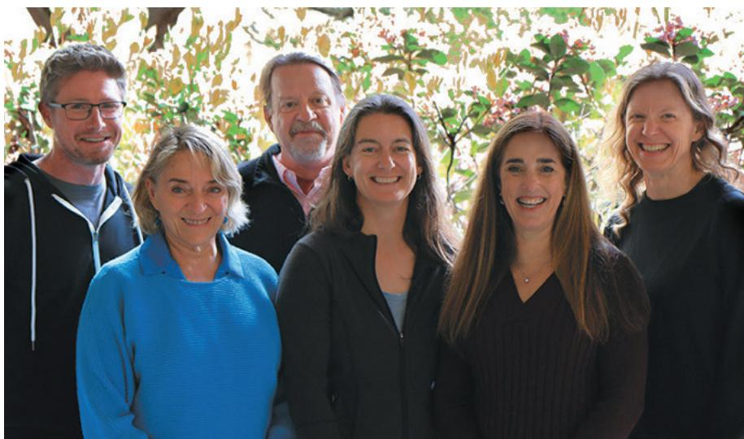

## Lisa A. Urry

(Chapter 1 and Units 1, 2, and 3) is Professor of Biology at Mills College at Northeastern University in Oakland, California. After earning a BA at Tufts University, she completed her PhD at the Massachusetts Institute of Technology (MIT). Lisa has conducted research on gene expression during embryonic and larval development in sea urchins. Deeply committed to promoting opportunities in science for women and underrepresented groups, she has taught courses ranging from introductory and developmental biology to an immersive course on the U.S./Mexico border.

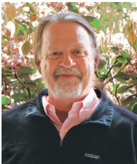

## Peter V. Minorsky

(Unit 6) is Professor of Biology at Mercy University in New York, where he teaches introductory biology, ecology, and botany. He received his AB from Vassar College and his PhD from Cornell University. Peter has also taught at Kenyon College, Union College, Western Connecticut State University, and Vassar College. His research interests concern how plants sense environmental change. Peter received the 2008 Award for Teaching Excellence at Mercy.

## Kerry L. Hull

(Unit 7) is the Associate Vice-Principal, Research; Dean of Natural Science and Mathematics; and a Professor in the Department of Biology and Biochemistry at Bishop's University in Quebec, Canada. Kerry holds a BSc in Biology and a PhD in Physiology (Endocrinology), both from the University of Alberta (Canada). She teaches physiology and anatomy courses to undergraduates, using guided inquiry and case studies as her primary teaching approaches. A comparative endocrinologist by training, her current research focuses on the development and implementation of active learning strategies in anatomy and physiology courses.

## Rebecca B. Orr

(Assessment Lead, eTextbook Media Integration, and Active Learning Modules) is Professor of Biology at Collin College in McKinney, Texas, where she teaches introductory biology. She earned her BS from Texas A&M University and her PhD from University of Texas Southwestern Medical Center at Dallas. Rebecca has a passion for investigating strategies that result in more effective assessment for learning, and she is a certified Team-Based Learning Collaborative Trainer Consultant. She enjoys focusing on the creation of learning opportunities that both engage and challenge students. Rebecca was named the 2022 Outstanding Professor of the Year at Collin College.

## Chantale Bégin

(Chapters 28, 32–34, and Unit 8) is an ecologist with a strong interest in benthic ecology and marine conservation. Chantale earned a BSc from Dalhousie University, an MSc from Université Laval, and a PhD from Simon Fraser University. As a Professor of Instruction at the University of South Florida (USF), she teaches many courses, including Biological Diversity, Marine Biology, Coral Reef Ecology, Conservation Biology, and Scientific Diving. She has received several teaching awards at USF for her work integrating active learning into large-enrollment courses and her field courses in the Caribbean.

## Josh R. Auld

(Unit 4 and Chapter 26) is a Professor of Biology at West Chester University in West Chester, Pennsylvania. He received his BS in biology from Duquesne University and his PhD in Ecology and Evolutionary Biology from the University of Pittsburgh. Josh's research focuses on the evolution of life-history traits and mating systems, using freshwater snails as a model system. He has taught courses in introductory biology, zoology, botany, and evolution.

## Neil A. Campbell

(1946–2004) earned his MA from the University of California, Los Angeles, and his PhD from the University of California, Riverside. His research focused on desert and coastal plants. Neil's 30 years of teaching included introductory biology courses at Cornell University, Pomona College, and San Bernardino Valley College, where he received the college's first Outstanding Professor Award. He was also a visiting scholar at the University of California, Riverside. Neil was the founding author of Campbell Biology.

# Students: Campbell offers many tools to help you succeed

Access your text anywhere with the Pearson eTextbook.

  
Prepare for your exams with the Dynamic Study Modules.  
Strengthen your knowledge in the Mastering Biology Study Area.

DNA molecules

amino acid molecules

sucrose molecules

○ fatty acid molecules

purines and pyrimidines

I DON'T KNOW YET

Use the tools in Campbell Biology and Mastering Biology to create a Study Plan, like the one shown here.

## Bio Study Plan

□Review the syllabus, assignments, and notes from my instructor
□Read the chapter and...

□ Use the Study Tip □ Fill out the Active Reading Guide (download from the Study Area)

□ Watch the Figure Walkthroughs, Videos, and Animations (in the eText or Study Area)

□ Answer the questions in the chapter

□ do the assignments

□ Study for the test!

□ Review lecture notes and assignments

□ Read the Summary

□Answer the questions at the end of the chapter

□ Use the Dynamic Study Modules

Take the Practice Test (in the eText or Study Area)

We are honored to present the Thirteenth Edition of Campbell Biology. For the last four decades, Campbell Biology has been the leading college text in the biological sciences. It has been translated into 19 languages and has provided millions of students with a solid foundation in college-level biology. This success is a testament not only to Neil Campbell's original vision but also to the dedication of hundreds of reviewers, who, together with editors, artists, and contributors, have shaped and inspired this work.

## New to the Thirteenth Edition

The Thirteenth Edition of Campbell Biology includes relevant, current content updates and engaging resources designed to help students succeed. Our goals for the Thirteenth edition include:

\- Supporting students with visual presentations of content and study tools

\- Supporting instructors by providing tools and materials for introducing, teaching, and assessing important, often challenging topics

\- Integrating text and media to engage, guide, and inform students in an active process of inquiry and learning

Here we provide an overview of the new features that we have developed for the Thirteenth Edition. Our starting point, as always, is our commitment to crafting text and visuals that are accurate and current, and that reflect our passion for teaching biology.

\- NEW! AI-Powered Study Tool: In the Campbell eTextbook, the AI-powered study tool pulls from vetted Campbell content to help students achieve proficiency and master key course concepts. The tool eliminates the need to leave the required course material for internet-wide help with its potential inaccuracies and inefficiency. Instead, support is provided, anytime, anywhere, within the assigned textbook. The AI-powered study tool provides instant explanations, on-demand summaries, and practice questions with feedback.

\- NEW! "Quick Tip" Videos by the Authors: Based on their classroom experiences with their own students, the authors have created short point-of-use videos in each unit that offer insights and tips for approaching tough topics and avoiding common points of confusion.

\- NEW! Practice Applying Your Learning Question Sets: Each unit includes new Practice Applying Your Learning scenario-based question sets. Each set consists of a short biological scenario followed by multiple True/False questions at lower and higher Bloom's levels. An alternate version of each Practice Applying Your Learning question set is available in Mastering Biology, to enable assigning one set for practice or formative assessment, and then an alternate version for summative assessment.

\- EXPANDED! Interactive CheckPoint Questions: Embedded at point-of-use in the eTextbook, these short sequences of interactive questions diagnose and remediate misconceptions around topics that are common “stumbling blocks” to understanding. Customized feedback guides students through an evidence-based approach to reason their way to learning and retaining the content. The CheckPoints are also assignable in Mastering Biology.

\- NEW! Updated Content: As in each new edition of Campbell Biology, the Thirteenth Edition incorporates new content summarized in the Highlights of New Content section that follows this Preface, including:

\- updates in gene editing, stem cell research, genomics, cancer genetics, “biologic” drugs, and biomaterials (see Chapters 17, 18, and 20)

○ introduction of artificial intelligence and its role in determining protein structure, bioinformatics, and medical diagnosis (see Chapters 1, 5, 11, and 21)

\- updated coverage of the evolutionary origins of eukaryotes and the phylogeny of archaea, unicellular eukaryotes, plants, and animals (see Chapters 26, 27, 28, 29, 32, and 33)

SARS-CoV-2 and the COVID-19 pandemic and expanded discussions of emerging and zoonotic pathogens (see Chapters 19, 43, and 54)

\- updated data on global climate and population changes (see Chapters 3, 55, and 56)

## Pearson eTextbook

Students using the Pearson eTextbook will reap all the benefits of the 13th Edition text features described above, as well as the following existing interactive resources, which are integrated directly into the online text:

\- The popular Figure Walkthroughs guide students through key figures with narrated explanations and figure mark-ups that reinforce important points.

\- Links to the AAAS Science in the Classroom website provide research papers from Science with annotations to help students understand the papers. These links are included at the end of selected chapters.

\- 400 animations and videos bring biology to life. These include resources from HHMI BioInteractive that engage students in topics from CRISPR to coral reefs.

\- Get Ready for This Chapter interactive questions provide a quick check of student understanding of the background information needed to learn a new chapter's content, with feedback to bolster their preparation.

\- Vocabulary Self-Quizzes and Practice Tests at the end of each chapter provide opportunities for students to test their understanding.

\- Links to Interviews from all editions of Campbell Biology are included in the chapter where they are most relevant. The interviews show students the human side of science by featuring diverse scientists talking about how they became interested in biology and what inspires them.

## Mastering Biology

Mastering Biology provides valuable resources for instructors to assign homework and for students to study on their own:

\- Assignments. Mastering Biology is the most widely used online assessment and tutorial program for biology, providing an extensive library of thousands of tutorials and questions that are graded automatically.

○ AAAS Science in the Classroom journal articles can be assigned with automatically graded questions.

\- Hundreds of self-paced tutorials provide individualized coaching with specific hints and feedback on the most difficult topics in the course.

\- Pearson eTextbook. The Pearson eTextbook, described above, can be directly accessed from Mastering Biology.

\- Dynamic Study Modules. These popular review tools can be assigned, or students can use them for self-study.

\- Study Area. Media references in the printed book direct students to the wealth of online self-study resources available to them in the Mastering Biology Study Area, including Active Reading Guides, Figure Walkthroughs, videos, animations, Get Ready for This Chapter, Practice Tests, Cumulative Test, and more.

\- Instructor Resources. This area of Mastering Biology provides one-stop shopping for PowerPoints, Clicker Questions, animations, videos, the Test Bank, and more.

## Our Hallmark Features

Teachers of general biology face a daunting challenge: to help students acquire a conceptual framework for organizing an ever-expanding amount of information. The hallmark features of Campbell Biology provide such a framework, while promoting a deeper understanding of biology and the process of science. As such, they are well-aligned with the core competencies outlined by the Vision and Change national conferences. Furthermore, the core concepts defined by Vision and Change have close parallels in the unifying themes that are introduced in Chapter 1 and integrated throughout the book.

Chief among the themes of both Vision and Change and Campbell Biology is evolution. Each chapter of this text includes at least one Evolution section that explicitly focuses on evolutionary aspects of the chapter material, and each chapter ends with an Evolution Connection Question and a Write About a Theme Question.

To help students distinguish “the forest from the trees,” each chapter is organized around a framework of three to seven carefully chosen Key Concepts. The text, Concept Check Questions, Summary of Key Concepts, and Mastering Biology resources all reinforce these main ideas and essential facts.

Because text and illustrations are equally important for learning biology, integration of text and figures has been a hallmark of Campbell Biology since the First Edition. The chapter-opening Visual Overviews, together with our popular Visualizing Figures, Exploring Figures, and Make Connections Figures, epitomize this approach.

To encourage active reading of the text, Campbell Biology includes numerous opportunities for students to stop and think about what they are reading, often by putting pencil to paper to draw a sketch, annotate a figure, or graph data. Answering these questions requires students to write or draw as well as think and thus helps develop the core competency of communicating science.

Finally, Campbell Biology has always featured scientific inquiry. The inquiry activities provide students practice in applying the process of science and using quantitative reasoning, addressing core competencies from Vision and Change.

## Our Partnership with Instructors and Students

The real test of any textbook is how well it helps instructors teach and students learn. We welcome comments from both students and instructors. Please address your suggestions to:

Lisa Urry (Chapter 1 and Units 1–3): l.urry@northeastern.edu
Peter Minorsky (Unit 6): pminorsky@mercy.edu

Josh Auld (Unit 4 and Chapter 26): JAuld@wcupa.edu

Kerry Hull (Unit 7): khull@ubishops.ca

Chantale Bégin (Chapters 27–34 and Unit 8): cbegin@usf.edu
Rebecca Orr (Assessment and Media): rorr@collin.edu

# Highlights of New Content

This section highlights selected new content in Campbell Biology, Thirteenth Edition.

## Unit 1 The Chemistry of Life

In Unit 1, new content engages students by showing why understanding chemistry is relevant and important as a basis for learning biology. For example, Chapter 3 has information on discoveries of exoplanets as well as a 2024 study on the presence and location of water on Mars, including a new photo in Figure 3.10. Building on this, Chapter 4 now includes the search by the Mars Rover for samples to be analyzed for fossils. In Chapter 5, the text has been updated on the breakthroughs achieved by use of computational approaches to predict 3D protein structure, including the role of artificial intelligence (AI) and the related 2024 Nobel Prize in Chemistry. The definition of bioinformatics has been revised to include AI.

## Unit 2 The Cell

Our main goal for this unit was to make the material more exciting to students, to show that cell biology research is dynamic and ongoing. Chapter 6 includes recent changes in thinking on the role of mitochondria: In addition to being the “powerhouse of the cell” and producing ATP, they have many further functions, including biosynthesis, regulation of apoptosis, and extensive engagement in intracellular and extracellular signaling. Chapter 7 includes an update on the discovery of a second co-receptor for HIV called CXCR4. Chapter 11 mentions AlphaFold2, an AI system that predicts 3D protein structures, in the context of why it has been challenging to predict the structure of G-protein-coupled receptors (GPCRs). Also included is the recent discovery that a defect in a particular voltage-gated ion channel can cause muscle weakness or stiffness, or even temporary paralysis. Chapter 12 includes a new interactive CheckPoint activity entitled CheckPoint: Counting Chromosomes, and coverage of the $G_{1}$ checkpoint has been updated with new research from 2023, concluding that a subset of cells may require ongoing signals to continue progressing through S and $G_{2}$ . This finding has implications for potential cancer treatments.

## Unit 3 Genetics

Chapters 13–17 incorporate changes that help students grasp the more abstract concepts of genetics as well as recognize their current relevance. In Chapter 14, the term phenotypic plasticity has been added and defined, and the discussion of sickle-cell disease (SCD) has been revised to clarify its occurrence wherever malaria is endemic, not just in Africa. Also, new gene therapy-based treatments for SCD are described. In Chapter 15, the contribution of Dr. Nettie Stevens to understanding the role of the Y chromosome in sex determination has been added, along with FDA-approved gene therapies for Duchenne muscular dystrophy and certain hemophilia cases. Coverage of imprinted genes has also been updated with recent research on two male-parent embryos, and the discussion of human “three-parent” babies has been enhanced. In Chapter 16, a new interactive CheckPoint activity entitled CheckPoint: Leading and Lagging Strand Synthesis has been inserted to aid students with this difficult topic. Chapter 17 now includes a new CheckPoint activity entitled CheckPoint: Transcription and Translation. Content has also been added about a novel use of the CRISPR system in conjunction with a technique called base editing, as well as mention of new forms of Cas proteins that minimize “off-target” gene editing.

Chapters 18–21 are extensively updated, driven by exciting new discoveries based on gene-editing technology and use of artificial intelligence (AI). In Chapter 18, updates have been made to the discussions of master regulatory gene function and colon cancer, as well as nuclear architecture and its possible role in neuropsychiatric disorders. In Chapter 19, the topic of emerging viral diseases has been updated extensively to discuss SARS-CoV-2 and the COVID-19 pandemic. Other Chapter 19 updates include information on vaccine programs, the 2025 measles epidemic, new prevention and treatment approaches for HIV infection, and the H5N1 avian influenza epidemic. Chapter 20 introduces new subsections on cell and tissue culture (including a new figure on organoids), small-molecule drugs, biologic drugs, and biomaterials for drug delivery. Other updates include discussions of the cloning of human/macaque chimeric embryos and the associated ethical issues, FDA-approved CRISPR-based gene therapies for sickle-cell disease, and establishment of the Human Genome Editing Registry. The coverage of using DNA technology for environmental cleanup now includes the term bioremediation. Chapter 21 has a new section, “Application of artificial intelligence and machine learning to bioinformatics,” which describes multiple examples of how AI is transforming the field of bioinformatics. Artificial intelligence has been added as a key term and defined, as well as a new Figure 21.5 (see next page) featuring the use of AI in medical diagnosis. Other updates include results of the ENCODE project and the Cancer Genome Atlas Project, establishment of the Impact of Genomic Variants on Function program, a massive international study of primate genomes, and new information on the FOXP2 gene. Discussions of genome comparisons have been revised to reflect new thinking about the relationship of Bacteria, Archaea, and Eukarya.

Figure 21.5 Example of use of artificial intelligence (AI) in medical diagnosis.  
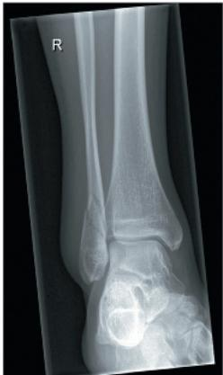  
(a) Radiograph of the fibula

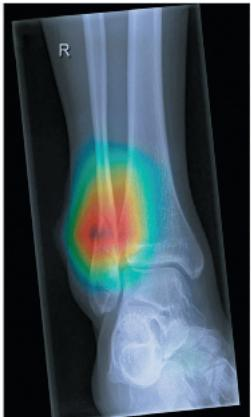  
(b) Radiograph with Al-generated heatmap overlaid  
Unit 4 Mechanisms of Evolution

In Chapter 23, the presentation of the Hardy-Weinberg model and Hardy-Weinberg equilibrium was revised to illustrate that, in a simplified situation, an allele does not increase or decrease in frequency on its own. Two new figures help students visualize how the equation projects the next generation. By starting with the fundamental concept of allele frequency, we aim to assist students in bridging the gap between individual- and population-level thinking. The assumptions of the Hardy-Weinberg model are then discussed as mechanisms of change that may operate alone or together in a natural population. The Scientific Skills Exercise and Concept Check 21.2 Question 3 have been revised to compare frequencies across generations.

# Unit 5 The Evolutionary History of Biological Diversity

In Chapter 26, Concepts 26.2 and 26.3 have been reorganized to emphasize the distinction between inferring (that is, determining) a phylogeny from reading/interpreting a phylogeny—namely, clarifying that we do not both infer a tree's topology and interpret patterns of trait evolution based on the same data. Phylogenies are inferred from one type of data (for example, molecular genetic sequences) and then used to understand the evolution of other traits (for example, vertebral column, amnion, and hair), as discussed in the section now titled "Mapping Characters on a Phylogeny." The discussion in Concept 26.6 has been updated to reflect current hypotheses about early branching of the tree of life and the concept of domains. Other revisions throughout Unit 5 including updating phylogeny and

taxonomy to reflect recent changes, largely based on phylogenomic research. The title of Chapter 28 has been updated from “Protists” to “Origin and Diversification of Eukaryotes” to better reflect its focus. Chapter 27 discusses current hypotheses of archaeal phylogeny, including the possible origin of eukaryotes within the Asgard archaea. In Chapter 28, a new section on reproductive diversity of eukaryotes in Concept 28.1 reviews the three types of life cycles found in sexually reproducing eukaryotes. The phylogenetic tree of major groups of eukaryotes was updated to indicate that excavates are likely not a monophyletic group, and to update the placement of cryptophytes and haptophytes. Concept 28.5 discusses recent discoveries in phylogenomic research and describes some of the latest eukaryotic supergroups to be described. In Chapter 32 and 33, the phylogenetic tree of animal was updated to present the ctenophores, sponges, and other animals as a polytomy while resolving some of the polytomies that were shown in the previous edition. A new figure (Figure 33.4) and text in Concept 33.1 describe ctenophores. Chapter 34 was updated with new information about phylogenetic relationships between various groups of hominins, and a new Figure 34.47 presents a phylogenetic tree of hominins.

Figure 33.4 Anatomy of a sea gooseberry (Pleurobrachia spp.), a ctenophore.  

## Unit 6 Plant Form and Function

In Chapter 35, the term “prop root” has been replaced with the more precise term “brace root,” and vascular rays are now more accurately portrayed. Also, an additional benefit of compound leaves, namely better light penetration through the canopy, is now mentioned as a possible advantage of compound leaf forms. In Chapter 37, the Scientific Skills Exercise includes a new photograph of raspberry plants that better shows the characteristics of iron deficiency. Figure 37.15 has been updated to include new research indicating that staghorn ferns can grow as colonial assemblages (“superorganisms”). In Chapter 38, a new interactive CheckPoint activity, CheckPoint: Critical Night Length, helps students work through common confusion around the concept of critical night length in flowering plants and its related terminology (short-day/long-day plants).

## Unit 7 Animal Form and Function

The major focus of this revision in Unit 7 was to help students use basic scientific principles to understand the many aspects of animal form and function. In particular, we refined our explanation of homeostasis as an underlying theme. A new figure (Figure 40.9) provides an overview of negative and positive feedback in relation to stimuli and responses, and another new figure (Figure 40.8B) completes the picture by incorporating the concepts of set points, sensors, control centers, and effectors.

Figure 40.9 Overview of negative and positive feedback.  
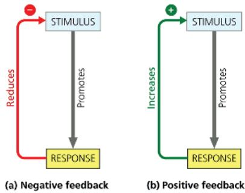

Narrative explanations and figures presenting homeostatic systems throughout the unit have been revised so that students can more readily apply the basic principle to develop mechanistic explanations for physiological situations. These changes are particularly evident in Chapter 40 (thermoregulation), 41 (blood glucose), 42 (blood pressure, blood gas levels), and 44 (blood pressure, volume, and osmolarity). We also apply these principles to the discussion of hormone feedback loops in Chapters 45 and 46. Numerous learning tools have been designed to address common misconceptions and help students apply the concept of homeostasis. For instance, Chapter 40 features a new CheckPoint interactive activity to diagnose and remediate common student misunderstandings about regulators and conformers, and students are given multiple opportunities to work with feedback loops (for example, the Study Tip in Chapter 40, Draw It Question in Figure 40.8, and Test your Understanding Question 8 in the Chapter 42 Review). The scientific principle of flow down gradients also receives greater emphasis in the Thirteenth Edition. Gradients are introduced in the context of heat flow (Chapter 40), and subsequently provide the basis for explaining water and solute flow (Chapter 44) and electrical signaling (Chapter 48). New interactive CheckPoint activities encourage students to use gradients to understand Ventilation and Respiration (Chapter 42) and the Membrane Potential (Chapter 48).

The Unit 7 revision also introduces new material and updates. For instance, Chapter 43 provides information about the COVID-19 pandemic and a new figure (Figure 43.18) explaining how mRNA vaccines interact with the immune system, and updates coverage of relevant topics (sepsis, cytokines, interferons, monoclonal antibody treatments). Chapter 50 now introduces newly identified receptors for touch and sour tastants. We also updated our coverage of malnourishment to include both overnourishment and undernourishment (Chapter 41), and refined our explanation of stress to highlight that stress is a physiological response to mental or physical challenges (Chapter 45). The clinical information has been updated throughout the Unit, such as describing new treatments for diabetes mellitus, overnourishment, cancer,

autoimmune disease, nervous system diseases, and cardiovascular disease, and providing updated statistics regarding global hunger, infectious diseases (Figure 43.25), sexually transmitted infections, infertility, and opioid use.

We have also augmented our coverage of non-human physiology, including adding information about the circulatory system of sea spiders (Chapter 42), refining our explanation of avian ventilation (Chapter 42), and updating and expanding the coverage of digestive function in avians, ruminants, and non-ruminant herbivores (Chapter 41). In Chapter 45, we removed the description of calcitonin actions in humans and instead discuss the evolution of the calcitonin gene family.

## Unit 8 Ecology

The two major goals of the Unit 8 revision were to clarify and accurately represent all types of environments (terrestrial, freshwater, and marine); and provide new examples while incorporating elements of conservation biology throughout the unit. Revisions in Chapter 52 include a new figure (Figure 52.8) and corresponding text that highlights the ways in which various abiotic factors can limit range shifts, as well as two new figures and a better description of the processes that bring nutrients to the photic zone in aquatic environments. In Chapter 53, a new figure (Figure 53.9) and annotations clarify the difference between the realized per capita population growth rate ( $r_{realized}$ ) and maximum per capita population growth rate ( $r_{max}$ ). Another new figure (Figure 53.24) illustrates the concept of the ecological footprint. Chapter 54 features a newly revised figure (54.21) illustrating how the abundance of organisms at different trophic levels can be affected by bottom-up or top-down control, a new figure (Figure 54.25) on contrasting models of succession, and updates on emerging diseases, with COVID-19 as one example. Revisions to some figures in Chapter 55 provide clearer descriptions of nutrient cycling in aquatic ecosystems. Chapter 56 opens with a photo of the colorful Union Island gecko, with a figure legend that highlights the role that local communities can play in conservation success. This chapter includes new text and figures (Figures 56.25 and 56.26) in Concept 56.4 on the growing problem of plastic and microplastic waste in aquatic and terrestrial ecosystems. Concept 56.4 has updated data on atmospheric CO $_{2}$ concentrations, global temperatures, and consequences of climate change on ecosystems. Throughout the unit, we added new examples and photographs of diverse species, such as species on the verge of extinction and introduced species in a range of habitats.

Figure 53.9 Population growth predicted by the exponential and logistic models.  
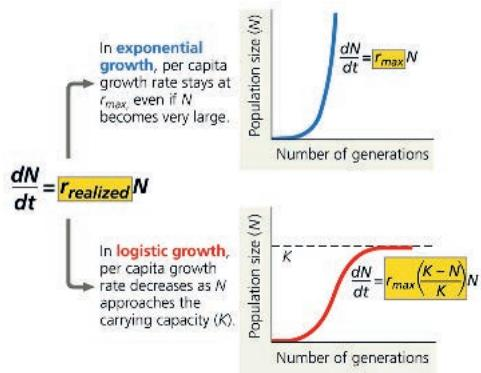

\- Endophyte not present; pathogen present (E-P+)
- Both endophyte and pathogen present (E+P+)

# Instructor Resources

## The Instructor Resources Area of Mastering Biology

\- Active Reading Guide with Answers: Instructors can find a version of the Active Reading Guide with answers in the Instructor Resources Area.

\- Accessible PowerPoint Lecture Presentations for each chapter with lecture notes, tables, and links to animations and videos have alt text for every image; students can access alt text with a screen reader if needed.

\- JPEG images, including labeled and unlabeled art, photos from the text, and extra photos

\- Clicker Questions in PowerPoint

\- 400 instructor animations and videos, including BioFlix® 3-D Animations, HHMI Videos and Animations, and much more

\- Test Bank questions in TestGen $^{®}$ software and Microsoft $^{®}$ Word. This invaluable resource contains over 4,500 questions, including scenario-based questions and art, graph, and data interpretation questions. Every image has alt text, which students can access with a screen reader if needed.

• Statistics Worksheets for Biology

\- Instructor Answers to Scientific Skills Exercises, Problem-Solving Exercises, Interpret the Data questions, and essay questions; includes rubric and tips for grading short-answer essays

\- Instructor Guides for Supplements: Instructor Guide for Practicing Biology: A Student Workbook; Instructor Guide for Biological Inquiry: A Workbook of Investigative Cases; Answer Key for Inquiry in Action: Interpreting Scientific Papers; Investigating Biology Lab Prep Guide; and Investigating Biology Lab Data Tables

\- Live Response (TM) Live Response allows students to use their smartphone, tablet, or laptop to respond to questions in class.

\- Customizable PowerPoint Lectures provide a jumpstart for instruction.

Concept 7.1: Cellular membranes are fluid mosaics of lipids and proteins (1 of 3)

• Membranes are composed mainly of phospholipids

\- Phospholipids are amphipathic molecules, containing hydrophobic ("water-fearing") and hydrophilic ("water-loving") regions

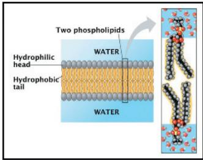

\- All of the art, graphs, and photos from the text are provided with enlarged labels. More than 1,600 photos from the text and other sources are included.

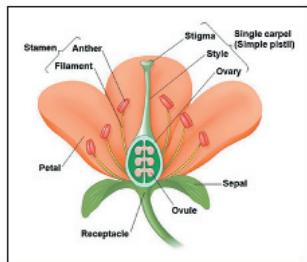

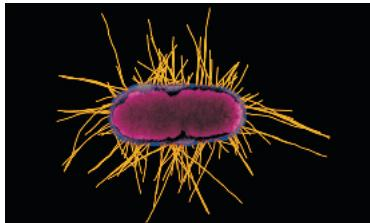

  
Data from A. E. Arnold et al., Fungal endophytes limit pathogen damage in a tropical tree, Proceedings of the National Academy of Sciences USA 100:15649–15654 (2003).

\- Clicker Questions can be used to stimulate effective classroom discussions (for use with or without clickers).

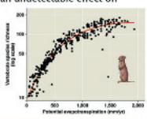

## Learning Management Systems

Integration with various learning management systems is available for Mastering Biology. Contact your sales representative for details.

# Acknowledgments

The authors wish to express their gratitude to the global community of instructors, researchers, students, and publishing professionals who have contributed to the Thirteenth Edition of Campbell Biology.

As authors of this text, we are mindful of the daunting challenge of keeping up to date in all areas of our rapidly expanding subject. We are grateful to the many scientists who helped shape this text by discussing their research fields with us, answering specific questions in their areas of expertise, and sharing their ideas about biology education. We are especially grateful to the following, listed alphabetically: Rick Brusca, Dan Buckley, Nicholas Butterfield, Doug Erwin, Kenneth Halanych, Bruce Jakosky, Emanuelle Javaux, Patrick Keeling, Dovid Kozlovsky, Andrew Leslie, Kevin Peterson, Adam Phillippy, Martin Picar, Susannah Porter, Andrew Roger, Timothy Shutt, Alastair Simpson, Shreya Soni, Max Telford, Sarathi Weraduwage, and Felipe Zapata. In addition, the biologists listed in the Reviewers section provided detailed reviews, helping us ensure the text's scientific accuracy and improve its pedagogical effectiveness.

Thanks also to the other professors and students, from all over the world, who contacted the authors directly with useful suggestions. We alone bear the responsibility for any errors that remain, but the dedication of our consultants, reviewers, and other correspondents makes us confident in the accuracy and effectiveness of this text.

Interviews with prominent scientists have been a hallmark of Campbell Biology since its inception, and conducting these interviews was again one of the great pleasures of revising the book. To open the eight units of this edition, we are proud to include interviews with Kristi Anseth, Julie Theriot, Pardis Sabeti, Neil Shubin, Casey Dunn, Ernesto Gianoli, Adrienne Bratcher, and Elisa Bonaccorso.

Mastering Biology and the other electronic accompaniments for this text are invaluable teaching and learning aids. Thanks to Ann Brokaw and Bob Cooper for their contributions to the AAAS Science in the Classroom activities; we also appreciate the support of Beth Reudi, Shelby Lake, and Lydia Kaprelian from AAAS.

The value of Campbell Biology as a learning tool is greatly enhanced by the supplementary materials that have been created for instructors and students. We recognize that the dedicated authors of these materials are essentially writing mini (and not so mini) books. We appreciate the hard work and creativity of all the authors listed, with their creations, in the Student and Lab Supplements section. We are also grateful to Dana Kurpius and Ashley Spring (PowerPoint Lecture Presentations); Doug Darnowski (Clicker and Reading Questions); Ford Lux, Pamela Sandstrom, Carolyn Wetzel, Chris Romero, Jordan Marshall, Paul Luyster, and David Knochel (Test Bank); and Theresa Holtzclaw (Active Reading Guide).

Campbell Biology results from an unusually strong synergy between a team of scientists and a team of publishing professionals.

Our editorial team at Pearson Education again demonstrated unmatched talents, commitment, and pedagogical insights. Josh xii

Frost, our Product Management Specialist, brought publishing savvy, intelligence, and a much-appreciated level head to leading the whole team. The clarity and effectiveness of every page owe much to our extraordinary Supervising Editor Beth Winickoff, who worked with a top-notch team of Senior Developmental Editor Mary Hill and Art Developmental Editor Andrew Recher. Our unsurpassed Director of Content Development Ginnie Simione Jutson was indispensable in moving the project in the right direction. We also want to thank Robin Heyden for organizing the annual Biology Leadership Conferences and keeping us in touch with the world of AP Biology, and Beth Wilbur for her many years of wise editorial leadership. We also extend our thanks to Nida Ahmed, Associate Content Strategy Administrator.

You would not have this beautiful text if not for the work of the production team: Director Erin Gregg; Senior Producer Lori Newman; Rights & Permissions Manager Ben Ferrini; Rights & Permissions Project Manager Matt Perry; Aimee Bear and the staff at Integra Software Services, Inc., and Becca Marshall, Molly Montanaro, Michael White, and the staff at Lachina Creative. We also thank those who worked on the text's supplements: Shatadru Bhattacharjee, Hemadevi Sridharan, and their team at Integra Software Services.

For creating the wonderful package of electronic media that accompanies the text, we are grateful to Senior Content Developer Sarah Jensen; Content Producer Kaitlin Smith; Director, Production & Digital Studio Katie Foley; Managing Producer Tod Regan; Digital Program Manager, Science, Caroline Ayres; and Media Producer Ziki Dekel.

For her important role in marketing the text and media, we thank Sierra Suggs. For their enthusiasm, encouragement, and support, we are grateful to Michael Gillespie, Director, Higher Ed Product Management, Life Sciences and Adam Jaworski, VP Product Management Higher Ed.

The Pearson sales team, which represents Campbell Biology on campus, is an essential link to the users of the text. They tell us what you like and don't like about the text, communicate the features of the text, and provide prompt service. We thank them for their hard work and professionalism. For representing our text to our international audience, we thank our sales and marketing partners throughout the world. They are all strong allies in biology education.

Finally, we wish to thank our families and friends for their encouragement and patience throughout this long project. Our special thanks to Lily and Alex (L.A.U.); Natalie (P.V.M.); Norm, Leo, and Evan (K.L.H.); Jim, Abby, Dan, and Emily (R.B.O.); Boomer, Zoë, and Exie (C.B.); and Jan (J.R.A.); Thanks to Jane Reece for her generosity and thoughtfulness throughout her many years as a Campbell author—enjoy your retirement! And, as always, thanks to Rochelle, Allison, Jason, McKay, and Gus.

Lisa A. Urry, Peter V. Minorsky, Kerry L. Hull, Rebecca B. Orr, Chantale Bégin, and Josh Auld

## Thirteenth Edition Reviewers

Sheena Abernathy, College of the Mainland; Matthew Aderholt, Abraham Baldwin Agricultural College; Amelia Atwell, Wofford College; Victor Babich, Mercy College of Health Sciences; Matthew Badtke, Jackson College; Harini Bajjuri, Collin College; Michael Balsai, Temple University; John Barringer, Tougaloo College; Gemma Barth, Springfield College; Emily Basile, Delaware Valley University; Rachelle Bassen, Western Nevada College; Kevin Beach, University of Tampa; Chris Beals, Abraham Baldwin Agricultural College; Abby Beatty, St. Mary's College of Maryland; Lynn Bedard, DePauw University; Morgan Benowitz-Fredricks, Bucknell University; Elizabeth Binney, Western Washington University; Terronica Blackmonn, Houston Community College; Jerry Brunson, Northwestern State University of Louisiana; Patrick Cafferty, Emory University; Kellen Calinger-Yoak, The Ohio State University; William Caldecutt, Polk State College; Victor Canela, Butler University; Richard Cardullo, University of California, Riverside; Dale Casamatta, University of North Florida; Rebekah E. Chapman, Georgia State University; Brian Deis, University of Hawai'i; Danyelle Dehner, University of North Georgia; Tracy Gartner, Carthage College; Tammy Greene, Ivy Tech Community College; Judyth Gulden, Oklahoma State University; Matt Hatkoff, SUNY Geneseo; Valerie Haywood, Case Western Reserve University; Jeba Inbarasu, Metropolitan Community College; Katie Johnson, Collin College; Kristy Johnson, The Citadel; Amy Klocko, University of Colorado Colorado Springs; Diqui LaPenta, University of Texas at San Antonio; Haiwei Lu, University of Nebraska-Kearney; Benjamin Navia, Andrews University; Frank Nelson, Temple University; Julie Phillips, Cumberland University; Amanda Rosenzweig, Delgado Community College; Shreya Soni, Drexel University; Molly Staley, Loyola University Chicago; Sophia Szymkowiak, Fletcher Spaght; Jeung Woon-Lee, Lake Erie College of Osteopathic Medicine.

## Reviewers of Previous Editions

Steve Abedon, Ohio State University; Sheena Abernathy, College of the Mainland; Kenneth Able, State University of New York, Albany; Thomas Adams, Michigan State University; Martin Adamson, University of British Columbia; Dominique Adriaens, Ghent University; Ann Aguanno, Marymount Manhattan College; Shylaja Akkaraju, Bronx Community College of CUNY; Marc Albrecht, University of Nebraska; John Alcock, Arizona State University; Eric Alcorn, Acadia University; George R. Aliaga, Tarrant County College; Philip Allman, Florida Gulf Coast College; Rodney Allrich, Purdue University; Richard Almon, State University of New York, Buffalo; Bonnie Amos, Angelo State University; Katherine Anderson, University of California, Berkeley; Richard J. Andren, Montgomery County Community College; Estry Ang, University of Pittsburgh, Greensburg; Jeff Appling, Clemson University; J. David Archibald, San Diego State University; David Armstrong, University of Colorado, Boulder; James Arnone, William Paterson University; Howard J. Arnott, University of Texas, Arlington; Mary Ashley, University of Illinois, Chicago; Angela S. Aspbury, Texas State University; Robert Atherton, University of Wyoming; Karl Aufderheide, Texas A&M University; Josh Auld, West Chester University; Leigh Auleb, San Francisco State University; Terry Austin, Temple College; P. Stephen Baenziger, University of Nebraska; Brian Bagatto, University of Akron; Ellen Baker, Santa Monica College; Katherine Baker, Millersville University; Virginia Baker, Chipola College; Teri Balser, University of Wisconsin, Madison; William Barklow, Framingham State College; Susan Barman, Michigan State University; Steven Barnhart, Santa Rosa Junior College; Jim Barron, Montana State University Billings; Gemma Bartha, Springfield College; Andrew Barton, University of Maine Farmington; Rebecca A. Bartow, Western Kentucky University; Ron Basmajian, Merced College; David Bass, University of Central Oklahoma; Bonnie Baxter, Westminster College; Tim Beagley, Salt Lake Community College; Louise Beard, University of Essex; Margaret E. Beard, College of the Holy Cross; Tom Beatty, University of British Columbia; Marin Beaupre, Massasoit Community College; Chris Beck, Emory University; Wayne Becker, University of Wisconsin, Madison; Patricia Bedinger, Colorado State University; Jane Beiswenger, University of Wyoming; Anne Bekoff, University of Colorado, Boulder; Marc Bekoff, University of Colorado, Boulder; Tania Beliz, College of San Mateo; Adrianne Bendich, Hoffman-La Roche, Inc.; Kevin Bennett, University of Hawai'i; Marilee Benore, University of Michigan, Dearborn; Barbara Bentley, State University of New York, Stony Brook; Darwin Berg, University of California, San Diego; Werner Bergen, Michigan State University; Gerald Bergstrom, University of Wisconsin, Milwaukee; Anna W. Berkovitz, Purdue University; Aimee Bernard, University of Colorado Denver; Dorothy Berner, Temple University; Kelsie Bernot, North Carolina A&T State University; Annalisa Berta, San Diego State University; Christine Bezotte, Elmira College; Paulette Bierzychudek, Pomona College; Charles Biggers, Memphis State University; Teresa Bilinski, St. Edward's University; Kenneth Birnbaum, New York University; Sarah Bissonnette, University of California, Berkeley; Catherine Black, Idaho State University; Michael W. Black, California Polytechnic State University, San Luis Obispo; William Blaker, Furman University; Robert Blanchard, University of New Hampshire; Andrew R. Blaustein, Oregon State University; Chris Bloch, Bridgewater State University; Judy Bluemer, Morton College; Edward Blumenthal, Marquette University; Robert Blystone, Trinity University; Robert Boley, University of Texas, Arlington; Jason E. Bond, East Carolina University; Eric Bonde, University of Colorado, Boulder; Cornelius Bondzi, Hampton University; Richard Boohar, University of Nebraska, Omaha; Carey L. Booth, Reed College; Aiwei Borengasser, University of Arkansas - Pulaski Tech; Robert Borgon, University of Central Florida; Allan Bornstein, Southeast Missouri State University; David Bos, Purdue University; Oliver Bossdorf, State University of New York, Stony Book; James L. Botsford, New Mexico State University; Lisa Boucher, University of Nebraska, Omaha; Jeffery Bowen, Bridgewater State University; J. Michael Bowes, Humboldt State University; Richard Bowker, Alma College; Robert Bowker, Glendale Community College, Arizona; Scott Bowling, Auburn University; Barbara Bowman, Mills College; Barry Bowman, University of California, Santa Cruz; Deric Bownds, University of Wisconsin, Madison; Robert Boyd, Auburn University; Sunny Boyd, University of Notre Dame; Jerry Brand, University of Texas, Austin; Edward Braun, Iowa State University; Theodore A. Bremner, Howard University; James Brenneman, University of Evansville; Charles H. Brenner, Berkeley, California; Lawrence Brewer, University of Kentucky; Donald P. Briskin, University of Illinois, Urbana; Paul Broady, University of Canterbury; Chad Brommer, Emory University; Judith L. Bronstein, University of Arizona; George Brooks, University of California, Berkeley; David Broussard, Lycoming College; Danny Brower, University of Arizona; Beverly Brown, Nazareth College; Carole Browne, Wake Forest University; Mark Browning, Purdue University; David Bruck, San Jose State University; Theodore Van Bruggen, University of South Dakota; Robb T. Brumfield, Louisiana State University; Herbert Bruneau, Oklahoma State University; Gary Brusca, Humboldt State University; Richard C. Brusca, University of Arizona, Arizona-Sonora Desert Museum; Alan H. Brush, University of Connecticut, Storrs; Howard Buhse, University of Illinois, Chicago; Arthur Buikema, Virginia Tech; Michael Buoni, Delaware Technical Community College; Beth Burch, Huntington University; Tessa Burch, University of Tennessee; Al Burchsted, College of Staten Island; Warren Burggren, University of North Texas; Meg Burke, University of North Dakota; Edwin Burling, De Anza College; Dale Burnside, Lenoir-Rhyne University; Kelcey Burris, Union High School; William Busa, Johns Hopkins University; Jorge Busciglio, University of California, Irvine; John Bushnell, University of Colorado; Linda Butler, University of Texas, Austin; David Byres, Florida Community College, Jacksonville; Patrick Cafferty, Emory University; Elena Cainas, Broward College; Guy A. Caldwell, University of Alabama; Jane Caldwell, West Virginia University; Kim A. Caldwell, University of Alabama; Ragan Callaway, The University of Montana; Kenneth M. Cameron, University of Wisconsin, Madison; R. Andrew Cameron, California Institute of Technology; Alison Campbell, University of Waikato; Iain Campbell, University of Pittsburgh; Michael Campbell, Penn State University; Patrick Canary, Northland Pioneer College; W. Zacheus Cande, University of California, Berkeley; Deborah Canington, University of California, Davis; Robert E. Cannon, University of North Carolina, Greensboro; Frank Cantelmo, St. John's University; John Capeheart, University of Houston, Downtown; Gregory Capelli, College of William and Mary; Cheryl Keller Capone, Pennsylvania State University; Richard Cardullo, University of California, Riverside; Nina Caris, Texas A&M University; Mickael Cariveau, Mount Olive College; Jeffrey Carmichael, University of North Dakota; Robert Carroll, East Carolina University; Laura L. Carruth, Georgia State University; Billy Carver, Lees-McRae College; Anne Casper, Eastern Michigan University; J. Aaron Cassill, University of Texas, San Antonio; Karen I. Champ, Central Florida Community College; David Champlin, University of Southern Maine; Brad Chandler, Palo Alto College; Wei-Jen Chang, Hamilton College; Bruce Chase, University of Nebraska, Omaha; P. Bryant Chase, Florida State University; Amanda Chau, Blinn College; Doug Cheeseman, De Anza College; Shepley Chen, University of Illinois, Chicago; Giovina Chinchar, Tougaloo College; Joseph P. Chinnici, Virginia Commonwealth University; Jung H. Choi, Georgia Institute of Technology; Steve Christensen, Brigham Young University, Idaho; Geoffrey Church, Fairfield University; Henry Claman, University of Colorado Health Science Center; Anne Clark, Binghamton University; Greg Clark, University of Texas; Katie Clark, University of California, Riverside; Patricia J. Clark, Indiana University-Purdue University, Indianapolis; Ross C. Clark, Eastern Kentucky University; Lynwood Clemens, Michigan State University; Janice J. Clymer, San Diego Mesa College; Reggie Cobb, Nashville Community College; Catharina Coenen, Allegheny College; Curt Coffman, Vincennes University; William P. Coffman, University of Pittsburgh; Austin Randy Cohen, California State University, Northridge; Bill Cohen, University of Kentucky; J. John Cohen, University of Colorado Health Science Center; James T. Colbert, Iowa State University; Sean Coleman, University of the Ozarks; Juliet Collins, University of Wisconsin, Madison; Jan Colpaert, Hasselt University; Robert Colvin, Ohio University; Jay Comeaux, McNeese State University; David Cone, Saint Mary's University; Erin Connolly, University of South Carolina; Elizabeth Connor, University of Massachusetts; Joanne Conover, University of Connecticut; Bob Cooper, Pennsylvania High School; Ron Cooper, University of California, Los Angeles; Gregory Copenhaver, University of North Carolina, Chapel Hill; John Corliss, University of Maryland; James T. Costa, Western Carolina University; Robin Cotter, Phoenix College; Stuart J. Coward, University of Georgia; Charles Creutz, University of Toledo; Marilyn Cruz-Alvarez, Florida Gulf Coast University; Bruce Criley, Illinois Wesleyan University; Norma Criley, Illinois Wesleyan University; Joe W. Crim, University of Georgia; Greg Crowther, University of Washington; Karen Curto, University of Pittsburgh; William Cushwa, Clark College; Anne Cusic, University of Alabama, Birmingham; Noelle Cutter, Molloy College; Richard Cyr, Pennsylvania State University; Curtis Daehler, University of Hawaii at Manoa; Marymegan Daly, The Ohio State University; Deborah Dardis, Southeastern Louisiana University; W. Marshall Darley, University of Georgia; Douglas Darnowski, Indiana University Southeast; Cynthia Dassler, The Ohio State University; Farahad Dastoor, University of Maine, Orono; Shannon Datwyler, California State University, Sacramento; Marianne Dauwalder, University of Texas, Austin; Larry Davenport, Samford University; Andrew David, Clarkson University; Jeremiah Davie, D'Youville College; Bonnie J. Davis, San Francisco State University; Jerry Davis, University of Wisconsin, La Crosse; Michael A. Davis, Central Connecticut State University; Thomas Davis, University of New Hampshire; Melissa Deadmond, Truckee Meadows Community College; John Dearn, University of Canberra; Teresa DeGolier, Bethel College; Maria E. de Bellard, California State University, Northridge; Janet De Souza-Hart, Massachusetts College of Pharmacy & Health Sciences; Brian Deis, University of Hawai'i; James Dekloe, University of California, Santa Cruz; Eugene Delay, University of Vermont; Patricia A. DeLeon, University of Delaware; Veronique Delesalle, Gettysburg College; T. Delevoryas, University of Texas, Austin; Roger Del Moral, University of Washington; Charles F. Delwiche, University of Maryland; Diane C. DeNagel, Northwestern University; William L. Dentler, University of Kansas; Jennifer Derkits, J. Sergeant Reynolds Community College; Daniel DerVartanian, University of Georgia; Jean DeSaix, University of North Carolina at Chapel Hill; Biao Ding, Ohio State University; Michael Dini, Texas Tech University; Kevin Dixon, Florida State University; Andrew Dobson, Princeton University; Stanley Dodson, University of Wisconsin, Madison; Gerard O'Donovan, University of North Texas; Jason Douglas, Angelina College; Mark Drapeau, University of California, Irvine; John Drees, Temple University School of Medicine; Charles Drewes, Iowa State University; Marvin Druger, Syracuse University; Kelly Dubois, Calvin College; Gary Dudley, University of Georgia; David Dunbar, Cabrini College; Susan Dunford, University of Cincinnati; Kathryn A. Durham, Lorain Community College; Betsey Dyer, Wheaton College; Gerald Van Dyke, North Carolina State University; Robert Eaton, University of Colorado; Mary Ellard-Ivey, Pacific Lutheran University; Cynthia Eayre, Fresno City College; Robert S. Edgar, University of California, Santa Cruz; Anna Edlund, Lafayette College; Douglas J. Eernisse, California State University, Fullerton; Betty J. Eidemiller, Lamar University; Arri Eisen, Emory University; Brad Elder, Doane College; Curt Elderkin, College of New Jersey; William D. Eldred, Boston University; Michelle Elekonich, University of Nevada, Las Vegas; Lisa Elfring, University of Arizona; Kurt Elliott, Northwest Vista College; George Ellmore, Tufts University; Norman Ellstrand, University of California, Riverside; Bert Ely, University of South Carolina; Dennis Emery, Iowa State University; John Endler, University of California, Santa Barbara; Rob Erdman, Florida Gulf Coast College; Dale Erskine, Lebanon Valley College; Margaret T. Erskine, Lansing Community College; Susan Erster, Stony Brook University; Ana Esther Escandon, Los Angeles Harbor College; Gerald Esch, Wake Forest University; Frederick B. Essig, University of South Florida; Mary Eubanks, Duke University; David Evans, University of Florida; Robert C. Evans, Rutgers University, Camden; Sharon Eversman, Montana State University; Olukemi Fadayomi, Ferris State University; Lincoln Fairchild, Ohio State University; Peter Fajer, Florida State University; Bruce Fall, University of Minnesota; Sam Fan, Bradley

University; Lynn Fancher, College of DuPage; Ellen H. Fanning, Vanderbilt University; Paul Farnsworth, University of New Mexico; Larry Farrell, Idaho State University; Jerry F. Feldman, University of California, Santa Cruz; Lewis Feldman, University of California, Berkeley; Myriam Alhadeff Feldman, Cascadia Community College; Linda Fergusson-Kolmes, Portland Community College; Eugene Fenster, Longview Community College; Russell Fernald, University of Oregon; Danilo Fernando, SUNY College of Environmental Science and Forestry, Syracuse; Rebecca Ferrell, Metropolitan State College of Denver; Christina Fieber, Horry-Georgetown Technical College; Melissa Fierke, SUNY College of Environmental Science and Forestry; Kim Finer, Kent State University; Milton Fingerman, Tulane University; Barbara Finney, Regis College; Teresa Fischer, Indian River Community College; Frank Fish, West Chester University; David Fisher, University of Hawaii, Manoa; Jonathan S. Fisher, St. Louis University; Steven Fisher, University of California, Santa Barbara; David Fitch, New York University; Kirk Fitzhugh, Natural History Museum of Los Angeles County; Lloyd Fitzpatrick, University of North Texas; William Fixsen, Harvard University; T. Fleming, Bradley University; Abraham Flexer, Manuscript Consultant, Boulder, Colorado; Mark Flood, Fairmont State University; Margaret Folsom, Methodist College; April Fong, Portland Community College; Kerry Foresman, University of Montana; Norma Fowler, University of Texas, Austin; Robert G. Fowler, San Jose State University; David Fox, University of Tennessee, Knoxville; Carl Frankel, Pennsylvania State University, Hazleton; Stewart Frankel, University of Hartford; Robert Franklin, College of Charleston; James Franzen, University of Pittsburgh; Art Fredeen, University of Northern British Columbia; Kim Fredericks, Viterbo University; Bill Freedman, Dalhousie University; Matt Friedman, University of Chicago; Otto Friesen, University of Virginia; Frank Frisch, Chapman University; Virginia Fry, Monterey Peninsula College; Bernard Frye, University of Texas, Arlington; Jed Fuhrman, University of Southern California; Alice Fulton, University of Iowa; Chandler Fulton, Brandeis University; Sara Fultz, Stanford University; Berdell Funke, North Dakota State University; Anne Funkhouser, University of the Pacific; Zofia E. Gagnon, Marist College; Michael Gaines, University of Miami; Cynthia M. Galloway, Texas A&M University, Kingsville; Arthur W. Galston, Yale University; Stephen Gammie, University of Wisconsin, Madison; Carl Gans, University of Michigan; John Gapter, University of Northern Colorado; Andrea Gargas, University of Wisconsin, Madison; Lauren Garner, California Polytechnic State University, San Luis Obispo; Reginald Garrett, University of Virginia; Brittany Gasper, Florida Southern College; Craig Gatto, Illinois State University; Kristen Genet, Anoka Ramsey Community College; Patricia Gensel, University of North Carolina; Chris George, California Polytechnic State University, San Luis Obispo; Robert George, University of Wyoming; Carri Gerber, The Ohio State University; Marina Gerson, California State University, Stanislaus; Brian Gibbens, University of Minnesota; J. Whitfield Gibbons, University of Georgia; J. Phil Gibson, University of Oklahoma; Frank Gilliam, Marshall University; Eric Gillock, Fort Hayes State University; Simon Gilroy, University of Wisconsin, Madison; Alan D. Gishlick, Gustavus Adolphus College; Todd Gleeson, University of Colorado; Jessica Gleffe, University of California, Irvine; John Glendinning, Barnard College; William Glider, University of Nebraska; Tricia Glidewell, Marist School; Elizabeth A. Godrick, Boston University; Jim Goetze, Laredo Community College; Lynda Goff, University of California, Santa Cruz; Elliott Goldstein, Arizona State University; Paul Goldstein, University of Texas, El Paso; Sandra Gollnick, State University of New York, Buffalo; Roy Golsteyn, University of Lethbridge; Anne Good, University of California, Berkeley; Judith Goodenough, University of Massachusetts, Amherst; Wayne Goodey, University of British Columbia; Barbara E. Goodman, University of South Dakota; Robert Goodman, University of Wisconsin, Madison; Ester Goudsmit, Oakland University; Linda Graham, University of Wisconsin, Madison; Robert Grammer, Belmont University; Joseph Graves, Arizona State University; Eileen Gregory, Rollins College; Sara Gremillion, Georgia Southern University; Phyllis Griffard, University of Houston, Downtown; A. J. F. Griffiths, University of British Columbia; Bradley Griggs, Piedmont Technical College; William Grimes, University of Arizona; David Grise, Texas A&M University, Corpus Christi; Mark Gromko, Bowling Green State University; Serine Gropper, Auburn University; Katherine L. Gross, Ohio State University; Ron Gross, Community College of Allegheny County; Edward Gruberg, Temple University; Gary Gussin, University of Iowa; Carla Guthridge, Cameron University; Melissa Gutierrez, University of Southern Mississippi; Mark Guyer, National Human Genome Research Institute; Ruth Levy Guyer, Bethesda, Maryland; Edwin Ginés-Candelaria, Miami Dade College; Carla Haas, Pennsylvania State University; R. Wayne Habermehl, Montgomery County Community College; Gokhan Hacisalihoglu, Florida A&M University; Pryce Pete Haddix, Auburn University; Mac Hadley, University of Arizona; Joel Hagen, Radford University; Jack P. Hailman, University of Wisconsin; Leah Haimo, University of California, Riverside; Ken Halanych, Auburn University; Jody Hall, Brown University; Heather Hallen-Adams, University of Nebraska, Lincoln; Douglas Hallett, Northern Arizona University; Rebecca Halyard, Clayton State College; Devney Hamilton, Stanford University (student); E. William Hamilton

Washington and Lee University; Matthew B. Hamilton, Georgetown University; Sam Hammer, Boston University; Penny Hanchey-Bauer, Colorado State University; Dennis Haney, Furman University; William F. Hanna, Massasoit Community College; Laszlo Hanzely, Northern Illinois University; Jeff Hardin, University of Wisconsin, Madison; Jean Hardwick, Ithaca College; Luke Harmon, University of Idaho; Lisa Harper, University of California, Berkeley; Deborah Harris, Case Western Reserve University; Jeanne M. Harris, University of Vermont; Richard Harrison, Cornell University; Catherine Hartkorn, New Mexico State University; Stephanie Harvey, Georgia Southwestern State University; Carla Hass, Pennsylvania State University; Chris Haufler, University of Kansas; Bernard A. Hauser, University of Florida; Chris Haynes, Shelton State Community College; Valerie Haywood, Case Western Reserve University; Evan B. Hazard, Bemidji State University (emeritus); H. D. Heath, California State University, East Bay; George Hechtel, State University of New York, Stony Brook; S. Blair Hedges, Pennsylvania State University; Brian Hedlund, University of Nevada, Las Vegas; David Heins, Tulane University; Jean Heitz, University of Wisconsin, Madison; Andreas Hejnol, Sars International Centre for Marine Molecular Biology; John D. Helmann, Cornell University; Colin Henderson, University of Montana; Susan Hengeveld, Indiana University; Michelle Henricks, University of California, Los Angeles; Carroll Henry, Chicago State University; Frank Heppner, University of Rhode Island; Maryann Herman, St. John Fisher College; Albert Herrera, University of Southern California; Scott Herrick, Missouri Western State College; Ira Herskowitz, University of California, San Francisco; Paul E. Hertz, Barnard College; Chris Hess, Butler University; Alexander Heyl, Adelphi University; David Hibbett, Clark University; R. James Hickey, Miami University; Karen Hicks, Kenyon College; Kendra Hill, San Diego State University; Laura Hill, University of Vermont; William Hillenius, College of Charleston; Kenneth Hillers, California Polytechnic State University, San Luis Obispo; Ralph Hinegardner, University of California, Santa Cruz; William Hines, Foothill College; Robert Hinrichsen, Indiana University of Pennsylvania; Helmut Hirsch, State University of New York, Albany; Tuan-hua David Ho, Washington University; Carl Hoagstrom, Ohio Northern University; Elizabeth Hobson, New Mexico State University; Jason Hodin, Stanford University; James Hoffman, University of Vermont; A. Scott Holaday, Texas Tech University; Mark Holbrook, University of Iowa; N. Michele Holbrook, Harvard University; James Holland, Indiana State University, Bloomington; Charles Holliday, Lafayette College; Lubbock Karl Holte, Idaho State University; Alan R. Holyoak, Brigham Young University, Idaho; Laura Hoopes, Occidental College; Nancy Hopkins, Massachusetts Institute of Technology; Sandra Horikami, Daytona Beach Community College; Kathy Hornberger, Widener University; Pius F. Horner, San Bernardino Valley College; Anne-Marie Hoskinson, South Dakota State University; Becky Houck, University of Portland; Margaret Houk, Ripon College; Laura Houston, Northeast Lakeview College; Daniel J. Howard, New Mexico State University; Ronald R. Hoy, Cornell University; Sandra Hsu, Skyline College; Sara Huang, Los Angeles Valley College; Cristin Hulslander, University of Oregon; Donald Humphrey, Emory University School of Medicine; Catherine Hurlbut, Florida State College, Jacksonville; Diane Husic, Moravian College; Robert J. Huskey, University of Virginia; Steven Hutcheson, University of Maryland, College Park; Linda L. Hyde, Gordon College; Bradley Hyman, University of California, Riverside; Jeffrey Ihara, Mira Costa College; Mark Iked, San Bernardino Valley College; Katriina Ilves, Pace University; Erin Irish, University of Iowa; Sally Irwin, University of Hawaii, Maui College; Harry Itagaki, Kenyon College; Alice Jacklet, State University of New York, Albany; John Jackson, North Hennepin Community College; James Jacob, Tompkins Cortland Community College; Thomas Jacobs, University of Illinois; Kathy Jacobson, Grinnell College; Mark Jaffe, Nova Southeastern University; John C. Jahoda, Bridgewater State College; Darrel James, Fred C. Beyer High School; Douglas Jensen, Converse College; Jamie Jensen, Brigham Young University; Dan Johnson, East Tennessee State University; Jerry Johnson, Corban University; Lance Johnson, Midland Lutheran College; Lee Johnson, The Ohio State University; Randall Johnson, University of California, San Diego; Roishene Johnson, Bossier Parish Community College; Stephen Johnson, William Penn University; Wayne Johnson, Ohio State University; Greg Jones, Santa Fe College; Kathryn Jones, Howard Community College; Kenneth C. Jones, California State University, Northridge; Russell Jones, University of California, Berkeley; Seth Jones, University of Kentucky; Cheryl Jorcyk, Boise State University; Chad Jordan, North Carolina State University; Ann Jorgensen, University of Hawaii; Alan Journet, Southeast Missouri State University; Walter Judd, University of Florida; Ari Jumpponen, Kansas State University; Thomas W. Jurik, Iowa State University; Caroline M. Kane, University of California, Berkeley; Doug Kane, Defiance College; Thomas C. Kane, University of Cincinnati; The-Hui Kao, Pennsylvania State University; Tamos Kapros, University of Missouri; Steven Karafit, University of Central Arkansas; Kasey Karen, Georgia College & State University; E. L. Karlstrom, University of Puget Sound; David Kass, Eastern Michigan University; Jennifer Katcher, Pima Community College; Laura A. Katz, Smith College; Judy Kaufman, Monroe Community College; Lori Kayes, Oregon State University; Maureen Kearney

Field Museum of Natural History; Eric G. Keeling, Cary Institute of Ecosystem Studies; Patrick Keeling, University of British Columbia; Thomas Keller, Florida State University; Elizabeth A. Kellogg, University of Missouri, St. Louis; Norm Kenkel, University of Manitoba; Chris Kennedy, Simon Fraser University; Paul Kenrick, Natural History Museum, London; George Khoury, National Cancer Institute; Stephen T. Kilpatrick, University of Pittsburgh at Johnstown; Rebecca T. Kimball, University of Florida; Shannon King, North Dakota State University; Mark Kirk, University of Missouri, Columbia; Robert Kitchin, University of Wyoming; Hillar Klandorf, West Virginia University; Attila O. Klein, Brandeis University; Karen M. Klein, Northampton Community College; Daniel Klionsky, University of Michigan; Mark Knauss, Georgia Highlands College; Janice Knepper, Villanova University; Charles Knight, California Polytechnic State University; Jennifer Knight, University of Colorado; Ned Knight, Linfield College; Roger Koeppe, University of Arkansas; David Kohl, University of California, Santa Barbara; Ben Kolber, Duquesne University; Catherine Konopka, John Carroll University; Greg Kopf, University of Pennsylvania School of Medicine; Thomas Koppenheffer, Trinity University; Peter Kourtev, Central Michigan University; Margareta Krabbe, Uppsala University; Jacob Krans, Western New England University; Anselm Kratochwil, Universität Osnabrück; Eliot Krause, Seton Hall University; Deborah M. Kristan, California State University, San Marcos; Steven Kristoff, Ivy Tech Community College; Dubear Kroening, University of Wisconsin; Bill Kroll, Loyola University, Chicago; William Kroll, Loyola University, Chicago; Janis Kuby, San Francisco State University; Barbara Kuemerle, Case Western Reserve University; Justin P. Kumar, Indiana University; Rukmani Kuppuswami, Laredo Community College; David Kurijaka, Ohio University; Lee Kurtz, Georgia Gwinnett College; William L'Amoreaux, College of Staten Island; Michael P. Labare, United States Military Academy, West Point; Marc-André Lachance, University of Western Ontario; J. A. Lackey, State University of New York, Oswego; Elaine Lai, Brandeis University; Mohamed Lakrim, Kingsborough Community College; MaryLynne LaMantia, Golden West College; Ellen Lamb, University of North Carolina, Greensboro; Neil Lamb, HudsonAlpha Institute for Biotechnology; William Lamberts, College of St Benedict and St John's University; Lynn Lamoreux, Texas A&M University; Carmine A. Lanciani, University of Florida; Kenneth Lang, Humboldt State University; Jim Langeland, Kalamazoo College; Dominic Lannutti, El Paso Community College; Michelle LaPorte, St. Louis Community College; Allan Larson, Washington University; Grace Lasker, Lake Washington Institute of Technology; John Latto, University of California, Santa Barbara; Diane K. Lavett, State University of New York, Cortland, and Emory University; Neil Lax, Duquesne University; Charles Leavell, Fullerton College; C. S. Lee, University of Texas; Daewoo Lee, Ohio University; Tali D. Lee, University of Wisconsin, Eau Claire; Hugh Lefcort, Gonzaga University; Robert Leonard, University of California, Riverside; Michael R. Leonardo, Coe College; John Lepri, Carrboro High School; John Lepri, University of North Carolina, Greensboro; Donald Levin, University of Texas, Austin; Joseph Levine, Boston College; Mike Levine, University of California, Berkeley; David Glenn-Lewin, Wichita State University; Alcinda Lewis, University of Colorado, Boulder; Bill Lewis, Shoreline Community College; Jani Lewis, State University of New York at Geneseo; John Lewis, Loma Linda University; Lorraine Lica, California State University, East Bay; Harvey Liftin, Broward Community College; Harvey Lillywhite, University of Florida, Gainesville; Graeme Lindbeck, Valencia Community College; Clark Lindgren, Grinnell College; Eric W. Linton, Central Michigan University; Diana Lipscomb, George Washington University; Christopher Little, The University of Texas, Pan American; Kevin D. Livingstone, Trinity University; Andrea Lloyd, Middlebury College; Tatyana Lobova, Old Dominion University; Sam Loker, University of New Mexico; David Longstreth, Louisiana State University; Christopher A. Loretz, State University of New York, Buffalo; Donald Lovett, College of New Jersey; Jane Lubchenco, Oregon State University; Douglas B. Luckie, Michigan State University; Hannah Lui, University of California, Irvine; Eddie Lunsford, Southwestern Community College; Margaret A. Lynch, Tufts University; Steven Lynch, Louisiana State University, Shreveport; Lisa Lyons, Florida State University; Elizabeth Machunis-Masuoka, University of Virginia; Alyssa MacDonald, Leeward Community College; James MacMahon, Utah State University; Nancy Magill, Indiana University; Christine R. Maher, University of Southern Maine; Linda Maier, University of Alabama, Huntsville; Jose Maldonado, El Paso Community College; Richard Malkin, University of California, Berkeley; Charles Mallery, University of Miami; Keith Malmos, Valencia Community College, East Campus; Cindy Malone, California State University, Northridge; Mark Maloney, University of South Mississippi; Carol Mapes, Kutztown University of Pennsylvania; William Margolin, University of Texas Medical School; Lynn Margulis, Boston University; Julia Marrs, Barnard College (student); Kathleen A. Marrs, Indiana University-Purdue University, Indianapolis; Edith Marsh, Angelo State University; Marlee Marsh, Columbia College; Diane L. Marshall, University of New Mexico; Mary Martin, Northern Michigan University; Richard Machemer Jr., St. John Fisher College; Karl Mattox, Miami University of Ohio; Joyce Maxwell, California State University, Northridge; Jeffrey D. May

Marshall University; Mike Mayfield, Ball State University; Kamau Mbuthia, Bowling Green State University; Lee McClenaghan, San Diego State University; Richard McCracken, Purdue University; Andrew McCubbin, Washington State University; Nicole McDaniels, Herkimer College; Kerry McDonald, University of Missouri, Columbia; Tanya McGhee, Craven Community College; Jacqueline McLaughlin, Pennsylvania State University, Lehigh Valley; Neal McReynolds, Texas A&M International; Darcy Medica, Pennsylvania State University; Lisa Marie Meffert, Rice University; Susan Meiers, Western Illinois University; Michael Meighan, University of California, Berkeley; Scott Meissner, Cornell University; Paul Melchior, North Hennepin Community College; Phillip Meneely, Haverford College; John Merrill, Michigan State University; Brian Metscher, University of California, Irvine; Jennifer Metzler, Ball State University; Ralph Meyer, University of Cincinnati; James Mickle, North Carolina State University; Jan Mikesell, Gettysburg College; Roger Milkman, University of Iowa; Grace Ju Miller, Indiana Wesleyan University; Helen Miller, Oklahoma State University; John Miller, University of California, Berkeley; Jonathan Miller, Edmonds Community College; Kenneth R. Miller, Brown University; Mill Miller, Wright State University; Terry Miller, Central Carolina Community College; Alex Mills, University of Windsor; Sarah Milton, Florida Atlantic University; Eli Minkoff, Bates College; John E. Minnich, University of Wisconsin, Milwaukee; Subhash Minocha, University of New Hampshire; Michael J. Misamore, Texas Christian University; Kenneth Mitchell, Tulane University School of Medicine; Shamone Mizenmayer, Central High School; Ivona Mladenovic, Simon Fraser University; Alan Molumby, University of Illinois, Chicago; Nicholas Money, Miami University; Russell Monson, University of Colorado, Boulder; Joseph P. Montoya, Georgia Institute of Technology; Frank Moore, Oregon State University; Janice Moore, Colorado State University; Linda Moore, Georgia Military College; Randy Moore, Wright State University; William Moore, Wayne State University; Carl Moos, Veterans Administration Hospital, Albany, New York; Linda Martin Morris, University of Washington; Michael Mote, Temple University; Alex Motten, Duke University; Jeanette Mowery, Madison Area Technical College; Deborah Mowshowitz, Columbia University; Rita Moyes, Texas A&M, College Station; Cam Muir, University of Hawai'i at Hilo; Heather Murdock, San Francisco State University; Darrel L. Murray, University of Illinois, Chicago; Courtney Murren, College of Charleston; John Mutchmor, Iowa State University; Elliot Myerowitz, California Institute of Technology; Madhavan Narayanan, Mercy College; Barbara Nash, Mercy College; Jennifer Nauen, University of Delaware; Gavin Naylor, Iowa State University; Karen Neal, J. Sargeant Reynolds Community College, Richmond; Leonore Neary, Joliet Junior College; John Neess, University of Wisconsin, Madison; Ross Nehm, Ohio State University; Tom Neils, Grand Rapids Community College; Kimberlyn Nelson, Pennsylvania State University; Raymond Neubauer, University of Texas, Austin; Todd Newbury, University of California, Santa Cruz; James Newcomb, New England College; Jacalyn Newman, University of Pittsburgh; Harvey Nichols, University of Colorado, Boulder; Deborah Nickerson, University of South Florida; Bette Nicotri, University of Washington; Caroline Niederman, Tomball College; Eric Nielsen, University of Michigan; Maria Nieto, California State University, East Bay; Shanna Nifoussi, University of Superior; Anders Nilsson, University of Umeå; Greg Nishiyama, College of the Canyons; Charles R. Noback, College of Physicians and Surgeons, Columbia University; Jane Noble-Harvey, Delaware University; Mary C. Nolan, Irvine Valley College; Kathleen Nolta, University of Michigan; Peter Nonacs, University of California, Los Angeles; Mohamed A. F. Noor, Duke University; Shawn Nordell, St. Louis University; Richard S. Norman, University of Michigan, Dearborn (emeritus); David O. Norris, University of Colorado, Boulder; Steven Norris, California State University, Channel Islands; Gretchen North, Occidental College; Cynthia Norton, University of Maine, Augusta; Steve Norton, East Carolina University; Steve Nowicki, Duke University; Bette H. Nybakken, Hartnell College; Patricia O'Hern, Emory University; Brian O'Conner, University of Massachusetts, Amherst; Sharman O'Neill, University of California, Davis; Eugene Odum, University of Georgia; Mark P. Oemke, Alma College; Linda Ogren, University of California, Santa Cruz; Olabisi Ojo, Southern University at New Orleans; Nathan O. Okia, Auburn University, Montgomery; Jeanette Oliver, St. Louis Community College, Florissant Valley; Gary P. Olivetti, University of Vermont; Margaret Olney, St. Martin's College; John Olsen, Rhodes College; Laura J. Olsen, University of Michigan; Wan Ooi, Houston Community College; Aharon Oren, The Hebrew University; John Oross, University of California Riverside; Rebecca Orr, Collin College; Catherine Ortega, Fort Lewis College; Jennifer Ortiz, North Hills School District; Charissa Osborne, Butler University; Gay Ostarello, Diablo Valley College; Henry R. Owen, Eastern Illinois University; Thomas G. Owens, Cornell University; Fernanda Oyarzun, Universidad Católica de la Santísima Concepción Chile; Penny Padgett, University of North Carolina Chapel Hill Kevin Padian, University of California Berkeley Dianna Padilla State University of New York Stony Brook Anthony T. Paganini Michigan State University Fatimata Pale Thiel College Barry Palevitz University of Georgia Michael A. Palladino Monmouth University Matt Palmtag Florida Gulf Coast University Stephanie Pandolfi Michigan State University Stephanie Pandolfi

Wayne State University; Daniel Papaj, University of Arizona; Peter Pappas, County College of Morris; Nathalie Pardigon, Institut Pasteur; Bulah Parker, North Carolina State University; Stanton Parmeter, Chemeketa Community College; Susan Parrish, McDaniel College; Cindy Paszkowski, University of Alberta; Robert Patterson, San Francisco State University; Ronald Patterson, Michigan State University; Crellin Pauling, San Francisco State University; Kay Pauling, Foothill Community College; Daniel Pavuk, Bowling Green State University; Debra Pearce, Northern Kentucky University; Patricia Pearson, Western Kentucky University; Andrew Pease, Stevenson University; Nancy Pelaez, Purdue University; Shelley Penrod, North Harris College; Imara Y. Perera, North Carolina State University; Beverly Perry, Houston Community College; Irene Perry, University of Texas of the Permian Basin; Roger Persell, Hunter College; Eric Peters, Chicago State University; Larry Peterson, University of Guelph; David Pfennig, University of North Carolina, Chapel Hill; Mark Pilgrim, College of Coastal Georgia; David S. Pilliod, California Polytechnic State University, San Luis Obispo; Vera M. Piper, Shenandoah University; Deb Pires, University of California, Los Angeles; J. Chris Pires, University of Missouri, Columbia; Jarmila Pittermann, University of California, Santa Cruz; Bob Pittman, Michigan State University; James Platt, University of Denver; John Plunket, Horry-Georgetown Technical College; Martin Poenie, University of Texas, Austin; Scott Poethig, University of Pennsylvania; Crima Pogge, San Francisco Community College; Michael Pollock, Mount Royal University; Roberta Pollock, Occidental College; Jeffrey Pommerville, Texas A&M University; Therese M. Poole, Georgia State University; Angela R. Porta, Kean University; Jason Porter, University of the Sciences, Philadelphia; Warren Porter, University of Wisconsin; Daniel Potter, University of California, Davis; Donald Potts, University of California, Santa Cruz; Robert Powell, Avila University; Andy Pratt, University of Canterbury; David Pratt, University of California, Davis; Elena Pravosudova, University of Nevada, Reno; Halina Presley, University of Illinois, Chicago; Eileen Preston, Tarrant Community College Northwest; Mary V. Price, University of California, Riverside; Mitch Price, Pennsylvania State University; Steven Price, Virginia Commonwealth University; Terrell Pritts, University of Arkansas, Little Rock; Rong Sun Pu, Kean University; Rebecca Pyles, East Tennessee State University; Scott Quackenbush, Florida International University; Ralph Quatrano, Oregon State University; Peter Quinby, University of Pittsburgh; Johnny El-Rady, University of South Florida; Val Raghavan, Ohio State University; Monica Ranes-Goldberg, University of California, Berkeley; Deanna Raineri, University of Illinois, Champaign-Urbana; Talitha Rajah, Indiana University Southeast; Charles Ralph, Colorado State University; Pushpa Ramakrishna, Chandler-Gilbert Community College; Thomas Rand, Saint Mary's University; David Randall, City University Hong Kong; Sami Raut, University of Alabama, Birmingham; Robert S. Rawding, Gannon University; Robert H. Reavis, Glendale Community College; Kurt Redborg, Coe College; Ahnya Redman, Pennsylvania State University; Brian Reeder, Morehead State University; Linda Rehfuss, Bucks County Community College; Bruce Reid, Kean University; David Reid, Blackburn College; C. Gary Reiness, Lewis & Clark College; Charles Remington, Yale University; Erin Rempala, San Diego Mesa College; David Reznick, University of California, Riverside; Fred Rhoades, Western Washington State University; Douglas Rhoads, University of Arkansas; Deborah Rhoden, Snead State Community College; Eric Ribbens, Western Illinois University; Christina Richards, New York University; Linda Richardson, Blinn College; Sarah Richart, Azusa Pacific University; Wayne Rickoll, University of Puget Sound; Christopher Riegle, Irvine Valley College; Loren Rieseberg, University of British Columbia; Bruce B. Riley, Texas A&M University; Todd Rimkus, Marymount University; John Rinehart, Eastern Oregon University; Brian Ring, Valdosta State University; Donna Ritch, Pennsylvania State University; Carol Rivin, Oregon State University East; Laurel Roberts, University of Pittsburgh; Diane Robins, University of Michigan; Kenneth Robinson, Purdue University; Thomas Rodella, Merced College; Luis Rodriguez, San Antonio College; Deb Roess, Colorado State University; Heather Roffey, Marianopolis College; Rodney Rogers, Drake University; Suzanne Rogers, Seton Hill University; Brandi Van Roo, Framingham State College; William Roosenburg, Ohio University; Kara Rosch, Blinn College; Mike Rosenzweig, Virginia Polytechnic Institute and State University; Wayne Rosing, Middle Tennessee State University; Thomas Rost, University of California, Davis; Stephen I. Rothstein, University of California, Santa Barbara; John Ruben, Oregon State University; Albert Ruesink, Indiana University; Patricia Rugaber, College of Coastal Georgia; Rob Ruliffson, Minneapolis Community and Technical College; Scott Russell, University of Oklahoma; Jodi Rymer, College of the Holy Cross; Neil Sabine, Indiana University; Tyson Sacco, Cornell University; Glenn-Peter Saetre, University of Oslo; Rowan F. Sage, University of Toronto; Tammy Lynn Sage, University of Toronto; Sanga Saha, Harold Washington College; Don Sakaguchi, Iowa State University; Walter Sakai, Santa Monica College; Per Salvesen, University of Bergen; Mark F. Sanders, University of California, Davis; Kathleen Sandman, Ohio State University; Davison Sangweme, University of North Georgia; Louis Santiago, University of California Riverside; Ted Sargent, University of Massachusetts Amherst K. SathasivanuUniversity of Texas Austin: Gary Saunders ,University of New Brunswick: Thomas

R. Sawicki, Spartanburg Community College; Inder Saxena, University of Texas, Austin; Karin Scarpinato, Georgia Southern University; Carl Schaefer, University of Connecticut; Andrew Schaffner, Cal Poly San Luis Obispo; Maynard H. Schaus, Virginia Wesleyan College; Renate Scheibe, University of Osnabrück; Cara Schillington, Eastern Michigan University; David Schimpf, University of Minnesota, Duluth; William H. Schlesinger, Duke University; Mark Schlissel, University of California, Berkeley; Christopher J. Schneider, Boston University; Thomas W. Schoener, University of California, Davis; Judy Schoonmaker, Colorado School of Mines; Robert Schorr, Colorado State University; Patricia M. Schulte, University of British Columbia; David Schultz, University of Louisville; Karen S. Schumaker, University of Arizona; Brenda Schumpert, Valencia Community College; David J. Schwartz, Houston Community College; Carrie Schwarz, Western Washington University; Christa Schwintzer, University of Maine; Erik P. Scully, Towson State University; Robert W. Seagull, Hofstra University; Edna Seaman, Northeastern University; Duane Sears, University of California, Santa Barbara; Brent Selinger, University of Lethbridge; J. Michael Sellers, University of Southern Mississippi; Orono Shukdeb Sen, Bethune-Cookman College; Pramila Sen, Houston Community College; Wendy Sera, Seton Hill University; Alison M. Shakarian, Salve Regina University; Timothy E. Shannon, Francis Marion University; Jyotsna Sharma, University of Texas San Antonio; Joan Sharp, Simon Fraser University; Victoria C. Sharpe, Blinn College; Elaine Shea, Loyola College, Maryland; Stephen Sheckler, Virginia Polytechnic Institute and State University; Robin L. Sherman, Nova Southeastern University; Richard Sherwin, University of Pittsburgh; Alison Sherwood, University of Hawaii at Manoa; Lisa Shimeld, Crafton Hills College; James Shinkle, Trinity University; Barbara Shipes, Hampton University; Brian Shmaefsky, Lone Star College; Marcia Shofner, University of Maryland, College Park; Richard M. Showman, University of South Carolina; Eric Shows, Jones County Junior College; Peter Shugarman, University of Southern California; Alice Shuttey, DeKalb Community College; James Sidie, Ursinus College; Linda Sigismondi, University of Rio Grande; Daniel Simberloff, Florida State University; Rebecca Simmons, University of North Dakota; Anne Simon, University of Maryland, College Park; Robert Simons, University of California, Los Angeles; Alastair Simpson, Dalhousie University; Susan Singer, Carleton College; Sedonia Sipes, Southern Illinois University, Carbondale; John Skillman, California State University, San Bernardino; Roger Sloboda, Dartmouth University; John Smarrelli, Le Moyne College; Andrew T. Smith, Arizona State University; Cheryl Ingram-Smith, Clemson University; Kelly Smith, University of North Florida; Nancy Smith-Huerta, Miami Ohio University; John Smol, Queen's University; Davida Smyth, Mercy College; Helen Snodgrass, YES Prep North Forest; Andrew J. Snope, Essex Community College; Ayodotun Sodipe, Texas Southern University; Mitchell Sogin, Woods Hole Marine Biological Laboratory; Doug Soltis, University of Florida, Gainesville; Julio G. Soto, San Jose State University; Susan Sovonick-Dunford, University of Cincinnati; Kathy Sparace, Tri-County Technical College; Rebecca Sperry, Salt Lake Community College; Frederick W. Spiegel, University of Arkansas; Clint Springer, Saint Joseph's University; Moira Van Staaden, Bowling Green State University; John Stachowicz, University of California, Davis; Joel Stafstrom, Northern Illinois University; Alam Stam, Capital University; Amanda Starnes, Emory University; Patricia Steinke, San Jacinto College Central; Karen Steudel, University of Wisconsin; Barbara Stewart, Swarthmore College; Gail A. Stewart, Camden County College; Cecil Still, Rutgers University, New Brunswick; Margery Stinson, Southwestern College; James Stockand, University of Texas Health Science Center, San Antonio; John Stolz, California Institute of Technology; Claudia Uhde-Stone, California State University, East Bay; Judy Stone, Colby College; Richard D. Storey, Colorado College; Tara Turley-Stoulig, Southeastern Louisiana University; Stephen Strand, University of California, Los Angeles; Eric Strauss, University of Massachusetts, Boston; Antony Stretton, University of Wisconsin, Madison; Russell Stullken, Augusta College; Mark Sturtevant, Oakland University, Flint; Elizabeth Sudduth, Georgia Gwinnett College; Aaron Sullivan, Houghton College; John Sullivan, Southern Oregon State University; Gerald Summers, University of Missouri; Judith Sumner, Assumption College; Yvonne Sun, University of Dayton; Marshall D. Sundberg, Emporia State University; Cynthia Surmacz, Bloomsburg University; Lucinda Swatzell, Southeast Missouri State University; Daryl Sweeney, University of Illinois, Champaign-Urbana; Diane Sweeney, Punahou School; Samuel S. Sweet, University of California, Santa Barbara; Andrea Swei, San Francisco State University; Janice Swenson, University of North Florida; Michael A. Sypes, Pennsylvania State University; Lincoln Taiz, University of California, Santa Cruz; David Tam, University of North Texas; Stephanie Toering-Peters, Wartburg College; Yves Tan, Cabrillo College; Samuel Tarsitano, Southwest Texas State University; David Tauck, Santa Clara University; Emily Taylor, California Polytechnic State University, San Luis Obispo; James Taylor, University of New Hampshire; John W. Taylor, University of California, Berkeley; Kristen Taylor, Salt Lake Community College; Martha R. Taylor, Cornell University; Franklyn Tan Te, Miami Dade College; Thomas Terry, University of Connecticut; Roger Thibault, Bowling Green State University; Kent Thomas, Wichita State University; Rebecca

Thomas, College of St. Joseph; William Thomas, Colby-Sawyer College; Cyril Thong, Simon Fraser University; John Thornton, Oklahoma State University; Robert Thornton, University of California, Davis; Greg Thurmon, Central Methodist University; William Thwaites, Tillamook Bay Community College; Stephen Timme, Pittsburg State University; Monica Togna, Drexel University; Mike Toliver, Eureka College; Gail Tompkins, Wake Technical Community College; Eric Toolson, University of New Mexico; Leslie Towill, Arizona State University; James Traniello, Boston University; Paul Q. Trombley, Florida State University; Nancy J. Trun, Duquesne University; Constantine Tsoukas, San Diego State University; Marsha Turell, Houston Community College; Victoria Turgeon, Furman University; Robert Tuveson, University of Illinois, Urbana; Bishnu Twanabasu, Weatherford College; Maura G. Tyrrell, Stonehill College; Catherine Uekert, Northern Arizona University; Gordon Uno, University of Oklahoma; Lisa A. Urry, Mills College; Saba Valadkhan, Center for RNA Molecular Biology; James W. Valentine, University of California, Santa Barbara; Sarah VanVickle-Chavez, Washington University, St. Louis; Joseph Vanable, Purdue University; Kathryn VandenBosch, Texas A&M University; Nicole Bournias-Vardiabasis, California State University, San Bernardino; Martin Vaughan, Indiana University-Purdue University Indianapolis; William Velhagen, New York University; Erin Ventresca, Albright College; Steven D. Verhey, Central Washington University; Kathleen Verville, Washington College; Sara Via, University of Maryland; Meena Vijayaraghavan, Tulane University; Frank Visco, Orange Coast College; Laurie Vitt, University of California, Los Angeles; Neal Voelz, St. Cloud State University; Thomas J. Volk, University of Wisconsin, La Crosse; Amy Volmer, Swarthmore College; Janice Voltzow, University of Scranton; Margaret Voss, Penn State Erie; Leif Asbjørn Vøllestad, University of Oslo; Susan D. Waaland, University of Washington; Charles Wade, C.S. Mott Community College; William Wade, Dartmouth Medical College; John Waggoner, Loyola Marymount University; Jyoti Wagle, Houston Community College; Edward Wagner, University of California, Irvine; D. Alexander Wait, Southwest Missouri State University; Claire Walczak, Indiana University; Jerry Waldvogel, Clemson University; Dan Walker, San Jose State University; Robert Lee Wallace, Ripon College; Jeffrey Walters, North Carolina State University; Linda Walters, University of Central Florida; Wei Wan, Texas A&M University; James T. Warren Jr., Pennsylvania State University; James Wandersee, Louisiana State University; Nickolas M. Waser, University of California, Riverside; Alan Wasmoen, Metropolitan Community College, Nebraska; Fred Wasserman, Boston University; Margaret Waterman, University of Pittsburgh; Vicki Watson, University of Montana; Charles Webber, Loyola University of Chicago; Peter Webster, University of Massachusetts, Amherst; Terry Webster, University of Connecticut, Storrs; Beth Wee, Tulane University; James Wee, Loyola University, New Orleans; Andrea Weeks, George Mason University; John Weishampel, University of Central Florida; Peter Wejksnora, University of Wisconsin, Milwaukee; Charles Wellman, Sheffield University; Kentwood Wells, University of Connecticut; Bill Wesley, Mars Area High School; David J. Westenberg, University of Missouri, Rolla; Richard Wetts, University of California, Irvine; Christopher Whipps, State University of New York College of Environmental Science and Forestry; Jessica White-Phillip, Our Lady of the Lake University; Clay White, Lone Star College; Matt White, Ohio University; Philip White, James Hutton Institute; Lisa Whitenack, Allegheny College; Susan Whittemore, Keene State College; Murray Wiegand, University of Winnipeg; Ernest H. Williams, Hamilton College; Kathy Williams, San Diego State University; Kimberly Williams, Kansas State University; Stephen Williams, Glendale Community College; Elizabeth Willott, University of Arizona; Christopher Wills, University of California, San Diego; Paul Wilson, California State University, Northridge; Fred Wilt, University of California, Berkeley; Peter Wimberger, University of Puget Sound; Larry Wimmers, Towson University; Robert Winning, Eastern Michigan University; E. William Wischusen, Louisiana State University; Clarence Wolfe, Northern Virginia Community College; Vickie L. Wolfe, Marshall University; Janet Wolkenstein, Hudson Valley Community College; Robert T. Woodland, University of Massachusetts Medical School; Joseph Woodring, Louisiana State University; Monica Hall-Woods, St. Charles Community College; Heather Woodson, Gaston College; Denise Woodward, Pennsylvania State University; Patrick Woolley, East Central College; Shelly Wu, Texas Christian University; Mary Wuerth, Tamalpais High School; Sarah E. Wyatt, Ohio University; Grace Wyngaard, James Madison University; Shuhai Xiao, Virginia Polytechnic Institute; Ramin Yadegari, University of Arizona; Paul Yancey, Whitman College; Philip Yant, University of Michigan; Linda Yasuii, Northern Illinois University; Anne D. Yoder, Duke University; John Yoder, University of Alabama; Hideo Yonenaka, San Francisco State University; Robert Yost, Indiana University-Purdue University Indianapolis; Tia Young, Pennsylvania State University; Gina M. Zainelli, Loyola University, Chicago; Edward Zalisko, Blackburn College; Nina Zanetti, Siena College; Alyson Zeamer, University of Texas San Antonio; Sam Zeveloff, Weber State University; Zai Ming Zhao, University of Texas, Austin; John Zimmerman, Kansas State University; Miriam Zolan, Indiana University; Theresa Zucchero, Methodist University; Uko Zylstra, Calvin College.

## Contents

About the Authors iii
Students: Campbell offers many tools to help you succeed v
Preface vi
Highlights of New Content viii
Instructor Resources xi
Acknowledgments xii
Reviewers xiii
Contents xviii
Skills Exercises xxxii
Featured Figures xxxiii
Interviews xxxv
1 Evolution, the Themes of Biology, and Scientific Inquiry 2
Concept 1.1: The study of life reveals unifying themes 3
Theme: New Properties Emerge at Successive Levels of Biological Organization 4
Theme: Life's Processes Involve the Expression and Transmission of Genetic Information 6
Theme: Life Requires the Transfer and Transformation of Energy and Matter 8
Theme: From Molecules to Ecosystems, Interactions Are Important in Biological Systems 9
Concept 1.2: The Core Theme: Evolution accounts for the unity and diversity of life 11
Classifying the Diversity of Life 11
Charles Darwin and the Theory of Natural Selection 13
The Tree of Life 14
Concept 1.3: In studying nature, scientists form and test hypotheses 16
Exploration and Observation 16
Gathering and Analyzing Data 16
Forming and Testing Hypotheses 17
The Flexibility of the Scientific Process 18
A Case Study in Scientific Inquiry: Investigating Coat Coloration in Mouse Populations 19
Variables and Controls in Experiments 19
Theories in Science 20
Concept 1.4: Science benefits from a cooperative approach and diverse viewpoints 21
Building on the Work of Others 21
Science, Technology, and Society 23
UNIT 1 The Chemistry of Life 26
An Interview with Kristi Anseth 26
2 The Chemical Context of Life 27
Concept 2.1: Matter consists of chemical elements in pure form and in combinations called compounds 28
Elements and Compounds 28
The Elements of Life 28
Case Study: Evolution of Tolerance to Toxic Elements 29
Concept 2.2: An element's properties depend on the structure of its atoms 29

Subatomic Particles 29
Atomic Number and Atomic Mass 30
Isotopes 30
The Energy Levels of Electrons 31
Electron Distribution and Chemical Properties 33
Electron Orbitals 34
Concept 2.3: The formation and function of molecules and ionic compounds depend on chemical bonding between atoms 35
Covalent Bonds 35
Ionic Bonds 36
Weak Chemical Interactions 37
Molecular Shape and Function 38
Concept 2.4: Chemical reactions make and break chemical bonds 39
3 Water and Life 43
Concept 3.1: Polar covalent bonds in water molecules result in hydrogen bonding 44
Concept 3.2: Four emergent properties of water contribute to Earth's suitability for life 44
Cohesion of Water Molecules 44
Moderation of Temperature by Water 45
Floating of Ice on Liquid Water 47
Water: The Solvent of Life 47
Possible Evolution of Life on Other Planets 49
Concept 3.3: Acidic and basic conditions affect living organisms 49
Acids and Bases 50
The pH Scale 50
Buffers 51
Acidification: A Threat to Our Oceans 52
4 Carbon and the Molecular Diversity of Life 56
Concept 4.1: Organic chemistry is key to the origin of life 57
Concept 4.2: Carbon atoms can form diverse molecules by bonding to four other atoms 59
The Formation of Bonds with Carbon 59
Molecular Diversity Arising from Variation in Carbon Skeletons 60
Concept 4.3: A few chemical groups are key to molecular function 62
The Chemical Groups Most Important in the Processes of Life 63
ATP: An Important Source of Energy for Cellular Processes 63
The Chemical Elements of Life: A Review 63
5 The Structure and Function of Large Biological Molecules 67
Concept 5.1: Macromolecules are polymers, built from monomers 68
The Synthesis and Breakdown of Polymers 68

The Diversity of Polymers 68  
Concept 5.2: Carbohydrates serve as fuel and building material 69  
Sugars 69  
Polysaccharides 71  
Concept 5.3: Lipids are a diverse group of hydrophobic molecules 73  
Fats 73  
Phospholipids 75  
Steroids 76  
Concept 5.4: Proteins include a diversity of structures, resulting in a wide range of functions 76  
Amino Acids (Monomers) 77  
Polypeptides (Amino Acid Polymers) 79  
Protein Structure and Function 79  
Concept 5.5: Nucleic acids store, transmit, and help express hereditary information 85  
The Roles of Nucleic Acids 85  
The Components of Nucleic Acids 86  
Nucleotide Polymers 86  
The Structures of DNA and RNA Molecules 87  
Concept 5.6: Genomics and proteomics have transformed biological inquiry and applications 88  
DNA and Proteins as Tape Measures of Evolution 89

## UNIT 2 The Cell

An Interview with Julie Theriot 94  
6 A Tour of the Cell 95  
Concept 6.1: Biologists use microscopes and biochemistry to study cells 96  
Microscopy 96  
Cell Fractionation 98  
Concept 6.2: Eukaryotic cells have internal membranes that compartmentalize their functions 99  
Comparing Prokaryotic and Eukaryotic Cells 99  
A Panoramic View of the Eukaryotic Cell 101  
Concept 6.3: The eukaryotic cell's genetic instructions are housed in the nucleus and carried out by the ribosomes 104  
The Nucleus: Information Central 104  
Ribosomes: Protein Factories 104  
Concept 6.4: The endomembrane system regulates protein traffic and performs metabolic functions 106  
The Endoplasmic Reticulum: Biosynthetic Factory 106  
The Golgi Apparatus: Shipping and Receiving Center 107  
Lysosomes: Digestive Compartments 109  
Vacuoles: Diverse Maintenance Compartments 110  
The Endomembrane System: A Review 110  
Concept 6.5: Mitochondria and chloroplasts change energy from one form to another 111  
The Evolutionary Origins of Mitochondria and Chloroplasts 111  
Mitochondria: Chemical Energy Conversion 112  
Chloroplasts: Capture of Light Energy 112

Peroxisomes: Oxidation 113
Concept 6.6: The cytoskeleton is a network of fibers that organizes structures and activities in the cell 114
Roles of the Cytoskeleton: Support and Motility 114
Components of the Cytoskeleton 115
Concept 6.7: Extracellular components and connections between cells help coordinate cellular activities 119
Cell Walls of Plants 120
The Extracellular Matrix (ECM) of Animal Cells 120
Cell Junctions 121
Concept 6.8: A cell is greater than the sum of its parts 123
Membrane Structure and Function 128
Concept 7.1: Cellular membranes are fluid mosaics of lipids and proteins 129
The Fluidity of Membranes 130
Evolution of Differences in Membrane Lipid Composition 131
Membrane Proteins and Their Functions 131
The Role of Membrane Carbohydrates in Cell-Cell Recognition 132
Synthesis and Sidedness of Membranes 133
Concept 7.2: Membrane structure results in selective permeability 133
The Permeability of the Lipid Bilayer 134
Transport Proteins 134
Concept 7.3: Passive transport is diffusion of a substance across a membrane with no energy investment 134
Effects of Osmosis on Water Balance 135
Facilitated Diffusion: Passive Transport Aided by Proteins 137
Concept 7.4: Active transport uses energy to move solutes against their gradients 138
The Need for Energy in Active Transport 138
How Ion Pumps Maintain Membrane Potential 139
Cotransport: Coupled Transport by a Membrane Protein 140
Concept 7.5: Bulk transport across the plasma membrane occurs by exocytosis and endocytosis 141
Exocytosis 141
Endocytosis 141
An Introduction to Metabolism 145
Concept 8.1: An organism's metabolism transforms matter and energy 146
Metabolic Pathways 146
Forms of Energy 146
The Laws of Energy Transformation 147
Concept 8.2: The free-energy change of a reaction tells us whether or not the reaction occurs spontaneously 148
Free-Energy Change, ΔG 149
Free Energy, Stability, and Equilibrium 149
Free Energy and Metabolism 150
Concept 8.3: ATP powers cellular work by coupling exergonic reactions to endergonic reactions 151
The Structure and Hydrolysis of ATP 152
How ATP Provides Energy That Performs Work 152
The Regeneration of ATP 154

Concept 8.4: Enzymes speed up metabolic reactions by lowering energy barriers 154
The Activation Energy Barrier 154
How Enzymes Speed Up Reactions 155
Substrate Specificity of Enzymes 156
Catalysis in the Enzyme's Active Site 157
Effects of Local Conditions on Enzyme Activity 158
The Evolution of Enzymes 160
Concept 8.5: Regulation of enzyme activity helps control metabolism 161
Allosteric Regulation of Enzymes 161
Localization of Enzymes Within the Cell 162
Cellular Respiration and Fermentation 166
Concept 9.1: Catabolic pathways yield energy by oxidizing organic fuels 167
Catabolic Pathways and Production of ATP 167
Redox Reactions: Oxidation and Reduction 167
The Stages of Cellular Respiration: A Preview 170
Concept 9.2: Glycolysis harvests chemical energy by oxidizing glucose to pyruvate 172
Concept 9.3: After pyruvate is oxidized, the citric acid cycle completes the energy-yielding oxidation of organic molecules 173
Oxidation of Pyruvate to Acetyl CoA 173
The Citric Acid Cycle 174
Concept 9.4: During oxidative phosphorylation, chemiosmosis couples electron transport to ATP synthesis 176
The Pathway of Electron Transport 176
Chemiosmosis: The Energy-Coupling Mechanism 177
An Accounting of ATP Production by Cellular Respiration 179
Concept 9.5: Fermentation and anaerobic respiration enable cells to produce ATP without the use of oxygen 181
Types of Fermentation 182
Comparing Fermentation with Anaerobic and Aerobic Respiration 183
The Evolutionary Significance of Glycolysis 183
Concept 9.6: Glycolysis and the citric acid cycle connect to many other metabolic pathways 184
The Versatility of Catabolism 184
Biosynthesis (Anabolic Pathways) 185
Regulation of Cellular Respiration via Feedback Mechanisms 185
) Photosynthesis 189
Concept 10.1: Photosynthesis feeds the biosphere 190
Concept 10.2: Photosynthesis converts light energy to the chemical energy of food 191
Chloroplasts: The Sites of Photosynthesis in Plants 191
Tracking Atoms Through Photosynthesis 191
The Two Stages of Photosynthesis: A Preview 192
Concept 10.3: The light reactions convert solar energy to the chemical energy of ATP and NADPH 194
The Nature of Sunlight 194
Photosynthetic Pigments: The Light Receptors 194
Excitation of Chlorophyll by Light 196

A Photosystem: A Reaction-Center Complex
Associated with Light-Harvesting Complexes 197
Linear Electron Flow 198
Cyclic Electron Flow 200
A Comparison of Chemiosmosis in Chloroplasts and Mitochondria 201
Concept 10.4: The Calvin cycle uses the chemical energy of ATP and NADPH to reduce CO₂ to sugar 203
Concept 10.5: Alternative mechanisms of carbon fixation have evolved in hot, arid climates 205
Photorespiration: An Evolutionary Relic? 205
C₄ Plants 205
CAM Plants 208
Concept 10.6: Photosynthesis is essential for life on Earth: A review 208
Cell Communication 215
Concept 11.1: External signals are converted to responses within the cell 216
Evolution of Cell Signaling 216
Local and Long-Distance Signaling 218
The Three Stages of Cell Signaling: A Preview 219
Concept 11.2: Signal reception: A signaling molecule binds to a receptor, causing it to change shape 220
Receptors in the Plasma Membrane 220
Intracellular Receptors 221
Concept 11.3: Signal transduction: Cascades of molecular interactions transmit signals from receptors to relay molecules in the cell 224
Signal Transduction Pathways 225
Protein Phosphorylation and Dephosphorylation 225
Small Molecules and Ions as Second Messengers 226
Concept 11.4: Cellular response: Cell signaling leads to regulation of transcription or cytoplasmic activities 229
Nuclear and Cytoplasmic Responses 229
Regulation of the Response 229
Concept 11.5: Apoptosis requires integration of multiple cell-signaling pathways 232
Apoptosis in the Soil Worm Caenorhabditis elegans 233
Apoptotic Pathways and the Signals That Trigger Them 233
The Cell Cycle 238
Concept 12.1: Most cell division results in genetically identical daughter cells 239
Key Roles of Cell Division 239
Cellular Organization of the Genetic Material 239
Distribution of Chromosomes During Eukaryotic Cell Division 240
Concept 12.2: The mitotic phase alternates with interphase in the cell cycle 241
Phases of the Cell Cycle 241
The Mitotic Spindle: A Closer Look 244
Cytokinesis: A Closer Look 245
Binary Fission in Bacteria 246
The Evolution of Mitosis 246
Concept 12.3: The eukaryotic cell cycle is regulated by a molecular control system 248

The Cell Cycle Control System 248
Loss of Cell Cycle Controls in Cancer Cells 252

UNIT 3 Genetics 257

An Interview with Pardis Sabeti 257

13 Meiosis and Sexual Life Cycles 258

Concept 13.1: Offspring acquire genes from parents by inheriting chromosomes 259
Inheritance of Genes 259
Comparison of Asexual and Sexual Reproduction 259
Concept 13.2: Fertilization and meiosis alternate in sexual life cycles 260
Sets of Chromosomes in Human Cells 260
Behavior of Chromosome Sets in the Human Life Cycle 261
The Variety of Sexual Life Cycles 262
Concept 13.3: Meiosis reduces the number of chromosome sets from diploid to haploid 263
The Stages of Meiosis 263
Crossing Over and Synapsis During Prophase I 266
A Comparison of Mitosis and Meiosis 266
Concept 13.4: Genetic variation produced in sexual life cycles contributes to evolution 269
Origins of Genetic Variation Among Offspring 269
The Evolutionary Significance of Genetic Variation Within Populations 270

14 Mendel and the Gene Idea 273

Concept 14.1: Mendel used the scientific approach to identify two laws of inheritance 274
Mendel's Experimental, Quantitative Approach 274
The Law of Segregation 275
The Law of Independent Assortment 279
Concept 14.2: Probability laws govern Mendelian inheritance 280
The Multiplication and Addition Rules Applied to Monohybrid Crosses 280
Solving Complex Genetics Problems with the Rules of Probability 281
Concept 14.3: Inheritance patterns are often more complex than predicted by simple Mendelian genetics 282
Extending Mendelian Genetics for a Single Gene 282
Extending Mendelian Genetics for Two or More Genes 284
Nature and Nurture: The Environmental Impact on Phenotype 286
A Mendelian View of Heredity and Variation 287
Concept 14.4: Many human traits follow Mendelian patterns of inheritance 287
Pedigree Analysis 287
Recessively Inherited Disorders 288
Dominantly Inherited Disorders 290
Multifactorial Disorders 291
Genetic Testing and Counseling 291

15 The Chromosomal Basis of Inheritance 298

Concept 15.1: Mendelian inheritance has its physical basis in the behavior of chromosomes 299

Morgan's Choice of Experimental Organism 299
Correlating Behavior of a Gene's Alleles with Behavior of a Chromosome Pair: Scientific Inquiry 299
Concept 15.2: Sex-linked genes exhibit unique patterns of inheritance 302
The Chromosomal Basis of Sex 302
Inheritance of X-Linked Genes 303
X Inactivation in Female Mammals 304
Concept 15.3: Linked genes tend to be inherited together because they are located near each other on the same chromosome 305
How Linkage Affects Inheritance 305
Genetic Recombination and Linkage 305
Mapping the Distance Between Genes Using Recombination Data: Scientific Inquiry 309
Concept 15.4: Alterations of chromosome number or structure cause some genetic disorders 310
Abnormal Chromosome Number 310
Alterations of Chromosome Structure 311
Human Conditions Due to Chromosomal Alterations 312
Concept 15.5: Some inheritance patterns are exceptions to standard Mendelian inheritance 313
Genomic Imprinting 313
Inheritance of Organelle Genes 314
The Molecular Basis of Inheritance 318
Concept 16.1: DNA is the genetic material 319
The Search for the Genetic Material: Scientific Inquiry 319
Building a Structural Model of DNA 321
Concept 16.2: Many proteins work together in DNA replication and repair 324
The Basic Principle: Base Pairing to a Template Strand 325
DNA Replication: A Closer Look 326
Proofreading and Repairing DNA 331
Evolutionary Significance of Altered DNA Nucleotides 332
Replicating the Ends of DNA Molecules 332
Concept 16.3: A chromosome consists of a DNA molecule packed together with proteins 333
Gene Expression: From Gene to Protein 339
Concept 17.1: Genes specify proteins via transcription and translation 340
Evidence from Studying Metabolic Defects 340
Basic Principles of Transcription and Translation 341
The Genetic Code 343
Concept 17.2: Transcription is the DNA-directed synthesis of RNA: A Closer Look 346
Molecular Components of Transcription 346
Synthesis of an RNA Transcript 347
Concept 17.3: Eukaryotic cells modify RNA after transcription 348
Alteration of mRNA Ends 348
Split Genes and RNA Splicing 349
Concept 17.4: Translation is the RNA-directed synthesis of a polypeptide: A Closer Look 351
Molecular Components of Translation 351
Building a Polypeptide 355
Completing and Targeting the Functional Protein 357

Making Multiple Polypeptides in Bacteria and Eukaryotes 358
Concept 17.5: Mutations of one or a few nucleotides can affect protein structure and function 359
Types of Small-Scale Mutations 361
New Mutations and Mutagens 362
Using CRISPR to Edit Genes and Correct Disease-Causing Mutations 364
What Is a Gene? Revisiting the Question 365
3 Regulation of Gene Expression 369
Concept 18.1: Bacteria often respond to environmental change by regulating transcription 370
Operons: The Basic Concept 370
Repressible and Inducible Operons: Two Types of Negative Gene Regulation 371
Positive Gene Regulation 373
Concept 18.2: Eukaryotic gene expression is regulated at many stages 374
Differential Gene Expression 374
Regulation of Chromatin Structure 375
Regulation of Transcription Initiation 376
Mechanisms of Post-transcriptional Regulation 381
Concept 18.3: Noncoding RNAs play multiple roles in controlling gene expression 383
Effects on mRNAs by MicroRNAs and Small Interfering RNAs 384
Chromatin Remodeling and Effects on Transcription by ncRNAs 384
Concept 18.4: A program of differential gene expression leads to the different cell types in a multicellular organism 385
A Genetic Program for Embryonic Development 385
Cytoplasmic Determinants and Inductive Signals 386
Sequential Regulation of Gene Expression During Cellular Differentiation 387
Pattern Formation: Setting Up the Body Plan 387
Concept 18.5: Cancer results from genetic changes that affect cell cycle control 392
Types of Genes Associated with Cancer 392
Interference with Normal Cell-Signaling Pathways 392
The Multistep Model of Cancer Development 395
Inherited Predisposition and Environmental Factors Contributing to Cancer 398
The Role of Viruses in Cancer 398
VIRUSES 402
Concept 19.1: A virus consists of a nucleic acid surrounded by a protein coat 403
The Discovery of Viruses: Scientific Inquiry 403
Structure of Viruses 404
Concept 19.2: Viruses replicate only in host cells 405
General Features of Viral Replicative Cycles 405
Replicative Cycles of Phages 406
Replicative Cycles of Animal Viruses 409
Evolution of Viruses 411
Concept 19.3: Viruses and prions are formidable pathogens in animals and plants 413
Viral Diseases in Animals 413

Emerging Viral Diseases 414
Viral Diseases in Plants 417
Prions: Proteins as Infectious Agents 418
20 DNA Tools and Biotechnology 421
Concept 20.1: DNA sequencing and DNA cloning are valuable tools for genetic engineering and biological inquiry 422
DNA Sequencing 422
Making Multiple Copies of a Gene or Other DNA Segment 422
Using Restriction Enzymes to Make a Recombinant DNA Plasmid 424
Amplifying DNA: The Polymerase Chain Reaction (PCR) and Its Use in DNA Cloning 426
Expressing Cloned Eukaryotic Genes 427
Concept 20.2: Biologists use DNA technology to study gene expression and function 429
Analyzing Gene Expression 429
Determining Gene Function 432
Concept 20.3: Cloned organisms and stem cells are useful for basic research and other applications 433
Cloning Plants: Single-Cell Cultures 433
Cloning Animals: Nuclear Transplantation 434
Stem Cells of Animals 435
Concept 20.4: The practical applications of DNA-based biotechnology affect our lives in many ways 438
Medical Applications 438
Forensic Evidence and Genetic Profiles 442
Environmental Cleanup 443
Agricultural Applications 443
Safety and Ethical Questions Raised by DNA Technology 443
21 Genomes and Their Evolution 448
Concept 21.1: The Human Genome Project fostered development of faster, less expensive sequencing techniques 449
Concept 21.2: Scientists use bioinformatics to analyze genomes and their functions 450
Centralized Resources for Analyzing Genome Sequences 450
Identifying Protein-Coding Genes and Understanding Their Functions 451
Understanding Genes and Gene Expression at the Systems Level 452
Concept 21.3: Genomes vary in size, number of genes, and gene density 454
Genome Size 454
Number of Genes 455
Gene Density and Noncoding DNA 455
Concept 21.4: Multicellular eukaryotes have a lot of noncoding DNA and many multigene families 456
Transposable Elements and Related Sequences 457
Other Repetitive DNA, Including Simple Sequence DNA 458
Genes and Multigene Families 458
Concept 21.5: Duplication, rearrangement, and mutation of DNA contribute to genome evolution 459

Duplication of Entire Chromosome Sets 460
Alterations of Chromosome Structure 460
Duplication and Divergence of Gene-Sized Regions of DNA 461
Rearrangements of Parts of Genes: Exon Duplication and Exon Shuffling 464
How Transposable Elements Contribute to Genome Evolution 464
Concept 21.6: Comparing genome sequences provides clues to evolution and development 465
Comparing Genomes 465
Widespread Conservation of Developmental Genes Among Animals 468

UNIT 4 Mechanisms of Evolution 474
An Interview with Neil H. Shubin 474

22 Descent with Modification: A Darwinian View of Life 475
Concept 22.1: The Darwinian revolution challenged traditional views of a young Earth inhabited by unchanging species 476
Endless Forms Most Beautiful 476
Scala Naturae and Classification of Species 477
Ideas About Change over Time 477
Lamarck's Hypothesis of Evolution 478
Concept 22.2: Descent with modification by natural selection explains the adaptations of organisms and the unity and diversity of life 478
Darwin's Research 479
Ideas from The Origin of Species 480
Key Features of Natural Selection 483
Concept 22.3: Evolution is supported by an overwhelming amount of scientific evidence 483
Direct Observations of Evolutionary Change 484
Homology 486
The Fossil Record 488
Biogeography 489
What Is Theoretical About Darwin's View of Life? 490

23 The Evolution of Populations 494
Concept 23.1: Genetic variation makes evolution possible 495
Individuals and Populations 495
Genetic Variation 495
Sources of Genetic Variation 496
Concept 23.2: The Hardy-Weinberg equation is a model of no evolution occurring for a given gene 497
Gene Pools and Allele Frequencies 498
The Hardy-Weinberg Model 498
Concept 23.3: Natural selection, genetic drift, and gene flow can alter allele frequencies in a population 502
Natural Selection 502
Genetic Drift 502
Gene Flow 504
Concept 23.4: Natural selection is the only mechanism that consistently causes adaptive evolution 506
Natural Selection: A Closer Look 506

The Key Role of Natural Selection in Adaptive Evolution 506
Sexual Selection 508
Balancing Selection 509
Why Natural Selection Cannot Fashion Perfect Organisms 512

4 The Origin of Species 516
Concept 24.1: The biological species concept emphasizes reproductive isolation 517
The Biological Species Concept 517
Other Definitions of Species 520
Concept 24.2: Speciation can take place with or without geographic separation 521
Allopatric (“Other Country”) Speciation 521
Sympatric (“Same Country”) Speciation 523
Allopatric and Sympatric Speciation: A Review 526
Concept 24.3: Hybrid zones reveal factors that cause reproductive isolation 526
Patterns Within Hybrid Zones 526
Hybrid Zones and Environmental Change 527
Hybrid Zones over Time 528
Concept 24.4: Speciation can occur rapidly or slowly and can result from changes in few or many genes 530
The Time Course of Speciation 531
Studying the Genetics of Speciation 533
From Speciation to Macroevolution 533

5 The History of Life on Earth 536
Concept 25.1: Conditions on early Earth made the origin of life possible 537
Synthesis of Organic Compounds on Early Earth 537
Abiotic Synthesis of Macromolecules 538
Protocells 538
Self-Replicating RNA 538
Concept 25.2: The fossil record documents the history of life 539
The Fossil Record 539
How Rocks and Fossils Are Dated 540
The Origin of New Groups of Organisms 541
Concept 25.3: Key events in life’s history include the origins of unicellular and multicellular organisms and the colonization of land 543
The First Single-Celled Organisms 543
The Origin of Multicellularity 545
The Colonization of Land 547
Concept 25.4: The rise and fall of groups of organisms reflect differences in speciation and extinction rates 548
Plate Tectonics 548
Mass Extinctions 551
Adaptive Radiations 553
Concept 25.5: Major changes in body form can result from changes in the sequences and regulation of developmental genes 555
Effects of Developmental Genes 555
The Evolution of Development 556
Concept 25.6: Evolution is not goal oriented 558
Evolutionary Novelties 558
Evolutionary Trends 559

UNIT 5 The Evolutionary History of Biological Diversity 563
An Interview with Casey Dunn 563
26 Phylogeny and the Tree of Life 564
Concept 26.1: Phylogenies show evolutionary relationships 565
Binomial Nomenclature 565
Hierarchical Classification 565
Linking Classification and Phylogeny 566
Phylogenetic Trees are Tools Inferred from Data 566
Applying Phylogenies 568
Concept 26.2: Phylogenies can be used to understand shared characters 569
Cladistics 569
Phylogenetic Trees as Hypotheses 571
Phylogenetic Trees with Proportional Branch Lengths 571
Maximum Parsimony and Maximum Likelihood 572
Concept 26.3: Phylogenies are inferred from morphological and molecular data 574
Morphological and Molecular Homologies 574
Sorting Homology from Analogy 574
Evaluating Molecular Homologies 574
Concept 26.4: An organism's evolutionary history is documented in its genome 575
Gene Duplications and Gene Families 576
Genome Evolution 576
Concept 26.5: Molecular clocks help track evolutionary time 577
Molecular Clocks 577
Applying a Molecular Clock: Dating the Origin of HIV 578
Concept 26.6: New information continues to improve our understanding of evolutionary history 578
Kingdoms and Domains of Life 578
The Important Role of Horizontal Gene Transfer 580
27 Bacteria and Archaea 584
Concept 27.1: Structural and functional adaptations contribute to prokaryotic success 585
Cell-Surface Structures 585
Motility 587
Internal Organization and DNA 588
Reproduction 588
Concept 27.2: Rapid reproduction, mutation, and genetic recombination promote genetic diversity in prokaryotic organisms 589
Rapid Reproduction and Mutation 589
Genetic Recombination 590
Concept 27.3: Diverse nutritional and metabolic adaptations have evolved in Bacteria and Archaea 592
The Role of Oxygen in Metabolism 592
Nitrogen Metabolism 593
Metabolic Cooperation 593
Concept 27.4: Bacteria and Archaea have radiated into a diverse set of lineages 594

An Overview of Prokaryotic Diversity 594
Bacteria 594
Archaea 596
Concept 27.5: Prokaryotic organisms play crucial roles in the biosphere 597
Chemical Recycling 597
Ecological Interactions 598
Concept 27.6: Prokaryotic organisms have both beneficial and harmful impacts on humans 598
Mutualistic Bacteria 598
Pathogenic Bacteria 599
Antibiotic Resistance 599
Prokaryotic Organisms in Research and Technology 600
The Origin and Diversification of Eukaryotes 605
Concept 28.1: Most eukaryotes are single-celled organisms 606
Structural and Functional Diversity in Protists 606
Endosymbiosis in Eukaryotic Evolution 607
Eukaryotic Supergroups 609
Concept 28.2: SAR is a highly diverse group of protists defined by DNA similarities 612
Stramenopiles 612
Alveolates 614
Rhizarians 618
Concept 28.3: Red algae and green algae are the closest relatives of plants 619
Red Algae 619
Green Algae 620
Concept 28.4: Amorpheans include protists that are closely related to fungi and animals 621
Amoebozoans 622
Opisthokonts 622
Concept 28.5: Phylogenomic research has identified new supergroups and led to the rearrangement of the eukaryotic tree of life 623
Concept 28.6: Protists play key roles in ecological communities 625
Symbiotic Protists 625
Photosynthetic Protists 626
Plant Diversity I: How Plants Colonized Land 630
Concept 29.1: Plants evolved from green algae 631
Evidence of Algal Ancestry 631
Adaptations Enabling the Move to Land 631
Derived Traits of Plants 632
The Origin and Diversification of Plants 634
Concept 29.2: Mosses and other nonvascular plants have life cycles dominated by gametophytes 636
Bryophyte Gametophytes 636
Bryophyte Sporophytes 636
The Ecological and Economic Importance of Mosses 639
Concept 29.3: Ferns and other seedless vascular plants were the first plants to grow tall 641
Origins and Traits of Vascular Plants 641
Classification of Seedless Vascular Plants 643
The Significance of Seedless Vascular Plants 645

30 Plant Diversity II: The Evolution of Seed Plants 648
Concept 30.1: Seeds and pollen grains are key adaptations for life on land 649
Advantages of Reduced Gametophytes 649
Heterospory: The Rule Among Seed Plants 650
Ovules and Production of Eggs 650
Pollen and Production of Sperm 650
The Evolutionary Advantage of Seeds 651
Concept 30.2: Gymnosperms bear “naked” seeds, typically on cones 652
The Life Cycle of a Pine 652
Early Seed Plants and the Rise of Gymnosperms 653
Gymnosperm Diversity 653
Concept 30.3: The reproductive adaptations of angiosperms include flowers and fruits 656
Characteristics of Angiosperms 656
Angiosperm Evolution 659
Angiosperm Diversity 661
Concept 30.4: Human welfare depends on seed plants 663
Products from Seed Plants 663
Threats to Plant Diversity 663
31 Fungi 666
Concept 31.1: Fungi are heterotrophs that feed by absorption 667
Nutrition and Ecology 667
Body Structure 667
Specialized Hyphae in Mycorrhizal Fungi 668
Concept 31.2: Fungi produce spores through sexual or asexual life cycles 670
Sexual Reproduction 670
Asexual Reproduction 670
Concept 31.3: The ancestor of fungi was an aquatic, single-celled, flagellated protist 671
The Origin of Fungi 671
The Move to Land 672
Concept 31.4: Fungi have radiated into a diverse set of lineages 672
Cryptomycetes and Microsporidians 673
Zoopagomycetes 674
Mucoromycetes 674
Ascomycetes 675
Basidiomycetes 677
Concept 31.5: Fungi play key roles in nutrient cycling, ecological interactions, and human welfare 679
Fungi as Decomposers 679
Fungi as Mutualists 679
Practical Uses of Fungi 682
32 An Overview of Animal Diversity 685
Concept 32.1: Animals are multicellular, heterotrophic eukaryotes with tissues that develop from embryonic layers 686
Nutritional Mode 686
Cell Structure and Specialization 686
Reproduction and Development 686
Concept 32.2: The history of animals spans more than half a billion years 687

Steps in the Origin of Multicellular Animals 687
Neoproterozoic Era(1 Billion–541 Million Years Ago) 688
Paleozoic Era (541–252 Million Years Ago) 689
Mesozoic Era (252–66 Million Years Ago) 691
Cenozoic Era (66 Million Years Ago to the Present) 691
Concept 32.3: Animals can be characterized by body plans 691
Symmetry 691
Tissues 691
Body Cavities 692
Protostome and Deuterostome Development 693
Concept 32.4: Views of animal phylogeny continue to be shaped by new molecular and morphological data 694
The Diversification of Animals 694
Future Directions in Animal Systematics 696

An Introduction to Invertebrates 699
Concept 33.1: Sponges and ctenophores belong to lineages that diverged early on from other animals 700
Concept 33.2: Cnidarians are radially symmetric animals that are closely related to bilaterians 705
Medusozoans 706
Anthozoans 706
Concept 33.3: Lophotrochozoans have the widest range of animal body forms 706
Flatworms 707
Rotifers and Acanthocephalans 710
Ectoprocts and Brachiopods 711
Molluscs 712
Annelids 716
Concept 33.4: Ecdysozoans are the most species-rich animal group 717
Nematodes 717
Arthropods 719
Concept 33.5: Echinoderms and chordates are deuterostomes 725
Echinoderms 725

The Origin and Evolution of Vertebrates 731
Concept 34.1: Chordates have a notochord and a dorsal, hollow nerve cord 732
Derived Characters of Chordates 732
Lancelets 733
Tunicates 734
Early Chordate Evolution 734
Concept 34.2: Vertebrates are chordates that have a backbone 735
Derived Characters of Vertebrates 735
Hagfishes and Lampreys 736
Early Vertebrate Evolution 736
Concept 34.3: Gnathostomes are vertebrates that have jaws 738
Derived Characters of Gnathostomes 738
Fossil Gnathostomes 738
Chondrichthyans (Sharks, Rays, and Their Relatives) 739

Ray-Finned Fishes and Lobe-Fins 740
Concept 34.4: Tetrapods are gnathostomes that have four limbs 742
Derived Characters of Tetrapods 742
The Origin of Tetrapods 743
Amphibians 744
Concept 34.5: Amniotes are tetrapods that have a terrestrially adapted egg 747
Derived Characters of Amniotes 747
Early Amniotes 748
Reptiles 748
Concept 34.6: Mammals are amniotes that have hair and produce milk 754
Derived Characters of Mammals 754
Early Evolution of Mammals 754
Monotremes 755
Marsupials 755
Eutherians (Placental Mammals) 756
Concept 34.7: Humans are mammals that have a large brain and bipedal locomotion 760
Derived Characters of Humans 760
The Earliest Hominins 760
Australopiths 761
Bipedalism 762
Tool Use 762
Early Homo 764
Neanderthals 764
Homo sapiens 765

NIT 6 Plant Form and Function 769
In Interview with Ernesto Gianoli 769
Vascular Plant Structure, Growth, and Development 770
Concept 35.1: Plants have a hierarchical organization consisting of organs, tissues, and cells 771
Vascular Plant Organs: Roots, Stems, and Leaves 771
Dermal, Vascular, and Ground Tissues 774
Common Types of Plant Cells 775
Concept 35.2: Different meristems generate new cells for primary and secondary growth 775
Concept 35.3: Primary growth lengthens roots and shoots 780
Primary Growth of Roots 780
Primary Growth of Shoots 782
Concept 35.4: Secondary growth increases the diameter of stems and roots in woody plants 785
The Vascular Cambium and Secondary Vascular Tissue 785
The Cork Cambium and the Production of Periderm 786
Evolution of Secondary Growth 787
Concept 35.5: Growth, morphogenesis, and cell differentiation produce the plant body 787
Model Organisms: Revolutionizing the Study of Plants 787

Growth: Cell Division and Cell Expansion 789  
Morphogenesis and Pattern Formation 790  
Gene Expression and the Control of Cell Differentiation 790  
Shifts in Development: Phase Changes 791  
Genetic Control of Flowering 791  
Resource Acquisition and Transport in Vascular Plants 796  
Concept 36.1: Adaptations for acquiring resources were key steps in the evolution of vascular plants 797  
Shoot Architecture and Light Capture 797  
Root Architecture and Acquisition of Water and Minerals 799  
Concept 36.2: Different mechanisms transport substances over short or long distances 799  
The Apoplast and Symplast: Transport Continuums 799  
Short-Distance Transport of Solutes Across Plasma Membranes 800  
Short-Distance Transport of Water Across Plasma Membranes 800  
Long-Distance Transport: The Role of Bulk Flow 803  
Concept 36.3: Transpiration drives the transport of water and minerals from roots to shoots via the xylem 804  
Absorption of Water and Minerals by Root Cells 804  
Transport of Water and Minerals into the Xylem 804  
Bulk Flow Transport via the Xylem 804  
Xylem Sap Ascent by Bulk Flow: A Review 808  
Concept 36.4: The rate of transpiration is regulated by stomata 808  
Stomata: Major Pathways for Water Loss 809  
Mechanisms of Stomatal Opening and Closing 809  
Stimuli for Stomatal Opening and Closing 810  
Effects of Transpiration on Wilting and Leaf Temperature 810  
Adaptations That Reduce Evaporative Water Loss 810  
Concept 36.5: Sugars are transported from sources to sinks via the phloem 811  
Movement from Sugar Sources to Sugar Sinks 811  
Bulk Flow by Positive Pressure: The Mechanism of Translocation in Angiosperms 812  
Concept 36.6: The symplast is highly dynamic 813  
Changes in Plasmodesmatal Number and Pore Size 814  
Phloem: An Information Superhighway 814  
Electrical Signaling in the Phloem 814  
Soil and Plant Nutrition 817  
Concept 37.1: Soil contains a living, complex ecosystem 818  
Soil Texture 818  
Topsoil Composition 818  
Soil Conservation and Sustainable Agriculture 819  
Concept 37.2: Plant roots absorb many types of essential elements from the soil 821  
Essential Elements 821  
Symptoms of Mineral Deficiency 822  
Global Climate Change and Food Quality 824

Concept 37.3: Plant nutrition often involves relationships with other organisms 824
Bacteria and Plant Nutrition 826
Fungi and Plant Nutrition 829
Epiphytes, Parasitic Plants, and Carnivorous Plants 830

38 Angiosperm Reproduction and Biotechnology 834
Concept 38.1: Flowers, double fertilization, and fruits are key features of the angiosperm life cycle 835
Flower Structure and Function 835
Methods of Pollination 836
The Angiosperm Life Cycle: An Overview 838
Development of Female Gametophytes (Embryo Sacs) 838
Development of Male Gametophytes in Pollen Grains 838
Seed Development and Structure 840
Sporophyte Development from Seed to Mature Plant 841
Fruit Structure and Function 842
Concept 38.2: Flowering plants reproduce sexually, asexually, or both 843
Mechanisms of Asexual Reproduction 843
Advantages and Disadvantages of Asexual and Sexual Reproduction 845
Mechanisms That Prevent Self-Fertilization 845
Totipotency, Vegetative Reproduction, and Tissue Culture 847
Concept 38.3: People modify crops by breeding and genetic engineering 848
Plant Breeding 848
Plant Biotechnology and Genetic Engineering 848
The Debate over Plant Biotechnology 850

39 Plant Responses to Internal and External Signals 854
Concept 39.1: Signal transduction pathways link signal reception to response 855
Reception 856
Transduction 856
Response 857
Concept 39.2: Plants use chemicals to communicate 857
General Characteristics of Plant Hormones 858
A Survey of Plant Hormones 859
Concept 39.3: Responses to light are critical for plant success 867
Blue-Light Photoreceptors 867
Phytochrome Photoreceptors 868
Biological Clocks and Circadian Rhythms 869
The Effect of Light on the Biological Clock 870
Photoperiodism and Responses to Seasons 871
Concept 39.4: Plants respond to a wide variety of stimuli other than light 873
Gravity 873
Mechanical Stimuli 873
Environmental Stresses 874
Concept 39.5: Plants respond to attacks by pathogens and herbivores 878
Defenses Against Pathogens 878
Defenses Against Herbivores 879

UNIT 7 Animal Form and Function 884
An Interview with Adrienne Bratcher 884
40 Basic Principles of Animal Form and Function 885
Concept 40.1: Animal form and function are correlated at all levels of organization 886
Evolution of Animal Size and Shape 886
Exchange with the Environment 886
Hierarchical Organization of Body Plans 888
Coordination and Control 892
Concept 40.2: Feedback control maintains the internal environment in many animals 893
Regulating and Conforming 893
Homeostasis 893
Concept 40.3: Homeostatic processes for thermoregulation involve form, function, and behavior 896
Endothermy and Ectothermy 896
Variation in Body Temperature 896
Balancing Heat Loss and Gain 897
Acclimatization in Thermoregulation 900
Thermoregulatory Feedback Loops 900
Concept 40.4: Energy requirements are related to animal size, activity, and environment 901
Energy Allocation and Use 901
Quantifying Energy Use 902
Minimum Metabolic Rate and Thermoregulation 902
Influences on Metabolic Rate 903
Torpor and Energy Conservation 904
41 Animal Nutrition 910
Concept 41.1: An animal's diet must supply chemical energy, organic building blocks, and essential nutrients 911
Essential Nutrients 911
Variation in Diet 912
Malnutrition 913
Assessing Nutritional Needs 914
Concept 41.2: Food processing involves ingestion, digestion, absorption, and elimination 915
Digestive Compartments 915
Concept 41.3: Organs specialized for sequential stages of food processing form the mammalian digestive system 918
The Oral Cavity, Pharynx, and Esophagus 918
Digestion in the Stomach 919
Digestion in the Small Intestine 920
Absorption in the Small Intestine 921
Processing in the Large Intestine 922
Concept 41.4: Evolutionary adaptations of vertebrate digestive systems correlate with diet 923
Dental Adaptations 923
Stomach and Intestinal Adaptations 924
Mutualistic Adaptations 924
Concept 41.5: Feedback circuits regulate digestion, energy storage, and appetite 927
Regulation of Digestion 927
Regulation of Energy Storage 927
Regulation of Appetite 929

2 Circulation and Gas Exchange 933
Concept 42.1: Circulatory systems link exchange surfaces with cells throughout the body 934
Gastrovascular Cavities 934
Open and Closed Circulatory Systems 935
Organization of Vertebrate Circulatory Systems 936
Concept 42.2: Coordinated cycles of heart contraction drive double circulation in mammals 938
Mammalian Circulation 938
The Mammalian Heart: A Closer Look 938
Maintaining the Heart's Rhythmic Beat 939
Concept 42.3: Patterns of blood pressure and flow reflect the structure and arrangement of blood vessels 940
Blood Vessel Structure and Function 940
Blood Flow Velocity 941
Blood Pressure 941
Capillary Function 943
Fluid Return by the Lymphatic System 944
Concept 42.4: Blood components function in exchange, transport, and defense 945
Blood Composition and Function 945
Cardiovascular Disease 947
Concept 42.5: Gas exchange occurs across specialized respiratory surfaces 950
Partial Pressure Gradients in Gas Exchange 950
Respiratory Media 951
Respiratory Surfaces 951
Gills in Aquatic Animals 951
Tracheal Systems in Insects 952
Lungs 953
Concept 42.6: Breathing ventilates the lungs 955
How an Amphibian Breathes 955
How a Mammal Breathes 955
How a Bird Breathes 956
Control of Breathing in Humans 956
Concept 42.7: Adaptations for gas exchange include pigments that bind and transport gases 957
Coordination of Circulation and Gas Exchange 957
Respiratory Pigments 958
Respiratory Adaptations of Diving Mammals 959
3 The Immune System 963
Concept 43.1: In innate immunity, recognition and response rely on traits common to groups of pathogens 964
Innate Immunity of Invertebrates 964
Innate Immunity of Vertebrates 965
Evasion of Innate Immunity by Pathogens 968
Concept 43.2: In adaptive immunity, receptors provide pathogen-specific recognition 968
Antigens as the Trigger for Adaptive Immunity 969
Antigen Recognition by B Cells and Antibodies 969
Antigen Recognition by T Cells 970
B Cell and T Cell Development 971
Concept 43.3: Adaptive immunity defends against infection of body fluids and body cells 974
Helper T Cells: Activating Adaptive Immunity 974

B Cells and Antibodies: A Response to Extracellular Pathogens 975
Cytotoxic T Cells: A Response to Infected Host Cells 977
Summary of the Humoral and Cell-Mediated Immune Responses 977
Immunization 977
Active and Passive Immunity 979
Antibodies as Tools 979
Immune Rejection 980
Concept 43.4: Disruptions in immune system function can elicit or exacerbate disease 981
Exaggerated, Self-Directed, and Diminished Immune Responses 981
Evolutionary Adaptations of Pathogens That Underlie Immune System Avoidance 983
Cancer and Immunity 985
Osmoregulation and Excretion 988
Concept 44.1: Osmoregulation balances the uptake and loss of water and solutes 989
Osmosis and Osmolarity 989
Osmoregulatory Challenges and Mechanisms 989
Energetics of Osmoregulation 992
Transport Epithelia in Osmoregulation 992
Concept 44.2: An animal's nitrogenous wastes reflect its phylogeny and habitat 993
Forms of Nitrogenous Waste 993
The Influence of Evolution and Environment on Nitrogenous Wastes 994
Concept 44.3: Diverse excretory systems are variations on a tubular theme 994
Survey of Excretory Systems 994
Concept 44.4: The nephron is organized for stepwise processing of blood filtrate 997
From Blood Filtrate to Urine: A Closer Look 998
Solute Gradients and Water Conservation 999
Adaptations of the Vertebrate Kidney to Diverse Environments 1001
Concept 44.5: Hormonal circuits link kidney function, water balance, and blood pressure 1002
The Kidney and Homeostasis 1002
Hormones and the Endocrine System 1009
Concept 45.1: Hormones and other signaling molecules bind to target receptors, triggering specific response pathways 1010
Intercellular Information Flow 1010
Chemical Classes of Hormones 1011
Cellular Hormone Response Pathways 1012
Endocrine Tissues and Organs 1013
Concept 45.2: Feedback regulation and coordination with the nervous system are common in hormone pathways 1014
Simple Endocrine Pathways 1014
Simple Neuroendocrine Pathways 1015
Coordination of the Endocrine and Nervous Systems 1015
Thyroid Regulation: A Hormone Cascade Pathway 1018
Hormonal Regulation of Growth 1019

Concept 45.3: Endocrine glands respond to diverse stimuli in regulating homeostasis, development, and behavior 1021
Parathyroid Hormone and Vitamin D: Control of Blood Calcium 1021
Adrenal Hormones: Response to Stress 1021
Sex Hormones 1023
Hormones and Biological Rhythms 1025
Evolution of Hormone Function 1025

46 Animal Reproduction 1029
Concept 46.1: Both asexual and sexual reproduction occur in the animal kingdom 1030
Mechanisms of Asexual Reproduction 1030
Variation in Patterns of Sexual Reproduction 1030
Reproductive Cycles 1031
Sexual Reproduction: An Evolutionary Enigma 1031
Concept 46.2: Fertilization depends on mechanisms that bring together sperm and eggs of the same species 1032
Ensuring the Survival of Offspring 1033
Gamete Production and Delivery 1033
Concept 46.3: Reproductive organs produce and transport gametes 1035
Human Male Reproductive Anatomy 1035
Human Female Reproductive Anatomy 1036
Gametogenesis 1037
Concept 46.4: The interplay of tropic and sex hormones regulates reproduction in mammals 1040
Biological Sex and Sexual Orientation in Human Sexuality 1041
Hormonal Control of the Male Reproductive System 1041
Hormonal Control of Female Reproductive Cycles 1041
Human Sexual Response 1043
Concept 46.5: In placental mammals, an embryo develops fully within the uterus 1044
Conception, Embryonic Development, and Birth 1044
Maternal Immune Tolerance of the Embryo and Fetus 1047
Contraception and Abortion 1047
Modern Reproductive Technologies 1049

47 Animal Development 1052
Concept 47.1: Fertilization and cleavage initiate embryonic development 1053
Fertilization 1053
Cleavage 1055
Concept 47.2: Morphogenesis in animals involves specific changes in cell shape, position, and survival 1058
Gastrulation 1058
Developmental Adaptations of Amniotes 1062
Organogenesis 1063
The Cytoskeleton in Morphogenesis 1064
Concept 47.3: Cytoplasmic determinants and inductive signals regulate cell fate 1066
Fate Mapping 1066
Axis Formation 1068

Restricting Developmental Potential 1069
Cell Fate Determination and Pattern Formation by Inductive Signals 1070
Cilia and Cell Fate 1073
Neurons, Synapses, and Signaling 1076
Concept 48.1: Neuron structure and organization reflect function in information transfer 1077
Neuron Structure and Function 1077
Introduction to Information Processing 1077
Concept 48.2: Ion pumps and ion channels establish the resting potential of a neuron 1078
Formation of the Resting Potential 1079
Modeling the Resting Potential 1080
Concept 48.3: Action potentials are the signals conducted by axons 1081
Hyperpolarization and Depolarization 1081
Graded Potentials and Action Potentials 1081
Generation of Action Potentials: A Closer Look 1082
Conduction of Action Potentials 1084
Concept 48.4: Neurons communicate with other cells at synapses 1086
Generation of Postsynaptic Potentials 1086
Summation of Postsynaptic Potentials 1086
Termination of Neurotransmitter Signaling 1087
Modulated Signaling at Synapses 1087
Neurotransmitters 1088
Nervous Systems 1093
Concept 49.1: Nervous systems consist of circuits of neurons and supporting cells 1094
Organization of the Vertebrate Nervous System 1095
The Peripheral Nervous System 1096
Glia 1097
Concept 49.2: The vertebrate brain is regionally specialized 1099
Arousal and Sleep 1102
Biological Clock Regulation 1102
Emotions 1103
Functional Imaging of the Brain 1104
Concept 49.3: The cerebral cortex controls voluntary movement and cognitive functions 1104
Information Processing 1105
Language and Speech 1106
Lateralization of Cortical Function 1106
Frontal Lobe Function 1106
Evolution of Cognition in Vertebrates 1106
Concept 49.4: Changes in synaptic connections underlie memory and learning 1107
Neuronal Plasticity 1108
Memory and Learning 1108
Long-Term Potentiation 1109
Concept 49.5: Many nervous system disorders can now be explained in molecular terms 1110
Schizophrenia 1110
Depression 1110
The Brain's Reward System and Drug Addiction 1111

Alzheimer's Disease 1111
Parkinson's Disease 1112
Future Directions in Brain Research 1112

50 Sensory and Motor Mechanisms 1115
Concept 50.1: Sensory receptors transduce stimulus energy and transmit signals to the central nervous system 1116
Sensory Reception and Transduction 1116
Transmission 1117
Perception 1117
Amplification and Adaptation 1117
Types of Sensory Receptors 1117
Concept 50.2: In hearing and equilibrium, mechanoreceptors detect moving fluid or settling particles 1120
Sensing of Gravity and Sound in Invertebrates 1120
Hearing and Equilibrium in Mammals 1120
Hearing and Equilibrium in Other Vertebrates 1124
Concept 50.3: The diverse visual receptors of animals depend on light-absorbing pigments 1124
Evolution of Visual Perception 1125
The Vertebrate Visual System 1125
Concept 50.4: The senses of taste and smell rely on similar sets of sensory receptors 1130
Taste in Mammals 1130
Smell in Humans 1132
Concept 50.5: The physical interaction of protein filaments is required for muscle function 1133
Vertebrate Skeletal Muscle 1133
Other Types of Muscle 1138
Concept 50.6: Skeletal systems transform muscle contraction into locomotion 1139
Types of Skeletal Systems 1140
Types of Locomotion 1142

51 Animal Behavior 1147
Concept 51.1: Discrete sensory inputs can stimulate both simple and complex behaviors 1148
Fixed Action Patterns 1148
Migration 1148
Behavioral Rhythms 1149
Animal Signals and Communication 1149
Concept 51.2: Learning establishes specific links between experience and behavior 1151
Experience and Behavior 1151
Learning 1152
Concept 51.3: Selection for individual survival and reproductive success can explain diverse behaviors 1156
Evolution of Foraging Behavior 1156
Mating Behavior and Mate Choice 1157
Concept 51.4: Genetic analyses and the concept of inclusive fitness provide a basis for studying the evolution of behavior 1162
Genetic Basis of Behavior 1163
Genetic Variation and the Evolution of Behavior 1163
Altruism 1164
Inclusive Fitness 1164
Evolution and Human Culture 1167

UNIT 8 Ecology 1170
An Interview with Elisa Bonaccorso 1170
2 An Introduction to Ecology and the Biosphere 1171
Concept 52.1: Earth's climate varies by latitude and season and is changing rapidly 1173
Global Climate Patterns 1173
Regional and Local Effects on Climate 1173
Effects of Vegetation on Climate 1176
Microclimate 1176
Global Climate Change 1177
Concept 52.2: The distribution of terrestrial biomes is controlled by climate and disturbance 1178
Climate and Terrestrial Biomes 1178
General Features of Terrestrial Biomes 1178
Disturbance and Terrestrial Biomes 1179
Concept 52.3: Aquatic biomes are diverse and dynamic systems that cover most of Earth 1184
Zonation in Aquatic Biomes 1184
Concept 52.4: Interactions between organisms and the environment limit the distribution of species 1186
Dispersal and Distribution 1191
Biotic Factors 1192
Abiotic Factors 1193
Concept 52.5: Ecological change and evolution affect one another over long and short periods of time 1195
3 Population Ecology 1199
Concept 53.1: Biotic and abiotic factors affect population density, dispersion, and demographics 1200
Density and Dispersion 1200
Demographics 1201
Concept 53.2: The exponential model describes population growth in an idealized, unlimited environment 1204
Changes in Population Size 1204
Exponential Growth 1205
Concept 53.3: The logistic model describes how a population grows more slowly as it nears its carrying capacity 1206
The Logistic Growth Model 1206
The Logistic Model and Real Populations 1207
Concept 53.4: Life history traits are products of natural selection 1209
Diversity of Life Histories 1209
"Trade-offs" and Life Histories 1210
Concept 53.5: Density-dependent factors regulate population growth 1211
Population Change and Population Density 1211
Mechanisms of Density-Dependent Population Regulation 1212
Population Dynamics 1212
Concept 53.6: The human population is no longer growing exponentially but is still increasing extremely rapidly 1216
The Global Human Population 1216
Global Carrying Capacity 1218

Community Ecology 1223
Concept 54.1: Interactions between species can help, harm, or have no effect on the individuals involved 1224
Competition 1224
Exploitation 1226
Positive Interactions 1229
Concept 54.2: Diversity and trophic structure characterize biological communities 1231
Species Diversity 1231
Diversity and Community Stability 1232
Trophic Structure 1233
Species with a Large Impact 1235
Bottom-Up and Top-Down Controls 1236
Concept 54.3: Disturbance influences species diversity and composition 1237
Characterizing Disturbance 1237
Ecological Succession 1239
Human Disturbance 1241
Concept 54.4: Biogeographic factors affect community diversity 1242
Latitudinal Gradients 1242
Area Effects 1242
Island Equilibrium Model 1242
Concept 54.5: Pathogens alter community structure locally and globally 1244
Effects on Community Structure 1244
Community Ecology and Zoonotic Diseases 1244
Ecosystems and Restoration Ecology 1249
Concept 55.1: Physical laws govern energy flow and chemical cycling in ecosystems 1250
Energy Flow and Chemical Cycling 1250
Conservation of Energy 1250
Conservation of Mass 1250
Energy, Mass, and Trophic Levels 1251
Concept 55.2: Energy and other limiting factors control primary production in ecosystems 1252
Ecosystem Energy Budgets 1252
Primary Production in Aquatic Ecosystems 1253
Primary Production in Terrestrial Ecosystems 1254
Effects of Climate Change on Production 1255
Concept 55.3: Energy transfer between trophic levels is typically only $10\%$ efficient 1257
Production Efficiency 1257
Trophic Efficiency and Ecological Pyramids 1257
Concept 55.4: Biological and geochemical processes cycle nutrients and water in ecosystems 1259
Decomposition and Nutrient Cycling Rates 1259
Biogeochemical Cycles 1260

Case Study: Nutrient Cycling in the Hubbard
Brook Experimental Forest 1261
Concept 55.5: Restoration ecologists return degraded ecosystems to a more natural state 1265
Bioremediation 1265
Biological Augmentation 1267
Ecosystems: A Review 1267
56 Conservation Biology and Global Change 1273
Concept 56.1: Human activities threaten Earth's biodiversity 1274
Three Levels of Biodiversity 1274
Biodiversity and Human Welfare 1275
Threats to Biodiversity 1276
Can Extinct Species Be Resurrected? 1279
Concept 56.2: Population conservation focuses on population size, genetic diversity, and critical habitat 1279
Extinction Risks in Small Populations 1279
Critical Habitat and Population Decline 1282
Weighing Conflicting Demands 1283
Concept 56.3: Landscape and regional conservation help sustain biodiversity 1283
Landscape Structure and Biodiversity 1283
Establishing Protected Areas 1284
Urban Ecology 1286
Concept 56.4: Earth is changing rapidly as a result of human actions 1287
Nutrient Enrichment 1287
Toxins in the Environment 1288
Greenhouse Gases and Climate Change 1290
Depletion of Atmospheric Ozone 1296
Concept 56.5: Sustainable development can improve human lives while conserving biodiversity 1297
Sustainable Development 1297
The Future of the Biosphere 1298
APPENDIX A Answers A-1
APPENDIX B Classification of Life B-1
APPENDIX C A Comparison of the Light Microscope and the Electron Microscope C-1
APPENDIX D Scientific Skills Review D-1
APPENDIX E Word Roots, Prefixes, and Suffixes for Learning Vocabulary E-1
CREDITS CR-1
USEFUL REFERENCE The Metric System UR-1
USEFUL REFERENCE The Periodic Table of the Elements UR-2
GLOSSARY G-1
INDEX I-1

## Skills Exercises

## Scientific Skills Exercises

1 Interpreting a Pair of Bar Graphs 22

2 Calibrating a Standard Radioactive Isotope Decay Curve and Interpreting Data 32

3 Interpreting a Scatter Plot with a Regression Line 52

4 Working with Moles and Molar Ratios 58

5 Analyzing Polypeptide Sequence Data 89

6 Using a Scale Bar to Calculate Volume and Surface Area of a Cell 101

7 Interpreting a Scatter Plot with Two Sets of Data 138

8 Making a Line Graph and Calculating a Slope 158

9 Making a Bar Graph and Evaluating a Hypothesis 181

10 Making Scatter Plots with Regression Lines 207

11 Using Experiments to Test a Model\* 231

12 Interpreting Histograms 254

13 Making a Line Graph and Converting Between Units of Data 268

14 Making a Histogram and Analyzing a Distribution Pattern 286

15 Using the Chi-Square $(\chi^2)$ Test 308

16 Working with Data in a Table 322

17 Interpreting a Sequence Logo 354

18 Analyzing DNA Deletion Experiments 380

19 Analyzing a Sequence-Based Phylogenetic Tree to Understand Viral Evolution 416

20 Analyzing Quantitative and Spatial Gene Expression Data\* 430

21 Reading an Amino Acid Sequence Identity Table 463

22 Making and Testing Predictions 491

23 Using the Hardy–Weinberg Equation to Interpret Data and Make Predictions 501

24 Identifying Independent and Dependent Variables, Making a Scatter Plot, and Interpreting Data 524

25 Estimating Quantitative Data from a Graph and Developing Hypotheses 549

26 Using Protein Sequence Data to Test an Evolutionary Hypothesis 580

27 Calculating and Interpreting Means and Standard Errors Making a Bar Graph and Interpreting the Data\* 601

28 Interpreting Comparisons of Genetic Sequences 608

29 Making Bar Graphs and Interpreting Data 640

30 Using Natural Logarithms to Interpret Data 651

31 Interpreting Genomic Data and Generating Hypotheses Synthesizing Information from Multiple Data Sets\* 669

32 Calculating and Interpreting Correlation Coefficients 690

33 Understanding Experimental Design and Interpreting Data 713

34 Determining the Equation of a Regression Line 763

35 Using Bar Graphs to Interpret Data 774

36 Calculating and Interpreting Temperature Coefficients 802

37 Making Observations 824

38 Using Positive and Negative Correlations to Interpret Data 846

39 Interpreting Experimental Results from a Bar Graph 876

40 Interpreting Pie Charts 904

41 Interpreting Data from an Experiment with Genetic Mutants 930

42 Making and Interpreting Histograms 949

43 Comparing Two Variables on a Common x-Axis 984

44 Describing and Interpreting Quantitative Data 991

45 Designing a Controlled Experiment 1024

46 Making Inferences and Designing an Experiment 1040

47 Interpreting a Change in Slope 1058

48 Interpreting Data Values Expressed in Scientific Notation 1090

49 Designing an Experiment Using Genetic Mutants 1103

50 Interpreting a Graph with Log Scales 1143

51 Testing a Hypothesis with a Quantitative Model 1158

52 Making a Bar Graph and a Line Graph to Interpret Data 1194

53 Using the Logistic Equation to Model Population Growth 1209

54 Making a Bar Graph and a Scatter Plot 1228

55 Interpreting Quantitative Data 1258

56 Graphing Data and Evaluating Evidence 1294

## Problem-Solving Exercises

5 Are you a victim of fish fraud? 91

11 Can a skin wound turn deadly? 217

17 Are insulin mutations the cause of three infants' neonatal diabetes? 363

24 Is hybridization promoting insecticide resistance in mosquitoes that transmit malaria? 529

34 Can declining amphibian populations be saved by a vaccine? 746

39 How will climate change affect crop productivity? 875

45 Is thyroid regulation normal in this patient? 1020

55 Can an insect outbreak threaten a forest's ability to absorb $\mathrm{CO}_{2}$ from the atmosphere? 1256

## Featured Figures

## Visualizing Figures

5.16 Visualizing Proteins 80
6.32 Visualizing the Scale of the Molecular Machinery in a Cell 124
16.7 Visualizing DNA 323
25.8 Visualizing the Scale of Geologic Time 544
26.5 Visualizing Phylogenetic Relationships 567
32.8 Visualizing Animal Body Symmetry and Axes 692
35.11 Visualizing Primary and Secondary Growth 778
47.8 Visualizing Gastrulation 1059
55.13 Visualizing Biogeochemical Cycles 1261

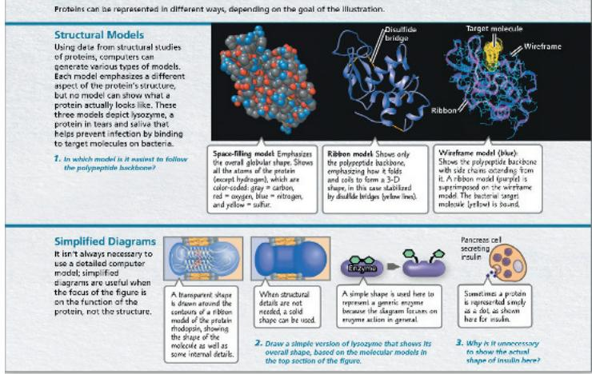

## Make Connections Figures

5.26 Contributions of Genomics and Proteomics to Biology 90  
10.22 The Working Cell 210  
18.27 Genomics, Cell Signaling, and Cancer 396  
23.18 The Sickle-Cell Allele 510  
33.9 Maximizing Surface Area 708  
37.9 Mutualism Across Kingdoms and Domains 825  
39.27 Levels of Plant Defenses Against Herbivores 880  
40.24 Life Challenges and Solutions in Plants and Animals 906  
44.17 Ion Movement and Gradients 1003  
55.19 The Working Ecosystem 1268  
56.31 Climate Change Has Effects at All Levels of Biological Organization 1292

## Exploring Figures

1.3 Levels of Biological Organization 4  
5.18 Levels of Protein Structure 82  
6.3 Microscopy 97  
6.8 Eukaryotic Cells 102

6.30 Cell Junctions in Animal Tissues 122  
7.21 Endocytosis in Animal Cells 142  
11.8 Cell-Surface Transmembrane Receptors 222  
12.7 Mitosis in an Animal Cell 242  
13.8 Meiosis in an Animal Cell 264  
16.23 Chromatin Packing in a Eukaryotic Chromosome 334  
24.3 Reproductive Barriers 518  
25.7 The Origin of Mammals 542  
27.17 Bacterial Diversity 595  
28.6 Protistan Diversity 610  
29.5 Alternation of Generations 633  
29.13 Bryophyte Diversity 638  
29.19 Seedless Vascular Plant Diversity 644  
30.7 Gymnosperm Diversity 654  
30.17 Angiosperm Diversity 662  
33.2 Invertebrate Diversity 700  
33.43 Insect Diversity 726  
34.42 Mammalian Diversity 757  
35.10 Examples of Differentiated Plant Cells 776  
37.15 Unusual Nutritional Adaptations in Plants 831  
38.4 Flower Pollination 836  
38.12 Fruit and Seed Dispersal 844  
40.5 Structure and Function in Animal Tissues 889  
41.5 Four Main Feeding Mechanisms of Animals 916  
44.12 The Mammalian Excretory System 996  
46.11 Human Gametogenesis 1038  
49.11 The Organization of the Human Brain 1100  
50.10 The Structure of the Human Ear 1121  
50.17 The Structure of the Human Eye 1126  
52.2 The Scope of Ecological Research 1172  
52.3 Global Climate Patterns 1174  
52.14 Terrestrial Biomes 1180  
52.18 Aquatic Biomes 1187  
53.17 Mechanisms of Density-Dependent Regulation 1213  
55.14 Water and Nutrient Cycling 1262  
55.17 Restoration Ecology Worldwide 1266

## Inquiry Figures

1.25 Does camouflage affect predation rates on two populations of mice? 20
4.2 Can organic molecules form under conditions estimated to simulate those on the early Earth? 57
7.4 Do membrane proteins move? 130
†10.9 Which wavelengths of light are most effective in driving photosynthesis? 195
12.9 At which end do kinetochore microtubules shorten during anaphase? 245
12.14 Do molecular signals in the cytoplasm regulate the cell cycle? 249
14.3 When F₁ hybrid pea plants self- or cross-pollinate, which traits appear in the F₂ generation? 275

14.8 Do the alleles for one character segregate into gametes dependently or independently of the alleles for a different character? 279
†15.3 In a cross between a wild-type female fruit fly and a mutant white-eyed male, what color eyes will the F₁ and F₂ offspring have? 300
15.9 How does linkage between two genes affect inheritance of characters? 306
16.2 Can a genetic trait be transferred between different bacterial strains? 319
16.4 Is protein or DNA the genetic material of phage T2? 320
\*†16.12 Does DNA replication follow the conservative, semiconservative, or dispersive model? 326
17.3 Do individual genes specify the enzymes that function in a biochemical pathway? 342
18.22 Could Bicoid be a morphogen that determines the anterior end of a fruit fly? 391
19.2 What causes tobacco mosaic disease? 403
20.16 Can the nucleus from a differentiated animal cell direct development of an organism? 434
20.21 Can a fully differentiated human cell be “deprogrammed” to become a stem cell? 437
21.18 What is the function of a gene (FOXP2) that may be involved in language acquisition? 467
22.13 Can a change in a population’s food source result in evolution by natural selection? 484
\*23.16 Do females select mates based on traits indicative of “good genes”? 508
24.7 Can divergence of allopatric populations lead to reproductive isolation? 522
24.12 Does sexual selection in cichlids result in reproductive isolation? 526
24.19 How does hybridization lead to speciation in sunflowers? 532
25.27 What causes the loss of spines in lake stickleback fish? 557
26.6 What is the species identity of food being sold as whale meat? 568
27.10 Can prokaryotic populations evolve rapidly in response to environmental change? 589
29.14 Can bryophytes reduce the rate at which key nutrients are lost from soils? 639
31.22 Do fungal endophytes benefit a woody plant? 680
33.30 Did the arthropod body plan result from new Hox genes? 720
36.18 Does phloem sap contain more sugar near sources than near sinks? 813
37.10 How variable are the compositions of bacterial communities inside and outside of roots? 826
39.5 What part of a grass coleoptile senses light, and how is the signal transmitted? 859
39.6 What causes polar movement of auxin from shoot tip to base? 860
39.16 How does the order of red and far-red illumination affect seed germination? 869
40.17 How does a Burmese python generate heat while incubating eggs? 900

40.23 What happens to the circadian clock during hibernation? 905
\*41.4 Can diet influence the frequency of neural tube defects? 914
42.25 What causes respiratory distress syndrome? 955
44.20 Can aquaporin mutations cause diabetes? 1005
46.8 Why is sperm usage biased when female fruit flies mate twice? 1034
†47.3 Does the distribution of Ca $^{2+}$ in an egg correlate with formation of the fertilization envelope? 1054
47.23 How does distribution of the gray crescent affect the developmental potential of the first two daughter cells? 1070
47.24 Can the dorsal lip of the blastopore induce cells in another part of the amphibian embryo to change their developmental fate? 1071
47.26 What role does the zone of polarizing activity (ZPA) play in limb pattern formation in vertebrates? 1072
50.23 How do mammals detect different tastes? 1131
51.8 Does a digger wasp use landmarks to find her nest? 1153
51.24 Are differences in migratory orientation within a species genetically determined? 1165
53.13 How does caring for offspring affect parental survival in kestrels? 1210
†54.3 Can a species' niche be influenced by competition? 1225
54.19 Is Pisaster ochraceus a keystone species? 1235
55.6 Which nutrient limits phytoplankton production along the coast of Long Island? 1254
55.12 How does temperature affect litter decomposition in an ecosystem? 1260
\*56.12 What caused the drastic decline of the Illinois greater prairie chicken population? 1280

## Research Method Figures

5.21 X-Ray Crystallography 85  
6.4 Cell Fractionation 98  
10.8 Determining an Absorption Spectrum 195  
13.3 Preparing a Karyotype 260  
14.2 Crossing Pea Plants 274  
14.7 The Testcross 278  
15.11 Constructing a Linkage Map 309  
20.3 Sequencing by Synthesis: Next-Generation Sequencing 423  
20.7 The Polymerase Chain Reaction (PCR) 426  
20.11 RT-PCR Analysis of the Expression of Single Genes 430  
26.14 Applying Parsimony to a Problem in Molecular Systematics 573  
35.21 Using Dendrochronology to Study Climate 785  
37.7 Hydroponic Culture 822  
48.9 Intracellular Recording 1081  
53.2 Determining Population Size Using the Mark-Recapture Method 1200  
54.14 Determining Microbial Diversity Using Molecular Tools 1232

## Unit 1 The Chemistry of Life

Unit 3 Genetics  
  
Kristi Anseth
University of Colorado at Boulder

## Unit 2 The Cell

  
Julie Theriot
University of Washington

  
Pardis Sabeti
Harvard University, Massachusetts  
Unit 4 Mechanisms of Evolution

  
Neil H. Shubin
University of Chicago, Illinois  
Unit 5 The Evolutionary History of Biological Diversity

  
Casey Dunn
Yale University, Connecticut

## Unit 6 Plant form and Function

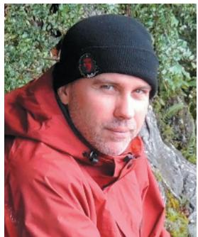  
Ernesto Gianoli
Tarleton State University, Texas

## Unit 7 Animal form and Function

  
Adrienne Bratcher
Morehouse School of Medicine,
Georgia

## Unit 8 Ecology

  
University San Francisco de Quito, Ecuador

# Evolution, the Themes of Biology, and Scientific Inquiry

## Key Concepts

1.1 The study of life reveals unifying themes

1.2 The Core Theme: Evolution accounts for the unity and diversity of life

1.3 In studying nature, scientists form and test hypotheses

1.4 Science benefits from a cooperative approach and diverse viewpoints

  
Figure 1.1 The light, dappled color of this beach mouse (Peromyscus polionotus) allows it to blend into its habitat—brilliant white sand dunes dotted with sparse clumps of beach grass along the Florida seashore. Mice of the same species that inhabit nearby inland areas are much darker, blending with the soil and vegetation where they live.

## Study Tip

Make a table: List the five unifying themes of biology across the top. Enter at least three examples of each theme as you read this chapter. One example is filled in for you. To help you focus on these big ideas, continue adding examples throughout your study of biology.

<table><tr><td>Evolution</td><td>Organization</td><td></td><td></td><td></td></tr><tr><td>Beach mouse&#x27;s coat color matches its sandy habitat.</td><td></td><td></td><td></td><td></td></tr><tr><td></td><td></td><td></td><td></td><td></td></tr></table>

Beach mouse

## How do these mice illustrate the unifying themes of biology?

As a result of evolution through natural selection over long periods of time, the fur colors of these two populations of mice resemble their surroundings, providing protection from predators.

  
Structure fits function at all levels of a mouse's organization.

  
Energy flows one way from the sun to plants to a mouse; matter cycles between a mouse and its environment.  
Inland mouse

  
A plant being eaten by a mouse and a mouse being preyed upon by a hawk are interactions within a system.

Genetic information encoded in DNA determines a mouse's fur colors.

Gene for brown fur

Gene for white fur

# Concept 1.1: The study of life reveals unifying themes

At the most fundamental level, we may ask: What is life? Even a child realizes that a dog or a plant is alive, while a rock or a car is not. Yet the phenomenon we call life defies a simple definition. We recognize life by what living things do. Figure 1.2 highlights some of the properties and processes we associate with life.

Biology, the scientific study of life, is a subject of enormous scope, and exciting new biological discoveries are being made every day. How can you organize into a comprehensible framework all the information you'll encounter as you study biology? Focusing on a few big ideas will help. Here are five unifying themes—ways of thinking about life that will still be useful decades from now.

\- Organization

\- Information

\- Energy and Matter

\- Interactions

\- Evolution

In this section and the next, we'll briefly explore each theme.

▼ Order. This close-up of a sunflower illustrates the highly ordered structure that characterizes life.

  
▲ Evolutionary adaptation. The overall appearance of these ghost pipefish camouflages the animals in their environment. Such adaptations evolve over countless generations by the reproductive success of those individuals with heritable traits that are best suited to their environments.

Figure 1.2 Some properties of life.  

  
▲ Regulation. The regulation of blood flow through the blood vessels of this jackrabbit's ears helps maintain a constant body temperature by adjusting heat exchange with the surrounding air.  
▲ Energy processing. This butterfly obtains fuel in the form of nectar from flowers. The butterfly will use chemical energy stored in its food to power flight and other work.

  
▲ Growth and development.
Inherited information carried by genes controls the pattern of growth and development of organisms, such as this oak seedling.

  
▲ Response to the environment.
The Venus flytrap on the left closed its trap rapidly in response to the environmental stimulus of a grasshopper landing on the open trap.  
Reproduction.
Organisms (living things) reproduce their own kind.

# Theme: New Properties Emerge at Successive Levels of Biological Organization

ORGANIZATION The study of life on Earth extends from the microscopic scale of the molecules and cells that make up an organism to the global scale of the entire living planet. As biologists, we can divide this enormous range into different levels of biological organization. In Figure 1.3, we zoom in from space to take a closer and closer look at life in a mountain meadow. This journey, depicted as a series of numbered steps, highlights the hierarchy of biological organization.

Zooming in at ever-finer resolution illustrates the principle that underlies reductionism, an approach that reduces complex systems to simpler components that are more manageable to study. Reductionism is a powerful strategy in biology. For example, by studying the molecular structure of DNA that had been extracted from cells, Francis Crick and James Watson inferred the chemical basis of biological inheritance. Despite its importance, reductionism provides an incomplete view of life on Earth, as you'll see next.

## Emergent Properties

Let's reexamine Figure 1.3, beginning this time at the molecular level and then zooming out. This approach allows us to see novel properties emerge at each level that are absent from the preceding one. These emergent properties are due to the arrangement and interactions of parts as complexity increases. For example,

# Exploring Levels of Biological Organization

Figure 1.3

## ◀1 The Biosphere

Even from space, we can see signs of Earth's life—in the mosaic of greens indicating forests, for example. We can also see the biosphere, which consists of all life on Earth and all the places where life exists: most regions of land, most bodies of water, the atmosphere to an altitude of several kilometers, and even sediments far below the ocean floor.

## 2 Ecosystems

Our first scale change brings us to a North American mountain meadow, which is an example of an ecosystem, as are a tropical forest, grassland, desert, and coral reef. An ecosystem consists of all the living things in a particular area, along with all the nonliving components of the environment with which life interacts, such as soil, water, atmospheric gases, and light.

## ▶ 3 Communities

The array of organisms inhabiting a particular ecosystem is called a biological community. The community in our meadow ecosystem includes many kinds of plants, various animals, mushrooms and other fungi, and enormous numbers of diverse microorganisms, such as bacteria, that are too small to see without a microscope. Each of these forms of life belongs to a species—a group whose members can only reproduce with other members of the group.

## ▶ 4 Populations

A population consists of all the individuals of a species living within the bounds of a specified area. For example, our meadow includes a population of lupines (some of which are shown here) and a population of mule deer. A community is therefore the set of populations that inhabit a particular area.

## ▲ 5 Organisms

Individual living things are called organisms. Each plant in the meadow is an organism, and so is each animal, fungus, and bacterium.

although photosynthesis occurs in an intact chloroplast, it will not take place if chlorophyll and other chloroplast molecules are simply mixed in a test tube. The coordinated processes of photosynthesis require a specific organization of these molecules in the chloroplast. Isolated components of living systems—the objects of study in a reductionist approach—lack a number of significant properties that emerge at higher levels of organization.

Emergent properties are not unique to life. A box of bicycle parts won't transport you anywhere, but if they are arranged in a certain way, you can pedal to your chosen destination. Compared with such nonliving examples, however, biological systems are far more complex, making the emergent properties of life especially challenging to study.

To fully explore emergent properties, biologists today complement reductionism with systems biology, the exploration of a biological system by analyzing the interactions among its parts. In this context, a single leaf cell can be considered a system, as can a frog, an ant colony, or a desert ecosystem. By examining and modeling the dynamic behavior of an integrated network of components, systems biology enables us to pose new kinds of questions. For example, how do networks of molecular interactions in our bodies generate our 24-hour cycle of wakefulness and sleep? At a larger scale, how does a gradual increase in atmospheric carbon dioxide alter ecosystems and the entire biosphere? Systems biology can be used to study life at all levels.

## Structure and Function

At each level of the biological hierarchy, we find a correlation between structure and function. Consider the leaf in Figure 1.3: Its broad, flat shape maximizes the capture of sunlight by chloroplasts. Because such correlations of structure and function are common in all living things, analyzing a biological structure gives us clues about what it does and how it works. For

## ▼ 6 Organs

The structural hierarchy of life continues to unfold as we explore the architecture of a complex organism. This lupine leaf (consisting of six leaflets) is an example of an organ, a body part that is made up of multiple tissues and has specific functions in the body. Leaves, stems, and roots are the major organs of plants. Within an organ,

plants. Within an organ, each tissue has a distinct arrangement and contributes particular properties to organ function.

## ▼ 7 Tissues

Viewing the tissues of a leaf requires a microscope. Each tissue is a group of cells that work together, performing a specialized function. The leaf shown here has been cut on an angle. The honeycombed tissue in the interior of

  
$\overline{50\mu m}$

the leaf (left side of photo) is the main location of photosynthesis, the process that converts light energy to the chemical energy of sugar. The jigsaw puzzle-like “skin” on the surface of the leaf (right side of photo) is a tissue called epidermis. The pores through the epidermis allow entry of the gas $CO_{2}$ , a raw material for sugar production.

## ▶ 8 Cells

The cell is life's fundamental unit of structure and function. Some organisms consist of a single cell, which performs all the functions of life. Other

10 μm

organisms are multicellular and feature a division of labor among specialized cells. Here we see a magnified view of a cell in a leaf tissue. This cell is about 40 micrometers ( $\mu$ m) across—about 500 of them would reach across a small coin. Within these tiny cells are even smaller green structures called chloroplasts, which are responsible for photosynthesis.

## ▼ 9 Organelles

Chloroplasts are examples of organelles, the various functional components present in cells. The image below, taken by a powerful microscope, shows a single chloroplast.

  
Chloroplast  
1 μm

## ▼ 10 Molecules

Our last scale change drops us into a chloroplast for a view of life at the molecular level. A molecule is a chemical structure consisting of two or more units called atoms, represented as balls in this computer graphic of a chlorophyll molecule. Chlorophyll is

  
Chlorophyll molecule

the pigment that makes a leaf green, and it absorbs sun-light during photo-synthesis. Within each chloroplast, millions of chlorophyll molecules are organized into systems that convert light energy to the chemical energy of food.

Figure 1.4 Contrasting eukaryotic and prokaryotic cells in size and complexity.

The cells are shown to scale here; to see a larger magnification of a prokaryotic cell, see Figure 6.5.

VISUAL SKILLS Measure the scale bar, the length of the prokaryotic cell, and the diameter of the eukaryotic cell. Knowing that this scale bar represents $1 \mu m$ , calculate the length of the prokaryotic cell and the diameter of the eukaryotic cell in $\mu m$ .

For suggested answer, see Appendix A.

example, the hummingbird's anatomy allows its wings to rotate at the shoulder, so hummingbirds have the ability, unique among birds, to fly backward or hover in place. While hovering, the birds can extend their long, slender beaks into flowers and feed on nectar. The elegant match

of form and function in the structures of life is explained by natural selection, which we'll explore shortly.

## The Cell: An Organism's Basic Unit of Structure and Function

The cell is the smallest unit of organization that can perform all activities required for life. The so-called Cell Theory was first developed in the 1800s, based on the observations of many scientists. The theory states that all living organisms are made of cells, which are the basic unit of life. In fact, the actions of organisms are all based on the activities of cells. For instance, the movement of your eyes as you read this sentence results from the activities of muscle and nerve cells. Even a process that occurs on a global scale, such as the recycling of carbon atoms, is the product of cellular functions, including the photosynthetic activity of chloroplasts in leaf cells.

All cells share certain characteristics. For instance, every cell is enclosed by a membrane that regulates the passage of materials between the cell and its surroundings. Nevertheless, we distinguish two main forms of cells: prokaryotic and eukaryotic. Prokaryotic cells are found in single-celled microorganisms belonging to one of two groups: the bacteria (singular, bacterium) and the archaea (singular, archaean). All other forms of life, including plants and animals, are composed of eukaryotic cells.

A eukaryotic cell contains membrane-enclosed organelles (Figure 1.4). Some organelles, such as the DNA-containing nucleus, are found in the cells of all eukaryotes; other organelles are specific to particular cell types. For example, the chloroplast in Figure 1.3 is an organelle found only in eukaryotic cells that carry out photosynthesis. In contrast to eukaryotic cells, a prokaryotic cell lacks a nucleus or other membrane-enclosed organelles. Furthermore, prokaryotic cells are generally smaller than eukaryotic cells, as shown in Figure 1.4.

# Theme: Life's Processes Involve the Expression and Transmission of Genetic Information

INFORMATION Within cells, structures called chromosomes contain genetic material in the form of DNA (deoxyribonucleic acid). In cells that are preparing to divide, the chromosomes may be made visible using a dye that appears blue when bound to the DNA (Figure 1.5).

Figure 1.5 A lung cell from a newt divides into two smaller cells that will grow and divide again.  
DNA in chromosomes  

Figure 1.6 Inherited DNA directs the development of an organism.  
  
Offspring with traits inherited from both parents

## DNA, the Genetic Material

Each chromosome contains one very long DNA molecule with hundreds or thousands of genes, each a section of the DNA of the chromosome. Transmitted from parents to offspring, genes are the units of inheritance. They encode the information necessary to build all of the molecules synthesized within a cell, which in turn establish that cell's identity and function. You began as a single cell stocked with DNA inherited from your parents. The replication of that DNA prior to each cell division transmitted copies of the DNA to what eventually became the trillions of cells of your body. As the cells grew and divided, the genetic information encoded by the DNA directed your development (Figure 1.6).

The molecular structure of DNA accounts for its ability to store information. A DNA molecule is made up of two long chains, called strands, arranged in a double helix. Each chain is made up of four kinds of chemical building blocks called nucleotides, abbreviated A, T, C, and G (Figure 1.7). Specific sequences of these four nucleotides encode the information in genes. The way DNA encodes information is analogous to how we arrange the letters of the alphabet into words and phrases with specific meanings. The word rat, for example, evokes a rodent; the words tar and art, which contain the same letters, mean very different things. We can think of nucleotides as a four-letter alphabet.

For many genes, the sequence provides the blueprint for making a protein. For instance, a given bacterial gene may specify a particular protein (such as an enzyme) required to break down a certain sugar molecule, while one particular human gene may denote an enzyme, and another gene a different protein (an antibody, perhaps) that helps fight off infection. Overall, proteins are major players in building and maintaining the cell and carrying out its activities.

Protein-encoding genes control protein production indirectly, using a related molecule called RNA as an intermediary. The sequence of nucleotides along a gene is transcribed into mRNA, which is then translated into a linked series of protein building blocks called amino acids. Once completed, the amino acid chain forms a specific protein with a unique shape and function. The entire

Figure 1.7 DNA: the genetic material.

  
(b) Single strand of DNA. These geometric shapes and letters are simple symbols for the nucleotides in a small section of one strand of a DNA molecule. Genetic information is encoded in specific sequences of the four types of nucleotides. Their names are abbreviated A, T, C, and G.

(a) DNA double helix. This model shows the atoms in a segment of DNA. Made up of two long chains (strands) of building blocks called nucleotides, a DNA molecule takes the three-dimensional form of a double helix.

process by which the information in a gene directs the manufacture of a cellular product is called gene expression (Figure 1.8, on the next page).

In carrying out gene expression, all forms of life employ essentially the same genetic code: A particular sequence of nucleotides means the same thing in one organism as it does in another. Differences between organisms reflect differences between their nucleotide sequences rather than between their underlying genetic codes. This universality of the genetic code is a strong piece of evidence that all life is related. Comparing the sequences in several species for a gene that codes for a particular protein can provide valuable information both about the protein and about the relationship of the species to each other.

Molecules of mRNA, like the one in Figure 1.8, are translated into proteins, but other cellular RNAs function differently. For example, we have known for decades that some types of RNA are actually components of the cellular machinery that manufactures proteins. In the last few decades, scientists have discovered new classes of RNA that play other roles in the cell, such as regulating the function of protein-coding genes. Genes specify these RNAs as well, and their production is also referred to as gene expression. By carrying the instructions for making proteins and RNAs and by replicating with each cell division, DNA ensures faithful inheritance of genetic information from generation to generation.

Figure 1.8 Gene expression: Cells use information encoded in a gene to synthesize a functional protein.  
  
(a) The lens of the eye (behind the pupil) is able to focus light because lens cells are tightly packed with transparent proteins called crystallin. How do lens cells make crystallin proteins?

  
The chain of amino acids folds into the specific shape of a crystallin protein. Crystallin proteins can then pack together and focus light, allowing the eye to see.

## Genomics: Large-Scale Analysis of DNA Sequences

The entire “library” of genetic instructions that an organism inherits is called its genome. A typical human cell has two similar sets of chromosomes, and each set has approximately 3 billion nucleotide pairs of DNA. If the one-letter abbreviations for the nucleotides of a set were written in letters the size of those you are now reading, the genomic text would fill about 700 biology textbooks.

Since the early 1990s, the pace at which researchers can determine the sequence of a genome has accelerated at an astounding rate, enabled by a revolution in technology. The genome sequence—the entire sequence of nucleotides for a representative member of a species—is now known for humans and many other animals, as well as numerous plants, fungi, bacteria, and archaea. To make sense of the deluge of data from genome-sequencing projects and the growing catalog of known gene functions, scientists are applying a systems biology approach at the cellular and molecular levels. Rather than investigating a single gene at a time, researchers study whole sets of genes (or other DNA) in one or more species—an approach called genomics. Likewise, the term proteomics refers to the study of sets of proteins and their properties. (The entire set of proteins expressed by a given cell, tissue, or organism is called a proteome.)

Three important research developments have made the genomic and proteomic approaches possible. One is “high-throughput” technology, tools that can analyze many biological samples very rapidly. The second major development is bioinformatics, the use of computational tools to store, organize, and analyze the huge volume of data that results from high-throughput methods. One new bioinformatics tool that is becoming essential is artificial intelligence (AI), the development and use of computer systems that can function like neural networks in the human brain to perform various tasks. AI is transforming how researchers analyze biological data, identify patterns, and develop new medical treatments. The third development is the formation of interdisciplinary research teams—groups of diverse specialists that may include computer scientists, mathematicians, engineers, chemists, physicists, and, of course, biologists from a variety of fields. Researchers in such teams aim to learn how the activities of all the proteins and RNAs encoded by the DNA are coordinated in cells and in whole organisms.

## Theme: Life Requires the Transfer and Transformation of Energy and Matter

ENERGY AND MATTER Moving, growing, reproducing, and the various cellular activities of life are work, and work requires energy. The input of energy, primarily from the sun, and the

Figure 1.9 Energy flow and chemical cycling.

There is a one-way flow of energy in an ecosystem: During photosynthesis, plants convert energy from sunlight to chemical energy (stored in food molecules such as sugars), which is used by plants and other organisms to do work and is eventually lost from the ecosystem as heat. In contrast, chemicals cycle between organisms and the physical environment.

transformation of energy from one form to another make life possible (Figure 1.9). When a plant's leaves absorb sunlight in the process of photosynthesis, molecules within the leaves convert the energy of sunlight to the chemical energy of food, such as sugars. The chemical energy in the food molecules is then passed along from plants and other photosynthetic organisms (producers) to consumers. A consumer is an organism that feeds on other organisms or their remains.

When an organism uses chemical energy to perform work, such as muscle contraction or cell division, some of that energy is lost to the surroundings as heat. As a result, energy flows through an ecosystem in one direction, usually entering as light and exiting as heat. In contrast, chemicals cycle within an ecosystem, where they are used and then recycled (see Figure 1.9). Chemicals that a plant absorbs from the air or soil may be incorporated into the plant's body and then passed to an animal that eats the plant. Eventually, these chemicals will be returned to the environment by decomposers such as bacteria and fungi that break down waste products, leaf litter, and the bodies of dead organisms. The chemicals are then available to be taken up by plants again, thereby completing the cycle.

## Theme: From Molecules to Ecosystems, Interactions Are Important in Biological Systems

INTERACTIONS At any level of the biological hierarchy, interactions between the components of the system ensure smooth integration of all the parts, such that they function as a whole. This holds true equally well for molecules in a cell and the components of an ecosystem; we'll look at both as examples.

## Molecules: Interactions Within Organisms

At lower levels of organization, the interactions between components that make up living organisms—organs, tissues, cells, and molecules—are crucial to their smooth operation. Consider the regulation of blood sugar level, for instance. Cells in the body must match the supply of fuel (sugar) to demand, regulating the opposing processes of sugar breakdown and storage. The key is the ability of many biological processes to self-regulate by a mechanism called feedback.

In feedback regulation, the output or product of a process regulates that very process. The most common form of regulation in living systems is negative feedback, a loop in which the response acts in opposition to the initial stimulus. As seen in the example of blood glucose regulation (Figure 1.10, on the next page), after a meal the level of the sugar glucose in your blood rises (stimulus), which stimulates cells of the pancreas to secrete insulin. Insulin, in turn, causes body cells to take up glucose and liver and muscle cells to store it. This response decreases the blood glucose level, so insulin secretion decreases. Thus, the response (increased glucose uptake) opposes the stimulus (increased blood glucose level).

Though less common than processes regulated by negative feedback, there are also many biological processes regulated by positive feedback, in which an end product reinforces or strengthens the stimulus. The clotting of your blood in response to injury is an example. When a blood vessel is damaged, structures in the blood called platelets begin to aggregate at the site. Positive feedback occurs as chemicals released by the platelets attract more platelets. The platelet pileup then initiates a complex process that seals the wound with a clot.

Figure 1.10 Feedback regulation.

The human body regulates the use and storage of glucose, a major cellular fuel. This figure shows negative feedback: The response to increased blood glucose levels acts in opposition to the initial stimulus.

  
VISUAL SKILLS In this example, what is the response to high blood glucose levels? How does this response act in opposition to the stimulus? For suggested answer, see Appendix A.

# Ecosystems: An Organism's Interactions with Other Organisms and the Physical Environment

At the ecosystem level, every organism interacts with other organisms. For instance, an acacia tree interacts with soil

microorganisms associated with its roots, insects that live on it, and animals that eat its leaves and fruit (Figure 1.11). Interactions between organisms include those that are mutually beneficial (as when “cleaner fish” eat small parasites on a turtle) and those in which one species benefits and the other is harmed (as when a lion kills and eats a zebra). In some interactions between species, both are harmed—for example, when two plants compete for a soil resource that is in short supply. Interactions among organisms help regulate the functioning of the ecosystem as a whole.

Each organism also interacts continuously with physical factors in its environment. The leaves of a tree, for example, absorb light from the sun, take in carbon dioxide from the air, and release oxygen to the air (see Figure 1.11). The environment is also affected by organisms. For instance, in addition to taking up water and minerals from the soil, the roots of a plant break up rocks as they grow, contributing to the formation of soil. On a global scale, plants and other photosynthetic organisms have generated all the oxygen in the atmosphere.

Like other organisms, we humans interact with our environment. Our interactions sometimes have dire consequences: For example, over the past 150 years, humans have greatly increased the burning of fossil fuels (coal, oil, and gas). This practice releases large amounts of carbon dioxide $(\mathrm{CO}_{2})$ and other gases into the atmosphere, causing heat to be trapped close to Earth's surface (see Figure 56.29). Scientists calculate that the $\mathrm{CO}_{2}$ added to the atmosphere by human activities has increased the average temperature of the planet by about $1.15^{\circ}\mathrm{C}$ since 1900. At the current rates that $\mathrm{CO}_{2}$ and other gases are being added to the atmosphere, global models predict an additional rise of about $3^{\circ}\mathrm{C}$ before the end of this century.

This ongoing global warming is a major aspect of climate change, a directional change to the global climate that lasts for three decades or more (as opposed to short-term changes in the weather). But global warming is not the only way the climate is changing: Wind and precipitation patterns are also shifting, and extreme weather events such as storms and droughts are occurring more often. Climate change has already affected organisms and their habitats all over the planet. For example, polar bears have lost much of the ice platform from which they hunt, leading to food shortages and increased mortality rates. As habitats deteriorate, hundreds of plant and animal species are shifting their ranges to more suitable locations—but for some, there is insufficient suitable habitat, or they may not be able to migrate quickly enough. As a result, the populations of many species are shrinking in size or even disappearing (Figure 1.12). (For more examples of how climate change is affecting life on Earth, see Make Connections Figure 56.30.)

Figure 1.11 Interactions of an African acacia tree with other organisms and the physical environment.  

Figure 1.12 Threatened by global warming.

A warmer environment causes lizards in the genus Sceloporus to spend more time in refuges from the heat, reducing time for foraging. Their food intake drops, decreasing reproductive success. Surveys of 200 Sceloporus populations in Mexico show that 12% of these populations have disappeared since 1975.

The loss of populations due to climate change can ultimately result in extinction, the permanent loss of a species. As we'll explore in greater detail in Concept 56.4, the consequences of these changes for humans and other organisms may be profound.

Having considered four of the unifying themes (organization, information, energy and matter, and interactions), let's now turn to evolution. There is consensus among biologists that evolution is the core theme of biology, and it is discussed in detail in the next section.

## Concept Check 1.1

1. Starting with the molecular level in Figure 1.3, write a sentence that includes components from the previous (lower) level of biological organization, for example: "A molecule consists of atoms bonded together." Continue with organelles, moving up the biological hierarchy.

2. Identify the theme or themes exemplified by (a) the sharp quills of a porcupine, (b) the development of a multicellular organism from a single fertilized egg, and (c) a hummingbird using sugar to power its flight.

3. WHAT IF? For each theme discussed in this section, give an example not mentioned in the text.

For suggested answers, see Appendix A.

# Concept 1.2: The Core Theme: Evolution accounts for the unity and diversity of life

EVOLUTION An understanding of evolution helps us to make sense of everything we know about life on Earth. As the fossil record clearly shows, life has been evolving for billions of years, resulting in a vast diversity of past and present organisms. But along with the diversity there is also unity, in the form of shared features. For example, while sea horses, jackrabbits, hummingbirds, and giraffes all look very different, their skeletons are organized in the same basic way.

The scientific explanation for the unity and diversity of organisms is evolution: a process of biological change in which species accumulate differences from their ancestors as they adapt to different environments over time. Thus, we can account for differences between two species (diversity) with the idea that certain heritable changes occurred after the two species diverged from their common ancestor. However, they also share certain traits (unity) simply because they have descended from a common ancestor. An abundance of evidence of different types supports the occurrence of evolution and the mechanisms that describe how it takes place, which we'll explore in detail in Chapters 22–25. To quote one of the founders of modern evolutionary theory, Theodosius Dobzhansky, "Nothing in biology makes sense except in the light of evolution." To understand this statement, we need to examine how biologists think about the vast diversity of life on the planet.

## Classifying the Diversity of Life

Diversity is a hallmark of life. Biologists have so far identified and named about 1.8 million species of organisms. Each species is given a two-part name: The first part is the name of the genus (plural, genera) to which the species belongs, and the second part is unique to the species within the genus. (For example, Homo sapiens is the name of our species.)

To date, known species include at least 150,000 species of fungi, 435,000 plant species, 65,000 vertebrate species (animals with backbones), and 1 million insect species (more than half of all known forms of life)—not to mention the myriad types of single-celled organisms. Researchers identify thousands of additional species each year. Estimates of the total number of species range from about 10 million to over 100 million. Whatever the actual number, the enormous variety of life gives biology a very broad scope. Biologists face a major challenge in attempting to make sense of this variety.

## Rethinking the Domains of Life

Humans tend to group diverse items according to their similarities and relationships to each other. Consequently, biologists have long used careful comparisons of structure, function, and other obvious features to classify forms of life into groups. As described in more detail in Concept 26.6, this process has led to changing conceptions of the broadest groupings as new analytical methods have been developed, such as comparing genomic sequences. In 1990, researcher Carl Woese and colleagues proposed a system classifying organisms into three groups, called domains: Bacteria, Archaea, and Eukarya (Figure 1.13). As described, two of the three domains—Bacteria and Archaea—consisted of single-celled prokaryotic organisms. All the eukaryotes (organisms with eukaryotic cells) were placed in domain Eukarya. This domain includes kingdom Plantae, kingdom Fungi, kingdom Animalia, and the protists. The three kingdoms are distinguished partly by their modes of nutrition: Plants produce their own sugars and other food molecules by photosynthesis, fungi absorb nutrients in dissolved form from their surroundings, and animals obtain food by eating and digesting other organisms. Animalia is, of course, the kingdom to which we humans belong.

100 μm

(b) Archaea  
Figure 1.13 The three-domain hypothesis.  
Although recent analyses indicate that Eukarya likely evolved within the Archaea (see Concept 26.6), it is still useful to distinguish the prokaryotic species in Archaea as a group since there are many significant differences between eukaryotic and prokaryotic organisms.  
(a) Bacteria  
  
Bacteria are the most diverse and widespread prokaryotic species and are classified into multiple kingdoms. Each rod-shaped structure in this photo is a bacterial cell.

  
Archaea includes multiple kingdoms. Some of the prokaryotic organisms known as archaea live in Earth's extreme environments, such as salty lakes and boiling hot springs. Each round structure in this photo is an archaeal cell.

(c) Eukarya  

  
Kingdom Plantae (plants) consists of multicellular eukaryotes that carry out photosynthesis, the conversion of light energy to the chemical energy in food. Most plant species live on land.  
Kingdom Animalia consists of multicellular eukaryotes that ingest other organisms.  
Kingdom Fungi, which includes unicellular and multicellular eukaryotes, is characterized in part by the nutritional mode of its members (such as this mushroom), which absorb nutrients from outside their bodies.  
▶ Protists are mostly unicellular eukaryotes and some relatively simple multicellular relatives. Pictured here is an assortment of protists inhabiting

  
pond water. Scientists are currently debating how to classify protists in a way that accurately reflects their evolutionary relationships.

In the last few decades, many more analyses of genetic sequences and protein structures have contributed to an ongoing reevaluation of the classification of life. As one example, let's consider the most numerous and diverse eukaryotes—the protists, which are mostly single-celled organisms. Although protists were once placed in a single kingdom, they are now classified into several groups. One major reason for this change is DNA evidence showing that some protists are less closely related to other protists than they are to plants, animals, or fungi. In another example, molecular comparisons of many organisms across Bacteria, Archaea, and Eukarya support that Archaea are more closely related to Eukarya than they are to Bacteria, and that in fact Eukarya may be descended from a subgroup of Archaea. These evolutionary relationships of Eukarya and Archaea are currently a matter of active research, as well as their status as domains (see Concept 26.6).

Although the earliest branching of the tree of life is not fully understood, the names biologists have assigned these groups—Bacteria, Archaea, and Eukarya—are still quite useful for purposes of studying the significant differences between them; therefore,

in this text, when we use the term Archaea, we are referring to prokaryotic species unless otherwise noted.

## Unity in the Diversity of Life

As diverse as life is, there is also remarkable unity among forms of life. Consider, for example, the similar skeletons of different animals and the universal genetic language of DNA (the genetic code), both mentioned earlier. In fact, similarities between organisms are evident at all levels of the biological hierarchy. For example, unity is obvious in many features of cell structure, even among distantly related organisms (Figure 1.14).

How can we account for life's dual nature of unity and diversity? The process of evolution, explained next, illuminates both the similarities and differences in the world of life. It also introduces another important dimension of biology: the passage of time. The history of life, as documented by fossils and other evidence, is the saga of an ever-changing Earth billions of years old, inhabited by an evolving cast of living forms (Figure 1.15).

Figure 1.14 An example of unity underlying the diversity of life: the architecture of cilia in eukaryotes.

Cilia (singular, cilium) are extensions of cells that function in locomotion. They occur in eukaryotes as diverse as Paramecium (found in pond water) and humans. Even organisms so different share a common architecture for their cilia, which have an elaborate system of tubules that is striking in cross-sectional views.

  
Cross section of a cilium, as viewed with an electron microscope  
Cilia of Paramecium. The cilia of the single-celled Paramecium propel the organism through pond water.  
Cilia of windpipe cells. The cells that line the human windpipe are equipped with cilia that help keep the lungs clean by sweeping a film of debris-trapping mucus upward.

Figure 1.15 Studying the history of life.  
Paleontologist Marie-Antoinette de Lumley examines a fossilized tooth of Tautavel Man, a pre-Neanderthal species discovered in southern France. Fossilized teeth preserve well and provide valuable information concerning the age, health, and diet of the individual.  

## Charles Darwin and the Theory of Natural Selection

An evolutionary view of life came into sharp focus in November 1859, when Charles Darwin published one of the most important and influential books ever written, On the Origin of Species by Means of Natural Selection (Figure 1.16). The Origin of Species articulated

Figure 1.16 Charles Darwin.  
The portrait shows Darwin in about 1840, well before the 1859 publication of his revolutionary book, commonly referred to as The Origin of Species.  

two main points. The first point was that, as species adapt to different environments over time, they accumulate differences from their ancestors. Darwin called this process “descent with modification.” This insightful phrase captured the duality of life’s unity and diversity—unity in the kinship among species that descended from common ancestors and diversity in the modifications that evolved as species branched from their common ancestors (Figure 1.17). Darwin’s second main point was his proposal that “natural selection” is a primary cause of descent with modification.

Darwin developed his theory of natural selection from observations that by themselves were neither new nor profound. However, although others had described the pieces of the puzzle, it was Darwin who saw how they fit together. He started with the

4 Increased frequency of traits that enhance survival and reproductive success

Figure 1.17 Unity and diversity among birds.

These four birds are variations on a common body plan. For example, each has feathers, a beak, and wings. However, these common features are highly specialized for the birds' diverse lifestyles.

▼ Red-tailed hawk (Buteo borealis)

▼ American flamingo (Phoenicopterus ruber)

  
▲ European robin (Erithacus rubecula)  
▲ Gentoo penguin (Pygoscelis papua)  
This imaginary beetle population has colonized a locale where the soil has been blackened by a recent brush fire. Initially, the population varies extensively in the inherited coloration of the individuals, from very light gray to charcoal. For hungry birds that prey on the beetles, it is easiest to spot the beetles that are lightest in color.

following three observations from nature: First, individuals in a population vary in their traits, many of which seem to be heritable (passed on from parents to offspring). Second, a population can produce far more offspring than can survive to produce offspring of their own. With more individuals than the environment is able to support, competition is inevitable. Third, species generally are suited to their environments—in other words, they are adapted to their circumstances. For instance, a common adaptation among birds that eat hard seeds is an especially strong beak.

By making inferences from these three observations, Darwin developed a scientific explanation for how evolution occurs. He reasoned that individuals with inherited traits that are better suited to the local environment are more likely to survive and reproduce than less well-suited individuals. Over many generations, a higher and higher proportion of individuals in a population will have the advantageous traits. Evolution occurs as the unequal reproductive success of individuals ultimately leads to adaptation to their environment, as long as the environment remains the same.

Darwin called this mechanism of evolutionary adaptation natural selection because the natural environment consistently “selects” for the propagation of certain traits among naturally occurring variant traits in the population. The example in Figure 1.18 illustrates the ability of natural selection to “edit” an insect population’s heritable variations in coloration. We see the products of natural selection in the exquisite adaptations of various organisms to the special circumstances of their way of life and their environment. The wings of the bat shown in Figure 1.19 are an excellent example of adaptation.

## The Tree of Life

Take another look at the skeletal architecture of the bat's wings in Figure 1.19. These wings are not like those of feathered birds; the bat is a mammal. The bones, joints, nerves, and blood vessels

Figure 1.18 Natural selection.

  
DRAW IT Over time, the soil will gradually become lighter in color. Draw another step to show how the soil, when lightened to medium color, would affect natural selection. Write a caption for this new step 5. Then explain how the population would change over time as the soil becomes lighter.  
For suggested answer, see Appendix A.

Figure 1.19 Evolutionary adaptation.

Bats, the only mammals capable of active flight, have wings with webbing between extended “fingers.” Darwin proposed that such adaptations are refined over time by natural selection.

in the bat's forelimbs, though adapted for flight, are very similar to those in the human arm, the foreleg of a horse, and the flipper of a whale. Indeed, all mammalian forelimbs are anatomical variations of a common architecture. According to the Darwinian concept of descent with modification, the shared anatomy of mammalian limbs reflects inheritance of the limb structure from a common ancestor—the “prototype” mammal from which all other mammals descended. The diversity of mammalian forelimbs results from modification by natural selection operating over millions of years in different environmental contexts. Fossils and other evidence corroborate anatomical unity in supporting this view of mammalian descent from a common ancestor.

Darwin proposed that natural selection, by its cumulative effects over long periods of time, could cause an ancestral species to give rise to two or more descendant species. This could occur, for example, if one population of organisms became fragmented into several subpopulations isolated in different environments. In these separate arenas of natural selection, one species could gradually radiate into multiple species as the geographically isolated populations adapted over many generations to different environmental conditions.

The Galápagos finches are a famous example of the process of radiation of new species from a common ancestor. Darwin collected specimens of these birds during his 1835 visit to the remote Galápagos Islands, 900 kilometers (km) off the Pacific coast of South America. These relatively young volcanic islands are home to many species of plants and animals found nowhere else in the world, though many Galápagos organisms are clearly related to species on the South American mainland. The Galápagos finches are thought to have descended from an ancestral finch species that reached the archipelago from South America or the Caribbean. Over time, the Galápagos finches diversified from their ancestor as populations became adapted to different food sources on their particular islands. Years after Darwin collected the finches, researchers began to sort out their evolutionary relationships, first from anatomical and geographic data and more recently with the help of DNA sequence comparisons.

Biologists' diagrams of evolutionary relationships generally take treelike forms, though the trees are often turned sideways as in Figure 1.20. Tree diagrams make sense: Just as an individual has a genealogy that can be diagrammed as a family tree, each species is one twig of a branching tree of life extending back in time through ancestral species more and more remote. Species that are very similar, such as the Galápagos finches, share a relatively recent common ancestor. Through an ancestor that lived much further back in time, finches are related to sparrows, hawks,

Figure 1.20 Descent with modification: adaptive radiation of finches on the Galápagos Islands.

This “tree” illustrates a current hypothesis for the evolutionary relationships of finches on the Galápagos. Note the various beaks, which are adapted to particular food sources. For example, heavier, thicker beaks are better at cracking seeds, while the more slender beaks are better at grasping insects.

penguins, and all other birds. Furthermore, finches and other birds are related to us through a common ancestor even more ancient. Trace life back far enough, and we reach the early prokaryotic species that inhabited Earth over 3.5 billion years ago. We can recognize their vestiges in our own cells—in the universal genetic code, for example. Indeed, all of life is connected through its long evolutionary history.

## Concept Check 1.2

1. Explain why “editing” is a metaphor for how natural selection acts on a population’s heritable variation.

2. Referring to Figure 1.20, provide a possible explanation for how, over a very long time, the green warbler finch came to have a slender beak.

3. DRAW IT The three major groups you learned about in Concept 1.2 can be represented in the tree of life as the three main branches, with three subbranches on the eukaryotic branch being the kingdoms Plantae, Fungi, and Animalia. Genomic and other evidence has shown that fungi and animals are more closely related to each other than either of these kingdoms is to plants. Draw a simple branching pattern that symbolizes the proposed relationship between these three eukaryotic kingdoms.

For suggested answers, see Appendix A.

## Concept 1.3: In studying nature, scientists form and test hypotheses

Science is a way of knowing—an approach to understanding the natural world. It developed out of our curiosity about ourselves, other life-forms, our planet, and the universe. The word science is derived from a Latin verb meaning “to know.” Striving to understand seems to be one of our basic urges.

At the heart of science is inquiry, the search for information and explanations of natural phenomena. There is no formula for successful scientific inquiry, no single scientific method that researchers must rigidly follow. As in all quests, science includes elements of challenge, adventure, and luck, along with careful planning, reasoning, creativity, patience, and the persistence to overcome setbacks. Such diverse elements of inquiry make science far less structured than most people realize. That said, it is possible to highlight certain characteristics that help to distinguish science from other ways of describing and explaining nature.

Scientists use a process of inquiry that includes making observations, forming logical, testable explanations (hypotheses), and testing them. The process is necessarily repetitive: In testing a hypothesis, more observations may inspire revision of the original hypothesis or formation of a new one, thus leading to further testing. In this way, scientists circle closer and closer to their best estimation of the laws governing nature.

## Exploration and Observation

Biology, like other sciences, begins with careful observations. In gathering information, biologists often use tools such as microscopes, precision thermometers, or high-speed cameras that extend their senses or facilitate careful measurement. Observations can reveal valuable information about the natural world. For example, a series of detailed observations have shaped our understanding of cell structure, and another set of observations is currently expanding our databases of genome sequences from diverse species and databases of genes whose expression is altered in various diseases.

In exploring nature, biologists also rely heavily on the scientific literature, the published contributions of fellow scientists. By reading about and understanding past studies, scientists can build on the foundation of existing knowledge, focusing their investigations on observations that are original and on hypotheses that are consistent with previous findings. Identifying publications relevant to a new line of research is now easier than at any point in the past, thanks to indexed and searchable electronic databases.

## Gathering and Analyzing Data

Recorded observations are called data. Put another way, data are items of information on which scientific inquiry is based. The term data implies numbers to many people. But some data are qualitative, often in the form of recorded descriptions rather than numerical measurements. For example, Jane Goodall spent decades recording her observations of chimpanzee behavior during field research in a Tanzanian jungle (Figure 1.21). In her studies, Goodall also enriched the field of animal behavior with volumes of quantitative data, such as the frequency and duration of specific behaviors for different members of a group of chimpanzees in a variety of situations. Quantitative data are generally expressed as numerical measurements and often organized into tables and graphs. Scientists analyze their data using a type of mathematics called statistics to test whether their results are significant or merely due to random fluctuations. All results presented in this text have been shown to be statistically significant.

## Figure 1.21 Jane Goodall collecting qualitative data on chimpanzee behavior.

Goodall recorded her observations in field notebooks, often with sketches of the animals' behavior.

## Interview

Interview with Jane Goodall: Living with chimpanzees (eTextbook only)

Collecting and analyzing observations can lead to important conclusions based on a type of logic called inductive reasoning. Through induction, we derive generalizations from a large number of specific observations. "The sun always rises in the east" is one example. Another biological example is the generalization "All organisms are made of cells," which was based on two centuries of microscopic observations made by biologists examining cells in diverse biological specimens. Careful observations and data analyses, along with generalizations reached by induction, are fundamental to our understanding of nature.

## Forming and Testing Hypotheses

Our innate curiosity often stimulates us to pose questions about the natural basis for the phenomena we observe in the world. What caused the different chimpanzee behaviors observed in the wild? What explains the variation in coat color among the mice of a single species, shown in Figure 1.1? Answering such questions usually involves forming and testing logical explanations—that is, hypotheses.

In science, a hypothesis is an explanation, based on observations and assumptions, that leads to a testable prediction. Said another way, a hypothesis is an explanation on trial. The hypothesis is usually a rational accounting for a set of observations, based on the available data and guided by inductive reasoning. A scientific hypothesis must lead to predictions that can be tested by making additional observations or by performing experiments. An experiment is a scientific test, carried out under controlled conditions.

We all make observations and develop questions and hypotheses in solving everyday problems. Let's say, for example, that your desk lamp is plugged in and turned on but the bulb doesn't light up. That's an observation. The question is obvious: Why doesn't the lamp work? Two reasonable hypotheses based on your experience are that (1) the bulb is burnt out or (2) the bulb is not screwed in properly. Each of these alternative hypotheses leads to predictions you can test with experiments. For example, the burnt-out bulb hypothesis predicts that replacing the bulb will fix the problem. Figure 1.22 diagrams this informal inquiry. Figuring things out in this way by trial and error is a hypothesis-based approach.

## Deductive Reasoning

A type of logic called deduction is also built into the use of hypotheses in science. While induction entails reasoning from a set of specific observations to reach a general conclusion, deductive reasoning involves logic that flows in the opposite direction, from the general to the specific. From general premises, we extrapolate to the specific results we should expect if the premises are true. In the scientific process, deductions usually take the form of a prediction of results that will be found if a particular hypothesis (premise) is correct. We then test the hypothesis by carrying out experiments or observations to see whether or not the results are as predicted. This deductive testing takes the form of “If… then”

Figure 1.22 A simplified view of the scientific process.

The idealized process sometimes called the “scientific method” is shown in this flow chart, which illustrates hypothesis testing for a desk lamp that doesn’t work.

logic. In the case of the desk lamp example: If the burnt-out bulb hypothesis is correct, then the lamp should work if you replace the bulb with a new one.

We can use the desk lamp example to illustrate two other key points about the use of hypotheses in science. First, one can always devise additional hypotheses to explain a set of observations. For instance, another hypothesis to explain our nonworking desk lamp is that the wall socket is faulty. Although you could design an experiment to test this hypothesis, you can never test all possible hypotheses. Second, we can never prove that a hypothesis is true. Suppose that replacing the bulb fixed the lamp. The burnt-out bulb hypothesis would be the most likely explanation, but testing supports that hypothesis not by proving that it is correct, but rather by failing to prove it incorrect. For example, even if replacing the bulb fixed the desk lamp, it might have been because there was a temporary power outage that just happened to end while the bulb was being changed.

Although a hypothesis can never be proved beyond all doubt, testing it in various ways can significantly increase our confidence in its validity. Often, rounds of hypothesis formulation and testing lead to a scientific consensus—the shared conclusion of many scientists that a particular hypothesis explains the known data well and stands up to experimental testing.

## Questions That Can and Cannot Be Addressed by Science

Scientific inquiry is a powerful way to learn about nature, but there are limitations to the kinds of questions it can answer. A scientific hypothesis must be testable; there must be some observation or experiment that could reveal if such an idea is likely to be true or false. The hypothesis that a burnt-out bulb is the sole reason the lamp doesn't work would not be supported if replacing the bulb with a new one didn't fix the lamp.

Not all hypotheses meet the criteria of science: You wouldn't be able to test the hypothesis that invisible ghosts are fooling with your desk lamp! Because science only deals with natural, testable explanations for natural phenomena, it can neither support nor contradict the invisible ghost hypothesis, nor whether spirits or elves cause storms, rainbows, or illnesses. Such supernatural explanations are simply outside the bounds of science, as are religious matters, which are issues of personal faith. Science and religion are not mutually exclusive or contradictory; they are simply concerned with different issues.

## The Flexibility of the Scientific Process

The way that researchers answer questions about the natural and physical world is often idealized as the scientific method. However, very few scientific inquiries adhere rigidly to the sequence of steps that are typically used to describe this approach. For example, a scientist may start to design an experiment, but then backtrack after realizing that more preliminary observations are necessary. In other cases, observations remain too puzzling to prompt well-defined questions until further study provides a new context in which to view those observations. For example, scientists could not unravel the details of how genes encode proteins until after the discovery of the structure of DNA (an event that took place in 1953).

A more realistic model of the scientific process is shown in Figure 1.23. The focus of this model, shown in the central circle in the figure, is the forming and testing of hypotheses. This core set of activities is the reason that science does so well in explaining phenomena in the natural world. These activities, however, are shaped by exploration and discovery (the upper circle in Figure 1.23) and influenced by interactions with other scientists and with society more generally (lower circles). For example, the community of scientists influences which hypotheses are tested, how test results are

In reality, the process of science is not linear, but instead involves backtracking, repetitions, and feedback between different parts of the process. This illustration is based on a model (How Science Works) from the website Understanding Science (www.understandingscience.org).

interpreted, and what value is placed on the findings. Similarly, societal needs—such as the push to cure cancer or understand the process of climate change—may help shape what research projects are funded and how extensively the results are discussed.

Now that we have highlighted the key features of scientific inquiry—making observations and forming and testing hypotheses—you should be able to recognize these features in a case study of actual scientific research.

## A Case Study in Scientific Inquiry: Investigating Coat Coloration in Mouse Populations

Our case study begins with a set of observations and inductive generalizations. Color patterns of animals vary widely in nature, sometimes even among members of the same species. What accounts for such variation? As you may recall, the two mice depicted at the beginning of this chapter are members of the same species (Peromyscus polionotus), but they have different coat (fur) color patterns and reside in different environments. The beach mouse lives along the Florida seashore, a habitat of brilliant white sand dunes with sparse clumps of beach grass. The inland mouse lives on darker, more fertile soil farther inland (Figure 1.24). Even a brief glance at the photographs in Figure 1.24 reveals a striking match of mouse coloration to its habitat. The natural predators of these mice, including hawks, owls, foxes, and coyotes, are all visual hunters (they use their sense of sight to look for prey). It was logical, therefore, for Francis Bertody Sumner, a naturalist studying populations of these mice in the 1920s, to form the hypothesis that their coloration patterns had evolved as adaptations that camouflage the mice in their native environments, protecting them from predation.

As obvious as the camouflage hypothesis may seem, it still required testing. In 2010, biologist Hopi Hoekstra of Harvard University and a group of her students headed to Florida to test the prediction that mice with coloration that did not match their habitat would be preyed on more heavily than the native, well-matched mice. Figure 1.25 summarizes this field experiment, introducing a format we will use throughout this text to walk through other examples of biological inquiry.

## Interview

Interview with Hopi Hoekstra: Investigating the genetics and natural selection of mouse coat color (eTextbook only)

The researchers built hundreds of models of mice and spray-painted them to resemble either beach or inland mice, so that the models differed only in their color patterns. The researchers placed equal numbers of these model mice randomly in both habitats and left them overnight. The mouse models resembling the native mice in the habitat were the control group (for instance, light-colored mouse models in the beach habitat), while the mouse models with the non-native coloration were the experimental group (for example, darker models in the beach habitat). The following morning, the team counted and recorded signs of predation events, which ranged from bites and gouge marks on some models to the outright disappearance of others. Judging by the shape of the predators' bites and the tracks surrounding the experimental sites, the predators appeared to be split fairly evenly between mammals (such as foxes and coyotes) and birds (such as owls, herons, and hawks).

For each environment, the researchers then calculated the percentage of predation events that targeted camouflaged models. The results were clear-cut: Camouflaged models showed much lower predation rates than those lacking camouflage in both the beach habitat (where light mice were less vulnerable) and the inland habitat (where dark mice were less vulnerable). The data thus fit the key prediction of the camouflage hypothesis.

## Variables and Controls in Experiments

In carrying out an experiment, a researcher often manipulates one factor in a system and observes the effects of this change. The mouse camouflage experiment described in Figure 1.25 is an example of a controlled experiment, one that is designed to compare an experimental group (the non-camouflaged mice models, in this case) with a control group (the camouflaged models). Both

Figure 1.24 Different coloration in beach and inland populations of Peromyscus polionotus.  
  
Beach mice live on sparsely vegetated sand dunes along the coast. The light tan, dappled fur on their backs causes them to blend into their surroundings, providing camouflage.  
Members of the same species living about 30 km inland have dark fur on their backs, camouflaging them against the dark ground of their habitat.

## Figure 1.25

# Inquiry: Does camouflage affect predation rates on two populations of mice?

Experiment

Hopi Hoekstra and colleagues tested the hypothesis that coat coloration provides camouflage that protects beach and inland populations of Peromyscus polionotus mice from predation in their habitats. The researchers spray-painted mouse models with light or dark color patterns that matched those of the beach and inland mice and placed models with each of the patterns in both habitats. The next morning, they counted damaged or missing models.

## Results

For each habitat, the researchers calculated the percentage of attacked models that were camouflaged or non-camouflaged. In both habitats, the models whose pattern did not match their surroundings suffered much higher “predation” than did the camouflaged models.

  
Data from S. N. Vignieri, J. G. Larson, and H. E. Hoekstra, The selective advantage of crypsis in mice, Evolution 64:2153–2158 (2010).

## Conclusion

The results are consistent with the researchers' prediction: that mouse models with camouflage coloration would be attacked less often than non-camouflaged mouse models. Thus, the experiment supports the camouflage hypothesis.

INTERPRET THE DATA The bars indicate the percentage of the attacked models that were either light or dark. Assume 100 mouse models were attacked in each habitat. For the beach habitat, how many were light models? Dark models? Answer the same questions for the inland habitat. Do the results of the experiment support the camouflage hypothesis? Explain.

variable; in this case, the researchers measured the amount of predation in response to variation in color of the mouse model. Note also that the experimental and control groups differ in only one independent variable: color.

As a result, the researchers could rule out other factors as causes of the more frequent attacks on the non-camouflaged mice—such as different numbers of predators or different temperatures in the different test areas. The clever experimental design left coloration as the only factor that could account for the low predation rate on models camouflaged with respect to the surrounding environment.

A common misconception is that the term controlled experiment means that scientists control all features of the experimental environment. But that's impossible in field research and can be very difficult even in highly regulated laboratory environments. Researchers usually "control" unwanted variables not by eliminating them through environmental regulation, but by canceling out their effects by using control groups.

## Theories in Science

"It's just a theory!" Our everyday use of the term theory often implies an untested speculation. But the term theory has a different meaning in science. What is a scientific theory, and how is it different from a hypothesis or from mere speculation?

First, a scientific theory is much broader in scope than a hypothesis. This is a hypothesis: "Coat coloration well-matched to their habitat is an adaptation that protects mice from predators." But this is a theory: "Evolutionary adaptations arise by natural selection." This theory proposes that natural selection is the evolutionary mechanism that accounts for an enormous

the factor that is manipulated and the factor that is subsequently measured are variables—a feature or quantity that varies in an experiment.

In our example, the color of the mouse model was the independent variable—the factor being manipulated by the researchers. The dependent variable is the factor being measured that is predicted to be affected by the independent variety of adaptations, of which coat color in mice is but one example.

Second, a theory is general enough to spin off many new, testable hypotheses. For example, the theory of natural selection motivated two researchers at Princeton University, Peter and Rosemary Grant, to test the specific hypothesis that the beaks of Galápagos finches evolve in response to changes in the types of

available food. (Their results supported their hypothesis; see Figure 23.2.)

And third, compared to any one hypothesis, a theory is generally supported by a much greater body of evidence. The theory of natural selection has been supported by a vast quantity of evidence, with more being found every day, and has not been contradicted by any scientific data. Those theories that become widely adopted in science (such as the theory of natural selection and the theory of gravity) explain a great diversity of observations and are supported by a vast accumulation of evidence.

Finally, scientists will sometimes modify or even reject a previously supported theory if new research consistently produces results that don't fit. For example, biologists once lumped bacteria and archaea together as a kingdom of prokaryotic species. When new methods for comparing cells and molecules could be used to test such relationships, the evidence led scientists to reject the theory that bacteria and archaea are members of the same kingdom. If there is “truth” in science, it is at best conditional, based on the weight of available evidence.

## Concept Check 1.3

1. What qualitative observation led to the quantitative study in Figure 1.25?

2. Contrast inductive reasoning with deductive reasoning.

3. Why is natural selection called a theory?

4. WHAT IF? In the deserts of New Mexico, the soils are mostly sandy, with occasional regions of black rock derived from lava flows that occurred about 1,000 years ago. Mice are found in both sandy and rocky areas, and owls are known predators. What might you expect about coat color in these two mouse populations? Explain. How would you use this ecosystem to further test the camouflage hypothesis?

For suggested answers, see Appendix A.

## Concept 1.4: Science benefits from a cooperative approach and diverse viewpoints

Movies and cartoons sometimes portray scientists as loners in white lab coats, working in isolated labs. In reality, science is an intensely social activity. Most scientists work in teams, which often include both graduate and undergraduate students, as well as post-doctoral research scientists (“post-docs”). And to succeed in science, it helps to be a good communicator. Research results have no impact until shared with a community of peers through seminars, publications, and websites. And, in fact, research papers aren’t published until they are vetted by colleagues in what is called the “peer review" process. The examples of scientific inquiry described in this book, for instance, have all been published in peer-reviewed journals.

## Building on the Work of Others

The great scientist Isaac Newton once said: "To explain all nature is too difficult a task for any one man or even for any one age. 'Tis much better to do a little with certainty, and leave the rest for others that come after you." Anyone who becomes a scientist, driven by curiosity about how nature works, is sure to benefit greatly from the rich storehouse of discoveries by others who have come before. In fact, Hopi Hoekstra's experiment benefited from the work of another researcher, D. W. Kaufman, 40 years earlier. You can study the design of Kaufman's experiment and interpret the results in the Scientific Skills Exercise.

Scientific results are continually scrutinized through the repetition of observations and experiments. Scientists working in the same research field often check one another's claims by attempting to confirm observations or repeat experiments. If scientific colleagues cannot repeat experimental findings, this failure may reflect some underlying weakness in the original claim, which will then have to be revised. In this sense, science policies itself. Integrity and adherence to high professional standards in reporting results are central to the scientific endeavor, since the validity of experimental data is key to designing further lines of inquiry.

It is not unusual for several scientists to converge on the same research question. Some scientists enjoy the challenge of being first with an important discovery or key experiment, while others derive more satisfaction from cooperating with fellow scientists working on the same problem.

Cooperation is facilitated when scientists use the same organism. Often, it is a widely used model organism—a species that is easy to grow in the lab and lends itself particularly well to the questions being investigated. Because all species are evolutionarily related, such an organism may be viewed as a model for understanding the biology of other species and their diseases. Genetic studies of the fruit fly Drosophila melanogaster, for example, have taught us a lot about how genes work in other species, even humans. Some other popular model organisms are the mustard plant Arabidopsis thaliana, the soil worm Caenorhabditis elegans, the zebrafish Danio rerio, the mouse Mus musculus, and the bacterium Escherichia coli. As you read through this book, note the many contributions that these and other model organisms have made to the study of life.

Biologists may approach interesting questions from different angles. Some biologists focus on ecosystems, while others study natural phenomena at the level of organisms or cells. This text is divided into units that look at biology at different levels and investigate problems through different approaches. Yet any given problem can be addressed from many perspectives, which in fact complement each other. For example, Hoekstra not only carried out field studies showing that coat coloration can affect predation

## Scientific Skills Exercise Interpreting a Pair of Bar Graphs

How much does camouflage affect predation on mice by owls with and without moonlight? D. W. Kaufman hypothesized that the extent to which the coat color of a mouse contrasted with the color of its surroundings would affect the rate of nighttime predation by owls. He also hypothesized that the contrast would be affected by the amount of moonlight. In this exercise, you will analyze data from his studies of owl predation on mice that tested these hypotheses.

How the Experiment Was Done Pairs of mice (Peromyscus polionotus) with different coat colors, one light brown and one dark brown, were released simultaneously into an enclosure that contained a hungry owl. The researcher recorded the color of the mouse that was first caught by the owl. If the owl did not catch either mouse within 15 minutes, the test was recorded as a zero. The release trials were repeated multiple times in enclosures with either a dark-colored soil surface or a light-colored soil surface. The presence or absence of moonlight during each assay was recorded.

Data from the Experiment  

  
Data from D. W. Kaufman, Adaptive coloration in Peromyscus polionotus: Experimental selection by owls, Journal of Mammalogy 55:271–283 (1974).

## INTERPRET THE DATA

1. First, make sure you understand how the graphs are set up. Graph A shows data from the light-colored soil enclosure and graph B from the dark-colored enclosure, but in all other

rates but also did lab studies that uncovered at least one genetic mutation that underlies the differences between beach and inland mouse coloration. Her lab includes biologists specializing in different biological levels, allowing links to be made between the evolutionary adaptations she focuses on and their molecular basis in DNA sequences.

As a biology student, you can benefit from making connections between the different levels of biology. You can develop this skill by noticing when certain topics crop up again and again in different units. One such topic is sickle-cell disease, a

respects the graphs are the same. (a) There is more than one independent variable in these graphs. What are the independent variables, the variables that were tested by the researcher? Which axis of the graphs has the independent variables? (b) What is the dependent variable,

the response to the variables being tested? Which axis of the graphs has the dependent variable?

2. (a) How many dark brown mice were caught in the light-colored soil enclosure on a moonlit night? (b) How many dark brown mice were caught in the dark-colored soil enclosure on a moonlit night? (c) On a moonlit night, would a dark brown mouse be more likely to escape predation by owls on dark- or light-colored soil? Explain your answer.

3. (a) Is a dark brown mouse on dark-colored soil more likely to escape predation under a full moon or with no moon? (b) What about a light brown mouse on light-colored soil? Explain.

4. (a) Under which conditions would a dark brown mouse be most likely to escape predation at night? (b) A light brown mouse?

5. (a) What combination of independent variables led to the highest predation level in enclosures with light-colored soil? (b) What combination of independent variables led to the highest predation level in enclosures with dark-colored soil?

6. Thinking about your answers to question 5, provide a simple statement describing conditions that are especially deadly for either color of mouse.

7. Combining the data from both graphs, estimate the number of mice caught in moonlight versus no-moonlight conditions. Which condition is optimal for predation by the owl? Explain.

Instructors: A version of this Scientific Skills Exercise can be assigned in Mastering Biology.

well-understood genetic condition that is prevalent among native inhabitants of Africa, India, southeast Asia, and other warm regions, as well as their descendants. Sickle-cell disease will appear in several units of the text, each time addressed at a new level. In addition, Make Connections figures, such as Figure 23.18 on sickle-cell disease, connect the content in different chapters, and Make Connections questions ask you to make the connections yourselves. We hope these features will help you integrate the material you're learning and enhance your enjoyment of biology by encouraging you to keep the big picture in mind.

## Science, Technology, and Society

The research community is part of society at large, and the relationship of science to society becomes clearer when we add technology to the picture (see Figure 1.23). Though science and technology sometimes employ similar inquiry patterns, their basic goals differ. The goal of science is to understand natural phenomena, while that of technology is to apply scientific knowledge for some specific purpose. Because scientists put new technology to work in their research, science and technology are interdependent.

The potent combination of science and technology can have dramatic effects on society. Sometimes, the applications of basic research that turn out to be the most beneficial come out of the blue, from completely unanticipated observations in the course of scientific exploration. For example, discovery of the structure of DNA by Crick and Watson in 1953 and subsequent achievements in DNA science led to the technologies of DNA manipulation that are transforming applied fields such as medicine, agriculture, and forensics (Figure 1.26). Perhaps Crick and Watson envisioned that their discovery would someday lead to important applications, but it is unlikely that they could have predicted exactly what all those applications would be.

The directions that technology takes depend less on the curiosity that drives basic science than on the current needs and wants of people and on the social environment of the times. Debates about technology center more on “should we do it” than “can we do it.” With advances in technology come difficult choices. For example, under what circumstances is it acceptable to use DNA technology to find out if particular people have genes for hereditary diseases? Should such tests always be voluntary, or are there circumstances when genetic testing should be mandatory? Should insurance companies or employers have access to the information, as they do for many other types of personal health data? These questions are becoming much more urgent as the sequencing of individual genomes becomes quicker and cheaper.

Ethical issues raised by such questions have as much to do with politics, economics, and cultural values as with science and technology. All citizens—not only professional scientists—have a responsibility to be informed about how science works and about the potential benefits and risks of technology. The relationship between science, technology, and society increases the significance and value of any biology course.

## Chapter 1 Review

## Summary of Key Concepts

To review key terms, go to the Vocabulary Self-Quiz (eTextbook only).

Concept 1.1: The study of life reveals unifying themes

Organization Theme: New Properties Emerge at Successive Levels of Biological Organization

\- The hierarchy of life unfolds as follows: biosphere > ecosystem > community > population > organism > organ system > organ > tissue > cell > organelle > molecule > atom. With each step from atoms to the biosphere, new emergent properties result from interactions among components at the lower levels. In an

## Figure 1.26 DNA technology and forensics.

Since 1992, the Innocence Project, along with other groups, has used forensic analysis of DNA samples from crime scenes to exonerate 375 wrongly convicted prisoners. Most had served many years in prison. To read about the four people shown here who were found to be innocent, go to the Innocence Project website.

  
Lynn DeJac  
John White

  
Michael Morton  
Clemente Aguirre-Jarquin

## Concept Check 1.4

1. How does science differ from technology?

2. MAKE CONNECTIONS The gene that causes sickle-cell disease is present in a higher percentage of native inhabitants of sub-Saharan Africa, India, southeast Asia, and other warm regions than among descendants of people from those regions living in the United States. Even though this gene causes sickle-cell disease, it also provides some protection from malaria, a serious disease that is widespread in sub-Saharan Africa but absent in the United States. Discuss an evolutionary process that could account for the different percentages of the sickle-cell gene. (See Concept 1.2.)

For suggested answers, see Appendix A.

approach called reductionism, complex systems are broken down to simpler components that are more manageable to study. In systems biology, scientists attempt to model the dynamic behavior of whole biological systems by studying the interactions among the system's parts.

\- Structure and function are correlated at all levels of biological organization. The cell, an organism's basic unit of structure and function, is the lowest level that can perform all activities required for life. Cells are either prokaryotic or eukaryotic. Eukaryotic cells have a DNA-containing nucleus and other membrane-enclosed organelles. Prokaryotic cells lack such organelles.

## Information Theme: Life's Processes Involve the Expression and Transmission of Genetic Information

\- Genetic information is encoded in the nucleotide sequences of DNA. It is DNA that transmits heritable information from parents to offspring. DNA sequences (called genes) program a cell's protein production by being transcribed into mRNA and then translated into specific proteins, a process called gene expression. Gene expression also produces RNAs that are not translated into protein but serve other important functions. Genomics is the large-scale analysis of the DNA sequences of a species (its genome) as well as the comparison of genomes between species. Bioinformatics uses computational tools to deal with huge volumes of sequence data.

## Energy and Matter Theme: Life Requires the Transfer and Transformation of Energy and Matter

\- Energy flows through an ecosystem. All organisms must perform work, which requires energy. Producers convert energy from sunlight to chemical energy, some of which is used by them and by consumers to do work, and is eventually lost from the ecosystem as heat. Chemicals cycle between organisms and the environment.

## Interactions Theme: From Molecules to Ecosystems, Interactions Are Important in Biological Systems

\- In feedback regulation, the output or product of a process alters the activity of the process. In negative feedback, the response opposes the stimulus. In positive feedback, the response

reinforces or strengthens the stimulus.

\- Organisms interact continuously with physical factors. Plants take up nutrients from the soil and chemicals from the air and use energy from the sun.

Thinking about the muscles and nerves in your hand, how does the activity of text messaging reflect the four unifying themes of biology described in this section?

## Concept 1.2: The Core Theme: Evolution accounts for the unity and diversity of life

\- Evolution, the process of change that has transformed life on Earth, accounts for the unity and diversity of life. It also explains evolutionary adaptation—the match of organisms to their environments.

\- Biologists classify species according to a system of broader and broader groups. The major groups Bacteria and Archaea consist of prokaryotic organisms. Eukarya, the eukaryotes, includes various groups of protists and the kingdoms Plantae, Fungi, and Animalia. As diverse as life is, there is also evidence of remarkable unity, revealed in the similarities between different species.

\- Darwin proposed natural selection as the mechanism for evolutionary adaptation of populations to their environments. Natural selection is the evolutionary process that occurs when a population is exposed to environmental factors that consistently cause individuals with certain heritable traits to have greater reproductive success than do individuals with other heritable traits.

\- Each species is one twig of a branching tree of life extending back in time through more and more remote ancestral species. All of life is connected through its long evolutionary history.

How could natural selection have led to the evolution of adaptations such as camouflaging coat color in beach mice?

## Concept 1.3: In studying nature, scientists form and test hypotheses

\- In scientific inquiry, scientists collect data and use inductive reasoning to draw a general conclusion, which can be developed into a testable hypothesis. Deductive reasoning uses predictions to test hypotheses. Hypotheses must be testable; science can address neither the possibility of supernatural phenomena nor religious beliefs. Hypotheses can be tested by conducting experiments or, when that is not possible, by making observations. In the process of science, the core activity is testing ideas. This endeavor is influenced by exploration and discovery, community analysis and feedback, and societal outcomes.

\- Controlled experiments are designed to demonstrate the effect of one variable by testing control groups and experimental groups that differ in only that one variable.

\- A scientific theory is broad in scope, generates new hypotheses, and is supported by a large body of evidence.

What are the roles of gathering and interpreting data?

## Concept 1.4: Science benefits from a cooperative approach and diverse viewpoints

\- Science is a social activity. The work of each scientist builds on the work of others who have come before. Scientists must be able to repeat each other's results, and integrity is key. Biologists approach questions at different levels; their approaches complement each other

\- Technology consists of any method or device that applies scientific knowledge for some specific purpose that affects society. The impact of basic research is not always immediately obvious.

Explain how different approaches among scientists can be helpful to advance scientific knowledge.

For suggested answers, see Appendix A.

## Test Your Understanding

For more multiple-choice questions, go to the Practice Test (eTextbook only).

## Levels 1-2: Remembering/Understanding

1. All the organisms on your campus make up
(A) an ecosystem.
(B) a community.
(C) a population.
(D) a taxonomic kingdom.

2. Systems biology is mainly an attempt to

(A) analyze genomes from different species.

(B) simplify complex problems by reducing the system into smaller, less complex units.

(C) understand the behavior of entire biological systems by studying interactions among its component parts.

(D) build high-throughput machines to rapidly acquire data.

3. Which of these best demonstrates unity among organisms?
(A) emergent properties (C) the structure and
(B) descent with function of DNA
modification (D) natural selection

4. A controlled experiment is one that
(A) proceeds slowly so a scientist can make careful records.
(B) tests experimental and control groups in parallel.
(C) is repeated many times to make sure the results are accurate.
(D) keeps all variables constant.

5. Which of the following statements best distinguishes hypotheses from theories in science?

(A) Theories are hypotheses that have been proved.

(B) Hypotheses are guesses; theories are correct answers.

(C) Hypotheses usually are relatively narrow in scope; theories have broad explanatory power.

(E) Theories are proved true; hypotheses are often contradicted by experimental results.

## Levels 3-4: Applying/Analyzing

6. Which of the following is an example of qualitative data?

(A) The fish swam in a zigzag motion.

(B) The contents of the stomach are mixed every 20 seconds.

(C) The temperature decreased from $20^{\circ}$ C to $15^{\circ}$ C.

(D) The six pairs of robins hatched an average of three chicks each.

7. Which sentence best describes the logic of scientific inquiry?

(A) If I generate a testable hypothesis, tests and observations will support it.

(B) If my prediction is correct, it will lead to a testable hypothesis.

(C) If my observations are accurate, they will support my hypothesis.

(D) If my prediction turns out to be correct, my hypothesis is supported.

8. DRAW IT Draw a biological hierarchy similar to the one in Figure 1.3 but using a coral reef as the ecosystem, a fish as the organism, its stomach as the organ, and DNA as the molecule. Include all levels in the hierarchy.

## Levels 5-6: Evaluating/Creating

9. EVOLUTION CONNECTION A typical prokaryotic cell has about 3,000 genes in its DNA, while a human cell has about 20,000 genes. About 1,000 of these genes are present in both types of cells. Explain how such different organisms could have this same subset of 1,000 genes. What sorts of functions might these shared genes have?

10. SCIENTIFIC INQUIRY Based on the results of the mouse coloration case study, suggest another hypothesis researchers might use to study the role of predators in natural selection.

11. SCIENTIFIC INQUIRY Scientists search the scientific literature using electronic databases such as PubMed, a free online database maintained by the National Center for Biotechnology Information. Use PubMed to find the abstract of an article that Hopi Hoekstra published in 2017 or later.

12. WRITE ABOUT A THEME: EVOLUTION In a short essay (100–150 words), discuss Darwin's view of how natural selection resulted in both unity and diversity of life. Include in your discussion some of his evidence. (For help in writing essays, see "Writing Tips and Rubrics" in the Study Area of Mastering Biology under "Additional Resources.")

## 13. SYNTHESIZE YOUR KNOWLEDGE

  
For selected answers, see Appendix A.

Can you pick out the mossy leaf-tailed gecko lying against the tree trunk in this photo? How is the appearance of the gecko a benefit in terms of survival? Given what you learned about evolution, natural selection, and genetic information in this chapter, describe how the gecko's coloration might have evolved.

# Unit 1 The Chemistry of Life

An Interview with Kristi Anseth

Dr. Kristi Anseth is the Tisone Distinguished Professor of Chemical and Biological Engineering and Associate Faculty Director of the BioFrontiers Institute at the University of Colorado at Boulder. She received a BS in Chemical Engineering from Purdue and a PhD in Chemical Engineering from the University of Colorado. Dr. Anseth has been elected to the National Academy of Sciences, the National Academy of Engineering, and the National Academy of Inventors, and has been named a Howard Hughes Medical Institute Investigator. She was named one of “100 Chemical Engineers of the Modern Era” by the American Institute of Chemical Engineers and is a recipient of the David and Lucile Packard Fellowship for Science and Engineering as well as numerous other awards and honorary degrees. She and her laboratory members develop innovative biological materials that deliver medications to specific sites in the body, regenerate body tissues, or act as a 3-D scaffolding that supports growing cells in culture.

## How did you get started in science?

Growing up, I was always interested in my science and math courses. I wanted to understand how things worked: how reactions occur when you're baking, or how mechanical devices work. So for me, those interests blended: I trained as an engineer, but I use engineering principles to better understand biology and explore medical applications. As an undergraduate, I was intrigued by the idea of making molecules and materials that can improve healthcare and quality of life. I did research in Nicholas Pepys's lab—he was working on designing new types of biomaterials.

## What are biomaterials?

Biomaterials are substances made in the lab based on biological molecules, designed to interface with the tissues in our bodies. Some examples are biomaterials that help your heart to heal after a heart attack or your skin to heal faster after a severe burn, or that deliver medications in a more efficient and stable manner. Developers of the COVID-19 vaccine used a biomaterial to stabilize it as it interacted with body tissues. In that case, the biomaterial was lipids, molecules that make up cellular membranes. Lipids can form organized structures that can protect fragile biomolecules like the vaccine. In making biomaterials, sometimes we use materials that are found in the body, and other times we construct new materials from biological building blocks: amino acids to make proteins that have unique functions, or nucleotides that can assemble into nucleic acids, or sugars to build large molecules called polysaccharides or proteoglycans. And since we know from physics that like charges repel each other and opposite charges attract, we can fine-tune biomaterials to have defined interactions based on ionic charges.

## What is an example of something you've developed that's used in the healthcare field?

One biomaterial we work on is called a hydrogel. Hydrogels are made up of long biological molecules that would normally dissolve in water, but because of interactions between the chains—which can be ionic, covalent, or hydrogen bonds—the material is insoluble and actually takes up a lot of water. Jello is a hydrogel, and so is the super-absorbent material found in diapers that can absorb up to 1,000 times their weight in water. Many cells in the body reside in a natural hydrogel matrix called the extracellular matrix, or ECM, which is made up of molecules secreted by cells. The ECM takes up water and gives unique mechanical properties to the tissue, and it helps cells receive nutrients and heal themselves. We make synthetic mimics of ECM that can be used to repair damaged cartilage, which is a type of ECM. Cartilage cushions our joints, and once it's damaged it doesn't repair itself easily. It has no blood supply, and the cells that make cartilage, called chondrocytes, are present in small numbers. So we collect chondrocytes from other cartilage in a patient's body, cause them to multiply to high numbers, and reinject them into joints along with our artificial ECM. At higher densities, they will make new natural cartilage while the synthetic cartilage degrades away. This procedure is usually used for osteoarthritis, a type of arthritis that's caused by a mechanical or sports injury.

  
Dr. Kristi Anseth

  
Graduate student Cierra Walker and Dr. Anseth prepare cells to be imaged and tracked in a 3-D hydrogel matrix (synthetic ECM).

"The path is not really a ladder; it's more of a jungle gym, so be nimble and flexible, and don't be afraid to pursue your passions."

## What do you find most personally rewarding about being a scientist? What would you advise students considering a career in biology?

First, I love my research in that it's discovery of new knowledge, trying to develop new products that can improve quality of life for people everywhere. I feel like I learn something new every day that's intellectually stimulating. As a biologist, you will be a lifelong learner because new discoveries are emerging all the time. Second, in my position at the University of Colorado, one of the best things is the students in my lab. I get to help them learn how to do research, and they end up teaching me as much as I've taught them. In the end, we as scientists want to make the world a better place and tackle important problems, and there are many approaches to that. There is a wealth of career opportunities for those with a biological science background. So don't be afraid to take risks and try new things to find out what really interests you. Sometimes you might fail or really not like something, and that's okay. That helps guide you in a different direction. The path is not really a ladder; it's more of a jungle gym, so be nimble and flexible, and don't be afraid to pursue your passions.

A compound's properties depend on its atoms and how they are bonded together.

# The Chemical Context of Life

## Key Concepts

2.1 Matter consists of chemical elements in pure form and in combinations called compounds

2.2 An element's properties depend on the structure of its atoms

2.3 The formation and function of molecules and ionic compounds depend on chemical bonding between atoms

2.4 Chemical reactions make and break chemical bonds

  
Figure 2.1 Wood ants (Formica rufa) use chemistry to ward off enemies. When threatened from above, they shoot volleys of formic acid from their abdomens into the air. The acid bombards and stings potential predators, such as hungry birds.

## Study Tip

Make a table: As you read the chapter, make a summary table like the following. Add more rows as you proceed.

<table><tr><td colspan="5">Element (atom)</td></tr><tr><td>Property</td><td>C</td><td>H</td><td>O</td><td>N</td></tr><tr><td>Atomic number</td><td></td><td></td><td></td><td></td></tr><tr><td># Electrons</td><td></td><td></td><td></td><td></td></tr><tr><td># Neutrons</td><td></td><td></td><td></td><td></td></tr><tr><td>Mass number</td><td></td><td></td><td></td><td></td></tr><tr><td>Electron distribution diagram</td><td></td><td></td><td></td><td></td></tr><tr><td># Valence electrons</td><td></td><td></td><td></td><td></td></tr></table>

A compound is made of atoms joined by bonds. Formic acid (CH₂O₂) consists of carbon (C), hydrogen (H), and oxygen (O).

## What determines the properties of a compound such as formic acid?

The number of protons (+) determines an atom's identity. Oxygen has 8 protons.

An atom's electron ( $\ominus$ ) distribution determines its ability to form bonds. Oxygen has space for 2 more electrons, so it can form 2 bonds.

  
In formic acid, this O attracts H's electron, releasing $H^{+}$ and making this compound an acid, which stings.

# Concept 2.1: Matter consists of chemical elements in pure form and in combinations called compounds

Organisms are composed of matter, which is anything that takes up space and has mass. Matter exists in many forms. Rocks, metals, oils, gases, and living organisms are a few examples of what seems to be an endless assortment of matter.

## Elements and Compounds

Matter is made up of elements. An element is a substance that cannot be broken down to other substances by chemical reactions. Today, chemists recognize 92 elements occurring in nature; gold, copper, carbon, and oxygen are examples. Each element has a symbol, usually the first letter or two of its name. Some symbols are derived from Latin or German; for instance, the symbol for sodium is Na, from the Latin word natrium.

A compound is a substance consisting of two or more different elements combined in a fixed ratio. Table salt, for example, is sodium chloride (NaCl), a compound composed of the elements sodium (Na) and chlorine (Cl) in a 1:1 ratio. Pure sodium is a metal, and pure chlorine is a poisonous gas. When chemically combined, however, sodium and chlorine form an edible compound. Water ( $H_{2}O$ ), another compound, consists of the elements hydrogen (H) and oxygen (O) in a 2:1 ratio. These are simple examples of organized matter having emergent properties: A compound has characteristics different from those of its elements (Figure 2.2).

## The Elements of Life

Of the 92 natural elements, about 20–25% are essential elements that an organism needs to live a healthy life and reproduce. The essential elements are similar among organisms, but there is some

Figure 2.2 The emergent properties of a compound.

The metal sodium combines with the poisonous gas chlorine, forming the edible compound sodium chloride, or table salt.

variation—for example, humans need 25 elements, but plants need only 17.

Just four elements—oxygen (O), carbon (C), hydrogen (H), and nitrogen (N)—make up approximately 96% of living matter. Calcium (Ca), phosphorus (P), potassium (K), sulfur (S), and a few other elements account for most of the remaining 4% or so of an organism's mass. Trace elements are required by an organism in only minute quantities. Some trace elements, such as iron (Fe), are needed by all forms of life; others are required only by certain species. For example, in vertebrates (animals with backbones), the element iodine (I) is an essential ingredient of a hormone produced by the thyroid gland. A daily intake of only 0.15 milligram (mg) of iodine is adequate for normal activity of the human thyroid. An iodine deficiency in the diet causes the thyroid gland to grow to abnormal size, a condition called goiter. Consuming seafood or iodized salt reduces the incidence of goiter. Relative amounts of all the elements in the human body are listed in Table 2.1.

Some naturally occurring elements are toxic to organisms. In humans, for instance, the element arsenic has been linked to numerous diseases and can be lethal. In some areas of the world, arsenic occurs naturally and can make its way into the groundwater. As a result of using water from drilled wells in southern Asia, millions of people have been inadvertently exposed to arsenic-laden water. Efforts are under way to reduce arsenic levels in their water supply.

## Interview

Interview with Kenneth Olden: Assessing susceptibility to environmental toxins using genomics (eTextbook only)

Table 2.1 Elements in the Human Body

<table><tr><td>Element</td><td>Symbol</td><td colspan="2">Percentage of Body Mass (including water)</td></tr><tr><td>Oxygen</td><td>O</td><td>65.0%</td><td rowspan="4">96.3%</td></tr><tr><td>Carbon</td><td>C</td><td>18.5%</td></tr><tr><td>Hydrogen</td><td>H</td><td>9.5%</td></tr><tr><td>Nitrogen</td><td>N</td><td>3.3%</td></tr><tr><td>Calcium</td><td>Ca</td><td>1.5%</td><td rowspan="7">3.7%</td></tr><tr><td>Phosphorus</td><td>P</td><td>1.0%</td></tr><tr><td>Potassium</td><td>K</td><td>0.4%</td></tr><tr><td>Sulfur</td><td>S</td><td>0.3%</td></tr><tr><td>Sodium</td><td>Na</td><td>0.2%</td></tr><tr><td>Chlorine</td><td>Cl</td><td>0.2%</td></tr><tr><td>Magnesium</td><td>Mg</td><td>0.1%</td></tr></table>

Trace elements (less than 0.01% of mass): Boron (B), chromium (Cr), cobalt (Co), copper (Cu), fluorine (F), iodine (I), iron (Fe), manganese (Mn), molybdenum (Mo), selenium (Se), silicon (Si), tin (Sn), vanadium (V), zinc (Zn)

INTERPRET THE DATA Given the makeup of the human body, what compound do you think accounts for the high percentage of oxygen?

## Case Study: Evolution of Tolerance to Toxic Elements

EVOLUTION Some species have become adapted to environments containing elements that are usually toxic; an example is serpentine plant communities. Serpentine is a jade-like mineral that contains elevated concentrations of elements such as chromium, nickel, and cobalt. Although most plants cannot survive in soil that forms from serpentine rock, a small number of plant species have adaptations that allow them to do so (Figure 2.3). Presumably, variants of ancestral, nonserpentine species arose that could survive in serpentine soils, and subsequent natural selection resulted in the distinctive array of species we see in these areas today. Serpentine-adapted plants are of great interest to researchers because studying them can teach us so much about natural selection and evolutionary adaptations on a local scale.

Figure 2.3 Serpentine plant community.

These plants are growing on serpentine soil, which contains elements that are usually toxic to plants. The insets show a close-up of serpentine rock and one of the plants, a Tiburon Mariposa lily (Calochortus tiburonensis). This specially adapted species is found only on this one hill in Tiburon, a peninsula that juts into San Francisco Bay.

## Concept Check 2.1

1. MAKE CONNECTIONS Explain how table salt has emergent properties. (See Concept 1.1.)

2. Is a trace element an essential element? Explain.

3. WHAT IF? In humans, iron is a trace element required for the proper functioning of hemoglobin, the molecule that carries oxygen in red blood cells. What might be the effects of an iron deficiency?

4. MAKE CONNECTIONS Explain how natural selection might have played a role in the evolution of species that are tolerant of serpentine soils. (Review Concept 1.2.)

For suggested answers, see Appendix A.

# Concept 2.2: An element's properties depend on the structure of its atoms

Each element consists of a certain type of atom that is different from the atoms of any other element. An atom is the smallest unit of matter that still retains the properties of an element. Atoms are so small that it would take about a million of them to stretch across the period printed at the end of this sentence. We symbolize atoms with the same abbreviation used for the element that is made up of those atoms. For example, the symbol C stands for both the element carbon and a single carbon atom.

## Subatomic Particles

Although the atom is the smallest unit having the properties of an element, these tiny bits of matter are composed of even smaller parts, called subatomic particles. Using high-energy collisions, physicists have produced more than 100 types of particles from the atom, but only three kinds of particles are relevant here: neutrons, protons, and electrons. Protons and electrons are electrically charged. Each proton has one unit of positive charge, and each electron has one unit of negative charge. A neutron, as its name implies, is electrically neutral.

Protons and neutrons are packed together tightly in a dense core, or atomic nucleus, at the center of an atom; protons give the nucleus a positive charge. The rapidly moving electrons form a “cloud” of negative charge around the nucleus, and it is the attraction between opposite charges that keeps the electrons in the vicinity of the nucleus. Figure 2.4 shows two commonly used models of the structure of the helium atom as an example.

Figure 2.4 Simplified models of a helium (He) atom.

The helium nucleus consists of 2 neutrons (brown) and 2 protons (pink with a plus sign). Two electrons (yellow with a minus sign) exist outside the nucleus. These models are not to scale; they greatly overestimate the size of the nucleus in relation to the electron cloud.

  
(a) This model represents the two electrons as a cloud of negative charge, a result of their motion around the nucleus.  
(b) In this more simplified model, the electrons are shown as two small yellow spheres on a circle around the nucleus.

The neutron and proton are almost identical in mass, each about $1.7 \times 10^{-24}$ gram (g). Grams and other conventional units are not very useful for describing the mass of objects that are so minuscule. Thus, for atoms and subatomic particles (and for molecules, too), we use a unit of measurement called the dalton, in honor of John Dalton, the British scientist who helped develop atomic theory around 1800. (The dalton is the same as the atomic mass unit, or amu, a unit you may have encountered elsewhere.) Neutrons and protons have masses close to 1 dalton. Because the mass of an electron is only about 1/2,000 that of a neutron or proton, we can ignore electrons when computing the total mass of an atom.

## Atomic Number and Atomic Mass

Atoms of the various elements differ in their number of sub-atomic particles. All atoms of a particular element have the same number of protons in their nuclei. This number of protons, which is unique to that element, is called the atomic number and is written as a subscript to the left of the symbol for the element. The abbreviation $_{2}$ He, for example, tells us that an atom of the element helium has 2 protons in its nucleus. Unless otherwise indicated, an atom is neutral in electrical charge, which means that its protons must be balanced by an equal number of electrons. Therefore, the atomic number tells us the number of protons and also the number of electrons in an electrically neutral atom.

We can deduce the number of neutrons from a second quantity, the mass number, which is the total number of protons and neutrons in the nucleus of an atom. The mass number is written as a superscript to the left of an element's symbol. For example, we can use this shorthand to write an atom of helium as $\frac{4}{2}He$ . Because the atomic number indicates how many protons there are, we can determine the number of neutrons by subtracting the atomic number from the mass number. In our example, the helium atom $\frac{4}{2}He$ has 2 neutrons. For sodium (Na):

Atomic number = number of protons

Number of neutrons = mass number - atomic number
= 23 - 11 = 12 for sodium

The simplest atom is hydrogen ${}^{1}_{1}H$ , which has no neutrons; it consists of a single proton with a single electron.

Because the contribution of electrons to mass is negligible, almost all of an atom's mass is concentrated in its nucleus. Neutrons and protons each have a mass very close to 1 dalton, so the mass number is close to, but slightly different from, the total mass of an atom, called its atomic mass. For example, the mass number of sodium $\left(\frac{23}{11}\mathrm{Na}\right)$ is 23, but its atomic mass is 22.9898 daltons; the difference is explained below.

## Isotopes

All atoms of a given element have the same number of protons, but some atoms have more neutrons than other atoms of the same element and therefore have greater mass. These different atomic forms of the same element are called isotopes of the element. In nature, an element may occur as a mixture of its isotopes. As an example, the element carbon, which has the atomic number 6, has three naturally occurring isotopes. The most common isotope is carbon-12, $^{12}_{6}$ C, which accounts for about 99% of the carbon in nature. The isotope $^{12}_{6}$ C has 6 neutrons. Most of the remaining 1% of carbon consists of atoms of the isotope $^{13}_{6}$ C, with 7 neutrons. A third, even rarer isotope, $^{14}_{6}$ C, has 8 neutrons. Notice that all three isotopes of carbon have 6 protons; otherwise, they would not be carbon. Although the isotopes of an element have slightly different masses, they behave identically in chemical reactions. (For an element with more than one naturally occurring isotope, the atomic mass is an average of those isotopes, weighted by their abundance. Thus, carbon has an atomic mass of 12.01 daltons.)

Both ${}^{12}$ C and ${}^{13}$ C are stable isotopes, meaning that their nuclei do not have a tendency to lose subatomic particles, a process called decay. The isotope ${}^{14}$ C, however, is unstable, or radioactive. A radioactive isotope is one in which the nucleus decays spontaneously, giving off particles and energy. When the radioactive decay leads to a change in the number of protons, it transforms the atom to an atom of a different element. For example, when a carbon-14 ( ${}^{14}$ C) atom decays, a neutron decays into a proton, transforming the atom into a nitrogen ( ${}^{14}$ N) atom. Radioactive isotopes have many useful applications in biology.

## Radioactive Tracers

Radioactive isotopes are often used as diagnostic tools in medicine. Cells can use radioactive atoms just as they would use nonradioactive isotopes of the same element. The radioactive isotopes are incorporated into biologically active molecules, which are then used as tracers to track atoms during metabolism, the chemical processes of an organism. For example, certain kidney disorders are diagnosed by injecting small doses of radioactively labeled substances into the blood and then analyzing the tracer molecules excreted in the urine. Radioactive tracers are also used in combination with sophisticated imaging instruments, such as PET scanners that can monitor growth and metabolism of cancers in the body (Figure 2.5).

Although radioactive isotopes are very useful in biological research and medicine, radiation from decaying isotopes also poses a hazard to life by damaging cellular molecules. The severity of this damage depends on the type and amount of radiation an organism absorbs. One of the most serious environmental threats is radioactive fallout from nuclear accidents. The doses of most isotopes used in medical diagnosis, however, are relatively safe.

Figure 2.5 A PET scan, a medical use for radioactive isotopes. PET, an acronym for positron-emission tomography, detects locations of intense chemical activity in the body. The bright yellow spot marks an area with an elevated level of radioactively labeled glucose, which in turn indicates high metabolic activity, a hallmark of cancerous tissue.  

## Radiometric Dating

EVOLUTION Researchers measure radioactive decay in fossils to date these relics of past life. Fossils provide a large body of evidence for evolution, documenting differences between organisms from the past and those living at present and giving us insight into species that have disappeared over time. While the layering of fossil beds establishes that deeper fossils are older than more shallow ones, the actual age (in years) of the fossils in each layer cannot be determined by position alone. This is where radioactive isotopes come in.

A “parent” isotope decays into its “daughter” isotope at a fixed rate, expressed as the half-life of the isotope—the time it takes for 50% of the parent isotope to decay. Each radioactive isotope has a characteristic half-life that is not affected by temperature, pressure, or any other environmental variable. Using a process called radiometric dating, scientists measure the ratio of different isotopes and calculate how many half-lives (in years) have passed since an organism was fossilized or a rock was formed. Half-life values range from very short for some isotopes, measured in seconds or days, to extremely long—uranium-238 has a half-life of 4.5 billion years! Each isotope can best “measure” a particular range of years: Uranium-238 was used to determine that moon rocks are approximately 4.5 billion years old, similar to the estimated age of Earth. In the Scientific Skills Exercise on the next page, you can work with data from an experiment that used carbon-14 to determine the age of an important fossil. (Figure 25.6 explains more about radiometric dating of fossils.)

## The Energy Levels of Electrons

The simplified models of the atom in Figure 2.4 greatly exaggerate the size of the nucleus relative to that of the whole atom. If an atom of helium were the size of a typical football stadium, the nucleus would be the size of a pencil eraser in the center of the field. Moreover, the electrons would be like two tiny gnats buzzing around the stadium. Atoms are mostly empty space. When two atoms approach each other during a chemical reaction, their nuclei do not come close enough to interact. Of the three sub-atomic particles we have discussed, only electrons are directly involved in chemical reactions.

An atom's electrons vary in the amount of energy they possess. Energy is defined as the capacity to cause change—for instance, by doing work. Potential energy is the energy that matter possesses because of its location or structure. For example, water in a reservoir on a hill has potential energy because of its altitude. When the gates of the reservoir's dam are opened and the water runs downhill, the energy can be used to do work, such as moving the blades of turbines to generate electricity. Because energy has been expended, the water has less energy at the bottom of the hill than it did in the reservoir. Matter has a natural tendency to move toward the lowest possible state of potential energy; in our example, the water runs downhill. To restore the potential energy of a reservoir, work must be done to elevate the water against gravity.

The electrons of an atom have potential energy due to their distance from the nucleus (Figure 2.6). The negatively charged electrons are attracted to the positively charged nucleus.

It takes work to move a given electron farther away from the nucleus, so the more distant an electron is from the nucleus, the greater its potential energy. Unlike the continuous flow of water downhill, changes in the potential energy of electrons can occur only in steps of fixed amounts. An electron having a certain amount of energy is something like a ball on a staircase (Figure 2.6a). The ball can have different amounts of potential energy, depending on which step it is on, but it

## Figure 2.6 Energy levels of an atom's electrons.

Electrons exist only at fixed levels of potential energy called electron shells.

(a) A ball bouncing down a flight of stairs can come to rest only on each step, not between steps. Similarly, an electron can exist only at certain energy levels, not between levels.

  
Third shell (highest energy level in this model)  
Second shell (higher energy level)  
First shell (lowest energy level)  
(b) An electron can move from one shell to another only if the energy it gains or loses is exactly equal to the difference in energy between the energy levels of the two shells. Arrows in this model indicate some of the stepwise changes in potential energy that are possible.

# Scientific Skills Exercise Calibrating a Standard Radioactive Isotope Decay Curve and Interpreting Data

How Long Might Neanderthals Have Co-Existed with Modern Humans (Homo sapiens)? Neanderthals (Homo neanderthalensis) were living in Europe by 430,000 years ago and may have coexisted with early Homo sapiens in parts of Eurasia for hundreds or thousands of years before Neanderthals became extinct. Researchers sought to more accurately determine the extent of their overlap by pinning down the latest date Neanderthals still lived in the area. They used carbon-14 dating to determine the age of a Neanderthal fossil from the most recent (uppermost) archeological layer containing Neanderthal bones. In this exercise you will calibrate a standard carbon-14 decay curve and use it to determine the age of this Neanderthal fossil. The age will help you approximate the last time the two species may have coexisted at the site where this fossil was collected.

How the Experiment Was Done Carbon-14 ( $^{14}$ C) is a radioactive isotope of carbon that decays to $^{14}$ N at a constant rate. $^{14}$ C is present in the atmosphere in small amounts at a constant ratio with both $^{13}$ C and $^{12}$ C, two other isotopes of carbon. When carbon is taken up from the atmosphere by a plant during photosynthesis, $^{12}$ C, $^{13}$ C, and $^{14}$ C isotopes are incorporated into the plant in the same proportions in which they were present in the atmosphere. These proportions remain the same in the tissues of an animal that eats the plant. While an organism is alive, the $^{14}$ C in its body constantly decays to $^{14}$ N but is constantly replaced by new carbon from the environment. Once an organism dies, it stops taking in new $^{14}$ C but the $^{14}$ C in its tissues continues to decay, while the $^{12}$ C in its tissues remains the same because it is not radioactive and does not decay. Thus, scientists can calculate how long the pool of original $^{14}$ C has been decaying in a fossil by measuring the ratio of $^{14}$ C to $^{12}$ C and comparing it to the ratio of $^{14}$ C to $^{12}$ C present originally in the atmosphere. The fraction of $^{14}$ C in a fossil compared to the original fraction of $^{14}$ C can be converted to years because we know that the half-life of $^{14}$ C is 5,730 years—in other words, half of the $^{14}$ C in a fossil decays every 5,730 years.

Data from the Experiment The researchers found that the Neanderthal fossil had approximately 0.0078 (or, in scientific notation, $7.8 \times 10^{-3}$ ) as much $^{14}\mathrm{C}$ as the atmosphere. The following questions will guide you through translating this fraction into the age of the fossil.

## INTERPRET THE DATA

1. The graph shows a standard curve of radioactive isotope decay. The line shows the fraction of the radioactive isotope over time (before the present) in units of half-lives. Recall that a half-life is the amount of time it takes for half of the radioactive isotope to decay. Labeling each data point with the corresponding fractions will help orient you to this graph. Draw an arrow to the data point for half-life = 1 and write the fraction of ${}^{14}$ C that will remain after one half-life. Calculate the fraction of ${}^{14}$ C remaining at each half-life and write the fractions on the graph near arrows pointing to the data points. Convert each fraction to a decimal number and round off to a maximum of three significant digits (zeros at the beginning of the number do not count as significant digits). Also write each decimal number in scientific notation.

  
Data from R. Pinhasi et al., Revised age of late Neanderthal occupation and the end of the Middle Paleolithic in the northern Caucasus, Proceedings of the National Academy of Sciences USA 147:8611–8616 (2011). doi 10.1073/pnas.1018938108

2. Recall that ${}^{14}$ C has a half-life of 5,730 years. To calibrate the x-axis for ${}^{14}$ C decay, write the time before present in years below each half-life.

3. The researchers found that the Neanderthal fossil had approximately 0.0078 as much $^{14}$ C as found originally in the atmosphere. (a) Using the numbers on your graph, determine how many half-lives have passed since the Neanderthal died. (b) Using your $^{14}$ C calibration on the x-axis, what is the approximate age of the Neanderthal fossil in years (round off to the nearest thousand)? (c) Approximately when did Neanderthals become extinct according to this study? (d) The researchers cite evidence that modern humans (H. sapiens) became established in the same region as the last Neanderthals approximately 39,000–42,000 years ago. What does this suggest about possible overlap of Neanderthals and modern humans?

4. Carbon-14 dating works for fossils up to about 75,000 years old; fossils older than that contain too little ${}^{14}$ C to be detected. Most dinosaurs became extinct 65.5 million years ago.

(a) Can $^{14}$ C be used to date dinosaur bones? Explain.

(b) Radioactive uranium-235 has a half-life of 75,000 years If it was incorporated into dinosaur bones, could it be used to date the dinosaur fossils? Explain.

Instructors: A version of this Scientific Skills Exercise can be assigned in Mastering Biology.

cannot spend much time between the steps. Similarly, an electron's potential energy is determined by its energy level. An electron can exist only at certain energy levels, not between them.

An electron's energy level is correlated with its average distance from the nucleus. Electrons are found in different electron shells, each with a characteristic average distance and energy level. In diagrams, shells can be represented by concentric circles, as they are in Figure 2.6b. The first shell is closest to the nucleus, and electrons in this shell have the lowest potential energy. Electrons in the second shell have more energy, and electrons in the third shell even more energy. An electron can move from one shell to another, but only by absorbing or losing an amount of energy equal to the difference in potential energy between its position in the old shell and that in the new shell. When an electron absorbs energy, it moves to a shell farther out from the nucleus. For example, light energy can excite an electron to a higher energy level. (Indeed, this is the first step taken when plants harness the energy of sunlight for photosynthesis, the process that produces food from carbon dioxide and water.) When an electron loses energy, it “falls back” to a shell closer to the nucleus, and the lost energy is usually released to the environment as visible light or ultraviolet radiation.

## Electron Distribution and Chemical Properties

The chemical behavior of an atom is determined by the distribution of electrons in the atom's electron shells. Beginning with hydrogen, the simplest atom, we can imagine building the atoms of the other elements by adding 1 proton and 1 electron at a time (along with an appropriate number of neutrons). Figure 2.7, a modified version of what is called the periodic table of the elements, shows this distribution of electrons for the first 18 elements, from hydrogen ( $_{1}$ H) to argon ( $_{18}$ Ar). The elements are arranged in rows, or periods, each row representing the filling of an electron shell sequentially from left to right. As electrons are added, they occupy the lowest available shell until that shell is filled at the end of the row. Three rows are shown in Figure 2.7, each with a different number of electron shells. (See the complete periodic table at the back of the book.)

Hydrogen's 1 electron and helium's 2 electrons are located in the first shell. Electrons, like all matter, tend to exist in the lowest available state of potential energy. In an atom, this state is in the first shell. However, the first shell can hold no more than 2 electrons; thus, hydrogen and helium are the only elements in the first row of the table. In an atom with

Figure 2.7 Electron distribution diagrams for the first 18 elements in the periodic table.

In a standard periodic table, information for each element is presented as shown for helium in the inset. In these diagrams, electrons are represented as small yellow dots and electron shells as concentric circles. The diagrams show the distribution of an atom's electrons among its electron shells, but they do not accurately represent the atom's shape or its electrons' locations.

  
VISUAL SKILLS What is the atomic number of magnesium? How many protons and electrons does it have? How many electron shells? How many valence electrons?  
For suggested answer, see Appendix A.

more than 2 electrons, the additional electrons must occupy higher shells because the first shell is full. The next element, lithium, has 3 electrons. Two of these electrons fill the first shell, while the third electron occupies the second shell. The second shell holds a maximum of 8 electrons. Neon, at the end of the second row, has 8 electrons in the second shell, giving it a total of 10 electrons.

The chemical behavior of an atom depends mostly on the number of electrons in its outermost shell. We call those outer electrons valence electrons and the outermost electron shell the valence shell. In the case of lithium, there is only 1 valence electron, and the second shell is the valence shell. Atoms with the same number of electrons in their valence shells exhibit similar chemical behavior. For example, fluorine (F) and chlorine (Cl) both have 7 valence electrons, and both form compounds when combined with the element sodium (Na): Sodium fluoride (NaF) is commonly added to toothpaste to prevent tooth decay, and, as described earlier, NaCl is table salt (see Figure 2.2). An atom with a completed valence shell is unreactive; that is, it will not interact readily with other atoms. At the far right of the periodic table are helium, neon, and argon, the only three elements shown in Figure 2.7 that have full valence shells. These elements are said to be inert, meaning chemically unreactive. All the other atoms in Figure 2.7 are chemically reactive because they have incomplete valence shells.

## Electron Orbitals

In the early 1900s, the electron shells of an atom were visualized as concentric paths of electrons orbiting the nucleus, somewhat like planets orbiting the sun. It is still convenient to use two-dimensional concentric-circle diagrams, as in Figure 2.7, to symbolize three-dimensional electron shells. However, you need to remember that each concentric circle represents only the average distance between an electron in that shell and the nucleus. Accordingly, the concentric-circle diagrams do not give a real picture of an atom. In reality, we can never know the exact location of an electron. What we can do instead is describe the space in which an electron spends most of its time. The three-dimensional space where an electron is found 90% of the time is called an orbital.

Each electron shell contains electrons at a particular energy level, distributed among a specific number of orbitals of distinctive shapes and orientations. Figure 2.8 shows the orbitals of neon as an example, with its electron distribution diagram for reference. You can think of an orbital as a component of an electron shell. The first electron shell has only one spherical s orbital (called 1s), but the second shell has four orbitals: one large spherical s orbital (called 2s) and three dumbbell-shaped p orbitals (called 2p orbitals). (The third shell and other higher electron shells also have s and p orbitals, as well as orbitals of more complex shapes.)

No more than 2 electrons can occupy a single orbital. The first electron shell can therefore accommodate up to 2 electrons in its s orbital. The lone electron of a hydrogen atom occupies the 1s orbital, as do the 2 electrons of a helium atom. The four orbitals of the second electron shell can hold up to 8 electrons, (b) Separate electron orbitals. The three-dimensional shapes represent electron orbitals—the volumes of space where the electrons of an atom are most likely to be found. Each orbital holds a maximum of 2 electrons. The first electron shell, on the left, has one spherical (s) orbital, designated 1s. The second shell, on the right, has one larger s orbital (designated 2s for the second shell) plus three dumbbell-shaped orbitals called p orbitals (2p for the second shell). The three 2p orbitals lie at right angles to one another along imaginary x-, y-, and z-axes of the atom. Each 2p orbital is outlined here in a different color.

Figure 2.8 Electron orbitals.  
  
(a) Electron distribution diagram. An electron distribution diagram is shown here for a neon atom, which has a total of 10 electrons. Each concentric circle represents an electron shell, which can be subdivided into electron orbitals.

  
(c) Superimposed electron orbitals. To reveal the complete picture of the electron orbitals of neon, we superimpose the 1s orbital of the first shell and the 2s and three 2p orbitals of the second shell.

2 in each orbital. Electrons in each of the four orbitals in the second shell have nearly the same energy, but they move in different volumes of space.

The reactivity of an atom arises from the presence of unpaired electrons in one or more orbitals of the atom's valence shell. As you will see in the next section, atoms interact in a way that completes their valence shells. When they do so, it is the unpaired electrons that are involved.

## Concept Check 2.2

4. VISUAL SKILLS In Figure 2.7, if two or more elements are in the same row, what do they have in common? If two or more elements are in the same column, what do they have in common?

For suggested answers, see Appendix A.

## Concept 2.3: The formation and function of molecules and ionic compounds depend on chemical bonding between atoms

Now that we have looked at the structure of atoms, we can move up the hierarchy of organization and see how atoms combine to form molecules and ionic compounds. Atoms with incomplete valence shells can interact with certain other atoms in such a way that each partner atom completes its valence shell: The atoms either share or transfer valence electrons. These interactions usually result in atoms staying close together, held by attractions called chemical bonds. The strongest kinds of chemical bonds are covalent bonds in molecules and ionic bonds in dry ionic compounds. (Ionic bonds in aqueous, or water-based, solutions are weak interactions, as we will see later.)

## Covalent Bonds

A covalent bond is the sharing of a pair of valence electrons by two atoms. For example, let's consider what happens when two hydrogen atoms approach each other. Recall that hydrogen has 1 valence electron in the first shell, but the shell's capacity is 2 electrons. When the two hydrogen atoms come close enough for their 1s orbitals to overlap, they can share their electrons (Figure 2.9). Each hydrogen atom is now associated with 2 electrons in what amounts to a completed valence shell. Two or more atoms held together by covalent bonds constitute a molecule, in this case a hydrogen molecule.

Figure 2.10a, on the next page, shows several ways of representing a hydrogen molecule. Its molecular formula, $H_{2}$ , simply indicates that the molecule consists of two atoms of hydrogen. Electron sharing can be depicted by an electron distribution diagram or by a Lewis dot structure, in which element symbols are surrounded by dots that represent the valence electrons (H:H). We can also use a structural formula, H—H, where the line represents a single bond, a pair of shared electrons. A space-filling model comes closest to representing the actual shape of the molecule. (You may also be familiar with ball-and-stick models, which are shown in Figure 2.15.)

Figure 2.9 Formation of a covalent bond.  

Oxygen has 6 electrons in its second electron shell and therefore needs 2 more electrons to complete its valence shell. Two oxygen atoms form a molecule by sharing two pairs of valence electrons (Figure 2.10b). The atoms are thus joined by what is called a double bond (O=O).

Each atom that can share valence electrons has a bonding capacity corresponding to the number of covalent bonds the atom can form. When the bonds form, they give the atom a full complement of electrons in the valence shell. The bonding capacity of oxygen, for example, is 2. This bonding capacity is called the atom's valence and usually equals the number of electrons required to complete the atom's outermost (valence) shell. See if you can determine the valences of hydrogen, oxygen, nitrogen, and carbon by studying the electron distribution diagrams in Figure 2.7. You can see that the valence of hydrogen is 1; oxygen, 2; nitrogen, 3; and carbon, 4. The situation is more complicated for phosphorus, in the third row of the periodic table, which can have a valence of 3 or 5 depending on the combination of single and double bonds it makes.

The molecules $H_{2}$ and $O_{2}$ are pure elements rather than compounds because a compound is a combination of two or more different elements. Water, with the molecular formula $H_{2}O$ , is a

Figure 2.10 Covalent bonding in four molecules.  
The number of electrons required to complete an atom's valence shell generally determines how many covalent bonds that atom will form. This figure shows several ways of indicating covalent bonds.  

compound. Two atoms of hydrogen are needed to satisfy the valence of one oxygen atom. Figure 2.10c shows the structure of a water molecule. (Water is so important to life that Chapter 3 is devoted to its structure and behavior.)

Methane, the main component of natural gas, is a compound with the molecular formula $\mathrm{CH}_4$ . It takes four hydrogen atoms, each with a valence of 1, to complete the valence shell of a carbon atom, with its valence of 4 (Figure 2.10d). (We'll look at other carbon compounds in Chapter 4.)

Atoms in a molecule attract shared bonding electrons to varying degrees, depending on the element. The attraction of a particular atom for the electrons of a covalent bond is called its electronegativity. The more electronegative an atom is, the more strongly it pulls shared electrons toward itself. In a covalent bond between two atoms of the same element, the electrons are shared equally because the two atoms have the same electronegativity—the tug-of-war is at a standoff. Such a bond is called a nonpolar covalent bond. For example, the single bond of $H_{2}$ is nonpolar, as is the double bond of $O_{2}$ . However, when an atom is bonded to a more electronegative atom, the electrons of the bond are not shared equally. This type of bond is called a polar covalent bond. Such bonds vary in their polarity, depending on the relative electronegativity of the two atoms. For example, the bonds between the oxygen and hydrogen atoms of a water molecule are quite polar (Figure 2.11).

Figure 2.11 Polar covalent bonds in a water molecule.  
Because oxygen (O) is more electronegative than hydrogen (H), shared electrons are pulled more toward oxygen. Thus, the covalent bonds in water are polar.  

Oxygen is one of the most electronegative elements, attracting shared electrons much more strongly than hydrogen does. In a covalent bond between oxygen and hydrogen, the electrons spend more time near the oxygen nucleus than near the hydrogen nucleus. Because electrons have a negative charge and are pulled toward oxygen in a water molecule, the oxygen atom has partial negative charges (indicated by the Greek letter $\delta$ with a minus sign, $\delta-$ , or “delta minus”), and the hydrogen atoms have partial positive charges ( $\delta+$ , or “delta plus”). In contrast, the individual bonds of methane ( $CH_{4}$ ) are much less polar because the electronegativities of carbon and hydrogen are quite similar.

## Ionic Bonds

In some cases, two atoms are so unequal in their attraction for valence electrons that the more electronegative atom strips an electron completely away from its partner. The two resulting oppositely charged atoms (or molecules) are called ions. A positively charged ion is called a cation, while a negatively charged ion is called an anion. (It may help you to think of the t in cation as a plus sign, and of anion as “a negative ion.”) Because of their opposite charges, cations and anions attract each other; this attraction is called an ionic bond. Note that the transfer of an electron is not, by itself, the formation of a bond; rather, it allows a bond to form because it results in two ions of opposite charge. Any two ions of opposite charge can form an ionic bond. The ions do not need to have acquired their charge by an electron transfer with each other.

This is what happens when an atom of sodium $(_{11}\mathrm{Na})$ encounters an atom of chlorine $(_{17}\mathrm{Cl})$ (Figure 2.12). A sodium atom has a total of 11 electrons, with its single valence electron in the third electron shell. A chlorine atom has a total of 17 electrons,

Sodium chloride (NaCl)

Figure 2.12 Electron transfer and ionic bonding.

The attraction between oppositely charged atoms, or ions, is an ionic bond. An ionic bond can form between any two oppositely charged ions, even if they have not been formed by transfer of an electron from one to the other.

① The single valence electron of a sodium atom is transferred to join the 7 valence electrons of a chlorine atom.

② Each resulting ion has a completed valence shell. An ionic bond can form between the oppositely charged ions.

with 7 electrons in its valence shell. When these two atoms meet, the lone valence electron of sodium is transferred to the chlorine atom, and both atoms end up with their valence shells complete. (Because sodium no longer has an electron in the third shell, the second shell is now the valence shell.) The electron transfer between the two atoms moves one unit of negative charge from sodium to chlorine. Sodium, now with 11 protons but only 10 electrons, has a net electrical charge of 1+; the sodium atom has become a cation. Conversely, the chlorine atom, having gained an extra electron, now has 17 protons and 18 electrons, giving it a net electrical charge of 1−; it has become a chloride ion—an anion.

Compounds formed by ionic bonds are called ionic compounds, or salts. We know the ionic compound sodium chloride (NaCl) as table salt (Figure 2.13). Salts are often found in nature as crystals of various sizes and shapes. Each salt crystal is an aggregate of vast numbers of cations and anions bonded by their electrical attraction and arranged in a three-dimensional lattice. Unlike a covalent compound, which consists of molecules having a definite size and number of atoms, an ionic compound does not consist of molecules. The formula for an ionic compound, such as NaCl, indicates only the ratio of elements in a crystal of the salt. “NaCl” by itself is not a molecule.

Figure 2.13 A sodium chloride (NaCl) crystal.  
The sodium ions ( $Na^{+}$ ) and chloride ions ( $Cl^{-}$ ) are held together by ionic bonds. The formula NaCl tells us that the ratio of $Na^{+}$ to $Cl^{-}$ is 1:1.  

Not all salts have equal numbers of cations and anions. For example, the ionic compound magnesium chloride (MgCl $_2$ ) has two chloride ions for each magnesium ion. Magnesium ( $_{12}$ Mg) must lose 2 outer electrons if the atom is to have a complete valence shell, so it has a tendency to become a cation with a net charge of 2+ (Mg $^{2+}$ ). One magnesium cation can therefore form ionic bonds with two chloride anions (Cl $^-$ ).

The term ion also applies to entire molecules that are electrically charged. In the salt ammonium chloride $\left(\mathrm{NH}_{4}\mathrm{Cl}\right)$ , for instance, the anion is a single chloride ion $\left(\mathrm{Cl}^{-}\right)$ , but the cation is ammonium $\left(\mathrm{NH}_{4}^{+}\right)$ , a nitrogen atom covalently bonded to four hydrogen atoms. The whole ammonium ion has an electrical charge of 1+ because it has given up 1 electron and thus is 1 electron short.

Environment affects the strength of ionic bonds. In a dry salt crystal, the bonds are so strong that it takes a hammer and chisel to break enough of them to crack the crystal in two. However, if the same salt crystal is dissolved in water, the ionic bonds are much weaker because each ion is partially shielded by its interactions with water molecules. Most drugs are manufactured as salts because they are quite stable when dry but can dissociate (come apart) easily in water. (In Concept 3.2, you will learn how water dissolves salts.)

## Weak Chemical Interactions

In organisms, most of the strongest chemical bonds are covalent bonds, which link atoms to form a cell's molecules. But weaker interactions within and between molecules are also indispensable, contributing greatly to the emergent properties of life. Many large biological molecules are held in their functional form by weak interactions. In addition, when two molecules in the cell make contact, they may adhere temporarily by weak interactions. The reversibility of weak interactions can be an advantage: Two molecules can come together, affect one another in some way, and then separate.

Several types of weak chemical interactions are important in organisms. One is the ionic bond as it exists between ions dissociated in water, which we mentioned above. Hydrogen bonds and van der Waals interactions are also crucial to life.

## Hydrogen Bonds

Among weak chemical interactions, hydrogen bonds are so central to the chemistry of life that they deserve special attention. When a hydrogen atom is covalently bonded to an electronegative atom, the hydrogen atom has a partial positive charge that allows it to be attracted to a different electronegative atom with a partial negative charge nearby. This noncovalent attraction between a hydrogen and an electronegative atom is called a hydrogen bond. In living cells, the electronegative partners are usually oxygen or nitrogen atoms. Figure 2.14 shows hydrogen bonding between water ( $H_{2}O$ ) and ammonia ( $NH_{3}$ ).

Figure 2.14 A hydrogen bond.  
  
DRAW IT Draw one water molecule hydrogen bonded to four other water molecules around it. Use simple outlines of space-filling models. Draw the partial charges on the water molecules and use dots for the hydrogen bonds. For suggested answer, see Appendix A.

## Van der Waals Interactions

Even a molecule with nonpolar covalent bonds may have positively and negatively charged regions. Electrons are not always evenly distributed; at any instant, they may accumulate by chance in one part of a molecule or another. The results are ever-changing regions of positive and negative charge that enable all atoms and molecules to stick to one another. These van der Waals interactions are individually weak and occur only when atoms and molecules are very close together. When many such interactions occur simultaneously, however, they can be powerful: Van der Waals interactions allow the gecko lizard shown here to walk straight up a wall! The anatomy of the gecko's foot—including toes with hundreds of thousands of tiny hairs, each with multiple projections—maximizes surface contact with

the wall. The van der Waals interactions between the foot molecules and the molecules of the wall's surface are so numerous that despite their individual weakness, together they can support the gecko's body weight.

Van der Waals interactions, hydrogen bonds, ionic bonds in water, and other weak interactions may form not only between molecules but also between parts of a large molecule, such as a protein or nucleic acid. The cumulative effect of weak interactions is to reinforce the three-dimensional shape of the molecule. (You will learn more about the very important biological roles of weak interactions in Figures 5.18 and 5.24.)

## Molecular Shape and Function

A molecule has a characteristic size and shape, which are key to its function in the living cell. A molecule consisting of two atoms, such as $H_{2}$ or $O_{2}$ , is always linear, but most molecules with more than two atoms have more complicated shapes. These shapes are determined by the positions of the atoms' orbitals (Figure 2.15). When an atom forms covalent bonds, the orbitals in its valence shell undergo rearrangement.

Figure 2.15 Molecular shapes due to hybrid orbitals.  
  
(a) Hybridization of orbitals. The single s and three p orbitals of a valence shell involved in covalent bonding combine to form four teardrop-shaped hybrid orbitals. These orbitals extend to the four corners of an imaginary tetrahedron (outlined in pink).

  
(b) Molecular-shape models. Three models representing molecular shape are shown for water and methane. The positions of the hybrid orbitals determine the shapes of the molecules.

For atoms with valence electrons in both s and p orbitals (review Figure 2.8), the single s and three p orbitals form four new hybrid orbitals shaped like identical teardrops extending from the region of the atomic nucleus, as shown in Figure 2.15a. If we connect the larger ends of the teardrops with lines, we have the outline of a geometric shape called a tetrahedron, a pyramid with a triangular base.

For water molecules ( $H_{2}O$ ), two of the hybrid orbitals in the oxygen's valence shell are shared with hydrogens. The other two hybrid orbitals are occupied by lone (unbonded) pairs of electrons (see Figure 2.15b). The result is a molecule shaped roughly like a V, with its two covalent bonds at an angle of $104.5^{\circ}$ .

The methane molecule $\left(\mathrm{CH}_{4}\right)$ has the shape of a completed tetrahedron because all four hybrid orbitals of the carbon atom are shared with hydrogen atoms (see Figure 2.15b). The carbon nucleus is at the center, with its four covalent bonds radiating to hydrogen nuclei at the corners of the tetrahedron. Larger molecules containing multiple carbon atoms, including many of the molecules that make up living matter, have more complex overall shapes. However, the tetrahedral shape of a carbon atom bonded to four other atoms is often a repeating motif within such molecules.

Molecular shape is crucial: It determines how biological molecules recognize and respond to one another with specificity. Biological molecules often bind temporarily to each other by forming weak interactions, but only if their shapes are complementary. Consider the effects of opiates, drugs such as morphine and heroin derived from opium. Opiates relieve pain and alter mood by weakly binding to specific receptor molecules on the surfaces of brain cells. Why would brain cells carry receptors for opiates, compounds that are not endogenous, made by the body? In 1975, this question was answered by the discovery of endorphins (or “endogenous morphines”). Endorphins are signaling molecules made by the pituitary gland that bind to the receptors, relieving pain and producing euphoria during times of stress, such as intense exercise. Opiates have shapes similar to endorphins and can bind to endorphin receptors in the brain. That is why opiates and endorphins have similar effects (Figure 2.16). The role of molecular shape in brain chemistry illustrates how biological organization leads to a match between structure and function, one of biology’s unifying themes.

## Interview

Interview with Candace Pert: Discovering opiate receptors in the brain (eTextbook only)

## Concept Check 2.3

1. Why does the structure H—C=C—H fail to make sense chemically?

2. What holds the atoms together in a crystal of magnesium chloride (MgCl $_{2}$ )?

3. WHAT IF? If you were a pharmaceutical researcher, why would you want to learn the three-dimensional shapes of naturally occurring signaling molecules?

Figure 2.16 A molecular mimic.  
Morphine affects pain perception and emotional state by mimicking the brain's natural endorphins.  
  
(a) Structures of endorphin and morphine. The boxed portion of the endorphin molecule (left) binds to receptor molecules on target cells in the brain. The boxed portion of the morphine molecule (right) is a close match.

  
(b) Binding to endorphin receptors. Both endorphin and morphine can bind to endorphin receptors on the surface of a brain cell.

## Concept 2.4: Chemical reactions make and break chemical bonds

The making and breaking of chemical bonds, leading to changes in the composition of matter, are called chemical reactions. An example is the reaction between hydrogen and oxygen molecules that forms water:

This reaction breaks the covalent bonds of $H_{2}$ and $O_{2}$ and forms the new bonds of $H_{2}O$ . When we write the equation for a chemical reaction, we use an arrow to indicate the conversion of the starting materials, called the reactants, to the resulting materials, or products. The coefficients indicate the number of molecules involved; for example, the coefficient 2 before the $H_{2}$ means that the reaction starts with two molecules of hydrogen. Notice that all atoms of the reactants must be accounted for in the products. Matter is conserved in a chemical reaction: Reactions cannot create or destroy atoms but can only rearrange (redistribute) the electrons among them.

Photosynthesis, which takes place within the cells of green plant tissues, is an important biological example of how chemical reactions rearrange matter. Humans and other animals ultimately depend on photosynthesis for food and oxygen, and this process is at the foundation of life in almost all ecosystems.

The following summarizes photosynthesis:

The raw materials of photosynthesis are carbon dioxide $\left(\mathrm{CO}_{2}\right)$ and water $\left(\mathrm{H}_{2}\mathrm{O}\right)$ , which land plants absorb from the air and soil, respectively. Within the plant cells, sunlight powers the conversion of these ingredients to a sugar called glucose $\left(\mathrm{C}_{6}\mathrm{H}_{12}\mathrm{O}_{6}\right)$ and oxygen molecules $\left(\mathrm{O}_{2}\right)$ , a by-product that can be seen when released by a water plant (Figure 2.17). Although photosynthesis is actually a sequence of many chemical reactions, we still end up with the same number and types of atoms that we had when we started. Matter has simply been rearranged, with an input of energy provided by sunlight.

All chemical reactions are theoretically reversible, with the products of the forward reaction becoming the reactants for the reverse reaction. For example, hydrogen and nitrogen molecules can combine to form ammonia, but ammonia can also decompose to regenerate hydrogen and nitrogen:

$$
3 \mathrm{H} _ {2} + \mathrm{N} _ {2} \rightleftharpoons 2 \mathrm{NH} _ {3}
$$

The two opposite-headed arrows indicate that the reaction is reversible.

One of the factors affecting the rate of a reaction is the concentration of reactants. The greater the concentration of reactant molecules, the more frequently they collide with one another and have an opportunity to react and form products. The same holds true for products. As products accumulate, collisions

Figure 2.17 Photosynthesis: a solar-powered rearrangement of matter.

Elodea, a freshwater plant, produces sugar by rearranging the atoms of carbon dioxide and water in the chemical process known as photosynthesis, which is powered by sunlight. Much of the sugar is then converted to other food molecules. Oxygen gas ( $O_{2}$ ) is a by-product of photosynthesis; notice the bubbles of $O_{2}$ gas escaping from the leaves submerged in water.

DRAW IT Add labels and arrows on the photo showing the reactants and products of photosynthesis as it takes place in a leaf. For suggested answer, see Appendix A.

resulting in the reverse reaction become more frequent. Eventually, the forward and reverse reactions occur at the same rate, and the relative concentrations of products and reactants stop changing. The point at which the reactions offset one another exactly is called chemical equilibrium. This is a dynamic equilibrium; reactions are still going on in both directions, but with no net effect on the concentrations of reactants and products. Equilibrium does not mean that the reactants and products are equal in concentration, but only that their concentrations have stabilized at a particular ratio. The reaction involving ammonia reaches equilibrium when ammonia decomposes as rapidly as it forms. In some chemical reactions, the equilibrium point may lie so far to the right that these reactions go essentially to completion; that is, virtually all the reactants are converted to products.

We will return to the subject of chemical reactions after more detailed study of the various types of molecules that are important to life. In the next chapter, we focus on water, the substance in which all the chemical processes of organisms occur.

## Concept Check 2.4

1. MAKE CONNECTIONS Consider the reaction between hydrogen and oxygen that forms water, shown with ball-and-stick models at the beginning of Concept 2.4. After studying Figure 2.10, draw and label the Lewis dot structures representing this reaction.

2. Which type of chemical reaction, if any, occurs faster at equilibrium: the formation of products from reactants or that of reactants from products?

3. WHAT IF? Write an equation that uses the products of photosynthesis as reactants and the reactants of photosynthesis as products. Add energy as another product. This new equation describes a process that occurs in your cells. Describe this equation in words. How does this equation relate to breathing?

# Chapter 2 Review

## Summary of Key Concepts

To review key terms, go to the Vocabulary Self-Quiz (eTextbook only).

Concept 2.1: Matter consists of chemical elements in pure form and in combinations called compounds

\- Elements cannot be broken down chemically to other substances. A compound contains two or more different elements in a fixed ratio. Oxygen, carbon, hydrogen, and nitrogen make up approximately 96% of living matter.

Compare an element and a compound.

## Concept 2.2: An element's properties depend on the structure of its atoms

\- An atom, the smallest unit of an element, has the following components:

\- An electrically neutral atom has equal numbers of electrons and protons; the number of protons determines the atomic number. The atomic mass is measured in daltons and is roughly equal to the mass number, the sum of protons plus neutrons. Isotopes of an element differ from each other in neutron number and therefore mass. Unstable isotopes give off particles and energy as radioactivity.

\- In an atom, electrons occupy specific electron shells; the electrons in a shell have a characteristic energy level. Electron distribution in shells determines the chemical behavior of an atom. An atom that has an incomplete outer shell, the valence shell, is reactive.

\- Electrons exist in orbitals, three-dimensional spaces with specific shapes that are components of electron shells.

DRAW IT Draw the electron distribution diagrams for neon $(_{10}\mathrm{Ne})$ and argon $(_{18}\mathrm{Ar})$ . Use these diagrams to explain why these elements are chemically unreactive.

Concept 2.3: The formation and function of molecules and ionic compounds depend on chemical bonding between atoms

\- Chemical bonds form when atoms interact and complete their valence shells. Covalent bonds form when pairs of electrons are shared:

\- Molecules consist of two or more covalently bonded atoms. The attraction of an atom for the electrons of a covalent bond is its electronegativity. If both atoms are the same, they have the same electronegativity and share a nonpolar covalent bond. Electrons of a polar covalent bond are pulled closer to the more electronegative atom, such as the oxygen in $H_{2}O$ .

\- An ion forms when an atom or molecule gains or loses an electron and becomes charged. An ionic bond is the attraction between two oppositely charged ions:

\- Weak interactions reinforce the shapes of large molecules and help molecules adhere to each other. A hydrogen bond is an attraction between a hydrogen atom carrying a partial positive charge ( $\delta+$ ) and an electronegative atom carrying a partial negative charge ( $\delta-$ ). Van der Waals interactions occur between transiently positive and negative regions of molecules. Ionic bonds in water are also weak interactions.

\- A molecule's shape is determined by the positions of its atoms' valence orbitals. Covalent bonds result in hybrid orbitals, which are responsible for the shapes of $\mathrm{H}_2\mathrm{O}$ , $\mathrm{CH}_4$ , and many more complex biological molecules. Molecular shape is usually the basis for the recognition of one biological molecule by another.

In terms of electron sharing between atoms, compare nonpolar covalent bonds, polar covalent bonds, and the formation of ions.

## Concept 2.4: Chemical reactions make and break chemical bonds

\- Chemical reactions change reactants into products while conserving matter. All chemical reactions are theoretically reversible. Chemical equilibrium is reached when the forward and reverse reaction rates are equal.

What would happen to the concentration of products if more reactants were added to a reaction that was in chemical equilibrium? How would this addition affect the equilibrium?

For suggested answers, see Appendix A.

## Test Your Understanding

For more multiple-choice questions, go to the Practice Test (eTextbook only).

## Levels 1-2: Remembering/Understanding

1. Compared with ${}^{31}$ P, the radioactive isotope ${}^{32}$ P has

(A) a different atomic number.

(B) one more proton.

(C) one more electron.

(D) one more neutron.

2. In the term trace element, the adjective trace means that

(A) the element is required in very small amounts.

(B) the element can be used as a label to trace atoms through an organism's metabolism.

(C) the element is very rare on Earth.

(D) the element enhances health but is not essential for the organism's long-term survival.

3. The reactivity of an atom arises from

(A) the average distance of the outermost electron shell from the nucleus.

(B) the existence of unpaired electrons in the valence shell.

(C) the sum of the potential energies of all the electron shells.

(D) the potential energy of the valence shell.

4. Which statement is true of all atoms that are anions?

(A) The atom has more electrons than protons.

(B) The atom has more protons than electrons.

(C) The atom has fewer protons than does a neutral atom of the same element.

(D) The atom has more neutrons than protons.

5. Which of the following statements correctly describes any chemical reaction that has reached equilibrium?

(A) The concentrations of products and reactants are equal.

(B) The reaction is now irreversible.

(C) Both forward and reverse reactions have halted.

(D) The rates of the forward and reverse reactions are equal.

## Levels 3-4: Applying/Analyzing

6. We can represent atoms by listing the number of protons, neutrons, and electrons—for example, $2p^{+}$ , $2n^{0}$ , $2e^{-}$ for helium. Which of the following represents the ${}^{18}O$ isotope of oxygen?

(A) $7p^{+}$ , $2n^{0}$ , $9e^{-}$ (C) $9p^{+}$ , $9n^{0}$ , $9e^{-}$ (B) $8p^{+}$ , $10n^{0}$ , $8e^{-}$ (D) $10p^{+}$ , $8n^{0}$ , $9e^{-}$

7. The atomic number of sulfur is 16. Sulfur combines with hydrogen by covalent bonding to form a compound, hydrogen sulfide. Based on the number of valence electrons in a sulfur atom, predict the molecular formula of the compound.
(A) HS (C) $H_{2}S$ (B) $HS_{2}$ (D) $H_{4}S$

8. What coefficients must be placed in the following blanks so that all atoms are accounted for in the products?

$$
\mathrm{C} _ {6} \mathrm{H} _ {1 2} \mathrm{O} _ {6} \rightarrow \_ \_ \_ \_ \mathrm{C} _ {2} \mathrm{H} _ {6} \mathrm{O} + \_ \_ \_ \_ \mathrm{CO} _ {2}
$$

(A) 2;1 (C) 1;3  
(B) 3;1 (D) 2;2

9. DRAW IT Draw Lewis dot structures for each hypothetical molecule shown below, using the correct number of valence electrons for each atom. Determine which molecule makes sense because each atom has a complete valence shell and each bond has the correct number of electrons. Explain what makes the other molecule nonsensical, considering the number of bonds each type of atom can make.

(a)  

  
(b)

## Levels 5-6: Evaluating/Creating

10. EVOLUTION CONNECTION The percentages of naturally occurring elements making up the human body (see Table 2.1) are similar to the percentages of these elements found in other organisms. How could you account for this similarity among organisms?

11. SCIENTIFIC INQUIRY Female luna moths (Actias luna) attract males by emitting chemical signals that spread through the air. A male hundreds of meters away can detect these molecules and fly toward their source. The sensory organs responsible for this behavior are the comblike antennae visible in the photograph shown here. Each filament of an antenna is equipped with thousands of

receptor cells that detect the sex attractant. Based on what you learned in this chapter, propose a hypothesis to account for the ability of the male moth to detect a specific molecule in the presence of many other molecules in the air. What predictions does your hypothesis make? Design an experiment to test one of these predictions.

12. WRITE ABOUT A THEME: ORGANIZATION While waiting at an airport, Neil Campbell once overheard this claim: "It's paranoid and ignorant to worry about industry or agriculture contaminating the environment with their chemical wastes. After all, this stuff is just made of the same atoms that were already present in our environment." Drawing on your knowledge of electron distribution, bonding, and emergent properties (see Concept 1.1), write a short essay (100–150 words) countering this argument.

13. SYNTHESIZE YOUR KNOWLEDGE This bombardier beetle is spraying a boiling hot liquid that contains irritating chemicals, used as a defense mechanism against its enemies. The beetle stores two sets of chemicals separately in its glands. Using what you learned about chemistry in this chapter, propose a possible explanation for why the beetle is not harmed by the chemicals it stores and what causes the explosive discharge.

  
For selected answers, see Appendix A.

# Water and Life

## Key Concepts

3.1 Polar covalent bonds in water molecules result in hydrogen bonding

3.2 Four emergent properties of water contribute to Earth's suitability for life

3.3 Acidic and basic conditions affect living organisms

  
Figure 3.1 Ringed seals (Phoca hispida) depend on Arctic sea ice as a platform from which to hunt for fish in the water below. As Earth warms from climate change, the melting of sea ice is a threat to species that live on, under, and around the floating ice.

## Study Tip

Make a visual study guide: Draw a diagram and write a caption that explains how the structure of water supports life for each of the properties of water listed in the diagram.

<table><tr><td colspan="2">The Properties of Water</td></tr><tr><td>Cohesion of water molecules</td><td>Moderation of temperature</td></tr><tr><td>Floating of ice</td><td>The solvent of life</td></tr></table>

## How does water's chemical structure allow its solid form (ice) to float on liquid water?

Water (H₂O) is a polar molecule: At one end, the O has partial negative charges (δ−) because O pulls electrons toward itself. At the other end, the H atoms have partial positive charges (δ+).

  
In liquid water, the hydrogen bonds constantly break and re-form. As a result, the water molecules can slip closer together.

Weak attractions between oppositely charged regions of water molecules, called hydrogen bonds, allow water molecules to bond to each other.

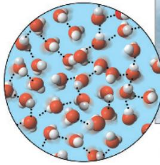

  
In ice, the hydrogen bonds are stable and the water molecules are farther apart. Therefore, ice is less dense than liquid water, so it floats.  
Floating ice insulates the water below, enabling survival of aquatic life. Water also has other life-supporting properties, as you'll learn in this chapter.

# Concept 3.1: Polar covalent bonds in water molecules result in hydrogen bonding

Three quarters of Earth's surface is covered by water, the only substance on the planet to exist in all three physical states of matter (solid, liquid, and gas). Water is so familiar to us that it is easy to overlook its many extraordinary qualities. Following the theme of emergent properties, we can trace water's unique behavior to the structure and interactions of its molecules.

Studied on its own, the water molecule is deceptively simple. It is shaped like a wide V, with its two hydrogen atoms joined to the oxygen atom by single covalent bonds. Oxygen is more electronegative than hydrogen, so the electrons of the covalent bonds spend more time closer to oxygen than to hydrogen; these are polar covalent bonds (see Figure 2.11). This unequal sharing of electrons and water's V-like shape make it a polar molecule, meaning that its overall charge is unevenly distributed. In water, the oxygen of the molecule has partial negative charges $(\delta -)$ , and the hydrogens have partial positive charges $(\delta -)$ .

The properties of water arise from attractions between oppositely charged atoms of different water molecules: The partially positive hydrogen of one molecule is attracted to the partially negative oxygen of a nearby molecule. The two molecules are thus held together by a hydrogen bond (Figure 3.2). When water is in its liquid form, its hydrogen bonds are very fragile, each only about 1/20 as strong as a covalent bond. The hydrogen bonds form, break, and re-form with great frequency. Each lasts only a few trillions of a second, but the molecules are constantly forming new hydrogen bonds with a succession of partners. Therefore, at any instant, most of the water molecules are hydrogen-bonded to their neighbors. The extraordinary properties of water emerge from this hydrogen bonding, which organizes water molecules into a higher level of structural order.

Figure 3.2 Hydrogen bonds between water molecules.  
  
DRAW IT Draw partial charges on the water molecule at the far left, and draw three more water molecules hydrogen-bonded to it. For suggested answer, see Appendix A.

## Concept Check 3.1

1. MAKE CONNECTIONS What is electronegativity, and how does it affect interactions between water molecules? (Review Figure 2.11.)

2. VISUAL SKILLS Look at Figure 3.2 and explain why the central water molecule can hydrogen-bond to other water molecules.

3. Why is it unlikely that two neighboring water molecules would be arranged as shown here?

4. WHAT IF? What would be the effect on the properties of the water molecule if oxygen and hydrogen had equal electronegativity?

For suggested answers, see Appendix A.

## Concept 3.2: Four emergent properties of water contribute to Earth's suitability for life

We will examine four emergent properties of water that contribute to Earth's suitability as an environment for life: cohesive behavior, ability to moderate temperature, expansion upon freezing, and versatility as a solvent.

## Cohesion of Water Molecules

Water molecules stay close to each other as a result of hydrogen bonding. Although the arrangement of molecules in a sample of liquid water is constantly changing, at any given moment many of the molecules are linked by multiple hydrogen bonds. These linkages make water more structured than most other liquids. Collectively, the hydrogen bonds hold the substance together, a phenomenon called cohesion.

One result of cohesion due to hydrogen bonding is high surface tension, a measure of how difficult it is to stretch or break the surface of a liquid. At the air-water interface is an ordered arrangement of water molecules, hydrogen-bonded to one another and to the water below, but not to the air above. This asymmetry gives water an unusually high surface tension, making it behave as though it were coated with an invisible film. The spider in Figure 3.3 takes advantage of the surface tension of water to walk across a pond without breaking the surface, and some plants can float on water as well. You can observe the surface tension of

Figure 3.3 Walking on water.
The high surface tension of water, resulting from the collective strength of its hydrogen bonds, allows this raft spider to walk on the surface of a pond.  

Figure 3.4 Water transport in plants.

Evaporation from leaves pulls water upward from the roots through water-conducting cells. Because of the properties of cohesion and adhesion, the tallest trees can transport water more than 100 m upward—approximately one-quarter the height of the Empire State Building in New York City.

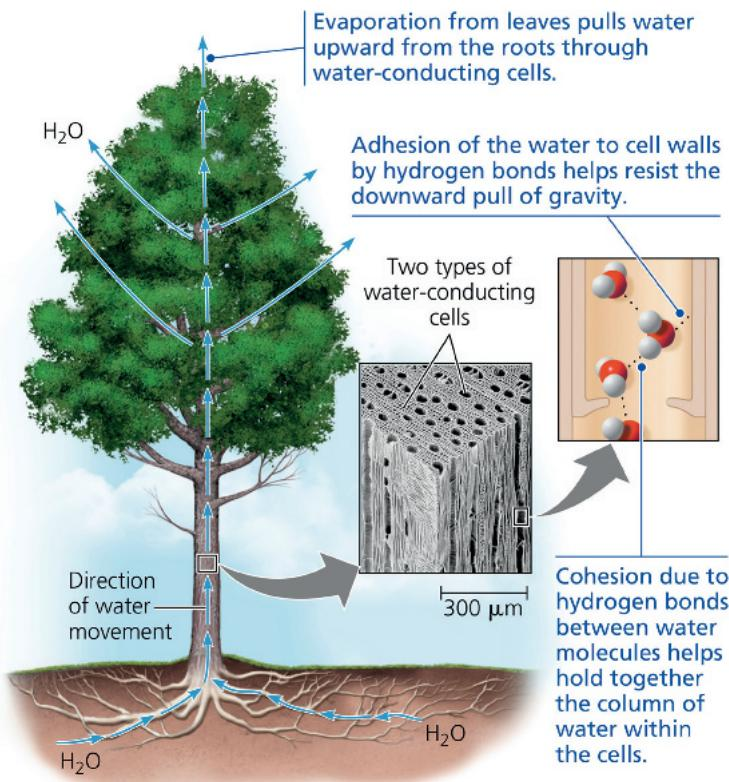

water by slightly overfilling a drinking glass; the water will stand above the rim.

Cohesion also contributes to the transport of water and dissolved nutrients against gravity in plants (Figure 3.4). Water from the roots reaches the leaves through a network of water-conducting cells. As water evaporates from a leaf, hydrogen bonds cause water molecules leaving the veins to tug on molecules farther down, and the upward pull is transmitted through the water-conducting cells all the way to the roots. Adhesion, the clinging of one substance to another, also plays a role. Adhesion of water by hydrogen bonds to the molecules of cell walls helps counter the downward pull of gravity (see Figure 3.4).

## Moderation of Temperature by Water

Water moderates air temperature by absorbing heat from air that is warmer and releasing stored heat to air that is cooler. Water is effective as a heat bank because it can absorb or release a relatively large amount of heat with only a slight change in its own temperature. To understand this capability of water, let's first look at temperature and heat.

## Temperature and Heat

Anything that moves has kinetic energy, the energy of motion. Atoms and molecules have kinetic energy because they are always moving, although not necessarily in any particular direction. The faster a molecule moves, the greater its kinetic energy. The kinetic energy associated with the random movement of atoms or molecules is called thermal energy. Thermal energy is related to temperature, but they are not the same thing. Temperature represents the average kinetic energy of the molecules in a body of matter, regardless of volume, whereas the thermal energy of a body of matter reflects the total kinetic energy, and thus depends on the matter's volume. When water is heated in a coffeemaker, the average speed of the molecules increases, and the thermometer records this as a rise in temperature of the liquid. The total amount of thermal energy also increases in this case. Note, however, that although the pot of coffee has a much higher temperature than, say, the water in a swimming pool, the swimming pool contains more thermal energy because of its much greater volume.

Whenever two objects of different temperature are brought together, thermal energy passes from the warmer to the cooler object until the two are the same temperature. Molecules in the cooler object speed up at the expense of the thermal energy of the warmer object. An ice cube cools a drink not by adding coldness to the liquid but by absorbing thermal energy from the liquid as the ice itself melts. Thermal energy in transfer from one body of matter to another is defined as heat.

One convenient unit of heat used in this book is the calorie (cal). A calorie is the amount of heat it takes to raise the temperature of 1 g of water by 1°C. Conversely, a calorie is also the amount of heat that 1 g of water releases when it cools by 1°C. A kilocalorie (kcal), 1,000 cal, is the quantity of heat required to raise the temperature of 1 kilogram (kg) of water by 1°C. (The “Calories” on food packages are actually kilocalories.) Another energy unit used in this book is the joule (J). One joule equals 0.239 cal; one calorie equals 4.184 J.

## Water's High Specific Heat

The ability of water to stabilize temperature stems from its relatively high specific heat. The specific heat of a substance is defined as the amount of heat that must be absorbed or lost for 1 g of that substance to change its temperature by 1°C. We already know water's specific heat because we have defined a calorie as the amount of heat that causes 1 g of water to change its temperature by 1°C. Therefore, the specific heat of water is 1 calorie per gram and per degree Celsius, abbreviated as 1 cal/(g·°C). Compared with most other substances, water has an unusually high specific heat. For example, ethyl alcohol, the type of alcohol in alcoholic beverages, has a specific heat of 0.6 cal/(g·°C); that is, only 0.6 cal is required to raise the temperature of 1 g of ethyl alcohol by 1°C.

Because of the high specific heat of water relative to other materials, water will change its temperature less than other liquids when it absorbs or loses a given amount of heat. The reason you can burn your fingers by touching the side of an iron pot on the stove when the water in the pot is still lukewarm is that the specific heat of water is ten times greater than that of iron. In other words, the same amount of heat will raise the temperature of 1 g of the iron much faster than it will raise the temperature of 1 g of the water. Specific heat can be thought of as a measure of how well a substance resists changing its temperature when it absorbs or releases heat. Water resists changing its temperature; when it does change its temperature, it absorbs or loses a relatively large quantity of heat for each degree of change.

We can trace water's high specific heat, like many of its other properties, to hydrogen bonding. Heat must be absorbed in order to break hydrogen bonds; by the same token, heat is released when hydrogen bonds form. A calorie of heat causes a relatively small change in the temperature of water because much of the heat is used to disrupt hydrogen bonds before the water molecules can begin moving faster. And when the temperature of water drops slightly, many additional hydrogen bonds form, releasing a considerable amount of energy in the form of heat.

What is the relevance of water's high specific heat to life on Earth? A large body of water can absorb and store a huge amount of heat from the sun in the daytime and during summer while warming up only a few degrees. At night and during winter, the gradually cooling water can warm the air. This capability of water serves to moderate air temperatures in coastal areas (Figure 3.5). The high specific heat of water also tends to stabilize ocean temperatures, creating a favorable environment for marine life. Thus, because of its high specific heat, the water that covers most of Earth keeps temperature fluctuations on land and in water within limits that permit life. Also, because organisms are made primarily of water, they are better able to resist changes in their own temperature than if they were made of a liquid with a lower specific heat.

## Evaporative Cooling

Molecules of any liquid stay close together because they are attracted to one another. Molecules moving fast enough to overcome these attractions can depart the liquid and enter the air as a gas (vapor). This transformation from a liquid to a gas is called vaporization, or evaporation. Recall that the speed of molecular movement varies and that temperature is the average kinetic energy of molecules. Even at low temperatures, the speediest molecules can escape into the air. Some evaporation occurs at any temperature; a glass of water at room temperature, for example, will eventually evaporate completely. If a liquid is heated, the average kinetic energy of molecules increases and the liquid evaporates more rapidly.

Heat of vaporization is the quantity of heat a liquid must absorb for 1 g of it to be converted from the liquid to the gaseous state. For the same reason that water has a high specific heat, it also has a high heat of vaporization relative to most other liquids. To evaporate 1 g of water at $25^{\circ}$ C, about 580 cal of heat is needed—nearly double the amount needed to vaporize a gram of alcohol or ammonia. Water’s high heat of vaporization is another emergent property resulting from the strength of its hydrogen bonds, which must be broken before the molecules can exit from the liquid in the form of water vapor.

Figure 3.5 Temperatures for the Pacific Ocean and Southern California on an August day.  
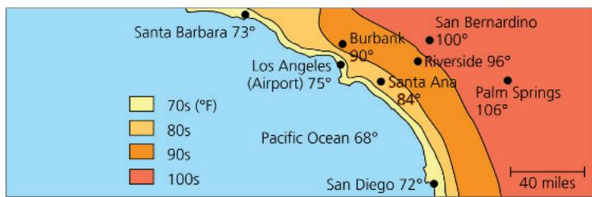  
INTERPRET THE DATA Explain the pattern of temperatures shown in this diagram.  
Figure 3.6 Evaporative cooling.  
In hot weather, an elephant sprays water from its trunk onto its head. Evaporation of this water cools the elephant down.  
Water molecules with the greatest kinetic energy leave as gas, making the remaining liquid water cooler.

The high amount of energy required to vaporize water has a wide range of effects. On a global scale, for example, it helps moderate Earth's climate. A considerable amount of solar heat absorbed by tropical seas is consumed during the evaporation of surface water. Then, as moist tropical air circulates poleward, it releases heat as it condenses and forms rain. On an organismal level, water's high heat of vaporization accounts for the severity of steam burns. These burns are caused by the heat energy released (during formation of hydrogen bonds) when steam condenses into liquid on the skin.

As a liquid evaporates, the surface of the liquid that remains behind cools down (its temperature decreases). This evaporative cooling occurs because the “hottest” molecules, those with the greatest kinetic energy, are the most likely to leave as gas. It is as if the 100 fastest runners at a college transferred to another school; the average speed of the remaining students would decline.

Evaporative cooling of water contributes to the stability of temperature in lakes and ponds and also provides a mechanism that prevents terrestrial organisms from overheating. For example, evaporation of water from the leaves of a plant helps keep the tissues in the leaves from becoming too warm in the sunlight. Evaporation of sweat from human skin dissipates body heat and helps prevent overheating on a hot day or when excess heat is generated by strenuous activity. High humidity on a hot day increases discomfort because the high concentration of water vapor in the air inhibits the evaporation of sweat from the body. Animals without sweat glands, such as elephants, may spray water on themselves to cool down (Figure 3.6).

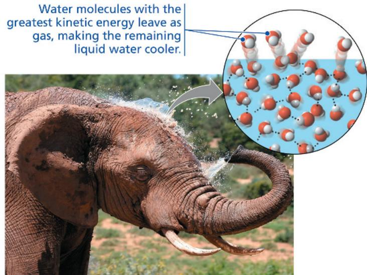

Populations of bowhead whales and some fish species may be increasing because more plankton are available to eat.

## Floating of Ice on Liquid Water

Water is one of the few substances that are less dense as a solid than as a liquid. As a result, ice floats on liquid water. While other materials contract and become denser when they solidify, water expands. The cause of this exotic behavior is, once again, hydrogen bonding. At temperatures above $4^{\circ}$ C, water behaves like other liquids, expanding as it warms and contracting as it cools. As the temperature falls from $4^{\circ}$ C to $0^{\circ}$ C, water begins to freeze because more and more of its molecules are moving too slowly to break hydrogen bonds. At $0^{\circ}$ C, the molecules become locked into a crystalline lattice, each water molecule hydrogen-bonded to four partners (see Figure 3.1). The hydrogen bonds keep the molecules at “arm’s length,” far enough apart to make ice about 10% less dense 10% fewer molecules in the same volume) than liquid water at $4^{\circ}$ C. When ice absorbs enough heat for its temperature to rise above $0^{\circ}$ C, hydrogen bonds between molecules are disrupted. As the crystal collapses, the ice melts and molecules have fewer hydrogen bonds, allowing them to slip closer together. Water reaches its greatest density at $4^{\circ}$ C and then begins to expand as the molecules move faster. Even in liquid water, many of the molecules are connected by hydrogen bonds, though only transiently: The hydrogen bonds are constantly breaking and re-forming.

The ability of ice to float due to its lower density is an important factor in the suitability of the environment for life. If ice sank, then eventually ponds, lakes, and even oceans could freeze

## Interview

Many scientists are worried that these bodies of ice are at risk of disappearing. Global warming, which is caused by carbon dioxide and other “greenhouse” gases in the atmosphere (see Figure 56.30), is having a profound effect on icy environments around the globe. In the Arctic, the average air temperature has risen 2.2°C just since 1961. This temperature increase has affected the seasonal balance between Arctic sea ice and liquid water, causing ice to form later in the year, to melt earlier, and to cover a smaller area. The rate at which glaciers and Arctic sea ice are disappearing is posing an extreme challenge to animals that depend on ice for their survival (Figure 3.7).

Interview with Susan Solomon: Understanding climate change (eTextbook only)

## Water: The Solvent of Life

A sugar cube placed in a glass of water will dissolve. In time, the glass will contain a uniform mixture of sugar and water; the concentration of dissolved sugar will be the same everywhere in the mixture. A liquid that is a completely homogeneous mixture of two or more substances is called a solution. The dissolving agent of a solution is the solvent, and the substance that is dissolved is the solute. In this case, water is the solvent and sugar is the solute. An aqueous solution is one in which the solute is dissolved in water; water is the solvent.

Water is a very versatile solvent, a quality we can trace to the polarity of the water molecule. Suppose, for example, that a spoonful of table salt, the ionic compound sodium chloride (NaCl), is placed in water (Figure 3.8). At the surface of each crystal (grain) of salt, the sodium and chloride ions are exposed to the solvent. These ions and regions of the water molecules are attracted to each other due to their opposite charges. The oxygens of the water molecules have regions of partial negative charge that are attracted to sodium cations. The hydrogen regions are partially positively charged and are attracted to chloride anions. As a result, water molecules surround the individual sodium and chloride ions,

solid, making life as we know it impossible on Earth. During summer, only the upper few inches of the ocean would thaw. Instead, when a deep body of water cools, the ice floats, insulating the liquid water below. This prevents it from freezing and allows life to exist under the frozen surface, as shown in Figure 3.1. Besides insulating the water below, ice also provides a solid habitat for some animals, such as polar bears and seals.

Figure 3.7 Effects of climate change on the Arctic.

Warmer temperatures in the Arctic cause more sea ice to melt in the summer. The loss of ice disrupts the ecosystem, affecting many species. (Map data from the National Snow and Ice Data Center.)

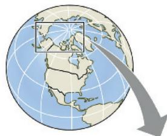  
Less ice reduces feeding opportunities for polar bears, who hunt from the ice.  
Black guillemots in Alaska cannot fly from their nests on land to their fishing grounds at the edge of the ice, which is now too far from land; young birds are starving.  
Loss of floating ice as habitat has caused a decline in Pacific walrus populations due to overcrowding and deadly stampedes on land.

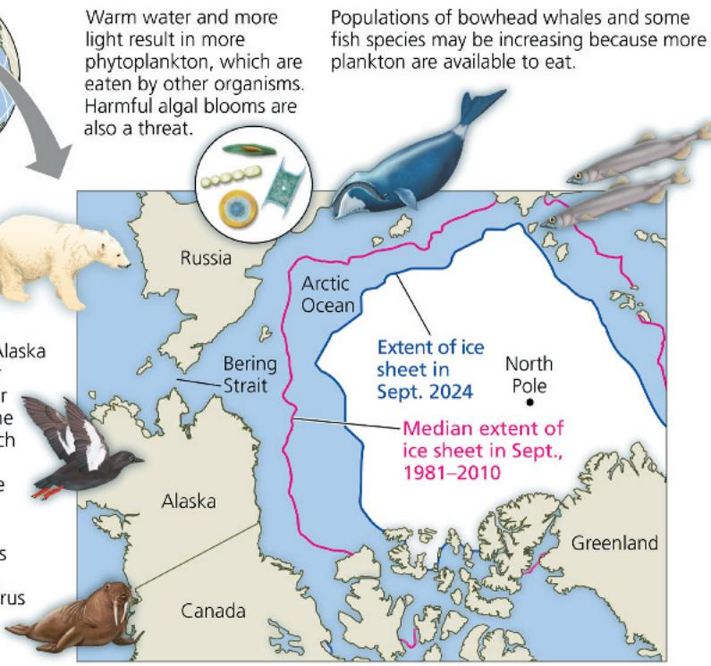

Figure 3.8 Table salt dissolving in water.

A sphere of water molecules, called a hydration shell, surrounds each solute ion.

Negative regions on oxygens of polar water molecules are attracted to sodium cations (Na $^{+}$ ).

Positive regions on hydrogens of polar water molecules are attracted to chloride anions (Cl $^{-}$ ).

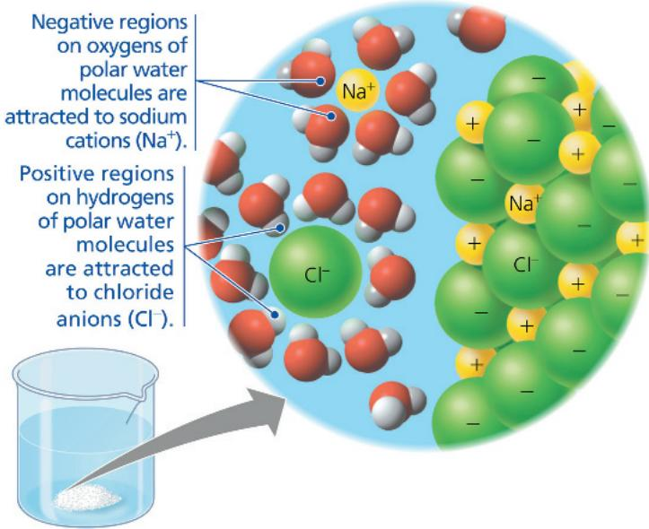  
WHAT IF? What would happen if you heated this solution for a long time? For suggested answer, see Appendix A.  
Figure 3.9 A water-soluble protein.

separating and shielding them from one another. The sphere of water molecules around each dissolved ion is called a hydration shell. Working inward from the surface of each salt crystal, water eventually dissolves all the ions. The result is a solution of two solutes, sodium cations and chloride anions, mixed homogeneously with water, the solvent. Other ionic compounds also dissolve in water. Seawater, for instance, contains a great variety of dissolved ions, as do living cells.

A compound does not need to be ionic to dissolve in water; many compounds made up of nonionic polar molecules, such as the sugar in the sugar cube mentioned earlier, are also water-soluble. Such compounds dissolve when water molecules surround each of the solute molecules, forming hydrogen bonds with them. Even molecules as large as proteins can dissolve in water if they have ionic and polar regions on their surface (Figure 3.9). Many different kinds of polar compounds are dissolved (along with ions) in the water of such biological fluids as blood, the sap of plants, and the liquid within all cells. Water is the solvent of life.

## Hydrophilic and Hydrophobic Substances

Any substance that has an affinity for water is said to be hydrophilic (from the Greek hydro, water, and philos, loving). In some cases, substances can be hydrophilic without actually dissolving. For example, some molecules in cells are so large that they do not dissolve. Another example of a hydrophilic substance that does not dissolve is cotton, a plant product. Cotton consists of giant molecules of cellulose, a compound with numerous regions of partial positive and partial negative charges that can form hydrogen bonds with water. Water adheres to the cellulose fibers. Thus, a cotton towel does a great job of drying the body,

Human lysozyme is a protein found in tears and saliva that has antibacterial action (see Figure 5.16). This model shows the lysozyme molecule (purple) in an aqueous environment. Ionic and polar regions on the protein's surface attract the partially charged regions on water molecules.

  
This oxygen is attracted to a partial positive charge on the lysozyme molecule.

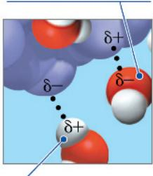  
This hydrogen is attracted to a partial negative charge on the lysozyme molecule.

yet it does not dissolve in the washing machine. Cellulose is also present in the walls of water-conducting cells in a plant; you read earlier how the adhesion of water to these hydrophilic walls helps water move up the plant against gravity.

There are, of course, substances that do not have an affinity for water. Substances that are nonionic and nonpolar (or otherwise cannot form hydrogen bonds) actually seem to repel water; these substances are said to be hydrophobic (from the Greek phobos, fearing). An example from the kitchen is vegetable oil, which, as you know, does not mix stably with water-based substances such as vinegar. The hydrophobic behavior of the oil molecules results from a high number of relatively nonpolar covalent bonds, in this case bonds between carbon and hydrogen, which share electrons almost equally. Hydrophobic molecules related to oils are major ingredients of cell membranes. (Imagine what would happen to a cell if its membrane dissolved!)

## Solute Concentration in Aqueous Solutions

Most of the chemical reactions in organisms involve solutes dissolved in water. To understand such reactions, we must know how many atoms and molecules are involved and calculate the concentration of solutes in an aqueous solution (the number of solute molecules in a volume of solution).

When carrying out experiments, we use mass to calculate the number of molecules. We must first calculate the molecular mass, which is the sum of the masses of all the atoms in a molecule. As an example, let's calculate the molecular mass of table sugar (sucrose), $C_{12}H_{22}O_{11}$ , by multiplying the number of atoms by the atomic mass of each element (see the periodic table at the back of the book). In round numbers of daltons, the mass of a carbon atom is 12, the mass of a hydrogen atom is 1, and the mass of an oxygen atom is 16. Thus, sucrose has a molecular mass of $(12 \times 12) + (22 \times 1) + (11 \times 16) = 342$ daltons. Because we can't weigh out small numbers of molecules, we usually measure substances in units called moles. Just as a dozen always means 12 objects, a mole (mol) represents an exact number of objects: $6.02 \times 10^{23}$ , which is called Avogadro's number. Because of the way in which Avogadro's number and the unit dalton were originally defined, there are $6.02 \times 10^{23}$ daltons in $1\mathrm{g}$ . Once we determine the molecular mass of a molecule such as sucrose, we can use the same number (342), but with the unit gram, to represent the mass of $6.02 \times 10^{23}$ molecules of sucrose, or $1\mathrm{mol}$ of sucrose (sometimes called the molar mass). To obtain $1\mathrm{mol}$ of sucrose in the lab, therefore, we weigh out $342\mathrm{g}$ .

The practical advantage of measuring a quantity of chemicals in moles is that a mole of one substance has exactly the same number of molecules as a mole of any other substance. If the molecular mass of substance A is 342 daltons and that of substance B is 10 daltons, then 342 g of A will have the same number of molecules as 10 g of B. A mole of ethyl alcohol $\left(\mathrm{C}_{2}\mathrm{H}_{6}\mathrm{O}\right)$ also contains $6.02 \times 10^{23}$ molecules, but its mass is only 46 g because the mass of a molecule of ethyl alcohol is only 46 daltons, much less than that of a molecule of sucrose. Measuring in moles makes it convenient for scientists working in the laboratory to combine substances in fixed ratios of molecules.

How would we make a liter (L) of solution consisting of 1 mol of sucrose dissolved in water? We would measure out 342 g of sucrose and then gradually add water, while stirring, until the sugar was completely dissolved. We would then add enough water to bring the total volume of the solution up to 1 L. At that point, we would have a 1-molar (1 M) solution of sucrose.

Molarity—the number of moles of solute per liter of solution—is the unit of concentration most often used by biologists for aqueous solutions.

Water's capacity as a versatile solvent complements the other properties discussed in this chapter. Since these remarkable properties allow water to support life on Earth so well, scientists who seek life elsewhere in the universe look for water as a sign that a planet might sustain life.

## Possible Evolution of Life on Other Planets

EVOLUTION Biologists who look for life elsewhere in the universe (known as astrobiologists) have concentrated their search on planets that might have water. More than 5,600 planets have been found outside our solar system (so-called exoplanets), with evidence of water in the atmospheres of a few. In our own solar system, Mars has been a focus of study. Like Earth, Mars has an ice cap at both poles. Images from the Mars Reconnaissance Orbiter (Figure 3.10) provide compelling evidence that much liquid water was present on the surface of Mars until about 3 billion years ago, and trace amounts may still be present today. The Mars rover Perseverance has been collecting surface samples that will be analyzed for fossils or other evidence for life

## Figure 3.10 Evidence for liquid water on Mars.

This image from the Jezero crater, site of an ancient lake, shows the path carved by water flowing in from the left and out to the right, as well as the delta deposit that formed when water flowed into the lake, slowed down, and dropped its sediment. The colors represent different compositions of the sediment and crater floor. (This digitally treated photograph was taken by the Mars Reconnaissance Orbiter.)

on Mars, past or present. Even farther out in our solar system, one of Jupiter's moons, Europa, shows strong evidence for the current presence of liquid water under an icy crust. Due to its distance, this moon is even more difficult to study, but it warrants further exploration. If any life-forms or fossils are found on Mars or Europa, their study will shed light on the process of evolution from an entirely new perspective.

## Concept Check 3.2

1. Describe how properties of water contribute to the upward movement of water in a tree.

2. Explain the saying "It's not the heat; it's the humidity."

3. How can the freezing of water crack boulders?

4. WHAT IF? A water strider (an insect that can walk on water) has legs that are coated with a hydrophobic substance. What might be the benefit? What would happen if the substance were hydrophilic?

5. INTERPRET THE DATA The concentration of the appetite-regulating hormone ghrelin is about $1.3 \times 10^{-10} M$ in the blood of a fasting person. How many molecules of ghrelin are in 1 L of blood?

For selected answers, see Appendix A.

## Concept 3.3: Acidic and basic conditions affect living organisms

Occasionally, a hydrogen atom participating in a hydrogen bond between two water molecules shifts from one molecule to the other. When this happens, the hydrogen atom leaves its electron behind, and what is actually transferred is a hydrogen ion ( $H^{+}$ ), a single proton with a charge of 1+. The water molecule that lost a proton is now a hydroxide ion (OH $^{-}$ ), which has a charge of 1−. The proton binds to the other water molecule, making that molecule a hydronium ion (H $_{3}$ O $^{+}$ ). We can picture the chemical reaction as follows:

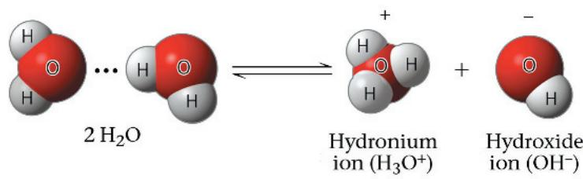

By convention, $H^{+}$ (the hydrogen ion) is used to represent $H_{3}O^{+}$ (the hydronium ion), and we follow that practice in this book. Keep in mind, though, that $H^{+}$ does not exist on its own in an aqueous solution. It is always associated with a water molecule in the form of $H_{3}O^{+}$ .

As indicated by the double arrows, this is a reversible reaction that reaches a state of dynamic equilibrium when water molecules dissociate at the same rate that they are being reformed from $H^{+}$ and $OH^{-}$ . At this equilibrium point, the concentration of water molecules greatly exceeds the concentrations of $H^{+}$ and $OH^{-}$ . In pure water, only one water molecule in every 554 million is dissociated; the concentration of $H^{+}$ and of $OH^{-}$ in pure water is therefore $10^{-7} M$ (at $25^{\circ}C$ ). This means there is only one ten-millionth of a mole of hydrogen ions per liter of pure water and an equal number of hydroxide ions. (Even so, this is a huge number—over 60,000 trillion—of each ion in a liter of pure water.)

Although the dissociation of water is reversible and statistically rare, it is exceedingly important in the chemistry of life. $\mathrm{H^{+}}$ and $\mathrm{OH^{-}}$ are very reactive. Changes in their concentrations can drastically affect a cell's proteins and other complex molecules. As we have seen, the concentrations of $\mathrm{H^{+}}$ and $\mathrm{OH^{-}}$ are equal in pure water, but adding certain kinds of solutes, called acids and bases, disrupts this balance. Biologists use something called the pH scale to describe how acidic or basic (the opposite of acidic) a solution is. In the remainder of this chapter, you will learn about acids, bases, and pH and why changes in pH can adversely affect organisms.

## Acids and Bases

What would cause an aqueous solution to have an imbalance in $H^{+}$ and $OH^{-}$ concentrations? When acids dissolve in water, they donate additional $H^{+}$ to the solution. An acid is a substance that increases the hydrogen ion concentration of a solution. For example, when hydrochloric acid (HCl) is added to water, hydrogen ions dissociate from chloride ions:

$$
\mathrm{HCl} \rightarrow \mathrm{H} ^ {+} + \mathrm{Cl} ^ {-}
$$

This source of $H^{+}$ (dissociation of water is the other source) results in an acidic solution—one having more $H^{+}$ than $OH^{-}$ .

A substance that reduces the hydrogen ion concentration of a solution is called a base. Some bases reduce the $H^{+}$ concentration directly by accepting hydrogen ions. Ammonia ( $NH_{3}$ ), for instance, acts as a base when the unshared electron pair in

nitrogen's valence shell attracts a hydrogen ion from the solution, resulting in an ammonium ion $(\mathrm{NH}_4^+)$ :

$$
\mathrm{NH} _ {3} + \mathrm{H} ^ {+} \rightleftharpoons \mathrm{NH} _ {4} ^ {+}
$$

Other bases reduce the $H^{+}$ concentration indirectly by dissociating to form hydroxide ions, which combine with hydrogen ions and form water. One such base is sodium hydroxide (NaOH), which in water dissociates into its ions:

$$
\mathrm{NaOH} \rightarrow \mathrm{Na} ^ {+} + \mathrm{OH} ^ {-}
$$

In either case, the base reduces the $H^{+}$ concentration. Solutions with a higher concentration of $OH^{-}$ than $H^{+}$ are known as basic solutions. A solution in which the $H^{+}$ and $OH^{-}$ concentrations are equal is said to be neutral.

Notice that single arrows were used in the reactions for HCl and NaOH. These compounds dissociate completely when mixed with water, so hydrochloric acid is called a strong acid and sodium hydroxide a strong base. In contrast, ammonia is a weak base. The double arrows in the reaction for ammonia indicate that the binding and release of hydrogen ions are reversible reactions, although at equilibrium there will be a fixed ratio of $NH_{4}^{+}$ to $NH_{3}$ .

Weak acids are acids that reversibly release and accept back hydrogen ions. An example is carbonic acid:

$$
\begin{array}{c}\mathrm{H} _ {2} \mathrm{CO} _ {3} \quad \rightleftharpoons \quad \mathrm{HCO} _ {3} ^ {-} \quad + \quad \mathrm{H} ^ {+}\\\text {   Carbonic   acid   } \quad \text {   Bicarbonate   ion   } \quad \text {   Hydrogen   ion   }\end{array}
$$

Here the equilibrium so favors the reaction in the left direction that when carbonic acid is added to pure water, only 1% of the molecules are dissociated at any particular time. Still, that is enough to shift the balance of $H^{+}$ and $OH^{-}$ from neutrality.

## The pH Scale

In any aqueous solution at $25^{\circ}$ C, the product of the $H^{+}$ and $OH^{-}$ concentrations is constant at $10^{-14}$ . This can be written

$$
[ \mathrm{H} ^ {+} ] [ \mathrm{OH} ^ {-} ] = 1 0 ^ {- 1 4}
$$

(The brackets indicate molar concentration.) As previously mentioned, in a neutral solution at $25^{\circ}C$ , $[H^{+}] = 10^{-7}$ and $[OH^{-}] = 10^{-7}$ . Therefore, the product of $[H^{+}]$ and $[OH^{-}]$ in a neutral solution at $25^{\circ}C$ is $10^{-14}$ . If enough acid is added to a solution to increase $[H^{+}]$ to $10^{-5}M$ , then $[OH^{-}]$ will decline by an equivalent factor to $10^{-9}M$ (note that $10^{-5} \times 10^{-9} = 10^{-14}$ ). This constant relationship expresses the behavior of acids and bases in an aqueous solution. An acid not only adds hydrogen ions to a solution, but also removes hydroxide ions because of the tendency for $H^{+}$ to combine with $OH^{-}$ , forming water. A base has the opposite effect, increasing $OH^{-}$ concentration but also reducing $H^{+}$ concentration by the formation of water. If enough of a base is added to raise the $OH^{-}$ concentration to $10^{-4}M$ , it will cause the $H^{+}$ concentration to drop to $10^{-10}M$ . Whenever we know the concentration of either $H^{+}$ or $OH^{-}$ in an aqueous solution, we can deduce the concentration of the other ion.

The pH scale (Figure 3.11) is a simple numerical method for expressing the range of $H^{+}$ concentrations. The $H^{+}$ concentrations of solutions can vary by a factor of 100 trillion or more. Instead of using moles per liter, the pH scale compresses the range of $H^{+}$ concentrations by employing

Figure 3.11 The pH scale and pH values of some aqueous solutions.  
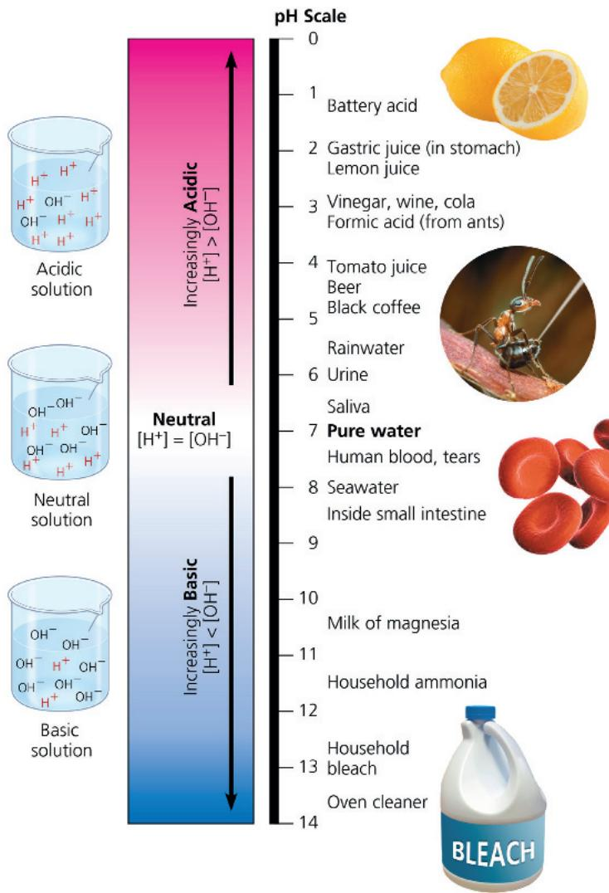

logarithms. The pH of a solution is defined as the negative logarithm (base 10) of the $H^{+}$ concentration:

$$
\mathrm{pH} = - \log [ \mathrm{H} ^ {+} ]
$$

For a neutral aqueous solution, $[H^{+}]$ is $10^{-7}M$ , giving us

$$
- \log 1 0 ^ {- 7} = - (- 7) = 7
$$

Notice that pH decreases as $H^{+}$ concentration increases (see Figure 3.11). Notice, too, that although the pH scale is based on $H^{+}$ concentration, it also implies $OH^{-}$ concentration. A solution of pH 10 has a hydrogen ion concentration of $10^{-10} M$ and a hydroxide ion concentration of $10^{-4} M$ .

The pH of a neutral aqueous solution at $25^{\circ}$ C is 7, the midpoint of the pH scale. A pH value less than 7 denotes an acidic solution; the lower the number, the more acidic the solution. The pH for basic solutions is above 7. Most biological fluids, such as blood and saliva, are within the range of pH 6–8. There are a few exceptions, however, including the strongly acidic digestive juice of the human stomach (gastric juice), which has a pH of about 2.

Remember that each pH unit represents a tenfold difference in $H^{+}$ and $OH^{-}$ concentrations. It is this mathematical feature that makes the pH scale so compact.

A solution of pH 3 is not twice as acidic as a solution of pH 6, but 1,000 times $(10 \times 10 \times 10)$ more acidic. When the pH of a solution changes slightly, the actual concentrations of $H^{+}$ and $OH^{-}$ in the solution change substantially.

## Buffers

The internal pH of most living cells is close to 7. Even a slight change in pH can be harmful because the chemical processes of the cell are very sensitive to the concentrations of hydrogen and hydroxide ions. The pH of human blood is very close to 7.4, which is slightly basic. A person cannot survive for more than a few minutes if the blood pH drops to 7 or rises to 7.8, and a chemical system exists in the blood that maintains a stable pH. If 0.01 mol of a strong acid is added to a liter of pure water, the pH drops from 7.0 to 2.0. If the same amount of acid is added to a liter of blood, however, the pH decrease is only from 7.4 to 7.3. Why does the addition of acid have so much less of an effect on the pH of blood than it does on the pH of water?

The presence of substances called buffers allows biological fluids to maintain a relatively constant pH despite the addition of acids or bases. A buffer is a substance that minimizes changes in the concentrations of $H^{+}$ and $OH^{-}$ in a solution. It does so by accepting hydrogen ions from the solution when they are in excess and donating hydrogen ions to the solution when they have been depleted. Most buffer solutions contain a weak acid and its corresponding base, which combine reversibly with hydrogen ions.

Several buffers contribute to pH stability in human blood and many other biological solutions.

One of these is carbonic acid $\left(\mathrm{H}_{2}\mathrm{CO}_{3}\right)$ , which is formed when $CO_{2}$ reacts with water in blood plasma. As mentioned earlier, carbonic acid dissociates to yield a bicarbonate ion $\left(\mathrm{HCO}_{3}^{-}\right)$ and a hydrogen ion $\left(\mathrm{H}^{+}\right)$ :

$$
\begin{array}{c c c} \mathrm{H} _ {2} \mathrm{CO} _ {3} & \xrightarrow {\text {Response to}} \\ \mathrm{H} ^ {+} \text {donor} & \text {Response to} \\ (\text {acid}) & \text {a drop in pH} \end{array} \quad \begin{array}{c c c} \mathrm{HCO} _ {3} ^ {-} & + & \mathrm{H} ^ {+} \\ \mathrm{H} ^ {+} \text {acceptor} & & \text {Hydrogen} \\ (\text {base}) & & \text {ion} \end{array}
$$

The chemical equilibrium between carbonic acid and bicarbonate acts as a pH regulator, the reaction shifting left or right as other processes in the solution add or remove hydrogen ions. If the $H^{+}$ concentration in blood begins to fall (that is, if pH rises), the reaction proceeds to the right and more carbonic acid dissociates, replenishing hydrogen ions. But when the $H^{+}$ concentration in blood begins to rise (when pH drops), the reaction proceeds to the left, with $HCO_{3}^{-}$ (the base) removing the hydrogen ions from the solution and forming $H_{2}CO_{3}$ . Thus, the carbonic acid–bicarbonate buffering system consists of an acid and a base in equilibrium with each other. Most other buffers are also acid-base pairs.

## Acidification: A Threat to Our Oceans

Among the many threats to water quality posed by human activities is the burning of fossil fuels, which releases $CO_{2}$ into the atmosphere. The resulting increase in atmospheric $CO_{2}$ levels has caused global warming and other aspects of climate change (see Concept 56.4). In addition, about 25% of human-generated $CO_{2}$ is absorbed by the oceans. In spite of the huge volume of water in the oceans, scientists worry that the absorption of so much $CO_{2}$ will harm marine ecosystems.

Recent data have shown that such fears are well founded. When $CO_{2}$ dissolves in seawater, it reacts with water to form carbonic acid, which lowers ocean pH. This process, known as ocean acidification, alters the delicate balance of conditions for life in the oceans (Figure 3.12). Based on measurements of the $CO_{2}$ level in air

## Scientific Skills Exercise Interpreting a Scatter Plot with a Regression Line

How Does the Carbonate Ion Concentration of Seawater Affect the Calcification Rate of a Coral Reef? Scientists predict that acidification of the ocean due to higher levels of atmospheric $CO_{2}$ will lower the concentration of dissolved carbonate ions, which living corals use to build calcium carbonate reef structures. In this exercise, you will analyze data from a controlled experiment that examined the effect of carbonate ion concentration ( $[CO_{3}^{2-}]$ ) on calcium carbonate deposition, a process called calcification.

How the Experiment Was Done For several years, scientists conducted research on ocean acidification using a large coral reef aquarium at Biosphere 2 in Arizona. They measured the rate of calcification by the reef organisms and examined how the calcification rate changed with differing amounts of dissolved carbonate ions in the seawater.

Data from the Experiment The black data points in the graph form a scatter plot. The red line, known as a linear regression line, is the best-fitting straight line for these points.

## INTERPRET THE DATA

1. When presented with a graph of experimental data, the first step in analysis is to determine what each axis represents. (a) In words, what is shown on the x-axis? (Include the units.) (b) What is on the y-axis? (c) Which variable is the independent variable—the one that was manipulated by the researchers? (d) Which is the dependent variable—the one that responded to or depended on the treatment, which was measured by the researchers? (For additional information about graphs, see the Scientific Skills Review in Appendix D.)

2. Based on the data shown in the graph, describe in words the relationship between carbonate ion concentration and calcification rate.

3. (a) If the seawater carbonate ion concentration is $270~\mu \mathrm{mol / kg}$ , estimate the rate of calcification and how many bubbles trapped in ice over thousands of years, scientists calculate that the pH of the oceans is 0.1 pH unit lower (more acidic) now than at any time in the past 420,000 years. Recent studies predict that it will drop another 0.3–0.5 pH unit by the end of this century.

As seawater acidifies, the extra hydrogen ions combine with carbonate ions $\left(\mathrm{CO}_{3}^{2-}\right)$ to form bicarbonate ions $\left(\mathrm{HCO}_{3}^{-}\right)$ , thereby reducing the carbonate ion concentration (see Figure 3.12). Scientists predict that ocean acidification will cause the carbonate ion concentration to decrease by 40% by the year 2100. This is of great concern because carbonate ions are required for calcification, the production of calcium carbonate $\left(\mathrm{CaCO}_{3}\right)$ by many marine organisms, including reef-building corals and animals that build shells. The Scientific Skills Exercise allows you to work with data from an experiment examining the effect of carbonate ion

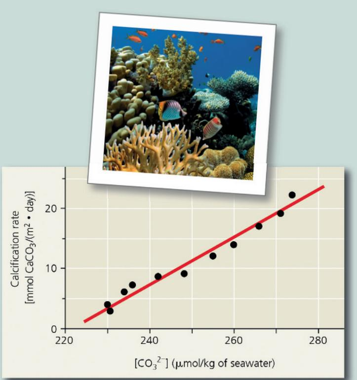  
Data from C. Langdon et al., Effect of calcium carbonate saturation state on the calcification rate of an experimental coral reef, Global Biogeochemical Cycles 14:639–654 (2000).

days it would take 1 square meter of reef to accumulate 30 mmol of calcium carbonate (CaCO $_{3}$ ). (b) If the seawater carbonate ion concentration is 270 $\mu$ mol/kg, what is the approximate rate of calcification, and approximately how many days would it take 1 square meter of reef to accumulate 30 mmol of calcium carbonate?

4. (a) Which step of the process in Figure 3.12 is measured in this experiment? (b) Are the results of this experiment consistent with the hypothesis that increased atmospheric $\left[\mathrm{CO}_{2}\right]$ will slow the growth of coral reefs? Why or why not?

Instructors: A version of this Scientific Skills Exercise can be assigned in Mastering Biology.

Figure 3.12 Atmospheric $CO_{2}$ from human activities and its fate in the ocean.

Some carbon dioxide $(\mathrm{CO}_{2})$ in the atmosphere dissolves in the ocean, where it reacts with water to form carbonic acid $(\mathrm{H}_2\mathrm{CO}_3)$ .

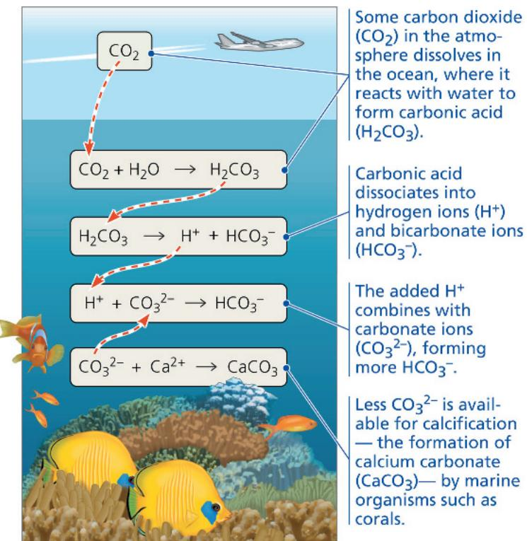  
Carbonic acid dissociates into hydrogen ions (H $^{+}$ ) and bicarbonate ions (HCO $_{3}^{-}$ ).  
The added $\mathsf{H}^+$ combines with carbonate ions $(\mathrm{CO}_{3}^{2-})$ , forming more $\mathrm{HCO}_{3}^{-}$ .

VISUAL SKILLS Summarize the effect of adding excess $CO_{2}$ to the oceans on the calcification process in the final equation.
For suggested answer, see Appendix A.

concentration on coral reefs, using an artificial system. In 2018, researchers carried out the first $CO_{2}$ enhancement study on an unconfined natural coral reef, observing that addition of $CO_{2}$

## Summary of Key Concepts

To review key terms, go to the Vocabulary Self-Quiz (eTextbook only).

## Chapter 3 Review

Concept 3.1: Polar covalent bonds in water molecules result in hydrogen bonding

\- Water is a polar molecule. A hydrogen bond forms when a partially negatively charged region on the oxygen of one water molecule is attracted to the partially positively charged hydrogen of a nearby water molecule. Hydrogen bonding between water molecules is the basis for water's properties.

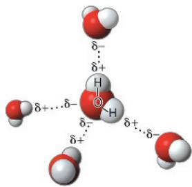  
DRAW IT Label a hydrogen bond and a polar covalent bond in the diagram of five water molecules. Is a hydrogen bond a covalent bond? Explain.

suppressed calcification and concluding that ocean acidification is likely to cause “profound, ecosystem-wide changes in coral reefs.” Coral reefs are sensitive ecosystems that act as havens for a great diversity of marine life. The disappearance of coral reef ecosystems would be a tragic loss of biological diversity.

If there is any reason for optimism about the future quality of water resources on our planet, it is that we have made progress in learning about the delicate chemical balances in oceans, lakes, and rivers. Continued progress can come only from the actions of informed individuals, like yourselves, who are concerned about environmental quality. This requires understanding the crucial role that water plays in the suitability of the environment for continued life on Earth.

## Concept Check 3.3

1. Compared with a basic solution at pH 9, the same volume of an acidic solution at pH 4 has \_\_\_\_ times as many hydrogen ions ( $H^{+}$ ).

2. HCl is a strong acid that dissociates in water: $\mathrm{HCl} \rightarrow \mathrm{H}^{+} + \mathrm{Cl}^{-}$ . What is the pH of $0.01\mathrm{M}$ HCl?

3. Acetic acid (CH $_{3}$ COOH) can be a buffer, similar to carbonic acid. Write the dissociation reaction, identifying the acid, base, H $^{+}$ acceptor, and H $^{+}$ donor.

4. WHAT IF? Given a liter of pure water and a liter solution of acetic acid, what would happen to the pH, in general, if you added 0.01 mol of a strong acid to each? Use the reaction from question 3 to explain the result.

For suggested answers, see Appendix A.

## Concept 3.2: Four emergent properties of water contribute to Earth's suitability for life

\- Hydrogen bonding keeps water molecules close to each other, giving water cohesion. Hydrogen bonding is also responsible for water's surface tension.

\- Water has a high specific heat: Heat is absorbed when hydrogen bonds break and is released when hydrogen bonds form. This helps keep temperatures relatively steady, within limits that permit life. Evaporative cooling is based on water's high heat of vaporization. The evaporative loss of the most energetic water molecules cools a surface.

\- Ice floats because it is less dense than liquid water. This property allows life to exist under the frozen surfaces of lakes and polar seas.

\- Water is an unusually versatile solvent because its polar molecules are attracted to ions and polar substances that can form hydrogen bonds. Hydrophilic substances have an affinity for water; hydrophobic substances do not. Molarity, the number of moles of solute per liter of solution, is used as a measure of solute concentration in solutions. A mole is a certain number of molecules of a substance. The mass of a mole of a substance in grams is the same as the molecular mass in daltons.

\- The emergent properties of water support life on Earth and may contribute to the potential for life to have evolved on other planets.

Describe how different types of solutes dissolve in water. Explain what a solution is.

Concept 3.3: Acidic and basic conditions affect living organisms

\- A water molecule can transfer an $H^{+}$ to another water molecule to form $H_{3}O^{+}$ (represented simply by $H^{+}$ ) and $OH^{-}$ .

\- The concentration of $H^{+}$ is expressed as pH; pH = -log $[H^{+}]$ . A buffer consists of an acid-base pair that combines reversibly with hydrogen ions, allowing it to resist pH changes.

\- The burning of fossil fuels increases the amount of $CO_{2}$ in the atmosphere. Some $CO_{2}$ dissolves in the oceans, causing ocean acidification, which has potentially grave consequences for marine organisms that rely on calcification.

Explain what happens to the concentration of hydrogen ions in an aqueous solution when you add a base and cause the concentration of $OH^{-}$ to rise to $10^{-3}$ . What is the pH of this solution?

For suggested answers, see Appendix A.

## Test Your Understanding

For more multiple-choice questions, go to the Practice Test (eTextbook only).

## Levels 1-2: Remembering/Understanding

1. Which of the following is a hydrophobic material?
(A) paper
(B) table salt
(C) wax
(D) sugar

2. We can be sure that a mole of table sugar and a mole of vitamin C are equal in their

(A) mass.

(B) volume.

(C) number of atoms.

(D) number of molecules.

3. Measurements show that the pH of a particular lake is 4.0. What is the hydrogen ion concentration of the lake?

(A) 4.0 M

(B) $10^{-10}M$

(C) $10^{-4}M$

(D) $10^{4}M$

4. What is the hydroxide ion concentration of the lake described in question 3?

(A) $10^{-10}M$

(B) $10^{-4}M$

(C) $10^{-7}M$

(D) 10.0 M

## Levels 3-4: Applying/Analyzing

5. A slice of pizza has 500 kcal. If we could burn the pizza and use all the heat to warm a 50-L container of cold water, what would be the approximate increase in the temperature of the water? (Note: A liter of cold water weighs about 1 kg.)

(A) $50^{\circ}$ C

(B) $5^{\circ}$ C

(C) $100^{\circ}$ C

(D) $10^{\circ}$ C

6. DRAW IT Draw the hydration shells that form around a potassium ion and a chloride ion when potassium chloride (KCl) dissolves. Label the positive, negative, and partial charges.

## Levels 5-6: Evaluating/Creating

7. Right before a predicted overnight freeze, farmers spray water on crops to protect the plants. Use the properties of water to explain how this method works. Be sure to mention why hydrogen bonds are responsible for this phenomenon.

8. MAKE CONNECTIONS What do climate change (see Concepts 1.1 and 3.2) and ocean acidification have in common?

9. EVOLUTION CONNECTION This chapter explains how the emergent properties of water contribute to the suitability of the environment for life. Until fairly recently, scientists assumed that other physical requirements for life included a moderate range of temperature, pH, atmospheric pressure, and salinity, as well as low levels of toxic chemicals. That view has changed with the discovery of organisms known as extremophiles, which flourish in hot, acidic sulfur springs, around hydrothermal vents deep in the ocean, and in soils with high levels of toxic metals. Why would astrobiologists study extremophiles? What does the existence of life in such extreme environments say about the possibility of life on other planets?

10. SCIENTIFIC INQUIRY Design a controlled experiment to test the hypothesis that water acidification caused by acidic rain would inhibit the growth of Elodea, a freshwater plant (see Figure 2.17).

11. WRITE ABOUT A THEME: ORGANIZATION Several emergent properties of water contribute to the suitability of the environment for life. In a short essay (100–150 words), describe how the ability of water to function as a versatile solvent arises from the structure of water molecules.

## 12. SYNTHESIZE YOUR KNOWLEDGE

How do cats drink?
Scientists using highspeed video have shown that cats use an interesting technique to drink aqueous substances like water and milk. Four times a second, the cat touches the tip of its tongue to the water and draws a column of water up into its mouth (as you can see in the photo), which then shuts before gravity can pull the water back down. Describe how the properties of water

allow cats to drink in this fashion, including how water's molecular structure contributes to the process.

For selected answers, see Appendix A.

# Explore Scientific Papers with Science in the Classroom | AAAS

How are coral reefs responding to climate change? Go to “Take the Heat” at www.scienceintheclassroom.org.

Instructors: Questions can be assigned in Mastering Biology.

# Carbon and the Molecular Diversity of Life

## Key Concepts

4.1 Organic chemistry is key to the origin of life

4.2 Carbon atoms can form diverse molecules by bonding to four other atoms

4.3 A few chemical groups are key to molecular function

  
Figure 4.1 These Qinling golden snub-nosed monkeys in the mountainous forests of southwest China, like all living organisms, are made up of chemicals based mostly on the element carbon. Of all chemical elements, carbon is unparalleled in its ability to form molecules that are large, complex, and varied, making possible the diversity of organisms that have evolved on Earth.

## Study Tip

Label chemical groups: After you have read through Figure 4.9, look through Chapters 4 and 5 for molecules that have the chemical groups shown in that figure. Circle and label the chemical groups you find, as in the example shown here.

  
Carbon can form four bonds, and therefore can bond to up to four other atoms or groups of atoms.

## What makes carbon the basis for all biological molecules?

The properties of a carbon-containing molecule depend on the arrangement of its carbon skeleton and on its chemical groups.

Carbon can bond to other carbons, resulting in carbon skeletons. Carbon also commonly bonds to

  
The signaling molecule shown here, dopamine, has many functions, including promoting mother-infant bonding.

## Concept 4.1: Organic chemistry is key to the origin of life

For historical reasons, compounds containing carbon are called organic compounds, and their study is called organic chemistry. Organic compounds range from simple molecules, such as methane ( $CH_{4}$ ), to colossal ones, such as proteins, with thousands of atoms.

EVOLUTION In 1953, Stanley Miller, a graduate student of Harold Urey at the University of Chicago, designed an experiment on the abiotic (nonliving) synthesis of organic compounds to investigate the origin of life. Study Figure 4.2 to learn about his classic experiment. From his results, Miller concluded that complex

organic molecules could arise spontaneously under conditions thought at that time to have existed on early Earth. You can work with the data from a related experiment in the Scientific Skills Exercise. These experiments support the idea that abiotic synthesis of organic compounds, perhaps near volcanoes, could have been an early stage in the origin of life (see Figure 25.2).

In Concept 3.2, you learned about evidence for the presence of water on Mars in the past. Even more exciting, in 2018, NASA reported that the rover Curiosity had found carbon-based compounds on Mars in Gale Crater where a lake once existed. While these compounds might have been brought to Mars on a meteorite or formed by geologic processes, an intriguing possibility is that they might have been the relics of life-forms that once existed on that planet. Samples were collected here and from other sites so they could be analyzed later for the presence of fossils, which would provide strong evidence for past life on Mars.

## Figure 4.2

## Inquiry: Can organic molecules form under conditions estimated to simulate those on the early Earth?

## Experiment

In 1953, Stanley Miller set up a closed system to mimic conditions thought at that time to have existed on the early Earth. A flask of water simulated the primeval sea. The water was heated so that some vaporized and moved into a second, higher flask containing the “atmosphere”—a mixture of gases. Sparks were discharged in the synthetic atmosphere to mimic lightning.

## Results

Miller identified a variety of organic molecules that are common in organisms. These included simple compounds, such as formaldehyde ( $CH_{2}O$ ) and hydrogen cyanide (HCN), and more complex molecules, such as amino acids and long chains of carbon and hydrogen known as hydrocarbons.

## Conclusion

Organic molecules, a first step in the origin of life, may have been synthesized abiotically on the early Earth. Although later evidence indicated that the early-Earth atmosphere was different from the “atmosphere” used by Miller in this experiment, recent experiments using the revised list of chemicals also produced organic molecules. (We will explore this hypothesis in more detail in Concept 25.1.)

Data from S. L. Miller, A production of amino acids under possible primitive Earth conditions, Science 117:528–529 (1953).

WHAT IF? If Miller had increased the concentration of $NH_{3}$ in his experiment, how might the relative amounts of the products HCN and $CH_{2}O$ have differed?

For suggested answer, see Appendix A.

  
⑤ As material cycled through the apparatus, Miller periodically collected samples for analysis.  
4 A condenser cooled the atmosphere, raining water and dissolved molecules into the sea flask.

# Scientific Skills Exercise Working with Moles and Molar Ratios

Could the First Biological Molecules Have Formed Near Volcanoes on Early Earth? In 2007, Jeffrey Bada, a former graduate student of Stanley Miller, discovered some vials of samples that had never been analyzed from an experiment performed by Miller in 1958. In that experiment, Miller used hydrogen sulfide gas ( $H_{2}S$ ) as one of the gases in the reactant mixture. Since $H_{2}S$ is released by volcanoes, the $H_{2}S$ experiment was designed to mimic conditions near volcanoes on early Earth. In 2011, Bada and colleagues published the results of their analysis of these “lost” samples. In this exercise, you will make calculations using the molar ratios of reactants and products from the $H_{2}S$ experiment.

How the Experiment Was Done According to his laboratory notebook, Miller used the same apparatus as in his original experiment (see Figure 4.2), but the mixture of gaseous reactants included methane $(\mathrm{CH}_4)$ , carbon dioxide $(\mathrm{CO}_2)$ , hydrogen sulfide $(\mathrm{H}_2\mathrm{S})$ , and ammonia $(\mathrm{NH}_3)$ . After three days of simulated volcanic activity, he collected samples of the liquid, partially purified the chemicals, and sealed the samples in sterile vials. In 2011, Bada's research team used modern analytical methods to analyze the products in the vials for the presence of amino acids, the building blocks of proteins.

Data from the Experiment The table below shows 4 of the 23 amino acids detected in the 2011 analysis of the samples from Miller's 1958 $\mathrm{H}_2\mathrm{S}$ experiment.

<table><tr><td>Product Compound</td><td>Molecular Formula</td><td>Molar Ratio (Relative to Glycine)</td></tr><tr><td>Glycine</td><td> $C_{2}H_{5}NO_{2}$ </td><td>1.0</td></tr><tr><td>Serine</td><td> $C_{3}H_{7}NO_{3}$ </td><td> $3.0 \times 10^{-2}$ </td></tr><tr><td>Methionine</td><td> $C_{5}H_{11}NO_{2}S$ </td><td> $1.8 \times 10^{-3}$ </td></tr><tr><td>Alanine</td><td> $C_{3}H_{7}NO_{2}$ </td><td>1.1</td></tr></table>

Data from E. T. Parker et al., Primordial synthesis of amines and amino acids in a 1958 Miller H₂S-rich spark discharge experiment, Proceedings of the National Academy of Sciences USA 108:5526-5531 (2011). www.pnas.org/cgi/doi/10.1073/pnas.1019191108.  
Some of Stanley Miller's notes from his 1958 hydrogen sulfide $(\mathrm{H}_2\mathrm{S})$ experiment along with his original vials.

## INTERPRET THE DATA

1. A mole is the number of particles of a substance with a mass equivalent to its molecular (or atomic) mass in daltons. There are $6.02 \times 10^{23}$ molecules (or atoms) in 1.0 mole (Avogadro's number; see Concept 3.2). The data table shows the “molar ratios” of some of the products from the Miller $H_{2}S$ experiment. In a molar ratio, each unitless value is expressed relative to a standard for that experiment. Here, the standard is the number of moles of the amino acid glycine, which is set to a value of 1.0. For instance, serine has a molar ratio of $3.0 \times 10^{-2}$ , meaning that for every mole of glycine, there is $3.0 \times 10^{-2}$ mole of serine. (a) Give the molar ratio of methionine to glycine and explain what it means. (b) How many molecules of glycine are present in 1.0 mole? (c) For every 1.0 mole of glycine in the sample, how many molecules of methionine are present? (Recall that to multiply two numbers with exponents, you add their exponents; to divide them, you subtract the exponent in the denominator from that in the numerator.)

2. (a) Which amino acid is present in higher amounts than glycine? (b) How many more molecules of that amino acid are present than the number of molecules in 1.0 mole of glycine?

3. The synthesis of products is limited by the amount of reactants. (a) If one mole each of $CH_{4}$ , $NH_{3}$ , $H_{2}S$ , and $CO_{2}$ is added to 1 liter of water (=55.5 moles of $H_{2}O$ ) in a flask, how many moles of hydrogen, carbon, oxygen, nitrogen, and sulfur are in the flask? (b) Looking at the molecular formula in the table, how many moles of each element would be needed to make 1.0 mole of glycine? (c) What is the maximum number of moles of glycine that could be made in that flask, with the specified ingredients, if no other molecules were made? Explain. (d) If serine or methionine were made individually, which element(s) would be used up first for each? How much of each product could be made?

4. The earlier published experiment carried out by Miller did not include $H_{2}S$ in the reactants (see Figure 4.2). Which of the compounds shown in the data table can be made in the $H_{2}S$ experiment but could not be made in the earlier experiment?

Instructors: A version of this Scientific Skills Exercise can be assigned in Mastering Biology.

The overall percentages of the major elements of life—C, H, O, N, S, and P—are quite uniform from one organism to another, reflecting the common evolutionary origin of all life. Because of carbon's ability to form four bonds, however, this limited assortment of atomic building blocks can be used to build an inexhaustible variety of organic molecules. Different species of organisms, and different individuals within a species, are distinguished by variations in the types of organic molecules they make. In a sense, the great diversity of living organisms we see on the planet (and in fossil remains) is made possible by the unique chemical versatility of the carbon atom.

## Interview

Interview with Stanley Miller: Investigating the origin of life (eTextbook only)

## Concept Check 4.1

1. VISUAL SKILLS See Figure 4.2. Miller carried out a control experiment without discharging sparks and found no organic compounds. What might explain this result?

For suggested answers, see Appendix A.

# Concept 4.2: Carbon atoms can form diverse molecules by bonding to four other atoms

The key to an atom's chemical characteristics is its electron configuration. This configuration determines the kinds and number of bonds an atom will form with other atoms. Recall that it is the valence electrons, those in the outermost shell, that are available to form bonds with other atoms.

## The Formation of Bonds with Carbon

Carbon has 6 electrons, with 2 in the first electron shell and 4 in the second shell; thus, it has 4 valence electrons in a shell that can hold up to 8 electrons. A carbon atom usually completes its valence shell by sharing its 4 electrons with other atoms so that 8 electrons are present. Each pair of shared electrons constitutes a covalent bond (see Figure 2.10d). In organic molecules, carbon usually forms single or double covalent bonds. Each carbon atom acts as an intersection point from which a molecule can branch off in as many as four directions. This enables carbon to form large, complex molecules.

When a carbon atom forms four single covalent bonds, the arrangement of its four hybrid orbitals causes the bonds to angle toward the corners of an imaginary tetrahedron. The bond angles in methane $\left(\mathrm{CH}_{4}\right)$ are $109.5^{\circ}$ (Figure 4.3a), and they are roughly the same in any group of atoms where carbon has four single bonds.

Figure 4.3 The shapes of three simple organic molecules.

<table><tr><td>Molecule and Molecular Shape</td><td>Molecular Formula</td><td>Structural Formula</td><td>Ball-and-Stick Model (molecular shape in pink)</td><td>Space-Filling Model</td></tr><tr><td>(a) Methane. When a carbon atom has four single bonds to other atoms, the molecule is tetrahedral.</td><td> $CH_4$ </td><td></td><td></td><td></td></tr><tr><td>(b) Ethane. A molecule may have more than one tetrahedral group of single-bonded atoms. (Ethane consists of two such groups.)</td><td> $C_2H_6$ </td><td></td><td></td><td></td></tr><tr><td>(c) Ethene (ethylene). When two carbon atoms are joined by a double bond, all atoms attached to those carbons are in the same plane, and the molecule is flat.</td><td> $C_2H_4$ </td><td></td><td></td><td></td></tr></table>

For example, ethane $\left(\mathrm{C}_{2}\mathrm{H}_{6}\right)$ is shaped like two overlapping tetrahedrons (Figure 4.3b). In molecules with more carbons, every grouping of a carbon bonded to four other atoms has a tetrahedral shape. But when two carbon atoms are joined by a double bond, as in ethene $\left(\mathrm{C}_{2}\mathrm{H}_{4}\right)$ , the bonds from both carbons are all in the same plane, so the atoms joined to those carbons are in the same plane as well (Figure 4.3c). We find it convenient to write molecules as structural formulas, as if the molecules being represented are two-dimensional, but keep in mind that molecules are three-dimensional and that the shape of a molecule is central to its function.

The number of electrons required to fill the valence shell of an atom is generally equal to the atom's valence, the number of covalent bonds it can form. Figure 4.4 shows the valences of carbon and its most frequent bonding partners—hydrogen, oxygen, and nitrogen. These are the four main atoms in organic molecules.

The electron configuration of carbon gives it covalent compatibility with many different elements. Let's consider how valence and the rules of covalent bonding apply to carbon atoms with partners other than hydrogen. We'll look at two examples, the simple molecules carbon dioxide and urea.

In the carbon dioxide molecule $\left(\mathrm{CO}_{2}\right)$ , a single carbon atom is joined to two atoms of oxygen by double covalent bonds. The structural formula for $CO_{2}$ is shown here:

$$
\mathrm{O} = \mathrm{C} = \mathrm{O}
$$

Each line in a structural formula represents a pair of shared electrons. Thus, the two double bonds in $CO_{2}$ have the same number of shared electrons as four single bonds. The arrangement completes the valence shells of all atoms in the molecule:

Because $CO_{2}$ is a very simple molecule and lacks hydrogen, it is often considered inorganic, even though it contains carbon. Whether we call $CO_{2}$ organic or inorganic, however, it is clearly important to the living world as the source of carbon, via photosynthetic organisms, for all organic molecules in organisms (see Concept 2.4).

Urea, $\mathrm{CO(NH_{2})_{2}}$ , is an organic compound found in urine. Again, each atom has the required number of covalent bonds. In this case, one carbon atom participates in both single and double bonds.

Urea and carbon dioxide are molecules with only one carbon atom. But a carbon atom

can also use one or more valence electrons to form covalent bonds to other carbon atoms, linking the atoms into chains, as shown here for $C_{3}H_{8}$ :

Figure 4.4 Valences of the major elements of organic molecules. Valence, the number of covalent bonds an atom can form, is generally equal to the number of electrons required to fill the valence shell. (Sodium, phosphorus, and chlorine are exceptions.)

<table><tr><td></td><td>Hydrogen</td><td>Oxygen</td><td>Nitrogen</td><td>Carbon</td></tr><tr><td>Lewis dot structure showing existing valence electrons</td><td>H·</td><td> $\cdot\ddot{O}:$ </td><td> $\cdot\ddot{N}\cdot$ </td><td> $\cdot\dot{C}\cdot$ </td></tr><tr><td>Electron distribution diagram with red dashed circles showing electrons needed to fill the valence shell</td><td></td><td></td><td></td><td></td></tr><tr><td>Number of electrons needed to fill the valence shell</td><td>1</td><td>2</td><td>3</td><td>4</td></tr><tr><td>Valence: Number of bonds the element can form</td><td>1</td><td>2</td><td>3</td><td>4</td></tr></table>

MAKE CONNECTIONS Draw the Lewis dot structures for sodium, silicon, phosphorus, sulfur, and chlorine. (Refer to Figure 2.7.)  
For suggested answer, see Appendix A.

## Molecular Diversity Arising from Variation in Carbon Skeletons

Carbon chains form the basis of most organic molecules. Carbon skeletons vary in length and may be straight, branched, or arranged in closed rings (Figure 4.5). Some carbon chains have double bonds, which vary in number and location. Such variation in carbon chains is one important source of the molecular complexity and diversity that characterize living matter. In addition, the skeletons of biological molecules often include atoms of other elements, like oxygen and phosphorus; such atoms can also be bonded to carbons of the skeleton.

## Hydrocarbons

All of the molecules that are shown in Figures 4.3 and 4.5 are hydrocarbons, organic molecules consisting of only carbon and hydrogen. Atoms of hydrogen are attached to the carbon skeleton wherever electrons are available for covalent bonding. Hydrocarbons are the major components of petroleum, which is called a fossil fuel because it consists of the partially decomposed remains of organisms that lived millions of years ago.

## Interview

Interview with Deborah Gordon: Studying how ants use hydrocarbons to communicate (eTextbook only)

Although hydrocarbons are not prevalent in most living organisms, some of a cell's organic molecules have regions consisting of only carbon and hydrogen. For example, the molecules known as fats have long hydrocarbon tails attached to a nonhydrocarbon component (Figure 4.6). Neither petroleum nor

  
1-Butene  
Figure 4.5 Four ways that carbon skeletons can vary.

## (a) Length

  
Carbon skeletons vary in length.

## (b) Branching

## (c) Double bond position

  
The skeleton may have double bonds, which can vary in location.

## (d) Presence of rings

  
Some carbon skeletons are arranged in rings. In the abbreviated structural formula for each compound (to its right), each corner represents a carbon and its attached hydrogens.

fat dissolves in water; both are hydrophobic compounds because the great majority of their bonds are relatively nonpolar carbon-to-hydrogen linkages. Another characteristic of hydrocarbons is that they can undergo reactions that release a relatively large amount of energy. The gasoline that fuels a car consists of hydrocarbons, and the hydrocarbon tails of fats serve as stored fuel for plant embryos (seeds) and animals.

## Isomers

Variation in the architecture of organic molecules can be seen in isomers, compounds that have the same numbers of atoms of the same elements but different structures and hence different

## Figure 4.6 The role of hydrocarbons in fats.

(a) Mammalian adipose cells stockpile fat molecules as a fuel reserve. This colorized micrograph shows part of a human adipose cell with many fat droplets, each containing a large number of fat molecules. (b) A fat molecule consists of a small, nonhydrocarbon component joined to three hydrocarbon tails that account for the hydrophobic behavior of fats. The tails can be broken down to provide energy. (Black = carbon; gray = hydrogen; red = oxygen.)

Skeletons may be unbranched or branched.  
  
(a) Part of a human adipose cell (b) A fat molecule  
MAKE CONNECTIONS How do the tails account for the hydrophobic nature of fats? (See Concept 3.2.)
For suggested answer, see Appendix A.

properties. We will examine three types of isomers: structural isomers, cis-trans isomers, and enantiomers.

Structural isomers differ in the covalent arrangements of their atoms. Compare, for example, the two five-carbon compounds in Figure 4.7a. Both have the molecular formula $C_{5}H_{12}$ , but they differ in the covalent arrangement of their carbon skeletons. The skeleton is straight in one compound but branched in the other. The number of possible isomers increases tremendously as carbon skeletons increase in size. There are only three forms of $C_{5}H_{12}$ (two of which are shown in Figure 4.7a), but there are 18 variants of $C_{8}H_{18}$ and 366,319 possible structural isomers of $C_{20}H_{42}$ . Structural isomers may also differ in the location of double bonds.

In cis-trans isomers (also known as geometric isomers), carbons have covalent bonds to the same atoms, but these atoms differ in their spatial arrangements due to the inflexibility of double bonds. Single bonds allow the atoms they join to rotate freely about the bond axis without changing the compound. In contrast, double bonds do not permit such rotation. If a double bond joins two carbon atoms, and each C also has two different atoms (or groups of atoms) attached to it, then two distinct cis-trans isomers are possible. Consider a simple molecule with two double-bonded carbons, each of which has an H and an X attached to it (Figure 4.7b). The arrangement with both Xs on the same side of the double bond is called a cis isomer, and that with the Xs on opposite sides is called a trans isomer. The subtle difference in shape between such isomers can have a dramatic effect on the biological activities of organic molecules. For example, the biochemistry of vision involves a light-induced change of retinal, a chemical compound in the eye, from the cis isomer to the trans isomer (see Figure 50.17). Another example involves trans fats, harmful fats formed during food processing that are discussed in Concept 5.3.

2-Methylbutane

Figure 4.7 Three types of isomers.

Isomers are compounds that have the same molecular formula but different structures.

## (a) Structural isomers

  
Structural isomers differ in the arrangement of covalent bonding partners, as shown in these two isomers of $C_{5}H_{12}$ .

## (b) Cis-trans isomers (also known as geometric isomers)

  
cis isomer: The two Xs are on the same side.  
trans isomer: The two Xs are on opposite sides.  
Cis-trans isomers differ in arrangement about a double bond. In these diagrams, X represents an atom or group of atoms attached to a double-bonded carbon.

## (c) Enantiomers

  
Enantiomers differ in spatial arrangement around an asymmetric carbon, resulting in molecules that are mirror images, like left and right hands. The two isomers here are designated the L and D isomers from the Latin for "left" and "right" (levo and dextro). Enantiomers cannot be superimposed on each other.

For suggested answer, see Appendix A.

Enantiomers are isomers that are mirror images of each other and that differ in shape due to the presence of an asymmetric carbon, one that is attached to four different atoms or groups of atoms. (See the middle carbon in the ball-and-stick models shown in Figure 4.7c.) The four groups can be arranged in space around the asymmetric carbon in two different ways that are mirror images. Enantiomers are, in a way, left-handed and right-handed versions of the molecule. Just as your right hand won't fit into a left-handed glove, a "right-handed" molecule won't fit into the same space as the "left-handed" version. Usually, only one isomer is biologically active because only that form can bind to specific molecules in an organism.

DRAW IT There are three structural isomers of $C_{5}H_{12}$ ; draw the one not shown in (a).  
Figure 4.8 The pharmacological importance of enantiomers.  
Ibuprofen and albuterol are drugs whose enantiomers have different effects. (S and R are used here to distinguish between enantiomers, rather than D and L as in Figure 4.7c.) Ibuprofen is commonly sold as a mixture of the two enantiomers; the S enantiomer is 100 times more effective than the R form. Albuterol is synthesized and sold only as the R form of that drug; the S form counteracts the active R form.

<table><tr><td>Drug</td><td>Effects</td><td>Effective Enantiomer</td><td>Ineffective Enantiomer</td></tr><tr><td>Ibuprofen</td><td>Reduces inflammation and pain</td><td>S-Ibuprofen</td><td>R-Ibuprofen</td></tr><tr><td>Albuterol</td><td>Relaxes bronchial (airway) muscles, improving airflow in asthma patients</td><td>R-Albuterol</td><td>S-Albuterol</td></tr></table>

The concept of enantiomers is important in the pharmaceutical industry because the two enantiomers of a drug may not be equally effective, as is the case for both ibuprofen and the asthma medication albuterol (Figure 4.8). Methamphetamine also occurs in two enantiomers that have very different effects. One enantiomer is the highly addictive stimulant drug known as “crank,” sold illegally in the street drug trade. The other has a much weaker effect and is the active ingredient in an over-the-counter vapor inhaler for treatment of nasal congestion. The differing effects of enantiomers in the body demonstrate that organisms are sensitive to even the subtlest variations in molecular architecture. Once again, we see that molecules have emergent properties that depend on the specific arrangement of their atoms.

## Concept Check 4.2

1. DRAW IT (a) Draw a structural formula for $C_{2}H_{4}$ . (b) Draw the trans isomer of $C_{2}H_{2}Cl_{2}$ .

2. VISUAL SKILLS Which two pairs of molecules in Figure 4.5 are isomers? For each pair, identify the type of isomer.

3. How are gasoline and fat chemically similar?

4. VISUAL SKILLS See Figures 4.5a and 4.7. Can propane $(\mathrm{C}_3\mathrm{H}_8)$ form isomers? Explain.

For suggested answers, see Appendix A.

## Concept 4.3: A few chemical groups are key to molecular function

The distinctive properties of an organic molecule depend not only on the arrangement of its mostly carbon skeleton but also on the various chemical groups attached to that skeleton. These groups may participate in chemical reactions or may contribute to

function indirectly by their effects on molecular shape; they help give each molecule its unique properties.

## The Chemical Groups Most Important in the Processes of Life

Consider the differences between estradiol (a type of estrogen) and testosterone. These compounds are female and male sex hormones, respectively, in humans and other vertebrates. Both are steroids, organic molecules with a common carbon skeleton in the form of four fused rings. They differ only in the chemical groups attached to the rings (shown here in abbreviated form, where each corner represents a carbon and its attached hydrogens); the distinctions in molecular architecture are marked with a dotted line:

The different actions of these two molecules on many targets throughout the body are the basis of sexual characteristics, producing the contrasting features of male and female vertebrates. In this case, the chemical groups are important because they affect molecular shape, contributing to function.

In other cases, chemical groups are directly involved in chemical reactions; such groups are known as functional groups. Each has certain properties, such as shape and charge, that cause it to participate in chemical reactions in a characteristic way.

The seven chemical groups most important in biological processes are the hydroxyl group, carbonyl group, carboxyl group, amino group, sulfhydryl group, phosphate group, and methyl group. The first six groups can be chemically reactive (thus are functional groups); of these six, all except the sulfhydryl group are also hydrophilic and thus increase the solubility of organic compounds in water. The methyl group is not reactive, but instead often serves as a recognizable tag on biological molecules. Study Figure 4.9, on the next page, to become familiar with these biologically important chemical groups. Note in the Examples column of the figure that the carboxyl group and the amino group are ionized at normal cellular pH.

## ATP: An Important Source of Energy for Cellular Processes

The “Phosphate group” row in Figure 4.9 shows a simple example of an organic phosphate molecule. A more complicated organic phosphate, adenosine triphosphate, or ATP, is worth mentioning here because its function in the cell is so important.

ATP consists of an organic molecule called adenosine attached to a string of three phosphate groups:

Where three phosphates are present in series, as in ATP, one phosphate may be split off as a result of a reaction with water. This inorganic phosphate ion, HOPO $_{3}^{2-}$ , is often abbreviated $\textcircled{P}_{i}$ in this book, and a phosphate group in an organic molecule is often written as $\textcircled{P}$ . Having lost one phosphate, ATP becomes adenosine $d$ iphosphate, or ADP. Although ATP is sometimes said to store energy, it is more accurate to think of it as storing the potential to react with water or other molecules. Overall, the process releases energy that can be used by the cell. You'll learn more about this in Concept 8.3.

## The Chemical Elements of Life: A Review

Living matter, as you have learned, consists mainly of carbon, oxygen, hydrogen, and nitrogen, with smaller amounts of sulfur and phosphorus. These elements all form strong covalent bonds, an essential characteristic in the architecture of complex organic molecules. Of all these elements, carbon is the virtuoso of the covalent bond. The versatility of carbon makes possible the great diversity of organic molecules, each with particular properties that emerge from the unique arrangement of its mostly carbon skeleton and the chemical groups attached to that skeleton. This variation at the molecular level provides the foundation for the rich biological diversity found on our planet.

## Concept Check 4.3

1. VISUAL SKILLS What does the term amino acid signify about the structure of such a molecule? See Figure 4.9.

2. What chemical change occurs to ATP when it reacts with water and releases energy?

3. DRAW IT Suppose you had an organic molecule such as cysteine (see Figure 4.9, sulfhydryl group example), and you chemically removed the $-NH_{2}$ group and replaced it with —COOH. Draw this structure. How would this change the chemical properties of the molecule? Is the central carbon asymmetric before the change? After?

Figure 4.9 Some biologically important chemical groups.

<table><tr><td>Chemical Group</td><td>Group Properties and Compound Name</td><td colspan="2">Examples</td></tr><tr><td>Hydroxyl group (—OH)(Note: By convention, the bond between the O and H is typically not depicted.)</td><td>Is polar due to electronegative oxygen. Forms hydrogen bonds with water, helping dissolve compounds such as sugars.Compound name:Alcohol(specific name usually ends in -o/)</td><td></td><td>Ethanol, the alcohol present in alcoholic beverages</td></tr><tr><td>Carbonyl group (&gt;C=O)</td><td>Sugars with ketone groups are called ketoses; those with aldehydes are calledaldoses.Compound name:Ketone(carbonyl group is within a carbon skeleton) oraldehyde(carbonyl group is at the end of acarbon skeleton)</td><td>Acetone, the simplest ketone</td><td>Propanal, an aldehyde</td></tr><tr><td>Carboxyl group (—COOH)</td><td>Acts as an acid (can donate  $H^{+}$ ) because the covalent bond between oxygen and hydrogen is so polar.Compound name:Carboxylic acid, ororganic acid</td><td>Acetic acid, which givesvinegar its sour taste</td><td>Ionized form of —COOH (carboxylate ion), found in cells</td></tr><tr><td>Amino group (— $NH_{2}$ )</td><td>Acts as a base; can pick up an  $H^{+}$  from the surrounding solution (water, in living organisms).Compound name:Amine</td><td>Glycine, an amino acid(note its carboxyl group)</td><td>Ionized form of — $NH_{2}$ , found in cells</td></tr><tr><td>Sulfhydryl group (—SH)</td><td>Two — SH groups can react, forming a “cross-link” that helps stabilize protein structure. Hair protein cross-links maintain the straightness or curliness of hair; in hair salons, “permanent” treatments break cross-links, then re-form them while the hair is in the desired shape.Compound name:Thiol</td><td></td><td>Cysteine, a sulfur-containing amino acid</td></tr><tr><td>Phosphate group ( $—OPO_{3}^{2-}$ )</td><td>Contributes negative charge (1– when positioned inside a chain of phosphates; 2– when at the end). When attached, confers on a molecule the ability to react with water, releasing energy.Compound name:Organic phosphate</td><td></td><td>Glycerol phosphate, which takes part in many important chemical reactions in cells</td></tr><tr><td>Methyl group ( $—CH_{3}$ )</td><td>Affects the expression of genes when bonded to DNA or to proteins that bind to DNA. Affects the shape and function of male and female sex hormones.Compound name:Methylated compound</td><td></td><td>5-Methylcytosine:Cytosine, a component of DNA, has been modified by addition of a methyl group.</td></tr></table>

# Chapter 4 Review

## Summary of Key Concepts

To review key terms, go to the Vocabulary Self-Quiz (eTextbook only).

## Concept 4.1: Organic chemistry is key to the origin of life

\- Organic compounds, once thought to arise only within living organisms, were finally synthesized in the laboratory.

\- Living matter is made mostly of carbon, oxygen, hydrogen, and nitrogen. Biological diversity results from carbon's ability to form a huge number of molecules with particular shapes and properties.

How did Stanley Miller's experiments support the idea that, even at life's origins, physical and chemical laws govern the processes of life?

## Concept 4.2: Carbon atoms can form diverse molecules by bonding to four other atoms

\- Carbon, with a valence of 4, can bond to various other atoms, including O, H, and N. Carbon can also bond to other carbon atoms, forming the carbon skeletons of organic compounds. These skeletons vary in length and shape and have bonding sites for atoms of other elements.

• Hydrocarbons consist of carbon and hydrogen.

\- Isomers are compounds that have the same molecular formula but different structures and therefore different properties. Three types of isomers are structural isomers, cis-trans isomers, and enantiomers.

VISUAL SKILLS Refer back to Figure 4.9. What type of isomers are acetone and propanal? How many asymmetric carbons are present in acetic acid, glycine, and glycerol phosphate? Can these three molecules exist as forms that are enantiomers?

## Concept 4.3: A few chemical groups are key to molecular function

\- Chemical groups attached to the carbon skeletons of organic molecules participate in chemical reactions (functional groups) or contribute to function by affecting molecular shape (see Figure 4.9).

\- ATP (adenosine triphosphate) consists of adenosine attached to three phosphate groups. ATP can react with water or other molecules, forming ADP (adenosine diphosphate) and inorganic phosphate. This reaction releases energy that can be used by the cell.

  
In what ways does a methyl group differ chemically from the other six important chemical groups shown in Figure 4.9?  
For suggested answers, see Appendix A.

## Test Your Understanding

For more multiple-choice questions, go to the Practice Test (eTextbook only).

## Levels 1-2: Remembering/Understanding

1. Organic chemistry is currently defined as

(A) the study of compounds made only by living cells.

(B) the study of carbon compounds.

(C) the study of natural (as opposed to synthetic) compounds.

(D) the study of hydrocarbons.

## 2. VISUAL SKILLS Which functional group is present in this

molecule?

(A) sulfhydryl

(B) carboxyl

(C) methyl

(D) phosphate

3. MAKE CONNECTIONS Which chemical group is most likely to be responsible for an organic molecule behaving as a base (see Concept 3.3)?

(A) hydroxyl

(B) carbonyl

(C) amino

(D) phosphate

## Levels 3-4: Applying/Analyzing

4. VISUAL SKILLS Visualize the structural formula of each of the following hydrocarbons. Which hydrocarbon has a double bond in its carbon skeleton?

(A) $C_{3}H_{8}$

(B) $C_{2}H_{6}$

(C) $C_{2}H_{4}$

(D) $C_{2}H_{2}$

5. VISUAL SKILLS Choose the term that correctly describes the relationship between these two sugar molecules.

(A) structural isomers

(B) cis-trans isomers

(C) enantiomers

(D) isotopes

6. VISUAL SKILLS Identify the asymmetric carbon in this molecule.

<!-- END OFFICIAL MINERU API RESULT part_01 -->

<!-- BEGIN OFFICIAL MINERU API RESULT part_02 -->

7. Which action could produce a carbonyl group?

(A) the replacement of the —OH of a carboxyl group with hydrogen

(B) the addition of a thiol to a hydroxyl

(C) the addition of a hydroxyl to a phosphate

(D) the replacement of the nitrogen of an amine with oxygen

8. VISUAL SKILLS Which of the molecules shown in question 5 has an asymmetric carbon? Which carbon is asymmetric?

## Levels 5-6: Evaluating/Creating

9. EVOLUTION CONNECTION • DRAW IT Some scientists think that life elsewhere in the universe might be based on the element silicon, rather than on carbon, as on Earth. Look at the electron distribution diagram for silicon in Figure 2.7 and draw the Lewis dot structure for silicon. What properties does silicon share with carbon that would make silicon-based life more likely than, say, neon-based life or aluminum-based life?

10. SCIENTIFIC INQUIRY In the late 1950s and early 1960s, thousands of pregnant patients who were prescribed thalidomide for morning sickness gave birth to children with missing limbs and other congenital abnormalities. Thalidomide is a mixture of two enantiomers; one reduces morning sickness, but the other causes severe congenital deformities. Today, the FDA has approved this drug for non-pregnant individuals with Hansen's disease (leprosy) or newly diagnosed multiple myeloma, a blood and bone marrow cancer. The beneficial enantiomer can be synthesized and given to patients, but over time, both the beneficial and the harmful enantiomer can be detected in the body. Propose a possible explanation for the presence of the harmful enantiomer.

11. WRITE ABOUT A THEME: ORGANIZATION In 1918, an epidemic of sleeping sickness caused an unusual rigid paralysis in some survivors, similar to symptoms of advanced Parkinson's disease. Years later, L-dopa (below, left), a chemical used to treat Parkinson's disease, was given to some of these patients. L-dopa was remarkably effective at eliminating the paralysis, at least temporarily. However, its enantiomer, D-dopa (right), was subsequently shown to have no effect at all, as is the case for Parkinson's disease. In a short essay (100–150 words), discuss how the effectiveness of one enantiomer and not the other illustrates the theme of structure and function.

  
L-dopa

  
D-dopa

## 12. SYNTHESIZE YOUR KNOWLEDGE

  
Explain how the chemical structure of the carbon atom accounts for the differences between the male and female lions seen in the photo.  
For selected answers, see Appendix A.

# The Structure and Function of Large Biological Molecules

## Key Concepts

5.1 Macromolecules are polymers, built from monomers

5.2 Carbohydrates serve as fuel and building material

5.3 Lipids are a diverse group of hydrophobic molecules

5.4 Proteins include a diversity of structures, resulting in a wide range of functions

5.5 Nucleic acids store, transmit, and help express hereditary information

5.6 Genomics and proteomics have transformed biological inquiry and applications

  
Figure 5.1 Alcohol dehydrogenase, a protein that breaks down alcohol in the body, is shown here as a molecular model. The form of this protein that an individual possesses affects how well that person tolerates drinking alcohol. Proteins are one class of large molecules, or macromolecules.

## Study Tip

Make a visual study guide: For each class of biological molecules, draw two examples and list their structural similarities and their functions.

<table><tr><td colspan="2">Important Biological Molecules</td></tr><tr><td>Carbohydrates</td><td>Proteins</td></tr><tr><td>Nucleic acids</td><td>Lipids</td></tr></table>

## What are the structures and functions of the four important classes of biological molecules?

Carbohydrates are a source of energy and provide structural support.

  
Carbohydrate (starch)  
Nucleic acids store genetic information and function in gene expression.

  
Nucleic acid (DNA)

  
Protein (alcohol dehydrogenase)

## The fourth class, lipids, are not polymers or macromolecules.

Lipids are a group of diverse molecules that do not mix well with water. Key functions include providing energy, making up cell membranes, and acting as hormones.

  
Lipid (phospholipid)

# Concept 5.1: Macromolecules are polymers, built from monomers

Large carbohydrates, proteins, and nucleic acids, also known as macromolecules for their huge size, are chain-like molecules called polymers (from the Greek polys, many, and meros, part). A polymer is a long molecule consisting of many similar or identical building blocks linked by covalent bonds, much as a train consists of a chain of boxcars. The repeating units that serve as the building blocks of a polymer are smaller molecules called monomers (from the Greek monos, single). In addition to forming polymers, some monomers have functions of their own.

## The Synthesis and Breakdown of Polymers

Although each class of polymer is made up of a different type of monomer, the chemical mechanisms by which cells make polymers (polymerization) and break them down are similar for all classes of large biological molecules. In cells, these processes are facilitated by enzymes, specialized macromolecules (usually proteins) that speed up chemical reactions. The reaction that connects a monomer to another monomer or a polymer is a condensation reaction, a reaction in which two molecules are covalently bonded to each other with the loss of a small molecule. If a water molecule is lost, it is known as a dehydration reaction. For example, carbohydrate and protein polymers are synthesized by dehydration reactions. Each reactant contributes part of the water molecule that is released during the reaction: One provides a hydroxyl group (—OH), while the other provides a hydrogen (—H) (Figure 5.2a). This reaction is repeated as monomers are added to the chain one by one, lengthening the polymer.

Polymers are disassembled to monomers by hydrolysis, a process that is essentially the reverse of the dehydration reaction (Figure 5.2b). Hydrolysis means water breakage (from the Greek hydro, water, and lysis, break). The bond between monomers is broken by the addition of a water molecule, with a hydrogen from water attaching to one monomer and the hydroxyl group attaching to the other. An example of hydrolysis within our bodies is the process of digestion. The bulk of the organic material in our food is in the form of polymers that are much too large to enter our cells. Within the digestive tract, various enzymes attack the polymers, speeding up hydrolysis. Released monomers are then absorbed into the bloodstream for distribution to all body cells. Those cells can then use dehydration reactions to assemble the monomers into new, different polymers that can perform specific functions required by the cell. (Dehydration reactions and hydrolysis can also be involved in the formation and breakdown of molecules that are not polymers, such as some lipids.)

Figure 5.2 The synthesis and breakdown of carbohydrate and protein polymers.

## The Diversity of Polymers

A cell has thousands of different macromolecules; the collection varies from one type of cell to another. The inherited differences between close relatives, such as human siblings, reflect small variations in polymers, particularly DNA and proteins. Molecular differences between unrelated individuals are more extensive, and those between species greater still. The diversity of macromolecules in the living world is vast, and the possible variety is effectively limitless.

What is the basis for such diversity in life's polymers? These molecules are constructed from only 40 to 50 common monomers and some others that occur rarely. Building a huge variety of polymers from such a limited number of monomers is analogous to constructing hundreds of thousands of words from only 26 letters of the alphabet. The key is arrangement—the particular linear sequence that the units follow. However, this analogy falls far short of describing the great diversity of macromolecules because most biological polymers have many more monomers than the number of letters in even the longest word. Proteins, for example, are built from 20 kinds of amino acids arranged in chains that are typically hundreds of amino acids long. The molecular logic of life is simple but elegant: Small molecules common to all organisms act as building blocks that are ordered into unique macromolecules.

Despite this immense diversity, molecular structure and function can still be grouped roughly by class. Let's examine each of the four major classes of large biological molecules. For each class, the large molecules have emergent properties not found in their individual components.

## Concept Check 5.1

1. What are the four main classes of large biological molecules? Which class does not consist of polymers?

2. How many molecules of water are needed to completely hydrolyze a polymer that is ten monomers long?

3. WHAT IF? If you eat a piece of fish, what reactions must occur for the amino acid monomers in the protein of the fish to be converted to new proteins in your body?

For suggested answers, see Appendix A.

## Concept 5.2: Carbohydrates serve as fuel and building material

Carbohydrates include sugars and polymers of sugars. The simplest carbohydrates are the monosaccharides, or simple sugars; these are the monomers from which more complex carbohydrates are built. Disaccharides are double sugars, consisting of two monosaccharides joined by a covalent bond. Carbohydrate macromolecules are polymers called polysaccharides, composed of many sugar building blocks.

## Sugars

Monosaccharides (from the Greek monos, single, and sacchar, sugar) generally have molecular formulas that are some multiple of the unit $CH_{2}O$ . Glucose ( $C_{6}H_{12}O_{6}$ ), the most common monosaccharide, is of central importance in the chemistry of life. In the structure of glucose, we can see the trademarks of a monosaccharide: The molecule has a carbonyl group, $\bigg\backslash C=O$ , and multiple hydroxyl groups, —OH (Figure 5.3). Depending on the location of the carbonyl group, a monosaccharide is either an aldose (aldehyde sugar) or a ketose (ketone sugar). Glucose, for example, is an aldose; fructose, an isomer of glucose, is a ketose. (Most names for sugars end in -ose.) Another criterion for classifying monosaccharides is the size of the carbon skeleton, which ranges from three to seven carbons long. Glucose, fructose, and other sugars that have six carbons are called hexoses. Trioses (three-carbon sugars) and pentoses (five-carbon sugars) are also common.

Still another source of diversity for simple sugars is in the way their parts are arranged spatially around asymmetric carbons. (Recall that an asymmetric carbon is a carbon attached to four different atoms or groups of atoms.) Glucose and galactose, for example, differ only in the placement of parts around one asymmetric carbon (see the purple boxes with dashed outline in Figure 5.3). What seems like a small difference is significant enough to give the two sugars distinctive shapes and binding activities, thus different behaviors.

Although it is convenient to draw glucose with a linear carbon skeleton, this representation is not completely accurate. In aqueous solutions, glucose molecules, as well as most other

## Figure 5.3 The structure and classification of some monosaccharides.

Sugars vary in the location of the carbonyl group (orange, with solid outline), the length of their carbon skeletons, and the way their parts are arranged spatially around asymmetric carbons (compare, for example, the portions of glucose and galactose highlighted purple with a dashed outline).

<table><tr><td>Aldoses (Aldehyde Sugars)Carbonyl group at end of carbon skeleton</td><td>Ketoses (Ketone Sugars)Carbonyl group within carbon skeleton</td></tr><tr><td colspan="2">Trioses: three-carbon sugars ( $C_3H_6O_3$ )</td></tr><tr><td>GlyceraldehydeAn initial breakdown product of glucose</td><td>DihydroxyacetoneAn initial breakdown product of glucose</td></tr><tr><td colspan="2">Pentoses: five-carbon sugars ( $C_5H_{10}O_5$ )</td></tr><tr><td>RiboseA component of RNA</td><td>RibuloseAn intermediate in photosynthesis</td></tr><tr><td colspan="2">Hexoses: six-carbon sugars ( $C_6H_{12}O_6$ )</td></tr><tr><td></td><td>FructoseAn energy source for organisms</td></tr></table>

MAKE CONNECTIONS In the 1970s, a process was developed that converts the glucose in corn syrup to its sweeter-tasting isomer, fructose. High-fructose corn syrup, a common ingredient in soft drinks and processed food, is a mixture of glucose and fructose. What type of isomers are glucose and fructose? (See Figure 4.7.)

  
Figure 5.4 Linear and ring forms of glucose.  
DRAW IT Start with the linear form of fructose (see Figure 5.3) and draw the formation of the fructose ring in two steps, as shown in (a). First, number the carbons starting at the top of the linear structure. Then, draw the molecule in a ringlike orientation, attaching carbon 5 via its oxygen to carbon 2. Compare the number of carbons in the ring portions of fructose and glucose.  
For suggested answer, see Appendix A.

(a) Linear and ring forms. Chemical equilibrium between the linear and ring structures greatly favors the formation of rings. The carbons of the sugar are numbered 1 to 6, as shown. To form the glucose ring, carbon 1 (magenta) bonds to the oxygen (blue) attached to carbon 5.

(b) Abbreviated ring structure. Each unlabeled corner represents a carbon. The ring's thicker edge indicates that you are looking at the ring edge-on; the components attached to the ring lie above or below the plane of the ring.

five- and six-carbon sugars, form rings, because they are the most stable form of these sugars under physiological conditions (Figure 5.4).

Monosaccharides, particularly glucose, are major nutrients for cells. In the process known as cellular respiration, cells extract energy from glucose molecules by breaking them down in a series of reactions. Not only are monosaccharides a major fuel for cellular work, but their carbon skeletons also serve as raw material for the synthesis of other types of small organic molecules, such as amino acids and fatty acids. Monosaccharides that are not

immediately used in these ways are generally incorporated as monomers into disaccharides or polysaccharides, discussed next.

A disaccharide consists of two monosaccharides joined by a glycosidic linkage, a covalent bond formed between two monosaccharides by a dehydration reaction (glyco refers to carbohydrate). For example, maltose is a disaccharide formed by the linking of two molecules of glucose (Figure 5.5a). Also known as malt sugar, maltose is an ingredient used in brewing beer. The most prevalent disaccharide is sucrose, or table sugar. Its two monomers are glucose and fructose (Figure 5.5b). Plants generally (a) Starch stored in plant cells, (b) glycogen stored in muscle cells, and (c) structural cellulose fibers in plant cell walls are all polysaccharides composed entirely of glucose monomers (green hexagons). In starch and glycogen, the polymer chains tend to form helices in unbranched regions because of the angle of the 1–4 linkages between glucose molecules. There are two kinds of starch: amylose and amylopectin. Cellulose, with a different kind of glucose linkage, is always unbranched.

Figure 5.5 Examples of disaccharide synthesis.  
  
DRAW IT Referring to Figures 5.3 and 5.4, number the carbons in each sugar in this figure.  
How does the name of each linkage relate to the numbers?  
For suggested answer, see Appendix A.

transport carbohydrates from leaves to roots and other nonphotosynthetic organs in the form of sucrose. Lactose, the sugar present in milk, is another disaccharide, in this case a glucose molecule joined to a galactose molecule. Disaccharides must be broken down into monosaccharides to be used for energy by organisms. Lactose intolerance is a common condition in humans who lack lactase, the enzyme that breaks down lactose. The sugar is instead broken down by intestinal bacteria, causing formation of gas and subsequent cramping. The problem may be avoided by taking the enzyme lactase when eating or drinking dairy products or consuming dairy products that have already been treated with lactase to break down the lactose.

## Polysaccharides

Polysaccharides are macromolecules, polymers with a few hundred to a few thousand monosaccharides joined by glycosidic linkages. Some polysaccharides serve as storage material, hydrolyzed as needed to provide monosaccharides for cells. Other polysaccharides serve as building material for structures that protect the cell or the whole organism. The architecture and function of a polysaccharide are determined by its monosaccharides and by the positions of its glycosidic linkages.

## Storage Polysaccharides

Both plants and animals store sugars for later use in the form of storage polysaccharides (Figure 5.6). Plants store starch, a polymer of glucose monomers, as granules within cellular structures known as plastids. (Plastids include chloroplasts.) Synthesizing starch enables the plant to stockpile surplus glucose. Because glucose is a major cellular fuel, starch represents stored energy. The sugar can later be withdrawn by the plant from this carbohydrate “bank” by hydrolysis, which breaks the bonds between the glucose monomers.

Figure 5.6 Polysaccharides of plants and animals.  

Most animals, including humans, also have enzymes that can hydrolyze plant starch, making glucose available as a nutrient for cells. Potato tubers and grains—the fruits of wheat, maize (corn), rice, and other grasses—are the major sources of starch in the human diet.

Most of the glucose monomers in starch are joined by 1–4 linkages (number 1 carbon to number 4 carbon), like the glucose units in maltose (see Figure 5.5a). The simplest form of starch, amylose, is unbranched. Amylopectin, a more complex starch, is a branched polymer with 1–6 linkages at the branch points. Both of these starches are shown in Figure 5.6a.

Animals store a polysaccharide called glycogen, a polymer of glucose that is like amylopectin but more extensively branched (Figure 5.6b). Vertebrates store glycogen mainly in liver and muscle cells. Breakdown of glycogen in these cells releases glucose when the demand for energy increases. (The extensively branched structure of glycogen fits its function: More free ends are available for breakdown.) This stored fuel cannot sustain an animal for long, however. In humans, for example, glycogen stores are depleted in about a day unless they are replenished by eating. This is an issue of concern in low-carbohydrate diets, which can result in weakness and fatigue.

## Structural Polysaccharides

Organisms build strong materials from structural polysaccharides. For example, the polysaccharide called cellulose is a major component of the tough walls that enclose plant cells (Figure 5.6c). Globally, plants produce almost $10^{14}$ kg (100 billion tons) of cellulose per year; it is the most abundant organic compound on Earth.

Like starch, cellulose is a polymer of glucose with 1–4 glycosidic linkages, but the linkages in these two polymers differ. The difference is based on the fact that there are actually two slightly different ring structures for glucose (Figure 5.7a). When glucose forms a ring, the hydroxyl group attached to the number 1 carbon is positioned either below or above the plane of the ring. These two ring forms for glucose are called alpha ( $\alpha$ ) and beta ( $\beta$ ), respectively. (Greek letters are often used as a “numbering” system for different versions of biological structures, much as we use the letters a, b, c, and so on for the parts of a question or a figure.) In starch, all the glucose monomers are in the $\alpha$ configuration (Figure 5.7b), the arrangement we saw in Figures 5.4 and 5.5. In contrast, the glucose monomers of cellulose are all in the $\beta$ configuration, making every glucose monomer “upside down” with respect to its neighbors (Figure 5.7c; see also Figure 5.6c).

The differing glycosidic linkages in starch and cellulose give the two molecules distinct three-dimensional shapes. Certain starch molecules are largely helical, fitting their function of efficiently storing glucose units. Conversely, a cellulose molecule is straight. Cellulose is never branched, and some hydroxyl groups on its glucose monomers are free to hydrogen-bond with the hydroxyls of other cellulose molecules lying parallel to it. In plant cell walls, parallel cellulose molecules held together in this way are grouped into units called microfibrils (see Figure 5.6c). These cable-like microfibrils are a strong building material for plants and an important substance for humans because cellulose is the major constituent of paper and the only component of cotton. The unbranched structure of cellulose thus fits its function: imparting strength to parts of the plant.

Figure 5.7 Starch and cellulose structures.  

Enzymes that digest starch by hydrolyzing its $\alpha$ linkages are unable to hydrolyze the $\beta$ linkages of cellulose due to the different shapes of these two molecules. In fact, few organisms possess enzymes that can digest cellulose. Almost all animals, including humans, do not; the cellulose in our food passes through the digestive tract and is eliminated with the feces. Along the way, the cellulose abrades the wall of the digestive tract and stimulates the lining to secrete mucus, which aids in the smooth passage of food through the tract. Thus, although cellulose is not a nutrient for humans, it is an important part of a healthy diet. Most fruits, vegetables, and whole grains are rich in cellulose. On food packages, “insoluble fiber” refers mainly to cellulose (see Figure 5.7).

Some microorganisms can digest cellulose, breaking it down into glucose monomers. A cow harbors cellulose-digesting prokaryotic and eukaryotic microorganisms in its gut. These microorganisms hydrolyze the cellulose of hay and grass and convert the glucose to other compounds that nourish the cow. Similarly, a termite, which is unable to digest cellulose by itself, has microorganisms living in its gut that can make a meal of wood. Some fungi can also digest cellulose in soil and elsewhere, thereby helping recycle chemical elements within Earth's ecosystems.

Another important structural polysaccharide is chitin, the carbohydrate used by arthropods (insects, spiders, crustaceans, and related animals) to build their exoskeletons—hard cases that surround the soft parts of an animal (Figure 5.8). Made up of chitin embedded in a layer of proteins, the case is leathery and flexible at first, but becomes hardened when the proteins are chemically linked to each other (as in insects) or encrusted with calcium carbonate (as in crabs). Chitin is also found in fungi, which use this polysaccharide rather than cellulose as the building material for their cell walls. Chitin is similar to cellulose, with $\beta$ linkages, except that the glucose monomer of chitin has a nitrogen-containing attachment (see Figure 5.8).

Figure 5.8 Chitin, a structural polysaccharide.  

  
Chitin, embedded in proteins, forms the exoskeleton of arthropods. This emperor dragonfly (Anax imperator) is molting—shedding its old exoskeleton (brown upright structure) and emerging upside down in adult form.

## Concept Check 5.2

1. Write the formula for a monosaccharide that has three carbons.

2. A dehydration reaction joins two glucose molecules to form maltose. The formula for glucose is $C_{6}H_{12}O_{6}$ . What is the formula for maltose?

3. WHAT IF? After a cow is given antibiotics to treat an infection, a vet gives the animal a drink of "gut culture" containing various microorganisms. Why is this necessary?

For suggested answers, see Appendix A.

## Concept 5.3: Lipids are a diverse group of hydrophobic molecules

Lipids are the one class of large biological molecules that does not include true polymers, and they are generally not big enough to be considered macromolecules. The compounds called lipids are grouped with each other because they share one important trait: They are hydrophobic: They mix poorly, if at all, with water. This behavior of lipids is based on their molecular structure. Although they may have some polar bonds associated with oxygen, lipids consist mostly of hydrocarbon regions with relatively nonpolar C—H bonds. Lipids are varied in form and function. They include waxes and certain pigments, but we will focus on the types of lipids that are most important biologically: fats, phospholipids, and steroids.

## Fats

Although fats are not polymers, they are large molecules assembled from smaller molecules by dehydration reactions, like the dehydration reaction described in Figure 5.2a. A fat consists of a glycerol molecule joined to three fatty acids (Figure 5.9). Glycerol is an alcohol; each of its three carbons bears a hydroxyl group. A fatty acid has a long carbon skeleton, usually 16 or 18 carbon atoms in length. The carbon at one end of the skeleton is part of a carboxyl group, the functional group that gives these molecules the name fatty acid. The rest of the skeleton consists of a hydrocarbon chain. The relatively nonpolar C—H bonds in the hydrocarbon chains of fatty acids are the reason fats are hydrophobic. Fats separate from water because the water molecules hydrogen-bond to one another and exclude the fats. This is why vegetable oil (a liquid fat) separates from the aqueous vinegar solution in a bottle of salad dressing.

In making a fat, each fatty acid molecule is joined to glycerol by a dehydration reaction (Figure 5.9a). This results in an ester linkage, a bond between a hydroxyl group and a carboxyl group. The completed fat consists of three fatty acids linked to one glycerol molecule. (Other names for a fat are triacylglycerol and triglyceride; levels of triglycerides are reported when blood is tested for lipids.) The fatty acids in a fat can all be the same, or they can be of two or three different kinds, as in Figure 5.9b.

Figure 5.9 The synthesis and structure of a fat, or triacylglycerol. The molecular building blocks of a fat are one molecule of glycerol and three molecules of fatty acids. The carbons of the fatty acids are arranged zigzag to suggest the actual orientations of the four single bonds extending from each carbon (see Figures 4.3a and 4.6b).  
  
(a) One of three dehydration reactions in the synthesis of a fat. One water molecule is removed for each fatty acid joined to the glycerol. (Note that the hydrophobic region of the fat is highlighted in yellow.)

  
(b) A fat molecule (triacylglycerol) with three fatty acid units. In this example, two of the fatty acid units are identical.  
Figure 5.10 Saturated and unsaturated fats and fatty acids.

The terms saturated fats and unsaturated fats are commonly used in the context of nutrition (Figure 5.10). These terms refer to the structure of the hydrocarbon chains of the fatty acids. If there are no double bonds between carbon atoms composing a chain, then as many hydrogen atoms as possible are bonded to the carbon skeleton. Such a structure is said to be saturated with hydrogen, and the resulting fatty acid is therefore called a saturated fatty acid (Figure 5.10a). An unsaturated fatty acid has one or more double bonds, with one fewer hydrogen atom on each double-bonded carbon. Nearly every double bond in naturally occurring fatty acids is a cis double bond, which creates a kink in the hydrocarbon chain wherever it occurs (Figure 5.10b). (See Figure 4.7b to remind yourself about cis and trans double bonds.)

A fat made from saturated fatty acids is called a saturated fat. Most animal fats are saturated: The hydrocarbon chains of their fatty acids—the “tails” of the fat molecules—lack double bonds (see Figure 5.10a), and their flexibility allows the fat

## (a) Saturated fat

At room temperature, the molecules of a saturated fat, such as the fat in butter, are packed closely together, forming a solid.

  
Structural formula of a saturated fat molecule (Each hydrocarbon chain is represented as a zigzag line, where each bend represents a carbon atom; hydrogens are not shown.)

  
Space-filling model of stearic acid, a saturated fatty acid (red = oxygen, black = carbon, gray = hydrogen)

## (b) Unsaturated fat

At room temperature, the molecules of an unsaturated fat such as olive oil cannot pack together closely enough to solidify because of the kinks in some of their fatty acid hydrocarbon chains.

Structural formula of an unsaturated fat molecule

Space-filling model of oleic acid, an unsaturated fatty acid  

molecules to pack together tightly. Saturated animal fats, such as lard and butter, are solid at room temperature. In contrast, the fats of plants and fishes are generally unsaturated, meaning that they are composed of one or more types of unsaturated fatty acids. Usually liquid at room temperature, plant and fish fats are referred to as oils—olive oil and cod liver oil are examples. The kinks where the cis double bonds are located (see Figure 5.10b) prevent the molecules from

packing together closely enough to solidify at room temperature. The phrase hydrogenated vegetable oils on food labels means that unsaturated fats have been synthetically converted to saturated fats by adding hydrogen, allowing them to solidify. Peanut butter, margarine, and many other products are hydrogenated to prevent lipids from separating out in liquid (oil) form.

A diet rich in saturated fats is one of several factors that may contribute to the cardiovascular disease known as atherosclerosis. In this condition, deposits called plaques develop within the walls of blood vessels, causing inward bulges that impede blood flow and reduce the resilience of the vessels. The process of hydrogenating vegetable oils produces not only saturated fats but also unsaturated fats with trans double bonds. It appears that trans fats can contribute to coronary heart disease (see Concept 42.4). Because trans fats have been especially common in baked goods and processed foods, the U.S. Food and Drug Administration (FDA) requires nutritional labels to include information on trans fat content. In addition, the FDA has ordered U.S. food manufacturers to stop adding trans fats to foods. Globally, the World Health Organization has a stated goal of eliminating industrially produced trans fats. As of 2024, over a third of countries worldwide had already passed such regulations.

The major function of fats is energy storage. The hydrocarbon chains of fats are similar to gasoline molecules and just as rich in energy. A gram of fat stores more than twice as much energy as a gram of a polysaccharide, such as starch. Because plants are relatively immobile, they can function with bulky energy storage in the form of starch. (Vegetable oils are generally obtained from seeds, where more compact storage is an asset to the plant.) Animals, however, must carry their energy

  
(a) Structural formula  
(b) Space-filling model

stores with them, so there is an advantage to having a more compact reservoir of fuel—fat. Humans and other mammals stock their long-term food reserves in adipose cells (see Figure 4.6a), which swell and shrink as fat is deposited and withdrawn from storage. In addition to storing energy, adipose tissue also cushions such vital organs as the kidneys, and a layer of fat beneath the skin insulates the body. This subcutaneous layer is especially thick in whales, seals, and most other marine mammals, insulating their bodies in cold ocean water.

## Interview

Interview with Kristi Anseth: Designing biological molecules that can help heal wounds and repair damaged cartilage (at the start of Unit 1, before Chapter 2)

## Phospholipids

Cells as we know them could not exist without another type of lipid, called phospholipids. Phospholipids are essential for cells because they are major constituents of cell membranes. Their structure provides a classic example of how form fits function at the molecular level. As shown in Figure 5.11, a phospholipid is similar to a fat molecule but has only two fatty acids attached to glycerol rather than three. The third hydroxyl group of glycerol is joined to a phosphate group, which has a negative electrical charge in the cell. Typically, an additional small charged or polar

Figure 5.11 The structure of a phospholipid.

A phospholipid has a hydrophilic (polar) head and two hydrophobic (nonpolar) tails. This particular phospholipid, called a phosphatidylcholine, has a choline attached to a phosphate group. Shown here are (a) the structural formula, (b) the space-filling model (yellow atom is phosphorus, blue is nitrogen), (c) the symbol for a phospholipid that will appear throughout this book, and (d) the bilayer structure formed by self-assembly of phospholipids in an aqueous environment.

DRAW IT Draw an oval around the hydrophilic head of the space-filling model. For suggested answer, see Appendix A.  
  
(c) Phospholipid symbol

  
(d) Phospholipid bilayer

molecule is also linked to the phosphate group. Choline is one such molecule (see Figure 5.11), but there are many others as well, allowing formation of a variety of phospholipids that differ from each other.

The two ends of phospholipids show different behaviors with respect to water. The hydrocarbon tails are hydrophobic and are excluded from water. However, the phosphate group and its attachments form a hydrophilic head that has an affinity for water. When phospholipids are added to water, they self-assemble into a double-layered sheet called a “bilayer” that shields their hydrophobic fatty acid tails from water (Figure 5.11d).

At the surface of a cell, phospholipids are arranged in a similar bilayer. The hydrophilic heads of the molecules are on the outside of the bilayer, in contact with the aqueous solutions inside and outside of the cell. The hydrophobic tails point toward the interior of the bilayer, away from the water. The phospholipid bilayer forms a boundary between the cell and its external environment and establishes separate compartments within eukaryotic cells; in fact, the existence of cells depends on the properties of phospholipids.

## Steroids

Steroids are lipids characterized by a carbon skeleton consisting of four fused rings. Different steroids are distinguished by the particular chemical groups attached to this ensemble of rings. Cholesterol, a type of steroid, is a crucial molecule in animals (Figure 5.12). It is a common component of animal cell membranes and is also the precursor from which other steroids, such as the vertebrate sex hormones, are synthesized. In vertebrates, cholesterol is synthesized in the liver and is also obtained from the diet. A high level of cholesterol in the blood may contribute to atherosclerosis, although some researchers are questioning the roles of cholesterol and saturated fats in the development of this condition.

Cholesterol is the molecule from which other steroids, including the sex hormones, are synthesized. Steroids vary in the chemical groups attached to their four interconnected rings (shaded in gold).

  
MAKE CONNECTIONS Compare cholesterol with the sex hormones shown in the figure at the beginning of Concept 4.3. Circle the chemical groups that cholesterol has in common with estradiol; put a square around the chemical groups that cholesterol has in common with testosterone.

For suggested answer, see Appendix A.

## Interview

Interview with Lovell Jones: Investigating the effects of sex hormones on cancer (eTextbook only)

Figure 5.12 Cholesterol, a steroid.  

## Concept Check 5.3

1. Compare the structure of a fat (triglyceride) with that of a phospholipid.

2. Why are human sex hormones considered lipids?

3. WHAT IF? Suppose a membrane surrounded an oil droplet, as it does in the cells of plant seeds and in some animal cells. Describe and explain the form it might take.

For suggested answers, see Appendix A.

## Concept 5.4: Proteins include a diversity of structures, resulting in a wide range of functions

Nearly every dynamic function of a living being depends on proteins. In fact, the importance of proteins is underscored by their name, which comes from the Greek word proteios, meaning “first,” or “primary.” Proteins account for more than 50% of the dry mass of most cells, and they are instrumental in almost everything organisms do. Some proteins speed up chemical reactions, while others play a role in defense, storage, transport, cellular communication, movement, or structural support. Figure 5.13 shows examples of proteins with these functions, which you’ll learn more about in later chapters.

Life would not be possible without enzymes, most of which are proteins. Enzymatic proteins regulate metabolism by acting as catalysts, chemical agents that selectively speed up chemical reactions without being consumed in the reaction. Because an enzyme can perform its function over and over again, these molecules can be thought of as workhorses that keep cells running by carrying out the processes of life.

A human has tens of thousands of different proteins, each with a specific structure and function; proteins, in fact, are the most structurally sophisticated molecules known. Consistent with their diverse functions, they vary extensively in structure, each type of protein having a unique three-dimensional shape.

Proteins are all constructed from the same set of 20 amino acids, linked in unbranched polymers. The bond between amino acids is called a peptide bond, so a polymer of amino acids is called a polypeptide. A protein is a biologically functional molecule made up of one or more polypeptides, each folded and coiled into a specific three-dimensional structure.

Connective tissue

Figure 5.13 An overview of protein functions.

## Enzymatic proteins

Function: Selective acceleration of chemical reactions
Example: Digestive enzymes catalyze the hydrolysis of bonds in food molecules.

## Storage proteins

## Function: Storage of amino acids

Examples: Casein, the protein of milk, is the major source of amino acids for baby mammals. Plants have storage proteins in their seeds. Ovalbumin is the protein of egg white, used as an amino acid source for the developing embryo.

## Hormonal proteins

Function: Coordination of an organism's activities Example: Insulin, a hormone secreted by the pancreas, causes other tissues to take up glucose, thus regulating blood sugar concentration.

## Contractile and motor proteins

## Function: Movement

Examples: Motor proteins are responsible for the undulations of cilia and flagella. Actin and myosin proteins are responsible for the contraction of muscles.

## Amino Acids (Monomers)

All amino acids share a common structure. An amino acid is an organic molecule with both an amino group and a carboxyl group (see Figure 4.9); the small figure shows the general formula for an amino acid. At the center of the amino acid is an asymmetric carbon atom called the alpha ( $\alpha$ ) carbon. Its four different partners are an amino group, a carboxyl group, a hydrogen atom, and

Side chain (R group)

  
Amino group  
Carboxyl group

## Transport proteins

## Function: Transport of substances

Examples: Hemoglobin, the iron-containing protein of vertebrate blood, transports oxygen from the lungs to other parts of the body. Other proteins transport molecules across membranes, as shown here.

## Receptor proteins

Function: Response of cell to chemical stimuli
Example: Receptors built into the membrane of a nerve cell detect signaling molecules released by other nerve cells.

## Structural proteins

## Function: Support

Examples: Keratin is the protein of hair, horns, feathers, and other skin appendages. Insects and spiders use silk fibers to make their cocoons and webs, respectively. Collagen and elastin proteins provide a fibrous framework in animal connective tissues.

a variable group symbolized by R. The R group, also called the side chain, differs with each amino acid. The R group may be as simple as a hydrogen atom, or it may be a carbon skeleton with various functional groups attached. The physical and chemical properties of the side chain determine the unique characteristics of a particular amino acid, thus affecting its functional role in a polypeptide.

Figure 5.14 shows the 20 amino acids that cells use to build their thousands of proteins. Here the amino groups and carboxyl groups are all depicted in ionized form, the way they usually exist at the pH found in a cell. The amino acids are grouped

At the top right are the non-ionized and ionized forms of a generic amino acid. The specific amino acids are shown below in their ionized form, prevalent at the pH within a cell (pH 7.2.) The amino acids are grouped by properties of their side chains. The three-letter and one-letter abbreviations for the amino acids are in parentheses. All of the amino acids used in proteins are L enantiomers (see Figure 4.7c).

according to the properties of their side chains. One group consists of amino acids with nonpolar side chains, which are hydrophobic. Another group consists of amino acids with polar side chains, which are hydrophilic. Acidic amino acids have side chains that are generally negative in charge due to the presence of a carboxyl group, which is usually dissociated (ionized) at cellular pH. Basic amino acids have amino groups in their side chains that are generally positive in charge. (The terms acidic and basic in this context refer only to groups in the side chains because all amino acids—as monomers—have carboxyl groups and amino groups.) Because they are charged, acidic and basic side chains are also hydrophilic.

## Polypeptides (Amino Acid Polymers)

Now that we have examined amino acids, let's see how they are linked to form polymers (Figure 5.15). When two amino acids are positioned so that the carboxyl group of one is adjacent to the amino group of the other, they can become joined by a dehydration reaction, with the removal of a water molecule. The resulting covalent bond is called a peptide bond. Repeated over and over, this process yields a polypeptide, a polymer of many amino acids linked by peptide bonds. You'll learn more about how cells synthesize polypeptides in Concept 17.4.

The repeating sequence of atoms highlighted in purple boxes with solid outlines in Figure 5.15 is called the polypeptide backbone. Extending from this backbone are the different side chains (R groups) of the amino acids. Polypeptides range in length from a few amino acids to 1,000 or more. Each specific polypeptide has a unique linear sequence of amino acids. Note that one end of the polypeptide chain has a free amino group (the N-terminus of the polypeptide), while the opposite end has a free carboxyl group (the C-terminus). The chemical nature of the molecule as a whole is determined by the kind and sequence of the side chains, which determine how a polypeptide folds and thus its final shape and chemical characteristics. The immense variety of polypeptides in nature illustrates an important concept introduced earlier—that cells can make many different polymers by linking a limited set of monomers into diverse sequences.

## Protein Structure and Function

The specific activities of proteins result from their intricate three-dimensional architecture, the simplest level of which is the sequence of their amino acids. What can the amino acid sequence of a polypeptide tell us about the three-dimensional structure (commonly referred to simply as the “structure”) of the protein and its function? The term polypeptide is not synonymous with the term protein. Even for a protein consisting

## Figure 5.15 Making a polypeptide chain.

Peptide bonds are formed by dehydration reactions, which link the carboxyl group of one amino acid to the amino group of the next. The peptide bonds are formed one at a time, starting with the amino acid at the amino end (N-terminus). The polypeptide has a repetitive backbone (purple boxes with solid outlines) to which the amino acid side chains are attached (yellow boxes with dashed outlines and green boxes with dotted outlines).

  
DRAW IT Label the three amino acids in the upper part of the figure using three-letter and one-letter codes. Circle and label the carboxyl and amino groups that will form the new peptide bond.
For suggested answer, see Appendix A.

of a single polypeptide, the relationship is somewhat analogous to that between a long strand of yarn and a sweater of particular size and shape that can be knitted from the yarn. A functional protein is not just a polypeptide chain, but one or more polypeptides precisely twisted, folded, and coiled into a molecule of unique shape, which can be shown in several different types of models (Figure 5.16). And it is the amino acid sequence of each polypeptide that determines

## Visualizing Proteins

Figure 5.16

Proteins can be represented in different ways, depending on the goal of the illustration.

## Structural Models

Using data from structural studies of proteins, computers can generate various types of models. Each model emphasizes a different aspect of the protein's structure, but no model can show what a protein actually looks like. These three models depict lysozyme, a protein in tears and saliva that helps prevent infection by binding to target molecules on bacteria.

1. In which model is it easiest to follow the polypeptide backbone?

Space-filling model: Emphasizes the overall globular shape. Shows all the atoms of the protein (except hydrogen), which are color-coded: gray = carbon, red = oxygen, blue = nitrogen, and yellow = sulfur.

Ribbon model: Shows only the polypeptide backbone, emphasizing how it folds and coils to form a 3-D shape, in this case stabilized by disulfide bridges (yellow lines).

Wireframe model (blue): Shows the polypeptide backbone with side chains extending from it. A ribbon model (purple) is superimposed on the wireframe model. The bacterial target molecule (yellow) is bound.

## Simplified Diagrams

It isn't always necessary to use a detailed computer model; simplified diagrams are useful when the focus of the figure is on the function of the protein, not the structure.

A transparent shape is drawn around the contours of a ribbon model of the protein rhodopsin, showing the shape of the molecule as well as some internal details.

When structural details are not needed, a solid shape can be used.

A simple shape is used here to represent a generic enzyme because the diagram focuses on enzyme action in general.

2. Draw a simple version of lysozyme that shows its overall shape, based on the molecular models in the top section of the figure.

Sometimes a protein is represented simply as a dot, as shown here for insulin.

3. Why is it unnecessary to show the actual shape of insulin here?

For suggested answers, see Appendix A.

Instructors: The tutorial “Molecular Model: Lysozyme,” in which students rotate 3-D models of lysozyme,

can be assigned in Mastering Biology.

Instructors: Additional questions related to this Visualizing Figure can be assigned in Mastering Biology.

what three-dimensional structure the protein will have under normal cellular conditions.

When a cell synthesizes a polypeptide, the chain may fold spontaneously, assuming the functional structure for that protein. This folding is driven and reinforced by the formation of various bonds between parts of the chain, which in turn depends on the sequence of amino acids. Many proteins are roughly spherical (globular proteins), while others are shaped like long

fibers (fibrous proteins). Even within these broad categories, countless variations exist.

A protein's specific structure determines how it works. In almost every case, the function of a protein depends on its ability to recognize and bind to some other molecule. In an especially striking example of the marriage of form and function, Figure 5.17 shows the exact match of shape between an antibody (a protein in the body) and the particular foreign substance on a flu virus that the antibody binds to and marks for destruction. Also, you may recall another example of molecules with matching shapes from Concept 2.3: endorphin molecules (produced by the body) and morphine molecules (a manufactured drug), both of which fit into receptor proteins on the surface of brain cells in humans, producing euphoria and relieving pain. Morphine, heroin, and other opiate drugs are able to mimic endorphins because they all have a shape similar to that of endorphins and can thus fit into and bind to endorphin receptors in the brain. This fit is very specific, something like a handshake (see Figure 2.16). The endorphin receptor, like other receptor molecules, is a protein. The function of a protein—for instance, the ability of a receptor protein to bind to a particular pain-relieving signaling molecule—is an emergent property resulting from exquisite molecular order.

Antibody protein  
Protein from flu virus  

## Four Levels of Protein Structure

In spite of their great diversity, proteins share three superimposed levels of structure, known as primary structure, secondary structure, and tertiary structure. A fourth level, quaternary structure, arises when a protein consists of two or more polypeptide chains. Figure 5.18, on the next two pages, describes these four levels of protein structure. Be sure to study this figure thoroughly before going on to the next section.

## Sickle-Cell Disease: A Change in Primary Structure

Even a slight change in primary structure can affect a protein's shape and ability to function. For instance, sickle-cell disease, an inherited blood disorder, is caused by the substitution of one amino acid (valine) for the normal one (glutamic acid) at the position of the sixth amino acid in the primary structure of hemoglobin, the protein that carries oxygen in red blood cells. Normal red blood cells are disk-shaped, but in sickle-cell disease, the abnormal hemoglobin molecules tend to aggregate into chains, deforming some of the cells into a sickle shape (Figure 5.19, after you turn the next

## Figure 5.17 Complementarity of shape between two protein surfaces.

A technique called X-ray crystallography was used to generate a computer model of an antibody protein (blue and orange, left) bound to a flu virus protein (yellow and green, right). This is a wireframe model modified by adding an “electron density map” in the region where the two proteins meet. Computer software was then used to back the images away from each other slightly.

VISUAL SKILLS What do these computer models allow you to see about the two proteins? For suggested answer, see Appendix A.

page). A person with the disease has periodic i“sickle-cell crises” when the angular cells clog tiny blood vessels, impeding blood flow. The toll taken on such patients is a dramatic example of how a simple change in protein structure can have devastating effects on protein function.

## Interview

Interview with Linus Pauling: Winner of the Nobel Prize in Chemistry and the Nobel Peace Prize (eTextbook only)

## What Determines Protein Structure?

You've learned that a unique shape endows each protein with a specific function. But what are the key factors determining protein structure? You already know most of the answer: A polypeptide chain of a given amino acid sequence can be arranged into a three-dimensional shape determined by the interactions responsible for secondary and tertiary structure. This folding normally occurs as the protein is being synthesized in the crowded environment within a cell, aided by other proteins. However, protein structure also depends on the physical and chemical conditions of the protein's environment. If the pH, salt concentration, temperature, or other aspects of its environment are altered, the weak chemical bonds and interactions within a protein may be destroyed, causing the protein to unravel and lose its native shape, a change called denaturation. Because it is misshapen, the denatured protein is biologically inactive.

Most proteins become denatured if they are transferred from an aqueous environment to a nonpolar solvent, such as ether or chloroform; the polypeptide chain refolds so that its hydrophobic regions face outward toward the solvent. Other denaturation agents include chemicals that disrupt the hydrogen bonds, ionic bonds, and disulfide bridges that maintain a protein's shape. Denaturation can also result from excessive heat, which agitates the polypeptide chain enough to overpower the weak interactions

# Exploring Levels of Protein Structure

Figure 5.18

## Primary Structure

## Linear chain of amino acids

The primary structure of a protein is its sequence of amino acids. As an example, let's consider transthyretin, a globular blood protein that transports vitamin A and one of the thyroid hormones. Transthyretin is made up of four identical polypeptide chains, each composed of 127 amino acids. Shown here is one of these chains unraveled for a closer look at its primary structure. Each of the 127 positions along the chain is occupied by one of the 20 amino acids, indicated here by its three-letter abbreviation.

The primary structure is like the order of letters in a very long word. If left to chance, there would be $20^{127}$ different ways of making a polypeptide chain 127 amino acids long. However, the precise primary structure of a protein is determined not by the random linking of amino acids, but by inherited genetic information. The primary structure in turn dictates secondary structure ( $\alpha$ helices and $\beta$ pleated sheets) and tertiary structure, due to the chemical nature of the backbone and the side chains (R groups) of the amino acids along the polypeptide.

  
A region of $\beta$ pleated sheet (made up of adjacent $\beta$ strands) in transthyretin

  
- β strand, often shown as a folded or flat arrow pointing toward the carboxyl end

Most proteins have segments of their polypeptide chains repeatedly coiled or folded in patterns that contribute to the protein's overall shape. These coils and folds, collectively referred to as secondary structure, are the result of hydrogen bonds between the repeating constituents of the polypeptide backbone (not the amino acid R groups or side chains). Within the backbone, the oxygen atoms have a partial negative charge, and the hydrogen atoms attached to the nitrogens have a partial positive charge (see Figure 2.14); therefore, hydrogen bonds can form between these atoms. Individually, these hydrogen bonds are weak, but because they are repeated many times over a relatively long region of the polypeptide chain, they can support a particular shape for that part of the protein.

One such secondary structure is the $\alpha$ helix, a delicate coil held together by hydrogen bonding between every fourth amino acid, as shown above. Although each transthyretin polypeptide has only one $\alpha$ helix region (see the Primary and Tertiary Structure sections), other globular proteins have multiple stretches of $\alpha$ helix separated by nonhelical regions (see hemoglobin in the Quaternary Structure section). Some fibrous proteins, such as $\alpha$ -keratin, the structural protein of hair, have the $\alpha$ helix formation over most of their length.

The other secondary structure is the $\beta$ pleated sheet. As shown above, two or more segments of the polypeptide chain lying side by side (called $\beta$ strands) are connected by hydrogen bonds between parts of the two parallel segments. $\beta$ pleated sheets make up the core of many globular proteins, as is the case for transthyretin (see Tertiary Structure), and dominate some fibrous proteins, including the silk protein of a spider's web. The teamwork of so many hydrogen bonds makes each spider silk fiber stronger than a steel strand.

▶ Spiders secrete silk fibers made of a structural protein containing $\beta$ pleated sheets, which allow the spiderweb to stretch and recoil.

Quaternary Structure
Association of two or more polypeptides (some proteins only)

Superimposed on the patterns of secondary structure is a protein's tertiary structure, shown here in a ribbon model of the transthyretin polypeptide. While secondary structure involves interactions between backbone constituents, tertiary structure is the overall shape of a polypeptide resulting from interactions between the side chains (R groups) of the various amino acids. One type of interaction that contributes to tertiary structure is called—somewhat misleadingly—a hydrophobic interaction. As a polypeptide folds into its functional shape, amino acids with hydrophobic (nonpolar) side chains usually end up in clusters at the core of the protein, out of contact with water. Thus, a “hydrophobic interaction” is actually caused by the exclusion of nonpolar substances by water molecules. Once nonpolar amino acid side chains are close together, van der Waals interactions help hold them together. Meanwhile, hydrogen bonds between polar side chains and ionic bonds between positively and negatively charged side chains also help stabilize tertiary structure. These are all weak interactions in the aqueous cellular environment, but their cumulative effect helps give the protein a unique shape.

Covalent bonds called disulfide bridges may further reinforce the shape of a protein. Disulfide bridges form where two cysteine monomers, which have sulfhydryl groups (—SH) on their side chains (see Figure 4.9), are brought close together by the folding of the protein. The sulfur of one cysteine bonds to the sulfur of the second, and the disulfide bridge (—S—S—) rivets parts of the protein together (see yellow lines in Figure 5.16 ribbon model). All of these different kinds of interactions can contribute to the tertiary structure of a protein, as shown here in a small part of a hypothetical protein:

Some proteins consist of two or more polypeptide chains aggregated into one functional macromolecule. Quaternary structure is the overall protein structure that results from the aggregation of these polypeptide subunits. For example, shown above is the complete globular transthyretin protein, made up of its four polypeptides.

Another example is collagen, which is a fibrous protein that has three identical helical polypeptides intertwined into a larger triple helix, giving the long fibers great strength. This suits collagen fibers to their function as the girders of connective tissue in skin, bone, tendons, ligaments, and other body parts. (Collagen accounts for 40% of the protein in a human body.)

Hemoglobin, the oxygen-binding protein of red blood cells, is another example of a globular protein with quaternary structure. It consists of four polypeptide subunits,

two of one kind ( $\alpha$ ) and two of another kind ( $\beta$ ). Both $\alpha$ and $\beta$ subunits consist primarily of $\alpha$ -helical secondary structure. Each subunit has a nonpolypeptide component, called heme, with an iron atom that binds oxygen.

Figure 5.19 A single amino acid substitution in a protein causes sickle-cell disease.  
  
MAKE CONNECTIONS Considering the chemical characteristics of the amino acids valine and glutamic acid (see Figure 5.14), propose a possible explanation for the dramatic effect on protein function that occurs when valine is substituted for glutamic acid.  
For suggested answer, see Appendix A.

Figure 5.20 Denaturation and renaturation of a protein.

High temperatures or various chemical treatments will denature a protein, causing it to lose its shape and hence its ability to function. If the denatured protein remains dissolved, it may renature when the chemical and physical aspects of its environment are restored to normal.

that stabilize the structure. The white of an egg becomes opaque during cooking because the denatured proteins are insoluble and solidify. This also explains why excessively high fevers can be fatal: Proteins in the blood tend to denature at very high body temperatures.

When a protein in a test-tube solution has been denatured by heat or chemicals, it can sometimes return to its functional shape when the denaturing agent is removed (Figure 5.20). (Sometimes this is not possible: For example, a fried egg will not become liquefied when placed back into the refrigerator!) We can conclude that the information for building specific shape is intrinsic to the protein's primary structure; this is often the case for small proteins. The sequence of amino acids determines the protein's shape—where an $\alpha$ helix can form, where a $\beta$ pleated sheet can exist, where disulfide bridges are located, where ionic bonds can form, and so on. But how does protein folding occur in the cell?

## Protein Folding in the Cell

Biochemists now know the amino acid sequence for over 200 million proteins, with millions added each month, and the three-dimensional shape for tens of thousands has been experimentally determined. For decades, researchers have tried to discover the rules of protein folding as determined by a protein's amino acid sequence so that its 3-D structure could be predicted. The experimental methods for determining 3-D structure—such as X-ray crystallography described below—are very time-consuming. It can take years to confirm a particular protein's shape. A huge breakthrough occurred once scientists harnessed computational methods, using computer algorithms and artificial intelligence to tackle this task. In 2020, a team from Google unveiled a project called AlphaFold2 that was able to predict protein structure from amino acid sequence with over 90% accuracy, based on experimentally determined 3-D structures. Three scientists—Demis Hassabis, John Jumper, and David Baker—won the Nobel Prize in Chemistry for this work in 2024, only three years after its debut.

Misfolding of polypeptides in cells is a serious problem that has come under increasing scrutiny by medical researchers. Many diseases—such as cystic fibrosis, Alzheimer's, Parkinson's, and mad cow disease—are associated with an accumulation of misfolded proteins. In fact, misfolded versions of the transthyretin protein featured in Figure 5.18 have been implicated in several diseases, including one form of senile dementia.

Even though computational methods can now predict 3-D structure with remarkable accuracy, the prediction still must be experimentally confirmed for any given protein. The method previously used to determine the 3-D structure of a protein, and the one used to confirm the original computational predictions, is X-ray crystallography, which depends on the diffraction of an X-ray beam by the atoms of a crystallized molecule. Using this technique, scientists can build a 3-D model that shows the exact position of every atom in a protein molecule (Figure 5.21). Cryo-electron microscopy (cryo-EM; see Concept 6.1), nuclear magnetic resonance (NMR) spectroscopy, and bioinformatics

## Figure 5.21

## Research Method: X-Ray Crystallography Application

Scientists use X-ray crystallography to determine the three-dimensional (3-D) structure of macromolecules such as nucleic acids and proteins.

## Technique

Researchers aim an X-ray beam through a crystallized protein or nucleic acid. The atoms of the crystal diffract (bend) the X-rays into an orderly array that a digital detector records as a pattern of spots called an X-ray diffraction pattern, an example of which is shown here.

## Results

Using data from X-ray diffraction patterns and the sequence of monomers determined by chemical methods, researchers can build a 3-D computer model of the macromolecule being studied, such as the four-subunit protein transthyretin (see Figure 5.18) shown here.

(see Concept 5.6) are complementary approaches to understanding protein structure and function. Cryo-EM is emerging as a quicker method to confirm structure predictions because it does not require crystallization of the protein being studied, something that is very challenging and sometimes not possible.

The structure of some proteins is difficult to determine for a simple reason: A growing body of biochemical research has revealed that a significant number of proteins, or regions of proteins, do not have a distinct 3-D structure until they interact with a target protein or other molecule. Their flexibility and indefinite structure are important for their function, which may require binding with different targets at different times. These proteins, which may account for 20–30% of mammalian proteins, are called intrinsically disordered proteins and are the focus of current research.

## Concept Check 5.4

1. What parts of a polypeptide participate in the bonds that hold together secondary structure? Tertiary structure?

2. Thus far in the chapter, the Greek letters $\alpha$ and $\beta$ have been used to specify at least three different pairs of structures. Name and briefly describe them.

3. Each amino acid has a carboxyl group and an amino group. Are these groups present in a polypeptide? Explain.

4. WHAT IF? Where would you expect a polypeptide region rich in the amino acids valine, leucine, and isoleucine to be located in a folded polypeptide? Explain.

For suggested answers, see Appendix A.

## Concept 5.5: Nucleic acids store, transmit, and help express hereditary information

If the primary structure of polypeptides determines a protein's shape, what determines primary structure? The amino acid sequence of a polypeptide is programmed by a discrete unit of inheritance known as a gene. Genes consist of DNA, which belongs to the class of compounds called nucleic acids. Nucleic acids are polymers made of monomers called nucleotides.

## The Roles of Nucleic Acids

The two types of nucleic acids, deoxyribonucleic acid (DNA) and ribonucleic acid (RNA), enable living organisms to reproduce their complex components from one generation to the next. Unique among molecules, DNA provides directions for its own replication. DNA also directs RNA synthesis and, through RNA, controls protein synthesis; this entire process is called gene expression (Figure 5.22).

DNA is the genetic material that organisms inherit from their parents. Each chromosome contains one long DNA molecule,

Figure 5.22 Gene expression: DNA → RNA → protein.
In a eukaryotic cell, DNA in the nucleus programs protein production in the cytoplasm by dictating synthesis of messenger RNA (mRNA).  

usually carrying several hundred or more genes. When a cell reproduces itself by dividing, its DNA molecules are copied and passed along from one generation of cells to the next. The information that programs all the cell's activities is encoded in the structure of the DNA. The DNA, however, is not directly involved in running the operations of the cell, any more than computer software by itself can read the bar code on a box of cereal. Just as a scanner is needed to read a bar code, proteins are required to implement genetic programs. The molecular hardware of the cell—the tools that carry out biological functions—consists mostly of proteins. For example, the oxygen carrier in red blood cells is the protein hemoglobin that you saw earlier (see Figure 5.18), not the DNA that specifies its structure.

How does RNA, the other type of nucleic acid, fit into gene expression, the flow of genetic information from DNA to proteins? A given gene along a DNA molecule can direct synthesis of a type of RNA called messenger RNA (mRNA). The mRNA molecule interacts with the cell's protein-synthesizing machinery to direct production of a polypeptide, which folds into all or part of a protein. We can summarize the flow of genetic information as DNA → RNA → protein (see Figure 5.22). The sites of protein synthesis are cellular structures called ribosomes. In a eukaryotic cell, ribosomes are in the cytoplasm—the region between the nucleus and the cell's outer boundary, the plasma membrane—but DNA resides in the nucleus. Messenger RNA conveys genetic instructions for building proteins from the nucleus to the cytoplasm. Prokaryotic cells lack nuclei but still use mRNA to convey a message from the DNA to ribosomes and

other cellular equipment that translate the coded information into amino acid sequences. Later, you'll read about other functions of some more recently discovered RNA molecules; the stretches of DNA that direct synthesis of these RNAs are also considered genes (see Concept 18.3).

## The Components of Nucleic Acids

Nucleic acids are macromolecules that exist as polymers called polynucleotides (Figure 5.23a). As indicated by the name, each polynucleotide consists of monomers called nucleotides. A nucleotide, in general, is composed of three parts: a five-carbon sugar (a pentose), a nitrogen-containing (nitrogenous) base, and one to three phosphate groups (Figure 5.23b). The beginning monomer used to build a polynucleotide has three phosphate groups, but two are lost during the polymerization process. The portion of a nucleotide without any phosphate groups is called a nucleoside.

To understand the structure of a single nucleotide, let's first consider the nitrogenous bases (Figure 5.23c). Each nitrogenous base has one or two rings that include nitrogen atoms. (They are called nitrogenous bases because the nitrogen atoms tend to take up $\mathrm{H^{+}}$ from solution, thus acting as bases.) There are two families of nitrogenous bases: pyrimidines and purines. A pyrimidine has one six-membered ring of carbon and nitrogen atoms. The members of the pyrimidine family are cytosine (C), thymine (T), and uracil (U). Purines are larger, with a six-membered ring fused to a five-membered ring. The purines are adenine (A) and guanine (G). The specific pyrimidines and purines differ in the chemical groups attached to the rings. Adenine, guanine, and cytosine are found in both DNA and RNA; thymine is found only in DNA and uracil only in RNA.

Now let's add the sugar to which the nitrogenous base is attached. In DNA the sugar is deoxyribose; in RNA it is ribose (see Figure 5.23c). The only difference between these two sugars is that deoxyribose lacks an oxygen atom on the second carbon in the ring, hence the name deoxyribose.

So far, we have built a nucleoside (base plus sugar). To complete the construction of a nucleotide, we attach one to three phosphate groups to the 5' carbon of the sugar (the carbon numbers in the sugar include ', the prime symbol; see Figure 5.23b). With one phosphate, this is a nucleoside monophosphate, more often called a nucleotide.

## Nucleotide Polymers

The linkage of nucleotides into a polynucleotide involves a condensation reaction. (You will learn the details in Concept 16.2.) In the polynucleotide, adjacent nucleotides are joined by a phosphodiester linkage (see Figure 5.23a), which consists of a phosphate group that covalently links the sugars of two nucleotides. This bonding results in a repeating pattern of sugar-phosphate units called the sugar-phosphate backbone. (Note that the nitrogenous bases are not part of the backbone.) The two free ends of the polymer are distinctly different from each other. One end has a phosphate attached to a 5' carbon, and the other end has a hydroxyl group on a 3' carbon; we refer to these as the 5' end and the 3' end, respectively. We can say that a polynucleotide has a built-in directionality along its sugar-phosphate backbone, from 5' to 3', somewhat like a one-way street. The bases are attached all along the sugar-phosphate backbone.

(a) A polynucleotide has a sugar-phosphate backbone with variable appendages, the nitrogenous bases. (b) In a polynucleotide, each nucleotide monomer includes a nitrogenous base, a sugar, and a phosphate group. Note that carbon numbers in the sugar include primes ('). (c) A nucleoside includes a nitrogenous base (purine or pyrimidine) and a five-carbon sugar (deoxyribose or ribose).

The sequence of bases along a DNA (or mRNA) polymer is unique for each gene and provides very specific information to the cell. Because genes are hundreds to thousands of nucleotides long, the number of possible base sequences is effectively limitless. The information carried by the gene is encoded in its specific sequence of the four DNA bases. For example, the sequence 5'-AGGTAACTT-3' means one thing, whereas the sequence 5'-CGCTTTAAC-3' has a different meaning. (Entire genes, of course, are much longer.) The linear order of bases in a gene specifies the amino acid sequence—the primary structure—of a protein, which in turn specifies that protein's 3-D structure, thus enabling its function in the cell.

## The Structures of DNA and RNA Molecules

A DNA molecule has two polynucleotides, or “strands,” that wind around an imaginary axis, forming a double helix (Figure 5.24a). The two sugar-phosphate backbones run in opposite $5'\rightarrow3'$ directions from each other; this arrangement is referred to as anti-parallel, somewhat like a divided highway. The sugar-phosphate backbones are on the outside of the helix, and the nitrogenous bases are paired in the interior of the helix. The two strands are held together by hydrogen bonds between the paired bases (see Figure 5.24a). Most DNA molecules are very long, with thousands or even millions of base pairs. The one long DNA double helix in a eukaryotic chromosome includes many genes, each one a particular segment of the double-stranded molecule.

In base pairing, only certain bases in the double helix are compatible with each other. Adenine (A) in one strand always pairs with thymine (T) in the other, and guanine (G) always pairs with cytosine (C). Reading the sequence of bases along one strand of the double helix would tell us the sequence of bases along the other strand. If a stretch of one strand has the base sequence 5'-AGGTCCG-3', then the base-pairing rules tell us that the same stretch of the other strand must have the sequence 3'-TCCAGGC-5'. The two strands of the double helix are complementary, each the predictable counterpart of the other. It is this feature of DNA that makes it possible to generate two identical copies of each DNA molecule in a cell that is preparing to divide. When the cell divides, the copies are distributed to the daughter cells, making them genetically identical to the parent cell. Thus, the structure of DNA accounts for its function of transmitting genetic information whenever a cell reproduces.

RNA molecules, by contrast, exist as single strands. Complementary base pairing can occur, however, between regions of two RNA molecules or even between two stretches of nucleotides in the same RNA molecule. In fact, base pairing within an RNA molecule allows it to take on the particular three-dimensional shape necessary for its function. Consider, for example, the type of RNA called transfer RNA (tRNA), which brings amino acids to the ribosome during the synthesis of a

## Figure 5.24 The structures of DNA and tRNA molecules.

(a) The DNA molecule is usually a double helix, with the sugar-phosphate backbones of the antiparallel polynucleotide strands (symbolized here by blue ribbons) on the outside of the helix. Hydrogen bonds between pairs of nitrogenous bases hold the two strands together. As illustrated here with symbolic shapes for the bases, adenine (A) can pair only with thymine (T), and guanine (G) can pair only with cytosine (C). Each DNA strand in this figure is the structural equivalent of the polynucleotide diagrammed in Figure 5. 23a. (b) A tRNA molecule has a roughly L-shaped structure due to complementary base pairing of antiparallel stretches of RNA. In RNA, A pairs with U.

polypeptide. A tRNA molecule is about 80 nucleotides in length. Its functional shape results from base pairing between nucleotides where complementary stretches of the molecule can run antiparallel to each other (Figure 5.24b).

Note that in RNA, adenine (A) pairs with uracil (U); thymine (T) is not present in RNA. Another difference between RNA and DNA is that DNA almost always exists as a double helix, whereas RNA molecules are more variable in shape. RNAs are versatile molecules, and many biologists believe RNA may have preceded DNA as the carrier of genetic information in early forms of life (see Concept 25.1).

## Concept Check 5.5

1. DRAW IT In Figure 5.23a, number all the carbons of the top three nucleotides (use primes), circle the nitrogenous bases, and star the phosphates.

2. DRAW IT A region along one DNA strand has this sequence of nitrogenous bases: 5'-TAGGCCT-3'. Write down its complementary strand, labeling the 5' and 3' ends.

For suggested answers, see Appendix A.

## Concept 5.6: Genomics and proteomics have transformed biological inquiry and applications

Experimental work in the first half of the 20th century established the role of DNA as the carrier of genetic information, passed from generation to generation, that specified the functioning of living cells and organisms. Once the structure of the DNA molecule was described in 1953, and the linear sequence of nucleotide bases was understood to specify the amino acid sequence of proteins, biologists sought to “decode” genes by learning their nucleotide sequences (often called “base sequences”).

An unplanned but profound side benefit of this project—the Human Genome Project—was the rapid development of faster and less expensive methods of sequencing. This trend has continued: The cost for sequencing 1 million bases in 2001, well over \$5,000, has decreased to less than \$0.00002 in 2024. And a human genome, the first of which took over 10 years to sequence, could be completed at today's pace in day or less (Figure 5.25). The number of genomes that have been fully

The first chemical techniques for DNA sequencing, or determining the sequence of nucleotides along a DNA strand, one by one, were developed in the 1970s. Researchers began to study gene sequences, gene by gene, and the more they learned, the more questions they had: How was expression of genes regulated? Genes and their protein products clearly interacted with each other, but how? What was the function, if any, of the DNA that is not part of genes? To fully understand the genetic functioning of a living organism, the entire sequence of the full complement of DNA, the organism's genome, would be most enlightening. In spite of the apparent impracticality of this idea, in the late 1980s several prominent biologists put forth an audacious proposal to launch a project that would sequence the entire human genome—all 3 billion bases of it! This endeavor began in 1990 and was effectively completed in the early 2000s.

Figure 5.25 Automatic DNA-sequencing machines and abundant computing power enable rapid sequencing of genes and genomes.  

sequenced has exploded, generating reams of data and prompting development of bioinformatics. Bioinformatics is an approach that uses computer software and other computational tools, such as artificial intelligence, that can analyze large data sets.

The reverberations of these developments have transformed the study of biology and related fields. Biologists often look at problems by analyzing large sets of genes or even comparing whole genomes of different species, an approach called genomics. A similar analysis of large sets of proteins, including their sequences, is called proteomics. (Protein sequences can be determined either by using biochemical techniques or by translating the DNA sequences that code for them.) These approaches permeate all fields of biology, some examples of which are shown in Figure 5.26.

Perhaps the most significant impact of genomics and proteomics on the field of biology as a whole has been their contributions to our understanding of evolution. In addition to confirming evidence for evolution from the study of fossils and characteristics of currently existing species, genomics has helped us tease out relationships among different groups of organisms that had not been resolved by previous types of evidence, and thus infer evolutionary history.

## Scientific Skills Exercise Analyzing Polypeptide Sequence Data

Are Rhesus Monkeys or Gibbons More Closely Related to Humans? In this exercise, you will look at amino acid sequence data for the $\beta$ polypeptide chain of hemoglobin, often called $\beta$ -globin. You will then interpret the data to hypothesize whether the monkey or the gibbon is more closely related to humans.

Human

Rhesus monkey

How Such Experiments Are Done Researchers can isolate the polypeptide of interest from an organism and then determine the amino acid sequence. More frequently, the DNA of the relevant gene

<table><tr><td>Species</td><td colspan="6">Alignment of Amino Acid Sequences of β-globin</td></tr><tr><td>Human</td><td>1</td><td>VHLTPEEKSA</td><td>VTALWGKVNV</td><td>DEVGGEALGR</td><td>LLVVYPWTQR</td><td>FFESFGDLST</td></tr><tr><td>Monkey</td><td>1</td><td>VHLTPEEKNA</td><td>VTTLWGKVNV</td><td>DEVGGEALGR</td><td>LLLVYPWTQR</td><td>FFESFGDLSS</td></tr><tr><td>Gibbon</td><td>1</td><td>VHLTPEEKSA</td><td>VTALWGKVNV</td><td>DEVGGEALGR</td><td>LLVVYPWTQR</td><td>FFESFGDLST</td></tr><tr><td>Human</td><td>51</td><td>PDAVMGNPKV</td><td>KAHGKKVLGA</td><td>FSDGLAHLDN</td><td>LKGTFATLSE</td><td>LHCDKLHVDP</td></tr><tr><td>Monkey</td><td>51</td><td>PDAVMGNPKV</td><td>KAHGKKVLGA</td><td>FSDGLNHLDN</td><td>LKGTFAQLSE</td><td>LHCDKLHVDP</td></tr><tr><td>Gibbon</td><td>51</td><td>PDAVMGNPKV</td><td>KAHGKKVLGA</td><td>FSDGLAHLDN</td><td>LKGTFAQLSE</td><td>LHCDKLHVDP</td></tr><tr><td>Human</td><td>101</td><td>ENFRLLGNVL</td><td>VCVLAHHFGK</td><td>EFTPPVQAAY</td><td>QKVVAGVANA</td><td>LAHKYH</td></tr><tr><td>Monkey</td><td>101</td><td>ENFRLLGNVL</td><td>VCVLAHHFGK</td><td>EFTPPVQAAY</td><td>QKVVAGVANA</td><td>LAHKYH</td></tr><tr><td>Gibbon</td><td>101</td><td>ENFRLLGNVL</td><td>VCVLAHHFGK</td><td>EFTPPVQAAY</td><td>QKVVAGVANA</td><td>LAHKYH</td></tr></table>

Data from Human: http://www.ncbi.nlm.nih.gov/protein/AAA21113.1; rhesus monkey: http://www.ncbi.nlm.nih.gov/protein/122634; gibbon: http://www.ncbi.nlm.nih.gov/protein/122616

## DNA and Proteins as Tape Measures of Evolution

EVOLUTION We are accustomed to thinking of shared traits, such as hair and milk production in mammals, as evidence of shared ancestry. Because DNA carries heritable information in the form of genes, sequences of genes and their protein products document the hereditary background of an organism. The linear sequences of nucleotides in DNA molecules are passed from parents to offspring; these sequences determine the amino acid sequences of proteins. As a result, siblings have greater similarity in their DNA and proteins than do unrelated individuals of the same species.

Given our evolutionary view of life, we can extend this concept of “molecular genealogy” to relationships between species: We would expect two species that appear to be closely related based on anatomical evidence (and possibly fossil evidence) to also share a greater proportion of their DNA and protein sequences than do less closely related species. In fact, that is the case. An example is the comparison of the $\beta$ polypeptide chain of human hemoglobin with the corresponding hemoglobin polypeptide in other vertebrates. In this chain of 146 amino acids, humans and gorillas differ in just 1 amino acid, while humans and frogs, more distantly related, differ in 67 amino acids. In the Scientific Skills Exercise, you can apply this sort of reasoning to

is sequenced, and the amino acid sequence of the polypeptide is deduced from the DNA sequence of its gene.

Data from the Experiments In the data below, the letters give the sequence of the 146 amino acids in $\beta$ -globin from humans, rhesus monkeys, and gibbons. Because a complete sequence would not fit on one line here, the sequences are divided into three segments: amino acids 1–50, 51–100, and 101–146. The sequences for the three different species are aligned so that you can compare them easily. For example, you can see that for all three species, the first amino acid is V (valine) and the 146th amino acid is H (histidine).

## INTERPRET THE DATA

1. Scan the monkey and gibbon sequences, letter by letter, circling any amino acids that do not match the human sequence. (a) How many amino acids differ between the monkey and the human sequences? (b) Between the gibbon and human?

2. For each nonhuman species, what percent of its amino acids are identical to the human sequence of $\beta$ -globin?

3. Based on these data alone, state a hypothesis for which of these two species is more closely related to humans. What is your reasoning?

4. What other evidence could you use to support your hypothesis?

Instructors: A version of this Scientific Skills Exercise can be assigned in Mastering Biology.

## Figure 5.26

Nucleotide sequencing and the analysis of large sets of genes and proteins can be done rapidly and inexpensively due to advances in technology and information processing. Taken together, genomics and proteomics have advanced our understanding of biology across many different fields.

## Paleontology

New DNA sequencing techniques have allowed decoding of minute quantities of DNA found in ancient tissues from our extinct relatives, the Neanderthals (Homo neanderthalensis). Sequencing the Neanderthal genome has informed our understanding of their physical appearance (as in this reconstruction), as well as their relationship with modern humans. (See Figures 27.36 and 27.37.)

## Medical Science

## Evolution

A major aim of evolutionary biology is to understand the relationships among species, both living and extinct. For example, genome sequence comparisons have identified the hippopotamus as the land mammal sharing the most recent common ancestor with whales. (See Figure 19.20.)

Identifying the genetic basis for human diseases like cancer helps researchers focus their search for potential future treatments. Currently, sequencing the sets of genes expressed in an individual's type gene analyses were

tumor can allow a more targeted approach to treating the cancer, a type of “personalized medicine.” (See Concept 9.3 and Figure 16.21.)

## Hippopotamus

## Short-finned pilot whale

## Conservation Biology

The tools of molecular genetics and genomics are increasingly used by forensic ecologists to identify which species of animals and plants are killed illegally. In one case, genomic sequences of DNA from illegal shipments of elephant tusks were used to track down poachers and pinpoint the territory where they were operating. (See Figure 43.8.)

## Species Interactions

Most plant species exist in a mutually beneficial partnership with fungi (the white fibers in photo) and bacteria associated with the plants' roots; these interactions improve plant growth. Genome sequencing and analysis of gene expression have allowed characterization of plant-associated communities. Such studies will help advance our understanding of such interactions and may improve agricultural practices. (See the Chapter 26 Scientific Skills Exercise and Figure 29.11.)

additional species. And this conclusion holds true as well when comparing whole genomes: The human genome is 95–98% identical to that of the chimpanzee, but only roughly 85% identical to that of the mouse, a more distant evolutionary relative. Molecular biology has added a new tape measure to the toolkit biologists use to assess evolutionary kinship.

Comparing genomic sequences has practical applications as well. In the Problem-Solving Exercise, you can see how this type of genomic analysis can help you detect consumer fraud.

## Concept Check 5.6

1. How would sequencing the entire genome of an organism help scientists to understand how that organism functioned?

2. Given the function of DNA, why would you expect two species with very similar traits to also have very similar genomes?

For suggested answers, see Appendix A.

## Problem-Solving Exercise

## Are you a victim of fish fraud?

Despite its higher price, some people prefer to buy wild-caught Pacific salmon (Oncorhynchus species) over farmed Atlantic salmon (Salmo salar) for environmental or health reasons. But if they buy fish labeled as Pacific salmon, studies reveal that about $40\%$ of the time, customers won't get the fish they paid for!

In this exercise, you will investigate whether a piece of salmon has been fraudulently labeled.

## Your Approach

The principle guiding your investigation is that DNA sequences from within a species or from closely related species are more similar to each other than are sequences from more distantly related species.

## Your Data

You've been sold a piece of salmon labeled as coho salmon (Oncorhynchus kisutch). To see whether your fish was labeled correctly, you will compare a short DNA sequence from your sample with known sequences from the same gene for three salmon species. The sequences are as follows:

Sample labeled as O. kisutch (coho salmon)

Known sequences

5 '-CGGCACCGCCCTAAGTCTCT-3'

O. kisutch (coho salmon)
O. keta (chum salmon)
Salmo salar (Atlantic salmon)

5'-AGGCACCGCCCTAAGTCTAC-3'

5'-AGGCACCGCCCTGAGCCTAC-3'

5'-CGGCACCGCCCTAAGTCTCT-3'

Data from the International Barcode of Life.

## Your Analysis

1. Circle any bases in the known sequences that do not match the sequence from your fish sample.

2. How many bases differ between (a) O. kisutch and your fish sample? (b) O. keta and the sample? (c) S. salar and the sample?

3. For each known sequence, what percentage of its bases are identical to your sample?

4. Based on these data alone, state a hypothesis for the species identity of your sample. What is your reasoning?

Instructors: A version of this Problem-Solving Exercise can be assigned in Chapter 5 of Mastering Biology. A more extensive “Solve It” tutorial is in Chapter 26 of Mastering Biology.

## Concept 5.6: Genomics and proteomics have transformed biological inquiry and applications

\- Recent technological advances in DNA sequencing have given rise to genomics, an approach that analyzes large sets of genes or whole genomes, and proteomics, a similar approach for large sets of proteins. Bioinformatics is the use of computational tools, including artificial intelligence, and computer software to analyze these large data sets.

\- The more closely two species are related evolutionarily, the more similar their DNA sequences are. DNA sequence data confirm models of evolution based on fossils and anatomical evidence.

Given the sequences of a particular gene in fruit flies, fish, mice, and humans, predict the relative similarity of the human sequence to that of each of the other species.
For suggested answers, see Appendix A.

## Test Your Understanding

For more multiple-choice questions, go to the Practice Test (eTextbook only).

## Levels 1-2: Remembering/Understanding

1. Which of the following categories includes all others in the list?
(A) disaccharide (C) starch
(B) polysaccharide (D) carbohydrate

2. The enzyme amylase can break glycosidic linkages between glucose monomers only if the monomers are in the $\alpha$ form. Which of the following could amylase break down?

(A) glycogen, starch, and amylopectin

(B) glycogen and cellulose

(C) cellulose and chitin

(D) starch, chitin, and cellulose

3. Which statement about unsaturated fats is true?

(A) They are more common in animals than in plants.

(B) They have double bonds in their fatty acid chains.

(C) They generally solidify at room temperature.

(D) They contain more hydrogen than do saturated fats having the same number of carbon atoms.

4. The structural level of a protein least affected by a disruption in hydrogen bonding is the
(A) primary level.
(B) secondary level.
(C) tertiary level.
(D) quaternary level.

5. Enzymes that break down DNA catalyze the hydrolysis of the covalent bonds that join nucleotides together. What would happen to DNA molecules treated with these enzymes?

(A) The two strands of the double helix would separate.

(B) The phosphodiester linkages of the polynucleotide backbone would be broken.

(C) The pyrimidines would be separated from the deoxyribose sugars.

(D) All bases would be separated from the deoxyribose sugars.

## Levels 3-4: Applying/Analyzing

6. The molecular formula for glucose is $C_{6}H_{12}O_{6}$ . What would be the molecular formula for a polymer made by linking ten glucose molecules together by dehydration reactions?
(A) $C_{60}H_{120}O_{60}$ (C) $C_{60}H_{100}O_{50}$ (B) $C_{60}H_{102}O_{51}$ (D) $C_{60}H_{111}O_{51}$

7. Which of the following pairs of base sequences could form a short stretch of a normal double helix of DNA?
(A) 5'-AGCT-3' with 5'-TCGA-3'
(B) 5'-GCGC-3' with 5'-TATA-3'
(C) 5'-ATGC-3' with 5'-GCAT-3'
(D) 5'-ATGC-3' with 5'-ATGC-3'

8. Construct a table that organizes the following terms and label the columns and rows.

Monosaccharides Triacylglycerols Peptide bonds
Fatty acids Polynucleotides Glycosidic linkages
Amino acids Polysaccharides Ester linkages
Nucleotides Phosphodiester
Polypeptides linkages

## Levels 5-6: Evaluating/Creating

9. WRITE ABOUT A THEME: ORGANIZATION Proteins, which have diverse functions in a cell, are all polymers of the same kinds of monomers—amino acids. Write a short essay (100–150 words) that discusses how the structure of amino acids allows this one type of polymer to perform so many functions.

## 10. SYNTHESIZE YOUR KNOWLEDGE

Given that the function of egg yolk is to nourish and support the developing chick, explain why egg yolks are so high in fat, protein, and cholesterol.

  
For selected answers, see Appendix A.

## Practice Applying Your Learning

11. This question assesses your ability to apply your understanding of the structures and functions of large biological molecules.

A portion of a molecule is shown in the diagram. Use your knowledge about macromolecules to evaluate each statement about this molecule as more likely to be TRUE or more likely to be FALSE.

a. Based on the portion shown, this is an organic molecule. \_\_\_\_

b. Hydrolysis reactions are used to synthesize this molecule. \_\_\_\_

c. This molecule is assembled from nucleotide monomers. \_\_\_\_

d. Peptide bonds link the monomers of this molecule together. \_\_\_\_

e. The bend marked by the asterisk represents an oxygen atom. \_\_\_\_

f. This molecule includes an amino group and a carboxyl group. \_\_\_\_

g. Hydrogen bonds are likely to form between certain atoms in this portion of the molecule. \_\_\_\_

h. Exposure to substantial temperature changes will cause this molecule to be biologically inactive. \_\_\_\_

Unit 2
The Cell

An Interview with Julie Theriot

Dr. Julie Theriot is a Professor of Biology at the University of Washington, a Howard Hughes Medical Institute Investigator, and Chief Scientist at the Allen Institute for Cell Science. She received a BS in Biology and Physics from the Massachusetts Institute of Technology (MIT) and a PhD from University of California San Francisco (UCSF) and is a recipient of the David and Lucile Packard Foundation Fellowship for Science and Engineering, the John D. and Catherine T. MacArthur Foundation Fellowship, and numerous other awards. She and her laboratory members investigate the mechanical behavior of structural elements in cells, including cell motility and shape change.

## How did you get started in biology?

Both of my parents were scientists, so I was interested in science from an early age, and I majored in physics and biology in college. I had great professors who really stimulated my interest in biology, and I worked in Steve Burden's lab, looking at the connection between nerve and muscle cells. I loved sitting in the darkened microscope room and looking down at the glowing cells—it seemed like a miracle! Even the positive control samples were beautiful and made me happy. So, after college, I went straight to graduate school.

## What made you pick UCSF for graduate school, and what did you work on for your PhD?

I loved UCSF—it had a sort of joyful spirit and it seemed like all the grad students were friends. There were several faculty members there who were very much at the cutting edge of cell biology. I decided to work in Tim Mitchison's lab because he was interesting to talk to, and I liked what he worked on: the cytoskeleton. Some of the most abundant proteins in the cell are proteins of the cytoskeleton. The two main ones are tubulin and actin; they are both little globular proteins that have a remarkable ability to self-assemble. Many copies can bind to each other and make a long filamentous structure, thousands of times larger than the individual proteins. These long filaments carry out mechanical activities in the cell. Tim was working on microtubules and had developed a method to “tag” them with fluorescent molecules that were photo-activatable—they glowed when you shone light on them.

## What did you discover during your PhD research?

I decided to develop a similar photoactivatable tagging system for actin to find out more about how it worked. At first, I was working on skin cells from under the scales of goldfish. These cells have an enormous front leading edge that helps them move around. I used my tagged actin technique in these living cells, and showed that actin was assembled primarily at the leading edge, and also that it was very dynamic—there was a lot of assembly and disassembly. Then, we learned something interesting about a bacterium called Listeria monocytogenes that causes food-borne illness: This bacterium enters human cells and grows a beautiful comet tail structure that gets longer and longer. The mechanism wasn't clear, although some biologists thought it involved actin assembly. They had been looking at fixed (nonliving) cells, so it seemed that using my labeled actin system in living cells would help answer the question. We were able to show that what drove the movement was actin assembly next to the tails of the bacteria. Once I saw these bacteria moving around, it just blew

  
Listeria monocytogenes infecting a mammalian host cell.

  
Dr. Julie Theriot

my mind! They look like little submarines driving around inside the cell.

"Once I saw these bacteria moving around, it just blew my mind! They look like little submarines driving around inside the cell."

## How were these bacteria moving?

Nobody knew how the actin was assembling at the tail end of Listeria—but it struck me that these pathogenic bacteria were like little cell biologists that could manipulate the cytoskeleton in human cells! It turned out that the bacteria had a protein on their surface that caused the human actin molecules to polymerize there, and that force drove the bacteria around the cell. This discovery ended up helping us understand how human cells regulate assembly of microfilaments. When I set up my own lab, we took a 20-year detour from eukaryotic cells to try to understand what bacteria were doing during an infection, because that seemed like a key to a treasure chest of information. After that, I transitioned back to also studying the cytoskeleton of various eukaryotic cells.

## Do you think it's important for people who are not going to be biologists to learn about cell biology?

Yes, it is very important. It's the basis of how we're alive. One thing that really drew me to cell biology initially was that an individual protein, like an individual enzyme, might be able to do something cool, but that's still just chemistry. A protein by itself isn't alive. But once a whole bunch of those things get together as parts of a cell, the cell is alive, and the cell as a unit can take energy from the environment it can grow; it can arrange things that can perform novel functions. And going from being a cell to being a multicellular organism is in many ways just more of the same. We're great big piles of cells, and our cells can specialize to do different things, but the individual cell is the threshold where you cross from a nonliving chemical system into a living entity.

DNA in the nucleus contains instructions for making proteins.

# A Tour of the Cell

## Key Concepts

6.1 Biologists use microscopes and biochemistry to study cells

6.2 Eukaryotic cells have internal membranes that compartmentalize their functions

6.3 The eukaryotic cell's genetic instructions are housed in the nucleus and carried out by the ribosomes

6.4 The endomembrane system regulates protein traffic and performs metabolic functions

6.5 Mitochondria and chloroplasts change energy from one form to another

6.6 The cytoskeleton is a network of fibers that organizes structures and activities in the cell

6.7 Extracellular components and connections between cells help coordinate cellular activities

6.8 A cell is greater than the sum of its parts

  
Figure 6.1 The cell is an organism's basic unit of structure and function. Many forms of life exist as single-celled organisms, such as the Paramecium shown here. Larger, more complex organisms, including plants and animals, are multicellular. In this chapter, we focus mainly on eukaryotic cells—cells with a nucleus.

## Study Tip

Draw animal and plant cells: Draw an outline of an animal cell and add structures, labels, and functions. Draw a plant cell labeled with structures unique to plant cells.

Plasma membrane: a selective barrier

  
Internal membranes divide a cell, such as this plant cell, into compartments where specific chemical reactions occur.  
Mitochondria break down molecules, generating ATP.

## How does the internal organization of eukaryotic cells allow them to perform the functions of life?

## Energy and matter transformations

A system of internal membranes synthesizes and modifies proteins, lipids, and carbohydrates.

Chloroplasts convert light energy to chemical energy.

## Interactions with the environment

The plasma membrane—controls what goes into and out of the cell.

  
Plant cells have a — protective cell wall.  
- Ribosomes are the sites of protein synthesis.

1 micrometer ( $\mu m$ ) = $10^{-3}$ mm = $10^{-6}$ m

# Concept 6.1: Biologists use microscopes and biochemistry to study cells

How can cell biologists investigate the inner workings of a cell, usually too small to be seen by the unaided eye? Before we tour the cell, it will be helpful to learn how cells are studied.

## Microscopy

The development of instruments that extend the human senses allowed the discovery and early study of cells. Microscopes were invented in 1590 and further refined during the 1600s. Cell walls were first seen on dead cells of oak bark by Robert Hooke in 1665 and living cells by Antoni van Leeuwenhoek a few years later.

The microscopes first used by Renaissance scientists, as well as the microscopes you are likely to use in the laboratory, are all light microscopes. In a light microscope (LM), visible light is passed through the specimen and then through glass lenses. The lenses refract (bend) the light in such a way that the image of the specimen is magnified as it is projected into the eye or into a camera (see Appendix C).

Three important parameters in microscopy are magnification, resolution, and contrast. Magnification is the ratio of an object's image size to its real size. Light microscopes can magnify effectively to about 1,000 times the actual size of the specimen; at greater magnifications, additional details cannot be seen clearly. Resolution is a measure of the clarity of the image; it is the minimum distance two points can be separated and still be distinguished as separate points. For example, what appears to the unaided eye as one star in the sky may be resolved as twin stars with a telescope, which has a higher resolving ability than the eye. Similarly, using standard techniques, the light microscope cannot resolve detail finer than about 0.2 micrometer ( $\mu$ m), or 200 nanometers (nm), regardless of the magnification (Figure 6.2). The third parameter, contrast, is the difference in brightness between the light and dark areas of an image. Methods for enhancing contrast include staining or labeling cell components to stand out visually.

Figure 6.3 shows some different types of microscopy; study this figure as you read this section.

Until recently, the resolution barrier prevented cell biologists from using standard light microscopy when studying organelles, the membrane-enclosed structures within eukaryotic cells. To see these structures in any detail required the development of a new instrument. In the 1950s, the electron microscope was introduced to biology. Rather than focusing light, the electron microscope (EM) focuses a beam of electrons through the specimen or onto its surface (see Appendix C). Resolution is inversely related to the wavelength of the light (or electrons) a microscope uses for imaging, and electron beams have much shorter wavelengths than visible light. Modern electron microscopes can theoretically achieve a resolution of about 0.002 nm, though in practice they usually

Figure 6.2 The size range of cells.

Most cells are between 1 and 100 $\mu$ m in diameter (yellow region of chart), and their components are even smaller (see Figure 6.32), as are viruses. Notice that the scale along the left side is logarithmic, to accommodate the range of sizes shown. Starting at the top of the scale with 10 m and going down, each reference measurement marks a tenfold decrease in diameter or length. For a complete table of the metric system, see the back of the book.

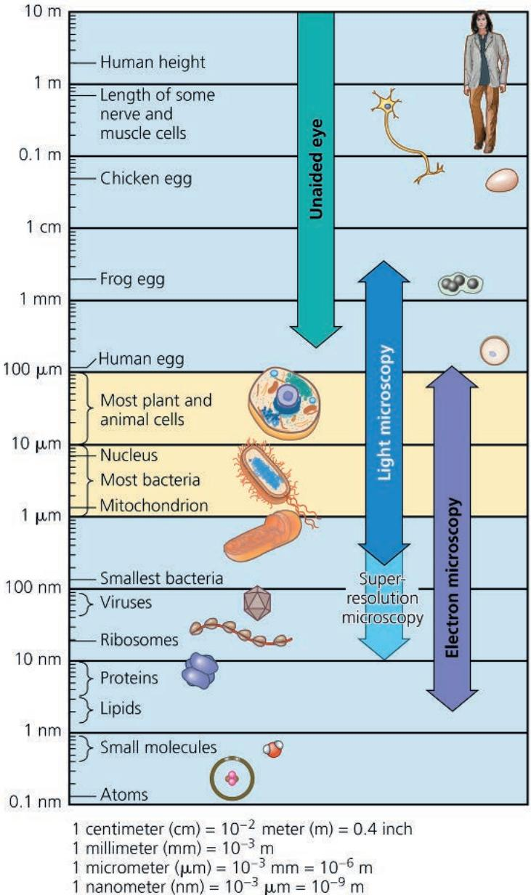  
1 nanometer (nm) = $10^{-3}$ $\mu$ m = $10^{-9}$ m

cannot resolve structures smaller than about 2 nm across. Still, this is a 100-fold improvement over the standard light microscope.

The scanning electron microscope (SEM) is especially useful for detailed study of the topography of a specimen (see Figure 6.3). The electron beam scans the surface of the sample, usually coated with a thin film of gold. The beam excites electrons on the surface, and these secondary electrons are detected by a device that translates the pattern of electrons

# Exploring Microscopy

## Figure 6.3

## Light Microscopy (LM)

Brightfield. Light passes directly through the specimen. Unstained (left), the image has little contrast. Staining with dyes (right) enhances contrast. Most stains require cells to be preserved, which kills them.

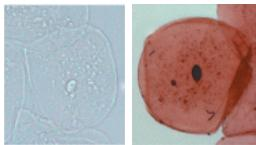

Phase-contrast. Variations in density within the specimen are amplified to enhance contrast in unstained cells; this is especially useful for examining living, unstained cells.

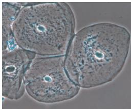  
Human
cheek
cells

Differential interference contrast (Nomarski). As in phase-contrast microscopy, optical modifications are used to exaggerate differences in density; the image appears almost 3-D.

  
50 μm

Fluorescence. Locations of specific molecules are revealed by labeling the molecules with fluorescent dyes or antibodies, which absorb ultraviolet radiation and emit visible light. In this fluorescently labeled uterine cell, DNA is blue, organelles called mitochondria are orange, and part of the cell's "skeleton" (called the cytoskeleton) is green.

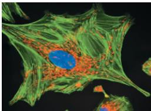  
10μm

Confocal. This image shows two types of fluorescence micrographs: confocal (top) and standard (bottom). (Nerve cells are green, support cells orange, areas of overlap yellow.) In confocal microscopy, a laser is used to create a single plane of fluorescence; out-of-focus light from other planes is eliminated. By capturing

sharp images at many different planes, a 3-D reconstruction can be created. A standard fluorescence micrograph is blurry because out-of-focus light is not excluded.

  
50 μm

Deconvolution. The top of this image of a white blood cell was reconstructed from many blurry fluorescence images at different planes, each processed using deconvolution software. This process digitally removes out-of-focus light and reassigns it to its source, creating a much sharper 3-D image. The bottom is a compilation of standard fluorescent micrographs through the same cell.

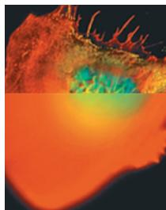  
10 μm

Super-resolution. To make this super-resolution image of a cow aorta cell (top), individual fluorescent molecules were excited by UV light and their position recorded. (DNA is blue, mitochondria red, and part of the cytoskeleton green.) Combining information from many molecules in different places "breaks" the resolution limit, resulting in the sharp image on top. The size of each dot is well below the 200-nm resolution of a standard light microscope, as seen in the confocal image (bottom) of the same cell.

  
10 μm

## Electron Microscopy (EM)

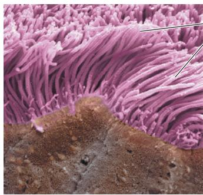

Scanning electron microscopy (SEM). Micrographs taken with a scanning electron microscope show a 3-D image of the surface of a specimen. This SEM shows the surface of a cell from a trachea (windpipe) covered with cell projections called cilia. Electron micrographs are black and white but are often artificially colored to highlight particular structures, as has been done with all three electron micrographs shown here.

SEM

Abbreviations used in figure legends in this text:
LM = Light Micrograph
SEM = Scanning Electron Micrograph
TEM = Transmission Electron Micrograph

Transmission electron microscopy (TEM). A transmission electron microscope profiles a thin section of a specimen. This TEM shows a section through a tracheal cell, revealing its internal structure. In preparing the specimen, some cilia were cut along their lengths, creating longitudinal sections, while other cilia were cut straight across, creating cross sections.

Cilia

  
TEM

Cryo-electron microscopy (cryo-EM). Specimens of tissue or aqueous solutions of proteins are frozen rapidly at temperatures less than $-160^{\circ}\mathrm{C}$ , locking the molecules into a rigid state. A beam of electrons is passed through the sample to visualize the molecules by electron microscopy, and software is used to merge a series of such micrographs, creating a 3-D image like the one below.

2 μm

  
Computer-generated image of the bacterial enzyme $\beta$ -galactosidase, which breaks down lactose. This image was compiled from more than 90,000 cryo-EM images.

into an electronic signal sent to a video screen. The result is an image of the specimen's surface that appears three-dimensional.

The transmission electron microscope (TEM) is used to study the internal structure of cells (see Figure 6.3). The TEM aims an electron beam through a very thin section of the specimen, much as a light microscope aims light through a sample on a slide. For the TEM, the specimen has been stained with atoms of heavy metals, which attach to certain cellular structures, thus enhancing the electron density of some parts of the cell more than others. The electrons passing through the specimen are scattered more in the denser regions, so fewer are transmitted. The image displays the pattern of transmitted electrons. Instead of using glass lenses, both the SEM and TEM use electromagnets as lenses to bend the paths of the electrons, ultimately focusing the image onto a monitor for viewing.

Electron microscopes have revealed many subcellular structures that were impossible to resolve with the light microscope. But the light microscope offers advantages, especially in studying living cells. A disadvantage of electron microscopy is that the methods customarily used to prepare the specimen kill the cells and can introduce artifacts, structural features seen in micrographs that do not exist in the living cell.

In the past several decades, light microscopy has been revitalized by major technical advances (see Figure 6.3). Labeling individual cellular molecules or structures with fluorescent markers has made it possible to see such structures with increasing detail. In addition, both confocal and deconvolution microscopy have produced sharper images of three-dimensional tissues and cells. Finally, a group of new techniques and labeling molecules developed in recent years, called super-resolution microscopy, has allowed researchers to “break” the resolution barrier and distinguish subcellular structures as small as 10–20 nm across.

A recently developed new type of TEM called cryo-electron microscopy (cryo-EM) (see Figure 6.3) allows specimens to be preserved at extremely low temperatures. This avoids the use of preservatives, allowing visualization of structures in their cellular environment. This method is increasingly used to complement X-ray crystallography in revealing protein complexes and subcellular structures like ribosomes, described later. Cryo-EM has even been used to resolve some individual proteins. The Nobel Prize for Chemistry was awarded in 2017 to the developers of this valuable technique.

Microscopes are the most important tools of cytology, the study of cell structure. Understanding the function of each structure, however, required the integration of cytology and biochemistry, the study of the chemical processes (metabolism) of cells.

## Cell Fractionation

A useful technique for studying cell structure and function is cell fractionation (Figure 6.4), which takes cells apart and separates major organelles and other subcellular structures from one another. The piece of equipment that is used for this task is the

## Figure 6.4

## Research Method: Cell Fractionation Application

Cell fractionation is used to separate (fractionate) cell components based on size and density.

## Technique

Cells are homogenized in a blender to break them up. The resulting mixture (homogenate) is centrifuged. The liquid above the pellet (supernatant) is poured into another tube and centrifuged at a higher speed for a longer period. This process is repeated several times. This process, called differential centrifugation, results in a series of pellets, each containing different cell components.

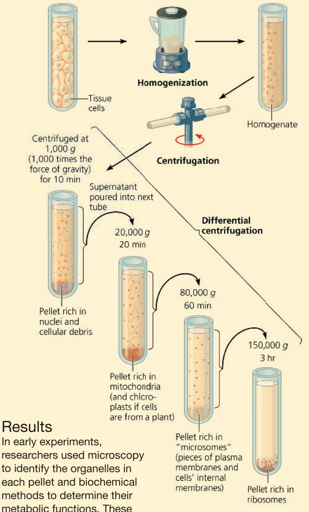

## Results

In early experiments, researchers used microscopy to identify the organelles in each pellet and biochemical methods to determine their metabolic functions. These

identifications established a baseline for this method, enabling today's researchers to know which cell fraction they should collect in order to isolate and study particular organelles.

MAKE CONNECTIONS If you wanted to study the process of translation of proteins from mRNA, which part of which fraction would you use? (See Figure 5.22.)

For suggested answer, see Appendix A.

centrifuge, which spins test tubes holding mixtures of disrupted cells at a series of increasing speeds, a process called differential centrifugation. At each speed, the resulting force causes a subset of the cell components to settle to the bottom of the tube, forming a pellet. At lower speeds, the pellet consists of larger components, and higher speeds result in a pellet with smaller components.

# Concept 6.2: Eukaryotic cells have internal membranes that compartmentalize their functions

Cell fractionation enables researchers to prepare specific cell components in bulk and identify their functions, a task not usually possible with intact cells. For example, on one of the cell fractions, biochemical tests showed the presence of enzymes involved in cellular respiration, while electron microscopy revealed large numbers of the organelles called mitochondria. Together, these data helped biologists determine that mitochondria are the sites of cellular respiration. Biochemistry and cytology thus complement each other in correlating cell function with structure.

## Concept Check 6.1

1. How do stains used for light microscopy compare with those used for electron microscopy?

2. WHAT IF? Which type of microscope would you use to study (a) the changes in shape of a living white blood cell? (b) the details of surface texture of a hair?

For suggested answers, see Appendix A.

Cells—the basic structural and functional units of every organism—are of two distinct types: prokaryotic and eukaryotic. Organisms in Bacteria and Archaea consist of prokaryotic cells. (As discussed in Concept 1.2, the term “Archaea” in this text refers to prokaryotic species unless otherwise noted.) Organisms belonging to Eukarya—protists, fungi, animals, and plants—all consist of eukaryotic cells. (“Protist” is an informal term referring to a diverse group of mostly unicellular eukaryotes; see Concept 28.1.)

## Comparing Prokaryotic and Eukaryotic Cells

All cells share certain basic features: They are all bounded by a selective barrier, called the plasma membrane (or the cell membrane). Inside all cells is a semifluid, jellylike substance called cytosol, in which subcellular components are suspended. All cells contain chromosomes, which carry genes in the form of DNA. And all cells have ribosomes, tiny complexes that make proteins according to instructions from the genes.

A major difference between prokaryotic and eukaryotic cells is the location of their DNA. In a eukaryotic cell, most of the DNA is in an organelle called the nucleus, which is bounded by a double membrane (see Figure 6.8). In a prokaryotic cell, the DNA is concentrated in a region that is not membrane-enclosed, called the nucleoid (Figure 6.5).

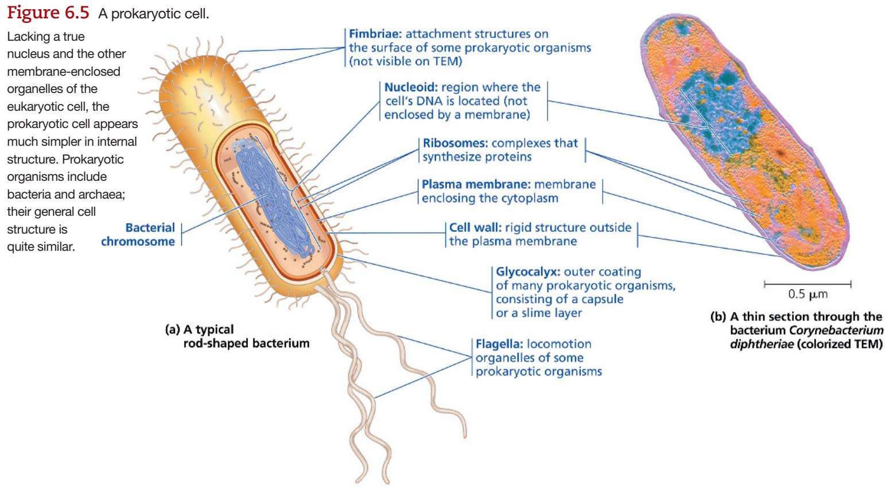

Eukaryotic means “true nucleus” (from the Greek eu, true, and karyon, kernel, referring to the nucleus), and prokaryotic means “before nucleus” (from the Greek pro, before), reflecting the earlier evolution of prokaryotic cells.

The interior of either type of cell is called the cytoplasm; in eukaryotic cells, this term refers only to the region between the nucleus and the plasma membrane. Within the cytoplasm of a eukaryotic cell, suspended in cytosol, are a variety of organelles of specialized form and function. These membrane-bounded structures are absent in almost all prokaryotic cells, another distinction between prokaryotic and eukaryotic cells. In spite of the absence of organelles, though, the prokaryotic cytoplasm is not a formless soup. For example, some prokaryotic organisms contain regions surrounded by proteins (not membranes), within which specific reactions take place.

Eukaryotic cells are generally much larger than prokaryotic cells (see Figure 6.2). Size is a general feature of cell structure that relates to function. The logistics of carrying out cellular metabolism sets limits on cell size. At the lower limit, the smallest cells known are bacteria called mycoplasmas, which have diameters between 0.1 and 1.0 $\mu$ m. These are perhaps the smallest packages with enough DNA to program metabolism and enough enzymes and other cellular equipment to allow a cell to sustain itself and reproduce. Typical bacteria are 1–5 $\mu$ m in diameter, about ten times the size of mycoplasmas. Eukaryotic cells are typically 10–100 $\mu$ m in diameter.

Metabolic requirements also impose theoretical upper limits on the size that is practical for a single cell. At the boundary of every cell, the plasma membrane functions as a selective barrier that allows passage of enough oxygen, nutrients, and wastes to service the entire cell (Figure 6.6). For each square micrometer of membrane, only a limited amount of a particular substance can cross per second, so the ratio of surface area to volume is critical. As a cell (or any other object) increases in size, its surface area grows proportionately less than its volume. (Area is proportional to a linear dimension squared, whereas volume is proportional to the linear dimension cubed.) Thus, a smaller cell has a greater ratio of surface area to volume: Compare the calculations for the first two “cells” in Figure 6.7. The Scientific Skills Exercise gives you a chance to calculate the volumes and surface areas of two actual cells—a mature yeast cell and a cell budding from it. To explore different ways that the surface area of cells is maximized in various organisms, see Make Connections Figure 33.8.

The need for a surface area large enough to accommodate the volume helps explain the microscopic size of most cells and the narrow, elongated shapes of some cells, such as nerve cells. Larger organisms do not generally have larger cells than smaller organisms—they simply have more cells (see the far right of Figure 6.7). A sufficiently high ratio of surface area to volume is especially important in cells that exchange a lot of material with their surroundings, such as intestinal cells. Such cells may have many long, thin projections from their surface called microvilli, which increase surface area without an appreciable increase in volume.

The evolutionary relationships between prokaryotic and eukaryotic cells will be discussed later in this chapter, and prokaryotic cells will be described in detail elsewhere (see Chapter 27). Most of the discussion of cell structure that follows in this chapter applies to eukaryotic cells.

Figure 6.6 The plasma membrane.

The plasma membrane and the membranes of organelles consist of a double layer (bilayer) of phospholipids with various proteins attached to or embedded in it. The hydrophobic parts of phospholipids and membrane proteins are found in the interior of the membrane, while the hydrophilic parts are in contact with aqueous solutions on either side. Carbohydrate side chains may be attached to proteins or lipids on the outer surface of the plasma membrane.

(a) Colorized TEM of a plasma membrane. The plasma membrane appears as a pair of dark bands separated by a gold band.

  
(b) Structure of the plasma membrane

VISUAL SKILLS What parts of the membrane diagram in (b) correspond to the dark bands in the TEM in (a)? What parts correspond to the gold band? (Review Figure 5.11.)

For suggested answer, see Appendix A.

## Figure 6.7 Geometric relationships between surface area and volume.

In this diagram, cells are represented as cubes. Using arbitrary units of length, we can calculate the cell's surface area (in square units, or units $^{2}$ ), volume (in cubic units, or units $^{3}$ ), and ratio of surface area to volume. A high surface area-to-volume ratio facilitates the exchange of materials between a cell and its environment.

Surface area increases while total volume remains constant

<table><tr><td>Total surface area[(height × width of 1 side)× 6 sides × number of cells]</td><td>6 units2</td><td>150 units2</td><td>750 units2</td></tr><tr><td>Total volume[(height × width × lengthof 1 cell) × number of cells]</td><td>1 unit3</td><td>125 units3</td><td>125 units3</td></tr><tr><td>Surface area-to-volume ratio[surface area ÷ volume]</td><td>6</td><td>1.2</td><td>6</td></tr></table>

# Scientific Skills Exercise Using a Scale Bar to Calculate Volume and Surface Area of a Cell

How Much New Cytoplasm and Plasma Membrane Are Made by a Growing Yeast Cell? The unicellular yeast Saccharomyces cerevisiae divides by budding off a small new cell that then grows to full size (see the yeast cells at the bottom of Figure 6.8). During its growth, the new cell synthesizes new cytoplasm, which increases its volume, and new plasma membrane, which increases its surface area. In this exercise, you will use a scale bar to determine the sizes of a mature parent yeast cell and a cell budding from it. You will then calculate the volume and surface area of each cell. You will use your calculations to determine how much cytoplasm and plasma membrane the new cell needs to synthesize to grow to full size.

How the Experiment Was Done Yeast cells were grown under conditions that promoted division by budding. The cells were then viewed with a differential interference contrast light microscope and photographed.

Data from the Experiment This light micrograph shows a budding yeast cell about to be released from the mature parent cell:

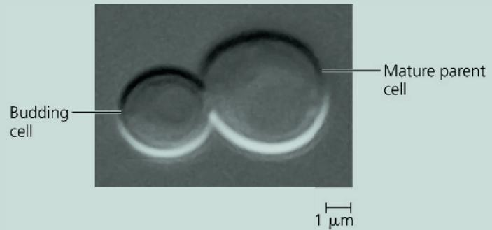  
Micrograph from K. Tatchell, using yeast cells grown for experiments described in L. Kozubowski et al., Role of the septin ring in the asymmetric localization of proteins at the mother-bud neck in Saccharomyces cerevisiae, Molecular Biology of the Cell 16:3455–3466 (2005).

## INTERPRET THE DATA

1. Examine the micrograph of the yeast cells. The scale bar under the photo is labeled $1 \mu m$ . The scale bar works in the same way as a scale on a map, where, for example, 1 inch equals 1 mile. In this case the bar represents one thousandth

## A Panoramic View of the Eukaryotic Cell

In addition to the plasma membrane at its outer surface, a eukaryotic cell has extensive, elaborately arranged internal membranes that divide the cell into compartments—the organelles mentioned earlier. The cell’s compartments provide different local environments that support specific metabolic functions, so incompatible processes can occur simultaneously in a single cell. The plasma membrane and organelle membranes also participate directly in the cell’s metabolism because many enzymes are built right into the membranes.

of a millimeter. Using the scale bar as a basic unit, determine the diameter of the mature parent cell and the new cell. Start by measuring the scale bar and the diameter of each cell. The units you use are irrelevant, but working in millimeters is convenient. Divide each diameter by the length of the scale bar and then multiply by the scale bar's length value to give you the diameter in micrometers.

2. The shape of a yeast cell can be approximated by a sphere.
(a) Calculate the volume of each cell using the formula for the volume of a sphere:

$$
V = \frac {4}{3} \pi r ^ {3}
$$

Note that $\pi$ (the Greek letter pi) is a constant with an approximate value of 3.14, d stands for diameter, and r stands for radius, which is half the diameter. (b) What volume of new cytoplasm will the new cell have to synthesize as it matures? To determine this, calculate the difference between the volume of the full-sized cell and the volume of the new cell.

3. As the new cell grows, its plasma membrane needs to expand to contain the increased volume of the cell. (a) Calculate the surface area of each cell using the formula for the surface area of a sphere: $A = 4\pi r^{2}$ . (b) How much area of new plasma membrane will the new cell have to synthesize as it matures?

4. When the new cell matures, it will be approximately how many times greater in volume and how many times greater in surface area than its current size? Which is growing at a faster rate?

Instructors: A version of this Scientific Skills Exercise can be assigned in Mastering Biology.

The basic fabric of most biological membranes is a double layer of phospholipids and other lipids. Embedded in this lipid bilayer or attached to its surfaces are diverse proteins (see Figure 6.6). However, each type of membrane has a unique composition of lipids and proteins suited to that membrane's specific functions. For example, enzymes embedded in the membranes of the organelles called mitochondria function in cellular respiration. Because membranes are so fundamental to the organization of the cell, Chapter 7 will discuss them in detail.

Before continuing with this chapter, examine the eukaryotic cells in Figure 6.8. The generalized diagrams of an animal cell and

Figure 6.8

ENDOPLASMIC RETICULUM (ER): network of membranous sacs and tubes; active in membrane synthesis and other synthetic and metabolic processes; has rough (ribosome-studded) and smooth regions

Mitochondrion: organelle where cellular respiration occurs and most ATP is generated, among other diverse functions

Animal Cells

  
Human cells from lining of uterus (colorized TEM)  
Unicellular Fungi

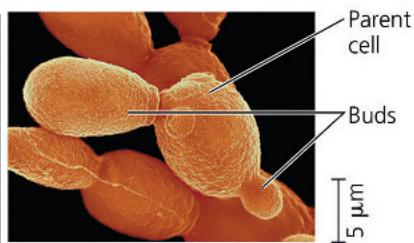  
Yeast cells: reproducing by budding (above, colorized SEM) and a single cell (right, colorized TEM)

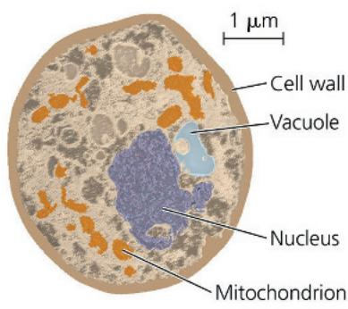

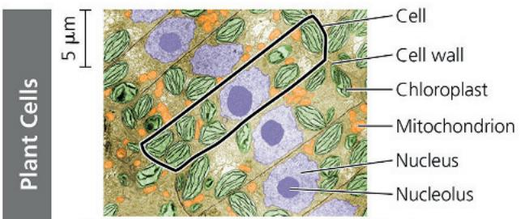  
Cells from duckweed (Spirodela oligorrhiza), a floating plant (colorized TEM)  
Unicellular Algae

  
Unicellular green alga Chlamydomonas (above, colorized SEM; right, colorized TEM)

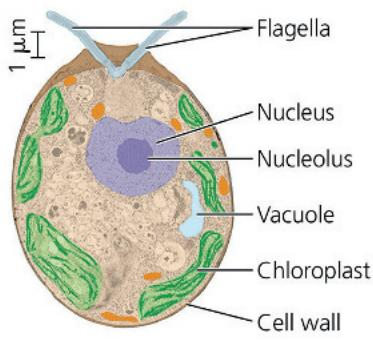

5 μm

a plant cell introduce the various organelles and show the key differences between animal and plant cells. The micrographs at the bottom of the figure give you a glimpse of cells from different types of eukaryotic organisms.

## Concept Check 6.2

1. Briefly describe the structure and function of the nucleus, the mitochondrion, the chloroplast, and the endoplasmic reticulum.

2. DRAW IT Draw a simplified elongated cell that measures $125 \times 1 \times 1$ arbitrary units. A nerve cell would be roughly this shape. Predict how its surface-to-volume ratio would compare with those in Figure 6.7. Then calculate the ratio and check your prediction.

For suggested answers, see Appendix A.

## Concept 6.3: The eukaryotic cell's genetic instructions are housed in the nucleus and carried out by the ribosomes

On the first stop of our detailed tour of the eukaryotic cell, let's look at two cellular components involved in the genetic control of the cell: the nucleus, which houses most of the cell's DNA, and the ribosomes, which use information from the DNA to make proteins.

## The Nucleus: Information Central

The nucleus contains most of the genes in the eukaryotic cell. (Some genes are located in mitochondria and chloroplasts.) It is usually the most conspicuous organelle (see the purple structure in the fluorescence micrograph), averaging about 5 $\mu$ m in diameter. The nuclear envelope encloses the nucleus (Figure 6.9), separating its contents from the cytoplasm.

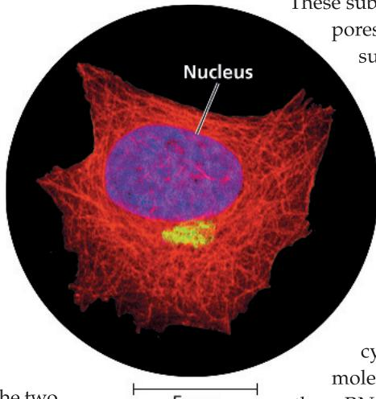

The nuclear envelope is a double membrane. The two membranes, each a lipid bilayer with associated proteins, are separated by a space of 20–40 nm. The envelope is perforated by pore structures that are about 100 nm in diameter. At the lip of each pore, the inner and outer membranes of the nuclear envelope are continuous. An intricate protein structure called a pore complex lines each pore and plays an important role in the cell by regulating the entry and exit of proteins and RNAs, as well as large complexes of macromolecules. Except at the pores, the nuclear side of the envelope is lined by the nuclear lamina, a netlike array of protein filaments (in animal cells, called intermediate filaments) that maintains the shape of the nucleus by mechanically supporting the nuclear envelope. There is also much evidence for a nuclear matrix, a framework of protein fibers extending throughout the nuclear interior. The nuclear lamina and matrix may help organize the genetic material so it functions efficiently.

Within the nucleus, the DNA is organized into discrete units called chromosomes, structures that carry the genetic information. Each chromosome contains one long DNA molecule associated with many proteins, including small basic proteins called histones. Some of the proteins help coil the DNA molecule of each chromosome, reducing its length and allowing it to fit into the nucleus. The complex of DNA and proteins making up chromosomes is called chromatin. When a cell is not dividing, stained chromatin appears as a diffuse mass in micrographs, and the chromosomes cannot be distinguished from one another, even though discrete chromosomes are present. As a cell prepares to divide, however, the chromosomes form loops and coil, condensing and becoming thick enough to be distinguished under a microscope as separate structures (see Figure 16.23). Each eukaryotic species has a characteristic number of chromosomes. For example, a typical human cell has 46 chromosomes in its nucleus; the exceptions are human sex cells (eggs and sperm), which have only 23 chromosomes. A fruit fly cell has 8 chromosomes in most cells and 4 in the sex cells.

A prominent structure within the nondividing nucleus is the nucleolus (plural, nucleoli), which appears through the electron microscope as a mass of densely stained granules and fibers adjoining part of the chromatin. Here a type of RNA called ribosomal RNA (rRNA) is synthesized from genes in the DNA. Also in the nucleolus, proteins imported from the cytoplasm are assembled with rRNA into large and small subunits of ribosomes.

These subunits then exit the nucleus through the nuclear

pores to the cytoplasm, where a large and a small subunit can assemble into a ribosome.

Sometimes there are two or more nucleoli; the number depends on the species and the stage in the cell's reproductive cycle. The nucleoli may also play a role in controlling cell division and the life span of a cell.

As we saw in Figure 5.22, the nucleus directs protein synthesis by synthesizing messenger RNA (mRNA) that carries information from the DNA. The mRNA is then escorted by specific proteins to the cytoplasm via nuclear pores. Once an mRNA molecule reaches the cytoplasm, ribosomes translate

um the mRNA's genetic message into the primary structure of a specific polypeptide. (This process of transcribing and translating genetic information is described in detail in Chapter 17.)

## Ribosomes: Protein Factories

Ribosomes, which are complexes made of ribosomal RNAs and proteins, are the cellular components that carry out protein synthesis (Figure 6.10). (Note that ribosomes are not membrane

Figure 6.9 The nucleus and its envelope.

Within the nucleus are the chromosomes, which appear as a mass of chromatin (DNA and associated proteins) and one or more nucleoli (singular, nucleolus), which function in ribosome synthesis. The nuclear envelope, which consists of two membranes separated by a narrow space, is perforated with pores and lined by the nuclear lamina.

  
Surface of nuclear envelope (TEM). This specimen was prepared by a technique known as freeze-fracture, which cuts from the outer membrane to the inner membrane, revealing both.  
▲ Pore complexes (TEM). Each pore is ringed by protein particles.

▶ Nuclear lamina (TEM). The netlike lamina lines the inner surface of the nuclear envelope. (The light circular spots are nuclear pores.)

MAKE CONNECTIONS Chromosomes contain the genetic material and reside in the nucleus. How does the rest of the cell get access to the information they carry? (See Figure 5.22.) For suggested answer, see Appendix A.

Figure 6.10 Ribosomes.  
This electron micrograph of a pancreas cell shows both free and bound ribosomes. The simplified diagram and computer model show the two subunits of a ribosome.  
  
DRAW IT After you have read the section on ribosomes, circle a ribosome in the micrograph that might be making a protein that will be secreted.  
For suggested answer, see Appendix A.

bounded and thus are not considered organelles.) Cells with high rates of protein synthesis have particularly large numbers of ribosomes as well as prominent nucleoli, which makes sense, given the role of nucleoli in ribosome assembly. For example, a human pancreas cell, which makes many digestive enzymes, has a few million ribosomes.

## Interview

Interview with Venki Ramakrishnan: Studying ribosome structure (eTextbook only)

Ribosomes build proteins in two cytoplasmic regions: At any given time, free ribosomes are suspended in the cytosol, while bound ribosomes are attached to the outside of the endoplasmic reticulum or nuclear envelope (see Figure 6.10). Bound and free ribosomes are structurally identical, and ribosomes can play either role at different times. Most of the proteins made on free ribosomes function within the cytosol; examples are enzymes that catalyze the first steps of sugar breakdown. Bound ribosomes generally make proteins that are destined for insertion into membranes, for packaging within certain organelles such as lysosomes (see Figure 6.8), or for export from the cell (secretion). Cells that specialize in protein secretion—for instance, the cells of the pancreas that secrete digestive enzymes—frequently have a high proportion of bound ribosomes. (You will learn more about ribosome structure and function in Concept 17.4.)

## Concept Check 6.3

1. What role do ribosomes play in carrying out genetic instructions?
2. Describe the molecular composition of nucleoli and explain their function.

3. WHAT IF? As a cell begins the process of dividing, its chromosomes become shorter, thicker, and individually visible in an LM (light micrograph). Explain what is happening at the molecular level.

For suggested answers, see Appendix A.

# Concept 6.4: The endomembrane system regulates protein traffic and performs metabolic functions

Many of the different membrane-bounded organelles of the eukaryotic cell are part of the endomembrane system, which includes the nuclear envelope, the endoplasmic reticulum, the Golgi apparatus, lysosomes, various kinds of vesicles and vacuoles, and the plasma membrane. This system carries out a variety of tasks in the cell, including synthesis of proteins, transport of proteins into membranes and organelles or out of the cell, metabolism and movement of lipids, and detoxification of poisons. The membranes of this system are related either through direct physical continuity or by the transfer of membrane segments as tiny vesicles (sacs made of membrane). Despite these relationships, the various membranes are not identical in structure and function. Moreover, the thickness, molecular composition, and types of chemical reactions carried out in a given membrane are not fixed, but may be modified several times during the membrane's life. Having already looked at the nuclear envelope, we will now focus on the endoplasmic reticulum and the other endomembranes to which the endoplasmic reticulum gives rise.

## The Endoplasmic Reticulum: Biosynthetic Factory

The endoplasmic reticulum (ER) is such an extensive network of membranes that it accounts for more than half the total membrane in many eukaryotic cells. (The word endoplasmic means “within the cytoplasm,” and reticulum is Latin for “little net.”) The ER consists of a network of membranous tubules and sacs called cisternae (from the Latin cisterna, a reservoir for a liquid). The ER membrane separates the internal compartment of the ER, called the ER lumen (cavity) or cisternal space, from the cytosol. And because the ER membrane is continuous with the nuclear envelope, the space between the two membranes of the envelope is continuous with the lumen of the ER (Figure 6.11).

There are two distinct, though connected, regions of the ER that differ in structure and function: smooth ER and rough ER. Smooth ER is so named because its outer surface lacks ribosomes. Rough ER is studded with ribosomes on the outer surface of the membrane and thus appears rough through the electron microscope. As already mentioned, ribosomes are also attached to the cytoplasmic side of the nuclear envelope's outer membrane, which is continuous with rough ER.

## Functions of Smooth ER

The smooth ER functions in diverse metabolic processes, which vary with cell type. These processes include synthesis of lipids, metabolism of carbohydrates, detoxification of drugs and poisons, and storage of calcium ions.

Enzymes of the smooth ER are important in the synthesis of lipids, including oils, steroids, and new membrane phospholipids. Among the steroids produced by the smooth ER in animal cells are the sex hormones of vertebrates and the various steroid hormones secreted by the adrenal glands. The cells that synthesize and secrete these hormones—in the testes and ovaries, for example—are rich in smooth ER, a structural feature that fits the function of these cells.

Other enzymes of the smooth ER help detoxify drugs and poisons, especially in liver cells. Detoxification usually involves adding hydroxyl groups to drug molecules, making them more water-soluble and easier to flush from the body. The sedative phenobarbital and other barbiturates are examples of drugs metabolized in this manner by smooth ER in liver cells. In fact, barbiturates, alcohol, and many other drugs induce the

proliferation of smooth ER and its associated detoxification enzymes, thus increasing the rate of detoxification. This, in turn, increases tolerance to the drugs, meaning that higher doses are required to achieve a particular effect, such as sedation. Also, because some of the detoxification enzymes have relatively broad action, the proliferation of smooth ER in response to one drug can increase the need for higher dosages of other drugs as well. Barbiturate use, for instance, can decrease the effectiveness of certain antibiotics and other useful drugs.

Figure 6.11 Endoplasmic reticulum (ER).

A membranous system of interconnected tubules and flattened sacs called cisternae, the ER is also continuous with the nuclear envelope, as shown in the cutaway diagram at the top. The membrane of the ER encloses a continuous compartment called the ER lumen (or cisternal space). Rough ER, which is studded on its outer surface with ribosomes, can be distinguished from smooth ER in the electron micrograph (TEM). Transport vesicles bud off from a region of the rough ER called transitional ER and travel to the Golgi apparatus and other destinations.

The smooth ER also stores calcium ions. In muscle cells, for example, the smooth ER membrane pumps calcium ions from the cytosol into the ER lumen. When a muscle cell is stimulated by a nerve impulse, calcium ions rush back across the ER membrane into the cytosol and trigger contraction of the muscle cell. In other cell types, release of calcium ions from the smooth ER triggers different responses, such as secretion of vesicles carrying newly synthesized proteins.

## Functions of Rough ER

Many cells secrete proteins that are produced by ribosomes attached to rough ER. For instance, certain pancreatic cells synthesize the protein insulin in the ER and secrete this hormone into the bloodstream. As a polypeptide chain grows from a bound ribosome, the chain is threaded into the ER lumen through a pore formed by a protein complex in the ER membrane. The new polypeptide folds into its functional shape as it enters the ER lumen. Most secretory proteins are glycoproteins, proteins with carbohydrates covalently bonded to them. The carbohydrates are attached to the proteins in the ER lumen by enzymes built into the ER membrane.

After secretory proteins are formed, the ER membrane keeps them separate from proteins in the cytosol, which are produced by free ribosomes. Secretory proteins depart from the ER wrapped in the membranes of vesicles that bud like bubbles from a specialized region called transitional ER (see Figure 6.11). Vesicles in transit from one part of the cell to another are called transport vesicles; we will examine their fate shortly.

In addition to making secretory proteins, rough ER is a membrane factory for the cell; it grows in place by adding membrane proteins and phospholipids to its own membrane. As polypeptides destined to be membrane proteins grow from the ribosomes, they are inserted into the ER membrane itself and anchored there by their hydrophobic portions. Like the smooth ER, the rough ER also makes membrane phospholipids; enzymes built into the ER membrane assemble phospholipids from precursors in the cytosol. The ER membrane expands, and portions of it are transferred in the form of transport vesicles to other components of the endomembrane system.

## The Golgi Apparatus: Shipping and Receiving Center

After leaving the ER, many transport vesicles travel to the Golgi apparatus. We can think of the Golgi as a warehouse for receiving, sorting, shipping, and even some manufacturing. Here, products of the ER, such as proteins, are modified and stored and then sent to other destinations. Not surprisingly, the Golgi apparatus is especially extensive in cells specialized for secretion.

The Golgi apparatus consists of a group of associated, flattened membranous sacs—cisternae—looking like a stack of pita bread (Figure 6.12). A cell may have many, even hundreds, of these stacks. The membrane of each cisterna in a stack separates its internal space from the cytosol. Vesicles concentrated in the vicinity of the Golgi apparatus are engaged

## Figure 6.12 The Golgi apparatus.

The Golgi apparatus consists of stacks of associated, flattened sacs, or cisternae. Unlike the ER cisternae, these sacs are not physically connected, as you can see in the cutaway diagram. A Golgi stack receives and dispatches transport vesicles and the products they contain. A Golgi stack has a structural and functional directionality, with a cis face that receives vesicles containing ER products and a trans face that dispatches vesicles. The cisternal maturation model proposes that the Golgi cisternae themselves “mature,” moving from the cis to the trans face while carrying some proteins along. In addition, some vesicles recycle enzymes that had been carried forward in moving cisternae, transporting them “backward” to a less mature region where their functions are needed.

  
5 Vesicles transport some proteins backward to less mature Golgi cisternae, where they function.  
④ Vesicles form and leave Golgi, carrying specific products to other locations or to the plasma membrane for secretion.  
TEM of Golgi apparatus

in the transfer of material between parts of the Golgi and other structures.

A Golgi stack has a distinct structural directionality, with the membranes of cisternae on opposite sides of the stack differing in thickness and molecular composition. The two sides of a Golgi stack are referred to as the cis face and the trans face; these act, respectively, as the receiving and shipping departments of the Golgi apparatus. The term cis means “on the same side,” and the cis face is usually located near the ER. Transport vesicles move material from the ER to the Golgi apparatus. A vesicle that buds from the ER can add its membrane and the contents of its lumen to the cis face by fusing with a Golgi membrane on that side. The trans face (“on the opposite side”) gives rise to vesicles that pinch off and travel to other sites.

Products of the endoplasmic reticulum are usually modified during their transit from the cis region to the trans region of the Golgi apparatus. For example, glycoproteins formed in the ER have their carbohydrates modified, first in the ER itself, and then as they pass through the Golgi. The Golgi removes some sugar monomers and substitutes others, producing a large variety of carbohydrates. Membrane phospholipids may also be altered in the Golgi.

In addition to its finishing work, the Golgi apparatus also manufactures some macromolecules. Many polysaccharides secreted by cells are Golgi products. For example, pectins and certain other noncellulose polysaccharides are made in the Golgi of plant cells and then incorporated along with cellulose into their cell walls. Like secretory proteins, nonprotein Golgi products that will be secreted depart from the trans face of the Golgi inside transport vesicles that eventually fuse with the plasma membrane. The contents are released and the vesicle membrane is incorporated into the plasma membrane, adding to the surface area.

The Golgi manufactures and refines its products in stages, with different cisternae containing unique teams of enzymes. Biologists formerly viewed the Golgi as a static structure, with products in various stages of processing transferred from one cisterna to the next by vesicles. While this may occur, research from several labs has given rise to a new model of the Golgi as a more dynamic structure. According to the cisternal maturation model, the cisternae of the Golgi actually progress forward from the cis to the trans face, carrying and modifying their cargo as they move. Figure 6.12 shows the details of this model. The reality probably lies somewhere between the two models; recent research suggests the central regions of the cisternae may remain in place, while the outer ends form tubules and vesicles that are more dynamic.

Before a Golgi stack dispatches its products by budding vesicles from the trans face, it sorts these products and targets them for various parts of the cell. Molecular identification tags, such as phosphate groups added to the Golgi products, aid in sorting by acting like zip codes on mailing labels. Finally, transport vesicles budded from the Golgi may have external molecules on their membranes that recognize “docking sites” on the surface of specific organelles or on the plasma membrane, thus targeting the vesicles appropriately.

## Lysosomes: Digestive Compartments

A lysosome is a membranous sac of hydrolytic enzymes that many eukaryotic cells use to digest (hydrolyze) macromolecules. Lysosomal enzymes work best in the acidic environment found in lysosomes. If a lysosome breaks open or leaks its contents, the released enzymes are not very active because the cytosol has a near-neutral pH. However, excessive leakage from a large number of lysosomes can destroy a cell by self-digestion.

Figure 6.13 Lysosomes.  
  
In this colorized TEM of a macrophage (a type of white blood cell), lysosomes are the round structures colored in purple. They contain enzymes that digest foreign particles such as bacteria and pollen.

Hydrolytic enzymes and lysosomal membrane are made by rough ER and then transferred to the Golgi apparatus for further processing. At least some lysosomes probably arise by budding from the trans face of the Golgi apparatus (see Figure 6.12). How are the proteins of the inner surface of the lysosomal membrane and the digestive enzymes themselves spared from destruction? Apparently, the three-dimensional shapes of these proteins protect vulnerable bonds from enzymatic attack.

Lysosomes carry out intracellular digestion in a variety of circumstances. Amoebas and many other unicellular protists eat by engulfing smaller organisms or food particles, a process called phagocytosis (from the Greek phagein, to eat, and kytos, vessel, referring here to the cell). The food vacuole formed in this way then fuses with a lysosome, whose enzymes digest the food (Figure 6.13a, top). Digestion products, including simple sugars, amino acids, and other monomers, pass into the cytosol and become nutrients for the cell. Some human cells also carry out phagocytosis. Among them are macrophages, a type of white blood cell that helps defend the body by engulfing and destroying bacteria and other invaders (see Figure 6.13a, bottom, and Figure 6.31).

  
This vesicle containing two damaged organelles is in the cytoplasm of a rat liver cell (TEM).  
The vesicle with damaged organelles fuses with a lysosome. The organelles are then digested and their components recycled.

Lysosomes also use their hydrolytic enzymes to recycle the cell's own organic material, a process called autophagy. During autophagy, a damaged organelle or small amount of cytosol becomes surrounded by a double membrane (of unknown origin), and a lysosome fuses with the outer membrane of this vesicle (Figure 6.13b). The lysosomal enzymes dismantle the inner membrane and the enclosed material, and the resulting small organic compounds are released to the cytosol for reuse. With the help of lysosomes, the cell continually renews itself. A human liver cell, for example, recycles half of its macromolecules each week.

The cells of people with inherited lysosomal storage diseases lack a functioning hydrolytic enzyme normally present in lysosomes. The lysosomes become engorged with indigestible material, which begins to interfere with other cellular activities. In Tay-Sachs disease, for example, a lipid-digesting enzyme is missing or inactive, and the brain becomes impaired by an accumulation of lipids in the cells (see Concept 14.3). Fortunately, lysosomal storage diseases are rare in the general population.

## Vacuoles: Diverse Maintenance Compartments

Vacuoles are large vesicles derived from the endoplasmic reticulum and Golgi apparatus. Thus, vacuoles are an integral part of a cell's endomembrane system. Like all cellular membranes, the vacuolar membrane is selective in transporting solutes; as a result, the solution inside a vacuole differs in composition from the cytosol.

Vacuoles perform a variety of functions in different kinds of cells. Food vacuoles, formed by phagocytosis, have already been mentioned (see Figure 6.13a). Many unicellular protists living in fresh water have contractile vacuoles that pump excess water out of the cell, thereby maintaining a suitable concentration of ions and molecules inside the cell (see Figure 7.13). In plants and fungi, certain vacuoles carry out enzymatic hydrolysis, a function shared by lysosomes in animal cells. (In fact, some biologists consider these hydrolytic vacuoles to be a type of lysosome.) In plants, small vacuoles can hold reserves of important organic compounds, such as the proteins stockpiled in the storage cells in seeds. Vacuoles may also help protect the plant against herbivores by storing compounds that are poisonous or unpalatable to animals. Some plant vacuoles contain pigments, such as the red and blue pigments of petals that help attract pollinating insects to flowers.

Mature plant cells generally contain a large central vacuole (Figure 6.14), which develops by the coalescence of smaller vacuoles. The solution inside the central vacuole, called cell sap, is the plant cell's main repository of inorganic ions, including potassium and chloride. The central vacuole plays a major role in the growth of plant cells, which enlarge as the vacuole absorbs water, enabling the cell to become larger with a minimal

Figure 6.14 The plant cell vacuole.

The central vacuole is usually the largest compartment in a plant cell; the rest of the cytoplasm is often confined to a narrow zone between the vacuolar membrane and the plasma membrane (TEM).

investment in new cytoplasm. The cytosol often occupies only a thin layer between the central vacuole and the plasma membrane, so the ratio of plasma membrane surface to cytosolic volume is sufficient, even for a large plant cell.

## The Endomembrane System: A Review

Figure 6.15 reviews the endomembrane system, showing the flow of membrane lipids and proteins through the various organelles. As the membrane moves from the ER to the Golgi and then elsewhere, its molecular composition and metabolic functions are modified, along with those of its contents. The endomembrane system is a complex and dynamic player in the cell's compartmental organization.

We'll continue our tour of the cell with some organelles that are not closely related to the endomembrane system but play crucial roles in the energy transformations carried out by cells.

## Concept Check 6.4

1. Describe the structural and functional distinctions between rough and smooth ER.

2. Describe how transport vesicles integrate the endomembrane system.

3. WHAT IF? Imagine a protein that functions in the ER but requires modification in the Golgi apparatus before it can achieve that function. Describe the protein's path through the cell, starting with the mRNA molecule that specifies the protein.

⑤ A transport vesicle carries proteins to the plasma membrane for secretion.

Figure 6.15 Review: Relationships among organelles of the endomembrane system. The red arrows show some of the migration pathways for membranes and the materials they enclose.  
  
⑥ The plasma membrane expands by fusion of vesicles; proteins are secreted from the cell by exocytosis.

## Concept 6.5: Mitochondria and chloroplasts change energy from one form to another

Organisms transform the energy they acquire from their surroundings. In eukaryotic cells, mitochondria and chloroplasts are the organelles that convert energy to forms that cells can use for work. Mitochondria (singular, mitochondrion) are the sites of cellular respiration, the metabolic process that uses oxygen to drive the generation of ATP by extracting energy from sugars, fats, and other fuels. Chloroplasts, found in plants and algae, are the sites of photosynthesis. This process in chloroplasts converts solar energy to chemical energy by absorbing sunlight and using it to drive the synthesis of organic compounds such as sugars from carbon dioxide and water.

In addition to having related functions, mitochondria and chloroplasts share similar evolutionary origins, which we'll look at briefly before examining their structures. In this section, we'll also consider the peroxisome, an oxidative organelle. The evolutionary origin of the peroxisome, as well as its relation to other organelles, is still a matter of some debate.

## The Evolutionary Origins of Mitochondria and Chloroplasts

EVOLUTION Mitochondria and chloroplasts display similarities with bacteria that led to the endosymbiont theory, illustrated in Figure 6.16. This theory states that an early ancestor of eukaryotic cells (a host cell) engulfed an oxygen-using nonphotosynthetic bacterial cell. Eventually, the engulfed cell formed a relationship with the host cell in which it was enclosed, becoming an endosymbiont (a cell living within another cell). Indeed, over the course of evolution, the host cell and its endosymbiont merged into a single organism, a eukaryotic cell with the endosymbiont having become a mitochondrion. At least one of these cells may have then taken up a photosynthetic bacterium, becoming the ancestor of eukaryotic cells that contain chloroplasts.

This is a widely accepted theory, which we will examine in more detail in Concept 25.3. This theory is consistent with many structural features of mitochondria and chloroplasts. First, rather than being bounded by a single membrane like organelles of the endomembrane system, mitochondria and typical chloroplasts have two membranes surrounding them. (Chloroplasts also have an internal system of membranous sacs.) There is evidence that the ancestral engulfed bacterium had two outer membranes, which became the double membranes of mitochondria and chloroplasts.

Figure 6.16 The endosymbiont theory of the origins of mitochondria and chloroplasts in eukaryotic cells.

According to this theory, the proposed ancestor of mitochondria was an oxygen-using nonphotosynthetic bacterium that was taken into a host cell, while the proposed ancestor of chloroplasts was a photosynthetic bacterium. The large arrows represent change over evolutionary time; the small arrows inside the cells show the process of the endosymbiont becoming an organelle, also over long periods of time.

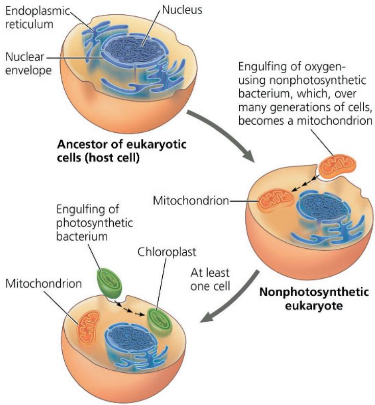  
Engulfing of oxygen-using nonphotosynthetic bacterium, which, over many generations of cells, becomes a mitochondrion

Photosynthetic eukaryote

Second, like bacteria, mitochondria and chloroplasts contain ribosomes, as well as circular DNA molecules—like bacterial chromosomes—associated with their inner membranes. The DNA in these organelles programs the synthesis of some organelle proteins on ribosomes that have been synthesized and assembled there as well. Third, also consistent with their probable evolutionary origins as cells, mitochondria and chloroplasts are autonomous (somewhat independent) organelles that grow and reproduce within the cell.

Next, we focus on the structures of mitochondria and chloroplasts, while providing an overview of their structures and functions. (In Chapters 9 and 10, we will examine their roles as energy transformers.)

## Mitochondria: Chemical Energy Conversion

Mitochondria are found in nearly all eukaryotic cells, including those of plants, animals, fungi, and most protists. Some cells have a single large mitochondrion, but more often a cell has hundreds or even thousands of mitochondria; the number correlates with the cell's level of metabolic activity. For example, cells that move or contract have proportionally more mitochondria per volume than less active cells.

Each of the two membranes enclosing the mitochondrion is a phospholipid bilayer with a unique collection of embedded proteins.

The outer membrane is smooth, but the inner membrane is convoluted, with infoldings called cristae (Figure 6.17a). The inner membrane divides the mitochondrion into two internal compartments. The first is the intermembrane space, the narrow region between the inner and outer membranes. The second compartment, the mitochondrial matrix, is enclosed by the inner membrane. The matrix contains many different enzymes as well as the mitochondrial DNA and ribosomes. Enzymes in the matrix catalyze some of the steps of cellular respiration. Other proteins that function in respiration, including the enzyme that makes ATP, are built into the inner membrane. As highly folded surfaces, the cristae give the inner mitochondrial membrane a large surface area, thus enhancing the productivity of cellular respiration. This is another example of structure fitting function. (Chapter 9 discusses cellular respiration in detail.)

Mitochondria are generally in the range of 1–10 $\mu$ m long. Time-lapse films of living cells reveal mitochondria moving around, changing their shapes, and fusing or dividing into separate fragments, unlike the static structures seen in most diagrams and electron micrographs. These studies helped cell biologists understand that mitochondria in a living cell form a branched tubular network that is in a dynamic state of flux (see Figure 6.17b and c). In skeletal muscle, this network has been referred to by researchers as a “power grid.”

The mitochondrion is often referred to as the “powerhouse of the cell.” However, a large number of studies of mitochondria done over the past few decades have shown that they have many functions beyond ATP production. Mitochondria receive signals, both from inside the cell and from other cells both local and distant. They integrate multiple signals coming from different sources and respond to them. For instance, mitochondria regulate a process of programmed cell suicide (apoptosis; see Concept 11.5). They also synthesize molecules such as the antioxidant molecule melatonin and the stress hormone cortisol. Finally, mitochondria can signal other organelles in the cell and other cells and affect their functions, including gene expression in the nucleus. Their many information-coordinating functions have led some researchers to propose new descriptors for the mitochondrion such as the “processor” or “CEO” of the cell.

## Chloroplasts: Capture of Light Energy

Chloroplasts contain the green pigment chlorophyll, along with enzymes and other molecules that function in the photosynthetic production of sugar. These lens-shaped organelles, about 3–6 $\mu$ m in length, are found in leaves and other green organs of plants and in algae (Figure 6.18; see also Figure 6.26c).

The contents of a chloroplast are partitioned from the cytosol by an envelope consisting of two membranes separated by a very narrow intermembrane space. Inside the chloroplast is another membranous system in the form of flattened, interconnected sacs called thylakoids. In some regions, thylakoids are stacked like poker chips; each stack is called a granum (plural, grana). The fluid outside the thylakoids is the stroma, which contains the chloroplast DNA and ribosomes as well as many enzymes. The membranes of the chloroplast divide the chloroplast space into three compartments: the intermembrane space, the stroma, and the thylakoid space. This compartmental organization enables the chloroplast to convert light energy to chemical energy during photosynthesis. (You will learn more about photosynthesis in Chapter 10.)

As with mitochondria, the static and rigid appearance of chloroplasts in micrographs or schematic diagrams cannot

Figure 6.17 The mitochondrion, site of cellular respiration.

(a) The inner and outer membranes seen in the drawing and TEM establish two compartments: the intermembrane space and the mitochondrial matrix. The cristae increase the surface area of the inner membrane. Circular DNA molecules are associated with the inner mitochondrial membrane. (b) Mitochondria are dynamic, at times separating into fragments or fusing. (c) The LM shows one protist (Euglena gracilis) at a much lower magnification than the TEM. The mitochondria form a branched tubular network; the mitochondrial matrix is stained green. The nuclear DNA is stained red; molecules of mitochondrial DNA appear as bright yellow spots.

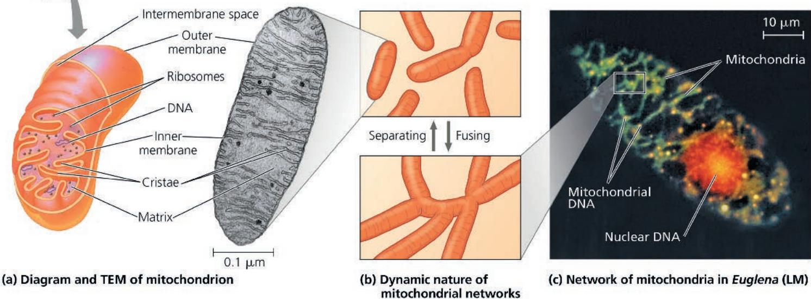

accurately depict their dynamic behavior in the living cell. Their shape is changeable, and they grow and occasionally pinch in two, reproducing themselves. They are mobile and, with mitochondria and other organelles, move around the cell along tracks of the cytoskeleton, a structural network we will consider in Concept 6.6.

The chloroplast is a specialized member of a family of closely related plant organelles called plastids. One type of plastid, the amyloplast, is a colorless organelle that stores starch (amylose), particularly in roots and tubers. Another is the

chromoplast, which has pigments that give fruits and flowers their orange and yellow hues.

## Peroxisomes: Oxidation

The peroxisome is a specialized metabolic compartment bounded by a single membrane (Figure 6.19). Peroxisomes contain enzymes that remove hydrogen atoms from various substrates and transfer them to oxygen ( $O_{2}$ ), producing hydrogen

Figure 6.18 The chloroplast, site of photosynthesis.

(a) Many plants have lens-shaped chloroplasts, as shown here in a diagram and a TEM. A chloroplast has three compartments: the intermembrane space, the stroma, and the thylakoid space. Free ribosomes are present in the stroma, as are copies of chloroplast DNA molecules. (b) This light micrograph, at a much lower magnification than the TEM, shows a whole cell of the green alga Spirogyra crassa, which is named for the spiral arrangement of each cell's chloroplasts.

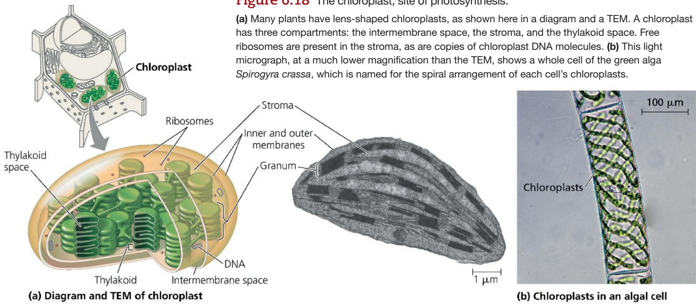

## Figure 6.19 A peroxisome.

Peroxisomes are roughly spherical and often have a granular or crystalline core that is thought to be a dense collection of enzyme molecules. Chloroplasts and mitochondria cooperate with peroxisomes in certain metabolic functions (TEM).

  
1 μm

peroxide ( $H_{2}O_{2}$ ) as a by-product (from which the organelle derives its name). These reactions have many different functions. Some peroxisomes use oxygen to break fatty acids down into smaller molecules that are transported to mitochondria and used as fuel for cellular respiration. Peroxisomes in the liver detoxify alcohol and other harmful compounds by transferring hydrogen from the poisonous compounds to oxygen. The $H_{2}O_{2}$ formed by peroxisomes is itself toxic, but the organelle also contains an enzyme that converts $H_{2}O_{2}$ to water. This is an excellent example of how the cell's compartmental structure is crucial to its functions: The enzymes that produce $H_{2}O_{2}$ and those that dispose of this toxic compound are sequestered away from other cellular components that could be damaged.

Specialized peroxisomes called glyoxysomes are found in the fat-storing tissues of plant seeds. These organelles contain enzymes that initiate the conversion of fatty acids to sugar, which the emerging seedling uses as a source of energy and carbon until it can produce its own sugar by photosynthesis.

Peroxisomes grow larger by incorporating proteins made in the cytosol and ER, as well as lipids made in the ER and within the peroxisome itself. But how peroxisomes increase in number and how they arose in evolution—as well as what organelles they are related to—are still the focus of current research. One research group reported that in some cells, newly generated peroxisomes have membranes that come from both ER and mitochondria, and another group has suggested that peroxisomes may have evolved from the bacterium that became the mitochondrion. In fact, this and other evidence support the idea that peroxisomes have a closer relationship with mitochondria than previously thought.

## Concept Check 6.5

1. Describe two characteristics shared by chloroplasts and mitochondria. Consider both function and membrane structure.

2. Do plant cells have mitochondria? Explain.

3. WHAT IF? A classmate proposes that mitochondria and chloroplasts should be classified in the endomembrane system. Argue against the proposal.

# Concept 6.6: The cytoskeleton is a network of fibers that organizes structures and activities in the cell

In the early days of electron microscopy, biologists thought that the organelles of a eukaryotic cell floated freely in the cytosol. But improvements in both light microscopy and electron microscopy have revealed the cytoskeleton, a network of fibers extending throughout the cytoplasm (Figure 6.20). Bacterial cells also have fibers that form a type of cytoskeleton, constructed of proteins similar to eukaryotic ones, but here we will concentrate on eukaryotes. The eukaryotic cytoskeleton plays a major role in organizing the structures and activities of the cell.

## Roles of the Cytoskeleton: Support and Motility

The most obvious function of the cytoskeleton is to give mechanical support to the cell and maintain its shape. This is especially important for animal cells, which lack walls. The remarkable strength and resilience of the cytoskeleton as a whole are based on its architecture. Like a dome tent, the cytoskeleton is stabilized by a balance between opposing forces exerted by its elements. And just as the skeleton of an animal helps fix the positions of other body parts, the cytoskeleton provides anchorage for many organelles and even cytosolic enzyme molecules. The cytoskeleton is more dynamic than an animal skeleton, however. It can be quickly dismantled in one part of the cell and reassembled in a new location, changing the shape of the cell.

Figure 6.20 The cytoskeleton.

As shown in this fluorescence micrograph, the cytoskeleton extends throughout the cell. The cytoskeletal elements have been tagged with different fluorescent molecules: green for microtubules and reddish-orange for microfilaments. A third component of the cytoskeleton, intermediate filaments, is not evident here. (The blue color tags the DNA in the nucleus.)

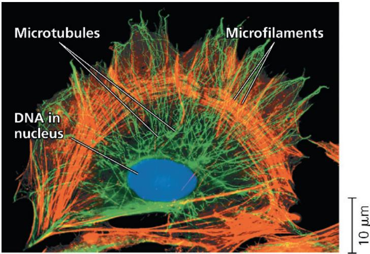

Some types of cell motility (movement) also involve the cytoskeleton. The term cell motility includes both changes in cell location and movements of cell parts. Cell motility generally requires interaction of the cytoskeleton with motor proteins. There are many such examples: Cytoskeletal elements and motor proteins work together with plasma membrane molecules to allow whole cells to move along fibers outside the cell. Inside the cell, vesicles and other organelles often use motor protein “feet” to “walk” to their destinations along a track provided by the cytoskeleton. For example, this is how vesicles containing neurotransmitter molecules migrate to the tips of axons, the long extensions of nerve cells that release these molecules as chemical signals to adjacent nerve cells (Figure 6.21). The cytoskeleton also manipulates the plasma membrane, bending it inward to form food vacuoles or other phagocytic vesicles.

## Components of the Cytoskeleton

Now let's look more closely at the three main types of fibers that make up the cytoskeleton: Microtubules are the thickest of the three types; microfilaments (also called actin filaments) are the thinnest; and intermediate filaments are fibers with diameters in a middle range (Table 6.1).

Figure 6.21 Motor proteins and the cytoskeleton.  
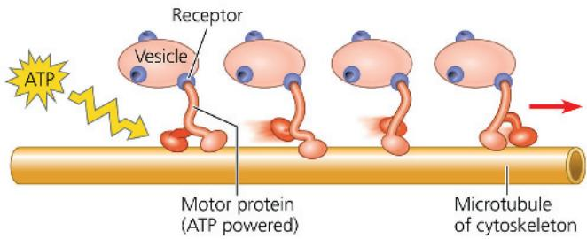  
(a) A motor protein that attaches to a receptor on a vesicle can "walk" the vesicle along a microtubule or microfilament.

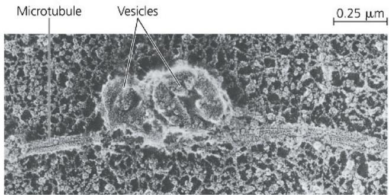  
(b) Two vesicles containing neurotransmitters move along a microtubule toward the tip of a nerve cell extension called an axon (SEM).

Table 6.1 The Structure and Function of the Cytoskeleton  
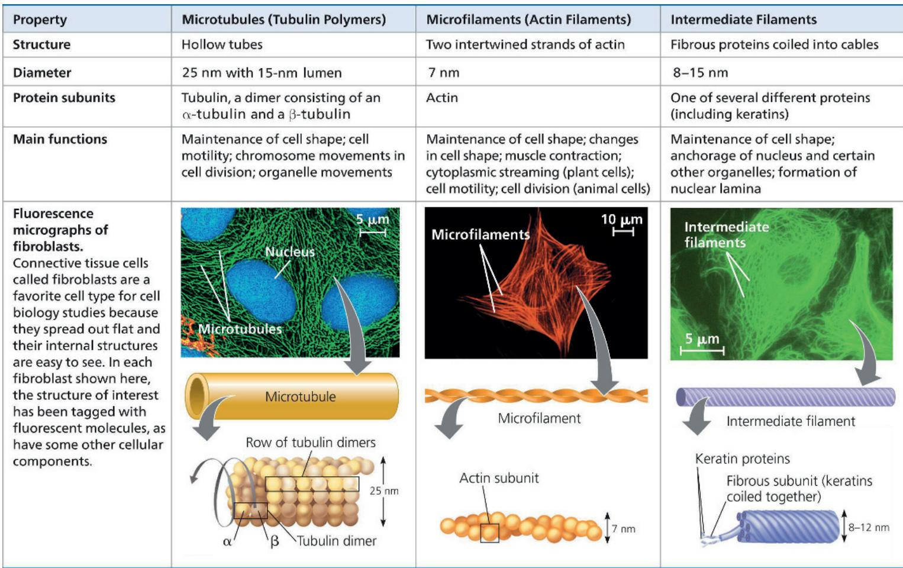  
VISUAL SKILLS How many tubulin dimers are in the boxed row? For suggested answer, see Appendix A.

## Interview

Interview with George Langford: Investigating how motor proteins move cargo (eTextbook only)

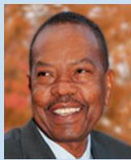

## Microtubules

All eukaryotic cells have microtubules, hollow rods constructed from globular proteins called tubulins. Each tubulin protein is a dimer, a molecule made up of two components. A tubulin dimer consists of two slightly different polypeptides, $\alpha$ -tubulin and $\beta$ -tubulin. Microtubules grow in length by adding tubulin dimers; they can also be disassembled and their tubulins used to build microtubules elsewhere in the cell. Because of the orientation of tubulin dimers, the two ends of a microtubule are slightly different. One end can accumulate or release tubulin dimers at a much higher rate than the other, thus growing and shrinking significantly during cellular activities. (This is called the “plus end,” not because it can only add tubulin proteins but because it’s the end where both “on” and “off” rates are much higher.)

Microtubules shape and support the cell and also serve as tracks along which organelles equipped with motor proteins can move. In addition to the example in Figure 6.21, microtubules guide vesicles from the ER to the Golgi apparatus and from the Golgi to the plasma membrane. Microtubules are also involved in the separation of chromosomes during cell division, as shown in Figure 12.7.

## Centrosomes and Centrioles

In animal cells, microtubules grow out from a centrosome, a region that is often located near the nucleus. These microtubules function as compression-resisting girders of the cytoskeleton. Within the centrosome is a pair of centrioles, each composed of nine sets of triplet microtubules arranged in a ring (Figure 6.22). Although centrosomes with centrioles may help organize microtubule assembly in animal cells, many other eukaryotic cells lack centrosomes with centrioles and instead organize microtubules by other means.

## Cilia and Flagella

Some eukaryotic cells have flagella (singular, flagellum) and cilia (singular, cilium), cellular extensions that contain microtubules. A specialized arrangement of the microtubules is responsible for the beating of these structures. (The bacterial flagellum, shown in Figure 6.5, has a completely different structure.) Many unicellular protists are propelled through water by cilia or flagella that act as locomotor appendages, and the sperm of animals, algae, and some plants have flagella. When cilia or flagella extend from cells that are attached tightly together in a sheet that is part of a tissue layer, they can move fluid over the surface of the tissue. For example, the ciliated lining of the trachea (windpipe) sweeps mucus containing trapped debris out of the lungs (see the EMs in Figure 6.3). In the female reproductive tract, the cilia lining the oviducts help move an egg toward the uterus.

Figure 6.22 Centrosome containing a pair of centrioles. Most animal cells have a centrosome, a region near the nucleus where the cell's microtubules are initiated. Within the centrosome is a pair of centrioles, each about $250\mathrm{nm}$ $(0.25\mu \mathrm{m})$ in diameter. The two centrioles are at right angles to each other, and each is made up of nine sets of three microtubules. The blue portions of the drawing represent nontubulin proteins that connect the microtubule triplets.  
  
Longitudinal section of one centriole Microtubules Cross section of the other centriole  
VISUAL SKILLS How many microtubules are in a centrosome? In the drawing, circle and label one microtubule and describe its structure. Circle and label a triplet.  
For suggested answer, see Appendix A.

Motile cilia usually occur in large numbers on the cell surface. Flagella are usually limited to just one or a few per cell, and they are longer than cilia. Flagella and cilia differ in their beating patterns. A flagellum has an undulating motion like the tail of a fish. In contrast, cilia have alternating power and recovery strokes, much like the oars of a racing crew boat (Figure 6.23).

A cilium may also act as a signal-receiving “antenna” for the cell. Cilia that have this function are generally nonmotile, and there is only one per cell. (In fact, in vertebrate animals, it appears that almost all cells have such a cilium, which is called a primary cilium.) Membrane proteins on this kind of cilium transmit molecular signals from the cell’s environment to its interior, triggering signaling pathways that may lead to changes in the cell’s activities. Cilium-based signaling appears to be crucial to brain function and to embryonic development.

(a) Motion of flagella. A flagellum usually undulates, its snakelike motion driving a cell in the same direction as the axis of the flagellum. Propulsion of a human sperm cell is an example of flagellate locomotion (LM).

(b) Motion of cilia. Cilia have a back-and-forth motion. The rapid power stroke moves the cell in a direction perpendicular to the axis of the cilium. Then, during the slower recovery stroke, the cilium bends and sweeps sideways, closer to the cell surface. A dense nap of cilia, beating at a rate of about 40 to 60 strokes a second, covers this Colpidium, a freshwater protist (colorized SEM).

Figure 6.23 A comparison of the beating of flagella and motile cilia.  
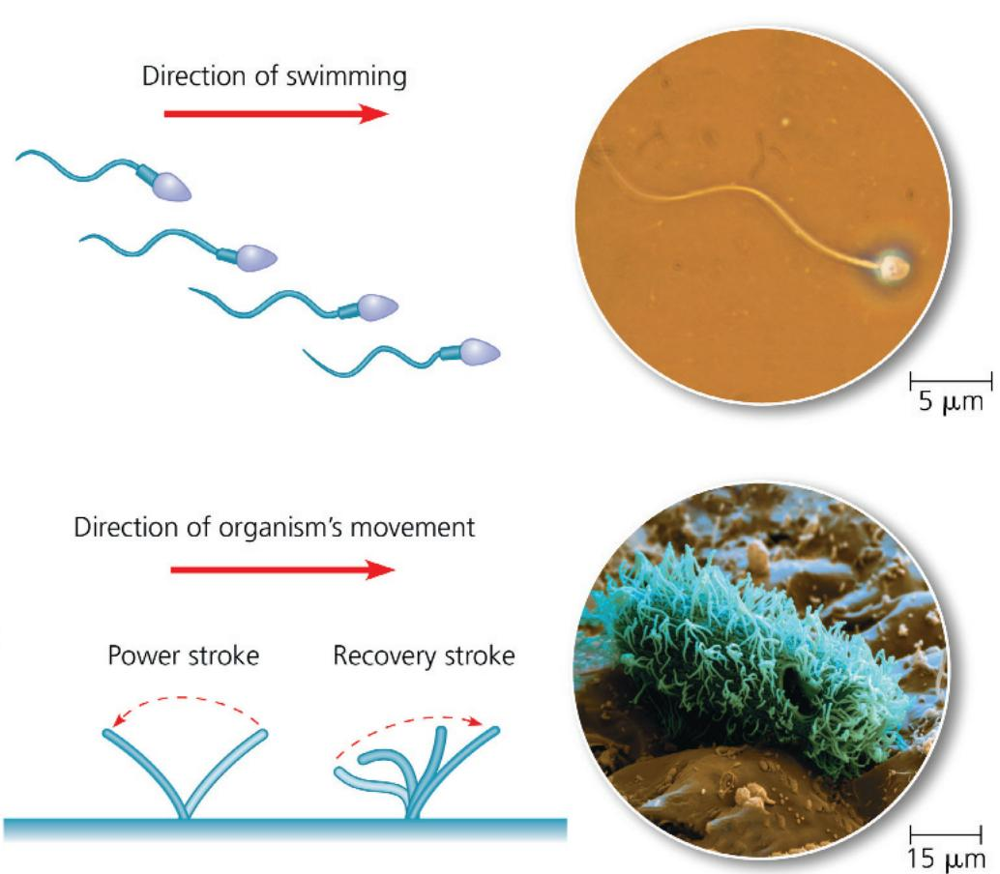

Though different in length, number per cell, and beating pattern, motile cilia and flagella share a common structure. Each motile cilium or flagellum has a group of microtubules sheathed in an extension of the plasma membrane (Figure 6.24a). Nine doublets of microtubules are arranged in a ring with two single microtubules in its center (Figure 6.24b). This arrangement, referred to as the “9 + 2” pattern, is found in nearly all eukaryotic flagella and motile cilia. (Nonmotile primary cilia have a “9 + 0” pattern, lacking the central pair of microtubules.) The microtubule assembly of a cilium or flagellum is anchored in the cell by a basal body, which is structurally very similar to a centriole, with microtubule triplets in a “9 + 0” pattern (Figure 6.24c). In fact, in many animals (including humans), the basal body of the fertilizing sperm’s flagellum enters the egg and becomes a centriole.

How does the microtubule assembly produce the bending movements of flagella and motile cilia? Bending involves large motor proteins called dyneins (red in the diagram in Figure 6.24) that are attached along each outer microtubule doublet. A typical dynein protein has two “feet” that “walk” along the microtubule of the adjacent doublet, using ATP for energy. One foot maintains contact, while the other releases and reattaches one step farther along the microtubule (see Figure 6.21). The outer doublets and two central microtubules are held together by flexible cross-linking proteins (blue in the diagram in Figure 6.24), and the walking movement is coordinated so that it happens on one side of the circle at a time. If the doublets were not held in place, the

walking action would make them slide past each other. Instead, the movements of the dynein feet cause the microtubules—and the organelle as a whole—to bend.

## Microfilaments (Actin Filaments)

Microfilaments are thin solid rods. They are also called actin filaments because they are built from molecules of actin, a globular protein. A microfilament is a twisted double chain of actin subunits (see Table 6.1). Besides occurring as linear filaments, microfilaments can form structural networks when certain proteins bind along the side of such a filament and allow a new filament to extend as a branch. Like microtubules, microfilaments seem to be present in all eukaryotic cells.

In contrast to the compression-resisting role of microtubules, the structural role of microfilaments in the cytoskeleton is to bear tension (pulling forces). A three-dimensional network formed by microfilaments just to the inside of the plasma membrane (cortical microfilaments) helps support the cell's shape (see Figure 6.8). This network gives the outer cytoplasmic layer of a cell, called the cortex, the semisolid consistency of a gel, in contrast with the more fluid state of the interior cytoplasm. In some kinds of animal cells, such as nutrient-absorbing intestinal cells, bundles of microfilaments make up the core of microvilli, delicate projections that increase the cell's surface area (Figure 6.25).

Microfilaments are well known for their role in cell motility. Thousands of actin filaments and thicker filaments made of a

Figure 6.24 Structure of a flagellum or motile cilium.

(a) A longitudinal section of a motile cilium shows microtubules running the length of the membrane-sheathed structure (TEM).

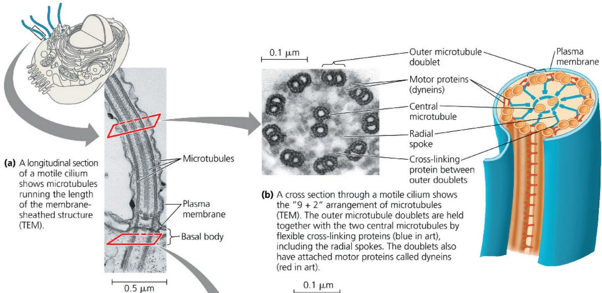  
(b) A cross section through a motile cilium shows the "9 + 2" arrangement of microtubules (TEM). The outer microtubule doublets are held together with the two central microtubules by flexible cross-linking proteins (blue in art), including the radial spokes. The doublets also have attached motor proteins called dyneins (red in art).

(c) Basal body: The nine outer doublets of a cilium or flagellum extend into the basal body, where each doublet joins another microtubule to form a ring of nine triplets. Each triplet is connected to the next by nontubulin proteins (thinner blue lines in diagram). This is a "9 + 0" arrangement: The two central microtubules are not present because they terminate above the basal body (TEM).

  
Cross section of basal body

DRAW IT In (a) and (b), circle and label the central pair of microtubules. In (a), show where they terminate, and explain why they aren't seen in the cross section of the basal body in (c).

For suggested answer, see Appendix A.

Figure 6.25 A structural role of microfilaments.

The surface area of this nutrient-absorbing intestinal cell is increased by its many microvilli (singular, microvillus), cellular extensions reinforced by bundles of microfilaments. These actin filaments are anchored to a network of intermediate filaments (TEM).

protein called myosin interact to cause contraction of muscle cells (Figure 6.26a); muscle contraction is described in detail in Concept 50.5. In the unicellular protist Amoeba and some of our white blood cells, localized contractions brought about by actin and myosin are involved in the amoeboid (crawling) movement of the cells. The cell crawls along a surface by extending cellular extensions called pseudopodia (from the Greek pseudes, false, and pod, foot) and moving toward them (Figure 6.26b). In plant cells, actin-protein interactions contribute to cytoplasmic streaming, a circular flow of cytoplasm within cells (Figure 6.26c). This movement, which is especially common in large plant cells, speeds the movement of organelles and the distribution of materials within the cell.

0.25 μm

Figure 6.26 Microfilaments and motility.

In these three examples, interactions between actin filaments and motor proteins bring about cell movement.

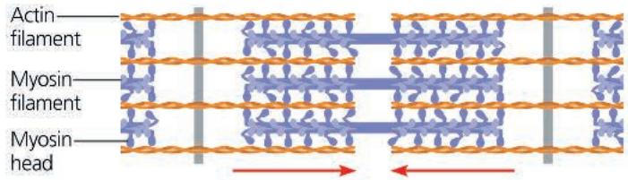  
(a) Myosin motors in muscle cell contraction. The "walking" of myosin projections (the so-called heads) drives the parallel myosin and actin filaments past each other so that the actin filaments approach each other in the middle (red arrows). This shortens the muscle cell. Muscle contraction involves the shortening of many muscle cells at the same time (TEM).

  
(b) Amoeboid movement. Interaction of actin filaments with myosin causes contraction of the cell, pulling the cell's trailing end (at left) forward (to the right) (LM).

  
(c) Cytoplasmic streaming in plant cells. A layer of cytoplasm cycles around the cell, moving over tracks of actin filaments. Myosin motors attached to some organelles drive the streaming by interacting with the actin (LM).  
Interview with Julie Theriot: Studying how bacterial pathogens inside human cells hitch a ride on the cytoskeleton (at the start of Unit 2, before Chapter 6)

## Interview

## Intermediate Filaments

Intermediate filaments are named for their diameter, which is larger than the diameter of microfilaments but smaller than that of microtubules (see Table 6.1). While microtubules and microfilaments are found in all eukaryotic cells, intermediate filaments are only found in the cells of some animals, including vertebrates. Specialized for bearing tension (like microfilaments), intermediate filaments are a diverse class of cytoskeletal elements. Each type is constructed from a particular molecular subunit belonging to a family of proteins whose members include the keratins. Microtubules and microfilaments, in contrast, are consistent in diameter and composition in all eukaryotic cells.

Intermediate filaments are more permanent fixtures of cells than are microfilaments and microtubules, which are often disassembled and reassembled in various parts of a cell. Even after cells die, intermediate filament networks often persist; for example, the outer layer of our skin consists of dead skin cells full of keratin filaments. Intermediate filaments are especially sturdy and play an important role in reinforcing the shape of a cell and fixing the position of certain organelles. For instance, the nucleus typically sits within a cage made of intermediate filaments. Other intermediate filaments make up the nuclear lamina, which lines the interior of the nuclear envelope (see Figure 6.9). In general, the various kinds of intermediate filaments seem to function together as the permanent framework of the entire cell.

## Concept Check 6.6

1. Describe how cilia and flagella bend.

2. WHAT IF? Males who have Kartagener's syndrome are unable to reproduce because of immotile sperm, and they tend to experience lung infections. This condition has a genetic basis. Suggest what the underlying genetic defect might be.

For suggested answers, see Appendix A.

# Concept 6.7: Extracellular components and connections between cells help coordinate cellular activities

Having crisscrossed the cell to explore its inner components, we complete our tour of the cell by returning to the surface of this microscopic world, where there are additional structures with important functions. The plasma membrane is usually regarded as the boundary of the living cell, but most cells synthesize and secrete materials extracellularly (to the outside of the cell). Although these materials and the structures they form are outside the cell, their study is important to cell biology because they are involved in a great many essential cellular functions.

## Cell Walls of Plants

The cell wall is an extracellular structure of plant cells (Figure 6.27). This is one of the features that distinguishes plant cells from animal cells. The wall protects the plant cell, maintains its shape, and prevents excessive uptake of water. At the level of the whole plant, the strong walls of specialized cells hold the plant up against the force of gravity. Prokaryotic organisms, some protists, and fungi also have cell walls, as you saw in Figures 6.5 and 6.8. Those organisms will be discussed in Chapters 27, 28, and 31.

Plant cell walls are much thicker than the plasma membrane, ranging from 0.1 $\mu$ m to several micrometers. The exact chemical composition of the wall varies from species to species and even from one cell type to another in the same plant, but the basic design of the wall is consistent. Microfibrils made of the polysaccharide cellulose (see Figure 5.6) are synthesized by an enzyme called cellulose synthase and secreted to the extracellular space, where they become embedded in a matrix of other polysaccharides and proteins. This combination of materials, strong fibers in a “ground substance” (matrix), is the same basic architectural design found in steel-reinforced concrete and in fiberglass.

A young plant cell first secretes a relatively thin and flexible wall called the primary cell wall (see the micrograph in Figure 6.27). Between primary walls of adjacent cells is the middle lamella, a thin layer rich in sticky polysaccharides called pectins. The middle lamella glues adjacent cells together. (Pectin is used in cooking as a thickening agent in jams and jellies.) When the cell matures and stops growing, it strengthens its wall. Some plant cells do this simply by secreting hardening substances into the primary wall. Other cells add a secondary cell wall between the plasma membrane and the primary wall. The secondary wall, often deposited in several laminated layers, has a strong and durable matrix that affords the cell protection and support. Wood, for example, consists mainly of secondary walls.

## The Extracellular Matrix (ECM) of Animal Cells

Although animal cells lack walls akin to those of plant cells, they do have an elaborate extracellular matrix (ECM). The main ingredients of the ECM are glycoproteins and other carbohydrate-containing molecules secreted by the cells. (Recall that glycoproteins are proteins with covalently bonded carbohydrates.) The most abundant glycoprotein in the ECM of most animal cells is collagen, which forms strong fibers

The drawing shows the relationship between primary and secondary cell walls in several mature plant cells. (Organelles aren't shown because many cells with secondary walls, such as the water-conducting cells, lack organelles.) The TEM shows the cell walls where two cells come together. The multilayered partition between plant cells consists of adjoining walls individually secreted by the cells. Adjacent cells are glued together by a very thin layer called the middle lamella.

outside the cells (see Figure 5.18). In fact, collagen accounts for about 40% of the total protein in the human body. The collagen fibers are embedded in a network woven out of proteoglycans secreted by cells (Figure 6.28). A proteoglycan molecule consists of a small core protein with many carbohydrate chains covalently attached, so that it may be up to 95% carbohydrate. Large proteoglycan complexes can form when hundreds of proteoglycan molecules become noncovalently attached to a single long polysaccharide molecule, as shown in Figure 6.28. Some cells are attached to the ECM by ECM glycoproteins such as fibronectin. Fibronectin and other ECM proteins bind to cell-surface receptor proteins called integrins that are built into the plasma membrane. Integrins span the membrane and bind on their cytoplasmic side to associated proteins attached to microfilaments of the cytoskeleton. The name integrin is based on the word integrate: Integrins are in a position to transmit signals between the ECM and the cytoskeleton and thus to integrate changes occurring outside and inside the cell.

Current research on fibronectin, other ECM molecules, and integrins reveals the influential role of the ECM in the lives of cells. By communicating with a cell through integrins, the ECM can regulate a cell's behavior. For example, some

Figure 6.28 Extracellular matrix (ECM) of an animal cell.

The molecular composition and structure of the ECM vary from one cell type to another. In this example, three different types of ECM molecules are present: collagen, fibronectin, and proteoglycans.

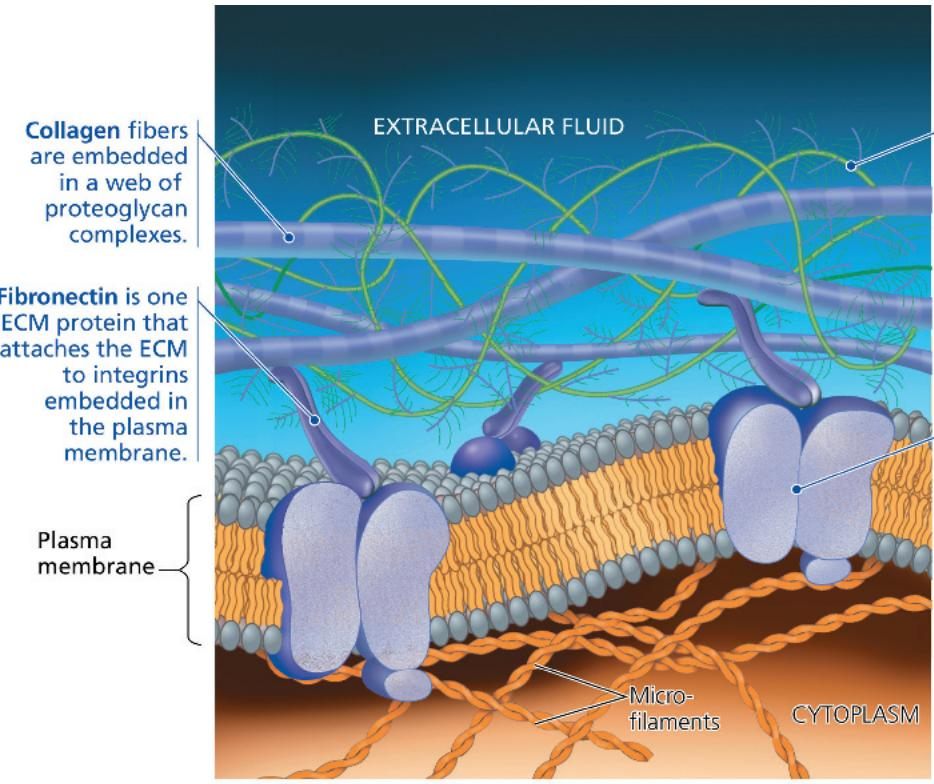

cells in a developing embryo migrate along specific pathways by matching the orientation of their microfilaments to the "grain" of fibers in the extracellular matrix. Researchers have also learned that the extracellular matrix around a cell can influence the activity of genes in the nucleus. Information about the ECM probably reaches the nucleus by a combination of mechanical and chemical signaling pathways. Mechanical signaling involves fibronectin, integrins, and microfilaments of the cytoskeleton. Changes in the cytoskeleton may in turn trigger signaling pathways inside the cell, leading to changes in the set of proteins being made by the cell and therefore changes in the cell's function. In this way, the extracellular matrix of a particular tissue may help coordinate the behavior of all the cells of that tissue. Direct connections between cells also function in this coordination, as we'll explore next.

## Cell Junctions

Cells in an animal or plant are organized into tissues, organs, and organ systems. Neighboring cells often adhere, interact, and communicate via sites of direct physical contact.

## Plasmodesmata in Plant Cells

It might seem that the nonliving cell walls of plants would isolate plant cells from one another. But in fact, as shown in Figure 6.29, many plant cell walls have plasmodesmata (singular, plasmodesma; from the Greek desma, bond), channels that

A proteoglycan complex consists of hundreds of proteoglycan molecules attached noncovalently to a single long polysaccharide molecule.

Integrins, membrane proteins with two subunits, bind to the ECM on the outside and to associated proteins attached to microfilaments on the inside. This linkage can transmit signals between the cell's external environment and its interior and can result in changes in cell behavior.

  
Proteoglycan complex

connect cells, extending through them. The plasma membranes of adjacent cells line the channel of each plasmodesma and thus are continuous. Because the channels are filled with cytosol, the cells share the same internal chemical environment. By joining adjacent cells, plasmodesmata unify most of the plant into one living continuum. Water and small solutes can pass freely from cell to cell, and several experiments have shown that in some circumstances, certain proteins and RNA molecules can do this as well (see Concept 36.6). The macromolecules transported to neighboring cells appear to reach the plasmodesmata by moving along fibers of the cytoskeleton.

Figure 6.29 Plasmodesmata between plant cells.

The cytoplasm of one plant cell is continuous with the cytoplasm of its neighbors via plasmodesmata, cytoplasmic channels through the cell walls (TEM).

## Tight Junctions, Desmosomes, and Gap Junctions in Animal Cells

In animals, there are three main types of cell junctions: tight junctions, desmosomes, and gap junctions. (Gap junctions are most like the plasmodesmata of plants, although gap junction pores are not lined with membrane—rather, they consist of proteins extending from each cell's membrane that form a connecting pore.) All three types of cell junctions are especially common in epithelial tissue, which lines the external and internal surfaces of the body. Figure 6.30 uses epithelial cells of the intestinal lining to illustrate these junctions.

## Concept Check 6.7

1. In what way are the cells of plants and animals structurally different from single-celled eukaryotes?

2. WHAT IF? If the plant cell wall or the animal extracellular matrix were impermeable, what effect would this have on cell function?

3. MAKE CONNECTIONS The polypeptide chain that makes up a tight junction weaves back and forth through the membrane four times, with two extracellular loops and one loop plus short C-terminal and N-terminal tails in the cytoplasm. Looking at Figure 5.14, what would you predict about the amino acid sequence of the tight junction protein?

For suggested answers, see Appendix A.

## Exploring Cell Junctions in Animal Tissues

Figure 6.30  

## Tight Junctions

At tight junctions, the plasma membranes of neighboring cells are very tightly pressed against each other, bound together by specific proteins. Forming continuous seals around the cells, tight junctions establish a barrier that prevents leakage of extracellular fluid across a layer of epithelial cells (see red dashed arrow). For example, tight junctions between skin cells make us watertight.

## Desmosomes

Desmosomes (one type of anchoring junction) function like rivets, fastening cells together into strong sheets. Intermediate filaments made of sturdy keratin proteins anchor desmosomes in the cytoplasm. Desmosomes attach muscle cells to each other in a muscle. Some “muscle tears” involve the rupture of desmosomes.

## Gap Junctions

Gap junctions (also called communicating junctions) provide cytoplasmic channels from one cell to an adjacent cell and in this way are similar in their function to the plasmodesmata in plants. Gap junctions consist of membrane proteins extending from the membranes of the two cells. These proteins create pores through which ions, sugars, amino acids, and other small molecules may pass. Gap junctions are necessary for communication between cells in many types of tissues, such as heart muscle, and in animal embryos.

Figure 6.31 Coordination of activities in a cell. The ability of this macrophage to recognize, apprehend, and destroy bacteria involves coordination among components such as the cytoskeleton, lysosomes, and plasma membrane (colorized SEM).  

## Concept 6.8: A cell is greater than the sum of its parts

From our panoramic view of the cell's compartmental organization to our close-up inspection of each organelle's architecture, this tour of the cell has shown the correlation of structure with function. (See Figure 6.8 to review cell structure.)

Remember that none of a cell's components work alone. For example, consider the microscopic scene in Figure 6.31. The large cell is a macrophage (see Figure 6.13a). It helps defend the mammalian body against infections by ingesting bacteria (the smaller cells) into phagocytic vesicles. The macrophage crawls along a surface and reaches out to the bacteria with thin pseudopodia (specifically, filopodia). Actin filaments interact with other elements of the cytoskeleton in these movements. After the macrophage engulfs the bacteria, they are destroyed by lysosomes produced by the elaborate endomembrane system. The digestive enzymes of the lysosomes and the proteins of the cytoskeleton are all made by ribosomes. And the synthesis of these proteins is programmed by genetic messages dispatched from the DNA in the nucleus. All these processes require energy, which mitochondria supply in the form of ATP.

Cellular functions arise from cellular order: The cell is a living unit greater than the sum of its parts. The cell in Figure 6.31 is a good example of integration of cellular processes, seen from the outside. But what about the internal organization of a cell? As you proceed in your study of biology to consider different cellular processes, it will be helpful to try to visualize the architecture and furnishings inside a cell. Figure 6.32, on the next two pages, is designed to introduce you to some important biological molecules and structures and to help you get a sense of their relative sizes and organization in the context of other cellular components. As you study this figure, see if you can mentally shrink yourself down to the size of a protein and contemplate your surroundings.

## Concept Check 6.8

1. Colpidium colpoda is a unicellular protist that lives in freshwater, eats bacteria, and moves by cilia (see Figure 6.23b). Describe how the parts of this cell work together in the functioning of C. colpoda, including as many organelles and other cell structures as you can.

For suggested answer, see Appendix A.

## Chapter 6 Review

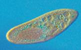

## Summary of Key Concepts

To review key terms, go to the Vocabulary Self-Quiz (eTextbook only).

## Concept 6.1: Biologists use microscopes and biochemistry to study cells

\- Improvements in microscopy that affect the parameters of magnification, resolution, and contrast have catalyzed progress in the study of cell structure. Light microscopy (LM) and electron microscopy (EM), as well as other types, remain important tools.

\- Cell biologists can obtain pellets enriched in particular cellular components by centrifuging disrupted cells at sequential speeds, a process known as cell fractionation.

How do microscopy and biochemistry complement each other to reveal cell structure and function?

## Concept 6.2: Eukaryotic cells have internal membranes that compartmentalize their functions

\- All cells are bounded by a plasma membrane.

\- Prokaryotic cells lack nuclei and other membrane-enclosed organelles, while eukaryotic cells have internal membranes that compartmentalize cellular functions.

\- The surface-to-volume ratio is an important parameter affecting cell size and shape.

\- Plant and animal cells have most of the same organelles: a nucleus, endoplasmic reticulum, Golgi apparatus, and mitochondria. Chloroplasts are present only in cells of photosynthetic eukaryotes.

Explain how the compartmental organization of a eukaryotic cell contributes to its biochemical functioning.

# Visualizing the Scale of the Molecular Machinery in a Cell

## Figure 6.32

\- A slice of a plant cell's interior is illustrated in the center panel, with all structures and molecules drawn to scale. Selected molecules and structures are shown above and below, all enlarged by the same factor so you can compare their sizes. All protein and nucleic acid structures are based on data from the Protein Data Bank; regions whose structure has not yet been determined are shown in gray.

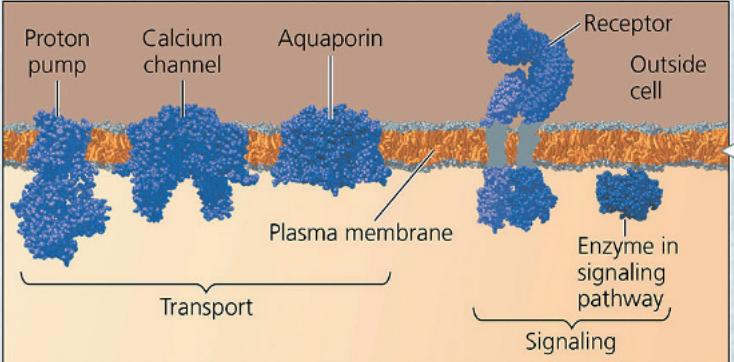

This figure introduces a cast of characters that you will learn more about as you study biology. Refer back to this figure as you encounter these molecules in your studies.

(a) Membrane proteins (Chapter 7)
Proteins embedded in cellular membranes help transport substances and conduct signals across membranes. They also participate in other crucial cellular functions. Many proteins are able to move within the membrane.

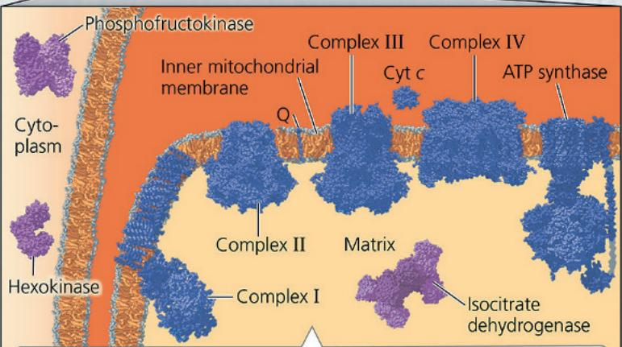

(b) Cellular respiration (Chapter 9) Cellular respiration, a multi-step process, generates ATP from food molecules. The first two stages are carried out by enzymes in the cytoplasm and mitochondrial matrix; a few of these enzymes (pinkish-purple) are shown. The final stage is carried out by proteins (bluish-purple) that form a "chain" in the inner mitochondrial membrane.

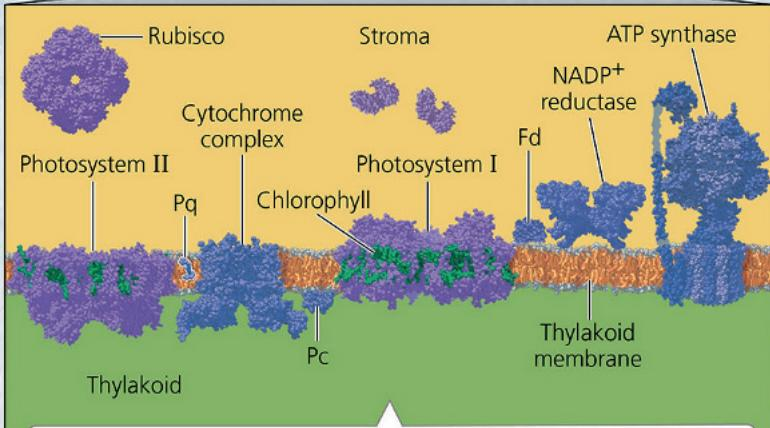

(c) Photosynthesis (Chapter 10) Photosynthesis produces sugars that provide food for all life on the planet. The process begins with large complexes of proteins and chlorophyll (green) embedded in the thylakoid membranes. These complexes trap light energy in molecules that are used by rubisco and other proteins in the stroma to make sugars.

(d) Transcription (Chapter 17) In the nucleus, the information contained in a DNA sequence is transferred to messenger RNA (mRNA) by an enzyme called RNA polymerase. After their synthesis, mRNA molecules leave the nucleus via nuclear pores.

(f) Translation (Chapter 17) In the cytoplasm, the information in mRNA is used to assemble a polypeptide with a specific sequence of amino acids. Both transfer RNA (tRNA) molecules and ribosomes play a role. The eukaryotic ribosome, which includes a large subunit and a small subunit, is a colossal complex composed of four large ribosomal RNA (rRNA) molecules and more than 80 proteins. Through transcription and translation, the nucleotide sequence of DNA in a gene determines the amino acid sequence of a polypeptide, via the intermediary mRNA

## (e) Nuclear pore (Concept 6.3) The

nuclear pore complex regulates molecular traffic in and out of the nucleus, which is bounded by a double membrane. Among the largest structures that pass through the pore are the ribosomal subunits, which are built in the nucleus.

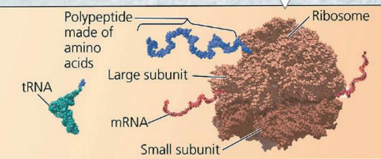

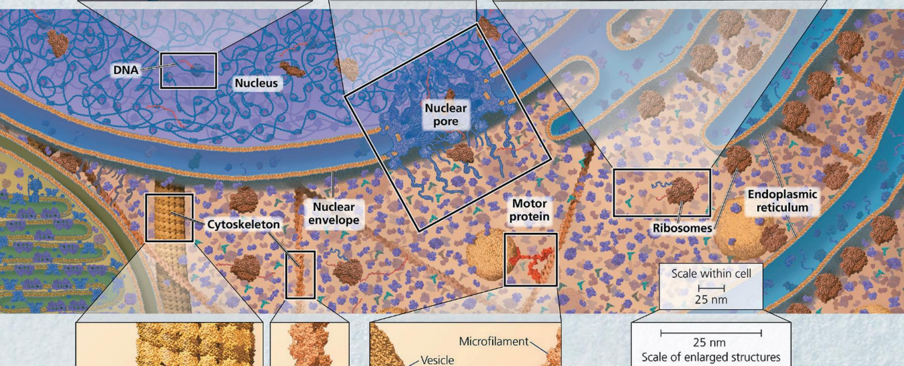

## (g) Cytoskeleton (Concept 6.6)

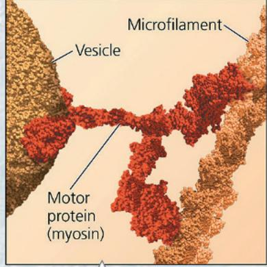

Cytoskeletal structures are polymers of protein subunits. Microtubules are hollow structural rods made of tubulin protein subunits, while microfilaments are cables that have two chains of actin proteins wound around each other.

## (h) Motor proteins

(Concept 6.6) Motor proteins, such as myosin, are responsible for transport of vesicles and movement of organelles within the cell.

1. List the following structures from largest to smallest: proton pump, nuclear pore, cyt c, ribosome.

2. Considering the structures of a nucleosome and of RNA polymerase, speculate about what must happen before RNA polymerase can transcribe the DNA that is wrapped around the histone proteins of a nucleosome.

3. Find another myosin motor protein walking on a microfilament in this figure. What organelle is being moved by that myosin protein?

Instructors: Additional questions related to this Visualizing Figure can be assigned in Mastering Biology. For suggested answers, see Appendix A.

<table><tr><td></td><td>Cell Component</td><td>Structure</td><td>Function</td></tr><tr><td rowspan="2">CONCEPT 6.3The eukaryotic cell&#x27;s genetic instructions are housed in the nucleus and carried out by the ribosomes?Describe the relationship between the nucleus and ribosomes.</td><td>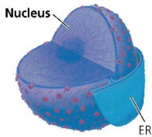</td><td>Surrounded by nuclear envelope (double membrane) perforated by nuclear pores; nuclear envelope is continuous with endoplasmic reticulum (ER)</td><td>Houses chromosomes, which are made of chromatin (DNA and proteins); contains nucleoli, where ribosomal subunits are made; pores regulate entry and exit of materials</td></tr><tr><td>Ribosome</td><td>Two subunits made of ribosomal RNAs and proteins; can be free in cytosol or bound to ER</td><td>Protein synthesis</td></tr><tr><td rowspan="4">CONCEPT 6.4The endomembrane system regulates protein traffic and performs metabolic functions?Describe the key role played by transport vesicles in the endomembrane system.</td><td>Endoplasmic reticulum (ER)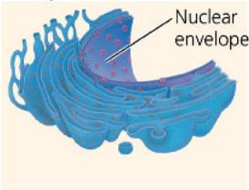</td><td>Extensive network of membrane-bounded tubules and sacs; ER membrane separates lumen from cytosol and is continuous with nuclear envelope</td><td>Smooth ER:synthesis of lipids, metabolism of carbohydrates, storage of calcium ions, detoxification of drugs and poisonsRough ER:aids in synthesis of secretory and other proteins on bound ribosomes; adds carbohydrates to proteins to make glycoproteins; produces new membrane</td></tr><tr><td>Golgi apparatus</td><td>Stacks of flattened membranous sacs; has polarity (cis and trans faces)</td><td>Modification of proteins, carbohydrates on proteins, and phospho-lipids; synthesis of many polysaccharides; sorting of Golgi products, which are then released in vesicles</td></tr><tr><td>Lysosome</td><td>Membranous sac of hydrolytic enzymes (in animal cells)</td><td>Breakdown of ingested substances, cell macromolecules, and damaged organelles for recycling</td></tr><tr><td>Vacuole</td><td>Large membrane-bounded vesicle</td><td>Digestion, storage, waste disposal, water balance, cell growth, and protection</td></tr><tr><td rowspan="3">CONCEPT 6.5Mitochondria and chloroplasts change energy from one form to another?What does the endosymbiont theory propose as the origin for mitochondria and chloroplasts?Explain.</td><td>Mitochondrion</td><td>Bounded by double membrane; inner membrane has infoldings</td><td>Cellular respiration</td></tr><tr><td>Chloroplast</td><td>Typically two membranes around fluid stroma, which contains thylakoids stacked into grana</td><td>Photosynthesis (chloroplasts are present in cells of photosynthetic eukaryotes, including plants)</td></tr><tr><td></td><td>Specialized metabolic compartment bounded by a single membrane</td><td>Contains enzymes that transfer H atoms from substrates to oxygen, producing  $H_2O_2$  (hydrogen peroxide), which is converted to  $H_2O_2$ </td></tr></table>

## Concept 6.6: The cytoskeleton is a network of fibers that organizes structures and activities in the cell

\- The cytoskeleton functions in structural support for the cell and in motility and signal transmission.

\- Microtubules shape the cell, guide organelle movement, and separate chromosomes in dividing cells. Cilia and flagella are motile appendages containing microtubules. Primary cilia also play sensory and signaling roles. Microfilaments are thin rods that function in muscle contraction, amoeboid movement, cytoplasmic streaming, and support of microvilli. Intermediate filaments support cell shape and fix organelles in place.

Describe the role of motor proteins inside the eukaryotic cell and in whole-cell movement.

## Concept 6.7: Extracellular components and connections between cells help coordinate cellular activities

\- Plant cell walls are made of cellulose fibers embedded in other polysaccharides and proteins.

\- Animal cells secrete glycoproteins and proteoglycans that form the extracellular matrix (ECM), which functions in support, adhesion, movement, and regulation.

\- Cell junctions connect neighboring cells. Plants have plasmodes-mata that pass through adjoining cell walls. Animal cells have tight junctions, desmosomes, and gap junctions.

Compare the structure and functions of a plant cell wall and the extracellular matrix of an animal cell.

## Concept 6.8: A cell is greater than the sum of its parts

Many components work together in a functioning cell. When a cell ingests a bacterium, what role does the nucleus play? For suggested answers, see Appendix A.

## Test Your Understanding

For more multiple-choice questions, go to the Practice Test (eTextbook only).

## Levels 1-2: Remembering/Understanding

1. Which structure is part of the endomembrane system? (A) mitochondrion (B) Golgi apparatus (C) chloroplast (D) centrosome

2. Which structure is common to plant and animal cells?
(A) chloroplast
(B) central vacuole
(C) mitochondrion
(D) centriole

3. Which of the following is present in a prokaryotic cell?
(A) mitochondrion
(B) ribosome
(C) nuclear envelope
(D) chloroplast

## Levels 3-4: Applying/Analyzing

4. Cyanide binds to at least one molecule involved in producing ATP. In a cell exposed to cyanide, most of the cyanide will be in
(A) mitochondria.
(B) ribosomes.
(C) peroxisomes.
(D) lysosomes.

5. Which cell would be best for studying lysosomes?
(A) muscle cell
(B) nerve cell
(C) bacterial cell
(D) phagocytic white blood cell

6. DRAW IT Draw two eukaryotic cells. Label the structures listed here and show any physical connections between the structures of each cell: nucleus, rough ER, smooth ER, mitochondrion, centrosome, chloroplast, vacuole, lysosome, microtubule, cell wall, ECM, microfilament, Golgi apparatus, intermediate filament, plasma membrane, peroxisome, ribosome, nucleolus, nuclear pore, vesicle, flagellum, microvilli, plasmodesma.

## Levels 5-6: Evaluating/Creating

7. EVOLUTION CONNECTION (a) What cell structures best reveal evolutionary unity? (b) Give an example of diversity related to specialized cellular modifications.

8. SCIENTIFIC INQUIRY Imagine protein X, destined to span the plasma membrane; assume the mRNA carrying the genetic message for protein X has been translated by ribosomes in a cell culture. If you fractionate the cells (see Figure 6.4), in which fraction would you find protein X? Explain by describing its transit.

9. WRITE ABOUT A THEME: ORGANIZATION Write a short essay (100–150 words) on this topic: Life is an emergent property that appears at the level of the cell. (See Concept 1.1.)

10. SYNTHESIZE YOUR KNOWLEDGE

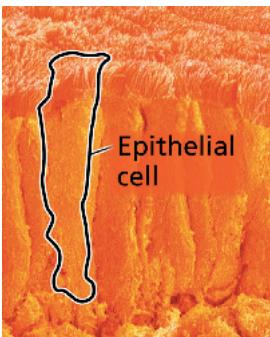  
For selected answers, see Appendix A.

The cells in this SEM are epithelial cells from the small intestine. Discuss how their cellular structure contributes to their specialized functions of nutrient absorption and as a barrier between the intestinal contents and the blood supply on the other side of the sheet of epithelial cells.

# Explore Scientific Papers with Science in the Classroom | AAAS

How do actin networks affect myosin motors? Go to “Fussy about Filaments” at www.scienceintheclassroom.org.

Instructors: Questions can be assigned in Mastering Biology.

# Membrane Structure and Function

## Key Concepts

7.1 Cellular membranes are fluid mosaics of lipids and proteins

7.2 Membrane structure results in selective permeability

7.3 Passive transport is diffusion of a substance across a membrane with no energy investment

7.4 Active transport uses energy to move solutes against their gradients

7.5 Bulk transport across the plasma membrane occurs by exocytosis and endocytosis

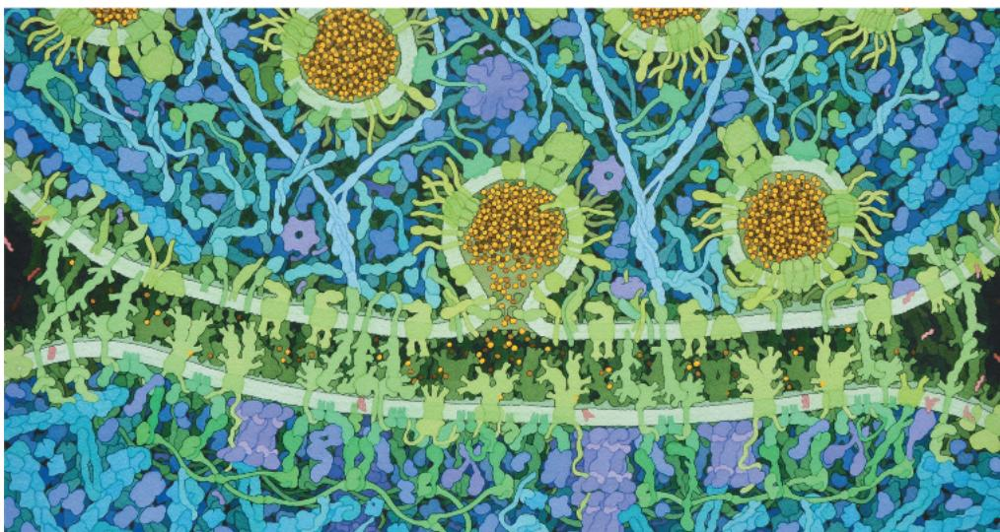

## Study Tip

Make a visual study guide: Draw a plasma membrane (two lines) all the way down a piece of paper (or digitally). Label the cytoplasm and the extracellular fluid. At the top, draw the phospholipid bilayer in detail. As you read the chapter, draw and label membrane proteins that you encounter and diagram the different ways materials can enter or leave a cell.

  
Figure 7.1 Successful learning relies on communication between brain cells. Here, the vesicles fusing with the plasma membrane of the top cell release molecules (yellow) that bind to membrane proteins (light green) on the surface of the bottom cell, triggering the proteins to change shape. The plasma membrane that surrounds each cell regulates its exchanges with its environment and surrounding cells.

## How does the plasma membrane regulate inbound and outbound traffic?

  
Active transport of small molecules requires energy and a transport protein.

# Concept 7.1: Cellular membranes are fluid mosaics of lipids and proteins

Lipids and proteins are the staple ingredients of membranes, although carbohydrates are also important. The most abundant lipids in most membranes are phospholipids. Their ability to form membranes is inherent in their molecular structure. A phospholipid is an amphipathic molecule, meaning it has both a hydrophilic (“water-loving”) region and a hydrophobic (“water-fearing”) region (see Figure 5.11). A phospholipid bilayer can exist as a stable boundary between two aqueous compartments because the molecular arrangement shelters the hydrophobic tails of the phospholipids from water while exposing the hydrophilic heads to water (Figure 7.2).

Like membrane lipids, most membrane proteins are amphipathic. Such proteins can reside in the phospholipid bilayer with their hydrophilic regions protruding. This molecular orientation maximizes contact of hydrophilic regions of a protein with water in the cytosol and extracellular fluid, while providing their hydrophobic parts

with a nonaqueous environment. Figure 7.3 shows the currently accepted model of the arrangement of

Figure 7.2 Phospholipid bilayer (cross section).  
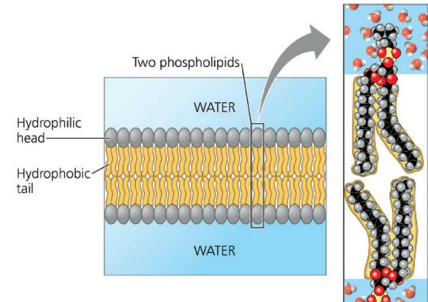

VISUAL SKILLS Consulting Figure 5.11, circle and label the hydrophilic and hydrophobic portions of the enlarged phospholipids on the right. Explain what each portion contacts when the phospholipids are in the plasma membrane. For suggested answer, see Appendix A.

Figure 7.3 Current model of an animal cell's plasma membrane (cutaway view). Lipids are colored gray and gold, proteins purple, and carbohydrates green.  

molecules in the plasma membrane. In this fluid mosaic model, the membrane is a mosaic of protein molecules bobbing in a fluid bilayer of phospholipids.

The proteins are not randomly distributed in the membrane, however. Groups of proteins are often associated in long-lasting, specialized patches, where they carry out common functions. Researchers have found specific lipids in these patches as well and have proposed naming them lipid rafts; however, the debate continues about whether such structures exist in living cells or are an artifact of biochemical techniques. In some regions, the membrane may be much more tightly packed with proteins than shown in Figure 7.3. Like all models, the fluid mosaic model is continually being refined as new research reveals more about membrane structure.

## The Fluidity of Membranes

Membranes are not static sheets of molecules locked rigidly in place. A membrane is held together mainly by hydrophobic interactions, which are much weaker than covalent bonds (see Figure 5.18). Most of the lipids and some proteins can shift about sideways—that is, in the plane of the membrane, like partygoers elbowing their way through a crowded room. Very rarely, also, a lipid may flip-flop across the membrane, switching from one phospholipid layer to the other.

The sideways movement of phospholipids within the membrane is rapid. Adjacent phospholipids switch positions about $10^{7}$ times per second, which means that a phospholipid can travel about 2 $\mu$ m—the length of a typical bacterial cell—in 1 second. Proteins are much larger than lipids and move more slowly, when they do move. Many membrane proteins seem to be held immobile by their attachment to the cytoskeleton or to the extracellular matrix (see Figure 7.3). Some membrane proteins seem to move in a highly directed manner, perhaps driven along cytoskeletal fibers by motor proteins. And other proteins simply drift in the membrane, as shown the classic experiment described in Figure 7.4.

A membrane remains fluid as temperature decreases until the phospholipids settle into a closely packed arrangement and the membrane solidifies, much as bacon grease forms lard when it cools. The temperature at which a membrane solidifies depends on the types of lipids it is made of. As the temperature decreases, the membrane remains fluid to a lower temperature if it is rich in phospholipids with unsaturated hydrocarbon tails (see Figures 5.10 and 5.11). Because of kinks in the tails where double bonds are located, unsaturated hydrocarbon tails cannot pack together as closely as saturated hydrocarbon tails, making the membrane more fluid (Figure 7.5a).

The steroid cholesterol, which is wedged between phospholipid molecules in the plasma membranes of animal cells, has different effects on membrane fluidity at different temperatures (Figure 7.5b). At relatively high temperatures—at $37^{\circ}$ C, the body temperature of humans, for example—cholesterol makes the membrane less fluid by restraining phospholipid movement. However, because cholesterol also hinders the close packing of phospholipids, it lowers the temperature required for the membrane to solidify. Thus, cholesterol can be thought of as a “fluidity buffer” for the membrane, resisting changes in membrane fluidity that can be caused by changes in temperature. Compared to animals, plants have very low levels of cholesterol; rather, related steroid lipids buffer membrane fluidity in plant cells.

## Figure 7.4

## Inquiry: Do membrane proteins move? Experiment

Larry Frye and Michael Edidin, at Johns Hopkins University, labeled the plasma membrane proteins of a mouse cell and a human cell with two different markers and fused the cells. Using a microscope, they observed the markers on the hybrid cell.

## Results

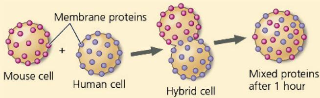

## Conclusion

The mixing of the mouse and human membrane proteins indicates that at least some membrane proteins move sideways within the plane of the plasma membrane.

Data from L. D. Frye and M. Edidin, The rapid intermixing of cell surface antigens after formation of mouse-human heterokaryons, Journal of Cell Science 7:319 (1970).

WHAT IF? Suppose the proteins did not mix in the hybrid cell, even many hours after fusion. Could you conclude that proteins don't move within the membrane? What other explanation could there be?

For suggested answer, see Appendix A.

Figure 7.5 Factors that affect membrane fluidity.  
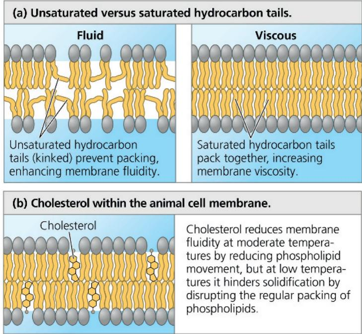

Membranes must be fluid to work properly; the fluidity of a membrane affects both its permeability and the ability of membrane proteins to move to where their function is needed. Usually, membranes are about as fluid as olive oil. When a membrane solidifies, its permeability changes, and enzymatic proteins in the membrane may become inactive if their activity requires movement within the membrane. However, membranes that are too fluid cannot support protein function either. Therefore, extreme environments (for example, those with extreme temperatures) pose a challenge for life, resulting in evolutionary adaptations that include differences in membrane lipid composition.

## Evolution of Differences in Membrane Lipid Composition

EVOLUTION Variations in the cell membrane lipid compositions of many species appear to be evolutionary adaptations that maintain the appropriate membrane fluidity under specific environmental conditions. For instance, fishes that live in extreme cold have membranes with a high proportion of unsaturated hydrocarbon tails, enabling their membranes to remain fluid in spite of the low temperature (see Figure 7.5a). At the other extreme, some bacteria and archaea thrive at temperatures greater than 90°C (194°F) in thermal hot springs and geysers. Their membranes include unusual lipids that may prevent excessive fluidity at such high temperatures.

The ability to change the lipid composition of cell membranes in response to changing temperatures has evolved in organisms that live where temperatures vary. In many plants that tolerate extreme cold, such as winter wheat, the percentage of unsaturated phospholipids increases in autumn, an adjustment that keeps the membranes from solidifying during winter. Some bacteria and archaea also exhibit different proportions of unsaturated phospholipids in their cell membranes, depending on the temperature at which they are growing. Overall, natural selection has apparently favored organisms whose mix of membrane lipids ensures an appropriate level of membrane fluidity for their environment.

## Membrane Proteins and Their Functions

Now we come to the mosaic aspect of the fluid mosaic model. Somewhat like a tile mosaic (shown here), a membrane is a col-

Tile mosaic.

lage of different proteins, often clustered together in groups, embedded in the fluid matrix of the lipid bilayer (see Figure 7.3). More than 50 kinds of proteins have been found in the plasma membrane of red blood cells, for example. Phospholipids form the main fabric of the membrane, but proteins determine most of the membrane's functions. Different types of cells contain different sets of membrane proteins, and the

## Figure 7.6 The structure of a transmembrane protein.

Bacteriorhodopsin (a bacterial transport protein) has a distinct orientation in the membrane, with its N-terminus outside the cell and its C-terminus inside. This ribbon model highlights the secondary structure of the hydrophobic parts, including seven transmembrane $\alpha$ helices, which lie mostly within the hydrophobic interior of the membrane. The nonhelical hydrophilic segments are in contact with the aqueous solutions on the extracellular and cytoplasmic sides of the membrane.

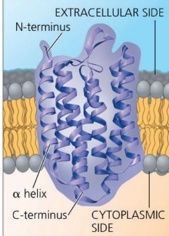

various membranes within a cell each have a unique collection of proteins.

Notice in Figure 7.3 that there are two major populations of membrane proteins: integral proteins and peripheral proteins. Integral proteins penetrate the hydrophobic interior of the lipid bilayer. The majority are transmembrane proteins, which span the membrane; other integral proteins extend only partway into the hydrophobic interior. The hydrophobic regions of an integral protein consist of one or more stretches of nonpolar amino acids (see Figure 5.14), typically 20–30 amino acids in length, usually coiled into $\alpha$ helices (Figure 7.6). The hydrophilic parts of the molecule are exposed to the aqueous solutions on either side of the membrane. Some proteins also have one or more hydrophilic channels that allow passage through the membrane of hydrophilic substances (even of water itself). Peripheral proteins are not embedded in the lipid bilayer at all; they are loosely bound to the surface of the membrane, often to exposed parts of integral proteins (see Figure 7.3).

On the cytoplasmic side of the plasma membrane, some membrane proteins are held in place by attachment to the cytoskeleton. And on the extracellular side, certain membrane proteins may attach to materials outside the cell. For example, in animal cells, membrane proteins may be attached to fibers of the extracellular matrix (see Figure 6.28; integrins are one type of integral, transmembrane protein). These attachments combine to give animal cells a stronger framework than the plasma membrane alone could provide.

Figure 7.7 illustrates six major functions performed by proteins of the plasma membrane. A single cell may have different membrane proteins that carry out various functions, and one protein may itself carry out multiple functions. Thus, the membrane is a functional mosaic as well as a structural one.

Proteins on a cell's surface are important in the medical field. For example, a protein called CD4 on the surface of immune cells helps the human immunodeficiency virus (HIV) infect these cells, leading to acquired immune deficiency syndrome (AIDS). Despite multiple exposures to HIV, however, a small number of people do not develop AIDS and show no

(a) Transport. Left: A protein that spans the membrane may provide a hydrophilic channel across the membrane that is selective for a particular solute (see Figures 6.32a and 7.15a). Right: Other transport proteins shuttle a substance from one side to the other by changing shape (see Figure 7.15b). Some of these proteins hydrolyze ATP as an energy source to actively pump substances across the membrane.

Figure 7.7 Some functions of membrane proteins. In many cases, a single protein performs multiple tasks.  
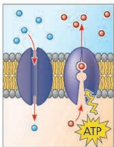

(b) Enzymatic activity. A protein built into the membrane may be an enzyme with its active site (where the reactant binds) exposed to substances in the adjacent solution. In some cases, several enzymes in a membrane are organized as a team that carries out sequential steps of a metabolic pathway.

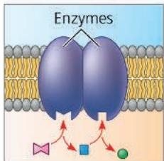

(c) Signal transduction. A membrane protein (receptor) may have a binding site with a specific shape that fits the shape of a chemical messenger, such as a hormone. The external messenger (signaling molecule) may cause the protein to change shape, allowing it to relay the message to the inside of the cell, usually by binding to a cytoplasmic protein (see Figures 6.32a and 11.6).

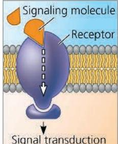

(d) Cell-cell recognition. Some glyco-proteins serve as identification tags that are specifically recognized by membrane proteins of other cells. This type of cell-cell binding is usually short-lived compared with that shown in (e).

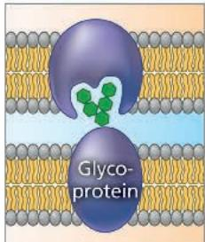

(e) Intercellular joining. Membrane proteins of adjacent cells may hook together in various kinds of junctions, such as gap junctions or tight junctions (see Figure 6.30). This type of binding is more long-lasting than that shown in (d).

(f) Attachment to the cytoskeleton and extracellular matrix (ECM).
Microfilaments or other elements of the cytoskeleton may be noncovalently bound to membrane proteins, a function that helps maintain cell shape and stabilizes the location of certain membrane proteins. Proteins that can bind to ECM molecules can coordinate extracellular and intracellular changes (see Figure 6.28).

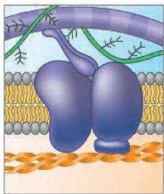  
MAKE CONNECTIONS Study Figures 2.16 and 5.17; each shows pairs of molecules binding to each other. What would you predict about CCR5 that would allow HIV to bind to it? How could a drug molecule interfere with this binding? For suggested answer, see Appendix A.

VISUAL SKILLS Some transmembrane proteins can bind to a particular ECM molecule and, when bound, transmit a signal into the cell. Use the proteins shown in (c) and (f) to explain how this might occur.
For suggested answer, see Appendix A.

Figure 7.8 The genetic basis for HIV resistance.  
  
(a) Some strains of HIV can infect a cell with CCR5 on its surface, as in most people.  
(b) These strains of HIV cannot infect a cell lacking CCR5 on its surface, as in resistant individuals.

evidence of HIV-infected cells. Comparing their genes with the genes of infected individuals, researchers learned that resistant people have an unusual form of a gene that codes for an immune cell-surface protein called CCR5. Further work showed that although CD4 is the main HIV receptor, HIV must also bind to a “co-receptor,” in most cases CCR5 or another protein called CXCR4, depending on the strain of HIV (Figure 7.8a). An absence of CCR5 on the cells of resistant individuals, due to the gene alteration, prevents the strains of the virus that use CCR5 from entering the cells (Figure 7.8b).

This information has been key to developing a treatment for HIV infection. Interfering with CD4 causes dangerous side effects because of its many important functions in cells. Discovery of the CCR5 co-receptor provided a safer target for development of drugs that mask this protein and block HIV entry. One such drug, maraviroc (brand name Selzentry), has been approved for treatment of HIV in patients whose HIV strains use CCR5 as a co-receptor.

## The Role of Membrane Carbohydrates in Cell-Cell Recognition

Cell-cell recognition, a cell's ability to distinguish one type of neighboring cell from another, is crucial to the functioning of an organism. It is important, for example, in the sorting of cells into tissues and organs in an animal embryo. It is also the basis for the rejection of foreign cells by the immune system, an important line of defense in vertebrate animals (see Concept 43.1). Cells recognize other cells by binding to molecules, often containing carbohydrates, on the extracellular surface of the plasma membrane (see Figure 7.7d).

Membrane carbohydrates are usually short, branched chains of fewer than 15 sugar units. Some are covalently bonded to lipids, forming molecules called glycolipids.

(Recall that glyco refers to carbohydrate.) However, most are covalently bonded to proteins, which are thereby glycoproteins (see Figure 7.3).

The carbohydrates on the extracellular side of the plasma membrane vary from species to species, among individuals of the same species, and even from one cell type to another in a single individual. The diversity of the molecules and their location on the cell's surface enable membrane carbohydrates to function as markers that distinguish one cell from another. For example, the four human blood types designated A, B, AB, and O reflect variation in the carbohydrate part of glycoproteins on the surface of red blood cells.

## Concept Check 7.1

1. VISUAL SKILLS Carbohydrates are attached to plasma membrane proteins in the ER (see Figure 7.9). On which side of the vesicle membrane are the carbohydrates during transport to the cell surface?

2. WHAT IF? How might the membrane lipid composition of a native grass found in very warm soil around hot springs differ from that of a native grass found in cooler soil? Explain.

For suggested answers, see Appendix A.

## Synthesis and Sidedness of Membranes

Membranes have distinct inside and outside faces. The two lipid layers may differ in lipid composition, and each protein has directional orientation in the membrane (see Figure 7.6). Figure 7.9 shows how membrane sidedness arises: The asymmetrical arrangement of proteins, lipids, and their associated carbohydrates in the plasma membrane is determined as the membrane is being built.

## Concept 7.2: Membrane structure results in selective permeability

The biological membrane has emergent properties beyond those of the many individual molecules that make it up. The remainder of this chapter focuses on one of those properties: A membrane exhibits selective permeability; that is, it allows some substances to cross more easily than others. The ability to regulate transport

Figure 7.9 Synthesis of membrane components and their orientation in the membrane.

The cytoplasmic (orange) face of the plasma membrane differs from the extracellular (aqua) face. The latter arises from the inside face of ER, Golgi, and vesicle membranes.

Figure 7.10 An aquaporin.

across cellular boundaries is essential to the cell's existence. We will see once again that form fits function: The fluid mosaic model helps explain how membranes regulate the cell's molecular traffic.

A steady traffic of small molecules and ions moves across the plasma membrane in both directions. Consider the chemical exchanges between a muscle cell and the extracellular fluid that bathes it. Sugars, amino acids, and other nutrients enter the cell, and metabolic waste products leave it. The cell takes in $O_{2}$ for use in cellular respiration and expels $CO_{2}$ . Also, the cell regulates its concentrations of inorganic ions, such as $Na^{+}$ , $K^{+}$ , $Ca^{2+}$ , and $Cl^{-}$ , by shuttling them one way or the other across the plasma membrane. In spite of heavy traffic through them, cell membranes are selective in their permeability: Substances do not cross the barrier indiscriminately. The cell is able to take up some small molecules and ions and exclude others.

## The Permeability of the Lipid Bilayer

Nonpolar molecules, such as hydrocarbons, $CO_{2}$ , and $O_{2}$ , are hydrophobic, as are lipids. They can all therefore dissolve in the lipid bilayer of the membrane and cross it easily, without the aid of membrane proteins. However, the hydrophobic interior of the membrane impedes direct passage through the membrane of ions and polar molecules, which are hydrophilic. Polar molecules such as glucose and other sugars pass only slowly through a lipid bilayer, and even water, a very small polar molecule, does not cross rapidly relative to nonpolar molecules. A charged atom or molecule and its surrounding shell of water (see Figure 3.8) are even less likely to penetrate the hydrophobic interior of the membrane. Furthermore, the lipid bilayer is only one aspect of the gatekeeper system responsible for a cell's selective permeability. Proteins built into the membrane play key roles in regulating transport.

## Transport Proteins

Specific ions and a variety of polar molecules can't move through cell membranes on their own. However, these hydrophilic substances can avoid contact with the lipid bilayer by passing through transport proteins that span the membrane.

Some transport proteins, called channel proteins, function by having a hydrophilic channel that certain molecules or ions use as a tunnel through the membrane (see Figure 7.7a, left). For example, the passage of water molecules through the membrane in certain cells is greatly facilitated by channel proteins known as aquaporins (Figure 7.10). Most aquaporin proteins consist of four identical polypeptide subunits. Each polypeptide forms a channel that water molecules pass through, single-file, overall allowing entry of up to 3 billion water molecules per second. Without aquaporins, only a tiny fraction of these water molecules would pass through the same area of the cell membrane in a second. Other transport proteins, called carrier proteins, hold on to their passengers and change shape in a way that shuttles them across the membrane (see Figure 7.7a, right).

## Interview

Interview with Peter Agre: Discovering aquaporins (eTextbook only)

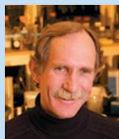

This computer model shows water molecules (red and gray) passing through an aquaporin (blue ribbons) in a lipid bilayer (yellow, hydrophilic heads; green, hydrophobic tails).

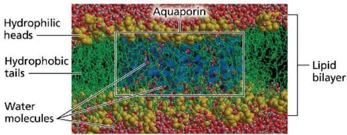

A transport protein is specific for the substance it translocates (moves), allowing only a certain substance (or a small group of related substances) to cross the membrane. For example, a glucose carrier protein in the plasma membrane of red blood cells transports glucose across the membrane 50,000 times faster than glucose can pass through on its own. This “glucose transporter” is so selective that it even rejects fructose, a structural isomer of glucose (see Figure 5.3). Thus, the selective permeability of a membrane depends on both the discriminating barrier of the lipid bilayer and the specific transport proteins built into the membrane.

What establishes the direction of traffic across a membrane? And what mechanisms drive molecules across membranes? We will address these questions next as we explore two modes of membrane traffic: passive transport and active transport.

## Concept Check 7.2

1. What property allows $\mathrm{O}_2$ and $\mathrm{CO}_2$ to cross a lipid bilayer without the aid of membrane proteins?

2. VISUAL SKILLS Examine Figure 7.2. Why is a transport protein needed to move many water molecules rapidly across a membrane?

3. MAKE CONNECTIONS Aquaporins exclude passage of hydronium ions ( $H_{3}O^{+}$ ), but some aquaporins allow passage of glycerol, a three-carbon alcohol (see Figure 5.9), as well as $H_{2}O$ . Since $H_{3}O^{+}$ is closer in size to water than glycerol is, yet cannot pass through, what might be the basis of this selectivity?

For suggested answers, see Appendix A.

## Concept 7.3: Passive transport is diffusion of a substance across a membrane with no energy investment

Molecules have a type of energy called thermal energy, due to their constant motion (see Concept 3.2). One result of this motion is diffusion, the movement of particles of any substance so that they spread out into the available space. Each molecule moves randomly, yet diffusion of a population of molecules may be directional. Imagine a synthetic membrane separating pure water from a solution of a dye in water. Study Figure 7.11a carefully to see how diffusion would result in equal concentrations of dye molecules in both solutions. At that point, a dynamic equilibrium will exist, with as many dye molecules crossing per second in one direction as in the other.

Here is a simple rule of diffusion: In the absence of any other forces, a substance will diffuse from where it is more concentrated to where it is less concentrated. Put another way, a substance diffuses down its concentration gradient, the region along which the density of a chemical substance increases or decreases (in this case, decreases). Diffusion is a spontaneous process, needing no input of energy. Each substance diffuses down its own concentration gradient, unaffected by the concentration gradients of other substances (Figure 7.11b).

Much of the traffic across cell membranes occurs by diffusion. When a substance is more concentrated on one side of a membrane than on the other, there is a tendency for it to diffuse across, down its concentration gradient (assuming that the membrane is permeable to that substance). One important example is the uptake of oxygen by a cell performing cellular respiration. Dissolved oxygen diffuses into the cell across the plasma membrane. As long as cellular respiration consumes the $O_{2}$ as it enters, diffusion into the cell will continue because the concentration gradient favors movement in that direction.

Figure 7.11 Diffusion of solutes across a synthetic membrane. Each large arrow shows net diffusion of dye molecules of that color.  
  
(a) Diffusion of one solute. Molecules of orange dye can pass through membrane pores. Random movement of dye molecules will cause some to pass through the pores; this happens more often on the side with more dye molecules. The dye diffuses from the more concentrated side to the less concentrated side (called diffusing down a concentration gradient). A dynamic equilibrium results: Solute molecules still cross, but at roughly equal rates in both directions.

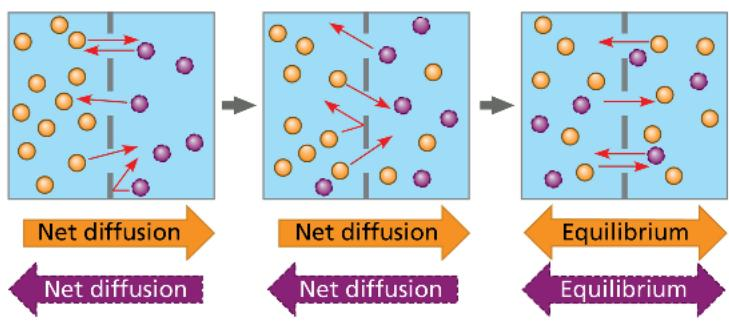  
(b) Diffusion of two solutes. Solutions of two different dyes are separated by a membrane that is permeable to both. Each dye diffuses down its own concentration gradient. There will be a net diffusion of the purple dye (particles with dashed outlines) from right to left, even though the total solute concentration was initially greater on the left side.

The diffusion of a substance across a biological membrane is called passive transport because it requires no energy. The concentration gradient itself represents potential energy (see Concept 2.2 and Figure 8.5b) and drives diffusion. Remember, though, that membranes are selectively permeable and therefore have different effects on the rates of diffusion of various molecules. Water can diffuse very rapidly across the membranes of cells with aquaporins, compared with diffusion in the absence of aquaporins. The movement of water across the plasma membrane has important consequences for cells.

## Effects of Osmosis on Water Balance

To see how two solutions with different solute concentrations interact, picture a U-shaped glass tube with a selectively permeable artificial membrane separating two sugar solutions (Figure 7.12). Pores in this synthetic membrane are too small for sugar molecules to pass through but large enough for water

## Figure 7.12 Osmosis.

Two sugar solutions of different concentrations are separated by a membrane that the solvent (water) can pass through but the solute (sugar) cannot. Water molecules move randomly and may cross in either direction, but overall, water diffuses from the solution with less concentrated solute to that with more concentrated solute. This passive transport of water, or osmosis, makes the sugar concentrations on both sides roughly equal.

  
VISUAL SKILLS If an orange dye capable of passing through the membrane was added to the left side of the tube above, how would it be distributed at the end of the experiment? (See Figure 7.11a.) Would the final solution levels in the tube be affected? What cellular component does the membrane represent in this experiment?
For suggested answer, see Appendix A.

molecules. However, tight clustering of water molecules around the hydrophilic solute molecules makes some of the water unavailable to cross the membrane. As a result, the solution with a higher solute concentration has a lower free water concentration. Water diffuses across the membrane from the region of higher free water concentration (lower solute concentration) to that of lower free water concentration (higher solute concentration) until the solute concentrations on both sides of the membrane are more nearly equal. The diffusion of free water across a selectively permeable membrane, whether artificial or cellular, is called osmosis. The movement of water across cell membranes and the balance of water between the cell and its environment are crucial to organisms. Let's now apply what we've learned about osmosis in this system to living cells.

## Water Balance of Cells Without Cell Walls

To explain the behavior of a cell in a solution, we must consider both solute concentration and membrane permeability. Both factors are taken into account in the concept of tonicity, the ability of a surrounding solution to cause a cell to gain or lose water. The tonicity of a solution depends in part on its concentration of solutes that cannot cross the membrane (nonpenetrating solutes) relative to that inside the cell. If there is a higher concentration of nonpenetrating solutes in the surrounding solution, water will tend to leave the cell, and vice versa.

If a cell without a cell wall, such as an animal cell, is immersed in an environment that is isotonic to the cell (iso means “same”), there will be no net movement of water across extracellular fluid that is isotonic to the cells. In hypertonic or hypotonic environments, however, organisms that lack rigid cell walls must have other adaptations for osmoregulation, the control of solute concentrations and water balance. For example, the unicellular protist Paramecium caudatum lives in pond water, which is hypotonic to the cell. Paramecium has a plasma membrane that is much less permeable to water than the membranes of most other cells, but this only slows the uptake of water, which continually enters the cell. The reason the Paramecium cell doesn't burst is that it has a contractile vacuole, an organelle that functions as a pump to force water out of the cell as fast as it enters by osmosis (Figure 7.14). In contrast, the bacteria and archaea that live in hypersaline (excessively salty) environments (see Figure 27.1) have cellular mechanisms that balance the internal and external solute concentrations to ensure that water does not move out of the cell. We'll examine other evolutionary adaptations for osmoregulation by animals in Concept 44.1.

## Water Balance of Cells with Cell Walls

The cells of plants, prokaryotes, fungi, and some protists are surrounded by cell walls (see Figure 6.27). When such a cell is immersed in a hypotonic solution—bathed in rainwater, for example—the cell wall helps maintain the cell's water balance. Consider a plant cell. Like an animal cell, the plant cell swells as water enters by osmosis (Figure 7.13b). However, the relatively inelastic cell wall will expand only so much before it exerts a back pressure on the cell, called turgor pressure, that opposes further

the plasma membrane. Water diffuses across the membrane, but at the same rate in both directions. In an isotonic environment, the volume of an animal cell is stable (Figure 7.13a).

Let's transfer the cell to a solution that is hypertonic to the cell (hyper means “more,” in this case referring to nonpenetrating solutes). The cell will lose water, shrivel, and probably die. This is why an increase in the salinity (saltiness) of a lake can kill the animals there; if the lake water becomes hypertonic to the animals' cells, they might shrivel and die. However, taking up too much water can be just as hazardous to a cell as losing water. If we place the cell in a solution that is hypotonic to the cell (hypo means “less”), water will enter the cell faster than it leaves, and the cell will swell and lyse (burst) like an overfilled water balloon.

A cell without rigid cell walls can't tolerate either excessive uptake or excessive loss of water. This problem of water balance is automatically solved if such a cell lives in isotonic surroundings. Seawater is isotonic to many marine invertebrates. The cells of most terrestrial (land-dwelling) animals are bathed in an

## Figure 7.13 The water balance of living cells.

How living cells react to changes in the solute concentration of their environment depends on whether or not they have cell walls. (a) Animal cells, such as this red blood cell, do not have cell walls. (b) Plant cells do have cell walls. (Arrows indicate net water movement after the cells were first placed in these solutions.)

(a) Animal cell. An animal cell, such as this red blood cell, does not have a cell wall. Animal cells fare best in an isotonic environment unless they have specialized adaptations that offset the osmotic uptake or loss of water.

(b) Plant cell. Plant cells are turgid (firm) and generally healthiest in a hypotonic environment, where the uptake of water is eventually balanced by the wall pushing back on the cell.

Hypotonic solution

Isotonic solution

Hypertonic solution  
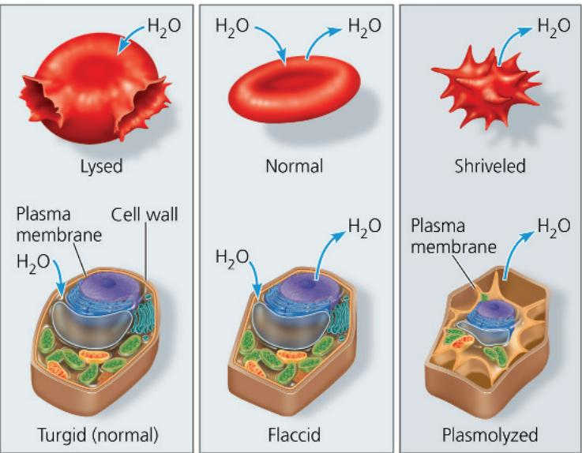  
Turgid (normal)  
Why do limp celery stalks become crisp when placed in a glass of water? For suggested answer, see Appendix A.

Figure 7.14 The contractile vacuole of Paramecium.
The vacuole collects fluid from canals in the cytoplasm. When full, the vacuole and canals contract, expelling fluid from the cell (LM).  
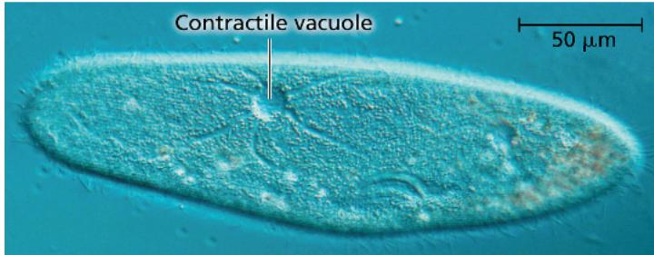

water uptake. At this point, the cell is turgid (very firm), which is the healthy state for most plant cells. Plants that are not woody, such as most houseplants, depend for mechanical support on cells kept turgid by a surrounding hypotonic solution. If a plant's cells and surroundings are isotonic, there is no net tendency for water to enter and the cells become flaccid (limp); the plant wilts.

However, a cell wall is of no advantage if the cell is immersed in a hypertonic environment. In this case, a plant cell, like an animal cell, will lose water to its surroundings and shrink. As the plant cell shrivels, its plasma membrane pulls away from the cell wall at multiple places. This phenomenon, called plasmolysis, causes the plant to wilt and can lead to plant death. The walled cells of bacteria and fungi also plasmolyze in hypertonic environments.

## Facilitated Diffusion: Passive Transport Aided by Proteins

Let's look more closely at how water and certain hydrophilic solutes cross a membrane. As mentioned earlier, many polar molecules and ions blocked by the lipid bilayer of the membrane diffuse passively with the help of transport proteins that span the membrane. This phenomenon is called facilitated diffusion. Cell biologists are still trying to learn exactly how various transport proteins facilitate diffusion. Most transport proteins are very specific: They transport some substances but not others.

As mentioned earlier, the two types of transport proteins are channel proteins and carrier proteins. Channel proteins simply provide corridors that allow specific molecules or ions to cross the membrane (Figure 7.15a). The hydrophilic passageways provided by these proteins can allow water molecules or small ions to diffuse very quickly from one side of the membrane to the other. Aquaporins, the water channel proteins, facilitate the massive levels of diffusion of water (osmosis) that occur in plant cells and in animal cells such as red blood cells (see Figure 7.13). Certain kidney cells also have a high number of aquaporins, allowing them to reclaim water from urine before it is excreted. If the kidneys didn't perform this function, you would excrete about $180\mathrm{L}$ of urine per day—and have to drink an equal volume of water!

Channel proteins that transport ions are called ion channels. Many ion channels function as gated channels, which open or

Figure 7.15 Two types of transport proteins that carry out facilitated diffusion.

In both cases, the protein can transport the solute in either direction, but the net movement is down the concentration gradient of the solute.

(a) A channel protein has a channel through which water molecules or a specific solute can pass.

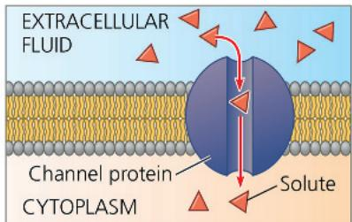

(b) A carrier protein alternates between two shapes, moving a solute across the membrane during the shape change.

  
Potassium ion channel protein (See also the side view of a calcium channel protein in Figure 6.32a.)

close in response to a stimulus (see Figure 11.8). For some gated channels, the stimulus is electrical. In a nerve cell, for example, a potassium ion channel protein (see computer model) opens in response to an electrical stimulus, allowing a stream of potassium ions to leave the cell. This restores the cell's ability to fire again. Other gated channels have a chemical stimulus: They open or close when a specific substance (not

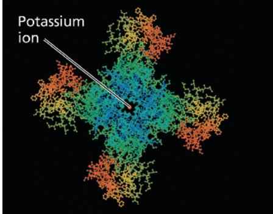

the one to be transported) binds to the channel. Ion channels are important in the functioning of the nervous system, as you'll learn in Chapter 48.

## Interview

## Interview with Elba Serrano: Investigating how ion channels enable you to hear (eTextbook only)

Carrier proteins, such as the glucose transporter mentioned earlier, seem to undergo a subtle change in shape that somehow translocates the solute-binding site across the membrane (Figure 7.15b). Such a change in shape may be triggered by the binding and release of the transported molecule. Like ion channels, carrier proteins involved in facilitated diffusion result in the net movement of a substance down its concentration gradient. No energy input is thus required: This is passive transport. The Scientific Skills Exercise gives you an opportunity to work with data from an experiment related to glucose transport.

# Scientific Skills Exercise

# Interpreting a Scatter Plot with Two Sets of Data

Is Glucose Uptake into Cells Affected by Age? Glucose, an important energy source for animals, is transported into cells by facilitated diffusion using protein carriers. In this exercise, you will interpret a graph with two sets of data from an experiment that examined glucose uptake over time in red blood cells from guinea pigs of different ages. You will determine if the cells' rate of glucose uptake depended on the age of the guinea pig.

How the Experiment Was Done Researchers incubated guinea pig red blood cells in a 300 mM (millimolar) radioactive glucose solution at pH 7.4 at 25°C. Every 10 or 15 minutes, they removed a sample of cells and measured the concentration of radioactive glucose inside those cells. The cells came from either a 15-day-old or a 1-month-old guinea pig.

Data from the Experiment When you have multiple sets of data, it can be useful to plot them on the same graph for comparison. In the graph here, each set of dots (of the same color) forms a scatter plot, in which every data point represents two numerical values, one for each variable. For each data set, a curve that best fits the points has been drawn to make it easier to see the trends. (For additional information about graphs, see the Scientific Skills Review in Appendix D.)

## INTERPRET THE DATA

1. First make sure you understand the parts of the graph. (a) Which variable is the independent variable—the variable controlled by the researchers? (b) Which variable is the dependent variable—the variable that depended on the treatment and was measured by the researchers? (c) What do the red dots on the upper line represent? (d) The blue squares on the lower line?

## Concept Check 7.3

1. Speculate about how a cell performing cellular respiration might rid itself of the resulting $CO_{2}$ .

2. WHAT IF? If a Paramecium swims from a hypotonic to an isotonic environment, will its contractile vacuole become more active or less? Why?

For suggested answers, see Appendix A.

## Concept 7.4: Active transport uses energy to move solutes against their gradients

Despite the help of transport proteins, facilitated diffusion is considered passive transport because the solute is moving down its concentration gradient, a process that requires no energy. Facilitated

Glucose Uptake over Time in Guinea Pig Red Blood Cells.  
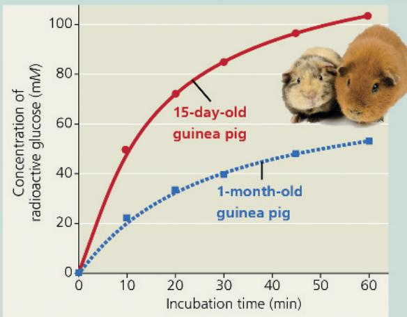  
Data from T. Kondo and E. Beutler, Developmental changes in glucose transport of guinea pig erythrocytes, Journal of Clinical Investigation 65:1–4 (1980).

2. From the data points on the graph, construct a table of the data. Put "Incubation Time (min)" in the left column of the table.

3. What does the graph show? Compare and contrast glucose uptake in red blood cells from 15-day-old and 1-month-old guinea pigs.

4. Develop a hypothesis to explain the difference between glucose uptake in red blood cells from 15-day-old and 1-month-old guinea pigs. (Think about how glucose gets into cells.)

5. Design an experiment to test your hypothesis.

Instructors: A version of this Scientific Skills Exercise can be assigned in Mastering Biology.

diffusion speeds transport of a solute by providing efficient passage through the membrane, but it does not alter the direction of transport. Some other transport proteins, however, can use energy to move solutes against their concentration gradients, across the plasma membrane from the side where they are less concentrated (whether inside or outside) to the side where they are more concentrated.

## The Need for Energy in Active Transport

To pump a solute across a membrane against its gradient requires work; the cell must expend energy. Therefore, this type of membrane traffic is called active transport. The transport proteins that move solutes against their concentration gradients are all carrier proteins rather than channel proteins. This makes sense because when channel proteins are open, they merely allow solutes to diffuse down their concentration gradients rather than picking them up and transporting them against their gradients.

Active transport enables a cell to maintain internal concentrations of small solutes that differ from concentrations in its environment. For

Figure 7.16 The sodium-potassium pump: a specific case of active transport.

This transport system pumps ions against steep concentration gradients. The pump oscillates between two shapes in a cycle that moves $Na^{+}$ out of the cell (steps 1–3) and $K^{+}$ into the cell (steps 4–6). The two shapes have different binding affinities for $Na^{+}$ and $K^{+}$ . ATP hydrolysis powers the shape change by transferring a phosphate group to the transport protein (phosphorylating the protein).

VISUAL SKILLS For each ion ( $Na^{+}$ and $K^{+}$ ), describe its concentration inside the cell relative to outside. How many $Na^{+}$ are moved out of the cell and how many $K^{+}$ moved in per cycle? For suggested answer, see Appendix A.

1 Cytoplasmic Na $^{+}$ binds to the sodium-potassium pump with high affinity when the protein has this shape.

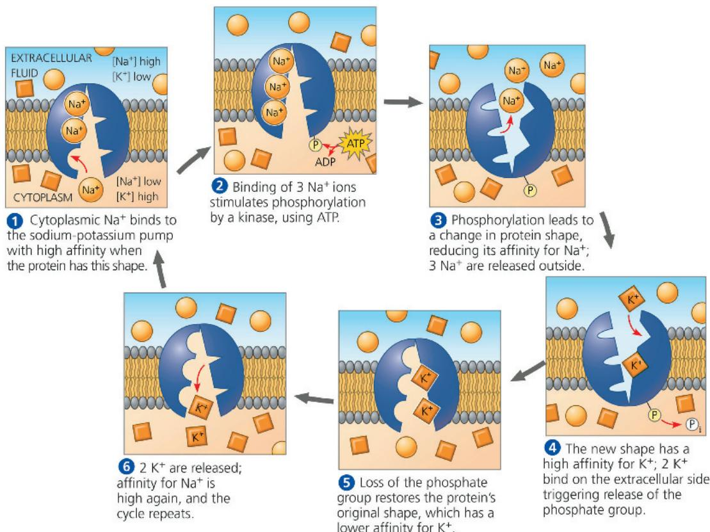  
② Binding of 3 Na $^{+}$ ions stimulates phosphorylation by a kinase, using ATP.  
3 Phosphorylation leads to a change in protein shape, reducing its affinity for $\mathrm{Na^{+}}$ ; 3 $\mathrm{Na^{+}}$ are released outside.  
6 $2\mathrm{K}^{+}$ are released; affinity for $\mathrm{Na^{+}}$ is high again, and the cycle repeats.  
5 Loss of the phosphate group restores the protein's original shape, which has a lower affinity for $\mathsf{K}^+$ .  
4 The new shape has a high affinity for $\mathsf{K}^+$ ; $2\mathsf{K}^+$ bind on the extracellular side, triggering release of the phosphate group.

example, compared with its surroundings, an animal cell has a much higher concentration of potassium ions ( $K^{+}$ ) and a much lower concentration of sodium ions ( $Na^{+}$ ). The plasma membrane helps maintain these steep gradients by pumping $Na^{+}$ out of the cell and $K^{+}$ into the cell.

As in other types of cellular work, ATP hydrolysis supplies the energy for most active transport. One way ATP can power active transport is when its terminal phosphate group is transferred directly to the transport protein. This can induce the protein to change its shape in a manner that translocates a solute bound to the protein across the membrane. One transport system that works this way is the sodium-potassium pump, which exchanges $Na^{+}$ for $K^{+}$ across the plasma membrane of animal cells (Figure 7.16). The distinction between passive transport and active transport is reviewed in Figure 7.17.

## How Ion Pumps Maintain Membrane Potential

All cells have voltages across their plasma membranes. Voltage is electrical potential energy (see Concept 2.2)—a separation of opposite charges. The cytoplasmic side of the membrane is negative in charge relative to the extracellular side because of an unequal distribution of anions and cations on the two sides. The voltage across a membrane, called a membrane potential, ranges from about -50 to -200 millivolts (mV). (The minus sign indicates that the inside of the cell is negative relative to the outside.)

The membrane potential acts like a battery, an energy source that affects the traffic of all charged substances across

Figure 7.17 Review: passive and active transport.

Passive transport. Substances diffuse spontaneously down their concentration gradients, crossing a membrane with no expenditure of energy by the cell. The rate of diffusion can be greatly increased by transport proteins in the membrane.

Diffusion.
Hydrophobic molecules and (at a slow rate) very small un-charged polar molecules can diffuse through the lipid bilayer.

## Active transport.

Active transport. Some transport proteins expend energy and act as pumps, moving substances across a membrane against their concentration (or electrochemical) gradients. Energy is usually supplied by ATP hydrolysis.

Facilitated diffusion. Many hydrophilic substances diffuse through membranes with the assistance of transport proteins, either channel proteins (left) or carrier proteins (right).

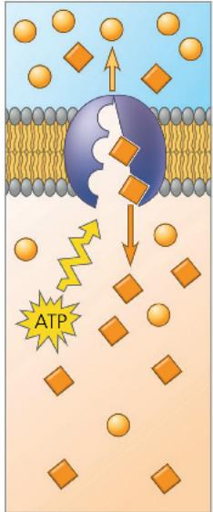  
VISUAL SKILLS For each solute in the right panel, describe its direction of movement, and state whether it is moving with or against its concentration gradient.  
For suggested answer, see Appendix A.

the membrane. Because the inside of the cell is negative compared with the outside, the membrane potential favors the passive transport of cations into the cell and anions out of the cell. Thus, two forces drive the diffusion of ions across a membrane: a chemical force (the ion's concentration gradient, which has been our sole consideration thus far in the chapter) and an electrical force (the effect of the membrane potential on the ion's movement). This combination of forces acting on an ion is called the electrochemical gradient.

In the case of ions, then, we must refine our concept of passive transport: An ion diffuses not simply down its concentration gradient but, more exactly, down its electrochemical gradient. For example, the concentration of $Na^{+}$ inside a resting nerve cell is much lower than outside it. When the cell is stimulated, gated channels open that facilitate $Na^{+}$ diffusion. Sodium ions then “fall” down their electrochemical gradient, driven by the concentration gradient of $Na^{+}$ and by the attraction of these cations to the negative side (inside) of the membrane. In this example, both electrical and chemical contributions to the electrochemical gradient act in the same direction across the membrane, but this is not always so. In cases where electrical forces due to the membrane potential oppose the simple diffusion of an ion down its concentration gradient, active transport may be necessary. In Concepts 48.2 and 48.3, you’ll learn about the importance of electrochemical gradients and membrane potentials in the transmission of nerve impulses.

Some membrane proteins that actively transport ions contribute to the membrane potential. Study Figure 7.16 to see if you can see why the sodium-potassium pump is a good example. Notice that the pump does not translocate $Na^{+}$ and $K^{+}$ one for one, but pumps three sodium ions out of the cell for every two potassium ions it pumps into the cell. With each “crank” of the pump, there is a net transfer of one positive charge from the cytoplasm to the extracellular fluid, a process that stores energy as voltage. A transport protein that generates voltage across a membrane is called an electrogenic pump. The sodium-potassium pump appears to be the major electrogenic pump of animal cells. The main electrogenic pump of plants, fungi, and bacteria is a proton pump, which actively transports protons

## Figure 7.18 A proton pump.

Proton pumps are electrogenic pumps that store energy by generating voltage (charge separation) across membranes. A proton pump translocates positive charge in the form of hydrogen ions ( $H^{+}$ , or protons). The voltage and $H^{+}$ concentration gradient represent a dual energy source that can drive other processes, such as the uptake of nutrients. Most proton pumps are powered by ATP hydrolysis. (See Figure 6.32a.)

(hydrogen ions, $H^{+}$ ) out of the cell. The pumping of $H^{+}$ transfers positive charge from the cytoplasm to the extracellular solution (Figure 7.18). By generating voltage across membranes, electrogenic pumps help store energy that can be tapped for cellular work. One important use of proton gradients in the cell is for ATP synthesis during cellular respiration, as you will see in Concept 9.4. Another is a type of membrane traffic called cotransport.

## Cotransport: Coupled Transport by a Membrane Protein

A solute that exists in different concentrations across a membrane can do work as it moves across that membrane by diffusion down its concentration gradient. This is analogous to water that has been pumped uphill and performs work as it flows back down. In a mechanism called cotransport, a transport protein (a cotransporter) can couple the “downhill” diffusion of the solute to the “uphill” transport of a second substance against its own concentration gradient. For instance, a plant cell uses the gradient of $H^{+}$ generated by its ATP-powered proton pumps to drive the active transport of amino acids, sugars, and several other nutrients into the cell. In the example shown in Figure 7.19, a cotransporter couples the return of $H^{+}$ to the transport of sucrose into the cell. This protein can translocate sucrose into the cell against its concentration gradient, but only if the sucrose molecule travels in the company of an $H^{+}$ . The $H^{+}$ uses the transport protein as an avenue to diffuse down its own electrochemical gradient, which is maintained by the proton pump. Plants use $H^{+}/sucrose$

## Figure 7.19 Cotransport: active transport driven by a concentration gradient.

A carrier protein, such as this $H^{+}$ /sucrose cotransporter in a plant cell (top), is able to use the diffusion of $H^{+}$ down its electrochemical gradient into the cell to drive the uptake of sucrose. (The cell wall is not shown.) Although not technically part of the cotransport process, an ATP-driven proton pump is shown here (bottom), which concentrates $H^{+}$ outside the cell. The resulting $H^{+}$ gradient represents potential energy that can be used for active transport—of sucrose, in this case. Thus, ATP hydrolysis indirectly provides the energy necessary for cotransport.

cotransport to load sucrose produced by photosynthesis into cells in the veins of leaves. The vascular tissue of the plant can then distribute the sugar to roots and other nonphotosynthetic organs that do not make their own sugars.

A similar cotransporter in animals transports glucose into intestinal cells together with $Na^{+}$ , which is moving down its concentration gradient into the cell. The glucose and $Na^{+}$ then exit the cell into the blood on the opposite side, the glucose by facilitated diffusion and the $Na^{+}$ by active transport (see Figure 7.16). Water follows these solutes into the cell, and then into the blood, via osmosis. Our understanding of $Na^{+}/glucose$ cotransporters has helped us to find effective treatments for severe diarrhea, a serious problem that can cause life-threatening dehydration even if patients drink large volumes of water. To treat diarrhea, patients are given a solution to drink containing therapeutic concentrations of salt (NaCl) and glucose. The solutes are taken up by $Na^{+}/glucose$ cotransporters and passed through the intestinal cells into the blood, followed by water via osmosis. Without the solutes, sufficient water cannot be absorbed from the intestine. In developing countries, where diarrheal illnesses in infants and young children are a substantial problem, this simple treatment has reduced mortality.

## Concept Check 7.4

1. $Na^{+}/K^{+}$ pumps help nerve cells establish a voltage across their plasma membranes. Do these pumps use ATP or produce ATP? Explain.

2. VISUAL SKILLS Compare the $Na^{+}/K^{+}$ pump in Figure 7.16 with the cotransporter in Figure 7.19. Explain why the $Na^{+}/K^{+}$ pump would not be considered a cotransporter.

3. MAKE CONNECTIONS Review the characteristics of the lysosome in Concept 6.4. Given the internal environment of a lysosome, what transport protein might you expect to see in its membrane?

For suggested answers, see Appendix A.

## Concept 7.5: Bulk transport across the plasma membrane occurs by exocytosis and endocytosis

Large molecules, such as proteins and polysaccharides, generally don't cross the membrane by diffusion or transport proteins. Instead, they usually enter and leave the cell in bulk, packaged in vesicles.

## Exocytosis

The cell secretes certain molecules by the fusion of vesicles with the plasma membrane; this process is called exocytosis (Figure 7.20). A transport vesicle that has budded from the

Figure 7.20 Exocytosis.

1 A vesicle containing secretory proteins buds off from the Golgi.

  
5 The vesicle membrane becomes part of the plasma membrane.

Golgi apparatus moves along a microtubule of the cytoskeleton to the plasma membrane. When the vesicle membrane and plasma membrane come into contact, specific proteins in both membranes rearrange the lipid molecules of the two bilayers so that the two membranes fuse. The contents of the vesicle spill out of the cell, and the vesicle membrane becomes part of the plasma membrane.

Many secretory cells use exocytosis to export products. For example, cells in the pancreas that make insulin secrete it into the extracellular fluid by exocytosis. In another example, nerve cells use exocytosis to release neurotransmitters that signal other neurons or muscle cells (see Figure 7.1). When plant cells are making cell walls, exocytosis delivers some of the necessary proteins and carbohydrates from Golgi vesicles to the outside of the cell.

## Endocytosis

In endocytosis, the cell takes in molecules and particulate matter by forming new vesicles from the plasma membrane. Although the proteins involved in the processes are different, the events of endocytosis look like the reverse of exocytosis. First, a small area of the plasma membrane sinks inward to form a pocket. Then, as the pocket deepens, it pinches in, forming a vesicle containing material that had been outside the cell. Study Figure 7.21 carefully to understand the three types of endocytosis: phagocytosis (“cellular eating”), pinocytosis (“cellular drinking”), and receptor-mediated endocytosis.

Human cells use receptor-mediated endocytosis to take in cholesterol for membrane synthesis and the synthesis of other steroids. Cholesterol travels in the blood in particles called low-density lipoproteins (LDLs), each a complex of lipids and a protein. LDLs bind to LDL receptors on plasma membranes and then enter the cells by endocytosis. In the inherited disease familial hypercholesterolemia, characterized by a very high level of cholesterol in the blood, LDLs cannot enter cells because the

## Exploring Endocytosis in Animal Cells

Figure 7.21

## Phagocytosis

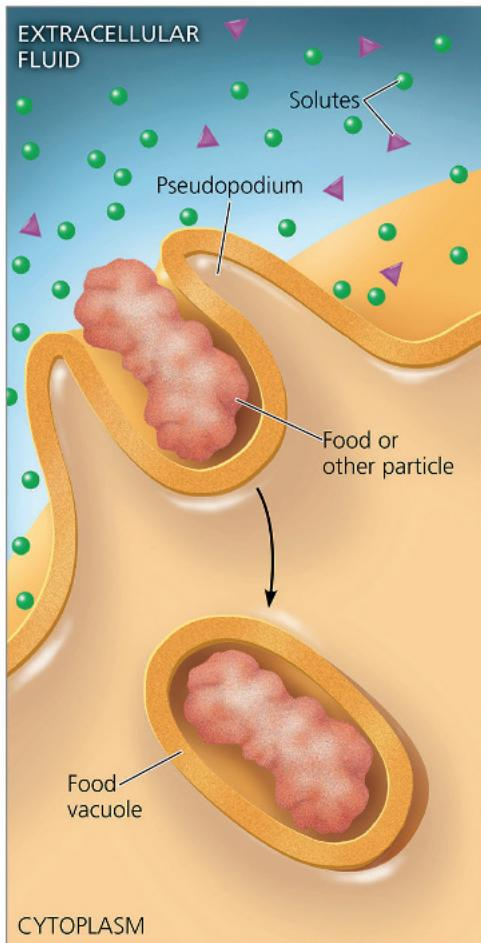

Pinocytosis  
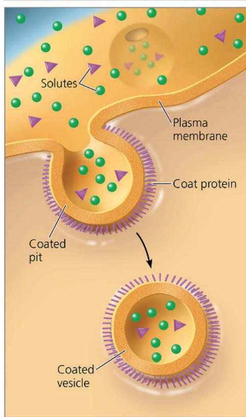

In phagocytosis, a cell engulfs a particle by extending pseudopodia (singular, pseudopodium) around it and packaging it within a membranous sac called a food vacuole. The particle will be digested after the food vacuole fuses with a lysosome containing hydrolytic enzymes (see Figure 6.13a).

In pinocytosis, a cell continually “gulps” droplets of extracellular fluid into tiny vesicles, formed by infoldings of the plasma membrane. In this way, the cell obtains molecules dissolved in the droplets. Because any and all solutes are taken into the cell, pinocytosis as shown here is nonspecific for the substances it transports. In many cases, the parts of the plasma membrane that form vesicles are lined on their cytoplasmic side by a fuzzy layer of coat protein; the “pits” and resulting vesicles are called coated pits.

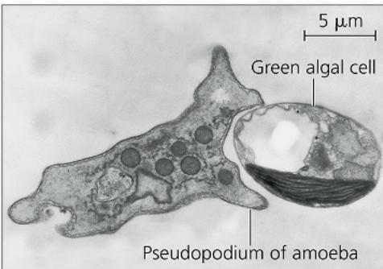  
An amoeba engulfing a green algal cell via phagocytosis (TEM).

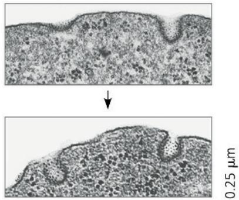  
Pinocytotic vesicles forming (TEMs).

VISUAL SKILLS Use the scale bars to estimate the diameters of (a) the food vacuole that will form around the algal cell (left micrograph; measure the length, not the width) and (b) the coated vesicle (lower right micrograph). (c) Which is larger, and by what factor? For suggested answer, see Appendix A.

## Receptor-Mediated Endocytosis

  
Coated vesicle with specific solutes (purple triangles) bound to receptors (red)

Receptor-mediated endocytosis is a specialized type of pinocytosis that enables the cell to acquire bulk quantities of specific substances, even though those substances may not be very concentrated in the extracellular fluid. Embedded in the plasma membrane are proteins with receptor sites exposed to the extracellular fluid. Specific solutes bind to these receptors. The receptor proteins then cluster in coated pits, and each coated pit forms a vesicle containing the bound molecules. The diagram shows only bound molecules (purple triangles) inside the vesicle, but other molecules from the extracellular fluid are also present. After the ingested material is liberated from the vesicle, the emptied receptors are recycled to the plasma membrane by the same vesicle (not shown).

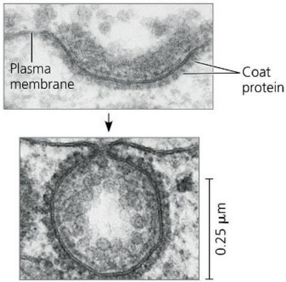  
Top: A coated pit. Bottom: A coated vesicle forming during receptor-mediated endocytosis (TEMs).

LDL receptor proteins are defective or missing. Cholesterol thus accumulates in the blood, contributing to early atherosclerosis, the buildup of lipids within blood vessel walls. This narrows the space in the vessels and impedes blood flow, potentially resulting in heart damage and stroke.

Endocytosis and exocytosis also provide mechanisms for rejuvenating or remodeling the plasma membrane. These processes occur continually in most eukaryotic cells, yet the amount of plasma membrane in a nongrowing cell remains fairly constant. The addition of membrane by one process appears to offset the loss of membrane by the other.

## Concept Check 7.5

1. As a cell grows, its plasma membrane expands. Does this involve endocytosis or exocytosis? Explain.

2. DRAW IT Return to Figure 7.9, and circle a patch of plasma membrane that is coming from a vesicle involved in exocytosis.

3. MAKE CONNECTIONS In Concept 6.7, you learned that animal cells make an extracellular matrix (ECM). Describe the cellular pathway of synthesis and deposition of an ECM glycoprotein.

For suggested answers, see Appendix A.

## Chapter 7 Review

## Summary of Key Concepts

To review key terms, go to the Vocabulary Self-Quiz (eTextbook only).

## Concept 7.1: Cellular membranes are fluid mosaics of lipids and proteins

\- In the fluid mosaic model, amphipathic proteins are embedded in the phospholipid bilayer.

\- Phospholipids and some proteins move sideways within the membrane. The unsaturated hydrocarbon tails of some phospholipids keep membranes fluid at lower temperatures, while cholesterol helps membranes resist changes in fluidity caused by temperature changes.

\- Membrane proteins function in transport, enzymatic activity, signal transduction, cell-cell recognition, intercellular joining, and attachment to the cytoskeleton and extracellular matrix. Short chains of sugars linked to proteins (in glycoproteins) and lipids (in glycolipids) on the exterior side of the plasma membrane interact with surface molecules of other cells.

\- Membrane proteins and lipids are synthesized in the ER and modified in the ER and Golgi apparatus. The inside and outside faces of membranes differ in molecular composition.

In what ways are membranes crucial to life?

## Concept 7.2: Membrane structure results in selective permeability

\- A cell must exchange molecules and ions with its surroundings, a process controlled by the selective permeability of the plasma membrane. Hydrophobic substances are soluble in lipids and pass through membranes rapidly, whereas polar molecules and ions generally require specific transport proteins.

How do aquaporins affect the permeability of a membrane?

## Concept 7.3: Passive transport is diffusion of a substance across a membrane with no energy investment

\- Diffusion is the spontaneous movement of a substance down its concentration gradient. Water diffuses out of a cell (osmosis) if the solution outside has a higher concentration of nonpenetrating solutes (hypertonic); water enters if the solution has a lower solute concentration (hypotonic). If the concentrations are equal (isotonic), no net osmosis occurs. Cell survival depends on balancing water uptake and loss.

a transport protein speeds water or solute movement down its concentration gradient across a membrane. Ion channels facilitate the diffusion of ions across a membrane. Carrier proteins can undergo changes in shape that translocate bound solutes across the membrane.

What happens to a cell placed in a hypertonic solution? Describe the free water concentration inside and out.

## Concept 7.4: Active transport uses energy to move solutes against their gradients

\- Specific membrane proteins use energy, usually in the form of ATP, to do the work of active transport.

\- Ions can have both a concentration (chemical) gradient and an electrical gradient (voltage). These gradients combine in the electrochemical gradient, which determines the net direction of ionic diffusion.

\- Cotransport of two solutes occurs when a membrane protein enables the “downhill” diffusion of one solute to drive the “uphill” transport of the other.

ATP is not directly involved in the functioning of a cotransporter. Why, then, is cotransport considered active transport?

Active transport  

## Concept 7.5: Bulk transport across the plasma membrane occurs by exocytosis and endocytosis

In exocytosis, transport vesicles migrate to the plasma membrane, fuse with it, and release their contents. In endocytosis, molecules enter cells within vesicles that pinch inward from the plasma membrane. The three types of endocytosis are phagocytosis, pinocytosis, and receptor-mediated endocytosis.

Which type of endocytosis involves the binding of specific substances in the extracellular fluid to membrane proteins? What does this type of transport enable a cell to do?

For suggested answers, see Appendix A.

## Test Your Understanding

For more multiple-choice questions, go to the Practice Test (eTextbook only).

## Levels 1-2: Remembering/Understanding

1. In what way do the membranes of a eukaryotic cell vary?

(A) Phospholipids are found only in certain membranes.

(B) Certain proteins are unique to each membrane.

(C) Only certain membranes of the cell are selectively permeable.

(D) Only certain membranes are constructed from amphipathic molecules.

2. According to the fluid mosaic model of membrane structure, proteins of the membrane are mostly

(A) spread in a continuous layer over the inner and outer surfaces of the membrane.

(B) confined to the hydrophobic interior of the membrane.

(C) embedded in a lipid bilayer.

(D) randomly oriented in the membrane, with no fixed inside-outside polarity.

3. Which of the following factors would tend to increase membrane fluidity?

(A) a greater proportion of unsaturated phospholipids

(B) a greater proportion of saturated phospholipids

(C) a lower temperature

(D) a relatively high protein content in the membrane

## Levels 3-4: Applying/Analyzing

4. Which of the following processes includes all the others?

(A) osmosis

(B) diffusion of a solute across a membrane

(C) passive transport

(D) transport of an ion down its electrochemical gradient

5. Based on Figure 7.19, which of these experimental treatments would increase the rate of sucrose transport into a plant cell?

(A) decreasing extracellular sucrose concentration

(B) decreasing extracellular pH

(C) decreasing cytoplasmic pH

(D) adding a substance that makes the membrane more permeable to hydrogen ions

6. DRAW IT An artificial “cell” consisting of an aqueous solution enclosed in a selectively permeable membrane is immersed in a beaker containing a different solution, the “environment,” as shown in the accompanying diagram. The membrane is permeable to water and to the simple sugars glucose and fructose but impermeable to the disaccharide sucrose.

(a) Draw solid arrows to indicate the net movement of solutes into and/or out of the cell.

(b) Is the solution outside the cell isotonic, hypotonic, or hypertonic?

(c) Draw a dashed arrow to show the net osmosis, if any.

(d) Will the artificial cell become more flaccid, more turgid, or stay the same?

(e) Eventually, will the two solutions have the same or different solute concentrations?

## Levels 5-6: Evaluating/Creating

7. EVOLUTION CONNECTION Paramecium and other protists that live in hypotonic environments have cell membranes that limit water uptake, while those living in isotonic environments have membranes that are more permeable to water. Describe what water regulation adaptations might have evolved in protists in hypertonic habitats such as the Great Salt Lake and in habitats with changing salt concentration.

8. SCIENTIFIC INQUIRY An experiment is designed to study the mechanism of sucrose uptake by plant cells. Cells are immersed in a sucrose solution, and the pH of the solution is monitored. Samples of the cells are taken at intervals, and their sucrose concentration is measured. The pH is observed to decrease until it reaches a steady, slightly acidic level, and then sucrose uptake begins. (a) Evaluate these results and propose a hypothesis to explain them. (b) Predict what would happen if an inhibitor of ATP regeneration by the cell were added to the beaker once the pH was at a steady level. Explain.

9. SCIENCE, TECHNOLOGY, AND SOCIETY Extensive irrigation in arid regions causes salts to accumulate in the soil. (When water evaporates, salts that were dissolved in the water are left behind in the soil.) Based on what you learned about water balance in plant cells, explain why increased soil salinity (saltiness) might be harmful to crops.

10. WRITE ABOUT A THEME: INTERACTIONS A human pancreatic cell obtains $O_{2}$ —and necessary molecules such as glucose, amino acids, and cholesterol—from its environment, and it releases $CO_{2}$ as a waste product. In response to hormonal signals, the cell secretes digestive enzymes. It also regulates its ion concentrations by exchange with its environment. Based on what you have just learned about the structure and function of cellular membranes, write a short essay (100–150 words) to describe how such a cell accomplishes these interactions with its environment.

## 11. SYNTHESIZE YOUR KNOWLEDGE

  
In the supermarket, lettuce and other produce are often sprayed with water. Explain why this makes vegetables crisp.  
For selected answers, see Appendix A.

# An Introduction to Metabolism

## Key Concepts

8.1 An organism's metabolism transforms matter and energy

8.2 The free-energy change of a reaction tells us whether or not the reaction occurs spontaneously

8.3 ATP powers cellular work by coupling exergonic reactions to endergonic reactions

8.4 Enzymes speed up metabolic reactions by lowering energy barriers

8.5 Regulation of enzyme activity helps control metabolism

## Study Tip

Make a table: Fill in the following table for each process you read about in this chapter, such as water spilling over a dam or a chemical reaction.

<table><tr><td>Process</td><td>Starting Materials; Relative Energy Level</td><td>Ending Materials; Relative Energy Level</td><td>Will this process occur spontaneously (without an input of energy)?</td></tr><tr><td>Water spilling over a dam</td><td>Water at the top of a dam; higher energy level</td><td>Water at the bottom of a dam; lower energy level</td><td>Yes</td></tr><tr><td>Hydrolysis of ATP (Figure 8.9)</td><td></td><td></td><td></td></tr></table>

  
Figure 8.1 The green glowing spots on the outside of this Brazilian termite mound are larvae of the click beetle, Pyrophorus nyctophanus. These larvae convert the energy stored in organic molecules to light, a process called bioluminescence, which attracts termites that the larvae eat. Bioluminescence and other metabolic activities in a cell are energy transformations that are subject to physical laws.

## How do the laws of thermodynamics relate to biological processes?

The second law of thermodynamics: Every energy transfer or transformation increases the entropy (disorder) of the universe. For example, during every energy transformation, some energy is converted to thermal energy and released as heat:

  
Termite digesting plant and making new molecules  
Click beetle larva digesting termite and emitting light

# Concept 8.1: An organism's metabolism transforms matter and energy

The totality of an organism's chemical reactions is called metabolism (from the Greek metabole, change). Metabolism is an emergent property of life that arises from orderly interactions between molecules.

## Metabolic Pathways

We can picture a cell's metabolism as an elaborate road map of many chemical reactions, arranged as intersecting metabolic pathways. In a metabolic pathway, a specific molecule is altered in a series of defined steps, resulting in a certain product. Each step is catalyzed by a specific enzyme, a macromolecule that speeds up a chemical reaction:

The mechanisms that regulate these enzymes balance metabolic supply and demand, just like traffic lights control the flow of traffic.

Metabolism as a whole manages the material and energy resources of the cell. Some metabolic pathways release energy by breaking down complex molecules to simpler compounds. These degradative processes are called catabolic pathways, or breakdown pathways. One major catabolic pathway is cellular respiration, which breaks down glucose and other organic fuels in the presence of oxygen to carbon dioxide and water. (Pathways can have more than one starting molecule and/or product.) Energy stored in the organic molecules becomes available to do cellular work, such as ciliary beating or membrane transport. Anabolic pathways, in contrast, consume energy to build complicated molecules from simpler ones; they are sometimes called biosynthetic pathways. Examples of anabolism are synthesis of an amino acid from simpler molecules and synthesis of a protein from amino acids. Catabolic and anabolic pathways are the “downhill” and “uphill” avenues of the metabolic landscape. Energy released from downhill reactions of catabolic pathways can be stored and then used to drive uphill reactions of anabolic pathways.

In this chapter, we will focus on mechanisms common to metabolic pathways. Because energy is fundamental to all metabolic processes, a basic knowledge of energy is necessary to understand how the living cell works. Although we'll look at some nonliving examples here to consider energetic principles, the concepts demonstrated by these examples also apply to bioenergetics, the study of how energy flows through living organisms.

## Forms of Energy

Energy is the capacity to cause change. In everyday life, energy is important because some forms of energy can be used to do work—that is, to move matter against opposing forces, such as gravity and friction. Put another way, energy is the ability to rearrange a collection of matter. For example, you expend energy to turn the pages of this book, and your cells expend

energy in transporting certain substances across membranes. Energy exists in various forms, and the work of life depends on the ability of cells to transform energy from one form to another.

Energy can be associated with the relative motion of objects; this energy is called kinetic energy. Moving objects can perform work by imparting motion to other matter: A pool player uses the motion of the cue stick to push the cue ball, which in turn moves the other balls; water gushing through a dam turns turbines; and the contraction of leg muscles pushes bicycle pedals. Thermal energy is kinetic energy associated with the random movement of atoms or molecules; thermal energy in transfer from one object to another is called heat. Light is also a type of energy that can be harnessed to perform work, such as powering photosynthesis in green plants.

An object not presently moving may still possess energy. Energy that is not kinetic is called potential energy; it is energy that matter possesses because of its location or structure. Water behind a dam, for instance, possesses energy because of its altitude above sea level. Molecules possess energy because of the arrangement of electrons in the bonds between their atoms. Chemical energy is a term used by biologists to refer to the potential energy available for release in a chemical reaction. Recall that catabolic pathways release energy by breaking down complex molecules. Biologists say that these complex molecules, such as glucose, are high in chemical energy. During a catabolic reaction, some bonds are broken and others are formed, releasing energy and resulting in lower-energy breakdown products. This transformation also occurs in the engine of a car when the hydrocarbons of gasoline react explosively with oxygen, releasing the energy that pushes the pistons and producing exhaust. Although less explosive, a similar reaction of food molecules with oxygen provides chemical energy in biological systems, producing carbon dioxide and water as waste products. Biochemical pathways, carried out in the context of cellular structures, enable cells to release chemical energy from food molecules and use the energy to power life processes.

How is energy converted from one form to another? Consider Figure 8.2. The woman climbing the ladder to the diving platform is releasing chemical energy from the food she ate for lunch and using some of that energy to perform the work of climbing. The kinetic energy of muscle movement is thus being transformed into potential energy due to her increasing height above the water. The man diving is converting his potential energy to kinetic energy, which is then transferred to the water as he enters it, resulting in splashing, noise, and increased movement of water molecules. A small amount of energy is lost as heat due to friction.

Figure 8.2 Transformations between potential energy and kinetic energy.  
  
Climbing up converts the kinetic energy of muscle movement to potential energy.  
A diver has less potential energy in the water than on the platform.

Figure 8.3 The first two laws of thermodynamics.  
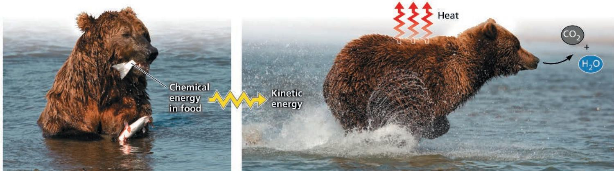  
(a) First law of thermodynamics: Energy can be transferred or transformed but neither created nor destroyed. For example, chemical reactions in this brown bear will convert the chemical (potential) energy in the fish into the kinetic energy of running.  
(b) Second law of thermodynamics: Every energy transfer or transformation increases the disorder (entropy) of the universe. For example, as the bear runs, disorder is increased around its body by the release of heat and small molecules that are the by-products of metabolism. A brown bear can run at speeds up to 35 miles per hour (56 km/hr)—as fast as a racehorse.

Now let's consider the original source of the organic food molecules that provided the necessary chemical energy for these divers to climb the steps. This chemical energy was itself derived from light energy absorbed by plants during photosynthesis. Organisms are energy transformers.

## The Laws of Energy Transformation

The study of the energy transformations that occur in a collection of matter is called thermodynamics. Scientists use the word system to denote the matter under study; they refer to the rest of the universe—everything outside the system—as the surroundings. An isolated system, such as that approximated by liquid in a thermos bottle, is unable to exchange either energy or matter with its surroundings outside the thermos. In an open system, energy and matter can be transferred between the system and its surroundings. Organisms are open systems. They absorb energy—for instance, light energy or chemical energy in the form of organic molecules—and release heat and metabolic waste products, such as carbon dioxide, to the surroundings. Two laws of thermodynamics govern energy transformations in organisms and all other collections of matter.

## The First Law of Thermodynamics

According to the first law of thermodynamics, the energy of the universe is constant: Energy can be transferred and transformed, but it cannot be created or destroyed. The first law is also known as the principle of conservation of energy. The electric company does not make energy, but merely converts it to a form that is convenient

for us to use. By converting sunlight to chemical energy, a plant acts as an energy transformer, not an energy producer.

The brown bear in Figure 8.3a will convert the chemical energy of the organic molecules in its food to kinetic and other forms of energy as it carries out biological processes. What happens to this energy after it has performed work? The second law of thermodynamics helps to answer this question.

## The Second Law of Thermodynamics

If energy cannot be destroyed, why can't organisms simply recycle their energy over and over again? It turns out that during every energy transfer or transformation, some energy is converted to thermal energy and released as heat, becoming unavailable to do work. Only a small fraction of the chemical energy from the food in Figure 8.3a is transformed into the motion of the brown bear shown in Figure 8.3b; most is lost as heat, which dissipates rapidly through the surroundings.

A system can put thermal energy to work only when there is a temperature difference that results in thermal energy flowing as heat from a warmer location to a cooler one. If temperature is uniform, as it is in a living cell, then the heat generated during a chemical reaction will simply warm a body of matter, such as the organism. (This can make a room crowded with people uncomfortably warm, as each person is carrying out a multitude of chemical reactions!)

A consequence of the loss of usable energy as heat to the surroundings is that each energy transfer or transformation makes the universe more disordered. We are all familiar with the word “disorder” in the sense of a messy room or a rundown building. The word “disorder” as used by scientists, however, has a specific molecular definition related to how dispersed the energy is in a system and how many different energy levels are present. For simplicity, we use “disorder” in the following discussion because our common understanding (the messy room) is a good analogy for molecular disorder.

Scientists use a quantity called entropy as a measure of molecular disorder, or randomness. The more randomly arranged a collection of matter is, the greater its entropy. We can now state the second law of thermodynamics: Every energy transfer or

transformation increases the entropy of the universe. Although order can increase locally, there is an unstoppable trend toward randomization of the universe as a whole.

The physical disintegration of a system's organized structure is a good analogy for an increase in entropy. For example, you can observe increasing entropy in the gradual decay of an unmaintained building over time. Much of the increasing entropy of the universe is more abstract, however, because it takes the form of increasing amounts of heat and less ordered forms of matter. As the bear in Figure 8.3b converts chemical energy to kinetic energy, it is also increasing the disorder of its surroundings by producing heat and small molecules, such as the $\mathrm{CO}_{2}$ it exhales, that are the breakdown products of food.

The concept of entropy helps us understand why certain processes are energetically favorable and occur on their own. It turns out that if a given process, by itself, leads to an increase in entropy, that process can proceed without requiring an input of energy. Such a process is called a spontaneous process. Note that as we're using it here, the word spontaneous does not imply that the process would occur quickly; rather, the word signifies that it is energetically favorable. (In fact, it may be helpful for you to think of the phrase “energetically favorable” when you read the formal term spontaneous, the word preferred by chemists.) Some spontaneous processes, such as an explosion, may be virtually instantaneous, while others, such as the rusting of an old car over time, are much slower.

A process that, on its own, leads to a decrease in entropy is said to be nonspontaneous: It will happen only if energy is supplied. We know from experience that certain events occur spontaneously and others do not. For instance, we know that water flows downhill spontaneously but moves uphill only with an input of energy, such as when a machine pumps the water against gravity. Some of that energy is inevitably lost as heat, increasing entropy in the surroundings, so usage of energy during a nonspontaneous process also leads to an increase in the entropy of the universe as a whole.

## Biological Order and Disorder

Living systems increase the entropy of their surroundings, as predicted by thermodynamic law. You may wonder, then, how cells create ordered structures from less organized starting materials. For example, simpler molecules are ordered into the more complex structure of an amino acid, and amino acids are ordered into polypeptide chains. At the organismal level as well, complex and beautifully ordered structures result from biological processes that use simpler starting materials (Figure 8.4). How can this happen, if entropy must constantly increase?

This increase in order is balanced by an organism's taking in organized forms of matter and energy from the surroundings and replacing them with less ordered forms. For example, an animal obtains starch, proteins, and other complex molecules from the food it eats. As catabolic pathways break these molecules down, the animal releases $\mathrm{CO}_{2}$ and $\mathrm{H}_2\mathrm{O}$ —small molecules that possess less chemical energy than the food did (see Figure 8.3b). The depletion of chemical energy is accounted for by heat generated during metabolism. On a larger scale, energy flows into most ecosystems in the form of light and exits in the form of heat (see Figure 1.9).

During the early history of life, complex organisms evolved from simpler ancestors. For instance, we can trace the ancestry of the plant kingdom from much simpler organisms called green algae to more complex flowering plants. However, this increase in organization

Figure 8.4 Order as a characteristic of life.

Order is evident in the detailed structures of (a) the Venus flower basket glass sponge, which inspired the Spanish architect Antoni Gaudi in his design of (b) the towers of La Sagrada Família church in Barcelona, Spain. (A related species of sponge is shown in its natural habitat in Figure 33.3.)

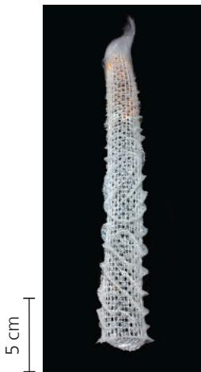

  
(a) Glass sponge  
(b) La Sagrada Família towers

over time in no way violates the second law. The entropy of a particular system, such as an organism, may actually decrease as long as the total entropy of the universe—the system plus its surroundings—increases. Thus, organisms are islands of low entropy in an increasingly random universe. The evolution of biological order is perfectly consistent with the laws of thermodynamics.

## Concept Check 8.1

1. MAKE CONNECTIONS How does the second law of thermodynamics help explain the diffusion of a substance across a membrane? (See Figure 7.11.)

2. Describe the forms of energy found in an apple as it grows on a tree, then falls, then is digested by someone who eats it.

3. WHAT IF? If you place a teaspoon of sugar in the bottom of a glass of water, it will dissolve completely over time. Left longer, eventually the water will disappear and the sugar crystals will reappear. Explain these observations in terms of entropy.

For suggested answers, see Appendix A.

## Concept 8.2: The free-energy change of a reaction tells us whether or not the reaction occurs spontaneously

The laws of thermodynamics that we've just explored apply to the universe as a whole. As biologists, we want to understand the chemical reactions of life—for example, which reactions occur spontaneously and which ones require some input of energy from outside. But how can we know this without assessing the energy and entropy changes in the entire universe for each separate reaction?

## Free-Energy Change, $\Delta G$

Recall that the universe is really equivalent to “the system” plus “the surroundings.” In 1878, J. Willard Gibbs, a professor at Yale, defined a very useful function called the Gibbs free energy of a system (without considering its surroundings), symbolized by the letter G. We’ll refer to the Gibbs free energy simply as free energy. Free energy is the portion of a system’s energy that can perform work when temperature and pressure are uniform throughout the system, as in a living cell. Let’s consider how we determine the free-energy change that occurs when a system changes—for example, during a chemical reaction.

The change in free energy, $\Delta G$ , can be calculated for a chemical reaction by applying the following equation:

$$
\Delta G = \Delta H - T \Delta S
$$

This equation uses only properties of the system (the reaction) itself: $\Delta H$ symbolizes the change in the system's enthalpy (in biological systems, equivalent to total energy); $\Delta S$ is the change in the system's entropy; and $T$ is the absolute temperature in Kelvin (K) units ( $K = ^{\circ}C + 273$ ).

Using chemical methods, we can measure $\Delta G$ for any reaction. (The value will depend on conditions such as pH, temperature, and concentrations of reactants and products.) Once we know the value of $\Delta G$ for a process, we can use it to predict whether the process will be spontaneous (that is, whether it is energetically favorable and will occur without an input of energy). More than a century of experiments has shown that only processes with a negative $\Delta G$ are spontaneous. For $\Delta G$ to be negative, $\Delta H$ must be negative (the system gives up enthalpy and H decreases) or $T\Delta S$ must be positive (the system gives up order and S increases), or both: When $\Delta H$ and $T\Delta S$ are tallied, $\Delta G$ has a negative value ( $\Delta G < 0$ ) for all spontaneous processes.

In other words, every spontaneous process decreases the system's free energy, and processes that have a positive or zero $\Delta G$ are never spontaneous.

This information is immensely interesting to biologists, for it allows us to predict which kinds of change can happen without an input of energy. Such spontaneous changes can be harnessed by the cell to perform work. This principle is very important in the study of metabolism, where a major goal is to determine which reactions can supply energy for cellular work.

## Free Energy, Stability, and Equilibrium

As we saw in the previous section, when a process occurs spontaneously in a system, we can be sure that $\Delta G$ is negative. Another way to think of $\Delta G$ is to realize that it represents the difference between the free energy of the final state and the free energy of the initial state:

$$
\Delta G = G _ {\mathrm{finalstate}} - G _ {\mathrm{initialstate}}
$$

For a reaction to have a negative $\Delta G$ , the system must lose free energy during the change from initial state to final state. Because it has less free energy, the system in its final state is less likely to change and is therefore more stable than it was previously.

We can think of free energy as a measure of a system's instability—its tendency to change to a more stable state. Unstable systems (higher $G$ ) tend to change in such a way that they become more stable (lower $G$ ). For example, a diver on top of a platform is less stable (more likely to fall) than when floating in the water; a drop of concentrated dye is less stable (more likely to disperse) than when the dye is spread randomly through the liquid; and a glucose molecule is less stable (more likely to break down) than the simpler molecules into which it can be split (Figure 8.5). Unless something

\- More free energy (higher $G$ )

\- Less stable

\- Greater work capacity

\- The free energy of the system decreases $(\Delta G < 0)$ .

• The system becomes more stable.

\- The released free energy can be harnessed to do work.

\- More stable

• Less work capacity

Figure 8.5 The relationship of free energy to stability, work capacity, and spontaneous change. Unstable systems (top) are rich in free energy, G. They tend to change spontaneously to a more stable state (bottom). This “downhill” change can be harnessed to perform work.  
  
(a) Gravitational motion. Objects move spontaneously from a higher altitude to a lower one.

  
(b) Diffusion. Molecules in a drop of dye diffuse until they are randomly dispersed.  
MAKE CONNECTIONS Compare the redistribution of molecules shown in (b) to the transport of hydrogen ions $(H^{+})$ across a membrane by a proton pump, creating a concentration gradient (see Figure 7.18). Which process(es) result(s) in higher free energy? Which system(s) can do work? For suggested answer, see Appendix A.

  
(c) Chemical reaction. In a cell, a glucose molecule is broken down into simpler molecules.

prevents it, each of these systems will move toward greater stability: The diver falls, the solution becomes uniformly colored, and the glucose molecule is broken down into smaller molecules.

Another term that describes a state of maximum stability is equilibrium, which you learned about in Concept 2.4 in connection with chemical reactions. At equilibrium, the forward and reverse reactions occur at the same rate, and there is no further net change in the relative concentration of products and reactants. For a system at equilibrium, G is at its lowest possible value in that system. Free energy increases when a reaction is somehow pushed away from equilibrium, perhaps by removing some of the products (and thus changing their concentration relative to that of the reactants). We can think of the equilibrium state as a free-energy valley. Any change from the equilibrium position will have a positive $\Delta G$ and will not be spontaneous. For this reason, systems never spontaneously move away from equilibrium. Because a system at equilibrium cannot spontaneously change, it can do no work. A process is spontaneous and can perform work only when it is moving toward equilibrium.

## Free Energy and Metabolism

We can now apply the free-energy concept more specifically to the chemistry of life's processes.

## Exergonic and Endergonic Reactions in Metabolism

Based on their free-energy changes, chemical reactions can be classified as either exergonic (“energy outward”) or endergonic (“energy inward”). An exergonic reaction proceeds with a net release of free energy (Figure 8.6a). Because the chemical mixture loses free energy (G decreases), $\Delta G$ is negative for an exergonic reaction. Using $\Delta G$ as a standard for spontaneity, exergonic reactions are those that occur spontaneously. (Remember, the word spontaneous implies that it is energetically favorable, not that it will occur rapidly.) The magnitude of $\Delta G$ for an exergonic reaction represents the maximum amount of work the reaction can perform.\* The greater the decrease in free energy, the greater the amount of work that can be done.

We can use the overall reaction for cellular respiration as an example:

$$
\begin{array}{l}\mathrm{C} _ {1 6} \mathrm{H} _ {1 2} \mathrm{O} _ {6} + 6 \mathrm{O} _ {2} \rightarrow 6 \mathrm{CO} _ {2} + 6 \mathrm{H} _ {2} \mathrm{O}\\\Delta G = - 6 8 6 \mathrm{kcal/mol} (- 2, 8 7 0 \mathrm{kJ/mol})\end{array}
$$

For each mole (180 g) of glucose broken down by respiration under what are called “standard conditions” (1 M of each reactant and product, 25°C, pH 7), 686 kcal (2,870 kJ) of energy is made available for work. Because energy must be conserved, the chemical products of respiration store 686 kcal less free energy per mole than the reactants. The products are, in a sense, the spent exhaust of a process that tapped the free energy stored in the bonds of the sugar molecules.

It is important to realize that the breaking of bonds does not release energy; on the contrary, as you will soon see, it requires energy. The phrase “energy stored in bonds” is shorthand for the potential energy that can be released when new bonds are formed after the original bonds break, as long as the products are of lower free energy than the reactants.

Figure 8.6 Free energy changes $\Delta G$ in exergonic and endergonic reactions.  
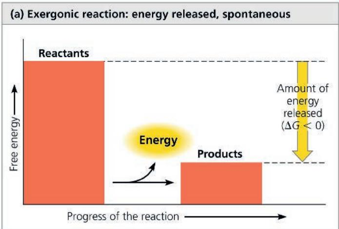

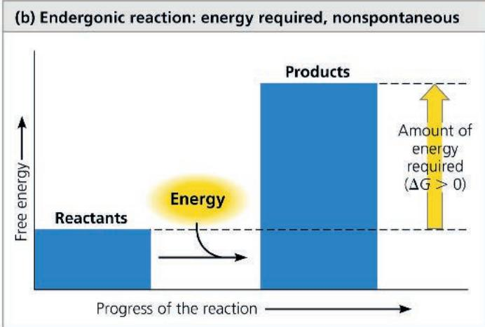

An endergonic reaction is one that absorbs free energy from its surroundings (Figure 8.6b). Because this kind of reaction essentially stores free energy in molecules (G increases), $\Delta G$ is positive. Such reactions are non-spontaneous, and the magnitude of $\Delta G$ is the quantity of energy required to drive the reaction. If a chemical process is exergonic (downhill), releasing energy in one direction, then the reverse process must be endergonic (uphill), using energy. A reversible process cannot be downhill in both directions. If $\Delta G = -686$ kcal/mol for respiration, which converts glucose and oxygen to $CO_{2}$ and $H_{2}O$ , then the reverse process—the conversion of $CO_{2}$ and $H_{2}O$ to glucose and oxygen ( $O_{2}$ )—must be strongly endergonic, with $\Delta G = +686$ kcal/mol. Such a reaction would never happen by itself.

How, then, do plants make sugar? They get the required energy (686 kcal to make a mole of glucose) by capturing light from the sun and converting its energy to chemical energy. Next, in a long series of exergonic steps, they gradually spend that chemical energy to assemble glucose molecules.

## Equilibrium and Metabolism

Reactions in an isolated system eventually reach equilibrium and can then do no work, as illustrated by the isolated hydroelectric

Figure 8.7 Equilibrium and work in an isolated hydroelectric system.

Water flowing downhill turns a turbine that drives a generator providing electricity to a lightbulb, but only until the system reaches equilibrium.

system in Figure 8.7. The chemical reactions of metabolism are reversible, and they, too, would reach equilibrium if they occurred in the isolation of a test tube. Because systems at equilibrium are at a minimum of G and can do no work, a cell that has reached metabolic equilibrium is dead! The fact that metabolism as a whole is never at equilibrium is one of the defining features of life.

Like most systems, a living cell is not in equilibrium. Materials flow in and out, keeping metabolic pathways from ever reaching equilibrium, and the cell continues to do work throughout its life. This principle is illustrated by the open (and more realistic) hydroelectric system in Figure 8.8a. However, unlike this simple single-step system, a catabolic pathway in a cell releases free energy in a series of reactions. An example is cellular

(a) An open hydroelectric system. Water flowing through a turbine keeps driving the generator because intake and outflow of water keep the system from reaching equilibrium.

Figure 8.8 Equilibrium and work in open systems.  

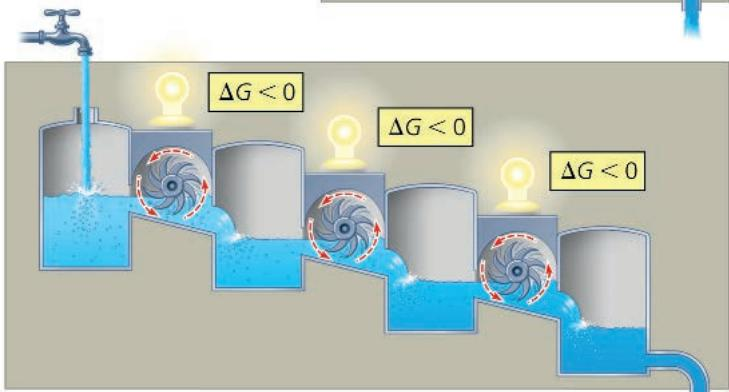  
(b) A multistep open hydroelectric system. Cellular respiration is analogous to this system: Glucose is broken down in a series of exergonic reactions that power the work of the cell. The product of each reaction is used as the reactant for the next, so no reaction reaches equilibrium.

respiration, illustrated by analogy in Figure 8.8b. Some of the reversible reactions of respiration are constantly “pulled” in one direction—that is, they are kept out of equilibrium. The key to maintaining this lack of equilibrium is that the product of a reaction does not accumulate but instead becomes a reactant in the next step; finally, waste products are expelled from the cell. The overall sequence of reactions is kept going by the huge free-energy difference between glucose and $O_{2}$ at the top of the energy “hill” and $CO_{2}$ and $H_{2}O$ at the “downhill” end. As long as our cells have a steady supply of glucose or other fuels and oxygen and are able to expel waste products to the surroundings, their metabolic pathways never reach equilibrium and can continue to do the work of life.

Organisms are open systems. Sunlight provides a daily source of free energy for an ecosystem's plants and other photosynthetic organisms. Animals and other nonphotosynthetic organisms in an ecosystem must have a source of free energy—the organic products of photosynthesis. Now we are ready to see how a cell actually performs the work of life.

## Concept Check 8.2

1. Cellular respiration uses glucose and $O_{2}$ , which have high levels of free energy, and releases $CO_{2}$ and $H_{2}O$ , which have low levels of free energy. Is cellular respiration spontaneous or not? Is it exergonic or endergonic? What happens to the energy released from glucose?

2. VISUAL SKILLS How would the processes of catabolism and anabolism relate to Figure 8.5c?

3. WHAT IF? Some partygoers wear glow-in-the-dark necklaces that start glowing once they are “activated” by snapping the necklace. This allows two chemicals to react and emit light in the form of chemiluminescence. Is the reaction exergonic or endergonic? Explain.

For suggested answers, see Appendix A.

## Concept 8.3: ATP powers cellular work by coupling exergonic reactions to endergonic reactions

## A cell does three main kinds of work:

\- Chemical work, the pushing of endergonic reactions that would not occur spontaneously, such as the synthesis of polymers from monomers (chemical work will be discussed further here; examples are shown in Chapters 9 and 10)

\- Transport work, the pumping of substances across membranes against the direction of spontaneous movement (see Concept 7.4)

\- Mechanical work, such as the beating of cilia (see Concept 6.6), the contraction of muscle cells, and the movement of chromosomes during cellular reproduction

A key feature in the way cells manage their energy resources to do this work is energy coupling, the use of an exergonic

process to drive an endergonic one. ATP is responsible for mediating most energy coupling in cells, and in most cases it acts as the immediate source of energy that powers cellular work.

## The Structure and Hydrolysis of ATP

ATP (adenosine triphosphate; see Concept 4.3) contains the sugar ribose, with the nitrogenous base adenine and a chain of three phosphate groups (the triphosphate group) bonded to it (Figure 8.9a). In addition to its role in energy coupling, ATP is also one of the nucleoside triphosphates used to make RNA (see Figure 5.23).

The bonds between the phosphate groups of ATP can be broken by hydrolysis. When the terminal phosphate bond is broken by addition of a water molecule, a molecule of inorganic phosphate ( $HOPO_{3}^{2-}$ , abbreviated as $P_{1}$ throughout this book) leaves the ATP, which becomes adenosine diphosphate, or ADP

Figure 8.9 The structure and hydrolysis of adenosine triphosphate (ATP).

Throughout this book, the chemical structure of the triphosphate group seen in (a) will be represented by the three joined yellow circles shown in (b).

  
(b) The hydrolysis of ATP. The reaction of ATP and water yields inorganic phosphate ( $P_{i}$ ) and ADP and releases energy.

(Figure 8.9b). The reaction is exergonic and releases 7.3 kcal of energy per mole of ATP hydrolyzed:

$$
\begin{array}{r l}&\mathrm{ATP} + \mathrm{H} _ {2} \mathrm{O} \rightarrow \mathrm{ADP} + \textcircled {\mathbb {P}} _ {\mathrm{i}}\\&\Delta G = - 7. 3 \mathrm{kcal/mol} (- 3 0. 5 \mathrm{kJ/mol})\end{array}
$$

This is the free-energy change measured under standard conditions. In the cell, conditions do not conform to standard conditions, primarily because reactant and product concentrations differ from 1 M. For example, when ATP hydrolysis occurs under typical cellular conditions, the actual $\Delta G$ is about -13 kcal/mol, 78% greater than the energy released by ATP hydrolysis under standard conditions.

Because their hydrolysis releases energy, the phosphate bonds of ATP are sometimes referred to as high-energy phosphate bonds, but the term is misleading. The phosphate bonds of ATP are not unusually strong bonds, as “high-energy” may imply; rather, the reactants (ATP and water) themselves have high energy relative to the energy of the products (ADP and $\textcircled{P}_{i}$ ). The release of energy during the hydrolysis of ATP comes from the chemical change of the system to a state of lower free energy, not from the phosphate bonds themselves.

ATP is useful to the cell because the energy it releases on losing a phosphate group is somewhat greater than the energy most other molecules could deliver. But why does this hydrolysis release so much energy? If we reexamine the ATP molecule in Figure 8.9a, we can see that all three phosphate groups are negatively charged. These like charges are crowded together, and their mutual repulsion contributes to the instability of this region of the ATP molecule. The triphosphate tail of ATP is the chemical equivalent of a compressed spring.

## How ATP Provides Energy That Performs Work

When ATP is hydrolyzed in a test tube, the release of free energy merely heats the surrounding water. In an organism, this same generation of heat can sometimes be beneficial. For instance, the process of shivering uses ATP hydrolysis during muscle contraction to warm the body. In most cases in the cell, however, the generation of heat alone would be an inefficient (and potentially dangerous) use of a valuable energy resource. Instead, the cell's proteins harness the energy released during ATP hydrolysis in several ways to perform the three types of cellular work—chemical, transport, and mechanical.

For example, with the help of specific enzymes, the cell is able to use the high free energy of ATP to drive chemical reactions that, by themselves, are endergonic. If the $\Delta G$ of an endergonic reaction is less than the amount of energy released by ATP hydrolysis, then the two reactions can be coupled so that, overall, the coupled reactions are exergonic. This usually involves phosphorylation, the transfer of a phosphate group from ATP to some other molecule, such as the reactant. The recipient molecule with the phosphate group covalently bonded to it is then called a phosphorylated intermediate. The key to coupling exergonic and endergonic reactions is the formation of this phosphorylated intermediate,

Figure 8.10 How ATP drives chemical work: energy coupling using ATP hydrolysis.

In this example, the exergonic process of ATP hydrolysis drives an endergonic process—synthesis of the amino acid glutamine.

  
MAKE CONNECTIONS Referring to Figure 5.14, explain why glutamine (Gln) is drawn in this figure

as a glutamic acid (Glu) with an amino group attached.

For suggested answer, see Appendix A.

which is more reactive (less stable, with more free energy) than the original unphosphorylated molecule (Figure 8.10).

Transport and mechanical work in the cell are also nearly always powered by the hydrolysis of ATP. In these cases, ATP hydrolysis leads to a change in a protein's shape and often its ability to bind another molecule. Sometimes this occurs via a phosphorylated intermediate, as seen for the transport protein in Figure 8.11a. In most instances of mechanical work involving motor proteins “walking”

along cytoskeletal elements (Figure 8.11b), a cycle occurs in which ATP is first bound noncovalently to the motor protein. Next, ATP is hydrolyzed, releasing ADP and $P_{i}$ Another ATP molecule can then bind. At each stage, the motor protein changes its shape and ability to bind the cytoskeleton, resulting in movement of the protein along the cytoskeletal track. Phosphorylation and dephosphorylation promote crucial protein shape changes during many other important cellular processes as well.

Figure 8.11 How ATP drives transport and mechanical work.

ATP hydrolysis causes changes in the shapes and binding affinities of proteins. This can occur either (a) directly, by phosphorylation, as shown for a membrane protein carrying out active transport of a solute (see also Figure 7.16 and the proton pump in Figure 6.32, upper left), or (b) indirectly, via noncovalent binding of ATP and its hydrolytic products, as is the case for motor proteins that move vesicles (and other organelles) along cytoskeletal “tracks” in the cell (see also Figures 6.21 and 6.32, lower right).

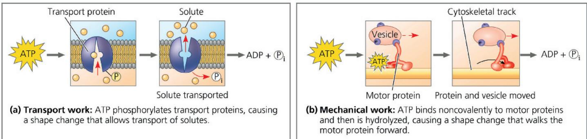

Figure 8.12 The ATP cycle.

Energy released by breakdown reactions (catabolism) in the cell is used to phosphorylate ADP, regenerating ATP. Chemical potential energy stored in ATP drives most cellular work.

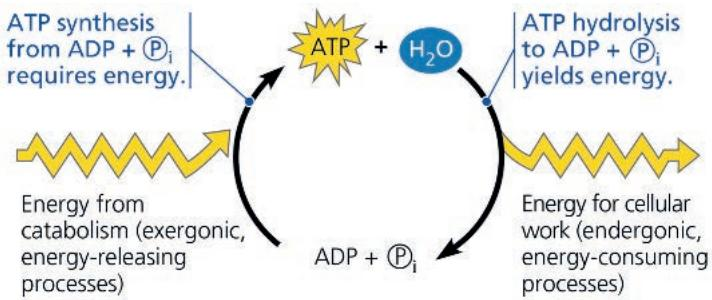

## The Regeneration of ATP

An organism at work uses ATP continuously, but ATP is a renewable resource that can be regenerated by the addition of phosphate to ADP (Figure 8.12). The free energy required to phosphorylate ADP comes from exergonic breakdown reactions (catabolism) in the cell. This shuttling of inorganic phosphate and energy is called the ATP cycle, and it couples the cell's energy-yielding (exergonic) processes to the energy-consuming (endergonic) ones. The ATP cycle proceeds at an astonishing pace. For example, a working muscle cell recycles its entire pool of ATP in less than a minute. That turnover represents 10 million molecules of ATP consumed and regenerated per second per cell. If ATP could not be regenerated by the phosphorylation of ADP, humans would use up nearly their body weight in ATP each day.

Because both directions of a reversible process cannot be downhill, the regeneration of ATP from ADP and $P_{i}$ is necessarily endergonic:

$$
\mathrm{ADP} + \textcircled {P} _ {\mathrm{i}} \rightarrow \mathrm{ATP} + \mathrm{H} _ {2} \mathrm{O}
$$

$\Delta G = +7.3 \mathrm{kcal} / \mathrm{mol}$ (+30.5 kJ/mol)(standard conditions)

Since ATP formation from ADP and $P_{i}$ is not spontaneous, free energy must be spent to make it occur. Catabolic (exergonic) pathways, especially cellular respiration, provide the energy for the endergonic process of making ATP. Plants also use light energy to produce ATP. Thus, the ATP cycle is a key player in bioenergetics, functioning as a revolving door through which energy passes during its transfer from catabolic to anabolic pathways.

## Concept Check 8.3

1. How does ATP typically transfer energy from an exergonic to an endergonic reaction in the cell?

2. Which combination has more free energy:
glutamic acid + ammonia + ATP or glutamine + ADP + $\textcircled{P}_{i}$ Explain.

3. MAKE CONNECTIONS Does Figure 8.11a show passive or active transport? Explain. (See Concepts 7.3 and 7.4.)

For suggested answers, see Appendix A.

# Concept 8.4: Enzymes speed up metabolic reactions by lowering energy barriers

The laws of thermodynamics tell us what will and will not happen under given conditions but say nothing about the rate of these processes. A spontaneous chemical reaction occurs without any requirement for outside energy, but it may occur so slowly that it is imperceptible. For example, even though the hydrolysis of sucrose (table sugar) to glucose and fructose is exergonic, occurring spontaneously with a release of free energy ( $\Delta G = -7$ kcal/mol), a solution of sucrose dissolved in sterile water will sit for years at room temperature with no appreciable hydrolysis. However, if we add a small amount of the enzyme sucrase to the solution, then all the sucrose may be hydrolyzed within seconds, as shown here:

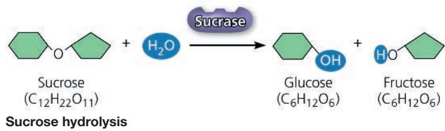

How does the enzyme do this? An enzyme is a macromolecule that acts as a catalyst, a chemical agent that speeds up a reaction without being consumed by the reaction. In this chapter, we focus on enzymes that are proteins. (Some RNA molecules, called ribozymes, can function as enzymes; these will be discussed in Concepts 17.3 and 25.1.) Without regulation by enzymes, chemical traffic through the pathways of metabolism would become terribly congested because many chemical reactions would take such a long time. In the next two sections, we will see why spontaneous reactions can be slow and how an enzyme changes the situation.

## The Activation Energy Barrier

Every chemical reaction between molecules involves both bond breaking and bond forming. For example, the hydrolysis of sucrose involves breaking the bond between glucose and fructose and one of the bonds of a water molecule and then forming two new bonds, as shown previously. Changing one molecule into another generally involves contorting the starting molecule into a highly unstable state before the reaction can proceed. This contortion can be compared to the bending of a metal key ring when you pry it open to add a new key. The key ring is highly unstable in its opened form but returns to a stable state once the key is threaded all the way onto the ring. To reach the contorted state where bonds can change, reactant molecules must absorb energy from their surroundings. When the new bonds of the product molecules form, energy is released as heat, and the molecules return to stable shapes with lower energy than the contorted state.

For suggested answer, see Appendix A.

The initial investment of energy for starting a reaction—the energy required to contort the reactant molecules so the bonds can break—is known as the free energy of activation, or activation energy, abbreviated $E_{A}$ in this book. We can think of activation energy as the amount of energy needed to push the reactants to the top of an energy barrier, or “uphill,” so that the “downhill” part of the reaction can begin. Activation energy is often supplied by heat in the form of thermal energy that the reactant molecules absorb from the surroundings. The absorption of thermal energy accelerates the reactant molecules, so they collide more often and more forcefully. It also agitates the atoms within the molecules, making the breakage of bonds more likely. When the molecules have absorbed enough energy for the bonds to break, the reactants are in an unstable condition known as the transition state.

Figure 8.13 graphs the energy changes for a hypothetical exergonic reaction that swaps portions of two reactant molecules:

$$
\begin{array}{l l}\mathrm{AB} + \mathrm{CD} \rightarrow \mathrm{AC} + \mathrm{BD}\\\text {Reactants}&\text {Products}\end{array}
$$

## Figure 8.13 Energy profile of an exergonic reaction.

The “molecules” are hypothetical, with A, B, C, and D representing portions of the molecules. Thermodynamically, this is an exergonic reaction, with a negative $\Delta G$ , and the reaction occurs spontaneously. However, the activation energy ( $E_{A}$ ) provides a barrier that determines the rate of the reaction.

The reactants AB and CD must absorb enough energy from the surroundings to reach the unstable transition state, where bonds can break.

After bonds have broken, new bonds form, releasing energy to the surroundings.

  
DRAW IT Graph the progress of an endergonic reaction in which EF and GH form products EG and FH, assuming that the reactants must pass through a transition state.

The activation of the reactants is represented by the uphill portion of the graph, in which the free-energy content of the reactant molecules is increasing. At the summit, when energy equivalent to $E_{A}$ has been absorbed, the reactants are in the transition state: They are activated, and their bonds can be broken. As the atoms then settle into their new, more stable bonding arrangements, energy is released to the surroundings. This corresponds to the downhill part of the curve, which shows the loss of free energy by the molecules. The overall decrease in free energy means that $E_{A}$ is repaid with dividends, as the formation of new bonds releases more energy than was invested in the breaking of old bonds.

The reaction shown in Figure 8.13 is exergonic and occurs spontaneously ( $\Delta G < 0$ ). However, the activation energy provides a barrier that determines the rate of the reaction. The reactants must absorb enough energy to reach the top of the activation energy barrier before the reaction can occur. For some reactions, $E_{A}$ is modest enough that even at room temperature there is sufficient thermal energy for many of the reactant molecules to reach the transition state in a short time. In most cases, however, $E_{A}$ is so high and the transition state is reached so rarely that the reaction will hardly proceed at all. In these cases, the reaction will occur at a noticeable rate only if energy is provided, usually by heat. For example, the reaction of gasoline and oxygen is exergonic and will occur spontaneously, but energy is required for the molecules to reach the transition state and react. Only when the spark plugs fire in an automobile engine can there be the explosive release of energy that pushes the pistons. Without a spark, a mixture of gasoline hydrocarbons and oxygen will not react because the $E_{A}$ barrier is too high.

## How Enzymes Speed Up Reactions

Proteins, DNA, and other complex cellular molecules are rich in free energy and have the potential to decompose spontaneously; that is, the laws of thermodynamics favor their breakdown. These molecules only persist because at temperatures typical for cells, few molecules can make it over the hump of activation energy. The barriers for selected reactions must occasionally be surmounted, however, for cells to carry out the processes needed for life. Heat can increase the rate of a reaction by allowing reactants to attain the transition state more often, but this would not work well in biological systems. First, high temperature denatures proteins and kills cells. Second, heat would speed up all reactions, not just those that are needed. Instead of heat, organisms carry out catalysis, the process by which a catalyst selectively speeds up a reaction without itself being consumed. (You learned about catalysts earlier in this section.)

An enzyme catalyzes a reaction by lowering the $E_{A}$ barrier (Figure 8.14), enabling the reactant molecules to absorb enough energy to reach the transition state even at moderate temperatures, as we'll see shortly. It is crucial to note that an enzyme cannot change the $\Delta G$ for a reaction; it cannot make an endergonic reaction exergonic. Enzymes can only hasten reactions that would eventually occur anyway, but this enables the cell to have a dynamic metabolism,

Figure 8.14 The effect of an enzyme on activation energy. Without affecting the free-energy change ( $\Delta G$ ) for a reaction, an enzyme speeds the reaction by reducing its activation energy ( $E_{A}$ ).  
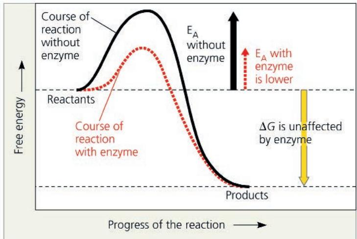

routing chemicals smoothly through metabolic pathways. Also, enzymes are very specific for the reactions they catalyze, so they determine which chemical processes will be going on in the cell at any given time.

## Substrate Specificity of Enzymes

The reactant an enzyme acts on is referred to as the enzyme's substrate. The enzyme binds to its substrate (or substrates, when there are two or more reactants), forming an enzyme-substrate complex. While enzyme and substrate are joined, the catalytic action of the enzyme converts the substrate to the product (or

products) of the reaction. The overall process can be summarized as follows:

$$
\begin{array}{c}\text {Enzyme +}\\\text {Substrate(s)}\end{array}\rightleftharpoons\begin{array}{c}\text {Enzyme -}\\\text {substrate}\\\text {complex}\end{array}\rightleftharpoons\begin{array}{c}\text {Enzyme +}\\\text {Product(s)}\end{array}
$$

Most enzyme names end in -ase. (See if you can find three examples of enzymes in the lower left of Figure 6.32.) For example, the enzyme sucrase catalyzes the hydrolysis of the disaccharide sucrose into its two monosaccharides, glucose and fructose (see the diagram at the beginning of Concept 8.4):

$$
\begin{array}{l l}\text {Sucrase +}&\text {Sucrase -}\\\text {Sucrose +}&\rightleftharpoons \text {sucrose- H _ {2} O}\\\text {H _ {2} O}&\text {complex}\end{array}\quad \rightleftharpoons \quad\begin{array}{l l}\text {Sucrase +}\\\text {Glucose +}\\\text {Fructose}\end{array}
$$

The reaction catalyzed by each enzyme is very specific; an enzyme can recognize its specific substrate even among closely related compounds. For instance, sucrase will act only on sucrose and will not bind to other disaccharides, such as maltose. What accounts for this molecular recognition? Recall that most enzymes are proteins, and that proteins are macromolecules with unique 3-D configurations. The specificity of an enzyme results from its shape, which is a consequence of its amino acid sequence.

Only a restricted region of the enzyme molecule actually binds to the substrate. This region, called the active site, is typically a pocket or groove on the surface of the enzyme where catalysis occurs (Figure 8.15a; see also Figure 5.16). Usually, the active site is formed by only a few of the enzyme's amino acids, with the rest of the protein molecule providing a framework that determines the shape of the active site. The specificity of an enzyme is attributed to a complementary fit between the shape of its active site and the shape of the substrate.

Figure 8.15 Induced fit between an enzyme and its substrate.  
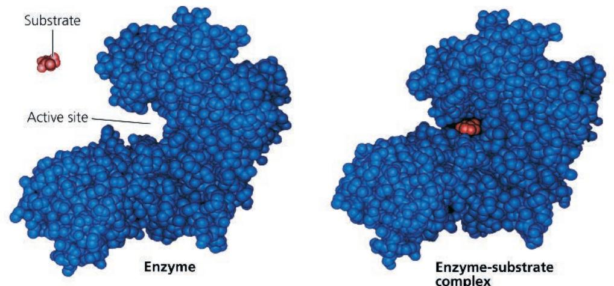  
(a) In this space-filling model of the enzyme hexokinase (blue), the active site forms a groove on the surface. The enzyme's substrate is glucose (red).  
(b) When the substrate enters the active site, it forms weak bonds with the enzyme, inducing a change in the shape of the protein. This change allows additional weak bonds to form, causing the active site to enfold the substrate and hold it in place.

An enzyme is not a stiff structure locked into a given shape. In fact, biochemical studies have shown that enzymes (and other proteins) seem to “dance” between subtly different shapes in a dynamic equilibrium, with slight differences in free energy for each “pose.” The shape that best fits the substrate isn’t necessarily the one with the lowest energy, but during the very short time the enzyme takes on this shape, its active site can bind to the substrate. The active site itself is also not a rigid receptacle for the substrate. As shown in Figure 8.15b, when the substrate enters the active site, the enzyme changes shape slightly due to interactions between the substrate’s chemical groups and chemical groups on the side chains of the amino acids

that form the active site. This shape change makes the active site fit even more snugly around the substrate. The tightening of the binding after initial contact—called induced fit—is like a clasping handshake. Induced fit brings chemical groups of the active site into positions that enhance their ability to catalyze the chemical reaction.

## Catalysis in the Enzyme's Active Site

In most enzymatic reactions, the substrate is held in the active site by so-called weak interactions, such as hydrogen bonds and ionic bonds. The R groups of a few of the amino acids that make up the active site catalyze the conversion of substrate to product, and the product departs from the active site. The enzyme is then free to take another substrate molecule into its active site. The entire cycle happens so fast that a single enzyme molecule typically acts on about 1,000 substrate molecules per second, and some enzymes are even faster. Enzymes, like other catalysts, emerge from the reaction in their original form. Therefore, very small amounts of enzyme can have a huge metabolic impact by functioning over and over again in catalytic cycles. Figure 8.16 shows a catalytic cycle involving two substrates and two products.

Figure 8.16 The active site and catalytic cycle of an enzyme. An enzyme can convert one or more reactant molecules to one or more product molecules. The enzyme shown here converts two substrate molecules to two product molecules.  
  
VISUAL SKILLS The enzyme-substrate complex passes through a transition state (see Figure 8.13). Label the part of the cycle where the transition state occurs.  
For suggested answer, see Appendix A.

Most metabolic reactions are reversible, and an enzyme can catalyze either the forward or the reverse reaction, depending on which direction has a negative $\Delta G$ . This in turn depends mainly on the relative concentrations of reactants and products. The net effect is always in the direction of equilibrium.

Enzymes use a variety of mechanisms that lower activation energy and speed up a reaction (see Figure 8.16, 3):

\- In reactions involving two or more reactants, the active site provides a template on which the substrates can come together in the proper orientation for a reaction to occur between them.

\- As the active site of an enzyme clutches the bound substrates, the enzyme may stretch the substrate molecules toward their transition state form, stressing and bending critical chemical bonds to be broken during the reaction. Because $E_{A}$ is proportional to the difficulty of breaking the bonds, distorting the substrate helps it approach the transition state and thus reduces the amount of free energy that must be absorbed to achieve that state.

\- The active site may also provide a microenvironment that is more conducive to a certain reaction than the solution itself would be without the enzyme. For example, if the active site has amino acids with acidic R groups, it may provide a pocket of low pH in an otherwise neutral cell. Here, an acidic amino acid may facilitate $H^{+}$ transfer to the substrate as a key step in catalyzing the reaction.

\- Amino acids in the active site may directly participate in the chemical reaction. Sometimes this process involves brief covalent bonding between the substrate and the side chain of an amino acid of the enzyme. Subsequent steps restore the side chains to their original states so that the active site is the same after the reaction as it was before.

The rate at which a particular amount of enzyme converts substrate to product is partly a function of the initial concentration of the substrate: The more substrate molecules that are available, the more frequently they access the active sites of the enzyme molecules. However, there is a limit to how fast the reaction can be pushed by adding more substrate to a fixed concentration of enzyme. At some point, the concentration of substrate will be high enough that all enzyme molecules will have their active sites engaged. As soon as the product exits an active site, another substrate molecule enters. At this substrate concentration, the enzyme is said to be saturated, and the rate of the reaction is determined by the speed at which the active site converts substrate to product. When an enzyme population is saturated, the only way to increase the rate of product formation is to add more enzyme. Cells often increase the rate of a reaction by producing more enzyme molecules. You can graph the overall progress of an enzymatic reaction in the Scientific Skills Exercise.

# Scientific Skills Exercise Making a Line Graph and Calculating a Slope

Does the Rate of Glucose 6-Phosphatase Activity Change over Time in Isolated Liver Cells? Glucose 6-phosphatase, which is found in mammalian liver cells, is a key enzyme in control of blood glucose level. The enzyme catalyzes the breakdown of glucose 6-phosphate into glucose and inorganic phosphate ( $P_{i}$ ). These products are transported out of liver cells into the blood, increasing the blood glucose level. In this exercise, you will graph data from a time-course experiment that measured $P_{i}$ concentration in the buffer outside isolated liver cells, thus indirectly measuring glucose 6-phosphatase activity inside the cells.

How the Experiment Was Done Isolated rat liver cells were placed in a dish with buffer at physiological conditions (pH 7.4, 37°C). Glucose 6-phosphate (the substrate) was added so it could be taken up by cells and broken down by glucose 6-phosphatase. A sample of buffer was removed every 5 minutes and the concentration of $\textcircled{P}_{i}$ that had been transported out of the cells was determined.

## Data from the Experiment

<table><tr><td>Time (min)</td><td>Concentration of  $\textcircled{P}_i$  (μmol/mL)</td></tr><tr><td>0</td><td>0</td></tr><tr><td>5</td><td>10</td></tr><tr><td>10</td><td>90</td></tr><tr><td>15</td><td>180</td></tr><tr><td>20</td><td>270</td></tr><tr><td>25</td><td>330</td></tr><tr><td>30</td><td>355</td></tr><tr><td>35</td><td>355</td></tr><tr><td>40</td><td>355</td></tr></table>

Data from S. R. Commerford et al., Diets enriched in sucrose or fat increase gluconeogenesis and G-6-Pase but not basal glucose production in rats, American Journal of Physiology-Endocrinology and Metabolism 283:E545–E555 (2002).

## INTERPRET THE DATA

1. To see patterns in the data from a time-course experiment like this, it is helpful to graph the data. First, determine which set of data goes on each axis. (a) What did the researchers

## Effects of Local Conditions on Enzyme Activity

The activity of an enzyme—how efficiently the enzyme functions—is affected by general environmental factors, such as temperature and pH. It can also be affected by chemicals that specifically influence that enzyme. In fact, researchers

intentionally vary in the experiment? This is the independent variable, which goes on the x-axis. (b) What are the units (abbreviated) for the independent variable? Explain in words what the abbreviation stands for. (c) What was measured by the researchers? This is the dependent variable, which goes on the y-axis. (d) What does the units abbreviation stand for? Label each axis, including the units.

2. Next, mark off the axes with just enough evenly spaced tick marks to accommodate the full set of data. Determine the span of data values for each axis. (a) What is the largest value to go on the x-axis? What is a reasonable spacing for the tick marks, and what should be the highest one? (b) What is the largest value to go on the y-axis? What is a reasonable spacing for the tick marks, and what should be the highest one?

3. Plot the data points on your graph. Match each x-value with its partner y-value and place a point on the graph at that coordinate. Draw a line that connects the points. (For additional information about graphs, see the Scientific Skills Review in Appendix D.)

4. Examine your graph and look for patterns in the data. (a) Does the concentration of $\textcircled{P}_{i}$ increase evenly throughout the course of the experiment? To answer this question, describe the pattern you see in the graph. (b) What part of the graph shows the highest rate of enzyme activity? Consider that the rate of enzyme activity is related to the slope of the line, $\Delta y/\Delta x$ (the “rise” over the “run”), in $\mu mol/(mL\cdot min)$ , with the steepest slope indicating the highest rate of enzyme activity. Calculate the rate of enzyme activity (slope) where the graph is steepest. (c) Can you think of a biological explanation for the pattern

you see?

5. If your blood glucose level is low from skipping lunch, what reaction (discussed in this exercise) will occur in your liver cells? Write out the reaction and put the name of the enzyme over the reaction arrow. How will this reaction affect your blood glucose level?

Instructors: A version of this Scientific Skills Exercise can be assigned in Mastering Biology.

have learned much about enzyme function by employing such chemicals.

## Effects of Temperature and pH

The 3-D structures of proteins are sensitive to their environment (see Figure 5.20). As a consequence, each enzyme works better under some conditions than others, because these optimal conditions favor the most active shape for the enzyme.

Temperature and pH are environmental factors important in the activity of an enzyme. Up to a point, the rate of an enzymatic reaction increases with increasing temperature, partly because substrates collide with active sites more frequently when the molecules move rapidly. Above that temperature, however, the speed of the enzymatic reaction drops sharply. The thermal agitation of the enzyme molecule disrupts the hydrogen bonds, ionic bonds, and other weak interactions that stabilize the active shape of the enzyme, and the protein molecule eventually denatures. Each enzyme has an optimal temperature at which its reaction rate is greatest. Without denaturing the enzyme, this temperature allows the greatest number of molecular collisions and the fastest conversion of the reactants to product molecules. Most human enzymes have optimal temperatures of about 35–40°C (close to human body temperature). The thermophilic bacteria that live in hot springs contain enzymes with optimal temperatures of 70°C or higher (Figure 8.17a).

Just as each enzyme has an optimal temperature, it also has a pH at which it is most active. The optimal pH values for most enzymes fall in the range of pH 6–8, but there are exceptions. For example, pepsin, a digestive enzyme in the human stomach, works best at a very low pH. Such an acidic environment denatures most enzymes, but pepsin is well-adapted evolutionarily to maintain its functional 3-D structure in the acidic environment of the stomach. In contrast, trypsin, a digestive enzyme residing in the more alkaline environment of the human intestine would be denatured in the stomach (Figure 8.17b).

## Cofactors

Many enzymes require nonprotein helpers for catalytic activity, often for chemical processes like electron transfers that cannot easily be carried out by the amino acids in proteins. These adjuncts, called cofactors, may be bound tightly to the enzyme as permanent residents, or they may bind loosely and reversibly along with the substrate. The cofactors of some enzymes are inorganic, such as the metal atoms zinc, iron, and copper in ionic form. If the cofactor is an organic molecule, it is referred to, more specifically, as a coenzyme. Most vitamins are important in nutrition because they act as coenzymes or raw materials from which coenzymes are made.

## Enzyme Inhibitors

Certain chemicals selectively inhibit the action of specific enzymes. Sometimes the inhibitor attaches to the enzyme by covalent bonds, in which case the inhibition is usually irreversible. Many enzyme inhibitors, however, bind to the enzyme by weak interactions, and when this occurs the inhibition is reversible. Some reversible inhibitors resemble the normal

Figure 8.17 Environmental factors affecting enzyme activity. Each enzyme has an optimal (a) temperature and (b) pH that favor the most active shape of the protein molecule.  

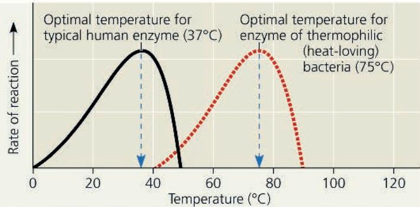  
(a) The photo shows thermophilic cyanobacteria (green) thriving in the hot water of a Nevada geyser. The graph compares the optimal temperatures for an enzyme from the thermophilic bacterium Thermus oshimai (75°C) and human enzymes (37°C, body temperature).

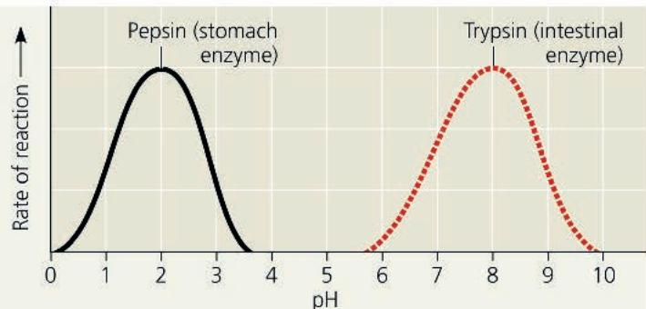  
(b) This graph shows the rate of reaction for two digestive enzymes over a range of pH values.

INTERPRET THE DATA Looking at the graph in (b), what is the optimal pH for pepsin activity? Explain why natural selection might have resulted in the optimal pH for pepsin, a stomach enzyme (see Figure 3.11). What is the optimal pH for trypsin?

Figure 8.18 Inhibition of enzyme activity.  

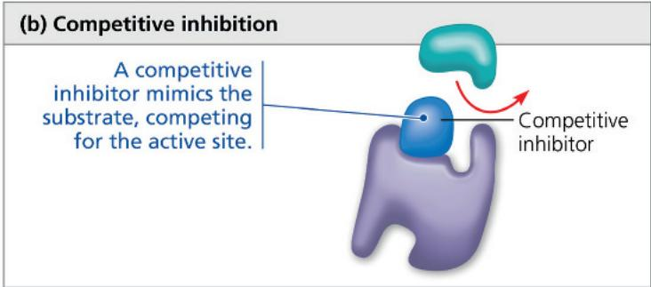

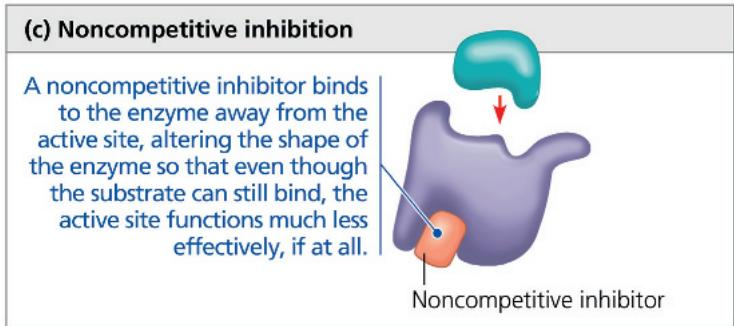

substrate molecule and compete for admission into the active site (Figure 8.18a and b). These mimics, called competitive inhibitors, reduce the productivity of enzymes by blocking substrates from entering active sites. This kind of inhibition can be overcome by increasing the concentration of substrate so that as active sites become available, more substrate molecules than inhibitor molecules are around to gain entry to the sites.

In contrast, noncompetitive inhibitors do not directly compete with the substrate to bind to the enzyme at the active site (Figure 8.18c). Instead, they impede enzymatic reactions by binding to another part of the enzyme. This interaction causes the enzyme molecule to change its shape in such a way that the active site becomes much less effective at catalyzing the conversion of substrate to product.

Toxins and poisons are often irreversible enzyme inhibitors. An example is sarin, a nerve gas. In 2017, sarin was used in a chemical attack in Syria, killing about 100 people and injuring hundreds more. This small molecule binds covalently to the R group on the amino acid serine, which is found in the active site of acetylcholinesterase, an enzyme important in the nervous system. Other examples include the pesticides DDT and parathion, inhibitors of key enzymes in the nervous system. Finally, many antibiotics are inhibitors of specific enzymes in bacteria. For instance,

penicillin blocks the active site of an enzyme that many bacteria use to make cell walls.

Citing enzyme inhibitors that are metabolic poisons may give the impression that enzyme inhibition is generally abnormal and harmful. In fact, molecules naturally present in the cell often regulate enzyme activity by acting as inhibitors. Such regulation—selective inhibition—is essential to the control of cellular metabolism, as you'll see in Concept 8.5.

## The Evolution of Enzymes

EVOLUTION Thus far, biochemists have identified more than 4,000 different enzymes in various species, most likely a very small fraction of all enzymes. How did this grand profusion of enzymes arise? Recall that most enzymes are proteins, and proteins are encoded by genes. A permanent change in a gene, known as a mutation, can result in a protein with one or more changed amino acids. In the case of an enzyme, if the changed amino acids are in the active site or some other crucial region, the altered enzyme might have a novel activity or might bind to a different substrate. Under environmental conditions where the new function benefits the organism, natural selection would tend to favor the mutated form of the gene, causing it to persist in the population. This simplified model is generally accepted as the main way in which the multitude of different enzymes arose over the past few billion years of life's history. Data supporting this model have been collected by researchers using a lab procedure that mimics evolution in natural populations (Figure 8.19).

## Figure 8.19 Mimicking evolution of an enzyme with a new function.

Researchers tested whether the function of an enzyme called $\beta$ -galactosidase, which breaks down the sugar lactose, could change over time in populations of the bacterium Escherichia coli. After seven rounds of mutation and selection in the lab, $\beta$ -galactosidase, evolved into an enzyme specialized for breaking down a sugar other than lactose. This ribbon model shows one subunit of the altered enzyme; six amino acids (indicated with labels) were different.

Two changed amino acids were found near the active site.

  
Two changed amino acids were found in the active site.  
Two changed amino acids were found on the surface.

## Concept Check 8.4

1. Many spontaneous reactions occur very slowly. What factor explains why all spontaneous reactions don't occur instantly?

2. Say you are using a Bunsen burner in the lab. Why doesn't the flame creep back into the gas line and set the gas supply on fire?

3. WHAT IF? Malonate is an inhibitor of the enzyme succinate dehydrogenase. How would you determine whether malonate is a competitive or noncompetitive inhibitor?

4. DRAW IT A mature lysosome has an internal pH of around 4.5. Using Figure 8.17b as a guide, draw a graph showing what you would predict for the rate of reaction for a lysosomal enzyme. Label its optimal pH, assuming its optimal pH matches its environment.

For suggested answers, see Appendix A.

## Concept 8.5: Regulation of enzyme activity helps control metabolism

Chemical chaos would result if all of a cell's metabolic pathways were operating simultaneously. Intrinsic to life's processes is a cell's ability to tightly regulate its metabolic pathways by controlling when and where its various enzymes are active. It does this either by switching on and off the genes that encode specific enzymes (which will be discussed in Concepts 18.1 and 18.2) or, as discussed here, by regulating the activity of enzymes once they are made.

## Allosteric Regulation of Enzymes

In many cases, the molecules that naturally regulate enzyme activity in a cell behave something like reversible noncompetitive inhibitors (see Figure 8.18c): These regulatory molecules change an enzyme's shape and the functioning of its active site by binding to a site elsewhere on the molecule, via non-covalent interactions. Allosteric regulation is the term used to describe any case in which a protein's function at one site is affected by the binding of a regulatory molecule to a separate site. It may result in either inhibition or stimulation of an enzyme's activity.

## Allosteric Activation and Inhibition

Most enzymes known to be allosterically regulated are constructed from two or more subunits, each composed of a polypeptide chain with its own active site. The entire complex oscillates between two different shapes, one catalytically active and the other inactive (Figure 8.20a). In the simplest kind of allosteric regulation, an activating or inhibiting regulatory molecule binds to a regulatory site (sometimes called an allosteric site), often located where subunits join. The binding of an activator to a regulatory site stabilizes the shape that has functional active sites, whereas the binding of an inhibitor stabilizes the inactive form of the enzyme. The subunits of an allosteric enzyme fit together in such a way that a shape change in one subunit is transmitted to all others. Through this interaction of subunits, a single activator or inhibitor molecule that binds to one regulatory site will affect the active sites of all subunits.

Figure 8.20 Allosteric regulation of enzyme activity.  
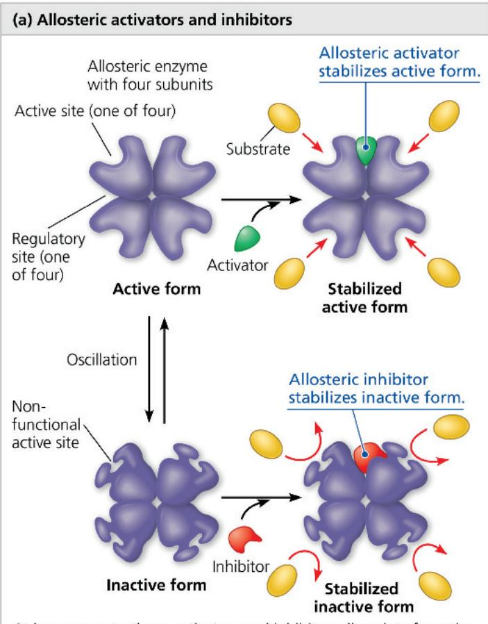  
At low concentrations, activators and inhibitors dissociate from the enzyme. The enzyme can then oscillate again.

  
The inactive form shown on the left oscillates with the active form when the active form is not stabilized by substrate.

Fluctuating concentrations of regulators can cause a sophisticated pattern of response in the activity of cellular enzymes. The products of ATP hydrolysis (ADP and $\textcircled{P}_{i}$ ), for example, play a complex role in balancing the flow of traffic between anabolic and catabolic pathways by their effects on key enzymes. ATP binds to several catabolic enzymes allosterically, lowering their affinity for substrate and thus inhibiting their activity. ADP, however, functions as an activator of the same enzymes. This is logical because catabolism functions in regenerating ATP. If ATP production lags behind its use, ADP accumulates and activates the enzymes that speed up catabolism, producing more ATP. If the supply of ATP exceeds demand, then catabolism slows down as ATP molecules accumulate and bind to the same enzymes, inhibiting them. (You'll see specific examples of this type of regulation when you learn about cellular respiration in the next chapter; see, for example, Figure 9.19.) ATP, ADP, and other related molecules also affect key enzymes in anabolic pathways. In this way, allosteric enzymes control the rates of important reactions in both sorts of metabolic pathways.

In another kind of allosteric activation, a substrate molecule binding to one active site in a multisubunit enzyme triggers a shape change in all the subunits, thereby increasing catalytic activity at the other active sites (Figure 8.20b). Called cooperativity, this mechanism amplifies the response of enzymes to substrates: One substrate molecule primes an enzyme to act on additional substrate molecules more readily. Cooperativity is considered allosteric regulation because even though substrate is binding to an active site, its binding affects catalysis in another active site.

Although hemoglobin is not an enzyme (it carries $O_{2}$ rather than catalyzing a reaction), classic studies of hemoglobin have elucidated the principle of cooperativity. Hemoglobin is made up of four subunits, each with an $O_{2}$ -binding site (see Figure 5.18). The binding of an $O_{2}$ to one binding site increases the affinity for $O_{2}$ of the remaining binding sites. Thus, where $O_{2}$ is at a high level, such as in the lungs or gills, hemoglobin's affinity for $O_{2}$ increases as more binding sites are filled. In $O_{2}$ -deprived tissues, however, the release of each $O_{2}$ molecule decreases the $O_{2}$ affinity of the other binding sites, resulting in the release of $O_{2}$ where it is most needed. Cooperativity works similarly in multisubunit enzymes that have been studied.

## Feedback Inhibition

Earlier, we looked at the allosteric inhibition of an enzyme in an ATP-generating pathway by ATP itself. This is a common mode of metabolic control, called feedback inhibition, in which a metabolic pathway is halted by the inhibitory binding of its end product to an enzyme that acts early in the pathway. Figure 8.21 shows an example of feedback inhibition operating on an anabolic pathway. Some cells use this five-step pathway to synthesize the amino acid isoleucine from threonine, another amino acid. As isoleucine accumulates, it slows down its own synthesis by allosterically inhibiting the enzyme for the first step of the pathway. Feedback inhibition thereby prevents the cell from making more isoleucine than is necessary and thus wasting chemical resources.

Figure 8.21 Feedback inhibition in isoleucine synthesis.  
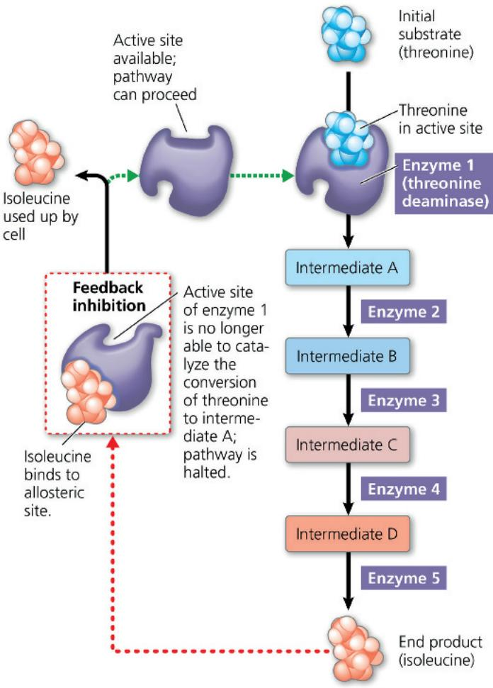

## Localization of Enzymes Within the Cell

The cell is not just a bag of chemicals with thousands of different kinds of enzymes and substrates in a random mix. The cell is compartmentalized, and cellular structures help bring order to metabolic pathways. In some cases, a team of enzymes for several steps of a metabolic pathway are assembled into a multienzyme complex. The arrangement facilitates the sequence of reactions, with the product from the first enzyme becoming the substrate for an adjacent enzyme in the complex, and so on, until the end product is released. Some enzymes and enzyme complexes have fixed locations within the cell and act as structural components of particular membranes. Others are in solution within particular membrane-enclosed eukaryotic organelles, each with its own internal chemical environment. For example, in eukaryotic cells, the enzymes for the second and third stages of cellular respiration reside in specific locations within mitochondria (Figure 8.22; see also Figure 6.32b).

Figure 8.22 Organelles and structural order in metabolism.

Organelles such as the mitochondrion (TEM) contain enzymes that carry out specific functions, in this case the second and third stages of cellular respiration. (See also Figure 6.32b, lower left.)

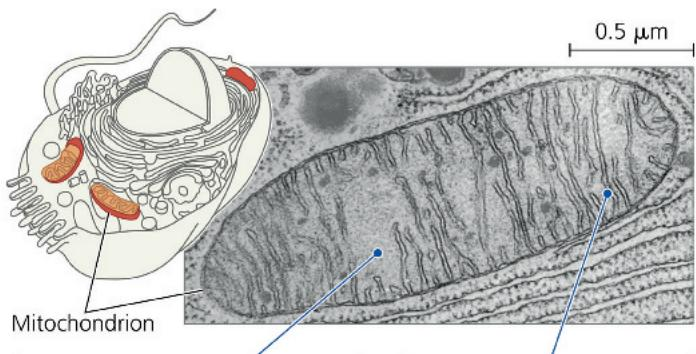  
The matrix contains enzymes in solution that are involved in the second stage of cellular respiration.  
Enzymes for the third stage of cellular respiration are embedded in the inner membrane.

In this chapter, you have learned about the laws of thermodynamics that govern metabolism, the intersecting set of chemical pathways characteristic of life. We have explored the bioenergetics of breaking down and building up biological molecules. To continue the theme of energy flow, and specifically of bioenergetics, we will next examine cellular respiration. This is the major catabolic pathway that breaks down organic molecules and releases energy that can be used for the crucial processes of life.

## Concept Check 8.5

1. How do an activator and an inhibitor have different effects on an allosterically regulated enzyme?

2. WHAT IF? Regulation of isoleucine synthesis is an example of feedback inhibition of an anabolic pathway. With that in mind, explain how ATP might be involved in feedback inhibition of a catabolic pathway.

For suggested answers, see Appendix A.

## Chapter 8 Review

## Summary of Key Concepts

To review key terms, go to the Vocabulary Self-Quiz (eTextbook only).

## Concept 8.1: An organism's metabolism transforms matter and energy

\- Metabolism is the collection of chemical reactions that occur in an organism. Enzymes catalyze reactions in intersecting metabolic pathways, which may be catabolic (breaking down molecules, releasing energy) or anabolic (building molecules, consuming energy). Bioenergetics is the study of the flow of energy through living organisms.

\- Energy is the capacity to cause change; some forms of energy do work by moving matter. Kinetic energy is associated with motion and includes thermal energy associated with random motion of atoms or molecules. Heat is thermal energy in transfer from one object to another. Potential energy is related to the location or structure of matter and includes chemical energy possessed by a molecule due to its structure.

\- The first law of thermodynamics, conservation of energy, states that energy cannot be created or destroyed, only transferred or transformed. The second law of thermodynamics states that spontaneous processes, those requiring no outside input of energy, increase the entropy (molecular disorder) of the universe.

Explain how the highly ordered structure of a cell does not conflict with the second law of thermodynamics.

## Concept 8.2: The free-energy change of a reaction tells us whether or not the reaction occurs spontaneously

\- A living system's free energy is energy that can do work under cellular conditions. The change in free energy $(\Delta G)$ during a biological process is related directly to enthalpy change $(\Delta H)$ and to the change in entropy ( $\Delta S$ ): $\Delta G = \Delta H - T\Delta S$ . Organisms live at the expense of free energy. A spontaneous process occurs with no energy input; during such a process, free energy decreases and the stability of a system increases. At maximum stability, the system is at equilibrium and can do no work.

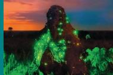

\- In an exergonic (spontaneous) chemical reaction, the products have less free energy than the reactants $(- \Delta G)$ . Endergonic (nonspontaneous) reactions require an input of energy $(+ \Delta G)$ . The addition of starting materials and the removal of end products prevent metabolism from reaching equilibrium.

Explain the meaning of each component in the equation for the change in free energy of a spontaneous chemical reaction. Why are spontaneous reactions important in the metabolism of a cell?

## Concept 8.3: ATP powers cellular work by coupling exergonic reactions to endergonic reactions

\- ATP is the cell's energy shuttle. Hydrolysis of its terminal phosphate yields ADP and $\textcircled{P}_i$ and releases free energy.

\- Through energy coupling, the exergonic process of ATP hydrolysis drives endergonic reactions by transfer of a phosphate group to specific reactants, forming a phosphorylated intermediate that is more reactive. ATP hydrolysis (sometimes with protein phosphorylation) also causes changes in the shape and binding affinities of transport and motor proteins.

\- Catabolic pathways drive regeneration of ATP from ADP + $\textcircled{P}_{\text{i}}$ .

Describe the ATP cycle: How is ATP used and regenerated in a cell?

## Concept 8.4: Enzymes speed up metabolic reactions by lowering energy barriers

\- In a chemical reaction, the energy necessary to break the bonds of the reactants is the activation energy, $E_{A}$ .

## - Enzymes lower the $\mathrm{E}_{\mathrm{A}}$ barrier:

\- Each enzyme has a unique active site that binds one or more substrate(s), the reactants on which it acts. It then changes shape, binding the substrate(s) more tightly (induced fit).

\- The active site can lower an $E_{A}$ barrier by orienting substrates correctly, straining their bonds, providing a favorable microenvironment, or even covalently bonding with the substrate.

• Each enzyme has an optimal temperature and pH.

\- Inhibitors reduce enzyme function. A competitive inhibitor binds to the active site, whereas a noncompetitive inhibitor binds to a different site on the enzyme.

\- Natural selection, acting on organisms with variant enzymes, is responsible for the diversity of enzymes found in organisms.

How do both activation energy barriers and enzymes help maintain the structural and metabolic order of life?

## Concept 8.5: Regulation of enzyme activity helps control metabolism

\- Many enzymes are subject to allosteric regulation: Regulatory molecules, either activators or inhibitors, bind to specific regulatory sites, affecting the shape and function of the enzyme. In cooperativity, binding of one substrate molecule can stimulate binding or activity at other active sites. In feedback inhibition, the end product of a metabolic pathway allosterically inhibits the enzyme for a previous step in the pathway.

\- Some enzymes are grouped into complexes, some are incorporated into membranes, and some are contained inside organelles, increasing the efficiency of metabolic processes.

What roles do allosteric regulation and feedback inhibition play in the metabolism of a cell?

For suggested answers, see Appendix A.

## Test Your Understanding

For more multiple-choice questions, go to the Practice Test (eTextbook only).

## Levels 1-2: Remembering/Understanding

1. Catabolism is to anabolism as

(A) exergonic is to spontaneous.

(B) exergonic is to endergonic.

(C) free energy is to entropy.

(D) work is to energy.

2. Most cells cannot harness heat to perform work because

(A) heat does not involve a transfer of energy.

(B) cells do not have much thermal energy; they are relatively cool.

(C) temperature is usually uniform throughout a cell.

(D) heat can never be used to do work.

3. Which of the following metabolic processes can occur without a net influx of energy from some other process?

(A) ADP + $\textcircled{P}_{i}$ + → ATP + H₂O

(B) $C_{6}H_{12}O_{6} + 6O_{2} \rightarrow 6CO_{2} + 6H_{2}O$

(C) $6\ CO_{2} + 6\ H_{2}O \rightarrow C_{6}H_{12}O_{6} + 6\ O_{2}$

(D) Amino acids → Protein

4. If an enzyme in solution is saturated with substrate, the most effective way to obtain a faster yield of products is to

(A) add more of the enzyme.

(B) heat the solution to $90^{\circ}$ C.

(C) add more substrate.

(D) add a noncompetitive inhibitor.

5. Some bacteria are metabolically active in hot springs because

(A) they are able to maintain a lower internal temperature.

(B) high temperatures make catalysis unnecessary.

(C) their enzymes have high optimal temperatures.

(D) their enzymes are completely insensitive to temperature.

## Levels 3-4: Applying/Analyzing

6. If an enzyme is added to a solution where its substrate and product are in equilibrium, what will occur?

(A) Additional substrate will be formed.

(B) The reaction will change from endergonic to exergonic.

(C) The free energy of the system will change.

(D) Nothing; the reaction will stay at equilibrium.

## Levels 5-6: Evaluating/Creating

7. DRAW IT Using a series of arrows, draw the branched metabolic reaction pathway described by the following statements, and then answer the question at the end. Use red arrows and minus signs to indicate inhibition.

L can form either M or N.

M can form O.

O can form either P or R.

P can form Q.

R can form S.

O inhibits the reaction of L to form M.

Q inhibits the reaction of O to form P.

S inhibits the reaction of O to form R.

Which reaction would prevail if both Q and S were present in the cell in high concentrations?

(A) L → M

(B) $\mathrm{M}\rightarrow \mathrm{O}$

(C) L → N

(D) O → P

8. EVOLUTION CONNECTION Some people argue that biochemical pathways are too complex to have evolved because all intermediate steps in a given pathway must be present to produce the final product. Critique this argument. How could you use the diversity of metabolic pathways that produce the same or similar products to support your case?

## 9. WRITE ABOUT A THEME: ENERGY AND MATTER Life

requires energy. In a short essay (100–150 words), describe the basic principles of bioenergetics in an animal cell. How are the flow and transformation of energy different in a photosynthesizing cell? Include the role of ATP and enzymes in your discussion.

## 10. SYNTHESIZE YOUR KNOWLEDGE

  
Explain what is happening in this photo in terms of kinetic energy and potential energy. Include the energy conversions that occur when the penguins eat fish and climb back up on the glacier. Describe the role of ATP and enzymes in the underlying molecular processes, including what happens to the free energy of some of the molecules involved.

# Practice Applying Your Learning

11. This question assesses your ability to apply your understanding of enzyme structure and function to a new example.

Phenylalanine hydroxylase is a liver enzyme responsible for converting the essential amino acid phenylalanine to tyrosine. The active enzyme in humans consists of four subunits, each of which contains an iron ion. Deficiency in this enzyme can result in phenylketonuria (PKU), which can impair brain development and cognitive function in untreated individuals. Newborns are tested for PKU, as this condition can be managed with dietary restrictions.

Use this information and your knowledge about the structure and function of enzymes to evaluate each statement as more likely to be TRUE or more likely to be FALSE.

a. This enzyme exhibits quaternary structure. \_\_\_\_

b. The substrate for this enzyme is tyrosine.

c. The catalytic activity of this enzyme involves a cofactor.

d. This enzyme is most active between $90^{\circ}$ C and $100^{\circ}$ C. \_\_\_\_

e. The change in free energy of this reaction is reduced as the concentration of the enzyme increases. \_\_\_\_

f. Having iron deficiency anemia will likely reduce the catalytic activity of this enzyme. \_\_\_\_

g. If you added phenylalanine and phenylalanine hydroxylase to a test tube, the concentration of tyrosine would start to increase. \_\_\_\_

<!-- END OFFICIAL MINERU API RESULT part_02 -->

<!-- BEGIN OFFICIAL MINERU API RESULT part_03 -->

# Cellular Respiration and Fermentation

## Key Concepts

9.1 Catabolic pathways yield energy by oxidizing organic fuels

9.2 Glycolysis harvests chemical energy by oxidizing glucose to pyruvate

9.3 After pyruvate is oxidized, the citric acid cycle completes the energy-yielding oxidation of organic molecules

9.4 During oxidative phosphorylation, chemiosmosis couples electron transport to ATP synthesis

9.5 Fermentation and anaerobic respiration enable cells to produce ATP without the use of oxygen

9.6 Glycolysis and the citric acid cycle connect to many other metabolic pathways

## Study Tip

Make a visual study guide: Draw a cell with a large mitochondrion, labeling the parts of the mitochondrion. As you go through the chapter, add key reactions for each stage of cellular respiration, linking the stages together. Label the carbon molecule(s) with the most energy and the carbon molecule(s) with the least energy. Your cell can be a simple sketch, as shown here.

  
Figure 9.1 This hoary marmot (Marmota caligata) obtains energy for its cells by feeding on plants. In the process of cellular respiration, mitochondria in the cells of animals, plants, and other organisms break down organic molecules, generating ATP and waste products: carbon dioxide, water, and heat. Note that energy flows one way, but chemicals are recycled.

## How is the chemical energy stored in food used to generate ATP, the molecule that drives most cellular work?

## Concept 9.1: Catabolic pathways yield energy by oxidizing organic fuels

Living cells require transfusions of energy from outside sources to perform their many tasks—for example, assembling polymers, pumping substances across membranes, moving, and reproducing. The outside source of energy is food, and the energy stored in the organic molecules of food ultimately comes from the sun. As shown in Figure 9.1, energy flows into an ecosystem as sunlight and exits as heat; in contrast, the chemical elements essential to life are recycled. Photosynthesis generates oxygen, as well as organic molecules used by the mitochondria of eukaryotes as fuel for cellular respiration. Respiration breaks this fuel down, using oxygen ( $O_{2}$ ) and generating ATP. The waste products of this type of respiration, carbon dioxide ( $CO_{2}$ ) and water ( $H_{2}O$ ), are the raw materials for photosynthesis.

Let's consider how cells harvest the chemical energy stored in organic molecules and use it to generate ATP, the molecule that drives most cellular work. Metabolic pathways that release stored energy by breaking down complex molecules are called catabolic pathways (see Concept 8.1). Transfer of electrons from food molecules (like glucose) to other molecules plays a major role in these pathways. In this section, we consider these processes, which are central to cellular respiration.

## Catabolic Pathways and Production of ATP

Organic compounds possess potential energy as a result of the arrangement of electrons in the bonds between their atoms. Compounds that can participate in exergonic reactions can act as fuels. Through the activity of enzymes (see Concept 8.4), a cell systematically degrades complex organic molecules that are rich in potential energy to simpler waste products that have less energy. Some of the energy taken out of chemical storage can be used to do work; the rest is dissipated as heat.

One catabolic process, fermentation, is a partial degradation of sugars or other organic fuel that occurs without the use of oxygen. However, the most efficient catabolic pathway is aerobic respiration, in which oxygen is consumed as a reactant along with the organic fuel (aerobic is from the Greek aer, air, and bios, life). The cells of most eukaryotic and many prokaryotic organisms can carry out aerobic respiration. Some prokaryotic organisms use substances other than oxygen as reactants in a similar process that harvests chemical energy without oxygen; this process is called anaerobic respiration (the prefix an- means “without”). Technically, the term cellular respiration includes both aerobic and anaerobic processes. However, it originated as a synonym for aerobic respiration because of the relationship of that process to organismal respiration, in which an animal breathes in oxygen ( $O_{2}$ ).

Thus, cellular respiration is often used to refer to the aerobic process, a practice we follow in most of this chapter.

Although very different in mechanism, aerobic respiration is in principle similar to the combustion of gasoline in an automobile engine after oxygen is mixed with the fuel (hydrocar-bons). Food provides the fuel for respiration, and the exhaust is carbon dioxide and water. The overall process can be summarized as follows:

$$
\begin{array}{l}\text { Organic }\\\text { compounds }\end{array}+ \text { Oxygen } \rightarrow \text { Carbon   dioxide } + \text { Water } + \text { Energy }
$$

Carbohydrates, fats, and proteins from food can all be processed and consumed as fuel. In animal diets, a major source of carbohydrates is starch, a storage polysaccharide that can be broken down into glucose ( $C_{6}H_{12}O_{6}$ ) subunits. Here, we will learn the steps of cellular respiration by tracking the degradation of the sugar glucose:

$$
\mathrm{C} _ {6} \mathrm{H} _ {1 2} \mathrm{O} _ {6} + 6 \mathrm{O} _ {2} \rightarrow 6 \mathrm{CO} _ {2} + 6 \mathrm{H} _ {2} \mathrm{O} + \text {   Energy   (ATP   +   heat)   }
$$

This breakdown of glucose is exergonic, having a free-energy change of -686 kcal (-2,870 kJ) per mole of glucose decomposed ( $\Delta G = -686$ kcal/mol). Recall that a negative $\Delta G (\Delta G < 0)$ indicates that the products of the chemical process store less energy than the reactants and that the reaction can happen spontaneously—in other words, without an input of energy (see Concept 8.2).

Catabolic pathways do not directly move flagella, pump solutes across membranes, polymerize monomers, or perform other cellular work. Catabolism is linked to work by a chemical drive shaft—ATP (see Concept 8.3). To keep working, the cell must regenerate its supply of ATP from ADP and $\widehat{P}_{i}$ (see Figure 8.12). To understand how cellular respiration accomplishes this, let's examine the fundamental chemical processes known as oxidation and reduction.

## Redox Reactions: Oxidation and Reduction

How do the catabolic pathways that decompose glucose and other organic fuels yield energy? The answer is based on the transfer of electrons during the chemical reactions. The relocation of electrons releases energy stored in organic molecules, and this energy ultimately is used to synthesize ATP.

## The Principle of Redox

In many chemical reactions, there is a transfer of one or more electrons ( $e^{-}$ ) from one reactant to another. These electron transfers are called oxidation-reduction reactions, or redox reactions for short. In a redox reaction, the loss of electrons from one substance is called oxidation, and the addition of electrons to another substance is known as reduction. (Note that adding electrons is called reduction; adding negatively charged electrons to an atom reduces the amount of positive charge of that atom.)

To take a simple, nonbiological example, consider the reaction between the elements sodium (Na) and chlorine (Cl) that forms table salt:

We could generalize a redox reaction this way:

In the generalized reaction, substance $Xe^{-}$ , the electron donor, is called the reducing agent; it reduces Y, which accepts the donated electron. Substance Y, the electron acceptor, is the oxidizing agent; it oxidizes $Xe^{-}$ by removing its electron. Because an electron transfer requires both an electron donor and an acceptor, oxidation and reduction always go hand in hand.

Not all redox reactions involve the complete transfer of electrons from one substance to another; some change the degree of electron sharing in covalent bonds. Methane combustion, shown in Figure 9.2, is an example. The covalent electrons in methane are shared nearly equally between the bonded atoms because carbon and hydrogen have about the same affinity for valence electrons; they are about equally electronegative (see Concept 2.3). But when methane reacts

Figure 9.2 Methane combustion as an energy-yielding redox reaction.

The reaction releases energy to the surroundings because the electrons lose potential energy when they end up being shared unequally, spending more time near electronegative atoms such as oxygen.

  
VISUAL SKILLS Is the carbon atom oxidized or reduced during this reaction? Explain.  
For suggested answer, see Appendix A.

with $O_{2}$ , forming $CO_{2}$ , electrons end up shared less equally between the carbon atom and its new covalent partners, the oxygen atoms, which are very electronegative. In effect, the carbon atom has partially “lost” its shared electrons; thus, methane has been oxidized.

Now let's examine the fate of the reactant $O_{2}$ . The two atoms of $O_{2}$ share their electrons equally. But after the reaction with methane, when each O atom is bonded to two H atoms in $H_{2}O$ , the electrons of those covalent bonds spend more time near the oxygen (see Figure 9.2). In effect, each O atom has partially "gained" electrons, so the oxygen molecule ( $O_{2}$ ) has been reduced. Because the O atom is so electronegative, $O_{2}$ is one of the most powerful of all oxidizing agents.

Energy must be added to pull an electron away from an atom, just as energy is required to push a ball uphill. The more electronegative the atom (the stronger its pull on electrons), the more energy is required to take an electron away from it. An electron loses potential energy when it shifts from a less electronegative atom toward a more electronegative one, just as a ball loses potential energy when it rolls downhill. A redox reaction that moves electrons closer to an O atom, such as the burning (oxidation) of methane, therefore releases chemical energy that can be put to work.

## Oxidation of Organic Fuel Molecules During Cellular Respiration

The oxidation of methane by $O_{2}$ is the main combustion reaction that occurs at the burner of a gas stove. The combustion of gasoline in an automobile engine is also a redox reaction; the energy released pushes the pistons. But the energy-yielding redox process of greatest interest to biologists is respiration: the oxidation of glucose and other molecules in food. Examine again the summary equation for cellular respiration, but this time think of it as a redox process:

$$
\begin{array}{c} \text {becomes oxidized} \\ \mathrm{C} _ {6} \mathrm{H} _ {1 2} \mathrm{O} _ {6} + 6 \mathrm{O} _ {2} \longrightarrow 6 \mathrm{CO} _ {2} + 6 \mathrm{H} _ {2} \mathrm{O} + \text {Energy} \\ \text {becomes reduced} \end{array}
$$

As in the combustion of methane or gasoline, the fuel (glucose) is oxidized and $O_{2}$ is reduced. The electrons lose potential energy along the way, and energy is released.

In general, organic molecules that have an abundance of hydrogen are excellent fuels because their bonds are a source of "hilltop" electrons, whose energy may be released as these electrons "fall" down an energy gradient during their transfer to oxygen. The summary equation for respiration indicates that hydrogen is transferred from glucose to the O atoms in $\mathrm{O}_2$ . But the important point, not visible in the summary equation, is that the energy state of the electron changes as hydrogen (with its electron) is transferred to oxygen. In respiration, the oxidation of glucose transfers electrons to a lower energy state, liberating energy that becomes available for ATP synthesis. So, in general, we see fuels with multiple C—H bonds oxidized into products with multiple C—O bonds.

The main energy-yielding foods—carbohydrates and fats—are reservoirs of electrons associated with hydrogen, often in the form of C—H bonds. Only the barrier of activation energy holds back the flood of electrons to a lower energy state (see Figure 8.13). Without this barrier, a food substance like glucose would combine almost instantaneously with $O_{2}$ . If we supply the activation energy by igniting glucose, it burns in air, releasing 686 kcal (2,870 kJ) of heat per mole of glucose (about 180 g). Body temperature is not high enough to initiate burning, of course. Instead, if you swallow some glucose, enzymes in your cells will lower the barrier of activation energy, allowing the sugar to be oxidized in a series of steps.

## Stepwise Energy Harvest via NAD $^{+}$ and the Electron Transport Chain

If energy is released from a fuel all at once, it cannot be harnessed efficiently for constructive work. For example, if a gasoline tank explodes, it cannot drive a car very far. Cellular respiration does not oxidize glucose (or any other organic fuel) in a single explosive step either. Rather, glucose is broken down in a series of steps, each one catalyzed by an enzyme. At key steps, electrons are stripped from the glucose. As is often the case in oxidation reactions, each electron travels with a proton—thus, as a hydrogen atom. The hydrogen atoms are not transferred directly to $O_{2}$ , but instead are usually passed first to an electron carrier, a coenzyme called nicotinamide adenine dinucleotide, a derivative of the vitamin niacin. This coenzyme is well suited

as an electron carrier because it can cycle easily between its oxidized form, $NAD^{+}$ , and its reduced form, NADH. As an electron acceptor, $NAD^{+}$ functions as an oxidizing agent during respiration.

How does $NAD^{+}$ trap electrons from glucose and the other organic molecules in food? Enzymes called dehydrogenases remove a pair of hydrogen atoms (2 electrons and 2 protons) from the substrate (glucose, in the preceding example), thereby oxidizing it. The enzyme delivers the 2 electrons along with 1 proton to its coenzyme, $NAD^{+}$ , forming NADH (Figure 9.3). The other proton is released as a hydrogen ion ( $H^{+}$ ) into the surrounding solution:

$$
\mathrm{H} - \stackrel {|} {\mathrm{C}} - \mathrm{OH} + \mathrm{NAD} ^ {+} \xrightarrow {\text {   Dehydrogenase   }} \stackrel {|} {\mathrm{C}} = \mathrm{O} + \mathrm{NADH} + \mathrm{H} ^ {+}
$$

By receiving 2 negatively charged electrons but only 1 positively charged proton, the nicotinamide portion of $NAD^{+}$ has its charge neutralized when $NAD^{+}$ is reduced to NADH. The name NADH shows the hydrogen that has been received in the reaction. $NAD^{+}$ is the most versatile electron acceptor in cellular respiration and functions in several of the redox steps during the breakdown of glucose.

Electrons lose very little of their potential energy when they are transferred from glucose to $NAD^{+}$ . Each NADH molecule formed during respiration represents stored energy that can be tapped to make ATP when the electrons complete their “fall” down an energy gradient from NADH to $O_{2}$ .

Figure 9.3 NAD $^{+}$ as an electron shuttle.

The full name for $NAD^{+}$ , nicotinamide adenine dinucleotide, describes its structure—the molecule consists of two nucleotides joined together at their phosphate groups (shown in yellow circles). (Nicotinamide is a nitrogenous base, although not one that is present in DNA or RNA; see Figure 5.23.) The enzymatic transfer of 2 electrons and 1 proton ( $H^{+}$ ) from an organic molecule in food to $NAD^{+}$ reduces the $NAD^{+}$ to NADH: Most of the electrons removed from food are transferred initially to $NAD^{+}$ , forming NADH.

How do electrons that are extracted from glucose and stored as potential energy in NADH finally reach oxygen? It will help to compare the redox chemistry of cellular respiration to a much simpler reaction: the reaction between hydrogen and oxygen to form water (Figure 9.4a). Mix $H_{2}$ and $O_{2}$ , provide a spark for activation energy, and the gases combine explosively. In fact, combustion of liquid $H_{2}$ and $O_{2}$ is harnessed to help power the rocket engines that boost satellites into orbit and launch spacecraft. The explosion represents a release of energy as the electrons of hydrogen “fall” closer to the electronegative oxygen atoms. Cellular respiration also brings hydrogen and oxygen together to form water, but there are two important differences. First, in cellular respiration, the hydrogen atoms that react with oxygen are derived from organic molecules rather than $H_{2}$ . Second, instead of occurring in one explosive reaction, respiration uses an electron transport chain to break the fall of electrons to oxygen into several energy-releasing steps (Figure 9.4b). An electron transport chain consists of a

Figure 9.4 An introduction to electron transport chains.

(a) Uncontrolled reaction. The one-step exergonic reaction of hydrogen with oxygen to form water releases a large amount of energy in the form of heat and light: an explosion.

(b) Cellular respiration. In cellular respiration, the same reaction occurs in stages: An electron transport chain breaks the "fall" of electrons in this reaction into a series of smaller steps and stores some of the released energy in a form that can be used to make ATP. (The rest of the energy is released as heat.)

  
respiration, let's look at the entire process by which energy is harvested from organic fuels.

number of molecules, mostly proteins, built

into the inner membrane of the mitochondria of eukaryotic cells (and the plasma membrane of respiring prokaryotic organisms). Electrons removed from glucose are shuttled by NADH to the "top," higher-energy end of the chain. At the "bottom," lower-energy end, $O_{2}$ captures these electrons along with hydrogen nuclei ( $H^{+}$ ), forming water. (Anaerobically respiring prokaryotic organisms have an electron acceptor at the end of the chain that is different from $O_{2}$ .)

Electron transfer from NADH to oxygen is an exergonic reaction with a free-energy change of -53 kcal/mol (-222 kJ/mol). Instead of this energy being released and wasted in a single explosive step, electrons cascade down the chain from one carrier molecule to the next in a series of redox reactions, losing a small amount of energy with each step until they finally reach oxygen, the terminal electron acceptor, which has a very great affinity for electrons. Each “downhill” carrier has a greater affinity for electrons than, and is thus capable of accepting electrons from (oxidizing), its “uphill” neighbor, with $O_{2}$ at the bottom of the chain. Therefore, the electrons transferred from glucose to $NAD^{+}$ , reducing it to NADH, fall down an energy gradient in the electron transport chain to a far more stable location in an electronegative oxygen atom from $O_{2}$ . Put another way, $O_{2}$ pulls electrons down the chain in an energy-yielding tumble analogous to gravity pulling objects downhill.

In summary, during cellular respiration, most electrons travel the following “downhill” route: glucose → NADH → electron transport chain → oxygen. Later in this chapter, you will learn more about how the cell uses the energy released from this exergonic electron fall to regenerate its supply of ATP. For now, having covered the basic redox mechanisms of cellular

## The Stages of Cellular Respiration: A Preview

The harvesting of energy from glucose by cellular respiration is a cumulative function of three metabolic stages. We list them here along with a color-coding scheme we will use throughout the chapter to help you keep track of the big picture:

1. GLYCOLYSIS (color-coded blue throughout the chapter)

2. PYRUVATE OXIDATION (light orange) and the CITRIC ACID CYCLE (dark orange)

3. OXIDATIVE PHOSPHORYLATION: Electron transport and chemiosmosis (purple)

Biochemists usually reserve the term cellular respiration for stages 2 and 3 together. In this text, however, we include glycolysis as a part of cellular respiration because most respiring cells deriving energy from glucose use glycolysis to produce the starting material for the citric acid cycle.

As diagrammed in Figure 9.5, glycolysis and then pyruvate oxidation and the citric acid cycle are the catabolic pathways that break down glucose and other organic fuels. Glycolysis, which occurs in the cytosol, begins the degradation process by breaking glucose into two molecules of a compound called pyruvate. In eukaryotes, pyruvate enters the mitochondrion and is oxidized to a compound called acetyl CoA, which enters the citric acid

## Figure 9.5 An overview of cellular respiration.

cycle. There, the breakdown of glucose to carbon dioxide is completed. (In prokaryotic organisms, these processes take place in the cytosol.) Thus, the carbon dioxide produced by respiration represents fragments of oxidized organic molecules.

Some of the steps of glycolysis and the citric acid cycle are redox reactions in which dehydrogenases transfer electrons from substrates to $NAD^{+}$ or the related electron carrier FAD, forming NADH or $FADH_{2}$ . (You'll learn more about FAD and $FADH_{2}$ later.) In the third stage of respiration, the electron transport chain accepts electrons from NADH or $FADH_{2}$ generated during the first two stages and passes these electrons down the chain. At the end of the chain, the electrons are combined with molecular oxygen ( $O_{2}$ ) and hydrogen ions ( $H^{+}$ ), forming water (see Figure 9.4b). The energy released at each step of the chain is stored in a form the mitochondrion (or prokaryotic cell) can use to make ATP from ADP. This mode of ATP synthesis is called oxidative phosphorylation because it is powered by the redox reactions of the electron transport chain.

In eukaryotic cells, the inner membrane of the mitochondrion is the site of electron transport and another process called chemiosmosis, together making up oxidative phosphorylation. (In prokaryotic cells, these processes take place in the plasma membrane.) Oxidative phosphorylation accounts for almost 90% of the ATP generated by respiration. A smaller amount of ATP is formed directly in a few reactions of glycolysis and the citric acid cycle by a mechanism called substrate-level phosphorylation (Figure 9.6). This mode of ATP synthesis occurs when an enzyme transfers a phosphate group from a substrate molecule to ADP, rather than adding an inorganic phosphate to ADP as in oxidative phosphorylation. "Substrate molecule" here refers to an organic molecule generated as an intermediate during the catabolism of glucose. You'll see examples of substrate-level phosphorylation later in the chapter, in both glycolysis and the citric acid cycle.

You can think of the whole process this way: When you withdraw a relatively large sum of money from an ATM, it is not delivered to you in a single bill of a large denomination. Instead, the machine dispenses a number of smaller-denomination bills that you can spend more easily. This is analogous to ATP production during cellular respiration. For each molecule of glucose degraded to $CO_{2}$ and $H_{2}O$ by respiration, the cell makes

During glycolysis, each glucose molecule is broken down into two molecules of pyruvate. In eukaryotic cells, as shown here, the pyruvate enters the mitochondrion. There it is oxidized to acetyl CoA, which will be further oxidized to $CO_{2}$ in the citric acid cycle. The electron carriers NADH and $FADH_{2}$ transfer electrons derived from glucose to electron transport chains. During oxidative phosphorylation, electron transport chains convert the chemical energy to a form used for ATP synthesis in the process called chemiosmosis. (During earlier steps of cellular respiration, a few molecules of ATP are synthesized in a process called substrate-level phosphorylation.) To visualize these processes in their cellular context, see Figure 6.32b.

Figure 9.6 Substrate-level phosphorylation.

Some ATP is made by direct transfer of a phosphate group from an organic substrate to ADP by an enzyme. (For examples in glycolysis, see Figure 9.8, 7 and 10.)

  
MAKE CONNECTIONS Review Figure 8.9. In the reaction shown above, is the potential energy higher for the reactants or for the products? Explain. For suggested answer, see Appendix A.

up to about 32 molecules of ATP, each with 7.3 kcal/mol of free energy. Respiration cashes in the large denomination of energy banked in a single molecule of glucose (686 kcal/mol under standard conditions) for the small change of many molecules of ATP, which is more practical for the cell to spend on its work.

This preview has introduced you to how glycolysis, the citric acid cycle, and oxidative phosphorylation fit into the process of cellular respiration so you can keep the big picture in mind as you take a closer look at each of these three stages of respiration. As you read about the chemical reactions, remember that each reaction is catalyzed by a specific enzyme, some of which are shown in Figure 6.32b.

## Concept Check 9.1

1. Compare and contrast aerobic and anaerobic respiration, including the processes involved.

2. WHAT IF? If the following redox reaction occurred, which compounds would be oxidized? Reduced?

$$
\mathrm{C} _ {4} \mathrm{H} _ {6} \mathrm{O} _ {5} + \mathrm{NAD} ^ {+} \rightarrow \mathrm{C} _ {4} \mathrm{H} _ {4} \mathrm{O} _ {5} + \mathrm{NADH} + \mathrm{H} ^ {+}
$$

For suggested answers, see Appendix A.

# Concept 9.2: Glycolysis harvests chemical energy by oxidizing glucose to pyruvate

The word glycolysis means “sugar splitting,” and that is exactly what happens during this pathway. Glucose, a six-carbon sugar, is split into two three-carbon sugars. These smaller sugars are then oxidized and their remaining atoms rearranged to form two molecules of pyruvate. (Pyruvate is the ionized form of pyruvic acid.)

As summarized in Figure 9.7, glycolysis can be divided into two phases: the energy investment phase and the energy payoff phase. During the energy investment phase, the cell actually spends ATP. This investment is repaid with interest during the energy payoff phase, when ATP is produced by substrate-level phosphorylation and $\mathrm{NAD^{+}}$ is reduced to NADH by electrons released from the oxidation of glucose. The net energy yield from glycolysis, per glucose molecule, is 2 ATP plus 2 NADH. The ten steps of the glycolytic pathway are shown in Figure 9.8.

All of the carbon originally present in glucose is accounted for in the two molecules of pyruvate; no carbon is released as $CO_{2}$ during glycolysis. Glycolysis occurs whether or not $O_{2}$ is present. However, if $O_{2}$ is present, the chemical energy stored in pyruvate and NADH can be extracted by pyruvate oxidation, the citric acid cycle, and oxidative phosphorylation.

Figure 9.7 The inputs and outputs of glycolysis.  

Figure 9.8 The steps of glycolysis.  
Glycolysis, a source of ATP and NADH, takes place in the cytosol. Two of the enzymes (in ① and ③) are shown in Figure 6.32b.  

## Concept Check 9.2

1. VISUAL SKILLS During the redox reaction in glycolysis (see step 6 in Figure 9.8), which one of the molecules acts as the oxidizing agent? The reducing agent?

For suggested answers, see Appendix A.

## Concept 9.3: After pyruvate is oxidized, the citric acid cycle completes the energy-yielding oxidation of organic molecules

Glycolysis releases less than a quarter of the chemical energy in glucose that can be harvested by cells; most of the energy remains stockpiled in the two molecules of pyruvate. When $O_{2}$ is present, the pyruvate in eukaryotic cells enters a mitochondrion, where the oxidation of glucose is completed. In aerobically respiring prokaryotic cells, this process occurs in the cytosol. (Later in the chapter, we'll examine other fates for pyruvate—for example, when $O_{2}$ is unavailable or in a prokaryotic organism that is unable to use $O_{2}$ .)

## Oxidation of Pyruvate to Acetyl CoA

Upon entering the mitochondrion via active transport, pyruvate is first converted to a compound called acetyl coenzyme A, or acetyl CoA (Figure 9.9). This step, linking glycolysis and the citric

Figure 9.9 Oxidation of pyruvate to acetyl CoA, the step before the citric acid cycle.

Pyruvate enters the mitochondrion through a transport protein and is processed by a complex of several enzymes known as pyruvate dehydrogenase (shown in the computer-generated image based on cryo-EMs). This complex catalyzes the three numbered steps, which are described in the text. The $CO_{2}$ molecule will diffuse out of the cell. The NADH will be used in oxidative phosphorylation. The acetyl group of acetyl CoA will enter the citric acid cycle. (Coenzyme A is abbreviated S-CoA when it is attached to a molecule, emphasizing its sulfur atom, S.)

acid cycle, is carried out by a multienzyme complex that catalyzes three reactions: ① Pyruvate's carboxyl group ( $—COO^{-}$ ), already somewhat oxidized and thus carrying little chemical energy, is now fully oxidized and given off as a molecule of $CO_{2}$ . This is the first step in which $CO_{2}$ is released during respiration. ② Next, the remaining two-carbon fragment is oxidized and the electrons transferred to $NAD^{+}$ , storing energy in the form of NADH.

③ Finally, coenzyme A (CoA), a sulfur-containing compound derived from a B vitamin, is attached via its sulfur atom to the two-carbon intermediate, forming acetyl CoA. Acetyl CoA has a high potential energy, which is used to transfer the acetyl group to a molecule in the citric acid cycle, a reaction that is therefore highly exergonic.

## The Citric Acid Cycle

The citric acid cycle functions as a metabolic furnace that further oxidizes organic fuel derived from pyruvate. Figure 9.10 summarizes the inputs and outputs as pyruvate is broken down to three $\mathrm{CO}_{2}$ molecules, including the molecule of $\mathrm{CO}_{2}$ released during the conversion of pyruvate to acetyl CoA. The cycle generates 1 ATP per turn by substrate-level phosphorylation, but most of the chemical energy is transferred to $\mathrm{NAD}^{+}$ and FAD during the redox reactions. The reduced coenzymes, NADH and $\mathrm{FADH}_{2}$ , shuttle their cargo of high-energy electrons into the electron transport chain. The citric acid cycle is also called the tricarboxylic acid cycle or the Krebs cycle, the latter honoring Hans Krebs. Krebs was the German-British scientist largely responsible for working out the pathway in the 1930s.

Now let's look at the citric acid cycle in more detail. The cycle has eight steps, each catalyzed by a specific enzyme. You can see in Figure 9.11 that for each turn of the citric acid cycle, two carbons (red) enter in the relatively reduced form of an acetyl group (①), and two different carbons (blue) leave in the completely oxidized form of $\mathrm{CO}_{2}$ molecules (③ and ④). The acetyl group of acetyl CoA joins the cycle by combining with the compound oxaloacetate, forming citrate (①). Citrate is the ionized form of citric acid, for which the cycle is named. The next seven steps decompose the citrate back to oxaloacetate. It is this regeneration of oxaloacetate that makes the process a cycle.

Referring to Figure 9.11, we can tally the energy-rich molecules produced by the citric acid cycle. For each acetyl group entering the cycle, 3 NAD $^{+}$ are reduced to NADH (3, 4, and 8). In 6, electrons are transferred not to NAD $^{+}$ , but to FAD, which accepts 2 electrons and 2 protons to become FADH $_{2}$ . In many animal tissue cells, the reaction in 5 produces a guanosine triphosphate (GTP) molecule by substrate-level phosphorylation. GTP is a molecule similar to ATP in its structure and cellular function. This GTP may be used to make an ATP molecule (as shown) or directly power work in the cell. In the cells of plants, bacteria, and some animal tissues, 5 forms an ATP molecule directly by substrate-level phosphorylation. The output from 5

Figure 9.10 An overview of pyruvate oxidation and the citric acid cycle.

The inputs and outputs per pyruvate molecule are shown with a focus on the carbon atoms involved. To calculate on a per-glucose basis, multiply by 2 because each glucose molecule is split during glycolysis into two pyruvate molecules.

represents the only ATP generated during the citric acid cycle. Recall that each glucose gives rise to two molecules of acetyl CoA that enter the cycle. Because the numbers noted earlier are obtained from a single acetyl group entering the pathway, the total yield per glucose from the citric acid cycle turns out to be doubled, or 6 NADH, 2 FADH $_{2}$ , and the equivalent of 2 ATP.

Most of the ATP produced by respiration is generated later, from oxidative phosphorylation, when the NADH and $FADH_{2}$ produced by the citric acid cycle and earlier steps relay the electrons extracted from food to the electron transport chain. In the process, they supply the necessary energy for the phosphorylation of ADP to ATP. We will explore this process in the next section.

Figure 9.11 A closer look at the citric acid cycle.

In the chemical structures, red type traces the fate of the two carbon atoms that enter the cycle via acetyl CoA (1), and blue type indicates the two carbons that exit the cycle as $\mathrm{CO}_{2}$ in 3 and 4. (The red type goes only through 5 because the succinate molecule is symmetrical; the two ends cannot be distinguished from each other.) Notice that the carbon atoms that enter the cycle from acetyl CoA do not leave the cycle in the same turn. They remain in the cycle, occupying a different location in the molecules on their next turn, after another acetyl group is added. Therefore, the oxaloacetate regenerated at ⑧ is made up of different carbon atoms each time around. Carboxylic acids are represented in their ionized forms, as $-\mathrm{COO}^{-}$ , because the ionized forms prevail at the pH within the mitochondrion. In eukaryotic cells, all the citric acid cycle enzymes are located in the mitochondrial matrix except for the enzyme that catalyzes ⑥, which resides in the inner mitochondrial membrane. (The enzyme that catalyzes ③, isocitrate dehydrogenase, is shown in Figure 6.32b.)

## Concept Check 9.3

1. VISUAL SKILLS In the citric acid cycle shown in Figure 9.11, what molecules capture energy from the redox reactions? How is ATP produced?

2. What processes in your cells produce the $CO_{2}$ that you exhale?

3. VISUAL SKILLS The conversions shown in Figure 9.9 and ④ of Figure 9.11 are each catalyzed by a large multienzyme complex. What similarities are there in the reactions that occur in these two cases?

For suggested answers, see Appendix A.

# Concept 9.4: During oxidative phosphorylation, chemiosmosis couples electron transport to ATP synthesis

Our main objective in this chapter is to learn how cells harvest the energy of glucose and other nutrients in food to make ATP. But the metabolic components of respiration we have examined so far, glycolysis and the citric acid cycle, produce only 4 ATP molecules per glucose molecule, all by substrate-level phosphorylation: 2 net ATP from glycolysis and 2 ATP from the citric acid cycle. At this point, molecules of NADH (and FADH $_{2}$ ) account for most of the energy extracted from each glucose molecule. These electron escorts link glycolysis and the citric acid cycle to the machinery of oxidative phosphorylation, which uses energy released by the electron transport chain to power ATP synthesis. In this section, you will learn first how the electron transport chain works and then how electron flow down the chain is coupled to ATP synthesis.

## The Pathway of Electron Transport

The electron transport chain is a collection of molecules embedded in the inner membrane of the mitochondrion in eukaryotic cells. (In prokaryotic cells, these molecules reside in the plasma membrane.) The folding of the inner membrane to form cristae increases its surface area, providing space for thousands of copies of each component of the electron transport chain in a mitochondrion. Structure fits function: The infolded membrane with its concentration of electron carrier molecules is well-suited for the series of sequential redox reactions that take place along the electron transport chain. Most components of the chain are proteins, which exist in multiprotein complexes numbered I through IV. Tightly bound to these proteins are prosthetic groups, nonprotein components such as cofactors and coenzymes essential for the catalytic functions of certain enzymes.

Figure 9.12 shows the sequence of electron carriers in the electron transport chain and the drop in free energy as electrons travel down the chain. During this electron transport, electron carriers alternate between reduced and oxidized states as they accept and then donate electrons. Each component of the chain becomes reduced when it accepts electrons from its “uphill” neighbor, which is a better electron donor. It then returns to its oxidized form as it passes electrons to its “downhill” neighbor, which is a better electron acceptor.

Figure 9.12 Free-energy change during electron transport.  
Figure 9.12 Free energy change during electron transport.

The overall energy drop ( $\Delta G$ ) for electrons traveling from NADH to oxygen is 53 kcal/mol, but this “fall” is broken up into a series of smaller steps by the electron transport chain. (An oxygen atom is represented here as $\frac{1}{2}O_{2}$ to show that $O_{2}$ is reduced, not individual oxygen atoms.) To view these proteins in their cellular context, see Figure 6.32b.  
  
VISUAL SKILLS Compare the position of the electrons in NADH (see Figure 9.3) at the top of the chain with that in $H_{2}O$ , at the bottom. Describe why the electrons in $H_{2}O$ have less potential energy, using the term electronegativity. For suggested answers, see Appendix A.

Now let's take a closer look at the electrons as they drop in energy level, passing through the components of the electron transport chain in Figure 9.12. We'll first look at the passage of electrons through complex I in some detail as an illustration of the general principles involved in electron transport. Electrons acquired from glucose by $\mathrm{NAD^{+}}$ during glycolysis and the citric acid cycle are transferred from NADH to the first molecule of the electron transport chain in complex I. This molecule is a flavoprotein, so named because it has a prosthetic group called flavin mononucleotide (FMN). In the next redox reaction, the flavoprotein returns to its oxidized form as it passes electrons to an iron-sulfur protein (Fe · S in complex I), one of a family of proteins with both iron and sulfur tightly bound. The iron-sulfur protein then passes the electrons to a compound called ubiquinone (Q in Figure 9.12). This electron carrier is a small hydrophobic molecule, the only member of the electron transport chain that is not a protein. Ubiquinone is individually mobile within the membrane rather than residing in a particular complex. (Another name for ubiquinone is coenzyme Q, or CoQ; you may have seen it sold as a nutritional supplement.)

Most of the remaining electron carriers between ubiquinone and oxygen are proteins called cytochromes. Their prosthetic group, called a heme group, has an iron atom that accepts and donates electrons. (The heme group in a cytochrome is similar to the heme group in hemoglobin, the protein of red blood cells, except that the iron in hemoglobin carries oxygen, not electrons.) The electron transport chain has several types of cytochromes, each named “cyt” with a letter and number to distinguish it as a different protein with a slightly different electron-carrying heme group. The last cytochrome of the chain, cyt $a_{3}$ , passes its electrons to oxygen (in $O_{2}$ ), which is very electronegative. Each O also picks up a pair of hydrogen ions (protons) from the aqueous solution, neutralizing the -2 charge of the added electrons and forming water.

Another source of electrons for the electron transport chain is $FADH_{2}$ , the other reduced product of the citric acid cycle. Notice in Figure 9.12 that $FADH_{2}$ adds its electrons from within complex II, at a lower energy level than NADH does. Consequently, although NADH and $FADH_{2}$ each donate an equivalent number of electrons (2) for oxygen reduction, the electron transport chain provides about one-third less energy for ATP synthesis when the electron donor is $FADH_{2}$ rather than NADH. We'll see why in the next section.

The electron transport chain makes no ATP directly. Instead, it eases the fall of electrons from food to oxygen, breaking a large free-energy drop into a series of smaller steps that release energy in manageable amounts, step by step. How does the mitochondrion (or the plasma membrane in prokaryotic cells) couple this electron transport and energy release to ATP synthesis? The answer is a mechanism called chemiosmosis.

## Chemiosmosis: The Energy-Coupling Mechanism

Populating the inner membrane of the mitochondrion or the prokaryotic plasma membrane are many copies of a protein complex called ATP synthase, the enzyme that makes ATP from ADP and inorganic phosphate (Figure 9.13). ATP synthase works like an ion pump running in reverse. Ion pumps usually use ATP as an energy source to transport ions against their gradients. Enzymes can catalyze a reaction in either direction, depending on the $\Delta G$ for the reaction, which is affected by the local concentrations of reactants and products (see Concepts 8.2 and 8.3). Under the conditions of cellular respiration, rather than hydrolyzing ATP to pump protons against their concentration gradient, ATP synthase uses the energy of an existing ion gradient to power ATP synthesis. The power source for ATP synthase is a difference in the concentration of $\mathrm{H^{+}}$ (a pH difference) on opposite sides of the inner mitochondrial membrane. This process, in which energy

Figure 9.13 ATP synthase, a molecular mill.

Multiple ATP synthases reside in eukaryotic mitochondrial and chloroplast membranes and in prokaryotic plasma membranes. (See Figure 6.32b and c.)

stored in the form of a hydrogen ion gradient across a membrane is used to drive cellular work such as the synthesis of ATP, is called chemiosmosis (from the Greek osmos, push). The word osmosis was previously used in discussing water transport, but here it refers to the flow of $H^{+}$ across a membrane.

From studying the structure of ATP synthase, scientists have learned how the flow of $H^{+}$ through this enzyme powers ATP generation. ATP synthase is a multisubunit complex with four main parts, each made up of multiple polypeptides (see Figure 9.13). Protons move one by one into binding sites on the rotor, causing it to spin in a way that catalyzes ATP production from ADP and $P_{i}$ . The flow of protons thus behaves somewhat like a rushing stream that turns a waterwheel. ATP synthase is the smallest molecular rotary motor known in nature.

Figure 9.14 Chemiosmosis couples the electron transport chain to ATP synthesis.

1 NADH and FADH $_2$ shuttle high-energy electrons extracted from food during glycolysis and the citric acid cycle into an electron transport chain built into the inner mitochondrial membrane. (See Figure 6.32b.) The gold arrows trace the transport of electrons, which are finally passed to a terminal acceptor (O $_2$ , in the case of aerobic respiration) at the “downhill” end of the chain, forming water. Most of the electron carriers of the chain are grouped into four complexes (I–IV). Two mobile carriers, ubiquinone (Q) and cytochrome c (Cyt c), move rapidly, ferrying electrons between the large complexes. As the complexes shuttle electrons, they pump protons

How does the inner mitochondrial membrane (or the prokaryotic plasma membrane) generate and maintain the $H^{+}$ gradient that drives ATP synthesis by the ATP synthase protein complex? Establishing the $H^{+}$ gradient is a major function of the electron transport chain, which is shown in its mitochondrial location in Figure 9.14. The chain is an energy converter that uses the exergonic flow of electrons from NADH and $FADH_{2}$ to pump $H^{+}$ across the membrane, from the mitochondrial matrix into the intermembrane space. The $H^{+}$ has a tendency to move back across the membrane, diffusing down its gradient. And the ATP synthases are the only sites that provide a route through the membrane for $H^{+}$ . As we described previously, the passage of $H^{+}$ through ATP synthase uses the exergonic flow of $H^{+}$ to drive the phosphorylation of ADP. Thus, the energy stored in an $H^{+}$

from the mitochondrial matrix into the intermembrane space. FADH $_{2}$ deposits its electrons via complex II and so results in fewer protons being pumped into the intermembrane space than occurs with NADH. Chemical energy originally harvested from food is transformed into a proton-motive force, a gradient of H $^{+}$ across the membrane. ② During chemiosmosis, the protons flow back down their gradient through ATP synthase, which is built into the membrane nearby. The ATP synthase harnesses the proton-motive force to phosphorylate ADP, forming ATP. Together, electron transport and chemiosmosis make up oxidative phosphorylation.

  
WHAT IF? If complex IV were nonfunctional, could chemiosmosis produce any ATP, and if so, how would the rate of synthesis differ?
For suggested answer, see Appendix A.

gradient across a membrane couples the redox reactions of the electron transport chain to ATP synthesis.

At this point, you may be wondering how the electron transport chain pumps hydrogen ions into the intermembrane space. Researchers have found that certain members of the electron transport chain accept and release protons ( $H^{+}$ ) along with electrons. (The aqueous solutions inside and surrounding the cell are a ready source of $H^{+}$ .) At certain steps along the chain, electron transfers cause $H^{+}$ to be taken up and released into the surrounding solution. In eukaryotic cells, the electron carriers are spatially arranged in the inner mitochondrial membrane in such a way that $H^{+}$ is accepted from the mitochondrial matrix and deposited in the intermembrane space (see Figure 9.14). The $H^{+}$ gradient that results is referred to as a proton-motive force, emphasizing the capacity of the gradient to perform work. The force drives $H^{+}$ back across the membrane through the $H^{+}$ channels provided by ATP synthases.

In general terms, chemiosmosis is an energy-coupling mechanism that uses energy stored in the form of an $H^{+}$ gradient across a membrane to drive cellular work. In mitochondria, the energy for gradient formation comes from exergonic redox reactions along the electron transport chain, and ATP synthesis is the work performed. But chemiosmosis also occurs elsewhere and in other variations. Chloroplasts use chemiosmosis to generate ATP during photosynthesis; in these organelles, light (rather than chemical energy) drives both electron flow down an electron transport chain and the resulting $H^{+}$ gradient formation. Prokaryotic organisms, as already mentioned, generate $H^{+}$ gradients across their plasma membranes. They then tap the proton-motive force not only to make ATP inside the cell but also to rotate their flagella and to pump nutrients and waste products across the membrane. Because of its central importance to energy conversions in prokaryotic and eukaryotic cells, chemiosmosis has helped unify the study of bioenergetics. Peter Mitchell was awarded the Nobel Prize in 1978 for originally proposing the chemiosmotic model.

## An Accounting of ATP Production by Cellular Respiration

In the last few sections, we have looked rather closely at the key processes of cellular respiration. Now let's take a step back and remind ourselves of its overall function: harvesting the energy of glucose for ATP synthesis.

During respiration, most energy flows in this sequence: glucose $\rightarrow$ NADH $\rightarrow$ electron transport chain $\rightarrow$ proton-motive force $\rightarrow$ ATP. We can do some bookkeeping to calculate the ATP profit when cellular respiration oxidizes a molecule of glucose to six molecules of carbon dioxide. The three main departments of this metabolic enterprise are glycolysis, pyruvate oxidation and the citric acid cycle, and the electron transport chain, which drives oxidative phosphorylation. Figure 9.15 gives a detailed accounting of the ATP yield for each glucose molecule that is oxidized. The tally adds the 4 ATP produced directly by substrate-level phosphorylation during glycolysis and the citric acid cycle to the many more molecules of ATP generated by oxidative phosphorylation. Each NADH that transfers a pair of electrons from glucose to the electron transport chain contributes enough to the proton-motive force to generate a maximum of about 3 ATP.

Figure 9.15 ATP yield per molecule of glucose at each stage of cellular respiration.  
  
VISUAL SKILLS After reading the discussion in the text, explain exactly how the total of 26 or 28 ATP from oxidative phosphorylation was calculated (see the yellow bar with the ATP numbers).  
For suggested answers, see Appendix A.

Why are the numbers in Figure 9.15 inexact? There are three reasons we cannot state an exact number of ATP molecules generated by the breakdown of one molecule of glucose. First, phosphorylation and the redox reactions are not directly coupled to each other, so the ratio of the number of NADH molecules to the number of ATP molecules is not a whole number. We know that 1 NADH results in $10\ H^{+}$ being transported out across the inner mitochondrial membrane, but the exact number of $H^{+}$ that must reenter the mitochondrial matrix via ATP synthase to generate 1 ATP has long been debated. Based on experimental data, however, most biochemists now agree that the most accurate number is $4\ H^{+}$ . Therefore, a single molecule of NADH generates enough proton-motive force for the synthesis of 2.5 ATP. The citric acid cycle also supplies electrons to the electron transport chain via $FADH_{2}$ , but since its electrons enter later in the chain, each molecule of this electron carrier is responsible for transport of only enough $H^{+}$ for the synthesis of 1.5 ATP. These numbers also take into account the slight energetic cost of moving the ATP formed in the mitochondrion out into the cytosol, where it will be used.

Second, the ATP yield varies slightly depending on the type of shuttle used to transport electrons from the cytosol into the mitochondrion. The mitochondrial inner membrane is not permeable to NADH, so NADH in the cytosol is segregated from the machinery of oxidative phosphorylation. The 2 electrons of NADH captured in glycolysis must be conveyed into the mitochondrion by one of several electron shuttle systems. Depending on the kind of shuttle in a particular cell type, the electrons are passed either to $NAD^{+}$ or to FAD in the mitochondrial matrix (see Figures 9.14 and 9.15). If the electrons are passed to FAD, as in brain cells, only about 1.5 ATP can result from each NADH that was originally generated in the cytosol. If the electrons are passed to mitochondrial $NAD^{+}$ , as in liver cells and heart cells, the yield is about 2.5 ATP per NADH.

A third variable that reduces the yield of ATP is the use of the proton-motive force generated by the redox reactions of respiration to drive other kinds of work. For example, the proton-motive force powers the mitochondrion's uptake of pyruvate from the cytosol (see Figure 9.9). However, if all the proton-motive force generated by the electron transport chain were used to drive ATP synthesis, one glucose molecule could generate a maximum of 28 ATP produced by oxidative phosphorylation plus 4 ATP (net) from substrate-level phosphorylation to give a total yield of about 32 ATP (or only about 30 ATP if the less efficient shuttle were functioning).

We can now roughly estimate the efficiency of respiration—that is, the percentage of chemical energy in glucose that has been transferred to ATP. Recall that the complete oxidation of a mole of glucose releases 686 kcal of energy under standard conditions ( $\Delta G = -686$ kcal/mol). Phosphorylation of ADP to form ATP stores at least 7.3 kcal per mole of ATP. Therefore, the efficiency of respiration is 7.3 kcal per mole of ATP times 32 moles of ATP per mole of glucose divided by 68 kcal per mole of glucose, which equals 0.34. Thus, about 34% of the potential chemical energy in glucose has been transferred to ATP; the actual percentage is bound to vary as $\Delta G$ varies under different cellular conditions. Cellular respiration is remarkably efficient in its energy conversion. By comparison, even the most efficient automobile converts only about 25% of the energy stored in gasoline to energy that moves the car.

The rest of the energy stored in glucose is lost as heat. We humans use some of this heat to maintain our relatively high body temperature ( $37^{\circ}$ C), and we dissipate the rest through sweating and other cooling mechanisms.

Surprisingly, perhaps, it may be beneficial under certain conditions to reduce the efficiency of cellular respiration. A remarkable adaptation is shown by hibernating mammals, which overwinter in a state of inactivity and lowered metabolism. Although their internal body temperature is lower than normal, it still must be kept significantly higher than the external air temperature. One type of tissue, called brown fat, is made up of cells packed full of mitochondria. The inner mitochondrial membrane contains a channel protein called the uncoupling protein that allows protons to flow back down their concentration gradient without generating ATP. Activation of these proteins in hibernating mammals results in ongoing oxidation of stored fuel (fats), generating heat without any ATP production. In the absence of such an adaptation, the buildup of ATP would eventually cause cellular respiration to be shut down by regulatory mechanisms that will be discussed later. Brown fat is also used for heat generation in humans. In the Scientific Skills Exercise, you can work with data in a related but different case where a decrease in metabolic efficiency in cells is used to generate heat.

## Concept Check 9.4

1. WHAT IF? What effect would an absence of $O_{2}$ have on the process shown in Figure 9.14?

2. WHAT IF? In the absence of $O_{2}$ , as in question 1, what do you think would happen if you decreased the pH of the intermembrane space of the mitochondrion? Explain your answer.

3. MAKE CONNECTIONS Membranes must be fluid to function properly (see Concept 7.1). How does the operation of the electron transport chain support that assertion?

For suggested answers, see Appendix A.

# Scientific Skills Exercise Making a Bar Graph and Evaluating a Hypothesis

INTERPRET THE DATA

Does Thyroid Hormone Level Affect $O_{2}$ Consumption in Cells? Some animals, such as mammals and birds, maintain a relatively constant body temperature, above that of their environment, by using heat produced as a by-product of metabolism. When the core temperature of these animals drops below an internal set point, their cells are triggered to reduce the efficiency of ATP production by the electron transport chains in mitochondria. At lower efficiency, extra fuel must be consumed to produce the same number of ATPs, generating additional heat. This response is moderated by the endocrine system, and researchers hypothesized that it might be triggered by thyroid hormone. In this exercise, you will use a bar graph to visualize data from an experiment that compared the metabolic rates (by measuring $O_{2}$ consumption) in mitochondria of cells from animals with different levels of thyroid hormone.

How the Experiment Was Done Liver cells were isolated from sibling rats that had low, normal, or elevated thyroid hormone levels. The oxygen consumption rate due to activity of the mitochondrial electron transport chains of each type of cell was measured under controlled conditions.

## Data from the Experiment

<table><tr><td>Thyroid Hormone Level</td><td>Oxygen Consumption Rate [nmol  $O_2$ /(min·mg cells)]</td></tr><tr><td>Low</td><td>4.3</td></tr><tr><td>Normal</td><td>4.8</td></tr><tr><td>Elevated</td><td>8.7</td></tr></table>

Data from M. E. Harper and M. D. Brand, The quantitative contributions of mitochondrial proton leak and ATP turnover reactions to the changed respiration rates of hepatocytes from rats of different thyroid status, Journal of Biological Chemistry 268:14850–14860 (1993).

## Concept 9.5: Fermentation and anaerobic respiration enable cells to produce ATP without the use of oxygen

Because most of the ATP generated by cellular respiration is due to the work of oxidative phosphorylation, our estimate of ATP yield from aerobic respiration depends on an adequate supply of $O_{2}$ to the cell. Without the electronegative oxygen

1. To visualize any differences in $O_{2}$ consumption between cell types, it will be useful to graph the data in a bar graph. First, set up the axes. (a) What is the independent variable (intentionally varied by the researchers), which goes on the x-axis? List the categories along the x-axis;

because they are discrete rather than continuous, you can list them in any order. (b) What is the dependent variable (measured by the researchers), which goes on the y-axis? (c) What units (abbreviated) should go on the y-axis? Label the y-axis, including the units specified in the data table. Determine the range of values of the data that will need to go on the y-axis. What is the largest value? Draw evenly spaced tick marks and label them, starting with 0 at the bottom.

2. Graph the data for each sample. Match each x-value with its y-value and place a mark on the graph at that coordinate, then draw a bar from the x-axis up to the correct height for each sample. Why is a bar graph more appropriate than a scatter plot or line graph? (For additional information about graphs, see the Scientific Skills Review in Appendix D.)

3. Examine your graph and look for a pattern in the data. (a) Which cell type had the highest rate of $O_{2}$ consumption, and which had the lowest? (b) Does this support the researchers' hypothesis? Explain. (c) Based on what you know about mitochondrial electron transport and heat production, predict which rats had the highest, and which had the lowest, body temperature.

Instructors: A version of this Scientific Skills Exercise can be assigned in Mastering Biology.

atoms in $O_{2}$ to pull electrons down the transport chain, oxidative phosphorylation eventually ceases. However, there are two general mechanisms by which certain cells can oxidize organic fuel and generate ATP without the use of $O_{2}$ : anaerobic respiration and fermentation. The distinction between these two is that an electron transport chain is used in anaerobic respiration but not in fermentation. (The electron transport chain is also called the respiratory chain because of its role in both types of cellular respiration.)

We have already mentioned anaerobic respiration, which takes place in certain prokaryotic organisms that live in environments without $O_{2}$ . These organisms have an electron transport chain but do not use $O_{2}$ as a final electron acceptor at the end of the chain.

$O_{2}$ performs this function very well because it consists of two extremely electronegative atoms, but other substances can also serve as final electron acceptors. Some “sulfate-reducing” marine bacteria, for instance, use the sulfate ion ( $SO_{4}^{2-}$ ) at the end of their respiratory chain. Operation of the chain builds up a proton-motive force used to produce ATP, but $H_{2}S$ (hydrogen sulfide) is made as a by-product rather than water. The rotten-egg odor you may have smelled while walking through a salt marsh or a mudflat signals the presence of sulfate-reducing bacteria.

Fermentation is a way of harvesting chemical energy without using either $O_{2}$ or any electron transport chain—in other words, without cellular respiration. How can food be oxidized without cellular respiration? Remember, oxidation simply refers to the loss of electrons to an electron acceptor, so it does not need to involve $O_{2}$ . Glycolysis oxidizes glucose to two molecules of pyruvate. The oxidizing agent of glycolysis is $NAD^{+}$ , and neither $O_{2}$ nor any electron transfer chain is involved. Overall, glycolysis is exergonic, and some of the energy made available is used to produce 2 ATP (net) by substrate-level phosphorylation. If $O_{2}$ is present, then additional ATP is made by oxidative phosphorylation when NADH passes electrons removed from glucose to the electron transport chain. But glycolysis generates 2 ATP whether oxygen is present or not—that is, whether conditions are aerobic or anaerobic.

As an alternative to respiratory oxidation of organic nutrients, fermentation is an extension of glycolysis that allows continuous generation of ATP by the substrate-level phosphorylation of glycolysis. For this to occur, there must be a sufficient supply of $NAD^{+}$ to accept electrons during the oxidation step of glycolysis. Without some mechanism to recycle $NAD^{+}$ from NADH, glycolysis would soon deplete the cell's pool of $NAD^{+}$ by reducing it all to NADH and would shut itself down for lack of an oxidizing agent. Under aerobic conditions, $NAD^{+}$ is recycled from NADH by the transfer of electrons to the electron transport chain. An anaerobic alternative is to transfer electrons from NADH to pyruvate, the end product of glycolysis.

## Types of Fermentation

Fermentation consists of glycolysis plus reactions that regenerate $NAD^{+}$ by transferring electrons from NADH to pyruvate or derivatives of pyruvate. The $NAD^{+}$ can then be reused to oxidize sugar by glycolysis, which nets two molecules of ATP by substrate-level phosphorylation. There are many types of fermentation, differing in the end products formed from pyruvate. Two types are alcohol fermentation and lactic acid fermentation, and both are harnessed by humans for food and industrial production.

In alcohol fermentation (Figure 9.16a), pyruvate is converted to ethanol (ethyl alcohol) in two steps. The first step releases $\mathrm{CO}_{2}$ from the pyruvate, which is converted to the two-carbon compound acetaldehyde. In the second step, acetaldehyde is reduced by NADH to ethanol. This regenerates the supply of $\mathrm{NAD^{+}}$ needed for the continuation of glycolysis. Many bacteria carry out alcohol fermentation under anaerobic conditions. Yeast (a fungus), in addition to aerobic respiration, also carries out alcohol fermentation. For thousands of years, humans have used yeast in brewing, winemaking, and baking. The $\mathrm{CO}_{2}$ bubbles generated by baker's yeast during alcohol fermentation allow bread to rise.

Figure 9.16 Fermentation.

In the absence of oxygen, many cells use fermentation to produce ATP by substrate-level phosphorylation. NAD $^{+}$ is regenerated for use in glycolysis when pyruvate, the end product of glycolysis, serves as an electron acceptor for oxidizing NADH. Two of the common end products formed from fermentation are (a) ethanol and (b) lactate, the ionized form of lactic acid.

(a) Alcohol fermentation  

During lactic acid fermentation (Figure 9.16b), pyruvate is reduced directly by NADH to form lactate as an end product,

regenerating $NAD^{+}$ with no release of $CO_{2}$ . (Lactate is the ionized form of lactic acid.) Lactic acid fermentation by certain fungi and bacteria is used in the dairy industry to make cheese and yogurt. A complex series of fermentation and aerobic respiration pathways carried out by yeasts and bacteria on cacao beans is responsible for the production of chocolate.

Cacao beans and fruits  

What about lactate production in humans? Previously, we thought that human muscle cells only produced lactate when $O_{2}$ was in short supply, such as during intense exercise. Research done over the last few decades, though, indicates that the lactate story, in mammals at least, is more complicated. There are two types of skeletal muscle fibers. One (red muscle) preferentially oxidizes glucose completely to $CO_{2}$ ; the other (white muscle) produces significant amounts of lactate from the pyruvate made during glycolysis, even under aerobic conditions, offering fast but energetically inefficient ATP production. The lactate product is then mostly oxidized by red muscle cells in the vicinity, with the remainder exported to liver or kidney cells for glucose formation. Because this lactate production is not anaerobic, but the result of glycolysis in these cells, exercise physiologists prefer not to use the term “fermentation.”

During strenuous exercise, when carbohydrate catabolism outpaces the supply of $\mathrm{O}_2$ from the blood to the muscle, lactate can't be oxidized to pyruvate. The lactate that accumulates was once thought to cause muscle fatigue during intense exercise and pain a day or so later. However, research suggests that, contrary to popular opinion, lactate production actually improves performance during exercise! Furthermore, within an hour, excess lactate is shuttled to other tissues for oxidation or to the liver and kidneys for production of glucose or its storage molecule, glycogen. (Next-day muscle soreness is more likely caused by trauma to cells in small muscle fibers, which leads to inflammation and pain.)

## Comparing Fermentation with Anaerobic and Aerobic Respiration

Fermentation, anaerobic respiration, and aerobic respiration are three alternative cellular pathways for producing ATP by harvesting the chemical energy of food. All three use glycolysis to oxidize glucose and other organic fuels to pyruvate, with a net production of 2 ATP by substrate-level phosphorylation. And in all three pathways, NAD $^{+}$ is the oxidizing agent that accepts electrons from food during glycolysis.

A key difference is the contrasting mechanisms for oxidizing NADH back to $NAD^{+}$ , which is required to sustain glycolysis. In fermentation, the final electron acceptor is an organic molecule such as pyruvate (lactic acid fermentation) or acetaldehyde (alcohol fermentation). In cellular respiration, by contrast, electrons carried by NADH are transferred to an electron transport chain, which regenerates the $NAD^{+}$ required for glycolysis.

Another major difference is the amount of ATP produced. Fermentation yields two molecules of ATP, produced by substrate-level phosphorylation. In the absence of an electron transport chain, the energy stored in pyruvate is unavailable. In cellular respiration, however, pyruvate is completely oxidized in the mitochondrion. Most of the chemical energy from this process is shuttled by NADH and $FADH_{2}$ in the form of electrons to the electron transport chain. There, the electrons move stepwise down a series of redox reactions to a final electron acceptor. [In aerobic respiration, the final electron acceptor is $O_{2}$ ; in anaerobic respiration, the final acceptor is another molecule with a high affinity for electrons (and thus a good electron acceptor), although less so than $O_{2}$ .] Stepwise electron transport drives oxidative

Figure 9.17 Pyruvate as a key juncture in catabolism.

Glycolysis is common to fermentation and cellular respiration. The end product of glycolysis, pyruvate, represents a fork in the catabolic pathways of glucose oxidation. In facultative anaerobes, such as yeasts, which are capable of both aerobic cellular respiration and fermentation, pyruvate is committed to one of those two pathways, usually depending on whether or not oxygen is present.

phosphorylation, yielding ATP. Thus, cellular respiration harvests much more energy from each sugar molecule than fermentation can. In fact, aerobic respiration yields up to 32 molecules of ATP per glucose molecule—up to 16 times as much as does fermentation.

Some organisms, called obligate anaerobes, carry out only fermentation or anaerobic respiration. In fact, these organisms cannot survive in the presence of oxygen, some forms of which can actually be toxic if protective systems are not present in the cell. A few cell types, such as cells of the vertebrate brain, can carry out only aerobic oxidation of pyruvate, and need $O_{2}$ to survive. Other organisms, including yeasts and many bacteria, can make enough ATP to survive using either fermentation or respiration. Such species are called facultative anaerobes. In yeast cells, for example, pyruvate is a fork in the metabolic road that leads to two alternative catabolic routes (Figure 9.17). Under aerobic conditions, pyruvate can be converted to acetyl CoA, and oxidation continues in the citric acid cycle via aerobic respiration. Under anaerobic conditions, lactic acid fermentation occurs. Pyruvate is diverted from the citric acid cycle, serving instead as an electron acceptor to recycle $NAD^{+}$ . To make the same amount of ATP, a facultative anaerobe has to consume sugar at a much faster rate when fermenting than when respiring.

## The Evolutionary Significance of Glycolysis

EVOLUTION The role of glycolysis in both fermentation and respiration has an evolutionary basis. Ancient prokaryotic organisms are thought to have used glycolysis to make ATP long before

oxygen was present in Earth's atmosphere. The oldest known fossils of bacteria date back 3.5 billion years, but appreciable quantities of oxygen probably did not begin to accumulate in the atmosphere until about 2.7 billion years ago. Cyanobacteria produced this $\mathrm{O}_2$ as a by-product of photosynthesis. Therefore, early prokaryotic organisms may have generated ATP exclusively from glycolysis. The fact that glycolysis is today the most widespread metabolic pathway among Earth's organisms suggests that it evolved very early in the history of life. The cytosolic location of glycolysis also implies great antiquity; the pathway does not require any of the membrane-enclosed organelles of the eukaryotic cell, which evolved approximately 1 billion years after the first prokaryotic cell. Glycolysis is a metabolic heirloom from early cells that continues to function in fermentation and as the first stage in the breakdown of organic molecules by respiration.

## Concept Check 9.5

1. Consider the NADH formed during glycolysis. What is the final acceptor for its electrons during fermentation? During aerobic respiration? During anaerobic respiration?

2. WHAT IF? A glucose-fed yeast cell is moved from an aerobic environment to an anaerobic one. How would its rate of glucose consumption change if ATP were to be generated at the same rate?

For suggested answers, see Appendix A.

## Concept 9.6: Glycolysis and the citric acid cycle connect to many other metabolic pathways

So far, we have looked at the oxidative breakdown of glucose in isolation from the cell's overall metabolic economy. In this section, you will learn that glycolysis and the citric acid cycle are major intersections of the cell's catabolic (breakdown) and anabolic (biosynthetic) pathways.

## The Versatility of Catabolism

Throughout this chapter, glucose has been used as an example of a fuel for cellular respiration. But free glucose molecules are not common in the diets of humans and other animals. We obtain most of our calories in the form of fats, proteins, and carbohydrates such as sucrose and other disaccharides, and starch, a polysaccharide. All these organic molecules in food can be used by cellular respiration to make ATP (Figure 9.18).

Glycolysis can accept a wide range of carbohydrates for catabolism. In the digestive tract, starch is hydrolyzed to glucose, which is broken down in cells by glycolysis and the citric acid cycle. Glycogen, the polysaccharide that humans and many other animals store in their liver and muscle cells, can be hydrolyzed to glucose between meals as fuel for respiration. Digestion of disaccharides, including sucrose, provides glucose and other monosaccharides as fuel for respiration.

Figure 9.18 The catabolism of various molecules from food. Carbohydrates, fats, and proteins can all be used as fuel for cellular respiration. Monomers of these molecules enter glycolysis or the citric acid cycle at various points. Glycolysis and the citric acid cycle are catabolic funnels through which electrons from all kinds of organic molecules flow on their exergonic fall to oxygen.  

Proteins can also be used for fuel, but first they must be digested to their constituent amino acids. Many of the amino acids are used by the organism to build new proteins. Amino acids present in excess are converted by enzymes to intermediates of glycolysis and the citric acid cycle. Before amino acids can feed into glycolysis or the citric acid cycle, their amino groups must be removed, a process called deamination. The nitrogenous waste is excreted from the animal in the form of ammonia ( $NH_{3}$ ), urea, or other waste products.

Catabolism can also harvest energy stored in fats obtained either from food or from fat cells in the body. After fats are digested to glycerol and fatty acids, the glycerol is converted to glyceraldehyde 3-phosphate, an intermediate of glycolysis. Most of the energy of a fat is stored in the fatty acids. A metabolic sequence called beta oxidation breaks the fatty acids down to two-carbon fragments, which enter the citric acid cycle as acetyl CoA. NADH and FADH $_{2}$ are also generated during beta oxidation; they can enter the electron transport chain, leading to further ATP production. Fats make excellent fuels, in large part due to their chemical structure and the high energy level of their electrons (present in many C—H bonds, equally

shared between C and H) compared to those of carbohydrates. A gram of fat oxidized by respiration produces more than twice as much ATP as a gram of carbohydrate. Unfortunately, this also means that a person trying to lose weight must work hard to use up fat stored in the body because so many calories are stockpiled in each gram of fat.

## Biosynthesis (Anabolic Pathways)

Cells need substance as well as energy. Not all the organic molecules of food are destined to be oxidized as fuel to make ATP. In addition to calories, food must also provide the carbon skeletons that cells require to make their own molecules. Some organic monomers obtained from digestion can be used directly. For example, as previously mentioned, amino acids from the hydrolysis of proteins in food can be incorporated into the organism's own proteins. Often, however, the body needs specific molecules that are not present as such in food. Compounds formed as intermediates of glycolysis and the citric acid cycle can be diverted into anabolic pathways as precursors from which the cell can synthesize the molecules it requires. For example, humans can make about half of the 20 amino acids in proteins by modifying compounds siphoned away from the citric acid cycle; the rest are “essential amino acids” that must be obtained in the diet. Also, glucose can be made from pyruvate, and fatty acids can be synthesized from acetyl CoA. Of course, these anabolic, or biosynthetic, pathways do not generate ATP, but instead consume it.

In addition, glycolysis and the citric acid cycle function as metabolic interchanges that enable our cells to convert some kinds of molecules to others as we need them. For example, an intermediate compound generated during glycolysis, dihydroxyacetone phosphate (see Figure 9.8, step 5), can be converted to one of the major precursors of fats. If we eat more food than we need, we store fat even if our diet is fat-free. Metabolism is remarkably versatile and adaptable.

## Regulation of Cellular Respiration via Feedback Mechanisms

Basic principles of supply and demand regulate the metabolic economy. The cell does not waste energy making more of a particular substance than it needs. If there is a surplus of a certain amino acid, for example, the anabolic pathway that synthesizes that amino acid from an intermediate of the citric acid cycle is switched off. The most common mechanism for this control is feedback inhibition: The end product of the anabolic pathway inhibits the enzyme that catalyzes an early step of the pathway (see Figure 8.21). This prevents the needless diversion of key metabolic intermediates from uses that are more urgent.

The cell also controls its catabolism. If the cell is working hard and its ATP concentration begins to drop, cellular respiration speeds up. When there is plenty of ATP to meet demand, respiration slows down, sparing valuable organic molecules for other functions. Again, control is based mainly on regulating the activity of enzymes at strategic points in the catabolic pathway. As shown in Figure 9.19, one important switch is phosphofructokinase, the enzyme that catalyzes step 3 of glycolysis (see Figure 9.8). That is the first step

Figure 9.19 The control of cellular respiration.

Allosteric enzymes at certain points in the respiratory pathway respond to inhibitors and activators that help set the pace of glycolysis and the citric acid cycle. Phosphofructokinase, which catalyzes an early step in glycolysis (see Figure 9.8, ③ and Figure 6.32b), is one such enzyme. It is stimulated by AMP (derived from ADP) but is inhibited by ATP and by citrate. This feedback regulation adjusts the rate of respiration as the cell's catabolic and anabolic demands change.

that commits the substrate irreversibly to the glycolytic pathway. By controlling the rate of this step, the cell can speed up or slow down the entire catabolic process. Phosphofructokinase can thus be considered the pacemaker of cellular respiration.

Phosphofructokinase is an allosteric enzyme with receptor sites for specific inhibitors and activators. It is inhibited by ATP and stimulated by AMP (adenosine monophosphate), which the cell derives from ADP. As ATP accumulates, inhibition of the enzyme slows down glycolysis. The enzyme becomes active again as cellular work converts ATP to ADP (and AMP) faster than ATP is being regenerated. Phosphofructokinase is also sensitive to citrate, the first product of the citric acid cycle. If citrate accumulates in mitochondria, some of it passes into the cytosol and inhibits phosphofructokinase. This mechanism helps synchronize the rates of glycolysis and the citric acid cycle. As citrate accumulates, glycolysis slows down, and the supply of

pyruvate and thus acetyl groups to the citric acid cycle decreases. If citrate consumption increases, either because of a demand for more ATP or because anabolic pathways are draining off intermediates of the citric acid cycle, glycolysis accelerates and meets the demand. Metabolic balance is augmented by the control of enzymes that catalyze other key steps of glycolysis and the citric acid cycle. Cells are thrifty, expedient, and responsive in their metabolism.

Review the first page of this chapter to put cellular respiration into the broader context of energy flow and chemical cycling in ecosystems. The energy that keeps us alive is released, not produced, by cellular respiration. We are tapping energy that was stored in food by photosynthesis, which captures light and converts it to chemical energy, a process you will learn about next, in Chapter 10.

## Chapter 9 Review

## Summary of Key Concepts

To review key terms, go to the Vocabulary Self-Quiz (eTextbook only).

Concept 9.1: Catabolic pathways yield energy by oxidizing organic fuels

\- Cells break down glucose and other organic fuels to yield chemical energy in the form of ATP. Fermentation is a process that results in the partial degradation of glucose without the use of oxygen ( $O_{2}$ ). The process of cellular respiration is a more complete breakdown of glucose. In aerobic respiration, $O_{2}$ is used as a reactant; in anaerobic respiration, other substances are used in place of $O_{2}$ .

\- The cell taps the energy stored in food molecules through redox reactions, in which one substance partially or totally shifts electrons to another. Oxidation is the total or partial loss of electrons, while reduction is the total or partial addition of electrons. During aerobic respiration, glucose $\left(\mathrm{C}_{6}\mathrm{H}_{12}\mathrm{O}_{6}\right)$ is oxidized to $CO_{2}$ , and $O_{2}$ is reduced to $H_{2}O$ :

$$
\mathrm{C} _ {6} \mathrm{H} _ {1 2} \mathrm{O} _ {6} + 6 \mathrm{O} _ {2} \longrightarrow 6 \mathrm{CO} _ {2} + 6 \mathrm{H} _ {2} \mathrm{O} + \text {   becomes   oxidized   } \text {   becomes   reduced   }
$$

\- Electrons lose potential energy during their transfer from glucose or other organic compounds to $O_{2}$ . Electrons are usually passed first to $NAD^{+}$ , reducing it to NADH, and are then passed from NADH to an electron transport chain, which conducts the electrons to $O_{2}$ in energy-releasing steps. The energy that is released is used to make ATP.

\- Aerobic respiration occurs in three stages: (1) glycolysis, (2) pyruvate oxidation and the citric acid cycle, and (3) oxidative phosphorylation (electron transport and chemiosmosis).

Describe the difference between the two processes in cellular respiration that produce ATP: oxidative phosphorylation and substrate-level phosphorylation.

## Concept Check 9.6

1. MAKE CONNECTIONS Compare the structures of a carbohydrate and a fat (see Figures 5.3 and 5.9). What features make fat a much better fuel?

2. Under what circumstances might your body synthesize fat molecules?

3. VISUAL SKILLS What will happen in a muscle cell that has used up its supply of $O_{2}$ and ATP? (Review Figures 9.17 and 9.19.)

4. VISUAL SKILLS During intense exercise, can a muscle cell use fat as a concentrated source of chemical energy? Explain. (Review Figures 9.17 and 9.18.)

For suggested answers, see Appendix A.

## Concept 9.2: Glycolysis harvests chemical energy by oxidizing glucose to pyruvate

\- Glycolysis (“splitting of sugar”) is a series of reactions that breaks down glucose into two pyruvate molecules, which may go on to enter the citric acid cycle, and nets 2 ATP and 2 NADH per glucose molecule.

  
Which reactions in glycolysis are the source of energy for the formation of ATP and NADH?

Concept 9.3: After pyruvate is oxidized, the citric acid cycle completes the energy-yielding oxidation of organic molecules

\- In eukaryotic cells, pyruvate enters the mitochondrion and is oxidized to acetyl CoA, which is further oxidized in the citric acid cycle.

  
What molecular products indicate the complete oxidation of glucose during cellular respiration?

## Concept 9.4: During oxidative phosphorylation, chemiosmosis couples electron transport to ATP synthesis

\- NADH and $FADH_{2}$ transfer electrons to the electron transport chain. Electrons move down the chain, losing energy in several energy-releasing steps. Finally, electrons are passed to $O_{2}$ , reducing it to $H_{2}O$ .

  
MITOCHONDRIAL MATRIX  
(carrying electrons from food)

\- Along the electron transport chain, electron transfer causes protein complexes to move $H^{+}$ from the mitochondrial matrix (in eukaryotes) to the intermembrane space, storing energy as a proton-motive force ( $H^{+}$ gradient). As $H^{+}$ diffuses back into the matrix through ATP synthase, its passage drives the phosphorylation of ADP to form ATP, called chemiosmosis.

\- About 34% of the energy stored in a glucose molecule is transferred to ATP during cellular

respiration, producing a maximum of about 32 ATP.

Briefly explain the mechanism by which ATP synthase produces ATP. List three locations in which ATP synthases are found.

## Concept 9.5: Fermentation and anaerobic respiration enable cells to produce ATP without the use of oxygen

\- Glycolysis nets 2 ATP by substrate-level phosphorylation, whether $O_{2}$ is present or not. Under anaerobic conditions, anaerobic respiration or fermentation can take place. In anaerobic respiration, an electron transport chain is present with a final electron acceptor other than oxygen. In fermentation, the electrons from NADH are passed to pyruvate or a derivative of pyruvate, regenerating the $NAD^{+}$ required to oxidize more glucose. Two common types of fermentation are alcohol fermentation and lactic acid fermentation.

\- Fermentation, anaerobic respiration, and aerobic respiration all use glycolysis to oxidize glucose, but they differ in their final electron acceptor and whether an electron transport chain is used (respiration) or not (fermentation). Respiration yields more ATP; aerobic respiration, with $O_{2}$ as the final

electron acceptor, yields about 16 times as much ATP as does fermentation.

\- Glycolysis occurs in nearly all organisms and is thought to have evolved in ancient prokaryotic species before there was $O_{2}$ in the atmosphere.

Which process yields more ATP, fermentation or anaerobic respiration? Explain.

## Concept 9.6: Glycolysis and the citric acid cycle connect to many other metabolic pathways

\- Catabolic pathways funnel electrons from many kinds of organic molecules into cellular respiration. Many carbohydrates can enter glycolysis, most often after conversion to glucose. Amino acids of proteins must be deaminated before being oxidized. The fatty acids of fats undergo beta oxidation to two-carbon fragments and then enter the citric acid cycle as acetyl CoA. Anabolic pathways can use small molecules from food directly or build other substances using intermediates of glycolysis or the citric acid cycle.

\- Cellular respiration is controlled by allosteric enzymes at key points in glycolysis and the citric acid cycle.

Describe how the catabolic pathways of glycolysis and the citric acid cycle intersect with anabolic pathways in the metabolism of a cell.

For suggested answers, see Appendix A.

## Test Your Understanding

For more multiple-choice questions, go to the Practice Test (eTextbook only).

## Levels 1-2: Remembering/Understanding

1. The immediate energy source that drives ATP synthesis by ATP synthase during oxidative phosphorylation is the

(A) oxidation of glucose and other organic compounds.

(B) flow of electrons down the electron transport chain.

(C) $H^{+}$ concentration gradient across the membrane holding ATP synthase.

(D) transfer of phosphate to ADP.

2. Which metabolic pathway is common to both fermentation and cellular respiration of a glucose molecule?

(A) the citric acid cycle

(B) the electron transport chain

(C) glycolysis

(D) reduction of pyruvate to lactate

3. The final electron acceptor of the electron transport chain that functions in aerobic oxidative phosphorylation is

(A) $O_{2}$ .

(B) water.

(C) $NAD^{+}$ .

(D) pyruvate.

4. In mitochondria, exergonic redox reactions

(A) are the source of energy driving prokaryotic ATP synthesis.

(B) provide the energy that establishes the proton gradient.

(C) reduce carbon atoms to carbon dioxide.

(D) are coupled via phosphorylated intermediates to endergonic processes.

## Levels 3-4: Applying/Analyzing

5. What is the oxidizing agent in the following reaction?
Pyruvate + NADH + H $^{+}$ → Lactate + NAD $^{+}$ (A) oxygen
(B) NADH
(C) lactate
(D) pyruvate

6. When electrons flow along the electron transport chains of mitochondria, which of the following changes occurs?
(A) The pH of the matrix increases.

(B) ATP synthase pumps protons by active transport.

(C) The electrons gain free energy.

(D) $NAD^{+}$ is oxidized.

7. Most $\mathrm{CO}_{2}$ from catabolism is released during (A) glycolysis. (B) the citric acid cycle. (C) lactate fermentation. (D) electron transport.

8. MAKE CONNECTIONS Step 3 in Figure 9.8 is a major point of regulation of glycolysis. The enzyme phosphofructokinase is allosterically regulated by ATP and related molecules (see Concept 8.5). Considering the overall result of glycolysis, would you expect ATP to inhibit or stimulate activity of this enzyme? Explain. (Hint: Make sure you consider the role of ATP as an allosteric regulator, not as a substrate of the enzyme.)

9. MAKE CONNECTIONS The proton pump shown in Figures 7.18 and 7.19 is a type of ATP synthase like that in Figure 9.13. Compare the processes shown in the three figures, and say whether they are involved in active or passive transport (see also Concepts 7.3 and 7.4).

10. VISUAL SKILLS This computer model shows the four parts of ATP synthase, each part consisting of a number of polypeptide subunits (the solid gray part is still an area of active research). Using Figure 9.13 as a guide, label the rotor, stator, internal rod, and catalytic knob of this molecular motor.

## Levels 5-6: Evaluating/Creating

## 11. INTERPRET THE DATA

Phosphofructokinase is an enzyme that acts on fructose 6-phosphate at an early step in glucose breakdown. Regulation of this enzyme controls whether the sugar will continue on in the glycolytic pathway. Considering this graph, under which condition is phosphofructokinase more active? Given what you know about

glycolysis and regulation of metabolism by this enzyme, explain the mechanism by which phosphofructokinase activity differs depending on ATP concentration. Explain why it makes sense that regulation of this enzyme has evolved so that it works this way.

12. DRAW IT The graph here shows the pH difference across the inner mitochondrial membrane over time in an actively respiring cell. At the time indicated by the vertical arrow, a metabolic poison is added that specifically and completely inhibits all function of mitochondrial ATP synthase. Draw what you would expect to see for the rest of the

graphed line over the next short period of time. Explain.

13. EVOLUTION CONNECTION ATP synthases are found in the prokaryotic plasma membrane and in mitochondria and chloroplasts. (a) Propose a hypothesis to account for an evolutionary relationship of these eukaryotic organelles and prokaryotic species. (b) Explain how the amino acid sequences of the ATP synthases from the different sources might either support or fail to support your hypothesis.

14. SCIENTIFIC INQUIRY In the 1930s, some physicians prescribed low doses of a compound called dinitrophenol (DNP) to help patients lose weight. This unsafe method was abandoned after some patients died. DNP uncouples the chemiosmotic machinery by making the lipid bilayer of the inner mitochondrial membrane leaky to $H^{+}$ . Explain how this could cause weight loss and death.

15. WRITE ABOUT A THEME: ORGANIZATION In a short essay (100–150 words), explain how oxidative phosphorylation—production of ATP using energy from the redox reactions of a spatially organized electron transport chain followed by chemiosmosis—is an example of how new properties emerge at each level of the biological hierarchy.

## 16. SYNTHESIZE YOUR KNOWLEDGE

Coenzyme Q (CoQ) is sold as a nutritional supplement. One company uses this marketing slogan for CoQ: "Give your heart the fuel it craves most." Considering the role of coenzyme Q, critique this claim. How do you think this product might function to benefit the heart? Is CoQ used as a "fuel" during cellular respiration?

For selected answers, see Appendix A.

# Photosynthesis

## Key Concepts

10.1 Photosynthesis feeds the biosphere
10.2 Photosynthesis converts light energy to the chemical energy of food

10.3 The light reactions convert solar energy to the chemical energy of ATP and NADPH

10.4 The Calvin cycle uses the chemical energy of ATP and NADPH to reduce $CO_{2}$ to sugar

10.5 Alternative mechanisms of carbon fixation have evolved in hot, arid climates

10.6 Photosynthesis is essential for life on Earth: A review

## Study Tip

Make a visual study guide: Draw a cell with a large chloroplast, labeling the parts of the chloroplast. As you go through the chapter, add key reactions for each stage of photosynthesis, linking the stages together. Label the carbon molecule(s) with the most energy and the carbon molecule(s) with the least energy.

  
Figure 10.1 Each leaf of this tree is harvesting energy from sunlight and using it to convert $CO_{2}$ and $H_{2}O$ into chemical energy stored in sugar and other organic molecules. The tree uses these sugars for energy and to build its own trunk, branches, and leaves. Remarkably, enough sugars are left over to feed other organisms (like moth larvae, shown below) that cannot carry out this extraordinary transformation.

How do photosynthetic cells use light to change carbon dioxide and water into organic molecules and oxygen?  

# Concept 10.1: Photosynthesis feeds the biosphere

The conversion process that transforms the energy of sunlight into chemical energy stored in sugars and other organic molecules is called photosynthesis. Let's begin by placing photosynthesis in its ecological context.

Photosynthesis nourishes almost the entire living world directly or indirectly. An organism acquires the organic compounds it uses for energy and carbon skeletons by one of two major modes: autotrophic nutrition or heterotrophic nutrition. Autotrophs are “self-feeders” (auto- means “self,” and trophos means “feeder”); they sustain themselves without eating anything derived from other living beings. Autotrophs produce their organic molecules from $CO_{2}$ and other inorganic raw materials obtained from the environment. They are the ultimate sources of organic compounds for all nonautotrophic organisms, and for this reason, biologists refer to autotrophs as the producers of the biosphere.

Almost all plants are autotrophs; the only nutrients they require are water and minerals from the soil and $CO_{2}$ from the air. Specifically, plants are photoautotrophs, organisms that use light as a source of energy to synthesize organic substances (Figure 10.1). Photosynthesis also occurs in seaweeds (multicellular algae) and certain prokaryotic and unicellular eukaryotic organisms (Figure 10.2). In this chapter, we will touch on these other groups in passing, but our emphasis will be on plants. Variations in autotrophic nutrition that occur in prokaryotic organisms will be described in Concept 27.3.

Heterotrophs are unable to make their own food; they live on compounds produced by other organisms (hetero- means “other”). Heterotrophs are the biosphere’s consumers. The most obvious “other-feeding” occurs when an animal eats plants or other organisms, but heterotrophic nutrition may be more subtle. Some heterotrophs consume the remains of other organisms and organic litter such as feces, and fallen leaves; these types of heterotrophs are known as decomposers. Most fungi and many types of prokaryotic organisms get their nourishment this way. Earth’s supply of fossil fuels was formed from remains of organisms that died hundreds of millions of years ago. In a sense, then, fossil fuels represent stores of the sun’s energy from the distant past. Almost all heterotrophs, including humans, are completely dependent, either directly or indirectly, on photoautotrophs for food—and also for oxygen, a by-product of photosynthesis.

## Concept Check 10.1

1. Why are heterotrophs dependent on autotrophs?

2. WHAT IF? Fossil fuels are being depleted faster than they are replenished. Therefore, researchers are developing ways to produce "biodiesel" from the products of photosynthetic algae. They have proposed placing containers of these algae near industrial plants or highly congested city streets. Considering the process of photosynthesis, how does this arrangement make sense?

For suggested answers, see Appendix A.

## Figure 10.2 Photoautotrophs.

These organisms use light energy to drive the synthesis of organic molecules from carbon dioxide and (in most cases) water. They feed themselves and the entire living world. On land, (a) plants are the predominant producers of food. In aquatic environments, photoautotrophs include unicellular and (b) multicellular algae, such as this kelp; (c) some other unicellular eukaryotes, such as Euglena; (d) cyanobacteria; and (e) other photosynthetic bacteria, such as these purple sulfur bacteria, which produce sulfur (the yellow globules within the cells) (c–e, LMs).

  
(a) Plants

  
(b) Multicellular alga  
10 μm  
(c) Unicellular protists

  
(d) Cyanobacteria $\overline{20\ \mu m}$  
1μm  
(e) Purple sulfur bacteria

# Concept 10.2: Photosynthesis converts light energy to the chemical energy of food

The remarkable ability of an organism to harness light energy and use it to drive the synthesis of organic compounds emerges from structural organization in the cell: Photosynthetic enzymes and other molecules are grouped together as specialized molecular complexes in a biological membrane, enabling the necessary series of chemical reactions to be carried out efficiently. The process of photosynthesis most likely originated in a group of bacteria that had infolded regions of the plasma membrane containing clusters of such molecules. In currently existing photosynthetic bacteria, infolded photosynthetic membranes function similarly to the internal membranes of the chloroplast, the eukaryotic organelle that absorbs energy from sunlight and uses it to drive the synthesis of organic compounds from carbon dioxide ( $CO_{2}$ ) and water ( $H_{2}O$ ). According to what has come to be known as the endosymbiont theory, the original chloroplast was a photosynthetic bacterium that lived inside an ancestor of eukaryotic cells. (You learned about this theory in Concept 6.5, and it will be described more fully in Concept 25.3.) Chloroplasts are present in a variety of photosynthesizing organisms (see some examples in Figure 10.2); in this chapter, we focus on chloroplasts in plants, while mentioning prokaryotic organisms from time to time.

## Chloroplasts: The Sites of Photosynthesis in Plants

All green parts of a plant, including green stems and unripened fruit, have chloroplasts, but the leaves are the major sites of photosynthesis in most plants (Figure 10.3). There are about half a million chloroplasts in a chunk of leaf with a top surface area of $1 \, mm^2$ . Chloroplasts are found mainly in the cells of the mesophyll, the tissue in the interior of the leaf. $CO_2$ enters the leaf, and $O_2$ exits, by way of microscopic pores called stomata (singular, stoma; from the Greek, meaning “mouth”). Water absorbed by the roots is delivered to the leaves in veins. Leaves also use veins to export sugar to roots and other nonphotosynthetic parts of the plant.

A typical mesophyll cell has about 30–40 chloroplasts, each measuring about 2–4 $\mu$ m by 4–7 $\mu$ m. A chloroplast has two membranes surrounding a dense fluid called the stroma. Suspended within the stroma is a third membrane system, made up of sacs called thylakoids, which segregates the stroma from the thylakoid space inside these sacs. In some places, thylakoid sacs are stacked in columns called grana (singular, granum).

Chlorophyll, the green pigment that gives leaves their color, resides in the thylakoid membranes of the chloroplast. (The internal photosynthetic membranes of some prokaryotic organisms are also called thylakoid membranes; see Figure 27.8b.) It is the light energy absorbed by chlorophyll that drives the synthesis of organic molecules in the chloroplast. Now that we have looked at the sites of photosynthesis in plants, we are ready to look more closely at the process itself.

Figure 10.3 Zooming in on the location of photosynthesis in a plant. Leaves are the major organs of photosynthesis in plants. These images take you into a leaf, then into a cell, and finally into a chloroplast, the organelle where photosynthesis occurs (middle, LM; bottom, TEM).  

## Tracking Atoms Through Photosynthesis

Scientists have tried for centuries to piece together the process by which plants make food. Although some of the steps are still not completely understood, the overall photosynthetic equation has been known since the 1800s: In the presence of light, the green parts of plants produce organic compounds and $O_{2}$ from $CO_{2}$ and $H_{2}O$ . We can summarize the complex series of chemical reactions in photosynthesis with this chemical equation:

$$
6 \mathrm{CO} _ {2} + 1 2 \mathrm{H} _ {2} \mathrm{O} + \text { Light   energy } \rightarrow \mathrm{C} _ {6} \mathrm{H} _ {1 2} \mathrm{O} _ {6} + 6 \mathrm{O} _ {2} + 6 \mathrm{H} _ {2} \mathrm{O}
$$

We use glucose $\left(\mathrm{C}_{6}\mathrm{H}_{12}\mathrm{O}_{6}\right)$ here to simplify the relationship between photosynthesis and respiration, but the direct product of photosynthesis is actually a three-carbon sugar that can be used to make glucose. Water appears on both sides of the equation because 12 molecules are consumed and 6 molecules are newly formed during photosynthesis. We can simplify the equation by indicating only the net consumption of water:

$$
6 \mathrm{CO} _ {2} + 6 \mathrm{H} _ {2} \mathrm{O} + \text {   Light   energy   } \rightarrow \mathrm{C} _ {6} \mathrm{H} _ {1 2} \mathrm{O} _ {6} + 6 \mathrm{O} _ {2}
$$

Writing the equation in this form, we can see that the overall chemical change during photosynthesis is the reverse of the one that occurs during cellular respiration (see Concept 9.1). It is important to realize that both of these metabolic processes occur in plant cells. However, as you will soon learn, chloroplasts do not synthesize sugars by simply reversing the steps of respiration.

Now let's divide the photosynthetic equation by 6 to put it in its simplest possible form:

$$
\mathrm{CO} _ {2} + \mathrm{H} _ {2} \mathrm{O} \rightarrow [ \mathrm{CH} _ {2} \mathrm{O} ] + \mathrm{O} _ {2}
$$

Here, the brackets indicate that $CH_{2}O$ is not an actual sugar but represents the general formula for a carbohydrate (see Concept 5.2). In other words, we are imagining the synthesis of a sugar molecule one carbon at a time (with six repetitions theoretically adding up to a glucose molecule: $C_{6}H_{12}O_{6}$ ). Let's now see how researchers tracked the elements C, H, and O from the reactants of photosynthesis to the products.

## The Splitting of Water: Scientific Inquiry

One of the first clues to the mechanism of photosynthesis came from the discovery that the $O_{2}$ given off by plants is derived from $H_{2}O$ and not from $CO_{2}$ . The chloroplast splits water into hydrogen and oxygen atoms. Before this discovery, the prevailing hypothesis was that photosynthesis split carbon dioxide ( $CO_{2} \rightarrow C + O_{2}$ ) and then added water to the carbon ( $C + H_{2}O \rightarrow [CH_{2}O]$ ). That hypothesis predicted that the $O_{2}$ released during photosynthesis came from $CO_{2}$ , an idea challenged in the 1930s by C. B. van Niel, of Stanford University. Van Niel was investigating photosynthesis in bacteria that make their carbohydrate from $CO_{2}$ but do not release $O_{2}$ . He concluded that, at least in these bacteria, $CO_{2}$ is not split into carbon and oxygen. One group of bacteria used hydrogen sulfide ( $H_{2}S$ ) rather than water for photosynthesis, forming yellow globules of sulfur as a waste product (these globules are visible in Figure 10.2e). Here is the chemical equation for photosynthesis in these sulfur bacteria:

$$
\mathrm{CO} _ {2} + 2 \mathrm{H} _ {2} \mathrm{S} \rightarrow [ \mathrm{CH} _ {2} \mathrm{O} ] + \mathrm{H} _ {2} \mathrm{O} + 2 \mathrm{S}
$$

Van Niel reasoned that the bacteria split $H_{2}S$ and used the hydrogen atoms to make sugar. He then generalized that idea, proposing that all photosynthetic organisms require a hydrogen source but that the source varies:

$$
\begin{array}{r l}\text { Sulfur   bacteria: }&\mathrm{CO} _ {2} + 2 \mathrm{H} _ {2} \mathrm{S} \rightarrow [ \mathrm{CH} _ {2} \mathrm{O} ] + \mathrm{H} _ {2} \mathrm{O} + 2 \mathrm{S}\\\text { Plants: }&\mathrm{CO} _ {2} + 2 \mathrm{H} _ {2} \mathrm{O} \rightarrow [ \mathrm{CH} _ {2} \mathrm{O} ] + \mathrm{H} _ {2} \mathrm{O} + \mathrm{O} _ {2}\\\text { General: }&\mathrm{CO} _ {2} + 2 \mathrm{H} _ {2} \mathrm{X} \rightarrow [ \mathrm{CH} _ {2} \mathrm{O} ] + \mathrm{H} _ {2} \mathrm{O} + 2 \mathrm{X}\end{array}
$$

Thus, van Niel hypothesized that plants split $H_{2}O$ as a source of electrons from hydrogen atoms, releasing $O_{2}$ as a by-product.

Figure 10.4 Tracking atoms through photosynthesis.
The atoms from $CO_{2}$ are shown in magenta (solid arrows), and the atoms from $H_{2}O$ are shown in blue (dashed arrows).  

Nearly 20 years later, scientists confirmed van Niel's hypothesis by using oxygen-18 ( $^{18}$ O), a heavy isotope, as a tracer to follow the path of oxygen atoms during photosynthesis. The experiments showed that the O $_{2}$ produced by plants was labeled with $^{18}$ O only if water was the source of the tracer (experiment 1). If the $^{18}$ O was introduced to the plant in the form of CO $_{2}$ , the label did not turn up in the released O $_{2}$ (experiment 2). In the following summary, bold green type denotes labeled atoms of oxygen ( $^{18}$ O):

$$
\begin{array}{l}\text {Experiment 1:} \quad \mathrm{CO} _ {2} + 2 \mathrm{H} _ {2} \mathbf {O} \rightarrow [ \mathrm{CH} _ {2} \mathrm{O} ] + \mathrm{H} _ {2} \mathrm{O} + \mathbf {O} _ {2}\\\text {Experiment 2:} \quad \mathrm{CO} _ {2} + 2 \mathrm{H} _ {2} \mathrm{O} \rightarrow [ \mathrm{CH} _ {2} \mathbf {O} ] + \mathrm{H} _ {2} \mathbf {O} + \mathrm{O} _ {2}\end{array}
$$

A significant result of the shuffling of atoms during photosynthesis is the extraction of hydrogen from water and its incorporation into sugar. The waste product of photosynthesis, $O_{2}$ , is released to the atmosphere. Figure 10.4 shows the fates of all atoms in photosynthesis.

## Photosynthesis as a Redox Process

Let's briefly compare photosynthesis with cellular respiration. Both processes involve redox reactions. During cellular respiration, energy is released from sugar when electrons associated with hydrogen are transported by carriers to oxygen, forming water as a by-product (see Concept 9.1). The electrons lose potential energy as they "fall" down the electron transport chain toward electro-negative oxygen, and the mitochondrion harnesses that energy to synthesize ATP (see Figure 9.14). Photosynthesis reverses the direction of electron flow. Water is split, and its electrons are transferred along with hydrogen ions $(\mathrm{H}^{+})$ from the water to carbon dioxide, reducing it to sugar.

Because the electrons increase in potential energy as they move from water to sugar, this process requires energy—in other words, it is endergonic. This energy boost that occurs during photosynthesis is provided by light.

## The Two Stages of Photosynthesis: A Preview

The equation for photosynthesis is a deceptively simple summary of a very complex process. Actually, photosynthesis is not a single process, but two processes, each of which has multiple

## Figure 10.5 An overview of photosynthesis: cooperation of the light reactions and the Calvin cycle.

In the chloroplast, the thylakoid membranes (green) are the sites of the light reactions, whereas the Calvin cycle occurs in the stroma (gray). The light reactions use solar energy to make ATP and NADPH, which supply chemical energy and reducing power, respectively, to the Calvin cycle. The Calvin cycle incorporates $CO_{2}$ into organic molecules, which are converted to sugar. (Recall that most simple sugars have formulas that are some multiple of $CH_{2}O$ .) To visualize these processes in their cellular context, see Figure 6.32.

steps. These two stages of photosynthesis are known as the light reactions (the photo part of photosynthesis) and the Calvin cycle (the synthesis part) (Figure 10.5).

The light reactions are the steps of photosynthesis that convert solar energy to chemical energy. Water is split, providing a source of hydrogen atoms, each consisting of an electron and a proton ( $H^{+}$ , a hydrogen ion) and giving off $O_{2}$ as a by-product. Light absorbed by chlorophyll drives a transfer of the electrons and hydrogen ions from water to an acceptor called $NADP^{+}$ (nicotinamide adenine dinucleotide phosphate), where they are temporarily stored. (The electron acceptor $NADP^{+}$ is first cousin to $NAD^{+}$ , which functions as an electron carrier in cellular respiration; the two molecules differ only by the presence of an extra phosphate group in the $NADP^{+}$ molecule.) The light reactions use solar energy to reduce $NADP^{+}$ to NADPH by adding a pair of electrons along with an $H^{+}$ . The light reactions also generate ATP, using chemiosmosis to power the addition of a phosphate group to ADP, a process called photophosphorylation. Thus, light energy is initially converted to chemical energy in the form of two compounds: NADPH and ATP. NADPH, a source of electrons, acts as “reducing power” that can be passed along to an electron acceptor, reducing it, while ATP is the versatile energy currency of cells. Notice that the light reactions produce no sugar; that happens in the second stage of photosynthesis, the Calvin cycle.

The Calvin cycle is named for Melvin Calvin, who, along with his colleagues James Bassham and Andrew Benson, began to elucidate its steps in the late 1940s. The cycle begins by incorporating $CO_{2}$ from the air into organic molecules already present in the chloroplast. This initial incorporation of carbon into organic compounds is known as carbon fixation. The Calvin cycle then reduces the fixed carbon to carbohydrate by the addition of electrons. The reducing power is provided by NADPH, which acquired its cargo of electrons in the light reactions. To convert $CO_{2}$ to carbohydrate, the Calvin cycle also

requires chemical energy in the form of ATP, which is also generated by the light reactions. Thus, it is the Calvin cycle that makes sugar, but it can do so only with the help of the NADPH and ATP produced by the light reactions. The metabolic steps of the Calvin cycle are sometimes referred to as the dark reactions, or light-independent reactions, because none of the steps requires light directly. Nevertheless, the Calvin cycle in most plants occurs during daylight, for only then can the light reactions provide the NADPH and ATP that the Calvin cycle requires. In essence, the chloroplast uses light energy to make sugar by coordinating the two stages of photosynthesis.

As Figure 10.5 indicates, the thylakoids of the chloroplast are the sites of the light reactions, while the Calvin cycle occurs in the stroma. On the outside of the thylakoids, during the light reactions, molecules of NADP $^{+}$ and ADP pick up electrons and phosphate, respectively, and NADPH and ATP are then released to the stroma, where they play crucial roles in the Calvin cycle. The two stages of photosynthesis are treated in this figure as metabolic modules that take in ingredients and crank out products. In the next two sections, we’ll look more closely at how the two stages work, beginning with the light reactions.

## Concept Check 10.2

1. MAKE CONNECTIONS How do the $CO_{2}$ molecules used in photosynthesis reach and enter the chloroplasts inside leaf cells? (See Concept 7.2.)

2. Explain how the use of an oxygen isotope helped elucidate the chemistry of photosynthesis.

3. WHAT IF? The Calvin cycle requires ATP and NADPH, products of the light reactions. If a classmate asserted that the light reactions don't depend on the Calvin cycle and, with continual light, could just keep on producing ATP and NADPH, how would you respond?

## Concept 10.3: The light reactions convert solar energy to the chemical energy of ATP and NADPH

Chloroplasts are chemical factories powered by the sun. Their thylakoids transform light energy into the chemical energy of ATP and NADPH. To better understand the conversion of light to chemical energy, we need to know about some important properties of light.

## The Nature of Sunlight

Light is a form of energy known as electromagnetic energy, also called electromagnetic radiation. Electromagnetic energy travels in rhythmic waves analogous to those created by dropping a pebble into a pond. Electromagnetic waves, however, are disturbances of electric and magnetic fields rather than disturbances of a material medium such as water.

The distance between the crests of electromagnetic waves is called the wavelength. Wavelengths range from less than a nanometer (for gamma rays) to more than a kilometer (for radio waves). This entire range of radiation is known as the electromagnetic spectrum (Figure 10.6). The segment most important to life is the narrow band from about 380 nm to 740 nm in wavelength. This radiation is known as visible light because it can be detected as various colors by the human eye.

The model of light as waves explains many of light's properties, but in certain respects light behaves as though it consists of discrete particles, called photons. Photons are not tangible objects, but they act like objects in that each of them has a fixed quantity of energy. The amount of energy is inversely related to the wavelength of the light: The shorter the wavelength, the greater the energy of each photon of that light. Thus, a photon of violet light packs nearly twice as much energy as a photon of red light (see Figure 10.6).

Figure 10.6 The electromagnetic spectrum.  
White light is a mixture of all wavelengths of visible light. A prism can sort white light into its component colors by bending light of different wavelengths at different angles. (Droplets of water in the atmosphere can act as prisms, causing a rainbow to form.) Visible light drives photosynthesis.  
  
Figure 10.7 Why leaves are green: interaction of light with chloroplasts.  
The chlorophyll molecules of chloroplasts absorb violet-blue and red light (the colors most effective in driving photosynthesis) and reflect or transmit green light. This is why leaves appear green.

Although the sun radiates the full spectrum of electromagnetic energy, the atmosphere acts like a selective window, allowing visible light to pass through while screening out a substantial fraction of other radiation. The part of the spectrum we can see—visible light—is also the radiation that drives photosynthesis.

## Photosynthetic Pigments: The Light Receptors

When light meets matter, it may be reflected, transmitted, or absorbed. Substances that absorb visible light are known as pigments. Different pigments absorb light of different wavelengths, and the wavelengths that are absorbed disappear. If a pigment is illuminated with white light, the color we see is the color most reflected or transmitted by the pigment. (If a pigment absorbs all wavelengths, it appears black.) We see green when we look at a leaf because chlorophyll absorbs violet-blue and red light while transmitting and reflecting green light (Figure 10.7). The ability of a pigment to absorb various wavelengths of light can be measured with an instrument called a spectrophotometer. This machine directs beams of light of different wavelengths through a solution of the pigment and measures the fraction of the light transmitted at each wavelength. A graph plotting a pigment's light absorption versus wavelength is called an absorption spectrum (Figure 10.8).

## Figure 10.8

# Research Method: Determining an Absorption Spectrum

## Application

An absorption spectrum is a visual representation of how well a particular pigment absorbs different wavelengths of visible light. Absorption spectra of various chloroplast pigments help scientists decipher the role of each pigment in a plant.

## Technique

A spectrophotometer measures the relative amounts of light of different wavelengths absorbed and transmitted by a pigment solution.

① White light is separated into colors (wavelengths) by a prism.
② One by one, the different colors of light are passed through the sample (chlorophyll in this example). Green light and blue light are shown here.

3 The transmitted light strikes a photoelectric tube, which converts the light energy to electricity.

4 The electric current is measured by a galvanometer. The meter indicates the fraction of light transmitted through the sample, from which we can determine the amount of light absorbed.

## Results

See Figure 10.9a for absorption spectra of three types of chloroplast pigments.

## Figure 10.9

## Inquiry: Which wavelengths of light are most effective in driving photosynthesis?

## Experiment and Results

Absorption and action spectra, along with a classic experiment by Theodor W. Engelmann, reveal which wavelengths of light are photosynthetically important.

  
(a) Absorption spectra. The three curves show the wavelengths of light best absorbed by three types of chloroplast pigments.

  
(b) Action spectrum. This graph plots the rate of photosynthesis versus wavelength. The resulting action spectrum resembles the absorption spectrum for chlorophyll a but does not match exactly (see part a). This is partly due to the absorption of light by accessory pigments such as chlorophyll b and carotenoids.

  
(c) Engelmann's experiment. In 1883, Theodor W. Engelmann shined light through a prism onto an alga, exposing different segments of the alga to different wavelengths. He used aerobic bacteria, which congregate near an oxygen source, to determine which segments of the alga were releasing the most $\mathrm{O}_2$ and thus photosynthesizing most. Bacteria congregated in greatest numbers around the parts of the alga illuminated with violet-blue or red light.

## Conclusion

The action spectra, confirmed by the experiment, show which wavelengths are most effective in driving photosynthesis.

Data from T. W. Engelmann, Bacterium photometricum. Ein Beitrag zur vergleichenden Physiologie des Licht-und Farbensinnes, Archiv. für Physiologie 30:95–124 (1883).

Instructors: A related Experimental Inquiry Tutorial can be assigned in Mastering Biology.

INTERPRET THE DATA According to the graph, which wavelengths of light drive the highest rates of photosynthesis?

The absorption spectra of chloroplast pigments provide clues to the relative effectiveness of different wavelengths for driving photosynthesis since light can perform work in chloroplasts only if it is absorbed. Figure 10.9a shows the absorption spectra of three types of pigments in chloroplasts: chlorophyll a, the key light-capturing pigment that participates directly in the light reactions; the accessory pigment chlorophyll b; and a separate group of accessory pigments called carotenoids. The spectrum of chlorophyll a suggests that violet-blue light (around 450 nm) and red light (around 670 nm) work best for photosynthesis, since they are absorbed, while green light (around 540 nm) is the least effective color. This is confirmed by an action spectrum for photosynthesis (Figure 10.9b), which profiles the relative effectiveness of different wavelengths of radiation in driving the process. An action spectrum is prepared by illuminating chloroplasts with light of different colors and then plotting wavelength against some measure of photosynthetic rate, such as $CO_{2}$ consumption or $O_{2}$ release. The action spectrum for photosynthesis was first demonstrated by Theodor W. Engelmann, a German botanist, in 1883. Before equipment for measuring $O_{2}$ levels had even been invented, Engelmann performed a clever experiment in which he used $O_{2}$ -requiring bacteria to measure rates of photosynthesis in filamentous algae (Figure 10.9c). His results are a striking match to the modern action spectrum shown in Figure 10.9b.

Notice by comparing Figures 10.9a and 10.9b that the action spectrum for photosynthesis is much broader than the absorption spectrum of chlorophyll a. The absorption spectrum of chlorophyll a alone underestimates the effectiveness of certain wavelengths in driving photosynthesis. This is partly because accessory pigments with different absorption spectra—including chlorophyll b and carotenoids—broaden the spectrum of colors that can be used for photosynthesis. Figure 10.10 shows the structure of chlorophyll a compared with that of chlorophyll b. A slight structural difference between them is enough to cause the two pigments to absorb at slightly different wavelengths in the red and blue parts of the spectrum (see Figure 10.9a). As a result, chlorophyll a appears blue green and chlorophyll b olive green under visible light.

In the last decade, researchers have identified two other forms of chlorophyll—chlorophyll d and chlorophyll f—that absorb higher wavelengths of light. In 2018, researchers grew a species of cyanobacterium called Chroococcidiopsis thermalis under only far-red light with a wavelength of 750 nm. They concluded that chlorophyll f was functioning in place of chlorophyll a, enabling

Colony of the cyanobacterium Chroococcidiopsis thermalis. In this micrograph of cells becoming acclimated to higher wavelengths of light, cells that haven't yet acclimated and are still using chlorophyll a for photosynthesis appear purplish-pink, and cells that have acclimated and are using chlorophyll f appear yellow.

Figure 10.10 Structure of chlorophyll a and b. Chlorophyll a and b differ in only one functional group:  
  
Hydrocarbon tail: interacts with hydrophobic regions of proteins inside thylakoid membranes of chloroplasts

this cyanobacterium to flourish in very shaded conditions. Higher-wavelength light has less energy, so this observation extends the lower limit of energy (the “red limit”) needed for photosynthesis to occur.

Other accessory pigments include carotenoids, hydrocarbons that are various shades of yellow and orange because they absorb violet and blue-green light (see Figure 10.9a). Carotenoids may broaden the spectrum of colors that can drive photosynthesis. However, a more important function of at least some carotenoids seems to be photoprotection: These compounds absorb and dissipate excessive light energy that would otherwise damage chlorophyll or interact with oxygen, forming reactive oxidative molecules that are dangerous to the cell. Interestingly, carotenoids similar to the photoprotective ones in chloroplasts have a photoprotective role in the human eye. (Carrots, known for aiding night vision, are rich in carotenoids.) These and related molecules are, of course, found naturally in many vegetables and fruits. They are also often advertised in health food products as “phytochemicals” (from the Greek phyton, plant), some of which have antioxidant properties. Plants can synthesize all the antioxidants they require, but humans and other animals must obtain some of them from their diets.

## Excitation of Chlorophyll by Light

What exactly happens when chlorophyll and other pigments absorb light? The colors corresponding to the absorbed wavelengths disappear from the spectrum of the transmitted and reflected light, but energy cannot disappear. When a molecule absorbs a photon of light, one of the molecule's electrons is elevated to an orbital where it has more potential energy (see Figure 2.6b). When the electron

Figure 10.11 Excitation of isolated chlorophyll by light.

(a) Absorption of a photon causes a transition of the chlorophyll molecule from its ground state to its excited state. The photon boosts an electron to an orbital where it has more potential energy. If the illuminated molecule exists in isolation, its excited electron immediately drops back down to the ground-state orbital, and its excess energy is given off as heat and fluorescence (light). (b) A chlorophyll solution excited with ultraviolet light fluoresces with a red-orange glow.

WHAT IF? If a leaf containing the same concentration of chlorophyll as in the solution was exposed to the same ultraviolet light, no fluorescence would be seen. Propose an explanation for the difference in fluorescence emission between the solution and the leaf. For suggested answer, see Appendix A.

  
(a) Excitation of isolated chlorophyll molecule

  
(b) Fluorescence

is in its normal orbital, the pigment molecule is said to be in its ground state. Absorption of a photon boosts an electron to an orbital of higher energy, and the pigment molecule is then said to be in an excited state. The only photons absorbed are those whose energy is exactly equal to the energy difference between the ground state and an excited state, and this energy difference varies from one kind of molecule to another. Thus, a particular compound absorbs only photons corresponding to specific wavelengths, which is why each pigment has a unique absorption spectrum.

Once absorption of a photon raises an electron to an excited state, the electron cannot stay there long (Figure 10.11a). The excited state, like all high-energy states, is unstable. Generally, when isolated pigment molecules absorb light, their excited electrons drop back down to the ground-state orbital in a billionth of a second, releasing their excess energy as heat. This conversion of light energy to heat is what makes the top of an automobile so hot on a sunny day. (White cars are coolest because their paint reflects all wavelengths of visible light.) In isolation, some pigments, including chlorophyll, emit light as well as heat after absorbing photons. As excited electrons fall back to the ground state, photons are given off, an afterglow called fluorescence. An illuminated solution of chlorophyll isolated from chloroplasts will fluoresce in the red part of the spectrum and also give off heat (Figure 10.11b). This is best seen by illuminating with ultraviolet light, which chlorophyll can also absorb (see Figures 10.6 and 10.9a). Viewed under visible light, the fluorescence would be difficult to see against the green of the solution.

## A Photosystem: A Reaction-Center Complex Associated with Light-Harvesting Complexes

Chlorophyll molecules excited by the absorption of light energy produce very different results in an intact chloroplast than they do in isolation (see Figure 10.11). In their native environment of the thylakoid membrane, chlorophyll molecules are organized along with other small organic molecules and proteins into complexes called photosystems.

A photosystem is composed of a reaction-center complex surrounded by several light-harvesting complexes (Figure 10.12, on the next page). The reaction-center complex is an organized association of proteins holding a special pair of chlorophyll $a$ molecules and a primary electron acceptor. Each light-harvesting complex consists of various pigment molecules (which may include chlorophyll $a$ , chlorophyll $b$ , and multiple carotenoids) bound to proteins. The number and variety of pigment molecules enable a photosystem to harvest light over a larger surface area and a larger portion of the spectrum than could any single pigment molecule alone. Together, these light-harvesting complexes act as an antenna for the reaction-center complex. When a pigment molecule absorbs a photon, the energy is transferred from pigment molecule to pigment molecule within a light-harvesting complex, like a human “wave” at a sports arena, until it is passed to the pair of chlorophyll $a$ molecules in the reaction-center complex. This pair of chlorophyll $a$ molecules is special because their molecular environment—their location and the other molecules with which they are associated—enables them to use the energy from light not only to boost one of their electrons to a higher energy level, but also to transfer it to a different molecule—the primary electron acceptor, which is a molecule capable of accepting electrons and becoming reduced.

The solar-powered transfer of an electron from the reaction-center chlorophyll a pair to the primary electron acceptor is the first step of the light reactions. As soon as the chlorophyll electron is excited to a higher energy level, the primary electron acceptor captures it; this is a redox reaction. In the flask shown in Figure 10.11b, isolated chlorophyll fluoresces because there is no electron acceptor, so electrons of photoexcited chlorophyll drop right back to the ground state. In the structured environment of a chloroplast, however, an electron acceptor is readily available, and the potential energy represented by the excited electron is not dissipated as light and heat. Thus, each photosystem—a reaction-center complex surrounded by light-harvesting complexes—functions in the chloroplast as a unit. It converts light energy to chemical energy, which will ultimately be used for the synthesis of sugar.

Figure 10.12 The structure and function of a photosystem.  
  
(a) How a photosystem harvests light. When a photon strikes a pigment molecule in a light-harvesting complex, the energy is passed from molecule to molecule until it reaches the reaction-center complex. Here, an excited electron from the special pair of chlorophyll a molecules is transferred to the primary electron acceptor.

  
(b) Structure of a photosystem. This computer model, based on X-ray crystallography, shows two photosystem complexes side by side. Chlorophyll molecules (bright green ball-and-stick models within the membrane; the tails are not shown) are interspersed with protein subunits (purple ribbons; notice the many $\alpha$ helices spanning the membrane). For simplicity, a photosystem will be shown as a single complex in the rest of the chapter.

The thylakoid membrane is populated by two types of photosystems that cooperate in the light reactions of photosynthesis: photosystem II (PS II) and photosystem I (PS I). (They were named in order of their discovery, but

photosystem II functions first in the light reactions.) Each has a characteristic reaction-center complex—a particular kind of primary electron acceptor next to a special pair of chlorophyll $a$ molecules associated with specific proteins. The reaction-center chlorophyll $a$ of photosystem II is known as P680 because this pigment is best at absorbing light having a wavelength of 680 nm (in the red part of the spectrum). The chlorophyll $a$ at the reaction-center complex of photosystem I is called P700 because it most effectively absorbs light of wavelength 700 nm (in the far-red part of the spectrum). These two pigments, P680 and P700, are nearly identical chlorophyll $a$ molecules. However, their association with different proteins in the thylakoid membrane affects the electron distribution in the two pigments and accounts for the slight differences in their light-absorbing properties. Now let's see how the two types of photosystems work together in using light energy to generate ATP and NADPH, the two main products of the light reactions.

## Linear Electron Flow

Light drives the synthesis of ATP and NADPH by energizing the two types of photosystems embedded in the thylakoid membranes of chloroplasts. The key to this energy transformation is a flow of electrons through the photosystems and other molecular components built into the thylakoid membrane. This is called linear electron flow, and it occurs during the light reactions of photosynthesis, as shown in Figure 10.13. The numbered steps in the text correspond to the numbered steps in the figure.

A photon of light strikes one of the pigment molecules in a light-harvesting complex of PS II, boosting one of its electrons to a higher energy level. As this electron falls back to its ground state, an electron in a nearby pigment molecule is simultaneously raised to an excited state. The process continues, with the energy being relayed to other pigment molecules until it reaches the P680 pair of chlorophyll $a$ molecules in the PS II reaction-center complex. It excites an electron in this pair of chlorophylls to a higher energy state.

2 This electron is transferred from the excited P680 to the primary electron acceptor. We can refer to the resulting form of P680, missing the negative charge of an electron, as $\mathrm{P680^{+}}$ .

3 An enzyme catalyzes the splitting of a water molecule into two electrons, two hydrogen ions ( $H^{+}$ ), and an oxygen atom. The electrons are supplied one by one to the $P680^{+}$ pair, each electron replacing one transferred to the primary electron acceptor. ( $P680^{+}$ is the strongest biological oxidizing agent known; its electron “hole” must be filled. This greatly facilitates the transfer of electrons from the split water molecule.) The $H^{+}$ are released into the thylakoid space (interior of the thylakoid). The oxygen atom immediately combines with an oxygen atom generated by the splitting of another water molecule, forming $O_{2}$ .

4 Each photoexcited electron passes from the primary electron acceptor of PS II to PS I via an electron transport chain, the components of which are similar to those of the electron transport chain that functions in cellular respiration. The electron transport chain between PS II and PS I is made up of the electron carrier plastoquinone (Pq), a cytochrome

Figure 10.13 How linear electron flow during the light reactions generates ATP and NADPH. The gold arrows trace the flow of light-driven electrons from water to NADPH. The black arrows trace the transfer of energy from pigment molecule to pigment molecule. To see these proteins in their cellular context, see Figure 6.32b.

complex, and a protein called plastocyanin (Pc). Each component carries out redox reactions as electrons flow down the electron transport chain, releasing free energy that is used to pump protons ( $H^{+}$ ) into the thylakoid space, contributing to a proton gradient across the thylakoid membrane.

5 The potential energy stored in the proton gradient is used to make ATP in the process you learned about in Concept 9.4 called chemiosmosis, to be further discussed shortly.

6 Meanwhile, light energy has been transferred via light-harvesting complex pigments to the PS I reaction-center complex, exciting an electron of the P700 pair of chlorophyll a molecules located there. The photoexcited electron is then transferred to PS I's primary electron acceptor, creating an electron "hole" in the P700—which we now can call $\mathrm{P700^{+}}$ . In other words, $\mathrm{P700^{+}}$ can now act as an electron acceptor, accepting an electron that reaches the bottom of the electron transport chain from PS II.

7 Photoexcited electrons are passed in a series of redox reactions from the primary electron acceptor of PS I down a second electron transport chain through the protein ferredoxin (Fd). (This chain does not create a proton gradient and thus does not produce ATP.)

8 The enzyme NADP $^{+}$ reductase catalyzes the transfer of electrons from Fd to NADP $^{+}$ . Two electrons are required for its reduction to NADPH. Electrons in NADPH are at a higher energy level than they are in water (where they started), so they are more readily available for the reactions of the Calvin cycle. This process also removes an H $^{+}$ from the stroma.

The energy changes of electrons during their linear flow through the light reactions are shown in a mechanical analogy in

Figure 10.14 A mechanical analogy for linear electron flow during the light reactions.

Figure 10.14. Although the scheme shown in Figures 10.13 and 10.14 may seem complicated, do not lose track of the big picture: The light reactions use solar power to generate ATP and NADPH, which provide chemical energy and reducing power, respectively, to the carbohydrate-synthesizing reactions of the Calvin cycle.

## Cyclic Electron Flow

In certain cases, photoexcited electrons can take an alternative path called cyclic electron flow, which uses photosystem I but not photosystem II. You can see in Figure 10.15 that cyclic flow is a short circuit: The electrons cycle back from ferredoxin (Fd) to the cytochrome complex, then via a plastocyanin molecule (Pc) to a P700 chlorophyll in the PS I reaction-center complex. There is no production of NADPH and no release of oxygen that results from this process. On the other hand, cyclic flow does generate ATP.

Rather than having both PS II and PS I, several of the currently existing groups of photosynthetic bacteria are known to have a single photosystem related to either PS II or PS I. For these species, which include the purple sulfur bacteria (see Figure 10.2e) and the green sulfur bacteria, cyclic electron flow is the one and only means of generating ATP during the process of photosynthesis. Evolutionary biologists hypothesize that these bacterial groups are descendants of ancestral bacteria in which photosynthesis first evolved, in a form similar to cyclic electron flow.

Cyclic electron flow can also occur in photosynthetic species that possess both photosystems; this includes some prokaryotic organisms, such as the cyanobacteria shown in Figure 10.2d, as well as the eukaryotic photosynthetic species that have been tested thus far. Although the process is probably in part an “evolutionary leftover,” research suggests it plays at least one beneficial role for

Figure 10.15 Cyclic electron flow.

Photoexcited electrons from PS I are occasionally shunted back from ferredoxin (Fd) to chlorophyll via the cytochrome complex and plastocyanin (Pc). This electron shunt supplements the supply of ATP (via chemiosmosis) but produces no NADPH. The “shadow” of linear electron flow is included in the diagram for comparison with the cyclic route. The two Fd molecules in this diagram are actually one and the same—the final electron carrier in the electron transport chain of PS I—although it is depicted twice to clearly show its role in two parts of the process.

  
VISUAL SKILLS Look at Figure 10.14 and explain how you would alter it to show a mechanical analogy for cyclic electron flow.

these organisms. Plants with mutations that render them unable to carry out cyclic electron flow are capable of growing well in low light, but do not grow well where light is intense. This is evidence for the idea that cyclic electron flow may be photoprotective. Later you'll learn more about cyclic electron flow as it relates to a particular adaptation of photosynthesis ( $C_{4}$ plants; see Concept 10.5).

Whether ATP synthesis is driven by linear or cyclic electron flow, the actual mechanism is the same. Before we move on to consider the Calvin cycle, let's review chemiosmosis, the process that uses membranes to couple redox reactions to ATP production.

## A Comparison of Chemiosmosis in Chloroplasts and Mitochondria

Chloroplasts and mitochondria generate ATP by the same basic mechanism: chemiosmosis (see Figure 9.14). An electron transport chain pumps protons ( $H^{+}$ ) across a membrane as electrons are passed through a series of carriers that have progressively more affinity for electrons. Thus, electron transport chains transform redox energy to a proton-motive force, potential energy stored in the form of an $H^{+}$ gradient across a membrane. An ATP synthase complex in the same membrane couples the diffusion of hydrogen ions down their gradient to the phosphorylation of ADP, forming ATP.

Some of the electron carriers, including the iron-containing proteins called cytochromes, are very similar in mitochondria and chloroplasts (see Figure 6.32b and c). The ATP synthase complexes of the two organelles are also quite similar. But there are noteworthy differences between photophosphorylation in chloroplasts and oxidative phosphorylation in mitochondria. Both work by way of chemiosmosis, but in chloroplasts, the high-energy electrons dropped down the transport chain come from water, while in mitochondria, they are extracted from organic molecules (which are thus oxidized). Chloroplasts do not need molecules from food to make ATP; their photosystems capture light energy and use it to drive the electrons from water to the top of the transport chain. In other words, mitochondria use chemiosmosis to transfer chemical energy from food molecules to ATP, whereas chloroplasts use it to transform light energy into chemical energy in ATP.

Although the spatial organization of chemiosmosis differs slightly between chloroplasts and mitochondria, it is easy to see similarities in the two (Figure 10.16). Electron transport chain proteins in the inner membrane of the mitochondrion pump protons from the mitochondrial matrix out to the intermembrane space, which then serves as a reservoir of hydrogen ions. Similarly, electron transport chain proteins in the thylakoid membrane of the chloroplast pump protons from the stroma into the thylakoid space, which functions as the $H^{+}$ reservoir. If you imagine the cristae of mitochondria pinching off from the inner membrane, this may help you see how the thylakoid space and the intermembrane space are comparable spaces in the two organelles, while the mitochondrial matrix is analogous to the stroma of the chloroplast.

Figure 10.16 Comparison of chemiosmosis in mitochondria and chloroplasts.  
  
MAKE CONNECTIONS Describe how you would change the pH in order to artificially cause ATP synthesis (a) outside an isolated mitochondrion (assume $H^{+}$ can freely cross the outer membrane; see Figure 9.14) and (b) in the stroma of a chloroplast. Explain. For suggested answer, see Appendix A.

In the mitochondrion, protons diffuse down their concentration gradient from the intermembrane space through ATP synthase to the matrix, driving ATP synthesis. In the chloroplast, ATP is synthesized as the hydrogen ions diffuse from the thylakoid space back to the stroma through ATP synthase complexes (Figure 10.17), whose catalytic knobs are on the stroma side of the membrane. Thus, ATP forms in the stroma, where it is used to help drive sugar synthesis during the Calvin cycle.

The proton (H $^{+}$ ) gradient, or pH gradient, across the thylakoid membrane is substantial. When chloroplasts in an experimental setting are illuminated, the pH in the thylakoid space drops to about 5 (the H $^{+}$ concentration increases), and the pH in the stroma increases to about 8 (the H $^{+}$ concentration decreases). This gradient of three pH units corresponds to a thousandfold difference in H $^{+}$ concentration. If the lights are then turned off, the pH gradient is abolished, but it can quickly be restored by turning the lights back on. Experiments such as this provided strong evidence in support of the chemiosmotic model.

The currently accepted model for the organization of the light-reaction “machinery” within the thylakoid membrane is based on several research studies. Each of the molecules and molecular complexes in Figure 10.17 is present in numerous copies in each thylakoid. Notice that NADPH, like ATP, is produced on the side of the membrane facing the stroma, where the Calvin cycle reactions take place.

Let's step back and see the big picture by summarizing the light reactions. Electron flow pushes electrons from water, where they are at a state of low potential energy, ultimately to NADPH, where they are stored at a state of high potential energy. The light-driven electron flow also generates ATP. Thus, the equipment of the thylakoid membrane converts light energy to chemical energy stored in ATP and NADPH. $\mathrm{O}_2$ is produced as a by-product. Let's now see how the enzymes of the Calvin cycle use the products of the light reactions to synthesize sugar from $\mathrm{CO}_2$ .

## Concept Check 10.3

1. What color of light is least effective in driving photosynthesis? Explain.

2. In the light reactions, what is the initial electron donor? Where do the electrons finally end up?

3. WHAT IF? In an experiment, isolated chloroplasts placed in an illuminated solution with the appropriate chemicals can carry out ATP synthesis. Predict what would happen to the rate of synthesis if a compound is added to the solution that makes membranes freely permeable to hydrogen ions.

For suggested answers, see Appendix A.

## Concept 10.4: The Calvin cycle uses the chemical energy of ATP and NADPH to reduce CO₂ to sugar

The Calvin cycle takes place in the stroma; it is similar to the citric acid cycle in that a starting material is regenerated after some molecules enter and others exit the cycle. However, the citric acid cycle is catabolic, oxidizing acetyl CoA and using the energy to synthesize ATP (see Figure 9.11), while the Calvin cycle is anabolic, building carbohydrates from smaller molecules and consuming energy. Carbon enters the Calvin cycle in the form of $CO_{2}$ and leaves in the form of sugar. The cycle spends ATP as an energy source and consumes NADPH as reducing power for adding high-energy electrons to make the sugar.

As we mentioned in Concept 10.2, the carbohydrate produced directly from the Calvin cycle is not glucose. It is actually a three-carbon sugar called glyceraldehyde 3-phosphate (G3P). For the net synthesis of one molecule of G3P, the cycle must take place three times, fixing three molecules of $CO_{2}$ —one per turn of the cycle. (Recall that the term carbon fixation refers to the initial incorporation of $CO_{2}$ into organic material.) As we trace the steps of the Calvin cycle, keep in mind that we are following three molecules of $CO_{2}$ through the reactions. Figure 10.18 divides the Calvin cycle into three phases: carbon fixation, reduction, and regeneration of the $CO_{2}$ acceptor.

Phase 1: Carbon fixation. The Calvin cycle incorporates each $CO_{2}$ molecule, one at a time, by attaching it to a five-carbon sugar named ribulose bisphosphate (which is abbreviated RuBP). The enzyme that catalyzes this first step is RuBP carboxylase-oxygenase, or rubisco (see Figure 6.32c). (This is the most abundant protein in chloroplasts and is also thought to be the most abundant protein on Earth.) The product of the reaction is a six-carbon intermediate that is short-lived because it is so energetically unstable that it immediately splits in half, forming two molecules of 3-phosphoglycerate (for each $CO_{2}$ fixed).

Phase 2: Reduction. Each molecule of 3-phosphoglycerate receives an additional phosphate group from ATP, becoming 1, 3-phosphoglycerate. Next, a pair of electrons donated from NADPH reduces 1, 3-phosphoglycerate, which also loses a phosphate group in the process, becoming glyceraldehyde 3-phosphate (G3P). Specifically, the electrons from NADPH reduce a carboxyl group on 1, 3-bisphosphoglycerate to the aldehyde group of G3P, which stores more potential energy. G3P is a sugar—the same three-carbon sugar formed in glycolysis by the splitting of glucose (see Figure 9.8). Notice in Figure 10.18 that for every three molecules of $\mathrm{CO}_{2}$ that enter the cycle, there are six molecules of G3P formed. But only one molecule of this three-carbon sugar can be counted as a net gain of carbohydrate because the rest are required to complete the cycle. The cycle began with 15 carbons' worth of carbohydrate in the form of three molecules of the five-carbon sugar RuBP. Now there are 18 carbons' worth of carbohydrate in the form of six molecules of G3P. One molecule exits the cycle to be used by the plant cell, but the other five molecules must be recycled to regenerate the three molecules of RuBP.

Phase 3: Regeneration of the $CO_{2}$ acceptor (RuBP). In a complex series of reactions, the carbon skeletons of five molecules of G3P are rearranged by the last steps of the Calvin cycle into three molecules of RuBP. To accomplish this, the cycle spends three more molecules of ATP. The RuBP is now prepared to receive $CO_{2}$ again, and the cycle continues.

For the net synthesis of one G3P molecule, the Calvin cycle consumes a total of nine molecules of ATP and six molecules of NADPH. The light reactions regenerate the ATP and NADPH. The G3P spun off from the Calvin cycle becomes the starting material for metabolic pathways that synthesize other organic compounds, including glucose (from two molecules of G3P), sucrose, and other carbohydrates. Neither the light reactions nor the Calvin cycle alone can make sugar from $CO_{2}$ . Photosynthesis is an emergent property of the intact chloroplast, which integrates the two stages of photosynthesis.

## Figure 10.18 The Calvin cycle.

This diagram summarizes three turns of the cycle, tracking carbon atoms (shown as dark-gray spheres). The three phases of the cycle correspond to the phases discussed in the text. For every three molecules of $CO_{2}$ that enter the cycle, the net output is one molecule of glyceraldehyde 3-phosphate (G3P), a three-carbon sugar. The light reactions sustain the Calvin cycle by regenerating the required ATP and NADPH.

## Concept Check 10.4

1. To synthesize one glucose molecule, the Calvin cycle uses \_\_\_\_ molecules of $\mathrm{CO}_{2}$ , \_\_\_\_ molecules of ATP, and \_\_\_\_ molecules of NADPH.

2. How are the large numbers of ATP and NADPH molecules used during the Calvin cycle consistent with the high value of glucose as an energy source?

3. WHAT IF? Consider a poison that inhibits an enzyme of the Calvin cycle. Do you think such a poison will also inhibit the light reactions? Explain.

4. DRAW IT Draw a simple version of the Calvin cycle that shows only the number of carbon atoms at each step, using numerals rather than gray spheres (for example, “3 × 1C = 3C” at the beginning of the cycle). Explain how the total number of carbon atoms remains constant for every three turns of the cycle, noting the forms in which the carbon atoms enter and leave the cycle.

5. MAKE CONNECTIONS Review Figures 9.8 and 10.18, and then discuss the roles of intermediate and product played by glyceraldehyde 3-phosphate (G3P) in the two processes shown in these figures.

For suggested answers, see Appendix A.

## Concept 10.5: Alternative mechanisms of carbon fixation have evolved in hot, arid climates

EVOLUTION Ever since plants first moved onto land about 475 million years ago, they have been adapting to the problems of terrestrial life, particularly the problem of dehydration. In Concept 36.4, we will consider anatomical adaptations that help plants conserve water, while in this chapter we are concerned with metabolic adaptations. The solutions often involve trade-offs. An important example is the balance between photosynthesis and the prevention of excessive water loss from the plant. The $CO_{2}$ required for photosynthesis enters a leaf (and the resulting $O_{2}$ exits) via stomata, the pores on the leaf surface (see Figure 10.3). However, stomata are also the main avenues of transpiration, the evaporative loss of water from leaves. On a hot, dry day, most plants close their stomata, a response that conserves water but also reduces $CO_{2}$ levels. With stomata even partially closed, $CO_{2}$ concentrations begin to decrease in the air spaces within the leaf, and the concentration of $O_{2}$ released from the light reactions begins to increase. These conditions within the leaf favor an apparently wasteful process called photorespiration.

## Photorespiration: An Evolutionary Relic?

In most plants, initial fixation of carbon occurs via rubisco, the Calvin cycle enzyme that adds $CO_{2}$ to ribulose bisphosphate. Such plants are called $C_{3}$ plants because the first organic product of carbon fixation is a three-carbon compound, 3-phosphoglycerate (see Figure 10.18). $C_{3}$ plants include important agricultural plants such as rice, wheat, and soybeans. When their stomata close on hot, dry days, $C_{3}$ plants produce less sugar because the declining level of $CO_{2}$ in the leaf starves the Calvin cycle. In addition, rubisco is capable of binding $O_{2}$ in place of $CO_{2}$ . As $CO_{2}$ becomes scarce within the air spaces of the leaf and $O_{2}$ builds up, rubisco adds $O_{2}$ to the Calvin cycle instead of $CO_{2}$ . The product splits, and a two-carbon compound leaves the chloroplast. Peroxisomes and mitochondria within the plant cell rearrange and split this compound, releasing $CO_{2}$ . The process is called photorespiration because it occurs in the light (photo) and consumes $O_{2}$ while producing $CO_{2}$ (respiration). However, unlike normal cellular respiration, photorespiration uses ATP rather than generating it. And unlike photosynthesis, photorespiration produces no sugar. In fact, photorespiration decreases photosynthetic output by siphoning organic material from the Calvin cycle and releasing $CO_{2}$ that would otherwise be fixed. This $CO_{2}$ can eventually be fixed if it is still in the leaf once the $CO_{2}$ concentration builds up to a high enough level. In the meantime, though, the process is energetically costly, much like a hamster running on its wheel.

How can we explain the existence of a metabolic process that seems to be counterproductive for the plant? According to one hypothesis, photorespiration is evolutionary baggage—a metabolic relic from a much earlier time when the atmosphere had less $O_{2}$ and more $CO_{2}$ than it does today. In the ancient atmosphere that prevailed when rubisco first evolved, the ability of the enzyme's active site to bind $O_{2}$ would have made little difference. The hypothesis suggests that modern rubisco retains some of its chance affinity for $O_{2}$ , which is now so concentrated in the atmosphere that a certain amount of photorespiration is inevitable. There is also some evidence that photorespiration may provide protection against the damaging products of the light reactions, which build up when the Calvin cycle slows due to low $CO_{2}$ .

In many types of plants—including a significant number of crop plants—photorespiration drains away as much as 50% of the carbon fixed by the Calvin cycle. Indeed, if photorespiration could be reduced in certain plant species without otherwise affecting photosynthetic productivity, crop yields and food supplies might increase.

In some plant species, alternate modes of carbon fixation have evolved that minimize photorespiration and optimize the Calvin cycle—even in hot, arid climates. The two most important of these photosynthetic adaptations are $C_{4}$ photosynthesis and crassulacean acid metabolism (CAM).

## $C_{4}$ Plants

The $C_{4}$ plants are so named because they preface the Calvin cycle with an alternate mode of carbon fixation that forms a four-carbon compound as its first product. The $C_{4}$ pathway is believed to have evolved independently at least 45 separate times and is used by several thousand species in at least 19 plant families. Among the $C_{4}$ plants important to agriculture are sugarcane and corn, members of the grass family.

When the weather is hot and dry, a $C_{4}$ plant partially closes its stomata, conserving water but reducing the $CO_{2}$ concentration in the leaves. However, sugar is still made because $C_{4}$ plants use a multistep process that operates even under low $CO_{2}$ conditions. Photosynthesis begins in mesophyll cells but is completed in bundle-sheath cells, cells that are arranged into tightly packed sheaths around the veins of the leaf (Figure 10.19). In $C_{4}$ leaves, the loosely arranged mesophyll cells are located between the bundle-sheath cells and the leaf surface, no more than two to three cells away from the bundle-sheath cells. In mesophyll cells, $CO_{2}$ is incorporated into organic compounds that then move into the bundle-sheath cells, where the Calvin cycle takes place. See the numbered steps in Figure 10.19, which are also described here:

The first step is carried out by an enzyme present only in mesophyll cells called PEP carboxylase, which has a much higher affinity for $CO_{2}$ than does rubisco, and no affinity for $O_{2}$ . This enzyme adds $CO_{2}$ to phosphoenolpyruvate (PEP), forming the four-carbon product oxaloacetate; it does this even under conditions of lower $CO_{2}$ concentration and relatively higher $O_{2}$ concentration.

Figure 10.19 $C_{4}$ leaf anatomy and the $C_{4}$ pathway.

The structure and biochemical functions of the leaves of $C_{4}$ plants are an evolutionary adaptation to hot, dry climates. This adaptation maintains a $CO_{2}$ concentration in the bundle-sheath cells that favors photosynthesis over photorespiration.

2 After the $CO_{2}$ is fixed in the mesophyll cells, the four-carbon products (malate in the example shown in Figure 10.19) are exported to bundle-sheath cells through plasmodesmata (see Figure 6.29).

3 Within the bundle-sheath cells, an enzyme releases $CO_{2}$ from the four-carbon compounds; the $CO_{2}$ is re-fixed into organic material by rubisco and the Calvin cycle. The same reaction regenerates pyruvate, which is transported to mesophyll cells. There, ATP is used to convert pyruvate to PEP, which can then accept addition of another $CO_{2}$ , allowing the reaction cycle to continue. This ATP can be thought of, in a sense, as the “price” of concentrating $CO_{2}$ in the bundle-sheath cells. To generate this extra ATP, bundle-sheath cells carry out cyclic electron flow, the process described earlier in this chapter (see Figure 10.15). In fact, these cells contain PS I but no PS II, so cyclic electron flow is their only photosynthetic mode of generating ATP.

In effect, the mesophyll cells of a $C_{4}$ plant pump $CO_{2}$ into the bundle-sheath cells, keeping the $CO_{2}$ concentration in those cells high enough for rubisco to bind $CO_{2}$ rather than $O_{2}$ . The cyclic series of reactions involving PEP carboxylase and the regeneration of PEP can be thought of as an ATP-powered pump that concentrates $CO_{2}$ where it can be fixed. In this way, $C_{4}$ photosynthesis spends ATP energy to minimize photorespiration and enhance sugar production. This adaptation is especially advantageous in hot regions with intense sunlight, and it is in such environments that $C_{4}$ plants evolved and thrive today.

The concentration of $CO_{2}$ in the atmosphere has drastically increased since the Industrial Revolution began in the 1800s, and it continues to rise today due to human activities such as the burning of fossil fuels (see Concept 1.1). The resulting global climate change, including an increase in average temperatures around the planet, may have far-reaching effects on plant species. Scientists are concerned that increasing $CO_{2}$ concentration and temperature may affect $C_{3}$ and $C_{4}$ plants differently, thus changing the relative abundance of these species in a given plant community.

Which type of plant would stand to gain more from increasing $CO_{2}$ levels? Recall that in $C_{3}$ plants, the binding of $O_{2}$ rather than $CO_{2}$ by rubisco leads to photorespiration, lowering the efficiency of photosynthesis. $C_{4}$ plants overcome this problem by concentrating $CO_{2}$ in the bundle-sheath cells at the cost of ATP. Rising $CO_{2}$ levels should benefit $C_{3}$ plants by lowering the amount of photorespiration that occurs. At the same time, rising temperatures have the opposite effect, increasing photorespiration (Other factors such as water availability may also come into play.) In contrast, many $C_{4}$ plants could be largely unaffected by increasing $CO_{2}$ levels or temperature. Researchers have investigated aspects of this question in several studies; you can work with data from one such experiment in the Scientific Skills Exercise. In different regions, the particular combination of $CO_{2}$ concentration and temperature is likely to alter the balance of $C_{3}$ and $C_{4}$ plants in varying ways. The effects of such a widespread and variable change in community structure are unpredictable and thus a cause of legitimate concern.

# Scientific Skills Exercise Making Scatter Plots with Regression Lines

Does Atmospheric $CO_{2}$ Concentration Affect the Productivity of Agricultural Crops? The atmospheric concentration of $CO_{2}$ has been rising globally, and scientists wondered whether this would affect $C_{3}$ and $C_{4}$ plants differently. In this exercise, you will make a scatter plot to examine the relationship between $CO_{2}$ concentration and growth of both corn (maize), a $C_{4}$ crop plant, and velvetleaf, a $C_{3}$ weed found in cornfields.

How the Experiment Was Done For 45 days, researchers grew corn and velvetleaf plants under controlled conditions, where all plants received the same amounts of water and light. The plants were divided into three groups, and each was exposed to a different concentration of $CO_{2}$ in the air: 350, 600, or 1,000 ppm (parts per million).

Data from the Experiment The table shows the dry mass (in grams) of corn and velvetleaf plants grown at the three concentrations of $CO_{2}$ . The dry mass values are averages calculated from the leaves, stems, and roots of eight plants.

<table><tr><td></td><td>350 ppm  $CO_2$ </td><td>600 ppm  $CO_2$ </td><td>1,000 ppm  $CO_2$ </td></tr><tr><td>Average dry mass of one corn plant (g)</td><td>91</td><td>89</td><td>80</td></tr><tr><td>Average dry mass of one velvetleaf plant (g)</td><td>35</td><td>48</td><td>54</td></tr></table>

Data from D. T. Patterson and E. P. Flint, Potential effects of global atmospheric $CO_{2}$ enrichment on the growth and competitiveness of $C_{3}$ and $C_{4}$ weed and crop plants, Weed Science 28(1):71–75 (1980).

## INTERPRET THE DATA

1. To explore the relationship between the two variables, it is useful to graph the data in a scatter plot, and then draw a regression line. (a) First, place labels for the dependent and independent variables on the appropriate axes. Explain your choices. (b) Plot the data points for corn and velvetleaf using different symbols for each set of data, and add a key for the two symbols. (For additional information about graphs, see the Scientific Skills Review in Appendix D.)

2. Draw a “best-fit” line for each set of points. A best-fit line does not necessarily pass through all or even most points. Instead, it is a straight line that passes as close as possible to all data points from that set. Draw a best-fit line for each set of data. Because placement of the line is a matter of

$C_{4}$ photosynthesis is considered more efficient than $C_{3}$ photosynthesis because it uses less water and resources. On our planet today, the world population and demand for food are rapidly increasing. At the same time, the amount of land suitable

judgment, two individuals may draw two slightly different lines for a given set of points. The line that actually fits best, a regression line, can be identified by squaring the distances of all points to any candidate line, then selecting the line that mini-

  
Corn field with invasive velvetleaf plants.

mizes the sum of the squares. (See the graph in the Scientific Skills Exercise in Chapter 3 for an example of a linear regression line.) Excel or other software programs, including those on a graphing calculator, can plot a regression line once data points are entered. Using either Excel or a graphing calculator, enter the data points for each data set and have the program draw the two regression lines. Compare them to the lines you drew.

3. Describe the trends shown by the regression lines in your scatter plot. (a) Compare the relationship between increasing concentration of $CO_{2}$ and the dry mass of corn to that for velvetleaf. (b) Considering that velvetleaf is a weed invasive to cornfields, predict how increased $CO_{2}$ concentration may affect interactions between the two species.

4. Based on the data in the scatter plot, estimate the percentage change in dry mass of corn and velvetleaf plants if atmospheric $CO_{2}$ concentration increased from 390 ppm (current levels) to 800 ppm. (a) What is the estimated dry mass of corn and velvetleaf plants at 390 ppm? 800 ppm? (b) To calculate the percentage change in mass for each plant, subtract the mass at 390 ppm from the mass at 800 ppm (change in mass), divide by the mass at 390 ppm (initial mass), and multiply by 100. What is the estimated percentage change in dry mass for corn? For velvetleaf? (c) Do these results support the conclusion from other experiments that $C_{3}$ plants grow better than $C_{4}$ plants under increased $CO_{2}$ concentration? Why or why not?

Instructors: A version of this Scientific Skills Exercise can be assigned in Mastering Biology.

for growing crops is decreasing due to the effects of global climate change, which include an increase in sea level as well as a hotter, drier climate in many regions. To address issues of food supply, scientists in the Philippines have been working on genetically

modifying rice—an important food staple that is a $C_{3}$ crop—so that it can instead carry out $C_{4}$ photosynthesis. Results so far seem promising, and these researchers estimate that the yield of $C_{4}$ rice might be 30–50% higher than $C_{3}$ rice with the same input of water and resources.

## CAM Plants

A second photosynthetic adaptation to arid conditions has evolved in pineapples, many cacti, and other succulent (water-storing) plants, such as aloe and jade plants. These plants open their stomata at night and close them during the day, just the reverse of how other plants behave. Closing stomata during the day helps desert plants conserve water, but it also prevents $CO_{2}$ from entering the leaves. During the night, when their stomata are open, these plants take up $CO_{2}$ and incorporate it into a variety of organic acids. This mode of carbon fixation is called crassulacean acid metabolism, or CAM, after the plant family Crassulaceae, the succulents in which the process was first discovered. The mesophyll cells of CAM plants store the organic acids they make during the night in their vacuoles until morning, when the stomata close. During the day, when the light reactions can supply ATP and NADPH for the Calvin cycle, $CO_{2}$ is released from the organic acids made the night before to become incorporated into sugar in the chloroplasts.

Notice in Figure 10.20 that the CAM pathway is similar to the $C_{4}$ pathway in that $CO_{2}$ is first incorporated into organic intermediates before it enters the Calvin cycle. The difference is that in $C_{4}$ plants, the initial steps of carbon fixation are separated structurally from the Calvin cycle, whereas in CAM plants, the two steps occur within the same cell but at separate times. (Keep in mind that CAM, $C_{4}$ , and $C_{3}$ plants all eventually use the Calvin cycle to make sugar from carbon dioxide.)

## Concept Check 10.5

1. Describe how photorespiration lowers photosynthetic output for plants.

2. The presence of only PS I, not PS II, in the bundle-sheath cells of $C_{4}$ plants has an effect on $O_{2}$ concentration. What is that effect, and how might that benefit the plant?

3. MAKE CONNECTIONS Refer to the discussion of ocean acidification in Concept 3.3. Ocean acidification and changes in the distribution of $C_{3}$ and $C_{4}$ plants may seem to be two very different problems, but what do they have in common? Explain.

4. WHAT IF? How would you expect the relative abundance of $C_{3}$ versus $C_{4}$ and CAM species to change in a geographic region whose climate becomes much hotter and drier, with no change in $CO_{2}$ concentration?

For suggested answers, see Appendix A.

Figure 10.20 $C_{4}$ and CAM photosynthesis compared.

The $C_{4}$ and CAM pathways are two evolutionary solutions to the problem of maintaining photosynthesis with stomata partially or completely closed on hot, dry days. Both adaptations are characterized by: ① preliminary incorporation of $CO_{2}$ into organic acids, followed by ② transfer of $CO_{2}$ to the Calvin cycle.

  
(a) Spatial separation of steps. In $C_{4}$ plants, carbon fixation and the Calvin cycle occur in different types of cells.  
(b) Temporal separation of steps. In CAM plants, carbon fixation and the Calvin cycle occur in the same cell at different times.

## Concept 10.6: Photosynthesis is essential for life on Earth: A review

In this chapter, we have followed photosynthesis from photons to food. The light reactions capture solar energy and use it to make ATP and transfer electrons from $H_{2}O$ to $NADP^{+}$ , forming NADPH. The Calvin cycle uses the ATP and NADPH to produce sugar from $CO_{2}$ . The energy that enters the chloroplasts as sunlight becomes stored as chemical energy in organic compounds. The entire process is reviewed visually in Figure 10.21, where photosynthesis is also put in its natural context.

As for the fates of photosynthetic products, enzymes in the chloroplast and cytosol convert the G3P made in the Calvin cycle to many other organic compounds. In fact, the sugar made in the chloroplasts supplies the entire plant with chemical energy and carbon skeletons for the synthesis of all the major organic molecules of plant cells. About 50% of the organic material made by photosynthesis is consumed as fuel for cellular respiration in plant cell mitochondria.

Technically, green cells are the only autotrophic parts of the plant. The rest of the plant depends on organic molecules exported

Figure 10.21 A review of photosynthesis.

This diagram shows the main reactants and products of photosynthesis as they move through the tissues of a tree (left) and a chloroplast (right).

from leaves through veins (see Figure 10.21, top). In most plants, carbohydrate is transported out of the leaves to the rest of the plant in the form of sucrose, a disaccharide. After arriving at nonphotosynthetic cells, the sucrose provides raw material for cellular respiration and a multitude of anabolic pathways that synthesize proteins, lipids, and other products. A considerable amount of sugar in the form of glucose is linked together to make the polysaccharide cellulose (see Figure 5.6c), especially in plant cells that are still growing and maturing. Cellulose, the main ingredient of cell walls, is the most abundant organic molecule in the plant—and probably on the surface of the planet.

Most plants and other photosynthesizers make more organic material per day than they need to use as respiratory fuel and precursors for biosynthesis. For example, flowering plants stockpile the extra sugar in the form of starch, storing some in the chloroplasts and some in cells of roots, tubers, seeds, and fruits. In accounting for the use of food molecules produced by photosynthesis, note that most flowering plants lose leaves, roots, stems, fruits, and often their entire bodies to heterotrophs, including humans.

On a global scale, photosynthesis is the process responsible for the presence of $O_{2}$ in our atmosphere. Furthermore, although each chloroplast is minuscule, their collective productivity in terms of food production is enormous: Photosynthesis makes an estimated 150 billion metric tons of carbohydrate per year (a metric ton is 1,000 kg, about 1.1 tons). That's organic matter equivalent in mass to a stack of about 60 trillion biology textbooks—and the stack would reach 17 times the distance from Earth to the sun! No chemical process is more important than photosynthesis to the welfare of life on Earth.

In Chapters 5 through 10, you have learned about many activities of cells. Figure 10.22 integrates these cellular processes into the context of a working plant cell. As you study the figure, reflect on how each process fits into the big picture: As the most basic unit of living organisms, a cell performs all functions characteristic of life.

## Concept Check 10.6

1. MAKE CONNECTIONS How do plants use the sugar they produce during photosynthesis to directly power the work of the cell? Provide some examples of cellular work. (See Figures 8.10, 8.11, and 9.5.)

## Make Connections: The Working Cell

Figure 10.22

This figure illustrates how a generalized plant cell functions, integrating the cellular activities you learned about in Chapters 5–10. To see some of the enzymes involved, look at Figure 6.32.

## Flow of Genetic Information in the Cell: DNA → RNA → Protein (Chapters 5–7)

In the nucleus, DNA serves as a template for the synthesis of mRNA, which moves to the cytoplasm. (See Figures 5.22 and 6.9.)

2 mRNA attaches to a ribosome, which remains free in the cytosol or binds to the rough ER. Proteins are synthesized. (See Figures 5.22 and 6.10.)

3 Proteins and membrane produced by the rough ER flow in vesicles to the Golgi apparatus, where they are processed. (See Figures 6.15 and 7.9.)

4 Transport vesicles carrying proteins pinch off from the Golgi apparatus. (See Figure 6.15.)

5 Some vesicles merge with the plasma membrane, releasing proteins by exocytosis. (See Figure 7.9.)

6 Proteins synthesized on free ribosomes stay in the cell and perform specific functions; examples include the enzymes that catalyze the reactions of cellular respiration and photosynthesis. (See Figures 9.6, 9.8, and 10.18.)

MAKE CONNECTIONS The first enzyme that functions in glycolysis is hexokinase (see Figure 6.32a). How and where is hexokinase produced in this plant cell? Where does hexokinase function? (See Figures 5.18, 5.22, and 9.8.) For suggested answer, see Appendix A.

## Movement Across Cell Membranes (Chapter 7)

7 Water diffuses into and out of the cell directly through the plasma membrane and by facilitated diffusion through aquaporins. (See Figure 7.10.)

8 By passive transport, the $CO_{2}$ used in photosynthesis diffuses into the cell, and the $O_{2}$ formed as a by-product of photosynthesis diffuses out of the cell. Both solutes move down their concentration gradients. (See Figures 7.11 and 10.21.)

9 In active transport, energy (usually supplied by ATP) is used to transport a solute against its concentration gradient. (See Figure 7.17.)

Exocytosis (shown in step 5) and endocytosis move larger materials out of and into the cell. (See Figures 7.20 and 7.21.)

Energy Transformations in the Cell: Photosynthesis and Cellular Respiration (Chapters 8–10)

10 In chloroplasts, the process of photosynthesis uses the energy of light to convert $CO_{2}$ and $H_{2}O$ to organic molecules, with $O_{2}$ as a by-product. (See Figures 10.1 and 10.21.)

11 In mitochondria, organic molecules are broken down by cellular respiration, capturing energy in molecules of ATP, which are used to power the work of the cell, such as protein synthesis and active transport. $\mathrm{CO}_{2}$ and $\mathrm{H}_2\mathrm{O}$ are by-products. (See Figures 8.9, 8.11, 9.1, and 9.15.)

For suggested answers, see Appendix A.

## Summary of Key Concepts

To review key terms, go to the Vocabulary Self-Quiz (eTextbook only).

## Concept 10.1: Photosynthesis feeds the biosphere

\- Photosynthesis converts the energy of sunlight into chemical energy stored in sugars.

\- Autotrophs (“producers”) produce their organic molecules from $CO_{2}$ and other inorganic raw materials; plants are photoautotrophs that use light energy to do this. Heterotrophs (consumers, including decomposers) are unable to make their own food and live on compounds produced by others.

Using the terms producers, consumers, and decomposers, explain how photosynthesis feeds organisms, either directly or indirectly.

## Concept 10.2: Photosynthesis converts light energy to the chemical energy of food

\- In plants and other eukaryotic autotrophs, photosynthesis occurs in chloroplasts, organelles containing thylakoids. Stacks of thylakoids form grana. Photosynthesis is summarized as

$$
6 \mathrm{CO} _ {2} + 1 2 \mathrm{H} _ {2} \mathrm{O} + \text {   Light   energy   } \rightarrow \mathrm{C} _ {6} \mathrm{H} _ {1 2} \mathrm{O} _ {6} + 6 \mathrm{O} _ {2} + 6 \mathrm{H} _ {2} \mathrm{O}.
$$

Chloroplasts split water into hydrogen and oxygen, incorporating the electrons of hydrogen into sugar molecules. Photosynthesis is a redox process: $H_{2}O$ is oxidized, and $CO_{2}$ is reduced. The light reactions in the thylakoid membranes split water, releasing $O_{2}$ , producing ATP, and forming NADPH. The Calvin cycle in the stroma forms sugar from $CO_{2}$ , using ATP for energy and NADPH for reducing power.

Compare the roles of $CO_{2}$ and $H_{2}O$ in cellular respiration and photosynthesis.

## Concept 10.3: The light reactions convert solar energy to the chemical energy of ATP and NADPH

\- Light is a form of electromagnetic energy. The colors we see as visible light include those wavelengths that drive photosynthesis. A pigment absorbs light of specific wavelengths; chlorophyll a is the main photosynthetic pigment in plants. Other accessory pigments absorb different wavelengths of light and pass the energy on to chlorophyll a.

\- A pigment goes from a ground state to an excited state when a photon of light boosts one of the pigment's electrons to a higher-energy orbital. This excited state is unstable. Electrons from isolated pigments tend to fall back to the ground state, giving off heat and/or light.

\- A photosystem is composed of a reaction-center complex surrounded by light-harvesting complexes that funnel the energy of photons to the reaction-center complex. When a special pair of reaction-center chlorophyll $a$ molecules absorbs energy, one of its electrons is boosted to a higher energy level and transferred to the primary electron acceptor. Photosystem II contains P680 chlorophyll $a$ molecules in the reaction-center complex; photosystem I contains P700 molecules.

\- Linear electron flow during the light reactions uses both photosystems and produces NADPH, ATP, and oxygen:

\- Cyclic electron flow employs only one photosystem, producing ATP but no NADPH or $O_{2}$ .

\- During chemiosmosis in both mitochondria and chloroplasts, electron transport chains generate an $H^{+}$ gradient across a membrane. ATP synthase uses this proton-motive force to make ATP.

The absorption spectrum of chlorophyll a differs from the action spectrum of photosynthesis. Explain this observation.

Concept 10.4: The Calvin cycle uses the chemical energy of ATP and NADPH to reduce $CO_{2}$ to sugar

\- The Calvin cycle occurs in the stroma, using electrons from NADPH and energy from ATP.

\- One molecule of G3P exits the cycle per three $CO_{2}$ molecules fixed and is converted to glucose and other organic molecules.

  
DRAW IT On the diagram above, draw where ATP and NADPH are used and where rubisco functions. Describe these steps.

## Concept 10.5: Alternative mechanisms of carbon fixation have evolved in hot, arid climates

\- On dry, hot days, $C_{3}$ plants close their stomata, conserving water but keeping $CO_{2}$ out and $O_{2}$ in. Under these conditions, photorespiration can occur: Rubisco binds $O_{2}$ instead of $CO_{2}$ , consuming ATP and releasing $CO_{2}$ without producing ATP or carbohydrate. Photorespiration may be an evolutionary relic, and it may play a photoprotective role.

\- $C_4$ and CAM plants are adopted to hot, dry climates.

\- $C_{4}$ plants minimize the cost of photorespiration by incorporating $CO_{2}$ into four-carbon compounds in mesophyll cells. These compounds are exported to bundle-sheath cells, where they release carbon dioxide for use in the Calvin cycle.

\- CAM plants open their stomata at night, incorporating $CO_{2}$ into organic acids, which are stored in mesophyll cells. During the day, the stomata close, and the $CO_{2}$ is released from the organic acids for use in the Calvin cycle.

\- Organic compounds produced by photosynthesis provide the energy and building material for Earth's ecosystems.

Why are $C_{4}$ and CAM photosynthesis more energetically expensive than $C_{3}$ photosynthesis? What climate conditions would favor $C_{4}$ and CAM plants?

## Concept 10.6: Photosynthesis is essential for life on Earth: a review

\- Organic compounds produced by photosynthesis provide the energy and building material for Earth's ecosystems.

How do plants use the products of photosynthesis? For suggested answers, see Appendix A.

## Test Your Understanding

For more multiple-choice questions, go to the Practice Test (eTextbook only).

## Levels 1-2: Remembering/Understanding

1. The light reactions supply the Calvin cycle with

(A) light energy.

(B) $CO_{2}$ and ATP.

(C) $H_{2}O$ and NADPH.

(D) ATP and NADPH.

2. Which of the following sequences correctly represents the flow of electrons during photosynthesis?

(A) NADPH → O₂ → CO₂

(B) $H_{2}O \rightarrow NADPH \rightarrow Calvin cycle$

(C) $H_{2}O \rightarrow photosystem I \rightarrow photosystem II$

(D) NADPH → electron transport chain → $O_{2}$

3. How is photosynthesis similar in $C_{4}$ plants and CAM plants?

(A) In both cases, only photosystem I is used.

(B) Both types of plants make sugar without the Calvin cycle.

(C) In both cases, rubisco is not used to fix carbon initially.

(D) Both types of plants make most of their sugar in the dark.

4. Which of the following statements is a correct distinction between autotrophs and heterotrophs?

(A) Autotrophs, but not heterotrophs, can nourish themselves beginning with $CO_{2}$ and other nutrients that are inorganic.

(B) Only heterotrophs require chemical compounds from the environment.

(C) Cellular respiration is unique to heterotrophs.

(D) Only heterotrophs have mitochondria.

5. Which of the following occurs during the Calvin cycle?

(A) carbon fixation

(B) reduction of NADP $^{+}$

(C) release of oxygen

(D) generation of $CO_{2}$

## Levels 3-4: Applying/Analyzing

6. In mechanism, photophosphorylation is most similar to

(A) substrate-level phosphorylation in glycolysis.

(B) oxidative phosphorylation in cellular respiration.

(C) carbon fixation.

(D) reduction of NADP $^{+}$ .

7. Which process is most directly driven by light energy?

(A) creation of a pH gradient by pumping protons across the thylakoid membrane

(B) reduction of NADP $^{+}$ molecules

(C) transfer of energy from pigment molecule to pigment molecule

(D) ATP synthesis

## Levels 5-6: Evaluating/Creating

8. SCIENCE, TECHNOLOGY, AND SOCIETY Scientific evidence indicates that the $CO_{2}$ added to the air by the burning of wood and fossil fuels is contributing to global warming, a rise in global temperature. Tropical rain forests are estimated to be responsible for approximately 20% of global photosynthesis, yet the consumption of large amounts of $CO_{2}$ by living trees is thought to make little or no net contribution to reduction of global warming. Explain why this might be the case. (Hint: What processes in both living and dead trees produce $CO_{2}$ ?)

9. EVOLUTION CONNECTION Photorespiration can decrease soybeans' photosynthetic output by about 50%. Would this figure be higher or lower in wild relatives of soybeans? Why?

10. SCIENTIFIC INQUIRY • DRAW IT The following diagram represents an experiment with isolated thylakoids. The thylakoids were first made acidic by soaking them in a solution at pH 4. After the thylakoid space reached pH 4, the thylakoids were transferred to a basic solution at pH 8. The thylakoids then made ATP in the dark. (See Concept 3.3 to review pH.)

Draw an enlargement of part of the thylakoid membrane in the beaker with the solution at pH 8. Draw ATP synthase. Label the areas of high $H^{+}$ concentration and low $H^{+}$ concentration. Show the direction protons flow through the enzyme, and show the reaction where ATP is synthesized. Would ATP end up in the thylakoid or outside of it? Explain why the thylakoids in the experiment were able to make ATP in the dark.

11. WRITE ABOUT A THEME: ENERGY AND MATTER In a short essay (100–150 words), describe how photosynthesis transforms solar energy into the chemical energy of sugar molecules.

12. SYNTHESIZE YOUR KNOWLEDGE

  
"Watermelon snow" in Antarctica is caused by a certain species of photosynthetic green algae that thrives in subzero temperatures (Chlamydomonas nivalis). These algae are also found in high-altitude, year-round snowfields. In both locations, UV light levels tend to be high. Propose an explanation for why this alga appears reddish-pink.

For selected answers, see Appendix A.

# Explore Scientific Papers with Science in the Classroom | AAAS

Can we capture the sun's energy by mimicking plants? Go to "Replicating Photosynthesis" at www.scienceintheclassroom.org.

Instructors: Questions can be assigned in Mastering Biology.

# Cell Communication

## Key Concepts

11.1 External signals are converted to responses within the cell

11.2 Signal reception: A signaling molecule binds to a receptor, causing it to change shape

11.3 Signal transduction: Cascades of molecular interactions transmit signals from receptors to relay molecules in the cell

11.4 Cellular response: Cell signaling leads to regulation of transcription or cytoplasmic activities

11.5 Apoptosis requires integration of multiple cell-signaling pathways

## Study Tip

Make a table: As you read about examples of cell signaling in this chapter, make a table and classify the events of each example into three stages: signal reception, signal transduction, and cellular response.

<table><tr><td>Example of Cell Signaling</td><td>Signal Reception</td><td>Signal Transduction</td><td>Cellular Response</td></tr><tr><td>Epinephrine</td><td>Epinephrine binds cell-surface receptor.</td><td>Relay molecules each activate the next molecule.</td><td>An enzyme is activated that breaks down glycogen into glucose for energy to fight or flee.</td></tr><tr><td></td><td></td><td></td><td></td></tr></table>

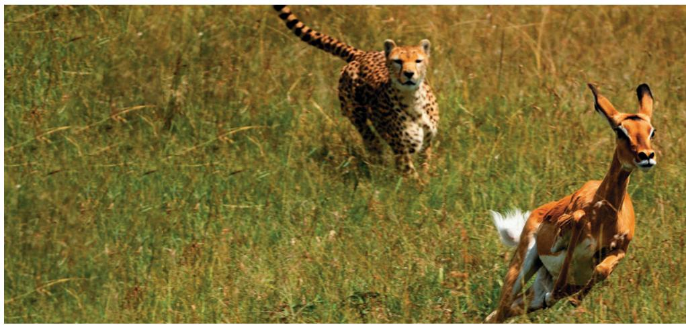  
Figure 11.1 This impala is fleeing for its life, racing to escape the predatory cheetah nipping at its heels. The impala is breathing rapidly, its heart pounding and its legs pumping furiously. These physiological functions are all part of the impala's “fight-or-flight” response, driven by hormones released from its adrenal glands at times of stress—in this case, upon sensing the cheetah.

② Aggregation in progress

1 Individual rod-shaped cells

# Concept 11.1: External signals are converted to responses within the cell

Scientists think that signaling mechanisms first evolved hundreds of millions of years ago in ancient prokaryotic organisms and single-celled eukaryotes and then were adapted for new uses in their multicellular descendants. So let's begin by considering signaling in some examples of single-celled organisms: bacteria and yeasts.

## Evolution of Cell Signaling

EVOLUTION Research during the 1970s suggested that bacterial cells—somewhat surprisingly, since they are single-celled organisms—were capable of signaling to each other. Since then, we have come to understand that cell signaling is critical among bacteria. Bacterial cells secrete molecules that can be detected by other bacterial cells (Figure 11.2). Sensing the concentration of such signaling molecules allows bacteria to monitor their own local cell density, a phenomenon called quorum sensing.

Quorum sensing allows bacterial populations to coordinate the behavior of all cells in a population in activities that require a given density of cells acting at the same time. One example is formation of a biofilm, an aggregation of bacterial cells attached to a surface by

## Figure 11.2 Communication among bacteria.

Soil-dwelling bacteria called myxobacteria (“slime bacteria”) use chemical signals to share information about nutrient availability. When food is scarce, starving cells secrete a signaling molecule that stimulates

neighboring cells to aggregate. The cells form a structure called a fruiting body that produces spores, thick-walled cells that can survive until the environment improves. The myxobacteria shown here are the species Myxococcus xanthus (steps 1–3, SEMs; lower photo, LM).

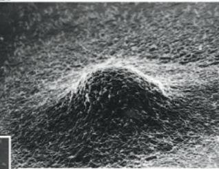  
3 Spore-forming structure (fruiting body)  
Fruiting bodies

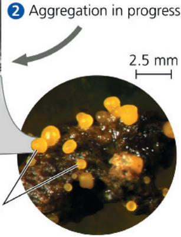  
1 Exchange of mating factors. Each mating cell type secretes a mating factor that binds to receptors on the other mating type.

molecules secreted by the cells, but only after the cells have reached a certain density. The biofilm protects the cells in it, and they often derive nutrition from the surface they are on. Biofilms are believed to be involved in up to 80% of all human bacterial infections. You have probably encountered biofilms many times, perhaps without realizing it. The slimy coating on a fallen log or on leaves lying on a forest path, and even the film on your teeth each morning, are examples of bacterial biofilms. In fact, tooth-brushing and flossing disrupt biofilms that would otherwise cause cavities and gum disease.

## Interview

Interview with Bonnie Bassler: Exploring how bacteria communicate with each other (eTextbook only)

Another example of bacterial behavior coordinated by quorum sensing is the secretion of toxins by infectious bacteria, which has serious medical implications. Sometimes treatment by antibiotics doesn't work with such infections because of antibiotic resistance that has evolved in a particular strain of bacteria. A promising alternative treatment would be to disrupt toxin production by interfering with the signaling pathways used in quorum sensing. In the Problem-Solving Exercise, you can participate in the process of scientific thinking involved in this novel approach.

Now let's look at an example of cell signaling in yeasts (single-celled fungi) (Figure 11.3). Cells of the yeast

## Figure 11.3 Communication between mating yeast cells.

Saccharomyces cerevisiae cells use chemical signaling to identify cells of the opposite mating type and initiate the mating process. The two mating types and their corresponding chemical signaling molecules, or mating factors, are called a and $\alpha$ .

  
2 Mating. Binding of the factors to receptors induces changes in the cells that lead to their fusion.  
3 New a/α cell. The nucleus of the fused cell includes all the genes from the a and α cells.

# Problem-Solving Exercise

Can a skin wound turn deadly?  
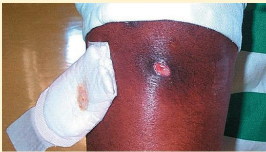

Staphylococcus aureus (S. aureus) is a common bacterial species found on the surface of healthy skin that can turn into a serious pathogen if introduced into tissue through a cut or abrasion. Once S. aureus cells enter the body and reach a certain density, they secrete a toxin that kills body cells and contributes significantly to inflammation and damage. Because about one in 100 people carry a strain of S. aureus that is resistant to common antibiotics, a minor infection can turn permanently harmful or even deadly.

Cells sense their own population density by quorum sensing, and at a certain density they start to secrete toxin. In this exercise, you will analyze whether blocking quorum sensing can stop S. aureus from producing toxin.

## Your Approach

In S. aureus, quorum sensing involves two separate signal transduction pathways. Two candidate synthetic peptides (short proteins), called peptides 1 and 2, have been proposed to interfere with S. aureus quorum-sensing pathways. Your job is to test each potential inhibitor of quorum sensing to see if it blocks either or both of the pathways that lead to toxin production.

For your experiment, you grow four cultures of S. aureus to a standardized high density and measure the concentration of toxin in the culture. The control culture contains no peptide. The other cultures have one or both candidate inhibitory peptides mixed into the growth medium before starting the cultures.

Saccharomyces cerevisiae—which are used to make bread, wine, and beer—identify their sexual mates by chemical signaling when they reproduce sexually. There are two sexes, or mating types, called a and $\alpha$ . Each type secretes a specific factor that binds only to receptors on the other type of cell. When exposed to each other's mating factors, a pair of cells of opposite type change shape, grow toward each other, and fuse (mate). The new a/ $\alpha$ cell contains all the genes of both original cells, providing advantages to the cell's descendants, which arise by subsequent cell divisions.

## Your Data

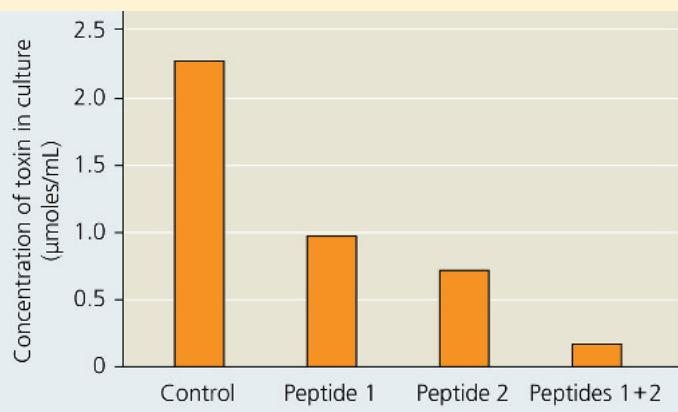  
Data from N. Balaban et al., Treatment of Staphylococcus aureus biofilm infection by the quorum-sensing inhibitor RIP, Antimicrobial Agents and Chemotherapy 51(6):2226–2229 (2007).

## Your Analysis

1. Rank the cultures according to toxin production, from most to least.

2. Which, if any, of the cultures with peptide(s) resulted in a toxin concentration similar to the control culture? What is your evidence for this?

3. Was there an additive effect on toxin production when peptides 1 and 2 were both present in the growth medium? What is your evidence for this?

4. Based on these data, would you hypothesize that peptides 1 and 2 act on the same quorum-sensing pathway leading to toxin production or on two different pathways? What is your reasoning?

5. Do these data suggest a possible treatment for antibiotic-resistant S. aureus infections? What else would you want to know to investigate this further?

Instructors: A version of this Problem-Solving Exercise can be assigned in Mastering Biology. Or a more extensive investigation called “Solve It: Is It Possible to Treat Bacterial Infections Without Traditional Antibiotics?” can be assigned.

The unique match between mating factor and receptor is key to ensuring mating only between cells of the same species of yeast. How does the binding of a mating factor by the yeast cell-surface receptor initiate a signal that brings about the cellular response of mating? This occurs in a series of three major steps—signal reception, signal transduction, and cellular response—called a signal transduction pathway. Many such pathways exist in the cells of both unicellular and multicellular organisms. In fact, the molecular details of signal transduction in yeasts and mammals are strikingly similar, even though it's

been over a billion years since they shared a common ancestor. This similarity suggests that early versions of cell-signaling mechanisms evolved well before the first multicellular organisms appeared on Earth.

## Local and Long-Distance Signaling

Like bacteria or yeast cells, cells in a multicellular organism communicate by way of a signaling molecules targeted for cells that may or may not be immediately adjacent. As we saw in Concepts 6.7 and 7.1, eukaryotic cells may communicate by direct contact, which is one type of local signaling. Many animal and plant cells have cell junctions that directly connect the cytoplasms of adjacent cells (Figure 11.4a). In these cases, signaling substances dissolved in the cytosol can pass between neighboring cells. Moreover, some animal cells may communicate by direct contact between cell-surface molecules, as shown in Figure 11.4b. This type of local signaling is especially important in embryonic development, the immune response, and in maintaining adult stem cell populations.

In many other cases of local signaling, signaling molecules are secreted by the signaling cell. Some molecules travel only short distances; such local regulators influence cells that are nearby. This type of local signaling in animals is called paracrine signaling (Figure 11.5a). One class of local regulators in animals, growth factors, consists of compounds that stimulate nearby target cells to grow and divide. Numerous cells can simultaneously receive and respond to the growth factors produced by a single cell in their vicinity.

A highly specialized type of local signaling called synaptic signaling occurs in the animal nervous system (Figure 11.5b; see Concept 48.4). An electrical signal along a nerve cell triggers the secretion of neurotransmitter molecules. These molecules act as chemical signals, diffusing across the synapse—the narrow space between the nerve cell and its target cell—triggering a response in the target cell. Drugs to treat depression, anxiety, and post-traumatic stress disorder (PTSD) affect this signaling process.

Figure 11.4 Communication requiring contact between cells.  
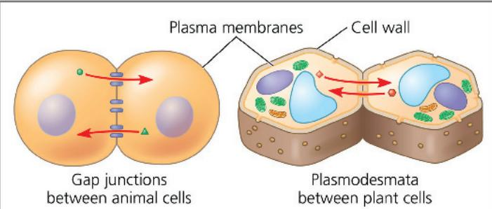  
(a) Cell junctions. Both animals and plants have cell junctions that allow molecules, including signaling molecules, to pass readily between adjacent cells without crossing plasma membranes.

  
(b) Cell-surface molecules. In many animal cells, cell-surface molecules on adjacent cells interact with each other, resulting in a signal passing between the cells.

Both animals and plants use molecules called hormones for long-distance signaling. In hormonal signaling in animals, also known as endocrine signaling, specialized cells release hormones, which travel through the circulatory system to other parts of the body, where they reach target cells that can recognize and respond to them (Figure 11.5c). Many plant hormones reach distant targets by traveling through cells (see Concept 39.2). Like local regulators, plant hormones vary widely in size and type. For instance, the plant hormone ethylene, which promotes fruit ripening and helps regulate growth, is a hydrocarbon of only six atoms ( $C_{2}H_{4}$ ), small enough to diffuse through the air and pass through cell walls. (Small signaling molecules probably evolved early on among single-celled organisms.) In contrast, the mammalian hormone insulin, which regulates sugar levels in the blood, is a protein with thousands of atoms.

Figure 11.5 Local and long-distance cell signaling by secreted molecules in animals.  
In both local and long-distance signaling, only specific target cells that can recognize a given signaling molecule will respond to it.  
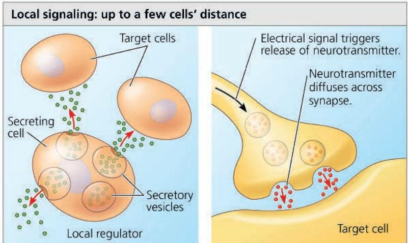  
(a) Paracrine signaling. A signaling cell acts on nearby target cells by secreting molecules of a local regulator (a growth factor, for example).  
(b) Synaptic signaling. A nerve cell releases neurotransmitter molecules into a synapse, stimulating the target cell, such as a muscle or another nerve cell.

  
(c) Endocrine (hormonal) signaling. Specialized endocrine cells secrete hormones into body fluids, often blood. Hormones reach most body cells, but are bound by and affect only some cells.

What happens when a potential target cell is exposed to a secreted signaling molecule? The ability of a cell to respond is determined by whether it has a specific receptor molecule that can bind to the signaling molecule. The information conveyed by this binding, the signal, must then be changed into another form—transduced—inside the cell before the cell can respond. The remainder of the chapter discusses this process, primarily as it occurs in animal cells. (Two signaling pathway proteins are shown in their cellular context in Figure 6.32a.)

## The Three Stages of Cell Signaling: A Preview

Our current understanding of how signaling molecules act through signal transduction pathways had its origins in the pioneering work of Earl W. Sutherland, whose research led to a Nobel Prize in 1971. Sutherland and his colleagues at Vanderbilt University were investigating how the animal hormone epinephrine (also called adrenaline) triggers the “fight-or-flight”

response in animals like the impala in Figure 11.1. One effect of epinephrine is to mobilize fuel reserves, which can be used by the animal to either defend itself (fight) or try to escape (flight). Epinephrine stimulates the breakdown of the storage polysaccharide glycogen within liver cells and skeletal muscle cells. The breakdown of glycogen releases the sugar glucose 1-phosphate, which the cell converts to glucose 6-phosphate. The liver or muscle cell can then use this compound, an early intermediate in glycolysis, for energy production (see Figure 9.8). Alternatively, the compound can be stripped of phosphate and released from the liver cell into the blood as glucose, which can fuel cells throughout the body.

But how, exactly, does epinephrine mobilize glucose for use? Sutherland's research team discovered that epinephrine outside the cell stimulates glycogen breakdown by somehow activating an enzyme, glycogen phosphorylase, inside the cell. However, when epinephrine was added to a solution containing the enzyme and its substrate, glycogen, no breakdown occurred. Glycogen phosphorylase could be activated by epinephrine only when the hormone was added to intact cells. This result told Sutherland two things. First, epinephrine does not interact directly with the enzyme responsible for glycogen breakdown; an intermediate step or series of steps must be occurring in the cell. Second, an intact, membrane-bound cell must be present for transmission of the signal to take place.

Sutherland's work suggested that the process going on at the receiving end of a cellular communication can be dissected into three stages: signal reception, signal transduction, and cellular response (Figure 11.6):

① Signal reception. Reception is the target cell's detection of a signaling molecule coming from outside the cell. A chemical signal is “detected” when the signaling molecule binds to a

## Figure 11.6 Overview of cell signaling.

From the perspective of the cell receiving the message, cell signaling can be divided into three stages: signal reception, signal transduction, and cellular response. When reception occurs at the plasma membrane, as shown here, the transduction stage is usually a pathway of several steps (three are shown as an example), with each specific relay molecule in the pathway bringing about a change in the next molecule. The final molecule in the pathway triggers the cell's response.

  
VISUAL SKILLS Where would the epinephrine in Sutherland's experiment fit into this diagram of cell signaling? For suggested answer, see Appendix A.

Plasma membrane

receptor protein located at the cell's surface (or inside the cell, to be discussed later).

② Signal transduction. The binding of the signaling molecule changes the receptor protein in some way, initiating the process of transduction. The transduction stage converts the signal to a form that can bring about a specific cellular response. In Sutherland's system, the binding of epinephrine to a receptor protein in a liver cell's plasma membrane leads to activation of glycogen phosphorylase in the cytosol. Transduction sometimes occurs in a single step but more often requires a sequence of changes in a series of different molecules—a signal transduction pathway. The molecules in the pathway are often called relay molecules; three are shown as an example.

3 Cellular response. The transduced signal finally triggers a specific cellular response. The response may be almost any imaginable cellular activity—such as catalysis by an enzyme (for example, glycogen phosphorylase), rearrangement of the cytoskeleton, or activation of specific genes in the nucleus. The cell-signaling process helps ensure that crucial activities like these occur in the right cells, at the right time, and in proper coordination with the activities of other cells of the organism. We'll now explore the mechanisms of cell signaling in more detail, including a discussion of regulation and termination of the process.

## Concept Check 11.1

1. Explain how signaling is involved in ensuring that yeast cells fuse only with cells of the opposite mating type.

2. In liver cells, glycogen phosphorylase acts in one of the three stages of the signaling pathway associated with an epinephrine-initiated signal. Identify the stage.

3. WHAT IF? If epinephrine were mixed with glycogen phosphorylase and glycogen in a cell-free mixture in a test tube, would glucose 1-phosphate be generated? Why or why not?

For suggested answers, see Appendix A.

## Concept 11.2: Signal reception: A signaling molecule binds to a receptor, causing it to change shape

A wireless router may broadcast its network signal indiscriminately, but only computers with the correct password can connect to it: Reception of the signal depends on the receiver. Similarly, the signals emitted by an a mating type yeast cell are “heard” only by its prospective mates, $\alpha$ cells. In the case of the epinephrine circulating throughout the bloodstream of the impala in Figure 11.1, the hormone encounters many types of cells, but only certain target cells, those with the corresponding receptor protein, detect and respond to the epinephrine molecule. The signaling molecule is complementary in shape to a specific site on the receptor and attaches there, like a hand in a glove. The signaling molecule acts as a ligand, the term for a molecule that specifically binds to another (often larger) molecule. Ligand binding generally causes a receptor protein to undergo a change in shape. For many receptors, this shape change directly activates the receptor, enabling it to interact with other molecules in or on the cell. For other receptors, the immediate effect of ligand binding is to cause the aggregation of two or more receptor proteins, which leads to further molecular events inside the cell. Most signal receptors are plasma membrane proteins, but others are located inside the cell. We'll look at both of these types next.

## Receptors in the Plasma Membrane

Cell-surface transmembrane receptors play crucial roles in the biological systems of animals. The largest family of human cell-surface receptors is that of the G protein-coupled receptors (GPCRs). There are more than 800 GPCRs; an example is shown in Figure 11.7. Another example is the co-receptor hijacked by HIV to enter immune cells (see Figure 7.8); this GPCR is the target of the drug maraviroc, which has shown some success at treating AIDS.

Most water-soluble signaling molecules bind to specific sites on transmembrane receptor proteins that transmit information

## Figure 11.7 The structure of a G protein-coupled receptor (GPCR).

This is a model of the human $\beta_{2}$ -adrenergic receptor, which binds epinephrine (adrenaline). The receptor was crystallized (discussed later in this section) in the presence of both a molecule that mimics epinephrine (green in the model) and cholesterol in the membrane (orange). Two receptors (blue) are shown as ribbon models in a side view. Caffeine can also bind to this receptor; see question 10 at the end of the chapter.

from the extracellular environment to the inside of the cell. We can see how cell-surface transmembrane receptors work by looking at three major types: G protein-coupled receptors (GPCRs), receptor tyrosine kinases, and ion channel receptors. These receptors are discussed and illustrated in Figure 11.8, on the next few pages; study this figure before going on.

Given the many important functions of cell-surface receptors, it is not surprising that their malfunctions are associated with many human diseases, including cancer, heart disease, and asthma. To better understand and treat these conditions, a major focus of both university research teams and the pharmaceutical industry has been to analyze the structure of these receptors.

Although cell-surface receptors (half of which are GPCRs) represent 30% of all human proteins, determining their structures by X-ray crystallography (see Figure 5.21) has proved challenging. For one thing, cell-surface receptors tend to be flexible and inherently unstable, thus difficult to crystallize. It took years of persistent efforts for researchers to determine the first few of these structures, such as the GPCR shown in Figure 11.7. In that case, the $\beta$ -adrenergic receptor was stable enough to be crystallized only while it was among membrane molecules and in the presence of a molecule mimicking its ligand. Newer techniques that do not require crystallization, like cryo-EM (see Figure 6.3), have shown promise in determining the structures of cell-surface receptors. Thus far, however, use of AlphaFold2 as a computational approach to determining structure (see Concept 5.5) has met with limited success due to the inherent structural instability of GPCRs.

Abnormal functioning of receptor tyrosine kinases (RTKs) is associated with many types of cancers. For example, some breast cancer patients have tumor cells with excessive levels of a receptor tyrosine kinase called HER2 (see Concept 12.3 and Figure 18.27). Using molecular biological techniques, researchers have developed a protein called Herceptin that binds to HER2 on cells and inhibits cell division, thus thwarting further tumor development. In some clinical studies, treatment with Herceptin improved patient survival rates by more than one-third. One goal of ongoing research into these cell-surface receptors and other cell-signaling proteins is development of additional successful treatments.

they are either hydrophobic enough or small enough to cross the hydrophobic interior of the membrane (see Concept 7.1). Hydrophobic signaling molecules include steroid hormones and thyroid hormones of animals. Another chemical signaling molecule that possesses an intracellular receptor is nitric oxide (NO), a gas; this very small molecule readily passes between the membrane phospholipids. Once a hormone or other signaling molecule has entered a cell, its binding to an intracellular receptor changes the receptor into a hormone-receptor complex that is able to cause a response—in many cases, the turning on or off of particular genes.

The behavior of aldosterone is a representative example of how steroid hormones work. This hormone is secreted by cells of the adrenal gland (a gland that lies above the kidney), then travels through the blood and enters cells all over the body. However, a response occurs only in kidney cells because they alone contain receptors for aldosterone. In these cells, the hormone binds to and activates the receptor protein. With aldosterone attached, the active form of the receptor protein then enters the nucleus and turns on specific genes that control water and sodium flow in kidney cells, ultimately affecting blood volume (Figure 11.9, after you turn the next page).

How does the activated hormone-receptor complex turn on genes? Recall that the genes in a cell's DNA function by being transcribed and processed into messenger RNA (mRNA), which leaves the nucleus and is translated into a specific protein by ribosomes in the cytoplasm (see Figure 5.22). Specialized proteins called transcription factors control which genes are turned on—that is, which genes are transcribed into mRNA—in a particular cell at a particular time. When the aldosterone receptor is activated, it acts as a transcription factor that turns on specific genes. (You'll learn more about transcription factors in Chapters 17 and 18.)

By acting as a transcription factor, the aldosterone receptor itself carries out two parts of the signaling pathway, as receptor and transducer. Most other intracellular receptors function in the same way, although many of them, such as the thyroid hormone receptor, are already in the nucleus before the signaling molecule reaches them. Interestingly, many of these intracellular receptor proteins are structurally similar, suggesting an evolutionary kinship.

## Interview

Interview with Diana Bautista: How cell signaling leads to itch and pain (eTextbook only)

## Intracellular Receptors

Intracellular receptor proteins are found in either the cytoplasm or nucleus of target cells. To reach such a receptor, a signaling molecule passes through the target cell's plasma membrane. A number of important signaling molecules can do this because

## Concept Check 11.2

1. Nerve growth factor (NGF) is a water-soluble signaling molecule. Would you expect the receptor for NGF to be intracellular or in the plasma membrane? Explain.

2. WHAT IF? What would the effect be if a cell made defective receptor tyrosine kinase proteins that were unable to dimerize?

3. MAKE CONNECTIONS How is ligand binding similar to the process of allosteric regulation of enzymes? (See Figure 8.20.)

For suggested answers, see Appendix A.

G protein-coupled receptor

# Exploring Cell-Surface Transmembrane Receptors

Figure 11.8

## G Protein-Coupled Receptors

  
Segment that interacts with G proteins inside the cell

A G protein-coupled receptor (GPCR) is a cell-surface transmembrane receptor that works with the help of a G protein, a protein that binds the energy-rich molecule GTP. Many different signaling molecules—including yeast mating factors, neurotransmitters, and epinephrine (adrenaline) and many other hormones—use GPCRs.

G protein-coupled receptors vary in the binding sites for their ligands and also for different types of G proteins inside the cell. Nevertheless, GPCR proteins are all remarkably similar in structure. In fact, they make up a large family of eukaryotic receptor proteins with a secondary structure in which the single polypeptide, represented here in a ribbon model, has seven transmembrane $\alpha$ helices (outlined with cylinders and depicted in a row for clarity). Specific loops between the helices form binding sites for signaling molecules

(outside the cell) and G proteins (on the cytoplasmic side).

GPCR-based signaling systems are extremely widespread and diverse in their functions, including roles in embryonic development and sensory reception. In humans, for example, vision, smell, and taste depend on GPCRs (see Concept 50.4). Similarities in the structures of G proteins and GPCRs in diverse organisms suggest that G proteins and their associated receptors evolved very early among eukaryotes.

Malfunctions of the associated G proteins themselves are involved in many human diseases, including bacterial infections. The bacteria that cause cholera, pertussis (whooping cough), and botulism, among others, make their victims ill by producing toxins that interfere with G protein function. Up to 35% of all medicines used today exert their effects by influencing G protein pathways.

1 Attached but able to move along the cytoplasmic side of the membrane, a G protein functions as a molecular switch that is either on or off, depending on whether GDP or GTP is attached—hence the term G protein. (GTP, or guanosine triphosphate, is similar to ATP.) When GDP is bound to the G protein, as shown above, the G protein is inactive. The receptor and G protein work together with another protein, usually an enzyme.

  
3 The activated G protein dissociates from the receptor, diffuses along the membrane, and then binds to an enzyme, altering the enzyme's shape and activity. Once activated, the enzyme can trigger the next step leading to a cellular response. Binding of signaling molecules is reversible: Like other ligands, they bind and dissociate many times. The ligand concentration outside the cell determines how often a ligand is bound and initiates signaling.

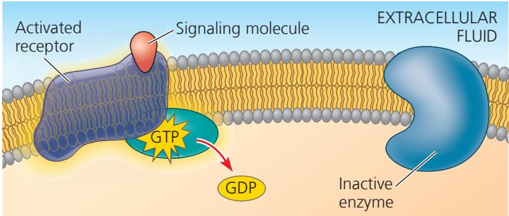

2 When the appropriate signaling molecule binds to the extracellular side of the receptor, the receptor is activated and changes shape. Its cytoplasmic side then binds an inactive G protein, causing a GTP to displace the GDP. This activates the G protein.

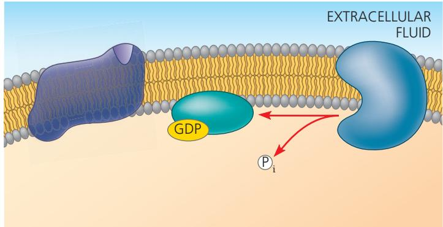  
4 The changes in the enzyme and G protein are only temporary: The G protein also acts as a GTPase, hydrolyzing its bound GTP to GDP and $P_{i}$ ; as a result, it can no longer activate the enzyme. The G protein leaves the enzyme, which returns to its inactive state. The G protein is now available for reuse. Its GTPase function allows the pathway to shut down rapidly when the signaling molecule is no longer present.

## Receptor Tyrosine Kinases

Receptor tyrosine kinases (RTKs) belong to a major class of plasma membrane receptors characterized by having enzymatic activity. An RTK is a protein kinase—an enzyme that catalyzes the transfer of phosphate groups from ATP to another protein. The part of the receptor protein extending into the cytoplasm functions more specifically as a tyrosine kinase, an enzyme that catalyzes the transfer of a phosphate group from ATP to the amino acid tyrosine of a substrate protein. Thus, RTKs are membrane receptors that attach phosphates to tyrosines.

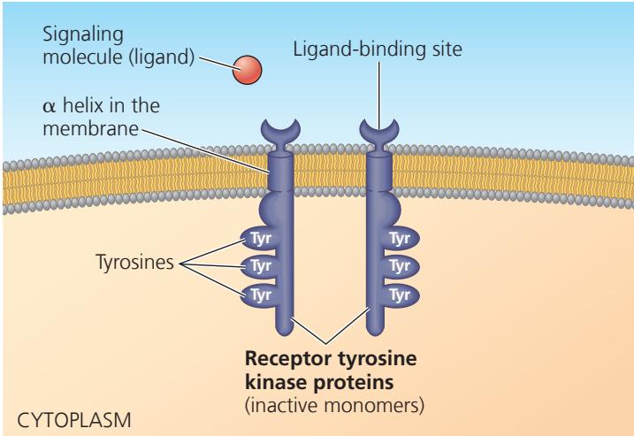

Many receptor tyrosine kinases have the structure depicted schematically here. Before the signaling molecule binds, the receptors exist as individual units referred to as monomers. Notice that each monomer has an extracellular ligand-binding site, an $\alpha$ helix spanning the membrane, and an intracellular tail containing multiple tyrosines.

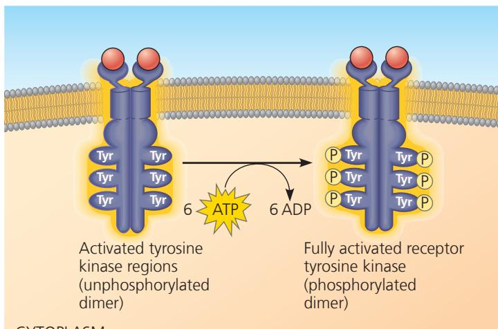

3 Dimerization activates the tyrosine kinase region of each monomer; each tyrosine kinase adds a phosphate from an ATP molecule to a tyrosine that is part of the tail of the other monomer.

Upon binding a ligand such as a growth factor, one RTK may activate ten or more different transduction pathways and cellular responses. Often, more than one signal transduction pathway can be triggered at once, helping the cell regulate and coordinate many aspects of cell growth and cell reproduction. The ability of a single ligand-binding event to trigger so many pathways is a key difference between RTKs and GPCRs; GPCRs generally activate a single transduction pathway. Abnormal RTKs that function even in the absence of signaling molecules are associated with many kinds of cancer.

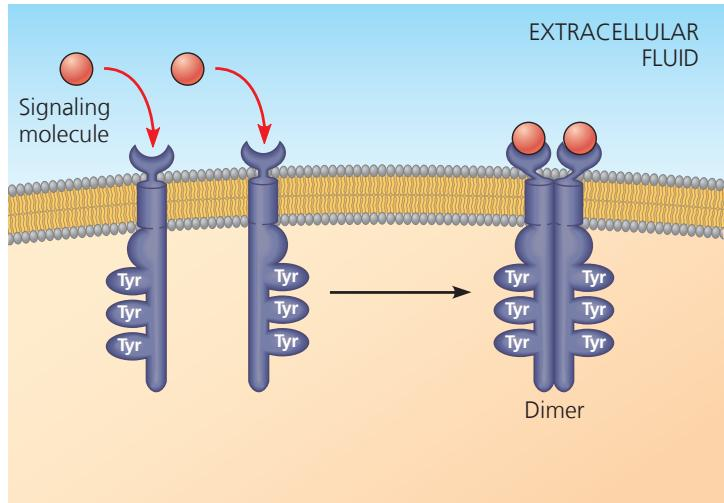

2 The binding of a signaling molecule (such as a growth factor) causes two receptor monomers to associate closely with each other, forming a complex known as a dimer, a process called dimerization. (In some cases, larger clusters form. The details of monomer association are a focus of current research.)

4 Now that the receptor is fully activated, it is recognized by specific relay proteins inside the cell. Each such protein binds to a specific phosphorylated tyrosine, undergoing a resulting structural change that activates the bound relay protein. Each activated protein triggers a transduction pathway, leading to a cellular response.

## Figure 11.8 (Continued)

## Ion Channel Receptors

A ligand-gated ion channel is a type of membrane channel receptor containing a region that can act as a “gate,” opening or closing the channel when the receptor changes shape. When a signaling molecule binds as a ligand to the channel receptor, the channel opens or closes, allowing or blocking the flow of specific ions, such as $Na^{+}$ or $Ca^{2+}$ . Like the other receptors we have discussed, these proteins bind the ligand at a specific site on their extracellular sides.

1 Here we show a ligand-gated ion channel receptor in which the channel remains closed until a ligand binds to the receptor.

2 When the ligand binds to the receptor and the channel opens, specific ions can flow through the channel and rapidly change the local concentration of that ion inside the cell. This change may directly affect the activity of the cell in some way.

3 When the ligand dissociates from this receptor, the channel closes and ions no longer enter the cell.

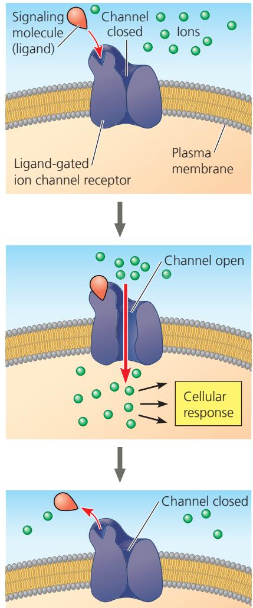  
Figure 11.9 Steroid hormone interacting with an intracellular receptor.

Ligand-gated ion channels are very important in the nervous system. For example, the neurotransmitter molecules released at a synapse between two nerve cells (see Figure 11.5b) bind as ligands to some ion channels on the receiving cell, causing the channels to open. Ions flow in (or, in some cases, out), triggering an electrical signal that propagates down the length of the receiving cell. Some of the gated ion channels are controlled by electrical signals instead of ligands; these voltage-gated ion channels are crucial to the functioning of the nervous system, as you'll see in Chapter 48. One particular voltage-gated sodium channel is required for proper muscle contraction; defects in this protein can lead to muscle stiffness or weakness, or even temporary paralysis. Some ion channels are present on membranes of organelles, such as the ER.

MAKE CONNECTIONS Is the flow of ions through a ligand-gated channel an example of active or passive transport? (Review Concepts 7.3 and 7.4.) For suggested answer, see Appendix A.

The receptor shown here is cytoplasmic. Some receptors are nuclear, and the steroid hormone would enter the nucleus and bind them.

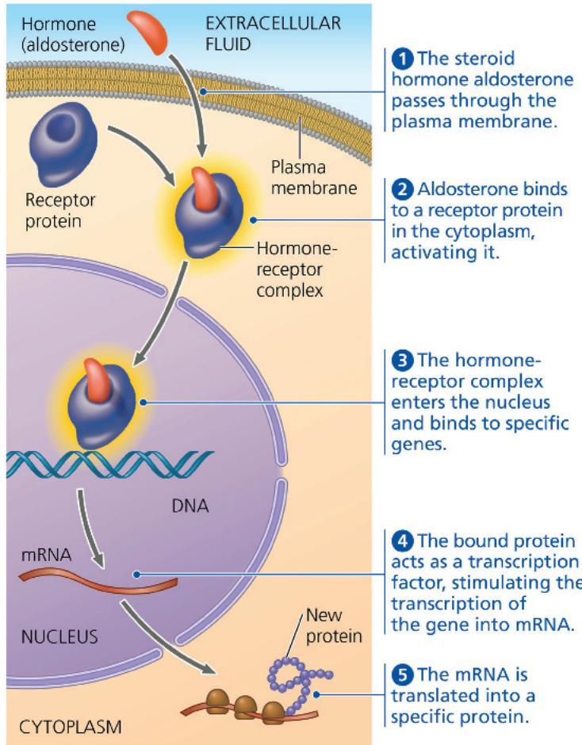  
MAKE CONNECTIONS Why is a cell-surface receptor protein not required for this steroid hormone to enter the cell? (See Concept 7.2.)
For suggested answer, see Appendix A.

## Concept 11.3: Signal transduction: Cascades of molecular interactions transmit signals from receptors to relay molecules in the cell

When receptors for signaling molecules are plasma membrane proteins, like most of those we have discussed, the transduction stage of cell signaling is usually a multistep pathway involving many molecules. Steps often include activation of proteins by addition or removal of phosphate groups or release of other small molecules or ions that act as signaling molecules. One benefit of using multiple steps is that a signal caused by a small number of signaling molecules can be greatly amplified. If each molecule transmits the signal to numerous molecules at the next step in the series, the result is a geometric increase in the number of activated molecules by the end (see Figure 11.16). A second benefit of using multistep pathways is that they provide more opportunities for coordination and control than do simpler systems. This allows regulation of the response, as we'll see later in the chapter.

## Signal Transduction Pathways

The binding of a specific signaling molecule to a receptor in the plasma membrane triggers the first step in the signal transduction pathway—the chain of molecular interactions that leads to a particular response within the cell. Like falling dominoes, the signal-activated receptor activates another molecule, which activates yet another molecule, and so on, until the protein that produces the final cellular response is activated. The molecules that relay a signal from receptor to response, which we call relay molecules in this book, are often proteins. Protein-protein interactions are a major theme of cell signaling—indeed, a unifying theme of all cellular activities.

Keep in mind that the original signaling molecule is not physically passed along a signaling pathway; in most cases, it never even enters the cell. When we say that the signal is relayed along a pathway, we mean that certain information is passed on. At each step, the signal is transduced into a different form, commonly a shape change in the next protein. Very often, the shape change is brought about by phosphorylation.

Figure 11.10 A phosphorylation cascade.

In a phosphorylation cascade, a series of different proteins in a pathway are phosphorylated in turn, each protein adding a phosphate group to the next one in line. Here, phosphorylation activates each protein, and dephosphorylation returns it to its inactive form. The active and inactive forms of each protein are represented by different shapes to remind you that activation is usually associated with a change in molecular shape.

WHAT IF? What would happen if a mutation in protein kinase 2 made it incapable of being phosphorylated?

For suggested answer, see Appendix A.

## Protein Phosphorylation and Dephosphorylation

Previous chapters introduced the concept of activating a protein by adding one or more phosphate groups to it (see Figure 8.11a). In Figure 11.8, you have already seen how phosphorylation is involved in the activation of receptor tyrosine kinases. In fact, phosphorylation of proteins and its reverse, dephosphorylation, are commonly used in cells to regulate protein activity. An enzyme that transfers phosphate groups from ATP to a protein is generally known as a protein kinase. Recall that a receptor tyrosine kinase (RTK) is a specific kind of protein kinase that phosphorylates tyrosines on the other RTK in a dimer. Most cytoplasmic protein kinases, however, act on proteins different from themselves. Another distinction is that most cytoplasmic protein kinases phosphorylate either of two other amino acids, serine or threonine, rather than tyrosine. Serine/threonine kinases are widely involved in signaling pathways in animals, plants, and fungi.

Many signal transduction pathways use relay molecules that are protein kinases, and they often act on other protein kinases in the pathway. Figure 11.10 depicts a hypothetical pathway containing two different protein kinases that create a phosphorylation cascade. The sequence of steps shown in the figure is similar to many known pathways, including those triggered in yeast by mating factors and in animal cells by many growth factors. The signal is transmitted by a cascade of protein phosphorylations, each causing a shape change in the phosphorylated protein. The shape change results from the interaction of the newly added phosphate groups with charged or polar amino acids on the protein being phosphorylated (see

Figure 5.14). The shape change in turn alters the function of the protein, most often activating it. (In some cases, though, phosphorylation instead decreases the activity of the protein.)

A significant percentage of our own genes—about 2%—is thought to code for protein kinases. A single cell may have hundreds of different kinds, each specific for a different substrate protein. Together, protein kinases probably regulate the activity of a large proportion of the thousands of proteins in a cell. Among these are most of the proteins that, in turn, regulate cell division. Abnormal activity of such a kinase can cause abnormal cell division and contribute to the development of cancer.

Equally important in the phosphorylation cascade are the protein phosphatases, enzymes that can rapidly remove phosphate groups from proteins, a process called dephosphorylation. By dephosphorylating and thus inactivating protein kinases, phosphatases provide the mechanism for turning off the signal transduction pathway when the initial signal is no longer present. Phosphatases also make the protein kinases available for reuse, enabling the cell to respond again to an extracellular signal. The phosphorylation-dephosphorylation system acts as a molecular switch in the cell, turning activities on or off, or up or down, as required. At any given moment, the activity of a protein regulated by phosphorylation depends on the balance in the cell between active kinase molecules and active phosphatase molecules.

## Small Molecules and Ions as Second Messengers

Not all components of signal transduction pathways are proteins. Many signaling pathways also involve small, nonprotein, water-soluble molecules or ions called second messengers. (The pathway's "first messenger" is considered to be the extracellular signaling molecule—the ligand—that binds to the membrane receptor.) Because they are small and water-soluble, they can readily spread through regions of the cell by diffusion. For example, as we'll see shortly, a second messenger called

cyclic AMP carries the signal initiated by epinephrine from the plasma membrane of a liver or muscle cell into the cell's interior, where the signal eventually brings about glycogen breakdown. Second messengers participate in pathways that are initiated by both G protein-coupled receptors and receptor tyrosine kinases. The two most common second messengers are cyclic AMP and calcium ions, $\mathrm{Ca^{2+}}$ . A large variety of relay proteins respond to changes in the cytosolic concentration of one or the other of these second messengers.

## Cyclic AMP

Having discovered that epinephrine somehow causes glycogen breakdown within cells, Earl Sutherland next looked for a second messenger that transmits the signal from the plasma membrane to the metabolic machinery in the cytoplasm. He found that binding of epinephrine to the G protein-coupled receptor (GPCR) in the plasma membrane results in a rise in the cytosolic concentration of cyclic AMP (cAMP; cyclic adenosine monophosphate), a small molecule produced from ATP. As shown in Figure 11.11, an enzyme embedded in the plasma membrane, adenylyl cyclase (also known as adenylate cyclase), converts ATP to cAMP in response to an extracellular signal—in this case, provided by epinephrine. When epinephrine outside the cell binds to a GPCR, it activates a G protein that in turn activates adenylyl cyclase. Adenylyl cyclase can then catalyze the synthesis of many molecules of cAMP. In this way, the normal cellular concentration of cAMP can be boosted 20-fold in a matter of seconds. The cAMP broadcasts the signal to the cytoplasm. It does not persist for long in the absence of the hormone because a different enzyme, called phosphodiesterase, converts cAMP to AMP. Another surge of epinephrine is needed to boost the cytosolic concentration of cAMP again.

Subsequent research has revealed that epinephrine is only one of many hormones and many other signaling molecules that lead to activation of adenylyl cyclase by G proteins and formation of cAMP (Figure 11.12). The immediate effect of an elevation in cAMP level is usually the activation of a serine/threonine kinase called protein kinase A. The activated protein kinase A then

Figure 11.11 Cyclic AMP.

The second messenger cyclic AMP (cAMP) is made from ATP by adenylyl cyclase, an enzyme embedded in the plasma membrane. The phosphate group in cAMP is attached to both the 5' and the 3' carbons; cAMP's cyclic arrangement is the basis for its name. cAMP is inactivated by phosphodiesterase, an enzyme that converts it to AMP.

  
WHAT IF? What would happen if a molecule that inactivated phosphodiesterase were introduced into the cell?  
For suggested answer, see Appendix A.

Figure 11.12 cAMP as a second messenger in a G protein signaling pathway.  

phosphorylates various other proteins, depending on the cell type. (The complete pathway for epinephrine's stimulation of glycogen breakdown is shown later, in Figure 11.16.)

Further regulation of cell metabolism is provided by other G protein systems that inhibit adenylyl cyclase. In these systems, a different signaling molecule activates a different receptor, which in turn activates an inhibitory G protein that blocks activation of adenylyl cyclase. Cell activities can be fine-tuned by the balance between these systems.

Now that we know about the role of cAMP in G protein signaling pathways, we can explain in molecular detail how certain microorganisms cause disease. Consider cholera, a disease that is frequently epidemic in places where the water supply is contaminated with human feces. People acquire the cholera bacterium, Vibrio cholerae, by drinking contaminated water. The bacteria form a biofilm on the lining of the small intestine and produce a toxin. The cholera toxin is an enzyme that chemically modifies a G protein involved in regulating salt and water secretion. Because the modified G protein is unable to hydrolyze GTP to GDP, it remains stuck in its active form, continuously stimulating adenylyl cyclase to make cAMP (see the question with Figure 11.12). The resulting high concentration of cAMP leads to the cellular response—the intestinal cells secrete large amounts of salts into the intestines, with water following by osmosis. An infected person quickly

develops profuse diarrhea and if left untreated can soon die from the loss of water and salts.

Our understanding of signaling pathways involving cyclic AMP or related messengers has allowed us to develop treatments for certain conditions in humans such as erectile dysfunction. In one pathway, the gas nitric oxide (NO) is released by a cell and enters a neighboring muscle cell, where it causes production of a molecule similar to cAMP called cyclic GMP (cGMP). The cGMP then acts as a second messenger that causes relaxation of muscles, such as those in the walls of arteries. A compound that prolongs the signal (by inhibiting the hydrolysis of cGMP to GMP) was originally prescribed for chest pains because it relaxed blood vessels and increased blood flow to the heart muscle. Under the trade name Viagra, this compound is now widely used as a treatment for erectile dysfunction in human males. Because Viagra leads to dilation of blood vessels, it also allows increased blood flow to the penis, optimizing physiological conditions for penile erections.

## Calcium Ions and Inositol Trisphosphate (IP $_{3}$ )

Many of the signaling molecules that function in animals—including neurotransmitters, growth factors, and some hormones—induce responses in their target cells through signal transduction pathways that increase the cytosolic concentration of calcium ions ( $Ca^{2+}$ ). Calcium is even more widely used than cAMP as a second messenger. Increasing the local cytosolic concentration of $Ca^{2+}$ causes many responses in animal cells, including muscle cell contraction, exocytosis of molecules (secretion), and cell division. In plant cells, a wide range of hormonal and environmental stimuli can cause brief increases in cytosolic $Ca^{2+}$ concentration, triggering various signaling pathways, such as the pathway for greening in response to light (see Figure 39.4). Cells use $Ca^{2+}$ as a second messenger in pathways triggered by both G protein-coupled receptors and receptor tyrosine kinases.

Although cells always contain some $Ca^{2+}$ , this ion can function as a second messenger because its concentration in the cytosol is normally much lower than the concentration outside the cell (Figure 11.13). In fact, the level of $Ca^{2+}$ in the blood and extracellular fluid of an animal is often more than 10,000 times higher than that in the cytosol. Calcium ions are actively transported out of the cell and are actively imported from the cytosol into the endoplasmic reticulum (and, under some conditions, into mitochondria and chloroplasts) by various protein pumps. As a result, the calcium concentration in the ER is usually much higher than that in the cytosol. Because the cytosolic calcium level is low, a small change in absolute numbers of ions represents a relatively large percentage change in local calcium concentration.

In response to a signal relayed by a signal transduction pathway, the cytosolic calcium level may rise, usually by a mechanism that releases $Ca^{2+}$ from the cell's ER. The pathways leading to calcium release involve two other second messengers,

Figure 11.13 The maintenance of calcium ion concentrations in an animal cell.

The $Ca^{2+}$ concentration in the cytosol is usually much lower (light green) than in the extracellular fluid and ER (dark green). Protein pumps in the plasma membrane and the ER membrane, driven by ATP, move $Ca^{2+}$ from the cytosol into the extracellular fluid and into the lumen of the ER. Mitochondrial pumps, driven by chemiosmosis (see Concept 9.4), move $Ca^{2+}$ into mitochondria when the calcium level in the cytosol rises significantly.

Key High $\left[\mathrm{Ca}^{2+}\right]$

Low $[\mathrm{Ca}^{2+}]$

Calcium ions ( $Ca^{2+}$ ) and inositol trisphosphate ( $IP_{3}$ ) function as second messengers in many signal transduction pathways. In this figure, the process is initiated by the binding of a signaling molecule to a G protein-coupled receptor. A receptor tyrosine kinase could also initiate this pathway by activating phospholipase C.

MAKE CONNECTIONS Explain the difference in function (in terms of ion transport) between the $Ca^{2+}$ pump in Figure 11.13 and the $Ca^{2+}$ channel protein shown here. (See Figure 7.17.)

For suggested answer, see Appendix A.

inositol trisphosphate (IP $_{3}$ ) and diacylglycerol (DAG). These two messengers are produced by cleavage of a certain kind of phospholipid in the plasma membrane. Figure 11.14 shows the complete picture of how a signal causes IP $_{3}$ to stimulate the release of calcium from the ER. Because IP $_{3}$ acts before calcium in these pathways, calcium could be considered a “third messenger.” However, scientists use the term second messenger for all small, nonprotein components of signal transduction pathways.

Figure 11.14 Calcium and IP $_{3}$ in signaling pathways.

## Concept Check 11.3

1. What is a protein kinase, and what is its role in a signal transduction pathway?

2. When a signal transduction pathway involves a phosphorylation cascade, how does the cell's response get turned off?

3. What is the actual "signal" that is being transduced in any signal transduction pathway, such as those shown in Figures 11.6 and 11.10? In what way is this information being passed from the exterior to the interior of the cell?

4. WHAT IF? If you exposed a cell to a ligand that binds to a receptor and activates phospholipase C, predict the effect the $IP_{3}$ -gated calcium channel would have on $Ca^{2+}$ concentration in the cytosol.

For suggested answers, see Appendix A.

① A signaling molecule binds to a receptor, leading to activation of phospholipase C.

② Phospholipase C cleaves a plasma membrane phospholipid called $\mathrm{PIP}_2$ into DAG and $\mathrm{IP}_3$ .

③ DAG functions as a second messenger in other pathways.

  
④ IP $_{3}$ quickly diffuses through the cytosol and binds to an IP $_{3}$ -gated calcium channel in the ER membrane, causing it to open.  
5 Calcium ions flow out of the ER (down their concentration gradient), raising the $\mathrm{Ca^{2+}}$ level in the cytosol.  
⑥ The calcium ions activate the next protein in one or more signaling pathways.

# Concept 11.4: Cellular response: Cell signaling leads to regulation of transcription or cytoplasmic activities

We now take a closer look at the cell's subsequent response to an extracellular signal—what some researchers call the “output response.” What is the nature of the final step in a signaling pathway?

## Nuclear and Cytoplasmic Responses

Ultimately, a signal transduction pathway leads to the regulation of one or more cellular activities. The response may occur in the nucleus or in the cytoplasm of the cell.

Many signaling pathways ultimately regulate protein synthesis, usually by turning specific genes on or off in the nucleus. Like an activated steroid receptor (see Figure 11.9), the final activated molecule in a signaling pathway may function as a transcription factor. Figure 11.15 shows an example in which a signaling pathway activates a transcription factor that turns a gene on: The response to this growth factor signal is transcription, the synthesis of one or more specific mRNAs, which will be translated in the cytoplasm into specific proteins. In other cases, the transcription factor might regulate a gene by turning it off. Often, a transcription factor regulates several different genes.

Sometimes a signaling pathway may regulate the activity of proteins rather than causing their synthesis by activating gene expression. This directly affects proteins that function outside the nucleus. For example, a signal may cause the opening or closing of an ion channel in the plasma membrane or a change in the activity of a metabolic enzyme. As we have seen, the response of liver cells to the hormone epinephrine helps regulate cellular energy metabolism by affecting the activity of an enzyme. The final step in the epinephrine signaling pathway activates the enzyme that catalyzes the breakdown of glycogen. Figure 11.16, on the next page, shows the complete pathway leading to the release of glucose 1-phosphate molecules from glycogen. Notice that as each molecule is activated, the response is amplified, a subject we'll return to shortly.

Signal receptors, relay molecules, and second messengers participate in a variety of pathways, leading to both nuclear and cytoplasmic responses, including cell division. Malfunctioning of growth factor pathways like the one in Figure 11.15 can contribute to abnormal cell division and the development of cancer, as we'll see in Concept 18.5.

## Regulation of the Response

Whether the response occurs in the nucleus or in the cytoplasm, it is not simply turned “on” or “off.” Rather, the extent and specificity of the response are regulated in multiple ways. Here we’ll consider four aspects of this regulation. First, as mentioned

Figure 11.15 Nuclear responses to a signal: the activation of a specific gene by a growth factor.

This diagram shows a typical signaling pathway that leads to regulation of gene activity in the cell nucleus. The initial signaling molecule, in this case a growth factor, triggers a phosphorylation cascade, as in Figure 11.10. (The ATP molecules and phosphate groups are not shown.) Once phosphorylated, the last kinase in the sequence enters the nucleus and activates a transcription factor, which stimulates transcription of a specific gene (or genes). The resulting mRNAs then direct the synthesis of a particular protein.

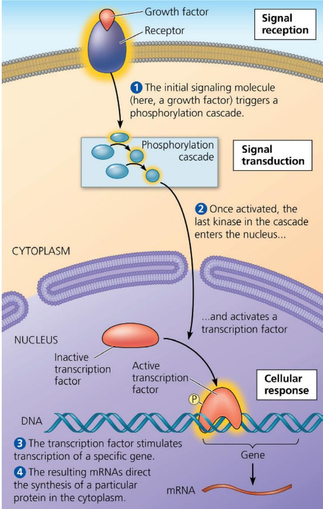

earlier, signaling pathways generally amplify the cell's response to a single signaling event. The degree of amplification depends on the function of the specific molecules in the pathway. Second, the many steps in a multistep pathway provide control points at which the cell's response can be further regulated, contributing to the specificity of the response and allowing coordination with other signaling pathways. Third, the overall efficiency of the response is enhanced by the presence of proteins known as scaffolding proteins. Finally, a crucial point in regulating the response is the termination of the signal.

Figure 11.16 Cytoplasmic response to a signal: the stimulation of glycogen breakdown by epinephrine (adrenaline).

In this signaling system, the hormone epinephrine acts through a G protein-coupled receptor to activate a succession of relay molecules, including cAMP and two protein kinases (see also Figure 11.12). The final protein activated is the enzyme glycogen phosphorylase, which uses inorganic phosphate to release glucose monomers from glycogen in the form of glucose 1-phosphate molecules. This pathway amplifies the hormonal signal: One receptor protein can activate approximately 100 molecules of G protein, and each enzyme in the pathway, once activated, can act on many molecules of its substrate, the next molecule in the cascade. The number of activated molecules given for each step is approximate.

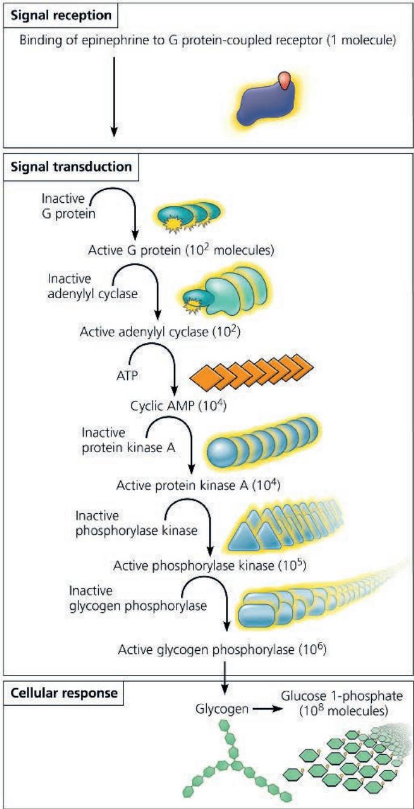  
VISUAL SKILLS In the figure, how many glucose 1–phosphate molecules are released in response to one signaling molecule? Calculate the factor by which the response is amplified in going from each step to the next. For suggested answer, see Appendix A.

## Signal Amplification

Elaborate enzyme cascades amplify the cell's response to a signal. At each catalytic step in the cascade, the number of activated products can be much greater than in the preceding step. For example, in the epinephrine-triggered pathway in Figure 11.16, each adenylyl cyclase molecule catalyzes the formation of 100 or so cAMP molecules, each molecule of protein kinase A phosphorylates about 10 molecules of the next kinase in the pathway, and so on. The amplification effect stems from the fact that these proteins persist in their active form long enough to process multiple molecules of substrate before they become inactive again. As a result of the signal's amplification, a small number of epinephrine molecules binding to receptors on the surface of a liver cell or muscle cell can lead to the release of hundreds of millions of glucose molecules from glycogen.

## The Specificity of Cell Signaling and Coordination of the Response

Consider two different cells in your body—a liver cell and a heart muscle cell, for example. Both are in contact with your bloodstream and are therefore constantly exposed to many different hormone molecules, as well as to local regulators secreted by nearby cells. Yet the liver cell responds to some signals but ignores others, and the same is true for the heart cell. And some kinds of signals trigger responses in both cells—but different responses. For instance, epinephrine stimulates the liver cell to break down glycogen, but the main response of the heart cell to epinephrine is contraction, leading to a more rapid heartbeat. How do we account for this difference?

The explanation for the specificity exhibited in cellular responses to signals is the same as the basic explanation for virtually all differences between cells: Because different kinds of cells turn on different sets of genes, different kinds of cells have different collections of proteins. The response of a cell to a signal depends on its particular collection of signal receptor proteins, relay proteins, and proteins needed to carry out the response. A liver cell, for example, is poised to respond appropriately to epinephrine by having the proteins listed in Figure 11.16 as well as those needed to manufacture glycogen.

Thus, two cells that respond differently to the same signal differ in one or more proteins that respond to the signal. Also, within some cells, there are more complex pathways that branch or converge, as shown in Figure 11.17. Notice, though, that these different pathways still have some molecules in common. For example, cells A, B, and C all use the same receptor protein for the red signaling molecule; differences in other proteins account for their differing responses. In cell D, a different receptor protein is used for the same signaling molecule, leading to yet another response. In cell B, a pathway triggered by one signal diverges to produce two responses; such branched pathways often involve receptor tyrosine kinases (which can activate multiple relay proteins) or second messengers (which can regulate numerous proteins). In cell C, two pathways triggered by separate signals converge to modulate a single response. Branching of pathways and “cross-talk” (interaction) between pathways are important in regulating and coordinating a cell’s responses to information coming in from different sources in the body. (You’ll learn more

Figure 11.17 The specificity of cell signaling.

The particular proteins a cell possesses determine what signaling molecules it responds to and the nature of the response. The four cells in these diagrams respond to the same signaling molecule (red) in different ways because each has a different set of proteins (purple receptor and teal relay molecules). Note, however, that the same kinds of molecules can participate in more than one pathway.

VISUAL SKILLS Study the signaling pathway shown in Figure 11.14, and explain how the situation pictured for cell B in Figure 11.17 could apply to that pathway.

For suggested answer, see Appendix A.

Instructors: The Scientific Skills Exercise “Using Experiments to Test a Model” can be assigned in Mastering Biology. It explores the cellular response of a yeast cell to the signal initiated by a mating factor from a cell of the opposite mating type.

about this coordination in Concept 11.5.) Moreover, the use of some of the same proteins in more than one pathway allows the cell to economize on the number of different proteins it must make.

## Signaling Efficiency: Scaffolding Proteins and Signaling Complexes

The illustrations of signaling pathways in Figure 11.17 (as well as diagrams of other pathways in this chapter) are greatly simplified. The diagrams show only a few relay molecules and, for clarity's sake, display these molecules spread out in the cytosol. If this were true in the cell, signaling pathways would operate very inefficiently because most relay molecules are proteins, and proteins are too large to diffuse quickly through the viscous cytosol. How does a given protein kinase, for instance, find its protein substrate?

In many cases, the efficiency of signal transduction is apparently increased by the presence of a scaffolding protein, a large relay protein to which several other relay proteins are simultaneously attached (Figure 11.18). Researchers have found scaffolding proteins in brain cells that permanently hold together networks of signaling pathway proteins at synapses. This hardwiring enhances the speed and accuracy of signal transfer between cells because the rate of protein-protein interaction is not limited by diffusion. Furthermore, in some cases the scaffolding proteins themselves may directly activate relay proteins.

The importance of the relay proteins that serve as points of branching or intersection in signaling pathways is highlighted by the problems arising when these proteins are defective or missing. For instance, in an inherited disorder called Wiskott-Aldrich syndrome (WAS), the absence of a single relay protein leads to such diverse effects as abnormal bleeding, eczema, and a predisposition to infections and leukemia. These symptoms are thought to arise primarily from the absence of the protein in cells of the immune system. By studying normal cells, scientists found that the WAS protein is located just beneath the immune cell surface. The protein interacts both with microfilaments of the cytoskeleton and with

## Figure 11.18 A scaffolding protein.

The scaffolding protein shown here (orange) simultaneously binds to a specific activated membrane receptor and three different protein kinases. This physical arrangement facilitates signal transduction by these molecules.

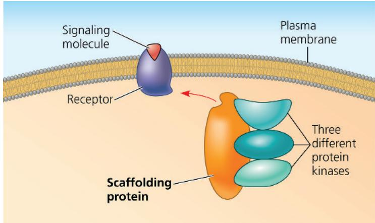

several different components of signaling pathways that relay information from the cell surface, including pathways regulating immune cell proliferation. This multifunctional relay protein is thus both a branch point and an important intersection point in a complex signal transduction network that controls immune cell behavior. When the WAS protein is absent, the cytoskeleton is not properly organized and signaling pathways are disrupted, leading to the WAS symptoms.

## Termination of the Signal

In the interest of keeping Figure 11.17 simple, we did not show the inactivation mechanisms that are an essential aspect of any cell-signaling pathway. For a cell of a multicellular organism to remain capable of responding to incoming signals, each molecular change in its signaling pathways must last only a short time. As we saw in the cholera example, if a signaling pathway component becomes locked into one state, whether active or inactive, consequences for the organism can be serious.

The ability of a cell to receive new signals depends on reversibility of the changes produced by prior signals. The binding of signaling molecules to receptors is reversible. As the external concentration of signaling molecules falls, fewer receptors are bound at any given moment, and the unbound receptors revert to their inactive form. The cellular response occurs only when the concentration of receptors with bound signaling molecules is above a certain threshold. When the number of active receptors falls below that threshold, the cellular response ceases. Then, by a variety of means, the relay molecules return to their inactive forms: The GTPase activity intrinsic to a G protein hydrolyzes its bound GTP; the enzyme phosphodiesterase converts cAMP to AMP; protein phosphatases inactivate phosphorylated kinases and other proteins; and so forth. As a result, the cell is soon ready to respond to a fresh signal.

In this section, we explored the complexity of signaling initiation and termination in a single pathway, and we saw the

## Concept Check 11.4

1. How can a target cell's response to a single hormone molecule result in a response that affects a million other molecules?

2. WHAT IF? If two cells have different scaffolding proteins, explain how they might behave differently in response to the same signaling molecule.

3. WHAT IF? Some human diseases are associated with malfunctioning protein phosphatases. How would such proteins affect signaling pathways? (Review the discussion of protein phosphatases in Concept 11.3 and see Figure 11.10.)

4. Epinephrine affects heart muscle cells by causing them to mobilize glucose, contract faster, and increase heart rate. The muscle cells around lungs and airways, on the other hand, have the opposite response to epinephrine: They relax, allowing more air to be breathed in. What might explain why respiratory (breathing-related) muscle cells can respond so differently from heart muscle cells?

For suggested answers, see Appendix A.

potential for pathways to intersect with each other. In the next section, we'll consider one especially important network of interacting pathways in the cell.

## Concept 11.5: Apoptosis requires integration of multiple cell-signaling pathways

When signaling pathways were first discovered, they were thought to be linear, independent pathways. Our understanding of cellular communication has benefited from the realization that signaling pathway components interact with each other in various ways. For a cell to carry out the appropriate response, cellular proteins often must integrate multiple signals. Let's consider an important cellular process—cellular suicide—as an example.

Cells that are infected, are damaged, or have reached the end of their functional life span often undergo “programmed cell death” (Figure 11.19). The best-understood type of this controlled cell suicide is apoptosis (from the Greek, meaning “falling off,” and used in a classic Greek poem to refer to leaves falling from a tree). During this process, cellular agents chop up the DNA and fragment the organelles and other cytoplasmic components. The cell shrinks and becomes lobed (a change called “blebbing”), and the cell’s parts are packaged up in vesicles that are engulfed and digested by specialized scavenger cells, leaving no trace. Apoptosis protects neighboring cells from damage that they would otherwise suffer if a dying cell merely leaked out all its contents, including its many digestive enzymes.

## Figure 11.19 Apoptosis of a human white blood cell.

On the left is a normal white blood cell, while on the right is a white blood cell undergoing apoptosis. The apoptotic cell is shrinking and forming lobes (“blebs”), which eventually are shed as membrane-bounded cell fragments (colorized SEMs).

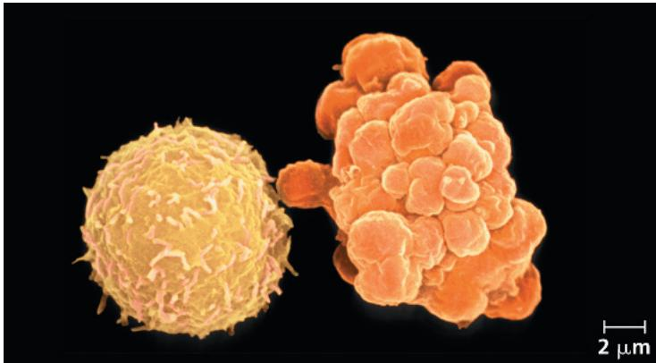

The signal that triggers all of the complex events that occur during apoptosis can come from either outside or inside the cell. Outside the cell, signaling molecules released from other cells can initiate a signal transduction pathway that activates the genes and proteins responsible for carrying out cell death. Within a cell whose DNA has been irretrievably damaged, a series of protein-protein interactions can pass along a signal that similarly triggers cell death. Considering some examples of apoptosis can help us to see how signaling pathways are integrated in cells.

## Apoptosis in the Soil Worm Caenorhabditis elegans

The molecular mechanisms of apoptosis were worked out by researchers studying embryonic development of a small soil worm, a nematode called Caenorhabditis elegans. Because the adult worm has only about 1,000 cells, the researchers were able to work out the entire ancestry of each cell. The timely suicide of cells occurs exactly 131 times during normal development of C. elegans, at precisely the same points in the cell lineage of each worm. In worms and other species, apoptosis is triggered by signals that activate a cascade of “suicide” proteins in the cells destined to die.

Genetic research on C. elegans initially revealed two key apoptosis genes, called ced-3 and ced-4 (ced stands for “cell death”), which encode proteins essential for apoptosis. The proteins are called Ced-3 and Ced-4, respectively. These and most other proteins involved in apoptosis are continually present in cells, but in inactive form; thus, regulation in this case occurs at the level of protein activity rather than through gene activity and protein synthesis. In C. elegans, a protein in the outer mitochondrial membrane, called Ced-9 (the product of the ced-9 gene), serves as a master regulator of apoptosis, acting as a brake in the absence of a signal promoting apoptosis (Figure 11.20a). When a death signal is received by the cell, signal transduction involves a change in Ced-9 that disables the brake, and the apoptotic pathway activates proteases and nucleases, enzymes that cut up the proteins and DNA of the cell. The main proteases of apoptosis are called caspases; in the nematode, the chief caspase is the Ced-3 protein.

## Apoptotic Pathways and the Signals That Trigger Them

In humans and other mammals, several different pathways, involving about 15 different caspases, can carry out apoptosis. The pathway that is used depends on the type of cell and on the particular signal that initiates apoptosis. One major

Figure 11.20 Molecular basis of apoptosis in C. elegans.
Three proteins, Ced-3, Ced-4, and Ced-9, are critical to apoptosis and its regulation in the nematode. Apoptosis is more complicated in mammals but involves proteins similar to those in C. elegans.

  
(a) No death signal. As long as Ced-9, located in the outer mitochondrial membrane, is active, apoptosis is inhibited, and the cell remains alive.

  
(b) Death signal. When a cell receives a death signal, Ced-9 is inactivated, relieving its inhibition of Ced-4. Active Ced-4 activates Ced-3, a protease, which triggers a cascade of reactions leading to the activation of nucleases and other proteases. The action of these enzymes causes the changes seen in apoptotic cells and eventually leads to cell death.

pathway involves certain mitochondrial proteins that are triggered to form molecular pores in the mitochondrial outer membrane, causing it to leak and release other proteins that promote apoptosis. Perhaps surprisingly, these latter include cytochrome c, which functions in mitochondrial electron transport in healthy cells (see Figure 9.14) but acts as a cell death factor when released from mitochondria. The process of mitochondrial apoptosis in mammals uses proteins similar to the nematode proteins Ced-3, Ced-4, and Ced-9. These can be

## Figure 11.21 Effect of apoptosis during paw development in the mouse.

In mice, humans, other mammals, and land birds, the embryonic region that develops into feet or hands initially has a solid, platelike structure. Apoptosis eliminates the cells in the interdigital regions, thus forming the digits. The embryonic mouse paws shown in these fluorescence light micrographs are stained so that cells undergoing apoptosis appear a bright yellowish green. Apoptosis of cells begins at the margin of each interdigital region (left), peaks as the tissue in these regions is reduced (middle), and is no longer visible when the interdigital tissue has been eliminated (right).

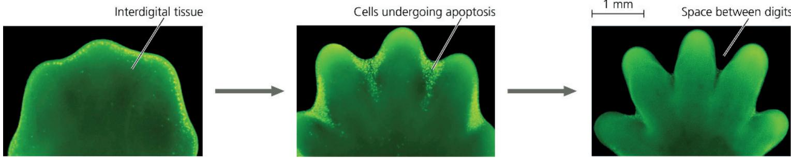

thought of as relay proteins capable of transducing the apoptotic signal.

At key gateways into the apoptotic program, relay proteins integrate signals from several different sources and can send a cell down an apoptotic pathway. Often, the signal originates outside the cell, like the death-signaling molecule depicted in Figure 11.20b, which presumably was released by a neighboring cell. When a death-signaling ligand occupies a cell-surface receptor, this binding leads to activation of caspases and other enzymes that carry out apoptosis, without involving the mitochondrial pathway. This process of signal reception, transduction, and response is similar to what we have discussed throughout this chapter. In a twist on the classic scenario, two other types of alarm signals that can lead to apoptosis originate from inside the cell rather than from a cell-surface receptor. One signal comes from the nucleus, generated when the DNA has suffered irreparable damage, and a second comes from the endoplasmic reticulum when excessive protein misfolding occurs. Mammalian cells make life-or-death “decisions” by somehow integrating the death signals and life signals they receive from these external and internal sources.

A built-in cell suicide mechanism is essential to development and maintenance in all animals. The similarities between apoptosis genes in nematodes and those in mammals, as well as the observation that apoptosis occurs in multicellular fungi and even in single-celled yeasts, indicate that the basic mechanism evolved early in the evolution of eukaryotes. In vertebrates, apoptosis is essential for normal development of the nervous system, for normal operation of the immune system, and for normal morphogenesis of hands and feet in humans and paws in other mammals (Figure 11.21). The level of apoptosis between the developing digits is lower in the

webbed feet of ducks and other water birds than in the nonwebbed feet of land birds, such as chickens. In the case of humans, the failure of appropriate apoptosis can result in webbed fingers and toes.

Significant evidence points to the involvement of apoptosis in certain degenerative diseases of the nervous system, such as Parkinson's disease and Alzheimer's disease. In Alzheimer's disease, an accumulation of aggregated proteins in neuronal cells activates an enzyme that triggers apoptosis, resulting in the loss of brain function seen in these patients. Furthermore, cancer can result from a failure of cell suicide; some cases of human melanoma, for example, have been linked to faulty forms of the human version of the C. elegans Ced-4 protein. It is not surprising, therefore, that the signaling pathways feeding into apoptosis are quite elaborate. After all, the life-or-death question is the most fundamental one imaginable for a cell.

This chapter has introduced you to many of the general mechanisms of cell communication, such as ligand binding, protein-protein interactions and shape changes, cascades of interactions, and protein phosphorylation. Throughout your study of biology, you will encounter numerous examples of cell signaling.

## Concept Check 11.5

1. Give an example of apoptosis during embryonic development, and explain its function in the developing embryo.

2. WHAT IF? What types of protein defects might cause apoptosis to occur when it shouldn't? What types could result in apoptosis not occurring when it should?

For suggested answers, see Appendix A.

# Chapter 11 Review

## Summary of Key Concepts

To review key terms, go to the Vocabulary Self-Quiz (eTextbook only).

Concept 11.1: External signals are converted to responses within the cell

\- Signal transduction pathways are crucial for many processes. Bacterial cells can sense the local density of bacterial cells (quorum sensing). Signaling during yeast cell mating has much in common with processes in multicellular organisms, suggesting an early evolutionary origin of signaling mechanisms.

\- Local signaling by animal cells involves direct contact or the secretion of local regulators. For long-distance signaling, animal and plant cells use hormones; animals also pass signals electrically.

\- Like epinephrine, other hormones that bind to membrane receptors trigger a three-stage cell-signaling pathway:

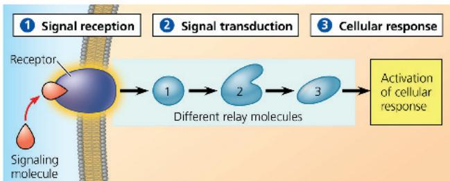  
What determines whether a cell responds to a hormone such as epinephrine? What determines how a cell responds to such a hormone?

## Concept 11.2: Signal reception: A signaling molecule binds to a receptor, causing it to change shape

\- The binding between signaling molecule (ligand) and receptor is highly specific. A specific shape change in a receptor is often the initial transduction of the signal.

\- Three of the major types of cell-surface transmembrane receptors are the following: (1) G protein-coupled receptors (GPCRs) work with cytoplasmic G proteins. Ligand binding activates the receptor, which then activates a specific G protein, which activates yet another protein, thus propagating the signal. (2) Receptor tyrosine kinases (RTKs) react to the binding of signaling molecules by forming dimers and then adding phosphate groups to tyrosines on the cytoplasmic part of the other monomer making up the dimer. Relay proteins in the cell can then be activated by binding to different phosphorylated tyrosines, allowing this receptor to trigger several pathways at once. (3) A ligand-gated ion channel opens or closes in response to binding by specific signaling molecules, regulating the flow of specific ions across the membrane.

\- The activity of all three types of receptors is crucial; abnormal GPCRs and RTKs are associated with many human diseases.

\- Intracellular receptors are cytoplasmic or nuclear proteins. Signaling molecules that are hydrophobic or small enough to cross the plasma membrane bind to these receptors inside the cell.

How are the structures of a GPCR and an RTK similar? How does initiation of signal transduction differ for these two types of receptors?

## Concept 11.3: Signal transduction: Cascades of molecular interactions transmit signals from receptors to relay molecules in the cell

\- At each step in a signal transduction pathway, the signal is transduced into a different form, which commonly involves a shape change in a protein. Many signal transduction pathways include phosphorylation cascades, in which a series of protein kinases each add a phosphate group to the next one in line, activating it. Enzymes called protein phosphatases remove the phosphate groups. The balance between phosphorylation and dephosphorylation regulates the activity of proteins involved in the sequential steps of a signal transduction pathway.

\- Second messengers, such as the small molecule cyclic AMP (cAMP) and the ion $Ca^{2+}$ , diffuse readily through the cytosol and thus help broadcast signals quickly. Many G proteins activate adenylyl cyclase, which makes cAMP from ATP. Cells use $Ca^{2+}$ as a second messenger in GPCR and RTK pathways. The tyrosine kinase pathways can also involve two other second messengers, diacylglycerol (DAG) and inositol trisphosphate ( $IP_{3}$ ). $IP_{3}$ can trigger a subsequent increase in $Ca^{2+}$ level.

What is the difference between a protein kinase and a second messenger? Can both operate in the same signal transduction pathway?

## Concept 11.4: Cellular response: Cell signaling leads to regulation of transcription or cytoplasmic activities

\- Some pathways lead to a nuclear response: Specific genes are turned on or off by activated transcription factors. In others, the response involves cytoplasmic regulation.

\- Cellular responses are not simply on or off; they are regulated at many steps. Each protein in a signaling pathway amplifies the signal by activating multiple copies of the next component; for long pathways, the total amplification may be over a millionfold. The combination of proteins in a cell confers specificity in the signals it detects and the responses it carries out. Scaffolding proteins increase signaling efficiency. Pathway branching further helps the cell coordinate signals and responses. Signal response can be terminated quickly because ligand binding is reversible.

What mechanisms in the cell terminate its response to a signal and maintain its ability to respond to new signals?

## Concept 11.5: Apoptosis requires integration of multiple cell-signaling pathways

\- Apoptosis is a type of programmed cell death in which cell components are disposed of in an orderly fashion. Studies of the soil worm Caenorhabditis elegans clarified molecular details of the relevant signaling pathways. A death signal leads to activation of caspases and nucleases, the main enzymes involved in apoptosis.

\- Several apoptotic signaling pathways with related proteins exist in the cells of humans and other mammals, triggered in different ways. Signals eliciting apoptosis can originate from outside or inside the cell.

What is an explanation for the similarities between genes in yeasts, nematodes, and mammals that control apoptosis?

For suggested answers, see Appendix A.

## Levels 3-4: Applying/Analyzing

6. Which observation suggested to Sutherland the involvement of a second messenger in epinephrine's effect on liver cells?

(A) Enzymatic activity was proportional to the amount of calcium added to a cell-free extract.

(B) Receptor studies indicated that epinephrine was a ligand.

(C) Glycogen breakdown was observed only when epinephrine was administered to intact cells.

(D) Glycogen breakdown was observed only when epinephrine and glycogen phosphorylase were mixed.

7. Protein phosphorylation is commonly involved with which of the following?

(A) ligand binding by receptor tyrosine kinases

(B) activation of G protein-coupled receptors

(C) activation of protein kinase molecules

(D) release of $Ca^{2+}$ from the ER lumen

## Test Your Understanding

For more multiple-choice questions, go to the Practice Test (eTextbook only).

## Levels 1-2: Remembering/Understanding

1. Binding of a signaling molecule to which type of receptor leads directly to a change in the distribution of substances on opposite sides of the membrane?

(A) intracellular receptor

(B) G protein-coupled receptor

(C) phosphorylated receptor tyrosine kinase dimer

(D) ligand-gated ion channel

2. The activation of receptor tyrosine kinases is characterized by

(A) dimerization and phosphorylation.

(B) dimerization and IP $_{3}$ binding.

(C) a phosphorylation cascade.

(D) GTP hydrolysis.

3. Why do lipid-soluble signaling molecules, such as aldosterone, cross the membranes of all cells but affect only target cells?

(A) Only target cells retain the appropriate DNA segments.

(B) Intracellular receptors are present only in target cells.

(C) Only target cells have enzymes that break down aldosterone.

(D) Only in target cells is aldosterone able to initiate the phosphorylation cascade that turns genes on.

4. Consider this pathway: epinephrine → G protein-coupled receptor → G protein → adenylyl cyclase → cAMP. Identify the second messenger.

(A) cAMP

(B) G protein

(C) GTP

(D) adenylyl cyclase

5. Which of the following occurs during apoptosis?

(A) lysis of the cell

(B) direct contact between signaling cells

(C) fragmentation of the DNA

(D) release of proteases outside the cell

## Levels 5-6: Evaluating/Creating

8. DRAW IT Draw the following apoptotic pathway, which operates in human immune cells. A death signal is received when a molecule called Fas binds its cell-surface receptor. The binding of many Fas molecules to receptors causes receptor clustering. The intracellular regions of the receptors, when together, bind proteins called adaptor proteins. These in turn bind to inactive molecules of caspase-8, which become activated and then activate caspase-3. Once activated, caspase-3 initiates apoptosis.

9. EVOLUTION CONNECTION Identify the evolutionary mechanisms that might account for the origin and persistence of cell-to-cell signaling systems in prokaryotic organisms.

10. SCIENTIFIC INQUIRY Epinephrine initiates a signal transduction pathway that produces cyclic AMP (cAMP) and leads to the breakdown of glycogen to glucose, a major energy source for cells. But glycogen breakdown is only part of the fight-or-flight response that epinephrine brings about; the overall effect on the body includes an increase in heart rate and alertness, as well as a burst of energy. Given that caffeine blocks the activity of cAMP phosphodiesterase, propose a mechanism by which caffeine ingestion leads to heightened alertness and sleeplessness.

11. SCIENCE, TECHNOLOGY, AND SOCIETY The aging process is thought to be initiated at the cellular level. Among the changes that can occur after a certain number of cell divisions is the loss of a cell's ability to respond to growth factors and other signals. Much research into aging is aimed at understanding such losses, with the ultimate goal of extending the human life span. Not everyone, however, agrees that this is a desirable goal. If life expectancy were greatly increased, discuss what might be the social and ecological consequences.

12. WRITE ABOUT A THEME: ORGANIZATION The properties of life emerge at the biological level of the cell. The highly regulated process of apoptosis is not simply the destruction of a cell; it is also an emergent property. Write a short essay (about 100–150 words) that briefly explains the role of apoptosis in the development and proper functioning of an animal, and describe how this form of programmed cell death is a process that emerges from the orderly integration of signaling pathways.

## 13. SYNTHESIZE YOUR KNOWLEDGE

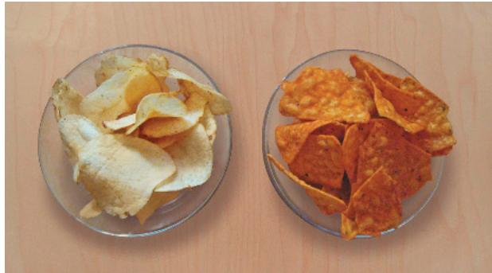  
There are five basic tastes—sour, salty, sweet, bitter, and “umami.” Salt is detected when the concentration of salt outside of a taste bud cell is higher than that inside of it, and ion channels

allow the passive leakage of $Na^{+}$ into the cell. The resulting change in membrane potential (see Concept 7.4) sends the “salty” signal to the brain. Umami is a savory taste generated by glutamate (glutamic acid, found in monosodium glutamate, or MSG), which is used as a flavor enhancer in foods such as taco-flavored tortilla chips. The glutamate receptor is a GPCR, which, when bound, initiates a signaling pathway that ends with a cellular response, perceived by you as “taste.” If you eat a regular potato chip and then rinse your mouth, you will no longer taste salt. But if you eat a flavored tortilla chip and then rinse, the taste persists. (Try it!) Propose a possible explanation for this difference.

For selected answers, see Appendix A.

# The Cell Cycle

## Key Concepts

12.1 Most cell division results in genetically identical daughter cells

12.2 The mitotic phase alternates with interphase in the cell cycle

12.3 The eukaryotic cell cycle is regulated by a molecular control system

  
Figure 12.1 A multicellular organism starts out as a single cell that divides into two. Those two cells then divide into four, as shown in these fluorescence micrographs of a marine worm embryo. Cell division continues throughout an organism's life, for growth or to replace worn-out or damaged cells. Each time a cell divides in this way, it is crucial that the daughter cells be genetically identical to the parent cell.

## Study Tip

## Make a visual study guide:

Figure 12.1 presents the events of the cell cycle as a simplified linear diagram. As you learn more about the cell cycle, draw a detailed linear diagram of the stages of interphase, mitosis, and cytokinesis. Include explanatory labels. Add the circular chart from Figure 12.6 and show how the two diagrams are related.

## How does one parent cell give rise to two genetically identical daughter cells?

  
Cytokinesis: The cell divides into two daughter cells, genetically identical to each other and to the parent cell.

# Concept 12.1: Most cell division results in genetically identical daughter cells

The ability of organisms to produce more of their own kind is the one characteristic that best distinguishes living things from non-living matter. This unique capacity to procreate, like all biological functions, has a cellular basis. The continuity of life is based on the reproduction of cells, or cell division.

## Key Roles of Cell Division

Cell division plays several important roles in life. When a pro-karyotic cell divides, it is actually reproducing because the process gives rise to a new organism (another cell). The same is true of any unicellular eukaryote, such as the amoeba shown in Figure 12.2a. As for multicellular eukaryotes, cell division enables each of these organisms to develop from a single cell—the fertilized egg. A two-celled embryo, the first stage in this process, is shown in Figure 12.2b. And cell division continues to function in renewal and repair in fully grown multicellular eukaryotes, replacing cells that die from accidents or normal wear and tear. For example, dividing cells in your bone marrow continuously make new blood cells (Figure 12.2c).

The reproduction of a cell, with all of its complexity, cannot occur by a mere pinching in half; a cell is not like a soap bubble that simply enlarges and splits in two. In both prokaryotes and eukaryotes, a crucial function of most cell divisions is the distribution of identical genetic material—DNA—to two daughter cells. (The exception is meiosis, the special type of eukaryotic cell division that can produce sperm and eggs in animals, or spores in plants.) What is most remarkable about cell division is the accuracy with which the DNA is passed from one generation of cells to the next. A dividing cell replicates its DNA, distributes the two copies to opposite ends of the cell, and then splits into daughter cells.

Figure 12.2 The functions of cell division.  
  
(b) Growth and development. This micrograph shows a sand dollar embryo shortly after the fertilized egg divided, forming two cells (LM).

  
(a) Asexual reproduction. An amoeba, a single-celled eukaryote, is dividing into two cells. Each new cell will be an individual organism (LM).

  
(c) Tissue renewal. These dividing bone marrow cells will give rise to new blood cells (LM).  
Figure 12.3 Eukaryotic chromosomes.

## Cellular Organization of the Genetic Material

A cell's DNA, its genetic information, is called its genome. Although a prokaryotic genome is often a single DNA molecule, eukaryotic genomes usually consist of a number of DNA molecules. The overall length of DNA in a eukaryotic cell is enormous. A typical human cell, for example, has about $2\mathrm{m}$ of DNA—a length about 250,000 times greater than the cell's diameter. Before the cell can divide to form genetically identical daughter cells, all of this DNA must be copied, or replicated, and then the two copies must be separated so that each daughter cell ends up with a complete genome.

The replication and distribution of so much DNA are manageable because the DNA molecules are packaged into structures called chromosomes (from the Greek chroma, color, and soma, body), so named because they take up certain dyes used in microscopy (Figure 12.3). Each eukaryotic chromosome consists of one very long, linear DNA molecule associated with many proteins (see Figure 6.9). The DNA molecule carries several hundred to a few thousand genes, the units of information that specify an organism's inherited traits. The associated proteins maintain the structure of the chromosome and help control the activity of the genes. Together, the entire complex of DNA and proteins that is the building material of chromosomes is referred

Chromosomes (stained purple) are visible within the nucleus of this cell from an African blood lily. The thinner red threads in the surrounding cytoplasm are the cytoskeleton. The cell is preparing to divide (LM).

to as chromatin. As you will soon see, the chromatin of a chromosome varies in its degree of condensation during the process of cell division. (Figure 16.23 shows how this chromatin is packed into the cell nucleus.)

Every eukaryotic species has a characteristic number of chromosomes in each cell's nucleus. For example, the nuclei of human somatic cells (all body cells except the reproductive cells) each contain 46 chromosomes, made up of two sets of 23, one set inherited from each parent. Reproductive cells, or gametes—such as sperm and eggs—have half as many chromosomes as somatic cells; in our example, human gametes have one set of 23 chromosomes. The number of chromosomes in somatic cells varies widely among species: 18 in cabbage plants, 48 in chimpanzees, 56 in elephants, 90 in hedgehogs, and 148 in one species of alga. We'll now consider how these chromosomes behave during cell division.

## Distribution of Chromosomes During Eukaryotic Cell Division

When a cell is not dividing, and even as it replicates its DNA in preparation for cell division, each chromosome is in the form of a long, thin chromatin fiber. After DNA replication, however, the

chromosomes condense as a part of cell division: Each chromatin fiber becomes densely coiled and folded, making the chromosomes much shorter and so thick that we can see them with a light microscope. (See Figure 16.23.)

Each duplicated chromosome consists of two sister chromatids, which are joined copies of the original chromosome (Figure 12.4). The two chromatids, each containing an identical DNA molecule, are often attached all along their lengths by protein complexes called cohesins; this attachment is known as sister chromatid cohesion. Each sister chromatid has a centromere, a region made up of repetitive sequences in the chromosomal DNA where the chromatid is attached most closely to its sister chromatid. This attachment is mediated by proteins that recognize and bind to the centromeric DNA; other bound proteins condense the DNA, giving the duplicated chromosome a narrow “waist.” The portion of a chromatid to either side of the centromere is referred to as an arm of the chromatid. (An unduplicated chromosome has a single centromere, distinguished by the proteins that bind there, and two arms.)

Later in the cell division process, the two sister chromatids of each duplicated chromosome separate and move into two new nuclei, one forming at each end of the cell. Once the sister chromatids separate, they are no longer called sister chromatids but are considered individual chromosomes;

Figure 12.4 A highly condensed, duplicated human chromosome. (SEM)  
  
DRAW IT Circle one sister chromatid of this chromosome.  
For suggested answer, see Appendix A.

this is the step that essentially doubles the number of chromosomes during cell division. Thus, each new nucleus receives a collection of chromosomes identical to that of the parent cell (Figure 12.5). Mitosis, the division of the genetic material in the nucleus, is usually followed immediately by cytokinesis, the division of the cytoplasm. One cell has become two, each the genetic equivalent of the parent cell.

Figure 12.5 Chromosome duplication and distribution during cell division.  
  
How many chromatid arms does the chromosome in ② have? Identify the point in the figure where one chromosome becomes two. For suggested answer, see Appendix A.

In a dividing cell, the mitotic (M) phase alternates with interphase, a growth period.

From a fertilized egg, mitosis and cytokinesis produced the 37 trillion somatic cells that now make up your body, and the same processes continue to generate new cells to replace dead and damaged ones. In contrast, you produce gametes—eggs or sperm—by a variation of cell division called meiosis, which yields daughter cells with only one set of chromosomes, half as many chromosomes as the parent cell. Meiosis in humans occurs only in special cells in the ovaries or testes (the gonads). Generating gametes, meiosis reduces the chromosome number from 46 (two sets) to 23 (one set). Fertilization fuses two gametes together and returns the chromosome number to 46 (two sets). Mitosis then conserves that number in every somatic cell nucleus of the new human individual. In Chapter 13, we will examine the role of meiosis in reproduction and inheritance in more detail. In the remainder of this chapter, we focus on mitosis and the rest of the cell cycle in eukaryotes.

## Concept Check 12.1

1. How many chromosomes are drawn in each part of Figure 12.5? (Ignore the micrograph in step 2.)

2. WHAT IF? A chicken has 78 chromosomes in its somatic cells. How many chromosomes did the chicken inherit from each parent? How many chromosomes are in each of the chicken's gametes? How many chromosomes will be in each somatic cell of the chicken's offspring?

For suggested answers, see Appendix A.

## Concept 12.2: The mitotic phase alternates with interphase in the cell cycle

In 1882, a German anatomist named Walther Flemming developed dyes that allowed him to observe, for the first time, the behavior of chromosomes during mitosis and cytokinesis. (In fact, Flemming coined the terms mitosis and chromatin.) During the period between one cell division and the next, it appeared to Flemming that the cell was simply growing larger. But we now know that many critical events occur during this stage in the life of a cell.

## Phases of the Cell Cycle

Mitosis is just one part of the cell cycle, the life of a cell from the time it is first formed during division of a parent cell until its own division into two daughter cells (Figure 12.6). (Biologists use the words daughter or sister in relation to cells, but this is not meant to imply gender.) In fact, the mitotic phase (M), which includes both mitosis and cytokinesis, is usually the shortest part of the cell cycle. The mitotic phase alternates with a much longer stage called interphase, which often accounts for about 90% of the cycle. Interphase can be divided into three phases: the

  
MITOTIC (M) PHASE: Mitosis: Distribution of chromosomes into two daughter nuclei Cytokinesis: Division of cytoplasm, producing two daughter cells. Each daughter cell can start a new cell cycle.

G $_{1}$ phase (“first gap”), the S phase (“synthesis”), and the G $_{2}$ phase (“second gap”). The G phases were misnamed as “gaps” when they were first observed because the cells appeared inactive, but we now know that intense metabolic activity and growth occur throughout interphase. During all three phases of interphase, actually, a cell grows by producing proteins and cytoplasmic organelles such as mitochondria and endoplasmic reticulum. Duplication of the chromosomes, crucial for eventual division of the cell, occurs entirely during the S phase. (We’ll explore synthesis, or replication, of DNA in Concept 16.2.) Thus, a cell grows (G $_{1}$ ), continues to grow as it copies its chromosomes (S), grows more as it completes preparations for cell division (G $_{2}$ ), and divides (M). The daughter cells may then repeat the cycle.

A particular human cell might undergo one division in 24 hours. Of this time, the M phase would occupy less than 1 hour, while the S phase might occupy 10–12 hours, or about half the cycle. The rest of the time would be apportioned between the $G_{1}$ and $G_{2}$ phases. The $G_{2}$ phase usually takes 4–6 hours; in our example, $G_{1}$ would occupy about 5–6 hours. $G_{1}$ is the most variable in length in different types of cells. Some cells in a multicellular organism divide very infrequently or not at all. These cells spend their time in $G_{1}$ (or a related phase called $G_{0}$ , to be discussed later in the chapter) doing their job in the organism—a cell of the pancreas secretes digestive enzymes, for example.

Mitosis is conventionally broken down into five stages: prophase, prometaphase, metaphase, anaphase, and telophase. Overlapping with the latter stages of mitosis, cytokinesis completes the mitotic phase. Figure 12.7 describes these stages in an animal cell. Study this figure thoroughly before proceeding to the next two sections, which examine mitosis and cytokinesis more closely.

## Exploring Mitosis in an Animal Cell

Figure 12.7  
  
$G_{2}$ of Interphase

  
Prophase

Prometaphase  

## $G_{2}$ of Interphase

• A nuclear envelope encloses the nucleus.

\- The nucleus contains one or more nucleoli (singular, nucleolus).

\- Two centrosomes have formed by duplication of a single centrosome. Centrosomes are regions in animal cells that organize the microtubules of the spindle. Each centrosome contains two centrioles.

\- Chromosomes, duplicated during S phase, cannot be seen individually because they have not yet condensed.

## Prophase

The fluorescence micrographs show dividing lung cells from a newt; this species has 22 chromosomes. Chromosomes appear blue, microtubules green, and intermediate filaments red. For simplicity, the drawings show only 6 chromosomes.

\- The chromatin fibers become more tightly coiled, condensing into discrete chromosomes observable with a light microscope.

• The nucleoli disappear.

\- Each duplicated chromosome appears as two identical sister chromatids joined at their centromeres and, in some species, all along their arms by cohesins, arms by cohesins (sister chromatid cohesion).

\- The mitotic spindle (named for its shape) begins to form. It is composed of the centrosomes and the microtubules that extend from them. The radial arrays of shorter microtubules that extend from the centrosomes are called asters (“stars”).

\- The centrosomes move away from each other, propelled partly by the lengthening microtubules between them.

## Prometaphase

\- The nuclear envelope fragments.

\- The microtubules extending from each centrosome can now invade the nuclear area.

\- The chromosomes have become even more condensed.

\- A kinetochore, a specialized protein structure, has now formed at the centromere of each chromatid (thus, two per chromosome).

\- Some of the microtubules attach to the kinetochores, becoming “kinetochore microtubules,” which jerk the chromosomes back and forth.

\- Nonkinetochore microtubules interact with those from the opposite pole of the spindle, lengthening the cell.

10 μm

  
Metaphase

  
Anaphase

  
Telophase and Cytokinesis

\- The centrosomes are now at opposite poles of the cell.

\- The chromosomes have all arrived at the metaphase plate, a plane that is equidistant between the spindle's two poles. The chromosomes' centromeres lie at the metaphase plate.

\- For each chromosome, the kinetochores of the sister chromatids are attached to kinetochore microtubules coming from opposite poles.

## Anaphase

\- Anaphase is the shortest stage of mitosis, often lasting only a few minutes.

\- Anaphase begins when the cohesin proteins are cleaved. This allows the two sister chromatids of each pair to part suddenly. Each chromatid thus becomes an independent chromosome.

\- The two new daughter chromosomes begin moving toward opposite ends of the cell as their kinetochore microtubules shorten. Because these microtubules are attached at the centromere region, the centromeres are pulled ahead of the arms, moving at a rate of about 1 $\mu$ m/min.

\- The cell elongates as the nonkinetochore microtubules lengthen.

\- By the end of anaphase, the two ends of the cell have equivalent and complete collections of chromosomes.

## Telophase

\- Two daughter nuclei form in the cell. Nuclear envelopes arise from the fragments of the parent cell's nuclear envelope and other portions of the endomembrane system.

\- Nucleoli reappear.

• The chromosomes become less condensed.

\- Any remaining spindle microtubules are depolymerized.

\- Mitosis, the division of one nucleus into two genetically identical nuclei, is now complete.

## Cytokinesis

\- The division of the cytoplasm is usually well under way by late telophase, so the two daughter cells appear shortly after the end of mitosis.

\- In animal cells, cytokinesis involves the formation of a cleavage furrow, which pinches the cell in two.

DRAW IT On the lower micrograph, draw a line indicating the position of the metaphase plate. Draw arrows showing the directions of chromosome movement when anaphase begins.
For suggested answer, see Appendix A.

## The Mitotic Spindle: A Closer Look

Many of the events of mitosis depend on the mitotic spindle, which begins to form in the cytoplasm during prophase. This structure consists of fibers made of microtubules and associated proteins. While the mitotic spindle assembles, the other microtubules of the cytoskeleton partially disassemble, providing the material used to construct the spindle. The spindle microtubules elongate (polymerize) by incorporating more subunits of the protein tubulin (see Table 6.1) and shorten (depolymerize) by losing subunits.

In animal cells, the assembly of spindle microtubules starts at the centrosome, a subcellular region containing material that functions throughout the cell cycle to organize the cell's microtubules. (It is also a type of microtubule-organizing center.) A pair of centrioles is located at the center of the centrosome, but they are not essential for cell division: If the centrioles are destroyed with a laser microbeam, a spindle nevertheless forms during mitosis. In fact, centrioles are not even present in plant cells, which do form mitotic spindles.

During interphase in animal cells, the single centrosome duplicates, forming two centrosomes, which remain near the nucleus. The two centrosomes move apart during prophase and prometaphase of mitosis as spindle microtubules grow out from them. By the end of prometaphase, the two centrosomes, one at each pole of the spindle, are at opposite ends of the cell. An aster, a radial array of short microtubules, extends from each centrosome. The spindle includes the centrosomes, the spindle microtubules, and the asters.

Each of the two sister chromatids of a duplicated chromosome has a kinetochore, a structure made up of proteins that have assembled on specific sections of DNA at each centromere. The chromosome's two kinetochores face in opposite directions. During prometaphase, some of the spindle microtubules attach to the kinetochores; these are called kinetochore microtubules. (The number of microtubules attached to a kinetochore varies among species, from one microtubule in yeast cells to 40 or so in some mammalian cells.) When one of a chromosome's kinetochores is "captured" by microtubules, the chromosome begins to move toward the pole from which those microtubules extend. However, this movement comes to a halt as soon as microtubules from the opposite pole attach to the kinetochore on the other chromatid. What happens next is like a tug-of-war that ends in a draw. The chromosome moves first in one direction and then in the other, back and forth, finally settling midway between the two ends of the cell. At metaphase, the centromeres of all the duplicated chromosomes are on a plane midway between the spindle's two poles. This plane is called the metaphase plate, which is an imaginary plate rather than an actual cellular structure (Figure 12.8). Meanwhile, microtubules that do not attach to kinetochores have been elongating, and by metaphase they overlap and interact with other nonkinetochore microtubules from the opposite pole of the spindle. By metaphase, the microtubules of the asters have also grown and are in contact with the plasma membrane. The spindle is now complete.

The structure of the spindle correlates well with its function during anaphase. Anaphase begins suddenly when the cohesins holding together the sister chromatids of each chromosome are cleaved by an enzyme called separase. Once separated, the chromatids become individual chromosomes that move toward opposite ends of the cell.

How do the kinetochore microtubules function in this poleward movement of chromosomes? Apparently, two

Figure 12.8 The mitotic spindle at metaphase.

The kinetochores of each chromosome's two sister chromatids face in opposite directions. Here, each kinetochore is attached to a cluster of kinetochore microtubules (see TEM) extending from the nearest centrosome. Nonkinetochore microtubules overlap at the metaphase plate. The fluorescent micrograph is a rat kangaroo cell at metaphase.

mechanisms are in play, both involving motor proteins. (To review how motor proteins move an object along a microtubule, see Figure 6.21.) Results of a cleverly designed experiment suggested that motor proteins on the kinetochores “walk” the chromosomes along the microtubules, which depolymerize at their kinetochore ends after the motor proteins have passed (Figure 12.9). (This is referred to as the “Pacman” mechanism because of its resemblance to the arcade game character that moves by eating all the dots in its path.) However, other researchers, working with different cell types or cells from other species, have shown that chromosomes are “reeled in” by motor proteins at the spindle poles and that the microtubules depolymerize after they pass by these motor proteins at the poles. The general consensus now is that both mechanisms are used and that their relative contributions vary among cell types.

## Figure 12.9

# Inquiry: At which end do kinetochore microtubules shorten during anaphase?

## Experiment

Gary Borisy and colleagues at the University of Wisconsin wanted to determine whether kinetochore microtubules depolymerize at the kinetochore end or the pole end as chromosomes move toward the poles during mitosis. First they labeled the microtubules of a pig kidney cell in early anaphase with a yellow fluorescent dye. (Nonkinetochore microtubules are not shown.)

Then they marked a region of the kinetochore microtubules between one spindle pole and the chromosomes by using a laser to eliminate the fluorescence from that region, while leaving the microtubules intact (see below). As anaphase proceeded, they monitored the changes in microtubule length on either side of the non-fluorescent mark.

In a dividing animal cell, the nonkinetochore microtubules are responsible for elongating the whole cell during anaphase. Nonkinetochore microtubules from opposite poles overlap each other extensively during metaphase (see Figure 12.8). During anaphase, the region of overlap is reduced as motor proteins attached to the microtubules walk them away from one another, using energy from ATP. As the microtubules push apart from each other, their spindle poles are pushed apart, elongating the cell. At the same time, the microtubules lengthen somewhat by the addition of tubulin subunits to their overlapping ends. As a result, the microtubules continue to overlap.

At the end of anaphase, duplicate groups of chromosomes have arrived at opposite ends of the elongated parent cell. Nuclei re-form during telophase. Cytokinesis generally begins during anaphase or telophase, and the spindle eventually disassembles by depolymerization of microtubules.

## Results

As the chromosomes moved poleward, the microtubule segments on the kinetochore side of the mark shortened, while those on the spindle pole side stayed the same length.

## Conclusion

During anaphase in this cell type, chromosome movement is correlated with kinetochore microtubules shortening at their kinetochore ends and not at their spindle pole ends. This experiment supports the hypothesis that during anaphase, a chromosome is walked along a microtubule as the microtubule depolymerizes at its kinetochore end, releasing tubulin subunits.

  
Data from G. J. Gorbsky, P. J. Sammak, and G. G. Borisy, Chromosomes move poleward in anaphase along stationary microtubules that coordinately disassemble from their kinetochore ends, Journal of Cell Biology 104:9–18 (1987).  
WHAT IF? If this experiment had been done on a cell type in which “reeling in” at the poles was the main cause of chromosome movement, how would the mark have moved relative to the poles? How would the microtubule portions on either side of the mark have changed?

For suggested answer, see Appendix A.

## Cytokinesis: A Closer Look

In animal cells, cytokinesis occurs by a process known as cleavage. The first sign of cleavage is the appearance of a cleavage furrow, a shallow groove in the cell surface near the old metaphase plate (Figure 12.10a). On the cytoplasmic side of the furrow is a contractile ring of actin microfilaments associated with molecules of the protein myosin. The actin microfilaments interact with the myosin molecules, causing the ring to contract. The contraction of the dividing cell's ring of microfilaments is like the pulling of a drawstring. The cleavage furrow deepens until the parent cell is pinched in two, producing two completely separated cells, each with its own nucleus and its own share of cytosol, organelles, and other subcellular structures.

Cytokinesis in plant cells, which have cell walls, is markedly different. There is no cleavage furrow. Instead, during telophase, vesicles derived from the Golgi apparatus move along microtubules to the middle of the cell, where they coalesce, producing a

Figure 12.10 Cytokinesis in animal and plant cells.  

cell plate. Cell wall materials carried in the vesicles collect inside the cell plate as it grows (Figure 12.10b). The cell plate enlarges until its surrounding membrane fuses with the plasma membrane along the perimeter of the cell. Two daughter cells result, each with its own plasma membrane. Meanwhile, a new cell wall arising from the contents of the cell plate forms between the daughter cells.

Figure 12.11 is a series of micrographs of a dividing plant cell. Examining this figure will help you review mitosis and cytokinesis.

## Binary Fission in Bacteria

Prokaryotic organisms (in both Bacteria and Archaea) can undergo a type of reproduction in which the cell grows to roughly double its size and then divides to form two cells. The term binary fission, meaning “division in half,” refers to this process and to the asexual reproduction of single-celled eukaryotes, such as the amoeba in Figure 12.2a. However, the process in eukaryotes involves mitosis, while that in prokaryotic organisms does not.

In bacteria, most genes are carried on a single bacterial chromosome that consists of a circular DNA molecule and associated proteins. Although bacteria are smaller and simpler than eukaryotic cells, the challenge of replicating their genomes in an orderly fashion and distributing the copies equally to two daughter cells is still formidable. For example, when it is fully stretched out, the chromosome of the bacterium Escherichia coli is about 500 times as long as the cell. For such a long chromosome to fit within the cell, it must be highly coiled and folded.

In some bacteria, the process of cell division is initiated when the DNA of the bacterial chromosome begins to replicate at a specific place on the chromosome called the origin of replication, producing two origins. As the chromosome continues to replicate, one origin moves rapidly toward the opposite end of the cell (Figure 12.12). While the chromosome is replicating, the cell elongates. When replication is complete and the bacterium has reached about twice its initial size, proteins cause its plasma membrane to pinch inward, dividing the parent bacterial cell into two daughter cells. In this way, each cell inherits a complete genome.

Using the techniques of modern DNA technology to tag the origins of replication with molecules that glow green in fluorescence microscopy (see Figure 6.3), researchers have directly observed the movement of bacterial chromosomes. This movement is reminiscent of the poleward movements of the centromere regions of eukaryotic chromosomes during anaphase of mitosis, but bacteria don't have visible mitotic spindles or even microtubules. In most bacterial species studied, the two origins of replication end up at opposite ends of the cell or in some other very specific location, possibly anchored there by one or more proteins. How bacterial chromosomes move and how their specific location is established and maintained are active areas of research. Several proteins that play important roles have been identified. Polymerization of one protein resembling eukaryotic actin apparently functions in bacterial chromosome movement during cell division, and another protein that is related to tubulin helps pinch the plasma membrane inward, separating the two bacterial daughter cells.

## The Evolution of Mitosis

EVOLUTION Given that prokaryotic organisms preceded eukaryotes on Earth by more than a billion years, we might hypothesize that mitosis evolved from simpler prokaryotic mechanisms of cell reproduction. The fact that some of the proteins involved in bacterial binary fission are related to eukaryotic proteins that function in mitosis supports that hypothesis.

As eukaryotes with nuclear envelopes and larger genomes evolved, the ancestral process of binary fission, seen today in bacteria,

  
Figure 12.12 Bacterial cell division by binary fission.
The bacterium E. coli, shown here, has a single, circular chromosome.  
Figure 12.11 Mitosis in a plant cell.

These light micrographs show mitosis in cells of an onion root.

Nucleus

Nucleolus

Chromosomes condensing

1 Prophase. The chromosomes are condensing and the nucleolus is beginning to disappear. Although not yet visible in the micrograph, the mitotic spindle is starting to form.

Chromosomes  

2 Prometaphase. Discrete chromosomes are now visible; each consists of two aligned, identical sister chromatids. Later in prometaphase, the nuclear envelope will fragment.

Metaphase. The spindle is complete, and the chromosomes, attached to microtubules at their kinetochores, are all at the metaphase plate.

Cell plate  

10 μm

4 Anaphase. Chromatids of each chromosome have separated. The daughter chromosomes are moving to the ends of the cell as their kinetochore microtubules shorten.

5 Telophase. Daughter nuclei are forming. Cytokinesis has started: The cell plate, which will divide the cytoplasm in two, grows toward the perimeter of the parent cell.

## 1 Chromosome

replication begins at the origin. Soon after, one copy of the origin moves rapidly toward the other end of the cell by a mechanism involving an actin-like protein.

2 Replication continues. One copy of the origin is now at each end of the cell. Meanwhile, the cell elongates.

3 Replication finishes. The plasma membrane is pinched inward by a tubulin-like protein, and a new cell wall is deposited.

Two daughter cells result.

somehow gave rise to mitosis. Variations on cell division exist in different groups of organisms. These variant processes may be similar to mechanisms used by ancestral species and thus may resemble steps in the evolution of mitosis from a binary fission-like process presumably carried out by very early bacteria. Possible intermediate stages are suggested by two unusual types of nuclear division found today in certain unicellular eukaryotes—dinoflagellates, diatoms, and some yeasts (Figure 12.13, on the next page). These two modes of nuclear division are thought to be cases where ancestral mechanisms have remained relatively unchanged over evolutionary time. In both types, the nuclear envelope remains intact, in contrast to what happens in most eukaryotic cells. Keep in mind, however, that we can't observe cell division in cells of extinct species. This hypothesis uses only currently existing species as some possible examples of intermediate mechanisms. Other mechanisms may have existed in species that have gone extinct; we simply have no way of knowing.

## Concept Check 12.2

1. How many chromosomes are shown in the illustration in Figure 12.8? Are they duplicated? How many chromatids are shown?

2. Compare cytokinesis in animal cells and plant cells.

3. During which stages of the cell cycle does a chromosome consist of two identical chromatids?

4. Compare the roles of tubulin and actin during eukaryotic cell division with the roles of tubulin-like and actin-like proteins during bacterial binary fission.

5. A kinetochore has been compared to a coupling device that connects a motor to the cargo that it moves. Explain.

6. MAKE CONNECTIONS What other functions do actin and tubulin carry out? Name the proteins they interact with to do so. (Review Figures 6.21a and 6.26a.)

Figure 12.13 Mechanisms of cell division in several groups of organisms.

Some unicellular eukaryotes existing today have mechanisms of cell division that may resemble intermediate steps in the evolution of mitosis. Except for (a), cell walls are not shown.

(a) Bacteria. During binary fission in bacteria, the origins of the daughter chromosomes move to opposite ends of the cell. The mechanism involves polymerization of actin-like molecules and possibly proteins that may anchor the daughter chromosomes to specific sites on the plasma membrane.

  
(b) Dinoflagellates. In unicellular eukaryotes called dinoflagellates, the chromosomes attach to the nuclear envelope, which remains intact during cell division. Microtubules pass through the nucleus inside cytoplasmic tunnels, reinforcing the spatial orientation of the nucleus, which then divides in a process reminiscent of bacterial binary fission.

(c) Diatoms and some yeasts (unicellular fungi). In these two other groups of unicellular eukaryotes, the nuclear envelope also remains intact during cell division. In these organisms, the microtubules form a spindle within the nucleus. Microtubules separate the chromosomes, and the nucleus splits into two daughter nuclei.

  
(d) Most eukaryotes. In most other eukaryotes, including plants and animals, the spindle forms outside the nucleus, and the nuclear envelope breaks down during mitosis. Microtubules separate the chromosomes, and two nuclear envelopes then form.

# Concept 12.3: The eukaryotic cell cycle is regulated by a molecular control system

The timing and rate of cell division in different parts of a plant or animal are crucial to normal growth, development, and maintenance. The frequency of cell division varies with the type of cell. For example, human skin cells divide frequently throughout life, whereas liver cells maintain the ability to divide but keep it in reserve until an appropriate need arises—say, to repair a wound. Some of the most specialized cells, such as fully formed nerve cells and muscle cells, do not divide at all in a mature human. These cell cycle differences result from regulation at the molecular level. The mechanisms of this regulation are of great interest, not only to understand the life cycles of normal cells but also to learn how cancer cells manage to escape the usual controls.

## The Cell Cycle Control System

What controls the cell cycle? In the early 1970s, a variety of experiments led to the hypothesis that the cell cycle is driven by specific signaling molecules present in the cytoplasm. Some of the first strong evidence for this hypothesis came from experiments with mammalian cells grown in culture. In these experiments, two cells in different phases of the cell cycle were fused to form a single cell with two nuclei (Figure 12.14). If one of the original cells was in the S phase and the other was in $G_{1}$ , the $G_{1}$ nucleus immediately entered the S phase, as though stimulated by signaling molecules present in the cytoplasm of the first cell. Similarly, if a cell undergoing mitosis (M phase) was fused with another cell in any stage of its cell cycle, even $G_{1}$ , the second nucleus immediately entered mitosis, with condensation of the chromatin and formation of a mitotic spindle.

The experiment shown in Figure 12.14 and other experiments on animal cells and yeasts demonstrated that the sequential events of the cell cycle are directed by a distinct cell cycle control system, a cyclically operating set of molecules in the cell that both triggers and coordinates key events in the cell cycle (Figure 12.15). The cell cycle control system has been compared to the control device of a washing machine. Like the washer's timing device, the cell cycle control system proceeds on its own, according to a built-in clock. However, just as a washer's cycle is subject to both internal control (such as the sensor that detects when the tub is filled with water) and external adjustment (such as starting or stopping the machine), the cell cycle is regulated at certain checkpoints by both internal and external signals. A checkpoint in the cell cycle is a control point where stop and go-ahead signals can regulate the cycle. Three important checkpoints are found in the $G_1$ , $G_2$ , and M phases (red gates in Figure 12.15), which will be discussed shortly.

To understand how cell cycle checkpoints work, we'll first identify some of the molecules that make up the cell cycle control system (the molecular basis for the cell cycle clock) and describe how a cell progresses through the cycle. We'll then consider the internal and external checkpoint signals that can make the clock either pause or continue.

## Figure 12.14

# Inquiry: Do molecular signals in the cytoplasm regulate the cell cycle?

Experiment

Researchers at the University of Colorado wondered whether a cell's progression through the cell cycle is controlled by cytoplasmic molecules. They induced cultured mammalian cells at different phases of the cell cycle to fuse. Two experiments are shown.

## Results

  
When a cell in S phase was fused with a cell in $G_{1}$ , the $G_{1}$ nucleus immediately entered S phase—DNA was synthesized.  
When a cell in M phase was fused with a cell in $G_{1}$ , the $G_{1}$ nucleus immediately began mitosis—a spindle formed and the chromosomes condensed, even though the chromosomes had not been duplicated.

## Conclusion

The results of fusing a $G_{1}$ cell with a cell in the S or M phase of the cell cycle suggest that molecules present in the cytoplasm during the S or M phase control the progression to those phases.

Data from R. T. Johnson and P. N. Rao, Mammalian cell fusion: Induction of premature chromosome condensation in interphase nuclei, Nature 226:717–722 (1970).

WHAT IF? If the progression of phases did not depend on cytoplasmic molecules and each phase began when the previous one was complete, how would the results have differed?

For suggested answer, see Appendix A.

## The Cell Cycle Clock: Cyclins and Cyclin-Dependent Kinases

Rhythmic fluctuations in the abundance and activity of cell cycle control molecules pace the sequential events of the cell cycle. These regulatory molecules are mainly proteins of two types: protein kinases and cyclins. As you learned in Concept 11.3, protein kinases are enzymes that activate or inactivate other proteins by phosphorylating them.

Many of the kinases that drive the cell cycle are actually present at a constant concentration in the growing cell, but much of the time they are in an inactive form. To be active, such a kinase must be attached to a cyclin, a protein that gets its name from its cyclically fluctuating concentration in the cell. Because

Figure 12.15 Mechanical analogy for the cell cycle control system. In this diagram, the flat “stepping stones” around the perimeter represent sequential events. Like the control device of a washing machine, the cell cycle control system proceeds on its own, driven by a built-in clock. However, the system is subject to internal and external regulation at various checkpoints; three important checkpoints are shown (red gates).  

## Interview

Interview with Paul Nurse: Discovering how protein kinases control the cell cycle (eTextbook only)

of this requirement, these kinases are called cyclin-dependent kinases, or Cdks. The activity of a Cdk rises and falls with changes in the concentration of its cyclin partner. Figure 12.16a, on the next page, shows the fluctuating activity of MPF, the cyclin-Cdk complex that was discovered first (in frog eggs). Note that the peaks of MPF activity correspond to the peaks of cyclin concentration. The cyclin level rises during the S and $G_{2}$ phases and then falls abruptly during M phase.

The initials MPF stand for “maturation-promoting factor,” but we can think of MPF as “M-phase-promoting factor” because it triggers the cell’s passage into the M phase, past the $G_{2}$ checkpoint. When cyclins that accumulate during $G_{2}$ associate with Cdk molecules, the resulting MPF complex is active—it phosphorylates a variety of proteins, initiating mitosis (Figure 12.16b). MPF acts both directly as a kinase and indirectly by activating other kinases. For example, MPF causes phosphorylation of various proteins of the nuclear lamina (see Figure 6.9), which promotes fragmentation of the nuclear envelope during prometaphase of mitosis. There is also evidence that MPF contributes to molecular events required for chromosome condensation and spindle formation during prophase.

During anaphase, MPF helps switch itself off by initiating a process that leads to the destruction of its own cyclin. The noncyclin part of MPF, the Cdk, persists in the cell, inactive until it becomes part of MPF again by associating with new cyclin molecules synthesized during the S and $G_{2}$ phases of the next round of the cycle.

The fluctuating activities of different cyclin-Cdk complexes are of major importance in controlling all the stages of the cell

For suggested answer, see Appendix A.

VISUAL SKILLS Explain how the events in the diagram in (b) are related to the "Time" axis of the graph in (a), beginning at the left.

Figure 12.16 Molecular control of the cell cycle at the $G_{2}$ checkpoint.

The steps of the cell cycle are timed by rhythmic fluctuations in the activity of cyclin-dependent kinases (Cdks). Here we focus on a cyclin-Cdk complex in animal cells called MPF, which acts at the $G_{2}$ checkpoint as a go-ahead signal, triggering the events of mitosis.

  
(a) Fluctuation of MPF activity and cyclin concentration during the cell cycle

$$
G _ {2}
$$

  
(b) Molecular mechanisms that help regulate the cell cycle

cycle; they also give the go-ahead signals at some checkpoints. As mentioned above, MPF controls the cell's passage through the $G_{2}$ checkpoint. Cell behavior at the $G_{1}$ checkpoint is also regulated by the activity of cyclin-Cdk protein complexes. Animal cells appear to have at least three Cdk proteins and several different cyclins that operate at this checkpoint. Next, let's consider checkpoints in more detail.

## Stop and Go Signs: Internal and External Signals at the Checkpoints

Animal cells generally have built-in stop signals that halt the cell cycle at checkpoints until overridden by go-ahead signals. Many signals registered at checkpoints come from cellular surveillance mechanisms inside the cell. These signals report whether crucial cellular processes that should have occurred by that point have in fact been completed correctly and thus whether or not the cell cycle should proceed. Checkpoints also register signals from outside the cell. The signals are transmitted within the cell by signal transduction pathways (see Figure 11.6). Three important checkpoints are those in the $G_{1}$ , $G_{2}$ , and M phases (see Figure 12.15).

For many cells, the $G_{1}$ checkpoint (also called the restriction point) seems to be the most important. If a cell does not receive a go-ahead signal at the $G_{1}$ checkpoint, it may exit the cycle, switching into a nondividing state called the $G_{0}$ phase (Figure 12.17a). If a cell does receive a go-ahead signal that allows it to pass the $G_{1}$ checkpoint, it was thought until recently that the cell was committed to completing the $G_{1}$ , S, $G_{2}$ , and M phases and dividing, even in the absence of further signals. However, research studies reported in 2023 have identified a subset (up to 15%) of cells that pass the $G_{1}$ checkpoint but are not committed to dividing unless the go-ahead signals continue. These cells may go through S phase and then exit the cycle, or they may continue through cell division, depending on how long the go-ahead signals are present; cyclin proteins are involved here as well. This research is significant because it highlights the complex nature of checkpoints—something that is crucial to our understanding of cell cycle regulation, and therefore how its misregulation can contribute to cancer.

Most cells of the human body are actually in the $G_{0}$ phase. As mentioned earlier, mature nerve cells and muscle cells never divide. Other cells, such as liver cells, can be “called back” from the $G_{0}$ phase to the cell cycle by external cues, such as growth factors released during injury.

Biologists are currently working out the pathways that link signals originating inside and outside the cell with the responses by cyclin-dependent kinases and other proteins. An example of an internal signal occurs at the third important checkpoint, the M checkpoint (Figure 12.17b). Anaphase, the separation of sister chromatids, does not begin until all the chromosomes are properly attached to the spindle at the metaphase plate. Researchers have learned that as long as some kinetochores are unattached to spindle microtubules, the sister chromatids remain together, delaying anaphase. Only when the kinetochores of all the chromosomes are properly attached to the spindle does the appropriate regulatory protein complex become activated. (In this case, the regulatory molecule is not a cyclin-Cdk complex but, instead, a different complex made up of several proteins.) Once activated, the complex sets off a chain of molecular events that activates the enzyme separase, which cleaves the cohesins, allowing the sister chromatids to separate. This mechanism ensures that daughter cells do not end up with missing or extra chromosomes.

There are checkpoints in addition to those in $G_{1}$ , $G_{2}$ , and M. For instance, a checkpoint in S phase stops cells with DNA damage from proceeding in the cell cycle. And, a decade or so ago, researchers presented evidence for another checkpoint between

4 PDGF is added to half the vessels. The culture vessels are incubated at 37°C for 24 hours.

Figure 12.17 Two important checkpoints.

At certain checkpoints in the cell cycle (red gates), cells do different things depending on the signals they receive. Events of the (a) $G_{1}$ and (b) M checkpoints are shown. In (b), the $G_{2}$ checkpoint has already been passed by the cell.

In the absence of a go-ahead signal, a cell exits the cell cycle and enters $G_{0}$ , a nondividing state.

  
If a cell receives a go-ahead signal, the cell continues on in the cell cycle.

WHAT IF? What might be the result if the cell ignored either checkpoint and progressed through the cell cycle? For suggested answer, see Appendix A.

anaphase and telophase that ensures anaphase is completed and the chromosomes are well separated before cytokinesis can begin, thus avoiding chromosomal damage.

What about the stop and go-ahead signals themselves—what are the signaling molecules? Studies using animal cells in culture have led to the identification of many external factors, both chemical and physical, that can influence cell division. For example, cells fail to divide if an essential nutrient is lacking in the culture medium. (This is analogous to trying to run a washing machine without the water supply hooked up; an internal sensor won't allow the machine to continue past the point where water is needed.) And even if all other conditions are favorable, most types of mammalian cells divide in culture only if the growth medium includes specific growth factors. As mentioned in Concept 11.1, a growth factor is a protein released by certain cells that stimulates other cells to divide. Different cell types respond specifically to different growth factors or combinations of growth factors.

Consider, for example, platelet-derived growth factor (PDGF), which is made by blood cell fragments called platelets. When an injury occurs, platelets release PDGF in the vicinity. The experiment illustrated in Figure 12.18 demonstrates that PDGF is required for the division of cultured fibroblasts, a type of connective tissue cell. Fibroblasts have PDGF receptors on their plasma membranes. The binding of PDGF molecules to these receptors (which are receptor tyrosine kinases; see Figure 11.8) triggers a signal transduction pathway that allows the cells to pass the $G_{1}$ checkpoint and divide. PDGF stimulates fibroblast division not only in the artificial conditions of cell culture but also in an animal's body. Thus, injury results in a proliferation of fibroblasts that helps heal the wound.

The effect of an external physical factor on cell division is clearly seen in density-dependent inhibition, a phenomenon

Figure 12.18 The effect of platelet-derived growth factor (PDGF) on cell division.

2 Enzymes are used to digest the extracellular matrix in the tissue pieces, resulting in a suspension of free fibroblasts.

3 Cells are transferred to culture vessels containing a basic growth medium consisting of glucose, amino acids, salts, and antibiotics (to prevent bacterial growth).

Without PDGF

In the basic growth medium without PDGF (the control), the cells fail to divide.

In the basic growth medium plus PDGF, the cells proliferate. The SEM shows cultured fibroblasts.

MAKE CONNECTIONS PDGF signals cells by binding to a cell-surface receptor tyrosine kinase. If you added a chemical that blocked phosphorylation, how would the results differ? (See Figure 11.8.) For suggested answer, see Appendix A.

Cells anchor to dish surface and divide (anchorage dependence).

Figure 12.19 Density-dependent inhibition and anchorage dependence of cell division.

Individual cells are shown disproportionately large in the drawings.

  
When cells have formed a complete single layer, they stop dividing (density-dependent inhibition).

(a) Normal mammalian cells. Cell density is limited to a single layer by contact with neighboring cells and the availability of nutrients, growth factors, and a substratum for attachment.  
  
(b) Cancer cells. Cancer cells usually continue to divide well beyond a single layer, forming a clump of overlapping cells. They do not exhibit anchorage dependence or density-dependent inhibition.

in which crowded cells stop dividing (Figure 12.19a). Studies done many years ago showed that cultured cells normally divide until they form a single layer of cells on the inner surface of a culture flask, at which point the cells stop dividing. If some cells are removed, those bordering the open space begin dividing again and continue until the vacancy is filled. Follow-up studies revealed that the binding of a cell-surface protein to its counterpart on an adjoining cell sends a signal to both cells that inhibits cell division, preventing them from moving forward in the cell cycle, even in the presence of growth factors.

Most animal cells also exhibit anchorage dependence (see Figure 12.19a). To divide, they must be attached to something, such as the inside of a culture flask or the extracellular matrix of a tissue. Experiments suggest that, like cell density, anchorage is signaled to the cell cycle control

system via pathways involving plasma membrane proteins and elements of the cytoskeleton linked to them.

Density-dependent inhibition and anchorage dependence appear to function not only in cell culture but also in the body's tissues, checking the growth of cells at some optimal density and location during embryonic development and throughout an organism's life. Cancer cells, which we examine next, exhibit neither density-dependent inhibition nor anchorage dependence (Figure 12.19b).

## Loss of Cell Cycle Controls in Cancer Cells

Cancer cells do not heed the normal signals that regulate the cell cycle. In culture, they do not stop dividing when growth factors are depleted. A logical hypothesis is that cancer cells do not need growth factors in their culture medium to grow and divide. They may make a required growth factor themselves, or they may have an abnormality in the signaling pathway that conveys the growth factor's signal to the cell cycle control system even in the absence of that factor. Another possibility is an abnormal cell cycle control system. In these scenarios, the underlying basis of the abnormality is almost always a change in one or more genes (for example, a mutation) that alters the function of their protein products, resulting in faulty cell cycle control. We'll explore the molecular basis for such changes in Concept 18.5.

There are other important differences between normal cells and cancer cells that reflect malfunctions of the cell cycle. If and when they stop dividing, cancer cells do so at random points in the cycle, rather than at the normal checkpoints. Moreover, cancer cells can go on dividing indefinitely in culture if they are given a continual supply of nutrients; in essence, they are “immortal.” A striking example is a cell line that has been reproducing in culture since 1951. Cells of this line are called HeLa cells because their original source was a tumor removed from a woman named Henrietta Lacks. (Neither Ms. Lacks nor her family gave permission or even knew about the propagation and use of her cells, which have helped biologists make countless significant discoveries over the years.) Cells in culture that acquire the ability to divide indefinitely are said to have undergone a process called transformation, causing them to behave (in cell division, at least) like cancer cells. By contrast, nearly all normal, nontransformed mammalian cells growing in culture divide only about 20 to 50 times before they stop dividing, age, and die. Finally, cancer cells evade the normal controls that trigger a cell to undergo apoptosis when something is wrong—for example, when an irreparable mistake has occurred during DNA replication preceding mitosis.

Abnormal cell behavior in the body can be catastrophic. The problem begins when a single cell in a tissue undergoes the first of many steps that convert a normal cell to a cancer cell. Such a cell often has altered proteins on its surface, and the body's immune system normally recognizes the cell as “nonself”—an insurgent—and destroys it. However, if the cell evades destruction, it may proliferate and form a tumor, a mass of abnormal cells within otherwise normal tissue. The abnormal cells may remain at the original site if their genetic and cellular changes don't allow them to move to or survive at another site. In that case, the tumor is called a benign tumor. Most benign tumors do not cause serious problems (depending on their location) and can be removed by surgery. In contrast, a malignant tumor includes

Figure 12.20 The growth and metastasis of a malignant breast tumor.  

cells whose genetic and cellular changes enable them to spread to new tissues and impair the functions of one or more organs; these cells are also sometimes called transformed cells (although usage of this term is generally restricted to cells in culture). An individual with a malignant tumor is said to have cancer (Figure 12.20).

The changes that have occurred in cells of malignant tumors show up in many ways besides excessive proliferation. These cells may have unusual numbers of chromosomes, though whether this is a cause or an effect of tumor-related changes is an ongoing debate. Their metabolism may be altered, and they may cease to function in any constructive way. Abnormal changes on the cell surface cause cancer cells to lose attachments to neighboring cells and the extracellular matrix, allowing them to spread into nearby tissues. Cancer cells may also secrete signaling molecules that cause blood vessels to grow toward the tumor. A few tumor cells may separate from the original tumor, enter blood vessels and lymph vessels, and travel to other parts of the body. There, they may proliferate and form a new tumor. This spread of cancer cells to locations distant from their original site is called metastasis (see Figure 12.20).

A tumor that appears to be localized may be treated with high-energy radiation, which damages DNA in cancer cells much more than DNA in normal cells, apparently because the majority of cancer cells have lost the ability to repair such damage. To treat known or suspected metastatic tumors, chemotherapy is used, in which drugs that are toxic to actively dividing cells are administered through the circulatory system. As you might expect, chemotherapeutic drugs interfere with specific steps in the cell cycle. For example, the drug Taxol freezes the mitotic spindle by preventing microtubule depolymerization, which stops actively dividing cells from proceeding past metaphase and leads to their destruction. The side effects of chemotherapy are due to the effects of the drugs on normal cells that divide frequently, due to the function of that cell type in the organism. For example, nausea results from chemotherapy's effects on intestinal cells, hair loss from effects on hair follicle cells, and susceptibility to infection from effects on immune system cells. You can work with data from an experiment involving a potential chemotherapeutic agent in the Scientific Skills Exercise.

Over the past several decades, researchers have produced a flood of valuable information about cell-signaling pathways and how their malfunction contributes to the development of cancer through effects on the cell cycle. Coupled with new molecular techniques, such as the ability to rapidly sequence the DNA of cells in a particular tumor, medical treatments for cancer are beginning to become more “personalized” to a particular patient’s tumor.

For example, the cells of roughly 20% of breast cancer tumors show abnormally high amounts of a cell-surface receptor tyrosine kinase called HER2, and many show an increase in the number of estrogen receptor (ER) molecules, intracellular receptors that can trigger cell division. Based on lab findings, a physician can prescribe chemotherapy with a molecule that blocks the function of the specific protein (Herceptin for HER2 and tamoxifen for ERs). Treatment using these agents, when appropriate, has led to increased survival rates and fewer cancer recurrences (see Make Connections Figure 18.27).

## Interview

Interview with Bruce Alberts: Cancer control and careers in science (eTextbook only)

## Concept Check 12.3

1. In Figure 12.14, why do the nuclei resulting from experiment 2 contain different amounts of DNA?

2. How does MPF allow a cell to pass the $G_{2}$ phase checkpoint and enter mitosis? (See Figure 12.16.)

3. MAKE CONNECTIONS Explain how receptor tyrosine kinases and intracellular receptors might function in triggering cell division. (Review Figures 11.8 and 11.9 and Concept 11.2.)

## Scientific Skills Exercise Interpreting Histograms

At What Phase Is the Cell Cycle Arrested by an Inhibitor? Many medical treatments are aimed at stopping cancer cell proliferation by blocking the cell cycle of cancerous tumor cells. One potential treatment is a cell cycle inhibitor derived from human umbilical cord stem cells. In this exercise, you will compare two histograms to determine where in the cell cycle the inhibitor blocks the division of cancer cells.

How the Experiment Was Done In the treated sample, human glioblastoma (brain cancer) cells were grown in tissue culture in the presence of the inhibitor, while a control sample of glioblastoma cells was grown in its absence. After 72 hours of growth, the two cell samples were harvested. To get a “snapshot” of the phase of the cell cycle each cell was in at that time, the samples were treated with a fluorescent chemical that binds to DNA and then run through a flow cytometer, an instrument that records the fluorescence level of each cell. Computer software then graphed the number of cells in each sample with a particular fluorescence level, as shown below.

## Data from the Experiment

  
Data from K. K. Velpula et al., Regulation of glioblastoma progression by cord blood stem cells is mediated by downregulation of cyclin D1, PLoS ONE 6(3):e18017 (2011).

The data are plotted in a type of graph called a histogram (above), which groups the values for a numeric variable on the x-axis into intervals. A histogram allows you to see how all the experimental subjects (cells, in this case) are distributed along a continuous variable (amount of fluorescence). In these histograms, the bars are so narrow that the data appear to follow a curve for which you can detect peaks and dips. Each narrow bar represents the number of cells observed to have a level of fluorescence in the range of that interval. This in turn indicates the relative amount of DNA in those cells. Overall, comparing the two histograms allows you to see how the DNA content of this cell population is altered by the treatment.

## INTERPRET THE DATA

1. Study the data in the histograms. (a) Which axis indirectly shows the relative amount of DNA per cell? Explain your answer. (b) In the control sample, compare the first peak in the histogram (in region A) to the second peak (in region C). Which peak shows the population of cells with the higher amount of DNA per cell? Explain. (For additional information about histograms, see the Scientific Skills Review in Appendix D.)

2. (a) In the control sample histogram, identify the phase of the cell cycle ( $G_{1}$ , S, or $G_{2}$ ) of the population of cells in each region delineated by vertical lines. Label the histogram with these phases and explain your answer. (b) Does the S phase population of cells show a distinct peak in the histogram? Why or why not?

3. The histogram representing the treated sample shows the effect of growing the cancer cells alongside human umbilical cord stem cells that produce the potential inhibitor.
(a) Label the histogram with the cell cycle phases. Which phase of the cell cycle has the greatest number of cells in the treated sample? Explain.
(b) Compare the distribution of cells among $G_{1}$ , S, and $G_{2}$ phases in the control and treated samples. What does this tell you about the cells in the treated sample?
(c) Based on what you learned in Concept 12.3, propose a mechanism by which the stem cell-derived inhibitor might arrest the cancer cell cycle at this stage. (More than one answer is possible.)

Instructors: A version of this Scientific Skills Exercise can be assigned in Mastering Biology.

# Chapter 12 Review

## Summary of Key Concepts

To review key terms, go to the Vocabulary Self-Quiz (eTextbook only).

## Concept 12.1: Most cell division results in genetically identical daughter cells

\- Unicellular organisms reproduce by cell division; multicellular organisms depend on cell division for their development from a fertilized egg and for growth and repair.

\- The genetic material (DNA) of a cell—its genome—is partitioned among chromosomes. Each eukaryotic chromosome consists of one DNA molecule associated with many proteins. Together, the complex of DNA and associated proteins is called chromatin. The chromatin of a chromosome exists in different states of condensation at different times. In animals, gametes have one set of chromosomes and somatic cells have two sets.

\- Cells replicate their genetic material before they divide, each daughter cell receiving a copy of the DNA. Prior to cell division, chromosomes are duplicated. Each one then consists of two identical sister chromatids often joined along their lengths by sister chromatid cohesion and held most tightly together at a constricted region at the centromeres. When this cohesion is broken, the chromatids separate during cell division, becoming the chromosomes of the daughter cells. Eukaryotic cell division consists of mitosis (division of the nucleus) and cytokinesis (division of the cytoplasm).

Differentiate between these terms: chromosome, chromatin, and chromatid.

## Concept 12.2: The mitotic phase alternates with interphase in the cell cycle

\- Cell division is part of the cell cycle, an ordered sequence of events in the life of a cell.

\- Between divisions, a cell is in interphase: the $G_{1}$ , S, and $G_{2}$ phases. The cell grows throughout interphase, with DNA being replicated during the synthesis (S) phase. Mitosis and cytokinesis make up the mitotic (M) phase of the cell cycle.

\- The mitotic spindle, made up of microtubules, controls chromosome movement during mitosis. In animal cells, it arises from the centrosomes and includes spindle microtubules and asters. Some spindle microtubules attach to the kinetochores of chromosomes and move the chromosomes to the metaphase plate. After sister chromatids separate, motor proteins move them along kinetochore microtubules toward opposite ends of the cell. The cell elongates when motor proteins push nonkinet-ochore microtubules from opposite poles away from each other.

\- Mitosis is usually followed by cytokinesis. Animal cells carry out cytokinesis by cleavage, and plant cells form a cell plate.

\- During binary fission in bacteria, the chromosome replicates and the daughter chromosomes actively move apart. Some of the proteins involved in bacterial binary fission are related to eukaryotic actin and tubulin.

\- Since prokaryotes preceded eukaryotes by more than a billion years, it is likely that mitosis evolved from prokaryotic cell division. Certain unicellular eukaryotes exhibit mechanisms of cell division that may be similar to those of ancestors of existing eukaryotes. Such mechanisms might represent intermediate steps in the evolution of mitosis.

In which of the three phases of interphase and the stages of mitosis do chromosomes exist as single DNA molecules?

## Concept 12.3: The eukaryotic cell cycle is regulated by a molecular control system

\- Signaling molecules present in the cytoplasm regulate progress through the cell cycle.

\- In the cell cycle control system, cyclic changes in regulatory proteins—including cyclins and cyclin-dependent kinases (Cdks)—work as a cell cycle clock. The cell cycle stops at specific checkpoints until a go-ahead signal is received; important checkpoints occur in $G_{1}$ , $G_{2}$ , and M phases. Internal and external signals control the cell cycle checkpoints via signal transduction pathways. Most cells exhibit density-dependent inhibition of cell division as well as anchorage dependence.

\- Cancer cells elude normal cell cycle regulation and divide unchecked, forming tumors. Malignant tumors invade nearby tissues and can undergo metastasis, exporting cancer cells to other sites, where they may form secondary tumors.

Explain the significance of the $G_{1}$ , $G_{2}$ , and M checkpoints and the go-ahead signals involved in the cell cycle control system.

For suggested answers, see Appendix A.

## Test Your Understanding

For more multiple-choice questions, go to the Practice Test (eTextbook only).

## Levels 1-2: Remembering/Understanding

1. Through a microscope, you can see a cell plate beginning to develop across the middle of a cell and nuclei forming on either side of the cell plate. This cell is most likely

(A) an animal cell in the process of cytokinesis.

(B) a plant cell in the process of cytokinesis.

(C) a bacterial cell dividing.

(D) a plant cell in metaphase.

2. Vinblastine is a standard chemotherapeutic drug used to treat cancer. Because it interferes with the assembly of microtubules, its effectiveness must be related to

(A) disruption of mitotic spindle formation.

(B) suppression of cyclin production.

(C) myosin denaturation and inhibition of cleavage furrow formation.

(D) inhibition of DNA synthesis.

3. One difference between cancer cells and normal cells is that cancer cells
(A) are unable to synthesize DNA.
(B) are arrested at the S phase of the cell cycle.
(C) continue to divide even when they are tightly packed together.
(D) cannot function properly because they are affected by density-dependent inhibition.

4. The decline of MPF activity at the end of mitosis is due to (A) the destruction of the protein kinase Cdk.
(B) decreased synthesis of Cdk.
(C) the degradation of cyclin.
(D) the accumulation of cyclin.

5. In the cells of some organisms, mitosis occurs without cytokinesis. This will result in
(A) cells with more than one nucleus.
(B) cells that are unusually small.
(C) cells lacking nuclei.
(D) cell cycles lacking an S phase.

6. Which of the following occurs during S phase?
(A) condensation of the chromosomes
(B) replication of the DNA
(C) separation of sister chromatids
(D) spindle formation

## Levels 3-4: Applying/Analyzing

7. Cell A has half as much DNA as cells B, C, and D in a mitotically active tissue. Cell A is most likely in
(A) $G_{1}$ .
(B) $G_{2}$ .
(C) prophase.
(D) metaphase.

8. The drug cytochalasin B blocks the function of actin. Which of the following aspects of the animal cell cycle would be most disrupted by cytochalasin B?
(A) spindle formation
(B) spindle attachment to kinetochores
(C) cell elongation during anaphase
(D) cleavage furrow formation and cytokinesis

9. VISUAL SKILLS The light micrograph shows dividing cells near the tip of an onion root. Identify a cell in each of the following stages: prophase, prometaphase, metaphase, anaphase, and telophase. Describe the major events occurring at each stage.

10. DRAW IT Draw one eukaryotic chromosome as it would appear during interphase, during each of the stages of mitosis, and during cytokinesis. Also draw and label the nuclear envelope and any microtubules attached to the chromosome(s).

## Levels 5-6: Evaluating/Creating

11. EVOLUTION CONNECTION The result of mitosis is that the daughter cells end up with the same number of chromosomes that the parent cell had. Another potential way to maintain the number of chromosomes would be to carry out cell division first and then duplicate the chromosomes in each daughter cell. Assess whether this would be an equally good way of organizing the cell cycle. Explain why evolution has not led to this alternative.

12. SCIENTIFIC INQUIRY Although both ends of a microtubule can gain or lose subunits, one end (called the plus end) polymerizes and depolymerizes at a higher rate than the other end (the minus end). For spindle microtubules, the plus ends are in the center of the spindle, and the minus ends are at the poles. Motor proteins that move along microtubules specialize in walking either toward the plus end or toward the minus end; the two types are called plus end-directed and minus end-directed motor proteins, respectively. Given what you know about chromosome movement and spindle changes during anaphase, predict which type of motor proteins would be present on (a) kinetochore microtubules and (b) nonkinetochore microtubules.

13. WRITE ABOUT A THEME: INFORMATION The continuity of life is based on heritable information in the form of DNA. In a short essay (100–150 words), explain how the process of mitosis faithfully parcels out exact copies of this heritable information in the production of genetically identical daughter cells.

## 14. SYNTHESIZE YOUR KNOWLEDGE

  
Shown here are two HeLa cancer cells that are just completing cytokinesis. Explain how the cell division of cancer cells like these is misregulated. Identify genetic and other changes that might have caused these cells to escape normal cell cycle regulation.
For selected answers, see Appendix A.

Genetics

An Interview with Pardis Sabeti

Dr. Pardis Sabeti is a professor at Harvard University and the Harvard School of Public Health, a Howard Hughes Medical Investigator, a core institute member at the Broad Institute, and a member of the National Academy of Medicine. She attended Massachusetts Institute of Technology (MIT) as an undergraduate, received a master's degree and a PhD from Oxford University, and an MD from Harvard Medical School. Her genomic analysis of Ebola virus during the outbreak in West Africa in 2014 showed that it was being transmitted from person to person. Currently, her lab at the Broad Institute focuses on developing computational methods for detecting, tracking, and responding to deadly pathogens. Her many awards include "Person of the Year" in 2014 as one of the Ebola fighters and 100 Most Influential People in 2015, both from TIME magazine. Outside of work, Pardis is lead singer in the band Thousand Days.

## How did you get started in biology?

I was born in Iran and came to the United States in 1978 when I was 2 because of the revolution that happened in Iran. We were basically dropped into American culture. My entry into science was that I loved math and puzzles. In seventh grade, my math teacher brought in a video of a robotics competition at MIT. I couldn't believe a place like that existed—I immediately said, “I'll go there!” At MIT, I took a lot of math classes, but math was not a big major there. On the other hand, biology was huge. Eric Lander was my advisor, and I learned about genetics. I was never really a classical biologist—I just love how logic and math underlie genetics.

## What did you do after college?

I went to Oxford University in England as a Rhodes Scholar, intending to study anthropology and sociology before going to medical school. But when I got there, I was encouraged to study medical and population genetics because of my research experience. I got into computational genetics, developing mathematical tools to analyze genetic data. I ended up studying

African-American history using DNA sequences as a record. My PhD focused on understanding resistance to malaria in humans, also using computational genetics. I was basically “mining the genome,” which I continued doing in my postdoctoral position back at MIT.

## What were you looking for while mining the genome?

What's really cool about the genome is its logic. Humans pass their genes along according to certain principles, which leads to patterns in DNA sequences that you can see. Certain mutations occur again and again, and over time they leave a sort of “footprint” in our DNA that can be used to trace back information. I started recognizing patterns. Every time I saw a gene that was thought to be adaptive (beneficial to humans), a characteristic pattern in the DNA was associated with it. Essentially, some patterns indicate that a mutation has occurred recently, but has rapidly increased in the population. This type of natural selection, called positive selection, can tell us a lot about human evolution. We saw that one of the major drivers of human evolution is infectious disease. Looking at genomes across all populations, one of the most significant mutations that was being positively selected was in a gene important for infection by Lassa virus, a virus I'd never really heard about! Genomic research is like a scavenger hunt: You pull one thread and it leads to something else—you never know what you'll find. Once I realized viruses were so important in human evolution, I focused my research on both human genome evolution and infectious viruses.

"Genomic research is like a scavenger hunt: You pull one thread and it leads to something else—you never know what you'll find."

## You've worked on viruses all over the world. How have you navigated that work?

To understand genetic resistance to Lassa virus, we identified Lassa fever patients in clinics and villages in Nigeria and Sierra Leone, collecting samples and studying the virus. We realized that Lassa virus, and probably others, were widespread, but often undiagnosed. Together with Dr. Christian Happi of Redeemer's University in Ede, Nigeria, a molecular biologist and genomicist, we developed the African Center for Excellence for the Genomics of Infectious Diseases. We got a grant that has allowed us to train individuals in 53 of the 54 African countries. We started a program, Sentinel, to track viral outbreaks. Our goal is to democratize science, to put these efficient, effective tools in the hands of everyone; we want them to be freely available.

  
Dr. Pardis Sabeti

  
Dr. Sabeti in the lab processing DNA microarray samples (see Figure 20.13) to analyze human genomic diversity.

That's such powerful work. What advice do you have for students beginning biology?

As a student, the number one thing that's associated with your mental fortitude and stamina is the health of your body. I had a near-fatal accident in 2015 and shattered my pelvis and both my knees. That taught me that there is no brain without the body. I also learned that I couldn't wait to get back to my work, because I love what I do. It's such an amazing job—I get to work with incredible people and to find out things about humans and the world that no one has ever known before. What a remarkable privilege to be able to do that!

# Meiosis and Sexual Life Cycles

## Key Concepts

13.1 Offspring acquire genes from parents by inheriting chromosomes

13.2 Fertilization and meiosis alternate in sexual life cycles

13.3 Meiosis reduces the number of chromosome sets from diploid to haploid

13.4 Genetic variation produced in sexual life cycles contributes to evolution

  
Figure 13.1 The family members shown in this photo have some similar features. Genetics explains why offspring tend to resemble their parents more than they resemble individuals to whom they are not biologically closely related.

## Study Tip

## Make a visual study guide:

Figure 13.1 presents the events of meiosis as a simplified diagram. As you learn more about meiosis, draw a detailed diagram of the stages of meiosis, starting with a sketch like the one shown here. Include explanatory labels. Compare your visual study guides of mitosis (from Chapter 12) and meiosis, listing similarities and differences.

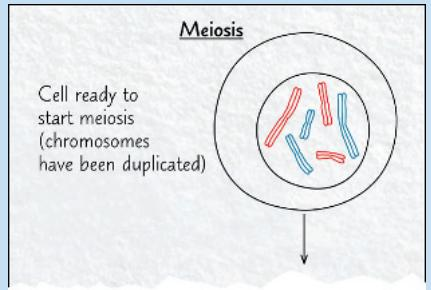

## What biological mechanisms account for the resemblance between offspring and their parents?

Meiosis is a special type of cell division that produces cells with half the chromosomes of the parent cell. It occurs only in specialized cells, such as the cells of testes and ovaries in humans.

# Concept 13.1: Offspring acquire genes from parents by inheriting chromosomes

Have you ever heard someone say they have their mother's nose or their father's eyes? The transmission of traits from one generation to the next is called inheritance, or heredity (from the Latin heres, heir). At the same time, children are not identical copies of either parent or of their siblings. Along with inherited similarity, there is also variation. The study of both heredity and inherited variation is called genetics.

## Inheritance of Genes

Parents endow their offspring with coded information in the form of hereditary units called genes. The genes we inherit are our genetic link to our parents, and they account for family resemblances such as shared eye color or freckles. Our genes program specific traits that emerge as we develop from fertilized eggs into adults.

The genetic program is written in the language of DNA, the polymer of four different nucleotides you learned about in Concepts 1.1 and 5.5. Inherited information is passed on in the form of each gene's specific sequence of DNA nucleotides, much as printed information is communicated in the form of meaningful sequences of letters. In both cases, the language is symbolic. Just as your brain translates the word apple into a mental image of the fruit, cells translate genes into freckles and other features. Most genes program cells to synthesize specific enzymes and other proteins, whose cumulative action produces an organism's inherited traits. The programming of these traits in the form of DNA is one of the unifying themes of biology.

The transmission of hereditary traits has its molecular basis in the replication of DNA, which produces copies of genes that can be passed from parents to offspring. In animals and plants, reproductive cells called gametes are the vehicles that transmit genes from one generation to the next. During fertilization, male and female gametes (sperm and eggs) unite, passing on genes of both parents to their offspring.

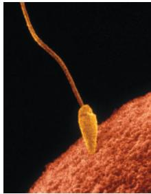

Except for small amounts of DNA in mitochondria and chloroplasts, the DNA of a eukaryotic cell is packaged into chromosomes within the nucleus. Every species has a characteristic number of chromosomes. For example, humans have 46 chromosomes in each somatic cell—all cells of the body except the gametes and their precursors. Each chromosome consists of a single long DNA molecule, elaborately coiled in association with various proteins. One chromosome includes several hundred to a few thousand genes, each gene being a precise sequence of nucleotides along the DNA molecule. A gene’s specific location along the length of a chromosome is called the gene’s locus (plural, loci; from the Latin, meaning

"place"). Our genetic endowment (our genome) consists of the genes and other DNA that make up the chromosomes we inherited from our parents.

## Comparison of Asexual and Sexual Reproduction

Only organisms that reproduce asexually have offspring that are exact genetic copies of themselves. In asexual reproduction, a single individual (like a yeast cell or an amoeba; see Figure 12.2a) is the sole parent and passes copies of all its genes to its offspring without the fusion of gametes. For example, single-celled eukaryotic organisms can reproduce asexually by mitotic cell division, in which DNA is copied and allocated equally to two daughter cells. The genomes of the offspring are virtually exact copies of the parent's genome. Some multicellular organisms are also capable of reproducing asexually (Figure 13.2). Because the cells of the offspring arise via mitosis in the parent, the offspring is usually genetically identical to its parent. An individual that reproduces asexually gives rise to a clone, an individual or group of individuals that are genetically identical to the parent. Genetic differences occasionally arise in asexually reproducing organisms as a result of changes in the DNA called mutations, which we will discuss in Concept 17.5.

In sexual reproduction, two parents give rise to offspring that have unique combinations of genes inherited from the two parents. In contrast to a clone, offspring of sexual reproduction vary genetically from their siblings and both parents: They are variations on a common theme of family resemblance, not exact replicas. Genetic variation like that shown in Figure 13.1 is an important consequence of sexual reproduction. What mechanisms generate this genetic variation? The key is the behavior of chromosomes during the sexual life cycle.

Figure 13.2 Asexual reproduction in two multicellular organisms.
(a) This relatively simple animal, a hydra, reproduces by budding. The bud, a localized mass of mitotically dividing cells, develops into a small hydra, which detaches from the parent (LM). (b) All the trees in this circle of redwoods arose asexually from a single parent tree, whose stump is in the center of the circle.

  
(a) Hydra

  
(b) Redwoods

## Concept Check 13.1

1. MAKE CONNECTIONS Using your knowledge of gene expression in a cell, explain what causes the traits of parents (such as hair color) to show up in their offspring. (See Concept 5.5.)

2. Describe how an asexually reproducing eukaryotic organism produces offspring that are genetically identical to each other and to their parents.

3. WHAT IF? A horticulturalist breeds orchids, trying to obtain a plant with a unique combination of desirable traits. After many years, she finally succeeds, and wants to produce more plants like this one. Discuss whether she should crossbreed it with another plant or cause it to undergo asexual reproduction (forming a clone), and why.

For suggested answers, see Appendix A.

## Concept 13.2: Fertilization and meiosis alternate in sexual life cycles

A life cycle is the generation-to-generation sequence of stages in the reproductive history of an organism, from conception to production of its own offspring. In this section, we use humans as an example to track the behavior of chromosomes through the sexual life cycle.

## Figure 13.3

## Research Method: Preparing a Karyotype Application

A karyotype is a display of condensed chromosomes arranged in pairs. Karyotyping can be used to screen for defective chromosomes or abnormal numbers of chromosomes associated with certain congenital disorders, such as Down syndrome.

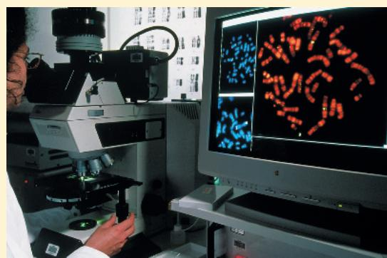

## Technique

Karyotypes are prepared from isolated somatic cells, which are treated with a drug to stimulate mitosis and then grown in culture for several days. Cells arrested when the chromosomes are most highly condensed—at metaphase—are stained and then viewed with a microscope equipped with a digital camera. An image of the chromosomes is displayed on a computer monitor, and digital software is used to arrange them in pairs according to their appearance.

We begin by considering the chromosome count in human somatic cells and gametes. We will then explore how the behavior of chromosomes relates to the human life cycle and other types of sexual life cycles.

## Sets of Chromosomes in Human Cells

In humans, each somatic cell has 46 chromosomes. Before mitosis begins, the chromosomes are duplicated. During mitosis, the chromosomes become condensed enough to be visible under a light microscope. At this point, they can be distinguished from one another by their size, the position of their centromeres, and the pattern of colored bands produced by certain chromatin-binding stains.

Careful examination of a micrograph of the 46 human chromosomes from a single cell in mitosis reveals that there are two chromosomes of each of 23 types. This becomes clear when images of the chromosomes are arranged in pairs, starting with the longest chromosomes. The resulting ordered display is called a karyotype (Figure 13.3). The two chromosomes of a pair have the same length, centromere position, and staining pattern: These are called homologous chromosomes (or homologs). Note that the centromere position can vary—for example, while the centromere for chromosome 1 is near the middle, the centromeres for chromosomes 13, 14, and 15 are close to the ends. Both chromosomes of each pair carry genes controlling the same inherited characters. For example, if a gene for eye color is situated at a particular locus on a certain chromosome, then its homologous chromosome (its homolog) will also have a version of the eye-color gene at the equivalent locus.

This karyotype shows the chromosomes from a human male (as seen by the presence of the XY chromosome pair), colored to emphasize their chromosome banding patterns. The size of the chromosome, position of the centromere, and pattern of stained bands help identify specific chromosomes. Although difficult to discern in the karyotype, each metaphase chromosome consists of two closely attached sister chromatids (see the diagram of the first pair of homologous duplicated chromosomes).

MAKE CONNECTIONS Explain why each chromosome in the karyotype consists of two sister chromatids. (See Figures 12.6 and 12.7.)

The two chromosomes referred to as X and Y are an important exception to the general pattern of homologous chromosomes in human somatic cells. Typically, human females have a homologous pair of X chromosomes (XX), while males have one X and one Y chromosome (XY; see Figure 13.3). Only small parts of the X and Y are homologous. Most of the genes carried on the X chromosome do not have counterparts on the tiny Y, and the Y chromosome has genes lacking on the X. Due to their role in sex determination, the X and Y chromosomes are called sex chromosomes. The other chromosomes are called autosomes.

The occurrence of pairs of homologous chromosomes in each human somatic cell is a consequence of our sexual origins. We inherit one chromosome of a pair from each parent. Thus, the 46 chromosomes in our somatic cells are actually two sets of 23 chromosomes—a maternal set (from our female parent) and a paternal set (from our male parent). The number of chromosomes in a single set is represented by n. Any cell with two chromosome sets is called a diploid cell and has a diploid number of chromosomes, abbreviated 2n. For humans, the diploid number is 46 (2n = 46), the number of chromosomes in our somatic cells. In a cell in which DNA synthesis has occurred, all the chromosomes are duplicated, and therefore each consists of two identical sister chromatids, associated closely at the centromere and along the arms. (Even though the chromosomes are duplicated, we still say the cell is diploid, or 2n. This is because it has only two sets of information regardless of the number of chromatids, which are merely copies of the information in one set.) Figure 13.4 helps clarify the various terms that we use to describe duplicated chromosomes in a diploid cell.

Unlike somatic cells, gametes contain a single set of chromosomes. Such a cell is called a haploid cell, and each has

Figure 13.4 Describing chromosomes.

A cell from an organism with a diploid number of 6 (2n = 6) is depicted here following chromosome duplication and condensation. Each of the six duplicated chromosomes consists of two sister chromatids associated closely along their lengths. Each homologous pair is composed of one chromosome from the maternal set (red) and one from the paternal set (blue). Each set is made up of three chromosomes in this example (long, medium, and short). Together, one maternal and one paternal chromatid in a pair of homologous chromosomes are called nonsister chromatids.

  
VISUAL SKILLS How many sets of chromosomes are present in this diagram? How many pairs of homologous chromosomes are present? If the phases of mitosis in Figure 12.7 were redrawn using the color scheme shown in this figure, describe how the six chromosomes would be colored.
For suggested answer, see Appendix A.  
Figure 13.5 The human life cycle.

a haploid number of chromosomes $(n)$ . For humans, the haploid number is 23 $(n = 23)$ . The set of 23 consists of the 22 autosomes plus a single sex chromosome. An unfertilized egg contains an X chromosome; a sperm contains either an X or a Y chromosome.

Each sexually reproducing species has a characteristic diploid and haploid number. For example, the fruit fly Drosophila melanogaster has a diploid number $(2n)$ of 8 and a haploid number $(n)$ of 4, while for dogs, 2n is 78 and n is 39. The chromosome number generally does not correlate with the size or complexity of a species' genome; it simply reflects how many linear pieces of DNA make up the genome, which is a function of the evolutionary history of that species (see Concept 21.5). Now let's consider chromosome behavior during sexual life cycles. We'll use the human life cycle as an example.

## Behavior of Chromosome Sets in the Human Life Cycle

The human life cycle begins when a haploid sperm from the male parent fuses with a haploid egg from the female parent (Figure 13.5). This union of gametes, culminating in fusion of their nuclei, is called fertilization. The resulting fertilized egg,

In each generation, the number of chromosome sets per cell is halved during meiosis but doubles at fertilization. For humans, the number of chromosomes in a haploid cell is 23, consisting of one set $n = 23$ ; the number of chromosomes in the diploid zygote and all somatic cells arising from it is 46, consisting of two sets $2n = 46$ .

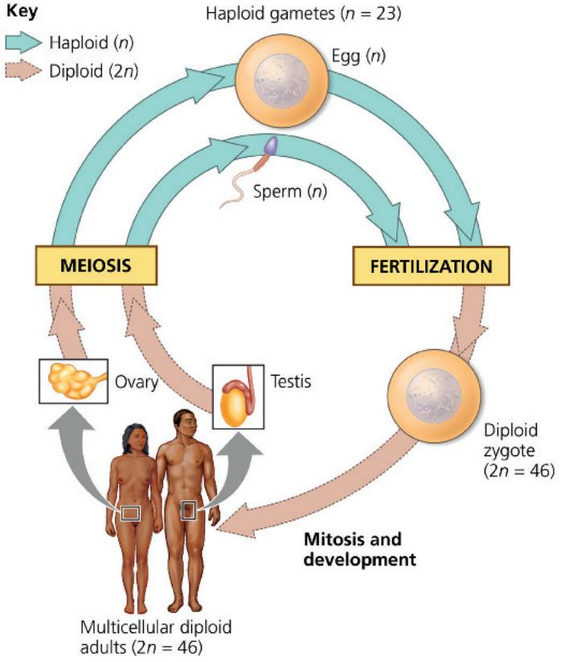  
This figure introduces a key that will be used for other life cycles later in this text. The aqua arrows (solid outline) identify haploid stages of a life cycle, and the tan arrows (dashed outline) identify diploid stages.

or zygote, is diploid because it contains two (haploid) sets of chromosomes bearing genes representing the maternal and paternal family lines. As a human develops into a sexually mature adult, mitosis of the zygote and its descendant cells generates all the somatic cells of the body. Both chromosome sets in the zygote and all the genes they carry are passed with precision to the somatic cells.

The only cells of the human body not produced by mitosis are the gametes, which develop from specialized cells called germ cells in the gonads—ovaries in females and testes in males (see Figure 13.5). Imagine what would happen if human gametes were made by mitosis: They would be diploid like the somatic cells. At the next round of fertilization, when two gametes fused, the normal chromosome number of 46 would double to 92, and each subsequent generation would double the number of chromosomes yet again. This does not happen, however, because in sexually reproducing organisms, gamete formation involves a type of cell division called meiosis. This type of cell division reduces the number of sets of chromosomes from two in the parent cell to one in each gamete, counterbalancing the doubling that occurs at fertilization. As a result of meiosis, each human sperm and egg is haploid (n = 23). Fertilization restores the diploid condition by combining two sets of chromosomes, and the human life cycle is repeated, generation after generation (see Figure 13.5).

The steps of the human life cycle are typical of many sexually reproducing animals. Indeed, fertilization and meiosis are also the hallmarks of sexual reproduction in plants, fungi, and protists just as in animals. Fertilization and meiosis alternate in sexual life cycles, maintaining a constant number of chromosomes in a species from one generation to the next.

## The Variety of Sexual Life Cycles

Although the alternation of meiosis and fertilization is common to all organisms that reproduce sexually, the timing of these two events in the life cycle varies, depending on the species. These variations can be grouped into three main types of life cycles. In the type that occurs in humans and most other animals, gametes are the only haploid cells (Figure 13.6a). Meiosis occurs in germ cells during the production of gametes, which undergo no further cell division prior to fertilization. After fertilization, the diploid zygote divides by mitosis, producing a multicellular organism that is diploid.

Plants and some species of algae exhibit a second type of life cycle called alternation of generations (Figure 13.6b). This type includes both diploid and haploid stages that are multicellular. The multicellular diploid stage is called the sporophyte. Meiosis in the sporophyte produces haploid cells called spores. Unlike a gamete, a haploid spore doesn't fuse with another cell but divides mitotically, generating a multicellular haploid stage called the gametophyte. Certain cells of the gametophyte give rise to gametes by mitosis. Fusion of two haploid gametes at fertilization results in a diploid zygote, which develops into the next sporophyte generation. Therefore, in this type of life cycle, the sporophyte generation produces a gametophyte as its offspring, and the gametophyte generation produces a sporophyte. The name alternation of generations fits well for this type of life cycle.

A third type of life cycle occurs in most fungi and some protists, including some algae (Figure 13.6c). After gametes fuse and form a diploid zygote, meiosis occurs without a multicellular diploid offspring developing. Meiosis produces not gametes but haploid cells that then divide by mitosis and give

Figure 13.6 Three types of sexual life cycles.

The common feature of all three cycles is the alternation of meiosis and fertilization, key events that contribute to genetic variation among offspring. The cycles differ in the timing of these two key events. (Small circles are cells; large circles are organisms.)

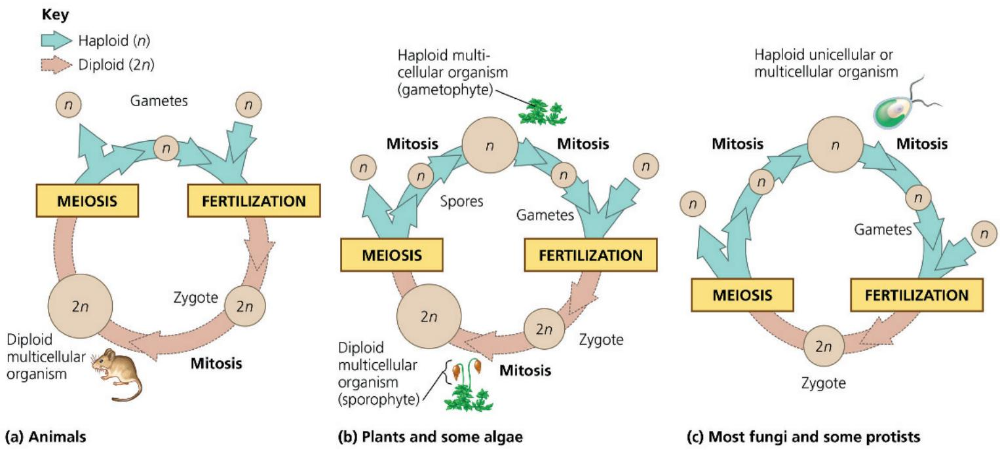  
VISUAL SKILLS For each type of life cycle, indicate whether haploid cells undergo mitosis, and if they do, describe the cells that are formed.  
For suggested answer, see Appendix A.

rise to either unicellular descendants or a haploid multicellular adult organism. Subsequently, the haploid organism carries out further mitoses, producing the cells that develop into gametes. The only diploid stage found in these species is the single-celled zygote.

Note that either haploid or diploid cells can divide by mitosis, depending on the type of life cycle. Only diploid cells, however, can undergo meiosis: Haploid cells can't because they already have a single set of chromosomes that cannot be further reduced. Though the three types of sexual life cycles differ in the timing of meiosis and fertilization, they share a fundamental result: genetic variation among offspring.

## Concept Check 13.2

1. MAKE CONNECTIONS In Figure 13.4, how many DNA molecules (double helices) are present (see Figure 12.5)? What is the haploid number of this cell? Is a set of chromosomes haploid or diploid?

2. VISUAL SKILLS In the karyotype in Figure 13.3, how many pairs of chromosomes are present? How many sets?

3. Using shoes as an analogy for chromosomes, how would you describe the collection of "shoes" in human diploid and haploid cells?

4. WHAT IF? A certain eukaryote lives as a unicellular organism, but during environmental stress, it produces gametes. The gametes fuse, and the resulting zygote undergoes meiosis, generating new single cells. What type of organism could this be?

For suggested answers, see Appendix A.

## Concept 13.3: Meiosis reduces the number of chromosome sets from diploid to haploid

Several steps of meiosis closely resemble corresponding steps in mitosis. Meiosis, like mitosis, is preceded by interphase, which includes S phase (the duplication of chromosomes). However, this is followed by not one but two consecutive cell divisions, called meiosis I and meiosis II. These two divisions result in four daughter cells (rather than the two daughter cells of mitosis), each with only half as many chromosomes as the parent cell—one set, rather than two.

## The Stages of Meiosis

The overview of meiosis in Figure 13.7 shows, for a single pair of homologous chromosomes in a diploid cell, that both members of the pair are duplicated and the copies sorted into four haploid daughter cells. Recall that sister chromatids are two copies of one chromosome, closely associated all along their lengths; this association is called sister chromatid cohesion. Together, the sister chromatids make up one duplicated chromosome (see Figure 13.4). In contrast, the two chromosomes of a homologous pair are individual chromosomes that were inherited from

Figure 13.7 Overview of meiosis: how meiosis reduces chromosome number.

After the chromosomes duplicate in interphase, the diploid cell divides twice, yielding four haploid daughter cells. This overview tracks just one pair of homologous chromosomes, which for the sake of simplicity are drawn in the condensed state throughout. (They would not normally be condensed during interphase.)

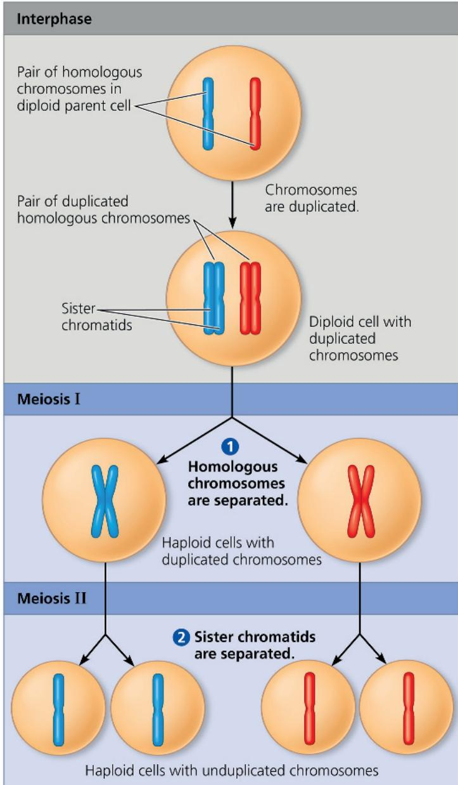

DRAW IT Redraw the cells in this figure using a simple double helix to represent each DNA molecule.

For suggested answer, see Appendix A.

each parent. Homologs appear alike in the microscope, but they may have different versions of genes at corresponding loci; each version is called an allele of that gene (see Figure 14.4). For example, one chromosome might have an allele for freckles, but the homologous chromosome may have an allele for the absence of freckles at the same locus. Homologs are not associated with each other in any obvious way except during meiosis.

Figure 13.8 describes in detail the stages of the two divisions of meiosis for an animal cell whose diploid number is 6. Study this figure thoroughly before going on.

## Exploring Meiosis in an Animal Cell

## Figure 13.8

## MEIOSIS I: Separates homologous chromosomes

Prophase I

  
Duplicated homologous chromosomes (red and blue) pair up and exchange segments; 2n = 6 in this example.  
Metaphase I

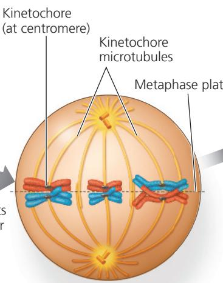  
Anaphase I  
Sister chromatids remain together

## Chromosomes line up by homologous pairs.

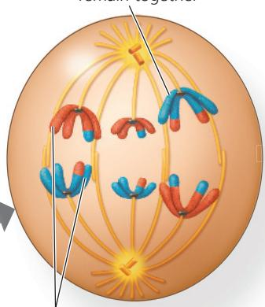  
Homologous
chromosomes
separate  
Telophase I and Cytokinesis

The two homologous chromosomes of each pair separate.

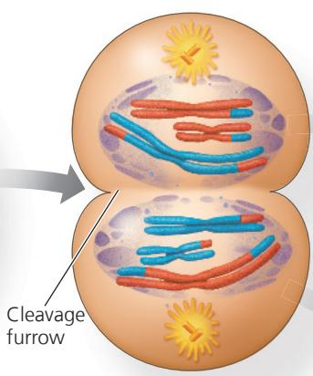

Two haploid cells form; each chromosome still consists of two sister chromatids.

## Prophase I

\- Centrosome movement, spindle formation, and nuclear envelope breakdown occur as in mitosis. Chromosomes condense progressively throughout prophase I.

\- During early prophase I, before the stage shown above, each chromosome pairs with its homolog, aligned gene by gene, and crossing over occurs: The DNA molecules of nonsister chromatids are broken (by proteins) and are rejoined to each other.

\- At the stage shown above, each homologous pair has one or more X-shaped regions called chiasmata (singular, chiasma), where crossovers have occurred.

\- Later in prophase I, microtubules from one pole or the other attach to the kinetochores, one at the centromere of each homolog. (The two kinetochores on the sister chromatids of a homolog are linked together by proteins and act as a single kinetochore.) Microtubules move the homologous pairs toward the metaphase plate.

## Metaphase I

\- Pairs of homologous chromosomes are now arranged at the metaphase plate, with one chromosome of each pair facing each pole.

• Each pair has lined up independently of other pairs. (This arrangement is called independent assortment, to be discussed later.)

\- Both chromatids of one homolog are attached to kinetochore microtubules from one pole; the chromatids of the other homolog are attached to microtubules from the opposite pole.

## Anaphase I

\- Breakdown of proteins that are responsible for sister chromatid cohesion along chromatid arms allows homologs to separate.

\- The homologs move toward opposite poles, guided by the spindle apparatus.

\- Sister chromatid cohesion persists at the centromere, causing the two chromatids of each chromosome to move as a unit toward the same pole.

## Telophase I and Cytokinesis

\- When telophase I begins, each half of the cell has a complete haploid set of duplicated chromosomes. Each chromosome is composed of two sister chromatids; one or both chromatids include regions of nonsister chromatid DNA.

\- Cytokinesis (division of the cytoplasm) usually occurs simultaneously with telophase I, forming two haploid daughter cells.

\- In animal cells like these, a cleavage furrow forms. (In plant cells, a cell plate forms.)

\- In some species, chromosomes decondense and nuclear envelopes form.

\- No chromosome duplication occurs between meiosis I and meiosis II.

## MEIOSIS II: Separates sister chromatids

Prophase II

Metaphase II

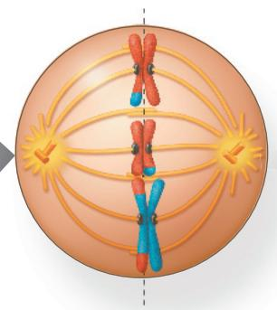

Anaphase II

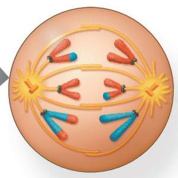

Telophase II and Cytokinesis

During another round of cell division, the sister chromatids finally separate; four haploid daughter cells result, containing unduplicated chromosomes.

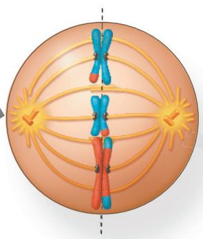

Sister chromatids separate

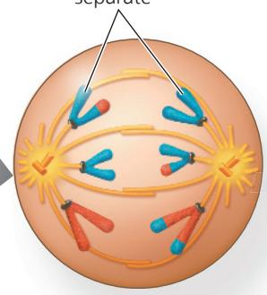

Haploid daughter cells forming

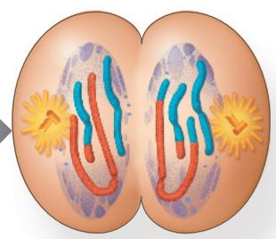

## Prophase II

• A spindle apparatus forms.

\- In late prophase II (not shown here), chromosomes, each still composed of two chromatids associated at the centromere, are moved by microtubules toward the metaphase II plate.

## Metaphase II

• The chromosomes are positioned at the metaphase plate as in mitosis.

\- Because of crossing over in meiosis I, the two sister chromatids of each chromosome are not genetically identical.

\- The kinetochores of sister chromatids are attached to microtubules extending from opposite poles.

## Anaphase II

\- Breakdown of proteins holding the sister chromatids together at the centromere allows the chromatids to separate and move toward opposite poles. Each chromatid has now become an individual chromosome.

## Telophase II and Cytokinesis

\- Nuclei form, the chromosomes begin decondensing, and cytokinesis occurs.

\- The meiotic division of one parent cell produces four daughter cells, each with a haploid set of (unduplicated) chromosomes.

\- The four daughter cells are genetically distinct from one another and from the parent cell.

MAKE CONNECTIONS Look at Figure 12.7 and imagine the two daughter cells undergoing another round of mitosis, yielding four cells. Compare the number of chromosomes in each of those four cells, after mitosis, with the number in each cell in Figure 13.8, after meiosis. Explain how the process of meiosis results in this difference, even though meiosis also includes two cell divisions.

For suggested answer, see Appendix A.

<!-- END OFFICIAL MINERU API RESULT part_03 -->

<!-- BEGIN OFFICIAL MINERU API RESULT part_04 -->

## Crossing Over and Synopsis During Prophase I

Prophase I of meiosis is a very busy time. The prophase I cell shown in Figure 13.8 is at a point fairly late in prophase I, when pairing of homologous chromosomes, crossing over, and chromosome condensation have already taken place. The sequence of events leading up to that point is shown in more detail in Figure 13.9.

After interphase, the chromosomes have been duplicated and the sister chromatids are held together by proteins called cohesins. ① Early in prophase I, the two members of a homologous pair associate loosely along their length. Each gene on one homolog is aligned precisely with the corresponding allele of that gene on the other homolog. The DNA of two nonsister chromatids—one maternal and one paternal—is broken by specific proteins at precisely matching points. ② Next, the formation of a zipper-like structure called the synaptonemal complex holds one homolog tightly to the other. ③ During this association, called synapsis, the DNA breaks are closed up so that each broken end is joined to the corresponding segment of the nonsister chromatid. Thus, a paternal chromatid is joined to a piece of maternal chromatid beyond the crossover point, and vice versa.

4 These points where crossing over has just occurred become visible as chiasmata (singular, chiasma) after the synaptonemal complex disassembles and the homologs move slightly apart from each other. The homologs remain attached because sister chromatids are still held together by sister chromatid cohesion, even though some of the DNA may no longer be attached to its original chromosomal DNA. At least one crossover per chromosome must occur in order for the homologous pair to stay together as it moves to the metaphase I plate, for reasons that will be explained shortly.

## A Comparison of Mitosis and Meiosis

Figure 13.10 summarizes the key differences between meiosis and mitosis in diploid cells. Meiosis produces four cells and reduces the number of chromosome sets from two (diploid) to one (haploid), whereas mitosis produces two cells and conserves the number of chromosome sets. Meiosis produces cells that differ genetically from the parent cell and from each other, whereas mitosis produces daughter cells that are genetically identical to their parent cell and to each other.

Three events unique to meiosis occur during meiosis I:

1. Synopsis and crossing over. During prophase I, duplicated homologs pair up and crossing over occurs as described previously and in Figure 13.9. Synopsis and crossing over do not occur during prophase of mitosis.

2. Alignment of homologous pairs at the metaphase plate. At metaphase I of meiosis, pairs of homologs are positioned at the metaphase plate, rather than individual chromosomes, as in metaphase of mitosis.

3. Separation of homologs. At anaphase I of meiosis, the duplicated chromosomes of each homologous pair move toward opposite poles, but the sister chromatids of each duplicated chromosome remain attached. In anaphase of mitosis, by contrast, sister chromatids separate.

Figure 13.9 Crossing over and synapsis in prophase I: a closer look.  
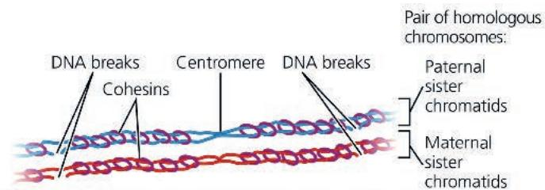

1 After interphase, the chromosomes have been duplicated, and sister chromatids are held together by proteins called cohesins (purple circles in this diagram). Each pair of homologs associate along their length. The DNA molecules of two nonsister chromatids are broken at precisely corresponding points. The chromatin of the chromosomes starts to condense.

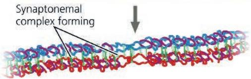  
2 A zipper-like protein complex, the synaptonemal complex (green lines), begins to form, attaching one homolog to the other. The chromatin continues to condense.

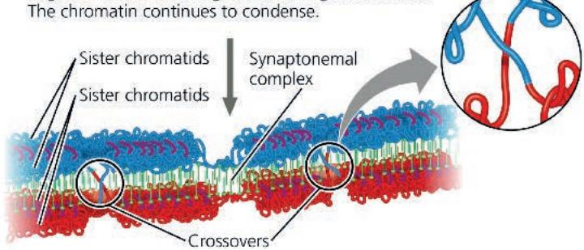

3 The synaptonemal complex is fully formed; the two homologs are said to be in synapsis. During synapsis, the DNA breaks are closed up when each broken end is joined to the corresponding segment of the nonsister chromatid, producing crossovers.

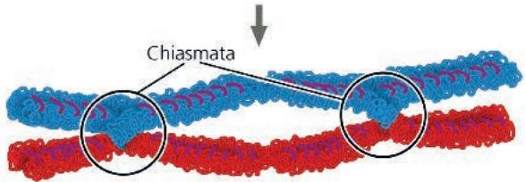

4 After the synaptonemal complex disassembles, the homologs move slightly apart from each other but remain attached because of sister chromatid cohesion, even though some of the DNA may no longer be attached to its original chromosome. The points of attachment where crossovers have occurred show up as chiasmata. The chromosomes continue to condense as they move toward the metaphase plate.

VISUAL SKILLS Label the four DNA breaks in step 2.

For suggested answer, see Appendix A.

Sister chromatids stay together due to sister chromatid cohesion, mediated by cohesin proteins. In mitosis, this attachment lasts until the end of metaphase, when enzymes cleave the cohesins, freeing the sister chromatids to move to opposite poles of the cell. In meiosis, sister chromatid cohesion is released in two steps: cohesion of arms at the start of anaphase I and cohesion of centromeres at anaphase II. In metaphase I, the two homologs of each pair are held together because there is still cohesion between sister chromatid arms in regions beyond points of crossing over, where stretches of sister chromatids now

Figure 13.10 A comparison of mitosis and meiosis.  

<table><tr><td colspan="3">SUMMARY</td></tr><tr><td>Property</td><td>Mitosis (occurs in both diploid and haploid cells)</td><td>Meiosis (can only occur in diploid cells)</td></tr><tr><td>DNA replication</td><td>Occurs during interphase, before mitosis begins</td><td>Occurs during interphase before meiosis I but not before meiosis II</td></tr><tr><td>Number of divisions</td><td>One, including prophase, prometaphase, metaphase, anaphase, and telophase</td><td>Two, each including prophase, metaphase, anaphase, and telophase</td></tr><tr><td>Synopsis of homologous chromosomes</td><td>Does not occur</td><td>Occurs during prophase I along with crossing over between nonsister chromatids; resulting chiasmata hold pairs together due to sister chromatid cohesion</td></tr><tr><td>Number of daughter cells and genetic composition</td><td>Two, each genetically identical to the parent cell, with the same number of chromosomes</td><td>Four, each haploid (n); genetically different from the parent cell and from each other</td></tr><tr><td>Role in animals, fungi, and plants</td><td>Enables multicellular animal, fungus, or plant (gametophyte or sporophyte) to arise from a single cell; produces cells for growth, repair, and, in some species, asexual reproduction; produces gametes in the plant gametophyte</td><td>Produces gametes (in animals) or spores (in fungi and in plant sporophytes); reduces number of chromosome sets by half and introduces genetic variability among the gametes or spores</td></tr></table>

DRAW IT Could any other combinations of chromosomes be generated during meiosis II from the specific cells shown in telophase I? Explain. (Hint: Draw the cells as they would appear in metaphase II.)

belong to different chromosomes. The combination of crossing over and sister chromatid cohesion along the arms results in the formation of a chiasma. Chiasmata hold homologs together as the spindle forms for the first meiotic division. At the onset of anaphase I, the release of cohesion along sister chromatid arms allows homologs to separate. At anaphase II, the release of sister chromatid cohesion at the centromeres allows the sister chromatids to separate. Thus, sister chromatid cohesion and crossing over, acting together, play an essential role in the lining up of chromosomes by homologous pairs at metaphase I.

## Scientific Skills Exercise Making a Line Graph and Converting Between Units of Data

How Does DNA Content Change as Budding Yeast Cells Proceed Through Meiosis? When nutrients are low, cells of the budding yeast (Saccharomyces cerevisiae) exit the mitotic cell cycle and enter meiosis. In this exercise, you will track the DNA content of a population of yeast cells as they progress through meiosis.

How the Experiment Was Done Researchers grew a culture of yeast cells in a nutrient-rich medium and then transferred the cells to a nutrient-poor medium to induce meiosis. At different times after induction, the DNA content per cell was measured in a sample of the cells, and the average DNA content per cell was recorded in femtograms (fg; 1 femtogram = $1 \times 10^{-15}$ gram).

Data from the Experiment

<table><tr><td>Time After Induction of Meiosis (hr)</td><td>Average Amount of DNA per Cell (fg)</td></tr><tr><td>0.0</td><td>24.0</td></tr><tr><td>1.0</td><td>24.0</td></tr><tr><td>2.0</td><td>40.0</td></tr><tr><td>3.0</td><td>47.0</td></tr><tr><td>4.0</td><td>47.5</td></tr><tr><td>5.0</td><td>48.0</td></tr><tr><td>6.0</td><td>48.0</td></tr><tr><td>7.0</td><td>47.5</td></tr><tr><td>7.5</td><td>25.0</td></tr><tr><td>8.0</td><td>24.0</td></tr><tr><td>9.0</td><td>23.5</td></tr><tr><td>9.5</td><td>14.0</td></tr><tr><td>10.0</td><td>13.0</td></tr><tr><td>11.0</td><td>12.5</td></tr><tr><td>12.0</td><td>12.0</td></tr><tr><td>13.0</td><td>12.5</td></tr><tr><td>14.0</td><td>12.0</td></tr></table>

Further Reading G. Simchen, Commitment to meiosis: What determines the mode of division in budding yeast? BioEssays 31:169–177 (2009).

Meiosis I reduces the number of chromosome sets: from two (diploid) to one (haploid). During the second meiotic division, sister chromatids separate, producing four haploid daughter cells. The mechanisms for separating sister chromatids in meiosis II and mitosis are virtually identical. The molecular basis of chromosome behavior during meiosis continues to be a focus of intense research. In the Scientific Skills Exercise, you can work with data that track the amount of DNA in cells as they progress through meiosis.

## INTERPRET THE DATA

1. First, set up your graph. (a) Place the labels for the independent and dependent variables on the appropriate axes, followed by units of measurement in parentheses. Explain your choices. (b) Add tick marks and values for each axis. Explain your choices. (For additional information about graphs, see the Scientific Skills Review in Appendix D.)

2. Because the variable on the x-axis varies continuously, it makes sense to plot the data on a line graph (if you are using Excel, choose "Scatter").
(a) Plot each data point from the table onto the graph.
(b) Connect the data points with line segments.

Budding yeast cells  
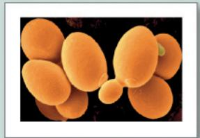

3. Most of the yeast cells in the culture were in $G_{1}$ of the cell cycle before being moved to the nutrient-poor medium.
(a) How many femtograms of DNA are there in each yeast cell in $G_{1}$ ? Estimate this value from the data in your graph.
(b) How many femtograms of DNA should be present in each cell in $G_{2}$ ? (See Concept 12.2 and Figure 12.6.) At the end of meiosis I (MI)? At the end of meiosis II (MII)? (See Figure 13.7.) (c) Using these values as a guideline, distinguish the different phases by inserting vertical dashed lines in the graph between phases and label each phase ( $G_{1}$ , S, $G_{2}$ , MI, MII). You can figure out where to put the dividing lines based on what you know about the DNA content of each phase (see Figure 13.7). (d) Think carefully about the point where the line at the highest value begins to slope downward. What specific point of meiosis does this “corner” represent? What stage(s) correspond(s) to the downward sloping line?

4. Given the fact that 1 fg of DNA = $9.78 \times 10^{5}$ base pairs (on average), you can convert the amount of DNA per cell to the length of DNA in numbers of base pairs. (a) Calculate the number of base pairs of DNA in the haploid yeast genome. Express your answer in millions of base pairs (Mb), a standard unit for expressing genome size. Show your work. (b) How many base pairs per minute were synthesized during the S phase of these yeast cells?

Instructors: A version of this Scientific Skills Exercise can be assigned in Mastering Biology.

## Concept Check 13.3

1. MAKE CONNECTIONS Compare the chromosomes in a cell at metaphase of mitosis with those in a cell at metaphase II. (See Figures 12.7 and 13.8.)

2. WHAT IF? After the synaptonemal complex disappears, how would any pair of homologous chromosomes be associated if crossing over did not occur? What effect might this have on gamete formation?

For suggested answers, see Appendix A.

## Concept 13.4: Genetic variation produced in sexual life cycles contributes to evolution

How do we account for the genetic variation of the family members in Figure 13.1? As you will learn more about in later chapters, mutations are the original source of genetic diversity. These changes in an organism's DNA create the different versions of genes, known as alleles. Once these differences arise, reshuffling of the alleles during sexual reproduction produces the variation that results in each member of a sexually reproducing population having a unique combination of traits.

## Origins of Genetic Variation Among Offspring

In species that reproduce sexually, the behavior of chromosomes during meiosis and fertilization is responsible for most of the variation that arises in each generation. Three mechanisms contribute to the genetic variation arising from sexual reproduction: inde-

pendent assortment of chromosomes, crossing over, and random fertilization.

## Independent Assortment of Chromosomes

One aspect of sexual reproduction that generates genetic variation is the random orientation of pairs of homologous chromosomes at metaphase of meiosis I. At metaphase I, the homologous pairs, each consisting of one maternal and one paternal chromosome, are situated at the metaphase plate. (Note that the terms maternal and paternal refer, respectively, to whether the chromosome in question was contributed by the female parent or the male parent of the individual whose cells are undergoing meiosis.) Each pair may orient with either its maternal or paternal homolog closer to a given pole—its orientation is as random as the flip of a coin. Thus, there is a 50% chance that a particular daughter cell of meiosis I will get the maternal chromosome of a certain homologous pair and a 50% chance that it will get the paternal chromosome.

Because each pair of homologous chromosomes is positioned independently of the other pairs at metaphase I, the first meiotic division results in each pair sorting its maternal and paternal homologs into daughter cells independently of every other pair. This is called independent assortment. Each daughter cell represents one outcome of all possible combinations of maternal and paternal chromosomes. As shown in Figure 13.11, the number of combinations possible for daughter cells formed by meiosis of a diploid cell with two pairs of homologous chromosomes (n = 2) is four: two possible arrangements for the first pair times two possible arrangements for the second pair. Note that only two of the four combinations of daughter cells shown in the figure would result from meiosis of a single diploid cell because a single parent cell would have one or the other possible chromosomal arrangement at metaphase I, but not both. However, the population of daughter cells resulting from meiosis of a large number of diploid cells contains all four types in approximately equal numbers. In the case of n = 3, eight combinations $(2 \times 2 \times 2 = 2^{3})$ of chromosomes are possible for daughter cells. More generally, the number of possible combinations when chromosomes sort independently during meiosis is $2^{n}$ , where n is the haploid number of the species.

In the case of humans ( $n = 23$ ), the number of possible combinations of maternal and paternal chromosomes in the resulting gametes is $2^{23}$ , or about 8.4 million. Each gamete that you produce in your lifetime contains one of roughly 8.4 million possible combinations of chromosomes. This is an underestimate, because it doesn't take into account crossing over, which we'll consider next.

## Crossing Over

As a consequence of the independent assortment of chromosomes during meiosis, each of us produces a collection of gametes differing greatly in their combinations of the

Figure 13.11 The independent assortment of homologous chromosomes in meiosis.  
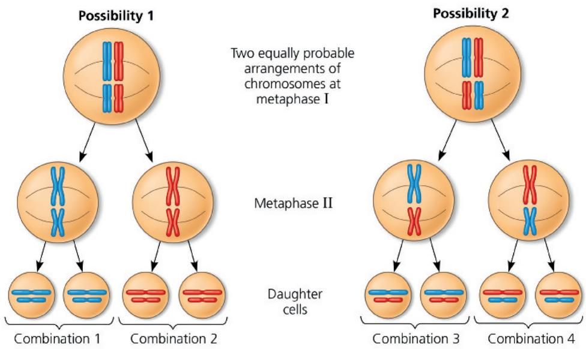

chromosomes we inherited from our two parents. Figure 13.11 suggests that each chromosome in a gamete is exclusively maternal or paternal in origin. In fact, this is not the case, because crossing over produces recombinant chromosomes, individual chromosomes that carry genes (DNA) from two different parents (Figure 13.12). In meiosis in humans, an average of one to three crossover events occurs per chromosome pair, depending on the size of the chromosomes and the position of their centromeres.

As you learned in Figure 13.9, crossing over produces chromosomes with new combinations of maternal and paternal alleles. At metaphase II, chromosomes that contain one or more recombinant chromatids can be oriented in two alternative, nonequivalent ways with respect to other chromosomes because their sister chromatids are no longer identical (see Figure 13.12). The different possible arrangements of nonidentical sister chromatids during meiosis II further increase the number of genetic types of daughter cells that can result from meiosis.

You'll learn more about crossing over in Concept 15.3. The important point for now is that crossing over, by combining DNA inherited from two parents into a single chromosome, is an important source of genetic variation in sexual life cycles.

## Random Fertilization

The random nature of fertilization adds to the genetic variation arising from meiosis. In humans, each male and female gamete represents one of about 8.4 million ( $2^{23}$ ) possible chromosome combinations due to independent assortment. The fusion of a male gamete with a female gamete during fertilization will produce a zygote with any of about 70 trillion ( $2^{23} \times 2^{23}$ ) diploid combinations. If we factor in the variation brought about by crossing over, the number of possibilities is truly astronomical. You really are unique.

## The Evolutionary Significance of Genetic Variation Within Populations

EVOLUTION Now that you've learned how new combinations of genes arise among offspring in a sexually reproducing population, how does the genetic variation in a population relate to evolution? Darwin recognized that a population evolves through the differential reproductive success of its variant members. On average, those individuals best suited to the local environment leave the most offspring, thereby transmitting their genes. Thus, natural selection results in the accumulation of genetic variations favored in a certain environment. As the environment changes, the population may survive if, in each generation, at least some of its members can cope effectively with the new conditions. Mutations are the original source of different alleles, which are then mixed and matched during meiosis. New and different combinations of alleles may work better than those that previously prevailed.

In a stable environment, though, sexual reproduction seems as if it would be less advantageous than asexual reproduction, which ensures perpetuation of successful combinations of alleles. Furthermore, sexual reproduction is more expensive energetically than asexual reproduction. In spite of these apparent disadvantages, sexual reproduction is almost universal among animals. Why is this?

Figure 13.12 The results of crossing over during meiosis.  
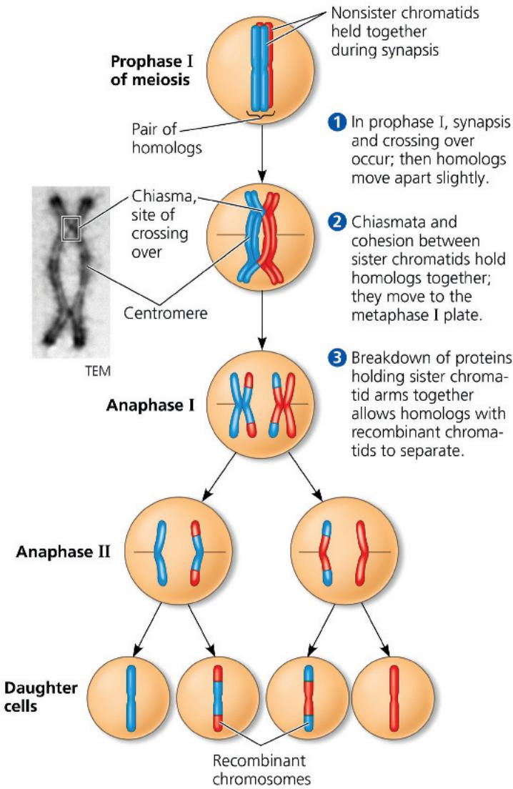

The ability of sexual reproduction to generate genetic diversity is the most commonly proposed explanation for the evolutionary persistence of this process. However, consider the unusual case of the bdelloid rotifer (Figure 13.13). It appears that this group may not have reproduced sexually for more than 50 million years of their evolutionary history, a model that has been supported by

recent analysis of the genetic sequences in its genome. Does this mean that genetic diversity is not advantageous in this species? It turns out that bdelloid rotifers are an exception to the “rule” that sex alone generates genetic diversity: Bdelloids have mechanisms other than sexual reproduction for generating genetic diversity. For example, they live in environments that can dry up for long periods of time, during which they can enter a state of suspended animation. In this state, their cell membranes may crack in places,

Figure 13.13 A bdelloid rotifer, an animal that reproduces only asexually.

allowing entry of DNA from other rotifer species and even from more distantly related species. Evidence suggests that this foreign DNA can become incorporated into the genome of the bdelloid, leading to increased genetic diversity. In fact, the genomic analysis shows that bdelloid rotifers pick up non-bdelloid DNA at a much higher rate than most other species pick up foreign DNA. The conclusion that bdelloid rotifers have developed other ways of achieving genetic diversity supports the idea that genetic diversity is advantageous, but points out as well that sexual reproduction is not the only way of generating such diversity.

In this chapter, we have seen how sexual reproduction greatly increases the genetic variation present in a population. Although Darwin realized that heritable variation is what makes evolution possible, he could not explain why offspring resemble—but are not identical to—their parents. Ironically, Gregor Mendel, a contemporary of Darwin, published a theory of inheritance that helps explain genetic variation, but his discoveries had no impact on biologists until 1900, more than 15 years after Darwin (1809–1882) and Mendel (1822–1884) had died. In the next chapter, you'll learn how Mendel discovered the basic rules governing the inheritance of specific traits.

## Concept Check 13.4

1. What is the original source of variation among the different alleles of a gene?

2. The diploid number for fruit flies is 8, and the diploid number for grasshoppers is 46. If no crossing over took place, would the genetic variation among offspring from a given pair of parents be greater in fruit flies or grasshoppers? Explain.

3. WHAT IF? If maternal and paternal chromatids have the same two alleles for every gene, will crossing over lead to genetic variation?

For suggested answers, see Appendix A.

## Chapter 13 Review

## Summary of Key Concepts

To review key terms, go to the Vocabulary Self-Quiz (eTextbook only).

## Concept 13.1: Offspring acquire genes from parents by inheriting chromosomes

\- Each gene in an organism's DNA exists at a specific locus on a certain chromosome.

\- In asexual reproduction, a single parent produces genetically identical offspring by mitosis. Sexual reproduction combines genes from two parents, leading to genetically diverse offspring.

Explain why human offspring resemble their parents but are not identical to them.

## Concept 13.2: Fertilization and meiosis alternate in sexual life cycles

\- Normal human somatic cells are diploid. They have 46 chromosomes made up of two sets of 23 chromosomes, one set from each parent. Human diploid cells have 22 pairs of homologs that are autosomes, and one pair of sex chromosomes; the latter typically determines whether the person is female (XX) or male (XY).

\- In humans, ovaries and testes produce haploid gametes by meiosis, each gamete containing a single set of 23 chromosomes (n = 23). During fertilization, an egg and sperm unite, forming a diploid (2n = 46) single-celled zygote, which develops into a multicellular organism by mitosis.

\- Sexual life cycles differ in the timing of meiosis relative to fertilization and in the point(s) of the cycle at which a multicellular organism is produced by mitosis.

Compare and contrast the life cycles of animals and plants.

## Concept 13.3: Meiosis reduces the number of chromosome sets from diploid to haploid

\- The two cell divisions of meiosis, meiosis I and meiosis II, produce four haploid daughter cells. The number of chromosome sets is reduced from two (diploid) to one (haploid) during meiosis I.

\- Meiosis is distinguished from mitosis by three events of meiosis I:

Prophase I: Each pair of homologous chromosomes undergoes synapsis and crossing over between nonsister chromatids with the subsequent appearance of chiasmata.

Metaphase I: Chromosomes line up as homologous pairs on the metaphase plate.

Anaphase I: Homologs separate from each other; sister chromatids remain joined at the centromere.

• Meiosis II separates the sister chromatids.

\- Sister chromatid cohesion and crossing over allow chiasmata to hold homologs together until anaphase I. Cohesins are cleaved along the arms at anaphase I, allowing homologs to separate, and at the centromeres in anaphase II, releasing sister chromatids from each other.

In prophase I, homologous chromosomes pair up and undergo synapsis and crossing over. Can this also occur during prophase II? Explain.

## Concept 13.4: Genetic variation produced in sexual life cycles contributes to evolution

\- Three events in sexual reproduction contribute to genetic variation in a population: independent assortment of chromosomes during meiosis I, crossing over during meiosis I, and random fertilization of egg cells by sperm. During crossing over, DNA of nonsister chromatids in a homologous pair is broken and rejoined.

\- Genetic variation is the raw material for evolution by natural selection. Mutations are the original source of this variation; recombination of variant genes generates additional genetic diversity.

Explain how three processes unique to sexual reproduction generate a great deal of genetic variation.

For suggested answers, see Appendix A.

## Test Your Understanding

For more multiple-choice questions, go to the Practice Test (eTextbook only).

## Levels 1-2: Remembering/Understanding

1. A human cell containing 22 autosomes and a Y chromosome is
(A) a sperm.
(B) an egg.
(C) a zygote.
(D) a somatic cell of a male.

2. The two homologs of a pair move toward opposite poles of dividing cell during
(A) mitosis.
(C) meiosis II.
(B) meiosis I.
(D) fertilization.

## Levels 3-4: Applying/Analyzing

3. Meiosis II is similar to mitosis in that
(A) sister chromatids separate during anaphase.
(B) DNA replicates before the division.
(C) the daughter cells are diploid.
(D) homologous chromosomes synapse.

4. If the DNA content of a diploid cell in the $G_{1}$ phase of the cell cycle is x, then the DNA content of the same cell at metaphase of meiosis I will be
(A) 0.25x. (B) 0.5x. (C) x. (D) 2x.

5. If we continue to follow the cell lineage from question 4, then the DNA content of a single cell at metaphase of meiosis II will be (A) 0.25x. (B) 0.5x (C) x. (D) 2x.

6. DRAW IT The diagram shows a cell in meiosis.

a. Label the appropriate structures with these terms: chromosome (label as duplicated or unduplicated), centromere, kinetochore, sister chromatids, nonsister chromatids, homologous pair (use a bracket when labeling), homolog (label each one), chiasma, sister chromatid cohesion, and gene loci. Circle and label the alleles of the F gene.

b. Precisely describe the makeup of a haploid set and a diploid set in this cell.

c. Identify the stage of meiosis shown.

## Levels 5-6: Evaluating/Creating

7. Explain how you can tell that the cell in question 6 is undergoing meiosis, not mitosis.

8. EVOLUTION CONNECTION Many species can reproduce either asexually or sexually. Explain what you think might be the evolutionary significance of the switch from asexual to sexual reproduction that occurs in some species when the environment becomes unfavorable.

9. SCIENTIFIC INQUIRY The diagram in question 6 represents just a few of the chromosomes of a meiotic cell in a certain person. Assume that the freckles gene is located at the locus marked F, and the hair-color gene is located at the locus marked H, both on the long chromosome. The individual from whom this cell was taken has inherited different alleles for each gene (“freckles” and “black hair” from one parent, and “no freckles” and “blond hair” from the other). Predict allele combinations in the gametes resulting from this meiotic event. (It will help if you draw out the rest of meiosis and label the alleles by name.) List other possible combinations of these alleles in this individual’s gametes.

10. WRITE ABOUT A THEME: INFORMATION The continuity of life is based on heritable information in the form of DNA. In a short essay (100–150 words), explain how chromosome behavior during sexual reproduction in animals ensures perpetuation of parental traits in offspring and, at the same time, genetic variation among offspring.

11. SYNTHESIZE YOUR KNOWLEDGE

The Cavendish banana, the world's most popular fruit, is currently threatened by extinction due to a fungus. This banana variety is “triploid” (3n, with three sets of chromosomes) and can only reproduce through cloning by cultivators. Given what you know about meiosis, explain how the banana's triploid number accounts for its inability to form normal gametes. Considering genetic diversity, discuss how the absence of sexual reproduction might make this domesticated species vulnerable to infectious agents.

For selected answers, see Appendix A.

# Mendel and the Gene Idea

## Key Concepts

14.1 Mendel used the scientific approach to identify two laws of inheritance

14.2 Probability laws govern Mendelian inheritance

14.3 Inheritance patterns are often more complex than predicted by simple Mendelian genetics

14.4 Many human traits follow Mendelian patterns of inheritance

## Study Tip

Solving genetics problems: In Figure 14.5, you'll learn how to predict the offspring of a genetic cross with a Punnett square, like the example shown here. For crosses shown in other figures, cover up the Punnett square and draw your own. Also, check out the Tips for Genetics Problems at the end of the chapter.

  
Figure 14.1 Flower color was one of the many characteristics of pea plants studied by Gregor Mendel. By breeding pea plants over many generations and carefully counting the types of offspring, Mendel developed a theory of inheritance that is the basis of modern genetics.

## How are traits, such as the purple or white color of flowers, transmitted from parents to offspring?

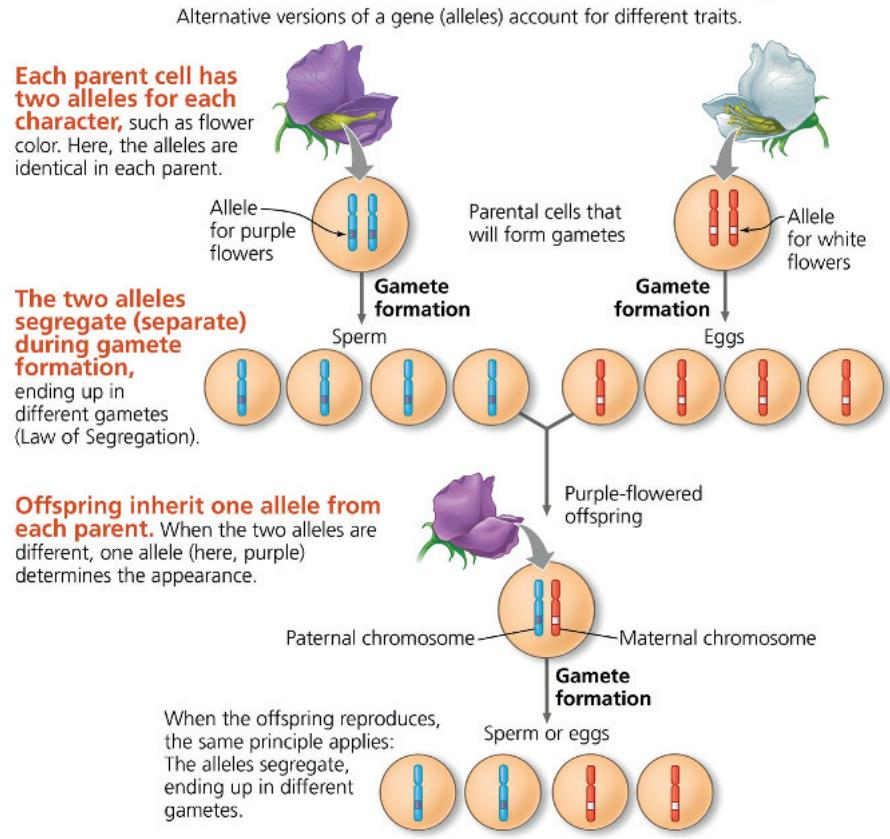

# Concept 14.1: Mendel used the scientific approach to identify two laws of inheritance

Modern genetics began during the mid-1800s with a monk named Gregor Mendel, who discovered the basic principles of heredity by breeding garden peas in carefully planned experiments. As we retrace his work, you will recognize the key elements of the scientific process that were introduced in Concept 1.3.

## Mendel's Experimental, Quantitative Approach

Mendel grew up on his parents' small farm in a region of Austria that is now part of the Czech Republic. In this agricultural area, Mendel received agricultural training in school along with a basic education. As an adolescent, Mendel overcame financial hardship and illness to excel in high school and, later, at the Olmutz Philosophical Institute.

In 1843, at the age of 21, Mendel entered an Augustinian monastery, a reasonable choice at that time for someone who valued the life of the mind. He considered becoming a teacher but failed the necessary examination. In 1851, he left the monastery to pursue two years of study in physics and chemistry at the University of Vienna. These were very important years for Mendel's development as a scientist, in large part due to the strong influence of two professors. One was the physicist Christian Doppler, who encouraged his students to learn science through experimentation and trained Mendel to use mathematics to help explain natural phenomena. The other was a botanist named Franz Unger, who aroused Mendel's interest in the causes of variation in plants.

After attending university, Mendel returned to the monastery and was assigned to teach at a local school, where several other instructors were enthusiastic about scientific research. In addition, his fellow monks shared a long-standing fascination with the breeding of plants. Around 1857, Mendel began breeding garden peas in the abbey garden to study inheritance. Although the question of heredity had long been a focus of curiosity at the monastery, Mendel's fresh approach allowed him to deduce principles that had remained elusive to others.

One reason Mendel probably chose to work with peas is that there are many varieties. For example, one variety has purple flowers, while another variety has white flowers. A heritable feature that varies among individuals, such as flower color, is called a character. Each variant for a character, such as purple or white color for flowers, is called a trait.

Other advantages of using peas are their short generation time and the large number of offspring from each mating. Furthermore, Mendel could strictly control mating between plants (Figure 14.2). Each pea flower has both pollen-producing organs (stamens) and an egg-bearing organ (carpel). In nature, pea plants usually self-fertilize: Pollen grains from the stamens land on the carpel of the same flower, and sperm released from the pollen grains fertilize eggs present in the carpel.\* To achieve cross-pollination of two plants, Mendel removed the immature stamens of a plant before they produced pollen and then dusted pollen from another plant onto the altered

flowers (see Figure 14.2). Each resulting zygote then developed into a plant embryo encased in a seed (a pea). His method allowed Mendel to always be sure of the parentage of new seeds.

## Figure 14.2

## Research Method: Crossing Pea Plants Application

By crossing, or mating, two true-breeding varieties of an organism, scientists can study patterns of inheritance. In this example, Mendel crossed pea plants that varied in flower color.

## Technique

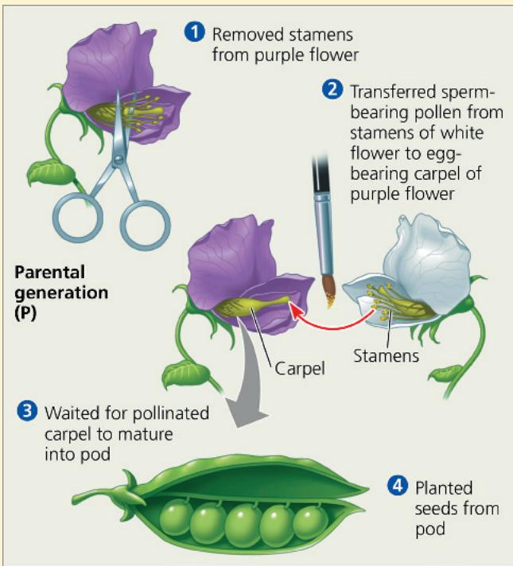

## Results

When pollen from a white flower was transferred to a purple flower, the first-generation hybrids all had purple flowers. The result was the same for the reciprocal cross, which involved the transfer of pollen from purple flowers to white flowers.

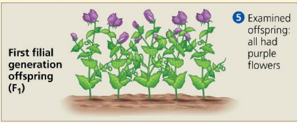

Mendel chose to track only those characters that occurred in two distinct, alternative forms, such as purple or white flower color. He also made sure that he started his experiments with varieties that were true-breeding—that is, over many generations of self-pollination, these plants had produced only the same variety as the parent plant. For example, a plant with purple flowers is true-breeding if the seeds produced by self-pollination in successive generations all give rise to plants that also have purple flowers. (We'll describe the genetic basis for true-breeding shortly.)

In a typical breeding experiment, Mendel cross-pollinated two contrasting, true-breeding pea varieties—for example, purple-flowered plants and white-flowered plants (see Figure 14.2). This mating, or crossing, of two true-breeding varieties is called hybridization. The true-breeding parents are referred to as the P generation (parental generation), and their hybrid offspring are the $F_{1}$ generation (first filial generation, the word filial from the Latin word for “son”). Allowing these $F_{1}$ hybrids to self-pollinate (or to cross-pollinate with other $F_{1}$ hybrids) produces an $F_{2}$ generation (second filial generation). Mendel usually followed traits for at least the P, $F_{1}$ , and $F_{2}$ generations. Had he stopped his experiments with the $F_{1}$ generation, he would have missed the basic patterns of inheritance. Mendel’s quantitative analysis of the $F_{2}$ plants from thousands of genetic crosses like these allowed him to deduce two fundamental principles of heredity, now called the law of segregation and the law of independent assortment.

## The Law of Segregation

The explanation of heredity most widely in favor during the 1800s was the “blending” hypothesis, the idea that genetic material contributed by the two parents mixes just as blue and yellow paints blend to make green. This hypothesis predicts that over many generations, a freely mating population will give rise to a uniform population of individuals, something we don’t see.

If the blending model were correct, the $F_{1}$ hybrids from Mendel's cross between purple-flowered and white-flowered pea plants would have been pale purple flowers, a trait intermediate between those of the P generation. Notice in Figure 14.2 that the experiment produced a very different result: All the $F_{1}$ offspring had flowers of the same color as the purple-flowered parents. What happened to the white-flowered plants' genetic contribution to the hybrids? If it were lost, then the $F_{1}$ plants could produce only purple-flowered offspring in the $F_{2}$ generation. But when Mendel allowed the $F_{1}$ plants to self- or cross-pollinate and planted their seeds, the white-flower trait reappeared in the $F_{2}$ generation. The blending hypothesis is also inconsistent with this reappearance of traits after they've skipped a generation.

Mendel used very large sample sizes and kept accurate records of his results: 705 of the $\mathrm{F}_2$ plants had purple flowers, and 224 had white flowers. These data fit a ratio of approximately three purple to one white (Figure 14.3). Mendel reasoned that the heritable factor for white flowers did not disappear in the $\mathrm{F}_1$ plants but was somehow hidden, or masked, when the purple-flower factor was present. In Mendel's terminology, purple flower color is a dominant trait, and white flower color is a recessive trait. The reappearance of white-flowered plants in the $\mathrm{F}_2$ generation was evidence that the heritable factor causing white

## Figure 14.3

# Inquiry: When $F_{1}$ hybrid pea plants self-or cross-pollinate, which traits appear in the $F_{2}$ generation?

## Experiment

Mendel crossed true-breeding purple-flowered plants and white-flowered plants (crosses are symbolized by $\times$ ). The resulting $F_{1}$ hybrids were allowed to self-pollinate or were cross-pollinated with other $F_{1}$ hybrids. The $F_{2}$ generation plants were then observed for flower color.

## Results

Both purple-flowered and white-flowered plants appeared in the $F_{2}$ generation, in a ratio of approximately 3:1.

## Conclusion

The “heritable factor” for the recessive trait (white flowers) had not been destroyed, deleted, or “blended” in the $F_{1}$ generation but was merely masked by the presence of the factor for purple flowers, which is the dominant trait.

  
Data from G. Mendel, Experiments in plant hybridization, Proceedings of the Natural History Society of Brünn 4:3–47 (1866).

WHAT IF? If you mated two purple-flowered plants from the P generation, what ratio of traits would you expect to observe in the offspring? Explain. What might Mendel have concluded if he stopped his experiment after the $F_{1}$ generation?

For suggested answer, see Appendix A.

flowers had not been diluted or destroyed by coexisting with the purple-flower factor in the $F_{1}$ hybrids. Mendel observed the same pattern of inheritance in six other characters, each represented by two distinctly different traits (Table 14.1). For example, when

Table 14.1 The Results of Mendel's $F_{1}$ Crosses for Seven Characters in Pea Plants

<table><tr><td>Character</td><td>Dominant Trait</td><td>×</td><td>Recessive Trait</td><td> $F_2$  Generation Dominant: Recessive</td><td>Ratio</td></tr><tr><td>Flower color</td><td>Purple</td><td>×</td><td>White</td><td>705:224</td><td>3.15:1</td></tr><tr><td>Seed color</td><td>Yellow</td><td>×</td><td>Green</td><td>6,022:2,001</td><td>3.01:1</td></tr><tr><td>Seed shape</td><td>Round</td><td>×</td><td>Wrinkled</td><td>5,474:1,850</td><td>2.96:1</td></tr><tr><td>Pod color</td><td>Green</td><td>×</td><td>Yellow</td><td>428:152</td><td>2.82:1</td></tr><tr><td>Pod shape</td><td>Inflated</td><td>×</td><td>Constricted</td><td>882:299</td><td>2.95:1</td></tr><tr><td>Flower position</td><td>Axial</td><td>×</td><td>Terminal</td><td>651:207</td><td>3.14:1</td></tr><tr><td>Stem length</td><td>Tall</td><td>×</td><td>Dwarf</td><td>787:277</td><td>2.84:1</td></tr></table>

## Figure 14.4 Alleles,

alternative versions of a gene.
This diagram shows a pair of homologous chromosomes in an $F_{1}$ hybrid pea plant, with the actual DNA sequence from the flower-color allele of each chromosome. The paternally inherited chromosome (blue) has an allele for purple flowers, which codes for a protein that indirectly controls synthesis of purple pigment. The maternally inherited chromosome (red) has an allele for white flowers, which results in no functional protein being made.

Mendel crossed a true-breeding variety that produced smooth, round pea seeds with one that produced wrinkled seeds, all the $F_{1}$ hybrids produced round seeds; this is the dominant trait for seed shape. In the $F_{2}$ generation, approximately 75% of the seeds were round and 25% were wrinkled—a 3:1 ratio, as in Figure 14.3. Now let's see how Mendel deduced the law of segregation from his experimental results. In the discussion that follows, we will use modern terms instead of some of the terms used by Mendel. (For example, we'll use “gene” instead of Mendel’s “heritable factor.”)

## Mendel's Model

Mendel developed a model to explain the 3:1 inheritance pattern that he consistently observed among the $\mathrm{F}_2$ offspring in his pea experiments. We'll now explore four related concepts making up Mendel's model, the fourth of which is the law of segregation.

First, alternative versions of genes account for variations in inherited characters. The gene for flower color in pea plants, for example, exists in two versions, one for purple flowers and the other for white flowers. Each of these alternative versions of a gene is called an allele. Today, we can relate this concept to chromosomes and DNA. As shown in Figure 14.4, each gene is a sequence of nucleotides at a specific place, or locus, along a particular chromosome. The DNA at that locus, however, can vary slightly in its nucleotide sequence. This variation in information content can affect the function of the encoded protein and thus an inherited character of the organism. The purple-flower allele and the white-flower allele are two DNA sequence variations possible at the flower-color locus on a pea plant's chromosomes. The purple-flower allele sequence allows synthesis of purple pigment, and the white-flower allele sequence does not.

Second, for each character, an organism inherits two versions (that is, two alleles) of a gene, one from each parent. Remarkably, Mendel made this deduction without knowing about the role, or even the existence, of chromosomes. Each somatic cell in a diploid organism has two sets of chromosomes, one set inherited from each parent (see Figure 13.4). Thus, a genetic locus is actually represented twice in a diploid cell, once on each

homolog of a specific pair of chromosomes. The two alleles at a particular locus may be identical, as in the true-breeding plants of Mendel's P generation. Or the alleles may differ, as in the $F_{1}$ hybrids (see Figure 14.4).

Third, if the two alleles at a locus differ, then one, the dominant allele, determines the organism's appearance; the other, the recessive allele, has no noticeable effect on the organism's appearance. Accordingly, Mendel's $F_{1}$ plants had purple flowers because the allele for that trait is dominant and the allele for white flowers is recessive.

The fourth and final part of Mendel's model, the law of segregation, states that the two alleles for a heritable character segregate (in other words, separate from each other) during gamete formation and end up in different gametes. Thus, an egg or a sperm gets only one of the two alleles that are present in the diploid cells of the organism making the gamete. In terms of chromosomes, this segregation corresponds to the distribution of copies of the two members of a pair of homologous chromosomes to different

Note that if an organism has identical alleles for a particular character, then that allele is present in all gametes. Because it is the only allele that can be passed on to offspring when the plant self-pollinates, the offspring always look the same as their parents in regard to that characteristic; this explains why these plants are true-breeding. But if different alleles are present, as in the $F_{1}$ hybrids, then 50% of the gametes receive the dominant allele and 50% receive the recessive allele.

Does Mendel's segregation model account for the 3:1 ratio he observed in the $\mathrm{F}_2$ generation of his numerous crosses? For the flower-color character, the model predicts that the two different alleles present in an $\mathrm{F}_1$ individual will segregate into gametes such that half the gametes will have the purple-flower allele and half will have the white-flower allele. During self-pollination, gametes of each class unite randomly. An egg with a purple-flower allele has an equal chance of being fertilized by a sperm with a purple-flower allele or by a sperm with a white-flower allele. Since the same is true for an egg with a white-flower allele, there are four equally likely combinations of sperm and egg. Figure 14.5 illustrates these combinations using a Punnett square, a handy diagrammatic device for predicting the allele composition of offspring from a cross between individuals of known genetic makeup. Notice that we use a capital letter to symbolize a dominant allele and a lowercase letter for a recessive allele. In our example, $P$ is the purple-flower allele, and p is the white-flower allele; it is often useful as well to be able to refer to the gene itself as the P/p gene.

In the $F_{2}$ offspring, what color will the flowers be? One-fourth of the plants have inherited two purple-flower alleles; clearly, these plants will have purple flowers. One-half of the $F_{2}$ offspring have inherited one purple-flower allele and one white-flower allele; these plants will also have purple flowers, the dominant trait. Finally, one-fourth of the $F_{2}$ plants have inherited two white-flower alleles and will express the recessive trait. Thus, Mendel's model accounts for the 3:1 ratio of traits that he observed in the $F_{2}$ generation.

## Useful Genetic Vocabulary

An organism that has a pair of identical alleles for a gene encoding a character is called a homozygote and is said to be homozygous for that gene. In the parental generation in Figure 14.5, the purple-flowered pea plant is homozygous for

Figure 14.5 Mendel's law of segregation.

This diagram shows the genetic makeup of the generations in Figure 14.3. It illustrates Mendel's model for inheritance of the alleles of a single gene. Each plant has two alleles for the gene controlling flower color, one allele inherited from each of the plant's parents. To construct a Punnett square that predicts the $F_{2}$ generation offspring, we list all the possible gametes from one parent (here, the $F_{1}$ female) along the left side of the square and all the possible gametes from the other parent (here, the $F_{1}$ male) along the top. The boxes represent the offspring resulting from all the possible unions of male and female gametes.

This box, a Punnett square, shows all possible combinations of alleles in offspring that result from an $F_{1} \times F_{1} (Pp \times Pp)$ cross. Each square represents an equally probable product of fertilization. For example, the bottom left box shows the genetic combination resulting from a $p$ egg fertilized by a $p$ sperm.

Random combination of the gametes results in the 3:1 ratio that Mendel observed in the $F_{2}$ generation.

the dominant allele (PP), while the white plant is homozygous for the recessive allele (pp). Homozygous plants “breed true” because all of their gametes contain the same allele—either P or p in this example. If we cross dominant homozygotes with recessive homozygotes, every offspring will have two different alleles—Pp in the case of the $F_{1}$ hybrids of our flower-color experiment (see Figure 14.5). An organism that has two different alleles for a gene is called a heterozygote and is said to be heterozygous for that gene. Unlike homozygotes, heterozygotes produce gametes with different alleles, so they are not true-breeding. For example, P- and p-containing gametes are both produced by our $F_{1}$ hybrids. Self-pollination of the $F_{1}$ hybrids thus produces both purple-flowered and white-flowered offspring.

Because of the different effects of dominant and recessive alleles, an organism's traits do not always reveal its genetic composition. Therefore, we distinguish between an organism's appearance or observable traits, called its phenotype, and its genetic makeup, its genotype. As shown in Figure 14.5 for the case of flower color in pea plants, PP and Pp plants have the same phenotype (purple flowers) but different genotypes. Figure 14.6 reviews these terms. Note that the term phenotype refers not only to traits that relate directly to physical appearance but also to physiological traits. For example, one pea variety lacks the normal ability to self-pollinate, which is a phenotypic trait (called non-self-pollination).

## The Testcross

Given a purple-flowered pea plant, we cannot tell if it is homozygous (PP) or heterozygous (Pp) because both genotypes result in the same purple phenotype. To determine the genotype, we can cross this plant with a white-flowered plant (pp),

Figure 14.6 Phenotype versus genotype.

Grouping $F_{2}$ offspring from a cross for flower color according to phenotype results in the typical 3:1 phenotypic ratio. In terms of genotype, however, there are actually two categories of purple-flowered plants, PP (homozygous) and Pp (heterozygous), giving a 1:2:1 genotypic ratio.

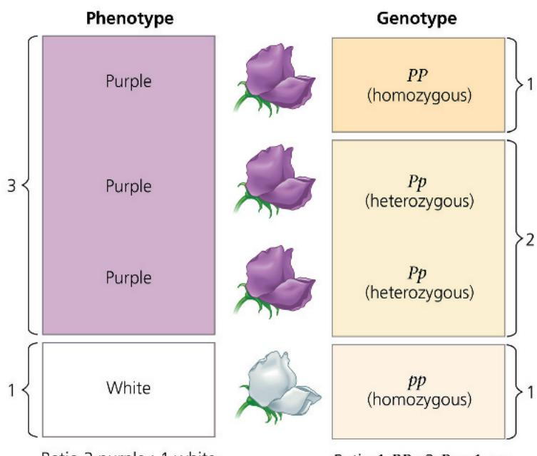

which will make only gametes with the recessive allele $(p)$ . The allele in the gamete contributed by the purple-flowered plant of unknown genotype will therefore determine the appearance of the offspring (Figure 14.7). If all the offspring of the cross have purple flowers, then the purple-flowered mystery plant must be homozygous for the dominant allele, because a $PP \times pp$ cross produces all Pp offspring. But if both the purple

## Figure 14.7

## Research Method: The Testcross

## Application

An organism that shows a dominant trait in its phenotype, such as purple flowers in pea plants, can be either homozygous for the dominant allele or heterozygous. To determine the organism's genotype, geneticists can perform a testcross.

## Technique

In a testcross, the individual with the unknown genotype is crossed with a homozygous individual expressing the recessive trait (white flowers in this example), and Punnett squares are used to predict the possible outcomes.

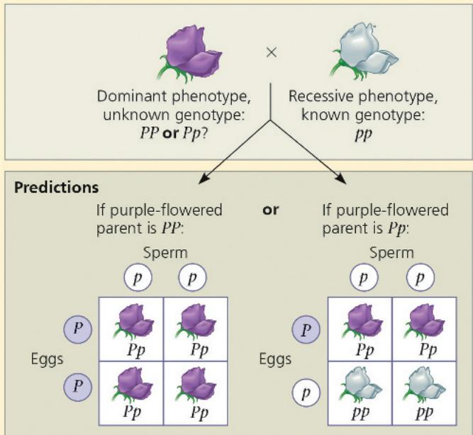

## Results

Matching the results to either prediction identifies the unknown parental genotype (either PP or Pp in this example). In this testcross, we transferred pollen from a white-flowered plant to the carpels of a purple-flowered plant; the opposite (reciprocal) cross would have led to the same results.

and the white phenotypes appear among the offspring, then the purple-flowered parent must be heterozygous. The offspring of a $Pp \times pp$ cross will be expected to have a 1:1 phenotypic ratio. Breeding an organism of unknown genotype with a recessive homozygote is called a testcross because it can reveal the genotype of that organism. The testcross was devised by Mendel and continues to be used by geneticists.

## The Law of Independent Assortment

Mendel derived the law of segregation from experiments in which he followed only a single character, such as flower color. All the $F_{1}$ progeny produced in his crosses of true-breeding parents were monohybrids, meaning that they were heterozygous for the one particular character being followed in the cross. We refer to a cross between such heterozygotes as a monohybrid cross.

Mendel worked out the second law of inheritance by following two characters at the same time, such as seed color and seed shape. Seeds (peas) may be either yellow or green. They also may be either round (smooth) or wrinkled. From single-character crosses, Mendel knew that the allele for yellow seeds is dominant (Y), and the allele for green seeds is recessive (y). For the seed-shape character, the allele for round is dominant (R), and the allele for wrinkled is recessive (r).

Imagine crossing two true-breeding pea varieties that differ in both of these characters—a cross between a plant with yellow round seeds (YYRR) and a plant with green wrinkled seeds (yyrr). The $F_{1}$ plants will be dihybrids, individuals heterozygous for the two characters being followed in the cross (YyRr). But are these two characters transmitted from parents to offspring as a package? That is, will the Y and R alleles always stay together, generation after generation? Or are seed color and seed shape inherited independently? Figure 14.8 shows how a dihybrid cross, a cross between $F_{1}$ dihybrids, can determine which of these two hypotheses is correct.

## Figure 14.8

## Inquiry: Do the alleles for one character segregate into gametes dependently or independently of the alleles for a different character?

## Experiment

To follow the characters of seed color and seed shape through the $F_{2}$ generation, Mendel crossed a true-breeding plant with yellow round seeds with a true-breeding plant with green wrinkled seeds, producing dihybrid $F_{1}$ plants. Self-pollination of the $F_{1}$ dihybrids produced the $F_{2}$ generation. The two hypotheses (dependent and independent “assortment” of the two genes) predict different phenotypic ratios.

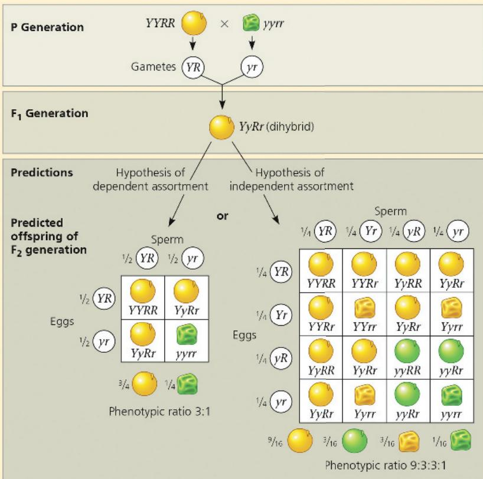

## Results

315 Yellow round (YYRR, YyRR, YYRr, YyRr) 108 Green round (yyRR, yyRr) 101 Yellow wrinkled (YYrr, Yyrr) 32 Green wrinkled (yyrr) Phenotypic ratio approximately 9:3:3:1

## Conclusion

The results support the hypothesis of independent assortment, the only one that predicts two newly observed phenotypes: green round seeds and yellow wrinkled seeds

(see the right-hand Punnett square). The alleles for each gene segregate independently of those of the other, and the two genes are said to assort independently.

Data from G. Mendel, Experiments in plant hybridization, Proceedings of the Natural History Society of Brünn 4:3–47 (1866).

WHAT IF? Suppose Mendel had transferred pollen from an $F_{1}$ plant to the carpel of a plant that was homozygous recessive for both genes. Set up the cross and draw Punnett squares that predict the offspring for both hypotheses. Would this cross have supported the hypothesis of independent assortment equally well?

For suggested answer, see Appendix A.

The $F_{1}$ plants, of genotype YyRr, exhibit both dominant phenotypes, yellow seeds with round shapes, no matter which hypothesis is correct. The key step in the experiment is to see what happens when $F_{1}$ plants self-pollinate and produce $F_{2}$ offspring. If the hybrids must transmit their alleles in the same combinations in which the alleles were inherited from the P generation, then the $F_{1}$ hybrids will produce only two classes of gametes: YR and yr. As shown on the left side of Figure 14.8, this “dependent assortment” hypothesis predicts that the phenotypic ratio of the $F_{2}$ generation will be 3:1, just as in a monohybrid cross:

The alternative hypothesis is that the two pairs of alleles segregate independently of each other. In other words, genes are packaged into gametes in all possible allelic combinations, as long as each gamete has one allele for each gene (see Figure 13.11). In our example, an $F_{1}$ plant will produce four classes of gametes in equal quantities: YR, Yr, yR, and yr. If sperm of the four classes fertilize eggs of the four classes, there will be $16(4 \times 4)$ equally probable ways in which the alleles can combine in the $F_{2}$ generation, as shown on the right side of Figure 14.8. These combinations result in four phenotypic categories with a ratio of 9:3:3:1 (9 yellow round to 3 green round to 3 yellow wrinkled to 1 green wrinkled):

When Mendel did the experiment and classified the $F_{2}$ offspring, his results were close to the predicted 9:3:3:1 phenotypic ratio, supporting the hypothesis that the alleles for one gene—the gene for seed color, for example—segregate into gametes independently of the alleles of any other gene, such as the gene for seed shape.

Mendel tested his seven pea characters in various dihybrid combinations and always observed a 9:3:3:1 phenotypic ratio in the $\mathrm{F}_2$ generation. Is this consistent with the 3:1 phenotypic ratio seen for the monohybrid cross shown in Figure 14.5? To answer this question, count the number of yellow and green peas, ignoring shape, and calculate the ratio. The results of Mendel's dihybrid experiments are the basis for what we now call the law of independent assortment, which states that two or more genes assort independently—that is, each pair of alleles segregates independently of any other pair of alleles—during gamete formation.

This law applies only to genes (allele pairs) located on different chromosomes (that is, on chromosomes that are not homologous) or, alternatively, to genes that are very far apart on the same chromosome. (This will be explained in Concept 15.3, along with the more complex inheritance patterns of genes located near each other, alleles of which tend to be inherited together.) All the pea characters Mendel chose for analysis were controlled by genes on different chromosomes or were far apart on the same chromosome; this situation greatly simplified interpretation of his multicharacter pea crosses. All the examples we consider in the rest of this chapter involve genes located on different chromosomes.

## Concept Check 14.1

1. DRAW IT Pea plants heterozygous for flower position and stem length (AaTt) are allowed to self-pollinate, and 400 of the resulting seeds are planted. Draw a Punnett square for this cross. How many offspring would be predicted to have terminal flowers and be dwarf? (See Table 14.1.)

2. WHAT IF? List all gametes that could be made by a pea plant heterozygous for seed color, seed shape, and pod shape (YyRrli; see Table 14.1). How large a Punnett square would you need to draw to predict the offspring of a self-pollination of this “trihybrid”?

3. MAKE CONNECTIONS In some pea plant crosses, the plants are self-pollinated. Is self-pollination considered asexual or sexual reproduction? Explain. (See Concept 13.1.)

For suggested answers, see Appendix A.

## Concept 14.2: Probability laws govern Mendelian inheritance

Mendel's laws of segregation and independent assortment reflect the same rules of probability that apply to tossing coins, rolling dice, and drawing cards from a deck. The probability scale ranges from 0 to 1. An event that is certain to occur has a probability of 1, while an event that is certain not to occur has a probability of 0. With a coin that has heads on both sides, the probability of tossing heads is 1, and the probability of tossing tails is 0. With a normal coin, the chance of tossing heads is $\frac{1}{2}$ , and the chance of tossing tails is $\frac{1}{2}$ . The probability of drawing the ace of spades from a 52-card deck is $\frac{1}{52}$ . The probabilities of all possible outcomes for an event must add up to 1. With a deck of cards, the chance of picking a card other than the ace of spades is $\frac{51}{52}$ .

Tossing a coin illustrates an important lesson about probability. For every toss, the probability of heads is $\frac{1}{2}$ . The outcome of any particular toss is unaffected by what has happened on previous trials. We refer to phenomena such as coin tosses as independent events. Each toss of a coin, whether done sequentially with one coin or simultaneously with many, is independent of every other toss. And like two separate coin tosses, the alleles of one gene segregate into gametes independently of another gene's alleles (the law of independent assortment). We'll now look at two basic rules of probability that help us predict the outcome of the fusion of such gametes in simple monohybrid crosses and more complicated crosses as well.

## The Multiplication and Addition Rules Applied to Monohybrid Crosses

How do we determine the probability that two or more independent events will occur together in some specific combination? For example, what is the chance that two coins tossed simultaneously will both land heads up? The multiplication rule states that to determine the probability of one event and the other occurring, we multiply the probability of one event (one coin coming up heads) by the probability of the other event (the other coin coming up heads). By the multiplication rule, then, the probability that both coins will land heads up is $\frac{1}{2} \times \frac{1}{2} = \frac{1}{4}$ .

We can apply the same reasoning to an $F_{1}$ monohybrid cross. With seed shape in pea plants as the heritable character, the genotype of $F_{1}$ plants is Rr. Segregation in a heterozygous plant is like flipping a coin in terms of calculating the probability of each outcome: Each egg produced has a $\frac{1}{2}$ chance of carrying the dominant allele (R) and a $\frac{1}{2}$ chance of carrying the recessive allele (r). The same odds apply to each sperm cell produced. For a particular $F_{2}$ plant to have wrinkled seeds, the recessive trait, both the egg and the sperm that come together must carry the r allele. The probability that an r allele will be present in the egg and in the sperm at fertilization is found by multiplying $\frac{1}{2}$ (the probability that the egg will have an $r$ ) × $\frac{1}{2}$ (the probability that the sperm will have an r). Thus, the multiplication rule tells us that the probability of an $F_{2}$ plant having wrinkled seeds (rr) is $\frac{1}{4}$ (Figure 14.9). Likewise, the probability of an $F_{2}$ plant carrying both dominant alleles for seed shape (RR) is $\frac{1}{4}$ .

To figure out the probability that an $F_{2}$ plant from a monohybrid cross will be heterozygous rather than homozygous, we need to invoke a second rule. Notice in Figure 14.9 that the dominant allele can come from the egg and the recessive allele

## Figure 14.9 Segregation of alleles and fertilization as chance events.

When a heterozygote (Rr) forms gametes, whether a particular gamete ends up with an R or an r is like the toss of a coin. We can determine the probability for any genotype among the offspring of two heterozygotes by multiplying together the individual probabilities of an egg and sperm having a particular allele (R or r in this example).

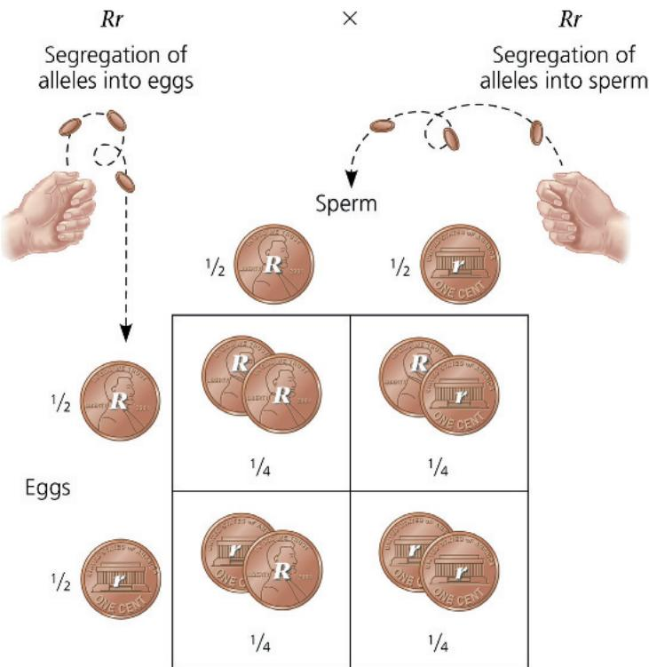

from the sperm, or vice versa. That is, $F_{1}$ gametes can combine to produce Rr offspring in two mutually exclusive ways: For any particular heterozygous $F_{2}$ plant, the dominant allele can come from the egg or the sperm, but not from both. According to the addition rule, the probability that any one of two or more mutually exclusive events (one event or the other) will occur is calculated by adding their individual probabilities. As we have just seen, the multiplication rule gives us the individual probabilities that we will now add together. The probability for one possible way of obtaining an $F_{2}$ heterozygote—the dominant allele from the egg and the recessive allele from the sperm—is $\frac{1}{4}$ . The probability for the other possible way—the recessive allele from the egg and the dominant allele from the sperm—is also $\frac{1}{4}$ (see Figure 14.9). Using the rule of addition, then, we can calculate the probability of an $F_{2}$ heterozygote as $\frac{1}{4} + \frac{1}{4} = \frac{1}{2}$ . (Note that use of the word and in the statement is a clue that you should use the multiplication rule, while or suggests use of the addition rule.)

## Solving Complex Genetics Problems with the Rules of Probability

We can also apply the rules of probability to predict the outcome of crosses involving multiple characters. Recall that each allelic pair (gene) segregates independently during gamete formation (the law of independent assortment). Thus, a dihybrid or other multicharacter cross is equivalent to two or more independent monohybrid crosses occurring simultaneously. By applying what we have learned about monohybrid crosses, we can determine the probability of specific genotypes occurring in the $F_{2}$ generation without having to construct unwieldy Punnett squares.

Consider the dihybrid cross between $YyRr$ heterozygotes shown in Figure 14.8. We will focus first on the seed-color character. For a monohybrid cross of $Yy$ plants, we can use a simple Punnett square to determine that the probabilities of the offspring genotypes are $\frac{1}{4}$ for $YY$ , $\frac{1}{2}$ for $Yy$ , and $\frac{1}{4}$ for $yy$ . We can draw a second Punnett square to determine that the same probabilities apply to the offspring genotypes for seed shape: $\frac{1}{4} RR$ , $\frac{1}{2} Rr$ , and $\frac{1}{4} rr$ . Knowing these probabilities, we can simply use the multiplication rule to determine the probability of each of the genotypes in the $F_2$ generation. To give two examples, the calculations for finding the probabilities of two of the possible $F_2$ genotypes ( $YYRR$ and $YyRR$ ) are shown below:

<table><tr><td>Probability of YYRR = 1/4 (probability of YY) × 1/4 (RR) = 1/16</td></tr><tr><td>Probability of YγRR = 1/2 (Yγ) × 1/4 (RR) = 1/8</td></tr></table>

The YYRR genotype corresponds to the upper left box in the larger Punnett square in Figure 14.8 (one box = $\frac{1}{16}$ ). Looking closely at the larger Punnett square in Figure 14.8, you will see that 2 of the 16 boxes ( $\frac{1}{8}$ ) correspond to the YyRR genotype.

Now let's see how we can combine the multiplication and addition rules to solve even more complex problems in Mendelian genetics. Imagine a cross of two pea varieties in which we track the inheritance of three characters. Let's cross a trihybrid with

purple flowers and yellow round seeds (heterozygous for all three genes) with a plant with purple flowers and green wrinkled seeds (heterozygous for flower color but homozygous recessive for the other two characters). Using Mendelian symbols, our cross is $PpYyRr \times Ppyyrr$ . What fraction of offspring from this cross are predicted to exhibit the recessive phenotypes for at least two of the three characters?

To answer this question, we can start by listing all genotypes we could get that fulfill this condition: $ppyyRr$ , $ppYyrr$ , $Ppyyrr$ , $PPyyrr$ , and $ppyyrr$ . (Because the condition is at least two recessive traits, it includes the last genotype, which shows all three recessive traits.) Next, we calculate the probability for each of these genotypes resulting from our $PpYyRr \times Ppyyrr$ cross by multiplying together the individual probabilities for the allele pairs, just as we did in our dihybrid example. Note that in a cross involving heterozygous and homozygous allele pairs (for example, $Yy \times yy$ ), the probability of heterozygous ( $Yy$ ) offspring is $\frac{1}{2}$ and the probability of homozygous (in this case, $yy$ ) offspring is $\frac{1}{2}$ . Finally, we use the addition rule to add the probabilities for all the different genotypes that fulfill the condition of at least two recessive traits resulting from our $PpYyRr \times Ppyyrr$ cross, as shown below:

<table><tr><td>ppyyRr</td><td> $^{1}/_{4}$  (probability of pp)  $\times^{1}/_{2}$  (yy)  $\times^{1}/_{2}$  (Rr) =  $^{1}/_{16}$ </td></tr><tr><td>ppYyrr</td><td> $^{1}/_{4}$  (pp)  $\times^{1}/_{2}$  (Yy)  $\times^{1}/_{2}$  (rr) =  $^{1}/_{16}$ </td></tr><tr><td>Ppyyrr</td><td> $^{1}/_{2}$  (Pp)  $\times^{1}/_{2}$  (yy)  $\times^{1}/_{2}$  (rr) =  $^{2}/_{16}$ </td></tr><tr><td>PPyyrr</td><td> $^{1}/_{4}$  (PP)  $\times^{1}/_{2}$  (yy)  $\times^{1}/_{2}$  (rr) =  $^{1}/_{16}$ </td></tr><tr><td>ppyyrr</td><td> $^{1}/_{4}$  (pp)  $\times^{1}/_{2}$  (yy)  $\times^{1}/_{2}$  (rr) =  $^{1}/_{16}$ </td></tr><tr><td colspan="2">Chance of at least two recessive traits</td></tr></table>

In time, you'll be able to solve genetics problems faster by using the rules of probability than by filling in Punnett squares.

We cannot predict with certainty the exact numbers of progeny of different genotypes resulting from a genetic cross. But the rules of probability give us the likelihood of various outcomes. Usually, the larger the sample size, the closer the results will conform to our predictions. Mendel understood this statistical feature of inheritance and had a keen sense of the rules of chance. It was for this reason that he set up his experiments so as to generate, and then count, large numbers of offspring from his crosses.

## Concept Check 14.2

1. For any gene with a dominant allele A and recessive allele a, what proportions of the offspring from an $AA \times Aa$ cross are expected to be homozygous dominant, homozygous recessive, and heterozygous?

2. Two organisms, with genotypes BbDD and BBDd, are mated. Assuming independent assortment of the B/b and D/d genes, write the genotypes of all possible offspring from this cross and use the rules of probability to calculate the chance of each genotype occurring.

3. WHAT IF? Three characters (flower color, seed color, and pod shape) are considered in a cross between two pea plants: $PpYyIi \times ppYyIi$ . Using the rules of probability, determine the fraction of offspring predicted to be homozygous recessive for at least two of the three characters.

## Concept 14.3: Inheritance patterns are often more complex than predicted by simple Mendelian genetics

In the 1900s, geneticists extended Mendelian principles not only to diverse organisms, but also to patterns of inheritance more complex than those described by Mendel. For the work that led to his two laws of inheritance, Mendel chose pea plant characters that turn out to have a relatively simple genetic basis: Each character is determined by one gene, for which there are only two alleles, one completely dominant and the other completely recessive. (There is one exception: Mendel's pod shape character is actually determined by two genes.) Not all heritable characters are determined so simply, and the relationship between genotype and phenotype is rarely so straightforward. Mendel himself realized that he could not explain the more complicated patterns he observed in crosses involving other pea characters or other plant species. This does not diminish the utility of Mendelian genetics, however, because the basic principles of segregation and independent assortment apply even to more complex patterns of inheritance. In this section, we will extend Mendelian genetics to hereditary patterns that were not reported by Mendel.

## Extending Mendelian Genetics for a Single Gene

The inheritance of characters determined by a single gene deviates from simple Mendelian patterns when alleles are not completely dominant or recessive, when a particular gene has more than two alleles, or when a single gene produces multiple phenotypes. We will describe examples of each of these situations in this section.

## Degrees of Dominance

Alleles can show different degrees of dominance and recessiveness in relation to each other. In Mendel's classic pea crosses, the $\mathrm{F}_1$ offspring always looked like one of the two parental varieties because one allele in a pair showed complete dominance over the other. In such situations, the phenotypes of the heterozygote and the dominant homozygote are indistinguishable (see Figure 14.6).

For some genes, however, neither allele is completely dominant, and the $F_{1}$ hybrids have a phenotype somewhere between those of the two parental varieties. This phenomenon, called incomplete dominance, is seen when red snapdragons are crossed with white snapdragons: All the $F_{1}$ hybrids have pink flowers (Figure 14.10). This third, intermediate phenotype results from flowers of the heterozygotes having less red pigment than the red homozygotes. (This is unlike the case of Mendel's pea plants, where the Pp heterozygotes make enough pigment for the flowers to be purple, indistinguishable from those of PP plants.)

At first glance, incomplete dominance of either allele seems to provide evidence for the blending hypothesis of inheritance, which would predict that the red or white trait could never reappear among offspring of the pink hybrids. In fact, interbreeding

Figure 14.10 Incomplete dominance in snapdragon color. When red snapdragons are crossed with white ones, the $F_{1}$ hybrids have pink flowers. Segregation of alleles into gametes of the $F_{1}$ plants results in an $F_{2}$ generation with a 1:2:1 ratio for both genotype and phenotype. Neither allele is dominant, so rather than using upper- and lowercase letters, we use the letter C with a superscript to indicate an allele for flower color: $C^{R}$ for red and $C^{W}$ for white.

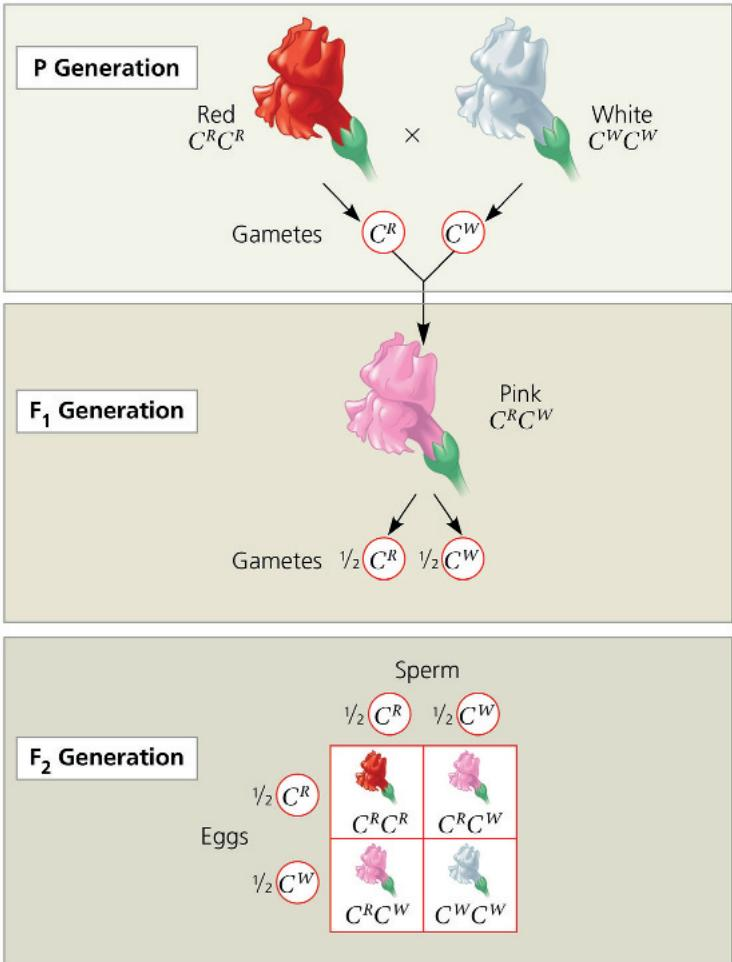  
Suppose a classmate argues that this figure supports the blending hypothesis for inheritance. What might your classmate say, and how would you respond? For suggested answer, see Appendix A.

$F_{1}$ hybrids produces $F_{2}$ offspring with a phenotypic ratio of one red to two pink to one white. (Because heterozygotes have a separate phenotype from homozygotes, the genotypic and phenotypic ratios for the $F_{2}$ generation are the same, 1:2:1.) The segregation of the red-flower and white-flower alleles in the gametes produced by the pink-flowered plants confirms that the alleles for flower color are heritable factors that maintain their identity in the hybrids; that is, that the factors are discrete rather than “blendable.”

Another variation on dominance relationships between alleles is called codominance; in this variation, the two alleles each affect the phenotype in separate, distinguishable ways. For example, there are many molecules on the surface of human red blood cells that help determine blood type. You are probably most familiar with the ABO blood group, which we'll discuss shortly. A lesser-known example, the human MN blood group, is determined by codominant alleles for two specific molecules called M and N molecules. A single gene $(L)$ , for which two allelic variations are possible $(L^{M}$ or $L^{N})$ , determines the phenotype of this blood group.

Individuals homozygous for the $L^{M}$ allele ( $L^{M}L^{M}$ ) have red blood cells with only M molecules; individuals homozygous for the $L^{N}$ allele ( $L^{N}L^{N}$ ) have red blood cells with only N molecules. But both M and N molecules are present on the red blood cells of individuals heterozygous for the M and N alleles ( $L^{M}L^{N}$ ). Note that the MN phenotype is not intermediate between the M and N phenotypes, which distinguishes codominance from incomplete dominance. Rather, both M and N phenotypes are exhibited by heterozygotes, since both molecules are present.

## The Relationship Between Dominance and Phenotype

We've now seen that the relative effects of two alleles range from complete dominance of one allele to incomplete dominance of either allele to codominance of both alleles. It is important to understand that an allele is called dominant because it is seen in the phenotype, not because it somehow subdues a recessive allele. Alleles are simply variations in a gene's nucleotide sequence (see Figure 14.4). When a dominant allele coexists with a recessive allele in a heterozygote, they do not actually interact at all. It is in the pathway from genotype to phenotype that dominance and recessiveness come into play.

To illustrate the relationship between dominance and phenotype, we can use one of the characters Mendel studied—round versus wrinkled pea seed shape. The dominant allele (round) codes for an enzyme that helps convert an unbranched form of starch to a branched form in the seed. The recessive allele (wrinkled) codes for a defective form of this enzyme, leading to an accumulation of unbranched starch, which causes excess water to enter the seed by osmosis. Later, when the seed dries, it wrinkles. If a dominant allele is present, no excess water enters the seed and it does not wrinkle when it dries. One dominant allele results in enough of the enzyme to synthesize adequate amounts of branched starch, which means that dominant homozygotes and heterozygotes have the same phenotype: round seeds.

A closer look at the relationship between dominance and phenotype reveals an intriguing fact: For any character, the observed dominant/recessive relationship of alleles depends on the level at which we examine phenotype. Tay-Sachs disease, an inherited disorder in humans, is an example. The brain cells of a child with Tay-Sachs disease cannot metabolize certain lipids because a crucial enzyme does not work properly. As these lipids accumulate in brain cells, the child begins to experience seizures, blindness, and degeneration of motor and mental performance and dies within a few years.

Only children who inherit two copies of the Tay-Sachs allele (homozygotes) have the disease. Thus, at the organismal level, the Tay-Sachs allele qualifies as recessive. However, the activity level of the lipid-metabolizing enzyme in heterozygotes is intermediate between the activity level in individuals homozygous for the normal allele and the activity level in individuals with Tay-Sachs disease. (The term normal is used in the genetic sense to refer to the allele coding for the enzyme that functions properly.) The intermediate phenotype observed at the biochemical level is characteristic of incomplete dominance of either allele. Fortunately, the heterozygote condition does not lead to disease symptoms, apparently because half the normal enzyme activity is sufficient to prevent lipid accumulation in the brain. Extending our analysis to yet another level, we find that heterozygous individuals produce equal numbers of normal and dysfunctional enzyme molecules. Thus, at the molecular level, the normal allele and the Tay-Sachs allele are codominant. As you can see, whether alleles appear to be completely dominant, incompletely dominant, or codominant depends on the level at which the phenotype is analyzed.

## Frequency of Dominant Alleles

While you might assume that the dominant allele for a particular character would be more common than the recessive allele, this is not always the case. For an example of a rare dominant allele, about one baby out of 400 in the United States is born with extra fingers or toes, a condition known as polydactyly. Some cases are caused by the presence of a dominant allele. The low frequency of these types of polydactyly indicates that the recessive allele, which results in five digits per appendage, is far more prevalent than the dominant allele in the population.

## Multiple Alleles

Only two alleles exist for the pea characters that Mendel studied, but most genes have more than two alleles. The ABO blood groups in humans, for instance, are determined by the two alleles a person has of the blood group gene; the three possible alleles are $I^{A}$ , $I^{B}$ , and i. A person's blood group may be one of four types: A, B, AB, or O. These letters refer to two carbohydrates—A and B—that may be found attached to specific cell-surface molecules on red blood cells. An individual's blood cells may have carbohydrate A (type A blood), carbohydrate B (type B), both (type AB), or neither (type O), as shown in Figure 14.11, along with the relevant genotypes. Matching compatible blood groups is critical for safe blood transfusions (see Concept 43.3).

Figure 14.11 Multiple alleles for the ABO blood groups.
The four blood groups result from different combinations of three alleles.

<table><tr><td colspan="5">(a) The three alleles for the ABO blood groups and their carbohydrates. Each allele codes for an enzyme that may add a specific carbohydrate (designated by the superscript on the allele and shown as a triangle or circle) to red blood cells.</td></tr><tr><td>Allele</td><td> $I^A$ </td><td> $I^B$ </td><td colspan="2">i</td></tr><tr><td>Carbohydrate</td><td>A △</td><td>B ○</td><td colspan="2">none</td></tr><tr><td colspan="5"></td></tr><tr><td colspan="5">(b) Blood group genotypes and phenotypes. There are six possible genotypes, resulting in four different phenotypes.</td></tr><tr><td>Genotype</td><td> $I^AI^A$  or  $I^{Ai}$ </td><td> $I^BI^B$  or  $I^{Bi}$ </td><td> $I^AI^B$ </td><td>ii</td></tr><tr><td>Red blood cell with surface carbohydrates</td><td></td><td></td><td></td><td></td></tr><tr><td>Phenotype (blood group)</td><td>A</td><td>B</td><td>AB</td><td>O</td></tr></table>

VISUAL SKILLS Based on the surface carbohydrate phenotype in part (b), what are the dominance relationships among the alleles? For suggested answer, see Appendix A.

## Pleiotropy

So far, we have treated Mendelian inheritance as though each gene affects only one phenotypic character. Most genes, however, have multiple phenotypic effects, a property called pleiotropy (from the Greek pleion, more). In humans, for example, pleiotropic alleles are responsible for the multiple symptoms associated with certain hereditary diseases, such as cystic fibrosis and sickle-cell disease, discussed later in this chapter. In the garden pea, the gene that determines flower color also affects the color of the coating on the outer surface of the seed, which can be gray or white. Given the intricate molecular and cellular interactions responsible for an organism's development and physiology, it isn't surprising that a single gene can affect a number of characters.

## Extending Mendelian Genetics for Two or More Genes

Dominance relationships, multiple alleles, and pleiotropy all have to do with the effects of the alleles of a single gene. We now consider two situations in which two or more genes are involved in determining a particular phenotype. In the first case, called epistasis, one gene affects the phenotype of another because the two gene products interact; in the second case, called polygenic inheritance, multiple genes independently affect a single trait.

## Epistasis

In epistasis (from the Greek for “standing upon”), the phenotypic expression of a gene at one locus alters that of a gene at a second locus. An example will help clarify this concept. In Labrador retrievers (commonly called “Labs”), black coat color is dominant to brown. Let’s designate B and b as the two alleles for this character. For a Lab to have brown fur, its genotype must be bb; these dogs are called chocolate Labs. But there is more to the story. A second gene determines whether or not pigment will be deposited in the hair. The dominant allele, symbolized by E, results in the deposition of either black or brown pigment, depending on the genotype at the first locus. But if the Lab is homozygous recessive for the second locus (ee), then the coat is yellow, regardless of the genotype at the black/brown locus (yellow Labs). In this case, the gene for pigment deposition (E/e) is said to be epistatic to the gene that codes for black or brown pigment (B/b).

What happens if we mate black Labs that are heterozygous for both genes (BbEe)? Although the two genes affect the same phenotypic character (coat color), they follow the law of independent assortment. Thus, our breeding experiment represents an $F_{1}$ dihybrid cross, like those that produced a 9:3:3:1 ratio in Mendel's experiments. We can use a Punnett square to represent the genotypes of the $F_{2}$ offspring (Figure 14.12). As a result of epistasis, the phenotypic ratio among the $F_{2}$ offspring is 9 black to 3 chocolate to 4 yellow Labs. Other types of epistatic interactions produce different ratios, but all are modified versions of 9:3:3:1.

## Polygenic Inheritance

Mendel studied characters that could be classified on an either-or basis, such as purple versus white flower color. But many characters, such as human skin color and height, are not one

Figure 14.12 An example of epistasis.

This Punnett square illustrates the genotypes and phenotypes predicted for offspring of matings between two black Labrador retrievers of genotype BbEe. The E/e gene, which is epistatic to the B/b gene coding for hair pigment, controls whether or not pigment of any color will be deposited in the hair.

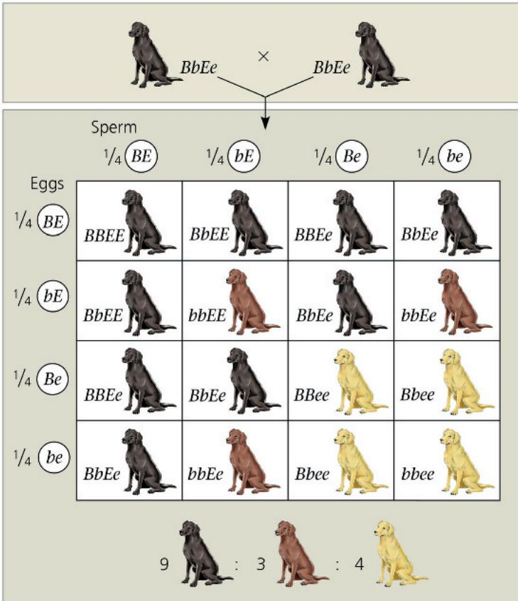  
VISUAL SKILLS Compare this Punnett square with the right-hand one in Figure 14.8, focusing especially on the four squares in the lower right. Explain the genetic basis for the difference between the ratio (9:3:4) of phenotypes seen in this cross and the 9:3:3:1 ratio seen in Figure 14.8.
For suggested answer, see Appendix A.

of two discrete characters, but instead vary in the population in gradations along a continuum. These are called quantitative characters. Quantitative variation usually indicates polygenic inheritance, an additive effect of two or more genes on a single phenotypic character. (Contrast this with pleiotropy, where a single gene affects several phenotypic characters.) Height is a good example of polygenic inheritance: In 2014, a genomic study of over 250,000 people found almost 700 genetic variations in over 180 genes that affect height. Many variations were in or near genes involved in biochemical pathways affecting growth of the skeleton, but others were associated with genes not obviously related to growth. Another study in 2018, of 300,000 individuals, identified 124 genes that affect hair color. Although simplifying can sometimes be valuable in understanding genetic principles, as we'll see shortly, the classic idea of a single gene determining eye color or hair color or other such traits is an oversimplification. (Earlobe attachment, an example commonly used in textbooks, is affected by nearly 50 genes!)

Skin pigmentation in humans is also controlled by many separately inherited genes—378 at latest count, many of which are involved in the production of melanin skin pigments. Here, we'll simplify the story in order to understand the concept of polygenic inheritance. Let's consider three genes, with a dark-skin allele for each gene (A, B, or C) contributing one "unit" of darkness (also a simplification) to the phenotype and being incompletely dominant to the other, light-skin allele (a, b, or c). In our model, an AABBCC person would be very dark, whereas an aabbcc individual would be very light. An AaBbCc person would have skin of an intermediate shade. Because the alleles have a cumulative effect, the genotypes AaBbCc and AABbcc would make the same genetic contribution (three units) to skin darkness. There are seven skin color phenotypes that could result from a mating between AaBbCc heterozygotes, as shown in Figure 14.13. In a large number of such matings, the majority of offspring would be expected to have intermediate phenotypes (skin color in the middle range). You can graph the predictions from the Punnett square in the Scientific Skills Exercise. Environmental factors, such as exposure to the sun, also affect the skin color phenotype.

## Figure 14.13 A simplified model for polygenic inheritance of skin color.

In this model, three separately inherited genes affect skin color. (The reported number is actually 378 genes.) The heterozygous individuals (AaBbCc) represented by the two rectangles at the top of this figure each carry three dark-skin alleles (black circles, which represent A, B, or C) and three light-skin alleles (white circles, which represent a, b, or c). The Punnett square shows all possible genetic combinations in gametes and offspring of hypothetical matings between these two. The results are summarized by phenotypic frequencies (fractions) under the Punnett square. (The phenotypic ratio is 1:6:15:20:15:6:1.)

# Scientific Skills Exercise Making a Histogram and Analyzing a Distribution Pattern

INTERPRET THE DATA

What Is the Distribution of Phenotypes Among Offspring of Two Parents Who Are Both Heterozygous for Three Additive Genes? Human skin color is a polygenic trait that is determined by the additive effects of many different genes. In this exercise, you will work with a simplified model of skin color genetics where only three genes are assumed to affect the darkness of skin color and where each gene has two alleles—dark or light (see Figure 14.13). In this model, each dark allele contributes equally to the darkness of skin color, and each pair of alleles segregates independently of any other pair. Using a type of graph called a histogram, you will determine the distribution of phenotypes of offspring with different numbers of dark-skin alleles. (For additional information about graphs, see the Scientific Skills Review in Appendix D.)

How This Model Is Analyzed To predict the phenotypes of the offspring of parents heterozygous for the three genes in our simplified model, we can use the Punnett square in Figure 14.13. The heterozygous individuals (AaBbCc) represented by the two rectangles at the top of that figure each carry three dark-skin alleles (black circles, which represent A, B, or C) and three light-skin alleles (white circles, which represent a, b, or c). The Punnett square shows all the possible genetic combinations in gametes and in offspring of a large number of hypothetical matings between these heterozygotes.

Predictions from the Punnett Square If we assume that each square in the Punnett square represents one offspring of the heterozygous AaBbCc parents, then the squares below show the possible skin color phenotypes and their predicted frequencies. Below the squares is the number of dark-skin alleles for each phenotype.

Phenotypes:

Number of dark-skin alleles:

0 1 2 3 4 5 6

## Nature and Nurture: The Environmental Impact on Phenotype

1. A histogram is a bar graph that shows the distribution of numeric data (here, the number of dark-skin alleles). To make a histogram of the allele distribution, put skin color (as the number of dark-skin

Another departure from simple Mendelian genetics arises when the phenotype for a character depends on environment as well as genotype. A single tree, locked into its inherited genotype, has leaves that vary in size, shape, and greenness, depending on their exposure to wind and sun. For humans, nutrition influences height, exercise alters build, sun-tanning darkens the skin, and experience improves performance on intelligence tests. Even identical twins, who are genetic equals, accumulate phenotypic differences as a result of their unique experiences.

Whether human characters are more influenced by genes or the environment—in everyday terms, nature versus nurture—is a debate that we will not attempt to settle here. We can say, however, that a genotype generally is not associated with a rigidly defined phenotype, but rather with a range of phenotypic possibilities due to environmental influences (Figure 14.14). For

Further Reading R. A. Sturm, A golden age of human pigmentation genetics, Trends in Genetics 22:464–468 (2006).

alleles) along the x-axis and predicted number of offspring (out of 64) with each phenotype on the y-axis. There are no gaps in these allele data, so draw the bars next to each other with no space in between.

Instructors: A version of this Scientific Skills Exercise can be assigned in Mastering Biology.

2. You can see that the skin-color phenotypes are not distributed uniformly. (a) Which phenotype has the highest frequency? Draw a vertical dashed line through that bar. (b) Distributions of values like this one tend to show one of several common patterns. Sketch a rough curve that approximates the values and look at its shape. Is it symmetrically distributed around a central peak value (a “normal distribution,” sometimes called a bell curve); is it skewed to one end of the x-axis or the other (a “skewed distribution”); or does it show two apparent groups of frequencies (a “bimodal distribution”)? Explain the reason for the curve’s shape. (It will help to read the text description that supports Figure 14.13.)

## Figure 14.14 The effect of environment on phenotype.

The outcome of a genotype lies within a phenotypic range that depends on the environment in which the genotype is expressed. For example, the acidity and free aluminum content of the soil affect the color of hydrangea flowers, which range from pink (basic soil) to blue-violet (acidic soil). Free aluminum is necessary for bluer colors.

  
(a) Hydrangeas grown in basic soil

  
(b) Hydrangeas of the same genetic variety grown in acidic soil with free aluminum

some characters, such as the ABO blood group system, the phenotypic range is extremely narrow; that is, a given genotype mandates a very specific phenotype. Other characters, such as a person's blood count of red and white cells, vary quite a bit, depending on such factors as the altitude, the customary level of physical activity, and the presence of infectious agents. Biologists use the term phenotypic plasticity to describe the ability of an individual genotype to produce different phenotypes under different environmental conditions.

Generally, the phenotypic range is broadest for polygenic characters. Environment contributes to the quantitative nature of these characters, as we have seen in the continuous variation of skin color. Geneticists refer to such characters as multifactorial, meaning that many factors, both genetic and environmental, collectively influence phenotype.

## A Mendelian View of Heredity and Variation

We have now broadened our view of Mendelian inheritance by exploring degrees of dominance as well as multiple alleles, pleiotropy, epistasis, polygenic inheritance, and the phenotypic impact of the environment. How can we integrate these refinements into a comprehensive theory of Mendelian genetics? The key is to make the transition from the reductionist emphasis on single genes and phenotypic characters to the emergent properties of the organism as a whole, one of the themes of this book.

The term phenotype can refer not only to specific characters, such as flower color and blood group, but also to an organism in its entirety—all aspects of its physical appearance, internal anatomy, physiology, and behavior. Similarly, the term genotype can refer to an organism’s entire genetic makeup, not just its alleles for a single genetic locus. In most cases, a gene’s impact on phenotype is affected by other genes and by the environment. In this integrated view of heredity and variation, an organism’s phenotype reflects its overall genotype and unique environmental history.

Considering all that can occur in the pathway from genotype to phenotype, it is indeed impressive that Mendel could uncover the fundamental principles governing the transmission of individual genes from parents to offspring. Mendel's laws of segregation and of independent assortment explain heritable variations in terms of alternative forms of genes (hereditary "particles," now known as the alleles of genes) that are passed along, generation after generation, according to simple rules of probability. This theory of inheritance is equally valid for peas, flies, fishes, birds, and human beings—indeed, for any organism with a sexual life cycle. Furthermore, by extending the principles of segregation and independent assortment to help explain such hereditary patterns as epistasis and quantitative characters, we begin to see how broadly Mendelian genetics applies. From Mendel's abbey garden came a theory of inheritance that anchors modern genetics. In the last section of this chapter, we will apply Mendelian genetics to human inheritance, with emphasis on the transmission of hereditary diseases.

## Concept Check 14.3

1. Incomplete dominance and epistasis are both terms that define genetic relationships. What is the most basic distinction between these terms?

2. If a male with type AB blood and a female with type O blood reproduce, what blood types would you expect in their children? What fraction would you expect of each type?

3. WHAT IF? A rooster with gray feathers and a hen of the same phenotype produce 15 gray, 6 black, and 8 white chicks. What is the simplest explanation for the inheritance of these colors in chickens? What phenotypes would you expect in the offspring of a cross between a gray rooster and a black hen?

For suggested answers, see Appendix A.

## Concept 14.4: Many human traits follow Mendelian patterns of inheritance

The study of human genetics is fueled by our desire to understand our own inheritance and to develop treatments for genetically based diseases. While peas are convenient subjects for genetic research, humans are not. The human generation span is long (about 20 years), human parents produce many fewer offspring than peas, and breeding experiments would be unethical!

## Pedigree Analysis

In place of breeding experiments, geneticists analyze the results of human matings that have already occurred. They collect information about a family's history for a particular trait and assemble this information into a family tree describing the trait across the generations—a family pedigree.

Figure 14.15a shows a three-generation pedigree that traces the occurrence of a pointed contour of the hairline on the forehead. We simplify the genetics of this trait, called a widow's peak, by assuming it is due to a dominant allele, W. (In reality, other genes are probably also involved.) In our model, because the widow's peak allele is dominant, all individuals who lack a widow's peak must be homozygous recessive (ww). The two grandparents with widow's peaks must have the Ww genotype since some of their offspring are homozygous recessive. The offspring in the second generation who do have widow's peaks must also be heterozygous because they are the products of $Ww \times ww$ matings. The third generation in this pedigree consists of two sisters. The one who has a widow's peak could be either homozygous (WW) or heterozygous (Ww), given what we know about the genotypes of her parents (both Ww).

Figure 14.15b is a pedigree of the same family, but this time we focus on a recessive trait, the inability of individuals to taste a chemical called PTC (phenylthiocarbamide). Compounds similar to PTC are found in broccoli, brussels sprouts, and related vegetables and account for the bitter taste some people report when eating these foods. We'll use $t$ for the recessive allele and $T$ for the dominant allele, which

Widow's peak

Cannot taste PTC

## Figure 14.15 Pedigree analysis.

Each pedigree traces a trait through three generations of the same family; the two traits have different inheritance patterns. For the sake of understanding genetic principles, each trait is shown as being determined by two alleles of a single gene—a simplification, since other genes likely also affect these two characters.

  
No widow's peak  
(a) Is a widow's peak a dominant or recessive trait? Tips for pedigree analysis: Notice in the third generation that the second-born daughter lacks a widow's peak, although both of her parents had the trait. Such a pattern indicates that the trait is due to a dominant allele. If it were due to a recessive allele, and both parents had the recessive phenotype (straight hairline), all of their offspring would also have the recessive phenotype.

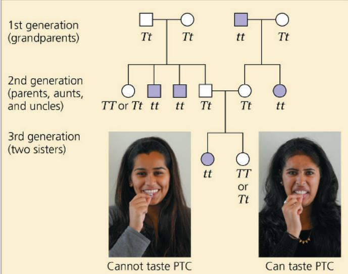  
Can taste PTC

## (b) Is the inability to taste a chemical called PTC a dominant or recessive trait?

Tips for pedigree analysis: Notice that the first-born daughter in the third generation has the trait (is unable to taste PTC), although both parents lack that trait (they can taste PTC). Such a pattern is explained if the non-taster phenotype is due to a recessive allele. If it were due to a dominant allele, then at least one parent would also have had the trait.

results in the ability to taste PTC. As you work your way through the pedigree, notice once again that you can apply what you have learned about Mendelian inheritance to understand the genotypes shown for the family members.

An important application of a pedigree is to help us calculate the probability that a future child will have a particular genotype and phenotype. Suppose that the couple represented in the second generation of Figure 14.15 decides to have one more child. What is the probability that the child will have a widow's peak? This is equivalent to a Mendelian $F_{1}$ monohybrid cross ( $Ww \times Ww$ ), and therefore the probability that a child will inherit a dominant allele and have a widow's peak is $\frac{3}{4}$ ( $\frac{1}{4} WW + \frac{1}{2} Ww$ ). What is the probability that the child will be unable to taste PTC? We can also treat this as a monohybrid cross ( $Tt \times Tt$ ), but this time we want to know the chance that the offspring will be homozygous recessive (tt). That probability is $\frac{1}{4}$ . Finally, what is the chance that the child will have a widow's peak and be unable to taste PTC? Assuming that the genes for these two characters are on different chromosomes, the two pairs of alleles will assort independently in this dihybrid cross ( $WwTt \times WwTt$ ). Therefore, we can use the multiplication rule:

$^{3}/_{4}$ (chance of widow's peak)

$\times \frac{1}{4}$ (chance of inability to taste PTC)

$=\frac{3}{16}$ (chance of widow's peak and inability to taste PTC).

Pedigrees are a more serious matter when the alleles in question cause disabling or deadly diseases instead of innocuous human variations such as hairline or inability to taste a harmless chemical. However, for disorders inherited as simple Mendelian traits, the same techniques of pedigree analysis apply.

## Recessively Inherited Disorders

Thousands of genetic disorders are known to be inherited as simple recessive traits. These disorders range in severity from relatively mild, such as albinism (lack of pigmentation, which results in susceptibility to skin cancers and vision problems), to life-threatening, such as cystic fibrosis.

## The Behavior of Recessive Alleles

How can we account for the behavior of alleles that cause recessively inherited disorders? Recall that genes code for proteins of specific function. An allele that causes a genetic disorder (let's call it allele $a$ ) codes for either a malfunctioning protein or no protein at all. In the case of disorders classified as recessive, heterozygotes $(Aa)$ typically have the normal phenotype because one copy of the normal allele $(A)$ produces a sufficient amount of the specific protein. Thus, a recessively inherited disorder shows up only in the homozygous individuals $(aa)$ who inherit a recessive allele from each parent. Although phenotypically normal with regard to the disorder, heterozygotes may transmit the recessive allele to their offspring and thus are called carriers. Figure 14.16 illustrates these ideas using albinism as an example.

Most people who have recessive disorders are born to parents who are carriers of the disorder but have a normal phenotype, as is the case shown in the Punnett square in Figure 14.16. A mating between two carriers corresponds to a Mendelian $F_{1}$ monohybrid

Figure 14.16 Albinism: a recessive trait.

One of the two siblings shown does not have albinism; the other does. Most recessive homozygotes are born to parents who are carriers of the disorder but themselves have a normal phenotype, the case shown in the Punnett square.

  
What is the probability that the sibling on the left in the photograph is a carrier of the albinism allele?

For suggested answer, see Appendix A.

cross, so the predicted genotypic ratio for the offspring is 1 AA:2 Aa:1 aa. Thus, each child has a $\frac{1}{4}$ chance of inheriting a double dose of the recessive allele; in the case of albinism, such a child will have albinism. From the genotypic ratio, we also can see that out of three offspring with the normal phenotype (one AA plus two Aa), two are predicted to be heterozygous carriers, a $\frac{2}{3}$ chance. Recessive homozygotes could also result from $Aa \times aa$ and $aa \times aa$ matings, but if the disorder is lethal before reproductive age or results in sterility (neither of which is true for albinism), no aa individuals will reproduce. Even if recessive homozygotes are able to reproduce, this will occur relatively rarely because such individuals are much less common in the population than heterozygous carriers (for reasons we'll examine in Concept 23.2).

In general, genetic disorders are not evenly distributed among all groups of people. For example, the incidence of Tay-Sachs disease, which we described earlier in this chapter, is disproportionately high among Ashkenazic Jews, Jewish people whose ancestors lived in central Europe. In that population, Tay-Sachs disease occurs in one out of 3,600 births, an incidence about 100 times greater than that among non-Jews or Mediterranean (Sephardic) Jews. This uneven distribution results from the different genetic histories of the world's peoples during less technological times, when populations were more geographically (and hence genetically) isolated.

When a disease-causing recessive allele is rare, it is relatively unlikely that two carriers of the same harmful allele will meet and mate. The probability of passing on recessive traits increases greatly, however, if the male and female are close relatives (for example, siblings or first cousins). This is because people with recent common ancestors are more likely to carry the same recessive alleles than are unrelated people. Thus, these consanguineous (“same blood”) matings, indicated in pedigrees by double lines, are more likely to produce offspring homozygous for recessive traits—including harmful ones. Such effects can be observed in many types of domesticated and zoo animals that have become inbred.

Although geneticists generally agree that inbreeding causes an increase in autosomal recessive conditions compared to those resulting from matings between unrelated parents, they debate exactly how much human consanguinity increases the risk of inherited diseases. For one thing, many harmful alleles have such severe effects that a homozygous embryo is usually lost to miscarriage long before birth. Most societies and cultures have laws or taboos forbidding marriages between close relatives, some for social or economic reasons. These rules may have also resulted from the empirical observation that in most populations, stillbirths and physical or biochemical abnormalities at birth are more common when parents are closely related.

## Cystic Fibrosis

The most common lethal genetic disease in the United States is cystic fibrosis, which strikes one out of every 2,500 people of European descent but is much rarer in other groups. Among people of European descent, one out of 25 (4%) are carriers of the cystic fibrosis allele. The normal allele for this gene codes for a membrane protein that functions in the transport of chloride ions between certain cells and the extracellular fluid. These chloride transport channels are defective or absent in the plasma membranes of children who inherit two recessive alleles for cystic fibrosis. The result is an abnormally high concentration of intracellular chloride, which causes an uptake of water due to osmosis. This in turn causes the mucus that coats certain cells to become thicker and stickier than normal and to build up in the pancreas, lungs, digestive tract, and other organs. Multiple (pleiotropic) effects result, including poor absorption of nutrients from the intestines, chronic bronchitis, and recurrent bacterial infections.

Untreated, cystic fibrosis can cause death by the age of 5. Daily doses of antibiotics to stop infection, gentle pounding on the chest to clear mucus from clogged airways, and other therapies can prolong life. In the United States, more than half of those with cystic fibrosis now survive into their 40s.

## Sickle-Cell Disease: A Genetic Disorder with Evolutionary Implications

EVOLUTION In the United States, a genetic disease that is prevalent among African-Americans, occurring in one out of 365 births, is sickle-cell disease. Globally, the disease affects millions of individuals in regions of Africa, India, Turkey, South and Central America, the Caribbean, and Southeast Asia. Sickle-cell disease is caused by the substitution of a single amino acid in the hemoglobin protein of red blood cells; in homozygous individuals, all hemoglobin is of the sickle-cell (abnormal) variety. When the oxygen content of an affected individual's blood is low (at high altitudes or under physical stress, for instance), the sickle-cell hemoglobin proteins aggregate into long fibers that deform the red cells into a sickle shape (see Figure 5.19). Sickled cells may clump and clog small blood vessels, often leading to other symptoms throughout the body, including physical weakness, pain, organ damage, and even stroke and paralysis. Regular blood transfusions can ward off brain damage in children with sickle-cell disease, and new drugs can help prevent or treat other problems. There is currently no widely available cure, but gene therapy treatments called Casgevy and Lyfgenia that aim to cure the disease were approved in the United States and the United Kingdom in

late 2023. Safety studies are ongoing, although the current price of either treatment is prohibitive, at \$2–3 million.

Although two sickle-cell alleles are necessary for an individual to have sickle-cell disease and thus the condition is considered recessive, the presence of one sickle-cell allele can affect the phenotype. Thus, at the organismal level, the normal allele is incompletely dominant to the sickle-cell allele (Figure 14.17). At the molecular level, the two alleles are codominant; both normal and abnormal (sickle-cell) hemoglobins are made in heterozygotes (carriers), who are said to have sickle-cell trait. (Here the word “trait” is used to distinguish this condition from sickle-cell disease, not as it was defined earlier—as any variant of a character.) Heterozygotes are usually healthy but may suffer some symptoms during long periods of reduced blood oxygen.

Considering the severe detrimental effects of this allele in homozygotes, there is an unusually high percentage of heterozygotes. For example, about one out of ten African-Americans have sickle-cell trait. Why haven't evolutionary processes resulted in the disappearance of the allele among this population? One explanation is that having a single copy of the sickle-cell allele reduces the frequency and severity of malaria attacks, especially among young children. The malaria parasite spends part of its life cycle in red blood cells (see Figure 28.18), and the presence of even heterozygous amounts of sickle-cell hemoglobin results in lower parasite densities and hence reduced malaria symptoms. Thus, in tropical Africa, where infection with the malaria parasite is common, the sickle-cell allele confers an advantage to heterozygotes even though it is harmful in the homozygous state. (The balance between these two effects will be discussed in Concept 23.4; see Make Connections Figure 23.18.) The relatively high frequency of African-Americans with sickle-cell trait is a vestige of their tropical African ancestry.

Figure 14.17 Sickle-cell disease and sickle-cell trait.  

Figure 14.18 Achondroplasia: a dominant trait.

Dr. Michael C. Ain has achondroplasia, a form of dwarfism caused by a dominant allele. This has inspired his work: He is a specialist in the repair of bone defects caused by achondroplasia and other disorders. The dominant allele (D) might have arisen as a mutation in the egg or sperm of a parent or could have been inherited from an affected parent, as shown for an affected father in the Punnett square.

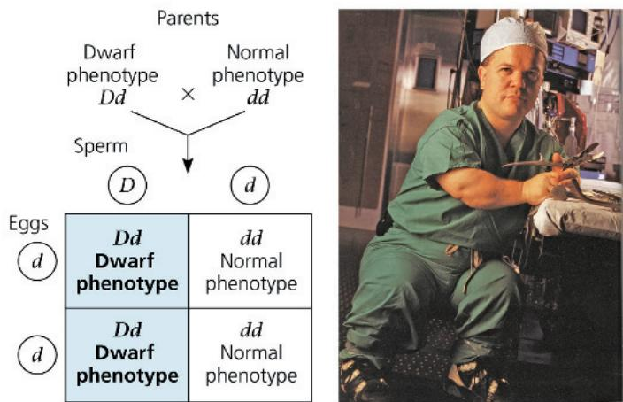

## Dominantly Inherited Disorders

Although many harmful alleles are recessive, some disorders are due to dominant alleles. One example is achondroplasia, a form of dwarfism that occurs in one of every 25,000 people. Heterozygous individuals have the dwarf phenotype (Figure 14.18). Therefore, all people who do not have achondroplasia—99.99% of the population—are homozygous recessive. Like the presence of extra fingers or toes mentioned earlier, achondroplasia is a trait for which the recessive allele is much more prevalent than the corresponding dominant allele.

Unlike the allele that causes achondroplasia, some dominant alleles cause lethal diseases. Those that do are much less common than recessive alleles that have lethal effects. A lethal recessive allele is only lethal when homozygous; it can be passed from one generation to the next by heterozygous carriers because the carriers themselves have normal phenotypes. A lethal dominant allele, however, often causes the death of afflicted individuals before they can mature and reproduce, and in this case the allele is not passed on to future generations.

A lethal dominant allele may be passed on, though, if the lethal disease symptoms first appear after reproductive age. In these cases, the individual may already have transmitted the allele to his or her children. For example, a degenerative disease of the nervous system, called Huntington's disease, is caused by a lethal dominant allele that has no obvious phenotypic effect until the individual is about 35 to 45 years old. Once the deterioration of the nervous system begins, it is irreversible and inevitably fatal. As with other dominant traits, a child born to a parent with the Huntington's disease allele has a $50\%$ chance of inheriting the allele and the disorder (see the Punnett square in Figure 14.18). In the United States, this disease affects about one in 10,000 people.

At one time, the onset of symptoms was the only way to know if a person had inherited the Huntington's allele, but this is no longer the case. By analyzing DNA samples from a large family with a high incidence of the disorder, geneticists tracked the Huntington's allele to a locus near the tip of chromosome 4, and the gene was sequenced in 1993. This information led to the development of a test that could detect the presence of the Huntington's allele in an individual's genome. (The methods that make such tests possible are discussed in Concepts 20.1 and 20.4.) The availability of this test poses an agonizing dilemma for those with a family history of Huntington's disease. Some individuals may want to be tested for this disease, whereas others may decide it would be too stressful to find out.

## Interview

Interview with Nancy Wexler: Mapping the gene that causes Huntington's disease (eTextbook only)

## Multifactorial Disorders

The hereditary diseases we have discussed so far are sometimes described as simple Mendelian disorders because they result from abnormality of one or both alleles at a single genetic locus. Many more people are susceptible to diseases that have a multifactorial basis—a genetic component plus a significant environmental influence. Heart disease, diabetes, cancer, alcoholism, certain mental illnesses such as schizophrenia and bipolar disorder, and many other diseases are multifactorial. In these cases, the hereditary component is polygenic. For example, many genes affect cardiovascular health, making some of us more prone than others to heart attacks and strokes. No matter what our genotype, however, our lifestyle has a tremendous effect on phenotype for cardiovascular health and other multifactorial characters. Exercise, a healthful diet, abstinence from smoking, and an ability to handle stressful situations all reduce our risk of heart disease and some types of cancer.

## Genetic Testing and Counseling

Avoiding simple Mendelian disorders is possible when the risk of a particular genetic disorder can be assessed before a child is conceived or during the early stages of the pregnancy. Many hospitals have genetic counselors who can provide information to prospective parents concerned about a family history for a specific disease. Fetal and newborn testing can also reveal genetic disorders.

## Counseling Based on Mendelian Genetics and Probability Rules

Consider the case of a hypothetical couple, Tyler and Amara. Each had a brother who died from the same recessively inherited lethal disease. Before conceiving their first child, Tyler and Amara seek genetic counseling to determine the risk of having a child with the disease. From the information about their brothers, we know that both parents of Tyler and both parents of Amara must have been carriers of the recessive allele. Thus, Tyler and Amara are both products of $Aa \times Aa$ crosses, where a symbolizes the allele that causes this particular disease. We also know that Tyler and Amara are not homozygous recessive (aa) because they do not have the disease. Therefore, their genotypes are either AA or Aa.

Given a genotypic ratio of 1 AA:2 Aa:1 aa for offspring of an $Aa \times Aa$ cross, Tyler and Amara each have a $\frac{2}{3}$ chance of being carriers (Aa). According to the rule of multiplication, the overall probability of their firstborn having the disorder is $\frac{2}{3}$ (the chance that Tyler is a carrier) times $\frac{2}{3}$ (the chance that Amara is a carrier) times $\frac{1}{4}$ (the chance of two carriers having a child with the disease), which equals $\frac{1}{9}$ . Suppose that Amara and Tyler decide to have a child—after all, there is an $\frac{8}{9}$ chance that their baby will not have the disorder. If, despite these odds, their child is born with the disease, then we would know that both Tyler and Amara are, in fact, carriers (Aa genotype). If both Tyler and Amara are carriers, there is a $\frac{1}{4}$ chance that any subsequent child this couple has will have the disease. The probability is higher for subsequent children because the diagnosis of the disease in the first child established that both parents are carriers, not because the genotype of the first child affects in any way that of future children.

When we use Mendel's laws to predict possible outcomes of matings, it is important to remember that each child represents an independent event in the sense that its genotype is unaffected by the genotypes of older siblings. Suppose that Tyler and Amara have three more children, and all three have the hypothetical hereditary disease. There is only one chance in $64(\frac{1}{4} \times \frac{1}{4} \times \frac{1}{4})$ that such an outcome will occur. Despite these circumstances, the chance that a fourth child of this couple will have the disease remains $\frac{1}{4}$ .

## Tests for Identifying Carriers

Most children with recessive disorders are born to parents with normal phenotypes. The key to accurately assessing the genetic risk for a particular disease is therefore to find out whether the prospective parents are heterozygous carriers of the recessive allele. Tests are available that can distinguish individuals of normal phenotype who are dominant homozygotes from those who are heterozygous carriers, using blood or cells from the inside of the cheek. Hundreds of different recessive alleles can be detected, including those for Tay-Sachs disease, sickle-cell disease, and cystic fibrosis.

These tests for identifying carriers enable people with family histories of genetic disorders to make informed decisions about having children, including whether to do genetic testing of the fetus, should they decide to become pregnant. The results can also lead carriers to alert family members that they may also be carriers and might choose to be tested. The tests raise other issues as well: Could carriers be denied health or life insurance or lose the jobs providing those benefits, even though they themselves are healthy? The Genetic Information Nondiscrimination Act, in place since 2008, allays these concerns by prohibiting discrimination in employment or health insurance coverage based on genetic test results. This is an important act that protects patients' rights but is unknown to many, including physicians. Genetic counselors, trained in a growing number of professional programs, can help individuals understand their genetic test results. Once test results are clearly understood, those with certain results may face difficult decisions. Advances in biotechnology offer the potential to reduce human suffering, but along with them come ethical issues that require conscientious deliberation.

## Fetal Testing

Two types of testing can be done to look for genetic disorders in the fetus: screening tests and diagnostic tests. Screening tests are generally noninvasive and can be followed by diagnostic tests if screening results suggest that a genetic disorder might be present or if there are other risks, as when both parents are carriers.

Screening tests include imaging and blood tests. Imaging techniques allow a physician to examine a fetus directly for major anatomical abnormalities that might not show up in genetic tests.

In the ultrasound technique, for example, reflected sound waves are used to produce an image of the fetus by a simple noninvasive procedure. An ultrasound is often accompanied by a blood test that looks for fetal proteins that might signal a genetic disorder.

Medical scientists have also developed methods for isolating and analyzing fetal DNA that has escaped into the maternal blood (cell-free fetal DNA), using various techniques. Cell-free fetal DNA tests and other blood tests are increasingly being used as noninvasive prenatal screening tests for certain chromosomal defects and disorders; a positive result indicates to the parents that further diagnostic testing should be considered.

One diagnostic test that can determine whether the developing fetus has a serious recessive disease is amniocentesis, which can be performed starting at the 15th or 16th week of pregnancy (Figure 14.19a). In this procedure, a physician inserts a needle into the uterus and extracts about 10 mL of amniotic fluid, the liquid that bathes the fetus. Some genetic disorders can be detected from the presence of certain proteins or hormones in the amniotic fluid itself. Tests for thousands of other disorders (such as cystic fibrosis) are performed on DNA from fetal cells sloughed off into the amniotic fluid using targeted DNA sequencing or a technique called a DNA microarray (see Figure 20.13) that tests for many alleles at the same time. A karyotype of these cultured cells can also confirm certain chromosomal defects that may not have been suggested by cell-free fetal DNA tests.

In an alternative diagnostic technique that is called chorionic villus sampling (CVS), a physician inserts a narrow tube through the cervix into the uterus and suctions out a tiny sample of tissue from the placenta, the organ that transmits nutrients

and fetal wastes between the fetus and the female parent (Figure 14.19b). The cells of the chorionic villi of the placenta—the portion sampled—are derived from the fetus and have the same genotype and DNA sequence as the new individual. DNA from these cells can be analyzed for the presence of many genetic disorders. The main advantage of CVS is that it can be performed as early as the 10th or 11th week of pregnancy.

Ultrasound and isolation of fetal cells or DNA from maternal blood pose no known risk to either the female parent or the fetus, while amniocentesis and CVS can cause complications in a small percentage of cases (for both, between 1 in 1,000 and 1 in 500 cases). Amniocentesis or CVS for diagnostic testing is generally offered to females over age 35, due to their increased risk of bearing a child with Down syndrome or other chromosomal disorders, and may also be offered to younger females if there are risk factors or conditions suggested by family history. If the fetal tests reveal a serious disorder, the parents may face the difficult choice of either terminating the pregnancy or preparing to care for a child with a genetic disorder, one that might even be fatal. Parental and fetal screening for Tay-Sachs alleles done since 1980 has reduced the number of children born with this incurable disease by 90%.

## Newborn Screening

Some genetic diseases and disorders can be detected at birth by simple biochemical tests that are routinely performed on blood from the baby's heel in most hospitals in the United States. One common screening program is for phenylketonuria (PKU), a recessively inherited disorder that occurs in about one out of every

Figure 14.19 Diagnostic fetal testing for genetic disorders.

Most testing for genetic abnormalities is now DNA-based. In some cases biochemical tests are used to detect particular disorders, and karyotyping may be done to see whether the chromosomes of the fetus are normal in number and appearance.

10,000–15,000 births in the United States. Children with this disease cannot properly metabolize the amino acid phenylalanine. This compound and its by-product, phenylpyruvate, can accumulate to toxic levels in the blood, causing severe intellectual disability. However, if PKU is detected in the newborn, a specialized diet low in phenylalanine will usually allow for typical development. (Among many other substances, this diet excludes the artificial sweetener aspartame, which contains phenylalanine.)

The number of newborn genetic tests, many for metabolic disorders or enzyme deficiencies, is over 100 and ever-increasing; each state regulates which tests are used. If screening identifies a baby with a disease or disorder for which treatment can be started early on, that individual has improved chances for better life quality. Some diseases, like PKU, are treated by dietary changes and others by replacement of missing enzymes. Unfortunately, there are quite a few diseases for which no treatment is yet known.

Fetal and newborn screening for serious inherited diseases, tests for identifying carriers, and genetic counseling all rely on the Mendelian model of inheritance. We owe the “gene idea”—the concept of heritable factors transmitted according to simple rules of chance—to the elegant quantitative experiments of Gregor Mendel. The importance of his discoveries was overlooked by most biologists until the early 1900s, decades after he reported his findings. In the next chapter, you will learn how Mendel’s laws have their physical basis in the behavior of chromosomes during

sexual life cycles and how the synthesis of Mendelian genetics and a chromosome theory of inheritance catalyzed progress in genetics.

## Concept Check 14.4

1. Lucia and Jared each have a sibling with cystic fibrosis, but neither Lucia nor Jared nor any of their parents have the disease. Calculate the probability that if this couple has a child, the child will have cystic fibrosis. What would be the probability if a test revealed that Jared is a carrier but Lucia is not? Explain your answers.

2. MAKE CONNECTIONS Explain how the change of a single amino acid in hemoglobin leads to the aggregation of hemoglobin into long fibers. (Review Figures 5.14, 5.18, and 5.19.)

3. Juanita was born with six toes on each foot, a dominant trait called polydactyly. Two of her five siblings and her mother, but not her father, also have extra digits. What is Juanita's genotype for the number-of-digits character? Explain your answer. Use $D$ and $d$ to symbolize the alleles for this character.

4. MAKE CONNECTIONS In Table 14.1, note the phenotypic ratio of the dominant to recessive trait in the $F_{2}$ generation for the monohybrid cross involving flower color. Then determine the phenotypic ratio for the offspring of the second-generation couple in Figure 14.15b. What accounts for the difference in the two ratios? For suggested answers, see Appendix A.

## Chapter 14 Review

## Summary of Key Concepts

To review key terms, go to the Vocabulary Self-Quiz (eTextbook only).

## Concept 14.1: Mendel used the scientific approach to identify two laws of inheritance

\- Gregor Mendel formulated a theory of inheritance based on experiments with garden peas, proposing that parents pass on to their offspring discrete genes that retain their identity through generations. This theory includes two “laws.”

\- The law of segregation states that genes have alternative forms, or alleles. In a diploid organism, the two alleles of a gene segregate (separate) during meiosis and gamete formation; each sperm or egg carries only one allele of each pair. This law explains the 3:1 ratio of $F_{2}$ phenotypes observed when monohybrids cross-or self-pollinate. Each organism inherits one allele for each gene from each parent. In heterozygotes, the two alleles are different: Expression of the dominant allele masks the phenotypic effect of the recessive allele. Homozygotes have identical alleles of a given gene and are therefore true-breeding.

\- The law of independent assortment states that the pair of alleles for a given gene segregates into gametes independently of the pair of alleles for any other gene. In a cross between dihybrids (individuals heterozygous for two genes), the offspring have four phenotypes in a 9:3:3:1 ratio.

When Mendel did crosses of true-breeding purple- and white-flowered pea plants, the white-flowered trait disappeared from the $F_{1}$ generation but reappeared in the $F_{2}$ generation. Use genetic terms to explain why that happened.

## Concept 14.2: Probability laws govern Mendelian inheritance

\- The multiplication rule states that the probability of two or more events occurring together (a statement using and) is equal to the product of the individual probabilities of the independent single events. The addition rule states that the probability of an event that can occur in two or more independent, mutually exclusive ways (using or) is the sum of the individual probabilities.

\- The rules of probability can be used to solve complex genetics problems. A dihybrid or other multicharacter cross is equivalent to two or more independent monohybrid crosses occurring simultaneously. In calculating the chances of the various offspring genotypes from such crosses, each character is first considered separately and then the individual probabilities are multiplied.

DRAW IT Redraw the Punnett square on the right side of Figure 14.8 as two smaller monohybrid Punnett squares, one for each gene. Below each square, list the fractions of each phenotype produced. Use the rule of multiplication to compute the overall fraction of each of the possible dihybrid phenotypes. What is the phenotypic ratio?

## Concept 14.3: Inheritance patterns are often more complex than predicted by simple Mendelian genetics

• Extensions of Mendelian genetics for a single gene:

<table><tr><td>Relationship among alleles of a single gene</td><td>Description</td><td>Example</td></tr><tr><td>Complete dominance of one allele</td><td>Heterozygous phenotype same as that of homo- zygous dominant</td><td>PP Pp</td></tr><tr><td>Incomplete dominance of either allele</td><td>Heterozygous phenotype intermediate between the two homozygous phenotypes</td><td></td></tr><tr><td>Codominance</td><td>Both phenotypes expressed in heterozygotes</td><td></td></tr><tr><td>Multiple alleles</td><td>In the population, some genes have more than two alleles</td><td>ABO blood group alleles  ${I}^{A},{I}^{B},i$ </td></tr><tr><td>Pleiotropy</td><td>One gene affects multiple phenotypic characters</td><td>Sickle-cell disease</td></tr></table>

• Extensions of Mendelian genetics for two or more genes:

<table><tr><td>Relationship among two or more genes</td><td>Description</td><td>Example</td></tr><tr><td>Epistasis</td><td>The phenotypic expression of one gene affects the expression of another gene</td><td></td></tr><tr><td>Polygenic inheritance</td><td>A single phenotypic character is affected by two or more genes</td><td></td></tr></table>

\- The expression of a genotype can be affected by environmental influences, resulting in a range of phenotypes. Polygenic characters that are also influenced by the environment are called multifactorial characters.

\- An organism's overall phenotype reflects its overall genotype and unique environmental history. Even in more complex inheritance patterns, Mendel's fundamental laws still apply.

Which genetic relationships listed in the first column of the two tables above are demonstrated by the inheritance pattern of the ABO blood group alleles? For each genetic relationship, explain why this inheritance pattern is or is not an example.

## Concept 14.4: Many human traits follow Mendelian patterns of inheritance

\- Analysis of family pedigrees can be used to deduce the possible genotypes of individuals and make predictions about future offspring. Such predictions are statistical probabilities rather than certainties.

  
Widow's peak  
No widow's peak

\- Many genetic disorders are inherited as simple recessive traits. Most affected (homozygous recessive) individuals are children of phenotypically normal, heterozygous carriers.

\- The sickle-cell allele has probably persisted for evolutionary reasons: Homozygotes have sickle-cell disease, but heterozygotes have an advantage because one copy of the sickle-cell allele reduces both the frequency and severity of malaria attacks.

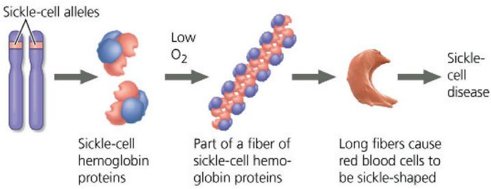

\- Lethal dominant alleles are eliminated from the population if affected people die before reproducing. Nonlethal dominant alleles and lethal ones that strike relatively late in life can be inherited in a Mendelian way.

\- Many human diseases are multifactorial—that is, they have both genetic and environmental components and do not follow simple Mendelian inheritance patterns.

\- Using family histories, genetic counselors help couples determine the probability that their children will have genetic disorders. Genetic testing of prospective parents can reveal whether they are carriers of recessive alleles associated with specific disorders. Ultrasounds and blood tests can screen for certain disorders in a fetus. Amniocentesis and chorionic villus sampling can diagnose whether a suspected genetic disorder is present in a fetus. Other genetic tests can be performed after birth.

Both members of a couple know that they are carriers of the cystic fibrosis allele. None of their three children have cystic fibrosis, but any one of them might be a carrier. The couple would like to have a fourth child but are worried that he or she would very likely have the disease, since the first three do not. What would you tell the couple? Would it remove some uncertainty from their prediction if they could find out whether the three children are carriers?

For suggested answers, see Appendix A.

## Tips for Genetics Problems

1. Write down symbols for the alleles. (These may be given in the problem.) When represented by single letters, the dominant allele is uppercase and the recessive is lowercase.

2. Write down the possible genotypes, as determined by the phenotype.

(a) If the phenotype is that of the dominant trait (for example, purple flowers), then the genotype is either homozygous dominant or heterozygous (PP or Pp in this example).

(b) If the phenotype is that of the recessive trait, the genotype must be homozygous recessive (for example, pp).

(c) If the problem says "true-breeding," the genotype is homozygous.

3. Determine what the problem is asking for. If asked to do a cross, write it out in the form [genotype] × [genotype], using the alleles you've decided on.

4. To figure out the outcome of a cross, set up a Punnett square.

(a) Put the gametes of one parent at the top and those of the other on the left. To determine the allele(s) in each gamete for a given genotype, set up a systematic way to list all the possibilities. (Remember, each gamete has one allele of each gene.) Note that there are $2^{n}$ possible types of gametes, where $n$ is the number of gene loci that are heterozygous. For example, an individual with genotype $AaBbCc$ would produce $2^{3} = 8$ types of gametes. Write the genotypes of the gametes in circles above the columns and to the left of the rows.

(b) Fill in the Punnett square as if each possible sperm were fertilizing each possible egg, making all of the possible offspring. In a cross of $AaBbCc \times AaBbCc$ , for example, the Punnett square would have 8 columns and 8 rows, so there are 64 different offspring; you would know the genotype of each and thus the phenotype. Count genotypes and phenotypes to obtain the genotypic and phenotypic ratios. Because the Punnett square is so large, this method is not the most efficient. See tip 5.

5. You can use the rules of probability if a Punnett square would be too big. (For example, see the question at the end of the summary for Concept 14.2 and question 6 below.) You can consider each gene separately (see the section Solving Complex Genetics Problems with the Rules of Probability in Concept 14.2).

6. If the problem gives you the phenotypic ratios of offspring but not the genotypes of the parents in a given cross, the phenotypes can help you deduce the parents' unknown genotypes.

(a) For example, if $\frac{1}{2}$ of the offspring have the recessive phenotype and $\frac{1}{2}$ the dominant, you know that the cross was between a heterozygote and a homozygous recessive.

(b) If the ratio is 3:1, the cross was between two heterozygotes.

(c) If two genes are involved and you see a 9:3:3:1 ratio in the offspring, you know that each parent is heterozygous for both genes. Caution: Don't assume that the reported numbers will exactly equal the predicted ratios. For example, if there are 13 offspring with the dominant trait and 11 with the recessive, assume that the ratio is one dominant to one recessive.

7. For pedigree problems, use the tips in Figure 14.15 and below to determine what kind of trait is involved.

(a) If parents without the trait have offspring with the trait, the trait must be recessive and the parents both carriers.

(b) If the trait is seen in every generation, it is most likely dominant (see the next possibility, though).

(c) If both parents have the trait, then in order for it to be recessive, all offspring must show the trait.

(d) To determine the likely genotype of a certain individual in a pedigree, first label the genotypes of all the family members you can. Even if some of the genotypes are incomplete, label what you do know. For example, if an individual has the dominant phenotype, the genotype must be $AA$ or $Aa$ ; you can write this as $A-$ . Try different possibilities to see which fits the results. Use the rules of probability to calculate the probability of each possible genotype being the correct one.

## Test Your Understanding

For multiple-choice questions, go to the Practice Test (eTextbook only).

## Levels 1-2: Remembering/Understanding

1. DRAW IT A pea plant heterozygous for inflated pods (li) is crossed with a plant homozygous for constricted pods (ii). Draw a Punnett square for this cross to predict genotypic and phenotypic ratios. Assume that pollen comes from the ii plant.

2. A man with type A blood marries a woman with type B blood. Their child has type O blood. What are the genotypes of these three individuals? What genotypes, and in what frequencies, would you expect in future offspring from this couple?

3. A man who has six fingers on each hand and six toes on each foot and a woman who has the typical number of digits have a daughter who also has the typical number of digits. Remember that extra digits is a dominant trait. What fraction of this couple's children would be expected to have extra digits?

4. DRAW IT Two pea plants heterozygous for the characters of pod color and pod shape are crossed. (See Table 14.1.) Draw a Punnett square to determine the phenotypic ratios of the offspring.

## Levels 3-4: Applying/Analyzing

5. Hemochromatosis is an inherited disease caused by a recessive allele. If both members of a couple are carriers and they have three children, what is the probability of each of the following?

(A) All three children are of normal phenotype.

(B) One or more of the three children have the disease.

(C) All three children have the disease.

(D) At least one child is phenotypically normal.

(Note: It will help to remember that the probabilities of all possible outcomes always add up to 1.)

6. The genotype of $F_{1}$ individuals in a tetrahybrid cross is AaBbCcDd. Assuming independent assortment of these four genes, what are the probabilities that $F_{2}$ offspring will have the following genotypes?

(A) aabbccdd

(B) AaBbCcDd

(C) AABBCCDD

(D) AaBBccDd

(E) AaBBCCdd

7. What is the probability that each of the following pairs of parents will produce the indicated offspring? (Assume independent assortment of all gene pairs.)

(A) AABBCC × aabbcc → AaBbCc

(B) AABbCc × AaBbCc → AAbbCC

(C) $AaBbCc \times AaBbCc \rightarrow AaBbCc$

(D) $aaBbCC \times AABbcc \rightarrow AaBbCc$

8. Keisha and Jerome each have a sibling with sickle-cell disease. Neither Keisha nor Jerome nor any of their parents have the disease, and none of them have ever been tested to see if they carry the sickle-cell allele. Based on this incomplete information, calculate the probability that if Keisha and Jerome have a child, the child will have sickle-cell disease.

9. In 1981, a stray black cat with unusual rounded, curled-back ears was adopted by a family in California. Thousands of descendants of the cat have since been born, and cat fanciers have developed the curl cat into a show breed. Suppose you owned the first curl

cat and wanted to develop a true-breeding variety. How would you determine whether the curl allele is dominant or recessive? How would you obtain true-breeding curl cats? How could you be sure they are true-breeding?

10. The pedigree below traces the inheritance of alkaptonuria, a biochemical disorder. Affected individuals, indicated here by the colored circles and squares, are unable to metabolize a substance called alkapton, which colors the urine and stains body tissues. Does alkaptonuria appear to be caused by a dominant allele or by a recessive allele? Fill in the genotypes of the individuals whose genotypes can be deduced. What genotypes are possible for each of the other individuals?

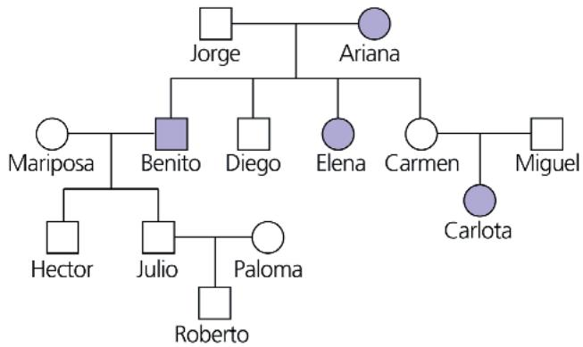

11. Imagine that you are a genetic counselor, and a couple planning to start a family comes to you for information. From a previous marriage, Charles has a child with cystic fibrosis. Charles is currently married to Elaine, whose brother died of cystic fibrosis. What is the probability that Charles and Elaine will have a baby with cystic fibrosis? (Neither Charles, Elaine, nor their parents have cystic fibrosis.)

## Levels 5-6: Evaluating/Creating

12. EVOLUTION CONNECTION Over the past half century, there has been a trend in the United States and other developed countries for people to have children later in life than did their parents and grandparents. What effects might this trend have on the incidence (frequency) of late-acting dominant lethal alleles in the population?

13. SCIENTIFIC INQUIRY You are handed a mystery pea plant with tall stems and axial flowers and asked to determine its genotype as quickly as possible. You know that the allele for tall stems (T) is dominant to that for dwarf stems (t) and that the allele for axial flowers (A) is dominant to that for terminal flowers (a).

(a) Identify all the possible genotypes for your mystery plant.

(b) Describe the one cross you would do in your garden to determine the exact genotype of your mystery plant.

(c) While waiting for the results of your cross, you predict the results for each possible genotype listed in part a. Explain how you do this and why this is not called “performing a cross.”

(d) Explain how the results of your cross and your predictions will help you learn the genotype of your mystery plant.

14. WRITE ABOUT A THEME: INFORMATION The continuity of life is based on heritable information in the form of DNA. In a short essay (100–150 words), explain how the passage of genes from parents to offspring, in the form of particular alleles, ensures perpetuation of parental traits in offspring and, at the same time, genetic variation among offspring. Use genetic terms in your explanation.

## 15. SYNTHESIZE YOUR KNOWLEDGE

  
Just for fun, imagine that “shirt-striping” is a phenotypic character caused by a single gene. Construct a genetic explanation for the appearance of the family in the above photograph, consistent with their “shirt phenotypes.” Include in your answer the presumed allele combinations for “shirt-striping” in each family member. Identify the inheritance pattern shown by the child.

## Practice Applying Your Learning

16. This question assesses your ability to apply your understanding of Mendelian inheritance patterns.

The zebrafish (Danio rerio) is a popular model organism. Zebrafish produce large numbers of young that reach adulthood quickly, and their transparent embryos make it easy for researchers to study their development. Typically, these fish are darkly pigmented (colored) and striped. Zebrafish that are homozygous for the gol (golden) mutation in a gene involved in skin color are lighter in color (and also smaller) than the typical darkly pigmented fish. Zebrafish that are homozygous for the leo (leopard) mutation in a gene involved in patterning have a spotted skin pattern rather than the typical striped skin pattern.

Suppose two darkly pigmented, striped fish produced offspring that are all dark and striped. These offspring are then allowed to breed, producing 1,000 fish that have a variety of striped and spotted phenotypes as well as both dark and light pigmented skin. Assume that these genes follow Mendelian inheritance patterns. Use this information and your knowledge about Mendelian genetics to evaluate each statement as more likely to be TRUE or more likely to be FALSE.

a. The generation of 1,000 fish produced in this example is called the $F_{1}$ generation.

b. Having spotted skin is likely a recessive trait. \_\_\_\_

c. Having golden skin is likely a dominant trait.

d. We would expect about 750 of the 1,000 offspring to be striped.

e. We would expect about 60 of the 1,000 offspring to be golden and spotted. \_\_\_\_

f. We would expect about 180 of the 1,000 offspring to be dark and striped. \_\_\_\_

g. We would expect about 250 of the 1,000 offspring to be dark and spotted. \_\_\_\_

For selected answers, see Appendix A.

# Explore Scientific Papers with Science in the Classroom | AAAS

What genes affect skin color? Go to "A Golden Fish

Reveals Pigmentation Loss in Europeans" at

www.scienceintheclassroom.org.

Instructors: Questions can be assigned in Mastering Biology.

Pair of homologous chromosomes (one from each parent)

# The Chromosomal Basis of Inheritance

## Key Concepts

15.1 Mendelian inheritance has its physical basis in the behavior of chromosomes

15.2 Sex-linked genes exhibit unique patterns of inheritance

15.3 Linked genes tend to be inherited together because they are located near each other on the same chromosome

15.4 Alterations of chromosome number or structure cause some genetic disorders

15.5 Some inheritance patterns are exceptions to standard Mendelian inheritance

  
Figure 15.1 The yellow dots mark the locations of a specific gene, tagged with a fluorescent yellow dye, on a pair of homologous chromosomes. The chromosomes have duplicated, so each chromosome has two sister chromatids, each with a copy of the gene. This provides a visual demonstration that genes—Mendel's “factors”—are segments of DNA located along chromosomes.

## Study Tip

Draw chromosomes: As you work on the figure legend questions in this chapter, draw the chromosomes for the crosses described in the questions. Shown here is a starting sketch for the What If? question that follows Figure 15.3. (Here you are including sex chromosomes to keep track of the offspring.)

  
Genes are located on chromosomes. In diploid cells, chromosomes and genes are present in pairs.  
Chromosomes duplicate before cell division. Each duplicated chromosome has two copies of each allele, one on each sister chromatid.

## What is the relationship between genes and chromosomes?

During meiosis I, homologous chromosomes separate and alleles segregate. In meiosis II, sister chromatids separate.

Genes are passed on as discrete units. Each chromosome has one version of a gene (one allele).

Offspring inherit one allele from each parent.

  
— Homologous chromosomes each have one allele of a given gene at the same locus. The chromosomes in this example have different alleles.

## Concept 15.1: Mendelian inheritance has its physical basis in the behavior of chromosomes

When Gregor Mendel proposed the existence of “hereditary factors” in 1860, no cellular structures had been identified that could house these imaginary units, and most biologists were skeptical. When the processes of mitosis and meiosis were worked out later that century, biologists saw parallels between the behavior of Mendel’s proposed factors (genes) during sexual life cycles and the behavior of chromosomes: As shown in Figure 15.1, chromosomes and genes are both present in pairs in diploid cells, and homologous chromosomes separate and alleles segregate during the process of meiosis. After meiosis, fertilization restores the paired condition for both chromosomes and genes. Around 1902, Walter S. Sutton, Theodor Boveri, and others independently noted these parallels and began to develop the chromosome theory of inheritance. According to this theory, Mendelian genes have specific loci (sites) along chromosomes, and it is the chromosomes that undergo segregation and independent assortment.

The first solid evidence associating a specific gene with a specific chromosome came early in the 1900s from the work of Thomas Hunt Morgan, an experimental embryologist at Columbia University. Although Morgan was initially doubtful about both Mendelian genetics and the chromosome theory, his early experiments provided convincing evidence that chromosomes are indeed the location of Mendel's heritable factors.

## Morgan's Choice of Experimental Organism

Many times in the history of biology, important discoveries have come to those insightful or lucky enough to choose an experimental organism suitable for the research problem being tackled. Mendel chose the garden pea because a number of distinct varieties were available. For his work, Morgan selected a species of fruit fly, Drosophila melanogaster, a common insect that feeds on the fungi growing on fruit. Fruit flies are prolific breeders; a single mating will produce hundreds of offspring, and a new generation can be bred every two weeks. Morgan's laboratory began using this convenient organism for genetic studies in 1907 and soon became known as "the fly room."

Another advantage of the fruit fly is that it has only four pairs of chromosomes, which are easily distinguishable with a light microscope. There are three pairs of autosomes and one pair of sex chromosomes. Female fruit flies have a pair of homologous X chromosomes, and males have one X chromosome and one Y chromosome.

While Mendel could readily obtain different pea varieties from seed suppliers, Morgan was probably the first person to want different varieties of the fruit fly. He faced the tedious task of carrying out many matings and then microscopically inspecting large numbers of offspring in search of naturally occurring variant individuals. After many months of this, he complained, “Two years’ work wasted. I have been breeding those flies for all that time and I’ve got nothing out of it.” Morgan persisted, however, and was

Wild-type Drosophila flies have red eyes (left). Among his flies, Morgan discovered a mutant male with white eyes (right). This variation made it possible for Morgan to trace a gene for eye color to a specific chromosome.

  
Wild type (red eyes)  
Mutant (white eyes)

finally rewarded with the discovery of a single male fly with white eyes instead of the usual red. The phenotype for a character most commonly observed in natural populations, such as red eyes in Drosophila, is called the wild type (Figure 15.2). Traits that are alternatives to the wild type, such as white eyes in Drosophila, are called mutant phenotypes because they are due to alleles assumed to have originated as changes, or mutations, in the wild-type allele.

Morgan and his students invented a notation for symbolizing alleles in Drosophila that is still widely used for fruit flies. For a given character in flies, the gene takes its symbol from the first mutant (non-wild type) discovered. Thus, the allele for white eyes in Drosophila is symbolized by w. A superscript + identifies the allele for the wild-type trait: $w^{+}$ for the allele for red eyes, for example. Over the years, a variety of gene notation systems have been developed for different organisms. For example, human genes are usually written in all capitals, such as HTT for the gene involved in Huntington's disease. (More than one letter may be used for an allele, as in HTT.)

## Correlating Behavior of a Gene's Alleles with Behavior of a Chromosome Pair: Scientific Inquiry

Morgan mated his white-eyed male fly with a red-eyed female. All the $F_{1}$ offspring had red eyes, suggesting that the wild-type allele is dominant. When Morgan bred the $F_{1}$ flies to each other, he observed the classical 3:1 phenotypic ratio among the $F_{2}$ offspring. However, there was a surprising additional result: The white-eye trait showed up only in males. All the $F_{2}$ females had red eyes, while half the males had red eyes and half had white eyes. Therefore, Morgan concluded that somehow a fly's eye color was linked to its sex. (If the eye color gene were unrelated to sex, half of the white-eyed flies would have been female.)

Recall that a female fly has two X chromosomes (XX), while a male fly has an X and a Y (XY). The correlation between the trait of white eye color and the male sex of the affected $F_{2}$ flies suggested to Morgan that the gene involved in his white-eyed mutant was located exclusively on the X chromosome, with no corresponding allele present on the Y chromosome. His reasoning can be followed in Figure 15.3. For a male, a single copy of the mutant allele would confer white eyes; since a male has only one X chromosome, there can be no wild-type allele ( $w^{+}$ ) present to mask the recessive allele. However, a female could have white eyes only if both her X

## Figure 15.3

Inquiry: In a cross between a wild-type female fruit fly and a mutant white-eyed male, what color eyes will the $F_{1}$ and $F_{2}$ offspring have?

Experiment

Thomas Hunt Morgan wanted to analyze the behavior of two alleles of a fruit fly eye color gene. In crosses similar to those done by Mendel with pea plants, Morgan and his colleagues mated a wild-type (red-eyed) female with a mutant white-eyed male.

Morgan then bred an $F_{1}$ red-eyed female to an $F_{1}$ red-eyed male to produce the $F_{2}$ generation.

## Results

The $F_{2}$ generation showed a typical Mendelian ratio of 3 red-eyed flies: 1 white-eyed fly. However, all white-eyed flies were males; no females displayed the white-eye trait.

## Conclusion

All $F_{1}$ offspring had red eyes, so the mutant white-eye trait (w) must be recessive to the wild-type red-eye trait ( $w^{+}$ ). Since the

chromosomes carried the recessive mutant allele (w). This was impossible for the $F_{2}$ females in Morgan's experiment because all the $F_{1}$ males had red eyes, so each $F_{2}$ female received a $w^{+}$ allele on the X chromosome inherited from her male parent.

Morgan's finding of the correlation between a particular trait and an individual's sex provided support for the chromosome theory of inheritance: namely, that a specific gene is carried on a specific chromosome. In this case, an eye color gene is carried on the X chromosome.

Figure 15.4 illustrates the relationship between the chromosome theory of inheritance and Mendel's laws. The separation of homologs during anaphase I accounts for the segregation of the two alleles of a gene into separate gametes, and the random arrangement of chromosome pairs at metaphase I accounts for independent assortment of the alleles for two or more genes located on different homolog pairs. This figure traces the same dihybrid pea cross you learned about in Figure 14.8. By carefully studying Figure 15.4, you can see how the behavior of chromosomes during meiosis in the $\mathrm{F}_1$ generation and subsequent random fertilization give rise to the $\mathrm{F}_2$ phenotypic ratio observed by Mendel.

recessive trait—white eyes—was expressed only in males in the $F_{2}$ generation, Morgan deduced that this eye color gene is located on the X chromosome and that there is no corresponding locus on the Y chromosome.

Data from T. H. Morgan, Sex-limited inheritance in Drosophila, Science 32: 120–122 (1910).

Instructors: A related Experimental Inquiry Tutorial can be assigned in Mastering Biology.

WHAT IF? Suppose this eye color gene were located on an autosome rather than a sex chromosome. Predict the phenotypes (including sex) of the $F_{2}$ flies in this hypothetical cross. (Hint: Draw Punnett squares, including chromosomes, for the $F_{1}$ and $F_{2}$ generations; see the Study Tip at the beginning of this chapter.)

For suggested answer, see Appendix A.

In addition to showing that a specific gene is carried on a specific chromosome, Morgan's work indicated that genes located on a sex chromosome exhibit unique inheritance patterns, which we will discuss in the next section. Recognizing the importance of Morgan's early work, many bright students were attracted to his fly room.

## Concept Check 15.1

1. WHAT IF? Propose a possible reason that the first naturally occurring mutant fruit fly Morgan saw involved a gene on a sex chromosome and was found in a male.

2. Which one of Mendel's laws describes the inheritance of alleles for a single character? Which law relates to the inheritance of alleles for two characters in a dihybrid cross?

3. MAKE CONNECTIONS Review the description of meiosis (see Figure 13.8) and Mendel's laws of segregation and independent assortment (see Concept 14.1). What is the physical basis for each of Mendel's laws?

Figure 15.4 The chromosomal basis of Mendel's laws.

Here we correlate the results of one of Mendel's dihybrid crosses (see Figure 14.8) with the behavior of chromosomes during meiosis (see Figure 13.8). The arrangement of chromosomes at metaphase I of meiosis and their movement during anaphase I account for, respectively, the independent assortment and segregation of the alleles for seed color and shape. Each cell that undergoes meiosis in an $F_1$ plant produces two kinds of gametes. If we count the results for all cells, however, each $F_1$ plant produces equal numbers of all four kinds of gametes because the alternative chromosome arrangements at metaphase I are equally likely.

  
If you crossed an $F_{1}$ plant from this example with a plant that was homozygous recessive for both genes (yyrr), how would the phenotypic ratio of the offspring compare with the 9:3:3:1 ratio seen here?  
For suggested answer, see Appendix A.

# Concept 15.2: Sex-linked genes exhibit unique patterns of inheritance

Morgan's discovery of a trait (white eyes) that correlated with the sex of flies provided important support for the chromosome theory of inheritance. Because the identity of the sex chromosomes in an individual could be inferred by observing the sex of the fly, the behavior of the two members of the pair of sex chromosomes could be correlated with the behavior of the two alleles of the eye color gene. In this section, we'll take a closer look at the role of sex chromosomes in inheritance.

## The Chromosomal Basis of Sex

Although in many species sex has traditionally been described as binary—male or female—we are coming to understand that this classification may be too simplistic. Here, we use the term sex to refer to classification into a group with a shared set of anatomical and physiological traits. In this sense, sex in many species is determined largely by inheritance of sex chromosomes.

Humans and other mammals have two types of sex chromosomes, designated X and Y. The Y chromosome is much smaller than the X chromosome (Figure 15.5). A person who inherits two X chromosomes, one from each parent, usually develops anatomy we associate with the female sex, while male properties are associated with the inheritance of one X chromosome and one Y chromosome (Figure 15.6a). Short

## Figure 15.5 Human sex chromosomes (duplicated).

segments at either end of the Y chromosome are the only regions that are homologous with regions on the X. These homologous regions allow the X and Y chromosomes in males to pair and behave like homologs during meiosis in the testes.

In mammalian testes and ovaries, the two sex chromosomes segregate during meiosis. Each egg receives one X chromosome. In contrast, sperm fall into two categories: Half the sperm cells a male produces receive an X chromosome, and half receive a Y chromosome. We can trace the sex of each offspring to the events of conception: If a sperm cell bearing an X chromosome fertilizes an egg, the zygote is XX, a female; if a sperm cell containing a Y chromosome fertilizes an egg, the zygote is XY, a male (see Figure 15.6a). Thus, in general, sex determination is a matter of chance—a fifty-fifty chance. Note that the mammalian X-Y system isn't the only chromosomal system for determining sex, although some insects do have X-Y systems. (In fact, in 1905, Dr. Nettie Stevens of Bryn Mawr College was the first to show, using mealworms, that inheritance of the Y chromosome resulted in male offspring.) Figure 15.6b–d illustrates three other systems.

In humans, the anatomical signs of sex begin to emerge when the embryo is about 2 months old. Before then, the rudiments of the gonads are generic—they can develop into either testes or

Figure 15.6 Some chromosomal systems of sex determination. Numerals indicate the number of autosomes in the species pictured. In Drosophila, males are XY, but sex depends on the ratio of the number of X chromosomes to the number of autosome sets, not simply on the presence of a Y chromosome. In some species (not shown here), sex is determined not by chromosomes but by environmental factors such as temperature.  

ovaries, depending on whether or not a Y chromosome is present, and depending on what genes are active. A gene on the Y chromosome—called SRY, for sex-determining region of Y—is required for the development of testes. In the absence of SRY, the gonads develop into ovaries, even in an XY embryo.

A gene located on either sex chromosome is called a sex-linked gene. The human X chromosome contains approximately 900 genes, which are called X-linked genes, while genes located on the Y chromosome are called Y-linked genes. The sequence of the human Y chromosome was finally completed in 2023; the researchers reported

Figure 15.7 The transmission of X-linked recessive traits.

In this diagram, red-green color blindness is used as an example. The superscript N represents the dominant allele for normal color vision carried on the X chromosome, while n represents the recessive allele, which has a mutation causing color blindness. White boxes indicate unaffected individuals, light orange boxes indicate carriers, and dark orange boxes indicate color-blind individuals.

  
(a) A male parent with color-blindness will transmit the mutant allele to all female offspring but to no male offspring. When the female parent is a dominant homozygote, the female offspring will have the normal phenotype but will be carriers of the mutation.  
(b) If a female carrier mates with a male who has normal color vision, there is a $50\%$ chance that each female offspring will be a carrier like their female parent and a $50\%$ chance that each male offspring will have the disorder.  
(c) If a female carrier mates with a color-blind male, there is a 50% chance that each child born to them will have the disorder, regardless of sex. Female offspring who have normal color vision will be carriers, whereas males who have normal color vision will be free of the recessive allele.  
If a color-blind female married a male who had normal color vision, what would be the probable phenotypes of their children? For suggested answer, see Appendix A.

identifying roughly 700 genes, of which about 100 coded for proteins (some genes are duplicates and the number of copies varies from person to person). About half of these genes are expressed only in the testis, and some are required for normal testicular functioning and the production of normal sperm. The Y chromosome is passed along virtually intact from a male parent to all his male offspring. Because there are so few Y-linked genes, very few disorders are transferred from male parent to male offspring on the Y chromosome.

The development of female gonads in humans requires a gene called WNT4 (on chromosome 1, an autosome), which encodes a protein that promotes ovary development. An embryo that is XY but has extra copies of the WNT4 gene can develop rudimentary female gonads. Overall, sex is determined by the interactions of a network of gene products like these.

The biochemical, physiological, and anatomical features associated with males and females are turning out to be more complicated than previously thought, with many genes involved in their development. Because of the complexity of this process, many variations exist: Some individuals vary in the number of sex chromosomes in their cells (see Concept 15.4), and others are born with intermediate sexual (intersex) characteristics. Sex determination is an active area of research that will likely yield a more sophisticated understanding in years to come.

## Inheritance of X-Linked Genes

The fact that males and females inherit a different number of X chromosomes leads to a pattern of inheritance different from that produced by genes located on autosomes. While there are very few Y-linked genes, many of which help determine sex, the X chromosomes have numerous genes for characters unrelated to sex. X-linked genes in humans follow the same pattern of inheritance that Morgan observed for the eye color locus he studied in

Drosophila (see Figure 15.3). A male parent passes X-linked alleles to all of his female offspring but to none of his male offspring. In contrast, a female parent can pass X-linked alleles to both male and female offspring, as shown in Figure 15.7 for the inheritance of a mild X-linked disorder, red-green color blindness.

If an X-linked trait is due to a recessive allele, a female will express the phenotype only if she is homozygous for that allele. Because males have only one locus, the terms homozygous and heterozygous lack meaning for describing their X-linked genes; the term hemizygous is used in such cases. Any male receiving the recessive allele from his female parent will express the trait. For this reason, far more males than females have X-linked recessive disorders. However, even though the chance of a female inheriting a double dose of the mutant allele is much less than the probability of a male inheriting a single dose, there are females with X-linked disorders. For instance, color blindness is almost always inherited as an X-linked trait. A color-blind daughter may be born to a color-blind father whose mate is a carrier (see Figure 15.7c). Because the X-linked allele for color blindness is relatively rare, though, the probability that such a male and female will mate is low.

A number of human X-linked disorders are much more serious than color blindness, such as Duchenne muscular dystrophy, which affects about one out of 5,000 males born in the United States. The disease is characterized by a progressive weakening of the muscles and loss of coordination. Affected individuals' life expectancy is into the 20s or 30s. Researchers have traced the disorder to the absence of a key muscle protein called dystrophin and have mapped the gene for this protein to a specific locus on the X chromosome. Research into gene therapy has led to a treatment that was fully approved by the FDA in 2024 for patients 4 years and older. This single-dose treatment involves introduction of an experimentally modified "gene" called microdystrophin that includes important portions of the dystrophin gene.

Figure 15.8 X inactivation and the tortoiseshell cat.

Hemophilia is an X-linked recessive disorder defined by the absence of one or more of the proteins required for blood clotting. When a person with hemophilia is injured, bleeding is prolonged because a firm clot is slow to form. Small cuts in the skin are usually not a problem, but bleeding in the muscles or joints can be painful and can lead to serious damage. In the 1800s, hemophilia was widespread among the royal families of Europe. Queen Victoria of England is known to have passed the allele to several of her descendants. Subsequent intermarriage with royal family members of other nations, such as Spain and Russia, further spread this X-linked trait, and its incidence is well documented in royal pedigrees. A few years ago, new genomic techniques allowed sequencing of DNA from tiny amounts isolated from the buried remains of royal family members. The genetic basis of the mutation, and how it resulted in a nonfunctional blood-clotting factor, is now understood. Since the 1970s, people with hemophilia have been treated with intravenous injections of the protein that is missing (typically a synthetic version in recent decades). More recently, in 2023, a gene therapy treatment was approved that introduces a gene for a clotting protein into patients with one type of severe hemophilia.

## X Inactivation in Female Mammals

Female mammals, including human females, inherit two X chromosomes—twice the number inherited by males—so you may wonder whether females make twice as many of the proteins encoded by X-linked genes as males. In fact, almost all of one X chromosome in each cell in female mammals becomes inactivated during early embryonic development. As a result, the cells of females and males have the same effective dose (one active copy) of most X-linked genes. The inactive X in each cell of a female condenses into a compact object called a Barr body (discovered by Canadian anatomist Murray Barr), which lies along the inside of the nuclear envelope. Most of the genes of the X chromosome that forms the Barr body are not expressed. In the ovaries, however, Barr body chromosomes are reactivated in the cells that give rise to eggs, resulting in every female gamete (egg) having an active X after meiosis.

British geneticist Mary Lyon demonstrated that the selection of which X chromosome will form the Barr body occurs randomly and independently in each embryonic cell present at the time of X inactivation. As a consequence, females consist of a mosaic of two types of cells: those with the active X derived from the male parent and those with the active X derived from the female parent. After an X chromosome is inactivated in a particular cell, all mitotic descendants of that cell have the same inactive X. Thus, if a female is heterozygous for a sex-linked trait, about half of her cells will express one allele, while the others will express the alternate allele. Figure 15.8 shows how this mosaicism results in the patchy coloration of a tortoiseshell cat. In humans, mosaicism can be observed in a recessive X-linked mutation that prevents the development of sweat glands. A female who is heterozygous for this trait has patches of normal skin and patches of skin lacking sweat glands.

Inactivation of an X chromosome involves modification of the DNA and proteins bound to it called histones, including attachment of methyl groups ( $—CH_{3}$ ) to DNA nucleotides. (The regulatory role of DNA methylation is discussed in Concept 18.2.) A particular region of each X chromosome contains several genes involved in the inactivation process. The two regions, one on each

The tortoiseshell gene is on the X chromosome, and the tortoiseshell phenotype requires the presence of two different alleles, one for orange fur and one for black fur. Normally, only females can have both alleles because only they have two X chromosomes. If a female cat is heterozygous for the tortoiseshell gene, she is tortoiseshell. Orange patches are formed by populations of cells in which the X chromosome with the orange allele is active; black patches have cells in which the X chromosome with the black allele is active. (“Calico” cats also have white areas, which are determined by another gene.)

X chromosome, associate briefly with each other in each cell at an early stage of embryonic development. Then, one of the genes, called XIST (for X-inactive specific transcript), becomes active only on the chromosome that will become the Barr body (the inactive X). Multiple copies of the RNA product of this gene apparently attach to the X chromosome on which they are made, eventually almost covering it. Interaction of this RNA with the chromosome initiates X inactivation, and the RNA products of nearby genes help to regulate the process.

## Concept Check 15.2

1. A white-eyed female Drosophila is mated with a red-eyed (wild-type) male, the reciprocal cross of the one shown in Figure 15.3. What phenotypes and genotypes do you predict for the offspring from this cross?

2. Neither Tim nor Shonda has Duchenne muscular dystrophy, but their firstborn son does. What is the probability that a second child will have the disease? What is the probability if the second child is male? Female?

3. MAKE CONNECTIONS Consider what you learned about dominant and recessive alleles in Concept 14.1. If a disorder were caused by a dominant X-linked allele, how would the inheritance pattern differ from what we see for recessive X-linked disorders?

# Concept 15.3: Linked genes tend to be inherited together because they are located near each other on the same chromosome

The number of genes in a cell is far greater than the number of chromosomes; in fact, each chromosome (except the Y) has hundreds or thousands of genes. Genes located near each other on the same chromosome tend to be inherited together in genetic crosses; such genes are said to be genetically linked and are called linked genes. When geneticists follow linked genes in breeding experiments, the results deviate from those expected from Mendel's law of independent assortment.

## How Linkage Affects Inheritance

To see how linkage between genes affects the inheritance of two different characters, let's examine another of Morgan's Drosophila experiments. In this case, the characters are body color and wing size, each with two different phenotypes. Wild-type flies have gray bodies and normal-sized wings. In addition to these flies, Morgan had managed to obtain, through breeding, doubly mutant flies with black bodies and wings much smaller than normal, called vestigial wings. The mutant alleles are recessive to the wild-type alleles, and neither gene is on a sex chromosome. In his investigation of these two genes, Morgan carried out the crosses shown in Figure 15.9. The first was a P generation cross to generate $\mathrm{F}_1$ dihybrid flies, and the second was essentially a testcross.

The resulting flies had a much higher proportion of the combinations of traits seen in the P generation flies (called parental phenotypes) than would be expected if the two genes assorted independently. Morgan thus concluded that body color and wing size are usually inherited together in specific (parental) combinations because the genes are linked; they are near each other on the same chromosome:

As you proceed, be sure to keep in mind the distinction between the terms linked genes (two or more genes on the same chromosome that tend to be inherited together) and sex-linked gene (a single gene on a sex chromosome).

As Figure 15.9 shows, both of the combinations of traits not seen in the P generation (called nonparental phenotypes) were also produced in Morgan's experiments, suggesting that the body color and wing size alleles are not always linked genetically. To understand this conclusion, we need to further explore genetic recombination, the production of offspring with combinations of traits that differ from those found in either P generation parent.

## Genetic Recombination and Linkage

Meiosis and random fertilization generate genetic variation among offspring of sexually reproducing organisms due to independent assortment of chromosomes, crossing over in meiosis I, and the possibility of any sperm fertilizing any egg (see Concept 13.4). Here we'll examine the chromosomal basis of recombination of alleles in relation to the genetic findings of Mendel and Morgan.

## Recombination of Unlinked Genes: Independent Assortment of Chromosomes

Mendel learned from crosses in which he followed two characters that some offspring have combinations of traits that do not match those of either parent. For example, consider a cross of a dihybrid pea plant with yellow round seeds, heterozygous for both seed color and seed shape (YyRr), with a plant homozygous for both recessive alleles (with green wrinkled seeds, yyrr). (This cross acts as a testcross because the results will reveal the genotype not only of the dihybrid YyRr plant, which we know, but of the gametes made in that plant.) Let's represent the cross by the following Punnett square:

Notice in this Punnett square that one-half of the offspring are expected to inherit a phenotype that matches either of the phenotypes of the P (parental) generation originally crossed to produce the $F_{1}$ dihybrid (see Figure 15.2). These matching offspring are called parental types (short for phenotypes). But two nonparental phenotypes are also found among the offspring. Because these offspring have new combinations of seed shape and color, they are called recombinant types, or recombinants for short. When 50% of all offspring are recombinants, as in this example, geneticists say that there is a 50% frequency of recombination. The predicted phenotypic ratios among the offspring are similar to what Mendel actually found in his YrRr × yyrr crosses.

A 50% frequency of recombination in such testcrosses is observed for any two genes that are located on different chromosomes and thus cannot be linked. The physical basis of recombination between unlinked genes is the random orientation

## Figure 15.9

# Inquiry: How does linkage between two genes affect inheritance of characters? Experiment and Results

Morgan wanted to know whether the genes for body color and wing size are genetically linked and, if so, how this affects their

Morgan mated true-breeding P (parental) generation flies—wild-type flies with black, vestigial-winged flies—to produce heterozygous $F_{1}$ dihybrids ( $b^{+}b\quad vg^{+}vg$ ), all of which are wild-type in appearance.

He then mated wild-type $F_{1}$ dihybrid females with homozygous recessive males. This testcross will reveal the genotype of the eggs made by the dihybrid female.

The male's sperm contributes only recessive alleles, so the phenotype of the offspring reflects the genotype of the female's eggs.

Note: Although only females (with pointed abdomens) are shown, half the offspring in each class would be males (with rounded abdomens).

inheritance. The alleles for body color are $b^{+}$ (gray) and b (black), and those for wing size are $vg^{+}$ (normal) and vg (vestigial).

<table><tr><td rowspan="2">Predicted ratios of testcross offspring</td><td>if genes are located on different chromosomes:</td><td>1</td><td>:</td><td>1</td><td>:</td><td>1</td><td>:</td><td>1</td></tr><tr><td>if genes are located on the same chromosome and parental alleles are always inherited together:</td><td>1</td><td>:</td><td>1</td><td>:</td><td>0</td><td>:</td><td>0</td></tr><tr><td></td><td>Data from Morgan&#x27;s experiment:</td><td>965</td><td>:</td><td>944</td><td>:</td><td>206</td><td>:</td><td>185</td></tr></table>

## Conclusion

Since most offspring had a parental (P generation) phenotype, Morgan concluded that the genes for body color and wing size are genetically linked on the same chromosome. However, the production of a relatively small number of offspring with nonparental phenotypes indicated that some mechanism occasionally breaks the linkage between specific alleles of genes on the same chromosome.

of homologous chromosomes at metaphase I of meiosis, which leads to the independent assortment of the two unlinked genes (see Figure 13.11 and the question in the Figure 15.4 legend).

## Recombination of Linked Genes: Crossing Over

Now, let's explain the results of the Drosophila testcross in Figure 15.9. Recall that most (83%) of the offspring from the testcross for body color and wing size had parental phenotypes. That

Data from T. H. Morgan and C. J. Lynch, The linkage of two factors in Drosophila that are not sex-linked, Biological Bulletin 23:174–182 (1912).

WHAT IF? If the parental (P generation) flies had been true-breeding for gray body with vestigial wings and black body with normal wings, which phenotypic class(es) would be largest among the testcross offspring?

For suggested answer, see Appendix A.

suggested that the two genes were on the same chromosome, since the occurrence of parental types with a frequency greater than 50% indicates that the genes are linked. About 17% of offspring, however, were recombinants.

Seeing these results, Morgan proposed that some process must occasionally break the physical connection between specific alleles of genes on the same chromosome. Later experiments showed that this process, now called crossing over, accounts for the recombination of linked genes. In crossing over, which occurs while replicated homologous chromosomes are paired during

prophase of meiosis I, a set of proteins breaks the DNA molecules of one maternal and one paternal chromatid and rejoins each to the other (see Figure 13.9). In effect, when a single crossover occurs, end portions of two nonsister chromatids trade places.

Figure 15.10 shows how crossing over in a dihybrid female fly resulted in recombinant eggs and ultimately recombinant offspring in Morgan's testcross. Most eggs had a chromosome with either the $b^{+}vg^{+}$ or $bvg$ parental genotype, but some eggs

Figure 15.10 $^{9}$ Chromosomal basis for recombination of linked genes.

In these diagrams re-creating the testcross in Figure 15.9, we track chromosomes as well as genes. The maternal chromosomes (those present in the wild-type F $_{1}$ dihybrid) are color-coded red and pink to distinguish one homolog from the other before any meiotic crossing over has occurred. Because crossing over between the b $^{+}$ /b and vg $^{+}$ /vg loci occurs in some, but not most, egg-producing cells, more eggs with parental-type chromosomes than with recombinant ones are produced in the mating females. Fertilization of the eggs by sperm of genotype b vg gives rise to some recombinant offspring. The recombination frequency is the percentage of recombinant flies in the total pool of offspring.

DRAW IT Suppose, as in the question at the bottom of Figure 15.9, the parental (P generation) flies were true-breeding for gray body with vestigial wings and black body with normal wings. Draw the chromosomes in each of the four possible kinds of eggs from an $F_{1}$ female, and label each chromosome as “parental” or “recombinant.”

For suggested answer, see Appendix A.

had a recombinant chromosome $(b^{+}vg$ or $bvg^{+})$ . Fertilization of all classes of eggs by homozygous recessive sperm $(bvg)$ produced an offspring population in which 17% exhibited a nonparental, recombinant phenotype, reflecting combinations of alleles not seen before in either P generation parent. In the Scientific Skills Exercise, you can use a statistical test to analyze the results from an $F_{1}$ dihybrid testcross and see whether the two genes assort independently or are linked.

  
Recombination frequency = $\frac{391\ recombinants}{2,300\ total\ offspring}$ × 100 = 17%

# Scientific Skills Exercise Using the Chi-Square ( $\chi^{2}$ ) Test

Are Two Genes Linked or Unlinked? Genes that are in close proximity on the same chromosome will result in the linked alleles being inherited together more often than not. But how can you tell if certain alleles are inherited together due to linkage or whether they just happen to assort together randomly? In this exercise, you'll use a simple statistical test, the chi-square $(\chi^2)$ test, to analyze phenotypes of $F_{1}$ testcross progeny in order to see whether two genes are linked or unlinked.

How These Experiments Are Done If genes are unlinked and assorting independently, the phenotypic ratio of offspring from an $F_{1}$ testcross is expected to be 1:1:1:1 (see Figure 15.9). If the two genes are linked, however, the observed phenotypic ratio of the offspring will not match that ratio. Given that random fluctuations in the data do occur, how much must the observed numbers deviate from the expected numbers for us to conclude that the genes are not assorting independently but may instead be linked?

To answer this question, scientists use a statistical test. This test, called a chi-square $(\chi^{2})$ test, compares an observed data set with an expected data set predicted by a hypothesis (here, that the genes are unlinked) and measures the discrepancy between the two, thus determining the “goodness of fit.” If the discrepancy between the observed and expected data sets is so large that it is unlikely to have occurred by random fluctuation, we say there is statistically significant evidence against the hypothesis (or, more specifically, evidence for the genes being linked). If the discrepancy is small, then our observations are well explained by random variation alone. In this case, we say that the observed data are consistent with our hypothesis, or that the discrepancy is statistically insignificant. Note, however, that consistency with our hypothesis is not the same as proof of our hypothesis. Also, the size of the experimental data set is important: With small data sets like this one, even if the genes are linked, discrepancies might be small by chance alone if the linkage is weak. For simplicity, we overlook the effect of sample size here.

Data from the Simulated Experiment In cosmos plants, purple stem (A) is dominant to green stem (a), and short petals (B) is dominant to long petals (b). In a simulated cross, AABB plants were crossed with aabb plants to generate $F_{1}$ dihybrids (AaBb), which were then testcrossed (AaBb × aabb). A total of 900 offspring plants were scored for stem color and flower petal length.

<table><tr><td>Offspring from testcross of  $AaBb\left( {F}_{1}\right)  \times$  aabb</td><td>Purple stem/short petals (A-B-)*</td><td>Green stem/short petals (aaB-)</td><td>Purple stem/long petals (A-bb)</td><td>Green stem/long petals (aabb)</td></tr><tr><td>Expected ratio if the genes are unlinked</td><td>1</td><td>1</td><td>1</td><td>1</td></tr><tr><td>Expected number of offspring (of 900)</td><td></td><td></td><td></td><td></td></tr><tr><td>Observed number of offspring (of 900)</td><td>220</td><td>210</td><td>231</td><td>239</td></tr></table>

\* If the phenotype is dominant, a dash is used for the second allele; it could be either the dominant or recessive allele.

## INTERPRET THE DATA

## Cosmos plants

1. The results in the data table are from a simulated $F_{1}$ dihybrid testcross. The hypothesis that the two genes are unlinked predicts that the offspring phenotypic ratio will be 1:1:1:1. Using this ratio, calculate the expected number of each phenotype out of the 900 total

offspring, and enter the values in that data table.

2. The goodness of fit is measured by $\chi^2$ . This statistic measures the amounts by which the observed values differ from their respective predictions to indicate how closely the two sets of values match. The formula for calculating this value is

$$
\chi^ {2} = \Sigma \frac {(o - e) ^ {2}}{e}
$$

where $\Sigma = sum of, o = observed, and e = expected.$ Calculate the $\chi^{2}$ value for the data using the table below. Fill out that table, carrying out the operations indicated in the top row. Then, add up the entries in the last column to find the $\chi^{2}$ value.

<table><tr><td>Testcross Offspring</td><td>Expected (e)</td><td>Observed (o)</td><td>Deviation (o - e)</td><td> ${\left( o - e\right) }^{2}$ </td><td> ${\left( o - e\right) }^{2}/e$ </td></tr><tr><td>A-B-</td><td></td><td>220</td><td></td><td></td><td></td></tr><tr><td>aaB-</td><td></td><td>210</td><td></td><td></td><td></td></tr><tr><td>A-bb</td><td></td><td>231</td><td></td><td></td><td></td></tr><tr><td>aabb</td><td></td><td>239</td><td></td><td></td><td></td></tr><tr><td colspan="5"> ${\chi }^{2} = \text{Sum}$ </td><td></td></tr></table>

3. The $\chi^{2}$ value means nothing on its own—it is used to find the probability that, assuming the hypothesis is true, the observed data set could have resulted from random fluctuations. A low probability suggests that the observed data are not consistent with the hypothesis and thus the hypothesis should be rejected. A standard cutoff point used by biologists is a probability of 0.05 (5%). If the probability corresponding to the $\chi^{2}$ value is 0.05 or less, the differences between observed and expected values are considered statistically significant and the hypothesis (that the genes are unlinked) should be rejected. If the probability is above 0.05, the results are not statistically significant; the observed data are consistent with the hypothesis that the genes are unlinked.

To find the probability, locate your $\chi^{2}$ value in the $\chi^{2}$ distribution table in Appendix D. The “degrees of freedom” (df) of your data set is the number of categories (here, 4 phenotypes) minus 1, so df = 3. (a) Determine which values on the df = 3 line of the table your calculated $\chi^{2}$ value lies between. (b) The column headings for these values show the probability range for your $\chi^{2}$ number. Based on whether there are nonsignificant (p > 0.05) or significant ( $p \leq 0.05$ ) differences between the observed and expected values, are the data consistent with the hypothesis that the two genes are unlinked and assorting independently, or is there enough evidence to reject this hypothesis?

Instructors: A version of this Scientific Skills Exercise can be assigned in Mastering Biology.

## New Combinations of Alleles: Variation for Natural Selection

EVOLUTION The physical behavior of chromosomes during meiosis contributes to the generation of variation in offspring (see Concept 13.4). Each pair of homologous chromosomes lines up independently of other pairs during metaphase I, and crossing over prior to that, during prophase I, can mix and match parts of maternal and paternal homologs. Mendel's elegant experiments show that the behavior of the abstract entities known as genes—or, more concretely, alleles of genes—also leads to variation in offspring (see Concept 14.1). Now, putting these different ideas together, you can see that the recombinant chromosomes resulting from crossing over may bring alleles together in new combinations, and the subsequent events of meiosis distribute to gametes the recombinant chromosomes in a multitude of combinations, such as the new variants seen in Figures 15.9 and 15.10. Random fertilization then increases even further the number of variant allele combinations that can be created.

This abundance of genetic variation provides the raw material on which natural selection works. If the traits conferred by particular combinations of alleles are better suited for a given environment, organisms possessing those genotypes will be expected to thrive and leave more offspring, ensuring the continuation of their genetic complement. In the next generation, of course, the alleles will be shuffled anew. Ultimately, the interplay between environment and phenotype (and thus genotype) will determine which genetic combinations persist over time.

## Mapping the Distance Between Genes Using Recombination Data: Scientific Inquiry

The discovery of linked genes and recombination due to crossing over motivated one of Morgan's students, Alfred H. Sturtevant, to work out a method for constructing a genetic map, an ordered list of the genetic loci along a particular chromosome.

Sturtevant hypothesized that the percentage of recombinant offspring, the recombination frequency, calculated from experiments like the one in Figures 15.9 and 15.10, depends on the distance between genes on a chromosome. He assumed that crossing over is a random event, with the chance of crossing over approximately equal at all points along a chromosome. Based on these assumptions, Sturtevant predicted that the farther apart two genes are, the higher the probability that a crossover will occur between them and, therefore, the higher the recombination frequency. His reasoning was simple: The greater the distance between two genes, the more points there are between them where crossing over can occur. Using recombination data from various fruit fly crosses, Sturtevant proceeded to assign relative positions to genes on the same chromosomes—that is, to map genes.

A genetic map based on recombination frequencies is called a linkage map. Figure 15.11 shows Sturtevant's linkage map of three genes: the body color (b) and wing size (vg) genes depicted in Figure 15.10 and a third gene, called cinnabar (cn). Cinnabar is one of many Drosophila genes affecting eye color. Cinnabar eyes, a mutant phenotype, are a brighter red than the wild-type color. The recombination frequency between cn and b is 9%; that between cn and vg, 9.25%; and that between b and vg, 17%. In other words,

## Figure 15.11

## Research Method: Constructing a Linkage Map

## Application

A linkage map shows the relative locations of genes along a chromosome.

## Technique

A linkage map is based on the assumption that the probability of a crossover between two genetic loci is proportional to the distance separating the loci. The recombination frequencies used to construct a linkage map for a particular chromosome are obtained from experimental crosses, such as the cross depicted in Figures 15.9 and 15.10. The distances between genes are expressed as map units, with one map unit equivalent to a 1% recombination frequency. Genes are arranged on the chromosome in the order that best fits the data.

## Results

In this example, the observed recombination frequencies between three Drosophila gene pairs (b and cn, 9%; cn and vg, 9.5%; and b and vg, 17%) best fit a linear order in which cn is positioned about halfway between the other two genes:

The b-vg recombination frequency (17%) is slightly less than the sum of the b-cn and cn-vg frequencies (9 + 9.5 = 18.5%) because of the few times that one crossover occurs between b and cn and another crossover occurs between cn and vg. The second crossover would “cancel out” the first, reducing the observed b-vg recombination frequency while contributing to the frequency between each of the closer pairs of genes. The value of 18.5% (18.5 map units) is closer to the actual distance between the genes. In practice, a geneticist would add the smaller distances in constructing a map.

crossovers between cn and b and between cn and vg are about half as frequent as crossovers between b and vg. Only a map that locates cn about midway between b and vg is consistent with these data, as you can prove to yourself by drawing alternative maps. Sturtevant expressed the distances between genes in map units, defining one map unit as equivalent to a 1% recombination frequency.

In practice, the interpretation of recombination data is more complicated than this example suggests. Some genes on a chromosome are so far from each other that a crossover between them is virtually certain. The observed frequency of recombination in crosses involving two such genes can have a maximum value of 50%, a result indistinguishable from that for genes on different

chromosomes. In this case, the physical connection between genes on the same chromosome is not reflected in the results of genetic crosses. Despite being on the same chromosome and thus being physically connected, the genes are genetically unlinked; alleles of such genes assort independently, as if they were on different chromosomes. In fact, at least two of the genes for pea characters that Mendel studied are now known to be on the same chromosome, but the distance between them is so great that linkage is not observed in genetic crosses. Consequently, the two genes behaved as if they were on different chromosomes in Mendel's experiments. Genes located far apart on a chromosome are mapped by adding the recombination frequencies from crosses involving closer pairs of genes lying between the two distant genes.

Using recombination data, Sturtevant and his colleagues were able to map numerous Drosophila genes in linear arrays. They found that the genes clustered into four groups of linked genes (linkage groups). Light microscopy had revealed four pairs of chromosomes in Drosophila, so the linkage map provided additional evidence that genes are located on chromosomes. Each chromosome has a linear array of specific genes, each gene with its own locus (Figure 15.12).

Because a linkage map is based strictly on recombination frequencies, it gives only an approximate picture of a chromosome. The frequency of crossing over is not actually uniform over the length of a chromosome, as Sturtevant assumed, and therefore map units do not correspond to actual physical distances (in nanometers, for instance). A linkage map does portray the order of genes along a chromosome, but it does not accurately portray the precise locations of those genes. Other methods enable geneticists to construct cytogenetic maps of chromosomes, which locate genes with respect to chromosomal features, such as stained bands, that can be seen in the microscope. Technical advances over recent decades have enormously increased the rate and affordability of

Figure 15.12 A partial genetic (linkage) map of a Drosophila chromosome.

This partial map shows just seven mapped genes on Drosophila chromosome II. (DNA sequencing has revealed over 9,000 genes on that chromosome.) The number at each gene locus is the number of map units from the arista length gene (far left).

DNA sequencing. Therefore, today, most researchers sequence whole genomes to map the locations of genes of a given species. The entire nucleotide sequence is the ultimate physical map of a chromosome, revealing the physical distances in DNA nucleotides between gene loci (see Concept 21.1). Comparing a linkage map with such a physical map or with a cytogenetic map of the same chromosome, we find that the linear order of genes is identical in all the maps, but the spacing between genes is not.

## Concept Check 15.3

1. When two genes are located on the same chromosome, what is the physical basis for the production of recombinant offspring in a testcross between a dihybrid parent and a double-mutant (recessive) parent?

2. VISUAL SKILLS For each type of offspring of the testcross in Figure 15.9, explain the relationship between its phenotype and the alleles contributed by the female parent. (It will be useful to draw out the chromosomes of each fly and follow the alleles throughout the cross.)

3. WHAT IF? Genes A, B, and C are located on the same chromosome. Testcrosses show that the recombination frequency between A and B is 28% and that between A and C is 12%. Can you determine the linear order of these genes? Explain.

For suggested answers, see Appendix A.

## Concept 15.4: Alterations of chromosome number or structure cause some genetic disorders

As you have learned so far in this chapter, the phenotype of an organism can be affected by small-scale changes involving individual genes. Random mutations are the source of all new alleles, which can lead to new phenotypic traits.

Large-scale chromosomal changes can also affect an organism's phenotype. Physical and chemical disturbances, as well as errors during meiosis, can damage chromosomes in major ways or alter their number in a cell. Large-scale chromosomal alterations in humans and other mammals often lead to miscarriage of a fetus, and individuals born with these types of genetic defects commonly exhibit various developmental disorders. Plants appear to tolerate such genetic defects better than animals do.

## Interview

Interview with Terry Orr-Weaver: Why are humans so bad at meiosis? (eTextbook only)

## Abnormal Chromosome Number

Ideally, the meiotic spindle distributes chromosomes to daughter cells without error. But there is an occasional mishap, called a nondisjunction, in which the members of a pair of homologous

Figure 15.13 Meiotic nondisjunction.

Gametes with an abnormal chromosome number can arise by nondisjunction in either meiosis I or meiosis II. For simplicity, the figure does not show the spores formed by meiosis in plants. Ultimately, spores form gametes that have the defects shown. (See Figure 13.6.)

chromosomes do not move apart properly during meiosis I or sister chromatids fail to separate during meiosis II (Figure 15.13). In nondisjunction, one gamete receives two of the same type of chromosome and another gamete receives no copy. The other chromosomes are usually distributed normally.

If either of the aberrant gametes unites with a normal one at fertilization, the zygote will also have an abnormal number of a particular chromosome, a condition known as aneuploidy. Fertilization involving a gamete that has no copy of a particular chromosome will lead to a missing chromosome in the zygote (so that the cell has 2n - 1 chromosomes); the aneuploid zygote is said to be monosomic for that chromosome. If a chromosome is present in triplicate in the zygote (so that the cell has 2n + 1 chromosomes), the aneuploid cell is trisomic for that chromosome. Mitosis will subsequently transmit the anomaly to all embryonic cells. Monosomy and trisomy are estimated to occur in 10–25% of human conceptions and are the main reason for pregnancy loss. If the organism survives, it usually has a set of traits caused by the abnormal dose of the genes associated with the extra or missing chromosome. Down syndrome is an example of trisomy in humans that will be discussed later. Nondisjunction can also occur during mitosis. If such an error takes place early in embryonic development, then the aneuploid condition is passed along by mitosis to a large number of cells and is likely to have a substantial effect on the organism.

Some organisms have more than two complete chromosome sets in all somatic cells. The general term for this chromosomal alteration is polyploidy; the specific terms triploidy (3n) and tetraploidy (4n) indicate three and four chromosomal sets, respectively. One way a triploid cell may arise is by the fertilization of an abnormal diploid egg produced by nondisjunction of all its chromosomes. Tetraploidy could result from the failure of a 2n zygote to divide after replicating its chromosomes. Subsequent normal mitotic divisions would then produce a 4n embryo.

Polyploidy is fairly common in the plant kingdom. The spontaneous origin of polyploid individuals plays an important role in plant evolution (see Concept 24.2). Many species we eat are polyploid: Bananas are triploid, wheat hexaploid (6n), and strawberries octoploid (8n).

Examples of polyploid plants

Polyploid animal species are much less common, but there are a few fishes and amphibians known to be polyploid. In general, polyploids are more nearly normal in appearance than aneuploids. One extra (or missing) chromosome apparently disrupts genetic balance more than does an entire extra set of chromosomes.

## Alterations of Chromosome Structure

Errors in meiosis or damaging agents such as radiation can cause breakage of a chromosome, which can lead to four types of changes in chromosome structure (Figure 15.14). A deletion occurs when a chromosomal fragment is lost. The affected chromosome is then missing certain genes. A broken fragment may become reattached as an extra segment to a sister or nonsister chromatid, producing a duplication of a portion of that chromosome. A chromosomal fragment may also reattach to the original chromosome but in the reverse orientation, producing an inversion. A fourth possible result of chromosomal breakage is for the fragment to join a nonhomologous chromosome, a rearrangement called a translocation.

Deletions and duplications are especially likely to occur during meiosis. In crossing over, nonsister chromatids sometimes exchange unequal-sized segments of DNA, so that one partner gives up more genes than it receives (see Figure 21.13). The products of such an unequal crossover are one chromosome with a deletion and one chromosome with a duplication.

A diploid embryo that is homozygous for a large deletion (both homologs have the deletion) or, if a male, has a single X chromosome with a large deletion is usually missing a number of essential genes. This condition is typically lethal.

Duplications and translocations also tend to be harmful. In reciprocal translocations, in which segments are exchanged between nonhomologous chromosomes, and in inversions, the balance of genes is not abnormal—all genes are present in their normal doses. Nevertheless, translocations and inversions can alter phenotype because a gene's expression can be influenced by its location among neighboring genes, which can have devastating effects.

The red upward-pointing arrows indicate breakage points. The darker purple segments indicate the chromosomal parts affected by the rearrangements.

Figure 15.14 Alterations of chromosome structure.  

  
Less often, a nonreciprocal translocation occurs: A chromosome transfers a fragment but receives none in return (not shown).  
Figure 15.15 Down syndrome.

## Human Conditions Due to Chromosomal Alterations

Alterations of chromosome number and structure are associated with a number of human conditions, which vary in severity. As described earlier, nondisjunction in meiosis results in aneuploidy in gametes and any resulting zygotes. Although the frequency of aneuploid zygotes may be quite high in humans, most of these chromosomal alterations are so disastrous to development that the affected embryos are typically miscarried before birth. However, some types of aneuploidy appear to upset the genetic balance less than others, so individuals with certain aneuploid conditions can survive to birth and beyond. These individuals have a set of traits—a syndrome—characteristic of the type of aneuploidy. Genetic disorders caused by aneuploidy can be diagnosed before birth by fetal testing (see Figure 14.19).

The karyotype shows trisomy 21, the most common cause of Down syndrome. The child exhibits the facial features characteristic of this syndrome.

## Down Syndrome (Trisomy 21)

One aneuploid condition, Down syndrome, affects approximately one out of every 830 children born in the United States (Figure 15.15). Down syndrome is usually the result of an extra chromosome 21, so that each body cell has a total of 47 chromosomes. Because the cells are trisomic for chromosome 21, Down syndrome is often called trisomy 21. Down syndrome includes characteristic facial features, short stature, correctable heart defects, and developmental delays. Individuals with Down syndrome have an increased chance of developing leukemia and Alzheimer's disease but have a lower rate of high blood pressure, atherosclerosis (hardening of the arteries), stroke, and many types of solid tumors. People with Down syndrome have an average life span that is shorter than is typical; however, most live to middle age and beyond with proper medical care. Many live independently or at home with their families, are employed, and are valuable contributors to their communities. Almost all males and about half of females with Down syndrome are sexually underdeveloped and lack the ability to reproduce.

The frequency of Down syndrome increases with the age of the female parent. While the syndrome occurs in just 0.1% (1 out of 900) births of children born to females at age 30, the risk climbs to 1% (1 out of 100) for females at age 40 and is even higher for older female parents. The correlation of Down syndrome with maternal age has not yet been explained. Most cases result from nondisjunction during meiosis I, and some research points to an age-dependent abnormality in meiosis. Trisomies of some other chromosomes (13 and 18) also increase in incidence with maternal age, although infants with other autosomal trisomies rarely survive for long. Medical experts recommend that prenatal screening for trisomies in the embryo be offered to all pregnant patients due to its low risk and useful results. In 2008, a law was passed stipulating that medical practitioners give accurate, up-to-date information about any prenatal or postnatal diagnosis received by parents and that they connect parents with appropriate support services.

## Aneuploidy of Sex Chromosomes

Aneuploid conditions involving sex chromosomes appear to upset the genetic balance less than those involving autosomes. This may be because the Y chromosome carries relatively few genes. Also, extra copies of the X chromosome simply become inactivated as Barr bodies.

An extra X chromosome in a male, producing XXY, occurs approximately once in every 650 live male births. People with this condition, called Klinefelter syndrome, have male sex organs, but their testes are small and produce little or no sperm. Signs and symptoms vary widely, but may include taller than average height, less muscle mass, and enlarged breast tissue. Affected individuals may have learning disabilities. Testosterone replacement therapy helps stimulate changes that typically occur at puberty in males. About one of every 1,000 males is born with an extra Y chromosome (XYY). These males undergo typical sexual development and do not exhibit any well-defined syndrome, but tend to be taller than average.

Females with trisomy X (XXX), which occurs once in approximately 1,000 live female births, are generally healthy and have no unusual physical features other than being slightly taller than average. Females with trisomy X are at risk for learning disabilities. Monosomy X, which is called Turner syndrome, occurs about once in every 2,500 female births and is the only known viable monosomy in humans. Although these X0 individuals are phenotypically female, they usually lack the ability to reproduce because their sex organs do not mature. When provided with estrogen replacement therapy, girls with Turner syndrome do develop secondary sex characteristics. Most have typical intelligence.

## Disorders Caused by Structurally Altered Chromosomes

Many deletions in human chromosomes, even in a heterozygous state, cause severe problems. One such syndrome, known as cri du chat (“cry of the cat”), results from a specific deletion in chromosome 5. A child born with this deletion has a small head with unusual facial features, severe intellectual disabilities, and a cry that sounds like the mewing of a distressed cat. Such individuals usually die in infancy or early childhood.

## Figure 15.16 Translocation associated with chronic myelogenous leukemia (CML).

The cancerous cells in nearly all CML patients contain an abnormally short chromosome 22, the so-called Philadelphia chromosome, and an abnormally long chromosome 9. These altered chromosomes result from the reciprocal translocation shown here, which presumably occurred in a single white blood cell precursor undergoing mitosis and was then passed along to all descendant cells.

Chromosomal translocations can also occur during mitosis; some have been implicated in certain cancers, including chronic myelogenous leukemia (CML). This disease occurs when a reciprocal translocation happens during mitosis of cells that are precursors of white blood cells. The exchange of a large portion of chromosome 22 with a small fragment from a tip of chromosome 9 produces a much shortened, easily recognized chromosome 22, called the Philadelphia chromosome (Figure 15.16). Such an exchange causes cancer by creating a new “fused” gene that leads to uncontrolled cell cycle progression. (The mechanism of gene activation will be discussed in Concept 18.5.)

## Concept Check 15.4

1. About $5\%$ of individuals with Down syndrome have a chromosomal translocation in which a third copy of chromosome 21 is attached to chromosome 14. If this translocation occurred in a parent's gonad, how could it lead to Down syndrome in a child?

2. MAKE CONNECTIONS The ABO blood type locus has been mapped on chromosome 9. A male who has type AB blood and a female who has type O blood have a child with trisomy 9 and type A blood. Using this information, can you tell in which parent the nondisjunction occurred? Explain your answer. (See Figures 14.11 and 15.13.)

3. MAKE CONNECTIONS The gene that is activated on the Philadelphia chromosome codes for an intracellular tyrosine kinase. Review the discussion of cell cycle control in Concept 12.3, and explain how the activation of this gene could contribute to the development of cancer.

For suggested answers, see Appendix A.

## Concept 15.5: Some inheritance patterns are exceptions to standard Mendelian inheritance

In the previous section, you learned about deviations from the usual patterns of chromosomal inheritance due to abnormal events in meiosis and mitosis. We conclude this chapter by describing two normally occurring exceptions to Mendelian genetics, one involving genes located in the nucleus and the other involving genes located outside the nucleus. In both cases, the sex of the parent contributing an allele is a factor in the pattern of inheritance.

## Genomic Imprinting

Throughout our discussions of Mendelian genetics and the chromosomal basis of inheritance, we have assumed that a given allele will have the same effect whether it was inherited from the female parent or the male parent. This is probably a safe assumption most of the time. For example, when Mendel crossed purple-flowered pea plants with white-flowered pea plants, he observed the same results regardless of whether the purple-flowered parent supplied the eggs or the sperm. In recent years, however, geneticists have identified a number of traits in placental mammals (and some flowering plants) that depend on which parent passed along the alleles for those traits. Such variation in phenotype depending on whether an allele is inherited

from the male or female parent is called genomic imprinting. (Note that unlike sex-linked genes, most imprinted genes are on autosomes.) Using newer DNA sequence-based methods, over 200 imprinted genes have been identified in both humans and mice.

Genomic imprinting occurs during gamete formation and results in the silencing of a particular allele of certain genes. Because these genes are imprinted differently in sperm and eggs, the offspring expresses only one allele of an imprinted gene, the one that has been inherited from a specific parent—either the female parent or the male parent, depending on the particular gene. The imprints are then transmitted to all body cells during early development. In each generation, the old imprints are “erased” in gamete-producing cells, and the chromosomes of the developing gametes are newly imprinted according to the sex of the individual forming the gametes. In a given species, the imprinted genes are always imprinted in the same way. For instance, a gene imprinted for maternal allele expression is always imprinted this way, generation after generation.

Consider, for example, the mouse gene for insulin-like growth factor 2(Igf2), one of the first imprinted genes to be identified. Although this growth factor is required for normal prenatal growth, only the paternal allele is expressed (Figure 15.17a). Evidence that the Igf2 gene is imprinted came initially from crosses between normal-sized (wild-type) mice and dwarf (mutant) mice homozygous for a recessive mutation in the Igf2 gene. The phenotypes of heterozygous offspring (with one normal allele and one mutant) differed depending on whether the mutant allele came from the female parent or the male parent (Figure 15.17b).

What exactly is a genomic imprint? It turns out that imprinting can involve either silencing an allele in one type of gamete (egg or sperm) or activating it in the other. In many cases, the imprint seems to consist of methyl $\left(\mathrm{—CH}_{3}\right)$ groups that are added to cytosine nucleotides of one of the alleles. Such methylation may silence the allele, an effect consistent with evidence that heavily methylated genes are usually inactive (see Concept 18.2). However, for a few genes, methylation has been shown to activate expression of the allele. This is the case for the Igf2 gene: Methylation of certain cytosines on the paternal chromosome leads to expression of the paternal Igf2 allele, by an indirect mechanism involving chromatin structure and protein-DNA interactions.

Genomic imprinting may affect only a small fraction of the genes in mammalian genomes, but most of the known imprinted genes are critical for embryonic development. Recent research has revealed that imprinted genes are involved in regulation of body temperature, sleep, and other metabolic functions. Some evolutionary biologists have proposed that genomic imprinting represents a kind of evolved “competition” between male mammals (who benefit from larger offspring more likely to pass on the male parent's genes) and female mammals (who benefit from smaller offspring during birth).

For decades, mouse embryos engineered to inherit both copies of certain chromosomes from the same parent died before birth, whether that parent was male or female. In 2018, a team in China was able to produce mice with two female parents that lived into adulthood, and in 2025, they repeated the feat with mice that had two male parents. Their technique involved altering multiple regions of imprinted genes, with the altered regions being different in the two cases. This work underscores the importance of correct imprinting for normal embryonic development. The association of improper imprinting with abnormal development and certain cancers has spurred ongoing research in this field.

Figure 15.17 Genomic imprinting of the mouse lgf2 gene.  
  
(b) Heterozygotes. Heterozygotes have different phenotypes depending on which allele is contributed by each parent. Matings between wild-type mice and those homozygous for the recessive mutant Igf2 allele produce heterozygous offspring. Since the maternal Igf2 allele is not expressed, the dwarf (mutant) phenotype is seen only when the male parent contributes the mutant allele.

## Interview

Interview with Shirley Tilghman: Discovering imprinted genes (eTextbook only)

## Inheritance of Organelle Genes

Although our focus in this chapter has been on the chromosomal basis of inheritance, we end with an important amendment: Not all of a eukaryotic cell's genes are located on nuclear chromosomes, or even in the nucleus; some genes are located in organelles in the cytoplasm. Because they are outside the nucleus, these genes are sometimes called extranuclear genes or cytoplasmic genes. Mitochondria, as well as chloroplasts and other plastids in plants, contain small circular DNA molecules that carry a number of genes. These organelles reproduce themselves and transmit their genes to daughter organelles. Genes on organelle DNA are not distributed to offspring according to the same rules that direct the distribution of nuclear chromosomes during meiosis, so they do not display Mendelian inheritance.

The first hint that extranuclear genes exist came from studies by the German scientist Carl Correns on the inheritance of yellow or white patches on the leaves of an otherwise green plant. In 1909, he observed that the coloration of the offspring was determined only by the maternal parent (the source of eggs) and not by the paternal parent (the source of sperm). Subsequent research showed that such coloration patterns, or variegation (Figure 15.18), are due to mutations in genes controlling pigmentation that are located in the DNA circles in the organelles called plastids (see Concept 6.5). In most plants, a zygote receives all its plastids from the cytoplasm of the egg and none from the sperm, which contributes little more than a haploid set of chromosomes. An egg may contain plastids with different alleles for a pigmentation gene. As the zygote develops, plastids containing wild-type or mutant pigmentation genes are distributed randomly to daughter cells. The pattern of leaf coloration exhibited by a plant depends on the ratio of wild-type to mutant plastids in its various tissues.

Similar maternal inheritance is also the rule for mitochondrial genes in most animals and plants, because the mitochondria passed on to a zygote come from the cytoplasm of the egg. (The few mitochondria contributed by the sperm appear to be destroyed in the egg.) The products of most mitochondrial genes help make up some of the protein complexes of the electron transport chain and ATP synthase (see Figure 9.14). Defects in one or more of these proteins, therefore, reduce the amount of ATP the cell can make and have been shown to cause a number of human disorders in as many as one out of every 5,000 births. Because the parts of the body most susceptible to energy deprivation are the nervous system and the muscles, most mitochondrial diseases primarily affect these systems. For example, mitochondrial myopathy causes weakness, intolerance of exercise, and muscle deterioration. Another mitochondrial disorder is Leber's hereditary optic neuropathy, which can produce sudden blindness in people as young as their 20s or 30s. The four mutations found thus far to

## Figure 15.18 A painted nettle coleus plant.

The variegated (patterned) leaves on this coleus plant (Plectranthus scutellarioides) result from mutations that affect expression of pigment genes located in plastids, which generally are inherited from the maternal parent.

cause this disorder affect oxidative phosphorylation during cellular respiration, a crucial function for the cell (see Concept 9.4).

The fact that mitochondrial disorders are inherited only from the female parent led to development of a technique, first used in Mexico in 2016, that avoids passing along these disorders. The chromosomes from the egg of an affected female are transferred to an egg of a healthy donor that has had its own chromosomes removed. This “two-female-parent” egg is then fertilized by a sperm from the prospective male parent and transplanted into the womb of the affected female, becoming an embryo with three parents. This procedure has been carried out successfully in several countries, including the U.K., China, Jordan, and Ukraine. Some scientists are concerned that the procedure might have negative effects later in development and think that longer-term studies are necessary. In the United States, the procedure was prohibited by a 2015 federal law, and whether the benefits outweigh the risks is still under debate.

In addition to the rarer diseases clearly caused by defects in mitochondrial DNA, mitochondrial mutations inherited from a person's female parent may contribute to at least some types of diabetes and heart disease, as well as to other disorders that commonly debilitate the elderly, such as Alzheimer's disease. In the course of a lifetime, new mutations gradually accumulate in our mitochondrial DNA, and some researchers think that these mutations play a role in the normal aging process.

## Concept Check 15.5

1. Gene dosage—the number of copies of a gene that are actively being expressed—is important to proper development. Identify and describe two processes that establish the proper dosage of certain genes.

2. Reciprocal crosses between two primrose varieties,
A and B, produced the following results:
A female × B male → offspring with all green
(nonvariegated) leaves; B female × A male → offspring with
patterned (variegated) leaves. Explain these results.

3. WHAT IF? Mitochondrial genes are critical to the energy metabolism of cells, but mitochondrial disorders caused by mutations in these genes are generally not lethal. Why not?

For suggested answers, see Appendix A.

## Chapter 15 Review

## Summary of Key Concepts

To review key terms, go to the Vocabulary Self-Quiz (eTextbook only).

## Concept 15.1: Morgan showed that Mendelian inheritance has its physical basis in the behavior of chromosomes

\- Morgan's work with an eye color gene in Drosophila led to the chromosome theory of inheritance, which states that genes are located on chromosomes and that the behavior of chromosomes during meiosis accounts for Mendel's laws.

What characteristic of the sex chromosomes allowed Morgan to correlate their behavior with that of the alleles of the eye color gene?

## Concept 15.2: Sex-linked genes exhibit unique patterns of inheritance

\- Sex is often chromosomally based. Humans and other mammals have an X-Y system in which sex is largely determined by whether a Y chromosome is present. Other systems are found in birds, fishes, and insects.

\- The sex chromosomes carry sex-linked genes, virtually all of which are on the X chromosome (X-inked). Any male who

inherits a recessive X-linked allele (from his female parent) will express the trait, such as color blindness.

\- In mammalian females, one of the two X chromosomes in each cell is randomly inactivated during early embryonic development, becoming highly condensed into a Barr body.

Why are males affected by X-linked disorders much more often than females?

Concept 15.3: Linked genes tend to be inherited together because they are located near each other on the same chromosome

\- An $F_{1}$ dihybrid testcross yields parental types with the same combination of traits as those in the P generation parents and recombinant types (recombinants) with new combinations of traits not seen in either P generation parent. Because of the independent assortment of chromosomes, unlinked genes exhibit a 50% frequency of recombination in the gametes. For genetically linked genes, crossing over between nonsister chromatids during meiosis I accounts for the observed recombinants, always less than 50%.

\- The order of genes on a chromosome and the relative distances between them can be deduced from recombination frequencies observed in genetic crosses. These data allow construction of a linkage map (a type of genetic map). The farther apart genes are, the more likely their allele combinations will be recombined during crossing over.

Why are specific alleles of two distant genes more likely to show recombination than those of two closer genes?

## Concept 15.4: Alterations of chromosome number or structure cause some genetic disorders

\- Aneuploidy, an abnormal chromosome number, can result from nondisjunction during meiosis. When a normal gamete unites with one containing two copies or no copies of a particular chromosome, the resulting zygote and its descendant cells either have one extra copy of that chromosome (trisomy, $2n + 1$ ) or are missing a copy (monosomy, 2n - 1). Polyploidy (extra sets of chromosomes) can result from nondisjunction of all chromosomes.

\- Chromosome breakage can result in alterations of chromosome structure: deletions, duplications, inversions, and translocations. Translocations can be reciprocal or nonreciprocal.

\- Changes in the number of chromosomes per cell or in the structure of individual chromosomes can affect the phenotype and, in some cases, lead to disorders. Such alterations cause Down syndrome (usually due to trisomy of chromosome 21), certain cancers associated with chromosomal translocations that occur during mitosis, and various other human disorders.

Why are inversions and reciprocal translocations less likely to be lethal than are aneuploidy, duplications, deletions, and nonreciprocal translocations?

## Concept 15.5: Some inheritance patterns are exceptions to standard Mendelian inheritance

\- In mammals, the phenotypic effects of a small number of particular genes depend on which allele is inherited from each parent, a phenomenon called genomic imprinting. Imprints are formed during gamete production, with the result that one allele (either maternal or paternal) is not expressed in offspring.

\- The inheritance of traits controlled by the genes present in mitochondria and plastids depends solely on the maternal parent because the zygote's cytoplasm containing these organelles comes from the egg. Some diseases affecting the nervous and muscular systems are caused by defects in mitochondrial genes that prevent cells from making enough ATP.

Explain how genomic imprinting and inheritance of mitochondrial and chloroplast DNA are exceptions to standard Mendelian inheritance.
For suggested answers, see Appendix A.

## Test Your Understanding

For multiple-choice questions, go to the Practice Test (eTextbook only).

## Levels 1-2: Remembering/Understanding

1. A male with hemophilia (a recessive, sex-linked condition) has a daughter without hemophilia who marries a male without hemophilia. What is the probability of their daughter having hemophilia? Their son? If they have four sons, what is the probability that all will be affected?

2. Pseudohypertrophic muscular dystrophy is an inherited disorder that causes gradual deterioration of the muscles. It is seen almost exclusively in male children born to unaffected parents and usually results in death in the early teens. Is this disorder caused by a dominant or a recessive allele? Is its inheritance sex-linked or autosomal? How do you know? Explain why this disorder is almost never seen in female children.

3. A wild-type fruit fly (heterozygous for gray body color and normal wings) is mated with a black fly with vestigial wings. The offspring have the following phenotypic distribution: wild-type, 778; black vestigial, 785; black normal, 158; gray vestigial, 162. What is the recombination frequency between these genes for body color and wing size? Is this consistent with the results of the experiment in Figure 15.9? Draw the chromosomes in the wild-type and black parents.

4. A planet is inhabited by creatures that reproduce with the same hereditary patterns seen in humans. Three phenotypic characters are height (T = tall, t = dwarf), head appendages (A = antennae, a = no antennae), and nose shape (S = upturned snout, s = downturned snout). Since the creatures are not “intelligent,” Earth scientists are able to do some controlled breeding experiments using various heterozygotes in testcrosses. For tall heterozygotes with antennae, the offspring are tall/antennae, 46; dwarf/antennae, 7; dwarf/no antennae, 42; tall/no antennae, 5. For heterozygotes with antennae and an upturned snout, the offspring are antennae/upturned snout, 47; antennae/downturned snout, 2; no antennae/downturned snout, 48; no antennae/upturned snout, 3. Calculate the recombination frequencies for both experiments.

## Levels 3-4: Applying/Analyzing

5. Scientists do a testcross of the creatures from problem 4 using heterozygotes for height and nose shape. The offspring are tall/upturned snout, 41; dwarf/upturned snout, 8; dwarf/downturned snout, 43; tall/downturned snout, 8. Calculate the recombination frequency from these data, and then use your answer from problem 4 to determine the correct order of the three linked genes.

6. A wild-type fruit fly (heterozygous for gray body color and red eyes) is mated with a black fruit fly with purple eyes. The offspring are wild-type, 721; black/purple, 751; gray/purple, 49; black/red, 45. What is the recombination frequency between these genes for body color and eye color? Using information from problem 3, what fruit flies (genotypes and phenotypes) would you mate to determine the order of the body color, wing size, and eye color genes on the chromosome?

7. Assume that genes A and B are 50 map units apart on the same chromosome. An animal heterozygous at both loci is crossed with one that is homozygous recessive at both loci. What percentage of the offspring will show recombinant phenotypes resulting from crossovers? Without knowing these genes are on the same chromosome, how would you interpret the results of this cross?

8. Two genes of a flower, one controlling blue (B) versus white (b) petals and the other controlling round (R) versus oval (r) stamens, are linked and are 10 map units apart. You cross a homozygous blue/oval plant with a homozygous white/round plant. The resulting $F_{1}$ progeny are crossed with homozygous white/oval plants, and 1,000 offspring plants are obtained. How many $F_{2}$ plants of each of the four phenotypes do you expect?

9. You design Drosophila crosses to provide recombination data for gene a, which is located on the chromosome shown in Figure 15.12. Gene a has recombination frequencies of 14% with the vestigial wing locus and 26% with the brown eye locus. Approximately where is a located along the chromosome relative to these two loci?

## Levels 5-6: Evaluating/Creating

10. Banana plants, which are triploid, are seedless and therefore sterile. Thinking about meiosis, propose a possible explanation.

11. EVOLUTION CONNECTION Crossing over is thought to be evolutionarily advantageous because it continually shuffles genetic alleles into novel combinations. It was thought that Y-linked genes might degenerate because they lack homologous genes on the X chromosome with which to pair up prior to

crossing over. However, when the Y chromosome was sequenced, scientists discovered eight large regions that were internally homologous to each other, and several genes are duplicates. (Y chromosome researcher David Page has called it a "hall of mirrors.") How might this be beneficial?

12. SCIENTIFIC INQUIRY • DRAW IT Assume you are mapping genes A, B, C, and D in Drosophila. You know that these genes are linked on the same chromosome, and you determine the recombination frequencies between each pair of genes to be as follows: A and B, 8%; A and C, 28%; A and D, 25%; B and C, 20%; B and D, 33%.

(a) Describe how you determined the recombination frequency for each pair of genes.

(b) Draw a chromosome map based on your data.

13. WRITE ABOUT A THEME: INFORMATION The continuity of life is based on heritable information in the form of DNA. In a short essay (100–150 words), relate the structure and behavior of chromosomes to inheritance in both asexually and sexually reproducing species.

## 14. SYNTHESIZE YOUR KNOWLEDGE

Butterflies have an X–Y sex determination system that is different from that of flies or humans. Female butterflies may be either XY or X0, while butterflies with two or more X chromosomes are males. This photograph shows a tiger swallowtail gynandromorph, which is half male (left

side) and half female (right side). Given that the first division of the zygote divides the embryo into the future right and left halves of the butterfly, propose a hypothesis that explains how nondisjunction during the first mitosis might have produced this unusual-looking butterfly.

For selected answers, see Appendix A.

# Explore Scientific Papers with Science in the Classroom | AAAS

How does smoking affect the Y chromosome? Go to “Does Smoking Make a Man Less of a Man?” at www.scienceintheclassroom.org.

Instructors: Questions can be assigned in Mastering Biology.

# The Molecular Basis of Inheritance

## Key Concepts

16.1 DNA is the genetic material

16.2 Many proteins work together in DNA replication and repair

16.3 A chromosome consists of a DNA molecule packed together with proteins

## Study Tip

Draw DNA replication: Make up a single-stranded DNA sequence that is 40 nucleotides in length. As you go through Concepts 16.1 and 16.2, use your sequence to draw a double-stranded DNA molecule, labeling the ends. Then diagram the process of replication of your DNA molecule.

  
Figure 16.1 The elegant double-helical structure of deoxyribonucleic acid (DNA) shook the scientific world when it was proposed in April 1953 by James Watson and Francis Crick. The DNA you inherited from your parents contains all your genes—your genetic information.

## How does DNA replication transmit genetic information?

DNA replication allows genetic information to be inherited from a parent cell to daughter cells (by mitosis) and from generation to generation (starting with meiosis).

## Concept 16.1: DNA is the genetic material

Today, even schoolchildren have heard of DNA, and scientists routinely manipulate DNA in the laboratory. Early in the 20th century, however, identifying the molecules of inheritance posed a major challenge to biologists.

## The Search for the Genetic Material: Scientific Inquiry

Once T. H. Morgan's group showed that genes exist as parts of chromosomes (described in Concept 15.1), the two chemical components of chromosomes—DNA and protein—emerged as the leading candidates for the genetic material. Until the 1940s, the case for proteins seemed stronger: Biochemists had identified proteins as a class of macromolecules with great heterogeneity and specificity of function, essential requirements for the hereditary material. Moreover, little was known about nucleic acids, whose physical and chemical properties seemed far too uniform to account for the multitude of specific inherited traits exhibited by every organism. This view gradually changed as the role of DNA in heredity was worked out in studies of bacteria and the viruses that infect them, systems far simpler than fruit flies or humans. Let's trace the search for the genetic material as a case study in scientific inquiry.

## Evidence That DNA Can Transform Bacteria

In 1928, a British medical officer named Frederick Griffith was trying to develop a vaccine against pneumonia. He was studying Streptococcus pneumoniae, a bacterium that causes pneumonia in mammals. Griffith had two strains (varieties) of the bacterium, one pathogenic (disease-causing) and one nonpathogenic (harmless). He was surprised to find that when he killed the pathogenic bacteria with heat and then mixed the cell remains with living bacteria of the nonpathogenic strain, some of the living cells became pathogenic (Figure 16.2). Furthermore, this newly acquired trait of pathogenicity was inherited by all the descendants of the transformed bacteria. Apparently, some chemical component of the dead pathogenic cells caused this heritable change, although the identity of the substance was not known. Griffith called the phenomenon transformation, now defined as a change in genotype and phenotype due to the taking up of external DNA by a cell. Later work by Oswald Avery, Maclyn McCarty, and Colin MacLeod identified the transforming substance as DNA.

Scientists remained skeptical, however, since many still viewed proteins as better candidates for the genetic material. Also, many biologists were not convinced that bacterial genes would be similar in composition and function to those of more complex organisms. But the major reason for the continued doubt was that so little was known about DNA.

## Evidence That Viral DNA Can Program Cells

Additional evidence that DNA was the genetic material came from studies of viruses that infect bacteria (Figure 16.3). These viruses are called bacteriophages (meaning “bacteria-eaters”), or phages for short. Viruses are much simpler than cells. A virus is little more than

## Figure 16.2

# Inquiry: Can a genetic trait be transferred between different bacterial strains?

Experiment

Frederick Griffith studied two strains of the bacterium Streptococcus pneumoniae. The S (smooth) strain can cause pneumonia in mice; it is pathogenic because the cells have an outer capsule that protects them from an animal's immune system. Cells of the R (rough) strain lack a capsule and are nonpathogenic. To test for the trait of pathogenicity, Griffith injected mice with the two strains:

Living S cells (pathogenic control)

Living R cells (nonpathogenic control)

Heat-killed S cells (nonpathogenic control)

Mixture of heat-killed S cells and living R cells

Conclusion

The living R bacteria had been transformed into pathogenic S bacteria by an unknown, heritable substance from the dead S cells that enabled the R cells to make capsules.

Data from F. Griffith, The significance of pneumococcal types, Journal of Hygiene 27:113–159 (1928).

WHAT IF? How did this experiment rule out the possibility that the R cells simply used the dead S cells' capsules to become pathogenic? For suggested answer, see Appendix A.

DNA (or sometimes RNA) enclosed by a protective coat, which is often simply protein. To produce more viruses, a virus must infect a cell and take over the cell's metabolic machinery.

Phages have been widely used as tools by researchers in molecular genetics. In 1952, Alfred Hershey

## Figure 16.3 A virus infecting a bacterial cell.

A phage called T2 attaches to a host cell and injects its genetic material through the plasma membrane, while the head and tail parts remain on the outer bacterial surface (colorized TEM).

and Martha Chase performed experiments showing that DNA is the genetic material of a phage known as T2. This is one of many phages that infect Escherichia coli (E. coli), a bacterium that normally lives in the intestines of mammals and is a model organism for molecular biologists. At that time, biologists already knew that T2, like many other phages, was composed almost entirely of DNA and protein. They also knew that the T2 phage could quickly turn an E. coli cell into a T2-producing factory that released many copies of new phages when the cell ruptured. Somehow, T2 could reprogram its host cell to produce viruses. But which viral component—protein or DNA—was responsible?

Hershey and Chase answered this question by devising an experiment showing that only one of the two components of T2 actually enters the E. coli cell during infection (Figure 16.4). In their

## Figure 16.4

## Inquiry: Is protein or DNA the genetic material of phage T2?

## Experiment

Alfred Hershey and Martha Chase used radioactive sulfur and phosphorus to trace the fates of protein and DNA, respectively, of T2 phages that infected bacterial cells. They

1 Mixed radioactively labeled phages with bacteria. The phages infected the bacterial cells.

wanted to see which of these molecules entered the cells and could reprogram them to make more phages.

2 Agitated the mixture in a blender to free the phage parts outside the bacteria from the cells.

3 Centrifuged the mixture so that bacteria formed a pellet at the bottom of the test tube; free phages and phage parts, which are lighter, remained suspended in the liquid.

4 Measured the radioactivity in the pellet and the liquid.

Batch 1: Phages were grown with radioactive sulfur ( $^{35}$ S), which was incorporated into phage protein (pink).

Radioactivity (phage protein) found in liquid

Batch 2: Phages were grown with radioactive phosphorus ( $^{32}$ P), which was incorporated into phage DNA (blue).

## Results

When proteins were labeled (batch 1), radioactivity remained outside the cells, but when DNA was labeled (batch 2), radioactivity was found inside the cells. Cells containing radioactive phage DNA released new phages with some radioactive phosphorus.

## Conclusion

Phage DNA entered bacterial cells, but phage proteins did not. Hershey and Chase concluded that DNA, not protein, functions as the genetic material of phage T2.

Data from A. D. Hershey and M. Chase, Independent functions of viral protein and nucleic acid in growth of bacteriophage, Journal of General Physiology 36:39–56 (1952).

WHAT IF? How would the results have differed if proteins carried the genetic information?

For suggested answer, see Appendix A.

experiment, they used a radioactive isotope of sulfur to tag protein in one batch of T2 and a radioactive isotope of phosphorus to tag DNA in a second batch. Because protein, but not DNA, contains sulfur, radioactive sulfur atoms were incorporated only into the protein of the phage. In a similar way, the atoms of radioactive phosphorus labeled only the DNA, not the protein, because nearly all the phage's phosphorus is in its DNA. In the experiment, different samples of nonradioactive E. coli cells were infected separately with the protein-labeled and DNA-labeled batches of T2. The researchers then tested the two samples shortly after the onset of infection to see which type of radioactively labeled molecule—protein or DNA—had entered the bacterial cells and would therefore be capable of reprogramming them.

Hershey and Chase found that the phage DNA entered the host cells, but the phage protein did not. Moreover, when these bacteria were returned to a culture medium and the infection ran its course, the E. coli released phages that contained some radioactive phosphorus. This result further showed that the DNA inside the cell played an ongoing role during the infection process. They concluded that the DNA injected by the phage must be the molecule carrying the genetic information that makes the cells produce new viral DNA and proteins. The Hershey-Chase experiment was a landmark study because it provided powerful evidence that nucleic acids, rather than proteins, are the hereditary material, at least for certain viruses.

## Additional Evidence That DNA Is the Genetic Material

Further evidence that DNA is the genetic material came from the laboratory of biochemist Erwin Chargaff. DNA was known to be a polymer of nucleotides, each having three components: a nitrogenous (nitrogen-containing) base, a pentose sugar called deoxyribose, and a phosphate group (Figure 16.5). The base can be adenine (A), thymine (T), guanine (G), or cytosine (C). Chargaff analyzed the base composition of DNA from a number of different organisms. In 1950, he reported that the base composition of DNA varies from one species to another. For example, he found that 32.8% of sea urchin DNA nucleotides have the base A, whereas only 24.7% of those from the bacterium E. coli have an A. This evidence of molecular diversity among species, which most scientists had presumed to be absent from DNA, made DNA a more credible candidate for the genetic material.

Chargaff also noticed a peculiar regularity in the ratios of nucleotide bases. In the DNA of each species he studied, the number of adenines approximately equaled the number of thymines, and the number of guanines approximately equaled the number of cytosines. In sea urchin DNA, for example, the four bases are present in these percentages: A = 32.8% and T = 32.1%; G = 17.7% and C = 17.3%. (The percentages are not exactly the same because of limitations in Chargaff's techniques.)

These two findings became known as Chargaff's rules: (1) DNA base composition varies between species, and (2) for each species, the percentages of A and T bases are roughly equal, as are those of G and C bases. In the Scientific Skills Exercise, you can use Chargaff's rules to predict percentages of nucleotide bases. The basis for these rules remained unexplained until the discovery of the double helix.

## Figure 16.5 The structure of a DNA strand.

Each DNA nucleotide monomer consists of the sugar deoxyribose (blue pentagon) attached to both a nitrogenous base (A, T, G, or C), and a phosphate group (yellow circle). The phosphate group of one nucleotide is attached to the sugar of the next by a covalent bond, forming a “backbone” of alternating phosphates and sugars from which the bases project. A polynucleotide strand has directionality, from the 5' end (with the phosphate group) to the 3' end (with the —OH group of the sugar). 5' and 3' refer to the numbers assigned to the carbons in the sugar ring (see magenta numbers).

Sugar-phosphate backbone

Nitrogenous bases

## Building a Structural Model of DNA

Once most biologists were convinced that DNA was the genetic material, the challenge was to determine how the structure of DNA could account for its role in inheritance. By the early 1950s, the arrangement of covalent bonds in a nucleic acid polymer was well established (see Figure 16.5), and researchers focused on discovering the three-dimensional structure of DNA. Among the scientists working on the problem were Linus Pauling, at the California Institute of Technology, and Maurice Wilkins and Rosalind Franklin, at King's College in London. First to come up with the complete answer, however, were two scientists who were relatively unknown at the time—the American James Watson and the Englishman Francis Crick.

The collaborative work that solved the puzzle of DNA structure began soon after Watson went to Cambridge University, where Crick

# Scientific Skills Exercise Working with Data in a Table

Given the Percentage Composition of One Nucleotide in a Genome, Can We Predict the Percentages of the Other Three Nucleotides? Even before the structure of DNA was elucidated, Erwin Chargaff and his co-workers noticed a pattern in the base composition of nucleotides from different species: The percentage of adenine (A) bases roughly equaled that of thymine (T) bases, and the percentage of cytosine (C) bases roughly equaled that of guanine (G) bases. Further, the percentage of each pair (A–T or C–G) varied from species to species. We now know that the 1:1 A/T and C/G ratios are due to complementary base pairing between A and T and between C and G in the DNA double helix, and differences between species are due to the unique sequences of bases along a DNA strand. In this exercise, you will apply Chargaff's rules to predict the composition of bases in a genome.

How the Experiments Were Done In Chargaff's experiments, DNA was extracted from the given species, hydrolyzed to break apart the nucleotides, and then analyzed chemically. These studies provided approximate values for each type of nucleotide. (Today, whole-genome sequencing allows base composition analysis to be done more precisely directly from the sequence data.)

Data from the Experiments Tables are useful for organizing sets of data representing a common set of values (here, percentages of A, G, C, and T) for a number of different samples (in this case, from different species). You can apply the patterns that you see in the known data to predict unknown values. In the table shown here, the complete base distribution data are given for sea urchin DNA and salmon DNA; you will use Chargaff's rules to fill in the rest of the table with predicted values.

was studying protein structure with a technique called X-ray crystallography (see Figure 5.21). While visiting the laboratory of Maurice Wilkins, Watson saw an X-ray diffraction image of DNA produced by Wilkins's accomplished colleague Rosalind Franklin (Figure 16.6). Images produced by X-ray crystallography are not actually pictures of molecules. The spots in the image were produced by X-rays that were diffracted (diverted) as they passed through aligned fibers of purified DNA. Watson was familiar with the type of X-ray diffraction pattern of helical molecules, and seeing the photo that Wilkins showed him confirmed that DNA was helical in shape. The photo also added to earlier data obtained by Franklin and others suggesting the width of the helix and the spacing of the nitrogenous bases along it. The pattern in this photo implied that the helix was made up of two strands, contrary to a three-stranded model proposed by Linus Pauling a short time earlier. The presence of two strands accounts for the now-familiar term double helix. DNA is shown in some of its many different representations in Figure 16.7. Watson and Crick began building models of a double helix that would conform to the X-ray measurements and what was then

<table><tr><td rowspan="2">Source of DNA</td><td colspan="4">Base Percentage</td></tr><tr><td>Adenine</td><td>Guanine</td><td>Cytosine</td><td>Thymine</td></tr><tr><td>Sea urchin</td><td>32.8</td><td>17.7</td><td>17.3</td><td>32.1</td></tr><tr><td>Salmon</td><td>29.7</td><td>20.8</td><td>20.4</td><td>29.1</td></tr><tr><td>Wheat</td><td>28.1</td><td>21.8</td><td>22.7</td><td></td></tr><tr><td>E. coli</td><td>24.7</td><td>26.0</td><td></td><td></td></tr><tr><td>Human</td><td>30.4</td><td></td><td></td><td>30.1</td></tr><tr><td>Ox</td><td>29.0</td><td></td><td></td><td></td></tr><tr><td>Average %</td><td></td><td></td><td></td><td></td></tr></table>

Data from several papers by Chargaff: for example, E. Chargaff et al., Composition of the desoxypentose nucleic acids of four genera of sea-urchin, Journal of Biological Chemistry 195: 155–160 (1952).

## INTERPRET THE DATA

1. Explain how the sea urchin and salmon data demonstrate both of Chargaff's rules.

2. Using Chargaff's rules, fill in the table with your predictions of the missing percentages of bases, starting with the wheat genome and proceeding through $E. coli$ , human, and ox. Show how you arrived at your answers.

3. If Chargaff's rule—that the amount of A equals the amount of T and the amount of C equals the amount of G—is valid, then hypothetically we could extrapolate this to the combined DNA of all species on Earth (like one huge Earth genome). To see whether the data in the table support this hypothesis, calculate the average percentage for each base in your completed table by averaging the values in each column. Does Chargaff's equivalence rule still hold true?

Instructors: A version of this Scientific Skills Exercise can be assigned in Mastering Biology.

Figure 16.6 Rosalind Franklin and her X-ray diffraction photo of DNA.  
  
(a) Rosalind Franklin

  
(b) Franklin's X-ray diffraction photograph of DNA

Diameter $= 2\mathrm{nm}$

One full turn every 10 base pairs (3.4 nm)

## Visualizing DNA

## Figure 16.7

DNA can be illustrated in many ways, but all diagrams represent the same basic structure. The level of detail shown depends on the process or the type of information being conveyed.

Here, the two DNA strands are shown untwisted so it's easier to see the chemical details. Note that the strands are antiparallel—they are oriented in opposite directions, like the lanes of a divided street.

## Structural Images

The space-filling model on the left shows the 3-D shape of the DNA double helix; the diagram on the right shows chemical details of DNA's structure. In both images, phosphate groups are yellow, deoxyribose sugars are blue, and nitrogenous bases are shades of green and orange.

The DNA double helix is "right-handed." To see why, picture a person's right hand held as shown, following the sugar phosphate backbone up the helix and around to the back. (It won't work with their left hand.)

1. Describe the bonds that hold together the nucleotides in one DNA strand. Then compare them with the bonds that hold the two DNA strands together.

2. How do the two ends of a DNA strand differ in structure?

## Simplified Images

When molecular detail is not necessary, DNA is portrayed in a range of simplified diagrams, depending on the focus of the figure.

These flattened "ladder style" diagrams of DNA depict the sugar-phosphate backbones like the side rails of a ladder, with the base pairs as rungs. Light blue is used to indicate the more recently synthesized strand.

Sometimes the double-stranded DNA molecule is shown simply as two straight lines.

3. Compare the information conveyed in the three ladder diagrams.

## DNA Sequences

Genetic information is carried in DNA as a linear sequence of nucleotides that may be transcribed into mRNA and translated into a polypeptide. When focusing on the DNA sequence, each nucleotide can be represented simply as the letter of its base: A, T, C, or G.

3' - ACGTAAGCGGTTAAT-5'
5' - TGCATTTCGCCAATTA-3'

Instructors: Additional questions related to this Visualizing Figure can be assigned in Mastering Biology. For suggested answers, see Appendix A.

known about the chemistry of DNA, including Chargaff's rule of base equivalences. Having also read an unpublished annual report summarizing Franklin's work, they knew she had concluded that the sugar-phosphate backbones were on the outside of the DNA molecule, contrary to their working model. Franklin's arrangement was appealing because it put the negatively charged phosphate groups facing the aqueous surroundings, while the relatively hydrophobic nitrogenous bases were hidden in the interior. Watson constructed such a model, in which the two sugar-phosphate backbones are antiparallel—that is, their subunits run in opposite directions (see Figure 16.7). You can imagine the overall arrangement as a rope ladder with rigid rungs. The side ropes represent the sugar-phosphate backbones, and the rungs represent pairs of nitrogenous bases. Now imagine twisting the ladder to form a helix. Franklin's X-ray data indicated that the helix makes one full turn every $3.4\mathrm{nm}$ along its length. With the bases stacked just $0.34\mathrm{nm}$ apart, there are ten layers of base pairs, or rungs of the ladder, in each full turn of the helix.

The nitrogenous bases of the double helix are paired in specific combinations: adenine (A) with thymine (T), and guanine (G) with cytosine (C). It was mainly by trial and error that Watson and Crick arrived at this key feature of DNA. At first, Watson imagined that the bases paired like with like—for example, A with A and C with C. But this model did not fit the X-ray data, which suggested that the double helix had a uniform diameter. Why is this requirement inconsistent with like-with-like pairing of bases? Adenine and guanine are purines, nitrogenous bases with two organic rings, while cytosine and thymine are nitrogenous bases called pyrimidines, which have a single ring. Pairing a purine with a pyrimidine is the only combination that results in a uniform diameter for the double helix (Figure 16.8).

Watson and Crick reasoned that there must be additional specificity of pairing dictated by the structure of the bases. Each base has chemical side groups that can form hydrogen bonds with its appropriate partner: Adenine can form two hydrogen bonds with thymine and only thymine; guanine forms three hydrogen bonds with cytosine and only cytosine. In shorthand, A pairs with T, and G pairs with C (Figure 16.9).

The Watson-Crick model took into account Chargaff's ratios and ultimately explained them. Wherever one strand of a DNA molecule has an A, the partner strand has a T. Similarly, a G in one strand is always paired with a C in the complementary strand. Therefore, in the DNA of any organism, the amount of adenine equals the amount of thymine, and the amount of guanine equals the amount of cytosine. (Modern DNA-sequencing techniques have confirmed that the amounts are exactly equal.) Although the

Purine + purine: too wide

  
Pyrimidine + pyrimidine: too narrow  
Purine + pyrimidine: width consistent with X-ray data

## Figure 16.9 Base pairing in DNA.

Nitrogenous base pairs are held together by hydrogen bonds.

Figure 16.8 Possible base pairings in the DNA double helix.  

base-pairing rules dictate the combinations of nitrogenous bases that form the “rungs” of the double helix, they do not restrict the sequence of nucleotides along each DNA strand. The linear sequence of the four bases can be varied in countless ways, and each gene has a unique base sequence.

In April 1953, Watson and Crick surprised the scientific world with a succinct, one-page paper that reported their molecular model for DNA: the double helix, which has since become an icon of molecular biology. They did not include Rosalind Franklin as an author, in spite of using her data to build their model. Watson and Crick, along with Maurice Wilkins, were awarded the Nobel Prize in 1962 for this work. (Sadly, Franklin had died at the age of 37 in 1958 and was thus ineligible for the prize.) The beauty of the double helix model was that the structure of DNA suggested the basic mechanism of its replication.

## Concept Check 16.1

1. Given a polynucleotide sequence such as GAATTC, explain what further information you would need in order to identify which is the 5' end. (See Figure 16.5.)

2. VISUAL SKILLS While trying to develop a vaccine for S. pneumoniae, Griffith was surprised to discover the phenomenon of bacterial transformation. Based on the results in the second and third panels of Figure 16.2, what result was he expecting in the fourth panel? Explain.

For suggested answers, see Appendix A.

## Concept 16.2: Many proteins work together in DNA replication and repair

Hereditary information in DNA directs the development of your biochemical, anatomical, physiological, and, to some extent, behavioral traits. A person's resemblance to their parents has its basis in the accurate replication of DNA prior to meiosis and therefore its transmission from the parents' generation to the children's. Replication prior to mitosis ensures faithful transmission of genetic information from a parent cell to two daughter cells.

Of all nature's molecules, nucleic acids are unique in their ability to dictate their own replication from monomers. The relationship between structure and function is evident in the double helix: The specific complementary pairing of nitrogenous bases in DNA has a functional significance. Watson and Crick ended their classic paper with this statement: "It has not escaped our notice that the specific

Figure 16.10 A model for DNA replication: the basic concept.  
In this simplified illustration, a short segment of DNA has been untwisted. Simple shapes symbolize the four kinds of bases. Dark blue represents DNA strands present in the parental molecule; light blue represents newly synthesized DNA.  
  
(a) The parental molecule has two complementary strands of DNA. Each base is paired by hydrogen bonding with its specific partner, A with T and G with C.

  
(b) First, the two DNA strands are separated. Each parental strand can now serve as a template for a new, complementary strand.

  
(c) Nucleotides complementary to the parental (dark blue) strand are connected to form the sugar-phosphate backbones of the new "daughter" (light blue) strands.  
somehow come back together after the process (that is, the parental molecule is conserved). In yet a third model, called the dispersive model, all four strands of DNA following replication have a mixture of old and new DNA (Figure 16.11).

pairing we have postulated immediately suggests a possible copying mechanism for the genetic material."¹ In this section, you will learn about the basic principle of DNA replication, the copying of DNA, as well as some important details of the process.

## The Basic Principle: Base Pairing to a Template Strand

In a second paper, Watson and Crick stated their hypothesis for how DNA replicates: "Now our model for deoxyribonucleic acid is, in effect, a pair of templates, each of which is complementary to the other. We imagine that prior to duplication the hydrogen bonds are broken, and the two chains unwind and separate. Each chain then acts as a template for the formation on to itself of a new companion chain, so that eventually we shall have two pairs of chains, where we only had one before. Moreover, the sequence of the pairs of bases will have been duplicated exactly."2

Figure 16.10 illustrates the basic idea. If you cover a DNA strand in Figure 16.10a, its linear sequence of nucleotides is revealed by applying the base-pairing rules to the uncovered strand. The two strands are complementary; each stores the information necessary to reconstruct the other. When a cell copies a DNA molecule, each strand serves as a template for ordering nucleotides into a new, complementary strand. Nucleotides line up along the template strand according to the base-pairing rules and are linked to form the new strands. One double-stranded DNA molecule becomes two, each an exact replica of the “parental” molecule.

This model of DNA replication remained untested for several years following publication of the DNA structure. The necessary experiments were simple in concept but difficult to perform. Watson and Crick's model predicts that when a double helix replicates, each of the two daughter molecules will have one old strand, from the parental molecule, and one newly made strand. This semiconservative model can be distinguished from a conservative model of replication, in which the two parental strands

## Figure 16.11 DNA replication: three alternative models.

Each short segment of double helix symbolizes the DNA within a cell. Beginning with a parent cell, we follow the DNA for two more generations of cells—two rounds of DNA replication. Parental DNA is dark blue; newly made DNA is light blue.

<table><tr><td></td><td>Parent cell</td><td>First replication</td><td>Second replication</td></tr><tr><td>(a) Conservative model.The two parental strands reassociate after acting as templates for new strands, thus restoring the parental double helix.</td><td></td><td></td><td></td></tr><tr><td>(b) Semiconservative model.The two strands of the parental molecule separate, and each functions as a template for synthesis of a new, complementary strand.</td><td></td><td></td><td></td></tr><tr><td>(c) Dispersive model.Each strand of both daughter molecules contains a mixture of old and newly synthesized DNA.</td><td colspan="3"></td></tr></table>

## Figure 16.12

# Inquiry: Does DNA replication follow the conservative, semiconservative, or dispersive model?

Experiment

Matthew Meselson and Franklin Stahl cultured E. coli for several generations in a medium containing nucleotide precursors labeled with a heavy isotope of nitrogen, ${}^{15}$ N. They then transferred the bacteria to a medium with only ${}^{14}$ N, a lighter isotope. They took one sample after the first DNA replication and another after the second replication. They extracted DNA from the bacteria in the samples and then centrifuged each DNA sample to separate DNA of different densities.

## Conclusion

Meselson and Stahl compared their results to those predicted by each of the three models in Figure 16.11, as summarized in the following diagram. The first replication in the ${}^{14}$ N medium produced a single band of many molecules of hybrid ( ${}^{15}$ N- ${}^{14}$ N) DNA. This

Although mechanisms for conservative or dispersive DNA replication are not easy to devise, these models remained possibilities until they could be ruled out. After two years of preliminary work at the California Institute of Technology in the late 1950s, Matthew Meselson and Franklin Stahl devised a clever experiment that distinguished between the three models, described in Figure 16.12. Their results supported the semiconservative model of DNA replication, as predicted by Watson and Crick, and their experiment is widely recognized among biologists as a classic example of elegant design.

The basic principle of DNA replication is conceptually simple. However, the actual process involves some complicated biochemical gymnastics, as we will now see.

## DNA Replication: A Closer Look

The bacterium E. coli has a single chromosome of about 4.6 million nucleotide pairs. In a favorable environment, an E. coli cell can copy all of this DNA and divide to form two genetically identical daughter cells in considerably less than an hour. Each of result eliminated the conservative model. The second replication produced both light and hybrid DNA, refuting the dispersive model and supporting the semiconservative model. They therefore concluded that DNA replication is semiconservative.

  
Data from M. Meselson and F. W. Stahl, The replication of DNA in Escherichia coli, Proceedings of the National Academy of Sciences USA 44:671–682 (1958).

INQUIRY IN ACTION Read and analyze the original paper in Inquiry in Action: Interpreting Scientific Papers.

Instructors: A related Experimental Inquiry Tutorial can be assigned in Mastering Biology.

WHAT IF? If Meselson and Stahl had first grown the cells in ${}^{14}$ N-containing medium and then moved them into ${}^{15}$ N-containing medium before taking samples, what would have been the result after each of the two replications?

For suggested answer, see Appendix A.

your somatic cells has 46 DNA molecules in its nucleus, one long double-helical molecule per chromosome. In all, that represents about 6 billion nucleotide pairs, or over 1,000 times more DNA than is found in most bacterial cells. If we were to print the one-letter symbols for these bases (A, G, C, and T) the size of the type you are now reading, the 6 billion nucleotide pairs of information in a diploid human cell would fill about 1,400 biology textbooks. Yet it takes one of your cells just a few hours to copy all of this DNA during S phase of interphase. This replication of an enormous amount of genetic information is achieved with very few errors—only about one per 10 billion nucleotides. The copying of DNA is remarkable in its speed and accuracy.

More than a dozen enzymes and other proteins participate in DNA replication. Much more is known about how this “replication machine” works in bacteria (such as $E.\ coli$ ) than in eukaryotes, and we will describe the basic steps of the process for $E.\ coli$ , except where otherwise noted. What scientists have learned about eukaryotic DNA replication suggests, however, that most of the process is fundamentally similar for prokaryotes and eukaryotes.

## Getting Started

The replication of chromosomal DNA begins at particular sites called origins of replication, short stretches of DNA that have a specific sequence of nucleotides. The E. coli chromosome, like many other bacterial chromosomes, is circular and has a single origin. Proteins that initiate DNA replication recognize this sequence and attach to the DNA, separating the two strands and opening up a replication “bubble” (Figure 16.13a). Replication of DNA then proceeds in both directions until the entire molecule is copied. In contrast to a bacterial chromosome, a eukaryotic chromosome may have hundreds or even a few thousand replication origins. Multiple replication bubbles form and eventually fuse, thus speeding up the copying of the very long DNA molecules (Figure 16.13b). As in bacteria, eukaryotic DNA replication proceeds in both directions from each origin.

At each end of a replication bubble is a replication fork, a Y-shaped region where the parental strands of DNA are being unwound. Several kinds of proteins participate in the unwinding (Figure 16.14). Helicases are enzymes that untwist the double helix at the replication forks, separating the two parental strands and making them available as template strands. After the parental strands separate, single-strand binding proteins bind to the unpaired DNA strands, keeping them from re-pairing. The untwisting of the double helix causes tighter twisting and strain ahead of the replication fork. Topoisomerase is an enzyme that helps relieve this strain by breaking, swiveling, and rejoining DNA strands.

## Synthesizing a New DNA Strand

The unwound sections of parental DNA strands are now available to serve as templates for the synthesis of new complementary DNA strands. However, the enzymes that synthesize DNA cannot initiate the synthesis of a polynucleotide; they can only add DNA nucleotides to the end of an already existing chain that is base-paired with the template strand. An initial nucleotide chain that can be used as a pre-existing chain is produced during DNA synthesis; this is actually a short stretch of RNA, not DNA. The RNA chain is called a primer

Figure 16.13 Origins of replication in E. coli and eukaryotes.  
The smaller red arrows indicate the movement of the replication forks and thus the overall directions of DNA replication within each bubble.  
  
The circular chromosome of E. coli and other bacteria has only one origin of replication. The parental strands separate there, forming a replication bubble with two forks (red arrows). Replication proceeds in both directions until the forks meet on the other side, resulting in two daughter DNA molecules. The TEM shows a bacterial chromosome with a replication bubble.

  
Two daughter DNA molecules

  
In a linear chromosome of a eukaryote, replication bubbles form at many sites along the giant DNA molecule during S phase of interphase. The bubbles expand as replication proceeds in both directions (red arrows). Eventually, the bubbles fuse and synthesis of the daughter strands is complete. The TEM shows three replication bubbles along the DNA of a cultured Chinese hamster cell.

Figure 16.14 Some of the proteins involved in the initiation of DNA replication.

The same proteins function at both replication forks in a replication bubble. For simplicity, only the left-hand fork is shown, and the DNA bases are drawn much larger in relation to the proteins than they are in reality.

and is synthesized by the enzyme primase (see Figure 16.14). Primase starts a complementary RNA chain with a single RNA nucleotide and adds RNA nucleotides one at a time, using the parental DNA strand as a template. The completed primer, generally five to ten nucleotides long, is thus base-paired to the template strand. The new DNA strand will start from the 3' end of the RNA primer; the RNA primer will be destroyed later, as we'll describe in a bit.

Enzymes called DNA polymerases catalyze the synthesis of new DNA by adding nucleotides to the 3' end of a preexisting chain. In E. coli, there are several DNA polymerases, but two of them appear to play the major roles in DNA replication: DNA polymerase III and DNA polymerase I. The situation in eukaryotes is more complicated, with at least 11 different DNA polymerases discovered so far, although the general principles are the same.

Most DNA polymerases require a primer and a DNA template strand, along which complementary DNA nucleotides are lined up, one by one. In E. coli, DNA polymerase III (abbreviated DNA pol III) adds a DNA nucleotide to the RNA primer and then continues adding DNA nucleotides, which are complementary to the parental DNA template strand, to the growing end of the new DNA strand. The rate of elongation is about 500 nucleotides per second in bacteria and 50 per second in human cells.

Each nucleotide to be added to a growing DNA strand consists of a sugar attached to a base and to three phosphate groups. You have already encountered such a molecule—ATP (adenosine triphosphate; see Figure 8.9). The only difference between the ATP of energy metabolism and dATP, the adenine nucleotide used to make DNA, is the sugar component, which is deoxyribose in the building block of DNA but ribose in ATP. Like ATP, the nucleotides used for DNA synthesis are chemically reactive, partly because their triphosphate tails have an unstable cluster of negative charge. DNA polymerase catalyzes the addition of each monomer to the growing end of a DNA strand by a condensation reaction in which two phosphate groups are lost as a molecule of pyrophosphate. Subsequent hydrolysis of the pyrophosphate to two molecules of inorganic phosphate is a coupled exergonic reaction that helps drive the polymerization reaction (Figure 16.15).

## Antiparallel Elongation

As we have noted previously, the two ends of a DNA strand are different, giving each strand directionality, like a one-way street (see Figure 16.5). In addition, the two strands of DNA in a double helix are antiparallel, meaning that they are oriented in opposite directions to each other, like the two sides of a divided street (see Figure 16.15). Therefore, the two new strands formed during DNA replication must also be antiparallel to their template strands.

The antiparallel arrangement of the double helix, together with a constraint on the function of DNA polymerases, has an important effect on how replication occurs. Because of their structure, DNA polymerases can add nucleotides only to the free 3' end of a primer or growing DNA strand, never to the 5' end (see Figure 16.15). Thus, a new DNA strand can elongate only in the 5' → 3' direction. With this in mind, let's examine one of the two replication forks in a bubble (Figure 16.16). Along one template strand, DNA polymerase III can synthesize a complementary strand continuously by elongating the new DNA in the mandatory 5' → 3' direction. DNA pol III remains in the replication fork on that template strand and continuously adds nucleotides to the new complementary strand as the fork progresses. The DNA strand made by this mechanism is called the leading strand. Only one primer is required for DNA pol III to synthesize the entire leading strand (see Figure 16.16).

To elongate the other new strand of DNA in the mandatory $5'\rightarrow3'$ direction, DNA pol III must work along the other template strand in the direction away from the replication fork. The DNA strand elongating in this direction is called the lagging strand. In contrast to the leading strand, which elongates continuously, the

Figure 16.15 Addition of a nucleotide to a DNA strand. DNA polymerase catalyzes addition of a nucleotide to the 3' end of a growing DNA strand, with the release of two phosphates.  
  
DRAW IT Circle the area where the new bond was made. For suggested answer, see Appendix A.

## Figure 16.16 Synthesis of the leading strand during DNA replication.

This diagram focuses on the left replication fork shown in the overview box. DNA polymerase III (DNA pol III), shaped like a cupped hand, is shown closely associated with a protein called the “sliding clamp” that encircles the newly synthesized double helix like a doughnut. The sliding clamp moves DNA pol III along the DNA template strand.

lagging strand is synthesized discontinuously, as a series of segments. These segments of the lagging strand are called Okazaki fragments, after Reiji Okazaki, the Japanese scientist who discovered them. The fragments are about 1,000–2,000 nucleotides long in E. coli and 100–200 nucleotides long in eukaryotes.

Figure 16.17 illustrates the steps in the synthesis of the lagging strand at one fork. Whereas only one primer is required on the leading strand, each Okazaki fragment on the lagging strand must be primed separately (1 and 4). After DNA pol III forms an Okazaki fragment (2 to 4), another DNA polymerase, DNA pol I, replaces the RNA nucleotides of the adjacent primer with DNA nucleotides one at a time (5). But DNA pol I cannot join the final nucleotide of this replacement DNA segment to the first DNA nucleotide of the adjacent Okazaki fragment. Another enzyme, DNA ligase, accomplishes this task, joining the sugar-phosphate backbones of all the Okazaki fragments into a continuous DNA strand (6).

Synthesis of the leading strand and synthesis of the lagging strand occur concurrently and at the same rate. The lagging strand is so named because its synthesis is delayed slightly relative to synthesis of the

Figure 16.17 Synthesis of the lagging strand.  

leading strand; each new fragment of the lagging strand cannot be started until enough template has been exposed at the replication fork.

Figure 16.18 and Table 16.1 summarize DNA replication. Please study them carefully before proceeding.

## The DNA Replication Complex

It is traditional—and convenient—to represent DNA polymerase molecules as locomotives moving along a DNA railroad track, but such a model is inaccurate in two important ways. First, the various proteins that participate in DNA replication actually form a single large complex, a “DNA replication machine.” Many protein-protein interactions facilitate the efficiency of this complex. For example, by interacting with other proteins at the fork, primase apparently acts as a molecular brake, slowing progress of the replication fork and coordinating the placement of primers and the

rates of replication on the leading and lagging strands. Second, the DNA replication complex may not move along the DNA; rather, the DNA may move through the complex during the replication process. In eukaryotic cells, multiple copies of the complex, perhaps grouped into “factories,” may be anchored to the nuclear matrix, a framework of fibers extending through the interior of the nucleus.

Some experimental evidence supports a model in which two DNA polymerase molecules, one on each template strand, "reel in" the parental DNA and extrude newly made daughter DNA molecules. In this so-called trombone model, the lagging strand is also looped back through the complex (Figure 16.19). Whether the complex moves along the DNA or whether the DNA moves through the complex, either anchored or not, are still open, unresolved questions that are under active investigation.

Figure 16.18 A summary of bacterial DNA replication.  
The detailed diagram shows the left-hand replication fork of the replication bubble shown in the overview (upper right). Viewing each daughter strand in its entirety in the overview, you can see that half of it is made continuously as the leading strand, while the other half (on the other side of the origin) is synthesized in fragments as the lagging strand.  
  
DRAW IT Draw a diagram showing the right-hand fork of the bubble in this figure. Number the Okazaki fragments, and label all 5' and 3' ends.  
For suggested answer, see Appendix A.

Table 16.1 Bacterial DNA Replication Proteins and Their Functions

<table><tr><td>Protein</td><td>Function</td></tr><tr><td>Helicase</td><td>Unwinds parental double helix at replication forks</td></tr><tr><td>Single-strand binding protein</td><td>Binds to and stabilizes single-stranded DNA until it is used as a template</td></tr><tr><td>Topoisomerase</td><td>Relieves overwinding strain ahead of replication forks by breaking, swiv-elling, and rejoining DNA strands</td></tr><tr><td>Primase</td><td>Synthezises an RNA primer at 5&#x27; end of leading strand and at 5&#x27; end of each Okazaki fragment of lagging strand</td></tr><tr><td>DNA pol IIT</td><td>Using parental DNA as a template, synthezises new DNA strand by add-ing nucleotides to an RNA primer or a pre-existing DNA strand</td></tr><tr><td>DNA pol I</td><td>Removes RNA nucleotides of primer from 5&#x27; end and replaces them with DNA nucleotides added to 3&#x27; end of adjacent fragment</td></tr><tr><td>DNA ligase</td><td>Joins Okazaki fragments of lagging strand; on leading strand, joins 3&#x27; end of DNA that replaces primer to rest of leading strand DNA</td></tr></table>

Figure 16.19 The “trombone” model of the DNA replication complex.

## Proofreading and Repairing DNA

The accuracy of DNA replication is not solely due to the specificity of base pairing. Initial pairing errors between incoming nucleotides and those in the template strand occur at a rate of one in $10^{5}$ nucleotides. However, errors in the completed DNA molecule amount to only one in $10^{10}$ (10 billion) nucleotides, an error rate that is 100,000 times lower. This is because during DNA replication, many DNA polymerases proofread each nucleotide against its template as soon as it is covalently bonded to the growing strand. Upon finding an incorrectly paired nucleotide, the polymerase removes the nucleotide and then resumes synthesis. (This action is similar to fixing a texting error by deleting the wrong letter and then entering the correct one.)

Mismatched nucleotides sometimes evade proofreading by a DNA polymerase. In mismatch repair, other enzymes remove and replace incorrectly paired nucleotides that have resulted from replication errors. Researchers highlighted the importance of such repair enzymes when they found that a hereditary defect in one of them is associated with a form of colon cancer. Apparently, this defect allows cancer-causing errors to accumulate in the DNA faster than normal.

Incorrectly paired or altered nucleotides can also arise after replication. In fact, maintenance of the genetic information encoded in DNA requires frequent repair of various kinds of

In this proposed model, two molecules of DNA polymerase III work together in a complex, one on each strand, with helicase and other proteins. The lagging strand template DNA loops through the complex, resembling the slide of a trombone.

  
DRAW IT Draw a line tracing the lagging strand template in this figure. For suggested answer, see Appendix A.

damage to existing DNA. DNA molecules are constantly subjected to potentially harmful chemical and physical agents, such as X-rays, as we'll discuss in Concept 17.5. In addition, DNA bases may undergo spontaneous chemical changes under normal cellular conditions. However, these changes in DNA are usually corrected before they become permanent changes—mutations—perpetuated through successive replications. Each cell continuously monitors and repairs its genetic material. Because repair of damaged DNA is so important to the survival of an organism, it is no surprise that many different DNA repair enzymes have evolved. Almost 100 are known in E. coli, and about 170 have been identified so far in humans.

Most cellular systems for repairing incorrectly paired nucleotides, whether they are due to DNA damage or to replication errors, use a mechanism that takes advantage of the base-paired structure of DNA. In many cases, a segment of the strand containing the damage is cut out (excised) by a DNA-cutting enzyme—a nuclease—and the resulting gap is then filled in with nucleotides, using the undamaged strand as a template. The enzymes involved in filling the gap are a DNA polymerase and DNA ligase. There are several such DNA repair systems; one is called nucleotide excision repair.

An example is shown in Figure 16.20. An important function of the DNA repair enzymes in our skin cells is to repair genetic damage caused by the UV rays of sunlight: For example, adjacent thymine bases on a DNA strand can become covalently linked into thymine dimers, causing the DNA to buckle and interfere with DNA replication. The importance of repairing this kind of damage is underscored by a disorder called xeroderma pigmentosum (XP), which in most cases is caused by an inherited defect in a nucleotide excision repair enzyme. Individuals with XP are hypersensitive to sunlight; mutations in their skin cells caused by ultraviolet light are left uncorrected, often resulting in skin cancer. The effects are extreme: Without sun protection, children who have XP can develop skin cancer by age 10.

Figure 16.20 Nucleotide excision repair of DNA damage.  

## Evolutionary Significance of Altered DNA Nucleotides

EVOLUTION Faithful replication of the genome and repair of DNA damage are important for the functioning of the organism and for passing on a complete, accurate genome to the next generation. The error rate after proofreading and repair is extremely low, but rare mistakes do slip through. Once a mismatched nucleotide pair is replicated, the sequence change is permanent in the daughter molecule that has the incorrect nucleotide as well as in any subsequent copies. As we mentioned earlier, a permanent change in the DNA sequence is called a mutation.

Mutations can change the phenotype of an organism (see Concept 17.5). And if they occur in germ cells, which give rise to gametes, mutations can be passed on from generation to generation. The vast majority of such changes either have no effect or are harmful, but a very small percentage can be beneficial. In either case, mutations are the original source of the variation on which natural selection operates during evolution and are ultimately responsible for the appearance of new species. (You'll learn more

about this process in Unit Four.) The balance between complete fidelity of DNA replication or repair and a low mutation rate has resulted in new proteins that contribute to different phenotypes. Ultimately, over long periods of time, this process leads to new species and thus to the rich diversity of life on Earth today.

## Replicating the Ends of DNA Molecules

For linear DNA, such as the DNA of eukaryotic chromosomes, the usual replication machinery cannot complete the 5' ends of daughter DNA strands because there is no 3' end of a preexisting polynucleotide for DNA polymerase to add onto. This is another consequence of the enzyme's requirements. Even if an Okazaki fragment can be started with an RNA primer hydrogen-bonded to the very end of the template strand, once that primer is removed, it cannot be replaced with DNA because there is no 3' end available for nucleotide addition (Figure 16.21). As a result, repeated rounds of replication produce shorter and shorter DNA molecules with uneven ("staggered") ends.

Most prokaryotic organisms have a circular chromosome, with no ends, so the shortening of DNA does not occur. But what protects the genes of linear eukaryotic chromosomes from being eroded away during successive rounds of DNA replication? Eukaryotic chromosomal DNA molecules have special nucleotide sequences called telomeres at their ends (Figure 16.22). Telomeres do not contain genes; instead, the DNA typically consists of multiple repetitions of one short nucleotide sequence. In each human telomere, for example, the six-nucleotide sequence TTAGGG is repeated between 100 and 1,000 times.

Telomeres have two protective functions. First, specific proteins associated with telomeric DNA prevent the staggered ends of the daughter molecule from activating the cell's systems for monitoring DNA damage. (Staggered ends of a DNA molecule, which often result from double-strand breaks, can trigger signal transduction pathways leading to cell cycle arrest or cell death.) Second, telomeric DNA acts as a kind of buffer zone that provides some protection against the organism's genes shortening, somewhat like how the plastic-wrapped ends of a shoelace slow down its unraveling. Telomeres do not prevent the erosion of genes near the ends of chromosomes; they merely postpone it.

As shown in Figure 16.21, telomeres become shorter during every round of replication. Thus, as expected, telomeric DNA tends to be shorter in dividing somatic cells of older individuals and in cultured cells that have divided many times. It has been proposed that shortening of telomeres is somehow connected to the aging process of certain tissues and even to aging of the organism as a whole.

But what about germ cells, whose genome must persist virtually unchanged from an organism to its offspring over many generations? If the chromosomes of germ cells became shorter in every cell cycle, essential genes would eventually be missing from the gametes they produce. However, this does not occur: An enzyme called telomerase catalyzes the lengthening of telomeres in eukaryotic germ cells, thus restoring their original length and compensating for the shortening that occurs during DNA replication. This enzyme contains its own RNA molecule that it uses as a template to artificially “extend” the leading strand, allowing the lagging strand to maintain a given length.

Figure 16.21 Shortening of the ends of linear DNA molecules. Here we follow the left end of one DNA molecule through two rounds of replication. After the first round, the new lagging strand is shorter than its template. After a second round, both the leading and lagging strands have become shorter than the original parental DNA. Although not shown here, the other ends of these chromosomal DNA molecules (not shown) also become shorter.

  
Figure 16.22 Telomeres.

Eukaryotes have repetitive, noncoding sequences called telomeres at the ends of their DNA. Telomeres are the bright spots stained orange in these mouse chromosomes (LM).  

Telomerase is not active in most human somatic cells, but its activity varies from tissue to tissue. The activity of telomerase in germ cells results in telomeres of maximum length in the zygote.

The notion that longer telomeres could provide a sort of “fountain of youth” has prompted a number of studies. A decade ago, one study that artificially extended telomere length in cultured cells reported that, indeed, the cells had much longer life spans, as measured by how many times they could divide. As a logical extension, in 2023, a research team carried out a study on a group of related individuals with a mutation that led to longer telomeres. Comparing these individuals with family members without the mutation, the researchers reported that although some of those with the mutation showed signs of youthfulness, a large number of them developed tumors, cancers, and harmful blood conditions.

A likely conclusion is that normal shortening of telomeres may protect organisms from cancer by limiting the number of divisions that somatic cells can undergo. Cells from large tumors often have unusually short telomeres, as we would expect for cells that have undergone many cell divisions. Further shortening would presumably lead to self-destruction of the tumor cells. Telomerase activity is abnormally high in cancerous somatic cells, suggesting that its ability to stabilize telomere length may allow these cancer cells to persist. Many cancer cells do seem capable of unlimited cell division, as do immortal strains of cultured cells (see Concept 12.3). For several years, researchers have studied inhibition of telomerase as a possible cancer therapy. While studies that inhibited telomerase in mice with tumors have led to the death of cancer cells, eventually the cells have restored the length of their telomeres by an alternative pathway. This is an area of ongoing research that may eventually yield useful cancer treatments.

## Concept Check 16.2

1. What role does complementary base pairing play in the replication of DNA?

2. Identify two major functions of DNA pol III in DNA replication.

3. MAKE CONNECTIONS What is the relationship between DNA replication and the S phase of the cell cycle? See Figure 12.6.

4. VISUAL SKILLS If the DNA pol I in a given cell were non-functional, how would that affect the synthesis of a leading strand? In the overview box in Figure 16.18, point out where DNA pol I would normally function on the top leading strand.

For suggested answers, see Appendix A.

## Concept 16.3: A chromosome consists of a DNA molecule packed together with proteins

Now let's examine how DNA is packaged into chromosomes, the structures that carry genetic information. The main component of the genome in most bacteria is a double-stranded, circular DNA molecule that is associated with specific proteins. A bacterial chromosome differs from a eukaryotic chromosome in that a eukaryotic chromosome consists of a single linear DNA molecule associated with a large number of proteins. In E. coli, the chromosomal DNA consists of about 4.6 million nucleotide pairs, representing about 4,400 genes. This is 100 times more DNA than is found in a typical virus, but only about one-thousandth as much DNA as in a human somatic cell. Even so, that is a tremendous amount of DNA to be packaged in such a small container.

Stretched out, the DNA of an E. coli cell would measure about a millimeter in length, 1,000 times longer than the region it occupies in the cell. Within a bacterium, however, certain proteins cause the chromosome to coil and “supercoil,” densely packing it so that it fills only part of the cell. Unlike the nucleus of a eukaryotic cell, this dense region of DNA in a bacterium, called the nucleoid, is not bounded by a membrane (see Figure 6.5).

Each eukaryotic chromosome contains a single linear DNA double helix that, in humans, averages about $1.5 \times 10^{8}$ nucleotide pairs. This is an enormous amount of DNA relative to a chromosome's condensed length. If completely stretched out, such a DNA molecule would be about $4\mathrm{cm}$ long, thousands of times the diameter of a cell nucleus—and that's not even considering the DNA of the other 45 human chromosomes!

In the cell, eukaryotic DNA is precisely combined with a large amount of protein. The exact way in which this complex of DNA and protein, called chromatin, fits into the nucleus has long been debated. Figure 16.23 outlines the current view of the organization of chromatin during interphase and how it is condensed during mitosis into the metaphase chromosome. Study this figure carefully before reading further.

# Exploring Chromatin Packing in a Eukaryotic Chromosome

Figure 16.23

## DNA, the Double Helix

Shown below is a ribbon model of DNA, with each ribbon representing one of the polynucleotide strands. The TEM shows a molecule of naked (protein-free) DNA; the double helix is 2 nm across.

## Histones

Proteins called histones are responsible for the main level of DNA packing in interphase chromatin. More than a fifth of a histone's amino acids are positively charged (Lys or Arg) and therefore bind tightly to the negatively charged DNA.

Four types of histones are most common in chromatin. The histones are very similar among eukaryotes, probably reflecting their important role in chromatin structure.

## Nucleosomes in a 10-nm Fiber

In electron micrographs, unfolded chromatin is roughly 10 nm in diameter (the 10-nm fiber). Such chromatin resembles beads on a string (see the TEM). Each “bead” is a nucleosome, the basic unit of DNA packing; the “string” between beads is called linker DNA.

A nucleosome consists of DNA wound twice around a protein core of eight histones, two each of the four main histone types. The amino end of each histone (the histone tail) extends outward from the nucleosome and is involved in regulation of gene expression.

In the cell cycle, the histones leave the DNA only briefly during DNA replication. Generally, they do the same during the process of transcription, which requires access to the DNA by transcription proteins.

  
Euchromatin (loosely arranged 10-nm fiber)

## Euchromatin/Heterochromatin

A recent technique called ChromEMT allows scientists to visualize chromatin in intact cells. ChromEMT and other new techniques have shown that the 10-nm fiber is the basic constituent of interphase chromatin.

During interphase, different regions of a chromosome may exist as euchromatin (below left) or heterochromatin (below). In euchromatin, the 10-nm fiber is loosely arranged in a more open configuration than heterochromatin; higher degrees of organization, including the 30-nm fiber in one older model, may exist in specific cells or at certain times. (This is an area of very active research.) The DNA in euchromatin is accessible to the proteins that carry out transcription, and its genes can be expressed. In heterochromatin, the 10-nm fiber is more densely arranged and less accessible to these proteins; genes in heterochromatin are generally not expressed.

Euchromatin and heterochromatin are organized into regions by other proteins not shown here; this organization is dynamic but disappears once mitosis begins.

  
Heterochromatin (densely arranged 10-nm fiber)

Chromatin undergoes striking changes in how densely it is packed during the course of the cell cycle (see Figure 12.7). In interphase cells stained for light microscopy, the chromatin usually appears as a diffuse mass within the nucleus, with some denser clumps, including in regions of centromeres and telomeres. The less compacted, more dispersed interphase chromatin is called euchromatin (“true chromatin”) to distinguish it from the more compacted, denser-appearing heterochromatin (see Figure 16.23). Recent research has clarified our understanding of chromatin structure: For both types of chromatin, the basic organizing unit is the 10-nm fiber—nucleosomes joined by linker DNA. In heterochromatin, this 10-nm fiber is folded and bent back on itself to a much greater degree than in euchromatin, accounting for its denser appearance.

Because heterochromatin is so compacted, it is largely inaccessible to the proteins responsible for transcribing the genetic information, a crucial early step in gene expression. In contrast, the looser packing of euchromatin makes its DNA accessible to those proteins, and the genes present in euchromatin are available for transcription.

Early on, biologists assumed that interphase chromatin was a tangled mass in the nucleus, like a bowl of spaghetti, but this is far from the case. Although an interphase chromosome lacks an obvious scaffold, there are proteins that further organize the 10-nm fiber into larger compartments and smaller looped domains. Some of the looped domains appear to be attached to the nuclear lamina, on the inside of the nuclear envelope, and perhaps also to fibers of the nuclear matrix. These attachments may help

## Prophase

When mitosis begins, DNA replication has already occurred, so each chromosome consists of two sister chromatids. During prophase, the chromatin of each sister chromatid begins to condense. Two related proteins called condensin II and condensin I play important roles. First, condensin II proteins (red) bind to the 10-nm fiber of DNA and form DNA loops that get larger and larger. The condensin II proteins form a central scaffold from which the loops extend. As the loops grow, the chromosome gets wider and shorter. By the end of prophase, the chromosome

## Prometaphase

When prometaphase begins, condensin I proteins (green) bind to DNA outside the central scaffold, making smaller loops (not shown) out of the larger loops generated by condensin II. The process continues, with more and more loops extending outward, and the chromosome getting denser, shorter, and wider. The scaffold itself also begins to twist into a helix (suggested by the curved gray arrows), allowing even more loops per given length of chromosome.

## Metaphase

At metaphase, the chromosome is at its most dense, with the most loops per turn, and therefore is at its shortest length. The two sister chromatids are fully condensed.

  
Replicated chromosome (1,400 nm)

Figure 16.24 "Painting" chromosomes.

Researchers can treat (“paint”) human chromosomes with molecular tags that cause each chromosome pair to appear a different color.

(a) The ability to visually distinguish among chromosomes makes it possible to see how the chromosomes are arranged in the interphase nucleus. Each chromosome appears to occupy a specific territory during interphase. In general, the two homologs of a pair are not located together.

(b) These metaphase chromosomes have been "painted" so that the two homologs of a pair are the same color. On the left is a spread of treated chromosomes; on the right, they have been organized into a karyotype.

MAKE CONNECTIONS If you arrested a human cell in metaphase I of meiosis and applied this technique, what would you observe? How would this differ from what you would see in metaphase of mitosis? Review Figure 13.8 and Figure 12.7.

For suggested answer, see Appendix A.

## Chapter 16 Review

## Summary of Key Concepts

To review key terms, go to the Vocabulary Self-Quiz (eTextbook only).

## Concept 16.1: DNA is the genetic material

\- Experiments with bacteria and with phages provided the first strong evidence that the genetic material is DNA.

organize regions of chromatin where genes are active. The chromatin of each chromosome occupies a specific restricted area within the interphase nucleus, and the chromatin fibers of different chromosomes do not appear to be entangled (Figure 16.24a).

As a cell prepares for mitosis, its chromatin becomes organized into loops and coils, eventually condensing into a characteristic number of short, thick metaphase chromosomes that are distinguishable from each other with the light microscope (Figure 16.24b).

The chromosome is a dynamic structure that is condensed, loosened, modified, and remodeled as necessary for various cell processes, including DNA replication, mitosis, meiosis, and gene expression. Certain chemical modifications of histones affect the state of chromatin condensation and also have multiple effects on gene expression, as you'll see in Concept 18.2.

In this chapter, you have learned how DNA molecules are arranged in chromosomes and how DNA replication provides the copies of genes that parents pass to offspring. However, it is not enough that genes be copied and transmitted; the information they carry must be used by the cell. In other words, genes must also be expressed. In the next chapter, we will examine how the cell expresses the genetic information encoded in DNA.

## Concept Check 16.3

1. Describe the structure of a nucleosome, the basic unit of DNA packing in eukaryotic cells.

2. How does euchromatin differ from heterochromatin in structure and function?

3. MAKE CONNECTIONS Interphase chromosomes appear to be attached to the nuclear lamina and perhaps also the nuclear matrix. Describe these two structures. See Figure 6.9 and the associated text.

For suggested answers, see Appendix A.

  
What does it mean when we say that the two DNA strands in the double helix are antiparallel? What would an end of the double helix look like if the strands were parallel?

## Concept 16.2: Many proteins work together in DNA replication and repair

\- The Meselson-Stahl experiment showed that DNA replication is semiconservative: The parental molecule unwinds, and each strand then serves as a template for the synthesis of a new strand according to base-pairing rules.

• DNA replication at one replication fork is summarized here:

\- DNA polymerases proofread new DNA, replacing incorrect nucleotides. In mismatch repair, enzymes correct errors that persist. Nucleotide excision repair is a process by which nucleases cut out and other enzymes replace damaged stretches of DNA.

\- The ends of eukaryotic chromosomal DNA get shorter with each round of replication. The presence of telomeres, repetitive sequences at the ends of linear DNA molecules, postpones the erosion of genes. Telomerase catalyzes the lengthening of telomeres in germ cells.

Compare DNA replication on the leading and lagging strands, including similarities and differences.

## Concept 16.3: A chromosome consists of a DNA molecule packed together with proteins

\- The chromosome of most bacterial species is a circular DNA molecule with some associated proteins, making up the nucleoid.

\- The chromatin making up a eukaryotic chromosome is composed of DNA, histones, and other proteins. The histones bind to each other and to the DNA to form nucleosomes, the most basic units of DNA packing, which exist as part of the 10-nm fiber. Histone tails extend outward from each bead-like nucleosome core. Additional coiling and folding lead ultimately to the highly condensed chromatin of the metaphase chromosome.

\- Chromosomes occupy restricted areas in the interphase nucleus. In interphase cells, most 10-nm fiber chromatin is loosely arranged (euchromatin), but some is more densely arranged (heterochromatin). Euchromatin, but not heterochromatin, is generally accessible for gene transcription.

Describe the levels of chromatin packing you'd expect to see in an interphase nucleus. For suggested answers, see Appendix A.

## Test Your Understanding

For more multiple-choice questions, go to the Practice Test (eTextbook only).

## Levels 1-2: Remembering/Understanding

1. In his work with pneumonia-causing bacteria and mice, Griffith found that

(A) the protein coat from pathogenic cells was able to transform nonpathogenic cells.

(B) heat-killed pathogenic cells caused pneumonia.

(C) some substance from pathogenic cells was transferred to nonpathogenic cells, making them pathogenic.

(D) the polysaccharide coat of bacteria caused pneumonia.

2. What is the basis for the difference in how the leading and lagging strands of DNA molecules are synthesized?

(A) The origins of replication occur only at the $5'$ end.

(B) Helicases and single-strand binding proteins work at the 5' end.

(C) DNA polymerase can join new nucleotides only to the $3'$ end of a pre-existing strand, and the strands are antiparallel.

(D) DNA ligase works only in the $3'\rightarrow5'$ direction.

3. In analyzing the number of different bases in a DNA sample, which result would be consistent with the base-pairing rules?
(A) A = G
(B) A + G = C + T
(C) A + T = G + C
(D) A = C

4. The elongation of the leading strand during DNA synthesis

(A) progresses away from the replication fork.

(B) occurs in the $3'\rightarrow5'$ direction.

(C) produces Okazaki fragments.

(D) depends on the action of DNA polymerase.

5. In a nucleosome, the DNA is wrapped around

(A) histones.

(B) ribosomes.

(C) polymerase molecules.

(D) a thymine dimer.

## Levels 3-4: Applying/Analyzing

6. E. coli cells grown on ${}^{15}$ N medium are transferred to ${}^{14}$ N medium and allowed to grow for two more generations (two rounds of DNA replication). DNA extracted from these cells is centrifuged. What density distribution of DNA would you expect in this experiment?

(A) one high-density and one low-density band

(B) one intermediate-density band

(C) one high-density and one intermediate-density band

(D) one low-density and one intermediate-density band

7. A student isolates, purifies, and combines in a test tube a variety of molecules needed for DNA replication. When she adds some DNA to the mixture, replication occurs, but each DNA molecule consists of a normal strand paired with numerous segments of DNA a few hundred nucleotides long. What has she probably left out of the mixture?

(A) DNA polymerase

(B) DNA ligase

(C) Okazaki fragments

(D) primase

8. The spontaneous loss of amino groups from adenine in DNA results in hypoxanthine, an uncommon base, opposite thymine. What combination of proteins could repair such damage?

(A) nuclease, DNA polymerase, DNA ligase

(B) telomerase, primase, DNA polymerase

(C) telomerase, helicase, single-strand binding protein

(D) DNA ligase, replication fork proteins, adenylyl cyclase

9. MAKE CONNECTIONS Although the proteins that cause the E. coli chromosome to coil are not histones, what property would you expect them to share with histones, given their ability to bind to DNA (see Figure 5.14)?

## Levels 5-6: Evaluating/Creating

10. EVOLUTION CONNECTION Some bacteria may be able to respond to environmental stress by increasing the rate at which mutations occur during cell division. How might this be accomplished? Might there be an evolutionary advantage to this ability? Explain.

## 11. SCIENTIFIC INQUIRY

DRAW IT Model building can be an important part of the scientific process. The illustration shown above is a computer-generated model of a DNA replication complex. The parental and newly synthesized DNA strands are color-coded differently, as are each of the following three proteins: DNA pol III, the sliding clamp, and single-strand binding protein.

(a) Using what you've learned in this chapter to clarify this model, label each DNA strand and each protein.

(b) Draw an arrow to indicate the overall direction of DNA replication.

12. WRITE ABOUT A THEME: ORGANIZATION The continuity of life is based on heritable information in the form of DNA, and structure and function are correlated at all levels of biological organization. In a short essay (100–150 words), describe how the structure of DNA is correlated with its role as the molecular basis of inheritance.

## 13. SYNTHESIZE YOUR KNOWLEDGE

This image shows DNA (gray double helix) interacting with a computer-generated model of a TAL protein (multicolored ribbons and connecting wires), one of a family of proteins found only in a species of the bacterium Xanthomonas. The bacterium uses proteins like this one to find specific gene sequences in cells of the organisms it infects, such as tomatoes, rice, and citrus fruits. Given what you know about DNA structure and considering the image above, discuss how the TAL protein's structure suggests that it functions.

For selected answers, see Appendix A.

# Gene Expression: From Gene to Protein

## Key Concepts

17.1 Genes specify proteins via transcription and translation

17.2 Transcription is the DNA-directed synthesis of RNA: A Closer Look

17.3 Eukaryotic cells modify RNA after transcription

17.4 Translation is the RNA-directed synthesis of a polypeptide: A Closer Look

17.5 Mutations of one or a few nucleotides can affect protein structure and function

## Study Tip

Make a visual study guide: Sketch the process shown here, and add labels and details as you read the chapter. (In this exercise, assume all processes take place in a eukaryotic cell.)

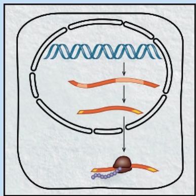

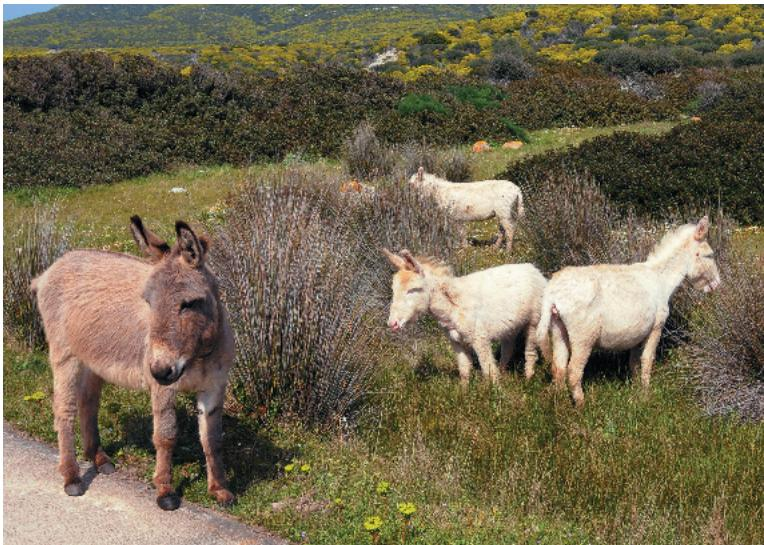  
Figure 17.1 A population of albino donkeys grazes on vegetation on the hillsides of Asinara, an Italian island. Several centuries ago, a recessive mutation that disables pigment synthesis arose in the DNA of one donkey and was passed down through the generations. Inbreeding has resulted in a large number of homozygous albino donkeys living on the island today.

## How can one change in DNA result in such a dramatic change in appearance?

Proteins are the link between genotype and phenotype. Gene expression is the process by which DNA directs the synthesis of proteins:

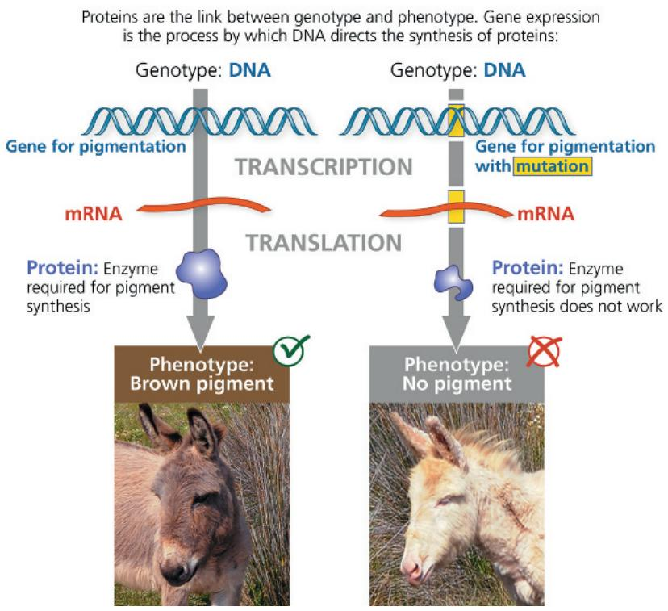

## Concept 17.1: Genes specify proteins via transcription and translation

Inherited traits like albinism are determined by genes, which have information content in the form of specific sequences of nucleotides along stretches of DNA, the genetic material. The DNA inherited by an organism leads to specific traits by dictating the synthesis of proteins and of RNA molecules involved in protein synthesis. In the case of coat and skin color, the gene containing the information to synthesize an enzyme that makes pigment allows normal coloring, and a faulty version of that gene leads to lack of color, or the albino phenotype. Proteins are the link between genotype and phenotype. Gene expression is the process by which DNA directs the synthesis of proteins (or, in some cases, just RNAs). The expression of genes that code for proteins includes two stages: transcription and translation.

Before going into the details of how genes direct protein synthesis, let's step back and examine how the fundamental relationship between genes and proteins was discovered.

## Evidence from Studying Metabolic Defects

In 1902, British physician Archibald Garrod was the first to suggest that genes dictate phenotypes through enzymes, proteins that catalyze specific chemical reactions in the cell. He postulated that the symptoms of an inherited disease reflect an inability to make a particular enzyme. He later referred to such diseases as “inborn errors of metabolism.” For example, people with a disease called alkaptonuria have black urine because it contains a chemical called alkapton, which darkens upon exposure to air. Garrod reasoned that these people cannot make an enzyme that breaks down alkapton, so alkapton is expelled in their urine.

Several decades later, research supported Garrod's hypothesis that a gene dictates the production of a specific enzyme, later named the one gene–one enzyme hypothesis. Biochemists learned that cells synthesize and degrade most organic molecules via metabolic pathways, in which each chemical reaction in a sequence is catalyzed by a specific enzyme (see Concept 8.1). Such metabolic pathways lead, for instance, to the synthesis of the pigments that give the brown donkey in Figure 17.1 its fur color or fruit flies (Drosophila) their eye color (see Figure 15.3). In the 1930s, the American biochemist and geneticist George Beadle and his French colleague Boris Ephrussi speculated that in Drosophila, each mutation affecting eye color blocks pigment synthesis at a specific step by preventing production of the enzyme that catalyzes that step. But neither the chemical reactions nor the enzymes that catalyze them were known at the time.

## Nutritional Mutants in Neurospora: Scientific Inquiry

A breakthrough in demonstrating the relationship between genes and enzymes came a few years later at Stanford University, where Beadle and Edward Tatum began working with a bread mold,

Neurospora crassa. Unlike the diploid organisms studied by Mendel (peas) and T. H. Morgan (fruit flies), Neurospora is a haploid species. Because its genome contains only one copy of each gene, that single copy determines the individual's expressed phenotype. Therefore, when Beadle and Tatum wanted to discover the function of any gene, they only needed to mutate and disable that one allele. They chose to study the protein-coding genes required for a specific nutritional activity. They caused mutations in genes by bombarding Neurospora with X-rays and looked among the survivors for mutants that differed in their nutritional needs from the wild-type bread mold.

Wild-type Neurospora has modest food requirements. It can grow in the laboratory on minimal medium—a simple solution containing minimal nutrients for growth—inorganic salts, glucose, and the vitamin biotin—incorporated into agar, a support medium. From these basics, wild-type mold cells use their metabolic pathways to produce all the other nutrient molecules (like amino acids) they need for growth, dividing repeatedly and forming visible colonies of genetically identical cells. As shown in Figure 17.2, Beadle and Tatum generated different “nutritional mutants” of Neurospora cells, each of which had a mutation in one gene and was unable to synthesize a

Figure 17.2 Beadle and Tatum's experimental approach.  
  
6 The vials were observed for growth. In this example, the mutant cells grew only on minimal medium + arginine, indicating that this mutant was missing the enzyme for the synthesis of arginine.

particular essential nutrient. Such cells could not grow on minimal medium but could grow on complete medium, which contains all nutrients needed for growth. For Neurospora, the complete medium consists of the minimal medium supplemented with all 20 amino acids and a few other nutrients. Beadle and Tatum hypothesized that in each nutritional mutant, the gene for the enzyme that synthesizes a particular nutrient had been disabled by the mutation. They were able to determine experimentally which nutrient each mutant strain (original cell and its descendants) was unable to synthesize.

This approach resulted in a valuable collection of mutant strains of Neurospora, each catalogued by its defect in a particular pathway. Two colleagues, Adrian Srb and Norman Horowitz, used a collection of arginine-requiring mutants to investigate the biochemical pathway for arginine synthesis in Neurospora (Figure 17.3). Srb and Horowitz pinned down each mutant's defect more specifically, using additional tests to distinguish among three classes of arginine-requiring mutants. Mutants in each class required a different set of compounds along the arginine-synthesizing pathway, which has three steps. These results, and those of many similar experiments done by Beadle and Tatum, suggested that each class was blocked at a different step in this pathway because mutants in that class lacked the enzyme that catalyzes the blocked step.

Because Beadle and Tatum set up their experimental conditions so that each mutant was defective in a single gene, the collected results, taken together, provided strong support for the one gene–one enzyme hypothesis, as they dubbed it: that the function of a gene is to dictate the production of a specific enzyme. Further support for this hypothesis came from experiments that identified the specific enzymes lacking in the mutants. Beadle and Tatum shared a Nobel Prize in 1958 for “their discovery that genes act by regulating definite chemical events” (in the words of the Nobel committee).

Today, we know of countless examples in which a mutation in a gene causes a faulty enzyme that in turn leads to an identifiable condition. The albino donkeys in Figure 17.1 lack a key enzyme called tyrosinase in the metabolic pathway that produces melanin, a dark pigment. The absence of melanin causes white fur and other effects throughout the donkey's body. Its nose, ears, and hooves, as well as its eyes, are pink because no melanin is present to mask the reddish color of the blood vessels that run through those structures.

## The Products of Gene Expression: A Developing Story

As researchers learned more about proteins, they made revisions to the one gene—one enzyme hypothesis. First of all, not all proteins are enzymes. Keratin, the structural protein of animal hair, and the hormone insulin are two examples of nonenzyme proteins. Because proteins that are not enzymes are nevertheless gene products, molecular biologists began to think in terms of one gene—one protein. However, many proteins are constructed from two or more different polypeptide chains, and each polypeptide is specified by its own gene. For example, hemoglobin—the oxygen-transporting protein of vertebrate red blood cells—contains two kinds of polypeptides, and thus two genes code for this protein,

one for each type of polypeptide (see Figure 5.18). Beadle and Tatum's idea was therefore restated as the one gene—one polypeptide hypothesis. Even this description is not entirely accurate, though. First, in many cases, a eukaryotic gene can code for a set of closely related polypeptides via a process called alternative splicing, which you will learn about later in this chapter. Second, quite a few genes code for RNA molecules that have important functions in cells even though they are never translated into protein. For now, we will focus on genes that do code for polypeptides. (Note that it is common to refer to these gene products as proteins—a practice you will encounter in this book—rather than more precisely as polypeptides.)

## Basic Principles of Transcription and Translation

Genes provide the instructions for making specific proteins, but a gene does not build a protein directly. The bridge between DNA and protein synthesis is the nucleic acid RNA. RNA is chemically similar to DNA except that it contains ribose instead of deoxyribose as its sugar and has the nitrogenous base uracil rather than thymine (see Figure 5.23). Thus, each nucleotide along a DNA strand has A, G, C, or T as its base, and each nucleotide along an RNA strand has A, G, C, or U as its base. An RNA molecule usually consists of a single strand.

We often describe the flow of information from gene to protein in terms of languages. Just as specific sequences of letters communicate information in a language such as English, specific sequences of monomers convey information in polymers like nucleic acids and proteins. In DNA or RNA, the monomers are the four types of nucleotides listed previously, which differ in their nitrogenous bases. Genes are typically hundreds or thousands of nucleotides long, each gene having a specific sequence of nucleotides. Each polypeptide of a protein also has monomers arranged in a particular linear order (the protein's primary structure; see Figure 5.18), but its monomers are amino acids. Thus, nucleic acids and proteins contain information written in two different chemical languages. Getting from DNA to protein involves two major stages: transcription and translation.

Transcription is the synthesis (production) of RNA using information in the DNA. The two nucleic acids are written in different forms of the same language, and the information is simply transcribed, or “rewritten,” from DNA to RNA. Just as a DNA strand provides a template for making a new complementary strand during DNA replication (see Concept 16.2), it also can serve as a template for assembling a complementary sequence of RNA nucleotides. For a protein-coding gene, the resulting RNA molecule is a faithful transcript of the gene’s protein-building instructions. This type of RNA molecule is called messenger RNA (mRNA) because it carries a genetic message from the DNA to the protein-synthesizing machinery of the cell. (Transcription is the general term for the synthesis of any kind of RNA on a DNA template. Later, you will learn about some other types of RNA produced by transcription.)

Translation is the synthesis of a polypeptide using the information in the mRNA. During this stage, there is a change in

## Figure 17.3

# Inquiry: Do individual genes specify the enzymes that function in a biochemical pathway?

Working with the mold Neurospora crassa, Adrian Srb and Norman Horowitz, then at Stanford University, used Beadle and Tatum's experimental approach (see Figure 17.2) to isolate mutants that required arginine in their growth medium. The researchers showed that these mutants fell into three classes, each defective in a different gene. From studies by others on mammalian liver cells, they suspected that the metabolic pathway of arginine biosynthesis involved a precursor nutrient and the intermediate molecules ornithine and citrulline, as shown in the diagram.

Their most famous experiment, shown here, tested both the one gene–one enzyme hypothesis and their postulated arginine-synthesizing pathway. In this experiment, they grew their three classes of mutants under the four different conditions shown in the results table below. They included minimal medium (MM) as a control, knowing that wild-type cells could grow on MM but mutant cells could not. (See test tube diagram.)

  
Control: Minimal medium

## Results

As shown in the table with test tubes, the wild-type strain was capable of growth under all experimental conditions, requiring only the minimal medium. The three classes of mutants each had a specific set of growth requirements. For example, class II mutants could not grow when ornithine alone was added but could grow when either citrulline or arginine was added.

## Conclusion

From the growth requirements of the mutants, Srb and Horowitz deduced that each class of mutant was unable to carry out one step in the pathway for synthesizing arginine, presumably because it lacked the necessary enzyme, as shown in the table with arginine synthesis pathways. Because each of their mutants was mutated in a single gene, they concluded that each mutated gene must normally dictate the production of one enzyme. Their results supported the one gene—one enzyme hypothesis, proposed by Beadle and Tatum, and also confirmed that the arginine pathway described in the mammalian liver also operates in Neurospora. (Notice in the results table that a mutant can grow only if supplied with a compound made after the defective step because this bypasses the defect.)

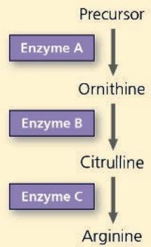

Data from A. M. Srb and N. H. Horowitz, The ornithine cycle in Neurospora and its genetic control, Journal of Biological Chemistry 154:129–139 (1944).

  
WHAT IF? Suppose the experiment had shown that class I mutants could grow only in MM supplemented by ornithine or arginine and that class II mutants could grow in MM supplemented by citrulline, ornithine, or arginine. What conclusions would the researchers have drawn from those results regarding the biochemical pathway and the defect in class I and class II mutants?
For suggested answer, see Appendix A.

language: The cell must translate the nucleotide sequence of an mRNA molecule into the amino acid sequence of a polypeptide. The sites of translation are ribosomes, molecular complexes that facilitate the orderly linking of amino acids into polypeptide chains.

Transcription and translation occur in all organisms. Because most studies have involved bacteria and eukaryotic cells, they are our main focus in this chapter. The basic mechanics of transcription and translation are similar for bacteria and eukaryotes, but there is an important difference in the flow of genetic information within the cells. Bacteria do not have nuclei. Therefore, nuclear membranes do not separate bacterial DNA and mRNA from ribosomes and the other protein-synthesizing equipment (Figure 17.4a). This lack of compartmentalization allows translation of an mRNA to begin while its transcription is still in progress, as you'll see later. By contrast, eukaryotic cells have nuclei. The presence of a nuclear envelope separates transcription from translation in space and time (Figure 17.4b). Transcription occurs in the nucleus, but the mRNA must be transported to the cytoplasm for translation. In eukaryotes, before RNA transcripts from protein-coding genes can leave the nucleus, they are modified in various ways to produce the final, functional mRNA. The transcription of a protein-coding eukaryotic gene results in pre-mRNA, and further RNA processing yields the finished mRNA. The initial RNA transcript from any gene, including those specifying RNA that is not translated into protein (such as tRNA and rRNA, which will be described in Concept 17.4), is more generally called a primary transcript.

To summarize: Genes program protein synthesis via genetic messages in the form of messenger RNA. Put another way, cells are governed by a molecular chain of command with a directional flow of genetic information:

This idea, that the flow of information went only one way, was named the central dogma by Francis Crick in 1956. In the 1970s, however, scientists were surprised to discover some enzymes that use RNA molecules as templates for DNA synthesis, an example of information flow from RNA to DNA (see Concept 19.2). Still, these exceptions do not discredit the idea that, in general, genetic information flows from DNA to RNA to protein. In the next section, we discuss how the instructions for assembling amino acids into a specific order are encoded in nucleic acids.

## The Genetic Code

When biologists began to suspect that the instructions for protein synthesis were encoded in DNA, they recognized a problem: There are only four nucleotide bases to specify 20 amino acids. Thus, the genetic code cannot be a language where each written symbol corresponds to a word. How many nucleotides, then, would turn out to correspond to an amino acid?

## Codons: Triplets of Nucleotides

If each kind of nucleotide base were translated into an amino acid, only four amino acids could be specified, one per nucleotide base.

Figure 17.4 Overview: the roles of transcription and translation in the flow of genetic information.

In a cell, inherited information flows from DNA to RNA to protein. The two main stages of information flow are transcription and translation. A miniature version of part (a) or (b) accompanies several figures later in the chapter as an orientation diagram to help you see where a particular figure fits into the overall scheme of gene expression.

  
(a) Bacterial cell. In a bacterial cell, which lacks a nucleus, mRNA produced by transcription is immediately translated without additional processing.

  
(b) Eukaryotic cell. The nucleus provides a separate compartment for transcription. The original RNA transcript, called pre-mRNA, is processed in various ways before leaving the nucleus as mRNA.

So, what about a language of two-letter code words? The two-nucleotide sequence AG, for example, could specify one amino acid, and GT could specify another. Since there are four possible nucleotide bases in each position, this would give us 16 (that is, $4 \times 4$ , or $4^{2}$ ) possible arrangements—still not enough to code for all 20 amino acids.

Triplets of nucleotide bases are the smallest units of uniform length that can code for all the amino acids. If each arrangement of three consecutive nucleotide bases specifies an amino acid, there can be 64 (that is, $4^{3}$ ) possible code words—more than enough to specify all the amino acids. Experiments have verified that the flow of information from gene to protein is based on a triplet code: The genetic instructions for a polypeptide chain are written in the DNA as a series of nonoverlapping, three-nucleotide words. The series of words in a gene is transcribed into a complementary series of nonoverlapping, three-nucleotide words in mRNA, which is then translated into a chain of amino acids (Figure 17.5).

Figure 17.5 The triplet code.

For each gene, one DNA strand functions as a template for transcription of RNAs, such as mRNA. The base-pairing rules for DNA synthesis also guide transcription, except that RNA is made with uracil (U) instead of thymine (T). During translation, the mRNA is read as a sequence of nucleotide triplets, called codons. Each codon specifies an amino acid to be added to the growing polypeptide chain. The mRNA is read in the $5'\rightarrow3'$ direction.

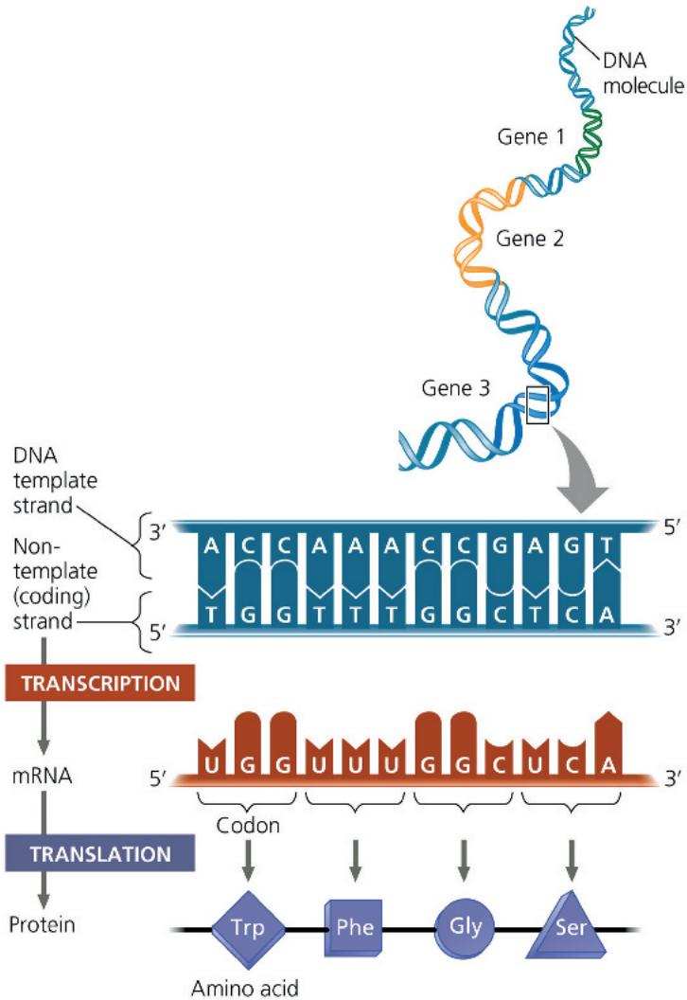  
VISUAL SKILLS By convention, the nontemplate strand, also called the coding strand, is used to represent a DNA sequence. Write the sequence of the mRNA strand and the nontemplate strand—in both cases reading from 5' to 3'—and compare them. Why do you think this convention was adopted? (Hint: Why is this called the coding strand?)
For suggested answer, see Appendix A.

During transcription, the gene determines the sequence of nucleotide bases along the length of the RNA molecule that is being synthesized. For each gene, only one of the two DNA strands is transcribed. This strand is called the template strand because it provides the pattern, or template, for the sequence of nucleotides in an RNA transcript. For any given gene, the same strand is used as the template every time that gene is transcribed. However, farther along on the same chromosomal DNA molecule, the opposite strand may function as the template for a different gene. Particular DNA sequences associated with a gene determine how the enzyme that transcribes genes is oriented when it binds, and this establishes which strand will be used as the template.

An mRNA molecule is complementary rather than identical to its DNA template because RNA nucleotides are assembled on the template according to base-pairing rules (see Figure 17.5). The pairs are similar to those that form during DNA replication, except that U (the RNA substitute for T) pairs with A and the mRNA nucleotides contain ribose instead of deoxyribose. Like a new strand of DNA, the RNA molecule is synthesized in an antiparallel direction to the template strand of DNA. (To review what is meant by “antiparallel” and the 5′ and 3′ ends of a nucleic acid chain, see Figure 16.7.) In the example in Figure 17.5, the nucleotide triplet ACC along the DNA template strand (written as 3′-ACC-5′) provides a template for 5′-UGG-3′ in the mRNA molecule. The mRNA nucleotide triplets are called codons, and they are customarily written in the 5′ → 3′ direction. In our example, UGG is the codon for the amino acid tryptophan (abbreviated Trp, or W). The term codon is also used for the DNA nucleotide triplets along the nontemplate strand. These codons are complementary to the template strand and thus identical in sequence to the mRNA (except for T’s instead of U’s). For this reason, the nontemplate DNA strand is often called the coding strand; by convention, the sequence of the coding strand is used when a gene’s sequence is reported.

During translation, the sequence of codons along an mRNA molecule is decoded, or translated, into a sequence of amino acids making up a polypeptide chain. The codons are read by the translation machinery in the $5'\rightarrow3'$ direction along the mRNA. Each codon specifies which one of the 20 amino acids will be incorporated at the corresponding position along a polypeptide. Because codons are nucleotide triplets, the number of nucleotides making up a genetic message must be three times the number of amino acids in the protein product. For example, 300 nucleotides along an mRNA strand code for 100 amino acids in the polypeptide it encodes.

## Cracking the Code

Molecular biologists cracked the genetic code of life in the early 1960s when a series of elegant experiments disclosed the amino acid translations of each of the mRNA codons. The first codon was deciphered in 1961 by Marshall Nirenberg, of the National Institutes of Health, and colleagues. They synthesized an artificial mRNA made up of only uracil-bearing nucleotides, thus containing only one codon (UUU) over and over. When added to a test-tube mixture that contained all 20 amino acids, ribosomes, and the other components required for protein synthesis, the “poly-U” mRNA was translated into a polypeptide containing many units of the phenylalanine (Phe, or F) amino acids, strung together as a polyphenylalanine chain. Thus, Nirenberg determined that the mRNA codon UUU specifies the amino acid phenylalanine. Soon, the amino acids specified by the codons AAA, GGG, and CCC were similarly identified.

Although more elaborate techniques were required to decode mixed triplets such as AUA and CGA, all 64 codons were deciphered by the mid-1960s. As Figure 17.6 shows, 61 of the 64 triplets code for amino acids. The other three codons act as “stop” signals, or termination codons, marking the end of translation. Notice that the codon AUG has a dual function: It codes for the amino acid methionine (Met, or M) and also functions as a “start” signal, or initiation codon. Genetic messages usually begin with the mRNA codon AUG, which signals the protein-synthesizing machinery to begin translating the mRNA at that location. (Because AUG also stands for methionine, polypeptide chains all begin with methionine when they are synthesized. However, an enzyme may subsequently remove this starter amino acid from the chain.)

Notice in Figure 17.6 that there is redundancy in the genetic code, but no ambiguity. For example, although codons GAA and GAG both specify glutamic acid (redundancy), neither of

## Figure 17.6 The codon table for mRNA.

The three nucleotide bases of an mRNA codon are designated here as the first, second, and third bases, reading in the $5'\rightarrow3'$ direction along the mRNA. The codon AUG not only stands for the amino acid methionine (Met, or M) but also functions as a “start” signal for ribosomes to begin translating the mRNA at that point. Three of the 64 codons function as “stop” signals, marking where ribosomes end translation. Both one- and three-letter codes are shown for the amino acids; see Figure 5.14 for their full names.

Second mRNA base  
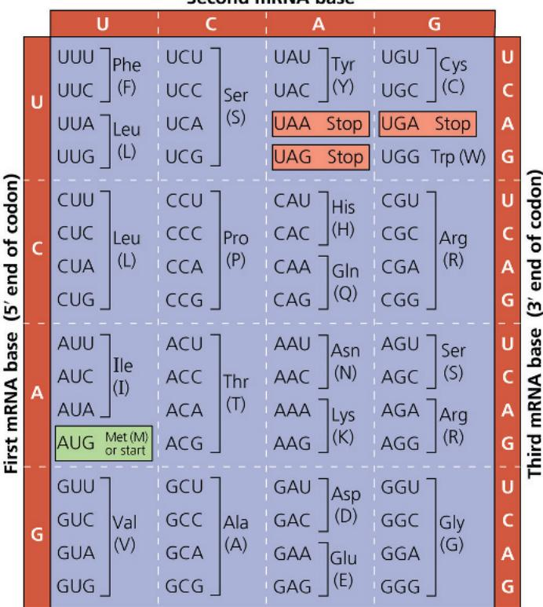  
VISUAL SKILLS A segment in the middle of an mRNA has the sequence 5'-AGAGAACCGCGA-3'. Using the codon table, translate this sequence, assuming the first three nucleotides are a codon.  
For suggested answer, see Appendix A.

them ever specifies any other amino acid (no ambiguity). The redundancy in the code is not altogether random. In many cases, codons that are synonyms for a particular amino acid differ only in the third nucleotide base of the triplet. We will see why this is later in the chapter.

Our ability to extract the intended message from a written language depends on reading the symbols in the correct groupings—that is, in the correct reading frame. Consider this statement: “The red dog ate the bug.” Group the letters incorrectly by starting at the wrong point, and the result will probably be gibberish: for example, “her edd oga tet heb ug.” The reading frame is also important in the molecular language of cells. The short stretch of polypeptide shown in Figure 17.5, for instance, will be made correctly only if the mRNA nucleotides are read from left to right ( $5' \rightarrow 3'$ ) in the groups of three shown in the figure: UGG UUU GGC UCA. Although a genetic message is written with no spaces between the codons, the cell’s protein-synthesizing machinery reads the message as a series of nonoverlapping three-letter words. The message is not read as a series of overlapping words—UGG, GUU, and so on—which would convey a very different message.

## Evolution of the Genetic Code

EVOLUTION The genetic code is nearly universal, shared by organisms from the simplest bacteria to the most complex plants and animals. The mRNA codon CCG, for instance, is translated as the amino acid proline in all organisms whose genetic code has been examined. In laboratory experiments, genes can be transcribed and translated after being transplanted from one species to another, sometimes with quite striking results, as shown in Figure 17.7.

Figure 17.7 Evidence for evolution: expression of genes from different species.

Because diverse forms of life share a common genetic code due to their shared ancestry, one species can be programmed to produce proteins characteristic of a second species by introducing DNA from the second species into the first.

  
(a) Tobacco plant expressing a firefly gene. The yellow glow is produced by a chemical reaction catalyzed by the protein product of the firefly gene.

  
(b) Mosquito larva expressing a jellyfish gene. The gene codes for green fluorescent protein (GFP) and is inserted into organisms as a reporter gene so researchers can tell if a gene of interest is being expressed.

Bacteria can be programmed by the insertion of human genes to synthesize certain human proteins for medical use, such as insulin. Such applications have produced many exciting developments in the area of biotechnology (see Concept 20.4).

The evolutionary significance of the code's near universality is clear. A language shared by all living things must have been operating very early in the history of life—early enough to be present in the common ancestor of all present-day organisms. A shared genetic vocabulary is a reminder of the kinship of all life.

## Concept Check 17.1

1. MAKE CONNECTIONS In a research article about alkaptonuria published in 1902, Garrod suggested that humans inherit two “characters” (alleles) for a particular enzyme and that both parents must contribute a faulty version for the offspring to have alkaptonuria. Today, would this disorder be called dominant or recessive? (See Concept 14.4.)

2. Describe the polypeptide product you would expect from a poly-G mRNA that is 30 nucleotides long.

3. DRAW IT The template strand of a gene contains the sequence 3'-TTCAGTCGT-5'. Suppose that the nontemplate sequence were transcribed instead of the template sequence. Draw the nontemplate sequence in 3' to 5' order. Then, draw the mRNA sequence and translate it using Figure 17.6. Predict how well the protein synthesized from the nontemplate strand would function, if at all.

For suggested answers, see Appendix A.

## Concept 17.2: Transcription is the DNA-directed synthesis of RNA: A Closer Look

Now that we have considered the linguistic logic and evolutionary significance of the genetic code, we are ready to reexamine transcription, the first stage of gene expression, in greater detail.

## Molecular Components of Transcription

Messenger RNA, the carrier of information from DNA to the cell's protein-synthesizing machinery, is transcribed from the template strand of a gene. An enzyme called an RNA polymerase pries the two strands of DNA apart and joins together RNA nucleotides complementary to the DNA template strand, thus elongating the RNA polynucleotide (Figure 17.8). Like the DNA polymerases that function in DNA replication, RNA polymerases can assemble a polynucleotide only in its $5' \rightarrow 3'$ direction, adding onto its $3'$ end. Unlike DNA polymerases, however, RNA polymerases are able to start a chain from scratch; they don't need to add the first nucleotide onto a pre-existing primer.

Figure 17.8 The stages of transcription: initiation, elongation, and termination.

This general depiction of transcription applies to both bacteria and eukaryotes, but the details of termination differ, as described in the text. Also, in a bacterium, the RNA transcript is immediately usable as mRNA; in a eukaryote, the RNA transcript must first undergo processing.

  
MAKE CONNECTIONS Compare the use of a template strand during transcription and replication. See Figure 16.18.  
For suggested answer, see Appendix A.

Specific sequences of nucleotides along the DNA mark where transcription of a gene begins and ends. The DNA sequence where RNA polymerase attaches and initiates transcription is known as the promoter; in bacteria, the sequence that signals the end of transcription is called the terminator. (The termination mechanism in eukaryotes will be described later.) Molecular biologists refer to the direction of transcription as “downstream” and the other direction as “upstream.” These terms are also used to describe the positions of nucleotide sequences within the DNA or RNA. Thus, the promoter sequence in DNA is said to be upstream from the terminator. The stretch of DNA downstream from the promoter that is transcribed into an RNA molecule is called a

## transcription unit.

Bacteria have a single type of RNA polymerase that synthesizes not only mRNA but also other types of RNA that function in gene expression, such as ribosomal RNA. In contrast, eukaryotes have at least three types of RNA polymerase in their nuclei; the one used for pre-mRNA synthesis is called RNA polymerase II. The other RNA polymerases transcribe RNA molecules that are not translated into protein. In the discussion that follows, we start with the features of mRNA synthesis common to both bacteria and eukaryotes and then describe some key differences.

## Synthesis of an RNA Transcript

The three stages of transcription, as shown in Figure 17.8 and described next, are initiation, elongation, and termination of the RNA chain. Study Figure 17.8 to familiarize yourself with the stages and the terms used to describe them.

## RNA Polymerase Binding and Initiation of Transcription

The promoter sequence of a gene includes within it the transcription start point—the nucleotide where RNA polymerase actually begins synthesizing the mRNA—and typically extends several dozen or so nucleotide pairs upstream from the start point (Figure 17.9). Based on interactions with proteins (transcription factors), RNA polymerase binds in a precise location and orientation on the promoter. This binding determines where transcription starts and the direction it will travel, thus which strand of DNA is used as the template.

Certain sections of a promoter sequence are especially important for binding RNA polymerase in a way that ensures that transcription will begin at the correct start point. In bacteria, part of the RNA polymerase itself specifically recognizes and binds to the promoter. In eukaryotes, a collection of proteins called transcription factors (purple proteins in Figure 17.9), help guide the binding of RNA polymerase and the initiation of transcription. Only after transcription factors are attached to the promoter does RNA polymerase II bind to it. The whole complex of transcription factors and RNA polymerase II bound to the promoter is called a transcription initiation complex. Figure 17.9 shows the role of transcription factors and a crucial promoter DNA sequence called the TATA box in forming the initiation complex at a eukaryotic promoter.

The interaction between eukaryotic RNA polymerase II and transcription factors is an example of the importance of protein-protein interactions in controlling eukaryotic transcription. Once the appropriate transcription factors are firmly attached to the promoter DNA and the polymerase is bound to them in the correct orientation on the DNA, the enzyme unwinds the two DNA strands and begins transcribing the template strand at the start point.

Figure 17.9 The initiation of transcription at a eukaryotic promoter. In eukaryotic cells, proteins called transcription factors mediate the initiation of transcription by RNA polymerase II.  
  
Explain how the interaction of RNA polymerase with the promoter would differ if the figure showed transcription initiation for bacteria.
For suggested answer, see Appendix A.

## Elongation of the RNA Strand

As RNA polymerase moves along the DNA, it untwists the double helix, exposing about 10–20 DNA nucleotides at a time for pairing with RNA nucleotides (Figure 17.10). The enzyme adds nucleotides to the 3' end of the growing RNA molecule as it moves along the double helix. As transcription proceeds forward, the newly synthesized RNA molecule behind the RNA polymerase peels away from its DNA template, and the DNA double helix reforms. Transcription progresses at a rate of about 40 nucleotides per second in eukaryotes.

A single gene can be transcribed simultaneously by several molecules of RNA polymerase following each other like trucks in a convoy. A growing strand of RNA trails off from each polymerase, with the length of each new strand reflecting how far along the template the enzyme has traveled from the start point (see the mRNA molecules in Figure 17.23). The congregation of many polymerase molecules simultaneously transcribing a single gene increases the amount of mRNA transcribed from it, which helps the cell make the encoded protein in large amounts.

## Termination of Transcription

Bacteria and eukaryotes differ in the way they terminate transcription. In bacteria, transcription proceeds through a terminator sequence in the DNA. The transcribed terminator (an RNA sequence) functions as the termination signal, causing the polymerase to detach from the DNA and release the transcript, which requires no further modification before translation. In eukaryotes, RNA polymerase II transcribes a sequence on the

Figure 17.10 Transcription elongation.

RNA polymerase moves along the DNA template strand, joining complementary RNA nucleotides to the 3' end of the growing RNA transcript. Behind the polymerase, the new RNA peels away from the template strand, which re-forms a double helix with the nontemplate strand.

DNA called the polyadenylation signal sequence, which specifies a polyadenylation signal (AAUAAA) in the pre-mRNA. This is called a “signal” because once this stretch of six RNA nucleotides appears, it is immediately bound by certain proteins in the nucleus. Then, at a point about 10–35 nucleotides downstream from the AAUAAA, these proteins cut the RNA transcript free from the polymerase, releasing the pre-mRNA. The pre-mRNA then undergoes processing, the topic of the next section. Although that cleavage marks the end of the mRNA, the RNA polymerase II continues to transcribe. Enzymes begin to degrade the RNA made after cleavage, starting at its newly exposed 5' end. The polymerase continues transcribing, pursued by the enzymes, until they catch up to the polymerase and it dissociates from the DNA.

## Concept Check 17.2

1. What is a promoter? Is it located at the upstream or downstream end of a transcription unit?

2. What enables RNA polymerase to start transcribing a gene at the right place on the DNA in a bacterial cell? In a eukaryotic cell?

3. WHAT IF? Suppose X-rays caused a sequence change in the TATA box of a particular gene's promoter. How would that affect transcription of the gene? (See Figure 17.9.)

For suggested answers, see Appendix A.

## Concept 17.3: Eukaryotic cells modify RNA after transcription

Enzymes in the eukaryotic nucleus modify pre-mRNA in specific ways before the genetic message is dispatched to the cytoplasm. During this RNA processing, both ends of the primary transcript are altered. Also, in most cases, certain interior sections of the RNA molecule are cut out and the remaining parts spliced together. These modifications produce an mRNA molecule ready for translation.

## Alteration of mRNA Ends

Each end of a pre-mRNA molecule is modified in a particular way (Figure 17.11). The 5' end, which is synthesized first, receives a 5' cap, a modified form of a guanine (G) nucleotide added onto the 5' end after transcription of the first 20–40 nucleotides have been transcribed. The 3' end of the pre-mRNA molecule is also modified before the mRNA exits the nucleus. Recall that the pre-mRNA is cut and released soon after the polyadenylation signal, AAUAAA, is transcribed. At the 3' end, an enzyme then adds 50–250 more adenine (A) nucleotides, forming a poly-A tail. The 5' cap and poly-A tail share several important functions. First, they seem to facilitate the export of the mature mRNA from the nucleus. Second, they help protect the mRNA from degradation by hydrolytic enzymes. And third, they help ribosomes attach to

Figure 17.11 RNA processing: addition of the 5' cap and poly-A tail.

Enzymes modify the two ends of a eukaryotic pre-mRNA molecule. The modified ends may promote the export of mRNA from the nucleus, and they help protect the mRNA from degradation. When the mRNA reaches the cytoplasm, the modified ends, in conjunction with certain cytoplasmic proteins, help with ribosome attachment. The 5' cap and poly-A tail are not translated into protein, nor are the regions called the 5' untranslated region (5' UTR) and 3' untranslated region (3' UTR). The lighter red segments are introns, which will be described shortly (see Figure 17.12).

the 5' end of the mRNA once it reaches the cytoplasm. In addition to the cap and tail on a eukaryotic mRNA molecule, Figure 17.11 shows the untranslated regions (UTRs) at the 5' and 3' ends of the mRNA (referred to as the 5' UTR and 3' UTR). The UTRs are parts of the mRNA that will not be translated into protein, but they have other functions, such as ribosome binding.

## Split Genes and RNA Splicing

A remarkable stage of RNA processing in the eukaryotic nucleus is called RNA splicing (Figure 17.12), in which large portions of the RNA primary transcript molecules are removed and the remaining portions are reconnected. This cut-and-paste job is similar to editing a movie. The average length of a transcription unit along a human DNA molecule is about 27,000 nucleotide pairs, so the primary RNA transcript is also that long. However, the average-sized protein of 400 amino acids requires only 1,200 nucleotides

in RNA to code for it. (Remember, each amino acid is encoded by a triplet of nucleotides.) This is because most eukaryotic genes and their RNA transcripts have long noncoding stretches of nucleotides, regions that are not translated. Even more surprising is that most of these noncoding sequences are interspersed between coding segments of the gene and thus between coding segments of the pre-mRNA. In other words, the sequence of DNA nucleotides that codes for a eukaryotic polypeptide is usually not continuous; it is split into segments. The noncoding segments of nucleic acid that lie between coding regions are called intervening sequences, or introns. The other regions are called exons, because they are eventually expressed, usually by being translated into amino acid sequences. (Exceptions include the UTRs of the exons at the ends of the RNA, which make up part of the mRNA but are not translated into protein. Because of these exceptions, you may prefer to think of exons as sequences of RNA that exit the nucleus.) The terms intron and exon are used for both RNA sequences and the DNA sequences that specify them.

## Figure 17.12 RNA processing: RNA splicing.

The RNA molecule shown here codes for $\beta$ -globin, one of the polypeptides of hemoglobin. The numbers under the RNA refer to codons; $\beta$ -globin is 146 amino acids long. The $\beta$ -globin gene and its pre-mRNA transcript have three exons, corresponding to sequences that will exit the nucleus as mRNA. (The 5' UTR and 3' UTR do not code for proteins, but they are parts of exons because they remain in the mRNA.) During RNA processing, the introns are cut out and the exons spliced together. In many genes, the introns are much longer than the exons.

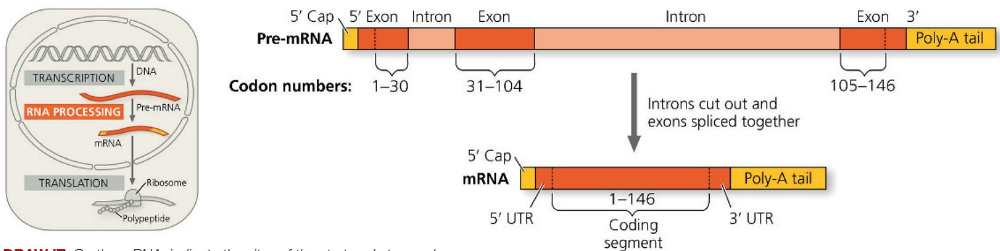  
DRAW IT On the mRNA, indicate the sites of the start and stop codons.  
For suggested answer, see Appendix A.

Figure 17.13 A spliceosome splicing a pre-mRNA.

The diagram shows a portion of a pre-mRNA transcript, with an intron (lighter red) flanked by two exons (darker red). Small RNAs within the spliceosome base-pair with nucleotides at specific sites along the intron. Next, small spliceosome RNAs catalyze cutting of the pre-mRNA and the splicing together of the exons, releasing the intron for rapid degradation.

In making a primary transcript from a gene, RNA polymerase II transcribes both introns and exons from the DNA, but the mRNA molecule that enters the cytoplasm is an abridged version. In the process of RNA splicing, the introns are cut out from the molecule and the exons joined together, forming an mRNA molecule with a continuous coding sequence.

How is pre-mRNA splicing carried out? The removal of introns is accomplished by a large complex made of proteins and small RNAs called a spliceosome. This complex binds to several short nucleotide sequences along an intron, including key sequences at each end (Figure 17.13). The intron is then released (and rapidly degraded), and the spliceosome joins together the two exons that flanked the intron. The small RNAs in the spliceosome not only participate in spliceosome assembly and splice site recognition, but also catalyze the splicing reaction; like proteins, RNAs can act as catalysts.

## Interview

Interview with Joan Steitz: Studying RNA, her "favorite molecule" (eTextbook only)

## Ribozymes

The idea of a catalytic role for the RNAs in the spliceosome arose from the discovery of ribozymes, RNA molecules that function as enzymes. In some organisms, RNA splicing can occur without proteins or even additional RNA molecules: The intron RNA functions as a ribozyme and catalyzes its own removal. For example, in the ciliate protist Tetrahymena, self-splicing occurs in the production of ribosomal RNA (rRNA), a component of the organism's ribosomes. The pre-rRNA actually removes its own introns!

The discovery of ribozymes invalidated the idea that all biological catalysts are proteins.

Three properties of RNA enable some RNA molecules to function as enzymes. First, because RNA is single-stranded, a region of an RNA molecule may base-pair, in an antiparallel arrangement, with a complementary region elsewhere in the same molecule; this gives the molecule a particular three-dimensional structure. A specific structure is essential to the catalytic function of ribozymes, just as it is for enzymatic proteins. Second, like certain amino acids in an enzymatic protein, some of the bases in RNA contain functional groups that can participate in catalysis. Third, the ability of RNA to hydrogen-bond with other nucleic acid molecules (either RNA or DNA) adds specificity to its catalytic activity. For example, complementary base pairing between the RNA of the spliceosome and the RNA of a primary RNA transcript precisely locates the region where the ribozyme catalyzes splicing. Later in this chapter, you will see how these properties of RNA also allow it to perform important noncatalytic roles in the cell, such as recognition of the three-nucleotide codons on mRNA.

## The Functional and Evolutionary Importance of Introns

EVOLUTION Whether or not RNA splicing and the presence of introns have provided selective advantages during evolutionary history is a matter of some debate. In any case, it is informative to consider their possible adaptive benefits. Specific functions have not been identified for most introns, but at least some contain sequences that regulate gene expression, and many affect gene products.

One important consequence of the presence of introns in genes is that a single gene can encode more than one kind of polypeptide. Many genes are known to give rise to two or more different polypeptides, depending on which segments are treated as exons during RNA processing; this is called alternative RNA splicing (see Figure 18.14). Results from the Human Genome Project (discussed in Concept 21.1) suggest that alternative RNA splicing is one reason humans can get along with about the same number of genes as a nematode (roundworm). Because of alternative splicing, the number of different protein products an organism produces can be much greater than its number of genes.

Proteins often have a modular architecture consisting of discrete structural and functional regions called domains. One domain of an enzyme, for example, might include the active site, while another might allow the enzyme to bind to a cellular membrane. In quite a few cases, different exons code for the different domains of a protein (Figure 17.14).

The presence of introns in a gene may facilitate the evolution of new and potentially beneficial proteins as a result of a process known as exon shuffling (see Figure 21.16). Introns increase the probability of crossing over between the exons of alleles of a gene—simply by providing more terrain for crossovers without interrupting coding sequences. This might result in new combinations of exons and proteins with altered structure and function. We can also imagine the occasional mixing and matching of exons between completely different (nonallelic) genes. Exon shuffling of either sort could lead to new proteins with novel combinations of functions. While most of the shuffling would result in nonbeneficial changes, occasionally a beneficial variant might arise.

Figure 17.14 Correspondence between exons and protein domains.  
  
Figure 17.15 Translation: the basic concept.

## Concept Check 17.3

1. Given that there are about 20,000 human protein-coding genes, how can human cells make 75,000–100,000 different proteins?

2. Compare RNA splicing to how you would watch a prerecorded television show. What would introns correspond to in this analogy?

3. WHAT IF? What would be the effect of treating cells with an agent that removed the 5' cap from mRNAs?

For suggested answers, see Appendix A.

# Concept 17.4: Translation is the RNA-directed synthesis of a polypeptide: A Closer Look

We will now examine how genetic information flows from mRNA to protein—the process of translation (Figure 17.15). We'll focus on the basic steps of translation that occur in both bacteria and eukaryotes, while pointing out key differences.

## Molecular Components of Translation

In the process of translation, a cell “reads” a genetic message and builds a polypeptide accordingly. The message is a series of codons along an mRNA molecule, and the translator is called

As a molecule of mRNA is moved through a ribosome, codons are translated into amino acids, one by one. The translators, or interpreters, are tRNA molecules, each type with a specific anticodon at one end and a corresponding amino acid at the other end. A tRNA adds its amino acid cargo to a growing polypeptide chain when the anticodon hydrogen-bonds to the complementary codon on the mRNA.

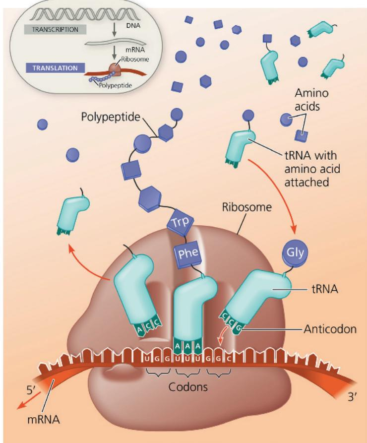

a transfer RNA (tRNA). The function of a tRNA is to transfer an amino acid from the cytoplasmic pool of amino acids to a growing polypeptide in a ribosome. A cell keeps its cytoplasm stocked with all 20 amino acids, either by synthesizing them from other compounds or by taking them up from the surrounding solution. The ribosome, a structure made of proteins and RNAs, adds each amino acid brought to it by a tRNA to the growing end of a polypeptide chain (see Figure 17.15).

Translation is simple in principle but complex in its biochemistry and mechanics, especially in the eukaryotic cell. In dissecting translation, we'll focus on the slightly less complicated version of the process that occurs in bacteria. We'll first look at the major players in this process.

## The Structure and Function of Transfer RNA

The key to translating a genetic message into a specific amino acid sequence is the fact that each tRNA molecule enables translation of a given mRNA codon into a certain amino acid. This is possible because a tRNA bears a specific amino acid at one end of its three-dimensional structure, while at the other end is a nucleotide triplet that can base-pair with the complementary codon on mRNA.

A tRNA molecule consists of a single RNA strand that is only about 80 nucleotides long (compared to hundreds of nucleotides for most mRNA molecules). The presence of complementary stretches of nucleotide bases that can hydrogen-bond to each other allows this single strand to fold back on itself and form a molecule with a particular 3-D structure. Flattened into one plane to clarify this base pairing, a tRNA molecule looks like a cloverleaf (Figure 17.16a). The tRNA actually twists and folds into a compact 3-D structure that is roughly L-shaped (Figure 17.16b), with the 5' and 3' ends of the linear tRNA both located near one end of the structure. The protruding 3' end acts as the attachment site for an amino acid. The loop extending from the other end of the L includes the anticodon, the particular nucleotide triplet that base-pairs to a specific mRNA codon. Thus, the structure of a tRNA molecule fits its function.

Anticodons are conventionally written $3'\rightarrow5'$ to align properly with codons written $5'\rightarrow3'$ (see Figure 17.15). (For base pairing, RNA strands must be antiparallel, like DNA.) As an example of how tRNAs work, consider the mRNA codon $5'$ -GGC- $3'$ , which is translated as the amino acid glycine. The tRNA that base-pairs with this codon by hydrogen bonding has $3'$ -CCG- $5'$ as its anticodon and carries glycine at its other end (see the incoming tRNA approaching the ribosome in Figure 17.15). As an mRNA molecule is moved through a ribosome, glycine will be added to the polypeptide chain whenever the codon $5'$ -GGC- $3'$ is presented for translation. Codon by codon, the genetic message is translated as tRNAs position each amino acid in the order prescribed, and the ribosome adds that amino acid onto the growing polypeptide chain. The tRNA molecule is a translator in the sense that, in the context of the ribosome, it can read a nucleic acid word (the mRNA codon) and interpret it as a protein word (the amino acid).

Like mRNA and other types of cellular RNA, transfer RNA molecules are transcribed from DNA templates. In a eukaryotic cell, tRNA, like mRNA, is made in the nucleus and then travels to the cytoplasm, where it will participate in the process of translation. In both bacterial and eukaryotic cells, each tRNA molecule is used repeatedly, picking up its designated amino acid in the cytosol, depositing this cargo onto a polypeptide chain at the ribosome, and then leaving the ribosome, ready to pick up another of the same amino acid.

The accurate translation of a genetic message requires two instances of molecular recognition. First, a tRNA that binds to an mRNA codon specifying a particular amino acid must carry that amino acid, and no other, to the ribosome. The correct matching up of tRNA and amino acid is carried out by a family of related enzymes that are aptly named aminoacyl-tRNA synthetases (Figure 17.17). The active site of each type of aminoacyl-tRNA synthetase fits only a specific combination of amino acid and tRNA. (Regions of both the amino acid attachment end and the anticodon end of the tRNA ensure the specific fit.) There are 20 different synthetases, one for each amino acid. A synthetase joins a given amino acid to an appropriate tRNA; one synthetase is able to bind to all the different tRNAs for its particular amino acid. The synthetase catalyzes the covalent attachment of the amino acid to its tRNA in a process driven by the hydrolysis of ATP. The resulting aminoacyl tRNA, also called a charged tRNA, is released from the enzyme and is then available to deliver its amino acid to a growing polypeptide chain on a ribosome.

Figure 17.16 The structure of transfer RNA (tRNA).  

(a) Two-dimensional structure. The four base-paired regions and three loops are characteristic of all tRNAs, as is the base sequence of the amino acid attachment site at the 3' end. The anticodon triplet is unique to each tRNA type, as are some sequences in the other two loops. (The asterisks mark bases that have been chemically modified, a characteristic of tRNA. The modified bases contribute to tRNA function in a way that is not yet understood.)  
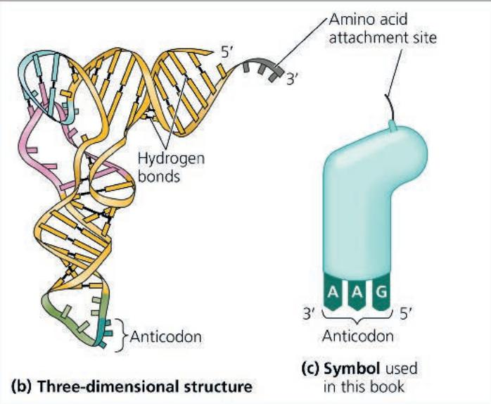  
VISUAL SKILLS Look at the tRNA shown in this figure. Based on its anticodon, identify the codon it would bind to, as well as the amino acid that it would carry. For suggested answer, see Appendix A.

The second instance of molecular recognition is the pairing of the tRNA anticodon with the appropriate mRNA codon. If one tRNA type existed for each mRNA codon specifying an amino acid, there would be 61 tRNAs (see Figure 17.6). In bacteria, however, there are only about 45 tRNAs, signifying that some tRNAs must be able to bind to more than one codon.

Figure 17.17 Aminoacyl-tRNA synthetases provide specificity in joining amino acids to their tRNAs.

Linkage of a tRNA to its amino acid is an endergonic process that occurs at the expense of ATP, which loses two phosphate groups, becoming AMP.

  
This is possible because the rules for base pairing between the third nucleotide base of a codon and the corresponding base of a tRNA anticodon are relaxed compared to those at other codon positions. For example, the nucleotide base U at the 5' end of a tRNA anticodon can pair with either A or G in the third position (at the 3' end) of an mRNA codon. The flexible base pairing at this codon position is called wobble. Wobble explains why the synonymous codons for a given amino acid most often differ in their third nucleotide base. Accordingly, a tRNA with the anticodon 3'-UCU-5' can base-pair with either the mRNA codon 5'-AGA-3' or 5'-AGG-3', both of which code for arginine (see Figure 17.6).

## The Structure and Function of Ribosomes

Although the ribosomes of bacteria and eukaryotes are very similar in structure and function, eukaryotic ribosomes are slightly larger and differ somewhat from bacterial ribosomes in their molecular composition. The differences are medically significant. Certain antibiotic drugs can inactivate bacterial ribosomes without affecting the ability of eukaryotic ribosomes to make proteins. These drugs, including tetracycline and streptomycin, are used to combat bacterial infections.

Ribosomes facilitate the specific coupling of tRNA anticodons with mRNA codons during protein synthesis. A ribosome consists of a large subunit and a small subunit, each made up of proteins and one or more ribosomal RNAs, or rRNAs (Figure 17.18). In eukaryotes, the subunits are made in the nucleolus. Ribosomal RNA genes are transcribed, and the RNA is processed and assembled

Figure 17.18 The anatomy of a functioning ribosome.  
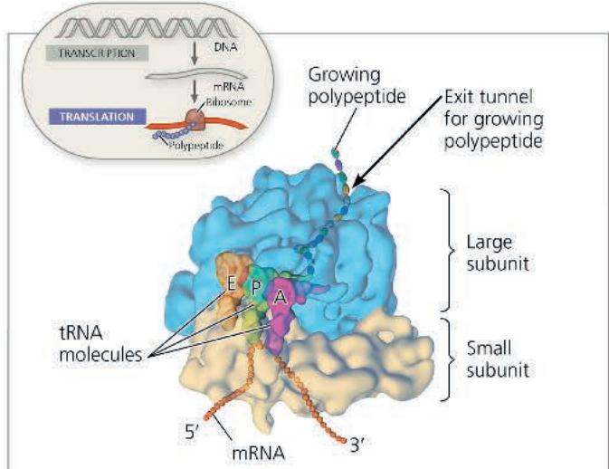  
(a) Computer model of functioning ribosome. This is a model of a bacterial ribosome, showing its overall shape. The eukaryotic ribosome is roughly similar. A ribosomal subunit is a complex of ribosomal RNA molecules and proteins.

  
(b) Schematic model showing binding sites. A ribosome has an mRNA binding site and three tRNA binding sites, known as the A, P, and E sites. This schematic ribosome will appear in later diagrams.

  
(c) Schematic model with mRNA and tRNA. A tRNA fits into the A site when its anticodon base-pairs with an mRNA codon. The P site holds the tRNA attached to the growing polypeptide. The A site holds the tRNA carrying the next amino acid to be added to the polypeptide chain. Discharged tRNAs leave from the E site. The polypeptide grows at its carboxyl end.

# Scientific Skills Exercise Interpreting a Sequence Logo

How Can a Sequence Logo Be Used to Identify Ribosome Binding Sites on Bacterial mRNAs? When initiating translation, ribosomes bind to an mRNA at a ribosome binding site upstream

of the AUG start codon. Because mRNAs from different genes all bind to a ribosome, the genes encoding these mRNAs are likely to have a similar base sequence where the ribosomes bind. Therefore, candidate ribosome binding sites on mRNA can be identified by comparing DNA sequences (and thus the mRNA sequences) of multiple genes in a species, searching the region upstream of the start codon for shared (conserved) stretches of bases. In this exercise, you will analyze DNA sequences from multiple such genes, represented by a visual graphic called a sequence logo.

How the Experiment Was Done The DNA sequences of 149 genes from the E. coli genome were aligned using computer software. The aim was to identify similar base sequences—at the appropriate location in each gene—as potential ribosome binding sites. Rather than presenting the data as a series of 149 sequences aligned in a column (a sequence alignment), the researchers used a sequence logo.

Data from the Experiment The potential ribosome binding regions from ten E. coli genes are shown below in a sequence alignment, followed by the sequence logo derived from the aligned sequences. Note that the DNA shown is the nontemplate (coding) strand, how DNA sequences are typically presented. (All data from Thomas D. Schneider.)

## Sequence alignment

## INTERPRET THE DATA

1. In the sequence logo, the horizontal axis shows the primary sequence of the DNA by nucleotide position. Letters for each base are stacked on top of each other according to their relative frequency at that position among the aligned sequences, with the most common base as the largest letter at the top of the stack. The height of each letter represents the relative frequency of that base at that position. (a) In the sequence alignment, count the number of each base at position -9 and order them from most to least frequent. Compare this to the size and placement of each base at -9 in the logo. (b) Do the same for positions 0 and 1.

2. The height of a stack of letters in a logo indicates the predictive power of that stack (determined statistically). If the stack is tall, we can be more confident in predicting what base will be in that position if a new sequence is added. For example, at position 2 in the sequence alignment, all ten sequences have a G; the probability of finding a G there in a new sequence is very high. For short stacks, the bases all have about the same frequency, so it's hard to predict a base at those positions.
(a) Looking at the sequence logo, which two positions have the most predictable bases? What bases do you predict would be at those positions in a newly sequenced gene? (b) Which 12 positions have the least predictable bases? How does this reflect the relative frequencies of the bases shown at these positions in the sequence alignment? Use the two leftmost positions as examples in your answer.

3. The actual experiment used 149 sequences to build the sequence logo, shown below. There is a stack at each position, even if short, because the sequence logo includes more data.
(a) Which three positions in this sequence logo have the most predictable bases? Name the most frequent base at each.
(b) Which four positions have the least predictable bases?

4. A consensus sequence identifies the base occurring most often at each position in the set of sequences. (a) Write out the consensus sequence of this (the nontemplate) strand. In any position where the base can't be determined, put a dash. (b) Which provides more information—the consensus sequence or the sequence logo? What is lost in the less informative method?

5. (a) Based on the logo, what five adjacent base positions in the 5' UTR region are most likely to be involved in ribosome binding? (b) What is represented by the bases in positions 0–2?

  
Instructors: A version of this Scientific Skills Exercise can be assigned in Mastering Biology.

with proteins imported from the cytoplasm. Completed ribosomal subunits are then exported via nuclear pores to the cytoplasm. In both bacteria and eukaryotes, a large and a small subunit join to form a functional ribosome only when attached to an mRNA molecule. About one-third of the mass of a ribosome is made up of proteins; the rest consists of three rRNA molecules (in bacteria) or four (in eukaryotes). Because most cells contain thousands of ribosomes, rRNA is the most abundant type of cellular RNA.

The structure of a ribosome reflects its function of bringing an mRNA molecule together with tRNAs carrying amino acids. The mRNA itself has a binding site for the ribosome. (In the Scientific Skills Exercise, you can work with DNA sequences representing this binding site in a group of Escherichia coli genes.) The ribosome, in turn, has a binding site for mRNA, as well as three binding sites for tRNA (see Figure 17.18). The P site (peptidyl-tRNA binding site) holds the tRNA carrying the growing polypeptide chain, while the A site (aminoacyl-tRNA binding site) holds the tRNA carrying the next amino acid to be added to the chain. Discharged tRNAs leave the ribosome from the E site (exit site). The ribosome holds the tRNA and mRNA in close proximity and positions the new amino acid so that it can be added to the carboxyl end of the growing polypeptide. It then catalyzes the formation of the peptide bond. As the polypeptide becomes longer, it passes through an exit tunnel in the ribosome's large subunit. When the polypeptide is complete, it is released through the exit tunnel.

The widely accepted model is that rRNAs, rather than ribosomal proteins, are primarily responsible for both the structure and the function of the ribosome. The proteins, which are largely on the exterior, support the shape changes of the rRNA molecules as they carry out catalysis during translation.

first amino acid of the polypeptide, and the two subunits of a ribosome. First, a small ribosomal subunit binds to both the mRNA and a specific initiator tRNA, which carries the amino acid methionine. In bacteria, the small subunit can bind the two in either order; it binds the mRNA at a specific RNA sequence, just upstream of the AUG start codon. In eukaryotes, the small subunit, with the initiator tRNA already bound, binds to the 5' cap of the mRNA and then moves, or scans, downstream along the mRNA until it reaches the AUG start codon, where the initiator tRNA then hydrogen-bonds, as shown in step 1 of Figure 17.19. In either bacteria or eukaryotes, the AUG signals the start of translation; this is important because it establishes the codon reading frame for the mRNA.

The union of mRNA, initiator tRNA, and the small ribosomal subunit is followed by the attachment of a large ribosomal subunit, completing the translation initiation complex (see Figure 17.19). Proteins called initiation factors are required to bring all these components together. The cell also expends energy obtained by hydrolysis of a GTP molecule to form the initiation complex. At the completion of the initiation process, the initiator tRNA sits in the P site of the ribosome, and the vacant A site is ready for the next aminoacyl tRNA. Note that a polypeptide is always synthesized in one direction, from the initial methionine at the amino end, also called the N-terminus, toward the final amino acid at the carboxyl end, also called the C-terminus (see Figure 5.15).

## Elongation of the Polypeptide Chain

In the elongation stage of translation, amino acids are added one by one to the previous amino acid at the C-terminus of the

Ribosomal RNA is the main constituent of the A and P sites and of the interface between the two subunits; it also acts as the catalyst of peptide bond formation. Thus, a ribosome could actually be considered one colossal ribozyme!

## Building a Polypeptide

We can divide translation, the synthesis of a polypeptide, into three stages: initiation, elongation, and termination. All three require protein “factors” that aid in the translation process. Some steps of initiation and elongation also require energy, provided by the hydrolysis of guanosine triphosphate (GTP).

## Ribosome Association and Initiation of Translation

The initiation stage of translation brings together an mRNA, a tRNA bearing the

Figure 17.19 The initiation of translation.  

A small ribosomal subunit binds to an mRNA. In a bacterial cell, the mRNA binding site on this subunit recognizes a specific nucleotide sequence on the mRNA just upstream of the start codon (see the Scientific Skills Exercise). An initiator tRNA, with the anticodon UAC, base-pairs with the start codon, AUG. This tRNA carries the amino acid methionine (Met).

Figure 17.20 The elongation cycle of translation.

The hydrolysis of GTP plays an important role in the elongation process; elongation factors are not shown.

growing chain. Each addition involves several proteins called elongation factors and occurs in a three-step cycle described in Figure 17.20. Energy expenditure occurs in the first and third steps. Codon recognition requires hydrolysis of one molecule of GTP, which increases the accuracy and efficiency of this step. One more GTP is hydrolyzed (broken up) to provide energy for the translocation step.

The mRNA is moved through the ribosome in one direction only, $5'$ end first; this is equivalent to the ribosome moving $5' \rightarrow 3'$ on the mRNA. The main point is that the ribosome and the mRNA move relative to each other, unidirectionally, codon by codon. The elongation cycle takes less than a tenth of a second in bacteria and is repeated as each amino acid is added until the polypeptide is completed. The empty tRNAs that are released from the E site return to the cytoplasm, where they will be reloaded with the appropriate amino acid (see Figure 17.17).

## Termination of Translation

The final stage of translation is termination (Figure 17.21). Elongation continues until a stop codon in the mRNA reaches the A site. The nucleotide base triplets UAG, UAA, and UGA (all written $5'\rightarrow3'$ ) do not code for amino acids but instead act as signals to stop translation. A release factor, a protein shaped like an aminoacyl tRNA, binds directly to the stop codon in the A site.

Figure 17.21 The termination of translation.  
Like elongation, termination requires GTP hydrolysis as well as additional protein factors, which are not shown here.  
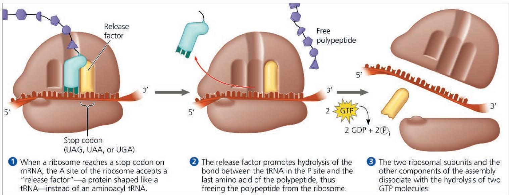  
When a ribosome reaches a stop codon on mRNA, the A site of the ribosome accepts a "release factor"—a protein shaped like a tRNA—instead of an aminoacyl tRNA.  
2 The release factor promotes hydrolysis of the bond between the tRNA in the P site and the last amino acid of the polypeptide, thus freeing the polypeptide from the ribosome.  
3 The two ribosomal subunits and the other components of the assembly dissociate with the hydrolysis of two GTP molecules.

The release factor causes the addition of a water molecule instead of an amino acid to the polypeptide chain. (Water molecules are abundant in the cytosol.) This reaction hydrolyzes (breaks) the bond between the completed polypeptide and the tRNA in the P site, releasing the polypeptide through the exit tunnel of the ribosome's large subunit. The remainder of the translation assembly then comes apart in a multistep process, aided by other protein factors. Breakdown of the translation assembly requires the hydrolysis of two more GTP molecules.

## Completing and Targeting the Functional Protein

The process of translation is often not sufficient to make a functional protein. In this section, you will learn about modifications that polypeptide chains undergo after the translation process as well as some of the mechanisms used to target completed proteins to specific sites in the cell.

## Protein Folding and Post-translational Modifications

During its synthesis, a polypeptide chain begins to coil and fold spontaneously as a consequence of its amino acid sequence (primary structure), forming a protein with a specific shape: a three-dimensional molecule with secondary and tertiary structure (see Figure 5.18). Thus, a gene determines primary structure, which in turn determines shape.

Additional steps—post-translational modifications—may be required before the protein can begin doing its particular job in the cell. Certain amino acids may be chemically modified by the attachment of sugars, lipids, phosphate groups, or other additions. Enzymes may remove one or more amino acids from the leading (amino) end of the polypeptide chain. In some cases, a polypeptide chain may be enzymatically cleaved into two or more pieces. In other cases, two or more polypeptides that are synthesized separately may come together, if the protein has quaternary structure; an example is hemoglobin (see Figure 5.18).

## Targeting Polypeptides to Specific Locations

In electron micrographs of eukaryotic cells active in protein synthesis, two populations of ribosomes are evident: free and bound (see Figure 6.10). Free ribosomes are suspended in the cytosol and mostly synthesize proteins that stay in the cytosol and function there. In contrast, bound ribosomes are attached to the cytosolic side of the endoplasmic reticulum (ER) or to the nuclear envelope. Bound ribosomes make proteins of the endomembrane system (see Figure 6.15) as well as proteins secreted from the cell, such as insulin. It is important to note that the ribosomes themselves are identical and can alternate between being free ribosomes one time they are used and being bound ribosomes the next.

What determines whether a ribosome is free in the cytosol or bound to rough ER? Polypeptide synthesis always begins in the cytosol as a free ribosome starts to translate an mRNA molecule. There, the process continues to completion—unless the growing polypeptide itself cues the ribosome to attach to the ER. The polypeptides of proteins destined for the endomembrane system or for secretion are marked by a signal peptide, which targets the protein to the ER. The signal peptide, a sequence of about 20 amino acids at or near the leading end (N-terminus) of the polypeptide, is recognized as

Figure 17.22 The signal mechanism for targeting proteins to the ER.

① Polypeptide synthesis begins on a free ribosome in the cytosol.

② An SRP binds to the signal peptide, (if present), halting synthesis momentarily.

③ The SRP binds to a receptor protein in the ER membrane, part of a protein complex that forms a pore.

4 The SRP leaves, and polypeptide synthesis resumes, with simultaneous translocation across the membrane.

⑤ The signal peptide is cleaved by an enzyme in the receptor protein complex.

⑥ The rest of the completed polypeptide leaves the ribosome and folds into its final conformation.

  
MAKE CONNECTIONS If this protein were destined for secretion, what would happen to it after its synthesis was completed? See Figure 7.9.  
For suggested answer, see Appendix A.

it emerges from the ribosome by a protein-RNA complex called a signal-recognition particle (SRP). This particle escorts the ribosome to a receptor protein built into the ER membrane, as shown in Figure 17.22. The receptor is part of a multiprotein translocation complex. Polypeptide synthesis continues there, and the growing polypeptide snakes across the membrane into the ER lumen via a protein pore. The signal peptide is removed by an enzyme. The rest of the completed polypeptide, if it is to be secreted from the cell, is released into solution within the ER lumen (see Figure 17.22). Or, if the polypeptide is to be a membrane protein, amino acid sequences further in the chain cause that part to remain embedded in the ER membrane. In either case, it travels in a transport vesicle to its destination (see Figure 7.9).

Other kinds of signal peptides are used to target polypeptides to mitochondria, chloroplasts, the interior of the nucleus, and other organelles that are not part of the endomembrane system. The critical difference in these cases is that translation is completed in the cytosol before the polypeptide is imported into the organelle. Translocation mechanisms also vary, but in all cases studied to date, the “postal zip codes” that address proteins for secretion or to cellular locations are signal peptides of some sort. Bacteria also employ signal peptides to target proteins to the plasma membrane or for secretion.

## Making Multiple Polypeptides in Bacteria and Eukaryotes

In previous sections, you learned how a single polypeptide is synthesized using the information encoded in an mRNA molecule. When a polypeptide is required in a cell, though, the need is for many copies, not just one.

In both bacteria and eukaryotes, multiple ribosomes translate an mRNA at the same time (Figure 17.23); that is, a single mRNA is used to make many copies of a polypeptide simultaneously. Once a ribosome is far enough past the start codon, a second ribosome can attach to the mRNA, eventually resulting in a number of ribosomes trailing along the mRNA. Such strings of ribosomes, called polyribosomes (or polysomes), can be seen with an electron microscope; they can be either free or bound. They enable a cell to rapidly make many copies of a polypeptide.

Another way both bacteria and eukaryotes increase the number of copies of a polypeptide is by transcribing multiple mRNAs from the same gene. However, the coordination of the two processes—transcription and translation—differs in the two groups. The most important differences between bacteria and eukaryotes arise from the bacterial cell's lack of compartmental

Figure 17.23 Polyribosomes.  
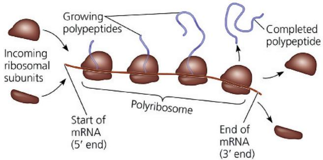

(a) An mRNA molecule is generally translated simultaneously by several ribosomes in clusters called polyribosomes.  
  
(b) This micrograph shows a large polyribosome in a bacterial cell. Growing polypeptides are not visible here (TEM).

Figure 17.24 Coupled transcription and translation in bacteria. In bacterial cells, the translation of mRNA can begin as soon as the leading (5') end of the mRNA molecule peels away from the DNA template. The micrograph (TEM) shows a strand of E. coli DNA being transcribed by RNA polymerase molecules. Attached to each RNA polymerase molecule is a growing strand of mRNA, which is already being translated by ribosomes. The newly synthesized polypeptides are not visible in the micrograph but are shown in the diagram.

  
VISUAL SKILLS Which one of the mRNA molecules started being transcribed first? On that mRNA, which ribosome started translating the mRNA first? For suggested answer, see Appendix A.

organization. Like a one-room workshop, a bacterial cell ensures a streamlined operation by coupling the two processes. With no nuclear envelope, it can simultaneously transcribe and translate the same gene (Figure 17.24), and the newly made protein can quickly diffuse to its site of function.

In contrast, the eukaryotic cell's nuclear envelope segregates transcription from translation and provides a compartment for extensive RNA processing. This processing stage includes additional steps, discussed earlier, the regulation of which can help coordinate the eukaryotic cell's elaborate activities.

Figure 17.25, on the next page, summarizes the path from gene to polypeptide in a eukaryotic cell.

## Concept Check 17.4

1. What two processes ensure that the correct amino acid is added to a growing polypeptide chain?

2. Describe how a polypeptide to be secreted reaches the endomembrane system.

3. DRAW IT Draw a tRNA with the anticodon 3'-CGU-5'. Given wobble, what two different codons could it bind to? Draw each codon on an mRNA, labeling all 5' and 3' ends, the tRNA, and the amino acid it carries.

4. WHAT IF? In eukaryotic cells, mRNAs have been found to have a circular arrangement in which proteins hold the poly-A tail near the 5' cap. How might this increase translation efficiency?

For suggested answers, see Appendix A.

## Concept 17.5: Mutations of one or a few nucleotides can affect protein structure and function

Now that you have explored the process of gene expression, you can consider the effects of changes to the genetic information of a cell. Because these changes, called mutations, are the ultimate source of new genes, they are responsible for the huge diversity of genes found among organisms. Earlier, we considered chromosomal rearrangements that affect long segments of DNA (see Figure 15.14); these are considered large-scale mutations. Here we examine small-scale mutations of one or a few nucleotide pairs, including point mutations, changes in a single nucleotide pair of a gene.

If a point mutation occurs in a gamete or in a cell that gives rise to gametes, it may be transmitted to offspring and to future generations. If the mutation has an adverse effect on the phenotype of a person, the mutant condition is referred to as a genetic disorder or hereditary disease. For example, we can trace the genetic basis of sickle-cell disease to the mutation of a single nucleotide pair in the gene that encodes the $\beta$ -globin polypeptide of hemoglobin. The change of a single nucleotide in the DNA's template strand leads to an altered mRNA and the

Figure 17.25 A summary of transcription and translation in a eukaryotic cell.

This diagram shows the path from one gene to one polypeptide. Each gene in the DNA can be transcribed repeatedly into many identical RNA molecules, and each mRNA can be translated repeatedly to yield many identical polypeptide molecules. (Remember that the final products of some genes are not polypeptides but RNA molecules that don't get translated, including tRNAs and rRNAs.) In general, the steps of transcription and translation are similar in bacterial, archaeal, and eukaryotic cells. The major difference is the occurrence of RNA processing in the eukaryotic nucleus. Other significant differences are found in the initiation stages of both transcription and translation and in the termination of transcription. To visualize these processes in their cellular context, see Figure 6.32d-f.

## RNA PROCESSING

2 In eukaryotes, the RNA transcript (pre-mRNA) is spliced and modified to produce mRNA, which moves from the nucleus to the cytoplasm.

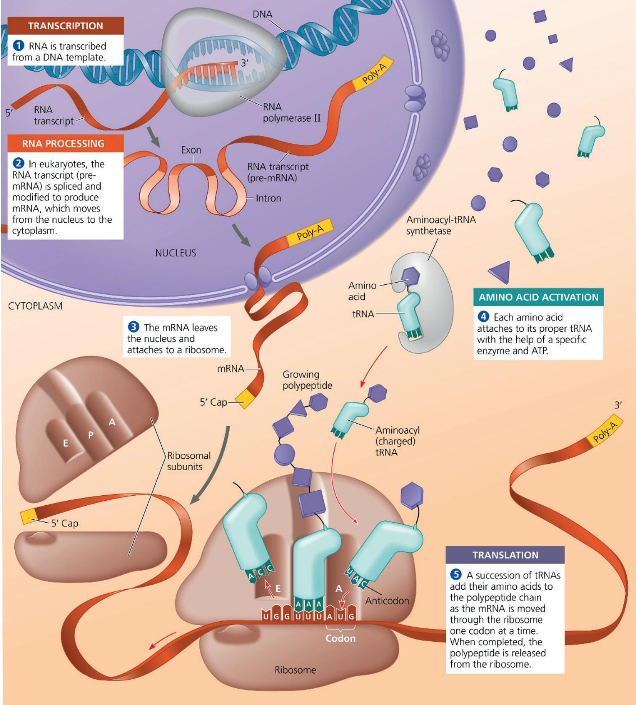

## AMINO ACID ACTIVATION

4 Each amino acid attaches to its proper tRNA with the help of a specific enzyme and ATP.

## TRANSLATION

5 A succession of tRNAs add their amino acids to the polypeptide chain as the mRNA is moved through the ribosome one codon at a time. When completed, the polypeptide is released from the ribosome.

Figure 17.26 The molecular basis of sickle-cell disease: a point mutation.

The allele that causes sickle-cell disease differs from the wild-type (normal) allele by a single DNA nucleotide pair. The micrographs are SEMs of a normal red blood cell (on the left) and a sickled red blood cell (right) from individuals homozygous for wild-type and mutant alleles, respectively.

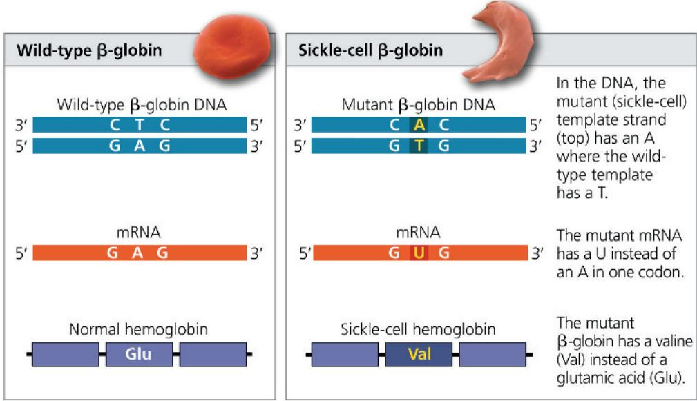

production of an abnormal protein (Figure 17.26; also see Figure 5.19). In individuals who are homozygous for the mutant allele, the sickling of red blood cells caused by the altered hemoglobin produces the multiple symptoms associated with sickle-cell disease (see Concept 14.4 and Figure 23.18). Another disorder caused by a point mutation is a heart condition called familial cardiomyopathy, which is responsible for some of the tragic incidents of sudden death in young athletes. Point mutations in several genes encoding muscle proteins have been identified, any of which can lead to this disorder.

## Types of Small-Scale Mutations

Many mutations occur in regions outside of protein-coding genes, and any potential effect they have on the phenotype of the organism may be subtle and hard to detect. For this reason, here we'll concentrate on mutations within protein-coding genes. Small-scale mutations within a gene can be divided into two general categories: (1) single nucleotide-pair substitutions and (2) nucleotide-pair insertions or deletions. Insertions and deletions can involve one or more nucleotide pairs.

## Substitutions

A nucleotide-pair substitution is the replacement of one nucleotide and its partner with another pair of nucleotides (Figure 17.27a, on the next page). Some substitutions have no effect on the encoded protein, owing to the redundancy of the genetic code. For example, if 3'-CCG-5' on the template strand mutated to 3'-CCA-5', the mRNA codon that used to be GGC would become GGU, but a glycine would still be inserted at the proper location in the protein (see Figure 17.6). In other words, a change in a nucleotide pair may transform one codon into another that is translated into the same amino acid. Such a change is an example of a silent mutation, which has no observable effect on the phenotype. (Silent mutations can occur outside genes as well.) Interestingly, there is evidence that some silent mutations may indirectly affect where or at what level the gene gets expressed, even though the actual protein is the same.

Substitutions that change one amino acid to another one are called missense mutations. Such a mutation may have little effect on the protein: The new amino acid may have properties similar to those of the amino acid it replaces, or it may be in a region of the protein where the exact sequence of amino acids is not essential to the protein's function.

However, the nucleotide-pair substitutions of greatest interest are those that cause a major change in a protein. The alteration of a single amino acid in a crucial area of a protein—such

as in the part of the $\beta$ -globin subunit of hemoglobin shown in Figure 17.26 or in the active site of an enzyme as shown in Figure 8.19—can significantly alter protein activity. Occasionally, such a mutation leads to an improved protein or one with novel capabilities, but much more often such mutations are neutral or detrimental, leading to a useless or less active protein that impairs cellular function. A second example of a missense mutation is a mutation in the tyrosinase gene that causes the albino phenotype in the Asinara donkey. Recently, Italian researchers sequenced the tyrosinase gene in donkeys from this wild population and showed that a recessive mutation is responsible for the lack of pigment. In this gene, a C is changed to a G, resulting in a histidine being added to the protein instead of an aspartic acid. The changed amino acid is in a site in tyrosinase that normally binds a copper atom, and it makes the enzyme incapable of binding copper, rendering it nonfunctional. As in the case of sickle-cell disease, just one change in a nucleotide base results in a dramatic phenotypic change.

Substitution mutations are usually missense mutations; that is, the altered codon still codes for an amino acid and thus makes sense, although not necessarily the right sense. But a point mutation can also change a codon for an amino acid into a stop codon. This is called a nonsense mutation, and it causes translation to be terminated prematurely; the resulting polypeptide will be shorter than the polypeptide encoded by the normal gene. Most nonsense mutations lead to nonfunctional proteins.

In the Problem-Solving Exercise, you'll work with a few common single nucleotide-pair substitution mutations in the gene encoding insulin, some or all of which may lead to diabetes. You will classify these mutations into one of the types we just described and characterize the change in the amino acid sequence.

Figure 17.27 Types of small-scale mutations that affect mRNA sequence. All but one of the types shown here also affect the amino acid sequence of the encoded polypeptide.  

## Insertions and Deletions

Insertions and deletions are additions or losses of nucleotide pairs in a gene (Figure 17.27b). These mutations have a disastrous effect on the resulting protein more often than substitutions do. Insertion or deletion of nucleotides may alter the reading frame of the genetic message, the triplet grouping of nucleotides on the mRNA that is read during translation. Such a mutation, called a frameshift mutation, occurs whenever the number of nucleotides inserted or deleted is not a multiple of three. All nucleotides downstream of the deletion or insertion will be improperly grouped into codons; the result will be extensive missense mutations, usually ending sooner or later in a nonsense mutation that leads

to premature termination. Unless the frameshift is very near the end of the gene, the protein is almost certain to be nonfunctional. Insertions and deletions also occur outside of coding regions; these are not called frameshift mutations, but can have effects on the phenotype—for instance, they can affect how a gene is expressed.

## New Mutations and Mutagens

Mutations can arise in a number of ways. Errors during DNA replication or recombination can lead to nucleotide-pair substitutions, insertions, or deletions, as well as to mutations affecting longer stretches of DNA. If an incorrect nucleotide is added to a

## Problem-Solving Exercise

Are insulin mutations the cause of three infants' neonatal diabetes?

## Your Data

You will analyze the cDNA codons for amino acids 35–54 (of the 110 amino acids) of each patient's insulin protein, so the start codon (AUG) is not present. The sequences of the wild-type cDNA and the patients' cDNA are shown below, arranged in codons.

Wild-type cDNA 5'-CTG GTG GAA GCT CTC TAC CTA GTG TGC GGG GAA CGA GGC TTC TTC TAC ACA CCC AAG ACC -3'
Patient 1 cDNA 5'-CTG GTG GAA GCT CTC TAC CTA GTG TGC GGG GAA CGA GGC TGC TTC TAC ACA CCC AAG ACC -3'
Patient 2 cDNA 5'-CTG GTG GAA GCT CTC TAC CTA GTG TGC GGG GAA CGA GGC TCC TTC TAC ACA CCC AAG ACC -3'
Patient 3 cDNA 5'-CTG GTG GAA GCT CTC TAC CTA GTG TGC GGG GAA CGA GGC TTC TTG TAC ACA CCC AAG ACC -3'

Data from N. Nishi and K. Nanjo, Insulin gene mutations and diabetes, Journal of Diabetes Investigation 2:92–100 (2011).

Insulin is a hormone that acts as a key regulator of blood glucose level, and insulin deficiency can lead to diabetes. In some cases of neonatal (newborn) diabetes, the gene coding for the insulin protein has a nucleotide-pair substitution mutation that alters the protein structure enough to cause it to malfunction. Doctors can use DNA sequence information to diagnose diabetes and other diseases. For example, the insulin gene sequence of a patient with neonatal diabetes can be analyzed to determine if it has a mutation and, if so, its effect.

In this exercise, you will determine the effect of mutations within insulin gene sequences in infant diabetes patients.

## Your Approach

Suppose you are a medical geneticist presented with three infant patients, all of whom have a nucleotide-pair substitution in their insulin gene. It is your job to analyze each mutation to figure out its effect on the amino acid sequence of the insulin protein. To identify the mutation in each patient, you will compare his or her individual insulin complementary DNA (cDNA) sequence to that of the wild-type cDNA. (cDNA is a double-stranded DNA molecule that is based on the mRNA sequence and thus contains only the portion of a gene that is translated—introns are not included. cDNA sequences are commonly used to compare the coding regions of genes.) Identifying the codons that have been changed will tell you which, if any, amino acids are altered in the patient's insulin protein.

growing chain during replication, for example, the base on that nucleotide will then be mismatched with the nucleotide base on the other strand. In many cases, the error will be corrected by DNA proofreading and repair systems (see Concept 16.2). Otherwise, the incorrect base will be used as a template in the next round of replication, resulting in a mutation. Such mutations are called spontaneous mutations. It is difficult to calculate the rate at which such mutations occur. Rough estimates have been made of the rate of mutation during DNA replication for both E. coli and eukaryotes, and the numbers are similar: About one nucleotide in every $10^{10}$ is altered, and the change is passed on to the next generation of cells.

## Your Analysis

1. Compare each patient's cDNA sequence to the wild-type cDNA sequence. Circle the codons where a nucleotide-pair substitution mutation has occurred.

2. Use a codon table (see Figure 17.6) to identify the amino acid encoded by the codon with the mutation in each patient's insulin sequence, and compare it to the amino acid encoded by the codon in the corresponding wild-type sequence. As is standard practice with DNA sequences, the coding (nontemplate) strand of the cDNA has been provided, so to convert it to mRNA for use with the codon table, you only need to change T to U. Classify each patient's nucleotide-pair substitution mutation: Is it a silent, missense, or nonsense mutation? Explain, for each answer.

3. Compare the structure of the amino acid you identified in each patient's insulin sequence to that of the corresponding amino acid in the wild-type sequence (see Figure 5.14). Given that each patient has neonatal diabetes, discuss how the change of amino acid in each might have affected the insulin protein and thus resulted in the disease. (Consider the chemical nature of the side chains.)

Instructors: A version of this Problem-Solving Exercise can be assigned in Mastering Biology. Or a more extensive investigation called “Solve It: Which Insulin Mutations May Result in Disease?” can be assigned.

A number of physical and chemical agents, called mutagens, interact with DNA in ways that cause mutations. In the 1920s, Hermann Muller discovered that X-rays caused genetic changes in fruit flies, and he used X-rays to make Drosophila mutants for his genetic studies (just as Beadle and Tatum did with their Neurospora cells). But Muller also recognized an alarming implication of his discovery: X-rays and other forms of high-energy radiation pose hazards to the genetic material of people as well as laboratory organisms. Mutagenic radiation, a physical mutagen, includes ultraviolet (UV) light, which can cause disruptive thymine dimers in DNA (see Figure 16.20).

Chemical mutagens fall into several categories. Nucleotide analogs are chemicals similar to normal DNA nucleotides but that pair incorrectly during DNA replication. Other chemical mutagens interfere with correct DNA replication by inserting themselves into the DNA and distorting the double helix. Still other mutagens cause chemical changes in bases that change their pairing properties.

Researchers have developed a variety of methods to test the mutagenic activity of chemicals. A major application of these tests is the preliminary screening of chemicals to identify those that may cause cancer. This approach makes sense because most carcinogens (cancer-causing chemicals) are mutagenic, and conversely, most mutagens are carcinogenic.

## Using CRISPR to Edit Genes and Correct Disease-Causing Mutations

Ever since biologists have understood how disease-causing proteins were the result of mutations in genes, they have sought techniques for gene editing—altering genes in a specific, predictable way. Their aim has been to use such a technique to change specific genes in living cells, in part to try to correct genes that cause disease. Over the past couple of decades, biologists have developed a powerful new technique for gene editing, called the CRISPR-Cas9 system, that is transforming the field of genetic engineering, the direct manipulation of genes for practical purposes. Cas9 is a bacterial protein that helps defend bacteria against the viruses that infect them (bacteriophages). In bacterial cells, Cas9 acts together with “guide RNA” made from the CRISPR region of the bacterial genome. (Figure 19.7 explains how this defense system works in bacteria.)

## Interview

Interview with Francisco Mojica: Discovering CRISPR in bacteria (eTextbook only)

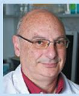

Similar to other DNA-cutting enzymes involved in DNA repair (described in Concept 16.2), Cas9 is a nuclease that cuts double-stranded DNA molecules. The power of Cas9 for gene editing is that the Cas9 protein will cut any sequence to which it is directed. Cas9 is directed to its target by a guide RNA molecule that it binds and uses as a homing device, cutting both strands of any DNA sequence that is complementary to the guide RNA. Scientists have been able to exploit the function of Cas9 by introducing a Cas9–guide RNA complex into a cell they wish to alter (Figure 17.28). The guide RNA in the complex is engineered to be complementary to the “target” gene. Cas9 cuts both strands of the target DNA, and the resulting broken ends of DNA trigger a DNA repair system (similar to that shown in Figure 16.20). When there is no undamaged DNA for the enzymes of the repair system to use as a template, as shown at the bottom left of Figure 17.28, the repair enzymes introduce or remove random nucleotides while

Figure 17.28 Gene editing using the CRISPR-Cas9 system.  

rejoining the ends. Generally, this process alters the DNA sequence so that the gene no longer works properly. This technique is a highly successful way for researchers to “knock out” (disable) a given gene to study what that gene does in an organism.

But what about using this system to help treat genetic diseases? Researchers have modified the technique so that the CRISPR-Cas9 system can be used to repair a gene that has a harmful mutation. They introduce a segment from the normal (functional) gene along with the CRISPR-Cas9 system. After Cas9 cuts the target DNA, repair enzymes can use the normal DNA as a template to repair the target DNA at the break point. In this way, the CRISPR-Cas9 system edits the defective gene so that it is corrected (see the bottom right of Figure 17.28).

After studies using mouse models, CRISPR-based treatments for sickle-cell disease and another disease caused by a mutation of the $\beta$ -globin gene called beta-thalassemia were tested in human clinical trials. These disorders are good targets because they are caused by a mutation in a single gene, and they involve blood cells. The patients' blood cells are removed and genetically edited outside the body, then returned to the patient. In these clinical trials, rather than trying to correct the $\beta$ -globin mutation, the approach was to re-activate a gene for fetal hemoglobin, a different form that is normally turned off at birth but can substitute for $\beta$ -globin. A significant majority of patients showed remarkable results, having near-normal hemoglobin levels and not needing blood transfusions or experiencing pain crises. In 2024, this gene therapy treatment for these two blood-based disorders was approved for usage by the U.S. Food and Drug Administration (FDA).

Researchers, physicians, and patients alike are excited about the potential of CRISPR technology to treat or even cure human diseases that have a genetic basis, such as autoimmune diseases, Alzheimer's, and Parkinson's diseases, as well as some types of cancer. As of early 2025, 20 gene therapy treatments have been approved by the FDA. However, there are still concerns about using CRISPR-treated cells in humans because of possible effects on genes that are not being targeted (so-called "off-target" genes); this is an active area of research. The risks associated with cutting both strands of DNA by CRISPR are avoided when CRISPR is used in conjunction with a new technique called base editing. In this process, specific bases in a gene are not cut and replaced, but rather chemically modified to resemble a different base, thus altering the resulting protein so it is no longer harmful. In another approach, researchers are using different forms of Cas proteins that are more accurate.

Jennifer Doudna, a co-discoverer of CRISPR-Cas9, recognized not only its incredible potential but also the danger of its misapplication. After having a dream in which Adolf Hitler asked her what could be done with this gene-editing tool, Doudna realized it was imperative to spend some time reflecting on ethical considerations. In 2015, she convened a conference of biologists who agreed at the end of the meeting to urge extreme caution as the field moves forward—and the discussion continues.

## What Is a Gene? Revisiting the Question

Our definition of a gene has evolved over the past few chapters, as it has through the history of genetics. We began with the Mendelian concept of a gene as a discrete unit of inheritance that affects a phenotypic character (Chapter 14). We saw that Morgan and his colleagues assigned such genes to specific loci on chromosomes (Chapter 15). We went on to view a gene as a region of specific nucleotide sequence along the length of the DNA molecule of a chromosome (Chapter 16). Finally, in this chapter, we have considered a functional definition of a gene as a DNA sequence that codes for a specific polypeptide chain or a functional RNA molecule, such as a tRNA. All these definitions are useful, depending on the context in which genes are being studied.

We have noted that merely saying a gene codes for a polypeptide is an oversimplification. Most eukaryotic genes contain noncoding segments (such as introns), so large portions of these genes have no corresponding segments in polypeptides. Molecular biologists also often include promoters and certain other regulatory regions of DNA within the boundaries of a gene. These DNA sequences are not transcribed, but they can be considered part of the functional gene because they must be present for transcription to occur. Our definition of a gene must also be broad enough to include the DNA that is transcribed into rRNA, tRNA, and other RNAs that are not translated. These genes have no polypeptide products but play crucial roles in the cell. Thus, we arrive at the following definition: A gene is a region of DNA that can be expressed to produce a final functional product that is either a polypeptide or an RNA molecule.

When considering phenotypes, however, it is often useful to start by focusing on genes that code for polypeptides. In this chapter, you have learned in molecular terms how a typical gene is expressed—by transcription into RNA and then translation into a polypeptide that forms a protein of specific structure and function. Proteins, in turn, bring about an organism's observable phenotype.

A given type of cell expresses only a subset of its genes. This is an essential feature in multicellular organisms: You'd be in trouble if the lens cells in your eyes started expressing the genes for hair proteins, which are normally expressed only in hair follicle cells! Gene expression is precisely regulated, which we'll explore in the next chapter, beginning with the simpler case of bacteria and continuing with eukaryotes.

## Concept Check 17.5

1. What happens when one nucleotide pair is lost from the middle of the coding sequence of a gene?

2. MAKE CONNECTIONS Individuals heterozygous for the sickle-cell allele are generally healthy but show phenotypic effects of the allele under some circumstances (see Figure 14.17). Explain in terms of gene expression.

3. DRAW IT The template strand of a gene includes this sequence:
3'-TACTTGTCCGATATC-5'. The sequence is mutated to 3'-TACTTGTCCAATATC-5'. For both wild-type and mutant sequences, draw the double-stranded DNA, the resulting mRNA, and the amino acid sequence each encodes. What is the effect of the mutation on the amino acid sequence?

4. WHAT IF? How could you use the CRISPR-Cas9 system to correct the mutation described in question 3? Based on the answer to question 3, would this be worth doing?

<!-- END OFFICIAL MINERU API RESULT part_04 -->

<!-- BEGIN OFFICIAL MINERU API RESULT part_05 -->

## Summary of Key Concepts

To review key terms, go to the Vocabulary Self-Quiz (eTextbook only).

## Concept 17.1: Genes specify proteins via transcription and translation

\- Beadle and Tatum's studies of mutant strains of Neurospora led to the one gene–one polypeptide hypothesis. During gene expression, the information encoded in genes is used to make specific polypeptide chains (enzymes and other proteins) or RNA molecules.

\- Transcription is the synthesis of RNA complementary to a template strand of DNA. Translation is the synthesis of a polypeptide whose amino acid sequence is specified by the nucleotide sequence in messenger RNA (mRNA).

\- Genetic information is encoded as a sequence of nonoverlapping nucleotide triplets, or codons. A codon in mRNA either is translated into an amino acid (61 of the 64 codons) or serves as a stop signal (3 codons). Codons must be read in the correct reading frame.

Describe the process of gene expression, by which a gene affects the phenotype of an organism.

## Concept 17.2: Transcription is the DNA-directed synthesis of RNA: A Closer Look

\- RNA synthesis is catalyzed by RNA polymerase, which links together RNA nucleotides complementary to a DNA template strand. Transcription follows the same base-pairing rules as DNA replication, except that in RNA, uracil (U) substitutes for thymine (T).

\- The three stages of transcription are initiation, elongation, and termination. A promoter sequence, often including a TATA box in eukaryotes, establishes where RNA synthesis is initiated. Transcription factors help eukaryotic RNA polymerase recognize promoter sequences, forming a transcription initiation complex. Termination differs in bacteria and eukaryotes.

Compare the initiation of transcription in bacteria and eukaryotes.

## Concept 17.3: Eukaryotic cells modify RNA after transcription

\- Eukaryotic mRNAs undergo RNA processing, which includes RNA splicing, the addition of a modified nucleotide 5' cap to the 5' end, and the addition of a poly-A tail to the 3' end. The processed mRNA includes an untranslated region (5' UTR or 3' UTR) at each end of the coding segment.

\- Most eukaryotic genes are split into segments: They have introns interspersed among the exons (the regions included in the mRNA). In RNA splicing, introns are removed and exons joined. RNA splicing is typically carried out by spliceosomes, but in some cases, RNA alone catalyzes its own splicing. The properties of RNA allow some RNAs (called ribozymes) to act as catalysts. The presence of introns allows for alternative RNA splicing.

  
What function do the 5' cap and the poly-A tail serve on a eukaryotic mRNA?

## Concept 17.4: Translation is the RNA-directed synthesis of a polypeptide: A Closer Look

\- A cell translates an mRNA message into protein using transfer RNAs (tRNAs). After being bound to a specific amino acid by an aminoacyl-tRNA synthetase, a tRNA lines up via its anticodon at the complementary codon on mRNA. A ribosome, made up of ribosomal RNAs (rRNAs) and proteins, facilitates this coupling with binding sites for mRNA and tRNA.

\- Ribosomes coordinate the three stages of translation: initiation, elongation, and termination. The formation of peptide bonds between amino acids is catalyzed by rRNAs as tRNAs move through the A and P sites and exit through the E site.

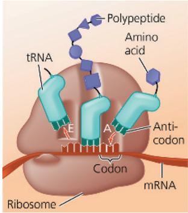

\- After translation, during protein processing, proteins may be modified by cleavage or by attachment of sugars, lipids, phosphates, or other chemical groups.

\- Free ribosomes in the cytosol initiate synthesis of all proteins, but proteins with a signal peptide are synthesized on the ER.

\- A gene can be transcribed by multiple RNA polymerases simultaneously. Also, a single mRNA molecule can be translated simultaneously by a number of ribosomes, forming a polyribosome. In bacteria, these processes are coupled, but in eukaryotes they are separated in space and time by the nuclear membrane.

How do tRNAs function in the context of the ribosome during translation?

## Concept 17.5: Mutations of one or a few nucleotides can affect protein structure and function

\- Small-scale mutations include point mutations, changes in one DNA nucleotide pair, which may lead to production of nonfunctional proteins. Nucleotide-pair substitutions can cause missense or nonsense mutations. Nucleotide-pair insertions or deletions may produce frameshift mutations.

\- Spontaneous mutations can occur during DNA replication, recombination, or repair. Chemical and physical mutagens cause DNA damage that can alter genes.

\- The CRISPR-Cas9 system is a powerful new gene-editing technique with the potential to correct genetic mutations that cause disease. Significant technical and ethical questions have been raised about how this can or should be used.

What will be the results of chemically modifying one nucleotide base of a gene? What role is played by DNA repair systems in the cell?

For suggested answers, see Appendix A.

## Test Your Understanding

For more multiple-choice questions, go to the Practice Test (eTextbook only).

## Levels 1-2: Remembering/Understanding

1. In eukaryotic cells, transcription cannot begin until

(A) the two DNA strands have completely separated and exposed the promoter.

(B) several transcription factors have bound to the promoter.

(C) the 5' caps are removed from the mRNA.

(D) the DNA introns are removed from the template.

2. Which of the following is true of a codon?

(A) It never codes for the same amino acid as another codon.

(B) It can code for more than one amino acid.

(C) It can be either in DNA or in RNA

(D) It is the basic unit of protein structure.

3. The anticodon of a particular tRNA molecule is

(A) complementary to the corresponding mRNA codon.

(B) complementary to the corresponding triplet in rRNA.

(C) the part of tRNA that bonds to a specific amino acid.

(D) catalytic, making the tRNA a ribozyme.

4. Which of the following is true of RNA processing?

(A) Exons are cut out before mRNA leaves the nucleus.

(B) Nucleotides are added at both ends of the RNA.

(C) Ribozymes may function in the addition of a 5' cap.

(D) RNA splicing adds a poly-A tail to the mRNA.

5. Which component is directly involved in translation?

(A) RNA polymerase

(B) ribosome

(C) spliceosome

(D) DNA

## Levels 3-4: Applying/Analyzing

6. Using Figure 17.6, identify a $5'\rightarrow3'$ sequence of nucleotides in the DNA template strand for an mRNA coding for the polypeptide sequence Phe-Pro-Lys.

(A) 5'-UUUCCCAAA-3'

(B) 5'-GAACCCCTT-3'

(C) 5'-CTTCGGGAA-3'

(D) 5'-AAACCCUUU-3'

7. Which of the following mutations would be most likely to have a harmful effect on an organism?

(A) a deletion of three nucleotides near the middle of a gene

(B) a single nucleotide deletion in the middle of an intron

(C) a single nucleotide deletion near the end of the coding sequence

(D) a single nucleotide insertion downstream of, and close to, the start of the coding sequence

8. Would the coupling of the processes shown in Figure 17.24 be found in a eukaryotic cell? Explain why or why not.

9. Complete the following table:

<table><tr><td>Type of RNA</td><td>Functions</td></tr><tr><td>Messenger RNA (mRNA)</td><td></td></tr><tr><td>Transfer RNA (tRNA)</td><td></td></tr><tr><td></td><td>In a ribosome, plays a structural role; as a ribozyme, plays a catalytic role (catalyzes peptide bond formation)</td></tr><tr><td>Primary transcript</td><td></td></tr><tr><td>Small RNAs in the spliceosome</td><td></td></tr></table>

## Levels 5-6: Evaluating/Creating

10. EVOLUTION CONNECTION Most amino acids are coded for by a set of similar codons (see Figure 17.6). Propose at least one evolutionary explanation to account for this pattern.

11. SCIENTIFIC INQUIRY Knowing that the genetic code is almost universal, a scientist uses molecular biological methods to insert the human $\beta$ -globin gene (shown in Figure 17.12) into bacterial cells, hoping the cells will express it and synthesize functional $\beta$ -globin protein. Instead, the protein produced is nonfunctional and is found to contain many fewer amino acids than does $\beta$ -globin made by a eukaryotic cell. Explain why.

12. WRITE ABOUT A THEME: INFORMATION Evolution accounts for the unity and diversity of life, and the continuity of life is based on heritable information in the form of DNA. In a short essay (100–150 words), discuss how the fidelity with which DNA is inherited is related to the processes of evolution. (Review the discussion of proofreading and DNA repair in Concept 16.2.)

## 13. SYNTHESIZE YOUR KNOWLEDGE

Some mutations result in proteins that function well at one temperature but are nonfunctional at a different (usually higher) temperature. Siamese cats have such a “temperature-sensitive” mutation in a gene encoding an enzyme that makes dark pigment in the fur. The mutation results in the breed’s distinctive point markings and lighter body color (see the photo). Using this information and what you learned in the chapter, explain the pattern of the cat’s fur pigmentation.

For selected answers, see Appendix A.

# Explore Scientific Papers with Science in the Classroom | AAAS

How is green fluorescent protein (GFP) used as a marker for gene expression? Go to “Lighting up Life” at www.scienceintheclassroom.org.

Instructors: Questions can be assigned in Mastering Biology.

Eye cell specialized for aquatic vision

# Regulation of Gene Expression

## Key Concepts

18.1 Bacteria often respond to environmental change by regulating transcription

18.2 Eukaryotic gene expression is regulated at many stages

18.3 Noncoding RNAs play multiple roles in controlling gene expression

18.4 A program of differential gene expression leads to the different cell types in a multicellular organism

18.5 Cancer results from genetic changes that affect cell cycle control

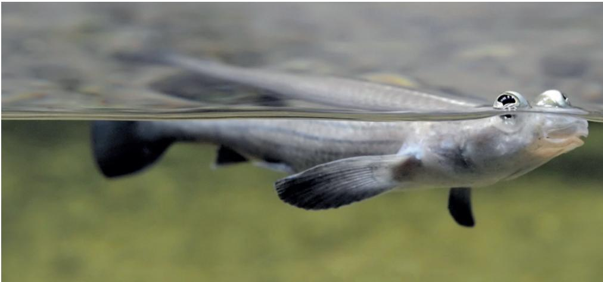  
Figure 18.1 Anableps anableps, or “cuatro ojos” (“four eyes”), glides through lakes and ponds in South America, the upper half of each eye protruding from the water. The eye’s upper half is well-suited for aerial vision and the lower half for aquatic vision. All of the fish’s eye cells, however, contain the same genes.

## Study Tip

Make a visual study guide: Draw a region of DNA representing a gene. For each level of gene regulation that you read about, draw a sketch of your gene being regulated at that level. A drawing of chromatin modification regulation is shown as an example.

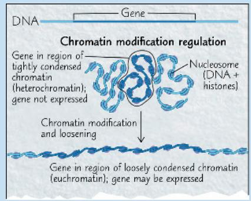

Gene in region of loosely condensed chromatin (euchromatin); gene may be expressed

## How can two cells with the same set of genes function differently?

To be expressed, each gene requires a particular set of transcription factors. Different cells have different sets of specific transcription factors.

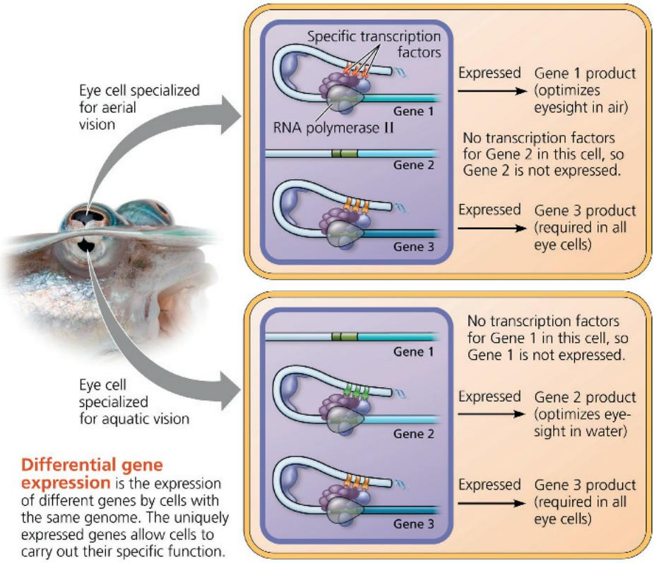

## Differential gene

expression is the expression of different genes by cells with the same genome. The uniquely expressed genes allow cells to carry out their specific function.

Expressed Gene 3 product (required in all eye cells)

# Concept 18.1: Bacteria often respond to environmental change by regulating transcription

Bacterial cells that can conserve resources and energy have a selective advantage over cells that are unable to do so. Thus, natural selection has favored bacteria that express only the genes whose products are needed by the cell.

Consider, for instance, an individual Escherichia coli (E. coli) cell living in a human colon, dependent for its nutrients on the whimsical eating habits of its host. If the environment is lacking in the amino acid tryptophan, which the bacterium needs to survive, the cell responds by activating a metabolic pathway that makes tryptophan from another compound. If the human host later eats a tryptophan-rich meal, the bacterial cell stops producing tryptophan, thus avoiding wasting resources to produce a substance that is readily available from the surrounding solution.

A metabolic pathway can be controlled on two levels, as shown for the synthesis of tryptophan in Figure 18.2. First, cells can adjust the activity of enzymes already present. This is a fairly rapid physiological response, which relies on the sensitivity of many enzymes to chemical cues that increase or decrease their catalytic activity (see Concept 8.5). The activity of the first enzyme in the pathway is inhibited by the pathway's end product—tryptophan, in this case (Figure 18.2a). Thus, if tryptophan accumulates in a cell, it shuts down the synthesis of more tryptophan by inhibiting enzyme activity. Such feedback inhibition, typical of anabolic (biosynthetic) pathways, allows a cell to adapt to short-term fluctuations in the supply of a substance it needs (see Figure 8.21).

Second, cells can adjust the production level of certain enzymes via a genetic mechanism; that is, they can regulate the expression of the genes encoding the enzymes. If, in our example, the environment provides all the tryptophan the cell needs, the cell stops making the enzymes that catalyze the synthesis of tryptophan (Figure 18.2b). In this case, the control of enzyme production occurs at the level of transcription, the synthesis of messenger RNA from the genes that code for these enzymes.

Regulation of the tryptophan synthesis pathway is just one example of how bacteria tune their metabolism to changing environments. Many genes of the bacterial genome are switched on or off by changes in the metabolic status of the cell; some genes are regulated singly and others as groups of related genes. One basic mechanism for this type of regulation of groups of genes in bacteria, described as the operon model, was discovered in 1961 by François Jacob and Jacques Monod at the Pasteur Institute in Paris. Let's see what an operon is and how it works.

## Operons: The Basic Concept

E. coli synthesizes the amino acid tryptophan from a precursor molecule in the three-step pathway shown in Figure 18.2. Each reaction in the pathway is catalyzed by a specific enzyme, and the five genes that code for the subunits of these enzymes are

Figure 18.2 Regulation of a metabolic pathway.

In the pathway for tryptophan synthesis, an abundance of tryptophan can both (a) inhibit the activity of the first enzyme in the pathway (feedback inhibition), a rapid response, and (b) repress expression of the genes encoding all subunits of the enzymes in the pathway, a longer-term response. The minus sign in a red circle stands for inhibition.

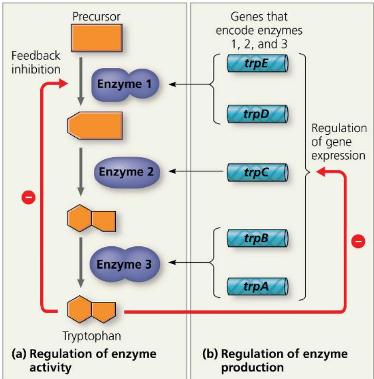

clustered together on the bacterial chromosome. A single promoter serves all five genes, which together constitute a transcription unit. (Recall that a promoter is a site where RNA polymerase can bind to DNA and begin transcription; see Figure 17.8.) Thus, transcription gives rise to one long mRNA molecule that codes for the five polypeptides making up the enzymes in the tryptophan pathway (Figure 18.3a). The cell can translate this one mRNA into five separate polypeptides because the mRNA is punctuated with start and stop codons that signal where the coding sequence for each polypeptide begins and ends.

A key advantage of grouping genes of related function into one transcription unit is that a single “on-off switch” can control the whole cluster of functionally related genes; in other words, these genes are coordinately controlled. When an E. coli cell must make tryptophan for itself because its surrounding environment lacks this amino acid, all the enzymes for the metabolic pathway are synthesized at the same time. The on-off switch is a segment of DNA called an operator. Both its location and name suit its function: Positioned within the promoter or, in some cases, between the promoter and the enzyme-coding genes, the operator controls the access of RNA polymerase to the genes. Together, the operator, the promoter, and the genes they control—the entire stretch of DNA required for enzyme production for the tryptophan pathway—constitute an operon. The trp operon (trp for tryptophan) is one of many operons in the E. coli genome (see Figure 18.3a).

  
(a) Tryptophan absent, repressor inactive, operon on. RNA polymerase attaches to the DNA at the operon's promoter and transcribes the operon's genes. Enzymes for tryptophan synthesis are made.

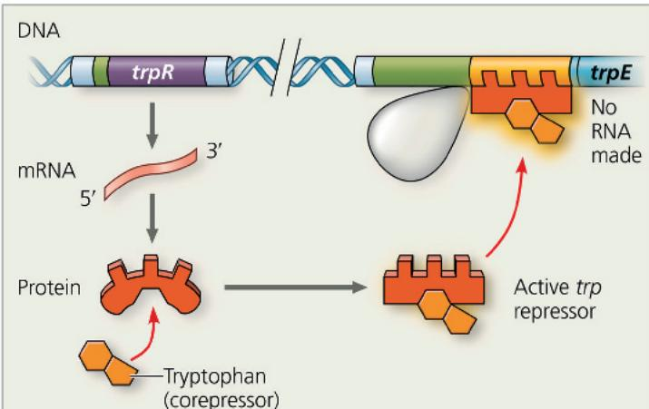  
(b) Tryptophan present, repressor active, operon off. As tryptophan accumulates, it inhibits its own production by activating the repressor protein, which binds to the operator, blocking transcription. Enzymes for tryptophan synthesis are not made.

If the operator is the operon's switch for controlling transcription, how does this switch work? By itself, the trp operon is turned on; that is, RNA polymerase can bind to the promoter and transcribe the genes of the operon. The trp operon can be switched off by a protein that is called the trp repressor. A repressor binds to the operator, preventing RNA polymerase from transcribing the genes, often by preventing RNA polymerase from binding (Figure 18.3b). A repressor protein is specific for the operator of a particular operon. For example, the trp repressor, which switches off the trp operon by binding to the trp operator, has no effect on other operons in the E. coli genome.

A repressor protein is encoded by a regulatory gene—in this case, a gene called trpR; trpR is located some distance from the trp operon and has its own promoter. Regulatory genes are among the bacterial genes that are expressed continuously, although at a low rate, and a few trp repressor molecules are always present in E. coli cells. Why, then, is the trp operon not switched off permanently? First, the binding of repressors to operators is reversible. An operator alternates between two states: one with the repressor bound and one without the repressor bound. The relative duration of the repressor-bound state is higher when more active repressor molecules are present. Second, the trp repressor, like most regulatory

Figure 18.3 The trp operon in E. coli: regulated synthesis of repressible enzymes.

Tryptophan is an amino acid produced by an anabolic pathway catalyzed by three enzymes (see Figure 18.2). (a) The five genes encoding the polypeptide subunits of the enzymes in this pathway are grouped, along with a promoter, into the trp operon. The trp operator (the repressor binding site) is located within the trp promoter (the RNA polymerase binding site). (b) Accumulation of tryptophan, the end product of the pathway, represses transcription of the trp operon, thus blocking synthesis of all the enzymes in the pathway and shutting down tryptophan production.

VISUAL SKILLS Describe what happens to the trp operon as the cell uses up its store of tryptophan.

For suggested answer, see Appendix A.

proteins, is an allosteric protein, with two alternative shapes: active and inactive (see Figure 8.20). The trp repressor is synthesized in the inactive form, which has little affinity for the trp operator. Only when a tryptophan molecule binds to the trp repressor at an allosteric site does the repressor protein change to the active form that can attach to the operator, turning the operon off.

Tryptophan functions in this system as a corepressor, a small molecule that cooperates with a repressor protein to switch an operon off. As tryptophan accumulates, more tryptophan molecules associate with trp repressor molecules, which can then bind to the trp operator and shut down production of the tryptophan pathway enzymes. If the cell's tryptophan level drops, many fewer trp repressor proteins would have tryptophan bound, so most would be inactive; they would dissociate from the operator, allowing transcription of the operon's genes to resume. The trp operon is one example of how gene expression can respond to changes in the cell's internal and external environment.

## Repressible and Inducible Operons: Two Types of Negative Gene Regulation

The trp operon is said to be a repressible operon because its transcription is usually on but can be inhibited (repressed) when a specific small molecule (in this case, tryptophan) binds

allosterically to a regulatory protein. In contrast, an inducible operon is usually off but can be stimulated (induced) to be on when a specific small molecule interacts with a different regulatory protein. The classic example of an inducible operon is the lac operon (lac stands for “lactose”).

The disaccharide lactose (milk sugar) is available to $E. coli$ when the bacterium is in contact with any dairy product. Lactose metabolism by $E. coli$ begins with hydrolysis of the disaccharide into its component monosaccharides (glucose and galactose), a reaction catalyzed by the enzyme β-galactosidase. Only a few molecules of this enzyme are present in an $E. coli$ cell growing in the absence of lactose. If lactose is added to the bacterium's environment, however, the number of β-galactosidase molecules in the cell increases 1,000-fold within about 15 minutes. How can a cell ramp up enzyme production this quickly?

The gene for $\beta$ -galactosidase (lacZ) is part of the lac operon, which includes two other genes coding for enzymes that function in the use of lactose (Figure 18.4). The entire transcription unit is under the command of one main operator and promoter. The regulatory gene, lacI, located outside the lac operon, codes for an allosteric repressor protein that can switch off the lac operon by binding to the lac operator. So far, this sounds just like regulation of the trp operon, but there is one important difference. Recall that the trp repressor protein is inactive by itself and requires tryptophan as a corepressor in order to bind to the operator. The lac repressor, in contrast, is active by itself, binding to the operator and switching the lac operon off. In this case, a specific small molecule, called an inducer, inactivates the repressor.

  
(a) Lactose absent, repressor active, operon off. The lac repressor is innately active, and in the absence of lactose it switches off the operon by binding to the operator. The enzymes for using lactose are not made.

For the lac operon, the inducer is allolactose, an isomer of lactose formed in small amounts from lactose that enters the cell. In the absence of lactose (and therefore allolactose), the lac repressor is in its active shape and binds to the operator; thus, the genes of the lac operon are silenced (Figure 18.4a). If lactose is added to the cell's surroundings, allolactose binds to the lac repressor and alters its shape so the repressor can no longer bind to the operator. Without the lac repressor bound, the lac operon is transcribed into mRNA, and the enzymes for using lactose are made (Figure 18.4b).

In the context of gene regulation, the enzymes of the lactose pathway are referred to as inducible enzymes because their synthesis is induced by a chemical signal (allolactose, in this case). Analogously, the enzymes for tryptophan synthesis are said to be repressible. Repressible enzymes generally function in anabolic pathways, which synthesize essential end products from raw materials (precursors). By suspending production of an end product when it is already present in sufficient quantity, the cell can allocate its organic precursors and energy for other uses. In contrast, inducible enzymes usually function in catabolic pathways, which break down a nutrient to simpler molecules.

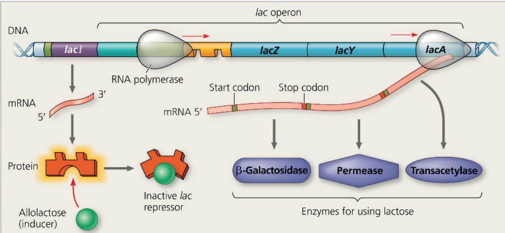  
(b) Lactose present, repressor inactive, operon on. Allolactose, an isomer of lactose, binds to the repressor, inactivating it and "derepressing" the operon. The inactive repressor cannot bind to the operator, and so the genes of the lac operon are transcribed, and the enzymes for using lactose are made.

## Figure 18.4 The lac operon in E. coli: regulated synthesis of inducible enzymes.

E. coli uses three enzymes to take up and metabolize lactose, the genes for which are clustered in the lac operon. The first gene, lacZ, codes for $\beta$ -galactosidase, which hydrolyzes lactose to glucose and galactose. The second, lacY, codes for a permease, the membrane protein that transports lactose into the cell. The third, lacA, codes for transacetylase, an enzyme that detoxifies other molecules entering the cell via the permease. Unusually, the gene for the lac repressor, lacI, is adjacent to the lac operon. The function of the teal region within the promoter will be revealed in Figure 18.5.

By producing the appropriate enzymes only when the nutrient is available, the cell avoids wasting energy and precursors making proteins that are not needed.

Regulation of both the trp and lac operons involves the negative control of genes because the operons are switched off by the active form of their respective repressor protein. It may be easier to see this for the trp operon, but it is also true for the lac operon. In the case of the lac operon, allolactose induces enzyme synthesis not by directly activating the lac operon, but by freeing it from the negative effect of the repressor (see Figure 18.4b). Gene regulation is said to be positive only when a regulatory protein interacts directly with the genome to increase transcription.

## Positive Gene Regulation

When glucose and lactose are both present in its environment, E. coli preferentially uses glucose. The enzymes for glucose breakdown in glycolysis (see Figure 9.8) are continually present. Only when lactose is present and glucose is in short supply does E. coli use lactose as an energy source, and only then does it synthesize appreciable quantities of the enzymes for lactose breakdown.

How does the E. coli cell sense the glucose concentration and relay this information to the lac operon? Again, the mechanism depends on the interaction of an allosteric regulatory protein with a small organic molecule, cyclic AMP (cAMP) in this case, which accumulates when glucose is scarce (see Figure 11.11 for the structure of cAMP). The regulatory protein, called cAMP receptor protein (CRP), is an activator, a protein that binds to DNA and stimulates transcription of a gene. (CRP is also called catabolite activator protein, or CAP.) When cAMP binds to this regulatory protein, CRP assumes its active shape and can attach to a specific site at the upstream end of the lac promoter (Figure 18.5a). This attachment increases the affinity of RNA polymerase for the lac promoter, which is actually rather low even when no lac repressor is bound to the operator. By facilitating the binding of RNA polymerase to the promoter and thereby increasing the rate of transcription of the lac operon, the attachment of CRP to the promoter directly stimulates gene expression. Therefore, this mechanism qualifies as positive regulation.

If the amount of glucose in the cell increases, the cAMP concentration falls, and without cAMP, CRP detaches from the lac operon. Because CRP is inactive, RNA polymerase binds less efficiently to the promoter, and transcription of the lac operon proceeds only at a low level, even when lactose is present Figure 18.5b. Thus, the lac operon is under dual control: negative control by the lac repressor and positive control by CRP. Whether or not transcription occurs is controlled by allolactose: Without allolactose, the lac repressor is active and the operon is off (transcription does not occur; see Figure 18.4a); with allolactose, the lac repressor is inactive and the operon is on (transcription occurs; see Figure 18.4b). The rate of transcription is controlled by whether CRP has cAMP bound to it: With bound cAMP, the rate is high; without it, the rate is low. It is as though the operon has both an on-off switch and a volume control.

Figure 18.5 Positive control of the lac operon by cAMP receptor protein (CRP).

RNA polymerase has high affinity for the lac promoter only when CRP is bound to a DNA site at the upstream end of the promoter. CRP, in turn, attaches to its DNA site only when associated with cyclic AMP (cAMP), whose concentration in the cell rises when the glucose concentration falls. Thus, when glucose is present, even if lactose is also available, the cell preferentially catabolizes glucose and makes very low levels of the enzymes for using lactose.

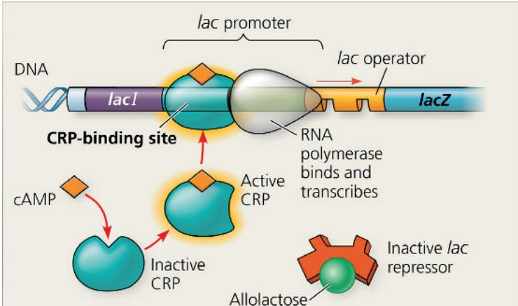  
(a) Lactose present, glucose scarce (cAMP level high): abundant lac mRNA synthesized. If glucose is scarce, the high level of cAMP activates CRP, which binds to the promoter and increases RNA polymerase binding there. The lac operon produces large amounts of mRNA coding for the enzymes that the cell needs for use of lactose.

  
(b) Lactose present, glucose present (cAMP level low): little lac mRNA synthesized. When glucose is present, cAMP is scarce, and CRP doesn't stimulate transcription to a significant rate, even though no repressor is bound.

In addition to regulating the lac operon, CRP helps regulate other operons that encode enzymes used in catabolic pathways. All told, it may affect the expression of more than 100 genes in E. coli. When glucose is plentiful and CRP is inactive, the synthesis of enzymes that catabolize compounds other than glucose generally slows down. The ability to catabolize other compounds, such as lactose, enables a cell deprived of glucose to survive. The compounds present in any given cell at a certain moment determine which operons are switched on—the result of simple interactions of activator and repressor proteins with the promoters of the genes in question.

## Concept Check 18.1

1. How does binding of the trp corepressor to the trp repressor alter repressor function and transcription? How does binding of the lac inducer alter the function of the lac repressor?

2. Describe the binding of repressors and activators to the lac operon, and the effect on transcription, when both lactose and glucose are scarce.

3. WHAT IF? A certain mutation in $E. coli$ changes the lac operator so that the active repressor cannot bind. How would this affect the cell's production of β-galactosidase?

For suggested answers, see Appendix A.

## Concept 18.2: Eukaryotic gene expression is regulated at many stages

All organisms, whether prokaryotic or eukaryotic, must regulate which genes are expressed at any given time. Both unicellular organisms and the cells of multicellular organisms continually turn genes on and off in response to signals from their external and internal environments. Regulation of gene expression is also essential for cell specialization in multicellular organisms, which are made up of different types of cells. To perform its own distinct role, each cell type must maintain a specific program of gene expression in which certain genes are expressed and others are not (see Figure 18.1).

## Differential Gene Expression

A typical human cell might express about a third to a half of its protein-coding genes at any given time. Highly differentiated cells, such as muscle or nerve cells, express a smaller fraction of their genes. Almost all the cells in a multicellular organism contain an identical genome. (Cells of the immune system are one exception, as you will see in Figure 43.13.) A subset of genes is expressed in each cell type; some of these—about 35%—are “housekeeping” genes, expressed by many cell types, while others are unique to that cell type. The uniquely expressed genes allow these cells to carry out their specific function. The differences between cell types, therefore, are due not to different genes being present, but to differential gene expression, the expression of different genes by cells with the same genome.

The function of any cell depends on its expressing the appropriate set of genes. The transcription factors of a cell must locate the right genes at the right time, a task like finding a needle in a haystack. Abnormal gene expression can cause serious imbalances and diseases, including cancer.

Figure 18.6 summarizes the process of gene expression in a eukaryotic cell, highlighting key stages in the expression of a protein-coding gene. Each stage depicted in Figure 18.6 is a potential control point at which gene expression can be turned on or off, accelerated, or slowed down. Many genes have more than one control point.

Figure 18.6 Stages in gene expression that can be regulated in eukaryotic cells.

In this diagram, the colored boxes indicate the processes most often regulated; each color indicates the type of molecule that is affected (blue = DNA, red/orange = RNA, purple = protein). The nuclear envelope separating transcription from translation in eukaryotic cells allows for RNA processing, a form of post-transcriptional control that is not possible in prokaryotic organisms. Eukaryotes also have a greater variety of control mechanisms operating before transcription and after translation. Some genes are regulated at multiple stages.

When the structure of DNA was determined in 1953, an understanding of the mechanisms that control gene expression in eukaryotes seemed almost hopelessly out of reach. Since then, advances in DNA technology (see Chapter 20) have enabled molecular biologists to uncover many details of eukaryotic gene regulation. In all organisms, gene expression is commonly controlled at transcription; regulation at this stage often occurs in response to signals coming from outside the cell, such as hormones or other signaling molecules. For this reason, the term gene expression is often equated with transcription for both bacteria and eukaryotes. While this may be the case for bacteria, the greater complexity of eukaryotic cell structure and function provides opportunities for regulating gene expression at many stages besides transcription (see Figure 18.6). Let's examine some of the important control points of eukaryotic gene expression more closely.

## Regulation of Chromatin Structure

Recall that the DNA of eukaryotic cells is packaged with proteins in an elaborate complex known as chromatin, the basic unit of which is the nucleosome (see Figure 16.23). The structural organization of chromatin not only packs a cell's DNA into a compact form that fits inside the nucleus, but also helps regulate gene expression in several ways. Genes within heterochromatin, which is more densely arranged than euchromatin, are usually not expressed. In euchromatin, whether or not a gene is transcribed is affected by the location of nucleosomes along a gene's promoter and also the sites where the DNA attaches to the protein scaffolding of the chromosome. Chromatin structure and gene expression can be influenced by chemical modifications of both the histone proteins of the nucleosomes around which DNA is wrapped and the nucleotides that make up that DNA. Here we examine the effects of these modifications, which are catalyzed by specific enzymes.

## Histone Modifications and DNA Methylation

Chemical modifications to histones, found in all eukaryotic organisms, play a direct role in the regulation of gene transcription. The N-terminus of each histone protein in a nucleosome protrudes outward from the nucleosome (Figure 18.7a). These so-called histone tails are accessible to various modifying enzymes that catalyze the addition or removal of specific chemical groups, such as acetyl ( $—COCH_{3}$ ), methyl, and phosphate groups (see Figure 4.9). Generally, histone acetylation—the addition of an acetyl group to an amino acid in a histone tail—appears to promote transcription by opening up chromatin structure (Figure 18.7b), while the addition of methyl groups to histones can lead to the condensation of chromatin and reduced transcription. Often, the addition of a particular chemical group may create a new binding site for enzymes that further modify chromatin structure.

Rather than modifying histone proteins, a different set of enzymes can methylate the DNA itself on certain bases, usually cytosine. Such DNA methylation occurs in most plants, animals, and fungi. Long stretches of inactive DNA, such as that of inactivated mammalian X chromosomes (see Figure 15.8), are generally more methylated than regions of actively transcribed DNA. On a smaller scale, the DNA of individual genes is usually more heavily methylated in cells in which those genes are not expressed. Removal of the extra methyl groups can turn on some of these genes.

Figure 18.7 A simple model of histone tails and the effect of histone acetylation.

Amino acids in histone tails may be chemically modified by addition of acetyl groups (green balls) or other groups (such as methyl or phosphate groups). Such modifications affect chromatin structure in a region, sometimes by providing binding sites for other chromatin-modifying enzymes.

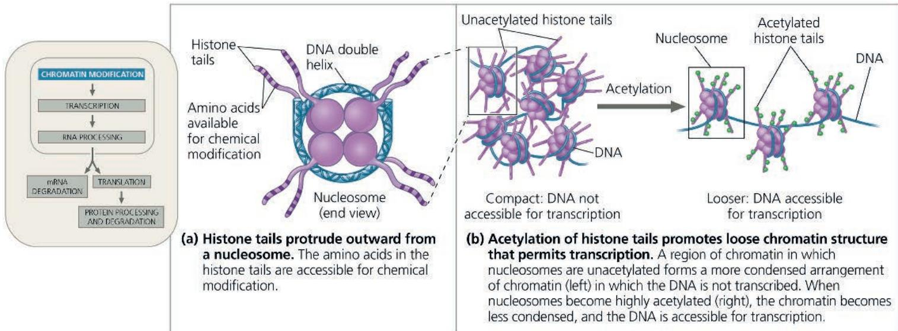

Once methylated, genes usually stay that way through successive cell divisions in a given individual. At DNA sites where one strand is already methylated, enzymes methylate the correct daughter strand after each round of DNA replication. Methylation patterns are thus passed on to daughter cells, and cells forming specialized tissues keep a chemical record of what occurred during embryonic development. A methylation pattern maintained in this way also accounts for genomic imprinting in mammals, where methylation permanently regulates expression of either the maternal or paternal allele of particular genes at the start of development (see Figure 15.17). DNA methylation and histone modification are believed to be coordinated in their regulation.

## Epigenetic Inheritance

The chromatin modifications that we just discussed do not change the DNA sequence, yet they still may be passed along to future generations of cells. Inheritance of traits transmitted by mechanisms not involving the nucleotide sequence itself is called epigenetic inheritance, the study of which is called epigenetics. Whereas mutations in the DNA are permanent changes, modifications to the chromatin can be reversed. For example, DNA methylation patterns are largely erased during gamete formation and reestablished during embryonic development. Furthermore, they are changeable, thus responding more rapidly to environmental conditions.

Research on epigenetics has skyrocketed over the past few decades. The importance of epigenetic information in regulating gene expression is now widely accepted. One key study by researchers at Duke University in the early 2000s used a mouse mutant whose genome had been altered so that a gene called agouti that determines coat color, normally expressed only briefly during fur formation, was instead expressed throughout development. This overexpression resulted in yellow mice (Figure 18.8, left mouse) rather than the usual brownish (“agouti”) color. Previous work had shown that factors other than DNA sequence changes (thus epigenetic factors) could affect how this mutation affected the phenotype: Merely supplementing the diet of pregnant mothers with methyl group-containing compounds (like folic acid) could shift the range of coat colors of the offspring back to normal (see Figure 18.8, right mouse). The Duke researchers reproduced this result, analyzing the state of methylation of the DNA. They showed that the extent of the color shift correlated with the level of DNA methylation. In other words, feeding methyl groups to the mothers at a key time during gestation led to a change in gene expression in the offspring’s phenotype. Further studies showed that the effects were even observed in the next generation—the “grandpups” of the original female mouse.

A similar epigenetic effect due to changes in methylation occurs in humans as well. Near the end of World War II, during the winter of 1944–45, Dutch railway workers went on strike to try to prevent the Nazis from bringing in more troops. In retaliation, the Nazis blocked all deliveries of food. Over 20,000 Dutch died in the “Dutch Hunger Winter.” In long-term clinical studies, researchers found that the offspring of individuals who

Figure 18.8 An example of epigenetic inheritance: Effects of maternal diet on genetically identical mice.

These two mice are genetically identical (agouti mutants), but their mothers were fed different diets. A maternal diet without compounds that donate methyl groups resulted in the obese, yellow offspring on the left. A diet supplemented with methyl-donating compounds, such as folic acid, led to the speckled brown fur (normal agouti phenotype) and normal weight of the mouse on the right.

were in early pregnancy at that time experienced adverse health effects as adults: higher rates of obesity, high triglyceride and cholesterol levels, type 2 diabetes, and schizophrenia. Furthermore, these affected offspring had a 10% higher mortality rate after the age of 68 than their siblings who were in utero when food was readily available. A collaboration between labs in the Netherlands and the United States compared those adults with their siblings and published their findings in 2018. Statistical analysis enabled the researchers to conclude that differences between the siblings in DNA methylation of certain genes caused these long-term adverse medical conditions—examples of epigenetic inheritance.

Epigenetic variations might help explain cases where one identical twin acquires a genetically based disease, such as schizophrenia, but the other does not, despite their identical genomes. Some differences in behavior or environment may lead to differing degrees of DNA methylation in the two twins. Alterations in normal patterns of DNA methylation are seen in some cancers, where they are associated with inappropriate gene expression. Evidently, enzymes that modify chromatin structure are integral parts of the eukaryotic cell's machinery for regulating transcription.

## Regulation of Transcription Initiation

Chromatin-modifying enzymes provide initial control of gene expression by making a region of DNA either more or less able to bind the transcription machinery. Once the chromatin of a gene is optimally modified for expression, the initiation of transcription is the next major step at which gene expression is regulated. As in bacteria, the regulation of transcription initiation in eukaryotes involves proteins that bind to DNA and either facilitate or inhibit binding of RNA polymerase. The process is more complicated in eukaryotes, however. Before looking at how eukaryotic cells control their transcription, let's review the structure of a eukaryotic gene.

## Organization of a Typical Eukaryotic Gene and Its Transcript

A eukaryotic gene and the DNA elements (segments) that control it are typically organized as shown in Figure 18.9, which extends what you learned about eukaryotic genes in Chapter 17. Recall that a cluster of proteins called a transcription initiation complex assembles on the promoter sequence at the “upstream” end of the gene (see Figure 17.9). One of these proteins, RNA polymerase II, then proceeds to transcribe the gene, synthesizing a primary RNA transcript (pre-mRNA). RNA processing includes enzymatic addition of a 5' cap and a poly-A tail, as well as splicing out of introns, to yield a mature mRNA. Associated with most eukaryotic genes are multiple control elements, segments of noncoding DNA that serve as binding sites for the proteins called transcription factors, which bind to the control

Figure 18.9 A eukaryotic gene and its transcript.

Each eukaryotic gene has a promoter—a DNA sequence where RNA polymerase II binds and starts transcription, proceeding “downstream.” A number of control elements (gold) are involved in regulating the initiation of transcription; these are DNA sequences located near (proximal to) or far from (distal to) the promoter. Distal control elements can be grouped together as enhancers, one of which is shown for this gene. At the other end of the gene, a polyadenylation (poly-A) signal sequence in the last exon of the gene elements and regulate transcription. Control elements on the DNA and the transcription factors that bind to them are critical to the precise regulation of gene expression seen in different cell types.

## The Roles of General and Specific Transcription Factors

There are two types of transcription factors: General transcription factors act at the promoter of all genes, while some genes require specific transcription factors that bind to control elements that may be close to or farther away from the promoter.

## General Transcription Factors at the Promoter

To initiate transcription, eukaryotic RNA polymerase II requires the assistance of transcription factors. Some transcription factors (such as those illustrated in Figure 17.9) are essential for the transcription of all protein-coding genes; therefore, they are often called general transcription factors. A few general transcription factors bind to a DNA sequence, such as the TATA box in most promoters, but many bind to proteins, including other transcription factors as well as RNA polymerase II. Protein-protein interactions are crucial to the initiation of eukaryotic transcription. Only when the complete initiation complex has

is transcribed into an RNA sequence that signals where the transcript is cleaved and the poly-A tail added. Transcription may continue for hundreds of nucleotides beyond the poly-A signal before terminating. RNA processing of the primary transcript into a functional mRNA involves three steps: addition of the 5' cap, addition of the poly-A tail, and splicing. In the cell, the 5' cap is added soon after transcription is initiated, and splicing occurs while transcription is still under way (see Figures 17.11 and 17.12).

assembled can the polymerase begin to move along the DNA template strand and transcribe.

Some genes are expressed all the time, but others are not; instead, they are regulated. For these genes, the interaction of general transcription factors and RNA polymerase II with a promoter usually leads to a low rate of initiation and production of few RNA transcripts from genes that are not expressed at significant levels all the time or in all cells. In eukaryotes, high levels of transcription of these particular genes at the appropriate time and place depend on the interaction of control elements with another set of proteins, which can be thought of as specific transcription factors.

## Enhancers and Specific Transcription Factors

As you can see in Figure 18.9, some control elements, named proximal control elements, are close to the promoter. The more distant distal control elements, groupings of which are called enhancers, may be thousands of nucleotides upstream or downstream of a gene or even within an intron. A given gene may have multiple enhancers, each active at a different time, cell type, or location in the organism. Each enhancer, however, is generally associated with only that gene and no other.

In eukaryotes, the rate of gene expression can be strongly increased or decreased by the binding of specific transcription factors, either activators or repressors, to the control elements of enhancers. Many hundreds of transcription activators have been discovered in eukaryotes; the structure of one is shown in Figure 18.10. Researchers have identified two types of structural domains that are commonly found in a large number of transcription activators: a DNA-binding domain—a part of the protein's three-dimensional structure that binds to DNA—and one or more activation domains. Activation domains bind other regulatory proteins or components of the transcription machinery, facilitating a series of protein-protein interactions that result in enhanced transcription of a given gene.

Figure 18.11 shows the currently accepted model for how binding of activators to an enhancer located far from the promoter influences transcription. Protein-mediated bending of the DNA brings the bound activators into contact with a group of mediator proteins, which in turn interact with general transcription factors at the promoter. These protein-protein interactions help assemble and position the initiation complex on the promoter. One study supporting this model shows that proteins regulating one of the mouse globin genes contact both the gene's promoter and an enhancer located about 50,000 nucleotides upstream. Protein interactions allow these two DNA regions to come together in a very specific fashion, in spite of the many nucleotide pairs between them.

Specific transcription factors that function as repressors can inhibit gene expression in several different ways. Some repressors bind directly to control element DNA (in enhancers or elsewhere), blocking activator binding. Other repressors interfere with the activator itself so it can't bind the DNA.

In addition to influencing transcription directly, some activators and repressors indirectly affect chromatin structure. Studies using yeast and mammalian cells show that some

## Figure 18.10 The structure of MyoD, a transcriptional activator.

The MyoD protein is made up of two polypeptide subunits (purple ribbon starting at upper left and salmon ribbon starting at upper right) with extensive regions of $\alpha$ helix. Each subunit has one DNA-binding domain (lower half) and one activation domain (upper half). The latter includes binding sites for the other subunit and for other proteins. MyoD is involved in muscle development in vertebrate embryos (see Concept 18.4).

  
VISUAL SKILLS Describe how the two functional domains of the MyoD protein relate to the two polypeptide subunits.
For suggested answer, see Appendix A.

activators recruit proteins that acetylate histones near the promoters of specific genes, thus promoting transcription (see Figure 18.7). Similarly, some repressors recruit proteins that remove acetyl groups from histones, leading to reduced transcription, a phenomenon referred to as silencing. Indeed, recruitment of chromatin-modifying proteins seems to be the most common mechanism of repression in eukaryotic cells.

## Combinatorial Control of Gene Activation

In eukaryotes, the precise control of transcription depends largely on the binding of activators to DNA control elements. Considering that many genes must be regulated in a typical animal or plant cell, the number of different nucleotide sequences in control elements is surprisingly small. A dozen or so short nucleotide sequences appear again and again in the control elements for different genes. On average, each enhancer is composed of about ten control elements, each binding only one or two specific transcription factors. It is the particular combination of control elements in an enhancer associated with a gene, rather than a single unique control element, that is important in regulating transcription of the gene.

Even with only a dozen control element sequences available, many combinations are possible. Each combination of control elements can activate transcription only when the appropriate transcription activators are present, which may occur at a precise time during development or in a particular cell type.

Figure 18.11 A model for the action of enhancers and transcription activators.

Bending of the DNA by a protein enables enhancers to influence a promoter hundreds or even many thousands of nucleotides away. Specific transcription factors (activators) bind to the enhancer DNA sequences and then to a group of mediator proteins. These in turn bind to general transcription factors and then RNA polymerase II, thus assembling the transcription initiation complex. These protein-protein interactions lead to correct positioning of the complex on the promoter and the initiation of a significant rate of RNA synthesis. Only one enhancer (with three gold control elements) is shown here, but a gene may have several enhancers that act at different times or in different cell types.

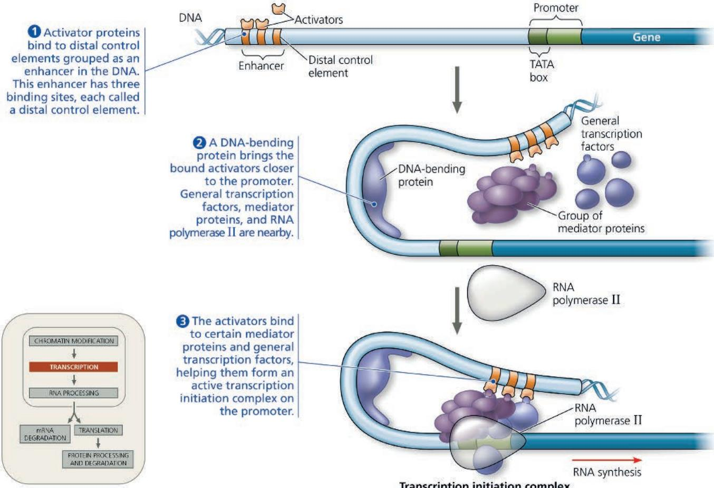  
Transcription initiation complex

In the Scientific Skills Exercise, you can work with data from an experiment that identified the control elements in an enhancer of a particular human gene. Figure 18.12 illustrates how the use of different combinations of just a few control elements can allow differential regulation of transcription in two representative cell types—liver cells and lens cells. This can occur because each cell type contains a different group of transcription activators. How cell types come to differ during this process, even though they all arise from one cell (the fertilized egg), will be explored in Concept 18.4.

## Coordinately Controlled Genes in Eukaryotes

How does the eukaryotic cell deal with a group of genes of related function that need to be turned on or off at the same time? Earlier in this chapter, you learned that in bacteria, such coordinately controlled genes are often clustered into an operon, which is regulated by a single promoter and transcribed into a single mRNA molecule. Thus, the genes are expressed together, and the encoded proteins are produced at the same time. With a few exceptions,

operons that work in this way have not been found in eukaryotic cells.

Eukaryotic genes that are co-expressed, such as genes coding for the enzymes of a metabolic pathway, are typically scattered over different chromosomes. Here, coordinate gene expression depends on every gene of a dispersed group having a specific combination of control elements. Transcription activators in the nucleus that recognize the control elements bind to them, promoting simultaneous transcription of the genes, no matter where they are in the genome.

Coordinate control of dispersed genes in a eukaryotic cell often occurs in response to chemical signals from outside the cell. A steroid hormone, for example, enters a cell and binds to a specific intracellular receptor protein, forming a hormone-receptor complex that serves as a transcription activator (see Figure 11.9). Every gene whose transcription is stimulated by a given steroid hormone, regardless of its chromosomal location, has a control element recognized by that hormone-receptor complex. This is how estrogen activates a group of genes that stimulate cell division in uterine cells, preparing the uterus for pregnancy.

# Scientific Skills Exercise Analyzing DNA Deletion Experiments

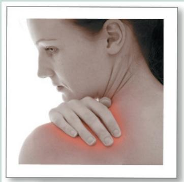  
Tissue inflammation

What Control Elements Regulate Expression of the mPGES-1 Gene? The promoter of a gene includes the DNA immediately upstream of the transcription start site, but the control elements (grouped in an enhancer) that regulate the level of transcription of the gene may be thousands of base pairs upstream of the promoter. Because the distance and spacing of

control elements make them difficult to identify, scientists begin by deleting possible control elements and measuring the effect on gene expression. In this exercise, you will analyze data obtained from DNA deletion experiments that tested possible control elements for the human gene mPGES-1. This gene codes for an enzyme that synthesizes a type of prostaglandin, a chemical made during tissue inflammation.

How the Experiment Was Done The researchers hypothesized that there were three possible control elements in an enhancer region located 8–9 kilobases (kb) upstream of the mPGES-1 gene. Control elements regulate whatever gene is in the appropriate downstream location. Thus, to test the activity of the possible elements, researchers first synthesized molecules of DNA (DNA constructs) that had the intact enhancer region upstream of a reporter gene, a gene whose mRNA product could be easily measured experimentally. Next, they made three more DNA constructs, with one of the three proposed control elements deleted in each (see the left side of the figure). The researchers then introduced each DNA construct into a separate human cell culture, where the cells took up the DNA. After 48 hours, the amount of reporter gene mRNA made by the cells was measured. Comparing these amounts allowed researchers to determine if any of the deletions had an effect on expression of the reporter gene, mimicking the effect of deletions on mPGES-1 gene expression. (The mPGES-1 gene itself couldn't be used to measure expression levels because the cells express their own mPGES-1 gene, and the mRNA from that gene would confuse the results.)

Data from the Experiment The diagrams on the left side of the figure show the intact DNA sequence (top) and the three experimental DNA constructs. A red X is located on the possible control element (1, 2, or 3) that was deleted in each experimental DNA construct. The area between the slashes represents the approximately 8 kb of DNA located between the promoter and the enhancer region. The horizontal bar graph on the right shows the amount of reporter gene mRNA that was present in each cell culture after 48 hours relative to the amount that was in the culture containing the intact enhancer region (top bar = 100%).

  
Data from J. N. Walters et al., Regulation of human microsomal prostaglandin E synthase-1 by IL-1b requires a distal enhancer element with a unique role for C/EBPb, Biochemical Journal 443:561–571 (2012).

## INTERPRET THE DATA

1. (a) What is the independent variable in the graph? (b) What is the dependent variable? (c) What was the control treatment in this experiment? Label it on the diagram.

2. Do the data suggest that any of these possible control elements are actual control elements? Explain.

3. (a) Did deletion of any of the possible control elements cause a reduction in reporter gene expression? If so, which one(s), and how can you tell? (b) If loss of a control element causes a reduction in gene expression, what must be the normal role of that control element? Provide a biological explanation for how the loss of such a control element could lead to a reduction in gene expression.

4. (a) Did deletion of any of the possible control elements cause an increase in reporter gene expression relative to the control? If so, which one(s), and how can you tell? (b) If loss of a control element causes an increase in gene expression, what must be the normal role of that control element? Propose a biological explanation for how the loss of such a control element could lead to an increase in gene expression.

Instructors: A version of this Scientific Skills Exercise can be assigned in Mastering Biology.

## Figure 18.12 Cell type-specific transcription.

Both liver cells and lens cells have the genes for making the proteins albumin and crystallin, but only liver cells make albumin (a blood protein) and only lens cells make crystallin (the main protein of the lens of the eye). The specific transcription factors made in a cell determine which genes are expressed. In this example, the genes for albumin and crystallin are shown at the top, each with an enhancer made up of three different control elements. Although the enhancers for the two genes both have a gray control element (2), each enhancer has a unique combination of elements. All the transcription activator proteins required for high-level expression of the albumin gene are present in liver cells only (left), whereas the activators needed for expression of the crystallin gene are present in lens cells only (right). For simplicity, we consider only the role of specific transcription factors that are activators.

VISUAL SKILLS Describe the enhancer for the albumin gene in each type of cell. How would the nucleotide sequence of this enhancer in the liver cell compare with that in the lens cell? For suggested answer, see Appendix A.

Many signaling molecules, such as nonsteroid hormones and growth factors, bind to receptors on a cell's surface and never actually enter the cell. Such molecules can control gene expression indirectly by triggering signal transduction pathways that activate particular transcription factors (see Figure 11.15). Coordinate regulation in such pathways is the same as for steroid hormones: Genes with the same sets of control elements are activated by the same chemical signals. Because this system for coordinating gene regulation is so widespread, biologists think that it probably arose early in evolutionary history.

## Nuclear Architecture and Gene Expression

Each chromosome in the interphase nucleus of animal cells occupies a distinct territory (see Figure 16.24a). Recently, chromosome conformation capture techniques (3C and others) have been developed that allow researchers to cross-link and identify regions of chromosomes associating with each other during interphase. These studies reveal two organizational details: First, the territory of each chromosome is divided into regions of chromatin loops (topologically associated domains, or TADs), within which chromatin sites associate mainly with each other. Second, loops of chromatin, each likely a TAD, extend from individual chromosomal territories into specific sites in the nucleus (Figure 18.13). Different loops from the same chromosome and loops from other chromosomes may congregate in such sites, some of which are rich in RNA polymerases and other

transcription-associated proteins. Like a recreation center that draws members from many different neighborhoods, these so-called transcription factories are thought to be areas specialized for a common function.

The old view that the nuclear contents are like a bowl of amorphous chromosomal spaghetti has given way to a new model of a nucleus with a defined architecture and regulated movements of chromatin. Several lines of evidence suggest that unexpressed genes are located in the outer edges of the nucleus, while those that are being expressed are found in its interior region. Relocation of particular genes from their chromosomal territories to transcription factories in the interior may be part of the process of readying genes for transcription. Research into organization of the genome over time and its relationship to genome function is a focus of current research. This is of interest in part because alterations in genome architecture have been implicated in some neuropsychological and other disorders.

## Mechanisms of Post-transcriptional Regulation

Transcription alone does not constitute gene expression. The expression of a protein-coding gene is ultimately measured by the amount of functional protein a cell makes, and much happens between the synthesis of the RNA transcript and the activity of

Figure 18.13 Chromosomal interactions in the interphase nucleus.

Although each chromosome has its own territory (see Figure 16.24a), loops of chromatin may extend into other sites in the nucleus. (Each loop may be a topologically associated domain, or TAD.) Some of these sites are transcription factories that are occupied by multiple chromatin loops from the same chromosome (blue loops at the lower left) or other chromosomes (red loop at the top and green loop on the right).

  
the protein in the cell. Many regulatory mechanisms operate at the various stages after transcription (see Figure 18.6). These mechanisms allow a cell to rapidly fine-tune gene expression in response to environmental changes without altering its transcription patterns. Here we explore how cells regulate gene expression after transcription.

## RNA Processing

RNA processing in the nucleus and the export of mature RNA to the cytoplasm provide opportunities for regulating gene expression not available in prokaryotic organisms. One example of regulation at the RNA-processing level is alternative RNA splicing, in which different mRNA molecules are produced from the same primary transcript, depending on which RNA segments are treated as exons and which as introns. Regulatory proteins specific to a particular cell type exert control over intron/exon choices by binding to regulatory sequences within the primary transcript.

A simple example of alternative RNA splicing is shown in Figure 18.14 for the troponin T gene, which encodes multiple closely related proteins with slightly different effects on muscle contraction. Other genes code for many more products.

For instance, researchers have found a Drosophila gene with enough alternatively spliced exons to generate about 19,000 membrane proteins that have different extracellular domains. At least 17,500 (94%) of the alternative mRNAs are actually synthesized. Each developing nerve cell in the fly appears to synthesize a different form of the protein, which acts as a unique identifier on the cell surface and helps prevent excessive overlap of nerve cells during development of the nervous system.

Alternative RNA splicing can significantly expand the repertoire of a eukaryotic genome. In fact, alternative splicing was proposed as one explanation for the surprisingly low number of human genes counted when the human genome was sequenced. The number of human genes was found to be similar to that of a soil worm (nematode), a mustard plant, or a sea anemone. This discovery prompted questions about what, if not the number of genes, accounts for the more complex form and structure of humans. More than 90% of human protein-coding genes likely undergo alternative splicing. Thus, the extent of alternative splicing greatly multiplies the number of possible human proteins, which may be better correlated with complexity of form than the number of genes.

## Initiation of Translation and mRNA Degradation

Translation is another stage where gene expression is regulated, most commonly at the initiation stage (see Figure 17.19). For some mRNAs, the initiation of translation can be blocked by regulatory proteins that bind to specific sequences or structures within the untranslated region (UTR) at the 5' or 3' end, preventing the attachment of ribosomes. (Recall from Concept 17.3 that both

## Figure 18.14 Alternative RNA splicing of the troponin T gene.

The primary transcript of this gene can be spliced in more than one way, generating different mRNA molecules. Notice that one mRNA molecule has ended up with exon 3 (green) and the other with exon 4 (purple). These two mRNAs are translated into different but related muscle proteins.

the 5' cap and the poly-A tail of an mRNA molecule are important for ribosome binding.)

Alternatively, translation of all the mRNAs in a cell may be regulated simultaneously. In a eukaryotic cell, such “global” control usually involves the activation or inactivation of one or more protein factors required to initiate translation. This mechanism plays a role in starting translation of mRNAs that are stored in eggs. Just after fertilization, translation is triggered by the sudden activation of translation initiation factors. The response is a burst of synthesis of the proteins encoded by the stored mRNAs. Some plants and algae store mRNAs during periods of darkness; light then triggers the reactivation of the translational apparatus.

The life span of mRNA molecules in the cytoplasm is important in determining the pattern of protein synthesis in a cell. Bacterial mRNA molecules typically are degraded by enzymes within a few minutes. This short life span of mRNAs is one reason bacteria can change their patterns of protein synthesis so quickly in response to environmental changes. In contrast, some mRNAs in multicellular eukaryotes typically survive for hours, days, or even weeks. For instance, the mRNAs for the hemoglobin polypeptides ( $\alpha$ -globin and $\beta$ -globin) in developing red blood cells are unusually stable, and these long-lived mRNAs are translated repeatedly in red blood cells.

Nucleotide sequences that affect how long an mRNA remains intact are often found in the untranslated region at the 3' end of the molecule (see Figure 18.9). In one experiment, researchers transferred such a sequence from the short-lived mRNA for a growth factor to the 3' end of a normally stable globin mRNA. The globin mRNA was quickly degraded.

Other mechanisms that degrade or block expression of mRNA molecules have come to light. They involve a group of RNA molecules that regulate gene expression at several levels, as you'll see shortly.

## Protein Processing and Degradation

The final opportunities for controlling gene expression occur after translation. Often, eukaryotic polypeptides must be processed to yield functional protein molecules. For instance, cleavage of the initial insulin polypeptide (pro-insulin) forms the active hormone. In addition, many proteins undergo chemical modifications that make them functional. Regulatory proteins are commonly activated or inactivated by the reversible addition of phosphate groups (see Figure 11.10), and proteins destined for the surface of animal cells acquire sugars (see Figure 6.12). Cell-surface proteins and many others must also be transported to target destinations in the cell in order to function (see Figure 17.22). Regulation might occur at any of the steps involved in modifying or transporting a protein.

Finally, the length of time each protein functions in the cell is strictly regulated by selective degradation. Many proteins, such as the cyclins involved in regulating the cell cycle, must be relatively short-lived if the cell is to function appropriately (see Figure 12.16). To mark a protein for destruction, the cell commonly attaches molecules of a small protein called ubiquitin to the protein. Giant protein complexes called proteasomes then recognize the ubiquitin tagged proteins and degrade them.

## Concept Check 18.2

1. In general, what are the effects of histone acetylation and DNA methylation on gene expression?

2. MAKE CONNECTIONS Speculate about whether the same enzyme could methylate both a histone and a DNA base. (See Concept 8.4.)

3. Compare the roles of general and specific transcription factors in regulating gene expression.

4. Once mRNA encoding a particular protein reaches the cytoplasm, what are four mechanisms that can regulate the amount of the protein that is active in the cell?

5. WHAT IF? Suppose you compared the nucleotide sequences of the distal control elements in the enhancers of three genes that are expressed only in muscle cells. What would you expect to find? Why?

For suggested answers, see Appendix A.

## Concept 18.3: Noncoding RNAs play multiple roles in controlling gene expression

Genome sequencing has revealed that protein-coding DNA accounts for only 1.5% of the human genome and a similarly small percentage of the genomes of many other multicellular eukaryotes. A very small fraction of the non-protein-coding DNA consists of genes for RNAs such as ribosomal RNA and transfer RNA. Until recently, scientists assumed that most of the remaining DNA was not transcribed, thinking that since it didn't specify proteins or the few known types of RNA, such DNA didn't contain meaningful genetic information—in fact, it was called “junk DNA.” However, genomic studies have cast doubt on this description. For example, a massive study showed that roughly 75% of the human genome is transcribed at some point in any given cell. Introns account for only a fraction of this transcribed RNA, most of which is untranslated. The verdict is still out on how much of the transcribed RNA is functional, but at least some of the genome is transcribed into non-protein-coding RNAs (also called noncoding RNAs, or ncRNAs), including a variety of small RNAs. Researchers are uncovering more evidence of the biological roles of these ncRNAs every day.

These discoveries revealed a large and diverse population of RNA molecules in the cell that play crucial roles in regulating gene expression and had gone largely unnoticed. The longstanding view that mRNAs are the most important RNAs because they code for proteins needed revision. This has represented a major shift in thinking by biologists, one that you are witnessing as students entering this field of study.

## Effects on mRNAs by MicroRNAs and Small Interfering RNAs

Regulation by both small and large ncRNAs occurs at several points in the pathway of gene expression, including mRNA translation and chromatin modification. We'll examine two types of small ncRNAs, the importance of which was acknowledged when their discovery was the focus of the 2006 Nobel Prize in Physiology or Medicine, which was awarded for work completed only eight years earlier.

Since 1993, a number of research studies have uncovered microRNAs (miRNAs)—small, single-stranded RNA molecules capable of binding to complementary sequences in mRNA molecules. A longer RNA precursor is processed by cellular enzymes into an miRNA, a single-stranded RNA of about 22 nucleotides that forms a complex with one or more proteins (Figure 18.15). The miRNA allows the complex to bind to any mRNA molecule with at least seven or eight nucleotides of complementary sequence. The miRNA-protein complex then degrades the target mRNA or, less often, simply blocks its translation. There are approximately 2,500

Figure 18.15 Regulation of gene expression by microRNAs (miRNAs).

An miRNA of about 22 nucleotides, formed by enzymatic processing of an RNA precursor, associates with one or more proteins in a complex that can degrade or block translation of target mRNAs.

  
2 If miRNA and mRNA bases are complementary all along their length, the mRNA is degraded (left); if the match is less complete, translation is blocked (right).

genes for miRNAs in the human genome, and biologists estimate that expression of at least one-half of all human genes may be regulated by miRNAs, a remarkable figure given that the existence of miRNAs was unknown until the early 1990s.

Another class of small noncoding RNAs, similar in size and function to miRNAs, is called small interfering RNAs (siRNAs). Both miRNAs and siRNAs can associate with the same proteins, producing similar results. In fact, if siRNA precursor RNA molecules are injected into a cell, the cell's machinery can process them into siRNAs that turn off expression of genes with related sequences, similarly to how miRNAs function. The distinction between miRNAs and siRNAs is based on subtle differences in the structure of their precursors, which in both cases are RNA molecules that are mostly double-stranded. The blocking of gene expression by siRNAs, referred to as RNA interference (RNAi), is used in the laboratory as a means of disabling specific genes to investigate their function.

EVOLUTION How did the RNAi pathway evolve? As you will learn in Concept 19.2, some viruses have double-stranded RNA genomes. Given that the cellular RNAi pathway can process double-stranded RNAs into homing devices that lead to destruction of related RNAs, some scientists think that this pathway may have evolved as a natural defense against infection by such viruses. However, the fact that RNAi can also affect the expression of nonviral cellular genes may reflect a different evolutionary origin for the RNAi pathway.

While this section has focused on ncRNAs in eukaryotes, small ncRNAs are also used by bacteria as a defense system, called the CRISPR-Cas9 system, against viruses that infect them (see Concept 17.5). The use of ncRNAs thus evolved long ago, but we don't yet know how bacterial ncRNAs are related to those of eukaryotes.

## Chromatin Remodeling and Effects on Transcription by ncRNAs

In addition to regulating mRNAs, small noncoding RNAs can cause remodeling of chromatin structure. In the S phase of the cell cycle, for example, the centromeric regions of DNA must be loosened for chromosomal replication and then recondensed into heterochromatin in preparation for mitosis. In some yeasts, siRNAs produced by the yeast cells from the centromeric DNA are required to re-form the heterochromatin at the centromeres. Exactly how the process starts is still debated, but biologists agree on the general idea: The siRNA system in yeast interacts with other, larger noncoding RNAs and with chromatin-modifying enzymes to condense the centromere chromatin into heterochromatin. In most mammalian cells, siRNAs have not been found, and the mechanism for centromere DNA condensation is not yet understood. However, it may also turn out to involve small noncoding RNAs.

A recently discovered class of small ncRNAs called piwi-interacting RNAs, or piRNAs, also induce formation of heterochromatin, blocking expression of some parasitic DNA elements in the genome known as transposons. (Transposons are discussed in Concept 21.4.) Usually 24–31 nucleotides in length, piRNAs are processed from a longer, single-stranded RNA precursor. They play an indispensable role in the germ cells of many animal species, where they appear to help

## Interview

Interview with Haifan Lin: Discovering piwi-interacting RNAs and connections to testicular cancer (eTextbook only)

reestablish appropriate methylation patterns in the genome during gamete formation.

Researchers have also found a relatively large number of long noncoding RNAs (lncRNAs), ranging from 200 to hundreds of thousands of nucleotides in length, that are expressed at significant levels in specific cell types at particular times. The functional significance of these lncRNAs has been debated, but in 2017 a large international research consortium published an atlas of almost 28,000 such RNAs; their analysis supported the idea that almost 20,000 were functional and that some were associated with specific diseases. One lncRNA, long known to be functional, is responsible for X chromosome inactivation, which prevents expression of genes located on one of the X chromosomes in most female mammals (see Figure 15.8). In this case, lncRNAs—transcripts of the XIST gene located on the chromosome to be inactivated—bind back to and coat that chromosome. This binding leads to condensation of the entire chromosome into heterochromatin.

The examples just described involve chromatin remodeling in large regions of the chromosome. Because chromatin structure affects transcription and thus gene expression, RNA-based regulation of chromatin structure is sure to play an important role in gene regulation. Additionally, some experimental evidence supports the idea of an alternate role for lncRNAs in which they can act as a scaffold, bringing DNA, proteins, and other RNAs together into complexes. These associations may act either to condense chromatin or, in some cases, to help bring the enhancer of a gene together with mediator proteins and the gene's promoter, activating gene expression in a more direct fashion.

Given the extensive functions of noncoding RNAs, it is not surprising that many of the ncRNAs characterized thus far play important roles in embryonic development—the topic we turn to in the next section. Embryonic development is perhaps the ultimate example of precisely regulated gene expression.

# Concept 18.4: A program of differential gene expression leads to the different cell types in a multicellular organism

In the embryonic development of multicellular organisms, a fertilized egg (a zygote) gives rise to cells of many different types, each with a different structure and corresponding function. Typically, cells are organized into tissues, tissues into organs, organs into organ systems, and organ systems into the whole organism. Thus, any developmental program must produce cells of different types that form higher-level structures arranged in a particular way in three dimensions. The processes that occur during animal development are detailed in Chapter 47; in this chapter, we focus on the program of regulation of gene expression that orchestrates development, using a few animal species as examples.

## A Genetic Program for Embryonic Development

The photos in Figure 18.16 illustrate the dramatic difference between a frog zygote (fertilized egg) and the tadpole it becomes. This remarkable transformation results from three interrelated processes: cell division, cell differentiation, and morphogenesis. Through a succession of mitotic cell divisions, the zygote gives rise to a large number of cells. Cell division alone, however, would merely produce a great ball of identical cells, nothing like a tadpole. During embryonic development, cells not only increase in number, but also undergo cell differentiation, the process by which cells become specialized in structure and function. Moreover, the different kinds of cells are not randomly distributed

## Figure 18.16 From fertilized egg to animal: What a difference four days makes.

It takes just four days for cell division, differentiation, and morphogenesis to transform each of the fertilized frog eggs shown in (a) into a tadpole like the one in (b).

## Concept Check 18.3

1. Compare miRNAs and siRNAs, including their functions.

2. WHAT IF? Suppose the mRNA being degraded in Figure 18.14 coded for a protein that promotes cell division in a multicellular organism. What would happen if a mutation disabled the gene for the miRNA that triggers this degradation?

3. MAKE CONNECTIONS Inactivation of one of the X chromosomes in female mammals involves a noncoding RNA (XIST). Suggest a model for how XIST RNA initiates Barr body formation (see Concept 15.2).

For suggested answers, see Appendix A.

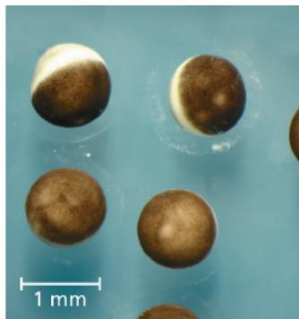  
(a) Fertilized eggs of a frog

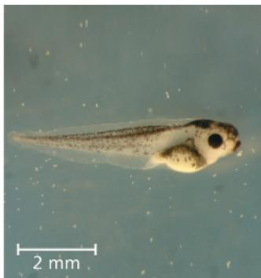  
(b) Newly hatched tadpole

but are organized into tissues and organs in a particular three-dimensional arrangement. The physical processes that give an organism its shape constitute morphogenesis, the development of the form of an organism and its structures.

All three processes are rooted in cellular behavior. Even morphogenesis, the shaping of the organism, can be traced back to changes in the shape, motility, and other characteristics of the cells that make up various regions of the embryo. As you have seen, the activities of a cell depend on the genes it expresses and the proteins it produces. Almost all cells in an organism have the same genome; therefore, differential gene expression results from the genes being regulated differently in each cell type.

In Figure 18.12, you saw a simplified view of how differential gene expression occurs in two cell types, a liver cell and a lens cell. Each of these fully differentiated cells has a particular mix of specific transcription factor activators that turn on the collection of genes whose products are required in the cell. The fact that both cells arose through a series of mitoses from a common fertilized egg inevitably leads to a question: How do different sets of activators come to be present in the two cells?

It turns out that materials placed into the egg by maternal cells set up a sequential program of gene regulation that is carried out as embryonic cells divide, and this program coordinates cell differentiation during embryonic development. To understand how this works, we will consider two basic developmental processes. First, we'll explore how cells that arise from early embryonic mitoses develop the differences that start each cell along its own differentiation pathway. Second, we'll see how cellular differentiation leads to one particular cell type, using muscle development as an example.

## Cytoplasmic Determinants and Inductive Signals

What generates the first differences among cells in an early embryo? And what controls the differentiation of all the various cell types as development proceeds? You can probably deduce the answer: The specific genes expressed in any particular cell of a developing organism determine its path. Two sources of information, used to varying extents in different species, “tell” a cell which genes to express at any given time during embryonic development.

One important source of information early in development is the egg's cytoplasm, which contains both RNA and proteins encoded by the mother's DNA. The cytoplasm of an unfertilized egg is not homogeneous. Messenger RNAs, proteins, other substances, and organelles are distributed unevenly in the unfertilized egg, and this unevenness has a profound impact on the development of the future embryo in many species. Maternal substances in the egg that influence the course of early development are called cytoplasmic determinants (Figure 18.17a). After fertilization, early mitotic divisions distribute the zygote's cytoplasm into separate cells. The nuclei of these cells may thus be exposed to different cytoplasmic determinants, depending on which portions of the zygotic cytoplasm a cell received. The combination of cytoplasmic determinants in a cell

helps determine its developmental fate by regulating expression of the cell's genes during the course of cell differentiation.

The other major source of developmental information, which becomes increasingly important as the number of embryonic cells increases, is the environment around a particular cell. Most influential are the signals conveyed to an embryonic cell from other embryonic cells in the vicinity, including contact with cell-surface molecules on neighboring cells and the binding of growth factors secreted by neighboring cells (see Concept 11.1). Such signals cause changes in the target cells, a process called induction (Figure 18.17b). The molecules that transmit these

Figure 18.17 Sources of developmental information for the early embryo.  
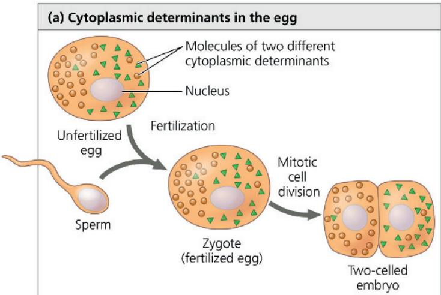  
The unfertilized egg has molecules in its cytoplasm, encoded by the mother's genes, that influence development. Many of these cytoplasmic determinants, like the two shown here, are unevenly distributed in the egg. After fertilization and mitotic division, the cell nuclei of the embryo are exposed to different combinations of cytoplasmic determinants and, as a result, express different genes.

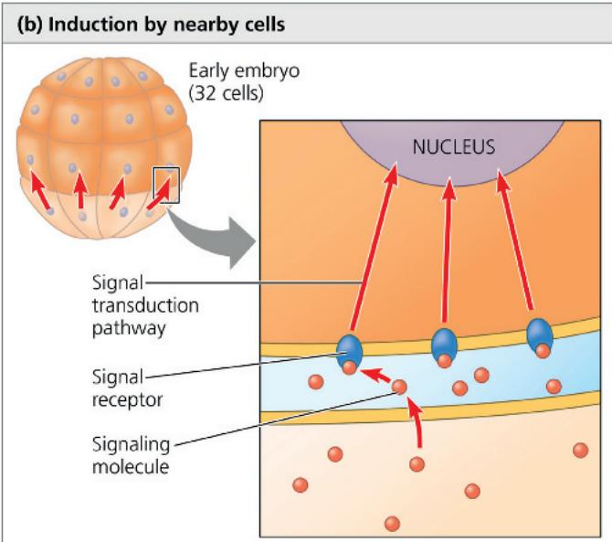  
Cells in the lowest tier of cells are releasing molecules that signal (induce) nearby cells to change their gene expression.

signals within the target cell are cell-surface receptors and other signaling pathway proteins. In general, the signal sends a cell down a specific developmental path by causing changes in its gene expression that lead to observable cellular changes. Thus, interactions between embryonic cells help induce differentiation into the many specialized cell types making up a new organism.

## Sequential Regulation of Gene Expression During Cellular Differentiation

The earliest changes that set a cell on its path to specialization are subtle ones, showing up only at the molecular level. Before biologists knew much about the molecular changes occurring in embryos, they coined the term determination to refer to the point at which an embryonic cell is irreversibly committed to becoming a particular cell type. Once it has undergone determination, an embryonic cell can be experimentally placed in another location in the embryo and it will still differentiate into the cell type that is its normal fate. Differentiation, then, is the process by which a cell attains its determined fate. As the tissues and organs of an embryo develop and their cells differentiate, the cells become more noticeably different in structure and function.

Today we understand determination in terms of molecular changes that result in observable cell differentiation, marked by the expression of genes for tissue-specific proteins. Such proteins are found only in a specific cell type and give the cell its characteristic structure and function. The first sign of differentiation is the appearance of mRNAs for tissue-specific proteins. Later, differentiation is observable with a microscope as changes in cellular structure. On the molecular level, different sets of genes are sequentially expressed in a regulated manner as new cells arise when their precursors divide. Multiple steps in gene expression may be regulated during differentiation, transcription being the most common. In the fully differentiated cell, transcription remains the principal regulatory point for maintaining appropriate gene expression.

Differentiated cells are specialists at making tissue-specific proteins. For example, as a result of transcriptional regulation, liver cells specialize in making albumin, and lens cells specialize in making crystallin (see Figure 18.12). Skeletal muscle cells in vertebrates are another instructive example. Each of these cells is a long fiber containing many nuclei within a single plasma membrane. Skeletal muscle cells have high concentrations of muscle-specific versions of the contractile proteins myosin and actin, as well as membrane receptor proteins that detect signals from nerve cells.

Muscle cells develop from embryonic precursor cells that have the potential to develop into a number of cell types, including cartilage cells and fat cells, but particular conditions commit them to becoming muscle cells. Although the committed cells appear unchanged under the microscope, determination has occurred, and they are now a cell type called myoblasts. Eventually, myoblasts start to churn out large amounts of muscle-specific proteins and fuse to form mature, elongated, multinucleate skeletal muscle cells.

Researchers have worked out what happens at the molecular level during muscle cell determination. To do so, they grew embryonic precursor cells in culture and analyzed them using molecular techniques you will learn about in Concepts 20.1 and 20.2. In a series of experiments, they isolated different genes, caused each to be expressed in a separate embryonic precursor cell, and then looked for differentiation into myoblasts and muscle cells. In this way, they identified several so-called “master regulatory genes” whose protein products commit the cells to becoming skeletal muscle cells. Thus, in the case of muscle cells, the molecular basis of determination is the expression of one or more of these master regulatory genes.

To understand more about how determination occurs in muscle cell differentiation, let's focus on the master regulatory gene called myoD. The myoD gene deserves its designation as a master regulatory gene. Researchers have shown that the MyoD protein it encodes is capable of changing some kinds of fully differentiated nonmuscle cells, such as fat cells and liver cells, into muscle cells. Why doesn't MyoD work on all kinds of cells? One likely explanation is that activation of muscle-specific genes is not solely dependent on MyoD but requires a particular combination of regulatory proteins, some of which are lacking in cells that do not respond to MyoD.

What is the molecular basis for muscle cell differentiation? The MyoD protein is a transcription factor (see Figure 18.10) that binds to specific control elements in the enhancers of various target genes and stimulates their expression (Figure 18.18). Some target genes for MyoD encode still other muscle-specific transcription factors. MyoD also stimulates expression of the myoD gene itself, an example of positive feedback that perpetuates MyoD's effect in maintaining the cell's differentiated state. Presumably, all the genes activated by MyoD have enhancer control elements recognized by MyoD and are thus coordinately controlled. Finally, the secondary transcription factors activate the genes for proteins such as myosin and actin that confer the unique properties of skeletal muscle cells.

The determination and differentiation of some kinds of tissues likely play out in a similar fashion, while others have a more complicated scenario with more inputs. Experimental results indicate that master regulatory proteins like MyoD function by opening the chromatin in certain regions. This allows access to transcription machinery for activation of the next set of cell-type-specific genes.

## Pattern Formation: Setting Up the Body Plan

We have now seen how different programs of gene expression that are activated in the fertilized egg can result in differentiated cells and tissues. But for the tissues to function effectively in the organism as a whole, the organism's body plan—its overall three-dimensional arrangement—must be established and superimposed on the differentiation process. Let's look at the molecular basis for the establishment of the body plan, using the well-studied fruit fly Drosophila melanogaster as an example.

Cytoplasmic determinants and inductive signals both contribute to spatially organizing the tissues and organs of an

For suggested answer, see Appendix A.

Figure 18.18 Determination and differentiation of muscle cells.

Skeletal muscle cells arise from embryonic cells as a result of changes in gene expression. (In this depiction, the process of gene activation is greatly simplified.)

1 Determination. Signals from other cells lead to activation of a master regulatory gene called myoD, and the cell makes MyoD protein, a specific transcription factor activator. The cell, now called a myoblast, is irreversibly committed to becoming a skeletal muscle cell.

2 Differentiation. MyoD protein stimulates the myoD gene further and activates genes encoding other muscle-specific transcription factors, which in turn activate genes for muscle proteins. MyoD also turns on genes that block the cell cycle, thus stopping cell division. The nondividing myoblasts fuse to become mature multinucleate muscle cells, also called muscle fibers.

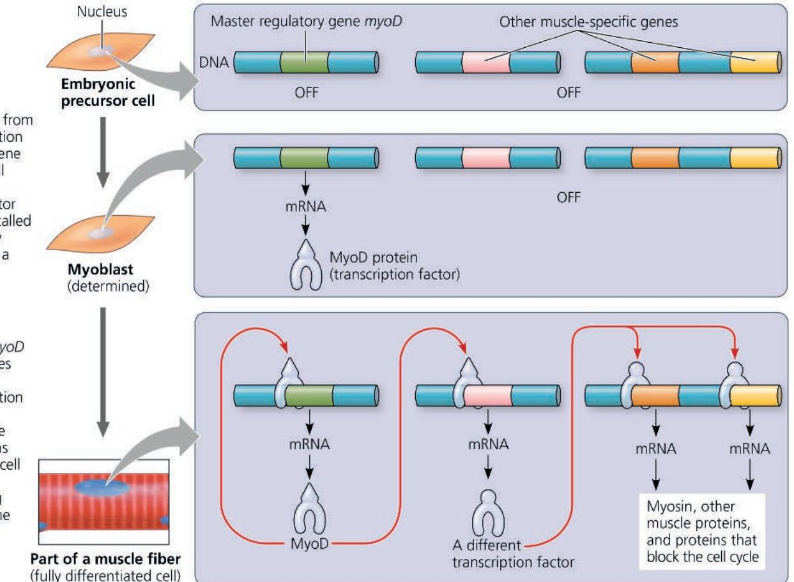  
WHAT IF? What would happen if a mutation in the myoD gene resulted in the production of an altered MyoD protein that could not activate the myoD gene?

organism in their characteristic places. This developmental process is referred to as pattern formation.

Just as the locations of the front, back, and sides of a new building are determined before construction begins, pattern formation in animals begins in the early embryo, when the major axes of an animal are established. In a bilaterally symmetrical animal, the relative positions of head and tail, right and left sides, and back and front—the three major body axes—are set up before the organs appear. The molecular cues that control pattern formation, collectively called positional information, are provided by cytoplasmic determinants and inductive signals (see Figure 18.17). These cues tell a cell its location relative to the body axes and to neighboring cells, and determine how the cell and its descendants will respond to future molecular signals.

During the early 20th century, classical embryologists made detailed anatomical observations of embryonic development in a number of species and performed experiments in which they manipulated embryonic tissues. Although this research laid the groundwork for understanding the mechanisms of development, it did not reveal the specific molecules that guide development or determine how patterns are established.

In the 1940s, scientists began using the genetic approach—the study of mutants—to investigate Drosophila development. That approach has had spectacular success. These studies have established that genes control development and have led to an understanding of the key roles that specific molecules play in defining position and directing differentiation. By combining anatomical, genetic, and biochemical approaches to the study of Drosophila development, researchers have discovered developmental principles common to many other species, including humans.

## The Life Cycle of Drosophila

Fruit flies and other arthropods have a modular construction, an ordered series of segments. These segments make up the body's three major parts: the head, the thorax (the mid-body, from which the wings and legs extend), and the abdomen (Figure 18.19a). Like other bilaterally symmetrical animals, Drosophila has an anterior-posterior (head-to-tail) axis, a dorsal-ventral (back-to-belly) axis, and a right-left axis. In Drosophila, cytoplasmic determinants that are localized in the unfertilized egg provide positional information

Figure 18.19 Key events in Drosophila development.

(a) Adult. The adult fly is segmented, and multiple segments make up each of the three main body parts—head, thorax, and abdomen. The body axes are shown by arrows.

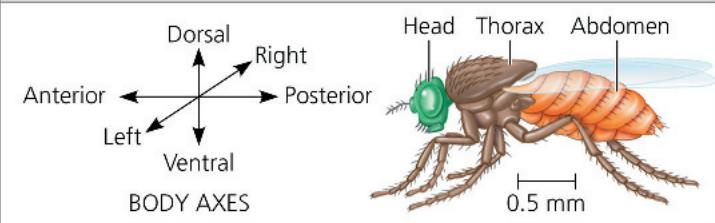  
(b) Development from egg to larva.

1 Developing egg within one ovarian follicle (among many in an ovary). The egg (yellow) and nurse cells are surrounded by follicle cells.

2 Mature, unfertilized egg. The developing egg enlarges as nutrients and mRNAs are supplied to it by the nurse cells, which shrink. Eventually, the mature egg fills the eggshell that has been secreted by the follicle cells.

3 Fertilized egg. The egg is fertilized within the mother and then laid.

4 Segmented embryo. The egg develops into a segmented embryo.

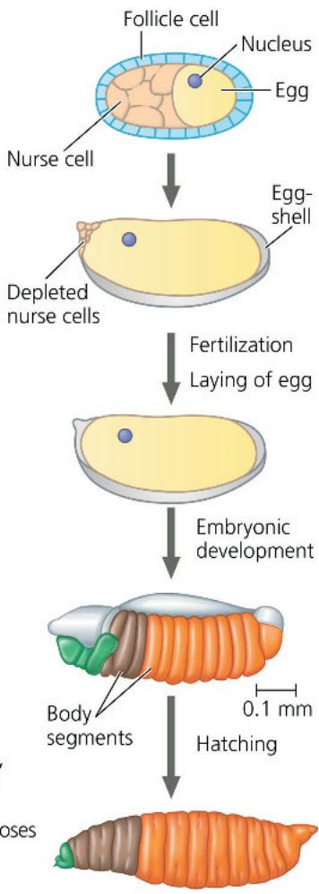

The embryo develops into a larva, which has three stages. The third stage forms a pupa (not shown), within which the larva metamorphoses into the adult shown in (a).

for the placement of anterior-posterior and dorsal-ventral axes even before fertilization. We'll focus here on the molecules involved in establishing the anterior-posterior axis as a case in point.

The Drosophila egg develops in one of the female's ovaries, next to the nurse cells, which supply the egg with nutrients, mRNAs, and other substances needed for development. The egg and nurse cells are surrounded by follicle cells, which make the eggshell (Figure 18.19b, top). After fertilization and laying of the egg, embryonic development results in the formation of a segmented larva, which goes through three larval stages. Then, in a process much like that by which a caterpillar becomes a butterfly, the fly larva forms a pupa in which it metamorphoses into the adult fly pictured in Figure 18.19a.

Figure 18.20 Abnormal pattern formation in Drosophila. Mutations in homeotic genes cause misplacement of structures in an animal, such as the legs extending from the mutant fly's head in place of antenna (colorized SEMs).  
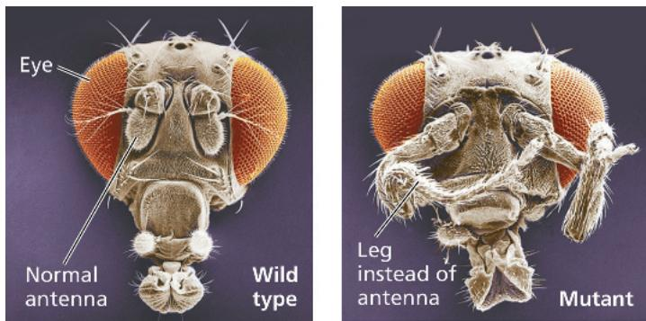

## Genetic Analysis of Early Development: Scientific Inquiry

Edward B. Lewis was a visionary American biologist who, in the 1940s, first showed the value of the genetic approach to studying embryonic development in Drosophila. Lewis studied bizarre mutant flies with developmental defects that led to extra wings or legs in the wrong place (Figure 18.20). He located the mutations on the fly's genetic map, thus connecting the developmental abnormalities to specific genes. This research supplied the first concrete evidence that genes somehow direct the developmental processes studied by embryologists. The genes Lewis discovered, called homeotic genes, are regulatory genes that control pattern formation in the fly.

Further insight into pattern formation during early embryonic development did not come for another 30 years, when two researchers in Germany, Christiane Nüsslein-Volhard and Eric Wieschaus, set out to identify all the genes that affect segment formation in Drosophila. The project was daunting for three reasons. The first was the sheer number of Drosophila genes, now known to total about 14,000. The genes affecting segmentation might be just a few needles in a haystack or might be so numerous and varied that the scientists would be unable to make sense of them. Second, mutations affecting a process as fundamental as segmentation would surely be embryonic lethals, mutations with phenotypes causing death at the embryonic or larval stage. Because organisms with embryonic lethal mutations never reproduce, they cannot be bred for study. The researchers dealt with this problem by looking for recessive mutations, which can be propagated in heterozygous flies that act as genetic carriers. Third, cytoplasmic determinants in the egg were known to play a role in axis formation, so the researchers knew they would have to study the female parent's genes as well as those of the embryo. It is the female parent's genes that we will discuss further as we focus on how the anterior-posterior body axis is set up in the developing egg.

Nüsslein-Volhard and Wieschaus began their search for segmentation genes by exposing flies to mutagenic agents and scanning their offspring for dead embryos or larvae with abnormal segmentation or other defects. For example, to find genes that might set up the anterior-posterior axis, they looked for embryos or larvae with abnormal ends, such as two heads or two tails, predicting that such abnormalities would arise from mutations in maternal genes required for correctly setting up the offspring's head or tail end.

Using this approach, Nüsslein-Volhard and Wieschaus eventually identified about 1,200 genes essential for pattern formation during embryonic development. Of these, about 120 were essential for normal segmentation patterns. Next, the researchers were able to group these segmentation genes by general function and to isolate many of them for further study. The result was a detailed molecular understanding of the early steps in pattern formation in Drosophila.

When the results of Nüsslein-Volhard and Wieschaus were combined with Lewis's earlier work, a coherent picture of Drosophila development emerged. In recognition of their discoveries, the three researchers were awarded a Nobel Prize in 1995. Let's consider a specific example of the genes that Nüsslein-Volhard, Wieschaus, and co-workers found.

## Axis Establishment

As we mentioned earlier, cytoplasmic determinants in the egg are the substances that initially establish the axes of the Drosophila body. These substances are encoded by genes of the female parent called maternal effect genes. A gene classified as a maternal effect gene is one that, when mutant in the female parent, results in a mutant phenotype in the offspring, regardless of the offspring's own genotype. In fruit fly development, the mRNA or protein products of maternal effect genes are placed in the egg while it is still in the female parent's ovary. When the female parent has a mutation in such a gene, she makes a defective gene product (or none at all), and her eggs are abnormal; when these eggs are fertilized, they fail to develop properly.

Because maternal effect genes control the orientation (polarity) of the egg and consequently that of the fly, they are also called egg-polarity genes. Two groups of these genes set up the anterior-posterior and dorsal-ventral axes of the embryo. Like mutations in segmentation genes, mutations in maternal effect genes are generally embryonic lethals.

## Bicoid: A Morphogen that Determines Head Structures

To see how maternal effect genes determine the body axes of the offspring, we will focus on one such gene, called bicoid, a term meaning “two-tailed.” An embryo or larva whose mother has two mutant bicoid alleles lacks the front half of its body and has posterior structures at both ends (Figure 18.21). This phenotype suggested to Nüsslein-Volhard and her colleagues that the product of the female parent’s bicoid gene is essential for setting up the anterior end of the fly and might be concentrated at the future anterior end of the embryo. This hypothesis is an example of the morphogen gradient hypothesis first proposed by embryologists a century ago, in which gradients of substances called morphogens establish an embryo’s axes and other features of its form.

Figure 18.21 Effect of the bicoid gene on Drosophila development.

A wild-type fruit fly larva has a head, three thoracic (T) segments, eight abdominal (A) segments, and a tail. A larva whose mother has two mutant alleles of the bicoid gene has two tails and lacks all anterior structures (LMs).

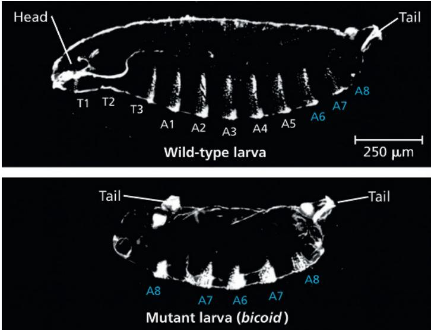

DNA technology and other modern biochemical methods enabled the researchers to test whether the bicoid product, a protein called Bicoid, is in fact a morphogen that determines the anterior end of the fly. First, they asked whether the location of the mRNA and protein products of this gene in the egg was consistent with the hypothesis. They found that bicoid mRNA is highly concentrated at the extreme anterior end of the mature egg (Figure 18.22). After the egg is fertilized, the mRNA is translated into protein. The Bicoid protein then diffuses from the anterior end toward the posterior, resulting in a gradient of protein within the early embryo, most highly concentrated at the anterior end. These results are consistent with the hypothesis that Bicoid protein specifies the fly's anterior end. To test this more specifically, scientists injected pure bicoid mRNA into various regions of early embryos. The protein that resulted from its translation caused anterior structures to form at the injection sites.

The bicoid research was groundbreaking for several reasons. First, it led to the identification of a specific protein required for some of the earliest steps in pattern formation. It thus helped us understand how different regions of the egg can give rise to cells that go down different developmental pathways. Second, it increased our understanding of the mother's critical role in the initial phases of embryonic development. Third, the principle that a gradient of morphogens can determine polarity and position has proved to be a key developmental concept for a number of species, just as early embryologists had hypothesized.

Maternal mRNAs are crucial during development of many species. In Drosophila, gradients of specific proteins encoded by maternal mRNAs not only determine the posterior and anterior ends but also establish the dorsal-ventral axis. As the fly embryo grows, it reaches a point when the embryonic program of gene expression takes over, and the maternal mRNAs must be destroyed. Later, positional information encoded by the embryo's genes, operating on

## Figure 18.22

## Inquiry: Could Bicoid be a morphogen that determines the anterior end of a fruit fly?

Experiment

Using a genetic approach to study Drosophila development, Christiane Nüsslein-Volhard and colleagues at two research institutions in Germany analyzed expression of the bicoid gene. The researchers hypothesized that bicoid normally codes for a morphogen that specifies the head (anterior) end of the embryo. To begin to test this hypothesis, they used molecular techniques to determine whether the mRNA and protein encoded by this gene were found in the anterior end of the fertilized egg and early embryo of wild-type flies.

## Results

Bicoid mRNA (dark blue in the light micrographs and drawings on the left) was confined to the anterior end of the unfertilized egg. Later in development, Bicoid protein (dark orange) was seen to be concentrated in cells at the anterior end of the embryo.

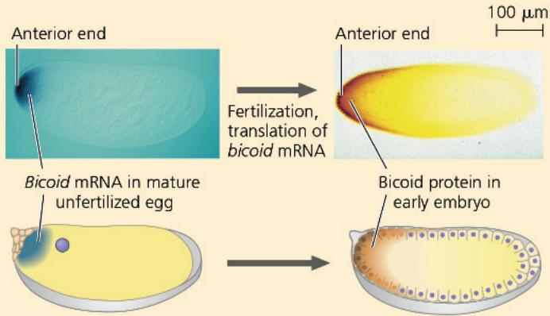

## Conclusion

The location of bicoid mRNA and the diffuse gradient of Bicoid protein seen later are consistent with the hypothesis that Bicoid protein is a morphogen specifying formation of head-specific structures.

Further Reading C. Nüsslein-Volhard et al., Determination of anteroposterior polarity in Drosophila, Science 238:1675–1681 (1987); W. Driever and C. Nüsslein-Volhard, A gradient of Bicoid protein in Drosophila embryos, Cell 54:83–93 (1988); T. Berleth et al., The role of localization of bicoid RNA in organizing the anterior pattern of the Drosophila embryo, EMBO Journal 7:1749–1756 (1988).

WHAT IF? The researchers needed further evidence, so they injected bicoid mRNA into the anterior end of an egg from a female with a mutation disabling the bicoid gene. Given that the hypothesis was supported, what must their results have been?
For suggested answer, see Appendix A.

an ever finer scale, establishes a specific number of correctly oriented segments and triggers the formation of each segment's characteristic structures. Mutant genes affecting this final step can lead to an abnormal adult pattern, as you saw in (Figure 18.20).

## Interview

Interview with Nancy Hopkins: Studying the genetic basis of development in zebrafish (eTextbook only)

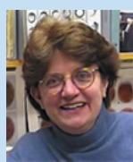

## Evolutionary Developmental Biology (“Evo-Devo”)

EVOLUTION The fly with legs emerging from its head in Figure 18.20 is the result of a single mutation in one gene, a homeotic gene. The gene does not encode any antenna protein, however. Instead, it encodes a transcription factor that regulates other genes, and its malfunction leads to misplaced structures, such as legs instead of antennae. The observation that a change in gene regulation during development could lead to such a fantastic change in body form prompted some scientists to consider whether these types of mutations could contribute to evolution by generating novel body shapes. Ultimately, this line of inquiry gave rise to the field of evolutionary developmental biology, so-called “evo-devo,” which will be further discussed in Concept 21.6.

In this section, we have seen how a carefully orchestrated program of sequential gene regulation controls the transformation of a fertilized egg into a multicellular organism. The program is carefully balanced between turning on the genes for differentiation in the right place and turning off other genes. Even when an organism is fully developed, gene expression is regulated in a similarly fine-tuned manner. In the final section of the chapter, we'll consider how fine this tuning is by looking at how specific changes in expression of just a few genes can lead to the development of cancer.

## Concept Check 18.4

1. MAKE CONNECTIONS As you learned in Chapter 12, mitosis gives rise to two daughter cells that are genetically identical to the parent cell. Yet you, the product of many mitotic divisions, are not composed of identical, zygote-like cells. Why?

2. MAKE CONNECTIONS Explain how the signaling molecules released by an embryonic cell can induce changes in a neighboring cell without entering the cell. (See Figures 11.15 and 11.16.)

3. How do fruit fly maternal effect genes determine the polarity of the egg and the embryo?

4. WHAT IF? In Figure 18.17b, the lower cell is synthesizing signaling molecules, whereas the upper cell is expressing receptors for these molecules. In terms of gene regulation and cytoplasmic determinants, explain how these cells came to synthesize different molecules.

# Concept 18.5: Cancer results from genetic changes that affect cell cycle control

In Concept 12.3, we considered cancer as a disease in which cells escape from their normal cell division control mechanisms. Now that we have discussed the molecular basis of gene expression and its regulation, we can look at cancer more closely. The gene regulation systems that go wrong during cancer turn out to be the very same systems that play important roles in embryonic development, the immune response, and many other biological processes. Thus, research into the molecular basis of cancer has both benefited from and informed many other fields of biology.

## Types of Genes Associated with Cancer

The genes that normally regulate cell growth and division during the cell cycle include genes for growth factors, their receptors, and the intracellular molecules of signaling pathways. (To review cell signaling, see Concept 11.2; for regulation of the cell cycle, see Concept 12.3.) Mutations that alter any of these genes in somatic cells can lead to cancer. The agent of such change can be random spontaneous mutation. Many cancer-causing mutations likely also result from environmental influences: chemical carcinogens, including many compounds in tobacco products, X-rays and other high-energy radiation, and some viruses.

Cancer research uncovered cancer-causing genes called oncogenes (from the Greek onco, tumor) in certain types of viruses. Later, related versions of viral oncogenes were found in the genomes of humans and other animals. The normal versions of the cellular genes, called proto-oncogenes, code for proteins that stimulate normal cell growth and division.

How might a proto-oncogene—a gene that has an essential function in normal cells—become an oncogene, a cancer-causing gene? In general, an oncogene arises from a genetic change that leads to an increase either in the amount of the proto-oncogene's protein product or in the intrinsic activity of each protein molecule. The genetic changes that convert proto-oncogenes to oncogenes fall into four main categories (Figure 18.23): epigenetic changes, translocations, gene amplification, and point mutations.

1. Epigenetic changes that alter chromatin form. Alterations in epigenetic modifications that can lead to abnormal chromatin condensation in a cell are often found in tumor cells. If a mutation in a gene for a chromatin-modifying enzyme leads to loosening of chromatin in a region that is normally not being expressed, a proto-oncogene in that region could be expressed at abnormally high levels (see Figure 18.23a). For example, a gene for one such enzyme has been shown to be mutated in 20% of tumor cells analyzed.

2. Movement of DNA within the genome. Cancer cells are frequently found to contain chromosomes that have broken and rejoined incorrectly, translocating fragments from one chromosome to another (see Figure 15.14). If a translocated proto-oncogene ends up near an especially active promoter (or other control element), its transcription may increase, making it an oncogene, as shown in Figure 18.23b. (A process called transposition, which we will discuss in Concept 21.4, can also move DNA fragments.)

3. Amplification of a proto-oncogene. Amplification increases the number of copies of the proto-oncogene in the cell through repeated gene duplication (discussed in Concept 21.5; see Figure 18.23c).

4. Point mutations in a control element or in the proto-oncogene itself. A point mutation either in the promoter or an enhancer that controls a proto-oncogene could cause an increase in its expression. A point mutation in the coding sequence of the proto-oncogene could change the gene's product to a protein that is more active or more resistant to degradation than the normal protein (see Figure 18.23d).

Any of these four mechanisms can lead to abnormal stimulation of the cell cycle and put the cell on the path to becoming a cancer cell.

In addition to genes whose products normally promote cell division, cells contain genes whose normal products inhibit cell division. Such genes are called tumor-suppressor genes since the proteins they encode help prevent uncontrolled cell growth. Any mutation that decreases the normal activity of a tumor-suppressor protein may contribute to the onset of cancer, in effect stimulating growth through the absence of suppression.

The protein products of tumor-suppressor genes have various functions. Some repair damaged DNA, which prevents the cell from accumulating cancer-causing mutations. Other tumor-suppressor proteins control adhesion of cells to each other or to the extracellular matrix; proper cell anchorage is crucial in normal tissues and is often absent in cancers. Still other tumor-suppressor proteins are components of cell-signaling pathways that inhibit the cell cycle.

## Interference with Normal Cell-Signaling Pathways

Let's consider how protein components of cell-signaling pathways function in normal cells and what goes wrong with their function in cancer cells. We will focus on the products of two key genes, the ras proto-oncogene and the $p53$ tumor-suppressor gene. Mutations in ras occur in about 30% of human cancers and mutations in $p53$ in more than 50%.

The Ras protein, encoded by the ras gene (named for rat sarcoma, a connective tissue cancer), is a G protein that relays a signal from a growth factor receptor on the plasma membrane to a cascade of protein kinases (see Figures 11.8 and 11.10). The cellular response at the end of the pathway is the synthesis of a protein that stimulates the cell cycle (Figure 18.24a, after you turn the page).

Figure 18.23 Genetic changes that can turn proto-oncogenes into oncogenes.  

Normally, such a pathway will not operate unless triggered by the appropriate growth factor. But certain mutations in the ras gene can lead to production of a hyperactive Ras protein that triggers the kinase cascade even in the absence of growth factor, resulting in increased cell division (Figure 18.24b). In fact, hyperactive versions or excess amounts of any of the pathway's components can have the same outcome: excessive cell division.

Figure 18.25a shows a pathway in which an intracellular signal leads to the synthesis of a protein that suppresses the cell cycle. In this case, the signal is damage to the cell's DNA, perhaps as the result of exposure to ultraviolet light. Operation of this signaling pathway blocks the cell cycle until the damage has been repaired. Otherwise, the damage might contribute to tumor formation by causing mutations or chromosomal abnormalities. Thus, the genes for the components of the pathway act as tumor-suppressor genes. The p53 gene, named for the apparent molecular weight of its protein product, is a tumor-suppressor gene. The protein it encodes is a specific transcription factor that promotes the synthesis of cell cycle–inhibiting proteins. That is why a mutation that knocks out the p53 gene or in a gene required to activate the p53 protein (for example, a gene called ATM) can lead to excessive cell growth and cancer (Figure 18.25b).

The p53 gene has been called the “guardian angel of the genome.” Once the p53 protein is activated—say, by the ATM protein, a protein kinase, after DNA damage—p53 activates several other genes, such as p21. The p21 protein halts the cell cycle by binding to cyclin-dependent kinases, allowing time for the cell to repair the DNA. Researchers have shown that p53 also activates expression of a group of miRNAs that inhibit the cell cycle. The p53 protein can also turn on genes directly involved in DNA repair. If DNA damage is irreparable, p53 activates “suicide” genes, whose protein products bring about programmed cell death (apoptosis; see Figure 11.20). Thus, p53 acts in several ways to prevent a cell from passing on mutations due to DNA damage. If mutations do accumulate and the cell survives through many divisions—as is more likely if the p53 tumor-suppressor gene is defective or missing—cancer may ensue. The many functions of p53 suggest a complex picture of regulation in normal cells, one that we do not yet fully understand.

Figure 18.24 Normal and mutant cell cycle–stimulating pathway.

## (a) Normal cell cycle-stimulating pathway.

① a growth factor that binds to ② its receptor in the plasma membrane. The signal is relayed to ③ a G protein called Ras. Like all G proteins, Ras is active when GTP is bound to it. Ras passes the signal to ④ a series of protein kinases. The last kinase activates ⑤ a transcription factor (activator) that turns on one or more genes for ⑥ a protein that stimulates the cell cycle.

## (b) Mutant cell cycle—stimulating pathway.

If a mutation makes Ras or any other pathway component abnormally active, excessive cell division and cancer may result.

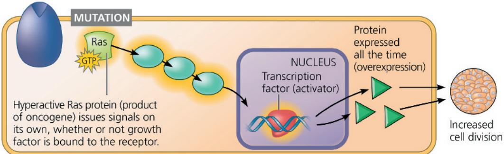  
Figure 18.25 Normal and mutant cell cycle-inhibiting pathway.

(a) Normal cell cycle-inhibiting pathway. In the normal pathway, ① DNA damage is an intracellular signal that is passed via ② protein kinases, leading to activation of ③ p53. ④ Activated p53 promotes transcription of the gene for ⑤ a protein that inhibits the cell cycle. The resulting suppression of cell division ensures that the damaged DNA is not replicated. If the DNA damage is irreparable, then the p53 signal leads to apoptosis.

(b) Mutant cell cycle-inhibiting pathway. Mutations causing deficiencies in any pathway component can contribute to the development of cancer.

  
Explain whether a cancer-causing mutation in a tumor-suppressor gene, such as p53, is more likely to be a recessive or a dominant mutation.

For suggested answer, see Appendix A.

Results from a study of elephants may underscore the protective role of the p53 gene. The incidence of cancer among elephants in zoo-based studies has been estimated at about 3%, compared with closer to 30% for humans. Genome sequencing revealed that elephants have 20 copies of the p53 gene, compared to one copy in humans, other mammals, and even manatees, elephants' closest living relatives. There are undoubtedly other underlying reasons, but the correlation between low cancer rate and extra copies of the p53 gene bears further investigation.

For the present, the diagrams in Figure 18.24 and Figure 18.25 are an accurate view of how mutations can contribute to cancer, but we still don't know exactly how a particular cell becomes a cancer cell. Recent studies have shown, for instance, that DNA methylation and histone modification patterns in normal cells differ from those in cancer cells and that miRNAs probably participate in cancer development. There is still a lot to learn, and you and your classmates may be the ones to make important discoveries about cancer biology.

## The Multistep Model of Cancer Development

More than one somatic mutation or epigenetic change is generally needed to produce all the changes characteristic of a full-fledged cancer cell. This may help explain why the incidence of cancer increases greatly with age. If cancer results from an accumulation of mutations that occur throughout life, then the longer we live, the more likely we are to develop cancer.

The model of a multistep path to cancer is well supported by studies of one of the best-understood types of human cancer: colorectal cancer, which affects the colon and/or rectum. About 140,000 new cases of colorectal cancer are diagnosed each year in the United States, and the disease causes 50,000 deaths per year. Like most cancers, colorectal cancer develops gradually (Figure 18.26). The first sign is often a polyp, a small, benign growth in the colon lining. The cells of the polyp look normal, although they divide unusually frequently. The tumor grows and may eventually become malignant, invading other tissues. The development of a malignant tumor is paralleled by a gradual accumulation of mutations that convert proto-oncogenes to oncogenes and knock out tumor-suppressor genes. A ras oncogene and a mutated p53 tumor-suppressor gene are often involved.

About half a dozen changes must occur at the DNA level for a cell to become fully cancerous. These changes usually include the appearance of at least one active oncogene and the mutation or loss of several tumor-suppressor genes. Furthermore, since mutant tumor-suppressor alleles are usually recessive, in most cases mutations must knock out both alleles in a cell's genome to block tumor suppression. (Most oncogenes, on the other hand, behave as dominant alleles.)

Since we understand the progression of this type of cancer, routine screenings (colonoscopies, for example) are recommended to identify and remove any suspicious polyps. The overall colorectal cancer mortality rate has been declining for the past 20 years due to increased screening and improved treatments. (Unfortunately, rates are on the rise for people under 50 years of age, likely due to factors such as diet, sedentary lifestyle, and alcohol consumption.) Treatments for other cancers have improved as well. Advances in the sequencing of DNA and mRNA allow medical researchers to compare the genes expressed by different types of tumors and by the same type in different people. These comparisons have led to personalized treatments based on the molecular characteristics of a person's tumor; Figure 18.27, on the next two pages, shows how this approach has been applied to breast cancer.

Breast cancer is the second most common form of cancer in the United States, and the first among women. Each year, this cancer strikes over 230,000 women (and some men) in the United States and kills 40,000 (450,000 worldwide). A major problem with understanding breast cancer is its heterogeneity: Tumors differ in significant ways. Identifying differences between types of breast cancer is expected to improve treatment and decrease the mortality rate. In 2012, the Cancer Genome Atlas Network, sponsored by the National Institutes of Health, published the results of a multi-team effort that used a genomics approach to profile subtypes of breast cancer based on their molecular signatures. Four major types of breast cancer were identified (see Figure 18.27). It is now routine to screen for the presence of particular signaling receptors in any breast cancer tumors, and individuals with breast cancer, along with their physicians, can now make more informed decisions about their treatments.

This type of cancer is one of the best understood. Changes in a tumor parallel a series of genetic changes, including mutations affecting several tumor-suppressor genes (such as p53 and the ras proto-oncogene. Mutations of tumor-suppressor genes often entail loss (deletion) of the gene. APC stands for adenomatous polyposis coli, and SMAD4 is a gene involved in signaling that results in apoptosis.

  
② Activation of ras oncogene  
Normal colon epithelial cells  
Small benign growth (polyp)  
3 Loss of tumor-suppressor gene SMAD4  
4 Loss of tumor-suppressor gene p53  
Larger benign growth (adenoma)  
Malignant tumor (carcinoma)

Figure 18.27

Modern medicine that melds genome-wide molecular studies with cell-signaling research is transforming the treatment of many diseases, such as breast cancer. Using microarray analysis (see Figure 20.13) and other techniques, researchers measured the relative levels of mRNA transcripts for every gene in hundreds of breast cancer tumor samples. They identified four major subtypes of breast cancer that differ in their expression of three signal receptors involved in regulating cell growth and division:

• Progesterone receptor (PR)

\- HER2, a type of receptor called a receptor tyrosine kinase (RTK); other RTKs are also present, such as HER3

(ERα and PR are steroid receptors; see Figure 11.9.) The absence or excess expression of these receptors can cause aberrant cell signaling, leading in some cases to inappropriate cell division, which can contribute to cancer (see Figure 18.24).

  
A research scientists examines DNA-sequencing data from breast cancer samples.

## Breast Cancer Subtypes

Each breast cancer subtype is characterized by the overexpression (indicated by ++ or +++) or absence (−) of three signal receptors: ERα, PR, and HER2. Breast cancer treatments are becoming more effective because they can be tailored to the specific cancer subtype.

## Luminal A

## Luminal B

\- ERα+++

• ERα++

\- PR++

\- HER2-

\- PR++

\- HER2– (shown here); some HER2++

• 40% of breast cancers

\- Divide rapidly

\- Best prognosis

• 15–20% of breast cancers

\- Poorer prognosis than luminal A

Both luminal subtypes overexpress ERα (luminal A more than luminal B) and PR, and usually lack expression of HER2. Both can be treated with drugs that target ERα and inactivate it, the most well-known drug being tamoxifen. These subtypes can also be treated with drugs that inhibit estrogen synthesis.

## HER2

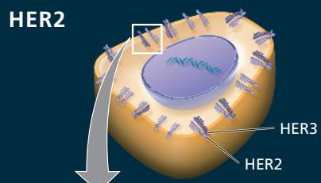

\- ERα- or ERα+

• PR-

\- HER2++

• 10–15% of breast cancers - Poorer prognosis than luminal A subtype

## Basal-like

• ERα-

\- PR-

\- HER2-

\- 15–20% of breast cancers
- More aggressive; poorer prognosis than other subtypes

The basal-like subtype is "triple negative"—it usually does not express ERα, PR, or HER2. It often has a mutation in the tumor-suppressor gene BRCA1 (see Concept 18.5). Treatments that target ERα, PR, or HER2 are not effective, but new treatments are being developed. Currently, patients are treated with cytotoxic chemotherapy, which selectively kills fast-growing cells.

The HER2 subtype overexpresses HER2. Because it does not express PR (and, in many cases, ERα) at normal levels, the cells are unresponsive to therapies that target PR (and, for ERα– cells, ERα). However, patients with the HER2 subtype can be treated with Herceptin, an antibody protein that inactivates HER2 (see Concept 12.3).

① A signaling molecule (such as a growth factor) binds as a ligand to a single HER3 (a monomer), allowing it to associate with another HER.

Response (cell division)

② Even without a ligand bound, HER2 can associate with another HER. Here, HER3 and HER2 associate closely together, forming a dimer.

## ③ Formation of a dimer activates each monomer.

④ Each monomer adds phosphate from ATP to the other monomer, triggering a signal transduction pathway.

⑤ The signal is transduced through the cell, which leads to a cellular response—in this case, turning on genes that trigger cell division. HER2 cells have up to 100 times as many HER2 receptors as normal cells, so they undergo uncontrolled cell division.

## Treatment with Herceptin for the HER2 subtype

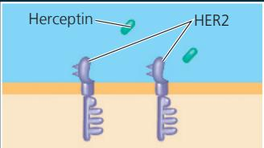

HER2 Bound herceptin

① Patients with the HER2 subtype are treated with the drug Herceptin, which can bind to HER2.

② When bound to HER2, Herceptin blocks signaling and excessive cell division in certain patients.

# Inherited Predisposition and Environmental Factors Contributing to Cancer

The fact that multiple genetic changes are required to produce a cancer cell helps explain the observation that cancers can run in families. An individual inheriting an oncogene or a mutant allele of a tumor-suppressor gene is one step closer to accumulating the necessary mutations for cancer to develop than is an individual without any such mutations.

Geneticists are working to identify inherited cancer alleles so that predisposition to certain cancers can be detected early in life. About 15% of colorectal cancers, for example, involve inherited mutations. One syndrome, called hereditary nonpolyposis colon cancer (HNPCC), increases an individual's lifetime risk of colon cancer to 50–70%. HNPCC, also known as Lynch syndrome, is caused by an autosomal dominant allele of any one of a group of DNA repair genes, underscoring the importance of DNA repair systems. This syndrome is responsible for 2–5% of colon cancers. Other inherited mutations that cause colon cancer affect the tumor-suppressor gene called adenomatous polyposis coli, or APC (see Figure 18.26). This gene has multiple functions in the cell, including regulation of cell migration and adhesion. Even in patients with no family history of the disease, the APC gene is mutated in 60% of colorectal cancers. In these individuals, new mutations must have occurred in both APC alleles before the gene's function is lost. Currently, only 15% of colorectal cancers are associated with known inherited mutations, so researchers continue to try to identify “markers” that could predict the risk of developing this type of cancer.

Given the prevalence and significance of breast cancer, it is not surprising that it was one of the first cancers for which the role of inheritance was investigated. It turns out that for 5–10% of patients with breast cancer, there is evidence of a strong inherited predisposition. Geneticist Mary-Claire King began working on this problem in the mid-1970s. After 16 years of research, she convincingly demonstrated that mutations in one gene—BRCA1—were associated with increased susceptibility to breast cancer, a finding that flew in the face of medical opinion at the time. (BRCA stands for breast cancer.) Mutations in that gene or a gene called BRCA2 are found in at least half of inherited breast cancers, and tests using DNA sequencing can detect these mutations. A woman who inherits one mutant BRCA1 allele has a 60% probability of developing breast cancer before the age of 50, compared with only a 2% probability for an individual homozygous for the normal allele.

## Interview

Interview with Mary-Claire King: Discovering breast cancer genes (eTextbook only)

BRCA1 and BRCA2 are considered tumor-suppressor genes because their wild-type alleles protect against breast cancer and their mutant alleles are recessive. (Mutations in BRCA1 are commonly found in the genomes of cells from basal-like breast cancers; see Figure 18.27.) The BRCA1 and BRCA2 proteins both appear to function in the cell's DNA damage repair pathway. More is known about BRCA2: Along with another protein, it helps repair breaks that occur in both strands of DNA, a function crucial for maintaining undamaged DNA.

Because DNA breakage can contribute to cancer, it makes sense that the risk of cancer can be lowered by minimizing exposure to DNA-damaging agents, such as the ultraviolet radiation in sunlight and chemicals found in tobacco products. Novel genomics-based analyses of specific cancers, such as the approach described in Figure 18.27, are contributing to both early diagnosis and development of treatments that interfere with expression of key genes in tumors. Ultimately, such approaches are expected to lower the death rate from cancer.

## The Role of Viruses in Cancer

The study of genes associated with cancer, inherited or not, increases our basic understanding of how disruption of normal gene regulation can result in this disease. In addition to the mutations and other genetic alterations described in this section, a number of tumor viruses can cause cancer in various animals, including humans. In fact, one of the earliest breakthroughs in understanding cancer came in 1911, when Peyton Rous, an American pathologist, discovered a virus that causes cancer in chickens. Also, the Epstein-Barr virus, which causes infectious mononucleosis, has been linked to several types of cancer in humans, notably Burkitt's lymphoma. Papillomaviruses cause cancer of the cervix, and a virus called HTLV-1 causes a type of adult leukemia. Viruses play a role in about 15% of the cases of human cancer.

Viruses may at first seem very different from mutations as a cause of cancer. However, we now know that viruses can interfere with gene regulation in several ways if they integrate their genetic material into the DNA of a cell. Viral integration may donate an oncogene to the cell, disrupt a tumor-suppressor gene, or convert a proto-oncogene to an oncogene. Some viruses produce proteins that inactivate p53 and other tumor-suppressor proteins, making the cell more prone to becoming cancerous. Viruses are powerful biological agents; you'll learn more about them in Chapter 19.

## Concept Check 18.5

1. Cancer-promoting mutations are likely to have different effects on the activity of proteins encoded by proto-oncogenes than they do on proteins encoded by tumor-suppressor genes. Explain.

2. Under what circumstances is cancer considered to have a hereditary component?

3. MAKE CONNECTIONS The p53 protein can activate genes involved in apoptosis. Review Concept 11.5, and discuss how mutations in genes coding for proteins that function in apoptosis could contribute to cancer.

# Chapter 18 Review

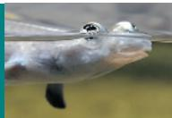

## Summary of Key Concepts

To review key terms, go to the Vocabulary Self-Quiz (eTextbook only).

## Concept 18.1: Bacteria often respond to environmental change by regulating transcription

\- Cells control metabolism by regulating enzyme activity or the expression of genes coding for enzymes. In bacteria, genes are often clustered into operons, with one promoter serving several adjacent genes. An operator site on

the DNA switches the operon on or off, resulting in coordinate regulation of the genes.

\- Both repressible and inducible operons are examples of negative gene regulation. In either type of operon, binding of a specific repressor protein to the operator shuts off transcription. (The repressor is encoded by a separate regulatory gene.) In a repressible operon (usually encoding anabolic enzymes), the repressor is active when bound to a corepressor, often the end product of the pathway.

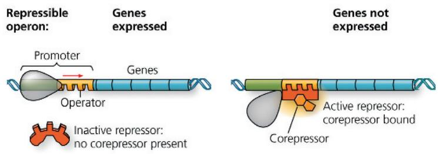

\- In an inducible operon (usually encoding catabolic enzymes), binding of an inducer to an innately active repressor inactivates the repressor and turns on transcription.

  
- Some operons have positive gene regulation via a stimulatory activator protein (such as CRP, when activated by cyclic AMP), binds to a site within the promoter and stimulates transcription.

Compare and contrast the roles of a corepressor and an inducer in negative regulation of an operon.

Concept 18.2: Eukaryotic gene expression is regulated at many stages  
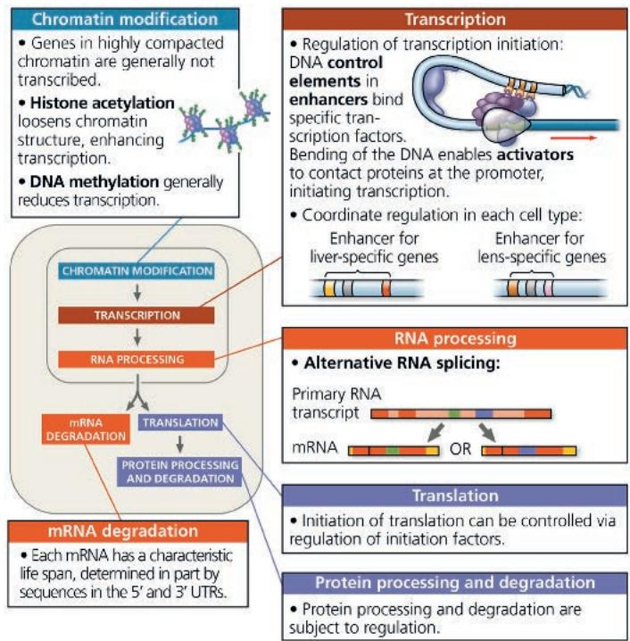  
Describe what must happen in a cell for a gene specific to that cell type to be transcribed.

Concept 18.3: Noncoding RNAs play multiple roles in controlling gene expression  
  
Why are miRNAs called noncoding RNAs? Explain how they participate in gene regulation.

## Concept 18.4: A program of differential gene expression leads to the different cell types in a multicellular organism

\- Embryonic cells become committed to a certain fate (determination), and undergo differentiation, becoming specialized in structure and function for their determined fate.

Cells differ in structure and function not because they contain different genomes but because they express different genes. Morphogenesis encompasses the processes that give shape to the organism and its various structures.

\- Localized cytoplasmic determinants in the unfertilized egg are distributed differentially to daughter cells, where they regulate the expression of those cells' developmental fates. In the process called induction, signaling molecules from embryonic cells cause transcriptional changes in nearby target cells.

\- Differentiation is marked by the appearance of tissue-specific proteins, which enable differentiated cells to carry out their specialized roles.

\- In animals, pattern formation, the development of a spatial organization of tissues and organs, begins in the early embryo. Positional information, the molecular cues that control pattern formation, tells a cell its location relative to the body's axes and to other cells. In Drosophila, gradients of morphogens encoded by maternal effect genes determine the body axes. For example, the gradient of Bicoid protein determines the anterior-posterior axis.

Describe the two main processes that cause embryonic cells to head down different pathways to their final fates.

## Concept 18.5: Cancer results from genetic changes that affect cell cycle control

\- The products of proto-oncogenes and tumor-suppressor genes control cell division. A DNA change that makes a proto-oncogene overly active converts it to an oncogene, which may promote extra cell division and cancer. A tumor-suppressor gene encodes a protein that inhibits abnormal cell division. A mutation that reduces the activity of its protein product may lead to excessive cell division and cancer.

\- Many proto-oncogenes and tumor-suppressor genes encode components of growth-stimulating and growth-inhibiting signaling pathways, respectively, and mutations in them can interfere with normal cell-signaling pathways. A hyperactive version of a protein in a stimulatory pathway, such as Ras (a G protein), functions as an oncogene protein. A defective version of a protein in an inhibitory pathway, such as p53 (a transcription activator), fails to act as a tumor suppressor.

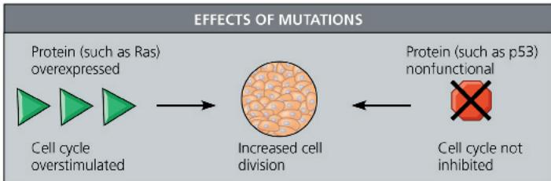

\- In the multistep model of cancer development, normal cells are converted to cancer cells by the accumulation of mutations affecting proto-oncogenes and tumor-suppressor genes. Technical advances in DNA and mRNA sequencing are enabling cancer treatments that are more individually based.

\- Genomics-based studies have resulted in researchers proposing four subtypes of breast cancer, based on expression of genes by tumor cells.

\- Individuals who inherit a mutant allele of a proto-oncogene or tumor-suppressor gene have a predisposition to develop a particular cancer. Certain viruses promote cancer by integration of viral DNA into a cell's genome.

Compare the usual functions of proteins encoded by proto-oncogenes with those of proteins encoded by tumor-suppressor genes.

## Test Your Understanding

For more multiple-choice questions, go to the Practice Test (eTextbook only).

## Levels 1-2: Remembering/Understanding

1. If a particular operon encodes enzymes for making an essential amino acid and is regulated like the trp operon, then

(A) the amino acid inactivates the repressor.

(B) the repressor is active in the absence of the amino acid.

(C) the amino acid acts as a corepressor.

(D) the amino acid turns on transcription of the operon.

2. Muscle cells differ from nerve cells mainly because they

(A) express different genes.

(B) contain different genes.

(C) use different genetic codes.

(D) have unique ribosomes.

## 3. The functioning of enhancers is an example of

(A) a eukaryotic equivalent of prokaryotic promoter functioning.

(B) transcriptional control of gene expression.

(C) the stimulation of translation by initiation factors.

(D) post-translational control that activates certain proteins.

4. Cell differentiation always involves

(A) transcription of the myoD gene.

(B) the movement of cells.

(C) the production of tissue-specific proteins.

(D) the selective loss of certain genes from the genome.

5. Which of the following is an example of post-transcriptional control of gene expression?

(A) the addition of methyl groups to cytosine bases of DNA

(B) the binding of transcription factors to a promoter

(C) the removal of introns and alternative splicing of exons

(D) gene amplification contributing to cancer

## Levels 3-4: Applying/Analyzing

6. What would occur if the repressor of an inducible operon were mutated so it could not bind the operator?

(A) irreversible binding of the repressor to the promoter

(B) reduced transcription of the operon's genes

(C) buildup of a substrate for the pathway controlled by the operon

(D) continuous transcription of the operon's genes

7. Absence of bicoid mRNA from a Drosophila egg leads to the absence of anterior larval body parts and mirror-image duplication of posterior parts. This is evidence that the product of the bicoid gene

(A) normally leads to formation of head structures.

(B) normally leads to formation of tail structures.

(C) is transcribed in the early embryo.

(D) is a protein present in all head structures.

8. Which of the following statements about the DNA in one of your brain cells is true?

(A) Most of the DNA codes for protein.

(B) The majority of genes are likely to be transcribed.

(C) It is the same as the DNA in one of your liver cells.

(D) Each gene lies immediately adjacent to an enhancer.

9. Within a cell, the amount of protein made using a given mRNA molecule in that cell depends partly on

(A) the degree of DNA methylation.

(B) the rate at which the mRNA is degraded.

(C) the number of introns present in the mRNA.

(D) the types of ribosomes present in the cytoplasm.

10. Proto-oncogenes can change into oncogenes that cause cancer. Which of the following best explains the presence of these potential time bombs in eukaryotic cells?

(A) Proto-oncogenes first arose from viral infections.

(B) Proto-oncogenes are mutant versions of normal genes.

(C) Proto-oncogenes are genetic "junk."

(D) Proto-oncogenes normally help regulate cell division.

## Levels 5-6: Evaluating/Creating

11. DRAW IT The diagram below shows five genes, including their enhancers, from the genome of a certain species. Imagine that yellow, blue, green, black, red, and purple activator proteins exist that can bind to the appropriately color-coded control elements in the enhancers of these genes.

(A) Draw an X above enhancer elements (of all the genes) that would have activators bound in a cell in which only gene 5 is transcribed. Identify which colored activators would be present.

(B) Draw a dot above all enhancer elements that would have activators bound in a cell in which the green, blue, and yellow activators are present. Identify which gene(s) would be transcribed.

(C) Imagine that genes 1, 2, and 4 code for nerve-specific proteins, and genes 3 and 5 are skin-specific. Identify which activators would be present in each cell type to ensure transcription of the appropriate genes.

12. EVOLUTION CONNECTION DNA sequences can act as “tape measures of evolution” (see Concept 5.6). Scientists analyzing the human genome sequence were surprised to find that some of the regions of the human genome that are most highly conserved (similar to comparable regions in other species) don’t code for proteins. Propose a possible explanation for this observation.

13. SCIENTIFIC INQUIRY Prostate cells usually require testosterone and other androgens to survive. But some prostate cancer cells thrive despite treatments that eliminate androgens. One hypothesis is that estrogen, often considered a female hormone, may be activating genes normally controlled by an androgen in these cancer cells. Describe one or more experiments to test this hypothesis. (See Figure 11.9 to review the action of these steroid hormones.)

14. WRITE ABOUT A THEME: INTERACTIONS In a short essay (100–150 words), discuss how the processes shown in Figure 18.2 are examples of feedback mechanisms regulating biological systems in bacterial cells.

## 15. SYNTHESIZE YOUR KNOWLEDGE

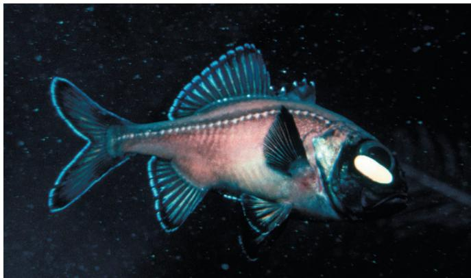

The flashlight fish has an organ under its eye that emits light, which serves to startle predators and attract prey, and allows the fish to communicate with other fish. Some species can rotate the organ inside and then out, so the light appears to flash on and off. The light is actually emitted by bacteria (of the genus Vibrio) that live in the organ in a mutualistic relationship with the fish. (The bacteria receive nutrients from the fish.) The bacteria must multiply until they reach a certain density in the organ (a “quorum”; see Concept 11.1), at which point they all begin emitting light at the same time. There is a group of six or so genes, called lux genes, whose gene products are necessary for light formation. Given that these bacterial genes are regulated together, propose a hypothesis for how the genes are organized and regulated.

For selected answers, see Appendix A.

# Explore Scientific Papers with Science in the Classroom | AAAS

Can cancer be stopped before it begins? Go to “Arrested Development: When Cells Make Mistakes” at www.scienceintheclassroom.org.

Instructors: Questions can be assigned in Mastering Biology.

## Viruses

## Key Concepts

19.1 A virus consists of a nucleic acid surrounded by a protein coat
19.2 Viruses replicate only in host cells

19.3 Viruses and prions are formidable pathogens in animals and plants

## Study Tip

Make flowcharts: Make a simple flowchart for each viral replicative cycle in this chapter. Shown here is the beginning of an example for the lysogenic cycle. Note the similarities and differences between the replicative cycles.

  
Figure 19.1 A human immune cell (blue) infected by human immunodeficiency virus (HIV) is releasing more HIV viruses (small gold dots), which will go on to infect other cells. Left untreated, HIV destroys vital immune system cells, causing AIDS. This disease has killed about 35 million people worldwide.

## How does a virus make more viruses?

A virus consists only of nucleic acid, proteins, and sometimes a membranous envelope. After infecting a host cell, it uses the host cell's molecules to make new viruses, as shown in this simplified diagram.

  
With some viruses, the host cell remains alive after the new viruses are released.

## Concept 19.1: A virus consists of a nucleic acid surrounded by a protein coat

For the past several years, world news has focused on the virus called SARS-CoV-2, short for Severe Acute Respiratory Syndrome-CoronaVirus-2, which causes COVID-19. This virus first infects cells in the airway, where it produces more viruses that can be transmitted to other individuals via exhaled breath. Worldwide, COVID-19 has killed more than 7 million individuals as of 2025. (The actual number is likely significantly higher as many people who died from COVID-19-like symptoms were not tested for the virus.)

What distinguishes SARS-CoV-2 and other viruses from cells? Compared with eukaryotic and even prokaryotic cells, most viruses are much smaller and simpler in structure. Lacking the structures and metabolic machinery found in a cell, a virus is an infectious particle consisting of little more than genes packaged in a protein coat.

Are viruses living or nonliving? Early on, they were considered biological chemicals; the Latin root for virus means “poison.” Viruses can cause a wide variety of diseases, so researchers in the late 1800s saw a parallel with bacteria and proposed that viruses were the simplest of living forms. However, viruses cannot reproduce or carry out metabolic activities outside of a host cell. Most biologists would probably agree that viruses are not alive, but instead exist in a shady area between life-forms and chemicals. The simple phrase used by two researchers describes them aptly: Viruses lead “a kind of borrowed life.”

## The Discovery of Viruses: Scientific Inquiry

Scientists detected viruses indirectly long before they were able to see them. The story of how viruses were discovered begins in 1883. A German scientist named Adolf Mayer was studying tobacco mosaic disease, which stunts the growth of tobacco plants and gives their leaves a mottled, or mosaic, coloration. Mayer discovered that he could transmit the disease from plant to plant by rubbing sap extracted from diseased leaves onto healthy plants. After an unsuccessful search for an infectious microorganism in the sap, he suggested that the disease was caused by unusually small bacteria that were invisible under a microscope. This hypothesis was tested a decade later by Dmitri Ivanowsky, a Russian biologist who passed sap from infected tobacco leaves through a filter designed to remove bacteria. After filtration, the sap still produced mosaic disease.

But Ivanowsky reasoned that perhaps the bacteria were small enough to pass through the filter or made a toxin that could do so. The second possibility was ruled out when the Dutch botanist Martinus Beijerinck carried out a classic series of experiments that showed that the infectious agent in the filtered sap could replicate (Figure 19.2).

In fact, the pathogen replicated only within the host it infected. In further experiments, Beijerinck showed that unlike bacteria used in the lab at that time, the mysterious agent of mosaic disease could not be cultivated on nutrient media in test tubes or petri dishes. Beijerinck imagined a replicating particle much smaller and simpler than a bacterium, and he is generally credited with being

## Figure 19.2

# Inquiry: What causes tobacco mosaic disease?

## Experiment

In the late 1800s, Martinus Beijerinck, of the Technical School in Delft, the Netherlands, investigated the properties of the agent that causes tobacco mosaic disease (then called spot disease).

  
1 Extracted sap from tobacco plant with tobacco mosaic disease

## Results

When the filtered sap was rubbed on healthy plants, they became infected. Their sap, extracted and filtered, could then act as a source of infection for another group of plants. Each successive group of plants developed the disease to the same extent as earlier groups.

## Conclusion

The infectious agent was apparently not a bacterium because it could pass through a bacterium-trapping filter. The pathogen must have been replicating in the plants because its ability to cause disease was undiluted after several transfers from plant to plant.

Data from M. J. Beijerinck, Concerning a contagium vivum fluidum as cause of the spot disease of tobacco leaves, Verhandelingen der Koninkyke akademie Wettenschappen te Amsterdam 65:3–21 (1898). Translation published in English as Phytopathological Classics Number 7 (1942), American Phytopathological Society Press, St. Paul, MN.

WHAT IF? If Beijerinck had observed that the infection of each group was weaker than that of the previous group and that ultimately the sap could no longer cause disease, what might he have concluded?

For suggested answer, see Appendix A.

the first scientist to voice the concept of a virus. His suspicions were confirmed in 1935 when the American scientist Wendell Stanley crystallized the infectious particle, now known as tobacco mosaic virus (TMV). Subsequently, TMV and many other viruses were actually seen with the help of the electron microscope.

## Structure of Viruses

The tiniest viruses are only 20 nm in diameter—smaller than a ribosome. Millions could easily fit on a pinhead. Even the largest known virus, which has a diameter of 1,500 nm (1.5 $\mu$ m), is barely visible under the light microscope. Stanley's discovery that some viruses could be crystallized was exciting and puzzling news. Not even the simplest of cells can aggregate into regular crystals. But if viruses are not cells, then what are they? Examining the structure of a virus more closely reveals that it is an infectious particle consisting of one or more molecules of a nucleic acid enclosed in a protein coat and, for some viruses, surrounded by a membranous envelope.

The simple structure of viruses make them a useful biological system: To a large extent, molecular biology was born in the laboratories of biologists studying viruses that infect bacteria. Experiments using these viruses provided evidence that genes are made of nucleic acids, and they were critical in working out the molecular mechanisms of the fundamental processes of DNA replication, transcription, and translation.

## Viral Genomes

We usually think of genes as being made of double-stranded DNA, but many viruses defy this convention. Their genomes may consist of double-stranded DNA, single-stranded DNA, double-stranded RNA, or single-stranded RNA, depending on the type of virus. A virus is called a DNA virus or an RNA virus based on the kind of nucleic acid that makes up its genome. In either case, the genome is usually organized as a single linear or circular molecule of nucleic acid, although the genomes of some viruses consist of multiple molecules of nucleic acid. The smallest viruses known have only three genes in their genome, while the largest have several hundred to 2,000. For comparison, bacterial genomes contain about 200 to a few thousand genes.

## Capsids and Envelopes

The protein shell enclosing the viral genome is called a capsid. (Together, the capsid and genome are called the nucleocapsid.) Depending on the type of virus, the capsid may be rod-shaped, polyhedral, or more complex in shape. Capsids are built from a large number of protein subunits called capsomeres, but the number of different kinds of proteins in a capsid is usually small. Tobacco mosaic virus has a rigid, rod-shaped capsid made from over 1,000 molecules of a single type of protein arranged in a helix; rod-shaped viruses are commonly called helical viruses for this reason (Figure 19.3a).

Figure 19.3 Viral structure.

Viruses are made up of nucleic acid (DNA or RNA) enclosed in a protein coat (the capsid) and sometimes further wrapped in a membranous envelope. The individual protein subunits making up the capsid are called capsomeres. Although diverse in size and shape, viruses have many common structural features. (All micrographs are colorized TEMs.)

  
(a) Tobacco mosaic virus has a helical capsid surrounding a single helical RNA molecule, with the overall shape of a rigid rod.  
(b) Adenoviruses have an icosahedral capsid with a protein spike at each vertex (corner). The capsid, made up of capsomeres, contains double-stranded DNA.  
(c) Influenza viruses have an outer envelope, studded with glycoprotein projections, that generally contains eight double-helical RNA-protein complexes, each associated with a viral polymerase.  
(d) Coronaviruses, such as SARS-CoV-2 (shown here; the virus that causes COVID-19) are spherical, with a "corona" (crown) of Spike glycoproteins extending out from the membranous envelope. The genome consists of a single RNA molecule, complexed with proteins.  
(e) Bacteriophage T4, like other "T-even" phages, has a complex capsid consisting of an icosahedral head and a tail apparatus. T4's double-stranded DNA is enclosed in the head.

Adenoviruses, which infect the respiratory tracts of animals, have 252 identical protein molecules arranged in a polyhedral capsid with 20 triangular facets—an icosahedron; thus, these and other similarly shaped viruses are referred to as icosahedral viruses (Figure 19.3b).

To infect their hosts, all viruses must enter host cells, and some have accessory structures that help them do so. For instance, a membranous envelope surrounds the capsids of influenza viruses, coronaviruses (such as SARS-CoV-2, the virus that causes COVID-19), and many other viruses found in animals (Figure 19.3c and d). These viral envelopes, which are derived from the membranes of the previous host cell, contain host cell phospholipids and membrane proteins. They also contain virally encoded proteins and glycoproteins—proteins with carbohydrates covalently attached, including proteins that allow fusion with the host cell membrane. These viral proteins are unique to each virus. Some viruses carry a few viral enzymes, such as viral polymerase, within their capsids.

Many of the most complex capsids are found among the viruses that infect bacteria, called bacteriophages, or simply phages. The first phages studied included seven that infect Escherichia coli (E. coli). These seven phages were named type 1 (T1), type 2 (T2), and so forth, in the order of their discovery. (The T2 phage was used in the experiment that established DNA as the genetic material; see Figure 16.4.) The three “T-even” phages (T2, T4, and T6) turned out to be very similar in structure. Their capsids have elongated icosahedral heads enclosing their DNA. Attached to the head is a protein tail piece with fibers by which the phages attach to a bacterial cell (Figure 19.3e). In the next section, we’ll examine how these few viral parts function together with cellular components to produce large numbers of viral progeny.

## Concept Check 19.1

1. VISUAL SKILLS Describe one similarity and two differences between the structures of tobacco mosaic virus (TMV) and influenza virus (see Figure 19.3).

2. MAKE CONNECTIONS Bacteriophages were used to provide evidence that DNA carries genetic information (see Figure 16.4). Briefly describe the experiment carried out by Hershey and Chase, including in your description why the researchers chose to use phages.

For suggested answers, see Appendix A.

## Concept 19.2: Viruses replicate only in host cells

Viruses lack metabolic enzymes and equipment for making proteins, such as ribosomes. They are obligate intracellular parasites; in other words, they can replicate only within a host cell. It is fair to say that viruses in isolation are merely packaged sets of genes in transit from one host cell to another.

Each particular virus can infect cells of only a limited number of host species, called the host range of the virus. This host specificity results from the evolution of recognition systems by the virus. Viruses usually identify host cells by a “handshake” fit between viral surface proteins and specific receptor molecules on the outside of cells. Such receptor molecules are most often proteins that carry out necessary functions for the host cell and have been adopted by viruses as portals of entry. Some viruses have broad host ranges. For example, West Nile virus and equine encephalitis virus are distinctly different viruses that can each infect mosquitoes, birds, horses, and humans. Other viruses have host ranges so narrow that they infect only a single species. Measles virus, for instance, can infect only humans. Furthermore, viral infection of multicellular eukaryotes is usually limited to particular tissues. Human cold viruses infect only the cells lining the upper respiratory tract, and the HIV seen in Figure 19.1 binds to receptors present only on certain types of immune cells.

## General Features of Viral Replicative Cycles

A viral infection begins when a virus binds to a host cell and the viral genome makes its way inside (Figure 19.4). The mechanism of genome entry depends on the type of virus and the type of host cell. For example, T-even phages use their elaborate tail apparatus to inject DNA into a bacterium (see Figure 19.3d). Other viruses are taken up by endocytosis or, in the case of enveloped viruses, by fusion of the viral envelope with the host's plasma membrane. Once the viral genome is inside, the proteins it encodes can commandeer the host, reprogramming the cell to copy the viral genome and manufacture viral proteins. The host provides the nucleotides for making viral nucleic acids, as well as enzymes, ribosomes, tRNAs, amino acids, ATP, and other components needed for making the viral proteins. Many DNA viruses use the DNA polymerases of the host cell to synthesize new genomes along the templates provided by the viral DNA. In contrast, to replicate their genomes, RNA viruses use virally encoded RNA polymerases that can use RNA as a template. (Uninfected cells generally make no enzymes for transcribing RNA from an RNA template.)

After the viral nucleic acid molecules and capsomeres are produced, they spontaneously self-assemble into new viruses. In fact, researchers can separate the RNA and capsomeres of TMV and then reassemble complete viruses simply by mixing the components together under the right conditions. The simplest type of viral replicative cycle ends with the exit of hundreds or thousands of viruses from the infected host cell, a process that often damages or destroys the cell. Such cellular damage and death, as well as the body's responses to this destruction, cause many of the symptoms associated with viral infections. The viral progeny that exit a cell have the potential to infect additional cells, spreading the viral infection.

There are many variations on the simplified viral replicative cycle we have just described. We will now take a look at some of these variations in bacterial viruses (phages) and animal viruses; later in the chapter, we will consider plant viruses.

  
MAKE CONNECTIONS Label each of the straight gray arrows to identify the process that is occurring. Review Figure 17.25.

For suggested answer, see Appendix A.

## Replicative Cycles of Phages

Phages are the best understood of all viruses, although some of them are also among the most complex. Research on phages led to the discovery that some double-stranded DNA viruses can replicate by two alternative mechanisms: the lytic cycle and the lysogenic cycle.

## The Lytic Cycle

A phage replicative cycle that culminates in death of the host cell is known as a lytic cycle. The term lytic refers to the last stage of infection, during which the bacterium lyses (breaks open) and releases the phages that were produced within the cell. Each of these phages can then infect a healthy cell, and a few successive lytic cycles can destroy an entire bacterial population in just a few

Phage T4 has almost 300 genes, which are transcribed and translated using the host cell's machinery. One of the first phage genes translated after the viral DNA enters the host cell codes for an enzyme that degrades the host cell's DNA (2); the phage DNA is protected from breakdown because it contains a modified form of cytosine that is not recognized by the phage enzyme. The entire lytic cycle, from the phage's first contact with the cell surface to cell lysis, takes only 20–30 minutes at $37^{\circ}$ C.

1 Attachment. The T4 phage uses its tail fibers to bind to specific surface proteins on an E. coli cell that act as receptors.

5 Release. The phage directs production of an enzyme that damages the bacterial cell wall, allowing fluid to enter. The cell swells and finally bursts, releasing 100 to 200 phage particles.

Entry of phage DNA and degradation of host DNA. The sheath of the tail contracts, injecting the phage DNA into the cell and leaving an empty capsid outside. The cell's DNA is hydrolyzed by a phage-encoded enzyme.

  
4 Self-assembly. Three separate sets of proteins self-assemble to form phage heads, tails, and tail fibers. The phage genome is packaged inside the capsid as the head forms.

hours. A phage that replicates only by a lytic cycle is a virulent phage. Figure 19.5 illustrates the major steps in the lytic cycle of T4, a typical virulent phage.

## The Lysogenic Cycle

Instead of lysing their host cells, many phages coexist with them in a state called lysogeny. In contrast to the lytic cycle, which kills the host cell, the lysogenic cycle allows replication of the phage genome without destroying the host. Phages capable of using both modes of replicating within a bacterium are called temperate phages. A temperate phage called lambda, written with the Greek letter $\lambda$ , has been widely used in biological research. Phage $\lambda$ resembles T4, but its tail has only one short tail fiber.

3 Synthesis of viral genomes and proteins. The phage DNA directs production of more phage proteins and copies of the phage genome by host and viral enzymes, using components within the cell.

Infection of an E. coli cell by phage $\lambda$ begins when the phage binds to the surface of the cell and injects its linear DNA genome (Figure 19.6, on the next page). Within the host, the $\lambda$ DNA molecule forms a circle. What happens next depends on the replicative mode: lytic cycle or lysogenic cycle. During a lytic

cycle, the viral genes immediately turn the host cell into a $\lambda$ -producing factory, and the cell soon lyses and releases its virus progeny. During a lysogenic cycle, however, the $\lambda$ DNA molecule is incorporated into a specific site on the E. coli chromosome by viral proteins that break both circular DNA molecules and join them to each other. When integrated into the bacterial chromosome in this way, the viral DNA is known as a prophage. One prophage gene codes for a protein that prevents transcription of most of the other prophage genes. Thus, the phage genome is mostly silent within the bacterium. Every time the E. coli cell prepares to divide, it replicates the phage DNA along with its own chromosome such that each daughter cell inherits a prophage. A single infected cell can quickly give rise to a large population of bacteria carrying the virus in prophage form. This mechanism enables viruses to propagate without killing the host cells on which they depend.

The term lysogenic signifies that prophages are capable of generating active phages that lyse their host cells. This occurs when the $\lambda$ genome (or that of another temperate phage) is

Figure 19.6 The lytic and lysogenic cycles of phage $\lambda$ , a temperate phage.

After entering the bacterial cell and circularizing, the $\lambda$ DNA can immediately initiate the production of a large number of progeny phages (lytic cycle) or integrate into the bacterial chromosome (lysogenic cycle). In most cases, phage $\lambda$ follows the lytic pathway, which is similar to that detailed in Figure 19.5. However, once a lysogenic cycle begins, the prophage may be carried in the host cell's chromosome for many generations. Phage $\lambda$ has one main tail fiber, which is short.

induced to exit the bacterial chromosome and initiate a lytic cycle. An environmental signal, such as a certain chemical or high-energy radiation, usually triggers the switchover from the lysogenic to the lytic mode.

In addition to the gene for the viral protein that prevents transcription, a few other prophage genes may be expressed during lysogeny. Expression of these genes may alter the host's phenotype, a phenomenon that can have important medical significance. For example, the three species of bacteria that cause the human diseases diphtheria, botulism, and scarlet fever would not be so harmful to humans without certain prophage genes that cause the host bacteria to make toxins. And the difference between the E. coli strain in our intestines and the O157:H7 strain that has caused several deaths by food poisoning appears to be the presence of toxin genes of prophages in the O157:H7 strain.

## Bacterial Defenses Against Phages

After reading about the lytic cycle, you may have wondered why phages haven't exterminated all bacteria. Lysogeny is one major reason why bacteria have been spared from extinction caused by phages. Bacteria also have their own defenses against phages. First, natural selection favors bacterial mutants with surface proteins that are no longer recognized as receptors by a particular type of phage. Second, when phage DNA does enter a bacterium, the DNA often is identified as foreign and cut up by cellular enzymes called restriction enzymes, which are so named because they restrict a phage's ability to replicate within the bacterium. (Restriction enzymes are used in molecular biology and DNA cloning techniques; see Concept 20.1.) The bacterium's own DNA is methylated in a way that prevents attack by its own restriction enzymes. A third defense is a system present in both bacteria and archaea called the CRISPR-Cas system, which you learned about in Concept 17.5.

The CRISPR-Cas system was discovered during a study of repetitive DNA sequences present in the genomes of many prokaryotes. These sequences, which puzzled scientists, were named clustered regularly interspaced short palindromic repeats (CRISPRs) because each sequence reads the same forward and backward (a palindrome), with different stretches of “spacer DNA” in between the repeats. At first, scientists assumed the spacer DNA sequences were random and meaningless, but analysis by several research groups showed that each spacer sequence corresponded to DNA from a particular phage that had infected the cell. Further studies revealed that particular nuclease proteins interact with the CRISPR region. These nucleases, called Cas (CRISPR-associated) proteins, can identify and cut phage DNA, thereby defending the bacterium against phage infection.

When a phage infects a bacterial cell that has the CRISPR-Cas system, the DNA of the invading phage is stored, integrated into

Figure 19.7 The CRISPR-Cas system: a type of bacterial immune system.

1 Infection by a phage triggers transcription of the CRISPR region of the bacterial DNA. This region consists of DNA from phages that previously infected the cell, separated by repeats.

3 Each short RNA strand binds to a Cas protein, forming a complex. (Multiple complexes are formed.)

4 Complementary RNA binds to DNA from the invading phage. The Cas protein then cuts the phage DNA.

5 After being cut, the entire phage DNA molecule is degraded and can no longer be replicated.

▶ Computer model of CRISPR-Cas9 gene editing complex from Streptococcus pyogenes

the genome between two repeat sequences (Figure 19.7). If the cell survives the infection, any further attempt by the same type of phage to infect this cell (or its offspring) triggers transcription of the CRISPR region into RNA molecules. These RNAs are cut into pieces and then bound by Cas proteins, such as the Cas9 protein (see Figure 17.28). The Cas protein uses a portion of the phage-related RNA as a homing device to identify the invading phage DNA and cut it, leading to its destruction.

Just as natural selection favors bacteria that have receptors altered by mutation or that have enzymes that cut phage DNA, it also favors phage mutants that can bind to altered receptors or that are resistant to enzymes. Thus, the bacterium–phage relationship is in constant evolutionary flux.

## Interview

Interview with Francisco Mojica: Discovering CRISPR in bacteria (eTextbook only)

## Replicative Cycles of Animal Viruses

Everyone has suffered from viral infections, whether cold sores, influenza, or the common cold. Like all viruses, those that cause illness in humans and other animals can replicate only inside host cells. Many variations on the basic scheme of viral infection and replication are represented among the animal viruses. Key variables are the nature of the viral genome (double- or single-stranded DNA or RNA) and the presence or absence of an envelope.

Whereas there are only a few bacteriophages that have an envelope or RNA genome, many animal viruses have both. In fact, nearly all animal viruses with RNA genomes have an envelope, as do some with DNA genomes. Rather than consider all the mechanisms of viral infection and replication, we will focus first on the roles of viral envelopes and then on the functioning of RNA as the genetic material of many animal viruses.

## Viral Envelopes

An animal virus equipped with an envelope—that is, a membranous outer layer—uses it to enter the host cell. Protruding from the outer surface of this envelope are viral glycoproteins that bind to specific receptor molecules on the surface of a host cell. For example, the Spike protein on SARS-CoV-2, the virus that causes COVID-19, binds to a protein called ACE2 on the surface of human airway (and other) cells. Figure 19.8 outlines the events in the replicative cycle of an enveloped virus with an RNA genome. Ribosomes bound to the endoplasmic reticulum (ER) of the host cell make the protein parts of the envelope glycoproteins; cellular enzymes in the ER and Golgi apparatus then add the sugars. The resulting viral glycoproteins, embedded in membrane derived from the host cell, are transported to the cell surface. In a process much like exocytosis (see Figure 7.20), new viral capsids are wrapped in membrane as they bud from the cell. In other words,

Figure 19.8 The replicative cycle of an enveloped RNA virus.

Shown here is a virus with a single-stranded RNA genome that functions as a template for synthesis of mRNA.

the viral envelope is usually derived from the host cell's plasma membrane, although all or most of the molecules of this membrane are specified by viral genes. The enveloped viruses are now free to infect other cells. This replicative cycle does not necessarily kill the host cell, in contrast to the lytic cycles of phages.

Some viruses have envelopes that are not derived from plasma membrane. Herpesviruses, for example, are temporarily cloaked in membrane derived from the nuclear envelope of the host; they then shed this membrane in the cytoplasm and acquire a new envelope made from membrane of the Golgi apparatus. These viruses have a double-stranded DNA genome and replicate within the host cell nucleus, using a combination of viral and cellular enzymes to replicate and transcribe their DNA. In the case of herpesviruses, copies of the viral DNA can remain behind as mini-chromosomes in the nuclei of certain nerve cells. There they remain latent until some sort of physical or emotional stress triggers a new round of active virus production. The infection of other cells by these new viruses causes the blisters characteristic of herpes, such as cold sores or genital sores. Once someone acquires a herpesvirus infection, flare-ups may recur throughout the person's life.

## Viral Genetic Material

Table 19.1 shows the common classification system for animal viruses, which is based on their genetic material: double- or

single-stranded DNA, or double- or single-stranded RNA, with further classification of RNA viruses. Although some phages and most plant viruses are RNA viruses, the broadest variety of RNA genomes is found among the viruses that infect animals. There are three types of single-stranded RNA genomes found in animal viruses (classes IV–VI in Table 19.1). The genome of class IV viruses can directly serve as mRNA and thus can be translated into viral protein immediately after infection. (SARS-CoV-2 has this type of genome.) Figure 19.8 shows a virus of class V, in which the RNA genome serves instead as a template for mRNA synthesis. (This type is found in influenza viruses.) The RNA genome is transcribed into complementary RNA strands, which function both as mRNA and as templates for the synthesis of additional copies of genomic RNA. All viruses that use an RNA genome as a template for mRNA transcription require RNA → DNA synthesis. These viruses use a viral enzyme capable of carrying out this process; there are no such enzymes in most host cells. The enzyme used in this process is encoded by the viral genome. After the enzyme is synthesized, it is packaged during viral self-assembly with the genome inside the viral capsid.

The RNA animal viruses with the most complicated replicative cycles are the retroviruses (class VI). These viruses have an enzyme called reverse transcriptase that transcribes an RNA template into a DNA copy, an RNA → DNA information flow that is the opposite of the usual direction. This unusual phenomenon is the source of the name retroviruses (retro means "backward"). Of particular medical importance is HIV (human immunodeficiency virus), the retrovirus shown in Figure 19.1 that causes AIDS (acquired immunodeficiency syndrome). HIV and other retroviruses are enveloped viruses that contain two identical molecules of single-stranded RNA and two molecules of reverse transcriptase.

Table 19.1 Classes of Animal Viruses

<table><tr><td>Class/Family</td><td>Envelope?</td><td>Examples That Cause Human Diseases</td></tr><tr><td colspan="3">I. Double-Stranded DNA (dsDNA)</td></tr><tr><td>Adenovirus(see Figure 19.3b)</td><td>No</td><td>Respiratory viruses</td></tr><tr><td>Papillomavirus</td><td>No</td><td>Warts, cervical cancer (HPV)</td></tr><tr><td>Polyomavirus</td><td>No</td><td>Tumors</td></tr><tr><td>Herpesvirus</td><td>Yes</td><td>Herpes simplex I and II (cold sores, genital sores); varicella zoster (shingles, chicken pox); Epstein-Barr virus (mononucleosis, Burkitt&#x27;s lymphoma)</td></tr><tr><td>Poxvirus</td><td>Yes</td><td>Smallpox virus; cowpox virus</td></tr><tr><td colspan="3">II. Single-Stranded DNA (ssDNA)</td></tr><tr><td>Parvovirus</td><td>No</td><td>B19 parvovirus (mild rash)</td></tr><tr><td colspan="3">III. Double-Stranded RNA (dsRNA)</td></tr><tr><td>Reovirus</td><td>No</td><td>Rotavirus (diarrhea); Colorado tick fever virus</td></tr><tr><td colspan="3">IV. Single-Stranded RNA (ssRNA); Serves as mRNA</td></tr><tr><td>Picornavirus</td><td>No</td><td>Rhinovirus (common cold); poliovirus; hepatitis A virus; other intestinal viruses</td></tr><tr><td>Coronavirus</td><td>Yes</td><td>Severe acute respiratory syndrome (SARS) virus; SARS-CoV-2 (COVID-19); Middle East respiratory syndrome (MERS-CoV)</td></tr><tr><td>Flavivirus</td><td>Yes</td><td>Zika virus (see Figure 19.10c); yellow fever virus; dengue virus; West Nile virus; hepatitis C virus</td></tr><tr><td>Togavirus</td><td>Yes</td><td>Chikungunya virus (see Figure 19.10b); rubella virus; equine encephalitis viruses</td></tr><tr><td colspan="3">V. ssRNA; Serves as Template for mRNA Synthesis</td></tr><tr><td>Filovirus</td><td>Yes</td><td>Ebola virus (hemorrhagic fever; see Figure 19.10a)</td></tr><tr><td>Orthomyxovirus</td><td>Yes</td><td>Influenza virus (see Figure 19.3c)</td></tr><tr><td>Paramyxovirus</td><td>Yes</td><td>Measles virus; mumps virus</td></tr><tr><td>Rhabdovirus</td><td>Yes</td><td>Rabies virus</td></tr><tr><td colspan="3">VI. ssRNA; Serves as Template for DNA Synthesis</td></tr><tr><td>Retrovirus</td><td>Yes</td><td>Human immunodeficiency virus (HIV/AIDS; see Figure 19.9); human T-lymphotropic virus type 1 (HTLV-1) (leukemia)</td></tr></table>

The HIV replicative cycle (illustrated in Figure 19.9, on the next page) is typical of a retrovirus. After HIV enters a host cell, its reverse transcriptase molecules are released into the cytoplasm, where they catalyze synthesis of viral DNA. The newly made viral DNA then enters the cell's nucleus and integrates into the DNA of a chromosome. The integrated viral DNA, called a provirus, never leaves the host's genome, remaining a permanent resident of the cell. (Recall that a prophage, in contrast, leaves the host's genome at the start of a lytic cycle.) The RNA polymerase of the host transcribes the proviral DNA into RNA molecules, which can function both as mRNA for the synthesis of viral proteins and as genomes for the new viruses that will be assembled and released from the cell. In Concept 43.4, we describe how HIV causes the deterioration of the immune system that occurs in AIDS.

## Evolution of Viruses

EVOLUTION We began this chapter by asking whether or not viruses are alive. Viruses do not really fit our definition of living organisms. An isolated virus is biologically inert, unable to replicate its genes or regenerate its own ATP. Yet it has a genetic program written in the universal language of life. Do we think of viruses as nature's most complex associations of molecules or as the simplest forms of life? Either way, we must bend our usual definitions. Although viruses cannot replicate or carry out metabolic activities independently, their use of the genetic code makes it hard to deny their evolutionary connection to the living world.

How did viruses originate? Viruses have been found that infect every form of life—not only bacteria, animals, and plants, but also archaea, fungi, and algae and other protists. Researchers estimate that each milliliter (one-fifth of a teaspoon) of seawater contains between one and 100 million viruses, ten times the number of microorganisms! Because viruses depend on cells for their own propagation, it seems likely that viruses are not the descendants of precellular forms of life but evolved—possibly multiple times—after the first cells appeared. Most molecular biologists favor the hypothesis that viruses originated from naked bits of cellular nucleic acids that moved from one cell to another, perhaps via injured cell surfaces. The evolution of genes coding for capsid proteins may have allowed viruses to bind cell membranes, thus facilitating the infection of uninjured cells.

Candidates for the original sources of viral genomes include plasmids and transposons. Plasmids are small, circular DNA molecules found in bacteria and in the unicellular fungi called yeasts. Plasmids exist apart from the genome, can replicate independently of the genome, and are occasionally transferred between cells. Transposons are DNA segments that can move from one location to another within a cell's genome. Thus, plasmids, transposons, and viruses all share an important feature: They are mobile genetic elements. (We'll discuss plasmids in more detail in Concepts 20.1 and 27.2 and transposons in Concept 21.4.)

Consistent with this notion of pieces of DNA shuttling from cell to cell is the observation that a viral genome can have more in common with the genome of its host than with the genomes

MAKE CONNECTIONS Describe what is known about binding of HIV to immune system cells. (See Figure 7.8.) How was this discovered? For suggested answer, see Appendix A.

Figure 19.9 The replicative cycle of HIV, the retrovirus that causes AIDS.

The photos (artificially colored TEMs) show HIV entering and leaving a human white blood cell. See Figure 7.8 for the cell-surface proteins that act as receptors for HIV. Note in step 6 that DNA synthesized from the viral RNA genome is integrated as a provirus into the host cell chromosomal DNA, a characteristic unique to retroviruses.

HIV entering a cell

  
New HIV leaving a cell

of viruses that infect other hosts. Indeed, some viral genes are essentially identical to genes of the host.

Debate about the origin of viruses was reinvigorated in the early 2000s when an extremely large virus was identified: Mimivirus is a double-stranded DNA (dsDNA) virus with an icosahedral capsid that is 400 nm in diameter, the size of a small bacterium. Its genome contains 1.2 million bases (Mb)—about 100 times as many as the influenza virus genome—and an estimated 1,000 genes. Perhaps the most surprising aspect of mimivirus, however, was that its genome included genes previously found only in cellular genomes. Some of these genes code for proteins involved in translation, DNA repair, protein folding, and polysaccharide synthesis. Whether mimivirus evolved before the first cells and then developed an exploitative relationship with them or evolved more recently and simply scavenged genes from its hosts is not yet settled.

In the past decade, several even larger viruses have been discovered that cannot be classified with any existing known virus. One such virus is 1 $\mu$ m (1,000 nm) in diameter, with a dsDNA genome of around 2–2.5 Mb, larger than that of some small eukaryotes. What's more, over 90% of its 2,000 or so genes are unrelated to cellular genes, inspiring the name it was given, pandoravirus. The number of genes in pandoraviruses varies from 1,500 to 2,500 genes. A second virus, called Pithovirus sibericum, with a diameter of 1.5 $\mu$ m and 500 genes, was discovered in permanently frozen soil in Siberia. This virus, once thawed, was able to infect an amoeba after being frozen for 30,000 years! How these and all other viruses fit in the tree of life is an intriguing, unresolved question.

The ongoing evolutionary relationship between viruses and the genomes of their host cells is an association that continues to make viruses very useful experimental systems in molecular biology. Knowledge about viruses also allows many practical applications, since viruses have a tremendous impact on all organisms through their ability to cause disease.

## Concept Check 19.2

1. Compare the effect on the host cell of a lytic (virulent) phage and a lysogenic (temperate) phage.

2. MAKE CONNECTIONS Compare the CRISPR-Cas system with the miRNA system discussed in Concept 18.3, including their mechanisms and their functions.

3. MAKE CONNECTIONS The RNA virus in Figure 19.8 has a viral RNA polymerase that functions in step 3 of the virus's replicative cycle. Compare this with a cellular RNA polymerase in terms of template and overall function (see Figure 17.10).

4. Why is HIV called a retrovirus?

5. VISUAL SKILLS Looking at Figure 19.9, imagine you are a researcher trying to combat HIV infection. What molecular processes could you attempt to block?

For suggested answers, see Appendix A.

# Concept 19.3: Viruses and prions are formidable pathogens in animals and plants

Diseases caused by viral infections afflict humans, agricultural crops, and livestock worldwide. Other smaller, less complex entities known as prions also cause disease in animals. We'll first consider animal viruses.

## Viral Diseases in Animals

A viral infection can produce symptoms by a number of different mechanisms. Viruses may damage or kill cells by causing the release of hydrolytic enzymes from lysosomes. Some viruses cause infected cells to produce toxins that lead to disease symptoms, and some have molecular components that are toxic, such as envelope proteins. How much damage a virus causes depends partly on the ability of the infected tissue to regenerate by cell division. People usually recover completely from colds because the epithelium of the respiratory tract, which the viruses infect, can efficiently repair itself. In contrast, damage inflicted by poliovirus to mature nerve cells is permanent because these cells do not divide and usually cannot be replaced. Many of the temporary symptoms associated with viral infections, such as fever and body aches, actually result from the body's own efforts to defend itself against infection rather than from cell death caused by the virus.

The immune system is a critical part of the body's natural defenses (see Chapter 43). It is also the basis for the major medical tool used to prevent viral infections—vaccines. A vaccine is a harmless component of a pathogen that stimulates the immune system to mount defenses against the harmful pathogen. Smallpox, a viral disease that was once a devastating scourge in many parts of the world, was eradicated by 1980 due to a vaccination program carried out by the World Health Organization (WHO). The very narrow host range of the smallpox virus—it infects only humans—was a critical factor in the success of this program. Similar worldwide vaccination campaigns are under way to eradicate polio, the incidence of which has dropped by $99\%$ , and measles. Although an effective vaccine exists for measles, a large outbreak—a measles epidemic—originated in Texas in 2025, correlated with lower vaccination rates in that region. Effective vaccines are also available to protect against rubella, mumps, hepatitis B, and a number of other viral diseases. Less than a year after SARS-CoV-2 was identified as the cause of COVID-19, multiple vaccines were developed and approved for use (see Figure 43.24). Many nations immediately initiated programs to administer shots rapidly to their populations. Unfortunately, many less-resourced countries lagged behind in receiving needed vaccine doses, one factor contributing to the persistence of the pandemic.

Although vaccines can prevent some viral illnesses, medical care can do little, at present, to cure most viral infections once they occur. The antibiotics that help us recover from bacterial infections are powerless against viruses. Antibiotics kill bacteria by inhibiting enzymes specific to bacteria but have little or no effect on eukaryotic or virally encoded enzymes. However, the few enzymes that are encoded only by viruses have provided targets for other drugs. Most antiviral drugs resemble nucleosides and thus interfere with viral nucleic acid synthesis. One such drug is acyclovir, which impedes herpesvirus replication by inhibiting the viral polymerase that synthesizes viral DNA but not the eukaryotic one. Similarly, azidothymidine (AZT) curbs HIV replication by interfering with the synthesis of DNA by reverse transcriptase. In the past 30 years, much effort has gone into developing drugs to treat HIV.

Currently, multidrug treatments, called antiretroviral therapy or ART, are considered to be most effective. Such treatments commonly include a combination of two nucleoside mimics and a protease inhibitor, which interferes with an enzyme required for assembly of the viruses. Multidrug treatments originally involved taking up to 20 pills multiple times per day but now usually consist of a single daily tablet. However, even a daily dose has had a limited impact on the number of new infections, because many individuals are unable to comply with this dosage. Other medications have now been developed and approved for treatment—including lenacapavir, which requires only two yearly injections and a pill every 7 days. This drug has also been tested experimentally to prevent infection in individuals who either have been exposed to, or are at risk of exposure to, HIV. In 2024, HIV researchers were excited to hear the results of a clinical trial of lenacapavir in which 2,000 African women received just a twice-yearly

reported in the early 1980s among young gay men in California and New York. In 1982, the Centers for Disease Control named the disease AIDS. Another example of an emerging virus is West Nile virus, which causes encephalitis, inflammation of the brain. This appeared in North America in 1999 and has spread to 49 U.S. states, by 2024 resulting in more than 60,000 cases and more than 2,400 deaths.

The deadly Ebola virus (Figure 19.10a), recognized initially in 1976 in central Africa, is one of several emerging viruses that cause hemorrhagic fever, an often fatal illness characterized by fever, vomiting, massive bleeding, and circulatory system collapse. In 2014, an Ebola epidemic occurred that resulted in over 11,000 deaths by 2016. In 2017, 2018, and 2019, smaller outbreaks occurred in the Democratic Republic of the Congo. In 2024, some scientists (including this edition's Unit 3 interviewee, Dr. Pardis Sabeti) proposed that some of these viruses have probably been circulating at low levels in these areas for thousands of years and have flared up from time to time. This is based on the analysis of genomes of descendants from these regions of Africa. They suggest that in these cases, what we see aren't so much “emerging diseases” as “emerging diagnoses.”

The mosquito-borne chikungunya virus (Figure 19.10b) causes an acute illness with fever, rashes, and persistent joint pain. Chikungunya has long been considered a tropical virus, but it has now appeared in Italy, France, and Spain. The Zika virus (Figure 19.10c) was first observed in Uganda in 1947, but for decades only a few cases occurred per year. In the spring of 2015, however, it became an emerging virus when it caused a

HIV infection. This drug binds directly to HIV capsid proteins, blocking it from entering cells. In a similar approach, the current vaccines against SARS-CoV-2 are designed to raise an immune response against the Spike protein on the viral surface, blocking it from binding to the cell surface receptor during infection and causing COVID-19.

## Emerging Viral Diseases

Viruses that suddenly become apparent are often referred to as emerging viruses. As we have discussed throughout the chapter,

Figure 19.10 Examples of emerging viruses.  
  
(a) Ebola viruses
budding from a monkey cell (colorized SEM).

  
(b) Chikungunya viruses emerging from a cell in the upper left and packing together (colorized TEM).  
20 nm

  
(c) Computer-generated image of a Zika virus, based on a technique called cryo-electron microscopy.

SARS-CoV-2 is one good example. The first case of COVID-19 was reported in Wuhan, China, in late December, 2019, and on March 11, 2020, WHO declared it a pandemic—a worldwide epidemic. Within the next 18 months, virtually every country was battling SARS-CoV-2.

HIV, the AIDS virus, is another classic example: The earliest HIV infections of humans occurred in sub-Saharan Africa, perhaps as early as the 1920s or 1930s, with outbreaks in the 1960s and 1970s. In the United States, the first cases were

Interview

Interview with Dr. Pardis Sabeti: Analyzing genomes of viruses and their hosts to learn more about epidemics (at the start of Unit 3, before Chapter 13)

large outbreak in Brazil. Although symptoms of Zika are often mild, the infection of pregnant individuals was correlated with a striking increase in the number of babies born with abnormally small brains, a condition called microcephaly. Zika is a mosquito-borne flavivirus (like West Nile virus) that infects neural cells, posing a particular danger to fetal brain development.

Where do these new strains of virus come from? One cause of rapidly emerging viral diseases in humans is mutation of existing viruses into new viruses that can spread more easily. RNA viruses have a high rate of mutation because viral RNA polymerases do not proofread and correct errors in replicating their RNA genomes. Some mutations change existing viruses into new viral strains that can cause disease, even in people immune to the original virus. A well-known related example is how three or four mutations causing changes in a surface protein of a cat virus (feline panleukopenia virus) resulted in the emergence in 1978 of canine parvovirus, a very contagious deadly virus infecting dogs.

A second cause of the emergence of viral diseases is the spread of a viral disease from a small, isolated human population. AIDS went unnamed and virtually unnoticed for decades before spreading around the world, accelerated by affordable international travel. HIV is transmitted through exchange of bodily fluids; this happens, for instance, through blood transfusions, unprotected sexual intercourse, and reuse of needles to inject intravenous drugs. In African countries, lack of resources and stigmatization of infected individuals initially hastened the spreading of AIDS. In the United States, AIDS was seen at first as only affecting gay men. Societal prejudice toward this community led to a lack of resources to investigate and stem the spread of the disease, which contributed to its worldwide spread.

# Interview

Interview with David Satcher: The role of the CDC in recognizing AIDS and in public health (eTextbook only)

A third cause of new viral diseases in humans is the spread of existing viruses from other animals. Scientists estimate that about three-quarters of new human diseases originate in this way. Animals infected with a virus that can be transmitted to humans are said to be a natural reservoir for that virus. HIV is an example, as scientists believe that it originated from a version of the virus found in chimpanzees in central Africa, after people ate chimpanzee meat for food and were infected by exposure to chimpanzee blood. In a more recent example, the West Nile virus has been passed from wild birds to humans via mosquitoes.

In general, flu epidemics provide an instructive example of these three causes of emerging viruses. There are three types of influenza virus: types B and C, which infect only humans and have never caused an epidemic, and type A, which infects a wide range of animals, including birds, pigs, horses, and humans. The influenza type A viruses present in pigs and wild and domestic birds are potential emerging viruses that represent a long-term threat to human health.

A case in point is the H5N1 strain of avian influenza virus, which is highly contagious and deadly in birds. The first transmission from birds to humans was documented in Hong Kong in 1997. From 2003 to 2024, about 950 people have been infected, with an alarming mortality rate of around 50%. The high mortality rate is partly because H5N1 is very different from strains of influenza that have circulated among humans for a long time. Individuals are therefore not able to mount a strong immune response against viruses like H5N1.

Different strains of influenza A are given standardized names; for example, the name H5N1 identifies which forms of two viral surface proteins are present—hemagglutinin and neuraminidase (HA and NA, respectively; see the glycoprotein spikes in Figure 19.3c). These two proteins together help determine the host range and severity of disease caused by each virus. Eighteen types of hemagglutinin, a protein that helps the flu virus attach to host cells, and 11 types of neuraminidase, an enzyme that helps release new virus particles from infected cells, have been identified. All possible combinations of HA and NA have been found in some waterbirds.

Although deadly, the H5N1 strain has not yet caused an epidemic because nearly all cases have been the result of transmission from birds or other animals to people, rather than person-to-person. Epidemics occur when genetic changes allow a new viral strain to be easily transmitted between humans. An event like this occurred in 2009, when a strain of influenza virus (H1N1) appeared that was very different from the virus that causes the seasonal flu. The H1N1 influenza virus spread rapidly, prompting WHO to declare a pandemic. Within half a year, the disease had reached 207 countries, infecting over 600,000 people and killing almost 8,000.

In addition to the 2009 H1N1 pandemic, influenza A strains have caused three other major flu epidemics among humans in the last 100 years. The most notable of these was the “Spanish flu” pandemic of 1918–1919, which killed 40–50 million people worldwide. In the Scientific Skills Exercise, you’ll analyze genetic changes in variants of the 2009 H1N1 influenza virus and correlate them with spread of the disease.

The disease caused by H1N1 was originally called “swine flu” because parts of the viral genome were very similar to strains of influenza in pigs. However, studies revealed that the virus was not transmitted from pigs to humans. Instead, the story was more complex: H1N1 was a unique combination of swine, avian, and human influenza genes that allowed it to spread among humans.

Influenza viruses can change quickly because they have a genome made up of eight segments of RNA (or seven for influenza C) rather than a single RNA molecule (see Figure 19.3c). When an animal like a pig or a bird is infected with multiple strains of influenza virus, the RNA molecules making up the viral genomes can mix and match (reassort) during viral assembly, resulting in new genetic combinations. If a flu virus from pigs recombines with viruses that circulate widely among humans, it may acquire the ability to spread easily from person to person, dramatically increasing the potential for a major human outbreak. Pigs are believed to have been the main hosts for recombination that led to the 2009 H1N1 flu virus.

# Scientific Skills Exercise Analyzing a Sequence-Based Phylogenetic Tree to Understand Viral Evolution

How Can Sequence Data Be Used to Track Flu Virus Evolution? In 2009, an influenza A H1N1 virus caused a pandemic, and the virus has continued to resurface in outbreaks across the world. Researchers in Taiwan were curious about why the virus kept appearing despite widespread flu vaccine initiatives. They hypothesized that newly evolved variant strains of the H1N1 virus were able to evade human immune system defenses. To test this hypothesis, they needed to determine if each wave of flu infection was caused by a different H1N1 variant strain.

How the Experiment Was Done Scientists obtained the genome sequences for 4,703 virus isolates collected from patients with H1N1 flu in Taiwan, each named by type/location/identifying number/year. They compared the sequences in different strains for the viral hemagglutinin (HA) gene, and based on mutations that had occurred, arranged the isolates into a phylogenetic tree (see Figure 26.5 for information on how to read phylogenetic trees).

Data from the Experiment In the phylogenetic tree shown at right, each branch tip is one variant strain of the H1N1 virus with a unique HA gene sequence. The tree is a way to visualize a working hypothesis about the evolutionary relationships between H1N1 variants.

## INTERPRET THE DATA

1. The more closely connected two variants are in the tree, the more alike they are in terms of HA gene sequence. Each fork in a branch, called a node, shows where two lineages separate due to different accumulated mutations. The length of the branches is a measure of how many sequence differences there are between the variants, indicating how distantly related they are. Referring to the tree, which variants are more closely

related to each other: A/Taiwan/1018/2011 and A/Taiwan/552/2011 or A/Taiwan/1018/2011 and A/Taiwan/8542/2009? Explain.

2. The scientists arranged the branches into groups made up of one ancestral variant and all of its descendant, mutated variants. They are color-coded and also grouped by brackets. Using group 11 as an example, trace the lineage of its variants. (a) Do all of the nodes have the same number of branches? (b) Are all of the branches in the group the same length? (c) What do these results indicate?

3. The graph shows the number of isolates collected (each from an ill patient) on the y-axis and the month and year that the isolates were collected on the x-axis. Each group of variants is plotted separately with a line color and label that match the tree diagram. (a) Which group of variants was the earliest to cause the first wave of H1N1 flu in over 100 patients in Taiwan? (b) After a group of variants had a peak number of infections, did members of that same group cause another (later) wave of infection? (c) One variant in group 1 (green, uppermost branch) was used to make a vaccine that was distributed very early in the pandemic. Based on the graphed data, does it look like the vaccine was effective?

4. Groups 9, 10, and 11 all had H1N1 variants that caused a large number of infections at the same time in Taiwan. Does this mean that the scientists' hypothesis, that new variants cause new waves of infection, was incorrect? Explain.

To make the graph below, scientists plotted the number of isolates by the month and year of isolate collection to show the period in which each viral variant was actively causing illness in people.

  
Data from J.-R. Yang et al., New variants and age shift to high fatality groups contribute to severe successive waves in the 2009 influenza pandemic in Taiwan, PLoS ONE 6(11): e28288 (2011).

Instructors: A version of this Scientific Skills Exercise can be assigned in Mastering Biology.

Influenza viruses also have a high rate of mutation, for reasons mentioned earlier. Coupled with reassortments, these mutations can lead to the emergence of a viral strain from animals that can infect human cells. Scientists have been worried that an H5N1 strain will evolve in a way that enables it to spread as easily as the H1N1 strain. The concern has become more focused because an H5N1 avian influenza virus epidemic is currently underway; it was first detected in wild birds in the United States in January 2022, and in domestic poultry the next month. Since then, somewhat alarmingly, the virus has been found in domestic cows, dogs, and cats, as well as many wild mammals, including bears, foxes, skunks, and even seals. Thus far this particular strain has not been capable of human-to-human transmission, but a 2024 laboratory study showed that one or two mutations in the bovine strain of this virus would allow it to attach to receptors in human airway cells. If such mutations were to happen in the viruses currently circulating, this would represent another major global health threat like those of the COVID-19 or 1918 influenza pandemics.

In fact, we have observed a similar phenomenon in SARS-CoV-2 during the COVID-19 pandemic. Widespread SARS-CoV-2 infection of many individuals has allowed random mutations to occur, and evolutionary processes have led to new, more easily transmissible strains of the virus emerging and becoming predominant. Clearly, the COVID-19 pandemic has sharply highlighted the crucial importance of understanding the evolution and functioning of viruses.

Normal seasonal flu viruses (including influenza types A and B) are not considered emerging viruses because variations of seasonal flu viruses have been circulating among humans for long enough that most components are recognized by the immune system. However, these viruses still undergo mutation and reassortment of genome segments, and variations of the HA protein are used each year to generate vaccines against the strains predicted most likely to occur the following year.

As we have seen, emerging viruses are usually existing viruses that mutate, spread more widely in the current host species, or spread to new host species. Changes in host behavior or environmental changes can increase the viral traffic responsible for emerging diseases. For instance, new roads built through remote areas can allow viruses to spread between previously isolated human populations. Also, the destruction of forests to expand cropland can bring humans into contact with animals that host infectious viruses. Finally, genetic mutations and changes in host ranges can allow viruses to jump between species. Many viruses are transmitted by mosquitoes. A dramatic expansion of the disease caused by the chikungunya virus occurred in the mid-2000s when a mutation allowed it to infect not only the mosquito species Aedes aegypti but also the related Aedes albopictus. Insecticides and mosquito netting over beds are crucial tools in public health attempts to prevent diseases carried by mosquitoes (Figure 19.11).

Recently, scientists have become concerned about the possible effects of climate change on worldwide viral transmission. Dengue fever, also mosquito-borne, has appeared in Florida, Texas, California, and Portugal, regions where it had not been seen before. The possibility that global climate change has allowed

Figure 19.11 Netting as protection against virus-carrying mosquitoes.  

mosquito species carrying these viruses to expand their ranges and interact more is troubling because of the increased chance of a mutation allowing a virus to jump to a new host. This is an area of active research by scientists applying climate change models to what is known about the habitat requirements of mosquito species.

## Viral Diseases in Plants

More than 2,000 types of viral diseases of plants are known, accounting for an annual loss of over \$30 billion worldwide due to destruction of crops. Common signs of viral infection include bleached or brown spots on leaves and fruits (Figure 19.12), stunted growth, and damaged flowers or roots, all of which can diminish the yield and quality of crops.

Plant viruses have the same basic structure and mode of replication as animal viruses. Most known plant viruses, including tobacco mosaic virus (TMV), have an RNA genome. Many have a helical capsid, like TMV, while others have an icosahedral capsid (see Figure 19.3b).

Viral diseases of plants spread by two major routes. In the first route, horizontal transmission, an external source infects the plant. Because the invading virus must get past the plant's outer protective layer of cells (the epidermis), a plant becomes more susceptible to viral infections if it has been damaged by wind, injury, or herbivores. Herbivores, especially insects, pose a double

Figure 19.12 Immature tomato infected by a virus.

## Figure 19.13 Model for how prions propagate.

Prions are misfolded versions of normal brain proteins. When a prion contacts a normally folded version of the same protein, it may induce the normal protein to assume the abnormal shape. The resulting chain reaction may continue until high levels of prion aggregation cause cellular malfunction and eventual degeneration of the brain.

threat because they can also carry viruses, transmitting disease from plant to plant. Moreover, gardeners may transmit plant viruses inadvertently on pruning shears and other tools. The other route of viral infection is vertical transmission, in which a plant inherits a viral infection from a parent. Vertical transmission can occur in asexual propagation (for example, through cuttings) or in sexual reproduction via infected seeds.

Once a virus enters a plant cell and begins replicating, viral genomes and associated proteins can spread throughout the plant through plasmodesmata, the cytoplasmic connections that penetrate the walls between adjacent plant cells (see Figure 36.19). The passage of viral macromolecules from cell to cell is facilitated by virally encoded proteins that cause enlargement of plasmodesmata. Scientists have not yet devised cures for most viral plant diseases, so research efforts are focused largely on reducing disease transmission and on breeding resistant varieties of crop plants.

As small and simple as viruses are, they dwarf another class of plant pathogens: viroids. These are circular RNA molecules, only a few hundred nucleotides long. Viroids do not encode proteins but can replicate in host plant cells, apparently using cellular enzymes. These small RNA molecules seem to cause errors in the regulatory systems that control plant growth, and the typical signs of viroid diseases are abnormal development and stunted growth. One viroid disease, called cadang-cadang, has killed more than 10 million coconut palms in the Philippines.

## Prions: Proteins as Infectious Agents

The viruses discussed in this chapter are infectious agents that spread diseases, and their genetic material is composed of nucleic acids, whose ability to be replicated is well known. Surprisingly, there are also proteins that are infectious. Proteins called prions appear to cause degenerative brain diseases in various animal species. These diseases include scrapie in sheep; mad cow disease, which plagued the European beef industry several decades ago; and Creutzfeldt-Jakob disease in humans, which has recently been diagnosed in 500–600 people per year in the United States. Prions can be transmitted in food, as may occur when people eat beef from cattle with mad cow disease. Kuru, another human disease caused by prions, was identified in the early 1900s among the South Fore indigenous people of New Guinea. When a kuru epidemic peaked there in the 1960s, scientists at first thought

the disease had a genetic basis because family members also often contracted the disease. Eventually, however, investigations revealed a different story: After a death, family members practiced ritual cannibalism, eating organs of the deceased, and prions were transmitted primarily in brain tissue. Women got kuru more often than men because men ate the more “prestigious” organs, like the heart, while women and children ate the brains.

Two characteristics of prions are especially alarming. First, prions act very slowly, with an incubation period of at least ten years before symptoms develop. The lengthy incubation period prevents sources of infection from being identified until long after the first cases appear, allowing many more infections to occur. Second, prions are not destroyed or deactivated by heating to normal cooking temperatures. To date, there is no known cure for prion diseases, and the only hope for developing effective treatments lies in understanding the process of infection.

How can a protein, which cannot replicate itself, be a transmissible pathogen? According to the leading model, a prion is a misfolded form of a protein normally present in brain cells. When the prion gets into a cell containing the normal form of the protein, the prion somehow converts normal protein molecules to the misfolded prion versions. Several prions then aggregate into a complex that can convert other normal proteins to prions, which join the chain (Figure 19.13). Prion aggregation interferes with normal cellular functions and causes disease symptoms. This model was greeted with much skepticism when it was first proposed by Stanley Prusiner in the early 1980s, but it is now widely accepted. Prusiner was awarded the Nobel Prize in 1997 for his work on prions. He has also proposed that prions are involved in neurodegenerative diseases such as Alzheimer's and Parkinson's disease, and recent evidence supporting this notion is compelling. There are many outstanding questions about these small infectious agents.

## Concept Check 19.3

1. Describe two ways in which a preexisting virus can become an emerging virus.

2. Contrast horizontal and vertical transmission of viruses in plants.

3. WHAT IF? TMV has been isolated from virtually all commercial tobacco products. Why, then, is TMV infection not an additional hazard for smokers?

For suggested answers, see Appendix A.

# Chapter 19 Review

## Summary of Key Concepts

To review key terms, go to the Vocabulary Self-Quiz (eTextbook only).

## Concept 19.1: A virus consists of a nucleic acid surrounded by a protein coat

\- Researchers discovered viruses in the late 1800s by studying a plant disease, tobacco mosaic disease.

\- A virus is a small nucleic acid genome enclosed in a protein capsid and sometimes a membranous viral envelope. The genome may be single- or double-stranded DNA or RNA.

Are viruses generally considered living or nonliving? Explain.

## Concept 19.2: Viruses replicate only in host cells

\- Viruses use enzymes, ribosomes, and small molecules of host cells to synthesize progeny viruses during replication.

\- Each type of virus has a characteristic host range, affected by whether cell-surface proteins are present that viral surface proteins can bind to.

\- Phages (viruses that infect bacteria) can replicate by two alternative mechanisms: the lytic cycle and the lysogenic cycle.

Lytic cycle

• Virulent or temperate phage

Lysogenic cycle

\- Destruction of host DNA

• Temperate phage only

• Production of new phages • Lysis of host cell causes release of progeny phages

• Genome integrates into bacterial chromosome as prophage, which (1) is replicated and passed on to daughter cells and

(2) can be induced to leave the

chromosome and initiate a lytic cycle

\- Bacteria have various ways of defending themselves against phage infections, including the CRISPR-Cas system.

\- Many animal viruses have an envelope. Retroviruses (such as HIV) use the enzyme reverse transcriptase to copy their RNA genome into DNA, which can be integrated into the host genome as a provirus.

\- Since viruses can replicate only within cells, they probably evolved after the first cells appeared, perhaps as packaged fragments of cellular nucleic acid.

Describe enzymes that are not found in most cells but are necessary for the replication of certain types of viruses.

## Concept 19.3: Viruses and prions are formidable pathogens in animals and plants

\- Symptoms of viral diseases may be caused by direct viral harm to cells or by the body's immune response. Vaccines stimulate the immune system to defend the host against specific viruses.

\- An epidemic, a widespread outbreak of a disease, can become a pandemic, a global epidemic.

\- Outbreaks of emerging viral diseases in humans are usually not new, but rather are caused by existing viruses that expand their host territory. The H1N1 2009 flu virus was a new combination of pig, human, and avian viral genes that caused a pandemic. The H5N1 avian flu virus has the potential to cause a high-mortality flu pandemic.

\- Viruses enter plant cells through damaged cell walls (horizontal transmission) or are inherited from a parent (vertical transmission).

\- Prions are slow-acting, virtually indestructible infectious proteins that cause brain diseases in mammals.

What aspect of an RNA virus makes it more likely than a DNA virus to become an emerging virus?

For suggested answers, see Appendix A.

## Test Your Understanding

For more multiple-choice questions, go to the Practice Test (eTextbook only).

## Levels 1-2: Remembering/Understanding

1. Which of the following characteristics, structures, or processes is common to both bacteria and viruses?

(A) metabolism

(B) ribosomes

(C) genetic material composed of nucleic acid

(D) cell division

2. Emerging viruses arise by

(A) mutation of existing viruses.

(B) the spread of existing viruses to new host species.

(C) the spread of existing viruses more widely within their host species.

(D) all of the above.

3. To cause a human pandemic, the H5N1 avian flu virus would have to

(A) spread to primates such as chimpanzees.

(B) develop into a virus with a different host range.

(C) become capable of human-to-human transmission.

(D) become much more pathogenic.

## Levels 3-4: Applying/Analyzing

4. A bacterium is infected with an experimentally constructed bacteriophage composed of the T2 phage protein coat and T4 phage DNA. The new phages produced would have

(A) T2 protein and T4 DNA.

(B) T4 protein and T2 DNA.

(C) T2 protein and T2 DNA.

(D) T4 protein and T4 DNA.

5. RNA viruses require their own supply of certain enzymes because (A) host cells rapidly destroy the viruses.

(B) host cells lack enzymes that can replicate the viral genome.

(C) these enzymes translate viral mRNA into proteins.

(D) these enzymes penetrate host cell membranes.

6. DRAW IT Redraw Figure 19.8 to show the replicative cycle of a virus with a single-stranded genome that can function as mRNA (a class IV virus).

## Levels 5-6: Evaluating/Creating

7. EVOLUTION CONNECTION The success of some viruses lies in their ability to evolve rapidly within the host. Such viruses evade the host's defenses by mutating and producing many altered progeny viruses before the body can mount an attack. Thus, the viruses present late in infection differ from those that initially infected the body. Discuss this as an example of evolution in microcosm. Which viral lineages tend to predominate?

8. SCIENTIFIC INQUIRY When bacteria infect an animal, the number of bacteria in the body increases in an exponential fashion (graph A). After infection by a virulent animal virus with a lytic replicative cycle, there is no evidence of infection for a while. Later, however, the number of viruses rises suddenly and subsequently increases in a series of steps (graph B). Explain the difference in the curves.

  
For selected answers, see Appendix A.

9. WRITE ABOUT A THEME: ORGANIZATION While viruses are considered by most scientists to be nonliving, they do show some characteristics of life, including the correlation of structure and function. In a short essay (100–150 words), discuss how the structure of a virus correlates with its function.

## 10. SYNTHESIZE YOUR KNOWLEDGE

Oseltamivir (Tamiflu), an antiviral drug prescribed for the flu, inhibits the enzyme neuraminidase. Explain how this drug could prevent infection in someone exposed to the flu or could shorten the course of flu in an infected patient (the reasons for which it is prescribed).

# Explore Scientific Papers with Science in the Classroom | AAAS

How can genomics help track the Ebola virus? Go to “Ebola Outbreak Traced to the Funeral of a Traditional Healer” at www.scienceintheclassroom.org.

Instructors: Questions can be assigned in Mastering Biology.

# DNA Tools and Biotechnology

## Key Concepts

20.1 DNA sequencing and DNA cloning are valuable tools for genetic engineering and biological inquiry

20.2 Biologists use DNA technology to study gene expression and function

20.3 Cloned organisms and stem cells are useful for basic research and other applications

20.4 The practical applications of DNA-based biotechnology affect our lives in many ways

## Study Tip

Apply what you've learned: Write down a gene-related question you've wondered about. Then make a table listing techniques you could use to investigate your question and how you would apply them. Shown here is one example.

<table><tr><td colspan="2">Is autism caused by genes, the environment, or both?</td></tr><tr><td>Technique</td><td>Application to question</td></tr><tr><td>DNA sequencing</td><td>-Compare DNA sequences from people with autism with sequences from nonaffected people.</td></tr></table>

  
Figure 20.1 This model shows a technique in which a DNA strand is passed through a small pore in a membrane. The resulting changes in an electrical current are used to determine the nucleotide sequence. The first human genome sequence, completed in 2003, took 13 years and cost \$1 billion; the time and cost of genome sequencing have been greatly reduced by improved methods like the one shown here.

What are the main techniques and applications of biotechnology?  

# Concept 20.1: DNA sequencing and DNA cloning are valuable tools for genetic engineering and biological inquiry

The discovery of the structure of the DNA molecule, and specifically the recognition that its two strands are complementary to each other, opened the door for the development of DNA sequencing and other techniques for manipulating DNA—known as DNA technology—used in biological research today. Key to these techniques is nucleic acid hybridization, the base pairing of one strand of a nucleic acid to a complementary sequence from another nucleic acid strand, either DNA or RNA. Nucleic acid hybridization forms the foundation of virtually every technique used in genetic engineering, the direct manipulation of genes for practical purposes. Genetic engineering has launched a revolution in fields as varied as criminal law, medicine, and basic biological research. In this section, we'll explore several important techniques and their uses.

## DNA Sequencing

Researchers can exploit the principle of complementary base pairing to determine the complete nucleotide sequence of a DNA molecule, a process called DNA sequencing. The first automated procedure, called dideoxy sequencing, was developed in the 1970s by biochemist Frederick Sanger, who received the Nobel Prize in 1980 for this accomplishment. Dideoxy sequencing has been largely replaced by newly developed methods.

During the first decade of this century, “next-generation sequencing” techniques were developed that are rapid and inexpensive (Figure 20.2). DNA fragments are amplified (copied) to yield an enormous number of identical fragments (Figure 20.3). A single template strand of each fragment is immobilized, and the complementary strand is synthesized, one nucleotide at a time. A chemical technique enables electronic monitors to identify in real time which of the four nucleotides is added; this method is thus called sequencing by synthesis. Thousands or hundreds of

Figure 20.2 Next-generation DNA sequencing machines.  

thousands of fragments, each about 300 nucleotides long, are sequenced in parallel in machines like those shown in Figure 20.2, accounting for the high rate of nucleotides sequenced per hour. This is an example of “high-throughput” DNA technology and is currently the method of choice for studies where massive numbers of DNA samples—even a set of numerous fragments representing an entire genome—are being sequenced.

More and more often, next-generation sequencing is complemented (or in some cases replaced) by “third-generation sequencing,” with each new technique being faster and less expensive than the previous one. In some new methods, the DNA is neither cut into fragments nor amplified. Instead, a single, very long DNA molecule is sequenced on its own. Several groups have developed techniques that move a single strand of a DNA molecule through a very small pore (a nanopore) in a membrane, identifying the bases one by one by the distinct way each interrupts an electrical current. One model of this concept is shown in Figure 20.1, in which the pore is a protein channel embedded in a lipid membrane. (Other researchers are using artificial membranes and nanopores.) Each type of base interrupts the electrical current for a slightly different length of time. In 2015, the first nanopore sequencer went on the market; this device is the size of a small candy bar and connects to a computer via a USB port. Associated software allows immediate identification and analysis of the sequence. This is only one of many approaches to further increase the rate and cut the cost of sequencing, while also allowing the methodology to move out of the laboratory and into the field.

Improved DNA-sequencing techniques have transformed the way in which we can explore fundamental biological questions about evolution and how life works (see Make Connections Figure 5.26). Little more than 15 years after the human genome sequence was announced, researchers had completed the sequencing of thousands of genomes, with tens of thousands in progress. Complete genome sequences have been determined for cells from numerous cancers, for ancient humans, and for the many bacteria that live in the human intestine. In Chapter 21, you'll learn more about how this rapid acceleration of sequencing technology has revolutionized our study of the evolution of species and the genome itself. Now, let's consider how individual genes are studied.

## Making Multiple Copies of a Gene or Other DNA Segment

A molecular biologist studying a particular gene or group of genes faces a challenge. Naturally occurring DNA molecules are very long, and a single molecule usually carries hundreds or even thousands of genes. Moreover, in many eukaryotic genomes, protein-coding genes occupy only a small proportion of the chromosomal DNA, the rest being noncoding nucleotide sequences. A single human gene, for example, might constitute only 1/100,000 of a chromosomal DNA molecule. As a further complication, it's not easy to distinguish a gene from the surrounding DNA because they differ only in nucleotide sequence. To study a specific gene, scientists have developed methods to isolate a segment of DNA carrying that gene and make multiple identical copies of it—a process called DNA cloning.

## Figure 20.3

# Research Method: Sequencing by Synthesis: Next-Generation Sequencing

1 Genomic DNA is fragmented, and fragments of 300 base pairs are selected.

2 Each fragment is placed in a droplet with a bead.

## Application

In current next-generation sequencing techniques, each fragment is about 300 nucleotides long; by sequencing the fragments in parallel, about 2 billion nucleotides can be sequenced in 24 hours.

## Technique

\- Bead

3 Many copies of each fragment are made using a technique called PCR (see Figure 20.7). One million identical copies are made and attached by their 5' end to the bead.

4 The bead is placed into a small well along with DNA polymerases and primers that can hybridize to the 3' end of the single (template) strand.

See numbered steps and diagrams.

DNA polymerase

## Results

Each of the 2,000,000 wells in the multiwell plate, which holds a different fragment, yields a different sequence. The results for one fragment are shown below as a “flow-gram.” The sequences of the entire set of fragments are analyzed using computer software, which “stitches” them together into a whole sequence—here, an entire genome.

5 The well is one of 2 million on a multiwell plate, each containing a different DNA fragment to be sequenced. A solution of one of the four nucleotides required for DNA synthesis (deoxynucleoside triphosphates, or dNTPs) is added to all wells and then washed off. This is done sequentially for all four nucleotides: dATP, dTTP, dGTP, and then dCTP. The entire process is then repeated over and over again.

6 In each well, if the next base on the template strand (T in this example) is complementary to the added nucleotide (A, here), the nucleotide is joined to the growing strand, releasing PP $_{1}$ , which causes a flash of light that is recorded.

7 The nucleotide is washed off and a different nucleotide (dTTP, here) is added. If the nucleotide is not complementary to the next template base (G, here), it is not joined to the strand, no reaction occurs, and there is no flash.

8 The process of adding and washing off the four nucleotides is repeated until every fragment has a complete complementary strand. The pattern of flashes reveals the sequence of the original fragment in each well.

INTERPRET THE DATA If the template strand has two or more identical nucleotides in a row, their complementary nucleotides will be added one after the other in the same flow step. How are two or more of the same nucleotide (in a row) detected in the flow-gram? (See sample sequence on the right side of the diagram.) Write out the sequence of the first 25 nucleotides in the flow-gram above, starting from the left. (Ignore the very short lines.)

Most methods for cloning pieces of DNA in the laboratory share certain general features. One common approach uses bacteria, most often Escherichia coli. Recall from Figure 16.13 that the E. coli chromosome is a large, circular molecule of DNA. In addition, E. coli and many other bacteria also have plasmids, small, circular DNA molecules that are replicated separately. A plasmid has only a small number of genes; these genes may be useful when the bacterium is in a particular environment but may not be required for survival or reproduction under most conditions.

To clone pieces of DNA using bacteria, scientists have isolated plasmids from bacterial cells and altered them by genetic engineering. Researchers insert DNA they want to study (“foreign” DNA) into the plasmid (Figure 20.4). The resulting plasmid is now a recombinant DNA molecule, a molecule containing DNA from two different sources, very often different species. The plasmid is then returned to a bacterial cell, producing a recombinant bacterium. This single cell reproduces through repeated cell divisions to form a clone of cells, a population of genetically identical cells. Because the dividing bacteria replicate the recombinant plasmid and pass it on to their descendants, the foreign DNA and any genes it carries are cloned at the same time. The production of multiple copies of a single gene is a type of DNA cloning called gene cloning.

In Figure 20.4, the plasmid acts as a cloning vector, a DNA molecule that can carry foreign DNA into a host cell and be replicated there. Bacterial plasmids are widely used as cloning vectors for several reasons: They can be readily obtained from commercial suppliers, manipulated to form recombinant plasmids by insertion of foreign DNA in a test tube (referred to as in vitro, from the Latin meaning “in glass”), and then easily introduced into bacterial cells. The foreign DNA in Figure 20.4 is a gene from a eukaryotic cell; we will describe in more detail how the foreign DNA segment was obtained later in this section.

Gene cloning is useful for two basic purposes: to make many copies of, or amplify, a particular gene and to produce a protein product from it (see Figure 20.4). Researchers can isolate copies of a cloned gene from bacteria for use in basic research or to endow another organism with a new metabolic capability, such as pest resistance. For example, a resistance gene present in one crop species might be cloned and transferred into plants of another species. (Such organisms are called genetically modified organisms, or GMOs for short; they will be discussed later in the chapter.) Alternatively, a protein with medical uses, such as human growth hormone, can be harvested in large quantities from cultures of bacteria carrying a cloned gene for the protein. (We'll look at the techniques for expressing cloned genes later.) Since one gene is only a very small part of the total DNA in a cell, the ability to amplify such a DNA fragment is crucial for any application involving a single gene.

## Using Restriction Enzymes to Make a Recombinant DNA Plasmid

Gene cloning and genetic engineering generally rely on the use of enzymes that cut DNA molecules at a limited number of specific locations. These enzymes, called restriction endonucleases, or restriction enzymes, were discovered in the late 1960s by

Figure 20.4 Gene cloning and some uses of cloned genes.
In this simplified diagram of gene cloning, we start with a plasmid (originally isolated from a bacterial cell) and a gene of interest from another organism. Only one plasmid and one copy of the gene of interest are shown at the top of the figure, but the starting materials would include many of each.

biologists doing basic research on bacteria. Restriction enzymes protect the bacterial cell by cutting up foreign DNA from other organisms or phages (see Concept 19.2).

Hundreds of different restriction enzymes have been identified and isolated. Each restriction enzyme is very specific, recognizing a particular short DNA sequence, or restriction site, and cutting both DNA strands at precise points within this

Figure 20.5 Using a restriction enzyme and DNA ligase to make a recombinant DNA plasmid.

The restriction enzyme in this example (called EcoRI) recognizes a single six-base-pair restriction site present in this plasmid. It makes staggered cuts in the sugar-phosphate backbones, producing fragments with “sticky ends.” Foreign DNA fragments with complementary sticky ends can base-pair with the plasmid ends; the ligated product is a recombinant plasmid. (If the two plasmid sticky ends base-pair, the original nonrecombinant plasmid is reformed.)

  
DRAW IT The restriction enzyme HindIII recognizes the sequence 5'-AAGCTT-3', cutting between the two A's. Draw the double-stranded sequence before and after the enzyme cuts it.
For suggested answer, see Appendix A.

restriction site. The DNA of a bacterial cell is protected from the cell's own restriction enzymes by the addition of methyl groups ( $—CH_{3}$ ) to adenines or cytosines within the sequences recognized by the enzymes.

Figure 20.5 shows how restriction enzymes are used to clone a foreign DNA fragment into a bacterial plasmid. At the top of the figure is a bacterial plasmid (like the one shown in Figure 20.4) that has a single restriction site recognized by a particular restriction enzyme. As shown in this example, most restriction sites are symmetrical. In other words, the sequence of nucleotides is the same on both strands when read in the $5'\rightarrow3'$ direction. The most commonly used restriction enzymes recognize sequences containing four to eight nucleotide pairs. Because any sequence that is this short usually occurs (by chance) many times in a long DNA molecule, a restriction enzyme will make many cuts in such a DNA molecule, yielding a set of restriction fragments. Since restriction enzymes always cut at the same exact DNA sequence, copies of any given DNA molecule exposed to the same restriction enzyme always yield the same set of restriction fragments.

The most useful restriction enzymes cleave the sugar-phosphate backbones in the two DNA strands in a staggered manner, as shown in ① of Figure 20.5. The resulting double-stranded restriction fragments have at least one single-stranded end, called a sticky end. These short extensions can form hydrogen-bonded base pairs with complementary sticky ends on any other DNA molecules cut with the same restriction enzyme, such as the inserted DNA shown in ② of Figure 20.5. The associations formed in this way are only temporary but can be made permanent by DNA ligase, an enzyme that catalyzes the formation of covalent bonds that close up the sugar-phosphate backbones of DNA strands (see ③ of Figure 20.5). At the bottom of Figure 20.5, you can see the stable recombinant DNA molecule that was produced by the ligase-catalyzed joining of DNA from two different sources. The end result, in this example, is the formation of a stable recombinant plasmid containing foreign DNA.

After the recombinant plasmids have been copied many times in host cells, they need to be checked to make sure the fragment has been inserted (see Figure 20.4). To do so, a researcher might cut the products again using the same restriction enzyme. If the insert is there, there would be two DNA fragments, one the size of the plasmid and one the size of the inserted DNA. To separate and visualize the fragments, researchers carry out a technique called gel electrophoresis, in which an electrical current is passed through a gel made of a polymer that has microscopic holes of different sizes. The current drives the fragments through the gel, with shorter fragments traveling faster. Thus, the gel works as a molecular sieve to separate out a mixture of nucleic acid fragments by length (Figure 20.6). Gel electrophoresis is used in conjunction with many different techniques in molecular biology. The same principles are the basis of another technique increasingly in use called capillary electrophoresis, in which a current drives the sample molecules through narrow capillary tubes, separating molecules due to their size.

## Figure 20.6 Gel electrophoresis.

A gel made of a polymer acts as a molecular sieve to separate nucleic acids or proteins differing in size, electrical charge, or other physical properties as they move in an electric field. In the example shown here, DNA molecules are separated by length in a gel made of a polysaccharide called agarose.

  
(a) Each sample, a mixture of different DNA molecules, is placed in a separate well near one end of a thin slab of agarose gel. The gel is set into a small plastic support and immersed in an aqueous, buffered solution in a tray with electrodes at each end. The current is then turned on, causing the negatively charged DNA molecules to move toward the positive electrode.

  
(b) Shorter molecules are slowed down less than longer molecules, so shorter molecules move faster through the gel. After the current is turned off, a DNA-binding dye is added that fluoresces pink in ultraviolet (UV) light. Each pink band corresponds to many thousands of DNA molecules of the same length. The bands at the upper and lower edges of the gel are restriction fragments of standard lengths for comparison with samples of unknown length.

## Amplifying DNA: The Polymerase Chain Reaction (PCR) and Its Use in DNA Cloning

Now that we have examined the cloning vector in some detail, let's consider how biologists obtain the foreign DNA to be inserted. Most researchers have some sequence information about the DNA fragment they want to clone. Using this information, they can start with genomic DNA from the particular species of interest and obtain many copies of the desired gene by using a technique called the polymerase chain reaction, or PCR. Figure 20.7 illustrates the steps in PCR. Within a few hours, this technique can make billions of copies of a specific target DNA segment in a sample, even if that segment makes up less than $0.001\%$ of the total DNA in the sample.

## Figure 20.7

## Research Method: The Polymerase Chain Reaction (PCR)

## Application

With PCR, any specific segment—the target sequence—in a DNA sample can be copied many times (amplified).

## Technique

PCR requires double-stranded DNA containing the target sequence, a heat-resistant DNA polymerase, all four nucleotides, and two 15- to 20-nucleotide single DNA strands that serve as primers. One primer is complementary to one end of the target sequence on one strand; the second primer is complementary to the other end of the sequence on the other strand.

## Results

After three cycles, two molecules match the target sequence exactly. After 30 more cycles, over 1 billion ( $10^{9}$ ) molecules match.

In the PCR procedure, a three-step cycle causes a chain reaction that produces an exponentially growing population of identical DNA molecules. During each cycle, the reaction mixture is ① heated to high temperatures to denature (separate) the strands of the double-stranded DNA and then ② cooled to allow annealing (hydrogen bonding) of short, single-stranded DNA primers complementary to sequences on opposite strands at each end of the target sequence; finally, ③ a specialized DNA polymerase extends the primers in the $5'\rightarrow3'$ direction. This cycle is then repeated 30–40 times. If a standard DNA polymerase were used, this enzyme would be denatured along with the DNA during the first heating step and would have to be replaced after each cycle. The key to automating PCR was the discovery of an unusual heat-stable DNA polymerase enzyme called Taq polymerase, named after the bacterial species from which it was first isolated. This bacterial species, Thermus aquaticus, lives in hot springs, and the stability of its DNA polymerase at high temperatures is an evolutionary adaptation that enables the enzyme to function at temperatures up to $95^{\circ}$ C. Today, researchers also use a DNA polymerase from the archaeal species Pyrococcus furiosus. This enzyme, called Pfu polymerase, is more accurate and stable but more expensive than Taq polymerase.

PCR is speedy and very specific. Only a minuscule amount of DNA need be present in the starting material, and this DNA can be partially degraded, as long as there are a few copies of the complete target sequence. The key to the high specificity is the pair of primers used for each PCR amplification. The primer sequences are chosen so that they hybridize only to sequences at opposite ends of the target segment, one on the 3' end of each strand. (For high specificity, the primers must be at least 15 nucleotides long.) With each successive cycle, the number of target segment molecules of the correct length doubles, so the number of molecules equals $2^{n}$ , where n is the number of cycles. After 30 or so cycles, about a billion copies of the target sequence are present!

Despite its speed and specificity, PCR amplification cannot substitute for gene cloning in cells to make large amounts of a gene. This is because the polymerases that are used have no proofreading function, and occasional errors during PCR replication limit the number of good copies and the length of DNA fragments that can be copied. Instead, PCR is used to provide the specific DNA fragment for cloning. PCR primers are synthesized to include a restriction site at each end of the DNA fragment that matches the site in the cloning vector, and the fragment and vector are cut and ligated together (Figure 20.8). The resulting plasmids are sequenced so that those with error-free inserts can be selected.

Devised in 1985, PCR has had a major impact on biological research and genetic engineering. PCR has been used to amplify DNA from a wide variety of sources: a 40,000-year-old frozen woolly mammoth; fingerprints or tiny amounts of blood, tissue, or semen found at crime scenes; single embryonic cells for rapid prenatal diagnosis of genetic disorders (see Figure 14.19); and cells infected with viruses that are difficult to detect, such as

## Figure 20.8 Use of a restriction enzyme and PCR in gene cloning.

In a closer look at the beginning of the process shown in Figure 20.4, PCR is used to produce the DNA fragment or gene of interest that will be ligated into a cloning vector, in this case a bacterial plasmid.

HIV. (To test for HIV, viral genes are amplified.) Also, PCR tests are used to accurately detect the presence of SARS-CoV-2 (the virus that causes COVID-19) even in patients without any symptoms. We'll return to these and other applications of PCR later in the chapter.

## Expressing Cloned Eukaryotic Genes

Once a gene has been cloned in host cells, its protein product can be expressed in large amounts for research or for practical applications, which we'll explore in Concept 20.4. Cloned genes can be expressed in either bacterial or eukaryotic cells; each option has advantages and disadvantages.

## Bacterial Expression Systems

Getting a cloned eukaryotic gene to function in bacterial host cells can be difficult because certain aspects of gene expression are different in eukaryotes and bacteria. To overcome differences in promoters and other DNA control sequences (see Concept 17.2), scientists usually employ an expression vector, a cloning vector that contains a highly active bacterial promoter just upstream of a restriction site where the eukaryotic gene can be inserted in the correct reading frame. The bacterial host cell will recognize the promoter and proceed to express the foreign gene now linked to that promoter. Such expression vectors allow the synthesis of many eukaryotic proteins in bacterial cells.

Another problem with expressing cloned eukaryotic genes in bacteria is the presence of noncoding regions (introns) in most eukaryotic genes (see Concept 17.3). Introns can make a eukaryotic gene very long and unwieldy, and they prevent correct expression of the gene by bacterial cells, which do not have RNA-splicing machinery. This problem can be surmounted by using a form of the gene that includes only the exons. (This is called complementary DNA, or cDNA; see Figure 20.10.)

## Eukaryotic DNA Cloning and Expression Systems

Molecular biologists can avoid eukaryotic-bacterial incompatibility by using eukaryotic cells such as yeasts as hosts for cloning and expressing eukaryotic genes. Yeasts, single-celled fungi, are as easy to grow as bacteria, and they have plasmids, a rarity among eukaryotes.

In addition to enabling RNA splicing, eukaryotic host cells are advantageous because many eukaryotic proteins will not function unless they are modified after translation—for example, by the addition of carbohydrate groups (glycosylation) or lipid groups in the ER and Golgi. Bacterial cells lack membrane-bound organelles and cannot carry out these modifications, and if the gene product requiring such processing is from a mammalian gene, even yeast cells may not be able to modify the protein correctly. Several cultured cell types have proved successful as host cells for this purpose, including some mammalian cell lines and an insect cell line that can be infected by a virus carrying recombinant DNA.

Scientists have developed other methods for introducing recombinant DNA into eukaryotic cells. In electroporation, a brief electrical pulse applied to a solution containing cells creates temporary holes in their plasma membranes, through which DNA can enter. (This technique is now commonly used for bacteria as well.) Alternatively, scientists can inject DNA directly into single eukaryotic cells using microscopically thin needles. Another way to get DNA into plant cells is by using the soil bacterium Agrobacterium tumefaciens, as we'll see later. Whatever the method, if the introduced DNA is incorporated into a cell's genome by genetic recombination, then it can be stably expressed by the cell. Expressing different versions of genes in cells allows researchers to study protein function, a topic we'll return to in Concept 20.2.

## Cross-Species Gene Expression and Evolutionary Ancestry

EVOLUTION The ability to express eukaryotic proteins in bacteria (even if the proteins can't be modified properly) is quite remarkable when we consider how different eukaryotic and bacterial cells are. In fact, examples abound of genes that are taken from one species and function perfectly well when transferred into another very different species, such as a firefly gene in a tobacco plant and a jellyfish gene in a pig (see Figure 17.7). These observations underscore the shared evolutionary ancestry of species living today.

One example involves a gene called Pax-6, which has been found in animals as diverse as vertebrates and fruit flies. The vertebrate Pax-6 gene product (the PAX-6 protein) triggers a complex program of gene expression resulting in formation of the vertebrate eye, which has a single lens. Expression of the fly Pax-6 gene leads to formation of the compound fly eye, which is quite different from the vertebrate eye. When the mouse Pax-6 gene was cloned and introduced into a fly embryo so that it replaced the fly's own Pax-6 gene, researchers were surprised to see that the mouse version of the gene led to formation of a compound fly eye (see Figure 50.16). Conversely, when the fly Pax-6 gene was transferred into a vertebrate embryo—a frog, in this case—a frog eye formed. Although the genetic programs triggered in vertebrates and flies generate very different eyes, the two versions of the Pax-6 gene can substitute for each other to trigger lens development, evidence of their evolution from a gene in a very ancient common ancestor. Because of their ancient evolutionary roots, all living organisms share the same basic mechanisms of gene expression. This commonality is the basis of many recombinant DNA techniques described in this chapter.

## Concept Check 20.1

1. MAKE CONNECTIONS The restriction site for an enzyme called PvuI is the following sequence:

## $5^{\prime}$ -CGATCG- $3^{\prime}$ $3^{\prime}$ -GCTAGC- $5^{\prime}$

Staggered cuts are made between the T and C on each strand. What type of bonds are being cleaved? (See Concept 5.5.)

2. DRAW IT One strand of a DNA molecule has the following sequence:

## 5′-CTTGACGATCGTTACCG-3′

Draw the other strand. Will PvuI (see question 1) cut this molecule? If so, draw the products.

3. What are some potential difficulties in using plasmid vectors and bacterial host cells to produce large quantities of proteins from cloned eukaryotic genes?

4. VISUAL SKILLS Compare Figure 20.7 with Figure 16.21. How does replication of DNA ends during PCR proceed without shortening the fragments each time?

For suggested answers, see Appendix A.

# Concept 20.2: Biologists use DNA technology to study gene expression and function

To see how a biological system works, scientists seek to understand the functioning of the system's component parts. Analysis of when and where a gene or group of genes is expressed can provide important clues about their function and how they contribute to the organism as a whole.

## Analyzing Gene Expression

Biologists driven to understand the assorted cell types of a multicellular organism, cancer cells, or the developing tissues of an embryo first try to discover which genes are expressed by the cells of interest. The most straightforward way to do this is usually to identify the mRNAs being made. We'll first examine techniques that look for patterns of expression of specific individual genes. Next, we'll explore ways to characterize groups of genes being expressed by cells or tissues of interest. As you will see, all of these procedures depend in some way on base pairing between complementary nucleotide sequences.

## Studying the Expression of Single Genes

Suppose we have cloned a gene that we suspect plays an important role in the embryonic development of Drosophila melanogaster (the fruit fly). The first thing we might wonder is which embryonic cells express the gene—in other words, where in the embryo is the corresponding mRNA found? We can detect the mRNA in an embryonic sample using nucleic acid hybridization with molecules of complementary sequence to the mRNA we want to follow. Using our cloned gene as a template, we can synthesize a short, single-stranded nucleic acid (either RNA or DNA) complementary to the mRNA of interest; this is called a nucleic acid probe. For example, if part of the sequence on the mRNA were

## 5' ...CUCAUCACCGGC ... 3'

then we would synthesize this single-stranded DNA probe:

## 3' GAGTAGTGGCCG 5'

Each probe molecule is labeled during synthesis with a fluorescent tag so we can follow it. A solution containing probe molecules is applied to Drosophila embryos, allowing the probe to hybridize specifically with any complementary sequences on the many mRNAs in embryonic cells in which the gene is being transcribed. Because this technique allows us to see the mRNA in place (or in situ, in Latin) in the intact organism, this technique is called in situ hybridization. Different probes can be labeled with different fluorescent dyes, sometimes with strikingly beautiful results (Figure 20.9).

Figure 20.9 Determining where single genes are expressed by in situ hybridization analysis.

This Drosophila embryo was incubated in a solution containing DNA probes for five different mRNAs, each probe labeled with a different fluorescently colored tag. The embryo was then viewed using fluorescence microscopy. Each color marks where a specific gene is expressed as mRNA. The arrows from the groups of yellow and blue cells above the micrograph show a magnified view of nucleic acid hybridization of the appropriately colored probe to the mRNA. The thorax (trunk) and abdomen are made up of repeating segments. Yellow cells (expressing the wg gene) interact with blue cells (expressing the en gene); their interaction helps establish the pattern in a body segment.

The yellow DNA probe hybridizes with mRNAs in cells that are expressing the wingless (wg) gene, which encodes a secreted signaling protein.

The blue DNA probe hybridizes with mRNAs in cells that are expressing the engrailed (en) gene, which encodes a transcription factor.

Other mRNA detection techniques may be preferable for comparing the amounts of a specific mRNA in several samples at the same time—for example, in different cell types or in embryos of different stages. One method that is widely used is called the reverse transcriptase polymerase chain reaction, or RT-PCR.

RT-PCR begins by turning sample sets of mRNAs into double-stranded DNAs with the corresponding sequences. First, the enzyme reverse transcriptase (from a retrovirus; see Figure 19.9) is used to synthesize a complementary DNA copy (a reverse transcript) of each mRNA in the sample (Figure 20.10, on the next page). The mRNA is then degraded by addition of a specific enzyme, and a second DNA strand, complementary to the first, is synthesized by DNA polymerase. The resulting double-stranded DNA is called complementary DNA (cDNA). (Made from mRNA, cDNA lacks introns and can be used for protein expression in bacteria, as mentioned earlier.) To analyze the timing of expression of the Drosophila gene of interest, for example, we would first isolate all the mRNAs from different stages of Drosophila embryos and make cDNA from each stage (Figure 20.11).

Figure 20.10 Making complementary DNA (cDNA) from eukaryotic genes.

Complementary DNA is made in a test tube using mRNA as a template for the first strand. Only one mRNA is shown after step 1, but the final collection of cDNAs would reflect all the mRNAs present in the cell.

Next in RT-PCR is the PCR step (see Figure 20.7). As you will recall, PCR is a way of rapidly making many copies of one specific stretch of double-stranded DNA, using primers that hybridize to the opposite ends of the segment that we are interested in studying. In our case, we would add primers corresponding to a segment of our Drosophila gene, using the cDNA from each embryonic stage as a template for PCR amplification in separate samples. When the products are analyzed on a gel, copies of the amplified region will be observed as bands only in samples that originally contained mRNA from the gene being studied. This method can tell researchers whether an mRNA is present, but not how much is there.

Accurate measurement of mRNA levels requires newer, more quantitative PCR machines that use a dye that fluoresces only when bound to a double-stranded PCR product. This technique, called quantitative RT-PCR (qRT-PCR), can detect the light and measure the PCR product, thus avoiding the need for electrophoresis while providing quantitative data, a distinct advantage. Both RT-PCR and qRT-PCR can also be carried out with mRNAs collected from different tissues at one time to discover which tissue is producing a specific mRNA.

Instructors: The Scientific Skills Exercise “Analyzing Quantitative and Spatial Gene Expression Data” can be assigned in Mastering Biology. Students can work with data from an experiment that investigated mRNA expression using both in situ hybridization and quantitative RT-PCR.

## Figure 20.11

## Research Method: RT-PCR Analysis of the Expression of Single Genes

## Application

RT-PCR uses the enzyme reverse transcriptase (RT) in combination with PCR and gel electrophoresis. RT-PCR can be used to compare gene expression between samples—for instance, in different embryonic stages, in different tissues, or in the same type of cell under different conditions.

## Technique

In this example, samples containing mRNAs from six embryonic stages of Drosophila were analyzed for a specific mRNA as shown below. (In steps 1 and 2, the mRNA from only one stage is shown.)

1 cDNA synthesis is carried out by incubating the mRNAs from each stage with reverse transcriptase and other necessary components.

2 PCR amplification is then performed using primers specific to the Drosophila gene of interest to see whether its mRNA was present in each sample.

3 Gel electrophoresis will reveal amplified DNA products only in samples that contained mRNA transcribed from the specific Drosophila gene.

## Results

The mRNA for this gene is expressed from stage 2 through stage 6. The size of the amplified fragment (shown by its position on the gel) depends on the distance between the primers that were used (not on the size of the mRNA).

## Studying the Expression of Interacting Groups of Genes

While the techniques described above can analyze expression of only one or a few known genes, a major goal of biologists is to learn how genes act together to produce and maintain a functioning organism. Now that the genomes of a number of species have been sequenced, it is possible to study the expression of

Green cDNA Genes that were expressed in tissue 2 bind to green cDNAs.

large groups of genes—an approach called the systems approach. Researchers use what is known about the whole genome to investigate which genes are transcribed in different tissues or at different stages of development, or even in single cells. One aim is to identify networks of gene expression across an entire genome.

To accomplish such genome-wide expression studies, today's rapid, inexpensive DNA-sequencing methods allow researchers to discover which genes are expressed by simply sequencing the cDNA samples from different tissues or different embryonic stages. This straightforward method is called RNA sequencing, or RNA-seq (pronounced "RNA-seek"), even though it is the cDNA that is actually sequenced. In RNA-seq, the mRNA (or other RNA) samples are isolated, cut into shorter, similar-sized fragments, and converted into cDNAs (Figure 20.12). These short cDNA stretches are sequenced, and a computer program reassembles them, either mapping them onto the genome of the species in question (when available) or simply putting the fragments in order from scratch based on overlapping sequences of multiple RNAs.

A helpful adaptation of RNA-seq that is becoming more widely used is called single-cell RNA-seq. In this technique, the cells of a tissue or a tumor, for instance, are separated into individual wells or droplets, then each cell is subjected to the steps of RNA-seq to analyze which genes are being expressed in that cell. This is particularly useful when analyzing

## Figure 20.12 Use of RNA sequencing (RNA-seq) to analyze expression of many genes.

RNA-seq yields a wide range of information about expression of genes, including their level of expression.

1 mRNAs are isolated from the tissue being studied.

② mRNAs are cut into similar-sized, small fragments.

3 mRNAs are reverse-transcribed into cDNAs of the same size.

④ cDNAs are sequenced.

5 The short sequences are mapped by computer onto the genome sequence. The resulting data, including the number of times a sequence is present, indicate which genes are expressed in a given tissue and at what level.

heterogeneous tissues where gene expression patterns of rare but important cells are masked by the overall average gene expression in the entire tissue. For example, it allows researchers and clinicians to identify a small number of cells in a tumor that are resistant to the particular treatment being used, based on their gene expression.

Several characteristics make RNA-seq a powerful technique. First, it is not based on hybridization with a labeled probe, so it doesn't depend on knowing genomic sequences. Second, it can measure levels of expression over a very wide range. Third, a careful analysis provides a wealth of information about expression of a particular gene, such as relative levels of alternatively spliced mRNAs. In most cases, however, expression of individual genes still needs to be confirmed by RT-PCR.

An older method of genome-wide expression studies, called DNA microarray assays, is less powerful than RNA-seq but is still used for some applications, such as fetal testing (see Figure 14.19). A DNA microarray consists of tiny amounts of a large number of single-stranded DNA fragments representing different genes fixed to a glass slide in a tightly spaced array, or grid, of dots. (The microarray is also called a DNA chip by analogy to a computer chip.) The mRNAs from the cells being studied are reverse-transcribed into cDNAs (see Figure 20.10), and a fluorescent label is added so the cDNAs can be used as probes on the microarray. Different fluorescent labels are used for different cell samples so that multiple samples can be tested in the same experiment. The resulting pattern of colored dots, shown in an actual-size microarray in Figure 20.13, reveals the

## Figure 20.13 Use of microarrays to analyze expression of many genes.

Researchers extracted mRNAs from two different human tissues and synthesized two sets of cDNAs, fluorescently labeled red (tissue 1) or green (tissue 2). Labeled cDNAs were hybridized with a microarray containing 5,760 human genes (about 25% of human genes), part of which is shown in the enlargement. Red indicates that the gene in that well was expressed in tissue 1, green in tissue 2, yellow in both, and black in neither. The fluorescence intensity at each spot indicates the relative expression of the gene.

DNA microarray (actual size). Each dot is a well containing identical copies of DNA fragments that carry a specific gene.

Red cDNA

  
Genes that were expressed in tissue 1 bind to red cDNAs made from mRNAs in that tissue.  
Genes that were expressed in both tissues bind both red and green cDNAs; these wells appear yellow.

Genes that were not expressed in either tissue do not bind either cDNA; these wells appear black.

dots to which each probe was bound and thus the genes that are expressed in the cell samples being tested.

Scientists can now measure the expression of thousands of genes at one time. DNA technology makes such studies possible; with automation, they are easily performed on a large scale. By uncovering gene interactions and providing clues to gene function, DNA microarray assays and RNA-seq may contribute to a better understanding of diseases and suggest new diagnostic techniques or therapies. For instance, comparing patterns of gene expression in breast cancer tumors and noncancerous breast tissue has already resulted in more informed and effective treatment protocols (see Figure 18.27). Ultimately, information from these methods should provide a grander view of how ensembles of genes interact to form an organism and maintain its vital systems.

## Determining Gene Function

Once they identify a gene of interest, how do scientists determine its function? A gene's sequence can be compared with sequences in other species. If the function of a similar gene in another species is known, one might suspect that the gene product in question performs a comparable task. Data about the location and timing of gene expression may reinforce the suggested function. To obtain stronger evidence, one approach is to disable the gene and then observe the consequences in the cell or organism.

## Editing Genes and Genomes

Molecular biologists have long sought techniques for altering, or editing, the genetic material of cells or organisms in a predictable way. In one such technique, called in vitro mutagenesis, specific mutations are introduced into a cloned gene, and the mutated gene is returned to a cell in such a way that it disables (“knocks out”) the normal cellular copies of the same gene. If the introduced mutations alter or destroy the function of the gene product, the phenotype of the mutant cell may help reveal the function of the missing normal protein.

In Concept 17.5, you read about the CRISPR-Cas9 system, the powerful new technique for gene editing in living cells and organisms that has taken the field of genetic engineering by storm (see Figure 17.28). This system, worked out by Jennifer Doudna (Figure 20.14) and Emmanuelle Charpentier, is a highly effective way for researchers to knock out a given gene in order to study what that gene does. It has already been used in many organisms, including bacteria, fish, mice, insects, human cells, and various crop plants. Modifications of the technique allow researchers to repair a gene that has a mutation. This approach is used for gene therapy, which will be discussed later in the chapter.

In another application of the CRISPR-Cas9 system, scientists are attempting to address the global problem of insect-borne diseases by altering genes in insects so that, for example, they cannot transmit disease. An extra twist to this approach is to engineer the new allele so that it is much more highly favored for inheritance than the wild-type allele. This strategy is called a gene drive because the biased inheritance of the engineered gene during reproduction rapidly “drives” the new allele through the population.

Figure 20.14 Jennifer Doudna holding a model of CRISPR-Cas9.

Concerns have been raised about unpredictable negative effects of permanent genetic changes in wild populations, such as mosquitoes. In 2025, one group of researchers modified the gene drive protocol so that the CRISPR-Cas9 system itself would not be replicated in the insects. This allowed the desired genetic change to be temporary, and ensured that the population would gradually revert back to its wild-type genome.

## Other Methods for Studying Gene Function

Another method for silencing expression of selected genes doesn't alter the genome; instead, it exploits the phenomenon of RNA interference (RNAi), described in Concept 18.3. This experimental approach uses synthetic double-stranded RNA molecules matching the sequence of a particular gene to trigger breakdown of the gene's messenger RNA or to block its translation. In organisms such as the nematode and the fruit fly, RNAi has already proved valuable for analyzing the functions of genes on a large scale. This method is quicker than using the CRISPR-Cas9 system, but it leads to only a temporary reduction of gene expression rather than a permanent gene knockout or alteration.

In humans, ethical considerations prohibit knocking out genes to determine their functions. An alternative approach to identifying disease-causing genes is to analyze the genomes of large numbers of people with a certain phenotypic condition or disease, such as heart disease or diabetes, to try to find differences they all share compared with people without that condition. The logic is that these differences may be associated with one or more malfunctioning genes and thus in a sense are naturally occurring gene knockouts. In these large-scale analyses, called genome-wide association studies, researchers look for genetic markers, DNA sequences that vary in the population. In a gene, such sequence variation is the basis of different alleles, as we have seen for sickle-cell disease (see Figure 17.26). And just like the coding sequences of genes, noncoding DNA at a specific locus on a chromosome may exhibit small nucleotide differences among individuals. Variations in coding or noncoding DNA sequences among a population are called polymorphisms (from the Greek for “many forms”).

## Interview

Interview with Charles Rotimi: Using genomics to study health-related conditions in African-Americans (eTextbook only)

Among the most useful genetic markers in tracking down genes that contribute to diseases and disorders are single base-pair variations in the genomes of the human population. For more than 99% of the nucleotides in the human genome, virtually all people have the same nucleotide in each position. However, once in every 100–300 base pairs of both coding and noncoding DNA sequences are positions where the sequence varies between individuals. A single base-pair site where variation is found in at least 1% of the population is called a single nucleotide polymorphism (SNP, pronounced “snip”); a few million SNPs occur in the human genome. To find SNPs in large numbers of people, it isn’t necessary to sequence their DNA; SNPs can be detected by very sensitive microarray assays, RNA-seq, or PCR.

Once a SNP is identified that is found in all people affected by the disease being studied, researchers focus on that region and sequence it. In nearly all cases, the SNP itself does not contribute directly to the disease in question by altering the encoded protein; in fact, most SNPs are in noncoding regions. Instead, having a particular SNP associated with a disease suggests that the gene whose mutation causes the disease is located very close to that SNP on that chromosome. This closeness (genetic linkage; see Concept 15.3) means that crossing over between the SNP and the gene is very unlikely during gamete formation. Therefore, the SNP and gene are almost always inherited together, so the SNP acts as a genetic marker for the disease-causing allele (Figure 20.15). SNPs have been found that correlate with diabetes, heart disease, and several types of cancer, and the search is on for genes that might be involved in these and other inherited conditions.

The experimental approaches you have learned about thus far focus on working with molecules, mainly DNA and proteins. In a parallel line of inquiry, biologists have been developing powerful techniques for cloning whole multicellular organisms. One aim of this work is to obtain special types of cells, called stem cells, that can give rise to all types of tissues. Being able to manipulate stem cells would allow scientists to use the DNA-based methods previously discussed to alter stem cells for the treatment of diseases. Methods involving the cloning of organisms and production of stem cells are the subject of the next section.

## Figure 20.15 Single nucleotide polymorphisms (SNPs) as genetic markers for disease-associated alleles.

This diagram depicts the same region of the genome from two groups of individuals, one group having a particular disease or condition with a genetic basis. Unaffected people have an AT pair at a given SNP locus, while affected people have a CG pair there. Once the allele is confirmed as being associated with the disease in question, the SNP that varies in this way can be used as a marker for the disease-associated allele.

## Concept Check 20.2

1. Describe the role of complementary base pairing during RT-PCR, RNA sequencing, and DNA microarray analysis.

2. VISUAL SKILLS Consider the microarray in Figure 20.13. If a sample from normal tissue is labeled with a green fluorescent dye and a sample from cancerous tissue is labeled red, what color spots would represent genes you would be interested in if you were studying cancer? Explain.

For suggested answers, see Appendix A.

## Concept 20.3: Cloned organisms and stem cells are useful for basic research and other applications

Along with advances in DNA technology, scientists have been developing and refining methods for cloning whole multicellular organisms from single cells. In this context, cloning produces one or more organisms that are genetically identical to the “parent” that donated the single cell. This is often called organismal cloning to differentiate it from gene cloning and, more significantly, from cell cloning—the division of an asexually reproducing cell such as a bacterium into a group of genetically identical cells. (The common theme is that the product is genetically identical to the parent.) The current interest in organismal cloning is primarily due to its ability to generate stem cells. A stem cell is a relatively unspecialized cell that can both reproduce itself indefinitely and, under appropriate conditions, differentiate into specialized cells of one or more types. Stem cells have great potential for regenerating damaged tissues.

The cloning of plants and animals was first attempted over 50 years ago in experiments designed to answer basic questions about the genetic potential of single cells. For example, researchers wondered if all the cells of an organism have the same genes or whether cells lose genes during the process of differentiation (see Concept 18.4). One way to answer this question is to see whether a differentiated cell can generate a whole organism—in other words, whether cloning an organism is possible. Let's discuss these early experiments before we consider more recent progress in organismal cloning and procedures for producing stem cells.

## Cloning Plants: Single-Cell Cultures

The successful cloning of whole plants from single differentiated cells was accomplished at Cornell University during the 1950s by F. C. Steward and his students, who worked with carrot plants. They found that differentiated cells taken from the root (the carrot) and incubated in culture medium could grow into normal adult plants, each genetically identical to the parent plant. These results showed that differentiation does not necessarily involve irreversible changes in the DNA. In plants, mature cells can “dedifferentiate” and then give rise to all the specialized cell types of the organism; any cell with this potential is said to be totipotent.

Plant cloning is used extensively in agriculture. For plants such as orchids, cloning is the only commercially practical means of producing new plants. In other cases, cloning has been used to reproduce a plant with valuable characteristics, such as resistance to plant pathogens. In fact, you yourself may be a plant cloner: If you have ever grown a new plant from a cutting, you have practiced cloning!

## Cloning Animals: Nuclear Transplantation

Differentiated cells from animals generally do not divide in culture, much less develop into the multiple cell types of a new organism. Therefore, early researchers had to use a different approach to answer the question of whether differentiated animal cells are totipotent. Their approach was to remove the nucleus of an egg (creating an enucleated egg) and replace it with the nucleus of a differentiated cell, a procedure called nuclear transplantation, now more commonly called somatic cell nuclear transfer. If the nucleus from the differentiated donor cell retains its full genetic potential, then it should be able to direct development of the recipient cell into all the tissues and organs of an organism. Such experiments were conducted on one species of frog (Rana pipiens) by Robert Briggs and Thomas King in the 1950s and on another frog species (Xenopus laevis) by John Gurdon in the 1970s (Figure 20.16). These researchers transplanted a nucleus from an embryonic or tadpole cell into an enucleated egg of the same species. In Gurdon's experiments, the transplanted nucleus was often able to support normal development of the egg into a tadpole. However, he found that the potential of a transplanted nucleus to direct normal development was inversely related to the age of the donor: The older the donor nucleus, the lower the percentage of normal tadpoles.

From these results, Gurdon concluded that something in the nucleus does change as animal cells differentiate. In frogs and most other animals, nuclear potential tends to be restricted more and more as embryonic development and cell differentiation progress. These were foundational experiments that ultimately led to stem cell technology, and Gurdon received the 2012 Nobel Prize in Medicine for this work.

## Reproductive Cloning of Mammals

In addition to cloning frogs, researchers were able to clone mammals using early embryonic cells as a source of donor nuclei. Until several decades ago, though, it was not known whether a nucleus from a fully differentiated cell could be reprogrammed successfully to act as a donor nucleus. In 1997, researchers in Scotland announced the birth of Dolly, a lamb cloned from an adult sheep by nuclear transfer from a differentiated mammary gland cell (Figure 20.17). Using a technique related to that in Figure 20.16, the researchers implanted early embryos into surrogate mothers. Out of several hundred embryos, one successfully completed normal development, and Dolly was born, a genetic clone of the nucleus donor. By the age of 6, Dolly had developed premature arthritis, and complications from a lung infection led to her euthanization. This led to speculation that this sheep's cells were in some way not quite as healthy as those of a normal sheep, possibly reflecting incomplete reprogramming

## Figure 20.16

## Inquiry: Can the nucleus from a differentiated animal cell direct development of an organism?

## Experiment

John Gurdon and colleagues at Oxford University, in England, destroyed the nuclei of frog (Xenopus laevis) eggs by exposing the eggs to ultraviolet light. They then transplanted nuclei from cells of frog embryos and tadpoles into the enucleated eggs.

## Results

When the transplanted nuclei came from an early embryo, the cells of which are relatively undifferentiated, most of the recipient eggs developed into tadpoles. But when the nuclei came from the fully differentiated intestinal cells of a tadpole, fewer than 2% of the eggs developed into normal tadpoles, and most of the embryos stopped developing at a much earlier stage.

## Conclusion

The nucleus from a differentiated frog cell can direct development of a tadpole. However, its ability to do so decreases as the donor cell becomes more differentiated, presumably because of changes in the nucleus.

Data from J. B. Gurdon et al., The developmental capacity of nuclei transplanted from keratinized cells of adult frogs, Journal of Embryology and Experimental Morphology 34:93–112 (1975).

WHAT IF? If each cell in a four-cell embryo was already so specialized that it was not totipotent, what results would you predict for the experiment on the left side of the figure?
For suggested answer, see Appendix A.

Figure 20.17 Reproductive cloning of a mammal by nuclear transfer.

Dolly, shown here as a lamb, has a very different appearance from her surrogate mother, standing beside her.

of the original transplanted nucleus. Reprogramming involves epigenetic changes that lead to changes in chromatin structure (see Concept 18.2), to be discussed shortly.

Since that time, researchers have cloned many other mammals, including mice, cats, cows, horses, pigs, and dogs. In 2018, Chinese biologists reported the first cloning of a primate, the long-tailed macaque, using the same technique that was used to clone Dolly the sheep. Then, in 2019, a different team of researchers in China announced that they had been able to culture macaque embryos in the lab, without using a surrogate mother, for 20 days after fertilization. In this case, the aim was to be able to observe early embryonic events that cannot normally be seen. However, in most cases, the research goal has been the production of new individuals, known as reproductive cloning.

We have learned from such experiments that cloned animals of the same species are not always identical. For example, in 2016, scientists examined four 7- to 9-year-old clones genetically identical to Dolly and concluded that, unlike Dolly, they were healthy and aging normally. Another example of nonidentity in clones is the first cloned cat, named CC for Carbon Copy (Figure 20.18). The color and pattern of her calico coat differed

Figure 20.18 CC (“Carbon Copy”), the first cloned cat (right), and her single parent.

Rainbow (left) donated the nucleus in a cloning procedure that resulted in CC. However, the two cats are not identical: Rainbow is a classic calico cat with orange patches on her fur and has a “reserved personality,” while CC has a gray and white coat and is more playful.

from that of her single female parent because of random X chromosome inactivation, which is a normal occurrence during embryonic development (see Figure 15.8). And identical human twins, which are naturally occurring “clones,” are always slightly different. Clearly, environmental influences and random phenomena play a significant role during development.

## Epigenetic Differences in Cloned Animals

In most nuclear transplantation studies thus far, only a small percentage of cloned embryos develop normally to birth. And like Dolly, many cloned animals exhibit defects. Cloned mice, for instance, are prone to obesity, pneumonia, liver failure, and premature death. Scientists assert that even cloned animals that appear normal are likely to have subtle defects.

Researchers have uncovered some reasons for the low efficiency of cloning and the high incidence of abnormalities. In the nuclei of fully differentiated cells, a small subset of genes is turned on and expression of the rest of the genes is repressed. This regulation often is the result of epigenetic changes in chromatin, such as acetylation of histones or methylation of DNA (see Figure 18.7). During the nuclear transfer procedure, many of these changes must be reversed in the later-stage nucleus from a donor animal for genes to be expressed or repressed appropriately in earlier stages of development. Researchers have found that the DNA in cells from cloned embryos, like that of differentiated cells, often has abnormally high numbers of methyl groups. This finding suggests that the reprogramming of donor nuclei requires more accurate and complete chromatin restructuring than occurs during cloning procedures. Because DNA methylation helps regulate gene expression, misplaced or extra methyl groups in the DNA of donor nuclei may interfere with the pattern of gene expression necessary for normal embryonic development. In fact, the success of a cloning attempt may depend in large part on whether or not the chromatin in the donor nucleus can be artificially modified to resemble that of a newly fertilized egg.

## Stem Cells of Animals

Progress in cloning mammalian embryos, including primates, has heightened speculation about the cloning of humans, which has not yet been achieved past very early embryonic stages. The main reason researchers have been trying to clone human embryos is not for reproduction, but for the production of stem cells to treat human diseases. Recall that a stem cell is a relatively unspecialized cell that can both reproduce itself indefinitely and, under appropriate conditions, differentiate into specialized cells of one or more types (Figure 20.19, on the next page).

## Embryonic and Adult Stem Cells

Many early animal embryos contain stem cells capable of giving rise to differentiated cells of any type. Stem cells can be isolated from early embryos at a stage called the blastula stage or its human equivalent, the blastocyst stage. In culture, these embryonic stem (ES) cells reproduce indefinitely, and depending on culture conditions, they can be made to differentiate into a wide variety of specialized cells (Figure 20.20), including even eggs and sperm.

The adult body also has stem cells, which serve to replace nonreproducing specialized cells as needed. In contrast to ES cells,

Figure 20.19 How stem cells maintain their own population and generate differentiated cells.

  
Figure 20.20 Working with stem cells.

Animal stem cells, which can be isolated from early embryos or adult tissues and grown in culture, are self-perpetuating, relatively undifferentiated cells. Embryonic stem cells are easier to grow than adult stem cells and can theoretically give rise to all types of cells in an organism. The range of cell types that can arise from adult stem cells is not yet fully understood.

adult stem cells are not able to give rise to all cell types in the organism, though they can generate several defined types. For example, one of the several types of stem cells in bone marrow can generate all the different kinds of blood cells (see Figure 20.20), and another type of bone marrow stem cell can differentiate into bone, cartilage, fat, muscle, and the linings of blood vessels. To the surprise of many, the adult brain has been found to contain stem cells that continue to produce certain kinds of nerve cells there. Researchers have also reported finding stem cells in skin, hair, eyes, and dental pulp. Although adult animals have only tiny numbers of stem cells, scientists are learning to identify and isolate these cells from various tissues and, in some cases, to grow them in culture. With the right culture conditions (for instance, the addition of specific growth factors), cultured stem cells from adult animals have been made to differentiate into various defined types of specialized cells, although none are as versatile as ES cells.

Research with embryonic or adult stem cells is a source of valuable data about differentiation and has enormous potential for medical applications. The ultimate aim is to supply cells for the repair of damaged or diseased organs: For example, insulin-producing pancreatic cells for people with type 1 diabetes or certain kinds of brain cells for people with Parkinson's disease or Huntington's disease. Adult stem cells from bone marrow have long been used in bone marrow transplants as a source of immune system cells in patients whose own immune systems are nonfunctional because of genetic disorders or radiation treatments for cancer.

The developmental potential of adult stem cells is limited to certain tissues. ES cells hold more promise than adult stem cells for most medical applications because ES cells are pluripotent, capable of differentiating into many different cell types. One source of ES cells, first reported in 2013, is cloned human blastocysts produced by transferring a nucleus from a differentiated cell into an enucleated egg (similar to cloning Dolly the sheep). Prior to that report, cells were obtained only from embryos donated by patients undergoing infertility treatments or from long-term cell cultures originally established with cells isolated from donated embryos, an issue that prompts ethical and political discussions. Although the techniques for cloning early human embryos are still being optimized and the ethics of this procedure are being actively discussed, cloned embryos represent a potential new source for ES cells that may be less controversial. Furthermore, with a donor nucleus from a person with a particular disease, researchers should be able to produce ES cells that match the patient and are thus not rejected by his or her immune system when used for treatment. When the main aim of cloning is to produce ES cells to treat disease, the process is called therapeutic cloning. Although most people believe that reproductive cloning of humans is unethical, opinions vary about the morality of therapeutic cloning.

This debate has intensified with a recent result reported by the same research team in China that previously cloned macaque embryos in the laboratory. In 2021, these researchers incorporated human stem cells into 6-day-old macaque embryos, creating so-called chimeric embryos—embryos formed by cells of two different species. Most of these chimeric embryos died, but a few (3 out of 91) persisted and had about 5% human cells. The research team described the possibility that this technology could lead to growing human organs in monkeys as a rationale for doing these experiments, but other scientists have been quite troubled by the ethical questions raised by this procedure.

## Induced Pluripotent Stem (iPS) Cells

In another approach to producing stem cells for research and therapy, researchers succeeded in 2007 in learning how to turn back the clock in fully differentiated cells, reprogramming them to act like ES cells. Differentiated cells can be transformed into a type of ES cell by various methods, including using a modified retrovirus to introduce extra, cloned copies of four “stem cell” master regulatory genes. The “deprogrammed” cells are known as induced pluripotent stem (iPS) cells because, in using this fairly simple laboratory technique to return them to their undifferentiated state, pluripotency has been restored. The experiments that first transformed human differentiated cells into iPS cells are described in Figure 20.21. Shinya Yamanaka received the 2012 Nobel Prize in Medicine for this work, shared with John Gurdon, whose work you read about in Figure 20.16.

By many criteria, iPS cells can perform most of the functions of ES cells, but there are some differences in gene expression and other cellular functions, such as cell division. At least until these differences are fully understood, the study of ES cells will continue to make important contributions to the development of stem cell therapies. (In fact, it is likely that ES cells will always be a focus of basic research as well.) In the meantime, work is proceeding using the iPS cells that have been experimentally produced.

There are two major potential uses for human iPS cells. First, cells from patients with particular diseases have been reprogrammed to become iPS cells, which act as model cells for studying the disease and potential treatments. Human iPS cell lines have already been developed from individuals with type 1 diabetes, Parkinson's disease, Huntington's disease, Down syndrome, and many other diseases. Second, in the field of regenerative medicine, a patient's own cells could be reprogrammed into iPS cells and then used to replace nonfunctional tissues, such as cells of the retina of the eye that have been damaged by a condition called age-related macular degeneration (AMD). Because the eye is easily accessible to treatment, while being fairly well isolated from the immune and circulatory systems, AMD

## Figure 20.21

# Inquiry: Can a fully differentiated human cell be “deprogrammed” to become a stem cell?

## Experiment

Shinya Yamanaka and colleagues at Kyoto University, in Japan, used a retroviral vector to introduce four genes into fully differentiated human skin fibroblast cells. The cells were then cultured in a medium that would support growth of stem cells.

  
Induced pluripotent stem (iPS) cell

## Results

Two weeks later, the cells resembled embryonic stem cells in appearance and were actively dividing. Their gene expression patterns, gene methylation patterns, and other characteristics were also consistent with those of embryonic stem cells. The iPS cells were able to differentiate into heart muscle cells, as well as other cell types.

## Conclusion

The four genes induced differentiated skin cells to become pluripotent stem cells, with characteristics of embryonic stem cells.

Data from K. Takahashi et al., Induction of pluripotent stem cells from adult human fibroblasts by defined factors, Cell 131:861–872 (2007).

WHAT IF? Patients with diseases such as heart disease or Alzheimer's could have their own skin cells reprogrammed to become iPS cells. Once affordable procedures have been developed for this and for converting iPS cells into heart or nervous system cells, the patients' own iPS cells might be used to treat their disease. When organs are transplanted from a donor to a recipient, the recipient's immune system may reject the transplant, a dangerous condition. Would using iPS cells be expected to carry the same risk? Why or why not? Given that these cells are actively dividing, undifferentiated cells, what risks might this procedure carry?

For suggested answer, see Appendix A.

and other sight disorders have been a frequent target of stem cell therapy. For instance, in the last decade, researchers have made iPS cells from skin or other cells from patients with AMD, caused them to differentiate into retinal cells, and implanted them into the patients' retinas. Thus far, there have been mixed results, depending in part on the source of the iPS cells. At best, deterioration of the patient's vision has been stopped, but some patients have experienced further loss of vision caused by factors associated with the procedure. Whether or not this approach will succeed, and be affordable enough for standard treatment, is still unknown.

Over time, the procedure may become less expensive, and some researchers have suggested creating a bank for storage of donor iPS cells that could be matched to patients' tissues. Development of techniques that direct iPS cells to become specific cell types for regenerative medicine is an area of intense research. If the challenges are met, iPS cells created in this way could eventually provide tailor-made "replacement" cells for patients without using any human eggs or embryos, thus circumventing most ethical objections.

## Concept Check 20.3

1. Based on current knowledge, how would you explain the difference in the percentage of tadpoles that developed from the two kinds of donor nuclei in Figure 20.16?

2. A few companies in China and South Korea provide the service of cloning dogs, using cells from their clients' pets to provide nuclei in procedures like that in Figure 20.17. Should their clients expect the clone to look identical to their original pet? Why or why not? What ethical questions does this bring up?

3. MAKE CONNECTIONS Based on what you know about muscle differentiation (see Figure 18.18) and genetic engineering, propose the first experiment you might try if you wanted to direct an embryonic stem cell or iPS cell to develop into a muscle cell.

For suggested answers, see Appendix A.

# Concept 20.4: The practical applications of DNA-based biotechnology affect our lives in many ways

In the last section, we'll survey the practical applications of DNA-based biotechnology, the manipulation of organisms or their components to make useful products. Today, major applications of DNA technology and genetic engineering include medical treatments and medication development, forensic evidence and genetic profiles, environmental cleanup, and agriculture.

## Medical Applications

One important use of DNA technology is the identification of human genes whose mutation plays a role in genetic diseases. These discoveries may lead to ways of diagnosing, treating, and even

preventing such conditions. DNA technology has also identified genes that play a role in a number of “nongenetic” diseases, from arthritis to AIDS, by influencing susceptibility to these diseases. Furthermore, a wide variety of diseases involve changes in gene expression within the affected cells and often within the patient’s immune system. By using RNA-seq and DNA microarray assays (see Figures 20.12 and 20.13) or other techniques to compare gene expression in healthy and diseased tissues, researchers are finding genes that are turned on or off in particular diseases. These genes and their products are potential targets for prevention or therapy.

## Diagnosis and Treatment of Diseases

A new chapter in the diagnosis of infectious diseases has been opened by DNA technology, in particular the use of PCR and labeled nucleic acid probes to track down pathogens. For example, because the sequence of the RNA genome of SARS-CoV-2 is known, RT-PCR can be used to amplify and therefore detect and quantify even a small amount of SARS-CoV-2 RNA in nasal or throat swab samples (see Figure 20.11). RT-PCR is often the best way to detect an otherwise elusive infectious agent.

Medical scientists can now diagnose hundreds of human genetic disorders by using PCR with primers that target the genes associated with these disorders. The amplified DNA product is then sequenced to reveal the presence or absence of the disease-causing mutation. Among the genes for human diseases targeted in this way are those for sickle-cell disease, hemophilia, cystic fibrosis, Huntington's disease, and Duchenne muscular dystrophy. Individuals with such diseases can often be identified before the onset of symptoms, even before birth (see Figure 14.19). PCR can also be used to identify symptomless carriers of potentially harmful recessive alleles as part of genetic counseling (see Concept 14.4).

## Personal Genome Analysis

As you learned earlier, genome-wide association studies have pinpointed SNPs (single nucleotide polymorphisms) that are linked to disease-associated alleles (see Figure 20.15). Individuals can be tested by PCR and sequencing for a SNP that is correlated with the abnormal allele. The presence of particular SNPs is correlated with increased risk for particular adverse health conditions such as heart disease, Alzheimer's disease, and some types of cancer.

Direct-to-consumer genome analysis companies offer kits allowing individuals to send in a swab containing cheek cells that the company will analyze genetically. Genetic testing for risk factors like heart disease, Alzheimer's disease, and some types of cancer is carried out by looking for linked SNPs that have been previously identified (see Figure 20.15). It may be helpful for individuals to learn about their health risks, with the understanding that such genetic tests merely reflect correlations and do not make predictions.

In addition to health-related genetic information, these companies compare a person's DNA segments with those from reference populations around the world, established from thousands of individuals of known ancestry. Based on how closely the segments match up, the report can tell an individual about their likely ancestral breakdown. Females can also learn about their maternal lines of descent, based on comparisons of mitochondrial

DNA, which is contributed to the egg only by the female parent. For males, an analysis of the sequence of the Y chromosome can trace their paternal lines of descent. As the size of the database used by these companies increases, the results become more refined and more accurate.

## Personalized Medicine

The techniques described in this chapter have also prompted improvements in disease treatments—for example, by knowing which specific cancer-related genes have been mutated in a particular patient's tumor. By analyzing the expression of many genes in large numbers of breast cancer patients, researchers can refine their understanding of the different subtypes of breast cancer (see Figure 18.27). Knowing the expression levels of particular genes in a given individual can help physicians determine the likelihood that the cancer will recur, thus helping them design an appropriate treatment. Given that some low-risk patients have a $96\%$ survival rate over a ten-year period with no treatment, gene expression analysis allows doctors and patients access to valuable information when they are considering treatment options.

Many researchers envision a future of personalized medicine, a type of medical care in which each person's specific genetic profile can provide information about diseases or conditions for which the person is especially at risk and help make health-care decisions. As we will see later in the chapter, a genetic profile is currently taken to mean a set of genetic markers such as SNPs. Ultimately, however, it will likely mean the complete DNA sequence of an individual—after sequencing becomes inexpensive enough. The ability to sequence a person's genome quickly and inexpensively is advancing rapidly, perhaps faster than development of appropriate treatments for the conditions. Still, the identification of genes involved in these conditions provides targets for therapeutic interventions.

An individual's genomic information can be used to predict the benefits and risks of particular medications, an approach called pharmacogenetics. There are over 300 medications for which the Food and Drug Administration recommends genetic testing for patients prior to their use.

## Human Gene Therapy and Gene Editing

Gene therapy—the introduction of genes into an afflicted individual for therapeutic purposes—holds great potential for treating the relatively small number of disorders traceable to a single defective gene. The aim of this approach is to insert a normal allele of the defective gene into the somatic cells of the tissue affected by the disorder.

For gene therapy of somatic cells to be permanent, the cells that receive the normal allele must be cells that multiply throughout the patient's life. Bone marrow cells, which include the stem cells that give rise to all the cells of the blood and immune system, are prime candidates. Figure 20.22 outlines one procedure for gene therapy in an individual whose bone marrow cells do not produce a vital enzyme because of a single defective gene. One type of severe combined immunodeficiency (SCID) is caused by this kind of defect. If the treatment is successful, the patient's bone marrow cells will begin producing the missing protein, and the patient may be cured.

A retrovirus that has been rendered harmless is used as a vector in this procedure, which exploits the ability of a retrovirus to insert a DNA transcript of its RNA genome into the chromosomal DNA of its host cell (see Figure 19.9). If the foreign gene carried by the retroviral vector is expressed, the cell and its descendants will possess the gene product. Cells that reproduce throughout life, such as bone marrow cells, are ideal candidates for gene therapy.

The procedure shown in Figure 20.22 was used in gene therapy trials for SCID in France in 2000, resulting in the first indisputable success of gene therapy. However, three patients subsequently developed leukemia, a type of blood cell cancer, and one of them died. Researchers have concluded it is likely that the insertion of the retroviral vector occurred near a gene that triggers the proliferation of blood cells. Using a viral vector that does not come from a retrovirus, clinical researchers have treated several other genetic diseases somewhat successfully with gene therapy, including a type of progressive blindness (see Concept 50.3), a degenerative disease of the nervous system, and a blood disorder involving the $\beta$ -globin gene.

Gene therapy raises many technical issues. For example, how can the activity of the transferred gene be controlled so that cells make appropriate amounts of the gene product at the right time and in the right place? How can we be sure that the insertion of the therapeutic gene does not harm some other necessary cell function? As more is learned about DNA control elements and gene interactions, researchers may be able to answer such questions.

A more direct approach that avoids the complications of using a viral vector in gene therapy is made possible by gene editing, especially using the CRISPR-Cas9 system (see Figure 17.28). In this approach, the existing defective gene is edited to correct the mutation.

Researchers have been using the CRISPR-Cas9 system to try to correct the genetic mutation that leads to sickle-cell disease. After studies using mouse models, CRISPR-based treatments for sickle-cell disease and another disease caused by a mutation of the $\beta$ -globin gene called beta-thalassemia were tested in human clinical trials. These disorders are good targets because they are caused by a mutation in a single gene, and they involve blood cells. The patients' blood cells are removed and genetically edited outside the body, then returned to the patient. In these clinical trials, rather than trying to correct the $\beta$ -globin mutation, the approach was to re-activate a gene for fetal hemoglobin, a different form that is normally turned off at birth but can substitute for $\beta$ -globin. A significant majority of patients showed remarkable results, having near-normal hemoglobin levels and not needing blood transfusions or experiencing pain crises. In 2024, this gene therapy treatment for these two blood-based disorders was approved for usage by the U.S. Food and Drug Administration (FDA). This is exciting, as it suggests that CRISPR technology could potentially treat or even cure human genetic diseases, such as autoimmune diseases, Parkinson's, or Alzheimer's disease, or even some types of cancer. As of 2025, more than 20 gene therapy treatments have been approved by the FDA.

There are ongoing concerns about introducing CRISPR-treated cells into humans because of the risks associated with cutting both strands of DNA and the possible effects on so-called “off-target genes,” genes that are not meant to be edited. Researchers are studying ways of minimizing these effects; for example, using different forms of Cas proteins that are more accurate. Another approach that has been successful is to use CRISPR in association with a new technique called base editing, in which specific bases in a gene are chemically modified to resemble a different base, rather than being cut and replaced. This is done in a way that alters the resulting protein so it is no longer harmful.

In addition to technical challenges, gene therapy and gene editing provoke ethical questions. Some critics believe that tampering with human genes in any way is unethical. Other observers see no fundamental difference between transplanting genes into somatic cells and transplanting organs from one person to another.

An even more pressing question is the issue of engineering human germ-line cells to try to correct a defect in future generations. Such genetic engineering is now routinely done in laboratory mice, and some methods for genetic engineering of human embryos have been developed.

The development of the CRISPR-Cas9 system has engendered much debate about the ethics of gene editing. Jennifer Doudna (Figure 20.14), a co-discoverer of CRISPR-Cas9, and other biologists have agreed to exercise extreme caution as the field moves forward. Together, they called for the research community to “strongly discourage” any experimental work on human eggs or embryos.

In spite of this general consensus among biologists, a Chinese researcher reported in 2018 that he had used the CRISPR-Cas9 system to edit genes in embryos that completed fetal development and were born as twins and a third individual. He claimed to have edited the CCR5 gene, which codes for a co-receptor for HIV (see Figure 7.8), so that HIV would be unable to bind and infect the cells. The twins' father was HIV-positive, which was the rationale the scientist used for carrying out this genetic engineering. However, this act was roundly condemned as highly unethical by the biological community; the researcher lost his job and was released in 2022 after 3 years in prison. In 2019, the World Health Organization established the Human Genome Editing Registry to monitor such research.

There are many potential technical problems with the CRISPR-Cas9 technique, like the off-target effects mentioned previously; there is strong evidence that off-target editing did occur in the three gene-edited individuals, although the consequences of these events are unknown at present. Beyond those technical concerns, however, are underlying ethical considerations: Under what circumstances, if any, should genomes of human germ lines be altered? Would alterations lead to the practice of eugenics, a deliberate effort to control the genetic makeup of human populations? It is imperative to consider these questions.

## Pharmaceutical Products

The pharmaceutical industry derives significant benefit from advances in DNA technology and genetic research, applying them to the development of useful drugs that can prevent, treat, or manage diseases. Pharmaceutical products are synthesized using methods of either organic chemistry or biotechnology, depending on the nature of the product.

## Cell and Tissue Culture Usage in Pharmaceutical Research

Cell and tissue culture involve growing and maintaining cells or tissues outside of their natural environment, typically in a Petri dish, flask, or larger vessel (see Figure 12.18). In this technique, the cells grow, divide, and function as they would inside a living organism, which allows researchers to investigate cellular interactions and responses. This fundamental approach offers insights for understanding diseases, discovering new drugs, and advancing therapies.

Recently, scientists have used innovative cell culture techniques to develop organoids, which are 3-dimensional, miniature versions of organs derived from stem cells (Figure 20.23). Organoids mimic the structure and function of human organs, making them useful for disease modeling, drug testing, personalized treatment, and in the future, even transplantation.

## Organic Synthesis of Small-Molecule Drugs

Small-molecule drugs, developed by organic synthesis, are a key tool of modern medicine because their small size allows them to enter cells and interact with proteins to alter biological processes. For example, aspirin is a common small-molecule

## Figure 20.23 Intestinal organoid.

This organoid was derived from adult intestinal stem cells that are grown into colonies, then treated with factors that cause differentiation into structures called intestinal crypts (the two tubes extending outward from the central cavity). Crypts contain both stem cells and support cells. The cells have been fluorescently stained for actin (green, which stains the apical part of the cell, by the lumen), nuclei (blue), and a support cell protein (red).

drug that inhibits an enzyme called cyclooxygenase to reduce pain, lower fever, and even improve blood flow during a heart attack.

Determining the sequence and structure of proteins crucial for tumor cell survival has led to the identification of small molecules that combat certain cancers by blocking the function of these proteins. One drug, imatinib (trade name Gleevec), is a small molecule that inhibits one tyrosine kinase (see Figure 11.8). The overexpression of this kinase, resulting from a chromosomal translocation, is instrumental in causing chronic myelogenous leukemia (CML; see Figure 15.16). Patients in the early stages of CML who are treated with imatinib have exhibited nearly complete, sustained remission from the cancer. Drugs that work in a similar way have also been used with success to treat a few types of lung and breast cancers. This approach is feasible only for cancers whose molecular basis is fairly well understood.

## Biologic Drugs Developed through Biotechnology

Biologic drugs (biologics) are a class of drugs derived from living organisms, including from cells. Unlike traditional small-molecule drugs, they are larger in size, more complex, and can target specific components in the body. Biologics work by interacting with specific molecules in the body, such as proteins, to alter cellular function or environment. Examples of biologics include recombinant proteins, vaccines, and monoclonal antibodies. As you'll learn in Concept 43.3, monoclonal antibodies are a group of antibodies that all recognize exactly the same region of a particular molecule. Monoclonal antibodies can block protein interactions, mark cells for destruction, and neutralize pathogens. Their use

as a cancer treatment has revolutionized cancer medicine because of their high specificity and prolonged therapeutic effects.

You learned earlier in the chapter about DNA cloning and gene expression systems for producing large quantities of a chosen protein that is present naturally in only minute amounts. The host cells used in such expression systems can even be genetically engineered to secrete a protein as it is made, thereby simplifying the task of purifying it by traditional biochemical methods.

Among the first biologics manufactured in this way were human insulin and human growth hormone (HGH). Some 2 million people with diabetes in the United States depend on insulin treatment to control their disease. Human growth hormone has been a boon to children born with a form of dwarfism caused by inadequate amounts of HGH, as well as helping patients with AIDS gain weight. Another important biologic produced by genetic engineering is tissue plasminogen activator (TPA). If administered shortly after a heart attack, TPA helps dissolve blood clots and reduces the risk of subsequent heart attacks.

In some cases, instead of using cell systems to produce large quantities of protein products, pharmaceutical scientists can use whole organisms. To do this, they use a transgene, a gene that has been transferred into one organism from another. They first remove eggs from a female of the recipient species and fertilize them in vitro. Meanwhile, they clone the desired gene from a donor organism. They then inject the cloned DNA directly into the nuclei of the fertilized eggs. Some of the cells integrate the foreign DNA, the transgene, into their genome and are able to express the foreign gene. The engineered embryos that arise from these zygotes are then surgically implanted in a surrogate female. If an embryo develops successfully, the result is a transgenic organism that expresses its new, “foreign” gene.

Assuming that the introduced gene encodes a protein desired in large quantities, transgenic animals can act as pharmaceutical “factories.” For example, a transgene for a human blood protein such as antithrombin, which prevents blood clots, can be inserted into the genome of a goat in such a way that the transgene’s product is secreted in the animal’s milk. The protein is then purified from the milk (which is easier than purification from a cell culture). Such proteins must be tested to ensure that they (or contaminants from the farm animals) will not cause allergic reactions or other adverse effects in patients who receive them.

## Biomaterials for Drug Delivery and Treatment

When treating patients with small molecule or biologic drugs, there are challenges such as rapid drug clearance from the body, poor drug absorption, or other difficulties. Biomaterials are naturally or synthetically derived materials that have a wide range of applications from developing prosthetic limbs to promoting wound healing. In drug delivery, biomaterials can serve as carriers to transport drugs to their intended destinations. They can control the release of drugs over time, target specific areas of the body, and protect sensitive medication (such as biologics) from being broken down before reaching the specific cells and tissue. For example, the COVID-19 vaccine contains mRNA, which is highly unstable and requires a protective carrier. To address this, researchers developed small structures made of lipids—lipid nanoparticles—as delivery vehicles, which encase the mRNA and ensure that it reaches the target cells intact.

## Interview

Interview with Kristi Anseth: Designing biological molecules that can help wounds heal wounds and repair damaged cartilage (at the start of Unit 1, before Chapter 2)

## Forensic Evidence and Genetic Profiles

In violent crimes, body fluids or small pieces of tissue may be left at the scene or on the clothes or other possessions of the victim or assailant. If enough blood, semen, or tissue is available, forensic laboratories can determine the blood type or tissue type by using antibodies to detect specific cell-surface proteins. However, such tests require fairly fresh samples in relatively large amounts. Also, because many people have the same blood or tissue type, this approach can only exclude a suspect; it cannot provide strong evidence of guilt.

DNA testing, on the other hand, can identify the guilty individual with a high degree of certainty because the DNA sequence of every person is unique (except for identical twins). Genetic markers that vary in the population can be analyzed for a given person to determine that individual's unique set of genetic markers, or genetic profile. (This term is preferred over "DNA fingerprint" by forensic scientists, who want to emphasize the heritable aspect of these markers rather than the fact that they produce a pattern on a gel that, like a fingerprint, is visually recognizable.) The FBI started applying DNA technology to forensics in 1988, using a method involving gel electrophoresis and nucleic acid hybridization to detect similarities and differences in DNA samples. This method required much smaller samples of blood or tissue than earlier methods—only about 1,000 cells.

Today, forensic scientists use an even more sensitive method that takes advantage of variations in length of genetic markers called short tandem repeats (STRs). These are tandemly repeated units of two- to five-nucleotide sequences in specific regions of the genome. The number of repeats present in these regions is highly variable from person to person (polymorphic); even for a single individual, the two alleles of an STR may differ from each other. For example, one individual may have the sequence ACAT repeated 30 times at one genome locus and 15 times at the same locus on the other homolog, whereas another individual may have 18 repeats at this locus on each homolog. (These two genotypes can be expressed by the two repeat numbers: 30,15 and 18,18.) PCR is used to amplify particular STRs, using sets of primers that are labeled with colored fluorescent tags; the length of the region, and thus the number of repeats, can then be determined by electrophoresis. The PCR step allows use of this method even when the DNA is in poor condition or available only in tiny quantities: A tissue sample containing as few as 20 cells can be sufficient.

In a murder case, for example, this method can be used to compare DNA samples from the suspect, the victim, and a small amount of blood found at the crime scene. The forensic scientist tests only a few selected portions of the DNA—usually 13 STR markers. However, even this small set of markers can provide a forensically useful genetic profile because the probability that two people (who are not identical twins) would have exactly the same set of STR markers is vanishingly small. The Innocence Project, a nonprofit organization dedicated to overturning wrongful convictions, uses STR analysis of archived samples from crime scenes to revisit old cases. Hundreds of innocent people have been released from prison in the United States as a result of DNA-based forensic and legal work done by this and related groups (Figure 20.24).

Genetic profiles can also be useful for other purposes. A comparison of the DNA of a mother, her child, and the purported father can conclusively settle a question of paternity. Sometimes paternity is of historical interest: Genetic profiles provided strong evidence that Thomas Jefferson or one of his close male

Figure 20.24 STR analysis used to release an innocent man from prison.

(a) In 1984, Earl Washington was convicted and sentenced to death for the 1982 rape and murder of Rebecca Williams. His sentence was commuted to life in prison in 1993 due to new doubts about the evidence. In 2000, STR analysis by forensic scientists associated with the Innocence Project showed conclusively that he was innocent. This photo shows Washington just before his release in 2001, after 17 years in prison.

<table><tr><td>Source of sample</td><td>STR marker 1</td><td>STR marker 2</td><td>STR marker 3</td></tr><tr><td>Semen on victim</td><td>17,19</td><td>13,16</td><td>12,12</td></tr><tr><td>Earl Washington</td><td>16,18</td><td>14,15</td><td>11,12</td></tr><tr><td>Kenneth Tinsley</td><td>17,19</td><td>13,16</td><td>12,12</td></tr></table>

(b) In STR analysis, selected STR markers in a DNA sample are amplified by PCR, and the PCR products are separated by electrophoresis. The procedure reveals how many repeats are present for each STR locus in the sample. An individual has two alleles per STR locus, each with a certain number of repeats. This table shows the number of repeats for three STR markers in three samples: from semen found on the victim, from Washington, and from another man (Kenneth Tinsley), who was in prison because of an unrelated conviction. These and other STR data (not shown) exonerated Washington and led Tinsley to plead guilty to the murder.

relatives was the male parent of at least one of the children of Sally Hemings, one of the people Jefferson enslaved. Genetic profiles can also identify victims of mass casualties. The largest such effort occurred after the attack on the World Trade Center in 2001; more than 10,000 samples of victims' remains were compared with DNA samples from personal items, such as toothbrushes, provided by families. Ultimately, forensic scientists succeeded in identifying almost 3,000 victims using these methods.

Just how reliable is a genetic profile? The greater the number of markers examined in a DNA sample, the more likely it is that the profile is unique to one individual. In forensic cases using STR analysis with 13 markers, the probability of two people having identical DNA profiles is somewhere between one in 10 billion and one in several trillion. (For comparison, the world's population is roughly 8 billion.) The exact probability depends on the frequency of those markers in the general population. Information on how common various markers are in different ethnic groups is critical because these marker frequencies may vary considerably among ethnic groups and between a particular ethnic group and the population as a whole. With the increasing availability of frequency data, forensic scientists can make extremely accurate statistical calculations. Thus, despite problems that can arise from insufficient data, human error, or flawed evidence, genetic profiles are now accepted as compelling evidence by legal experts and scientists alike.

## Environmental Cleanup

Increasingly, the diverse abilities of certain microorganisms to transform chemicals are being exploited for environmental cleanup. This process is called bioremediation—the use of organisms to detoxify and restore polluted and degraded ecosystems. If the growth needs of such microorganisms make them unsuitable for direct use, scientists can now transfer the genes for their valuable metabolic capabilities into other microorganisms; these transgenic microorganisms can then be used to treat environmental problems. For example, many bacteria can extract heavy metals, such as copper, lead, and nickel, from their environments and incorporate the metals into compounds such as copper sulfate or lead sulfate, which are readily recoverable. Genetically engineered microorganisms may become important in both mining (especially as ore reserves are depleted) and cleaning up highly toxic mining wastes. Biotechnologists have also identified microorganisms that can degrade chlorinated hydrocarbons and other harmful compounds, in many cases enhancing their capability through genetic engineering. These microorganisms are currently used in wastewater treatment plants and by manufacturers before the compounds are ever released into the environment.

## Agricultural Applications

Scientists are working to learn more about the genomes of agriculturally important plants and animals. For a number of years, they have been using DNA technology in an effort to improve agricultural productivity. The selective breeding of both livestock (animal husbandry) and crops has exploited naturally occurring mutations and genetic recombination for thousands of years.

As we described earlier, DNA technology enables scientists to produce transgenic animals, which speeds up the selective breeding process. The goals of creating a transgenic animal are often the same as the goals of traditional breeding—for instance, to make a sheep with better quality wool, a pig with leaner meat, or a cow that will mature in a shorter time. Scientists might, for example, identify and clone a gene that causes the development of larger muscles (muscles make up most of the meat we eat) in one breed of cattle and transfer it to other cattle or even to sheep. However, health problems are not uncommon among farm animals carrying genes from other species, and modification of the animal's own genes using the CRISPR-Cas9 system is increasingly used as a more useful technique. Animal health and welfare are important issues to consider when genetically altering animals.

Agricultural scientists have already endowed a number of crop plants with genes for desirable traits, such as delayed ripening and resistance to spoilage, disease, and drought. Modifications can also add value to food crops, giving them a longer shelf life or improved flavor or nutritional value. Examples are golden rice and golden bananas, which have been genetically engineered to have higher levels of a precursor to vitamin A. For many plant species, a single tissue cell grown in culture can give rise to an adult plant. Thus, genetic manipulations can be performed on an ordinary somatic cell and the cell then can be used to generate a plant with new traits.

Genetic engineering is rapidly replacing traditional plant-breeding programs, especially for useful traits, such as herbicide or pest resistance, determined by one or a few genes. Crops engineered with a bacterial gene making the plants resistant to an herbicide can grow while weeds are destroyed, and genetically engineered crops that can resist destructive insects reduce the need for chemical insecticides.

The Food and Agriculture Organization of the United Nations has predicted that we will need 70% more food by the year 2050 than the planet is currently producing. One novel approach is being taken by researchers working on the international $C_{4}$ Rice Project. The common form of rice, a global food staple, uses the $C_{3}$ form of photosynthesis (see Concept 10.5). The aim of researchers engaged in this project is to genetically engineer a strain of rice that can use $C_{4}$ photosynthesis, which is more efficient. This research has run into some hurdles, but a gene was identified in 2022 that, when knocked out, increases production in both rice and corn plants by 8–10%. (The gene is a member of the WD40 family; see Figure 21.3.)

## Safety and Ethical Questions Raised by DNA Technology

Early concerns about potential dangers associated with recombinant DNA technology and genetic engineering focused on the possibility that hazardous new pathogens might be created. What might happen, for instance, if in a research study, cancer cell genes were transferred into bacteria or viruses? To guard against such rogue microorganisms, scientists developed a set of guidelines that were adopted as formal government regulations in the United States and some other countries. One safety measure is a set of strict laboratory procedures designed to prevent engineered microorganisms from either infecting researchers or accidentally leaving the laboratory. In addition, strains of microorganisms to be used in recombinant DNA experiments are genetically crippled to ensure that they cannot survive outside the laboratory. Finally, certain obviously dangerous experiments have been banned.

Today, most public concern about possible hazards centers not on recombinant microorganisms but on genetically modified organisms (GMOs) used as food. A GMO is a transgenic organism that has acquired one or more genes from another species or from another variety of the same species. Some salmon, for example, have been genetically modified by addition of a more active salmon growth hormone gene. However, the majority of the GMOs that contribute to our food supply are not animals, but crop plants.

GM crops are widespread in the United States, Argentina, and Brazil; together, these countries account for over 80% of the world's acreage devoted to such crops. In the United States, most corn, soybean, and canola crops are genetically modified, and a recent law requires labeling of GM products, although as of 2022, the term “GMO” has been replaced by “bioengineered.” The same foods are an ongoing subject of controversy in Europe, where the GM revolution has been met with strong opposition. Many Europeans are concerned about the safety of GM foods and the possible environmental consequences of growing GM plants. Although a small number of GM crops have been grown on European soil, the European Union established a comprehensive legal framework regarding GMOs in 2015. Among other regulations, individual member states may ban either the growing or importing of GM crops, which must be clearly labeled. As of 2022, 19 of the 27 European Union member states have fully or partially banned GMOs. However, pressure is increasing to reconsider this stance, based on evidence that improving crop yields could significantly reduce carbon emissions and thus decrease climate change. In the end, though, the high degree of consumer distrust in Europe makes the future of GM crops there uncertain.

Advocates of a cautious approach toward GM crops fear that transgenic plants might pass their new genes to close relatives in nearby wild areas. We know that lawn and crop grasses, for example, commonly exchange genes with wild relatives via pollen transfer. If crop plants carrying genes for resistance to herbicides, diseases, or insect pests pollinated wild ones, the offspring might become “super weeds” that are very difficult to control. Another worry involves possible risks to human health from GM foods. Some people fear that the protein products of transgenes might lead to allergic reactions. Although there is some evidence that this could happen, advocates claim that these proteins could be tested in advance to avoid producing ones that cause allergic reactions. (For further discussion of plant biotechnology and GM crops, see Concept 38.3.)

Today, governments and regulatory agencies throughout the world are grappling with how to facilitate the use of

biotechnology in agriculture, industry, and medicine while ensuring that new products and procedures are safe. In the United States, such applications of biotechnology must be evaluated for potential risks by various regulatory agencies, including the Food and Drug Administration, the Environmental Protection Agency, the National Institutes of Health, and the Department of Agriculture. Meanwhile, these same agencies and the public must consider the ethical implications of biotechnology.

Advances in biotechnology have allowed us to obtain complete genome sequences for humans and many other species, providing a vast treasure trove of information about genes. We can ask how certain genes differ from species to species, as well as how genes and, ultimately, entire genomes have evolved. (These are the subjects of Chapter 21.) At the same time, the increasing speed and falling cost of sequencing the genomes of individuals are raising significant ethical questions. Who should have the right to examine someone else's genetic information? How should that information be used? Should a person's genome be a factor in determining eligibility for a job or insurance? Ethical considerations, as well as concerns about potential environmental and health hazards, will likely slow some applications of biotechnology. There is always a danger that too much regulation will stifle basic research and its potential benefits. On the other hand, genetic engineering—especially gene editing with the CRISPR-Cas9 system—enables us to profoundly and rapidly alter species that have been evolving for millennia. A good example is the potential use of a gene drive that would eliminate the ability of mosquito species to carry diseases or even eradicate certain mosquito species. There would probably be health benefits to this approach, at least initially, but unforeseen problems could easily arise. Given the tremendous power of DNA technology, we must proceed with humility and caution.

## Interview

Interview with David Suzuki: Exploring ethical issues related to DNA technology (eTextbook only)

## Concept Check 20.4

1. What is the advantage of using stem cells for gene therapy or gene editing?

2. List at least three different properties that have been acquired by crop plants via genetic engineering.

3. WHAT IF? As a physician, you have a patient with symptoms that suggest a hepatitis A infection, but you have not been able to detect viral proteins in the blood. Knowing that hepatitis A is an RNA virus, what lab tests could you perform to support your diagnosis? Explain the results that would support your hypothesis.

For suggested answers, see Appendix A.

by PCR or from another source

# Chapter 20 Review

## Summary of Key Concepts

To review key terms, go to the Vocabulary Self-Quiz (eTextbook only).

## Concept 20.1: DNA sequencing and DNA cloning are valuable tools for genetic engineering and biological inquiry

\- Nucleic acid hybridization, the base pairing of one strand of a nucleic acid to the complementary sequence on a strand from another nucleic acid molecule, is widely used in DNA technology.

\- DNA sequencing can be carried out using the dideoxy sequencing method in automated sequencing machines.

\- Fast and inexpensive next-generation (high-throughput) techniques for sequencing DNA are based on sequencing by synthesis: DNA polymerase is used to synthesize a stretch of DNA using a single-stranded template, and the order in which nucleotides are added reveals the sequence. Third-generation sequencing methods, including nanopore technology, sequence long DNA molecules one at a time

\- Gene cloning (or DNA cloning) produces multiple copies of a gene (or DNA segment) that can be used to manipulate and analyze DNA and to produce useful new products or organisms with beneficial traits.

\- In genetic engineering, bacterial restriction enzymes are used to cut DNA molecules within short, specific nucleotide sequences (restriction sites), yielding a set of double-stranded restriction fragments with single-stranded sticky ends:

\- The sticky ends on restriction fragments from one DNA source can base-pair with complementary sticky ends on fragments from other DNA molecules. Sealing the base-paired fragments with DNA ligase produces recombinant DNA molecules.

\- DNA restriction fragments of different lengths can be separated by gel electrophoresis.

\- The polymerase chain reaction (PCR) can amplify (produce many copies of) a specific target segment of DNA, using primers that bracket the desired sequence and a heat-resistant DNA polymerase.

• To clone a eukaryotic gene:

  
(cut by same restriction  
enzyme used on cloning vector)  
Recombinant DNA plasmids

\- Recombinant plasmids are returned to host cells, each of which divides to form a clone of cells.

\- Expressing cloned eukaryotic genes in bacterial host cells poses several technical difficulties. The use of cultured eukaryotic cells as host cells, coupled with appropriate expression vectors, helps avoid these problems.

Describe how the process of gene cloning results in a cell clone containing a recombinant plasmid.

## Concept 20.2: Biologists use DNA technology to study gene expression and function

\- Several techniques use hybridization of a nucleic acid probe to detect the presence of specific mRNAs.

\- In situ hybridization and RT-PCR can detect the presence of a given mRNA in a tissue or an RNA sample, respectively.

\- Sets of genes co-expressed by a group of cells or a single cell can be detected by RNA sequencing (RNA-seq)—sequencing the cDNAs corresponding to mRNAs from the cells. DNA microarrays are also used for this purpose.

\- For a gene of unknown function, experimental inactivation of the gene (a gene knockout) and observation of the resulting phenotypic effects can provide clues to its function. The CRISPR-Cas9 system allows researchers to edit genes in living cells in a specific, desired way. The new alleles can be altered so that they are inherited in a biased way through a population (gene drive).

\- In humans, genome-wide association studies identify and use single nucleotide polymorphisms (SNPs) as genetic markers for alleles that are associated with particular conditions.

What useful information is obtained by detecting expression of specific genes?

## Concept 20.3: Cloned organisms and stem cells are useful for basic research and other applications

\- The question of whether all the cells in an organism have the same genome prompted the first attempts at organismal cloning.

\- Single differentiated cells from plants are often totipotent: capable of generating all the tissues of a complete new plant.

\- Transplantation of the nucleus from a differentiated animal cell into an enucleated egg can sometimes give rise to a new animal.

\- Certain embryonic stem cells (ES cells) from animal embryos and particular adult stem cells from adult tissues can reproduce and differentiate both in the lab and in the organism, offering the potential for medical use. ES cells are pluripotent but difficult to acquire. Induced pluripotent stem (iPS) cells resemble ES cells in their capacity to differentiate; they can be generated by reprogramming differentiated cells. iPS cells hold promise for medical research and regenerative medicine.

Describe how, using mice, a researcher could carry out (1) organismal cloning, (2) production of ES cells, and (3) generation of iPS cells, focusing on how the cells are reprogrammed. (The procedures are basically the same in humans and mice.)

## Concept 20.4: The practical applications of DNA-based biotechnology affect our lives in many ways

\- DNA technology, including the analysis of genetic markers such as SNPs, is increasingly being used in the diagnosis of genetic and other diseases and in personal genome analysis. Personalized medicine offers potential for an individual minimizing their known risk for a disease, as well as better treatment of genetic disorders or cancers. Gene therapy or gene editing with the CRISPR-Cas9 system may also lead to permanent cures. DNA technology is used with cell cultures in the large-scale production of protein hormones and other proteins with therapeutic uses. Cell and tissue culture are important in developing useful drugs, both those synthesized chemically and biologics, those produced by living cells. Some therapeutic proteins are being produced in transgenic “pharm” animals.

\- Analysis of genetic markers such as short tandem repeats (STRs) in DNA isolated from tissue or body fluids found at crime scenes leads to a genetic profile. Use of genetic profiles can provide definitive evidence that a suspect is innocent or strong evidence of guilt. Such analysis is also useful in parenthood disputes and in identifying the remains of crime victims.

\- Genetically engineered microorganisms can be used to extract minerals from the environment or degrade various types of toxic waste materials, a process called bioremediation.

\- The aims of developing transgenic plants and animals are to improve agricultural productivity and food quality.

\- The potential benefits of genetic engineering must be carefully weighed against the potential for harm to humans or the environment.

What factors affect whether a given genetic disease would be a good candidate for successful gene therapy?

For suggested answers, see Appendix A.

## Test Your Understanding

For more multiple-choice questions, go to the Practice Test (eTextbook only).

## Levels 1-2: Remembering/Understanding

1. In DNA technology, the term vector can refer to

(A) the enzyme that cuts DNA into restriction fragments.

(B) the sticky end of a DNA fragment.

(C) a SNP marker.

(D) a plasmid used to transfer DNA into a living cell.

2. Which of the following tools of DNA technology is incorrectly paired with its use?

(A) electrophoresis—separation of DNA fragments

(B) DNA ligase—cutting DNA, creating sticky ends of restriction fragments

(C) DNA polymerase—polymerase chain reaction to amplify sections of DNA

(D) reverse transcriptase—production of cDNA from mRNA

3. Plants are more readily manipulated by genetic engineering than are animals because

(A) plant genes do not contain introns.

(B) more vectors are available for transferring recombinant DNA into plant cells.

(C) a somatic plant cell can often give rise to a complete plant.

(D) plant cells have larger nuclei.

4. A paleontologist has recovered a bit of tissue from the 400-year-old preserved skin of an extinct dodo (a bird). To compare a specific region of the DNA from a sample with DNA from living birds, which of the following would be most useful for increasing the amount of dodo DNA available for testing?

(A) SNP analysis

(B) polymerase chain reaction (PCR)

(C) electroporation

(D) gel electrophoresis

## Levels 3-4: Applying/Analyzing

5. Which of the following is true of cDNA produced using human brain tissue as the starting material?

(A) The procedure to make it requires amplification by the polymerase chain reaction.

(B) It is produced from pre-mRNA using reverse transcriptase.

(C) It can be labeled and used as a probe to detect genes expressed in the brain.

(D) It includes the introns of the pre-mRNA.

6. Expression of a cloned eukaryotic gene in a bacterial cell involves many challenges. The use of mRNA and reverse transcriptase is part of a strategy to solve the problem of
(A) post-transcriptional processing.
(B) post-translational processing.
(C) nucleic acid hybridization.
(D) restriction fragment ligation.

7. Which of the following sequences in double-stranded DNA is most likely to be recognized as a cutting site for a restriction enzyme?
(A) AAGG (C) ACCA
TTCC TGGT
(B) GGCC (D) AAAA
CCGG TTTT

## Levels 5-6: Evaluating/Creating

8. MAKE CONNECTIONS Imagine you want to study one of the human crystallins, proteins present in the lens of the eye (see Figure 1.8). To obtain a sufficient amount of the protein of interest, you decide to clone the gene that codes for it. Assume you know the sequence of this gene. Explain how you would go about this.

9. MAKE CONNECTIONS Looking at Figure 20.15, what does it mean for a SNP to be “linked” to a disease-associated allele? How does this allow the SNP to be used as a genetic marker? (See Concept 15.3.)

10. DRAW IT You are cloning an aardvark gene, using a bacterial plasmid as a vector. The green diagram shows the plasmid, which contains the restriction site for the enzyme used in

  
Aardvark DNA

  
Plasmid

Figure 20.5. Above the plasmid is a segment of linear aardvark DNA that was synthesized using PCR. Diagram your cloning procedure, and show what would happen to these two molecules during each step. Use one color for the aardvark DNA and its bases and another color for those of the plasmid. Label each step and all 5' and 3' ends.

11. EVOLUTION CONNECTION Ethical considerations aside, if DNA-based technologies became widely used, discuss how they might change the way evolution proceeds, as compared with the natural evolutionary mechanisms that have operated for the past 4 billion years.

12. SCIENTIFIC INQUIRY You hope to study a gene that codes for a neurotransmitter protein produced in human brain cells. You know the amino acid sequence of the protein. Explain how you might (a) identify what genes are expressed in a specific type of brain cell, (b) identify (and isolate) the neurotransmitter gene, (c) produce multiple copies of the gene for study, and (d) produce large quantities of the neurotransmitter for evaluation as a potential medication.

13. WRITE ABOUT A THEME: INFORMATION In a short essay (100–150 words), discuss how the genetic basis of life plays a central role in biotechnology.

14. SYNTHESIZE YOUR KNOWLEDGE The water in the

Yellowstone National Park hot springs shown here is around $160^{\circ}$ F ( $70^{\circ}$ C). Biologists assumed that no species of organisms could live in water above about $130^{\circ}$ F ( $55^{\circ}$ C), so they were surprised to find several species of bacteria there, now called thermophiles (“heat-lovers”). You’ve

learned in this chapter how an enzyme from one species, Thermus aquaticus, made feasible one of the most important DNA-based techniques used in labs today. Identify the enzyme, and indicate the value of its being isolated from a thermophile. Suggest other reasons why enzymes from this bacterium (or other thermophiles) might also be valuable.

For selected answers, see Appendix A.

# Explore Scientific Papers with Science in the Classroom | AAAS

How can CRISPR-Cas9 be used to create a gene drive? Go to "Can We Handle the Power of CRISPR?" at www.scienceintheclassroom.org.

Instructors: Questions can be assigned in Mastering Biology.

# Genomes and Their Evolution

## Key Concepts

21.1 The Human Genome Project fostered development of faster, less expensive sequencing techniques

21.2 Scientists use bioinformatics to analyze genomes and their functions

21.3 Genomes vary in size, number of genes, and gene density

21.4 Multicellular eukaryotes have a lot of noncoding DNA and many multigene families

21.5 Duplication, rearrangement, and mutation of DNA contribute to genome evolution

21.6 Comparing genome sequences provides clues to evolution and development

  
Figure 21.1 The elephant shark (Callorhinchus milii) looks vaguely prehistoric and has been called a “living fossil.” In fact, it has the slowest-evolving genome of any vertebrate sequenced so far. Comparing rates of genome change in different species provides insights into the evolutionary past.

## Study Tip

Write genomic analysis questions: As you go through the chapter, make a table of genomic analyses that are discussed and write down some questions they can address. You can include questions not covered in the text.

<table><tr><td>Genomic projects and websites</td><td>Questions that can be addressed</td></tr><tr><td>Human Genome Project</td><td>How much DNA is in the human genome?How much of the human genome codes for proteins?What functions are carried out by other regions of the genome?</td></tr><tr><td>ENCODE project</td><td></td></tr></table>

What are the functions of the human genome?

## What are some questions that can be explored by sequencing and comparing genomes?

  
How do genomes differ in number of genes?

  
Escherichia coli 4,400 genes

  
Homo sapiens \~20,000 genes

  
Zea mays (corn) 32,000 genes  
What do gene sequences tell us about evolutionary relationships between species?  
How do genomes evolve over time?

  
Elephant shark: slower-evolving genome  
Tiger tail sea horse: faster-evolving genome

# Concept 21.1: The Human Genome Project fostered development of faster, less expensive sequencing techniques

Upon sequencing the genome of any species, scientists can study whole sets of genes and their interactions, an approach called genomics. The sequencing efforts that feed this approach generate enormous volumes of data. The necessity of dealing with this ever-increasing flood of information has energized the field of bioinformatics, the use of computers, software, mathematical models, and other computational tools such as artificial intelligence, to process, integrate, and analyze information from large biological data sets.

The sequencing of the human genome, an ambitious undertaking, officially began as the Human Genome Project in 1990. Organized by an international, publicly funded consortium of scientists at universities and research institutes, the project involved 20 large sequencing centers in six countries plus a host of other labs working on smaller parts of the project.

The human genome sequence was largely completed in 2003 and since then has been fine-tuned. Regions of the genome with much repetitive DNA are difficult to sequence, and the fully completed human genome wasn't published until 2022. The original sequenced DNA was pooled from a few individuals; scientists reviewed the results and agreed on a reference genome, a full sequence that represents the genome of a species. However, a disadvantage of a reference genome is that since it is based on DNA from one or a few individuals, it is biased toward the group those individuals belong to. A more recent approach has been to assemble a pangenome, a composite genome sequence based on sequences of multiple individuals within a species. The choice of individuals includes a wide range of genetic backgrounds, therefore revealing important regions of variation that may have medical or evolutionary significance. A draft human pangenome, based on 47 individual genomes from various populations, was published in 2023, and will be continually revised by incorporating information from more individuals.

The ultimate goal in mapping any genome is to determine the complete nucleotide sequence of each chromosome. For the 3 billion base pairs in the human genome, this was accomplished by scientists using sequencing machines and the dideoxy chain termination method mentioned in Concept 20.1. Two approaches complemented each other in this endeavor. The initial approach was a methodical one that ordered each fragment based on earlier genetic mapping of the human genome. In 1998, however, molecular biologist J. Craig Venter led an effort to sequence the entire human genome using an alternative strategy. The whole-genome shotgun approach starts with the cloning and sequencing of DNA fragments from randomly cut DNA. Powerful computer programs then assemble the resulting very large number of overlapping short sequences into a single continuous sequence (Figure 21.2). The whole-genome shotgun approach, in combination with newer sequencing methods, is still widely used today.

A major success of the Human Genome Project was the development of sequencing machines with automated technology for faster sequencing (see Concept 20.1). While a productive lab could typically sequence 1,000 base pairs a day in the 1980s, by four decades later, widely used “next-generation” sequencing machines could sequence nearly 35 million base pairs per second (see Figure 20.3).

In one approach, many very small DNA fragments (each about 300 base pairs long) are sequenced at the same time, and computer software rapidly assembles the complete sequence. Because of the sensitivity of these techniques, the DNA can be sequenced directly, either in fragments or as a single whole molecule; the cloning (2 in Figure 21.2) is unnecessary.

In another approach, called long-read sequencing, new techniques enable sequencing of a single long DNA strand, of tens of thousands to over 100,000 bases, at one time. Sequencing machines using rapid sequencing techniques are an example of "high-throughput" devices because they can analyze biological materials very rapidly and produce enormous volumes of data.

Along with massive increases in sequencing speed, the cost of sequencing entire genomes has plummeted. Whereas sequencing the first human genome took 13 years and cost between \$500 million and \$1 billion, the cost has decreased

Figure 21.2 Whole-genome shotgun approach to sequencing. In this approach, random DNA fragments are cloned (see Figure 20.4), sequenced, and then ordered relative to each other.  
  
VISUAL SKILLS The fragments in step 2 of this figure are depicted as scattered, rather than arranged in an ordered array. How does this depiction reflect the approach? For suggested answer, see Appendix A.

dramatically while the speed has increased: In 2024, the fastest machines could sequence a single human genome in less than 48 hours for about \$600.

These technological advances have also facilitated an approach called metagenomics (from the Greek meta, beyond), in which DNA from an entire community of species (a metagenome) is collected from an environmental sample and sequenced. Again, computer software sorts out the partial sequences and assembles them into the individual species' partial of complete genomes. An advantage of this technique is the ability to sequence the DNA of mixed microbial populations, which eliminates the need to culture each species separately in the lab, a challenge that has limited the study of microorganisms. So far, this approach has been applied to communities found in environments as diverse as the human intestine and extreme habitats like thermal springs where the temperature exceeds $80^{\circ}$ C.

Advances in sequencing techniques have significantly transformed medicine. In oncology, next-generation sequencing allows physicians to detect tumor-specific mutations, which can guide targeted treatments. In reproductive medicine, noninvasive prenatal testing utilizes sequencing to identify chromosomal abnormalities in fetal DNA, which can lead to early diagnosis and informed decision-making. Although these advances have made genetic testing a powerful tool in healthcare, it does raise some ethical considerations. One large concern centers around privacy, because storing personal genetic data creates risks of unauthorized access, misuse, and discrimination.

At first glance, genome sequences of humans and other organisms are simply dry lists of nucleotide bases—millions of A's, T's, C's, and G's in mind-numbing succession. Making sense of this massive amount of data has called for new analytical approaches, which we discuss next.

## Concept Check 21.1

1. Describe the whole-genome shotgun approach.
For suggested answers, see Appendix A.

## Concept 21.2: Scientists use bioinformatics to analyze genomes and their functions

Each of the 20 or so sequencing centers around the world working on the Human Genome Project churned out voluminous amounts of DNA sequence day after day. As the data began to accumulate, the need to coordinate efforts to keep track of all the sequences became clear. Thanks to the foresight of research scientists and government officials involved in the Human Genome Project, its goals included using bioinformatics: establishing centralized databases and refining analytical software, all made readily accessible on the Internet.

## Centralized Resources for Analyzing Genome Sequences

Making bioinformatics resources available to researchers worldwide and speeding up the dissemination of information served to accelerate progress in DNA sequence analysis. The National Library of Medicine (NLM) and the National Institutes of Health (NIH) maintain the National Center for Biotechnology Information (NCBI), which today maintains a website (www.ncbi.nlm.nih.gov), which has extensive bioinformatics resources. On this site are links to databases, software, and a wealth of information about genomics and related topics. Similar websites have also been established by three genome centers with which the NCBI collaborates: the European Molecular Biology Laboratory, the DNA Data Bank of Japan, and BGI (formerly known as the Beijing Genomics Institute) in Shenzhen, China. These large, comprehensive websites are complemented by others maintained by individual or small groups of laboratories. Smaller websites often provide databases and software designed for a narrower purpose, such as studying genetic and genomic changes in one particular type of cancer.

The NCBI database of sequences is called GenBank. As of early 2025, it included the sequences of 256 million fragments of genomic DNA, totaling 5.4 trillion base pairs! GenBank is constantly updated, and the amount of data it contains increases rapidly. Any sequence in the database can be retrieved and analyzed using software from the NCBI website or elsewhere.

One very widely used software program available on the NCBI website, called BLAST (Basic Local Alignment Search Tool), allows the user to compare a DNA sequence with every sequence in GenBank, base by base. A researcher might search for similar regions in other genes of the same species or among the genes of other species. Another program allows comparison of protein sequences. A third program can search any protein sequence for conserved (common) stretches of amino acids (domains) for which a function is known or suspected, and it can show a three-dimensional model of the domain alongside other relevant information (Figure 21.3). There are even various software programs that can align and compare a collection of sequences, either nucleic acids or polypeptides, and diagram them in the form of an evolutionary tree based on the sequence relationships. (One such diagram is shown in Figure 21.17.)

Three research institutions, Rutgers University, the University of California, San Diego, and the University of California, Berkeley, also operate the U.S. data center for a worldwide database of all three-dimensional protein structures that have been experimentally determined, called the Protein Data Bank (www.wwpdb.org). These structures can be rotated by the viewer to show all sides of the protein. Throughout this book, you'll find images of protein structures that have been obtained from the Protein Data Bank.

There is a vast array of resources available for researchers anywhere in the world to use free of charge. Let us now consider the types of questions scientists can address using these resources.

Instructors: BLAST Data Analysis Tutorials, which teach students how to work with real data from the BLAST database, can be assigned in Mastering Biology.

Some results are shown from a search for regions of proteins similar to an amino acid sequence in a muskmelon protein.

Figure 21.3 National Center for Biotechnology Information (NCBI) website.

In this window, a partial amino acid sequence from an unknown muskmelon protein ("Query") is aligned with sequences from other proteins that the program found to be similar. Each sequence represents a domain called WD40.

2 Four hallmarks of the WD40 domain are highlighted in yellow columns. (Sequence similarity is based on chemical aspects of the amino acids, so the amino acids in each hallmark region are not always identical.)

6 This window displays information about the WD40 domain from the Conserved Domain Database (CDD), which can find and describe similar domains in related proteins.

3 The Cn3D ("See in 3D") program displays 3D models of domains, such as this ribbon model of cow transducin (the protein highlighted across the top in purple in the Sequence Alignment Viewer). This protein is the only one of those shown for which a structure has been determined. The sequence similarity of the other proteins to cow transducin suggests that their structures are likely to be similar.

4 Cow transducin contains seven WD40 domains, one of which is highlighted here in gray.

5 The yellow segments correspond to the WD40 hallmarks highlighted in yellow columns in the window above.

## Identifying Protein-Coding Genes and Understanding Their Functions

Using available DNA sequences, geneticists can study genes directly, rather than taking the classical genetic approach, which requires determining the function of an unknown gene from the phenotype. But this more recent approach poses a new challenge: What does the gene actually do? Given a long DNA sequence from a database like GenBank, scientists aim to identify all protein-coding genes in the sequence and ultimately their functions. This process, called gene annotation, uses three lines of evidence to identify a gene.

First, computers are utilized in a search for patterns that indicate the presence of genes. The usual approach is to use software to scan the stored sequences for those that represent transcriptional and translational start and stop signals, RNA-splicing sites, and other telltale signs of protein-coding genes, such as promoter sequences. The software also looks for certain short sequences that specify known mRNAs. Thousands of such sequences, called expressed sequence tags, or ESTs, have been collected from cDNA sequences and are cataloged in computer databases. This type of analysis identifies sequences that may turn out to be previously unknown protein-coding genes.

Although the identities of about half of the human genes were known before the Human Genome Project began, the other genes, previously unknown, were revealed by DNA sequence analysis. Once such suspected genes are identified, the second step is to obtain clues about their identities and functions. Software is used to compare their sequences with those of known genes from other organisms. Due to redundancy in the genetic code, the DNA sequence itself may vary more among species than the protein sequence does. Thus, scientists interested in proteins often compare the predicted amino acid sequence of a protein to that of other proteins. The final step is to confirm the identities of these genes using RNA-seq (see Figure 20.12) or some other method to show that the relevant RNA is actually expressed from the proposed gene.

Sometimes a newly identified sequence will match, at least partially, the sequence of a gene or protein in another species whose function is well known. For example, a plant researcher working on signaling pathways in the muskmelon would be excited to see that a partial amino acid sequence from a gene she had identified matched sequences in other species encoding a functional part of a protein called a WD40 domain (see Figure 21.3). WD40 domains are present in many eukaryotic proteins and are known to function in signal transduction pathways. Alternatively, a new gene sequence might be similar to a previously encountered sequence whose function is still unknown. Another possibility is that the sequence is entirely unlike anything ever seen before. This was true for about a third of the genes of

Escherichia coli when its genome was sequenced. In such cases, protein function is usually deduced through a combination of biochemical and functional studies. The biochemical approach aims to determine the three-dimensional structure of the protein as well as other attributes, such as potential binding sites for other molecules. Functional studies usually involve knocking out (blocking or disabling) the gene in an organism to see how the phenotype is affected. The CRISPR-Cas9 system, described in Figure 17.28, is an example of an experimental technique used to block gene function.

## Understanding Genes and Gene Expression at the Systems Level

The impressive computational power provided by the tools of bioinformatics allows the study of whole sets of genes and their interactions, as well as the comparison of genomes from different species. Genomics is a rich source of new insights into fundamental questions about genome organization, regulation of gene expression, embryonic development, and evolution.

One informative approach was taken by a long-term research project called ENCODE (Encyclopedia of DNA Elements), which began in 2003. The aim of the project was to learn everything possible about the functionally important elements in the human genome, at first using multiple experimental techniques on different types of cultured cells. Investigators sought to identify protein-coding genes and genes for noncoding RNAs, along with sequences that regulate gene expression, such as enhancers and promoters. In addition, they extensively characterized DNA and histone modifications and chromatin structure—features termed “epigenetic” since they affect gene expression without changing the sequence of nucleotide bases (see Concept 18.3). The second phase of the project, involving more than 440 scientists in 32 research groups, culminated in 2012 with the simultaneous publication of 30 papers describing over 1,600 large data sets. The project wound down after completing its fourth phase, expanding its analysis of the human genome and that of the mouse (a mammalian model organism), seeking to identify regulatory and other important sequences. The considerable power of ENCODE was that it provided the opportunity to compare results from specific projects with each other, yielding a much richer picture of the human and mouse genomes.

Perhaps the most striking finding was that about 75% of the human genome is transcribed at some point in at least one of the cell types studied, even though less than 2% codes for proteins. Furthermore, biochemical functions have been assigned to DNA elements making up at least 80% of the genome. To learn more about the different types of functional elements, parallel projects analyzed in a similar way the genomes of two model organisms, the soil nematode Caenorhabditis elegans and the fruit fly Drosophila melanogaster. Because genetic and biochemical experiments using DNA technology can be performed on these species, testing the activities of potentially functional DNA elements in their genomes is expected to illuminate the workings of the human genome.

To build on the legacy of the ENCODE project, a new federally funded research initiative called the Impact of Genomic Variation on Function (IGVF) was launched in 2021. This project aims to understand how the many genomic variations found among humans affect genetic functions. The 120 participating laboratories are taking advantage of new technologies to analyze gene expression in single cells, as well as using new statistical and computational methods.

Yet another initiative, the Roadmap Epigenomics Project, set out to characterize the epigenome—the epigenetic features of the genome of hundreds of human cell types and tissues. The aim was to focus on the epigenomes of stem cells, normal tissues from mature adults, and relevant tissues from individuals with diseases such as cancer and neurodegenerative and autoimmune disorders. In a series of papers reporting on the results from 111 tissues, one of the most useful findings was that the original tissue in which a cancer arose can be identified in cells of a secondary tumor based on characterization of their epigenomes.

## Systems Biology

The scientific progress resulting from sequencing genomes and studying large sets of genes has encouraged scientists to attempt similar systematic studies of sets of proteins and their properties (such as their abundance, chemical modifications, and interactions), an approach called proteomics. (A proteome is the entire set of proteins expressed by a cell or group of cells.) Proteins, not the genes that encode them, carry out most of the activities of the cell. Therefore, if we are to understand the functioning of cells and organisms, we must study when and where proteins are produced in an organism, as well as how they interact in networks.

Genomics and proteomics enable molecular biologists to approach the study of life from an increasingly integrated perspective. Using the tools we have described, biologists have begun to compile catalogs of genes and proteins, listing all the “parts” that contribute to the operation of cells, tissues, and organisms. With such catalogs in hand, researchers have shifted their attention from the individual parts—genes and proteins—to their functional integration in biological systems. As you may recall, Concept 1.1 discussed this approach, called systems biology, which aims to model the dynamic behavior of whole biological systems based on the study of the interactions among the system’s parts. Because of the vast amounts of data generated in these types of studies, advances in computer technology and bioinformatics are crucial to studying systems biology.

One important use of the systems biology approach is to define gene and protein interaction networks. To map the protein interaction network in the yeast Saccharomyces cerevisiae, for instance, researchers used sophisticated techniques to knock out pairs of genes, one pair at a time, creating doubly mutant cells. They then compared the fitness of each double mutant (based in part on the size of the cell colony it formed) to that predicted from the fitness of each of the two single mutants. The researchers reasoned that if the observed fitness matched the prediction, then the products of the two genes didn't interact with each other, but if the observed fitness was greater or less than predicted, then the gene products interacted in the cell. They then used computer software to build a graphic model by “mapping” the gene products to certain locations in the model, based on the similarity of their interactions. This resulted in the network-like “functional map” of protein interactions shown in Figure 21.4. Processing the vast number of

Figure 21.4 The systems biology approach to protein interactions.

This global protein interaction map shows the likely interactions (lines) among about 4,500 gene products (dots) in Saccharomyces cerevisiae, the budding yeast. Dots of the same color represent gene products involved in one of the 13 similarly colored cellular functions listed around the map. The white dots represent proteins that haven't been assigned to any color-coded function. The expanded area shows additional details of one map region where the gene products (dark blue dots) carry out amino acid biosynthesis, uptake, and related functions.

protein-protein interactions generated by this experiment and integrating them into the completed map required powerful computers, mathematical tools, and newly developed software.

## Application of Systems Biology to Medicine

The Cancer Genome Atlas began in 2007 and culminated in 2018 with publications called the Pan-Cancer Atlas. This project is another example of systems biology in which many interacting genes and gene products are analyzed together as a group. Under the joint leadership of the National Cancer Institute and the NIH, the project aimed to determine how changes in biological systems lead to cancer. A pilot project set out to find all the common mutations in three types of cancer—lung cancer, ovarian cancer, and glioblastoma of the brain—by comparing gene sequences and patterns of gene expression in cancer cells with those in normal cells. Work on glioblastoma confirmed the role of several suspected genes and identified a few previously unknown ones, suggesting possible new targets for therapies.

As high-throughput techniques become more rapid and less expensive, they are increasingly being applied to the problem of cancer. The approach described previously proved so fruitful for those three types of cancer that it was extended to ten other types, chosen because they are common and often lethal in humans, as well as to metastatic tumors (see Figure 12.20), those that have dispersed from primary tumors and invaded organs far away in the body. Ninety percent of cancer deaths are primarily caused by metastasis. Results from the study of metastatic tumors, published in 2017,

highlighted several key genes whose mutations were frequently found in metastases and could be targets for chemotherapy. Overall, the Pan-Cancer Atlas contributed significantly to understanding how, where, and why tumors arise, underscoring the value of an integrative systems biology approach to treating cancer.

In addition to whole-genome sequencing, RNA-seq (see Figure 20.12) is used to analyze gene expression patterns in patients who have various cancers and other diseases. Analyzing which genes are overexpressed or underexpressed in a particular cancer allows physicians to tailor patients' treatment to their unique genetic makeup and the specifics of their cancers. This approach has been used to characterize subsets of particular cancers, enabling more refined treatments. Breast cancer is one example (see Figure 18.27).

Eventually, medical records may include an individual's DNA sequence, a sort of genetic bar code, with regions highlighted that predispose the person to specific diseases. The use of such sequences for personalized medicine—disease prevention and treatment—has great potential.

## Artificial Intelligence and Machine Learning Applied to Bioinformatics

The term artificial intelligence (AI) describes the development and use of computer systems that can function like neural networks in the human brain to perform various tasks, such as decision-making, pattern recognition, and learning from existing data. AI is becoming an essential tool in bioinformatics,

transforming how researchers analyze biological data, identify patterns, and develop new medical treatments. By automating complex tasks, AI accelerates discoveries and enhances precision in various fields of life sciences. Machine learning, a subset of AI, allows computers to learn from data, improving their ability to make predictions and recognize biological trends that would be difficult to detect using traditional methods.

AI is widely used in a variety of biological applications. In genomics and sequencing, AI can analyze massive genetic datasets to identify specific genes and predict mutations that may be linked to diseases. Machine learning models help detect patterns in DNA sequences, allowing researchers to better understand genetic variations and their potential health implications. In drug discovery applications, AI is revolutionizing the process of identifying new drugs by simulating molecular interactions and predicting how different compounds will interact with biological targets. Virtual drug screening powered by AI accelerates the search for promising therapeutic compounds. Biological imaging serves as another example, in which AI-driven image analysis enhances diagnostic accuracy in medical imaging. By analyzing microscopic and other images, AI can detect cancer cells, classify tissue samples, and identify other abnormalities with high precision—for example, the broken bone in Figure 21.5. As AI continues to develop, its integration into bioinformatics will expand, driving innovation in medical research, diagnostics, and personalized medicine.

Figure 21.5 Example of the use of artificial intelligence (AI) in medical diagnosis.

The AI model overlays the radiograph with a "heatmap" in which the colors indicate probability of a fracture. The area highlighted red in the center of the heatmap is where AI predicts a fracture has occurred. A doctor could then check that area very carefully; this would reduce the chance a fracture might be overlooked.

  
(a) Radiograph of the fibula

  
(b) Radiograph with AI-generated heatmap overlaid

## Concept Check 21.2

1. What role does the Internet play in current genomics and proteomics research?

2. Explain the advantage of the systems biology approach to studying cancer versus the approach of studying a single gene at a time.

3. MAKE CONNECTIONS The ENCODE pilot project found that at least 75% of the genome is transcribed into RNAs, far more than could be accounted for by protein-coding genes. Review Concepts 17.3 and 18.3 and suggest some roles that these RNAs might play.

4. MAKE CONNECTIONS In Concept 20.2, you learned about genome-wide association studies. Explain how these studies use the systems biology approach.

For suggested answers, see Appendix A.

## Concept 21.3: Genomes vary in size, number of genes, and gene density

The sequences of thousands of genomes have been completed, with tens of thousands of genomes either in progress or considered permanent drafts (because they require more work than it would be worth to complete them). As of early 2025, among the sequences in progress are roughly 27,500 metagenomes, with about 145,000 completed as permanent drafts. In the completely sequenced group, about 215,000 are genomes of bacteria, and 1,900 are archaeal genomes. There are roughly 2,000 completed eukaryotic species, along with 13,170 permanent drafts. Among these are vertebrates, invertebrates, protists, fungi, and plants. Next, we'll discuss what we've learned about genome size, number of genes, and gene density, focusing on general trends.

## Genome Size

Comparing prokaryotic bacterial and archaeal species and eukaryotic species, we find a general difference in genome size between prokaryotic and eukaryotic organisms (Table 21.1). While there are some exceptions, most prokaryotic genomes sequenced to date have between 1 and 6 million base pairs (Mb); for example, the genome of E. coli has 4.6 Mb. Eukaryotic genomes tend to be larger: The genome of the single-celled yeast Saccharomyces cerevisiae (a fungus) has about 12 Mb, while most animals and plants, which are multicellular, have genomes of at least 100 Mb. There are 165 Mb in the fruit fly genome, while humans have 3,000 Mb, about 500 to 3,000 times as many as a typical bacterium.

Aside from this general difference between prokaryotic and eukaryotic organisms, a comparison of genome sizes among eukaryotes fails to reveal any systematic relationship between genome size and the organism's phenotype. For instance, the range among plants is enormous: The genome of

Table 21.1 Genome Sizes and Estimated Numbers of Genes\*

<table><tr><td>Organism</td><td>Haploid Genome Size (Mb)</td><td>Number of Genes</td><td>Genes per Mb</td></tr><tr><td colspan="4">Bacteria</td></tr><tr><td>Haemophilus influenzae</td><td>1.8</td><td>1,700</td><td>940</td></tr><tr><td>Escherichia coli</td><td>4.6</td><td>4,400</td><td>950</td></tr><tr><td colspan="4">Archaea**</td></tr><tr><td>Archaeoglobus fulgidus</td><td>2.2</td><td>2,500</td><td>1,130</td></tr><tr><td>Methanosarcina barkeri</td><td>4.8</td><td>3,600</td><td>750</td></tr><tr><td colspan="4">Eukarya</td></tr><tr><td>Saccharomyces cerevisiae (yeast, a fungus)</td><td>12</td><td>6,300</td><td>525</td></tr><tr><td>Utricularia gibba (floating bladderwort)</td><td>82</td><td>28,500</td><td>348</td></tr><tr><td>Caenorhabditis elegans (nematode)</td><td>100</td><td>20,100</td><td>200</td></tr><tr><td>Arabidopsis thaliana (mustard family plant)</td><td>120</td><td>27,000</td><td>225</td></tr><tr><td>Drosophila melanogaster (fruit fly)</td><td>165</td><td>14,000</td><td>85</td></tr><tr><td>Daphnia pulex (water flea)</td><td>200</td><td>31,000</td><td>155</td></tr><tr><td>Zea mays (corn)</td><td>2,300</td><td>32,000</td><td>14</td></tr><tr><td>Ailuropoda melanoleuca (giant panda)</td><td>2,400</td><td>21,000</td><td>9</td></tr><tr><td>Homo sapiens (human)</td><td>3,000</td><td>~20,000</td><td>7</td></tr><tr><td>Tmesipteris oblanceolata (a New Caledonian fork fern)</td><td>160,450</td><td>ND</td><td>ND</td></tr></table>

\*Some values given here are likely to be revised as genome analysis continues. Mb = million base pairs; the haploid number is used because it represents a complete set of genetic information. ND = not determined.
\*\*As discussed in Concept 1.2, the term Archaea here refers to prokaryotic species.

Tmesipteris oblanceolata, a New Caledonian fork fern, contains about 160.5 billion base pairs (160,450 Mb), while that of another plant, Utricularia gibba, a bladderwort, contains only 82 Mb. Even more striking, there is a single-celled amoeba, Polychaos dubium, whose genome size has been estimated at 670 billion base pairs (670,000 Mb). (This genome has not yet been sequenced.) On a finer scale, comparing two insect species, the cricket (Anabrus simplex) genome turns out to have 11 times as many base pairs as the fruit fly (Drosophila melanogaster) genome. There is a wide range of genome sizes within the groups of insects, amphibians, and plants and less of a range within mammals and reptiles.

## Number of Genes

Prokaryotic organisms, in general, have fewer genes than eukaryotes. Free-living prokaryotic species studied have from 1,500 to 7,500 genes, while the number of genes in eukaryotes ranges from about 5,000 for unicellular fungi (yeasts) to at least 40,000 for some multicellular eukaryotes.

Within the eukaryotes, the number of genes in a species is often lower than expected from considering simply the size of its genome. As shown in Table 21.1, the genome of the nematode C. elegans is 100 Mb in size and contains roughly 20,100 genes. In comparison, the genome of Drosophila melanogaster is much bigger (165 Mb) but has only about two-thirds the number of genes—14,000 genes.

Considering an example closer to home, we noted that the human genome contains 3,000 Mb, well over ten times the size of either the D. melanogaster or C. elegans genome. At the outset of the Human Genome Project, biologists expected somewhere between 50,000 and 100,000 genes to be identified in the completed sequence, based on the number of known human proteins. As the project progressed, the estimate was revised downward several times. There is still debate about the number, but it is much lower, probably around 20,000. This estimate, similar to the number of genes in the nematode C. elegans, surprised biologists, who had been expecting many more human genes.

What genetic attributes allow humans (and other vertebrates) to get by with no more genes than nematodes? An important factor is that vertebrate genomes “get more bang for the buck” from their coding sequences because of extensive alternative splicing of RNA transcripts. Recall that this process generates more than one polypeptide from a single gene (see Figure 18.14). A typical human gene contains about ten exons, and an estimated 90% or more of these multi-exon genes are spliced in at least two different ways. Some genes are expressed in hundreds of alternatively spliced forms, others in just two. Scientists have not yet catalogued all of the different forms, but it is clear that the number of different proteins encoded in the human genome far exceeds the proposed number of genes.

Additional polypeptide diversity could result from post-translational modifications such as cleavage or the addition of carbohydrate groups in different cell types or at different developmental stages. Finally, the discovery of miRNAs and other RNAs that play regulatory roles has added a new variable to the mix (see Concept 18.3). Some scientists think that this added level of regulation of some genes, when present, may contribute to greater organismal complexity.

## Gene Density and Noncoding DNA

We can take both genome size and number of genes into account by comparing gene density in different species. In other words, we can ask how many genes are in a given length of DNA. When we compare the genomes of prokaryotic and eukaryotic organisms, we see that eukaryotes generally have larger genomes but fewer genes in a given number of base pairs. For example, humans have hundreds or thousands of times as many base pairs in their genome as most bacteria, as we already noted, but only 5 to 15 times as many genes; thus, gene density is lower in humans (see Table 21.1). Even unicellular eukaryotes, such as yeasts, have fewer genes per million base pairs than bacteria. Among the genomes that have been sequenced completely, humans and other mammals have the lowest gene density.

In all bacterial genomes studied so far, most of the DNA consists of genes for protein, tRNA, or rRNA; the small amount remaining consists mainly of nontranscribed regulatory sequences, such as promoters. The sequence of nucleotides along a bacterial protein-coding gene is not interrupted by noncoding sequences (introns). In eukaryotic genomes, by contrast, most of the DNA neither encodes protein nor is transcribed into RNA molecules of known function, and the DNA includes more complex regulatory sequences. In fact, humans have 10,000 times as much noncoding DNA as bacteria. Some of this DNA in multicellular eukaryotes is present as introns within genes. Indeed, introns account for most of the difference in average length between human genes (27,000 base pairs) and bacterial genes (1,000 base pairs).

In addition to introns, multicellular eukaryotes have a vast amount of non-protein-coding DNA between genes. In the next section, we will describe the composition and arrangement of these great stretches of DNA in the human genome.

## Concept Check 21.3

1. The current best estimate is that the human genome contains around 20,000 genes. However, there is evidence that human cells produce many more than 20,000 different polypeptides. What processes might account for this discrepancy?

2. The Genomes Online Database (GOLD) website of the Joint Genome Institute has information about genome sequencing projects. Scroll through the page at gold.jgi.doe.gov/statistics and describe the information you find. What percent of bacterial genome projects have medical relevance?

3. WHAT IF? What evolutionary processes might account for prokaryotic organisms having smaller genomes than eukaryotes?

For suggested answers, see Appendix A.

## Concept 21.4: Multicellular eukaryotes have a lot of noncoding DNA and many multigene families

We have spent most of our time focusing on genes that code for proteins. Yet the coding regions of these genes and the genes for small RNAs like tRNAs make up a small portion of most multicellular eukaryotic genomes. For example, only a tiny part—about 1.5%—codes for proteins or is transcribed into rRNAs or tRNAs.

Figure 21.6 shows what is known about the makeup of the remaining 98.5% of the genome.

Gene-related regulatory sequences and introns account, respectively, for 5% and about 20% of the human genome. The rest, located between functional genes, includes some unique (single-copy) noncoding DNA, such as gene fragments and pseudogenes, former genes that have accumulated mutations over a long time and no longer produce functional proteins. (The genes that produce small noncoding RNAs are a tiny percentage of the genome, distributed between the 20% introns and the 15% unique noncoding DNA.) Most of the DNA

Figure 21.6 Types of DNA sequences in the human genome. The gene sequences that code for proteins or are transcribed into rRNA or tRNA molecules make up only about 1.5% of the human genome (dark purple in the pie chart), while introns and regulatory sequences associated with genes (lighter purple) make up about a quarter. The vast majority of the human genome does not code for proteins (although much of it gives rise to RNAs), and a large amount is repetitive DNA (dark and light green and teal).

between functional genes, however, is repetitive DNA, which consists of sequences that are present in multiple copies in the genome.

The bulk of many eukaryotic genomes consists of DNA sequences that neither code for proteins nor are transcribed to produce RNAs with known functions; this noncoding DNA was often described in the past as “junk DNA.” However, we now know from the ENCODE project described earlier that 80% of the genome appears to have some biochemical function, and genome comparisons over the past 10 years have revealed the persistence of this DNA in diverse genomes over many hundreds of generations. For example, the genomes of humans, rats, and mice contain almost 500 regions of noncoding DNA that are identical in sequence in all three species. This is a higher level of sequence conservation than is seen for protein-coding regions in these species, strongly supporting the hypothesis that the noncoding regions have important functions. Next, we’ll examine how genes and noncoding DNA sequences are organized within genomes of multicellular eukaryotes, using the human genome as our main example. Genome organization tells us a lot about how genomes have evolved and continue to evolve, as we’ll see in Concept 21.5.

## Transposable Elements and Related Sequences

Both prokaryotic and eukaryotic organisms have stretches of DNA that can move from one location to another within the genome. These stretches are known as transposable genetic elements, or simply transposable elements. During the process called transposition, a transposable element moves from one site in a cell's DNA to a different target site by a type of recombination process. Transposable elements are sometimes called "jumping genes," but actually they never entirely detach from the cell's DNA. Instead, the original and new DNA sites are brought very close together by enzymes and other proteins that bend the DNA. Surprisingly, about 75% of human repetitive DNA (44% of the entire human genome) is made up of transposable elements and sequences related to them.

The first evidence for wandering DNA segments came from American geneticist Barbara McClintock's breeding experiments with calico corn (maize) in the 1940s and 1950s (Figure 21.7). Tracking corn plants through many generations, McClintock analyzed changes in the color of corn kernels. The patterns she saw led her to propose that there were genetic elements capable of moving from other locations in the genome into the genes for kernel color, disrupting the genes and changing the kernel color. McClintock's hypothesis provoked great interest among her maize colleagues, but most other scientists thought the phenomenon she had observed might occur only in maize. Her careful work and insightful ideas were finally validated many years later when transposable elements were found in bacteria. In 1983, at the age of 81, McClintock received the Nobel Prize for her pioneering research.

## Movement of Transposons and Retrotransposons

Eukaryotic transposable elements are of two types. The first type, transposons, move within a genome by means of a DNA intermediate. Transposons can move by a “cut-and-paste” mechanism, which removes the element from the original site, or by a “copy-and-paste” mechanism, which leaves a copy behind (Figure 21.8). Both mechanisms require an enzyme called transposase, which is generally encoded by the transposon.

  
Figure 21.7 The effect of transposable elements on corn kernel color.

Barbara McClintock first proposed the idea of mobile genetic elements after observing variegations in the color of the kernels on a corn cob (top right).

Figure 21.8 Transposon movement.  
Movement of transposons by either the copy-and-paste mechanism (shown here) or the cut-and-paste mechanism involves a double-stranded DNA intermediate that is inserted into the genome.  
  
VISUAL SKILLS How would this figure differ if it showed the cut-and-paste mechanism?  
For suggested answer, see Appendix A.

## Interview

Interview with Virginia Walbot: Plant genetics and development (eTextbook only)

Most transposable elements in eukaryotic genomes are of the second type, retrotransposons, which move by means of an RNA intermediate that is a transcript of the retrotransposon DNA. Thus, retrotransposons always leave a copy at the original site during transposition (Figure 21.9). To insert at another site, the RNA intermediate is first converted back to DNA by reverse transcriptase, an enzyme encoded by the retrotransposon. (Reverse transcriptase is also encoded by retroviruses, as you learned in Concept 19.2. In fact, retroviruses may have evolved from retrotransposons, or vice versa.) Another cellular enzyme catalyzes insertion of the reverse-transcribed DNA at a new site.

Figure 21.9 Retrotransposon movement.  
Movement begins with synthesis of a single-stranded RNA intermediate. The remaining steps are essentially identical to part of the retrovirus replicative cycle (see Figure 19.8).  

## Sequences Related to Transposable Elements

Multiple copies of transposable elements and sequences related to them are scattered throughout eukaryotic genomes. A single unit is usually hundreds to thousands of base pairs long, and the dispersed copies are similar but usually not identical to each other. Some of these are transposable elements that can move; the enzymes required for this movement may be encoded by any transposable element, including the one that is moving. Others are related sequences that have lost the ability to move altogether. Transposable elements and related sequences make up 25–50% of most mammalian genomes (see Figure 21.6) and even higher percentages in amphibians and many plants. In fact, the very large size of some plant genomes is accounted for by extra transposable elements rather than by extra genes. For example, transposable elements make up 85% of the corn genome!

In humans and other primates, a large portion of transposable element–related DNA consists of a family of similar sequences called Alu elements. These sequences alone account for approximately 10% of the human genome. Alu elements are about 300 nucleotides long, much shorter than most functional transposable elements, and they do not code for any protein. However, many Alu elements are transcribed into RNA, and at least some of these RNAs are thought to help regulate gene expression.

An even larger percentage (17%) of the human genome is made up of a type of retrotransposon called LINE-1, or L1. These sequences are much longer than Alu elements—about 6,500 base pairs—and typically have a very low rate of transposition. However, researchers working with mice have discovered that transcription of L1 retrotransposons is crucial for the development of early (one- and two-cell stage) embryos. They have proposed that transcription of L1 retrotransposons may affect the chromatin structure in ways important for embryonic development.

Although some transposable elements encode proteins, these proteins do not carry out normal cellular functions. Therefore, transposable elements are usually included in the “noncoding” DNA category, along with other repetitive sequences.

## Other Repetitive DNA, Including Simple Sequence DNA

Repetitive DNA that is not related to transposable elements has probably arisen from mistakes during DNA replication or recombination. Such DNA accounts for about 14% of the human genome (see Figure 21.6). About a third of this (5–6% of the human genome) consists of duplications of long stretches of DNA, with each unit ranging from 10,000 to 300,000 base pairs. These long segments seem to have been copied from one chromosomal location to another site on the same or a different chromosome and probably include some functional genes.

In contrast to scattered copies of long sequences, stretches of DNA known as simple sequence DNA contain many copies of tandemly repeated short sequences, as in the following example (showing one DNA strand only):

## ... GTTACGTTACGTTACGTTACGTTACGTTAC ...

In this case, the repeated unit (GTTAC) consists of 5 nucleotides, but the number can range from 2 to 500. When the unit contains

2–5 nucleotides, the series of repeats is called a short tandem repeat, or STR; we discussed the use of STR analysis in preparing genetic profiles by use of PCR in Concept 20.4 (see Figure 20.24). The number of copies of the repeated unit can vary from site to site within a given genome. There could be as many as several hundred thousand repetitions of the GTTAC unit at one site, but only half that number at another. STR analysis is performed on sites selected because they have relatively few repeats. The repeat number varies from person to person, and since humans are diploid, each person has two alleles per repeat site; these can differ in repeat number. This diversity produces the variation represented in the genetic profiles that result from STR analysis.

Simple sequence DNA makes up 3% of the human genome, much of it located at chromosomal telomeres and centromeres, where it may play a structural role. The DNA at centromeres is essential for the separation of chromatids in cell division (see Concept 12.2) and, along with simple sequence DNA located elsewhere, may also help organize the chromatin within the interphase nucleus. The simple sequence DNA located at telomeres binds proteins that protect chromosomal ends from degradation and from joining to other chromosomes.

Short repetitive sequences like those described here provide a challenge for whole-genome shotgun sequencing because the presence of many short repeats hinders accurate reassembly of fragment sequences by computers. Regions of simple sequence DNA account for much of the uncertainty present in estimates of whole-genome sizes and are the reason some sequences are considered “permanent drafts.”

## Genes and Multigene Families

Now, let's take a look at genes. Recall that DNA sequences that code for proteins or give rise to tRNA or rRNA make up only 1.5% of the human genome (see Figure 21.6). If we include introns and regulatory sequences, the total amount of DNA that is gene-related—coding and noncoding—constitutes about 25% of the human genome. Put another way, only about 6% (1.5% out of 25%) of the length of the average gene is represented in the final gene product.

Many eukaryotic genes are present as unique sequences, with only one copy per haploid set of chromosomes. But in the human genome and the genomes of many other animals and plants, these unique genes make up less than half of the total gene-related DNA. The rest occur in multigene families, collections of two or more identical or very similar genes.

In multigene families that consist of identical DNA sequences, those sequences are usually clustered tandemly and, with the notable exception of the genes for histone proteins, have RNAs as their final products. An example is the family of identical DNA sequences that each include the genes for the three largest rRNA molecules (Figure 21.10a). These rRNA molecules are transcribed from a single transcription unit that is repeated tandemly hundreds to thousands of times in one or several clusters in the genome of a multicellular eukaryote. The many copies of this rRNA transcription unit help cells to quickly make the millions of ribosomes needed for active protein synthesis. The primary transcript is cleaved to yield three rRNA molecules, which combine with proteins and one other kind of rRNA (5S rRNA) to form ribosomal subunits.

Figure 21.10 Gene families.  

(a) Part of the ribosomal RNA gene family. The TEM at the top shows three of the hundreds of copies of rRNA transcription units in the rRNA gene family of a salamander genome. Each "feather" corresponds to a single unit being transcribed by about 100 molecules of RNA polymerase (dark dots along the DNA), moving left to right (red arrow). The growing RNA transcripts extend from the DNA, accounting for the feather-like appearance. In the diagram of a transcription unit below the TEM, the genes (darker blue) for three types of rRNA are adjacent to regions (striped) that are transcribed but later removed. A single transcript is processed to yield one of each of the three rRNAs (red), key components of the ribosome.  

(b) The human $\alpha$ -globin and $\beta$ -globin gene families. Adult hemoglobin is composed of two $\alpha$ -globin and two $\beta$ -globin polypeptide subunits, as shown in the molecular model. The genes (darker blue) encoding $\alpha$ - and $\beta$ -globins are found in two families, organized as shown here. The noncoding DNA (light blue) separating the functional genes within each family includes pseudogenes ( $\Psi$ ; gold), versions of the functional genes that no longer encode functional polypeptides. Genes and pseudogenes are named with Greek letters, as you have seen previously for the $\alpha$ - and $\beta$ -globins. Some genes are expressed only in the embryo or fetus.

VISUAL SKILLS In the TEM at the top of part (a), how could you determine the direction of transcription if it weren't indicated by the red arrow? For suggested answer, see Appendix A.

The classic examples of multigene families of nonidentical genes are two related families of genes that encode globins, a group of proteins that include the $\alpha$ and $\beta$ polypeptide subunits of hemoglobin. One family, located on chromosome 16 in humans, encodes various forms of $\alpha$ -globin; the other, on chromosome 11, encodes forms of $\beta$ -globin (Figure 21.10b). The different forms of each globin subunit are expressed at different times in development, allowing hemoglobin to function effectively in the changing environment of the developing animal. In humans, for example, the embryonic and fetal forms of hemoglobin have a higher affinity for oxygen than the adult forms, ensuring the efficient transfer of oxygen from mother to fetus. Also found in the globin gene family clusters are several pseudogenes.

In Concept 21.5, we'll consider the evolution of these two globin gene families as we explore how arrangements of genes provide insight into the evolution of genomes. We'll also examine some processes that have shaped the genomes of different species over evolutionary time.

## Concept Check 21.4

1. Discuss the characteristics of mammalian genomes that make them larger than genomes of prokaryotic organisms.

2. VISUAL SKILLS Which of the three mechanisms described in Figures 21.8 and 21.9 result(s) in a copy remaining at the original site as well as a copy appearing in a new location?

3. Contrast the organizations of the rRNA gene family and the globin gene families. For each, explain how the existence of a family of genes benefits the organism.

4. MAKE CONNECTIONS Assign each DNA segment at the top of Figure 18.9 to a sector in the pie chart in Figure 21.6.

For suggested answers, see Appendix A.

## Concept 21.5: Duplication, rearrangement, and mutation of DNA contribute to genome evolution

EVOLUTION Now that we have explored the makeup of the human genome, let's see what its composition reveals about how the genome evolved. The basis of change at the genomic level is mutation, which underlies much of genome evolution. It seems likely that the earliest forms of life had a minimal number of genes—those necessary for survival and reproduction. If this were indeed the case, one aspect of evolution must have been an increase in the size of the genome, with the extra genetic material providing the raw material for gene diversification. In this section, we'll first look at how extra copies of all or part of a genome can arise and then consider subsequent processes that can lead to the evolution of proteins (or RNA products) with slightly different or entirely new functions.

## Duplication of Entire Chromosome Sets

An accident in meiosis, such as failure to separate homologs during meiosis I, can result in one or more extra sets of chromosomes, a condition known as polyploidy (see Concept 15.4). Although such accidents would most often be lethal, in rare cases they could facilitate the evolution of genes. In a polyploid organism, one set of genes can provide essential functions for the organism. The genes in the one or more extra sets can diverge by accumulating mutations; these variations may persist if the organism carrying them survives and reproduces. In this way, genes with novel functions can evolve. As long as one copy of an essential gene is expressed, the divergence of another copy can lead to its encoded protein acting in a novel way, thereby changing the organism's phenotype.

The outcome of this accumulation of mutations may eventually be the branching off of a new species. While polyploidy is rare among animals, it is relatively common among plants, especially flowering plants. Some botanists estimate that as many as 80% of the plant species that are alive today show evidence of polyploidy having occurred among their ancestral species. You'll learn more about the details of how polyploidy leads to plant speciation in Concept 24.2.

## Alterations of Chromosome Structure

With the recent explosion in genomic sequence information, we can now compare the chromosomal organizations of many different species in detail. This information allows us to make inferences about the evolutionary processes that shape chromosomes and may drive speciation. For example, scientists have long known that sometime in the last 7–8 million years, when the ancestors of humans and chimpanzees diverged as species, the fusion of two ancestral chromosomes in the human line led to different haploid numbers for humans (n = 23) and chimpanzees (n = 24). The banding patterns in stained chromosomes suggested that the ancestral versions of current chimpanzee chromosomes 12 and 13 fused end to end, forming chromosome 2 in an ancestor of the human lineage (Figure 21.11).

How do we know a chromosome didn't just split into two in an ancestor of chimps? A comparison of chromosomes in other great apes—gorillas, chimps, bonobos, and orangutans, our closest relatives—shows that those species have 24 chromosomes, so the simplest conclusion is that the last common ancestor of all great apes had 24 chromosomes. (You'll learn more about this type of reasoning in Concept 26.3.) Sequencing and analysis of human chromosome 2 during the Human Genome Project revealed sequences for telomeres and an extra, unused centromere in the middle of it, among other very strong supporting evidence for the model described previously (see Figure 21.11).

In another study of broader scope, researchers compared the DNA sequence of each human chromosome with the whole-genome sequence of the mouse (Figure 21.12). One part of their study showed that large blocks of genes on human chromosome 16 are found on four mouse chromosomes,

## Figure 21.11 Human and chimpanzee chromosomes.

The positions of telomere-like and centromere-like sequences on human chromosome 2 (left) match those of telomeres on chimpanzee chromosomes 12 and 13 and the centromere on chimpanzee chromosome 13 (right). This suggests that chromosomes 12 and 13 in a human ancestor fused end to end to form human chromosome 2. The centromere from ancestral chromosome 12 remained functional on human chromosome 2, while the one from ancestral chromosome 13 did not.

indicating that the genes in each block stayed together in both the mouse and the human lineages during their divergent evolution from a common ancestor.

Performing the same comparison of chromosomes of humans and six other mammalian species allowed the researchers to reconstruct the evolutionary history of chromosomal rearrangements in these eight species. They found many duplications and inversions of large portions of chromosomes, the result of errors during meiotic recombination in which the DNA was broken and rejoined incorrectly. The rate of these events seems to have begun accelerating about 100 million years ago, around 35 million years before large

## Interview

Interview with Eric Lander: Exploring the human genome (eTextbook only)

## Figure 21.12 Human and mouse chromosomes.

Here, we can see that DNA sequences very similar to large blocks of human chromosome 16 (colored areas in this diagram) are found on mouse chromosomes 7, 8, 16, and 17. This finding suggests that the DNA sequence in each block has stayed together in the mouse and human lineages since the time they diverged from a common ancestor.

Human chromosome  
  
Mouse chromosomes

dinosaurs became extinct and the number of mammalian species began rapidly increasing. The apparent coincidence is interesting because chromosomal rearrangements are thought to contribute to the generation of new species. Although two individuals with different arrangements could still mate and produce offspring, the offspring would have two nonequivalent sets of chromosomes, making meiosis inefficient or even impossible. Thus, chromosomal rearrangements would lead to two populations that could not successfully mate with each other, a step on the way to their becoming two separate species. (You'll learn more about this in Concept 24.2.)

The same study also unearthed a pattern with medical relevance. Analysis of the chromosomal breakage points associated with the rearrangements showed that specific sites were used over and over again. A number of these recombination “hot spots” correspond to locations of chromosomal rearrangements within the human genome that are associated with congenital diseases (see Concept 15.4).

## Duplication and Divergence of Gene-Sized Regions of DNA

Errors during meiosis can also lead to the duplication of chromosomal regions that are smaller than the ones we've just discussed, including segments the length of individual genes. Unequal crossing over during prophase I of meiosis, for instance, can result in one chromosome with a deletion and another with a duplication of a particular gene or genes. Transposable elements can provide homologous sites where nonsister chromatids can cross over, even when other chromatid regions are not correctly aligned (Figure 21.13).

Also, slippage can occur during DNA replication, such that the template shifts with respect to the new complementary strand, and a part of the template strand is either skipped by the replication machinery or used twice as a template. As a result, a segment of DNA is deleted or duplicated. It is easy to imagine how such errors could occur in regions of repeats. (See the question in Figure 21.13.) The variable number of repeated units of simple sequence DNA at a given site, used for STR analysis, is probably due to errors like these. Evidence that unequal crossing over and template slippage during DNA replication lead to duplication of genes is found in the existence of multigene families, such as the globin family.

## Evolution of Genes with Related Functions: The Human Globin Genes

In Figure 21.10b, you saw the organization of the $\alpha$ -globin and $\beta$ -globin gene families as they exist in the human genome today. Now, let's consider how events such as duplications can lead to the evolution of genes with related functions like the globin genes. A comparison of gene sequences within a multigene family can suggest the order in which the genes arose. Re-creating the evolutionary history of the globin genes using this approach indicates that they all evolved from one common ancestral globin gene that underwent duplication and divergence into the $\alpha$ -globin and $\beta$ -globin ancestral genes

Figure 21.13 Gene duplication due to unequal crossing over. One mechanism by which a gene (or other DNA segment) can be duplicated is recombination during meiosis between copies of a transposable element (patterned yellow) flanking the gene (blue). Such recombination between misaligned nonsister chromatids of homologous chromosomes produces one chromatid with two copies of the gene and one chromatid with no copy. (Genes and transposable elements are shown only in the region of interest.)

  
MAKE CONNECTIONS Examine how crossing over occurs in Figure 13.9. In the middle panel above, draw a line through the portions that result in the upper chromatid in the bottom panel. Use a different color to do the same for the other chromatid.  
For suggested answer, see Appendix A.

about 450–500 million years ago (Figure 21.14). Each of these genes was later duplicated several times, and the copies then diverged from each other in sequence, yielding the current family members. In fact, the common ancestral globin gene also gave rise to the oxygen-binding muscle protein myoglobin and to the plant protein leghemoglobin. The latter two proteins function as monomers, and their genes are included in a “globin superfamily.”

After the duplication events, the differences between the genes in the globin families undoubtedly arose from mutations that accumulated in the gene copies over many generations. The current model is that the necessary function provided by an $\alpha$ -globin protein, for example, was fulfilled by one gene, while other copies of the $\alpha$ -globin gene accumulated random mutations. Many mutations may have had an adverse effect on the organism, and others may have had no effect. However, a few mutations must have altered the function of the protein product in a way that benefitted the organism at a particular life stage without substantially changing the protein's oxygen-carrying function. Presumably, natural selection acted on these altered genes, maintaining them in the population.

  
Figure 21.15 Comparison of lysozyme and $\alpha$ -lactalbumin proteins.

Figure 21.14 A proposed model for the sequence of events in the evolution of the human $\alpha$ -globin and $\beta$ -globin gene families from a single ancestral globin gene.  
  
The gold elements (labeled $\psi$ ) are pseudogenes. Explain how they could have arisen after gene duplication. For suggested answer, see Appendix A.

In the Scientific Skills Exercise, you can compare amino acid sequences of the globin family proteins and see how such comparisons were used to generate the model for globin gene evolution shown in Figure 21.14. The existence of several pseudogenes among the functional globin genes provides

additional evidence for this model: Random mutations in these “genes” over evolutionary time have destroyed their function.

## Evolution of Genes with Novel Functions

In the evolution of the globin gene families, gene duplication and subsequent divergence produced family members whose protein products performed similar functions (oxygen transport). Alternatively, one copy of a duplicated gene can undergo alterations that lead to a completely new function for the protein product. The genes for lysozyme and $\alpha$ -lactalbumin are a good example.

Lysozyme is an enzyme that helps protect animals against bacterial infection by hydrolyzing bacterial cell walls (see Visualizing Figure 5.16); $\alpha$ -lactalbumin is a nonenzymatic protein that plays a role in milk production in mammals. The two proteins are quite similar in their amino

acid sequences and three-dimensional structures (Figure 21.15). Both genes are found in mammals, but only the lysozyme gene is present in birds. These findings suggest that at some time after the lineages leading to mammals and birds had separated,

Computer-generated ribbon models of the similar structures of (a) lysozyme and (b) $\alpha$ -lactalbumin are shown, along with (c) a comparison of the amino acid sequences of the two proteins. Single-letter amino acid codes are used (see Figure 5.14). Identical amino acids are highlighted in yellow, and dashes indicate gaps in one sequence that have been introduced by the software to optimize the alignment.  
  
MAKE CONNECTIONS Even though two amino acids are not identical, they may be structurally and chemically similar and therefore behave similarly. Using Figure 5.14 as a reference, examine the nonidentical amino acids in positions 1–30 and note cases where the amino acids in the two sequences are similarly acidic or basic.

For suggested answer, see Appendix A.

Lysozyme 51 STD YGI FQI NSRYWC NDGKTP GAVN ACHL SCSAL LQDN IADAVACAKRVV
α-lactalbumin 51 STEYGL FQISNKL WCKSSQVP QSRNIC DISC DKFL DDDIT DDIM CAKKIL

Lysozyme 101 RDPQGIRAWVWRNRCQ-NRDVRQYVQGCGV
α-lactalbumin 101 D-IKGIDYWLAHKALCT--EKLEQWLCEKL-

(c) Amino acid sequence alignments of lysozyme and $\alpha$ -lactalbumin

## Scientific Skills Exercise Reading an Amino Acid Sequence Identity Table

How Have Amino Acid Sequences of Human Globin Genes Diverged During Their Evolution? To build a model of the evolutionary history of the globin genes (see Figure 21.14), researchers compared the amino acid sequences of the polypeptides they encode. In this exercise, you will analyze comparisons of the amino acid sequences of the globin polypeptides to shed light on their evolutionary relationships.

How the Experiment Was Done Scientists obtained the DNA sequences for each of the eight globin genes and “translated” them into amino acid sequences. They then used a computer program to align the sequences (with dashes indicating gaps in one sequence) and calculate a percent identity value for each pair of globins. The percent identity reflects the number of positions with identical amino acids relative to the total number of amino acids in a globin polypeptide. The data were displayed in a table to show the pairwise comparisons.

Data from the Experiment The following table shows an example of a pairwise alignment—that of the $\alpha_{1}$ -globin (alpha-1 globin) and $\zeta$ -globin (zeta globin) amino acid sequences—using the

<table><tr><td>Globin</td><td>Alignment of Globin Amino Acid Sequences</td></tr><tr><td> $\alpha_{1}$ </td><td>1MMLSPADKTNVKAAWGKVGAHAGEYGAEAL</td></tr><tr><td> $\zeta$ </td><td>1MSLTKTERTIIVSMWAKISTQADTIGTETL</td></tr><tr><td> $\alpha_{1}$ </td><td>31ERMFLSFPTTKTYFPHFDLSH-GSAQVKGH</td></tr><tr><td> $\zeta$ </td><td>31ERLFLSHPQTKTYFPHFDL-HPGSAQLRAH</td></tr><tr><td> $\alpha_{1}$ </td><td>61GKKVADALTNAVAHVDDMPNALSALS D LHA</td></tr><tr><td> $\zeta$ </td><td>61GSKVVAAVGDAVKSIDDIGGALS KLS E LHA</td></tr><tr><td> $\alpha_{1}$ </td><td>91HKLRVDPVNFKLLSHCLLVTLAAHLPAEFT</td></tr><tr><td> $\zeta$ </td><td>91YILRVDPVNFKLLSHCLLVTLAARFPADFT</td></tr><tr><td> $\alpha_{1}$ </td><td>121PAVHASLDKFLASVSTVLTSKYR</td></tr><tr><td> $\zeta$ </td><td>121AEAHAWDKFLSVVSSVLTEKYR</td></tr></table>

standard single-letter symbols for amino acids. To the left of each line of amino acid sequence is the number of the first amino acid in that line. The percent identity value for the $\alpha_{1}$ - and $\zeta$ -globin amino acid sequences was calculated by counting the number of matching amino acids (86, highlighted in yellow), dividing by the total number of amino acid positions (143), and

  
Hemoglobin

then multiplying by 100. This resulted in a $60\%$ identity value for the $\alpha_{1}-\zeta$ pair, as shown in the amino acid identity table below. The values for other globin pairs were calculated in the same way.

## INTERPRET THE DATA

1. Note that in the amino acid identity table, the data are arranged so each globin pair can be compared. (a) Some cells in the table have dashed lines. What percent identity value is implied by the dashed lines? (b) Using the information already provided in the table, fill in the missing values in the lower left half of the table. Why does it make sense that these cells were left blank?

2. The earlier that two genes arose from a duplicated gene, the more their nucleotide sequences can have diverged, which may result in amino acid differences in the protein products. (a) Based on that premise, identify which two genes are most divergent from each other. What is the percent amino acid identity between their polypeptides? (b) Which two globin genes are the most recently duplicated? What is the percent identity between them?

3. The model of evolution in Figure 21.14 suggests that an ancestral gene duplicated and mutated to become $\alpha$ - and $\beta$ -globin genes, and then each one was further duplicated and mutated. What features of the data set support the model?

4. Make an ordered list of all the percent identity values from the table, starting with 100% at the top. Next to each number write the globin pair(s) with that percent identity value. Use one color for the globins from the $\alpha$ family and a different color for the globins from the $\beta$ family. (a) Compare the order of pairs with their positions in Figure 21.14. Does the order of pairs describe the same relative “closeness” of globin family members seen in the model? (b) Compare the percent identity values for pairs within the $\alpha$ or $\beta$ family. to the values for between-family pairs.

<table><tr><td colspan="10">Amino Acid Identity Table</td></tr><tr><td colspan="5">α Family</td><td colspan="5">β Family</td></tr><tr><td></td><td></td><td> $α_1$ (alpha 1)</td><td> $α_2$ (alpha 2)</td><td>ζ(zeta)</td><td>β(beta)</td><td>δ(delta)</td><td>ε(epsilon)</td><td> $A_\gamma$ (gamma A)</td><td> $G_\gamma$ (gamma G)</td></tr><tr><td rowspan="3">α Family</td><td> $α_1$ </td><td>----</td><td>100</td><td>60</td><td>45</td><td>44</td><td>39</td><td>42</td><td>42</td></tr><tr><td> $α_2$ </td><td></td><td>----</td><td>60</td><td>45</td><td>44</td><td>39</td><td>42</td><td>42</td></tr><tr><td>ζ</td><td></td><td></td><td>----</td><td>38</td><td>40</td><td>41</td><td>41</td><td>41</td></tr><tr><td rowspan="5">β Family</td><td>β</td><td></td><td></td><td></td><td>----</td><td>93</td><td>76</td><td>73</td><td>73</td></tr><tr><td>δ</td><td></td><td></td><td></td><td></td><td>----</td><td>73</td><td>71</td><td>72</td></tr><tr><td>ε</td><td></td><td></td><td></td><td></td><td></td><td>----</td><td>80</td><td>80</td></tr><tr><td> $A_\gamma$ </td><td></td><td></td><td></td><td></td><td></td><td></td><td>----</td><td>99</td></tr><tr><td> $G_\gamma$ </td><td></td><td></td><td></td><td></td><td></td><td></td><td></td><td>----</td></tr></table>

Compiled using data from the National Center for Biotechnology Information (NCBI).

the lysozyme gene was duplicated in the mammalian lineage but not in the avian lineage. Subsequently, one copy of the duplicated lysozyme gene evolved into a gene encoding $\alpha$ -lactalbumin, a protein with a completely new function associated with a key characteristic of mammals—milk production. In one study, evolutionary biologists searched vertebrate genomes for genes with similar sequences. There appear to be at least eight members of the lysozyme family, distributed widely among mammalian species. The functions of all the encoded gene products are not yet known, but it will be exciting to discover whether they are as different as the functions of lysozyme and $\alpha$ -lactalbumin.

Besides the duplication and divergence of whole genes, rearrangement of existing DNA sequences within genes has also contributed to genome evolution. The presence of introns may have promoted the evolution of new proteins by facilitating the duplication or shuffling of exons, as we'll see next.

## Rearrangements of Parts of Genes: Exon Duplication and Exon Shuffling

Recall from Concept 17.3 that an exon often codes for a protein domain, a distinct structural and functional region of a protein molecule, such as the WD40 domain in Figure 21.3. We've already seen that unequal crossing over during meiosis can lead to duplication of a gene on one chromosome and its loss from the homologous chromosome (see Figure 21.13). By a similar process, a particular exon within a gene could be duplicated on one chromosome and deleted from the other. The gene with the duplicated exon would code for a protein containing a second copy of the encoded domain. This change in the protein's structure might augment its function by increasing its stability, enhancing its ability to bind a particular ligand, or altering some other property. Quite a few protein-coding genes have multiple copies of related exons, which presumably arose by duplication and then diverged. The gene encoding the extracellular matrix protein collagen is a good example. Collagen is a structural protein (see Figure 5.18) with a highly repetitive amino acid sequence, which reflects the repetitive pattern of exons in the collagen gene.

As an alternative possibility, we can imagine the occasional mixing and matching of different exons either within a gene or between two different (nonallelic) genes owing to errors in meiotic recombination. This process, termed exon shuffling, could lead to new proteins with novel combinations of functions. As an example, let's consider the gene for tissue plasminogen activator (TPA). The TPA protein is an extracellular protein that helps control blood clotting. It has four domains of three types, each encoded by an exon, and one of those exons is present in two copies. Because each type of exon is also found in other proteins, the current version of the gene for TPA is thought to have arisen by several instances of exon shuffling during errors in meiotic recombination and subsequent duplication (Figure 21.16).

## How Transposable Elements Contribute to Genome Evolution

The persistence of transposable elements as a large fraction of some eukaryotic genomes is consistent with the idea that they play an important role in shaping a genome over evolutionary

Figure 21.16 Evolution of a new gene by exon shuffling.

Meiotic errors could have moved exons, each encoding a particular domain, from ancestral forms of the genes for epidermal growth factor, fibronectin, and plasminogen (left) into the evolving gene for tissue plasminogen activator, TPA (right). Subsequent duplication of the “kringle” exon (K) from the plasminogen gene after its movement into the TPA gene could account for the two copies of this exon in the TPA gene existing today.

  
VISUAL SKILLS Looking at Figure 21.13, describe the steps by which transposable elements within introns might have facilitated the exon shuffling shown here.  
For suggested answer, see Appendix A.

time. These elements can contribute to the evolution of the genome in several ways. They can promote recombination, disrupt cellular genes or control elements, and carry entire genes or individual exons to new locations.

Transposable elements of similar sequence scattered throughout the genome facilitate recombination between different (nonhomologous) chromosomes by providing homologous regions for crossing over (see Figure 21.13). Most such recombination events are probably detrimental, causing chromosomal translocations and other changes in the genome that may be lethal to the organism. But over the course of evolutionary time, an occasional recombination event of this sort may be advantageous to the organism. (For the change to be heritable, of course, it must happen in a cell that will give rise to a gamete.)

The movement of a transposable element can have a variety of consequences. For instance, a transposable element that “jumps” into a protein-coding sequence will prevent the production of a normal transcript of the gene. (Introns provide a sort of “safety zone” that does not affect the transcript because the transposable element will be spliced out—unless it affects the splicing process.) If a transposable element inserts within a regulatory sequence, the transposition may lead to increased or decreased production of one or more proteins. Transposition caused both types of effects on the genes coding for pigment-synthesizing enzymes in McClintock’s corn kernels. Again, while such changes are usually harmful, in the long run some may provide a survival advantage. A possible example was mentioned earlier: At least some of the Alu transposable elements in the human genome are known to produce RNAs that regulate expression of human genes.

During transposition, a transposable element may carry along a gene or even a group of genes to a new position in the genome. This occurrence probably accounts for the location of the $\alpha$ -globin and $\beta$ -globin gene families on different human chromosomes, as well as the dispersion of the genes of certain other gene families. By a similar tag-along process, an exon from one gene may be inserted into another gene in a mechanism similar to that of exon shuffling during recombination. For example, an exon may be inserted by transposition into the intron of a protein-coding gene. If the inserted exon is retained in the RNA transcript during RNA splicing, the protein that is synthesized will have an additional domain, which may confer a new function on the protein.

Most often, the processes discussed in this section produce harmful effects, which may be lethal, or have no effect at all. In a few cases, however, small heritable changes that are beneficial may occur. Over many generations, the resulting genetic diversity provides valuable raw material for natural selection. Diversification of genes and their products is an important factor in the evolution of new species. Thus, the accumulation of changes in the genome of each species provides a record of its evolutionary history. To read this record, we must be able to identify genomic changes. Comparing the genomes of different species allows us to do that, increasing our understanding of how genomes evolve. You will learn more about these topics next.

## Concept Check 21.5

1. Describe three examples of errors in cellular processes that lead to DNA duplications.

2. Explain how multiple exons might have arisen in the ancestral EGF and fibronectin genes shown in Figure 21.16 (left).

3. What are three ways that transposable elements are thought to contribute to genome evolution?

4. WHAT IF? In 2005, Icelandic scientists reported finding a large chromosomal inversion present in 20% of northern Europeans, and they noted that Icelandic females with this inversion had significantly more children than females without it. What would you expect to happen to the frequency of this inversion in the Icelandic population in future generations?

For suggested answers, see Appendix A.

# Concept 21.6: Comparing genome sequences provides clues to evolution and development

EVOLUTION In the last several decades, we have seen rapid advances in genome sequencing and data collection, new techniques for assessing gene activity across the whole genome and for editing a gene sequence in a specific way in living cells, and refined approaches for understanding how genes and their products work together in complex systems. In the field of biology, we are truly in the midst of a new world.

The more similar in sequence the genes and genomes of two species are, the less time has passed for mutations and other changes to accumulate, and therefore the more closely related those species are in their evolutionary history. Comparing genomes of closely related species sheds light on more recent evolutionary events, whereas comparing genomes of very distantly related species helps us understand ancient evolutionary history. In either case, learning about characteristics that are shared or divergent between groups enhances our picture of the evolution of organisms and biological processes. Evolutionary relationships between species can be represented by a diagram in the form of a tree (often turned sideways), where each branch point marks the divergence of two lineages (see Figure 1.20). Figure 21.17 shows the evolutionary relationships of some groups and species we'll now examine.

Comparing genome sequences from different species reveals a lot about the evolutionary history of life, from very ancient to more recent. Similarly, comparative studies of the genetic programs that direct embryonic development in different species are uncovering the mechanisms that generated the great diversity of life-forms present today. We'll now look at what has been learned from these two approaches.

## Comparing Genomes

Figure 21.17 Evolutionary relationships of distantly and closely related organisms.

The tree diagram at the top shows the divergence long ago of plants, animals, and fungi. A portion of the animal lineage is expanded to show the more recent divergence of three mammalian species discussed in this chapter.

<!-- END OFFICIAL MINERU API RESULT part_05 -->

<!-- BEGIN OFFICIAL MINERU API RESULT part_06 -->

## Comparing Distantly Related Species

Determining which genes have remained similar—that is, are highly conserved—in distantly related species can help clarify evolutionary relationships among species that diverged from each other long ago. Indeed, comparisons of gene sequences of organisms in Bacteria, Archaea, and Eukarya indicate that these groups diverged between 2 and 4 billion years ago. Studies comparing gene sequences of plants, animals, and fungi have revealed that animals and fungi diverged from each other more recently (at least 1 billion years ago) than those two groups diverged from plants (at least 1.2 billion years ago). This tells us that fungi—which include mushrooms and yeasts—are more closely related to animals than they are to plants (see Figure 21.17).

In addition to their value in evolutionary biology, comparative genomic studies confirm the relevance of research on model organisms to our understanding of biology in general and human biology in particular. Very ancient genes can still be surprisingly similar in disparate species. One experimental study tested the ability of the human version of each of 414 important yeast genes to function equivalently in yeast cells. Remarkably, the researchers concluded that 47% of these yeast genes could be replaced by the corresponding human gene. This striking result underscores the common origin of yeasts and humans—two distantly related species.

## Comparing Closely Related Species

The genomes of two closely related species are likely to be organized similarly because of their relatively recent divergence. Their long shared history also means that only a small number of gene differences are found when their genomes are compared. These genetic differences can thus be more easily correlated with phenotypic differences between the two species. An exciting application of this type of analysis is seen as researchers compare the human genome with the genomes of the chimpanzee, mouse, rat, and other mammals. Identifying the genes shared by all of these species but not by nonmammals gives us clues about what it takes to make a mammal, while finding the genes shared by chimpanzees and humans but not by rodents tells us something about primates. And, of course, comparing the human genome with that of the chimpanzee helps us answer a tantalizing question: What genomic information defines a human or a chimpanzee?

An analysis of the overall composition of the human and chimpanzee genomes, which are thought to have diverged only about 7–8 million years ago (see Figure 21.17), reveals some general differences. Considering single nucleotide substitutions, the two genomes differ by only 1.2%. When researchers looked at longer stretches of DNA, however, they were surprised to find a further 2.7% difference due to insertions or deletions of larger regions in the genome of one or the other species; many of the insertions were duplications or other repetitive DNA. In fact, a third of the human duplications are not present in the chimpanzee genome, and some of these duplications contain regions associated with

human diseases. More Alu elements have undergone transposition in the human genome, leading to 7,000 human-specific elements compared with 2,300 chimpanzee-specific elements. The chimpanzee genome, in turn, contains many copies of a retroviral provirus not present in humans. All of these observations provide clues to the forces that might have swept the two genomes along different paths, but we don't have a complete picture yet.

Along with chimpanzees, bonobos are the other African ape species that are the closest living relatives to humans. The sequencing of the bonobo genome revealed that in some regions, human sequences were more closely related to either chimpanzee or bonobo sequences than chimpanzee or bonobo sequences were to each other. Such a fine-grained comparison of three closely related species allows even more detail to be worked out in reconstructing their related evolutionary history.

In 2023, a group of researchers from many institutions around the world published a comparison of 800 genome sequences of 233 primate species, almost half of the known primate species on the planet (including our species—Homo sapiens). Various sequence analyses yielded valuable insights in a wide range of fields, including human health and behavioral evolution. One study focused on 4.3 million common gene variants in humans; researchers were able to classify 98.7% of them as most likely harmless based on their prevalence throughout primate species. Another study analyzed species of monkey with multilevel social structures. These researchers found that the evolution of complex societies was correlated with species living in colder climates and changes in the genes for oxytocin and dopamine, molecules that function in pair bonding and pleasure, respectively.

We don't know how the genetic differences revealed by genome sequencing might account for the distinct characteristics of each species. To discover the basis for the phenotypic differences between chimpanzees and humans, biologists are studying specific genes and types of genes that differ between the two species and comparing them with their counterparts in other mammals. This approach has revealed a number of genes that are apparently changing (evolving) faster in the human than in either the chimpanzee or the mouse. Among them are genes involved in defense against malaria and tuberculosis as well as at least one gene that regulates brain size. When genes are classified by function, the genes that seem to be evolving the fastest are those that code for transcription factors. This discovery makes sense because transcription factors regulate gene expression and thus play a key role in orchestrating the overall genetic program.

One transcription factor of interest, whose gene is called FOXP2, might be involved with the acquisition of speech in humans. Several lines of evidence suggest that the FOXP2 gene product regulates genes that function in vocalization in vertebrates. First, mutations in this gene can produce severe speech and language impairment in humans. Second, the FOXP2 gene is expressed in the brains of zebra finches and canaries at the time when these songbirds are learning their songs. And third, perhaps the strongest evidence comes from a “knockout” experiment in which researchers disrupted the FOXP2 gene in mice and analyzed the resulting phenotype (Figure 21.18). The homozygous mutant mice had malformed brains and failed to

## Figure 21.18

# Inquiry: What is the function of a gene (FOXP2) that may be involved in language acquisition?

## Experiment

Several lines of evidence support a role for the FOXP2 gene in the development of speech and language in humans and of vocalization in other vertebrates. In 2005, Joseph Buxbaum and collaborators at the Mount Sinai School of Medicine and several other institutions tested the function of FOXP2. They used the mouse, a model organism in which genes can be easily knocked out, as a representative vertebrate that vocalizes: Mice produce ultrasonic squeaks (whistles) to communicate stress. The researchers used genetic engineering to produce mice in which one or both copies of FOXP2 were disrupted.

Wild type: two normal copies of FOXP2

Heterozygote: one copy of FOXP2 disrupted

Homozygote: both copies of FOXP2 disrupted

They then compared the phenotypes of these mice. Two of the characters they examined are included here: brain anatomy and vocalization.

## Experiment 1

Researchers cut thin sections of brain and stained them with reagents that allow visualization of brain anatomy in a UV fluorescence microscope.

Experiment 1 Results: Disruption of both copies of FOXP2 led to brain abnormalities in which the cells were disorganized. Phenotypic effects on the brain of heterozygotes, with one disrupted copy, were less severe. (Each color in the micrographs below reveals a different cell or tissue type, as labeled.)

## Experiment 2

To induce stress, researchers separated each newborn mouse pup from its mother and recorded the number of ultrasonic whistles produced by the pup.

Experiment 2 Results: Disruption of both copies of FOXP2 led to an absence of ultrasonic vocalization in response to stress. The effect on vocalization in the heterozygote was also extreme.

## Conclusion

FOXP2 plays a significant role in the development of functional communication systems in mice. The results augment evidence from studies of birds and humans, supporting the hypothesis that FOXP2 may act similarly in diverse organisms.

Data from W. Shu et al., Altered ultrasonic vocalization in mice with a disruption in the FOXP2 gene, Proceedings of the National Academy of Sciences USA 102:9643–9648 (2005).

WHAT IF? Since the results support a role for mouse FOXP2 in vocalization, you might wonder whether the human FOXP2 protein is a key regulator of speech. If you were given the amino acid sequences of wild-type and mutant human FOXP2 proteins and the wild-type chimpanzee FOXP2 protein, how would you investigate this question? What further clues could you obtain by comparing these sequences to that of the mouse FOXP2 protein?

For suggested answer, see Appendix A.

emit normal ultrasonic vocalizations; mice with one faulty copy of the gene also showed significant problems with vocalization. These results support the idea that the FOXP2 gene product turns on genes involved in vocalization.

Expanding on this analysis in 2021, another research group replaced the FOXP2 gene in mice with a “humanized” copy coding for the human versions of the FOXP2 protein. The researchers reported that although the mice with the human FOXP2 gene were generally healthy, they had subtly different vocalizations and showed changes in brain cells in circuits associated with speech in human brains. A different group further investigated the mechanism for the disruption of vocalization patterns in mice. In 2023, they reported that mutations in FOXP2 disrupt motor proteins that move along the microtubules of the cytoskeleton, which prevents formation of nerve cell processes that allow signals for speech production. The human version of FOXP2 may also contribute to autism spectrum disorders, Huntington’s disease, and Parkinson’s disease, all of which are areas of current research.

The FOXP2 story is an excellent example of how different approaches can complement each other in uncovering biological phenomena of widespread importance. The FOXP2 experiments used mice as a model for humans because it would be unethical (as well as impractical) to carry out such experiments in humans. Mice and humans, which diverged about 65.5 million years ago (see Figure 21.17), share about 85% of their genes. This genetic similarity can be exploited in studying human genetic disorders. If researchers know the organ or tissue that is affected by a particular genetic disorder, they can look for genes that are expressed in these locations in mice.

Even though more distantly related to humans, fruit flies have also been a useful model species for study of such human disorders as Parkinson's disease and alcoholism, while nematodes (soil worms) have yielded a wealth of information about aging. Further research efforts are under way to extend genomic studies to many more species, including neglected species from diverse branches of the tree of life. These studies will advance our understanding of evolution, of course, as well as all aspects of biology, from human health to ecology.

## Comparing Genomes Within a Species

Another exciting consequence of our ability to analyze genomes is our growing understanding of the spectrum of genetic variation in humans. Because the history of the human species is so short—probably about 200,000 years—the amount of DNA variation among humans is small compared to that of many other species. Much of our diversity seems to be in the form of single nucleotide polymorphisms (SNPs). SNPs are single base-pair sites where genetic variation is found in at least 1% of the population (see Concept 20.2); they are usually detected by DNA sequencing. In the human genome, SNPs occur on average about once in 100–300 base pairs. Scientists have already identified the locations of many tens of millions of SNP sites in the human genome and continue to find additional SNPs, especially when sequencing the whole genomes of individuals from cultural or linguistic groups not previously sampled. These are stored in databases around the world, one of which is run by the National Center for Biotechnology Information (NCBI).

In the course of this search, they have also found other variations—including chromosomal regions with inversions, deletions, and duplications. The most surprising discovery has been the widespread occurrence of copy-number variants (CNVs), loci where some individuals have one or multiple copies of a particular gene or genetic region rather than the standard two copies (one on each homolog). CNVs result from regions of the genome being duplicated or deleted inconsistently within the population. One 2022 study used a computational method to analyze tissue samples from the United Kingdom Biobank, from 452,500 individuals, and found 15 million CNVs. Since these variants encompass much longer stretches of DNA than the single nucleotides of SNPs, CNVs are more likely to have phenotypic consequences and to play a role in complex diseases and disorders. Using data available from the donors, the researchers were able to find biological connections between these CNVs and dozens of complex traits, including height and blood levels of constituents such as cholesterol. This type of analysis is likely to prove very helpful in understanding and treating diseases.

Copy-number variants, SNPs, and variations in repetitive DNA such as short tandem repeats (STRs) are useful genetic markers for studying human evolution. Several large studies over the past few years have thoroughly sequenced hundreds of individuals from diverse populations around the world—from Europe, Africa, the Middle East, Central and South Asia, East Asia, Oceania, and the Americas. Their results strongly supported earlier studies showing that genetic diversity among African genomes is far higher than among individuals from any other continent, consistent with our understanding that humans and their ancestors arose in Africa (see Concept 34.7). Further genome sequencing will continue to clarify our understanding of the migratory routes and evolution of different human populations.

## Interview

Interview with Charles Rotimi: Using genomics to study health-related conditions in African-Americans (eTextbook only)

## Widespread Conservation of Developmental Genes Among Animals

Biologists in the field of evolutionary developmental biology, or evo-devo, as it is often called, compare developmental processes of different multicellular organisms. Their aim is to understand how these processes have evolved and how changes in them can modify existing organismal features or lead to new ones. With the advent of molecular techniques and the recent flood of genomic information, we are beginning to realize that the genomes of related species with strikingly different forms may have only minor differences in gene sequence or, perhaps more importantly, in gene regulation. Discovering the molecular basis of these differences in turn helps us understand the origins of the myriad diverse forms that cohabit this planet, thus informing our study of the evolution of life.

In Concept 18.4, you learned about the homeotic genes in Drosophila melanogaster, which encode transcription factors that regulate gene expression and specify the identity of body segments in the fruit fly (see Figure 18.20). Molecular analysis of the homeotic genes in Drosophila has shown that they all include a 180-nucleotide sequence called a homeobox, which codes for a 60-amino-acid homeodomain in the encoded proteins. An identical or very similar nucleotide sequence has been discovered in the homeotic genes of many invertebrates and vertebrates. The resemblance even extends to the organization of these genes: The vertebrate genes homologous to the homeotic genes of fruit flies have kept the same chromosomal arrangement (Figure 21.19). The similarities in sequence and organization are so striking that one researcher has whimsically referred to flies as “little people with wings.” Homeobox-containing sequences have also been found in regulatory genes of much more distantly related eukaryotes, including plants and yeasts. From these similarities, we can deduce that the homeobox DNA sequence evolved very early and was sufficiently valuable to organisms to have been conserved in animals and plants virtually unchanged for hundreds of millions of years.

Homeotic genes in animals were named Hox genes, short for homeobox-containing genes, because homeotic genes were the first genes found to have this sequence. Other homeobox-containing genes were later found that do not act as homeotic genes; that is, they do not directly control the identity of body parts. However, most of these genes, in animals at least, are associated with development, suggesting their ancient and fundamental importance in that process. In Drosophila, for example, homeoboxes are present not only in the homeotic genes but also in the egg-polarity gene bicoid (see Figures 18.21 and 18.22), in several of the segmentation genes, and in a master regulatory gene for eye development.

Researchers have discovered that the homeobox-encoded homeodomain is the part of the protein that binds to DNA when the protein functions as a transcription factor. Elsewhere in the protein, domains that are more variable interact with other transcription factors, allowing the homeodomain-containing protein to recognize specific enhancers and regulate the associated genes. Proteins with homeodomains probably regulate development by coordinating the transcription of batteries of developmental genes, switching them on or off. In embryos of Drosophila and other animal species, different combinations of homeobox genes are active in different parts of the embryo. This selective expression of regulatory genes, varying over time and space, is central to pattern formation.

Figure 21.19 Conservation of homeotic genes in a fruit fly and a mouse.

Homeotic genes that control the form of anterior and posterior structures of the body occur in the same linear sequence on chromosomes in Drosophila and mice. Each colored band on the chromosomes shown here represents a homeotic gene. In fruit flies, all homeotic genes are found on one chromosome. The mouse and other mammals have the same or similar sets of genes on four chromosomes. The color code indicates the parts of the embryos in which these genes are expressed and the adult body regions that result. All of these genes are essentially identical in flies and mice, except for those represented by black bands, which are less similar in the two animals.

Developmental biologists have found that in addition to homeotic genes, many other genes involved in development are highly conserved from species to species. These include numerous genes encoding components of signaling pathways.

The extraordinary similarity among some developmental genes in different animal species raises a question: How can the same genes be involved in the development of animals whose forms are so very different from each other?

In some cases, small changes in regulatory sequences of particular genes cause changes in gene expression patterns that can lead to major changes in body form. For example, the differing patterns of expression of the Hox genes along the body axis in a crustacean and an insect can explain the variation in number of leg-bearing segments among these closely related animals (Figure 21.20). In other cases, similar genes direct different developmental processes in various organisms, resulting in diverse body shapes. Several Hox genes, for instance, are expressed in the embryonic and larval stages of the sea urchin, a nonsegmented animal that has a body plan quite different from those of insects and mice. Sea urchin adults make the pincushion-shaped shells you may have seen on the beach; two species of live sea urchins are shown in the photo. Sea urchins are among the model organisms long used in classical embryological studies (see Concept 47.2).

In this final chapter of the genetics unit, you have learned how studying genomic composition and comparing the genomes of different species can illuminate the process by which genomes evolve. Furthermore, comparing developmental programs, we can see that the unity of life is reflected in the similarity of molecular and cellular mechanisms used to establish body pattern, although the genes directing development may differ among organisms. The similarities between genomes reflect the common ancestry of life on Earth. But the differences are also crucial, for they have created the huge diversity of organisms that have evolved. In the remaining chapters, we expand our perspective beyond the level of molecules, cells, and genes to explore this diversity on the organismal level.

Two species of sea urchins  

Figure 21.20 Effect of differences in Hox gene expression in a crustacean and an insect.

Changes in the expression patterns of Hox genes have occurred over evolutionary time since insects diverged from a crustacean ancestor. These changes account in part for the different body plans of (a) the brine shrimp Artemia, a crustacean, and (b) the grasshopper, an insect. Shown here are regions of the adult body color-coded for expression of four Hox genes that determine the formation of particular body parts during embryonic development. Each color represents a specific Hox gene.

(a) Expression of four Hox genes in the brine shrimp Artemia. Three of the Hox genes are expressed together in one region (indicated by stripes), specifying the identity of the segments that have swimmerets. The fourth (teal) specifies the identity of the genital segments.

(b) Expression of the grasshopper versions of the same four Hox genes. In the grasshopper, each Hox gene is expressed in a discrete region and specifies the identity of that region.

## Concept Check 21.6

1. Would you expect the genome of the macaque (a monkey) to be more like that of a mouse or that of a human? Explain.

2. DNA sequences called homeoboxes help homeotic genes in animals direct development. Given that they are common to flies and mice, explain why these animals are so different.

3. WHAT IF? There are three times as many human-specific insertions of Alu elements in the human genome as in the chimpanzee genome. How did these extra Alu elements arise in the human genome? Propose a role they might have played in the divergence of these two species.

For suggested answers, see Appendix A.

# Chapter 21 Review

## Summary of Key Concepts

To review key terms, go to the Vocabulary Self-Quiz (eTextbook only).

## Concept 21.1: The Human Genome Project fostered development of faster, less expensive sequencing techniques

\- The Human Genome Project was largely completed in 2003, aided by major advances in sequencing technology

\- In the whole-genome shotgun approach, the whole genome is cut into many small, overlapping fragments that are sequenced; computer software then assembles the genome sequence.

How did the Human Genome Project result in more rapid, less expensive DNA-sequencing technology?

## Concept 21.2: Scientists use bioinformatics to analyze genomes and their functions

\- Computer analysis of genome sequences aids gene annotation, the identification of protein-coding sequences. Methods to determine gene function include comparing sequences of newly discovered genes with those of known genes in other species and observing the effects of experimentally inactivating the genes.

\- In a systems biology, scientists use the computer-based tools of bioinformatics (including artificial intelligence, or AI) to compare genomes and study sets of genes and proteins as whole systems (genomics and proteomics). Studies include large-scale analyses of protein interactions, functional DNA elements, and genes contributing to medical conditions.

What has been the most significant finding of the ENCODE project? Why was the project expanded to include nonhuman species?

Concept 21.3: Genomes vary in size, number of genes, and gene density

<table><tr><td></td><td>Bacteria</td><td>Archaea*</td><td>Eukarya</td></tr><tr><td>Genome size</td><td colspan="2">Most are 1–6 Mb</td><td>Most are 10–4,000 Mb, but a few are much larger</td></tr><tr><td>Number of genes</td><td colspan="2">1,500–7,500</td><td>Most are 5,000–45,000</td></tr><tr><td>Gene density</td><td colspan="2">Higher than in eukaryotes</td><td>Lower than in prokaryotic organisms (Within eukaryotes, lower density is correlated with larger genomes.)</td></tr><tr><td>Introns</td><td>None in protein-coding genes</td><td>Present in some genes</td><td>Present in most genes of multicellular eukaryotes, but only in some genes of unicellular eukaryotes</td></tr><tr><td>Other noncoding DNA</td><td colspan="2">Very little</td><td>Can exist in large amounts; generally more repetitive noncoding DNA in multicellular eukaryotes</td></tr></table>

\*As discussed in Concept 1.2, the term Archaea here refers to prokaryotic species.  
Compare genome size, gene number, and gene density (a) in the three listed groups and (b) among eukaryotes.

## Concept 21.4: Multicellular eukaryotes have a lot of noncoding DNA and many multigene families

\- Only 1.5% of the human genome codes for proteins or gives rise to rRNAs or tRNAs; the rest is noncoding DNA, including pseudogenes and repetitive DNA of unknown function.

\- The most abundant type of repetitive DNA in multicellular eukaryotes consists of transposable elements and related sequences. In eukaryotes, there are two types of transposable elements: transposons, which move via a DNA intermediate, and retrotransposons, which are more prevalent and move via an RNA intermediate.

\- Other repetitive DNA includes short, noncoding sequences that are tandemly repeated thousands of times (simple sequence DNA, which includes STRs); these sequences are especially prominent in centromeres and telomeres, where they probably play structural roles in the chromosome.

\- Though many eukaryotic genes are present in one copy per haploid chromosome set, others (most, in some species) are members of a gene family, such as the human globin gene families:

  
Explain how the function of transposable elements might account for their prevalence in human noncoding DNA.

## Concept 21.5: Duplication, rearrangement, and mutation of DNA contribute to genome evolution

\- Errors in cell division can lead to extra copies of all or part of entire chromosome sets, which may then diverge if one set accumulates sequence changes. Polyploidy occurs more often among plants than animals and contributes to speciation.

\- The chromosomal organization of genomes can be compared among species, providing information about evolutionary relationships. Within a given species, rearrangements of chromosomes are thought to contribute to the emergence of new species.

\- The genes encoding the various related but different globin proteins evolved from one common ancestral globin gene, which duplicated and diverged into the $\alpha$ -globin and $\beta$ -globin ancestral genes. Subsequent duplication and random mutation gave rise to the present globin genes, all of which code for oxygen-binding proteins. The copies of some duplicated genes have diverged so much that the functions of their encoded proteins (such as lysozyme and $\alpha$ -lactalbumin) are now substantially different.

\- Rearrangement of exons within and between genes during evolution has led to genes containing multiple copies of similar exons and/or several different exons derived from other genes.

\- Movement of transposable elements or recombination between copies of the same element can generate new sequence combinations that are beneficial to the organism. These may alter the functions of genes or their patterns of expression and regulation.

How could chromosomal rearrangements lead to the emergence of new species?

## Concept 21.6: Comparing genome sequences provides clues to evolution and development

\- Comparisons of genomes from widely divergent and closely related species provide valuable information about ancient and more recent evolutionary history, respectively. Analysis of single nucleotide polymorphisms (SNPs) and copy-number variants (CNVs) among individuals in a species can also shed light on the evolution of that species.

\- Evolutionary developmental (evo-devo) biologists have shown that homeotic genes and some other genes associated with animal development contain a homeobox region whose sequence is highly conserved among diverse species.

What type of information can be obtained by comparing the genomes of closely related species? Of very distantly related species?

For suggested answers, see Appendix A.

## Test Your Understanding

For more multiple-choice questions, go to the Practice Test (eTextbook only).

## Levels 1-2: Remembering/Understanding

1. Bioinformatics includes

(A) using DNA technology to clone genes.

(B) using computer programs to align DNA sequences.

(C) using a person's genomic sequence to inform decisions about medical treatment.

(D) amplifying DNA segments from a species' genome.

## 2. Homeotic genes

(A) encode transcription factors that control the expression of genes responsible for specific anatomical structures.

(B) are found only in Drosophila and other arthropods.

(C) are the only genes that contain the homeobox domain.

(D) encode proteins that form complexes that determine anatomical structures in the fly.

## Levels 3-4: Applying/Analyzing

3. Two eukaryotic proteins have one domain in common but are otherwise very different. Which of the following processes is most likely to have contributed to this similarity?

(A) gene duplication

(B) alternative splicing

(C) exon shuffling

(D) random point mutations

4. DRAW IT Below are the amino acid sequences (using single letters; see Figure 5.14) of three short segments of the FOXP2 protein from five species. These segments contain all amino acid differences between the FOXP2 proteins of these species. Compare the amino acid sequences by answering parts (a)-(d).

<table><tr><td>Chimpanzee</td><td>PKSSD ... TSSTT ... NARRD</td></tr><tr><td>Mouse</td><td>PKSSE ... TSSTT ... NARRD</td></tr><tr><td>Gorilla</td><td>PKSSD ... TSSTT ... NARRD</td></tr><tr><td>Human</td><td>PKSSD ... TSSNT ... SARRD</td></tr><tr><td>Rhesus monkey</td><td>PKSSD ... TSSTT ... NARRD</td></tr></table>

(a) Circle the names of any species that have identical amino acid sequences for the FOXP2 protein.

(b) In the sequence for the mouse, circle any amino acid that differs from the sequence for the chimpanzee, gorilla, and rhesus monkey. Then, draw a box around any amino acid that differs from the human sequence.

(c) In the human sequence, underline any amino acid that differs from the sequence for the chimpanzee, gorilla, and rhesus monkey.

(d) Primates and rodents diverged about 65 million years ago, and chimpanzees and humans diverged about 7–8 million years ago (see Figure 21.17). How many amino acid differences are there between the sequence for the mouse and the sequence for the chimpanzee, gorilla, and rhesus monkey? How many amino acid differences are there between the human sequence and the sequence for the chimpanzee, gorilla, and rhesus monkey? Based solely on the numbers of amino acid differences occurring over these time periods, what might you hypothesize about the rate of evolution of the FOXP2 gene? Based on the information in the chapter regarding the FOXP2 gene, is your hypothesis correct?

## Levels 5-6: Evaluating/Creating

5. EVOLUTION CONNECTION Genes important in the embryonic development of animals, such as homeobox-containing genes, have been relatively well conserved during evolution; that is, they are more similar among different species than are many other genes. Explain why this is.

6. SCIENTIFIC INQUIRY The scientists mapping the SNPs in the human genome noticed that groups of SNPs tended to be inherited together, in blocks known as haplotypes, ranging in length from 5,000 to 200,000 base pairs. There are as few as four or five commonly occurring combinations of SNPs per haplotype. Integrating what you've learned throughout this chapter and this unit, propose an explanation for this observation.

7. WRITE ABOUT A THEME: INFORMATION The continuity of life is based on heritable information in the form of DNA. In a short essay (100–150 words), explain how mutations in protein-coding genes and regulatory DNA contribute to evolution.

## 8. SYNTHESIZE YOUR KNOWLEDGE

  
Insects have three thoracic (trunk) segments. While researchers have found insect fossils with wings on all segments, modern insects have wings or related structures on only the second and third segment. In modern insects, Hox gene products act to inhibit

wing formation on the first segment. The treehopper insect (above) is an exception. In addition to the pair of prominent wings on its second segment, its first segment has an ornate helmet resembling a set of thorns, which is a modified, fused pair of “wings.” (This provides camouflage in tree branches, reducing the risk of predation.) Explain how changes in gene regulation could have led to the evolution of such a structure.

For selected answers, see Appendix A.

## Explore Scientific Papers with Science in the Classroom | AAAS

How do transposable elements drive evolution? Go to “Jumping Genes!” at www.scienceintheclassroom.org.

Instructors: Questions can be assigned in Mastering Biology.

# Mechanisms of Evolution

An Interview with Neil H. Shubin

Dr. Neil H. Shubin is the Robert R. Bensley Distinguished Service Professor of Organismal Biology and Anatomy at the University of Chicago. His research examines the evolution and development of vertebrate animals, focusing on major evolutionary events, such as the colonization of land. He leads expeditions to polar regions in search of fossils and explores the genetics and evolution of the formation of the skeleton in living fish and amphibians. He is also a communicator of science to the general public. Neil grew up outside Philadelphia and received his AB from Columbia University and his PhD from Harvard. He is a member of the National Academy of Sciences and a fellow of the American Academy of Arts and Sciences and the American Philosophical Society.

## How did you get started in science? How did you decide what to work on?

My interest in natural history dates back to my childhood in suburban Philadelphia. I remember being really struck by the “duck-billed” dinosaurs, thinking that nature can be crazy and behave in ways that we don’t understand. In my first semester of college, I took an anthropology course where the professor would bring in skulls and other human bones, and I thought, “Wow! People go around the world and discover these artifacts, and they tell us about how the world as we know it came to be.”

Later in college, I had the opportunity to volunteer on an expedition to eastern Wyoming, where there are Cretaceous deposits. I was not very good at it—to the point where the curator in charge said, “You stay away from the fossils. You’re going to break too many of them.” I really liked doing this fieldwork, but I didn’t have any innate ability to do it; I didn’t know how to camp, and the outdoors thing was really confusing to me. Which is surprising, given that now I’ve spent the better part of the last 40 years leading expeditions to both poles. I kind of was a fish out of water initially, but I wanted to learn. Similarly, our search for evidence of the first land animals took a lot of patience and a lot of failures, but we kept learning from the failures, and ultimately, we were successful. Our plan was to target our expeditions to particular regions in the Arctic that contained exposed rocks from the time when we expected animals to have colonized land, but we didn't know there would be years of finding nothing before we found something special. The moment we saw Tiktaalik for the first time was a moment that no other human to that point had experienced. Being one of the first people to see this “fish with legs” was really special (see Figure 34.20). That's a vivid example of something that researchers do every day, whether it's in the lab or somewhere else: They're at the forefront of human knowledge.

  
On a fossil-hunting expedition in the Arctic.

## What are you working on now?

My laboratory is very interdisciplinary. We use molecular biology approaches to look at the genes and developmental systems that produce organs in living animals and to ask questions about how they evolve. We also continue our paleontological research in the Arctic. Being a scientist is really about being able to ask the right questions—questions that are important, interesting, and answerable.

  
Dr. Neil H. Shubin

## How does your research connect microevolution and macroevolution?

When you understand both the mechanisms of evolution across generations (microevolution) and the big-picture history of evolution (macroevolution), what you're really doing is answering the question of "Why does life on the planet look the way it does?" Through a microevolutionary lens, we see how life can evolve, and we've learned a lot about the genetic basis of adaptation. Organisms have so much capacity for change; in fact, they're capable of so much more change than we see in the fossil record. When we flip to a macroevolutionary perspective, we see what actually happened in the long term. There are lessons to learn from both. We're very biased as a species. We're used to thinking about a planet with ice at the poles. We're used to seeing species that live on land. But if you were to take a time machine and go back to the middle or late Devonian, there was no ice at the poles—it was really warm everywhere. We need to remember that the world as we see it is just a snapshot of its long history.

"There's a lot to discover. The book is still being written."

## What advice would you give a student considering a career in biology?

The thing that transformed me was the ability to get out of the classroom and do research, to actually do the science. Sometimes when we're in class, we tend to see science as knowledge that is fixed. You can break out of that when you realize that there's an entire world to discover, and in class you're learning the tools to enable you to do the discovering. There's a lot to discover. The book is still being written.

# Descent with Modification: A Darwinian View of Life

## Key Concepts

22.1 The Darwinian revolution challenged traditional views of a young Earth inhabited by unchanging species

22.2 Descent with modification by natural selection explains the adaptations of organisms and the unity and diversity of life

22.3 Evolution is supported by an overwhelming amount of scientific evidence

## Study Tip

Make a word cloud: This chapter covers key topics related to evolution, such as descent with modification, heritable characteristics, natural selection, adaptation, convergent evolution, homology, and unity of life. Draw a “word cloud” of these terms: As you read the chapter, draw a line between terms that affect or relate to one another. Next to that line, briefly explain how those terms are connected.

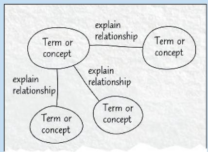

Figure 22.1 This Malaysian orchid mantis (Hymenopus coronatus) closely resembles the flower on which it rests, waiting for unwary prey to come within its reach. Other mantises have diverse shapes and colors that have evolved in different environments—yet all mantises also share certain features, such as grasping forelimbs, large eyes, and six legs.  

# Concept 22.1: The Darwinian revolution challenged traditional views of a young Earth inhabited by unchanging species

More than a century and a half ago, Charles Darwin was inspired to develop a scientific explanation for the diversity of life, the great number and remarkable variety of species on Earth. When he published his hypothesis in his book The Origin of Species, Darwin ushered in a scientific revolution—the era of evolutionary biology. As we'll see, Darwin developed his revolutionary ideas over time, influenced by the work of others and his travels (Figure 22.2).

## Endless Forms Most Beautiful

To set the stage for our study of Darwin and evolutionary biology, let's return to the well-hidden orchid mantis in Figure 22.1. This species is a member of a diverse group of insects, the Mantodea, which includes 2,300 species in 430 genera. All these mantises

share certain features, such as three pairs of legs, triangular heads with bulging eyes, and a flexible “neck.” Such shared features illustrate the unity of life, a phrase that highlights the fact that all organisms share characteristics.

But Earth's many different species also differ from one another. The mantises, for example, differ in features such as their size, shape, and color. Overall, the orchid mantis and its many close relatives illustrate three key observations about life:

\- organisms are well suited (adapted) for life in their environments (Here and throughout this text, the term environment refers to other organisms as well as to the physical aspects of an organism's surroundings.)

• the many shared characteristics (unity) of life

• the rich diversity of life

Darwin, a keen observer of nature since childhood, set out to explain these three broad observations—an effort that eventually led him to conclude that life evolves over time.

For now, we will define evolution as descent with modification, a phrase Darwin used to summarize the process by which species accumulate differences from their ancestors as they adapt to different environments over time. Evolution can also be defined as a change in the genetic composition of a population from generation to generation (see Concept 23.3).

Figure 22.2 The intellectual context of Darwin's ideas.  

However it is defined, we can view evolution in two related but different ways: as a pattern and as a process. The pattern of evolutionary change is revealed by data from many scientific disciplines, including biology, geology, physics, and chemistry. These data are facts—they are observations about the natural world—and these observations show that life has evolved over time. The process of evolution consists of the mechanisms that cause the observed pattern of change. These mechanisms represent natural causes of the natural phenomena we observe. Indeed, the power of evolution as a unifying theory is its ability to explain and connect a vast array of observations about the living world.

As with all general theories in science, we continue to test our understanding of evolution by examining whether it can account for new observations and experimental results. In this and the following chapters, we'll examine how ongoing discoveries shape what we know about the pattern and process of evolution.

We'll begin our exploration of these discoveries by retracing Darwin's quest to explain the adaptations, unity, and diversity of what he called life's "endless forms most beautiful."

## Scala Naturae and Classification of Species

Long before Darwin was born, several Greek philosophers suggested that life might have changed gradually over time. But one philosopher who greatly influenced early Western science, Aristotle (384–322 BCE), viewed species as fixed (unchanging). Through his observations of nature, Aristotle recognized certain “affinities” among organisms. He concluded that life-forms could be arranged on a ladder, or scale, of increasing complexity, later called the scala naturae (“scale of nature”). Each form of life, perfect and permanent, had its allotted rung on this ladder.

These ideas were generally consistent with the Old Testament account of creation, which holds that species were individually designed by God and therefore perfect. In the 1700s, many scientists interpreted the often remarkable ways in which organisms are well suited for life in their environment as evidence that the Creator had designed each species for a particular purpose.

One such scientist was Carolus Linnaeus (1707–1778), a Swedish physician and botanist who sought to classify life's diversity, in his words, "for the greater glory of God." In the 1750s, Linnaeus developed the two-part, or binomial, format for naming species (such as Homo sapiens for humans) that is still used today. In contrast to the linear hierarchy of the scala naturae, Linnaeus used a nested classification system, grouping similar species into increasingly inclusive categories. For example, similar species are grouped in the same genus, similar genera (plural of genus) are grouped in the same family, and so on.

Linnaeus did not ascribe the resemblances among species to evolutionary kinship, but rather to the pattern of their creation. A century later, however, Darwin argued that classification should be based on evolutionary relationships. He also noted

that scientists using the Linnaean system often grouped organisms in ways that reflected those relationships.

## Ideas About Change over Time

Among other sources of information, Darwin drew from the work of scientists studying fossils, the remains or traces of organisms from the past. Many fossils are found in sedimentary rocks formed from the sand and mud that settle to the bottom of seas, lakes, and swamps (Figure 22.3). New layers of sediment cover older ones and compress them into superimposed layers of rock called strata (singular, stratum). The fossils in a particular stratum provide a glimpse of some of the organisms that populated Earth at the time that layer formed. Later, erosion may carve through upper (younger) strata, revealing deeper (older) strata that had been buried.

Paleontology, the study of fossils, was developed in large part by French scientist Georges Cuvier (1769–1832). In examining strata near Paris, Cuvier noted that the older the stratum, the more dissimilar its fossils were to current life-forms. He also observed that from one layer to the next, some new species appeared while others disappeared. He inferred that extinctions must have been a common occurrence, but he staunchly opposed the idea of evolution. Cuvier speculated that each boundary between strata represented a sudden catastrophic event, such as a flood, that had destroyed many of the species living in that area. Such regions, he reasoned, were later repopulated by different species immigrating from other areas.

In contrast to Cuvier's emphasis on sudden events, other scientists suggested that profound change could take place through the cumulative effect of slow but continuous processes. In 1795, Scottish geologist James Hutton (1726–1797) proposed that Earth's geologic features could be explained by gradual

Figure 22.3 Formation of sedimentary strata with fossils.  

Figure 22.4 Acquired traits cannot be inherited.
This bonsai tree was “trained” to grow as a dwarf by pruning and shaping. However, seeds from this tree would produce offspring of normal size.

mechanisms, such as valleys being formed by rivers. The leading geologist of Darwin's time, Charles Lyell (1797–1875), incorporated Hutton's thinking into his proposal that the same geologic processes are operating today as in the past, and at the same rate.

Hutton's and Lyell's ideas strongly influenced Darwin's thinking. Darwin agreed that if geologic change results from slow, continuous actions rather than from sudden events, then Earth must be much older than the widely accepted age of a few thousand years. It would, for example, take a very long time for a river to carve a canyon by erosion. He later reasoned that perhaps similarly slow and subtle processes could produce substantial biological change. However, Darwin was not the first to apply the idea of gradual change to biological evolution.

## Lamarck's Hypothesis of Evolution

Although some 18th-century naturalists suggested that life evolves as environments change, only one proposed a mechanism for how life changes over time: French biologist Jean-Baptiste de Lamarck (1744–1829). Alas, Lamarck is primarily remembered today not for his visionary recognition that evolutionary change explains patterns in fossils and how organisms are well suited for their environments, but for the incorrect mechanism he proposed.

Lamarck published his hypothesis in 1809, the year Darwin was born. By comparing living species with fossil forms, Lamarck had found what appeared to be several lines of descent, each a chronological series of older to younger fossils leading to a living species. He explained his findings using two principles that were widely accepted at the time. The first was use and disuse, the idea that parts of the body that are used extensively become larger and stronger, while those that are not used deteriorate. Among many examples, he cited a giraffe stretching its neck to reach leaves on high branches. The second principle, inheritance of acquired characteristics, stated that an organism could pass these modifications to its offspring. Lamarck reasoned that the long, muscular neck of the living giraffe had evolved over many generations as giraffes stretched their necks ever higher.

Lamarck also thought that evolution happens because organisms have an innate drive to become more complex. Darwin rejected this idea, but he, too, thought that variation was introduced into the evolutionary process in part by inheritance of acquired characteristics. Today, however, our understanding of genetics refutes this mechanism: Experiments show that traits acquired by use during an individual's life are not inherited in the way proposed by Lamarck (Figure 22.4). (Notably, there are certain instances, referred to as epigenetic inheritance, in which chemical modifications to an organism's chromatin can be passed to the next generation via mechanisms that do not involve the nucleotide sequence itself; see Concept 18.2 for more about epigenetic inheritance.)

Lamarck was vilified in his own time, especially by Cuvier, who denied that species ever evolve. In retrospect, however,

  
Lamarck did recognize that the fact that organisms are well-suited for life in their environments can be explained by gradual evolutionary change, and he did propose a testable explanation for how this change occurs.

## Concept Check 22.1

1. How did Hutton's and Lyell's ideas influence Darwin's thinking about evolution?

2. MAKE CONNECTIONS Scientific hypotheses must be testable (see Concept 1.3). Applying this criterion, are Cuvier's explanation of the fossil record and Lamarck's hypothesis of evolution scientific? Explain your answer in each case.

For suggested answers, see Appendix A.

# Concept 22.2: Descent with modification by natural selection explains the adaptations of organisms and the unity and diversity of life

As the 19th century dawned, it was generally thought that species had remained unchanged since their creation. A few clouds of doubt about the permanence of species were beginning to gather, but no one could have forecast the thundering storm just beyond the horizon. How did Charles Darwin become the lightning rod for a revolutionary view of life?

## Darwin's Research

Charles Darwin (1809–1882) was born in Shrewsbury, in western England. Even as a boy, he had a consuming interest in nature. When he was not reading nature books, he was fishing, hunting, riding, and collecting insects. However, Darwin's father, a physician, could see no future for his son as a naturalist and sent him to medical school in Edinburgh. But Charles found medicine boring and surgery before the days of anesthesia horrifying. He quit medical school and enrolled at Cambridge University, intending to become a clergyman. (At that time, many scholars of science belonged to the clergy.)

At Cambridge, Darwin became the protégé of John Henslow, a botany professor. Soon after Darwin graduated, Henslow recommended him to Captain Robert FitzRoy, who was readying the survey ship HMS Beagle for a voyage around the world. Darwin would pay his own way and serve as a conversation partner to the young captain. FitzRoy, who was himself an adept scientist, accepted Darwin because he was a skilled naturalist and they were of similar age and social class.

## The Voyage of the Beagle

Darwin embarked from England on the Beagle in December 1831. The primary mission of the voyage was to chart stretches of the South American coast that were poorly known to Europeans. Darwin, however, spent most of his time on shore, observing and collecting thousands of plants and animals. He described features of organisms that made them well suited to such diverse environments as the humid jungles of Brazil, the expansive grasslands of Argentina, and the towering peaks of the Andes. He also noted that the plants and animals in temperate regions of South America more closely resembled species living in the South American tropics than species living in temperate regions of Europe. Furthermore, the fossils he found, though clearly different from living species, distinctly resembled the living organisms of South America.

Darwin also spent much time thinking about geology. Despite repeated bouts of seasickness, he read Lyell's Principles of Geology during the voyage. He experienced geologic change firsthand when a violent earthquake shook the coast of Chile, and he observed afterward that rocks along the coast had been thrust upward by several meters. Finding fossils of ocean organisms high in the Andes, Darwin inferred that the rocks containing the fossils must have been raised there by many similar earthquakes. These observations reinforced what he had learned from Lyell: Physical evidence did not support the traditional view that Earth was only a few thousand years old.

Darwin's interest in the species (or fossils) found in an area was further stimulated by the Beagle's stop at the Galápagos, a group of volcanic islands located near the equator about 900 km west of South America (Figure 22.5). Darwin was fascinated by the unusual organisms there. The birds he collected included several kinds of mockingbirds. These mockingbirds, though similar to each other, seemed to be different species. Some were unique to individual islands, while others lived on two or more adjacent islands. Furthermore, although the animals on the Galápagos resembled species living on the South American mainland, most of the Galápagos species were not known from anywhere else in the world. Darwin hypothesized that the Galápagos had been colonized by organisms that had strayed from South America and then diversified, giving rise to new species on the various islands.

## Darwin's Focus on Adaptation

During the voyage of the Beagle, Darwin observed many examples of adaptations, inherited characteristics of organisms that enhance their survival and reproduction in specific environments. Later, as he reassessed his observations, he began to perceive adaptation to the environment and the origin of new species as closely related processes. Could a new species arise from an ancestral form by the gradual accumulation of adaptations to a different environment? From studies made years after Darwin's voyage, biologists have

Figure 22.5 The voyage of HMS Beagle (December 1831–October 1836).  
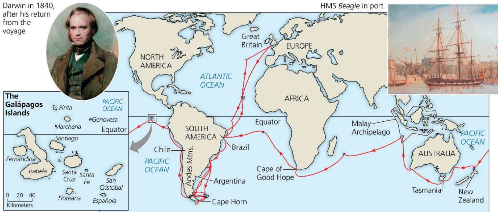

Figure 22.6 Three examples of beak variation in Galápagos finches.

The Galápagos Islands are home to more than a dozen species of closely related finches, some found only on a single island. A striking difference among them is their beaks, which are adapted for specific diets.

  
(a) Cactus-eater. The long, sharp beak of the common cactus finch (Geospiza scandens) helps it tear and eat cactus flowers and pulp.

  
(b) Insect-eater. The green warbler finch (Certhidea olivacea) uses its narrow, pointed beak to grasp insects.

  
(c) Seed-eater. The large ground finch (Geospiza magnirostris) has a large beak adapted for cracking seeds found on the ground.  
MAKE CONNECTIONS Review Figure 1.20. Circle the most recent common ancestor shared by the three species that eat insects. Are all of the descendants of that ancestor insect-eaters?  
For suggested answer, see Appendix A.

concluded that this is indeed what happened to a diverse group of finches found on the Galápagos Islands (see Figure 1.20). The finches' various beaks and behaviors are adapted to the specific foods available on their home islands (Figure 22.6). Darwin realized that explaining such adaptations was essential to understanding evolution. His explanation of how adaptations arise centered on natural selection, a process in which individuals that have certain inherited traits tend to survive and reproduce at higher rates than do other individuals because of those traits. By the early 1840s, Darwin had worked out the major features of his hypothesis. He set these ideas on paper in 1844, when he wrote a long essay on descent with modification and its underlying mechanism, natural selection. Yet he was still reluctant to publish his ideas, in part because he anticipated the uproar they would cause. During this time, Darwin continued to compile evidence in support of his hypothesis. By the mid-1850s, he had described his ideas to Lyell and a few others. Lyell, who was not yet convinced of evolution, nevertheless urged Darwin to publish on the subject before someone else came to the same conclusions and published first.

In June 1858, Lyell's prediction came true. Darwin received a manuscript from Alfred Russel Wallace (1823–1913), a British naturalist working in the South Pacific islands of the Malay Archipelago (see Figure 22.2). Wallace had developed a hypothesis of natural selection nearly identical to Darwin's. He asked Darwin to evaluate his paper and forward it to Lyell if it merited publication. Darwin complied, writing to Lyell: "Your words have come true with a vengeance.... I never saw a more striking coincidence... so all my originality, whatever it may amount to, will be smashed." On July 1, 1858, Lyell and a colleague presented Wallace's paper, along with extracts from Darwin's unpublished 1844 essay, to the Linnean Society of London. Darwin quickly finished his book, entitled On the Origin of Species by Means of Natural Selection (commonly referred to as The Origin of Species), and published it the next year. Although Wallace had submitted his ideas for publication first, he admired Darwin and thought that Darwin had developed and tested the idea of natural selection so extensively that he should be known as its main architect.

Within a decade, Darwin's book and its proponents had convinced most scientists that life's diversity is the product of evolution. Darwin succeeded where previous evolutionists had failed by presenting a plausible scientific mechanism with immaculate logic and an avalanche of supporting evidence.

## Ideas from The Origin of Species

In his book, Darwin amassed evidence that descent with modification by natural selection explains three broad observations about nature—the unity of life, the diversity of life, and the striking ways in which organisms are suited for life in their environments.

## Descent with Modification

In the first edition of The Origin of Species, Darwin never used the word evolution (although the final word of the book is “evolved”). Rather, he discussed descent with modification, a phrase that summarized his view of life. Organisms share many characteristics, leading Darwin to perceive unity in life. He attributed the unity of life to the descent of all organisms from an ancestor that lived in the remote past. He also thought that as the descendants of that ancestral organism lived in various habitats, they gradually accumulated diverse modifications, or adaptations, that fit them to specific ways of life. Thus, Darwin thought of evolution as a process in which both descent (shared ancestry, resulting in shared characteristics) and modification (the accumulation of differences) can be observed.

Darwin reasoned that over a long period of time, descent with modification eventually led to the rich diversity of life we see today. He viewed the history of life as a tree, with multiple branchings from a common trunk out to the tips of the youngest twigs (Figure 22.7). In his diagram, the tips of the twigs that are labeled A–D represent several groups of organisms living in the present day, while the unlabeled branches represent groups that are extinct. Each fork of the tree represents the most recent common ancestor of all the lines of evolution that subsequently branch from that point.

Figure 22.7 “I think ....” In this 1837 sketch, Darwin envisioned the branching pattern of evolution.

Branches that end in twigs labeled A–D represent particular groups of living organisms; all other branches represent extinct groups.

  
Figure 22.8 Descent with modification.

Darwin thought that such a branching process, along with past extinction events, could explain the large morphological gaps that sometimes exist between related groups of organisms. As an example, let's consider the three living species of elephants: the Asian elephant (Elephas maximus) and two species of African elephants (Loxodonta africana and L. cyclotis). These closely related species are very similar because they shared the same line of descent until a relatively recent split from their common ancestor, as shown in the tree diagram in Figure 22.8. Note that seven lineages related to elephants have become extinct over the past 32 million years. As a result, there are no living species that fill the morphological gap between the elephants and their nearest relatives today, the hyraxes and manatees.

Extinctions like those in Figure 22.8 are common. In fact, many evolutionary branches, even some major ones, are dead ends: Scientists estimate that over 99% of all species that have ever lived are now extinct. As in Figure 22.8, fossils of extinct species can reveal patterns of diversification within a group.

## Artificial Selection, Natural Selection, and Adaptation

Darwin proposed the mechanism of natural selection to explain the observable patterns of evolution. He crafted his argument carefully, hoping to persuade even the most skeptical readers. First he discussed familiar examples of selective breeding of domesticated plants and animals. Humans have modified other species over many generations by selecting and breeding individuals that possess desired traits, a process called artificial selection (Figure 22.9, on the next page). As a result of artificial selection, crops, livestock animals, and pets often bear little resemblance to their wild ancestors.

Darwin then argued that a similar process occurs in nature. He based his argument on two observations, from which he drew two inferences:

Observation #1: Members of a population often vary in their inherited traits (Figure 22.10).

Observation #2: All species can produce more offspring than their environment can support (Figure 22.11), and many of these offspring fail to survive and reproduce.

This evolutionary tree of elephants and their relatives is based mainly on fossils—their anatomy, order of appearance in strata, and geographic distribution. Note that most branches of descent ended in extinction (denoted by the dagger symbol, †). (Time line not to scale.)

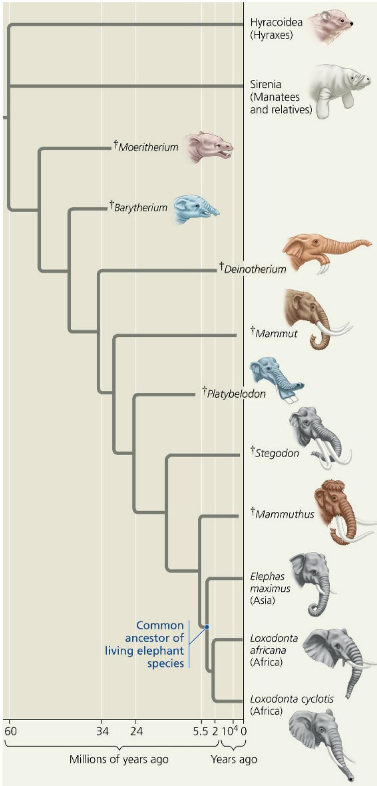  
VISUAL SKILLS Based on this tree, approximately when did the most recent ancestor shared by Mammuthus (woolly mammoths), Asian elephants, and African elephants live?  
For suggested answer, see Appendix A.

Figure 22.9 Artificial selection.

These different vegetables have all been selected from one species of wild mustard (Brassica oleracea). By selecting variations in different parts of the plant, breeders have obtained these divergent results.

Inference #1: Individuals whose inherited traits give them a higher probability of surviving and reproducing in a given environment tend to leave more offspring than do other individuals.

Inference #2: This unequal ability of individuals to survive and reproduce will lead to the accumulation of favorable traits in the population over generations.

As these two inferences suggest, Darwin saw a connection between natural selection and the capacity of organisms to “overreproduce.” He began to make this connection after reading an essay by economist Thomas Malthus, who contended that

Figure 22.10 Variation in a population.

Individuals in this population of Asian ladybird beetles (Harmonia axyridis) vary in color and spot pattern. Natural selection may act on these variations only if (1) they are heritable and (2) they affect the beetles' ability to survive and reproduce.

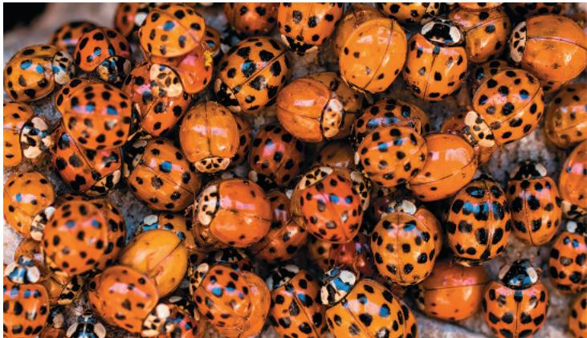

much of human suffering—disease, famine, and war—resulted from the human population's potential to increase faster than food supplies and other resources. Darwin similarly realized that the capacity to overreproduce was typical of all species. Of the many eggs laid, young born, and seeds spread, only a fraction complete their development and leave offspring of their own. The rest are starved, eaten, diseased, unmated, or unable to tolerate physical conditions of the environment such as salinity or temperature.

An organism's heritable traits can influence not only its own performance, but also how well its offspring cope with environmental challenges. For example, an organism might have a trait that gives its offspring an advantage in escaping predators, obtaining food, or tolerating physical conditions. When such advantages increase the number of offspring that survive and reproduce, the traits that are favored will likely appear at a greater frequency in the next generation. Thus, over time,

Kohlrabi

natural selection resulting from factors such as predators, lack of food, or adverse physical conditions can lead to an increase in the proportion of favorable traits in a population.

## Figure 22.11 Overproduction of offspring.

A single puffball fungus can produce billions of spores that give rise to offspring. If all of these offspring and their descendants survived to maturity, they would carpet the surrounding land surface.

How rapidly do such changes occur? Darwin reasoned that if artificial selection can bring about dramatic change in a relatively short period of time, then natural selection should be capable of substantial modification of species over many hundreds of generations. Even if the advantages of some heritable traits over others are slight, the advantageous variations will gradually accumulate in the population, and less favorable variations will diminish. Over time, this process will increase the frequency of individuals with favorable adaptations, hence increasing the degree to which organisms are well suited for life in their environment.

## Key Features of Natural Selection

Let's now summarize some of the main ideas of natural selection:

\- Natural selection is a process in which individuals that have certain heritable traits survive and reproduce at a higher rate than do other individuals because of those traits.

\- Over time, natural selection can increase the frequency of adaptations that are favorable in a given environment (Figure 22.12).

## Figure 22.12 Camouflage as an example of evolutionary adaptation.

Related species of moths have diverse shapes and colors that evolved in different environments, as seen in this dead-leaf moth (Oxytenis modestia) in Peru (a) and buff-end moth (Phalera bucephala) in Scotland (b).

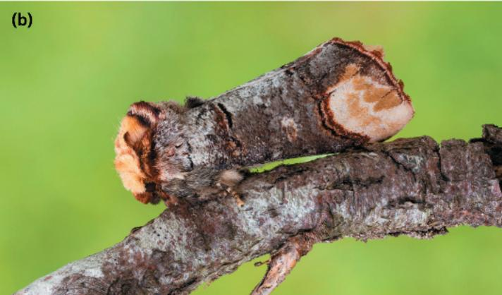

\- If an environment changes, or if individuals move to a new environment, natural selection may result in adaptation to these new conditions, sometimes giving rise to new species.

One subtle but important point is that although natural selection occurs through interactions between individual organisms and their environment, individuals do not evolve. Rather, it is the population that evolves over time.

A second key point is that natural selection can amplify or diminish only those heritable traits that differ among the individuals in a population. Thus, even if a trait is inherited, if all the individuals in a population are genetically identical for that trait, evolution by natural selection cannot occur.

Third, environmental factors vary from place to place and over time. A trait that is favorable in one place or time may be useless—or even detrimental—in other places or times. Natural selection is always operating, but which traits are favored depends on the context in which a species lives and mates.

Next, we'll survey the wide range of observations that support a Darwinian view of evolution by natural selection.

## Concept Check 22.2

1. How does the concept of descent with modification explain both the unity and diversity of life?

2. WHAT IF? If you discovered a fossil of an extinct mammal that lived high in the Andes, would you predict that it would more closely resemble present-day mammals from South American jungles or present-day mammals that live high in Asian mountains? Explain.

3. MAKE CONNECTIONS Review the relationship between genotype and phenotype (see Figures 14.5 and 14.6). Suppose that in a particular pea population, flowers with the white phenotype are favored by natural selection. Predict what would happen over time to the frequency of the white-flower allele (the p allele) in the population.

For suggested answers, see Appendix A.

## Concept 22.3: Evolution is supported by an overwhelming amount of scientific evidence

In The Origin of Species, Darwin marshaled a broad range of evidence to support the concept of descent with modification. Still—as he readily acknowledged—there were instances in which key evidence was lacking. For example, Darwin referred to the origin of flowering plants as an “abominable mystery,” and he lamented the lack of fossils showing how earlier groups of organisms gave rise to new groups.

In the last 150 years, new discoveries have filled many of the gaps that Darwin identified. The origin of flowering plants, for example, is much better understood (see Concept 30.3), and many fossils have been discovered that signify the origin of new groups of organisms (see Concept 25.2). In this section, we'll consider four types of data that document the pattern of evolution and illuminate how it occurs: direct observations, homology, the fossil record, and biogeography.

## Direct Observations of Evolutionary Change

Biologists have documented evolutionary change in thousands of scientific studies. We'll examine many such studies throughout this unit, but let's look at two examples here.

## Natural Selection in Response to Introduced Species

Herbivores, animals that eat plants, often have adaptations that help them feed efficiently on their primary food sources. What happens when herbivores switch to a new food source with different characteristics?

## Figure 22.13

An opportunity to study this question in nature is provided by soapberry bugs, which use their “beak”—a hollow, needlelike mouthpart—to feed on seeds located within the fruits of various plants. In southern Florida, the soapberry bug (Jadera haematoloma) feeds on the seeds of a native plant, the balloon vine (Cardiospermum corindum). In central Florida, however, where balloon vines have become rare, soapberry bugs feed on the seeds of the golden rain tree (Koelreuteria elegans), a species recently introduced from Asia.

Inquiry: Can a change in a population's food source result in evolution by natural selection?

Soapberry bugs feed most effectively when the length of their beak is similar to the depth at which seeds are found within the fruit. Golden rain tree fruit consists of three flat lobes, and its seeds are much closer to the fruit surface than are the seeds of the plump, round fruit of the native balloon vine. These differences led researchers to predict that in populations that feed on golden rain tree, natural selection would result in beaks that are shorter than those in populations that feed on balloon vine (Figure 22.13). Indeed, beak lengths are shorter in the populations that feed on golden rain tree.

## Field Study

Soapberry bugs feed most effectively when the length of their “beak” is similar to the depth of the seeds within the fruit. Researchers measured beak lengths in soapberry bug populations feeding on the native balloon vine. They also measured beak lengths in populations feeding on the introduced golden rain tree. The researchers then compared the measurements with those

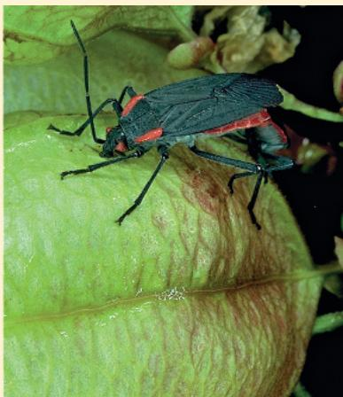  
Soapberry bug with beak inserted in balloon vine fruit

## Results

of museum specimens collected in the two areas before the golden rain tree was introduced.

Beak lengths were shorter in populations feeding on the introduced species than in populations feeding on the native species, in which the seeds are buried more deeply. The average beak length in museum specimens from each population (indicated by red arrows) was similar to beak lengths in populations feeding on native species.

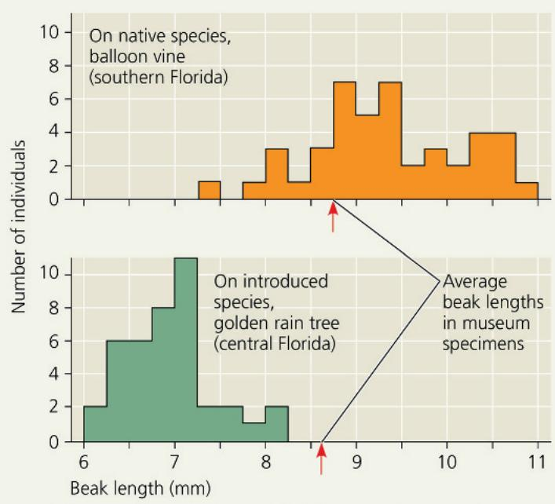

## Conclusion

Museum specimens and contemporary data suggest that a change in the seed depth of the soapberry bug's food source can result in evolution by natural selection for a corresponding change in beak size.

Data from S. P. Carroll and C. Boyd, Host race radiation in the soapberry bug: natural history with the history, Evolution 46:1052–1069 (1992).

WHAT IF? Data from additional studies showed that when soapberry bug eggs from a population that fed on balloon vine fruits were then reared on golden rain tree fruits (or vice versa), the beak lengths of the adult insects were most similar to those in the population from which the eggs were initially obtained. Interpret these results.

Researchers have also studied beak length evolution in soapberry bug populations that feed on plants introduced to Louisiana, Oklahoma, and Australia. In each of these locations, the fruit of the introduced plants is larger than the fruit of the native plant. Thus, in populations feeding on introduced species in these regions, researchers predicted that natural selection would result in the evolution of longer beaks. Again, data collected in field studies upheld this prediction.

The observed changes in beak lengths had important consequences. In Australia, for example, the increase in beak length nearly doubled the success with which soapberry bugs could eat the seeds of the introduced species. Furthermore, since historical data show that the golden rain tree reached central Florida just 35 years before the scientific studies were initiated, the results demonstrate that natural selection can cause rapid evolution in a wild population.

## The Evolution of Drug-Resistant Bacteria

An example of ongoing natural selection that dramatically affects humans is the evolution of drug-resistant pathogens (disease-causing organisms and viruses). This is a particular problem with bacteria and viruses because they can produce new generations in a short period of time; as a result, resistant strains of these pathogens can proliferate very quickly.

Consider the evolution of drug resistance in the bacterium Staphylococcus aureus. About one in three people harbor this species on their skin or in their nasal passages with no negative effects. However, certain genetic varieties (strains) of this species, known as methicillin-resistant S. aureus (MRSA), are formidable pathogens. Most MRSA infections are caused by recently appearing strains such as clone USA300, which can cause “flesh-eating disease” and potentially fatal infections (Figure 22.14). How did clone USA300 and other strains of MRSA become so dangerous?

The story begins in 1943, when penicillin became the first widely used antibiotic. Since then, penicillin and other antibiotics have saved millions of lives. However, by 1945, more than 20% of the S. aureus strains seen in hospitals were already resistant to penicillin. These bacteria had an enzyme, penicillinase, that could destroy penicillin. Researchers responded by developing antibiotics that were not destroyed by penicillinase, but resistance to each new drug occurred rapidly.

For example, a promising new antibiotic, methicillin, was introduced in 1959. But by 1961, methicillin-resistant strains of S. aureus were observed. How did these resistant strains emerge? Methicillin works by deactivating an enzyme that bacteria use to synthesize their cell walls. However, some S. aureus populations included individuals that were able to synthesize their cell walls using a different enzyme that was not affected by methicillin. These individuals survived the methicillin treatments and reproduced at higher rates than did other individuals. Over time, these resistant individuals became increasingly common, leading to the spread of MRSA.

Initially, MRSA could be controlled by antibiotics that work differently from the way methicillin works. But this has become less effective because some MRSA strains are resistant to multiple antibiotics—probably because bacteria can exchange genes with

Figure 22.14 Clone USA300: a virulent strain of methicillin-resistant Staphylococcus aureus (MRSA).

Resistant to multiple antibiotics and highly contagious, this strain and its close relatives can cause lethal infections of the skin, lungs, and blood. As shown here, researchers have identified key areas of the USA300 genome that code for adaptations that cause its virulent properties.

The circular chromosome of clone USA300 has been sequenced and contains 2,872,769 base pairs of DNA.

Highlighted regions contain genes that increase the strain's virulence (see the key).

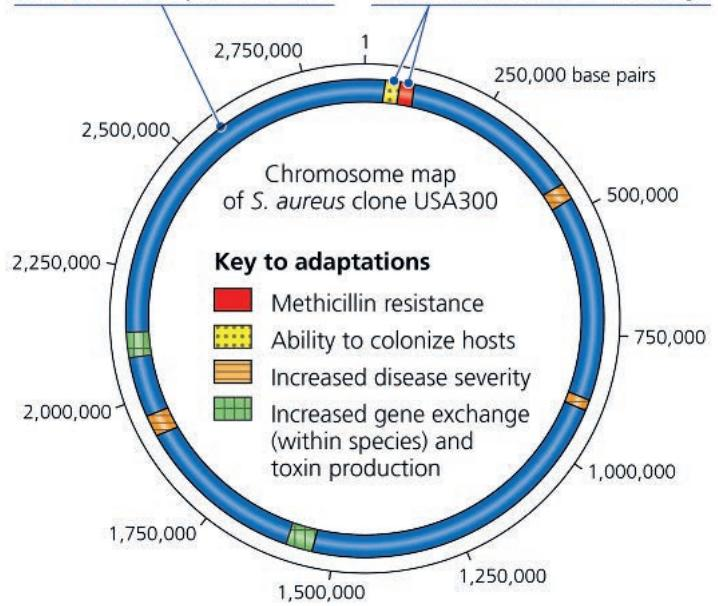  
WHAT IF? Some drugs being developed specifically target and kill only S. aureus; others slow the growth of MRSA but do not kill it. Based on how natural selection works and on the fact that bacterial species can exchange genes, explain why each of these strategies might be effective.  
For suggested answer, see Appendix A.

members of their own and other species. Thus, the multidrug-resistant strains of today may have emerged over time as MRSA strains that were resistant to different antibiotics exchanged genes.

Finally, it is important to note that S. aureus is not the only pathogenic bacterium that has evolved resistance to multiple antibiotics. Furthermore, in recent decades, antibiotic resistance has spread much faster than new antibiotics have been discovered—a problem of great public health concern. Hope may loom on the horizon, however. For example, scientists recently reported the discovery of “teixobactin,” a new antibiotic that shows promise for treating MRSA and other pathogens. In addition, as we’ll describe in the Scientific Skills Exercise in Chapter 27, the methods used in the discovery of teixobactin may lead to the discovery of other new antibiotics as well.

The S. aureus and soapberry bug examples highlight three key points about natural selection. First, natural selection is a process of editing, not a creative mechanism. A drug does not create resistant pathogens; it selects for resistant individuals that are already present in the population. Second, in species that produce new generations in short periods of time, evolution by natural selection can occur rapidly—in just a few years (S. aureus) or

Cat

decades (soapberry bugs). Third, natural selection depends on time and place. It favors those characteristics in a genetically variable population that provide an advantage in the current, local environment. What is beneficial in one situation may be useless or even harmful in another. Beak lengths suitable for the size of the typical fruit eaten by members of a particular soapberry bug population are favored by natural selection. However, a beak length suitable for fruit of one size can be disadvantageous when the bug is feeding on fruit of another size.

## Homology

A second type of evidence for evolution comes from analyzing similarities among different organisms. As we've discussed, evolution is a process of descent with modification: Characteristics present in an ancestral organism are altered (by natural selection) in its descendants over time as they face different environmental conditions. As a result, related species can have characteristics that have an underlying similarity yet function differently. Similarity resulting from common ancestry is known as homology. As we'll describe, an understanding of homology can be used to make testable predictions and explain observations that are otherwise puzzling.

## Anatomical and Molecular Homologies

The view of evolution as a remodeling process leads to the prediction that closely related species should share similar features—and they do. Of course, closely related species share the features used to determine their relationship, but they also share many other features. Some of these shared features make little sense except in the context of evolution. For example, the forelimbs of all mammals—including humans, cats, whales, and bats—show the same arrangement of bones from the shoulder to the tips of the digits, even though the appendages have very different functions: lifting, walking, swimming, and flying

Figure 22.16 Anatomical similarities in vertebrate embryos.
At some stage in their embryonic development, all vertebrates have a tail located posterior to the anus (referred to as a post-anal tail), as well as pharyngeal (throat) arches. Descent from a common ancestor can explain such similarities.

(Figure 22.15). Such striking anatomical resemblances would be highly unlikely if these structures had arisen anew in each species. Rather, the underlying skeletons of the arms, forelegs, flippers, and wings of different mammals are homologous structures that represent variations on a structural theme that was present in their common ancestor.

Comparing early stages of development in different animal species reveals additional anatomical homologies not visible in adult organisms. For example, at some point in their development, all vertebrate embryos have a tail located posterior to (behind) the anus, as well as structures called pharyngeal (throat) arches (Figure 22.16). These homologous arches ultimately develop into structures with very different functions, such as gills in fishes and parts of the ears and throat in humans and other mammals.

Figure 22.15 Mammalian forelimbs: homologous structures.

Even though they have become adapted for different functions, the forelimbs of all mammals are constructed from the same basic skeletal elements: one large bone (purple), attached to two smaller bones (orange and tan), attached to several small bones (gold), attached to several metacarpals (green), attached to approximately five digits, each of which is composed of multiple phalanges (blue).

  
Human

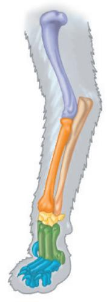

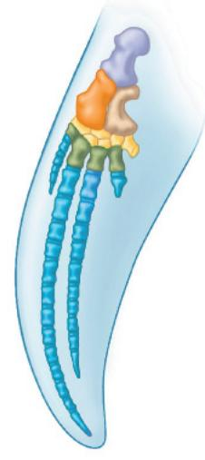  
Whale

Some of the most intriguing homologies concern “leftover” structures of marginal, if any, importance to the organism. These vestigial structures are remnants of features that served a function in the organism’s ancestors. For instance, snakes arose from ancestors with legs, and the skeletons of some snakes retain vestiges of the pelvis and leg bones of their ancestors. Likewise, blind species of cave fishes descended from ancestors with eyes—which explains why these blind fishes have eye remnants buried under their scales. We would not expect to see these vestigial structures if snakes and blind cave fishes had origins separate from those of other vertebrate animals.

Biologists also observe similarities among organisms at the molecular level. All forms of life use essentially the same genetic code, suggesting that all species descended from

common ancestors that used this code. But molecular homologies go beyond a shared code. For example, organisms as dissimilar as humans and bacteria share genes inherited from a very distant common ancestor. Some of these homologous genes have acquired new functions, while others, such as those coding for the ribosomal subunits used in protein synthesis (see Figure 17.18), have retained their original functions. It is also common for organisms to have genes that have lost their function, even though the homologous genes in related species may be fully functional. Like vestigial structures, it appears that such inactive “pseudogenes” may be present simply because a common ancestor had them.

## Homologies and “Tree Thinking”

Some homologous characteristics, such as the genetic code, are shared by all species because they date to the deep ancestral past. In contrast, homologous characteristics that evolved more recently are shared only within smaller groups of organisms.

Consider the tetrapods (from the Greek tetra, four, and pod, foot), the vertebrate group that consists of amphibians, mammals, and reptiles. Like all vertebrates, tetrapods have a backbone. But unlike other vertebrates, tetrapods also have limbs with digits (see Figure 22.15). As suggested by this example, homologous characteristics form a nested pattern: All life shares the deepest layer (in this case, all vertebrates have a backbone), and each successive smaller group adds its own homologies to those it shares with larger groups (in this case, all tetrapods have a backbone and limbs with digits). This nested pattern is exactly what we would expect to result from descent with modification from a common ancestor.

Biologists often represent the pattern of descent from common ancestors with an evolutionary tree, a diagram that reflects evolutionary relationships among groups of organisms. We will explore evolutionary trees in more detail in Chapter 26, but for now, let's consider how we can interpret and use such trees.

Figure 22.17 is an evolutionary tree of tetrapods and their closest living relatives, the lungfishes. In this diagram,

To explore “tree thinking” further, note that in Figure 22.17 mammals are positioned closer to amphibians than to birds. As a result, you might conclude that mammals are more closely related to amphibians than they are to birds. However, mammals are actually more closely related to birds than to amphibians because mammals and birds share a more recent common ancestor (ancestor ③) than do mammals and amphibians (ancestor ②). Ancestor ② is also the most recent common ancestor of birds and amphibians, making mammals and birds equally related to amphibians. Finally, note that the tree in Figure 22.17 shows the relative timing of events but not their actual dates. Thus, we can conclude that ancestor ② lived before ancestor ③, but we do not know when that was.

each branch point represents the most recent common ancestor of the two lineages diverging from that point. For example, lungfishes and all tetrapods descended from ancestor ①, whereas mammals, lizards and snakes, crocodiles, and birds all descended from ancestor ③. As expected, the three homologies shown on the tree—limbs with digits, the amnion (a protective embryonic membrane), and feathers—form a nested pattern. Limbs with digits were present in common ancestor ② and hence are found in all of the descendants of that ancestor (the tetrapods). The amnion was present only in ancestor ③ and hence is shared only by some tetrapods (mammals and reptiles). Feathers were present only in ancestor ⑥ and hence are found only in birds.

Evolutionary trees are hypotheses that summarize our current understanding of patterns of descent. Our confidence in these relationships, as with any hypothesis, depends on the strength of the supporting data. In the case of Figure 22.17, the tree is supported by many different data sets, including both anatomical and DNA sequence data. As a result, biologists are confident that it accurately reflects evolutionary history. Scientists can use such well-supported evolutionary trees to make specific and sometimes surprising predictions about organisms (see Figure 26.17).

Figure 22.17 Tree thinking: information provided in an evolutionary tree.

This evolutionary tree for tetrapods and their closest living relatives, the lungfishes, is based on anatomical and DNA sequence data. The purple hatch marks indicate the origin of three important homologies, each of which evolved only once. Birds are nested within and evolved from reptiles; hence, the group of organisms called “reptiles” technically includes birds.

For suggested answer, see Appendix A.

VISUAL SKILLS Based on this evolutionary tree, are crocodiles more closely related to lizards or birds? Explain.

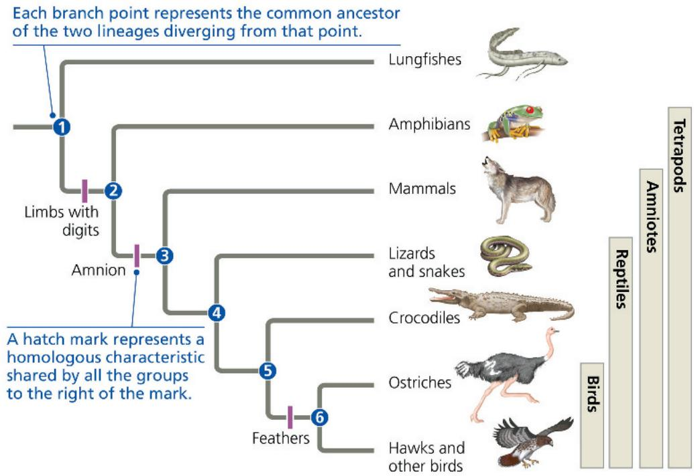

(b) Pakicetus

## A Different Cause of Resemblance: Convergent Evolution

Although organisms that are closely related share characteristics because of common descent, distantly related organisms can resemble one another for a different reason: convergent evolution, the independent evolution of similar features in different lineages. Consider marsupial mammals, many of which live in Australia. Marsupials are distinct from another group of mammals—the eutherians, or placental mammals—few of which live in Australia. (Eutherians complete their embryonic development in the uterus, whereas marsupials are born as embryos and complete their development while nursing, often in an external pouch.) Some Australian marsupials have eutherian look-alikes with superficially similar adaptations. For instance, a forest-dwelling Australian marsupial called the sugar glider is superficially very similar to flying squirrels, gliding eutherians that live in North American forests (Figure 22.18). But the sugar glider has many other characteristics that make it a marsupial, much more closely related to kangaroos and other Australian marsupials than to flying squirrels or other eutherians. Once again, our understanding of evolution can explain these observations. Although they evolved independently from different ancestors, these two mammals have adapted to similar environments in similar ways. In such examples in which species share features because of convergent evolution, the resemblance is said to be analogous, not homologous. Analogous features share similar function, but not common ancestry, while homologous features share common ancestry, but not necessarily similar function.

cetaceans, the mammalian order that includes whales, dolphins, and porpoises. Some of these fossils (Figure 22.19) provided strong support for a hypothesis based on DNA sequence data: that cetaceans are closely related to even-toed ungulates, a group that includes hippopotamuses, pigs, deer, and cows.

What else can fossils tell us about cetacean origins? The earliest cetaceans lived 50–60 million years ago. The fossil record indicates that prior to that time, most mammals were terrestrial. Although scientists had long realized that whales and other cetaceans originated from land mammals, few fossils had been

Figure 22.18 Convergent evolution.

The ability to glide through the air evolved independently in these two distantly related mammals.

## The Fossil Record

A third type of evidence for evolution comes from fossils. The fossil record documents the pattern of evolution, showing that past organisms differed from present-day organisms and that many species have become extinct. Fossils also show the evolutionary changes that have occurred in various groups of organisms. To give one of hundreds of possible examples, researchers found that over several thousand years, the pelvic bone in fossil stickleback fish became greatly reduced in size. The consistent nature of this change over time suggests that the reduction in the size of the pelvic bone may have been driven by natural selection.

Fossils can also shed light on the origins of new groups of organisms. An example is the fossil record of

Figure 22.19 Ankle bones: one piece of the puzzle.

Comparing fossils and present-day examples of the astragalus (a type of ankle bone) indicates that cetaceans are closely related to even-toed ungulates. (a) In most mammals, the astragalus is shaped like that of a dog, with a double hump on one end (double-headed red arrows) but not at the opposite end (single-headed blue arrow). (b) Fossils show that the early cetacean Pakicetus had an astragalus with double humps at both ends, a shape otherwise found only in pigs (c), deer (d), and all other event-toed ungulates.

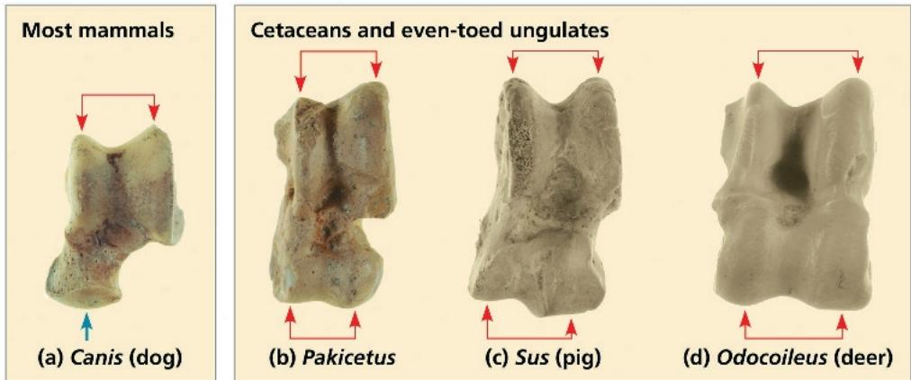

Figure 22.20 The transition to life in the sea.

Multiple lines of evidence support the hypothesis that cetaceans (yellow boxed labels) evolved from terrestrial mammals. Fossils document the reduction over time in the pelvis and hind limb bones of extinct ( $\dagger$ ) cetaceans, including Pakicetus, Rodhocetus, and Dorudon. DNA sequence data support the hypothesis that cetaceans are most closely related to hippopotamuses. (Note that the drawings are not to scale.)

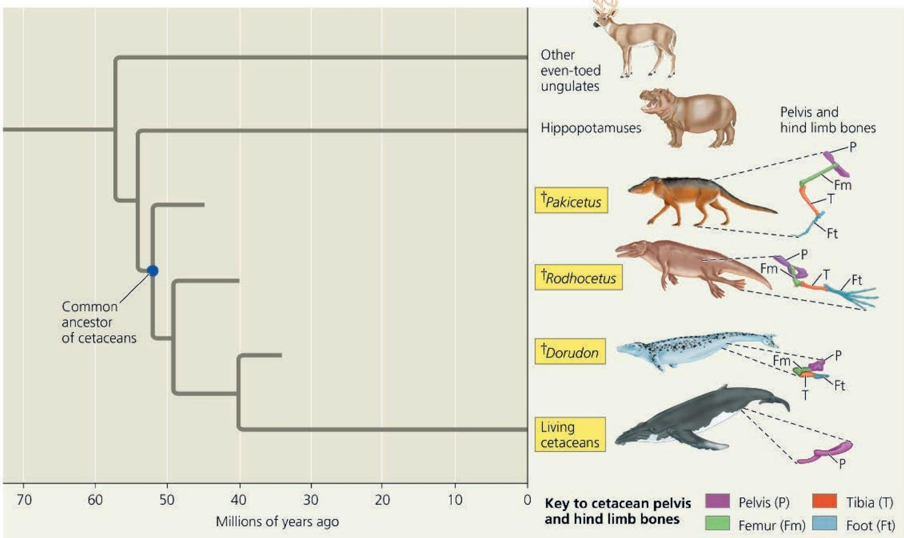  
VISUAL SKILLS Use the diagram to determine which happened first during the evolution of cetaceans: changes in hind limb structure or the origin of tail flukes (the lobes on a whale's tail). Explain.  
For suggested answer, see Appendix A.

found that revealed how cetacean limb structure had changed over time, leading eventually to the development of flippers as well as to the loss of hind limbs and the development of flukes (the lobes on a whale's tail). In the past few decades, however, a series of remarkable fossils have been discovered in Pakistan, Egypt, and North America. These fossils document extinct species that existed during the time that this lineage was adapting to life in the sea (Figure 22.20), and they can help us understand how present-day cetaceans came to be.

Finally, although living cetaceans look very different from living even-toed ungulates, the fossil discoveries show that extinct early cetaceans such as Pakicetus looked fairly similar to deer and other living even-toed ungulates. The extinct early cetaceans also looked very similar to extinct early even-toed ungulates, such as Diacodexis (Figure 22.21). Similar patterns are seen in fossils documenting the origins of other groups of organisms, including mammals (see Figure 25.7), flowering plants (see Concept 30.3), and tetrapods (see Figure 34.21). In each of these cases, the fossil record shows that over time, descent with modification produced increasingly large differences among related groups of organisms, ultimately resulting in the diversity of life today.

Figure 22.21 Diacodexis, an early even-toed ungulate.

## Biogeography

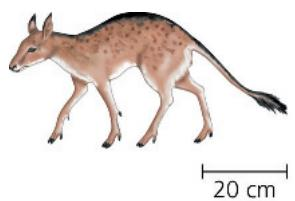

A fourth type of evidence comes from biogeography, the scientific study of the geographic distributions of species. These distributions are influenced by many factors, including continental drift, the slow movement of Earth's continents over

time. About 250 million years ago, these movements united all of Earth's landmasses into a single large continent called Pangaea (see Figure 25.16). Roughly 200 million years ago, Pangaea began to break apart; by 20 million years ago, the continents were within a few hundred kilometers of their present locations.

We can use our understanding of evolution and continental drift to predict where fossils of different groups of organisms might be found. For example, scientists have constructed evolutionary trees for horses based on anatomical data. These trees and the ages of fossils of horse ancestors suggest that the genus that includes present-day horses

Figure 22.22 Closely related freshwater fish separated by 9,000 km of ocean.

There are three species in these two closely related genera of freshwater fish within the family Galaxiidae.

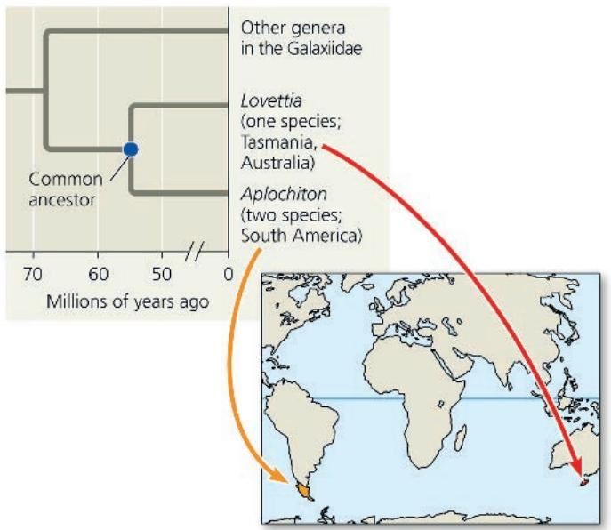

(Equus) originated 5 million years ago in North America. Geologic evidence indicates that at that time, North and South America were not yet connected, making it difficult for horses to travel between them. Thus, we would predict that the oldest Equus fossils should be found only on the continent on which the group originated—North America. This prediction and others like it for different groups of organisms have been upheld, providing more evidence for evolution.

Evolution also explains biogeographic data. For example, a group of three species of freshwater fish in the family Galaxiidae are found in regions separated by wide stretches of open ocean (Figure 22.22). None of these three species can survive in salt water, so how can we explain their geographic distributions? These three species represent all known living descendants of a common ancestor. Since all of the living species cannot survive in salt water, it is likely that their common ancestor also was restricted to freshwater habitats. At first glance, this only deepens the mystery—how could that ancestor or its descendants have swum across vast stretches of ocean? A clue comes from genetic analyses indicating that the evolutionary lineages leading to these three species began to diverge about 55 million years ago. By that time, the southernmost portion of Pangaea was breaking apart into what would eventually become South America, Australia, and Antarctica. This suggests that their ancestors had spread across southern Pangaea before it broke apart. At later times, these three freshwater species originated on the continental regions where they currently live, resulting in their present-day geographic distribution.

## What Is Theoretical About Darwin's View of Life?

Some people dismiss Darwin's ideas as "just a theory." But the pattern of evolution—the observation that life has evolved over time—is supported by a great deal of evidence. In addition, Darwin's explanation of the process of evolution—that natural selection is the primary cause of the observed pattern of evolutionary change—makes sense of massive amounts of data. As the Scientific Skills Exercise describes, the effects of natural selection also can be observed and tested in nature.

What, then, is theoretical about evolution? Keep in mind that the scientific meaning of the term theory is very different from its meaning in everyday use. The colloquial use of the word theory comes close to what scientists mean by a hypothesis. In science, a theory is much more comprehensive than a hypothesis. A theory, such as the theory of evolution by natural selection, accounts for many observations and explains and integrates a great variety of phenomena. Such a unifying theory does not become widely accepted unless its predictions stand up to thorough and continual testing by experiment and additional observation (see Concept 1.3). As the rest of this unit demonstrates, this has certainly been the case with the theory of evolution by natural selection.

The skepticism of scientists as they continue to test theories prevents these ideas from becoming dogma. For example, although Darwin thought that evolution was a very slow process, we now know that this isn't always true. Populations can evolve rapidly, and new species can form in relatively short periods of time: a few thousand years or less. Furthermore, evolutionary biologists now recognize that natural selection is not the only mechanism responsible for evolution. Indeed, the study of evolution today is livelier than ever as scientists use a wide range of experimental approaches and genetic analyses to test predictions based on natural selection and other evolutionary mechanisms.

Although Darwin's theory attributes life's diversity to natural processes, the diverse products of evolution are nevertheless elegant and inspiring. As Darwin wrote in the final sentence of The Origin of Species, “There is grandeur in this view of life… [in which] endless forms most beautiful and most wonderful have been, and are being, evolved.”

## Concept Check 22.3

1. Explain how the following statement is inaccurate: "Antibiotics have created drug resistance in MRSA."

2. How does evolution account for (a) the similar mammalian forelimbs with different functions shown in Figure 22.15 and (b) the similar forms of the two distantly related mammals shown in Figure 22.18?

3. WHAT IF? Fossils show that dinosaurs originated 200–250 million years ago. Would you expect the geographic distribution of early dinosaur fossils to be broad (on many continents) or narrow (on one or a few continents only)? Explain.

# Scientific Skills Exercise Making and Testing Predictions

Can Predation Result in Natural Selection for Color Patterns in Guppies? Our understanding of evolution changes constantly as new observations lead to new hypotheses—and hence to new ways to test our understanding of evolutionary theory. Consider the wild guppies (Poecilia reticulata) that live in pools connected by streams on the Caribbean island of Trinidad. Male guppies have highly varied color patterns that are controlled by genes that are only expressed in adult males. Female guppies choose males with bright color patterns as mates more often than they choose males with drab coloring. But the bright colors that attract females also can make the males more conspicuous to predators. Researchers observed that in pools with few predator species, the benefits of bright colors appear to “win out,” and males are more brightly colored than in pools where predation is more intense.

One guppy predator, the killifish, preys on juvenile guppies that have not yet displayed their adult coloration. Researchers predicted that if adult guppies with drab colors were transferred to a pool with only killifish, eventually the descendants of these guppies would be more brightly colored (because of the female preference for brightly colored males).

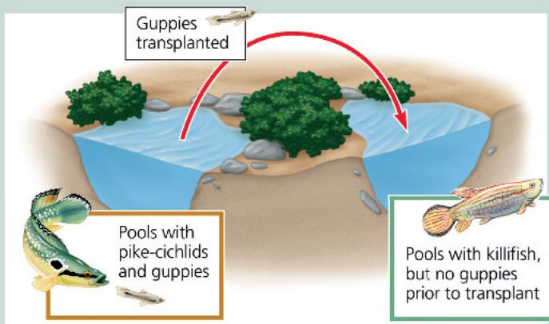

## Chapter 22 Review

## Summary of Key Concepts

To review key terms, go to the Vocabulary Self-Quiz (eTextbook only).

Concept 22.1: The Darwinian revolution challenged traditional views of a young Earth inhabited by unchanging species

\- Darwin proposed that life's diversity arose over long periods of time from ancestral species through natural selection, a departure from prevailing views. For example, Cuvier studied fossils but denied that evolution occurs; he proposed that sudden

How the Experiment Was Done Researchers transplanted 200 adult guppies from pools containing pike-cichlid fish, predators of adult guppies, to pools with only killifish, predators of juvenile guppies. They tracked the number of bright-colored spots and the total area of those spots on adult male guppies in each generation.

Data from the Experiment After 22 months (15 generations), researchers compared the color pattern data for guppies from the source and transplanted populations.

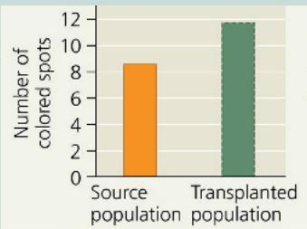

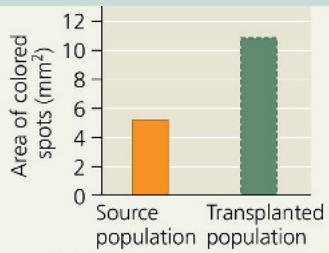  
Data from J. A. Endler, Natural selection on color patterns in Poecilia reticulata, Evolution 34:76–91 (1980).

## INTERPRET THE DATA

1. Identify the following elements of hypothesis-based science in this example: (a) question, (b) hypothesis, (c) prediction, (d) control group, and (e) experimental group. (For additional information about hypothesis-based science, see Concept 1.3 and the Scientific Skills Review in Appendix D.)

2. Explain how the types of data the researchers chose to collect enabled them to test their prediction.

3. What conclusion do you draw from the data presented above?

4. (a) Predict what would happen if, after 22 months, guppies from the transplanted population were returned to the source pool. (b) Describe an experiment to test your prediction.

Instructors: A version of this Scientific Skills Exercise can be assigned in Mastering Biology.

catastrophic events in the past caused species to disappear from an area. Lamarck hypothesized that species evolve, but the underlying mechanisms he proposed are not supported by evidence.

Why was the age of Earth important for Darwin's ideas about evolution?

Concept 22.2: Descent with modification by natural selection explains the adaptations of organisms and the unity and diversity of life

\- Darwin's experiences during the voyage of the Beagle gave rise to his idea that new species originate from ancestral forms through the accumulation of adaptations. He refined his theory for many years and finally published it in 1859 after learning that Wallace had come to the same idea.

\- In The Origin of Species, Darwin proposed that over long periods of time, descent with modification produced the rich diversity of life through the mechanism of natural selection.

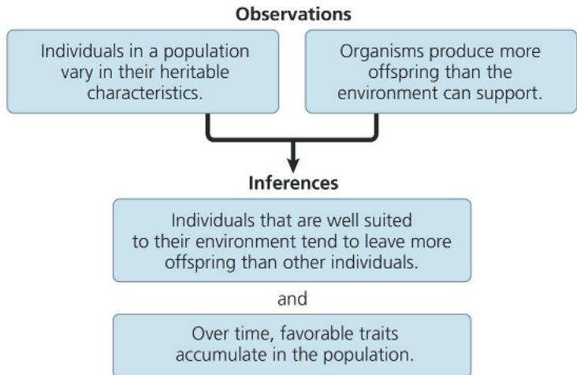  
Describe how overreproduction and heritable variation relate to evolution by natural selection.

## Concept 22.3: Evolution is supported by an overwhelming amount of scientific evidence

\- Researchers have directly observed natural selection leading to evolution in many studies in diverse organisms.

\- Organisms share characteristics because of common descent (homology) or because natural selection affects independently evolving species in similar environments in similar ways (convergent evolution).

\- Fossils show that past organisms differed from living organisms, that many species have become extinct, and that species have evolved over long periods of time; fossils also document the evolutionary origin of new groups of organisms.

• Evolutionary theory can explain some biogeographic patterns.

Summarize the different lines of evidence supporting the hypothesis that cetaceans descended from land mammals and are closely related to even-toed ungulates.

For suggested answers, see Appendix A.

## Test Your Understanding

For more multiple-choice questions, go to the Practice Test (eTextbook only).

## Levels 1-2: Remembering/Understanding

1. Which of the following is an observation or inference on which natural selection is based?

(A) Individuals do not vary in their heritable characteristics.

(B) Only well-adapted individuals produce offspring.

(C) Species produce more offspring than the environment can support.

(D) Nearly all of each individual's offspring will survive and reproduce.

2. Which of the following observations helped Darwin shape his concept of descent with modification?

(A) Species diversity declines farther from the equator.

(B) Fewer species live on islands than on the nearest continents.

(C) Birds live on islands located farther from the mainland than the birds' maximum nonstop flight distance.

(D) South American temperate plants are more similar to South American tropical plants than to European temperate ones.

## Levels 3-4: Applying/Analyzing

3. Within six months of effectively using methicillin to treat S. aureus infections in a community, all new S. aureus infections were caused by a resistant strain (MRSA). How can this best be explained?

(A) A patient must have become infected with MRSA from another community.

(B) In response to the drug, S. aureus began making drug-resistant versions of the protein targeted by the drug.

(C) Some drug-resistant bacteria were present at the start of treatment, and natural selection increased their frequency.

(D) S. aureus evolved to resist vaccines.

4. DNA sequences in many human genes are very similar to the sequences of corresponding genes in chimpanzees. The most likely explanation for this result is that

(A) humans and chimpanzees share a relatively recent common ancestor.

(B) humans evolved from chimpanzees.

(C) chimpanzees evolved from humans.

(D) convergent evolution led to the DNA similarities.

5. The upper forelimbs of humans and bats have fairly similar skeletal structures, whereas the corresponding bones in whales have very different shapes and proportions. However, genetic data suggest that all three kinds of organisms diverged from a common ancestor at about the same time. Which of the following is the most likely explanation for these data?

(A) Forelimb evolution was adaptive in people and bats, but not in whales.

(B) Natural selection in an aquatic environment resulted in significant changes to whale forelimb anatomy.

(C) Genes mutate faster in bats than in humans or whales.

(D) Whales are not properly classified as mammals.

## Levels 5-6: Evaluating/Creating

6. EVOLUTION CONNECTION Explain why anatomical and molecular features often fit a similar nested pattern. In addition, describe a process that can cause this not to be the case.

7. SCIENTIFIC INQUIRY • DRAW IT Mosquitoes resistant to the pesticide DDT first appeared in India in 1959, but now are found throughout the world. (a) Graph the data in the table below. (b) After examining the graph, hypothesize why the percentage of mosquitoes resistant to DDT rose rapidly. (c) Suggest an explanation for the global spread of DDT resistance.

<table><tr><td>Month</td><td>0</td><td>8</td><td>12</td></tr><tr><td>Mosquitoes Resistant* to DDT</td><td>4%</td><td>45%</td><td>77%</td></tr></table>

\* Mosquitoes were considered resistant if they were not killed within 1 hour of receiving a dose of 4% DDT.

Data from C. F. Curtis et al., Selection for and against insecticide resistance and possible methods of inhibiting the evolution of resistance in mosquitoes, Ecological Entomology 3:273–287 (1978).

8. WRITE ABOUT A THEME: INTERACTIONS Write a short essay (about 100–150 words) evaluating whether changes to an organism's physical environment are likely to result in evolutionary change. Use an example to support your reasoning.

9. SYNTHESIZE YOUR KNOWLEDGE

This honeypot ant (genus Myrmecocystus) can store liquid food inside its expandable abdomen. Consider other ants you are familiar with, and explain how a honeypot ant exemplifies three key features of life: adaptation, unity, and diversity.
For selected answers, see Appendix A.

# Explore Scientific Papers with Science in the Classroom | AAAS

How are some coral reefs responding to climate change? Go to "Take the Heat" at www.scienceintheclassroom.org.

Instructors: Questions can be assigned in Mastering Biology.

# The Evolution of Populations

## Key Concepts

23.1 Genetic variation makes evolution possible

23.2 The Hardy-Weinberg equation is a model of no evolution occurring for a given gene

23.3 Natural selection, genetic drift, and gene flow can alter allele frequencies in a population

23.4 Natural selection is the only mechanism that consistently causes adaptive evolution

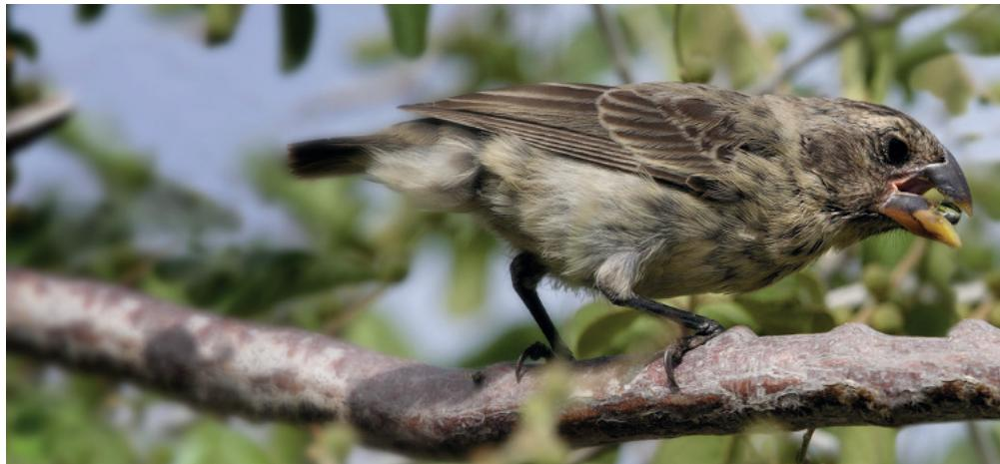  
Figure 23.1 The medium ground finch (Geospiza fortis) is a seed-eating bird that inhabits the Galápagos Islands. In 1977, the G. fortis population on the island of Daphne Major was decimated by a long period of drought: Of some 1,200 birds, only 180 survived. The birds that survived did so because they were still able to find food during the drought. In other words, their survival was not random—these birds had a selective advantage.

## Study Tip

Make a table: This chapter discusses different types of selection—disruptive, stabilizing, sexual, balancing, frequency-dependent, and heterozygote advantage. These types of selection are not all mutually exclusive, and some evolutionary changes are examples of more than one. To help you study, make a table like the one shown listing each type of selection, its distinguishing features, and example(s) from the chapter.

<table><tr><td>Type of selection</td><td>Distinguishing features</td><td>Example</td></tr><tr><td>Balancing selection</td><td>Maintains two or more phenotypes in a population; includes frequency-dependent selection and heterozygote advantage</td><td>Figures 23.17 and 23.18</td></tr><tr><td>Directional selection</td><td></td><td></td></tr></table>

Genetic variation results in color variation in this hypothetical beetle population.

Evolution occurs when natural selection, genetic drift, or gene flow alter the allele frequencies of a population over time.

  
The more visible darker beetles have been preyed on at a higher rate, causing lighter beetles (and the alleles they carry) to become more common over time.  
By chance alone, alleles encoding darker color have become more common over several generations.  
The arrival of beetles with a spotted color pattern has brought new alleles into the population.

# Concept 23.1: Genetic variation makes evolution possible

In The Origin of Species, Darwin provided abundant evidence that life on Earth has evolved over time, and he proposed natural selection as the primary mechanism for that change. He observed that individuals differ in their inherited traits and that selection acts on such differences, leading to evolutionary change. Although Darwin realized that variation in heritable traits is a prerequisite for evolution, he did not know precisely how organisms pass heritable traits to their offspring.

Just a few years after Darwin published The Origin of Species, Gregor Mendel wrote a groundbreaking paper on inheritance in pea plants proposing a model of inheritance in which organisms transmit discrete heritable units (now called genes) to their offspring. Although Darwin did not know about genes, Mendel's paper set the stage for understanding the genetic differences on which evolution is based.

## Individuals and Populations

A common misconception about evolution is that individual organisms evolve. It is true that natural selection acts on individuals. Each organism's traits affect its survival and reproductive success compared with other individuals. But the impact of natural selection only becomes apparent in how a population of organisms changes over time.

To see why, consider the population of medium ground finches decimated by a drought, resulting in only 180 survivors out of some 1,200 birds. Researchers Peter and Rosemary Grant observed that during the drought, small, soft seeds were scarce, while large, hard seeds were more plentiful. Birds with larger, deeper beaks were better able to crack and eat the larger seeds and survived at a higher rate than finches with smaller beaks.

Since beak depth is an inherited trait in these birds, the offspring of surviving birds tended to have deep beaks. As a result, the average beak depth in the next generation of G. fortis was greater than it had been in the pre-drought population (Figure 23.2). The finch population had evolved by natural selection. However, the individual finches did not evolve. Each bird had a beak of a particular size, which did not grow larger during the drought. Rather, the proportion of large beaks in the population increased across generations: The population evolved, not its individual members.

Focusing on evolutionary change in populations, we can recognize one definition of evolution on its smallest scale, called microevolution, as a change in allele frequencies in a population over generations. In the finch population, for example, birds that

Figure 23.2 Evidence of selection by food source.

The data represent adult beak depths of finches hatched before and after the 1977 drought. In one generation, natural selection resulted in a larger average beak size in the population.
Instructors: A related Experimental Inquiry Tutorial can be assigned in Mastering Biology.

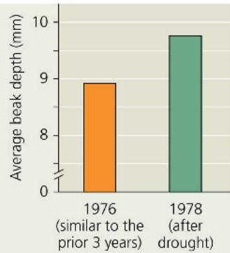

had alleles encoding large beaks survived at higher rates than did other birds. This caused those alleles to be more common after the drought than they had been before it, demonstrating evolution by natural selection. Natural selection is not the only mechanism of evolution. Other mechanisms include genetic drift (chance events that alter allele frequencies), and gene flow (the transfer of alleles between populations). (Mutation on its own can also be considered a mechanism of evolution if a mutation occurs in a reproductive cell and the mutation is passed on to the next generation.) Each of these mechanisms affects the genetic composition of populations, but only natural selection consistently improves the degree to which organisms are well suited for life in their environment (adaptation). Before we explore these mechanisms more fully, let's focus on their key prerequisite: genetic variation.

## Interview

Interview with Rosemary and Peter Grant: Studying evolution in the Galápagos finches (eTextbook only)

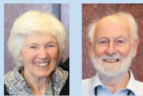

## Genetic Variation

Individuals within all species vary in their phenotypic traits. Humans, for example, vary noticeably in facial features, height, and voice. And though you cannot identify blood group (A, B, AB, or O) from a person's appearance, this and many other molecular traits also vary extensively among individuals.

Such phenotypic variations often reflect genetic variation, differences among individuals in the composition of their genes or other DNA sequences. Some heritable phenotypic differences occur on an “either-or” basis, such as the flower colors of Mendel’s pea plants: Each plant had flowers that were either purple or white (see Figure 14.3). Characters that vary in this way are typically determined by a single gene, with different alleles producing distinct phenotypes. In contrast, other phenotypic differences vary in gradations along a continuum. Such variation usually results from the influence of two or more genes on a single phenotypic character. In fact, many phenotypic characters are influenced by multiple genes, including coat color in horses (Figure 23.3), seed number in maize (corn), and height in humans.

How much do genes and other DNA sequences vary from one individual to another? Genetic variation at the whole-gene level

Figure 23.3 Phenotypic variation in horses.  
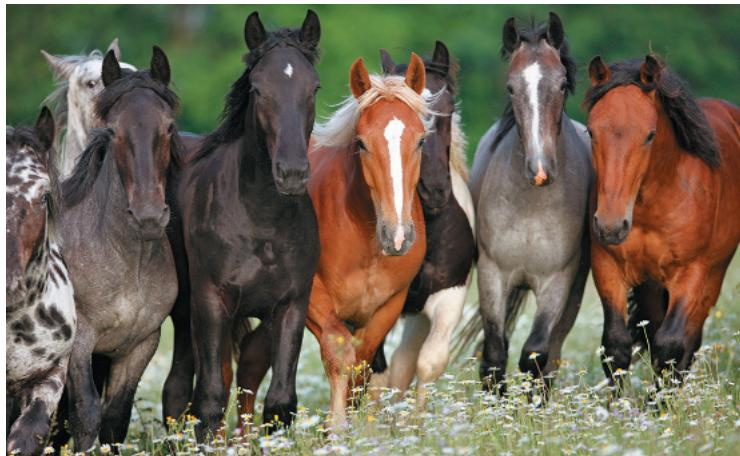

Figure 23.4 Extensive genetic variation at the molecular level.  
  
MAKE CONNECTIONS Review Figures 17.6 and 17.11. Explain how a base-pair substitution that alters a coding region of the Adh locus could have no effect on amino acid sequence. Then, explain how an insertion in an exon could have no effect on the protein produced.

(gene variability) can be quantified as the average percentage of loci that are heterozygous. (Recall that a heterozygous individual has two different alleles for a given locus, whereas a homozygous individual has two identical alleles for that locus.) As an example, on average, the fruit fly Drosophila melanogaster is heterozygous for about 1,920 of its 13,700 loci (14%) and homozygous for all the rest.

Considerable genetic variation can also be measured at the molecular level of DNA (nucleotide variability). But little of this variation results in phenotypic variation. Why? Many nucleotide variations occur within introns, noncoding segments of DNA lying between exons, the regions retained in mRNA after RNA processing (see Figure 17.12). And of the variations that occur within exons, most do not cause a change in the amino acid sequence of the protein encoded by the gene. For example, in the sequence comparison shown in Figure 23.4, there are 43 nucleotide sites with variable base pairs (where substitutions have occurred), as well as several sites where insertions or deletions have occurred. Although 18 variable sites occur within the four exons of the Adh gene, only one of these variations (at site 1, 490) results in an amino acid change. Note, however, that this single variable site is enough to cause genetic variation at the level of the gene, and hence two different forms of the Adh enzyme are produced. Of all the genetic variation shown in Figure 23.4, only this single difference that results in a different version of the enzyme is expressed phenotypically and therefore exposed to natural selection; the rest of this genetic variation is “hidden” from selection.

It is important to bear in mind that some phenotypic

## Sources of Genetic Variation

Genetic variation originates when processes such as mutation or gene duplication produce new alleles and new genes. New genetic variation can be generated in the production of each new generation. Bear in mind that the generation of new genetic variation is completely random with respect to the effects or consequences of this variation (that is, whether it is beneficial, negative, or neutral to the organism). Sexual reproduction can also result in genetic variation as existing genes are arranged in new ways.

## Formation of New Alleles

New alleles can arise by mutation, a change in the nucleotide sequence of an organism's DNA. Mutations can be caused by factors such as errors in DNA replication, exposure to UV light and other high-energy forms of radiation, and exposure to certain chemicals (see Concept 17.5). A change of as little as one base in a gene—a “point mutation”—can have a significant impact on phenotype, as in sickle-cell disease (see Figure 23.18). Furthermore, organisms reflect many generations of past selection, and hence their phenotypes tend to be well suited for life in their environments. As a result, most new mutations that alter a phenotype are at least slightly harmful.

In some cases, natural selection quickly removes such harmful alleles. In diploid organisms, however, harmful alleles that are recessive can be hidden from selection. Indeed, a harmful recessive

## Figure 23.5 Environmentally induced phenotypic variation.

variation does not result from genetic differences among individuals (Figure 23.5 shows a striking example in a caterpillar of the southwestern United States). Phenotype is the product of an inherited genotype and many environmental influences (see Concept 14.3). The term phenotypic plasticity refers to the ability of an individual genotype to produce different phenotypes when exposed to different environmental conditions. In a human example, bodybuilders alter their phenotypes dramatically but do not pass their huge muscles on to the next generation. In general, only the genetically determined part of phenotypic variation can be passed from parent to offspring. As such, genetic variation provides the raw material for evolutionary change: Without genetic variation, evolution cannot occur.

These caterpillars of the moth Nemoria arizonaria owe their different appearances to chemicals in their diets, not to differences in their genotypes. (a) Caterpillars raised on a diet of oak flowers resemble the flowers, whereas (b) their siblings raised on oak leaves resemble oak twigs.

allele can persist for generations by propagation in heterozygous individuals (where its harmful effects can be masked by the more favorable dominant allele). Such “heterozygote protection” maintains a huge pool of alleles that may be harmful under present conditions, but that could be beneficial if the environment changes.

While many mutations are harmful, many others are not. Recall that much of the DNA in eukaryotic genomes does not encode proteins (see Figure 21.6). Point mutations in these noncoding regions generally result in neutral variation, differences in DNA sequence that do not confer a selective advantage or disadvantage. The redundancy in the genetic code is another source of neutral variation: Even a point mutation in a gene that encodes a protein will have no effect on the protein's function if the amino acid doesn't change. And even a change in the amino acid may not affect the protein's shape and function. Moreover, a mutant allele may on rare occasions actually make its bearer better suited to the environment, enhancing reproductive success.

Finally, note that in multicellular organisms, only mutations in cell lines that produce gametes can be passed to offspring. In plants and fungi, this is not as limiting as it may sound, since many different cell lines can produce gametes. But in most animals, the majority of mutations occur in somatic cells and are not passed to offspring.

## Altering Gene Number or Position

Chromosomal changes that delete, disrupt, or rearrange many loci are usually harmful. However, when such large-scale changes leave genes intact, they may not affect the organisms' phenotype. In rare cases, chromosomal rearrangements may even be beneficial. For example, the translocation of part of one chromosome to a different chromosome could link genes in a way that produces a positive effect.

A key potential source of variation is the duplication of genes due to errors in meiosis (such as unequal crossing over), slippage during DNA replication, or the activities of transposable elements (see Concept 21.5). Duplications of large chromosome segments, like other chromosomal aberrations, are often harmful, but the duplication of smaller pieces of DNA may not be. Gene duplications that do not have severe effects can persist over generations, allowing mutations to accumulate. The result is an expanded genome with new genes that may take on new functions.

Such increases in gene number appear to have played a major role in evolution. For example, the remote ancestors of mammals had a single gene for detecting odors that has since been duplicated many times. As a result, humans today have about 380 functional olfactory receptor genes, and mice have about 1,200. This dramatic proliferation of olfactory genes probably helped early mammals, enabling them to detect faint odors and to distinguish among many different smells.

## Rapid Reproduction

Because genetic variation is generated when new generations are produced, organisms that have relatively short generation times may produce more genetic variation in a given amount of time. Mutation rates tend to be low in plants and animals, averaging about one mutation in every 100,000 genes per generation, and are often even lower in prokaryotes. But prokaryotes have many more generations per unit of time, so mutations can quickly generate genetic variation in their populations. The same is true of viruses. For instance, HIV has a generation time of about two days (that is, it takes two days for a newly formed virus to produce the next generation). HIV also has an RNA genome, which has a much higher mutation rate than a typical DNA genome

due to the lack of RNA repair mechanisms in host cells (see Concept 19.2). Thus, single-drug treatments are less effective against HIV: Mutant forms of the virus, resistant to a particular drug, tend to proliferate quickly. The most effective AIDS treatments to date have been drug “cocktails” that combine several medications. This approach has worked well as it is less likely that a set of mutations that together confer resistance to all the drugs will occur in a short time period.

## Sexual Reproduction

In organisms that reproduce sexually, most of the genetic variation in a population results from the unique combination of alleles that each individual receives from its parents. Of course, at the nucleotide level, all the differences among these alleles have originated from past mutations. Sexual reproduction then shuffles existing alleles and deals them at random to produce individual genotypes.

Three mechanisms contribute to this shuffling: Crossing over, independent assortment of chromosomes, and fertilization (see Concept 13.4). During meiosis, homologous chromosomes, one inherited from each parent, trade some of their alleles by crossing over. The resulting recombinant chromosomes are then distributed at random into gametes. Then, because myriad possible mating combinations exist in a population, fertilization typically brings together gametes with different genetic backgrounds. Together, these three mechanisms ensure that sexual reproduction rearranges existing alleles into fresh combinations each generation, providing much of the genetic variation that makes evolution possible. For example, since humans have 23 pairs of chromosomes, independent assortment alone results in $2^{23}$ (8.4 million) combinations in each parent. Consider that crossing over may or may not happen along any of the 23 pairs of chromosomes in either parent, and the fact that the actual fusion of two gametes is independent of these two processes, and it is clear that the number of possible outcomes approaches infinity.

## Concept Check 23.1

1. Explain why genetic variation within a population is a prerequisite for evolution.

2. Of all the mutations that occur in a population, why do only a small fraction become widespread?

3. Explain the difference between genetic variation and phenotypic variation and how each is important in the process of evolution.

4. MAKE CONNECTIONS If a population stopped reproducing sexually but still reproduced asexually, how would its genetic variation be affected over time? (See Concept 13.4.)

For suggested answers, see Appendix A.

# Concept 23.2: The Hardy-Weinberg equation is a model of no evolution occurring for a given gene

The existence of genetic variation within a population is required for evolution to occur, but genetic variation alone does not guarantee that evolution will occur. An allele does not just become more common or more rare on its own—unless something causes an allele to change in frequency, it won't. In other words, evolution doesn't happen without a reason. This proves to be a useful model for any given gene: Operationally, if we can reject this model of no evolution, we can demonstrate that evolution is occurring. Before examining this idea further, however, let's back up and review what we mean by a population.

Figure 23.6 One species, two populations.

These two caribou populations in the Yukon are not totally isolated; they sometimes share the same area (purple overlapping region in the map). Still, members of each population are most likely to breed within their own population.

## Gene Pools and Allele Frequencies

  
Porcupine herd  
Fortymile herd

A population is a group of

individuals of the same species that live in the same area and interbreed, producing fertile offspring. Different populations of a species may be isolated geographically or behaviorally from one another, exchanging genetic material only rarely. This is common for species that live on widely separated islands or in different lakes, but not all populations are isolated (Figure 23.6). Still, members of a population typically breed with one another and thus are more closely related to each other than to members of other populations.

We can characterize a population's genetic makeup by describing its gene pool, which consists of all copies of every type

of allele at every locus in all members of the population. If only one allele exists for a particular locus in a population, that allele is said to be fixed in the gene pool, and all individuals are homozygous for that allele. But if there are two or more alleles for a particular locus in a population, individuals may be either homozygous or heterozygous.

For example, imagine a population of 500 wildflower plants with two alleles, $C^{R}$ and $C^{W}$ , for a locus that codes for flower pigment. These alleles show incomplete

dominance; thus, each genotype has a distinct phenotype. Plants homozygous for the $C^{R}$ allele ( $C^{R}C^{R}$ ) produce red pigment and have red flowers; plants homozygous for the $C^{W}$ allele ( $C^{W}C^{W}$ ) produce no red pigment and have white flowers; and heterozygotes ( $C^{R}C^{W}$ ) produce some red pigment and have pink flowers.

Each genotype and each allele has a frequency (proportion) in the population. To see how these frequencies are calculated, suppose our population has 320 plants with red flowers (genotype $C^{R}C^{R}$ ), 160 with pink flowers (genotype $C^{R}C^{W}$ ), and 20 with white flowers (genotype $C^{W}C^{W}$ ). Since 320 of the 500 plants have red flowers, the frequency of the $C^{R}C^{R}$ genotype is 0.64 (320/500).

Likewise, the frequency of the $C^{R}C^{W}$ genotype is 0.32 (160/500) and the frequency of the $C^{W}C^{W}$ genotype is 0.04 (20/500).

With respect to allele frequencies, wildflowers are diploid organisms, so each individual has two alleles for each of its genes. Hence, the 500 individuals in our population have a total of 1,000 copies of the gene for flower color. The $C^{R}$ allele accounts for 800 of these copies ( $320 \times 2 = 640$ for $C^{R}C^{R}$ plants, plus $160 \times 1 = 160$ for $C^{R}C^{W}$ plants). Thus, the frequency of the $C^{R}$ allele is $800/1,000 = 0.8$ (80%). Recognize that this allele frequency is a property of the population; each individual does not have an allele frequency.

When studying a locus with two alleles, the convention is to use p to represent the frequency of one allele and q to represent the frequency of the other allele. Thus, p, the frequency of the $C^{R}$ allele in the gene pool of this population, is $p = 0.8 \, (80\%)$ . And because there are only two alleles for this gene, the frequency of the $C^{W}$ allele, represented by q, must be $q = 1 - p = 0.2 \, (20\%)$ . For loci that have more than two alleles, the sum of all allele frequencies must still equal 1 (100%). Given an understanding of an allele frequency, we can examine how allele frequencies change over generations (that is, how evolution occurs).

## The Hardy-Weinberg Model

As you have read, one basic definition of evolution is a change in allele frequency across generations. An individual does not have an allele frequency; this is a property of a population. If one allele becomes more common in a population, some other alleles at that locus become less common—that is a change in the genetic makeup of the population. If we imagine the gene pool of a population as a bin filled with balls of different colors that represent different alleles (Figure 23.7), we can visualize the role that allele frequencies play in determining offspring genotypes.

Figure 23.7 Selecting alleles at random from a gene pool.  
  
DRAW IT Draw a bin with six white balls instead of four. For the frequency of $C^{R}$ to remain equal to 0.8, how many red balls should the bin contain? For suggested answer, see Appendix A.

Subsequently, we can see how the frequency of any given allele may change over generations.

Suppose that $80\%$ of the balls in the bin are red (representing the $C^R$ allele) and the remainder of the balls $(20\%)$ are white (representing the $C^W$ allele). We can track how the frequency of red affects the expected frequencies of offspring. Suppose there is such a large number of balls in the bin such that removing one doesn't change the overall frequency. Randomly picking one ball out of the bin, we have an $80\%$ chance, or 0.8, of picking a red one. If that ball represents the allele in a given gamete, in order to model sexual reproduction, we need to pick another one for the other gamete (two gametes, each with their own allele, fuse in fertilization and produce a diploid zygote). Supposing that we randomly pick two balls (alleles) in this way, we can use the law of multiplication (see Figure 14.9) to calculate the possible outcomes, as shown in Figure 23.7.

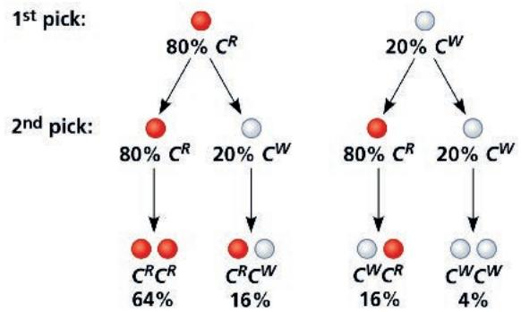

Therefore, there is a 64% chance that two red balls are chosen and a 4% chance that two white balls are chosen. Note that these correspond to the allele frequencies squared. There are two different ways to pick a red ball and a white ball: picking red first and then white second, or vice versa.

Figure 23.8 Hardy–Weinberg equilibrium.  
In our wildflower population, the gene pool remains constant from one generation to the next. Mendelian processes alone do not alter frequencies of alleles or genotypes.  
  
WHAT IF? If the frequency of the $C^{R}$ allele were 0.6, predict the frequencies of the $C^{R}C^{R}$ , $C^{R}C^{W}$ , and $C^{W}C^{W}$ genotypes.
For suggested answer, see Appendix A.

Now suppose we repeat this process until we have randomly picked 1,000 pairs (2,000 total alleles) from our gene pool to produce the next generation of 1,000 individuals. You'd expect, on average, to get $640 C^{R}C^{R}$ , $320 C^{R}C^{W}(= C^{W}C^{R})$ , and $40 C^{W}C^{W}$ pairs. This next generation's gene pool would therefore be comprised of $(2 \times 640) + (1 \times 320) = 1,600 C^{R}$ alleles and $(2 \times 40) + (1 \times 320) = 400 C^{W}$ alleles. Note that $1,600 C^{R}$ out of 2,000 total is a frequency of 0.8 (80%) and $400 C^{W}$ out of 2,000 is a frequency of 0.2 (20%). The allele frequencies have not changed. Red did not increase (or decrease) in frequency on its own, and neither did white. We could iterate this many times over; on average nothing will change. Figure 23.8 illustrates this in a slightly different way.

Note that these calculations include some important assumptions:

\- First, we assumed that red balls stay red (that is, they don't change to white or any other color), and white balls stay white. This is like assuming no mutation.

\- We assumed there is completely random mating (just picking individual balls out of the bin at random). This is like assuming no mating preferences and no inbreeding.

\- We assumed that there is no advantage to the phenotype associated with $C^{R}C^{R}$ , $C^{R}C^{W}$ , or $C^{W}C^{W}$ ; these phenotypes all contributed to the gene pool equally. This is like saying there is no selection: No traits are beneficial or harmful; there are no survival or reproductive advantages or disadvantages.

\- We assumed that removal of a red ball from the bin did not change the frequency of red balls in the bin (known as picking with replacement). This is like assuming an infinite population size.

\- Finally, we assumed that no balls were being added to the bin from any other bin. This is like saying there is no immigration (gene flow) into our population. Similarly, we assumed that no individuals emigrated (left) the population.

Because of all of these conditions were in place, the allele frequencies did not change across generations. This lack of change (that is, no evolution) can be viewed as an equilibrium (that is, no change). This can help us see why an allele frequency won't change in the absence of a reason for it to change. This is the basis for a useful model of population genetics that was independently described in 1908 by a British mathematician named Hardy and a German physician named Weinberg. Now called the Hardy–Weinberg model, it explains the relationship between allele frequencies in a gene pool and the genotypes produced from that gene pool. For the case of one gene with two alleles, the allele frequency for one allele ( $C^{R}$ ) = $p$ and the frequency of the other allele ( $C^{W}$ ) is $q = 1 - p$ (that is, $p + q = 1$ ). Given the allele frequencies, we can then predict the genotype frequencies of the offspring: The expected frequency of homozygous offspring is the allele frequency squared ( $p^{2}$ or $q^{2}$ ). The expected frequency of heterozygous offspring is $2pq$ . Notably, all offspring must have one of the three possible genotypes (in our example, $C^{R}C^{R}$ , $C^{R}C^{W}$ , or $C^{W}C^{W}$ ), so $p^{2} + 2pq + q^{2} = 1$ (see Figure 23.8).

## Hardy-Weinberg Equilibrium

As demonstrated in the preceding section, allele frequencies in a given population do not change on their own. We refer to this steady state as Hardy-Weinberg equilibrium, and we can use this model as a baseline prediction of no evolution in any given population. This takes the form of a statistical null hypothesis (null model), a hypothesis of no change. If we can demonstrate a deviation from the Hardy-Weinberg prediction of no change in allele frequencies, we can reject the null hypothesis and conclude that evolution is occurring. The next step is then to evaluate the mechanism or to determine what is causing evolution to occur (that is, which assumption is not being met).

Note that each of the assumptions of the model outlined earlier can correspond to a reason why the genotype frequencies in offspring may deviate from the Hardy–Weinberg expectation. In other words, violating any one (or several) of the assumptions may lead us to reject the null hypothesis and observe an

Table 23.1 Conditions for Hardy–Weinberg Equilibrium

<table><tr><td>Condition</td><td>Consequence if Condition Does Not Hold</td></tr><tr><td>1. No mutations</td><td>The gene pool is modified if mutations occur or if entire genes are deleted or duplicated.</td></tr><tr><td>2. Random mating</td><td>If individuals mate within a subset of the population, such as near neighbors or close relatives (inbreeding), random mixing of gametes does not occur and genotype frequencies change.</td></tr><tr><td>3. No natural selection</td><td>Allele frequencies change when individuals with different genotypes show consistent differences in their survival or reproductive success.</td></tr><tr><td>4. Extremely large population size</td><td>In small populations, allele frequencies fluctuate by chance over time (genetic drift).</td></tr><tr><td>5. No gene flow</td><td>By moving alleles into or out of populations, gene flow can alter allele frequencies.</td></tr></table>

evolutionary change. These assumptions can be viewed as conditions for Hardy–Weinberg equilibrium (the state of no evolutionary change) in a population (Table 23.1). In other words, all of the conditions must be met for Hardy–Weinberg equilibrium to occur. Let's review these conditions:

1. If a transmittable mutation occurs in a population, this clearly changes the allele frequencies. Mutations are rare, but they do occur.

2. If mating is nonrandom, genotype frequencies will not match the expected frequencies; specifically, we expect more homozygotes (and fewer heterozygotes) than predicted by the model.

3. If the phenotypes produced by the genotypes in question have differential survival or reproductive success, the alleles that result in the phenotypes will increase (or decrease) accordingly.

4. If population size is not infinite, sampling error can occur whereby an allele frequency might increase or decrease randomly, simply because of chance and small sample size. This is called genetic drift.

5. When individuals migrate into or out of a population, the allele frequencies can be altered; migration alone can be a mechanism of evolution.

If all the assumptions outlined in Table 23.1 are met, the population will not evolve (it will be in Hardy–Weinberg equilibrium). Violation of the assumptions, on the other hand, can lead to evolution. In this way, we can use the Hardy–Weinberg model as a null model of evolution for a given gene: Rejecting the null hypothesis leads to the conclusion that evolution is happening.

## Applying the Hardy-Weinberg Equation

The Hardy–Weinberg equation is often used as an initial test of whether evolution is occurring in a population (Concept Check 23.2 question 3 is an example). The equation also has medical applications, such as estimating the percentage of a population carrying the allele for an inherited disease. For example, consider phenylketonuria (PKU), a metabolic disorder that results from homozygosity for a recessive allele. This disorder occurs in about one out of every 10,000 babies born in the United States. Left untreated, PKU results in mental disability and other problems. (As described in Concept 14.4, newborns are now routinely tested for PKU, and symptoms can be largely avoided with a diet very low in phenylalanine.)

To apply the Hardy–Weinberg equation, we must assume that no new PKU mutations are being introduced into the population (condition 1) and that people neither choose their mates on the basis of whether or not they carry this gene nor generally mate with close relatives (condition 2). We must also ignore any effects of differential survival and reproductive success among PKU genotypes (condition 3) and assume that there are no effects of genetic drift (condition 4) or of gene flow from other populations into the United States (condition 5). These assumptions are reasonable: The mutation rate for the PKU gene is low, inbreeding and other forms of nonrandom mating are not common in the United States, selection occurs only against the rare homozygotes (and then only if dietary restrictions are not followed), the U.S. population is very large, and populations outside the country have PKU allele frequencies similar to those seen in the United States.

If all these assumptions hold, then the frequency of individuals in the population born with PKU will correspond to $q^{2}$ in the Hardy–Weinberg equation ( $q^{2} = frequency of homozygotes$ ). Because the allele is recessive, we must estimate the number of heterozygotes rather than counting them directly as we did with the pink flowers. Recall that there is one PKU occurrence per 10,000 births, which indicates that $q^{2} = 0.0001$ . Thus, the frequency (q) of the recessive allele for PKU is

$$
q = \sqrt {0 . 0 0 0 1} = 0. 0 1
$$

and the frequency of the dominant allele is

$$
p = 1 - q = 1 - 0. 0 1 = 0. 9 9
$$

## Scientific Skills Exercise Using the Hardy–Weinberg Equation to Interpret Data and Make Predictions

Is Evolution Occurring in a Soybean Population? One way to test whether evolution is occurring in a population is to compare the observed genotype frequencies at a locus with those expected for a population based on the Hardy–Weinberg equation. In this exercise, you will test whether a soybean population is in Hardy–Weinberg equilibrium for a gene with two alleles, $C^{G}$ and $C^{Y}$ , that affect chlorophyll production and hence leaf color.

How the Experiment Was Done Soybean seeds were collected from a population in which the frequency of the $C^{G}$ allele is known to be 0.45 (45%). Students planted soybean seeds and then counted the number of seedlings of each genotype at day 7 and again at day 21. Seedlings of each genotype could be distinguished visually because the $C^{G}$ and $C^{Y}$ alleles show incomplete dominance: $C^{G}C^{G}$ seedlings have green leaves, $C^{G}C^{Y}$ seedlings have green-yellow leaves, and $C^{Y}C^{Y}$ seedlings have yellow leaves.

## Data from the Experiment

<table><tr><td rowspan="2">Time (days)</td><td colspan="4">Number of Seedlings</td></tr><tr><td>Green  $\left( {{C}^{G}{C}^{G}}\right)$ </td><td>Green-yellow  $\left( {{C}^{G}{C}^{Y}}\right)$ </td><td>Yellow  $\left( {{C}^{Y}{C}^{Y}}\right)$ </td><td>Total</td></tr><tr><td>7</td><td>49</td><td>111</td><td>56</td><td>216</td></tr><tr><td>21</td><td>47</td><td>106</td><td>20</td><td>173</td></tr></table>

## INTERPRET THE DATA

1. Use the observed allele frequency reported above,

$C^{G} = 0.45 (p)$ , to calculate the observed frequency of the $C^{Y}$ allele (q). Remember that the sum of the frequencies at a given locus is 1 ( $p + q = 1$ ).

2. Next, use the Hardy-Weinberg equation $(p^2 + 2pq + q^2 = 1)$ to calculate the day 7 expected frequencies of genotypes

$C^{G}C^{G}, C^{G}C^{Y}$ , and $C^{Y}C^{Y}$ for a population in Hardy–Weinberg equilibrium.

3. (a) Calculate the observed frequencies of genotypes $C^{G}C^{G}$ , $C^{G}C^{Y}$ , and $C^{Y}C^{Y}$ at day 7. (b) Compare these frequencies to the expected frequencies calculated in question 2. Does the

seedling population appear to be in Hardy–Weinberg equilibrium at day 7? Explain your reasoning and identify which genotypes, if any, appear to be selected for or against.

4. (a) Calculate the observed frequencies of genotypes $C^{G}C^{G}$ , $C^{G}C^{Y}$ , and $C^{Y}C^{Y}$ at day 21. (b) Compare these frequencies to the expected frequencies calculated in question 2 and to the observed frequencies at day 7. Is the seedling population in Hardy–Weinberg equilibrium at day 21? Explain your reasoning and identify which genotypes, if any, appear to be selected for or against.

5. Homozygous $C^{Y}C^{Y}$ individuals cannot produce chlorophyll. The ability to photosynthesize becomes more critical as seedlings age and begin to exhaust the supply of food that was stored in the seed from which they emerged. Develop a hypothesis that explains the data for days 7 and 21. Based on this hypothesis, predict how the frequencies of the $C^{G}$ and $C^{Y}$ alleles will change beyond day 21.

Instructors: A version of this Scientific Skills Exercise can be assigned in Mastering Biology.

The frequency of carriers, heterozygous people who do not have PKU but may pass the PKU allele to offspring, is

$$
2 p q = 2 \times 0. 9 9 \times 0. 0 1 = 0. 0 1 9 8
$$

(approximately 2% of the U.S. population)

Remember, the assumption of Hardy–Weinberg equilibrium yields an approximation; the real number of carriers may differ. Still, our calculations suggest that harmful recessive alleles at this and other loci can be concealed in a population because they are carried by healthy heterozygotes. The Scientific Skills Exercise provides another opportunity for you to apply the Hardy–Weinberg equation to allele data.

## Concept Check 23.2

1. A population has 85 individuals of genotype AA, 320 of genotype Aa, and 295 of genotype aa. Calculate the genotype frequencies and the frequencies of alleles A and a.

2. The frequency of allele $a$ is 0.45 for a population in Hardy-Weinberg equilibrium. What are the expected frequencies of genotypes $AA$ , $Aa$ , and $aa$ ?

3. A locus that affects susceptibility to a degenerative brain disease in mice has two alleles, V and v. In a sampled population, 16 mice have genotype VV, 92 have genotype Vv, and 12 have genotype vv. Historical data shows that 5 generations ago, 7 mice had genotype VV, 45 had genotype Vv, and 68 had genotype vv. How has the frequency of v changed over these 5 generations? Is the population evolving? Explain.

For suggested answers, see Appendix A.

## Concept 23.3: Natural selection, genetic drift, and gene flow can alter allele frequencies in a population

Note again the five conditions required for a population to be in Hardy–Weinberg equilibrium (see Table 23.1). A deviation from any of these conditions is a potential cause of evolution. New mutations (violation of condition 1) can alter allele frequencies, but because mutations are rare, the change from one generation to the next is likely to be very small. Remember as well that the occurrence of mutations is random. Nonrandom mating (violation of condition 2) can affect the frequencies of homozygous and heterozygous genotypes but by itself has no effect on allele frequencies in the gene pool. (Allele frequencies can change if individuals with certain inherited traits are more likely than other individuals to obtain mates. However, such a situation not only causes a deviation from random mating, but also violates condition 3, no natural selection.)

For the rest of this section we will focus on the three mechanisms that alter allele frequencies directly and cause most evolutionary change: natural selection, genetic drift, and gene flow (violations of conditions 3–5).

## Natural Selection

The concept of natural selection is based on differential success in survival and reproduction: Individuals in a population exhibit variations in their heritable traits, and those with traits that are better suited to their environment tend to produce more offspring than those with traits that are not as well suited.

In genetic terms, selection results in alleles being passed to the next generation in proportions that differ from the present generation. For example, the fruit fly D. melanogaster has an allele that confers resistance to the insecticide DDT. This allele has a frequency of 0% in laboratory strains of D. melanogaster from flies collected in the wild in the early 1930s, prior to DDT use. However, in strains established from flies collected after 1960 (following 20 or more years of DDT use), the allele frequency is 37%. Thus, this allele either arose by mutation between 1930 and 1960 or was present in 1930, but very rare. In any case, the rise in frequency of this allele most likely occurred because DDT is an effective poison that is a strong selective force in exposed fly populations.

As the D. melanogaster example suggests, an allele that confers resistance to an insecticide will increase in frequency in a population exposed to that insecticide. Such changes are not coincidental. By consistently favoring some alleles over others, natural selection can cause adaptive evolution, in which traits that enhance survival or reproduction tend to increase in frequency over time. We'll explore this process in Concept 23.4.

## Genetic Drift

If you flip a coin 1,000 times, a result of 700 heads and 300 tails might make you suspicious about that coin. But if you flip a coin only 10 times, an outcome of 7 heads and 3 tails would not be surprising. The smaller the number of coin flips, the more likely it is that chance alone will cause a deviation from the predicted result. (In this case, the prediction is an equal number of heads and tails.) Chance events can also cause allele frequencies to fluctuate unpredictably from one generation to the next, especially in small populations—a process called genetic drift.

Figure 23.9 models how genetic drift might affect a small population of our wildflowers. In this example, drift leads to the loss of an allele from the gene pool, but it is a matter of chance that the $C^{W}$ allele is lost and not the $C^{R}$ allele. Such unpredictable changes in allele frequencies can be caused by chance events associated with survival and reproduction. Perhaps a large animal such as a moose stepped on the three $C^{W}C^{W}$ individuals in generation 2, killing them and increasing the chance that only the $C^{R}$ allele would be passed to the next generation. Allele frequencies can also be affected by chance events that occur during fertilization. For example, suppose two individuals of genotype $C^{R}C^{W}$ had a small number of offspring. By chance alone, every egg and sperm pair that generated offspring could happen to have carried the $C^{R}$ allele and not the $C^{W}$ allele.

Certain circumstances can result in genetic drift having a significant impact on a population. Two examples are the founder effect and the bottleneck effect.

Figure 23.9 Genetic drift.

This small wildflower population has a stable size of ten plants. Suppose that by chance only five plants of generation 1 (those highlighted in yellow) produce fertile offspring. Again by chance, only two plants of generation 2 leave fertile offspring.

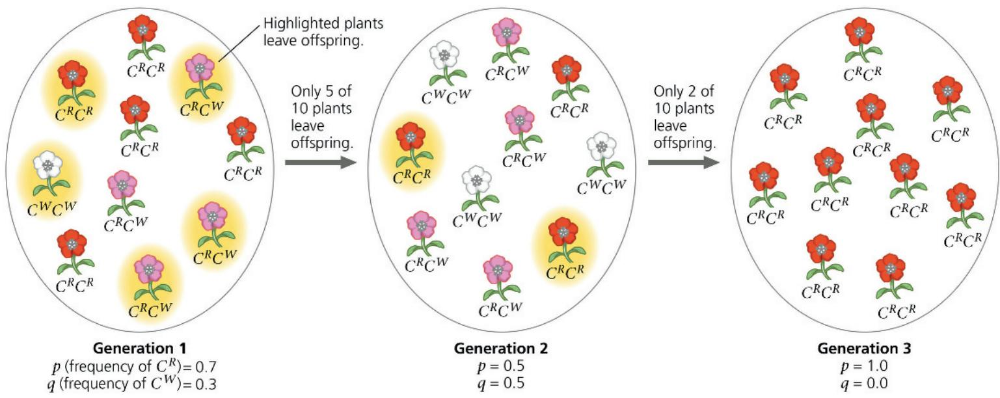  
VISUAL SKILLS Based on this diagram, summarize how the frequency of the $C^{w}$ allele changes over time. For suggested answer, see Appendix A.

## The Founder Effect

When a few individuals become isolated from a larger population, this smaller group may establish a new population whose gene pool differs from the source population; this is called the founder effect. The founder effect might occur, for example, when a few members of a population are blown by a storm to a new island. Genetic drift, in which chance events alter allele frequencies, can occur in such a case because the storm indiscriminately transports some individuals (and their alleles), but not others, from the source population.

The founder effect probably accounts for the relatively high frequency of certain inherited disorders among isolated human populations. For example, in 1814, 15 British colonists founded a settlement on Tristan da Cunha, a group of small islands in the Atlantic Ocean midway between Africa and South America. Apparently, one of the colonists carried a recessive allele for retinitis pigmentosa, a progressive form of blindness that affects homozygous individuals. Of the founding colonists' 240 descendants on the island in the late 1960s, four had retinitis pigmentosa. The frequency of the allele that causes this disease is ten times higher on Tristan da Cunha than in the populations from which the founders came.

## The Bottleneck Effect

A sudden change in the environment, such as a fire or flood, may drastically reduce the size of a population. A severe drop in population size can cause the bottleneck effect, so named because the population has passed through a “bottleneck” that greatly

Figure 23.10 The bottleneck effect.

Shaking a few marbles through the neck of a bottle is analogous to a drastic reduction in the size of a population. By chance, blue marbles (alleles) are overrepresented in the surviving population and gold marbles (alleles) are absent.

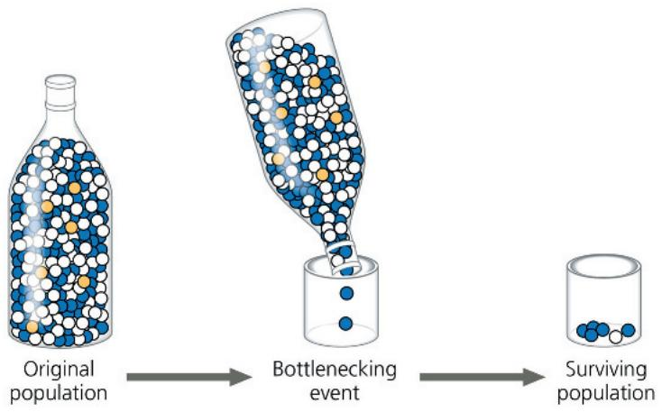  
reduces its size (Figure 23.10). By chance alone, certain alleles may be overrepresented among the survivors, others may be underrepresented, and some may be absent altogether. Ongoing genetic drift is likely to have substantial effects on the gene pool until the population becomes large enough that chance events have less impact. But even if a population that has passed through a bottleneck ultimately recovers in size, it may have low levels of genetic variation for a long period of time—a legacy of the genetic drift that occurred when the population was small.

## Case Study: Impact of Genetic Drift on the Greater Prairie Chicken

Human actions sometimes create severe bottlenecks. Millions of greater prairie chickens (Tympanuchus cupido) once lived on the prairies of Illinois. As these prairies were converted to farmland during the 1800s and 1900s, the number of greater prairie chickens plummeted (Figure 23.11a). By 1993, fewer than 50 birds remained. These few surviving birds had low levels of genetic variation, and less than 50% of their eggs hatched, compared with much higher hatching rates of the larger populations in Kansas and Nebraska (Figure 23.11b).

These data suggest that genetic drift during the bottleneck may have led to a loss of genetic variation and an increase in the frequency of harmful alleles. To investigate this hypothesis, researchers extracted DNA from 15 museum specimens of Illinois greater prairie chickens. Of the 15 birds, 10 had been collected in the 1930s, when there were 25,000 greater prairie chickens in Illinois, and 5 had been collected in the 1960s, when there were 1,000 greater prairie chickens in Illinois. By studying the DNA of these specimens, the researchers were able to obtain a minimum, baseline estimate of how much genetic variation was present in the Illinois population before the population shrank to extremely low numbers. This baseline estimate is a key piece of information that is not usually available in cases of population bottlenecks.

Figure 23.11 Genetic drift and loss of genetic variation.  
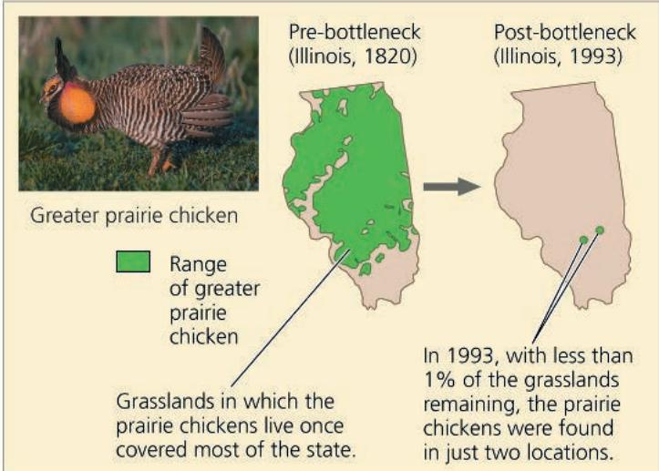  
(a) The Illinois population of greater prairie chickens dropped from millions of birds in the 1800s to fewer than 50 birds in 1993.

<table><tr><td>Location</td><td>Population size</td><td>Number of alleles per locus</td><td>Percentage of eggs hatched</td></tr><tr><td>Illinois</td><td></td><td></td><td></td></tr><tr><td>1930–1960s</td><td>1,000–25,000</td><td>5.2</td><td>93</td></tr><tr><td>1993</td><td>&lt;50</td><td>3.7</td><td>&lt;50</td></tr><tr><td>Kansas, 1998 (no bottleneck)</td><td>750,000</td><td>5.8</td><td>99</td></tr><tr><td>Nebraska, 1998 (no bottleneck)</td><td>75,000–200,000</td><td>5.8</td><td>96</td></tr></table>

(b) In the small Illinois population, genetic drift led to decreases in the number of alleles per locus and the percentage of eggs hatched.

The researchers surveyed six loci and found that the 1993 population had fewer alleles per locus than the pre-bottleneck Illinois or the current Kansas and Nebraska populations (see Figure 23.11b). Thus, as predicted, drift had reduced the genetic variation of the small 1993 population. Drift may also have increased the frequency of harmful alleles, leading to the low egg-hatching rate. To counteract these negative effects, 271 birds from neighboring states were added to the Illinois population over four years. This strategy succeeded: New alleles entered the population, and the egg-hatching rate improved to over 90%. Overall, studies on the Illinois greater prairie chicken illustrate the powerful effects of genetic drift in small populations and provide hope that in at least some populations, these effects can be reversed.

## Effects of Genetic Drift: A Summary

The examples we've described highlight four key points:

1. Genetic drift is significant in small populations. Chance events can cause an allele to be disproportionately over- or underrepresented in the next generation. Although chance events occur in populations of all sizes, they tend to alter allele frequencies substantially only in small populations.

2. Genetic drift can cause allele frequencies to change at random. Because of genetic drift, an allele may increase in frequency one year, then decrease the next; the change from year to year is not predictable. Thus, unlike natural selection, which in a given environment consistently favors some alleles over others, genetic drift causes allele frequencies to change at random over time.

3. Genetic drift can lead to a loss of genetic variation within populations. By causing allele frequencies to fluctuate randomly over time, genetic drift can eliminate alleles from a population. Because evolution depends on genetic variation, such losses can influence how effectively a population can adapt to a change in the environment.

4. Genetic drift can cause harmful alleles to become fixed. Alleles that are neither harmful nor beneficial can be lost or become fixed (reach a frequency of $100\%$ ) by chance through genetic drift. In very small populations, genetic drift can also cause alleles that are slightly harmful to become fixed. When this occurs, the population's survival can be threatened (as in greater prairie chickens).

## Gene Flow

Natural selection and genetic drift are not the only phenomena affecting allele frequencies. Allele frequencies can also change by gene flow, the transfer of alleles into or out of a population

Figure 23.12 Gene flow and local adaptation in the Lake Erie water snake (Nerodia sipedon).

Researchers assigned letters to variations in coloration in N. sipedon populations. Color pattern A is strong banding, patterns B and C are intermediate banding, and pattern D is no banding. Banding is advantageous for camouflage in mainland environments, whereas having no bands is advantageous in island environments. However, gene flow from the mainland causes banding to persist in island populations.

Unbanded N. sipedon (Pattern D)

  
Banded N. sipedon (Pattern C)

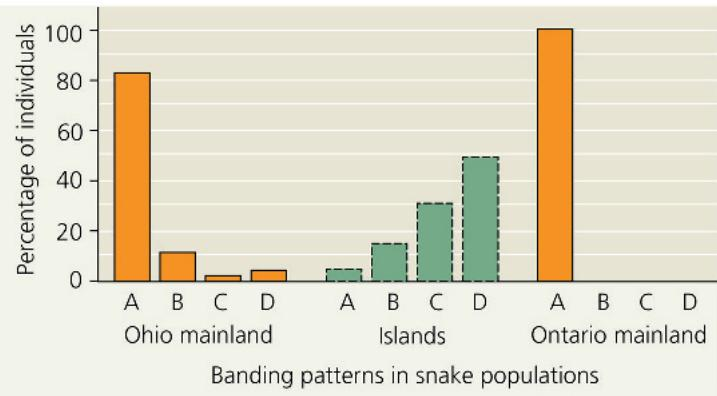  
WHAT IF? Suppose a severe weather event caused island populations to decrease in size but did not affect the size of mainland populations. Predict how gene flow from the mainland would affect color patterns in island populations in the year immediately after the storm. Explain.  
For suggested answer, see Appendix A.

due to the movement of fertile individuals or their gametes. For example, suppose that near our original hypothetical wildflower population there is another population consisting primarily of white-flowered individuals ( $C^{W}C^{W}$ ). Insects carrying pollen from these plants may fly to and pollinate plants in our original population. The introduced $C^{W}$ alleles would modify our original population's allele frequencies in the next generation. Because alleles are transferred between populations, gene flow tends to reduce the genetic differences between populations. In fact, if it is extensive enough, gene flow can result in two populations combining into a single population with a common gene pool.

Alleles transferred by gene flow can also affect how well populations are adapted to local environmental conditions. For instance, mainland and island populations of the Lake Erie water snake (Nerodia sipedon) differ in their color patterns (Figure 23.12): Nearly all snakes from the Ohio or Ontario mainlands are strongly banded, whereas the majority of snakes from islands are unbanded or intermediate. Banding coloration is an inherited trait, determined by a few loci (with alleles that encode bands being dominant to alleles that encode the absence of bands). On islands, water snakes live along rocky shorelines, while on the mainland, they live in marshes. Snakes without bands are more well camouflaged in island habitats than are snakes with bands. Hence, on islands, snakes without bands survive at higher rates than do snakes with bands.

These data indicate that snakes without bands are favored by natural selection in island populations. Thus, we might expect that all snakes on islands would lack bands. Why is this not the case? The answer lies in gene flow from the mainland. In any given year, three to ten snakes from the mainland swim to the islands and join the populations there. As a result, each year such migrants transfer alleles for banded coloration from the mainland (where nearly all snakes have bands) to the islands. This ongoing gene flow has prevented selection from removing all of the alleles for banded coloration from island populations—thereby preventing island populations from adapting fully to local conditions.

Gene flow can also transfer alleles that improve the ability of populations to adapt to local conditions. For example, gene flow has resulted in the worldwide spread of several insecticide resistance alleles in the mosquito Culex pipiens, a vector of West Nile virus and other diseases. Each of these alleles has a unique genetic signature that allowed researchers to document that it arose by mutation in only one or a few geographic locations. In their population of origin, these alleles increased because they provided insecticide resistance. These alleles were then transferred by gene flow to other populations exposed to insecticides, where again, their frequencies increased as a result of natural selection.

Finally, gene flow has become an increasingly important agent of evolutionary change in human populations. Humans today move much more freely about the world than in the past. As a result, mating is more common between members of populations that previously had very little contact, leading to an exchange of alleles and fewer genetic differences between those populations.

## Concept Check 23.3

1. In what sense is natural selection more "predictable" than genetic drift?

2. Distinguish genetic drift from gene flow in terms of (a) how they occur and (b) their implications for future genetic variation in a population.

3. WHAT IF? Suppose two plant populations exchange pollen and seeds. In one population, individuals of genotype AA are most common (9,000 AA, 900 Aa, 100 aa), while the opposite is true in the other population (100 AA, 900 Aa, 9,000 aa). If neither allele has a selective advantage, what will happen over time to the allele and genotype frequencies of these populations?

# Concept 23.4: Natural selection is the only mechanism that consistently causes adaptive evolution

Evolution by natural selection is a blend of chance and “sorting”: chance in the existence of new genetic variation (as in pre-existing mutation) and sorting as natural selection favors some traits over others. Because of this favoring process, the outcome of natural selection is not random. Instead, natural selection consistently increases the frequencies of alleles that provide reproductive advantage, thus leading to adaptive evolution.

## Natural Selection: A Closer Look

To see how natural selection can cause adaptive evolution, we'll begin with the concept of relative fitness and the different ways that selection acts on an organism's phenotype.

## Relative Fitness

The phrases “struggle for existence” and “survival of the fittest” are commonly used to describe natural selection, but these expressions are misleading if always taken to mean direct competitive contests among individuals. There are animal species in which individuals, usually the males, lock horns or otherwise do combat to determine mating privilege. But reproductive success is generally more subtle and depends on many factors besides outright battle. For example, a barnacle that is more efficient at collecting food than its neighbors may have greater stores of energy and hence be able to produce a larger number of eggs. A moth may have more offspring than other moths in the same population because its body colors more effectively conceal it from predators, improving its chance of surviving long enough to produce more offspring. These examples illustrate how in a given environment, certain traits can lead to greater relative fitness: the contribution an individual makes to the gene pool of the next generation relative to the contributions of other individuals.

Although we often refer to the relative fitness of a genotype, remember that the entity that is subjected to natural selection is the whole organism, not the underlying genotype. Thus, selection acts directly on the phenotype rather than on the genotype; it acts on the genotype indirectly, via how the genotype affects the phenotype.

## Directional, Disruptive, and Stabilizing Selection

Natural selection can alter the frequency distribution of heritable traits in three ways, depending on which phenotypes in a population are favored: through directional selection, disruptive selection, and stabilizing selection.

Directional selection occurs when conditions favor individuals exhibiting one extreme of a phenotypic range, thereby shifting a population's frequency curve for the phenotypic character in one direction or the other (Figure 23.13a). Directional selection is common when a population's environment changes or when members of a population migrate to a new (and different) habitat. For instance, an increase in the relative abundance of large seeds over small seeds led to an increase in beak depth in a population of Galápagos finches (see Figure 23.2).

Disruptive selection (Figure 23.13b) occurs when conditions favor individuals at both extremes of a phenotypic range over individuals with intermediate phenotypes. One example is a population of black-bellied seedcracker finches in Cameroon whose members display two distinctly different beak sizes. Small-billed birds feed mainly on soft seeds, whereas large-billed birds specialize in cracking hard seeds. It appears that birds with intermediate-sized bills are relatively inefficient at cracking both types of seeds and thus have lower relative fitness.

Stabilizing selection (Figure 23.13c) acts against both extreme phenotypes and favors intermediate variants. This mode of selection reduces variation and tends to maintain the status quo for a particular phenotypic character. For example, the birth weights of most human babies lie in the range of 3–4 kg (6.6–8.8 pounds). Babies who are much smaller suffer considerably higher rates of mortality; babies who are much larger show a slight increase in mortality.

Regardless of which type of selection occurs, however, the basic mechanism remains the same. Selection favors individuals whose heritable phenotypic traits provide higher reproductive success than do the traits of other individuals.

## The Key Role of Natural Selection in Adaptive Evolution

The adaptations of organisms include many striking examples. Certain octopuses, for example, have the ability to change color rapidly, enabling them to blend into different backgrounds. Another example is the remarkable jaws of snakes (Figure 23.14), which allow them to swallow prey much larger than their own head (a feat analogous to a person swallowing a whole watermelon). Other adaptations, such as a version of an enzyme that shows improved function in cold environments, may be less visually dramatic but just as important for survival and reproduction.

Such adaptations can arise gradually over time as natural selection increases the frequencies of alleles that enhance survival or reproduction. As the proportion of individuals that have favorable traits increases, the degree to which a species is well suited for life in its environment improves; that is, adaptive evolution occurs. However, the physical and biological components of an organism's environment may

Frequency of individuals

Figure 23.13 Modes of selection. These cases describe three ways in which a hypothetical deer mouse population with heritable variation in fur coloration might evolve. The graphs show how the frequencies of individuals with different fur colors change over time. The large white arrows symbolize selective pressures against certain phenotypes.

  
(a) Directional selection shifts the overall makeup of the population by favoring variants that are at one extreme of the distribution. In this case, lighter mice are selected against because they live among dark rocks, making it harder for them to hide from predators.

  
(b) Disruptive selection favors variants at both ends of the distribution. These mice have colonized a patchy habitat made up of light and dark rocks, with the result that mice of an intermediate color are selected against.

  
(c) Stabilizing selection removes extreme variants from the population and preserves intermediate types. If the environment consists of rocks of an intermediate color, both light and dark mice will be selected against.  
MAKE CONNECTIONS Review Figure 22.13. Which mode of selection has occurred in soapberry bug populations that feed on the introduced golden rain tree? Explain.  
The bones of the upper jaw that are shown in green are movable.

For suggested answer, see Appendix A.

Figure 23.14 Movable jaw bones in snakes.

change over time. As a result, what constitutes a “good match” between an organism and its environment can be a moving target, making adaptive evolution a continuous, dynamic process. Note that fitness is relative not only to the environment, but also to the other members of the population; it is not an absolute measure. Environmental conditions can also differ from place to place, causing different alleles to be favored in different locations. When this occurs, natural selection can cause the populations of a species to differ genetically from one another.

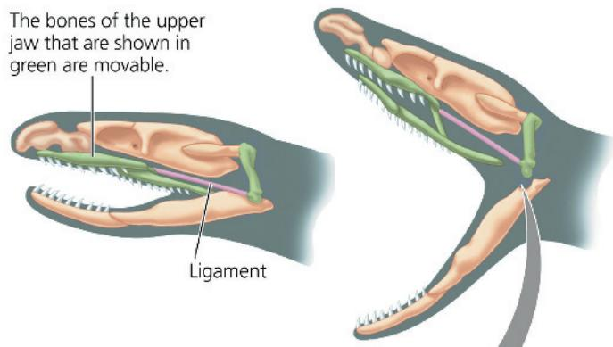  
The skull bones of most terrestrial vertebrates are relatively rigidly attached to one another, limiting jaw movement. In contrast, most snakes have movable bones in their upper jaw, allowing them to swallow food much larger than their head.

And what about genetic drift and gene flow? Both can, in fact, increase the frequencies of alleles that enhance survival or reproduction, but neither does so consistently. Genetic drift can cause the frequency of a slightly beneficial allele to increase, or, alternately, to decrease. Similarly, gene flow may introduce alleles that are advantageous or ones that are disadvantageous. Natural selection is the only evolutionary mechanism that consistently leads to adaptive evolution.

Survival and growth of these half-sibling offspring compared

## Sexual Selection

Charles Darwin was the first to explore the implications of sexual selection, a process in which individuals with certain inherited characteristics are more likely than other individuals of the same sex to obtain mates. Sexual selection can result in sexual dimorphism, a difference in secondary sexual characteristics between males and females of the same species (Figure 23.15). These distinctions include differences in size, color, ornamentation, and behavior.

How does sexual selection operate? There are several ways. In intrasexual selection, meaning selection within the same sex, individuals of one sex compete directly for mates of the opposite sex. In many species, intrasexual selection occurs among males. For example, a single male may patrol a group of females and prevent other males from mating with them. The patrolling male may defend his status by defeating smaller, weaker, or less fierce males in combat. More often, this male is the psychological victor in ritualized displays that discourage would-be competitors but do not risk injury that would reduce his own fitness (see Figure 51.16). Intrasexual selection also occurs among females in a variety of species, including ring-tailed lemurs and broadnosed pipefish.

In intersexual selection, also called mate choice, individuals of one sex (usually the females) are choosy in selecting their mates from the other sex. In many cases, the female's choice depends on the showiness of the male's appearance or behavior (see Figure 23.15). What intrigued Darwin about mate choice is that male showiness may not seem adaptive in any other way and may in fact pose some risk. For example, bright plumage may make male birds more visible to predators. But if such characteristics help a male gain a mate, and if this benefit outweighs the risk from predation, then both the bright plumage and the female preference for it will be reinforced because they enhance overall reproductive success.

Figure 23.15 Sexual dimorphism and sexual selection.  
A peacock (left) and a peahen (right) show extreme sexual dimorphism. There is intrasexual selection between competing males, followed by intersexual selection when the females choose among the showiest males.  

## Figure 23.16

## Inquiry: Do females select mates based on traits indicative of “good genes”?

## Experiment

Female gray tree frogs (Hyla versicolor) prefer to mate with males that give long mating calls. To test whether the genetic makeup of long-calling (LC) males is superior to that of short-calling (SC) males, researchers fertilized half the eggs of each female with sperm from an LC male and the other half with sperm from an SC male. In two separate experiments (one in 1995, one in 1996), the resulting half-sibling offspring were raised in a common environment, and their survival and growth were monitored.

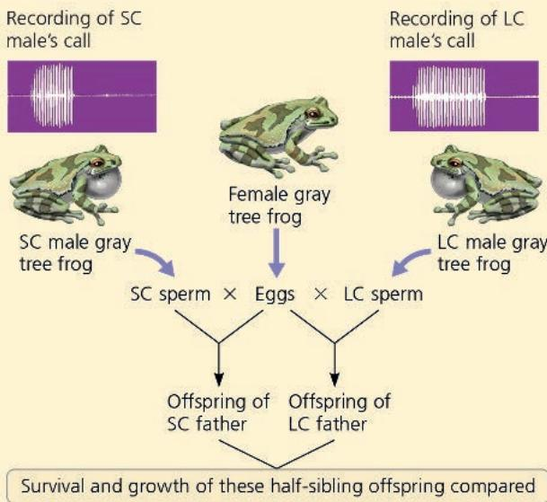

## Results

<table><tr><td>Offspring Performance</td><td>1995</td><td>1996</td></tr><tr><td>Larval survival</td><td>LC* better</td><td>NSD**</td></tr><tr><td>Larval growth</td><td>NSD</td><td>LC better</td></tr><tr><td>Time to metamorphosis</td><td>LC better (shorter)</td><td>LC better (shorter)</td></tr></table>

\*LC better = offspring of LC males superior to offspring of SC males; \*\*NSD = no significant difference.

## Conclusion

Because offspring fathered by an LC male outperformed their half-siblings fathered by an SC male, the team concluded that the duration of a male's mating call is indicative of the male's overall genetic quality. This result supports the hypothesis that female mate choice can be based on a trait that indicates whether the male has “good genes.”

Data from A. M. Welch et al., Call duration as an indicator of genetic quality in male gray tree frogs, Science 280:1928–1930 (1998).

INQUIRY IN ACTION Read and analyze the original paper in Inquiry in Action: Interpreting Scientific Papers.

WHAT IF? Why did the researchers split each female frog's eggs into two batches for fertilization by different males? Why didn't they mate each female with a single male frog?

For suggested answer, see Appendix A.

How do female preferences for certain male characteristics evolve in the first place? One hypothesis is that females prefer male traits that are correlated with “good genes.” If the trait preferred by females is indicative of a male’s overall genetic quality, both the male trait and female preference for it should increase in frequency. Figure 23.16 describes one experiment testing this hypothesis in gray tree frogs.

In several bird species, the traits preferred by females are related to overall male health. Here, too, female preference appears to be based on traits that reflect “good genes”—in this case, alleles indicative of a robust immune system.

## Balancing Selection

The examples of selection that we have reviewed so far are all examples of selection reducing variation in a population. Sometimes, however, selection results in preserving variation at some loci, maintaining two or more phenotypic forms in a population and thereby the alleles that code for them. Known as balancing selection because it maintains genetic variation, this type of selection includes frequency-dependent selection and heterozygote advantage.

## Frequency-Dependent Selection

In frequency-dependent selection, the fitness of a phenotype depends on how common it is in the population. Consider the scale-eating fish (Perissodus microlepis) of Lake Tanganyika, in Africa. These fish attack other fish from behind, darting in to remove a few scales from the flank of their prey. Of interest here is a peculiar feature of the scale-eating fish: Some are “left-mouthed” and some are “right-mouthed.”

Because their mouth twists to the left, left-mouthed fish typically attack their prey's right flank (Figure 23.17). (To see why, twist your lower jaw and lips to the left and imagine trying to take a bite from the left side of a fish, approaching it from behind.) Similarly, right-mouthed fish attack from the left. Prey species guard against attack from whatever phenotype of scale-eating fish is most common. Thus, from year to year, selection favors whichever mouth phenotype is least common. As a result, the frequency of left- and right-mouthed fish oscillates over time, and this balancing selection keeps the frequency of each phenotype close to $50\%$ .

## Heterozygote Advantage

If individuals who are heterozygous at a particular locus have greater fitness than do both kinds of homozygotes, they exhibit heterozygote advantage. In such a case, natural selection tends to maintain two or more alleles at that locus. For example, if the phenotype of a heterozygote is intermediate to the phenotypes of both homozygotes, then heterozygote advantage is a form of stabilizing selection.

An example of heterozygote advantage occurs at the locus in humans that codes for the $\beta$ polypeptide subunit of hemoglobin,

Figure 23.17 Frequency-dependent selection.

In a population of the scale-eating fish Perissodus microlepis, the frequency of left-mouthed individuals (square red data points) rises and falls in a regular manner. The black data points (round) indicate the frequency of left-mouthed individuals among adults that reproduced in three sample years.

  
INTERPRET THE DATA For 1981, 1987, and 1990, compare the frequency of left-mouthed individuals among breeding adults to the frequency of left-mouthed individuals in the entire population. What do the data indicate about when natural selection favors left-mouthed individuals over right-mouthed individuals (or vice versa)? Explain.

the oxygen-carrying protein of red blood cells. In homozygous individuals, a recessive allele at that locus causes sickle-cell disease. The red blood cells of people with sickle-cell disease become distorted in shape, or sickled, under low-oxygen conditions (see Figure 5.19). These sickled cells can clump together and block the flow of blood in the capillaries, damaging organs such as the kidney, heart, and brain. Although some red blood cells become sickled in heterozygotes, not enough become sickled to cause sickle-cell disease.

As described in Figure 23.18, heterozygotes for the sickle-cell allele are protected against the most severe effects of malaria, a disease caused by a parasite that infects red blood cells. One reason for this partial protection is that the body destroys sickled red blood cells rapidly, killing the parasites they harbor. Malaria is a major killer in some tropical regions. In such regions, selection favors heterozygotes over homozygous dominant individuals, who are more vulnerable to the effects of malaria, and also over homozygous recessive individuals, who develop sickle-cell disease. These selective pressures have caused the frequency of the sickle-cell allele to reach relatively high levels in areas where the malaria parasite, which is carried by mosquitoes, is common.

## Make Connections: The Sickle-Cell Allele

Figure 23.18

This child has sickle-cell disease, a genetic condition that strikes individuals who have two copies of the sickle-cell allele. This allele causes an abnormality in the structure and function of hemoglobin, the oxygen-carrying protein in red blood cells. Although sickle-cell disease is lethal if not treated, in some regions the sickle-cell allele can reach frequencies as high as 15–20%. How can such a harmful allele be so common?

## Events at the Molecular Level

\- Due to a point mutation, the sickle-cell allele differs from the wild-type allele by a single nucleotide. (See Figure 17.26.)

\- The resulting change in one amino acid leads to hydrophobic interactions between the sickle-cell hemoglobin proteins under low-oxygen conditions.

\- As a result, the sickle-cell proteins bind to each other in chains that together form a fiber.

Template strand

Sickle-cell allele on chromosome

A T C G C T A C G T A T A C G

## Consequences for Cells

\- The abnormal hemoglobin fibers distort the red blood cell into a sickle shape under low-oxygen conditions, such as those found in small blood vessels returning to the heart.

Fiber

An adenine has replaced a thymine in the template strand of the sickle-cell allele, changing one codon in the mRNA produced during transcription. This change causes an amino acid change in sickle-cell hemoglobin: A valine replaces a glutamic acid at one position. (See Figure 5.19.)

Sickle-cell hemoglobin

Low-oxygen conditions

Wild-type allele

Sickled red blood cell

Normal hemoglobin (does not aggregate into fibers)

Normal red blood cell

Effects on Individual Organisms
• The formation of sickled red blood cells causes homozygotes with two copies of the sickle-cell allele to have sickle-cell disease.
• Some sickling also occurs in heterozygotes, but not enough to cause the disease; they have sickle-cell trait. (See Figure 14.17.)

The sickled blood cells of a homozygote block small blood vessels, causing great pain and damage to organs such as the heart, kidney, and brain.

Infected mosquitoes spread malaria when they bite people. (See Figure 28.12)

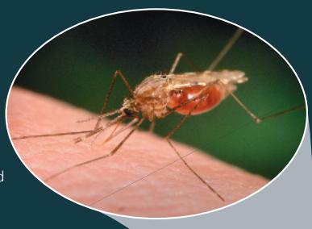

## Evolution in Populations

\- Homozygotes with two sickle-cell alleles are strongly selected against because of mortality caused by sickle-cell disease. In contrast, heterozygotes experience few harmful effects from sickling yet are more likely to survive malaria than are homozygotes.

\- In regions where malaria is common, the net effect of these opposing selective forces is heterozygote advantage. This has caused evolutionary change in populations—the products of which are the areas of relatively high frequencies of the sickle-cell allele shown in the map.

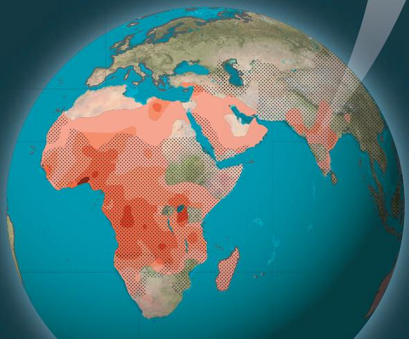

Normal red blood cells are flexible and are able to flow freely through small blood vessels.

Key
Frequencies of the sickle-cell allele
3.0–6.0%
6.0–9.0%
9.0–12.0%
12.0–15.0%
>15.0%

Distribution of malaria caused by Plasmodium falciparum (a parasitic unicellular eukaryote

## Why Natural Selection Cannot Fashion Perfect Organisms

Though natural selection leads to adaptation, nature abounds with examples of organisms that are less than ideally suited for their lifestyles. There are several reasons why.

1. Selection can act only on existing variations. Natural selection favors only the fittest phenotypes among those currently in the population, which may not be the ideal traits. New advantageous alleles do not arise on demand. For example, historically, snowshoe hares (Lepus americanus) have molted, changing their coats from brown to white, at a time of year that matched the onset of snowfall, providing camouflage all winter. But due to climate change, the first snowfall now occurs later in the year. In some populations, the date at which the hares change their coat color has remained the same, causing the hares to be poorly camouflaged early in winter and thus easier for predators to spot and kill (Figure 23.19). Because their gene pools lack alleles that could delay when molting occurs, these populations have been unable to adapt to changing conditions.

2. Evolution is limited by historical constraints. Each species has a legacy of descent with modification from ancestral forms. Evolution does not scrap the ancestral anatomy and build each new complex structure from scratch; rather, evolution co-opts existing structures and adapts them to new situations. We could imagine that if a terrestrial animal were to adapt to an environment in which flight would be advantageous, it might be best just to grow an extra pair of limbs that would serve as wings. However, evolution does not work this way; instead, it operates on the traits an organism already has. Thus, in birds and bats, an existing pair of limbs took on new functions for flight as these organisms evolved from nonflying ancestors.

3. Adaptations are often compromises. Each organism must do many different things. A seal spends part of its time on rocks; it could probably walk better if it had legs instead of flippers, but then it would not swim nearly as well. We humans owe much of our versatility and athleticism to our prehensile hands and flexible limbs, but these also make us prone to sprains, torn ligaments, and dislocations: Structural reinforcement has been compromised for agility. Organisms face many such trade-offs in which the ability to perform one function may reduce the ability to perform another—and as with seals and humans, those trade-offs can restrict adaptive evolution.

4. Chance, natural selection, and the environment interact. Chance events can affect the subsequent evolutionary history of populations. For instance, when a storm blows insects or birds hundreds of kilometers over an ocean to an island, the wind does not necessarily transport those individuals that are best suited to the new environment. Thus, not all alleles present in the founding population's gene pool are better suited to the new environment than the alleles that are "left behind." In addition, the environment at a particular location may change unpredictably from year to year, again limiting the extent to which adaptive evolution results in organisms being well suited for current environmental conditions.

With these four constraints, evolution does not result in perfect organisms. Natural selection operates on a “better than” basis. We can, in fact, see evidence for evolution in the many imperfections of the organisms it produces.

## Figure 23.19 Lack of variation in a population can limit adaptation.

For the snowshoe hare, changing its coat color from brown (a) to white (b) too early is disadvantageous, but the population lacks alleles that would encode a delay in molting.

## Concept Check 23.4

1. What is the relative fitness of a sterile mule? Explain.

2. Explain why natural selection is the only mechanism that consistently leads to adaptive evolution in a population.

3. VISUAL SKILLS Consider a population in which heterozygotes at a certain locus have an extreme phenotype (such as being larger than homozygotes) that confers a selective advantage. Compare this description to the three types of selection shown in Figure 23.13. Does this situation represent directional, disruptive, or stabilizing selection? Explain.

For suggested answers, see Appendix A.

# Chapter 23 Review

## Summary of Key Concepts

To review key terms, go to the Vocabulary Self-Quiz (eTextbook only).

## Concept 23.1: Genetic variation makes evolution possible

\- Genetic variation refers to genetic differences among individuals within a population.

\- The nucleotide differences that provide the basis of genetic variation originate when mutation and gene duplication produce new alleles and new genes. New genetic variants are produced rapidly in organisms with short generation times. In sexually reproducing organisms, most of the genetic differences among individuals result from crossing over, the independent assortment of chromosomes, and fertilization.

Typically, most of the nucleotide variability that occurs within a genetic locus does not affect the phenotype. Explain why.

## Concept 23.2: The Hardy–Weinberg equation is a model of no evolution occurring for a given gene

\- A population, a localized group of organisms belonging to one species, is united by its gene pool, the aggregate of all the alleles in the population.

\- In the absence of a reason for an allele to increase or decrease in frequency within a population, no change will happen. The assumptions of the Hardy–Weinberg model (see Table 23.1) correspond to mechanisms of evolution (changes in allele frequency). We can use the Hardy–Weinberg model to predict genotype frequencies from allele frequencies. By rejecting the Hardy–Weinberg model, we can demonstrate that evolution is occurring for a given gene.

One of the five conditions for Hardy–Weinberg equilibrium (see Table 23.1) does not on its own result in a change in allele frequency over generations. Which condition is it, and why?

## Concept 23.3: Natural selection, genetic drift, and gene flow can alter allele frequencies in a population

\- In natural selection, individuals that have certain inherited traits tend to survive and reproduce at higher rates than other individuals because of those traits.

\- In genetic drift, chance fluctuations in allele frequencies over generations tend to reduce genetic variation.

\- Gene flow, the transfer of alleles between populations, tends to reduce genetic differences between populations over time.

Would two small, geographically isolated populations in very different environments be likely to evolve in similar ways? Explain.

## Concept 23.4: Natural selection is the only mechanism that consistently causes adaptive evolution

\- One organism has greater relative fitness than another organism if it leaves more fertile descendants. The modes of natural selection differ in their effect on phenotype:

Original population Evolved population

  
Directional selection  
Disruptive selection

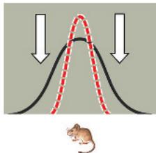  
Stabilizing selection

\- Unlike genetic drift and gene flow, natural selection consistently increases the frequencies of alleles that enhance survival and reproduction, thus improving the degree to which organisms are well-suited for life in their environment.

\- Sexual selection can result in secondary sex characteristics that can give individuals advantages in mating.

\- Balancing selection occurs when natural selection maintains two or more forms in a population.

\- There are constraints to evolution: Natural selection can act only on available variation; structures result from modified ancestral anatomy; adaptations are often compromises; and chance, natural selection, and the environment interact.

How might secondary sex characteristics in males differ from those in females in a species in which females compete for mates? For suggested answers, see Appendix A.

## Test Your Understanding

For more multiple-choice questions, go to the Practice Test (eTextbook only).

## Levels 1-2: Remembering/Understanding

1. Natural selection changes allele frequencies based on differential survival and reproduction of

(A) alleles.

(B) loci.

(C) species.

(D) individuals.

2. No two people are genetically identical, except for identical twins. The main source of genetic variation among humans is (A) new mutations that occurred in the preceding generation.

(B) genetic drift.

(C) the reshuffling of alleles in sexual reproduction.

(D) environmental effects.

## Levels 3-4: Applying/Analyzing

3. If the nucleotide variability of a locus equals 0%, what is the gene variability and number of alleles at that locus?

(A) gene variability = 0%; number of alleles = 0

(B) gene variability = 0%; number of alleles = 1

(C) gene variability = 0%; number of alleles = 2

(D) gene variability > 0%; number of alleles = 2

4. One population of a species has 25 individuals, all with genotype AA; a second population of this species has 40 individuals, all with genotype aa. Assume that these populations live far apart but in similar environmental conditions. Based on this information, the observed genetic variation most likely resulted from

(A) genetic drift.

(B) gene flow.

(C) nonrandom mating.

(D) directional selection.

5. A fruit fly population has a gene with two alleles, $A1$ and $A2$ . Tests show that $70\%$ of the gametes produced in the population contain the $A1$ allele. If the population is in Hardy-Weinberg equilibrium, what proportion of the flies carry both $A1$ and $A2$ ?

(A) 0.7

(B) 0.49

(C) 0.42

(D) 0.21

## Levels 5-6: Evaluating/Creating

6. EVOLUTION CONNECTION Using at least two examples, explain how the process of evolution is revealed by the imperfections of living organisms.

7. SCIENTIFIC INQUIRY • INTERPRET THE DATA For populations of the marine mussel Mytilus edulis around Long Island, New York, researchers measured the frequency of a particular allele ( $lap^{94}$ ) for an enzyme involved in regulating the mussel's saltwater balance. They presented their data as a series of pie charts linked to sampling sites within Long Island Sound, where the salinity is highly variable, and along the coast of the open ocean, where salinity is constant. (a) Create a data table for the 11 sampling sites by estimating the frequency of $lap^{94}$ from the pie charts. (b) Graph the frequencies for sites 1–8 to show how the frequency of this allele changes with increasing salinity in Long Island Sound (from southwest to northeast). Evaluate how the data from sites 9 to 11 compare with the data from the sites within the Sound. (c) Considering the various mechanisms that can alter allele frequency, construct a hypothesis that explains the patterns in the data and that accounts for the following observations: (1) The $lap^{94}$ allele helps mussels maintain osmotic balance in water with a high salt concentration but is costly to use in less salty water and (2) mussels produce larvae that can disperse long distances before they settle on rocks and grow into adults.

  
Data from R. K. Koehn and T. J. Hilbish, The adaptive importance of genetic variation, American Scientist 75:134–141 (1987).  
Salinity increases toward the open ocean

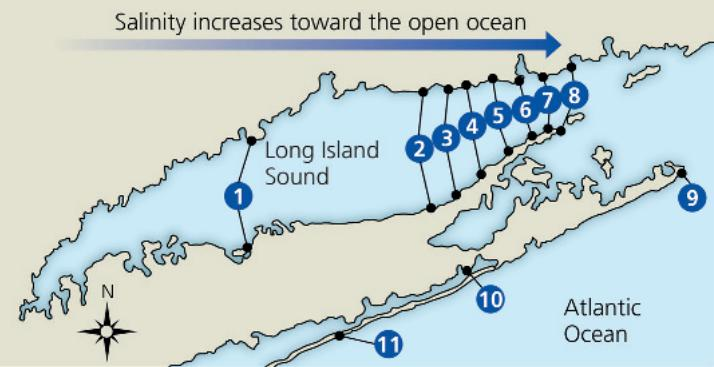

8. WRITE ABOUT A THEME: ORGANIZATION Heterozygotes at the sickle-cell locus produce both normal and abnormal (sickle-cell) hemoglobin (see Concept 14.4). When hemoglobin molecules are packed into a heterozygote's red blood cells, some cells receive relatively large quantities of abnormal hemoglobin, making these cells prone to sickling. In a short essay (approximately 100–150 words), explain how these molecular and cellular events lead to emergent properties at the individual and population levels of biological organization.

## 9. SYNTHESIZE YOUR KNOWLEDGE

The lake shown in this photograph, called a kettle lake, formed 14,000 years ago when a glacier that covered the surrounding area melted. Initially devoid of animal life, over time the lake was colonized by invertebrates and other animals. Hypothesize how mutation, natural selection, genetic drift, and gene flow may have affected populations that colonized the lake.

## Practice Applying Your Learning

10. This question assesses your ability to apply your understanding of Hardy-Weinberg Equilibrium to a new scenario.

The Eastern gray squirrel (Sciurus carolinensis) is widespread across eastern North America. Most S. carolinensis have gray fur, but in some populations there is a sizeable number of squirrels with black fur. The black-fur version of this species results when squirrels are homozygous for a gene that controls the deposition of melanin into their fur. Individuals that are heterozygous for this gene have gray-black fur. Two squirrels with gray fur can only have offspring with gray fur, and two squirrels with black fur can only have offspring with black fur; however, a pair of squirrels with gray-black fur can have offspring of any of the three phenotypes.

  
Gray S. carolinensis (homozygous)

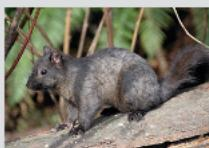  
Gray-black S. carolinensis (heterozygous)

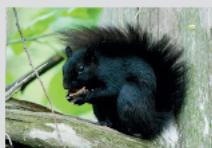  
Black S. carolinensis (homozygous)  
(continued)

Some researchers have observed that the frequency of squirrels with black fur is often higher in northern S. carolinensis populations compared to southern populations, a pattern that is hypothesized to result from a thermal advantage to the black phenotype (their darker fur absorbs more solar energy and keeps them warmer in the relatively cooler northern locations).

A squirrel population in New York has been observed over the past 10 years. This table shows counts of each phenotype that were observed each year.

<table><tr><td rowspan="2">Year</td><td colspan="4">S. carolinensis Counts (NY)</td></tr><tr><td>Gray</td><td>Gray-black</td><td>Black</td><td>Total</td></tr><tr><td>2015</td><td>50</td><td>10</td><td>6</td><td>66</td></tr><tr><td>2017</td><td>61</td><td>8</td><td>10</td><td>79</td></tr><tr><td>2019</td><td>49</td><td>11</td><td>10</td><td>70</td></tr><tr><td>2021</td><td>66</td><td>10</td><td>11</td><td>87</td></tr><tr><td>2023</td><td>52</td><td>12</td><td>9</td><td>73</td></tr><tr><td>2025</td><td>62</td><td>6</td><td>10</td><td>78</td></tr></table>

# Explore Scientific Papers with Science in the Classroom | AAAS

Based on the given information and your knowledge of Hardy–Weinberg equilibrium, evaluate each statement as more likely to be TRUE or more likely to be FALSE.

a. The alleles in this scenario show incomplete dominance. \_\_\_\_

b. The frequency of the gray allele (p) in 2015 is 0.83.

d. The researchers could evaluate whether the fur-pigmentation gene is in Hardy–Weinberg equilibrium in any given year by determining p and q for that year. \_\_\_\_

How does a native species evolve in response to an introduced species? Go to “There’s a New Kid in Town” at www.scienceintheclassroom.org.

e. Comparing 2015 data to 2025 data, the researchers should conclude that this gene is in Hardy–Weinberg equilibrium. \_\_\_\_

c. The frequency of the black allele (q) in 2025 is 0.13.

f. CHALLENGE: The researchers should conclude that there is a selective advantage to the black fur phenotype because it has become more common over time.

g. CHALLENGE: These data are sufficient to reject the hypothesis that black fur provides a thermal advantage. \_\_\_\_

Instructors: Questions can be assigned in Mastering Biology.

# The Origin of Species

## Key Concepts

24.1 The biological species concept emphasizes reproductive isolation

24.2 Speciation can take place with or without geographic separation

24.3 Hybrid zones reveal factors that cause reproductive isolation

24.4 Speciation can occur rapidly or slowly and can result from changes in few or many genes

## Study Tip

Make a table: Some processes that can lead to speciation only occur in allopatric (geographically separated) populations, while others also occur in sympatric (geographically overlapping) populations. To help you keep track of these processes and the geographic conditions under which they can occur, fill in the table as you read the chapter.

<table><tr><td>Process(include page #or figure #)</td><td>Can occur inallopatricpopulations(yes/no)?</td><td>Can occur insympatricpopulations(yes/no)?</td></tr><tr><td>Sexual selection(Figure 24.12)</td><td>Yes</td><td>Yes</td></tr><tr><td></td><td></td><td></td></tr><tr><td></td><td></td><td></td></tr></table>

Figure 24.1 This flightless cormorant is one of many species in the Galápagos Islands that are found nowhere else in the world. How did a bird that cannot fly come to live in this isolated place? When Darwin visited the Galápagos, he also was intrigued by its unique species, and later concluded that they must have originated in the islands from ancestors that had traveled from South America.  
Over time, populations of a single species connected by gene flow can diverge genetically, giving rise to a new species:

## How do new species originate from existing species?

When Darwin came to the Galápagos Islands, he noted that they were teeming with unique species, like the flightless bird in Figure 24.1. Later, he realized that these species had formed relatively recently, writing in his diary, “Both in space and time, we seem to be brought somewhat near to that great fact—that mystery of mysteries—the first appearance of new beings on this Earth.”

The “mystery of mysteries” that captivated Darwin is speciation, the process by which one species splits into two species. Speciation fascinated Darwin (and many biologists since) because it has produced the tremendous diversity of life, repeatedly yielding new species that differ from existing ones. Speciation also helps to explain the many features that organisms share (the unity of life): When one species splits into two, the species that result share many characteristics because they are descended from this common ancestor. For example, at the DNA sequence level, such similarities indicate that the flightless cormorant in Figure 24.1 is closely related to flying cormorants found in the Americas. This suggests that the flightless cormorant originated from an ancestral cormorant species that flew from the mainland to the Galápagos.

Speciation forms a conceptual bridge between microevolution, changes over time in allele frequencies in a population, and macroevolution, the broad pattern of evolution above the species level. An example of macroevolutionary change is the origin of new groups of organisms, such as mammals or flowering plants, through a series of speciation events. We examined microevolutionary mechanisms in Chapter 23, and we'll turn to macroevolution in Chapter 25. In this chapter, we'll explore the mechanisms by which new species originate from existing ones. First, let's establish what we actually mean by a “species.”

## Concept 24.1: The biological species concept emphasizes reproductive isolation

The word species is Latin for “kind” or “appearance.” In daily life, we commonly distinguish between various “kinds” of organisms—dogs and cats, for instance—based on differences in their appearance. To distinguish species scientifically, biologists compare not only the morphology (body form) of different groups of organisms but also their physiology, biochemistry, and DNA sequences; as we’ll see, sometimes multiple types of information are needed to identify species as distinct. It is nevertheless important to keep in mind that the idea of “species” is ultimately a human construct—that is, a concept defined by humans to help organize and think about our natural world.

## The Biological Species Concept

The primary definition of species used in this textbook is the biological species concept. According to this concept, a species is a group of populations whose members have the potential to interbreed in nature and produce viable, fertile offspring—but do not produce viable, fertile offspring with members of other such groups (Figure 24.2). Thus, the members of a biological species are united by being reproductively compatible, at least potentially. All human beings, for example, belong to the same species. A male and a female from opposite sides of the globe may be unlikely to meet and mate, but if they do, they could have viable babies who develop into fertile adults. In contrast, humans and chimpanzees remain distinct biological species, even where they live in the same region, because many factors keep them from interbreeding and producing fertile offspring.

Figure 24.2 The biological species concept is based on the potential to interbreed, not on physical similarity.  
  
(a) Similarity between different species. The eastern meadowlark (Sturnella magna, left) and the western meadowlark (Sturnella neglecta, right) have similar body shapes and colorations. Nevertheless, they are distinct biological species because their songs and other behaviors are different enough to prevent interbreeding should they meet in the wild.

  
(b) Variation within a species. As varied as we may be in physical appearance, all humans belong to a single biological species (Homo sapiens), defined by our capacity to interbreed successfully.

What holds the gene pool of a species together, causing its members to resemble each other more than they resemble members of other species? Recall the evolutionary mechanism of gene flow, the transfer of alleles between populations (see Concept 23.3). Typically, gene flow occurs between the different populations of a species. This ongoing exchange of alleles tends to hold the populations together genetically. But as we'll explore in this chapter, a reduction or lack of gene flow can play a key role in the formation of new species.

## Reproductive Isolation

Because biological species are defined in terms of reproductive compatibility, the formation of a new species hinges on reproductive isolation—the existence of biological factors (barriers) that impede members of two species from interbreeding and producing viable, fertile offspring (Figure 24.3). Such barriers block gene

## Exploring Reproductive Barriers

Figure 24.3

## Prezygotic barriers impede mating or hinder fertilization if mating does occur

Habitat Isolation

Temporal Isolation

Behavioral Isolation

Mechanical Isolation

Individuals of different species

MATING ATTEMPT

Two species that occupy different habitats within the same area may encounter each other rarely, if at all.

Example: These two fly species in the genus Rhagoletis occur in the same geographic areas, but the apple maggot fly (Rhagoletis pomonella) feeds and mates on hawthorns and apples (a) while its close relative, the blueberry maggot fly (R. mendax), mates and lays its eggs only on blueberries (b).

Species that breed during different times of the day, different seasons, or different years cannot mix their gametes.

Example: In North America, the geographic ranges of the western spotted skunk (Spilogale gracilis) (c) and the eastern spotted skunk (Spilogale putorius) (d) overlap, but S. gracilis mates in late summer and S. putorius mates in late winter.

Courtship rituals that attract mates and other behaviors unique to a species are effective reproductive barriers, even between closely related species.

Mating is attempted, but morphological differences prevent its successful completion.

Example: Blue-footed boobies, inhabitants of the Galápagos, mate only after a courtship display unique to their species. Part of the "script" calls for the male to high-step (e), a behavior that calls the female's attention to his bright blue feet.

Example: Snails in the genus Bradybaena approach each other headfirst when they attempt to mate. Once their heads have moved slightly past each other, the snails' genitals emerge, and if their shells spiral in the same direction, mating can occur (f). But if a snail attempts to mate with a snail whose shell spirals in the opposite direction (g), the two snails' genital openings (indicated by arrows) will not be aligned, and mating cannot be completed.

## Postzygotic barriers prevent a hybrid zygote from developing into a viable, fertile adult

Gametic Isolation

Reduced Hybrid Viability

Reduced Hybrid Fertility

Hybrid Breakdown

Sperm of one species may not be able to fertilize the eggs of another species. For instance, sperm may not be able to survive in the reproductive tract of females of the other species, or biochemical mechanisms may prevent the sperm from penetrating the membrane surrounding the other species' eggs.

Example: Gametic isolation separates certain closely related species of aquatic animals, such as sea urchins (h). Sea urchins release their sperm and eggs into the surrounding water, where they fuse and form zygotes. It is difficult for gametes of different species, such as the red and purple urchins shown here (Strongylocentrotus franciscanus and S. purpuratus, respectively), to fuse because proteins on the surfaces of the eggs and sperm bind very poorly to each other.

FERTILIZATION

The genes of different parent species may interact in ways that impair the hybrid's development or survival in its environment.

Example: Some salamander subspecies of the genus Ensatina live in the same regions and habitats, where they may occasionally hybridize. But most of the hybrids do not complete development, and those that do are frail (i).

Example: The hybrid offspring of a male donkey (j) and a female horse (k) is a mule (l), which is robust but sterile. A "hinny" (not shown), the offspring of a female donkey and a male horse, is also sterile.

Even if hybrids are vigorous, they may be sterile. If the chromosomes of the two parent species differ in number or structure, meiosis in the hybrids may fail to produce normal gametes. Since the infertile hybrids cannot produce offspring when they mate with either parent species, genes cannot flow freely between the species.

VIABLE, FERTILE OFFSPRING

Some first-generation hybrids are viable and fertile, but when they mate with one another or with either parent species, offspring of the next generation are feeble or sterile.

Example: Strains of cultivated rice have accumulated different mutant recessive alleles at two loci in the course of their divergence from a common ancestor. Hybrids between them are vigorous and fertile (m, left and right), but plants in the next generation that carry too many of these recessive alleles are small and sterile (m, center). Although these rice strains are not yet considered different species, they have begun to be separated by postzygotic barriers.

▼ Polar bear (U. maritimus)

flow between the species and limit the formation of hybrids, offspring that result from an interspecific mating. Although a single barrier may not prevent all gene flow, a combination of several barriers can effectively isolate a species' gene pool.

Clearly, a fly cannot mate with a frog or a fern, but the reproductive barriers between more closely related species are not so obvious. As described in Figure 24.3, these barriers can be classified according to whether they contribute to reproductive isolation before or after fertilization. Prezygotic barriers (“before the zygote”) block fertilization from occurring. Such barriers typically act in one of three ways: by impeding members of different species from attempting to mate, by preventing an attempted mating from being completed successfully, or by hindering fertilization if mating is completed successfully. If a sperm cell from one species overcomes prezygotic barriers and fertilizes an ovum from another species, a variety of postzygotic barriers (“after the zygote”) may contribute to reproductive isolation after the hybrid zygote is formed. Developmental errors may reduce survival among hybrid embryos. Alternatively, problems after birth may cause hybrids to be infertile or decrease their chance of surviving long enough to reproduce.

## Limitations of the Biological Species Concept

One strength of the biological species concept is that it directs our attention to a way by which speciation can occur: by the evolution of reproductive isolation. However, the number of species to which this concept can be usefully applied is limited. There is, for example, no way to evaluate the reproductive isolation of fossils. The biological species concept also does not apply to organisms that reproduce asexually, such as prokaryotic organisms. (Many prokaryotic organisms do transfer genes among themselves, as we will discuss in Concept 27.2, but this is not sexual reproduction.) Furthermore, in the biological species concept, species are designated by the absence of gene flow. But there are many pairs of species that are morphologically and ecologically distinct, and yet gene flow occurs between them. An example is the grizzly bear (Ursus arctos) and polar bear (Ursus maritimus), whose hybrid offspring have been dubbed “grolar bears” (Figure 24.4). As we’ll discuss, natural selection can cause such species to remain distinct even though some gene flow occurs between them. Because of the limitations to the biological species concept, alternative species concepts are useful in certain situations.

## Other Definitions of Species

While the biological species concept emphasizes the separateness of different species due to reproductive barriers, several other definitions emphasize the unity within a species. For example, the morphological species concept distinguishes a species by body shape and other structural features. The morphological species concept can be applied to asexual and sexual organisms, and it can be useful even without information on the extent of gene flow. In practice, scientists often distinguish species using morphological criteria. A disadvantage of this approach, however, is that it relies on subjective criteria; researchers may disagree on which structural features distinguish a species.

Figure 24.4 Hybridization between two species of bears in the genus Ursus.

Grizzly bear (U. arctos)

The ecological species concept defines a species in terms of its ecological niche, the sum of how members of the species interact with the nonliving and living parts of their environment (see Concept 54.1). For example, two species of oak trees might differ in their size or in their ability to tolerate dry conditions, yet still occasionally interbreed. Because they occupy different ecological niches, these oaks would be considered separate species even though they are connected by some gene flow. Unlike the biological species concept, the ecological species concept can accommodate asexual as well as sexual species. It also emphasizes the role of disruptive natural selection as organisms adapt to different environments.

In addition to those discussed here, more than 20 other species definitions have been proposed. The usefulness of each definition depends on the situation and the research questions being asked. As we mentioned earlier, these species definitions are all human constructs; however, for our purposes here of studying how species originate, the biological species concept is particularly helpful because of its focus on reproductive barriers.

## Concept Check 24.1

1. a. Which species concept(s) could you apply to both asexual and sexual species?

b. Which would be most useful for identifying species in the field? Explain.

2. WHAT IF? Suppose two bird species live in a forest and are not known to interbreed. One species feeds and mates in the treetops and the other on the ground. But in captivity, the birds can interbreed and produce viable, fertile offspring. What type of reproductive barrier most likely keeps these species separate in nature? Explain.

# Concept 24.2: Speciation can take place with or without geographic separation

Having discussed what constitutes a unique species, let's return to the process by which such species arise from existing species. We'll describe this process by focusing on the geographic setting in which gene flow is interrupted between populations of the existing species—in allopatric speciation the populations are geographically isolated, while in sympatric speciation they are not (Figure 24.5).

## Allopatric ("Other Country") Speciation

In allopatric speciation (from the Greek allos, other, and patra, homeland), gene flow is interrupted when a population is divided into geographically isolated subpopulations. For example, the water level in a lake may subside, resulting in two or more smaller lakes that are now home to separated populations (see Figure 24.5a). Or a river may change course and divide a population of animals that cannot cross it. Allopatric speciation can also occur without geologic change, such as when individuals colonize a remote area and their descendants become geographically isolated from the parent population. The flightless cormorant shown in Figure 24.1 probably originated in this way from an ancestral flying species that reached the Galápagos Islands.

## The Process of Allopatric Speciation

How formidable must a geographic barrier be to promote allopatric speciation? The answer depends on the ability of the organisms to move about. Birds, mountain lions, and coyotes can cross rivers and canyons—as can windblown pollen and the seeds of some flowering plants. In contrast, small rodents may find a river or canyon a formidable barrier.

Figure 24.5 The geography of speciation.  
  
(a) Allopatric speciation. A population forms a new species while geographically isolated from its parent population.  
(b) Sympatric speciation. A subset of a population forms a new species without geographic separation.  
Figure 24.6 Evolution in mosquitofish populations.

Once geographic isolation has occurred, the separated gene pools may diverge. Different mutations arise, and natural selection and genetic drift may alter allele frequencies in different ways in the separated populations. Reproductive isolation may then evolve as a by-product of the genetic divergence that results from selection or drift.

Figure 24.6 describes an example. On Andros Island, in the Bahamas, populations of the mosquitofish Gambusia hubbsi colonized a series of ponds that later became isolated from one another. Genetic analyses indicate that little or no gene flow currently occurs between the ponds. The environments of these ponds are very similar except that some contain predatory fishes, while others do not. In ponds with predatory fishes, selection has favored the evolution of a mosquitofish body shape that enables rapid bursts of speed (see Figure 24.6a). In ponds without predatory fishes, selection has favored a different body shape, one that improves the ability to swim for long periods of time (see Figure 24.6b).

How have these different selective pressures affected the evolution of reproductive barriers? Researchers studied this question by bringing together mosquitofish from the two types of ponds. They found that female mosquitofish prefer to mate with males whose body shape is similar to their own. This preference

Different body shapes have evolved in mosquitofish populations from ponds with and without predators. These differences affect how quickly the fishes can accelerate to escape and therefore their survival rate when exposed to predators.

  
In ponds with predatory fishes, the mosquitofish's head is streamlined and the tail is powerful, enabling rapid bursts of speed.  
In ponds without predatory fishes, mosquitofish have a different body shape that favors long, steady swimming.

(a) Differences in body shape  

  
(b) Differences in escape acceleration and survival

establishes a behavioral barrier to reproduction between mosquitofish from ponds with predators and those from ponds without predators. Thus, as a by-product of selection for avoiding predators, reproductive barriers have formed in these allopatric populations.

## Evidence of Allopatric Speciation

Many studies provide evidence that speciation can occur in allo-patric populations. For example, laboratory studies show that reproductive barriers can develop when populations are isolated experimentally and subjected to different environmental conditions (Figure 24.7).

Field studies indicate that allopatric speciation also can occur in nature. Consider the 30 species of snapping shrimp in the genus Alpheus that live off the Isthmus of Panama, the land bridge that connects South and North America (Figure 24.8). Fifteen of these species live on the Atlantic side of the isthmus, while the other 15 live on the Pacific side. Before the isthmus formed, gene flow could occur between

## Figure 24.7

## Inquiry: Can divergence of allopatric populations lead to reproductive isolation?

## Experiment

A researcher divided a laboratory population of the fruit fly Drosophila pseudoobscura, raising some flies on a starch medium and others on a maltose medium. After one year (about 40 generations), natural selection resulted in divergent evolution: Populations raised on starch digested starch more efficiently, while those raised on maltose digested maltose more efficiently. The researcher then put flies from the same or different populations in mating cages and measured mating frequencies. All flies used in the mating preference tests were reared for one generation on a standard cornmeal medium.

## Results

Mating patterns among populations of flies raised on different media are shown below. When flies from “starch populations” were mixed with flies from “maltose populations,” the flies tended to mate with like partners (see the lefthand table). But in a control group consisting the Atlantic and Pacific populations of snapping shrimp. Did the species on different sides of the isthmus originate by allopatric speciation? Morphological and genetic data group these shrimp into 15 pairs of sister species, pairs whose member species are each other's closest relative. In each of these 15 pairs, one of the sister species lives on the Atlantic side of the isthmus, while the other lives on the Pacific side. This fact strongly suggests that the two species arose as a consequence of geographic separation. Furthermore, genetic analyses indicate that the Alpheus species originated from 9 to 3 million years ago, with the sister species that live in the deepest water diverging first. These divergence times are consistent with geologic evidence that the isthmus formed gradually, starting 10 million years ago, and closing completely about 3 million years ago.

The importance of allopatric speciation is also suggested by the fact that regions that are isolated or highly subdivided by barriers typically have more species than do otherwise similar regions that lack such features. For example, many unique plants and animals are found on the geographically isolated Hawaiian

of flies from two different populations adapted to starch, the flies were about as likely to mate with flies of the other population as with flies of their own population (see the righthand table); similar results were obtained for control groups adapted to maltose.

<table><tr><td rowspan="2"></td><td colspan="2">Female</td></tr><tr><td>Starch</td><td>Maltose</td></tr><tr><td>Male Starch</td><td>22</td><td>9</td></tr><tr><td>Maltose</td><td>8</td><td>20</td></tr></table>

Number of matings in experimental group

<table><tr><td rowspan="2" colspan="2"></td><td colspan="2">Female</td></tr><tr><td>Starch population 1</td><td>Starch population 2</td></tr><tr><td rowspan="2">Male</td><td>Starch population 1</td><td>18</td><td>15</td></tr><tr><td>Starch population 2</td><td>12</td><td>15</td></tr></table>

Number of matings in control group

## Conclusion

In the experimental group, the strong preference of “starch flies” and “maltose flies” to mate with like-adapted flies indicates that a reproductive barrier was forming between these fly populations. Although this barrier was not absolute (some mating between starch flies and maltose flies did occur), after 40 generations reproductive isolation appeared to be increasing. This barrier may have been caused by differences in courtship behavior that arose as an incidental by-product of differing selective pressures as these allopatric populations adapted to different sources of food.

Data from D. M. B. Dodd, Reproductive isolation as a consequence of adaptive divergence in Drosophila pseudoobscura, Evolution 43:1308–1311 (1989).

WHAT IF? Why were all flies used in the mating preference tests reared on a standard medium (rather than on starch or maltose)?
For suggested answer, see Appendix A.

Figure 24.8 Allopatric speciation in snapping shrimp (Alpheus). The shrimp pictured are just 2 of the 15 pairs of sister species that arose as populations were divided by the formation of the Isthmus of Panama. A. formosus and A. panamensis are one pair of sister species; A. nuttingi and A. millsae are another pair of sister species.

Islands (we'll return to the origin of Hawaiian species in Concept 25.4). Field studies also show that reproductive isolation between two populations generally increases as the geographic distance between them increases, a finding consistent with allopatric speciation. In the Scientific Skills Exercise, on the next page, you can analyze data from one such study that examined reproductive isolation in geographically separated salamander populations.

Note that while geographic isolation prevents interbreeding between members of allopatric populations, physical separation is not a biological barrier to reproduction. Biological reproductive barriers such as those described in Figure 24.3 are intrinsic to the organisms themselves. Hence, it is biological barriers that can prevent interbreeding when members of different populations come into contact with one another.

## Sympatric (“Same Country”) Speciation

In sympatric speciation (from the Greek syn, together), speciation occurs in populations that live in the same geographic area (see Figure 24.5b). How can reproductive barriers form between sympatric populations while their members remain in contact with each other? Although such contact (and the ongoing gene flow that results) makes sympatric speciation less common than allopatric speciation, sympatric speciation can occur if gene flow is reduced by such factors as polyploidy, sexual selection, and habitat differentiation. (Note that sexual selection and habitat differentiation also can promote allopatric speciation.)

## Polyploidy

A species may originate from an accident during cell division that results in extra sets of chromosomes, a condition called polyploidy. Polyploid speciation occasionally occurs in animals; for example, the gray tree frog Hyla versicolor (see Figure 23.16) is thought to have originated in this way. However, polyploidy is far more common in plants. In fact, botanists estimate that more than 80% of the plant species alive today are descended from ancestors that formed by polyploid speciation.

Two distinct forms of polyploidy have been observed in plant (and a few animal) populations. An autopolyploid (from the Greek autos, self) is an individual that has more than two chromosome sets that are all derived from a single species. In plants, for example, a failure of cell division could double a cell's chromosome number from the original number $(2n)$ to a tetraploid number $(4n)$ (Figure 24.9).

A tetraploid can produce fertile tetraploid offspring by self-pollinating or by mating with other tetraploids. In addition, the tetraploids are reproductively isolated from 2n plants of the original population because the triploid (3n) offspring of such unions have reduced fertility. Thus, in just one generation, autopolyploidy can generate reproductive isolation without any geographic separation.

A second form of polyploidy can occur when two different species interbreed and produce hybrid offspring. Most such hybrids are sterile because the set of chromosomes from one species cannot pair during meiosis with the set of chromosomes from the other species. However, an infertile hybrid may be able to

Figure 24.9 Sympatric speciation by autopolyploidy.  

# Scientific Skills Exercise

# Identifying Independent and Dependent Variables, Making a Scatter Plot, and Interpreting Data

Does Distance Between Salamander Populations Increase Their Reproductive Isolation? Allopatric speciation begins when populations become geographically isolated, reducing mating between individuals in different populations and thus reducing gene flow. It is logical that as distance between populations increases, so will their degree of reproductive isolation. To test this hypothesis, researchers studied populations of the dusky salamander (Desmognathus ochrophaeus) living on different mountain ranges in the southern Appalachians.

How the Experiment Was Done The researchers tested the reproductive isolation of pairs of salamander populations by leaving one male and one female together and later checking the females for the presence of sperm. Four mating combinations were tested for each pair of populations (A and B)—two within the same population (female A with male A and female B with male B) and two between populations (female A with male B and female B with male A).

Data from the Experiment The researchers used an index of reproductive isolation that ranged from a value of 0 (no isolation) to a value of 2 (full isolation). The proportion of successful matings for each mating combination was measured, with 100% success = 1 and no success = 0. The reproductive isolation value for two populations is the sum of the proportion of successful matings of each type within populations (AA + BB) minus the sum of the proportion of successful matings of each type between populations (AB + BA). The table provides distance and reproductive isolation data for 27 pairs of dusky salamander populations.

## INTERPRET THE DATA

1. State the researchers' hypothesis, and identify the independent and dependent variables in this study. Explain why the researchers used four mating combinations for each pair of populations.

reproductive isolation index (a) if all of the matings within a population were successful, but none of the matings between populations were successful and (b) if salamanders are equally successful in mating with members of their own population and members of another population.

3. Make a scatter plot to help you visualize any patterns that might indicate a relationship between the variables. Plot the independent variable on the x-axis and the dependent variable on the y-axis. (For additional information about graphs, see the Scientific Skills Review in Appendix D.)

4. Interpret your graph by (a) explaining in words any pattern indicating a possible relationship between the variables and (b) hypothesizing the possible cause of such a relationship.

Instructors: A version of this Scientific Skills Exercise can be assigned in Mastering Biology.

<table><tr><td>Geographic Distance (km)</td><td>15</td><td>32</td><td>40</td><td>47</td><td>42</td><td>62</td><td>63</td><td>81</td><td>86</td><td>107</td><td>107</td><td>115</td><td>137</td><td>147</td></tr><tr><td>Reproductive Isolation Value</td><td>0.32</td><td>0.54</td><td>0.50</td><td>0.50</td><td>0.82</td><td>0.37</td><td>0.67</td><td>0.53</td><td>1.15</td><td>0.73</td><td>0.82</td><td>0.81</td><td>0.87</td><td>0.87</td></tr><tr><td>Distance (continued)</td><td>137</td><td>150</td><td>165</td><td>189</td><td>219</td><td>239</td><td>247</td><td>53</td><td>55</td><td>62</td><td>105</td><td>179</td><td>169</td><td></td></tr><tr><td>Isolation Value (continued)</td><td>0.50</td><td>0.57</td><td>0.91</td><td>0.93</td><td>1.5</td><td>1.22</td><td>0.82</td><td>0.99</td><td>0.21</td><td>0.56</td><td>0.41</td><td>0.72</td><td>1.15</td><td></td></tr></table>

Data from S. G. Tilley, A. Verrell, and S. J. Arnold, Correspondence between sexual isolation and allozyme differentiation: a test in the salamander Desmognathus ochrophaeus, Proceedings of the National Academy of Sciences USA 87:2715–2719 (1990).

propagate itself asexually (as many plants can do). In subsequent generations, various mechanisms can change a sterile hybrid into a fertile polyploid called an allopolyploid (Figure 24.10). The allopolyploids are fertile when mating with each other but cannot interbreed with either parent species; thus, they represent a new biological species. The new species has a diploid chromosome number equal to the sum of the diploid chromosome numbers of the two parent species.

Although it can be challenging to study speciation in the field, scientists have documented at least five new plant species that have originated by polyploid speciation since 1850. One of these examples involves the origin of a new species of goatsbeard plant (genus Tragopogon) in the Pacific Northwest. Tragopogon first arrived in the region when humans introduced three European species in the early 1900s: T. pratensis, T. dubius, and T. porrifolius. These three species are now common in the Pacific Northwest and many other parts of North America. In 1950, a new Tragopogon species was discovered near the Idaho-Washington border, a region where all three European species also were found. Genetic analyses revealed that this new species, Tragopogon miscellus, is an allopolyploid that originated from a hybrid of two of the European species (Figure 24.11). Although the T. miscellus population grows mainly by reproduction of its own members, hybridization between the parent species (followed by a mitotic or meiotic error that doubles the chromosome number) continues to add new members to the T. miscellus population.

Figure 24.10 One mechanism for allopolyploid speciation in plants. Most hybrids are sterile because their chromosomes are not homologous and cannot pair during meiosis. However, such a hybrid may be able to reproduce asexually. This diagram traces one mechanism by which sterile hybrids can give rise to fertile allopolyploids that are members of a new species.

  
Figure 24.11 Allopolyploid speciation in Tragopogon.  
The gray boxes indicate the parent species of the two new polyploid species. The diploid chromosome number of each species is shown in parentheses.

  
VISUAL SKILLS Based on this diagram, identify the two parent species of each polyploid species.  
For suggested answer, see Appendix A.

Later, scientists discovered another new Tragopogon species, T. mirus, which also arose by polyploid speciation.

Many important agricultural crops—such as oats, cotton, potatoes, tobacco, and wheat—are polyploids. For example, the wheat used for bread, Triticum aestivum, is an allohexaploid (six sets of chromosomes, two sets from each of three different species). The events that eventually led to modern wheat probably began about 8,000 years ago in the Middle East when an early cultivated wheat species hybridized with a wild grass. Today, plant geneticists generate new polyploids in the laboratory by using chemicals that induce meiotic and mitotic errors. By harnessing the evolutionary process, researchers can produce new polyploid species with desired qualities, such as a polyploid that combines the high yield of wheat with the hardiness of rye.

## Sexual Selection

There is evidence that sympatric speciation can also be driven by sexual selection. Clues to how this can occur have been found in cichlid fish from one of Earth's hot spots of animal speciation, East Africa's Lake Victoria. This lake was once home to as many as 600 species of cichlids. Genetic data indicate that these species originated within the last 100,000 years from a small number of colonizing species that arrived from other lakes and rivers. How did so many species—more than double the number of freshwater fish species known in all of Europe—originate within a single lake?

One hypothesis is that subgroups of the original cichlid populations adapted to different food sources and the resulting genetic divergence contributed to speciation in Lake Victoria. But sexual selection, in which (typically) females select males based on their appearance (see Concept 23.4), may also have been a factor. Researchers have studied two closely related sympatric species of cichlids that differ mainly in the coloration of breeding males: Breeding Pundamilia pundamilia males have a blue-tinged back, whereas breeding Pundamilia nyererei males have a red-tinged back (Figure 24.12, on the next page). Their results suggest that mate choice based on male breeding coloration can act as a reproductive barrier that keeps the gene pools of these two species separate.

## Habitat Differentiation

Sympatric speciation can also occur when a subpopulation exploits a habitat or resource not used by the parent population. Consider the North American apple maggot fly (Rhagoletis pomonella), a pest of apples. The fly's original habitat was the native hawthorn tree (see Figure 24.3a), but about 200 years ago, some populations colonized apple trees that had been introduced by European settlers. Apple maggot flies usually mate on or near their host plant. This results in a prezygotic barrier (habitat isolation) between populations that feed on apples and populations that feed on hawthorns. Furthermore, because apples mature more quickly than hawthorn fruit, natural selection has favored apple-feeding flies with rapid development. These apple-feeding populations now show temporal isolation from the hawthorn-feeding R. pomonella, providing a second prezygotic barrier to gene flow between the two populations. Researchers also have identified alleles that benefit the flies that use one host plant but harm the flies that use the other host plant. Natural selection operating on these alleles has provided a postzygotic barrier to reproduction, further limiting gene flow. Altogether, although the

Figure 24.12

# Inquiry: Does sexual selection in cichlids result in reproductive isolation?

## Experiment

Researchers placed males and females of Pundamilia pundamilia and P. nyererei together in two aquarium tanks, one with natural light and one with a monochromatic orange lamp. Under normal light, the two species are noticeably different in male breeding coloration; under monochromatic orange light, the two species are very similar in color. The researchers then observed the mate choices of the females in each tank.

## Results

Under normal light, females of each species strongly preferred males of their own species. But under orange light, females of each species responded indiscriminately to males of both species. The resulting hybrids were viable and fertile.

## Conclusion

The researchers concluded that mate choice by females based on male breeding coloration can act as a reproductive barrier that keeps the gene pools of these two species separate. Since the species can still interbreed when this prezygotic barrier is breached in the laboratory, the genetic divergence between the species is likely to be small. This suggests that speciation in nature has occurred relatively recently.

Data from O. Seehausen and J. J. M. van Alphen, The effect of male coloration on female mate choice in closely related Lake Victoria cichlids (Haplochromis nyererei complex), Behavioral Ecology and Sociobiology 42:1–8 (1998).

WHAT IF? Suppose that female cichlids living in the murky waters of a polluted lake could not distinguish colors well. In such waters, how might the gene pools of these species change over time?

For suggested answer, see Appendix A.

two populations are still classified as subspecies rather than separate species, sympatric speciation appears to be well under way.

## Allopatric and Sympatric Speciation: A Review

Now let's recap the processes by which new species form. In allopatric speciation, a new species forms in geographic isolation from its parent population. Geographic isolation severely restricts gene flow. Intrinsic barriers to reproduction with members of the parent population may then arise as a by-product of genetic changes that occur within the isolated population. Many different processes can produce such genetic changes, including natural selection under different environmental conditions, genetic drift, and sexual selection. Once formed, reproductive barriers that arise in allopatric populations can prevent interbreeding with the parent population even if the populations come back into contact.

Sympatric speciation, in contrast, requires the emergence of a reproductive barrier that isolates a subset of a population from the remainder of the population in the same area. Though rarer than allopatric speciation, sympatric speciation can occur when gene flow to and from the isolated subpopulation is blocked. This can occur as a result of polyploidy, a condition in which an organism has extra sets of chromosomes. Sympatric speciation also can occur when a subset of a population becomes reproductively isolated because of natural selection resulting from a switch to a habitat or food source not used by the parent population. Sympatric speciation can also result from sexual selection and other mechanisms.

Having reviewed the geographic context in which species originate, we'll next explore in more detail what can happen when new or partially formed species come into contact.

## Concept Check 24.2

1. Summarize key differences between allopatric and sympatric speciation. Which type of speciation is more common, and why?

2. Describe two mechanisms that can decrease gene flow in sympatric populations, thereby making sympatric speciation more likely to occur.

3. WHAT IF? Is allopatric speciation more likely to occur on an island close to a mainland or on a more isolated island of the same size? Explain your prediction.

4. MAKE CONNECTIONS Review the process of meiosis in Figure 13.8. Describe how an error during meiosis could lead to polyploidy.

For suggested answers, see Appendix A.

## Concept 24.3: Hybrid zones reveal factors that cause reproductive isolation

What happens if species with incomplete reproductive barriers come into contact with one another? One possible outcome is the formation of a hybrid zone, a region in which members of different species meet and mate, producing at least some offspring of mixed ancestry. In this section, we'll explore hybrid zones and what they reveal about factors that cause the evolution of reproductive isolation.

## Patterns Within Hybrid Zones

Some hybrid zones form as narrow bands, such as the one depicted in Figure 24.13 for the yellow-bellied toad (Bombina variegata) and its close relative, the fire-bellied toad (B. bombina). This hybrid zone, represented by the red line on the map, extends for 4,000 km but is less than 10 km wide in most places. The hybrid zone occurs where the higher-altitude habitat of the yellow-bellied toad meets the lowland habitat of the fire-bellied toad. Across a given “slice” of the zone, the frequency of alleles specific to yellow-bellied toads typically decreases from close to 100% at the edge where only yellow-bellied toads are found to around 50% in the central portion of the zone and to close to 0% at the edge where only fire-bellied toads are found.

Figure 24.13 A narrow hybrid zone for Bombina toads in Europe.  
The graph shows species-specific allele frequencies across the width of the zone near Krakow, Poland, averaged over six genetic loci. A value of 1.0 indicates that all individuals were yellow-bellied toads, 0 indicates that all individuals were fire-bellied toads, and intermediate frequencies indicate that some individuals were of mixed ancestry.  

  
Does the graph indicate that gene flow is spreading fire-bellied toad alleles into the range of the yellow-bellied toad? Explain.  
For suggested answer, see Appendix A.

What causes such a pattern of allele frequencies across a hybrid zone? We can infer that there is an obstacle to gene flow—otherwise, alleles from one parent species would also be common in the gene pool of the other parent species. Are geographic barriers reducing gene flow? Not in this case, since the toads can move throughout the hybrid zone. A more important factor is that hybrid toads have increased rates of embryonic mortality and a variety of morphological abnormalities, including ribs that are fused to the spine and malformed tadpole mouthparts. Because the hybrids have poor survival and reproduction, they produce few viable offspring with members of the parent species. As a result, hybrid individuals rarely serve as a stepping-stone from which alleles are passed from one species to the other. Outside the hybrid zone, additional obstacles to gene flow may be provided by natural selection in the different environments in which the parent species live.

Hybrid zones typically are located wherever the habitats of the interbreeding species meet. Those regions often resemble a group of isolated patches scattered across the landscape—more like the pattern of spots on a Dalmatian than the continuous band shown in Figure 24.13. But regardless of whether they have complex or simple spatial patterns, hybrid zones form when two species lacking complete barriers to reproduction come into contact. What happens when the habitats of the interbreeding species change over time?

## Hybrid Zones and Environmental Change

A change in environmental conditions can alter where the habitats of interbreeding species meet. When this happens, an existing hybrid zone can move to a new location, or a novel hybrid zone may form.

For example, black-capped chickadees (Poecile atricapillus) and Carolina chickadees (P. carolinensis) interbreed in a narrow hybrid zone that runs from New Jersey to Kansas. Recent studies have shown that the location of this hybrid zone has shifted northward as the climate has warmed (Figure 24.14). In another example, a series of warm winters prior to 2003 enabled the southern flying squirrel (Glaucomys volans) to expand northward into the range of the northern flying squirrel, G. sabrinus. Previously, the ranges of these two species had not overlapped. Genetic analyses showed that these flying squirrels began to hybridize where their ranges came into contact, thereby forming a novel hybrid zone induced by climate change.

Finally, note that a hybrid zone can be a source of novel genetic variation that improves the ability of one or both parent species to cope with changing environmental conditions. This can occur when an allele found only in one parent species is transferred first to hybrid individuals and then to the other parent species when hybrids breed with the second parent species. Recent genetic analyses have shown that hybridization has been a source for such novel genetic variation in some insect, mammal, bird, and plant species. In the Problem-Solving Exercise, you can examine one such example: a case in which hybridization may have led to the transfer of insecticide-resistance alleles between species of mosquitoes that transmit malaria.

## Hybrid Zones over Time

Studying a hybrid zone is like observing a naturally occurring experiment on speciation. Will the hybrids become reproductively isolated from their parents and form a new species? This has occurred by polyploid speciation in some cases, as we saw for the formation of two new species of goatsbeard plants (see Figure 24.11). Hybridization also has led to what may turn out to be a new species of finch in the Galápagos archipelago: A 2018 study found that descendants of hybrids between the large cactus finch (Geospiza conirostris) and the medium ground finch (G. fortis) are becoming reproductively isolated from both parent species. As of 2019, this emerging species is known informally as “Big Bird.”

In other cases, however, interspecific hybrids do not become reproductively isolated from their parent species. In such situations, there are three common outcomes for a hybrid zone over time: reinforcement of barriers, fusion of species, or

## Figure 24.14 A shift in a hybrid zone resulting from climate change.

Black-capped (a) and Carolina chickadees (b) interbreed in a hybrid zone that runs from Kansas to New Jersey. In Pennsylvania, the center of this hybrid zone moved 12 km to the north from 2002 to 2012. This shift is consistent with predictions based on the warmer winter temperatures that have resulted from climate change.

  
(a) Black-capped chickadee (Poecile atricapillus)

  
(b) Carolina chickadee (Poecile carolinensis)

stability (Figure 24.15). Let's examine what studies suggest about these possibilities.

## Reinforcement: Strengthening Reproductive Barriers

Hybrids often are less fit than members of their parent species. In such cases, natural selection should strengthen prezygotic barriers to reproduction, reducing the formation of unfit hybrids. Because this process involves reinforcing reproductive barriers, it is called reinforcement. If reinforcement is occurring, a logical prediction is that barriers to reproduction between species should be stronger for sympatric populations than for allopatric populations.

As an example, let's consider two species of European flycatcher, the pied flycatcher (Ficedula hypoleuca) and the collared flycatcher (Ficedula albicollis). In allopatric populations of these birds, males of the two species closely resemble one another, while in sympatric populations, the males look very different. Female flycatchers do not select males of the other species when given a choice between males from sympatric populations, but they frequently do make mistakes when selecting between males from allopatric populations. Thus, barriers to reproduction are stronger in birds from sympatric populations than in birds from allopatric populations, as you would predict if reinforcement were occurring. Similar results have been observed in a number of organisms, including some fishes, insects, plants, and other birds.

## Fusion: Weakening Reproductive Barriers

Barriers to reproduction may be weak when two species meet in a hybrid zone. Indeed, so much gene flow may occur that reproductive barriers weaken further and the gene pools of the two species become increasingly alike, a process referred to as fusion. In effect, the speciation process reverses, eventually causing the two hybridizing species to fuse into a single species.

For example, genetic and morphological evidence indicates that the recent loss of the large tree finch from the Galápagos island of Floreana resulted from extensive hybridization with another finch species on that island. Such a situation also may be occurring among Lake Victoria cichlids (Figure 24.16). Many pairs of ecologically similar cichlid species are reproductively isolated because the females of one species prefer to mate with males of one color, while females of the other species prefer to mate with males of a different color (see Figure 24.12). Results from field and laboratory studies indicate that murky waters caused by pollution have reduced the ability of females to use color to distinguish males of their own species from males of closely related species. In some polluted waters, many hybrids have been produced, leading to fusion of the parent species' gene pools and a loss of species.

## Stability: Continued Formation of Hybrid Individuals

Many hybrid zones are stable in the sense that hybrids continue to be produced. In some cases, this stability occurs because the hybrids survive or reproduce better than members of either parent species, at least in certain habitats or years. But stable hybrid zones have also been observed in cases where the hybrids are selected against—an unexpected result.

## Problem-Solving Exercise

## Is hybridization promoting insecticide resistance in mosquitoes that transmit malaria?

Malaria is a leading cause of human illness and mortality worldwide, with 200 million people infected and 600,000 deaths each year. In the 1960s, the incidence of malaria was reduced, owing to the use of insecticides that killed mosquitoes in the genus Anopheles, which transmit the disease from person to person. But today, mosquitoes are becoming resistant to insecticides—causing a resurgence in malaria.

Insecticide-treated bed nets have helped reduce cases of malaria in many countries, but resistance to insecticides is rising in mosquito populations.

In this exercise, you will investigate whether alleles encoding resistance to insecticides have been transferred between closely related species of Anopheles.

## Your Approach

The principle guiding your investigation is that DNA analyses can detect the transfer of resistance alleles between closely related mosquito species. To find out whether such transfers have occurred, you will analyze DNA results from two species of mosquitoes that transmit malaria (Anopheles gambiae and A. coluzzii) and from A. gambiae X A. coluzzii hybrids.

For example, hybrids continue to form in the Bombina hybrid zone even though they are strongly selected against. One explanation relates to the narrowness of the Bombina hybrid zone (see Figure 24.13). Evidence suggests that members of both parent species migrate into the zone from the parent populations located outside the zone, thus leading to the continued production of hybrids. If the hybrid zone were wider, this would be less likely to occur, since the center of the zone would receive little gene flow from distant parent populations located outside the hybrid zone.

## Your Data

Resistance to DDT and other insecticides in Anopheles is affected by a sodium channel gene, kdr. The r allele of this gene confers resistance, while the wild-type (+/+) genotype is not resistant. Researchers sequenced the kdr gene from mosquitoes collected in Mali during three time periods: pre-2006 (2002 and 2004), 2006, and post-2006 (2009–2012). A. gambiae and A. coluzzii were collected during all three time periods, but their hybrids only occurred in 2006, the first year that insecticide-treated bed nets were used to reduce the spread of malaria. A likely explanation is that the introduction of the treated bed nets may have briefly favored hybrid individuals, which are usually at a selective disadvantage.

Observed numbers of mosquitoes by kdr genotype

<table><tr><td></td><td>+/+</td><td>+/r</td><td>r/r</td></tr><tr><td colspan="4">A. gambiae:</td></tr><tr><td>Pre-2006</td><td>3</td><td>5</td><td>2</td></tr><tr><td>2006</td><td>8</td><td>8</td><td>7</td></tr><tr><td>Post-2006</td><td>3</td><td>3</td><td>57</td></tr><tr><td>Hybrids: 2006</td><td>10</td><td>7</td><td>0</td></tr><tr><td colspan="4">A. coluzzii:</td></tr><tr><td>Pre-2006</td><td>226</td><td>0</td><td>0</td></tr><tr><td>2006</td><td>70</td><td>7</td><td>0</td></tr><tr><td>Post-2006</td><td>79</td><td>127</td><td>94</td></tr></table>

## Your Analysis

1. (a) Calculate the kdr genotype frequencies in A. gambiae for each time period. To do this, divide the number of individuals that have a given genotype by the total number of individuals observed for that time period. (b) How did the kdr genotype frequencies change over time? Describe a hypothesis that accounts for these observations.

2. How did the frequencies of kdr genotypes change over time in A. coluzzii? Describe a hypothesis that accounts for these observations.

3. Do these results indicate that hybridization can lead to the transfer of adaptive alleles? Explain.

4. Predict how the transfer of the r allele to A. coluzzii populations could affect the number of malaria cases in the years immediately following the transfer.

Instructors: A version of this Problem-Solving Exercise can be assigned in Mastering Biology.

Sometimes the outcomes in hybrid zones match our predictions (European flycatchers and cichlid fishes), and sometimes they don't (Bombina). But whether our predictions are upheld or not, events in hybrid zones can shed light on how barriers to reproduction between closely related species change over time. In the next section, we'll examine how interactions between hybridizing species can also provide a glimpse into the speed and genetic control of speciation.

Figure 24.15 Formation of a hybrid zone and common outcomes for hybrids over time. The thick gray and purple arrows represent the passage of time.  
  
5 Common outcomes for hybrids:  
Reinforcement (strengthening of reproductive barriers—hybrids gradually cease to be formed)  
WHAT IF? Predict what might happen if gene flow were re-established at step 3 in this process. For suggested answer, see Appendix A.

Fusion (weakening of reproductive barriers—the two species fuse)

OR

Stability (continued production of hybrid individuals)

Figure 24.16 Fusion: the breakdown of reproductive barriers.

Increasingly cloudy water in Lake Victoria over the past several decades may have weakened reproductive barriers between P. nyererei and P. pundamilia. In areas of cloudy water, the two species have hybridized extensively, causing their gene pools to fuse.

  
Pundamilia nyererei

  
Pundamilia pundamilia

  
Pundamilia "turbid water," hybrid offspring from a location with turbid water

## Concept Check 24.3

1. What are hybrid zones, and why can they be viewed as "natural laboratories" in which to study speciation?

2. WHAT IF? Consider two species that diverged while geographically separated but resumed contact before reproductive isolation was complete. Predict the outcome over time if the two species mated indiscriminately and (a) hybrid offspring survived and reproduced more poorly than offspring from intraspecific matings or (b) hybrid offspring survived and reproduced as well as offspring from intraspecific matings.

For suggested answers, see Appendix A.

## Concept 24.4: Speciation can occur rapidly or slowly and can result from changes in few or many genes

Darwin faced many questions when he began to ponder that “mystery of mysteries”—speciation. He found answers to some of those questions when he realized that evolution by natural selection helps explain both the diversity of life and the adaptations of organisms (see Concept 22.2). But biologists since Darwin have continued to ask fundamental questions about speciation. How long does it take for new species to form? And how many genes change when one species splits into two? Answers to these questions are also emerging.

(a) Punctuated model. New species change most as they branch from a parent species and then change little for the rest of their existence.  
Figure 24.17 Two models for the tempo of speciation.  
  
(b) Gradual model. Species diverge from one another more slowly and steadily over time.

## The Time Course of Speciation

We can gather information about how long it takes new species to form from broad patterns in the fossil record and from studies that use morphological data (including fossils) or molecular data to assess the time interval between speciation events in particular groups of organisms.

## Patterns in the Fossil Record

The fossil record includes many episodes in which new species appear suddenly in a geologic stratum, persist essentially unchanged through several strata, and then disappear. For example, there are dozens of species of marine invertebrates that make their debut in the fossil record with novel morphologies, but then change little for millions of years before becoming extinct. The term punctuated equilibria is used to describe these periods of apparent stasis punctuated by sudden change (Figure 24.17a). Other species do not show a punctuated pattern; instead, they appear to have changed more gradually over long periods of time (Figure 24.17b).

What might punctuated and gradual patterns tell us about how long it takes new species to form? Suppose that a species survived for

5 million years, but most of the morphological changes that caused it to be designated a new species occurred during its first 50,000 years—just 1% of the total existence of the species. Time periods this short (in geologic terms) often cannot be distinguished in fossil strata, in part because the rate of sediment accumulation may be too slow to separate layers this close in time. Thus, based on its fossils, the species would seem to have appeared suddenly and then lingered with little or no change before becoming extinct. Even though such a species may have originated more slowly than its fossils suggest (in this case taking up to 50,000 years), a punctuated pattern indicates that speciation occurred relatively rapidly. For species whose fossils changed much more gradually, we also cannot tell exactly when a new biological species formed, since information about reproductive isolation does not fossilize. However, it is likely that speciation in such groups occurred relatively slowly, perhaps taking millions of years.

## Interview

Interview with Stephen Jay Gould: An “architect” of the concept of punctuated equilibria (eTextbook only)

## Speciation Rates

The existence of fossils that display a punctuated pattern suggests that once the process of speciation begins, it can be completed relatively rapidly—a suggestion supported by many studies. For example, rapid speciation appears to have produced the wild sunflower Helianthus anomalus. Genetic evidence indicates that this species originated by the hybridization of two other sunflower species, H. annuus and H. petiolaris. The hybrid species H. anomalus is ecologically distinct and reproductively isolated from both parent species (Figure 24.18). Unlike the outcome of allopolyploid speciation, in which there is a change in chromosome number after hybridization, in these sunflowers the two parent species and the hybrid all have the same number of chromosomes (2n = 34).

Figure 24.18 A hybrid sunflower species and its dry sand dune habitat.  
The wild sunflower Helianthus anomalus shown here originated via the hybridization of two other sunflowers, H. annuus and H. petiolaris, which live in nearby but moister environments.  

## Figure 24.19

# Inquiry: How does hybridization lead to speciation in sunflowers?

## Experiment

  
Note that in the first $(F_{1})$ generation, each chromosome of the experimental hybrids consisted entirely of DNA from one or the other parent species. The researchers then tested whether the $F_{1}$ and subsequent generations of experimental hybrids were fertile. They also used species-specific genetic markers to compare the chromosomes in the experimental hybrids with the chromosomes in the naturally occurring hybrid H. anomalus.

## Results

Although only 5% of the $F_{1}$ experimental hybrids were fertile, after just four more generations the hybrid fertility rose to more

How, then, did speciation occur? To study this question, researchers performed an experiment designed to mimic events in nature (Figure 24.19). Their results indicated that natural selection could produce extensive genetic changes in hybrid populations over short periods of time. These changes appear to have caused the hybrids to diverge reproductively from their parents and form a new species, H. anomalus.

The sunflower example, along with the apple maggot fly, Lake Victoria cichlid, and fruit fly examples discussed earlier, suggests that new species can arise rapidly once divergence begins. But what is the total length of time between speciation events? This interval consists of the time that elapses before populations of a newly formed species start to diverge from one another plus the time it takes for speciation to be complete once divergence begins. It turns out that the total time between speciation events varies considerably. In a survey of data from 84 groups of plants and animals, speciation intervals ranged from 4,000 years (in cichlids of Lake Nabugabo, Uganda) to 40 million years (in some beetles). Overall, the time between

than 90%. The chromosomes of individuals from this fifth hybrid generation differed from those in the $F_{1}$ generation but were similar to those in H. anomalus individuals from natural populations:

  
Comparison region containing H. annuus-specific marker
Comparison region containing H. petiolarus-specific marker

## Conclusion

Over time, the chromosomes in the population of experimental hybrids became similar to the chromosomes of H. anomalus individuals from natural populations. This suggests that the observed rise in the fertility of the experimental hybrids may have occurred as selection eliminated regions of DNA from the parent species that were not compatible with one another. Overall, it appeared that the initial steps of the speciation process occurred rapidly and could be mimicked in a laboratory experiment.

Data from L. H. Rieseberg et al., Role of gene interactions in hybrid speciation: evidence from ancient and experimental hybrids, Science 272:741–745 (1996).

WHAT IF? The increased fertility of the experimental hybrids could have resulted from natural selection for thriving under laboratory conditions. Evaluate this alternative explanation for the result.

For suggested answer, see Appendix A.

speciation events averaged 6.5 million years and was rarely less than 500,000 years.

These data suggest that on average, millions of years may pass before a newly formed plant or animal species will itself give rise to another new species. As you'll read in Concept 25.4, this finding has implications for how long it takes life on Earth to recover from mass extinction events. Moreover, the extreme variability in the time it takes new species to form indicates that organisms do not have an internal “speciation clock” that causes them to produce new species at regular intervals. Instead, speciation begins only after gene flow between populations is interrupted, perhaps by changing environmental conditions or by unpredictable events, such as a storm that transports a few individuals to a new area. Furthermore, once gene flow is interrupted, the populations must diverge genetically to such an extent that they become reproductively isolated—all before other events cause gene flow to resume, possibly reversing the speciation process (see Figure 24.16).

## Studying the Genetics of Speciation

Studies of ongoing speciation (as in hybrid zones) can reveal traits that cause reproductive isolation. By identifying the genes that control those traits, scientists can explore a fundamental question of evolutionary biology: How many genes influence the formation of new species?

In some cases, the evolution of reproductive isolation results from the effects of a single gene. For example, in Japanese snails of the genus Euhadra, a change in a single gene results in a mechanical barrier to reproduction. This gene controls the direction in which the shells spiral. When their shells spiral in different directions, the snails' genitalia are oriented in a manner that prevents mating (Figure 24.3f and g show a similar example). Recent genetic analyses have uncovered other single genes that cause reproductive isolation in fruit flies or mice.

A major barrier to reproduction between two closely related species of monkey flower, Mimulus cardinalis and M. lewisii, also appears to be influenced by a relatively small number of genes. These two species are isolated by several prezygotic and postzygotic barriers. Of these, one prezygotic barrier, pollinator choice, accounts for most of the isolation: In a hybrid zone between M. cardinalis and M. lewisii, nearly 98% of pollinator visits were restricted to one species or the other.

The two monkey flower species are visited by different pollinators: Hummingbirds prefer the red-flowered M. cardinalis, and bumblebees prefer the pink-flowered M. lewisii. Pollinator choice is affected by at least two loci in the monkey flowers, one of which, the “yellow upper,” or yup, locus, influences flower color (Figure 24.20). By crossing the two parent species to produce $F_{1}$ hybrids and then performing repeated backcrosses of these $F_{1}$ hybrids to each parent species, researchers succeeded in transferring the M. cardinalis allele at this locus into M. lewisii, and vice versa. In a field experiment, M. lewisii plants with the M. cardinalis yup allele received 68-fold more visits from hummingbirds than did wild-type M. lewisii. Similarly, M. cardinalis plants with the M. lewisii yup allele received 74-fold more visits from bumblebees than did wild-type M. cardinalis. Thus, a mutation at a single locus can influence pollinator preference and hence contribute to reproductive isolation in monkey flowers.

In other organisms, the speciation process is influenced by larger numbers of genes and gene interactions. For example, hybrid sterility between two subspecies of the fruit fly Drosophila pseudoobscura results from gene interactions among at least four loci, and postzygotic isolation in the sunflower hybrid zone discussed earlier is influenced by at least 26 chromosome segments (and an unknown number of genes). Overall, studies suggest that few or many genes can influence the evolution of reproductive isolation and hence the emergence of a new species.

## From Speciation to Macroevolution

As you've seen, speciation may begin with differences as small as the color on a cichlid's back. However, as speciation occurs again and again, such differences can accumulate and become more pronounced, eventually leading to the formation of new groups of organisms that differ greatly from their ancestors (as in the origin of whales from terrestrial mammals; see Figure 22.20). Moreover, as one group of organisms increases in

Figure 24.20 A locus that influences pollinator choice.
Pollinator preferences provide a strong barrier to reproduction between Mimulus lewisii and M. cardinalis. After transferring the M. lewisii allele for a flower-color locus into M. cardinalis and vice versa, researchers observed a shift in some pollinators' preferences.

  
(a) Typical Mimulus lewisii (pink-flowered)  
(b) Orange-flowered M. lewisii with an M. cardinalis flower-color allele

  
(c) Typical Mimulus cardinalis (red-flowered)  
(d) Pink-flowered M. cardinalis with an M. lewisii flower-color allele  
WHAT IF? If M. cardinalis individuals that had the M. lewisii yup allele were planted in an area that housed both monkey flower species, how might the production of hybrid offspring be affected?  
For suggested answers, see Appendix A.

size by producing many new species, another group of organisms may shrink, losing species to extinction. The cumulative effects of many such speciation and extinction events have helped shape the sweeping evolutionary changes that are documented in the fossil record. In the next chapter, we turn to such large-scale evolutionary changes as we begin our study of macroevolution.

## Concept Check 24.4

1. Speciation can occur rapidly between diverging populations, yet the time between speciation events is often more than a million years. Explain this apparent contradiction.

2. Summarize evidence that the yup locus acts as a prezygotic barrier to reproduction in two species of monkey flowers. Do these results show that the yup locus alone controls barriers to reproduction between these species? Explain.

3. MAKE CONNECTIONS Compare Figures 13.12 and 24.19. What cellular process could cause the hybrid chromosomes in Figure 24.19 to have DNA from both parent species? Explain.

## Summary of Key Concepts

To review key terms, go to the Vocabulary Self-Quiz (eTextbook only).

## Concept 24.1: The biological species concept emphasizes reproductive isolation

\- A biological species is a group of populations whose individuals may interbreed and produce viable, fertile offspring with each other but not with members of other species.

\- New species form when reproductive isolation between populations develops through the establishment of prezygotic or postzygotic barriers that separate gene pools.

Explain the role of gene flow in the biological species concept.

## Concept 24.2: Speciation can take place with or without geographic separation

\- In allopatric speciation, gene flow is reduced when two populations of one species become geographically separated from each other. One or both populations may undergo evolutionary change during the period of separation, resulting in the establishment of barriers to reproduction.

\- In sympatric speciation, a new species originates while remaining in the same geographic area as the parent species. Plant species (and, more rarely, animal species) have evolved sympatrically through polyploidy. Sympatric speciation can also result from sexual selection and habitat shifts.

Can factors that cause sympatric speciation also cause allopatric speciation? Explain.

## Concept 24.3: Hybrid zones reveal factors that cause reproductive isolation

\- Many groups of organisms form hybrid zones in which members of different species meet and mate, producing at least some offspring of mixed ancestry.

\- Many hybrid zones are stable, in that hybrid offspring continue to be produced over time. In others, reinforcement strengthens prezygotic barriers to reproduction, thus

decreasing the formation of unfit hybrids. In still other hybrid zones, barriers to reproduction may weaken over time, resulting in the fusion of the species' gene pools (reversing the speciation process).

What factors can support the long-term stability of a hybrid zone if the parent species live in different environments?

## Concept 24.4: Speciation can occur rapidly or slowly and can result from changes in few or many genes

\- New species can form rapidly once divergence begins, but it can take millions of years for that to happen. The time interval between speciation events varies considerably, from a few thousand years to tens of millions of years.

\- Researchers have identified particular genes involved in some cases of speciation. Speciation can be driven by a few or many genes.

Is speciation something that happened only in the distant past, or are new species continuing to arise today? Explain.

For suggested answers, see Appendix A.

## Test Your Understanding

For more multiple-choice questions, go to the Practice Test (eTextbook only).

## Levels 1-2: Remembering/Understanding

1. The largest unit within which gene flow can readily occur is a (A) population.

(B) species.

(C) genus.

(D) hybrid.

2. Males of different species of the fruit fly Drosophila that live in the same parts of the Hawaiian Islands have different elaborate courtship rituals. These rituals involve fighting other males and making stylized movements that attract females. What type of reproductive isolation does this represent?

(A) habitat isolation

(B) temporal isolation

(C) behavioral isolation

(D) gametic isolation

3. According to the punctuated equilibria model,

(A) given enough time, most existing species will branch gradually into new species.

(B) new species differentiate rapidly as they form, then change little for the rest of their existence.

(C) most evolution occurs in sympatric populations.

(D) speciation is usually due to a single mutation.

## Levels 3-4: Applying/Analyzing

4. Bird guides once listed the myrtle warbler and Audubon's warbler as distinct species. Recently, these birds have been classified as eastern and western forms of a single species, the yellow-rumped warbler. Which of the following pieces of evidence, if true, would be cause for this reclassification?

(A) The two forms interbreed often in nature, and their offspring survive and reproduce well.

(B) The two forms live in similar habitats and have similar food requirements.

(C) The two forms have many genes in common.

(D) The two forms are very similar in appearance.

5. Which of the following factors would be the most likely to contribute to allopatric speciation?

(A) The separated population is large, and genetic drift occurs.

(B) Selection pressures in the isolated population are similar to those in the ancestral population.

(C) Gene flow between the two populations is extensive.

(D) Different mutations begin to distinguish the gene pools of the separated populations.

6. Plant species A has a diploid chromosome number of 12. Plant species B has a diploid number of 16. A new species, C, arises as an allopolyploid from A and B. The diploid number for species C would probably be

(A) 14.

(B) 16.

(C) 28.

(D) 56.

## Levels 5-6: Evaluating/Creating

7. EVOLUTION CONNECTION Explain the biological basis for assigning all human populations to a single species. Can you think of a scenario by which a second human species could originate in the future?

8. SCIENTIFIC INQUIRY • DRAW IT In this chapter, you read that bread wheat (Triticum aestivum) is an allohexaploid, containing two sets of chromosomes from each of three different parent species. Genetic analysis suggests that each of the three species pictured following this question contributed chromosome sets to T. aestivum. (The capital letters represent sets of chromosomes, each of which can be traced to a particular species, not individual genes. The numbers in parentheses are the species' chromosome numbers.) Evidence also indicates that the first polyploidy event began with the spontaneous hybridization of the early cultivated wheat species T. monococcum and a wild Triticum grass species. Draw a diagram of one possible chain of events that could have produced the allohexaploid T. aestivum.

## (Continued)

9. WRITE ABOUT A THEME: INFORMATION In sexually reproducing species, each individual inherits DNA from both parent organisms. In a short essay (100–150 words), apply this idea to what occurs when organisms of two species that have homologous chromosomes mate and produce $\left(\mathrm{F}_{1}\right)$ hybrid offspring. What percentage of the DNA in the $F_{1}$ hybrids' chromosomes comes from each parent species? As the hybrids mate and produce $F_{2}$ and later-generation hybrid offspring, describe how recombination and natural selection may affect whether the DNA in hybrid chromosomes is derived from one parent species or the other.

## 10. SYNTHESIZE YOUR KNOWLEDGE

  
Suppose that females of one population of strawberry poison dart frogs (Dendrobates pumilio) prefer to mate with males that are orange-red in color. In a different population, females prefer males with yellow skin. Explain how such differences could arise and how they could affect the evolution of reproductive isolation in allopatric versus sympatric populations.
For selected answers, see Appendix A.

# The History of Life on Earth

## Key Concepts

25.1 Conditions on early Earth made the origin of life possible

25.2 The fossil record documents the history of life

25.3 Key events in life's history include the origins of unicellular and multicellular organisms and the colonization of land

25.4 The rise and fall of groups of organisms reflect differences in speciation and extinction rates

25.5 Major changes in body form can result from changes in the sequences and regulation of developmental genes

25.6 Evolution is not goal oriented

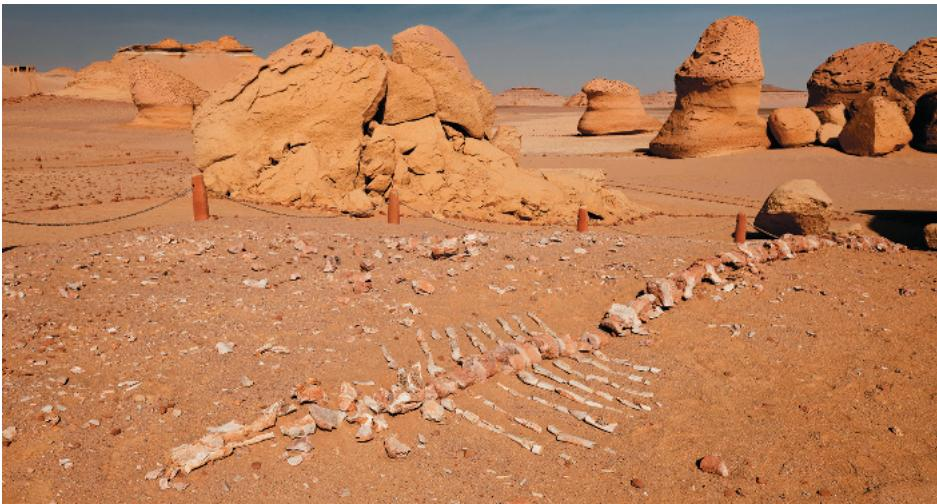  
Figure 25.1 In the 1870s, researchers working in the searing heat of the Sahara Desert were startled to discover fossils of ancient whales. These fossils were spectacular not only for where they were found, but also for documenting the transition from life on land to life in the sea—just one example of the sweeping changes seen in the history of life on Earth.

## Study Tip

Draw a time line: Draw a time line like the example shown here, and mark when the following key evolutionary events occurred: "oxygen revolution," origin of eukaryotes, first multicellular organisms, colonization of land by large eukaryotes, origin of tetrapods, and the Permian mass extinction. Briefly describe the significance of each event. You can also add more events to your time line as you study.

## How has life on Earth changed over time?

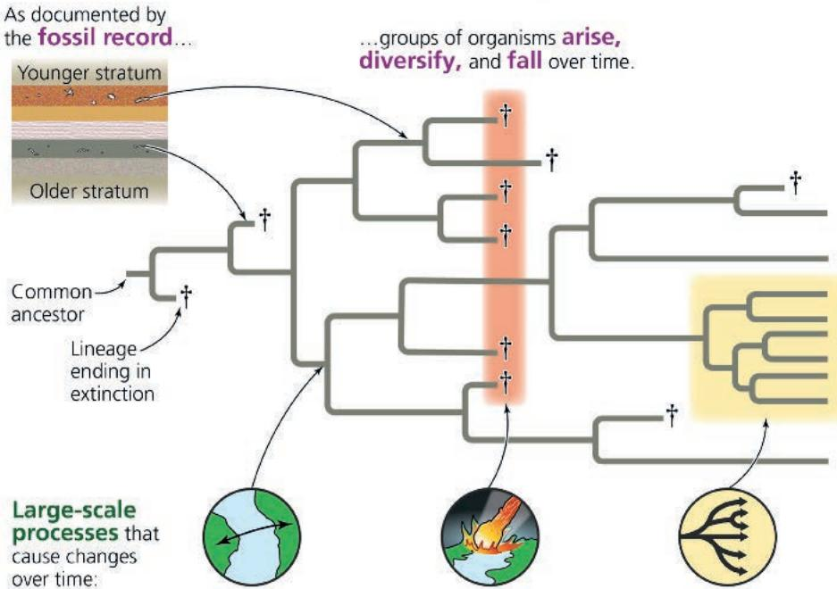  
Large-scale processes that cause changes over time:  
Continental drift
Land masses move over time, affecting extinction and speciation rates.  
Mass extinction
Many species
become extinct
worldwide.  
Adaptive radiation
A lineage gives rise to many new species.

# Concept 25.1: Conditions on early Earth made the origin of life possible

The whale fossils discovered in the Sahara Desert (see Figure 25.1) are one example of evidence that past organisms were very different from those presently living. The sweeping changes in life on Earth as revealed by such fossils illustrate macroevolution, the broad pattern of evolution above the species level. Examples of macroevolutionary change include the emergence of terrestrial vertebrates through a series of speciation events, the impact of mass extinctions on biodiversity, and the origin of key adaptations such as flight.

Taken together, such changes provide a grand view of the evolutionary history of life. We'll examine that history in this chapter, beginning with a discussion of hypotheses regarding the origin of life. This is the most speculative topic of the entire unit, because no fossil evidence of that seminal episode exists.

Direct evidence of life on early Earth comes from fossils of microorganisms that lived 3.5 billion years ago. But how did the first living cells appear? Observations and experiments in chemistry, geology, and physics have led scientists to propose one scenario that we'll examine here. They hypothesize that chemical and physical processes could have produced simple cells through a sequence of four main stages:

1. The abiotic (nonliving) synthesis of small organic molecules, such as amino acids and nitrogenous bases

2. The joining of these small molecules into macromolecules, such as proteins and nucleic acids

3. The packaging of these molecules into protocells, droplets with membranes that maintained an internal chemistry different from that of their surroundings

4. The origin of self-replicating molecules that eventually made inheritance possible

Though speculative, this scenario leads to predictions that can be tested in the laboratory. In this section, we'll examine some of the evidence for each stage.

## Synthesis of Organic Compounds on Early Earth

Our planet formed 4.6 billion years ago, condensing from a vast cloud of dust and rocks that surrounded the young sun. For its first few hundred million years, Earth was bombarded by huge chunks of rock and ice left over from the formation of the solar system. The collisions generated so much heat that all of the available water was vaporized, preventing the formation of seas and lakes.

This massive bombardment ended 4 billion years ago, setting the stage for the origin of life. The first atmosphere had little oxygen and was likely thick with water vapor, along with compounds released by volcanic eruptions, such as nitrogen and its oxides, carbon dioxide, methane, ammonia, and hydrogen. As Earth cooled, the water vapor condensed into oceans, and much of the hydrogen escaped into space.

During the 1920s, Russian chemist A. I. Oparin and British scientist J. B. S. Haldane independently hypothesized that Earth's early atmosphere was a reducing (electron-adding) environment, in which organic compounds could have formed from simpler molecules. The energy for this synthesis could have come from lightning and UV radiation. Haldane suggested that the early oceans were a solution of organic molecules, a “primitive soup” from which life arose.

In 1953, Stanley Miller, working with Harold Urey at the University of Chicago, tested the Oparin-Haldane hypothesis by creating laboratory conditions comparable to those that scientists at the time thought existed on early Earth (see Figure 4.2). His apparatus yielded a variety of amino acids found in organisms today, along with other organic compounds. Many laboratories have since repeated Miller's classic experiment using different recipes for the atmosphere, some of which also produced organic compounds.

However, some evidence suggests that the early atmosphere was made up primarily of nitrogen and carbon dioxide and was neither reducing nor oxidizing (electron removing). Recent Miller/Urey-type experiments using such “neutral” atmospheres have also produced organic molecules. In addition, small pockets of the early atmosphere, such as those near the openings of volcanoes, may have been reducing. Perhaps the first organic compounds formed near volcanoes. In a test of this hypothesis (Figure 25.2), researchers used modern equipment to reanalyze molecules that Miller had saved from one of his experiments. They found that numerous amino acids had formed under conditions that simulated a volcanic eruption.

Another hypothesis is that organic compounds were first produced in deep-sea hydrothermal vents, areas on the seafloor where heated water and minerals gush from Earth's interior into the ocean. Some of these vents, known as "black smokers," release water so hot (300–400°C) that organic compounds formed there may have been unstable. But other deep-sea vents, called alkaline vents, release water that has a high pH (9–11) and is warm (40–90°C) rather than hot, an environment that may have been more suitable for the origin of life (Figure 25.3).

Figure 25.2 Amino acid synthesis in a simulated volcanic eruption. In addition to his classic 1953 study, Miller also conducted an experiment simulating a volcanic eruption. In a 2008 reanalysis of those results, researchers found that far more amino acids were produced under simulated volcanic conditions than were produced in the conditions of the classic 1953 study.  
  
MAKE CONNECTIONS Explain how more than 20 amino acids could have been obtained in the 2008 study. (See Concept 5.4.)

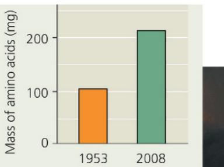  
For suggested answer, see Appendix A.

  
1mm

## Figure 25.3 Did life originate in deep-sea alkaline vents?

The first organic compounds may have arisen in warm alkaline vents similar to this one from the 40,000-year-old “Lost City” vent field in the mid-Atlantic Ocean. These vents contain hydrocarbons and are full of tiny pores (inset) lined with iron and other catalytic minerals. Early oceans were acidic, so a pH gradient would have formed between the interior of the vents and the surrounding ocean water. Energy for the synthesis of organic compounds could have been harnessed from this pH gradient.

Studies related to the volcanic atmosphere and alkaline vent hypotheses show that the abiotic synthesis of organic molecules is possible under various conditions. Another source of organic molecules may have been meteorites. For example, fragments of the Murchison meteorite, a 4.5-billion-year-old rock that landed in Australia in 1969, contain more than 80 amino acids, some in large amounts. These amino acids cannot be contaminants from Earth because they consist of an equal mix of D and L isomers (see Figure 4.7). Organisms make and use only L isomers, with a few rare exceptions. Studies have shown that the Murchison meteorite also contained other key organic molecules, including lipids, simple sugars, and nitrogenous bases such as uracil.

Collectively, these studies illustrate a variety of ways that life may form based on the availability of water, organic compounds, and energy.

## Abiotic Synthesis of Macromolecules

The presence of small organic molecules, such as amino acids and nitrogenous bases, is not sufficient for the emergence of life as we know it. Every cell has many types of macromolecules, including enzymes and other proteins and the nucleic acids needed for self-replication. Could such macromolecules have formed on early Earth? A 2016 study demonstrated that one key step, the abiotic synthesis of RNA's two purine bases, adenine (A) and guanine (G), can occur spontaneously from simple precursor molecules; the abiotic synthesis of the smaller cytosine (C) and uracil (U) bases was accomplished in 2009. In addition, by dripping solutions of amino acids or RNA nucleotides onto hot sand, clay, or rock, researchers have produced polymers of these molecules. The polymers formed spontaneously, without the help of enzymes or ribosomes. Unlike proteins, the amino acid polymers are a complex mix of linked and cross-linked amino acids. Still, it is possible that such polymers acted as weak catalysts for a variety of chemical reactions on early Earth.

## Protocells

All organisms must be able to carry out both reproduction and energy processing (metabolism). DNA molecules carry genetic information, including the instructions needed to replicate themselves accurately during reproduction. But DNA replication requires elaborate enzymatic machinery, along with an abundant supply of nucleotide building blocks provided by the cell's metabolism. This suggests that self-replicating molecules and a metabolic source of building blocks may have appeared together in early protocells. The necessary conditions may have been met in vesicles, fluid-filled compartments enclosed by a membrane-like structure. Recent experiments show that abiotically produced vesicles can exhibit certain properties of life, including simple reproduction and metabolism, as well as the maintenance of an internal chemical environment different from that of their surroundings (Figure 25.4).

For example, vesicles can form spontaneously when lipids or other organic molecules are added to water. When this occurs, molecules that have both a hydrophobic region and a hydrophilic region can organize into a bilayer similar to the lipid bilayer of a plasma membrane. Adding substances such as montmorillonite, a soft mineral clay produced by the weathering of volcanic ash, greatly increases the rate of vesicle self-assembly (see Figure 25.4a). This clay, which is thought to have been common on early Earth, provides surfaces on which organic molecules become concentrated, increasing the likelihood that the molecules will react with each other and form vesicles. Abiotically produced vesicles can “reproduce” on their own (see Figure 25.4b), and they can increase in size (“grow”) without dilution of their contents. Vesicles also can absorb montmorillonite particles, including those on which RNA and other organic molecules have become attached (see Figure 25.4c). Finally, experiments have shown that some vesicles have a selectively permeable bilayer and can perform metabolic reactions using an external source of reagents—another important prerequisite for life.

## Self-Replicating RNA

The first genetic material was most likely RNA, not DNA. RNA plays a central role in protein synthesis, but it can also function as an enzyme-like catalyst (see Concept 17.3). Such RNA catalysts are called ribozymes. Some ribozymes can make complementary copies of short pieces of RNA, provided that they are supplied with nucleotide building blocks.

Natural selection on the molecular level has produced ribozymes capable of self-replication in the laboratory. How does this occur? Unlike double-stranded DNA, which takes the form of a uniform helix, single-stranded RNA molecules assume a variety of specific three-dimensional shapes mandated by their nucleotide

Figure 25.4 Features of abiotically produced vesicles.  
  
(a) Self-assembly. The presence of montmorillonite clay greatly increases the rate of vesicle self-assembly.

  
(b) Reproduction. Vesicles can divide on their own, as in this vesicle "giving birth" to smaller vesicles (LM).

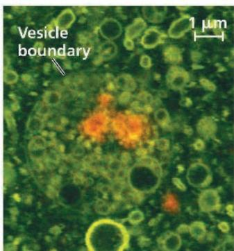  
(c) Absorption of RNA. This vesicle has incorporated montmorillonite clay particles coated with RNA (orange).  
MAKE CONNECTIONS Explain how molecules with both a hydrophobic region and a hydrophilic region can self-assemble into a bilayer when in water. (See Concept 5.3.)  
For suggested answer, see Appendix A.

sequences. In a given environment, RNA molecules with certain nucleotide sequences may have shapes that enable them to replicate faster and with fewer errors than other sequences. The RNA molecule with the greatest ability to replicate itself will leave the most descendant molecules. Occasionally, a copying error will result in a molecule with a shape that is even more adept at self-replication. Similar selection events may have occurred on early Earth. Thus, life as we know it may have been preceded by an “RNA world,” in which small RNA molecules were able to replicate and to store genetic information about the vesicles that carried them.

Recently, Dr. Jack Szostak and colleagues at Harvard University succeeded in building a vesicle in which copying of a template strand of RNA could occur—a key step toward constructing a vesicle with self-replicating RNA. On early Earth, a vesicle with such self-replicating, catalytic RNA would differ from its many neighbors that lacked such molecules. If that vesicle could grow, split, and pass its RNA molecules to its “daughters,” the daughters would be protocells. Although the first such protocells likely carried only limited amounts of genetic information, specifying only a few properties, their inherited characteristics could have been acted on by natural selection. The most successful of the early protocells would have increased in number because they could exploit their resources effectively and pass their abilities on to subsequent generations.

Once RNA sequences that carried genetic information appeared in protocells, many additional changes would have been possible. For example, RNA could have provided the template on which DNA nucleotides were assembled. Double-stranded DNA is a more chemically stable repository for genetic information than is the more fragile RNA. DNA also can be replicated more accurately. Accurate replication was advantageous as genomes grew larger through gene duplication and other processes and as more properties of the protocells became coded in genetic information. Once DNA appeared, the stage was set for a blossoming of new forms of life—a change we see documented in the fossil record.

## Interview

Interview with Jack Szostak: Studying the origin of life (eTextbook only)

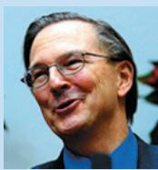

## Concept Check 25.1

1. What hypothesis did Miller test in his classic experiment?

2. How would the appearance of protocells have represented a key step in the origin of life?

3. MAKE CONNECTIONS In changing from an “RNA world” to today’s “DNA world,” genetic information must have flowed from RNA to DNA. After reviewing Figures 17.4 and 19.9, suggest how this could have occurred. Does such a flow occur today?

For suggested answers, see Appendix A.

## Concept 25.2: The fossil record documents the history of life

Starting with the earliest traces of life, the fossil record opens a window into the world of long ago and provides glimpses of the evolution of life over billions of years. In this section, we'll examine fossils as a form of scientific evidence: how fossils form, how scientists date and interpret them, and what they can and cannot tell us about changes in the history of life.

## The Fossil Record

Sedimentary rocks are the richest source of fossils. As a result, the fossil record is based primarily on the sequence in which fossils have accumulated in sedimentary rock layers, called strata (see Figure 22.3). Useful information is also provided by other types of

Figure 25.5 A gallery of fossil types.

(a) Sedimentary rock. Most fossils are found in sedimentary rocks, such as this plant fossil. (b) Mineralized organic matter. Some fossils, such as this petrified tree trunk, form as minerals seep into and replace organic matter. (c) Trace fossils. Footprints, burrows, or other traces of an organism's activities can be preserved in the fossil record. (d) Amber. Entire organisms are sometimes found preserved in hardened resin from a tree. (e) Frozen soil, ice, and acid bogs. Rarely, frozen soil, ice, or an acid bog can preserve the body of larger organisms, such as this wolf pup.

(a) Plant fossil, about 300 million years old

(b) Petrified tree in Arizona, about 215 million years old (c) 150-million-year-old dinosaur tracks in Colorado

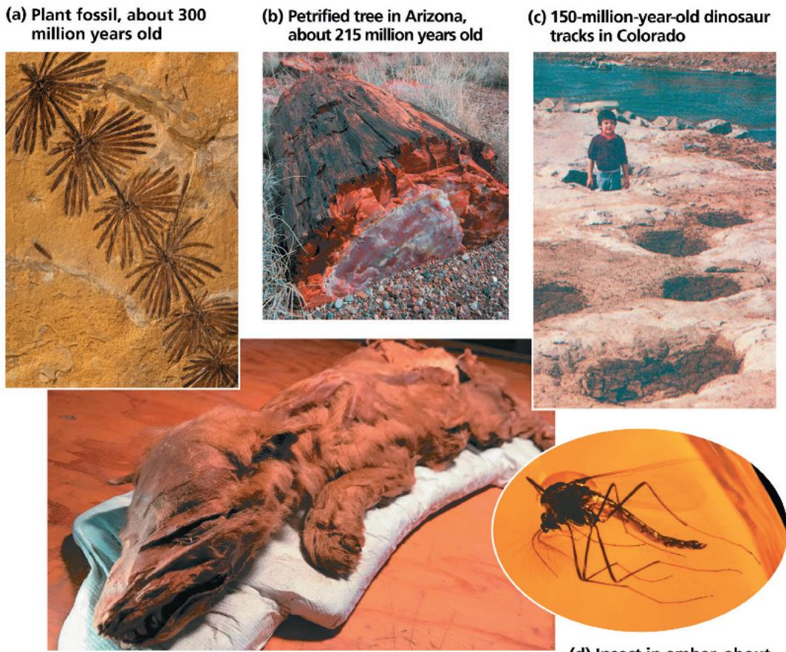  
(e) A 50,000-year-old wolf pup found in frozen soil in Yukon, Canada  
(d) Insect in amber, about 40 million years old

fossils, such as insects preserved in amber (fossilized tree sap) and mammals frozen in soil (Figure 25.5).

The fossil record shows that there have been great changes in the kinds of organisms on Earth at different points in time. Many past organisms were unlike organisms living today, and many organisms that once were common are now extinct. As we'll see later in this section, fossils also document how new groups of organisms arose from previously existing ones.

As substantial and significant as the fossil record is, keep in mind that it is an incomplete chronicle of evolution. Many of Earth's organisms did not die in the right place and time to be preserved as fossils. Of the fossils that were formed, many were destroyed by later geologic processes, and only a fraction of the others have been discovered. As a result, the known fossil record is biased in favor of species that existed for a long time, were abundant and widespread in certain kinds of environments, and had hard shells, skeletons, or other parts that facilitated their fossilization. Even with its limitations, however, the fossil record is a remarkably detailed account of biological change over the vast scale of geologic time. Furthermore, as shown by recently unearthed fossils of whale ancestors with hind limbs (see Figure 22.19 and Figure 25.1), gaps in the fossil record continue to be filled by new discoveries.

## How Rocks and Fossils Are Dated

Fossils provide valuable data for reconstructing the history of life, but only if we can determine where they fit in that story. While the order of fossils in rock strata tells us the sequence in which

the fossils were laid down—their relative ages—it does not tell us their actual ages. Examining the relative positions of fossils is like peeling off layers of wallpaper in an old house. You can infer the sequence in which the layers were applied, but not the year each layer was added.

How can we determine the age of a fossil? One of the most common techniques is radiometric dating, which is based on the decay of radioactive isotopes (see Concept 2.2). In this process, a radioactive “parent” isotope decays to a “daughter” isotope at a characteristic rate. The rate of decay is expressed by the half-life, the time required for 50% of the parent isotope to decay (Figure 25.6). Each type of radioactive isotope has a characteristic half-life, which is not affected by temperature, pressure, or other environmental variables. For example, carbon-14 decays relatively quickly; its half-life is 5,730 years. Uranium-238 decays slowly; its half-life is 4.5 billion years.

Fossils contain isotopes of elements that accumulated in the organisms when they were alive. For example, a living organism contains the most common carbon isotope, carbon-12, as well as a radioactive isotope, carbon-14. When the organism dies, it stops accumulating carbon, and the amount of carbon-12 in its tissues does not change over time. However, the carbon-14 that it contains at the time of death slowly decays into another element, nitrogen-14. Thus, by measuring the ratio of carbon-14 to carbon-12 in a fossil, we can determine the fossil's age. This method works for fossils up to about 75,000 years old; fossils older than that contain too little carbon-14 to be detected with current techniques. Radioactive isotopes with longer half-lives are used to date older fossils.

Figure 25.6 Radiometric dating.  
In this diagram, each unit of time represents one half-life of a radioactive isotope.  
  
DRAW IT Relabel the x-axis of this graph in years to illustrate the radioactive decay of uranium-238 (half-life = 4.5 billion years). For suggested answer, see Appendix A.

Determining the age of these older fossils in sedimentary rocks can be challenging. Organisms do not use radioisotopes with long half-lives, such as uranium-238, to build their bones or shells. In addition, sedimentary rocks are often composed of sediments of differing ages. Although we cannot date these older fossils directly, an indirect method can be used to infer the age of fossils that are sandwiched between two layers of volcanic rock. As lava cools into volcanic rock, radioisotopes from the surrounding environment become trapped in the newly formed rock. Some of the trapped radioisotopes have long half-lives, allowing geologists to estimate the ages of ancient volcanic rocks. If two volcanic layers surrounding fossils are found to be 525 million and 535 million years old, for example, then the fossils are roughly 530 million years old.

The study of fossils has helped geologists establish a geologic record: a standard time scale that divides Earth's history into four eons and further subdivisions (Table 25.1). We'll describe key events that occurred during these different time periods in Concept 25.3.

## The Origin of New Groups of Organisms

Some fossils document the origin of new groups of organisms. Such fossils are central to our understanding of evolution; they illustrate how new features arise and how long it takes for such changes to occur. We'll examine one such case here and in Figure 25.7: the origin of mammals.

Along with amphibians and reptiles, mammals belong to the group of animals called tetrapods (from the Greek tetra, four, and pod, foot), named for having four limbs. Mammals have a number of unique anatomical features that fossilize readily, allowing scientists to trace their origin. For example, the lower jaw is composed of one bone (the dentary) in mammals but several bones in other tetrapods. In addition, the lower and

Table 25.1 The Geologic Record

<table><tr><td>Eon</td><td>Era</td><td>Period</td><td>Epoch</td><td>Age (Millions of Years Ago)</td></tr><tr><td rowspan="7"></td><td rowspan="7">Cenozoic</td><td rowspan="2">Quaternary</td><td>Holocene</td><td>0.01</td></tr><tr><td>Pleistocene</td><td>2.6</td></tr><tr><td rowspan="2">Neogene</td><td>Pliocene</td><td>5.3</td></tr><tr><td>Miocene</td><td>23</td></tr><tr><td rowspan="3">Paleogene</td><td>Oligocene</td><td>33.9</td></tr><tr><td>Eocene</td><td>56</td></tr><tr><td>Paleocene</td><td>66</td></tr><tr><td rowspan="3">Phan-erozoic</td><td rowspan="3">Mesozoic</td><td colspan="2">Cretaceous</td><td>145</td></tr><tr><td colspan="2">Jurassic</td><td>201</td></tr><tr><td colspan="2">Triassic</td><td>252</td></tr><tr><td rowspan="6"></td><td rowspan="6">Paleozoic</td><td colspan="2">Permian</td><td>299</td></tr><tr><td colspan="2">Carboniferous</td><td>359</td></tr><tr><td colspan="2">Devonian</td><td>419</td></tr><tr><td colspan="2">Silurian</td><td>444</td></tr><tr><td colspan="2">Ordovician</td><td>485</td></tr><tr><td colspan="2">Cambrian</td><td>541</td></tr><tr><td rowspan="3">Proterozoic</td><td rowspan="3">Neo-proterozoic</td><td colspan="2">Ediacaran</td><td>635</td></tr><tr><td colspan="2"></td><td>1,000</td></tr><tr><td colspan="2"></td><td>2,500</td></tr><tr><td>Archaean</td><td></td><td colspan="2"></td><td>4,000</td></tr><tr><td>Hadean</td><td></td><td colspan="3">Approx. 4,600</td></tr></table>

upper jaws in mammals hinge between a different set of bones than in other tetrapods. Mammals also have a unique set of three bones that transmit sound in the middle ear, the hammer, anvil, and stirrup, whereas other tetrapods have only one such bone, the stirrup (see Concept 34.6). Finally, the teeth of mammals are differentiated into incisors (for tearing), canines (for piercing), and the multi-pointed premolars and molars (for crushing and grinding). In contrast, the teeth of other tetrapods usually consist of a row of undifferentiated, single-pointed teeth.

As detailed in Figure 25.7, the fossil record shows that the unique features of mammalian jaws and teeth evolved gradually. Keep in mind that the figure includes just a few examples of the fossil skulls that document the origin of mammals. If all the known fossils in the sequence were arranged by shape and placed side by side, their features would blend smoothly from one group to the next. Some of these fossils would reflect how the features of a group that dominates life today, the mammals, gradually arose in a previously existing group, the cynodonts. Others would reveal side branches on the tree of life—groups of organisms that thrived for millions of years but ultimately left no descendants that survive today.

## Exploring the Origin of Mammals

## Figure 25.7

Over the course of 120 million years, mammals originated gradually from a group of tetrapods called synapsids. Shown here are a few of the many fossil organisms whose morphological features are intermediate between living mammals and their early synapsid ancestors. The evolutionary context of the origin of mammals is shown in the tree diagram at right (the dagger symbol $\dagger$ indicates extinct lineages).

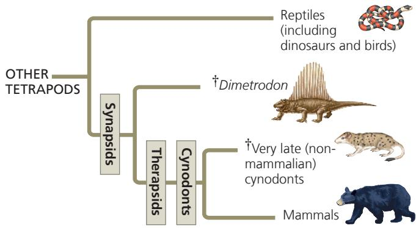

## Synapsid (300 mya)

Early synapsids had multiple bones in the lower jaw and single-pointed teeth. The jaw hinge was formed by the articular and quadrate bones. Early synapsids also had an opening called the temporal fenestra behind the eye socket. Powerful cheek muscles for closing the jaws probably passed through the temporal fenestra. Over time, this opening enlarged and moved in front of the hinge between the lower and upper jaws, thereby increasing the power and precision with which the jaws could be closed (much as moving a doorknob away from the hinge makes a door easier to close).

## Therapsid (280 mya)

Later, a group of synapsids called therapsids appeared. Therapsids had large dentary bones, long faces, and the first examples of specialized teeth, large canines. These trends continued in a group of therapsids called cynodonts.

## Early cynodont (260 mya)

In early cynodont therapsids, the dentary was the largest bone in the lower jaw, the temporal fenestra was large and positioned forward of the jaw hinge, and teeth with several cusps first appeared (not visible in the diagram). As in earlier synapsids, the jaw had an articular-quadrate hinge.

## Later cynodont (220 mya)

Later cynodonts had teeth with complex cusp patterns, and their lower and upper jaws hinged in two locations: They retained the original articular-quadrate hinge and formed a new, second hinge between the dentary and squamosal bones. (The temporal fenestra is not visible in this or the below cynodont skull at the angles shown.)

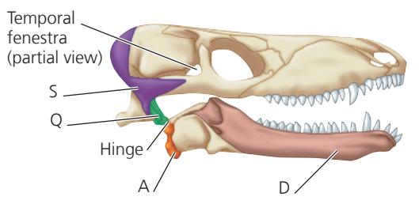

## Very late cynodont (195 mya)

In some very late (nonmammalian) cynodonts and early mammals, the original articular-quadrate hinge was lost, leaving the dentary-squamosal hinge as the only hinge between the lower and upper jaws, as in living mammals. The articular and quadrate bones migrated into the ear region (not shown), where they functioned in transmitting sound. In the mammal lineage, these two bones later evolved into the familiar hammer (malleus) and anvil (incus) bones of the ear.

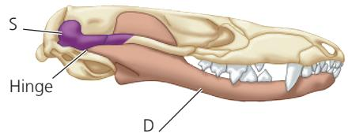

## Concept Check 25.2

1. Describe an example from the fossil record that shows how life has changed over time.

2. WHAT IF? A fossilized skull you unearthed has a carbon-14/carbon-12 ratio about $\frac{1}{16}$ that of the skulls of present-day animals. Approximately how many years old is the fossilized skull?

For suggested answers, see Appendix A.

## Concept 25.3: Key events in life's history include the origins of unicellular and multicellular organisms and the colonization of land

The first three eons in the geologic record—the Hadean, the Archaean, and the Proterozoic—together lasted about 4 billion years The Phanerozoic eon, roughly the last half billion years, encompasses most of the time that animals have existed on Earth. It is divided into three eras: the Paleozoic, Mesozoic, and Cenozoic. Each era represents a distinct age in the history of Earth and its life. For example, the Mesozoic era is sometimes called the “age of reptiles” because of its abundance of reptilian fossils, including those of dinosaurs. The boundaries between the eras correspond to major extinction events, when many forms of life disappeared and were replaced by forms that evolved from the survivors.

As we've seen, the fossil record provides a sweeping overview of the history of life over geologic time. Here we will focus on a few major events in that history, returning to study the details in Unit Five. Figure 25.8 (on the next two pages) will help you visualize how long ago these key events occurred against the vast backdrop of geologic time.

## The First Single-Celled Organisms

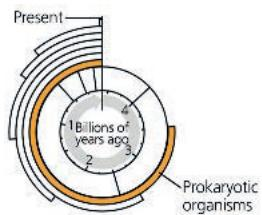

Earth's first living things were single-celled prokaryotic organisms that lived in the ocean. The earliest direct evidence of these organisms, dating from 3.5 billion years ago, comes from fossilized stromatolites. Stromatolites are layered rocks that form when cer-

tain prokaryotic organisms bind thin films of sediment together. Stromatolites and other early prokaryotic organisms were Earth's sole inhabitants for about 1.5 billion years. As we will see, these prokaryotic organisms transformed life on our planet.

## Photosynthesis and the Oxygen Revolution

Most atmospheric oxygen gas (O $_{2}$ ) is of biological origin, produced during the water-splitting step of photosynthesis. When oxygenic photosynthesis first evolved—in photosynthetic prokaryotic organisms similar to today's cyanobacteria—the free O $_{2}$ it produced probably dissolved in the surrounding water until it reached a high enough concentration to react with elements dissolved in water, including iron. This would have caused the iron to precipitate as iron oxide, which accumulated as sediments. These sediments were compressed into banded iron formations, red layers of rock containing iron oxide that are a source of iron ore today. Once all of the dissolved iron had precipitated, additional $O_{2}$ dissolved in the water until the seas and lakes became saturated with $O_{2}$ . After this occurred, the $O_{2}$ finally began to “gas out” of the water and enter the atmosphere. This change left its mark in the rusting of iron-rich terrestrial rocks, a process that began about 2.7 billion years ago.

As shown in Figure 25.9, the amount of atmospheric $O_{2}$ increased gradually from about 2.7 to 2.4 billion years ago, but then shot up relatively rapidly to between 1% and 10% of its present level. This “oxygen revolution” had an enormous impact on life. In some of its chemical forms, oxygen attacks chemical bonds and can inhibit enzymes and damage cells. As a result, the rising concentration of atmospheric $O_{2}$ probably doomed many prokaryotic groups. Some species survived in habitats that remained anaerobic, where we find their descendants living today (see Concept 27.4). Among other survivors, diverse adaptations to the changing atmosphere evolved, including cellular respiration, which uses $O_{2}$ in the process of harvesting the energy stored in organic molecules.

The rise in atmospheric $O_{2}$ levels left a huge imprint on the history of life. A few hundred million years later, another fundamental change occurred: the origin of the eukaryotic cell.

## The First Eukaryotes

The oldest widely accepted fossils of eukaryotes are of single-celled organisms that lived 1.8 billion years ago. Recall that eukaryotic cells have more complex organization than prokaryotic cells:

Eukaryotic cells have a nuclear envelope, mitochondria, endoplasmic reticulum, and other internal structures that prokaryotic organisms lack. Also, unlike prokaryotic cells, eukaryotic cells have a well-developed cytoskeleton, a feature that enables eukaryotic cells to change their shape and thereby surround and engulf other cells.

## Figure 25.9 The rise of atmospheric oxygen.

Chemical analyses of ancient rocks have enabled this reconstruction of atmospheric oxygen levels during Earth's history.  
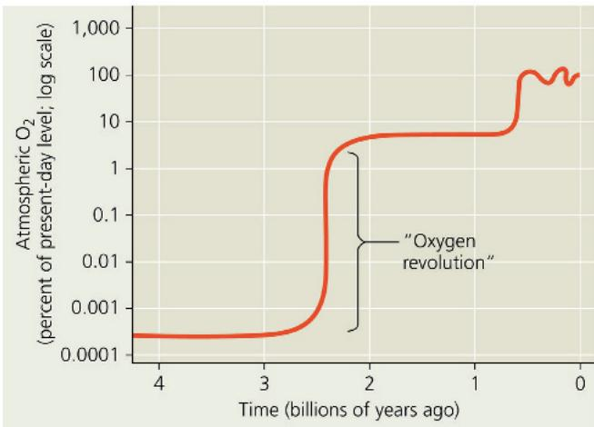

This figure shows all of geologic time to scale on an unbroken timeline, but sometimes it is helpful to "break" a timeline to limit a figure's size and highlight key details. As shown at right, hatch marks are often used to represent such an interruption.

# Visualizing the Scale of Geologic Time

Figure 25.8

Geologic time is so vast that it can be difficult to visualize when key events in the history of life on Earth occurred. In this timeline, time runs from left to right, from 4.6 billion years ago to the present. The fossils along the top illustrate representative organisms from different points in time.

Oldest fossils of cells (prokaryotes) appear (3.5 bya)

Some prokaryotes bind thin films of sediments together, producing layered rocks called stromatolites, such as these in Shark Bay, Australia.

1. Once life began, what types of organisms lived on Earth for the next 2 billion years?

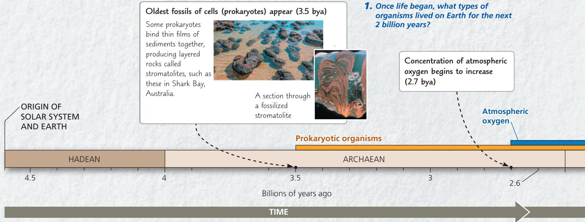

A section through a fossilized stromatolite

Concentration of atmospheric oxygen begins to increase (2.7 bya)

TIME

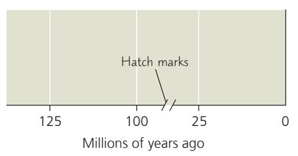

2. Look for a figure in Chapter 27 that uses hatch marks on one of its axes. Explain what the hatch marks represent in that figure.

Instructors: Additional questions related to this Visualizing Figure can be assigned in Mastering Biology.

How did the eukaryotes evolve from their prokaryotic ancestors? Current evidence indicates that the eukaryotes originated by endosymbiosis when a prokaryotic cell engulfed a small cell that would evolve into an organelle found in all eukaryotes, the mitochondrion. The small, engulfed cell is an example of an endosymbiont, a cell that lives within another cell, called the host cell. The prokaryotic ancestor of the mitochondrion probably entered the host cell as undigested prey or an internal parasite. Though such a process may seem unlikely, scientists have directly observed cases in which endosymbionts that began as prey or parasites developed a mutually beneficial relationship with a host in as little as five years.

By whatever means the relationship began, we can hypothesize how the symbiosis could have become beneficial.

For example, in a world that was becoming increasingly aerobic, a host that was itself an anaerobe would have benefited from endosymbionts that could make use of the oxygen. Over time, the host and endosymbionts would have become a single organism, its parts inseparable. Although all eukaryotes have mitochondria or remnants of these organelles, they do not all have plastids (a general term for chloroplasts and related organelles). Thus, the serial endosymbiosis hypothesis supposes that mitochondria evolved before plastids through a sequence of endosymbiotic events. As shown in Figure 25.10, both mitochondria and plastids are thought to have descended from bacterial cells. The original host—the cell that engulfed the bacterium whose descendants gave rise to the mitochondrion—is thought to have been an archaean.

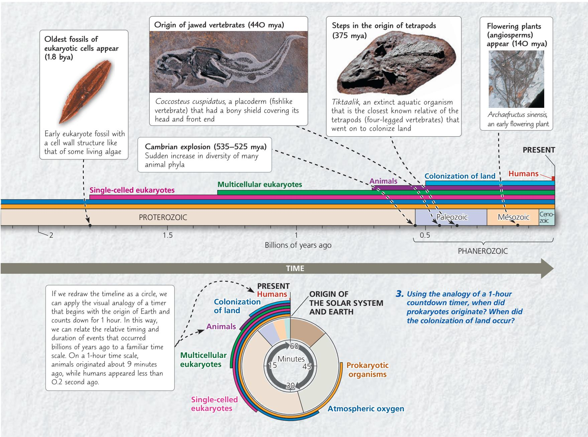

A great deal of evidence supports the endosymbiotic origin of mitochondria and plastids:

\- The inner membranes of both organelles have enzymes and transport systems that are homologous to those found in the plasma membranes of living bacteria.

\- Mitochondria and plastids replicate by a splitting process that is similar to that of certain bacteria. In addition, each of these organelles contains circular DNA molecules that, like the chromosomes of bacteria, are not associated with histones or large amounts of other proteins.

\- As might be expected of organelles descended from free-living organisms, mitochondria and plastids also have the cellular machinery (including ribosomes) needed to transcribe and translate their DNA into proteins.

\- Finally, in terms of size, RNA sequences, and sensitivity to certain antibiotics, the ribosomes of mitochondria and plastids are more similar to bacterial ribosomes than they are to the cytoplasmic ribosomes of eukaryotic cells.

In Concept 28.1, we'll return to the origin of eukaryotes, focusing on what genomic data have revealed about the prokaryotic lineages that gave rise to the host and endosymbiont cells.

## The Origin of Multicellularity

An orchestra can play a greater variety of musical compositions than a violin soloist can; the increased complexity of the orchestra makes more variations possible. Likewise, the origin of structurally complex eukaryotic cells sparked the evolution of

Figure 25.10 A hypothesis for the origin of mitochondria and plastids through serial endosymbiosis.

The proposed ancestral cell was an archaean. The proposed ancestors of mitochondria were aerobic, heterotrophic bacteria, while the proposed ancestors of plastids were photosynthetic bacteria. In this figure, the arrows represent change over evolutionary time.

greater morphological diversity than was possible for the simpler prokaryotic cells. After the first eukaryotes appeared, a great range of unicellular forms evolved, giving rise to the diversity of single-celled eukaryotes that continue to flourish today. Another wave of diversification also occurred: Some single-celled eukaryotes gave rise to multicellular forms, whose descendants include a variety of algae, plants, fungi, and animals.

  
an alga that lived 600 mya and (b) Kimberella, a mollusc (or close relative) that lived 560 mya.

## Early Multicellular Eukaryotes

Fossil evidence and DNA sequence data suggest that multicellular eukaryotes emerged about 1.3 billion years ago. The

Figure 25.11 Life becomes large. Fossils from the Ediacaran period document the oldest known macroscopic eukaryotes, such as (a) Doushantuophyton,

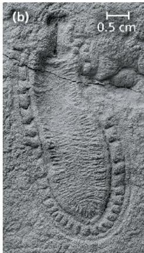

oldest known fossils of multicellular eukaryotes that can be resolved taxonomically are of relatively small red algae that lived 1.2 billion years ago. Larger and more diverse multicellular eukaryotes do not appear in the fossil record until about 600 million years ago (Figure 25.11). These fossils, referred to as the Ediacaran biota, were of mostly soft-bodied organisms—some over 1 m long—that lived from 635 to 541 million years ago (mya). The Ediacaran biota included both algae and animals, along with various organisms of unknown taxonomic affinity.

The rise of large eukaryotes in the Ediacaran period represents an enormous change in the history of life. Before that time, Earth was a microbial world: Its only inhabitants were single-celled prokaryotic and eukaryotic organisms, along with an assortment of microscopic multicellular eukaryotes. As the diversification of the Ediacaran biota came to a close about 541 million years ago, the stage was set for another, even more spectacular burst of evolutionary change: the “Cambrian explosion.”

## The Cambrian Explosion

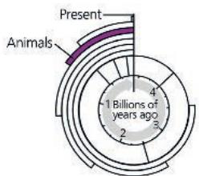

Many present-day animal phyla appear suddenly in fossils formed 535–525 million years ago, early in the Cambrian period. This phenomenon is referred to as the Cambrian explosion. Fossils of several animal groups—sponges, cnidarians (sea anemones and their relatives), and molluscs (snails,

clams, and their relatives)—appear in even older rocks dating from the late Proterozoic (Figure 25.12).

Prior to the Cambrian explosion, all large animals were soft-bodied. The fossils of large pre-Cambrian animals reveal little evidence of predation. Instead, these animals appear to have been grazers (feeding on algae), filter feeders, or scavengers, not hunters. The Cambrian explosion changed all of that. In a relatively short period of time (10 million years), predators over 1 m in length emerged that had claws and other features for capturing prey; simultaneously, new defensive adaptations, such as sharp spines and heavy body armor, appeared in their prey.

Figure 25.12 Appearance of selected animal groups in the fossil record.  
The white bars indicate the earliest record of these animal groups.  
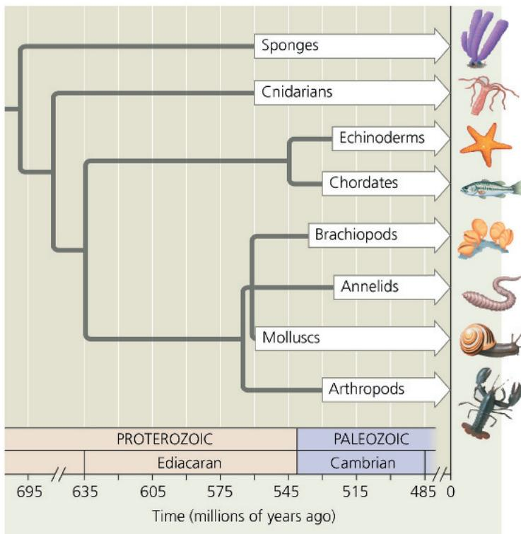  
VISUAL SKILLS Circle the branch point that represents the most recent common ancestor of chordates and annelids. What is a minimum estimate of that ancestor's age?  
For suggested answer, see Appendix A.

Although the Cambrian explosion had an enormous impact on life on Earth, it appears that many animal phyla originated long before that time. DNA analyses suggest that the earliest animals had evolved by 700 million years ago; such analyses also indicate that the common ancestor of some of the major groups that radiated during the Cambrian explosion lived 670 million years ago. The fossil record corroborates these results in that researchers have unearthed 710-million-year-old sediments containing steroids indicative of a particular group of sponges. In contrast, the oldest macroscopic fossils of animals date from 560 million years ago and include Kimberella, shown in Figure 25.11. Overall, fossils and DNA analyses suggest that animals originated about 700 million years ago and then diversified explosively during the Cambrian and beyond.

## The Colonization of Land

The colonization of land was another milestone in the history of life. There is fossil evidence that some prokaryotic organisms lived on terrestrial surfaces as early as 3.2 billion years ago. However, larger forms of life, such as fungi, plants, and animals, did not

begin to colonize land until about 500 million years ago. This gradual evolutionary venture out of aquatic environments was associated with adaptations that made it possible to reproduce on land and that helped prevent dehydration. For example, many plants today have a vascular system for transporting materials internally and a waterproof coating of wax on their leaves that slows the loss of water to the air. Early signs of these adaptations were present 420 million years ago, at which time small plants (about 10 cm high) existed that had a vascular system but lacked true roots or leaves. By 40 million years later, plants had diversified greatly and included trees and many other plants with true roots and leaves.

Plants appear to have colonized land in the company of fungi. Even today, the roots of most plants are associated with fungi that aid in the absorption of water and minerals from the soil (see Concept 31.1). These root fungi (or mycorrhizae), in turn, obtain their organic nutrients from the plants. Such mutually beneficial associations of plants and fungi are evident in some of the oldest fossilized plants, dating this relationship back to the early spread of life onto land (Figure 25.13).

Although many animal groups are now represented in terrestrial environments, the most widespread and diverse land animals are arthropods (particularly insects and spiders) and tetrapods. Arthropods were among the first animals to colonize land, roughly 450 million years ago. The earliest tetrapods found in the fossil record lived about 365 million years ago and appear to have evolved from a group of lobe-finned fishes (see Concept 34.3). Tetrapods include humans, although we are late arrivals on the scene. The human lineage diverged from other primates around 7–8 million years ago, and our species originated only about 195,000 years ago. If the clock of Earth's history were rescaled to represent an hour, humans appeared less than 0.2 second ago.

Figure 25.13 An ancient symbiosis.

This 405-million-year-old fossil stem (cross section) documents mycorrhizae in the early plant Aglaophyton major. The inset shows an enlarged view of a cell containing a branched fungal structure called an arbuscule; the fossil arbuscule resembles those seen in plant cells today.

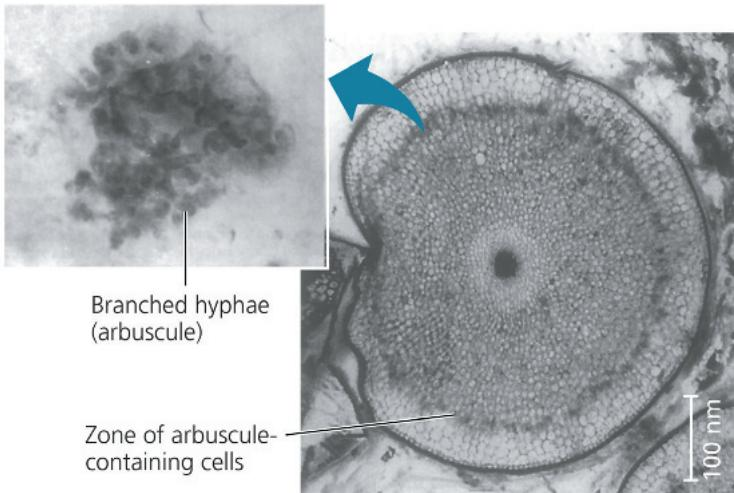  
Branched hyphae (arbuscule)  
Zone of arbuscule-containing cells

## Interview

Interview with Geerat Vermeij: What fossils reveal about the history of life (eTextbook only)

## Concept Check 25.3

1. The first appearance of free oxygen in the atmosphere likely triggered a massive wave of extinctions among the prokaryotic organisms of the time. Why?

2. What evidence supports the hypothesis that mitochondria preceded plastids in the evolution of eukaryotic cells?

3. WHAT IF? What would a fossil record of life today look like?

For suggested answers, see Appendix A.

## Concept 25.4: The rise and fall of groups of organisms reflect differences in speciation and extinction rates

From its beginnings, life on Earth has been marked by the rise and fall of groups of organisms. Anaerobic prokaryotic organisms originated, flourished, and then declined as the oxygen content of the atmosphere rose. Billions of years later, the first tetrapods emerged from the sea, giving rise to several major new groups of organisms. One of these, the amphibians, went on to dominate life on land for 100 million years, until other tetrapods (including dinosaurs and, later, mammals) replaced them as the dominant terrestrial vertebrates.

The rise and fall of these and other major groups of organisms have shaped the history of life. Narrowing our focus, we can also see that the rise or fall of any particular group is related to the speciation and extinction rates of its member species (Figure 25.14). Just as a population increases in size when there are more births than deaths, the rise of a group of organisms occurs when more new species are produced than are lost to extinction. The reverse occurs when a group is in decline. In the Scientific Skills Exercise, you can interpret data from the fossil record about changes in a group of snail species in the early Paleogene period. Such changes in the fates of groups of organisms have been influenced by large-scale processes such as plate tectonics, mass extinctions, and adaptive radiations.

Figure 25.14 How speciation and extinction affect diversity. The species diversity of an evolutionary lineage will increase when more new member species originate than are lost to extinction. In this hypothetical phylogenetic tree, each horizontal branch represents one species. By 2 million years ago, both lineage A and lineage B have given rise to four species, and no species have become extinct (denoted by a dagger symbol, †) By time 0, however, lineage A contains only one species, while lineage B contains eight species.  
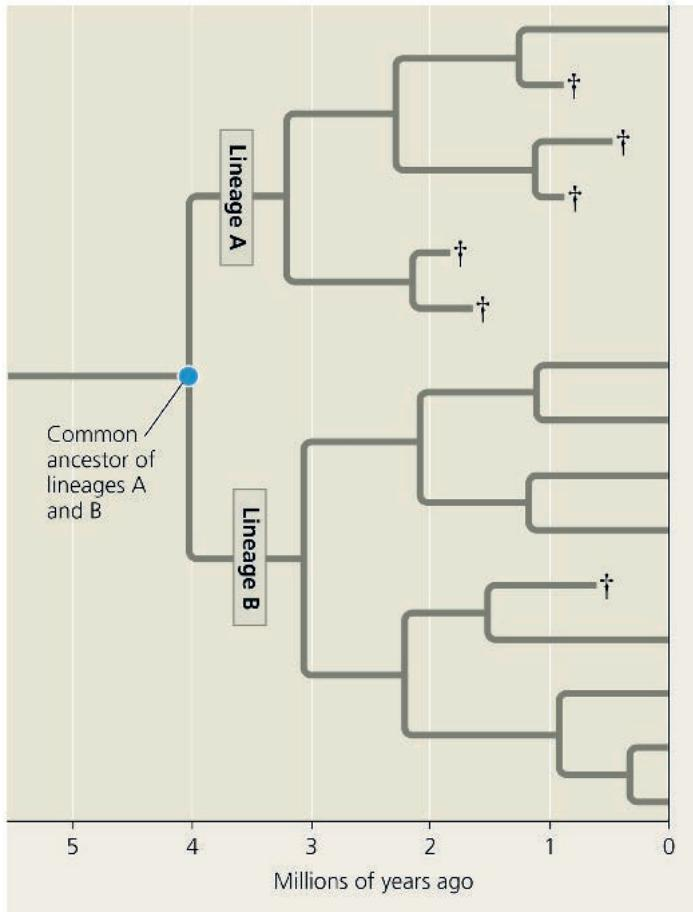  
VISUAL SKILLS Consider the period from 2 million years ago to time 0. For each lineage, determine how many speciation and extinction events occurred during that time.  
For suggested answer, see Appendix A.

## Plate Tectonics

If photographs of Earth were taken from space every 10,000 years and spliced together to make a movie, it would show something many of us find hard to imagine: The seemingly “rock solid” continents we live on move over time. Over the past billion years, there have been three occasions (1 billion, 600 million, and 250 million years ago) when most of the landmasses of Earth came together to form a supercontinent, then later broke apart. Each time, this breakup yielded a different configuration of continents. Based on the directions in which the continents are moving today, some geologists have estimated that a new supercontinent will form roughly 250 million years from now.

Figure 25.15 Cutaway view of Earth.
The thickness of the crust is exaggerated here.

# Scientific Skills Exercise Estimating Quantitative Data from a Graph and Developing Hypotheses

Do Ecological Factors Affect Evolutionary Rates? Researchers studied the fossil record to investigate whether differing modes of larval dispersal might explain species longevity within one taxon of marine snails, the family Volutidae. Some of the snail

species had nonplanktonic larvae: They developed directly into adults without a swimming stage. Other species had planktonic larvae: They had a swimming stage and could disperse very long distances. The adults of these planktonic species tended to have broad geographic distributions, whereas nonplanktonic species tended to be more isolated.

How the Research Was Done The researchers studied the stratigraphic distribution of volutes in outcrops of sedimentary rocks located along North America's Gulf coast. These rocks, which formed from 66 to 37 million years ago, early in the Paleogene period, are an excellent source of well-preserved snail fossils. The researchers were able to classify each fossil species of volute snail as having planktonic or nonplanktonic larvae based on features of the earliest formed whorls of the snail's shell. Each bar in the graph shows how long one species of snail persisted in the fossil record.

## INTERPRET THE DATA

1. You can estimate quantitative data (fairly precisely) from a graph. The first step is to obtain a conversion factor by measuring along an axis that has a scale. In this case, 25 million years (my; from 60 to 35 million years ago [mya] on the x-axis) is represented by a distance of 7.0 cm. This yields a conversion factor (a ratio) of 25 my/7.0 cm = 3.6 my/cm. To estimate the time period represented by a horizontal bar on this graph, measure the length of that bar in centimeters and multiply that measurement by the conversion factor, 3.6 my/cm. For example, a bar that measures 1.1 cm on the graph represents a persistence time of $1.1 \, cm \times 3.6 \, my/cm = 4 \, million years$ .

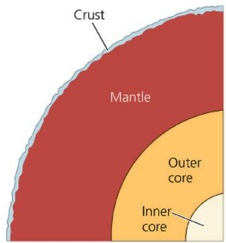

  
Data from T. A. Hansen, Larval dispersal and species longevity in Lower Tertiary gastropods, Science 199:885–887 (1978). Reprinted with permission from AAAS.

2. Calculate the mean (average) persistence times for species with planktonic larvae and species with nonplanktonic larvae.

3. Count the number of new species that form in each group beginning at 60 mya (the first three species in each group were present around 64 mya, the first time period sampled, so we don't know when those species first appear in the fossil record).

4. Propose a hypothesis to explain the differences in longevity of snail species with planktonic and nonplanktonic larvae.

Instructors: A version of this Scientific Skills Exercise can be assigned in Mastering Biology.

According to the theory of plate tectonics, the continents are part of great plates of Earth's crust that essentially float on the hot, underlying portion of the mantle (Figure 25.15). Movements in the mantle cause the plates to move over time in a process called continental drift. Geologists can measure the rate at which the plates are moving now, usually only a few centimeters per year. They can also infer the past locations of the continents using the magnetic signal recorded in rocks at the time of their formation. This method works because as a continent shifts its position over time, the direction of magnetic north recorded in its newly formed rocks also changes.

Earth's major tectonic plates are shown in Figure 25.16. Many important geologic processes, including the formation of mountains and islands, occur at plate boundaries. In some cases, two plates are moving away from each other, as are the North

Earth's youngest major mountain range, the Himalayas, began to form when India collided with Eurasia about 45 million years ago. The continents continue to drift today.

At the end of the Paleozoic, all of Earth's landmasses were joined in the supercontinent Pangaea.

American and Eurasian plates, which are currently drifting apart at a rate of about 2 cm per year. In other cases, two plates are sliding past each other, forming regions where earthquakes are common. California's infamous San Andreas Fault is part of a border where two plates slide past each other. In still other cases, two plates collide, producing violent upheavals and forming new mountains along the plate boundaries. One spectacular example of this occurred 45 million years ago, when the Indian plate crashed into the Eurasian plate, starting the formation of the Himalayan mountains.

## Consequences of Continental Drift

Figure 25.16 Earth's major tectonic plates.  
The arrows indicate direction of movement. The orange dots represent zones of violent tectonic activity.  
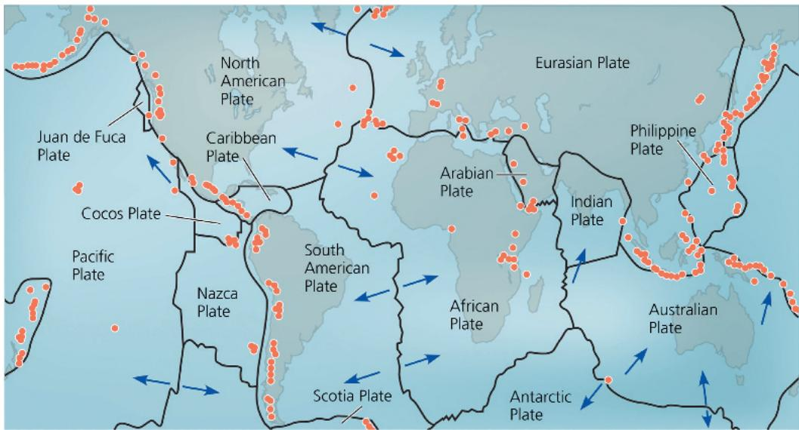

Plate movements rearrange geog-

raphy slowly, but their cumulative

effects are dramatic. In addition to reshaping the physical features of our planet, continental drift also has a major impact on life on Earth.

One reason for this is that continental drift alters the habitats in which organisms live. Consider the changes shown in Figure 25.17. About 250 million years ago, plate movements brought previously separated landmasses together into a supercontinent named Pangaea. Ocean basins became deeper, which drained shallow coastal seas. At that time, as now, most marine species inhabited shallow waters, and the formation of Pangaea destroyed much of that habitat. Pangaea's interior was cold and dry, probably an even more severe environment than that of central Asia today. Overall, the formation of Pangaea greatly altered the physical environment and climate, which drove some species to extinction and provided new opportunities for groups of organisms that survived the crisis.

Organisms are also affected by the climate change that results when a continent shifts its location. The southern tip of Labrador, Canada, for example, once was located in the tropics but has moved $40^{\circ}$ to the north over the last 200 million years. When faced with the changes in climate that such shifts in position entail, organisms adapt, move to a new location, or become extinct (this last outcome occurred for many organisms stranded on Antarctica, which separated from Australia 40 million years ago).

Continental drift also promotes allopatric speciation on a grand scale. When supercontinents break apart, regions that once were connected become isolated. As the continents drifted apart over the last 200 million years, each became a separate evolutionary arena, with lineages of plants and animals that diverged from those on other continents. For example, marsupial mammals fill ecological roles in Australia analogous to those filled by eutherians (placental mammals) on other continents (see Figure 22.18). Fossil evidence shows that marsupial mammals originated in what is now Asia and reached Australia

Figure 25.17 The history of continental drift during the Phanerozoic eon.  
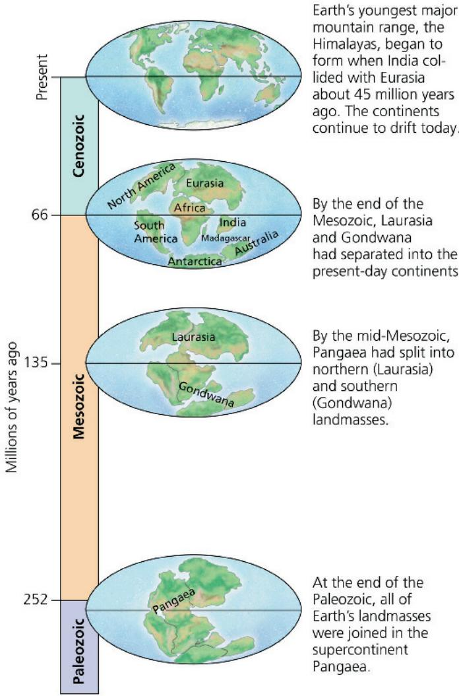  
By the end of the Mesozoic, Laurasia and Gondwana had separated into the present-day continents.  
By the mid-Mesozoic, Pangaea had split into northern (Laurasia) and southern (Gondwana) landmasses.

VISUAL SKILLS Is the Australian plate's current direction of movement (see Figure 25.16) similar to the direction it traveled over the past 66 million years? For suggested answer, see Appendix A.

via South America and Antarctica while the continents were still joined. The subsequent breakup of the southern continents set Australia “afloat,” like a giant raft of marsupials. In Australia, marsupials diversified, and the few eutherians that lived there became extinct; on other continents, most marsupials became extinct and the eutherians diversified.

Finally, continental drift can help explain puzzling geographic distributions of extinct organisms, such as fossils of the same species of Permian freshwater reptiles found in both Brazil and the West African nation of Ghana. These two parts of the world, now separated by 3,000 km of ocean, were joined together when these reptiles were living.

## Mass Extinctions

The fossil record shows that the overwhelming majority of species that ever lived are now extinct. A species may become extinct for many reasons. Its habitat may have been destroyed, or its environment may have changed in a manner unfavorable to the species. For example, if ocean temperatures fall by even a few degrees, species that are otherwise well adapted may perish. Even if physical factors in the environment remain stable, biological factors may change—the origin of one species can spell doom for another.

Although extinction occurs regularly, at certain times disruptive changes to the global environment have caused the rate of extinction to increase dramatically. The result is a mass extinction, in which large numbers of species become extinct worldwide.

## The “Big Five” Mass Extinction Events

Five mass extinctions are documented in the fossil record over the past 500 million years (Figure 25.18). These events are particularly well documented for the decimation of hard-bodied animals that lived in shallow seas, the organisms for which the fossil record is most complete. In each mass extinction, 50% or more of marine species became extinct.

Two mass extinctions—the Permian and the Cretaceous—have received the most attention. The Permian mass extinction, which defines the boundary between the Paleozoic and Mesozoic eras (252 million years ago), claimed about 96% of marine animal species and drastically altered life in the ocean. Terrestrial life was also affected. For example, 8 out of 27 known orders of insects were wiped out. This mass extinction occurred in less than 500,000 years, possibly in just a few thousand years—an instant in the context of geologic time.

The Permian mass extinction occurred during the most extreme episode of volcanism in the past 500 million years. Geologic data indicate that 1.6 million km $^{2}$ (roughly half the size of Western Europe) in Siberia was covered with lava hundreds of meters thick. The eruptions are thought to have produced enough carbon dioxide to warm the global climate by an estimated 6°C, harming many temperature-sensitive species. The rise in atmospheric CO $_{2}$ levels would also have led to ocean acidification, thereby reducing the availability of calcium carbonate, which is required by reef-building corals and many shell-building species (see Figure 3.12). The eruptions would also have added nutrients such as phosphorus to marine ecosystems, stimulating the growth of microorganisms. Upon their deaths, these microorganisms would have provided food for bacterial decomposers. Bacteria use oxygen as they decompose the bodies of dead organisms, thus causing oxygen concentrations to drop. This would have harmed oxygen-breathers and promoted the growth of anaerobic bacteria that emit a poisonous metabolic by-product, hydrogen sulfide ( $H_{2}S$ ) gas. Overall, the volcanic eruptions may have triggered a series of catastrophic events that together resulted in the Permian mass extinction.

Figure 25.18 Mass extinction and the diversity of life.  
The five generally recognized mass extinction events, indicated by red arrows, represent peaks in the extinction rate of marine animal families (red solid line and left vertical axis). These mass extinctions interrupted the overall increase, over time, in the number of extant families of marine animals (blue dashed line and right vertical axis).  
  
INTERPRET THE DATA As mentioned in the text, 96% of marine animal species became extinct in the Permian mass extinction (252 million years ago). Explain why the blue curve shows only a 50% drop at that time.

The Cretaceous mass extinction occurred 66 million years ago. This event extinguished more than half of all marine species and eliminated many families of terrestrial plants and animals, including all dinosaurs (except birds, which are members of the same group; see Figure 34.25). One clue to a possible cause of the Cretaceous mass extinction is a thin layer of clay enriched in iridium that dates to the time of the mass extinction. Iridium is an element that is very rare on Earth but common in many of the meteorites and other extraterrestrial objects that occasionally fall to Earth. As a result, researchers proposed that this clay is fallout from a huge cloud of debris that billowed into the atmosphere when an asteroid collided with Earth. This cloud would have blocked sunlight and caused a sudden drop in global temperatures lasting for several months to years.

Is there evidence of such an asteroid? Research has focused on the Chicxulub crater, a 66-million-year-old scar

## Figure 25.19 A trauma for Cretaceous life.

Beneath the Caribbean Sea, the 66-million-year-old Chicxulub crater measures 180 km across. The horseshoe shape of the crater and the pattern of debris in sedimentary rocks indicate that an asteroid struck at a low angle. This drawing represents the impact and its immediate effect:

a cloud of hot vapor and debris that could have killed many of the plants and animals in North America within hours and ignited massive wildfires.

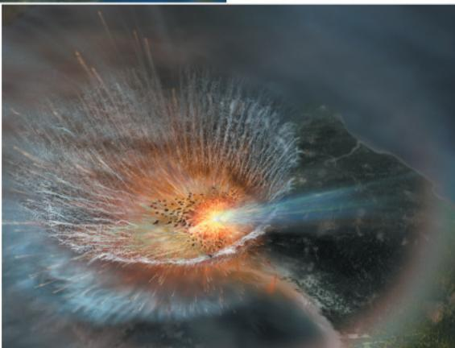

beneath sediments off the coast of Mexico (Figure 25.19). The crater is the right size to have been caused by an object with a diameter of 10 km. When the impact occurred, many species may have been particularly vulnerable to extinction because recent large-scale volcanic eruptions had already caused their populations to decline. Moreover, a 2018 study estimated that wildfires resulting from the impact contributed to a sharp rise in atmospheric $CO_{2}$ levels, causing a period of global warming that lasted 100,000 years—yet another stress for populations already in decline. Critical evaluation of these and other hypotheses for mass extinctions continues.

## Is a Sixth Mass Extinction Under Way?

As you will read further in Concept 56.1, human actions, such as habitat destruction, are modifying the global environment to such an extent that many species are threatened with extinction. More than 1,000 species have become extinct in the last 400 years. Scientists estimate that this rate is 100 to 1,000 times the typical background rate seen in the fossil record. Is a sixth mass extinction now in progress?

This question is difficult to answer, in part because it is hard to document the total number of extinctions occurring today. Tropical rain forests, for example, harbor many undiscovered species. As a result, destroying tropical forest may drive species to extinction before we even learn of them.

## Figure 25.20 Fossil extinctions and temperature.

Extinction rates increased when global temperatures were high. Temperatures were estimated using ratios of oxygen isotopes and converted to an index in which 0 is the overall average temperature.

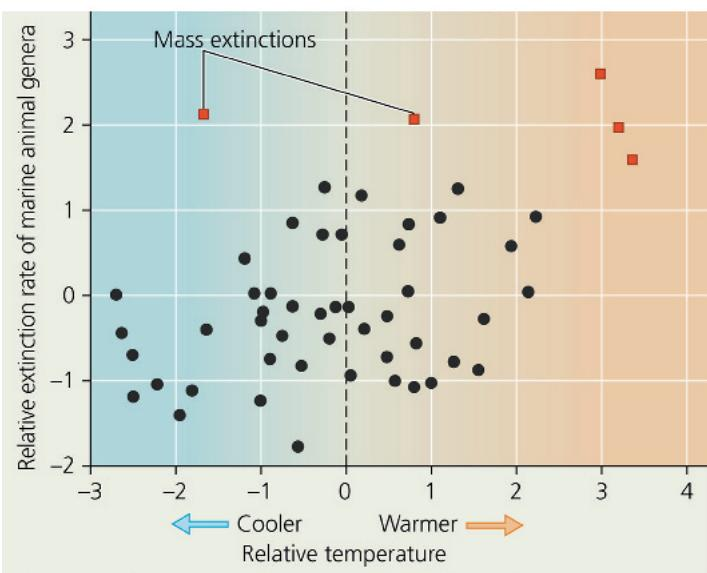

Such uncertainties make it hard to assess the full extent of the current extinction crisis. Even so, it is clear that losses to date have not reached those of the “big five” mass extinctions, in which large percentages of Earth’s species became extinct. This does not in any way discount the seriousness of today’s situation. Monitoring programs show that many species are declining at an alarming rate due to habitat loss, introduced species, overharvesting, and other factors. Recent studies on a variety of organisms, including lizards, pine trees, and polar bears, suggest that climate change may hasten some of these declines. The fossil record also highlights the potential importance of climate change: Over the last 500 million years, extinction rates have tended to increase when global temperatures were high (Figure 25.20). Overall, the evidence suggests that unless dramatic actions are taken, a sixth, human-caused mass extinction is likely to occur within the next few centuries.

## Consequences of Mass Extinctions

Mass extinctions have significant and long-term effects. By eliminating large numbers of species, a mass extinction can reduce a thriving and complex ecological community to a pale shadow of its former self. And once an evolutionary lineage disappears, it cannot reappear. The course of evolution is changed forever. Consider what would have happened if the early primates living 66 million years ago had died out in the Cretaceous mass extinction. Humans would not exist, and life on Earth would differ greatly from what it is today.

The fossil record shows that it typically takes 5–10 million years for the diversity of life to recover to previous levels after a mass extinction. In some cases, it has taken much longer than that: It took about 100 million years for the number of marine families to recover after the Permian mass extinction (see Figure 25.18). These data have sobering implications. If current trends continue and a sixth mass extinction occurs, it will take millions of years for life on Earth to recover.

Mass extinctions can also alter ecological communities by changing the types of organisms residing there. For example, after

Figure 25.21 Mass extinctions and ecology.

The Permian and Cretaceous mass extinctions (indicated by red arrows) altered the ecology of the oceans by increasing the percentage of marine genera that were predators.

the Permian and Cretaceous mass extinctions, the percentage of marine organisms that were predators increased substantially (Figure 25.21). A rise in the number of predators can increase both the risks faced by prey and the competition among predators for food. In addition, mass extinctions can curtail lineages with novel and advantageous features. For example, in the late Triassic period, a group of gastropods (snails and their relatives) arose that could drill through the shells of bivalves (such as clams) and feed on the animals inside. Although shell drilling provided access to a new and abundant source of food, this newly formed group was wiped out during the mass extinction at the end of the Triassic (about 200 million years ago). Another 120 million years passed before another group of gastropods (the oyster drills) exhibited the ability to drill through shells. As their predecessors might have done if they had not originated at an unfortunate time, oyster drills have since diversified into many new species. Finally, by eliminating so many species, mass extinctions can pave the way for adaptive radiations, in which new groups of organisms proliferate.

## Adaptive Radiations

The fossil record shows that the diversity of life has increased over the past 250 million years (see blue dashed line in Figure 25.18).

This increase has been fueled by adaptive radiations, periods of evolutionary change in which groups of organisms form many new species whose adaptations allow them to fill different ecological roles, or niches, in their communities. Large-scale adaptive radiations occurred after each of the big five mass extinctions, when survivors became adapted to the many vacant ecological niches. Adaptive radiations have also occurred in groups of organisms that possessed major evolutionary innovations, such as seeds or armored body coverings, or that colonized regions in which they faced little competition from other species.

## Worldwide Adaptive Radiations

Fossil evidence indicates that mammals underwent a dramatic adaptive radiation after the extinction of terrestrial dinosaurs 66 million years ago (Figure 25.22).

Although mammals originated about 180 million years ago, the mammal fossils older than 66 million years are mostly small and show less morphological diversity than found today. Many species appear to have been nocturnal based on their large eye sockets, similar to those in living nocturnal mammals. A few early mammals were intermediate in size, such as Repenomamus giganticus, a 1-m-long predator that lived 130 million years ago—but none approached the size of many dinosaurs. Early mammals may have been restricted in size and diversity because they were eaten or outcompeted by the larger and more diverse dinosaurs. With the disappearance of the dinosaurs (except for birds), mammals expanded greatly in both diversity and size, filling the ecological roles once occupied by terrestrial dinosaurs.

The history of life has also been greatly altered by radiations in which groups of organisms increased in diversity as they came to play entirely new ecological roles in their communities. As we'll explore in later chapters, examples include the rise of photosynthetic prokaryotes, the evolution of large predators in the Cambrian explosion, and the radiations following the colonization of land by plants, insects, and tetrapods. Each of these last three radiations was associated with major evolutionary innovations that facilitated life on land. The radiation of plants, for example, was associated with key

Figure 25.22 Adaptive radiation of mammals.  
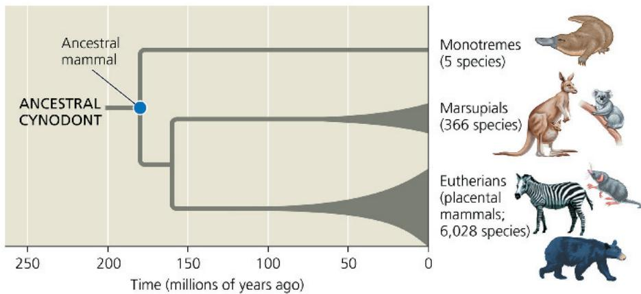

adaptations, such as stems that support plants against gravity and a waxy coat that protects leaves from water loss. Finally, organisms that arise in an adaptive radiation can serve as a new source of food for still other organisms. In fact, the diversification of plants stimulated a series of adaptive radiations in insects that ate or pollinated plants, one reason that insects are the most diverse group of animals on Earth today.

## Regional Adaptive Radiations

Striking adaptive radiations have also occurred over more limited geographic areas. Such radiations can be initiated when a few organisms make their way to a new, often distant location in which they face relatively little competition from other organisms. The Hawaiian archipelago is one of the world's great showcases of this type of adaptive radiation (Figure 25.23). Located about 3,500 km from the nearest continent, the volcanic islands are progressively older as one follows the chain toward the northwest; the youngest island, Hawaii, is less than a million years old and still has active volcanoes. Each island was born “naked” and was gradually populated by stray organisms that rode the ocean currents and winds either from far-distant land areas or from older islands of the archipelago itself. The physical diversity of each island, including immense variation in soil conditions, elevation, and rainfall, provides many opportunities for evolutionary divergence by natural selection. Multiple invasions followed by speciation events have ignited an explosion of adaptive radiation in Hawaii. As a result, thousands of species that inhabit the islands are found nowhere else on Earth. Among plants, for example, about 1,100 species are unique to the Hawaiian Islands. Unfortunately, many of these species are now facing an elevated risk of extinction due to human actions such as habitat destruction and the introduction of non-native plant species.

Figure 25.23 Adaptive radiation on the Hawaiian Islands.

Molecular analysis indicates that these remarkably varied Hawaiian plants, known collectively as the “silversword alliance,” are all descended from an ancestral tarweed that arrived on the islands from North America about 5 million years ago. Silverswords have since spread into different habitats and formed new species with strikingly different adaptations.

  
Dubautia waialealae  
Dubautia scabra  
Dubautia linearis

## Interview

Interview with Neil Shubin: Reconstructing major evolutionary events in the history of life (eTextbook only)

## Concept Check 25.4

1. Explain the consequences of plate tectonics for life on Earth.

2. What factors promote adaptive radiations?

3. WHAT IF? Based on evidence from previous mass extinctions, describe ecological and evolutionary consequences that could result if a sixth human-caused mass extinction occurs.

For suggested answers, see Appendix A.

# Concept 25.5: Major changes in body form can result from changes in the sequences and regulation of developmental genes

The fossil record tells us what the great changes in the history of life have been and when they occurred. Moreover, an understanding of plate tectonics, mass extinction, and adaptive radiation provides a picture of how those changes came about. But we can also seek to understand the intrinsic biological mechanisms that underlie changes seen in the fossil record. For this, we turn to genetic mechanisms of change, paying particular attention to genes that influence development.

## Effects of Developmental Genes

As you read in Concept 21.6, “evo-devo”—research at the interface between evolutionary biology and developmental biology—is illuminating how slight genetic differences can produce major morphological differences between species. In particular, large morphological differences can result from genes that alter the rate, timing, and spatial pattern of change in an organism’s form as it develops from a zygote into an adult.

## Changes in Rate and Timing

Many striking evolutionary transformations are the result of heterochrony (from the Greek hetero, different, and chronos, time), an evolutionary change in the rate or timing of developmental events. For example, an organism's shape depends in part on the relative growth rates of different body parts during development. Changes to these rates can alter the adult form substantially, as seen in the contrasting shapes of human and chimpanzee skulls (Figure 25.24). Other examples of the dramatic evolutionary effects of heterochrony include how increased growth rates of finger bones yielded the skeletal structure of wings in bats (see Figure 22.15) and how

## Figure 25.24 Relative skull growth rates.

In the human evolutionary lineage, mutations slowed the growth of the jaw relative to other parts of the skull. As a result, in humans the skull of an adult is more similar to the skull of an infant than is the case for chimpanzees.

Chimpanzee infant

Chimpanzee adult

Chimpanzee fetus

Chimpanzee adult

Human fetus

Human adult

slowed growth of leg and pelvic bones led to the reduction and eventual loss of hind limbs in whales (see Figure 22.20).

Heterochrony can also alter the timing of reproductive development relative to the development of nonreproductive organs. If the development of reproductive organs accelerates compared to that of other organs, the sexually mature stage of a species may retain body features that were juvenile structures in an ancestral species, a condition called paedomorphosis (from the Greek paedos, of a child, and morphosis, formation). For example, most salamander species have aquatic larvae that undergo metamorphosis in becoming adults. But some species grow to adult size and become sexually mature while retaining gills and other larval features (Figure 25.25, on the next page). Such an evolutionary alteration of developmental timing can produce animals that appear very different from their ancestors, even though the overall genetic change may be small. Indeed, recent evidence indicates that a change at a single locus was probably sufficient to bring about paedomorphosis in the axolotl salamander, although other genes may have contributed as well.

## Changes in Spatial Pattern

Substantial evolutionary changes can also result from alterations in genes that control the spatial organization of body parts. For example, master regulatory genes called homeotic genes (see Concept 18.4)

## Figure 25.25 Paedomorphosis.

The adults of some species retain features that were juvenile in ancestors. This salamander is an axolotl, an aquatic species becomes a sexually mature adult while retaining certain larval (tadpole) characteristics, including gills.

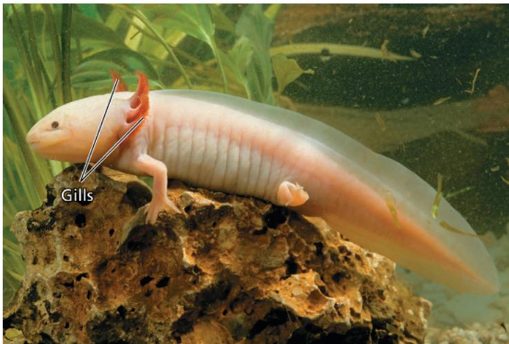

determine such basic features as where a pair of wings and legs will develop on a bird or how a plant's flower parts are arranged.

The products of one class of homeotic genes, the Hox genes, provide positional information in an animal embryo. This information prompts cells to develop into structures appropriate for a particular location. Changes in Hox genes or in how they are expressed can have a profound impact on morphology. For example, among crustaceans, a change in the location where two Hox genes (Ubx and Scr) are expressed correlates with the conversion of a swimming appendage to a feeding appendage. Similarly, when comparing plant species, changes to the expression of homeotic genes known as MADS-box genes can produce flowers that differ dramatically in form (see Concept 35.5).

## The Evolution of Development

The 560-million-year-old fossils of Ediacaran animals (see Figure 25.11) suggest that a set of genes sufficient to produce complex animals existed at least 25 million years before the Cambrian explosion. If such genes have existed for so long, how can we explain the astonishing increases in diversity seen during and since the Cambrian explosion?

Adaptive evolution by natural selection provides one answer to this question. As we've seen throughout this unit, by sorting among differences in the sequences of protein-encoding genes, selection can improve adaptations rapidly. In addition, new genes (created by gene duplication events) can take on new metabolic and structural functions, as can existing genes that are regulated in new ways.

Examples in the previous section suggest that developmental genes may have been particularly important. Thus, we'll turn next to how new morphological forms can arise from changes in the nucleotide sequences or regulation of developmental genes.

## Changes in Gene Sequence

New developmental genes arising after gene duplication events probably facilitated the origin of novel morphological forms. But since other genetic changes also may have occurred at such times, it can be difficult to establish causal links between genetic and morphological changes that occurred in the past.

This difficulty was sidestepped in a study of developmental changes associated with the divergence of six-legged insects from crustacean ancestors that had more than six legs. (As discussed in Concept 33.4, insects arose from within a subgroup of the crustaceans, the traditional name for organisms such as shrimp, crabs, and lobsters.) Crustaceans and insects differ in the pattern of expression and the effects of the Hox gene Ubx: In particular, in insects, Ubx suppresses leg formation where it is expressed (Figure 25.26).

To examine the workings of this gene, researchers cloned the Ubx gene from an insect, the fruit fly Drosophila, and from a crustacean, the brine shrimp Artemia. Next, they genetically engineered fruit fly embryos to express either the Drosophila Ubx gene or the Artemia Ubx gene throughout their bodies. The Drosophila gene suppressed 100% of the limbs in the embryos, as expected, whereas the Artemia gene suppressed only 15%.

The researchers then sought to uncover key steps involved in the evolutionary transition from an ancestral Ubx gene to an

## Figure 25.26 Effects of the Hox gene Ubx on the insect body plan.

In crustaceans, the Hox gene Ubx is expressed in the region shaded green, the body segments between the head and genital segments. In insects, Ubx is expressed in only a subset (shaded pink) of the homologous body segments, where it suppresses leg formation.

insect Ubx gene. Their approach was to identify mutations that would cause the Artemia Ubx gene to suppress leg formation, thus making its gene act more like an insect Ubx gene. To do this, they constructed a series of “hybrid” Ubx genes, each of which contained known segments of the Drosophila Ubx gene and known segments of the Artemia Ubx gene. By inserting these hybrid genes into fruit fly embryos (one hybrid gene per embryo) and observing their effects on leg development, the researchers were able to pinpoint the exact amino acid changes responsible for the suppression of additional limbs in insects. In so doing, this study provided evidence that particular changes in the nucleotide sequence of a developmental gene contributed to a major evolutionary change: the origin of the six-legged insect body plan.

## Changes in Gene Regulation

A change in the nucleotide sequence of a gene may affect its function wherever the gene is expressed, while changes in the regulation of gene expression can be limited to one cell type (see Concept 18.4). Thus, a change in the regulation of a developmental gene may have fewer harmful side effects than a change to the

sequence of the gene. This reasoning has prompted researchers to suggest that changes in the form of organisms may often be caused by mutations that affect the regulation of developmental genes—not their sequences.

This idea is supported by studies of a variety of species, including threespine stickleback fish. These fish live in the open ocean and in shallow, coastal waters. In western Canada, they also live in lakes formed when the coastline receded during the past 12,000 years. Marine stickleback fish have a pair of spines on their ventral (lower) surface, which deter some predators. These spines are often reduced or absent in stickleback fish living in lakes that lack predatory fishes and that are also low in calcium. Spines may have been lost in such lakes because they are not advantageous in the absence of predators, and the limited calcium is needed for purposes other than constructing spines.

At the genetic level, the developmental gene Pitx1 was known to influence whether stickleback fish have ventral spines. Was the reduction of spines in some lake populations due to changes in the Pitx1 gene or to changes in how the gene is expressed (Figure 25.27)? The researchers' results indicate that the regulation of gene expression has changed,

## Figure 25.27

## Inquiry: What causes the loss of spines in lake stickleback fish?

## Experiment

Marine populations of the threespine stickleback fish (Gasterosteus aculeatus) have a set of protective spines on their lower (ventral) surface; however, these spines have been lost or reduced in some lake populations of this fish. Researchers performed genetic crosses and found that most of

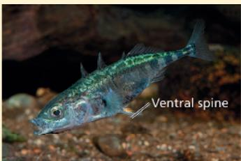  
▲ Threespine stickleback (Gasterosteus aculeatus)

the reduction in spine size resulted from the effects of a single developmental gene, Pitx1. The researchers then tested two hypotheses about how Pitx1 causes this morphological change.

Hypothesis A: A change in the DNA sequence of Pitx1 had caused spine reduction in lake populations. To test this idea, the team used DNA sequencing to compare the coding sequence of the Pitx1 gene between marine and lake stickleback populations.

Hypothesis B: A change in the regulation of the expression of Pitx1 had caused spine reduction. To test this idea, the researchers monitored where in the developing embryo the Pitx1 gene was expressed. They conducted whole-body in situ hybridization experiments (see Concept 20.2) using Pitx1 DNA as a probe to detect Pitx1 mRNA in the fish.

Results  

## Conclusion

The loss or reduction of ventral spines in lake populations of threespine stickleback fish appears to have resulted primarily from a change in the regulation of Pitx1 gene expression, not from a change in the gene's sequence.

Data from M. D. Shapiro et al., Genetic and developmental basis of evolutionary pelvic reduction in threespine sticklebacks, Nature 428:717–723 (2004).

WHAT IF? Describe the set of results that would have led researchers to the conclusion that a change in the coding sequence of the Pitx1 gene was more important than a change in regulation of gene expression.

For suggested answer, see Appendix A.

not the DNA sequence. Moreover, lake stickleback fish do express the Pitx1 gene in tissues not related to the production of spines (for example, the mouth), illustrating how morphological change can be caused by altering the expression of a developmental gene in some parts of the body but not others. In a follow-up study, researchers showed that changes to the Pel enhancer, a noncoding DNA region that affects expression of the Pitx1 gene, resulted in the reduction of ventral spines in lake sticklebacks. Overall, results from studies on stickleback fish provide a clear and detailed example of how changes in gene regulation can alter the form of individual organisms and ultimately lead to evolutionary change in populations.

## Interview

Interview with Cassandra Extavour: Studying the evolution of genes that control development (eTextbook only)

## Concept Check 25.5

1. Explain how new body forms can originate by heterochrony.

2. Why is it likely that Hox genes have played a major role in the evolution of novel morphological forms?

3. MAKE CONNECTIONS Given that changes in morphology are often caused by changes in the regulation of gene expression, predict whether noncoding DNA is likely to be affected by natural selection. (Review Concept 18.3.)

For suggested answers, see Appendix A.

## Concept 25.6: Evolution is not goal oriented

What does our study of macroevolution tell us about how evolution works? One lesson is that throughout the history of life, the origin of new species has been affected by both the small-scale factors described in Concept 23.3 (such as natural selection operating in populations) and the large-scale factors described in this chapter (such as continental drift promoting bursts of speciation throughout the globe). Moreover, to paraphrase the Nobel Prize-winning geneticist François Jacob, evolution is like tinkering—a process in which new forms arise by the modification of existing structures or existing developmental genes. Over time, such tinkering has led to the three key features of the natural world described on the opening page of Chapter 22: the striking ways in which organisms are suited for life in their environments, the many shared characteristics of life, and the rich diversity of life.

## Evolutionary Novelties

François Jacob's view of evolution harkens back to Darwin's concept of descent with modification. As new species form, novel and complex structures can arise as gradual modifications of ancestral structures. In many cases, complex structures have evolved in increments from simpler versions that performed the same basic function. For example, consider the human eye, an intricate organ constructed from numerous parts that work together in forming an image and transmitting it to the brain. How could the human eye have evolved in gradual increments? Some argue that if the eye needs all of its components to function, a partial eye could not have been of use to our ancestors.

The flaw in this argument, as Darwin himself noted, lies in the assumption that only complicated eyes are useful. In fact, many animals depend on eyes that are far less complex than our own. The simplest eyes that we know of are patches of light-sensitive photoreceptor cells. These simple eyes appear to have had a single evolutionary origin and are now found in a variety of animals, including small molluscs called limpets. Such eyes have no equipment for focusing images, but they do enable the animal to distinguish light from dark. Limpets cling more tightly to their rock when a shadow falls on them, a behavioral adaptation that reduces the risk of being eaten (Figure 25.28). Limpets have had a long evolutionary history, demonstrating that their “simple” eyes are quite adequate to support their survival and reproduction.

In the animal kingdom, complex eyes have evolved independently from such basic structures many times. Some molluscs, such as squids and octopuses, have eyes as complex as those of humans and other vertebrates (Figure 25.29). Although complex mollusc eyes evolved independently of vertebrate eyes, both evolved from a simple cluster of photoreceptor cells present in a common ancestor. In each case, the complex eye evolved through a series of steps that benefited the eyes' owners at every stage. Evidence of their independent evolution can be found in their structure: Vertebrate eyes detect light at the back layer of the retina and conduct nerve impulses toward the front, while complex mollusc eyes do the reverse.

Figure 25.28 Limpets (Patella vulgata), molluscs that can sense light and dark with a simple patch of photoreceptor cells.  

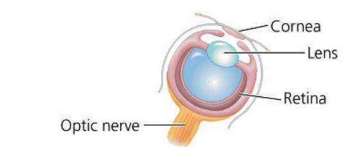  
(a) Patch of pigmented cells  
(e) Complex camera lens-type eye  
(d) Eye with primitive lens  
Figure 25.29 A range of eye complexity among molluscs.

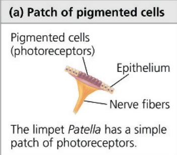

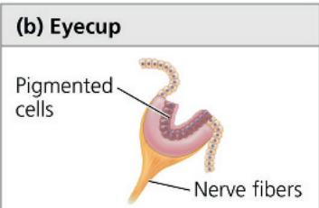  
The slit shell mollusc Pleurotomaria has an eyecup.  
(c) Pinhole camera-type eye

  
The Nautilus eye functions like a pinhole camera (an early type of camera lacking a lens).

  
The marine snail Murex has a primitive lens consisting of a mass of crystal-like cells. The cornea is a transparent region of tissue that protects the eye and helps focus light.  
The squid Loligo has a complex eye with features (cornea, lens, and retina) similar to those of vertebrate eyes. However, the squid eye evolved independently from vertebrate eyes.

Throughout their evolutionary history, eyes retained their basic function of vision. But evolutionary novelties can also arise when structures that originally played one role gradually acquire a different one. For example, as cynodonts gave rise to early mammals, bones that formerly comprised the jaw hinge (the articular and quadrate; see Figure 25.7) were incorporated into the ear region of mammals, where they eventually took on a new function: the transmission of sound (see Concept 34.6). Structures that evolve in one context but become co-opted for another function are sometimes called exaptations to distinguish them from the adaptive origin of the original structure. Note that the concept of exaptation does not imply that a structure somehow evolves in anticipation of future use. Natural selection cannot predict the future; it can only improve a structure in the context of its current utility. Novel features, such as the new jaw hinge and ear bones of early mammals, can arise gradually via a series of intermediate stages, each of which has some function in the organism's current context.

## Evolutionary Trends

What else can we learn from patterns of macroevolution? Consider evolutionary “trends” observed in the fossil record. For instance, some evolutionary lineages exhibit a trend toward larger or smaller body size. An example is the evolution of the present-day horse (genus Equus), a descendant of the 55-million-year-old Hyracotherium (Figure 25.30, on the next page). About the size of a large dog, Hyracotherium had four toes on its front feet, three toes on its hind feet, and teeth adapted for browsing on bushes and trees. In comparison, present-day horses are larger, have only one toe on each foot, and possess teeth modified for grazing on grasses.

Extracting a single evolutionary progression from the fossil record can be misleading, however; it is like describing a bush as growing toward a single point by tracing only the branches that lead to that twig. For example, by selecting certain species from the available fossils, it is possible to arrange a succession of animals intermediate between Hyracotherium and living horses that shows a trend toward large, single-toed species (follow the yellow highlighting in Figure 25.30). However, if we consider all fossil horses known today, this apparent trend vanishes. The genus Equus did not evolve in a straight line; it is the only surviving twig of an evolutionary tree that is so branched that it is more like a bush. Equus actually descended through a series of speciation episodes that included several adaptive radiations, not all of which led to large, one-toed, grazing horses. In fact, phylogenetic analyses suggest that all lineages that include grazers are closely related to Parahippus; the many other horse lineages, all of which are now extinct, remained multi-toed browsers for 35 million years.

Branching evolution can result in a real evolutionary trend even if some species counter the trend. One model of long-term trends views species as analogous to individuals: Speciation is their birth, extinction is their death, and new species that diverge from them are their offspring. In this model, just as populations of individual organisms undergo natural selection, species undergo species selection. The species that endure the longest and generate the most new offspring species determine the direction of major evolutionary trends. The species selection model suggests that “differential speciation success” plays a role in macroevolution similar to the role of differential reproductive success in microevolution. Evolutionary trends can also result directly from natural selection. For example, when horse ancestors invaded the grasslands that spread during the mid-Cenozoic, there was strong selection for grazers that could escape predators by running faster. This trend would not have occurred without open grasslands.

Whatever its cause, an evolutionary trend does not imply that there is some intrinsic drive toward a particular phenotype. Evolution is the result of the interactions between organisms and their current environments; if environmental conditions change, an evolutionary trend may cease or even reverse itself. The cumulative effect of these ongoing interactions between organisms and their environments is enormous: It is through them that the staggering diversity of life—Darwin’s “endless forms most beautiful”—has arisen.

## Figure 25.30 The evolution of horses.

Using yellow to trace a sequence of fossil horses that are intermediate in form between the present-day horse (Equus) and its Eocene ancestor Hyracotherium creates the illusion of a progressive trend toward larger size, reduced number of toes, and teeth modified for grazing. In fact, Equus is the only surviving twig of an evolutionary bush with many divergent trends.

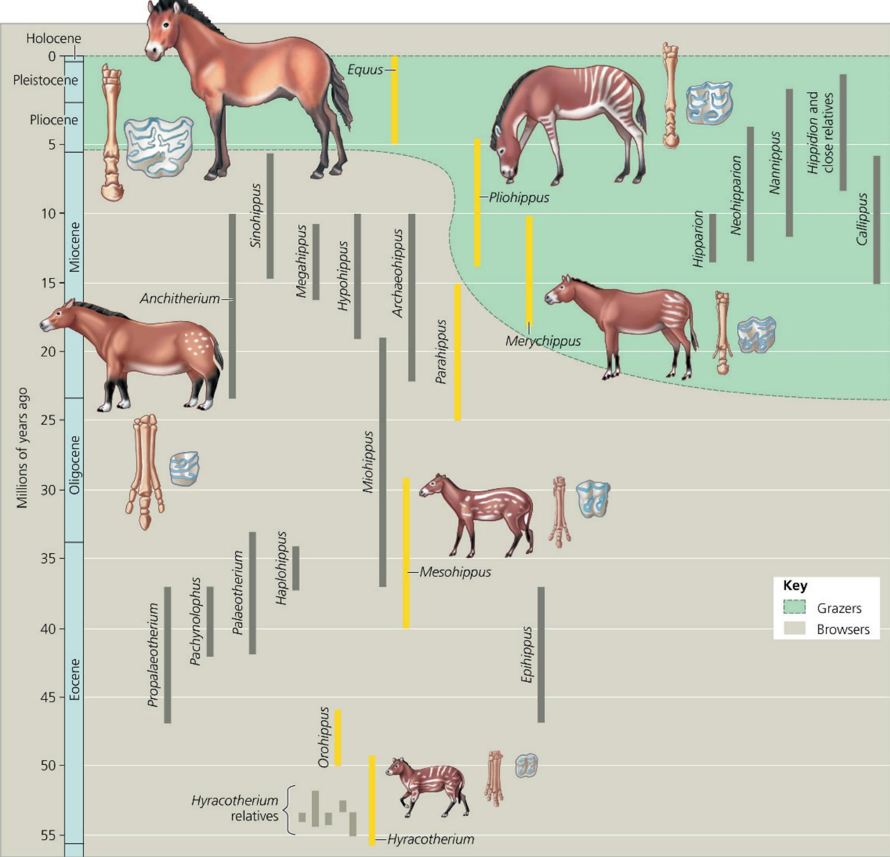

## Concept Check 25.6

1. How can the Darwinian concept of descent with modification explain the evolution of such complex structures as the vertebrate eye?

2. WHAT IF? The myxoma virus kills up to 99.8% of infected European rabbits in populations with no previous exposure to the virus. The virus is transmitted between living rabbits by mosquitoes. Describe an evolutionary trend (in either the rabbit or virus) that might occur after a rabbit population first encounters the virus.

# Chapter 25 Review

## Summary of Key Concepts

To review key terms, go to the Vocabulary Self-Quiz (eTextbook only).

## Concept 25.1: Conditions on early Earth made the origin of life possible

\- Experiments simulating possible early atmospheres have produced organic molecules from inorganic precursors. Amino acids, lipids, sugars, and nitrogenous bases have also been found in meteorites.

\- Amino acids and RNA nucleotides polymerize when dripped onto hot sand, clay, or rock. Organic compounds can spontaneously assemble into protocells, membrane-bounded droplets that have some properties of cells.

\- The first genetic material may have self-replicating, catalytic RNA. Early protocells containing such RNA would have increased through natural selection.

Describe the roles that montmorillonite clay and vesicles may have played in the origin of life.

## Concept 25.2: The fossil record documents the history of life

\- The fossil record, based largely on fossils found in sedimentary rocks, documents the rise and fall of different groups of organisms over time.

\- Sedimentary strata reveal the relative ages of fossils. The ages of fossils can be estimated by radiometric dating and other methods.

\- The fossil record shows how new groups of organisms can arise via the gradual modification of preexisting organisms.

What are the challenges of estimating the ages of old fossils? Explain how these challenges may be overcome in some circumstances.

Concept 25.3: Key events in life's history include the origins of unicellular and multicellular organisms and the colonization of land  
  
What is the "Cambrian explosion," and why is it significant?

## Concept 25.4: The rise and fall of groups of organisms reflect differences in speciation and extinction rates

\- In plate tectonics, continental plates move gradually over time, altering the physical geography and climate of Earth, leading to extinctions in some groups and speciation in others.

\- Evolutionary history has been punctuated by five mass extinctions that radically altered life's history. Possible causes for these extinctions include continental drift, volcanic activity, and impacts from asteroids.

\- Large increases in the diversity of life have resulted from adaptive radiations that followed mass extinctions. Adaptive radiations have also occurred in groups of organisms that possessed major evolutionary innovations or that colonized new regions in which there was little competition from other organisms.

Explain how the broad evolutionary changes seen in the fossil record are the cumulative result of speciation and extinction events.

## Concept 25.5: Major changes in body form can result from changes in the sequences and regulation of developmental genes

\- Developmental genes affect morphological differences between species by influencing the rate, timing, and spatial patterns of change in an organism's form as it develops into an adult.

\- The evolution of new forms can be caused by changes in the nucleotide sequences or regulation of developmental genes.

How could changes in a single gene or DNA region ultimately lead to the origin of a new group of organisms?

## Concept 25.6: Evolution is not goal oriented

\- Novel and complex biological structures can evolve through a series of incremental modifications, each of which benefits the organism that possesses it.

\- Evolutionary trends can be caused by natural selection in a changing environment or species selection, resulting from interactions between organisms and their current environments.

Explain the reasoning behind the statement "Evolution is not goal oriented." For suggested answers, see Appendix A.

## Test Your Understanding

For more multiple-choice questions, go to the Practice Test (eTextbook only).

## Levels 1-2: Remembering/Understanding

1. Fossilized stromatolites

(A) formed around deep-sea vents.

(B) resemble structures formed by bacterial communities that are found today in some shallow marine bays.

(C) provide evidence that plants moved onto land in the company of fungi around 500 million years ago.

(D) contain the first undisputed fossils of eukaryotes.

2. The oxygen revolution changed Earth's environment dramatically. Which of the following took advantage of the presence of free oxygen in the oceans and atmosphere?

(A) the evolution of cellular respiration, which used oxygen to help harvest energy from organic molecules

(B) the persistence of some animal groups in anaerobic habitats

(C) the evolution of photosynthetic pigments that protected early algae from the corrosive effects of oxygen

(D) the evolution of chloroplasts after early protists incorporated photosynthetic cyanobacteria

3. Which factor most likely caused animals and plants in India to differ greatly from species in nearby southeast Asia?

(A) The species became separated by convergent evolution.

(B) The climates of the two regions are similar.

(C) India is in the process of separating from the rest of Asia.

(D) India was a separate continent until 45 million years ago.

4. Large-scale, worldwide adaptive radiations have occurred in which of the following situations?

(A) when there are no available ecological niches (B) after each of the big five mass extinctions (C) after colonization of an isolated island that contains suitable habitat and few competitor species

(D) whenever an evolutionary innovation was needed for organisms to thrive

5. Scientists studying the origin of life have accomplished which of the following steps?

(A) abiotic synthesis of protocells with self-replicating, catalytic RNA

(B) formation of vesicles that use RNA as a template for DNA synthesis

(C) formation of protocells that use DNA to direct the polymerization of amino acids

(D) abiotic synthesis of RNA's bases (A, C, G, U)

## Levels 3-4: Applying/Analyzing

6. A genetic change that caused a certain Hox gene to be expressed along the tip of a vertebrate limb bud instead of farther back helped make possible the evolution of the tetrapod limb. This type of change is illustrative of

(A) the influence of environment on development.

(B) paedomorphosis.

(C) a change in a developmental gene or in its regulation that altered the spatial organization of body parts.

(D) heterochrony.

7. A swim bladder is a gas-filled sac that helps fish maintain buoyancy. The evolution of the swim bladder from the air-breathing organ (a simple lung) of an ancestral fish is an example of (A) exaptation.

(B) changes in Hox gene expression.

(C) paedomorphosis.

(D) adaptive radiation.

## Levels 5-6: Evaluating/Creating

8. EVOLUTION CONNECTION Describe how gene flow, genetic drift, and natural selection all can influence macroevolution.

9. SCIENTIFIC INQUIRY Herbivory (plant eating) has evolved repeatedly in insects, typically from meat-eating or detritus-feeding ancestors (detritus is dead organic matter). Moths and butterflies, for example, eat plants, whereas their “sister group” (the insect group to which they are most closely related), the caddisflies, feed on animals, fungi, or detritus. As illustrated in the following phylogenetic tree, the combined moth/butterfly and caddisfly group shares a common ancestor with flies and fleas. Like caddisflies, flies and fleas are thought to have evolved from ancestors that did not eat plants.

There are 140,000 species of moths and butterflies and 7,000 species of caddisflies. State a hypothesis about the impact of herbivory on adaptive radiations in insects. How could this hypothesis be tested?

10. WRITE ABOUT A THEME: ORGANIZATION You have seen many examples of how form fits function at all levels of the biological hierarchy. However, we can imagine forms that would function better than some forms actually found in nature. For example, if the wings of a bird were not formed from its forelimbs, such a hypothetical bird could fly yet also hold objects with its forelimbs. In a short essay (100–150 words), use the concept of “evolution as tinkering” to explain why there are limits to the functionality of forms in nature.

## 11. SYNTHESIZE YOUR KNOWLEDGE

In 2010, the Soufriere Hills volcano on the Caribbean island of Montserrat erupted violently, spewing huge clouds of ash and gases into the sky. Explain how the volcanic eruptions at the end of the Permian period and the formation of Pangaea, both of which occurred about 252 million years ago, set in motion events that altered evolutionary history.

For selected answers, see Appendix A.

# Explore Scientific Papers with Science in the Classroom | AAAS

How has adaptive evolution occurred in stickleback fish? Go to "What the Pelvis Can Teach Us about Evolution" at www.scienceintheclassroom.org.

Instructors: Questions can be assigned in Mastering Biology.

# Unit 5 The Evolutionary History of Biological Diversity

An Interview with Casey Dunn

Dr. Casey Dunn is Professor at Yale University in the Department of Ecology and Evolutionary Biology as well as Curator in the Division of Invertebrate Zoology at Yale's Peabody Museum. He earned his BS in Biology at Stanford University and his MS and PhD at Yale University, and his lab currently uses a combination of field and lab techniques—including genomic tools—to answer questions about the root of the animal tree of life and how evolution has shaped animal body plans. Because his study subjects are often fragile gelatinous zooplankton that cannot readily be sampled with nets, he has used scuba diving and scientific submersibles to observe and collect specimens.

## How did you get interested in biology and eventually in your current area of research?

My dad was a miner, and he would take me out into the mountains, showing me various rocks and explaining to me how the landscape worked. It was exciting to be outside and to see this order in the beauty of the world. Later, I worked as a tour guide in the Amazon forest for a year before college, and I found myself drawn to the incredible diversity of questions in biology.

In graduate school, I became fascinated by siphonophores (drifting colonial animals that are closely related to jellyfish). Humans each have one body that grows from a single cell and carries out different tasks. But siphonophores are an example of a different way a large, complex animal can form—not by growing one multitasking body as we do, but by adding bodies. If humans were siphonophores, once a baby was born, it would just start budding more babies out of its side and those babies would be specialized for different tasks, like moving all the babies around or feeding. My PhD work described how siphonophores grow, and how various siphonophore species are related.

Since then I've worked on a variety of research questions; I describe myself as an evolutionary biologist who uses the diversity of animals to study general questions about the process of evolution. We're at this exciting time in biology where the questions that drove the field for a century or more suddenly are becoming easier to study. In my lab, I can one day be observing a species in the field or under a microscope and another day be poring through its genome and looking at every one of its base pairs. And researchers are developing better computational tools to analyze it all.

The siphonophores (a) Physalia physalis and (b) Marrus orthocanna, colonial invertebrates studied in Dr. Dunn's lab.

"I can one day be observing a species in the field or under a microscope and another day be poring through its genome."

## What are some exciting recent discoveries about the evolutionary history of animals?

I think there has been an absolute ground shift in the way we think about the diversity of life and evolution. People used to think that there were a lot of simple “lower organisms” and a smaller number of “higher organisms” that had become big and complex. But this approach is based on the idea that the higher organisms have all the better traits that the lower organisms are missing out on, almost like the lower organisms didn’t win the “prize.” In fact, these so-called lower organisms are incredibly abundant and successful. Organisms can become well suited to their environment in a variety of ways; for example, traits are not only gained over the course of

  
Dr. Casey Dunn

evolution, but in many cases may be lost. For instance, many animals don't have a brain, including some that are descendants of animals that had a brain (such as sea urchins and tunicates; see Figure 33.2). Yet, these brainless animals function very well without one; a brain probably presented greater costs than benefits for their lifestyle, so over time it likely became more and more reduced through natural selection. Phylogenetics research has led to the realization that organisms didn't simply evolve in a stepwise accumulation of complex traits. Rather, traits were gained and lost across the entire tree, and we have to change our perspective to see each organism as it is rather than, say, as an incomplete human.

## Why is it important for people who aren't planning a career in biology to learn about evolution, phylogeny, and biodiversity?

It would be impossible to understand human biology without understanding the biology of other organisms. For example, we learned how DNA works based on early studies on bacteria and the cell cycle due to work in yeast. We understand human congenital developmental issues from studying the development of mice and of flies. We also need to know how those other species are related to humans and understand their evolutionary history in order to know which similarities and differences across the organisms are relevant to human biology. In addition, humans don't live in a biological vacuum. The complex diseases and major challenges that are going to be facing us in coming decades have to do with our interactions with the world around us. If we're going to have clean air and water and healthy food, it's imperative that we understand the biology of other organisms. Thinking about organisms in the appropriate evolutionary context helps us understand and predict how species, including humans, are likely to respond to our changing environment.

# Phylogeny and the Tree of Life

## Key Concepts

26.1 Phylogenies show evolutionary relationships

26.2 Phylogenies can be used to understand shared characters

26.3 Phylogenies are inferred from morphological and molecular data

26.4 An organism's evolutionary history is documented in its genome

26.5 Molecular clocks help track evolutionary time

26.6 New information continues to improve our understanding of evolutionary history

  
Figure 26.1 Although this animal resembles a snake, it is actually a legless lizard: the glass lizard Ophisaurus apodus. Why isn't the glass lizard considered a snake? Biologists based this decision in part on a comparison of its traits with those of snakes—and the glass lizard does not have a highly mobile jaw or many vertebrae, two traits shared by all snakes.

## Study Tip

Label a drawing: The members of a sister group are each other's closest relatives, making sister groups a useful way to describe evolutionary relationships. As in this example, identify the sister groups associated with each branch point in Figures 26.8, 26.9, 26.10, and 26.12.

## How do biologists distinguish and categorize the millions of species on Earth?

Traits shared due to common ancestry are used to classify organisms into groups that reflect their evolutionary history:

## Concept 26.1: Phylogenies show evolutionary relationships

The glass lizard in Figure 26.1 is part of the continuum of life extending from the earliest organisms to the great variety of species alive today. In this unit, we will survey this diversity and describe hypotheses regarding how it evolved.

To set the stage for surveying life's diversity, in this chapter we consider how biologists trace phylogeny, the evolutionary history of a species or group of species. A phylogeny of lizards and snakes, for example, indicates that both glass lizards and snakes evolved from lizards with legs—but they evolved from different lineages of legged lizards (Figure 26.2). Thus, it appears that their legless conditions evolved independently. As we'll see, biologists reconstruct phylogenies like that in Figure 26.2 using systematics, a discipline focused on classifying organisms and determining their evolutionary relationships. We'll begin by describing how organisms are named and classified.

## Binomial Nomenclature

Common names for organisms—such as monkey, finch, and lilac—convey meaning in casual usage, but they can also cause confusion. Each of these names, for example, refers to more than one species. Moreover, some common names do not accurately reflect the kind of organism they signify. Consider these three “fishes”: jellyfish (a cnidarian), crayfish (a small, lobsterlike crustacean), and silverfish (an insect). And, of course, a given organism has different names in different languages.

To avoid ambiguity when communicating about their research, biologists refer to organisms by Latin scientific names. The two-part format of the scientific name, commonly called a binomial, was instituted in the 18th century by Carolus Linnaeus (see Concept 22.1). The first part of a binomial is the name of the genus (plural, genera) to which the species belongs. The second part, called the specific epithet, is unique for each species within

Figure 26.2 Convergent evolution of limbless bodies.

A phylogeny based on DNA sequence data reveals that a legless body form evolved independently from legged ancestors in the lineages leading to glass lizards and to snakes.

  
Figure 26.3 Linnaean classification.

the genus. An example of a binomial is Panthera pardus, the scientific name for the leopard. Notice that the first letter of the genus is capitalized and the entire binomial is italicized. (Newly created scientific names are also “latinized”: You can name an insect you discover after a friend, but you must add a Latin ending.) Many of the more than 11,000 binomials assigned by Linnaeus are still used today, including the optimistic name he gave our own species—Homo sapiens, meaning “wise man.”

## Hierarchical Classification

In addition to naming species, Linnaeus also grouped them into a hierarchy of increasingly inclusive categories. The first grouping is built into the binomial: Species that appear to be closely related are grouped into the same genus. For example, the leopard (Panthera pardus) belongs to a genus that also includes the African lion (Panthera leo), the tiger (Panthera tigris), and the jaguar (Panthera onca). Beyond genera, biologists employ progressively more comprehensive categories of classification (Figure 26.3). The classification system named after Linnaeus, the Linnaean system, places related genera in the same family, families into orders,

At each level, or “rank,” species are placed in groups within more inclusive groups.

<!-- END OFFICIAL MINERU API RESULT part_06 -->

<!-- BEGIN OFFICIAL MINERU API RESULT part_07 -->

orders into classes, classes into phyla (singular, phylum), phyla into kingdoms, and, more recently, kingdoms into domains. The resulting biological classification of a particular organism is somewhat like a postal address identifying a person in a particular apartment, in a building with many apartments, on a street with many apartment buildings, in a city with many streets, and so on.

The named group at any level of the hierarchy is called a taxon (plural, taxa). In the leopard example, Panthera is a taxon at the genus level, and Mammalia is a taxon at the class level that includes all the many orders of mammals. Note that in the Linnaean system, taxa broader than the genus are not italicized, though they are capitalized.

Classifying species is a way to structure our human view of the world. We lump together various species of trees to which we give the common name of pines and distinguish them from other trees that we call firs. Systematists have decided that pines and firs are different enough to be placed in separate genera, yet similar enough to be grouped into the same family, Pinaceae. As with pines and firs, higher levels of classification are usually defined by particular characters chosen by systematists. However, characters that are useful for classifying one group of organisms may not be appropriate for other organisms. For this reason, the larger categories often are not comparable between lineages; that is, an order of snails does not exhibit the same degree of morphological or genetic diversity as an order of mammals. As we'll see, the historical placement of species into orders, classes, and so on also does not necessarily reflect evolutionary history. Taxonomy is always a “work in progress” as we continue to learn more about evolutionary relationships.

## Linking Classification and Phylogeny

The evolutionary history of a group of organisms can be represented in a branching diagram called a phylogenetic tree. As in Figure 26.4, the branching pattern often matches how systematists have classified groups of organisms nested within more inclusive groups. Sometimes, however, systematists have placed a species within a genus (or other group) to which it is not most closely related. One reason for such a mistake might be that over the course of evolution, a species has lost a key feature shared by its close relatives. If DNA or other new evidence indicates that an organism has been misclassified, the organism may be reclassified to accurately reflect its evolutionary history. Another issue is that while the Linnaean system may distinguish groups, such as amphibians, mammals, reptiles, and other classes of vertebrates, it tells us nothing about these groups' evolutionary relationships to one another.

Such difficulties in aligning Linnaean classification with phylogeny have led many systematists to propose that classification be based entirely on evolutionary relationships. In such systems, names are assigned only to groups that include a common ancestor and all of its descendants. Using this approach, some commonly recognized groups become part of other groups previously at the same level of the Linnaean system. For example, because birds evolved from a group of reptiles, Aves (the Linnaean class to which birds are assigned) is considered a subgroup of Reptilia (also a class in the Linnaean system).

Figure 26.4 The connection between classification and phylogeny.

Hierarchical classification can reflect the branching patterns of phylogenetic trees. This tree shows evolutionary relationships between some of the taxa within order Carnivora, itself a branch of class Mammalia.

## Phylogenetic Trees are Tools Inferred from Data

Regardless of how groups are named, a phylogenetic tree represents a hypothesis about evolutionary relationships. These relationships often are depicted as a series of dichotomies, or two-way branch points. Each branch point represents the common ancestor of the two evolutionary lineages diverging from it. An evolutionary lineage is a sequence of ancestral organisms leading to a particular descendant taxon. Figure 26.5 illustrates these elements of a phylogenetic tree and offers more tips on interpreting these diagrams.

Each tree in Figure 26.5 has a branch point that represents the common ancestor of chimpanzees and humans. Chimps and humans are an example of sister taxa, groups of organisms that share an immediate common ancestor that is not shared by any other group. Note that there is a sister group associated with each branch point in a tree (since each branch point represents the common ancestor of the two lineages diverging at that point).

The members of a sister group are each other's closest relatives, making sister groups a useful way to describe the evolutionary relationships shown in a tree. For example, in Figure 26.5, the evolutionary lineage leading to lizards shares an immediate common ancestor with the lineage leading to chimpanzees and humans. Thus, we can describe this portion of the tree by saying that lizards are the sister taxon to a group consisting of chimpanzees and humans.

As also discussed in Figure 26.5, the branches of a tree can be rotated around branch points without changing the relationships shown in the tree. That is, the order in which the taxa appear at the right side of the tree does not represent a sequence of evolution—in this case, it does not imply a sequence leading from fishes to humans.

# Visualizing Phylogenetic Relationships

## Figure 26.5 For suggested answers, see Appendix A.

A phylogenetic tree visually represents a hypothesis of how a group of organisms are related. This figure explores how the way a tree is drawn conveys information.

## Parts of a Phylogenetic Tree

This tree shows how the five groups of organisms at the tips of the branches, called taxa, are related. Each branch point represents the common ancestor of the evolutionary lineages diverging from it.

This branch point represents the common ancestor of all the animal groups shown in this tree.

1. According to this tree, which group or groups of organisms are most closely related to frogs?

2. Label the part of the diagram that represents the most recent common ancestor of frogs and humans.

Instructors: Additional questions related to this Visualizing Figure can be assigned in Mastering Biology.

Each horizontal branch represents an evolutionary lineage. The length of the branch is arbitrary unless the diagram specifies that branch lengths represent information such as time or amount of genetic change.

Each position along a branch represents an ancestor in the lineage leading to the taxon named at the tip.

Chimps and humans are an example of sister taxa, groups of organisms that share a common ancestor that is not shared by any other group. The members of a sister group are each other's closest relatives.

## Alternative Forms of Tree Diagrams

These diagrams are referred to as "trees" because they use the visual analogy of branches to represent evolutionary lineages diverging over time. In this text, trees are usually drawn horizontally, as shown above, but the same tree can be drawn vertically or diagonally without changing the relationships it conveys.

Vertical tree

Fishes Frogs Lizards Chimps Humans

3. How many sister taxa are shown in these two trees? Identify them.

4. Redraw the horizontal tree in Figure 26.2 as a vertical tree and a diagonal tree.

Diagonal tree

## Rotating Around Branch Points

Rotating the branches of a tree around a branch point does not change what they convey about evolutionary relationships. As a result, the order in which taxa appear at the branch tips is not significant. What matters is the branching pattern, which signifies the order in which the lineages have diverged from common ancestors.

Note: The order of the taxa does NOT represent a sequence of evolution "leading to" the last taxon shown (in this tree, humans).

If you rotate the branches of the tree at left around the three blue points, the result is the tree at right.

5. Redraw the tree above, rotating around the green branch point. Identify the two closest relatives of humans as shown in each of the three trees. Explain your answer.

This tree, like all of the phylogenetic trees in this book, is rooted, which means that a branch point within the tree (often drawn farthest to the left) represents the most recent common ancestor of all taxa in the tree. A lineage that diverges from all other members of its group early in the history of the group is referred to as the sister group to the rest of the tree. This lineage shares the same common ancestor as the rest of the group. Hence, the fishes in Figure 26.5 would be considered the sister group to all the other vertebrates. Note that the lineages that stem from the common ancestor originated at the same point in time and thus have been evolving for the same length of time. In this case, be careful to not interpret the fishes as “more primitive” or “less evolved” than the rest of the taxa on the tree; rather, they are just less closely related to the other taxa.

What other key points do we need to keep in mind when interpreting phylogenetic trees? First, they are intended to show patterns of descent, not phenotypic similarity. Although closely related organisms often resemble one another due to their common ancestry, they may not if their lineages have evolved at different rates or faced very different environmental conditions. For example, even though crocodiles are more closely related to birds than to lizards (see Figure 22.17), they look more like lizards because morphology has changed dramatically in the bird lineage. Phylogenies show a hypothesized pattern of descent that is inferred from data, often molecular genetic sequence similarity.

Second, we cannot necessarily infer the ages of the taxa or branch points shown in a tree. For example, the tree in Figure 26.5 does not indicate that chimpanzees evolved before humans. Rather, the tree shows only that chimpanzees and humans share a recent common ancestor, but we cannot tell when that ancestor lived or when the first chimpanzees or humans arose. Generally, unless we are given specific information about what the branch lengths in a tree mean—for example, that they are proportional to time—we should interpret the diagram solely in terms of patterns of descent. No assumptions should be made about when particular species evolved or how much change occurred in each lineage.

Third, we should not assume that a taxon on a phylogenetic tree evolved from the taxon next to it. Figure 26.5 does not indicate that humans evolved from chimpanzees or vice versa. We can infer only that the lineage leading to humans and the lineage leading to chimpanzees both evolved from a recent common ancestor. That ancestor, which is now extinct, was neither a human nor a chimpanzee.

Finally, remember that a phylogeny is a hypothesis about our understanding of the evolutionary relationships among the members of a group. Some parts of a phylogeny may be more resolved than others; that is, there may be more evidence supporting those branch points compared to others. Systematists often illustrate uncertainty about a given branch point by drawing it as a polytomy: more than two lineages stemming from a single branch point (see Figure 26.21). This does not mean that all of these lineages are “equally related” to each other, but rather that the pattern of divergence is unclear.

## Applying Phylogenies

Understanding phylogeny can have practical applications. Consider maize (corn), which originated in the Americas and is now an important food crop worldwide. From a phylogeny of maize based on DNA data, researchers have identified two species of wild grasses that may be maize's closest living relatives. These two close relatives may be useful as “reservoirs”

of beneficial alleles that can be transferred to cultivated maize by cross-breeding or genetic engineering.

A different use of phylogenetic trees is to infer species identities by analyzing the relatedness of DNA sequences from different organisms. Researchers have used this approach to investigate whether “whale meat” had been harvested illegally from whale species protected under international law rather than from species that can be harvested legally (Figure 26.6).

How do researchers construct phylogenetic trees like those we've considered here? In the next section, we'll begin to answer that question by examining the data used to determine phylogenies.

## Figure 26.6

## Inquiry: What is the species identity of food being sold as whale meat?

## Experiment

C. S. Baker and S. R. Palumbi purchased 13 samples of “whale meat” from Japanese fish markets. They sequenced part of the mitochondrial DNA (mtDNA) from each sample and compared their results with the comparable mtDNA sequence from known whale species. To infer the species identity of each sample, the team constructed a gene tree, a phylogenetic tree that shows patterns of relatedness among DNA sequences rather than among taxa.

## Results

Of the species in the resulting gene tree, only Minke whales caught in the Southern Hemisphere can be sold legally in Japan.

## Conclusion

This analysis indicated that mtDNA sequences of six of the unknown samples (in red) were most closely related to mtDNA sequences of whales that are not legal to harvest.

Data from C. S. Baker and S. R. Palumbi, Which whales are hunted? A molecular genetic approach to monitoring whaling, Science 265:1538–1539 (1994). Reprinted with permission from AAAS.

WHAT IF? What different results would have indicated that all of the whale meat had been harvested legally?
For suggested answer, see Appendix A.

## Concept Check 26.1

1. VISUAL SKILLS Based on the tree in Figure 26.4, are leopards more closely related to badgers or wolves, or are they equally related to these two species? Explain.

2. VISUAL SKILLS Which of the trees shown here depicts an evolutionary history different from the other two? Explain.

  
3. DRAW IT The bear family (Ursidae) is more closely related to the badger/otter family (Mustelidae) than to the dog family (Canidae). Use this information to redraw Figure 26.4.

For suggested answers, see Appendix A.

# Concept 26.2: Phylogenies can be used to understand shared characters

Phylogenies are powerful tools that equip biologists to categorize and analyze the diversity of life. A phylogeny can help us to understand how we group organisms and how their traits have evolved.

## Cladistics

In the approach to systematics called cladistics, common ancestry is the primary criterion used to classify organisms. Using this methodology, biologists attempt to place species into groups called clades, each of which includes an ancestral species and all of its descendants. Clades, like the categories of the Linnaean system, are nested within larger clades. In Figure 26.4, for example, the cat group (Felidae) represents a clade within a larger clade (Carnivora) that also includes the dog group (Canidae).

A taxon is considered a clade only if it is monophyletic (from the Greek, meaning “single tribe”), signifying that it consists of an ancestral species and all of its descendants (Figure 26.7a). Contrast this with a paraphyletic (“beside the tribe”) group, which consists of an ancestral species and some, but not all, of its descendants (Figure 26.7b), or a polyphyletic (“many tribes”) group, which includes distantly related species but does not include their most recent common ancestor (Figure 26.7c).

Note that in a paraphyletic group, the most recent common ancestor of all members of the group is part of the group, whereas in a polyphyletic group the most recent common ancestor is not part of the group. For example, a group consisting of even-toed ungulates (hippopotamuses, deer, and their relatives) and their common ancestor is paraphyletic because it does not include cetaceans (whales, dolphins, and porpoises), which descended from that ancestor (Figure 26.8). In contrast, a group consisting of seals and cetaceans (based on their similar body forms) is polyphyletic because it does not include the common ancestor of seals and cetaceans. Biologists avoid defining such polyphyletic groups; if new evidence indicates that an existing group is polyphyletic, its members are reclassified.

## Shared Ancestral and Shared Derived Characters

As a result of descent with modification, organisms have characters they share with their ancestors, and they also have characters that differ from those of their ancestors. For example, all mammals have backbones, but a backbone does not distinguish mammals from other vertebrates because all vertebrates have backbones. The backbone predates the divergence of mammals from other vertebrates. Thus for mammals, the backbone is a shared ancestral character, a character that originated in an ancestor of the taxon. In contrast, hair is a character shared by all mammals but not found in their ancestors. Thus, in mammals, hair is considered a shared derived character, an evolutionary novelty unique to a clade. Note that a shared derived character can in some cases refer to the loss of a feature, such as the loss of limbs in snakes or whales. Also, keep in mind that it is a relative matter whether a character is considered ancestral or derived. A backbone can also qualify as

Figure 26.7 Monophyletic, paraphyletic, and polyphyletic groups.  
  
Group I, consisting of three species (A, B, C) and their common ancestor 1, is a monophyletic group (clade), meaning that it consists of an ancestral species and all of its descendants.

  
Group II is paraphyletic, meaning that it consists of an ancestral species ② and some of its descendants (species D, E, F) but not all of them (does not include species G).

  
Group III, consisting of four species (A, B, C, D), is polyphyletic, meaning that the most recent common ancestor ③ of its members is not part of the group.

Figure 26.8 Paraphyletic versus polyphyletic groups.  
  
This group is polyphyletic because it does not include the most recent common ancestor of its members.

DRAW IT Circle the branch point that represents the most recent common ancestor of cetaceans and seals. Explain why that ancestor would not be part of a cetacean–seal group defined by similar body form.
For suggested answer, see Appendix A.

a shared derived character, but only at a deeper branch point that distinguishes all vertebrates from other animals.

## Mapping Characters on a Phylogeny

Shared derived characters are unique to particular clades. We can visualize this by mapping the characters onto a phylogeny. To give an example of this approach, consider the set of characters shown in Figure 26.9a for each of five vertebrates—a leopard, turtle, frog, bass, and lamprey (a jawless aquatic vertebrate). As a basis of comparison, we need to select an outgroup. An outgroup is a species or group of species from an evolutionary lineage that is closely related to but not part of the group of species that we are studying (the ingroup). Note that the outgroup and the ingroup would be considered sister taxa. A suitable outgroup for any given comparison can be determined based on evidence from morphology, paleontology, embryonic development, and gene sequences. An appropriate outgroup for our example is the lancelet, a small animal that lives in mudflats and (like vertebrates) is a member of the more inclusive group called the chordates. Unlike the vertebrates, however, the lancelet does not have a backbone.

If a character is found in both the outgroup and the ingroup, it is ancestral. If a character only occurs in a subset of the ingroup, we infer that the character arose in the lineage leading to those members of the ingroup, and it is labeled on the tree with a hatch mark.

By comparing members of the ingroup with each other and with the outgroup, we can determine which characters were derived (that is, evolved independently) at the various branch points of vertebrate evolution. In our example, all of the vertebrates in the ingroup have backbones: This character was present in the ancestral vertebrate, but not in the outgroup. Note that hinged jaws are absent in the outgroup and in lampreys, but present in all other members of the ingroup. This indicates that hinged jaws arose in a lineage leading to all members of the ingroup except lampreys.

Figure 26.9 Mapping characters onto a phylogeny.  
The characters used here include the amnion, a membrane that encloses the embryo inside a fluid-filled sac (see Figure 34.26).  
  
(a) Character table. A 0 indicates that a character is absent; a 1 indicates that a character is present.

  
(b) Phylogenetic tree. The character table in (a) leads to the phylogenetic mapping shown on this tree.

Proceeding in this way, we can visualize the evolution of key traits across the span of vertebrate evolution (Figure 26.9b).

## Phylogenetic Trees as Hypotheses

This is a good place to reiterate that any phylogenetic tree represents a hypothesis about how the organisms in the tree are related to one another. The best hypothesis is the one that best fits all the available data. A phylogenetic hypothesis may be modified when new evidence compels systematists to revise their trees. Indeed, while many older phylogenetic hypotheses have been supported by new data, others have been changed or rejected.

Thinking of phylogenies as hypotheses also allows us to use them in a powerful way: We can make and test predictions based on the assumption that a particular phylogeny—our hypothesis—is correct. For example, in an approach known as phylogenetic bracketing, we can predict that features shared by two groups of closely related organisms are present in their common ancestor and all of its descendants unless independent data indicate otherwise. (Note that “prediction” can refer to unknown past events as well as to evolutionary changes yet to occur.)

This approach has been used to make novel predictions about dinosaurs. For example, there is evidence that birds descended from the theropods, a group of bipedal dinosaurs. As seen in Figure 26.10, the closest living relatives of birds are crocodiles. Birds and crocodiles share numerous features: They have four-chambered hearts, they “sing” to defend territories and attract mates (although a crocodile’s “song” is more like a bellow), and they build nests. Both birds and crocodiles also care for their eggs by warming them. Birds warm their eggs by sitting on them, whereas crocodiles cover their eggs with their neck or with sand or vegetation. Reasoning that any feature shared by birds and crocodiles is likely to have been present in their common ancestor (denoted by the blue dot in Figure 26.10) and all of its descendants, biologists predicted that dinosaurs had four-chambered hearts, sang, built nests, and cared for their eggs.

Internal organs, such as the heart, rarely fossilize, and it is, of course, difficult to test whether dinosaurs sang to defend territories and attract mates. However, fossil discoveries have supported the

Figure 26.10 A phylogenetic tree of birds and their close relatives. (A dagger, †, indicates extinct lineages.)  
  
VISUAL SKILLS In this tree diagram, what is the sister taxon of the clade that includes dinosaurs and their most recent common ancestor? Explain. For suggested answer, see Appendix A.

Figure 26.11 Fossil support for a phylogenetic prediction: Dinosaurs built nests and cared for their eggs.

  
(a) Fossil remains of Oviraptor and eggs. The orientation of the bones, which surround and cover the eggs, suggests that the dinosaur died while incubating or protecting its eggs.  
(b) Artist's reconstruction of the dinosaur's posture on its nest based on the fossil findings.

prediction that dinosaurs built nests and cared for their eggs. First, a fossil embryo of an Oviraptor dinosaur was found, still inside its egg. This egg was identical to those found in another fossil, one that showed an Oviraptor crouching over a group of eggs in a posture similar to how birds sit on their nests today (Figure 26.11). Researchers suggested that the Oviraptor dinosaur preserved in this second fossil died while incubating or protecting its eggs. The broader conclusion that emerged from this work—that dinosaurs built nests and cared for their eggs—has since been strengthened by additional fossil discoveries that show that other species of dinosaurs built nests and sat on their eggs. Finally, by supporting predictions based on the phylogenetic hypothesis shown in Figure 26.10, fossil discoveries of nests and parental care in dinosaurs provide independent data that suggest that the hypothesis is correct.

## Phylogenetic Trees with Proportional Branch Lengths

In the phylogenetic trees we have presented so far, the lengths of the tree's branches do not indicate the degree of evolutionary change in each lineage. Furthermore, the chronology represented by the branching pattern of the tree is relative (earlier versus later) rather than absolute (how many millions of years ago). But in some tree diagrams, branch lengths are proportional to the amount of evolutionary change or to the times at which particular events occurred.

Figure 26.12 Branch lengths can represent genetic change. This tree was based on sequences of homologs of a gene that plays a role in development; Drosophila was used as an outgroup. Branch lengths are proportional to the amount of genetic change in each lineage; varying branch lengths indicate that the gene has evolved at different rates in different lineages.

  
INTERPRET THE DATA In which vertebrate lineage has the studied gene evolved most rapidly? Explain.

In Figure 26.12, for example, each branch length of the phylogenetic tree reflects the number of changes that have taken place in a particular DNA sequence in that lineage. Note that the total length of the horizontal lines from the base of the tree to the mouse is less than that of the line leading to the fruit fly, Drosophila. This indicates that fewer genetic changes have occurred in the mouse lineage than in the Drosophila lineage. In addition, because the mouse and fly lineages have evolved for an equal amount of time after they diverged from a common ancestor, the rate of change was lower in mouse lineage than in the Drosophila lineage.

In general, although the branches of a phylogenetic tree may have different lengths, among organisms alive today, all the different lineages that descend from a common ancestor have survived for the same number of years. To take an extreme example, humans and bacteria had a common ancestor that lived over 3 billion years ago. Fossils and genetic evidence indicate that this ancestor was a single-celled prokaryote. Even though bacteria have apparently changed little in their morphology since that common ancestor, there have nonetheless been 3 billion years of evolution in the bacterial lineage, just as there have been 3 billion years of evolution in the lineage that ultimately gave rise to humans.

These equal spans of chronological time can be represented in a phylogenetic tree whose branch lengths are proportional to time (Figure 26.13). Such a tree draws on fossil data to place branch points in the context of geologic time. Additionally, it is possible to combine these two types of trees by labeling branch points with information about rates of genetic change or dates of divergence.

## Maximum Parsimony and Maximum Likelihood

As the database of DNA sequences that enables us to study more species grows, the difficulty of building the phylogenetic tree that best describes their evolutionary history also grows. What if you are analyzing data for 50 species? There are $3 \times 10^{76}$ different ways to arrange 50 species into a tree! And which tree in this huge forest reflects the true phylogeny? Systematists can never be sure of finding the most accurate tree in such a large data set, but they can narrow the possibilities by applying the principles of maximum parsimony and maximum likelihood.

According to the principle of maximum parsimony, we should first investigate the simplest explanation that is consistent with the facts. (The parsimony principle is also called “Occam’s razor” after William of Occam, a 14th-century English philosopher who advocated solving problems by “shaving away” unnecessary complications.) In the case of trees based on morphology, the most parsimonious tree requires the fewest evolutionary events, as measured by the origin of shared derived morphological characters. For phylogenies based on DNA, the most parsimonious tree requires the fewest base changes.

A maximum likelihood approach identifies the tree most likely to have produced a given set of DNA data based on certain probability rules about how DNA sequences change over time. For example, the underlying probability rules could be based on the assumption that all nucleotide substitutions are equally likely. If

Figure 26.13 Branch lengths can indicate time.

This tree is based on the same DNA data as that in Figure 26.12, but here the branch points are dated based on fossil evidence. Thus, the branch lengths are proportional to time. Each lineage has the same total length from the base of the tree to the branch tip, indicating that all the lineages have diverged from the common ancestor for equal amounts of time.

6 events

Species I

evidence suggests that this assumption is not correct, more complex rules could be devised to account for different rates of change among different nucleotides or at different positions in a gene.

Scientists have developed many computer programs to search for trees that are parsimonious and likely. When a large amount of accurate data is available, the methods used in these programs usually yield similar trees. As an example of one method, Figure 26.14 walks you through the process of identifying the most parsimonious molecular tree for a three-species problem. Computer programs use the principle of parsimony to estimate

## Figure 26.14

## Research method: applying parsimony to a problem in molecular systematics

## Application

In considering possible phylogenies for a group of species, systematists compare molecular data for the species. An efficient way to begin is by identifying the most parsimonious hypothesis—the one that requires the fewest evolutionary events (molecular changes) to have occurred.

1 First, draw the three possible trees for the species. (Although only three trees are possible when ordering three species, the number of possible trees increases rapidly with the number of species: There are 15 trees for four species and 34,459,425 trees for 10 species.)

2 Tabulate the molecular data for the species. In this simplified example, the data represent a DNA sequence consisting of just four nucleotide bases. Data from several outgroup species (not shown) were used to infer the ancestral DNA sequence.

3 Now focus on site 1 in the DNA sequence. In the tree on the left, a single base-change event, represented by the purple hatch mark on the branch leading to species I and II (and labeled 1/C, indicating a change at site 1 to nucleotide C), is sufficient to account for the site 1 data. In the other two trees, two base-change events are necessary.

4 Continuing the comparison of bases at sites 2, 3, and 4 reveals that each of the three trees requires a total of five additional base-change events (purple hatch marks).

## Results

To identify the most parsimonious tree, we total all of the base-change events noted in steps 3 and 4. We conclude that the first tree is the most parsimonious of the three possible phylogenies. (In a real example, many more sites would be analyzed. Hence, the trees would often differ by more than one base-change event.)

## Technique

Follow the numbered steps as we apply the principle of parsimony to a hypothetical phylogenetic problem involving three closely related beetle species.

  
Species II

  
Site

Species I

Species II

Species III

<table><tr><td>1</td><td>2</td><td>3</td><td>4</td></tr><tr><td>C</td><td>T</td><td>A</td><td>T</td></tr><tr><td>C</td><td>T</td><td>T</td><td>C</td></tr><tr><td>A</td><td>G</td><td>A</td><td>C</td></tr><tr><td>A</td><td>G</td><td>T</td><td>T</td></tr></table>

Ancestral sequence

phylogenies in a similar way: They examine large numbers of possible trees and identify those that require the fewest evolutionary changes.

## Concept Check 26.2

1. To distinguish a particular clade of mammals within the larger clade that corresponds to class Mammalia, would hair be a useful character? Why or why not?

2. WHAT IF? Draw a phylogenetic tree that includes the relationships from Figure 25.7 and Figure 26.10. Traditionally, all the taxa shown besides birds and mammals were classified as reptiles. Would a cladistic approach support that classification? Explain.

For suggested answers, see Appendix A.

## Concept 26.3: Phylogenies are inferred from morphological and molecular data

To infer phylogeny, systematists must gather as much information as possible about the relevant organisms. It is important to focus on features that result from common ancestry because only those features reflect evolutionary relationships. While phylogeny can be inferred from any kind of comparative data, most researchers now use molecular genetic sequences.

## Morphological and Molecular Homologies

Before we discuss how scientists infer the structure of a phylogenetic tree, we'll start by exploring how we read and interpret a tree. A fundamental use of a phylogeny is to help differentiate homologous (evolutionarily conserved) similarity from analogous (evolutionarily independent) similarity (see Concept 22.3). Recall that homologies are phenotypic and genetic similarities due to shared ancestry. For example, the similarity in the number and arrangement of bones in the forelimbs of mammals is due to their descent from a common ancestor with the same bone structure; this is an example of a morphological homology (see Figure 22.15). In the same way, genes or other DNA sequences are homologous if they are descended from sequences carried by a common ancestor.

In general, organisms that share very similar morphologies or similar DNA sequences are likely to be more closely related than organisms with vastly different structures or sequences. In some cases, however, the morphological divergence between related species can be great and their genetic divergence small (or vice versa). Consider the Hawaiian silversword plants: Some of these species are tall, twiggy trees, while others are dense, ground-hugging shrubs (see Figure 25.23). But despite these striking phenotypic differences, the silverswords' genes are very similar. Based on these small molecular divergences, scientists estimate that the silversword group began to diverge 5 million years ago. We'll discuss how scientists use molecular data to estimate such divergence times later in this chapter.

Figure 26.15 Convergent evolution in burrowers.

A long body, large front paws, small eyes, and a pad of thick skin that protects the nose all evolved independently in these species.

  
Australian "mole"

  
African golden mole

## Sorting Homology from Analogy

A potential source of confusion in constructing a phylogeny is similarity between organisms that is due to convergent evolution—called analogy—rather than to shared ancestry (homology). Convergent evolution occurs when similar environmental conditions and natural selection produce similar (analogous) adaptations in organisms from different evolutionary lineages. For example, the two mole-like animals shown in Figure 26.15 look very similar. However, their internal anatomy, physiology, and reproductive systems are very dissimilar. Indeed, genetic and fossil evidence indicate that the common ancestor of these animals lived 160 million years ago. This common ancestor and most of its descendants were not mole-like. It appears that analogous characteristics evolved independently in these two lineages as they became adapted to similar lifestyles—hence, the similar mole-like features of these animals should not be used when reconstructing their phylogeny.

Another clue to distinguishing between homology and analogy is the complexity of the characters being compared. The more elements that are similar in two complex structures, the more likely it is that the structures evolved from a common ancestor. For instance, the skulls of an adult human and an adult chimpanzee both consist of many bones fused together. The compositions of the skulls match almost perfectly, bone for bone. It is highly improbable that such complex structures, matching in so many details, have separate origins. More likely, the genes involved in the development of both skulls were inherited from a common ancestor.

Traditionally, researchers have used a variety of data types to infer phylogeny, being careful to avoid making inferences based on similarities that are analogous. The advent of powerful computer technology and sophisticated techniques of sequencing genetic data has revolutionized methods of phylogenetic inference, greatly reducing the use of morphological data that can be misleading. Unless otherwise noted, the phylogenetic trees shown in this text are based on genetic sequence data, allowing us to easily visualize whether similar structures are homologous or analogous.

## Evaluating Molecular Homologies

Genes are sequences of thousands of nucleotides, each of which represents an inherited character in the form of one of the four DNA bases: A (adenine), G (guanine), C (cytosine), or T (thymine). If genes in two organisms share many portions of their nucleotide sequences, it is likely that the genes are homologous. Comparing DNA molecules often poses technical challenges for researchers. The first step after sequencing the DNA is to align comparable

sequences from the species being studied. If the species are very closely related, the sequences probably differ at only one or a few sites. In contrast, comparable nucleic acid sequences in distantly related species usually have different bases at many sites and may have different lengths. This is because insertions and deletions accumulate over long periods of time.

Suppose, for example, that certain noncoding DNA sequences near a particular gene are very similar in two species, except that the first base of the sequence has been deleted in one of the species. The effect is that the remaining sequence shifts back one notch. A comparison of the two sequences that does not take this deletion into account would overlook what in fact is a very good match. Computer programs can be used to identify such matches by testing possible alignments for comparable DNA segments of differing lengths (Figure 26.16).

Such molecular comparisons reveal that many base substitutions and other differences have accumulated in the comparable genes of an Australian “mole” and a golden mole (see Figure 26.15). The many differences indicate that their lineages have diverged greatly since their common ancestor; thus, we say that the living species are not closely related. In contrast, the high degree of gene sequence similarity among the silversword plants (see Figure 25.23) indicates that they are all very closely related, in spite of their considerable morphological differences.

Just as with morphological characters, it is necessary to distinguish homology from analogy in evaluating molecular similarities for evolutionary studies. Two sequences that resemble each other at many points along their length most likely are homologous (see Figure 26.16). But in organisms that do not

## Figure 26.16 Aligning segments of DNA.

Systematists search for similar sequences along DNA segments from two species (only one DNA strand is shown for each species). In this example, 11 of the original 12 bases have not changed since the species diverged. Hence, those portions of the sequences still align once the length is adjusted.

1 These homologous DNA sequences are identical as species 1 and species 2 begin to diverge from their common ancestor.

2 Deletion and insertion mutations shift what had been matching sequences in the two species.

3 Of the regions of the species 2 sequence that match the species 1 sequence, those highlighted in orange dashed boxes no longer align because of these mutations.

4 The matching regions realign after a computer program adds gaps in sequence 1.

Figure 26.17 A coincidental match.  
These two DNA sequences from distantly related species coincidentally share 23% of their bases (those highlighted in yellow boxes).  
  
WHAT IF? Why might you expect organisms that are not closely related to nevertheless share roughly 25% of their bases?
For suggested answer, see Appendix A.

appear to be closely related, the bases that their otherwise very different sequences happen to share may simply be coincidental matches (Figure 26.17). Scientists have developed statistical tools that can help distinguish “distant” homologies from such coincidental matches in extremely divergent sequences.

## Concept Check 26.3

1. Decide whether each of the following pairs of structures more likely represents analogy or homology, and explain your reasoning:

a. a porcupine's quills and a cactus's spines;

b. a cat's paw and a human's hand;

c. an owl's wing and a hornet's wing.

2. WHAT IF? Suppose that two species, A and B, have similar appearances but very divergent gene sequences, while species B and C have very different appearances but similar gene sequences. Which pair of species is more likely to be closely related: A and B or B and C? Explain.

3. How might analogous similarity like that shown in Figure 26.15 increase confusion when organisms are referred to by similar “common” names such as “fish” or “sparrow”?

4. Explain how it is possible that the most parsimonious tree of evolutionary relationships could be inaccurate.

For suggested answers, see Appendix A.

## Concept 26.4: An organism's evolutionary history is documented in its genome

As you have seen in this chapter, comparisons of nucleic acids or other molecules can be used to deduce relatedness. In some cases, such comparisons can reveal phylogenetic relationships that cannot be determined by nonmolecular methods such as comparative anatomy. For example, the analysis of molecular data helps us uncover evolutionary relationships between groups that have little common ground for morphological comparison, such as animals and fungi. And molecular methods allow us to reconstruct phylogenies among groups of present-day organisms for which the fossil record is poor or lacking entirely.

Different genes can evolve at different rates, even in the same evolutionary lineage. As a result, molecular trees can represent short or long periods of time, depending on which genes are used. For example, the DNA that codes for ribosomal RNA (rRNA) changes relatively slowly. Therefore, comparisons of DNA sequences in these genes are useful for investigating relationships between taxa that diverged hundreds of millions of years ago. Studies of rRNA sequences indicate, for instance, that fungi are more closely related to animals than to plants. In contrast, mitochondrial DNA (mtDNA) evolves relatively rapidly and can be used to explore recent evolutionary events. One research team has traced the relationships among Native American groups through their mtDNA sequences. The molecular findings corroborate other evidence that the Pima of Arizona, the Maya of Mexico, and the Yanomami of Venezuela are closely related, probably descending from the first of three waves of immigrants that crossed the Bering Land Bridge from Asia to the Americas about 15,000 years ago.

## Gene Duplications and Gene Families

What do molecular data reveal about the evolutionary history of genome change? Consider gene duplication, which can play an important role in evolution because it increases the number of genes in the genome, providing more opportunities for further evolutionary changes. Molecular techniques now allow us to trace the phylogenies of gene duplications. These molecular phylogenies must account for repeated duplications that have resulted in gene families, groups of related genes within an organism's genome (see Figure 21.10).

Accounting for such duplications leads us to distinguish two types of homologous genes (Figure 26.18): orthologous genes and paralogous genes. In orthologous genes from the Greek orthos, exact), the homology is the result of a speciation event and hence occurs between genes found in different species (see Figure 26.18a). For example, the genes that code for cytochrome c (a protein that functions in electron transport chains) in humans and dogs are orthologous. In paralogous genes (from the Greek para, in parallel), the homology results from gene duplication; hence, multiple copies of these genes have diverged from one another within a species

(see Figure 26.18b). In Concept 23.1, you encountered the example of olfactory receptor genes, which have undergone many gene duplications in vertebrates; humans have 380 functional copies of these paralogous genes, while mice have 1,200.

Note that orthologous genes can only diverge after speciation has taken place, that is, after the genes are found in separate gene pools. Thus, differences among orthologous genes reflect the history of speciation events, making them well-suited for inferring phylogeny. For example, although the cytochrome c genes in humans and dogs serve the same function, the gene's sequence in humans has diverged from that in dogs in the time since these species last shared a common ancestor. Paralogous genes, on the other hand, can diverge within a species because they are present in more than one copy in the genome. The paralogous genes that make up the olfactory receptor gene family in humans have diverged from each other during our long evolutionary history. They now specify proteins that confer sensitivity to a wide variety of molecules, ranging from food odors to sex pheromones.

## Genome Evolution

Now that we can compare the entire genomes of different organisms, including our own, two patterns have emerged. First, lineages that diverged long ago often share many orthologous genes. For example, though the human and mouse lineages diverged about 65 million years ago, 99% of the genes of humans and mice are orthologous. And 50% of human genes are orthologous with those of yeast, despite 1 billion years of divergent evolution. Such commonalities explain why disparate organisms nevertheless share many biochemical and developmental pathways. As a result of these shared pathways, the functioning of genes linked to diseases in humans can often be investigated by studying yeast and other organisms distantly related to humans.

Second, the number of genes a species has doesn't seem to increase through duplication at the same rate as perceived phenotypic complexity. Humans have only about four times as many genes as yeast, a single-celled eukaryote, even though—unlike yeast—we have a large, complex brain and a body with more than 200 different

Figure 26.18 Two types of homologous genes.

Colored bands mark regions of the genes where differences in base sequences have accumulated.

types of tissues. Evidence is emerging that many human genes are more versatile than those of yeast: A single human gene can encode multiple proteins that perform different tasks in various body tissues. Unraveling the mechanisms that cause this genomic versatility and phenotypic variation is an exciting challenge.

## Concept Check 26.4

1. Explain how comparing proteins of two species can yield data about the species' evolutionary relationship.

2. Distinguish orthologous from paralogous genes. Which of these two types of genes should be used to infer phylogeny? Explain your answer.

3. MAKE CONNECTIONS Review Figure 18.12, then suggest how a particular gene could have different functions in different tissues within an organism.

For suggested answers, see Appendix A.

## Concept 26.5: Molecular clocks help track evolutionary time

One goal of evolutionary biology is to understand the relationships among all organisms. It is also helpful to know when lineages diverged from one another, including those for which there is no fossil record. But how can we determine the timing of phylogenies that extend beyond the fossil record?

## Molecular Clocks

We stated earlier that researchers have estimated that the common ancestor of Hawaiian silversword plants lived about 5 million years ago. How did they make this estimate? They relied on the concept of a molecular clock, an approach for measuring the absolute time of evolutionary change based on the observation that some genes and other regions of genomes appear to evolve at constant rates. An assumption underlying the molecular clock is that the number of nucleotide substitutions in orthologous genes is proportional to the time that has elapsed since the genes branched from their common ancestor. In the case of paralogous genes, the number of substitutions is proportional to the time since the ancestral gene was duplicated.

We can calibrate the molecular clock of a gene that has a reliable average rate of evolution by graphing the number of genetic differences—for example, nucleotide, codon, or amino acid differences—against the dates of evolutionary branch points that are known from the fossil record (Figure 26.19). The average rates of genetic change inferred from such graphs can then be used to estimate the dates of events that cannot be discerned from the fossil record, such as the origin of the silverswords discussed earlier.

Of course, no gene marks time with complete precision. In fact, some portions of the genome appear to have evolved in irregular bursts that are not at all clocklike. And even those genes that seem to act as reliable molecular clocks are accurate only in the statistical sense of showing a fairly smooth average rate of

change. Over time, there may still be deviations from that average rate. Furthermore, the same gene may evolve at different rates in different groups of organisms. Finally, when comparing genes that are clocklike, the rate of the clock may vary greatly from one gene to another; some genes evolve a million times faster than others.

## Differences in Clock Speed

What causes such differences in the speed at which clocklike genes evolve? The answer stems from the fact that some mutations are selectively neutral—neither beneficial nor detrimental. Of course, many new mutations are harmful and are removed quickly by selection. But if most of the rest are neutral and have little or no effect on fitness, then the rate of evolution of those neutral mutations should indeed be regular, like a clock. Differences in the clock rate for different genes are related to how important a gene is. If the exact sequence of amino acids that a gene specifies is essential to survival, most of the mutational changes will be harmful and only a few will be neutral. As a result, such genes change only slowly. But if the exact sequence of amino acids is less critical, fewer of the new mutations will be harmful and more will be neutral. Such genes change more quickly.

## Potential Problems with Molecular Clocks

As we've seen, molecular clocks do not run as smoothly as would be expected if the underlying mutations were selectively neutral. Many irregularities are likely to be the result of natural selection in which certain DNA changes are favored over others. Indeed, evidence suggests that almost half the amino acid differences in proteins of two Drosophila species, $D$ . simulans and $D$ . yakuba, are not neutral but have resulted from natural selection. But because the direction of natural selection may change repeatedly over long periods of time (and hence may average out), some genes experiencing selection can nevertheless serve as approximate markers of elapsed time.

Another question arises when researchers attempt to extend molecular clocks beyond the time span documented by the fossil record. Although an abundant fossil record extends back only about 550 million years, molecular clocks have been used to date

## Figure 26.19 A molecular clock for mammals.

The number of accumulated mutations in seven well-studied proteins has increased over time in a consistent manner for most mammal species. The three square green data points represent primate species, whose proteins appear to have evolved more slowly than those of other mammals. The divergence time for each data point was based on fossil evidence.

  
INTERPRET THE DATA Use the graph to estimate the divergence time for a mammal with a total of 30 mutations in the seven proteins.

evolutionary divergences that occurred a billion or more years ago. These estimates assume that the clocks have been constant for all that time. Such estimates are highly uncertain.

In some cases, problems may be avoided by calibrating molecular clocks with data on the rates at which genes have evolved in different taxa. In other cases, problems may be avoided by using many genes rather than just using one or a few genes. By using many genes, fluctuations in evolutionary rate due to natural selection or other factors that vary over time may average out. For example, one group of researchers constructed molecular clocks of vertebrate evolution from published sequence data for 658 nuclear genes. Despite the broad period of time covered (nearly 600 million years) and the fact that natural selection probably affected some of these genes, their estimates of divergence times agreed closely with fossil-based estimates. As this example suggests, if used with care, molecular clocks can aid our understanding of evolutionary relationships.

## Applying a Molecular Clock: Dating the Origin of HIV

Researchers have used a molecular clock to date the origin of HIV infection in humans. Phylogenetic analysis shows that HIV, the virus that causes AIDS, is descended from viruses that infect chimpanzees and other primates. (Most of these viruses do not cause AIDS-like diseases in their native hosts.) When did HIV jump to humans? There is no simple answer because the virus has spread to humans more than once. The multiple origins of HIV are reflected in the

## Figure 26.20 Dating the origin of HIV-1 M.

The black data points are based on DNA sequences of an HIV gene in patients' blood samples. (The dates when these individual HIV gene sequences arose are not certain because a person can harbor the virus for years before symptoms occur.) Projecting the gene's rate of change backward in time by this method suggests that the virus originated in the 1930s.

variety of strains (genetic types) of the virus. HIV's genetic material is made of RNA, and like other RNA viruses, it evolves quickly.

The most widespread strain in humans is HIV-1 M. To pinpoint the earliest HIV-1 M infection, researchers compared samples of the virus from various times during the epidemic, including a sample from 1959. Comparisons of gene sequences showed that the virus has evolved in a clocklike fashion. Extrapolating backward in time using the molecular clock indicates that the HIV-1 M strain first spread to humans around 1930 (Figure 26.20). A later study, which dated the origin of HIV using a more advanced molecular clock approach than that covered in this book, estimated that the HIV-1 M strain first spread to humans around 1910.

## Concept Check 26.5

1. What is a molecular clock? What assumption underlies the use of a molecular clock?

2. MAKE CONNECTIONS Review Concept 17.5. Then, explain how numerous base changes could occur in an organism's DNA yet have no effect on its fitness.

For suggested answers, see Appendix A.

## Concept 26.6: New information continues to improve our understanding of evolutionary history

The discovery that the glass lizard in Figure 26.1 evolved from a different lineage of legless lizards than did snakes is one example of how our understanding of life's diversity is informed by systematics. Indeed, in recent decades, systematists have gained insight into even the very deepest branches of the tree of life by analyzing DNA sequence data.

## Kingdoms and Domains of Life

Biologists once classified all known species into two kingdoms: plants and animals. Classification schemes with more than two kingdoms gained broad acceptance in the late 1960s, when many biologists recognized five kingdoms: Monera (prokaryotes), Protista (a diverse kingdom consisting mostly of unicellular organisms), Plantae, Fungi, and Animalia. This system highlighted the two fundamentally different types of cells, prokaryotic and eukaryotic, and set the prokaryotes apart from all eukaryotes by placing them in their own kingdom, Monera.

However, phylogenies based on genetic data soon revealed a problem with this system: Some prokaryotes differ as much from each other as they do from eukaryotes. Such difficulties led biologists to propose a three-domain system, as discussed in Concept 1.2. In this system, the domains—Bacteria, Archaea, and Eukarya—represent a classification level higher than the kingdom. The domain Bacteria contains most of the currently known prokaryotes, while Archaea includes a diverse group of prokaryotic organisms that inhabit a wide variety of environments. Eukarya

consists of all the organisms that have cells containing true nuclei. This clade includes many groups of single-celled organisms as well as multicellular plants, fungi, and animals. Figure 26.21a represents one possible phylogenetic tree for the three domains and some of the many lineages they encompass.

The three-domain system highlights the fact that much of the history of life has been about single-celled organisms. All prokaryotic organisms are single-celled, and even in Eukarya, only the branches labeled in red type (plants, fungi, and animals) are dominated by multicellular organisms. Of the five kingdoms previously recognized by systematists, most biologists continue to recognize Plantae, Fungi, and Animalia, but not Monera and Protista. The kingdom Monera is obsolete because it would have members in multiple domains. The kingdom Protista has also crumbled because it includes members that are more closely related to plants, fungi, or animals than to other protists (see Figure 28.5).

  
(a) Three domains. In this tree, Eukarya and Archaea are sister groups; they share a common ancestor and are more closely related to each other than either is to Bacteria.

New research continues to change our understanding of the tree of life. In the phylogeny shown in Figure 26.21a, based on sequence data for rRNA and other genes, the first major split in the history of life occurred when bacteria diverged from other organisms, meaning that eukaryotes and archaea are more closely related to each other than either is to bacteria. Recent studies comparing entire genomes support the close relationship between Archaea and Eukarya. These metagenomic studies have uncovered the genomes of many new species of archaea, leading to the identification of many previously unknown phyla of archaea. One of these newly discovered groups, the Asgard archaea (many of which are named for the gods in Norse mythology), includes lineages that appear to share a more recent common ancestor with Eukarya than with other lineages of Archaea. This finding implies that Eukarya arose from within the Archaea and supports a two-domain hypothesis for the tree of life (Figure 26.21b). This finding may also help shed light on how eukaryotes arose from their prokaryotic ancestors (see Concepts 27.4 and 28.1).

Figure 26.21 Two hypotheses for the tree of life.

For simplicity, only some of the major branches in each domain are shown. Lineages within Eukarya that are dominated by multicellular organisms (plants, fungi, and animals) are in bold red type, while the two lineages denoted by an asterisk are based on DNA from cellular organelles. All other lineages consist solely or mainly of single-celled organisms.

MAKE CONNECTIONS After reviewing endosymbiont theory (see Figure 6.16), explain the specific positions of the mitochondrion and chloroplast lineages on these trees.

  
(b) Two domains. In this tree, clade Eukarya is sister to one subgroup within Archaea; these groups are more closely related to each other than to other archaea.

## The Important Role of Horizontal Gene Transfer

Historical comparisons based on only one or a few genes have sometimes suggested a different set of relationships than those shown in Figure 26.21. For example, researchers have found that many of the genes that influence metabolism in yeast (a unicellular eukaryote) are more similar to genes in the domain Bacteria than they are to genes in the domain Archaea.

What causes data from different genes to yield such different results? Comparisons of complete genomes from the three domains show that there have been substantial movements of genes between organisms in the different domains. These took place through horizontal gene transfer, a process in which genes are transferred from one genome to another through mechanisms such as exchange of transposable elements and

plasmids, viral infection (see Concept 19.2), and fusions of organisms (as when a host and its endosymbiont become a single organism). Recent research reinforces the view that horizontal gene transfer is important. For example, one study found that on average, 80% of the genes in 181 prokaryotic genomes had moved between species at some point during the course of evolution. Because phylogenetic trees are based on the assumption that genes are passed vertically from one generation to the next, the occurrence of such horizontal transfer events helps to explain why trees built using different genes can give inconsistent results.

Horizontal gene transfer can also occur between eukaryotes. For example, over 200 cases of the horizontal transfer of transposons have been reported in eukaryotes, including humans and other primates, plants, birds, and lizards. Nuclear genes have also been transferred horizontally from one eukaryote to another. The Scientific Skills Exercise describes one such example, giving you

## Scientific Skills Exercise Using Protein Sequence Data to Test an Evolutionary Hypothesis

Did Aphids Acquire Their Ability to Make Carotenoids Through Horizontal Gene Transfer? Carotenoids are colored molecules that have diverse functions in many organisms, such as photosynthesis in plants and light detection in animals. Plants and many microorganisms can synthesize carotenoids from scratch, but animals generally cannot (they must obtain carotenoids from their diet). One exception is the pea aphid Acyrthosiphon pisum, a small, plant-dwelling insect whose genome includes a full set of genes for the enzymes needed to make carotenoids. Because other animals lack these genes, it is unlikely that aphids inherited them from a single-celled common ancestor shared with microorganisms and plants. So where did they come from? Evolutionary biologists hypothesized that an aphid ancestor acquired these genes by horizontal gene transfer from distantly related organisms.

How the Experiment Was Done Scientists obtained the DNA sequences for the carotenoid-biosynthesis genes from several species, including aphids, fungi, bacteria, and plants. A computer “translated” these sequences into amino acid sequences of the encoded polypeptides and aligned the amino acid sequences. This allowed the team to compare the corresponding polypeptides in the different organisms.

Data from the Experiment The sequences below show the first 60 amino acids of one polypeptide of the carotenoid-biosynthesis enzymes in the plant Arabidopsis thaliana (bottom) and the corresponding amino acids in five nonplant species, using the

one-letter abbreviations for the amino acids (see Figure 5.14). A dash (−) indicates a gap inserted in a sequence to optimize its alignment with the corresponding sequence in Arabidopsis.

## INTERPRET THE DATA

1. In the rows of data for the organisms being compared with the aphid, highlight the amino acids that are identical to the corresponding amino acids in the aphid.

2. Which organism has the most amino acids in common with the aphid? Rank the partial polypeptides from the other four organisms in degree of similarity to that of the aphid.

3. (a) Do these data support the hypothesis that aphids acquired the gene for this polypeptide by horizontal gene transfer? Why or why not? (b) If horizontal gene transfer did occur, what type of organism is likely to have been the source?

4. What additional sequence data would support your hypothesis?

5. How would you account for the similarities between the aphid sequence and the sequences for the bacteria and plant?

Instructors: A version of this Scientific Skills Exercise can be assigned in Mastering Biology.

<table><tr><td>Organism</td><td colspan="6">Alignment of Amino Acid Sequences</td></tr><tr><td>Acyrthosiphon (aphid)</td><td>IKIIIGSGV</td><td>GGTAAAARLS</td><td>KKGFQVEVYE</td><td>KNSYNGGRCS</td><td>IIR-HNGHRF</td><td>DQGPSL--YL</td></tr><tr><td>Ustilago (fungus)</td><td>KKVVIIGAGA</td><td>CGTALAARLG</td><td>RRGYSVTVLE</td><td>KNSFGGCRCS</td><td>LIH-HDGHRW</td><td>DQGPSL--YL</td></tr><tr><td>Gibberella (fungus)</td><td>KSVIVIGAGV</td><td>GGVSTAARLA</td><td>KAGFKVTILE</td><td>KNDFTGGRCS</td><td>LIH-NDGHRF</td><td>DQGPSL--LL</td></tr><tr><td>Staphylococcus (bacterium)</td><td>MKIAVIGAGV</td><td>TGLAAAARIA</td><td>SQGHEVTIFE</td><td>KNNNVGGRMN</td><td>QLK-KDGFTF</td><td>DMGPTI--VM</td></tr><tr><td>Pantoea (bacterium)</td><td>KRTFVIGAGF</td><td>GGLALAIRLQ</td><td>AAGIATTVLE</td><td>QHDKPGGRAY</td><td>VWQ-DQGFTF</td><td>DAGPTV--IT</td></tr><tr><td>Arabidopsis (plant)</td><td>WDAVVIGGGH</td><td>NGLTAAAYLA</td><td>RGGLSVAVLE</td><td>RRHVIGGAAV</td><td>TEEIVPGFKF</td><td>SRCSYLQGLL</td></tr></table>

Data from Nancy A. Moran, Yale University. See N. A. Moran and T. Jarvik, Lateral transfer of genes from fungi underlies carotenoid production in aphids, Science 328:624–627 (2010).

Figure 26.23 A tangled web of life.

Figure 26.22 A recipient of transferred genes: the alga Galdieria sulphuraria.

Genes received from prokaryotes enable G. sulphuraria (inset) to grow in extreme environments, including on sulfur-encrusted rocks around volcanic hot springs similar to this one in Yellowstone National Park.

the opportunity to interpret data on the transfer of a pigment gene to an aphid from another species.

Studies show that eukaryotes can even acquire genes by horizontal gene transfer from prokaryotes. For example, a recent genomic analysis showed that the alga Galdieria sulphuraria (Figure 26.22) acquired about 5% of its nuclear genes from various bacterial and archaeal species. Unlike most eukaryotes, this alga can survive in environments that are highly acidic or extremely hot, as well as those with high concentrations of heavy metals. The researchers identified specific genes transferred from prokaryotes that have enabled G. sulphuraria to thrive in such extreme habitats.

Overall, horizontal gene transfer has played a key role throughout the evolutionary history of life, and it continues to occur today. Some biologists have argued that horizontal gene transfer was so common that the early history of life should be represented not as a dichotomously branching tree like those in Figure 26.21, but rather as a tangled network of connected branches (Figure 26.23). Although scientists continue to debate how best to portray the earliest steps in the history of life, in recent decades there have been many exciting discoveries about evolutionary events that occurred over time. We'll explore such discoveries in the rest of this unit, beginning with Earth's earliest inhabitants, prokaryotic organisms.

## Chapter 26 Review

## Summary of Key Concepts

To review key terms, go to the Vocabulary Self-Quiz (eTextbook only).

## Concept 26.1: Phylogenies show evolutionary relationships

\- Linnaeus's binomial classification system gives organisms two-part names: a genus plus a specific epithet.

\- In the Linnaean system, species are grouped in increasingly broad taxa: Related genera are placed in the same family, families in orders, orders in classes, classes in phyla, phyla in kingdoms, and (more recently) kingdoms in domains.

Horizontal gene transfer may have been so common in the early history of life that the base of a “tree of life” might be more accurately portrayed as a tangled web.

  
Ancestral cell populations

## Interview

Interview with Nancy Moran: Studying symbioses and horizontal gene transfer (eTextbook only)

## Concept Check 26.6

1. Why is kingdom Monera no longer considered a valid taxon?

2. Explain why phylogenies based on different genes can yield different branching patterns for the tree of all life.

3. MAKE CONNECTIONS Explain how the origin of eukaryotes is thought to have represented a fusion of organisms, leading to extensive horizontal gene transfer. (See Figure 25.10.)

For suggested answers, see Appendix A.

\- Systematists depict evolutionary relationships as branching phylogenetic trees. Many systematists propose that classification be based entirely on evolutionary relationships.

\- Unless branch lengths are proportional to time or genetic change, a phylogenetic tree indicates only patterns of descent.

\- Much information can be learned about a species from its evolutionary history; hence, phylogenies are useful in a wide range of applications.

Humans and chimpanzees are sister species. Explain what this statement means.

## Concept 26.2: Phylogenies can be used to understand shared characters

\- A clade is a monophyletic group that includes an ancestral species and all of its descendants.

Monophyletic group  

  
Polyphyletic group

  
Paraphyletic group

\- Clades can be distinguished by their shared derived characters.

\- A paraphyletic group includes a common ancestor but excludes some descendants of that common ancestor. A polyphyletic group does not include a common ancestor and may indicate analogous similarity.

\- We can map characters on a phylogeny to visualize the pattern of their evolution.

\- Well-supported phylogenetic hypotheses are consistent with a wide range of data.

Explain how a trait could be considered ancestral for a given taxon, but derived for a different taxon.

## Concept 26.3: Phylogenies are inferred from morphological and molecular data

\- Organisms with similar morphologies or DNA sequences are likely to be more closely related than organisms with very different structures and genetic sequences.

\- We infer phylogeny based on homology (similarity due to shared ancestry) rather than analogy (similarity due to convergent evolution).

\- Computer programs are used to align comparable DNA sequences and to distinguish molecular homologies from coincidental matches between taxa that diverged long ago.

\- Branch lengths can be proportional to the amount of evolutionary change or time.

\- Among phylogenies, the most parsimonious tree is the one that requires the fewest evolutionary changes. The most likely tree is the one based on the most likely pattern of changes.

Why is it necessary to distinguish homology from analogy to infer phylogeny?

## Concept 26.4: An organism's evolutionary history is documented in its genome

\- Orthologous genes are homologous genes found in different species as a result of speciation. Paralogous genes are homologous genes within a species that result from gene duplication; such genes can diverge and potentially take on new functions.

\- Distantly related species often have many orthologous genes. The small variation in gene number in organisms of varying complexity suggests that genes are versatile and may have multiple functions.

When reconstructing phylogenies, is it more useful to compare orthologous or paralogous genes? Explain.

## Concept 26.5: Molecular clocks help track evolutionary time

\- Some regions of DNA change at a rate consistent enough to serve as a molecular clock, a method of estimating the date of past evolutionary events based on the amount of genetic change. Other DNA regions change in a less predictable way.

\- Molecular clock analyses suggest that the most common strain of HIV jumped from primates to humans in the early 1900s.

Describe some assumptions and limitations of molecular clocks.

## Concept 26.6: New information continues to improve our understanding of evolutionary history

\- Past classification systems have given way to the current view of the tree of life, which consists of three major groups: Bacteria, Archaea, and Eukarya.

\- Phylogenies based on analyses of genomic and protein sequences suggest that eukaryotes are most closely related to archaea, and more specifically that they likely arose within the archaea. These relationships are an area of active research and discussion.

\- Genetic analyses indicate that extensive horizontal gene transfer has occurred throughout the evolutionary history of life.

Why was the five-kingdom system abandoned for a domain system? For suggested answers, see Appendix A.

## Test Your Understanding

For more multiple-choice questions, go to the Practice Test (eTextbook only).

## Levels 1-2: Remembering/Understanding

1. In a comparison of birds and mammals, the condition of having four limbs is

(A) a shared ancestral character.

(B) a shared derived character.

(C) a character useful for distinguishing birds from mammals.

(D) an example of analogy rather than homology.

2. To apply parsimony to constructing a phylogenetic tree,

(A) choose the tree that assumes all evolutionary changes are equally probable.

(B) choose the tree in which the branch points are based on as many shared derived characters as possible.

(C) choose the tree that represents the fewest evolutionary changes, in either DNA sequences or morphology.

(D) choose the tree with the fewest branch points.

## Levels 3-4: Applying/Analyzing

3. VISUAL SKILLS In Figure 26.4, which similarly inclusive taxon is represented as descending from the same common ancestor as Canidae?

(A) Felidae

(B) Mustelidae

(C) Carnivora

(D) Lutra

4. Three living species X, Y, and Z share a common ancestor T, as do extinct species U and V. A grouping that consists of species T, X, Y, and Z (but not U or V) makes up

(A) a monophyletic taxon.

(B) an ingroup, with species U as the outgroup.

(C) a paraphyletic group.

(D) a polyphyletic group.

5. VISUAL SKILLS Based on the tree below, which statement is correct?

(A) Lizards and goats form a sister group.

(B) Salamanders are a sister group to the group containing lizards, goats, and humans.

(C) Salamanders are more closely related to lizards than to humans.

(D) Goats and humans are the only sister group shown in this tree.

6. If you were using cladistics to build a phylogenetic tree of cats, which of the following would be the best outgroup?

(A) wolf

(B) domestic cat

(C) lion

(D) leopard

7. VISUAL SKILLS The relative lengths of the frog and mouse branches in the phylogenetic tree in Figure 26.12 indicate that (A) frogs evolved before mice.

(B) mice evolved before frogs.

(C) the homolog evolved more rapidly in the mouse lineage.

(D) the homolog evolved more slowly in the mouse lineage.

## Levels 5-6: Evaluating/Creating

8. EVOLUTION CONNECTION Darwin suggested looking at a species' close relatives to learn what its ancestors may have been like. Explain how his suggestion anticipates recent methods, such as phylogenetic bracketing and the use of outgroups in cladistic analysis.

9. SCIENTIFIC INQUIRY • DRAW IT (a) Using the phylogenetic tree shown, map characters 1–6 from the table onto the appropriate branches. Add hatch marks to indicate the origins of characters 1–6. (b) Suppose you were asked to evaluate the hypothesis that tuna and dolphins are sister groups. Redraw the phylogenetic tree accordingly, using hatch marks to indicate the origins of characters 1–6. (c) Determine how

many evolutionary changes are required in each tree. Identify the most parsimonious tree.

<table><tr><td>Character</td><td>Lancelet(outgroup)</td><td>Lamprey</td><td>Tuna</td><td>Salamander</td><td>Turtle</td><td>Leopard</td><td>Dolphin</td></tr><tr><td>(1) Backbone</td><td>0</td><td>1</td><td>1</td><td>1</td><td>1</td><td>1</td><td>1</td></tr><tr><td>(2) Hinged jaw</td><td>0</td><td>0</td><td>1</td><td>1</td><td>1</td><td>1</td><td>1</td></tr><tr><td>(3) Four limbs</td><td>0</td><td>0</td><td>0</td><td>1</td><td>1</td><td>1</td><td>1*</td></tr><tr><td>(4) Amnion</td><td>0</td><td>0</td><td>0</td><td>0</td><td>1</td><td>1</td><td>1</td></tr><tr><td>(5) Milk</td><td>0</td><td>0</td><td>0</td><td>0</td><td>0</td><td>1</td><td>1</td></tr><tr><td>(6) Dorsal fin</td><td>0</td><td>0</td><td>1</td><td>0</td><td>0</td><td>0</td><td>1</td></tr></table>

\*Although adult dolphins have only two obvious limbs (their flippers), as embryos they have two hind-limb buds, for a total of four limbs.

10. WRITE ABOUT A THEME: INFORMATION In a short essay (100–150 words), explain how genetic information—along with an understanding of the process of descent with modification—enables scientists to reconstruct phylogenies that extend hundreds of millions of years back in time.

## 11. SYNTHESIZE YOUR KNOWLEDGE

This West Indian manatee (Trichechus manatus) is an aquatic mammal. Like amphibians and reptiles, mammals are tetrapods (vertebrates with four limbs). Explain why manatees are considered tetrapods even though they lack hind limbs, and suggest traits that manatees likely share with leopards and other mammals (see Figure 26.9b). Discuss how early members of the manatee lineage might have differed from today's manatees.

For selected answers, see Appendix A.

# Bacteria and Archaea

## Key Concepts

27.1 Structural and functional adaptations contribute to prokaryotic success

27.2 Rapid reproduction, mutation, and genetic recombination promote genetic diversity in prokaryotic organisms

27.3 Diverse nutritional and metabolic adaptations have evolved in Bacteria and Archaea

27.4 Bacteria and Archaea have radiated into a diverse set of lineages

27.5 Prokaryotic organisms play crucial roles in the biosphere

27.6 Prokaryotic organisms have both beneficial and harmful impacts on humans

  
Figure 27.1 The pink color of this lake in Spain is a sign that its waters are much saltier than seawater. Its color is caused not by minerals or other nonliving sources, but by trillions of prokaryotic organisms that thrive in salinities that kill other cells. Other prokaryotic organisms live in environments that are far too cold or hot or acidic for most other living things.

## Study Tip

Make a table: As you read the chapter, identify examples of challenging environments in which prokaryotic organisms thrive. List the structural, metabolic, or other features that contribute to their success in each of these environments.

<table><tr><td>Environmental challenge</td><td>Prokaryotic feature enabling success</td></tr><tr><td>Lack of water</td><td>Capsule or slime layer</td></tr><tr><td>Exposure to antibiotics</td><td></td></tr></table>

## What characteristics enable prokaryotic organisms to reach huge population sizes and thrive in diverse environments?

Due to the organisms' small size and rapid reproduction, prokaryotic populations can reach enormous numbers.

  
Their diverse adaptations enable prokaryotic organisms to live in a wide range of environments.

Because prokaryotic populations are so large, mutations produce high genetic diversity, enabling rapid evolution.

  
Rapid evolution in prokaryotic populations results in diverse metabolic and structural adaptations.

  
Protective coat

  
Endospore (resistant cell that can enable this bacterium to survive harsh conditions)

The single-celled organisms classified in domains Bacteria and Archaea, collectively referred to as prokaryotes, include species that can thrive in a wide range of extreme environments. Prokaryotic species are also very well adapted to more “normal” habitats—the lands and waters in which most other species are found. Their ability to adapt to a broad range of habitats helps explain why prokaryotic organisms are the most abundant organisms on Earth. Indeed, the number of prokaryotic organisms in a handful of fertile soil is greater than the number of people who have ever lived. In this chapter, we’ll examine the adaptations, diversity, and enormous ecological impact of these remarkable organisms.

## Concept 27.1: Structural and functional adaptations contribute to prokaryotic success

The first organisms to inhabit Earth were prokaryotes that lived 3.5 billion years ago (see Concept 25.3). Throughout their long evolutionary history, prokaryotic populations have been (and continue to be) subjected to natural selection in all kinds of environments, resulting in their enormous diversity today.

We'll begin by describing prokaryotes. Most prokaryotic organisms are unicellular, although the cells of some species remain attached to each other after cell division. Prokaryotic cells typically have diameters of 0.5–5 $\mu$ m, much smaller than the 10- to 100- $\mu$ m diameter of many eukaryotic cells. (One notable exception, the bacterium Thiomargarita namibiensis, can be as large as 750 $\mu$ m in diameter—bigger than a poppy seed.) Prokaryotic cells have a variety of shapes (Figure 27.2). Finally, although they are unicellular and small, prokaryotic organisms are well organized, achieving all of an organism's life functions within a single cell.

## Cell-Surface Structures

A key feature of nearly all prokaryotic cells is the cell wall, which maintains cell shape, protects the cell, and prevents it from bursting in a hypotonic environment (see Figure 7.13). In a hypertonic environment, most prokaryotic organisms lose water and shrink away from their wall. Such water losses can inhibit cell reproduction. Thus, salt can be used to preserve foods because it causes food-spoiling prokaryotic organisms to lose water, preventing them from reproducing rapidly.

The cell walls of prokaryotic organisms differ in structure from those of eukaryotes. In eukaryotes that have cell walls, such as plants and fungi, the walls are usually made of cellulose or chitin (see Concept 5.2). In contrast, most bacterial cell walls contain peptidoglycan, a polymer composed of modified sugars cross-linked by short polypeptides. This molecular fabric encloses the entire bacterium and anchors other molecules that extend from its surface. Archaeal cell walls contain a variety of polysaccharides and proteins but lack peptidoglycan.

Using a technique called the Gram stain, developed by the 19th-century Danish physician Hans Christian Gram, scientists

Figure 27.2 The most common shapes of prokaryotic cells.

(a) Cocci (singular, coccus) are spherical prokaryotic cells. They can occur singly, in chains of two or more cells, and in clusters resembling bunches of grapes.

(b) Bacilli (singular, bacillus) are rod-shaped prokaryotic cells. They are usually solitary, but in some forms the rods are arranged in chains.

(c) Spiral prokaryotic cells include spirochetes (shown here), which are corkscrew-shaped; other spiral prokaryotic cells resemble commas or loose coils (colorized SEMs).

  
(a) Spherical

  
(b) Rod-shaped

  
(c) Spiral

can categorize many bacterial species according to differences in cell wall composition. To do this, samples are first stained with crystal violet dye and iodine, then rinsed in alcohol, and finally stained with the red dye safranin, which enters the cell and binds to its DNA. The structure of a bacterium's cell wall determines the staining response (Figure 27.3). Gram-positive bacteria have relatively simple walls composed of a thick layer of peptidoglycan. The walls of gram-negative bacteria have less peptidoglycan and are structurally more complex, with an outer membrane that contains lipopolysaccharides (carbohydrates bonded to lipids).

Gram staining is a valuable tool in medicine for quickly determining if a patient's infection is due to gram-negative or to gram-positive bacteria. This information has treatment implications. The lipid portions of the lipopolysaccharides in the walls of many gram-negative bacteria are toxic, causing fever or shock. Furthermore, the outer membrane of a gram-negative bacterium helps protect it from the body's defenses. Gram-negative bacteria also tend to be more resistant than gram-positive species to antibiotics because the outer membrane impedes the entry of some drugs. However, some gram-positive species have virulent strains that are resistant to one or more antibiotics. (Figure 22.14 discusses one example: methicillin-resistant Staphylococcus aureus, or MRSA, which can cause lethal skin infections.)

The effectiveness of certain antibiotics, such as penicillin, derives from their inhibition of peptidoglycan cross-linking. The resulting cell wall may not be functional, particularly in gram-positive bacteria. Such drugs destroy many species of pathogenic bacteria without adversely affecting human cells, which do not have peptidoglycan.

Figure 27.3 Gram staining.  
  
Gram-positive bacteria stain a darker color and have a thick cell wall made of peptidoglycan.  
Gram-negative bacteria have a thinner layer of peptidoglycan located between the plasma membrane and an outer membrane.

The cell wall of many prokaryotic organisms is surrounded by a sticky layer of polysaccharide or protein. This layer is called a capsule if it is dense and well-defined (Figure 27.4) or a slime layer if it is not as well organized. Both kinds of sticky outer layers enable prokaryotic organisms to adhere to their substrate or to other individuals in a colony. Capsules and slime layers also protect against dehydration, and some capsules shield pathogenic prokaryotes from attacks by their host's immune system.

In another way of withstanding harsh conditions, certain bacteria develop resistant cells called endospores when they lack water or essential nutrients (Figure 27.5). The original cell produces a copy of its chromosome and surrounds that copy with a multilayered structure, forming the endospore. Water is removed from the endospore, and its metabolism halts. The original cell

then lyses, releasing the endospore. Most endospores are so durable that they can survive in boiling water; killing them requires heating lab equipment to $121^{\circ}$ C under high pressure. In less hostile environments, endospores can remain dormant but viable for centuries, able to rehydrate and resume metabolism when their environment improves.

Finally, some prokaryotic organisms stick to their substrate or to one another by means of hairlike appendages called fimbriae (singular, fimbria) (Figure 27.6). For example, the bacterium that causes gonorrhea, Neisseria gonorrhoeae, uses fimbriae to fasten itself to the mucous membranes of its host. Fimbriae are usually shorter and more numerous than pili (singular, pilus), appendages that pull two cells together prior to DNA transfer from one cell to the other (see Figure 27.12); pili are sometimes referred to as sex pili.

Figure 27.4 Capsule.

The polysaccharide capsule around this Streptococcus bacterium enables it to attach to cells in the respiratory tract—in this colorized TEM, a tonsil cell.

  
Figure 27.5 An endospore.

Bacillus anthracis, the bacterium that causes the disease anthrax, produces endospores (TEM). An endospore's protective, multilayered coat helps it survive in the soil for years.

Figure 27.6 Fimbriae.

These numerous protein-containing appendages enable some prokaryotic organisms to attach to surfaces or to other cells (colorized TEM).

## Motility

About half of all prokaryotic organisms are capable of taxis, a directed movement toward or away from a stimulus (from the Greek taxis, to arrange). For example, prokaryotic organisms that exhibit chemotaxis change their movement pattern in response to

chemicals. They may move toward nutrients or oxygen (positive chemotaxis) or away from a toxic substance (negative chemotaxis). Some species can move at velocities exceeding 50 $\mu$ m/sec—up to 50 times their body length per second. For perspective, consider that a person 1.7 m tall moving that fast would be running 306 km (190 miles) per hour!

Of the various structures that enable prokaryotic organisms to move, the most common are flagella (Figure 27.7). Flagella (singular, flagellum) may be scattered over the entire surface of the cell or concentrated at one or both ends. Prokaryotic flagella differ greatly from eukaryotic flagella: They are one-tenth the width and typically are not covered by an extension of the plasma membrane (see Figure 6.24). Prokaryotic and eukaryotic flagella also differ in their molecular composition and their mechanism of propulsion. Among prokaryotes, bacterial and archaeal flagella are similar in size and rotational mechanism, but they are composed of entirely different and unrelated proteins. Overall, these structural and molecular comparisons indicate that the flagella of the two groups of prokaryotes, as well as those of eukaryotes, each arose independently. Since current evidence shows that the flagella of organisms in the three domains perform similar functions but are not related by common descent, they are described as analogous, not homologous, structures (see Concept 22.3).

## Evolutionary Origins of Bacterial Flagella

The bacterial flagellum shown in Figure 27.7 has three main parts (the motor, hook, and filament) that are themselves composed of 42 different kinds of proteins. How could such a complex structure evolve? In fact, much evidence indicates that bacterial flagella originated as simpler structures that were modified in a stepwise fashion over time. As in the case of the human eye (see Concept 25.6), biologists asked whether a less complex version of the flagellum could still benefit its owner. Analyses of hundreds of bacterial genomes indicate that only half of the flagellum's protein components appear to be necessary for it to function; the others are inessential or not encoded in the genomes of some species. Of the 21 proteins required by all species studied to date, 19 are modified versions of proteins that perform other tasks in bacteria. For example, a set of 10 proteins in the motor is homologous to 10 similar proteins in a secretory system found in bacteria. (A secretory system is a protein complex that enables a cell to produce and release certain macromolecules.) Two other proteins in the motor are homologous to proteins that function in ion transport. The proteins that comprise the rod, hook, and filament are all related to each other and are descended from an

Figure 27.7 A prokaryotic flagellum.

The motor of a prokaryotic flagellum consists of a system of protein rings embedded in the cell wall and plasma membrane (TEM). The electron transport chain pumps protons out of the cell. The diffusion of protons back into the cell provides the force that turns a curved hook and thereby causes the attached filament to rotate and propel the cell. (This diagram shows flagellar structures characteristic of gram-negative bacteria.)

  
VISUAL SKILLS Predict which of the four protein rings shown in this diagram are likely hydrophobic. Explain your answer.
For suggested answer, see Appendix A.

Figure 27.9 A prokaryotic chromosome and plasmids. The thin, tangled loops surrounding this ruptured Escherichia coli cell are parts of the cell's large, circular chromosome (colorized TEM). Three of the cell's plasmids, the much smaller rings of DNA, are also shown.

ancestral protein that formed a pilus-like tube. These findings suggest that the bacterial flagellum evolved as other proteins were added to an ancestral secretory system. This is an example of exaptation, the process in which structures originally adapted for one function take on new functions through descent with modification.

## Internal Organization and DNA

The cells of prokaryotic organisms are simpler than those of eukaryotes in both their internal structure and the physical arrangement of their DNA (see Figure 6.5). Prokaryotic cells lack the complex compartmentalization associated with the membrane-enclosed organelles found in eukaryotic cells. However, some prokaryotic cells do have specialized membranes that perform metabolic functions (Figure 27.8). These membranes are usually infoldings of the plasma membrane. Recent discoveries also indicate that some prokaryotic organisms can store metabolic by-products in simple compartments that are made out of proteins; these compartments do not have a membrane.

A prokaryotic genome is structurally different from a eukaryotic genome and in most cases has considerably less DNA. Prokaryotic organisms typically have one circular chromosome (Figure 27.9), whereas eukaryotes usually have several to many linear chromosomes. In addition, the prokaryotic chromosome is associated with many fewer proteins than are the chromosomes of eukaryotes. Also unlike eukaryotes, prokaryotic organisms lack a nucleus; their chromosome is located in the nucleoid, a region of cytoplasm that is not enclosed by a membrane. In addition to its single chromosome, a typical prokaryotic cell may also have much smaller rings of independently replicating DNA molecules called plasmids (see Figure 27.9), most carrying only a few genes.

(a) Infoldings of the plasma membrane, reminiscent of the cristae of mitochondria, function in cellular respiration in some aerobic prokaryotic organisms (TEM). (b) Photosynthetic prokaryotic organisms called cyanobacteria have thylakoid membranes, much like those in chloroplasts (TEM).

  
(a) Aerobic prokaryote

  
(b) Photosynthetic prokaryote

Figure 27.8 Specialized membranes of prokaryotic organisms.  
  
VISUAL SKILLS Identify and label the third plasmid visible in this micrograph. For suggested answer, see Appendix A.

Although DNA replication, transcription, and translation are fundamentally similar processes in prokaryotic and eukaryotic organisms, some of the details differ (see Chapter 17). For example, prokaryotic ribosomes are slightly smaller than eukaryotic ribosomes and differ in their protein and RNA content. These differences allow certain antibiotics, such as erythromycin and tetracycline, to bind to ribosomes and block protein synthesis in prokaryotic organisms but not in eukaryotes. As a result, people can use these antibiotics to kill or inhibit the growth of bacteria without harming themselves.

## Reproduction

Many prokaryotic organisms can reproduce quickly in favorable environments. By binary fission (see Figure 12.12), a single prokaryotic cell divides into 2 cells, which then divide into 4, 8, 16, and so on. Under optimal conditions, many prokaryotic organisms can divide every 1–3 hours; some species can produce a new generation in only 20 minutes. At this rate, a single prokaryotic cell could give rise to a colony outweighing Earth in only two days!

In reality, of course, this does not occur. The cells eventually exhaust their nutrient supply, poison themselves with metabolic wastes, face competition from other microorganisms, or are consumed by other organisms. Still, the potential of many prokaryotic species for rapid population growth emphasizes three key features of their biology: They are small, they reproduce by binary fission, and they often have short generation times. As a result, prokaryotic populations can consist of many trillions of individuals—far more than populations of multicellular eukaryotes, such as plants or animals.

## Concept Check 27.1

1. Describe two adaptations that enable prokaryotic organisms to survive in environments too harsh for other organisms.

2. Contrast the cellular and DNA structures of prokaryotic organisms and eukaryotes.

3. MAKE CONNECTIONS Suggest a hypothesis that explains why the thylakoid membranes of chloroplasts resemble those of cyanobacteria. Refer to Figures 6.18 and 26.21.

For suggested answers, see Appendix A.

## Concept 27.2: Rapid reproduction, mutation, and genetic recombination promote genetic diversity in prokaryotic organisms

As we discussed in Unit Four, evolution cannot occur without genetic variation. The diverse adaptations exhibited by prokaryotic organisms suggest that their populations must have considerable genetic variation—and they do. In this section, we'll examine three factors that give rise to high levels of genetic diversity in prokaryotic organisms: rapid reproduction, mutation, and genetic recombination.

## Rapid Reproduction and Mutation

Most of the genetic variation in sexually reproducing species results from the way existing alleles are arranged in new combinations during meiosis and fertilization (see Concept 13.4). Prokaryotic organisms do not reproduce sexually, so at first glance their extensive genetic variation may seem puzzling. But in many species, this variation can result from a combination of rapid reproduction and mutation.

Consider the bacterium Escherichia coli as it reproduces by binary fission in a human intestine, one of its natural environments. After repeated rounds of division, most of the offspring cells are genetically identical to the original parent cell. However, if errors occur during DNA replication, some of the offspring cells may differ genetically. The probability of such a mutation occurring in a given E. coli gene is about one in 10 million $(1 \times 10^{-7})$ per cell division. But among the $2 \times 10^{10}$ new E. coli cells that arise each day in a person's intestine, there will be approximately $(2 \times 10^{10}) \times (1 \times 10^{-7}) = 2,000$ bacteria that have a mutation in that gene. The total number of new mutations when all 4,300 E. coli genes are considered is about $4,300 \times 2,000$ —more than 8 million per day per human host.

The key point is that new mutations, though rare on a per gene basis, can increase genetic diversity quickly in species with short generation times and large populations. This diversity, in turn, can lead to rapid evolution (Figure 27.10): Individuals that

# Figure 27.10

# Inquiry: Can prokaryotic populations evolve rapidly in response to environmental change?

## Experiment

Researchers tested the ability of E. coli populations to adapt to a new environment. They established 12 populations, each founded by a single cell from an E. coli strain, and followed these populations for 20,000 generations

(3,000 days). To maintain a continual supply of resources, each day the researchers performed a serial transfer: They transferred 0.1 mL of each population to a new tube containing 9.9 mL of fresh growth medium. The growth medium used throughout the experiment provided a challenging environment that contained only low levels of glucose and other resources needed for growth.

Samples were periodically removed from the 12 populations and grown in competition with the common ancestral strain in the experimental (low-glucose) environment.

## Results

The fitness of the experimental populations, as measured by the growth rate of each population, increased rapidly for the first 5,000 generations (2 years) and more slowly for the next 15,000 generations. The graph shows the averages for the 12 populations.

## Conclusion

Populations of E. coli continued to accumulate beneficial mutations for 20,000 generations, allowing rapid evolution of increased population growth rates in their new environment.

Data from V. S. Cooper and R. E. Lenski, The population genetics of ecological specialization in evolving Escherichia coli populations, Nature 407:736–739 (2000).

WHAT IF? Suggest possible functions of the genes whose sequence or expression was altered as the experimental populations evolved in the low-glucose environment.

For suggested answer, see Appendix A.

are genetically better equipped for their environment tend to survive and reproduce at higher rates than other individuals. The ability of prokaryotic populations to adapt rapidly to new conditions highlights the point that although the structure of their cells is simpler than that of eukaryotic cells, prokaryotic organisms are not “primitive” or “inferior” in an evolutionary sense. They are, in fact, highly evolved: For 3.5 billion years, prokaryotic populations have responded successfully to many types of environmental challenges.

## Genetic Recombination

Although new mutations are a major source of variation in prokaryotic populations, additional diversity arises from genetic recombination, the combining of DNA from two sources. In eukaryotes, the sexual processes of meiosis and fertilization combine DNA from two individuals in a single zygote. But meiosis and fertilization do not occur in prokaryotic organisms. Instead, three other mechanisms—transformation, transduction, and conjugation—can bring together prokaryotic DNA from different individuals (that is, different cells). When the individuals are members of different species, this movement of genes from one organism to another is called horizontal gene transfer. Scientists have found evidence that each of these mechanisms can transfer DNA within and between species in both domain Bacteria and domain Archaea. To date, however, most of our knowledge comes from research on bacteria.

## Transformation and Transduction

In transformation, the genotype and possibly phenotype of a prokaryotic cell are altered by the uptake of foreign DNA from its surroundings. For example, a harmless strain of Streptococcus pneumoniae can be transformed into pneumonia-causing cells if the cells are exposed to DNA from a pathogenic strain (see Figure 16.2). This transformation occurs when a nonpathogenic cell takes up a piece of DNA carrying the allele for pathogenicity and replaces its own allele with the foreign allele, an exchange of homologous DNA segments. The cell is now a recombinant: Its chromosome contains DNA derived from two different cells.

For many years after transformation was discovered in laboratory cultures, most biologists thought it was too rare and haphazard to play an important role in natural bacterial populations. But researchers have since learned that many bacteria have cell-surface proteins that recognize DNA from closely related species and transport it into the cell. Once inside the cell, the foreign DNA can be incorporated into the genome by homologous DNA exchange.

In transduction, phages (short for “bacteriophages,” the viruses that infect bacteria) carry prokaryotic genes from one host cell to another. In most cases, transduction results from accidents that occur during the phage replicative cycle (Figure 27.11). A virus that carries prokaryotic DNA may not be able to replicate because it lacks some or all of its own genetic material. However, the virus can attach to another prokaryotic cell (a recipient) and inject prokaryotic DNA acquired from the first cell (the donor). If some of this DNA is then incorporated into the recipient cell’s chromosome by crossing over, a recombinant cell is formed.

## Figure 27.11 Transduction.

Phages may carry pieces of a bacterial chromosome from one cell (the donor) to another (the recipient). If crossing over occurs after the transfer, genes from the donor may be incorporated into the recipient's genome.

1 A phage infects a bacterial cell that carries the $A^{+}$ and $B^{+}$ alleles on its chromosome (brown). This bacterium will be the "donor" cell.

2 The phage DNA is replicated, and the cell makes many copies of phage proteins (represented as purple dots). Certain phage proteins halt the synthesis of proteins encoded by the host cell's DNA, and the host cell's DNA may be fragmented, as shown here.

3 As new phage particles assemble, a fragment of bacterial DNA carrying the $A^{+}$ allele happens to be packaged in a phage capsid.

4 The phage carrying the $A^{+}$ allele from the donor cell infects a recipient cell with alleles $A^{-}$ and $B^{-}$ . Crossing over at two sites (dotted lines) allows donor DNA (brown) to be incorporated into recipient DNA (green).

5 The genotype of the resulting recombinant cell ( $A^{+}B^{-}$ ) differs from the genotypes of both the donor ( $A^{+}B^{+}$ ) and the recipient ( $A^{-}B^{-}$ ).

VISUAL SKILLS Based on this diagram, describe the circumstances in which a transduction event would result in horizontal gene transfer. For suggested answer, see Appendix A.

## Conjugation and Plasmids

In a process called conjugation, DNA is transferred between two prokaryotic cells (usually of the same species) that are temporarily joined. In bacteria, the DNA transfer is always one-way: One cell donates the DNA, and the other receives it. We'll focus here on the mechanism used by E. coli.

First, a pilus of the donor cell attaches to the recipient (Figure 27.12). The pilus then retracts, pulling the two cells together, like a grappling hook. The next step is thought to be the formation of a temporary structure between the two cells, a “mating bridge” through which the donor may transfer DNA to

Figure 27.12 Bacterial conjugation.

The E. coli donor cell (left) extends a pilus that attaches to a recipient cell, a key first step in the transfer of DNA. The pilus is a flexible tube of protein subunits (TEM).

  
Figure 27.13 Conjugation and recombination in E. coli.

the recipient. However, the mechanism by which DNA transfer occurs is unclear; indeed, recent evidence indicates that DNA may pass directly through the hollow pilus.

The ability to form pili and donate DNA during conjugation results from the presence of a particular piece of DNA called the F factor (F for fertility). The F factor of E. coli consists of about 25 genes, most required for the production of pili. As shown in Figure 27.13, the F factor can exist either as a plasmid or as a segment of DNA within the bacterial chromosome.

## The F Factor as a Plasmid

The F factor in its plasmid form is called the F plasmid. Cells containing the F plasmid, designated $F^{+}$ cells, function as DNA donors during conjugation (see Figure 27.13a). Cells lacking the F factor, designated $F^{-}$ , function as DNA recipients during conjugation. The $F^{+}$ condition is transferable in the sense that an $F^{+}$ cell converts an $F^{-}$ cell to $F^{+}$ if a copy of the entire F plasmid is

The DNA replication that accompanies transfer of an F plasmid or part of an Hfr bacterial chromosome is called rolling circle replication. In effect, the intact circular parental DNA strand “rolls” as its other strand peels off and a new complementary strand is synthesized.

1 A cell carrying an F plasmid (an $\mathsf{F}^+$ cell) forms a mating bridge with an $\mathsf{F}^{-}$ cell. One strand of the plasmid's DNA breaks at the point marked by the arrowhead.

2 Using the unbroken strand as a template, the cell synthesizes a new strand (light blue). Meanwhile, the broken strand peels off (red arrow), and one end enters the F- cell. There, synthesis of its complementary strand begins.

(a) Conjugation and transfer of an F plasmid

3 DNA replication continues in both the donor and recipient cells, as the transferred plasmid strand moves farther into the recipient cell.

4 Once DNA transfer and synthesis are completed, the plasmid in the recipient cell circularizes. The recipient cell is now a recombinant F+ cell.

Recombinant F-bacterium—

In an Hfr cell, the F factor (dark blue) is integrated into the bacterial chromosome. Since an Hfr cell has all of the F factor genes, it can form a mating bridge with an F- cell and transfer DNA.

2 A single strand of the F factor breaks and begins to move through the bridge. DNA replication occurs in both donor and recipient cells, resulting in double-stranded DNA (daughter strands shown in lighter color).

3 The mating bridge usually breaks before the entire chromosome is transferred. Crossing over at two sites (dotted lines) can result in the exchange of homologous genes (here, $A^{+}$ and $A^{-}$ ) between the transferred DNA (brown) and the recipient's chromosome (green).

(b) Conjugation and transfer of part of an Hfr bacterial chromosome, resulting in recombination. $A^{+}/A^{-}$ and $B^{+}/B^{-}$ indicate alleles for gene A and gene B, respectively.

4 Cellular enzymes degrade any linear DNA not incorporated into the chromosome. The recipient cell, with a new combination of genes but no F factor, is now a recombinant F $^{-}$ cell.

transferred. Even if this does not occur, as long as some of the F plasmid's DNA is transferred successfully to the recipient cell, that cell is now a recombinant cell.

## The F Factor in the Chromosome

Chromosomal genes can be transferred during conjugation when the donor cell's F factor is integrated into the chromosome. A cell with the F factor built into its chromosome is called an Hfr cell (for high frequency of recombination). Like an $F^{+}$ cell, an Hfr cell functions as a donor during conjugation with an $F^{-}$ cell (see Figure 27.13b). When chromosomal DNA from an Hfr cell enters an $F^{-}$ cell, homologous regions of the Hfr and $F^{-}$ chromosomes may align, allowing segments of their DNA to be exchanged. As a result, the recipient cell becomes a recombinant bacterium that has genes derived from the chromosomes of two different cells—a new genetic variant on which evolution can act.

## R Plasmids and Antibiotic Resistance

Many species of bacteria have genes that code for enzymes that specifically destroy or otherwise hinder the effectiveness of certain antibiotics, such as tetracycline or ampicillin. Such “resistance genes” are often carried by plasmids known as R plasmids (R for resistance). Many R plasmids, like F plasmids, have genes that encode pili and enable DNA transfer from one bacterial cell to another by conjugation. As a result, R plasmids and the resistance genes they carry can spread rapidly through a bacterial population—a problem of great public health concern (see Concept 27.6). Making the problem still worse, some R plasmids carry genes for resistance to as many as ten antibiotics.

## Concept Check 27.2

1. Although rare on a per gene basis, new mutations can add considerable genetic variation to prokaryotic populations in each generation. Explain how this occurs.

2. Distinguish between the three mechanisms by which bacteria can transfer DNA from one bacterial cell to another.

3. WHAT IF? If a nonpathogenic bacterium were to acquire resistance to antibiotics, could this strain pose a health risk to people? In general, how does DNA transfer among bacteria affect the spread of resistance genes?

For suggested answers, see Appendix A.

## Concept 27.3: Diverse nutritional and metabolic adaptations have evolved in Bacteria and Archaea

The extensive genetic variation found in prokaryotic organisms is reflected in their diverse nutritional adaptations. Like all living things, prokaryotic organisms can be categorized by how they obtain energy and the carbon used in building the organic molecules that make up cells. Every type of nutritional mode observed in eukaryotes is represented among prokaryotic organisms, along with some nutritional modes unique to prokaryotic organisms. In fact, prokaryotic organisms have an astounding range of metabolic adaptations, much broader than that found in eukaryotes.

Organisms that obtain energy from light are called phototrophs, and those that obtain energy from chemicals are called chemotrophs. Organisms that need only $CO_{2}$ or related compounds as a carbon source are called autotrophs. In contrast, heterotrophs require at least one organic nutrient, such as glucose, to make other organic compounds. Combining the two energy sources with the two carbon sources results in four major modes of nutrition: photoautotroph, chemoautotroph, photoheterotroph, and chemoheterotroph (Table 27.1).

## The Role of Oxygen in Metabolism

Prokaryotic metabolism also varies with respect to oxygen ( $O_{2}$ ). Obligate aerobes must use $O_{2}$ for cellular respiration and cannot grow without it. Obligate anaerobes, on the other hand, are poisoned by $O_{2}$ . Some obligate anaerobes live exclusively

Table 27.1 Major Nutritional Modes

<table><tr><td>Mode</td><td>Energy Source</td><td>Carbon Source</td><td>Types of Organisms</td></tr><tr><td colspan="4">AUTOTROPH</td></tr><tr><td>Photoautotroph</td><td>Light</td><td> $CO_{2}, HCO_{3}^{-}$ , or related compound</td><td>Photosynthetic prokaryotic organisms (for example, cyanobacteria); plants; certain protists (for example, diatoms and multi-cellular algae)</td></tr><tr><td>Chemoautotroph</td><td>Inorganic chemicals (such as  $H_{2}S$ ,  $NH_{3}$ , or  $Fe^{2+}$ )</td><td> $CO_{2}, HCO_{3}^{-}$ , or related compound</td><td>Unique to certain prokaryotic organisms (for example, Sulfolobus)</td></tr><tr><td colspan="4">HETEROTROPH</td></tr><tr><td>Photoheterotroph</td><td>Light</td><td>Organic compounds</td><td>Unique to certain aquatic and salt-loving prokaryotic organisms (for example, Rhodobacter, Chloroflexus)</td></tr><tr><td>Chemoheterotroph</td><td>Organic compounds</td><td>Organic compounds</td><td>Many prokaryotic organisms (for example, Clostridium) and protists; fungi; animals; some plants</td></tr></table>

by fermentation; others extract chemical energy by aanaerobic respiration, in which substances other than $O_{2}$ , such as nitrate ions ( $NO_{3}^{-}$ ) or sulfate ions ( $SO_{4}^{2-}$ ), accept electrons at the “downhill” end of electron transport chains. Facultative anaerobes use $O_{2}$ if it is present but can also carry out fermentation or anaerobic respiration in an anaerobic environment.

## Nitrogen Metabolism

Nitrogen is essential for the production of amino acids and nucleic acids in all organisms. Whereas eukaryotes can obtain nitrogen only from a limited group of nitrogen compounds, prokaryotic organisms can metabolize nitrogen in many forms. For example, some cyanobacteria and some methanogens (various archaea) convert atmospheric nitrogen $\left(\mathrm{N}_{2}\right)$ to ammonia $\left(\mathrm{NH}_{3}\right)$ , a process called nitrogen fixation. The cells can then incorporate this “fixed” nitrogen into amino acids and other organic molecules. In terms of nutrition, nitrogen-fixing cyanobacteria are some of the most self-sufficient organisms since they need only light, $CO_{2}$ , $N_{2}$ , water, and some minerals to grow.

Nitrogen fixation has a large impact on other organisms. For example, nitrogen-fixing prokaryotic organisms can increase the nitrogen available to plants, which cannot use atmospheric nitrogen but can use the nitrogen compounds that the prokaryotic organisms produce from ammonia. Concept 55.4 discusses this and other essential roles that prokaryotic organisms play in the nitrogen cycles of ecosystems.

## Metabolic Cooperation

Cooperation between prokaryotic cells allows them to use environmental resources they could not use as individual cells. In some cases, this cooperation takes place between specialized cells of a filament. For instance, the cyanobacterium Anabaena has genes that encode proteins for photosynthesis and for nitrogen fixation. However, a single cell cannot carry out both processes at the same time because photosynthesis produces $O_{2}$ , which inactivates the enzymes involved in nitrogen fixation. Instead of living as isolated cells, Anabaena forms filamentous chains (Figure 27.14).

Figure 27.14 Metabolic cooperation in a prokaryotic organisms. In the filamentous freshwater cyanobacterium Anabaena, heterocysts fix nitrogen, while the other cells carry out photosynthesis (LM).  

Most cells in a filament carry out only photosynthesis, while a few specialized cells called heterocysts (sometimes called heterocytes) carry out only nitrogen fixation. Each heterocyst is surrounded by a thickened cell wall that restricts entry of $O_{2}$ produced by neighboring photosynthetic cells. Intercellular connections allow heterocysts to transport fixed nitrogen to neighboring cells and to receive carbohydrates.

Metabolic cooperation among the cells of one or more prokaryotic species often occurs in a surface-coating colony known as a biofilm. Cells in a biofilm secrete signaling molecules that recruit nearby cells, causing the colonies to grow. The cells also produce polysaccharides and proteins that stick the cells to the substrate and to one another; these polysaccharides and proteins form the capsule, or slime layer, mentioned earlier in the chapter. Channels in the biofilm allow nutrients to reach cells in the interior and wastes to be expelled.

Biofilms are common in nature, but they can cause a wide range of problems for humans. For example, biofilms growing in pipes slow the flow of liquids such as water or oil and degrade the pipes themselves. Biofilms also corrode boat hulls, oil platforms, and many other structures and industrial products. In medical settings, biofilms can contaminate contact lenses, catheters, pacemakers, heart valves, artificial joints, and many other devices. They also contribute to tooth decay and a wide range of chronic infections (Figure 27.15), some of which can be lethal. Many biofilms can evade host immune responses and are extremely resistant to antibiotics, making them hard to treat. Altogether, each year biofilms cause billions of dollars in damage and inflict tens of millions of people with chronic infections.

## Figure 27.15 Pseudomonas aeruginosa forming a biofilm (colorized SEM).

This widespread bacterial species can be found in soil and water and as part of the normal community in the human intestines. P. aeruginosa can cause serious infections of other human organs, including the skin, urinary tract, and lungs. These infections can be difficult to treat, in part because the bacteria can grow as biofilms that have increased resistance to antibiotics.

## Concept Check 27.3

1. Distinguish between the four major modes of nutrition, noting which are unique to prokaryotic organisms.

2. A bacterium requires only the amino acid methionine as an organic nutrient and lives in lightless caves. What mode of nutrition does it employ? Explain.

3. WHAT IF? Describe what you might eat for a typical meal if humans, like cyanobacteria, could fix nitrogen.

For suggested answers, see Appendix A.

## Concept 27.4: Bacteria and Archaea have radiated into a diverse set of lineages

Since their origin 3.5 billion years ago, prokaryotic populations have radiated extensively as a wide range of structural and metabolic adaptations have evolved in them. Collectively, these adaptations have enabled prokaryotic organisms to inhabit every environment known to support life—if there are organisms in a particular place, some of those organisms are prokaryotic. Yet despite their obvious success, it is only in recent decades that advances in genomics have begun to reveal the full extent of prokaryotic diversity.

## An Overview of Prokaryotic Diversity

In the 1970s, microbiologists began using small-subunit ribosomal RNA as a marker for evolutionary relationships. Their results indicated that many prokaryotic species once classified as bacteria are actually more closely related to eukaryotes and belong in a domain of their own: Archaea. Microbiologists have since analyzed larger amounts of genetic data—including thousands of complete genomes—and have concluded that a few traditional groups, such as cyanobacteria, are monophyletic. However, other traditional groups, such as gram-negative bacteria, are scattered throughout several lineages. Figure 27.16 shows one phylogenetic hypothesis for some of the major taxa of bacteria and archaea based on molecular systematics.

One lesson from studying prokaryotic phylogeny is that the genetic diversity of prokaryotic organisms is immense. When researchers began to sequence prokaryotic genes, they could investigate only the small fraction of species that could be cultured in the laboratory. In the 1980s, researchers began using the polymerase chain reaction (PCR; see Figure 20.8) to analyze the genes of prokaryotic organisms collected from the environment (such as from soil or water samples). Such “genetic prospecting” is now widely used; in fact, today entire prokaryotic genomes can be obtained from environmental samples using metagenomics (see Concept 21.1). Each year these techniques add new branches to the tree of life. While more than 20,000 prokaryotic species have been assigned scientific names, that likely represents less than 1% of species globally. One handful of soil from a single location could contain 10,000 prokaryotic species by some estimates. Taking full stock of this diversity will require many years of research.

Figure 27.16 A simplified phylogeny of Bacteria and Archaea. This tree shows relationships among major lineages of bacteria and archaea; some of these relationships are shown as polytomies to reflect their uncertain order of divergence. (Note that this tree reflects the hypothesis that eukaryotes arose within Archaea; see Concept 26.6.)  

Another important lesson from molecular systematics is that horizontal gene transfer has played a key role in evolution. Over hundreds of millions of years, prokaryotic organisms have acquired genes from even distantly related species, and they continue to do so today. As a result, significant portions of the genomes of many prokaryotic organisms are actually mosaics of genes imported from other species. For example, a study of 329 sequenced bacterial genomes found that an average of 75% of the genes in each genome had been transferred horizontally at some point in their evolutionary history. As we saw in Concept 26.6, such gene transfers can make it difficult to determine phylogenetic relationships. Still, it is clear that for billions of years, prokaryotic organisms have evolved in two separate lineages: Bacteria and Archaea (see Figure 27.16).

## Bacteria

As surveyed in Figure 27.17, bacteria include the vast majority of prokaryotic species familiar to most people, from the pathogenic species that cause strep throat and tuberculosis to the beneficial

## Exploring Bacterial Diversity

## Figure 27.17

While this figure highlights a few key groups of bacteria, their actual diversity is far greater than shown here. Likewise, as shown in the pie chart, gene sequence data indicate that the 16,000 known species of bacteria represent a small fraction of the actual number, estimated at 700,000–1.4 million species.

## Proteobacteria

This large and diverse clade of gram-negative bacteria includes photoautotrophs, chemoautotrophs, and heterotrophs. One autotroph, the sulfur bacterium Thiomargarita namibiensis, obtains energy by oxidizing $H_{2}S$ , producing sulfur as a waste product (the small globules in the photograph below). Heterotrophs include pathogens such as Neisseria gonorrhoeae, which causes gonorrhea; Vibrio cholerae, which causes cholera; and Helicobacter pylori, which causes stomach ulcers. Current evidence indicates that mitochondria evolved by endosymbiosis from a

heterotroph in the subgroup alpha proteobacteria.

Thiomargarita namibiensis containing sulfur wastes (LM)

  
200 μm

## Chlamydias

These parasites can survive only within animal cells, depending on their hosts for resources as basic as ATP. The gram-negative walls of chlamydias are unusual in that they lack peptidoglycan. One species, Chlamydia trachomatis, is the most common cause of blindness in the world and also causes nongonococcal urethritis, the most common sexually transmitted infection in the United States.

Chlamydia (arrows inside an animal cell (colorized TEM)

  
2.5 μm  
Leptospira,
a spirochete
(colorized TEM)

## Spirochetes

These helical gram-negative heterotrophs spiral through their environment by means of rotating, internal, flagellum-like filaments. Many spirochetes are free-living, but others are notorious pathogenic parasites: Treponema pallidum causes syphilis, and Borrelia burgdorferi causes Lyme disease.

  
5μm

## Cyanobacteria

These gram-negative photoautotrophs are the only prokaryotes with plantlike, oxygen-generating photosynthesis. (In fact, chloroplasts are thought to have evolved from an endosymbiotic cyanobacterium.) Both solitary and filamentous cyanobacteria are abundant components of freshwater and marine phytoplankton, the collection of small photosynthetic organisms that drift near the water's surface.

  
Cylindrospermum, a filamentous cyanobacterium  
40 μm

## Gram-Positive Bacteria

Gram-positive bacteria rival the proteobacteria in diversity. Species in one subgroup, the actinomycetes, form colonies containing branched chains of cells; two of these species cause tuberculosis and leprosy, but most are decomposers living in soil. Soil-dwelling species in the genus Streptomyces are cultured as a source of antibiotics, including tetracycline and erythromycin. Other subgroups of gram-positive bacteria include pathogens such as Staphylococcus aureus, Bacillus anthracis, which causes anthrax, and Clostridium botulinum, which causes botulism.

Streptomyces, the source of many antibiotics (SEM)

  
5 μm

species used to make Swiss cheese and yogurt. Every major mode of nutrition and metabolism is represented among the 80 or so phyla of bacteria, and even a small group of bacteria may contain species exhibiting many different nutritional modes. As we'll see, the diverse nutritional and metabolic capabilities of bacteria—and archaea—are behind the great impact these organisms have on Earth and its life.

## Archaea

Prokaryotic organisms in Archaea share certain traits with bacteria and other traits with eukaryotes (Table 27.2). However, they also have many unique characteristics.

The first prokaryotic organisms identified as belonging to domain Archaea live in environments so extreme that few other organisms can survive there. Such organisms are called extremophiles, meaning “lovers” of extreme conditions (from the Greek philos, lover), and include extreme halophiles and extreme thermophiles.

Extreme halophiles (from the Greek halo, salt) live in highly saline environments, such as the Great Salt Lake in Utah, the Dead Sea in Israel, and the Spanish lake shown in Figure 27.1. Some species merely tolerate salinity, while others require an environment that is several times saltier than seawater (which has a salinity of 3.5%). For example, the proteins and cell wall of Halobacterium have unusual features that improve function in extremely salty environments but render these organisms incapable of survival if the salinity drops below 9%.

Table 27.2 A Comparison of Bacteria, Archaea\*, and Eukarya

<table><tr><td>CHARACTERISTIC</td><td>Bacteria</td><td>Archaea</td><td>Eukarya</td></tr><tr><td>Nuclear envelope</td><td>Absent</td><td>Absent</td><td>Present</td></tr><tr><td>Membrane-enclosed organelles</td><td>Absent</td><td>Absent</td><td>Present</td></tr><tr><td>Peptidoglycan in cell wall</td><td>Present</td><td>Absent</td><td>Absent</td></tr><tr><td>Membrane lipids</td><td>Unbranched hydrocarbons</td><td>Some branched hydrocarbons</td><td>Unbranched hydrocarbons</td></tr><tr><td>RNA polymerase</td><td>One kind</td><td>Several kinds</td><td>Several kinds</td></tr><tr><td>Initiator amino acid for protein synthesis</td><td>Formyl-methionine</td><td>Methionine</td><td>Methionine</td></tr><tr><td>Introns in genes</td><td>Very rare</td><td>Present in some genes</td><td>Present in many genes</td></tr><tr><td>Response to the antibiotics streptomycin and chloramphenicol</td><td>Growth usually inhibited</td><td>Growth not inhibited</td><td>Growth not inhibited</td></tr><tr><td>Histones associated with DNA</td><td>Absent</td><td>Present in some species</td><td>Present</td></tr><tr><td>Circular chromosome</td><td>Present</td><td>Present</td><td>Absent</td></tr><tr><td>Growth at temperatures &gt;100°C</td><td>No</td><td>Some species</td><td>No</td></tr></table>

\*As discussed in Concept 1.2, the term Archaea here refers to prokaryotic species.

Extreme thermophiles (from the Greek thermos, hot) thrive in very hot environments. For example, the archaean Pyrococcus furiosus lives in geothermally heated marine sediments that reach temperatures of $100^{\circ}$ C. At temperatures this high, the cells of most organisms die because their DNA does not remain in a double helix and many of their proteins denature. P. furiosus and other extreme thermophiles avoid this fate because they have structural and biochemical adaptations that make their DNA and proteins stable at high temperatures—a feature that has enabled P. furiosus to be used in biotechnology as a source of DNA polymerase for the PCR technique (see Figure 20.8). Other examples of extreme thermophiles include archaea in the genus Sulfolobus, which live in sulfur-rich volcanic springs (Figure 27.18). One extreme thermophile that lives near deep-sea hot springs called hydrothermal vents is informally known as “strain 121” since it can reproduce even at $121^{\circ}$ C.

Many other archaea live in more moderate environments. Consider methanogens, archaea that release methane as a by-product of how they obtain energy. Many methanogens use $CO_{2}$ to oxidize $H_{2}$ , a process that produces both energy and methane waste. Among the strictest of anaerobes, methanogens are poisoned by $O_{2}$ . Although some methanogens live in extreme environments, such as under kilometers of ice in Greenland, others live in swamps and marshes where other microorganisms have consumed all the $O_{2}$ . The “marsh gas” found in such environments is the methane released by these archaea. Other species inhabit the anaerobic guts of cattle, termites, and other herbivores, playing an essential role in the nutrition of these animals. Methanogens are also useful to humans as decomposers in sewage treatment facilities.

Figure 27.18 Extreme thermophiles.  
Orange and yellow colonies of thermophilic prokaryotic organisms grow in the hot water of Yellowstone National Park's Grand Prismatic Spring.  
  
MAKE CONNECTIONS How might the enzymes of thermophiles differ from those of other organisms? (Review enzymes in Concept 8.4.) For suggested answer, see Appendix A.

Many extreme halophiles and most known methanogens are archaea in the clade Euryarchaeota (from the Greek eurys, broad, a reference to their wide habitat range). The euryarchaeotes also include some extreme thermophiles, though most thermophilic species belong to a second clade, Crenarchaeota (cren means “spring,” such as a hydrothermal spring). Metagenomic studies have identified many species of euryarchaeotes and crenarchaeotes that are not extremophiles. These archaea exist in habitats ranging from farm soils to lake sediments to the surface of the open ocean.

New findings continue to inform our understanding of archaeal phylogeny. For example, recent metagenomic studies have uncovered the genomes of many species that are not members of Euryarchaeota or Crenarchaeota. Moreover, phylogenomic analyses show that three of these newly discovered groups—the Thaumarchaeota, Aigarchaeota, and Korarchaeota—are more closely related to the Crenarchaeota than they are to the Euryarchaeota. These findings have led to the identification of a “supergroup” that contains the Thaumarchaeota, Aigarchaeota, Crenarchaeota, and Korarchaeota (see Figure 27.16). This supergroup is referred to as “TACK” based on the names of the groups it includes.

Another important update to the archaeal phylogenetic tree is a group of lineages called the “Asgard archaea,” whose names are derived from Norse mythology, including Lokiarcheota, Thorarcheota, Odinarcheota, and Heimdallarcheota. The Asgard archaea are related to the TACK supergroup, and even more closely related to Eukarya—in fact, some recent studies show strong support for a particular lineage within the Heimdallarcheota being Eukarya’s closest relatives. This significant finding would mean that Eukarya are nested within Archaea, rather than being a sister group to the Archaea (see Figure 27.16). Thus the characteristics of the Asgard archaea may shed light on one of the major puzzles of biology today—how eukaryotes arose from their prokaryotic ancestors. The pace of these and other recent discoveries suggests that as metagenomic prospecting continues, the tree in Figure 27.16 will likely undergo further changes.

## Concept Check 27.4

1. Explain how molecular systematics and metagenomics have contributed to our understanding of the phylogeny and evolution of prokaryotic organisms.

For suggested answers, see Appendix A.

# Concept 27.5: Prokaryotic organisms play crucial roles in the biosphere

If people were to disappear from the planet tomorrow, life on Earth would change for many species, but few would be driven to extinction. In contrast, prokaryotic organisms are so important to the biosphere that if they were to disappear, the prospects of survival for many other species would be dim.

Figure 27.19 Impact of bacteria on soil nutrient availability.
Pine seedlings grown in sterile soils to which one of three strains of the bacterium Burkholderia glatheii had been added absorbed more potassium ( $K^{+}$ ) than did seedlings grown in soil without any bacteria. Other results (not shown) demonstrated that strain 3 increased the amount of $K^{+}$ released from mineral crystals to the soil.  
  
WHAT IF? Estimate the average uptake of $K^{+}$ for seedlings in soils with bacteria. What would you expect this average to be if bacteria had no effect on nutrient availability?  
For suggested answer, see Appendix A.

## Chemical Recycling

The atoms that make up the organic molecules in all living things were at one time part of inorganic substances in the soil, air, and water. Sooner or later, those atoms will return to the nonliving environment. Ecosystems depend on the continual recycling of chemical elements between the living and nonliving components of the environment, and prokaryotic organisms play a major role in this process. For example, some chemoheterotrophic prokaryotes function as decomposers, breaking down dead organisms as well as waste products and thereby unlocking supplies of carbon, nitrogen, and other elements. Without the actions of prokaryotic organisms and other decomposers such as fungi, life as we know it would cease. (See Concept 55.4 for a detailed discussion of chemical cycles.)

Prokaryotic organisms also convert some molecules to forms that can be taken up by other organisms. Cyanobacteria and other autotrophic prokaryotes use $CO_{2}$ to make organic compounds such as sugars, which are then passed up through food chains. Cyanobacteria also produce atmospheric $O_{2}$ , and a variety of prokaryotic organisms fix atmospheric nitrogen ( $N_{2}$ ) into forms that other organisms can use to make the building blocks of proteins and nucleic acids. Under some conditions, prokaryotic organisms can increase the availability of nutrients that plants require for growth, such as nitrogen, phosphorus, and potassium (Figure 27.19). Prokaryotic organisms can also decrease the availability of key plant nutrients; this occurs when prokaryotes “immobilize” nutrients by using them to synthesize molecules that remain within their cells. Thus, prokaryotic organisms can have complex effects on soil nutrient concentrations. In marine environments, an archaean from the clade Crenarchaeota can perform nitrification, a key step in the nitrogen cycle (see Figure 55.14). Crenarchaeotes dominate the oceans by numbers, comprising an estimated $10^{28}$ cells. The sheer abundance of these organisms suggests that they may have a large impact on the global nitrogen cycle.

## Ecological Interactions

Prokaryotic organisms play a central role in many ecological interactions. Consider symbiosis (from a Greek word meaning "living together"), an ecological relationship in which two species live in close contact with each other. Prokaryotic organisms often form symbiotic associations with much larger organisms. In general, the larger organism in a symbiotic relationship is known as the host, and the smaller is known as the symbiont. There are many cases in which a prokaryotic organisms and its host participate in mutualism, an ecological interaction between two species in which both benefit (Figure 27.20). Other interactions take the form of commensalism, an ecological relationship in which one species benefits while the other is not harmed or helped in any significant way. For example, more than 150 bacterial species live on the outer surface of your body, covering portions of your skin with up to 10 million cells per square centimeter. Some of these species are commensalists: You provide them with food, such as the oils that exude from your pores, and a place to live, while they neither harm nor benefit you. Finally, some symbiotic prokaryotic organisms engage in parasitism, an ecological relationship in which a parasite feeds on the cell contents, tissues, or body fluids of its host. As a group, parasites harm but usually do not kill their host, at least not immediately (unlike a predator). Parasites that cause disease are known as pathogens, many of which are prokaryotic. (We'll discuss mutualism, commensalism, and parasitism in greater detail in Concept 54.1.)

The glowing oval below the eye of the flashlight fish (Photoblepharon palpebratus) is an organ harboring bioluminescent bacteria. The fish uses the light to attract prey and to signal potential mates. The bacteria receive nutrients from the fish.

The very existence of an ecosystem can depend on prokaryotic organisms. For example, consider the diverse ecological communities found at hydrothermal vents. These communities are densely populated by many different kinds of animals, including worms, clams, crabs, and fishes. But since sunlight does not penetrate to the deep ocean floor, the community does not include photosynthetic organisms. Instead, the energy that supports the community is derived from the metabolic activities of chemoautotrophic bacteria. These bacteria harvest chemical energy from compounds such as hydrogen sulfide ( $H_{2}S$ ) that are released from the vent. An active hydrothermal vent may support hundreds of eukaryotic species, but when the vent stops releasing chemicals, the chemoautotrophic bacteria cannot survive. As a result, the entire vent community collapses.

## Interview

Interview with Penny Chisholm: Studying the role of cyanobacteria in marine ecosystems (eTextbook only)

Figure 27.20 Mutualism: bacterial “headlights.”  

## Concept Check 27.5

1. Explain how prokaryotic organisms, though small, can be considered giants in their collective impact on Earth and its life.

2. MAKE CONNECTIONS Review Figure 10.5. Then summarize the main steps by which cyanobacteria produce $O_{2}$ and use $CO_{2}$ to make organic compounds.

For suggested answers, see Appendix A.

## Concept 27.6: Prokaryotic organisms have both beneficial and harmful impacts on humans

Although the best-known prokaryotic organisms tend to be the bacteria that cause human illness, these pathogens represent only a small fraction of prokaryotic species. Many other prokaryotic organisms have positive interactions with people, and some play essential roles in agriculture and industry.

## Mutualistic Bacteria

As is true for many other eukaryotes, human well-being can depend on mutualistic prokaryotic organisms. For example, our intestines are home to an estimated 500–1,000 species of bacteria; collectively, their cells outnumber all human cells in the body by a factor of ten. Different species live in different portions of the intestines, and they vary in their ability to process different foods. Many of these species are mutualists, digesting food that our own intestines cannot break down. The genome of one of these gut mutualists, Bacteroides thetaiotaomicron, includes a large array of genes involved in synthesizing carbohydrates, vitamins, and other nutrients needed by humans. Signals from the bacterium activate human genes that build the network of intestinal blood vessels necessary to absorb nutrient molecules. Other signals induce human cells to produce antimicrobial compounds to which B. thetaiotaomicron is not susceptible. This action may reduce the population sizes of other, competing species, thus potentially benefiting both B. thetaiotaomicron and its human host.

## Pathogenic Bacteria

Nearly all of the prokaryotic organisms known to be human pathogens to date are bacteria, and they deserve their negative reputation. Bacteria cause about half of all human diseases. For example, more than 1.5 million people die each year of the lung disease tuberculosis, caused by Mycobacterium tuberculosis. And another 2 million people die each year from diarrheal diseases caused by various bacteria.

Some bacterial diseases are transmitted by other species, such as fleas or ticks. In the United States, the most widespread pest-carried disease is Lyme disease, which infects about 300,000 people each year according to a recent CDC estimate (Figure 27.21). Caused by a bacterium carried by ticks, Lyme disease can result in debilitating arthritis, heart disease, nervous disorders, and death if untreated.

Pathogenic bacteria usually cause illness by producing poisons, which are classified as exotoxins or endotoxins. Exotoxins are proteins secreted by certain bacteria and other organisms. Cholera, a dangerous diarrheal disease, is caused by an exotoxin secreted by the proteobacterium Vibrio cholerae. The exotoxin stimulates intestinal cells to release chloride ions into the gut, and water follows by osmosis. In another example, the potentially fatal disease botulism is caused by botulinum

Figure 27.21 Lyme disease.

Ticks in the genus Ixodes spread the disease by transmitting the spirochete Borrelia burgdorferi (colorized SEM). A rash may develop at the site of the tick's bite; the rash may be large and ring-shaped (as shown) or much less distinctive.

  
Figure 27.22 The rise of antibiotic resistance.

toxin, an exotoxin secreted by the gram-positive bacterium Clostridium botulinum as it ferments various foods, including improperly canned meat, seafood, and vegetables. Like other exotoxins, the botulinum toxin can produce disease even if the bacteria that manufacture it are no longer present when the food is eaten.

Endotoxins are lipopolysaccharide components of the outer membrane of gram-negative bacteria. In contrast to exotoxins, endotoxins are released only when the bacteria die and their cell walls break down. Endotoxin-producing bacteria include species in the genus Salmonella, such as Salmonella typhi, which causes typhoid fever. You might have heard of food poisoning caused by other Salmonella species that can be found in poultry and some fruits and vegetables.

Finally, horizontal gene transfer can spread genes associated with virulence, turning normally harmless bacteria into potent pathogens. E. coli, for instance, is ordinarily a harmless symbiont in the human intestines, but pathogenic strains that cause bloody diarrhea have emerged. One of the most dangerous strains, O157:H7, is a global threat; in the United States alone, there are around 75,000 cases of O157:H7 infection per year, often from contaminated beef or produce. Scientists have discovered over 1,000 genes in O157:H7 that have no counterpart in harmless E. coli strains. Some of the genes found only in O157:H7 are associated with virulence and were likely transferred by phage-mediated horizontal gene transfer (transduction) from pathogenic bacterial species.

## Antibiotic Resistance

Since their initial use in the 1940s, antibiotics have saved many lives and reduced the incidence of disease caused by pathogenic bacteria. Unfortunately, as Figure 27.22 shows, resistance to

As illustrated by the examples shown here, bacteria have developed resistance to every antibiotic currently in clinical use, often within a few years. It took more than 50 years for resistance to develop to colistin, most likely because this antibiotic has toxic side effects in humans and hence was used rarely (as a treatment of last resort).

  
VISUAL SKILLS Based on this diagram, identify the antibiotic for which resistance appeared before the antibiotic began to be used medicinally. For suggested answer, see Appendix A.

antibiotics has evolved in many bacteria, often rapidly. Compounding this problem, the discovery of new antibiotics has not kept pace with the rate at which resistance has evolved in bacteria. We now face a major public health concern: For every antibiotic now in use, at least one species of bacteria has developed resistance to it.

The rise of antibiotic resistance is driven by several factors. The rapid reproduction of bacteria enables cells carrying resistance genes to quickly produce large numbers of resistant offspring. Thus, when humans use antibiotics in medical or agricultural settings, natural selection can cause the fraction of a bacterial population carrying genes for antibiotic resistance to increase rapidly. Resistance genes also can spread within and among bacterial species by horizontal gene transfer. As a result, bacterial strains that are resistant to multiple antibiotics are becoming more common, making the treatment of certain bacterial infections very difficult.

Consider tuberculosis, currently the second leading cause of death by infectious disease worldwide (after COVID-19). The recent rise of drug-resistant strains of the tuberculosis bacterium (Mycobacterium tuberculosis) threatens decades of progress in combating tuberculosis. "Superbug" tuberculosis strains came to public notice in 2006, when an outbreak in a rural area of South Africa killed 52 of the 53 patients infected with what is now called extensively drug-resistant tuberculosis (XDR-TB). As of 2017, more than 100 countries had confirmed cases of XDR-TB. There are few treatments for XDR-TB, and those we have are difficult to administer and more toxic than are treatments for standard strains of the tuberculosis bacterium.

M. tuberculosis is not the only bacterium in which resistance to multiple antibiotics has evolved. Highly resistant strains have also been found in species that cause potentially lethal infections of the skin, lungs, digestive tract, and other human organs. Even so, recent discoveries give cause for hope. In one such study, researchers used a metagenomic approach to sequence genes from soil bacteria that could not be grown in the laboratory. They found that some of these genes encoded a new class of antibiotics, which have been named malacidins. Malacidins have been effective against multidrug-resistant gram-positive pathogens, including clone USA300 (Figure 27.23), a highly virulent strain of methicillin-resistant Staphylococcus aureus (MRSA; see Figure 22.14). Researchers also have developed virus-like particles capable of targeting (and killing) particular species of multidrug-resistant bacteria. Novel approaches for growing soil bacteria in the laboratory also have led to the discovery of new antibiotics, as you can explore in the Scientific Skills Exercise.

## Prokaryotic Organisms in Research and Technology

On a positive note, we reap many benefits from the metabolic capabilities of both bacteria and archaea. For example, people have long used bacteria to convert milk to cheese and yogurt. Bacteria are also used in the production of beer and wine, pepperoni,

Figure 27.23 Effectiveness of malacidin against MRSA clone USA300.

Treatment with malacidin rapidly cleared a skin infection in rats caused by clone a highly virulent strain of methicillin-resistant Staphylococcus aureus (MRSA). Malacidin was as effective as daptomycin, an antibiotic used to treat life-threatening infections.

fermented cabbage (sauerkraut), and soy sauce. In recent decades, our greater understanding of prokaryotic organisms has led to an explosion of new applications in biotechnology. Examples include the use of E. coli in gene cloning (see Figure 20.4) and the use of DNA polymerase from Pyrococcus furiosus in the PCR technique (see Figure 20.8). Through genetic engineering, we can modify bacteria to produce vitamins, antibiotics, hormones, and other products (see Concept 20.1).

Recently, the prokaryotic CRISPR-Cas system, which helps bacteria and archaea defend against attack by viruses (see Figure 19.7), has been developed into a powerful new tool for altering genes in virtually any organism. The genomes of many prokaryotic organisms contain short DNA repeats, called CRISPRs, that interact with proteins known as the Cas (CRISPR-associated) proteins. Cas proteins, acting together with “guide RNA” made from the CRISPR region, can cut any DNA sequence to which they are directed. Scientists have been able to exploit this system by introducing a Cas protein (Cas9) to guide RNA into cells whose DNA they want to alter (see Figure 17.28). Among other applications, this CRISPR-Cas9 system has already opened new lines of research on HIV, the virus that causes AIDS (Figure 27.24). While the CRISPR-Cas9 system can potentially be used in many different ways, care must be taken to guard against the unintended consequences that could arise when applying such a new and powerful technology.

Another valuable application of bacteria is to reduce our use of petroleum. Consider the plastics industry. Globally, each year more than 1 trillion (1,000,000,000,000) pounds of plastic are produced from petroleum and used to make toys, storage containers, soft drink bottles, and many other items. Many of these products end up as plastic waste that contaminates natural habitats and degrades slowly, creating environmental problems (see Concept 56.4). One promising avenue for addressing these problems is to use bacteria that produce natural plastics

# Scientific Skills Exercise

# Calculating and Interpreting Means and Standard Errors

Can Antibiotics Obtained from Soil Bacteria Help Fight Drug-Resistant Bacteria? Soil bacteria synthesize antibiotics, which they use against species that attack or compete with them. To date, these species have been inaccessible as sources for new medicines because 99% of soil bacteria cannot be grown using standard laboratory techniques. To address this problem, researchers developed a method in which soil bacteria grow in a simulated version of their natural environment; this led to the discovery of a new antibiotic, teixobactin. In this exercise, you'll calculate means and standard errors from an experiment that tested teixobactin's effectiveness against MRSA (methicillin-resistant Staphylococcus aureus; see Figure 22.14).

How the Experiment Was Done Researchers drilled tiny holes into a small plastic chip and filled the holes with a dilute aqueous solution containing soil bacteria and agar. The dilution had been calibrated so that only one bacterium was likely to grow in each hole. After the agar solidified, the chip was placed in a container containing the original soil; nutrients from the soil diffused into the agar, allowing the bacteria to grow. After isolating teixobactin from a soil bacterium, researchers performed the following experiment: Mice infected with MRSA were given low (1 mg/kg) or high (5 mg/kg) doses of teixobactin or vancomycin, an existing antibiotic; in the control, mice infected with MRSA were not given an antibiotic. After 26 hours, researchers sampled infected mice and estimated the number of S. aureus colonies in each sample. Results were reported on a log scale; a decrease of 1.0 on this scale reflects a tenfold decrease in MRSA abundance.

## Data from the Experiment

<table><tr><td>Treatment</td><td>Dose (mg/kg)</td><td>Log of Number of Colonies</td><td>Mean ( $\bar{x}$ )</td></tr><tr><td>Control</td><td>—</td><td>9.0, 9.5, 9.0, 8.9</td><td></td></tr><tr><td rowspan="2">Vancomycin</td><td>1.0</td><td>8.5, 8.4, 8.2</td><td></td></tr><tr><td>5.0</td><td>5.3, 5.9, 4.7</td><td></td></tr><tr><td rowspan="2">Teixobactin</td><td>1.0</td><td>8.5, 6.0, 8.4, 6.0</td><td></td></tr><tr><td>5.0</td><td>3.8, 4.9, 5.2, 4.9</td><td></td></tr></table>

Data from L. Ling et al. A new antibiotic kills pathogens without detectable resistance, Nature 517:455–459 (2015).

## Figure 27.24 CRISPR: opening new avenues of research for treating HIV infection.

(a) In laboratory experiments, untreated (control) human cells were susceptible to infection by HIV, the virus that causes AIDS. (b) In contrast, cells treated with a CRISPR-Cas9 system that targets HIV were resistant to viral infection. The CRISPR-Cas9 system was also able to remove HIV proviruses (see Figure 19.8) that had become incorporated into the DNA of human cells.

(Figure 27.25). For example, some bacteria synthesize a type of polymer known as PHA (polyhydroxyalkanoate), which they use to store chemical energy. The PHA can be extracted, formed into

▶ Plastic chip used to grow soil bacteria

## INTERPRET THE DATA

1. The mean $(\bar{x})$ of a variable is the sum of the data values divided by the number of observations $(n)$ :

$$
\overline {{x}} = \frac {\sum x _ {i}}{n}
$$

In this formula, $x_{i}$ is the value of the ith observation of the variable (observation number “i” out of a total of n such observations); the $\Sigma$ symbol represents adding the n values of x together. Calculate the mean for each treatment.

2. Use your results from question 1 to evaluate the effectiveness of vancomycin and teixobactin.

3. The variation found in a set of data can be estimated by the standard deviation, s:

$$
s = \sqrt {\frac {\sum (x _ {i} - \bar {x}) ^ {2}}{n - 1}}
$$

Calculate the standard deviation for each treatment.

4. The standard error (SE), which indicates how greatly the mean would likely vary if the experiment was repeated, is calculated as:

$$
S E = \frac {s}{\sqrt {n}}
$$

As a rough rule of thumb, if an experiment were to be repeated, the new mean typically would lie within two standard errors of the original mean (that is, within the range $\bar{x} \pm 2SE$ ). Calculate $\bar{x} \pm 2SE$ for each treatment, determine whether these ranges overlap, and interpret your results.

Instructors: A version of this Scientific Skills Exercise can be assigned in Mastering Biology.

  
(a) Control cells. The green highlighting indicates infection by HIV.

  
(b) Experimental cells. These cells were treated with a CRISPR-Cas9 system that targets HIV.

Figure 27.26 Bioremediation of an oil spill.

Figure 27.25 Bacteria synthesizing and storing PHA, a component of biodegradable plastics.  

pellets, and used to make durable, yet biodegradable, plastics. Researchers are also seeking to reduce the use of petroleum and other fossil fuels by engineering bacteria that can produce ethanol from various forms of biomass, including agricultural waste, switchgrass, and corn.

Another way to harness prokaryotic organisms is bioremediation, the use of organisms to remove pollutants from soil, air, or water. For example, anaerobic bacteria and archaea decompose the organic matter in sewage, converting it to material that can be used as landfill or fertilizer after chemical sterilization. Other bioremediation applications include cleaning up oil spills (Figure 27.26) and precipitating radioactive material (such as uranium) out of groundwater.

The usefulness of prokaryotic organisms largely derives from their diverse forms of nutrition and metabolism. All this metabolic versatility evolved prior to the appearance of the structural novelties that heralded the evolution of eukaryotic organisms, discussed in the rest of this unit.

Spraying fertilizer stimulates the growth of native bacteria that metabolize oil, increasing the speed of the breakdown process up to fivefold.

## Concept Check 27.6

1. Identify at least two ways that prokaryotic organisms have affected you positively today.

2. A pathogenic bacterium's toxin causes symptoms that increase the bacterium's chance of spreading from host to host. Does this information indicate whether the poison is an exotoxin or endotoxin? Explain.

3. WHAT IF? How might a sudden and dramatic change in your diet affect the diversity of prokaryotic species that live in your digestive tract?

For suggested answers, see Appendix A.

## Chapter 27 Review

## Summary of Key Concepts

To review key terms, go to the Vocabulary Self-Quiz (eTextbook only).

## Concept 27.1: Structural and functional adaptations contribute to prokaryotic success

\- Many prokaryotic species can reproduce quickly by binary fission, leading to the formation of extremely large populations.

Describe features of prokaryotic organisms that enable them to thrive in a wide range of different environments.

## Concept 27.2: Rapid reproduction, mutation, and genetic recombination promote genetic diversity in prokaryotic organisms

\- Because prokaryotic organisms can often proliferate rapidly, mutations can quickly increase a population's genetic variation. As a result, prokaryotic populations often can evolve in short periods of time in response to changing conditions.

\- Genetic diversity in prokaryotic organisms also can arise by recombination of the DNA from two different cells (via transformation, transduction, or conjugation). By transferring advantageous alleles, such as ones for antibiotic resistance, recombination can promote adaptive evolution in prokaryotic populations.

Mutations are rare and prokaryotic organisms reproduce asexually, yet their populations can have high genetic diversity. Explain how this can occur.

## Concept 27.3: Diverse nutritional and metabolic adaptations have evolved in Bacteria and Archaea

\- Nutritional diversity is much greater in prokaryotic organisms than in eukaryotes and includes all four modes of nutrition: photoautotrophy, chemoautotrophy, photoheterotrophy, and chemoheterotrophy.

\- Among prokaryotic organisms, obligate aerobes require $O_{2}$ , obligate anaerobes are poisoned by $O_{2}$ , and facultative anaerobes can survive with or without $O_{2}$ .

\- Unlike eukaryotes, prokaryotic organisms can metabolize nitrogen in many different forms. Some can convert atmospheric nitrogen to ammonia, a process called nitrogen fixation.

\- Prokaryotic cells and even species may cooperate metabolically, including in surface-coating biofilms.

Describe the range of prokaryotic metabolic adaptations.

## Concept 27.4: Bacteria and Archaea have radiated into a diverse set of lineages

\- Molecular systematics is helping biologists classify prokaryotic organisms and identify new clades.

\- Diverse nutritional types are scattered among the major groups of bacteria. The two largest groups are proteobacteria and gram-positive bacteria.

\- Some archaea, such as extreme thermophiles and extreme halophiles, live in extreme environments. Other archaea live in moderate environments such as soils and lakes.

How have molecular data informed prokaryotic phylogeny?

## Concept 27.5: Prokaryotic organisms play crucial roles in the biosphere

\- Decomposition by heterotrophic prokaryotic organisms and the synthetic activities of autotrophic and nitrogen-fixing prokaryotic organisms contribute to the recycling of elements in ecosystems.

\- Many prokaryotic organisms have a symbiotic relationship with a host; the relationships between prokaryotic organisms and their hosts range from mutualism to commensalism to parasitism.

In what ways are prokaryotic organisms key to the survival of many species?

## Concept 27.6: Prokaryotic organisms have both beneficial and harmful impacts on humans

\- People depend on mutualistic prokaryotic organisms, including hundreds of species that live in our intestines and help digest food.

\- Pathogenic bacteria typically cause disease by releasing exotoxins or endotoxins. Horizontal gene transfer can spread genes associated with virulence to harmless species or strains.

\- Resistance to multiple antibiotics has evolved in many pathogenic bacteria, a problem of great concern for public health.

\- Prokaryotic organisms can be used in bioremediation and production of plastics, vitamins, antibiotics, and other products.

Describe beneficial and harmful impacts of prokaryotic organisms on humans. For suggested answers, see Appendix A.

## Test Your Understanding

For more multiple-choice questions, go to the Practice Test (eTextbook only).

## Levels 1-2: Remembering/Understanding

1. A process that cannot produce genetic variation in bacterial populations is
(A) transduction.
(B) conjugation.
(C) mutation.
(D) meiosis.

2. Photoautotrophs use

(A) light as an energy source and $CO_{2}$ as a carbon source.

(B) light as an energy source and methane as a carbon source.

(C) $N_{2}$ as an energy source and $CO_{2}$ as a carbon source.

(D) $CO_{2}$ as both an energy source and a carbon source.

3. Which of the following statements is true?

(A) Archaea and bacteria have identical membrane lipids.

(B) The cell walls of archaea lack peptidoglycan.

(C) Prokaryotic organisms have low levels of genetic diversity.

(D) No archaea are capable of using $CO_{2}$ to oxidize $H_{2}$ , releasing methane.

4. Which of the following involves metabolic cooperation among prokaryotic cells?

(A) binary fission

(B) endospore formation

(C) biofilms

(D) photoautotrophy

5. Which of the following describes a bacterium that lives in the human intestine and causes disease?

(A) commensalist

(B) decomposer

(C) gut mutualist

(D) symbiotic pathogen

6. Photosynthesis that releases $O_{2}$ occurs in

(A) cyanobacteria.

(B) methanogens.

(C) gram-positive bacteria.

(D) chemoautotrophic bacteria.

## Levels 3-4: Applying/Analyzing

7. EVOLUTION CONNECTION In patients with nonresistant strains of the tuberculosis bacterium, antibiotics can relieve symptoms in a few weeks. However, it takes much longer to halt the infection, and patients may discontinue treatment while bacteria are still present. Explain how this could result in the evolution of drug-resistant pathogens.

## Levels 5-6: Evaluating/Creating

8. SCIENTIFIC INQUIRY • INTERPRET THE DATA The nitrogen-fixing bacterium Rhizobium infects the roots of some plant species, forming a mutualism in which the bacterium provides nitrogen, and the plant provides carbohydrates. Scientists measured the 12-week growth of one such plant species (Acacia irrorata) when infected by six different Rhizobium strains. (a) Graph the data. (b) Interpret the graph.

<table><tr><td>Rhizobium strain</td><td>1</td><td>2</td><td>3</td><td>4</td><td>5</td><td>6</td></tr><tr><td>Plant mass (g)</td><td>0.91</td><td>0.06</td><td>1.56</td><td>1.72</td><td>0.14</td><td>1.03</td></tr></table>

Data from J. J. Burdon et al., Variation in the effectiveness of symbiotic associations between native rhizobia and temperate Australian Acacia: within species interactions, Journal of Applied Ecology 36:398–408 (1999). Note: Without Rhizobium, after 12 weeks, Acacia plants have a mass of about 0.1 g.

9. WRITE ABOUT A THEME: ENERGY In a short essay (about 100–150 words), discuss how prokaryotic organisms and other members of hydrothermal vent communities transfer and transform energy.

## 10. SYNTHESIZE YOUR KNOWLEDGE

  
Explain how the small size and rapid reproduction rate of bacteria (such as the population shown here on the tip of a pin) contribute to their large population sizes and high genetic variation.  
For selected answers, see Appendix A.

# The Origin and Diversification of Eukaryotes

## Key Concepts

28.1 Most eukaryotes are single-celled organisms

28.2 SAR is a highly diverse group of protists defined by DNA similarities

28.3 Red algae and green algae are the closest relatives of plants

28.4 Amorpheans include protists that are closely related to fungi and animals

28.5 Phylogenomic research has identified new supergroups and led to the rearrangement of the eukaryotic tree of life

28.6 Protists play key roles in ecological communities

## Study Tip

Label a drawing: Life cycles vary greatly among different eukaryote groups. To make sense of this variation, it can be helpful to identify when mitosis occurs in different life cycles, as shown here for a portion of Figure 28.14. Identify the stages at which mitosis occurs in Figures 28.14, 28.18, 28.25, and 28.28.

  
Figure 28.1 This single-celled eukaryote is a member of a recently identified supergroup of eukaryotes called Provora. This name provides some details about this tiny predator: Provora is an abbreviation of the words PRO-tist, deVOuring, and voRAcious. The organism depicted (Nibbleromonas arcticus) belongs to a lineage called the Nibbleridia, so named because these small provorans can consume larger prey organisms by slowly “nibbling” away at them over time.

What gave rise to the great diversity of eukaryotes, and how have their lineages diverged over time?  

# Concept 28.1: Most eukaryotes are single-celled organisms

Protists—along with plants, animals, and fungi—are eukaryotic organisms; together they make up the clade Eukarya. Protists were formerly classified in the kingdom Protista, but genetic and morphological studies have shown that some protists are more closely related to plants, fungi, or animals than they are to other protists, which means this kingdom was paraphyletic. As a result, the kingdom Protista has been abandoned, and various protist lineages are now recognized as major groups in their own right. Most biologists still use the term protist, not as a taxonomic group, but rather as a convenient way to refer to eukaryotes that are not plants, animals, or fungi.

Unlike the cells of prokaryotic organisms, the cells of eukaryotes have a nucleus and other membrane-enclosed organelles, such as mitochondria and the Golgi apparatus. Such organelles provide specific locations where particular cellular functions are accomplished, making the structure and organization of eukaryotic cells more complex than those of prokaryotic cells. Eukaryotic cells also have a well-developed cytoskeleton that extends throughout the cell (see Figure 6.20). The cytoskeleton provides the structural support that enables eukaryotic cells to have asymmetric (irregular) forms, as well as to change in shape as they feed, move, or grow. In contrast, prokaryotic cells lack a well-developed cytoskeleton, thus limiting the extent to which they can maintain asymmetric forms or change shape over time.

We'll survey the diversity of eukaryotes throughout the rest of this unit, beginning in this chapter with the protists: those eukaryotic organisms that are not in Kingdoms Animalia, Plantae or Fungi. As you explore this material, bear in mind that

\- the organisms in most eukaryotic lineages are protists, and

\- most protists are unicellular.

Thus, life differs greatly from how most of us commonly think of it. The large, multicellular organisms that we know best (plants, animals, and fungi) are the tips of just a few branches on the great tree of life (see Figure 26.21).

## Structural and Functional Diversity in Protists

Given that they are classified in a number of different groups, it isn't surprising that few general characteristics of protists can be cited without exceptions. In fact, protists exhibit more structural and functional diversity than the eukaryotes with which we are most familiar—plants, animals, and fungi.

For example, most protists are unicellular, although there are many colonial and multicellular species—even some that are very large, such as giant kelp (a seaweed). Single-celled protists are justifiably considered the simplest eukaryotes, but at the cellular level, many protists are very complex—the most elaborate of all cells. In most multicellular organisms, essential biological functions are carried out by organs. Unicellular

Figure 28.2 The eye-like ocelloid of Erythropsidinium, a dinoflagellate.
This complex, subcellular structure resembles the camera-like eye found in vertebrates and some molluscs. In some dinoflagellates, the ocelloid may function in prey detection.

protists carry out the same essential functions, but they do so using subcellular organelles, not multicellular organs. The organelles that protists use are mostly those discussed in Figure 6.8, including the nucleus, endoplasmic reticulum, Golgi apparatus, and lysosomes. Certain protists also rely on organelles not found in most other eukaryotic cells, such as contractile vacuoles that pump excess water from the protistan cell (see Figure 7.13). One group of dinoflagellate protists has the most complex subcellular structure known: a unique, eye-like organelle called an ocelloid with components resembling the lens and retina in the eyes of vertebrates and some other animals (Figure 28.2).

Protists are also very diverse in their nutrition. Some protists are photoautotrophs and contain chloroplasts. Some are heterotrophs, absorbing organic molecules or ingesting larger food particles. Still other protists, called mixotrophs, combine photosynthesis and heterotrophic nutrition. Photoautotrophy, heterotrophy, and mixotrophy have all arisen independently in many different protist lineages.

## Reproductive Diversity of Eukaryotes

Some protists are only known to reproduce asexually. Others can also reproduce sexually, with life cycles that alternate between a haploid and a diploid phase through the processes of meiosis and fertilization. There are three basic types of sexual life cycles (Figure 28.3); they vary in which phase of the life cycle (haploid or diploid) mitosis occurs. In a gametic life cycle, mitosis occurs only in diploid cells; therefore, gametes are unique in this life cycle in that they are the only haploid cells (see Figure 28.3a). A gamete may fertilize another gamete to produce a diploid zygote that can divide through mitosis—in some cases forming a multicellular diploid organism. Some diploid cells undergo meiosis, forming haploid gametes. The opposite occurs in a zygotic life cycle, where mitosis occurs only in haploid cells; therefore, zygotes are unique in these life cycles in that they are the only diploid cells (see Figure 28.3c). Zygotes never divide through mitosis and can only undergo meiosis to form haploid cells, which themselves can divide through mitosis to form a series of single cells or to form a multicellular haploid organism. Some haploid cells differentiate

Figure 28.3 Three types of life cycles found in eukaryotic organisms.

The common feature of all three cycles is the alternation of haploid cells and diploid cells through the processes of meiosis and fertilization. The cycles differ in where mitosis occurs in the life cycle, whether only in diploid cells (a), in both diploid and haploid cells (b), or only in haploid cells (c). Small circles represent cells; large circles represent organisms.

into gametes, each of which can fertilize another gamete to create a diploid zygote. In alternation of generations (also called a sporic life cycle), mitosis occurs in both haploid cells and diploid cells (see Figure 28.3b).

Sexual life cycles originated in protists and all three types of life cycles are represented among protists, along with some variations that do not quite fit any of these types. We will examine the life cycles of several protist groups later in this chapter, and we'll continue to discuss sexual life cycles in the coming chapters as we examine how they vary between plants, fungi, and animals. Understanding life cycles will be important to understand the anatomy and evolution of these groups.

## Endosymbiosis in Eukaryotic Evolution

What gave rise to the enormous diversity of protists that exist today? There is abundant evidence that much of protistan diversity has its origins in endosymbiosis, a relationship between two species in which one organism lives inside the cell or cells of another organism (the host). In particular, as we discussed in Concept 25.3, structural, biochemical, and DNA sequence data indicate that mitochondria and plastids are derived from bacteria that were engulfed by the ancestors of early eukaryotic cells. The evidence also suggests that mitochondria evolved before plastids. Thus, a defining moment in the origin of eukaryotes occurred when a host cell engulfed a bacterium that would later become an organelle found in all eukaryotes—the mitochondrion.

To determine which bacterial lineage gave rise to mitochondria, researchers have compared the DNA sequences of mitochondrial genes (mtDNA) to those found in major clades of bacteria. In the Scientific Skills Exercise, you will interpret one such set of DNA sequence comparisons. Collectively, such studies indicate that mitochondria arose from an alpha proteobacterium (see Figure 27.17). Results from mtDNA sequence analyses also indicate that the mitochondria of protists, animals, fungi, and plants descended from a single common ancestor, thus suggesting that mitochondria arose only once over the course of evolution. Similar analyses provide evidence that plastids descended from a single common ancestor—a cyanobacterium that was engulfed by a eukaryotic host cell.

Progress has also been made toward identifying the host cell that engulfed an alpha proteobacterium, thereby setting the stage for the origin of eukaryotes. For example, there is strong evidence that eukaryotes originated from within the domain Archaea. Genetic sequence analysis suggests that the Asgard group of archaea are most closely related to the lineage that gave rise to eukaryotes (see Concept 27.4). One hypothesis is that the ancestor of eukaryotes was a relatively complex archaeal cell in which certain features of eukaryotic cells had evolved, such as a cytoskeleton that enabled it to change shape (and thereby engulf the alpha proteobacterium).

## Plastid Evolution: A Closer Look

In addition to the evidence indicating that mitochondria are descended from a bacterium that was engulfed by an archaean, giving rise to the eukaryotes, there is also much evidence that later in eukaryotic history, a lineage of heterotrophic eukaryotes

# Scientific Skills Exercise Interpreting Comparisons of Genetic Sequences

Which Bacteria Are Most Closely Related to Mitochondria? Early eukaryotes acquired mitochondria by endosymbiosis: A host cell engulfed an aerobic bacterium that persisted within the cytoplasm to the mutual benefit of both cells. In studying which living bacteria might be most closely related to mitochondria, researchers compared DNA sequences encoding ribosomal RNA (rRNA), a component of ribosomes. Ribosomes perform critical cell functions. Hence, genes encoding rRNA are under strong selection and change slowly over time, making them suitable for comparing even distantly related species. In this exercise, you will interpret some of the research data to draw conclusions about the phylogeny of mitochondria.

How the Research Was Done Researchers isolated and cloned DNA sequences from the gene that codes for the small-subunit rRNA molecule for the wheat (a eukaryote) mitochondrion and for five bacterial species:

\- Wheat, used as the source of genes encoding mitochondrial rRNA

\- Agrobacterium tumefaciens, an alpha proteobacterium that lives within plant tissue and produces tumors in the host

\- Comamonas testosteroni, a beta proteobacterium

\- Escherichia coli, a well-studied gamma proteobacterium that inhabits human intestines

\- Mycoplasma capricolum, a gram-positive mycoplasma, which is the only group of bacteria lacking cell walls

\- Anacystis nidulans, a cyanobacterium

Wheat, used as the source of mitochondrial rRNA

Data from the Research Gene sequences encoding rRNA for the wheat mitochondrion and the five bacteria were aligned and compared. The data table below, called a comparison

matrix, summarizes the comparison of 617 nucleotide positions from the gene sequences. Each value in the table is the percentage of the 617 nucleotide positions for which the pair of organisms have the same base. Any positions that were identical across all six rRNA-encoding gene sequences were omitted from this comparison matrix.

## INTERPRET THE DATA

1. First, make sure you understand how to read the comparison matrix. (a) Find the cell that represents the comparison of C. testosteroni and E. coli. What value is given in this cell? (b) What does that value signify about the comparable gene sequences in those two organisms? (c) Explain why some cells have a dash rather than a value. (d) Why are some cells shaded gray, with no value?

2. Why did the researchers choose one plant mitochondrion and five bacterial species to include in the comparison matrix?

3. (a) Which bacterium has an rRNA-encoding gene that is most similar to that of the wheat mitochondrion? (b) What is the significance of this similarity?

Instructors: A version of this Scientific Skills Exercise can be assigned in Mastering Biology.

<table><tr><td></td><td>Wheat mitochondrion</td><td>A. tumefaciens</td><td>C. testosteroni</td><td>E. coli</td><td>M. capricolum</td><td>A. nidulans</td></tr><tr><td>Wheat mitochondrion</td><td>-</td><td>48</td><td>38</td><td>35</td><td>34</td><td>34</td></tr><tr><td>A. tumefaciens</td><td></td><td>-</td><td>55</td><td>57</td><td>52</td><td>53</td></tr><tr><td>C. testosteroni</td><td></td><td></td><td>-</td><td>61</td><td>52</td><td>52</td></tr><tr><td>E. coli</td><td></td><td></td><td></td><td>-</td><td>48</td><td>52</td></tr><tr><td>M. capricolum</td><td></td><td></td><td></td><td></td><td>-</td><td>50</td></tr><tr><td>A. nidulans</td><td></td><td></td><td></td><td></td><td></td><td>-</td></tr></table>

Data from D. Yang et al., Mitochondrial origins, Proceedings of the National Academy of Sciences USA 82:4443–4447 (1985).

acquired an additional endosymbiont—a photosynthetic cyanobacterium—that then evolved into plastids. According to the hypothesis illustrated in Figure 28.4, this plastid-bearing lineage gave rise to two lineages of photosynthetic protists, or algae: red algae and green algae.

Let's examine some of the steps in Figure 28.3 more closely. First, recall that cyanobacteria are gram-negative and that gram-negative bacteria have two cell membranes, an inner plasma membrane and an outer membrane that is part of the cell wall (see Figure 27.3). Plastids in red algae and green algae are also surrounded by two membranes. Transport proteins in these

membranes are homologous to proteins in the inner and outer membranes of cyanobacteria, providing further support for the hypothesis that plastids originated from a cyanobacterial endosymbiont.

On several occasions during eukaryotic evolution, red algae and green algae underwent secondary endosymbiosis, meaning they were ingested in the food vacuoles of heterotrophic eukaryotes and became endosymbionts themselves. For example, protists known as chlorarachniophytes likely evolved when a heterotrophic eukaryote engulfed a green alga. Evidence for this process can be found within the engulfed cell,

## Figure 28.4 Diversity of plastids produced by endosymbiosis.

  
VISUAL SKILLS Based on this diagram, which of the following groups are likely to be more closely related: stramenopiles and alveolates, or euglenids and chlorarachniophytes? Explain.
For suggested answer, see Appendix A.

which contains a tiny vestigial nucleus, called a nucleomorph (Figure 28.5). Genes from the nucleomorph are still transcribed, and their DNA sequences indicate that the engulfed cell was a green alga.

## Eukaryotic Supergroups

Our understanding of the evolutionary history of eukaryotic diversity has been in flux in recent years. Not only has kingdom Protista been abandoned, but other hypotheses have been discarded as well. For example, many biologists once thought that the first lineage to have diverged from all other eukaryotes was the amitochondriate protists, organisms without conventional mitochondria and with fewer membrane-enclosed organelles than other protist groups. But recent structural and DNA data have undermined this hypothesis. Many of the so-called amitochondriate protists have been shown to have mitochondria—though reduced ones—and some of these organisms are now classified in distantly related groups.

Figure 28.5 Nucleomorph within a plastid of a chlorarachniophyte.  

The ongoing changes in our understanding of the phylogeny of protists pose challenges to students and instructors alike. Hypotheses about these relationships are a focus of scientific activity, changing rapidly as new data cause previous ideas to be modified or discarded. Over the last two decades, eukaryotes have been organized into from four to ten major groupings known as “supergroups.” New supergroups have been proposed as previously unknown taxa are identified, whereas some previously recognized supergroups have been shown to not be monophyletic and therefore dropped.

The next three Key Concepts (28.2–28.4) will focus on three supergroups whose position on the eukaryotic tree is fairly well established, while Concept 28.5 will explore major groups whose position is less firm—some of which have been described very recently (Figure 28.6). Because the deep roots of the eukaryotic tree are still an area of active study, the phylogenetic trees in this chapter include some polytomies (branching points where several lineages are drawn as diverging simultaneously from a common ancestor). Such polytomies aren’t meant to suggest that all the lineages actually diverged at once, but they indicate that the pattern of branching among these lineages is still unknown. Overall, as you read this chapter, it may be helpful to focus less on the specific names of groups of organisms and more on why the organisms are important and how ongoing research is elucidating their evolutionary relationships.

## Exploring Protistan Diversity

## Figure 28.6

The tree below represents a phylogenetic hypothesis for the relationships among eukaryotes on Earth today. The eukaryotic groups at the branch tips are related in larger “supergroups,” labeled vertically at the far right of the tree. Groups highlighted in yellow boxes are informally referred to as protists: eukaryotic organisms that are not plants, animals or fungi. Note that this tree includes only some of the supergroups that have been described, and only some representative clades for each supergroup.

SAR  

This supergroup contains (and is named after) three large and very diverse clades: Stramenopila, Alveolata, and Rhizaria. Stramenopiles include some of the most important photosynthetic organisms on Earth, such as the diatoms shown here as well as large seaweeds such as kelp (see Figures 28.9 and 28.10). Alveolates also include photosynthetic species, as well as important pathogens, such as Plasmodium, which causes malaria. According to one current hypothesis, stramenopiles and alveolates originated by secondary endosymbiosis when a heterotrophic protist engulfed a red alga.

50 μm  
  
Diatom diversity. These beautiful single-celled protists are important photosynthetic organisms in aquatic communities (LM).  
DRAW IT Draw a simplified version of this phylogenetic tree that shows only the Archaeplastida, SAR, Amorphea, Haptophyta, Cryptophyta, and Excavata.

## SAR (continued)

The rhizarian subgroup of SAR includes many species of amoebas, most of which have pseudopodia that are threadlike in shape. Pseudopodia are extensions that can bulge from any portion of the cell; they are used in movement and in the capture of prey.

Globigerina, a rhizarian in SAR.
This species is a foram, a group whose members have threadlike pseudopodia that extend through pores in the shell, or test (LM). The inset shows a foram test, which is hardened by calcium carbonate.

## Archaeplastida

This supergroup of eukaryotes includes red algae and green algae, along with plants. Red algae and green algae include unicellular species, colonial species, and multicellular species (including the green alga Volvox). Many of the large algae known informally as “seaweeds” are multicellular red or green algae. Protists in Archaeplastida include key photosynthetic species that form the base of the food web in many aquatic communities.

## Amorphea

Volvox, a multicellular freshwater green alga. This alga has two types of differentiated cells, and so it is considered multicellular rather than colonial. It resembles a hollow ball whose wall is composed of hundreds of biflagellated cells (see inset LM) embedded in a gelatinous

extracellular matrix; if isolated, these cells cannot reproduce. However, the alga also contains cells that are specialized for either sexual or asexual reproduction. The large algae shown here will eventually release the small “daughter” algae that can be seen within them (LM).

  
25 μm

This supergroup of eukaryotes, formerly called Unikonta, is entirely heterotrophic. Amorphea includes amoebas that have lobe or tube-shaped pseudopodia, as well as animals, fungi, and non-amoeba protists that are closely related to animals or fungi. Most amorpheans are free-living, but some are parasitic.

  
An amoeba. This amoeba, the tubulinid Amoeba proteus, is using its pseudopodia to move.

## "Excavata"

One feature of the organisms formerly grouped in Excavata is an “excavated” groove on the side of the cell body. However, recent studies suggest that Excavata is not monophyletic; rather, the organisms belong to multiple distinct clades, including Metamonada (parabasalids, diplomonads, and related groups), which are anaerobic flagellated protists with highly reduced mitochondria, and Discoba, a diverse group that includes euglenozoans, which have a unique flagellar structure.

Giardia intestinalis, a diplomonad parasite. This diplomonad (colorized SEM), which lacks the characteristic surface groove of the Excavata, inhabits the intestines of mammals. It can infect people when they drink water contaminated with feces containing Giardia cysts. Drinking such water—even from a seemingly pristine stream—can cause severe diarrhea. Boiling the water kills the parasite.

  
5 μm

## Concept Check 28.1

1. Cite at least four examples of structural and functional diversity among protists.

2. Summarize the role of endosymbiosis in eukaryotic evolution.

3. DRAW IT Draw basic diagrams of a gametic life cycle, a life cycle with alternation of generations, and a zygotic life cycle. Identify which part of each life cycle is haploid, which is diploid, and where fertilization, meiosis, and mitosis occur.

4. MAKE CONNECTIONS After studying Figure 28.4, predict how many distinct genomes are contained within the cell of a chlorarachniophyte. Explain. (See Figures 6.17 and 6.18.)

For suggested answers, see Appendix A.

## Concept 28.2: SAR is a highly diverse group of protists defined by DNA similarities

Now that we have examined some of the broad patterns in eukaryotic evolution, we will look more closely at some of the main groups of protists shown in Figure 28.6. We begin with SAR, a supergroup recognized in 2007, early in the era of whole-genome DNA sequence analyses. These studies found that three major clades of protists—the stramenopiles, alveolates, and rhizarians—form a monophyletic supergroup. This supergroup contains a large, extremely diverse collection of protists. To date, this supergroup has not received a formal name but is instead known by the first letters of its major clades: SAR.

Some morphological and DNA sequence data suggest that two of these groups, the stramenopiles and alveolates, originated more than a billion years ago, when a common ancestor of these two clades engulfed a single-celled, photosynthetic red alga. Because red algae are thought to have originated by primary endosymbiosis (see Figure 28.3), such an origin for the stramenopiles and alveolates is referred to as secondary endosymbiosis. Others question this idea, noting that some species in these groups lack plastids or their remnants (including any trace of plastid genes in their nuclear DNA).

Despite its lack of a formal name, the SAR supergroup represents the best current hypothesis for the phylogeny of the three large protist clades to which we now turn.

Figure 28.7 Stramenopile flagella.

Most stramenopiles, such as Synura petersenii, have two flagella: one covered with fine, stiff hairs and a shorter one that is smooth.

## Stramenopiles

One major subgroup of SAR, the stramenopiles, includes some of the most important photosynthetic organisms on the planet. Their name (from the Latin stramen, straw, and pilos, hair) refers to their characteristic flagellum, which has numerous fine, hairlike projections. In most stramenopiles, this “hairy” flagellum is paired with a shorter “smooth” (nonhairy) flagellum (Figure 28.7). Here we’ll focus on three groups of stramenopiles: diatoms, oomycetes, and brown algae.

## Diatoms

A key group of photosynthetic protists, diatoms are unicellular algae that have a unique glass-like wall made of silicon dioxide embedded in an organic matrix (Figure 28.8). The wall consists of two parts that overlap like a petri dish. These walls provide effective protection from the crushing jaws of predators: Live diatoms can withstand pressures as great as 1.4 million kg/m $^{2}$ , equal to the pressure under each leg of a table supporting an elephant!

With an estimated 100,000 living species, diatoms are a highly diverse group of protists (see Figure 28.6). They are among the most abundant photosynthetic organisms both in the ocean and in lakes: One bucket of water scooped from the surface of the sea may contain

millions of these microscopic algae. The abundance of diatoms in the past is also evident in the fossil record, where massive accumulations of fossilized diatom walls are major constituents of sediments known as diatomaceous earth. These sediments are mined for their quality as a filtering medium and for many other uses.

Figure 28.8 The diatom Triceratium morlandii.
(colorized SEM)

Diatoms are so widespread and abundant that their photosynthetic activity affects global carbon dioxide ( $CO_{2}$ ) levels. Diatoms have this effect in part because of events that occur

during episodes of rapid population growth, or blooms, when ample nutrients are available. Typically, diatoms are eaten by a variety of protists and invertebrates, but during a bloom, many escape this fate. When these uneaten diatoms die, their bodies sink to the ocean floor. It takes decades, or even centuries, for dead diatoms that sink to the ocean floor to be broken down by bacteria and other decomposers. As a result, the carbon in their bodies remains there for some time, rather than being released immediately as $CO_{2}$ as the decomposers respire. The overall effect of these events is that $CO_{2}$ absorbed by diatoms during photosynthesis is transported, or “pumped,” to the ocean floor.

With an eye toward reducing global warming by lowering atmospheric $CO_{2}$ levels, some scientists advocate promoting diatom blooms by fertilizing the ocean with essential nutrients such as iron. In one study testing this idea, researchers found that $CO_{2}$ was indeed pumped to the ocean floor after iron was added to a small region of the ocean, causing a diatom bloom. Other scientists have cautioned that the small area and short duration of such studies makes it difficult to predict what would happen if large-scale iron fertilization experiments were performed. Indeed, the possibility that iron fertilization could have undesirable side effects (such as oxygen depletion or the production of nitrous oxide, a more potent greenhouse gas than $CO_{2}$ ) led the 2008 United Nations Convention on Biological Diversity to issue a moratorium against such experiments.

## Brown Algae

The largest and most complex algae are brown algae. All are multicellular, and most are marine. Brown algae are especially common along temperate coasts that have cold-water currents. They owe their characteristic brown or olive color to the carotenoids in their plastids.

Many of the species commonly called “seaweeds” are brown algae, though the term seaweed is also used for large multicellular green and red algae (see Concept 28.3). Some brown algal seaweeds have specialized structures that resemble organs in plants, such as a rootlike holdfast, which anchors the alga, and a stemlike stipe, which supports the leaflike blades (Figure 28.9). Unlike plants, however, brown algae lack true tissues and organs. Moreover, morphological and DNA data show that these similarities evolved independently in the algal and plant lineages and are thus analogous, not homologous. In addition, while plants have adaptations (such as rigid stems) that provide support against gravity, brown algae have adaptations that enable their main photosynthetic surfaces (the leaflike blades) to be near the water surface. Some brown algae accomplish this task with gas-filled, bubble-shaped floats. Giant brown algae known as kelps that live in deep waters have such floats in their blades, which are attached to stipes that can rise as much as 60 m from the seafloor—more than half the length of a football field.

Brown algae are important commodities for humans. Some species are eaten, such as Laminaria, which is commonly used as food in Japan (kombu) and Chile (cochayuyo), and is growing in popularity in the United States. In addition, the cell walls of brown algae contain a gel-forming substance, called algin, which is used to thicken many processed foods, including pudding and salad dressing. Finally, some brown algae, including kelp, are strong candidates to become widespread biofuels.

Figure 28.9 Seaweeds: adapted to life at the ocean's margins. The sea palm (Postelsia) lives on rocks along the coast of the northwestern United States and western Canada. The body of this brown alga is well adapted to maintaining a firm foothold despite the crashing surf.  

## Alternation of Generations

A variety of life cycles have evolved among the multicellular algae. The most complex life cycles include an alternation of generations, the alternation of multicellular haploid and diploid forms, as shown in Figure 28.10 for the brown alga Laminaria. Although haploid and diploid conditions alternate in all sexual life cycles—human gametes, for example, are haploid—the term alternation of generations applies only to life cycles in which mitosis leading to multicellular structures occurs in both haploid and diploid stages (see Figure 28.3). As you will read in Concept 29.1, alternation of generations also evolved in plants.

As detailed in Figure 28.14, the diploid individual in this complex algal life cycle is called the sporophyte because it produces spores. The spores are haploid and move by means of flagella; they are called zoospores. The zoospores divide by mitosis and develop into haploid, multicellular male and female gametophytes, which produce gametes. The union of two gametes (fertilization) results in a diploid zygote, which matures and gives rise to a new multicellular sporophyte.

In Laminaria, the two generations are heteromorphic, meaning that the sporophytes and gametophytes are structurally different. Other algal life cycles have an alternation of isomorphic generations, in which the sporophytes and gametophytes look similar to each other, although they differ in chromosome number.

## Oomycetes (Water Molds and Their Relatives)

Oomycetes include the water molds, the white rusts, and the downy mildews. Based on their morphology, these organisms were previously classified as fungi (in fact, oomycete means “egg fungus”).

Figure 28.10 The life cycle of the brown alga Laminaria: an example of alternation of generations.

For example, many oomycetes have multinucleate filaments (hyphae) that resemble fungal hyphae (Figure 28.11a). However, there are key differences between oomycetes and fungi. Among them, oomycetes typically have cell walls made of cellulose, whereas the walls of fungi consist mainly of another polysaccharide, chitin. Data from molecular systematics have confirmed that oomycetes are not closely related to fungi. In both oomycetes and fungi, the high surface-to-volume ratio of filamentous structures enhances the uptake of nutrients from the environment.

Although oomycetes descended from plastid-bearing ancestors, they no longer have plastids and do not perform photosynthesis. Instead, they typically acquire organic molecules as decomposers or parasites. Most water molds are decomposers that grow as cottony masses on dead algae and animals, mainly in freshwater habitats (Figure 28.11b). White rusts and downy mildews generally live on land as plant parasites.

The ecological impact of oomycetes can be significant. For example, the oomycete Phytophthora infestans causes potato late blight, which turns the stalks and stems of potato (and tomato) plants into black slime. Late blight contributed to the devastating Irish famine of the 19th century, in which a million people died and at least that many were forced to leave Ireland. The disease remains a major problem today, causing crop losses as high as 70% in some regions. Globally, about \$1 billion is spent each year on pesticides to control the parasite.

## Alveolates

Members of the next subgroup of SAR, the alveolates, are unicellular organisms that have membrane-enclosed sacs (alveoli) just under the plasma membrane (Figure 28.12). Alveolates are abundant in many habitats and include a wide range of photosynthetic and heterotrophic protists. We'll discuss three alveolate clades here: a group of flagellates (the dinoflagellates), a group of parasites (the apicomplexans), and a group of protists that move using cilia (the ciliates).

Figure 28.11 Oomycetes.

(a) Closeup of oomycete hyphae (LM)

  
(b) Water mold hyphae growing on a goldfish

  
Figure 28.12 Alveoli.  
These sacs under the plasma membrane are a characteristic that distinguishes alveolates from other eukaryotes (TEM).

## Dinoflagellates

The cells of many dinoflagellates are reinforced by cellulose plates. Grooves in this “armor” house two flagella, one of which causes dinoflagellates (from the Greek dinos, whirling) to spin as they move through the waters of their marine and freshwater communities (Figure 28.13a).

Although their ancestors may have originated by secondary endosymbiosis (see Figure 28.3), roughly half of all dinoflagellate species are now purely heterotrophic. Others are important species of phytoplankton (photosynthetic plankton, which include photosynthetic bacteria as well as algae); many photosynthetic dinoflagellates are mixotrophic.

## Figure 28.13 Dinoflagellates.

  
(a) Dinoflagellate flagella. Beating of the spiral flagellum, which lies in a groove that encircles the cell, makes this specimen of Pfiesteria shumwayae spin (colorized SEM).

(b) Red tide in the Gulf of Carpentaria in northern Australia. The red color is due to high concentrations of a carotenoid-containing dinoflagellate.  

Periods of explosive population growth (blooms) in dinoflagellates sometimes cause a phenomenon called “red tide” (Figure 28.13b). The blooms make coastal waters appear brownish red or pink because of the presence of carotenoids, the most common pigments in dinoflagellate plastids. When blooms occur, toxins produced by certain dinoflagellates have caused massive kills of invertebrates and fishes. Humans who eat molluscs that have accumulated the toxins are affected as well, sometimes fatally. Based on data from 1982–2016, researchers at Stony Brook University found that ocean warming (caused by ongoing climate change) has expanded the potential for algal blooms in two species of toxic dinoflagellates, making them a growing threat to human health.

## Apicomplexans

Nearly all apicomplexans are parasites of animals—and virtually all animal species examined so far are attacked by these parasites. The parasites spread through their host as tiny infectious cells called sporozoites. Apicomplexans are so named because one end (the apex) of the sporozoite cell contains a complex of organelles specialized for penetrating host cells and tissues. Although apicomplexans are not photosynthetic, recent data show that they retain a modified plastid (apicoplast), most likely of red algal origin.

Most apicomplexans have intricate life cycles with both sexual and asexual stages. Those life cycles often require two or more host species for completion. For example, Plasmodium, the parasite that causes malaria, lives in both mosquitoes and humans (Figure 28.14).

Historically, malaria has rivaled tuberculosis as the leading cause of human death by infectious disease. The incidence of malaria was diminished in the 1960s by insecticides that reduced carrier populations of Anopheles mosquitoes and by drugs that killed Plasmodium in humans. But the emergence of resistant varieties of both Anopheles and Plasmodium has led to a resurgence of malaria. According to the World Health Organization, there were an estimated 263 million malaria cases and 597,000 malaria deaths worldwide in 2023. In regions where malaria is common, the lethal effects of this disease have resulted in the evolution of high frequencies of the sickle-cell allele; for an explanation of this connection, see Figure 23.18.

The search for malarial vaccines has been hampered by the fact that Plasmodium lives mainly inside cells, hidden from the host's immune system. And, like trypanosomes, Plasmodium continually changes its surface proteins. Even so, significant progress was made when European regulators recently approved the world's first licensed malarial vaccines (RTS,S or Mosquirix, and R21). By 2019, selected regions of Africa began routine use of RTS,S, and in 2023 the World Health Organization recommended these vaccines for broad use in children in areas where malaria is prevalent. Pilot studies showed the vaccines were substantially reducing child deaths, hospitalizations, and cases of malaria. By early 2025, 19 African countries were offering malaria vaccines as part of their childhood immunization programs. However, these vaccines, which target a protein on the surface of sporozoites,

Figure 28.14 The two-host life cycle of Plasmodium, the apicomplexan that causes malaria.  
  
Are morphological differences between sporozoites, merozoites, and gametocytes caused by different genomes or by differences in gene expression? Explain.
For suggested answer, see Appendix A.

provide only partial protection against malaria. As a result, researchers continue to study other potential vaccine targets, including the apicoplast. This approach may be effective because the apicoplast is a modified plastid; as such, it descended from a cyanobacterium and hence has different metabolic pathways from those in human patients.

## Ciliates

The ciliates are a large and varied group of protists named for their use of cilia to move and feed (Figure 28.15a). Most ciliates are predators, typically of bacteria or of other protists. Their cilia may completely cover the cell surface or may be clustered in a few rows or tufts. In certain species, rows of tightly packed cilia function collectively in locomotion. Other ciliates scurry about on leg-like structures constructed from many cilia bonded together.

Figure 28.15 Structure and function in the ciliate Paramecium caudatum.  
  
MAKE CONNECTIONS The events shown in steps 4 through 6 of this diagram have a similar overall effect to what event in the human life cycle (see Figure 13.5)? Explain.

A distinctive feature of ciliates is the presence of two types of nuclei: tiny micronuclei and large macronuclei. A cell has one or more nuclei of each type. Genetic variation results from conjugation, a sexual process in which two individuals exchange haploid micronuclei but do not reproduce (Figure 28.15b). Ciliates generally reproduce asexually by binary fission, during which the existing macronucleus disintegrates and a new one is formed from the cell's micronuclei. Each macronucleus typically contains multiple copies of the ciliate's genome. Genes in the macronucleus control the everyday functions of the cell, such as feeding, waste removal, and maintaining water balance.

## Rhizarians

Our next subgroup of SAR is the rhizarians. Many species in this group are amoebas, protists that move and feed by means of pseudopodia, extensions of the cytoplasm that may bulge from almost anywhere on the cell surface. An amoeba moves by extending a pseudopodium and anchoring its tip; more cytoplasm then streams into the pseudopodium. Amoebas do not constitute a monophyletic group; instead, they are dispersed across many distantly related eukaryotic taxa. Most amoebas that are rhizarians differ morphologically from other amoebas by having long and very thin, or threadlike, pseudopodia. Rhizarians also include flagellated protists that move with flagella and use their threadlike pseudopodia mostly for feeding.

We'll examine three groups of rhizarians here: radiolarians, forams, and cercozoans.

## Radiolarians

The protists called radiolarians have delicate, intricately symmetrical internal skeletons that are generally made of silica. The pseudopodia of these mostly marine protists radiate from the central body (Figure 28.16) and are reinforced by bundles of microtubules. The microtubules are covered by a thin layer of cytoplasm, which engulfs smaller microorganisms that become attached to the pseudopodia. Cytoplasmic streaming then carries the captured prey into the main part of the cell. After radiolarians die, their skeletons settle to the seafloor, where they accumulated as a type of sediment called siliceous ooze that can be hundreds of meters thick in some locations.

## Forams

The protists called foraminiferans (from the Latin foramen, little hole, and ferre, to bear), or forams, are named for their porous shells, called tests (see Figure 28.6). Foram tests consist of a single piece of organic material that typically is hardened with calcium carbonate. The pseudopodia that extend through the pores function in swimming, test formation, and feeding. Many forams also derive nourishment from the photosynthesis of symbiotic algae that live within the tests.

Figure 28.16 A radiolarian.

Numerous threadlike pseudopodia radiate from the central body of this radiolarian (LM).

Forams are found in both the ocean and fresh water. Most species live in sand or attach themselves to rocks or algae, but some live as plankton. The largest forams, though single-celled, have tests several centimeters in diameter.

Ninety percent of all identified species of forams are known from fossils. Along with the calcium-containing remains of other protists, the fossilized tests of forams are part of marine sediments, including sedimentary rocks that are now land formations. Foram fossils are excellent markers for correlating the ages of sedimentary rocks in different parts of the world. Researchers are also studying these fossils to obtain information about climate change and its effects on the oceans and their life (Figure 28.17).

Figure 28.17 Fossil forams.

By measuring the magnesium content in fossilized forams like these, researchers seek to learn how ocean temperatures have changed over time. Forams take up more magnesium in warmer water than in colder water.

Figure 28.18 A second case of primary endosymbiosis?

The cercozoan Paulinella conducts photosynthesis in a unique sausage-shaped structure called a chromatophore (LM). Chromatophore membranes include a peptidoglycan layer, indicating that they are derived from a bacterium. DNA evidence shows that chromatophores are derived from a different cyanobacterium than that from which plastids are derived.

## Cercozoans

First identified in molecular phylogenies, the cercozoans are a large group of amoeboid and flagellated protists that feed using threadlike pseudopodia. Cercozoan protists are common inhabitants of marine, freshwater, and soil ecosystems.

Most cercozoans are heterotrophs. Many are parasites of plants, animals, or other protists; many others are predators. The predators include the most important consumers of bacteria in aquatic and soil ecosystems, along with species that eat other protists, fungi, and even small animals. One small group of cercozoans, the chlorarachniophytes (mentioned earlier in the discussion of secondary endosymbiosis), are mixotrophic: These organisms ingest smaller protists and bacteria as well as perform photosynthesis. At least one other cercozoan, Paulinella chromatophora, is an autotroph, deriving its energy from light and its carbon from $CO_{2}$ . Paulinella (Figure 28.18) appears to represent an intriguing additional evolutionary example of a eukaryotic lineage that obtained its photosynthetic apparatus directly from a cyanobacterium.

## Concept Check 28.2

1. Explain why forams have such a well-preserved fossil record.

2. WHAT IF? Would you expect the plastid DNA of photosynthetic dinoflagellates and diatoms to be more similar to the nuclear DNA of plants (which belong to the Eukarya) or to the chromosomal DNA of cyanobacteria (which belong to the Bacteria)? Explain.

3. MAKE CONNECTIONS Which of the three life cycles in Figure 13.6 exhibits alternation of generations? How does it differ from the other two?

4. MAKE CONNECTIONS Review Figures 9.2 and 10.5, and then summarize how $CO_{2}$ and $O_{2}$ are both used and produced by chlorarachniophytes and other aerobic algae.

## Concept 28.3: Red algae and green algae are the closest relatives of plants

As described earlier, morphological and molecular evidence indicates that plastids arose when a heterotrophic protist acquired a cyanobacterial endosymbiont. Later, photosynthetic descendants of this ancient protist evolved into red algae and green algae (see Figure 28.4), and the lineage that produced green algae then gave rise to plants. Together, red algae, green algae, and plants make up our third eukaryotic supergroup, which is called Archaeplastida. Archaeplastida is a monophyletic group that descended from the ancient protist that engulfed a cyanobacterium. We will examine plants in Chapters 29 and 30; here we will look at the diversity of their closest algal relatives, red algae and green algae.

## Red Algae

Many of the 6,000 known species of red algae (rhodophytes, from the Greek rhodos, red) are reddish, owing to the photosynthetic pigment phycoerythrin, which masks the green of chlorophyll (Figure 28.19). However, other species (those adapted to shallow water) have less phycoerythrin. As a result, red algal species may be greenish red in very shallow water, bright red at moderate depths, and almost black in deep water. Some species lack pigmentation altogether and live as heterotrophic parasites on other red algae.

Red algae are abundant in many coastal ecosystems. Some of their photosynthetic pigments, including phycoerythrin, allow them to absorb blue and green light, which penetrate relatively deep into the water. A species of red alga has been discovered near the Bahamas at a depth of more than 260 m. There are also a small number of freshwater and terrestrial species.

Most red algae are multicellular. Although none are as big as the giant brown kelps, the largest multicellular red algae are included in the informal designation “seaweeds.” You may have eaten one of these multicellular red algae, Porphyra (Japanese “nori”), as crispy sheets or as a wrap for sushi (see Figure 28.19). Red algae reproduce sexually and have diverse life cycles in which alternation of generations is common. However, unlike other algae, red algae do not have flagellated gametes, so they depend on water currents to bring gametes together for fertilization.

8 mm

Figure 28.19 Red algae.

Bonnemaisonia hamifera. This red alga has a filamentous form.

  
Dulse (Palmaria palmata). This edible species has a "leafy" form.  
▼ Nori. The red alga Porphyra is the source of a traditional Japanese food.

  
- The seaweed is grown on nets in shallow coastal waters.  
-Paper-thin, glossy sheets of dried nori make a mineral-rich wrap for rice, seafood, and vegetables in sushi.

## Green Algae

The grass-green chloroplasts of green algae have a structure and pigment composition much like the chloroplasts of plants. Molecular systematics and cellular morphology leave little doubt that green algae and plants are closely related. In fact, some systematists now advocate including green algae in an expanded “plant” kingdom, Viridiplantae (from the Latin viridis, green). Phylogenetically, this change makes sense, since otherwise the green algae are a paraphyletic group.

Green algae can be divided into two main groups, the charophytes and the chlorophytes. The charophytes include the algae most closely related to plants, and we will discuss them along with plants in Chapter 29.

The second group, the chlorophytes (from the Greek chloros, green), includes more than 7,000 species. Most live in fresh water,

Figure 28.20 Examples of large chlorophytes.

  
(a) Pediastrum, a pond alga. Chlorophytes in this genus form daughter colonies with the same number and arrangement of cells as the parent colony.

  
(b) Ulva, or sea lettuce. This multicellular, edible chlorophyte has differentiated structures, such as its leaflike blades and a rootlike holdfast that anchors the alga.  
(c) Caulerpa, an intertidal chlorophyte. The branched filaments lack cross-walls and thus are multinucleate. In effect, the body of this alga is one huge "supercell."

but there are also many marine and some terrestrial species. The simplest chlorophytes are unicellular organisms such as Chlamydomonas, which resemble gametes of more complex chlorophytes. Various species of unicellular chlorophytes live independently in aquatic habitats as phytoplankton or inhabit damp soil. Some live symbiotically within other eukaryotes, contributing part of their photosynthetic output to the food supply of their hosts. Still other chlorophytes live in environments exposed to intense visible and ultraviolet radiation; these species are protected by radiation-blocking compounds in their cytoplasm, cell wall, or zygote coat.

Larger size and greater complexity evolved in green algae by three different mechanisms:

1. The formation of colonies of individual cells, as seen in Pediastrum (Figure 28.20a) and other species that contribute to the stringy masses known as pond scum.

2. The formation of true multicellular bodies by cell division and differentiation, as in Volvox (see Figure 28.6) and Ulva (Figure 28.20b).

3. The repeated division of nuclei with no cytoplasmic division, as in Caulerpa (Figure 28.20c).

Figure 28.21 The life cycle of Chlamydomonas, a unicellular chlorophyte.  
  
⑦ These daughter cells develop flagella and cell walls and then emerge as swimming zoospores from the parent cell. The zoospores develop into mature haploid cells.  
6 When a mature cell reproduces asexually, it resorbs its flagella and then undergoes two rounds of mitosis, forming four cells (more in some species).

VISUAL SKILLS Circle the stage(s) in the diagram in which clones are formed, producing additional new daughter cells that are genetically identical to the parent cell(s).

For suggested answer, see Appendix A.

Most chlorophytes have complex life cycles, with both sexual and asexual reproductive stages. Nearly all species of chlorophytes reproduce sexually by means of biflagellated gametes that have cup-shaped chloroplasts (Figure 28.21). Alternation of generations has evolved in some chlorophytes, including Ulva.

## Concept Check 28.3

1. Contrast red algae and brown algae.

2. Why is it accurate to say that Ulva is truly multicellular but Caulerpa is not?

3. WHAT IF? Suggest a possible reason why species in the green algal lineage may have been more likely to colonize land than species in the red algal lineage.

For suggested answers, see Appendix A.

⑤ After a dormant period, meiosis produces four haploid individuals (two of each mating type) that emerge and mature.

## Concept 28.4: Amorpheans include protists that are closely related to fungi and animals

Amorphea (formerly called Unikonta) is an extremely diverse supergroup of eukaryotes that includes animals, fungi, and some protists. There are two major clades of amorphea, the amoebozoans (tubulinids and close protist relatives) and the opisthokonts (animals, fungi, and closely related protist groups). Each of these two major clades is strongly supported by molecular systematics. Support for the close relationship between amoebozoans and opisthokonts is provided by comparisons of myosin proteins and by studies based on multiple genes or whole genomes.

## Amoebozoans

The amoebozoan clade includes many species of amoebas that have lobe- or tube-shaped pseudopodia rather than the threadlike pseudopodia found in rhizarians. Amoebozoans include tubulinids, slime molds, and archamoebas.

## Tubulinids

Tubulinids constitute a large and varied group of amoebozoans that have lobe- or tube-shaped pseudopodia. These unicellular protists are ubiquitous in soil as well as freshwater and marine environments. Most are heterotrophs that actively seek and consume bacteria and other protists; one such tubulinid species, Amoeba proteus, is shown in Figure 28.6. Some tubulinids also feed on detritus (nonliving organic matter).

## Slime Molds

Slime molds, or mycetozoans (from the Latin, meaning “fungus animals”), once were thought to be fungi because, like fungi, they produce fruiting bodies that aid in spore dispersal. However, DNA sequence analyses indicate that the resemblance between slime molds and fungi is a case of evolutionary convergence. Slime molds have diverged into two main branches, plasmodial slime molds and cellular slime molds. We’ll compare their characteristics and life cycles.

## Plasmodial Slime Molds

Many plasmodial slime molds are brightly colored, often yellow or orange (Figure 28.22). As they grow, they form a mass called a plasmodium, which can be many centimeters in diameter. (Don't confuse a slime mold's plasmodium with the genus Plasmodium, which includes the parasitic apicomplexan that causes malaria.) Despite its size, the plasmodium is not multicellular; it is a single mass of cytoplasm that is undivided by plasma membranes and

Figure 28.22
A mature
plasmodium, the
feeding stage in
the life cycle of a
plasmodial slime
mold.

that contains many nuclei. This “supercell” is the product of mitotic nuclear divisions that are not followed by cytokinesis. The plasmodium extends pseudopodia through moist soil, leaf mulch, or rotting logs, engulfing food particles by phagocytosis as it grows. If the habitat begins to dry up or there is no food left, the plasmodium stops growing and differentiates into fruiting bodies that function in sexual reproduction.

## Cellular Slime Molds

The life cycle of the protists called cellular slime molds can prompt us to question what it means to be an individual organism. The feeding stage of these organisms consists of solitary cells that function individually, but when food is depleted, the cells form a slug-like aggregate that functions as a unit (Figure 28.23). Unlike the feeding stage (plasmodium) of a plasmodial slime mold, these aggregated cells remain separated by their individual plasma membranes. Ultimately, the aggregated cells form an asexual fruiting body.

Dictyostelium discoideum, a cellular slime mold commonly found on forest floors, has become a model organism for studying the evolution of multicellularity. One line of research has focused on the slime mold's fruiting body stage. During this stage, the cells that form the stalk die as they dry out, while the spore cells at the top survive and have the potential to reproduce (see Figure 28.28). Scientists have found that mutations in a single gene can turn individual Dictyostelium cells into “cheaters” that never become part of the stalk. Because these mutants gain a strong reproductive advantage over noncheaters, why don’t all Dictyostelium cells cheat?

Recent discoveries suggest an answer to this question. Cheating cells lack a specific surface protein, and noncheating cells can recognize this difference. Noncheaters preferentially aggregate with other noncheaters, thus depriving cheaters of the chance to exploit them. Such a recognition system may have been important in the evolution of other multicellular eukaryotes, such as animals and plants.

## Archamoebas

Archamoebas are a diverse group of protists that includes free-living forms that live in fresh water, oceans, and soil, as well as some parasitic and commensalistic species. Those that belong to the genus Entamoeba are symbiotic parasites. They infect all classes of vertebrate animals as well as some invertebrates. Humans are host to at least six species of Entamoeba, but only one, E. histolytica, is known to be pathogenic. E. histolytica causes amoebic dysentery and is spread via contaminated drinking water, food, or eating utensils. Responsible for up to 110,000 deaths worldwide every year, the disease is the third-leading cause of death due to eukaryotic parasites, after malaria (see Figure 28.14) and schistosomiasis (see Figure 33.10).

## Opisthokonts

Opisthokonts are an extremely diverse group of eukaryotes that includes animals, fungi, and several groups of protists. We will discuss the evolutionary history of fungi and animals in Chapters 31–34. Of the opisthokont protists, we will discuss the nucleariids in Chapter 31 because they are more closely related to fungi than they are to other protists. Similarly, we will discuss choanoflagellates in Chapter 32, since they are more closely related to animals than they are to other protists. The nucleariids and choanoflagellates illustrate why scientists have abandoned the former kingdom Protista: A monophyletic group that includes these single-celled eukaryotes would also have to include the multicellular animals and fungi that are closely related to them.

Figure 28.23 The life cycle of Dictyostelium, a cellular slime mold.  
  
VISUAL SKILLS Suppose cells were removed from the slug-like aggregate shown in the photo. Use the information in the life cycle to infer whether these cells would be haploid or diploid. Explain.
For suggested answer, see Appendix A.

## Concept Check 28.4

1. Contrast the pseudopodia of amoebozoans and forams.

2. In what sense is "fungus animal" a fitting description of a slime mold? In what sense is it not fitting?

3. VISUAL SKILLS What kind of life cycle is depicted in the sexual part of the life cycle in Figure 28.23? Hint: Look for where mitosis occurs in the life cycle (haploid cells, diploid cells, or both?).

# Concept 28.5: Phylogenomic research has identified new supergroups and led to the rearrangement of the eukaryotic tree of life

Research over the last two decades has led to a large change in our understanding of the eukaryotic tree of life and has helped resolve some of its deep roots. Some entirely new eukaryotic organisms have been discovered and found to be so different from known eukaryotic organisms that they have been placed in a new supergroup. Other clades have been identified for some time, but molecular phylogenetics have helped clarify their placement on the eukaryotic tree. Finally, some groups that were thought to be clades have been shown to be polyphyletic as more molecular data have become available.

Figure 28.24 The parabasalid parasite Trichomonas vaginalis. (colorized SEM)  

Excavata (the excavates) was a eukaryotic supergroup originally proposed based on morphological studies of the cytoskeleton. Some members of this diverse group also have an “excavated” feeding groove on one side of the cell body. However, most recent phylogenomic studies do not support the monophyly of the excavates as a whole, and instead identify two separate lineages: Metamonada and Discoba. Metamonada is a group of anaerobic, heterotrophic flagellated protists that are free-living or parasitic. This group includes well-known parasites, including Giardia intestinalis (see Figure 28.6), which inhabits the intestines of humans and other mammals, and Trichomonas vaginalis (Figure 28.24), a sexually transmitted parasite that infects about 140 million people each year worldwide.

Discoba is a diverse clade that includes predatory heterotrophs, photosynthetic autotrophs, and mixotrophs found in marine, freshwater, and moist terrestrial ecosystems, as well as parasites—some of which affect humans. Photosynthesis arose in one lineage, the euglenids (Figure 28.25), via secondary endosymbiosis with green algae (see Figure 28.4). Some euglenids are mixotrophs: They perform photosynthesis when sunlight is available, but when it is not, they can become heterotrophic, absorbing organic molecules from their environment. Many other euglenids engulf prey by phagocytosis. A well-known group of parasites in the clade Discoba belong to the genus Trypanosoma (Figure 28.26), which cause sleeping sickness and Chagas disease in humans.

Haptophytes are single-celled algae that have been known to form a clade for quite some time, but the placement of this supergroup in relation to other eukaryotes has proved challenging. They are now thought to be closely related to the SAR clade. Haptophytes include a group of phytoplankton called coccolithophores that have unique calcified scales called coccoliths around their cells (Figure 28.27). They are important phytoplankton in many marine ecosystems and play an important role in global biogeochemical cycles.

Cryptophytes are phytoplankton with two flagella (Figure 28.28) that are found in freshwater and marine environments. Like haptophytes, they were recognized as a clade based on molecular data but were difficult to place on the eukaryotic tree of life. The latest research suggests they are most closely related to Archaeplastida.

A number of additional new supergroups have been recently described based on phylogenomic analyses. Some, like CRuMs, combine previously “orphan” taxa that have very different characteristics and were not yet placed in existing supergroup. Others, like Hemimastigophora, were identified as a clade and were elevated to the supergroup level when their molecular data uncovered the extent of their evolutionary distinctiveness. Finally, some entirely new, previously unknown species were recently described and immediately assigned to a new supergroup of unique predators called Provora (see Figure 28.1). One thing is

Figure 28.25 Euglena, a euglenid commonly found in pond water.  

8 μm

clear: The vast majority of eukaryotic diversity falls outside of the three kingdoms we cover in the new few chapters (plants, fungi, and animals). Ongoing research will continue to improve our understanding of the eukaryotic tree of life.

Figure 28.26 Trypanosoma, the kinetoplastid that causes sleeping sickness.

(colorized SEM)

  
Figure 28.27
A haptophyte.
Emiliania huxleyi is a type of coccolithophore and a key producer in the ocean. Its cell is covered in calcareous plates called coccoliths. (SEM)

  
2 μm  
Figure 28.28
Cryptophytes.
Photosynthetic cryptophytes like these typically have two flagella and are found in all aquatic ecosystems. (SEM)

## Concept Check 28.5

1. The White Cliffs of Dover on the southeast coast of England are largely made of calcium carbonate. Which group of phytoplankton could have produced the calcium carbonate that accumulated on the seafloor and was eventually pushed above sea level to form these cliffs?

2. Why would a newly described group such as Provora be immediately assigned to a new eukaryotic supergroup? Explain what that means in terms of when this group diverged from other eukaryotic organisms.

For suggested answers, see Appendix A.

# Concept 28.6: Protists play key roles in ecological communities

Most protists are aquatic, and they are found almost anywhere there is water, including moist terrestrial habitats such as damp soil and leaf litter. In oceans, ponds, and lakes, many protists are bottom-dwellers that attach to rocks and other substrates or creep through the sand and silt. Other protists are important constituents of plankton. We'll focus here on two key roles that protists play in the varied habitats in which they live: that of symbiont and that of producer.

## Symbiotic Protists

Many protists form symbiotic associations with other species. For example, photosynthetic dinoflagellates are food-providing symbiotic partners of the animals (coral polyps) that build coral reefs. Coral reefs are highly diverse ecological communities. That diversity ultimately depends on corals—and on the mutualistic protists that nourish them. Corals support reef diversity by providing food to some species and habitat to many others.

Another example is the wood-digesting protists that inhabit the gut of many termite species (Figure 28.29). Unaided, termites cannot digest wood, and they rely on protistan or prokaryotic symbionts to do so. Termites cause over \$3.5 billion in damage annually to wooden homes in the United States.

Symbiotic protists also include parasites that have compromised the economies of entire countries. Consider the malaria-causing protist Plasmodium: Income levels in countries hard hit by malaria are 33% lower than in similar countries free of the disease. Protists can have devastating effects on other species too. Massive fish kills have been attributed to Pfiesteria shumwayae (see Figure 28.13), a dinoflagellate parasite that attaches to its victims and eats their skin. Among species that parasitize plants, the stramenopile Phytophthora ramorum (an oomycete) has emerged as a major new forest pathogen. This species causes sudden oak death (SOD), a disease that has

This organism is a hypermastigote, a member of a group of parabasalids that live in the gut of termites and certain cockroaches and enable the hosts to digest wood (SEM).

Figure 28.29 A symbiotic protist.  

Figure 28.30 Sudden oak death.  
Many dead oak trees are visible in this Monterey County, California landscape. Infected trees lose their ability to adjust to cycles of wet and dry weather.  

killed millions of oaks and other trees in the United States and Great Britain (Figure 28.30; also see Concept 54.5).

## Photosynthetic Protists

Many protists are important producers, organisms that use energy from light (or in some prokaryotes, inorganic chemicals) to convert $\mathrm{CO}_{2}$ to organic compounds. Producers form the base of ecological food webs. In aquatic communities, the main producers are photosynthetic protists and prokaryotes (Figure 28.31). All other organisms in the community are consumers that depend on producers for food, either directly (by eating them) or indirectly (by eating an organism that ate a producer). Scientists estimate that roughly $30\%$ of the world's photosynthesis is performed by diatoms, dinoflagellates, multicellular algae, and other aquatic protists. Photosynthetic prokaryotes contribute another $20\%$ , and plants are responsible for the remaining $50\%$ .

Figure 28.31 Protists: key producers in aquatic communities. Arrows in this simplified food web lead from food sources to the organisms that eat them.  

Because producers form the foundation of food webs, factors that affect producers can dramatically affect their entire community. In aquatic environments, photosynthetic protists are often held in check by low concentrations of nitrogen, phosphorus, or iron. Various human actions can increase the concentrations of these elements in aquatic communities. For example, when fertilizer is applied to a field, some of the fertilizer may be washed by rainfall into a river that drains into a lake or ocean. When people add nutrients to aquatic communities in this or other ways, the abundance of photosynthetic protists can increase spectacularly. Such increases can have major ecological consequences, including the formation of large “dead zones” in marine ecosystems (see Figure 56.23).

A pressing question is how global warming will affect photosynthetic protists and other producers. As shown in Figure 28.32, the growth and biomass of photosynthetic protists and prokaryotes have declined in many ocean regions as sea surface temperatures have increased. By what mechanism do rising sea surface temperatures reduce the growth of marine producers? One hypothesis relates to the rise or upwelling of cold, nutrient-rich waters from below. Many marine producers rely on nutrients brought to the surface in this way. However, rising sea surface temperatures can cause the formation of a layer of less dense, warmer water that acts as a barrier to nutrient upwelling from deeper water—thus reducing the growth of marine producers. If sustained, the changes shown in Figure 28.32 would likely have far-reaching effects on marine ecosystems, fishery yields, and the global carbon cycle (see Figure 55.14). Global warming can also affect producers on land, but there the base of food webs is occupied not by protists but by plants, which we will discuss in Chapters 29 and 30.

Figure 28.32 Effects of climate change on marine producers.  
  
(a) Researchers studied 10 ocean regions, identified with letters on the map [see (b) for the corresponding names]. SSTs have increased since 1950 in most areas of these regions.

## Concept Check 28.6

1. Justify the claim that photosynthetic protists are among the biosphere's most important organisms.

2. Describe three symbioses that include protists.

3. WHAT IF? High water temperatures and pollution can cause corals to expel their dinoflagellate symbionts. How might such "coral bleaching" affect corals and other species?

  
(b) The concentration of chlorophyll, an index for the biomass and growth of marine producers, has decreased over the same time period in most ocean regions.

4. MAKE CONNECTIONS The bacterium Wolbachia is a symbiont that lives in mosquito cells and spreads rapidly through mosquito populations. Wolbachia can make mosquitoes resistant to infection by Plasmodium; researchers are seeking a strain that confers resistance and does not harm mosquitoes. Compare evolutionary changes that could occur if malaria control is attempted using such a Wolbachia strain versus using insecticides to kill mosquitoes. (Review Figure 28.18 and Concept 23.4.)

For suggested answers, see Appendix A.

## Chapter 28 Review

## Summary of Key Concepts

To review key terms, go to the Vocabulary Self-Quiz (eTextbook only).

## Concept 28.1: Most eukaryotes are single-celled organisms

\- Eukarya includes many groups of protists, along with plants, animals, and fungi. Unlike prokaryotic organisms, protists and other eukaryotes have a nucleus and other membrane-enclosed organelles, as well as a cytoskeleton that enables them to have asymmetric forms and to change shape as they feed, move, or grow.

\- Protists are structurally and functionally diverse and have a wide variety of life cycles. Most are unicellular. Protists include photoautotrophs, heterotrophs, and mixotrophs.

\- Current evidence indicates that eukaryotes originated by endosymbiosis when an archaeal host cell engulfed an alpha proteobacterium that would evolve into an organelle found in all eukaryotes, the mitochondrion.

\- Plastids are thought to be descendants of cyanobacteria that were engulfed by early eukaryotic cells. The plastid-bearing lineage eventually evolved into red algae and green algae. Other protist groups evolved from secondary endosymbiotic events in which red algae or green algae were themselves engulfed.

\- Eukaryotes are currently grouped into 8–10 supergroups. Three well-established supergroups are SAR, Archaeplastida, and Amorphea. Our understanding of the eukaryotic tree of life has changed substantially with molecular data, and will continue to shift in the coming years as new data become available.

Describe similarities and differences between protists and other eukaryotes.

<table><tr><td>Key Concept/Eukaryote Supergroup</td><td>Major Groups</td><td>Key Morphological Characteristics</td><td>Specific Examples</td></tr><tr><td>CONCEPT 28.2SAR is a highly diverse group of protists defined by DNA similarities? Although they are not photosynthetic, apicomplexan parasites such as Plasmodium have modified plastids. Describe a current hypothesis that explains this observation.</td><td>StramenopilesDiatomsOomycetesBrown algaeAlveolatesDinoflagellatesApicomplexansCiliatesRhizariansRadiolariansForamsCercozoans</td><td>Hairy and smooth flagellaMembrane-enclosed sacs (alveoli) beneath plasma membraneAmoebas with threadlike pseudopodia</td><td>PhytophthoiLaminariaPfiesteria,Plasmodium, ParameciumGlobigerina[IMAGE]</td></tr><tr><td>CONCEPT 28.3Red algae and green algae are the closest relatives of plants? On what basis do systematists place plants in the same supergroup (Archaeplastida) as red and green algae?</td><td>Red algaeGreen algaePlants</td><td>Phycoerythrin (photosynthetic pigment)Plant-type chloroplasts(See Chapters 29 and 30.)</td><td>Porphyridium, PalmariaChlamydomonas, UlvaMosses, ferns, conifers, flowering plants</td></tr><tr><td>CONCEPT 28.4Amorpheans include protists that are closely related to fungi and animals? Describe a key feature for each of the main protist subgroups of Amorphea.</td><td>AmoebozoansTubulinidsSlime moldsArchamoebasOpisthokonts</td><td>Amoebas with lobe-shaped or tube-shaped pseudopodia(Highly variable; see Chapters 31–34.)</td><td>Amoeba, DictyosteliumChoanoflagellates, nucleariids, animals, fungi[IMAGE]</td></tr><tr><td>CONCEPT 28.5Phylogenomic research has identified new supergroups and led to the rearrangement of the eukaryotic tree of life</td><td>MetamonodaDiscobaHaptophytaCryptophyta</td><td>Anaerobic flagellated VariedCalcareous coccoliths on surfaceUnicellular algae with two flagella</td><td>GiardiaEuglenaEmilianiaCryptomona</td></tr></table>

## Concept 28.6: Protists play key roles in ecological communities

\- Protists form mutualistic and parasitic relationships that affect their symbiotic partners and many other members of the community.

\- Photosynthetic protists are among the most important producers in aquatic communities. Because they are at the base of the food web, factors that affect photosynthetic protists affect many other species in the community.

Describe several protists that are ecologically important.

For suggested answer, see Appendix A.

## Test Your Understanding

For more multiple-choice questions, go to the Practice Test (eTextbook only).

## Levels 1-2: Remembering/Understanding

1. Plastids that are surrounded by more than two membranes are evidence of

(A) evolution from mitochondria.

(B) fusion of plastids.

(C) origin of the plastids from archaea.

(D) secondary endosymbiosis.

2. Biologists think that endosymbiosis gave rise to mitochondria before plastids partly because

(A) the products of photosynthesis could not be metabolized without mitochondrial enzymes.

(B) all eukaryotes have mitochondria (or their remnants), whereas many eukaryotes do not have plastids.

(C) mitochondrial DNA is less similar to prokaryotic DNA than is plastid DNA.

(D) without mitochondrial $CO_{2}$ production, photosynthesis could not occur.

3. Which group is correctly paired with its description?

(A) diatoms—important consumers in aquatic communities

(B) kelp and other seaweeds—plants that carry out chemosynthesis

(C) apicomplexans—producers with intricate life cycles

(D) red algae—acquired plastids by secondary endosymbiosis

4. According to the phylogeny presented in this chapter, which protists are in the same eukaryotic supergroup as plants?

(A) green algae

(B) dinoflagellates

(C) red algae

(D) both A and C

5. In a life cycle with alternation of generations, multicellular haploid forms alternate with

(A) unicellular haploid forms.

(B) unicellular diploid forms.

(C) multicellular haploid forms.

(D) multicellular diploid forms.

## Levels 3-4: Applying/Analyzing

6. Based on the phylogenetic tree in Figure 28.6, which of the following statements is correct?

(A) Excavata and SAR form a sister group.

(B) The most recent common ancestor of SAR is older than that of Amorphea.

(C) The first eukaryotic supergroup to diverge from other eukaryotes cannot be determined with available data.

(D) Excavata is a clear monophyletic group supported by molecular data.

7. EVOLUTION CONNECTION • DRAW IT Medical researchers seek to develop drugs that can kill or restrict the growth of human pathogens yet have few harmful effects on patients. These drugs often work by disrupting the metabolism of the pathogen or by targeting its structural features.

Draw and label a phylogenetic tree that includes an ancestral prokaryote and the following groups of organisms: Excavata, SAR, Archaeplastida, Amorphea, Haptophyta,

Cryptophyta, and, within Amorphea, amoebozoans, animals, choanoflagellates, fungi, and nucleariids. Based on this tree, hypothesize whether it would be most difficult to develop drugs to combat human pathogens that are prokaryotic organisms, protists, animals, or fungi. (You do not need to consider the evolution of drug resistance by the pathogen.)

## Levels 5-6: Evaluating/Creating

8. SCIENTIFIC INQUIRY Applying the "If... then" logic of deductive reasoning (see Concept 1.3), what are a few of the predictions that arise from the hypothesis that plants evolved from green algae? Put another way, how could you test this hypothesis?

9. WRITE ABOUT A THEME: INTERACTIONS Organisms interact with each other and the physical environment. In a short essay (100–150 words), explain how the response of diatom populations to a drop in nutrient availability can affect both other organisms and aspects of the physical environment (such as carbon dioxide concentrations).

## 10. SYNTHESIZE YOUR KNOWLEDGE

This micrograph shows a single-celled eukaryote, the ciliate Didinium (left), about to engulf its Paramecium prey, which is also a ciliate. Identify the eukaryotic supergroup to which ciliates belong and describe the role of endosymbiosis in the evolutionary history of that supergroup. Are these ciliates more closely related to all other protists than they are to plants, fungi, or animals? Explain.

For selected answers, see Appendix A.

Seedless vascular plants (such as ferns)

Seed plants (cone-bearing plants and flowering plants)

# Plant Diversity I: How Plants Colonized Land

## Key Concepts

29.1 Plants evolved from green algae

29.2 Mosses and other nonvascular plants have life cycles dominated by gametophytes

29.3 Ferns and other seedless vascular plants were the first plants to grow tall

  
Figure 29.1 For much of Earth's history, the land surface was largely lifeless. Some prokaryotes lived on land 3.2 billion years ago, but it was only within the last 500 million years that small plants, fungi, and animals joined them ashore. Finally, by 385 million years ago, the first forests appeared (but with different species than those of today).

## Study Tip

What were the major developments in the evolution of plants?

Make a table: As you read the chapter, make a table of adaptations for life on land that evolved in plants after they diverged from their close aquatic relatives, a group of charophyte algae.

<table><tr><td>Adaptation</td><td>Description</td><td>How it facilitates life on land</td></tr><tr><td>Cuticle</td><td>Waxy covering on outer body surface</td><td>Reduces dessication</td></tr><tr><td></td><td></td><td></td></tr></table>

Plants originated from green algae about 470 million years ago.

By 425 million years ago, some early plants had traits facilitating life on land.

Over time, early plants gave rise to a rich diversity of plants.

## Concept 29.1: Plants evolved from green algae

Today, there are more than 325,000 known plant species. Although a few plant species returned to aquatic habitats during their evolution, most present-day plants live on land. In this text, we distinguish plants from algae, which are photosynthetic protists.

Plants enabled other life-forms to survive on land. For example, plants supply oxygen and are a key source of food for terrestrial animals. Also, by their very presence, plants such as the trees of a forest physically create the habitats required by animals and many other organisms.

As you read in Concept 28.4, green algae called charophytes are the closest relatives of plants. We'll begin with a closer look at the evidence for this relationship.

## Evidence of Algal Ancestry

Many key traits of plants are found in some algae. For example, plants are multicellular, eukaryotic, photosynthetic autotrophs, as are brown, red, and certain green algae. Plants have cell walls made of cellulose, and so do green algae, dinoflagellates, and brown algae. And chloroplasts with chlorophylls a and b are present in green algae, euglenids, and a few dinoflagellates, as well as in plants.

However, the charophytes are the only present-day algae that share certain distinctive traits with plants, suggesting that they are the closest living relatives of plants. For example, the cells of both plants and charophytes have distinctive circular rings of proteins embedded in the plasma membrane (Figure 29.2); these protein rings synthesize the cellulose found in the cell wall. In contrast, noncharophyte algae have linear sets of proteins that synthesize cellulose. Likewise, in species of plants that have flagellated sperm, the structure of the sperm closely resembles that of charophyte sperm. Analyses of

Figure 29.2 Rings of cellulose-synthesizing proteins. (inverted-contrast TEM)  

Figure 29.3 Zygnema, an alga closely related to plants.
Zygnema is a filamentous pond alga in the Zygnematophyceae, the group of charophytes that is most closely related to plants.  

nuclear, chloroplast, and mitochondrial DNA also support the close relationship between plants and charophytes.

More specifically, a recent analysis of nearly 900 protein-coding nuclear genes found that charophytes in the clade Zygnematophyceae—such as Zygnema—are the closest living relatives of plants (Figure 29.3). Although this evidence shows that plants arose from within a group of charophyte algae, it does not mean that plants are descended from these living algae. Even so, present-day charophytes may tell us something about the algal ancestors of plants.

## Adaptations Enabling the Move to Land

Many species of charophyte algae inhabit shallow waters around the edges of ponds and lakes, where they are subject to occasional drying. In such environments, natural selection favors individual algae that can survive periods when they are not submerged. In charophytes, a layer of a durable polymer called sporopollenin prevents exposed zygotes from drying out. A similar chemical adaptation is found in the tough sporopollenin walls that encase plant spores. (Note that a plant spore—unlike a seed—is a haploid reproductive cell that can develop into a new haploid organism, as you'll read more about shortly.)

The accumulation of such traits by at least one population of charophyte algae (now extinct) enabled their descendants—the first plants—to live permanently above the waterline. This ability opened a new frontier: a terrestrial habitat that offered enormous benefits. The bright sunlight was unfiltered by water and plankton; the atmosphere offered more plentiful carbon dioxide than did water; and the soil by the water's edge was rich in some mineral nutrients. But these benefits were accompanied by challenges: a relative scarcity of water and a lack of structural support against gravity. (To appreciate why such support is important, picture how the soft body of a jellyfish (jelly) collapses when waves strand it on a beach.) Plants diversified as new adaptations arose that enabled them to thrive despite these challenges.

Figure 29.4 Three possible “plant” kingdoms, the clades Viridiplantae, Streptophyta, and Plantae.  
  
Figure 29.6 Sporophytes and sporangia of a moss in the genus Mnium.

Today, what adaptations are unique to plants? The answer depends on where you draw the boundary dividing plants from algae (Figure 29.4). Since the placement of this boundary is the subject of ongoing debate, this text uses a traditional definition that equates the kingdom Plantae with embryophytes (plants with embryos). In this context, let's now examine the derived traits that separate plants from their closest algal relatives.

## Derived Traits of Plants

Several adaptations that facilitate survival and reproduction on dry land emerged after plants diverged from their algal relatives. Examples of such traits that are found in plants but not in charophyte algae include the following:

\- Alternation of generations. This type of life cycle, consisting of multicellular forms that give rise to each other in turn, is described in Figure 29.5 on the facing page.

\- Walled spores produced in sporangia. The sporophyte stage of the plant life cycle has multicellular organs called sporangia (singular, sporangium) that produce spores (Figure 29.6). The polymer sporopollenin makes the walls of these spores resistant to harsh environments, enabling plant spores to be dispersed through dry air without harm.

\- Apical meristems. Plants also differ from their algal relatives in having apical meristems, localized regions of cell division at the tips of roots and shoots (Figure 29.7). Apical meristem cells can divide throughout the plant's life, enabling its roots and shoots to elongate, thus increasing the plant's exposure to environmental resources.

Additional derived traits that relate to terrestrial life have evolved in many plant species. For example, the epidermis in many species has a covering, the cuticle, which consists of wax and other polymers. Permanently exposed to the air, plants run a far greater risk of desiccation (drying out) than do their algal

Each of the many spores produced by a sporangium is encased by a durable, sporopollenin-enriched wall.

  
Figure 29.7 Apical meristem of a plant shoot.  
Cells produced by apical meristems differentiate into the outer epidermis, which protects the body, and various types of internal tissues, such as those in leaves (LM).

relatives. The cuticle acts as waterproofing, helping prevent excessive water loss from the aboveground plant organs, while also providing some protection from microbial attack. Most plants also have specialized pores called stomata (singular, stoma), which support photosynthesis by allowing the exchange of $CO_{2}$ and $O_{2}$ between the outside air and the plant (see Figure 10.3). Stomata are also the main avenues by which water evaporates from the plant; in hot, dry conditions, the stomata close, minimizing water loss.

The earliest plants lacked true roots and leaves. Without roots, how did these plants absorb nutrients from the soil? Fossils

## Exploring Alternation of Generations

## Figure 29.5

Charophyte algae lack the key traits of plants described in this figure: alternation of generations and the associated trait of multicellular, dependent embryos. As described in the main text, charophyte algae also lack walled spores produced in sporangia and apical meristems. This suggests that these four traits were absent in the ancestor common to plants and charophytes but instead evolved as derived traits of plants. Not every plant exhibits all of these traits: Certain lineages of plants have lost some traits over time.

## Alternation of Generations

The life cycles of all plants alternate between two generations of distinct multicellular organisms: gametophytes and sporophytes. As shown in the diagram below (using a fern as an example), each generation gives rise to the other, a process that is called alternation of generations. This type of reproductive cycle evolved in various groups of algae but does not occur in the charophytes, the algae most closely related to plants. Take care not to confuse the

includes both multicellular haploid organisms and multicellular diploid organisms. The multicellular haploid gametophyte (“gamete-producing plant”) is named for its production by mitosis of haploid gametes—eggs and sperm—that fuse during fertilization, forming diploid zygotes. Mitotic division of the zygote produces a multicel-

alternation of generations in plants with the haploid and diploid stages in the life cycles of other sexually reproducing organisms. Alternation of generations is distinguished by the fact that the life cycle

lular diploid sporophyte (“spore-producing plant”). Meiosis in a mature sporophyte produces haploid spores,

## Multicellular, Dependent Embryos

As part of a life cycle with alternation of generations, multicellular plant embryos develop from zygotes that are retained within the tissues of the female parent (a gametophyte). The parental tissues protect the developing embryo from harsh environmental conditions and provide nutrients such as sugars and amino acids. The embryo has specialized placental transfer cells that enhance the transfer of nutrients to the embryo through elaborate ingrowths of the wall surface (plasma membrane and cell wall). The multicellular, dependent embryo of plants is such a significant derived trait that plants are also known as embryophytes.

dating from 405 million years ago reveal an adaptation that may have aided early plants in nutrient uptake: They formed symbiotic associations with fungi. We'll explore these associations, called mycorrhizae, and their benefits to both plants and fungi in more detail in Concept 31.1. For now, the main point is that mycorrhizal fungi form extensive networks of filaments through the soil and transfer nutrients to their symbiotic plant partner. This benefit may have helped plants without roots to colonize land.

## The Origin and Diversification of Plants

The algae most closely related to plants include many unicellular species and small colonial species. Since it is likely that the first plants were similarly small, the search for the earliest fossils of plants has focused on the microscopic world. As mentioned earlier, microorganisms colonized land as early as 3.2 billion years ago. But the microscopic fossils that document life on land changed dramatically 470 million years ago with the appearance of spores from early plants.

What distinguishes these spores from those of algae or fungi? One clue comes from their chemical composition, which matches the composition of plant spores today but differs from that of the spores of other organisms. In addition, the walls of these ancient spores have structural features that today are found only in the spores of certain plants (liverworts). And in rocks dating to 450 million years ago, researchers have discovered similar spores embedded in plant cuticle material that resembles spore-bearing tissue in living plants (Figure 29.8).

Fossils of larger plant structures, such as the Cooksonia sporangium in Figure 29.9, date to at least 425 million years ago, which is 45 million years after the appearance of plant spores in the fossil record. While the precise age (and form) of the first plants has yet to be discovered, those ancestral species gave rise to the vast diversity of living plants. Table 29.1 provides basic information about the ten extant phyla. (Extant lineages are those that have surviving members.) As you read the rest of this section, look at Table 29.1 together with Figure 29.10, which reflects a view of plant phylogeny that is based on plant anatomy, biochemistry, and genetics.

One way to distinguish groups of plants is whether or not they have an extensive system of vascular tissue, cells joined into tubes that transport water and nutrients throughout the plant body. Most present-day plants have a complex vascular tissue system and are therefore called vascular plants. Plants that do not have an extensive transport system—liverworts, mosses, and hornworts—are described as “nonvascular” plants, even though some mosses do have simple vascular tissue. Nonvascular plants are often called bryophytes (from the Greek bryon, moss, and phyton, plant). While the early branching of the plant phylogenetic tree is an active area of research, many recent studies based on molecular data indicate that the bryophytes likely form a monophyletic group (clade).

Vascular plants, which form a clade that comprises about 93% of all extant plant species, can be categorized further into

Figure 29.8 Ancient plant spores and tissue.
(colorized SEMs)

(a) Fossilized spores. The chemical composition and the physical structure of the walls of these 450-million-year-old spores match those found in certain plants today.

(b) Fossilized sporophyte tissue. The spores in (a) were embedded in tissue that appears to be from plants.

Figure 29.9 Cooksonia sporangium fossil.

With the exception of the shape of its sporangia, Cooksonia's overall form was very similar to the early plant shown in Figures 29.1 and 29.16.

smaller clades. Two of these clades are the lycophytes (the club mosses and their relatives) and the monilophytes (ferns and their relatives). The plants in each of these clades lack seeds, which is why collectively the two clades are informally called seedless vascular plants. However, notice in Figure 29.10 that, seedless vascular plants do not form a clade.

A group such as the seedless vascular plants represents a collection of organisms that share key biological features. It can be informative to group organisms according to their features, such as having a vascular system but lacking seeds. But members of such a group, unlike members of a clade, do not necessarily share the same ancestry. For example, even though monilophytes and lycophytes are all seedless vascular plants, monilophytes share a more recent common ancestor with seed plants. As a result, we would expect monilophytes and seed plants to share key traits not found in lycophytes—and they do, as you'll read in Concept 29.3.

Table 29.1 Ten Phyla of Extant Plants

<table><tr><td></td><td>Common Name</td><td>Number of Known Species</td></tr><tr><td colspan="3">Nonvascular Plants (Bryophytes)</td></tr><tr><td>Phylum Hepatophyta</td><td>Liverworts</td><td>9,000</td></tr><tr><td>Phylum Bryophyta</td><td>Mosses</td><td>13,000</td></tr><tr><td>Phylum Anthocerophyta</td><td>Hornworts</td><td>225</td></tr><tr><td colspan="3">Vascular Plants</td></tr><tr><td colspan="3">Seedless Vascular Plants</td></tr><tr><td>Phylum Lycophyta</td><td>Lycophytes</td><td>1,200</td></tr><tr><td>Phylum Monilophyta</td><td>Monilophytes</td><td>12,000</td></tr><tr><td colspan="3">Seed Plants</td></tr><tr><td colspan="3">Gymnosperms</td></tr><tr><td>Phylum Ginkgophyta</td><td>Ginkgo</td><td>1</td></tr><tr><td>Phylum Cycadophyta</td><td>Cycads</td><td>350</td></tr><tr><td>Phylum Gnetophyta</td><td>Gnetophytes</td><td>75</td></tr><tr><td>Phylum Coniferophyta</td><td>Conifers</td><td>600</td></tr><tr><td colspan="3">Angiosperms</td></tr><tr><td>Phylum Anthophyta</td><td>Flowering plants</td><td>290,000</td></tr></table>

A third clade of vascular plants consists of seed plants, which represent the vast majority of living plant species. A seed is a diploid embryo packaged with a supply of nutrients inside a protective coat. Seed plants can be divided into two groups, gymnosperms and angiosperms, based on the absence or presence of enclosed chambers in which seeds mature. Gymnosperms (from the Greek gymnos, naked, and sperm, seed) are known as “naked seed” plants because their seeds are not enclosed in chambers. Living gymnosperm species, the most familiar of which are the conifers, form a clade. Angiosperms (from the Greek angion, container) are a huge clade consisting of all flowering plants; their seeds develop inside chambers that originate within flowers. Nearly 90% of living plant species are angiosperms.

Note that the phylogeny depicted in Figure 29.10 focuses only on the relationships between extant plant lineages. Paleobotanists have also discovered fossils belonging to extinct plant lineages. As you'll read later in the chapter, these fossils can reveal intermediate steps in the emergence of plant groups found on Earth today.

## Concept Check 29.1

1. Why do researchers identify the charophytes rather than another group of algae as the closest living relatives of plants?

2. Identify four derived traits that distinguish plants from charophyte green algae and facilitate life on land. Explain.

3. WHAT IF? What would the human life cycle be like if we had alternation of generations? Assume that the multicellular diploid stage would be similar in form to an adult human.

For suggested answers, see Appendix A.

Figure 29.10 Highlights of plant evolution.

The phylogeny shown here illustrates a leading hypothesis about the relationships between plant groups.

  
MAKE CONNECTIONS The figure identifies which lineages are plants, nonvascular plants, vascular plants, seedless vascular plants, and seed plants. According to this phylogenetic tree, which of these categories are monophyletic, and which are paraphyletic? Explain. (See Figure 26.10 to review these terms.) For suggested answer, see Appendix A.

# Concept 29.2: Mosses and other nonvascular plants have life cycles dominated by gametophytes

Nonvascular plants (bryophytes)  
Seedless vascular plants  
Gymnosperms  
Angiosperms

The nonvascular plants (bryophytes) are represented today by three phyla of small, herbaceous (nonwoody)

plants: liverworts (phylum Hepatophyta), mosses (phylum Bryophyta), and hornworts (phylum Anthocerophyta). Liverworts and hornworts are named for their shapes, plus the suffix wort (from the Anglo-Saxon for “herb”). Mosses are familiar to many people, although some plants commonly called “mosses” are not really mosses at all. These include Irish moss (a red seaweed), reindeer moss (a lichen), club mosses (seedless vascular plants), and Spanish mosses (lichens in some regions and flowering plants in others).

Phylogenetic analyses indicate that liverworts, mosses, and hornworts diverged from other plant lineages early in the history of plant evolution (see Figure 29.10). Fossil evidence provides some support for this idea: The earliest spores of plants (dating from 450 to 470 million years ago) have structural features found only in the spores of liverworts, and by 430 million years ago spores similar to those of mosses and hornworts also occur in the fossil record. The earliest fossils of vascular plants date to about 425 million years ago.

Over the long course of their evolution, liverworts, mosses, and hornworts have acquired many unique adaptations. Next, we'll examine some of those features.

## Bryophyte Gametophytes

Unlike in vascular plants, in all three bryophyte phyla the haploid gametophyte is the dominant stage of the life cycle: The gametophytes are usually larger and longer-living than the sporophytes, as shown in the moss life cycle in Figure 29.11 on the facing page. The sporophytes are typically present only part of the time.

When bryophyte spores are dispersed to a favorable habitat, such as moist soil or tree bark, they may germinate and grow into gametophytes. Germinating moss spores, for example, characteristically produce a mass of green, branched, one-cell-thick filaments known as a protonema (plural, protonemata). A protonema has a large surface area that enhances absorption of water and minerals. In favorable conditions, a protonema produces one or more “buds,” each of which develops into a moss gametophyte. (Note that when referring to nonvascular plants, we often use quotation marks for structures similar to the buds, stems, and leaves of vascular plants because the definitions of these terms are based on vascular plant organs.)

Bryophyte gametophytes generally form ground-hugging carpets, partly because their body parts are too thin to support a tall plant. A second constraint on the height of many bryophytes is the absence of vascular tissue, which would enable long-distance transport of water and nutrients. (The thin structure of bryophyte organs makes it possible to distribute materials for short distances without specialized vascular tissue.) However, some mosses have conducting tissues in the center of their “stems.” A few of these mosses can grow as tall as 60 cm (2 feet) as a result. Phylogenetic analyses suggest that conducting tissues similar to those of vascular plants arose independently in these mosses by convergent evolution.

The gametophytes are anchored to the ground by delicate rhizoids, which are long, tubular single cells (in liverworts and hornworts) or filaments of cells (in mosses). Unlike roots, which are found in vascular plant sporophytes, rhizoids lack specialized conducting cells and do not play a primary role in water and mineral absorption.

Gametophytes can form multiple gametangia, multicellular structures that produce gametes and are covered by protective tissue. Female gametangia are called archegonia, and male gametangia are called antheridia. Each archegonium produces one egg, whereas each antheridium produces many sperm. Some bryophyte gametophytes are bisexual, but in mosses the archegonia and antheridia are typically carried on separate female and male gametophytes. Flagellated sperm swim through a film of water toward eggs, entering the archegonia in response to chemical attractants. Eggs are not released but instead remain within the bases of archegonia. After fertilization, embryos are retained within the archegonia. Layers of placental transfer cells help transport nutrients to the embryos as they develop into sporophytes.

Bryophyte sperm typically require a film of water to reach the eggs. Given this requirement, it is not surprising that many

bryophyte species are found in moist habitats. The fact that sperm swim through water to reach the egg also means that in species with separate male and female gametophytes (most species of mosses), sexual reproduction is likely to be more successful when individuals are located close to one another.

Figure 29.12 A moss brood body.

Many bryophyte species can increase the number of individuals in a local area through various methods of asexual reproduction. For example, some mosses reproduce asexually by forming brood bodies, small plantlets that detach from the parent plant and grow into new, genetically identical copies of their parent (Figure 29.12).

## Bryophyte Sporophytes

The cells of bryophyte sporophytes contain plastids that are usually green and photosynthetic when the sporophytes are young. Even so, bryophyte sporophytes cannot live independently. A bryophyte sporophyte remains attached to its parental gametophyte throughout the sporophyte's lifetime, dependent on the gametophyte for supplies of sugars, amino acids, minerals, and water.

  
VISUAL SKILLS In this diagram, does the sperm cell that fertilizes the egg cell differ genetically from the egg? Explain. For suggested answer, see Appendix A.

Bryophytes have the smallest sporophytes of all extant plant groups. A typical bryophyte sporophyte consists of a foot, a seta, and a sporangium. Embedded in the archegonium, the foot absorbs nutrients from the gametophyte. The seta (plural, setae), or stalk, conducts these materials to the sporangium, also called a capsule, which produces spores by meiosis.

Bryophyte sporophytes can produce enormous numbers of spores. A single moss capsule, for example, can generate over 5 million spores. In most mosses, the seta becomes elongated, enhancing spore dispersal by elevating the capsule. Typically, the upper part of the capsule features a ring of interlocking, tooth-like structures known as the peristome (see Figure 29.11). These “teeth” open under dry conditions and close again when it is moist. This allows moss spores to be discharged gradually, via periodic gusts of wind that can carry them long distances.

Moss and hornwort sporophytes are often larger and more complex than those of liverworts. For example, hornwort sporophytes, which superficially resemble grass blades, have a cuticle. Moss and hornwort sporophytes also have stomata, as do all vascular plants (but not liverworts).

Figure 29.13 shows some examples of gametophytes and sporophytes in the bryophyte phyla.

An Anthoceros hornwort species

500 μm

## Exploring Bryophyte Diversity

## Figure 29.13

## Liverworts (Phylum Hepatophyta)

The liver-shaped gametophytes of its members give this phylum its common and scientific names (from the Latin hepaticus, liver). In medieval times, their shape was thought to be a sign that the plants could help treat liver diseases. Some liverworts, including

Thallus

Female gametangia (elevated on stalks)

  
Gametophytes of Marchantia polymorpha, a "thalloid" liverwort

  
Sporophyte  
-Foot
-Seta  
Marchantia sporophyte (LM)  
-Capsule (sporangium)

Marchantia, shown here, are described as “thalloid” because of the flattened shape of their gametophytes. Marchantia gametangia are elevated on stalks that look like miniature trees. You would need a magnifying glass to see the sporophytes, which have a short seta (stalk) with an oval or round capsule. Other liverworts, such as Plagiochila, below, are called “leafy” because their stemlike gametophytes have many leaflike appendages. There are many more species of leafy liverworts than thalloid liverworts.

  
Plagiochila deltoidea, a "leafy" liverwort

## Hornworts (Phylum Anthocerophyta)

In hornworts, the gametophytes are reduced (usually 1–2 cm in diameter) and mostly leafy-looking, while the sporophyte has a long, tapered shape that gives the phylum its common and scientific names (from the Greek keras, horn). A typical sporophyte can grow to about 5 cm high. Unlike a liver-wort or moss sporophyte, a hornwort sporophyte lacks a seta and consists only of a sporangium. The sporangium releases mature spores by splitting open, starting at the tip of the horn. The gametophytes grow mostly horizontally and often have multiple sporophytes attached. Hornworts are frequently among the first species to colonize open areas with moist soils; a symbiotic relationship with nitrogen-fixing cyanobacteria contributes to their ability to do this (nitrogen is often in short supply in such areas).

Sporophyte

  
Gametophyte

## Mosses (Phylum Bryophyta)

Moss gametophytes, which range in height from less than 1 mm to 60 cm, are less than 15 cm tall in most species. The familiar carpet of moss you observe consists mainly of gametophytes. The blades of their “leaves” are usually only one cell thick, but more complex “leaves” that have ridges coated with cuticle can be found on the common hairy-cap moss (Polytrichum, below) and its close relatives. Moss sporophytes are typically elongated and visible to the naked eye, with heights ranging up to about 20 cm. Though green and photosynthetic when young, they turn tan or brownish red when ready to release spores.

  
Polytrichum commune, hairy-cap moss

Capsule

Sporophyte

Gametophyte

## The Ecological and Economic Importance of Mosses

Wind dispersal of lightweight spores has distributed mosses throughout the world. These plants are particularly common and diverse in moist forests and wetlands. Some mosses colonize bare,

## Figure 29.14

## Inquiry: Can bryophytes reduce the rate at which key nutrients are lost from soils? Experiment

Soils in terrestrial ecosystems are often low in nitrogen, a nutrient required for normal plant growth. Richard Bowden, of Allegheny College, measured annual inputs (gains) and outputs (losses) of nitrogen in a sandy soil ecosystem dominated by the moss Polytrichum. Nitrogen inputs were measured from rainfall (dissolved ions, such as nitrate, $NO_{3}^{-}$ ), biological $N_{2}$ fixation, and wind deposition. Nitrogen losses were measured in leached water (dissolved ions, such as $NO_{3}^{-}$ ) and gaseous emissions (such as $N_{2}O$ emitted by bacteria). Bowden measured losses for soils with Polytrichum and for soils where the moss was removed two months before the experiment began.

## Results

A total of 10.5 kg of nitrogen per hectare (kg/ha) entered the ecosystem each year. Little nitrogen was lost by gaseous emissions [0.10 kg/(ha·yr)]. The results of comparing nitrogen losses by leaching are shown below.

## Conclusion

The moss Polytrichum greatly reduced the loss of nitrogen by leaching in this ecosystem. Each year, the moss ecosystem retained over 95% of the 10.5 kg /ha of total nitrogen inputs (only 0.1 kg /ha and 0.3 kg /ha were lost to gaseous emissions and leaching, respectively).

Data from R. D. Bowden, Inputs, outputs, and accumulation of nitrogen in an early successional moss (Polytrichum) ecosystem, Ecological Monographs 61:207–223 (1991).

WHAT IF? How might the presence of Polytrichum affect plant species that typically colonize the sandy soils after the moss?
For suggested answer, see Appendix A.

sandy soil, where, researchers have found, they help retain nitrogen in the soil (Figure 29.14). In northern coniferous forests, species such as the feather moss Pleurozium harbor nitrogen-fixing cyano-bacteria that increase the availability of nitrogen in the ecosystem. Other mosses inhabit such extreme environments as mountaintops, tundra, and deserts. Many mosses are able to live in very cold or dry habitats because they can survive the loss of most of their body water, then rehydrate when moisture is available. Few vascular plants can survive the same degree of desiccation. Moreover, phenolic compounds in moss cell walls absorb damaging levels of UV radiation present in deserts or at high altitudes.

One wetland moss genus, Sphagnum, or peat moss, is often a major component of deposits of partially decayed organic material known as peat (Figure 29.15a). Boggy regions with thick layers of peat are called peatlands. Sphagnum does not decay readily, in part because of phenolic compounds embedded in its cell walls. The low temperature, pH, and oxygen level of peatlands also inhibit decay of moss and other organisms in these boggy wetlands. As a result, some peatlands have preserved corpses for thousands of years (Figure 29.15b).

Peat has long been a fuel source in Europe and Asia, and it is still harvested for fuel today, notably in Ireland and Canada.

Figure 29.15 Sphagnum, or peat moss: a bryophyte with economic, ecological, and archaeological significance.  
  
(a) Peat being harvested from a peatland

  
(b) "Tollund Man," a bog mummy dating from 405–100 BCE. The acidic, oxygen-poor conditions produced by Sphagnum can preserve human or other animal bodies for thousands of years.

Peat moss is also useful as a soil conditioner and for packing plant roots during shipment because it has large dead cells that can absorb roughly 20 times the moss's weight in water.

Peatlands cover just $3\%$ of Earth's land surface but contain one-third of the world's soil carbon: Globally, an estimated 500 billion tons of organic carbon is stored as peat. Current overharvesting of Sphagnum—primarily for use in peat-fired power stations—contributes to global warming by releasing stored $\mathrm{CO}_{2}$ . In addition, if global temperatures continue to rise, the water levels of some peatlands are expected to drop.

Such a change would expose peat to air and cause it to decompose, thereby releasing additional stored $CO_{2}$ and contributing further to global warming. The historical and expected future effects of Sphagnum on the global climate underscore the importance of preserving and managing peatlands.

Mosses may have a long history of affecting climate change. In the Scientific Skills Exercise, you will explore the question of whether they did so during the Ordovician period by contributing to the weathering of rocks.

## Scientific Skills Exercise Making Bar Graphs and Interpreting Data

Could Nonvascular Plants Have Caused Weathering of Rocks and Contributed to Climate Change During the Ordovician Period? The oldest traces of terrestrial plants are fossilized spores formed 470 million years ago. Between that time and the end of the Ordovician period 444 million years ago, the atmospheric $CO_{2}$ level dropped by half, and the climate cooled dramatically.

One possible cause of the drop in $CO_{2}$ during the Ordovician period is the breakdown, or weathering, of rock. As rock weathers, calcium silicate ( $Ca_{2}SiCO_{3}$ ) is released and combines with $CO_{2}$ from the air, producing calcium carbonate ( $CaCO_{3}$ ). Today, the roots of vascular plants increase rock weathering and mineral release by producing acids that break down rock and soil. Although nonvascular plants lack roots, they require the same mineral nutrients as vascular plants. Could nonvascular plants also increase the chemical weathering of rock? If so, they could have contributed to the decline in atmospheric $CO_{2}$ during the Ordovician. In this exercise, you will interpret data from a study of the effects of moss on releasing minerals from two types of rock.

How the Experiment Was Done The researchers set up experimental and control microcosms, or small artificial ecosystems, to measure mineral release from rocks. First, they placed rock fragments of volcanic origin, either granite or andesite, into small glass containers. Then, they mixed water and macerated (chopped and crushed) moss of the species Physcomitrella patens. They added this mixture to the experimental microcosms (72 granite and 41 andesite). For the control microcosms (77 granite and 37 andesite), they filtered out the moss and just added the water. After 130 days, they measured the amounts of

various minerals found in the water in the control microcosms and in the water and moss in the experimental microcosms.

Data from the Experiment The moss grew (increased its biomass) in the experimental microcosms. The table shows the mean amounts in micromoles ( $\mu$ mol) of several minerals measured in the water and the moss in the microcosms.

## INTERPRET THE DATA

1. Why did the researchers add filtrate from which macerated moss had been removed to the control microcosms?

2. Make two bar graphs (for granite and andesite) comparing the mean

amounts of each element weathered from rocks in the control and experimental microcosms. (Hint: For an experimental microcosm, what sum represents the total amount weathered from rocks?) (For additional information on bar graphs, see the Scientific Skills Review in Appendix D.)

3. Overall, what is the effect of moss on chemical weathering of rock? Are the results similar or different for granite and andesite?

4. Based on their experimental results, the researchers added weathering of rock by nonvascular plants to simulation models of the Ordovician climate. The new models predicted decreased $CO_{2}$ levels and global cooling sufficient to produce the glaciations in the late Ordovician period. What assumptions did the researchers make in using results from their experiments in climate simulation models?

5. "Life has profoundly changed the Earth." Explain whether or not these experimental results support this statement.

Instructors: A version of this Scientific Skills Exercise can be assigned in Mastering Biology.

<table><tr><td></td><td colspan="2"> $Ca^{2+}$  (μmol)</td><td colspan="2"> $Mg^{2+}$  (μmol)</td><td colspan="2"> $K^{+}$  (μmol)</td></tr><tr><td></td><td>Granite</td><td>Andesite</td><td>Granite</td><td>Andesite</td><td>Granite</td><td>Andesite</td></tr><tr><td>Mean weathered amount released in water in the control microcosms</td><td>1.68</td><td>1.54</td><td>0.42</td><td>0.13</td><td>0.68</td><td>0.60</td></tr><tr><td>Mean weathered amount released in water in the experimental microcosms</td><td>1.27</td><td>1.84</td><td>0.34</td><td>0.13</td><td>0.65</td><td>0.64</td></tr><tr><td>Mean weathered amount taken up by moss in the experimental microcosms</td><td>1.09</td><td>3.62</td><td>0.31</td><td>0.56</td><td>1.07</td><td>0.28</td></tr></table>

Data from T. M. Lenton et al., First plants cooled the Ordovician, Nature Geoscience 5:86–89 (2012).

## Concept Check 29.2

1. How do bryophytes differ from other plants?

2. Give three examples of how structure fits function in bryophytes.

3. MAKE CONNECTIONS Review the discussion of feedback regulation in Concept 1.1. Could effects of global warming on peatlands alter $CO_{2}$ concentrations in ways that result in negative or positive feedback? Explain.

For suggested answers, see Appendix A.

## Concept 29.3: Ferns and other seedless vascular plants were the first plants to grow tall

Nonvascular plants (bryophytes)
Seedless vascular plants
Gymnosperms
Angiosperms

During the first 100 million years of plant evolution, bryophytes were prominent types of vegetation. But it is vascular plants that dominate

most landscapes today. The earliest fossils of vascular plants date to 425 million years ago. These plants lacked seeds but had well-developed vascular systems, an evolutionary novelty that set the stage for vascular plants to grow taller than their bryophyte counterparts. As in bryophytes, however, the sperm of ferns and all other seedless vascular plants are flagellated and swim through a film of water to reach eggs. In part because of these swimming sperm, seedless vascular plants today are most common in damp environments.

## Origins and Traits of Vascular Plants

Unlike the nonvascular plants, ancient relatives of vascular plants had branched sporophytes that were not dependent on gametophytes for nutrition (Figure 29.16). Although these early plants were less than $20\mathrm{cm}$ tall, their branching enabled their bodies to become more complex and to have multiple sporangia. As plant bodies became more complex over time, competition for space and sunlight probably increased. As we'll see, that competition may have stimulated still more evolution in vascular plants, eventually leading to the formation of the first forests.

Early vascular plants had some derived traits of today's vascular plants, but they lacked roots and some other adaptations that evolved later. The main traits that characterize living vascular plants are life cycles with dominant sporophytes, transport in vascular tissues called xylem and phloem, and well-developed roots and leaves, including spore-bearing leaves called sporophylls.

## Life Cycles with Dominant Sporophytes

As mentioned earlier, mosses and other bryophytes have life cycles dominated by gametophytes (see Figure 29.11). Fossil

Figure 29.16 Sporophytes of Aglaophyton major, an ancient relative of living vascular plants.

This reconstruction from 405-million-year-old fossils exhibits dichotomous (Y-shaped) branching with sporangia at the ends of branches. Sporophyte branching characterizes living vascular plants but is lacking in living nonvascular plants (bryophytes). Aglaophyton had structures called rhizoids that anchored it to the ground. The inset shows a fossilized stoma of A. major (colorized LM).

evidence suggests that a change began to develop in some of the earliest vascular plants, whose gametophytes and sporophytes were about equal in size. Further reductions in gametophyte size occurred among extant vascular plants; in these groups, the sporophyte generation is the larger and more complex form in the alternation of generations (Figure 29.17, on the next page). In ferns, for example, the familiar leafy plants are the sporophytes. You would have to get down on your hands and knees and search the ground carefully to find fern gametophytes, which are tiny structures that often grow on or just below the soil surface.

## Transport in Xylem and Phloem

Vascular plants have two types of vascular tissue: xylem and phloem (see Figure 35.10). Xylem conducts most of the water and minerals. The xylem of all vascular plants includes tracheids, tube-shaped cells that carry water and minerals up from the roots. The water-conducting cells of the xylem are dead at functional maturity and are lignified; that is, their cell walls are strengthened by the polymer lignin. The tissue called phloem has cells arranged into tubes that distribute sugars, amino acids, and other organic products; these cells are alive at functional maturity.

Lignified vascular tissue helped enable vascular plants to grow tall. Their stems became strong enough to provide support against gravity, and they could transport water and mineral nutrients high above the ground. Tall plants could also outcompete short plants for access to the sunlight needed for photosynthesis. In addition, the spores of tall plants could disperse farther than those of short plants, enabling tall species to colonize new environments more rapidly. Overall, the ability to grow tall gave

Figure 29.17 The life cycle of a fern.  
  
WHAT IF? If the ability to disperse sperm by wind evolved in a fern, how might its life cycle be affected? For suggested answer, see Appendix A.

vascular plants a competitive edge over nonvascular plants, which typically are less than 5 cm in height. Over time, competition among vascular plants also would have increased, leading to selection for taller growth forms—a process that eventually gave rise to the trees that formed the first forests 385 million years ago.

## Evolution of Roots

Vascular tissue also provides benefits below ground. Instead of the rhizoids seen in bryophytes, roots evolved in the sporophytes of almost all vascular plants. Roots are organs that absorb water and nutrients from the soil. Roots also anchor vascular plants to the ground, hence allowing the shoot system to grow taller.

Root tissues of living plants closely resemble stem tissues of early vascular plants preserved in fossils. This suggests that roots may have evolved from the lowest belowground portions of stems in ancient vascular plants. It is unclear whether roots evolved only once in the common ancestor of all vascular plants or independently in

different lineages. Although the roots of living members of these lineages of vascular plants share many similarities, fossil evidence hints at convergent evolution. The oldest fossils of lycophytes, for example, already displayed simple roots 400 million years ago, when the ancestors of ferns and seed plants still had none. Studying genes that control root development in different vascular plant species may help resolve this question.

## Evolution of Leaves

Leaves are structures that serve as the primary photosynthetic organ of vascular plants. In terms of size and complexity, leaves can be classified as either microphylls or megaphylls (Figure 29.18). All of the lycophytes—and only the lycophytes—have microphylls, which are small, often spine-shaped leaves supported by a single strand of vascular tissue. Almost all other vascular plants have megaphylls, leaves with a highly branched vascular system; a few species have reduced leaves that appear to have evolved from megaphylls. Megaphylls are typically larger than microphylls and therefore support greater photosynthetic productivity than microphylls. Microphylls first appear in the fossil record 410 million years ago, but megaphylls do not emerge until 370 million years ago, toward the end of the Devonian period.

Figure 29.18 Microphyll and megaphyll leaves.  

## Sporophylls and Spore Variations

One milestone in the evolution of plants was the emergence of sporophylls, modified leaves that bear sporangia. Sporophylls vary greatly in structure. For example, fern sporophylls produce clusters of sporangia known as sori (singular, sorus), usually on the undersides of the sporophylls (see Figure 29.17). In many lycophytes and in most gymnosperms, groups of sporophylls form cone-like structures called strobili (singular, strobilus). The sporophylls of angiosperms are called carpels and stamens (see Figure 30.8).

Most seedless vascular plant species are homosporous: They have one type of sporophyll bearing one type of sporangium that produces one type of spore, which typically develops into a bisexual gametophyte, as in most ferns. In contrast, a heterosporous species has two types of sporophylls, called megasporophylls and microsporophylls. Megasporophylls have megasporangia, which produce megaspores, spores that develop into female gametophytes. Microsporophylls have microsporangia, which produce microspores, smaller spores that develop into male gametophytes. All seed plants and a few seedless vascular plants are heterosporous. The following diagram compares the two conditions.

Megasporangium on megasporophyll → Megaspore → Female gametophyte → Eggs

## Classification of Seedless Vascular Plants

As we noted earlier, biologists recognize two clades of living seedless vascular plants: the lycophytes (phylum Lycophyta) and the monilophytes (phylum Monilophyta). The lycophytes include the club mosses, the spikemosses, and the quillworts. The monilophytes include the ferns, the horsetails, and the whisk ferns and their relatives. Although ferns, horsetails, and whisk ferns differ greatly in appearance, recent anatomical and molecular comparisons provide convincing evidence that these three groups make up a clade. Accordingly, many systematists now classify them together as the phylum Monilophyta, as we do in this chapter. Others refer to these groups as three separate phyla within a clade. Figure 29.19, on the next page, describes the two main groups of seedless vascular plants.

## Phylum Lycophyta: Club Mosses, Spikemosses, and Quillworts

Present-day species of lycophytes are relicts of a far more impressive past. By the Carboniferous period (359–299 million years ago), the lycophyte evolutionary lineage included small herbaceous plants and giant trees with diameters of more than 2 m and heights of more than 40 m. The giant lycophyte trees thrived for millions of years in moist swamps, but their diversity declined when Earth's climate became drier during the Permian period (299–252 million years ago). The small lycophytes survived, represented today by about 1,200 species. Though some are commonly called club mosses and spikemosses, they are not true mosses (which, as discussed earlier, are nonvascular plants).

## Phylum Monilophyta: Ferns, Horsetails, and Whisk Ferns and Relatives

Ferns radiated extensively from their Devonian origins and grew alongside lycophyte trees and horsetails in the great Carboniferous swamp forests. Today, ferns are by far the most widespread seedless vascular plants, numbering more than 12,000 species. Though most diverse in the tropics, many ferns thrive in temperate forests, and some species are even adapted to arid habitats.

## Exploring Seedless Vascular Plant Diversity

## Figure 29.19

## Lycophytes (Phylum Lycophyta)

Many lycophytes grow on tropical trees as epiphytes, plants that use other plants as a substrate but are not parasites. Other species grow on temperate forest floors. In some species, the tiny gametophytes live above ground and are photosynthetic. Others live below ground, nurtured by symbiotic fungi.

The sporophytes that dominate the lycophyte life cycle have upright stems with many small leaves, as well as ground-hugging stems that produce dichotomously branching roots. Spikemosses are usually relatively small and often grow horizontally. In many club mosses and spikemosses, sporophylls are clustered into club-shaped cones (strobili). Quillworts, named for their leaf shape, form a single genus whose members live in marshy areas or as submerged aquatic plants. Club mosses are all homosporous, whereas spikemosses and quillworts are all heterosporous. The spores of club mosses are released in clouds and are so rich in oil that magicians and photographers once ignited them to create smoke or flashes of light.

Selaginella moellendorffii, a spikemoss

2.5 cm

  
1 cm  
Diphasiastrum tristachyum, a club moss

## Monilophytes (Phylum Monilophyta)

  
Matteuccia struthiopteris (ostrich fern)  
2.5 cm

  
Equisetum telmateia, giant horsetail  
Strobilus on fertile stem  
— Vegetative stem

  
Psilotum nudum, a whisk fern  
4 cm

## Ferns

Unlike the lycophytes, ferns have megaphylls (see Figure 29.18). The sporophytes typically have horizontal stems that give rise to large leaves called fronds, often divided into leaflets. A frond grows as its coiled tip, the fiddlehead, unfurls.

Almost all species are homosporous. The gametophyte in some species shrivels and dies after the young sporophyte detaches itself. In most species, sporophytes have stalked sporangia with springlike devices that catapult spores several meters. Airborne spores can be carried far from their origin. Some species produce more than a trillion spores in a plant's lifetime.

## Horsetails

The group's name refers to the brushy appearance of the stems, which have a gritty texture that made them historically useful as “scouring rushes” for pots and pans. Some species have separate fertile (cone-bearing) and vegetative stems. Present-day horsetail species are homosporous, with cones releasing spores that typically give rise to bisexual gametophytes.

Horsetails are also called arthrophytes (“jointed plants”) because their stems have joints. Rings of small leaves or branches emerge from each joint, but the stem is the main photosynthetic organ. Large air canals carry oxygen to the roots, which often grow in waterlogged soil.

## Whisk Ferns and Relatives

The sporophytes of whisk ferns (genus Psilotum) have dichotomously branching stems but no roots, similar in appearance to fossils of early vascular plans. Whisk fern stems have scalelike outgrowths that lack vascular tissue and may have resulted from the evolutionary reduction of leaves. Each yellow knob on a stem consists of three fused sporangia. Species of the genus Tmesipteris, closely related to whisk ferns and found only in the South Pacific, also lack roots but have small, leaflike outgrowths in their stems, giving them a vine-like appearance. Both genera are homosporous, with spores giving rise to bisexual gametophytes that grow underground and are only about a centimeter long.

As mentioned earlier, ferns and other monilophytes are more closely related to seed plants than to lycophytes. As a result, monilophytes and seed plants share traits that are not found in lycophytes, including megaphyll leaves and roots that can branch at various points along the length of an existing root. In lycophytes, by contrast, roots branch only at the growing tip of the root, forming a Y-shaped structure.

The monilophytes called horsetails were very diverse during the Carboniferous period, some growing as tall as 15 m. Today, only 15 species survive as a single, widely distributed genus, Equisetum, often found in marshy places and along streams.

Psilotum (whisk ferns) and a closely related genus, Tmesipteris, form a clade consisting mainly of tropical epiphytes. Plants in these two genera, the only vascular plants lacking true roots, once were called “living fossils” because of their resemblance to fossils of ancient relatives of living vascular plants (see Figures 29.16 and 29.19). However, much evidence, including analyses of DNA sequences and sperm structure, indicates that the genera Psilotum and Tmesipteris are closely related to ferns. This

hypothesis suggests that their ancestor's true roots were lost during evolution. Today, plants in these two genera absorb water and nutrients through numerous absorptive rhizoids.

Lycophyte trees

## The Significance of Seedless Vascular Plants

The ancestors of living lycophytes, horsetails, and ferns, along with their extinct seedless vascular relatives, grew to great heights during the Devonian and early Carboniferous, forming the first forests (Figure 29.20). How did their dramatic growth affect Earth and its other life?

One major effect was that early forests contributed to a large drop in $CO_{2}$ levels during the Carboniferous period, causing global cooling that resulted in widespread glacier formation. The trees of early forests contributed to this drop in $CO_{2}$ levels in part by the actions of their roots. The roots of vascular plants secrete acids that break down rocks, thereby increasing the rate at which calcium and magnesium are released from rocks into the soil. These chemicals react with carbon dioxide dissolved in rain water, forming compounds that ultimately wash into the oceans, where they are incorporated into rocks (calcium or magnesium carbonates). The net effect of these processes—which were accelerated by plants—is that $CO_{2}$ removed from the air is stored in marine rocks. Although carbon stored in these rocks can be returned to the atmosphere, it typically takes millions of years for this to occur (as when geological uplift brings the rocks to the surface, exposing them to erosion).

In addition, the seedless vascular plants that formed the first forests eventually became coal, again removing $CO_{2}$ from the atmosphere for long periods of time. In the stagnant waters of

Figure 29.20 Artist's conception of a Carboniferous forest based on fossil evidence.

Lycophyte trees, with trunks covered with small leaves, thrived in the “coal forests” of the Carboniferous, along with giant ferns and horsetails.

  
Fern  
Horsetail

Carboniferous swamps, the dead bodies of early trees did not completely decay. This organic material turned to thick layers of peat, later covered by the sea. Marine sediments piled on top, and over millions of years, heat and pressure converted the peat to coal. In fact, Carboniferous coal deposits are the most extensive ever formed. Coal was crucial to the Industrial Revolution, and people worldwide still burn 6 billion tons a year. It is ironic that coal, formed from plants that contributed to a global cooling, now contributes to global warming by returning carbon to the atmosphere (see Figure 56.29).

Growing along with the seedless plants in Carboniferous swamps were primitive seed plants. Though seed plants were not dominant at that time, they rose to prominence after the swamps began to dry up at the end of the Carboniferous period. The next chapter traces the origin and diversification of seed plants, continuing our story of adaptation to life on land.

## Concept Check 29.3

1. List the key derived traits found in monilophytes and seed plants, but not in lycophytes.

2. How do the main similarities and differences between seedless vascular plants and nonvascular plants affect function in these plants?

3. MAKE CONNECTIONS In Figure 29.17, if fertilization occurred between gametes from one gametophyte, how would this affect the production of genetic variation from sexual reproduction? See Concept 13.4.

## Summary of Key Concepts

To review key terms, go to the Vocabulary Self-Quiz (eTextbook only).

## Concept 29.1: Plants evolved from green algae

\- Morphological and biochemical traits, as well as similarities in nuclear and chloroplast genes, indicate that certain charophyte algae are the closest living relatives of plants.

\- A protective layer of sporopollenin and other traits allow charophytes to tolerate occasional drying along the edges of ponds and lakes. Such traits may have enabled the algal ancestors of plants to survive in terrestrial conditions, opening the way to the colonization of dry land.

\- Derived traits that distinguish plants from charophytes, their closest algal relatives, include cuticles, stomata, multicellular dependent embryos, walled spores produced in sporangia, and the two shown here:

\- Fossils show that plants arose more than 470 million years ago. Subsequently, plants diverged into several major groups, including nonvascular plants (bryophytes); seedless vascular plants, such as lycophytes and ferns; and the two groups of seed plants: gymnosperms and angiosperms.

Draw a phylogenetic tree illustrating our current understanding of plant phylogeny; label the common ancestor of plants and the origins of vascular tissue, apical meristems, and seeds.

## Concept 29.2: Mosses and other nonvascular plants have life cycles dominated by gametophytes

\- Lineages leading to the three extant clades of nonvascular plants, or bryophytes—liverworts, mosses, and hornworts—diverged from other plants early in plant evolution.

\- In bryophytes, the dominant generation consists of haploid gametophytes, such as those that make up a carpet of moss. Rhizoids anchor gametophytes to the substrate on which they grow. The flagellated sperm produced by antheridia require a film of water to travel to the eggs in the archegonia.

\- The diploid stage of the life cycle—the sporophytes—grow out of archegonia and are attached to the gametophytes and dependent on them for nourishment. Smaller and simpler than vascular plant sporophytes, they typically consist of a foot, seta (stalk), and sporangium.

\- Sphagnum, or peat moss, is common in large regions known as peatlands and has many practical uses, including as a fuel.

Summarize the ecological importance of mosses.

## Concept 29.3: Ferns and other seedless vascular plants were the first plants to grow tall

\- Fossils of the forerunners of today's vascular plants date back about 425 million years and show that these small plants had independent, branching sporophytes and a vascular system.

\- Over time, other derived traits of living vascular plants arose, such as a life cycle with dominant sporophytes, lignified vascular tissue, well-developed roots and leaves, and sporophylls.

\- Seedless vascular plants include the lycophytes (phylum Lycophyta: club mosses, spikemosses, and quillworts) and the monilophytes (phylum Monilophyta: ferns, horsetails, and whisk ferns and relatives).

\- Ancient lineages of lycophytes included both small herbaceous plants and large trees. Present-day lycophytes are small herbaceous plants.

\- Seedless vascular plants formed the earliest forests 385 million years ago. Their growth may have contributed to a major global cooling that took place during the Carboniferous period. The decaying remnants of the first forests eventually became coal.

What trait(s) allowed vascular plants to grow tall, and why might increased height have been advantageous?

For suggested answers, see Appendix A.

## Test Your Understanding

For more multiple-choice questions, go to the Practice Test (eTextbook only).

## Levels 1-2: Remembering/Understanding

1. Three of the following are evidence that charophytes are the closest algal relatives of plants. Select the exception.

(A) similar sperm structure

(B) the presence of chloroplasts

(C) similarities in cell wall formation during cell division

(D) genetic similarities in chloroplasts

2. Which of the following characteristics of plants is absent in their closest relatives, the charophyte algae?

(A) chlorophyll b

(B) cellulose in cell walls

(C) sexual reproduction

(D) alternation of multicellular generations

3. In plants, which of the following are produced by meiosis? (A) haploid gametes

(B) diploid gametes

(C) haploid spores

(D) diploid spores

4. Microphylls are found in which plant group?

(A) lycophytes

(B) liverworts

(C) ferns

(D) hornworts

## Levels 3-4: Applying/Analyzing

5. Suppose an efficient conducting system evolved in a moss that could transport water and other materials as high as a tall tree. Which of the following statements about “trees” of such a species would be true?

(A) Spore dispersal distances would probably decrease.

(B) Females could produce only one archegonium.

(C) Unless its body parts were strengthened, such a "tree" would probably flop over.

(D) Individuals would probably compete less effectively for access to light.

6. Identify each of the following structures as haploid or diploid.

(A) sporophyte

(B) spore

(C) gametophyte

(D) zygote

7. EVOLUTION CONNECTION • DRAW IT Draw a phylogenetic tree that represents our current understanding of evolutionary relationships between a moss, a gymnosperm, a lycophyte, and a fern. Use a charophyte alga as the outgroup. (See Figure 26.5 to review phylogenetic trees.) Label each branch point of the phylogeny with at least one derived character unique to the clade descended from the common ancestor represented by the branch point.

## Levels 5-6: Evaluating/Creating

## 8. SCIENTIFIC INQUIRY • INTERPRET THE DATA The

feather moss Pleurozium schreberi harbors species of symbiotic nitrogen-fixing bacteria. Scientists studying this moss in northern forests found that the percentage of the ground surface “covered” by the moss increased from about 5% in forests that burned 35 to 41 years ago to about 70% in forests that burned 170 or more years ago. From mosses growing in these forests, they also obtained the following data on nitrogen fixation:

<table><tr><td>Age (years after fire)</td><td>N fixation rate [kg N/(ha · yr)]</td></tr><tr><td>35</td><td>0.001</td></tr><tr><td>41</td><td>0.005</td></tr><tr><td>78</td><td>0.08</td></tr><tr><td>101</td><td>0.3</td></tr><tr><td>124</td><td>0.9</td></tr><tr><td>170</td><td>2.0</td></tr><tr><td>220</td><td>1.3</td></tr><tr><td>244</td><td>2.1</td></tr><tr><td>270</td><td>1.6</td></tr><tr><td>300</td><td>3.0</td></tr><tr><td>355</td><td>2.3</td></tr></table>

Data from O. Zackrisson et al., Nitrogen fixation increases with successional age in boreal forests, Ecology 85:3327–3334 (2006).

a. Use the data to draw a line graph, with age on the x-axis and the nitrogen fixation rate on the y-axis.

b. Along with the nitrogen added by nitrogen fixation, about 1 kg of nitrogen per hectare per year is deposited into northern forests from the atmosphere as rain and small particles. Evaluate the extent to which Pleurozium affects nitrogen availability in northern forests of different ages.

9. WRITE ABOUT A THEME: INTERACTIONS Giant lycophyte trees had microphylls, whereas ferns and seed plants have megaphylls. Write a short essay (100–150 words) describing how a forest of lycophyte trees may have differed from a forest of large ferns or seed plants. In your answer, consider how the type of forest may have affected interactions among small plants growing beneath the tall ones.

10. SYNTHESIZE YOUR KNOWLEDGE

  
These stomata are from the leaf of a common horsetail. Describe how stomata and other adaptations facilitated life on land and ultimately led to the formation of the first forests.  
For selected answers, see Appendix A.

# Plant Diversity II: The Evolution of Seed Plants

## Key Concepts

30.1 Seeds and pollen grains are key adaptations for life on land

30.2 Gymnosperms bear "naked" seeds, typically on cones

30.3 The reproductive adaptations of angiosperms include flowers and fruits

30.4 Human welfare depends on seed plants

  
Figure 30.1 In 1980, Mount St. Helens in Washington state erupted, leaving the region covered in ash and devoid of visible life. Just a few years later, seed plants such as fireweed (Chamerion angustifolium) had already colonized the barren landscape—an example of seed plants' versatility and success as the dominant producers on land.

  
Fireweed seed

## Study Tip

Make flowcharts: Make simple flowcharts showing the main events in the life cycles of a pine and flowering plant. The example shown is the beginning of a flowchart summarizing the pine life cycle.

Pollen grain is released from a pollen cone

Pollen grain reaches an ovule and forms a pollen tube

## What adaptations have enabled seed plants to make up the vast majority of plant biodiversity?

Reduced male and female gametophytes develop within parental sporophytes, protected from environmental stresses.

Pollen protects male gametophytes (which produce sperm) and can be transported by wind or animals.

In gymnosperms, the gametophytes develop within cones.

Ovules protect female gametophytes (which produce eggs).

In angiosperms, the gametophytes develop within flowers.

Pollen-producing structures

Pollen-producing structures

  
An ovule fertilized by pollen develops into a seed.

## Embryo

\- Seed coat (protects embryo)
- Food supply (nourishes embryo)

# Concept 30.1: Seeds and pollen grains are key adaptations for life on land

Fireweed and other early arrivals reached the blast zone in Figure 30.1 as seeds. A seed consists of an embryo and its food supply, surrounded by a protective coat. When mature, seeds are dispersed from their parent by wind or other means, enabling them to colonize distant locations.

Plants not only have affected the recovery of regions such as Mount St. Helens but also have transformed Earth. Continuing the saga of how this occurred, this chapter follows the emergence and diversification of the group to which fireweed belongs, the seed plants. We begin with an overview of terrestrial adaptations that seed plants added to those already present in nonvascular plants (bryophytes) and seedless vascular plants (see Concept 29.1). In addition to seeds, all seed plants have reduced gametophytes, heterospory, ovules, and pollen. As we'll see, these adaptations helped seed plants cope with conditions such as drought and exposure to ultraviolet (UV) radiation in sunlight. They also freed seed plants from requiring water for fertilization, enabling reproduction under a broader range of conditions than in seedless plants.

## Advantages of Reduced Gametophytes

Mosses and other bryophytes have life cycles dominated by gametophytes, whereas ferns and other seedless vascular plants have sporophyte-dominated life cycles. The evolutionary trend of gametophyte reduction continued further in the vascular plant lineage that led to seed plants (Figure 30.2). While the gametophytes of seedless vascular plants are visible to the naked eye, the gametophytes of most seed plants are microscopic.

This miniaturization allowed for an important evolutionary innovation in seed plants: Their tiny gametophytes can develop from spores retained within the sporangia of the parental sporophyte. This arrangement can protect the gametophytes from environmental stresses.

Figure 30.2 Gametophyte–sporophyte relationships in different plant groups.  
  
MAKE CONNECTIONS In seed plants, how might retaining the gametophyte within the sporophyte affect embryo fitness? (See Concepts 17.5, 23.1, and 23.4 to review mutagens, mutations, and fitness.) For suggested answer, see Appendix A.

For example, the moist reproductive tissues of the sporophyte shield the gametophytes from UV radiation and protect them from drying out. This relationship also enables the developing gametophytes to obtain nutrients from the parental sporophyte. In contrast, the free-living gametophytes of seedless vascular plants must fend for themselves.

## Heterospory: The Rule Among Seed Plants

You read in Concept 29.3 that most seedless plants are homosporous—they produce one kind of spore, which usually gives rise to a bisexual gametophyte. Ferns and other close relatives of seed plants are homosporous, suggesting that seed plants had homosporous ancestors. At some point, seed plants or their ancestors became heterosporous, producing two kinds of spores: Megasporangia on modified leaves called megasporophylls produce megaspores that give rise to female gametophytes, and microsporangia on modified leaves called microsporophylls produce microspores that give rise to male gametophytes. Each megasporangium has one megaspore, whereas each microsporangium has many microspores.

As noted previously, the miniaturization of seed plant gametophytes probably contributed to the great success of this clade. Next, we'll look at the development of the female gametophyte within an ovule and the development of the male gametophyte in a pollen grain. Then, we'll follow the transformation of a fertilized ovule into a seed.

## Ovules and Production of Eggs

Although a few species of seedless plants are heterosporous, seed plants are unique in retaining the megasporangium within the parent sporophyte. A layer of sporophyte tissue called

integument envelops and protects the megasporangium. Gymnosperm megasporangia are surrounded by one integument, whereas those in angiosperms usually have two integuments. The whole structure—megasporangium, megaspore, and their integument(s)—is called an ovule (Figure 30.3a). Inside each ovule (from the Latin ovulum, little egg), a female gametophyte develops from a megaspore and produces one or more eggs.

## Pollen and Production of Sperm

A microspore develops into a pollen grain that consists of a male gametophyte enclosed within the pollen wall. (The wall's outer layer is made of molecules secreted by sporophyte cells, so we refer to the male gametophyte as being in the pollen grain, not equivalent to the pollen grain.) Sporopollenin in the pollen wall protects the pollen grain as it is transported by wind or by hitchhiking on an animal. The transfer of pollen to the part of a seed plant that contains the ovules is called pollination. If a pollen grain germinates (begins growing), it gives rise to a pollen tube that discharges sperm into the female gametophyte within the ovule, as shown in Figure 30.3b.

In nonvascular plants and seedless vascular plants such as ferns, free-living gametophytes release flagellated sperm that swim through a film of water to reach eggs. Given this requirement, it is not surprising that many of these species live in moist habitats. But a pollen grain can be carried by wind or animals, eliminating the dependence on water for sperm transport. The ability of seed plants to transfer sperm without water likely contributed to their colonization of dry habitats. The sperm of seed plants also do not require motility because they are carried to the eggs by pollen tubes. The sperm of some gymnosperm species (such as cycads and ginkgos, shown in Figure 30.7) retain the ancient flagellated condition, but flagella have been lost in the sperm of most gymnosperms and all angiosperms.

Figure 30.3 From ovule to seed in a gymnosperm.  
  
(c) Gymnosperm seed. Fertilization initiates the transformation of the ovule into a seed, which consists of a sporophyte embryo, a food supply, and a protective seed coat derived from the integument. The megasporangium dries out and collapses.  
VISUAL SKILLS Based on this figure, a gymnosperm seed contains cells from how many different plant generations? Identify the cells and whether each is haploid or diploid.

# Scientific Skills Exercise Using Natural Logarithms to Interpret Data

How Long Can Seeds Remain Viable in Dormancy?

Environmental conditions can vary greatly over time, and they may not be favorable for germination when seeds are produced. One way that plants cope with such variation is through seed dormancy. Under favorable conditions, seeds of some species can germinate after many years of dormancy.

One unusual opportunity to test how long seeds can remain viable occurred when seeds from date palm trees (Phoenix dactylifera) were discovered under the rubble of a 2,000-year-old fortress near the Dead Sea. As you saw in the Chapter 2 Scientific Skills Exercise and Concept 25.2, scientists use radiometric dating to estimate the ages of fossils and other old objects. In this exercise, you will estimate the ages of three of these ancient seeds by using natural logarithms.

How the Experiment Was Done Scientists measured the fraction of carbon-14 that remained in three ancient date palm seeds: two that were not planted and one that was planted and germinated. For the germinated seed, the scientists used a seed coat fragment found clinging to a root of the seedling. (The seedling grew into the plant in the photo.)

Data from the Experiment This table shows the fraction of carbon-14 remaining from the three ancient date palm seeds.

<table><tr><td></td><td>Fraction of Carbon-14 Remaining</td></tr><tr><td>Seed 1 (not planted)</td><td>0.7656</td></tr><tr><td>Seed 2 (not planted)</td><td>0.7752</td></tr><tr><td>Seed 3 (germinated)</td><td>0.7977</td></tr></table>

Data from S. Sallon et al., Germination, genetics, and growth of an ancient date seed, Science 320:1464 (2008).

## The Evolutionary Advantage of Seeds

If a sperm fertilizes an egg of a seed plant, the zygote grows into a sporophyte embryo. As shown in Figure 30.3c, the ovule develops into a seed: the embryo, with a food supply, packaged in a protective coat derived from the integument(s).

Seeds provide protection from harsh conditions and facilitate dispersal to new habitats—as do the spores of seedless plants. Moss spores, for example, may survive even if the local environment becomes too cold, too hot, or too dry for the mosses themselves to live. Their tiny size enables the spores to be dispersed in a dormant state to a new area, where they can germinate and give rise to new moss gametophytes if and when conditions are favorable enough for them to break dormancy. Spores were the main way that mosses, ferns, and other seedless plants spread over Earth for the first 100 million years of plant life on land.

Although mosses and other seedless plants continue to be very successful today, seeds represent a major evolutionary innovation that contributed to the opening of new ways of life for seed plants. What advantages do seeds provide over spores? Spores are usually single-celled, whereas seeds are multicellular, consisting of an

## INTERPRET THE DATA

A logarithm is the power to which a base is raised to produce a given number x. For example, if the base is 10 and x = 100, the logarithm of 100 equals 2 (because $10^{2} = 100$ ). A natural logarithm (ln) is the logarithm of a number x to the base e, where e is about 2.718. Natural logarithms are useful in calculating rates of some natural processes, such as radioactive decay.

The equation $F = e^{-kt}$ describes the fraction F of an original isotope remaining after a period of t years; the exponent is negative because it refers to a decrease over time. The constant k provides a measure of how rapidly the original isotope decays. For the decay of carbon-14 to nitrogen-14, k = 0.00012097.

To estimate t, the age of the three seeds, we rearrange the equation $F = e^{-kt}$ to find an equation for t:

$$
t = - \left(\frac {\ln F}{k}\right)
$$

1. Using the equation for t, the data from the table, and a calculator, estimate the ages of seed 1, seed 2, and seed 3.

2. Why do you think there was more carbon-14 in the germinated seed?

Instructors: A version of this Scientific Skills Exercise can be assigned in Mastering Biology.

embryo protected by a layer of tissue, the seed coat. A seed can remain dormant for days, months, or even years after being released from the parent plant, whereas most spores have shorter lifetimes. Also, unlike spores, seeds have a supply of stored food. Most seeds land close to their parent sporophyte plant, but some are carried long distances (up to hundreds of kilometers) by wind or animals. If conditions are favorable where it lands, the seed can emerge from dormancy and germinate, with its stored food providing critical support for growth as the sporophyte embryo emerges as a seedling. As we explore in the Scientific Skills Exercise, some seeds have germinated after more than 1,000 years.

## Concept Check 30.1

1. Contrast how sperm reach the eggs of seedless plants with how sperm reach the eggs of seed plants.

2. What features not present in seedless plants have contributed to the success of seed plants on land?

3. WHAT IF? If a seed could not enter dormancy, how might that affect the embryo's transport or survival?

# Concept 30.2: Gymnosperms bear “naked” seeds, typically on cones

Nonvascular plants (bryophytes)  
Seedless vascular plants  
Gymnosperms  
Angiosperms

Extant seed plants form two sister clades: gymnosperms and angiosperms. Recall that gymnosperms have "naked" seeds exposed

on sporophylls that usually form cones. (Angiosperm seeds are enclosed in chambers that mature into fruits.) Most gymnosperms are cone-bearing plants called conifers, such as pines, firs, and redwoods.

## The Life Cycle of a Pine

As you read earlier, seed plant evolution has included three key reproductive adaptations: the miniaturization of their gametophytes; the advent of the seed as a resistant, dispersible stage in the life cycle; and the appearance of pollen as an airborne agent that brings gametes together. Figure 30.4 shows how these adaptations come into play during the life cycle of a pine, a familiar conifer.

Figure 30.4 The life cycle of a pine.  

The pine tree is the sporophyte; its sporangia are located on scalelike structures packed densely in cones. Like all seed plants, conifers are heterosporous. As such, they have two types of sporangia that produce two types of spores: microsporangia that produce microspores and megasporangia that produce megaspores. In conifers, the two types of spores are produced by separate cones: small pollen cones and large ovulate cones.

Pollen cones have a relatively simple structure: Their scales are modified leaves (microsporophylls) that bear microsporangia. Within each microsporangium, cells called microsporocytes undergo meiosis, producing haploid microspores. Each microspore develops into a pollen grain containing a male gametophyte. In conifers, the yellow pollen is released in large amounts and carried by the wind, dusting everything in its path.

Ovulate cones are more complex: Their scales are compound structures composed of both modified leaves (megasporophylls bearing megasporangia) and modified stem tissue. Within each megasporangium, megasporocytes undergo meiosis and produce haploid megaspores inside the ovule. Surviving megaspores develop into female gametophytes, which are retained within the sporangia.

In most pine species, each tree has both types of cones. From the time pollen and ovulate cones appear on the tree, it takes nearly three years for the male and female gametophytes to be produced and brought together and for mature seeds to form from fertilized ovules. The scales of each ovulate cone then separate, and seeds are dispersed by the wind. A seed that lands in a suitable environment germinates, its embryo emerging as a pine seedling.

Figure 30.6 An ancient pollinator.

This 110-million-year-old fossil shows pollen on an insect, the thrip Gymnopollisthrips minor. Structural features of the pollen suggest that it was produced by gymnosperms (most likely by species related to extant ginkgos or cycads). Although most gymnosperms today are wind-pollinated, many cycads are insect-pollinated.

and other seedless vascular plants, as well as in drier habitats outside the swamps. As the Carboniferous period gave way to the Permian (299 to 252 million years ago), the climate became drier, especially in the tropics. As a result, the lycophytes, horsetails, and ferns that dominated Carboniferous swamps were largely replaced in many areas by gymnosperms, which were better suited to the drier climate.

Gymnosperms thrived as the climate dried, in part because they have the key terrestrial adaptations found in all seed plants, such as seeds and pollen. In addition, some gymnosperms were particularly well suited to arid conditions because of the thick cuticles and relatively small surface areas of their needle-shaped leaves.

Gymnosperms dominated terrestrial ecosystems throughout much of the Mesozoic era, which lasted from 252 to 66 million years

## Early Seed Plants and the Rise of Gymnosperms

The origins of characteristics found in pines and other living seed plants date back to the Devonian period (390 million years ago). Fossils from that time reveal that some plants had acquired features that are also present in seed plants, such as megaspores and microspores. For example, Archaeopteris was a heterosporous tree with a woody stem. It grew up to 20 m tall and had fernlike leaves. But it did not bear seeds and therefore is not classified as a seed plant.

The earliest evidence of seed plants comes from 360-million-year-old fossils of plants in the genus Elkinsia (Figure 30.5), which became extinct along with other early seed plants. The oldest fossils of species from an extant lineage of gymnosperms (early conifers) are 315–307 million years old. These early gymnosperms lived in moist Carboniferous ecosystems that were dominated by lycophytes, horsetails, ferns,

Figure 30.5 A fossil of the early seed plant Elkinsia.

ago. In addition to serving as the food supply for giant herbivorous dinosaurs, these gymnosperms were involved in many other interactions with animals. Recent fossil discoveries, for example, show that some gymnosperms were pollinated by insects more than 100 million years ago (Figure 30.6). Late in the Mesozoic, angiosperms began to replace gymnosperms in some ecosystems.

## Gymnosperm Diversity

Although angiosperms now dominate most terrestrial ecosystems, gymnosperms remain an important part of Earth's flora. For example, vast regions in northern latitudes are covered by forests of conifers (see Figure 52.13).

Of the ten extant (living) plant phyla (see Table 29.1), four are gymnosperms: Cycadophyta, Ginkgophyta, Gnetophyta, and Coniferophyta. Figure 30.7 surveys the diversity of extant gymnosperms.

## Exploring Gymnosperm Diversity

## Figure 30.7

## Phylum Cycadophyta

The 350 species of living cycads have large cones and palmlike leaves (true palm species are angiosperms). Unlike most seed plants, cycads have flagellated sperm, indicating their descent from seedless vascular plants that had motile sperm. Cycads thrived during the Mesozoic era, known as the age of cycads as well as the age of dinosaurs. Today, however, cycads are the most endangered of all plant groups: 75% of their species are threatened by habitat destruction and other human actions.

  
Cycas revoluta

## Phylum Ginkgophyta

Phylum Gnetophyta includes plants in three genera: Gnetum, Ephedra, and Welwitschia. Some species are tropical, whereas others live in deserts. Although very different in appearance, the genera are grouped together based on molecular data.

Ginkgo biloba is the only surviving species of this phylum; like cycads, ginkgos have flagellated sperm. Also known as the maiden-hair tree, Ginkgo biloba has deciduous fanlike leaves that turn gold in autumn. It is a popular ornamental tree in cities because it tolerates air pollution well. Landscapers often plant only pollen-producing trees because the fleshy seeds smell rancid as they decay.

## Phylum Gnetophyta

Welwitschia (also below). This genus consists of one species, Welwitschia mirabilis, a plant that can live for thousands of years and is found only in the deserts of southwestern Africa. Its straplike leaves are among the largest leaves known.

  
Ephedra. This genus includes about 40 species that inhabit arid regions worldwide. These desert shrubs produce the compound ephedrine, which is used medicinally as a decongestant.

  
Gnetum. This genus includes about 35 species of tropical trees, shrubs, and vines, mainly native to Africa and Asia. Their leaves look similar to those of flowering plants, and their seeds look somewhat like fruits.

## Phylum Coniferophyta

Phylum Coniferophyta, the largest gymnosperm phyla, consists of about 600 species of conifers (from the Latin conus, cone, and ferre, to carry), including many large trees. Many species have woody cones, while others have fleshy cones. Some, such as pines, have needlelike leaves. Others, such as redwoods, have scalelike leaves. Some species dominate vast northern forests, whereas others are native to the Southern Hemisphere.

Douglas fir. This evergreen tree (Pseudotsuga menziesii) provides more timber than any other North American tree species. Some uses include house framing, plywood, pulpwood for paper, railroad ties, and boxes and crates.

Most conifers are evergreens; they retain their leaves throughout the year. Even during winter, a limited amount of photosynthesis occurs on sunny days. When spring comes, conifers already have fully developed leaves that can take advantage of the sunnier, warmer days. Some conifers, such as the dawn redwood, tamarack, and larch, are deciduous trees that lose leaves each autumn.

Common juniper. The "berries" of the common juniper (Juniperus communis) are actually ovule-producing cones consisting of fleshy sporophylls.

Sequoia. This giant sequoia (Sequoiadendron giganteum) in California's Sequoia National Park weighs about 2,500 metric tons, equivalent to about 24 blue whales (the largest animals) or 40,000 people. The giant sequoia is one of the largest living organisms and also among the most ancient, with some individuals estimated to be between 1,800 and 2,700 years old. Their cousins, the coast redwoods (Sequoia sempervirens), grow to heights of more than 110 m (taller than the Statue of Liberty) and are found only in a narrow coastal strip of northern California and southern Oregon.

European larch. The needlelike leaves of this deciduous conifer (Larix decidua) turn yellow before they are shed in autumn. Native to the mountains of central Europe, including Switzerland's Matterhorn, depicted here, this species is extremely cold-tolerant, able to survive winter temperatures that plunge to $-50^{\circ}\mathrm{C}$ .

Bristlecone pine. This species (Pinus longaeva), which is found in the White Mountains of California, includes some of the world's oldest living organisms. One bristlecone pine was recently found to be more than 5,000 years old, and some may be even older.

Wollemi pine. Survivors of a conifer group once known only from fossils, living Wollemi pines (Wollemia nobilis) were discovered in 1994 in a national park near Sydney, Australia. At that time, the species consisted of 40 known trees. As a result of conservation efforts, it is now widely propagated. The inset photo compares the leaves of this “living fossil” with actual fossils.

## Concept Check 30.2

1. Explain how the pine life cycle in Figure 30.4 reflects the five adaptations common to all seed plants.

2. VISUAL SKILLS Based on Figure 30.4, compare and contrast the function of pollination and fertilization in sexual reproduction in pines.

3. MAKE CONNECTIONS Early seed plants in genus Elkinsia are a sister group to a clade consisting of gymnosperms and angiosperms. Draw a phylogenetic tree of seed plants that shows Elkinsia, gymnosperms, and angiosperms; date the branch points on this tree using fossil evidence. (See Figure 26.5.)

For suggested answers, see Appendix A.

# Concept 30.3: The reproductive adaptations of angiosperms include flowers and fruits

Nonvascular plants (bryophytes)
Seedless vascular plants
Gymnosperms
Angiosperms

Commonly known as flowering plants, angiosperms are seed plants with the reproductive structures called flowers and fruits.

The name angiosperm (from the Greek angion, container) refers to seeds contained in fruits. Angiosperms are the most diverse and widespread of all plants, with more than 290,000 species (about 90% of all plant species).

## Characteristics of Angiosperms

All angiosperms are classified in a single phylum, Anthophyta. Before considering the evolution of angiosperms, we will examine two of their key adaptations—flowers and fruits—and the roles of these structures in the angiosperm life cycle.

## Flowers

The flower is a unique angiosperm structure that is specialized for sexual reproduction. In many angiosperm species, insects or other animals transfer pollen from one flower to the sex organs on another flower, which makes pollination more directed than the wind-dependent pollination of most species of gymnosperms. However, some angiosperms are wind-pollinated, particularly those species that occur in dense populations, such as grasses and tree species in temperate forests.

A flower is a specialized shoot that can have up to four types of modified leaves called floral organs: sepals, petals, stamens, and carpels (Figure 30.8). Starting at the base of the flower are the sepals, which are usually green and enclose the flower before it opens (think of a rosebud). Interior to the sepals are the petals, which are brightly colored in most flowers and can aid in attracting pollinators. Flowers that are wind-pollinated, such as grasses, generally lack brightly colored parts. In all angiosperms, the sepals and petals are sterile floral organs, meaning that they do not produce sperm or eggs.

Figure 30.8 The structure of an idealized flower.

Within the petals are two types of fertile floral organs that produce spores, the stamens and carpels. Stamens and carpels are sporophylls, modified leaves that are specialized for reproduction. Stamens are microsporophylls: They produce microspores that develop into pollen grains containing male gametophytes. A stamen consists of a stalk called the filament and a terminal sac, the anther, where pollen is produced. Carpels are megasporophylls: They produce megaspores that give rise to female gametophytes. The carpel is the “container” mentioned earlier in which seeds are enclosed; as such, it is a key structure that distinguishes angiosperms from gymnosperms. At the tip of the carpel is a sticky stigma that receives pollen. A style leads from the stigma to a structure at the base of the carpel, the ovary; the ovary contains one or more ovules. As in gymnosperms, each angiosperm ovule contains a female gametophyte. If fertilized, an ovule develops into a seed.

A flower may have one or more carpels. In many species, multiple carpels are fused into one structure. The term pistil is sometimes used to refer to a single carpel (a simple pistil) or two or more fused carpels (a compound pistil). Flowers also vary in symmetry (Figure 30.9) and other aspects of shape, as well as size, color, and odor. Much of this diversity results from adaptation to specific pollinators (see Figures 38.4 and 38.5).

## Fruits

As seeds develop from ovules after fertilization, the ovary wall thickens and the ovary matures into a fruit. A pea pod is an example of a fruit, with seeds (mature ovules, the peas) encased in the ripened ovary (the pod).

Fruits protect seeds and aid in their dispersal. Mature fruits can be either fleshy or dry (Figure 30.10). Tomatoes, plums, and grapes are examples of fleshy fruits, in which the wall (pericarp) of the ovary becomes soft during ripening. Dry fruits include beans, nuts, and grains. Some dry fruits split open at maturity to release seeds, whereas others remain closed. The dry, wind-dispersed fruits

Figure 30.11 Fruit adaptations that enhance seed dispersal.

Bilateral symmetry (orchid)

## Figure 30.9 Flower symmetry.

In radial symmetry, the sepals, petals, stamens, and carpels radiate out from a center. Any line through the central axis divides the flower into two equal parts.

  
Fused petals  
Radial symmetry (daffodil)

In bilateral symmetry, the flower can only be divided into two equal parts by a single line.

  
DRAW IT Draw the single line that can divide the bilaterally symmetrical flower into two equal parts.
For suggested answer, see Appendix A.

## Figure 30.10 Some variations in fruit structure.

▼ Tomato, a fleshy fruit with soft outer and inner layers of pericarp (fruit wall)

  
Nectarine, a fleshy fruit with a soft outer layer and hard inner layer (pit) of pericarp  
▼ Ruby grapefruit, a fleshy fruit with a firm outer layer and soft inner layer of pericarp

  
▼ Hazelnut, a dry fruit that remains closed at maturity

  
Milkweed, a dry fruit that splits open at maturity

of grasses, harvested while on the plant, are major staple foods for humans. The cereal grains of maize, rice, wheat, and other grasses, though easily mistaken for seeds, are each actually a fruit with a dry outer covering (the former wall of the ovary) that adheres to the seed coat of the seed within.

  
Some plants have mechanisms that disperse seeds by explosive action.  
Wings enable maple fruits to be carried by the wind.

  
Seeds within berries and other edible fruits are often dispersed in animal feces.  
The barbs of cockleburs facilitate seed dispersal by allowing the fruits to "hitchhike" on animals.

As shown in Figure 30.11, various adaptations of fruits and seeds help to disperse seeds (see also Figure 38.12). The seeds of some flowering plants, such as dandelions and maples, are contained within fruits that function like parachutes or propellers, adaptations that enhance dispersal by wind. Some fruits, such as coconuts, are adapted to dispersal by water. And the seeds of many angiosperms are carried by animals. Some angiosperms have fruits modified as burrs that cling to animal fur (or the clothes of humans). Others produce edible fruits, which are usually nutritious, sweet tasting, and vividly colored, advertising their ripeness. When an animal eats the fruit, it digests the fruit's fleshy part, but the tough seeds usually pass unharmed through the animal's digestive tract. When the animal defecates, it may deposit the seeds, along with a supply of natural fertilizer, many kilometers from where the fruit was eaten.

## The Angiosperm Life Cycle

You can follow a typical angiosperm life cycle in Figure 30.12. The flower of the sporophyte produces microspores that form male gametophytes and megaspores that form female gametophytes. The male gametophytes are in the pollen grains, which develop within microsporangia in the anthers. Each male gametophyte has two haploid cells: a generative cell that divides, forming two sperm, and a tube cell that produces a pollen tube. Each ovule, which develops in the ovary, contains a female gametophyte, also known as an embryo sac. The embryo sac consists of only a few cells, one of which is the egg.

After its release from the anther, the pollen is carried to the sticky stigma at the tip of a carpel. Although some flowers self-pollinate, most have mechanisms that ensure cross-pollination, which in angiosperms is the transfer of pollen from an anther of a flower on one plant to the stigma of a flower on another plant of the same species. Cross-pollination enhances genetic variability. In some

species, stamens and carpels of a single flower may mature at different times, or they may be so arranged that self-pollination is unlikely.

The pollen grain absorbs water and germinates after it adheres to the stigma of a carpel. The tube cell produces a pollen tube that grows down within the style of the carpel. After reaching the ovary, the pollen tube penetrates through the micropyle, a pore in the integuments of the ovule, and discharges two sperm cells into the female gametophyte (embryo sac). One sperm fertilizes the egg, forming a diploid zygote. The other sperm fuses with the two nuclei in the large central cell of the female gametophyte, producing a triploid cell (3n). This type of double fertilization, in which one fertilization event produces a zygote and the other produces a triploid cell, is unique to angiosperms.

Figure 30.12 The life cycle of an angiosperm.  
  
VISUAL SKILLS Based on this figure, what is the maximum number of seeds this flower could produce? To produce that number of seeds, at least how many pollen grains would have to germinate? For suggested answer, see Appendix A.

After double fertilization, the ovule matures into a seed. The zygote develops into a sporophyte embryo with a rudimentary root and one or two seed leaves called cotyledons. The triploid central cell of the female gametophyte develops into endosperm, tissue rich in starch and other food reserves that nourish the developing embryo.

What is the function of double fertilization in angiosperms? One hypothesis is that double fertilization synchronizes the development of food storage in the seed with the development of the embryo. If a particular flower is not pollinated or sperm cells are not discharged into the embryo sac, fertilization does not occur, and neither endosperm nor embryo forms. So perhaps double fertilization is an adaptation that prevents flowering plants from squandering nutrients on infertile ovules.

Another type of double fertilization occurs in some gymnosperm species belonging to the phylum Gnetophyta. However, double fertilization in these species gives rise to two embryos rather than to an embryo and endosperm.

As you read earlier, the seed consists of the embryo, the endosperm, and a seed coat derived from the integuments. An ovary develops into a fruit as its ovules become seeds. After being dispersed, a seed may germinate if environmental conditions are favorable. The coat ruptures and the embryo emerges as a seedling, using food stored in the endosperm and cotyledons until it can produce its own food by photosynthesis.

and with further increases in the diversity and importance of angiosperms.

What evidence suggests that angiosperms arose 140 million years ago? First, although pollen grains are common in rocks from the Jurassic period (201 to 145 million years ago) and even earlier, none of these pollen fossils have features characteristic of angiosperms, suggesting that angiosperms may have originated after the Jurassic. Indeed, the earliest fossils with distinctive angiosperm features are of 130-million-year-old pollen grains discovered in China, Israel, and England. Early fossils of larger flowering plant structures include those of Archaefructus (Figure 30.13) and Leefructus, both of which were discovered in China in rocks that are 125 million years old. Overall, early angiosperm fossils indicate that the group arose and began to diversify over a 20- to 30-million-year period—a less sudden event than was suggested by the fossils known during Darwin's lifetime.

Can we infer traits of the angiosperm common ancestor from traits found in early fossil angiosperms? Archaefructus, for example, was herbaceous and had bulbous structures that may have served as floats, suggesting it was aquatic. But investigating whether the angiosperm common ancestor was herbaceous and aquatic also requires examining fossils of other seed plants thought to have been closely related to angiosperms. All of those plants were woody, indicating that the common ancestor was probably woody and probably not aquatic. As we'll see, this conclusion has been supported by recent phylogenetic analyses. Regardless, this example shows the challenge of using fossils to date the branches of a phylogenetic tree, when it is difficult to place a fossil in the phylogenetic tree based on its combination of traits.

## Angiosperm Evolution

Charles Darwin once referred to the origin of angiosperms as an “abominable mystery.” He was particularly troubled by the relatively sudden and geographically widespread appearance of angiosperms in the fossil record (about 100 million years ago, based on fossils known to Darwin). Recent fossil evidence and phylogenetic analyses have led to progress in solving Darwin’s mystery, but we still do not fully understand how angiosperms arose from earlier seed plants.

## Fossil Angiosperms

Angiosperms are now thought to have originated in the early Cretaceous period, about 140 million years ago. By the mid-Cretaceous (100 million years ago), angiosperms began to dominate some terrestrial ecosystems. Landscapes changed dramatically as conifers and other gymnosperms gave way to flowering plants in many parts of the world. The Cretaceous ended 66 million years ago with mass extinctions of dinosaurs and many other animal groups

Figure 30.13 An early flowering plant.  
  
(a) Archaefructus sinensis, a 125-million-year-old fossil. This herbaceous species had simple flowers and bulbous structures that may have served as floats, suggesting it was aquatic. Recent phylogenetic analyses indicate that Archaefructus may belong to the water lily group.

  
(b) Artist's reconstruction of Archaefructus sinensis

## Angiosperm Phylogeny

Molecular and morphological evidence suggests that extant gymnosperm lineages had diverged from the lineage leading to angiosperms by 305 million years ago. Note that this does not imply that angiosperms originated 305 million years ago, but that the most recent common ancestor of extant gymnosperms and angiosperms lived at that time. Indeed, angiosperms may be more closely related to several extinct lineages of woody seed plants than they are to gymnosperms. One possible such lineage is the Bennettitales, an extinct group with flowerlike structures that may have been pollinated by insects (Figure 30.14a). However, the Bennettitales and other similar lineages of extinct woody seed plants did not have carpels or certain other characteristics of angiosperm flowers and hence were not angiosperms.

Making sense of the origin of angiosperms also depends on working out the order in which angiosperm clades diverged from one another. Here, dramatic progress has been made in recent years. Molecular and morphological evidence suggests that the shrub Amborella trichopoda, water lilies, and star anise are living representatives of lineages that diverged from other angiosperms early in the history of the group (Figure 30.14b). Amborella is woody, supporting the conclusion mentioned earlier that the angiosperm common ancestor was probably woody. Like the Bennettitales, Amborella, water lilies, and star anise lack vessel elements, efficient water-conducting cells that are found in most

present-day angiosperms. Overall, based on the features of ancestral species and angiosperms like Amborella, researchers have hypothesized that early angiosperms were woody shrubs that had small flowers and relatively simple water-conducting cells.

## Evolutionary Links with Animals

Plants and animals have interacted for hundreds of millions of years, and those interactions have led to evolutionary change. For example, herbivores can reduce a plant's reproductive success by eating its roots, leaves, or seeds. As a result, if an effective defense against herbivores originates in a group of plants, those plants may be favored by natural selection—as will herbivores that overcome this new defense. Plant-pollinator and other mutually beneficial interactions also can have such reciprocal evolutionary effects.

Plant-pollinator interactions also may have affected the rates at which new species form. Consider the impact of a flower's symmetry (see Figure 30.9). On a flower with bilateral symmetry, an insect pollinator can obtain nectar (a sugary solution secreted by flower glands) only when landing in a certain position (Figure 30.15). This constraint makes it more likely that pollen is placed on a part of the insect's body that will come into contact with the stigma of a flower of the same species. Such specificity of pollen transfer reduces gene flow between diverging populations and could lead to increased

Figure 30.14 Angiosperm evolutionary history.  
  
(a) A close relative of the angiosperms? This reconstruction shows a longitudinal section through the flowerlike structures found in the Bennettitales, an extinct group of woody seed plants that some researchers have hypothesized are more closely related to extant angiosperms than to extant gymnosperms.

  
(b) Angiosperm phylogeny. This tree represents a current hypothesis of angiosperm evolutionary relationships, based on morphological and molecular evidence. Angiosperms originated about 140 million years ago. The dotted line indicates the uncertain position of the Bennettales; other extinct lineages have also been proposed as the sister group to angiosperms.  
VISUAL SKILLS Would the branching order of the phylogeny in (b) necessarily have to be redrawn if a 150-million-year-old fossil monocot were discovered? Explain.

Figure 30.15 A bee pollinating a bilaterally symmetrical flower. To harvest nectar from this Scottish broom flower, a honeybee must land as shown. This releases a tripping mechanism that arches the flower's stamens over the bee and dusts it with pollen. Later, some of this pollen may rub off onto the stigma of the next flower the bee visits.

rates of speciation in plants with bilateral symmetry. This hypothesis can be tested using the approach illustrated in this diagram:

A key step in this approach is to identify cases in which a clade with bilaterally symmetric flowers shares an immediate common ancestor with a clade whose members have radially symmetric flowers. One recent study identified 19 pairs of closely related “bilateral” and “radial” clades. On average, the clade with bilaterally symmetric flowers had nearly 2,400 more species than did the related clade with radial symmetry. This result suggests that flower shape can affect the rate at which new species form,

perhaps by affecting the behavior of insect pollinators. Overall, plant-pollinator interactions may have contributed to the increasing dominance of flowering plants in the Cretaceous period, making angiosperms centrally important to ecological communities.

## Angiosperm Diversity

From their humble beginnings in the Cretaceous period, angiosperms have diversified into more than 290,000 living species. Until the late 1990s, most systematists divided flowering plants into two groups, based partly on the number of cotyledons, or seed leaves, in the embryo. Species with one cotyledon were called monocots, and those with two were called dicots. Other features, such as flower and leaf structure, were also used to define the two groups. Recent DNA studies, however, indicate that the species traditionally called dicots are paraphyletic. The vast majority of species once categorized as dicots form a large clade, now known as eudicots (“true” dicots). Figure 30.16 compares the main characteristics of monocots and eudicots. The rest of the former dicots are now grouped into four small lineages. Three of these lineages—Amborella, water lilies, and star anise and relatives—diverged from all other angiosperms early in the history of the group (see Figure 30.14b). A fourth lineage, the magnoliids, evolved later. Figure 30.17, on the next page, provides an overview of angiosperm diversity.

## Concept Check 30.3

1. It is said that an oak is an acorn's way of making more acorns. Write an explanation that includes these terms: sporophyte, gametophyte, ovule, seed, ovary, and fruit.

2. Compare and contrast a pine cone and a flower in terms of structure and function.

3. WHAT IF? Do speciation rates in closely related clades of flowering plants show that flower shape is correlated with the rate at which new species form or that flower shape is responsible for this rate? Explain.

For suggested answers, see Appendix A.

Figure 30.16 Characteristics of monocots and eudicots.  

## Exploring Angiosperm Diversity

## Figure 30.17

## Early-Diverging Angiosperm Lineages

The first lineage to have diverged from other angiosperms is represented today by a single species, Amborella trichopoda (right). The other surviving lineages diverged later: a clade that includes water lilies and a clade consisting of the star anise and its relatives. Together, these two lineages today comprise about 100 species.

  
Water lily (Nymphaea "Rene Gerard"). Species of water lilies are found in aquatic habitats throughout the world. Water lilies belong to a clade that diverged from other angiosperms early in the group's history.

## Amborella trichopoda.

This small shrub, found only on the South Pacific island of New Caledonia, may be the sole survivor of a branch at the base of the angiosperm tree.

## Star anise (Illicium). This genus belongs to a

third surviving lineage of angiosperms that diverged from other lineages early in the history of angiosperms.

## Magnoliids

Magnoliids consist of about 8,500 species, most notably magnolias, laurels, and black pepper plants. They include both woody and herbaceous species. Although they share some traits with basal angiosperms, such as a typically spiral rather than whorled arrangement of floral organs, magnoliids are more closely related to eudicots and monocots.

## Southern magnolia (Magnolia grandiflora). This member of the

## Monocots

grandiflora). This member of the magnolia family is a large tree. The variety of southern magnolia shown here, called "Goliath," has flowers that measure up to about a foot across.

About one-quarter of angiosperm species are monocots — about 72,000 species. Some of the largest groups are the orchids, grasses, and palms. Grasses include some of the most agriculturally important crops, such as maize, rice, and wheat.

  
Orchid (Paphiopedilum callosum)  
Barley (Hordeum vulgare), a grass

  
▲ Miniature date palm (Phoenix roebelenii)

## Eudicots

More than two-thirds of angiosperm species are eudicots—roughly 210,000 species. The largest group is the legume family, which includes such crops as peas and beans. Also important economically is the rose family, which includes many plants with ornamental flowers as well as some species with edible fruits, such as strawberry plants and apple and pear trees. Most of the familiar flowering trees are eudicots, such as oak, walnut, maple, willow, and birch.

  
Snow pea (Pisum sativum), a legume  
Dog rose (Rosa canina), a wild rose

  
▲ Armenian oak (Quercus pontica)

# Concept 30.4: Human welfare depends on seed plants

In forests and on farms, seed plants are key sources of food, fuel, wood products, and medicine. Our reliance on them makes the preservation of plant diversity critical.

## Products from Seed Plants

Most of our food comes from angiosperms. Just six crops—maize, rice, wheat, potatoes, cassava, and sweet potatoes—yield 80% of all the calories consumed by humans. We also depend on angiosperms to feed livestock: It takes 5–7 kg of grain to produce 1 kg of grain-fed beef.

Today's crops are the products of artificial selection—the result of plant domestication that began about 12,000 years ago. To appreciate the scale of this transformation, note how the number and size of seeds in domesticated plants are greater than those of their wild relatives, as in the case of maize and the grass teosinte (see Figure 38.16). Scientists can glean information about domestication by comparing the genes of crops with those of wild relatives. With maize, dramatic changes such as increased cob size and loss of the hard coating around teosinte kernels may have been initiated by as few as five mutations.

Flowering plants also provide other edible products. Two popular beverages come from tea leaves and coffee beans, and you can thank the cacao tree for cocoa and chocolate. Spices are derived from various plant parts, such as flowers (cloves, saffron), fruits and seeds (vanilla, black pepper, mustard), leaves (basil, mint, sage), and even bark (cinnamon).

Many seed plants are sources of wood, which is absent in all living seedless plants. Wood consists of tough-walled xylem cells (see Figure 35.22). It is the primary source of fuel for much of the world, and wood pulp, typically derived from conifers such as fir and pine, is used to make paper. Wood remains the most widely used construction material.

For centuries, humans have also depended on seed plants for medicines. Many cultures use herbal remedies, and scientists have extracted and identified medicinally active compounds from many of these plants and later synthesized them. Willow leaves and bark have long been used in pain-relieving remedies, including prescriptions by the Greek physician Hippocrates. In the 1800s, scientists traced the willow's medicinal property to the chemical salicin. A synthesized derivative, acetylsalicylic acid, is what we call aspirin. Plants are also a direct source of medicinal compounds (Table 30.1). In the United States, about $25\%$ of prescription drugs contain an active ingredient from plants, usually seed plants.

Table 30.1 Examples of Plant-Derived Medicines

<table><tr><td>Compound</td><td>Source</td><td>Use</td></tr><tr><td>Atropine</td><td>Belladonna plant</td><td>Eye pupil dilator</td></tr><tr><td>Digitalin</td><td>Foxglove</td><td>Heart medication</td></tr><tr><td>Menthol</td><td>Eucalyptus tree</td><td>Throat soother</td></tr><tr><td>Quinine</td><td>Cinchona tree</td><td>Malaria preventive</td></tr><tr><td>Taxol</td><td>Pacific yew</td><td>Ovarian cancer drug</td></tr><tr><td>Tubocurarine</td><td>Curare tree</td><td>Muscle relaxant</td></tr><tr><td>Vinblastine</td><td>Periwinkle</td><td>Leukemia drug</td></tr></table>

Figure 30.18 Clear-cutting of tropical forests.

Over the past several hundred years, nearly half of Earth's tropical forests have been cut down and converted to farmland and other uses. A satellite image from 1975 (left) shows a dense forest in Brazil. By 2012 (right image), much of this forest had been cut down. Deforested and urban areas are shown as light purple.

## Threats to Plant Diversity

Although plants may be a renewable resource, plant diversity is not. The exploding human population and its demand for space and resources are threatening plant species across the globe. The problem is especially severe in the tropics, where more than two-thirds of the human population live and where population growth is fastest. About 63,000 km $^{2}$ (15 million acres) of tropical rain forest are cleared each year (Figure 30.18), a rate that would completely eliminate the remaining 11 million km $^{2}$ of tropical forests in 175 years. The loss of forests reduces the absorption of atmospheric carbon dioxide (CO $_{2}$ ) that occurs during photosynthesis, potentially contributing to global warming. Also, as forests disappear, so do large numbers of plant species. Of course, once a species becomes extinct, it can never return.

The loss of plant species is often accompanied by the loss of insects and other rain forest animals. Scientists estimate that if current rates of loss in the tropics and elsewhere continue, 50% or more of Earth's species will become extinct within the next few centuries. Such losses would constitute a global mass extinction, rivaling the Permian and Cretaceous mass extinctions and forever changing the evolutionary history of plants (and many other organisms).

Many people have ethical concerns about contributing to the extinction of species. In addition, there are practical reasons to be concerned about the loss of plant diversity. So far, we have explored the potential uses of only a tiny fraction of the more than 325,000 known plant species. For example, almost all our food is based on the cultivation of only about two dozen species of seed plants. And fewer than 5,000 plant species have been studied as potential sources of medicines. The tropical rain forest may be a medicine chest of healing plants that could be extinct before we even know they exist. If we begin to view rain forests and other ecosystems as living treasures that can regenerate only slowly, we may learn to harvest their products at sustainable rates.

## Concept Check 30.4

1. Explain why plant diversity can be considered a nonrenewable resource.

2. WHAT IF? How could phylogenies be used to help researchers search more efficiently for novel medicines derived from seed plants?

## Summary of Key Concepts

To review key terms, go to the Vocabulary Self-Quiz (eTextbook only).

Concept 30.1: Seeds and pollen grains are key adaptations for life on land

<table><tr><td colspan="2">Five Derived Traits of Seed Plants</td></tr><tr><td>Reduced gametophytes</td><td>Microscopic male and female gametophytes (n) are nourished and protected by the sporophyte (2n)Male gametophyteFemale gametophyte</td></tr><tr><td>Heterospory</td><td>Microspore (gives rise to a male gametophyte)Megaspore (gives rise to a female gametophyte)</td></tr><tr><td>Ovules</td><td>Ovule (gymnosperm)Integument (2n)Megaspore (n)Megasporangium (2n)</td></tr><tr><td>Pollen</td><td>Pollen grains make water unnecessary for fertilization</td></tr><tr><td>Seeds</td><td>Seeds: survive better than unprotected spores, can be transported long distancesSeed coatFood supplyEmbryo</td></tr></table>

Describe how the parts of an ovule (integument, megaspore, megasporangium) correspond to the parts of a seed.

## Concept 30.2: Gymnosperms bear “naked” seeds, typically on cones

\- Dominance of the sporophyte generation, the development of seeds from fertilized ovules, and the role of pollen in transferring sperm to ovules are key features of a typical gymnosperm life cycle.

\- Gymnosperms appear early in the plant fossil record and dominated many Mesozoic terrestrial ecosystems. Living seed plants can be divided into two monophyletic groups: gymnosperms and angiosperms. Extant gymnosperms include cycads, Ginkgo biloba, gnetophytes, and conifers.

Although there are just over 1,000 species of gymnosperms, the group is still very successful in terms of its evolutionary longevity, adaptations, and geographic distribution. Explain.

## Concept 30.3: The reproductive adaptations of angiosperms include flowers and fruits

\- Flowers generally consist of four types of modified leaves: sepals, petals, stamens (which produce pollen), and carpels (which produce ovules). Ovaries ripen into fruits, which often carry seeds by wind, water, or animals to new locations.

\- Flowering plants originated about 140 million years ago, and by the mid-Cretaceous (100 mya) had begun to dominate some terrestrial ecosystems. Fossils and phylogenetic analyses offer insights into the origin of flowers.

\- Several groups of early-diverging angiosperms have been identified. Other major clades of angiosperms include magnoliids, monocots, and eudicots.

\- Pollination and other interactions between angiosperms and animals may have contributed to the success of flowering plants during the last 100 million years.

Explain why Darwin called the origin of angiosperms an “abominable mystery,” and describe what has been learned from fossil evidence and phylogenetic analyses.

## Concept 30.4: Human welfare depends on seed plants

\- Humans depend on seed plants for products such as food, wood, and many medicines.

\- Destruction of habitat threatens the extinction of many plant species and the animal species they support.

Explain why destroying the remaining tropical forests might harm humans and lead to a mass extinction.

For suggested answer, see Appendix A.

## Test Your Understanding

For more multiple-choice questions, go to the Practice Test (eTextbook only).

## Levels 1-2: Remembering/Understanding

1. Where in an angiosperm would you find a megasporangium?

(A) in the style of a flower

(B) enclosed in the stigma of a flower

(C) within an ovule contained within an ovary of a flower

(D) packed into pollen sacs within the anthers found on a stamen

2. Which of the following is a key feature of seed plants facilitating life on land?

(A) homospory

(B) pollen

(C) reduced sporophytes

(D) spores

3. In angiosperms, which of the following is correctly paired with its chromosome count?

(A) microspore—n

(B) zygote—n

(C) egg—2n

(D) megaspore—2n

4. Which of the following is a characteristic that distinguishes gymnosperms and angiosperms from other plants?
(A) alternation of generations
(B) independent gametophytes
(C) vascular tissue
(D) ovules

5. Which of the following are present in angiosperms but not in gymnosperms?
(A) seeds (C) ovaries
(B) pollen (D) ovules

## Levels 3-4: Applying/Analyzing

6. DRAW IT Use the letters a–d to label where on the phylogenetic tree each of the following derived characters appears.
a. flowers
b. embryos
c. seeds
d. vascular tissue

7. EVOLUTION CONNECTION The history of life has been punctuated by several mass extinctions. For example, the impact of a meteorite may have wiped out most of the dinosaurs and many forms of marine life at the end of the Cretaceous period (see Concept 25.4). Fossils indicate that plants were less severely affected by this mass extinction. What adaptations may have enabled plants to withstand this disaster better than animals?

## Levels 5-6: Evaluating/Creating

8. SCIENTIFIC INQUIRY • DRAW IT As will be described in detail in Concept 38.1, the female gametophyte of angiosperms typically has seven cells, one of which, the central cell, contains two haploid nuclei. After double fertilization, the central cell develops into endosperm, which is triploid. Because magnoliids, monocots, and eudicots typically have female gametophytes with seven cells and triploid endosperm, scientists assumed that this was the ancestral state for angiosperms. Consider, however, the following recent discoveries:

\- Our understanding of angiosperm phylogeny has changed to that shown in Figure 30.14b.

\- Amborella trichopoda has eight-celled female gametophytes and triploid endosperm.

\- Water lilies and star anise have four-celled female gametophytes and diploid endosperm.

a. Draw a phylogeny of the angiosperms (see Figure 30.14b), incorporating the data given above about the number of cells in female gametophytes and the ploidy of the endosperm. Assume that all of the star anise relatives have four-celled female gametophytes and diploid endosperm.

b. What does your labeled phylogeny suggest about the evolution of the female gametophyte and endosperm in angiosperms?

9. WRITE ABOUT A THEME: ORGANIZATION Cells are the basic units of structure and function in all organisms. A key feature in the life cycle of plants is the alternation of multicellular haploid and diploid generations. Imagine a lineage of flowering plants in which mitotic cell division did not occur between the events of meiosis and fertilization (see Figure 30.12). In a short essay (100–150 words), describe how this change in the timing of cell division would affect the structure and life cycle of plants in this lineage.

## 10. SYNTHESIZE YOUR KNOWLEDGE

  
This photograph shows a milkweed seed in flight. Describe how seeds and other adaptations in seed plants contributed to the rise of seed plants and their dominant role in plant communities today.  
For selected answers, see Appendix A.

## Explore Scientific Papers with Science in the Classroom | AAAS

How have Earth's forests changed over time? Go to “Seeing the Forest for the Trees” at www.scienceintheclassroom.org.

Instructors: Questions can be assigned in Mastering Biology.

<!-- END OFFICIAL MINERU API RESULT part_07 -->

<!-- BEGIN OFFICIAL MINERU API RESULT part_08 -->

## Fungi

## Key Concepts

31.1 Fungi are heterotrophs that feed by absorption

31.2 Fungi produce spores through sexual or asexual life cycles

31.3 The ancestor of fungi was an aquatic, single-celled, flagellated protist

31.4 Fungi have radiated into a diverse set of lineages

31.5 Fungi play key roles in nutrient cycling, ecological interactions, and human welfare

## Study Tip

Draw a diagram: To help you recognize key differences between the life cycles of fungi and humans, draw and label simple diagrams like the partial example shown here depicting the life stages at which meiosis, mitosis, gamete formation, a multicellular organism, and fertilization occur in humans and in fungi.

  
Figure 31.1 These little mushrooms are just the small aboveground extension of a vast network of filaments located below the forest floor. Such underground fungal networks, called mycelia, in some cases link mushrooms that are hundreds of meters apart. In fact, the largest known mycelium spreads beneath 965 hectares of forest—more than the area of 1,800 football fields.

## How do structure and function in fungi relate to their role in ecosystems?

Spores enable fungi to colonize new environments. The spores germinate and grow when conditions are favorable.

As they grow, multicellular fungi extend filaments called hyphae into their surroundings.

  
Hyphae secrete enzymes that break down organic matter, releasing nutrients.  
Almost any organic molecule can be digested by at least some fungi, making them highly effective decomposers in ecosystems.  
Hyphae absorb the released nutrients.

Reproductive structure. Tiny haploid cells called spores are produced inside the mushroom.

# Concept 31.1: Fungi are heterotrophs that feed by absorption

The hidden network of fungal filaments in Figure 31.1 is a fitting symbol of the neglected grandeur of the kingdom Fungi. Most of us are barely aware of these eukaryotes beyond the mushrooms we eat or the occasional brush with athlete's foot. Yet fungi are a huge and important component of the biosphere. Some fungi are exclusively single-celled, though most have complex multicellular bodies. Found in just about every imaginable terrestrial and aquatic habitat, these diverse organisms are also essential for the well-being of most ecosystems. They break down organic material and recycle nutrients, allowing other organisms to assimilate essential chemical elements.

Despite their vast diversity, all fungi share some key traits—most importantly, the way they derive nutrition. Another key characteristic of many fungi is that they grow by forming multicellular filaments, a body structure that plays an important role in how they obtain food.

## Nutrition and Ecology

Like animals, fungi are heterotrophs: They cannot make their own food as plants and algae can. But unlike animals, fungi do not ingest (eat) their food. Instead, a fungus absorbs nutrients from the environment outside of its body. Many fungi do this by secreting hydrolytic enzymes into their surroundings. These enzymes break down complex molecules to smaller organic compounds that the fungi can absorb into their cells and use. Other fungi use enzymes to penetrate the walls of cells, enabling the fungi to absorb nutrients from the cells. Collectively, the different enzymes found in various fungal species can digest compounds from a wide range of sources, living or dead.

This diversity of food sources corresponds to the varied roles of fungi in ecological communities: Different species live as decomposers, parasites, or mutualists. Fungi that are decomposers break down and absorb nutrients from nonliving organic material, such as fallen logs, animal corpses, and the wastes of organisms. Parasitic fungi absorb

nutrients from the cells of living hosts. Some parasitic fungi are pathogenic, including many species that cause diseases in plants and others that cause diseases in animals. Mutualistic fungi also absorb nutrients from a host, but they reciprocate with actions that benefit the host. For example, mutualistic fungi that live within the digestive tracts of certain termite species use their enzymes to break down wood, as do mutualistic protists in other termites (see Figure 28.29).

The versatile enzymes that enable fungi to digest a wide range of food sources are not the only reason for their ecological success. Another important factor is how their body structure increases the efficiency of nutrient absorption.

## Body Structure

The most common fungal body structures are multicellular filaments and single cells (yeasts). Many fungal species can grow as both filaments and yeasts, but even more grow only as filaments; relatively few species grow only as single-celled yeasts. Yeasts often inhabit moist environments, including plant sap and animal tissues, where there is a ready supply of soluble nutrients, such as sugars and amino acids.

The morphology of multicellular fungi enhances their ability to grow into and absorb nutrients from their surroundings (Figure 31.2). The bodies of these fungi typically form a network

Figure 31.2 Structure of a multicellular fungus.

The top photograph shows the sexual structures, in this case called mushrooms, of the penny bun fungus (Boletus edulis). The bottom photograph shows a mycelium growing on fallen conifer needles. The inset SEM shows hyphae.

  
Although the mushrooms in the top photograph appear to be different individuals, could their DNA be identical? Explain. For suggested answer, see Appendix A.

Figure 31.3 Two forms of hyphae.  

  
(a) Septate hypha  
(b) Coenocytic hypha

of tiny filaments called hyphae (singular, hypha). Hyphae consist of tubular cell walls surrounding the plasma membrane and cytoplasm of the cells. The cell walls are strengthened by chitin, a strong but flexible polysaccharide. Chitin-rich walls can enhance feeding by absorption. As a fungus absorbs nutrients from its environment, the concentrations of those nutrients in its cells increases, causing water to move into the cells by osmosis. The movement of water into fungal cells creates pressure that could cause their cells to burst if they were not surrounded by a chitin-strengthened, rigid cell wall.

Another important structural feature of most fungi is that their hyphae are divided into cells by cross-walls, or septa (singular, septum) (Figure 31.3a). Septa generally have pores large enough to allow ribosomes, mitochondria, and even nuclei to flow from cell to cell. Some fungi lack septa (Figure 31.3b). Known as coenocytic fungi, these organisms consist of a continuous cytoplasmic mass having hundreds or thousands of nuclei. The coenocytic condition results from the repeated division of nuclei without cytokinesis.

Fungal hyphae form an interwoven mass called a mycelium (plural, mycelia) that infiltrates the material on which the fungus feeds (see Figure 31.2). The structure of a mycelium maximizes its surface-to-volume ratio, making feeding very efficient. Just 1 cm $^{3}$ of rich soil may contain as much as 1 km of hyphae with a total surface area of 300 cm $^{2}$ in contact with the soil. A fungal mycelium grows rapidly, as proteins and other materials synthesized by the fungus move through cytoplasmic streaming to the tips of the extending hyphae. The fungus concentrates its energy and resources on adding hyphal length and thus overall absorptive surface area, rather than on increasing hyphal girth. Multicellular fungi are not motile in the typical sense—they cannot run, swim, or fly in search of food or mates. However, as they grow, such fungi can move into new territory, swiftly extending the tips of their hyphae.

## Specialized Hyphae in Mycorrhizal Fungi

Some fungi have specialized hyphae that allow them to feed on living animals (Figure 31.4a), while others have modified hyphae called haustoria that enable them to extract nutrients from plants. Our focus here, however, will be on fungi that have specialized branching hyphae such as arbuscules (Figure 31.4b) through which fungi exchange nutrients with their plant hosts. Such mutually beneficial relationships between fungi and plant roots are called mycorrhizae (the term means “fungus roots”).

Figure 31.4 Specialized hyphae.  
  
(a) Hyphae adapted for trapping and killing prey. In Arthrobotrys, a soil fungus, portions of the hyphae are modified as hoops that can constrict around a nematode (roundworm) in less than a second. The growing hyphae then penetrate the worm's body, and the fungus digests its prey's inner tissues (SEM).

  
(b) Arbuscules. Some mutualistic fungi have specialized hyphae called arbuscules that can exchange nutrients with living plant cells. Arbuscules remain separated from a plant cell's cytoplasm by the plasma membrane of the plant cell (orange).

Mycorrhizal fungi (fungi that form mycorrhizae) can improve delivery of phosphate ions and other minerals to plants because the vast mycelial networks of the fungi are more efficient than the plants' roots at acquiring these minerals from the soil. In exchange, the plants supply the fungi with organic nutrients such as carbohydrates.

There are two main types of mycorrhizal fungi (see Figure 37.14). Ectomycorrhizal fungi (from the Greek ektos, out) form sheaths of hyphae over the surface of a root and typically grow into the extracellular spaces of the root cortex. Arbuscular mycorrhizal fungi extend arbuscules through the root cell wall and into tubes formed by invagination

# Scientific Skills Exercise Interpreting Genomic Data and Generating Hypotheses

What Can Genomic Analysis of a Mycorrhizal Fungus Reveal About Mycorrhizal Interactions? The first genome of a mycorrhizal fungus to be sequenced was that of the basidiomycete Laccaria bicolor (see photo). In nature, L. bicolor is a common ectomycorrhizal fungus of trees such as poplar and fir, as well as a free-living

soil organism. In forest nurseries, it is often added to soil to enhance seedling growth. The fungus can easily be grown alone in culture and can establish mycorrhizae with tree roots in the laboratory. Researchers hope that studying the genome of Laccaria will yield clues to the processes by which it interacts with its mycorrhizal partners—and by extension, to mycorrhizal interactions involving other fungi.

How the Study Was Done Using the whole-genome shotgun method (see Figure 21.2) and bioinformatics, researchers sequenced the genome of L. bicolor and compared it with the genomes of some nonmycorrhizal basidiomycete fungi. The team used microarrays to compare gene expression levels for different protein-coding genes and for the same genes in a mycorrhizal mycelium and a free-living mycelium. They could thus identify the genes for fungal proteins that are made specifically in mycorrhizae.

## Data from the Study

Table 1 Numbers of Genes in L. bicolor and Four Nonmycorrhizal Fungal Species

<table><tr><td></td><td>L. bicolor</td><td>1</td><td>2</td><td>3</td><td>4</td></tr><tr><td>Protein-coding genes</td><td>20,614</td><td>13,544</td><td>10,048</td><td>7,302</td><td>6,522</td></tr><tr><td>Genes for membrane transporters</td><td>505</td><td>412</td><td>471</td><td>457</td><td>386</td></tr><tr><td>Genes for small secreted proteins (SSPs)</td><td>2,191</td><td>838</td><td>163</td><td>313</td><td>58</td></tr></table>

(pushing inward, as in Figure 31.4b) of the root cell plasma membrane. In the Scientific Skills Exercise, you'll compare genomic data from fungi that form mycorrhizae and fungi that do not.

Mycorrhizae are enormously important both in natural ecosystems and in agriculture. Almost all vascular plants have mycorrhizae and rely on their fungal partners for essential nutrients. Foresters commonly inoculate pine seedlings with mycorrhizal fungi to promote growth. In the absence of human intervention, mycorrhizal fungi colonize soils by dispersing haploid cells called spores that form new mycelia after germinating. Spore dispersal is a key component of how fungi reproduce and spread to new areas, as we discuss next.

Table 2 L. bicolor Genes Most Highly Upregulated in Ectomycorrhizal Mycelium (ECM) of Douglas Fir or Poplar Versus Free-Living Mycelium (FLM)

<table><tr><td>Protein ID</td><td>Protein Feature or Function</td><td>Douglas Fir ECM/FLM Ratio</td><td>Poplar ECM/FLM Ratio</td></tr><tr><td>298599</td><td>SSP</td><td>22,877</td><td>12,913</td></tr><tr><td>293826</td><td>Enzyme inhibitor</td><td>14,750</td><td>17,069</td></tr><tr><td>333839</td><td>SSP</td><td>7,844</td><td>1,931</td></tr><tr><td>316764</td><td>Enzyme</td><td>2,760</td><td>1,478</td></tr></table>

Data from F. Martin et al., The genome of Laccaria bicolor provides insights into mycorrhizal symbiosis, Nature 452:88–93 (2008).

## INTERPRET THE DATA

1. (a) In Table 1, which fungal species has the most genes encoding membrane transporters (membrane transport proteins; see Concept 7.2)? (b) Why might these genes be of particular importance to L. bicolor?

2. The phrase “small secreted proteins” (SSPs) refers to proteins less than 100 amino acids in length that the fungi secrete; their function is not yet known. (a) Describe the Table 1 data on SSPs. (b) The researchers found that the SSP genes shared a common feature that indicated the encoded proteins were destined for secretion. Based on Figure 17.22 and the text discussion of that figure, predict what this common feature of the SSP genes was. (c) Suggest a hypothesis for the roles of SSPs in mycorrhizae.

3. Table 2 shows data from gene expression studies for the four L. bicolor genes whose transcription was most increased (“upregulated”) in mycorrhizae. (a) For the gene encoding the first protein listed, what does the number 22,877 indicate? (b) Do the data in Table 2 support your hypothesis in question 2(c)? Explain. (c) Compare the data for poplar mycorrhizae with those for Douglas fir and hypothesize what might account for any differences.

Instructors: A version of this Scientific Skills Exercise can be assigned in Mastering Biology.

## Concept Check 31.1

1. Compare and contrast the nutritional mode of a fungus with your own nutritional mode.

2. WHAT IF? Suppose a certain fungus is a mutualist that lives within an insect host, yet its ancestors were parasites that grew in and on the insect's body. What derived traits might you find in this mutualistic fungus?

3. MAKE CONNECTIONS Review Figure 10.3 and Figure 10.5. If a plant has mycorrhizae, where might carbon that enters the plant's stomata as $\mathrm{CO}_{2}$ eventually be deposited: in the plant, in the fungus, or both? Explain.

# Concept 31.2: Fungi produce spores through sexual or asexual life cycles

Most fungi propagate themselves by producing vast numbers of spores, either sexually or asexually. For example, puffballs, the reproductive structures of certain fungal species, may release trillions of spores (see Figure 31.17). Spores can be carried long distances by wind or water. If they land in a moist place where there is food, they germinate, producing a new mycelium. To appreciate how effective spores are at dispersing, leave a slice of melon exposed to the air. Even without a visible source of spores nearby, within a week, you will likely observe fuzzy mycelia growing from microscopic spores that have fallen onto the melon.

Figure 31.5 generalizes the many different life cycles that can produce fungal spores. In this section, we will survey the main aspects of sexual and asexual reproduction in fungi.

## Sexual Reproduction

Sexual reproduction in fungi follows a modified zygotic life cycle (see Figure 28.3), in which the only true diploid cell is the zygote. Sexual reproduction often begins when hyphae from two haploid mycelia release signaling molecules called pheromones. If the mycelia are of different mating types, the pheromones from each partner bind to receptors on the other, and the hyphae extend toward the source of the pheromones. When the hyphae meet, they fuse. In species with such a “compatibility test,” this process contributes to genetic variation by preventing hyphae from fusing with other hyphae from the same mycelium or another genetically identical mycelium.

The union of the cytoplasms of two parent mycelia is known as plasmogamy (see Figure 31.5). In most fungi, the haploid nuclei contributed by each parent do not fuse right away. Instead, parts of the fused mycelium contain coexisting, genetically different nuclei. Such a mycelium is said to be a heterokaryon (meaning “different nuclei”). In some species, the haploid nuclei pair off two to a cell, one from each parent. Such a mycelium is dikaryotic (meaning “two nuclei”). As a dikaryotic mycelium grows, the two nuclei in each cell divide in tandem without fusing. Because these cells retain two separate haploid nuclei, they differ from diploid cells, which have pairs of homologous chromosomes within a single nucleus.

Hours, days, or (in some fungi) even centuries may pass between plasmogamy and the next stage in the sexual cycle, karyogamy. During karyogamy, the haploid nuclei contributed by the two parents fuse, producing diploid cells. Zygotes and other transient structures form during karyogamy, the only diploid stage in most fungi. Meiosis then restores the haploid condition, ultimately leading to the formation of genetically diverse spores. Meiosis is a key step in sexual reproduction, so spores produced in this way are sometimes referred to as “sexual spores.”

The sexual processes of karyogamy and meiosis generate extensive genetic variation, a prerequisite for natural selection. (See Concepts 13.2 and 23.1 to review how sex can increase genetic

Figure 31.5 Generalized life cycle of fungi.

Many fungi reproduce both sexually and asexually, as shown here; others, however, reproduce only sexually or asexually. Most fungal life cycles are an example of a zygotic life cycle, in which the zygote is the only true diploid (2n) cell (see Figure 28.3).

  
Compare the genetic variation found in spores produced in the sexual and asexual portions of the life cycle. Why do these differences occur?
For suggested answer, see Appendix A.

diversity.) The heterokaryotic condition also offers some of the advantages of diploidy in that one haploid genome may compensate for harmful mutations in the other.

## Asexual Reproduction

Many fungi reproduce both sexually and asexually, as shown in Figure 31.5; others, however, reproduce only sexually or only asexually. As with sexual reproduction, the processes of asexual reproduction vary widely among fungi.

Many fungi reproduce asexually by growing as filamentous fungi that produce (haploid) spores by mitosis; such species are informally referred to as molds if they form visible mycelia. Depending on your housekeeping habits, you may have observed molds in your kitchen, forming furry carpets on bread or fruit (Figure 31.6). Molds typically grow rapidly and produce many spores asexually, enabling the fungi to colonize new sources of food. Many species that produce such spores can also reproduce sexually if they happen to contact a member of their species of a different mating type.

Other fungi reproduce asexually by growing as single-celled yeasts. Instead of

Figure 31.6 Penicillium, a mold commonly encountered as a decomposer of food.

The bead-like clusters in the colorized SEM are conidia, structures involved in asexual reproduction.

producing spores, asexual reproduction in yeasts occurs by ordinary cell division or by the pinching of small “bud cells” off a parent cell (Figure 31.7). As already mentioned, some fungi that grow as yeasts can also grow as filamentous mycelia.

Many yeasts and filamentous fungi have no known sexual stage in their life cycle. Since early mycologists (biologists who study fungi) classified fungi based mainly on their type of sexual structure, this posed a problem. Mycologists have

Figure 31.7 The yeast Saccharomyces cerevisiae in stages of budding.
(SEM)

traditionally lumped all fungi lacking sexual reproduction into a group called deuteromycetes (from the Greek deutero, second, and mycete, fungus). Whenever a sexual stage is discovered for a so-called deuteromycete, the species is reclassified in a particular phylum, depending on the type of sexual structures it forms. In addition to searching for sexual stages of such unassigned fungi, mycologists can now use genomic techniques to classify them.

## Concept Check 31.2

1. MAKE CONNECTIONS Compare Figure 31.5 with Figure 13.6. In terms of haploidy versus diploidy, how do the life cycles of fungi and humans differ?

2. WHAT IF? Suppose that you sample the DNA of two mushrooms on opposite sides of your yard and find that they are identical. Propose two hypotheses that could reasonably account for this result.

For suggested answers, see Appendix A.

# Concept 31.3: The ancestor of fungi was an aquatic, single-celled, flagellated protist

Data from molecular systematics offer insights into the early evolution of fungi. As a result, systematists now recognize that fungi and animals are more closely related to each other than either group is to plants or to most other eukaryotes.

## The Origin of Fungi

Phylogenetic analyses suggest that fungi evolved from a flagellated ancestor. While the majority of fungi lack flagella, two lineages of fungi (the cryptomycetes and the chytrids, as we'll discuss shortly) do have flagella. Moreover, most of the protists that share a close common ancestor with animals and fungi also have flagella. DNA sequence data indicate that these three groups of eukaryotes—the fungi, the animals, and their protistan relatives—form a monophyletic group, or clade (Figure 31.8). As discussed in Concept 28.5, members of this clade are called opisthokonts, a name that refers to the posterior (opistho-) location of the flagellum in these organisms.

Within the opisthokont clade, fungi are more closely related to several groups of single-celled protists than they are to animals, suggesting that the ancestor of fungi was unicellular. One such group of unicellular protists, the nucleariids, consists of amoebas that feed on algae and bacteria. DNA evidence further indicates that animals are more closely related to a different group of protists (the choanoflagellates) than they are to either fungi or nucleariids. Together, these results suggest that multicellularity evolved in animals and fungi independently, from different single-celled ancestors.

Using molecular clock analyses, scientists have estimated that the ancestors of animals and fungi diverged into separate lineages more than a billion years ago. Fossils of certain multicellular, marine eukaryotes that lived 1 billion years ago have been interpreted as fungi, but some scientists have questioned this conclusion. Furthermore, although fungi probably originated in aquatic environments, the oldest fossils that are widely accepted as fungi are of terrestrial species that

Figure 31.8 Fungi and their close relatives.

Molecular evidence indicates that the nucleariids, a group of single-celled protists, are the closest living relatives of fungi.

lived 440 million years ago (Figure 31.9). Fungi may have colonized land as early as 635 million years ago: Terrestrial fossils of that age were interpreted as “probable fungi” in a 2021 study. Overall, more fossils are needed to help clarify when fungi originated, what features were present in their earliest lineages, and when they first colonized land.

## The Move to Land

Plants colonized land about 470 million years ago (see Concept 29.1), and fungi may well have colonized land before plants. Indeed, some researchers have described life on land before the arrival of plants as a “green slime” that consisted of cyanobacteria, algae, and a variety of small, heterotrophic species, including fungi. With their capacity for extracellular digestion, fungi would have been well suited for feeding on other early terrestrial organisms (or their remains).

Once on land, some fungi formed symbiotic associations with early plants. For example, 405-million-year-old fossils of the early plant Aglaophyton contain evidence of mycorrhizal relationships between plants and fungi (see Figure 25.13). This evidence includes fossils of hyphae that have penetrated within plant cells and formed structures that resemble the arbuscules formed today by arbuscular mycorrhizae. Similar structures have been found in a variety of other

Figure 31.9 Fossil hyphae from the fungus Tortotubus (440 million years ago).

The central filament is surrounded by two partially overlapping filaments (LM).

early plants, suggesting that plants probably existed in beneficial relationships with fungi from the earliest periods of colonization of land. The earliest plants lacked roots, limiting their ability to extract nutrients from the soil. As occurs in mycorrhizal associations today, it is likely that soil nutrients were transferred to early plants via the extensive mycelia formed by their symbiotic fungal partners.

Support for the antiquity of mycorrhizal associations has also come from molecular studies. For a mycorrhizal fungus and its plant partner to establish a symbiotic relationship, certain genes must be expressed by the fungus and other genes must be expressed by the plant. Researchers focused on three plant genes (called sym genes) whose expression is required for the formation of mycorrhizae in flowering plants. They found these genes were present in all major plant lineages. Furthermore, after they transferred a liverwort sym gene to a flowering plant mutant that could not form mycorrhizae, the mutant recovered its ability to form mycorrhizae. These results suggest that mycorrhizal sym genes were present in early plants—and that the function of these genes has been conserved for hundreds of millions of years as plants adapted to life on land.

## Concept Check 31.3

1. Why are fungi classified as opisthokonts despite the fact that most fungi lack flagella?

2. Describe the importance of mycorrhizae, both today and in the colonization of land. What evidence supports the antiquity of mycorrhizal associations?

3. WHAT IF? If fungi colonized land before plants, where might the fungi have lived? How would their food sources have differed from what they feed on today?

For suggested answers, see Appendix A.

## Concept 31.4: Fungi have radiated into a diverse set of lineages

In the past decade, molecular analyses have reshaped our understanding of the evolutionary relationships between fungal groups. In addition, metagenomic studies have led to the discovery of entirely new groups of fungi. As a result, the phylogeny of fungi is undergoing dramatic change. For example, one traditional group, the Zygomycota, has been abandoned because it was paraphyletic, and its members have been reassigned to other groups. Recent studies also indicate that the microsporidians, an enigmatic group of unicellular parasites, should be classified as fungi and may belong to a lineage that diverged from all other fungi early in the history of the group.

Figure 31.10 presents a current hypothesis of the relationships among fungal groups. In this section, we'll survey the groups

Figure 31.10 A current hypothesis of the phylogeny of fungi. This phylogenetic hypothesis shows major clades of extant fungi. While many molecular studies support the early divergence of the lineage leading to cryptomycetes and microsporidians from other fungal groups, more data are needed to clarify these relationships.  

identified in this phylogenetic tree. However, the groups shown in Figure 31.10 may represent only a small fraction of the diversity of extant fungal groups. (Extant lineages are those that have surviving members.) While there are about 145,000 known species of fungi, in recent years more than 2,000 new species have been discovered annually. By some estimates the actual number of fungal species lies between 2.2 and 3.8 million—more than all of the 1.9 million species of organisms (of every type) that biologists have currently identified and named.

## Cryptomycetes and Microsporidians

Genomic studies indicate that cryptomycetes (fungi in the phylum Cryptomycota) and microsporidians (fungi in the phylum Microsporidia) form a sister group (see Figure 31.10). While most molecular comparisons support the cryptomycete-

microsporidian lineage branching from the base of the fungal tree, more data are needed to help resolve this phylogeny.

## Cryptomycetes

Although only 30 species have been identified to date, genetic data suggest that the cryptomycetes are a large and diverse group. DNA sequences from members of this group have been found in marine and freshwater communities, as well as soils. Cryptomycetes also have been found in aerobic and anaerobic environments, and in geographical locations across the globe. Like the species shown in Figure 31.11, Rozella allomycis, many of the cryptomycetes identified to date are parasites of protists and other fungi.

Cryptomycetes are unicellular and have flagellated spores. Cryptomycetes also can synthesize a chitin-rich cell wall, a key structural feature of the fungi (see Concept 31.1).

Figure 31.11 The cryptomycete Rozella allomycis parasitizing another fungus.  

Figure 31.12 A spore of the microsporidian Fibrillanosema crangonycis.

## Microsporidians

The 1,300 species of microsporidians are unicellular parasites of protists and animals, including humans (Figure 31.12). Infections in humans can cause reduced longevity and weight loss. The microsporidian Nosema ceranae is a parasite of honeybees and may contribute to Colony Collapse Disorder, a devastating outbreak that has led to the loss of honeybee colonies throughout the world.

Like all fungi, microsporidians can synthesize a chitin-rich cell wall. Other aspects of their biology are unusual. For example, microsporidians have highly reduced mitochondria and small genomes, with only 2,000 genes in some species. The genome of one microsporidian, Encephalitozoon intestinalis, has just 2.3 Mb of DNA—the smallest genome of any eukaryote sequenced to date. Unlike cryptomycetes and chytrids, microsporidians lack flagellated spores; instead, they produce unique spores that infect host cells via a harpoon-like organelle.

## Chytrids

The fungi classified in phylum Chytridiomycota, called chytrids, are ubiquitous in lakes and soil; recent metagenomic studies have uncovered new clades of chytrids in hydrothermal vent and other marine communities. Some of the

approximately 1,000 chytrid species are decomposers, while others are parasites of protists, other fungi, plants, or animals; as we'll see later in the chapter, two chytrid parasites have contributed to the global decline of amphibian populations. Still other chytrids are important mutualists. For example, anaerobic chytrids that live in the digestive tracts of sheep and cattle help to break down plant matter, thereby contributing significantly to the animal's growth.

Nearly all chytrids have flagellated spores, called zoospores (Figure 31.13). Like other fungi, chytrids have

Figure 31.13 Flagellated chytrid zoospore.
(TEM)  
  
cell walls made of chitin, and they also share certain key enzymes and metabolic pathways with other fungal groups. Some chytrids form colonies with hyphae, while others exist as single spherical cells.

## Zoopagomycetes

Most of the 900 species of zoopagomycetes, fungi in the phylum Zoopagomycota, live as parasites or as commensal (neutral) symbionts of animals; some are parasites of other fungi or protists. Zoopagomycetes form filamentous hyphae and reproduce asexually by producing nonflagellated spores. Some zoopagomycetes induce insects that they parasitize to perch near the top of plants; the insects subsequently die and fungal spores are released to infect new victims (Figure 31.14). Sexual reproduction, where known, involves the formation of a durable structure called a zygosporangium, which houses and protects the zygote.

The loss of flagellated spores in the zoopagomycetes and other fungal lineages may have been associated with a transition to life on land. Fungi in the cryptomycete and chytrid lineages have flagellated spores, enabling dispersal through water. In contrast, zoopagomycetes and all of their closest fungal relatives (the clade consisting of the mucoromycetes, ascomycetes, and basidiomycetes; see Figure 31.10) have nonflagellated spores, which are dispersed by wind in terrestrial fungi.

  
Figure 31.14 A fly covered with fungal hyphae.  
This fly was killed by the zoopagomycete Entomophthora muscae, also known as the “fly death fungus,” for obvious reasons.  
Cryptomycetes
Microsporidians
Chytrids
Zoopagomycetes
Mucoromycetes
Ascomycetes
Basidiomycetes

## Mucoromycetes

There are approximately 750 known species of mucoromycetes, fungi in the phylum Mucoromycota. This phylum includes species of fast-growing molds responsible for causing foods such as bread, peaches, strawberries, and sweet potatoes to rot during

storage. Although some mucoromycetes are decomposers, most are associated with plants. Many mucoromycetes live as parasites or pathogens of plants, while others live as mutualists (including some mycorrhizae).

The life cycle of Rhizopus stolonifer (black bread mold) is fairly typical of mucoromycete species (Figure 31.15). Its hyphae spread out over the food surface, penetrate it, and absorb nutrients. The hyphae are coenocytic, with septa found only where reproductive cells are formed. In the asexual phase, bulbous black sporangia develop at the tips of upright hyphae. Within each sporangium, hundreds of genetically identical haploid spores develop and are dispersed through the air. Spores that happen to land on moist food germinate, growing into new mycelia.

If environmental conditions deteriorate—for instance, if the mold consumes all its food—Rhizopus may reproduce sexually. The parents in a sexual union are mycelia of different mating types, which possess different chemical markers but may appear identical. Plasmogamy produces a sturdy structure called a zygosporangium (plural, zygosporangia), in which karyogamy and then meiosis occur. Note that while a zygosporangium represents the zygote (2n) stage in the life cycle, it is not a zygote in the usual sense (that is, a cell with one diploid nucleus). Rather, a zygosporangium is a multinucleate structure, first heterokaryotic with many haploid nuclei from the two parents, then with many diploid nuclei after karyogamy.

Zygosporangia are resistant to freezing and drying and are metabolically inactive. When conditions improve, the nuclei of the zygosporangium undergo meiosis, the zygosporangium germinates into a sporangium, and the sporangium releases genetically diverse haploid spores that may colonize a new substrate. Some mucoromycetes can actually “aim” and then shoot their sporangia toward bright light. Figure 31.16 shows one example, Pilobolus, which decomposes animal dung. Its sporebearing hyphae bend toward light, where there are likely to be openings in the vegetation through which spores may reach fresh grass. The fungus then launches its sporangia in a jet of water that can travel up to 2.5 m. Grazing animals ingest the fungi with the grass and then scatter the spores in feces, thereby enabling the next generation of fungi to grow.

Finally, the phylum Mucoromycota also includes the glomeromycete fungi, a clade of fungi that form arbuscular mycorrhizae (see Figure 31.4b and Figure 37.14). The tips of the hyphae that push into plant root cells branch into tiny treelike arbuscules. About 85% of all plant species have mutualistic partnerships with arbuscular mycorrhizae.

Figure 31.15 The life cycle of the mucoromycete Rhizopus stolonifer (black bread mold).  

Figure 31.16 Pilobolus aiming its sporangia.  

## Ascomycetes

Mycologists have described 90,000 species of ascomycetes, fungi in the phylum Ascomycota, from a wide variety of marine, freshwater, and terrestrial habitats. The defining feature of ascomycetes is the production of spores (called ascospores) in saclike asci (singular, ascus);

thus, they are commonly called sac fungi. During their sexual stage, most ascomycetes develop fruiting bodies, called ascocarps, which range in size from microscopic to macroscopic (Figure 31.17). The ascocarps contain the spore-forming asci.

Ascomycetes vary in size and complexity from unicellular yeasts to elaborate cup fungi and morels (see Figure 31.17). They include some of the most devastating plant pathogens,

Figure 31.17 Ascomycetes (sac fungi).  

The edible ascocarp of Morchella esculenta, the tasty morel, is often found under trees in orchards.

Ascomycetes vary greatly in morphology (see also Figure 31.10). How could you confirm that a fungus is an ascomycete?
For suggested answer, see Appendix A.

which we will discuss later. However, many ascomycetes are important decomposers, particularly of plant material. More than 25% of all ascomycete species live with green algae or cyanobacteria in beneficial symbiotic associations called lichens. Some ascomycetes form mycorrhizae with plants. Many others live between mesophyll cells in leaves; some of these species release toxic compounds that help protect the plant from insects.

Although the life cycles of various ascomycete groups differ in the details of their reproductive structures and processes, we'll illustrate some common elements using the bread mold Neurospora crassa (Figure 31.18). Ascomycetes reproduce asexually by producing enormous numbers of asexual spores called conidia (singular, conidium). Unlike the asexual spores of most mucoromycetes, in most ascomycetes, conidia are not formed inside sporangia. Rather, they are produced externally at the tips of specialized hyphae called conidiophores, often in clusters or long chains, from which they may be dispersed by the wind.

Figure 31.18 The life cycle of Neurospora crassa, an ascomycete.

Neurospora is a bread mold and research organism that also grows in the wild on burned vegetation.

Table 31.1 Comparison of Gene Density in Neurospora, Drosophila, and Homo sapiens

<table><tr><td></td><td>Genome Size (million base pairs)</td><td>Number of Genes</td><td>Gene Density (genes per million base pairs)</td></tr><tr><td>Neurospora crassa (ascomycete fungus)</td><td>41</td><td>9,700</td><td>236</td></tr><tr><td>Drosophila melanogaster (fruit fly)</td><td>165</td><td>14,000</td><td>85</td></tr><tr><td>Homo sapiens (human)</td><td>3,000</td><td>~20,000</td><td>7</td></tr></table>

Figure 31.19 Basidiomycetes (club fungi).

Conidia may also be involved in sexual reproduction, fusing with hyphae from a mycelium of a different mating type, as occurs in Neurospora. Fusion of two different mating types is followed by plasmogamy, resulting in the formation of dikaryotic cells, each with two haploid nuclei representing the two parents. The cells at the tips of these dikaryotic hyphae develop into many asci. Within each ascus, karyogamy combines the two parental genomes, and then meiosis forms four genetically different nuclei. This is usually followed by a mitotic division, forming eight ascospores. The ascospores develop in and are eventually discharged from the ascocarp.

Compared to the life cycle of mucoromycetes, the extended dikaryotic stage of ascomycetes (and also basidiomycetes) provides additional opportunities for genetic recombination. In Neurospora, for example, many dikaryotic cells can develop into asci. The haploid nuclei in these asci fuse, and their genomes then recombine during meiosis, resulting in a multitude of genetically different offspring from one mating event (see steps 3–5 in Figure 31.18).

As described in Figure 17.2, biologists in the 1930s used Neurospora in research that led to the one gene–one enzyme hypothesis. Today, this ascomycete continues to serve as a model research organism. In 2003, its entire genome was published. This tiny fungus has about three-fourths as many genes as the fruit fly Drosophila and about half as many as a human (Table 31.1). The Neurospora genome is relatively compact, having few of the stretches of noncoding DNA that occupy so much space in the genomes of humans and many other eukaryotes. In fact, there is evidence that Neurospora has a genomic defense system that prevents noncoding DNA such as transposons from accumulating.

## Basidiomycetes

About 50,000 species, including mushrooms, puffballs, and shelf fungi, are called basidiomycetes and are classified in the phylum Basidiomycota (Figure 31.19). This phylum also includes mutualists that form mycorrhizae and two groups of destructive plant parasites: rusts and smuts. The

name of the phylum derives from the basidium (plural, basidia; Latin for “little pedestals”), a cell in which karyogamy occurs, followed

▶ Shelf fungi, important decomposers of wood

  
Puffballs emitting spores

  
▶ Maiden veil fungus (Dictyphora), a fungus with an odor like rotting meat

immediately by meiosis. The club-like shape of the basidium also gives rise to the common name club fungus.

Basidiomycetes are important decomposers of wood and other plant material. Of all the fungi, certain basidiomycetes are the best at decomposing the complex polymer lignin, an abundant component of wood. Many shelf fungi break down the wood of weak or damaged trees and continue to decompose the wood after the tree dies.

The life cycle of a basidiomycete usually includes a long-lived dikaryotic mycelium. As in ascomycetes, this extended dikaryotic stage provides many opportunities for genetic recombination events, in effect multiplying the result of a single mating. Periodically, in response to environmental stimuli, the mycelium reproduces sexually by producing elaborate fruiting bodies called basidiocarps (Figure 31.20). The common white mushrooms in the supermarket are familiar examples of a basidiocarp.

Figure 31.20 The life cycle of a mushroom-forming basidiomycete.  
  
VISUAL SKILLS Use the diagram to determine the ploidy of a cell in the aboveground stalk of a mushroom. For suggested answer, see Appendix A.

By concentrating growth in the hyphae of mushrooms, a basidiomycete mycelium can erect its fruiting structures in just a few hours; a mushroom pops up as it absorbs water and as cytoplasm streams in from the dikaryotic mycelium. By this process, in some species a ring of mushrooms, popularly called a "fairy ring," may appear literally overnight (Figure 31.21). The mycelium below the fairy ring expands outward at a rate of about $30~\mathrm{cm}$ per year, decomposing organic matter in the soil as it grows. Some giant fairy rings are produced by mycelia that are centuries old.

After a mushroom forms, its cap supports and protects a large surface area of dikaryotic basidia on gills. During karyogamy, the two nuclei in each basidium fuse, producing a diploid nucleus (see Figure 31.20). This nucleus then undergoes meiosis, yielding four haploid nuclei, each of which ultimately develops into a basidiospore. Large numbers of basidiospores are produced: The gills of a common white mushroom have a surface area of about $200 \, cm^2$ and may drop a billion basidiospores, which blow away.

## Figure 31.21 A fairy ring.

According to legend, mushroom rings spring up where fairies have danced on a moonlit night. The text provides a biological explanation of how these rings form.

## Concept Check 31.4

1. Based on the phylogenetic tree shown in Figure 31.10, how might you explain that cryptomycetes and chytrids have flagellated spores, but microsporidians do not?

2. Give examples of how form fits function in mucoromycetes, ascomycetes, and basidiomycetes.

3. WHAT IF? Suppose that the mutation of an ascomycete changed its life cycle so that plasmogamy, karyogamy, and meiosis occurred in quick succession. How might this affect the ascospores and ascocarps?

For suggested answers, see Appendix A.

## Concept 31.5: Fungi play key roles in nutrient cycling, ecological interactions, and human welfare

In our survey of fungal classification, we've touched on some of the ways fungi influence other organisms. We will now look more closely at these impacts, focusing on how fungi act as decomposers, mutualists, and pathogens.

## Fungi as Decomposers

Fungi are well adapted as decomposers of organic material, including the cellulose and lignin of plant cell walls. In fact, almost any carbon-containing substrate—even jet fuel and house paint—can be consumed by at least some fungi. The same is true of bacteria. As a result, fungi and bacteria are primarily responsible for keeping ecosystems stocked with the inorganic nutrients essential for plant growth. Without these decomposers, carbon, nitrogen, and other elements would remain tied up in organic matter. If that were to happen, plants and the animals that eat them could not exist because elements taken from the soil would not be returned. Without decomposers, life as we know it would cease.

## Fungi as Mutualists

Fungi may form mutualistic relationships with plants, algae, cyanobacteria, and animals. Mutualistic fungi absorb nutrients from a host organism, but they reciprocate with actions that benefit the host—as we already saw for the key mycorrhizal associations that fungi form with most vascular plants. We turn now to other examples of mutualistic fungi.

## Fungus-Plant Mutualisms

All plant species studied to date appear to harbor symbiotic endophytes, fungi (or bacteria) that live inside leaves or other plant parts without causing harm. Most fungal endophytes identified to date are ascomycetes but some are mucoromycetes. Fungal endophytes benefit certain grasses and other nonwoody plants by making toxins that deter herbivores or by increasing host plant tolerance of heat, drought, or heavy metals. As described in Figure 31.22, on the next page, researchers studying how fungal endophytes affect a woody plant tested whether leaf endophytes benefit seedlings of the cacao tree, Theobroma cacao. Their findings show that the fungal endophytes of woody flowering plants can play an important role in defending against pathogens.

## Fungus-Animal Mutualisms

As mentioned earlier, some fungi share their digestive services with animals, helping break down plant material in the guts of cattle and other grazing mammals. Many species of ants take advantage of the digestive power of fungi by raising them in “farms.” Leaf-cutter ants, for example, scour tropical forests in search of leaves, which they cannot digest on their own but carry back to their nests and feed to the fungi (Figure 31.23). As the fungi grow, their hyphae develop specialized swollen tips that are rich in proteins and carbohydrates. The ants feed primarily

## Figure 31.23 Fungus-gardening insects.

These leaf-cutting ants depend on fungi to convert plant material to a form the insects can digest. The fungi, in turn, depend on the nutrients from the leaves the ants feed them.

## Figure 31.22

## Inquiry: Do fungal endophytes benefit a woody plant?

Experiment

Fungal endophytes are symbiotic fungi found within the bodies of all plants examined to date. Researchers tested whether fungal endophytes benefit the cacao tree (Theobroma cacao). This tree, whose name means “food of the gods” in Greek, is the source of the beans used to make chocolate, and it is cultivated throughout the tropics. A particular mixture of fungal endophytes was added to the leaves of some cacao seedlings, but not others. (In cacao, fungal endophytes colonize leaves after the seedling germinates.) The seedlings were then inoculated with a virulent pathogen, the protist Phytophthora.

## Results

Fewer leaves were killed by the pathogen in seedlings with fungal endophytes than in seedlings without endophytes. Among leaves that survived, pathogens damaged less of the leaf surface area in seedlings with endophytes than in seedlings without endophytes.

## Conclusion

The presence of endophytes appears to benefit cacao trees by reducing the leaf mortality and damage caused by Phytophthora.

Data from A. E. Arnold et al., Fungal endophytes limit pathogen damage in a tropical tree, Proceedings of the National Academy of Sciences USA 100:15649–15654 (2003).

WHAT IF? The researchers also performed control treatments. Suggest two controls they might have used, and explain how each would be helpful in interpreting the results described here.

For suggested answer, see Appendix A.

on these nutrient-rich tips. Not only do the fungi break down plant leaves into substances the insects can digest, but they also detoxify plant defensive compounds that would otherwise kill or harm the ants. In some tropical forests, the fungi have helped these insects become the major consumers of leaves.

Figure 31.24 Variation in lichen growth forms.  
  
A fruticose (shrublike) lichen  
▶ A foliose (leaflike) lichen

  
Crustose (encrusting) lichens

The evolution of such farmer ants and that of their fungal “crops” have been tightly linked for over 50 million years. The fungi have become so dependent on their caretakers that in many cases they can no longer survive without the ants, and vice versa.

## Lichens

A lichen is a symbiotic association between a photosynthetic micro-organism and a fungus in which millions of photosynthetic cells are held in a mass of fungal hyphae. Lichens grow on the surfaces of rocks, rotting logs, trees, and roofs in various forms (Figure 31.24). The photosynthetic partners are unicellular or filamentous green algae or cyanobacteria. The fungal component is most often an ascomycete, but some glomeromycete and basidiomycete lichens are known. Recent studies have found that many lichens also have a basidiomycete yeast as a second fungal component. As the role of these yeasts remains unknown, our discussion will focus on the primary fungal partner.

The fungus usually gives a lichen its overall shape and overall shape and structure, and tissues formed by hyphae account for most of the lichen's mass. The cells of the alga or cyanobacterium generally occupy an inner layer below the lichen surface (Figure 31.25). The merger of fungus and alga or cyanobacterium is so complete that lichens are given scientific names as though they were single organisms. As might be expected of such “dual organisms,” asexual reproduction as a symbiotic unit is common.

Figure 31.25 Anatomy of an ascomycete lichen.
(colorized SEM) Ascocarp o  

This can occur either by fragmentation of the parental lichen or by the formation of soredia (singular, soredium), small clusters of hyphae with embedded algae (see Figure 31.25). The fungi of many lichens also reproduce sexually.

In most lichens, each partner provides something the other could not obtain on its own. The alga or cyanobacterium provides carbon compounds; a cyanobacterium also fixes nitrogen (see Concept 27.3) and provides organic nitrogen compounds. The fungus provides its photosynthetic partner with a suitable environment for growth. The physical arrangement of hyphae allows for gas exchange, protects the photosynthetic partner, and retains water and minerals, most of which are absorbed from airborne dust or from rain. The fungus also secretes acids, which aid in the uptake of minerals.

Lichens are important pioneers on cleared rock and soil surfaces, such as volcanic flows and burned forests. They break down the surface by physically penetrating and chemically attacking it, and they trap windblown soil. Nitrogen-fixing lichens also add organic nitrogen to some ecosystems. These processes make it possible for a succession of plants to grow. Fossils show that lichens were on land 420 million years ago. These early lichens may have modified rocks and soil much as they do today, helping pave the way for plants.

## Fungi as Parasites

Like mutualistic fungi, parasitic fungi absorb nutrients from the cells of living hosts, but they provide no benefits in return. About 30% of the 145,000 known species of fungi make a living as parasites or pathogens, mostly of plants (Figure 31.26). An example of a plant pathogen is Cryphonectria parasitica, the ascomycete fungus that causes chestnut blight, which dramatically changed the landscape of the northeastern United States. Accidentally introduced via trees imported from Asia in the early 1900s, spores of the fungus entered cracks in the bark

of American chestnut trees and produced hyphae, killing many trees. The once-common chestnuts now survive mainly as sprouts from the stumps of former trees. Another ascomycete, Fusarium circinatum, causes pine pitch canker, a disease that threatens pines throughout the world. In addition, between 10% and 50% of the world's fruit harvest is lost annually due to fungi, and grain crops also suffer major losses each year.

Some fungi that attack food crops produce compounds that are toxic to humans. One example is the ascomycete Claviceps purpurea, which grows on rye plants, forming purple structures called ergots (see Figure 31.26c). If infected rye is milled into flour, toxins from

the ergots can cause ergotism, characterized by gangrene, nervous spasms, burning sensations, hallucinations, and temporary insanity. An epidemic of ergotism around 944 CE killed up to 40,000 people in France. One compound that has been isolated from ergots is lysergic acid, the raw material from which the hallucinogen LSD is made.

Although animals are less susceptible to parasitic fungi than are plants, about 1,000 fungi are known to parasitize animals. Two such parasites, the chytrids Batrachochytrium dendrobatidis (discovered in 1998) and B. salamandrivorans (discovered in 2013; this species primarily attacks salamanders), have been implicated

Figure 31.26 Examples of fungal diseases of plants.  
  
(b) Tar spot fungus on maple leaves  
(a) Corn smut on corn  
(c) Ergots on rye

## Figure 31.27 Amphibians under attack.

The number of yellow-legged frogs (Rana muscosa) plummeted after the chytrid Batrachochytrium dendrobatidis reached the Sixty Lake Basin area of California. In the years leading up to the chytrid's 2004 arrival, there had been more than 2,300 frogs in these lakes. By 2009, only 38 frogs remained; all the survivors were in two lakes (yellow) where frogs had been treated with a fungicide to reduce the chytrid's impact.

  
INTERPRET THE DATA Do the data depicted indicate that the chytrid caused or is correlated to the drop in frog numbers? Explain.

in the recent decline or extinction of 500 species of frogs and other amphibians. These chytrids can cause severe skin infections, leading to massive die-offs (Figure 31.27). Field observations and studies of museum specimens show that B. dendrobatidis and B. salamandrivorans first appeared in amphibian populations shortly before their declines in Australia, Costa Rica, Germany, the United States, and other countries. Genetic analyses indicate that both B. dendrobatidis and B. salamandrivorans originated in Asia and spread from there via the commercial trade of frogs and salamanders.

The general term for an infection in an animal by a fungal parasite is mycosis. In humans, skin mycoses include the disease ringworm, so named because it appears as circular red areas on the skin. Most commonly, the ascomycetes that cause ringworm grow on the feet, causing the intense itching and blisters known as athlete's foot. Though highly contagious, athlete's foot and other ringworm infections can be treated with fungicidal lotions and powders.

Systemic mycoses, by contrast, spread through the body and usually cause very serious illnesses. They are typically caused by inhaled spores. For example, coccidioidomycosis is a systemic mycosis that produces tuberculosis-like symptoms in the lungs. Each year, hundreds of cases in North America require treatment with antifungal drugs, without which the disease could be fatal.

Some mycoses are opportunistic, occurring only when a change in the body's microorganisms, chemical environment, or immune system allows fungi to grow unchecked. Candida albicans, for example, is one of the normal inhabitants of moist epithelia, such as the vaginal lining. Under certain circumstances, C. albicans can grow too rapidly and become pathogenic, leading to so-called “yeast infections.” A related species, C. auris, has emerged as a global threat, often in healthcare facilities. Resistant to multiple antifungal drugs, this species can infect the bloodstream and cause life-threatening infections.

## Practical Uses of Fungi

The dangers posed by fungi should not overshadow their immense benefits. We depend on their ecological services as decomposers and recyclers of organic matter. In addition, mushrooms are not the only fungi of interest for human consumption. Fungi are used to ripen Roquefort and other blue cheeses. Morels and truffles, the edible fruiting bodies of various ascomycetes, are highly prized for their complex flavors (see Figure 31.17). These fungi can sell for hundreds to thousands of dollars a pound. Truffles release strong odors that attract mammals and insects, which in nature feed on them and disperse their spores. In some cases, the odors mimic the pheromones (sex attractants) of certain mammals. For example, the odors of several European truffles mimic the pheromones released by male pigs, which explains why truffle hunters sometimes use female pigs to help find these delicacies.

Humans have used yeasts to produce alcoholic beverages and bread for thousands of years. Under anaerobic conditions, yeasts ferment sugars to alcohol and $\mathrm{CO}_{2}$ , which causes dough to rise. Only relatively recently have the yeasts involved been separated into pure cultures for more controlled use. The yeast Saccharomyces cerevisiae is the most important of all cultured fungi (see Figure 31.7). It is available as many strains of baker's yeast and brewer's yeast.

Many fungi have great medical value as well. For example, a compound extracted from ergots is used to reduce high blood pressure and to stop maternal bleeding after childbirth. Some fungi produce antibiotics that are effective in treating bacterial infections. In fact, the first antibiotic discovered was penicillin, made by the ascomycete mold Penicillium. Other examples of pharmaceuticals derived from fungi include cholesterol-lowering drugs and cyclosporine, a drug used to suppress the immune system after organ transplants.

Fungi also figure prominently in basic research. For example, the yeast Saccharomyces cerevisiae is used to study the molecular genetics of eukaryotes because its cells are easy to culture and manipulate. Scientists are gaining insight into the genes involved in Parkinson's disease by examining the functions of homologous genes in S. cerevisiae.

Genetically modified fungi also hold much promise. For example, scientists have succeeded in engineering a strain of S. cerevisiae that produces human glycoproteins, including insulin-like growth factor. Such fungus-produced glycoproteins have the potential to treat people with medical conditions that prevent them from producing these compounds. Meanwhile, other researchers are sequencing the genome of

Figure 31.28 Can this fungus be used to produce biofuels? The ascomycete Gliocladium roseum can produce hydrocarbons similar to those in diesel fuel (colorized SEM).  

Gliocladium roseum, an ascomycete that can grow on wood or agricultural waste and that naturally produces hydrocarbons similar to those in diesel fuel (Figure 31.28). They hope to decipher the metabolic pathways by which G. roseum synthesizes hydrocarbons, with the goal of harnessing those pathways to produce biofuels without reducing land area for growing food crops (as occurs when ethanol is produced from corn).

Having now completed our survey of the kingdom Fungi, we will turn in the rest of this unit to the closely related kingdom Animalia, to which we humans belong.

## Concept Check 31.5

1. What are some of the benefits that lichen algae can derive from their relationship with fungi?

2. What characteristics of pathogenic fungi result in their being efficiently transmitted?

3. WHAT IF? How might life on Earth differ from what we know today if no mutualistic relationships between fungi and other organisms had ever evolved?

For suggested answers, see Appendix A.

## Chapter 31 Review

## Summary of Key Concepts

To review key terms, go to the Vocabulary Self-Quiz (eTextbook only).

## Concept 31.1: Fungi are heterotrophs that feed by absorption

\- All fungi (including decomposers and symbionts) are heterotrophs that acquire nutrients by absorption. Many fungi secrete enzymes that break down complex molecules.

\- Most fungi grow as thin, multicellular filaments called hyphae; relatively few species grow only as single-celled yeasts. In their multicellular form, fungi consist of mycelia, networks of branched hyphae adapted for absorption. Mycorrhizal fungi have specialized hyphae that enable them to form a mutually beneficial relationship with plants.

How does the morphology of multicellular fungi affect the efficiency of nutrient absorption?

## Concept 31.2: Fungi produce spores through sexual or asexual life cycles

\- In fungi, the sexual life cycle involves cytoplasmic fusion (plasmogamy) and nuclear fusion (karyogamy), with an intervening heterokaryotic stage in which cells have haploid nuclei from two parents. The diploid cells resulting from karyogamy are short-lived and undergo meiosis, producing genetically diverse haploid spores.

\- Many fungi can reproduce asexually as filamentous fungi or yeasts.

DRAW IT Draw a generalized fungal life cycle, labeling asexual and sexual reproduction, meiosis, plasmogamy, karyogamy, and the points in the cycle when spores and the zygote are produced.

## Concept 31.3: The ancestor of fungi was an aquatic, single-celled, flagellated protist

\- Molecular evidence indicates that fungi and animals diverged over a billion years ago from a common unicellular ancestor that had a flagellum. However, the oldest fossils that are widely accepted as fungi are 440 million years old.

\- Chytrids and cryptomycetes have flagellated spores.

\- Fungi were among the earliest colonizers of land; fossil evidence indicates that these colonizers included species that were symbionts with early plants.

Did multicellularity originate independently in fungi and animals? Explain.

Concept 31.4: Fungi have radiated into a diverse set of lineages

<table><tr><td>Fungal Phylum</td><td colspan="2">Distinguishing Features</td></tr><tr><td>Cryptomycota (cryptomycetes)</td><td>Parasites with flagellated spores</td><td></td></tr><tr><td>Microsporidia (microsporidians)</td><td>Parasitic cells that form resistant spores</td><td></td></tr><tr><td>Chytridiomycota (chytrids)</td><td>Flagellated spores</td><td></td></tr><tr><td>Zoopagomycota (zoopagomycetes)</td><td>Resistant zygosporangium as sexual stage</td><td></td></tr><tr><td>Mucoromycota (mucoromycetes)</td><td>Include fungi that form arbuscular mycorrhizae with plants</td><td></td></tr><tr><td>Ascomycota (ascomycetes)</td><td>Sexual spores (ascospores) borne internally in sacs called asci; vast numbers of asexual spores (conidia) produced</td><td></td></tr><tr><td>Basidiomycota (basidiomycetes)</td><td>Elaborate fruiting body (basidiocarp) containing many basidia that produce sexual spores (basidiospores)</td><td></td></tr></table>

DRAW IT Draw a phylogenetic tree of the major groups of fungi.

## Concept 31.5: Fungi play key roles in nutrient cycling, ecological interactions, and human welfare

\- Fungi perform essential recycling of chemical elements between the living and nonliving world.

\- Lichens are highly integrated symbiotic associations of fungi and algae or cyanobacteria.

\- Many fungi are parasites, mostly of plants.

• Humans use fungi for food and to make antibiotics.

How are fungi important as decomposers, mutualists, and pathogens?

For suggested answers, see Appendix A.

## Test Your Understanding

For more multiple-choice questions, go to the Practice Test (eTextbook only).

## Levels 1-2: Remembering/Understanding

1. All fungi are
(A) symbiotic.
(B) heterotrophic.
(C) flagellated.
(D) decomposers.

2. Which of the following cells or structures are associated with asexual reproduction in fungi?
(A) ascospores (C) zygosporangia
(B) basidiospores (D) conidiophores

3. Which of the following groups of organisms are most closely related to fungi?
(A) animals (C) mosses
(B) vascular plants (D) slime molds

## Levels 3-4: Applying/Analyzing

4. The most important adaptive advantage associated with the filamentous nature of fungal mycelia is

(A) the ability to form haustoria and parasitize other organisms.

(B) the potential to inhabit almost all terrestrial habitats.

(C) the increased chance of contact between mating types.

(D) an extensive surface area well suited for invasive growth and absorptive nutrition.

5. SCIENTIFIC INQUIRY • INTERPRET THE DATA The grass Dichanthelium lanuginosum lives in hot soils and houses fungi of the genus Curvularia as endophytes. Researchers tested the impact of Curvularia on the heat tolerance of this grass. They grew plants without (E−) and with (E+) Curvularia endophytes at different temperatures and measured plant mass and the number of new shoots the plants produced. Draw a bar graph for plant mass versus temperature and interpret it.

<table><tr><td>Soil Temp.</td><td>Curvularia + or -</td><td>Plant Mass (g)</td><td>No. of New Shoots</td></tr><tr><td>30°C</td><td>E-</td><td>16.2</td><td>32</td></tr><tr><td></td><td>E+</td><td>22.8</td><td>60</td></tr><tr><td>35°C</td><td>E-</td><td>21.7</td><td>43</td></tr><tr><td></td><td>E+</td><td>28.4</td><td>60</td></tr><tr><td>40°C</td><td>E-</td><td>8.8</td><td>10</td></tr><tr><td></td><td>E+</td><td>22.2</td><td>37</td></tr><tr><td>45°C</td><td>E-</td><td>0</td><td>0</td></tr><tr><td></td><td>E+</td><td>15.1</td><td>24</td></tr></table>

Data from R. S. Redman et al., Thermotolerance generated by plant/fungal symbiosis, Science 298:1581 (2002).

## Levels 5-6: Evaluating/Creating

6. EVOLUTION CONNECTION The fungus–alga symbiosis that makes up a lichen is thought to have evolved multiple times independently in different fungal groups. However, lichens fall into three well-defined growth forms (see Figure 31.24). How could you test the following hypotheses? Hypothesis 1: Crustose, foliose, and fruticose lichens each represent a monophyletic group. Hypothesis 2: Each lichen growth form represents convergent evolution by diverse fungal groups.

7. WRITE ABOUT A THEME: ORGANIZATION As you read in this chapter, fungi have long formed symbiotic associations with plants and with algae. In a short essay (100–150 words), describe how these two types of associations may lead to emergent properties in biological communities.

## 8. SYNTHESIZE YOUR KNOWLEDGE

  
This wasp is the unfortunate victim of an entomopathogenic fungus (a parasitic fungus of insects). Write a paragraph describing what this image illustrates about the nutritional mode, body structure, and ecological role of the fungus.
For selected answers, see Appendix A.

# An Overview of Animal Diversity

## Key Concepts

32.1 Animals are multicellular, heterotrophic eukaryotes with tissues that develop from embryonic layers

32.2 The history of animals spans more than half a billion years

32.3 Animals can be characterized by body plans

32.4 Views of animal phylogeny continue to be shaped by new molecular and morphological data

  
Figure 32.1 This chameleon can wield its long, sticky tongue with blinding speed to capture its prey. Other predatory animals use strength, concealed traps, or toxins to capture prey. Likewise, herbivorous animals can strip plants bare of leaves or seeds, while parasitic animals weaken their hosts by consuming their tissues or body fluids. Overall, we can think of animals as a kingdom of consumers.

## Study Tip

Draw a time line: Create a time line like the one shown here, and mark when the following occurred: first biochemical evidence of animals, Edicaran biota, Cambrian explosion, colonization of land by vertebrates, and extinction of non-avian dinosaurs. Briefly describe the significance of each event.

## What key characteristics of animals make them such efficient consumers?

  
Animals are heterotrophs: They obtain energy and nutrients by eating other organisms.

Animals process their food inside their bodies. Many animals have an efficient digestive system that has a mouth at one end and an anus at the other.

  
Animal embryo (cross section)

Animals have tissues, collections of specialized cells that function as a unit. Tissues form from layers of embryonic cells.

The tissues of animals include those composed of unique nerve and muscle cells.

  
Muscle cells  
Their nerve and muscle cells enable animals to move as well as to detect and capture potential prey.

# Concept 32.1: Animals are multicellular, heterotrophic eukaryotes with tissues that develop from embryonic layers

Listing features shared by all animals is challenging, as there are exceptions to nearly every criterion we might select. When taken together, however, several characteristics of animals sufficiently describe the group for our discussion.

## Nutritional Mode

Animals differ from both plants and fungi in their mode of nutrition. Plants are autotrophic eukaryotes capable of generating organic molecules through photosynthesis. Fungi are heterotrophs that grow on or near their food and that feed by absorption (often after they have released enzymes that digest the food outside their bodies). Unlike plants, animals cannot construct all of their own organic molecules, and so, in most cases, they ingest them—either by eating other living organisms or by eating nonliving organic material. But unlike fungi, most animals feed by ingesting their food and then using enzymes to digest it within their bodies.

## Cell Structure and Specialization

Animals are eukaryotes, and like plants and most fungi, animals are multicellular. In contrast to plants and fungi, however, animals lack the structural support of cell walls. Instead, proteins external to the cell membrane provide structural support to animal cells and connect them to one another (see Figure 6.28). The most abundant of these proteins is collagen, which is not found in plants or fungi.

The cells of most animals are organized into tissues, groups of similar cells that act as a functional unit. For example, muscle tissue and nervous tissue are responsible for moving the body and conducting nerve impulses, respectively. The ability to move and conduct nerve impulses underlies many of the adaptations that differentiate animals from plants and fungi (which lack muscle and nerve cells). For this reason, muscle and nerve cells are central to the animal lifestyle.

## Reproduction and Development

Most animals reproduce sexually and have a gametic life cycle (see Figure 28.3), in which the diploid stage dominates. Haploid sperm and egg are produced directly by meiotic division of certain diploid cells in the diploid, multicellular animal, unlike what occurs in plants and fungi. In most animal species, a small, flagellated sperm fertilizes a larger, nonmotile egg, forming a diploid zygote. The zygote then undergoes cleavage, a succession of mitotic cell divisions without cell growth between the divisions. During the development of

most animals, cleavage leads to the formation of a multicellular embryonic stage called a blastula, which in many animals takes the form of a hollow ball (Figure 32.2). Following this stage is the process of gastrulation, during which the layers of embryonic tissues that will develop into adult body parts are produced (see also Figure 47.8). The resulting developmental stage is called a gastrula.

Although some animals, including humans, develop directly into a body that somewhat resembles the adult form, the life cycles of most animals include at least one larval stage. A larva is a sexually immature form of an animal that is morphologically

Figure 32.2 Early embryonic development in animals.

1 The zygote of an animal undergoes a series of mitotic cell divisions called cleavage.

  
Zygote
↓ Cleavage  
② An eight-cell embryo is formed by three rounds of cell division.

  
Eight-cell stage  
3 In most animals, cleavage produces a multicellular stage called a blastula. The blastula is typically a hollow ball of cells that surround a cavity called the blastocoel.

distinct from the adult, usually eats different food, and may even have a different habitat than the adult, as in the case of the aquatic larva of a mosquito or dragonfly. Animal larvae eventually undergo metamorphosis, a developmental transformation that turns the animal into a juvenile that resembles an adult but is not yet sexually mature.

④ Most animals also undergo gastrulation, a process in which one end of the embryo folds inward, expands, and eventually fills the blastocoel, producing layers of embryonic tissues: the ectoderm (outer layer) and the endoderm (inner layer).

⑤ The pouch formed by gastrulation, called the archenteron, opens to the outside via the blastopore.

6 The endoderm of the archenteron develops into the tissue lining the animal's digestive tract.

Though adult animals vary widely in morphology, the genes that control animal development are similar across a broad range of taxa. All animals have developmental genes that regulate the expression of other genes, and many of these regulatory genes contain sets of DNA sequences called homeoboxes (see Concept 21.6). In particular, most animals share a unique homeobox-containing family of genes, known as Hox genes. Hox genes play important roles in the development of animal embryos, controlling the expression of many other genes that influence morphology.

## Concept Check 32.1

1. Summarize the main stages of animal development. What family of control genes plays a major role?

2. WHAT IF? What animal characteristics would be needed by an imaginary plant that could chase, capture, and digest its prey—yet could also extract inorganic nutrients from soil and conduct photosynthesis?

For suggested answers, see Appendix A.

# Concept 32.2: The history of animals spans more than half a billion years

To date, biologists have identified more than 1.3 million extant species of animals, and estimates of the actual number run far higher. This vast diversity encompasses a spectacular range of morphological variation, from corals to cockroaches to crocodiles. Various studies suggest that this great diversity originated during the last billion years. For example, researchers have unearthed 710-million-year-old sediments containing chemical evidence of steroids that today are primarily produced by a particular group of sponges. Since sponges are animals, these “fossil steroids” suggest that animals had arisen by 710 million years ago.

DNA analyses generally agree with this fossil biochemical evidence; for example, one recent molecular clock study estimated that sponges originated about 700 million years ago. These findings are also consistent with molecular analyses suggesting that the common ancestor of all extant animal species lived about 770 million years ago. What was this common ancestor like, and how did animals arise from their single-celled ancestors?

## Steps in the Origin of Multicellular Animals

One way to gather information about the origin of animals is to identify protist groups that are closely related to animals. As shown in Figure 32.3, morphological and molecular evidence point to choanoflagellates as the closest living relatives of animals. Based on such evidence, researchers have hypothesized that the common ancestor of choanoflagellates and living animals may have been a suspension feeder similar to present-day choanoflagellates.

Scientists exploring how animals may have arisen from their single-celled ancestors have noted that the origin of multicellularity requires the evolution of new ways for cells to adhere (attach) and signal (communicate) to each other. To learn more about such mechanisms, researchers compared the

3 DNA sequence data indicate that choanoflagellates and animals are sister groups. In addition, genes for signaling and adhesion proteins previously known only from animals have been discovered in choanoflagellates.

② Similar collar cells have been identified in other animals, including cnidarians, flatworms, and echinoderms—but they have never been observed in non-choanoflagellate protists or in plants or fungi.

genome of the unicellular choanoflagellate Monosiga brevicollis with those of representative animals. This analysis uncovered 78 protein domains in M. brevicollis that were otherwise only known to occur in animals. (A domain is a key structural or functional region of a protein.) For example, M. brevicollis has genes that encode domains of certain proteins (known as cadherins) that play key roles in how animal cells attach to one another, as well as genes that encode protein domains that animals (and only animals) use in cell-signaling pathways.

Let's take a closer look at the cadherin attachment proteins we just mentioned. DNA sequence analyses show that animal cadherin proteins are composed primarily of domains that are also found in a cadherin-like protein of choanoflagellates (Figure 32.4). However, animal cadherin proteins also contain a highly conserved region not found in the choanoflagellate protein (the "CCD" domain labeled in Figure 32.4). These data suggest that the cadherin attachment protein originated by the rearrangement of protein domains found in choanoflagellates plus the incorporation of a novel domain, the conserved CCD region. Overall, comparisons of choanoflagellate and animal genomes suggest that key steps in the transition to multicellularity in animals involved new ways of using proteins or parts of proteins that were encoded by genes found in choanoflagellates.

Next, we'll survey the fossil evidence for how animals evolved from their distant common ancestor over four geologic eras (see Table 25.1 to review the geologic time scale).

## Interview

Interview with Nicole King: Investigating the ancestry of choanoflagellates (eTextbook only)

## Neoproterozoic Era (1 Billion–541 Million Years Ago)

Although data from fossil steroids and molecular clocks indicate an earlier origin, the first generally accepted macroscopic fossils of animals date from about 560 million years ago.

## Figure 32.4 Cadherin proteins in choanoflagellates and animals.

The ancestral cadherin-like protein of choanoflagellates has seven kinds of domains (regions), each represented here by a particular symbol. With the exception of the “CCD” domain, which is found only in animals, the domains of animal cadherin proteins are present in the choanoflagellate cadherin-like protein. The cadherin protein domains shown here were identified from whole-genome sequence data; evolutionary relationships are based on morphological and DNA sequence data.

These fossils are members of an early group of mostly soft-bodied multicellular eukaryotes, known collectively as the Ediacaran biota. The name comes from the Ediacara Hills of Australia, where fossils of these organisms were first discovered (Figure 32.5). Similar fossils have since been found on other continents. Among the oldest Ediacaran fossils that resemble animals, some have been classified as molluscs (snails and their relatives) or close relatives of the molluscs, while others are thought to be sponges or cnidarians (sea anemones and their relatives). Still others have proved difficult to classify, as they do not seem to be closely related to any living animal or algal groups. In addition to these macroscopic fossils, Neoproterozoic rocks have also yielded what may be microscopic fossils of early animal embryos. Although these microfossils appear to exhibit the basic structural organization of present-day animal embryos, debate continues about whether these fossils are indeed of animals.

  
(a) Dickinsonia costata (animal phylum unknown)  
2.5 cm

## Figure 32.5 Ediacaran fossil animals.

Fossils dating to 560 million years ago document the earliest known macroscopic animals, including these two species.

  
(b) Kimberella, a mollusc (or close relative)

Figure 32.6 Early evidence of predation.

This 550-million-year-old fossil of the animal Cloudina shows evidence of having been attacked by a predator that bored through its shell.

The fossil record from the Ediacaran period (635–541 million years ago) also provides early evidence of predation. Consider Cloudina, a small animal whose body was protected by a shell resembling a series of nested cones (Figure 32.6). Some Cloudina fossils show signs of attack: round “bore holes” that resemble those formed today by predators that drill through the shells of their prey to gain access to the soft-bodied organisms lying within. Like Cloudina, some other small Ediacaran animals had shells or other defensive structures that may have been selected for by predators. Overall, the fossil evidence indicates that the Ediacaran was a time of increasing animal diversity—a trend that continued in the Paleozoic.

(unlike sponges, ctenophores, and cnidarians) typically have a two-sided or bilaterally symmetric form and a complete digestive tract, an efficient digestive system that has a mouth at one end and an anus at the other. As we'll discuss later in the chapter, bilaterians include molluscs, arthropods, chordates, and most other living animal phyla.

As the diversity of animal phyla increased during the Cambrian, the diversity of Ediacaran life-forms declined. What caused these trends? Fossil evidence suggests that during the early Cambrian period, as predators acquired novel adaptations for catching prey, such as claws, prey species acquired new defenses, such as protective shells. As new predator-prey relationships emerged, natural selection may have led to the decline of the soft-bodied Ediacaran species and the rise of various bilaterian phyla. Another hypothesis focuses on an increase in atmospheric oxygen that preceded the Cambrian explosion. More plentiful oxygen would have enabled animals with higher metabolic rates and larger body sizes to thrive, while potentially harming other species. A third hypothesis proposes that genetic changes affecting development, such as the origin of Hox genes and the addition of new microRNAs (small RNAs involved in gene regulation), facilitated the evolution of new body forms. In the Scientific Skills Exercise, you can investigate whether there is a correlation between microRNAs (miRNAs; see Figure 18.15) and body complexity in various animal phyla. These various hypotheses are not mutually exclusive; predator-prey relationships, atmospheric changes, and changes in development may each have played a role.

## Paleozoic Era (541–252 Million Years Ago)

Another wave of animal diversification occurred 535–525 million years ago, early in the Cambrian period of the Paleozoic era—a phenomenon referred to as the Cambrian explosion (see Concept 25.3). In strata formed before the Cambrian explosion, only a few animal phyla have been observed. But in strata that

are 535–525 million years old, paleontologists have found the oldest fossils of about half of all extant animal phyla, including the first arthropods, chordates, and echinoderms. Many of these fossils, which include the first large animals with hard, mineralized skeletons, look very different from most living animals (Figure 32.7). Even so, paleontologists have established that these Cambrian fossils are members of extant animal phyla, or at least are close relatives. In particular, most of the fossils from the Cambrian explosion are of bilaterians, an enormous clade whose members

  
508-million-year-old fossil of Hallucigenia

  
Figure 32.7 A Cambrian seascape.  
This artist's reconstruction depicts a diverse array of organisms found in fossils from the Burgess Shale site in British Columbia, Canada. The animals include Pikaia (eel-like chordate at top left), Marella (small arthropod swimming at left), Anomalocaris (large animal with grasping limbs near a circular mouth), and Hallucigenia (animals with toothpick-like spikes on the seafloor and in inset).

# Scientific Skills Exercise

## Calculating and Interpreting Correlation Coefficients

## Data from the Study

Is Animal Complexity Correlated with miRNA Diversity? Animal phyla vary greatly in morphology, from simple sponges that lack tissues and symmetry to complex vertebrates. Members of different animal phyla have similar developmental genes, but the number of miRNAs varies considerably. In this exercise, you will explore whether miRNA diversity is correlated to morphological complexity.

How the Study Was Done In the analysis, miRNA diversity is represented by the average number of miRNAs in a phylum $(x)$ , while morphological complexity is represented by the average number of cell types $(y)$ . Researchers examined the relationship between these two variables by

calculating the correlation coefficient $(r)$ . The correlation coefficient indicates the extent and direction of a linear relationship between two variables $(x \text{ and } y)$ and ranges in value between -1 and 1. When r < 0, x and y are negatively correlated, meaning that in a plot of the data points, values of y become smaller as values of x become larger. When r > 0, x and y are positively correlated (y becomes larger as x becomes larger). When r = 0, the variables are not correlated.

The formula for the correlation coefficient r is the following:

$$
r = \frac {\sum (x _ {i} - \bar {x}) (y _ {i} - \bar {y})}{(n - 1) (s _ {x} s _ {y})}
$$

In this formula, n is the number of observations, $x_{i}$ is the value of the $i^{th}$ observation of variable x, and $y_{i}$ is the value of the $i^{th}$ observation of variable y. $\overline{x}$ and $\overline{y}$ are the means of variables x and y, and $s_{x}$ and $s_{y}$ are the standard deviations of variables x and y. The $\Sigma$ symbol indicates that the n values of the product $(x_{i}-\overline{x})(y_{i}-\overline{y})$ are to be added together.

## INTERPRET THE DATA

1. First, practice reading the data table. For the eighth observation $(i = 8)$ , what are $x_{i}$ and $y_{i}$ ? For which phylum are these data?

2. Next, we'll calculate the mean and standard deviation for each variable (to review these topics, see the Scientific Skills Review in Appendix D). (a) The mean $(\overline{x})$ is the sum of the data values divided by $n$ , the number of observations: $\overline{x} = \frac{\sum x_i}{n}$ . Calculate the mean number of miRNAs $(\overline{x})$ and the mean number of

The Cambrian period was followed by the Ordovician, Silurian, and Devonian periods, when animal diversity continued to increase, although punctuated by episodes of mass extinction (see Figure 25.18). Vertebrates (fishes) emerged as the top predators of the marine food web. By 450 million years ago, groups that diversified in oceans during the Cambrian period began to make an impact on land. Arthropods were the first animals to adapt to terrestrial

<table><tr><td>Animal Phylum</td><td> $i$ </td><td>No. of miRNAs  $\left( {x}_{i}\right)$ </td><td> ${\left( {x}_{i} - \bar{x}\right) }^{2}$ </td><td> ${\left( x - \bar{x}\right) }^{2}$ </td><td>No. of Cell Types  $\left( {y}_{i}\right)$ </td><td> ${\left( {y}_{i} - \bar{y}\right) }^{2}$ </td><td> ${\left( {y}_{i} - \bar{y}\right) }^{2}$ </td><td> ${\left( {x}_{i} - \bar{x}\right) }^{\prime }\left( {{y}_{i} - \bar{y}}\right)$ </td></tr><tr><td>Porifera</td><td>1</td><td>5.8</td><td></td><td></td><td>25</td><td></td><td></td><td></td></tr><tr><td>Platyhelminthes</td><td>2</td><td>35</td><td></td><td></td><td>30</td><td></td><td></td><td></td></tr><tr><td>Cnidaria</td><td>3</td><td>2.5</td><td></td><td></td><td>34</td><td></td><td></td><td></td></tr><tr><td>Nematoda</td><td>4</td><td>26</td><td></td><td></td><td>38</td><td></td><td></td><td></td></tr><tr><td>Echinodermata</td><td>5</td><td>38.6</td><td></td><td></td><td>45</td><td></td><td></td><td></td></tr><tr><td>Cephalochordata</td><td>6</td><td>33</td><td></td><td></td><td>68</td><td></td><td></td><td></td></tr><tr><td>Arthropoda</td><td>7</td><td>59.1</td><td></td><td></td><td>73</td><td></td><td></td><td></td></tr><tr><td>Urochordata</td><td>8</td><td>25</td><td></td><td></td><td>77</td><td></td><td></td><td></td></tr><tr><td>Mollusca</td><td>9</td><td>50.8</td><td></td><td></td><td>83</td><td></td><td></td><td></td></tr><tr><td>Annelida</td><td>10</td><td>58</td><td></td><td></td><td>94</td><td></td><td></td><td></td></tr><tr><td>Vertebrata</td><td>11</td><td>147.5</td><td></td><td></td><td>172.5</td><td></td><td></td><td></td></tr><tr><td></td><td></td><td> $\bar{x} =$   ${s}_{x} =$ </td><td></td><td> $\sum  =$ </td><td> $\bar{y} =$   ${s}_{y} =$ </td><td></td><td> $\sum  =$ </td><td> $\sum  =$ </td></tr></table>

Data from B. Deline et al., Evolution of metazoan morphological disparity, Proceedings of the National Academy of Sciences USA 115:E8909–E8918 (2018).

cell types $(\overline{y})$ and enter them in the data table (to calculate $\overline{y}$ , replace each $x$ in the formula with a $y$ ). (b) Next, calculate $(x_{i} - \overline{x})$ and $(y_{i} - \overline{y})$ for each observation, recording your results in the appropriate column. Square each of those results to complete the $(x_{i} - \overline{x})^{2}$ and $(y_{i} - \overline{y})^{2}$ columns; sum the results for those columns. (c) Next, we'll calculate the standard deviation, $s$ , which describes the variation found in a data set. Calculate $s_x$ , the standard deviation of the miRNA data, using the following formula, where $n =$ the number of observations. [Use the sum of $(x_{i} - \overline{x})^{2}$ you found in part (b).]

$$
s _ {x} = \sqrt {\frac {\Sigma (x _ {i} - \bar {x}) ^ {2}}{n - 1}}
$$

Repeat to find $s_{y}$ by substituting y for x in this equation.

3. Next, we'll calculate the correlation coefficient $r$ for the variables $x$ and $y$ . (a) First, use the results from question 2(b) to complete the $(x_{i} - \overline{x})(y_{i} - \overline{y})$ column; sum the results in that column. (b) Now find the product of $s_x s_y$ using your results from 2(c) above. Plug these values into the formula for $r$ .

4. Do these data indicate that miRNA diversity and animal complexity are negatively correlated, positively correlated, or uncorrelated? Explain.

5. What does your analysis suggest about the role of miRNA diversity in the evolution of animal complexity?

Instructors: A version of this Scientific Skills Exercise can be assigned in Mastering Biology.

habitats, as indicated by fragments of arthropod remains and by well-preserved fossils from several continents of millipedes, centipedes, and spiders. Another clue is seen in fossilized fern galls—enlarged cavities that fern plants form in response to stimulation by resident insects, which then use the galls for protection. Fossils indicate that fern galls date back at least 302 million years, suggesting that insects and plants were influencing each other's evolution by that time.

Vertebrates colonized land around 365 million years ago and diversified into numerous terrestrial groups. Two of these survive today: the amphibians (such as frogs and salamanders) and the amniotes (reptiles, including birds, and mammals). We will explore these groups, known collectively as the tetrapods, in more detail in Chapter 34.

## Mesozoic Era (252–66 Million Years Ago)

The animal phyla that had evolved during the Paleozoic began to spread into new habitats. In the oceans, the first coral reefs formed, providing other marine animals with new places to live. Some reptiles returned to the water, leaving plesiosaurs (see Figure 34.25) and other large aquatic predators as their descendants. On land, descent with modification in some tetrapods led to the origin of wings and other flight adaptations in pterosaurs and birds. Large and small dinosaurs emerged, as both predators and herbivores. At the same time, the first mammals—tiny nocturnal insect-eaters—appeared on the scene. In addition, as you read in Concept 30.3, flowering plants (angiosperms) and insects both underwent dramatic diversifications during the late Mesozoic.

## Cenozoic Era (66 Million Years Ago to the Present)

Mass extinctions of both terrestrial and marine animals ushered in a new era, the Cenozoic. Among the groups of species that disappeared were the large, non-avian dinosaurs and the marine reptiles of that time. The fossil record of the early Cenozoic documents the rise of large mammalian herbivores and predators as mammals began to exploit the vacated ecological niches. The global climate gradually cooled throughout the Cenozoic, triggering significant shifts in many animal lineages. Among primates, for example, some species in Africa adapted to the open woodlands and savannas that replaced many of the former dense forests. The ancestors of our own species were among those grassland apes.

## Concept Check 32.2

1. Put the following milestones in animal evolution in order from oldest to most recent: (a) origin of mammals, (b) earliest evidence of terrestrial arthropods, (c) Ediacaran fauna, (d) extinction of large, non-avian dinosaurs.

2. VISUAL SKILLS Label the phylogenetic tree shown with the group of eukaryotes most closely related to animals, and explain the lines of evidence supporting their relationship.

3. MAKE CONNECTIONS Evaluate whether the origin of cell-to-cell attachment proteins in animals illustrates descent with modification. (See Concept 22.2.)

# Concept 32.3: Animals can be characterized by body plans

Animal species vary tremendously in morphology, but their great diversity in form can be described by a relatively small number of major “body plans.” A body plan is a particular set of morphological and developmental traits that are integrated into a functional whole—the living animal. The term plan here does not imply that animal forms are the result of conscious planning or invention. But body plans do provide a succinct way to compare and contrast key animal features. They also are of interest in the study of evo-devo, the interface between evolution and development.

Like all features of organisms, animal body plans have evolved over time. In some cases, including key stages in gastrulation, novel body plans emerged early in the history of animal life and have not changed since. As we'll discuss, however, other aspects of animal body plans have changed multiple times over the course of evolution. As we explore the major features of animal body plans, bear in mind that similar body forms may have evolved independently in different lineages. In addition, body features can be lost over the course of evolution, causing some closely related species to look very different from one another.

## Symmetry

A basic feature of animal bodies is their type of symmetry—radial or bilateral—or absence of symmetry. (Many sponges, for example, lack symmetry altogether.) Use Figure 32.8, on the next page, to help you visualize radial and bilateral symmetry and how axes of orientation are used to describe the position of different parts of an animal's body.

The symmetry of an animal generally fits its lifestyle. Many radial animals are sessile (living attached to a substrate) or planktonic (drifting or weakly swimming, such as jellies, commonly called jellyfishes). Their symmetry equips them to meet the environment equally well from all sides. In contrast, bilateral animals typically move actively from place to place. Nearly all animals with a bilaterally symmetric body plan (such as arthropods and mammals) have sensory equipment concentrated at the head end of their body, including a central nervous system (“brain”). This central nervous system enables them to coordinate the complex movements involved in crawling, burrowing, flying, or swimming. Fossil evidence indicates that these two fundamentally different kinds of symmetry have existed for at least 550 million years.

## Tissues

Animal body plans also vary with regard to tissue organization. Recall that tissues are collections of specialized cells that act as a functional unit. Sponges and a few other groups lack tissues. In all other animals, the embryo becomes layered during gastrulation (see Figure 47.8, "Visualizing Gastrulation," which will help you understand this

## Visualizing Animal Body Symmetry and Axes

## Figure 32.8

## Radial Symmetry

## Bilateral Symmetry and Body Axes

  
Instructors: Additional questions related to this Visualizing Figure can be assigned in Mastering Biology.

For suggested answers, see Appendix A.

three-dimensional folding process). As development progresses, these layers, called germ layers, form the various tissues and organs of the body. Ectoderm, the germ layer covering the surface of the embryo, gives rise to the outer covering of the animal and, in some phyla, to the central nervous system. Endoderm, the innermost germ layer, lines the pouch that forms during gastrulation (the archenteron) and gives rise to the lining of the digestive tract (or cavity) and to the lining of organs such as the liver and lungs of vertebrates.

Cnidarians and a few other animal groups that have only these two germ layers are said to be diploblastic. All bilaterally symmetrical animals have a third germ layer, called the mesoderm, which fills much of the space between the ectoderm and endoderm. Thus, animals with bilateral symmetry are also said to be triploblastic (having three germ layers). In triploblasts, the mesoderm forms the muscles and most other organs between the digestive tract and the outer covering of the animal. Triploblasts include a broad range of animals, from flatworms to arthropods to vertebrates. (Although some diploblasts actually do have a third germ layer, it is not nearly as well developed as the mesoderm of animals considered to be triploblastic.)

## Body Cavities

Nearly all animals have a body cavity, a fluid-filled space located between the digestive tract (endoderm) and the outer body wall (ectoderm). Body cavities have diverse functions, such as to

provide structural support and to facilitate the internal transport of nutrients, gases, and wastes.

Most triploblastic animals have a coelom (from the Greek koilos, hollow), a body cavity that forms from tissue derived from mesoderm. The inner and outer layers of mesoderm that surround the cavity connect and form structures that suspend the internal organs (Figure 32.9a). A coelom's fluid cushions the suspended organs, helping to prevent internal injury. In soft-bodied animals, such as earthworms, the fluid in the coelom acts like a skeleton against which muscles can work. A coelom also enables the internal organs to grow and move independently of the outer body wall. If it were not for your coelom, for example, every beat of your heart or ripple of your intestine would warp your body's surface. Animals possessing coeloms are sometimes called coelomates.

Figure 32.9 Body cavities of triploblastic animals.
The organ systems develop from the three embryonic germ layers.  

Other triploblastic animals such as rotifers and nematodes (see Figure 33.13 and Figure 33.27) have a blastocoelom, a body cavity that forms between the mesoderm and endoderm (Figure 32.9b). The blastocoelom gets its name from the fact that it is a remnant of the embryonic blastocoel (see Figure 32.2). Animals with only a blastocoelom once were called pseudocoelomates (from the Greek pseudo, false) and the cavity was called a pseudocoelom.

Some animals have both a blastocoelom and a coelom. Molluscs, for instance, have a blastocoelom, which becomes the hemocoel that functions in the internal transport of nutrients, gases, and wastes, but they also have a reduced coelom that surrounds the heart and reproductive structures (see Figure 33.16). Blastocoeloms and coeloms have been independently gained or lost multiple times in the course of animal evolution; hence, their presence or absence is not a good indicator of phylogenetic relationships.

Finally, some triploblastic animals lack a body cavity altogether (Figure 32.9c). These compact animals tend to have thin, flat bodies. Such animals don't require an internal transport system: With bodies that are only a few cells thick, the exchange of nutrients, gases, and wastes can occur across the entire body surface. These animals are sometimes called acoelomates (from the Greek $a$ -, without).

## Protostome and Deuterostome Development

Many animals can be described as having one of two developmental modes: protostome development or deuterostome development. These modes can generally be distinguished by differences in cleavage, coelom formation (when one is present), and fate of the blastopore.

## Cleavage

Many animals with protostome development undergo spiral cleavage, in which the planes of cell division are diagonal to the vertical axis of the embryo; as seen in the eight-cell stage of the embryo, smaller cells are centered over the grooves between larger, underlying cells (Figure 32.10a, left). Furthermore, the so-called determinate cleavage of some animals with protostome development rigidly casts (“determines”) the developmental fate of each embryonic cell very early. A cell isolated from a snail at the four-cell stage, for example, cannot develop into a whole animal. Instead, after repeated divisions, such a cell will form an inviable embryo that lacks many parts.

In contrast to the spiral cleavage pattern, deuterostome development is predominantly characterized by radial cleavage. The cleavage planes are either parallel or perpendicular to the vertical axis of the embryo; as seen at the eight-cell stage, the tiers of cells are aligned, one directly above the other (see Figure 32.10a, right). Most animals with deuterostome development also have indeterminate cleavage, meaning that

each cell produced by early cleavage divisions retains the capacity to develop into a complete embryo. For example, if the cells of a sea urchin embryo are separated at the four-cell stage, each can form a complete larva. Similarly, it is the indeterminate cleavage of the human zygote that makes identical twins possible.

## Coelom Formation

During gastrulation, an embryo's developing digestive tube initially forms as a blind pouch, the archenteron, which becomes the gut (Figure 32.10b). As the archenteron forms in protostome development, initially solid masses of mesoderm split and form the coelom. In contrast, in deuterostome development, the mesoderm buds from the wall of the archenteron, and its cavity becomes the coelom.

Figure 32.10 Protostome and deuterostome development.
The patterns shown here are useful general distinctions, though there are many variations and exceptions to them.  

## Fate of the Blastopore

Protostome and deuterostome development often differ in the fate of the blastopore, the indentation that during gastru-

lation leads to the formation of the archenteron (Figure 32.10c). After the archenteron develops, in most animals a second opening forms at the opposite end of the gastrula. In many species, the blastopore and this second opening become the two openings of the digestive tube: the mouth and the anus. In protostome development, the mouth generally develops from the first opening, the blastopore, and it is for this characteristic that the term protostome derives (from the Greek protos, first, and stoma, mouth). In deuterostome development (from the Greek deuteros, second), the mouth is derived from the secondary opening, and the blastopore usually forms the anus.

## Concept Check 32.3

1. Compare three aspects of the early development of a snail (a mollusc) and a human (a chordate).

2. Describe how animals that lack a body cavity exchange materials without an internal transport system.

3. WHAT IF? Evaluate this claim: Ignoring the details of their specific anatomy, worms, humans, and most other triploblasts have a shape analogous to that of a doughnut.

For suggested answers, see Appendix A.

## Concept 32.4: Views of animal phylogeny continue to be shaped by new molecular and morphological data

As animals with diverse body plans radiated during the early Cambrian, some lineages arose, thrived for a period of time, and then became extinct, leaving no descendants. However, by 500 million years ago, most animal phyla with members alive today were established. Next, we'll examine relationships among these taxa along with some remaining questions that are currently being addressed using genomic data.

## The Diversification of Animals

Zoologists currently recognize about 30 phyla of extant animals, 15 of which are shown in Figure 32.11. Researchers infer evolutionary relationships among these phyla by analyzing whole genomes, as well as morphological traits, ribosomal RNA (rRNA) genes,

Figure 32.11 A phylogeny of living animals.

This phylogeny shows a leading hypothesis about the relationships among selected animal phyla. The bilaterians are divided into three main lineages: deuterostomes, lophotrochozoans, and ecdysozoans. The dates of origin identified here are based on the results of a recent molecular clock study.

  
VISUAL SKILLS Which phylum is the sister group of Bilateria in this tree? For suggested answer, see Appendix A.

Hox genes, protein-coding nuclear genes, and mitochondrial genes. Notice how the following points are reflected in Figure 32.11:

1. All animals share a common ancestor. Current evidence indicates that animals are monophyletic, forming a clade called Metazoa. All extant and extinct animal lineages have descended from a common ancestor.

2. There is uncertainty about which phylum is the sister clade to all others. Sponges (phylum Porifera) have historically been thought to be the group that diverged first from all other animals. This is largely due to their morphological simplicity, including lack of true tissues, and the morphological similarity between their choanocytes (collar cells) and choanoflagellates (see Figure 32.3). However, research over the last two decades has challenged this idea, and there is growing evidence suggesting that in fact, ctenophores might be the sister clade to all other Metazoa. Because of this uncertainty, we represent here the divergence between sponges, ctenophores, and all other animals as a polytomy.

3. Cnidarians are closely related to bilaterians. Cnidarians are diploblastic, generally have radial symmetry, and have muscle and nervous tissue. In superficial ways, they resemble ctenophores. However, there is strong evidence that the phylum Cnidaria is more closely related to Bilateria than it is to Ctenophores or Sponges.

4. Most animal phyla belong to the clade Bilateria. Bilateral symmetry and the presence of three prominent germ layers are shared derived characters that help define the clade Bilateria. This clade contains the majority of animal phyla, and its members are known as bilaterians. The Cambrian explosion was primarily a rapid diversification of bilaterians.

5. There are three major clades of bilaterian animals. Bilaterians have diversified into three main lineages: Deuterostomia, Lophotrochozoa, and Ecdysozoa. With one exception, the phyla in these clades consist entirely of invertebrates, animals that lack a backbone; Chordata is the only phylum that also includes vertebrates, animals with a backbone.

As depicted in Figure 32.11, hemichordates (acorn worms), echinoderms (sea stars and relatives), and chordates are members of the bilaterian clade Deuterostomia; thus, the term deuterostome refers not only to a mode of animal development, but also to the members of this clade. (The dual meaning of this term can be confusing since some organisms with a deuterostome developmental pattern are not members of clade

Deuterostomia.) Hemichordates share some characteristics with chordates, such as gill slits and a dorsal nerve cord; echinoderms lack these characteristics. These shared traits may have been present in the common ancestor of the deuterostome clade (and lost in the echinoderm lineage). As mentioned above, phylum Chordata, the only phylum with vertebrate members, also includes invertebrates.

Bilaterians also diversified in two major clades that are composed entirely of invertebrates: the lophotrochozoans and the ecdysozoans. The name Lophotrochozoa refers to two different features observed in some animals belonging to this clade (Figure 32.12). Some lophotrochozoans, such as ectoprocts, develop a unique structure called a lophophore (from the Greek lophos, crest, and pherein, to carry), a crown of ciliated tentacles that function in feeding (see Figure 32.12a). Individuals in other phyla, including molluscs and annelids, go through a distinctive developmental stage called the trochophore larva (see Figure 32.12b)—hence the name lophotrochozoan.

The clade name Ecdysozoa refers to a characteristic shared by nematodes, arthropods, and some of the other ecdysozoan phyla that are not included in our survey. These animals secrete external skeletons (exoskeletons); the stiff covering of a cricket and the flexible cuticle of a nematode are examples. As the animal grows, it molts, squirming out of its old exoskeleton and secreting a larger one. The process of shedding the old exoskeleton is called ecdysis. Though named for this shared derived characteristic, the clade was proposed mainly on the basis of molecular data that support the common ancestry of its members. Furthermore, some taxa excluded from this clade by their molecular data, such as certain species of leeches, do in fact molt.

Figure 32.12 Morphological characteristics of lophotrochozoans.  

## Future Directions in Animal Systematics

The very base of the animal phylogenetic tree in Figure 32.11 shows a polytomy, highlighting the uncertainty in the evolutionary relationships between major clades of animals. Many other aspects of animal phylogeny continue to be debated. Although it can be frustrating that the phylogenies in textbooks are not set-in-stone truths, the uncertainty inherent in these diagrams is a healthy reminder that science is an ongoing, dynamic process of inquiry.

We'll conclude with two questions that are the focus of ongoing research.

1. Which phylum is the sister group to all other Metazoa? This question may seem unexpected, since textbooks have historically placed sponges as the first lineage to diverge from all other animals. Indeed, morphological comparisons—such as the similarity of sponge collar cells to the cells of choanoflagellates (see Figure 32.3) and the fact that sponges are one of the few animal groups that lack tissues—support this hypothesis. Early phylogenetic studies based on molecular data, which examined limited DNA sequences, also supported this conclusion. However, with the advent of phylogenomics (phylogenetics based on whole genomes or large fractions of genomes), several studies have suggested that ctenophores are the earliest diverging clade, while other phylogenomic studies still found support for sponges as the earliest diverging clade.

Why the contradictory results? One limitation of these phylogenomic studies is that they typically rely on just a few species for each taxon. True patterns of ancestry between these species can be masked by certain biological processes (including molecular convergent evolution) or analytical errors (such as mistakes in identifying orthologous genes; see Figure 26.18). Recently, some researchers began studying rare genomic changes, such as fusion and mixing of whole chromosomes, to help resolve ancient phylogenetic relationships. Perhaps this promising new approach, along with the inclusion of more species in phylogenomic studies, will help resolve the root of the animal phylogenetic tree. Understanding these evolutionary relationships will help biologists better understand the sequence of evolution of various animal traits. For example, under the long-held view that sponges diverged first from other animals, one would expect that true tissues and nerve cells first appeared in the common ancestor of animals other than sponges. On the other hand, if ctenophores were the first group to diverge from other animals, then either the common ancestor of all Metazoa had true tissue and nerve cells and those traits were lost in the sponge lineage, or those traits are a case of convergent evolution and appeared independently in the ctenophores and in the common ancestor of the Cnidaria and Bilateria.

2. Were the Xenacoelomorpha the first lineage to diverge from other bilaterians? A series of recent papers have indicated the phylum Xenacoelomorpha, which includes flatworms in class Acoela, is the sister group to other bilaterians as shown in Figure 32.11. A different conclusion was supported by other recent analyses, which placed members of the Xenacoelomorpha within Deuterostomia. Researchers are sequencing the genomes of additional species in this clade to provide a more definitive test of the hypothesis that the Xenacoelomorpha are the sister group to other bilaterians.

As we contemplate the elements that are uncertain about animal evolution, including many more than the two highlighted above, it is important to note a common misconception: that the most recent common ancestor of a group looked like representatives of the sister clade to all others in the group. It is important to remember that evolution is continually occurring in all lineages, and extant species may be quite different from what their ancestors looked like when a clade diverged hundreds of millions of years ago. In other words, the hypothesis of sponges as sister groups to all other animals does not necessarily indicate that the common ancestor of animals was sponge-like, just like hypothesis that ctenophores diverged first does not mean the common ancestor of animals looked like modern-day ctenophores. Similarly, if Xenacoelomorpha are the sister group to other bilaterians, it does not mean that the earliest bilaterians looked like extant xenacoelomorphan worms. Inferring morphology of past animals is especially difficult for those groups that have not left a robust fossil record.

## Interview

Interview with Casey Dunn: Working to resolve the earliest branches of the animal phylogenetic tree (at the start of Unit 5, before Chapter 26)

## Concept Check 32.4

## Chapter 32 Review

2. WHAT IF? Suppose that ctenophores are in fact the earliest-diverging metazoans and sponges are the sister group of all other animals. Redraw the phylogenetic tree in Figure 32.11 to be consistent with this hypothesis. In this scenario, would animals with tissues form a clade? Explain.

## Summary of Key Concepts

3. MAKE CONNECTIONS Based on the phylogeny in Figure 32.11 and the information in Figure 25.11, evaluate this statement: "The Cambrian explosion actually consists of three explosions, not one."

To review key terms, go to the Vocabulary Self-Quiz (eTextbook only).

Concept 32.1: Animals are multicellular, heterotrophic eukaryotes with tissues that develop from embryonic layers

1. Describe the evidence that cnidarians share a more recent common ancestor with other animals than with sponges.

• Animals are heterotrophs that ingest their food.

\- In most animals, gastrulation follows the formation of the blastula and leads to the formation of embryonic tissue layers. Most animals have Hox genes that regulate the development of body form. Although Hox genes have been highly conserved over the course of evolution, they can produce a wide diversity of animal morphology.

\- Animals are multicellular eukaryotes. Their cells are supported and connected to one another by collagen and other structural proteins located outside the cell membrane. Nervous tissue and muscle tissue are key animal features.

## Concept 32.2: The history of animals spans more than half a billion years

Describe key ways that animals differ from plants and fungi.

\- Genomic analyses suggest that key steps in the origin of animals involved new ways of using proteins that were encoded by genes found in choanoflagellates.

For suggested answers, see Appendix A.

\- Fossil biochemical evidence and molecular clock analyses indicate that animals arose over 700 million years ago.

  
What caused the Cambrian explosion? Describe current hypotheses.

## Concept 32.3: Animals can be characterized by body plans

\- Animals may lack symmetry or may have radial or bilateral symmetry. Bilaterally symmetrical animals have dorsal and ventral sides, as well as head and tail ends.

\- Eumetazoan embryos may be diploblastic (two germ layers) or triploblastic (three germ layers). Triploblastic animals with a body cavity may have a coelom or a blastocoelom (or both).

\- Protostome and deuterostome development often differ in patterns of cleavage, coelom formation, and blastopore fate.

Describe how body plans provide useful information yet should be interpreted cautiously as evidence of evolutionary relationships.

Concept 32.4: Views of animal phylogeny continue to be shaped by new molecular and morphological data

\- This phylogenetic tree shows key steps in animal evolution:

  
Consider clades Bilateria, Lophotrochozoa, Metazoa, Chordata, Ecdysozoa, and Deuterostomia. List the clades to which humans belong in order from the most to the least inclusive clade.  
For suggested answers, see Appendix A.

## Test Your Understanding

For more multiple-choice questions, go to the Practice Test (eTextbook only).

## Levels 1-2: Remembering/Understanding

1. One of the characteristics unique to animals is
(A) gastrulation.
(B) multicellularity.
(C) sexual reproduction.
(D) flagellated sperm.

2. The distinction between sponges and other animal phyla is based mainly on the absence versus the presence of

(A) a body cavity.

(B) a complete digestive tract.

(C) mesoderm.

(D) tissues.

3. Which of the following was probably an important factor in bringing about the Cambrian explosion?

(A) the movement of animals onto land

(B) an increase in the concentration of atmospheric nitrogen

(C) the emergence of predator–prey relationships

(D) the origin of bilaterian animals

## Levels 3-4: Applying/Analyzing

4. Based on the tree in Figure 32.11, which statement is true? (A) The animal kingdom is not monophyletic.

(B) The Xenacoelomorpha are more closely related to echinoderms than to annelids.

(C) Sponges or ctenophores are the first lineage to have diverged from other animals.

(D) Bilaterians do not form a clade.

## Levels 5-6: Evaluating/Creating

## 5. WRITE ABOUT A THEME: INTERACTIONS Animal life

changed greatly during the Cambrian explosion, with some groups expanding in diversity and others declining. Write a short essay (100–150 words) interpreting these events as feedback regulation at the level of the biological community.

## 6. SYNTHESIZE YOUR KNOWLEDGE

This organism is an animal. What can you infer about its body structure and lifestyle (that might not be obvious from its appearance)? This animal has a protostome developmental pattern and a trochophore larva. Identify the major clades that this animal belongs to. Explain

your selection, and describe when these clades originated and how they are related to one another.

## Practice Applying Your Learning

7. This question assesses your ability to apply your understanding of developmental patterns in animals.

Looking at samples from the shallow coastal waters off Oregon under a microscope, you observe what appears to be a developing animal embryo. At the eight-cell stage, the four cells at the top of the embryo are directly lined up above the cells at the bottom of the embryo, as shown in the diagram. You continue watching the embryo as it develops through gastrulation, after which the embryo displays three tissue layers.

Based on this information, evaluate each statement as more likely to be TRUE or more likely to be FALSE.

a. This animal is exhibiting protostome development.

b. The blastopore will eventually become the mouth of this animal. \_\_\_\_

c. This organism has the potential to eventually have offspring that are identical twins. \_\_\_\_

d. If this animal has a coelom, it is formed from folds of mesodermal tissue that pinch off from the archenteron. \_\_\_\_

e. As this organism continues to develop, you would expect the larva to display bilateral symmetry. \_\_\_\_

# An Introduction to Invertebrates

## Key Concepts

33.1 Sponges and ctenophores belong to lineages that diverged early on from other animals

33.2 Cnidarians are radially symmetric animals that are closely related to bilaterians

33.3 Lophotrochozoans have the widest range of animal body forms

33.4 Ecdysozoans are the most species-rich animal group

33.5 Echinoderms and chordates are deuterostomes

## Study Tip

Make a table: Invertebrates differ in how they obtain food, remove wastes, reproduce, and move throughout their habitat. As you read, summarize how members of the 11 phyla of invertebrates described in detail in this chapter solve these shared challenges of life.

<table><tr><td>Phylum</td><td>Feeding method</td><td>Waste removal</td><td>Reproduction</td><td>Movement</td></tr><tr><td>Porifera</td><td>Filter feeders</td><td>Diffusion</td><td>Herma-phrodites</td><td>Sessile</td></tr><tr><td></td><td></td><td></td><td></td><td></td></tr></table>

  
Figure 33.1 The blue dragon (Glaucus atlanticus) has thin, finger-like structures that help it to float (upside down) on the sea's surface. It eats Portuguese men-of-war and absorbs their stinging cells, which it then uses to deliver a deadly sting of its own. The blue dragon is just one of more than a million species of invertebrates (animals without a backbone), which account for over $95\%$ of animal species.

## How can we make sense of the great number and morphological diversity of invertebrates?

This simplified phylogeny of all animals helps us understand evolutionary relationships between major groups of invertebrates, and therefore when certain morphological traits have appeared. Remember that phylogenetic trees are hypotheses that are revised as new evidence emerges.

# Concept 33.1: Sponges and ctenophores belong to lineages that diverged early on from other animals

## Exploring Invertebrate Diversity

Invertebrates are animals that lack a backbone. They occupy almost every habitat on Earth, from the scalding water released by deep-sea hydrothermal vents to the frozen ground of Antarctica. Evolution in these varied environments has produced an immense diversity of forms, including species that are microscopic and others whose members can grow to 18 m long (1.5 times the length of a school bus). Figure 33.2 surveys 23 phyla as representatives of this vast invertebrate diversity.

## Figure 33.2

Kingdom Animalia encompasses 1.3 million known species, and estimates of the total number of species range as high as 10–20 million. Of the 23 phyla surveyed here, 13 are discussed more fully in this chapter, Chapter 32, or Chapter 34; cross-references are given at the end of their descriptions.

## Porifera (9,000 species)

  
A sponge

Animals in this phylum are informally called sponges. Sponges are sessile animals that lack tissues. They live as filter feeders, trapping particles that pass through the internal channels of their body (see Concept 33.1).

## Cnidaria (13,000 species)

Cnidarians include corals, jellies, and hydras. These animals have a diploblastic, radially symmetrical body plan that includes a gastrovascular cavity with a single opening that serves as both mouth and anus (see Concept 33.2).

## Xenacoelomorpha (425 species)

  
Xenacoelomorpha  
A jelly

Flatworms in this phylum have a simple nervous system and a saclike gut, and thus were once placed in phylum Platyhelminthes. Recent molecular analyses, however, indicate that Xenacoelomorpha is a separate lineage that diverged before the three main bilaterian clades (see Concept 32.4).

## Placozoa (3 species)

Trichoplax adhaerens was discovered in 1883, and for over 100 years, it was the only known species in this phylum; two additional placozoan species were recently described. Placozoans do not resemble a typical animal—they consist of a simple bilayer of a few thousand cells and reproduce by dividing into two individuals or by budding off many multicellular individuals. Placozoa is thought to be either a sister group to cnidarians or the sister group of Cnidaria and Bilateria.

  
A placozoan (LM)  
0.5 mm

## Ctenophora (130 species)

  
A ctenophore, or comb jelly

Ctenophores (comb jellies) are diploblastic and radially symmetric. Comb jellies make up much of the ocean's plankton. They have eight "combs" of cilia that propel the animals through the water (see Concept 33.1).

## Platyhelminthes (30,000 species)

  
A marine flatworm

## Lophotrochozoa

Flatworms in this phylum (including tapeworms, planarians, and flukes) have bilateral symmetry and a central nervous system that processes information from sensory structures. They have no body cavity or specialized organs for circulation (see Concept 33.3).

## Syndermata (3,350 species)

This recently established phylum includes two groups formerly classified as separate phyla: the rotifers, microscopic animals with complex organ systems, and the acanthocephalans, highly modified parasites of vertebrates (see Concept 33.3).

  
A rotifer (LM)

## Ectoprocta (6,300 species)

  
Ectoprocts (also known as bryozoans) live as sessile colonies and are covered by a tough exoskeleton (see Concept 33.3).  
Ectoprocts

## Brachiopoda (440 species)

  
Brachiopods, or lamp shells, may be easily mistaken for clams or other molluscs. However, most brachiopods have a unique stalk that anchors them to their substrate, as well as a crown of cilia called a lophophore (see Concept 33.3).  
A brachiopod

## Gastrotricha (860 species)

Gastrotrichs are tiny worms whose ventral surface is covered with cilia, giving them their name, which means "hairy bellies." Most species live on the bottoms of lakes or oceans, where they feed on small organisms and partially decayed organic matter. This individual has consumed algae, visible as the greenish material inside its gut.

  
A gastrotrich (differential interference contrast LM)

  
A ribbon worm

## Cycliophora (2 species)

  
A cycliophoran (colorized SEM)

The only two known species of cycliophorans, Symbion pandora and Symbion americanus, live on the mouthparts of lobsters. These tiny creatures have a unique body plan and a bizarre life cycle: Males impregnate females that are still developing in their mothers' bodies. The fertilized females escape, settle elsewhere on the lobster, and release their offspring.

## Nemertea (1,300 species)

Also called ribbon worms, nemerteans swim through water or burrow in sand, extending a unique proboscis to capture prey. Nemerteans have a reduced coelom, so their bodies are relatively solid. They also have an alimentary canal and a closed circulatory system in which the blood is contained in vessels and hence is distinct from fluid in the body cavity.

## Annelida (20,000 species)

Annelids, or segmented worms, are distinguished by their body segmentation. Earthworms are the most familiar annelids, but most annelids live in marine or freshwater habitats (see Concept 33.3).

## Mollusca (73,000 species)

Molluscs (including snails, clams, squids, and octopuses) have a soft body that in many species is protected by a hard shell (see Concept 33.3).

  
An octopus

## Loricifera (38 species)

Loriciferans (from the Latin lorica, corset, and ferre, to bear) are tiny animals that inhabit sediments on the seafloor. A loriciferan can telescope its head, neck, and thorax in and out of the lorica, a pocket formed by six plates surrounding the abdomen. Though the natural history of loriciferans is mostly a mystery, at least some species likely eat bacteria.

## Ecdysozoa

  
A loriciferan (LM)

## Priapula (22 species)

  
A priapulan

Priapulans are worms with a large, rounded proboscis at the anterior end. (They are named after Priapos, the Greek god of fertility, who was symbolized by a giant penis.) Ranging from 0.5 mm to 20 cm in length, most species burrow through seafloor sediments. Fossil evidence suggests that priapulans were among the major predators during the Cambrian period.

## Figure 33.2 (Continued)

## Onychophora (200 species)

  
An onychophoran

Onychophorans, also called velvet worms, originated during the Cambrian explosion (see Concept 25.3). Originally, they thrived in the ocean, but at some point they succeeded in colonizing land. Today they live only in humid forests. Onychophorans have fleshy antennae and several dozen pairs of saclike legs.

## Tardigrada (1,200 species)

Tardigrades (from the Latin tardus, slow, and gradus, step) are sometimes called water bears for their overall shape and lumbering, bearlike gait. Most tardigrades are less than 0.5 mm in length. Some live in oceans or fresh water, while others live on plants or animals. Harsh conditions may cause tardigrades to enter a state of dormancy; while dormant, they can survive for days at temperatures as low as $-200^{\circ}$ C! A recent phylogenomic study found that over 15% of tardigrade genes entered their genome by horizontal gene transfer, the largest fraction known for any animal.

  
Tardigrades (colorized SEM)

## Nematoda (27,000 species)

  
A roundworm

Also called roundworms, nematodes are enormously abundant and diverse in the soil and in aquatic habitats; many species parasitize plants and animals. Their most distinctive feature is a tough cuticle that coats their body (see Concept 33.4).

## Arthropoda (1,100,000 species)

The vast majority of known animal species, including insects, crustaceans, and arachnids, are arthropods. All arthropods have a segmented exoskeleton and jointed appendages (see Concept 33.4).

A spider (an arachnid)

## Hemichordata (140 species)

  
An acorn worm

## Deuterostomia

Like echinoderms and chordates, hemichordates are members of the deuterostome clade (see Figure 32.11). Hemichordates share some traits with chordates, such as gill slits and a dorsal nerve cord. The largest group of hemichordates is the enteropneusts,

or acorn worms. Acorn worms are marine and generally live buried in mud or under rocks; they may grow to more than 2 m in length.

## Chordata (61,000 species)

More than 90% of all known chordate species have backbones (and thus are vertebrates). However, the phylum Chordata also includes two groups of invertebrates: lancelets and tunicates. See Chapter 34 for a full discussion of this phylum.

  
A tunicate

## Echinodermata (7,200 species)

  
A sea urchin

Echinoderms, such as sand dollars, sea stars, and sea urchins, are marine animals in the deuterostome clade that are bilaterally symmetric as larvae but not as adults. They move and feed by using a network of internal canals to pump water to different parts of their body (see Concept 33.5).

In this chapter, we'll take a tour of the invertebrates, using the phylogenetic tree in Figure 33.1 as a guide. We will start with two groups that diverged early on from all other animals: the sponges and the ctenophores.

Which of these lineages might represent the deepest root of the animal tree of life is an area of much active research, and so this uncertainty is represented as a polytomy in Figure 33.1 (see Figure 26.5 to review reading phylogenetic tree diagrams).

Animals in the phylum Porifera are known informally as sponges. Among the simplest of animals, sponges are sedentary and were mistaken for plants by the ancient Greeks. Most species are marine, and they range in size from a few millimeters to a few meters. Sponges are filter feeders: They filter out food particles suspended in the surrounding water as they draw it through their body, which in some species resembles a sac perforated with pores. Water is drawn through the pores into a central cavity, the spongocoel, and then flows out of the sponge through a larger opening called the osculum (Figure 33.3). More complex sponges have folded body walls, and many contain branched water canals and several oscula.

Unlike nearly all other animals, sponges lack tissues, groups of similar cells that act as a functional unit as in muscle tissue and nervous tissue. However, the sponge body does contain several different cell types. For example, lining the interior of the spongocoel are flagellated

choanocytes, or collar cells (named for the finger-like projections that form a “collar” around the flagellum). These cells engulf bacteria and other food particles by phagocytosis. The similarity between choanocytes and the cells of choano-flagellates supports molecular evidence indicating that animals and choanoflagellates are sister groups (see Figure 32.3).

The body of a sponge consists of two layers of cells separated by a gelatinous region called the mesohyl. Because both cell layers are in contact with water, processes such as gas exchange and waste removal can occur by diffusion across the membranes of these cells. Other tasks are performed by cells called amoebocytes, named for their use of pseudopodia. These cells move through the mesohyl and have many functions. For example, they take up food from the surrounding water and from choanocytes, digest it, and carry nutrients to other cells. Amoebocytes also manufacture tough skeletal fibers within the mesohyl. In some sponges, these fibers are sharp spicules made from calcium carbonate or silica. Other sponges produce more flexible fibers composed of a protein called spongin; you may have seen these pliant skeletons being sold as brown bath sponges. Finally, and perhaps most importantly, amoebocytes are totipotent (capable of becoming other types of sponge cells). This gives the sponge body remarkable flexibility, enabling it to adjust its shape in response to changes in its physical environment (such as the direction of water currents).

Most sponges are hermaphrodites, meaning that each individual functions as both male and female in sexual reproduction by

Figure 33.3 Anatomy of a sponge.

In the main diagram, portions of the front and back wall are cut away to show the sponge's internal structure.

producing sperm and eggs. Almost all sponges exhibit sequential hermaphroditism: They function first as one sex and then as the other. Cross-fertilization can result when sperm released into the water current by an individual functioning as a male is drawn into a neighboring individual that is functioning as a female. The resulting zygotes develop into flagellated, swimming larvae that disperse from the parent sponge. After settling on a suitable substrate, a larva develops into a sessile adult.

Sponges produce a variety of antibiotics and other defensive compounds, which hold promise for fighting human diseases. For example, a compound called cribrostatin isolated from marine sponges can kill both cancer cells and penicillin-resistant strains of the bacterium Streptococcus. Other sponge-derived compounds are also being tested as possible anticancer agents.

Ctenophores, also called comb jellies, are unique marine animals with a number of traits not found in other phyla. Most ctenophores are gelatinous, translucent planktonic predators that are spherical or oval-shaped (Figure 33.4). They have the beginnings of a digestive tract: Food is taken in by the mouth and then travels to the pharynx, stomach, and associated canals, where extracellular digestion takes place before the resulting molecules are taken into the cells lining the digestive tract. The digestive tract eventually splits into two canals, each of which ends in an anal pore. Undigested waste is either ejected out of the anal pores or back out of the mouth. In some species, the anal pores close and disappear when the animal is not using them.

Figure 33.4 Anatomy of a sea gooseberry (Pleurobrachia spp.), a ctenophore.

The tentacles of this ctenophore have cells that secrete a sticky substance used to catch planktonic prey. The animal moves through the water by beating the comb plates. Note the complete digestive tract: Food is ingested in the mouth and moves to the pharynx, where extracellular digestion occurs. Undigested wastes can be expelled through the anal pores or back out of the mouth.

Two characteristic and unique features of the phylum Ctenophora are their ctenes and colloblasts. Ctenes, also called comb plates, are plates of partially fused cilia that are arranged in eight rows. Beating of the ctenes helps propel comb jellies mouth-first in the water column. However, their swimming abilities are limited, and their movements are largely determined by ocean currents. As ctenophores swim, the ctenes often diffract light which produces a rainbow effect (see Figure 33.4). Colloblasts are structures with sticky cells located on the ctenophore's tentacles. Upon contact with prey, the colloblasts discharge a strong adhesive that captures zooplankton. Maneuvering the ctenes can then lead to somersault-type movement that brings the ctenophore's tentacles in contact with its mouth for ingesting the prey items. Some ctenophores do not have tentacles and instead ingest relatively large prey (often other ctenophores) by opening their mouths and swimming toward them.

Ctenophores have simple muscles and a diffuse nerve net that allows for their simple movements. The nerve net consists of a series of neurons whose plasma membranes are fused together, meaning that they have a continuous, shared cytoplasm. This arrangement is very different from the nervous system found in cnidarians and bilaterians. Information about the ctenophore's environment comes from the apical sense organ and sensory cells found throughout the body.

The body plan of ctenophores is diploblastic, with a clear ectoderm and endoderm but no clear mesoderm. Between these tissue layers is the gelatinous mesoglea, a matrix of proteins and carbohydrates that also contain some muscle and nerve cells. Ctenophores have modified radial symmetry: There is a distinct axis from the mouth to the apical sense organ, and many species display mostly radial symmetry around it. However, the arrangement of the comb rows and anal pores is inconsistent with radial symmetry, and some species are flattened on either side of the oral/aboral axis.

Most ctenophores are hermaphrodites. Some species release both eggs and sperm for fertilization and subsequent larval development in the water column. Others release sperm in the water column but retain the egg until fertilization, then brood the larvae for part of their development.

## Concept Check 33.1

1. Describe how sponges feed.

2. Describe the body plan of ctenophores and highlight structures that are unique to this phylum.

3. MAKE CONNECTIONS The phylogeny in Figure 33.1 shows a polytomy (see Concept 26.2) at the base of the animal tree of life, highlighting the uncertainty surrounding the earliest-diverging lineage of animals. Redraw this phylogenetic tree with the two alternative hypotheses (sponges diverged first or ctenophores diverged first), and on each tree, mark the most likely branch where muscles and neurons were gained and/or lost.

# Concept 33.2: Cnidarians are radially symmetric animals that are closely related to bilaterians

Cnidarians were once thought to be closely related to ctenophores but are now thought to share a more recent common ancestor with the bilaterians: The cnidarian lineage diverged from the

bilaterian clade about 680 million years ago, according to DNA analyses. Cnidarians have diversified into a wide range of sessile and motile forms, including hydras, corals, and jellies (commonly called “jellyfish”). Yet most cnidarians still exhibit the relatively simple, diploblastic, radial body plan that existed in early members of the group some 560 million years ago.

The basic body plan of a cnidarian is a sac with a central digestive compartment, the gastrovascular cavity. A single opening to this cavity functions as both mouth and anus. There are two variations on this body plan: the largely sessile polyp and the more motile medusa (Figure 33.5). Polyps are cylindrical forms that adhere to the substrate by the aboral end of their body (the end opposite the mouth) and extend their tentacles, waiting for prey. Examples of the polyp form include hydras and sea anemones. Although they are primarily sedentary, many polyps can move slowly across their substrate using muscles at the aboral end of their body. When threatened by a predator, some sea anemones can detach from the substrate and “swim” by bending their body column back and forth, or thrashing their tentacles. A medusa (plural, medusae) resembles a flattened, mouth-down version of the polyp. It moves freely in the water by a combination of passive drifting and contractions of its bell-shaped body. Medusae include free-swimming jellies.

The body wall of a cnidarian has two layers of cells: an outer layer of epidermis (darker blue; derived from ectoderm) and an inner layer of gastrodermis (yellow; derived from endoderm). Digestion begins in the gastrovascular cavity and is completed inside food vacuoles in the gastrodermal cells. Sandwiched between the epidermis and gastrodermis is a gelatinous layer, the mesoglea.

  
Figure 33.6 A cnidocyte of a hydra.

This type of cnidocyte contains a stinging capsule, the nematocyst, which contains a coiled thread. When a “trigger” is stimulated by touch or by certain chemicals, the thread shoots out, puncturing and injecting poison into prey.

Figure 33.5 Polyp and medusa forms of cnidarians.  

The tentacles of a jelly dangle from the oral surface, which points downward. Some cnidarians exist only as polyps or only as medusae; others have both a polyp stage and a medusa stage in their life cycle.

Cnidarians are predators that often use tentacles arranged in a ring around their mouth to capture prey and push the food into their gastrovascular cavity, where digestion begins. Enzymes are secreted into the cavity, thus breaking down the prey into a nutrient-rich broth. Cells lining the cavity then absorb these nutrients and complete the digestive process; any undigested remains are expelled through the cnidarian's mouth/anus. The tentacles are armed with batteries of cnidocytes, cells unique to cnidarians that function in defense and prey capture. Cnidocytes contain cnidae (from the Greek cnide, nettle), capsule-like organelles that are capable of exploding outward and that give phylum Cnidaria its name (Figure 33.6). Specialized cnidae called nematocysts contain a stinging thread that can penetrate the body surface of the cnidarian's prey. Other kinds of cnidae have long threads that stick to or entangle small prey that bump into the cnidarian's tentacles.

Contractile tissues and nerves occur in their simplest forms in cnidarians. Cells of the epidermis (outer layer) and gastrodermis (inner layer) have bundles of microfilaments arranged into contractile fibers. The gastrovascular cavity acts as a hydrostatic skeleton (see Concept 50.6) against which the contractile cells can work. When a cnidarian closes its mouth, the volume of the cavity is fixed, and contraction of selected cells causes the animal to change shape. Like ctenophores, cnidarians have no brain. Instead, movements are coordinated by a noncentralized nerve net that is associated with sensory structures distributed around the body. Thus, even though it lacks a brain, the animal can detect and respond to stimuli from all directions.

Fossil and molecular evidence suggests that early in its evolutionary history, the phylum Cnidaria diverged into two major clades, Medusozoa and Anthozoa (Figure 33.7).

Figure 33.7 Cnidarians.

(a) Medusozoans

  
Many scyphozoans (jellies) are bioluminescent. Food captured by nematocyst-bearing tentacles is transferred to specialized oral arms for transport to the mouth.

  
This cubozoan, a sea wasp, produces a poison that can subdue fish (as seen here), crustaceans, and other large prey. The poison is more potent than cobra venom.  
(b) Anthozoans

  
Sea anemones and other anthozoans exist only as polyps. Many anthozoans form symbiotic relationships with photosynthetic algae.

  
These star corals live as colonies of polyps. Their soft bodies are enclosed at the base by a hard exoskeleton.

## Medusozoans

All cnidarians that produce a medusa are members of clade Medusozoa, a group that includes the scyphozoans (jellies) and cubozoans (box jellies) shown in Figure 33.7a, along with the hydrozoans. Most hydrozoans alternate between the polyp and medusa forms, as seen in the life cycle of Obelia (Figure 33.8). The polyp stage, a colony of interconnected polyps in the case of Obelia, is more conspicuous than the medusa. Hydras, among the few cnidarians found in fresh water, are also unusual hydrozoans in that they exist only in polyp form.

Unlike hydrozoans, most scyphozoans and cubozoans spend the majority of their life cycles in the medusa stage. Coastal scyphozoans, for example, often have a brief polyp stage during their life cycle, whereas those that live in the open ocean generally lack the polyp stage altogether. As their name (which means “cube animals”) suggests, cubozoans have a box-shaped medusa stage. Most cubozoans live in tropical oceans and are equipped with highly toxic cnidocytes. For example, the sea wasp (Chironex fleckeri), a cubozoan that lives off the coast of northern Australia, is one of the

deadliest organisms known: Its sting causes intense pain and can lead to respiratory failure, cardiac arrest, and death within minutes.

## Anthozoans

Sea anemones and corals belong to the clade Anthozoa (see Figure 33.7b). These cnidarians occur only as polyps. Corals live as solitary or colonial forms, often forming symbioses with algae. Many species secrete a hard exoskeleton (external skeleton) of calcium carbonate. Each polyp generation builds on the skeletal remains of earlier generations, constructing rocklike reefs with shapes characteristic of their species. These skeletons are what we usually think of as coral.

Coral reefs are to tropical seas what rain forests are to tropical land areas: They provide habitat for many other species. Unfortunately, these reefs are being destroyed at an alarming rate. Pollution, overharvesting, and ocean acidification (see Figure 3.12) are major threats. Climate change is also contributing to their demise by raising seawater temperatures above the range in which corals thrive (see Concept 56.4).

## Concept Check 33.2

1. Compare and contrast the polyp and medusa forms of cnidarians.

2. VISUAL SKILLS Use the cnidarian life cycle diagram in Figure 33.8 to determine the ploidy of a feeding polyp and of a medusa. What category of life cycle is this?

3. MAKE CONNECTIONS Many new animal body plans emerged during and after the Cambrian explosion. In contrast, cnidarians today retain the same diploblastic, radial body plan found in cnidarians 560 million years ago. Are cnidarians therefore less successful or less “highly evolved” than other animal groups? Explain. (See Concepts 25.3 and 25.6.)

For suggested answers, see Appendix A.

# Concept 33.3: Lophotrochozoans have the widest range of animal body forms

The vast majority of animal species belong to the clade Bilateria, whose members exhibit bilateral symmetry and are triploblastic (see Concept 32.3). Most bilaterians also have a digestive tract with

two openings (a mouth and an anus) and a body cavity (a coelom or blastocoelom; see Figure 32.9). Recent DNA analyses suggest that the common ancestor of living bilaterians lived about 670 million years ago. To date, however, the oldest fossil that is widely accepted as a bilaterian is of Kimberella, a mollusc (or close relative) that lived 560 million years ago (see Figure 32.5b). Many other bilaterian groups first appeared in the fossil record during the Cambrian explosion (535 to 525 million years ago).

Figure 33.8 The life cycle of the hydrozoan Obelia.  
The polyp is asexual, and the medusa is sexual, releasing eggs and sperm. These two stages alternate, one producing the other.  
  
MAKE CONNECTIONS Compare and contrast the Obelia life cycle to the life cycles in Figure 13.6. Which life cycle in that figure is most similar to that of Obelia? Explain. (See also Figure 29.5.) For suggested answer, see Appendix A.

Molecular evidence suggests that today there are three major clades of bilaterally symmetric animals: Lophotrochozoa, Ecdysozoa, and Deuterostomia. This section will focus on the first of these clades, the lophotrochozoans. Concepts 33.4 and 33.5 will explore the other two clades.

Although the clade Lophotrochozoa was identified by molecular data, its name comes from features found in some of its members. Some lophotrochozoans develop a structure called a lophophore, a crown of ciliated tentacles that functions in feeding, while others go through a distinctive stage called the trochophore larva (see Figure 32.12). Other members of the group have neither of these features. Few other unique morphological features are widely shared within the group—in fact, the lophotrochozoans are the most diverse bilaterian clade in terms of body plan. This diversity in form is reflected in the number of phyla classified in the group: Lophotrochozoa includes 18 phyla, more than twice the number in any other clade of bilaterians.

We'll now introduce six of the diverse lophotrochozoan phyla: the flatworms, rotifers and acanthocephalans, ectoprocts, brachiopods, molluscs, and annelids.

## Flatworms

Flatworms (phylum Platyhelminthes) live in marine, freshwater, and damp terrestrial habitats. In addition to free-living species, flatworms include many parasitic species, such as flukes and tapeworms. Flatworms are so named because they have thin bodies that are flattened dorsoventrally (between the dorsal and ventral surfaces); the word platyhelminth means “flat worm.” (Note that worm is not a formal scientific name but rather refers to animals with long, soft bodies.) The smallest flatworms are nearly microscopic free-living species, while some tapeworms are more than 20 m long.

Although flatworms are triploblastic, they lack a body cavity. Their flat shape increases their surface area, placing all their cells close to water in the surrounding environment or in their gut. Because of this proximity to water, gas exchange and the elimination of nitrogenous waste (ammonia) can occur by diffusion across the body surface. As shown in Figure 33.9, a flat shape is one of several structural features that maximize surface

## Make Connections: Maximizing Surface Area

## Figure 33.9

In general, the amount of metabolic or chemical activity a cell or organism can carry out is proportional to its mass or volume. Maximizing metabolic rate, however, requires the efficient uptake of energy and raw materials, such as nutrients and oxygen, as well as the effective disposal of waste products. For large cells, plants, and animals, these exchange processes have the potential to be limiting due to simple geometry. When a cell or organism grows without changing shape, its volume increases more rapidly than its surface area (see Figure 6.7). As a result, there is proportionately less surface area over which exchange processes can occur. The challenge posed by the relationship between surface area and volume occurs in diverse contexts and organisms, but the evolutionary adaptations that meet challenge are similar. Structures that maximize surface area through flattening, folding, and projections have an essential role in biologic

These diagrams compare surface area (SA) for two different shapes with the same volume (V). Note which shape has the greater surface area.

SA: $6 \, (3 \, \text{cm} \times 3 \, \text{cm}) = 54 \, \text{cm}^{2}$ V: $3 \, cm \times 3 \, cm \times 3 \, cm = 27 \, cm^{3}$

SA: $2(3\ \text{cm} \times 1\ \text{cm}) + 2(9\ \text{cm} \times 1\ \text{cm}) + 2(3\ \text{cm} \times 9\ \text{cm}) = 78\ \text{cm}^{2}$ V: $1\ cm \times 3\ cm \times 9\ cm = 27\ cm^{3}$

## Branching

Water uptake relies on passive diffusion. The highly branched filaments of a fungal mycelium increase the surface area across which water and minerals can be absorbed from the environment. (See Figure 31.2.)

## Folding

This TEM shows portions of two chloroplasts in a plant leaf. Photosynthesis occurs in chloroplasts, which have a flattened and interconnected set of internal membranes called thylakoid membranes. The foldings of the thylakoid membranes increase their surface area, enhancing the exposure to light and thus increasing the rate of photosynthesis. (See Figure 10.4.)

  
Thylakoid

## Flattening

By having a body that is only a few cells thick, an organism such as this flatworm can use its entire body surface for exchange. (See Figure 40.3.)

## Projections

In vertebrates, the small intestine is lined with finger-like projections called villi that absorb nutrients released by the digestion of food. Each of the villi shown here is covered with large numbers of microscopic projections called microvilli, resulting in a total surface area of about $300 \, m^{2}$ in a human, as large as a tennis court.
(See Figure 41.12.)

MAKE CONNECTIONS Find other examples of flattening, folding, branching, and projections (see Chapters 6, 9, 35, and 42). How is maximizing surface area important to the structure's function in each example?

area and have arisen (by convergent evolution) in different groups of animals and other organisms.

As you might expect since all their cells are close to water, flatworms have no organs specialized for gas exchange, and their relatively simple excretory apparatus functions mainly to maintain osmotic balance with their surroundings. This apparatus consists of protonephridia, networks of tubules with ciliated structures called flame bulbs that pull fluid through branched ducts opening to the outside (see Figure 44.8). Most flatworms have a gastrovascular cavity with only one opening. Though flatworms lack a circulatory system, the fine branches of the gastrovascular cavity distribute food directly to the animal's cells.

Early in their evolutionary history, flatworms separated into two lineages, Catenulida and Rhabditophora. Catenulida is a small clade of about 100 flatworm species, most of which live in freshwater habitats. Catenulids typically reproduce asexually by budding at their posterior end. The offspring often produce their own buds before detaching from the parent, thereby forming a chain of two to four genetically identical individuals—hence their informal name, “chain worms.”

The other ancient flatworm lineage, Rhabditophora, is a diverse clade of about 20,000 freshwater and marine species, one example of which is shown in Figure 33.9. We'll explore the rhabditophorans in more detail, focusing on free-living and parasitic members of this clade.

## Free-Living Species

Free-living rhabditophorans are important as predators and scavengers in a wide range of freshwater and marine habitats. The best-known members of this group are freshwater species in the genus Dugesia, commonly called planarians (Figure 33.10). Abundant in unpolluted ponds and streams, planarians prey on smaller animals or feed on dead animals. They move by using cilia on their ventral surface, gliding along

Figure 33.10 Anatomy of a planarian.

Digestion is completed within the cells lining the gastrovascular cavity, which has many fine subbranches that provide an extensive surface area.

Pharynx. A muscular pharynx can be extended through the mouth. Digestive juices are spilled onto prey, and the pharynx sucks small pieces of food into the gastrovascular cavity, where digestion continues.

Undigested wastes are eliminated through an opening at the tip of the pharynx.

  
Ventral nerve cords. From the ganglia, a pair of ventral nerve cords runs the length of the body.  
Ganglia. At the anterior end of the worm, near the main sources of sensory input, is a pair of ganglia, dense clusters of nerve cells.

a film of mucus they secrete. Some other rhabditophorans also use their muscles to swim through water with an undulating motion.

A planarian's head features a pair of light-sensitive eyespots as well as lateral flaps that function mainly to detect specific chemicals. The planarian nervous system is more complex and centralized than the nerve nets of cnidarians. Experiments have shown that planarians can learn to modify their responses to stimuli.

Some planarians can reproduce asexually through fission. The parent constricts roughly in the middle of its body, separating into a head end and a tail end; each end then regenerates the missing parts. Sexual reproduction also occurs. Planarians are hermaphrodites, and copulating mates typically cross-fertilize each other.

## Parasitic Species

More than half of the known species of rhabditophorans live as parasites in or on other animals. Many have suckers that attach to the internal organs or outer surfaces of the host animal. In most species, a tough covering helps protect the parasites within their hosts. We'll discuss two ecologically and economically important subgroups of parasitic rhabditophorans, the trematodes and the tapeworms.

## Trematodes

As a group, trematodes parasitize a wide range of hosts, and most species have complex life cycles with alternating sexual and asexual stages. Many trematodes require an intermediate host in which larvae develop before infecting the final host (usually a vertebrate), where the adult worms live. For example, various trematodes that parasitize humans spend part of their lives in snail hosts (Figure 33.11, on the next page). Around the world, about 200 million people are infected with trematodes called blood flukes (Schistosoma) and suffer from schistosomiasis, a disease whose symptoms include pain, anemia, and diarrhea.

Living within more than one kind of host puts demands on trematodes that free-living animals don't face. A blood fluke, for instance, must evade the immune systems of both snails and humans. By mimicking the surface proteins of its hosts, the blood fluke creates a partial immunological camouflage for itself. It also releases molecules that manipulate the hosts' immune systems into tolerating the parasite's existence. These defenses are so effective that individual blood flukes can survive in humans for more than 40 years.

## Tapeworms

The tapeworms are a second large and diverse group of parasitic rhabditophorans (Figure 33.12). The adults live mostly inside vertebrates, including humans. In many tapeworms, the anterior end, or scolex, is armed with suckers and often hooks that the worm uses to attach itself to the intestinal lining of its host. Tapeworms lack a mouth and gastrovascular cavity; they simply absorb nutrients released by digestion in the host's intestine. Absorption occurs across the tapeworm's body surface.

Posterior to the scolex is a long ribbon of units called proglottids, which are little more than sacs of sex organs. After sexual reproduction, proglottids loaded with thousands of fertilized eggs are released from the posterior end of a tapeworm and leave the host's body in feces. In one type of life cycle, feces carrying the eggs contaminate the food or water of intermediate hosts, such as pigs or cattle, and the tapeworm eggs develop into larvae that encyst in muscles of these animals. A human acquires

Figure 33.11 The life cycle of a blood fluke (Schistosoma mansoni), a trematode.

  
WHAT IF? Snails eat algae, whose growth is stimulated by nutrients found in fertilizer. How would the contamination of irrigation water with fertilizer likely affect the occurrence of schistosomiasis? Explain.  
For suggested answer, see Appendix A.

the larvae by eating undercooked meat containing the cysts, and the worms develop into mature adults within the human. Large tapeworms can block the intestines and rob enough nutrients from the human host to cause nutritional deficiencies. Several different oral medications can kill the adult worms.

## Rotifers and Acanthocephalans

Recent phylogenetic analyses have shown that two traditional animal phyla, the rotifers (former phylum Rotifera) and the acanthocephalans (former phylum Acanthocephala), should be combined into a single phylum, Syndermata. Each of the two groups has distinctive characteristics.

## Rotifers

There are roughly 1,800 species of rotifers, tiny animals that inhabit freshwater, marine, and damp soil habitats. Ranging in size from about 50 $\mu$ m to 2 mm, rotifers are smaller than many protists but nevertheless are multicellular and have specialized organ systems (Figure 33.13). In contrast to cnidarians and flatworms, which have a gastrovascular cavity, rotifers have an alimentary canal, also known as a complete digestive tract: a digestive tube with two openings, a mouth and an anus. Internal organs lie within the blastocoelom (see Figure 32.9b). Fluid in the blastocoelom serves as a hydrostatic skeleton. Movement of a rotifer's body distributes the fluid throughout the body, circulating nutrients.

The word rotifer is derived from the Latin meaning “wheel-bearer,” a reference to the crown of cilia that draws a vortex of water into the mouth. Posterior to the mouth, rotifers have jaws called trophi that grind up food, mostly microorganisms suspended in the water. Digestion is then completed farther along the alimentary

Figure 33.12 Anatomy of a tapeworm.
The inset shows a close-up of the scolex (colorized SEM).  

canal. Most other bilaterians also have an alimentary canal, which enables the stepwise digestion of a wide range of food particles.

Rotifers exhibit some unusual forms of reproduction. Some species consist only of females that produce more females from unfertilized eggs, a type of asexual reproduction called parthenogenesis. Some other invertebrates (for example, aphids and some bees) and even some vertebrates (for example, some lizards and some fishes) can also reproduce in this way. In addition to being able to produce females by parthenogenesis, some rotifers can also reproduce sexually under certain conditions, such as high levels of crowding. The resulting embryos can remain dormant for years. Once they break dormancy, the embryos develop into another generation of females that reproduce asexually.

Figure 33.13 A rotifer.  
Although smaller than many unicellular protists, rotifers are multicellular and have specialized organ systems (LM).  

It is puzzling that many rotifer species persist without males. The vast majority of animals and plants reproduce sexually at least some of the time, and sexual reproduction has certain advantages over asexual reproduction (see Concept 46.1). For example, species that reproduce asexually tend to accumulate harmful mutations in their genomes faster than sexually reproducing species. As a result, asexual species should experience higher rates of extinction.

Seeking to understand how they persist without males, researchers have been studying a clade of asexual rotifers named Bdelloidea. Some 360 species of bdelloid rotifers are known, and all of them reproduce by parthenogenesis without any males. Paleontologists have discovered bdelloid rotifers preserved in 35-million-year-old amber, and the morphology of these fossils resembles only the female form, with no evidence of males. Molecular clock analyses indicate that bdelloids have been asexual for over 50 million years. While it appears that they do not reproduce sexually, bdelloid rotifers may be able to generate genetic diversity in other ways. For example, bdelloids can tolerate very high levels of desiccation. When conditions improve and their cells rehydrate, DNA from other species enters their cells through cracks in the plasma membrane. Recent evidence suggests that this foreign DNA can be incorporated into the bdelloids' genome, thereby leading to increased genetic diversity.

## Acanthocephalans

Acanthocephalans (1,100 species) are sexually reproducing parasites of vertebrates that lack a digestive tract and usually are less than 20 cm long. They are commonly called spiny-headed worms because of the curved hooks on the proboscis at the anterior end of their body (Figure 33.14). Acanthocephalans are triploblastic and, like rotifers, they have a blastocoelom. Recent studies have shown that acanthocephalans originated from within the group traditionally known as Rotifera. In particular, rotifers in the genus Seison share a more recent common ancestor with acanthocephalans than they do with other rotifers, making the acanthocephalans a group of highly modified “rotifers.”

Figure 33.14 Paratenuisentis ambiguus, an acanthocephalan. The inset photograph shows the curved hooks that give the spiny-headed worms their name.  

All acanthocephalans are parasites that have complex life cycles with two or more hosts. Some species manipulate the behavior of their intermediate hosts (generally arthropods) in ways that increase their chances of reaching their final hosts (generally vertebrates). For example, acanthocephalans that infect New Zealand mud crabs cause their hosts to move to more visible areas on the beach, where the crabs are more likely to be eaten by birds, the worms' final hosts.

## Ectoprocts and Brachiopods

Bilaterians in the phyla Ectoprocta and Brachiopoda have a lophophore, a crown of ciliated tentacles around their mouth (Figure 33.15a). As the cilia draw water toward the mouth, the tentacles trap suspended food particles. Other similarities, such as a U-shaped alimentary canal and the absence of a distinct head, reflect these organisms' sessile existence. In contrast to flatworms, which lack a body cavity, and rotifers, which have a blastocoelom, ectoprocts and brachiopods have a coelom (see Figure 32.9a).

Figure 33.15 Ectoprocts and brachiopods.  
  
(a) Ectoprocts, such as this creeping bryozoan (Plumatella repens), are colonial.

  
(b) Brachiopods, such as this northern lamp shell (Terebratulina septentrionalis), have a hinged shell. The two parts of the shell are dorsal and ventral.

Ectoprocts (from the Greek ecto, outside, and procta, anus) are colonial animals that superficially resemble clumps of moss. (In fact, their common name, bryozoans, means “moss animals.”) In most species, the colony is encased in a hard exoskeleton studded with pores through which the lophophores extend. Most ectoproct species live in the sea, where they are among the most widespread and numerous sessile animals. Several species are important reef builders. Ectoprocts also live in lakes and rivers. Colonies of the freshwater ectoproct Pectinatella magnifica grow on submerged sticks or rocks and can grow into a gelatinous, ball-shaped mass more than 10 cm across.

Brachiopods, or lamp shells, superficially resemble clams and other hinge-shelled molluscs, but the two halves of the brachiopod shell are dorsal and ventral rather than lateral, as in clams (Figure 33.15b). All brachiopods are marine. Most live attached to the seafloor by a stalk, opening their shell slightly to allow water to flow through the lophophore. The living brachiopods are remnants of a much richer past that included 30,000 species in the Paleozoic and Mesozoic eras. Some living brachiopods, such as those in the genus Lingula, appear nearly identical to fossils of species that lived 400 million years ago.

## Molluscs

Snails and slugs, oysters and clams, and octopuses and squids are all molluscs (phylum Mollusca). There are over 100,000 known species, making them the second-most diverse phylum of animals (after the arthropods, discussed later). Although the majority of molluscs are marine, roughly 8,000 species inhabit fresh water, and 28,000 species of snails and slugs live on land. All molluscs are soft-bodied, and most secrete a hard protective shell made of calcium carbonate. Slugs, squids, and octopuses have a reduced internal shell or have lost their shell completely during their evolution.

Despite their apparent differences, all molluscs have a similar body plan (Figure 33.16). Most molluscs have an open circulatory system (see Figure 42.3a), and the main body cavity is a hemocoel that develops from the blastocoelom and functions to circulate hemolymph around the body. A small additional coelom surrounds the heart and gonads. The body of a mollusc has three main parts: a muscular foot, usually used for movement; a visceral mass containing most of the internal organs; and a mantle, a fold of tissue that drapes over the visceral mass and secretes a shell (if one is present). In many molluscs, the mantle extends beyond the visceral mass, producing a water-filled chamber, the mantle cavity, which houses the gills, anus, and excretory pores. Many molluscs feed by using a straplike organ called a radula to scrape up food.

Most molluscs have separate sexes, and their gonads (ovaries or testes) are located in the visceral mass. Many snails, however, are hermaphrodites. The life cycle of many marine molluscs includes a ciliated larval stage, the trochophore (see Figure 32.12b), which is also characteristic of marine annelids (segmented worms) and some other lophotrochozoans.

The basic body plan of molluscs has evolved in various ways in the phylum's eight major clades. We'll examine four of those clades here: Polyplacophora (chitons), Gastropoda (snails and slugs), Bivalvia (clams, oysters, and other bivalves), and Cephalopoda (squids, octopuses, cuttlefishes, and chambered nautiluses). We will then focus on threats facing some groups of molluscs.

## Chitons

Chitons have an oval-shaped body and a shell composed of eight dorsal plates (Figure 33.17). The chiton's body itself, however, is unsegmented. You can find these marine animals clinging to rocks along the shore during low tide. If you try to dislodge a chiton by hand, you will be surprised at how well its foot, acting as a suction cup, grips the rock. A chiton can also use its foot to creep slowly over the rock surface. Chitons use their radula to scrape algae off the rock surface.

## Gastropods

About three-quarters of all living species of molluscs are gastropods (Figure 33.18). Most gastropods are marine, but there are also freshwater

Figure 33.16 The basic body plan of a mollusc.  

Figure 33.18 Gastropods.

Figure 33.17 A chiton.

Note the eight-plate shell characteristic of molluscs in the clade Polyplacophora.

  
(a) A land snail  
The many species of gastropods have colonized terrestrial as well as aquatic environments.

  
(b) A sea slug. Nudibranchs, or sea slugs, lost their shell during their evolution.

# Scientific Skills Exercise

# Understanding Experimental Design and Interpreting Data

Is There Evidence of Selection for Defensive Adaptations in Mollusc Populations Exposed to Predators? The fossil record shows that historically, increased risk to prey species from predators is often accompanied by increased incidence and expression of prey defenses. Researchers tested whether populations of the predatory European green crab

## A periwinkle

(Carcinus maenas) have exerted similar selective pressures on its gastropod prey, the flat periwinkle (Littorina obtusata). Periwinkles from southern sites in the Gulf of Maine have experienced predation by European green crabs for over 100 generations, at about one generation per year. Periwinkles from northern sites in the Gulf have been interacting with the invasive green crabs for relatively few generations, as the invasive crabs spread to the northern Gulf comparatively recently.

Previous research shows that (1) periwinkle shells recently collected from the Gulf are thicker than those collected in the late 1800s and (2) periwinkle populations from southern sites have thicker shells than periwinkle populations from northern sites. In this exercise, you'll interpret the design and results of the researchers' experiment studying the rates of predation by crabs on periwinkles from northern and southern populations.

How the Experiment Was Done The researchers collected peri-winkles and crabs from sites in the northern and southern Gulf of Maine, separated by 450 km of coastline. A single crab was placed in a cage with eight periwinkles of different sizes. After three days, researchers assessed the fate of the eight periwinkles. Four different treatments were set up, with crabs from northern or southern populations offered periwinkles from northern and southern populations. All crabs were of similar size and included equal numbers of males and females. Each experimental treatment was tested 12 to 14 times.

In a second part of the experiment, the bodies of periwinkles from northern and southern populations were removed from their shells and presented to crabs from northern and southern populations.

## Data from the Experiment

  
Data from R. Rochette et al., Interaction between an invasive decapod and a native gastropod: Predator foraging tactics and prey architectural defenses, Marine Ecology Progress Series 330:179–188 (2007).

When the researchers presented the crabs with unshelled periwinkles, all the unshelled periwinkles were consumed in less than an hour.

## INTERPRET THE DATA

1. What hypotheses were the researchers testing in this study? What are the independent variables? What are the dependent variables?

2. Why did the research team set up four different treatments?

3. Why did researchers present unshelled periwinkles to the crabs? What do the results of this part of the experiment indicate?

4. Summarize the results of the experiment. Do these results support the hypothesis you identified in question 1? Explain.

5. Suggest how natural selection may have affected populations of flat periwinkles in the southern Gulf of Maine over the last 100 years.

Instructors: A version of this Scientific Skills Exercise can be assigned in Mastering Biology.

species. Still other gastropods have adapted to life on land, where snails and slugs thrive in habitats ranging from deserts to rain forests.

Gastropods move literally at a snail's pace by a rippling motion of their foot or by means of cilia—a slow process that can leave them vulnerable to attack. Most gastropods have a single, spiraled shell into which the animal can retreat when threatened. The shell, which is secreted by glands at the edge of the mantle, has several functions, including protecting the animal's soft body from injury and dehydration. One of its most important roles is as a defense against predators, as is demonstrated by comparing populations with different histories of predation (see the Scientific Skills Exercise). As they move slowly about, most gastropods use their radula to graze on algae or plants. Several groups, however, are predators, and their radula has become modified for boring holes in the shells of other molluscs or for tearing apart prey. In the cone snails, the teeth of the radula act as poison darts that are used to subdue prey.

Many gastropods have a head with eyes at the tips of tentacles. Terrestrial snails lack the gills typical of most aquatic gastropods. Instead, the lining of their mantle cavity functions as a lung, exchanging respiratory gases with the air.

## Bivalves

The molluscs of the clade Bivalvia are all aquatic and include many species of clams, oysters, mussels, and scallops. Bivalves have a shell divided into two halves (Figure 33.19). The halves are hinged, and powerful adductor muscles draw them tightly together to protect the animal's soft body. Bivalves have no distinct head, and the radula has been lost. Some bivalves have eyes and sensory tentacles along the outer edge of their mantle.

The gills of bivalves are used for feeding as well as gas exchange in most species (Figure 33.20). Most bivalves are suspension feeders. They trap small food particles in mucus that coats their gills, and cilia then convey those particles to the mouth. Water enters the mantle cavity through an incurrent siphon, passes over the gills, and then exits the mantle cavity through an excurrent siphon.

Most bivalves lead sedentary lives, a characteristic suited to suspension feeding. Mussels secrete strong threads that tether them to rocks, docks, boats, and the shells of other animals. However, clams can pull themselves into the sand or mud, using

## Figure 33.19 A bivalve.

This scallop has many eyes (dark blue spots) lining each half of its hinged shell.

## Figure 33.20 Anatomy of a clam.

Food particles suspended in water that enters through the incurrent siphon are collected by the gills and passed via cilia and the palps to the mouth.

their muscular foot for an anchor, and scallops can skitter along the seafloor by flapping their shells, rather like the mechanical false teeth sold in novelty shops.

## Cephalopods

Cephalopods are active marine predators (Figure 33.21). They use their tentacles to grasp prey, which they then bite with beak-like jaws and immobilize with a poison present in their saliva. The foot of a cephalopod has become modified into a muscular excurrent siphon and part of the tentacles. Squids dart about by drawing water into their mantle cavity and then firing a jet of water through the excurrent siphon; they steer by pointing the siphon in different directions. Octopuses use a similar mechanism to escape predators.

The mantle covers the visceral mass of cephalopods, but the shell is generally reduced and internal (in most species) or missing altogether (in some cuttlefishes and some octopuses). One small group of cephalopods with external shells, the chambered nautiluses, survives today.

Cephalopods are the only molluscs with a closed circulatory system, in which the blood remains separate from fluid in the body cavity (see Figure 42.3). They also have well-developed sense organs and a complex brain. The ability to learn and behave in a complex manner is probably more critical to fast-moving predators than to sedentary animals such as clams.

The ancestors of octopuses and squids were probably shelled molluscs that took up a predatory lifestyle; the shell was lost in later evolution. Shelled cephalopods called ammonites, some of them as large as truck tires, were the dominant invertebrate predators of the seas for hundreds of millions of years until their disappearance during the mass extinction at the end of the Cretaceous period, 66 million years ago.

Figure 33.21 Cephalopods.

▶ Squids are speedy carnivores with beak-like jaws and well-developed eyes.

  
Octopuses are considered among the most intelligent invertebrates.

▶ Chambered nautiluses are the only living cephalopods with an external shell.

Most species of squid are less than 75 cm long, but some are much larger. The giant squid (Architeuthis dux), for example, has an estimated maximum length of 13 m for females and 10 m for males. The colossal squid (Mesonychoteuthis hamiltoni), is even larger, with an estimated maximum length of 14 m. Unlike A. dux, which has large suckers and small teeth on its tentacles, M. hamiltoni has two rows of sharp hooks at the ends of its tentacles that can inflict deadly lacerations.

It is likely that A. dux and M. hamiltoni spend most of their time in the deep ocean, where they may feed on large fishes. Remains of both giant squid species have been found in the stomachs of sperm whales, which are probably their only natural predator. Scientists first photographed A. dux in the wild in 2005 while it was attacking baited hooks at a depth of 900 m. M. hamiltoni has yet to be observed alive in its deep-water natural habitat. Overall, much remains to be learned about these marine giants.

## Protecting Freshwater and Terrestrial Molluscs

Species extinction rates have increased dramatically in the last 400 years, raising concern that a sixth, human-caused mass extinction may be under way (see Concept 25.4). Among the many taxa under threat, molluscs have the dubious distinction of being the animal group with the largest number of documented extinctions (Figure 33.22).

Threats to molluscs are especially severe in two groups: freshwater bivalves and terrestrial gastropods. For example, the pearl mussels, a group of freshwater bivalves that can make natural pearls (gems that form when a mussel or oyster secretes

Figure 33.22 The silent extinction.

Molluscs account for a largely unheralded but sobering 40% of all documented extinctions of animal species. These extinctions have resulted from human actions such as habitat loss and overharvesting. Many pearl mussel populations, for example, were driven to extinction by overharvesting for their shells, which were used to make buttons and other goods. Land snails are highly vulnerable to the same threats; like pearl mussels, they are among the world's most imperiled animal groups.

  
▲ Recorded extinctions of animal species

  
▲ Workers on a mound of pearl mussels killed to make buttons (ca. 1919)  
MAKE CONNECTIONS Freshwater bivalves feed on and can reduce the abundance of photosynthetic protists and bacteria. As such, what types of effects would the extinction of freshwater bivalves likely have on aquatic communities (see Concept 28.6)?

layers of a lustrous coating around a grain of sand or other small irritant), are among the world's most endangered animals. Roughly $10\%$ of the 300 pearl mussel species that once lived in North America have become extinct in the last 100 years, and over two-thirds of those that remain are threatened by extinction. Terrestrial gastropods, such as the snail in Figure 33.22, are faring no better. Hundreds of Pacific island land snails have disappeared since 1800. Overall, more than $50\%$ of the Pacific island land snails are extinct or under imminent threat of extinction.

Threats faced by freshwater and terrestrial molluscs include habitat loss, pollution, competition or predation by non-native species, and overharvesting by humans. Is it too late to protect these molluscs? In some locations, reducing water pollution and changing how water is released from dams have led to dramatic rebounds in pearl mussel populations. Such results provide hope that with corrective measures, other endangered mollusc species can be revived.

## Annelids

Annelida means “little rings,” referring to the annelid body’s resemblance to a series of fused rings. Annelids are segmented worms that live in the sea, in most freshwater habitats, and in damp soil. Annelids, which have a coelom (and no blastocoelom), range in length from less than 1 mm to more than 3 m.

Traditionally, the phylum Annelida was divided into three main groups, Polychaeta (the polychaetes), Oligochaeta (the oligochaetes), and Hirudinea (the leeches). The names of the first two of these groups reflected the relative number of chaetae, bristles made of chitin, on their bodies: polychaetes (from the Greek poly, many, and chaitē, long hair) have many more chaetae per segment than do oligochaetes.

However, a 2011 phylogenomic study and other recent molecular analyses have indicated that the oligochaetes are a subgroup of the polychaetes, making the polychaetes (as defined morphologically) a paraphyletic group. Likewise, the leeches have been shown to be a subgroup of the oligochaetes. As a result, these traditional names are no longer used to describe the evolutionary history of the annelids. Instead, current evidence indicates that the annelids can be divided into two major clades, Errantia and Sedentaria—a grouping that reflects broad differences in lifestyle.

## Errantians

Clade Errantia (from the Old French errant, traveling) is a large and diverse group, most of whose members are marine (Figure 33.23). As their name suggests, many errantians are mobile; some swim among the plankton (small, drifting organisms), while many others crawl on or burrow in the seafloor. Many are predators, while others are grazers that feed on large, multicellular algae. The group also includes some relatively immobile species, such as the tube-dwelling Platynereis, a marine species that recently has become a model organism for studying neurobiology and development.

In many errantians, each body segment has a pair of prominent paddle-like or ridge-like structures called parapodia (“beside feet”) that function in locomotion (see Figure 33.23). Each parapodium has numerous chaetae. (Possession of parapodia with numerous chaetae is not unique to Errantia, however, as some members of the other major clade of annelids, Sedentaria, also have these features.) In

Figure 33.23 An errantian, the predator Nereimyra punctata. This marine annelid ambushes prey from burrows it has constructed on the seafloor. N. punctata hunts by touch, detecting its prey with long sensory organs called cirri that extend from the burrow.  

many species, the parapodia are richly supplied with blood vessels and also function as gills. Errantians also tend to have well-developed jaws and sensory organs, as might be expected of predators or grazers that move about in search of food.

## Sedentarians

Species in the other major clade of annelids, Sedentaria (from the Latin sedere, sit), tend to be less mobile than those in Errantia. Some species burrow slowly through marine sediments or soil, while others live within tubes that protect and support their soft bodies. Tube-dwelling sedentarians often have elaborate gills or tentacles used for filter feeding (Figure 33.24).

## Figure 33.24 The Christmas tree worm, Spirobranchus giganteus.

This sedentarian's two tree-shaped whorls are tentacles, which it uses in gas exchange and to collect food particles from the water. The tentacles emerge from a calcium carbonate tube secreted by the worm that protects and supports its soft body.

Figure 33.25 A leech.  
A nurse applied this medicinal leech (Hirudo medicinalis) to a patient's sore thumb to drain blood from a hematoma (an abnormal accumulation of blood around an internal injury).

Although the Christmas tree worm shown in Figure 33.24 once was classified as a “polychaete,” current evidence indicates it is a sedentarian. The clade Sedentaria also contains former “oligochaetes,” including the leeches and the earthworms.

## Leeches

Some leeches are parasites that suck blood by attaching temporarily to other animals, including humans (Figure 33.25), but most are predators that feed on other invertebrates. Leeches range in length from 1 to 30 cm. Most leeches inhabit fresh water, but there are also marine species and terrestrial leeches, which live in moist vegetation. Some parasitic species use bladelike jaws to slit the skin of their host. The host is usually oblivious to this attack because the leech secretes an anesthetic. After making the incision, the leech secretes a chemical, hirudin, which keeps the blood of the host from coagulating near the incision. The parasite then sucks as much blood as it can hold, often more than ten times its own weight. After this gorging, a leech can last for months without another meal.

Until the 20th century, leeches were frequently used for bloodletting. Today they are used to drain blood that accumulates in tissues following certain injuries or surgeries. In addition, forms of hirudin produced with recombinant DNA techniques can be used to dissolve unwanted blood clots that form during surgery or as a result of heart disease.

## Earthworms

Earthworms eat their way through the soil, extracting nutrients as the soil passes through the alimentary canal. Undigested material, mixed with mucus secreted into the canal, is eliminated as fecal castings through the anus. Farmers value earthworms because the animals till and aerate the earth, and their castings improve the texture of the soil. (Charles Darwin estimated that one acre of farmland contains about 50,000 earthworms, producing 18 tons of castings per year.)

A guided tour of the anatomy of an earthworm, which is representative of annelids, is shown in Figure 33.26, on the next page. Earthworms are hermaphrodites, but they do cross-fertilize. Two earthworms mate by aligning themselves in opposite directions in such a way that they exchange sperm, and then they separate. Some earthworms can also reproduce asexually by fragmentation followed by regeneration.

As a group, Lophotrochozoa encompasses a remarkable range of body plans. Next we'll explore the diversity of Ecdysozoa, a dominant presence on Earth in terms of sheer number of species.

## Concept Check 33.3

1. Explain how tapeworms can survive without a body cavity, a mouth, a digestive system, or an excretory system.

2. Annelid anatomy can be described as "a tube within a tube." Explain.

3. MAKE CONNECTIONS Explain how the molluscan foot in gastropods and the excurrent siphon in cephalopods represent examples of descent with modification (see Concept 22.2).

For suggested answers, see Appendix A.

# Concept 33.4: Ecdysozoans are the most species-rich animal group

Although defined primarily by molecular evidence, the clade Ecdysozoa includes animals that shed a cuticle (a tough external coat) as they grow. In fact, the group derives its name from this

process, which is called ecdysis, or molting. Ecdysozoa includes about eight animal phyla and contains more known species than all other animal, protist, fungus, and plant groups combined. Here we'll focus on the two largest ecdysozoan phyla, the nematodes and arthropods, which are among the most successful and abundant of all animal groups.

## Nematodes

Among the most ubiquitous of animals, nematodes (phylum Nematoda), or roundworms, are found in most aquatic habitats, in the soil, in the moist tissues of plants, and in the body fluids and tissues of animals. The cylindrical bodies of nematodes range from less than 1 mm to more than 1 m long, often tapering to a fine tip at the posterior end and to a blunter tip at the anterior end (Figure 33.27). A nematode's body is covered by a tough cuticle (a type of exoskeleton); as the worm grows, it periodically sheds its old cuticle and secretes a new, larger one. Nematodes have an alimentary canal with a mouth and anus. They lack a heart and circulatory system; nutrients and gases are instead transported throughout the body via fluid in the blastocoelom, aided by the movement of the worm. The body wall muscles are all longitudinal, and their contraction produces a thrashing motion.

Multitudes of nematodes live in moist soil and in decomposing organic matter on the bottoms of lakes and oceans. While 25,000 species are known, perhaps 20 times that number actually exist. These free-living worms play an important role in decomposition and nutrient cycling, but little is known about most species. One species of soil nematode, Caenorhabditis elegans, however, is very well studied and has become a model research organism in biology (see Concept 47.3). Ongoing studies of C. elegans are providing insight into mechanisms involved in aging in humans, as well as many other topics.

Figure 33.26 Anatomy of an earthworm, a sedentarian.  
  
Giant Australian earthworm  
The circulatory system, a network of vessels, is closed. The dorsal and ventral vessels are linked by segmental pairs of vessels, some of which are muscular and pump blood through the circulatory system.

Figure 33.27 A free-living nematode.
(colorized SEM)  

Phylum Nematoda includes many species that parasitize plants, and some are major agricultural pests that attack the roots of crops. Other nematodes parasitize animals. Some of these species benefit humans by attacking insects such as cutworms that feed on the roots of crop plants. On the other hand, humans are hosts to at least 50 nematode species, including various pinworms and hookworms. One notorious nematode is Trichinella spiralis, the worm that causes trichinosis (Figure 33.28). Humans acquire this nematode by eating raw or undercooked pork or other meat (including wild game such as bear or walrus) that has juvenile worms encysted in the muscle tissue. Within the human intestines, the juveniles develop into sexually mature

50 μm

Figure 33.28 Juveniles of the parasitic nematode Trichinella spiralis encysted in human muscle tissue.  

adults. Females burrow into the intestinal muscles and produce more juveniles, which bore through the body or travel in lymphatic vessels to other organs, including skeletal muscles, where they encyst.

Parasitic nematodes have an extraordinary molecular toolkit that enables them to redirect some of the cellular functions of their hosts. Some species inject their plant hosts with molecules that induce the development of root cells, which then supply nutrients to the parasites. When Trichinella parasitizes animals, it regulates the expression of specific muscle cell genes encoding proteins that make the cell elastic enough to house the nematode. Additionally, the infected muscle cell releases signals that promote the growth of new blood vessels, which then supply the nematode with nutrients.

## Arthropods

Zoologists estimate that there are about a billion billion ( $10^{18}$ ) arthropods living on Earth. More than 1 million arthropod species have been described, most of which are insects. In fact, two out of every three known species are arthropods, and members of the phylum Arthropoda can be found in nearly all habitats of the biosphere. By the criteria of species diversity, distribution, and sheer numbers, arthropods must be regarded as the most successful of all animal phyla.

## Arthropod Origins

Biologists hypothesize that the diversity and success of arthropods are related to their body plan—their segmented body, hard exoskeleton, and jointed appendages. How did this body plan arise and what advantages did it provide?

The earliest fossils of arthropods are from the Cambrian explosion (535–525 million years ago), indicating that the arthropods are at least that old. The fossil record of the Cambrian explosion also contains many species of lobopods, a group from which arthropods may have evolved. Lobopods such as Hallucigenia (see Figure 32.7) had segmented bodies, but most of their body

## Figure 33.29 A trilobite fossil.

Trilobites were common denizens of the shallow seas throughout the Paleozoic era but disappeared with the great Permian extinctions about 250 million years ago. Paleontologists have described about 4,000 trilobite species.

segments were identical to one another. Early arthropods, such as the trilobites, also showed little variation from segment to segment (Figure 33.29). As arthropods continued to evolve, groups of segments tended to become functionally united into “body regions” specialized for tasks such as feeding, walking, or swimming. These evolutionary changes resulted not only in great diversification but also in efficient body plans that permit the division of labor among different body regions.

What genetic changes led to the increasing complexity of the arthropod body plan? Arthropods today have two unusual Hox genes, both of which influence segmentation. To test whether these genes could have driven the evolution of increased body segment diversity in arthropods, researchers studied Hox genes in onychophorans (see Figure 33.2), close relatives of arthropods (Figure 33.30, on the next page). Their results indicate that the diversity of arthropod body plans did not arise from the acquisition of new Hox genes. Instead, the evolution of body segment diversity in arthropods was probably driven by changes in the sequence or regulation of existing Hox genes (see Concept 25.5).

## General Characteristics of Arthropods

Over the course of evolution, the appendages of some arthropods have become modified, specializing in functions such as walking, feeding, sensory reception, reproduction, and defense. Like the appendages from which they were derived, these modified structures are jointed and come in pairs.

The body of an arthropod is completely covered by the cuticle, an exoskeleton constructed from layers of protein and the polysaccharide chitin. As you know if you've ever eaten a crab or lobster, the cuticle can be thick and hard over some parts of the body and thin and flexible over others, such as the joints. The rigid exoskeleton protects the animal and provides points of attachment for the muscles that move the appendages. But it also prevents the arthropod from growing, unless it occasionally sheds its exoskeleton and produces a larger one. This molting process is energetically expensive, and it leaves the arthropod vulnerable to predation and other dangers until its new, soft exoskeleton hardens.

When the arthropod exoskeleton first evolved in the sea, its main functions were probably protection and anchorage for muscles, but it later enabled certain arthropods to live on land. The exoskeleton's relative impermeability to water helped prevent desiccation, and its strength provided support when

## Figure 33.30

## Inquiry: Did the arthropod body plan result from new Hox genes?

## Experiment

One hypothesis suggests that the arthropod body plan resulted from the origin (by gene duplication and subsequent mutations) of two unusual Hox genes found in arthropods: Ultrabithorax (Ubx) and abdominal-A (abd-A). Researchers tested this hypothesis using onychophorans, a group of invertebrates closely related to arthropods. Unlike many living arthropods, onychophorans have a body plan in which most body segments are identical to one another. If the origin of the Ubx and abd-A Hox genes drove the evolution of body segment diversity in arthropods, these genes probably arose on the arthropod branch of the evolutionary tree:

According to this hypothesis, Ubx and abd-A would not have been present in the common ancestor of arthropods and onychophorans; hence, onychophorans should not have these genes. The researchers examined the Hox genes of the onychophoran Acanthokara kaputensis.

## Results

The onychophoran A. kaputensis has all arthropod Hox genes, including Ubx and abd-A.

  
- Red indicates the body regions of this onychophoran embryo in which Ubx or abd-A genes were expressed. (The inset shows this area enlarged.)  
Ant = antenna
J = jaws
L1–L15 = body segments

## Conclusion

The evolution of increased body segment diversity in arthropods was not related to the origin of new Hox genes.

Data from J. K. Grenier et al., Evolution of the entire arthropod Hox gene set predated the origin and radiation of the onychophoran/arthropod clade, Current Biology 7:547–553 (1997).

WHAT IF? Suppose A. kaputensis did not have the Ubx and abd-A Hox genes. How would the conclusions of this study have been affected? Explain.

For suggested answer, see Appendix A.

arthropods left the buoyancy of water. Fossil evidence suggests that arthropods were among the first animals to colonize land, roughly 450 million years ago. These fossils include fragments of arthropod remains, as well as possible millipede burrows. Arthropod fossils from several continents indicate that by 410 million years ago, millipedes, centipedes, spiders, and a variety of wingless insects all had colonized land.

Figure 33.31 illustrates the diverse appendages and other arthropod characteristics of a lobster. Arthropods have well-developed sensory organs, including eyes, olfactory (smell) receptors, and antennae that function in both touch and smell. Most sensory organs are concentrated at the anterior end of the animal, although there are interesting exceptions. Female butterflies, for example, “taste” plants using sensory organs on their feet.

Like many molluscs, arthropods have an open circulatory system, in which fluid called hemolymph is propelled by a heart through short arteries and then into the hemocoel—the body cavity surrounding the tissues and organs. (The term blood is generally reserved for fluid in a closed circulatory system.) Hemolymph reenters the arthropod heart through pores that are usually equipped with valves. In most arthropods, the coelom that forms in the embryo becomes much reduced as development progresses, and the hemocoel, which arises from the blastocoelom, becomes the main body cavity in adults.

A variety of specialized gas exchange organs have evolved in arthropods. These organs allow the diffusion of respiratory gases in spite of the exoskeleton. Most aquatic species have gills with thin, feathery extensions that expose a large surface area to the surrounding water. Terrestrial arthropods generally have internal surfaces specialized for gas exchange. For example, most insects have tracheal systems, branched air ducts leading into the interior of the body from pores in the cuticle.

Morphological and molecular data suggest that living arthropods consist of three major lineages that diverged early in the phylum's evolution: chelicerates (sea spiders, horseshoe crabs, scorpions, ticks, mites, and spiders); myriapods (centipedes and millipedes); and pancrustaceans (a recently defined, diverse group that includes insects as well as lobsters, shrimp, barnacles, and other crustaceans).

## Chelicerates

Chelicerates (clade Chelicerata) are named for clawlike feeding appendages called chelicerae, which serve as pincers or fangs. Chelicerates lack antennae, and most have simple eyes (eyes with a single lens).

The earliest chelicerates were eurypterids, or water scorpions. These marine and freshwater predators grew up to 3 m long; it is thought that some species could have walked on land, much as land crabs do today. Most of the marine chelicerates, including all of the eurypterids, are extinct. Among the marine chelicerates that survive today are the sea spiders (pycnogonids) and horseshoe crabs (Figure 33.32).

The bulk of modern chelicerates are arachnids, a group that includes scorpions, spiders, ticks, and mites (Figure 33.33). Nearly all ticks are bloodsucking parasites that live on the body surfaces of reptiles or mammals. Parasitic mites live on or in a wide variety of vertebrates, invertebrates, and plants.

Arachnids have six pairs of appendages: the chelicerae; a pair of appendages called pedipalps that function in sensing, feeding, defense, or reproduction; and four pairs of walking legs. Spiders use their fang-like chelicerae, which are equipped with

Figure 33.31 External anatomy of an arthropod.

Many of the distinctive features of arthropods are apparent in this dorsal view of a lobster. The body is segmented, but this character is obvious only in the post-genital region or “tail,” located behind the genitals. The appendages (including antennae, pincers, mouthparts, walking legs, and swimming appendages) are jointed. The head bears a pair of compound (multilens) eyes. The whole body, including appendages, is covered by an exoskeleton.

  
Figure 33.32 Horseshoe crabs (Limulus polyphemus).  
Common on the Atlantic and Gulf coasts of the United States, these “living fossils” have changed little in hundreds of millions of years. They are surviving members of a rich diversity of chelicerates that once filled the seas.

poison glands, to attack prey. As the chelicerae pierce the prey, the spider secretes digestive juices onto the prey's torn tissues. The food softens, and the spider sucks up the liquid meal. In most spiders, gas exchange is carried out by book lungs, stacked platelike structures contained in an internal chamber (Figure 33.34). The extensive surface area of these respiratory organs enhances the exchange of $\mathrm{O}_2$ and $\mathrm{CO}_2$ between the hemolymph and air.

Figure 33.33 Arachnids.  
  
▲ Scorpions have pedipalps that are pincers specialized for defense and the capture of food. The tip of the tail bears a poisonous stinger.

  
▲ Dust mites are ubiquitous scavengers in human dwellings but are harmless except to those people who are allergic to them (colorized SEM).  
Web-building spiders are generally most active during the daytime.

Figure 33.34 Book lungs.  

(b) Centipede

A unique adaptation of many spiders is the ability to catch insects by constructing webs of silk, a liquid protein produced by specialized abdominal glands. The silk is spun by organs called spinnerets into fibers that then solidify. Each spider engineers a web characteristic of its species and builds it perfectly on the first try, indicating that this complex behavior is inherited. Various spiders also use silk in other ways: as droplines for rapid escape, as a cover for eggs, and even as “gift wrap” for food that males offer females during courtship. Many small spiders also extrude silk into the air and let themselves be transported by wind, a behavior known as “ballooning.”

## Myriapods

Millipedes and centipedes belong to the clade Myriapoda (Figure 33.35). All living myriapods are terrestrial. The myriapod head has a pair of antennae and three pairs of appendages modified as mouthparts, including the jaw-like mandibles.

Millipedes have a large number of legs, though fewer than the thousand their name implies. Each trunk segment is formed from two fused segments and bears two pairs of legs (see Figure 33.35a). Millipedes eat decaying leaves and other plant matter. They may have been among the earliest animals on land, living on mosses and early vascular plants.

Unlike millipedes, centipedes are carnivores. Each segment of a centipede's trunk region has one pair of legs (see Figure 33.35b). Centipedes have poison claws on their foremost trunk segment that paralyze prey and aid in defense.

## Pancrustaceans

A series of recent papers present evidence that terrestrial insects are more closely related to lobsters and other crustaceans than they are to the myriapods or chelicerates. These studies also suggest that the diverse group of organisms referred to as crustaceans are paraphyletic: Some lineages of crustaceans are more closely

Figure 33.35 Myriapods.  
  
(a) Millipede

Figure 33.36 The phylogenetic position of the insects.  
Recent results have shown that the insects are nested within lineages of aquatic crustaceans. The remipedians are one of several groups of aquatic crustaceans that may be the sister group to the insects.  
  
DRAW IT Circle the portions of this tree that comprise the clade Pancrustacea.  
For suggested answer, see Appendix A.

related to insects than they are to other crustaceans (Figure 33.36). However, together the insects and crustaceans form a clade, which systematists have named Pancrustacea (from the Greek pan, all). We turn next to a description of the members of Pancrustacea, focusing first on crustaceans and then on the insects.

## Crustaceans

Crustaceans (crabs, lobsters, shrimps, barnacles, and many others) thrive in a broad range of marine, freshwater, and terrestrial environments. Many crustaceans have highly specialized appendages. Lobsters and crayfishes, for instance, have a toolkit of 19 pairs of appendages (see Figure 33.31). The anterior-most appendages form two pairs of antennae; crustaceans are the only arthropods with two pairs. Three or more pairs of appendages are modified as mouthparts, including the hard mandibles. Walking legs are present on the thorax, and, unlike their terrestrial relatives, the insects, crustaceans also have appendages on their post-genital region, or “tail.”

Small crustaceans exchange gases across thin areas of the cuticle; larger species have gills. Nitrogenous wastes also diffuse through thin areas of the cuticle, but a pair of glands regulates the salt balance of the hemolymph.

Sexes are separate in most crustaceans. In the case of lobsters and crayfishes, the male uses a specialized pair of abdominal appendages to transfer sperm to the reproductive pore of the female during copulation. Most aquatic crustaceans go through one or more swimming larval stages.

One of the largest groups of crustaceans (numbering over 11,000 species) is the isopods, which include terrestrial, freshwater, and marine species. Some isopod species are abundant in habitats at the bottom of the deep ocean. Among the terrestrial isopods are the pill bugs, or wood lice, common on the undersides of moist logs and leaves.

Lobsters, crayfishes, crabs, and shrimps are all relatively large crustaceans called decapods (Figure 33.37). The cuticle of decapods is hardened by calcium carbonate. Most decapod species are

Figure 33.37 A ghost crab, an example of a decapod.  
Ghost crabs live on sandy ocean beaches worldwide. Primarily nocturnal, they take shelter in burrows during the day.  

marine. Crayfishes, however, live in fresh water, and some tropical crabs live on land.

Many small crustaceans are important members of marine and freshwater plankton communities. Planktonic crustaceans include many species of copepods, which are among the most numerous of all animals. Some copepods are grazers that feed upon algae, while others are predators that eat small animals (including

Figure 33.38 Krill.
These planktonic crustaceans are consumed in vast quantities by some whales.

smaller copepods!). Copepods are rivaled in abundance by the shrimplike krill, which grow to about 5 cm long (Figure 33.38). A major food source for baleen whales (including blue whales, humpbacks, and right whales), krill are now being harvested in great numbers by humans for food and agricultural fertilizer. The larvae of many larger-bodied crustaceans are also planktonic.

With the exception of a few parasitic species, barnacles are a

With the exception of a few group of sessile crustaceans whose cuticle is hardened into a shell containing calcium carbonate (Figure 33.39). Most barnacles anchor themselves to rocks, boat hulls, pilings, and other submerged surfaces. Their natural adhesive is as strong as synthetic glues. These barnacles feed by extending appendages from their shell to strain food from the water. Barnacles were not recognized as crustaceans until the 1800s, when naturalists discovered that barnacle larvae resemble the larvae of other crustaceans. The remarkable

Figure 33.39 Barnacles.

The jointed appendages projecting from the barnacles' shells capture organisms and organic particles suspended in the water.

mix of unique traits and crustacean homologies found in barnacles was a major inspiration to Charles Darwin as he developed his theory of evolution.

We turn now to a group nested within the paraphyletic crustaceans, the insects.

## Insects

Insects and their six-legged terrestrial relatives form an enormous clade, Hexapoda; we'll focus here on the insects, since as a group they have more described species than all other eukaryotic groups combined. Insects live in almost every terrestrial habitat and in fresh water, and flying insects fill the air. Insects are rare, though not absent, in marine habitats. The internal anatomy of an insect includes several complex organ systems, which are highlighted in Figure 33.40, on the next page.

The oldest insect fossils date to about 415 million years ago. Later, an explosion in insect diversity took place when insect flight evolved during the Carboniferous and Permian periods (359–252 million years ago). An animal that can fly can escape predators, find food and mates, and disperse to new habitats more effectively than an animal that must crawl about on the ground. Many insects have one or two pairs of wings that emerge from the dorsal side of the thorax. Because the wings are extensions of the cuticle, insects can fly without sacrificing any walking legs (Figure 33.41). By contrast, the flying vertebrates—birds and bats—have one of their two pairs of walking legs modified into wings, making some of these species clumsy on the ground.

Insects also radiated in response to the origin of new plant species, which provided new sources of food. By the speciation mechanisms described in Concept 24.2, an insect population feeding on a new plant species can diverge from other populations, eventually forming a new species of insect. A fossil record of diverse insect mouthparts, for example, suggests that specialized modes of feeding on gymnosperms and other Carboniferous plants contributed to early adaptive radiations of insects. Later, a major increase in insect diversity appears to have been stimulated by the evolutionary expansion of flowering plants during the mid-Cretaceous period (about 100 million years ago). Although insect and plant diversity decreased during the Cretaceous mass extinction, both groups have rebounded over the past

Figure 33.41 Ladybird beetle in flight.  

Figure 33.40 Anatomy of a grasshopper, an insect.  
The insect body has three regions: the head, the thorax, and the post-genital region. The segmentation of the thorax and post-genital region is obvious, but the segments that form the head are fused.  
  
Nerve cords. The insect nervous system consists of a pair of ventral nerve cords with several segmental ganglia.  
Insect mouthparts are formed from several pairs of modified appendages. The mouthparts include mandibles, which grasshoppers use for chewing. In other insects, mouthparts are specialized for lapping, piercing, or sucking.

66 million years. Increases in the diversity of particular insect groups have often been associated with radiations of the flowering plants on which they fed.

Many insects undergo metamorphosis during their development. In the incomplete metamorphosis of grasshoppers and some other insect groups, the young (called nymphs) resemble adults but are smaller, have different body proportions, and lack wings. The nymph undergoes a series of molts, each time looking more like an adult. With the final molt, the insect reaches full size, acquires wings, and becomes sexually mature. Insects with complete metamorphosis have larval stages specialized for eating and growing that are known by such names as caterpillar, maggot, or grub. The larval stage looks entirely different from the adult stage, which is specialized for dispersal and reproduction. Metamorphosis from the larval stage to the adult occurs during a pupal stage (Figure 33.42).

Reproduction in insects is usually sexual, with separate male and female individuals. Adults come together and recognize each other as members of the same species by advertising with bright colors (as in butterflies), sounds (as in crickets), or odors (as in moths). Fertilization is generally internal. In most species, sperm are deposited directly into the female's vagina at the time of copulation, though in some species the male deposits a sperm packet outside the female, and the female picks it up. An internal structure in the female called the spermatheca stores the sperm, usually enough to fertilize more than one batch of eggs. Many

insects mate only once in a lifetime. After mating, a female often lays her eggs on an appropriate food source where the next generation can begin eating as soon as it hatches.

Insects are classified in more than 30 orders, 8 of which are introduced in Figure 33.43, after you turn the next page.

Animals as numerous, diverse, and widespread as insects are bound to affect the lives of most other terrestrial organisms, including humans. Insects consume enormous quantities of plant matter; play key roles as predators, parasites, and decomposers; and are an essential source of food for larger animals such as lizards, rodents, and birds. Humans depend on bees, flies, and many other insects to pollinate crops and orchards. In addition, people in many parts of the world eat insects as an important source of protein. On the other hand, insects are carriers for many diseases, including African sleeping sickness (spread by tsetse flies that carry the protist Trypanosoma; see Figure 28.9) and malaria (spread by mosquitoes that carry the protist Plasmodium; see Figure 23.18 and Figure 28.18).

Insects also compete with humans for food. In parts of Africa, for instance, insects claim about 75% of the crops. In the United States, billions of dollars are spent each year on pesticides. But insect populations often evolve pesticide resistance after short periods of time. Try as we may, not even humans have challenged the preeminence of insects and their arthropod kin. As one prominent entomologist put it: “Bugs are not going to inherit the Earth. They own it now. So we might as well make peace with the landlord.”

  
Figure 33.42 Complete metamorphosis of a butterfly.

(a) The larva (caterpillar) spends its time eating and growing, molting as it grows. (b) After several molts, the larva develops into a pupa. (c) Within the pupa, the larval tissues are broken down, and the adult is built by the division and differentiation of cells that were quiescent in the larva. (d) Eventually, the adult begins to emerge from the pupal cuticle. (e) Hemolymph is pumped into veins of the wings and then withdrawn, leaving the hardened veins as struts supporting the wings. The insect will fly off and reproduce, deriving much of its nourishment from the food reserves stored by the feeding larva.

## Concept Check 33.4

1. How do nematode and annelid body plans differ?

2. Describe two adaptations that have enabled insects to thrive on land.

3. MAKE CONNECTIONS Historically, annelids and arthropods were viewed as closely related because both have body segmentation. Yet DNA sequence data indicate that annelids belong to one clade (Lophotrochozoa) and arthropods to another (Ecdysozoa). Could traditional and molecular hypotheses be tested by studying the Hox genes that control body segmentation (see Concept 21.6)? Explain.

For suggested answers, see Appendix A.

## Concept 33.5: Echinoderms and chordates are deuterostomes

Sea stars, sea urchins, and other echinoderms (phylum Echinodermata) may seem to have little in common with vertebrates (animals that have a backbone) and other members

of phylum Chordata. Nevertheless, DNA evidence indicates that echinoderms and chordates are closely related, with both phyla belonging to the Deuterostomia clade of bilaterian animals. Echinoderms and chordates also share features characteristic

of a deuterostome mode of development, such as radial cleavage and formation of the anus from the blastopore (see Figure 32.10). As discussed in Concept 32.4, however, some animal phyla with members that have deuterostome developmental features, including ectoprocts and brachiopods, are not in the deuterostome clade. Hence, despite its name, the clade Deuterostomia is defined primarily by DNA similarities, not developmental similarities.

## Echinoderms

Sea stars (commonly called starfish) and most other groups of echinoderms (from the Greek echin, spiny, and derma, skin) are slow-moving or sessile marine animals. Echinoderms have a coelom. A thin epidermis covers an endoskeleton of hard calcareous plates, and most species are prickly from skeletal bumps and spines. Unique to echinoderms is the water vascular system, a network of hydraulic canals branching into extensions called tube feet that function in locomotion, gas exchange, and feeding (Figure 33.44). Sexual reproduction of echinoderms usually involves separate male and female individuals that release their gametes into the water.

Echinoderms descended from bilaterally symmetric ancestors, yet on first inspection most species seem to have a radially symmetric form. The internal and external parts of most adult echinoderms radiate from the center, often as five spokes. However, echinoderm larvae have bilateral symmetry. Furthermore, the symmetry of adult echinoderms is not truly radial. For example, the opening (madreporite) of a sea star's water vascular system is not central but shifted to one side.

Living echinoderms are divided into five clades.

## Exploring Insect Diversity

## Figure 33.43

Although there are more than 30 orders of insects, we'll focus on just 8 here. Two orders of wingless insects, the bristletails (Archaeognatha) and silverfish (Zygentoma), diverged from other insects early in insect evolution. Evolutionary relationships among the other groups discussed here are under debate and so are not depicted on the tree.

## Archaeognatha (bristletails; 350 species)

These wingless insects are found under bark and in other moist, dark habitats such as leaf litter, compost piles, and rock crevices. They feed on algae, plant debris, and lichens.

## Zygentoma (silverfish; 450 species)

These small, wingless insects have a flattened body and reduced eyes. They live in leaf litter or under bark. They can also infest buildings, where they can become pests.

## Winged insects (many orders; six are shown below)

## Complete metamorphosis

## Coleoptera (beetles; 350,000 species)

Beetles, such as this weevil in the genus Rhinastus, constitute the most species-rich order of insects. They have two pairs of wings, one of which is thick and stiff, the other membranous. They have an armored exoskeleton and mouthparts adapted for biting and chewing.

## Diptera (151,000 species)

Dipterans have one pair of wings; the second pair has become modified into balancing organs called halteres. Their mouthparts are adapted for sucking, piercing, or lapping. Flies and mosquitoes are among the best-known dipterans, which live as scavengers, predators, and parasites. Like many other insects, flies such as this red tachinid (Adejeania vexatrix) have well-developed compound eyes that provide a wide-angle view and excel at detecting fast movements.

## Hymenoptera (125,000 species)

Most hymenopterans, which include ants, bees, and wasps, are highly social insects. They have two pairs of membranous wings, a mobile head, and chewing or sucking mouthparts. The females of many species have a posterior stinging organ. Many species, such as this European paper wasp (Polistes dominulus), build elaborate nests.

## Lepidoptera (120,000 species)

Butterflies and moths have two pairs of wings covered with tiny scales. To feed, they uncoil a long proboscis, visible in this photograph of a hummingbird hawkmoth (Macroglossum stellatarum). This moth's name refers to its ability to hover in the air while feeding from a flower. Most lepidopterans feed on nectar, but some species feed on other substances, including animal blood or tears.

## Incomplete metamorphosis

## Hemiptera (85,000 species)

Hemipterans include so-called "true bugs," such as stink bugs, bed bugs, and assassin bugs. (Insects in other orders are sometimes erroneously called bugs.) Hemipterans have two pairs of wings, one pair partly leathery, the other pair membranous. They have piercing or sucking mouthparts and undergo incomplete metamorphosis, as shown in this image of an adult stink bug guarding its offspring (nymphs).

## Orthoptera (13,000 species)

Grasshoppers, crickets, and their relatives are mostly herbivorous. They have large hind legs adapted for jumping, two pairs of wings (one leathery, one membranous), and biting or chewing mouthparts. This aptly named spiny devil katydid (Panacanthus cuspidatus) has a face and legs specialized for making a threatening display. Male orthopterans commonly make courtship sounds by rubbing together body parts, such as ridges on their hind legs.

Figure 33.44 Anatomy of a sea star, an echinoderm (top view).  
In the diagram, the digestive glands, radial canal, and gonads are illustrated in separate arms for clarity, but each is present in every arm. The photograph shows a sea star surrounded by sea urchins, which are also echinoderms.  
  
Central disk. The central disk has a nerve ring and nerve cords radiating from the ring into the arms.  
Madreporite. Water can flow in or out of the water vascular system into the surrounding water through the madreporite.  
Radial canal. The water vascular system consists of a ring canal in the central disk and five radial canals, each running in a groove down the entire length of an arm. Branching from each radial canal are hundreds of hollow, muscular tube feet filled with fluid.  
Each tube foot consists of a bulb-like ampulla and a podium (foot portion). When the ampulla squeezes, water is forced into the podium, which expands and contacts the substrate. Adhesive chemicals are then secreted from the base of the podium, attaching it to the substrate. To detach the tube foot, de-adhesive chemicals are secreted and muscles in the podium contract, forcing water back into the ampulla and shortening the podium. As it moves, a sea star leaves an observable "footprint" of adhesive material on the substrate.

## Asteroidea: Sea Stars and Sea Daisies

Sea stars have arms radiating from a central disk; the undersurfaces of the arms bear tube feet. By a combination of muscular and chemical actions, the tube feet can attach to or detach from a substrate. The sea star adheres firmly to rocks or creeps along slowly as its tube feet extend, grip, release, extend, and grip again. Although the base of the tube foot has a flattened disk that resembles a suction cup, the gripping action results from adhesive chemicals, not suction (see Figure 33.44).

Sea stars also use their tube feet to grasp prey, such as clams and oysters. The arms of the sea star embrace the closed bivalve, clinging tightly with their tube feet. The sea star then turns part of its stomach inside out, everting it through its mouth and into the narrow opening between the halves of the bivalve's shell. Next, the digestive system of the sea star secretes juices that begin digesting the mollusc within its own shell. The sea star then brings its stomach back inside its body, where digestion of the mollusc's (now liquefied) body is completed. The ability to begin the digestive process outside of its body allows a sea star to consume bivalves and other prey species that are much larger than its mouth.

Sea stars and some other echinoderms have considerable powers of regeneration. Sea stars can regrow lost arms, and members of one genus can even regrow an entire body from a

single arm if part of the central disk remains attached.

The clade Asteroidea, to which sea stars belong, also includes a small group of armless species, the sea daisies. Only three species of sea daisies are known, all of which live on submerged wood. A sea daisy's body is typically disk-shaped; it has a five-sided organization and measures less than a centimeter in diameter

Figure 33.45 A sea daisy (clade Asteroidea).  

(Figure 33.45). The edge of the body is ringed with small spines. Sea daisies absorb nutrients through a membrane that surrounds their body.

## Ophiuroidea: Brittle Stars

Brittle stars have a distinct central disk and long, flexible arms (Figure 33.46). They move primarily by lashing their arms in serpentine movements. Tube feet are either reduced or absent. When present, they lack the flattened disk found in sea stars. Some species are suspension feeders; others are predators or scavengers.

Figure 33.46 A brittle star (clade Ophiuroidea).  

Figure 33.47 A sea urchin (clade Echinoidea).  

## Echinoidea: Sea Urchins and Sand Dollars

Sea urchins and sand dollars have no arms, but they do have five radially arranged groups of tube feet that function in slow movement and in gas exchange. Sea urchins also have muscles that pivot their long spines, which aid in locomotion as well as protection (Figure 33.47). A sea urchin's mouth, located on its underside, is ringed by highly complex, jaw-like structures that are well adapted to eating seaweed. Sea urchins are roughly spherical, whereas sand dollars are flat disks.

## Crinoidea: Sea Lilies and Feather Stars

Sea lilies live attached to the substrate by a stalk; feather stars crawl about by using their long, flexible arms. Both use their arms in suspension feeding. The arms encircle the mouth, which is directed upward, away from the substrate (Figure 33.48). Crinoidea is an ancient group whose morphology has changed little over the course of evolution; fossilized sea lilies some 500 million years old are extremely similar to present-day members of the clade.

## Holothuroidea: Sea Cucumbers

On casual inspection, sea cucumbers do not look much like other echinoderms. They lack spines, and their endoskeleton is much reduced. They are also elongated in their oral-aboral axis, giving them the shape for which they are named and further disguising their relationship to sea stars and sea urchins (Figure 33.49). Closer examination, however, reveals that sea cucumbers have five radially arranged sections of tube feet, as in other echinoderms. Some of the tube feet around the mouth are developed as feeding tentacles.

Figure 33.48 A feather star (clade Crinoidea).  

Figure 33.49 A sea cucumber (clade Holothuroidea).  

## Chordates

Phylum Chordata consists of two groups of invertebrates, the lancelets and the tunicates, as well as the vertebrates. Chordates are bilaterally symmetric animals with a coelom and segmented bodies. The close relationship between echinoderms and chordates does not mean that one phylum evolved from the other. In fact, echinoderms and chordates have evolved independently of one another for over 500 million years. We will trace the phylogeny of chordates in Chapter 34, focusing on the history of vertebrates.

## Concept Check 33.5

1. How do sea star tube feet attach to substrates?

2. WHAT IF? The insect Drosophila melanogaster and the nematode Caenorhabditis elegans are prominent model organisms. Are these species the most appropriate invertebrates for making inferences about humans and other vertebrates? Explain.

3. MAKE CONNECTIONS Describe how the features and diversity of echinoderms illustrate the unity of life, the diversity of life, and the match between organisms and their environments (see Concept 22.2).

# Chapter 33 Review

## Summary of Key Concepts

To review key terms, go to the Vocabulary Self-Quiz (eTextbook only).

This table recaps the animal groups surveyed in this chapter.

<table><tr><td colspan="3">Key Concept</td><td>Phylum</td><td colspan="2">Description</td></tr><tr><td rowspan="2">CONCEPT 33.1Sponges and ctenophores belong to lineages that diverged early on from other animals? Lacking tissues and organs, how do sponges accomplish tasks such as gas exchange, nutrient transport, and waste disposal?</td><td rowspan="2" colspan="2"></td><td>Porifera (sponges)</td><td></td><td>Lack tissues; have choanocytes (collar cells—flagellated cells that ingest bacteria and tiny food particles)</td></tr><tr><td>Ctenophora (comb jellies)</td><td></td><td>Unique sticky structures called collo-blasts and eight rows of comb plates; beginnings of complete digestive tract, with undigested wastes elimi-nated via anal pores or mouth</td></tr><tr><td>CONCEPT 33.2Cnidarians are radially symmetric animals that are closely related to bilaterians? Describe the cnidarian body plan and its two major variations.</td><td colspan="2"></td><td>Cnidaria (hydras, jellies, sea anem-ones, corals)</td><td></td><td>Unique stinging structures (nema-tocysts) housed in specialized cells (cnidocytes); diploblastic; radially symmetric; gastrovascular cavity (di-gestive compartment with a single opening)</td></tr><tr><td rowspan="5">CONCEPT 33.3Lophotrochozoans have the widest range of animal body forms? Is the lophotrochozoan clade united by unique morphological features shared by all of its members? Explain.</td><td rowspan="5"></td><td rowspan="5">Lophotrochozoa</td><td>Platyhelminthes (flatworms)</td><td></td><td>No body cavity; dorsoventrally flattened; gastrovascular cavity or no digestive tract</td></tr><tr><td>Syndermata (roti-fers and acantho-cephalans)</td><td></td><td>Blastocoelom; rotifers have alimen-tary canal (digestive tube with mouth and anus) and jaws (trophi); acantho-cephalans are parasites of vertebrates</td></tr><tr><td>Ectoprocta and Brachiopoda</td><td></td><td>Coelom; have lophophores (feeding structures bearing ciliated tentacles)</td></tr><tr><td>Mollusca (clams, snails, squids)</td><td></td><td>Reduced coelom; blastocoelom develops into hemocoel of the open circulatory system; three main body parts (muscular foot, visceral mass, mantle); most have hard shell made of calcium carbonate</td></tr><tr><td>Annelida (segmented worms)</td><td></td><td>Coelom; body wall and internal organs are segmented (except digestive tract, which is unsegmented)</td></tr><tr><td rowspan="2">CONCEPT 33.4Ecdysozoans are the most species-rich animal group? Describe some ecological roles of nematodes and arthropods.</td><td rowspan="2">Bilateria</td><td rowspan="2">Ecdysozoa</td><td>Nematoda (roundworms)</td><td></td><td>Blastocoelom; cylindrical body with tapered ends; no circulatory system; undergo ecdysis</td></tr><tr><td>Arthropoda (spi-ders, centipedes, crustaceans, and insects)</td><td></td><td>Reduced coelom; blastocoelom de-velops into hemocoel of the open circulatory system; Have segmented body, jointed appendages, and exo-skeleton made of protein and chitin</td></tr><tr><td rowspan="2">CONCEPT 33.5Echinoderms and chordates are deuterostomes? You&#x27;ve read that echinoderms and chordates are closely related and have evolved independently for over 500 million years. Explain how both of these statements can be correct.</td><td rowspan="2"></td><td rowspan="2">Deuterostomia</td><td>Echinodermata (sea stars, sea urchins)</td><td></td><td>Coelom; bilaterally symmetric larvae and five-part body organization as adults; unique water vascular system with tube feet; endoskeleton</td></tr><tr><td>Chordata (lance-lets, tunicates, vertebrates)</td><td></td><td>Coelom; have notochord; dorsal, hollow nerve cord; pharyngeal slits; post-anal tail (see Figure 34.3)</td></tr></table>

For suggested answers, see Appendix A.

## Test Your Understanding

For more multiple-choice questions, go to the Practice Test (eTextbook only).

## Levels 1-2: Remembering/Understanding

1. A land snail, a clam, and an octopus all share
(A) a mantle.
(C) gills.
(B) a radula.
(D) distinct cephalization.

2. Which phylum is characterized by animals that have a segmented body?
(A) Cnidaria (C) Arthropoda
(B) Platyhelminthes (D) Mollusca

3. The water vascular system of echinoderms
(A) functions as a circulatory system that distributes nutrients to body cells.

(B) functions in locomotion and feeding.

(C) is bilateral in organization, even though the adult animal is not bilaterally symmetric.

(D) moves water through the animal's body during filter feeding.

4. Which of the following combinations of phylum and description is correct?

(A) Echinodermata—radial symmetry as a larva, coelom

(B) Nematoda—roundworms, internal skeleton

(C) Platyhelminthes—flatworms, gastrovascular cavity, no body cavity

(D) Porifera—gastrovascular cavity, coelom

## Levels 3-4: Applying/Analyzing

5. Based on Figure 33.1, which of the following clades is most closely related to the Cnidaria?

(A) Porifera

(B) Ctenophora

(C) Bilateria

(D) All of these clades are equally closely related to the Cnidaria

6. MAKE CONNECTIONS In Figure 33.8, assume that the two medusae shown at step 4 were produced by one polyp colony. Review Concept 12.1 and Concept 13.3, and then use your understanding of mitosis and meiosis to select which of the following is true.

(A) Both the medusae and the gametes are genetically identical.

(B) Neither the medusae nor the gametes are genetically identical.

(C) The medusae are not genetically identical but the gametes are genetically identical.

(D) The medusae are genetically identical but the gametes differ genetically.

## Levels 5-6: Evaluating/Creating

7. EVOLUTION CONNECTION • INTERPRET THE DATA Based on Figure 32.11, draw a phylogenetic tree of Bilateria that includes the ten phyla of bilaterians discussed in detail in this chapter. Label each branch that leads to a phylum with a C, BC, or N, depending on whether members of the phylum have a coelom only (C), blastocoelom only (B), blastocoelom and reduced coelom (BC), or no body cavity (N). Use your labeled tree to answer the following questions. (a) For each of the three major clades of bilaterians, what (if anything) can you infer about whether the common ancestor of the clade had a coelom? (b) To what extent has the presence of a coelom in animals changed over the course of evolution? Explain.

8. SCIENTIFIC INQUIRY Bats emit ultrasonic sounds and then use the returning echoes of those sounds to locate and capture flying insects, such as moths, in the dark. In response to bat attacks, some tiger moths make ultrasonic clicks of their own. Researchers hypothesize that tiger moth clicks likely either (1) jam the bat's sonar or (2) warn the bat about the moth's toxic chemical defenses. The graph below shows two patterns observed in studies of moth capture rates over time.

Bats in these experiments were “naive,” meaning that prior to the study the bats had not previously hunted tiger moths. Indicate whether the results support hypothesis (1), hypothesis (2), or both. Explain why the researchers used naive bats in this study.

9. WRITE ABOUT A THEME: ORGANIZATION In a short essay (100–150 words), explain how the structure of the digestive tract in different invertebrate groups affects the size of the organisms that they can eat.

## 10. SYNTHESIZE YOUR KNOWLEDGE

Collectively, do these beetles and all other invertebrate species combined form a monophyletic group? Explain your reasoning and provide an overview of the evolutionary history of invertebrate life.

For selected answers, see Appendix A.

# The Origin and Evolution of Vertebrates

## Key Concepts

34.1 Chordates have a notochord and a dorsal, hollow nerve cord

34.2 Vertebrates are chordates that have a backbone

34.3 Gnathostomes are vertebrates that have jaws

34.4 Tetrapods are gnathostomes that have four limbs

34.5 Amniotes are tetrapods that have a terrestrially adapted egg

34.6 Mammals are amniotes that have hair and produce milk

34.7 Humans are mammals that have a large brain and bipedal locomotion

## Study Tip

Make a table: Humans are mammals—and we are also amniotes, tetrapods, lobe-fins, osteichthyans, gnathostomes, vertebrates, and chordates (see Figure 34.2). As you read the chapter, list derived characters for these clades and describe whether these traits have been retained, modified, or lost in the human lineage.

<table><tr><td>Clade</td><td>Derived characters</td><td>Found in humans?</td></tr><tr><td rowspan="2">Chordates</td><td>Notochord</td><td>Modified (gelatinous disks between vertebrae)</td></tr><tr><td>Post-anal tail</td><td>Lost</td></tr><tr><td></td><td></td><td></td></tr></table>

  
Figure 34.1 Small and slender, this inconspicuous species (Myllokunmingia fengjiao) lived in the ocean 530 million years ago, along with an immense variety of dangerous and well-defended invertebrate animals. Although lacking claws or armor, this ancient species was closely related to one of the most successful groups of animals on Earth: the vertebrates, animals with a backbone.

What are some key characteristics that have appeared during vertebrate evolution?  

## Concept 34.1: Chordates have a notochord and a dorsal, hollow nerve cord

There are more than 60,000 species of vertebrates, animals with a backbone. This is a relatively small number compared to, say, the 1 million insect species on Earth. But what vertebrates lack in number of species, they make up for in disparity, varying enormously in characteristics such as body mass. Vertebrates include the heaviest animals ever to walk on land, plant-eating dinosaurs that were as massive as 40,000 kg (heavier than 13 pickup trucks). The biggest animal ever to exist on Earth is also a vertebrate—the blue whale, which can exceed 100,000 kg. On the other end of the spectrum, the fish Schindleria brevipinguis is just 8.4 mm long and has a mass roughly 100 billion times smaller than that of a blue whale.

Vertebrates are members of the phylum Chordata, the chordates. Chordates are bilaterian (bilaterally symmetrical) animals, and within Bilateria, they belong to the clade of animals known as Deuterostomia (see Figure 32.11). As shown in Figure 34.2, there are two groups of invertebrate deuterostomes that are more closely related to vertebrates than they are to other invertebrates: the cephalochordates and the urochordates. Thus, along with the vertebrates, these two invertebrate groups are classified within the chordates.

## Derived Characters of Chordates

All chordates share a set of derived characters, though many species possess some of these traits only during embryonic development. Figure 34.3 illustrates four key characters of chordates: a notochord; a dorsal, hollow nerve cord; pharyngeal slits or clefts; and a muscular, post-anal tail.

Figure 34.2 Phylogeny of living chordates.

This phylogenetic hypothesis shows the major clades of chordates in relation to the other main deuterostome clade, Echinodermata (see Concept 33.5). Derived characters are listed for selected clades; for example, only gnathostomes have a jaw. In some lineages, derived traits have been lost over time or occur in reduced form; hagfishes and lampreys, for example, are vertebrates with reduced vertebrae.

Figure 34.3 Chordate characteristics.

All chordates possess the four highlighted structural trademarks at some point during their development.

## Notochord

Chordates are named for a skeletal structure, the notochord, present in all chordate embryos as well as in some adult chordates. The notochord is a longitudinal, flexible rod located between the digestive tube and the nerve cord. It is composed of large, fluid-filled cells encased in fairly stiff, fibrous tissue. The notochord provides skeletal support throughout most of the length of a chordate, and in larvae or adults that retain it, it also provides a firm but flexible structure against which muscles can work during swimming. In most vertebrates, a more complex, jointed skeleton develops around the ancestral notochord, and the adult retains only remnants of the embryonic notochord. In humans, for example, the notochord is reduced and forms part of the gelatinous disks sandwiched between the vertebrae.

## Dorsal, Hollow Nerve Cord

The nerve cord of a chordate embryo develops from a plate of ectoderm that rolls into a neural tube located dorsal to the notochord. The resulting dorsal, hollow nerve cord is unique to chordates. Other animal phyla have solid nerve cords, and in most cases they are ventrally located. The nerve cord of a chordate embryo develops into the central nervous system: the brain and spinal cord.

## Pharyngeal Slits or Clefts

The digestive tube of chordates extends from the mouth to the anus. The region just posterior to the mouth is the pharynx. In all chordate embryos, a series of arches separated by grooves forms along the outer surface of the pharynx. In most chordates, these grooves (known as pharyngeal clefts) develop into slits that open into the pharynx. These pharyngeal slits allow water entering the mouth to exit the body without passing through the entire digestive tract. Pharyngeal slits function as suspension-feeding devices in many invertebrate chordates. In vertebrates (with the exception of vertebrates with limbs, the tetrapods), these slits and the pharyngeal arches that support them have been modified for gas exchange and are called gills. In adult tetrapods, the pharyngeal arches that surround the clefts develop into parts of the ear and other structures in the head and neck.

## Muscular, Post-Anal Tail

Chordates have a tail that extends posterior to the anus, although in many species it is greatly reduced during embryonic development. In contrast, most nonchordates have a digestive tract that extends nearly the whole length of the body. The chordate tail contains skeletal elements and muscles, and it helps propel many aquatic species in the water.

## Lancelets

The sister group to all other living chordates is the group of animals called lancelets (Cephalochordata), which get their name from their bladelike shape (Figure 34.4). As larvae, lancelets develop a notochord; a dorsal, hollow nerve cord; numerous pharyngeal slits; and a

post-anal tail. The larvae feed on plankton in the water column, alternating between upward swimming and passive sinking. As

Figure 34.4 The lancelet Branchiostoma, a cephalochordate.

This small invertebrate displays all four main chordate characters. Water enters the mouth and passes through the pharyngeal slits into the atrium, a chamber that vents to the outside via the atriopore; large particles are blocked from entering the mouth by tentacle-like cirri. The serially arranged segmental muscles produce the lancelet's wavelike swimming movements.

the larvae sink, they trap plankton and other suspended particles in their pharynx.

Adult lancelets can reach 6 cm in length. They retain key chordate traits, closely resembling the generalized chordate shown in Figure 34.3. Following metamorphosis, an adult lancelet swims down to the seafloor and wriggles backward into the sand, leaving only its anterior end exposed. Cilia draw seawater into the lancelet's mouth. A net of mucus secreted across the pharyngeal slits removes tiny food particles as the water passes through the slits, and the trapped food enters the intestine. The pharynx and pharyngeal slits play a minor role in gas exchange, which occurs mainly across the external body surface.

A lancelet frequently leaves its burrow to swim to a new location. Though feeble swimmers, these invertebrate chordates display, in a simple form, the swimming mechanism of fishes. Coordinated contraction of muscles arranged like rows of chevrons (>>>) along the sides of the notochord flexes the notochord, producing side-to-side undulations that thrust the body forward. This serial arrangement of muscles is evidence of the lancelet's segmentation. The muscle segments develop from blocks of mesoderm called somites, which are found along each side of the notochord in all chordate embryos.

Globally, lancelets are rare, but in a few areas (such as Tampa Bay, on the Florida coast), they may reach densities of more than 5,000 individuals per square meter.

(Figure 34.5a). In many species, the larva uses its tail muscles and notochord to swim through water in search of a suitable substrate on which it can settle, guided by cues it receives from light- and gravity-sensitive cells.

Once a tunicate has settled on a substrate, it undergoes a radical metamorphosis in which many of its chordate characters disappear. Its tail and notochord are resorbed; its nervous system degenerates; and its remaining organs rotate $90^{\circ}$ . As an adult, a tunicate draws in water through an incurrent siphon; the water then passes through the pharyngeal slits into a chamber called the atrium and exits through an excurrent siphon (Figure 34.5b and c). Food particles are filtered from the water by a mucous net and transported by cilia to the esophagus. The anus empties into the excurrent siphon. Some tunicate species shoot a jet of water through their excurrent siphon when attacked, earning them the informal name of “sea squirts.”

The loss of chordate characters in the adult stage of tunicates appears to have occurred after the tunicate lineage branched off from other chordates. Even the tunicate larva appears to be highly derived. For example, tunicates have nine Hox genes, whereas all other chordates studied to date—including the early-diverging lancelets—share a set of 13 Hox genes. The apparent loss of four Hox genes indicates that the chordate body plan of a tunicate larva is built using a different set of genetic controls than other chordates.

## Tunicates

The tunicates (Urochordata) are more closely related to other chordates than are lancelets. The chordate characters of tunicates are most apparent during their larval stage, which may be as brief as a few minutes

## Early Chordate Evolution

Although lancelets and tunicates are relatively obscure animals, they occupy key positions in the history of life and can provide clues about the evolutionary origin of vertebrates. For example, as you have read, lancelets display key chordate characters as adults, and their lineage branches from the base of the chordate phylogenetic tree. These findings suggest that the ancestral chordate likely had an anterior end with a mouth; a notochord; a dorsal, hollow nerve cord; pharyngeal slits; and a post-anal tail.

Figure 34.5 A tunicate, a urochordate.  
  
(a) A tunicate larva is a free-swimming but nonfeeding "tadpole" in which all four main characters of chordates are evident.

  
(b) In the adult, prominent pharyngeal slits function in suspension feeding, but other chordate characters are not obvious.

  
(c) An adult tunicate, or sea squirt, is a sessile animal (photo is approximately life-sized).

# Concept 34.2: Vertebrates are chordates that have a backbone

Figure 34.6 Expression of developmental genes in lancelets and vertebrates.

Hox genes (including BF1, Otx, and Hox3) control the development of major regions of the vertebrate brain. These genes are expressed in the same anterior-to-posterior order in lancelets and vertebrates. Each colored bar is positioned above the portion of the brain whose development that gene controls.

  
MAKE CONNECTIONS What do these expression patterns and those in Figure 21.19 indicate about Hox genes and their evolution? For suggested answer, see Appendix A.

Research on lancelets has also revealed important clues about the evolution of the chordate brain. Rather than a full-fledged brain, lancelets have only a slightly swollen tip on the anterior end of their dorsal nerve cord (Figure 34.6). But the same Hox genes that organize major regions of the forebrain, midbrain, and hindbrain of vertebrates express themselves in a corresponding pattern in this small cluster of cells in the lancelet's nerve cord. This finding helps explain the mechanisms that could have led to a change from a simple nerve cord tip to a more complex brain like those seen in present-day vertebrates.

As for tunicates, several of their genomes have been completely sequenced and can be used to identify genes likely to have been present in early chordates. Researchers have suggested that ancestral chordates had genes associated with vertebrate organs such as the heart and thyroid gland. These genes are found in tunicates and vertebrates but are absent from nonchordate invertebrates. Another recent study found that tunicates (but not lancelets) have embryonic cells that have some of the characteristics of the neural crest, a derived trait found in all vertebrates (see Figure 34.7). This suggests that embryonic cells similar to those in tunicates may represent an intermediate cell population from which the vertebrate neural crest evolved.

During the Cambrian period, half a billion years ago, a lineage of chordates gave rise to vertebrates. With a skeletal system and a more complex nervous system than that of their ancestors, vertebrates became more efficient at two essential tasks: capturing food and avoiding being eaten.

## Derived Characters of Vertebrates

Living vertebrates share a set of derived characters that distinguish them from other chordates. For example, as a result of gene duplication, vertebrates possess two or more sets of Hox genes (lancelets and tunicates have only one). Other important families of genes that produce transcription factors and signaling molecules are also duplicated in vertebrates. The resulting additional genetic complexity may be associated with innovations in the vertebrate nervous system and skeleton, including the development of a skull and a backbone composed of vertebrae. In some vertebrates, the vertebrae are little more than small prongs of cartilage arrayed dorsally along the notochord. In the majority of vertebrates, however, the vertebrae enclose the spinal cord and have taken over the mechanical roles of the notochord.

Another feature unique to vertebrates is the neural crest, a collection of cells that appears along the edges of the closing neural tube of an embryo (Figure 34.7). Neural crest cells disperse throughout the embryo, where they give rise to a variety

## Concept Check 34.1

Figure 34.7 The neural crest, embryonic source of many unique vertebrate traits.  
  
(a) The neural crest consists of bilateral bands of cells near the margins of the embryonic folds that form the neural tube.

1. Identify the four derived characters that all chordates have at some point during their life.

2. You are a chordate, yet you lack most of the main derived characters of chordates. Explain.

3. VISUAL SKILLS Based on the phylogenetic tree in Figure 34.2, predict which vertebrate groups should have lungs or lung derivatives. Explain.

(c) The migrating neural crest cells give rise to some of the anatomical structures unique to vertebrates, including some of the bones and cartilage of the skull. (A fetal human skull is depicted here.)

(b) Neural crest cells migrate to distant sites in the embryo.

of structures, including teeth, some of the bones and cartilage of the skull, several types of neurons, and the sensory capsules in which eyes and other sense organs develop.

## Hagfishes and Lampreys

The hagfishes (Myxini) and the lampreys

(Petromyzontida) are the only lineages of living vertebrates whose members lack jaws. Unlike most vertebrates, lampreys and hagfishes also do not have a well-developed backbone. Even so, they are classified as vertebrates because they

have rudimentary vertebrae (composed of cartilage, not bone).

Molecular analyses indicate that hagfishes and lampreys are sister groups, as shown in Figure 34.2. Together, the hagfishes and lampreys form a clade of living jawless vertebrates, the cyclostomes. (All other living vertebrates have jaws and make up a much larger clade, the gnathostomes, which we will discuss in Concept 34.3.)

## Hagfishes

The hagfishes are jawless vertebrates that have highly reduced vertebrae and a skull that is made of cartilage. They swim in a snakelike fashion by using their segmental muscles to exert force against their notochord, which they retain in adulthood as a strong, flexible rod of cartilage. Hagfishes have a small brain, eyes, ears, and a nasal opening that connects with the pharynx. Their mouths contain tooth-like formations made of the protein keratin.

All of the 76 living species of hagfishes are marine. Measuring up to 60 cm in length, most are bottom-dwelling scavengers (Figure 34.8) that feed on worms and sick or dead fish. Rows of slime glands on a hagfish's flanks secrete a substance that absorbs water, forming a slime that may repel other scavengers when a hagfish is feeding. When attacked by a predator, a hagfish can produce several liters of slime in less than a minute. The slime coats the gills of the attacking fish, sending it into retreat or even

Figure 34.8 A hagfish.  
  
Figure 34.9 A sea lamprey.

Parasitic lampreys use their mouth (inset) and tongue to bore a hole in the side of a fish. The lamprey then ingests the blood and other tissues of its host.

  
suffocating it. Biologists and engineers are investigating the properties of hagfish slime as a model for developing a space-filling gel that could be used, for instance, to stop bleeding during surgery.

## Lampreys

The second group of living jawless vertebrates, the lampreys, consists of about 38 species inhabiting various marine and freshwater environments (Figure 34.9). Some are parasites that feed by clamping their round, jawless mouth onto the flank of a live fish, their “host.” Parasitic lampreys use their rasping mouth and tongue to penetrate the skin of the fish and ingest the fish’s blood and other tissues.

As larvae, lampreys live in freshwater streams. The larva is a suspension feeder that resembles a lancelet and spends much of its time partially buried in sediment. About 20 species of lampreys are not parasitic. These species feed only as larvae; following several years in streams, they mature sexually, reproduce, and die within a few days. In contrast, parasitic species of lampreys migrate to the sea or lakes as they mature into adults. One such parasite, the sea lamprey (Petromyzon marinus), has invaded the Great Lakes over the past 170 years and devastated a number of fisheries there.

The skeleton of lampreys is made of cartilage. Unlike the cartilage found in most vertebrates, lamprey cartilage contains no collagen. Instead, it is a stiff matrix of other proteins. The notochord of lampreys persists as the main axial skeleton in the adult, as it does in hagfishes. However, lampreys also have a flexible sheath around their rodlike notochord. Along the length of this sheath, pairs of cartilaginous projections related to vertebrae extend dorsally, partially enclosing the nerve cord.

## Early Vertebrate Evolution

In the late 1990s, paleontologists working in China discovered a vast collection of fossils of early chordates that appear to straddle the transition to vertebrates. The fossils were formed 530 million years ago during the Cambrian explosion, when many animal groups were undergoing rapid diversification (see Concept 32.2).

Figure 34.10 Fossil of an early chordate.

Discovered in 1999 in southern China, Haikouella had eyes and a brain but lacked a skull, a trait found in vertebrates. The organism's color in the drawing is fanciful.

  
which they used for either predation or scavenging.

The most primitive of the fossils are the 3-cm-long Haikouella (Figure 34.10). In many ways, Haikouella resembled a lancelet. Its mouth structure indicates that, like lancelets, it probably was a suspension feeder. However, Haikouella also had some of the characters of vertebrates. For example, it had a well-formed brain, small eyes, and muscle segments along the body, as do the vertebrate fishes. Unlike the vertebrates, however, Haikouella did not have a skull or ear organs, suggesting that these characters emerged with further innovations to the chordate nervous system. (The earliest “ears” were organs for maintaining balance, a function still performed by the ears of humans and other living vertebrates.)

Early signs of a skull can be seen in Myllokunmingia (see Figure 34.1). About the same size as Haikouella, Myllokunmingia had ear capsules and eye capsules, parts of the skull that surround these organs. Based on these and other characters, Myllokunmingia is considered the first chordate to have a head. The origin of a head—consisting of a brain at the anterior end of the dorsal nerve cord, eyes and other sensory organs, and a skull—enabled chordates to coordinate more complex movement and feeding behaviors. Although it had a head, Myllokunmingia lacked vertebrae and hence is not classified as a vertebrate.

After the divergence of cyclostomes from other vertebrates around 500 million years ago, we see the divergence of conodonts (Figure 34.11) around 480 million years ago. Conodonts are a group of slender, soft-bodied vertebrates that lacked jaws and whose internal skeleton was composed of cartilage. Conodonts had large eyes, which they may have used in locating prey that were then impaled on a set of barbed hooks at the anterior end of their mouth (see Figure 34.11). These hooks

## Figure 34.11 A conodont.

Conodonts were early jawless vertebrates that lived from 500 million to 200 million years ago. Unlike hagfishes and lampreys, conodonts had mineralized mouthparts,

were made of dental tissues that were mineralized—hardened by the incorporation of minerals such as calcium. The food was then passed back to the pharynx, where a different set of dental elements sliced and crushed the food.

Conodonts were extremely abundant for 300 million years. Their fossilized dental elements are so plentiful that they have been used for decades by petroleum geologists as guides to the age of rock layers in which they search for oil.

Vertebrates with additional innovations emerged during the Ordovician, Silurian, and Devonian periods (485–359 million years ago). These vertebrates had paired fins, which helped with swimming maneuverability. Like conodonts and cyclostomes, these vertebrates lacked jaws, but they had a muscular pharynx, which they may have used to suck in bottom-dwelling organisms or detritus. They were also armored with mineralized bone, which covered varying amounts of their body and may have offered protection from predators (Figure 34.12).

## Figure 34.12 Jawless armored vertebrates.

Pteraspis and Pharyngolepis were two of many genera of jawless vertebrates that emerged during the Ordovician, Silurian, and Devonian periods.

There were many species of these jawless, armored swimming vertebrates, but they all became extinct by the end of the Devonian.

Finally, note that the human skeleton is heavily mineralized bone, whereas cartilage plays a fairly minor role. But a bony internal skeleton was a relatively late development in the history of vertebrates. Instead, the vertebrate skeleton evolved initially as a structure made of unmineralized cartilage. Steps toward a bony skeleton began 470 million years ago, with the appearance of mineralized bone on the outer surface of the skull in some jawless vertebrates. Shortly after that time, the internal skeleton began to mineralize, first as calcified cartilage. By 430 million years ago, some vertebrates had a thin layer of bone lining the cartilage of their internal skeleton. The bones of vertebrates underwent even more mineralization in the group we turn to next, the jawed vertebrates.

## Concept Check 34.2

1. How are differences in the anatomy of lampreys and conodonts reflected in each animal's feeding method?

2. WHAT IF? In several different animal lineages, organisms with a head first appeared around 530 million years ago. Does this finding constitute proof that having a head is favored by natural selection? Explain.

3. WHAT IF? Suggest key roles that mineralized bone might have played in early vertebrates.

For suggested answers, see Appendix A.

## Concept 34.3: Gnathostomes are vertebrates that have jaws

Hagfishes and lampreys arose in the early Paleozoic era, when jawless vertebrates were common. Since then, jawless vertebrates have been far outnumbered by the jawed vertebrates, the gnathostomes. Living gnathostomes are a diverse group that includes sharks and their relatives, ray-finned fishes, lobe-finned fishes, amphibians, reptiles (including birds), and mammals.

## Derived Characters of Gnathostomes

Gnathostomes (“jaw mouth”) are named for their jaws, hinged structures that, especially with the help of teeth, enable gnathostomes to grip food items firmly and slice them. According to one hypothesis, gnathostome jaws evolved by modification of the skeletal rods that had previously supported the anterior pharyngeal (gill) slits. Figure 34.13 shows a stage in this evolutionary process in which several of these skeletal rods have been modified into precursors of jaws (green) and their structural supports (red). The remaining gill slits, no longer required

Figure 34.13 Possible step in the evolution of jawbones.

for suspension feeding, remained as the major sites of respiratory gas exchange with the external environment.

Gnathostomes share other derived characters besides jaws. The common ancestors of all gnathostomes underwent an additional duplication of Hox genes, such that the single set present in early chordates became four. In fact, the entire genome appears to have duplicated, and together these genetic changes likely enabled the origin of jaws and other novel features in gnathostomes. The gnathostome forebrain is enlarged compared to that of other vertebrates, and it is associated with enhanced senses of smell and vision. Another characteristic of aquatic gnathostomes is the lateral line system, organs that form a row along each side of the body and are sensitive to vibrations in the surrounding water. Precursors of these organs were present in the head shields of some jawless vertebrates.

## Fossil Gnathostomes

Gnathostomes appeared in the fossil record about 440 million years ago and steadily became more diverse. Their success probably resulted from a combination of anatomical features: Their paired pectoral and pelvic fins (which were also found in some jawless vertebrates but not cyclostomes) allowed them to swim efficiently after prey, and their jaws enabled them to grab prey or simply bite off chunks of flesh. Over time, dorsal, ventral, and anal fins (not paired) stiffened by bony structures called fin rays also evolved in some early gnathostomes. Fin rays provide thrust and steering control when aquatic vertebrates swim after prey or away from predators. Faster swimming was supported by other adaptations, including a more efficient gas exchange system in the gills.

The earliest gnathostomes include extinct lineages of armored vertebrates known collectively as placoderms, which means "plate-skinned." Most placoderms were less than a meter long, though some giants measured more than 10 m (Figure 34.14). Other jawed vertebrates which had a body shape similar to present-day sharks, called acanthodians, emerged at roughly the same time and radiated during the Silurian and Devonian periods (444–359 million years ago). Placoderms had disappeared by 359 million years ago, and acanthodians became extinct about 70 million years later.

Overall, a series of recent fossil discoveries have revealed that 440–420 million years ago was a period of tumultuous evolutionary change. Gnathostomes that lived during this period had highly variable forms, and by 420 million years ago, the three lineages of jawed vertebrates that survive today—chondrichthyans, ray-finned fishes, and lobe-fins—had diverged.

Figure 34.14 Fossil of an early gnathostome.  
A formidable predator, the placoderm Dunkleosteus grew up to 10 m in length. Its jaw structure indicates that Dunkleosteus could exert a force of 560 kg/cm $^{2}$ (8,000 pounds per square inch) at the tip of its jaws.  

Chondrichthyans (Sharks, Rays, and Their Relatives)  

Sharks, rays, and their relatives include some of the biggest and most successful vertebrate predators in the oceans. They belong to the clade Chondrichthyes, which means “cartilage fish.” As their name indicates, the chondrichthyans have a skeleton composed

predominantly of cartilage, though often impregnated with calcium.

When the name Chondrichthyes was first coined, in the 1800s, scientists thought that chondrichthyans represented an early stage in the evolution of the vertebrate skeleton and that mineralization had evolved only after the divergence of chondrichthyans (in the common ancestor of the Osteichthyans). However, as armored jawless vertebrates demonstrate, the mineralization of the vertebrate skeleton had already begun before the chondrichthyan lineage branched off from other vertebrates. Moreover, bone-like tissues have been found in early chondrichthyans, such as the fin skeleton of a shark that lived in the Carboniferous period. Traces of bone can also be found in living chondrichthyans—in their scales, at the base of their teeth, and, in some sharks, in a thin layer on the surface of their vertebrae. Such findings indicate that the restricted distribution of bone in the chondrichthyan body is a derived condition, emerging after chondrichthyans diverged from other gnathostomes.

There are about 1,250 species of living chondrichthyans. The largest and most diverse group consists of the sharks, rays, and skates (Figure 34.15a and b). A second group is composed of a few dozen species of ratfishes, also called chimaeras (Figure 34.15c).

Figure 34.15 Chondrichthyans.  
  
(a) Blacktip reef shark (Carcharhinus melanopterus). Sharks are fast swimmers with acute senses. Like all gnathostomes, they have paired pectoral and pelvic fins.

(b) Southern stingray (Dasyatis americana). Most rays are bottom-dwellers that feed on molluscs and crustaceans. Some rays cruise in open water and scoop food into their gaping mouths.  
  
(c) Spotted ratfish (Hydrolagus colliei). Ratfishes, or chimaeras, typically live at depths greater than 80 m and feed on shrimp, molluscs, and sea urchins. Some species have a venomous spine at the front of their first dorsal fin.

Most sharks have a streamlined body and are swift swimmers, but they do not maneuver very well. Powerful movements of the trunk and the tail fin propel them forward. The dorsal fins function mainly as stabilizers, and the paired pectoral (fore) and pelvic (hind) fins are important for maneuvering. Although a shark gains buoyancy by storing a large amount of oil in its huge liver, the animal is still more dense than water, and if it stops swimming it sinks. Continual swimming also ensures that water flows into the shark's mouth and out through the gills, where gas exchange occurs. However, some sharks and many skates and rays spend a good deal of time resting on the seafloor. When resting, they use muscles of their jaws and pharynx to pump water over the gills.

The largest sharks and rays are suspension feeders that consume plankton. Most sharks, however, are carnivores that swallow their prey whole or use their powerful jaws and sharp teeth to tear flesh from animals too large to swallow in one piece. Sharks have several rows of teeth that gradually move to the front of the mouth as old teeth are lost. The digestive tract of many sharks is proportionately shorter than that of many other vertebrates. Within the shark intestine is a spiral valve, a corkscrew-shaped ridge that increases surface area and prolongs the passage of food through the digestive tract.

Acute senses are adaptations that go along with the active, carnivorous lifestyle of sharks. Sharks have sharp vision but cannot distinguish colors. The nostrils of sharks, like those of most aquatic vertebrates, open into dead-end cups. They function only for olfaction (smelling), not for breathing. Like some other vertebrates, sharks have a pair of regions in the skin of their head that can detect electric fields generated by the muscle contractions of nearby animals. Like all nonmammalian aquatic vertebrates, sharks have no eardrums, structures that terrestrial vertebrates use to transmit sound waves in air to the auditory organs. Sound reaches a shark through water, and the animal's entire body transmits the sound to the hearing organs of the inner ear.

Shark eggs are fertilized internally. The male has a pair of claspers on its pelvic fins that transfer sperm into the female's reproductive tract. Some species of sharks are oviparous; they lay eggs that hatch outside the mother's body. These sharks release their fertilized eggs after encasing them in protective coats. Other species are ovoviviparous; they retain the fertilized eggs in the oviduct. Nourished by the egg yolk, the embryos develop into young that are born after hatching within the uterus. A few species are viviparous; the young develop within the uterus and obtain nourishment prior to birth by receiving nutrients from the mother's blood through a yolk sac placenta, by absorbing a nutritious fluid produced by the uterus, or by eating other eggs. The reproductive tract of the shark empties along with the excretory system and digestive tract into the cloaca, a common chamber that has a single opening to the outside.

Although rays are closely related to sharks, they have adopted a very different lifestyle. Most rays are bottom-dwellers that feed by using their jaws to crush molluscs and crustaceans. They have a flattened shape and use their greatly enlarged pectoral fins like water wings to propel themselves through the water. The tail of many rays is whiplike and, in some species, bears venomous barbs that function in defense.

Chondrichthyans have thrived for over 400 million years. Today, however, they are severely threatened by overfishing. For example, a recent report indicated that shark populations in the Pacific have plummeted by up to 95%, and shark populations that live closest to people have declined the most.

## Ray-Finned Fishes and Lobe-Fins

The vast majority of vertebrates belong to the clade of gnathostomes called Osteichthyes. Unlike chondrichthyans, nearly all living osteichthyans have an ossified (bony) endoskeleton with a hard matrix of calcium phosphate. The name Osteichthyes ("bony fish") was coined

long before the advent of phylogenetic systematics. When it was originally defined, the group excluded tetrapods, but we now know that such a taxon would be paraphyletic (see Figure 34.2). Therefore, systematists today include tetrapods along with bony fishes in the clade Osteichthyes. Clearly, the name of the group does not accurately describe all of its members.

This section discusses the aquatic osteichthyans known informally as bony fishes. Most bony fishes breathe by drawing water over four or five pairs of gills located in chambers covered by a protective bony flap called the operculum (Figure 34.16). Water is drawn into the mouth, through the pharynx, and out between the gills by movement of the operculum and contraction of muscles surrounding the gill chambers.

Most bony fishes can maintain a buoyancy equal to the surrounding water by filling an air sac known as a swim bladder. (If a fish swims to greater depths or toward the surface, where water pressure differs, the fish shuttles gas between its blood and swim bladder, keeping the volume of gas in the bladder constant.) Charles Darwin proposed that the lungs of tetrapods evolved from swim bladders, but strange as it may sound, the opposite seems to be true: Swim bladders arose from lungs. Osteichthyans in many early-branching lineages have lungs, which they use to breathe air as a supplement to gas exchange in their gills. This suggests that lungs arose in early osteichthyans; later, swim bladders evolved from lungs in some lineages.

In nearly all bony fishes, the skin is covered by flattened, bony scales that differ in structure from the tooth-like scales of sharks. Glands in the skin secrete a slimy mucus over the skin, an adaptation that reduces drag during swimming. Like the ancient aquatic gnathostomes mentioned earlier and the chondrichthyans, bony fishes have a lateral line system, which is evident as a row of tiny pits in the skin on either side of the body.

The details of bony fish reproduction vary extensively. Most species are oviparous, reproducing by external fertilization after the female sheds large numbers of small eggs. However, internal fertilization and birthing characterize other species.

Figure 34.16 Anatomy of a trout, a ray-finned fish.  

## Ray-Finned Fishes

Nearly all the aquatic osteichthyans familiar to us are among the over 27,000 species of ray-finned fishes (Actinopterygii) (Figure 34.17). Named for the bony rays that support their fins, the ray-finned fishes originated during the Silurian period (444–419 million years ago). The group has diversified greatly since that time, resulting in numerous species and many modifications in body form and fin structure that affect maneuvering, defense, and other functions.

Ray-finned fishes serve as a major source of protein for humans, who have harvested them for thousands of years. However, industrial-scale fishing operations have driven some of the world's biggest fisheries to collapse. For example, after decades of unsustainable harvests, in the 1990s the biomass of the Northern cod population (Gadus morhua) off Newfoundland plummeted to just $1\%$ of its historic maximum, bringing cod fishing there to a near halt. Despite ongoing restrictions on the fishery, this cod population remained very small for over two decades. The population started to show modest signs of recovery in 2015, and the fishery was reopened to commercial fishing in 2024, with much lower quotas than what had been allowed before the collapse. Ray-finned fishes also face other pressures from humans, such as the diversion of rivers by dams. Changing water flow patterns can hamper the fishes' ability to obtain food and interferes with migratory pathways and spawning grounds.

## Lobe-Fins

Like the ray-finned fishes, the other major lineage of osteichthyans, the lobe-fins (Sarcopterygii), also originated during the Silurian period (Figure 34.18, on the next page). The key derived character of lobe-fins is the presence of rod-shaped bones surrounded by a thick layer of muscle in their pectoral and pelvic fins. During the Devonian (419–359 million years ago), many lobe-fins lived in brackish waters, such as in coastal wetlands. There they may have used their lobed fins to help them move across logs or the muddy bottom (as do some living lobe-fins). Some Devonian lobe-fins were gigantic predators. It is not uncommon to find spike-shaped fossils of Devonian lobe-fin teeth as big as your thumb.

Figure 34.17 Ray-finned fishes (Actinopterygii).  
  
▲ Yellowfin tuna (Thunnus albacares) is a fast-swimming schooling fish that is commercially important worldwide.

Native to coral reefs of the Pacific Ocean, the brightly colored red lionfish (Pterois volitans) can inject venom through its spines, causing a severe and painful reaction in humans.

  
A sea horse (Hippocampus spp.) has a highly modified body form. Sea horses are unusual among animals in that the male carries the young during their embryonic development.

  
The fine-spotted moray eel (Gymnothorax dovii) is a predator that ambushes prey from crevices in its coral reef habitat.

Figure 34.18 A reconstruction of an ancient lobe-fin.

Discovered in 2009, Guiyu oneiros is the earliest known lobe-fin, dating to 420 million years ago. The fossil of this species was nearly complete, allowing for an accurate reconstruction; regions shown in gray were missing from the fossil.

Figure 34.19 A coelacanth (Latimeria).  
These lobe-fins were found living off the coasts of southern Africa and Indonesia.  

By the end of the Devonian period, lobe-fin diversity was dwindling, and today only three lineages survive. One lineage, the coelacanths (Actinistia), was thought to have become extinct 75 million years ago. However, in 1938, fishermen caught a living coelacanth off the east coast of South Africa (Figure 34.19). Until the 1990s, all subsequent discoveries were also in the western Indian Ocean. Since 1997, coelacanths have also been found in the eastern Indian Ocean near Indonesia, and these individuals are now known to represent a second species.

The second lineage of living lobe-fins, the lungfishes (Dipnoi), is represented today by six species in three genera, all of which are found in the Southern Hemisphere. Lungfishes arose in the ocean but today are found only in fresh water, generally in stagnant ponds and swamps. They surface to gulp air into lungs connected to their pharynx. Lungfishes also have gills, which are the main organs for gas exchange in Australian lungfishes. When ponds shrink during the dry season, some lungfishes can burrow into the mud and estivate (wait in a state of torpor; see Concept 40.4).

The third lineage of lobe-fins that survives today is far more diverse than the coelacanths or the lungfishes. During the mid-Devonian, these organisms adapted to life on land and gave rise to vertebrates with limbs and feet, called tetrapods—a lineage that includes humans.

## Concept Check 34.3

1. What derived characters do sharks and tuna share? What features distinguish tuna from sharks?

2. Describe key adaptations of aquatic gnathostomes.

3. DRAW IT Redraw Figure 34.2 to show four lineages: cyclostomes, lancelets, gnathostomes, and tunicates. Label the vertebrate common ancestor and circle the lineage that includes humans.

4. WHAT IF? Imagine that we could replay the history of life. Is it possible that a group of vertebrates that colonized land could have arisen from aquatic gnathostomes other than the lobe-fins? Explain.

For suggested answers, see Appendix A.

## Concept 34.4: Tetrapods are gnathostomes that have four limbs

One of the most significant events in vertebrate history took place by 365 million years ago, as the fins of a lineage of lobe-fins gradually evolved into the limbs and feet of tetrapods. Until then, all vertebrates had shared the same basic fishlike anatomy. After the colonization of land, tetrapods diversified greatly and gave rise to many new forms, from leaping frogs to flying eagles to bipedal humans.

## Derived Characters of Tetrapods

The most significant character of tetrapods gives the group its name, which means “four feet” in Greek. In place of pectoral and pelvic fins, tetrapods have limbs with digits. Limbs support a tetrapod’s weight on land, while feet with digits efficiently transmit muscle-generated forces to the ground when it walks.

Life on land selected for numerous other changes to the tetrapod body plan. In tetrapods, the head is separated from the body by a neck that originally had one vertebra on which the skull could move up and down. Later, with the origin of a second vertebra in the neck, the head could also swing from side to side. The bones of the pelvic girdle, to which the hind legs are attached, are fused to the backbone, permitting forces generated by the hind legs against the ground to be transferred to the rest of the body. Except for some fully aquatic species (such as the axolotl; see

Figure 42.1), the adults of living tetrapods do not have gills; during embryonic development, the pharyngeal clefts instead give rise to parts of the ears, certain glands, and other structures.

We'll discuss later how some of these characters were dramatically altered or lost in various lineages of tetrapods. In birds, for example, the pectoral limbs became wings, and in whales, the entire body converged toward a fishlike shape.

## The Origin of Tetrapods

As you have read, the Devonian coastal wetlands were home to a wide range of lobe-fins. Those that entered shallow, oxygen-poor water could have used their lungs to breathe air. Some species probably used their stout fins to swim and “walk” underwater across the bottom (moving their fins in an alternating gait, as do some living lobe-fins). This suggests that the tetrapod body plan did not evolve “out of nowhere” but was simply a modification of a preexisting body plan.

The discovery in 2004 of a fossil researchers called Tiktaalik provided new details on how this process of modification occurred (Figure 34.20). Like a fish, this species had fins, gills, and lungs, and its body was covered in scales. But unlike a fish,

Tiktaalik had a full set of ribs that would have helped it breathe air and support its body. Also unlike a fish, Tiktaalik had a neck, allowing it to move its head about. In addition, the bones of Tiktaalik's front fin have the same basic pattern found in all limbed animals: one bone (the humerus), followed by two bones (the radius and ulna), followed by a group of small bones that comprise the wrist. Finally, Tiktaalik's pelvis and rear fin were larger and more robust than those of a fish; the pelvis is the bony structure to which hind limbs are attached in tetrapods. Although it is unlikely that Tiktaalik could walk on land, the skeletal structure of its fins and pelvis suggests that it could prop itself up and walk in water on its fins. Since Tiktaalik predates the oldest known tetrapod, its features suggest that key "tetrapod" traits, such as a wrist, ribs, and a neck, were in fact ancestral to the tetrapod lineage.

Tiktaalik and other extraordinary fossil discoveries have allowed paleontologists to reconstruct how fins became progressively more limb-like over time, culminating in the appearance in the fossil record of the first tetrapods 365 million years ago (Figure 34.21). Over the next 60 million years, a great diversity of tetrapods arose. Some of these species retained functional gills and had weak limbs, while

  
MAKE CONNECTIONS Describe how Tiktaalik's features illustrate Darwin's concept of descent with modification (see Concept 22.2). For suggested answer, see Appendix A.

Figure 34.21 Steps in the origin of limbs with digits.  
The white bars on the branches of this diagram place known fossils in time; arrowheads indicate lineages that extend to today. The drawings of extinct organisms are based on fossilized skeletons, but the colors are fanciful.  
  
VISUAL SKILLS Assuming the branch point dates shown in this diagram are accurate, what range of dates would include the origin of amphibians?  
For suggested answer, see Appendix A.

others lost their gills and had stronger limbs that facilitated walking on land. Overall, judging from the morphology and locations of their fossils, most of these early tetrapods probably remained tied to water, a characteristic they share with some members of the amphibians, the first sister group to all other tetrapods.

## Interview

Interview with Neil Shubin: Reconstructing major evolutionary events in the history of life (at the start of Unit 4, before Chapter 22)

## Amphibians

The amphibians are represented today by more than 8,000 species in three clades: salamanders (clade Urodela, “tailed ones”), frogs (clade Anura, “tailless ones”), and caecilians (clade Apoda, “legless ones”).

## Salamanders

There are about 750 known species of urodeles, or salamanders. Some are entirely aquatic, but others live on land as adults or throughout life. Most salamanders that live on land walk with a side-to-side bending of the body, a trait also found in early terrestrial tetrapods (Figure 34.22a). Paedomorphosis is common among aquatic salamanders; the axolotl, for instance, retains larval features even when sexually mature (see Figure 25.25).

## Frogs

Numbering more than 7,000 species, anurans, or frogs, are better suited than salamanders to locomotion on land (Figure 34.22b). Adult frogs use their powerful hind legs to hop along the terrain. Although often distinctive in appearance, the animals known as “toads” are simply frogs that have leathery skin or other adaptations for life on land. A frog nabs insects and other prey by flicking out its long, sticky tongue, which is attached to the front of the mouth. Frogs display a great variety of adaptations that help them avoid being eaten by larger predators. Their skin glands secrete distasteful or even poisonous mucus. Many poisonous species have color patterns that camouflage them or have bright coloration, which predators appear to associate with danger (see Figure 54.6).

## Caecilians

The approximately 200 species of apodans, or caecilians, are legless and nearly blind, and superficially they resemble earthworms

Figure 34.22 Amphibians.

  
(a) Order Urodela.
Urodeles (salamanders) retain their tail as adults.  
(b) Order Anura.
Anurans (toads and frogs) lack a tail as adults.

  
(c) Order Apoda. Apodans, or caecilians, are legless, mainly burrowing amphibians.

(Figure 34.22c). Their absence of legs is a secondary adaptation, as they evolved from a legged ancestor. Caecilians inhabit tropical areas, where most species burrow in moist forest soil.

## Lifestyle and Ecology of Amphibians

The term amphibian (derived from amphibious, meaning “both ways of life”) refers to the life stages of many frog species that live first in water and then on land (Figure 34.23). The larval stage of a frog, called a tadpole, is usually an aquatic herbivore with gills, a lateral line system resembling that of aquatic vertebrates, and a long, finned tail. The tadpole initially lacks legs; it swims by undulating its tail. During the metamorphosis that leads to the “second life,” the tadpole develops legs, lungs, a pair of external eardrums, and a digestive system adapted to a carnivorous diet. At the same time, the gills disappear; the lateral line system also disappears in most species. The young frog crawls onto shore and becomes a terrestrial hunter. In spite of their name, however, many amphibians do not live a dual—aquatic and terrestrial—life. There are some strictly aquatic or strictly terrestrial frogs, salamanders, and caecilians. Moreover, salamander and caecilian larvae look much like the adults, and typically both the larvae and the adults are carnivorous.

Most amphibians are found in damp habitats such as swamps and rain forests. Even those adapted to drier habitats spend much of their time in burrows or under moist leaves, where humidity is high. One reason amphibians require relatively wet habitats is that they rely heavily on their moist skin for gas exchange—if their skin dries out, they cannot get enough oxygen. In addition, amphibians typically lay their eggs in water or in moist environments on land; their eggs lack a shell and dehydrate quickly in dry air.

Figure 34.23 The "dual life" of a frog.  
  
(a) The tadpole is an aquatic herbivore with a fishlike tail and internal gills.

  
(b) During metamorphosis, the gills and tail are resorbed, and walking legs develop. The adult frog will live on land.

  
(c) The adults return to water to mate. The male grasps the female, stimulating her to release eggs. The eggs are laid and fertilized in water. They have a jelly coat but lack a shell and would desiccate in air.

Fertilization is external in most amphibians; the male grasps the female and spills his sperm over the eggs as the female sheds them (see Figure 34.23c). Some amphibian species lay vast numbers of eggs in temporary pools, and egg mortality is high. In contrast, other species lay relatively few eggs and display various types of parental care. Depending on the species, either males or females may house eggs on their back (Figure 34.24), in their mouth, or even in their stomach. Certain tropical tree frogs stir their egg masses into moist, foamy nests that resist drying.

Many amphibians exhibit complex and diverse social behaviors, especially during breeding seasons. Frogs are usually quiet, but the males of many species vocalize to defend their breeding territory or to attract females. In some species, migrations to specific breeding sites may involve

## Figure 34.24 A mobile nursery.

A female marsupial frog (Flectonotus fitzgeraldi) incubates her eggs in pouches of skin on her back.

vocal communication, celestial navigation, or chemical signaling.

Over the past several decades, zoologists have documented a rapid and alarming decline in amphibian populations in locations throughout the world. There appear to be several causes, including the spread of a disease-causing chytrid fungus (see Figure 31.25), habitat loss, climate change, and pollution. In some cases, declines have become extinctions. Recent studies have documented the extinction of 14 amphibian species within the last four decades; around 200 other species have not been observed in that time and are considered possibly extinct. In the Problem-Solving Exercise, you can explore one possible strategy to prevent amphibian deaths from fungal infections.

## Concept Check 34.4

1. Describe the origin of tetrapods and identify some of their key derived traits.

2. Some amphibians never leave the water, whereas others can survive in relatively dry terrestrial environments. Contrast the adaptations that facilitate these two lifestyles.

3. WHAT IF? Scientists think that amphibian populations may provide an early warning system of environmental problems. What features of amphibians might make them particularly sensitive to environmental problems?

For suggested answers, see Appendix A.

## Problem-Solving Exercise

## Can declining amphibian populations be saved by a vaccine?

Amphibian populations are declining rapidly worldwide. The fungus Batrachochytrium dendrobatidis (Bd) has contributed to this decline: This pathogen causes severe skin infections in many amphibian species, leading to massive die-offs. Efforts to save amphibians from Bd have had limited success, and there is little evidence that frogs and other amphibians have acquired resistance to Bd on their own.

  
Yellow-legged frogs (Rana muscosa) in California killed by Bd infection

In this exercise, you will investigate whether amphibians can acquire resistance to the fungal pathogen Bd.

## Your Approach

The principle guiding your investigation is that prior exposure to a pathogen can enable amphibians to acquire immunological resistance to that pathogen. To see whether this occurs after exposure to Bd, you will analyze data on acquired resistance in Cuban tree frogs (Osteopilus septentrionalis).

## Your Data

To create variation in number of prior exposures to Bd, Cuban tree frogs were exposed to Bd and cleared of their infection (using heat treatments) from zero to three times; frogs with no prior exposures are referred to as “naive.” Researchers then exposed frogs to Bd and measured mean abundance of Bd on the frog’s skin, frog survival, and abundance of lymphocytes (a type of white blood cell involved in the vertebrate immune response).

<table><tr><td>Number of prior Bd exposures</td><td>Thousands of lymphocytes per g of frog</td></tr><tr><td>0</td><td>134</td></tr><tr><td>1</td><td>240</td></tr><tr><td>2</td><td>244</td></tr><tr><td>3</td><td>227</td></tr></table>

## Your Analysis

1. Describe and interpret the results shown in the figure.

2. (a) Graph the data in the table. (b) Based on these data, develop a hypothesis that explains the results discussed in question 1.

3. Breeding populations of amphibian species threatened by Bd have been established in captivity. In addition, evidence suggests that Cuban tree frogs can acquire resistance after exposure to dead Bd. Based on this information and your answers to questions 1 and 2, suggest a strategy for repopulating regions decimated by Bd.

Instructors: A version of this Problem-Solving Exercise can be assigned in Mastering Biology.

## Concept 34.5: Amniotes are tetrapods that have a terrestrially adapted egg

The amniotes are a group of tetrapods whose extant members are the reptiles (including birds, as we'll discuss in this section) and mammals (Figure 34.25). During their evolution, amniotes acquired a number of new adaptations to life on land.

## Derived Characters of Amniotes

Amniotes are named for the major derived character of the clade, the amniotic egg, which contains four specialized membranes: the amnion, the chorion, the yolk sac, and the allantois (Figure 34.26, on the next page). Called extraembryonic membranes because they are not part of the body of the embryo itself, these membranes develop from tissue layers that grow out from the embryo. The amniotic egg is named for the amnion, which encloses a compartment of fluid that bathes the embryo and acts as a hydraulic shock absorber. The other membranes in the egg function in gas exchange, the transfer of stored nutrients to the embryo, and waste storage. The amniotic egg was a key evolutionary innovation for terrestrial life: It allowed the embryo to develop on land in its own private “pond,” hence reducing the dependence of tetrapods on an aqueous environment for reproduction.

In contrast to the shell-less eggs of amphibians, the amniotic eggs of most reptiles and some mammals have a shell. A shell slows dehydration of the egg in air, an adaptation that helped amniotes to occupy a wider range of terrestrial habitats than amphibians, their closest living relatives. (Seeds played a similar role in the evolution of plants, as discussed in Concept 30.1.) Most mammals have lost the eggshell over the course of their evolution, and the embryo avoids desiccation by developing within the amnion inside the mother's body.

Amniotes have acquired other key adaptations to life on land. For example, amniotes use their rib cage to ventilate their lungs. This method is more efficient than throat-based ventilation, which amphibians use as a supplement to breathing through their skin. The increased efficiency of rib cage ventilation may have allowed amniotes to abandon breathing through their skin and develop less permeable skin, thereby conserving water.

  
VISUAL SKILLS Based on this phylogeny, are pterosaurs dinosaurs? Are birds? Explain.  
For suggested answer, see Appendix A.

## Figure 34.26 The amniotic egg.

The embryos of reptiles and mammals form four extraembryonic membranes: the allantois, chorion, amnion, and yolk sac. This diagram shows these membranes in the shelled egg of a reptile.

Extraembryonic membranes

Allantois. The allantois is a disposal sac for certain metabolic wastes produced by the embryo.

Chorion. The chorion and the membrane of the allantois exchange gases between the embryo and the air.

  
Amnion. The amnion protects the embryo in a fluid-filled cavity that cushions against mechanical shock.  
Yolk sac. The yolk sac contains the yolk, a stockpile of nutrients. Other nutrients are stored in the albumen ("egg white").  
Extraembryonic membranes

## Early Amniotes

The most recent common ancestor of living amphibians and amniotes lived 350 million years ago. Based on where their fossils have been found, the earliest amniotes lived in warm, moist areas, as did the first tetrapods. Over time, early amniotes expanded into a wide range of new environments, including dry and high-latitude regions. Fossil evidence shows that the earliest amniotes resembled small lizards with sharp teeth, a sign that they were predators (Figure 34.27). Later groups of amniotes also included herbivores, as evidenced by their grinding teeth and other features.

## Figure 34.27 Artist's reconstruction of Hylonomus, an early amniote.

About 25 cm long, this species lived 310 million years ago and probably ate insects and other small invertebrates.

Present-day amniotes include two large clades of terrestrial vertebrates: reptiles and mammals.

## Reptiles

Living members of the reptile clade include turtles, tuataras, lizards and snakes, crocodilians, and birds (see Figure 34.25). There are about 21,500 species of reptiles, the majority of which are squamates (lizards and snakes; 10,000 species) or birds (11,000 species).

As a group, the reptiles share several derived characters that distinguish them from other tetrapods. For example, unlike amphibians, reptiles have scales that contain the protein keratin (as does a human nail). Scales help protect the animal's skin from desiccation and abrasion. In addition, most reptiles lay their shelled eggs on land; the shell protects the egg from drying out (Figure 34.28). Fertilization occurs internally, before the eggshell is secreted.

Reptiles such as lizards and snakes are sometimes described as “cold-blooded” because they do not use their metabolism extensively to control their body temperature. However, they do regulate their body temperature by using behavioral adaptations. For example, many lizards bask in the sun when the air is cool and seek shade when the air is too warm. A more accurate description of these reptiles is to say that they are ectothermic, which means that they absorb external heat as their main source of body heat. By warming themselves directly with solar energy rather than through the metabolic breakdown of food, an ectothermic reptile can survive on less than 10% of the food energy required by a mammal of the same size. But the reptile clade is not entirely ectothermic; birds are endothermic, capable of maintaining body temperature through metabolic activity.

## Figure 34.28 Hatching reptiles.

These baby panther chameleons (Furcifer pardalis) are breaking out of their parchment-like shells, a common type of shell among living reptiles other than birds.

## The Origin and Evolutionary Radiation of Reptiles

Fossil evidence indicates that the earliest reptiles lived about 310 million years ago and resembled lizards. Like all reptiles today, these early reptiles were diapsids. A key derived character of diapsids is a pair of holes on each side of the skull, behind the eye sockets; muscles pass through these holes and attach to the jaw, controlling jaw movement.

The diapsids are composed of three main lineages. The first lineage includes the turtles. A second lineage gave rise to the lepidosaurs, which include tuataras, lizards, and snakes. This lineage also includes extinct lineages of entirely marine species such as the giant mososaurs. The third diapsid lineage, the archosaurs, produced the crocodilians, pterosaurs, and dinosaurs. Our focus here will be on extinct lineages of archosaurs; we'll discuss living reptiles shortly.

Pterosaurs, which originated in the late Triassic, were the first tetrapods to exhibit flapping flight. The pterosaur wing was completely different from the wings of birds and bats. It consisted of a collagen-strengthened membrane that stretched between the trunk or hind leg and a very long digit on the foreleg. The smallest pterosaurs were no bigger than a sparrow, and the largest had a wingspan of nearly 11 m. They appear to have converged on many of the ecological roles later played by birds; some were insect-eaters, others grabbed fish out of the ocean, and still others filtered small animals through thousands of fine needlelike teeth. But by 66 million years ago, pterosaurs had become extinct.

On land, the dinosaurs diversified into a vast range of shapes and sizes, from bipeds the size of a pigeon to 45-m-long quadrupeds with necks long enough to let them browse the tops of trees. One lineage of dinosaurs, the ornithischians, were herbivores; they included many species with elaborate defenses against predators, such as tail clubs and horned crests. The other main lineage of dinosaurs, the saurischians, included the long-necked giants and a group called the theropods, which were bipedal carnivores. Theropods included the famous Tyrannosaurus rex as well as the ancestors of birds.

Dinosaurs once were considered slow, sluggish creatures. Since the 1970s, however, fossil discoveries and research have led to the conclusion that many dinosaurs were agile and fast moving. Dinosaurs had a limb structure that enabled them to walk and run more efficiently than could earlier tetrapods, which had a sprawling gait. Fossilized footprints and other evidence suggest that some species were social—they lived and traveled in groups, much as many mammals do today. Paleontologists have also discovered evidence that some dinosaurs built nests and protected their eggs, as birds do today (see Figure 26.17). Finally, some anatomical evidence supports the hypothesis that at least some dinosaurs were endotherms.

All dinosaurs except birds became extinct by the end of the Cretaceous period (66 million years ago). Their extinction may have been caused at least in part by the asteroid or comet impact described in Concept 25.4. Some analyses of the fossil record are consistent with this idea in that they show a sudden decline in dinosaur diversity at the end of the Cretaceous. However, other analyses indicate that the number of dinosaur species had begun to decline several million years before the Cretaceous ended. Further fossil discoveries and new analyses will be needed to resolve this debate.

Next, we'll discuss the three extant lineages of reptiles: the turtles, lepidosaurs (tuataras, lizards, and snakes), and archosaurs (crocodilians and birds).

Interview

Interview with Paul Sereno: Adventures hunting dinosaurs (eTextbook only)

## Turtles

Turtles are one of the most distinctive groups of reptiles alive today. For example, turtles do not have any holes in their skull behind the eye sockets, whereas other reptiles have two holes behind each eye socket. Recall that such skull holes are a key derived trait of the diapsids. Thus, until recently it was not clear whether turtles—like all other living reptiles—should be classified within the diapsid clade. However, in 2015, new fossil discoveries showed that early turtles had the skull openings found in other diapsids. This suggests that turtles are diapsids that have lost the holes in their skull over the course of evolution. Moreover, recent phylogenomic studies indicate that turtles are nested within the diapsid clade and are more closely related to crocodilians and birds than to lepidosaurs (see Figure 34.25).

All turtles have a boxlike shell made of upper and lower shields that are fused to the vertebrae, clavicles (collarbones), and ribs (Figure 34.29a, on the next page). Most of the 272 known species of turtles have a hard shell, providing excellent defense against predators. Fossil evidence shows that Pappochelys, a turtle that lived 240 million years ago, had a series of hard, shell-like bones along its belly. By 220 million years ago, another early turtle had a complete lower shell but an incomplete upper shell, suggesting that turtles acquired full shells in stages.

The earliest turtles could not retract their head into their shell, but mechanisms for doing so evolved independently in two separate branches of turtles. The side-necked turtles retract their neck horizontally, while the vertical-necked turtles retract their neck vertically.

Some turtles have adapted to deserts, and others live almost entirely in ponds and rivers. Still others live in the sea. Sea turtles have a reduced shell and enlarged forelimbs that function as flippers. They include the largest living turtles, the deep-diving leatherbacks, which can exceed a mass of 1,500 kg and feed on jellies. Leatherbacks and other sea turtles are endangered by being caught in fishing nets, as well as by the residential and commercial development of the beaches where the turtles lay their eggs.

## Lepidosaurs

One surviving lineage of lepidosaurs is represented by a single species, a lizard-like reptile called the tuatara (Figure 34.29b). Fossil evidence indicates that tuatara ancestors lived at least

Figure 34.29 Extant reptiles (other than birds).  
(a) Black-breasted hill turtle (Geoemyda spengleri)  

(b) Tuatara (Sphenodon punctatus)  

  
(d) Wagler's pit viper (Tropidolaemus wagleri)

(e) American alligator (Alligator mississippiensis)  

220 million years ago. These organisms thrived on many continents well into the Cretaceous period and reached up to a meter in length. Today, however, tuataras are found only on 30 islands off the coast of New Zealand. When humans arrived in New Zealand around 1250 CE, the rats that accompanied them devoured tuatara eggs, eventually eliminating the reptiles on the main islands. The tuataras that remain on the outlying islands are about 50 cm long and feed on insects, small lizards, and bird eggs and chicks. They can live to be over 100 years old. Their future survival depends on whether their remaining habitats are kept rat-free.

The other major living lineage of lepidosaurs consists of the lizards and snakes, or squamates, which number 10,015 species (Figure 34.29c and d). Many squamates are small; the Jaragua lizard, discovered recently in the Dominican Republic, is only

16 mm long—small enough to fit comfortably on a dime. In contrast, the Komodo dragon of Indonesia is a lizard that can reach a length of 3 m. It hunts deer and other large prey, delivering venom with its bite.

Snakes descended from lizards with legs (see Figure 26.1); thus they are classified as legless lizards. Today, some species of snakes retain vestigial pelvic and limb bones, providing evidence of their ancestry. Despite their lack of legs, snakes are quite proficient at moving on land, most often by producing waves of lateral bending that pass from head to tail. Force exerted by the bends against solid objects pushes the snake forward. Snakes can also move by gripping the ground with their belly scales at several points along the body while the scales at intervening points are lifted slightly off the ground and pulled forward.

Snakes are carnivorous, and a number of adaptations aid them in hunting and eating prey. They have acute chemical sensors, and though they lack eardrums, they are sensitive to ground vibrations, which helps them detect the movements of prey. Heat-detecting organs between the eyes and nostrils of pit vipers, including rattlesnakes, are sensitive to minute temperature changes, enabling these night hunters to locate warm animals. Venomous snakes inject their toxin through a pair of sharp teeth that may be hollow or grooved. The flicking tongue is not venomous but helps fan odors toward olfactory (smell) organs on the roof of the mouth. Loosely articulated jawbones and elastic skin enable most snakes to swallow prey larger than the diameter of the snake's head (see Figure 23.14).

Next, we'll turn to the third (and final) clade of reptiles with living members, the archosaurs. There are two extant groups of archosaurs: the crocodilians and the birds.

## Crocodilians

Alligators and crocodiles (collectively called crocodilians) belong to a lineage that reaches back to the late Triassic. The earliest members of this lineage were small terrestrial quadrupeds with long, slender legs. Later species became larger and adapted to aquatic habitats, breathing air through their upturned nostrils. Some Mesozoic crocodilians grew as long as 12 m and may have attacked dinosaurs and other prey at the water's edge.

The 24 known species of living crocodilians are confined to warm regions of the globe. In the southeastern United States, the American alligator (Figure 34.29e) has made a comeback after spending years on the endangered species list.

## Birds

There are about 11,000 species of birds in the world. Like crocodilians, birds are archosaurs, but almost every feature of their anatomy has been modified in their adaptation to flight (Figure 34.30).

## Derived Characters of Birds

Many of the characters of birds are adaptations that facilitate flight, including weight-saving modifications that make flying more efficient. For example, birds lack a urinary bladder, and the females of most species have only one ovary. The gonads of both females and males are usually small, except during the breeding season, when they increase in size. Living birds are also toothless, an adaptation that trims the weight of the head.

A bird's most obvious adaptations for flight are its wings and feathers (see Figure 34.30). Feathers are made of the protein $\beta$ -keratin, which is also found in the scales of other reptiles. The shape and arrangement of the feathers form the wings into airfoils, and they illustrate some of the same principles of aerodynamics as the wings of an airplane. Power for flapping

## Figure 34.30 Form fits function: the avian wing and feather.

(a) A wing is a remodeled version of the tetrapod forelimb. (b) The bones of many birds have a honeycombed internal structure and are filled with air. (c) A feather consists of a central air-filled shaft, from which radiate the vanes. The vanes are made up of barbs, which bear small branches called barbules. Birds have contour feathers and downy feathers. Contour feathers are stiff and contribute to the aerodynamic shapes of the wings and body. Their barbules have hooks that cling to barbules on neighboring barbs. When a bird preens, it runs the length of each contour feather through its beak, engaging the hooks and uniting the barbs into a precise shape. Downy feathers lack hooks, and the free-form arrangement of their barbs produces a fluffiness that provides insulation by trapping air.

the wings comes from contractions of large pectoral (breast) muscles anchored to a keel on the sternum (breastbone). Some birds, such as eagles and hawks, have wings adapted for soaring on air currents and flap their wings only occasionally; other birds, including hummingbirds, must flap continuously to stay aloft (see Figure 34.34). Among the fastest birds are the appropriately named swifts, which can fly at speeds up to 170 km/hour.

Flight provides numerous benefits. It enhances scavenging and hunting, including enabling many birds to feed on flying insects, an abundant, nutritious food resource. Flight also provides ready escape from earthbound predators and enables some birds to migrate great distances to exploit different food resources and seasonal breeding areas.

Flying requires a great expenditure of energy from an active metabolism. Birds are endothermic; they use their own metabolic heat to maintain a high, constant body temperature. Feathers and in some species a layer of fat provide insulation that enables birds to retain body heat. The lungs have tiny tubes leading to and from elastic air sacs that improve airflow and oxygen uptake. In this system, air flows continuously in one direction over the lungs, passing over the gas exchange surfaces during both inhalation and exhalation (see Figure 42.26). This efficient respiratory system and a circulatory system with a four-chambered heart (see Figure 42.4c) keep tissues well supplied with oxygen and nutrients, supporting a high rate of metabolism.

Flight also requires both acute vision and fine muscle control. Birds have color vision and excellent eyesight. The visual and motor areas of the brain are well developed, and the brain is proportionately larger than those of amphibians and nonbird reptiles.

Birds generally display very complex behaviors, particularly during breeding season, when they engage in elaborate courtship rituals. Because eggs have shells by the time they are laid, fertilization must be internal. Copulation usually involves contact between the openings to the birds' cloacas. After eggs are laid, the avian embryo must be kept warm through brooding by the mother, the father, or both, depending on the species.

## The Origin of Birds

Cladistic analyses of birds and reptilian fossils indicate that birds belong to the group of bipedal saurischian dinosaurs called theropods. Since the late 1990s, Chinese paleontologists have unearthed a spectacular trove of feathered theropod fossils that are shedding light on the origin of birds. Several species of dinosaurs closely related to birds had feathers with vanes, and a wider range of species had filamentous feathers. Such findings imply that feathers evolved long before powered flight. Among the possible functions of these early feathers were insulation, camouflage, and courtship display.

By about 160 million years ago, a lineage of feathered theropods had evolved into birds. Many researchers consider Archaeopteryx, which was discovered in a German limestone quarry in 1861, to be the earliest known bird (Figure 34.31). It had feathered wings but retained ancestral characters such as teeth, clawed digits in its wings, and a long tail. Archaeopteryx flew well at high speeds, but unlike a present-day bird, it could not take off from a standing position. Fossils of later birds from the Cretaceous

Figure 34.31 Artist's reconstruction of the early bird Archaeopteryx.

Fossil evidence indicates that Archaeopteryx was capable of powered flight but retained many characters of nonbird dinosaurs. Colors in this drawing were based on pigments extracted from fossilized Archaeopteryx feathers.

show a gradual loss of certain ancestral dinosaur features, such as teeth and clawed forelimbs, as well as the acquisition of innovations found in extant birds, including a short tail covered by a fan of feathers.

## Living Birds

Clear evidence of Neornithes, the clade that includes the 28 orders of living birds, can be found before the Cretaceous-Paleogene boundary 66 million years ago. Several groups of living and extinct birds include one or more flightless species. The ratites, an order of birds that includes the ostrich, rhea, kiwi, cassowary, and emu, are all flightless (Figure 34.32). In ratites, the sternal keel is absent, and the pectoral muscles are small relative to those of birds that can fly.

Figure 34.32 An emu (Dromaius novaehollandiae), a flightless bird native to Australia.  

Figure 34.33 A king penguin (Aptenodytes patagonicus) "flying" underwater.

With their streamlined shape and powerful pectoral muscles, penguins are fast and agile swimmers.

  
Figure 34.34 Hummingbird feeding while hovering.  
A hummingbird can rotate its wings in all directions, enabling it to hover and fly backward.

  
Figure 34.35 A specialized beak.  
This greater flamingo (Phoenicopterus roseus) dips its beak into the water and strains out the food.

Penguins make up another flightless order of birds, but, like flying birds, they have powerful pectoral muscles. They use these muscles to “fly” in the water: As they swim, they flap their flipper-like wings in a manner that resembles the flight stroke of a more typical bird (Figure 34.33). Certain species of rails, ducks, and pigeons are also flightless.

Although the demands of flight have rendered the general body forms of many flying birds similar to one another, experienced bird-watchers can distinguish species by their profile, colors, flying style, behavior, and beak shape. The skeleton of a hummingbird's wing is unique, making it the only bird that can hover and fly backward (Figure 34.34). Adult birds lack teeth, but during the course of avian evolution their beaks have taken on a variety of shapes suited to different diets. Some birds, such as parrots, have crushing beaks with which they can crack open hard nuts and seeds. Other birds, such as

  
Figure 34.36 Feet adapted to perching.  
This great tit (Parus major) is a member of the Passeriformes, the perching birds. The toes of these birds can lock around a branch or wire, enabling the bird to rest for long periods.

flamingoes, are filter feeders. Their beaks have “strainers” that enable them to capture food particles from the water (Figure 34.35). Foot structure, too, shows considerable variation. Various birds use their feet for perching on branches (Figure 34.36), grasping food, defense, swimming or walking, and even courtship (see Figure 24.3e).

## Concept Check 34.5

1. Describe three key amniote adaptations for life on land.

2. Are snakes tetrapods? Explain.

3. Identify four avian adaptations for flight.

4. VISUAL SKILLS Based on the phylogeny shown in Figure 34.25, identify the sister group for (a) reptiles, (b) squamates, and (c) the clade that includes crocodilians and birds.

# Concept 34.6: Mammals are amniotes that have hair and produce milk

The reptiles we have been discussing represent one of the two living lineages of amniotes. The other amniote lineage is our own, the mammals. Today, there are about 6,600 known species of mammals on Earth.

## Derived Characters of Mammals

Mammals are named for their distinctive mammary glands, which produce milk for offspring. All mammalian mothers nourish their young with milk, a balanced diet rich in fats, sugars, proteins, minerals, and vitamins. Hair, another mammalian character, and a fat layer under the skin provide insulation that can conserve water and protect the body against extremes of heat or cold. Another mammalian adaptation for life on land is the kidney (see Figure 44.13), which is efficient at conserving water when removing wastes from the body. Some mammals, such as kangaroo rats, are so adept at conserving water that they can survive in arid environments while drinking little or no water at all (Figure 34.37).

Like birds, mammals are endothermic, and most have a high metabolic rate. Efficient respiratory and circulatory systems

Figure 34.37 Adaptations of the kangaroo rat to its extremely dry habitat.

② The animal stays in its cool, relatively humid burrow during the heat of the day, emerging at night to forage.

  
1 The kangaroo rat's thick, oily skin limits evaporative water loss.

  
3 The large surface area of its nasal passages increases the efficiency of water reabsorption when the animal exhales.  
5 The large intestine and kidney absorb water so effectively that little water is lost in feces and urine.  
4 A kangaroo rat rarely drinks: It obtains nearly all of the water it needs from catabolic pathways and from moisture in food.  
MAKE CONNECTIONS Explain how the catabolic pathways mentioned in 4 could provide a kangaroo rat with water. (See Concept 9.1.) For suggested answer, see Appendix A.

(including a four-chambered heart) support a mammal's metabolism. Also as in birds, mammals generally have a larger brain than other vertebrates of equivalent size, and many species are capable learners. The relatively long duration of parental care extends the time for offspring to learn important survival skills by observing their parents. In addition, whereas the teeth of reptiles are generally uniform in size and shape, the jaws of mammals typically bear a variety of teeth with sizes and shapes adapted for chewing many kinds of foods. Humans, like most mammals, have teeth modified for shearing (incisors and canine teeth) and for crushing and grinding (premolars and molars).

## Early Evolution of Mammals

Mammals belong to a group of amniotes known as synapsids. Early nonmammalian synapsids lacked hair, had a sprawling gait, and laid eggs. A distinctive characteristic of synapsids is the single temporal fenestra, a hole behind the eye socket on each side of the skull. Humans retain this feature; your jaw muscles pass through the temporal fenestra and anchor on your temple. Fossil evidence shows that the jaw was remodeled as mammalian features arose gradually in successive lineages of earlier synapsids (see Figure 25.7); in all, these changes took more than 100 million years. In addition, two of the bones that formerly made up the jaw joint (the quadrate and the articular) were incorporated into the mammalian middle ear (Figure 34.38). This evolutionary change is reflected in changes that occur during development. For example, as a mammalian embryo grows, the posterior region of its jaw—which in a reptile forms the articular bone—can be observed to detach from the jaw and migrate to the ear, where it forms the malleus.

Synapsids evolved into large herbivores and carnivores during the Permian period (299–252 million years ago), and for a time they were the dominant tetrapods. However, the Permian–Triassic extinctions took a heavy toll on them, and their diversity fell during the Triassic (252–201 million years ago). Increasingly mammal-like synapsids emerged by the end of the Triassic. While not true mammals, these synapsids had acquired a number of the derived characters that distinguish mammals from other amniotes. They were small and probably hairy, and they likely fed on insects at night. Their bones show that they grew faster than other synapsids, suggesting that they probably had a relatively high metabolic rate; however, they still laid eggs.

During the Jurassic (201–145 million years ago), the first true mammals arose and diversified into many short-lived lineages. A diverse set of mammal species coexisted with dinosaurs in the Jurassic and Cretaceous periods, but most of these species were small, measuring less than 1 m in length. One factor that may have contributed to their small size is that dinosaurs already occupied many ecological niches of large-bodied animals.

Fossil and molecular evidence indicate that by 160 million years ago, the three major lineages of mammals had emerged: those leading to monotremes (egg-laying mammals), marsupials (mammals with a pouch), and eutherians (placental mammals). After the extinction of large dinosaurs, pterosaurs, and most marine reptiles during the late Cretaceous period, mammals underwent an adaptive radiation, giving rise to large predators and herbivores as well as flying and aquatic species.

Figure 34.38 The evolution of the mammalian ear bones.

Biarmosuchus was a synapsid, a lineage that eventually gave rise to the mammals. Bones that transmit sound in the ear of mammals arose from the modification of bones in the jaw of nonmammalian synapsids.

  
(a) In Biarmosuchus, the meeting of the articular and quadrate bones formed the jaw joint.

  
(b) During the evolutionary remodeling of the mammalian skull, a new jaw joint formed between the dentary and squamosal bones (see Figure 25.7). No longer used in the jaw, the quadrate and articular bones became incorporated into the middle ear as two of the three bones that transmit sound from the eardrum to the inner ear.

MAKE CONNECTIONS Review the definition of exaptation in Concept 25.6. Summarize the process by which exaptation occurs and explain how the incorporation of the articular and quadrate bones into the mammalian inner ear is an example.

For suggested answer, see Appendix A.

## Monotremes

Monotremes are found only in Australia and New Guinea and are represented by one species of platypus and four species of echidnas (spiny anteaters; Figure 34.39). Monotremes lay eggs, a character that is ancestral for amniotes and retained in most reptiles. Like all mammals, monotremes have hair and produce milk, but they lack nipples. Milk is secreted by glands on the belly of the mother. After hatching, the baby sucks the milk from the mother's fur.

## Marsupials

Opossums, kangaroos, and koalas are examples of the group called marsupials. Both marsupials and eutherians share derived characters not found among monotremes. They have higher metabolic rates and nipples that provide milk, and they give birth to live young. The embryo begins development inside the uterus of the female's reproductive tract. The lining of the uterus and the extraembryonic membranes that arise from the embryo form a placenta, a structure in which nutrients diffuse into the embryo from the mother's blood.

A marsupial is born very early in its development and completes its embryonic development while nursing (Figure 34.40a). In most species, the nursing young are held within a maternal pouch called a marsupium. A red kangaroo, for instance, is about the size of a honeybee at its birth, just 33 days after fertilization. Its back legs are merely buds, but its front legs are strong enough for it to crawl from the exit of its mother's reproductive tract to a pouch that opens to the front of her body, a journey that lasts a few minutes. In other species, the marsupium opens to the rear of the mother's body; in greater bilbies, this protects the young as their mother burrows in the dirt (Figure 34.40b).

Marsupials existed worldwide during the Mesozoic era, but today they are found only in the Australian region and in the Americas (Figure 34.40c). The biogeography of marsupials illustrates the interplay between biological and geologic evolution (see Concept 25.4). After the breakup of the supercontinent Pangaea, South America and Australia became island continents, and their marsupials diversified in isolation from the eutherians that began an adaptive radiation on the northern continents. Australia has not been in contact with another continent since early in the Cenozoic era, 66 million years ago. In Australia, convergent evolution has resulted in a diversity of marsupials that resemble eutherians in similar ecological roles in other parts of the world (Figure 34.41). In contrast, although South America had a diverse marsupial fauna throughout the Paleogene, it has experienced several immigrations of eutherians. One of the most important occurred about 3 million years ago, when

North and South America joined at the Panamanian isthmus and extensive two-way traffic of animals took place over the land bridge. Today, only three families of marsupials live outside the Australian region, and the only marsupial found in the wild in North America is one species of opossum.

## Figure 34.39 Short-beaked echidna (Tachyglossus aculeatus), an Australian monotreme.

Monotremes have hair and produce milk, but they lack nipples. Monotremes are the only mammals that lay eggs (inset).

Figure 34.40 Marsupials in Australia and North America.  
  
(a) A young brushtail possum (Australia). The offspring of marsupials are born very early in their development. They finish their growth while nursing from a nipple (in their mother's pouch in most species).

  
(b) A greater bilby (Australia). The greater bilby is a digger and burrower that eats termites and other insects, along with the seeds, roots, and bulbs of various plants. The female's rear-opening pouch helps protect the young from dirt as the mother digs. Other marsupials, such as kangaroos, have a pouch that opens to the front.

  
(c) Virginia opossum (Central and North America). This species is the only marsupial found north of Mexico. After the young complete development in the mother's pouch, they spend another four to five months riding on her back before living independently.

## Eutherians (Placental Mammals)

Eutherians are commonly called placental mammals because their placentas are more complex than those of marsupials. Eutherians have a longer pregnancy than marsupials. Young eutherians

Figure 34.41 Convergent evolution of marsupials and eutherians (placental mammals).  

complete their embryonic development within the uterus, joined to their mother by the placenta. The eutherian placenta provides an intimate and long-lasting association between the mother and her developing young.

The major groups of living eutherians are thought to have diverged from one another in a burst of evolutionary change (Figure 34.42). The

Anteater

## Exploring Mammalian Diversity

## Figure 34.42

One hypothesis for the evolutionary relationships of mammals, represented by the tree shown here, clusters the eutherian orders into four main clades. All 20 extant orders of mammals are listed; the orders in bold type are surveyed in more detail around the tree.

Monotremes (5 species)

Monotremata

ANCESTRAL SYNAPSID

180 million years ago (mya)

Marsupials (366 species)

160 mya

Marsupialia

Eutherians (6,028 species)

Proboscidea
Sirenia
Hyracoidea
Tubulidentata
Afrosoricida (golden moles and tenrecs)
Macroscelidea (elephant shrews)

Xenarthra

Rodentia
Lagomorpha
Primates
Dermoptera (flying lemurs)
Scandentia (tree shrews)

Carnivora
Perissodactyla
Cetartiodactyla
Chiroptera
Eulipotyphla
Pholidota (pangolins)

Monotremata
(platypuses, echidnas)
Lay eggs; no nipples; young suck milk from fur of mother

## Marsupialia

(kangaroos, opossums, koalas)
Complete embryonic development in pouch on mother's body

Proboscidea (elephants)
Long, muscular trunk; thick,
loose skin; upper incisors
elongated as tusks

Sirenia (manatees, dugongs)
Aquatic; finlike forelimbs and no hind limbs; herbivorous

Hyracoidea (hyraxes)
Short legs; stumpy tail; herbivorous; complex, multi-chambered stomach

Echidna

## African elephant

Xenarthra (sloths, anteaters, armadillos)
Reduced teeth or no teeth;
herbivorous (sloths)
or carnivorous (anteaters, armadillos)

Manatee

Rock hyrax

## Rodentia (squirrels, beavers, rats, porcupines, mice)

porcupines, mice)
Chisel-like, continuously growing
incisors worn down by gnawing;
herbivorous

Lagomorpha (rabbits, hares, pikas)
Chisel-like incisors; hind legs longer than forelegs and adapted for running and jumping; herbivorous

## Red squirrel

Primates (lemurs, monkeys, chimpanzees, gorillas, humans) Golden lion tamarin Opposable thumbs; forward-facing eyes; well-developed cerebral cortex; omnivorous

Carnivora (dogs, wolves, bears, cats, weasels, otters, seals, walruses)
Sharp, pointed canine teeth and molars for grasping and cutting; carnivorous

## Coyote

Perissodactyla (horses, zebras, tapirs, rhinoceroses)
Hooves with an odd number of toes on each foot; herbivorous

Indian rhinoceros

## Cetartiodactyla • Artiodactyls

(sheep, pigs, cattle, deer, giraffes)
Hooves with an even number of toes on each foot; herbivorous

## Bighorn sheep

•Cetaceans
(whales, dolphins, porpoises)
Aquatic; streamlined body; paddle-like forelimbs and no hind limbs; thick layer of insulating blubber; carnivorous

Chiroptera (bats)
Adapted for flight; broad skinfold that extends from elongated fingers to body and legs; carnivorous or herbivorous

Pacific white-sided porpoise

Frog-eating bat

timing of this burst is uncertain: Molecular data suggest it occurred about 100 million years ago, while the fossil record suggests it was about 60 million years ago. Figure 34.42 explores several major eutherian orders and their phylogenetic relationships with each other as well as with the monotremes and marsupials.

## Primates

The mammalian order Primates includes the lemurs, tarsiers, monkeys, and apes. Humans are members of the ape group.

## Derived Characters of Primates

Most primates have hands and feet adapted for grasping, and their digits have flat nails instead of the narrow claws of other mammals. There are other characteristic features of the hands and feet, too, such as skin ridges on the fingers (which account for human fingerprints). Relative to other mammals, primates have a large brain and short jaws, giving them a flat face. Their forward-looking eyes are close together on the front of the

face. Primates also exhibit relatively well-developed parental care and complex social behavior.

The earliest known primates were tree-dwellers, and many of the characteristics of primates are adaptations to the demands of living in the trees. Grasping hands and feet allow primates to hang onto tree branches. All living primates except humans have a big toe that is widely separated from the other toes, enabling them to grasp branches with their feet. All primates also have a thumb that is relatively movable and separate from the fingers, but monkeys and apes have a fully opposable thumb; that is, they can touch the ventral surface (fingerprint side) of the tip of all four fingers with the ventral surface of the thumb of the same hand. In monkeys and apes other than humans, the opposable thumb functions in a grasping “power grip.” In humans, a distinctive bone structure at the base of the thumb allows it to be used for more precise manipulation. The unique dexterity of humans represents descent with modification from our tree-dwelling ancestors. Arboreal maneuvering also requires excellent eye-hand coordination. The overlapping visual fields of the two forward-facing eyes enhance depth perception, an obvious advantage when brachiating (traveling by swinging from branch to branch in trees).

## Living Primates

There are three main groups of living primates: (1) the lemurs of Madagascar (Figure 34.43) and the lorises and bush babies of tropical Africa and southern Asia; (2) the tarsiers, which live in southeastern Asia; and (3) the anthropoids, which include monkeys and apes and are found worldwide. The first group—lemurs, lorises, and bush babies—probably resemble early arboreal primates. The oldest known tarsier fossils date to 55 million years ago; along with DNA evidence, these fossils indicate that tarsiers are more closely related to anthropoids than to the lemur group (Figure 34.44).

Figure 34.43 Verreaux's sifakas (Propithecus verreauxi), a type of lemur.

  
Figure 34.44 A phylogenetic tree of primates.  
The fossil record indicates that the lineage leading to monkeys and apes diverged from other primates 55 million years ago. The lineage leading to humans and Australopithecus branched off from other apes 7–8 million years ago; the dagger symbol (†) denotes an extinct group.

  
VISUAL SKILLS Is the phylogeny shown here consistent with the idea that humans evolved from chimpanzees? Explain.
For suggested answer, see Appendix A.

You can see in Figure 34.44 that monkeys do not form a clade but rather consist of two groups, the so-called “New” and “Old” World monkeys. Both of these groups are thought to have originated in Africa or Asia. The fossil record indicates that New World monkeys first colonized South America roughly 25 million years ago. By that time, South America and Africa had drifted apart, and monkeys may have reached South America from Africa by rafting on logs or other debris. What is certain is that New World monkeys and Old World monkeys underwent separate adaptive radiations during their many millions of years of separation (Figure 34.45). All species of New World monkeys are arboreal, whereas Old World monkeys include ground-dwelling as well as arboreal species. Most monkeys in both groups are diurnal (active during the day) and usually live in bands held together by social behavior.

The other group of anthropoids consists of primates informally called apes (Figure 34.46). The ape group includes four genera of gibbons, along with the so-called “great apes,” the genera Pongo (orangutans), Gorilla (gorillas), Pan (chimpanzees and bonobos), and Homo (humans). The apes diverged from Old World monkeys about 25–30 million years ago. Today, nonhuman apes are found exclusively in tropical regions of the Eastern Hemisphere. With the exception of gibbons, living apes are larger than either New or Old World monkeys. All living apes have relatively long arms, short legs, and no tail. Although all nonhuman apes spend time in trees, only gibbons and orangutans are primarily arboreal. Social organization varies among the apes; gorillas and chimpanzees are highly social. Finally, compared to

Figure 34.45 New World monkeys and Old World monkeys.

(a) New World monkeys, such as spider monkeys (shown here), squirrel monkeys, and capuchins, have a prehensile tail (one adapted for grasping) and nostrils that open to the sides.

  
(b) Old World monkeys lack a prehensile tail, and their nostrils open downward. This group includes macaques (shown here), mandrils, baboons, and rhesus monkeys.  
(a) Gibbons (18 species), such as this Muller's gibbon, are found only in south-eastern Asia. Their very long arms and fingers are adaptations for brachiating (swinging by the arms from branch to branch).

Figure 34.46 Nonhuman apes.

(b) Orangutans (3 species) are shy apes that live in the rain forests of Sumatra and Borneo. Named in 2017, this species (Pongo tapanuliensis) is the first great ape discovered in nearly 100 years.

(c) Gorillas (2 species) are the largest apes; some males are almost 2 m tall and weigh about 200 kg. Found only in Africa, these herbivores usually live in groups of up to about 20 individuals.

(d) Chimpanzees live in tropical Africa. They feed and sleep in trees but also spend a great deal of time on the ground. Chimpanzees are intelligent, communicative, and social.

(e) Bonobos are in the same genus (Pan) as chimpanzees but are smaller. They survive today only in the African nation of Congo.

other primates, apes have a larger brain in proportion to their body size, and their behavior is more flexible. These two characteristics are especially prominent in our next group, the hominins.

## Concept Check 34.6

1. Contrast monotremes, marsupials, and eutherians in terms of how they bear young.

2. Identify at least five derived traits of primates.

3. MAKE CONNECTIONS Develop a hypothesis to explain why the diversity of mammals increased in the Cenozoic. Your explanation should consider mammalian adaptations as well as factors such as mass extinctions and continental drift (review Concept 25.4).

For suggested answers, see Appendix A.

## Concept 34.7: Humans are mammals that have a large brain and bipedal locomotion

In our tour of Earth's biodiversity, we turn now to our own species, Homo sapiens, which is about 200,000 years old. When you consider that life has existed on Earth for at least 3.5 billion years, we are clearly evolutionary newcomers.

## Derived Characters of Humans

Many characters distinguish humans from other apes. Most obviously, humans stand upright and are bipedal (walk on two legs). Humans have a much larger brain and are capable of language, symbolic thought, artistic expression, and the manufacture and use of complex tools. Humans also have reduced jawbones and jaw muscles, along with a shorter digestive tract.

At the molecular level, the list of derived characters of humans is growing as scientists compare the human and chimpanzee genomes. Although the two genomes are 99% identical, a difference of 1% can represent many changes in a genome with 3 billion base pairs. Furthermore, changes in a small number of genes can have large effects. This point was highlighted by recent results showing that humans and chimpanzees differ in the expression of 19 regulatory genes. These genes turn other genes on and off and hence may account for many differences between humans and chimpanzees.

Bear in mind that such genomic differences—and whatever derived phenotypic traits they encode—separate humans from other living apes. But many of these new characters first emerged in our ancestors, long before our own species appeared. We will consider some of these ancestors to see how these characters originated.

## The Earliest Hominins

The study of human origins is known as paleoanthropology. Paleoanthropologists have unearthed fossils of approximately 25 extinct species that are more closely related to humans than to

chimpanzees. These species are known as hominins (Figure 34.47, on the facing page). Since 1994, fossils of four hominin species dating to more than 4 million years ago have been discovered. The oldest of these hominins, Sahelanthropus tchadensis, lived about 6.5 million years ago.

Sahelanthropus and other early hominins shared some of the derived characters of humans. For example, they had reduced canine teeth, and some fossils suggest that they had relatively flat faces. They also show signs of having been more upright and bipedal than other apes. One clue to their upright stance can be found in the foramen magnum, the hole at the base of the skull through which the spinal cord passes. In chimpanzees, the foramen magnum is relatively far back on the skull, while in early hominins (and in humans), it is located underneath the skull. This position allows us to hold our head directly over our body, as early hominins apparently did as well. The pelvis, leg bones, and feet of the 4.4-million-year-old Ardipithecus ramidus also suggest that early hominins were increasingly bipedal (Figure 34.48). (We will return to the subject of bipedalism later in the chapter.)

Figure 34.48 “Ardi,” a 4.4-million-year-old fossil of Ardipithecus ramidus.

Note that the characters that distinguish humans from other living apes did not all evolve in tight unison. While early hominins were showing signs of bipedalism, their brains remained small—about 300–450 cm $^{3}$ in volume, compared with an average of 1,300 cm $^{3}$ for Homo sapiens. The earliest hominins were also small overall. A. ramidus, for example, is estimated to have been about 1.2 m tall, with relatively large teeth and a jaw that projected beyond the upper part of the face. Humans, in contrast, average about 1.7 m in height and have a relatively flat face.

It's important to avoid two common misconceptions about early hominins. One is to think of them either as chimpanzees or as having evolved from chimpanzees. Chimpanzees represent the tip of a separate branch of evolution, and they acquired derived characters of their own after they diverged from their common ancestor with humans.

Another misconception is to think of human evolution as a ladder leading directly from an ancestral ape to Homo sapiens. This error is often illustrated as a parade of fossil species that become progressively more like ourselves as they march across the page. If human evolution is a parade, it is a very disorderly one, with many groups breaking away to wander other

Figure 34.47 A hypothesis of evolutionary relationships between hominins and their close relatives. The wide white bar indicates the period of time for which fossils of a given species have been found. Note that at most times in hominin history, two or more hominin species were contemporaries. All hominins except Homo sapiens are now extinct.  

evolutionary paths. At times, several hominin species coexisted. These species often differed in skull shape, body size, and diet (as inferred from their teeth). Ultimately, all but one lineage—the one that gave rise to Homo sapiens—ended in extinction. Overall, considering the characteristics of all hominins that lived over the past 6.5 million years, H. sapiens appears not as the end result of a straight evolutionary path, but rather as the only surviving member of a highly branched evolutionary tree.

## Australopiths

The fossil record indicates that hominin diversity increased dramatically between 4 and 2 million years ago. Many of the hominins from this period are collectively called australopiths. Their phylogeny remains unresolved on many points, but as a group, they are almost certainly paraphyletic (see Figure 34.47). The earliest member of the group, Australopithecus anamensis, lived 4.2–3.9 million years ago, close in time to older hominins such as Ardipithecus ramidus.

Australopiths got their name from the 1924 discovery in South Africa of Australopithecus africanus (“southern ape of Africa”), which lived between 3 and 2.4 million years ago. With the discovery of more fossils, it became clear that A. africanus walked fully erect (was bipedal) and had human-like hands and teeth. However, its brain was only about one-third the size of the brain of a present-day human.

In 1974, in the Afar region of Ethiopia, scientists discovered a 3.2-million-year-old Australopithecus skeleton that was 40% complete. “Lucy,” as the fossil was named, was short—only about 1 m tall. Lucy and similar fossils have been given the species name Australopithecus afarensis (for the Afar region). Fossil evidence shows that A. afarensis existed as a species for at least 1 million years.

At the risk of oversimplifying, we could say that A. afarensis had fewer of the derived characters of humans above the neck than below. Lucy's brain was the size of a softball, a size similar to that expected for a chimpanzee of Lucy's body size. A. afarensis skulls also have a long lower jaw. Skeletons of A. afarensis suggest that these hominins were capable of arboreal locomotion, with arms that were relatively long in proportion to body size (compared to the proportions in humans). However, fragments of pelvic and skull bones indicate that A. afarensis walked on two legs. Fossilized footprints in Laetoli, Tanzania, corroborate the skeletal evidence that hominins living at the time of A. afarensis were bipedal (Figure 34.49).

Another lineage of australopiths consisted of the “robust” australopiths. These hominins, which included species such as Paranthropus boisei, had sturdy skulls with powerful jaws and large teeth, adapted for grinding and chewing hard, tough foods. They contrast with the “gracile” (slender) australopiths, including A. afarensis and A. africanus, which had lighter feeding equipment adapted for softer foods.

Combining evidence from the earliest hominins with the much richer fossil record of later australopiths makes it possible to formulate hypotheses about significant trends in hominin evolution. In the Scientific Skills Exercise, you'll examine one such trend: how hominin brain volume has changed over time. Here we'll consider two other trends: the emergence of bipedalism and tool use.

## Bipedalism

Our anthropoid ancestors of 30–35 million years ago were still tree-dwellers. By about 10 million years ago, the Himalayan mountain range had formed, thrust up in the aftermath of the Indian plate's collision with the Eurasian plate (see Figure 25.16). The climate became drier, and the forests of what are now Africa and Asia contracted. The result was an increased area of savanna (grassland) habitat, with fewer trees. Researchers have hypothesized that as the habitat changed, natural selection may have favored adaptations that made moving over open ground more efficient. Underlying this idea is the fact that while nonhuman apes are superbly adapted for climbing trees, they are less well suited for ground travel. For example, as a chimpanzee walks, it uses four times the amount of energy used by a human.

Figure 34.49 Evidence that hominins walked upright 3.5 million years ago.

(a) The Laetoli footprints, more than 3.5 million years old, confirm that upright posture evolved quite early in hominin history.

  
(b) An artist's reconstruction of A. afarensis, a hominin alive at the time of the Laetoli footprints.

Although elements of this hypothesis survive, the picture now appears more complex. Even though all fossils of early hominins show indications of bipedalism, none of these hominins lived in savannas. Instead, they lived in mixed habitats ranging from forests to open woodlands. Furthermore, whatever the selective pressure that led to bipedalism, hominins did not become more bipedal in a simple, linear fashion. Ardipithecus had skeletal elements indicating that it could switch to upright walking but also was well suited for climbing trees. Australopiths seem to have had various locomotor styles, and some species spent more time on the ground than others. Only about 1.9 million years ago did hominins begin to walk long distances on two legs. These hominins lived in more arid environments, where bipedal walking requires less energy than walking on all fours.

## Tool Use

As you read earlier, the manufacture and use of complex tools are derived behavioral characters of humans. Determining the

# Scientific Skills Exercise Determining the Equation of a Regression Line

How Has Brain Volume Changed Over Time in the Hominin Lineage? The hominin taxon includes Homo sapiens and about 20 extinct species that are thought to represent early relatives of humans. Researchers have found that the brain volume of the earliest hominins ranged between 300

and 450 cm $^{3}$ , similar to the brain volume of chimpanzees. The brain volumes of modern humans range between 1,200 and 1,800 cm $^{3}$ . In this exercise, you'll examine how mean brain volume changed over time and across various hominin species.

How the Study Was Done In this table, $x_{i}$ is the mean age of each hominin species, and $y_{i}$ is the mean brain volume (cm $^{3}$ ). Ages with negative values represent millions of years before the present (which has an age of 0.0).

<table><tr><td>Hominin Species</td><td>Mean age (millions of years;  ${x}_{i}$ )</td><td> ${x}_{i} - \bar{x}$ </td><td>Mean Brain Volume  $\left( {{cm}^{3};{y}_{i}}\right)$ </td><td> ${y}_{i} - \bar{y}$ </td><td> $\left( {{x}_{i} - \bar{x}}\right) \times \left( {{y}_{i} - \bar{y}}\right)$ </td></tr><tr><td>Ardipithecus ramidus</td><td>-4.4</td><td></td><td>325</td><td></td><td></td></tr><tr><td>Australopithecus afarensis</td><td>-3.4</td><td></td><td>375</td><td></td><td></td></tr><tr><td>Homo habilis</td><td>-1.9</td><td></td><td>550</td><td></td><td></td></tr><tr><td>Homo ergaster</td><td>-1.6</td><td></td><td>850</td><td></td><td></td></tr><tr><td>Homo erectus</td><td>-1.2</td><td></td><td>1,000</td><td></td><td></td></tr><tr><td>Homo heidelbergensis</td><td>-0.5</td><td></td><td>1,200</td><td></td><td></td></tr><tr><td>Homo neanderthalensis</td><td>-0.1</td><td></td><td>1,400</td><td></td><td></td></tr><tr><td>Homo sapiens</td><td>0.0</td><td></td><td>1,350</td><td></td><td></td></tr></table>

Data from Dean Falk, Florida State University, 2013.

## INTERPRET THE DATA

How did the brain volume of hominin species change over time? In particular, is there a linear (straight-line) relationship between brain volume and time?

To find out, we'll perform a linear regression, a technique for determining the equation for the straight line that provides a "best fit" to a set of data. Recall that the equation for a straight line between two variables, $x$ and $y$ , is

$$
y = m x + b
$$

In this equation, m represents the slope of the line, while b represents the y-intercept (the point at which the straight line crosses the y-axis). When m < 0, the line has a negative slope, indicating that the values of y become smaller as values of x become larger. When m > 0, the line has a positive slope, meaning that the values of y become larger as values of x become larger. When m = 0, y has a constant value (b).

The correlation coefficient, r, can be used to calculate the values of m and b in a linear regression

$$
m = r \frac {s _ {y}}{s _ {x}} \text {   and   } b = \bar {y} - m \bar {x}.
$$

In these equations, $s_{x}$ and $s_{y}$ are the standard deviations of variables x and y, respectively, while $\overline{x}$ and $\overline{y}$ are the means of those two variables. (See the Scientific Skills Exercise for Chapter 32 for more information about the correlation coefficient, mean, and standard deviation.)

1. Calculate the means $(\bar{x}$ and $\bar{y})$ from the n = 8 data points in the table. Next, fill in the $(x_{i} - \bar{x})$ and $(y_{i} - \bar{y})$ columns in the data table, and use those results to calculate the standard deviations $s_{x}$ and $s_{y}$ .

2. As described in the Scientific Skills Exercise for Chapter 32, the formula for a correlation coefficient is

$$
r = \frac {\sum (x _ {i} - \bar {x}) (y _ {i} - \bar {y})}{(n - 1) (s _ {x} s _ {y})}
$$

Fill in the column in the data table for the product $(x_{i} - \bar{x}) \times (y_{i} - \bar{y})$ . Use these values and the standard deviations calculated in question 1 to calculate the correlation coefficient r between the brain volume of hominin species (y) and the ages of those species (x).

3. Based on the value of r that you calculated in question 2, describe in words the correlation between mean brain volume of hominin species and the mean age of the species.

4. (a) Use your calculated value of r to calculate the slope $(m)$ and the y-intercept $(b)$ of a regression line for this data set.
(b) Graph the regression line for the mean brain volume of hominin species versus the mean age of the species. Be careful to select and label your axes correctly. (c) Plot the data from the table on the same graph that shows the regression line. Does the regression line appear to provide a reasonable fit to the data?

5. The equation for a regression line can be used to calculate the value of y expected for any particular value of x. For example, suppose that a linear regression indicated that m = 2 and b = 4. In this case, when x = 5, we expect that $y = 2x + 4 = (2 \times 5) + 4 = 14$ . Based on the values of m and b that you determined in question 4, use this approach to determine the expected mean brain volume for a hominin that lived 4 million years ago (that is, x = -4).

6. The slope of a line can be defined as $m = \frac{y_{2} - y_{1}}{x_{2} - x_{1}}$ , where $(x_{1}, y_{1})$ and $(x_{2}, y_{2})$ are the coordinates of two points on the line. As such, the slope represents the ratio of the rise of a line (how much the line rises vertically) to the run of the line (how much the line changes horizontally). Use the definition of the slope to estimate how long it took for mean brain volume to increase by $100 \, cm^{3}$ over the course of hominin evolution.

Instructors: A version of this Scientific Skills Exercise can be assigned in Mastering Biology.

origin of tool use in hominin evolution is very difficult. Other apes are capable of surprisingly sophisticated tool use. Orangutans, for example, can fashion sticks into probes for retrieving insects from their nests. Chimpanzees are even more adept, using rocks to smash open food and putting leaves on their feet to walk over thorns. It's likely that early hominins were capable of this sort of simple tool use, but finding fossils of modified sticks or leaves that were used as shoes is practically impossible.

The oldest generally accepted evidence of tool use by hominins is 2.5-million-year-old cut marks on animal bones found in Ethiopia. These marks suggest that hominins cut flesh from the bones of animals using stone tools. Interestingly, the hominins whose fossils were found near the site where the bones were discovered had a relatively small brain. If these hominins, which have been named Australopithecus garhi, were in fact the creators of the stone tools used on the bones, that would suggest that stone tool use originated before the evolution of large brains in hominins.

## Figure 34.50 Fossil of Homo ergaster.

This 1.7-million-year-old fossil from Kenya belongs to a young Homo ergaster male. This individual was tall, slender, and fully bipedal, and he had a relatively large brain.

## Early Homo

Some of the earliest fossils that paleoanthropologists place in our genus, Homo, include those of the species Homo habilis. These fossils, ranging in age from about 2.4 to 1.6 million years, show clear signs of certain derived hominin characters above the neck. Compared to the australopiths, H. habilis had a shorter jaw and a larger brain volume, about 550–750 cm $^{3}$ . Sharp stone tools have also been found with some fossils of H. habilis (the name means “handy man”).

Homo ergaster (from about 1.9 to 1 million years ago) had a substantially larger brain than H. habilis (over 900 cm $^{3}$ ), as well as long, slender legs with hip joints well adapted for long-distance walking (Figure 34.50). The fingers were relatively short and straight, suggesting that H. ergaster did not climb trees like earlier hominins. Homo ergaster fossils have been discovered in far more arid environments than earlier hominins and have been associated with more sophisticated stone tools. Its smaller teeth also suggest that H. ergaster either ate

different foods than australopiths (more meat and less plant material) or prepared some of its food before chewing, perhaps by cooking or mashing the food.

Homo ergaster marks an important shift in the relative sizes of the sexes. In primates, a size difference between males and females is a major component of sexual dimorphism (see Concept 23.4). On average, male gorillas and orangutans weigh about twice as much as females of their species. In Australopithecus afarensis, males were 1.5 times as heavy as females. The extent of sexual dimorphism decreased further in early Homo, a trend that continues through our own species: Human males weigh only about 1.2 times as much as females.

The reduced sexual dimorphism may offer some clues to the social systems of extinct hominins. In extant primates, extreme sexual dimorphism is associated with intense male–male competition for multiple females. In species that undergo more pair-bonding (including our own), sexual dimorphism is less dramatic. In H. ergaster, therefore, males and females may have engaged in more pair-bonding than earlier hominins did.

Fossils now generally recognized as H. ergaster once were considered early members of another species, Homo erectus, and some paleoanthropologists still hold this position. Homo erectus originated in Africa and was the first hominin to migrate out of Africa. The oldest fossils of hominins outside Africa, dating back 1.8 million years, were discovered in the present-day country of Georgia. Homo erectus eventually migrated as far as the Indonesian archipelago. Fossil evidence indicates that H. erectus became extinct between 200,000 and 70,000 years ago.

## Neanderthals

In 1856, miners discovered some mysterious human fossils in a cave in the Neander Valley in Germany. The 40,000-year-old fossils belonged to a thick-boned hominin with a prominent brow. The hominin was named Homo neanderthalensis and is commonly called a Neanderthal. Neanderthals were living in Europe by 350,000 years ago and later spread to the Near East, central Asia, and southern Siberia. They had a brain larger than that of present-day humans, buried their dead, and made hunting tools from stone and wood. But despite their adaptations and culture, Neanderthals became extinct at some point between 28,000 and 40,000 years ago.

What is the evolutionary relationship of Neanderthals to Homo sapiens? Genetic data indicate that the lineages leading to H. sapiens and to Neanderthals diverged about 600,000 years ago (Figure 34.51). This indicates that while Neanderthals and humans share a relatively recent common ancestor, humans did not descend directly from Neanderthals (as was once thought). Neanderthals were, in fact, more closely related to the “Denisovans,” a hominin whose fossils have been discovered in Siberia and Tibet, than to humans. (Such studies are possible because scientists have been able to extract DNA from Neanderthal and Denisovan fossils and sequence their genomes. In 2022, Swedish evolutionary geneticist Svante Pääbo was awarded the Nobel Prize in Physiology or Medicine for his research on the genomes of extinct hominins and findings about human evolution.) Denisovans have only been described from a few fossils and have not yet been assigned a scientific name.

Another long-standing question is whether mating occurred between humans and their closest contemporary relatives, leading

Figure 34.51 Evolutionary relationships and interbreeding among humans, Neanderthals, and Denisovans.

Genomic data and fossil evidence (see Figure 34.52) document multiple examples of interbreeding among humans, Neanderthals, and Denisovans. (Later migrations of H. sapiens individuals and mating between human populations (not shown in this figure) have resulted in further distribution of Neanderthal and Denisovan DNA among H. sapiens globally.)

to interspecific gene flow. Some researchers have argued that evidence of gene flow can be found in fossils that show a mixture of human and Neanderthal characteristics. Recent analyses of the DNA sequence of the Neanderthal genome indicated that limited gene flow did occur between the two species. In 2015, the most extensive evidence yet of such gene flow was reported: DNA extracted from the fossil of a human jawbone was found to contain long stretches of Neanderthal DNA (Figure 34.52a). In fact, the

Figure 34.52 Fossil evidence of interbreeding among hominin species.

(a) This jawbone belonged to a human who lived 40,000 years ago and had a relatively recent Neanderthal ancestor. (b) This bone fragment came from a female whose parents were a Neanderthal female and a Denisovan male.

(b)  

amount of Neanderthal DNA in this fossil indicated that this individual's great-great-great-grandparent was a Neanderthal.

Other recent genomic studies have shown that gene flow also occurred between Neanderthals and the Denisovans. In 2018, for example, DNA analyses revealed that the 90,000-year-old bone fragment shown in Figure 34.52b came from a female whose parents were a Neanderthal female and a Denisovan male—a remarkable discovery documenting the direct offspring of two different species of hominins. Genomic analyses also indicate that gene flow occurred between the Denisovans and our own species, H. sapiens.

## Homo sapiens

Evidence from fossils, archaeology, and DNA studies has improved our understanding about how our own species, Homo sapiens, emerged and spread around the world.

Fossil evidence indicates that the ancestors of humans originated in Africa. Older species gave rise to later species, ultimately including H. sapiens. A 2017 study indicates that by 315,000 years ago, some hominin populations in Morocco had facial features like those of our species, while the back of the skull remained elongated, as in earlier species. The oldest known fossils of our species include specimens from Ethiopia that are 195,000 and 160,000 years old (Figure 34.53). These early humans had less pronounced browridges than those found in

Figure 34.53 A
160,000-year-old-fossil of Homo sapiens.

H. erectus and Neanderthals, and they were more slender than other recent hominins. The Ethiopian fossils support inferences about the origin of humans from molecular evidence. DNA analyses show that Europeans and Asians share a relatively recent common ancestor and that many African lineages branched off earlier on the human family tree. These findings suggest that all living humans have ancestors that originated as H. sapiens in Africa.

The oldest fossils of H. sapiens outside Africa are from the Middle East and date back about 180,000 years. Fossil evidence and genetic analyses suggest that humans spread beyond Africa in one or more waves, first into Asia and then to Europe and Australia. The date of the first arrival of humans in the Americas is uncertain. Recent archaeological discoveries—including 22,000-year-old human footprints found at White Sands National Park in New Mexico—indicate that humans had reached the Americas by about 25,000 years ago. However, other scientists are skeptical of these findings and put that date at 16,000 years ago.

New findings continually update our understanding of the human evolutionary lineage. For example, in 2015, the human family gained a new member, Homo naledi. The structure of its foot indicates that H. naledi was fully bipedal, and the shape of its hand suggests that H. naledi had fine motor skills (Figure 34.54), as in H. sapiens, Neanderthals, and other species that used tools extensively. But

<!-- END OFFICIAL MINERU API RESULT part_08 -->

<!-- BEGIN OFFICIAL MINERU API RESULT part_09 -->

Figure 34.54 Fossils of hand bones and foot bones (top and side views) of Homo naledi.

H. naledi also had a small brain, a broadly flared upper pelvis, and other features that have led researchers to conclude that it was an early member of our genus.

As an early member of our genus, it is likely that H. naledi originated more than 1.5 million years ago—yet initial estimates of the age of the H. naledi fossils ranged from 3 million years old to just 100,000 years old. Scientists didn’t know how old the fossils are because they were found on the floor of a deep cave, not encased in rocks that could be dated using radioactive isotopes. In 2017, however, teeth from a newly discovered H. naledi skull were dated using radioactive isotopes and found to be 300,000 years old. Overall, fossil evidence suggests that H. naledi arose 1–2 million years ago (like other early members of our genus) and then persisted almost until the present. The evolutionary relationships between H. naledi and other species in the Homo genus is not clear.

About ten years before the discovery of H. naledi, researchers reported another astonishing find: skeletal remains of adult hominins dating from 100,000 to 60,000 years ago and representing a previously unknown species, Homo floresiensis. First discovered in a limestone cave on the Indonesian island of Flores, the individuals were much shorter and had a much smaller brain volume than H. sapiens—more similar, in fact, to an australopith. The researchers who discovered these fossils argue that certain features of the skeletons, such as the shape of the teeth and the thickness and proportions of the skull, suggest that H. floresiensis descended from the larger H. erectus. Not convinced, some researchers have argued that the fossils represent small H. sapiens individuals with a disorder such as Down syndrome or microcephaly (a condition in which a person has a deformed, miniature brain).

Over the past few years, most studies have supported the designation of H. floresiensis as a new hominin. One such study found that the wrist bones of the Flores fossils are similar in shape to those of nonhuman apes and early hominins, but different from those of Neanderthals and H. sapiens. These researchers concluded that the Flores fossils represent a species whose lineage branched off before the origin of the clade that includes Neanderthals and humans. A different study comparing the foot bones of the Flores fossils with those of other hominins also concluded that H. floresiensis arose before H. sapiens. Finally, in 2016, H. floresiensis-like fossils dating to 700,000 years ago were discovered at a second location on Flores—again indicating that the H. floresiensis lineage branched off long before the origin of H. sapiens. Open questions

that may yet be answered by new discoveries include how H. floresiensis originated and whether it survived long enough to encounter H. sapiens, which was living in Indonesia by 50,000 years ago.

The rapid expansion of our species may have been spurred by changes in human cognition as H. sapiens evolved in Africa. Evidence of sophisticated thought in H. sapiens includes the recent discovery in South Africa of 77,000-year-old art—geometric markings made on pieces of ochre (Figure 34.55). Similarly, archaeologists working in southern and eastern Africa recently found 75,000-year-old ostrich eggs and snail shells with holes neatly drilled through them. By 30,000 years ago, humans were producing spectacular cave paintings.

While these developments can help us understand the spread of H. sapiens, it is not clear whether they played a role in the extinction of other hominins. Neanderthals, for example, also made complex tools and showed a capacity for symbolic thought. As a result, while some scientists have suggested that Neanderthals were driven to extinction by competition with H. sapiens, others question that idea.

Our discussion of humans brings this unit on biological diversity to an end. But keep in mind that our sequence of topics isn't meant to imply that life consists of a ladder leading from lowly microorganisms to lofty humanity. Biological diversity is the product of branching phylogeny, not ladderlike “progress.” The fact that there are almost as many species of ray-finned fishes alive today as in all other vertebrate groups combined shows that our finned relatives are not outmoded underachievers that failed to leave the water. The tetrapods—amphibians, reptiles, and mammals—are derived from one lineage of lobe-finned vertebrates. As tetrapods diversified on land, fishes continued their branching evolution in the greatest portion of the biosphere’s volume. Similarly, the ubiquity of diverse prokaryotes throughout the biosphere today is a reminder of the enduring ability of these relatively simple organisms to keep up with the times through adaptive evolution. Biology exalts life’s diversity, past and present.

## Figure 34.55 Art, a human hallmark.

The engravings on this 77,000-year-old piece of ochre, discovered in South Africa's Blombos Cave, are among the earliest signs of symbolic thought in humans.

## Concept Check 34.7

1. Identify some characters that distinguish hominins from other apes.

2. Provide an example in which different features of organisms in the hominin evolutionary lineage evolved at different rates.

3. WHAT IF? Some genetic studies suggest that the most recent common ancestor of Homo sapiens that lived outside of Africa left Africa about 50,000 years ago. Compare this date with the dates of fossils given in the text. Can both the genetic results and the dates ascribed to the fossils be correct? Explain.

For suggested answers, see Appendix A.

## Chapter 34 Review

## Summary of Key Concepts

To review key terms, go to the Vocabulary Self-Quiz (eTextbook only).

<table><tr><td colspan="5">Key Concept</td><td>Clade</td><td>Description</td></tr><tr><td rowspan="2">CONCEPT 34.1Chordates have a notochord and a dorsal, hollow nerve cord?Describe likely features of the common ancestor of chordates. Explain your answer.</td><td rowspan="2">Chordates: notochord; dorsal, hollow nerve cord; pharyngeal slits; post-anal tail</td><td rowspan="2" colspan="3"></td><td>Cephalochordata(lancelets)</td><td>Earliest-diverging chordates; marine suspension feeders that exhibit four key derived characters of chordates</td></tr><tr><td>Urochordata(tunicates)</td><td>Marine suspension feeders; larvae display the derived traits of chordates</td></tr><tr><td>CONCEPT 34.2Vertebrates are chordates that have a backbone?Identify the shared features of early fossil vertebrates.</td><td>Chordates: notochord; dorsal, hollow nerve cord; pharyngeal slits; post-anal tail</td><td>Cyclostomes: jawless vertebrates</td><td colspan="2"></td><td>Myxini (hagfishes) and Petromyzontida (lampreys)</td><td>Jawless aquatic vertebrates with reduced vertebrae; hagfishes have a head with a skull and brain, eyes, and other sensory organs; some lampreys feed by attaching to a live fish and ingesting its blood</td></tr><tr><td rowspan="4">CONCEPT 34.3Gnathostomes are vertebrates that have jaws?How would the appearance of organisms with jaws have altered ecological interactions? Provide supporting evidence.</td><td rowspan="4">Chordates: notochord; dorsal, hollow nerve cord; pharyngeal slits; post-anal tail</td><td rowspan="4">Vertebrates: Hox genes duplication, backbone of vertebrae</td><td rowspan="4">Cyclostomes: jawless vertebrates</td><td rowspan="4"></td><td>Chondrichthyes (sharks, rays,skates,ratfishes)</td><td>Aquatic gnathostomes; have a cartilaginous skeleton, a derived trait formed by the reduction of an ancestral mineralized skeleton</td></tr><tr><td>Actinopterygi (ray-finned fishes)</td><td>Aquatic gnathostomes; have a bony skeleton and maneuverable fins supported by rays</td></tr><tr><td>Actinistia (coelacanths)</td><td>Ancient lineage of aquatic lobe-fins still surviving in Indian Ocean</td></tr><tr><td>Dipnoi (lungfishes)</td><td>Freshwater lobe-fins with both lungs and gills; sister group of tetrapods</td></tr><tr><td>CONCEPT 34.4Tetrapods are gnathostomes that have four limbs?Which features of amphibians restrict most species to living in aquatic or moist terrestrial habitats?</td><td></td><td>Gnathostomes: hinged jaws, four sets of Hox genes</td><td>Osteichthyans: bony skeleton</td><td>Lobe-fins: muscular fins or limbs</td><td>Amphibia (salamanders,frogs, caecilians)</td><td>Have four limbs descended from modified fins; most have moist skin that functions in gas exchange; many live both in water (as larvae) and on land (as adults)</td></tr><tr><td>CONCEPT 34.5Amniotes are tetrapods that have a terrestrially adapted egg?Explain why birds are considered reptiles.</td><td></td><td></td><td>Osteichthyans: bony skeleton</td><td>Tetrapods: four limbs, neck, fused pelvic girdle</td><td>Reptilia (tuataras,lizards and snakes,turtles, crocodilians,birds)</td><td>One of two groups of living amniotes; have amniotic eggs and rib cage ventilation, key adaptations for life on land</td></tr><tr><td>CONCEPT 34.6Mammals are amniotes that have hair and produce milk?Describe the origin and early evolution of mammals.</td><td></td><td></td><td>Tetrapods: four limbs, neck, fused pelvic girdle</td><td>Amniotes: amniotic egg, rib cage ventilation</td><td>Mammalia (monotrem marsupials,eutherians)</td><td>Evolved from synapsid ancestors; include egg-laying monotremes (echidnas, platypus); pouched marsupials (such as kangaroos, opossums); and eutherians (placental mammals, such as rodents, primates)</td></tr></table>

## Concept 34.7: Humans are mammals that have a large brain and bipedal locomotion

\- Derived characters of humans include bipedalism and a larger brain and reduced jaw compared with other apes.

\- Hominins—humans and species that are more closely related to humans than to chimpanzees—originated in Africa 7–8 million years ago. Early hominins had a small brain but probably walked upright.

\- The oldest evidence of tool use is 2.5 million years old.

\- Homo ergaster was the first fully bipedal, large-brained hominin. Homo erectus was the first hominin to leave Africa.

\- Neanderthals lived in Europe and the Near East from about 350,000 to 28,000 years ago.

\- Homo sapiens originated in Africa about 195,000 years ago and began to spread to other continents about 180,000 years ago.

Based on fossil evidence, summarize how key hominin features have changed over time.

For suggested answers, see Appendix A.

## Test Your Understanding

For more multiple-choice questions, go to the Practice Test (eTextbook only).

## Levels 1-2: Remembering/Understanding

1. Vertebrates and tunicates share
(A) jaws adapted for feeding.
(B) a high degree of cephalization.
(C) an endoskeleton that includes a skull.
(D) a notochord and a dorsal, hollow nerve cord.

2. Living vertebrates can be divided into two major clades. Select the appropriate pair.
(A) the chordates and the tetrapods
(B) the urochordates and the cephalochordates
(C) the cyclostomes and the gnathostomes
(D) the marsupials and the eutherians

3. Unlike eutherians, both monotremes and marsupials
(A) lack nipples.
(B) have some embryonic development outside the uterus.
(C) lay eggs.
(D) are found in Australia and Africa.

4. In Figure 34.25, which of the following is the sister taxon to the archosaurs?
(A) synapsids (C) turtles
(B) crocodilians (D) lepidosaurs

5. As hominins diverged from other primates, which of the following appeared first?
(A) reduced jawbones (C) the making of stone tools
(B) an enlarged brain (D) bipedal locomotion

## Levels 3-4: Applying/Analyzing

6. Which of the following could be considered the most recent common ancestor of living tetrapods?

(A) a sturdy-finned, shallow-water lobe-fin whose appendages had skeletal supports similar to those of terrestrial vertebrates

(B) an armored, jawed placoderm with two pairs of appendages

(C) an early ray-finned fish that developed bony skeletal supports in its paired fins

(D) a salamander that had legs supported by a bony skeleton but moved with the side-to-side bending typical of fishes

7. EVOLUTION CONNECTION Living members of a vertebrate lineage can be very different from early members of the lineage, and evolutionary reversals (character losses) are common. Give examples that illustrate these observations, and explain their evolutionary causes.

## Levels 5-6: Evaluating/Creating

8. SCIENTIFIC INQUIRY • DRAW IT As a consequence of size alone, larger organisms tend to have larger brains than smaller organisms. However, some organisms have brains that are considerably larger than expected for their size. There are high energetic costs associated with the development and maintenance of brains that are large relative to body size.

(a) The fossil record documents trends in which brains that are large relative to body size evolved in certain lineages, including hominins. In such lineages, what can you infer about the costs and benefits of large brains?

(b) Hypothesize how natural selection might favor the evolution of large brains despite their high maintenance costs.

(c) Data for 14 bird species are listed below. Graph the data, placing deviation from expected brain size on the x-axis and mortality rate on the y-axis. What can you conclude about the relationship between brain size and mortality?

<table><tr><td>Deviation from Expected Brain Size*</td><td>-2.4</td><td>-2.1</td><td>-2.0</td><td>-1.8</td><td>-1.0</td><td>0.0</td><td>0.3</td><td>0.7</td><td>1.2</td><td>1.3</td><td>2.0</td><td>2.3</td><td>3.0</td><td>3.2</td></tr><tr><td>Mortality Rate</td><td>0.9</td><td>0.7</td><td>0.5</td><td>0.9</td><td>0.4</td><td>0.7</td><td>0.8</td><td>0.4</td><td>0.8</td><td>0.3</td><td>0.6</td><td>0.6</td><td>0.3</td><td>0.6</td></tr></table>

Data from D. Sol et al., Big-brained birds survive better in nature, Proceedings of the Royal Society B 274:763–769 (2007).  
\*Values < 0 indicate brain sizes smaller than expected; values > 0 indicate sizes larger than expected.

9. WRITE ABOUT A THEME: ORGANIZATION Early tetrapods had a sprawling gait (like that of a lizard): As the right front foot moved forward, the body twisted to the left and the left rib cage and lung were compressed; the reverse occurred with the next step. Normal breathing, in which both lungs expand equally with each breath, was hindered during walking and prevented during running. In a short essay (100–150 words), explain how the origin of organisms such as dinosaurs, whose gait allowed them to move without compressing their lungs, could have led to emergent properties.

## 10. SYNTHESIZE YOUR KNOWLEDGE

  
This animal is a vertebrate with hair. What can you infer about its phylogeny? Identify as many key derived characters as you can that distinguish this animal from invertebrate chordates.
For selected answers, see Appendix A.

# Unit 6 Plant Form and Function

An Interview with Ernesto Gianoli

Dr. Ernesto Gianoli was born in Lima, Perú. He obtained a BS in Biology at Universidad Cayetano Heredia in Lima, an MS in Ecology at Universidad de Chile, and a PhD in Entomology at the Swedish University of Agricultural Sciences. After a 25-year academic career in Chile, he was appointed full professor in the Department of Biological Sciences at Tarleton State University, Texas. Most of his recent research concerns the ecology of plants. In 2014, he discovered an astounding case of leaf mimicry by Boquila trifoliolata, a vine that grows in the temperate rainforest of southern Chile. Boquila leaves have the unique and as yet unexplained ability to mimic many characteristics of the host plants on which they grow, including shape, color, leaf orientation, petiole length, and vein conspicuousness.

## How did you become interested in biology, and in plants in particular?

When I was about 12, I read a magazine article about evolution and Darwin's explorations of the Galápagos Islands. The idea that great scientific discoveries could be made just by observing nature closely, as Darwin had done, filled me with excitement. It was then that I decided that I wanted to study nature. Eventually, after being trained as an ecologist and studying plant-insect interactions, I became more and more intrigued by the faculties of plants. Some people view plants as "lesser" beings, but plants do amazing things even without a brain. It's incredible how much they can achieve without being able to move or communicate in the ways that animals do.

## How did you discover Boquila's "chameleon-like" properties?

My research team and I travelled to a beautiful national park to collect data on the distribution of climbing plant species across the light gradient in the forest. Field trips like these are not for those who like to lounge—almost every minute of daylight is devoted to collecting data. After several long, intense days of work, I needed a break, and so I went for a meditative walk

in the serene forest, observing plants along the path. Suddenly, I came across what I interpreted initially to be a very unusual specimen of a myrtle-like plant known locally as arrayán (Luma apiculate). Although the leaves of this particular specimen looked like arrayán, its stems were unusually thin. I thought, "Oh, this is strange. Why are these stems so different?" And then, on closer inspection, I realized that this plant was in fact a specimen of Boquila that was mimicking the appearance of arrayán! But of course, this finding needed to be verified. So, I looked for more Boquila, and I found the same phenomenon in about three quarters of the cases. I realized then that my aspirations as a 12-year-old boy had been fulfilled: I had made an important discovery.

## What advantages does Boquila gain by this form of mimicry?

Boquila is a climbing plant. When it is not climbing, or if it is climbing a leafless host trunk, its leaves have their normal default appearance. However, when it grows on a host plant that is bearing leaves, Boquila's leaves mimic those of the host plant. By comparing the respective amount of herbivore damage evident in the normal-looking leaves of Boquila climbing a leafless trunk versus the mimicry-altered leaves of Boquila climbing a host trunk in full leaf, we found that the normal-looking leaves had greater amounts of herbivore damage. Thus, mimicry in this case appears to be an anti-herbivory mechanism. We do not know how mimicry occurs in Boquila, but it does not require direct contact with the host: This suggests some sort of airborne communication between the host and Boquila. Boquila may be able to identify the presence of the host plants either by way of volatile organic

  
Dr. Ernesto Gianoli

When an individual Boquila vine (labeled B in the photos) traverses the canopies of various host plants (labeled H), it mimics each of them in their respective areas. (a) The “standard” appearance of Boquila’s leaves when there are no hosts nearby. (b) A Boquila vine mimicking a host plant (Fuchsia magellanica) with light green leaves. (c) A Boquila vine produced leaves 10 times longer than usual when growing in the vicinity of the long-leaved species Aextoxicon punctatum. (d) The same Boquila plant produced leaves that were darker and thicker when growing in proximity to Rhaphithamnus spinosus.

compounds released by the host or by the airborne spread of species-specific microbes inhabiting the host plant. We are currently testing the latter hypothesis.

## What is your advice to an undergraduate considering a career in biology?

Passion and determination provide the fuel needed for young biologists to travel successfully down the long, winding, and branching road ahead of them. There will inevitably be many roadblocks and obstacles along the way, even from loved ones. My well-meaning parents, for example, tried to steer me away from a career studying nature, and towards a career in medicine. Aspiring biologists should follow their own path within science. Observing nature comes first, then questions and hypotheses relating to those observations, and finally what techniques should be used to test those hypotheses.

Passion and determination provide the fuel needed for young biologists to travel successfully down the long, winding, and branching road ahead of them.

# Vascular Plant Structure, Growth, and Development

## Key Concepts

35.1 Plants have a hierarchical organization consisting of organs, tissues, and cells

35.2 Different meristems generate new cells for primary and secondary growth

35.3 Primary growth lengthens roots and shoots

35.4 Secondary growth increases the diameter of stems and roots in woody plants

35.5 Growth, morphogenesis, and cell differentiation produce the plant body

  
Figure 35.1 There is beauty to behold at every level of plant organization: Every cell, every tissue, and every organ has a function, and the structure of each has been molded by natural selection.

## Study Tip

Make a table: To help keep track of what different plant cells do, make a table like the one shown.

<table><tr><td>Type of plant cell</td><td>What it does</td><td>How structure fits function</td></tr><tr><td></td><td></td><td></td></tr><tr><td></td><td></td><td></td></tr><tr><td></td><td></td><td></td></tr><tr><td></td><td></td><td></td></tr></table>

How does structure fit function in vascular plants?  
At the organ level

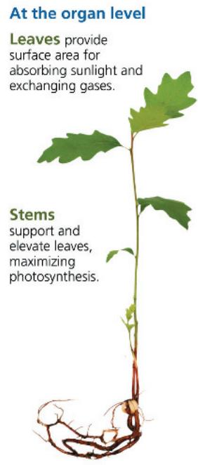  
Leaves provide surface area for absorbing sunlight and exchanging gases.  
Stems support and elevate leaves, maximizing photosynthesis.  
Roots anchor the plant and absorb water and minerals.  
At the tissue level

Dermal tissue protects organs.

Vascular tissue provides support and transports resources.

  
Leaf cross section  
Ground tissue includes cells that carry out photosynthesis and store sugars.  
Photosynt are packed with that convert sunlight into chemical energy.

## At the cellular level

Photosynthetic cells are packed with chloroplasts

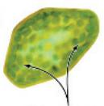  
Chloroplasts  
Cells with root hairs near the tips of roots increase the surface area for absorbing water and minerals.  
Tube-shaped cells transport resources. The cell shown here carries water and minerals. Others conduct sugars.

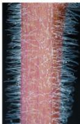

# Concept 35.1: Plants have a hierarchical organization consisting of organs, tissues, and cells

Chapters 29 and 30 provided an overview of plant diversity, including both nonvascular and vascular plants. In this chapter and throughout Unit Six, we'll focus on vascular plants, especially angiosperms because flowering plants are the primary producers in many terrestrial ecosystems and are of great agricultural importance. This chapter mainly explores non-reproductive growth—roots, stems, and leaves—and focuses primarily on the two main groups of angiosperms: eudicots and monocots (see Figure 30.16). Later, in Chapter 38, we'll examine angiosperm reproductive growth: flowers, seeds, and fruits.

Plants, like most animals, are composed of cells, tissues, and organs. A cell is the fundamental unit of life. A tissue is a group of cells consisting of one or more cell types that together perform a specialized function. An organ consists of several types of tissues that together carry out particular functions. As you learn about plant structure, keep in mind how natural selection has produced plant forms that fit plant function at all levels of structure. We begin by discussing plant organs because their structures are most familiar.

## Vascular Plant Organs: Roots, Stems, and Leaves

EVOLUTION The basic morphology, or shape, of vascular plants reflects their evolutionary history as terrestrial organisms that inhabit and draw resources from two very different environments—below the ground and above the ground. They must absorb water and minerals from below the ground surface and $CO_{2}$ and light from above the ground surface. The ability to acquire these resources efficiently is traceable to the evolution of roots, stems, and leaves as the three basic organs. These organs form a root system and a shoot system, the latter consisting of stems and leaves (Figure 35.2). Vascular plants, with few exceptions, rely on both systems for survival. Roots are almost never photosynthetic; they starve unless photosynthates, the sugars and the other carbohydrates produced during photosynthesis, are imported from the shoot system. Conversely, the shoot system depends on the water and minerals that roots absorb from the soil.

## Roots

A root is an organ that anchors a vascular plant in the soil, absorbs minerals and water, and often stores carbohydrates and other reserves. The primary root, originating in the seed embryo, is the first root (and the first organ) to emerge from a germinating seed. It soon branches to form lateral roots (see Figure 35.2) that

Figure 35.2 An overview of a flowering plant.

The plant body is divided into a root system and a shoot system, connected by vascular tissue (purple strands in this diagram) that is continuous throughout the plant. The plant shown is an idealized eudicot.

can also branch, greatly enhancing the ability of the root system to anchor the plant and to acquire resources such as water and minerals from the soil.

Tall, erect plants with large shoot masses generally have a taproot system, consisting of one main vertical root, the taproot, which usually develops from the primary root. In taproot systems, the role of absorption is restricted largely to the tips of lateral roots. A taproot, although energetically expensive to make, facilitates the anchorage of the plant in the soil. By preventing toppling, the taproot enables the plant to grow taller, thereby giving it access to more favorable light conditions and, in some cases, providing an advantage for pollen and seed dispersal. Taproots can also be specialized for food storage.

Small vascular plants or those that have a trailing growth habit are particularly susceptible to grazing animals that can uproot the plant and kill it. Such plants are most efficiently anchored by a fibrous root system, a thick mat of slender roots spreading out below the soil surface (see Figure 30.16). In plants that have fibrous root systems, including most monocots, the primary root dies early on and does not form a taproot. Instead, many small roots emerge from the stem. Such roots are said to be adventitious, a term describing a plant organ that grows in an unusual location, such as roots arising from

Figure 35.3 Root hairs of a radish seedling.

Root hairs grow by the thousands just behind the tip of each root. By increasing the root's surface area, they greatly enhance the absorption of water and minerals from the soil.

stems or leaves. Each root forms its own lateral roots, which in turn form their own lateral roots. Because this mat of roots holds the topsoil in place, plants such as grasses that have dense fibrous root systems are especially good at preventing soil erosion.

In most plants, the absorption of water and minerals occurs primarily near the tips of elongating roots, where vast numbers of root hairs, thin, finger-like extensions of root epidermal cells, emerge and increase the surface area of the root enormously (Figure 35.3). Most root systems also form mycorrhizal associations, symbiotic interactions with soil fungi that increase a plant's ability to absorb minerals (see Figure 37.14). The roots of many plants are adapted for specialized functions (Figure 35.4).

## Stems

A stem is a plant organ bearing leaves and buds. Its chief function is to elongate and orient the shoot in a way that maximizes

  
Figure 35.4 Evolutionary adaptations of roots.  
Buttress roots. Because of moist conditions in the tropics, root systems of many of the tallest trees are surprisingly shallow. Aerial roots that look like buttresses, such as seen in Gyranthera caribensis in Venezuela, give architectural support to the trunks of trees.

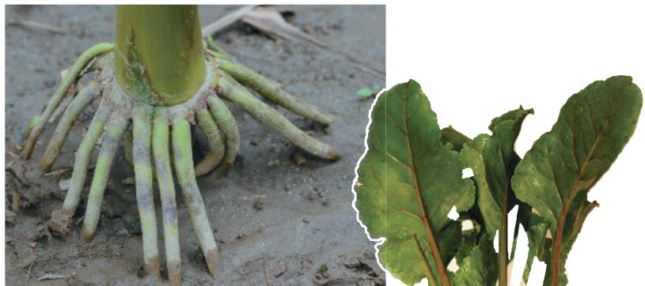  
▲ Brace roots. The aerial, adventitious roots of maize (corn) are brace roots, so named because they support tall, top-heavy plants. All roots of a mature maize plant are adventitious whether they emerge above or below ground.

  
▲ Storage roots.
Many plants, such as the common beet, store food and water in their roots.  
Pneumatophores. Also known as air roots, pneumatophores are produced by trees such as mangroves that inhabit tidal swamps. By projecting above the water's surface at low tide, they enable the root system to obtain oxygen, which is lacking in the thick, waterlogged mud.

"Strangling" aerial roots. Strangler fig seeds germinate in the crevices of tall trees. Aerial roots grow to the ground, wrapping around the host tree and objects such as this Cambodian temple. Shoots grow upward and shade out the host tree, killing it.

Figure 35.5 Evolutionary adaptations of stems.  
  
Rhizomes. The base of this iris plant is an example of a rhizome, a horizontal shoot that grows just below the surface. Vertical shoots emerge from axillary buds on the rhizome.

Stolons. Shown here on a strawberry plant, stolons are horizontal shoots that grow along the surface. These "runners" enable a plant to reproduce asexually, as plantlets grow from axillary buds along each runner.

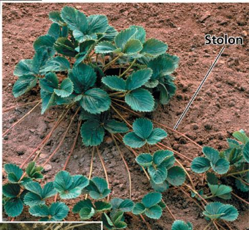

  
Tubers. Tubers, such as these potatoes, are enlarged ends of rhizomes or stolons specialized for storing food. The "eyes" of a potato are clusters of axillary buds.  
Which of these three examples has nodes? For suggested answer, see Appendix A.  
Figure 35.6 Simple versus compound leaves.

photosynthesis by the leaves. Another function of stems is to elevate reproductive structures, thereby facilitating the dispersal of pollen and fruit. Green stems may also perform a limited amount of photosynthesis. Each stem consists of an alternating system of nodes, the points at which leaves are attached, and internodes, the stem segments between nodes (see Figure 35.2). Most of the growth of a young shoot is concentrated near the growing shoot tip, or apical bud. Apical buds are not the only types of buds found in shoots. In the upper angle (axil) formed by each leaf and the stem is an axillary bud, which can potentially form a lateral branch or, in some cases, a thorn or flower.

Some plants have stems with alternative functions, such as food storage or asexual reproduction. Many of these modified stems, including rhizomes, stolons, and tubers, are often mistaken for roots (Figure 35.5).

## Leaves

In most vascular plants, the leaf is the main photosynthetic organ. In addition to intercepting light, leaves exchange gases with the atmosphere, dissipate heat, and defend themselves from

## Simple leaf

## Compound leaf

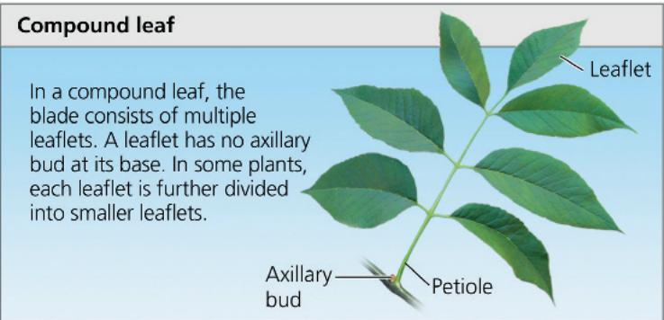

herbivores and pathogens. These functions may have conflicting anatomical and physiological requirements. For example, a dense covering of hairs may help repel herbivorous insects but may also trap air near the leaf surface, thereby reducing gas exchange and, consequently, photosynthesis. Because of these conflicting demands and trade-offs, leaves vary extensively in form. In general, however, a leaf consists of a flattened blade and a stalk, the petiole, which joins the leaf to the stem at a node (see Figure 35.2). Grasses and many other monocots lack petioles; instead, the base of the leaf forms a sheath that envelops the stem.

Monocots and eudicots differ in the arrangement of veins, the vascular tissue of leaves. Most monocots have parallel major veins of equal diameter that run the length of the blade. Eudicots generally have a branched network of veins arising from a major vein (the midrib) that runs down the center of the blade (see Figure 30.16).

In identifying angiosperms according to structure, taxonomists rely mainly on floral morphology, but they also use variations in leaf morphology, such as leaf shape, the branching pattern of veins, and the spatial arrangement of leaves. Figure 35.6 illustrates a difference in leaf shape: simple versus compound. Compound leaves benefit photosynthesis by allowing greater light penetration to lower leaves, and may also help in confining invading pathogens to a single leaflet, thereby preventing systemic spread.

The shapes of leaves are often products of genetic programs that are tweaked by environmental influences. Interpret the data in the Scientific Skills Exercise to explore the roles of genetics and the environment in determining leaf morphology in red maple trees.

Almost all leaves are specialized for photosynthesis. However, in some species evolution has resulted in additional functions, such as support, protection, storage, or asexual reproduction (Figure 35.7). Some are sporophylls, leaves highly specialized for sexual reproduction, such as carpels and stamens in flowers (see Figure 30.12).

# Scientific Skills Exercise Using Bar Graphs to Interpret Data

Nature Versus Nurture: Why Are Leaves from Northern Red Maples “Toothier” Than

Leaves from Southern Red Maples? Not all leaves of the red maple (Acer rubrum) are the same. The “teeth” along the margins of leaves growing in northern locations differ in size and number from those of their southern counterparts. (The leaf seen here has an intermediate appearance.) Are these differences due to genetic differences between northern and southern Acer rubrum populations, or do they arise from environmental differences between northern and southern locations, such as average temperature, that affect gene expression?

How the Experiment Was Done Seeds of Acer rubrum were collected from four latitudinally distinct sites: Ontario (Canada), Pennsylvania, South Carolina, and Florida. The seeds from the four sites were then grown in a northern location (Rhode Island) and a southern location (Florida). After a few years of growth, leaves were harvested from the four sets of plants growing in the two locations. The average area of single teeth and the average number of teeth per leaf area were determined.

## Data from the Experiment

<table><tr><td>Seed Collection Site</td><td colspan="2">Average Area of a Single Tooth (cm2)</td><td colspan="2">Number of Teeth per cm2of Leaf Area</td></tr><tr><td></td><td>Grown in Rhode Island</td><td>Grown in Florida</td><td>Grown in Rhode Island</td><td>Grown in Florida</td></tr><tr><td>Ontario (43.32°N)</td><td>0.017</td><td>0.017</td><td>3.9</td><td>3.2</td></tr><tr><td>Pennsylvania (42.12°N)</td><td>0.020</td><td>0.014</td><td>3.0</td><td>3.5</td></tr><tr><td>South Carolina (33.45°N)</td><td>0.024</td><td>0.028</td><td>2.3</td><td>1.9</td></tr><tr><td>Florida (30.65°N)</td><td>0.027</td><td>0.047</td><td>2.1</td><td>0.9</td></tr></table>

Data from D. L. Royer et al., Phenotypic plasticity of leaf shape along a temperature gradient in Acer rubrum, PLoS ONE 4(10):e7653 (2009).

## INTERPRET THE DATA

1. Make a bar graph for tooth size and a bar graph for number of teeth. (For information on bar graphs, see the Scientific Skills Review in Appendix D.) From north to south, what is the general trend in tooth size and number of teeth in leaves of Acer rubrum?

2. Based on the data, would you conclude that leaf tooth traits in the red maple are largely determined by genetic heritage (genotype), by the capacity for responding to environmental change within a single genotype (phenotypic plasticity), or by both? Make specific reference to the data in answering the question.

3. The “toothiness” of leaf fossils of known age has been used by paleoclimatologists to estimate past temperatures in a region. If a 10,000 year-old fossilized red maple leaf from South Carolina had an average of 4.2 teeth per square centimeter of leaf area, what could you infer about the temperature of South Carolina 10,000 years ago compared with the temperature today? Explain your reasoning.

## Figure 35.7 Evolutionary adaptations of leaves.

Tendrils. The tendrils by which this pea plant clings to a support are modified leaves. After it has "lassoed" a support, a tendril forms a coil that brings the plant closer

to the support. Tendrils are typically modified leaves, but some tendrils are modified stems, as in grapevines.

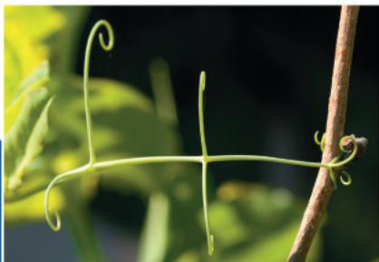  
Spines. The spines of cacti, such as this prickly pear, are actually leaves; photosynthesis is carried out by the fleshy green stems.

  
Storage leaves. Bulbs, such as this cut onion, have a short underground stem and modified leaves that store food.

Storage leaves Stem

Reproductive leaves. The leaves of some succulents, such as Kalanchoë daigremontiana, produce adventitious plantlets, which fall off the leaf and take root in the soil.

## Dermal, Vascular, and Ground Tissues

All three basic vascular plant organs—roots, stems, and leaves—are composed of three fundamental tissue types: dermal, vascular, and ground tissues. Each of these general types forms a tissue system that is continuous throughout the plant, connecting all the organs. However, specific characteristics of the tissues and the spatial relationships of tissues to one another vary in different organs (Figure 35.8).

Dermal tissue serves as the outer protective covering of the plant. Like our skin, it forms the first line of defense against physical damage and pathogens. In nonwoody plants, it is usually a single tissue called the epidermis, a layer of tightly packed cells. In leaves and most stems, the cuticle, a waxy epidermal coating, helps prevent water loss. In woody plants, protective tissues called periderm replace the epidermis in older regions of stems and roots. In addition to protecting the plant from water loss and disease, the epidermis has specialized characteristics in each organ. In roots, water and minerals absorbed from the soil enter through the epidermis, especially in root hairs. In shoots, specialized epidermal cells called guard cells are involved in gaseous exchange. Another class of highly specialized epidermal cells found in shoots consists of outgrowths called trichomes. In some desert species,

Figure 35.8 The three tissue systems.

The dermal tissue system (blue) provides a protective cover for the entire body of a plant. The vascular tissue system (purple), which transports materials between the root and shoot systems, is also continuous throughout the plant but is arranged differently in each organ. The ground tissue system (yellow), which is responsible for most of the metabolic functions, is located between the dermal tissue and the vascular tissue in each organ.

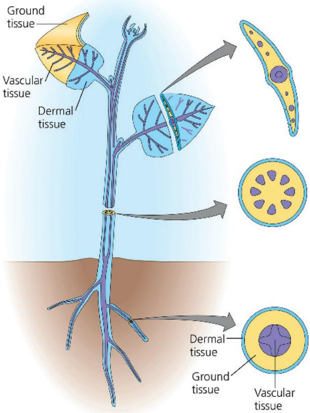  
Figure 35.9 Trichome diversity on the surface of a leaf.

hairlike trichomes reduce water loss and reflect excess light. Some trichomes defend against insects through shapes that hinder movement or glands that secrete sticky fluids or toxic compounds (Figure 35.9).

The two major functions of vascular tissue are to facilitate the transport of materials through the plant and to provide mechanical support. Vascular tissues are of two types: xylem and phloem. Xylem conducts water and dissolved minerals upward from roots into the shoots. Phloem transports sugars, the products of photosynthesis, from where they are made (usually the leaves) to where they are needed or stored—usually roots and sites of growth, such as developing leaves and fruits. The vascular tissue of a root or stem is collectively called the stele (the Greek word for “pillar”). The arrangement of the stele varies, depending on the species and organ. In angiosperms, for example, the root stele is a solid central vascular cylinder of xylem and phloem, whereas the stele of stems and leaves consists of vascular bundles, separate strands containing xylem and phloem (see Figure 35.8). Both xylem and phloem are composed of a variety of cell types, including cells that are highly specialized for transport or support.

Tissue that is neither dermal nor vascular is ground tissue. Ground tissue that is internal to the vascular tissue is known as pith, and ground tissue that is external to the vascular tissue is called cortex. Ground tissue is not just filler: It includes cells

Three types of trichomes are found on the surface of marjoram (Origanum majorana). Spear-like trichomes help hinder the movement of crawling insects, while the other two types of trichomes secrete oils and other chemicals involved in defense (colorized SEM).

specialized for functions such as storage, photosynthesis, support, and short-distance transport.

## Common Types of Plant Cells

In a plant, as in any multicellular organism, cells undergo cell differentiation; that is, they become specialized in structure and function during the course of development. Cell differentiation may involve changes both in the cytoplasm and its organelles and in the cell wall. Figure 35.10, on the next two pages, focuses on the major types of plant cells. Notice the structural adaptations that make specific functions possible. You may also wish to review basic plant cell structure (see Figures 6.8 and 6.27).

## Concept Check 35.1

1. How does the vascular tissue system enable leaves and roots to function together in supporting growth and development of the whole plant?

2. WHAT IF? If humans were photoautotrophs, making food by capturing light energy for photosynthesis, how might our anatomy be different?

3. MAKE CONNECTIONS Explain how central vacuoles and cellulose cell walls contribute to plant growth (see Concepts 6.4 and 6.7).

For suggested answers, see Appendix A.

# Concept 35.2: Different meristems generate new cells for primary and secondary growth

A major difference between plants and most animals is that plant growth is not limited to an embryonic or juvenile period. Instead, growth occurs throughout the plant's life, a process called indeterminate growth. Plants can keep growing because they have undifferentiated tissues called meristems containing cells that can divide, leading to new cells that elongate and become differentiated. Except for dormant periods, most plants grow

## Exploring Examples of Differentiated Plant Cells

Figure 35.10

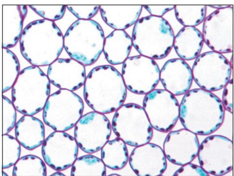  
Parenchyma cells in a privet (Ligustrum) leaf (LM)  
25 μm

## Parenchyma Cells

Mature parenchyma cells have primary walls that are relatively thin and flexible, and most lack secondary walls. (See Figure 6.27 to review primary and secondary cell walls.) When mature, parenchyma cells generally have a large central vacuole. Parenchyma cells perform most of the metabolic functions of the plant, synthesizing and storing various organic products. For example, photosynthesis occurs within the chloroplasts of parenchyma cells in the leaf. Some parenchyma cells in stems and roots have colorless plastids called amyloplasts that store starch. The fleshy tissue of many fruits is composed mainly of parenchyma cells. Most parenchyma cells retain the ability to divide and differentiate into other types of plant cells under particular conditions—during wound repair, for example. It is even possible to grow an entire plant from a single parenchyma cell.

  
Collenchyma cells in a common nettle (Urtica dioica) stem (LM)

## Collenchyma Cells

Grouped in strands, collenchyma cells (seen here in cross section) help support young parts of the plant shoot. Collenchyma cells are generally elongated cells that have thicker primary walls than parenchyma cells, though the walls are unevenly thickened. Young stems and petioles often have strands of collenchyma cells just below their epidermis. Collenchyma cells provide flexible support without restraining growth. At maturity, these cells are living and flexible, elongating with the stems and leaves they support—unlike sclerenchyma cells, which we discuss next.

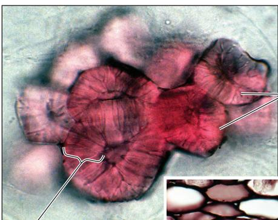  
Cell wall

## Sclerenchyma Cells

> Sclereid cells (in pear) (LM)

25 μm

  
Fiber cells (cross section from ash tree) (LM)

Sclerenchyma cells also function as supporting elements in the plant but are much more rigid than collenchyma cells. In sclerenchyma cells, the secondary cell wall, produced after cell elongation has ceased, is thick and contains large amounts of lignin, a relatively indigestible strengthening polymer that accounts for more than a quarter of the dry mass of wood. Lignin is present in all vascular plants but not in bryophytes. Mature sclerenchyma cells cannot elongate, and they occur in regions of the plant that have stopped growing in length. Sclerenchyma cells are so specialized for support that many are dead at functional maturity, but they produce secondary walls before the protoplast (the living part of the cell) dies. The rigid walls remain as a “skeleton” that supports the plant, in some cases for hundreds of years.

Two types of sclerenchyma cells, known as sclereids and fibers, are specialized entirely for support and strengthening. Sclereids, which are boxier than fibers and irregular in shape, have very thick, lignified secondary walls. Sclereids impart the hardness to nutshells and seed coats and the gritty texture to pear fruits. Fibers, which are usually grouped in strands, are long, slender, and tapered. Some are used commercially, such as hemp fibers for making rope and flax fibers for weaving into linen.

Tracheids and vessels
(colorized SEM) Perforation—plate

## Water-Conducting Cells of the Xylem

The two types of water-conducting cells, tracheids and vessel elements, are tubular, elongated cells that are dead and lignified at functional maturity. Tracheids occur in the xylem of all vascular plants. In addition to tracheids, most angiosperms, as well as a few gymnosperms and a few seedless vascular plants, have vessel elements. When the living cellular contents of a tracheid or vessel element disintegrate, the cell's thickened walls remain behind, forming a nonliving conduit through which water can flow. The secondary walls of tracheids and vessel elements are often interrupted by pits, thinner regions where only primary walls are present (see Figure 6.27 to review primary and secondary walls). Water can migrate laterally between neighboring cells through pits.

Tracheids are long, thin cells with tapered ends. Water moves from cell to cell mainly through the pits, where it does not have to cross thick secondary walls.

Vessel elements are generally wider, shorter, thinner walled, and less tapered than the tracheids. They are aligned end to end, forming long pipes known as vessels that in some cases are visible with the naked eye. The end walls of vessel elements have perforation plates that enable water to flow freely through the vessels.

The secondary walls of tracheids and vessel elements are hardened with lignin. This hardening provides support and prevents collapse under the tension of water transport.

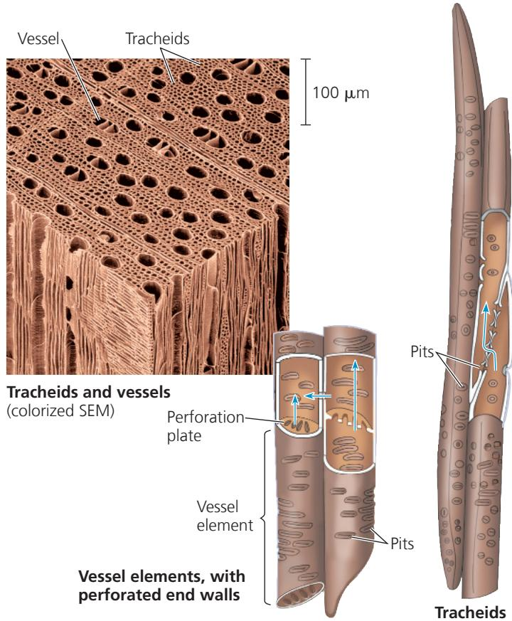  
Vessel elements, with perforated end walls

## Sugar-Conducting Cells of the Phloem

Unlike the water-conducting cells of the xylem, the sugar-conducting cells of the phloem are alive at functional maturity. In seedless vascular plants and gymnosperms, sugars and other organic nutrients are transported through long, narrow cells called sieve cells. In the phloem of angiosperms, these nutrients are transported through sieve tubes, which consist of chains of cells that are called sieve-tube elements, or sieve-tube members.

Though alive, sieve-tube elements lack a nucleus, ribosomes, a distinct vacuole, and cytoskeletal elements. This reduction in cell contents enables nutrients to pass more easily through the cell. The end walls between sieve-tube elements, called sieve plates, have pores that facilitate the flow of fluid from cell to cell along the sieve tube. Alongside each sieve-tube element is a nonconducting cell called a companion cell, which is connected to the sieve-tube element by numerous plasmodesmata (see Figure 6.27). The nucleus and ribosomes of the companion cell serve not only that cell itself but also the adjacent sieve-tube element. In some plants, the companion cells in leaves also help load sugars into the sieve-tube elements, which then transport the sugars to other parts of the plant.

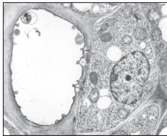  
Sieve-tube element (left) and companion cell: cross section (TEM)

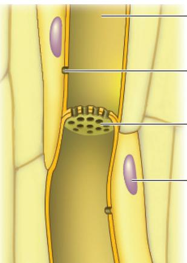  
Sieve-tube elements: longitudinal view

  
Sieve plate with pores (LM)

continuously. In contrast, most animals and some plant organs—such as leaves, thorns, and flowers—undergo determinate growth; they stop growing after reaching a certain size.

There are two main types of meristems: apical meristems and lateral meristems (Figure 35.11). Apical meristems, located at root and shoot tips, provide cells that enable primary growth, growth in length. Primary growth allows roots to extend throughout the soil and shoots to increase exposure to light. In herbaceous (nonwoody) plants, it produces all, or almost all, of the plant body. Woody plants, however, also grow in circumference in the parts of stems and roots that no longer grow in length. This growth in thickness, known as secondary growth, is made possible by lateral meristems: the vascular cambium and cork cambium.

These cylinders of dividing cells extend along the length of roots and stems. The vascular cambium adds vascular tissue called secondary xylem (wood) and secondary phloem. Most of the thickening is from secondary xylem. The cork cambium replaces the epidermis with the thicker, tougher periderm.

Cells in apical and lateral meristems divide frequently during the growing season, generating additional cells. Some new cells remain in the meristem and produce more cells, while others differentiate and are incorporated into tissues and organs. Cells that remain as sources of new cells have traditionally been called initials but are increasingly being called stem cells to correspond to animal stem cells that also divide and remain functionally undifferentiated.

## Visualizing Primary and Secondary Growth

## Figure 35.11

All vascular plants have primary growth (growth in length). Woody plants also have secondary growth (growth in thickness).

## Primary Growth (growth in length)

Primary growth is made possible by apical meristems at the tips of shoots (and roots).

Apical meristem cells are undifferentiated. When they divide, some daughter cells remain in the apical meristem, ensuring a continuing population of undifferentiated cells. Other daughter cells become partly differentiated as primary meristem cells. After dividing and growing in length, they become fully differentiated cells in the mature tissues.

Cutaway view of primary growth in a shoot tip. (Darker shades of a color indicate cells that are mature and have stopped elongating.)

Cell division in—
apical meristem
Daughter cell in —
primary meristem
Cell division in—
primary meristem

Differentiated cells (for example, vessel elements)

The addition of elongated, differentiated cells lengthens a stem (as shown here) or root.

## Secondary Growth (growth in thickness)

Secondary growth is made possible by two lateral meristems extending along the length of a shoot (or root) where primary growth has ceased.

Lateral meristems are cylinders of dividing cells that are one cell thick. There are two types: the vascular cambium and the cork cambium.

Cambium cell divisions in the plane perpendicular to the surface of the shoot enable the cambium to increase in circumference as the stem widens.

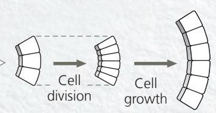

Cells displaced from the meristem may divide several more times as they differentiate into mature cells. During primary growth, these cells give rise to three tissues called primary meristems—the protoderm, ground meristem, and procambium—that will produce, respectively, the three mature tissues of a root or shoot: the dermal, ground, and vascular tissues. The lateral meristems in woody plants also have stem cells, which give rise to all secondary growth.

The relationship between primary and secondary growth is seen in the winter twig of a deciduous tree. At the shoot tip is the dormant apical bud, enclosed by scales that protect its apical meristem (Figure 35.12). In spring, the bud sheds its scales and begins a new spurt of primary growth, producing a series of nodes and internodes. On each growth segment, nodes are marked by scars left when leaves fell. Leaf scars are prominent in many twigs.

Above each scar is an axillary bud or a branch formed by an axillary bud. Farther down are bud scars from whorls of scales that enclosed the apical bud during the previous winter. In each growing season, primary growth extends shoots, and secondary growth increases the diameter of parts formed in previous years.

Although meristems enable plants to grow throughout their lives, plants do die, of course. Based on the length of their life cycle, flowering plants can be categorized as annuals, biennials, or perennials. Annuals complete their life cycle—from germination to flowering to seed production to death—in a single year or less. Many wildflowers are annuals, as are most staple food crops, including legumes and cereal grains such as wheat and rice. Dying after producing seeds and fruits enables plants to transfer the maximum amount of energy to reproduction. Biennials, such as

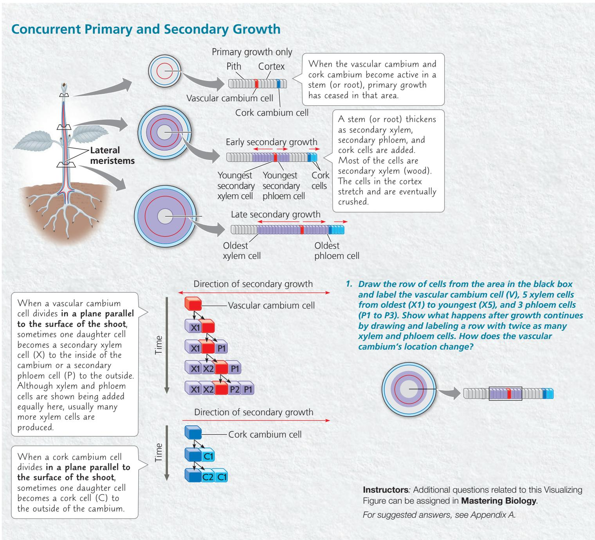

Figure 35.12 Three years' growth in a winter twig.  
  
Figure 35.13 Primary growth of a eudicot root.

turnips, generally require two growing seasons to complete their life cycle, flowering and fruiting only in their second year. Perennials live many years and include trees, shrubs, and some grasses. Some buffalo grass of the North American plains is thought to have been growing for 10,000 years from seeds that sprouted at the close of the last ice age.

## Concept Check 35.2

1. Would primary and secondary growth ever occur simultaneously in the same plant?

2. Roots and stems grow indeterminately, but leaves do not. How might this benefit the plant?

3. WHAT IF? After growing carrots for one season, a gardener decides that the carrots are too small. Since carrots are biennials, the gardener leaves the crop in the ground for a second year, thinking the carrot roots will grow larger. Is this a good idea? Explain.

For suggested answers, see Appendix A.

## Concept 35.3: Primary growth lengthens roots and shoots

Primary growth arises directly from cells produced by apical meristems. In herbaceous plants, almost the entire plant is created through primary growth, whereas in woody plants only the non-woody, more recently formed parts of the plant represent primary growth. Although both roots and shoots lengthen as a result of cells derived from apical meristems, the details of their primary growth differ in many ways.

In the micrograph, mitotic cells in the apical meristem are revealed by staining for cyclin, a protein involved in cell division (LM).

## Primary Growth of Roots

The entire biomass of a primary root is derived from the root apical meristem. The root apical meristem also makes a thimble-like root cap, which protects the delicate apical meristem as the root pushes through the abrasive soil. The root cap secretes a polysaccharide slime that lubricates the soil around the tip of the root. Growth occurs just behind the tip in three overlapping zones of cells at successive stages of primary growth. These are the zones of cell division, elongation, and differentiation (Figure 35.13).

The zone of cell division includes the stem cells of the root apical meristem and their immediate products. New root cells are produced in this region, including cells of the root cap. Typically, a few millimeters behind the tip of the root is the zone of elongation, where most of the growth occurs as root cells elongate—sometimes to more than ten times their original length. Cell elongation in this zone pushes the tip farther into the soil. Meanwhile, the root apical meristem keeps adding cells to the younger end of the zone of elongation. Even before the root cells finish lengthening, many begin specializing in structure and function. As this occurs, the three primary meristems—the protoderm, ground meristem, and procambium—become evident. In the zone of differentiation, or zone of maturation, cells complete their differentiation and become distinct cell types.

The protoderm, the outermost primary meristem, gives rise to the epidermis, a single layer of cuticle-free cells covering the root. Root hairs are the most prominent feature of the root epidermis. These modified epidermal cells function in the absorption of water and minerals. Root hairs typically only live a few weeks but together make up 70–90% of the total root surface area. It has been estimated that a four-month-old rye plant has about 14 billion

Figure 35.14 Organization of primary tissues in young roots. Parts (a) and (b) show cross sections of the roots of a Ranunculus (buttercup) species and Zea mays (maize), respectively. These represent two basic patterns of root organization, of which there are many variations, depending on the plant species (all LMs).

  
(a) Root with xylem and phloem in the center (typical of eudicots). In the roots of typical gymnosperms and eudicots, as well as some monocots, the stele is a vascular cylinder appearing in cross section as a lobed core of xylem with phloem between the lobes.

Endodermis

Pericycle

Xylem

Dermal

Ground

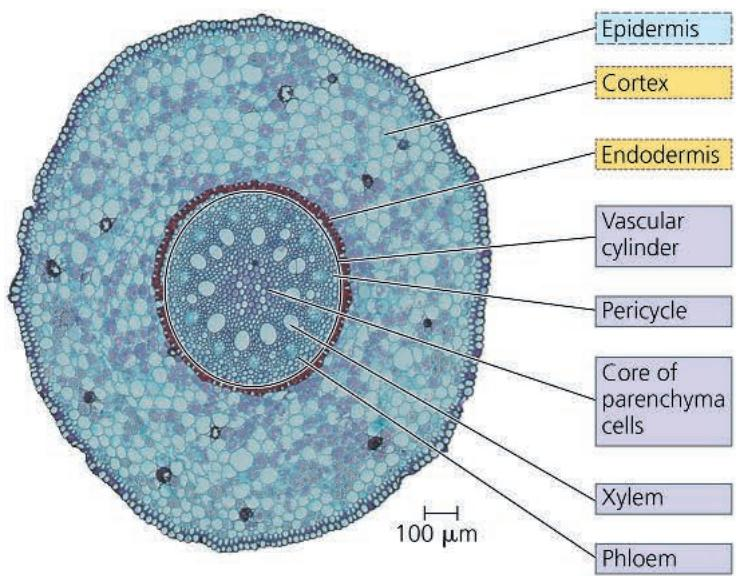  
(b) Root with parenchyma in the center (typical of monocots). The stele of many monocot roots is a vascular cylinder with a core of parenchyma surrounded by a ring of xylem and a ring of phloem.  
Figure 35.15 The formation of a lateral root.

root hairs. Laid end to end, the root hairs of a single rye plant would cover 10,000 km, one-quarter the length of the equator.

Sandwiched between the protoderm and the procambium is the ground meristem, which gives rise to mature ground tissue. The ground tissue of roots, consisting mostly of parenchyma cells, is found in the cortex, the region between the vascular tissue and epidermis. In addition to storing carbohydrates, cells in the cortex transport water and salts from the root hairs to the center of the root. The cortex also allows for extracellular diffusion of water, minerals, and oxygen from the root hairs inward because there are large spaces between cells. The innermost layer of the cortex is called the endodermis, a cylinder one cell thick that forms the boundary with the vascular cylinder. The endodermis is a selective barrier that regulates passage of substances from the soil into the vascular cylinder (see Figure 36.9).

The procambium gives rise to the vascular cylinder, which consists of a solid core of xylem and phloem tissues surrounded by a cell layer called the pericycle. In most eudicot roots, the xylem has a starlike appearance in cross section, and the phloem occupies the indentations between the arms of the xylem “star” (Figure 35.14a). In many monocot roots, the vascular tissue consists of a core of undifferentiated parenchyma cells surrounded by a ring of alternating xylem and phloem tissues (Figure 35.14b).

By increasing the length of roots, primary growth facilitates their penetration and exploration of the soil. If a resource-rich pocket is located in the soil, the branching of roots may be stimulated. Branching, too, is a form of primary growth. As shown in Figure 35.15, lateral (branch) roots arise from meristematically active regions of the pericycle, the outermost cell layer in the vascular cylinder, which is adjacent to and just inside the endodermis (see Figure 35.14). The emerging lateral roots disruptively

A lateral root originates in the pericycle, the outermost layer of the vascular cylinder of a root, and destructively pushes through the outer tissues before emerging. In this light micrograph, the view of the original root is a cross section, but the view of the lateral root is a longitudinal section (a view along the length of the lateral root).

  
DRAW IT Draw what the original root and lateral root would look like when viewed from the side, labeling both roots.
For suggested answer, see Appendix A.

push through the outer tissues until they emerge from the established root.

## Primary Growth of Shoots

The entire biomass of a primary shoot—all its leaves and stems—derives from its shoot apical meristem, a dome-shaped mass of dividing cells at the shoot tip (Figure 35.16). The shoot apical meristem is a delicate structure protected by the leaves of the apical bud. These young leaves are spaced close together because the internodes are very short. Shoot elongation is due to the lengthening of internode cells below the shoot tip. As with the root apical meristem, the shoot apical meristem gives rise to three types of primary meristems in the shoot—the protoderm, ground meristem, and procambium. These three primary meristems in turn give rise to the mature primary tissues of the shoot.

The branching of shoots, which is also part of primary growth, arises from the activation of axillary buds, each of which has its own shoot apical meristem. Because of chemical communication by plant hormones, the closer an axillary bud is to an active apical bud, the more inhibited it is, a phenomenon called apical dominance. (The specific hormonal changes underlying apical dominance are discussed in Concept 39.2.) If an animal eats the end of the shoot or if shading results in the light being more intense on the side of the shoot, the chemical communication underlying apical dominance is disrupted. As a result, the axillary buds break dormancy and start to grow. Released from dormancy, an axillary bud eventually gives rise to a lateral shoot, complete with its own apical bud, leaves, and axillary buds. When gardeners prune shrubs and pinch back houseplants, they are reducing the number of apical buds a plant has, thereby allowing branches to develop and giving the plants a fuller, bushier appearance.

## Stem Growth and Anatomy

The stem is covered by an epidermis that is usually one cell thick and covered with a waxy cuticle that prevents water loss. Some

## Figure 35.16 The shoot tip.

Leaf primordia arise from the flanks of the dome of the apical meristem. This is a longitudinal section of the shoot tip of Coleus (LM).  
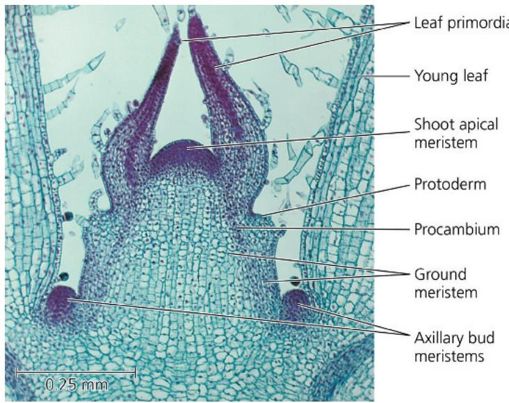

Figure 35.17 Organization of primary tissues in young stems.  
  
(a) Cross section of stem with vascular bundles forming a ring (typical of eudicots). Ground tissue toward the inside is called pith, and ground tissue toward the outside is called cortex (LM).

Key to labels

Dermal

Ground

Vascular

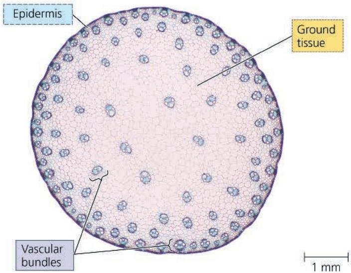  
(b) Cross section of stem with scattered vascular bundles (typical of monocots). In such an arrangement, ground tissue is not partitioned into pith and cortex (LM).

VISUAL SKILLS Compare the locations of the vascular bundles in eudicot and monocot stems. Then, explain why the terms pith and cortex are not used in describing the ground tissue of monocot stems.

examples of specialized epidermal cells in the stem include guard cells and trichomes.

The ground tissue of stems consists mostly of parenchyma cells. However, collenchyma cells just beneath the epidermis strengthen many stems during primary growth. Sclerenchyma cells, especially fiber cells, also provide support in those parts of the stems that are no longer elongating.

Vascular tissue runs the length of a stem in vascular bundles. Unlike lateral roots, which arise from vascular tissue deep within a root and disrupt the vascular cylinder, cortex, and epidermis as they emerge (see Figure 35.15), lateral shoots develop from axillary bud meristems on the stem's surface and do not disrupt other tissues (see Figure 35.16). Near the soil surface, in the transition zone between shoot and root, the bundled vascular arrangement of the stem converges with the solid vascular cylinder of the root.

The vascular tissue of stems in most eudicot species consists of vascular bundles arranged in a ring (Figure 35.17a). The xylem in each bundle faces the pith, and the phloem in each bundle faces the cortex. In most monocot stems, the vascular bundles do not form a ring but have a more scattered arrangement in the ground tissue (Figure 35.17b).

## Leaf Growth and Anatomy

Figure 35.18 provides an overview of leaf anatomy. Leaves develop from leaf primordia (singular, primordium), projections shaped like a cat's ear that emerge along the sides of the shoot apical meristem (see Figure 35.16). Unlike roots and stems, secondary growth in leaves is minor or nonexistent. As with roots and stems, the three primary meristems give rise to the tissues of the mature organ.

The leaf epidermis is covered by a waxy cuticle that greatly reduces water loss except where it is interrupted by stomata (singular, stoma), which allow exchange of $CO_{2}$ and $O_{2}$ between the surrounding air and the photosynthetic cells inside the leaf. In addition to regulating $CO_{2}$ uptake for photosynthesis, stomata are major avenues for the evaporative loss of water. The term stoma can refer to the stomatal pore or to the entire stomatal complex consisting of a pore flanked by the two specialized epidermal cells known as guard cells, which regulate the opening and closing of the pore. (We will discuss stomata in detail in Concept 36.4.)

The leaf's ground tissue, called the mesophyll (from the Greek mesos, middle, and phyll, leaf), is sandwiched between the upper and lower epidermal layers. Mesophyll consists mainly of parenchyma cells specialized for photosynthesis. The mesophyll in many eudicot leaves has two distinct layers: palisade and spongy. Palisade mesophyll, located beneath the upper epidermis, consists of one or more layers of elongated, chloroplast-rich cells that are specialized for light capture. Spongy mesophyll, located inward from the lower epidermis, consists of irregularly shaped cells that have fewer chloroplasts. These cells form a labyrinth of air spaces through which $\mathrm{CO}_{2}$ and $\mathrm{O}_2$ circulate to and from the palisade layer. The air spaces are particularly large in the vicinity of stomata, where $\mathrm{CO}_{2}$ is taken up from the outside air and $\mathrm{O}_2$ is released.

For suggested answer, see Appendix A.

The vascular tissue of each leaf is continuous with the vascular tissue of the stem. Veins subdivide repeatedly and branch throughout the mesophyll. This network brings xylem and phloem into close contact with the photosynthetic tissue, which obtains water and minerals from the xylem and loads its sugars and other organic products into the phloem for transport to other parts of the plant. The vascular structure also functions as a framework that reinforces the shape of the leaf. Each vein is enclosed by a protective bundle sheath, a layer of cells that regulates the movement of substances between the vascular tissue and the mesophyll. Bundle-sheath cells are very prominent in leaves of species that carry out $C_{4}$ photosynthesis (see Concept 10.5).

## Concept Check 35.3

1. Contrast primary growth in roots and shoots.

2. WHAT IF? A fossil leaf from a region that in the geological past was intermittently very dry and very swampy has stomata only on its upper epidermis. Was the leaf from a desert plant or from a floating aquatic plant? Explain.

3. MAKE CONNECTIONS How are root hairs and microvilli analogous structures? (See Figure 6.8 and the discussion of analogy in Concept 26.2.)

For suggested answers, see Appendix A.

Figure 35.19 Secondary growth of a woody stem.  

1 Primary growth from the activity of the apical meristem is complete here. The vascular cambium has formed, and its cell divisions will give rise to the bulk of secondary growth.

Although primary growth continues in the apical bud, only secondary growth occurs in this region. The stem thickens as the vascular cambium forms secondary xylem to the inside and secondary phloem to the outside.

3 Some stem cells of the vascular cambium give rise to vascular rays.

4 As the vascular cambium's diameter increases, the secondary phloem and other tissues external to the cambium can't keep pace because their cells no longer divide. As a result, these tissues, including the epidermis, will eventually rupture. A second lateral meristem, the cork cambium, develops from parenchyma cells in the cortex. The cork cambium produces cork cells, which replace the epidermis.

5 In year 2 of secondary growth, the vascular cambium produces more secondary xylem and phloem. Most of the thickening is from secondary xylem. Meanwhile, the cork cambium produces more cork.

6 As the stem's diameter increases, the outermost tissues exterior to the cork cambium rupture and are sloughed off.

7 In many cases, the cork cambium re-forms deeper in the cortex. When none of the cortex is left, the cambium develops from phloem parenchyma cells.

8 Each cork cambium and the tissues it produces form a layer of periderm.

9 Bark consists of all tissues exterior to the vascular cambium.

# Concept 35.4: Secondary growth increases the diameter of stems and roots in woody plants

Many land plants display secondary growth, the growth in thickness produced by lateral meristems (Figure 35.19, on the facing page). The advent of secondary growth during plant evolution allowed the production of novel plant forms ranging from massive forest trees to woody vines. All gymnosperm species and many eudicot species undergo secondary growth, but it is unusual in monocots. It occurs in stems and roots of woody plants, but rarely in leaves.

Secondary growth consists of the tissues produced by the vascular cambium and cork cambium. The vascular cambium adds secondary xylem (wood) and secondary phloem, thereby increasing vascular flow and support for the shoots. The cork cambium produces a tough, thick covering of waxy cells that protect the stem from water loss and from invasion by insects, bacteria, and fungi.

In woody plants, primary growth and secondary growth occur simultaneously. As primary growth adds leaves and lengthens stems and roots in the younger regions of a plant, secondary growth increases the diameter of stems and roots in older regions where primary growth has ceased. The process is similar in shoots and roots (see Figure 35.19).

## The Vascular Cambium and Secondary Vascular Tissue

The vascular cambium, a cylinder of meristematic cells only one cell thick, is wholly responsible for the production of secondary vascular tissue. In a typical woody stem, the vascular cambium is located outside the pith and primary xylem and to the inside of the primary phloem and the cortex. In a typical woody root, the vascular cambium forms exterior to the primary xylem and interior to the primary phloem and pericycle.

In cross section, the vascular cambium appears as a ring of meristematic cells (see step 4 of Figure 35.19). As these cells divide, they increase the cambium's circumference and add secondary xylem to the inside and secondary phloem to the outside. Each ring is larger than the previous ring, increasing the diameter of roots and stems.

Some of the stem cells in the vascular cambium are elongated and oriented with their long axis parallel to the axis of the stem or root. The cells they produce give rise to mature cells such as the tracheids, vessel elements, and fibers of the xylem, as well as the sieve-tube elements, companion cells, axially oriented parenchyma, and fibers of the phloem. Other stem cells in the vascular cambium are shorter and are oriented perpendicular to the axis of the stem or root: they give rise to vascular rays—radial files of mostly parenchyma cells that connect the secondary xylem and phloem (see step 3 of Figure 35.19). These cells move water and nutrients between the secondary xylem and phloem, store carbohydrates and other reserves, and aid in wound repair.

As secondary growth continues, layers of secondary xylem (wood) accumulate, consisting mainly of tracheids and vessel elements (see Figure 35.10), as well as fibers. In most species of gymnosperms, tracheids are the only water-conducting cells. Most

Figure 35.20 Cross section of a three-year-old Tilia (linden) stem. (LM)

angiosperms also have vessel elements. The walls of secondary xylem cells are heavily lignified, giving wood its hardness and strength.

In temperate regions, wood that develops early in the spring, known as early (or spring) wood, usually has secondary xylem cells with large diameters and thin cell walls (Figure 35.20). This structure maximizes delivery of water to leaves. Wood produced later in the growing season is called late (or summer) wood. It has thick-walled cells that do not transport as much water but provide more support. Because there is a marked contrast between the large cells of the new early wood and the smaller cells of the late wood of the previous growing season, a year's growth appears as a distinct growth ring in cross sections of most tree trunks and roots. Therefore, researchers can estimate a tree's age by counting growth rings. Dendrochronology is the science of analyzing tree growth ring patterns. Growth rings vary in thickness, depending on seasonal growth. Trees grow well in wet and warm years but may grow hardly at all in cold or dry years. Since a thick ring indicates a warm year and a thin ring indicates a cold or dry one, scientists use ring patterns to study climate changes (Figure 35.21, on the next page).

As a tree or woody shrub ages, older layers of secondary xylem no longer transport water and minerals (a solution called xylem sap). As shown in Figure 35.22, these layers are

Figure 35.22 Anatomy of a tree trunk.  

## Figure 35.21

# Research Method: Using Dendrochronology to Study Climate

## Application

Dendrochronology, the science of analyzing growth rings, is useful in studying climate change. Most scientists attribute recent global warming to the burning of fossil fuels and release of $CO_{2}$ and other greenhouse gases, whereas a small minority think it is a natural variation. Studying climate patterns requires comparing past and present temperatures, but instrumental climate records span only the last two centuries and apply only to some regions. By examining growth rings of Mongolian conifers dating back to the mid-1500s, Gordon C. Jacoby and Rosanne D'Arrigo, of the Lamont-Doherty Earth Observatory, and colleagues sought to learn whether Mongolia has experienced similar warm periods in the past.

## Technique

Researchers can analyze patterns of rings in living and dead trees. They can even study wood used for building long ago by matching samples with those from naturally situated specimens of overlapping age. Core samples, each about the diameter of a pencil, are taken from the bark to the center of the trunk. Each sample is dried and sanded to reveal the rings. By comparing, aligning, and averaging many samples from the conifers, the researchers compiled a chronology. The trees became a chronicle of environmental change.

## Results

This graph summarizes a composite record of the ring-width indexes for the Mongolian conifers from 1550 to 1993. The higher indexes indicate wider rings and higher temperatures.

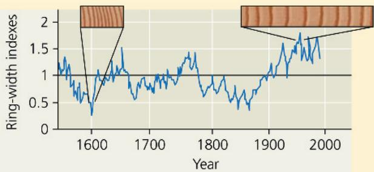  
Data from G. C. Jacoby et al., Mongolian tree rings and 20th-century warming, Science 273:771–773 (1996).  
INTERPRET THE DATA What does the graph indicate about environmental change during the period 1550–1993?

called heartwood because they are closer to the center of a stem or root. The newest, outer layers of secondary xylem still transport xylem sap and are therefore known as sapwood. Sapwood allows a large tree to survive even if the center of its trunk is hollow (Figure 35.23). Because each new layer of secondary xylem has a larger circumference, secondary growth enables the xylem to transport more sap each year, supplying an increasing number of leaves. Heartwood is generally darker than sapwood because of resins and other compounds that

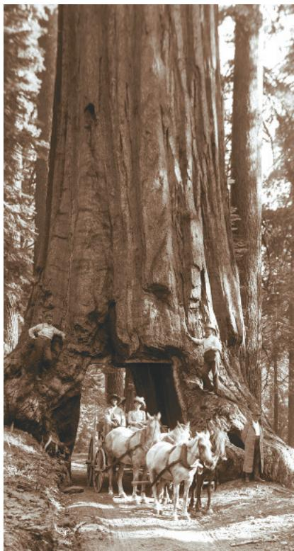

## Figure 35.23 Is this tree living or dead?

The Wawona Sequoia tunnel in Yosemite National Park in California was cut in 1881 as a tourist attraction. This giant sequoia (Sequoiadendron giganteum) lived for another 88 years before falling during a severe winter. It was 71.3 m tall and estimated to be 2,100 years old. Though conservation policies today would forbid the mutilation of such an important specimen, the Wawona Sequoia did teach a valuable botanical lesson: Trees can endure the excision of large portions of their heartwood for decades.

VISUAL SKILLS Name in sequence the tissues that were destroyed as the lumberjacks excavated through the base of the tree to its center. Refer also to Figure 35.19.

For suggested answer, see Appendix A.

permeate the cell cavities and help protect the core of the tree from fungi and wood-boring insects.

Only the youngest secondary phloem, closest to the vascular cambium, functions in sugar transport. As a stem or root increases in circumference, the older secondary phloem is sloughed off, which is one reason secondary phloem does not accumulate as extensively as secondary xylem.

## The Cork Cambium and the Production of Periderm

During the early stages of secondary growth, the epidermis is pushed outward, causing it to split, dry, and fall off the stem or root. It is replaced by tissues produced by the first cork cambium, a cylinder of dividing cells that arises in the outer cortex of stems (see Figure 35.19) and in the pericycle in roots. The cork cambium gives rise to cork cells that accumulate to the outside of the cork cambium. As cork cells mature, they deposit a waxy, hydrophobic material called suberin in their walls before dying. Because cork cells have suberin and are usually compacted together, most of the periderm is impermeable to water and gases, unlike the epidermis. Cork thus functions as a barrier that helps protect the stem or root from water loss, physical damage, and pathogens. It should be noted that “cork” is commonly and incorrectly referred to as “bark.” In plant biology, bark includes all tissues external to the vascular cambium. Its main components are the secondary phloem (produced by the vascular cambium) and, external to that, the most recent periderm and all the older layers of periderm (see Figure 35.22). As this process continues, older layers of periderm are sloughed off, as evident in the cracked, peeling exteriors of many tree trunks.

Figure 35.24 A summary of primary and secondary growth in a woody shoot.

Woody roots have the same meristems and tissues. However, the ground tissue of a root is not divided into pith and cortex, and the cork cambium arises instead from the pericycle, the outermost layer of the vascular cylinder.

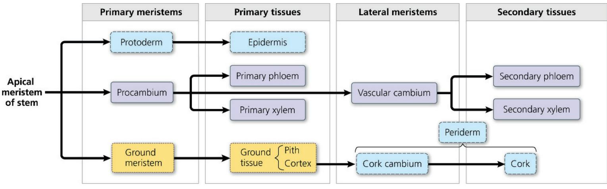

How can living cells in the interior tissues of woody organs absorb oxygen and respire if they are surrounded by a waxy periderm? Dotting the periderm are small, raised areas called lenticels, in which there is more space between cork cells, enabling living cells within a woody stem or root to exchange gases with the outside air. Lenticels often appear as horizontal slits, as shown on the stem in Figure 35.19.

Figure 35.24 summarizes the relationships between the primary and secondary tissues of a woody shoot.

## Evolution of Secondary Growth

EVOLUTION Surprisingly, some insights into the evolution of secondary growth have been achieved by studying the herbaceous plant Arabidopsis thaliana. Researchers have found that they can stimulate some secondary growth in Arabidopsis stems by adding weights to the plant. These findings suggest that weight carried by the stem activates a developmental program leading to wood formation. Moreover, several developmental genes that regulate shoot apical meristems in Arabidopsis have been found to regulate vascular cambium activity in poplar (Populus) trees. This suggests that the processes of primary and secondary growth are evolutionarily more closely related than was previously thought.

## Concept Check 35.4

1. A sign is hammered into a tree 2 m from the tree's base. If the tree is 10 m tall and elongates 1 m each year, how high will the sign be after ten years?

2. Stomata and lenticels are both involved in exchange of $CO_{2}$ and $O_{2}$ . Why must stomata be able to close, but not lenticels?

3. Would you expect a tropical tree to have distinct growth rings?

4. WHAT IF? If a complete ring of bark is removed from around a tree trunk (a technique called girdling), would the tree die slowly (in weeks) or quickly (in days)? Explain why.

For suggested answers, see Appendix A.

## Concept 35.5: Growth, morphogenesis, and cell differentiation produce the plant body

The specific series of changes by which cells form tissues, organs, and organisms is called development. Development unfolds according to the genetic information that an organism inherits from its parents but is also influenced by the external environment. A single genotype can produce different phenotypes in different environments. For example, the aquatic plant Cabomba aquatica forms two very different types of leaves, depending on whether the shoot apical meristem is submerged (Figure 35.25). This ability to alter form in response to local environmental conditions is called developmental plasticity. Dramatic examples of plasticity, as in Cabomba, are much more common in plants than in animals and may help compensate for plants' inability to escape adverse conditions by moving.

The three overlapping processes involved in the development of a multicellular organism are growth, morphogenesis, and cell differentiation. Growth is an irreversible increase in size. Morphogenesis (from the Greek morphê, shape, and genesis, creation) is the process that gives a tissue, organ, or organism its shape and determines the positions of cell types. Cell differentiation is the process by which cells with the same genes become different from one another. We'll examine these three processes in turn, but first we'll discuss how applying techniques of modern molecular biology to model organisms, particularly Arabidopsis thaliana, has revolutionized the study of plant development.

## Model Organisms: Revolutionizing the Study of Plants

As in other branches of biology, techniques of molecular biology and a focus on model organisms such as Arabidopsis thaliana have

Figure 35.25 Developmental plasticity in the aquatic plant Cabomba aquatica.

The underwater leaves of Cabomba are feathery, an adaptation that protects them from damage by lessening their resistance to moving water. In contrast, the surface leaves are pads that aid in flotation. The two leaf types have genetically identical cells, but their different environments result in the turning on or off of different genes during leaf development.

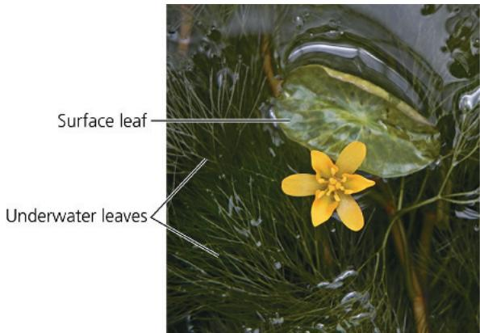

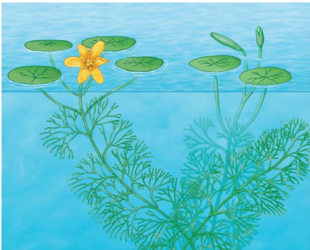

catalyzed a research explosion in the last few decades. Arabidopsis, a tiny weed in the mustard family, has no inherent agricultural value but is a favored model organism of plant geneticists and molecular biologists for many reasons. It is so small that thousands of plants can be cultivated in a few square meters of lab space. It also has a short generation time, taking about six weeks for a seed to grow into a mature plant that produces more seeds. This rapid maturation enables biologists to conduct genetic cross experiments in a relatively short time. One plant can produce over 5,000 seeds, another property that makes Arabidopsis useful for genetic analysis.

Beyond these basic traits, the plant's genome makes it particularly well suited for analysis by molecular genetic methods. The Arabidopsis genome, which includes about 27,000 protein-encoding genes, is among the smallest known in plants. Furthermore, the plant has only five pairs of chromosomes, making it easier for geneticists to locate specific genes. Because Arabidopsis has such a small genome, it was the first plant to have its entire genome sequenced.

The natural range of Arabidopsis includes varied climates and elevations, from the high mountains of Central Asia to the

Figure 35.26 Variations in leaf arrangement, leaf shape, and shoot growth between different populations of Arabidopsis thaliana. Information in the genomes of these populations may provide insights into strategies for expanding crop production into new environments.

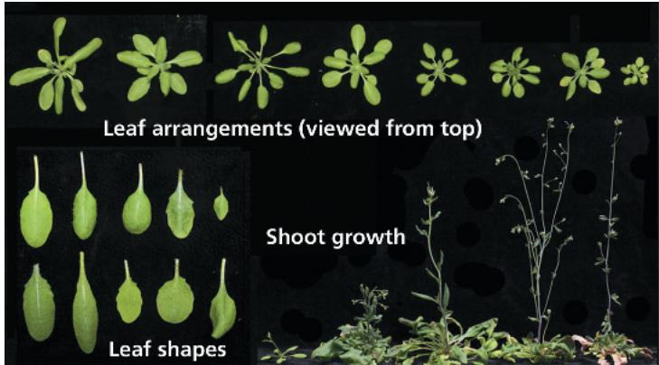

European Atlantic coast, and from North Africa to the Arctic Circle. These local varieties can differ markedly in outward appearance (Figure 35.26). Genome-sequencing efforts are being expanded to include hundreds of populations of Arabidopsis from throughout its natural range in Eurasia. Contained in the genomes of these populations is information about evolutionary adaptations that enabled Arabidopsis to expand its range into new environments following the retreat of the last ice age. This information may provide plant breeders with new insights and strategies for crop improvement.

Another property that makes Arabidopsis attractive to molecular biologists is that its cells can be easily transformed with transgenes, genes from a different organism that are stably introduced into the genome of another. CRISPR technology (see Figure 20.14), which is rapidly becoming the technique of choice for creating plants with specific mutations, has been used successfully in Arabidopsis. By disrupting or “knocking out” a specific gene, scientists can garner important information about the gene’s normal function.

Large-scale projects are under way to determine the function of every gene in Arabidopsis. By identifying each gene's function and tracking every biochemical pathway, researchers aim to determine the blueprints for plant development, a major goal of systems biology. It may one day be possible to make a computer-generated "virtual plant" that enables researchers to visualize which genes are activated in different parts of the plant as the plant develops.

Basic research on model organisms such as Arabidopsis has accelerated the pace of discovery in the plant sciences, including the identification of the complex genetic pathways underlying plant structure. As you read more about this, you'll be able to appreciate not only the power of studying model organisms but also the history of investigation that underpins all modern plant research.

## Interview

Interview with Joanne Chory: Sequencing the Arabidopsis genome (eTextbook only)

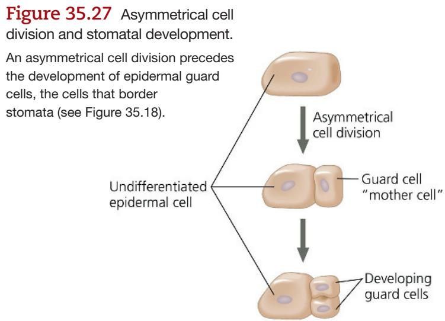

## Growth: Cell Division and Cell Expansion

Cell division enhances the potential for growth by increasing the number of cells, but plant growth itself is brought about by cell enlargement. The process of plant cell division is described more fully in Chapter 12 (see Figure 12.10), and Chapter 39 discusses the process of cell elongation (see Figure 39.7). Here we are concerned with how cell division and enlargement contribute to plant form.

## Cell Division

The new cell walls that bisect plant cells during cytokinesis develop from the cell plate (see Figure 12.10). The precise plane of cell division, determined during late interphase, usually corresponds to the shortest path that halves the cytoplasm of the parent cell. However, during certain points in development the cytoplasm may not be divided equally, resulting in one daughter cell being larger than the other, even though they have the same number of chromosomes. Such cases of asymmetrical cell division usually signal a key event in development. For example, the formation of guard cells involves an asymmetrical cell division. An epidermal cell divides asymmetrically, forming a large cell that remains an undifferentiated epidermal cell and a small cell that becomes the guard cell “mother cell.” Guard cells form when this small mother cell divides in a plane perpendicular to the first cell division (Figure 35.27). Thus, asymmetrical cell division generates cells with different fates—that is, cells that mature into different types.

## Cell Expansion

Cell divisions do not constitute growth because there is no increase of mass involved. Rather, it is cell expansion that is responsible for plant growth. Before discussing how cell expansion contributes to plant growth and form, it is useful to consider the difference in cell expansion between plants and animals. Animal cells grow mainly by synthesizing protein-rich cytoplasm, a metabolically expensive process. Growing plant cells also produce additional protein-rich material in their cytoplasm, but water uptake typically accounts for about 90% of

Figure 35.28 The orientation of plant cell expansion.

Growing plant cells expand mainly through water uptake. In a growing cell, enzymes weaken cross-links in the cell wall, allowing it to expand as water diffuses into the vacuole by osmosis; at the same time, more microfibrils are made. The orientation of the cell expansion is mainly perpendicular to the orientation of cellulose microfibrils in the wall. The orientation of microtubules in the cell's outermost cytoplasm determines the orientation of cellulose microfibrils (fluorescent LM). The microfibrils are embedded in a matrix of other (noncellulose) polysaccharides, some of which form the cross-links visible in the TEM.

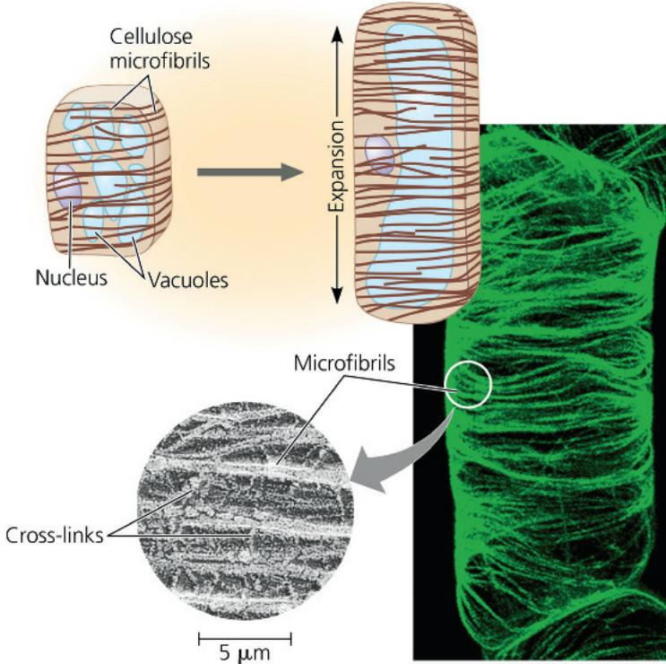

expansion. Most of this water is stored in the large central vacuole. The vacuolar solution, or vacuolar sap, is very dilute and nearly devoid of the energetically expensive macromolecules that are found in great abundance in the rest of the cytoplasm. Large vacuoles are therefore a “cheap” way of filling space, enabling a plant to grow rapidly and economically. Bamboo shoots, for instance, can elongate more than 2 m per week. Rapid and efficient extensibility of shoots and roots was an important evolutionary adaptation that increased their exposure to light and soil.

Plant cells rarely expand equally in all directions. Their greatest expansion is usually oriented along the plant's main axis. For example, cells near the tip of the root may elongate 20 times or more their original length, with relatively little increase in width. The orientation of cellulose microfibrils in the innermost layers of the cell wall causes this differential growth. The microfibrils do not stretch, so the cell expands mainly perpendicular to the main orientation of the microfibrils, as shown in Figure 35.28. A leading hypothesis proposes that microtubules positioned just beneath the plasma membrane organize the cellulose-synthesizing enzyme complexes and guide their movement through the plasma membrane as they create the microfibrils that form much of the cell wall.

## Morphogenesis and Pattern Formation

A plant's body is more than a collection of dividing and expanding cells. During morphogenesis, cells acquire different identities in an ordered spatial arrangement. For example, dermal tissue forms on the exterior and vascular tissue in the interior—never the other way around. The development of specific structures in specific locations is called pattern formation.

Two types of hypotheses have been put forward to explain how the fate of plant cells is determined during pattern formation. Hypotheses based on lineage-based mechanisms propose that cell fate is determined early in development and that cells pass on this destiny to their progeny. In this view, the basic pattern of cell differentiation is mapped out according to the directions in which meristematic cells divide and expand. On the other hand, hypotheses based on position-based mechanisms propose that the cell's final position in an emerging organ determines what kind of cell it will become. In support of this view, experiments in which neighboring cells have been destroyed with lasers have demonstrated that a plant cell's fate is established late in the cell's development and largely depends on signaling from its neighbors.

In contrast, cell fate in animals is largely determined by lineage-dependent mechanisms involving transcription factors. The homeotic (Hox) genes that encode such transcription factors are critical for the proper number and placement of embryonic structures, such as legs and antennae, in the fruit fly Drosophila (see Figure 18.19). Interestingly, maize has a homolog of Hox genes called KNOTTED-1, but unlike its counterparts in the animal world, KNOTTED-1 does not affect the number or placement of plant organs. As you will see, an unrelated class of transcription factors called MADS-box proteins plays that role in plants. KNOTTED-1 is, however, important in the development of leaf shape, including the production of compound leaves. If the KNOTTED-1 gene is expressed in greater quantity than normal in the genome of tomato plants, the normally compound leaves will then become “super-compound” (Figure 35.29).

## Figure 35.29 Overexpression of a Hox-like gene in leaf formation.

KNOTTED-1 is a gene that is involved in leaf and leaflet formation. An increase in its expression in tomato plants results in leaves that are “super-compound” (right) compared with normal leaves (left).

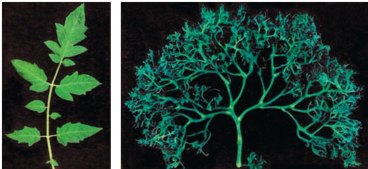

## Gene Expression and the Control of Cell Differentiation

The cells of a developing organism can synthesize different proteins and diverge in structure and function even though they share a common genome. If a mature cell removed from a root or leaf can dedifferentiate in tissue culture and give rise to the diverse cell types of a plant, then it must possess all the genes necessary to make any kind of cell in the plant. Therefore, cell differentiation depends, to a large degree, on the control of gene expression—the regulation of transcription and translation, resulting in the production of specific proteins.

Evidence suggests that the activation or inactivation of specific genes involved in cell differentiation results largely from cell-to-cell communication. Cells receive information about how they should specialize from neighboring cells. For example, two cell types arise in the root epidermis of Arabidopsis: root hair cells and hairless epidermal cells. Cell fate is associated with the position of the epidermal cells relative to other plant cells. The immature epidermal cells that are in contact with two underlying cells of the root cortex differentiate into root hair cells, whereas the immature epidermal cells in contact with only one cell in the cortex differentiate into mature hairless cells. The differential expression of a homeotic gene called GLABRA-2 (from the Latin glaber, bald) is needed for proper distribution of root hairs (Figure 35.30). Researchers have demonstrated this requirement by coupling the GLABRA-2 gene to a “reporter gene” that causes every cell expressing GLABRA-2 in the root to turn pale blue following a certain protocol. The GLABRA-2 gene is normally expressed only in epidermal cells that will not develop root hairs.

Figure 35.30 Control of root hair differentiation by a homeotic gene. (LM)  
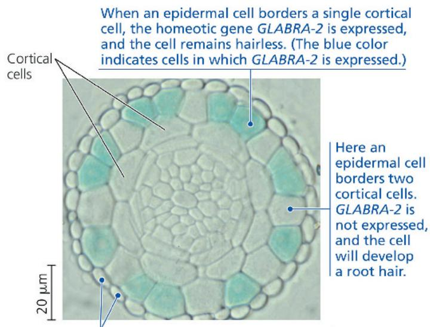  
The root cap cells external to the epidermal layer will be sloughed off before root hairs emerge.  
WHAT IF? What would the roots look like if GLABRA-2 were rendered dysfunctional by a mutation?
For suggested answer, see Appendix A.

## Interview

Interview with Philip Benfey: Studying root development (eTextbook only)

## Shifts in Development: Phase Changes

Multicellular organisms generally pass through developmental stages. In humans, these are infancy, childhood, adolescence, and adulthood, with puberty as the dividing line between the non-reproductive and reproductive stages. Plants also pass through stages, developing from a juvenile stage to an adult vegetative stage to an adult reproductive stage. In animals, the developmental changes take place throughout the entire organism, such as when a larva develops into an adult animal. In contrast, plant developmental stages, called phases, occur within a single region, the shoot apical meristem. The morphological changes that arise from these transitions in shoot apical meristem activity are called phase changes. In the transition from a juvenile phase to an adult phase, some species exhibit conspicuous changes in leaf shape (Figure 35.31). Juvenile nodes and internodes retain their juvenile status even after the shoot apical meristem of the main shoot has changed to the adult phase. Therefore, any new leaves that develop on branches that emerge from axillary buds at juvenile nodes will also be juvenile, even though the apical meristem of the stem's main axis may have been producing mature nodes for years.

If environmental conditions permit, an adult plant is induced to flower. Biologists have made great progress in explaining the genetic control of floral development—the topic of the next section.

Figure 35.31 Phase change in Muehlenbeckia australis.

This native climbing vine of New Zealand has two types of leaves: fiddle-shaped juvenile leaves (top) and oval, smooth-margined mature leaves. This dual foliage reflects a phase change in the development of the apical meristem of each shoot. Once a node forms, the developmental phase—juvenile or adult—is fixed; fiddle-shaped leaves do not mature into oval-shaped leaves.

  
Juvenile leaf

  
Mature leaf

## Genetic Control of Flowering

Flower formation involves a phase change from vegetative growth to reproductive growth. This transition is triggered by a combination of environmental cues, such as day length, and internal signals, such as hormones. (You will learn more about the roles of these signals in Concept 39.3.) Unlike vegetative growth, which is indeterminate, floral growth is usually determinate: The production of a flower by a shoot apical meristem generally stops the primary growth of that shoot. The transition from vegetative growth to flowering is associated with the switching on of flower-inducing genes. The protein products of these genes are transcription factors that regulate the genes required for the conversion of the indeterminate vegetative meristems to determinate floral meristems.

When a shoot apical meristem is induced to flower, the order of each primordium's emergence determines its development into a specific type of floral organ—a sepal, petal, stamen, or carpel (see Figure 30.8 to review). These floral organs form four whorls that can be described roughly as concentric “circles” when viewed from above. Sepals form the first (outermost) whorl; petals form the second; stamens form the third; and carpels form the fourth (innermost) whorl. Plant biologists have identified several genes that encode transcription factors that regulate the development of this characteristic floral pattern. Positional information determines which genes are expressed in a particular floral organ primordium. The result is the development of an emerging floral primordium into a specific floral organ. A mutation in a flower-inducing gene can cause abnormal floral development, such as petals growing in place of stamens (Figure 35.32). Some homeotic mutants with increased petal numbers produce showier flowers that are prized by gardeners.

Figure 35.32 Genes and pattern formation in flower development.  
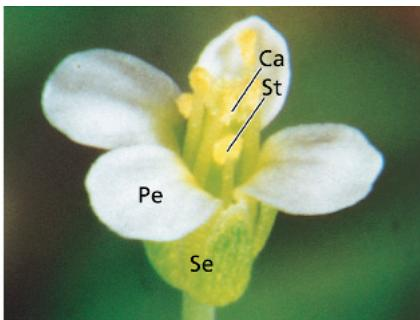  
▲ Normal Arabidopsis flower.
Arabidopsis normally has four whorls of flower parts: sepals (Se), petals (Pe), stamens (St), and carpels (Ca).

▶ Abnormal Arabidopsis flower.
Researchers have identified several mutations that cause abnormal flowers to develop. This flower has an extra set of petals in place of stamens and an internal flower where normal plants have carpels.

MAKE CONNECTIONS Provide another example of a homeotic gene mutation that leads to organs being produced in the wrong place (see Concept 18.4).

For suggested answer, see Appendix A.

Figure 35.33 The ABC hypothesis for the functioning of genes in flower development.  
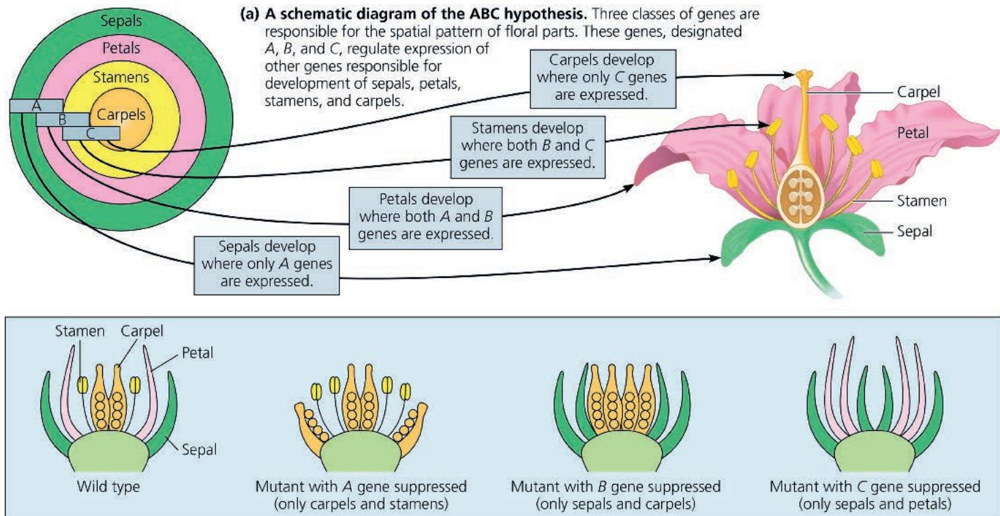  
(b) Side view of wild-type flower and flowers with organ identity mutations. The phenotype of mutants lacking a functional A, B, or C gene can be explained by the model in part (a) and the observation that if the A gene or C gene is suppressed, then the other gene is expressed in that whorl. For example, if the A gene is suppressed in a mutant, then the C gene is expressed where the A gene would normally be expressed. Therefore, carpels (C gene expressed) develop in the outermost whorl, and stamens (B and C genes expressed) develop in the next whorl.  
DRAW IT (a) For each mutant, draw a “bull’s-eye” diagram like the one in part (a), labeling the type of organ and gene(s) expressed in each whorl. (b) Draw and label a “bull’s-eye” diagram for a mutant flower in which the A and B genes were suppressed.

For suggested answer, see Appendix A.

By studying mutants with abnormal flowers, researchers have identified and cloned three classes of genes that determine floral organ identity. Figure 35.33a shows a simplified version of the ABC hypothesis of flower formation, which proposes that three classes of genes direct the formation of the four types of floral organs. According to the ABC hypothesis, each class of genes is switched on in two specific whorls of the floral meristem. Normally, A genes are switched on in the two outer whorls (sepals and petals); B genes are switched on in the two middle whorls (petals and stamens); and C genes are switched on in the two inner whorls (stamens and carpels). Sepals arise from those parts of floral meristems in which only A genes are active; petals arise where A and B genes are active; stamens where B and C genes are active; and carpels where only C genes are active. The ABC hypothesis can account for the phenotypes of mutants lacking A, B, or C gene activity, with one addition: Where A gene activity is present, it inhibits C, and vice versa. If either the A gene or C gene is suppressed, the other gene is expressed. Figure 35.33b shows the floral patterns of mutants lacking each of the three classes of genes and depicts how the hypothesis accounts for the floral phenotypes. By constructing such hypotheses and designing experiments to test them, researchers are tracing the genetic basis of plant development.

In dissecting the plant to examine its parts, as we have done in this chapter, we must remember that the whole plant functions as an integrated organism. Plant structures largely reflect evolutionary adaptations to the challenges of a photoautotrophic existence on land.

## Interview

Interview with Virginia Walbot: Researching plant genetics and development (eTextbook only)

## Concept Check 35.5

1. How can two cells in a plant have vastly different structures even though they have the same genome?

2. What are three differences between animal development and plant development?

3. WHAT IF? In some species, sepals look like petals, and both are collectively called “tepals.” Suggest an extension to the ABC hypothesis that could account for tepals.

# Chapter 35 Review

## Summary of Key Concepts

To review key terms, go to the Vocabulary Self-Quiz (eTextbook only).

Concept 35.1: Plants have a hierarchical organization consisting of organs, tissues, and cells

\- Vascular plants have shoots consisting of stems, leaves, and, in angiosperms, flowers. Roots anchor the plant, absorb and conduct water and minerals, and store food. Leaves are attached to stem nodes and are the main organs of photosynthesis. The axillary buds, in axils of leaves and stems, give rise to branches. Plant organs may be adapted for specialized functions.

\- Vascular plants have three tissue systems—dermal, vascular, and ground—which are continuous throughout the plant. The dermal tissue is a continuous layer of cells that covers the plant exterior. Vascular tissues (xylem and phloem) facilitate the long-distance transport of substances. Ground tissues function in storage, metabolism, and regeneration.

\- Parenchyma cells are relatively undifferentiated and thin-walled cells that retain the ability to divide; they perform most of the metabolic functions of synthesis and storage. Collenchyma cells have unevenly thickened walls; they support young, growing parts of the plant. Sclerenchyma cells—sclereids and fibers—have thick, lignified walls that help support mature, nongrowing parts of the plant. Tracheids and vessel elements, the water-conducting cells of xylem, have thick walls and are dead at functional maturity. Sieve-tube elements are living but highly modified cells that are largely devoid of internal organelles; they function in the transport of sugars through the phloem of angiosperms.

Describe at least three specializations in plant organs and plant cells that are adaptations to life on land.

## Concept 35.2: Different meristems generate new cells for primary and secondary growth

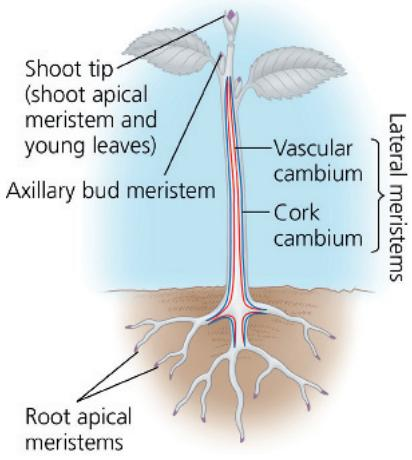  
What is the difference between primary and secondary growth?

## Concept 35.3: Primary growth lengthens roots and shoots

\- The root apical meristem is located near the tip of the root, where it generates cells for the growing root axis and the root cap.

\- The apical meristem of a shoot is located in the apical bud, where it gives rise to alternating internodes and leaf-bearing nodes.

\- Eudicot stems have vascular bundles in a ring, whereas monocot stems have scattered vascular bundles.

\- Mesophyll cells are adapted for photosynthesis. Stomata, epidermal pores formed by pairs of guard cells, allow for gaseous exchange and are major avenues for water loss.

  
How does branching in roots differ from that in stems?

## Concept 35.4: Secondary growth increases the diameter of stems and roots in woody plants

\- The vascular cambium is a meristematic cylinder that produces secondary xylem and secondary phloem during secondary growth. Older layers of secondary xylem (heartwood) become inactive, whereas younger layers (sapwood) still conduct water.

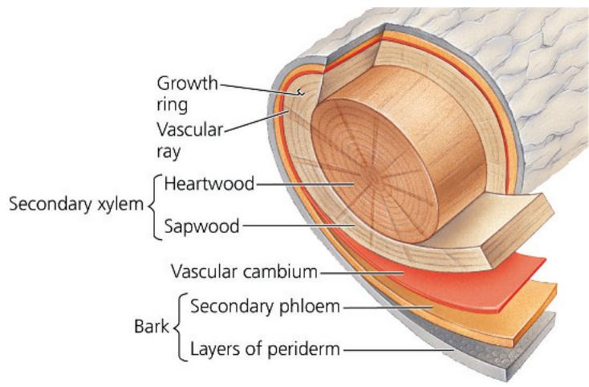

\- The cork cambium gives rise to a thick protective covering called the periderm, which consists of the cork cambium plus the layers of cork cells it produces.

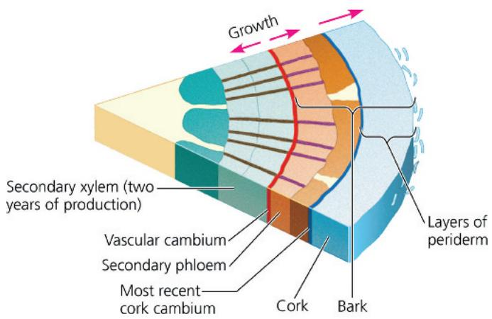  
What advantages did plants gain from the evolution of secondary growth?

## Concept 35.5: Growth, morphogenesis, and cell differentiation produce the plant body

\- Cell division and cell expansion are the primary determinants of growth.

\- Morphogenesis, the development of body shape and organization, depends on cells responding to positional information from their neighbors.

\- Cell differentiation, arising from differential gene activation, enables cells within the plant to assume different functions despite having identical genomes. The way in which a plant cell differentiates is determined largely by the cell's position in the developing plant.

\- Internal or environmental cues may cause a plant to switch from one developmental stage to another—for example, from developing juvenile leaves to developing mature leaves. Such changes in shape are called phase changes.

\- Studies of floral development have provided a model system for studying pattern formation. The ABC hypothesis identifies how three classes of genes control formation of sepals, petals, stamens, and carpels.

By what mechanism do plant cells tend to elongate along one axis instead of expanding in all directions?

For suggested answers, see Appendix A.

## Test Your Understanding

For more multiple-choice questions, go to the Practice Test (eTextbook only).

## Levels 1-2: Remembering/Understanding

1. Most of the growth of a plant body is the result of
(A) cell differentiation.
(B) morphogenesis.
(C) cell division.
(D) cell elongation.

2. The innermost layer of the root cortex is the
(A) core.
(C) endodermis.
(B) pericycle.
(D) pith.

3. Heartwood and sapwood consist of
(A) bark.
(B) periderm.
(C) secondary xylem.
(D) secondary phloem.

4. The phase change of an apical meristem from the juvenile to the mature vegetative phase is often revealed by
(A) a change in the shape of the leaves produced.
(B) the initiation of secondary growth.
(C) the formation of lateral roots.
(D) the activation of flower-inducing genes.

5. The vascular cambium gives rise to
(A) all xylem.
(B) all phloem.
(C) primary xylem and phloem.
(D) secondary xylem and phloem.

6. The root pericycle is the site where
(A) secondary growth originates.
(B) root hairs originate.
(C) lateral roots originate.
(D) the endodermis originates.

7. Root apical meristems are found
(A) only in taproots.
(B) only in lateral roots.
(C) only in adventitious roots.
(D) in all roots.

## Levels 3-4: Applying/Analyzing

8. Suppose a flower had normal expression of genes A and C and expression of gene B in all four whorls. Based on the ABC hypothesis, what would be the structure of that flower, starting at the outermost whorl?

(A) carpel-petal-petal-carpel

(B) petal-petal-stamen-stamen

(C) sepal-carpel-carpel-sepal

(D) sepal-sepal-carpel-carpel

9. Which of the following arise(s), directly or indirectly, from meristematic activity?
(A) secondary xylem (C) dermal tissue
(B) leaves (D) all of the above

10. A strawberry plant mutant that fails to make stolons would suffer from

(A) too little mineral absorption.

(B) a tendency to topple over.

(C) too little water absorption.

(D) a reduction in asexual reproduction.

11. DRAW IT On this cross section from a woody eudicot, label a growth ring, late wood, early wood, and a vessel element. Then, draw an arrow in the pith-to-cork direction.

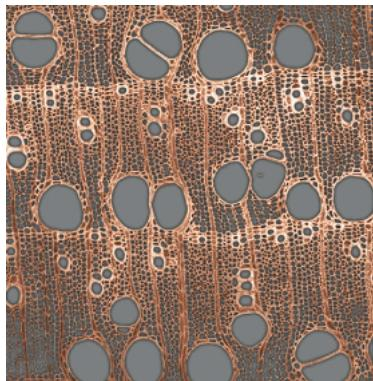

12. VISUAL SKILLS How does the internal anatomy of a tea leaf differ from that of an iris leaf? (Review Figure 35.18.) How might this difference relate to the orientations of the leaves? Explain how the difference shows that structure fits function.

13. VISUAL SKILLS Visitors to the state of Washington can marvel at an unusual sight: a bicycle embedded 4 m above the ground in a living tree. Use your knowledge of primary and secondary growth to visualize and explain how this happened.

## Levels 5-6: Evaluating/Creating

14. EVOLUTION CONNECTION Evolutionary biologists have coined the term exaptation to describe a common occurrence in the evolution of life: A limb or organ evolves in a particular context but over time takes on a new function (see Concept 25.6). Identify some examples of exaptations in plant organs.

15. SCIENTIFIC INQUIRY Grasslands typically do not flourish when large herbivores are removed. Instead, grasslands are replaced by broad-leaved herbaceous eudicots, shrubs, and trees. Based on your knowledge of the structure and growth habits of monocots versus eudicots, suggest a reason why.

16. SCIENCE, TECHNOLOGY, AND SOCIETY Hunger and malnutrition are urgent problems for many poor countries, yet plant biologists in wealthy nations have focused most of their research efforts on Arabidopsis thaliana. Some people have argued that if plant biologists are truly concerned about fighting world hunger, they should study cassava and plantain because these two crops are staples for many of the world's poor. If you were an Arabidopsis researcher, how might you respond to this argument?

17. WRITE ABOUT A THEME: ORGANIZATION In a short essay (100–150 words), explain how the evolution of lignin affected vascular plant structure and function.

18. SYNTHESIZE YOUR KNOWLEDGE

This stained light micrograph shows a cross section through a plant organ from Hakea purpurea, a shrub native to some arid regions of Australia. (a) Review Figures 35.14, 35.17, and 35.18 to identify whether this is a root, stem, or leaf. Explain your reasoning. (b) How might this organ be an adaptation for dry conditions?

For selected answers, see Appendix A.

# Explore Scientific Papers with Science in the Classroom | AAAS

How does one gene affect leaf shape? Go to “Shape Shifters of the Plant World” at www.scienceintheclassroom.org.

Instructors: Questions can be assigned in Mastering Biology.

# Resource Acquisition and Transport in Vascular Plants

## Key Concepts

36.1 Adaptations for acquiring resources were key steps in the evolution of vascular plants

36.2 Different mechanisms transport substances over short or long distances

36.3 Transpiration drives the transport of water and minerals from roots to shoots via the xylem

36.4 The rate of transpiration is regulated by stomata

36.5 Sugars are transported from sources to sinks via the phloem

36.6 The symplast is highly dynamic

  
Figure 36.1 This English ivy has covered every square centimeter of a wall with foliage, an effective way to acquire light energy for photosynthesis. The sugars produced by the leaves and the water and minerals absorbed by the roots have to be transported throughout the plant.

## Study Tip

Make a flowchart: Make a simple flowchart of the movement of water molecules from the soil through the tissues of a plant to the outside air.

Water in soil

is absorbed by

Root hairs

## What causes the movement of water, minerals, and sugars in most vascular plants?

Water and minerals are pulled up from the roots by negative pressure (tension) generated by evaporation from the leaves.

Sugars are pushed by positive pressure from where they are produced or stored to where they are needed. They can move both ways between leaves and roots.

## Concept 36.1: Adaptations for acquiring resources were key steps in the evolution of vascular plants

EVOLUTION Most plants grow in soil and therefore inhabit two worlds—above ground, where shoots acquire sunlight and $CO_{2}$ , and below ground, where roots acquire water and mineral nutrients. The successful colonization of the land by plants depended on adaptations that allowed early plants to acquire resources from these two different settings.

The algal ancestors of plants absorbed water, minerals, and $CO_{2}$ directly from the water in which they lived. Transport in these algae was relatively simple because every cell was close to the source of these substances. The earliest plants were nonvascular and produced photosynthetic shoots above the shallow fresh water in which they lived. These leafless shoots typically had waxy cuticles and few stomata, which allowed them to avoid excessive water loss while still permitting some exchange of $CO_{2}$ and $O_{2}$ for photosynthesis. The anchoring and absorbing functions of early plants were assumed by the base of the stem or by threadlike rhizoids (see Figure 29.16).

As plants evolved and increased in number, competition for light, water, and minerals intensified. Taller plants with broad, flat appendages had an advantage in absorbing light. This increase in surface area, however, resulted in more evaporation and therefore a greater need for water. Larger shoots also required stronger anchorage. These needs favored the production of multicellular, branching roots. Meanwhile, as greater shoot heights further separated the top of the photosynthetic shoot from the nonphotosynthetic parts below ground, natural selection favored plants capable of efficient long-distance transport of water, minerals, and products of photosynthesis.

The evolution of vascular tissue consisting of xylem and phloem made possible the development of extensive root and shoot systems that carry out long-distance transport (see Figure 35.10). The xylem transports water and minerals from roots to shoots. The phloem transports products of photosynthesis from where they are made or stored to where they are needed. Figure 36.2 provides an overview of resource acquisition and transport in an actively photosynthesizing plant.

## Shoot Architecture and Light Capture

Because most plants are photoautotrophs, their success depends ultimately on their ability to photosynthesize. Over the course of evolution, plants have developed a wide variety of shoot

Figure 36.2 An overview of resource acquisition and transport in a vascular plant during the day.  
  
MAKE CONNECTIONS How would you change the figure in order to show gas exchanges at night? (See Figure 10.22.)
For suggested answer, see Appendix A.

Would a higher leaf area index always increase the amount of photosynthesis? Explain. For suggested answer, see Appendix A.

architectures that enable each species to compete successfully for light absorption in the ecological niche it occupies. For example, the lengths and widths of stems, as well as the branching pattern of shoots, are all architectural features affecting light capture.

Stems serve as supporting structures for leaves and as conduits for the transport of water and nutrients. Plants that grow tall avoid shading from neighboring plants. Most tall plants require thick stems, which enable greater vascular flow to and from the leaves and stronger mechanical support for them. Vines are an exception, relying on other objects (usually other plants) to support their stems. In woody plants, stems become thicker through secondary growth (see Figure 35.11). Branching generally enables plants to harvest sunlight for photosynthesis more effectively. However, some species, such as the coconut palm, do not branch at all. Why is there so much variation in branching patterns? Plants have only a finite amount of energy to devote to shoot growth. If most of that energy goes into branching, there is less available for growing tall, and the risk of being shaded by taller plants increases. Conversely, if most of the energy goes into growing tall, the plants are not optimally harvesting sunlight.

Leaf size and structure account for much of the outward diversity in plant form. Leaves range in length from 1.3 mm in the pygmyweed (Crassula connata), a native of dry, sandy regions in the western United States, to 20 m in the palm Raphia regalis, a native of African rain forests. These species represent extreme examples of a general correlation observed between water availability and leaf size. The largest leaves are typically found in species from tropical rain forests, whereas the smallest are usually found in species from dry or very cold environments, where liquid water is scarce and evaporative loss is more problematic.

The arrangement of leaves on a stem, known as phyllotaxy, is an architectural feature important in light capture. Phyllotaxy is determined by the shoot apical meristem (see Figure 35.16) and is specific to each species (Figure 36.3). A species may have one leaf per node (alternate, or spiral, phyllotaxy), two leaves per node (opposite phyllotaxy), or more (whorled phyllotaxy). Most angiosperms have alternate phyllotaxy, with leaves arranged in an ascending spiral around the stem, each successive leaf emerging about $137.5^{\circ}$ from the site of the previous one. Why $137.5^{\circ}$ ? One hypothesis is that this angle minimizes shading of the lower leaves by those above. In environments where intense sunlight can harm leaves, the greater shading provided by oppositely arranged leaves may be advantageous.

The total area of the leafy portions of all the plants in a community, from the top layer of vegetation to the bottom layer, affects the productivity of each plant. When there are many layers of vegetation, the shading of the lower leaves is so great that they photosynthesize less than they respire. When this happens, the nonproductive leaves or branches undergo programmed cell death and are eventually shed, a process called self-pruning.

Plant features that reduce self-shading increase light capture. A useful measurement in this regard is the leaf area index, the ratio of the total upper leaf surface of a single plant or an entire crop divided by the surface area of the land on which the plant or crop grows (Figure 36.4). Leaf area index values of up to 7 are common for many mature crops, and there is little agricultural benefit to leaf area indexes higher than this value. Adding more

Figure 36.3 Emerging phyllotaxy of Norway spruce.
This SEM, taken from above a shoot tip, shows the pattern of emergence of leaves. The leaves are numbered, with 1 being the youngest. (Some numbered leaves are not visible in the close-up.)  
  
VISUAL SKILLS With your finger, trace the progression of leaf emergence, moving from leaf number 29 to 28 and so on. What is the pattern? Based on this pattern of phyllotaxy, predict between which two developing leaf primordia the next primordium will emerge.
For suggested answer, see Appendix A.

Figure 36.4 Leaf area index.

The leaf area index of a single plant is the ratio of the total area of the top surfaces of the leaves to the area of ground covered by the plant, as shown in this illustration of two plants viewed from the top. With many layers of leaves, a leaf area index value can easily exceed 1.

leaves increases shading of lower leaves to the point that self-pruning occurs.

Another factor affecting light capture is leaf orientation. Some plants have horizontally oriented leaves; others, such as grasses, have leaves that are vertically oriented. In low-light conditions, horizontal leaves capture sunlight much more effectively than vertical leaves. In grasslands or other sunny regions, however, horizontal orientation may expose upper leaves to overly intense light, injuring leaves and reducing photosynthesis. But if a plant's leaves are nearly vertical, light rays are essentially parallel to the leaf surfaces, so no leaf receives too much light, and light penetrates more deeply to the lower leaves.

## The Photosynthesis–Water Loss Compromise

The broad surface of most leaves favors light capture, while open stomatal pores allow for the diffusion of $CO_{2}$ into the photosynthetic tissues. Open stomatal pores, however, also promote evaporation of water from the plant. Over 90% of the water lost by plants is by evaporation from stomatal pores. Consequently, shoot adaptations represent compromises between enhancing photosynthesis and minimizing water loss, particularly in environments where water is scarce. Later in the chapter, we’ll discuss the mechanisms by which plants enhance $CO_{2}$ uptake and minimize water loss by regulating the opening of stomatal pores.

## Root Architecture and Acquisition of Water and Minerals

Just as carbon dioxide and sunlight are resources exploited by the shoot system, soil contains resources mined by the root system. Plants rapidly adjust the architecture and physiology of their roots to exploit patches of available mineral nutrients in the soil. The roots of many plants, for example, respond to pockets of low nitrate availability in soils by extending straight through the pockets instead of branching within them. Conversely, when encountering a pocket rich in nitrate, a root will often branch extensively there. Root cells also respond to high soil nitrate levels by synthesizing more proteins involved in nitrate transport and assimilation. Thus, not only does the plant devote more of its mass to exploiting a nitrate-rich patch, but the cells also absorb nitrate more efficiently.

The efficient absorption of limited nutrients is also enhanced by reduced competition within the root system. For example, cuttings taken from stolons of buffalo grass (Bouteloua dactyloides) develop fewer and shorter roots in the presence of cuttings from the same plant than they do in the presence of cuttings from another buffalo grass plant. Researchers are trying to uncover how the plant distinguishes self from nonself.

Plant roots also form mutually beneficial relationships with microorganisms that enable the plant to exploit soil resources more efficiently. For example, the evolution of mutualistic associations between roots and fungi called mycorrhizae was a critical step in the successful colonization of land by plants.

Mycorrhizal hyphae indirectly endow the root systems of many plants with an enormous surface area for absorbing water and minerals, particularly phosphate. The role of mycorrhizae in plant nutrition will be examined in Concept 37.3.

Once acquired, resources must be transported to other parts of the plant that need them. In the next section, we examine the processes and pathways that enable resources such as water, minerals, and sugars to be transported throughout the plant.

## Concept Check 36.1

1. Why is long-distance transport important for vascular plants?

2. Some plants can detect increased levels of light reflected from leaves of encroaching neighbors. This detection elicits stem elongation, production of erect leaves, and reduced lateral branching. How do these responses help the plant compete?

3. WHAT IF? If you prune a plant's shoot tips, what will be the short-term effect on the plant's branching and leaf area index?

For suggested answers, see Appendix A.

## Concept 36.2: Different mechanisms transport substances over short or long distances

Given the diversity of substances that move through plants and the great range of distances and barriers over which such substances must be transported, it is not surprising that plants employ a variety of transport processes. Before examining these processes, however, we'll look at the two major pathways of transport: the apoplast and the symplast.

## The Apoplast and Symplast: Transport Continuums

Plant tissues have two major compartments—the apoplast and the symplast. The apoplast consists of everything external to the plasma membranes of living cells and includes cell walls, extracellular spaces, and the interior of dead cells such as vessel elements and tracheids (see Figure 35.10). The symplast consists of the entire mass of cytosol of all the living cells in a plant, as well as the plasmodesmata, the cytoplasmic channels that interconnect them.

The compartmental structure of plants provides three routes for transport within a plant tissue or organ: the apoplastic, symplastic, and transmembrane routes (Figure 36.5). In the apoplastic route, water and solutes (dissolved chemicals) move along the continuum of cell walls and extracellular spaces. In the symplastic route, water and solutes move along the continuum of cytosol. This route requires substances to cross a

Figure 36.5 Cell compartments and routes for short-distance transport.
Some substances may use more than one transport route.

plasma membrane once, when they first enter the plant. After entering one cell, substances can move from cell to cell via plasmodesmata. In the transmembrane route, water and solutes move out of one cell, across the cell wall, and into the neighboring cell, which may pass them to the next cell in the same way. The transmembrane route requires repeated crossings of plasma membranes as substances exit one cell and enter the next. These three routes are not mutually exclusive, and some substances may use more than one route to varying degrees.

## Short-Distance Transport of Solutes Across Plasma Membranes

In plants, as in any organism, the selective permeability of the plasma membrane controls the short-distance movement of substances into and out of cells (see Concept 7.2). Both active and passive transport mechanisms occur in plants, and plant cell membranes are equipped with the same general types of pumps and transport proteins (channel proteins, carrier proteins, and cotransporters) that function in other cells. There are, however, specific differences between the membrane transport processes of plant and animal cells. In this section, we'll focus on some of those differences.

Unlike in animal cells, hydrogen ions ( $H^{+}$ ) rather than sodium ions ( $Na^{+}$ ) play the primary role in basic transport processes in plant cells. For example, in plant cells the membrane potential (the voltage across the membrane) is established mainly through the pumping of $H^{+}$ by proton pumps (Figure 36.6a) rather than the pumping of $Na^{+}$ by sodium-potassium pumps. Also, $H^{+}$ is most often cotransported in plants, whereas $Na^{+}$ is typically cotransported in animals. During cotransport, plant cells use the energy in the $H^{+}$ gradient and membrane potential to drive the active transport of many different solutes. For instance, cotransport with $H^{+}$ is responsible for absorption of neutral solutes, such as the sugar sucrose, by phloem cells and other plant cells. An $H^{+}/sucrose$ cotransporter couples movement of sucrose against its concentration gradient with movement of $H^{+}$ down its electrochemical gradient (Figure 36.6b). Cotransport with $H^{+}$ also facilitates movement of ions, as in the uptake of nitrate $\left(\mathrm{NO}_{3}^{-}\right)$ by root cells (Figure 36.6c).

The membranes of plant cells also have ion channels that allow only certain ions to pass (Figure 36.6d). As in animal cells, most channels are gated, opening or closing in response to stimuli such as chemicals, pressure, or voltage. Later in this chapter, we'll discuss how potassium ion channels in guard cells function in opening and closing stomata. Ion channels are also involved in producing electrical signals analogous to the action potentials of animals (see Concept 48.2). However, these signals are 1,000 times slower and employ $\mathrm{Ca^{2+}}$ -activated anion channels rather than the sodium ion channels used by animal cells.

## Short-Distance Transport of Water Across Plasma Membranes

The absorption or loss of water by a cell occurs by osmosis, the diffusion of free water—water that is not bound to solutes or surfaces—across a membrane (see Figure 7.12). The physical property that predicts the direction in which water will flow is called water potential, a quantity that includes the effects of solute concentration and physical pressure. Free water moves from regions of higher water potential to regions of lower water potential if there is no barrier to its flow. The word potential in the term water potential refers to water's potential energy—water's capacity to perform work when it moves from a region of higher water potential to a region of lower water potential. For example, if a plant cell or seed is immersed in a solution that has a higher water potential, water will move into the cell or seed, causing it to expand. The expansion of plant cells and seeds can be a powerful force: The expansion of cells in tree roots can break concrete sidewalks, and the swelling of wet grain seeds within the holds of damaged ships can produce catastrophic hull failure and sink the ships. Given the strong forces generated by swelling seeds, it is interesting to consider whether water uptake by seeds is an active process. This question is

Figure 36.6 Solute transport across plant cell plasma membranes.  
  
Assume that a plant cell has all four of the plasma membrane transport proteins shown above and that you have a specific inhibitor for each protein. Predict the effect of each inhibitor on the cell's membrane potential. For suggested answer, see Appendix A.

(a) H $^{+}$ and membrane potential. The plasma membranes of plant cells use ATP-dependent proton pumps to pump H $^{+}$ out of the cell. These pumps contribute to the membrane potential and the establishment of a pH gradient across the membrane. These two forms of potential energy can drive the transport of solutes.

(b) $\mathrm{H^{+}}$ and cotransport of neutral solutes. Neutral solutes such as sugars can be loaded into plant cells by cotransport with $\mathrm{H^{+}}$ ions. $\mathrm{H^{+}}/$ sucrose cotransporters, for example, play a key role in loading sugar into the phloem prior to sugar transport throughout the plant.

(c) $\mathsf{H}^+$ and cotransport of ions. Cotransport mechanisms involving $\mathsf{H}^+$ also participate in regulating ion fluxes into and out of cells. For example, $\mathsf{H}^+ / \mathsf{NO}_3^-$ cotransporters in the plasma membranes of root cells are important for the uptake of $\mathsf{NO}_3^-$ by plant roots.

(d) Ion channels. Plant ion channels open and close in response to voltage, stretching of the membrane, and chemical factors. When open, ion channels allow specific ions to diffuse across membranes. For example, a $K^{+}$ ion channel is involved in the release of $K^{+}$ from guard cells when stomata close.

examined in the Scientific Skills Exercise, on the next page, which explores the effect of temperature on this process.

Water potential is abbreviated by the Greek letter $\Psi$ (psi, pronounced “sigh”). Plant biologists measure $\Psi$ in a unit of pressure called a megapascal (abbreviated MPa). By definition, the $\Psi$ of pure water in a container open to the atmosphere under standard conditions (at sea level and at room temperature) is 0 MPa. One MPa is equal to about 10 times atmospheric pressure at sea level. The internal pressure of a living plant cell due to the osmotic uptake of water is approximately 0.5 MPa, about twice the air pressure inside an inflated car tire.

## How Solutes and Pressure Affect Water Potential

Solute concentration and physical pressure are the major determinants of water potential in hydrated plants, as expressed in the water potential equation:

$$
\Psi = \Psi_ {\mathrm{S}} + \Psi_ {\mathrm{P}}
$$

where $\Psi$ is the water potential, $\Psi_{S}$ is the solute potential (osmotic potential), and $\Psi_{P}$ is the pressure potential. The solute potential ( $\Psi_{S}$ ) of a solution is directly proportional to its molarity. Solute potential is also called osmotic potential because solutes affect the direction of osmosis. The solutes in plants are typically mineral ions and sugars. By definition, the $\Psi_{S}$ of pure water is 0. When solutes are added, they bind water molecules. As a result, there are fewer free water molecules, reducing the capacity of the water to move and do work. In this way, an increase in solute concentration has a negative effect on water potential, which is why the $\Psi_{S}$ of a solution is always expressed as a negative number. For example, a 0.1 M solution of a sugar has a $\Psi_{S}$ of -0.23 MPa. As the solute concentration increases, $\Psi_{S}$ will become more negative.

Pressure potential ( $\Psi_{P}$ ) is the physical pressure on a solution. Unlike $\Psi_{S}$ , $\Psi_{P}$ can be positive or negative relative to atmospheric pressure. For example, when a solution is being withdrawn by a syringe, it is under negative pressure; when it is being expelled from a syringe, it is under positive pressure. The water in living cells is usually under positive pressure due to the osmotic uptake of water. Specifically, the protoplast (the living part of the cell, which also includes the

plasma membrane) presses against the cell wall, creating what is known as turgor pressure. This pushing effect of internal pressure, much like the air in an inflated tire, is critical for plant function because it helps maintain the stiffness of plant tissues and also serves as the driving force for cell elongation. Conversely, the water in the hollow nonliving xylem cells (tracheids and vessel elements) of a plant is often under a negative pressure potential (tension) of less than -2 MPa.

As you learn to apply the water potential equation, keep in mind the key point: Water moves from regions of higher water potential to regions of lower water potential.

# Scientific Skills Exercise Calculating and Interpreting Temperature Coefficients

Does the Initial Uptake of Water by Seeds Depend on Temperature? One way to answer this question is to soak seeds in water at different temperatures and measure the rate of water uptake at each temperature. The data can be used to calculate the temperature coefficient, $Q_{10}$ , the factor by which a physiological reaction (or process) rate increases when the temperature is raised by $10^{\circ}C$ :

$$
Q _ {1 0} = \left(\frac {k _ {2}}{k _ {1}}\right) ^ {\frac {1 0}{t _ {2} - t _ {1}}}
$$

where $t_{2}$ is the higher temperature ( $^{\circ}$ C), $t_{1}$ is the lower temperature, $k_{2}$ is the reaction (or process) rate at $t_{2}$ , and $k_{1}$ is the reaction (or process) rate at $t_{1}$ . (If $t_{2} - t_{1} = 10$ , as here, the math is simplified.)

$Q_{10}$ values may be used to make inferences about the physiological process under investigation. Chemical (metabolic) processes involving large-scale protein shape changes are highly dependent on temperature and have higher $Q_{10}$ values, closer to 2 or 3. In contrast, many, but not all, physical parameters are relatively independent of temperature and have $Q_{10}$ values closer to 1. For example, the $Q_{10}$ of the change in the viscosity of water is 1.2–1.3. In this exercise, you will calculate $Q_{10}$ using data from radish seeds (Raphanus sativum) to assess whether the initial uptake of water by seeds is more likely to be a physical or a chemical process.

How the Experiment Was Done Samples of radish seeds were weighed and placed in water at four different temperatures. After 30 minutes, the seeds were removed, blotted dry, and reweighed. The researchers then calculated the percent increase in mass due to water uptake for each sample.

## Water Movement Across Plant Cell Membranes

Now let's consider how water potential affects absorption and loss of water by a living plant cell. First, imagine a cell that is flaccid (limp) as a result of losing water. The cell has a $\Psi_{\mathrm{P}}$ of $0\mathrm{MPa}$ . Suppose this flaccid cell is bathed in a solution of higher solute concentration (more negative solute potential) than the cell itself (Figure 36.7a). Since the external solution has the lower (more negative) water potential, water diffuses out of the cell. The cell's protoplast undergoes plasmolysis—that is, it shrinks and pulls away from the cell wall. If we place the same flaccid cell in pure water ( $\Psi = 0\mathrm{MPa}$ ) (Figure 36.7b), the cell, because it contains solutes, has a lower water potential than the water, and water enters the cell by osmosis. The contents of the cell begin to swell and press the plasma membrane against the cell wall. The partially elastic wall, exerting turgor pressure, confines the pressurized protoplast. When this pressure is enough to offset the tendency for water to enter because of the solutes in the cell, then $\Psi_{\mathrm{P}}$ and $\Psi_{\mathrm{S}}$ are equal,

## Data from the Experiment

<table><tr><td>Temperature</td><td>% Increase in Mass Due to Water Uptake After 30 Minutes</td></tr><tr><td>5°C</td><td>18.5</td></tr><tr><td>15°C</td><td>26.0</td></tr><tr><td>25°C</td><td>31.0</td></tr><tr><td>35°C</td><td>36.2</td></tr></table>

Data from J. D. Murphy and D. L. Noland, Temperature effects on seed imbibition and leakage mediated by viscosity and membranes, Plant Physiology 69:428–431 (1982).

## INTERPRET THE DATA

1. Based on the data, does the initial uptake of water by radish seeds vary with temperature? What is the relationship between temperature and water uptake?

2. (a) Using the data for $35^{\circ}$ C and $25^{\circ}$ C, calculate $Q_{10}$ for water uptake by radish seeds. Repeat the calculation using the data for $25^{\circ}$ C and $15^{\circ}$ C and the data for $15^{\circ}$ C and $5^{\circ}$ C. (b) What is the average $Q_{10}$ ? (c) Do your results imply that the uptake of water by radish seeds is mainly a physical process or a chemical (metabolic) process? (d) Given that the $Q_{10}$ for the change in the viscosity of water is 1.2–1.3, could the slight temperature dependence of water uptake by seeds be a reflection of the slight temperature dependence of the viscosity of water?

3. Besides temperature, what other independent variables could you alter to test whether radish seed swelling is essentially a physical process or a chemical process?

4. Would you expect plant growth to have a $Q_{10}$ closer to 1 or 3? Why?

Instructors: A version of this Scientific Skills Exercise can be assigned in Mastering Biology.

and $\Psi = 0$ . This matches the water potential of the extracellular environment—in this example, 0 MPa. A dynamic equilibrium has been reached, and there is no further net movement of water.

In contrast to a flaccid cell, a walled cell with a greater solute concentration than its surroundings is turgid, or very firm. When turgid cells in a nonwoody tissue push against each other, the tissue is stiffened. The effects of turgor loss are seen during wilting, when leaves and stems droop as a result of cells losing water.

Figure 36.7 Water relations in plant cells.

In these experiments, flaccid cells (cells in which the protoplast contacts the cell wall but lacks turgor pressure) are placed in two environments. The blue arrows indicate initial net water movement.

  
(a) Initial conditions: cellular $\Psi > environmental \Psi$ . The protoplast loses water, and the cell plasmolyzes. After plasmolysis is complete, the water potentials of the cell and its surroundings are the same.  
(b) Initial conditions: cellular $\Psi < environmental \Psi$ . Net uptake of water by osmosis makes the cell turgid. When this tendency for water to enter is offset by the back pressure of the elastic wall, water potentials are equal for the cell and its surroundings.

## Aquaporins: Facilitating Diffusion of Water

A difference in water potential determines the direction of water movement across membranes, but how do water molecules actually cross the membranes? Water molecules are small enough to diffuse across the phospholipid bilayer, even though the bilayer's interior is hydrophobic. However, their movement across biological membranes is too rapid to be explained by unaided diffusion. Transport proteins called aquaporins (see Figure 7.10 and Concept 7.2) facilitate the transport of water molecules across plant cell plasma membranes. Aquaporin channels, which can open and close, affect the rate at which water moves osmotically across the membrane. Some aquaporins, for example, close in response to high $\mathrm{Ca^{2+}}$ or low pH in the cytosol.

## Long-Distance Transport: The Role of Bulk Flow

Diffusion is an effective transport mechanism over the spatial scales typically found at the cellular level. However, diffusion is much too slow to function in long-distance transport within a plant. Although diffusion from one end of a cell to the other takes just seconds, diffusion from the roots to the top of a giant redwood would take several centuries. Instead, long-distance transport occurs through bulk flow, the movement of liquid in response to a pressure gradient. The bulk flow of material always occurs from higher to lower pressure. Unlike osmosis, bulk flow is independent of solute concentration.

Long-distance bulk flow occurs within specialized cells in the vascular tissue, namely, the tracheids and vessel elements of the xylem and the sieve tube elements of the phloem. In leaves, the branching of veins ensures that no cell is more than a few cells away from the vascular tissue (Figure 36.8).

The structures of the conducting cells of the xylem and phloem facilitate bulk flow. Mature tracheids and vessel elements are dead cells and therefore have no cytoplasm, and the cytoplasm of sieve tube elements (also called sieve tube members) is almost devoid of organelles (see Figure 35.10). If you have dealt with a partially clogged drain, you know that the volume of flow depends on the pipe's diameter. Clogs reduce the effective diameter of the drainpipe. Such experiences help us understand how the structures of plant cells specialized for bulk flow fit their function. Like unclogging a drain, the absence or reduction of cytoplasm in a plant's "plumbing" facilitates bulk flow through the xylem and phloem. Bulk flow is also enhanced by the perforation plates at the ends of vessel elements and the porous sieve plates connecting sieve tube elements.

Diffusion, active transport, and bulk flow act in concert to transport resources throughout the whole plant. For example, bulk flow due to a pressure difference is the mechanism of long-distance transport of sugars in the phloem, but active transport of sugar at the cellular level maintains this pressure difference. In the next three sections, we'll examine in more detail the transport of water and minerals from roots to shoots, the control of evaporation, and the transport of sugars.

Figure 36.8 Venation in an aspen leaf.  
The finer and finer branching of leaf veins in eudicot leaves ensures that no leaf cell is far removed from the vascular system.  
  
VISUAL SKILLS In this leaf, what is the maximum number of cells any mesophyll cell is from a vein?
For suggested answer, see Appendix A.

## Concept Check 36.2

1. If a plant cell immersed in distilled water has a $\Psi_{\mathrm{S}}$ of $-0.7\mathrm{MPa}$ and a $\Psi$ of $0\mathrm{MPa}$ , what is the cell's $\Psi_{\mathrm{P}}$ ? If you put it in an open beaker of solution that has a $\Psi$ of $-0.4\mathrm{MPa}$ what would be its $\Psi_{\mathrm{P}}$ at equilibrium?

2. How would a reduction in the number of aquaporin channels affect a plant cell's ability to adjust to new osmotic conditions?

3. How would the long-distance transport of water be affected if tracheids and vessel elements were alive at maturity? Explain.

4. WHAT IF? What would happen if you put plant protoplasts in pure water? Explain.

For suggested answers, see Appendix A.

## Concept 36.3: Transpiration drives the transport of water and minerals from roots to shoots via the xylem

Picture yourself struggling to carry a 19-liter (5-gallon) container of water weighing 19 kilograms (42 pounds) up several flights of stairs. Now imagine doing this 40 times a day. Then, consider the fact that an average-sized tree, despite having neither heart nor muscle, transports a similar volume of water effortlessly on a daily basis. How do trees accomplish this feat? To answer this question, we'll follow each step in the journey of water and minerals from roots to leaves.

## Absorption of Water and Minerals by Root Cells

Although all living plant cells absorb nutrients across their plasma membranes, the cells near the tips of roots are particularly important because most of the absorption of water and minerals occurs there. In this region, the epidermal cells are permeable to water, and many are differentiated into root hairs, modified cells that account for much of the absorption of water by roots (see Figure 35.3). The root hairs absorb the soil solution, which consists of water molecules and dissolved mineral ions that are not bound tightly to soil particles. The soil solution is drawn into the hydrophilic walls of epidermal cells and passes freely along the cell walls and the extracellular spaces into the root cortex. This flow enhances the exposure of the cells of the cortex to the soil solution, providing a much greater membrane surface area for absorption than the surface area of the epidermis alone. Although the soil solution usually has a low mineral concentration, active transport enables roots to accumulate essential minerals, such as $K^{+}$ , to concentrations hundreds of times greater than in the soil.

## Transport of Water and Minerals into the Xylem

Water and minerals that pass from the soil into the root cortex cannot be transported to the rest of the plant until they enter the xylem of the vascular cylinder, or stele. The endodermis, the innermost layer of cells in the root cortex, functions as a last checkpoint for the selective passage of minerals from the cortex into the vascular cylinder (Figure 36.9). Minerals already in the symplast when they reach the endodermis continue through the plasmodesmata of endodermal cells and pass into the vascular cylinder. These minerals were already screened by the plasma membrane they had to cross to enter the symplast in the epidermis or cortex.

Minerals that reach the endodermis via the apoplast encounter a dead end that blocks their passage into the vascular cylinder. This barrier, located in the transverse and radial walls of each endodermal cell, is the Casparian strip, a belt made of suberin, a waxy material impervious to water and dissolved minerals (see Figure 36.9). Because of the Casparian strip, water and minerals cannot cross the endodermis and enter the vascular cylinder via the apoplast. Instead, water and minerals that are passively moving through the apoplast must cross the selectively permeable plasma membrane of an endodermal cell before they can enter the vascular cylinder. In this way, the endodermis transports needed minerals from the soil into the xylem and keeps many unneeded or toxic substances out. The endodermis also prevents solutes that have accumulated in the xylem from leaking back into the soil solution.

The last segment in the soil-to-xylem pathway is the passage of water and minerals into the tracheids and vessel elements of the xylem. These water-conducting cells lack protoplasts when mature and are therefore parts of the apoplast. Endodermal cells, as well as living cells within the vascular cylinder, discharge minerals from their protoplasts into their own cell walls. Both diffusion and active transport are involved in this transfer of solutes from the symplast to the apoplast, and the water and minerals can now enter the tracheids and vessel elements, where they are transported to the shoot system by bulk flow.

## Bulk Flow Transport via the Xylem

Water and minerals from the soil enter the plant through the epidermis of roots, cross the root cortex, and pass into the vascular cylinder. From there the xylem sap, the water and dissolved minerals in the xylem, is transported long distances by bulk flow to the veins that branch throughout each leaf. As noted earlier, bulk flow is much faster than diffusion or active transport. Peak velocities in the transport of xylem sap can range from 15 to 45 m/hr for trees with wide vessel elements. The stems and leaves depend on this rapid delivery system for their supply of water and minerals.

The process of transporting xylem sap involves the loss of an astonishing amount of water by transpiration, the loss of water vapor from leaves and other aerial parts of the plant. A single maize plant, for example, transpires 60 L of water (the equivalent of 170 12-ounce bottles) during a growing season. A maize crop growing at a typical density of 60,000 plants per hectare

Figure 36.9 Transport of water and minerals from root hairs to the xylem.

VISUAL SKILLS After studying the figure, explain how the Casparian strip forces water and minerals to pass through the plasma membranes of endodermal cells.

For suggested answer, see Appendix A.

1 Apoplastic route. Uptake of soil solution by the hydrophilic walls of root hairs provides access to the apoplast. Water and minerals can then diffuse into the cortex along this matrix of walls and extracellular spaces.

2 Symplastic route. Minerals and water that cross the plasma membranes of root hairs can enter the symplast.

3 Transmembrane route. As soil solution moves along the apoplast, some water and minerals are transported into the protoplasts of cells of the epidermis and cortex and then move inward via the symplast.

4 The endodermis: controlled entry to the vascular cylinder (stele). Within the transverse and radial walls of each endodermal cell is the Casparian strip, a belt of waxy material (purple band) that blocks the passage of water and dissolved minerals. Only minerals already in the symplast or entering that pathway by crossing the plasma membrane of an endodermal cell can detour around the Casparian strip and pass into the vascular cylinder (stele).

transpires almost 4 million L of water per hectare (about 400,000 gallons of water per acre) every growing season. If the transpired water is not replaced by water transported up from the roots, the leaves will wilt, and the plants will eventually die.

5 Transport in the xylem. Endodermal cells and also living cells within the vascular cylinder discharge water and minerals into their walls (apoplast). The xylem vessels then transport the water and minerals by bulk flow upward into the shoot system.

Xylem sap rises to heights of more than 120 m in the tallest trees. Is the sap mainly pushed upward from the roots, or is it mainly pulled upward? Let's evaluate the relative contributions of these two mechanisms.

sometimes causes more water to enter the leaves than is transpired, resulting in guttation, the exudation of water droplets that can be seen in the morning on the tips or edges of some plant leaves (Figure 36.10). Guttation fluid should not be confused with dew, which is condensed atmospheric moisture.

## Pushing Xylem Sap: Root Pressure

At night, when there is almost no transpiration, root cells continue actively pumping mineral ions into the xylem of the vascular cylinder. Meanwhile, the Casparian strip of the endodermis prevents the ions from leaking back out into the cortex and soil. The resulting accumulation of minerals lowers the water potential within the vascular cylinder. Water flows in from the root cortex, generating root pressure, a push of xylem sap. The root pressure

Figure 36.10
Guttation.

Root pressure is forcing excess water from this strawberry leaf.

In most plants, root pressure is a minor mechanism driving the ascent of xylem sap, pushing water only a few meters at most. The positive pressures produced are simply too weak to overcome the gravitational force of the water column in the xylem, particularly in tall plants. Many plants do not generate any root pressure or do so only during part of the growing season. Even in plants that display guttation, root pressure cannot keep pace with transpiration after sunrise. For the most part, xylem sap is not pushed from below by root pressure but is pulled up.

## Pulling Xylem Sap: The Cohesion-Tension Hypothesis

As we have seen, root pressure, which depends on the active transport of solutes by plants, is only a minor force in the ascent of xylem sap. Far from depending on the metabolic activity of cells, most of the xylem sap that rises through a tree does not even require living cells to do so. As demonstrated by Eduard Strasburger in 1891, leafy stems with their lower end immersed in toxic solutions of copper sulfate or acid will readily draw these poisons up if the stem is cut below the surface of the liquid. As the toxic solutions ascend, they kill all living cells in their path, eventually arriving in the transpiring leaves and killing the leaf cells as well. Nevertheless, as Strasburger noted, the uptake of the toxic solutions and the loss of water from the dead leaves can continue for weeks.

In 1894, a few years after Strasburger's findings, two Irish scientists, John Joly and Henry Dixon, put forward a hypothesis that remains the leading explanation of the ascent of xylem sap. According to their cohesion-tension hypothesis, transpiration provides the pull for the ascent of xylem sap, and the cohesion of water molecules transmits this pull along the entire length of the xylem from shoots to roots. Hence, xylem sap is normally under negative pressure, or tension. Since transpiration is a “pulling” process, our exploration of the rise of xylem sap by the cohesion-tension mechanism begins not with the roots but with the leaves, where the driving force for transpirational pull begins.

## Transpirational Pull

Stomata on a leaf's surface lead to a maze of internal air spaces that expose the mesophyll cells to the $\mathrm{CO}_{2}$ they need for photosynthesis. The air in these spaces is saturated with water vapor because it is in contact with the moist walls of the cells. On most days, the air outside the leaf is drier; that is, it has lower water potential than the air inside the leaf. Therefore, water vapor in the air spaces of a leaf diffuses down its water potential gradient and exits the leaf via the stomata. It is this loss of water vapor by diffusion and evaporation that we call transpiration.

But how does loss of water vapor from the leaf translate into a pulling force for upward movement of water through a plant? The negative pressure potential that causes water to move up through the xylem develops at the surface of mesophyll cell walls in the leaf (Figure 36.11). The cell wall acts like a very thin capillary network. Water adheres to the cellulose microfibrils and other hydrophilic components of the cell wall. As water evaporates from the water film that covers the cell walls of mesophyll cells, the air-water interface retreats farther into the cell wall. Because of the high surface tension of water, the curvature of the interface induces a tension, or negative pressure potential, in the water. As more water evaporates from the cell wall, the curvature of the air-water interface increases and the pressure of the water

Figure 36.11 Generation of transpirational pull.

Negative pressure (tension) at the air-water interface in the leaf is the basis of transpirational pull, which draws water out of the xylem.

## Figure 36.12 Ascent of xylem sap.

Hydrogen bonding forms an unbroken chain of water molecules extending from leaves to the soil. The force driving the ascent of xylem sap is a gradient of water potential ( $\Psi$ ). For bulk flow over long distance, the $\Psi$ gradient is due mainly to a gradient of the pressure potential ( $\Psi_{P}$ ). Transpiration results in the $\Psi_{P}$ at the leaf end of the xylem being lower than the $\Psi_{P}$ at the root end. The $\Psi$ values shown at the left are a “snapshot.” They may vary during daylight, but the direction of the $\Psi$ gradient remains the same.

becomes more negative. Water molecules from the more hydrated parts of the leaf are then pulled toward this area, reducing the tension. These pulling forces are transferred to the xylem because each water molecule is cohesively bound to the next by hydrogen bonds. Thus, transpirational pull depends on several of the properties of water discussed in Concept 3.2: adhesion, cohesion, and surface tension.

The role of negative pressure potential in transpiration is consistent with the water potential equation because negative pressure potential (tension) lowers water potential. Because water moves from areas of higher water potential to areas of lower water potential, the more negative pressure potential at the air-water interface causes water in xylem cells to be “pulled”

into mesophyll cells, which lose water to the air spaces, the water diffusing out through stomata. In this way, the negative water potential of leaves provides the “pull” in transpirational pull. The transpirational pull on xylem sap is transmitted all the way from the leaves to the young roots and even into the soil solution (Figure 36.12).

## Cohesion and Adhesion in the Ascent of Xylem Sap

Cohesion and adhesion facilitate the transport of water by bulk flow. Cohesion is the attractive force between molecules of the same substance. Water has an unusually high cohesive force

due to the hydrogen bonds each water molecule can potentially make with other water molecules. Water's cohesive force within the xylem gives it a tensile strength equivalent to that of a steel wire of similar diameter. The cohesion of water makes it possible to pull a column of xylem sap from above without the water molecules separating. Water molecules exiting the xylem in the leaf tug on adjacent water molecules, and this pull is relayed, molecule by molecule, down the entire column of water in the xylem. Meanwhile, the strong adhesion of water molecules (again by hydrogen bonds) to the hydrophilic walls of xylem cells helps offset the downward force of gravity.

The upward pull on the sap creates tension within the vessel elements and tracheids, which are like elastic pipes. Positive pressure causes an elastic pipe to swell, whereas tension pulls the walls of the pipe inward. On a warm day, a decrease in the diameter of a tree trunk can even be measured. As transpirational pull puts the vessel elements and tracheids under tension, their thick secondary walls prevent them from collapsing, much as wire rings maintain the shape of a vacuum-cleaner hose. The tension produced by transpirational pull lowers water potential in the root xylem to such an extent that water flows passively from the soil, across the root cortex, and into the vascular cylinder.

Transpirational pull can extend down to the roots only through an unbroken chain of water molecules. Cavitation, the formation of a water vapor pocket, breaks the chain. It is more common in wide vessel elements than in tracheids and can occur during drought stress or when xylem sap freezes in winter. The air bubbles resulting from cavitation expand and block water channels of the xylem. The rapid expansion of air bubbles produces clicking noises that can be heard by placing sensitive microphones at the surface of the stem.

The interruption of xylem sap transport by cavitation is not always permanent. The chain of water molecules can detour around the air bubbles through pits between adjacent tracheids or vessel elements (see Figure 35.10). Moreover, root pressure enables small plants to refill blocked vessel elements. Recent evidence suggests that cavitation may even be repaired when the xylem sap is under negative pressure, although the mechanism by which this occurs is uncertain. In addition, secondary growth adds a layer of new xylem each year. Only the youngest, outermost secondary xylem layers transport water. Although the older secondary xylem no longer transports water, it does provide support for the tree (see Figure 35.22).

## Xylem Sap Ascent by Bulk Flow: A Review

The cohesion-tension mechanism that transports xylem sap against gravity is an excellent example of how physical principles apply to biological processes. In the long-distance transport of water from roots to leaves by bulk flow, the movement of fluid is driven by a water potential difference at opposite ends of xylem tissue. The water potential difference is created at the leaf end of the xylem by the evaporation of water from leaf cells. Evaporation lowers the water potential at the air-water interface, thereby generating the negative pressure (tension) that pulls water through the xylem.

Bulk flow in the xylem differs from diffusion in some key ways. First, it is driven by differences in pressure potential ( $\Psi_{P}$ ); solute potential ( $\Psi_{S}$ ) is not a factor. Therefore, the water potential gradient within the xylem is essentially a pressure gradient. Also, the flow does not occur across plasma membranes of living cells, but instead within hollow, dead cells. Furthermore, it moves the entire solution together—not just water or solutes—and at much greater speed than diffusion.

The plant expends no energy to lift xylem sap by bulk flow. Instead, the absorption of sunlight drives most of transpiration by causing water to evaporate from the moist walls of mesophyll cells and by lowering the water potential in the air spaces within a leaf. Thus, the ascent of xylem sap, like the process of photosynthesis, is ultimately solar powered.

## Concept Check 36.3

1. A horticulturalist notices that when Zinnia flowers are cut at dawn, a small drop of water collects at the surface of the rooted stump. However, when the flowers are cut at noon, no drop is observed. Suggest an explanation.

2. WHAT IF? Suppose an Arabidopsis mutant lacking functional aquaporin proteins has a root mass three times greater than that of wild-type plants. Suggest an explanation.

3. MAKE CONNECTIONS How are the Casparian strip and tight junctions analogous (see Figure 6.30)?

For suggested answers, see Appendix A.

## Concept 36.4: The rate of transpiration is regulated by stomata

Leaves generally have large surface areas and high surface-to-volume ratios. The large surface area enhances light absorption for photosynthesis. The high surface-to-volume ratio aids in $CO_{2}$ absorption during photosynthesis as well as in the release of $O_{2}$ , a by-product of photosynthesis. Upon diffusing through the stomata, $CO_{2}$ enters a honeycomb of air spaces formed by the spongy mesophyll cells (see Figure 35.18). Because of the irregular shapes of these cells, the leaf's internal surface area may be 10 to 30 times greater than the external surface area.

Although large surface areas and high surface-to-volume ratios increase the rate of photosynthesis, they also increase water loss by way of the stomata. Thus, a plant's tremendous requirement for water is largely a consequence of the shoot system's need for ample exchange of $\mathrm{CO}_{2}$ and $\mathrm{O}_2$ for photosynthesis. By opening and closing the stomata, guard cells help balance the plant's requirement to conserve water with its requirement for photosynthesis.

Figure 36.13 Partially open stomata in the epidermis of a bean (Phaseolus) leaf.  
  
VISUAL SKILLS If the micrograph above is of a section of epidermis 500 $\mu$ m by 300 $\mu$ m, what is the stomatal density of this bean leaf? Give your answer in number of stomata per square centimeter.  
For suggested answer, see Appendix A.

## Stomata: Major Pathways for Water Loss

About 95% of the water a plant loses escapes through stomata, although these pores account for only 1–2% of the external leaf surface. The waxy cuticle limits water loss through the remaining surface of the leaf. Each stoma is flanked by a pair of guard cells. Guard cells control the diameter of the stoma by changing shape, thereby widening or narrowing the gap between the guard cell pair. Under the same environmental conditions, the amount of water lost per leaf depends largely on stomatal density (Figure 36.13) and the average size of the stomatal pores.

Stomatal density can be under both genetic and environmental control. As a result of evolution by natural selection, shade-tolerant species tend to have lower stomatal densities than shade-intolerant species because $\mathrm{CO}_{2}$ uptake doesn't limit photosynthesis under shady conditions. Stomatal density, however, can also be regulated by environmental changes. Low $\mathrm{CO}_{2}$ levels during leaf development, for example, lead to increased stomatal densities in many species, an adaptation that facilitates $\mathrm{CO}_{2}$ uptake under these conditions. By measuring the stomatal density of leaf fossils, scientists have gained insight into the levels of atmospheric $\mathrm{CO}_{2}$ in past climates. A recent British survey found that stomatal density of many woodland species has decreased since 1927, when a similar survey was made. This observation is consistent with other findings that atmospheric $\mathrm{CO}_{2}$ levels increased dramatically during the late 1900s.

## Mechanisms of Stomatal Opening and Closing

When guard cells take in water from neighboring cells by osmosis, they become more turgid. In most angiosperm guard cells, the cell walls facing the stomatal pore are thicker, and the cellulose microfibrils are oriented in a direction that causes the guard cells to bow outward when turgid (Figure 36.14a). This bowing outward increases the size of the pore between the guard cells. When the cells lose water and become flaccid, they become less bowed, and the pore closes.

Figure 36.14 Mechanisms of stomatal opening and closing.  

  
Guard cells turgid/Stoma open

Guard cells flaccid/Stoma closed  

(a) Changes in guard cell shape and stomatal opening and closing (surface view). Guard cells of a typical angiosperm are illustrated in their turgid (stoma open) and flaccid (stoma closed) states. The radial orientation of cellulose microfibrils in the cell walls causes the guard cells to increase more in length than width when turgor increases. Since the two guard cells are tightly joined at their tips, they bow outward when turgid, causing the stomatal pore to open.  
  
(b) Role of potassium ions ( $K^{+}$ ) in stomatal opening and closing. The transport of $K^{+}$ (symbolized here as red dots) across the plasma membrane and vacuolar membrane causes the turgor changes of guard cells. The uptake of anions, such as malate and chloride ions (not shown), also contributes to guard cell swelling.

The changes in turgor pressure in guard cells result primarily from the reversible absorption and loss of $K^{+}$ . Stomata open when guard cells actively accumulate $K^{+}$ from neighboring epidermal cells (Figure 36.14b). The flow of $K^{+}$ across the plasma membrane of the guard cell is coupled to the generation of a membrane potential by proton pumps (see Figure 36.6a). Stomatal opening correlates with active transport of $H^{+}$ out of the guard cell. The resulting voltage (membrane potential) drives $K^{+}$ into the cell through specific membrane channels. The absorption of $K^{+}$ causes the water potential to become more negative within the guard cells, and the cells become more turgid as water enters by osmosis. Because most of the $K^{+}$ and water are stored in the vacuole, the vacuolar membrane also plays a role in regulating guard cell dynamics. Stomatal closing results from a loss of $K^{+}$ from guard cells to neighboring cells, which leads to an osmotic loss of water. Aquaporins also help regulate the osmotic swelling and shrinking of guard cells.

## Stimuli for Stomatal Opening and Closing

In general, stomata are open during the day and mostly closed at night, preventing the plant from losing water under conditions when photosynthesis cannot occur. At least three cues contribute to stomatal opening at dawn: light, $CO_{2}$ depletion, and an internal “clock” in guard cells.

Light stimulates guard cells to accumulate $K^{+}$ and become turgid. This response is triggered by illumination of blue-light receptors in the plasma membrane of guard cells. Activation of these receptors stimulates the activity of proton pumps in the plasma membrane of the guard cells, in turn promoting absorption of $K^{+}$ .

Stomata also open in response to depletion of $\mathrm{CO}_{2}$ within the leaf's air spaces as a result of photosynthesis. As $\mathrm{CO}_{2}$ concentrations decrease during the day, the stomata progressively open if sufficient water is supplied to the leaf.

An internal “clock” in the guard cells ensures that stomata continue their daily rhythm of opening and closing. This rhythm occurs even if a plant is kept in a dark location. All eukaryotic organisms have internal clocks that regulate cyclic processes. Cycles with intervals of approximately 24 hours are called circadian rhythms (which you’ll learn more about in Concept 39.3).

Drought stress can also cause stomata to close. A hormone called abscisic acid (ABA), which is produced in roots and leaves in response to water deficiency, signals guard cells to close stomata. This response reduces wilting but also restricts $CO_{2}$ absorption, thereby slowing photosynthesis. ABA also directly inhibits photosynthesis. Water availability is closely tied to plant productivity not because water is needed as a substrate in photosynthesis, but because freely available water allows plants to keep stomata open and take up more $CO_{2}$ .

Guard cells control the photosynthesis-transpiration compromise on a moment-to-moment basis by integrating a variety of internal and external stimuli. Even the passage of a cloud or a transient shaft of sunlight through a forest can affect the rate of transpiration.

## Effects of Transpiration on Wilting and Leaf Temperature

As long as most stomata remain open, transpiration is greatest on a day that is sunny, warm, dry, and windy because these environmental factors increase evaporation. If transpiration cannot pull sufficient water to the leaves, the shoot becomes slightly wilted as cells lose turgor pressure. Although plants respond to such mild drought stress by rapidly closing stomata, some evaporative water loss still occurs through the cuticle. Under prolonged drought conditions, leaves can become severely wilted and irreversibly injured.

Transpiration also results in evaporative cooling, which can lower a leaf's temperature by as much as $10^{\circ}\mathrm{C}$ compared with the surrounding air. This cooling prevents the leaf from reaching temperatures that could denature enzymes involved in photosynthesis and other metabolic processes.

## Adaptations That Reduce Evaporative Water Loss

Water availability is a major determinant of plant productivity. The main reason water availability is tied to plant productivity is not related to photosynthesis's direct need for water as a substrate but rather because freely available water allows plants to keep stomata open and take up more $\mathrm{CO}_{2}$ . The problem of reducing water loss is especially acute for desert plants. Plants adapted to arid environments are called xerophytes (from the Greek xero, dry).

Many species of desert plants avoid drying out by completing their short life cycles during the brief rainy seasons. Rain comes infrequently in deserts, but when it arrives, the vegetation is transformed as dormant seeds of annual species quickly germinate and bloom, completing their life cycle before dry conditions return.

Other xerophytes have unusual physiological or morphological adaptations that enable them to withstand harsh desert conditions. The stems of many xerophytes are fleshy because they store water for use during long dry periods. Cacti have highly reduced leaves that resist excessive water loss; photosynthesis is carried out mainly in their stems. Another adaptation common in arid habitats is crassulacean acid metabolism (CAM), a specialized form of photosynthesis found in succulents of the family Crassulaceae and several other families (see Figure 10.20). Because the leaves of CAM plants take in $CO_{2}$ at night, the stomata can remain closed during the day, when evaporative stresses are greatest. Other examples of xerophytic adaptations are discussed in Figure 36.15.

## Concept Check 36.4

1. What are the stimuli that control the opening and closing of stomata?

2. The pathogenic fungus Fusicoccum amygdali secretes a toxin called fusicoccin that activates the plasma membrane proton pumps of plant cells and leads to uncontrolled water loss. Suggest a mechanism by which the activation of proton pumps could lead to severe wilting.

3. WHAT IF? If you buy cut flowers, why might the florist recommend cutting the stems underwater and then transferring the flowers to a vase while the cut ends are still wet?

4. MAKE CONNECTIONS Explain why the evaporation of water from leaves lowers their temperature (see Concept 3.2).

For suggested answers, see Appendix A.

Ocotillo (Fouquieria splendens) is common in the southwestern region of the United States and northern Mexico. It is leafless during most of the year, thereby avoiding excessive water loss (right). Immediately after a heavy rainfall, it produces small leaves (below and inset). As the soil dries, the leaves quickly shrivel and die.

Figure 36.15 Some xerophytic adaptations.  

  
The long, white hairlike bristles along the stem of the old man cactus (Cephalocereus senilis) help reflect the intense sunlight of the Mexican desert.

Oleander (Nerium oleander), shown in the inset, is commonly found in arid climates. Its leaves have a thick cuticle and multiple-layered epidermal tissue that reduce water loss. Stomata are recessed in cavities called “crypts,” an adaptation that reduces the rate of transpiration by protecting the stomata from hot, dry wind. Trichomes help minimize transpiration by breaking up the flow of air, allowing the chamber of the crypt to have a higher humidity than the surrounding atmosphere (LM).

# Concept 36.5: Sugars are transported from sources to sinks via the phloem

The unidirectional flow of water and minerals from soil to roots to leaves through the xylem is largely in an upward direction. In contrast, the movement of photosynthates often runs in the opposite direction, transporting sugars from mature leaves to lower parts of the plant, such as root tips that require large amounts of sugars for energy and growth. The transport of the products of photosynthesis, known as translocation, is carried out by another tissue, the phloem.

## Movement from Sugar Sources to Sugar Sinks

Sieve tube elements are specialized cells in angiosperms that serve as conduits for translocation. Arranged end to end, they form long sieve tubes (see Figure 35.10). Between these cells are sieve plates, structures that allow the flow of sap along the sieve tube. Phloem sap, the aqueous solution that flows through sieve tubes, differs markedly from the xylem sap that is transported by tracheids and vessel elements. By far the most prevalent solute in phloem sap is sugar, typically sucrose in most species. The sucrose concentration may be as high as 30% by weight, giving the sap a syrupy thickness. Phloem sap may also contain amino acids, hormones, and minerals.

In contrast to the unidirectional transport of xylem sap from roots to leaves, phloem sap moves from sites of sugar production to sites of sugar use or storage (see Figure 36.2). A sugar source is a plant organ that is a net producer of sugar, by photosynthesis or by breakdown of starch. In contrast, a sugar sink is an organ that is a net consumer or depository of sugar. Growing roots, buds, stems, and fruits are sugar sinks. Although expanding leaves are sugar sinks, mature leaves, if well illuminated, are sugar sources. A storage organ, such as a tuber or a bulb, may be a source or a sink, depending on the season. When stockpiling carbohydrates in the summer, it is a sugar sink. After breaking dormancy in the spring, it is a sugar source because its starch is broken down to sugar, which is carried to the growing shoot tips.

Sinks usually receive sugar from the nearest sugar sources. The upper leaves on a branch, for example, may export sugar to the growing shoot tip, whereas the lower leaves may export sugar to the roots. A growing fruit may monopolize the sugar sources that surround it. For each sieve tube, the direction of transport depends on the locations of the sugar source and sugar sink that are connected by that tube. Therefore, neighboring sieve tubes may carry sap in opposite directions if they originate and end in different locations.

Sugar must be transported, or loaded, into sieve tube elements before being exported to sugar sinks. In some species, it moves from mesophyll cells to sieve tube elements via the symplast, passing through plasmodesmata. In other species, it moves by symplastic and apoplastic pathways. In maize leaves, for example, sucrose diffuses through the symplast from photosynthetic mesophyll cells into small veins. Much of it then moves into the apoplast and is accumulated by nearby sieve tube elements, either directly or, as shown in Figure 36.16a, through companion cells. In some plants, the walls of the companion cells feature many ingrowths, enhancing solute transfer between apoplast and symplast.

In many plants, sugar movement into the phloem requires active transport because sucrose is more concentrated in sieve tube elements and companion cells than in mesophyll. Proton pumping and $H^{+}/$ sucrose cotransport enable sucrose to move from mesophyll cells to sieve tube elements or companion cells (Figure 36.16b).

Sucrose is unloaded at the sink end of a sieve tube. The process varies by species and organ. However, the concentration of free sugar in the sink is always lower than in the sieve tube because the unloaded sugar is consumed during growth and metabolism of the cells of the sink or converted to insoluble polymers such as starch. As a result of this sugar concentration gradient, sugar molecules diffuse from the phloem into the sink tissues, and water follows by osmosis.

## Bulk Flow by Positive Pressure: The Mechanism of Translocation in Angiosperms

Phloem sap flows from source to sink at rates that are as great as 1 m/hr, which is much faster than diffusion or cytoplasmic streaming. Researchers concluded that it moves through the sieve tubes of angiosperms by bulk flow driven by positive pressure, known as pressure flow (Figure 36.17). The building of pressure at the source and reduction of that pressure at the sink cause sap to flow from source to sink.

The pressure-flow hypothesis explains why phloem sap flows from source to sink, and experiments build a strong case for pressure flow as the mechanism of translocation in

Figure 36.16 Loading of sucrose into phloem.  
  
(a) Sucrose manufactured in mesophyll cells can travel via the symplast (dashed blue arrows) to sieve tube elements. In some species, sucrose exits the symplast near sieve tubes and travels through the apoplast (solid red arrow). It is then actively accumulated from the apoplast by sieve tube elements and their companion cells.  
(b) A chemiosmotic mechanism is responsible for the active transport of sucrose into companion cells and sieve tube elements. Proton pumps generate an $H^{+}$ gradient, which drives sucrose accumulation with the help of a cotransport protein that couples sucrose transport to the diffusion of $H^{+}$ back into the cell.

Figure 36.17 Bulk flow by positive pressure (pressure flow) in a sieve tube.

1 Loading of sugar (green dots) into the sieve tube at the source (in this example, a mesophyll cell in a leaf) reduces water potential inside the sieve tube elements. This causes the tube to take up water by osmosis.

2 This uptake of water generates a positive pressure that forces the sap to flow along the tube.

3 The pressure is relieved by the unloading of sugar and the consequent loss of water at the sink.

4 In leaf-to-root translocation, xylem recycles water from sink to source.

angiosperms (Figure 36.18). However, studies using electron microscopes suggest that in nonflowering vascular plants, the pores between phloem cells may be too small or obstructed to permit pressure flow.

Sinks vary in energy demands and capacity to unload sugars. Sometimes there are more sinks than can be supported by sources. In such cases, a plant might abort some flowers, seeds, or fruits—a phenomenon called self-thinning. Removing sinks can also be a horticulturally useful practice. For example, since large apples command a much better price than small ones, growers sometimes remove flowers or young fruits so that their trees produce fewer but larger apples.

## Concept Check 36.5

1. Compare and contrast the forces that move phloem sap and xylem sap over long distances.

2. Identify plant organs that are sugar sources, organs that are sugar sinks, and organs that might be either. Explain.

3. Why can xylem transport water and minerals using dead cells, whereas phloem requires living cells?

4. WHAT IF? Apple growers in Japan sometimes make a nonlethal spiral slash around the bark of trees that are destined for removal after the growing season. This practice makes the apples sweeter. Why?

For suggested answers, see Appendix A.

## Figure 36.18

## Inquiry: Does phloem sap contain more sugar near sources than near sinks?

## Experiment

The pressure-flow hypothesis predicts that phloem sap near sources should have a higher sugar content than phloem sap near sinks. To test this idea, researchers used aphids that feed on phloem sap. An aphid probes with a hypodermic-like mouthpart called a stylet that penetrates a sieve tube element. As sieve tube pressure forced out phloem sap into the stylets, the researchers separated the aphids from the stylets, which then acted as taps exuding sap for hours. Researchers measured the sugar concentration of sap from stylets at different points between a source and sink.

  
Aphid feeding

  
Stylet in sieve tube element

  
Separated stylet exuding sap

## Results

The closer the stylet was to a sugar source, the higher its sugar concentration was.

## Conclusion

The results of such experiments support the pressure-flow hypothesis, which predicts that sugar concentrations should be higher in sieve tubes closer to sugar sources.

Data from S. Rogers and A. J. Peel, Some evidence for the existence of turgor pressure in the sieve tubes of willow (Salix), Planta 126:259–267 (1975).

WHAT IF? Spittlebugs (Clastophora sp.) are xylem sap feeders that use strong muscles to pump xylem sap through their guts. Could you isolate xylem sap from the excised stylets of spittlebugs?
For suggested answer, see Appendix A.

# Concept 36.6: The symplast is highly dynamic

Although we have been discussing transport in mostly physical terms, almost like the flow of solutions through pipes, plant transport is a dynamic and finely tuned process that changes during

development. A leaf, for example, may begin as a sugar sink but spend most of its life as a sugar source. Also, environmental changes may trigger responses in plant transport processes. Water stress may activate signal transduction pathways that greatly alter the membrane transport proteins governing the overall transport of water and minerals. Because the symplast is living tissue, it is largely responsible for the dynamic changes in plant transport processes. We'll look now at some other examples: changes in plas-modesmata, chemical signaling, and electrical signaling.

## Changes in Plasmodesmatal Number and Pore Size

Based mostly on the static images provided by electron microscopy, biologists formerly considered plasmodesmata to be unchanging, pore-like structures. More recent studies, however, have revealed that plasmodesmata are highly dynamic. They can open or close rapidly in response to changes in turgor pressure, cytosolic $Ca^{2+}$ level, or cytosolic pH. Although some plasmodesmata form during cytokinesis, they can also form much later. Moreover, loss of function is common during differentiation. For example, as a leaf matures from a sink to a source, its plasmodesmata either close or are eliminated, causing phloem unloading to cease.

Early studies by plant physiologists and pathologists came to differing conclusions regarding pore sizes of plasmodesmata. Physiologists injected fluorescent probes of different molecular sizes into cells and recorded whether the molecules passed into adjacent cells. Based on these observations, they concluded that the pore sizes were approximately 2.5 nm—too small for macromolecules such as proteins to pass. In contrast, pathologists provided electron micrographs showing evidence of the passage of virus particles with diameters of 10 nm or greater (Figure 36.19).

Subsequently, it was learned that plant viruses produce viral movement proteins that cause the plasmodesmata to dilate, enabling the viral RNA to pass between cells. More recent evidence shows that plant cells themselves regulate plasmodesmata as part of a

Figure 36.19 Virus particles moving cell to cell through plasmodesma connecting turnip leaf cells. (TEM)  

## Interview

Interview with Patricia Zambryski: Exploring the dynamics of plasmodesmata (eTextbook only)

communication network. The viruses can subvert this network by mimicking the cell's regulators of plasmodesmata.

A high degree of cytosolic interconnectedness exists only within certain groups of cells and tissues, which are known as symplastic domains. Informational molecules, such as proteins and RNAs, coordinate development between cells within each symplastic domain. If symplastic communication is disrupted, development can be grossly affected.

## Phloem: An Information Superhighway

In addition to transporting sugars, the phloem is a “superhighway” for the transport of macromolecules and viruses. This transport is systemic (throughout the body), affecting many or all of the plant’s systems or organs. Macromolecules translocated through the phloem include proteins and various types of RNA that enter the sieve tubes through plasmodesmata. Although they are often likened to the gap junctions between animal cells, plasmodesmata are unique in their ability to traffic proteins and RNA.

Systemic communication through the phloem helps integrate the functions of the whole plant. One classic example is the delivery of a flower-inducing chemical signal from leaves to vegetative meristems. Another is a defensive response to localized infection, in which chemical signals traveling through the phloem activate defense genes in noninfected tissues.

## Electrical Signaling in the Phloem

Rapid, long-distance electrical signaling through the phloem is another dynamic feature of the symplast. Electrical signaling has been studied extensively in plants that have rapid leaf movements, such as the sensitive plant (Mimosa pudica) and Venus flytrap (Dionaea muscipula). However, its role in other species is less clear. Some studies have revealed that a stimulus in one part of a plant can trigger an electrical signal in the phloem that travels to other parts where it may elicit changes in gene transcription, respiration, photosynthesis, phloem unloading, or hormonal levels. Thus, the phloem can serve a nerve-like function, allowing for swift electrical communication between widely separated organs.

The coordinated transport of materials and information is central to plant survival. Plants can acquire only so many resources in the course of their lifetimes. Ultimately, the successful acquisition of these resources and their optimal distribution are the most critical determinants of whether the plant will compete successfully.

## Concept Check 36.6

1. How do plasmodesmata differ from gap junctions?

2. Nerve-like signals in animals are thousands of times faster than their plant counterparts. Suggest a behavioral reason for the difference.

3. WHAT IF? Suppose plants were genetically modified to be unresponsive to viral movement proteins. Would this be a good way to prevent the spread of infection? Explain.

## Summary of Key Concepts

To review key terms, go to the Vocabulary Self-Quiz (eTextbook only).

Concept 36.1: Adaptations for acquiring resources were key steps in the evolution of vascular plants

\- Leaves typically function in gathering sunlight and $CO_{2}$ . Stems serve as supporting structures for leaves and as conduits for the long-distance transport of water and nutrients. Roots mine the soil for water and minerals and anchor the whole plant.

\- Natural selection has produced plant architectures that optimize resource acquisition in the ecological niche in which the plant species naturally exists.

How did the evolution of xylem and phloem contribute to the successful colonization of land by vascular plants?

## Concept 36.2: Different mechanisms transport substances over short or long distances

\- The selective permeability of the plasma membrane controls the movement of substances into and out of cells. Both active and passive transport mechanisms occur in plants.

\- Plant tissues have two major compartments: the apoplast (everything outside the cells' plasma membranes) and the symplast (the cytosol and connecting plasmodesmata).

\- Direction of water movement depends on the water potential, a quantity that incorporates solute concentration and physical pressure. The osmotic uptake of water by plant cells and the resulting internal pressure that builds up make plant cells turgid.

\- Long-distance transport occurs through bulk flow, the movement of liquid in response to a pressure gradient. Bulk flow occurs within the tracheids and vessel elements of the xylem and within the sieve tube elements of the phloem.

Is xylem sap usually pulled or pushed up the plant?

## Concept 36.3: Transpiration drives the transport of water and minerals from roots to shoots via the xylem

\- Water and minerals from the soil enter the plant through the epidermis of roots, cross the root cortex, and then pass into the vascular cylinder by way of the selectively permeable cells of the endodermis. From the vascular cylinder, the xylem sap is transported long distances by bulk flow to the veins that branch throughout each leaf.

\- The cohesion-tension hypothesis proposes that the movement of xylem sap is driven by a water potential difference created at the leaf end of the xylem by the evaporation of water from leaf cells. Evaporation lowers the water potential at the air-water interface, thereby generating the negative pressure that pulls water through the xylem.

Why is the ability of water molecules to form hydrogen bonds important for the movement of xylem sap?

## Concept 36.4: The rate of transpiration is regulated by stomata

\- Transpiration is the loss of water vapor from plants. Wilting occurs when the water lost by transpiration is not replaced by absorption from roots. Plants respond to water deficits by closing their stomata. Under prolonged drought conditions, plants can become irreversibly injured.

\- Stomata are the major pathway for water loss from plants. A stoma opens when guard cells bordering the stomatal pore take up $K^{+}$ . The opening and closing of stomata are controlled by light, $CO_{2}$ , the drought hormone abscisic acid, and a circadian rhythm.

\- Xerophytes are plants that are adapted to arid environments. Reduced leaves and CAM photosynthesis are examples of adaptations to arid environments.

Why are stomata necessary?

## Concept 36.5: Sugars are transported from sources to sinks via the phloem

\- Mature leaves are the main sugar sources, although storage organs can be seasonal sources. Growing organs such as roots, stems, and fruits are the main sugar sinks. The direction of phloem transport is always from sugar source to sugar sink.

\- Phloem loading depends on the active transport of sucrose. Sucrose is cotransported with $H^{+}$ , which diffuses down a gradient generated by proton pumps. Loading of sugar at the source and unloading at the sink maintain a pressure difference that keeps phloem sap flowing through a sieve tube.

Why is phloem transport considered an active process?

## Concept 36.6: The symplast is highly dynamic

\- Plasmodesmata can change in permeability and number. When dilated, they provide a passageway for the symplastic transport of proteins, RNAs, and other macromolecules over long distances. The phloem also conducts nerve-like electrical signals that help integrate whole-plant function.

By what mechanisms is symplastic communication regulated?

For suggested answers, see Appendix A.

## Test Your Understanding

For more multiple-choice questions, go to the Practice Test (eTextbook only).

## Levels 1-2: Remembering/Understanding

1. Which of the following is an adaptation that enhances the uptake of water and minerals by roots?

(A) mycorrhizae

(B) pumping through plasmodesmata

(C) active uptake by vessel elements

(D) rhythmic contractions by cells in the root cortex

2. Which structure or compartment is part of the symplast? (A) the interior of a vessel element (B) the interior of a sieve tube (C) the cell wall of a mesophyll cell (D) an extracellular air space

3. Movement of phloem sap from a source to a sink

(A) occurs through the apoplast of sieve tube elements.

(B) depends ultimately on the activity of proton pumps.

(C) depends on tension, or negative pressure potential.

(D) results mainly from diffusion.

## Levels 3-4: Applying/Analyzing

4. Photosynthesis ceases when leaves wilt, mainly because

(A) the chlorophyll in wilting leaves is degraded.

(B) accumulation of $CO_{2}$ in the leaf inhibits enzymes.

(C) stomata close, preventing $CO_{2}$ from entering the leaf.

(D) photolysis, the water-splitting step of photosynthesis, cannot occur when there is a water deficiency.

5. What would enhance water uptake by a plant cell?
(A) decreasing the $\Psi$ of the surrounding solution
(B) positive pressure on the surrounding solution
(C) the loss of solutes from the cell
(D) increasing the $\Psi$ of the cytoplasm

6. A plant cell with a $\Psi_{S}$ of -0.65 MPa maintains a constant volume when bathed in a solution that has a $\Psi_{S}$ of -0.30 MPa and is in an open container. The cell has a

(A) $\Psi_{P}$ of +0.65 MPa.

(B) $\Psi$ of -0.65 MPa.

(C) $\Psi_{P}$ of +0.35 MPa.

(D) $\Psi_{P}$ of 0 MPa.

7. Compared with a cell with few aquaporin proteins in its membrane, a cell containing many aquaporin proteins will (A) have a faster rate of osmosis.
(B) have a lower water potential.
(C) have a higher water potential.
(D) accumulate water by active transport.

8. Which of the following would tend to increase transpiration?

(A) spiny leaves

(B) sunken stomata

(C) a thicker cuticle

(D) higher stomatal density

## Levels 5-6: Evaluating/Creating

9. EVOLUTION CONNECTION Large brown algae called kelps can grow as tall as 25 m. Kelps consist of a holdfast anchored to the ocean floor, blades that float at the surface and collect light, and a long stalk connecting the blades to the holdfast (see Figure 28.13). Specialized cells in the stalk, although nonvascular, can transport sugar. Suggest a reason why these structures analogous to sieve tube elements might have evolved in kelps.

10. SCIENTIFIC INQUIRY • INTERPRET THE DATA A Minnesota gardener notes that the plants immediately bordering a walkway are stunted compared with those farther away. Suspecting that the soil near the walkway may be contaminated from salt added to the walkway in winter, the gardener tests the soil. The composition of the soil near the walkway is identical to that farther away except that it contains an additional 50 mM NaCl. Assuming that the NaCl is completely ionized, calculate how much it will lower the solute potential of the soil at 20°C using the solute potential equation:

$$
\Psi_ {S} = - i C R T
$$

where i is the ionization constant (2 for NaCl), C is the molar concentration (in mol/L), R is the pressure constant $[R = 0 \cdot 00831 (\text{L} \cdot \text{MPa}) / (\text{mol} \cdot \text{K})]$ , and T is the temperature in Kelvin (273 + °C).

How would this change in the solute potential of the soil affect the water potential of the soil? Explain in what way the change in the water potential of the soil would affect the movement of water in or out of the roots.

11. SCIENTIFIC INQUIRY Cotton plants wilt within a few hours of flooding of their roots. The flooding leads to low-oxygen conditions, increases in cytosolic $Ca^{2+}$ concentration, and decreases in cytosolic pH. Suggest a hypothesis to explain how flooding leads to wilting.

12. WRITE ABOUT A THEME: ORGANIZATION Natural selection has led to changes in the architecture of plants that enable them to photosynthesize more efficiently in the ecological niches they occupy. In a short essay (100–150 words), explain how shoot architecture enhances photosynthesis.

## 13. SYNTHESIZE YOUR KNOWLEDGE

  
Imagine yourself as a water molecule in the soil solution of a forest. In a short essay (100–150 words), explain what pathways and what forces would be necessary to carry you to the leaves of these trees.

For selected answers, see Appendix A.

# Soil and Plant Nutrition

## Key Concepts

37.1 Soil contains a living, complex ecosystem

37.2 Plant roots absorb many types of essential elements from the soil

37.3 Plant nutrition often involves relationships with other organisms

  
Figure 37.1 This farmer in India is applying chemical fertilizers to a field of rice. Nitrogen (N), phosphorus (P), and potassium (K) are commonly depleted from soils to such an extent as to limit crop productivity. That is why they are the major ingredients of most chemical fertilizers.

## Study Tip

Use mnemonics: Mnemonics are memory tools to help remember facts. For example, “See Hopkins, California—Mighty good” (CHOPKNSCaMg) is a mnemonic for remembering the nine plant macronutrients, as shown here. Make your own mnemonics for remembering some functions of plant macronutrients (see Table 37.1).

See Hopkins, California—Mighty good

See = C = carbon

H = H = hydrogen

o = O = oxygen

## Why do plants need minerals from the soil?

## Phosphorus is a component of

• DNA and RNA (throughout the cell)

• ATP produced by mitochondria

• phospholipids in cell membranes

Nitrogen, phosphorus, potassium, and other minerals are essential for plant growth because of their roles in the structure and function of plant cells.

  
Potassium is a cofactor for enzymes used throughout the cell; plays a major role in maintaining turgor

Nitrogen is a component of

• DNA and RNA (throughout the cell)

• proteins
(throughout the cell)
• chlorophyll

# Concept 37.1: Soil contains a living, complex ecosystem

The upper layers of the soil, from which plants absorb nearly all of the water and minerals they require, contain a wide range of living organisms that interact with each other and with the physical environment. This complex ecosystem may take centuries to form but can be destroyed by human mismanagement in just a few years. To understand why soil must be conserved and why particular plants grow where they do, we must first consider the basic physical properties of soil: its texture and composition.

## Soil Texture

The texture of soil depends on the sizes of its particles. Soil particles can range from coarse sand (0.02–2 mm in diameter) to silt (0.002–0.02 mm) to microscopic clay particles (less than 0.002 mm). These different-sized particles arise ultimately from the weathering of rock. Water freezing in crevices of rocks causes mechanical fracturing, and weak acids in the soil break rocks down chemically. When organisms penetrate the rock, they accelerate breakdown by chemical and mechanical means. Roots, for example, secrete acids that dissolve the rock, and their growth in fissures leads to mechanical fracturing. Mineral particles released by weathering become mixed with living organisms and humus, the remains of dead organisms and other organic matter, forming topsoil. The topsoil and other soil layers are called soil horizons (Figure 37.2). The topsoil, or A horizon, can range in depth from millimeters to meters. We focus mostly on properties of topsoil because it is generally the most important soil layer for plant growth.

Figure 37.2 Soil horizons.  
  
The A horizon is the topsoil, a mixture of broken-down rock of various textures, living organisms, and decaying organic matter.  
The B horizon contains much less organic matter than the A horizon and is less weathered.

The C horizon is composed mainly of partially broken-down rock. Some of the rock served as "parent" material for minerals that later helped form the upper horizons.

The topsoils that are the most fertile—supporting the most abundant growth—are loams, which are composed of roughly equal amounts of sand, silt, and clay. Loamy soils have enough small silt and clay particles to provide ample surface area for the adhesion and retention of minerals and water.

Plants are actually nourished by the soil solution, which consists of the water and dissolved minerals in the pores between soil particles. After a heavy rain, water drains from the larger spaces in the soil, but smaller spaces retain water because water molecules are attracted to the negatively charged surfaces of clay and other particles. The large spaces between soil particles in sandy soils generally don't retain enough water to support vigorous plant growth, but they do enable efficient diffusion of oxygen to the roots. Soils with large amounts of clay tend to retain too much water, and when soil does not drain adequately, the air is replaced by water, and the roots suffocate from lack of oxygen. Typically, the most fertile topsoils have pores containing about half water and half air, providing a good balance between aeration, drainage, and water storage capacity. The physical properties of soils can be adjusted by adding soil amendments, such as peat moss, compost, manure, or sand.

## Topsoil Composition

In addition to water and air, topsoil contains inorganic (mineral) and organic chemical components. The organic components include the many life-forms that inhabit the soil.

## Inorganic Components

The surface charges of soil particles determine their ability to bind many nutrients. Most of the soil particles in productive soils are negatively charged and therefore do not bind negatively charged ions (anions), such as the plant nutrients nitrate $\left(\mathrm{NO}_{3}^{-}\right)$ , phosphate $\left(\mathrm{H}_{2}\mathrm{PO}_{4}^{-}\right)$ , and sulfate $\left(\mathrm{SO}_{4}^{2-}\right)$ . As a result, these nutrients are easily lost by leaching, percolation of water through the soil. Positively charged ions (cations)—such as potassium $\left(\mathrm{K}^{+}\right)$ , calcium $\left(\mathrm{Ca}^{2+}\right)$ , and magnesium $\left(\mathrm{Mg}^{2+}\right)$ —adhere to negatively charged soil particles, so are less easily lost by leaching.

Roots, however, do not absorb mineral cations directly from soil particles; they absorb them from the soil solution. Mineral cations enter the soil solution by cation exchange, a process in which cations are displaced from soil particles by other cations, particularly $\mathrm{H^{+}}$ (Figure 37.3). Therefore, a soil's capacity to exchange cations is determined by the number of cation adhesion sites and by the soil's pH. In general, the more clay and organic matter in the soil, the higher the cation exchange capacity. The clay content is important because these small particles have a high ratio of surface area to volume, allowing for the ample binding of cations.

## Organic Components

The major organic component of topsoil is humus, which consists of organic material produced by the decomposition of fallen leaves, dead organisms, feces, and other organic matter by bacteria and fungi. Humus prevents clay particles from packing together

Figure 37.3 Cation exchange in soil.

③ H+ ions in the soil solution neutralize the negative charge of soil particles, causing release of mineral cations into the soil solution.

  
VISUAL SKILLS Which are more likely to be leached from the soil by decreasing pH—cations or anions? Explain.
For suggested answer, see Appendix A.

and forms a crumbly soil that retains water but is still porous enough to aerate roots. Humus also increases the soil's capacity to exchange cations and is a reservoir of mineral nutrients that return gradually to the soil as microorganisms decompose the organic matter.

Topsoil is home to an astonishing number and variety of organisms. A teaspoon of topsoil has about 5 billion bacteria, which cohabit with fungi, algae and other protists, insects, earthworms, nematodes, and plant roots. The activities of all these organisms affect the soil's physical and chemical properties. Earthworms, for example, consume organic matter and derive their nutrition from the bacteria and fungi growing on this material. They excrete wastes and move large amounts of material to the soil surface. In addition, they move organic matter into deeper layers. Earthworms mix and clump the soil particles, allowing for better gaseous diffusion and water retention. Roots also affect soil texture and composition. For example, they reduce erosion by binding the soil, and they lower soil pH by excreting acids.

## Soil Conservation and Sustainable Agriculture

Ancient farmers recognized that crop yields on a particular plot of land decreased over the years. Moving to uncultivated areas, they observed the same pattern of reduced yields over time. Eventually, they realized that fertilization, the addition of mineral nutrients to the soil, could make soil a renewable resource that enabled crops to be cultivated season after season at a fixed location. This sedentary agriculture facilitated a new way of life. Humans began to build permanent dwellings—the first villages. They also stored food for use between harvests, and food surpluses enabled some people to specialize in nonfarming occupations. In short, soil management, by fertilization and other practices, helped prepare the way for modern societies.

Unfortunately, soil mismanagement has been a recurrent problem throughout human history. A dramatic example is the American Dust Bowl, an ecological and human disaster that ravaged the southwestern Great Plains of the United States in the 1930s. This region suffered through devastating dust storms that resulted from a prolonged drought and decades of inappropriate farming techniques. Before farmers arrived, the Great Plains had been covered by hardy grasses that held the soil in place in spite of recurring droughts and torrential rains. But in the late 1800s and early 1900s, many settlers planted wheat and raised cattle. These land uses left the soil exposed to erosion by winds. A few years of drought made the problem worse. During the 1930s, huge quantities of fertile soil were blown away in “black blizzards,” rendering millions of hectares of farmland useless (Figure 37.4). In one of the worst dust storms, clouds of dust blew eastward to Chicago, where soil fell like snow, and even reached the Atlantic coast. Hundreds of thousands of people in the Dust Bowl region were forced to abandon their homes and land, a plight immortalized in John Steinbeck’s novel The Grapes of Wrath.

Soil mismanagement continues to be a major problem to this day. More than $30\%$ of the world's farmland has reduced productivity caused by poor soil conditions, such as chemical contamination, mineral deficiencies, acidity, salinity, and poor drainage. As the world's population grows, the demand for food increases. Because soil quality greatly affects crop yield, soil resources must be managed prudently. Today, the most productive lands are already being used for agriculture, so there are no more frontiers for farmers to clear. Thus, it is critical that farmers embrace sustainable agriculture, a commitment to farming practices that are conservation minded, environmentally safe, and profitable. Sustainable agriculture includes the prudent use of irrigation and soil amendments, the protection of topsoil from salinization and erosion, and the restoration of degraded lands.

Figure 37.4 A massive dust storm in the American Dust Bowl during the 1930s.  
  
Which soil horizon contributed to these dust clouds? For suggested answer, see Appendix A.

Figure 37.5 Sudden land subsidence.

Overuse of groundwater for irrigation triggered formation of this sinkhole in Florida.

## Irrigation

Because water shortage often limits plant growth, perhaps no technology has increased crop yield as much as irrigation. However, irrigation drains freshwater resources. Globally, about 75% of all freshwater use is devoted to agriculture. Many rivers in arid regions have been reduced to trickles by diverting water for irrigation. The primary source of irrigation water, however, is not surface waters, such as rivers and lakes, but underground water reserves called aquifers. In some regions, the rate of water removal is exceeding the natural refilling of the aquifers, making this practice unsustainable. A further consequence of aquifer depletion is land subsidence, a gradual settling or sudden sinking of the ground surface directly above the aquifer (Figure 37.5). Land subsidence can destroy property and negatively impact agriculture.

Irrigation, particularly from groundwater, can also lead to soil salinization—the addition of salts to the soil that make it too salty for cultivating plants. Salts dissolved in irrigation water accumulate in the soil as the water evaporates, making the water potential of the soil solution more negative. The water potential gradient from soil to roots is reduced, diminishing water uptake (see Figure 36.12).

Many forms of irrigation, such as the flooding of fields, are wasteful because much of the water evaporates. To use water efficiently, farmers must understand the water-holding capacity of their soil, the water needs of their crops, and the appropriate irrigation technology. One popular technology is drip irrigation, the slow release of water to soil and plants from perforated plastic tubing placed directly at the root zone. Because drip irrigation requires less water and reduces salinization, it is used mainly in arid agricultural regions.

## Fertilization

In natural ecosystems, mineral nutrients are usually recycled by the excretion of animal wastes and the decomposition of humus. Agriculture, however, can interfere with this recycling. The lettuce you eat, for example, contains minerals extracted from a farmer's field. As you excrete wastes, these minerals are deposited far from their original source. Over many harvests, the farmer's field eventually becomes depleted of nutrients. Nutrient depletion is a major cause of global soil degradation. Farmers must reverse nutrient depletion by means of fertilization.

Today, most farmers in industrialized nations use fertilizers containing minerals that are either mined or prepared by energy-intensive processes. These fertilizers are usually enriched in nitrogen (N), phosphorus (P), and potassium (K)—the nutrients most commonly deficient in depleted soils. You may have seen fertilizers labeled with a three-number code, called the N–P–K ratio. A fertilizer marked “15–10–5,” for instance, is by weight 15% N (as ammonium or nitrate), 10% P (as phosphate), and 5% K (as the mineral potash).

Manure, fishmeal, and compost are called “organic” fertilizers because they contain organic material. Before plants can use organic material, however, it must be decomposed into the inorganic nutrients that roots can absorb. Whether from organic fertilizer or a chemical factory, the minerals a plant extracts are in the same form. However, organic fertilizers release them gradually, whereas minerals in commercial fertilizers are immediately available but may not be retained by the soil for long. Minerals not absorbed by roots are often leached from the soil by rainwater or irrigation. Mineral runoff into lakes may lead to explosions in algal populations that can deplete oxygen levels and reduce fish populations.

## Adjusting Soil pH

Soil pH is an important factor that influences mineral availability by its effect on cation exchange and the chemical form of minerals. Depending on the soil pH, a particular mineral may be bound too tightly to clay particles or may be in a chemical form that the plant cannot absorb. Most plants prefer slightly acidic soil because the high $H^{+}$ concentrations can displace positively charged minerals from soil particles, making them more available for absorption. Adjusting soil pH is tricky because a change in $H^{+}$ concentration may make one mineral more available but another less available. At pH 8, for instance, plants can absorb calcium, but iron is almost unavailable. The soil pH should be matched to a crop's mineral needs. If the soil is too alkaline, adding sulfate will lower the pH. Soil that is too acidic can be adjusted by adding lime (calcium carbonate or calcium hydroxide).

When the soil pH dips to 5 or lower, toxic aluminum ions ( $Al^{3+}$ ) become more soluble and are absorbed by roots, stunting root growth and preventing the uptake of calcium, a needed plant nutrient. Low soil pH and $Al^{3+}$ toxicity are especially serious problems in tropical regions, where the pressure of producing food for a growing population is often most acute. Some plants can cope with high $Al^{3+}$ levels by secreting organic anions that bind $Al^{3+}$ and render it harmless. Scientists have altered tobacco and papaya plants by introducing a citrate synthase gene from a bacterium into the plants' genomes. The resulting overproduction of citric acid increased aluminum resistance.

Figure 37.6 Contour tillage.

These crops are planted in rows that go around, rather than up and down, the hillside. Contour tillage helps slow water runoff and topsoil erosion after heavy rains.

## Controlling Erosion

As happened most dramatically in the Dust Bowl, water and wind erosion can remove large amounts of topsoil. Erosion is a major cause of soil degradation because nutrients are carried away by wind and streams. To limit erosion, farmers can plant rows of trees as windbreaks, terrace hillside crops, and cultivate crops in a contour pattern (Figure 37.6). Crops such as alfalfa and wheat provide good ground cover and protect the soil better than maize and other crops that are usually planted in more widely spaced rows.

Erosion can also be reduced by a plowing technique called no-till agriculture. In traditional plowing, the entire field is tilled, or turned over. This practice helps control weeds but disrupts the meshwork of roots that holds the soil in place, leading to increased surface runoff and erosion. In no-till agriculture, a specialized plow creates narrow furrows for seeds and fertilizer. In this way, the field is seeded with minimal disturbance to the soil, while also using less fertilizer.

## Phytoremediation

Some land areas are unfit for cultivation because toxic metals or organic pollutants have contaminated the soil or groundwater. Traditionally, soil remediation, the detoxification of contaminated soils, has focused on nonbiological technologies, such as removing and storing contaminated soil in landfills, but these techniques are costly and often disrupt the landscape.

Phytoremediation is a nondestructive biotechnology that harnesses the ability of some plants to extract soil pollutants and concentrate them in portions of the plant that can be easily removed for safe disposal. For example, alpine pennycress (Thlaspi caerulescens) can accumulate zinc in its shoots at concentrations 300 times higher than most plants can tolerate. The shoots can be harvested and the zinc removed. Such plants show promise for cleaning up areas contaminated by smelters, mines, or nuclear tests. Phytoremediation is an example of bioremediation, the use of organisms to detoxify polluted sites. In addition to plants, certain prokaryotic and unicellular eukaryotic organisms are also used in bioremediation (see Concepts 27.6 and 55.5).

We have examined the importance of soil conservation for sustainable agriculture. Mineral nutrients contribute greatly to soil fertility, but which minerals are most important, and why do plants need them? These are the topics of the next section.

## Concept Check 37.1

1. Explain how the phrase "too much of a good thing" can apply to watering and fertilizing plants.

2. Some lawn mowers collect clippings. What is a drawback of this practice with respect to plant nutrition?

3. WHAT IF? How would adding clay to loamy soil affect the soil's capacity to exchange cations and retain water? Explain.

4. MAKE CONNECTIONS Note three ways the properties of water contribute to soil formation. See Concept 3.2.

For suggested answers, see Appendix A.

## Concept 37.2: Plant roots absorb many types of essential elements from the soil

Water, air, and soil minerals all contribute to plant growth. A plant's water content can be measured by comparing the mass before and after drying. Typically, 80–90% of a plant's fresh mass is water. About 96% of the remaining dry mass consists of carbohydrates such as cellulose and starch that are produced by photosynthesis. Thus, the components of carbohydrates—carbon, oxygen, and hydrogen—are the most abundant elements in dried plant residue. Inorganic substances from the soil, although essential for plant survival, account for only about 4% of a plant's dry mass.

## Essential Elements

The inorganic substances in plants contain more than 50 chemical elements. In studying the chemical composition of plants, we must distinguish elements that are essential from those that are merely present in the plant. A chemical element is considered an essential element only if it is required for a plant to complete its life cycle and reproduce.

To determine which chemical elements are essential, researchers use hydroponic culture, in which plants are grown in mineral solutions instead of soil (Figure 37.7). Such studies have helped identify 17 essential elements needed by all plants. Hydroponic culture is also used on a small scale to grow some greenhouse crops.

## Figure 37.7

## Research Method: Hydroponic Culture Application

In hydroponic culture, plants are grown in mineral solutions without soil. One use of hydroponic culture is to identify essential elements in plants.

## Technique

Plant roots are bathed in aerated solutions of known mineral composition. Aerating the water provides the roots with oxygen for cellular respiration. (Note: The flasks would normally be opaque to prevent algal growth.) A mineral, such as iron, can be omitted to test whether it is essential.

  
Control: Solution containing all minerals  
Experimental: Solution without iron

## Results

If the omitted mineral is essential, mineral deficiency symptoms occur, such as stunted growth and discolored leaves. By definition, the plant would not be able to complete its life cycle. Deficiencies of different elements may have different symptoms, which can aid in diagnosing mineral deficiencies in soil.

## Interview

Interview with Gloria Coruzzi: Assimilating more nitrogen into plants (eTextbook only)

Table 37.1 lists the 17 essential elements needed by plants and their functions. Nine of the essential elements are called macronutrients because plants require them in relatively large amounts. Six of these are the major components of organic compounds forming a plant's structure: carbon, oxygen, hydrogen, nitrogen, phosphorus, and sulfur. The other three macronutrients are potassium, calcium, and magnesium. Of all the mineral nutrients, nitrogen contributes the most to plant growth and crop yields. Plants require nitrogen as a component of proteins, nucleic acids, chlorophyll, and other important organic molecules.

The other essential elements are called micronutrients because plants need them in only tiny quantities. They are chlorine, iron, manganese, boron, zinc, copper, nickel, and molybdenum. Sodium is a ninth essential micronutrient for plants that use the $C_{4}$ or CAM pathways of photosynthesis (see Concept 10.5) because it is needed for the regeneration of phosphoenolpyruvate, the $CO_{2}$ acceptor used in these two types of carbon fixation.

Micronutrients function in plants mainly as enzyme cofactors (see Concept 8.4). Iron, for example, is a metallic component of cytochromes, the proteins in the electron transport chains of chloroplasts and mitochondria. It is because micronutrients generally just aid enzymes that plants need only tiny quantities. The requirement for molybdenum, for instance, is so modest that there is only one atom of this rare element for every 60 million atoms of hydrogen in dried plant material. Yet a deficiency of molybdenum or any other micronutrient can weaken or kill a plant.

Many animals, including humans, get much of their essential mineral nutrients from plants. Low dietary concentrations of essential micronutrients, such as iron (Fe), iodine (I), and zinc (Zn), contribute to the problem of micronutrient malnutrition (“hidden hunger”). Human malnourishment, as opposed to undernourishment, results when people receive enough calories from their ingestion of carbohydrates but lack other dietary factors (such as essential minerals, vitamins, or amino acids) required for good health.

## Symptoms of Mineral Deficiency

The symptoms of a deficiency depend partly on the mineral's function as a nutrient. For example, a deficiency of magnesium, a component of chlorophyll, causes chlorosis, yellowing of leaves. In some cases, the relationship between a deficiency and its symptoms is less direct. For instance, iron deficiency can cause chlorosis even though chlorophyll contains no iron because iron ions are required as a cofactor in an enzymatic step of chlorophyll synthesis.

Mineral deficiency symptoms depend not only on the role of the nutrient but also on its mobility within the plant. If a nutrient moves about freely, symptoms appear first in older organs because young, growing tissues are a greater sink for nutrients in short supply. For example, a plant deficient in magnesium, a relatively mobile ion, first shows signs of chlorosis in its older leaves. In contrast, a deficiency of a relatively immobile mineral, such as iron, affects young parts of the plant first. The older tissues have adequate amounts of iron that they retain during periods of short supply. The mineral requirements of a plant also change with the age of the plant. Young seedlings, for example, rarely show mineral deficiency symptoms because their mineral needs are met largely by the mineral reserves stored in the seeds themselves.

The symptoms of a mineral deficiency may vary between species but in a given plant are often distinctive enough to aid in diagnosis. Deficiencies of phosphorus, potassium, and nitrogen are most common, as in the example of maize leaves in Figure 37.8, on the next page.

Table 37.1 Essential Elements in Plants

<table><tr><td>Element(Form Primarily Absorbed by Plants)</td><td>% Mass in Dry Tissue</td><td>Major Function(s)</td><td>Early Visual Symptom(s) of Nutrient Deficiencies</td></tr><tr><td colspan="4">Macronutrients</td></tr><tr><td>Carbon ( $CO_2$ )</td><td>45%</td><td>Major component of organic compounds</td><td>Poor growth</td></tr><tr><td>Oxygen ( $CO_2$ )</td><td>45%</td><td>Major component of organic compounds</td><td>Poor growth</td></tr><tr><td>Hydrogen ( $H_2O$ )</td><td>6%</td><td>Major component of organic compounds</td><td>Wilting, poor growth</td></tr><tr><td>Nitrogen( $NO_3^-$ ,  $NH_4^+$ )</td><td>1.5%</td><td>Component of nucleic acids, proteins, and chlorophyll</td><td>Chlorosis at tips of older leaves (common in heavily cultivated soils or soils low in organic material)</td></tr><tr><td>Potassium ( $K^+$ )</td><td>1.0%</td><td>Enzyme cofactor; major solute functioning in water balance; operation of stomata</td><td>Mottling of older leaves, drying of leaf edges; weak stems; roots poorly developed (common in acidic or sandy soils)</td></tr><tr><td>Calcium ( $Ca^{2+}$ )</td><td>0.5%</td><td>Important component of middle lamella and cell walls; maintains membrane function; signal transduction</td><td>Crinkling of young leaves; death of terminal buds (common in acidic or sandy soils)</td></tr><tr><td>Magnesium ( $Mg^{2+}$ )</td><td>0.2%</td><td>Component of chlorophyll; cofactor of many enzymes</td><td>Chlorosis between veins, found in older leaves (common in acidic or sandy soils)</td></tr><tr><td>Phosphorus( $H_2PO_4^-$ ,  $HPO_4^{2-}$ )</td><td>0.2%</td><td>Component of nucleic acids, phospholipids, ATP</td><td>Healthy appearance but very slow development; thin stems; purpling of veins; poor flowering and fruiting (common in acidic, wet, or cold soils)</td></tr><tr><td>Sulfur ( $SO_4^{2-}$ )</td><td>0.1%</td><td>Component of proteins</td><td>General chlorosis in young leaves (common in sandy or very wet soils)</td></tr><tr><td colspan="4">Micronutrients</td></tr><tr><td>Chlorine ( $Cl^-$ )</td><td>0.01%</td><td>Photosynthesis (water-splitting); functions in water balance</td><td>Wilting; stubby roots; leaf mottling (uncommon)</td></tr><tr><td>Iron ( $Fe^{3+}$ , $Fe^{2+}$ )</td><td>0.01%</td><td>Respiration; photosynthesis: chlorophyll synthesis;  $N_2$  fixation</td><td>Chlorosis between veins, found in young leaves (common in basic soils)</td></tr><tr><td>Manganese ( $Mn^{2+}$ )</td><td>0.005%</td><td>Active in formation of amino acids; activates some enzymes; required for water-splitting step of photosynthesis</td><td>Chlorosis between veins, found in young leaves (common in basic soils rich in humus)</td></tr><tr><td>Boron ( $H_2BO_3^-$ )</td><td>0.002%</td><td>Cofactor in chlorophyll synthesis; role in cell wall function; pollen tube growth</td><td>Death of meristems; thick, leathery, and discolored leaves (occurs in any soil; most common micronutrient deficiency)</td></tr><tr><td>Zinc ( $Zn^{2+}$ )</td><td>0.002%</td><td>Active in formation of chlorophyll; cofactor of some enzymes; needed for DNA transcription</td><td>Reduced internode length; crinkled leaves (common in some geographic regions)</td></tr><tr><td>Copper ( $Cu^+,Cu^{2+}$ )</td><td>0.001%</td><td>Component of many redox and lignin-biosynthetic enzymes</td><td>Light green color throughout young leaves, with drying of leaf tips; roots stunted and excessively branched (common in some geographic regions)</td></tr><tr><td>Nickel ( $Ni^{2+}$ )</td><td>0.001%</td><td>Nitrogen metabolism</td><td>General chlorosis in all leaves; death of leaf tips (common in acidic or sandy soils)</td></tr><tr><td>Molybdenum( $MoO_4^{2-}$ )</td><td>0.0001%</td><td>Nitrogen metabolism</td><td>Death of root and shoot tips; chlorosis in older leaves (common in acidic soils in some geographic areas)</td></tr></table>

MAKE CONNECTIONS Explain why $CO_{2}$ , rather than $O_{2}$ , is the source of much of the dry mass oxygen in plants. See Concept 10.1.  
For suggested answer, see Appendix A.

In the Scientific Skills Exercise, you can diagnose a mineral deficiency in the leaves of a raspberry plant. Micronutrient shortages are less common than macronutrient shortages and tend to occur in certain geographic regions because of differences in soil composition. One way to confirm a diagnosis is to analyze the

mineral content of the plant or soil. The amount of a micronutrient needed to correct a deficiency is usually small. For example, a zinc deficiency in fruit trees can usually be cured by hammering a few zinc nails into each tree trunk. Moderation is important because overdoses of a micronutrient or macronutrient can be detrimental or toxic. Too much nitrogen, for example, can lead to excessive vine growth in tomato plants at the expense of good fruit production.

Figure 37.8 The most common mineral deficiencies, as seen in maize leaves.

Mineral deficiency symptoms may vary in different species. In maize, nitrogen deficiency is evident in a yellowing that starts at the tip and moves along the center (midrib) of older leaves. Phosphorus-deficient maize plants have reddish purple margins, particularly in young leaves. Potassium-deficient maize plants exhibit “firing,” or drying, along tips and margins of older leaves.

## Global Climate Change and Food Quality

Since plant growth is generally enhanced by increases in atmospheric $CO_{2}$ and by warming temperatures, global food production, as measured by plant biomass, is expected to increase in response to global climate change in certain parts of the world. But food production must also be judged by its quality. Unfortunately, there are indications that plants today, compared with plants in preindustrial times, are not taking up nutrients sufficiently to keep pace with their increased fixation of $CO_{2}$ into carbohydrates. For example, a study of 43 crops found significant declines in protein and several mineral nutrients and vitamins from 1950 to 1999. Although this decline in food quality might be caused by a shift toward higher-yielding crops, studies of wild plants suggest that global climate change is the culprit. For example, a study revealed that the protein content of goldenrod (Solidago canadensis) pollen has declined by one third since the Industrial Revolution, and the change closely correlates with the rise in $CO_{2}$ that has occurred. Declines in the qualities of pollen as a food source might play a role in the widespread decline of honeybees, important pollinators whose decreasing population threatens crop production.

## Concept Check 37.2

1. Are some essential elements more important than others? Explain.

2. WHAT IF? If an element increases the growth rate of a plant, can it be defined as an essential element?

3. MAKE CONNECTIONS Based on Figure 9.17, explain why hydroponically grown plants would grow much more slowly if they were not sufficiently aerated.

## Scientific Skills Exercise Making Observations

What Mineral Deficiency Is This Plant Exhibiting? Plant growers often diagnose deficiencies in their crops by examining changes to the foliage, such as chlorosis (yellowing), death of some leaves, discoloring, mottling, scorching, or changes in size or texture. In this exercise, you will diagnose a mineral deficiency by observing a plant's leaves and applying what you have learned about symptoms from the text and Table 37.1.

Data The data for this exercise come from the photograph below of leaves of a raspberry plant exhibiting a mineral deficiency.

INTERPRET THE DATA

1. How do the young leaves differ in appearance from the older leaves?

2. What change do you observe in the leaves, and where in the leaves does it appear? List the three nutrients whose deficiencies give rise to this symptom. Based on the symptom's location, which one of these three nutrients can be ruled out, and why? What does the location suggest about the other two nutrients?

3. How would your hypothesis about the cause of this deficiency be influenced if tests showed that the soil was low in humus?

Instructors: A version of this Scientific Skills Exercise can be assigned in Mastering Biology.

## Concept 37.3: Plant nutrition often involves relationships with other organisms

To this point, we have looked at plants as exploiters of soil resources, but plants and soil have a two-way relationship. Dead plants provide much of the energy needed by soil-dwelling bacteria and fungi. Many of these organisms also benefit from sugar-rich secretions produced by living roots. Meanwhile, plants derive benefits from their associations with soil bacteria and fungi. As shown in Figure 37.9, mutually beneficial relationships across kingdoms and domains are not rare in nature. However, they are of particular importance to plants. We'll explore some important mutualisms between plants and soil bacteria and fungi, as well as some unusual, nonmutualistic forms of plant nutrition.

## Make Connections: Mutualism Across Kingdoms and Domains

## Figure 37.9

Some toxic species of fish don't make their own poison. How is that possible? Some species of ants chew leaves but don't eat them. Why? The answers lie in some amazing mutualisms, relationships between different species in which each species provides a substance or service that benefits the other (see Concept 54.1). Sometimes mutualisms occur within the same kingdom, such as between two species of animals. Many mutualisms, however, involve species from different kingdoms or domains, as in these examples.

## Fungus-Bacterium

A lichen is a mutualistic association between a fungus and a photosynthetic partner. In the lichen Peltigera, the photosynthetic partner is a species of cyanobacterium. The cyanobacterium supplies carbohydrates, while the fungus

provides anchorage, protection, minerals, and water. (See Figure 31.25.)

## The lichen Peltigera

A longitudinal section of the lichen Peltigera showing green photosynthetic bacteria sandwiched between layers of fungus

## Animal–Bacterium

Fugu is the Japanese name for puffer fish and the delicacy made from it, which can be deadly. Most species of puffer fish contain lethal amounts of the nerve toxin tetrodotoxin in their organs, especially the liver, ovaries, and intestines. Therefore, a specially trained chef must remove the poisonous parts. The tetrodotoxin is synthesized by mutualistic bacteria (various Vibrio species) associated with the fish. The fish gains a potent chemical defense, while the bacteria live in a high-nutrient, low-competition environment.

## Animal-Fungus

Leaf-cutter ants harvest leaves that they carry back to their nest, but the ants do not eat the leaves. Instead, a fungus grows by absorbing nutrients from the leaves, and the ants eat part of the fungus that they have cultivated.

  
Leaf-cutter
ant bringing
a cut leaf
to a nest

  
Ants tending a fungal garden in a nest

## Plant-Fungus

Most plant species have mycorrhizae, mutualistic associations between roots and fungi. The fungus absorbs carbohydrates from the roots. In return, the fungus's mycelium, a dense network of filaments called hyphae, increases the surface area for the uptake of water and minerals by the roots. (See Figure 31.4.)

  
A fungus growing on the root of a sorghum plant (SEM)

## Plant-Animal

Some species of plants are aggressively defended from predators and competitors by ants. The plant provides nourishment for the ants in the form of carbohydrate-rich nectar from glands called

nectaries. (See Figure 54.9 for another example of a mutualism between a plant and ants.)

## Bacteria and Plant Nutrition

A variety of soil bacteria play roles in plant nutrition. Some engage in mutually beneficial chemical exchanges with plant roots. Others enhance the decomposition of organic materials and increase nutrient availability.

## Rhizobacteria

Rhizobacteria are bacteria that live either in close association with plant roots or in the rhizosphere, the soil closely surrounding plant roots. Many rhizobacteria form mutually beneficial associations with plant roots. Rhizobacteria depend on nutrients such as sugars, amino acids, and organic acids that are secreted by plant cells. Up to 20% of a plant's photosynthetic production may be used to fuel these complex bacterial communities. In return,

plants reap many benefits from these mutualistic associations. Some rhizobacteria produce antibiotics that protect roots from disease. Others absorb toxic metals or make nutrients more available to roots. Still others convert gaseous nitrogen into forms usable by the plant or produce chemicals that stimulate plant growth. Inoculation of seeds with plant-growth-promoting rhizobacteria can increase crop yield and reduce the need for fertilizers and pesticides.

Some rhizobacteria are free-living in the rhizosphere, whereas others are endophytes that live between cells within the plant. Both the intercellular spaces occupied by endophytic bacteria and the rhizosphere associated with each plant root system contain a unique and complex cocktail of root secretions and microbial products that differ from those of the surrounding soil. A recent study revealed that the compositions of bacterial communities living endophytically and in the rhizosphere are not identical (Figure 37.10).

## Figure 37.10

# Inquiry: How variable are the compositions of bacterial communities inside and outside of roots?

## Experiment

The bacterial communities found within and immediately outside of root systems are known to improve plant growth. In order to devise agricultural strategies to increase the benefits of these bacterial communities, it is necessary to determine how complex they are and what factors affect their composition. A problem with studying these bacterial communities is that a handful of soil contains as many as 10,000

  
Bacteria (green) on surface of root (fluorescent LM)

types of bacteria, more than all the bacterial species that have been described. Researchers cannot simply culture each species and use a taxonomic key to identify them; a molecular approach is needed.

Jeffery Dangl and his colleagues estimated the number of bacterial “species” in samples using a technique called metagenomics (see Concept 21.1). The bacterial community samples differed in location (endophytic, inside the rhizosphere, or outside the rhizosphere), soil type (having large amounts of clay or porous), and the developmental stage of the root system with which they were associated (old or young). The DNA from each sample was purified, and the polymerase chain reaction (PCR) was used to amplify the DNA that codes for the 16S ribosomal RNA subunits. Many thousands of DNA sequence variations were found in each sample. The researchers lumped the sequences that were more than 97% identical into “taxonomic units” or “species.” (The word species is in quotation marks because “two organisms having a single gene that is more than 97% identical” is not explicit in any definition of species.) Having established the types of “species” in each community, the researchers made a tree diagram showing the percent of bacterial “species” found in common in each community.

## Results

This tree diagram breaks down the relatedness of bacterial communities into finer and finer levels of detail. The two explanatory labels give examples of how to interpret the diagram.

  
Data from D. S. Lundberg et al., Defining the core Arabidopsis thaliana root microbiome, Nature 488:86–94 (2012).

## Conclusion

The “species” composition of the bacterial communities varied markedly according to the location inside the root versus outside the root and according to soil type.

## INTERPRET THE DATA

(a) Which of the three community locations was least like the other two?

(b) Rank the three variables (community location, developmental stage of roots, and soil type) in terms of how strongly they affect the “species” composition of the bacterial communities.

Figure 37.11 The roles of soil bacteria in the nitrogen nutrition of plants.

Ammonium $\left(\mathrm{NH}_{4}^{+}\right)$ is made available to plants by two types of soil bacteria: those that fix atmospheric $N_{2}$ (nitrogen-fixing bacteria) and those that decompose organic material (ammonifying bacteria). Although plants absorb some ammonium from the soil, they absorb mainly nitrate, which is produced from ammonium by nitrifying bacteria. Plants reduce nitrate back to ammonium before incorporating the nitrogen into organic compounds.

  
VISUAL SKILLS If an animal died near a root, would the plant have greater access to ammonium, nitrate, or both?  
For suggested answer, see Appendix A.

A better understanding of the types of bacteria within and around roots could potentially have profound agricultural benefits.

## Bacteria in the Nitrogen Cycle

Because nitrogen leaches easily from soils but is required in large amounts by plants, no mineral deficiency is more limiting to plant growth than a lack of nitrogen. The forms of nitrogen that plants can use include $NO_{3}^{-}$ and $NH_{4}^{+}$ . Some soil nitrogen derives from the weathering of rocks, and lightning produces small amounts of $NO_{3}^{-}$ that get carried to the soil in rain. However, most of the nitrogen available to plants comes from the activity of bacteria (Figure 37.11). This activity is part of the nitrogen cycle, a series of natural processes by which certain nitrogen-containing substances from the air and soil are made available to living things, are used by them, and are returned to the air and soil (see Figure 55.14).

Plants commonly acquire nitrogen in the form of $NO_{3}^{-}$ (nitrate). Soil $NO_{3}^{-}$ is largely formed by a two-step process called nitrification, which consists of the oxidation of ammonia ( $NH_{3}$ ) to nitrite ( $NO_{2}^{-}$ ), followed by oxidation of $NO_{2}^{-}$ to $NO_{3}^{-}$ . Different types of nitrifying bacteria mediate each step, as shown at the bottom of Figure 37.11. After the roots absorb $NO_{3}^{-}$ , a plant enzyme reduces it back to $NH_{4}^{+}$ , which other enzymes incorporate into amino acids and other organic compounds. Most plant species transport nitrogen from roots to shoots via the xylem as $NO_{3}^{-}$ or as organic compounds synthesized in the roots. Some soil nitrogen is lost, particularly in anaerobic soils, when denitrifying bacteria convert $NO_{3}^{-}$ to $N_{2}$ , which diffuses into the atmosphere.

In addition to $NO_{3}^{-}$ , plants can acquire nitrogen in the form of $NH_{4}^{+}$ (ammonium) through two processes, as shown on the left in Figure 37.11. In one process, nitrogen-fixing bacteria convert gaseous nitrogen ( $N_{2}$ ) to $NH_{3}$ , which then picks up another $H^{+}$ in the soil solution, forming $NH_{4}^{+}$ . In the other process, called ammonification, decomposers convert the organic nitrogen from dead organic material into $NH_{4}^{+}$ .

## Bacteria and Nitrogen Fixation

Although Earth's atmosphere is $79\%$ nitrogen, plants cannot use free gaseous nitrogen $(\mathrm{N}_2)$ because there is a triple bond between the two nitrogen atoms, making the molecule almost inert. For atmospheric $\mathrm{N}_2$ to be of use to plants, it must be reduced to $\mathrm{NH}_3$ by a process known as nitrogen fixation. All nitrogen-fixing organisms are bacteria. Some nitrogen-fixing bacteria are free-living in the soil (see Figure 37.11), whereas others live in the rhizosphere. Among this latter group, members of the genus Rhizobium form efficient and intimate associations with the roots of legumes (such as beans, alfalfa, and peanuts), altering the structure of the hosts' roots markedly, as will be discussed shortly.

The multistep conversion of $N_{2}$ to $NH_{3}$ by nitrogen fixation can be summarized as follows:

$$
\begin{array}{l}\mathrm{N} _ {2} + 8 e ^ {-} + 8 \mathrm{H} ^ {+} + 1 6 \mathrm{ATP} \rightarrow\\2 \mathrm{NH} _ {3} + \mathrm{H} _ {2} + 1 6 \mathrm{ADP} + 1 6 Ⓟ _ {\mathrm{i}}\end{array}
$$

The reaction is driven by the enzyme complex nitrogenase. Because the process of nitrogen fixation requires 16 ATP molecules for every 2 NH $_{3}$ molecules synthesized, nitrogen-fixing bacteria require a rich supply of carbohydrates from decaying material, root secretions, or (in the case of the Rhizobium bacteria) the vascular tissue of roots.

The mutualism between Rhizobium (“root-living”) bacteria and legume roots involves dramatic changes in root structure. Along a legume’s roots are swellings called nodules, composed of plant cells “infected” by Rhizobium bacteria (Figure 37.12). Inside each nodule, Rhizobium bacteria assume a form called bacteroids, which are contained within vesicles formed in the root cells. Legume–Rhizobium relationships generate more usable nitrogen for plants than all industrial fertilizers used today—and at virtually no cost to the farmer.

## Figure 37.12 Root nodules on a legume.

The spherical structures along this soybean root system are nodules containing Rhizobium bacteria. The bacteria fix nitrogen and obtain photosynthetic products supplied by the plant.

How is the relationship between legume plants and Rhizobium bacteria mutualistic?

For suggested answer, see Appendix A.

Nitrogen fixation by Rhizobium requires an anaerobic environment, a condition facilitated by the location of the bacteroids inside living cells in the root cortex. The woody external layers of root nodules also help to limit gas exchange. Some root nodules appear reddish because of a molecule called leghemoglobin (leg- for “legume”), an iron-containing protein that binds reversibly to oxygen (similar to the hemoglobin in human red blood cells). This protein is an oxygen “buffer,” reducing the concentration of free oxygen and thereby providing an anaerobic environment for nitrogen fixation while regulating the oxygen supply for the intense cellular respiration required to produce ATP for nitrogen fixation.

Each legume species is associated with a strain of Rhizobium bacteria. Figure 37.13 describes how a root nodule develops after bacteria enter through an “infection thread” in a root hair. The symbiotic relationship between a legume and nitrogen-fixing bacteria is mutualistic. The bacteria supply the host plant with fixed nitrogen while the plant provides the bacteria with carbohydrates and other organic compounds. The root nodules use most of the ammonium produced to make amino acids, which are then transported up to the shoot through the xylem.

How does a legume species recognize a certain strain of Rhizobium? And how does an encounter with that specific Rhizobium strain lead to development of a nodule? Each partner responds to chemical signals from the other by expressing certain genes whose products contribute to nodule formation. By understanding the formation of root nodules, researchers hope to learn how to induce Rhizobium uptake and nodule formation in crop plants that do not normally form such nitrogen-fixing mutualistic relationships.

Figure 37.13 Development of a soybean root nodule.  

## Nitrogen Fixation and Agriculture

The benefits of nitrogen fixation underlie most types of crop rotation. In this practice, a nonlegume such as maize is planted one year, and the following year alfalfa or some other legume is planted to restore the concentration of fixed nitrogen in the soil. To ensure that the legume encounters its specific Rhizobium strain, the seeds are exposed to bacteria before sowing. Instead of being harvested, the legume crop is often plowed under so that it will decompose as “green manure,” reducing the need for manufactured fertilizers.

Many plant families besides legumes include species that benefit from mutualistic nitrogen fixation. For example, red alder (Alnus rubra) trees host nitrogen-fixing actinomycete bacteria. Rice, a crop of great commercial importance, benefits indirectly from mutualistic nitrogen fixation. Rice farmers culture a free-floating aquatic fern, Azolla, which has mutualistic cyanobacteria that fix nitrogen (see the bottom of Figure 37.9). The growing rice eventually shades and kills the Azolla, and decomposition of this nitrogen-rich organic material increases the rice paddy's fertility. Ducks also eat the Azolla, providing the rice paddy with an extra source of manure and providing the rice farmers with a source of meat.

## Fungi and Plant Nutrition

Certain species of soil fungi also form mutualistic relationships with roots and play a major role in plant nutrition. Some of these fungi are endophytic, but the most important relationships are mycorrhizae (“fungus roots”), the intimate mutualistic associations of roots and fungi (see Figure 31.4b). The host plant provides the fungus with a steady supply of sugar. Meanwhile, the fungus increases the surface area for water uptake and also supplies the plant with phosphorus and other minerals absorbed from the soil. The fungi of mycorrhizae also secrete growth factors that stimulate roots to grow and branch, as well as antibiotics that help protect the plant from soil pathogens.

## Mycorrhizae and Plant Evolution

EVOLUTION Mycorrhizae are not oddities; they are formed by most plant species. In fact, this plant–fungus mutualism might have been one of the evolutionary adaptations that helped plants initially colonize land (see Concept 29.1). When the earliest plants, which evolved from green algae, began to invade the land 400 to 500 million years ago, they encountered a harsh environment. Although the soil contained mineral nutrients, it lacked organic matter. Therefore, rain probably quickly leached away many of the soluble mineral nutrients. The barren land, however, was also a place of opportunities because light and carbon dioxide were abundant, and there was little competition or herbivory.

Neither the early land plants nor early land fungi were fully equipped to exploit the terrestrial environment. The early plants lacked the ability to extract essential nutrients from the soil, while the fungi were unable to manufacture carbohydrates. Instead of the fungi becoming parasitic on the rhizoids of the evolving plants (roots or root hairs had not yet evolved), the two organisms formed mycorrhizal associations, a mutualistic symbiosis that allowed both of them to exploit the terrestrial environment. Fossil evidence supports the idea that mycorrhizal associations occurred in the earliest land plants. The small minority of extant angiosperms that are non-mycorrhizal probably lost this ability through gene loss.

## Types of Mycorrhizae

Mycorrhizae come in two forms called ectomycorrhizae and arbuscular mycorrhizae. Ectomycorrhizae form a dense sheath, or mantle, of mycelia (mass of branching hyphae) over the surface of the root. Fungal hyphae extend from the mantle into the soil, greatly increasing the surface area for water and mineral absorption. Hyphae also grow into the root cortex. These hyphae do not penetrate the root cells but form a network in the apoplast, or extracellular space, which facilitates nutrient exchange between the fungus and the plant. Compared with “uninfected” roots, the roots of ectomycorrhizae are generally thicker, shorter, and more branched. They typically do not form root hairs, which would be superfluous given the extensive surface area of the fungal mycelium. Only about 10% of plant families have species that form ectomycorrhizae. The vast majority of these species are woody, including members of the pine, oak, birch, and eucalyptus families.

Unlike ectomycorrhizae, arbuscular mycorrhizae (also called endomycorrhizae) do not ensheath the root but are embedded within it. They start when microscopic soil hyphae respond to the presence of a root by growing toward it, establishing contact, and growing along its surface. The hyphae penetrate between epidermal cells and then enter the root cortex, where they digest small patches of the cell walls but don't pierce the plasma membrane. Instead of entering the cytoplasm, a hypha grows into a tube formed by invagination of the root cell's membrane. This invagination is like poking a finger gently into a balloon without popping it; your finger is like the fungal hypha, and the balloon skin is like the root cell's membrane. After the hyphae have penetrated in this way, some of them branch densely, forming structures called arbuscules ("little trees"), which are important sites of nutrient transfer between the fungus and the plant. Within the hyphae themselves, oval vesicles may form, possibly serving as food storage sites for the fungus. Arbuscular mycorrhizae are far more common than ectomycorrhizae, being found in over 85% of plant species, including most crops. About 5% of plant species don't form mycorrhizal associations. Figure 37.14 provides an overview of mycorrhizae.

## Agricultural and Ecological Importance of Mycorrhizae

Good crop yields often depend on the formation of mycorrhizae. Roots can form mycorrhizal symbioses only if exposed to the appropriate species of fungus. In most ecosystems, these fungi

## Figure 37.14 Mycorrhizae.

Ectomycorrhizae. The mantle of the fungal mycelium ensheathes the root. Fungal hyphae extend from the mantle into the soil, absorbing water and minerals, especially phosphorus. Hyphae also extend into the extracellular spaces of the root cortex, providing extensive surface area for nutrient exchange between the fungus and its host plant.

Mantle (fungal sheath)

(Colorized SEM)

Arbuscular mycorrhizae (endomycorrhizae). No mantle forms around the root, but microscopic fungal hyphae extend into the root. Within the root cortex, the fungus makes extensive contact with the plant through branching of hyphae that form arbuscules, providing an enormous surface area for nutrient swapping. The hyphae penetrate the cell walls, but not the plasma membranes, of cells within the cortex.

are present in the soil, and seedlings develop mycorrhizae. But if crop seeds are collected in one environment and planted in foreign soil, the plants may show signs of malnutrition (particularly phosphorus deficiency) resulting from the absence of fungal partners. Treating seeds with spores of mycorrhizal fungi can help seedlings form mycorrhizae, facilitating recovery of damaged natural ecosystems (see Concept 55.5) and improving crop yield.

Mycorrhizal associations are also important in understanding ecological relationships. Arbuscular mycorrhizae fungi exhibit little host specificity; a single fungus may form a shared mycorrhizal network with several plants, even plants of different species. Mycorrhizal networks in a plant community may benefit one plant species more than another. Other examples of how mycorrhizae may affect the structures of plant communities come from studies of introduced plant species. For instance, garlic mustard (Alliaria petiolata), a European species that has been introduced into the forests of the eastern half of the United States, does not form mycorrhizae but hinders the growth of other plant species by preventing the growth of arbuscular mycorrhizal fungi.

## Epiphytes, Parasitic Plants, and Carnivorous Plants

Almost all plant species have mutualistic relationships with soil fungi, bacteria, or both. Some plant species, including epiphytes, parasites, and carnivores, have unusual adaptations that facilitate exploiting other organisms (Figure 37.15).

A recent study suggests that exploiting other organisms may be the norm. Chanyarat Paungfoo-Lonhienne and her colleagues at the University of Queensland in Australia have provided evidence that Arabidopsis and tomato can take up bacteria and yeast into their roots and digest them. Due to the small pore size of the cell wall (less than 10 nm) relative to the size of bacterial cells (about 1,000 nm), taking in microorganisms may depend on digestion of the cell wall. A study with wheat suggests that microorganisms provide only a tiny fraction of the plant's nitrogen needs, but this may not be true for all plants. These findings suggest that many plant species might engage in a limited amount of carnivory.

## Concept Check 37.3

1. Why is the study of the rhizosphere critical to understanding plant nutrition?

2. How do soil bacteria and mycorrhizae contribute to plant nutrition?

3. MAKE CONNECTIONS What is a general term that is used to describe the strategy of using photosynthesis and heterotrophy for nutrition (see Concept 28.1)? What is a well-known class of protists that uses this strategy?

4. WHAT IF? A peanut farmer finds that the older leaves of his plants are turning yellow following a long period of wet weather. Suggest a reason why.

# Exploring Unusual Nutritional Adaptations in Plants

Figure 37.15

## Epiphytes

An epiphyte (from the Greek epi, upon, and phyton, plant) is a plant that grows on another plant without tapping into its host for sustenance. Usually attached to the branches or trunks of living trees, epiphytes absorb water and minerals from rain, mostly through their leaves rather than their roots. Common examples include many types of orchids and bromeliads. Staghorn ferns (Platycerium bifurcatum) are epiphytic colonial assemblages in which some individuals form disc-shaped fronds for water storage, while others form strap-shaped fronds for reproduction.

  
▶ Staghorn fern, an epiphyte

## Parasitic Plants

Unlike epiphytes, parasitic plants absorb water, minerals, and sometimes products of photosynthesis from their living hosts. Many species have roots that function as haustoria, nutrient-absorbing projections that tap into the host plant. Some parasitic species, such as orange-colored, spaghetti-like dodder (genus Cuscuta), lack chlorophyll entirely, whereas others, such as mistletoe (genus Phoradendron), are photosynthetic. Still others, such as ghost pipe (Monotropa uniflora), absorb nutrients from the hyphae of mycorrhizae associated with other plants.

◀ Mistletoe, a photosynthetic parasite

  
▲ Dodder, a nonphoto-synthetic parasite (orange)

  
▲ Ghost pipe, a nonphoto-synthetic parasite of mycorrhizae

## Carnivorous Plants

Carnivorous plants are photosynthetic but supplement their mineral diet by capturing insects and other small animals. They live in acid bogs and other habitats where soils are poor in nitrogen and other minerals. Pitcher plants such as Nepenthes and Sarracenia have modified leaves that form water-filled funnels into which prey slip and drown, eventually to be digested by enzymes. Sundews (genus Drosera) exude a sticky fluid from tentacle-like glands on highly modified leaves. Stalked glands secrete sweet mucilage that attracts and ensnares insects, and they also release digestive enzymes. Other glands then absorb the nutrient “soup.” The highly modified leaves of Venus flytrap (Dionaea muscipula) close quickly but partially when a prey hits two trigger hairs in rapid enough succession. Smaller insects can escape, but larger ones are trapped by the teeth lining the margins of the lobes. Excitation by the prey causes the trap to narrow more and digestive enzymes to be released.

  
▲Sundew

## ◀ Pitcher plants

Venus flytraps

## Summary of Key Concepts

To review key terms, go to the Vocabulary Self-Quiz (eTextbook only).

## Concept 37.1: Soil contains a living, complex ecosystem

\- Soil particles of various sizes derived from the breakdown of rock are found in soil. Soil particle size affects the availability of water, oxygen, and minerals in the soil.

\- A soil's composition encompasses its inorganic and organic components. Topsoil is a complex ecosystem teeming with bacteria, fungi, protists, animals, and the roots of plants.

\- Some agricultural practices can deplete the mineral content of soil, tax water reserves, and promote erosion. The goal of soil conservation is to minimize this damage.

How is soil a complex ecosystem?

\- Nitrogen-fixing bacteria convert atmospheric $N_{2}$ to nitrogenous minerals that plants can absorb as a nitrogen source for organic synthesis. The most efficient mutualism between plants and nitrogen-fixing bacteria occurs in the nodules that are formed by Rhizobium bacteria growing in the roots of legumes. These bacteria obtain sugar from the plant and supply the plant with fixed nitrogen. In agriculture, legume crops are rotated with other crops to restore nitrogen to the soil.

\- Mycorrhizae are mutualistic associations of fungi and roots. The fungal hyphae of mycorrhizae absorb water and minerals, which they supply to their plant hosts.

\- Epiphytes grow on the surfaces of other plants but acquire water and minerals from rain. Parasitic plants absorb nutrients from host plants. Carnivorous plants supplement their mineral nutrition by digesting animals.

Do all plants gain energy directly from photosynthesis? Explain.

For suggested answers, see Appendix A.

## Concept 37.2: Plant roots absorb many types of essential elements from the soil

\- Macronutrients, elements required in relatively large amounts, include carbon, oxygen, hydrogen, nitrogen, and other major ingredients of organic compounds. Micronutrients, elements required in very small amounts, typically have catalytic functions as cofactors of enzymes.

\- Deficiency of a mobile nutrient usually affects older organs more than younger ones; the reverse is true for nutrients that are less mobile within a plant. Macronutrient deficiencies are most common, particularly deficiencies of nitrogen, phosphorus, and potassium.

\- Rather than tailoring the soil to match the plant, genetic engineers are tailoring the plant to match the soil.

Do plants need soil to grow? Explain.

## Concept 37.3: Plant nutrition often involves relationships with other organisms

\- Rhizobacteria derive their energy from the rhizosphere, a microorganism-enriched ecosystem intimately associated with roots. Plant secretions support the energy needs of the rhizosphere. Some rhizobacteria produce antibiotics, whereas others make nutrients more available for plants. Most are free-living, but some live inside plants. Plants satisfy most of their huge need for nitrogen from the bacterial decomposition of humus and the fixation of gaseous nitrogen.

## Test Your Understanding

For more multiple-choice questions, go to the Practice Test (eTextbook only).

## Levels 1-2: Remembering/Understanding

1. The inorganic nutrient most often lacking in crops is
(A) carbon.
(C) phosphorus.
(B) nitrogen.
(D) potassium.

2. Micronutrients are needed in very small amounts because (A) most of them are mobile in the plant.

(B) most serve mainly as cofactors of enzymes.

(C) most are supplied in large enough quantities in seeds.

(D) they play only a minor role in the growth and health of the plant.

3. Mycorrhizae enhance plant nutrition mainly by

(A) absorbing water and minerals through the fungal hyphae.

(B) providing sugar to root cells, which have no chloroplasts.

(C) converting atmospheric nitrogen to ammonia.

(D) enabling the roots to parasitize neighboring plants.

## 4. What are epiphytes?

(A) fungi that attack plants

(B) fungi that form mutualistic associations with roots

(C) nonphotosynthetic parasitic plants

(D) plants that grow on other plants

5. A problem with intensive irrigation is

(A) overfertilization.

(B) aquifer depletion.

(C) the long-term depletion of soil oxygen.

(D) the clogging of waterways by vegetation debris.

## Levels 3-4: Applying/Analyzing

6. A mineral deficiency is likely to affect older leaves more than younger leaves if

(A) the mineral is a micronutrient.

(B) the mineral is very mobile within the plant.

(C) the mineral is required for chlorophyll synthesis.

(D) the mineral is a macronutrient.

7. The greatest difference in health between two groups of plants of the same species, one group with mycorrhizae and one group without mycorrhizae, would be in an environment

(A) where nitrogen-fixing bacteria are abundant.

(B) that has soil with poor drainage.

(C) that has hot summers and cold winters.

(D) in which the soil is relatively deficient in mineral nutrients.

8. Two groups of tomatoes were grown under laboratory conditions, one with humus added to the soil and one a control without humus. The leaves of the plants grown without humus were yellowish (less green) compared with those of the plants grown in humus-enriched soil. The best explanation is that

(A) the healthy plants used the food in the decomposing leaves of the humus for energy to make chlorophyll.

(B) the humus made the soil more loosely packed, so water penetrated more easily to the roots.

(C) the humus contained minerals such as magnesium and iron needed for the synthesis of chlorophyll.

(D) the heat released by the decomposing leaves of the humus caused more rapid growth and chlorophyll synthesis.

9. The specific relationship between a legume and its mutualistic Rhizobium strain probably depends on

(A) each legume having a chemical dialogue with a fungus.

(B) each Rhizobium strain having a form of nitrogenase that works only in the appropriate legume host.

(C) each legume being found where the soil has only the Rhizobium specific to that legume.

(D) specific recognition between chemical signals and signal receptors of the Rhizobium strain and legume species.

10. DRAW IT Draw a simple sketch of cation exchange, showing a root hair, a soil particle with anions, and a hydrogen ion displacing a mineral cation.

## Levels 5-6: Evaluating/Creating

11. EVOLUTION CONNECTION Imagine taking the plant out of the picture in Figure 37.11. Write a paragraph explaining how soil bacteria could sustain the recycling of nitrogen before land plants evolved.

12. SCIENTIFIC INQUIRY Acid precipitation has an abnormally high concentration of hydrogen ions ( $H^{+}$ ). One effect of acid precipitation is to deplete the soil of nutrients such as calcium ( $Ca^{2+}$ ), potassium ( $K^{+}$ ), and magnesium ( $Mg^{2+}$ ). Propose a hypothesis to explain how acid precipitation washes these nutrients from the soil. How might you test your hypothesis?

13. SCIENCE, TECHNOLOGY, AND SOCIETY In many countries, irrigation is depleting aquifers to such an extent that land is subsiding, harvests are decreasing, and it is becoming necessary to drill wells deeper. In many cases, the withdrawal of groundwater has now greatly surpassed the aquifers' rates of natural recharge. Discuss the possible consequences of this trend. What can society and science do to help alleviate this growing problem?

14. WRITE ABOUT A THEME: INTERACTIONS The soil in which plants grow teems with organisms from every taxonomic kingdom. In a short essay (100–150 words), discuss examples of how the mutualistic interactions of plants with bacteria, fungi, and animals improve plant nutrition.

## 15. SYNTHESIZE YOUR KNOWLEDGE

Making a footprint in the soil seems like an insignificant event. In a short essay (100–150 words), explain how a footprint would affect the properties of the soil and how these changes would affect soil organisms and the emergence of seedlings.

For selected answers, see Appendix A.

## Explore Scientific Papers with Science in the Classroom | AAAS

How do parasitic plants communicate with their hosts? Go to “Getting to Know Your Neighbors” at www.scienceintheclassroom.org.

Instructors: Questions can be assigned in Mastering Biology.

# Angiosperm Reproduction and Biotechnology

## Key Concepts

38.1 Flowers, double fertilization, and fruits are key features of the angiosperm life cycle

38.2 Flowering plants reproduce sexually, asexually, or both

38.3 People modify crops by breeding and genetic engineering

Figure 38.1 The orchid Ophrys speculum, shown above, is pollinated only by male wasps of the species Dasyscolia ciliata. The flowers resemble the female wasps visually and tactilely, and even release a similar scent. Male wasps who attempt to mate with the flowers (inset) get dusted with pollen. After the males fly off, they often transfer pollen to other Ophrys flowers. Pollination is critical to sexual reproduction in angiosperms.  

# Concept 38.1: Flowers, double fertilization, and fruits are key features of the angiosperm life cycle

In Chapters 29 and 30, we approached plant reproduction from an evolutionary perspective, tracing the descent of plants from algal ancestors. Angiosperms are the most important group of plants in most terrestrial ecosystems, but the importance of angiosperm reproduction is limited not just to natural ecosystems: The cultivation of angiosperms forms the basis for much of agriculture. For more than 10,000 years, plant breeders have genetically manipulated the traits of a few hundred wild angiosperm species by artificial selection, transforming them into the crops we grow today. In recent decades, genetic engineering has dramatically increased the variety of ways and the speed with which we can modify plants, but many controversies have followed in the wake of this new biotechnology. Here, we examine the reproduction of angiosperms, both sexual and asexual, in detail.

The life cycles of all plants are characterized by an alternation of generations, in which multicellular haploid $(n)$ and multicellular diploid $(2n)$ generations alternately produce each other (see Figure 13.6b). The diploid plant, the sporophyte, produces haploid spores by meiosis. These spores divide by mitosis, giving rise to multicellular gametophytes, the male and female haploid plants that produce gametes (sperm and eggs). Fertilization, the fusion of gametes, results in a diploid zygote, which divides by mitosis and forms a new sporophyte. In angiosperms, the sporophyte is the dominant generation: It is larger, more conspicuous, and longer-lived than the gametophyte. The key traits of the angiosperm life cycle can be remembered as the “three Fs”—flowers, double fertilization, and fruits. We’ll begin with flowers.

## Flower Structure and Function

In angiosperms, the flower is the sporophytic structure specialized for sexual reproduction. A flower is typically composed of four types of floral organs: carpels, stamens, petals, and sepals (Figure 38.2). When viewed from above, these organs take the form of concentric whorls. Carpels form the first (innermost) whorl, stamens the second, petals the third, and sepals the fourth (outermost) whorl. All are attached to a part of the stem called the receptacle. Flowers are determinate shoots; they cease growing after the flower and fruit are formed.

Carpels and stamens are sporophylls—modified leaves specialized for reproduction (see Concept 30.1); sepals and petals are sterile modified leaves. A carpel (megasporophyll) has an ovary at its base and a long, slender neck called the style. At the top of the style is a sticky structure called the stigma that captures pollen. Within the ovary are one or more ovules, which become seeds if fertilized; the number of ovules depends on the species. The flower in Figure 38.2 has a single carpel, but many species have multiple carpels. In most species, the carpels are fused, resulting in a compound ovary with two or more chambers, each containing one or more ovules. The term pistil is sometimes used to refer to a single carpel or two or more fused carpels (Figure 38.3). A stamen (microsporophyll) consists of a stalk called the filament and a terminal structure called the anther;

Figure 38.2 The structure of an idealized flower.  

within the anther are chambers called microsporangia (pollen sacs) that produce pollen. Petals are typically more brightly colored than sepals and advertise the flower to insects and other animal pollinators. Sepals, which enclose and protect unopened floral buds, usually resemble leaves more than the other floral organs do.

Complete flowers have all four basic floral organs (see Figure 38.2). Some species have incomplete flowers, lacking sepals, petals, stamens, or carpels. For example, most grass flowers lack petals. Some incomplete flowers are sterile, lacking functional stamens and carpels; others are unisexual (sometimes called imperfect), lacking either stamens or carpels. Flowers also vary in size, shape, color, odor, organ arrangement, and time of

Figure 38.3 The relationship between the terms carpel and pistil. A simple pistil consists of a single, unfused carpel. A compound pistil consists of two or more fused carpels. Some types of flowers have only a single pistil, while other types have many pistils. In either case, the pistils may be simple or compound.

opening. Some are borne singly, while others are arranged in showy clusters called inflorescences. For example, a sunflower consists of a central disk composed of hundreds of tiny incomplete flowers, surrounded by sterile, incomplete flowers that look like yellow petals (see Figure 40.23). Much of floral diversity represents adaptation to specific pollinators.

## Methods of Pollination

Pollination is the transfer of pollen to the ovule-bearing structure of a seed plant. In angiosperms, this transfer is from an anther to a stigma. Pollination can occur by wind, water, or animals (Figure 38.4). In wind-pollinated species, including grasses and

## Exploring Flower Pollination

## Figure 38.4

Most angiosperm species rely on a living (biotic) or nonliving (abiotic) pollinating agent that can move pollen from the anther of a flower on one plant to the stigma of a flower on another plant. Approximately 80% of all angiosperm pollination is biotic, employing animal go-betweens. Among abiotically pollinated species, 98% rely on wind and 2% on water. (Some angiosperm species can self-pollinate, but such species are limited to inbreeding in nature.)

## Abiotic Pollination by Wind

About 20% of all angiosperm species are wind-pollinated. Since their reproductive success does not depend on attracting pollinators, there has been no selective pressure favoring colorful or scented flowers. Accordingly, the flowers of wind-pollinated species are often small, green, and inconspicuous, and they produce neither scent nor the sugary solution called nectar. Most temperate trees and grasses are wind-pollinated. The flowers of hazel (Corylus avellana) and many other temperate, wind-pollinated trees appear in the early spring, when there are no leaves to interfere with pollen movement. The relative inefficiency of wind pollination is compensated for by production of copious amounts of pollen grains. Wind tunnel studies reveal that wind pollination is often more efficient than it appears because floral structures can create eddy currents that aid in pollen capture.

  
▲ Hazel carpellate flower (carpels only)

  
▲ Hazel staminate flowers (stamens only) releasing clouds of pollen

## Pollination by Bees

  
▲ Common dandelion under normal light

  
▲ Common dandelion under ultraviolet light

About 65% of all flowering plants require insects for pollination; the percentage is even greater for major crops. Bees are the most important insect pollinators, and there is great concern in Europe and North America that honeybee populations have shrunk. Pollinating bees depend on nectar and pollen for food. Typically, bee-pollinated flowers have a delicate, sweet

fragrance. Bees are attracted to bright colors, primarily yellow and blue. Red appears dull to them, but they can see ultraviolet radiation. Many species of bee-pollinated flowers, such as the common dandelion (Taraxacum vulgare), have ultraviolet markings called “nectar guides” that help insects locate the nectaries (nectar-producing glands) but are only visible to human eyes under ultraviolet light.

## Pollination by Moths and Butterflies

Moths and butterflies detect odors, and the flowers they pollinate are often sweetly fragrant. Butterflies perceive many bright colors, but moth-pollinated flowers are usually white or yellow, which stand out at night when moths are active. A yucca plant (shown here) is typically pollinated by a single species of moth with appendages that pack pollen onto the stigma. The moth then deposits eggs directly into the ovary. The larvae eat some developing seeds, but this cost is outweighed by the benefit of an efficient and reliable pollinator. If a moth deposits too many eggs, the flower stops developing and drops off, selecting against individuals that overexploit the plant.

  
▲ Moth on yucca flower

many trees, the release of clouds of typically small-sized pollen compensates for the randomness of dispersal by the wind. At certain times of the year, the air is loaded with pollen grains, as anyone plagued with pollen allergies can attest. Some species of aquatic plants rely on water to disperse pollen. Most angiosperm species, however, depend on insects, birds, or other animal pollinators to transfer pollen directly from one flower to another.

## Pollination by Flies

  
▲ Blowfly on carrion flower

Many fly-pollinated flowers are reddish and fleshy, with an odor like rotten meat. Blowflies visiting carrion flowers (Stapelia species) mistake the flower for a rotting corpse and lay their eggs on it. In the process, the blowflies become dusted with pollen that they carry to other flowers. When the eggs hatch, the larvae find no carrion to eat and die.

## Pollination by Bats

Bat-pollinated flowers, like moth-pollinated flowers, are light-colored and aromatic, attracting their nocturnal

pollinators. The lesser long-nosed bat (Leptonycteris curasoae yerbabue- nae) feeds on the nectar and pollen of agave and cactus flowers in the southwestern United States and Mexico. In feeding, the bats transfer pollen from plant to plant. Long-nosed bats are an endangered species.

  
▲ Long-nosed bat feeding on agave flowers at night

## Pollination by Birds

Bird-pollinated flowers are usually bright red and have little odor since birds typically lack a well-developed sense of smell. As a lure to attract their avian pollinators, hummingbird-pollinated flowers produce a sugary nectar that helps meet the high energy demands of these birds. The petals of such flowers are often fused, forming a bent tapering floral tube with nectar-producing glands (nectaries) located at the internal termini of the tubes. Hummingbirds collect the nectar by rapidly inserting their long flexible tongues into the floral tubes at rates of more than 10 times per second.

EVOLUTION Animal pollinators are drawn to flowers for the food they provide in the form of pollen and nectar. Attracting pollinators that are loyal to a given plant species is an efficient way to ensure that pollen is transferred to another flower of the same species. Natural selection, therefore, favors deviations in floral structure or physiology that make it more likely for a flower to be pollinated regularly by an effective animal species. If a plant species develops traits that make its flowers more prized by pollinators, there is a selective pressure for pollinators to become adept at harvesting food from these flowers. The joint evolution of two interacting species, each in response to selection imposed by the other, is called coevolution. For example, some species have fused flower petals that form long, tubelike structures bearing nectaries tucked deep inside. Charles Darwin suggested that coadaptations between flower and insect might lead to correspondences between the length of a floral tube and the length of an insect's proboscis, a straw-like mouthpart. Based on the length of a long, tubular flower endemic to Madagascar, Darwin predicted the existence of a pollinating moth with a 28-cm-long proboscis. Such a moth was discovered two decades after Darwin's death (Figure 38.5).

Climate change may be affecting long-standing relationships between plants and animal pollinators. For example, flowers that require long-tongued pollinators have declined under the warmer conditions in the Rocky Mountains. As a result, there has been selective pressure favoring bumblebees with shorter tongues. Two species of Rocky Mountain bumblebees now have tongues that are about one-quarter shorter than those of bees of the same species 50 years ago.

Figure 38.5 Coevolution of a flower and an insect pollinator.  
The long floral tube of the Madagascar orchid Angraecum sesquipedale has coevolved with the 28-cm-long proboscis of its pollinator, the hawk moth Xanthopan morganii praedicta. The moth is named in honor of Darwin's prediction of its existence.  

## The Angiosperm Life Cycle: An Overview

Pollination is one step in the angiosperm life cycle. Figure 38.6 provides a complete overview of the life cycle, focusing on gametophyte development, sperm delivery by pollen tubes, double fertilization, and seed development.

Over the course of seed plant evolution, gametophytes became reduced in size and wholly dependent on the sporophyte for nutrients (see Figure 30.2). The gametophytes of angiosperms are the most reduced of all plants, consisting of only a few cells: They are microscopic, and their development is obscured by protective tissues.

## Development of Female Gametophytes (Embryo Sacs)

As a carpel develops, one or more ovules form deep within its ovary, its swollen base. A female gametophyte, also known as an embryo sac, develops inside each ovule. The process of embryo sac formation occurs in a tissue called the megasporangium ① within each ovule. Two integuments (layers of protective sporophytic tissue that will develop into the seed coat) surround each megasporangium, except at a gap called the micropyle. Female gametophyte development begins when one cell in the megasporangium of each ovule, the megasporocyte, enlarges and undergoes meiosis, producing four haploid megaspores. Usually only one megaspore survives; the other three degenerate.

The nucleus of the surviving megaspore divides by mitosis three times without cytokinesis, resulting in one large cell with eight haploid nuclei. The multinucleate mass is then divided by membranes to form the embryo sac. Near the micropyle of the embryo sac, two synergid cells flank the egg and help attract and guide the pollen tube to the embryo sac. At the opposite end of the embryo sac are three antipodal cells of unknown function. The other two nuclei, called polar nuclei, are not partitioned into separate cells but share the cytoplasm of the large central cell of the embryo sac. The mature embryo sac thus consists of eight nuclei contained within seven cells. The ovule, which will become a seed if fertilized, now consists of the embryo sac, enclosed by the megasporangium (which eventually withers) and two surrounding integuments.

## Development of Male Gametophytes in Pollen Grains

As the stamens are produced, each anther ② develops four microsporangia, also called pollen sacs. Within the microsporangia are many diploid cells called microsporocytes. Each microsporocyte undergoes meiosis, forming four haploid microspores, ③ each of which eventually gives rise to a haploid male gametophyte. Each microspore then undergoes mitosis, producing a haploid male gametophyte consisting of only two

cells: the generative cell and the tube cell. Together, these two cells and the spore wall constitute a pollen grain. The spore wall, which consists of material produced by both the microspore and the anther, usually exhibits an elaborate pattern unique to the species. During maturation of the male gametophyte, the generative cell passes into the tube cell: The tube cell now has a completely free-standing cell inside it.

## Sperm Delivery by Pollen Tubes

After the microsporangium breaks open and releases pollen, a pollen grain may be transferred to a receptive surface of a stigma—the act of pollination. There, it absorbs water and germinates by producing a pollen tube, a long cellular protuberance that delivers sperm to the female gametophyte.

A pollen grain typically consists of the spore wall and two cells: a tube cell and a second cell, the generative cell, contained within the tube cell. As the pollen tube elongates through the style, the nucleus of the generative cell divides by mitosis and produces two sperm, which remain inside the tube cell. The tube nucleus leads ahead of the two sperm as the pollen tube grows toward the micropyle in response to chemical attractants produced by the synergid cells. The arrival of the pollen tube initiates the death of one of the two synergids, thereby providing a passageway into the embryo sac. The two sperm are then released from the pollen tube ④ in the vicinity of the female gametophyte.

## Double Fertilization

Fertilization, the fusion of gametes, occurs after the two sperm reach the female gametophyte. One sperm fertilizes the egg, forming the zygote. The other sperm combines with the two polar nuclei, forming a triploid (3n) nucleus in the center of the large central cell of the female gametophyte. This cell will give rise to the endosperm, a multicellular, food-storing tissue of the seed.

⑤ The union of the two sperm cells with different nuclei of the female gametophyte is called double fertilization. Double fertilization ensures that endosperm develops only in ovules where the egg has been fertilized, thereby preventing angiosperms from squandering nutrients on infertile ovules. Near the time of double fertilization, the tube nucleus, the other synergid cell, and the antipodal cells degenerate.

## Seed Development

⑥ After double fertilization, each ovule develops into a seed. Meanwhile, the ovary develops into a fruit, which encloses the seeds and aids in their dispersal by wind or animals. As the sporophyte embryo develops from the zygote, the seed stock-piles proteins, oils, and starch to varying degrees, depending on the species. This is why seeds are such a major nutrient drain. Initially, carbohydrates and other nutrients are stored in the seed's endosperm, but later, depending on the species, the swelling cotyledons (seed leaves) of the embryo may take over this function. When a seed germinates, ⑦ the embryo develops into a new sporophyte. The mature sporophyte produces its own flowers and fruits: The life cycle is now complete, but it is necessary to examine more closely how an ovule develops into a mature seed.

Figure 38.6 The life cycle of an angiosperm.

For simplicity, a flower with a single carpel (simple pistil) is shown. Many species have multiple carpels, either separate or fused.

  
VISUAL SKILLS Mitosis continues throughout the life cycle. Where in the cycle would the most mitotic divisions occur?

## Seed Development and Structure

After successful pollination and double fertilization, a seed begins to form. During this process, both the endosperm and the embryo develop. When mature, a seed consists of a dormant embryo surrounded by stored food and protective layers.

## Endosperm Development

Endosperm usually begins development before the embryo does. After double fertilization, the triploid nucleus of the ovule's central cell divides mitotically, forming a multinucleate "supercell" that has a milky consistency. This liquid mass, the endosperm, becomes multicellular when cytokinesis partitions the cytoplasm by forming membranes between the nuclei. Eventually, these "naked" cells produce cell walls, and the endosperm becomes solid. Coconut "milk" and "meat" are examples of liquid and solid endosperm. The white fluffy part of popcorn is another example of endosperm. The endosperms of just three grains—wheat, maize, and rice—provide much of the food energy for human sustenance.

In grains and most other species of monocots, as well as many eudicots, the endosperm stores nutrients that can be used by the seedling after germination. In other eudicot seeds, the food reserves of the endosperm are completely exported to the cotyledons before the seed completes its development; consequently, the mature seed lacks endosperm.

## Embryo Development

The first mitotic division of the zygote is asymmetrical and splits the fertilized egg into a basal cell and a terminal cell (Figure 38.7). The terminal cell eventually gives rise to most of the embryo. The basal cell continues to divide, producing a thread of cells called the suspensor, which anchors the embryo to the parent plant. The suspensor helps in transferring nutrients to the embryo from the parent plant and, in some species, from the endosperm. As the suspensor elongates, it pushes the embryo deeper into the nutritive and protective tissues. Meanwhile, the terminal cell divides several times and then forms a spherical proembryo (early embryo) that is attached to the suspensor. The cotyledons begin to form as bumps on the proembryo. A eudicot embryo, with its two cotyledons, is heart-shaped at this stage of development.

Soon after the rudimentary cotyledons appear, the embryo elongates. Cradled between the two cotyledons is the embryonic shoot apex. At the opposite end of the embryo's axis, where the suspensor attaches, an embryonic root apex forms. After the seed germinates—indeed, for the rest of the plant's life—the apical meristems at the apices of shoots and roots sustain primary growth (see Figure 35.11).

## Structure of the Mature Seed

During the last stages of its maturation, the seed dehydrates until its water content is only about 5–15% of its weight. The embryo, which is surrounded by a food supply (cotyledons, endosperm, or both), enters dormancy; that is, it stops growing and its metabolism nearly ceases. The embryo and its food supply are enclosed by a hard, protective seed coat formed from the integuments of the ovule. In some species, dormancy is imposed by the presence of an intact seed coat rather than by the embryo itself.

Figure 38.7 The development of a eudicot plant embryo. By the time the ovule becomes a mature seed and the integuments harden and thicken into the seed coat, the zygote has given rise to an embryonic plant with rudimentary organs.  

If you split apart a seed of the garden bean, a type of eudicot, you can see that the embryo consists of an elongate structure, the embryonic axis, attached to two thick, fleshy cotyledons (Figure 38.8a). Below where the cotyledons are attached, the embryonic axis is called the hypocotyl (from the Greek hypo, under). The hypocotyl terminates in the radicle, or embryonic root. The portion of the embryonic axis above where the cotyledons are attached and below the first pair of miniature leaves is the epicotyl (from the Greek epi, on, over). The epicotyl, young leaves, and shoot apical meristem are collectively called the plumule.

The cotyledons of the common garden bean are packed with starch before the seed germinates because they absorbed carbohydrates from the endosperm when the seed was developing. However, the seeds of some eudicot species, such as castor beans (Ricinus communis), retain their food supply in the endosperm and have very thin cotyledons. The cotyledons absorb nutrients from the endosperm and transfer them to the rest of the embryo when the seed germinates.

Figure 38.8 Seed structure.

  
(a) Common garden bean, a eudicot with thick cotyledons. The fleshy cotyledons store food absorbed from the endosperm before the seed germinates.

(b) Maize, a monocot. Like all monocots, maize has only one cotyledon. Maize and other grasses have a large cotyledon called a scutellum. The rudimentary shoot is sheathed in a structure called the coleoptile, and the coleorhiza covers the young root.

MAKE CONNECTIONS In addition to cotyledon number, how do the structures of monocots and eudicots differ? (See Figure 30.16.) VISUAL SKILLS Which mature seed lacks an endosperm? What happened to it?

For suggested answers, see Appendix A.

The embryos of monocots possess only a single cotyledon (Figure 38.8b). Grasses, including maize and wheat, have a specialized cotyledon called a scutellum (from the Latin scutella, small shield, a reference to its shape). The scutellum, which has a large surface area, is pressed against the endosperm, from which it absorbs nutrients during germination. The embryo of a grass seed is enclosed within two protective sheaths: a coleoptile, which covers the young shoot, and a coleorhiza, which covers the young root. Both structures aid in soil penetration during early germination.

## Seed Dormancy: An Adaptation for Tough Times

The environmental conditions required to break seed dormancy vary among species. Some seed types germinate as soon as they are in a suitable environment. Others remain dormant, even if sown in a favorable place, until a specific environmental cue causes them to break dormancy.

The requirement for specific cues to break seed dormancy increases the chances that germination will occur at a time and place most advantageous to the seedling. The seeds of many desert plants, for instance, germinate only after a substantial rainfall. If they were to germinate after a mild drizzle, the soil might soon become too dry to support the seedlings. Where natural fires are common, many seeds require intense heat or smoke to break dormancy; seedlings are therefore most abundant after fire has cleared away competing vegetation. Where winters are harsh, seeds may require extended exposure to cold before they germinate; seeds sown during summer or fall will therefore not germinate until the following spring,

ensuring a long growth season before the next winter. Many small seeds require light for germination, an adaptation that prevents them from germinating when they are buried so deeply in the soil that their energy reserves would be exhausted before their plumules could reach sunlight. Some seeds have coats that must be weakened by chemical attack as they pass through an animal's digestive tract and thus are usually carried a long distance before germinating from feces.

The length of time a dormant seed remains viable and capable of germinating varies from a few days to decades or even longer, depending on the plant species and environmental conditions. The oldest carbon-14-dated seed that has grown into a viable plant was a 2,000-year-old date palm seed from Israel. Most seeds are durable enough to last a year or two until conditions are favorable for germinating. Thus, the soil has a bank of ungerminated seeds that may have accumulated for several years. This is one reason vegetation reappears so rapidly after an environmental disruption such as fire.

## Sporophyte Development from Seed to Mature Plant

When environmental conditions are conducive for growth, seed dormancy is lost and germination proceeds. Germination is followed by growth of stems, leaves, and roots, and eventually by flowering.

## Seed Germination

Seed germination is initiated by imbibition, the uptake of water due to the low water potential of the dry seed. Imbibition causes the seed to expand and rupture its coat and triggers changes in the embryo that enable it to resume growth. Following hydration, enzymes digest the storage materials of the endosperm or cotyledons, and the nutrients are transferred to the growing regions of the embryo.

The first organ to emerge from the germinating seed is the radicle, the embryonic root. The development of a root system anchors the seedling in the soil and supplies it with water necessary for cell expansion. A ready supply of water is a prerequisite for the next step, the emergence of the shoot tip into the drier conditions encountered above ground. In garden beans, for example, a hook forms in the hypocotyl, and growth pushes the hook above ground (Figure 38.9a, on the next page). In response to light, the hypocotyl straightens, the cotyledons separate, and the delicate epicotyl, now exposed, spreads its first true leaves (as distinct from the cotyledons, or seed leaves). These leaves expand, become green, and begin making food by photosynthesis. The shriveled, energy-depleted cotyledons that supplied food for the developing embryo are shed.

Some monocots, such as maize and other grasses, use a different method for breaking ground as they germinate (Figure 38.9b). The coleoptile pushes up through the soil and into the air. The shoot tip grows through the tunnel provided by the coleoptile and breaks through the coleoptile's tip upon emergence.

## Growth and Flowering

Once a seed has germinated and started to photosynthesize, most of the plant's resources are devoted to primary and secondary growth of stems, leaves, and roots (also known as vegetative growth). This growth arises from the activity of meristematic cells (see

Figure 38.9 Two common types of seed germination.  
  
(a) Common garden bean. In common garden beans, straightening of a hook in the hypocotyl pulls the cotyledons from the soil.

  
(b) Maize. In maize and other grasses, the shoot grows straight up through the tube of the coleoptile.  
Figure 38.10 The flower-to-fruit transition.

VISUAL SKILLS How do bean and maize seedlings protect their shoot systems as they push through the soil?

For suggested answer, see Appendix A.

Concept 35.2). During this stage, plants usually photosynthesize and grow as much as possible before flowering, the reproductive phase.

The flowers of a given plant species typically appear suddenly and simultaneously at a specific time of year. Such timing promotes outbreeding, the main advantage of sexual reproduction. Flower formation involves a developmental switch in the shoot apical meristem from a vegetative to a reproductive growth mode. This transition into a floral meristem is triggered by a combination of environmental cues (such as day length) and internal signals, as you'll learn in Concept 39.3. Once the transition to flowering has begun, the order of each organ's emergence from the floral meristem determines whether it will develop into a sepal, petal, stamen, or carpel (see Figure 35.33).

## Fruit Structure and Function

Before a seed can germinate and develop into a mature plant, it must be deposited in suitable soil. Fruits play a key role in this process. A fruit is the mature ovary of a flower. While the seeds are developing from ovules, the flower develops into a fruit (Figure 38.10). The fruit protects the enclosed seeds and, when

After flowers are fertilized, stamens and petals fall off, stigmas and styles wither, and the ovary walls that house the developing seeds swell to form fruits. Developing seeds and fruits are major sinks for sugars and other carbohydrates. Phytolacca americana (American pokeweed) flowers and fruits are shown here.

mature, aids in their dispersal by wind or animals. Fertilization triggers hormonal changes that cause the ovary to begin its transformation into a fruit. If a flower has not been pollinated, fruit typically does not develop, and the flower usually withers and dies.

During fruit development, the ovary wall becomes the pericarp, the thickened wall of the fruit. In some fruits, such as soybean pods, the ovary wall dries out completely at maturity, whereas in other fruits, such as grapes, it remains fleshy. In still others, such as peaches, the inner part of the ovary becomes stony (the pit) while the outer parts stay fleshy. As the ovary grows, the other parts of the flower usually wither and are shed.

Fruits are classified into several types, depending on their developmental origin. In most species, a fruit is derived from a single carpel or several fused carpels and is called a simple fruit (Figure 38.11a). An aggregate fruit results from a single flower that has more than one separate carpel, each forming a small fruit (Figure 38.11b). These “fruitlets” are clustered together on a single receptacle, as in a raspberry. A multiple fruit develops from an inflorescence, a group of flowers tightly clustered together. When the walls of the many ovaries start to thicken, they fuse together and become incorporated into one fruit, as in a pineapple (Figure 38.11c).

In some angiosperms, other floral parts contribute to what we commonly call the fruit. Such a fruit is called an accessory fruit. In apple flowers, the ovary is embedded in the receptacle, and the fleshy part of this simple fruit is derived mainly from the enlarged receptacle; only the apple core develops from the ovary (Figure 38.11d). Another example is the strawberry, an aggregate fruit consisting of an enlarged receptacle studded with tiny, partially embedded fruits, each bearing a single seed.

A fruit usually ripens about the same time that its seeds complete their development. Whereas the ripening of a dry fruit, such as a soybean pod, involves the aging and drying out of fruit tissues, the process in a fleshy fruit is more elaborate. Complex interactions of hormones result in an edible fruit that entices animals that disperse the seeds. The fruit's "pulp" becomes softer as enzymes digest components of cell walls. The color usually changes from green to another color, making the fruit more visible among the leaves. The fruit becomes sweeter as organic acids or starch molecules are converted to sugar, which may reach a concentration of 20% in a ripe fruit.

Figure 38.11 Developmental origin of different classes of fruits.  
  
(a) Simple fruit. A simple fruit develops from a single carpel (or several fused carpels) of one flower (examples: pea, lemon, peanut).

  
(b) Aggregate fruit. An aggregate fruit develops from many separate carpels of one flower (examples: raspberry, blackberry, strawberry).

In this section, you have learned about the key features of sexual reproduction in angiosperms—flowers, double fertilization, and fruits. Next, we'll examine asexual reproduction.

1. Distinguish between pollination and fertilization.

## Concept Check 38.1

2. WHAT IF? If flowers had shorter styles, pollen tubes would more easily reach the embryo sac. Suggest an explanation for why very long styles have evolved in most species of flowering plants.

3. MAKE CONNECTIONS Does the life cycle of humans have any structures analogous to plant gametophytes? Explain your answer. (See Figures 13.5 and 13.6.)

For suggested answers, see Appendix A.

Figure 38.12, on the next page, examines some mechanisms of seed and fruit dispersal in more detail.  
  
(c) Multiple fruit. A multiple fruit develops from many carpels of the many flowers that form an inflorescence (examples: pineapple, fig).  
Pineapple inflorescence

# Concept 38.2: Flowering plants reproduce sexually, asexually, or both

During asexual reproduction, offspring are derived from a single parent without any fusion of egg and sperm. The result is a clone, an individual genetically identical to its parent. Asexual reproduction is common in angiosperms, as well as in other plants, and for some species it is the main mode of reproduction.

  
Pineapple fruit

  
(d) Accessory fruit. An accessory fruit develops largely from tissues other than the ovary. In the apple fruit, the ovary is embedded in a fleshy receptacle.

## Mechanisms of Asexual Reproduction

Asexual reproduction in plants is typically an extension of the capacity for indeterminate growth. Plant growth can be sustained or renewed indefinitely by meristems, regions of undifferentiated, dividing cells (see Concept 35.2). In addition, parenchyma cells throughout the plant can divide and differentiate into more specialized types of cells, enabling plants to regenerate lost parts. Detached root or stem fragments of some plants can develop into whole offspring; for example, pieces of a potato with an “eye” (bud) can each regenerate a whole plant. Such fragmentation, the separation of a parent plant into parts that develop into whole plants, is one of the most common modes of asexual reproduction. The plantlets on Kalanchoë leaves exemplify an unusual type of fragmentation (see Figure 35.7). In other cases, the root system of a single parent, such as an aspen tree, can give rise to many shoots that become separate shoot systems (Figure 38.13, after you turn the page). One aspen clone in Utah has been estimated to be composed of 47,000 stems of genetically identical trees. Although it is likely that some of the root system connections have been severed, making some of the trees isolated from the rest of the clone, each tree still shares a common genome.

A different mechanism of asexual reproduction has evolved in dandelions and some other plants. These plants can sometimes produce seeds without pollination or fertilization. This asexual production of seeds is called apomixis (from the Greek words meaning “away from the act of mixing”) because there is no joining or, indeed, production of sperm and egg. Instead, a diploid cell in the ovule gives rise to the embryo, and the ovules mature into seeds, which in the dandelion are dispersed

## Exploring Fruit and Seed Dispersal

## Figure 38.12

A plant's life depends on finding fertile ground. But a seed that falls and sprouts beneath the parent plant will stand little chance of competing successfully for nutrients. To prosper, seeds must be widely dispersed. Plants use biotic dispersal agents as well as abiotic agents such as water and wind.

## Dispersal by Water

Some buoyant seeds and fruits can survive months or years at sea. In coconut, the seed embryo and fleshy white “meat” (endosperm) are within a hard layer (endocarp) surrounded by a thick and buoyant fibrous husk.

## Dispersal by Wind

▶ With a wingspan of 12 cm, the giant seed of the tropical Asian climbing gourd Alsomitra macrocarpa glides through the air of the rain forest in wide circles when released.

The winged fruit of a maple spins like a helicopter blade, slowing descent and increasing the chance of being carried farther by horizontal winds.

  
▶ Tumbleweeds break off at the ground and tumble across the terrain, scattering their seeds.

  
▲ Some seeds and fruits are attached to umbrella-like "parachutes" that are made of intricately branched hairs and often produced in puffy clusters. These dandelion "seeds" (actually one-seeded fruits) are carried aloft by the slightest gust of wind.

## Dispersal by Animals

The sharp, tack-like spines on the fruits of puncture vine (Tribulus terrestris) can pierce bicycle tires and injure animals, including humans. When these painful "tacks" are removed and discarded, the seeds are dispersed.

  
Some animals, such as squirrels, hoard seeds or fruits in underground caches. If the animal dies or forgets the cache's location, the buried seeds are well positioned to germinate.  
▶ Seeds in edible fruits are often dispersed in feces, such as the black bear feces shown here. Such dispersal may carry seeds far from the parent plant.

Ants are chemically attracted to seeds with “food bodies” rich in fatty acids, amino acids, and sugars. The ants carry the seed to their underground nest, where the food body (the lighter-colored attachment in the photograph) is removed and fed to larvae. Due to the seed’s size, unwieldy shape, or hard coating, the remainder is usually left intact in the nest, where it germinates.

Figure 38.13 Asexual reproduction in aspen trees.

Some aspen groves, such as those shown here, consist of thousands of trees descended by asexual reproduction. Each grove of trees derives from the root system of one parent. Thus, the grove is a clone. Notice that genetic differences between groves descended from different parents result in different timing for the development of fall color.

by windblown fruits. Thus, these plants clone themselves by an asexual process but have the advantage of seed dispersal, usually associated with sexual reproduction. Plant breeders are interested in introducing apomixis into hybrid crops because it would allow hybrid plants to pass desirable genomes intact to offspring.

## Advantages and Disadvantages of Asexual and Sexual Reproduction

EVOLUTION An advantage of asexual reproduction in some cases is that there is no need for pollination. This may be beneficial in situations where plants of the same species are sparsely distributed and unlikely to be successfully pollinated. Asexual reproduction also allows the plant to pass on all its genetic legacy intact to its progeny. In contrast, when reproducing sexually, a plant passes on only half of its alleles. If a plant is superbly suited to its environment, asexual reproduction can be advantageous. A vigorous plant can potentially clone many copies of itself, and if the environmental circumstances remain stable, these offspring will also be genetically well adapted to the same environmental conditions under which the parent flourished.

Asexual plant reproduction based on the vegetative growth of stems, leaves, or roots is known as vegetative reproduction. Generally, the progeny produced by vegetative reproduction are stronger than seedlings produced by sexual reproduction. In contrast, seed germination is a precarious stage in a plant's life. The tough seed gives rise to a fragile seedling that may face exposure to predators, parasites, wind, and other hazards. In the wild, few seedlings survive to become parents themselves. Production of enormous numbers of seeds compensates for the odds against individual survival and gives natural selection ample genetic variations to screen. However, this is an expensive means of reproduction in terms of the resources consumed in flowering and fruiting.

Because sexual reproduction generates variation in offspring and populations, it can be advantageous in unstable environments where evolving pathogens and other fluctuating conditions affect survival and reproductive success. In contrast, the genotypic uniformity of asexually produced plants puts them at great risk of local extinction if there is a catastrophic environmental change, such as a new strain of disease. Moreover, seeds (which are almost always produced sexually) facilitate the dispersal of offspring to more distant locations. Finally, seed dormancy allows growth to be suspended until environmental conditions become more favorable. In the Scientific Skills Exercise on the next page, you can use data to determine which species of monkey flower are mainly asexual reproducers and which are mainly sexual reproducers.

Although sexual reproduction involving two genetically different plants produces the most genetically diverse offspring, some plants, such as garden peas, usually self-fertilize. This process, called “selfing,” is a desirable attribute in some crop plants because it heightens the probability that every ovule will develop into a seed. In many angiosperm species, however, mechanisms have evolved that make it difficult or impossible for a flower to fertilize itself, as we’ll see next.

## Mechanisms That Prevent Self-Fertilization

The various mechanisms that prevent self-fertilization contribute to genetic variety by ensuring that the sperm and egg come from different parents. Some species of plants cannot self-fertilize because different individuals have either staminate flowers (lacking carpels) or carpellate flowers (lacking stamens) (Figure 38.14a). Other plants have flowers with functional stamens and carpels that mature at different times or are structurally arranged in such a way that it is unlikely

Figure 38.14 Some floral adaptations that prevent self-fertilization.  

(a) Some species, such as Sagittaria latifolia (common arrowhead), have plants that produce only staminate flowers (left) or carpellate flowers (right).  
  
(b) Some species, such as Oxalis alpina (alpine wood sorrel), produce two types of flowers on different individuals: "thrums," which have short styles and long stamens, and "pins," which have long styles and short stamens. An insect foraging for nectar would collect pollen on different parts of its body; thrum pollen would be deposited on pin stigmas, and vice versa.

# Scientific Skills Exercise Using Positive and Negative Correlations to Interpret Data

Do Monkey Flower Species Differ in Allocating Their Energy to Sexual Versus Asexual Reproduction? Over the course of its life span, a plant captures only a finite amount of resources and energy, which must be allocated to best meet the plant's individual requirements for maintenance, growth, defense, and reproduction. Researchers examined how five species of monkey flower (genus Mimulus) use their resources for sexual and asexual reproduction.

How the Experiment Was Done After growing specimens of each species in separate pots in the open, the researchers determined averages for nectar volume, nectar concentration, seeds produced per flower, and the number of times the plants were visited by broad-tailed hummingbirds (Selasphorus platycercus, shown here). Using greenhouse-grown specimens,

average number of rooted branches per gram fresh shoot weight for each of the species. The phrase rooted branches refers to asexual reproduction through horizontal shoots that develop roots.

## INTERPRET THE DATA

1. A correlation is a way to describe the relationship between two variables. In a positive correlation, as the values of one of the variables increase, the values of the second variable also increase. In a negative correlation, as the values of one of the variables increase, the values of the second variable decrease. Or there may be no correlation between two variables. If researchers know how two variables are correlated, they can make a prediction about one variable based on what they know about the other variable. (a) Which variable(s) is/are positively correlated with the volume of nectar production in this genus? (b) Which is/are negatively correlated? (c) Which show(s) no clear relationship?

2. (a) Which Mimulus species would you categorize as mainly asexual reproducers? Why? (b) Which species would you categorize as mainly sexual reproducers? Why?

3. (a) Which species would probably fare better in response to a pathogen that infects all Mimulus species? (b) Which species would fare better if a pathogen caused hummingbird populations to dwindle?

Instructors: A version of this Scientific Skills Exercise can be assigned in Mastering Biology.

Data from the Experiment

<table><tr><td>Species</td><td>Nectar Volume (μL)</td><td>Nectar Concentration (% weight of sucrose/total weight)</td><td>Seeds per Flower</td><td>Visits per Flower</td><td>Rooted Branches per Gram Shoot Weight</td></tr><tr><td>M. rupestris</td><td>4.93</td><td>16.6</td><td>2.2</td><td>0.22</td><td>0.673</td></tr><tr><td>M. eastwoodiae</td><td>4.94</td><td>19.8</td><td>25</td><td>0.74</td><td>0.488</td></tr><tr><td>M. nelsonii</td><td>20.25</td><td>17.1</td><td>102.5</td><td>1.08</td><td>0.139</td></tr><tr><td>M. verbenaceus</td><td>38.96</td><td>16.9</td><td>155.1</td><td>1.26</td><td>0.091</td></tr><tr><td>M. cardinalis</td><td>50.00</td><td>19.9</td><td>283.7</td><td>1.75</td><td>0.069</td></tr></table>

Data from S. Sutherland and R. K. Vickery, Jr., Trade-offs between sexual and asexual reproduction in the genus Mimulus, Oecologia 76:330–335 (1998).

that an animal pollinator could transfer pollen from an anther to a stigma of the same flower (Figure 38.14b). However, the most common anti-selfing mechanism in flowering plants is self-incompatibility, the ability of a plant to reject its own pollen and the pollen of closely related individuals. If a pollen grain lands on a stigma of a flower of the same plant or a closely related plant, a biochemical block prevents the pollen from completing its development and fertilizing an egg. This plant response is analogous to the immune response of animals because both are based on the ability to distinguish the cells of “self” from those of “nonself.” The key difference is that the animal immune system rejects nonself, as when

the immune system mounts a defense against a pathogen or rejects a transplanted organ (see Concept 43.3). In contrast, self-incompatibility in plants is a rejection of self.

Researchers are unraveling the molecular mechanisms of self-incompatibility. Recognition of “self” pollen is based on genes called S-genes. In the gene pool of a population, there can be dozens of alleles of an S-gene. If a pollen grain has an allele that matches an allele of the stigma on which it lands, the pollen tube either fails to germinate or fails to grow through the style to the ovary. There are two types of self-incompatibility: gametophytic and sporophytic.

In gametophytic self-incompatibility, the S-allele in the pollen genome governs the blocking of fertilization. For example, an $S_{1}$ pollen grain from an $S_{1}S_{2}$ parental sporophyte cannot fertilize eggs of an $S_{1}S_{2}$ flower but can fertilize an $S_{2}S_{3}$ flower. An $S_{2}$ pollen grain cannot fertilize either flower. In some plants, this self-recognition involves the enzymatic destruction of RNA within a pollen tube. RNA-hydrolyzing enzymes are produced by the style and enter the pollen tube. If the pollen tube is a “self” type, they destroy its RNA.

In sporophytic self-incompatibility, fertilization is blocked by incompatibilities between S-allele gene products present in the sporophytic parental tissue adhering to the pollen wall and S-allele gene products secreted by the stigma of the receptive flower. For example, both the $S_{1}$ and $S_{2}$ pollen grains derived from an $S_{1}S_{2}$ parental sporophyte contain $S_{1}$ -allele and $S_{2}$ -allele gene products in the sporophytic tissue adhering to their pollen walls. The $S_{2}$ -allele gene product in the pollen walls of these two pollen types would prevent either type from germinating on the stigma of a flower whose genotype includes either the $S_{1}$ or the $S_{2}$ allele. For example, an $S_{1}$ pollen grain, derived from an $S_{1}S_{2}$ parent, cannot germinate on the stigma of an $S_{2}S_{3}$ flower.

Research on self-incompatibility may have agricultural applications. Breeders often hybridize different genetic strains of a crop to combine the best traits of the two strains and to counter the loss of vigor that can result from excessive inbreeding. To prevent self-fertilization within the two strains, breeders must either laboriously remove the anthers from the parent plants that provide the seeds or use male-sterile strains of the crop plant, if they exist. If self-compatibility can be genetically engineered back into domesticated plant varieties, these limitations to the commercial hybridization of crop seeds could be overcome.

## Totipotency, Vegetative Reproduction, and Tissue Culture

In a multicellular organism, any cell that can divide and asexually generate a clone of the original organism is said to be totipotent. Totipotency is found in many plants, particularly but not exclusively in their meristematic tissues. Plant totipotency underlies most of the techniques used by humans to clone plants.

## Vegetative Propagation and Grafting

Vegetative reproduction occurs naturally in many plants, but it can often be facilitated or induced by humans, in which case it is called vegetative propagation. Most houseplants, landscape shrubs and bushes, and orchard trees are asexually reproduced from plant fragments called cuttings. In most cases, shoot cuttings are used. At the wounded end of the shoot, a mass of dividing, undifferentiated totipotent cells called a callus forms, and roots develop from the callus. If the shoot fragment includes a node, then roots form without a callus stage.

In grafting, a severed shoot from one plant is permanently joined to the truncated stem of another. This process, usually limited to closely related individuals, can combine the best qualities of different species or varieties into one plant. The plant that provides the roots is called the stock; the twig grafted onto the stock is known as the scion. For example, scions from varieties of vines that produce superior wine grapes are grafted onto rootstocks of varieties that produce inferior grapes but are more resistant to certain soil pathogens. The genes of the scion determine the quality of the fruit. During grafting, a callus first forms between the adjoining cut ends of the scion and stock; cell differentiation then completes the functional unification of the grafted individuals.

## Test-Tube Cloning and Related Techniques

Plant biologists have adopted in vitro methods to clone plants for research or horticulture. Whole plants can be obtained by culturing small pieces of tissue from the parent plant on an artificial medium containing nutrients and hormones. The cells or tissues can come from any part of a plant, but growth may vary depending on the plant part, species, and artificial medium. In some media, the cultured cells divide and form a callus of undifferentiated totipotent cells (Figure 38.15a). When the concentrations of hormones and nutrients are manipulated appropriately, a callus can sprout shoots and roots with fully differentiated cells (Figure 38.15b and c). If desired, the cloned plantlets can then be transferred to soil, where they continue their growth.

Plant tissue culture is important in eliminating weakly pathogenic viruses from vegetatively propagated varieties. Although the presence of weak viruses may not be obvious, yield or quality may be substantially reduced as a result of infection. Strawberry plants, for example, are susceptible to more than 60 viruses, and typically the plants must be replaced each year because of viral infection. However, since the apical meristems are often virus-free, they can be excised and used to produce virus-free material for tissue culture.

Plant tissue culture also facilitates genetic engineering, the deliberate modification of the characteristics of an organism by manipulating its genetic material (see Concept 20.1). Many genetic

## Figure 38.15 Cloning a garlic plant.

(a) A root from a garlic clove gave rise to this callus culture, a mass of undifferentiated totipotent cells. (b and c) The differentiation of a callus into a plantlet depends on the nutrient levels and hormone concentrations in the artificial medium, as can be seen in these cultures grown for different lengths of time.

  
(c) Developing root

engineering techniques require single plant cells as the starting material. Test-tube culture makes it possible to regenerate plants from a single genetically engineered plant cell. In the next section, we'll take a closer look at some of the promises and challenges surrounding the use of genetically modified plants in agriculture.

## Concept Check 38.2

1. What are three ways that flowering plants avoid self-fertilization?

2. The seedless banana, the world's most popular fruit, is losing the battle against two fungal epidemics. Why do such epidemics generally pose a greater risk to asexually propagated crops?

3. Self-fertilization, or selfing, seems to have obvious disadvantages as a reproductive “strategy” in nature, and it has even been called an “evolutionary dead end.” So it is surprising that about 20% of angiosperm species primarily rely on selfing. Suggest a reason why selfing might be advantageous and yet still be an evolutionary dead end.

For suggested answers, see Appendix A.

## Concept 38.3: People modify crops by breeding and genetic engineering

People have intervened in the reproduction and genetic makeup of plants since the dawn of agriculture. Maize, for example, owes its existence to humans. Left on its own in nature, maize would soon become extinct for the simple reason that it cannot spread its seeds. Maize kernels are not only permanently attached to the central axis (the "cob") but also permanently protected by tough, overlapping leaf sheathes (the "husk") (Figure 38.16). These attributes arose by artificial selection by humans. Despite having no understanding of the scientific principles underlying plant breeding, early farmers domesticated most of our crop species over a relatively short period about 10,000 years ago.

## Plant Breeding

Plant breeding is the art and science of changing the traits of plants in order to produce desired characteristics. Breeders scrutinize their fields carefully and travel far and wide searching for domesticated varieties or wild relatives with desirable traits. Such traits occasionally arise spontaneously through mutation, but the natural rate of mutation is too slow and unreliable to produce all the mutations that breeders would like to study. Breeders sometimes hasten mutations by treating large batches of seeds or seedlings with radiation or chemicals.

In traditional plant breeding, when a desirable trait is identified in a wild species, the wild species is crossed with a domesticated variety. Generally, those progeny that have inherited the desirable trait from the wild parent have also inherited many

Figure 38.16 Maize: a product of artificial selection.

Modern maize (bottom) was derived from teosinte (top). Teosinte kernels are tiny, and each row has a husk that must be removed to get at the kernel. The seeds are loose at maturity, allowing dispersal, which probably made harvesting difficult for early farmers. Neolithic farmers selected seeds from plants with larger cob and kernel size as well as the permanent attachment of seeds to the cob and the encasing of the entire cob by a tough husk.

traits that are not desirable for agriculture, such as small fruits or low yields. The progeny that express the desired trait are again crossed with members of the domesticated species and their progeny examined for the desired trait. This process is continued until the progeny with the desired wild trait resemble the original domesticated parent in their other agricultural attributes.

While most breeders cross-pollinate plants of a single species, some breeding methods rely on hybridization between two distant species of the same genus. Such crosses sometimes result in the abortion of the hybrid seed during development. Often in these cases the embryo begins to develop, but the endosperm does not. Hybrid embryos are sometimes rescued by surgically removing them from the ovule and culturing them in vitro.

It is important to note that the natural genetic modification of plants began long before humans started altering crops by artificial selection. For example, the wheat species we rely on for much of our food evolved by natural hybridization between different species of grasses. Such hybridization is common in plants and has long been exploited by breeders to introduce genetic variation for artificial selection and crop improvement. Another instance of natural genetic modification has been revealed by the genomic sequencing of sweet potato (Ipomoea batatas). Apparently an early ancestor of the modern sweet potato came into contact with the soil bacterium Agrobacterium, and a horizontal gene transfer event (see Concept 26.6) occurred. Thus, the introduction of a transgene, a gene that has been transferred from one organism into another, can occur in nature as well as in a genetic engineering laboratory.

## Plant Biotechnology and Genetic Engineering

Plant biotechnology has two meanings. In the general sense, it refers to innovations in the use of plants (or substances obtained from plants) to make products of use to humans—an endeavor that began in prehistory. In a more specific sense, biotechnology refers to the use of genetically modified (GM) organisms in agriculture and industry. Indeed, in the last few decades, genetic engineering has become such a powerful force that the terms genetic engineering and biotechnology have become synonymous in the media. The revolutionary CRISPR-Cas9 gene-editing technology (see Figure 20.14) is changing plant biology as fast as it is breaking ground in other fields.

Unlike traditional plant breeders, modern plant biotechnologists, using techniques of genetic engineering, are not limited to the transfer of genes between closely related species or genera. For example, traditional breeding techniques could not be used to insert a desired gene from daffodil into rice because the many intermediate species between rice and daffodil and their common ancestor are extinct. In theory, if breeders had the intermediate species, over the course of several centuries they could probably introduce a daffodil gene into rice by traditional hybridization and breeding methods. With genetic engineering, however, such gene transfers can be done more quickly, more specifically, and without the need for intermediate species.

In the remainder of this chapter, we explore the prospects and controversies surrounding the agricultural use of crops that are genetically modified organisms (GMOs). Advocates for plant biotechnology believe that the genetic engineering of crop plants is the key to overcoming some of the most pressing problems of the 21st century, including world hunger and fossil fuel dependency.

## Interview

Interview with Luis Herrera-Estrella: Using GMOs to help farmers (eTextbook only)

## Reducing World Hunger and Malnutrition

Although global hunger affects nearly a billion people, there is much disagreement about its causes. Some argue that food shortages arise from inequities in distribution and that the most poverty-stricken simply cannot afford food. Others regard food shortages as evidence that the world is overpopulated—that the human species has exceeded the carrying capacity of the planet (see Concept 53.3). Whatever the causes of malnutrition, increasing food production is a humane objective. Because land and water are the most limiting resources, the best option is to increase yields on already existing farmland. Indeed, there is very little “extra” land that can be farmed, especially if the few remaining pockets of wilderness are to be preserved. Plant biotechnology can help make these crop yields possible.

Crops that have been genetically modified to express transgenes from Bacillus thuringiensis, a soil bacterium, require less pesticide. The transgenes involved encode a protein (Bt toxin) that is toxic to many insect pests (Figure 38.17). The Bt toxin used in crops is produced in the plant as a harmless protoxin that only becomes toxic if activated by alkaline conditions, such as in the guts of most insects. Because vertebrates have highly acidic stomachs, protoxin consumed by humans or livestock is rendered harmless by denaturation.

## Figure 38.17 Non-Bt versus Bt maize.

Field trials reveal that non-Bt maize (left) is heavily damaged by insect feeding and Fusarium mold infection, whereas Bt maize (right) suffers little or no damage.

  
Non-Bt maize  
Bt maize

Biofortification, improving the nutritional quality of plants, is another strategy in the war on world hunger. For example, tens of thousands of children lose their sight each year because of vitamin A deficiencies. More than half of these children die within a year of becoming blind. In response to this crisis, genetic engineers created “Golden Rice,” a transgenic variety supplemented with transgenes that enable it to produce grain with increased levels of beta-carotene, a precursor of vitamin A. In 2021, after decades of safety testing and legal challenges, Golden Rice was finally approved for cultivation by the Philippines: massive production, focusing on provinces with high vitamin A deficiency, commenced in 2022.

Another major target for biofortification improvement is cassava (Manihot esculenta), a starchy root crop that provides carbohydrates for 800 million of the world's most impoverished people (Figure 38.18). Researchers are also engineering plants with enhanced resistance to disease. In one case, a transgenic papaya that is resistant to a ringspot virus was introduced into Hawaii, thereby saving its papaya industry.

Considerable controversy has arisen concerning transgenic crops that are resistant to the herbicide glyphosate. Glyphosate is lethal to a wide variety of plants because it inhibits a key enzyme

## Figure 38.18 Engineering the perfect food?

Cassava grows well in poor dry soils but must be supplemented by consumption of other crops. If those crops fail, people suffer malnutrition. What if cassava alone could supply a balanced diet? Transgenic, biofortified cassava plants have been developed with greatly increased levels of iron and beta-carotene (a vitamin A precursor). Other improvements have been made in the size of its storage roots, its ease of processing (less cyanide-producing chemicals), and its resistance to cassava mosaic virus disease.

Interview

Interview with Dennis Gonsalves: Saving the papaya industry (eTextbook only)

in a biochemical pathway that is found in plants (and most bacteria) but not in animals. Researchers discovered a bacterial strain that had undergone a mutation in the gene encoding this enzyme that rendered it glyphosate resistant. When this mutated bacterial gene was spliced into the genome of various crops, these crops also became glyphosate resistant. Farmers achieved almost total weed control by spraying glyphosate over their fields of glyphosate-resistant crops. Unfortunately, the overuse of glyphosate created a huge selective pressure on weed species, with the result that resistance to glyphosate has evolved in many of them. There has also been a growing appreciation in recent decades of the role that gut bacteria play in animal and human health, and claims have been made that glyphosate may be having negative effects on the health of humans and livestock by interfering with beneficial gut bacteria. Glyphosate has also been the subject of many studies and legal challenges regarding its potential to cause cancer. Although billions of dollars in damages have been awarded in court cases alleging links between glyphosate-based weed killers and cancer, the research is conflicting.

## Reducing Fossil Fuel Dependency

Global sources of inexpensive fossil fuels, particularly oil, are rapidly being depleted. Moreover, most climatologists attribute global warming mainly to the rampant burning of fossil fuels, such as coal and oil, and the resulting release of the greenhouse gas $\mathrm{CO}_{2}$ . How can the world meet its energy demands in the 21st century in an economical and nonpolluting way? In certain localities, wind or solar power may become economically viable, but such alternative energy sources are unlikely to fill the global energy demands completely. Many scientists predict that biofuels—fuels derived from living biomass—could produce a sizable fraction of the world's energy needs in the not-too-distant future. Biomass is the total mass of organic matter in a group of organisms in a particular habitat. The use of biofuels from plant biomass would reduce the net emission of $\mathrm{CO}_{2}$ . Whereas burning fossil fuels increases atmospheric $\mathrm{CO}_{2}$ concentrations, biofuel crops reabsorb by photosynthesis the $\mathrm{CO}_{2}$ emitted when biofuels are burned, creating a cycle that is carbon neutral.

In working to create biofuel crops from wild precursors, scientists are focusing their domestication efforts on fast-growing plants, such as switchgrass (Panicum virgatum) and poplar (Populus trichocarpa), that can grow on soil that is too poor for food production. Scientists do not expect the plant biomass to be burned directly. Instead, the polymers in cell walls, such as cellulose and hemicellulose, which constitute the most abundant organic compounds on Earth, would be broken down into sugars by enzymatic reactions. These sugars, in turn, would be fermented into alcohol and distilled to yield biofuels. In addition to increasing plant polysaccharide content and overall biomass, researchers are trying to genetically engineer the cell walls of plants to increase the efficiency of the enzymatic conversion process.

## The Debate over Plant Biotechnology

Much of the debate about GMOs in agriculture is political, social, economic, or ethical and therefore outside the scope of this book. But we should consider the biological concerns about GM crops.

Some biologists, particularly ecologists, are concerned about the unknown risks associated with the release of GMOs into the environment. The debate centers on the extent to which GMOs could harm the environment or human health. Those who want to proceed more slowly with agricultural biotechnology (or end it) are concerned about the unstoppable nature of the “experiment.” If a drug trial produces unanticipated harmful results, the trial is stopped. But we may not be able to stop the “trial” of introducing novel organisms into the biosphere. Here we examine some criticisms that have been leveled by opponents of GMOs, including the alleged effects on human health and nontarget organisms and the potential for transgene escape.

## Issues of Human Health

Many GMO opponents worry that genetic engineering may inadvertently transfer allergens, molecules to which some people are allergic, from a species that produces an allergen to a plant used for food. However, biotechnologists are already removing genes that encode allergenic proteins from soybeans and other crops. So far, there is no credible evidence that GM plants designed for human consumption have allergenic effects on human health. In fact, some GM foods are potentially healthier than non-GM foods. For example, Bt maize (the transgenic variety with the Bt toxin) contains 90% less of a fungal toxin that causes cancer and birth defects than non-Bt maize. Called fumonisin, this toxin is highly resistant to degradation and has been found in alarmingly high concentrations in some batches of processed maize products, ranging from cornflakes to beer. Fumonisin is produced by a fungus (Fusarium) that infects insect-damaged maize. Because Bt maize generally suffers less insect damage than non-GM maize, it contains much less fumonisin.

Assessing the impact of GMOs on human health also involves considering the health of farmworkers, many of whom were commonly exposed to high levels of chemical insecticides prior to the adoption of Bt crops. In India, for example, the widespread adoption of Bt cotton has led to a 41% decrease in insecticide use and an 80% reduction in the number of acute poisoning cases involving farmers.

## Possible Effects on Nontarget Organisms

Many ecologists are concerned that GM crops may have unforeseen effects on nontarget organisms. One laboratory study indicated that the larvae (caterpillars) of monarch butterflies responded adversely and even died after eating milkweed leaves (their preferred food) heavily dusted with pollen from transgenic Bt maize. This study has since been discredited, affording a good example of the self-correcting nature of science. As it turns out, when the original researcher shook the male maize inflorescences onto the milkweed leaves in the laboratory, the filaments of stamens, opened microsporangia, and other floral parts also rained onto the leaves. Subsequent research found that it was these other floral parts, not the pollen, that contained Bt toxin in high concentrations. Unlike pollen, these floral parts would not be carried by the wind to neighboring milkweed plants when shed under natural field conditions. Only one Bt maize line, accounting for less than 2% of commercial Bt maize production (and now discontinued), produced pollen with high Bt toxin concentrations.

In considering the negative effects of Bt pollen on monarch butterflies, one must also weigh the effects of an alternative to the cultivation of Bt maize—the spraying of non-Bt maize with chemical pesticides. Subsequent studies have shown that such spraying is much more harmful to nearby monarch populations than is Bt maize production. Although the effects of Bt maize pollen on monarch butterfly larvae appear to be minor, the controversy has emphasized the need for accurate field testing of all GM crops and the importance of targeting gene expression to specific tissues to improve safety.

## Addressing the Problem of Transgene Escape

Perhaps the most serious concern raised about GM crops is the possibility of the introduced genes escaping from a transgenic crop into related weeds through crop-to-weed hybridization. The fear is that the spontaneous hybridization between a crop engineered for herbicide resistance and a wild relative might give rise to a “superweed” that would have a selective advantage over other weeds in the wild and would be much more difficult to control in the field. GMO advocates point out that the likelihood of transgene escape depends on the ability of the crop and weed to hybridize and on how the transgenes affect the overall fitness of the hybrids. A desirable crop trait—a dwarf phenotype, for example—might be disadvantageous to a weed growing in the wild. In other instances, there are no weedy relatives nearby with which to hybridize; soybean, for example, has no wild relatives in the United States. However, canola, sorghum, and many other crops do hybridize readily with weeds, and crop-to-weed transgene escape in a turfgrass has occurred. In 2003, a transgenic variety of creeping bentgrass (Agrostis stolonifera) genetically engineered to resist the herbicide glyphosate escaped from an experimental plot in Oregon following a windstorm. Despite efforts to eradicate the escapee, 62% of the Agrostis plants found in the vicinity three years later were glyphosate resistant. So far, the ecological impact of this event appears to be minor, but that may not be the case with future transgenic escapes.

Many strategies are being pursued with the goal of preventing transgene escape. For example, if male sterility could be engineered into plants, these plants would still produce seeds and fruit if pollinated by nearby nontransgenic plants, but they would produce no viable pollen. A second approach involves genetically engineering apomixis into transgenic crops. When a seed is produced by apomixis, the embryo and endosperm develop without fertilization. The transfer of this trait to transgenic crops would therefore minimize the possibility of transgene escape via pollen because plants could be male-sterile without compromising seed or fruit production. A third approach is to engineer the transgene into the chloroplast DNA of the crop. Chloroplast DNA in many plant species is inherited strictly from the egg, so transgenes in the chloroplast cannot be transferred by pollen. A fourth approach for preventing transgene escape is to genetically engineer flowers that develop normally but fail to open. Consequently, self-pollination would occur, but pollen would be unlikely to escape from the flower. This solution would require modifications to flower design. Several floral genes have been identified that could be manipulated to this end.

The continuing debate about GMOs in agriculture exemplifies one of this textbook's recurring ideas: the relationship of science and technology to society. Technological advances almost always involve some risk of unintended outcomes. In the case of genetically engineered crops, zero risk is probably unattainable. Therefore, scientists and the public must assess on a case-by-case basis the possible benefits of transgenic products versus the risks that society is willing to take. The best scenario is for these discussions and decisions to be based on sound scientific information and rigorous testing rather than on reflexive fear or blind optimism.

## Concept Check 38.3

1. Compare traditional plant-breeding methods with genetic engineering.

2. Why does Bt maize have less fumonisin than non-GM maize?

3. WHAT IF? In a few species, chloroplast genes are inherited only from sperm. How might this influence efforts to prevent transgene escape?

For suggested answers, see Appendix A.

## Chapter 38 Review

## Summary of Key Concepts

To review key terms, go to the Vocabulary Self-Quiz (eTextbook only).

Concept 38.1: Flowers, double fertilization, and fruits are key features of the angiosperm life cycle

\- Angiosperm reproduction involves an alternation of generations between a multicellular diploid sporophyte generation and a multicellular haploid gametophyte generation. Flowers, produced by the sporophyte, function in sexual reproduction.

\- The four floral organs are sepals, petals, stamens, and carpels. Sepals protect the floral bud. Petals help attract pollinators. Stamens bear anthers in which haploid microspores develop into pollen grains containing a male gametophyte. Carpels contain ovules (immature seeds) in their swollen bases. Within the ovules, embryo sacs (female gametophytes) develop from megaspores.

\- Pollination, which precedes fertilization, is the placing of pollen on the stigma of a carpel. After pollination, the pollen tube discharges two sperm into the female gametophyte. Two sperm are needed for double fertilization, a process in which

one sperm fertilizes the egg, forming a zygote and eventually an embryo, while the other sperm combines with the polar nuclei, giving rise to the food-storing endosperm.

\- A seed consists of a dormant embryo along with a food supply stocked in either the endosperm or the cotyledons. Seed dormancy ensures that seeds germinate only

  
One sperm will fuse with the egg, forming a zygote (2n).

One sperm cell will fuse with the two polar nuclei, forming an endosperm nucleus (3n).

when conditions for seedling survival are optimal. The breaking of dormancy often requires environmental cues, such as temperature or lighting changes.

\- The fruit protects the enclosed seeds and aids in wind dispersal or in the attraction of seed-dispersing animals.

What changes occur to the four types of floral parts as a flower changes into a fruit?

## Concept 38.2: Flowering plants reproduce sexually, asexually, or both

\- Asexual reproduction, also known as vegetative reproduction, enables successful plants to proliferate quickly. Sexual reproduction generates most of the genetic variation that makes evolutionary adaptation possible.

\- Plants have evolved many mechanisms to avoid self-fertilization, including having male and female flowers on different individuals, nonsynchronous production of male and female parts within a single flower, and self-incompatibility reactions in which pollen grains that bear an allele identical to one in the female are rejected.

\- Plants can be cloned from single cells, which can be genetically manipulated before being allowed to develop into a plant.

What are the advantages of asexual and sexual reproduction?

## Concept 38.3: People modify crops by breeding and genetic engineering

\- Hybridization of different varieties and even species of plants is common in nature and has been used by breeders, ancient and modern, to introduce new genes into crops. After two plants are successfully hybridized, plant breeders select those progeny that have the desired traits.

\- In genetic engineering, genes from unrelated organisms are incorporated into plants. Genetically modified (GM) plants can increase the quality and quantity of food worldwide and may also become increasingly important as biofuels.

\- There are concerns about the unknown risks of releasing GM organisms into the environment, but the potential benefits of crops that express transgenes will need to be considered.

Give two examples of how genetic engineering has improved or might potentially improve food quality.

For suggested answers, see Appendix A.

## Test Your Understanding

For more multiple-choice questions, go to the Practice Test (eTextbook only).

## Levels 1-2: Remembering/Understanding

## 1. A fruit is

(A) a mature ovary.

(B) a mature ovule.

(C) a seed plus its integuments.

(D) an enlarged embryo sac.

## 2. Bt maize

(A) is resistant to various herbicides, making it practical to weed maize fields with those herbicides.

(B) contains transgenes that increase vitamin A content.

(C) includes bacterial genes that produce a toxin that reduces damage from insect pests.

(D) is a “boron (B)-tolerant” transgenic variety of maize.

3. Which statement concerning grafting is correct?

(A) Stocks and scions refer to twigs of different species.

(B) Stocks and scions must come from unrelated species.

(C) Stocks provide root systems for grafting.

(D) Grafting creates new species.

## Levels 3-4: Applying/Analyzing

4. In a species showing sporophytic incompatibility, which type(s) of pollen could successfully fertilize an $S_{2}S_{3}$ flower?
(A) $S_{1}$ pollen from an $S_{1}S_{3}$ flower
(B) $S_{2}$ or $S_{3}$ pollen from an $S_{2}S_{3}$ flower
(C) $S_{3}$ pollen from an $S_{1}S_{1}$ flower
(D) $S_{1}$ pollen from an $S_{1}S_{1}$ flower

5. The black dots that cover strawberries are actually fruits formed from the separate carpels of a single flower. The fleshy and tasty portion of a strawberry derives from the receptacle of a flower with many separate carpels. Therefore, a strawberry is

(A) a simple fruit with many seeds.

(B) both a multiple fruit and an accessory fruit.

(C) both a simple fruit and an aggregate fruit.

(D) both an aggregate fruit and an accessory fruit.

6. DRAW IT Draw and label the parts of a flower.

## Levels 5-6: Evaluating/Creating

7. EVOLUTION CONNECTION With respect to sexual reproduction, some plant species are fully self-fertile, others are fully self-incompatible, and some exhibit a “mixed strategy” with partial self-incompatibility. These reproductive strategies differ in their implications for evolutionary potential. Predict how a self-incompatible species might fare as a small founder population or remnant population in a severe population bottleneck (see Concept 23.3), as compared with a self-fertile species.

8. SCIENTIFIC INQUIRY Critics of GM foods have argued that transgenes may disturb cellular functioning, causing unexpected and potentially harmful substances to appear inside cells. Toxic intermediary substances that normally occur in very small amounts may arise in larger amounts, or new substances may appear. The disruption may also lead to loss of substances that help maintain normal metabolism. If you were your nation's chief scientific advisor, how would you respond to these criticisms? State your case.

9. WRITE ABOUT A THEME. ORGANIZATION in a short essay (100–50 words), discuss how a flower's ability to reproduce with other flowers of the same species is an emergent property arising from floral parts and their organization.

## 10. SYNTHESIZE YOUR KNOWLEDGE

  
This colorized SEM shows pollen grains from six plant species. Explain how a pollen grain forms, how it functions, and how pollen grains contributed to the dominance of angiosperms and other seed plants.

## Practice Applying Your Learning

11. This question assesses your ability to apply your understanding of double fertilization in general and to some specific examples.

A few plant species, including papaya (Carica papaya), produce separate male and female individuals (sporophytes) in which the males have an XY (2n) genotype, and the females have an XX (2n) genotype. The following questions assess your ability to apply your understanding of double fertilization in angiosperms, both in general and in this special case.

Use this information as well as your general knowledge of angiosperm reproduction to evaluate each statement as more likely to be TRUE or more likely to be FALSE.

a. In general, during double fertilization in angiosperms, two sperm (n) fertilize the egg (n). \_\_\_\_

b. Prior to double fertilization, the sperm (n) divides, forming two identical sperm cells (n). \_\_\_\_

c. The generative cell $(n)$ divides by mitosis to form two sperm $(n)$ .

d. A pollen grain (n) is a microspore (n).

e. Male gametophytes are diploid (2n), and sperm cells are haploid (n). \_\_\_\_

f. CHALLENGE In the case of species such as papaya that have XX (2n) and XY (2n) individuals, one possible outcome following double fertilization is an XY (2n) embryo and a XYY (3n) endosperm. \_\_\_\_

g. CHALLENGE Hypothetically, if the microsporocyte of an XX (2n) individual did not undergo meiosis but instead produced microspores by mitosis, the result would be a seed with an XXX (3n) embryo and an XXXX (4n) endosperm. \_\_\_\_

# Plant Responses to Internal and External Signals

## Key Concepts

39.1 Signal transduction pathways link signal reception to response

39.2 Plants use chemicals to communicate

39.3 Responses to light are critical for plant success

39.4 Plants respond to a wide variety of stimuli other than light

39.5 Plants respond to attacks by pathogens and herbivores

## Study Tip

Make a table: As you read the chapter, add specific examples for each of the general categories of responses shown in the diagram.

<table><tr><td>Factor</td><td>Example of plant response</td></tr><tr><td>Light</td><td>Seed germination in response to red light</td></tr><tr><td></td><td></td></tr><tr><td></td><td></td></tr></table>

  
Figure 39.1 Sunflowers track the sun from east to west each day. After sunset, they reverse direction, facing the direction of the next sunrise. By facing the hot sun during the day, the floral heads become warmer and release greater amounts of chemicals that attract pollinators. Light is just one of the many factors to which a plant responds.

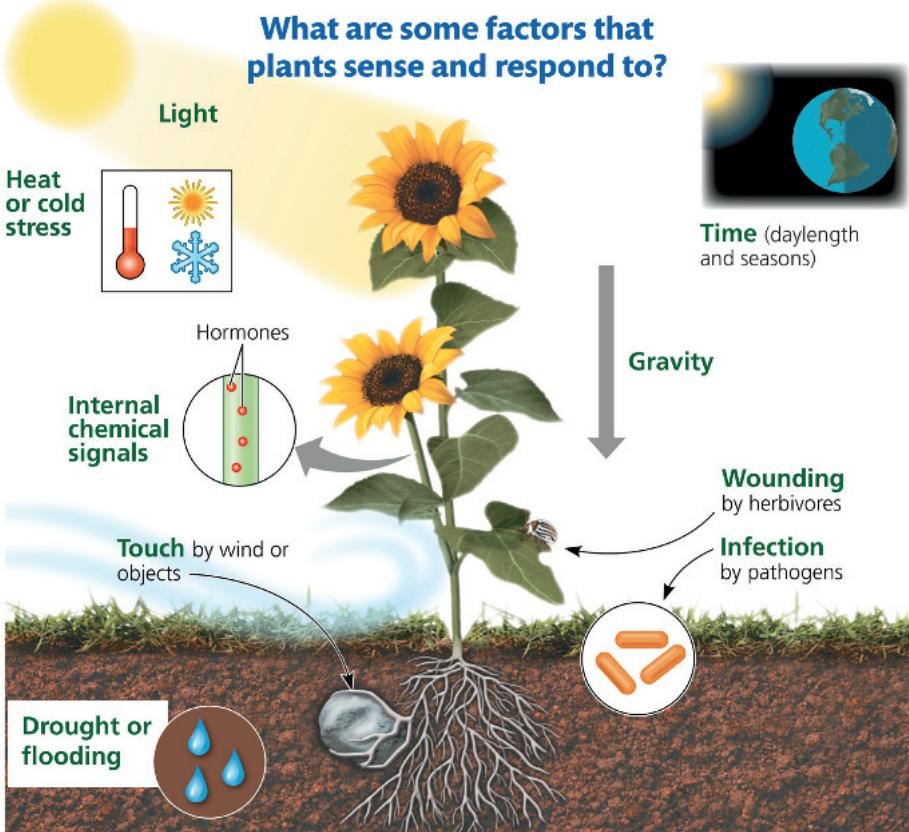

# Concept 39.1: Signal transduction pathways link signal reception to response

The idea that plants are inert or passive is a common misconception. Like all organisms, plants must sense and integrate information concerning the many fluctuating variables in their environments (Figure 39.1). Although plant development is simpler than the development of multicellular animals, plant cells are just as complex as animal cells (see Figure 6.8). The molecular biology of plants is as complicated as that of animals: New Caledonian fern (Tmesipteris oblanceolata) currently has the largest genome on record, about fifty times greater than the human genome. Plants have among the largest genomes (see Table 21.1). At the levels of signal reception and signal transduction, your cells are not all that different from those of plants—the similarities far outweigh the differences. As an animal, however, your responses to environmental stimuli are generally quite different from those of plants. Animals commonly respond by movement; plants do so by altering growth and development.

As an example of a plant modifying its growth and development in response to environmental cues, consider a forgotten potato in the back corner of a kitchen cupboard. This modified underground stem, or tuber, has sprouted shoots from its “eyes” (axillary buds). These shoots, however, scarcely resemble those of a typical plant. Instead of sturdy stems and broad green leaves, this plant has ghostly pale stems and unexpanded leaves, as well as short, stubby roots (Figure 39.2a). These physical adaptations for growing in darkness, collectively referred to as etiolation, make sense if we consider that a young potato plant in nature usually encounters continuous darkness when sprouting underground. Under these circumstances, expanded leaves would be a hindrance to soil penetration and would be damaged as the shoots pushed through the soil. Because the leaves are unexpanded and underground, there is little evaporative loss of water and little requirement for an extensive root system to replace the water lost by transpiration. Moreover, the energy expended in producing green chlorophyll would be wasted because there is no light for photosynthesis. Instead, a potato plant growing in the dark allocates as much energy as possible to elongating its stems. This adaptation enables the shoots to break ground before the nutrient reserves in the tuber are exhausted. The etiolation response is one example of how a plant’s physical characteristics are tuned to its surroundings by complex interactions between environmental and internal signals.

## Interview

Interview with Ernesto Gianoli: A plant mimic alters its growth, hiding it from herbivores (at the start of Unit 6, before Chapter 35)

  
Figure 39.3 Review of a general model for signal transduction pathways.

Figure 39.2 Light-induced de-etiolation (greening) of dark-grown potatoes.

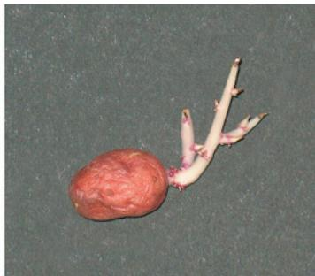

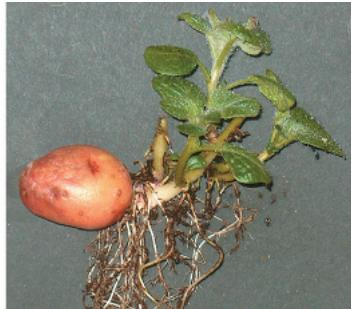

(a) Before exposure to light. A dark-grown potato has tall, spindly stems and nonexpanded leaves—morphological adaptations that enable the shoots to penetrate the soil. The roots are short, but there is little need for water absorption because little water is lost by the shoots.

(b) After a week's exposure to natural daylight. The potato plant begins to resemble a typical plant with broad green leaves, short sturdy stems, and long roots. This transformation begins with the reception of light by a specific pigment, phytochrome.

When a shoot reaches light, the plant undergoes profound changes, collectively called de-etiolation (informally known as greening). Stem elongation slows; leaves expand; roots elongate; and the shoot produces chlorophyll. In short, it begins to resemble a typical plant (Figure 39.2b). In this section, we'll examine this de-etiolation response as an example of how a plant cell's reception of a signal—in this case, light—is transduced into a response (greening). Along the way, we will explore how studies of mutants provide insights into the molecular details of the stages of cell signal processing: reception, transduction, and response (Figure 39.3).

As discussed in Concept 11.1, a hormone or other kind of stimulus interacting with a specific receptor protein can trigger the sequential activation of relay proteins and also the production of second messengers that participate in the pathway. The signal is passed along, ultimately bringing about cellular responses. In this diagram, the receptor is on the surface of the target cell; in other cases, the stimulus interacts with receptors inside the cell.

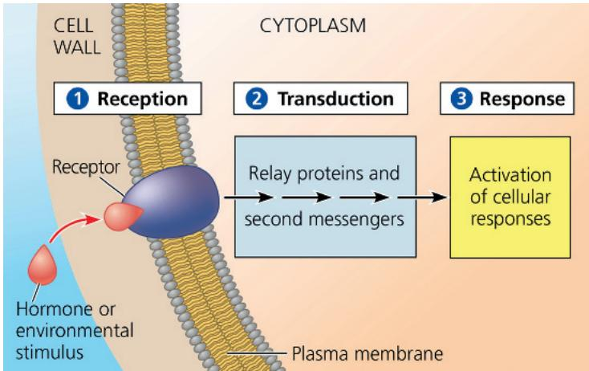  
Hormone or environmental stimulus

## Reception

Signals are first detected by receptors, proteins that undergo changes in shape in response to a specific stimulus. The receptor involved in de-etiolation is a type of phytochrome, a member of a class of photoreceptors that we'll explore more fully later in the chapter. Unlike most receptors, which are built into the plasma membrane, the type of phytochrome that functions in de-etiolation is located in the cytoplasm. Researchers demonstrated the requirement for phytochrome in de-etiolation through studies of the tomato, a close relative of the potato. The aurea mutant of tomato, which has reduced levels of phytochrome, greens less than wild-type tomatoes when exposed to light. (Aurea is Latin for “gold.” In the absence of chlorophyll, the yellow and orange accessory pigments called carotenoids are more obvious.) Researchers produced a normal de-etiolation response in individual aurea leaf cells by injecting phytochrome from other plants and then exposing the cells to light. Such experiments indicated that phytochrome functions in light detection during de-etiolation.

## Transduction

Receptors can be sensitive to very weak environmental or chemical signals. Some de-etiolation responses are triggered by extremely low levels of light, in certain cases as little as the equivalent of a few seconds of moonlight. The transduction of these extremely weak signals involves second messengers—small molecules and ions in the cell that amplify the signal and transfer it from the receptor to other proteins that carry out the response (Figure 39.4). Concept 11.3 discussed several kinds of second messengers (see Figures 11.12 and 11.14). Here, we examine the particular roles of two types of second messengers in de-etiolation: calcium ions ( $Ca^{2+}$ ) and cyclic GMP (cGMP).

Changes in cytosolic $Ca^{2+}$ levels play an important role in phytochrome signal transduction. The concentration of cytosolic $Ca^{2+}$ is generally very low (about $10^{-7}M$ ), but phytochrome activation leads to the opening of $Ca^{2+}$ channels and a transient 100-fold increase in cytosolic $Ca^{2+}$ levels. In response to light, phytochrome undergoes a change in shape that leads to the

Figure 39.4 An example of signal transduction in plants: the role of phytochrome in the de-etiolation (greening) response.  
  
MAKE CONNECTIONS Which panel in Figure 11.17 best exemplifies the phytochrome-dependent signal transduction pathway during de-etiolation? Explain.  
For suggested answer, see Appendix A.

activation of guanylyl cyclase, an enzyme that produces the second messenger cyclic GMP. Both $Ca^{2+}$ and cGMP must be produced for a complete de-etiolation response. The injection of cGMP into aurea tomato leaf cells, for example, induces only a partial de-etiolation response.

## Response

Ultimately, second messengers regulate one or more cellular activities. In most cases, these responses involve the increased activity of particular enzymes. There are two main mechanisms by which a signaling pathway can enhance an enzymatic step in a biochemical pathway: transcriptional regulation and post-translational modification. Transcriptional regulation increases or decreases the synthesis of mRNA encoding a specific enzyme. Post-translational modification activates preexisting enzymes.

## Post-translational Modification of Preexisting Proteins

In most signal transduction pathways, preexisting proteins are modified by the phosphorylation of specific amino acids, which alters the protein's hydrophobicity and activity. Many second messengers, including cGMP and $\mathrm{Ca^{2+}}$ , activate protein kinases directly. Often, one protein kinase will phosphorylate another protein kinase, which then phosphorylates another, and so on (see Figure 11.10). Such kinase cascades may link initial stimuli to responses at the level of gene expression, usually via the phosphorylation of transcription factors. As we'll see soon, many signal transduction pathways ultimately regulate the synthesis of new proteins by turning specific genes on or off.

Signal transduction pathways must also have a means for turning off when the initial signal is no longer present, such as when a sprouting potato is put back into the cupboard. Protein phosphatases, which are enzymes that dephosphorylate specific proteins, are important in these “switch-off” processes. At any particular moment, a cell’s functioning depends on the balance of activity of many types of protein kinases and protein phosphatases.

## Transcriptional Regulation

As discussed in Concept 18.2, the proteins we call specific transcription factors bind to specific regions of DNA and control the transcription of specific genes (see Figure 18.10). In the case of phytochrome-induced de-etiolation, several such transcription factors are activated by phosphorylation in response to the appropriate light conditions. The activation of some of these transcription factors depends on their phosphorylation by protein kinases activated by cGMP or $Ca^{2+}$ .

The mechanism by which a signal promotes developmental changes may depend on transcription factors that are activators (which increase transcription of specific genes) or repressors (which decrease transcription) or both. For example, some Arabidopsis mutants, except for their pale color, have a light-grown appearance when grown in the dark; they have expanded leaves and short, sturdy stems but are not green because the final step in chlorophyll production requires light directly. These mutants have defects in a repressor that normally inhibits the expression of other genes that are activated by light. When the repressor is eliminated by mutation, the pathway that is normally blocked proceeds. Thus, these mutants appear to have been grown in the light, except for their pale color.

## De-etiolation (“Greening”) Proteins

What types of proteins are either activated by phosphorylation or newly transcribed during the de-etiolation process? Many are enzymes that function in photosynthesis directly; others are enzymes involved in supplying the chemical precursors necessary for chlorophyll production; still others affect the levels of plant hormones that regulate growth. For example, the levels of auxin and brassinosteroids, hormones that enhance stem elongation, decrease following the activation of phytochrome. That decrease explains the slowing of stem elongation that accompanies de-etiolation.

We have examined the signal transduction involved in the de-etiolation response of a potato plant in some detail to get a sense of the complexity of biochemical changes that underlie this one process. Every plant hormone and environmental stimulus will trigger one or more signal transduction pathways of comparable complexity. As in the studies on the aurea mutant tomato, the isolation of mutants (a genetic approach) and techniques of molecular biology are helping researchers identify these various pathways.

## Concept Check 39.1

1. What are the physical differences between dark- and light-grown plants? Explain how etiolation helps a seedling compete successfully.

2. Cycloheximide is a drug that inhibits protein synthesis. Predict what effect cycloheximide would have on de-etiolation.

3. WHAT IF? The sexual dysfunction drug Viagra inhibits an enzyme that breaks down cyclic GMP. If tomato leaf cells have a similar enzyme, would applying Viagra to these cells cause a normal de-etiolation of aurea mutant tomato leaves?

For suggested answers, see Appendix A.

## Concept 39.2: Plants use chemicals to communicate

As we have seen, plants sense their local environmental conditions using signal transduction pathways no less complicated than those used by animals. The activation of signal transduction pathways often changes the activity of enzymes and therefore the production of chemicals. Plants use chemicals to communicate

with the living world, as in the example of those released by the sunflowers in Figure 39.1. Plants also use chemicals for communicating between different parts of the plant, thereby optimizing the response of the whole organism. Chemical communication within plants is an exploding field of research. The discovery of new mobile information molecules, such as hundreds of small RNAs and dozens of small peptides, will keep researchers busy for decades. It has also been discovered that plants have an attribute that animals do not: The cytoplasmic bridges between plant cells (plasmodesmata), unlike the analogous structures in animals (gap junctions), can dilate enough that macromolecules such as proteins can move from cell to cell. This recent research builds on a long history of classic experiments that provided the first clues that mobile signaling molecules called hormones are internal regulators of plant growth.

## General Characteristics of Plant Hormones

A hormone, in the original meaning of the term, is a signaling molecule that is produced in low concentrations by one part of an organism's body and transported to other parts, where it binds to a specific receptor and triggers responses in target cells and tissues. In animals, hormones are usually transported through the circulatory system, a criterion often included in definitions of the term. Many modern plant biologists, however, argue that the hormone concept, which originated from studies of animals, is too limiting to describe plant physiological processes. For example, plants don't have circulating blood to transport hormone-like signaling molecules. Moreover, some signaling molecules that are considered plant hormones act only locally. Finally, there are some signaling molecules in plants, such as glucose, that typically occur in plants at concentrations thousands of times greater than a typical hormone. Nevertheless, they activate signal transduction pathways that greatly alter the functioning of plants in a manner similar to a hormone. Thus, many plant biologists prefer the broader term plant growth regulator to describe organic compounds, either natural or synthetic, that modify or control one or more specific physiological processes within a plant. The terms plant hormone and plant growth regulator are used about equally, but for historical continuity this text will use the term plant hormone and adhere to the criterion that plant hormones are active at very low concentrations.

Table 39.1 Overview of Plant Hormones

<table><tr><td>Hormone</td><td>Where Produced or Found in Plant</td><td>Major Functions</td></tr><tr><td>Auxin (IAA)</td><td>Shoot apical meristems and young leaves are the primary sites of auxin synthesis. Root apical meristems also produce auxin, although the root depends on the shoot for much of its auxin. Developing seeds and fruits contain high levels of auxin, but it is unclear whether it is newly synthesized or transported from maternal tissues.</td><td>Stimulates stem elongation (low concentration only); promotes the formation of lateral and adventitious roots; regulates development of fruit; enhances apical dominance; functions in phototropism and gravitropism; promotes vascular differentiation; retards leaf abscission</td></tr><tr><td>Cytokinins</td><td>These are synthesized primarily in roots and transported to other organs, although there are many minor sites of production as well.</td><td>Regulate cell division in shoots and roots; modify apical dominance and promote lateral bud growth; promote movement of nutrients into sink tissues; stimulate seed germination; delay leaf senescence</td></tr><tr><td>Gibberellins (GA)</td><td>Meristems of apical buds and roots, young leaves, and developing seeds are the primary sites of production.</td><td>Stimulate stem elongation, pollen development, pollen tube growth, fruit growth, and seed development and germination; regulate sex determination and the transition from juvenile to adult phases</td></tr><tr><td>Abscisic acid (ABA)</td><td>Almost all plant cells have the ability to synthesize abscisic acid, and its presence has been detected in every major organ and living tissue; it may be transported in the phloem or xylem.</td><td>Inhibits growth; promotes stomatal closure during drought stress; promotes seed dormancy and inhibits early germination; promotes leaf senescence; promotes desiccation tolerance</td></tr><tr><td>Ethylene</td><td>This gaseous hormone can be produced by most parts of the plant. It is produced in high concentrations during senescence, leaf abscission, and the ripening of some types of fruits. Synthesis is also stimulated by wounding and stress.</td><td>Promotes ripening of many types of fruit, leaf abscission, and the triple response in seedlings (inhibition of stem elongation, promotion of lateral expansion, and horizontal growth); enhances the rate of senescence; promotes root and root hair formation; promotes flowering in the pineapple family</td></tr><tr><td>Brassinosteroids</td><td>These compounds are present in all plant tissues, although different intermediates predominate in different organs. Internally produced brassinosteroids act near the site of synthesis.</td><td>Promote cell expansion and cell division in shoots; promote root growth at low concentrations; inhibit root growth at high concentrations; promote xylem differentiation and inhibit phloem differentiation; promote seed germination and pollen tube elongation</td></tr><tr><td>Jasmonates</td><td>These are a small group of related molecules derived from the fatty acid linolenic acid. They are produced in several parts of the plant and travel in the phloem to other parts of the plant.</td><td>Regulate a wide variety of functions, including fruit ripening, floral development, pollen production, tendril coiling, root growth, seed germination, and nectar secretion; also produced in response to herbivory and pathogen invasion</td></tr><tr><td>Strigolactones</td><td>These carotenoid-derived hormones and extracellular signals are produced in roots in response to low phosphate conditions or high auxin flow from the shoot.</td><td>Promote seed germination, control of apical dominance, and the attraction of mycorrhizal fungi to the root</td></tr></table>

Although plant hormones are produced in very low concentrations, a tiny amount of hormone can have a profound effect on plant growth and development. Virtually every aspect of plant growth and development is under hormonal control to some degree. Each hormone has multiple effects, depending on its site of action, its concentration, and the developmental stage of the plant. Conversely, multiple hormones can influence a single process. Plant hormone responses commonly depend on both the amounts of the hormones involved and their relative concentrations. It is often the interactions between different hormones, rather than hormones acting in isolation, that control growth and development. These interactions will become apparent in the following survey of hormone function.

## A Survey of Plant Hormones

Table 39.1, on the facing page, previews the major types and actions of plant hormones, including auxin, cytokinins, gibberellins, abscisic acid, ethylene, brassinosteroids, jasmonates, and strigolactones.

## Auxin

The idea that chemical messengers exist in plants emerged from a series of classic experiments on how stems respond to light. As you know, the shoot of a houseplant on a windowsill grows toward light. Any growth response that results in plant organs curving toward or away from stimuli is called a tropism (from the Greek tropos, turn). The growth of a shoot toward light or away from it is called phototropism; the former is positive phototropism, and the latter is negative phototropism.

In natural ecosystems, where plants may be crowded, phototropism directs shoot growth toward the sunlight that powers photosynthesis. This response results from a differential growth of cells on opposite sides of the shoot; the cells on the darker side elongate faster than the cells on the brighter side.

Charles Darwin and his son Francis conducted some of the earliest experiments on phototropism in the late 1800s (Figure 39.5). They observed that a grass seedling ensheathed in its coleoptile (see Figure 38.9b) could bend toward light only if the tip of the coleoptile was present. If the tip was removed, the coleoptile did not curve. The seedling also failed to grow toward light if the tip was covered with an opaque cap, but neither a transparent cap over the tip nor an opaque shield placed below the coleoptile tip prevented the phototropic response. It was the tip of the coleoptile, the Darwins concluded, that was responsible

## Figure 39.5

# Inquiry: What part of a grass coleoptile senses light, and how is the signal transmitted?

## Experiment

In 1880, Charles and Francis Darwin removed and covered parts of grass coleoptiles to determine what part senses light. In 1913, Peter Boysen-Jensen separated coleoptiles with different materials to determine how the signal for phototropism is transmitted.

## Results

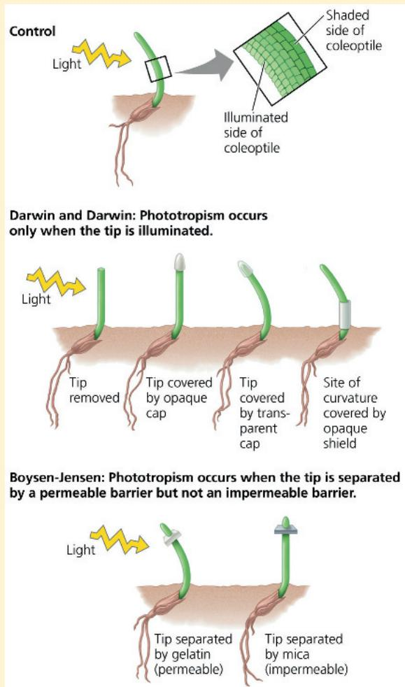  
Data from C. R. Darwin, The Power of Movement in Plants, John Murray (1880). P. Boysen-Jensen, Concerning the performance of phototropic stimuli on the Avenacoleoptile, Berichte der Deutschen Botanischen Gesellschaft (Reports of the German Botanical Society) 31:559–566 (1913).

## Conclusion

The Darwins' experiment suggested that only the tip of the coleoptile senses light. The phototropic bending, however, occurred at a distance from the site of light perception (the tip). Boysen-Jensen's results suggested that the signal for the bending is a light-activated mobile chemical.

WHAT IF? How could you experimentally determine which colors of light cause the most phototropic bending?
For suggested answer, see Appendix A.

for sensing light. However, they noted that the differential growth response that led to curvature of the coleoptile occurred some distance below the tip. The Darwins postulated that some signal was transmitted downward from the tip to the elongating region of the coleoptile. A few decades later, the Danish scientist Peter Boysen-Jensen demonstrated that the signal was a mobile chemical substance. He separated the tip from the remainder of the coleoptile by a cube of gelatin, which prevented cellular contact but allowed chemicals to pass through. These seedlings responded normally, bending toward light. However, if the tip was experimentally separated from the lower coleoptile by an impermeable barrier, such as the mineral mica, no phototropic response occurred.

Subsequent research showed that a chemical was released from coleoptile tips and could be collected by means of diffusion into agar blocks. Little cubes of agar containing this chemical could induce “phototropic-like” curvatures even in complete darkness if the agar cubes were placed off-center atop the cut surface of decapitated coleoptiles. Coleoptiles curve toward light because of a higher concentration of this growth-promoting chemical on the darker side of the coleoptile. Since this chemical stimulated growth as it passed down the coleoptile, it was dubbed “auxin” (from the Greek auxein, to increase). Auxin was later purified, and its chemical structure determined to be indoleacetic acid (IAA). The term auxin is used for any chemical, synthetic or not, that promotes coleoptile elongation. The major natural auxin in plants is IAA, which has many additional effects. Unless noted otherwise, the terms auxin and IAA will be used interchangeably.

Auxin is produced predominantly in shoot tips and is transported from cell to cell down the stem at a rate of about 1 cm/hr. It moves only from tip to base, not in the reverse direction. This unidirectional transport of auxin is called polar transport. Polar transport is unrelated to gravity; experiments have shown that auxin travels upward when a stem or coleoptile segment is placed upside down. Rather, the polarity of auxin movement is attributable to the polar distribution of auxin transport protein in the cells. Concentrated at the basal end of a cell, the auxin transporters move the hormone out of the cell. The auxin can then enter the apical end of the neighboring cell (Figure 39.6). Auxin has a variety of effects, including stimulating cell elongation and regulating plant architecture.

## The Role of Auxin in Cell Elongation

One of auxin's chief functions is to stimulate elongation of cells within young developing shoots. As auxin from the shoot tip (see Figure 35.16) moves down to the region where cells are elongating, the hormone stimulates cell growth by binding to a receptor in the nucleus. Auxin stimulates growth only over a certain concentration range, from about $10^{-8}$ to $10^{-4}M$ . At higher concentrations, auxin may inhibit cell elongation by inducing production of ethylene, a hormone that generally hinders growth. We will return to this hormonal interaction when we look at ethylene.

According to a model called the acid growth hypothesis, proton pumps play a major role in the growth response of cells to auxin. In a shoot's region of elongation, auxin stimulates the plasma membrane's proton (H $^{+}$ ) pumps. This pumping of H $^{+}$ increases the voltage across the membrane (membrane potential) and lowers the

## Figure 39.6

## Inquiry: What causes polar movement of auxin from shoot tip to base?

## Experiment

To investigate how auxin is transported unidirectionally, Leo Gälweiler and colleagues designed an experiment to identify the location of the auxin transport protein. They used a greenish yellow fluorescent molecule to label antibodies that bind to the auxin transport protein. Then they applied the antibodies to longitudinally sectioned Arabidopsis stems.

## Results

The light micrograph on the left shows that auxin transport proteins are not found in all stem tissues, but only in the xylem parenchyma. In the light micrograph on the right, a higher magnification reveals that these proteins are primarily localized at the basal ends of the cells.

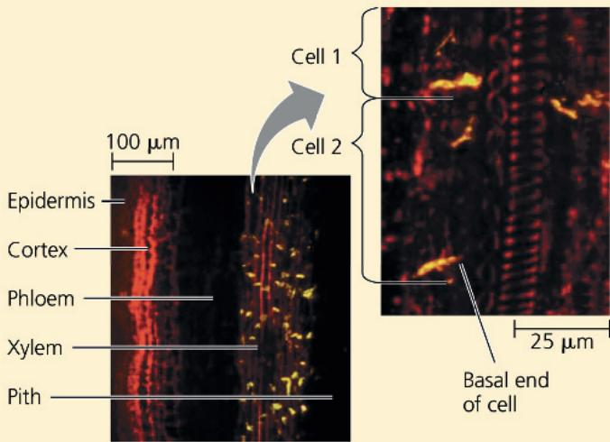

Data from L. Gälweiler et al., Regulation of polar auxin transport by AtPIN1 in Arabidopsis vascular tissue, Science 282:2226–2230 (1998).

## Conclusion

The results support the hypothesis that concentration of the auxin transport protein at the basal ends of cells mediates the polar transport of auxin.

WHAT IF? If auxin transport proteins were equally distributed at both ends of the cells, would polar auxin transport still be possible? Explain.

For suggested answer, see Appendix A.

pH in the cell wall within minutes. Acidification of the wall activates proteins called expansins that break the cross-links (hydrogen bonds) between cellulose microfibrils and other cell wall constituents, loosening the wall's fabric (Figure 39.7). Increasing the membrane potential enhances ion uptake into the cell, which causes osmotic uptake of water and increased turgor. Increased turgor and increased cell wall plasticity enable the cell to elongate.

1 Auxin increases the activity of proton pumps, which pump H $^{+}$ from the cytoplasm. The H $^{+}$ reduces the pH of the cell wall.

The cell expands in a direction mainly perpendicular to the main orientation of the microfibrils in the cell wall (see Figure 35.28).

  
3 The polysaccharides are cleaved by cell wall-loosening proteins (purple). This process loosens the microfibrils, making the cell wall more flexible. Water uptake and increased turgor then cause the cell to elongate. At the same time, more microfibrils (not shown) are formed.

Auxin also rapidly alters gene expression, causing cells in the region of elongation to produce new proteins within minutes. Some of these proteins are short-lived transcription factors that repress or activate the expression of other genes. For sustained growth after this initial spurt, cells must make more cytoplasm and wall material. In addition, auxin stimulates this sustained growth response.

## Auxin's Role in Plant Development

The polar transport of auxin plays a major role in controlling the spatial organization, or pattern formation, of a plant. The auxin synthesized in the shoot tips of a branch carries information about the growth potential of that branch. If a branch finds itself in an environment conducive for growth, it produces more auxin, and the plant diverts more resources to that branch. A reduced flow of auxin from a branch indicates that the branch is not being sufficiently productive: New branches are needed elsewhere. Thus, lateral buds below the branch are released from dormancy and begin to grow.

The transport of auxin also plays a key role in establishing the pattern of leaf emergence from the shoot apical meristem (see Figure 36.3). A leading model proposes that polar auxin transport in the shoot tip generates local peaks in auxin concentration that determine the site of leaf primordium formation and thereby the different leaf arrangements found in nature.

The polar transport of auxin from the leaf margin also directs the patterns of leaf veins. Inhibitors of polar auxin transport result in leaves that lack vascular continuity through the petiole and have broad, loosely organized main veins, an increased number of secondary veins, and a dense band of irregularly shaped vascular cells adjacent to the leaf margin.

The activity of the vascular cambium, the meristem that produces woody tissues, is also under the control of auxin transport. When a plant becomes dormant at the end of a growing season, there is a reduction in auxin transport capacity and the expression of genes encoding auxin transporters.

Auxin's effects on plant development are not limited to the familiar sporophyte plant that we see. Recent evidence suggests that the organization of the microscopic angiosperm female gametophytes is regulated by an auxin gradient.

## Practical Uses for Auxins

Auxins, both natural and synthetic, have many commercial applications. For example, the natural auxin indolebutyric acid (IBA) is used in the vegetative propagation of plants by cuttings. Treating a detached leaf or stem with powder containing IBA often causes adventitious roots to form near the cut surface.

Certain synthetic auxins are widely used as herbicides, including 2,4-dichlorophenoxyacetic acid (2,4-D). Monocots, such as maize and turfgrass, can rapidly inactivate such synthetic auxins. However, eudicots cannot and therefore die from hormonal overdose. Spraying cereal fields or turf with 2,4-D eliminates eudicot (broadleaf) weeds.

Developing seeds produce auxin, which promotes fruit growth. In tomato plants grown in greenhouses, often fewer seeds are produced, resulting in poorly developed tomato fruits. However, spraying synthetic auxins on greenhouse-grown tomato vines induces normal fruit development, making the greenhouse-cultivated tomatoes commercially viable.

## Cytokinins

Trial-and-error attempts to find chemical additives that would enhance the growth and development of plant cells in tissue culture led to the discovery of cytokinins. In the 1940s, researchers stimulated the growth of plant embryos in culture by adding coconut milk, the liquid endosperm of a coconut's giant seed. Subsequent researchers found that they could induce cultured tobacco cells to divide by adding degraded DNA samples. The active ingredients of both experimental additives were modified forms of adenine, a component of nucleic acids. These growth regulators were named cytokinins because they stimulate cytokinesis, or cell division. The most common natural cytokinin is zeatin, so named because it was discovered first in maize (Zea mays). Cytokinins influence cell division, cell differentiation, and apical dominance.

## Control of Cell Division and Differentiation

Cytokinins are produced in actively growing tissues, particularly in roots, embryos, and fruits. Cytokinins produced in roots reach their target tissues by moving up the plant in the xylem sap. Acting in concert with auxin, cytokinins stimulate cell division and influence the pathway of differentiation. The effects of cytokinins on cells growing in tissue culture provide clues about how this class of hormones may function in an intact plant. When a piece of parenchyma tissue from a stem is cultured in the absence of cytokinins, the cells grow very large but do not undergo mitosis. But if cytokinins are added along with auxin, the cells divide. Cytokinins alone have no effect. The ratio of cytokinins to auxin controls cell differentiation. When the concentrations of these two hormones are at certain levels, the mass of cells continues to grow, but it remains a cluster of undifferentiated cells called a callus (see Figure 38.15). If cytokinin

intact plant, auxin transported down the shoot from the apical bud indirectly inhibits axillary buds from growing, causing a shoot to lengthen at the expense of lateral branching. The polar flow of auxin down the shoot triggers the synthesis of strigolactones, which directly repress bud growth. Meanwhile, cytokinins entering the shoot system from roots counter the action of auxin and strigolactones by signaling axillary buds to begin growing. Thus, in an intact plant, the cytokinin-rich axillary buds closer to the base of the plant tend to be longer than the auxin-rich axillary buds closer to the apical bud. Mutants that overproduce cytokinins or plants treated with cytokinins tend to be bushier than normal.

Removing the apical bud, a major site of auxin biosynthesis, causes the auxin and strigolactone levels in the stem to wane, particularly in those regions close to the cut surface (see Figure 39.8). This causes the axillary buds closest to the cut surface to grow most vigorously, and one of these axillary buds will eventually take over as the new apical bud. Applying auxin to the cut surface of the shoot tip resuppresses the growth of the lateral buds.

## Anti-aging Effects

Cytokinins slow the aging of certain plant organs by inhibiting protein breakdown, stimulating RNA and protein synthesis, and mobilizing nutrients from surrounding tissues. If leaves removed from a plant are dipped in a cytokinin solution, they stay green much longer than otherwise.

## Gibberellins

In the early 1900s, farmers in Asia noticed that some rice seedlings in their paddies grew so tall and spindly that they toppled over before they could mature. In 1926, it was discovered that levels increase, shoot buds develop from the callus. If auxin levels increase, roots form.

## Control of Apical Dominance

Figure 39.8 Effects on apical dominance of removing the apical bud.

Apical dominance refers to the inhibition of the growth of axillary buds by the apical bud of a plant shoot. Removal of the apical bud enables lateral branches to grow. Multiple hormones play a role in this process, including auxin, cytokinin, and strigolactones.

Apical dominance, the ability of the apical bud to suppress the development of axillary buds, is under the control of sugar and various plant hormones, including auxin, cytokinins, and strigolactones. The sugar demand of the shoot tip is critical for maintaining apical dominance. Cutting off the apical bud removes apical sugar demand and rapidly increases sugar (sucrose) availability to axillary buds. This increase of sugar is sufficient to initiate bud release. However, not all of the buds grow equally: Usually only one of the axillary buds closest to the cut surface will take over as the new apical bud.

Three plant hormones—auxin, cytokinins, and strigolactones—play a role in determining the extent to which specific axillary buds elongate (Figure 39.8). In an

The apical bud is a preferred sugar sink and a major site of auxin biosynthesis.

Auxin moving downward from the apical bud produces strigolactones that repress the growth of axillary buds.

Cytokinin coming from the root antagonizes the actions of auxin and strigolactone, allowing for a limited amount of axillary bud growth. Therefore, the axillary buds farthest from the apex are increasingly elongated.

Removal of the apical bud allows remaining buds to receive more sugars for growth. Auxin and strigolactone levels also decline, particularly near the cut surface. This decline allows the topmost axillary buds in particular to grow and take over as the new apical bud.

  
Plant with apical bud intact

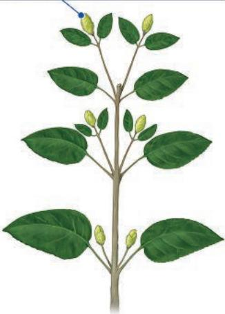  
Plant with apical bud removed

a fungus of the genus Gibberella causes this “foolish seedling disease.” By the 1930s, it was determined that the fungus causes hyperelongation of rice stems by secreting a chemical, which was given the name gibberellin, or gibberellic acid. In the 1950s, researchers discovered that plants also produce gibberellins. Since that time, scientists have identified more than 100 different gibberellins that occur naturally in plants, although a much smaller number occur in each plant species. “Foolish rice” seedlings, it seems, suffer from too much gibberellin. Gibberellins have a variety of effects, such as stem elongation, fruit growth, and seed germination.

## Stem Elongation

The major sites of gibberellin production are young roots and leaves. Gibberellins are best known for stimulating stem and leaf growth by enhancing cell elongation and cell division. One hypothesis proposes that they activate enzymes that loosen cell walls, facilitating entry of expansin proteins. Thus, gibberellins act in concert with auxin to promote stem elongation.

The effects of gibberellins in enhancing stem elongation are ident when certain dwarf (mutant) varieties of plants are treated with gibberellins. For instance, some dwarf pea plants (including the variety Mendel studied; see Concept 14.1) grow tall if treated with gibberellins. But there is often no response if the gibberellins are applied to wild-type plants. Apparently, these plants already produce an optimal dose of the hormone. The most dramatic example of gibberellin-induced stem elongation is bolting, rapid growth of the floral stalk (Figure 39.9a).

Figure 39.9 Effects of gibberellins on stem elongation and fruit growth.

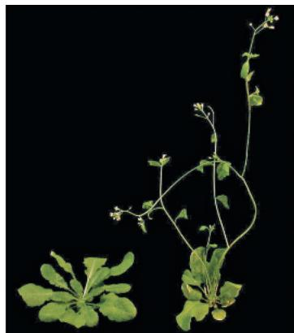

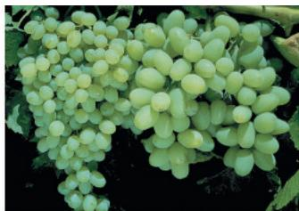  
(b) The Thompson seedless grape bunch on the left is from an untreated control vine. The bunch on the right is growing from a vine that was sprayed with gibberellin during fruit development.

(a) Some plants develop in a rosette form, low to the ground with very short internodes, as in the Arabidopsis plant shown at the left. As the plant switches to reproductive growth, a surge of gibberellins induces bolting: Internodes elongate rapidly, elevating floral buds that develop at stem tips (right).

light or low temperatures, break dormancy if they are treated with gibberellins. Gibberellins support the growth of cereal seedlings by stimulating the synthesis of digestive enzymes such as $\alpha$ -amylase that mobilize stored nutrients (Figure 39.10).

## Fruit Growth

In many plants, both auxin and gibberellins must be present for fruit to develop. The most important commercial application of gibberellins is in the spraying of Thompson seedless grapes (Figure 39.9b). The hormone makes the individual grapes grow larger, a trait valued by the consumer. The gibberellin sprays also make the internodes of the grape bunch elongate, allowing more space for the individual grapes. By enhancing air circulation between the grapes, this increase in space also makes it harder for yeasts and other microorganisms to infect the fruit.

## Germination

The embryo of a seed is a rich source of gibberellins. After water is imbibed, the release of gibberellins from the embryo signals the seed to break dormancy and germinate. Some seeds that normally require particular environmental conditions to germinate, such as exposure to

Figure 39.10 Mobilization of nutrients by gibberellins during the germination of grain seeds such as barley.

1 After a seed imbibes water, the embryo releases gibberellin (GA), which sends a signal to the aleurone, the thin outer layer of the endosperm.

② The aleurone responds to GA by synthesizing and secreting digestive enzymes that hydrolyze nutrients stored in the endosperm. One example is α-amylase, which hydrolyzes starch into sugars.

③ Sugars and other nutrients absorbed from the endosperm by the scutellum (cotyledon) are consumed during growth of the embryo into a seedling.

## Abscisic Acid

In the 1960s, one research group studying the chemical changes that precede bud dormancy and leaf abscission in deciduous trees and another team investigating chemical changes preceding abscission of cotton fruits isolated the same compound, abscisic acid (ABA). Ironically, ABA is no longer thought to play a primary role in leaf abscission, but it is very important in other functions. Unlike the growth-stimulating hormones discussed so far—auxin, cytokinins, gibberellins, and brassinosteroids—ABA slows growth. ABA often antagonizes the actions of growth hormones, and the ratio of ABA to one or more growth hormones determines the final physiological outcome. We will consider here two of ABA's many effects: seed dormancy and drought tolerance.

## Seed Dormancy

Seed dormancy increases the likelihood that seeds will germinate only when there are sufficient amounts of light, temperature, and moisture for the seedlings to survive (see Concept 38.1). What prevents seeds dispersed in autumn from germinating immediately, only to die in the winter? What mechanisms ensure that such seeds do not germinate until spring? For that matter, what prevents seeds from germinating in the dark, moist interior of the fruit? The answer to these questions is ABA. The levels of ABA may increase 100-fold during seed maturation. The high levels of ABA in maturing seeds inhibit germination and induce the production of proteins that help the seeds withstand the extreme dehydration that accompanies maturation.

Many types of dormant seeds germinate when ABA is removed or inactivated. The seeds of some desert plants break dormancy only when heavy rains wash ABA out of them. Other seeds require light or prolonged exposure to cold to inactivate ABA. Often, the ratio of ABA to gibberellins determines whether seeds remain dormant or germinate, and adding ABA to seeds that are primed to germinate makes them dormant again. Inactivated ABA or low levels of ABA can lead to precocious (early) germination (Figure 39.11). For example, a maize mutant with grains that germinate while still on the cob lacks a functional transcription factor required for ABA to induce expression of certain genes. Precocious germination of red mangrove seeds, due to low ABA levels, is actually an adaptation that helps the young seedlings to plant themselves like darts in the soft mud below the parent tree.

## Drought Tolerance

ABA plays a major role in drought signaling. When a plant begins to wilt, ABA accumulates in the leaves and causes stomata to close rapidly, reducing transpiration and preventing further water loss. By affecting second messengers such as calcium, ABA causes potassium channels in the plasma membrane of guard cells to open, leading to a massive loss of potassium ions from the cells. The accompanying osmotic loss of water reduces guard cell turgor and leads to closing of the stomatal pores (see Figure 36.14). In some cases, water shortage stresses the root system before the

Figure 39.11 Precocious germination of wild-type mangrove and mutant maize seeds.

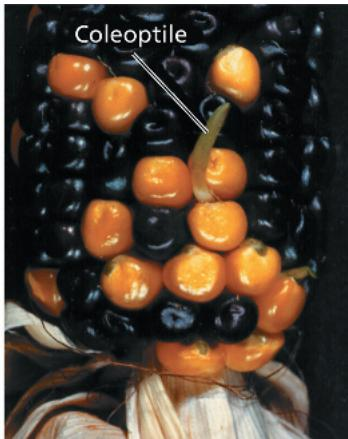  
▲ Precocious germination in this maize mutant is caused by lack of a functional transcription factor required for ABA action.

▲ Spotted mangrove (Rhizophora stylosa) seeds produce only low levels of ABA, and the seeds germinate while still on the tree. In this case, early germination is a useful adaptation. When released, the radicle of the dart-like seedling deeply penetrates the soft mudflats in which the mangroves grow.

shoot system, and ABA transported from roots to leaves may function as an “early warning system.” Many mutants that are especially prone to wilting are deficient in ABA production.

## Ethylene

During the 1800s, when coal gas was used as fuel for streetlights, leakage from gas pipes caused nearby trees to drop leaves prematurely. In 1901, the gas ethylene was demonstrated to be the active factor in coal gas. But the idea that it is a plant hormone was not widely accepted until the advent of a technique called gas chromatography simplified its identification.

Plants produce ethylene in response to stresses such as drought, flooding, mechanical pressure, injury, and infection. Ethylene is also produced during fruit ripening and programmed cell death and in response to high concentrations of externally applied auxin. Indeed, many effects previously ascribed to auxin, such as inhibition of root elongation, may be due to auxin-induced ethylene production. We focus here on four of ethylene's many effects: response to mechanical stress, senescence, leaf abscission, and fruit ripening.

Figure 39.12 The ethylene-induced triple response.  
In response to ethylene, a gaseous plant hormone, germinating pea seedlings grown in the dark undergo the triple response—slowing of stem elongation, stem thickening, and horizontal stem growth. The response is greater with increased ethylene concentration.  

## The Triple Response to Mechanical Stress

Imagine a pea seedling pushing upward through the soil, only to come up against a stone. As it pushes against the obstacle, the stress in its delicate tip induces the seedling to produce ethylene. The hormone then instigates a growth maneuver known as the triple response that enables the shoot to avoid the obstacle. The three parts of this response are a slowing of stem elongation, a thickening of the stem (which makes it stronger), and a curvature that causes the stem to start growing horizontally. As the effects of the initial ethylene pulse lessen, the stem resumes vertical growth. If it again contacts a barrier, another burst of ethylene is released, and horizontal growth resumes. However, if the upward touch detects no solid object, then ethylene production decreases, and the stem, now clear of the obstacle, resumes its normal upward growth. It is ethylene that induces the stem to grow horizontally rather than the physical obstruction itself; when ethylene is applied to normal seedlings growing free of physical impediments, they still undergo the triple response (Figure 39.12).

Studies of Arabidopsis mutants with abnormal triple responses are an example of how biologists identify a signal transduction pathway. Scientists isolated ethylene-insensitive (ein) mutants, which fail to undergo the triple response after exposure to ethylene (Figure 39.13a). Some types of ein mutants are insensitive to ethylene because they lack a functional ethylene receptor. Mutants of a different sort undergo the triple response even out of soil, in the air, where there are no physical obstacles.

Figure 39.13 Ethylene triple-response Arabidopsis mutants.  
  
(a) ein mutant. An ethylene-insensitive (ein) mutant fails to undergo the triple response in the presence of ethylene.

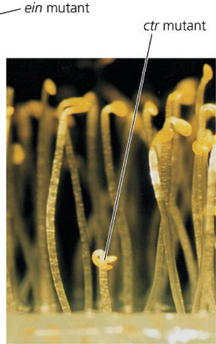  
(b) ctr mutant. A constitutive triple-response (ctr) mutant undergoes the triple response even in the absence of ethylene.  
VISUAL SKILLS If the ein single mutation is combined with an ethylene-overproducing (eto) mutation, would the phenotype of the double mutant be different from that of the single mutant? Explain.
For suggested answer, see Appendix A.

Some of these mutants have a regulatory defect that causes them to produce ethylene at rates 20 times normal. The phenotype of such ethylene-overproducing (eto) mutants can be restored to wild-type by treating the seedlings with inhibitors of ethylene synthesis. Other mutants, called constitutive triple-response (ctr) mutants, undergo the triple response in air but do not respond to inhibitors of ethylene synthesis (Figure 39.13b). (Constitutive genes are genes that are continuously expressed.) In ctr mutants, ethylene signal transduction is permanently turned on, even though ethylene is not present.

The affected gene in ctr mutants codes for a protein kinase. The fact that this mutation activates the ethylene response suggests that the normal kinase product of the wild-type allele is a negative regulator of ethylene signal transduction. Thus, binding of the hormone ethylene to the ethylene receptor normally leads to inactivation of the kinase, and the inactivation of this negative regulator allows synthesis of the proteins required for the triple response.

## Senescence

Consider the shedding of a leaf in autumn or the death of an annual after flowering. Or think about the final step in differentiation of a vessel element, when its living contents are destroyed, leaving a hollow tube behind. Such events involve

<!-- END OFFICIAL MINERU API RESULT part_09 -->

<!-- BEGIN OFFICIAL MINERU API RESULT part_10 -->

senescence—the programmed death of certain cells or organs or the entire plant. Cells, organs, and plants genetically programmed to die on a schedule do not simply shut down cellular machinery and await death. Instead, at the molecular level, the onset of programmed cell death is a very busy time in a cell's life, requiring new gene expression. Newly formed enzymes break down many chemical components, including chlorophyll, DNA, RNA, proteins, and membrane lipids. The plant salvages many of the breakdown products. A burst of ethylene is almost always associated with the death of cells during senescence.

## Leaf Abscission

The loss of leaves from deciduous trees helps prevent desiccation during seasonal periods when the availability of water to the roots is severely limited. Before dying leaves abscise, many essential elements are salvaged from them and stored in stem parenchyma cells. These nutrients are recycled back to developing leaves during the following spring. The colors of autumn leaves are due to newly made red pigments as well as yellow and orange carotenoids (see Concept 10.3) that were already present in the leaves and are rendered visible by the breakdown of the dark green chlorophyll in autumn.

When an autumn leaf falls, it detaches from the stem at an abscission layer that develops near the base of the petiole (Figure 39.14). The small parenchyma cells of this layer have very thin walls, and there are no fiber cells around the vascular tissue. The abscission layer is further weakened when enzymes hydrolyze polysaccharides in the cell walls. Finally, the weight of the leaf, with the help of the wind, causes a separation within the abscission layer. Even

Figure 39.14 Abscission of a maple leaf.

Abscission is controlled by a change in the ratio of ethylene to auxin. The abscission layer is seen in this longitudinal section as a vertical band at the base of the petiole. After the leaf falls, a protective layer of cork becomes the leaf scar that helps prevent pathogens from invading the plant (LM).

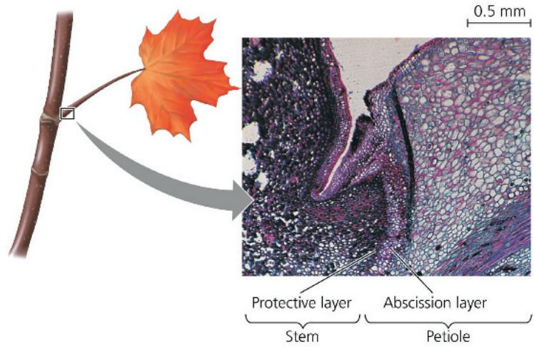

before the leaf falls, a layer of cork forms a protective scar on the twig side of the abscission layer, preventing pathogens from invading the plant.

A change in the ratio of ethylene to auxin controls abscission. An aging leaf produces less and less auxin, rendering the cells of the abscission layer more sensitive to ethylene. As the influence of ethylene on the abscission layer prevails, the cells produce enzymes that digest the cellulose and other components of cell walls.

## Fruit Ripening

Immature fleshy fruits are generally tart, hard, and green—features that help protect the developing seeds from herbivores. After ripening, the mature fruits help attract animals that disperse the seeds (see Figures 30.10 and 30.11). In many cases, a burst of ethylene production in the fruit triggers the ripening process. The enzymatic breakdown of cell wall components softens the fruit, and the conversion of starches and acids to sugars makes the fruit sweet. The production of new scents and colors helps advertise ripeness to animals, which eat the fruits and disperse the seeds.

A chain reaction occurs during ripening: Ethylene triggers ripening, and ripening triggers more ethylene production. The result is a huge burst in ethylene production. Because ethylene is a gas, the signal to ripen spreads from fruit to fruit. If you pick or buy green fruit, you may be able to speed ripening by storing the fruit in a paper bag, allowing ethylene to accumulate. On a commercial scale, many kinds of fruits are ripened in huge storage containers in which ethylene levels are enhanced. In other cases, fruit producers take measures to slow ripening caused by natural ethylene. Apples, for instance, are stored in bins flushed with carbon dioxide. Circulating the air prevents ethylene from accumulating, and carbon dioxide inhibits synthesis of new ethylene. Stored in this way, apples picked in autumn can still be shipped to grocery stores the following summer.

Given the importance of ethylene in the postharvest physiology of fruits, the genetic engineering of ethylene signal transduction pathways has potential commercial applications. For example, by engineering a way to block the transcription of one of the genes required for ethylene synthesis, molecular biologists have created tomato fruits that ripen on demand. These fruits are picked while green and will not ripen unless ethylene gas is added. As such methods are refined, they will reduce spoilage of fruits and vegetables, a problem that ruins almost half the produce harvested in the United States.

## More Recently Discovered Plant Hormones

Auxin, gibberellins, cytokinins, abscisic acid, and ethylene are often considered the five “classic” plant hormones. However, more recently discovered hormones have swelled the list of important plant growth regulators.

Brassinosteroids are steroids similar to cholesterol and the sex hormones of animals. They induce cell elongation and division in stem segments and seedlings at concentrations as low as $10^{-12}$ M. They also slow leaf abscission (leaf drop) and promote xylem differentiation. These effects are so qualitatively similar to those of auxin that it took years for plant physiologists to determine that brassinosteroids were not types of auxins.

The identification of brassinosteroids as plant hormones arose from studies of an Arabidopsis mutant that even when grown in the dark exhibited physical features similar to plants grown in the light. The researchers discovered that the mutation affects a gene that normally codes for an enzyme similar to one involved in steroid synthesis in mammals. They also found that this brassinosteroid-deficient mutant could be restored to the wild-type phenotype by applying brassinosteroids.

Jasmonates, including jasmonate (JA) and methyl jasmonate (MeJA), are fatty acid-derived molecules that play important roles both in plant defense (see Concept 39.5) and, as discussed here, in plant development. Chemists first isolated MeJA as a key ingredient producing the enchanting fragrance of jasmine (Jasminum grandiflorum) flowers. Interest in jasmonates exploded when it was realized that jasmonates are produced by wounded plants and play a key role in controlling plant defenses against herbivores and pathogens. From studying jasmonate signal transduction mutants as well as the effects of applying jasmonates to plants, it soon became apparent that jasmonates and their derivatives regulate a wide variety of physiological processes in plants, including nectar secretion, fruit ripening, pollen production, flowering time, seed germination, root growth, tuber formation, mycorrhizal symbioses, and tendril coiling. In controlling plant processes, jasmonates also engage in cross-talk with phytochrome and various hormones, including GA, IAA, and ethylene.

Strigolactones are xylem-mobile chemicals that stimulate seed germination, suppress adventitious root formation, help establish mycorrhizal associations, and (as noted earlier) help control apical dominance. Their recent discovery relates back to studies of their namesake, Striga, a colorfully named genus of rootless parasitic plants that penetrate the roots of other plants, diverting essential nutrients from them and stunting their growth. (In Romanian legend, Striga is a vampire-like creature that lives for thousands of years, only needing to feed every 25 years or so.) Also known as witchweed, Striga may be the greatest obstacle to food production in Africa, infesting about two-thirds of the area devoted to cereal crops. Each Striga plant produces tens of thousands of tiny seeds that can remain dormant in the soil for many years until a suitable host begins to grow. Thus, Striga cannot be eradicated by growing non-grain crops for several years. Strigolactones, exuded by the host roots, were first identified as the chemical signals that stimulate the germination of Striga seeds.

## Concept Check 39.2

1. Fusicoccin is a fungal toxin that stimulates the plasma membrane $H^{+}$ pumps of plant cells. How may it affect the growth of isolated stem sections?

2. WHAT IF? If a plant has the double mutation ctr and ein, what is its triple-response phenotype? Explain your answer.

3. MAKE CONNECTIONS What type of feedback process is exemplified by the production of ethylene during fruit ripening? Explain. (See Figure 1.10.)

For suggested answers, see Appendix A.

## Concept 39.3: Responses to light are critical for plant success

Light is an especially important environmental factor in the lives of plants. In addition to being required for photosynthesis, light triggers many key events in plant growth and development, collectively known as photomorphogenesis. Light reception also allows plants to measure the passage of days and seasons.

Plants detect not only the presence of light signals but also their direction, intensity, and wavelength (color). A graph called an action spectrum depicts the relative effectiveness of different wavelengths of radiation in driving a particular process, such as photosynthesis (see Figure 10.9b). Action spectra are useful in studying any process that depends on light. By comparing action spectra of various plant responses, researchers determine which responses are mediated by the same photoreceptor (pigment). They also compare action spectra with absorption spectra of pigments; a close correspondence for a given pigment suggests that the pigment is the photoreceptor mediating the response. Action spectra reveal that red and blue light are the most important colors in regulating a plant's photomorphogenesis. These observations led researchers to two major classes of light receptors: blue-light photoreceptors and phytochromes.

## Blue-Light Photoreceptors

Pigments that absorb blue light, known as blue-light photo-receptors, initiate a variety of responses in plants, including phototropism, the light-induced opening of stomata (see Figure 36.14), and the light-induced slowing of hypocotyl elongation that occurs when a seedling breaks ground. The biochemical identity of the blue-light photoreceptor was so elusive that in the 1970s, plant physiologists began to call this receptor “cryptochrome” (from the Greek kryptos, hidden, and chrom, pigment). In the 1990s, molecular biologists analyzing Arabidopsis mutants found that plants use different types of pigments to detect blue light. Cryptochromes, molecular relatives of DNA repair enzymes, are involved in the blue-light-induced inhibition of stem elongation that occurs, for example, when a seedling first emerges from the soil. Phototropin is a protein kinase involved in mediating blue-light-mediated stomatal opening, chloroplast movements in response to light, and phototropic curvatures (Figure 39.15), such as those studied by the Darwins.

Figure 39.15 Action spectrum for blue-light-stimulated phototropism in maize coleoptiles.

Phototropic bending toward light is controlled by phototropin, a photoreceptor sensitive to blue light (440–500 nm) and violet light (380–440 nm), particularly blue light.

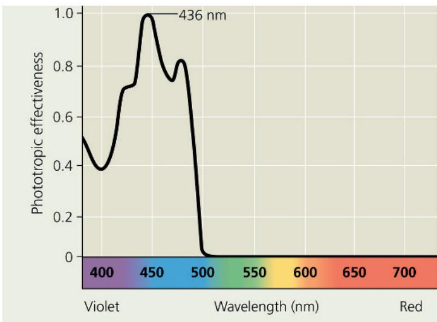  
(a) This action spectrum illustrates that only light wavelengths below 500 nm (blue and violet light) induce curvature.

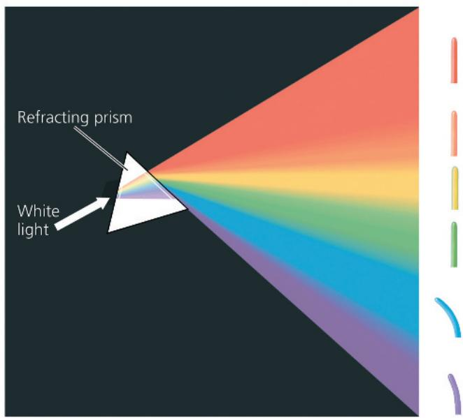  
(b) When coleoptiles are exposed to light of various wavelengths as shown here, violet light induces slight curvature toward the light and blue light induces the most curvature. The other colors do not induce any curvature.

## Phytochrome Photoreceptors

When exploring signal transduction in plants earlier in the chapter, we looked at the role of the plant pigments called phytochromes in the de-etiolation process. Phytochromes, pigments that absorb mostly red light and far-red light—that is, light of wavelengths near the upper edge of human visibility (730 nm)—regulate many plant responses to light, including seed germination and shade avoidance.

## Phytochromes and Seed Germination

Studies of seed germination led to the discovery of phyto-chromes. Because of limited nutrient reserves, many types of seeds, especially small ones, germinate only when the light environment and other conditions are near optimal. Such seeds often remain dormant for years until light conditions change. For example, the death of a shading tree or the plowing of a field may create a favorable light environment for germination.

In the 1930s, scientists determined the action spectrum for light-induced germination of lettuce seeds. They exposed water-swollen seeds to a few minutes of single-colored light of various wavelengths and then stored the seeds in the dark. After two days, the researchers counted the number of seeds that had germinated under each light regimen. They found that red light of wavelength 660 nm increased the germination percentage of lettuce seeds maximally, whereas far-red light inhibited germination compared with dark controls (Figure 39.16). What happens when the lettuce seeds are subjected to a flash of red light followed by a flash of far-red light or, conversely, to far-red light followed by red light? The last flash of light determines the seeds' response: The effects of red and far-red light are reversible.

The photoreceptors responsible for the opposing effects of red and far-red light are phytochromes. So far, researchers have identified five phytochromes in Arabidopsis, each with a slightly different polypeptide component. In most phytochromes, the light-absorbing portion is photoreversible, converting back and forth between two forms, depending on the color of light to which it is exposed. In its red-absorbing form ( $P_{r}$ ), a phytochrome absorbs red (r) light maximally and is converted to its far-red-absorbing form ( $P_{fr}$ ); in its $P_{fr}$ form, it absorbs far-red (fr) light and is converted to its $P_{r}$ form (Figure 39.17). This $P_{r} \leftrightarrow P_{fr}$ interconversion is a switching mechanism that controls various light-induced events in the life of the plant. $P_{fr}$ is the form of phytochrome that triggers many of a plant's developmental responses to light. For example, $P_{r}$ in lettuce seeds exposed to red light is converted to $P_{fr}$ , stimulating the cellular responses that lead to germination. When red-illuminated seeds are then exposed to far-red light, the $P_{fr}$ is converted back to $P_{r}$ , inhibiting the germination response.

How does phytochrome switching explain light-induced germination in nature? Plants synthesize phytochrome as $P_{r}$ ,

## Figure 39.16

# Inquiry: How does the order of red and far-red illumination affect seed germination?

Experiment

Scientists at the U.S. Department of Agriculture briefly exposed batches of lettuce seeds to red light or far-red light to test the effects on germination. After the light exposure, the seeds were placed in the dark, and the results were compared with control seeds that were not exposed to light.

## Results

The bar below each photo indicates the sequence of red light exposure, far-red light exposure, and darkness. The germination rate increased greatly in groups of seeds that were last exposed to red light (left). Germination was inhibited in groups of seeds that were last exposed to far-red light (right).

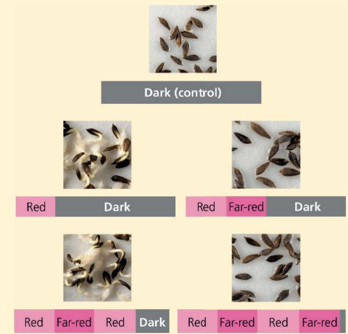  
Data from H. Borthwick et al., A reversible photoreaction controlling seed germination, Proceedings of the National Academy of Sciences USA 38:662–666 (1952).

## Conclusion

Red light stimulates germination, and far-red light inhibits germination. The final light exposure is the determining factor. The effects of red and far-red light are reversible.

WHAT IF? Phytochrome responds faster to red light than to far-red light. If the seeds had been placed in white light instead of the dark after their red light and far-red light treatments, would the results have been different?

For suggested answer, see Appendix A.

Figure 39.17 Phytochrome: a molecular switching mechanism. The absorption of red light causes $P_{r}$ to change to $P_{fr}$ . Far-red light reverses this conversion. In most cases, it is the $P_{fr}$ form of the pigment that switches on physiological and developmental responses in the plant.  
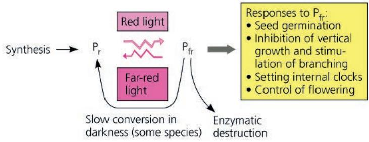

and if seeds are kept in the dark, the pigment remains almost entirely in the $P_{r}$ form (see Figure 39.17). Sunlight contains both red light and far-red light, but the conversion to $P_{fr}$ is faster than the conversion to $P_{r}$ . Therefore, the ratio of $P_{fr}$ to $P_{r}$ increases in the sunlight. When seeds are exposed to adequate sunlight, the production and accumulation of $P_{fr}$ trigger their germination.

## Phytochromes and Shade Avoidance

The phytochrome system also provides the plant with information about the quality of light. Because sunlight includes both red and far-red radiation, during the day the $P_{r} \leftrightarrow P_{fr}$ interconversion reaches a dynamic equilibrium, with the ratio of the two phytochrome forms indicating the relative amounts of red and far-red light. This sensing mechanism enables plants to adapt to changes in light conditions. Consider, for example, the “shade avoidance” response of a tree that requires relatively high light intensity. If other trees in a forest shade this tree, the phytochrome ratio shifts in favor of $P_{r}$ because the forest canopy screens out more red light than far-red light. This is because the chlorophyll pigments in the leaves of the canopy absorb red light and allow far-red light to pass. The shift in the ratio of red to far-red light induces the tree to allocate more of its resources to growing taller. In contrast, direct sunlight increases the proportion of $P_{fr}$ , which stimulates branching and inhibits vertical growth.

In addition to helping plants detect light, phytochrome helps a plant keep track of the passage of days and seasons. To understand phytochrome's role in these timekeeping processes, we must first examine the nature of the plant's internal clock.

## Biological Clocks and Circadian Rhythms

Many plant processes, such as transpiration and the synthesis of certain enzymes, undergo a daily oscillation. Some of these cyclic variations are responses to the changes in light levels and temperature that accompany the 24-hour cycle of day and night. We can control these external factors by growing plants in growth

Figure 39.18 “Sleep movements” of a bean plant (Phaseolus vulgaris).

The movements are caused by reversible changes in the turgor pressure of cells on opposing sides of the pulvini, motor organs of the leaf. This behavior may facilitate the hunting of herbivores by nocturnal predators, such as bats and owls, thereby benefiting the plant.

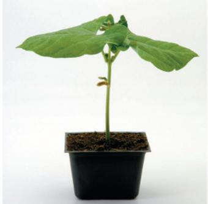  
Noon

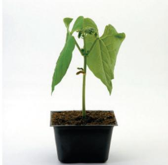  
10:00 PM

chambers under rigidly maintained conditions of light and temperature. But even under artificially constant conditions, many physiological processes in plants, such as the opening and closing of stomata and the production of photosynthetic enzymes, continue to oscillate with a frequency of about 24 hours. For example, many legumes lower their leaves in the evening and raise them in the morning (Figure 39.18). A bean plant continues these “sleep movements” even if kept in constant light or constant darkness; the leaves are not simply responding to sunrise and sunset. Such cycles, with a frequency of about 24 hours and not directly controlled by any known environmental variable, are called circadian rhythms (from the Latin circa, approximately, and dies, day).

Recent research supports the idea that the molecular “gears” of the circadian clock really are internal and not a daily response to some subtle but pervasive environmental cycle, such as geomagnetism or cosmic radiation. Organisms, including plants and humans, continue their rhythms even after being placed in deep mine shafts or when orbited in satellites, conditions that alter these subtle geophysical periodicities. However, daily signals from the environment can entrain (set) the circadian clock to a period of precisely 24 hours.

If an organism is kept in a constant environment, its circadian rhythms deviate from a 24-hours period (a period is the duration of one cycle). These free-running periods, as they are called, vary from about 21 to 27 hours, depending on the particular rhythmic response. The “sleep movements” of bean plants, for instance, have a period of 26 hours when the plants are kept in the free-running condition of constant darkness. Deviation of the free-running period from exactly 24 hours does not mean that biological clocks drift erratically. Free-running clocks are still keeping perfect time, but they are not synchronized with the outside world. To understand the mechanisms underlying circadian rhythms, we must distinguish between the clock and the rhythmic processes it controls. For example, the leaves of the bean plant in Figure 39.18 are the clock’s “hands” but are not the essence of the clock itself. If bean leaves are restrained for several hours and then released, they will reestablish the position appropriate for the time of day. We can interfere with a biological rhythm, but the underlying clockwork continues to tick.

At the heart of the molecular mechanisms underlying circadian rhythms are oscillations in the transcription of certain genes. Mathematical models propose that the 24-hour period arises from negative-feedback loops involving the transcription of a few central “clock genes.” Some clock genes may encode transcription factors that inhibit, after a time delay, the transcription of the gene that encodes the transcription factor itself. Such negative-feedback loops, together with a time delay, are enough to produce oscillations.

Researchers have used a novel technique to identify clock mutants of Arabidopsis. One prominent circadian rhythm in plants is the daily production of certain photosynthesis-related proteins. Molecular biologists traced the source of this rhythm to the promoter that initiates the transcription of the genes for these photosynthesis proteins. To identify clock mutants, scientists inserted the gene for an enzyme responsible for the bioluminescence of fireflies, called luciferase, to the promoter. When the biological clock turned on the promoter in the Arabidopsis genome, it also turned on the production of luciferase. The plants began to glow with a circadian periodicity. Clock mutants were then isolated by selecting specimens that glowed for a longer or shorter time than normal. The genes altered in some of these mutants affect proteins that normally bind photoreceptors. Perhaps these particular mutations disrupt a light-dependent mechanism that sets the biological clock.

## Interview

Interview with Ruth Satter: Investigating “sleep movements” in plants (eTextbook only)

## The Effect of Light on the Biological Clock

As previously noted, the free-running period of the circadian rhythm of bean leaf movements is 26 hours. Consider a bean plant placed at dawn in a dark cabinet for 72 hours: Its leaves would not rise again until 2 hours after natural dawn on the second day, 4 hours after natural dawn on the third day, and so on. Shut off from environmental cues, the plant becomes desynchronized. Desynchronization happens to humans when we fly across several time zones; when we reach our destination, the clocks on the wall are not synchronized with our internal clocks. Most organisms are probably prone to jet lag.

The factor that entrains the biological clock to precisely 24 hours every day is light. Both phytochromes and blue-light photoreceptors can entrain circadian rhythms in plants, but our understanding of how phytochromes do this is more complete. The mechanism involves turning cellular responses on and off by means of the $P_{r} \leftrightarrow P_{fr}$ switch.

Consider again the photoreversible system in Figure 39.17. In darkness, the phytochrome ratio shifts gradually in favor of the $P_{r}$ form, partly as a result of turnover in the overall phytochrome pool. The pigment is synthesized in the $P_{r}$ form, and enzymes destroy more $P_{fr}$ than $P_{r}$ . In some plant species, $P_{fr}$ present at sundown slowly converts to $P_{r}$ . In darkness, there is no means for the $P_{r}$ to be reconverted to $P_{fr}$ , but upon illumination, the $P_{fr}$ level suddenly increases again as $P_{r}$ is rapidly converted. This increase in $P_{fr}$ each day at dawn resets the biological clock: Bean leaves reach their most extreme night position 16 hours after dawn.

In nature, interactions between phytochrome and the biological clock enable plants to measure the passage of night and day. The relative lengths of night and day, however, change over the course of the year (except at the equator). Plants use this change to adjust activities in timing with the seasons.

## Photoperiodism and Responses to Seasons

Imagine the consequences if a plant produced flowers when pollinators were not present or if a deciduous tree produced leaves in the middle of winter. Seasonal events are of critical importance in the life cycles of most plants. Seed germination, flowering, and the onset and breaking of bud dormancy are all stages that usually occur at specific times of the year. The environmental cue that plants use to detect the time of year is the change in day length (photoperiod). A physiological response to specific night or day lengths, such as flowering, is called photoperiodism.

## Photoperiodism and Control of Flowering

An early clue to how plants detect seasons came from a mutant variety of tobacco, Maryland Mammoth, that grew tall but failed to flower during summer. It finally bloomed in a greenhouse in December. After trying to induce earlier flowering by varying temperature, moisture, and mineral nutrition, researchers learned that the shortening days of winter stimulated this variety to flower. Experiments revealed that flowering occurred only if the photoperiod was 14 hours or shorter. This variety did not flower during summer because at Maryland's latitude the photoperiods were too long.

The researchers called Maryland Mammoth a short-day plant because it apparently required a light period shorter than a critical length to flower. Chrysanthemums, poinsettias, and some soybean varieties are also short-day plants, which generally flower in late summer, fall, or winter. Another group of plants flower only when the light period is longer than a certain number of hours. These long-day plants generally flower in late spring or early summer. Spinach, for example, flowers when days are 14 hours or longer. Radishes, lettuce, irises, and many cereal varieties are also long-day plants. Day-neutral plants, such as tomatoes, rice, and dandelions, are unaffected by photoperiod and flower when they reach a certain stage of maturity, regardless of photoperiod.

## Critical Night Length

In the 1940s, researchers learned that flowering in short- and long-day plants is actually controlled by night length, not day length (photoperiod). Many of these scientists worked with cocklebur (Xanthium strumarium), a short-day plant that flowers only when days are 16 hours or shorter (and nights are at least 8 hours long). These researchers found that if the photoperiod is broken by a brief exposure to darkness, flowering proceeds. However, if the night length is interrupted by even a few minutes of dim light, cocklebur will not flower, and this turned out to be true for other short-day plants as well (Figure 39.19a). Cocklebur is unresponsive to day length, but it requires at least 8 hours of continuous darkness to flower. Short-day plants are really long-night plants, but the older term is embedded firmly in the lexicon of plant physiology. Similarly, long-day plants are actually short-night plants. A long-day plant grown under long-night conditions that would not normally induce flowering will flower if the night length is interrupted by a few minutes of light (Figure 39.19b).

Notice that long-day plants are not distinguished from short-day plants by an absolute night length. Instead, they are distinguished by whether the critical night length sets a maximum number of hours of darkness required for flowering (long-day plants) or a minimum number of hours of darkness required for flowering (short-day plants). In both cases, the actual number of hours in the critical night length is specific to each species of plant.

Figure 39.19 Photoperiodic control of flowering.  
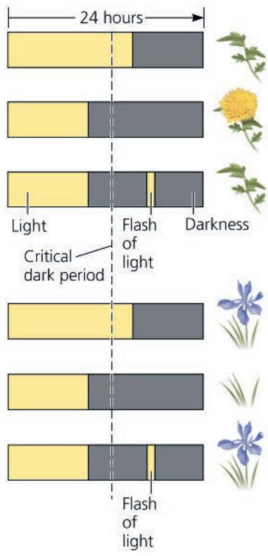  
(a) Short-day (long-night) plant. Flowers when night exceeds a critical dark period. A flash of light interrupting the dark period prevents flowering.  
(b) Long-day (short-night) plant. Flowers only if the night is shorter than a critical dark period. A brief flash of light artificially interrupts a long dark period, thereby inducing flowering.

Red light is the most effective color in interrupting the night length. Action spectra and photoreversibility experiments show that phytochrome is the pigment that detects the red light (Figure 39.20). For example, if a flash of red light during the night length is followed by a flash of far-red light, then the plant detects no interruption of night length. As in the case of phytochrome-mediated seed germination, red/far-red photoreversibility occurs.

Plants measure night lengths very precisely; some short-day plants will not flower if night is even 1 minute shorter than the critical length. Some plant species always flower on the same day each year. It appears that plants use their biological clock, entrained by night length with the help of phytochrome, to tell the season of the year. The floriculture (flower-growing) industry applies this knowledge to produce flowers out of season. Chrysanthemums, for instance, are short-day plants that normally bloom in fall, but their blooming can be stalled until Mother's Day in May by punctuating each long night with a flash of light, thus turning one long night into two short nights.

Some plants bloom after a single exposure to the photoperiod required for flowering. Other species need several successive days of the appropriate photoperiod. Still others respond to a photoperiod only if they have been previously exposed to some other environmental stimulus, such as a period of cold. Winter wheat, for example, will not flower unless it has been exposed to several weeks of temperatures below $10^{\circ}$ C. The use of pretreatment with cold to induce flowering is called

Figure 39.20 Reversible effects of red and far-red light on photoperiodic response.

A flash of red (r) light shortens the dark period. A subsequent flash of far-red (fr) light cancels the red flash's effect.

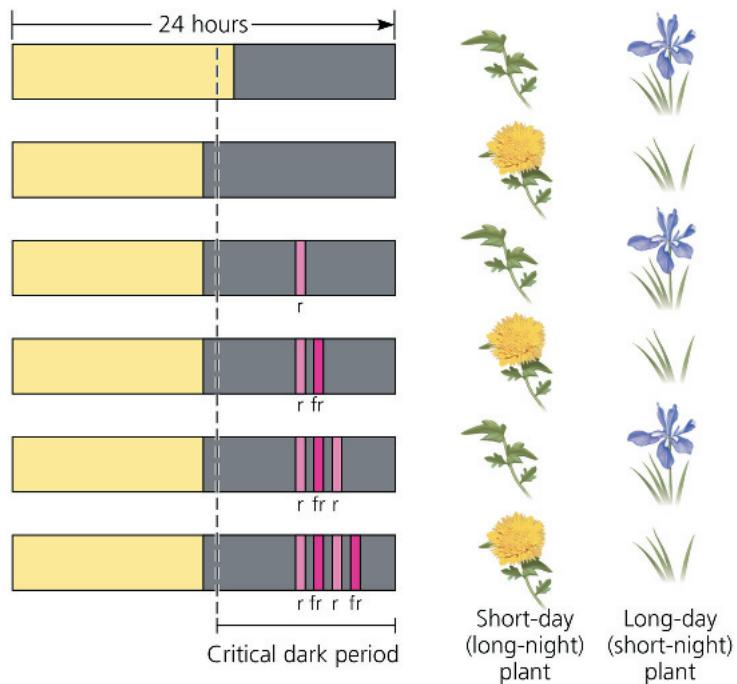  
VISUAL SKILLS Under long-day conditions (as in the top panel) or under short-day conditions (as in the second panel), how would a single flash of far-red light during the dark period affect flowering? For suggested answer, see Appendix A.  
Figure 39.21 Experimental evidence for a flowering hormone.

vernalization (from the Latin for “spring”). Several weeks after winter wheat is vernalized, a long photoperiod (short night) induces flowering.

## A Flowering Hormone?

Although flowers form from apical or axillary bud meristems, it is leaves that detect changes in photoperiod and produce signaling molecules that cue buds to develop as flowers. In many short-day and long-day plants, exposing just one leaf to the appropriate photoperiod is enough to induce flowering. Indeed, as long as one leaf is left on the plant, photoperiod is detected and floral buds are induced. If all leaves are removed, the plant is insensitive to photoperiod.

Classic experiments revealed that the floral stimulus could move across a graft from an induced plant to a noninduced plant and trigger flowering in the latter. Moreover, the flowering stimulus appears to be the same for short-day and long-day plants, despite the different photoperiodic conditions required for leaves to send this signal (Figure 39.21). The hypothetical signaling molecule for flowering, called florigen, remained unidentified for over 70 years as scientists focused on small hormone-like molecules. However, large macromolecules, such as mRNA and proteins, can move by the symplastic route via plasmodesmata and regulate plant development. It now appears that florigen is a protein. A gene called FLOWERING LOCUS T (FT) is activated in leaf cells during conditions favoring flowering, and the FT protein travels through the symplasm to the shoot apical meristem, initiating the transition of a bud's meristem from a vegetative to a flowering state.

If grown individually under short-day conditions, a short-day plant will flower and a long-day plant will not. However, both will flower if grafted together and exposed to short days. This result indicates that a flower-inducing substance (florigen) is transmitted across grafts and induces flowering in both short-day and long-day plants.

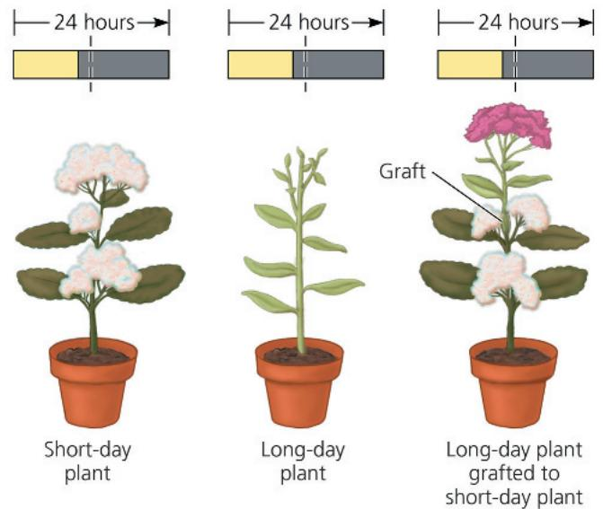  
WHAT IF? If flowering were inhibited in both parts of the grafted plants, what would you conclude?
For suggested answer, see Appendix A.

## Concept Check 39.3

1. If an enzyme in field-grown soybean leaves is most active at noon and least active at midnight, is its activity under circadian regulation?

2. WHAT IF? If a plant flowers in a controlled chamber with a daily cycle of 10 hours of light and 14 hours of darkness, is it a short-day plant? Explain.

3. MAKE CONNECTIONS Plants detect the quality of their light environment by using blue-light photoreceptors and red-light-absorbing phytochromes. After reviewing Figure 10.9, suggest a reason why plants are so sensitive to these colors of light.

For suggested answers, see Appendix A.

## Concept 39.4: Plants respond to a wide variety of stimuli other than light

Although plants are immobile, some mechanisms have evolved by natural selection that enable them to adjust to a wide range of environmental circumstances by developmental or physiological means. Light is so important in the life of a plant that we devoted the entire previous section to the topic of a plant's reception of and response to this particular environmental factor. In this section, we will examine responses to some of the other environmental stimuli that a plant commonly encounters.

## Gravity

Because plants are photoautotrophs, it is not surprising that mechanisms for growing toward light have evolved. But what environmental cue does the shoot of a young seedling use to grow upward when it is completely underground and there is no light for it to detect? Similarly, what environmental factor prompts the young root to grow downward? The answer to both questions is gravity.

Place a plant on its side, and it adjusts its growth so that the shoot bends upward and the root curves downward. In their responses to gravity, or gravitropism, roots display positive gravitropism (Figure 39.22a) and shoots exhibit negative gravitropism. Gravitropism occurs as soon as a seed germinates, ensuring that the root grows into the soil and the shoot grows toward sunlight, regardless of how the seed is oriented when it lands.

Plants may detect gravity by the settling of statoliths, dense cytoplasmic components that settle under the influence of gravity to the lower portions of the cell. The statoliths of vascular plants are specialized plastids containing dense starch grains (Figure 39.22b). In roots, statoliths are located in certain cells of the root cap. According to one hypothesis, the aggregation of statoliths at the low points of these cells triggers a redistribution of calcium, which causes lateral transport of auxin within the root. The calcium and auxin accumulate on the lower side of the root's zone of elongation. At high concentration, auxin inhibits cell

Figure 39.22 Positive gravitropism in roots: the statolith hypothesis.

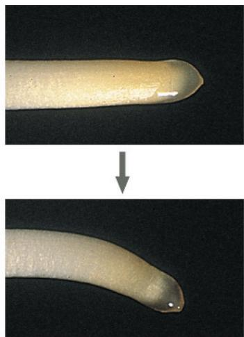

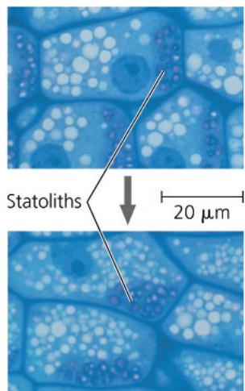  
(a) Over the course of hours, a horizontally oriented primary root of maize bends gravitropically until its growing tip becomes vertically oriented (LMs).

(b) Within minutes after the root is placed horizontally, plastids called statoliths begin settling to the lowest sides of root cap cells. This settling may be the gravity-sensing mechanism that leads to redistribution of auxin and differing rates of elongation by cells on opposite sides of the root (LMs).

elongation, an effect that slows growth on the root's lower side. The more rapid elongation of cells on the upper side causes the root to grow straight downward.

Falling statoliths, however, may not be necessary for gravitropism. For example, there are mutants of Arabidopsis and tobacco that lack statoliths but are still capable of gravitropism, though the response is slower than in wild-type plants. It could be that the entire cell helps the root sense gravity by mechanically pulling on proteins that tether the protoplast to the cell wall, stretching the proteins on the “up” side and compressing the proteins on the “down” side of the root cells. Dense organelles, in addition to starch granules, may also contribute by distorting the cytoskeleton as they are pulled by gravity. Statoliths, because of their density, may enhance gravitational sensing by a mechanism that simply works more slowly in their absence.

## Mechanical Stimuli

Trees in windy environments usually have shorter, stockier trunks than a tree of the same species growing in more sheltered locations. This stunted shape enables the plant to hold its ground against strong gusts of wind. The term thigmomorphogenesis (from the Greek thigma, touch) refers to the changes in form that result from mechanical perturbation. Plants are very sensitive to mechanical stress: Even the act of measuring the length of a leaf with a ruler alters its subsequent growth. Rubbing the stems of a young plant a couple of times daily results in plants that are shorter than controls (Figure 39.23).

Figure 39.23 Thigmomorphogenesis in Arabidopsis.

The shorter plant on the left was rubbed twice a day. The untouched plant (right) grew much taller.

(a) Unstimulated state (leaflets spread apart) (b) Stimulated state (leaflets folded)  
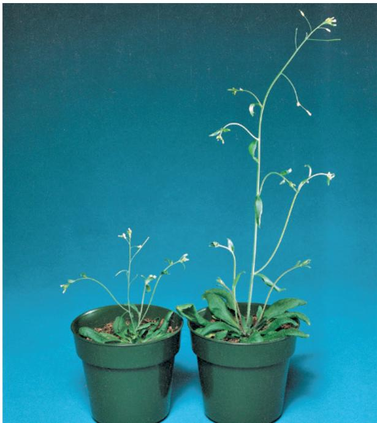

Some plant species have become, over the course of their evolution, “touch specialists.” Acute responsiveness to mechanical stimuli is an integral part of these plants’ “life strategies.” Most vines and other climbing plants have tendrils that coil rapidly around supports (see Figure 35.7). These grasping organs usually grow straight until they touch something; the contact stimulates a coiling response caused by differential growth of cells on opposite sides of the tendril. This directional growth in response to touch is called thigmotropism, and it allows the vine to take advantage of whatever mechanical supports it comes across as it climbs upward toward a forest canopy.

Other examples of touch specialists are plants that undergo rapid leaf movements in response to mechanical stimulation. For example, when the compound leaf of the sensitive plant Mimosa pudica is touched, it collapses and its leaflets fold together (Figure 39.24). This response, which takes only a second or two, results from a rapid loss of turgor in cells within pulvini, specialized motor organs located at the joints of the leaf. The motor cells suddenly become flaccid after stimulation because they lose potassium ions, causing water to leave the cells by osmosis. It takes about 10 minutes for the cells to regain their turgor and restore the “unstimulated” form of the leaf. The function of the sensitive plant’s behavior invites speculation. Perhaps the plant appears less leafy and appetizing to herbivores by folding its leaves and reducing its surface area when jostled.

A remarkable feature of rapid leaf movements is the mode of transmission of the stimulus through the plant. If one leaflet of a sensitive plant is touched, first that leaflet responds, then the adjacent leaflet responds, and so on, until all the leaflet pairs have folded together. From the point of stimulation, the signal that produces this response travels at a speed of about 1 cm/sec. An electrical impulse traveling at the same rate can be detected when electrodes are attached to the leaf. These impulses, called action potentials, resemble nerve impulses in animals, though the action potentials of plants are thousands of times slower. Action potentials have been discovered in many species of algae and plants and may be used as a form of internal communication. For example, in the Venus flytrap (Dionaea muscipula), action potentials are transmitted from sensory hairs in the trap to the cells that respond by closing the trap (see Figure 37.15). In the case of Mimosa pudica, a more violent stimulus, such as burning a leaf, causes all the leaves and leaflets to droop. This whole-plant response involves the spread of signaling molecules from the injured area to other parts of the shoot.

## Environmental Stresses

Environmental stresses, such as flooding, drought, or extreme temperatures, can have devastating effects on plant survival, growth, and reproduction. In natural ecosystems, plants that cannot tolerate an environmental stress either die or are outcompeted by other plants. Thus, environmental stresses are an important factor in determining the geographic ranges of plants. In the last section of this chapter, we'll examine the defensive responses of plants to

Figure 39.24 Rapid turgor movements by the sensitive plant (Mimosa pudica).  

## Problem-Solving Exercise

## How will climate change affect crop productivity?

Plant growth is significantly limited by air temperature, water availability, and solar radiation. A useful parameter for estimating crop productivity is the number of days per year when these three climate variables are suitable for plant growth. Camilo Mora (University of Hawaii at Manoa) and his colleagues analyzed global climate models to project the effect of climate change on suitable days for plant growth by the year 2100.

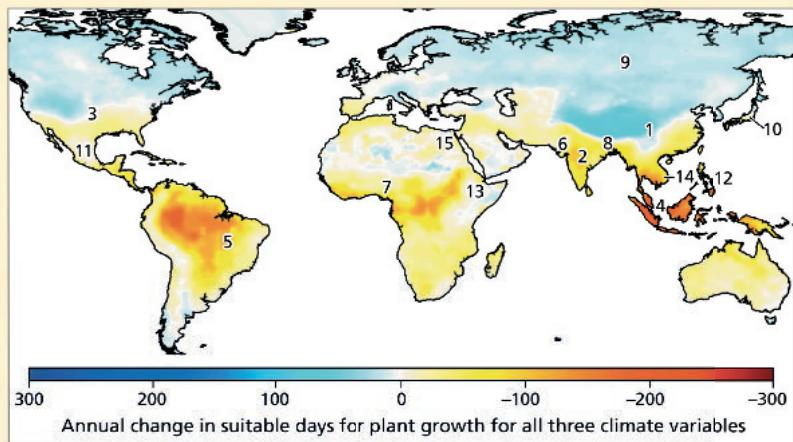  
Map data from Camilo Mora, et al. Days for Plant Growth Disappear under Projected Climate Change: Potential Human and Biotic Vulnerability. PLoS Biol 13(6): e1002167 (2015).

In this exercise, you will examine projected effects of climate change on crop productivity and identify the resulting human impacts.

of the 15 most populous nations. The table identifies their economies as either mainly industrial (factory icon) or agricultural (plant icon) and their annual per capita income category.

<table><tr><td>Nation</td><td>Map location</td><td>Estimated population in 2014 (millions)</td><td>Type of economy</td><td>Income category*</td></tr><tr><td>China</td><td>1</td><td>1,350</td><td></td><td>$$$</td></tr><tr><td>India</td><td>2</td><td>1,221</td><td></td><td>$$</td></tr><tr><td>United States</td><td>3</td><td>317</td><td></td><td>$$$$$</td></tr><tr><td>Indonesia</td><td>4</td><td>251</td><td></td><td>$</td></tr><tr><td>Brazil</td><td>5</td><td>201</td><td></td><td>$$$</td></tr><tr><td>Pakistan</td><td>6</td><td>193</td><td></td><td>$$</td></tr><tr><td>Nigeria</td><td>7</td><td>175</td><td></td><td>$$</td></tr><tr><td>Bangladesh</td><td>8</td><td>164</td><td></td><td>$</td></tr><tr><td>Russia</td><td>9</td><td>143</td><td></td><td>$$$$$</td></tr><tr><td>Japan</td><td>10</td><td>127</td><td></td><td>$$$$$</td></tr><tr><td>Mexico</td><td>11</td><td>116</td><td></td><td>$$$</td></tr><tr><td>Philippines</td><td>12</td><td>106</td><td></td><td>$$</td></tr><tr><td>Ethiopia</td><td>13</td><td>94</td><td></td><td>$</td></tr><tr><td>Vietnam</td><td>14</td><td>92</td><td></td><td>$</td></tr><tr><td>Egypt</td><td>15</td><td>85</td><td></td><td>$$</td></tr></table>

Data from The World Bank  
\*Per capita income, based on World Bank categories: $=$ low: < \$1,035; $=$ lower middle: \$1,036-\$4,085; $=$ upper middle: \$4,086-\$12,615; $=$ high: > \$12,615.

## Your Approach

Analyze the map and table. Then answer the questions below.

## Your Data

The researchers projected the annual changes in suitable days for plant growth for all three climate variables: temperature, water availability, and solar radiation. They did so by subtracting recent averages (1996–2005) from projected future averages (2091–2100). The map shows the projected changes if no measures are taken to reduce climate change. The numbers identify locations

common biotic (living) stresses, such as herbivores and pathogens. Here we'll consider some of the more common abiotic (nonliving) stresses that plants encounter. Since these abiotic factors are major determinants of crop yields, there is currently much interest in trying to project how global climate change will impact crop production (see the Problem-Solving Exercise).

## Drought

On a sunny, dry day, a plant may wilt because its water loss by transpiration exceeds water absorption from the soil. Prolonged drought, of course, will kill a plant, but plants have control systems that enable them to cope with less extreme water deficits.

## Your Analysis

1. Camilo Mora began the study as a result of talking with someone who claimed that climate change improves plant growth because it increases the number of days above freezing. Based on the map data, how would you respond to this claim?

2. What do the map and the table data indicate about the impact of the projected changes on humans?

Instructors: A version of this Problem-Solving Exercise can be assigned in Mastering Biology.

Many of a plant's responses to water deficit help the plant conserve water by reducing the rate of transpiration. Water deficit in a leaf causes stomata to close, thereby slowing transpiration dramatically (see Figure 36.14). Water deficit stimulates increased synthesis and release of abscisic acid in the leaves; this hormone helps keep stomata closed by acting on guard cell membranes. Leaves respond to water deficit in several other ways. For example, when the leaves of grasses wilt, they roll into a tubelike shape that reduces transpiration by exposing less leaf surface to dry air and wind. Other plants, such as ocotillo (see Figure 36.15), shed their leaves in response to seasonal drought. Although these leaf responses conserve water, they also reduce photosynthesis, which is one reason why a drought diminishes crop yield. Plants

# Scientific Skills Exercise Interpreting Experimental Results from a Bar Graph

Do Drought-Stressed Plants Communicate Their Condition to Their Neighbors? Researchers wanted to learn if plants can communicate drought-induced stress to neighboring plants and, if so, whether they use aboveground or belowground signals. In this exercise, you will interpret a bar graph concerning widths of stomatal openings to investigate whether drought-induced stress can be communicated from plant to plant.

How the Experiment Was Done Eleven potted pea plants (Pisum sativum) were placed equidistantly in a row. The root systems of plants 6–11 were connected to those of their immediate neighbors by tubes, which allowed chemicals to move from the roots of one plant to the roots of the next plant without moving through the soil. The root systems of plants 1–6 were not connected. Osmotic shock was inflicted on plant 6 using a highly concentrated solution of mannitol, a natural sugar commonly used to mimic drought stress in vascular plants. Fifteen minutes following the osmotic shock to plant 6, researchers measured the width of stomatal openings in leaves from all the plants. A control experiment was also done in which water was added to plant 6 instead of mannitol.

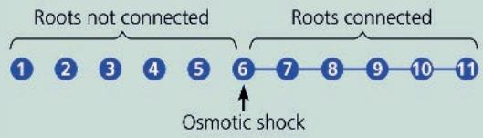

## INTERPRET THE DATA

1. How do the widths of the stomatal openings of plants 6–8 and plants 9 and 10 compare with those of the other plants in the experiment? What does this indicate about the state of plants 6–8 and 9 and 10? (For information about reading graphs, see the Scientific Skills Review in Appendix D.)

2. Do the data support the idea that plants can communicate their drought-stressed condition to their neighbors? If so, do the

can even take advantage of early warnings in the form of chemical signals from wilting neighbors and prime themselves to respond more readily and intensely to impending drought stress (see the Scientific Skills Exercise).

## Flooding

Too much water is also a problem for a plant. An overwatered houseplant may suffocate because the soil lacks the air spaces that provide oxygen for cellular respiration in the roots. Some plants are structurally adapted to very wet habitats. For example, the submerged roots of mangroves, which inhabit coastal marshes, are continuous with aerial roots exposed to oxygen (see Figure 35.4). But how do less specialized plants cope with oxygen deprivation in waterlogged soils? Oxygen deprivation stimulates the production of ethylene, which causes some cells in the root cortex to die. The destruction of these cells creates air data indicate that the communication is via the shoot system or the root system? Make specific reference to the data in answering both questions.

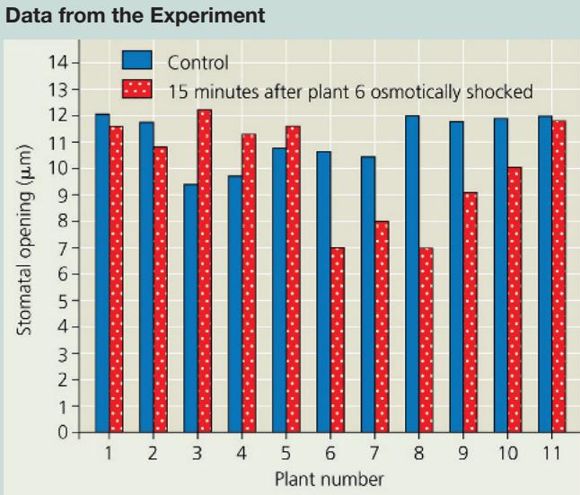  
Data from O. Falik et al., Rumor has it...: Relay communication of stress cues in plants, PLoS ONE 6(11):e23625 (2011).

3. Why was it necessary to make sure that chemicals could not move through the soil from one plant to the next?

4. When the experiment was run for 1 hour rather than 15 minutes, the results were about the same except that the stomatal openings of plants 9–11 were comparable to those of plants 6–8. Suggest a reason why.

5. Why was water added to plant 6 instead of mannitol in the control experiment? What do the results of the control experiment indicate?

Instructors: A version of this Scientific Skills Exercise can be assigned in Mastering Biology.

tubes that function as “snorkels,” providing oxygen to the submerged roots (Figure 39.25).

## Salt Stress

An excess of sodium chloride or other salts in the soil threatens plants for two reasons. First, by lowering the water potential of the soil solution, salt can cause a water deficit in plants even though the soil has plenty of water. As the water potential of the soil solution becomes more negative, the water potential gradient from soil to roots is lowered, thereby reducing water uptake (see Figure 36.12). Another problem with saline soil is that sodium and certain other ions are toxic to plants when their concentrations are too high. Many plants can respond to moderate soil salinity by producing solutes that are well tolerated at high concentrations: These mostly organic compounds keep the water potential of cells more negative than that of the soil solution without admitting toxic quantities of

Figure 39.25 A developmental response of maize roots to flooding and oxygen deprivation.

(a) A cross section of a control root grown in an aerated hydroponic medium. (b) A root grown in a nonaerated hydroponic medium. Ethylene-stimulated programmed cell death creates the air tubes (SEMs).

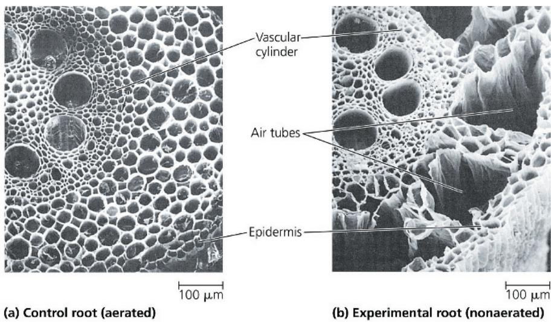  
(b) Experimental root (nonaerated)

salt. However, most plants cannot survive salt stress for long. The exceptions are halophytes, salt-tolerant plants with adaptations such as salt glands that pump salts out across the leaf epidermis.

## Heat Stress

Excessive heat may harm and even kill a plant by denaturing its enzymes. Transpiration helps cool leaves by evaporative cooling. On a warm day, for example, the temperature of a leaf may be 3–10°C below the ambient air temperature. Hot, dry weather also tends to dehydrate many plants; the closing of stomata in response to this stress conserves water but then sacrifices evaporative cooling. This dilemma is one reason why very hot, dry days take a toll on most plants.

Most plants have a backup response that enables them to survive heat stress. Above a certain temperature—about $40^{\circ}$ C for most plants in temperate regions—plant cells begin synthesizing heat-shock proteins, which help protect other proteins from heat stress. This response also occurs in heat-stressed animals and microorganisms. Some heat-shock proteins function in unstressed cells as temporary scaffolds that help other proteins fold into their functional shapes. In their roles as heat-shock proteins, perhaps these molecules bind to other proteins and help prevent their denaturation.

## Cold Stress

One problem plants face when the temperature of the environment falls is a change in the fluidity of cell membranes. When a membrane cools below a critical point, it loses its fluidity as the lipids become locked into crystalline structures. This alters solute transport across the membrane and also adversely affects the functions of membrane proteins. Plants respond to cold stress by altering the lipid composition of their membranes. For example, membrane lipids increase in their proportion of unsaturated fatty acids, which have shapes that help keep membranes more fluid at low temperatures. Such membrane modification requires from several hours to days, which is one reason why unseasonably cold temperatures are generally more stressful to plants than the more gradual seasonal drop in air temperature.

Freezing is another type of cold stress. At subfreezing temperatures, ice forms in the cell walls and intercellular spaces of most plants. The cytosol generally does not freeze at the cooling rates encountered in nature because it contains more solutes than the very dilute solution found in the cell wall, and solutes lower the freezing point of a solution. The reduction in liquid water in the cell wall caused by ice formation lowers the extracellular water potential, causing water to leave the cytoplasm. The resulting increase in the concentration of ions in the cytoplasm is harmful and can lead to cell death. Whether the cell survives depends largely on how well it resists dehydration. In regions with cold winters, native plants are adapted to cope with freezing stress. For example, before the onset of winter, the cells of many frost-tolerant species increase cytoplasmic levels of specific solutes, such as sugars, that are well tolerated

at high concentrations and that help reduce the loss of water from the cell during extracellular freezing. The unsaturation of membrane lipids also increases, thereby maintaining proper levels of membrane fluidity.

EVOLUTION Many organisms, including certain vertebrates, fungi, bacteria, and many species of plants, have proteins that hinder ice crystals from growing, helping the organism escape freezing damage. First described in Arctic fish in the 1950s, these antifreeze proteins permit survival at temperatures below $0^{\circ}$ C. They bind to small ice crystals and inhibit their growth or, in the case of plants, prevent the crystallization of ice. The five major classes of antifreeze proteins differ markedly in their amino acid sequences but have a similar three-dimensional structure, suggesting convergent evolution. Surprisingly, antifreeze proteins from winter rye are homologous to antifungal defense proteins, but they are produced in response to cold temperatures and shorter days, not fungal pathogens. Progress is being made in increasing the freezing tolerance of crop plants by engineering antifreeze protein genes into their genomes.

## Concept Check 39.4

1. Thermal images are photographs of the heat emitted by an object. Researchers have used thermal imaging of plants to isolate mutants that overproduce abscisic acid. Suggest a reason why they are warmer than wild-type plants under conditions that are normally nonstressful.

2. A greenhouse worker finds that potted chrysanthemums nearest the aisles are often shorter than those in the middle of the bench. Explain this “edge effect,” a common problem in horticulture.

3. WHAT IF? If you removed the root cap from a root, would the root still respond to gravity? Explain.

# Concept 39.5: Plants respond to attacks by pathogens and herbivores

Through natural selection, plants have evolved many types of interactions with other species in their communities. Some interspecific interactions are mutually beneficial, such as the associations of plants with mycorrhizal fungi (see Figure 37.14) or with pollinators (see Figures 38.4 and 38.5). Many plant interactions with other organisms, however, do not benefit the plant. As primary producers, plants are at the base of most food webs and are subject to attack by a wide range of plant-eating (herbivorous) animals. A plant is also subject to infection by diverse viruses, bacteria, and fungi that can damage tissues or even kill the plant. Plants counter these threats with defense systems that deter animals and prevent infection or combat invading pathogens.

## Defenses Against Pathogens

A plant's first line of defense against infection is the physical barrier presented by the epidermis and periderm of the plant body (see Figure 35.19). This line of defense, however, is not impenetrable. The mechanical wounding of leaves by herbivores, for example, opens up portals for invasion by pathogens. Even when plant tissues are intact, viruses, bacteria, and the spores and hyphae of fungi can still enter the plant through natural openings in the epidermis, such as stomata. Once the physical lines of defense are breached, a plant's next lines of defense are two types of immune responses: pathogen-associated molecular pattern (PAMP)-triggered immunity and effector-triggered immunity.

## PAMP-Triggered Immunity

When a pathogen succeeds in invading a host plant, the plant mounts the first of two lines of immune defense, which ultimately results in a chemical attack that isolates the pathogen and prevents its spread from the site of infection. This first line of immune defense, called PAMP-triggered immunity, depends on the plant's ability to recognize pathogen-associated molecular patterns (PAMPs; formerly called elicitors), molecular sequences that are specific to certain pathogens. For example, bacterial flagellin, a major protein found in bacterial flagella, is a PAMP. Many soil bacteria, including some pathogenic varieties, get splashed onto the shoots of plants by raindrops. If these bacteria penetrate the plant, a specific amino acid sequence within flagellin is perceived by a Toll-like receptor, a type of receptor also found in animals, where it plays a key role in the innate immune system (see Concept 43.1). The innate immune system is an evolutionarily old defense strategy and is the dominant immune system in plants, fungi, insects, and primitive multicellular organisms. Unlike vertebrates, plants do not have an adaptive immune system: Plants neither generate antibody or T cell responses nor possess mobile cells that detect and attack pathogens.

PAMP recognition in plants leads to a chain of signaling events that lead ultimately to the local production of broad-spectrum, antimicrobial chemicals called phytoalexins, which have fungicidal and bactericidal properties. The plant cell wall is also toughened, hindering further progress of the pathogen. Similar but even stronger defenses are initiated by the second plant immune response, effector-triggered immunity.

## Effector-Triggered Immunity

EVOLUTION Over the course of evolution, plants and pathogens have engaged in an arms race. PAMP-triggered immunity can be overcome by the evolution of pathogens that can evade detection by the plant. These pathogens deliver effectors, pathogen-encoded proteins that cripple the plant's innate immune system, directly into plant cells. For example, some bacteria deliver effectors inside the plant cell that block the perception of flagellin. Thus, these effectors allow the pathogen to redirect the host's metabolism to the pathogen's advantage.

The suppression of PAMP-triggered immunity by pathogen effectors led to the evolution of effector-triggered immunity. Because there are thousands of effectors, this plant defense is typically made up of hundreds of disease resistance (R) genes. Each R gene codes for an R protein that can be activated by a specific effector. Signal transduction pathways then lead to an arsenal of defense responses, including a local defense called the hypersensitive response and a general defense called systemic acquired resistance. Local and systemic responses to pathogens require extensive genetic reprogramming and commitment of cellular resources. Therefore, a plant activates these defenses only after detecting a pathogen.

## The Hypersensitive Response

An important mechanism that restricts the spread of a pathogen is the hypersensitive response, the formation of a ring of local cell death around the infection site. As indicated in Figure 39.26, the hypersensitive response, which results from effector-triggered immunity, involves the production of enzymes and chemicals that impair the pathogen's cell wall integrity, metabolism, or reproduction. Effector-triggered immunity also stimulates the formation of lignin and the cross-linking of molecules within the plant cell wall, responses that hinder the spread of the pathogen to other parts of the plant. As shown in step 2 of the figure, the hypersensitive response results in localized lesions on a leaf. As “sick” as such a leaf appears, it will still survive, and its defensive response will help protect the rest of the plant.

## Systemic Acquired Resistance

The hypersensitive response is localized and specific. However, pathogen invasions can also produce signaling molecules that “sound the alarm” of infection to the whole plant. The resulting systemic acquired resistance arises from the plant-wide expression of defense genes. It is nonspecific, providing protection against a diversity of pathogens that can last for days. A signaling molecule called methylsalicylic acid is produced around the infection site, carried by the phloem throughout the plant, and then

3 Before the infected cells die, they release the signaling molecule methylsalicylic acid, which is exported to the rest of the plant.

Infected tobacco leaf with hypersensitive response lesions

## Figure 39.26 Defense responses against pathogens.

Plants can often prevent the systemic spread of infection by instigating a hypersensitive response. This response helps isolate the pathogen by producing lesions that form “rings of death” around the sites of infection.

## 1 Pathogens often infect leaf cells and secrete effectors, proteins that bypass PAMP-triggered immunity.

2 In response to effectors, the hypersensitive response occurs in cells in and near the infected area: The cells produce antimicrobial molecules, seal off infected areas by modifying their cell walls, and then destroy themselves. This localized response results in lesions, regions of dead tissue that deprive the pathogen of nutrients, thereby helping to protect the rest of the infected leaf.

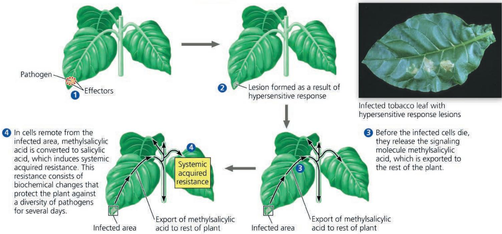

converted to salicylic acid in areas remote from the sites of infection. Salicylic acid activates a signal transduction pathway that poises the defense system to respond rapidly to another infection (see step 4 of Figure 39.26).

Plant disease epidemics, such as the potato blight (see Concept 28.3) that caused the Irish potato famine of the 1840s, can lead to incalculable human misery. Other diseases, such as chestnut blight (see Concept 31.5) and sudden oak death (see Concept 54.5), can dramatically alter community structures. Plant epidemics are often the result of infected plants or timber being inadvertently transported around the world. As global commerce increases, such epidemics will become increasingly more common. To prepare for such outbreaks, plant biologists are stockpiling the seeds of wild relatives of crop plants in special storage facilities. Scientists hope that undomesticated relatives may have genes that will be able to curb the next plant epidemic.

## Defenses Against Herbivores

Herbivory, animals eating plants, is a stress that plants face in any ecosystem. The mechanical damage caused by herbivores reduces the size of plants, hindering ability to acquire resources. It can restrict growth because many species divert some energy to defend against herbivores. Also, it opens portals for infection by viruses, bacteria, and fungi. Plants prevent excessive herbivory through methods that span all levels of biological organization

(Figure 39.27, on the next two pages), including physical defenses, such as thorns and trichomes (see Figure 35.9), and chemical defenses, such as distasteful or toxic compounds.

## Interview

Interview with Jeffery Dangl: Investigating plant defense responses (eTextbook only)

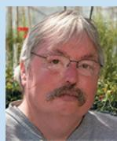

## Concept Check 39.5

1. Why do pathogen-infected leaves often appear spotted?

2. Chewing insects mechanically damage plants and lessen the surface area of leaves for photosynthesis. In addition, these insects make plants more vulnerable to pathogen attack. Suggest a reason why.

3. Many fungal pathogens get food by causing plant cells to become leaky, releasing nutrients into the intercellular spaces. Would it benefit the fungus to kill the host plant in a way that results in all the nutrients leaking out? Explain.

4. WHAT IF? Suppose a scientist finds that a population of plants growing in a breezy location is more prone to herbivory by insects than a population of the same species growing in a sheltered area. Suggest an explanation.

## Make Connections: Levels of Plant Defenses Against Herbivores

## Figure 39.27

Herbivory, animals eating plants, is ubiquitous in nature. Plant defenses against herbivores are examples of how biological processes can be observed at multiple levels of biological organization: molecular, cellular, tissue, organ, organism, population, and community. (See Figure 1.3.) Molecular-Level Defense

Opium poppy fruit

At the molecular level, plants produce chemical compounds that deter attackers. These compounds are typically terpenoids, phenolics, and alkaloids. Some terpenoids mimic insect hormones and cause insects to molt prematurely and die. Some examples of phenolics are tannins, which have an unpleasant taste and hinder the digestion of proteins. Their synthesis is often enhanced following attack. The opium poppy (Papaver somniferum) is the source of the narcotic alkaloids morphine, heroin, and codeine. These drugs accumulate in secretory cells called laticifers, which exude a milky-white latex (opium) when the plant is damaged.

## Cellular-Level Defenses

Some plant cells are specialized for deterring herbivores. Trichomes on leaves and stems hinder the access of chewing insects. Laticifers and, more generally, the central vacuoles of plant cells generally, the central vacuoles of plant cells may serve as storage depots for chemicals that deter herbivores. Idioblasts are specialized cells found in the leaves and stems of many species, including taro (Colocasia esculenta). Some idioblasts contain needle-shaped crystals of calcium oxalate called raphides. They penetrate the soft tissues of the tongue and palate, making it easier for an irritant produced by the plant, possibly a protease, to enter animal tissues and cause temporary swelling of the lips, mouth, and throat. The crystals act as a carrier for the irritant, enabling it to seep deeper into the herbivore's tissues. The irritant is destroyed by cooking.

Raphide crystals from taro plant

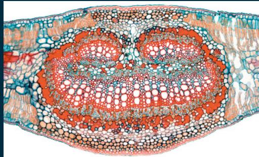

## Tissue-Level Defenses

Some leaves deter herbivores by being especially tough to chew as a result of extensive growth of thick, hardened sclerenchyma tissue. The bright orange cells with thick cell walls seen in this cross section through the major vein of an olive leaf (Olea europaea) are tough sclerenchyma fibers.

## Organ-Level Defenses

The shapes of plant organs may deter herbivores by causing pain or making the plant appear unappealing. Spines (modified leaves) and thorns (modified stems) provide mechanical defenses against herbivores. Bristles on the spines of some cacti have fearsome barbs that tear flesh

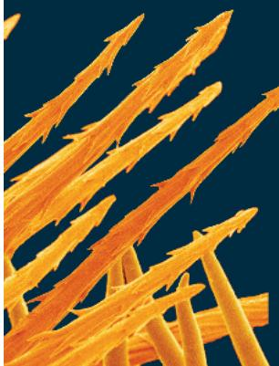

during removal. The leaf of the snowflake plant (Trevesia palmata) looks as if it has been partially eaten, perhaps making it less attractive. Some plants mimic the presence of insect eggs on their leaves, dissuading insects from laying eggs there. For example, the leaf glands of some species of Passiflora (passion flowers) closely imitate the bright yellow eggs of Heliconius butterflies.

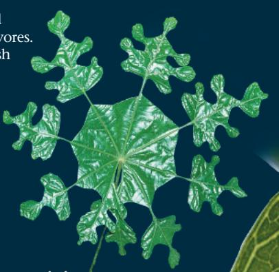

Egg mimicry on leaf of passion flower plant

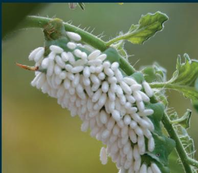

## Organismal-Level Defenses

Mechanical damage by herbivores can greatly alter a plant's entire physiology, deterring further attack. For example, a species of wild tobacco called Nicotiana attenuata changes the timing of its flowering as a result of herbivory. It normally flowers at night, emitting the chemical benzyl acetone, which attracts hawk-moths as pollinators. Unfortunately for the plant, the moths often lay eggs on the leaves as they pollinate, and the larvae are herbivores. When the plants become too larvae-infested, they stop producing the chemical and instead open their flowers at dawn, when the moths are gone. They are then pollinated by hummingbirds. Research has shown that oral secretions from the munching larvae trigger the dramatic shift in the timing of flower opening.

## Population-Level Defenses

In some species, a coordinated behavior at the population level helps defend against herbivores. Some plants can communicate their distress from attack by releasing molecules that warn nearby plants of the same species. For example, lima bean (Phaseolus lunatus) plants infested with spider mites release a cocktail of chemicals that signal “news” of the attack to noninfested lima bean plants. In response, these neighbors instigate biochemical changes that make them less susceptible to attack. Another type of population-level defense is a phenomenon in some species called masting, in which a

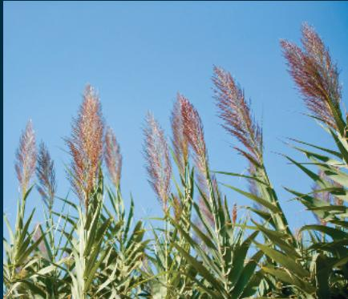  
Flowering bamboo plants

population synchronously produces a massive amount of seeds after a long interval. Regardless of environmental conditions, an internal clock signals each plant in the population that it is time to flower. Bamboo populations, for example, grow vegetatively for decades and suddenly flower en masse, set seed, and die. As much as 80,000 kg of bamboo

seeds are released per hectare, much more than the local herbivores, mostly rodents, can eat. As a result, some seeds escape the herbivores' attention, germinate, and grow.

Hummingbird pollinating wild tobacco plant

## Community-Level Defenses

Some plant species “recruit” predatory animals that help defend the plant against specific herbivores. Parasitoid wasps, for example, inject their eggs into caterpillars feeding on plants. The eggs hatch within the caterpillars, and the larvae eat through their organic containers from the inside out. The larvae then form cocoons on the surface of the host before emerging as adult wasps. The plant has an active role in this drama. A leaf damaged by

caterpillars releases compounds that attract parasitoid wasps. The stimulus for this response is a combination of physical damage to the leaf caused by the munching caterpillar and a specific compound in the caterpillar's saliva.

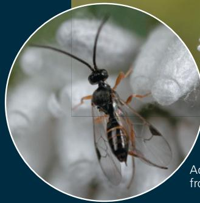

## Summary of Key Concepts

To review key terms, go to the Vocabulary Self-Quiz (eTextbook only).

Concept 39.1: Signal transduction pathways link signal reception to response

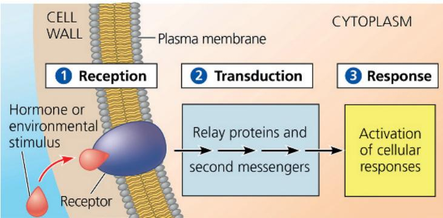

What are two common ways by which signal transduction pathways enhance the activity of specific enzymes?

## Concept 39.2: Plants use chemicals to communicate

\- Hormones control plant growth and development by affecting the division, elongation, and differentiation of cells. Some also mediate the responses of plants to environmental stimuli.

<table><tr><td>Plant Hormone</td><td>Major Responses</td></tr><tr><td>Auxin (IAA)</td><td>Stimulates cell elongation; regulates branching and organ bending (phototropism and gravitropism)</td></tr><tr><td>Cytokinins</td><td>Stimulate plant cell division and differentiation; promote axillary bud growth</td></tr><tr><td>Gibberellins</td><td>Promote stem elongation; help seeds break dormancy and use stored reserves</td></tr><tr><td>Abscisic acid (ABA)</td><td>Promotes stomatal closure in response to drought; promotes seed dormancy</td></tr><tr><td>Ethylene</td><td>Mediates senescence, leaf abscission, fruit ripening, and obstacle avoidance by shoots (the triple response)</td></tr><tr><td>Brassinosteroids</td><td>Chemically similar to the sex hormones of animals; induce cell elongation and division</td></tr><tr><td>Jasmonates</td><td>Mediate plant defenses against insect herbivores; regulate a wide range of physiological processes</td></tr><tr><td>Strigolactones</td><td>Regulate apical dominance, seed germination, and mycorrhizal associations</td></tr></table>

Is there any truth to the old saying “One bad apple spoils the whole bunch?” Explain.

## Concept 39.3: Responses to light are critical for plant success

\- Blue-light photoreceptors control hypocotyl elongation, stomatal opening, and phototropism.

\- Phytochromes act like molecular “on-off” switches that regulate shade avoidance and germination of many seed types. Red light turns phytochrome “on,” and far-red light turns it “off.”

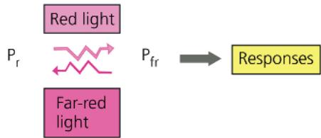

\- Phytochrome conversion also provides information about the day length (photoperiod) and hence the time of year.
Photoperiodism regulates the time of flowering in many species. Short-day plants require a night longer than a critical length to flower. Long-day plants need a night length shorter than a critical period to flower.

\- Many daily rhythms in plant behavior are controlled by an internal circadian clock. Free-running circadian rhythms are approximately 24 hours long but are entrained to exactly 24 hours by dawn and dusk effects on phytochrome form.

Why did plant physiologists propose the existence of a mobile molecule (florigen) that triggers flowering?

## Concept 39.4: Plants respond to a wide variety of stimuli other than light

\- Gravitropism is bending in response to gravity. Roots show positive gravitropism, and stems show negative gravitropism. Statoliths, starch-filled plastids, enable roots to detect gravity.

\- Thigmotropism is a growth response to touch. Rapid leaf movements involve transmission of electrical impulses.

\- Plants are sensitive to environmental stresses, including drought, flooding, high salinity, and extremes of temperature.

<table><tr><td>Environmental Stress</td><td>Major Response</td></tr><tr><td>Drought</td><td>ABA production, reducing water loss by closing stomata</td></tr><tr><td>Flooding</td><td>Formation of air tubes that help roots survive oxygen deprivation</td></tr><tr><td>Salt</td><td>Avoiding osmotic water loss by producing solutes tolerated at high concentrations</td></tr><tr><td>Heat</td><td>Synthesis of heat-shock proteins, which reduce protein denaturation at high temperatures</td></tr><tr><td>Cold</td><td>Adjusting membrane fluidity; avoiding osmotic water loss; producing antifreeze proteins</td></tr></table>

Plants that have acclimated to drought stress are often more resistant to freezing stress as well. Suggest a reason why.

## Concept 39.5: Plants respond to attacks by pathogens and herbivores

\- The hypersensitive response seals off an infection and destroys both pathogen and host cells in the region. Systemic acquired resistance is a generalized defense response in organs distant from the infection site.

\- In addition to physical defenses such as thorns and trichomes, plants produce distasteful or toxic chemicals, as well as attractants that recruit animals that destroy herbivores.

How can insects make plants more susceptible to pathogens?

For suggested answers, see Appendix A.

## Test Your Understanding

For more multiple-choice questions, go to the Practice Test (eTextbook only).

## Levels 1-2: Remembering/Understanding

1. The hormone that helps plants respond to drought is

(A) auxin.

(B) abscisic acid.

(C) cytokinin.

(D) ethylene.

2. A barley mutant lacking a gibberellic acid receptor would

(A) fail to make GA.

(B) catalyze starch more quickly.

(C) fail to make $\alpha$ -amylase.

(D) fail to take up water.

3. Charles and Francis Darwin discovered that

(A) auxin is responsible for phototropic curvature.

(B) red light is most effective in shoot phototropism.

(C) light destroys auxin.

(D) light is perceived by the tips of coleoptiles.

4. How may a plant respond to severe heat stress?

(A) by reorienting leaves to increase evaporative cooling

(B) by creating air tubes for ventilation

(C) by producing heat-shock proteins, which may protect the plant's proteins from denaturing

(D) by increasing the proportion of unsaturated fatty acids in cell membranes, reducing their fluidity

## Levels 3-4: Applying/Analyzing

5. The signaling molecule for flowering might be released earlier than usual in a long-day plant exposed to flashes of

(A) far-red light during the night.

(B) red light during the night.

(C) red light followed by far-red light during the night.

(D) far-red light during the day.

6. If a long-day plant has a critical night length of 9 hours, which 24-hour cycle would prevent flowering?

(A) 16 hours light/8 hours dark

(B) 14 hours light/10 hours dark

(C) 4 hours light/8 hours dark/4 hours light/8 hours dark

(D) 8 hours light/8 hours dark/light flash/8 hours dark

7. A plant mutant that shows normal gravitropic bending but does not store starch in its plastids would require a reevaluation of the role of \_\_\_\_ in gravitropism.

(A) auxin

(B) calcium

(C) statoliths

(D) differential growth

8. DRAW IT Indicate the response to each condition by drawing a straight seedling or one with the triple response.

<table><tr><td></td><td>Control</td><td>Ethylene added</td><td>Ethylene synthesis inhibitor</td></tr><tr><td>Wild-type</td><td></td><td></td><td></td></tr><tr><td>Ethylene insensitive (ein)</td><td></td><td></td><td></td></tr><tr><td>Ethylene overproducing (eto)</td><td></td><td></td><td></td></tr><tr><td>Constitutive triple response (ctr)</td><td></td><td></td><td></td></tr></table>

## Levels 5-6: Evaluating/Creating

9. EVOLUTION CONNECTION In general, light-sensitive germination is more pronounced in small seeds compared with germination of large seeds. Suggest a reason why.

10. SCIENTIFIC INQUIRY A plant biologist observed a peculiar pattern when a tropical shrub was attacked by caterpillars. After a caterpillar ate a leaf, it would skip over nearby leaves and attack a leaf some distance away. Simply removing a leaf did not deter caterpillars from eating nearby leaves. The biologist suspected that an insect-damaged leaf sent out a chemical that signaled nearby leaves. Explain how the researcher could test this hypothesis.

11. SCIENCE, TECHNOLOGY, AND SOCIETY Describe how our knowledge about the control systems of plants is being applied to agriculture or horticulture.

12. WRITE ABOUT A THEME: INTERACTIONS In a short essay (100–150 words), summarize phytochrome's role in altering shoot growth for the enhancement of light capture.

13. SYNTHESIZE YOUR KNOWLEDGE

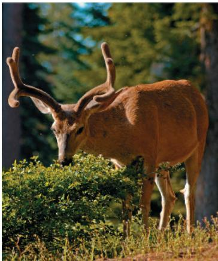  
This mule deer is grazing on the shoot tips of a shrub. Describe how this event will alter the physiology, biochemistry, structure, and health of the plant and identify which hormones and other chemicals are involved in making these changes.  
For selected answers, see Appendix A.

# Unit 7 Animal Form and Function

An Interview with Adrienne Bratcher

Dr. Adrienne Bratcher is an Associate Professor and Vice-Chair in the Department of Anatomy, Pathology, and Medical Education at the Morehouse School of Medicine. Dr. Bratcher received a BSc in Biochemistry from Tennessee State University and an MSc and PhD in Physiology and Biophysics from the University of Louisville. She has taught Anatomy and Physiology to undergraduate, graduate, and medical students at the University of Louisville and the Kaiser Permanente School of Medicine as well as at Morehouse. She uses her training in coaching, intercultural competence, and critical thinking strategies to create an exceptional classroom environment, mentor students, and improve physiology education.

## Tell us about your path in biology.

When I was around five or six, my mom was working on becoming a nurse, and she would actually take me to classes with her. And I would sneak into my mom's textbooks, and I would just read them. I was really fascinated by how the body worked. What sparked my interest in surgery was my mom's best friend, who had to have open heart surgery. I was so interested in it, and I really wanted to help people like her. My whole high school life focused on being in biology. I was so determined to become a cardiovascular surgeon. But as I continued my studies, I realized that my true passion wasn't in performing the procedures—it was in understanding the why and the how behind them. So I switched my major in college from biology to biochemistry, focusing on the underlying science that drives the biological processes. And that led me to pursue a PhD in physiology and biophysics.

Graduate school was challenging for me at first because I had never really experienced failure before. I remember failing three exams in one week. I walked into my mentor's office in tears, saying, "I'm going to get kicked out of school. I don't belong." And he told me, "Your studying isn't working any more... You have to understand the material so deeply that you are able to teach it." That advice helped me get me through grad school and learn I had a talent for explaining science to others.

## What was your doctoral thesis about?

  
Dr. Adrienne Bratcher  
Dr. Bratcher models a teaching game of “physiocatch” while giving a presentation on medical education.

I investigated why some people are predisposed to develop salt-sensitive hypertension (high blood pressure). We all eat salt; why doesn't everyone get salt-sensitive hypertension? I was looking at the importance of oxidative stress (free radicals) and inflammation in the development of these cardiovascular diseases. My story was that when oxidative stress or inflammation is present, the body is less able to adapt or adjust. As a professor, it has been exciting to see how the field has advanced. GLP-1 agonists (such as Ozempic) might be exerting their positive effects by interfering with inflammation.

## How do you see your role in teaching medical students?

I'm not training them in specific medical skills—they'll learn how to be doctors when they get into residency. My goal is to teach my students to be critical thinkers by helping them become more curious. My students are curious about things they like, but they aren't as curious about things they don't necessarily like. So I teach them to just be curious, period, whether they like a subject or not. Asking questions with intention and clarity is an important aspect of curiosity. The question doesn't need to be perfect; it just needs to work for whatever decision you need to make.

## What is your favorite core concept of physiology?

I love teaching homeostasis. It's foundational to the body maintaining stability. It intrigues me that many students assume that homeostasis is about keeping things static, when it's actually keeping things dynamic. I also teach them to think about homeostasis in their lives: They're adjusting to new challenges, adapting to setbacks. Resilience isn't about avoiding change; it is more about learning how to respond to it.

“… many students assume that homeostasis is about keeping things static, when it’s actually keeping things dynamic.”

## How can undergraduate students make a difference in the world?

I don't think that students know how powerful their advocacy can be. A small act of posting scientific knowledge on social media, raising awareness about a public health issue, or joining an organization that's promoting STEM equity; all those acts can make meaningful change. Don't just join organizations to join them—find areas where you can be an advocate in your current experience and identity.

## What advice do you have for undergraduate students?

Embrace the questions you don't have answers to yet. If you're confused, that's actually not a bad thing. The professors are there to help. They're not there to reteach you over and over again, but they should allow you to chew on the material a bit and then come back and have a conversation. Go to office hours and say, "Can I try teaching this to you, and you can help me figure out where the gaps are?" A lot of faculty would love for you to do that. Also, I've experienced successes, such as the beauty of my grad school experience and the people in my life, but there have also been moments where my expertise was overlooked or my contributions undervalued. These experiences reinforce my belief that every learner coming through the doors, and especially those from marginalized backgrounds, deserves to feel supported, to be heard, and to be valued. And that's for every student, you know? Science is for everyone.

# Basic Principles of Animal Form and Function

## Key Concepts

40.1 Animal form and function are correlated at all levels of organization

40.2 Feedback control maintains the internal environment in many animals

40.3 Homeostatic processes for thermoregulation involve form, function, and behavior

40.4 Energy requirements are related to animal size, activity, and environment

  
Figure 40.1 Emperor penguins (Aptenodytes forsteri) live in Antarctica, Earth's coldest and windiest continent. In summer, these birds catch fish by diving down 500 m in water only 2°C above freezing. In winter, the females forage and the males incubate eggs while temperatures drop to -40°C and winds gust to 200 km/hr.

## Study Tip

Draw a diagram: When you read in the chapter about a mechanism that helps an animal maintain a stable internal environment, draw a simple cause-and-effect diagram (see example—illustrations are optional!). Label the regulated variable, the stimulus that affects the variable, and the response that counteracts the stimulus and returns the variable toward its optimal level.

  
Form (anatomy): An insulating layer of fat (blubber) reduces heat loss from most of the penguin's body (blue body areas in this thermal image).

## How do animals regulate their internal state even in changing or harsh environments?

Adaptations in form, function, and behavior help maintain an animal's internal environment. Adaptations that limit variation in temperature and other internal variables are widespread and diverse. Consider, for example, three adaptations that help an Emperor penguin stay warm:

  
Function (physiology): Rapid cycles of muscle contraction and relaxation during shivering produce heat at a cellular level.

  
Behavior: By packing together in groups of up to several thousand, Emperor penguins greatly reduce their exposure to wind and cold.

Figure 40.2 Convergent evolution in fast swimmers.

# Concept 40.1: Animal form and function are correlated at all levels of organization

Over the course of its life, an Emperor penguin faces the same fundamental challenges as any other animal, whether hydra, hawk, or human. All animals must obtain nutrients and oxygen, fight off infection, and survive to produce offspring. Given that all animal species share these and other basic requirements, why does their form, including anatomy—biological structure—vary so widely? The answer lies in natural selection and adaptation. Natural selection favors those variations in a population that increase relative fitness (see Concept 23.4). The evolutionary adaptations that enable survival vary among environments and species but frequently result in a close match of form to function, as illustrated for the Emperor penguins in Figure 40.1. Because structure and function are correlated, examining anatomy often provides clues to physiology—biological function.

An animal's size and shape are fundamental aspects of form that significantly affect the way the animal interacts with its environment. Although we may refer to size and shape as elements of a “body plan” or “design,” this does not imply a process of conscious invention. The body plan of an animal is the result of a pattern of development programmed by the genome, itself the product of millions of years of evolution.

## Evolution of Animal Size and Shape

EVOLUTION Many different body plans have arisen during the course of evolution, but these variations fall within certain bounds. Physical laws that govern strength, diffusion, movement, and heat exchange limit the range of animal forms.

As an example of how physical laws constrain evolution, let's consider how some properties of water limit the possible shapes for animals that are fast swimmers. Water is about 1,000 times

denser than air and also far more viscous. Therefore, any bump on an animal's body surface that causes drag impedes a swimmer more than it would a runner or flyer. Tuna and other fast ray-finned fishes can swim at speeds up to 80 km/hr (50 miles/hour). Sharks, penguins, dolphins, and seals are also relatively fast swimmers. As illustrated by the three examples in Figure 40.2, these animals all have a shape that is fusiform, meaning tapered on both ends. The similar streamlined shape found in these speedy vertebrates is an example of

convergent evolution (see Concept 22.3). Natural selection often results in similar adaptations when diverse organisms face the same environmental challenge, such as overcoming drag during swimming.

Physical laws also influence animal body plans with regard to maximum size. As body dimensions increase, thicker skeletons are required to maintain adequate support. This limitation affects internal skeletons, such as those of vertebrates, as well as external skeletons, such as those of insects and other arthropods. In addition, as bodies increase in size, the muscles required for locomotion must represent an ever-larger fraction of the total body mass. At some point, mobility becomes limited. By considering the fraction of body mass in leg muscles and the effective force such muscles generate, scientists can estimate maximum speed for a wide range of body plans. In the case of the 6-meter-tall dinosaur Tyrannosaurus rex, there is controversy, with some scientists calculating a top running speed as fast as that of an Olympic sprinter—30 km/hr (19 miles/hour), but others inferring that T. rex was at best a fast walker.

## Exchange with the Environment

Animals must exchange nutrients, waste products, and gases with their environment, and this requirement imposes an additional limitation on body plans. Exchange occurs as substances dissolved in an aqueous solution move across the plasma membrane of each cell. A single-celled organism, such as the amoeba in Figure 40.3a, has a sufficient membrane surface area in contact with its environment to carry out all necessary exchange. In contrast, an animal is composed of many cells, each with its own plasma membrane across which exchange must occur. The rate of exchange is proportional to the membrane surface area involved in exchange, whereas the amount of material that must be exchanged is proportional to the total body volume. A multicellular organization therefore works only if every cell has access to a suitable aqueous environment, either inside or outside the animal's body.

Many animals with a simple internal organization have body plans that enable direct exchange between almost all their cells and the external environment. For example, a pond-dwelling hydra has a saclike body plan and a body wall only two cell layers thick (Figure 40.3b). Because its gastrovascular cavity opens to the external environment, both the outer and inner layers of cells are constantly bathed by pond water. Another common body plan that maximizes exposure to the surrounding medium is a flat shape. Consider, for instance, a parasitic tapeworm, which can reach several meters in length (see Figure 33.11). A thin, flat shape places most cells of the worm in direct contact with its particular environment—the nutrient-rich intestinal fluid of a vertebrate host.

Our bodies and those of most other animals are composed of compact masses of cells, with an internal organization much more complex than that of a hydra or a tapeworm. For such a body plan, increasing the number of cells decreases the ratio of outer surface area to total volume. As an extreme comparison, the ratio of outer surface area to volume for a

A microscopic view of the lung reveals that it is much more sponge-like than balloon-like. This construction provides an expansive wet surface for gas exchange with the environment (SEM).

  
Figure 40.3 Direct exchange with the environment.  
(a) An amoeba, a single-celled organism  
(b) A hydra, an animal with two layers of cells

whale is hundreds of thousands of times smaller than that for a water flea. Nevertheless, every cell in the whale has access to oxygen, nutrients, and other resources. How is this accomplished?

In whales and most other animals, the evolutionary adaptations that enable sufficient exchange with the environment are specialized surfaces that are extensively branched or folded (Figure 40.4). In almost all cases, these exchange surfaces lie within the body, an arrangement that protects their delicate tissues from abrasion or dehydration and allows for streamlined body contours. The branching or folding greatly increases surface area (see Figure 33.8). In humans, for example, the exchange surfaces for digestion, respiration, and circulation each have an area more than 25 times larger than that of the skin.

Internal body fluids link exchange surfaces to body cells. The spaces between cells are filled with fluid, known in many animals as interstitial fluid (from the Latin for “stand between”). Complex body plans also include a circulatory fluid, such as blood. Exchange between the interstitial fluid and the circulatory fluid enables cells throughout the body to obtain nutrients and get rid of wastes (see Figure 40.4).

Complex body plans offer numerous benefits. For example, an external skeleton can protect against predators, and sensory organs can provide detailed information on the animal's surroundings. Internal digestive organs can break down food gradually, controlling the release of stored energy. In addition, specialized filtration systems can adjust the composition of the internal fluid that bathes the animal's body cells. In this way, an animal can maintain a relatively stable internal environment despite the fact that it is living in a changeable external environment. A complex body plan is especially advantageous for animals living on land, where the external environment may be highly variable.

Figure 40.4 Internal exchange surfaces of complex animals.  
  
The lining of the small intestine has finger-like projections that expand the surface area for nutrient absorption (SEM).  
VISUAL SKILLS Using this diagram, explain how exchange carried out by animals can be described as both internal and external.  
Within the kidney, blood is filtered across the surface of long, narrow blood vessels packed into ball-shaped structures (SEM).

## Hierarchical Organization of Body Plans

Cells form a working animal body through their emergent properties, which arise from successive levels of structural and functional organization (see Concept 1.1). Cells are organized into tissues, groups of cells with a similar appearance and a common function. Different types of tissues are further organized into functional units called organs. (The simplest animals, such as sponges, lack organs or even true tissues.) Groups of organs that work together, providing an additional level of organization and coordination, make up an organ system (Table 40.1). Thus, for example, the skin is an organ of the integumentary system, which protects against infection and helps regulate body temperature.

Many organs have more than one physiological role. If the roles are distinct enough, we consider the organ to belong to more than one organ system. The pancreas, for instance, produces enzymes critical to the function of the digestive system but also regulates the level of sugar in the blood as a vital part of the endocrine system.

Just as viewing the body's organization from the “bottom up” (from cells to organ systems) reveals emergent properties, a “top-down” view of the hierarchy reveals the multilayered basis of specialization. Organ systems include specialized organs made up of specialized tissues and cells. Consider the human digestive system: Each organ has specific roles. In the case of the stomach, one role is to initiate protein breakdown. This process requires a churning motion powered by stomach muscles, as well as digestive juices secreted by the stomach lining. Producing digestive juices, in turn, requires highly specialized cell types: One cell type secretes a protein-digesting enzyme, a second generates concentrated hydrochloric acid, and a third produces mucus, which protects the stomach lining.

The specialized and complex organ systems of animals are built from a limited set of cell and tissue types. For example, lungs and blood vessels have different functions but are lined by tissues that are of the same basic type and therefore share many properties.

There are four main tissue types: epithelial tissue, connective tissue, muscle tissue, and nervous tissue. Figure 40.5 explores the structure and function of each type. In later chapters, we'll discuss how these tissue types contribute to the functions of particular organ systems.

Table 40.1 Organ Systems in Mammals

<table><tr><td>Organ System</td><td>Main Components</td><td>Main Functions</td></tr><tr><td>Digestive</td><td>Mouth, pharynx, esophagus, stomach, intestines, liver, pancreas, anus (See Figure 41.8.)</td><td>Food processing (ingestion, digestion, absorption, elimination)</td></tr><tr><td>Circulatory</td><td>Heart, blood vessels, blood (See Figure 42.5.)</td><td>Internal distribution of materials</td></tr><tr><td>Respiratory</td><td>Lungs, trachea, other breathing tubes (See Figure 42.24.)</td><td>Gas exchange (uptake of oxygen; disposal of carbon dioxide)</td></tr><tr><td>Immune and lymphatic</td><td>Bone marrow, lymph nodes, thymus, spleen, lymph vessels (See Figure 43.6.)</td><td>Body defense (fighting infections and virally induced cancers)</td></tr><tr><td>Excretory</td><td>Kidneys, ureters, urinary bladder, urethra (See Figure 44.12.)</td><td>Disposal of metabolic wastes; regulation of osmotic balance of blood</td></tr><tr><td>Endocrine</td><td>Pituitary, thyroid, pancreas, adrenal, and other hormone-secreting glands (See Figure 45.8.)</td><td>Coordination of body activities (such as digestion and metabolism)</td></tr><tr><td>Reproductive</td><td>Ovaries or testes and associated organs (See Figures 46.9 and 46.10.)</td><td>Gamete production; promotion of fertilization; support of developing embryo</td></tr><tr><td>Nervous</td><td>Brain, spinal cord, nerves, sensory organs (See Figure 49.6.)</td><td>Coordination of body activities; detection of stimuli and formulation of responses to them</td></tr><tr><td>Integumentary</td><td>Skin and its derivatives (such as hair, claws, sweat glands) (See Figure 50.5.)</td><td>Protection against mechanical injury, infection, dehydration; thermoregulation</td></tr><tr><td>Skeletal</td><td>Skeleton (bones, tendons, ligaments, cartilage) (See Figure 50.37.)</td><td>Body support, protection of internal organs, movement</td></tr><tr><td>Muscular</td><td>Skeletal muscles (See Figure 50.26.)</td><td>Locomotion and other movement</td></tr></table>

# Exploring Structure and Function in Animal Tissues

## Figure 40.5

Epithelial Tissue

Occurring as sheets of cells, epithelial tissues, or epithelia (singular, epithelium), cover the outside of the body and line organs and cavities within the body. Because epithelial cells are closely packed, often with tight junctions, they function as a barrier against mechanical injury, pathogens, and fluid loss. Epithelia also form active interfaces with the environment. For example, the epithelium that lines the nasal passages is crucial for

olfaction, the sense of smell. Note how different cell shapes and arrangements correlate with distinct functions.

A stratified squamous epithelium is multilayered and regenerates rapidly. New cells formed by division near the basal surface push outward, replacing cells that are sloughed off. This epithelium is commonly found on surfaces subject to abrasion, such as the outer skin and the linings of the mouth, anus, and vagina.

A cuboidal epithelium, with dice-shaped cells specialized for secretion, makes up the epithelium of kidney tubules and many glands, including the thyroid gland and salivary glands.

## Pseudostratified columnar epithelium

The large, brick-shaped cells of simple columnar epithelia are often found where secretion or active absorption is important. For example, a simple columnar epithelium lines the intestines, secreting digestive juices and absorbing nutrients.

The single layer of platelike cells that form a simple squamous epithelium functions in the exchange of material by diffusion. This type of epithelium, which is thin and leaky, lines blood vessels and the air sacs of the lungs, where diffusion of nutrients and gases is essential.

A pseudostratified epithelium consists of a single layer of cells varying in height and the position of their nuclei. In many vertebrates, a pseudostratified epithelium of ciliated cells forms a mucous membrane that lines portions of the respiratory tract. The beating cilia sweep the film of mucus along the surface.

Apical surface

Basal surface

10 μm

## Polarity of epithelia

All epithelia are polarized, meaning that they have two different sides. The apical surface faces the lumen (cavity) or outside of the organ and is therefore exposed to fluid or air. Specialized projections often cover this surface. For example, the apical surface of the epithelium lining the small intestine is covered with microvilli, projections that increase the surface area available for absorbing nutrients. Opposite the apical surface of each epithelium is the basal surface.

Central canal

Red blood cells

## Figure 40.5 (Continued)

Connective tissue, consisting of a sparse population of cells scattered through an extracellular matrix, holds many tissues and

organs together and in place. The matrix generally consists of a web of fibers embedded in a liquid, jellylike, or solid foundation. Within the matrix are numerous cells called fibroblasts, which secrete fiber proteins, and macrophages, which engulf foreign particles and any cell debris by phagocytosis.

Connective tissue fibers are of three kinds: Collagenous fibers provide strength and flexibility,

## Loose connective tissue

The most widespread connective tissue in the vertebrate body is loose connective tissue, which binds epithelia to underlying tissues and holds organs in place. Loose connective tissue gets its name from the loose weave of its fibers, which include all three types. It is found in the skin and throughout the body.

120 μm

  
Elastic fiber

## Fibrous connective tissue

Fibrous connective tissue is dense with collagenous fibers. It is found in tendons, which attach muscles to bones, and in ligaments, which connect bones at joints.

## Bone

The skeleton of most vertebrates is made of bone, a mineralized connective tissue. Bone-forming cells called osteoblasts deposit a matrix of collagen. Calcium, magnesium, and phosphate ions combine into a hard mineral within the matrix. The microscopic structure of hard mammalian bone consists of repeating units called osteons. Each osteon has concentric layers of the mineralized matrix, which are deposited around a central canal containing blood vessels and nerves.

## Connective Tissue

reticular fibers join connective tissue to adjacent tissues, and elastic fibers make tissues elastic. If you pinch a fold of tissue on the back of your hand, the collagenous and reticular fibers prevent the skin from being pulled far from the bone, whereas the elastic fibers restore the skin to its original shape when you release your grip. Different mixtures of fibers and foundation form the major types of connective tissue shown below.

## Blood

Blood has a liquid extracellular matrix called plasma, which consists of water, salts, and dissolved proteins. Suspended in plasma are erythrocytes (red blood cells), leukocytes (white blood cells), and cell fragments called platelets. Red cells carry oxygen, white cells function in defense, and platelets aid in blood clotting.

## Adipose tissue

Adipose tissue is a specialized loose connective tissue that stores fat in adipose cells distributed throughout its matrix. Adipose tissue pads and insulates the body and stores fuel as fat molecules. Each adipose cell contains a large fat droplet that swells when fat is stored and shrinks when the body uses that fat as fuel.

## Cartilage

Cartilage contains collagenous fibers embedded in a rubbery protein-carbohydrate complex called chondroitin sulfate. Cells called chondrocytes secrete the collagen and chondroitin sulfate, which together make cartilage a strong yet flexible support material. The skeletons of many vertebrate embryos contain cartilage that is replaced by bone as the embryo matures. Cartilage remains in some locations, such as the disks that act as cushions between vertebrae.

  
Chondroitin sulfate

## Muscle Tissue

The tissue responsible for nearly all types of body movement is muscle tissue. All muscle cells consist of filaments containing the proteins actin and myosin, which together enable muscles to contract. There are three types of muscle tissue in the vertebrate body: skeletal, smooth, and cardiac.

## Skeletal muscle

Attached to bones by tendons, skeletal muscle, or striated muscle, is responsible for voluntary movements. Skeletal muscle consists of bundles of long cells that are called muscle fibers. During development, skeletal muscle fibers form by the fusion of many cells, resulting in multiple nuclei in each muscle fiber. The arrangement of contractile units, or sarcomeres, along the fibers gives the cells a striped (striated) appearance. In adult mammals, building muscle increases the size but not the number of muscle fibers.

## Smooth muscle

Smooth muscle, which lacks striations, is found in the walls of the digestive tract, urinary bladder, arteries, and other internal organs. The cells are spindle-shaped. Smooth muscles are responsible for involuntary body activities, such as churning of the stomach and constriction of arteries.

## Cardiac muscle

Cardiac muscle forms the contractile wall of the heart. It is striated like skeletal muscle and has similar contractile properties. Unlike skeletal muscle, however, cardiac muscle has branched fibers that interconnect via intercalated disks, which relay signals from cell to cell and help synchronize heart contraction.

  
Nervous Tissue

Nervous tissue functions in the receipt, processing, and transmission of information. Nervous tissue contains neurons, or nerve cells, which transmit nerve impulses, as well as support cells called glial cells, or simply glia. In many animals, a concentration of nervous tissue forms a brain, an information-processing center.

## Neurons

Neurons are the basic units of the nervous system. A neuron receives nerve impulses from other neurons via its cell body and multiple extensions called dendrites. Neurons transmit impulses to neurons, muscles, or other cells via extensions called axons, which are often bundled together into nerves.

  
Glia  
The various types of glia help nourish, insulate, and replenish neurons, and in some cases, modulate neuron function.

  
VISUAL SKILLS After comparing the two diagrams, explain why a particular nerve impulse signal has only one physical pathway but a particular hormone molecule can have multiple physical pathways.
For suggested answer, see Appendix A.  
Figure 40.6 Signaling in the endocrine and nervous systems.

## Coordination and Control

An animal's cells, tissues, and organ systems act in concert with one another to respond to a stimulus—an external or internal factor that triggers a change in a specific activity within the body. This change in activity is known as the response. For example, when the wolf depicted in Figure 40.5 hunts, the smell of prey acts as a stimulus. In response, the brain initiates a coordinated increase in the wolf's breathing and heart rates, and the wolf runs faster. What signals coordinate activity? How do the signals move within the body?

Animals have two major systems for coordinating and controlling responses to stimuli: the endocrine and nervous systems (Figure 40.6). In the endocrine system, signaling molecules released into the bloodstream by endocrine cells are carried to all locations in the body. In the nervous system, neurons transmit signals along dedicated routes connecting specific locations in the body.

The signaling molecules that are broadcast throughout the body by the endocrine system are called hormones. It takes seconds for hormones to be released into the bloodstream and carried throughout the body. The effects are often long-lasting, however, because hormones can remain in the bloodstream for minutes or even hours.

Different hormones cause distinct effects, and only cells that have receptors for a particular hormone respond (Figure 40.6a). Depending on which cells have receptors for that hormone, the hormone may have an effect in just a single location or in sites throughout the body. For example, thyroid-stimulating hormone (TSH) acts solely on cells in the thyroid gland. They in turn release thyroid hormone, which acts on nearly every body tissue to increase oxygen consumption and heat production.

In the nervous system, signals called nerve impulses travel to specific target cells along communication lines consisting mainly of axons (Figure 40.6b). Transmission in the nervous system is extremely fast; nerve impulses take only a fraction of a second to reach the target and last only a fraction of a second.

Nerve impulses can change the activity of other neurons, initiate muscle contractions, alter the secretion of digestive juices, or control hormone release. Unlike the endocrine system, the nervous system conveys information by the pathway the signal takes. For example, a person can distinguish different musical notes because each note's frequency activates neurons in the ear that connect to slightly different locations in the brain.

Communication in the nervous system usually involves more than one type of signal. Nerve impulses travel along axons, sometimes over long distances, as changes in voltage. In contrast, passing information from one neuron to another often involves very short-range chemical signals. These chemical signals, like hormones, use receptors to change the activity of the target cell.

Because the two major communication systems of the body differ in signal type, transmission, speed, and duration, it is not surprising that they are adapted to different functions. The endocrine system is especially well adapted for coordinating gradual changes that affect the entire body, such as growth, development, reproduction, metabolic processes, and digestion. The nervous system is well suited for directing immediate and rapid responses to the environment, such as reflexes and other rapid movements. Nevertheless, the two systems often work in close coordination. Both help maintain a stable internal environment, our next topic of discussion.

## Concept Check 40.1

1. What properties do all types of epithelia share?

2. VISUAL SKILLS Consider the idealized animal in Figure 40.4. At which sites must oxygen cross a plasma membrane in traveling from the external environment to the cytoplasm of a body cell?

3. WHAT IF? Growth hormone is required for normal growth in humans. If an individual had a mutation in the growth hormone receptor so that it could not bind growth hormone, how would you predict that the individual would be affected? Explain.

# Concept 40.2: Feedback control maintains the internal environment in many animals

Many organ systems play a role in managing an animal's internal environment, a task that can present a major challenge. Imagine if your body temperature soared every time you took a hot shower or slurped a steaming bowl of soup. Faced with environmental fluctuations, animals manage their internal environment by either regulating or conforming.

## Regulating and Conforming

Compare the two sets of data in Figure 40.7. The river otter's body temperature is largely independent of that of the surrounding water, whereas the largemouth bass's body warms or cools when the water temperature changes. We can convey these two trends by labeling the otter a regulator and the bass a conformer with regard to body temperature. An animal is a regulator for an environmental variable if it uses internal mechanisms to control internal change in the face of external fluctuation. In contrast, an animal is a conformer if it allows its internal condition to change in accordance with external changes in the particular variable.

An animal may allow some internal conditions to conform to the environment but regulate others. For instance, the bass conforms to the temperature of the water in which it lives, but regulates the solute concentration in its blood and interstitial fluid. In addition, conforming need not involve changes in an internal variable: Many marine invertebrates, such as spider crabs (genus

Libinia), let their internal solute concentration conform to the relatively stable salinity of their ocean environment.

## Homeostasis

The steady body temperature of a river otter and the stable concentration of solutes in a freshwater bass are examples of homeostasis, which means the maintenance of internal balance. In achieving homeostasis, animals maintain a “steady state”—a relatively constant internal environment—even when the external environment changes significantly.

Many animals exhibit homeostasis for a range of physical and chemical properties. For example, humans maintain a fairly constant body temperature of between approximately $36^{\circ}$ and $38^{\circ}$ C ( $97^{\circ}-99^{\circ}$ F), a blood pH within 0.1 pH unit of 7.4, and a blood glucose concentration that is predominantly in the range of 70–110 mg of glucose per 100 mL of blood.

## Interview

Interview with Adrienne Bratcher: Explaining the relevance of homeostasis to physiology and life (at the start of Unit 7, before Chapter 40)

## Mechanisms of Homeostasis

Homeostasis requires a control system. Before exploring homeostasis in animals, let's get a basic picture of how a control system works by considering a nonliving example: the regulation of room temperature. Let's assume you want to keep a room at $20^{\circ}$ C ( $68^{\circ}$ F). You set a control device—the thermostat—to

Figure 40.7 The relationship between body and environmental temperatures in an aquatic temperature regulator and an aquatic temperature conformer.

The river otter regulates its body temperature, keeping it stable across a wide range of environmental temperatures. The largemouth bass, meanwhile, allows its internal environment to conform to the water temperature.

20°C. A thermometer in the thermostat monitors the room temperature. If the temperature falls below a certain value (say, 19.5°C, or 66°F), the thermostat turns on a heater (Figure 40.8a). Once the room temperature reaches 20°C, the thermostat switches off the heater. If the temperature instead rises above a certain value (for instance, 20.5°C), the thermostat activates a cooling mechanism, such as by turning on an air conditioner.

Like a home heating system, the homeostatic control system in animals maintains a variable, such as body temperature or solute concentration, within a specific range of values, or set point. A factor that causes a change in the level of the regulated variable away from its set point is a stimulus, and the physiological activity that returns the level of the variable closer to its set point is the response. Three components enable the body to respond to a stimulus: a sensor, a control center, and an effector

(b) Positive feedback

Figure 40.8 Negative feedback loops and homeostasis.  

(a) A nonliving example of temperature regulation. Thermostat components monitor room temperature and compare it with the set point. If the room temperature changes away from the set point, the thermostat activates the heater or the air conditioner to reverse the change.  
  
(b) Components of a generalized negative feedback loop.

DRAW IT Using Figure 40.8b as a model and the information in the text, diagram how the body responds to the increased body temperature during vigorous exercise. Note that the same structure acts as both sensor and the control center.

For suggested answer, see Appendix A.

(Figure 40.8b). A sensor continuously monitors the regulated variable, and sends this information to a control center. The control center compares the sensor inputs with the set point, and, if necessary, alters the activity of an effector (such as a muscle, gland, or specific body cell) in a way that brings the level of the variable closer to set point. Signals, such as hormones or nerve impulses, convey information between these three components.

Figure 40.9 Overview of negative and positive feedback.  

## Feedback Control in Homeostasis

Examining the circuit in Figure 40.8 reveals that either response (heating or cooling) reduces the stimulus (the change in temperature) that triggered that response. The circuit thus displays negative feedback, a control mechanism that reduces or opposes its stimulus (Figure 40.9a). This type of feedback regulation plays a major role in homeostasis in animals. For example, when you exercise vigorously, you produce heat, which increases your body temperature. Specialized neurons detect this increase and stimulate the activity of sweat glands. The evaporation of sweat from your skin then cools your body, helping return body temperature to its set point. In this example, different parts of the nervous system act as the sensor and control center. Sweat glands act as effectors, and signals travel between the components as nerve impulses.

Homeostasis is a dynamic equilibrium, an interplay between external factors that tend to change the internal environment and internal control mechanisms that oppose such changes. Note that physiological responses to stimuli are not instantaneous, just as switching on a furnace does not immediately warm a room. As a result, homeostasis moderates but doesn't eliminate changes in the internal environment. Homeostasis is enhanced by adaptations that reduce fluctuations, such as insulation in the case of temperature and physiological buffers in the case of pH.

Unlike negative feedback, positive feedback is a control mechanism that amplifies the stimulus (Figure 40.9b). In animals, positive-feedback loops do not play a major role in homeostasis, but instead help drive processes to completion. During childbirth, for instance, the pressure of the baby's head against sensors near the opening of the mother's uterus stimulates the uterus to contract. These contractions result in greater pressure against the opening of the uterus, heightening the contractions and thereby causing even greater pressure, ultimately causing the baby to be born.

## Alterations in Homeostasis

The set points for certain variables can change under various circumstances. In fact, regulated changes in the internal environment are essential to normal body functions. Some regulated changes occur during a particular stage in life, such as the radical shift in hormone balance that occurs during puberty.

Other regulated changes reflect a circadian rhythm, a set of physiological changes that occur roughly every 24 hours (Figure 40.10). One way to observe this rhythm is to monitor body temperature, which in humans typically undergoes a cyclic rise and fall of more than $0.6^{\circ}$ C ( $1^{\circ}$ F) in every 24-hour period. Remarkably, a biological clock maintains this rhythm even when variations in human activity, room temperature, and light levels are minimized (see Figure 40.10a). A circadian rhythm is thus intrinsic to the body, although the biological clock is normally coordinated with the cycle of light and darkness in the environment (see Figure 40.10b). For example, the hormone melatonin is secreted at night, and more is released during the longer nights of winter. External stimuli can reset the biological clock, but the effect is not immediate. That is why flying across several time zones results in jet lag, a mismatch between the circadian rhythm and local environment that persists until the clock fully resets.

Figure 40.10 Human circadian rhythm.  
  
(a) Variation in core body temperature and melatonin concentration in blood. Researchers studied resting but awake volunteers in an isolation chamber with constant temperature and low light. (Melatonin is a hormone secreted by the pineal gland.)

  
(b) The human circadian clock. Metabolic activities undergo daily cycles in response to the circadian clock. As illustrated for a typical individual who rises early in the morning, eats lunch around noon, and sleeps at night, these cyclic changes occur throughout a 24-hour day.

Noting the importance of biological clocks to human health and disease, the Nobel Prize Committee awarded the 2017 Nobel Prize in Physiology or Medicine to Americans Jeffrey Hall, Michael Rosbash, and Michael Young, who studied the fruit fly Drosophila to map out the molecular mechanisms that underlie circadian rhythms.

Homeostasis is sometimes altered by acclimatization, an animal's physiological adjustment to changes in its external environment. For instance, when an elk moves up into the mountains from sea level, the lower oxygen concentration in the high mountain air stimulates the animal to breathe more rapidly and deeply. As a result, more $\mathrm{CO}_{2}$ is lost through exhalation, raising blood pH above its normal range. As the animal acclimatizes over several days, changes in kidney function cause it to excrete urine that is more alkaline, returning blood pH to its normal range. Other mammals, including humans, are also capable of acclimatizing to dramatic altitude changes (Figure 40.11), although health risks remain.

## Figure 40.11 Acclimatization by mountain climbers in the Himalayas.

To lessen the risk of altitude sickness when ascending a high peak, climbers acclimatize by camping partway up the mountain. Spending time at an intermediate altitude allows the circulatory and respiratory systems to become more efficient in capturing and distributing oxygen at a lower concentration.

## Concept Check 40.2

1. MAKE CONNECTIONS How does negative feedback in thermoregulation differ from feedback inhibition in an enzyme-catalyzed biosynthetic process (see Figure 8.21)?

2. If you were deciding where to put the thermostat in a house, what factors would govern your decision? How do these factors relate to the fact that many homeostatic control sensors in humans are located in the brain?

3. MAKE CONNECTIONS Like animals, cyanobacteria have a circadian rhythm. By analyzing the genes that maintain biological clocks, scientists concluded that the 24-hour rhythms of humans and cyanobacteria reflect convergent evolution (see Concept 26.2). What evidence would have supported this conclusion? Explain.

# Concept 40.3: Homeostatic processes for thermoregulation involve form, function, and behavior

In this section, we'll examine the regulation of body temperature as an example of how form and function work together in regulating an animal's internal environment. Later chapters in this unit will discuss other physiological systems involved in maintaining homeostasis.

Thermoregulation is the process by which animals maintain their body temperature within the upper and lower limits of the set point. Body temperatures outside the limits of the set point can reduce the efficiency of enzymatic reactions, alter the fluidity of cellular membranes, and affect other temperature-sensitive biochemical processes, potentially with fatal results.

In talking about thermoregulation, we will need to talk about heat. Formally, heat is defined as thermal energy in transfer from one body of matter to another (see Concept 8.1). Here, however, we will use the term heat to refer simply to thermal energy.

## Endothermy and Ectothermy

Heat for thermoregulation can come from either internal metabolism or the external environment. Humans and other mammals, as well as birds, are endothermic, meaning that they are warmed mostly by heat generated by metabolism. Some fishes and insect species and a few nonavian reptiles are also mainly endothermic. In contrast, amphibians, many nonavian reptiles and fishes, and most invertebrates are ectothermic, meaning that they gain most of their heat from external sources. Endothermy and ectothermy are not mutually exclusive, however. For example, a bird is mainly endothermic but may warm itself in the sun on a cold morning, much as an ectothermic lizard does.

Endotherms can maintain a stable body temperature even in the face of large fluctuations in the environmental temperature. In a cold environment, an endotherm generates enough heat to keep its body substantially warmer than its surroundings (Figure 40.12a). In a hot environment, endothermic vertebrates have mechanisms for cooling their bodies, enabling them to withstand temperatures that are intolerable for most ectotherms.

Many ectotherms adjust their body temperature by behavioral means, such as seeking out shade or basking in the sun (Figure 40.12b). Because their heat source is largely environmental, ectotherms generally need to consume much less food than endotherms of equivalent size—an advantage if food supplies are limited. Ectotherms also usually tolerate larger fluctuations in their internal temperature.

Figure 40.12 Thermoregulation by internal or external sources of heat.

Endotherms obtain heat from their internal metabolism, whereas ectotherms rely on heat from their external environment.

  
(a) King penguins (Aptenodytes patagonicus), endotherms

  
(b) Florida red-bellied turtles (Pseudemys nelsoni), ectotherms

## Variation in Body Temperature

Animals also differ in whether their body temperature is variable or constant. An animal whose body temperature varies with its environment is called a poikilotherm (from the Greek poikilos, varied). In contrast, a homeotherm has a relatively constant body temperature. For example, the largemouth bass is a poikilotherm, and the river otter is a homeotherm (see Figure 40.7).

From the descriptions of ectotherms and endotherms, it might seem that all ectotherms are poikilothermic and all endotherms are homeothermic. In fact, there is no fixed relationship between the source of heat and the stability of body temperature. Many ectothermic marine fishes and invertebrates inhabit waters with such stable temperatures that their body temperature varies less than that of mammals and other endotherms. Conversely, the body temperature of a few endotherms varies considerably. For example, the body temperature of some bats drops from $40^{\circ}$ C to a few degrees above zero when they enter hibernation.

It is a common misconception that ectotherms are “cold-blooded” and endotherms are “warm-blooded.” Ectotherms do not necessarily have low body temperatures. On the contrary, when sitting in the sun, many ectothermic lizards have higher body temperatures than mammals. Thus, the terms cold-blooded and warm-blooded are misleading and are avoided in scientific communication.

## Balancing Heat Loss and Gain

Thermoregulation depends on an animal's ability to control the exchange of heat with its environment. That exchange can occur by any of four processes: radiation, evaporation, convection, and conduction (Figure 40.13). In each, heat is transferred from an object of higher temperature to one of lower temperature. In other words, heat moves down a gradient, a difference in a particular quality between two regions.

The essence of thermoregulation is maintaining a rate of heat gain that equals the rate of heat loss. Animals do this through mechanisms that either reduce heat exchange overall or favor heat

Figure 40.13 Heat exchange between an organism and its environment.

Radiation is the emission of electromagnetic waves by all objects warmer than absolute zero. Here, a lizard absorbs heat radiating from the distant sun and radiates a smaller amount of energy to the surrounding air.

Evaporation is the removal of heat from the surface of a liquid that is losing some of its molecules as gas. Evaporation of water from a lizard's moist surfaces that are exposed to the environment has a strong cooling effect.

Convection is the transfer of heat by the movement of air or liquid past a surface, as when a breeze contributes to heat loss from a lizard's dry skin or when blood moves heat from the body core to the extremities.

Conduction is the transfer of heat between molecules of objects in contact with each other, as when a lizard sits on a hot rock.

VISUAL SKILLS If this figure showed a penguin (an endotherm) on an ice floe rather than an iguana (an ectotherm) on a rock, would any of the arrows point in a different direction? Explain.

For suggested answer, see Appendix A.

exchange in a particular direction. In mammals, several of these mechanisms involve the integumentary system, the outer covering of the body, consisting of the skin, hair, and nails (claws or hooves in some species).

## Insulation

Insulation, which reduces the flow of heat between an animal's body and its environment, is a major adaptation for thermoregulation in both mammals and birds. Insulation is found both at the body surface—hair and feathers—and beneath—layers of fat formed by adipose tissue. In addition, some animals secrete oily substances that repel water, protecting the insulating capacity of feathers or fur. Birds, for example, secrete oils that they apply to their feathers during preening.

Often, animals can adjust their insulating layers to further regulate body temperature. Most land mammals and birds, for example, react to cold by raising their fur or feathers. This action traps a thicker layer of air, thereby increasing the effectiveness of the insulation. Lacking feathers or fur, humans must rely primarily on fat for insulation. We do, however, get “goose bumps,” a vestige of hair raising inherited from our furry ancestors.

Insulation is particularly important for marine mammals, such as whales and walruses. These animals swim in water colder than their body core, and many species spend at least part of the year in nearly freezing polar seas. Furthermore, the transfer of heat to water occurs 50 to 100 times more rapidly than heat transfer to air. Survival under these conditions is made possible by an evolutionary adaptation called blubber, a very thick layer of insulating fat just under the skin. The insulation that blubber provides is so effective that marine mammals can maintain body core temperatures of about 36–38°C (97–100°F) without requiring much more energy from food than land mammals of similar size.

## Circulatory Adaptations

Circulatory systems provide a major route for heat flow between different body regions. Adaptations that regulate the extent of blood flow near the body surface play a significant role in thermoregulation.

In response to changes in the temperature of their surroundings, many animals alter the amount of blood (and hence heat) flowing between their body core and their skin. Nerve signals that relax the muscles of the vessel walls result in vasodilation, a widening of superficial blood vessels (those near the body surface). As a consequence of the increase in vessel diameter, blood flow in the skin increases. In endotherms, vasodilation usually increases the transfer of body heat to the environment by radiation, conduction, and convection (see Figure 40.13). The reverse process, vasoconstriction, reduces blood flow and heat transfer by decreasing the diameter of superficial vessels.

Like endotherms, some ectotherms control heat exchange by regulating blood flow. For example, when the marine iguana of the Galápagos Islands swims in the cold ocean, its superficial

## Figure 40.14 Countercurrent heat exchangers.

A countercurrent exchange system traps heat in the body core, thus reducing heat loss from the extremities, particularly when they are immersed in cold water or in contact with ice or snow. In essence, heat in the arterial blood emerging from the body core is transferred directly to the returning venous blood instead of being lost to the environment.

  
Arteries carry blood into the goose's leg and foot. Veins return the blood to the heart.

1 Arteries carrying warm blood to the animal's extremities are in close contact with veins conveying cool blood in the opposite direction, back toward the trunk of the body. This arrangement facilitates heat transfer from arteries to veins along the entire length of the blood vessels.

2 Near the end of the leg or flipper, where arterial blood has been cooled to far below the animal's core temperature, the artery can still transfer heat to the even colder blood in an adjacent vein. The blood in the veins continues to absorb heat as it passes warmer and warmer blood traveling in the opposite direction in the arteries.

3 As the blood in the veins approaches the center of the body, it is almost as warm as the body core, minimizing the heat loss that results from supplying blood to body parts immersed in cold water.

  
In the flippers of a dolphin, each artery is surrounded by several veins in a counter-current arrangement, allowing efficient heat exchange between blood in the arteries and veins.

Key

Warm blood → Blood flow

Cool blood ....→ Heat transfer

blood vessels undergo vasoconstriction. This process routes more blood to the body core, conserving body heat. If the environmental temperature is higher than the animal's body temperature, vasodilation can facilitate heat gain.

In many birds and mammals, reducing heat loss from the body relies on countercurrent exchange, the transfer of heat (or solutes) between fluids that are flowing in opposite directions. In a countercurrent heat exchanger, arteries and veins are located adjacent to each other (Figure 40.14). Because blood flows through the arteries and veins in opposite directions, this arrangement allows heat exchange to be remarkably efficient. As warm blood in the arteries moves outward from the body core, it transfers heat to the colder blood in the veins returning from the extremities. Most importantly, heat is transferred along the entire length of the exchanger, maximizing the rate of heat exchange and minimizing heat loss to the environment.

Although most sharks and fishes are temperature conformers, countercurrent heat exchangers are found in some large, powerful swimmers, including great white sharks, bluefin tuna, and swordfish. By keeping the main swimming muscles warm, this adaptation enables vigorous, sustained activity. Similarly, many endothermic insects (bumblebees, honeybees,

and some moths) have a countercurrent exchanger that helps maintain a high temperature in their thorax, where flight muscles are located.

## Cooling by Evaporative Heat Loss

Many mammals and birds live in places where regulating body temperature requires cooling at some times and warming at others. If environmental temperature is above body temperature, only evaporation can keep body temperature from rising. Water absorbs considerable heat when it evaporates (see Concept 3.2); this heat is carried away from the skin and respiratory surfaces with water vapor.

Some animals exhibit adaptations that greatly facilitate evaporative cooling. A few mammals, including horses and humans, have sweat glands. In many other mammals, as well as in birds, panting is important. Some birds have a pouch richly supplied with blood vessels in the floor of the mouth; fluttering the pouch increases evaporation. Pigeons can use this adaptation to keep their body temperature close to $40^{\circ}$ C ( $104^{\circ}$ F) in air temperatures as high as $60^{\circ}$ C ( $140^{\circ}$ F), as long as they have sufficient water.

Figure 40.15
Thermoregulatory behavior in a dragonfly.
By orienting its body so that the narrow tip of its abdomen faces the sun, the dragonfly minimizes heating by solar radiation.

## Behavioral Responses

Ectotherms, and sometimes endotherms, control body temperature through behavioral responses to changes in the environment. When cold, they seek warm places, orienting themselves toward heat sources and expanding the portion of their body surface exposed to the heat source (see Figure 40.12b). When hot, they bathe, move to cool areas, or turn in another direction, minimizing their absorption of heat from the sun. For example, a dragonfly's "obelisk" posture is an adaptation that minimizes the amount of body surface exposed to the sun and thus to heating (Figure 40.15). Although these behaviors are relatively simple, they enable many ectotherms to maintain a nearly constant body temperature.

Social behavior contributes to thermoregulation in both endotherms and ectotherms. Among endotherms, for example, behavior contributes significantly to the winter survival of Emperor penguins (see Figure 40.1). Among ectotherms, honeybees are notable for their use of behavior in achieving homeostasis for temperature. In cold weather, they increase heat production and huddle together, thereby retaining heat. Individuals move between the cooler outer edges of the huddle and the warmer center, thus circulating and distributing the heat. In hot weather, honeybees cool the hive by transporting water to the hive and fanning with their wings, promoting evaporation and convection. Thus, a honeybee colony uses many of the mechanisms of thermoregulation characteristic of individual animals.

## Adjusting Metabolic Heat Production

Because endotherms generally maintain a body temperature considerably higher than that of the environment, they must counteract continual heat loss. Endotherms can vary heat production—thermogenesis—to match changing rates of heat loss.

Thermogenesis is increased by such muscle activity as moving or shivering. For example, shivering helps chickadees, birds with a body mass of only 20 g, remain active and hold their body temperature nearly constant at $40^{\circ}$ C ( $104^{\circ}$ F) in environmental temperatures as low as $-40^{\circ}$ C ( $-40^{\circ}$ F).

Flying insects such as bees and moths can also vary heat production. Many such endothermic insects warm up by shivering before taking off. As they contract their flight muscles in synchrony, only slight wing movements occur, but considerable heat is produced. Chemical reactions, and hence cellular respiration, accelerate in the warmed-up flight “motors,” enabling flight even in cold air.

In some mammals, endocrine signals released in response to cold cause mitochondria to increase their metabolic activity and produce heat instead of ATP. This process, called nonshivering thermogenesis, takes place throughout the body. Some mammals also have a tissue called brown fat in their neck and between their shoulders that is specialized for rapid heat production. (The presence of extra mitochondria is what gives brown fat its characteristic color.) Brown fat is found in the infants of many mammals, representing about 5% of total body weight in human infants. Long known to be present in adult mammals that hibernate, brown fat has also recently been detected in human adults (Figure 40.16). There, the amount has been found to vary, with individuals exposed to a cool environment for a month having increased amounts of brown fat.

Among the nonavian reptiles, endothermy has been observed in some large species in certain circumstances. For example, researchers found that a female Burmese python (Python molurus bivittatus) incubating eggs maintained a body temperature roughly $6^{\circ}$ C ( $11^{\circ}$ F) above that of the surrounding air. Where did the heat come from? Further studies showed that such pythons, like birds, can raise their body temperature through shivering (Figure 40.17). Whether certain groups of Mesozoic dinosaurs were similarly endothermic is a matter of active debate.

## Figure 40.16 Brown fat activity during cold stress.

This PET scan shows metabolically active brown fat deposits (indicated by the arrows) surrounding the neck.

## Figure 40.17

## Inquiry: How does a Burmese python generate heat while incubating eggs?

## Experiment

Herndon Dowling and colleagues at the Bronx Zoo in New York observed that when a female Burmese python incubated eggs by wrapping her body around them, she raised her body temperature and frequently contracted the muscles in her coils. To learn if the contractions were elevating her body temperature, they placed the python and her eggs in a chamber. As they varied the chamber's temperature, they monitored the python's muscle contractions as well as her oxygen uptake, a measure of her rate of cellular respiration.

## Results

The python's oxygen consumption increased when the temperature in the chamber decreased. As shown in the graph, this increase in oxygen consumption paralleled an increase in the rate of muscle contraction.

## Conclusion

Because oxygen consumption, which generates heat through cellular respiration, was correlated with the rate of muscle contraction, the researchers concluded that the muscle contractions, a form of shivering, were the source of the Burmese python's elevated body temperature.

Data from V. H. Hutchison, H. G. Dowling, and A. Vinegar, Thermoregulation in a brooding female Indian python, Python molurus bivittatus, Science 151:694–696 (1966).

WHAT IF? Suppose you varied air temperature and measured oxygen consumption for a female Burmese python without a clutch of eggs. Since she would not show shivering behavior, how would you expect the snake's oxygen consumption to vary with environmental temperature?

For suggested answer, see Appendix A.

## Acclimatization in Thermoregulation

Acclimatization contributes to thermoregulation in many animal species. In birds and mammals, acclimatization to seasonal temperature changes often includes adjusting insulation—growing a thicker coat of fur in the winter and shedding it in the summer, for example.

Acclimatization in ectotherms often includes adjustments at the cellular level. Cells may produce variants of enzymes that have the same function but different optimal temperatures. Also, the proportions of saturated and unsaturated lipids in membranes may change; unsaturated lipids help keep membranes fluid at lower temperatures (see Figure 7.5).

Remarkably, some ectotherms can survive subzero temperatures, producing “antifreeze” proteins that prevent ice formation in their cells. In the Arctic and Southern (Antarctic) Oceans, these proteins enable certain fishes to survive in water as cold as $-2^{\circ}C$ ( $28^{\circ}F$ ), a full degree Celsius below the freezing point of body fluids in other species.

## Thermoregulatory Feedback Loops

In humans and other mammals, the sensors responsible for thermoregulation are concentrated in the hypothalamus, the brain region that also controls the circadian clock. Within the hypothalamus, a group of nerve cells functions like the thermostat in Figure 40.8. Acting as both a sensor and a thermoregulatory control center, this brain region responds to body temperatures outside the set point by activating mechanisms that promote heat loss or gain (Figure 40.18).

At body temperatures above the set point, the hypothalamic control center promotes cooling of the body by dilation of vessels in the skin, sweating, or panting. When body temperatures instead drop below the set point, the control center inhibits heat loss mechanisms and activates mechanisms that either save heat, such as constricting vessels in the skin, or generate heat, such as shivering.

In the course of certain bacterial and viral infections, mammals and birds develop fever, an elevated body temperature. A variety of experiments have shown that fever reflects an increase in the set point for body temperature. For example, artificially raising the temperature of the hypothalamus in an infected animal reduces body temperature in the rest of the body.

Among certain ectotherms, an increase in body temperature upon infection reflects what is called a behavioral fever. For example, the desert iguana (Dipsosaurus dorsalis) responds to infection with certain bacteria by seeking a warmer environment and then maintaining a body temperature that is elevated by 2–4°C (4–7°F). Similar observations in fishes, amphibians, and even cockroaches indicate that fever is common to both endotherms and ectotherms.

Now that we have explored thermoregulation, we'll conclude our introduction to animal form and function by considering the different ways that animals allocate, use, and conserve energy.

Figure 40.18 The thermostatic function of the hypothalamus in human thermoregulation.

WHAT IF? Identify all of the effectors in Figure 40.18.
For suggested answer, see Appendix A.

Sensors in hypothalamus detect the change; control center activates cooling mechanisms.

  
Blood vessels in skin constrict, diverting blood from skin to deeper tissues and reducing heat loss from skin surface.  
Sensors in hypothalamus detect the change; control center activates warming mechanisms.

## Concept Check 40.3

1. Flowers differ in how much sunlight they absorb. Why might this matter to a hummingbird seeking nectar on a cool morning?

2. WHAT IF? Suppose a person begins sweating more heavily, increasing from a rate of 1 mL of sweat/hr to 10 mL/hr. Is it possible that the person is still in a state of homeostasis? Explain.

3. Why is shivering likely during the onset of a fever?

For suggested answers, see Appendix A.

## Concept 40.4: Energy requirements are related to animal size, activity, and environment

One of the unifying themes of biology, introduced in Concept 1.1, is that life requires energy transfer and transformation. Like other organisms, animals use chemical energy for growth, repair, activity, and reproduction. The overall flow and transformation of energy in an animal—its bioenergetics—determines

nutritional needs and is related to the animal's size, activity, and environment.

## Energy Allocation and Use

Organisms can be classified by how they obtain chemical energy. Most autotrophs, such as plants, harness light energy to build energy-rich organic molecules and then use those molecules for fuel. Most heterotrophs, such as animals, obtain their chemical energy from food, which contains organic molecules synthesized by other organisms.

Animals use chemical energy harvested from the food they eat to fuel metabolism and activity. Food is digested by enzymatic hydrolysis (see Figure 5.2b), and nutrients are absorbed by body cells. The ATP (adenosine triphosphate) produced by cellular respiration and fermentation powers cellular work, enabling cells, organs, and organ systems to perform the functions that keep an animal alive. Other uses of energy in the form of ATP include biosynthesis, which is needed for body growth and repair, synthesis of storage material such as fat, and production of gametes. The production and use of ATP generate heat, which the animal eventually gives off to its surroundings (Figure 40.19).

Figure 40.19 Bioenergetics of an animal: an overview.  
  
MAKE CONNECTIONS Use the idea of energy coupling to explain why heat is produced in the absorption of nutrients, in cellular respiration, and in the synthesis of biopolymers (see Concept 8.3).
For suggested answer, see Appendix A.

## Quantifying Energy Use

How much of the total energy an animal obtains from food does it need just to stay alive? How much energy must be expended to walk, run, swim, or fly from one place to another? What fraction of the energy intake is used for reproduction? Physiologists answer such questions by measuring the rate at which an animal uses chemical energy and how this rate changes in different circumstances.

The sum of all the energy an animal uses in a given time interval is called its metabolic rate. Energy is measured in joules (J) or in calories (cal) and kilocalories (kcal). A kilocalorie equals 1,000 calories, or 4,184 joules. (The unit Calorie, with a capital C, as used by many nutritionists, is actually a kilocalorie.)

Metabolic rate can be determined in several ways. Because nearly all of the chemical energy used in cellular respiration eventually appears as heat, metabolic rate can be measured by monitoring an animal's rate of heat loss. For this approach, researchers use a calorimeter, which is a closed, insulated chamber equipped with a device that records the heat an animal gives off to its environment. Metabolic rate can also be determined from the amount of oxygen consumed or carbon dioxide produced by an animal's cellular respiration (Figure 40.20). To calculate metabolic rate over longer periods, researchers record the rate of food consumption, the energy content of the food (about 4.5–5 kcal per gram of protein or carbohydrate and about 9 kcal per gram of fat), and the chemical energy lost in waste products (feces and urine or other nitrogenous wastes).

## Minimum Metabolic Rate and Thermoregulation

Animals must maintain a minimum metabolic rate for basic functions such as cell maintenance, breathing, and circulation. Researchers measure this minimum metabolic rate differently for endotherms and ectotherms. The minimum metabolic rate of a nongrowing endotherm that is at rest, has an empty stomach, and is not experiencing stress is called the basal metabolic rate (BMR). BMR is measured under a “comfortable” temperature range—a range that requires only the minimum generation or shedding of heat. The minimum metabolic rate of ectotherms is determined at a specific temperature because changes in the environmental temperature alter body temperature and therefore metabolic rate. The metabolic rate of a fasting, nonstressed ecto-therm at rest at a particular temperature is called its standard metabolic rate (SMR).

Comparisons of minimum metabolic rates reveal the different energy costs of endothermy and ectothermy. The BMR for humans averages 1,600–1,800 kcal per day for adult males and 1,300–1,500 kcal per day for adult females. These BMRs are about equivalent to the rate of energy use by a 75-watt lightbulb. In contrast, the SMR of an American alligator is only about 60 kcal per day at 20°C (68°F). As this represents less than $\frac{1}{20}$ the energy used by a comparably sized adult human, it is clear that ectothermy has a markedly lower energetic requirement than endothermy.

## Influences on Metabolic Rate

Metabolic rate is affected by many factors other than an animal being an endotherm or an ectotherm. Some key factors are age, sex, size, activity, temperature, and nutrition. Here we'll examine the effects of size and activity.

## Size and Metabolic Rate

Larger animals have more body mass and therefore require more chemical energy. Remarkably, the relationship between overall metabolic rate and body mass is constant across a wide range of sizes and forms, as illustrated for various mammals in Figure 40.21a. In fact, for even more varied organisms ranging in size from bacteria to blue whales, metabolic rate remains roughly proportional to body mass to the three-quarter power ( $m^{3/4}$ ). Scientists are still researching the basis of this relationship, which applies to ectotherms as well as endotherms.

The relationship of metabolic rate to size profoundly affects energy consumption by body cells and tissues. As shown in Figure 40.21b, the energy it takes to maintain each gram of body mass is inversely related to body size. Each gram of a mouse, for instance, requires about 20 times as many calories as a gram of an elephant, even though the whole elephant uses far more calories than the whole mouse. The smaller animal's higher metabolic rate per gram demands a higher rate of oxygen delivery. To meet this demand, the smaller animal must have a higher breathing rate, blood volume (relative to its size), and heart rate.

Thinking about body size in bioenergetic terms reveals how trade-offs shape the evolution of body plans. As body size decreases, each gram of tissue increases in energy cost. As body size increases, energy costs per gram of tissue decrease, but an ever-larger fraction of body tissue is required for exchange, support, and locomotion.

## Activity and Metabolic Rate

For both ectotherms and endotherms, activity greatly affects metabolic rate. Even a person reading quietly at a desk or an insect twitching its wings consumes energy beyond the BMR or SMR. Maximum metabolic rates (the highest rates of ATP use) occur during peak activity, such as lifting a heavy object, sprinting, or swimming at high speed. In general, the maximum metabolic rate an animal can sustain is inversely related to the duration of activity.

Figure 40.21 The relationship of metabolic rate to body size.  

(a) Relationship of basal metabolic rate (BMR) to body size for various mammals. From shrew to elephant, size increases 1 millionfold.  
  
(b) Relationship of BMR per kilogram of body mass to body size for the same mammals as in (a).  
INTERPRET THE DATA Based on the graph in (a), one observer suggests that a group of 100 ground squirrels has the same basal metabolic rate as 1 dog. A second observer looking at the graph disagrees. Who is correct and why?

For most terrestrial animals, the average daily rate of energy consumption is two to four times BMR (for endotherms) or SMR (for ectotherms). Humans in most developed countries have an unusually low average daily metabolic rate of about 1.5 times BMR—an indication of a relatively sedentary lifestyle.

The fraction of an animal's energy “budget” that is devoted to activity depends on many factors, including its environment, behavior, size, and thermoregulation. In the Scientific Skills Exercise, you'll interpret data on the annual energy budgets of three terrestrial vertebrates.

## Scientific Skills Exercise Interpreting Pie Charts

How Do Energy Budgets Differ for Three Terrestrial Vertebrates? To explore bioenergetics in animal bodies, let's consider typical annual energy budgets for three terrestrial vertebrates that vary in size and thermoregulatory strategy: a 4-kg male Adélie penguin, a 25-g (0.025-kg) female deer mouse, and a 4-kg female ball python. The penguin is well-insulated against his Antarctic environment but must expend energy in swimming to catch food, incubating eggs laid by his partner, and bringing food to his chicks. The tiny deer mouse lives in a temperate environment where food may be readily available, but her small size causes rapid loss of body heat. Unlike the penguin and mouse, the python is ectothermic and keeps growing throughout her life. She produces eggs but does not incubate them. In this exercise, we'll compare the energy expenditures of these animals for five important functions: basal (standard) metabolism, reproduction, thermoregulation, activity, and growth.

How the Data Were Obtained Energy budgets were calculated for each of the animals based on measurements from field and laboratory studies.

Data from the Experiments Pie charts are a good way to compare relative differences in a set of variables. In the pie charts here, the sizes of the wedges represent the relative annual energy expenditures for the functions shown in the key. The total annual expenditure for each animal is given below its pie chart.

## INTERPRET THE DATA

1. You can estimate the contribution of each wedge in a pie chart by remembering that the entire circle represents 100%, half is 50%, and so on. What percent of the mouse's energy budget goes to basal metabolism? What percent of the penguin's budget is for activity?

2. Without considering the sizes of the wedges, how do the three pie charts differ in which functions they include? Explain these differences.

3. Does the penguin or the mouse expend a greater proportion of its energy budget on thermoregulation? Why?

## Torpor and Energy Conservation

Despite their many adaptations for homeostasis, animals may encounter conditions that severely challenge their abilities to balance their heat, energy, and materials budgets. For example, at certain times of the day or year, their surroundings may be extremely hot or cold, or food may be unavailable. A major adaptation that enables animals to save energy in the face of such difficult conditions is torpor, a physiological state of decreased activity and metabolism.

Many birds and small mammals exhibit a daily torpor that is well adapted to feeding patterns. For instance, some bats feed at night and go into torpor in daylight. Similarly, chickadees and hummingbirds, which feed during the day, often go into torpor on cold nights.

Data from M. A. Chappell et al., Energetics of foraging in breeding Adélie penguins, Ecology 74:2450–2461 (1993); M. A. Chappell et al., Voluntary running in deer mice: speed, distance, energy costs, and temperature effects, Journal of Experimental Biology 207:3839–3854 (2004); T. M. Ellis and M. A. Chappell, Metabolism, temperature relations, maternal behavior, and reproductive energetics in the ball python (Python regius), Journal of Comparative Physiology B 157:393–402 (1987).

4. Now look at the total annual energy expenditures for each animal. How much more energy does the penguin expend each year compared to the similarly sized python?

5. Which animal expends the most kilocalories per year on thermoregulation?

6. If you monitored energy allocation in the penguin for just a few months instead of an entire year, you might find the growth category to be a significant part of the pie chart. Given that adult penguins don't grow from year to year, how would you explain this finding?

Instructors: A version of this Scientific Skills Exercise can be assigned in Mastering Biology.

All endotherms that exhibit daily torpor are relatively small; when active, they have high metabolic rates and thus very high rates of energy consumption. The changes in body temperature, and thus the energy savings, are often considerable: the body temperature of chickadees drops as much as $10^{\circ}$ C ( $18^{\circ}$ F) at night, and the core body temperature of a hummingbird can fall $25^{\circ}$ C ( $45^{\circ}$ F) or more.

Hibernation is long-term torpor that is an adaptation to winter cold and food scarcity. When a mammal enters hibernation, its temperature set point decreases so its body temperature declines (Figure 40.22). Some hibernating mammals cool to as low as 1–2°C (34–36°F), and at least one, the Arctic ground squirrel (Spermophilus parryii), can enter a supercooled (unfrozen) state in which its body temperature dips below 0°C (32°F). Periodically, perhaps every two weeks or so, hibernating animals undergo

arousal, raising their body temperature and becoming active briefly before resuming hibernation. Metabolic rates during hibernation can be 20 times lower than if the animal attempted to maintain normal body temperatures of 36–38°C (97–100°F). As a result, hibernators such as the ground squirrel can survive through the winter on limited supplies of energy stored in the body tissues or as food cached in a burrow. Similarly, the slow

Figure 40.22 A hazel dormouse (Muscardinus avellanarius) hibernating.

metabolism and inactivity of estivation, or summer torpor, enable animals to survive long periods of high temperatures and scarce water.

What happens to the circadian rhythm in hibernating animals? In the past, researchers reported detecting daily biological rhythms in hibernating animals. However, in some cases the animals were probably in a state of torpor from which they could readily arouse, rather than “deep” hibernation. More recently, a group of researchers in France addressed this question in a different way, examining the machinery of the biological clock rather than the rhythms it controls (Figure 40.23). Working with the European hamster, they found that molecular components of the clock stopped oscillating during hibernation. These findings support the hypothesis that the circadian clock ceases operation during hibernation, at least in this species.

From tissue types to homeostasis, this chapter has focused on the whole animal. We also investigated how animals exchange materials with the environment and how size and activity affect metabolic rate. For much of the rest of this unit, we'll explore how specialized organs and organ systems enable animals to meet the basic challenges of life. In Unit 6, we investigated how plants meet the same challenges. Figure 40.24, on the next two pages, highlights some fundamental similarities and differences in the evolutionary adaptations of plants and animals. This figure is thus a review of Unit 6, an introduction to Unit 7, and, most importantly, an illustration of the connections that unify the myriad forms of life.

## Interview

Interview with George Bartholomew: Exploring connections between animal physiology and the environment (eTextbook only)

## Concept Check 40.4

1. If a mouse and a small lizard of the same mass (both at rest) were placed in experimental chambers under identical environmental conditions, which animal would consume oxygen at a higher rate? Explain.

2. Which animal must eat a larger proportion of its weight in food each day: a house cat or an African lion caged in a zoo? Explain.

## Figure 40.23

# Inquiry: What happens to the circadian clock during hibernation?

Experiment

To determine whether the 24-hour biological clock continues to run during hibernation, Paul Pévet and colleagues at the University of Louis Pasteur in Strasbourg, France, studied molecular components of the circadian clock in the European hamster (Cricetus cricetus). The researchers measured RNA levels for two clock genes—Per2 and Bmal1—during normal activity (euthermia) and during hibernation in constant darkness. The RNA samples were obtained from the suprachiasmatic nuclei (SCN), a pair of structures in the mammalian brain that control circadian rhythms.

## Results

## Conclusion

Hibernation disrupted circadian variation in the hamster's clock gene RNA levels. Further experiments demonstrated that this disruption was not simply due to the dark environment during hibernation, since for nonhibernating animals RNA levels during a darkened daytime were the same as in daylight. The researchers concluded that the biological clock stops running in hibernating European hamsters and, perhaps, in other hibernators as well.

Data from F. G. Revel et al., The circadian clock stops ticking during deep hibernation in the European hamster, Proceedings of the National Academy of Sciences USA 104:13816–13820 (2007).

WHAT IF? Suppose you discovered a new hamster gene and found that the levels of RNA for this gene were constant during hibernation. What could you conclude about the day and night RNA levels for this gene during euthermia?

For suggested answer, see Appendix A.

3. WHAT IF? Suppose the animals at a zoo were resting comfortably and remained at rest while the nighttime air temperature dropped. If the temperature change were sufficient to cause a change in metabolic rate, what changes would you expect for an alligator and a lion?

For suggested answers, see Appendix A.

## Make Connections: Life Challenges and Solutions in Plants and Animals

## Figure 40.24

Multicellular organisms face a common set of challenges. Comparing the solutions that have evolved in plants and animals reveals both unity (shared elements) and diversity (distinct features) across these two lineages.

## Nutritional Mode

All living things must obtain energy and carbon from the environment to grow, survive, and reproduce. Plants are autotrophs, obtaining their energy through photosynthesis and their carbon from inorganic sources, whereas animals are heterotrophs, obtaining their energy and carbon from food. Evolutionary adaptations in plants and animals support these different nutritional modes. The broad surface of many leaves enhances light capture for photosynthesis. When hunting, a fox relies on its exceptional sense of smell, stealth, and sharp teeth. (See Figure 36.2 and Figure 41.15.)

## Growth and Regulation

The growth and physiology of both plants and animals are regulated by hormones. In plants, hormones may act in a local area or be transported in the body. They control growth patterns, flowering, fruit development, and more. In animals, hormones circulate throughout the body and act in specific target tissues, controlling homeostatic processes and developmental events such as molting. (See Figure 39.10 and Figure 45.12.)

## Environmental Response

All forms of life must detect and respond appropriately to conditions in their environment. Specialized organs sense environmental signals. For example, the floral head of a sunflower and an insect's eyes both contain photoreceptors that detect light. Environmental signals activate specific receptor proteins, triggering signal transduction pathways that initiate cellular responses coordinated by chemical and electrical communication. (See Figure 39.19 and Figure 50.15.)

## Transport

Must transport nutrients and waste products between locations in the body. A system of tubelike vessels is the common evolutionary solution, while the mechanism of circulation varies. Plants harness solar energy to transport water, minerals, and sugars through specialized tubes (left). In animals, a pump (heart) moves circulatory fluid through vessels (right). (See Figure 35.10 and Figure 42.9.)

## Reproduction

food reserves that supply energy to the young seedling, while milk provides sustenance for juvenile mammals. (See Figure 38.8 and Figure 34.40.)

Organisms need to absorb nutrients. The root hairs of plants (left) and the villi (projections) that line the intestines of vertebrates (right) increase the surface area available for absorption. (See Figure 35.3 and Figure 41.12.)

## Gas Exchange

## Absorption

oxygen ( $O_{2}$ ) and releasing carbon dioxide ( $CO_{2}$ ). In photosynthesis, net exchange occurs in the opposite direction: $CO_{2}$ uptake and $O_{2}$ release. In both plants and animals, highly convoluted surfaces that increase the area available for gas exchange have evolved, such as the spongy mesophyll of leaves (left) and the alveoli of lungs (right). (See Figure 35.18 and Figure 42.24.)

The exchange of certain gases with the environment is essential for life. Respiration by plants and animals requires taking up

# Chapter 40 Review

## Summary of Key Concepts

To review key terms, go to the Vocabulary Self-Quiz (eTextbook only).

## Concept 40.1: Animal form and function are correlated at all levels of organization

\- Physical laws constrain the evolution of an animal's size and shape. These constraints contribute to convergent evolution in animal body forms.

\- Each animal cell must have access to an aqueous environment. Simple two-layered sacs and flat shapes maximize exposure to the surrounding medium. More complex body plans have highly folded internal surfaces specialized for exchanging materials.

\- Animal bodies are based on a hierarchy of cells, tissues, organs, and organ systems. Epithelial tissue forms active interfaces on external and internal surfaces; connective tissue binds and supports other tissues; muscle tissue contracts, moving body parts; and nervous tissue transmits nerve impulses throughout the body.

\- The endocrine and nervous systems are the two means of communication between different locations in the body. The endocrine system broadcasts signaling molecules called hormones everywhere via the bloodstream, but only certain cells are responsive to each hormone. The nervous system uses dedicated cellular circuits involving electrical and chemical signals to send information to specific locations.

For a large animal, what challenges would a spherical shape pose for carrying out exchange with the environment?

## Concept 40.2: Feedback control maintains the internal environment in many animals

\- An animal is a regulator if it controls an internal variable and a conformer if it allows an internal variable to vary with external changes. Homeostasis is the maintenance of a steady state despite internal and external changes.

\- Homeostatic mechanisms are usually based on negative feedback, in which the response reduces the stimulus. In contrast, positive feedback involves amplification of a stimulus by the response and often brings about a change in state, such as the transition from pregnancy to childbirth.

\- Regulated change in the internal environment is essential to normal function. Circadian rhythms are daily fluctuations in metabolism and behavior tuned to the cycles of light and dark in the environment. Other environmental changes may trigger acclimatization, a temporary shift in the steady state.

Is it accurate to define homeostasis as a constant internal environment? Explain.

## Concept 40.3: Homeostatic processes for thermoregulation involve form, function, and behavior

\- An animal maintains its internal temperature within a tolerable range by thermoregulation. Endothermic animals are warmed mostly by heat generated by metabolism. Ectothermic animals get most of their heat from external sources. Endothermy requires a greater expenditure of energy. Body temperature may vary with environmental temperature, as in poikilotherms, or be relatively constant, as in homeotherms.

\- In thermoregulation, physiological and behavioral adjustments balance heat gain and loss, which occur through radiation, evaporation, convection, and conduction. Insulation and counter-current exchange reduce heat loss, whereas panting, sweating, and bathing increase evaporation, cooling the body. Many ectotherms and endotherms adjust their rate of heat exchange with their surroundings by vasodilation or vasoconstriction and by behavioral responses.

\- Many mammals and birds adjust their amount of body insulation in response to changes in environmental temperature. Ectotherms undergo a variety of changes at the cellular level to acclimatize to shifts in temperature.

\- The hypothalamus acts as the control center in mammalian regulation of body temperature. Fever reflects an increase in the set point for body temperature in response to infection.

Given that humans thermoregulate, explain why your skin is cooler than your body core.

## Concept 40.4: Energy requirements are related to animal size, activity, and environment

\- Animals obtain chemical energy from food, storing it for short-term use in ATP. The total amount of energy used in a unit of time defines an animal's metabolic rate.

\- Under similar conditions and for animals of the same size, the basal metabolic rate of endotherms is substantially higher than the standard metabolic rate of ectotherms. Minimum metabolic rate per gram is inversely related to body size among similar animals. Animals allocate energy for basal (or standard) metabolism, activity, homeostasis, growth, and reproduction.

\- Torpor, a state of decreased activity and metabolism, conserves energy during environmental extremes. Animals may enter torpor according to a circadian rhythm (daily torpor), in winter (hibernation), or in summer (estivation).

Why do small animals breathe more rapidly than large animals? For suggested answers, see Appendix A.

## Test Your Understanding

For more multiple-choice questions, go to the Practice Test (eTextbook only).

## Levels 1-2: Remembering/Understanding

1. The body tissue that consists largely of material located outside of cells is

(A) epithelial tissue.

(C) muscle tissue.

(B) connective tissue.

(D) nervous tissue.

2. Which of the following would increase the rate of heat exchange between an animal and its environment?
(A) feathers or fur
(B) vasoconstriction
(C) wind blowing across the body surface
(D) countercurrent heat exchanger

3. Consider the energy budgets for a human, an elephant, a penguin, a mouse, and a snake. The \_\_\_\_ would have the highest total annual energy expenditure, and the \_\_\_\_ would have the highest energy expenditure per unit mass.
(A) elephant; mouse (C) mouse; snake
(B) elephant; human (D) penguin; mouse

## Levels 3-4: Applying/Analyzing

4. Compared with a smaller cell, a larger cell of the same shape has (A) less surface area.

(B) less surface area per unit of volume.

(C) the same surface-area-to-volume ratio.

(D) a smaller cytoplasm-to-nucleus ratio.

5. An animal's inputs of energy and materials would exceed its outputs (A) if the animal is an endotherm, which must always take in more energy because of its high metabolic rate.

(B) if it is actively foraging for food.

(C) if it is growing and increasing its mass.

(D) never; due to homeostasis, these energy and material budgets always balance.

6. You are studying a large tropical reptile that has a high and relatively stable body temperature. How do you determine whether this animal is an endotherm or an ectotherm?

(A) You know from its high and stable body temperature that it must be an endotherm.

(B) You subject this reptile to various temperatures in the lab and find that its body temperature and metabolic rate change with the ambient temperature. You conclude that it is an ectotherm.

(C) You note that its environment has a high and stable temperature. Because its body temperature matches the environmental temperature, you conclude that it is an ectotherm.

(D) You measure the metabolic rate of the reptile, and because it is higher than that of a related species that lives in temperate forests, you conclude that this reptile is an endotherm and its relative is an ectotherm.

7. Which of the following animals uses the largest percentage of its energy budget for homeostatic regulation?

(A) marine jelly (an invertebrate)

(B) snake in a temperate forest

(C) desert insect

(D) desert bird

8. MAKE CONNECTIONS In flowering plants, fruit ripening is controlled by a positive feedback loop. The production of ethylene increases in fruit as it matures. Would you expect ethylene to stimulate or inhibit fruit ripening? Explain.

## Levels 5-6: Evaluating/Creating

9. EVOLUTION CONNECTION In 1847, the German biologist Christian Bergmann noted that mammals and birds living at higher latitudes (farther from the equator) are on average larger and bulkier than related species found at lower latitudes. Suggest an evolutionary hypothesis to explain this observation.

10. SCIENTIFIC INQUIRY Eastern tent caterpillars (Malacosoma americanum) live in large groups in silk nests resembling tents, which they build in trees. They are among the first insects to be active in early spring, when daily temperature fluctuates from freezing to very hot. Over the course of a day, they display striking differences in behavior: Early in the morning, they rest in a tightly packed group on the tent's east-facing surface. In midafternoon, they are on its undersurface, each caterpillar hanging by a few of its legs. Propose a hypothesis to explain this behavior. How could you test it?

11. SCIENCE, TECHNOLOGY, AND SOCIETY Medical researchers are investigating artificial substitutes for various human tissues. Why might artificial blood or skin be useful? What characteristics would these substitutes need in order to function well in the body? Why do real tissues work better? Why not use the real tissues if they work better? What other artificial tissues might be useful? What problems do you anticipate in developing and applying them?

12. WRITE ABOUT A THEME: ENERGY AND MATTER In a short essay (about 100–150 words) focusing on energy transfer and transformation, discuss the advantages and disadvantages of hibernation.

## 13. SYNTHESIZE YOUR KNOWLEDGE

  
These macaques (Macaca fuscata) are partially immersed in a hot spring in a snowy region of Japan. What are some ways that form, function, and behavior contribute to homeostasis for these animals?

For selected answers, see Appendix A.

## Animal Nutrition

## Key Concepts

41.1 An animal's diet must supply chemical energy, organic building blocks, and essential nutrients

41.2 Food processing involves ingestion, digestion, absorption, and elimination

41.3 Organs specialized for sequential stages of food processing form the mammalian digestive system

41.4 Evolutionary adaptations of vertebrate digestive systems correlate with diet

41.5 Feedback circuits regulate digestion, energy storage, and appetite

Make a flowchart: Digestion occurs stepwise in the human alimentary canal. As you study the molecular details,

## Study Tip

1. Break food into smaller pieces and mix with saliva (oral cavity)

2. Transfer boluses of food to stomach (esophagus)

3. Denature proteins in food (stomach)

keep track of the overall process by adding to this start of a flowchart listing the overall effect and location of each step.

  
Figure 41.1 For this herring gull, dinnertime has arrived. Once this meal has been taken in, the tissues of the crab will be taken apart and its nutrients taken up. Paradoxically, the classes of nutrients in the crab—largely proteins, fats, and carbohydrates—also make up the tissues of the gull.

# How can animals extract the nutrients they need from food while not digesting their own tissues?

An animal digests food using compartmentalized processing in a tube-like system. Compartmentalization protects body tissues while allowing enzymes and acids to break down nutrients.

# Concept 41.1: An animal's diet must supply chemical energy, organic building blocks, and essential nutrients

Although dining on sea stars, crabs, and fish is the herring gull's specialty, all animals eat other organisms—dead or alive, piecemeal or whole. Unlike plants, animals must consume food for both energy and the organic molecules used to assemble new molecules, cells, and tissues. Overall, an adequate diet must satisfy three needs: chemical energy for cellular processes, organic building blocks for macromolecules, and essential nutrients. The process by which an animal takes in and makes use of food to meet these needs constitutes nutrition.

All of an animal's activities depend on sources of chemical energy in the diet: carbohydrates, proteins, and lipids. The chemical reactions of cellular respiration use this energy to produce ATP, which powers processes ranging from DNA replication and cell division to vision and flight (see Concept 8.3). Ingested and digested nutrients can be broken down immediately or stored for future use.

In addition to fuel for ATP production, an animal requires raw materials for biosynthesis. To build the complex molecules it needs to grow, maintain itself, and reproduce, an animal's food must provide a source of organic carbon (such as sugar) and a source of organic nitrogen (such as protein).

The third requirement of an animal's diet is to provide essential nutrients, substances that an animal requires but cannot assemble itself.

microorganisms normally can produce all 20. Most animals have the enzymes to synthesize about half of these amino acids, as long as their diet includes sulfur and organic nitrogen. The remaining amino acids must be obtained from the animal's food in prefabricated form and are therefore called essential amino acids. Many animals, including adult humans, require eight amino acids in their diet: isoleucine, leucine, lysine, methionine, phenylalanine, threonine, tryptophan, and valine. (Human infants also need a ninth, histidine.)

The proteins in animal products such as meat, eggs, and cheese are “complete,” providing all the essential amino acids. In contrast, most plant proteins are “incomplete,” being deficient in one or more essential amino acids. Corn (maize), for example, is deficient in tryptophan and lysine, whereas beans are lacking in methionine. However, vegetarians can easily obtain all of the essential amino acids by eating a varied diet of plant proteins.

## Essential Fatty Acids

Animals require fatty acids to synthesize a variety of cellular components, including membrane phospholipids, signaling molecules, and storage fats. Although animals can synthesize many fatty acids, they lack the enzymes to form the double bonds found in certain required fatty acids. Instead, these molecules must be obtained from the diet and are considered essential fatty acids. In mammals, they include linoleic acid (see Figure 41.2). Animals typically obtain ample quantities of essential fatty acids from seeds, grains, and vegetables in their diet.

## Vitamins

As Albert Szent-Györgyi, the discoverer of vitamin C, once quipped, "A vitamin is a substance that makes you ill if you don't eat it." Vitamins are organic molecules that are required in the diet in very small amounts (0.01–100 mg per day, depending on the vitamin).

## Essential Nutrients

Essential nutrients in the diet include certain amino acids and fatty acids, as well as vitamins and minerals. The key functions of essential nutrients include serving as substrates of enzymes, as coenzymes, and as cofactors in biosynthetic reactions (Figure 41.2).

In general, an animal can obtain all essential amino acids and fatty acids, as well as vitamins and minerals, by feeding on plants or other animals. Needs for particular nutrients vary among species. For instance, some animals (including humans) must get ascorbic acid (vitamin C) from their diet, whereas most animals can synthesize it from other nutrients.

## Essential Amino Acids

All organisms require a standard set of 20 amino acids to make a complete set of proteins (see Figure 5.14). Plants and

Figure 41.2 Roles of essential nutrients.

This example of a biosynthetic reaction illustrates some common functions for essential nutrients. The conversion of linoleic acid to $\gamma$ -linoleic acid by the enzyme fatty acid desaturase involves all four classes of essential nutrients, as labeled in blue. Note that almost all enzymes and other proteins in animals contain some essential amino acids, as indicated in the partial sequence shown for fatty acid desaturase.

The 13 vitamins required by humans vary in both chemical properties and function (Table 41.1). Vitamin B $_{2}$ , for example, is a water-soluble vitamin that is converted in the body to FAD, a coenzyme used in many metabolic processes, including cellular respiration (see Figure 9.12). Vitamin C, which is required for the production of connective tissue, is also water-soluble.

Fat-soluble vitamins include vitamin A, which is incorporated into visual pigments of the eye, and vitamin D, which aids in calcium absorption. Our dietary requirement for vitamin D, unlike other vitamins, turns out to be variable. Why? When our skin is exposed to sunlight, our bodies synthesize vitamin D, reducing our dietary need.

## Minerals

Dietary minerals are inorganic nutrients, such as iron and sulfur, that are usually required in small amounts—from less than 1 mg to about 2,500 mg per day. As shown in Table 41.2, minerals have diverse functions in animal physiology. Some are assembled into the structure of proteins; iron, for example, is incorporated into the oxygen carrier hemoglobin as well as some enzymes (see Figure 41.2). Others, such as sodium, potassium, and chloride, are important in the functioning of nerves and muscles and in

maintaining osmotic balance between cells and the surrounding body fluid. In vertebrates, the mineral iodine is incorporated into thyroid hormone, which regulates metabolic rate. Vertebrates also require relatively large quantities of calcium and phosphorus for building and maintaining bone.

Ingesting too much of some minerals can cause health problems. For example, excess sodium can contribute to high blood pressure. This is a particular problem in the United States, where the typical person consumes enough salt (sodium chloride) to provide about 20 times the required amount of sodium. Processed foods often contain large amounts of sodium chloride, even if they do not taste salty.

## Variation in Diet

Despite many shared nutritional needs, animals have diverse diets. Herbivores, such as cattle, sea slugs, and caterpillars, dine mainly on plants or algae. Carnivores, such as sea otters, hawks, and spiders, mostly eat other animals. Bears, crows, cockroaches, and other omnivores (from the Latin omnis, all) don't in fact eat everything, but they do regularly consume animals as well as plants or algae. Humans are typically omnivores or herbivores.

Table 41.1 Vitamin Requirements of Humans

<table><tr><td>Vitamin</td><td>Major Dietary Sources</td><td>Major Functions in the Body</td><td>Symptoms of Deficiency</td></tr><tr><td colspan="4">Water-Soluble Vitamins</td></tr><tr><td> $B_1$  (thiamine)</td><td>Pork, legumes, peanuts, whole grains</td><td>Coenzyme used in removing  $CO_2$  from organic compounds</td><td>Beriberi (tingling, poor coordination, reduced heart function)</td></tr><tr><td> $B_2$  (riboflavin)</td><td>Dairy products, meats, enriched grains, vegetables</td><td>Component of coenzymes FAD and FMN</td><td>Skin lesions, such as cracks at corners of mouth</td></tr><tr><td> $B_3$  (niacin)</td><td>Nuts, meats, grains</td><td>Component of coenzymes NAD+ and NADP+</td><td>Skin and gastrointestinal lesions, delusions, confusion</td></tr><tr><td> $B_5$  (pantothenic acid)</td><td>Meats, dairy products, whole grains, fruits, vegetables</td><td>Component of coenzyme A</td><td>Fatigue, numbness, tingling of hands and feet</td></tr><tr><td> $B_6$  (pyridoxine)</td><td>Meats, vegetables, whole grains</td><td>Coenzyme used in amino acid metabolism</td><td>Irritability, convulsions, muscular twitching, anemia</td></tr><tr><td> $B_7$  (biotin)</td><td>Legumes, other vegetables, meats</td><td>Coenzyme in synthesis of fat, glyco-gen, and amino acids</td><td>Scaly skin inflammation, neuromuscular disorders</td></tr><tr><td> $B_9$  (folic acid)</td><td>Green vegetables, oranges, nuts, legumes, whole grains</td><td>Coenzyme in nucleic acid and amino acid metabolism</td><td>Anemia, neural tube malformation in fetus</td></tr><tr><td> $B_{12}$  (cobalamin)</td><td>Meats, eggs, dairy products</td><td>Production of nucleic acids and red blood cells</td><td>Anemia, numbness, loss of balance</td></tr><tr><td>C (ascorbic acid)</td><td>Citrus fruits, broccoli, tomatoes</td><td>Used in collagen synthesis; antioxidant</td><td>Scurvy (degeneration of skin and teeth), delayed wound healing</td></tr><tr><td colspan="4">Fat-Soluble Vitamins</td></tr><tr><td>A (retinol)</td><td>Dark green and orange vegetables and fruits, dairy products</td><td>Component of visual pigments; maintenance of epithelial tissues</td><td>Blindness, skin disorders, impaired immunity</td></tr><tr><td>D</td><td>Dairy products, egg yolk</td><td>Aids in absorption and use of calcium and phosphorus</td><td>Rickets (bone deformities) in children, bone softening in adults</td></tr><tr><td>E (tocopherol)</td><td>Vegetable oils, nuts, seeds</td><td>Antioxidant; helps prevent damage to cell membranes</td><td>Nervous system degeneration</td></tr><tr><td>K (phylloquinone)</td><td>Green vegetables, tea; also made by colon bacteria</td><td>Important in blood clotting</td><td>Defective blood clotting</td></tr></table>

Table 41.2 Mineral Requirements of Humans\*

<table><tr><td colspan="2">Mineral</td><td>Major Dietary Sources</td><td>Major Functions in the Body</td><td>Symptoms of Deficiency</td></tr><tr><td rowspan="7">More than 200 mg per day required</td><td>Calcium (Ca)</td><td>Dairy products, dark green vegeta-bles, legumes</td><td>Bone and tooth formation, blood clotting, nerve and muscle function</td><td>Impaired growth, loss of bone mass</td></tr><tr><td>Phosphorus (P)</td><td>Dairy products, meats, grains</td><td>Bone and tooth formation, acid-base balance, nucleotide synthesis</td><td>Weakness, loss of minerals from bone, calcium loss</td></tr><tr><td>Sulfur (S)</td><td>Proteins from many sources</td><td>Component of certain amino acids</td><td>Impaired growth, fatigue, swelling</td></tr><tr><td>Potassium (K)</td><td>Meats, dairy products, many fruits and vegetables, grains</td><td>Acid-base balance, water balance, nerve function</td><td>Muscular weakness, paralysis, nausea, heart failure</td></tr><tr><td>Chlorine (Cl)</td><td>Table salt</td><td>Acid-base balance, formation of gastric juice, nerve function, osmotic balance</td><td>Muscle cramps, reduced appetite</td></tr><tr><td>Sodium (Na)</td><td>Table salt</td><td>Acid-base balance, water balance, nerve function</td><td>Muscle cramps, reduced appetite</td></tr><tr><td>Magnesium (Mg)</td><td>Whole grains, green leafy vegetables</td><td>Enzyme cofactor; ATP bioenergetics</td><td>Nervous system disturbances</td></tr><tr><td colspan="2">Iron (Fe)</td><td>Meats, eggs, legumes, whole grains, green leafy vegetables</td><td>Component of hemoglobin and of electron carriers; enzyme cofactor</td><td>Iron-deficiency anemia, weakness, impaired immunity</td></tr><tr><td colspan="2">Fluorine (F)</td><td>Drinking water, tea, seafood</td><td>Maintenance of tooth structure</td><td>Higher frequency of tooth decay</td></tr><tr><td colspan="2">Iodine (I)</td><td>Seafood, iodized salt</td><td>Component of thyroid hormones</td><td>Goiter (enlarged thyroid gland)</td></tr><tr><td colspan="5">*Additional minerals required in trace amounts include cobalt (Co), copper (Cu), manganese (Mn), molybdenum (Mo), selenium (Se), and zinc (Zn). All of these minerals, as well as those in the table, can be harmful in excess.</td></tr></table>

The terms herbivore, carnivore, and omnivore represent the kinds of food an animal usually eats. However, most animals are opportunistic feeders, broadening their diet when their usual foods aren't available. For example, deer are herbivores, but occasionally eat insects, worms, or bird eggs. Similarly, herring gulls eat marine invertebrates, insects, and small fishes, but also human refuse. Note that microorganisms are an unavoidable "supplement" in every animal's diet.

## Malnutrition

A healthy diet matches dietary intake of both chemical energy and specific nutrients with the body's requirements. Ingesting too much or too little of an essential nutrient, or of all nutrients, over an extended period of time results in malnutrition. Malnutrition affects one out of four children worldwide, impairing health and often survival.

## Deficiencies in Essential Nutrients

Insufficient intake of essential nutrients can cause deformities, disease, and even death. For example, deer and other herbivores can develop fragile bones if the plants they consume grew in phosphorus-deficient soil. In such environments, some grazing animals obtain missing nutrients by consuming concentrated sources of salt or other minerals (Figure 41.3). Similarly, some birds supplement their diet with snail shells, and certain tortoises obtain minerals from stones they ingest.

Like other animals, humans sometimes have diets lacking in essential nutrients. A diet with insufficient amounts of one or more

## Figure 41.3 Obtaining essential nutrients from an unusual source.

A juvenile chamois (Rupicapra rupicapra a herbivore, licks salts from exposed rocks in its alpine habitat. This behavior is common among herbivores that live where soils and plants provide insufficient amounts of minerals.

essential amino acids causes protein deficiency, the most common type of malnutrition among humans. In children, protein deficiency may arise if their diet shifts entirely from breast milk to foods that contain relatively little protein, such as rice. Such children, if they survive infancy, often have impaired physical and mental development.

For people with imbalanced diets or special needs, taking a nutritional supplement that meets recommended daily requirements for essential nutrients is reasonable. For example, iron and vitamin $B_{12}$ (folic acid) supplementation can be beneficial during pregnancy, and essential fatty acid (omega-three) supplements have been shown to improve heart health. It is far less clear whether massive doses of vitamins and minerals confer health benefits or are even safe: Excesses of fat-soluble vitamins deposited in body fat can accumulate to toxic levels.

## Undernourishment

As mentioned earlier, malnutrition can also be caused by a diet that fails to provide enough chemical energy. In this situation, the body first uses up stored carbohydrates and fat. It then begins breaking down its own proteins for fuel: Muscles shrink, and the brain may become protein-deficient. If energy intake remains less than energy expenditures, the animal will eventually die. Even if a seriously undernourished animal survives, some of the damage may be irreversible.

Inadequate nourishment in humans is most common when drought, war, or other crisis severely disrupts the food supply. The United Nations reported in 2024 that nearly 282 million people faced acute food insecurity; that is, undernourishment put their lives or livelihoods in immediate danger. This number includes nearly all of the people living in Gaza and 50–80% of people living in South Sudan, Yemen, the Syrian Arab Republic, and Haiti. Large numbers of people in the Democratic Republic of the Congo, Nigeria, the Sudan, Afghanistan, and Ethiopia continue to face acute food shortages.

Sometimes undernourishment occurs within well-fed human populations as a result of eating disorders. For example, anorexia nervosa involves weight loss to a level that is unhealthy for the individual's age and height and may be related to a distorted body image.

## Overnourishment

Consuming more chemical energy than the body needs can lead to excessive accumulation of fat. Obesity, in turn, is a risk factor in a number of health problems, including type 2 diabetes, cancer of the colon and breast, and cardiovascular disease that can result in heart attacks and strokes. During the COVID-19 pandemic, obesity was identified as a major risk factor for COVID-19-associated hospitalization and death, particularly during the early waves of infection.

## Assessing Nutritional Needs

Determining the ideal diet for the human population is an important but difficult problem for scientists. As objects of study, people present many challenges. Unlike laboratory animals, humans are genetically diverse. They also live in settings far more varied than the stable and uniform environment that scientists use in laboratory experiments. Ethical concerns present an additional barrier. For example, it is not acceptable to investigate the nutritional needs of children in a way that might harm a child's growth or development.

Many insights into human nutrition have come from epidemiology, the study of human health and disease at the population level. In the 1970s, for instance, researchers discovered that children born to women of low socioeconomic status were more likely to have neural tube defects, which occur when tissue fails to enclose the developing brain and spinal cord (see

Concept 47.2). The English scientist Richard Smithells thought that malnutrition among these women might be responsible. As described in Figure 41.4, he found that vitamin supplementation greatly reduced the risk of neural tube defects. In other studies, he obtained evidence that folic acid (vitamin B $_{9}$ ) was the specific vitamin responsible, a finding confirmed by other researchers. Based on this evidence, the United States in 1998 began to require that folic acid be added to enriched grain products used to make bread, cereals, and other foods. Follow-up studies have documented the effectiveness of this program in reducing the frequency of neural tube defects. Thus, at a time when microsurgery and sophisticated diagnostic imaging dominate the headlines, a simple dietary change such as folic acid supplementation may be among the greatest contributors to human health.

## Figure 41.4

## Inquiry: Can diet influence the frequency of neural tube defects?

Experiment

Richard Smithells, of the University of Leeds, in England, examined the effect of vitamin supplementation on the risk of neural tube defects. People who had given birth to one or more babies with such a condition were put into two study groups. The experimental group consisted of those who were planning a pregnancy and began taking a multivitamin at least four weeks before attempting conception. The control group, who were not given vitamins, included those individuals who declined them and those who were already pregnant. The numbers of neural tube defects resulting from the pregnancies were recorded for each group.

## Results

<table><tr><td>Group</td><td>Number of Infants/Fetuses Studied</td><td>Infants/Fetuses with a Neural Tube Defect</td></tr><tr><td>Vitamin supplements (experimental group)</td><td>141</td><td>1</td></tr><tr><td>No vitamin supplements (control group)</td><td>204</td><td>12</td></tr></table>

Data from R. W. Smithells et al., Possible prevention of neural-tube defects by periconceptional vitamin supplementation, Lancet 315:339–340 (1980).

## Conclusion

This controlled study provided evidence that vitamin supplementation protects against neural tube defects, at least after the first pregnancy. Follow-up trials demonstrated that folic acid alone provided an equivalent protective effect.

INTERPRET THE DATA After folic acid supplementation became standard in the United States, the frequency of neural tube defects dropped to an average of just one in 5,000 live births. Propose two explanations of why the observed frequency was much higher in the experimental group of the Smithells study.

INQUIRY IN ACTION Read and analyze the original paper in Inquiry in Action: Interpreting Scientific Papers.

## Concept Check 41.1

1. An animal requires 20 amino acids to make proteins. Why aren't all 20 essential to animal diets?

2. MAKE CONNECTIONS Considering how enzymes function (see Concept 8.4), explain why vitamins are required in very small amounts.

3. WHAT IF? If a zoo animal eating ample food shows signs of malnutrition, how might a researcher determine which nutrient is lacking in its diet?

For suggested answers, see Appendix A.

## Concept 41.2: Food processing involves ingestion, digestion, absorption, and elimination

Whatever their diet, animals need to process food. We can divide food processing into ingestion, digestion, absorption, and elimination. The first stage—ingestion—is the act of eating or feeding. As shown in Figure 41.5, on the next page, four quite different categories describe the feeding mechanisms of most animal species.

During digestion, the second stage of food processing, food is broken down into molecules small enough for the body to absorb. Both mechanical and chemical processes are typically required. Mechanical digestion, such as chewing or grinding, breaks food into smaller pieces, increasing surface area. The food particles then undergo chemical digestion, which cleaves large molecules into smaller components.

Chemical digestion is necessary because animals cannot directly use the nucleic acids, fats, phospholipids, and most carbohydrates in food. These molecules are too large to pass through cell membranes and also are not all identical to those the animal needs for its particular tissues and functions. But when large molecules in food are broken down into their smaller components, the animal can use these products of digestion to assemble the large molecules it needs. For example, although the humpback whale and the tsetse fly in Figure 41.5 have very different diets, both break down proteins in their food to the same 20 amino acids from which they assemble all of the specific proteins in their bodies.

Enzyme-catalyzed synthesis of a fat or macromolecule links together smaller components, releasing a molecule of water for each new covalent bond formed. Chemical breakdown by digestive enzymes reverses this process, breaking bonds through the addition of water. This splitting process is called enzymatic hydrolysis. Polysaccharides and disaccharides are

split into simple sugars, as shown here for sucrose and the enzyme sucrase:

Enzymatic hydrolysis of a disaccharide

Similarly, proteins are broken down into small peptides and amino acids, and nucleic acids are cleaved into nucleotides and their components. Enzymatic hydrolysis also releases fatty acids and other components from fats and phospholipids. In many animals, bacteria living in the digestive system carry out some chemical digestion.

The last two stages of food processing occur after the food is digested. In the third stage, absorption, the animal's cells take up (absorb) small molecules such as amino acids and simple sugars. Elimination, in which undigested material passes out of the digestive system, completes the process.

## Digestive Compartments

You have just read that digestive enzymes hydrolyze the same biological materials (such as proteins, fats, and carbohydrates) that make up the bodies of the animals themselves. How, then, are animals able to digest food without digesting their own cells and tissues? The evolutionary adaptation that allows animals to avoid self-digestion is the processing of food within specialized intracellular or extracellular compartments.

## Intracellular Digestion

Food vacuoles—cellular organelles in which hydrolytic enzymes break down food—are the simplest digestive compartments. The hydrolysis of food inside vacuoles, called intracellular digestion, begins after a cell engulfs solid food by phagocytosis or liquid food by pinocytosis (see Figure 7.21). Newly formed food vacuoles fuse with lysosomes, organelles containing hydrolytic enzymes. This fusion of organelles brings food in contact with these enzymes, allowing digestion to occur safely within a compartment enclosed by a protective membrane. A few animals, such as sponges, digest all their food in this way (see Figure 33.4).

## Extracellular Digestion

In most animal species, hydrolysis occurs largely by extracellular digestion, the breakdown of food in compartments that are continuous with the outside of the animal's body. Having one or more extracellular compartments for digestion enables an animal to devour much larger pieces of food than can be ingested by phagocytosis.

# Exploring Four Main Feeding Mechanisms of Animals

Figure 41.5

Filter Feeding

Many aquatic animals are filter feeders, which strain small organisms or food particles from the surrounding medium. The humpback whale, shown above, is one example. Attached to the whale's upper jaw are comblike plates called baleen, which remove small invertebrates and fish from enormous volumes of water and sometimes mud. Filter feeding in water is a type of suspension feeding, which also includes removing suspended food particles from the surrounding medium by capture or trapping mechanisms.

## Bulk Feeding

Most animals, including humans, are bulk feeders, which eat relatively large pieces of food. Their adaptations include tentacles, pincers, claws, venomous fangs, jaws, and teeth that kill their prey or tear off pieces of meat or vegetation. In this amazing scene, a rock python is beginning to ingest a gazelle it has captured and killed. Snakes cannot chew their food into pieces and must swallow

## Substrate Feeding

Substrate feeders are animals that live in or on their food source. This leaf miner caterpillar, the larva of a moth, is eating through the soft tissue of an oak leaf, leaving a dark trail of feces in its wake. Other substrate feeders include maggots (fly larvae), which burrow into animal carcasses.

  
Caterpillar Feces

## Fluid Feeding

Fluid feeders suck nutrient-rich fluid from a living host. This tsetse fly has pierced the skin of its human host with hollow, needlelike mouthparts and is consuming a blood meal. Similarly, aphids are fluid feeders that tap the phloem sap of plants. In contrast to such parasites, some fluid feeders actually benefit their hosts. For example, humming-

birds and bees move pollen between flowers as they fluid-feed on nectar.

it whole—even if the prey is much bigger than the diameter of the snake. They can do so because the lower jaw is loosely hinged to the skull by an elastic ligament that permits the mouth and throat to open very wide. After swallowing its prey, which may take more than an hour, the python will spend two weeks or longer digesting its meal.

Figure 41.6 Digestion in a hydra.  
Digestion begins in the gastrovascular cavity and is completed intracellularly after small food particles are engulfed by specialized cells of the gastrodermis.  
  
DRAW IT Draw and label a simple diagram showing the pathway that nutrients follow from when food enters the hydra's mouth to when nutrients reach a cell on the outside of the tip of one of its tentacles.  
For suggested answer, see Appendix A.

Animals with relatively simple body plans typically have a digestive compartment with a single opening. This pouch, called a gastrovascular cavity, functions in digestion as well as in the distribution of nutrients throughout the body (hence the vascular part of the term). Small freshwater cnidarians called hydras provide a good example (Figure 41.6). The hydra—a carnivore—uses its tentacles to stuff captured prey through its mouth into its gastrovascular cavity. Specialized gland cells of the hydra's gastrodermis, the tissue layer that lines the cavity, then secrete digestive enzymes that break the soft tissues of the prey into tiny pieces. Other cells of the gastrodermis engulf these food particles, and most of the hydrolysis of macromolecules occurs intracellularly. After the hydra has digested its meal, undigested materials that remain in its gastrovascular cavity, such as exoskeletons of small crustaceans, are eliminated through its mouth. Many flatworms also have a gastrovascular cavity (see Figure 33.9).

Since there is only one opening to a gastrovascular cavity, it is referred to as an incomplete digestive tract. In contrast, animals with complex body plans have a digestive tube with two openings, a mouth and an anus (Figure 41.7). Such a tube is called a complete digestive tract or an alimentary canal. Food moves along the alimentary canal in a single direction, encountering a series of specialized compartments that carry out stepwise digestion and nutrient absorption. An animal with an alimentary canal can ingest food while earlier meals are still being digested, a feat that is likely to be difficult or inefficient for an animal with a gastrovascular cavity.

Because most animals have an alimentary canal, we'll use the complete digestive system of mammals in the next section to illustrate the general principles of food processing.

Figure 41.7 Variation in alimentary canals.  
These examples illustrate how the organization and structure of compartments for digestion, storage, and absorption differ among animals.  
  
(a) Earthworm. The muscular pharynx of an earthworm sucks food in through the mouth. Food passes through the esophagus and is stored and moistened in the crop. Mechanical digestion occurs in the muscular gizzard, which pulverizes food with the aid of small bits of sand and gravel. Chemical digestion and absorption occur in the intestine before wastes are eliminated through the anus.

  
(b) Grasshopper. A grasshopper has several digestive chambers grouped into three main regions: a foregut, with an esophagus and crop; a midgut; and a hindgut. Most digestion occurs in the midgut. Pouches called gastric cecae (singular, ceca) extend from the beginning of the midgut and function in digestion and absorption.

  
(c) Bird. Many birds have a crop, where food is stored, and a gizzard, where mechanical digestion occurs. Protein digestion begins in the proventriculus, but most chemical digestion and absorption of nutrients occur in the intestine.

## Concept Check 41.2

1. Distinguish the overall structure of a gastrovascular cavity from that of an alimentary canal.

2. The digestive tracts of different birds show numerous adaptations that reflect their diets. Predict how the gizzard and crop (see Figure 41.7c) might differ between a nectar-drinking hummingbird and a seed-eating songbird.

3. WHAT IF? Thinking in broad terms, what similarities can you identify between digestion in an animal body and the breakdown of gasoline in an automobile engine? (You don't have to know about auto mechanics.)

# Concept 41.3: Organs specialized for sequential stages of food processing form the mammalian digestive system

In mammals, a number of accessory organs support food processing. The teeth and tongue physically manipulate food, and the salivary glands, pancreas, liver, and gallbladder secrete digestive juices through ducts into the alimentary canal. To explore the coordinated function of the accessory organs and alimentary canal, we'll consider the steps in food processing as a meal travels along the canal in a human.

## The Oral Cavity, Pharynx, and Esophagus

As soon as food enters the mouth, or oral cavity, food processing begins (Figure 41.8). Teeth with specialized shapes cut, mash, and grind, breaking the food into smaller pieces. This mechanical breakdown not only increases the surface area available for chemical breakdown but also facilitates swallowing. Meanwhile, the anticipation or arrival of food in the oral cavity triggers the release of saliva by the salivary glands.

Saliva is a complex mixture of materials with a number of vital functions. One major component is mucus, a viscous mixture of water, salts, cells, and slippery glycoproteins (carbohydrate–protein

Figure 41.8 The human digestive system.

After food is chewed and swallowed, it takes 5–10 seconds for it to pass down the esophagus and into the stomach, where it is stored for 2–6 hours during the first stages of processing. Complete digestion and nutrient absorption occur in the small intestine over a period of 5–6 hours. Processing is completed in the large intestine, and undigested material is expelled through the anus as feces.

complexes). Mucus lubricates food for easier swallowing, protects the gums against abrasion, and facilitates taste and smell. Saliva also contains buffers, which help prevent tooth decay by neutralizing acid, and antimicrobial agents (such as lysozyme; see Figure 5.16), which protect against bacteria that enter the mouth with food.

The most abundant enzyme in saliva is amylase, which breaks down starch (a glucose polymer from plants) and glycogen (a glucose polymer from animals). While very little digestion occurs in the mouth, the action of chewing mixes amylase throughout the food where it can continue its digestive actions farther along the alimentary canal.

The tongue also has important roles in food processing. Taste buds on the tongue help evaluate ingested material, selecting which foods should be processed further and then enabling their passage. (See Concept 50.4 for a discussion of the sense of taste.) Once chewing begins, tongue movements manipulate the mixture of saliva and food, helping shape it into a ball called a bolus (Figure 41.9).

Figure 41.9 Intersection of the human airway and digestive tract.

In humans, the pharynx connects to the trachea and the esophagus. (a) At most times, a contracted sphincter seals off the esophagus while the trachea remains open. (b) When a food bolus arrives at the pharynx, the swallowing reflex is triggered. Movement of the larynx, the upper part of the airway, tips a flap of tissue called the epiglottis down, preventing food from entering the trachea. At the same time, the esophageal sphincter relaxes, allowing the bolus to pass into the esophagus. The trachea then reopens, and peristaltic contractions of the esophagus move the bolus to the stomach.

  
VISUAL SKILLS If you laugh while drinking water, the liquid may be ejected from your nostrils. Use this diagram to explain why this happens, taking into account that laughing involves exhaling.
For suggested answer, see Appendix A.

During swallowing, the tongue provides further assistance, pushing the bolus to the back of the oral cavity and into the pharynx.

Each bolus of food is received by the pharynx, or throat region, which leads to two passageways: the esophagus and the trachea. The esophagus is a muscular tube that connects to the stomach; the trachea (windpipe) leads to the lungs. Swallowing must therefore be carefully choreographed to keep food and liquids from entering the trachea and causing choking, a blockage of the trachea. The resulting lack of airflow into the lungs can be fatal if the material is not dislodged by vigorous coughing, a series of back slaps, or a forced upward thrust of the diaphragm (the Heimlich maneuver).

Within the esophagus, food is pushed along by peristalsis, alternating waves of smooth muscle contraction and relaxation. Upon reaching the end of the esophagus, the bolus encounters a sphincter, a ringlike valve of muscle. Acting like a drawstring, the sphincter regulates passage of the ingested food into the next compartment, the stomach.

## Digestion in the Stomach

The stomach, which is located just below the diaphragm, has two major roles in digestion (Figure 41.10). The first is storage. With a very elastic wall and accordion-like folds, the stomach can stretch to accommodate about 2 L of food and fluid. The second major function is to process food into a liquid suspension. The stomach secretes a digestive fluid called gastric juice and mixes it with the food through a churning action. This mixture of ingested food and gastric juice is called chyme.

## Chemical Digestion in the Stomach

Two components of gastric juice help liquefy food in the stomach. First, hydrochloric acid (HCl) disrupts the extracellular matrix that binds cells together in meat and plant material. The concentration of HCl is so high that the pH of gastric juice is about 2, acidic enough to dissolve iron nails (and to kill most bacteria). This low pH denatures (unfolds) proteins in food, increasing exposure of their peptide bonds. The exposed bonds are then attacked by the second component of gastric juice—a protease, or protein-digesting enzyme, called pepsin. Unlike most enzymes, pepsin is adapted to work best in a very acidic environment. By breaking peptide bonds, it cleaves proteins into smaller polypeptides and further exposes the contents of ingested tissues.

Two types of cells in the gastric glands of the stomach produce the components of gastric juice (see Figure 41.10). Parietal cells use an ATP-driven pump to expel hydrogen ions into the lumen. At the same time, chloride ions diffuse into the lumen through specific membrane channels of the parietal cells. Meanwhile, chief cells release pepsin into the lumen in an inactive form called pepsinogen. HCl converts pepsinogen to active pepsin by clipping off a small portion of the molecule and exposing its active site. Through these processes, pepsin forms in the lumen (cavity) of the stomach, not within the cells of the gastric glands. As a result, the chief cells are not digested from within by gastric juice.

Figure 41.10 The stomach and its secretions.  

Interior surface of stomach. The interior surface of the stomach wall is highly folded and dotted with pits leading into tubular gastric glands.

Gastric gland. The components of gastric juice are secreted by three types of cells of the gastric glands: mucous cells, chief cells, and parietal cells.

Mucous cells secrete mucus, which lubricates and protects the cells lining the stomach.

Chief cells secrete pepsinogen, an inactive form of the digestive enzyme pepsin.

Parietal cells produce the components of hydrochloric acid (HCI).

## The production of gastric juice

1 Pepsinogen, $\mathsf{H}^+$ , and $\mathsf{Cl^-}$ are introduced into the lumen of the stomach.

② HCI converts pepsinogen to pepsin.

3 Pepsin then activates more pepsinogen, starting a chain reaction. Pepsin begins the chemical digestion of proteins.

After hydrochloric acid converts a small amount of pepsinogen to pepsin, pepsin itself helps activate the remaining pepsinogen. Pepsin, like HCl, can clip pepsinogen to expose the enzyme's active site. This generates more pepsin, which activates more pepsinogen. This series of events is an example of positive feedback (see Concept 40.2).

Why don't HCl and pepsin eat through the lining of the stomach? For one thing, mucus secreted by cells in gastric glands protects against self-digestion (see Figure 41.10). In addition, cell division adds a new epithelial layer every three days on average, replacing cells before the lining is fully eroded by digestive juices.

## Stomach Dynamics

The breakdown of food by gastric juices is enhanced by muscular activity of the stomach. The coordinated series of muscle contractions and relaxations that we call “churning” mixes the stomach contents about every 20 seconds. Churning facilitates the action of HCl and pepsin by bringing all of the food into contact with the gastric juices secreted by the lining of the stomach. As a result, what began as a recently swallowed meal becomes the acidic, nutrient-rich broth known as chyme.

Contractions of stomach muscles also help move material through the alimentary canal. In particular, peristaltic contractions typically move the contents of the stomach into the small intestine within 2–6 hours after a meal. The sphincter located where the stomach opens to the small intestine helps regulate passage into the small intestine, allowing only one squirt of chyme to enter at a time.

Occasionally, the sphincter at the top of the stomach allows a movement, or flux, of chyme from the stomach back into the lower end of the esophagus. The painful irritation of the esophagus that results from this process of acid reflux is commonly called "heartburn."

## Digestion in the Small Intestine

Although there is some chemical digestion in the oral cavity and stomach, most enzymatic hydrolysis of macromolecules from food occurs in the small intestine (Figure 41.11). This organ's

name refers to its small diameter compared to the large intestine, not to its length. The small intestine is in fact the alimentary canal's longest compartment—over 6 m (20 feet) long in humans. The first 25 cm (10 inches) or so of the small intestine forms the duodenum. It is here that chyme from the stomach mixes with digestive juices from the pancreas, liver, and gallbladder, as well as from gland cells of the intestinal wall itself. As you will read in Concept 41.5, hormones released by the stomach and duodenum control the digestive secretions into the alimentary canal.

The arrival of chyme in the duodenum triggers release of the hormone secretin, which stimulates the pancreas to secrete bicarbonate. Bicarbonate neutralizes the acidity of chyme and acts as a buffer for chemical digestion in the small intestine. The pancreas also secretes numerous digestive enzymes into the small intestine. These include the proteases trypsin and chymotrypsin, which are produced in inactive forms. In a chain reaction similar to that for pepsinogen, they are activated when safely located in the lumen of the duodenum.

The epithelial lining of the duodenum is the source of additional digestive enzymes. Some are secreted into the lumen of the duodenum, whereas others are bound to the surface of epithelial cells. Together with the enzymes from the pancreas, they complete most digestion in the duodenum.

Fats present a particular challenge for digestion. Insoluble in water, they form large globules that cannot be attacked efficiently by digestive enzymes. In humans and other vertebrates, fat digestion is facilitated by bile salts, which act as emulsifiers (detergents) that break apart these globules into smaller droplets. Bile salts are a major component of bile, a secretion of the liver that is stored and concentrated in the gallbladder.

Bile production is metabolically linked to another vital liver function: the destruction of red blood cells that are no longer fully functional. Pigments released during red blood cell disassembly are incorporated into bile pigments, which are eliminated from the body with the feces. In some liver and blood disorders, bile pigments accumulate in the skin, resulting in a yellowing called jaundice.

## Absorption in the Small Intestine

With digestion largely complete, the contents of the duodenum move into the jejunum and ileum, the remaining regions of the small intestine. There, nutrient absorption occurs across the lining of the intestine (Figure 41.12). Large folds in the lining encircle the intestine and are studded with finger-shaped projections called villi (singular, villus). Within the villi, each epithelial cell has many microscopic projections, or microvilli, that face the intestinal lumen. These epithelial microvilli have a brush-like appearance that is reflected in the name brush border. Together, the folds, villi, and microvilli have a surface area of 200–300 m $^{2}$ , roughly the size of a tennis court. This enormous surface area is an evolutionary adaptation that greatly increases the rate of nutrient absorption (see Figure 33.9 for more discussion and examples of maximizing surface area in diverse organisms).

Depending on the nutrient, transport across the epithelial cells can be passive or active (see Concepts 7.3 and 7.4). The sugar fructose, for example, moves by facilitated diffusion down its concentration gradient from the lumen of the small intestine into the epithelial cells. From there, fructose exits the basal surface and is absorbed into microscopic blood vessels, or

Figure 41.12 Nutrient absorption in the small intestine.

Water-soluble nutrients, such as amino acids and sugars, enter the bloodstream, whereas fats are transported to the lymphatic system.

  
Rank the following structures from largest to smallest: microvillus, circular fold, epithelial cell, villus. For suggested answer, see Appendix A.

② During enzymatic hydrolysis, the enzyme lipase breaks the exposed triglycerides down to fatty acids and monoglycerides.

Fats, which are insoluble in water, are broken down in the lumen of the small intestine, reassembled in epithelial cells, and then transported in water-soluble globules called chylomicrons.

In the lumen of the small intestine, bile salts break up large fat globules into fat droplets, increasing exposure of triglycerides (fat molecules) on the surface to hydrolysis (step 2).

capillaries, at the core of each villus. Other nutrients, including amino acids, small peptides, vitamins, and glucose enter the epithelial cells of the villus by being pumped against concentration gradients. This active transport allows much more absorption of those nutrients than would be possible with passive diffusion alone.

The capillaries and veins that carry nutrient-rich blood away from the villi converge into the hepatic portal vein, a blood vessel that leads directly to the liver. From the liver, blood travels to the heart and then to other tissues and organs. This arrangement serves two major functions. First, it allows the liver to regulate the distribution of nutrients to the rest of the body. Because the liver converts many organic nutrients to different forms for use elsewhere, blood leaving the liver may have a very different nutrient balance than the blood that entered. Second, the arrangement allows the liver to remove toxic substances before they can circulate broadly. The liver is the primary site for detoxifying many organic molecules foreign to the body, such as drugs, and certain metabolic waste products.

Although many nutrients leave the small intestine through the bloodstream and pass through the liver for processing, some products of fat (triglyceride, also known as triacylglycerol) digestion take a different path (Figure 41.13). Hydrolysis of a fat by lipase in the small intestine generates fatty acids and a monoglyceride (glycerol joined to a fatty acid). These products are absorbed by epithelial cells and recombined into triglycerides. They are then coated with phospholipids, cholesterol, and proteins, forming globules called chylomicrons that are too large to enter blood vessels.

In exiting the small intestine, chylomicrons first enter a lacteal, a vessel at the core of each villus that has large gaps between adjacent cells (see Figure 41.13, step 5). Lacteals are part of the vertebrate lymphatic system, which is a network of vessels filled with a clear fluid called lymph. Starting at the lacteals, lymph containing the chylomicrons passes into the larger vessels of the lymphatic system and eventually into large veins that return the blood directly to the heart.

In addition to absorbing nutrients, the small intestine recovers water and ions. Each day a person consumes about 2 L of water and secretes another 7 L in digestive juices into the alimentary canal. Typically all but 0.1 L of the water is reabsorbed, mostly in the small intestine. There is no mechanism for active transport of water. Instead, water is reabsorbed by osmosis when sodium ions, glucose, and other solutes are actively transported out of the lumen of the small intestine. The discovery of this mechanism was the foundation for one of the most influential medical discoveries of the 20th century: oral rehydration therapy (ORT). Adding glucose and ions to fluids that are used to rehydrate children and adults with diarrhea saves millions of lives every year (also see Concept 7.4).

## Processing in the Large Intestine

The alimentary canal ends with the large intestine, which includes the colon, cecum, and rectum. The small intestine connects to the large intestine at a T-shaped junction (Figure 41.14). One arm of the T is the 1.5-m-long colon, which leads to the rectum and anus. The other arm is a pouch called the cecum. In animals that eat large amounts of plant material, the cecum has an important role in fermenting ingested material. In humans, the cecum is small and has an appendix, a finger-shaped extension that acts as a reservoir for symbiotic microorganisms, which are discussed in Concept 41.4.

Figure 41.13 Digestion and absorption of fats.  
  
VISUAL SKILLS Arrows in this figure represent four different processes: membrane transport, mechanical assembly, mechanical digestion, and chemical reaction. Label as many arrows as you can with the name of the process each represents.
For suggested answer, see Appendix A.

Figure 41.14 Junction of the small and large intestines.  

The colon completes the recovery of water that began in the small intestine. What remain are the feces, the wastes of the digestive system, which become increasingly solid as they are moved along the colon by peristalsis. It takes approximately 12–24 hours for material to travel the length of the colon. The undigested material in feces includes cellulose fiber. Although it provides no caloric value (energy) to humans, it helps move food along the alimentary canal.

If the lining of the colon is irritated—by a viral or bacterial infection, for instance—less water than normal may be reabsorbed, resulting in diarrhea. The opposite problem, constipation, occurs when the feces move along the colon too slowly. Too much water is reabsorbed, and the feces become compacted.

The community of bacteria living on unabsorbed organic material in the human colon contributes about one-third of the dry weight of feces. As by-products of their metabolism, many colon bacteria generate gases, including methane and hydrogen sulfide, the latter of which has an offensive odor. These gases and ingested air are expelled through the anus.

The terminal portion of the large intestine is the rectum, where the feces are stored before elimination. Two sphincters separate the rectum and the anus; the inner one is involuntary and the outer one is voluntary. Periodically, strong contractions of the colon create an urge to defecate. Because filling of the stomach triggers a reflex that increases the rate of contractions in the colon, the urge to defecate often follows a meal.

Having followed a meal through the alimentary canal, we'll look next at some adaptations of this general digestive plan in different animals.

## Concept Check 41.3

1. Explain why a proton pump inhibitor, such as the drug Prilosec, can relieve the symptoms of acid reflux.

2. The acids in bile salts have both lipid-soluble (hydrophobic) and water-soluble (hydrophilic) surfaces. How is such an organization beneficial for the role of bile salts in digestion?

3. WHAT IF? Predict what would happen if you mixed gastric juice with crushed food in a test tube.

For suggested answers, see Appendix A.

## Concept 41.4: Evolutionary adaptations of vertebrate digestive systems correlate with diet

EVOLUTION The digestive systems of vertebrates are varied, with many adaptations linked to an animal's diet. To highlight how form fits function, we'll examine a few of them.

## Dental Adaptations

Dentition, an animal's assortment of teeth, is one example of structural variation reflecting diet (Figure 41.15). The evolutionary adaptation of teeth for processing different kinds of food is one of the major reasons that mammals have been so successful. For example, a sea otter uses its sharp canine teeth to tear apart prey such as crabs and its slightly rounded molars to crush their shells. Nonmammalian vertebrates generally have less specialized dentition, but there are interesting exceptions. Venomous snakes, such as rattlesnakes, have fangs, modified teeth that inject venom into prey. Some fangs are hollow, like syringes, whereas others drip the toxin along grooves on the surfaces of the teeth.

Figure 41.15 Dentition and diet.  

  
Herbivores, such as horses and deer, usually have premolars and molars with broad, ridged surfaces that grind tough plant material. The incisors and canines are generally modified for biting off pieces of vegetation. In some herbivores, canines are absent.

  
As omnivores, humans are adapted to eating both plants and meat. Adults have 32 teeth. From front to back along either side of the mouth are four bladelike incisors for biting, a pair of pointed canines for tearing, four premolars for grinding, and six molars for crushing (see inset, top view).

## Stomach and Intestinal Adaptations

Evolutionary adaptations to differences in diet are sometimes apparent as variations in the dimensions of digestive organs. For example, large, expandable stomachs are common in carnivorous vertebrates, which may wait a long time between meals and must eat as much as they can when they do catch prey. An expandable stomach enables a rock python to ingest a whole gazelle (see Figure 41.5) and a 200-kg African lion to consume 40 kg of meat in one meal!

Adaptation is also apparent in the length of the digestive system in different vertebrates. In general, herbivores and omnivores have longer alimentary canals relative to their body size than do carnivores. Plant matter is more difficult to digest than meat because it contains cell walls. A longer digestive tract furnishes more time for digestion and more surface area for nutrient absorption. As an example, consider the lion and koala

## Figure 41.16 The alimentary canals of a carnivore (lion) and herbivore (koala).

The relatively short digestive tract of the lion is sufficient for digesting meat and absorbing its nutrients. In contrast, the koala's long alimentary canal is specialized for digesting eucalyptus leaves. Extensive chewing chops the leaves into tiny pieces, increasing exposure to digestive juices. In the long cecum and the upper portion of the colon, symbiotic bacteria further digest the shredded leaves, releasing nutrients that the koala can absorb.

  
Small intestine

in Figure 41.16. The koala has much longer intestines, relative to its size, enhancing the processing of fibrous, protein-poor eucalyptus leaves from which it obtains nearly all of its nutrients and water.

## Mutualistic Adaptations

An estimated 10–100 trillion bacteria live in the human digestive system. The coexistence of humans and many intestinal bacteria is an example of mutualism, an interaction between two species that benefits both of them (see Concept 54.1). For example, some intestinal bacteria produce vitamins, such as vitamin K, biotin, and folic acid, which are absorbed into the blood, supplementing our dietary intake. Intestinal bacteria also regulate the development of the intestinal epithelium and the function of the innate immune system. The bacteria in turn receive a steady supply of nutrients and a stable host environment. By fully occupying the ecological niche of the large intestine, a diverse population of resident bacteria also protects against infection by disease-causing bacteria.

Recently, we have greatly expanded our knowledge of the microbiome, the collection of microorganisms living in and on the body, along with their genetic material. To study the microbiome, scientists are using a DNA sequencing approach based on the polymerase chain reaction (PCR, see Figure 20.8). To date they have found more than 400 bacterial species in the human digestive tract, a far greater number than had been identified through approaches relying on laboratory culture and characterization. Furthermore, researchers have found significant differences in the microbiome associated with diet, disease, and age (Figure 41.17).

One example of the power of microbiome studies comes from research on gastric ulcers, a disease that damages the stomach lining. Experiments demonstrating that ulcers are caused by infection with the acid-tolerant bacterium Helicobacter pylori and can be cured with antibiotics earned Australian researchers Barry Marshall and Robin Warren a Nobel Prize in 2005.

More recently, scientists analyzed the microbiome in samples from human stomachs to learn how H. pylori infection leads to ulcers. Their findings were dramatic: H. pylori infection led to the near-complete elimination of all other bacterial species commonly found in the stomach (Figure 41.18).

Studies on the microbiome have already led to therapies for intestinal infections by antibiotic-resistant pathogens, a major public health problem. One such therapy is fecal microbial transplantation, in which the microbiome of a healthy individual is introduced into the patient's intestine. This approach has been used for otherwise untreatable diarrhea caused by the bacterium Clostridium difficile (Figure 41.19). Such infections are most common after antibiotic treatment has killed off the resident microbiome. An oral fecal microbiota treatment to prevent C. difficile recurrence was approved in 2023.

Another treatment against antibiotic-resistant pathogens makes use of bacteriophages, viruses that infect bacteria but not human cells (see Concept 19.1). In 2017, bacteriophages engineered to kill a multidrug-resistant bacterial pathogen, Acinetobacter baumannii, were successfully used to restore health to a severely affected patient.

## Figure 41.17 Variation in human gut microbiome at different life stages.

By copying and sequencing bacterial DNA in samples obtained from intestinal tracts of humans of different ages, researchers characterized the bacterial community that makes up the human gut and how it changes with age.

  
INTERPRET THE DATA Using data displayed in Figures 41.17 and 41.18, compare the relative abundance of Actinobacteria in the microbiome of a healthy adult's intestinal tract to that in a healthy stomach. Suggest a possible explanation for why the microbiome composition in the two organs is different even though the intestine and stomach are directly connected.

Figure 41.18 The stomach microbiome and stomach health.  
In samples from individuals infected with Helicobacter pylori, more than 95% of the sequences were from that species, which belongs to the phylum Proteobacteria. The stomach microbiome in uninfected individuals was much more diverse.  

Figure 41.19 Clostridium difficile.  

## Interview

Interview with Steffanie Strathdee: Harnessing phages to fight deadly infections (eTextbook only)

## Figure 41.20 Ruminant digestion.

The stomach of a cow, a ruminant, has four chambers. ① Chewed food first enters the rumen and reticulum, where mutualistic microorganisms digest cellulose in the plant material. ② Periodically, the cow regurgitates and rechews “cud” from the reticulum, further breaking down fibers and thereby enhancing microbial action. ③ The reswallowed cud passes to the omasum, where some water is removed. ④ It then passes to the abomasum for digestion by the cow’s enzymes. In this way, the cow obtains significant nutrients from both the grass and the mutualistic microorganisms, which maintain a stable population in the rumen.

## Mutualistic Adaptations in Herbivores

Mutualistic relationships with microorganisms are also very important in herbivores. Herbivores get much of the chemical energy they need from the cellulose of plant cell walls, but, like other animals, herbivores do not produce enzymes that hydrolyze cellulose. Instead, they host mutualistic bacteria and protists in fermentation chambers within their alimentary canals. These symbiotic microorganisms digest cellulose into simple sugars that can be used as an energy source. In turn, the microorganisms produce a form of fatty acids that the animal can absorb directly from the fermentation chamber, as well as certain vitamins. In some cases, the microorganisms themselves act as a digestible food source for the animal.

In some animals, the fermentation chamber is positioned before the small intestine, allowing the microorganisms to be digested and the resulting amino acids absorbed. For instance, the hoatzin, an herbivorous bird found in South American rain forests, uses a large, muscular crop (an esophageal pouch; see Figure 41.7) as its fermentation chamber. Hard ridges in the wall of the crop grind plant leaves into small fragments, and the microorganisms break down cellulose. Additional stomach chambers house microorganisms in ruminants, the cud-chewing animals that include deer, sheep, and cattle (Figure 41.20).

Non-ruminant herbivores, such as horses, koalas, and rodents, house their microorganisms in an enlarged cecum and large intestine (see Figure 41.16). As in ruminants, the microorganisms produce fatty acids that can be directly absorbed from these fermentation chambers. However, unlike in ruminants and the hoatzin, other products and the microorganisms themselves do not pass through the small intestine and are initially lost with the feces. Rabbits and rodents routinely recover these nutrients by coprophagy (from the Greek, meaning “dung eating”), feeding on some of their feces and then passing the food through the alimentary canal a second time. Rabbit “pellets,” which are not reingested, are the feces eliminated after food has passed through the digestive tract twice.

Although we have focused our discussion on vertebrates, adaptations related to digestion are also widespread among other animals. Some of the most remarkable examples are the over 3-m-long giant tubeworms (Figure 41.21) that live at pressures as high as 260 atmospheres around deep-sea hydrothermal vents (see Figure 52.16). These worms have no mouth or digestive system. Instead, they obtain all of their energy and nutrients from mutualistic bacteria that live within their bodies. The bacteria carry out chemoautotrophy (see Concept 27.3) using the carbon dioxide, oxygen, hydrogen sulfide, and nitrate available at the vents. Thus, for invertebrates and vertebrates alike, the evolution of mutualistic relationships with

Figure 41.21 Giant tubeworm, an animal without a digestive system.

symbiotic microorganisms is an adaptation that expands the sources of nutrition available to animals.

Having examined how animals optimize their extraction of nutrients from food, we'll next turn to the challenge of balancing the use of these nutrients.

## Concept Check 41.4

1. What are two advantages of a longer alimentary canal for processing plant material that is difficult to digest?

2. What features of a mammal's digestive system make it an attractive habitat for mutualistic microorganisms?

3. WHAT IF? People who have lactose intolerance have a shortage of lactase, the enzyme that breaks down lactose in milk. As a result, they sometimes develop cramps, bloating, or diarrhea after consuming dairy products. Suppose such a person ate yogurt that contains bacteria that produce lactase. Why would eating yogurt likely provide at best only temporary relief of the symptoms?

# Concept 41.5: Feedback circuits regulate digestion, energy storage, and appetite

To complete our consideration of animal nutrition, we'll explore the ways that obtaining and using nutrients are matched to an animal's circumstances and need for energy.

## Regulation of Digestion

Many animals face long gaps between meals. Under such circumstances, there is no need for their digestive systems to be active continuously. Instead, processing is activated stepwise. As food reaches each new compartment, it triggers the secretion of digestive juices for the next stage of processing. Muscular contractions then move the contents farther along the canal. For example, you learned earlier that nervous reflexes stimulate the release of saliva when food enters the oral cavity and orchestrate swallowing when a bolus of food reaches the pharynx. Similarly, the arrival of food in the stomach triggers churning and the release of gastric juices. These events, as well as movement through the small and large intestines, are regulated by the enteric nervous system, a network of neurons dedicated to the digestive organs.

The endocrine system also plays a critical role in controlling digestion. As described in Figure 41.22, a series of hormones released by the stomach and duodenum help ensure that digestive secretions are present only when needed. Like all hormones, they are transported through the bloodstream. This is true even for the hormone gastrin, which is secreted by the stomach and targets that same organ.

## Regulation of Energy Storage

When an animal takes in more energy-rich molecules than it needs for metabolism and activity, it stores the excess energy (see Concept 40.4). In humans, energy can be stored in liver and muscle as glycogen, a polysaccharide made up of many glucose units (see Figure 5.6b), or in adipose cells as triglycerides (fat). Glycogen stores are limited, but fat stores are not. A large grizzly bear can easily gain 75 kg (165 lb) of fat as it prepares for hibernation.

At times when fewer calories are taken in than are expended—perhaps because of sustained heavy exercise or lack of food—muscle cells draw on their stored glycogen, and liver and adipose cells release glucose and fatty acids into the blood for use by other body cells. Fats are especially rich in energy; oxidizing a gram of fat liberates about twice the energy liberated from a gram of carbohydrate or protein. For this reason, adipose tissue provides the most space-efficient way for the body to store large amounts of energy. Most healthy people have enough stored fat to sustain them through several weeks without food.

Figure 41.22 Hormonal control of digestion.  
  
As food arrives at the stomach, it stretches the stomach walls, triggering release of the hormone gastrin. Gastrin circulates via the bloodstream back to the stomach, where it stimulates production of gastric juices.

  
2 Chyme—an acidic mixture of partially digested food—eventually passes from the stomach to the duodenum. The duodenum responds by releasing the digestive hormones cholecystokinin and secretin. Cholecystokinin (CCK) stimulates the release of digestive enzymes from the pancreas and of bile from the gallbladder. Secretin stimulates the pancreas to release bicarbonate $\left(\mathrm{HCO}_{3}^{-}\right)$ , which neutralizes chyme.

3 Secretin and CCK also inhibit both gastric juice production and peristalsis in the stomach, slowing the delivery of chyme to the small intestine.

## Key + Stimulation - Inhibition

DRAW IT Using the information in parts 2 and 3 of this figure, draw a flowchart summarizing the regulation and actions of secretin and CCK.

## Glucose Homeostasis

The synthesis and breakdown of glycogen are central not only to energy storage, but also to maintaining metabolic balance through glucose homeostasis. In humans, the set point for the concentration of glucose in the blood is 70–110 mg/100 mL. Because glucose is a major fuel for cellular respiration and a key source of carbon skeletons for biosynthesis, maintaining blood glucose concentrations near this set point is essential.

Glucose homeostasis relies predominantly on the antagonistic (opposing) effects of two hormones, insulin and glucagon (Figure 41.23). When the blood glucose level rises above the set point, increased secretion of insulin triggers the uptake of glucose from the blood into body cells, decreasing the blood glucose concentration. When the blood glucose level drops below the set point, increased secretion of glucagon promotes the release of glucose into the blood from energy stores, such as liver glycogen, increasing the blood glucose concentration.

The liver is a key site of action for insulin and glucagon. After a carbohydrate-rich meal, for example, insulin promotes biosynthesis of glycogen from glucose that enters the liver in the hepatic portal vein. Between meals, when the blood glucose concentration decreases, glucagon stimulates the liver to break down glycogen, convert amino acids and glycerol to glucose, and release glucose into the blood. Together, these opposing effects of insulin and glucagon ensure that arterial blood has a glucose concentration within the set point at nearly all times.

Figure 41.23 Homeostatic regulation of cellular fuel.
After a meal is digested, glucose and other monomers are absorbed into the blood from the digestive tract. The human body regulates the use and storage of glucose, a major cellular fuel.

MAKE CONNECTIONS What form of feedback control do these regulatory circuits reflect (see Concept 40.2)? For suggested answer, see Appendix A.

Insulin also acts on nearly all body cells to stimulate glucose uptake from blood. A major exception is brain cells, which can take up glucose whether or not insulin is present. This evolutionary adaptation ensures that the brain almost always has access to circulating fuel, even if supplies are low.

Glucagon and insulin are both produced in the pancreas. Clusters of endocrine cells called pancreatic islets are scattered throughout this organ. Each islet has alpha cells, which make glucagon, and beta cells, which make insulin. Like other hormones, insulin and glucagon enter the interstitial fluid and then the circulatory system.

Overall, hormone-secreting cells make up only 1–2% of the mass of the pancreas. Other cells in the pancreas produce and secrete bicarbonate ions and the digestive enzymes active in the small intestine (see Figure 41.11). These secretions are released into small ducts that empty into the pancreatic duct, which leads to the small intestine. Thus, the pancreas has functions in both the endocrine and digestive systems.

## Diabetes Mellitus

In discussing the role of insulin and glucagon in glucose homeostasis, we have focused exclusively on a healthy metabolic state. However, a number of disorders can disrupt glucose homeostasis with potentially serious consequences, especially for the heart, blood vessels, eyes, and kidneys. The best known and most prevalent of these disorders is diabetes mellitus.

The disease diabetes mellitus is caused by a deficiency of insulin or a decreased response to insulin in target tissues. The blood glucose level rises, but cells are unable to take up enough glucose to meet metabolic needs. Instead, fat becomes the main substrate for cellular respiration. In severe cases, acidic metabolites formed during fat breakdown accumulate in the blood, threatening life by lowering blood pH and depleting sodium and potassium ions from the body.

In people with diabetes mellitus, the level of glucose in the blood may exceed the capacity of the kidneys to reabsorb this nutrient. Glucose that remains in the kidney filtrate is excreted. For this reason, the presence of sugar in urine is one test for this disorder. The presence of excess sugar in both urine and blood is the basis for the name diabetes mellitus (from the Greek diabainein, to pass through, and meli, honey).

There are two main types of diabetes mellitus: type 1 and type 2. Each is marked by high blood glucose levels, but with very different causes.

## Type 1 Diabetes

Also called insulin-dependent diabetes, type 1 diabetes is an autoimmune disorder in which the immune system destroys the beta cells of the pancreas. Type 1 diabetes, which usually appears during childhood, destroys the person's ability to produce insulin. Treatment typically consists of multiple daily insulin injections. More recently, insulin pumps have been developed that monitor blood glucose and secrete insulin into the blood. In the past, insulin was extracted from animal pancreases, but now human insulin can be readily obtained at reasonable cost from genetically engineered bacteria (see Figure 20.4). Clinical trials are underway for a treatment to cure type 1 diabetes using stem cell therapy.

## Type 2 Diabetes

Non-insulin-dependent diabetes, or type 2 diabetes, is characterized by a failure of target cells to respond normally to insulin. Insulin is produced, but target cells fail to take up glucose from the blood, and the blood glucose level remains elevated. Although heredity can play a role in type 2 diabetes, excess body weight and lack of exercise significantly increase the risk of developing this disorder. This form of diabetes generally appears after age 40, but even children can develop the disease, particularly if they are overweight and sedentary. More than 90% of people with diabetes have type 2. Many can control their blood glucose levels with regular exercise and a healthy diet; some require medications. Nevertheless, type 2 diabetes is a leading cause of death in the United States and a growing public health problem worldwide.

The resistance to insulin signaling in type 2 diabetes is sometimes due to a genetic defect in the insulin receptor or the insulin response pathway. In many cases, however, events in target cells suppress activity of an otherwise functional response pathway. One source of this suppression appears to be inflammatory signals generated by the innate immune system (see Concept 43.1). How obesity and inactivity relate to this suppression is being studied in both humans and laboratory animals.

## Regulation of Appetite

As you read in Concept 41.1, consuming more calories than the body needs results in the accumulation of fat. Researchers have discovered several homeostatic mechanisms that operate as feedback circuits controlling the storage and metabolism of fat. A network of neurons relays and integrates information from the digestive system to regulate secretion of hormones that regulate long-term and short-term appetite. The target for these hormones is a “satiety center” in the brain (Figure 41.24). For example, ghrelin, a hormone secreted by the stomach wall, triggers feelings of hunger before meals. In contrast, PYY, GLP-1, and other hormones secreted by the small intestine after meals suppress appetite, as does insulin. Medications known as semiglutides or GLP-1 agonists

Figure 41.24 A few of the appetite-regulating hormones.

Secreted by various organs and tissues, the hormones reach the brain via the bloodstream. These signals act on a region of the brain that in turn controls the “satiety center,” which generates the nervous impulses that make us feel either hungry or satiated (“full”). The hormone ghrelin is an appetite stimulant; the other three hormones shown here are appetite suppressants.

Secreted by the stomach wall, ghrelin is one of the signals that triggers feelings of hunger as mealtimes approach. In dieters who lose weight, ghrelin levels increase, which may be one reason it's so hard to stay on a diet.

A rise in blood sugar level after a meal stimulates the pancreas to secrete more insulin. In addition to its other functions, insulin suppresses appetite by acting on the brain.

Produced by adipose (fat) tissue, leptin suppresses appetite. When the amount of body fat decreases, leptin levels fall, and appetite increases.

Produced by the small intestine, PYY, GLP-1, and other hormones act as appetite suppressants that counter the appetite stimulant ghrelin.

# Scientific Skills Exercise

# Interpreting Data from an Experiment with Genetic Mutants

What Are the Roles of the ob and db Genes in Appetite Regulation? A mutation that disrupts a physiological process is often used to study the normal function of the mutated gene. Ideally, researchers use a standard set of conditions and compare animals that differ genetically only in whether a particular gene is mutant (nonfunctional)

  
The mouse on the right is wild type, whereas the obese mouse on the left has an inactivating mutation in both copies of the ob gene.

or wild type (normal). In this way, a difference in phenotype, the physiological property being measured, can be attributed to a difference in genotype, the presence or absence of the mutation. To study the role of specific genes in regulating appetite, researchers used laboratory animals with known mutations in those genes.

Mice in which recessive mutations inactivate both copies of either the ob gene or the db gene eat voraciously and grow much more massive than wild-type mice.

One hypothesis for the normal role of the ob and db genes is that they participate in a hormone pathway that suppresses appetite when caloric intake is sufficient. Before setting out to isolate the potential hormone, researchers explored this hypothesis genetically.

How the Experiment Was Done The researchers measured the mass of young mice of various genotypes (the “subjects”) and surgically linked the circulatory system of each one to that of another mouse. This procedure ensured that any factor circulating in the bloodstream of either mouse would be transferred to the other in the pair. After eight weeks, they again measured the mass of each subject mouse.

(such as Ozempic, Wegovy, and others) act by binding GLP-1 receptors in the brain, which can reduce food cravings and promote weight loss. These medications were originally marketed as treatments for type 2 diabetes mellitus, since they also stimulate insulin release. Leptin, a hormone produced by adipose (fat) tissue, also suppresses appetite and appears to play a major role in regulating body fat levels. In the Scientific Skills Exercise, you'll interpret data from an experiment studying genes that affect leptin production and function in mice.

Obtaining food, digesting it, and absorbing nutrients are part of the larger story of how animals fuel their activities. Provisioning the body also involves circulating nutrients, and using nutrients for metabolism requires exchanging respiratory gases with the environment. These processes and the adaptations that facilitate such distribution and exchange are the focus of Chapter 42.

Data from the Experiment

<table><tr><td colspan="3">Genotype Pairing (bold red type indicates mutant genes)</td><td rowspan="2">Average Change in Body Mass of Subject (g)</td></tr><tr><td></td><td>Subject</td><td>Paired with</td></tr><tr><td>(a)</td><td>ob+/ob+, db+/db+</td><td>ob+/ob+, db-/db+</td><td>8.3</td></tr><tr><td>(b)</td><td>ob/ob, db+/db+</td><td>ob/ob, db-/db+</td><td>38.7</td></tr><tr><td>(c)</td><td>ob/ob, db+/db+</td><td>ob+/ob+, db-/db+</td><td>8.2</td></tr><tr><td>(d)</td><td>ob/ob, db+/db+</td><td>ob+/ob+, db/db</td><td>-14.9*</td></tr></table>

\*Due to pronounced weight loss and weakening, subjects in this pairing were remeasured after less than eight weeks.

Data from D. L. Coleman, Effects of parabiosis of obese mice with diabetes and normal mice, Diabetologia 9:294–298 (1973).

## INTERPRET THE DATA

1. First, practice reading the genotype information given in the data table. For example, pairing (a) joined two mice that each had the wild-type version of both genes. Describe the two mice in pairing (b), pairing (c), and pairing (d). Explain how each pairing contributed to the experimental design.

2. Compare the results observed for pairing (a) and pairing (b) in terms of phenotype. If the results had been identical for these two pairings, what would that outcome have implied about the experimental design?

3. Compare the results observed for pairing (c) to those observed for pairing (b). Based on these results, does the $ob^{+}$ gene product appear to promote or suppress appetite? Explain your answer.

4. Describe the results observed for pairing (d). Note how these results differ from those for pairing (b). Suggest a hypothesis to explain this difference. How could you test your hypothesis using the kinds of mice in this study?

Instructors: A version of this Scientific Skills Exercise can be assigned in Mastering Biology.

## Concept Check 41.5

1. Explain how people can have excess body fat even if their intake of dietary fat is relatively low compared with carbohydrate intake.

2. WHAT IF? Suppose you were studying two groups of people who have excess body fat and have genetic abnormalities in the leptin pathway. In one group, the leptin levels are abnormally high; in the other group, they are abnormally low. How would each group's leptin levels change if they ate a low-calorie diet for an extended period? Explain.

3. WHAT IF? An insulinoma is a cancerous mass of pancreatic beta cells that secrete insulin but do not respond to feedback mechanisms. How you would expect an insulinoma to affect blood glucose levels and liver activity?

Gastrovascular cavity (jelly)

# Chapter 41 Review

## Summary of Key Concepts

To review key terms, go to the Vocabulary Self-Quiz (eTextbook only).

## Concept 41.1: An animal's diet must supply chemical energy, organic building blocks, and essential nutrients

\- Food provides animals with energy for ATP production, carbon skeletons for biosynthesis, and essential nutrients—nutrients that must be supplied in preassembled form. Essential nutrients include certain amino acids and fatty acids that animals cannot synthesize; vitamins, which are organic molecules; and minerals, which are inorganic substances.

\- Animals have diverse diets. Herbivores mainly eat plants; carnivores mainly eat other animals; and omnivores eat both. Animals must balance consumption, storage, and use of food.

\- A healthy diet matches dietary intake of both chemical energy and specific nutrients with the body's requirements. Ingesting too much or too little of an essential nutrient, or of all nutrients, over an extended period of time results in malnutrition.

How can an enzyme cofactor needed for an essential process be an essential nutrient for only some animals?

## Concept 41.2: Food processing involves ingestion, digestion, absorption, and elimination

\- Animals differ in the ways they obtain and ingest food. Many animals are bulk feeders, eating large pieces of food. Other strategies include filter feeding, substrate feeding, and fluid feeding.

\- Compartmentalization is necessary to avoid self-digestion. In intracellular digestion, food particles are engulfed by phagocytosis and digested within food vacuoles that have fused with lysosomes. In extracellular digestion, which is used by most animals, enzymatic hydrolysis occurs outside cells in a gastrovascular cavity or alimentary canal.

  
Alimentary canal (earthworm)

  
Propose an artificial diet that would eliminate the need for one of the first three steps in food processing.

## Concept 41.3: Organs specialized for sequential stages of food processing form the mammalian digestive system

  
What structural feature of the small intestine makes it better suited for absorption of nutrients than the stomach?

## Concept 41.4: Evolutionary adaptations of vertebrate digestive systems correlate with diet

\- Vertebrate digestive systems display many evolutionary adaptations associated with diet. For example, the assortment of teeth (dentition) generally correlates with diet. Also, many herbivores have fermentation chambers where mutualistic microorganisms digest cellulose. In addition, herbivores usually have longer alimentary canals than carnivores, reflecting the longer time needed to digest vegetation.

How does human anatomy indicate that our primate ancestors were not strict vegetarians?

## Concept 41.5: Feedback circuits regulate digestion, energy storage, and appetite

\- Nutrition is regulated at multiple levels. Food intake triggers nervous and hormonal responses that cause secretion of digestive juices and promote movement of ingested material through the canal. The hormones insulin and glucagon control the synthesis and breakdown of glycogen, thereby regulating glucose availability.

\- Vertebrates store excess calories in glycogen (in liver and muscle cells) and in fat (in adipose cells). These energy stores can be tapped when an animal expends more calories than it consumes. If, however, an animal consumes more calories than it needs for normal metabolism, the resulting overnourishment can cause obesity.

\- Several hormones, including leptin, insulin, GLP-1, and PYY, regulate appetite by affecting the brain's satiety center.

Explain why your stomach might make growling noises when you skip a meal. For suggested answers, see Appendix A.

## Test Your Understanding

For more multiple-choice questions, go to the Practice Test (eTextbook only).

## Levels 1-2: Remembering/Understanding

1. Fat digestion yields fatty acids and glycerol. Protein digestion yields amino acids. Both digestive processes
(A) occur inside cells in most animals.
(B) add a water molecule to break bonds.
(C) require a low pH resulting from HCl production.
(D) consume ATP.

2. The mammalian trachea and esophagus both connect to the (A) pharynx.
(C) large intestine.
(B) stomach.
(D) rectum.

3. In which organ does almost all enzymatic digestion of food occur?
(A) stomach (C) large intestine
(B) small intestine (D) pancreas

4. In which digestive system organ does nearly all nutrient absorption occur?
(A) stomach (C) large intestine
(B) small intestine (D) pancreas

## Levels 3-4: Applying/Analyzing

5. If you put the following events in the order they occur in the human digestive system, which would be the third event in the series?
(A) Cells in gastric pits secrete protons.
(B) Pepsin activates pepsinogen.
(C) HCl activates pepsinogen.
(D) Partially digested food enters the small intestine.

6. After surgical removal of the gallbladder, a person might need to limit his or her dietary intake of
(A) starch.
(B) protein.
(C) sugar.
(D) fat.

7. If a person jogs 1 km a few hours after lunch, which stored fuel would their body use first?
(A) muscle proteins
(B) muscle and liver glycogen
(C) fat in the liver
(D) fat in adipose tissue

## Levels 5-6: Evaluating/Creating

8. DRAW IT Create a flowchart to summarize the events that occur after partially digested food leaves the stomach in a human. Use the following terms: bicarbonate secretion, circulation, decrease in acidity, increase in acidity, secretin secretion, signal detection. Next to each term, indicate the compartment(s) involved. You may use terms more than once.

9. EVOLUTION CONNECTION Lizards and snakes cannot breathe while chewing food because the connection between their external nostrils and their esophagus is in the mouth. In contrast, mammals can continue breathing through the nostrils while chewing food in the mouth. However, choking sometimes occurs when the paths of air and food cross each other. Thinking about the high oxygen demand of active endotherms, explain how the concept of descent with modification explains this “imperfect” anatomy of some amniotes (see Figure 34.2 to review vertebrate phylogeny).

10. WRITE ABOUT A THEME: ORGANIZATION Hair is largely made up of the protein keratin. In a short essay (100–150 words), explain why a shampoo containing protein cannot replace the protein in damaged hair.

11. SYNTHESIZE YOUR KNOWLEDGE

Owls, which have a varied diet, periodically cough up pellets composed of indigestible material, such as bones, feathers, and fur. (a) Compare this aspect of the owl's digestive process to those of the hydra, the rabbit, and the cow. (b) In which digestive compartment do you predict owl pellets form (see Figure 41.7c)? Explain.

For selected answers, see Appendix A.

# Explore Scientific Papers with Science in the Classroom | AAAS

How does the microbiome affect the nervous system? Go to "You Are What You Eat... At Least, Your Brain Is" at www.scienceintheclassroom.org.

Instructors: Questions can be assigned in Mastering Biology.

# Circulation and Gas Exchange

## Key Concepts

42.1 Circulatory systems link exchange surfaces with cells throughout the body

42.2 Coordinated cycles of heart contraction drive double circulation in mammals

42.3 Patterns of blood pressure and flow reflect the structure and arrangement of blood vessels

42.4 Blood components function in exchange, transport, and defense

42.5 Gas exchange occurs across specialized respiratory surfaces  
42.6 Breathing ventilates the lungs

42.7 Adaptations for gas exchange include pigments that bind and transport gases

## Study Tip

Draw and annotate a diagram: Sketch a simplified double circulation system like the idealized one in Figure 42.1. Label where each of the following is highest: blood pressure, $CO_{2}$ concentration, $O_{2}$ concentration, and total cross-sectional area of the blood vessels. Note that the left side of your diagram represents the right side of the heart in the body, and remember “ReViTaLize” to help remind you of the path of blood from the Right Ventricle to the Lungs.

  
Figure 42.1 This animal may look like a creature from a science fiction film, but it's actually an axolotl, a salamander native to shallow ponds in central Mexico. The feathery red appendages jutting out from its head are gills. External gills, although uncommon in other adult animals, help axolotls carry out a process common to all organisms: the exchange of substances between body cells and the environment.

## How are structure and function related in the exchange and circulation of oxygen and carbon dioxide?

# Concept 42.1: Circulatory systems link exchange surfaces with cells throughout the body

The molecular trade that an animal carries out with its environment must ultimately involve every cell in the body. Required resources, such as nutrients and oxygen ( $O_{2}$ ), enter the cytoplasm by crossing the plasma membrane. Waste products, such as carbon dioxide ( $CO_{2}$ ), exit the cell by crossing the same membrane.

Small molecules in and around cells, including $O_{2}$ and $CO_{2}$ , undergo diffusion, which is random thermal motion (see Concept 7.3). When there is a difference in the concentration of a gas or other substance, such as between a cell and its immediate surroundings, diffusion can result in net movement from the area of higher concentration to the area of lower concentration.

Unicellular organisms exchange materials directly with the external environment via diffusion across the plasma membrane. For most multicellular organisms, however, direct exchange between every cell and the environment is not possible. Furthermore, net movement by diffusion is very slow for distances of more than a few millimeters. That's because the time it takes for a substance to diffuse from one place to another is proportional to the square of the distance. For example, a quantity of glucose that takes 1 second to diffuse $100\mu \mathrm{m}$ will take 100 seconds to diffuse $1\mathrm{mm}$ and almost 3 hours to diffuse $1\mathrm{cm}$ .

Given that net movement by diffusion is rapid only over very small distances, how does each cell of an animal participate in exchange? Natural selection has resulted in two basic adaptations that permit efficient exchange for all of an animal's cells.

One adaptation for efficient exchange is a simple body plan that places many or all cells in direct contact with the environment. Each cell can thus exchange materials directly with the surrounding medium. Such an arrangement is characteristic of certain invertebrates, including cnidarians and flatworms. Animals that lack a simple body plan display an alternative adaptation for efficient exchange: a circulatory system. Such systems move fluid between each cell's immediate surroundings and the body tissues. As a result, exchange with the environment and exchange with body tissues both occur over very short distances.

In most animals, the circulatory system is functionally linked to the exchange of gases with the environment and with body cells. For this reason, we'll discuss systems for circulation and gas exchange together in this chapter. By considering examples of these systems from a range of species, we'll explore their common elements as well as their extensive variation.

## Gastrovascular Cavities

Let's begin by looking at some animals whose body shapes put many of their cells into contact with their environment, enabling them to live without a distinct circulatory system. In hydras, jellies, and other cnidarians, a central $gastrovascular\ cavity$ functions in the distribution of substances throughout the body, as well as in digestion (see Figure 41.6). An opening at one end connects the cavity to the surrounding water. In a hydra, thin branches of

the gastrovascular cavity extend into the animal's tentacles. In jellies and some other cnidarians, the gastrovascular cavity has a much more elaborate branching pattern (Figure 42.2a).

In animals with a gastrovascular cavity, fluid bathes both the inner and outer tissue layers, facilitating exchange of gases and cellular waste. Only the cells lining the cavity have direct access to nutrients released by digestion. However, because the body wall is a mere two cells thick, nutrients only need to diffuse a short distance to reach the cells of the outer tissue layer.

Planarians and most other flatworms also survive without a circulatory system. Their combination of a gastrovascular cavity and a flat body is well suited for exchange with the environment (Figure 42.2b). A flat body optimizes exchange by increasing surface area and minimizing diffusion distances.

Figure 42.2 Diversity of gastrovascular cavities.  
  
(a) The moon jelly Aurelia, a cnidarian. The jelly is viewed here from its underside (oral surface). The mouth leads to an elaborate gastrovascular cavity that consists of radial canals leading to and from a circular canal. Ciliated cells lining the canals circulate fluid within the cavity.

  
(b) The planarian Dugesia, a flatworm. The mouth and pharynx on the ventral side lead to the highly branched gastrovascular cavity, stained dark red in this specimen (LM).  
WHAT IF? Suppose a gastrovascular cavity were open at two ends, with fluid entering one end and leaving the other. How would this affect the cavity's functions in gas exchange and digestion?
For suggested answer, see Appendix A.

Sea spider

## Open and Closed Circulatory Systems

A circulatory system has three basic components: a circulatory fluid, a set of interconnecting vessels, and a muscular pump, the heart. The heart powers circulation by using metabolic energy to elevate the circulatory fluid's hydrostatic pressure, the pressure exerted by a fluid in an enclosed space. The fluid then flows through the vessels and back to the heart.

By transporting fluid throughout the body, the circulatory system functionally connects the aqueous environment of the body cells to the organs that exchange gases, absorb nutrients, and dispose of wastes. In mammals, for example, $O_{2}$ from inhaled air diffuses across only two layers of cells in the lungs before reaching the blood. The circulatory system then carries the oxygen-rich blood to all parts of the body. As the blood passes throughout the body tissues in tiny blood vessels, $O_{2}$ in the blood diffuses only a short distance before entering the fluid that directly bathes the cells.

Circulatory systems are either open or closed. In an open circulatory system, the circulatory fluid, called hemolymph, is also the interstitial fluid that bathes body cells. Arthropods, such as grasshoppers, and some molluscs, including clams, have open circulatory systems. Contraction of the heart pumps the hemolymph through the circulatory vessels into interconnected sinuses, spaces surrounding the organs (Figure 42.3a). Within the sinuses, the hemolymph and body cells exchange gases and other chemicals. Relaxation of the heart draws hemolymph back in through pores, which have valves that close when the heart contracts. Body movements periodically squeeze the sinuses, helping circulate the hemolymph. The open circulatory system of larger crustaceans, such as lobsters and crabs, includes a more extensive system of vessels, as well as an accessory pump.

A unique method of hemolymph propulsion has evolved in sea spiders (arthropods in the class Pycnogonida). They have a very small torso and a weakly beating heart, but very long legs that contain extensions of their digestive tract. Gas exchange occurs between the water and the hemolymph in their legs, and contractions of their gut muscles propel hemolymph into the torso.

Figure 42.3 Open and closed circulatory systems.  

In a closed circulatory system, a circulatory fluid called blood is confined to vessels and is distinct from the interstitial fluid (Figure 42.3b). One or more hearts pump blood into large vessels that branch into smaller ones, which infiltrate the tissues and organs. Chemical exchange occurs between the blood and the interstitial fluid, as well as between the interstitial fluid and body cells. Annelids (including earthworms), cephalopods (including squids and octopuses), and all vertebrates have closed circulatory systems.

The fact that both open and closed circulatory systems are widespread among animals suggests that each system offers evolutionary advantages. The lower hydrostatic pressures typically associated with open circulatory systems allow them to use less energy than closed systems. In some invertebrates, open circulatory systems serve additional functions. For example, spiders use the hydrostatic pressure of their open circulatory

system to extend their legs. The benefits of closed circulatory systems include blood pressure high enough to enable the effective delivery of $O_{2}$ and nutrients in larger and more active animals. Among molluscs, for instance, closed circulatory systems are found in the largest and most active species, the squids and octopuses. Closed systems are also particularly well suited to regulating the distribution of blood to different organs, as you'll learn later in this chapter. We'll now examine closed circulatory systems in more detail, focusing on vertebrates.

## Organization of Vertebrate Circulatory Systems

The term cardiovascular system is often used to describe the heart and blood vessels in vertebrates. Blood circulates to and from the heart through an amazingly extensive network of vessels: The total length of blood vessels in an average human adult is twice Earth's circumference at the equator!

Arteries, veins, and capillaries are the three main types of blood vessels. Within each type, blood flows in only one direction. Arteries carry blood from the heart to organs throughout the body. Within organs, arteries branch into arterioles. These small vessels convey blood to capillaries, microscopic vessels with very thin, porous walls. Networks of capillaries, called capillary beds, infiltrate tissues, passing within a few cell diameters of every cell in the body. Across the thin walls of capillaries, dissolved gases and other chemicals are exchanged by diffusion between the blood and the interstitial fluid around the tissue cells. At their

“downstream” end, capillaries converge into venules, and venules converge into veins, the vessels that carry blood back to the heart.

Note that arteries and veins are distinguished by the direction in which they carry blood, not by the $O_{2}$ content or other characteristics of the blood they contain. Arteries carry blood away from the heart toward capillaries, and veins return blood toward the heart from capillaries. The only exceptions are the portal veins, which carry blood between pairs of capillary beds. The hepatic portal vein, for example, carries blood from capillary beds in the digestive system to capillary beds in the liver.

The hearts of all vertebrates contain two or more muscular chambers. The chambers that receive blood entering the heart are called atria (singular, atrium). The chambers responsible for pumping blood out of the heart are called ventricles. The number of chambers and the extent to which they are separated from one another differ substantially among groups of vertebrates, as we'll discuss next. These important differences reflect the close fit of form to function that arises from natural selection.

## Single Circulation

In sharks, rays, and bony fishes, blood travels through the body and returns to its starting point in a single circuit (loop), an arrangement called single circulation (Figure 42.4a). These animals have a heart that consists of two chambers: an atrium and a ventricle. Blood entering the heart collects in the atrium before transfer to the ventricle. Contraction of the ventricle pumps blood to a capillary bed in the gills, where there is a net diffusion of $O_{2}$ into the blood and of

Figure 42.4 Examples of vertebrate circulatory system organization.  
  
(Note that circulatory systems are shown as if the body were facing you: The right side of the heart is shown on the left, and vice versa.)

CO $_{2}$ out of the blood. As blood leaves the gills, the capillaries converge into a vessel that carries oxygen-rich blood to capillary beds throughout the body. Following gas exchange in the capillary beds, blood enters veins and returns to the heart.

In single circulation, blood that leaves the heart passes through two capillary beds before returning to the heart. When blood flows through a capillary bed, blood pressure drops substantially, for reasons we'll explain later in the chapter. The blood pressure drop in the gills limits the rate of blood flow in the rest of the animal's body. As the animal swims, however, the contraction and relaxation of its muscles help accelerate the relatively sluggish pace of circulation.

## Double Circulation

The circulatory systems of amphibians, reptiles, and mammals have two circuits of blood flow, an arrangement called double circulation (Figure 42.4b and c). In animals with double circulation, the pumps for the two circuits are combined into a single organ, the heart. Having both pumps within a single heart simplifies coordination of the pumping cycles.

In one circuit, the right side of the heart pumps oxygen-poor blood to the capillary beds of the gas exchange tissues, where there is a net movement of $O_{2}$ into the blood and of $CO_{2}$ out of the blood. In most vertebrates, including reptiles and mammals, this is called the pulmonary circuit (from the Latin pulmo, lung) because gas exchange takes place in the lungs. For many amphibians, it is called the pulmocutaneous circuit because gas exchange takes place in capillaries in both the lungs and the skin.

The other circuit, called the systemic circuit, begins with the left side of the heart pumping oxygen-enriched blood from the gas exchange tissues to capillary beds in organs and tissues throughout the body. Following the exchange of $O_{2}$ and $CO_{2}$ , as well as nutrients and waste products, the now oxygen-poor blood returns to the heart, completing the circuit.

Double circulation provides a vigorous flow of blood to the brain, muscles, and other organs because the heart repressurizes the blood after it passes through the capillary beds of the lungs or skin. Indeed, blood pressure is often much higher in the systemic circuit than in the gas exchange circuit. By contrast, in single circulation the blood flows under reduced pressure directly from the gas exchange organs to other organs.

## Evolutionary Variation in Double Circulation

EVOLUTION Some vertebrates with double circulation are intermittent breathers. For example, amphibians and many reptiles fill their lungs with air periodically, passing long periods either without gas exchange or by relying on another gas exchange tissue, typically the skin. A variety of adaptations found among intermittent breathers enable their circulatory systems to temporarily bypass the lungs in part or in whole:

\- Frogs and other amphibians have a heart with three chambers—two atria and one ventricle (see Figure 42.4b). A ridge within the ventricle diverts most (about $90\%$ ) of the oxygen-rich blood from the left atrium into the systemic circuit and most of the oxygen-poor blood from the right atrium into the pulmocutaneous circuit. When a frog is underwater, it constricts the artery supplying the lungs, which shunts most of the blood into the artery supplying the skin. The skin acts as the sole site of gas exchange while the frog is submerged.

\- In the three-chambered heart of turtles, snakes, and lizards, an incomplete septum partially divides the single ventricle into right and left chambers. Two major arteries, called aortas, lead to the systemic circulation. As with amphibians, the circulatory system enables control of the relative amount of blood flowing to the lungs and the rest of the body.

\- In alligators, caimans, and other crocodilians, the ventricles are divided by a complete septum, but the pulmonary and systemic circuits connect where the arteries exit the heart. This connection allows arterial valves to shunt blood flow away from the lungs temporarily, such as when the animal is underwater.

Double circulation in birds and mammals, which for the most part breathe continuously, differs from double circulation in other vertebrates. As shown for a panda in Figure 42.4c, the heart has two atria and two completely divided ventricles. The left side of the heart receives and pumps only oxygen-rich blood, while the right side receives and pumps only oxygen-poor blood. Unlike amphibians and many reptiles, birds and mammals cannot vary blood flow to the lungs without varying blood flow throughout the body in parallel.

How has natural selection shaped the double circulation of birds and mammals? As endotherms, they use about ten times as much energy as equal-sized ectotherms (see Concept 40.4). Their circulatory systems are capable of delivering about ten times as much fuel and $O_{2}$ to their tissues and remove ten times as much $CO_{2}$ and other wastes. This large-scale traffic of substances is made possible by the separate and independently powered systemic and pulmonary circuits and by large hearts. A powerful four-chambered heart arose independently in the distinct ancestors of birds and mammals and thus reflects convergent evolution (see Concept 22.3).

In the next section, we'll restrict our focus to circulation in mammals and to the anatomy and physiology of the key circulatory organ—the heart.

## Concept Check 42.1

1. Three-chambered hearts with incomplete septa were once viewed as being less adapted to circulatory function than mammalian hearts. What advantage of such hearts did this viewpoint overlook?

2. WHAT IF? The systemic circulation includes capillaries located in the lungs. What would be the problem if all the capillaries in the lungs only belonged to the pulmonary circuit?

3. WHAT IF? The heart of a human fetus has a hole between the left and right atria. In some cases, this hole does not close completely before birth. If the hole weren't surgically corrected, how would it affect the $\mathrm{O}_2$ content of the blood entering the systemic circuit?

# Concept 42.2: Coordinated cycles of heart contraction drive double circulation in mammals

The timely delivery of $\mathrm{O}_2$ to the body's organs is critical. Some brain cells, for example, die if their $\mathrm{O}_2$ supply is interrupted for even a few minutes. How does the mammalian cardiovascular system coordinate $\mathrm{O}_2$ delivery with the continuous (although variable) demand for $\mathrm{O}_2$ by body tissues? To answer this question, we must consider how the parts of the system are arranged and how each of these parts functions.

## Mammalian Circulation

Let's first examine the overall organization of the mammalian cardiovascular system, beginning with the pulmonary circuit. (The circled numbers refer to labeled structures in Figure 42.5.)

Figure 42.5 The mammalian cardiovascular system: an overview. Note that the dual circuits operate simultaneously, not in the serial fashion that the numbering in the diagram suggests. The two ventricles contract almost in unison and pump the same volume of blood. However, the total volume of blood in the systemic circuit is much greater than that in the pulmonary circuit.  
  
VISUAL SKILLS If you trace the path of a molecule of carbon dioxide that starts in an arteriole in the right thumb and leaves the body in exhaled air, what is the minimum number of capillary beds the molecule encounters? Explain. For suggested answer, see Appendix A.

Contraction of ① the right ventricle pumps blood to the lungs via ② the pulmonary arteries. As the blood flows through ③ capillary beds in the left and right lungs, it loads O₂ and unloads CO₂. Oxygen-rich blood returns from the lungs via the pulmonary veins to ④ the left atrium of the heart. Next, the oxygen-rich blood flows into ⑤ the heart's left ventricle, which pumps the oxygen-rich blood out to body tissues through the systemic circuit. Blood leaves the left ventricle via ⑥ the aorta, which conveys blood to arteries leading throughout the body. The first branches leading from the aorta are the coronary arteries (not shown), which supply blood to the heart muscle itself. Branches further along the aorta lead to ⑦ capillary beds in the head and arms (forelimbs). The aorta then descends into the abdomen, supplying oxygen-rich blood to arteries leading to ⑧ capillary beds in the abdominal organs and legs (hind limbs). Within the capillary beds, there is a net diffusion of O₂ from the blood to the tissues and of CO₂ (produced by cellular respiration) into the blood. Capillaries rejoin, forming venules, which convey blood to veins. Oxygen-poor blood from the head, neck, and forelimbs is channeled into a large vein, ⑨ the superior vena cava. Another large vein, ⑩ the inferior vena cava, drains blood from the trunk and hind limbs. The two venae cavae empty their blood into ⑪ the right atrium, from which the oxygen-poor blood flows into the right ventricle.

## The Mammalian Heart: A Closer Look

Using the human heart as an example, let's now take a closer look at how the mammalian heart works (Figure 42.6). Located behind the sternum (breastbone), the human heart is about the size of a clenched fist and consists mostly of cardiac muscle (see Figure 40.5). The two atria have relatively thin walls and serve as collection chambers for blood returning to the heart from the lungs or other body tissues. Much of the blood that enters the atria flows into the ventricles while all four heart chambers are relaxed. The remainder is transferred by contraction of the atria before the ventricles begin to contract. Compared with the atria, the ventricles have thicker walls and contract much more forcefully—especially the left ventricle, which pumps blood throughout the body via the systemic circuit. The right ventricle generates less force as it pumps blood through the shorter pulmonary circuit, but it still pumps the same volume of blood as the left ventricle during each contraction.

Figure 42.6 The mammalian heart: a closer look.
Notice the locations of the valves, which prevent backflow of blood within the heart. Also notice how the atria and left and right ventricles differ in the thickness of their muscular walls.  

  
Figure 42.7 The cardiac cycle.

The chambers of the heart contract and relax in a rhythmic cycle. When a chamber contracts, it pumps blood; when it relaxes, it fills with blood. One complete sequence of pumping and filling is referred to as the cardiac cycle. The contraction phase for each chamber is called systole, and the relaxation phase is called diastole (Figure 42.7).

The volume of blood each ventricle pumps per minute is the cardiac output. Two factors determine cardiac output: the rate of contraction, or heart rate (number of beats per minute), and the stroke volume, the amount of blood pumped by a

For an adult human at rest with a heart rate of about 72 beats per minute, one complete cardiac cycle takes about 0.8 second. Note that during all but 0.1 second of the cardiac cycle, the atria are relaxed and are filling with blood returning via the veins.

② Atrial systole and ventricular diastole. A brief period of atrial contraction then forces all blood remaining in the atria into the ventricles.

1 Atrial and ventricular diastole. During a relaxation phase, blood returning from the large veins flows into the atria and then into the ventricles through the AV valves.

3 Ventricular systole and atrial diastole. During the remainder of the cycle, ventricular contraction pumps blood into the large arteries through the semilunar valves.

ventricle in a single contraction. The average stroke volume in humans is about 70 mL. Multiplying this stroke volume by a typical resting heart rate of 72 beats per minute yields a cardiac output of 5 L/min—about equal to the total volume of blood in the human body. During heavy exercise, the increased consumption of $O_{2}$ is met by an increase in cardiac output that can be as much as fivefold.

Four valves in the heart prevent backflow and keep blood moving in the correct direction (see Figures 42.6 and 42.7). Made of flaps of connective tissue, the valves open when pushed from one side and close when pushed from the other. An atrioventricular valve (AV) lies between each atrium and ventricle. The AV valves are anchored by strong fibers that prevent them from turning inside out during ventricular systole. Pressure generated by the powerful contraction of the ventricles closes the AV valves, keeping blood from flowing back into the atria. A semilunar valve is located at each of the two exits of the heart: where the pulmonary artery leaves the right ventricle and where the aorta leaves the left ventricle. These valves are pushed open by the pressure generated during contraction of the ventricles. When the ventricles relax, blood pressure built up in the pulmonary artery and aorta closes the semilunar valves and prevents significant backflow.

You can follow the closing of the two sets of heart valves either with a stethoscope or by pressing your ear tightly against the chest of a friend (or a friendly dog). The sound pattern is "lub-dup, lub-dup, lub-dup." The first heart sound ("lub") is created by the recoil of blood against the closed AV valves. The second sound ("dup") is due to the vibrations caused by closing of the semilunar valves.

Turbulent flow through the heart may result in a whooshing sound known as a heart murmur. Many heart murmurs are harmless, but some result from blood squirting backward through a defective valve. Valve defects can be present at birth or result from heart disease. In others, the valves may be damaged as a result of infection (for instance, from endocarditis, an inflammation of the heart's lining caused by infection with certain bacteria). When a valve defect is severe enough to endanger health, surgeons may implant a mechanical replacement valve.

## Maintaining the Heart's Rhythmic Beat

In vertebrates, the heartbeat originates in the heart itself. Some cardiac muscle cells are autorhythmic, meaning they can contract and relax repeatedly without any signal from the nervous system. In fact, these rhythmic contractions continue in tissue removed from the heart and placed in a dish in the laboratory! Given that each of these cells has its own intrinsic contraction rhythm, how are their contractions coordinated in the intact heart? The answer lies in a group of autorhythmic cells located in the wall of the right atrium, near where the superior vena cava enters the heart. This cluster of cells, called the sinoatrial node (SA), acts as a pacemaker, setting the rate and timing at which all cardiac muscle cells contract. (In contrast, some arthropods have pacemakers located in the nervous system, outside the heart.)

The SA node produces electrical impulses much like those produced by nerve cells. Because cardiac muscle cells are electrically coupled through gap junctions (see Figure 6.30), impulses from the SA node spread rapidly within heart tissue. These impulses generate currents that can be measured when they reach the skin via body fluids. In an electrocardiogram (ECG or EKG, from the German spelling), electrodes placed on the skin record the currents, thus measuring electrical activity of the heart. The graph of current against time has a shape that represents the stages in the cardiac cycle (Figure 42.8).

Impulses from the SA node first spread rapidly through the walls of the atria, causing both atria to contract in unison. During atrial contraction, the impulses originating at the SA node reach other autorhythmic cells located in the wall between the left and right atria. These cells form a relay point called the atrioventricular node (AV). Here the impulses are delayed for about 0.1 second before spreading to the heart apex. This

Figure 42.8 The control of heart rhythm.

Electrical signals follow a set path through the heart in establishing the heart rhythm. The diagrams at the top trace the movement of these signals (yellow) during the cardiac cycle; specialized muscle cells involved in controlling of the rhythm are indicated in orange. Under each step, the corresponding portion of an electrocardiogram (ECG) is highlighted (yellow). In step 4, the portion of the ECG to the right of the “spike” represents electrical activity that reprimes the ventricles for the next round of contraction.

  
WHAT IF? If your doctor gave you a copy of your ECG recording, how could you determine what your heart rate had been during the test?  
For suggested answer, see Appendix A.

delay allows the atria to empty completely before the ventricles contract. Then, the signals from the AV node are conducted to the heart apex and throughout the ventricular walls by specialized structures called bundle branches and Purkinje fibers.

Changes in heart rate help maintain blood pressure at its set point, as discussed in Concept 42.3. The heart rate speeds up under the influence of the sympathetic division of the nervous system, which is responsible for the stress response (also known as the “flight-or-fight” response; see Concept 49.1). Activation of the sympathetic nervous system also increases the release of epinephrine, a hormone secreted by the adrenal glands. The parasympathetic nervous system coordinates the “rest-and-digest” response. It has the opposite effect, slowing the heart rate.

Having examined the operation of the circulatory pump, we turn in the next section to the forces and structures that influence blood flow in the vessels of each circuit.

## Concept Check 42.2

1. Explain why blood has a higher $O_{2}$ concentration in the pulmonary veins than in the venae cavae, which are also veins.

2. Why is it important that the AV node delay the electrical impulse moving from the SA node and atria to the ventricles?

3. WHAT IF? Suppose that after you exercise regularly for several months, your resting heart rate decreases, but your cardiac output at rest is unchanged. Based on these observations, what other change in the function of your heart at rest likely occurred?

## Concept 42.3: Patterns of blood pressure and flow reflect the structure and arrangement of blood vessels

To deliver oxygen and nutrients and remove wastes throughout the body, the vertebrate circulatory system relies on blood vessels that exhibit a close match of structure and function.

## Blood Vessel Structure and Function

All blood vessels contain a central lumen (cavity) lined with an endothelium, a single layer of flattened epithelial cells. Like the polished surface of a copper pipe, the smooth endothelial layer minimizes resistance to fluid flow. Surrounding the endothelium are tissue layers that differ among capillaries, arteries, and veins, reflecting distinct adaptations to the particular functions of these vessels (Figure 42.9).

Capillaries are the smallest blood vessels, having a diameter only slightly greater than that of a red blood cell. Capillaries also have very thin walls, which consist of just an endothelium and a surrounding extracellular layer called the basal lamina. The exchange of substances between the blood and interstitial fluid occurs only in capillaries because only there are the vessel walls thin enough to permit this exchange.

In contrast to capillaries, both arteries and veins have walls that consist of two layers of tissue surrounding the endothelium. The outer layer is formed by connective tissue that contains elastic fibers, which allow the vessel to stretch and recoil, and collagen, which provides strength. The layer next to the endothelium contains smooth muscle and more elastic fibers.

Arterial walls are thick, strong, and elastic. They can thus accommodate blood pumped at high pressure by the heart, bulging outward as blood enters and recoiling as the heart relaxes between contractions. As we'll discuss shortly, this behavior of arterial walls has an essential role in maintaining blood pressure and flow to capillaries.

Arterioles (and to a lesser extent, arteries) change in diameter when the smooth muscle in the vessel wall contracts or relaxes. Contraction narrows the arteriole, a process called vasoconstriction. Smooth muscle relaxation results in vasodilation, an increase in vessel diameter. Whereas diameter changes in many arterioles at once alters blood pressure, as discussed later, changes in a few arterioles determine blood distribution. Vasoconstriction reduces blood flow to the specific body region downstream of the vessel, while vasodilation increases it. For instance, an exercising muscle produces large amounts of carbon dioxide, which stimulates vasodilation of nearby arterioles and increases blood flow to that muscle. This mechanism coordinates blood supply to various areas of the body with regional differences in metabolic activity.

Because veins convey blood back to the heart at a lower pressure, they do not require thick walls. For a given blood vessel diameter, a vein has a wall only about a third as thick as that of an artery. Unlike arteries, veins contain valves, which maintain a unidirectional flow of blood despite the low blood pressure in these vessels.

We consider next how blood vessel diameter, vessel number, and blood pressure influence the speed at which blood flows in different locations within the body.

## Blood Flow Velocity

To understand how blood vessel diameter influences blood flow, consider how water flows through a thick-walled hose connected to a faucet. When the faucet is turned on, water flows at the same velocity at each point along the hose.

What happens when a narrow nozzle is attached to the end of the hose? Because water doesn't compress under pressure, the volume of water moving through the nozzle in a given time must be the same as the volume moving through the rest of the hose. The cross-sectional area of the nozzle is smaller than that of the hose, so the water speeds up, exiting the nozzle at high velocity.

An analogous situation exists in the circulatory system, but blood slows as it moves from arteries to arterioles to the much narrower capillaries. Why? The number of capillaries is enormous, roughly 7 billion in a human body. Each artery conveys blood to so many capillaries that the total cross-sectional area is much greater in capillary beds than in the arteries or any other part of the circulatory system (Figure 42.10, on the next page). This enormous increase in cross-sectional area results in a dramatic decrease in velocity from the arteries to the capillaries: Blood travels 500 times more slowly in the capillaries (about 0.1 cm/sec) than in the aorta (about 48 cm/sec). After passing through the capillaries, the blood speeds up as it enters the venules and veins and total cross-sectional areas decreases.

## Blood Pressure

Blood, like all fluids, flows from areas of higher pressure to areas of lower pressure. Contraction of a heart ventricle generates blood pressure, which exerts a force in all directions. The part of the force directed lengthwise in an artery causes the blood to flow away from the heart, the site of highest pressure. The part of the force exerted sideways stretches the wall of the artery. Following ventricular contraction, the recoil of the elastic arterial walls plays a critical role in maintaining blood pressure, and hence blood flow, throughout the cardiac cycle. Once the blood enters the millions of tiny arterioles and capillaries, each vessel's narrow diameter

Figure 42.10 The interrelationship of cross-sectional area of blood vessels, blood flow velocity, and blood pressure.

As a result of an increase in total cross-sectional area, blood flow velocity decreases markedly in the arterioles and is lowest in the capillaries. Blood pressure, the main force driving blood from the heart to the capillaries, is highest in the aorta and other arteries.

results in more friction between the blood and the vessel wall for a given volume of blood. By the time the blood enters the veins, this resistance has dissipated much of the pressure generated by the pumping heart (see Figure 42.10).

## Changes in Blood Pressure During the Cardiac Cycle

Arterial blood pressure is highest when the heart contracts during ventricular systole. The pressure at this time is called systolic pressure (see Figure 42.10). Each ventricular contraction causes a spike in blood pressure that stretches the walls of the arteries. You can feel this pulse—the rhythmic bulging of the artery walls with each heartbeat—by placing the tips of your fingers on the inside of the opposite wrist. The pressure surge is partly due to the narrow openings of arterioles impeding the exit of blood from the arteries. When the heart contracts, blood enters the arteries faster than it can leave, and the vessels stretch to a wider diameter from the rise in pressure.

During diastole, the elastic walls of the arteries snap back. As a consequence, there is a lower but still substantial blood pressure when the ventricles are relaxed (diastolic pressure). Before enough blood has flowed into the arterioles to completely relieve pressure in the arteries, the heart contracts again. Because the arteries remain pressurized throughout the cardiac cycle (see Figure 42.10), blood continuously flows into arterioles and capillaries.

## Regulation of Blood Pressure

Blood pressure is the driving force for blood flow throughout the body. Low blood pressure can compromise flow to vital organs, and high blood pressure can damage fragile vessels. Humans (and other animals) generally maintain blood pressure within the upper and lower limits of the set point. This set point can be increased under conditions such as the physical stress of exercise or the emotional stress of excitement or anxiety.

Sensors in large arteries measure blood pressure and send this information to a control center in the brain. If blood pressure rises above or falls below the set point, the control center counteracts the change by altering the activity of two effectors: the heart and the blood vessels. For instance, the body responds to a drop in blood pressure by increasing heart rate and stroke volume, which increases cardiac output. The control center also stimulates vasoconstriction of many arterioles at once. These changes increase blood pressure in the arteries toward the set point.

Signals travel between the sensors, the control center, and the effectors through the nervous system. At the blood vessels, these neural signals alter the production of chemical signals that control the contraction of the smooth muscle in the blood vessel wall.

Researchers have identified nitric oxide (NO), a gas, as a major inducer of vasodilation and endothelin, a peptide, as the most potent inducer of vasoconstriction.

## Interview

Interview with Masashi Yanagisawa: Discovering the key inducer of vasoconstriction (eTextbook only)

## Blood Pressure and Gravity

Blood pressure is generally measured for an artery in the arm at the same height as the heart (Figure 42.11). For a healthy 20-year-old human at rest, arterial blood pressure in the systemic circuit is typically about 120 millimeters of mercury (mm Hg) at systole and 70 mm Hg at diastole, expressed as 120/70 (Arterial blood pressure in the pulmonary circuit is six to ten times lower.)

Gravity has a significant effect on blood pressure. When you are standing, for example, your head is roughly 0.35 m higher than your chest, and the arterial blood pressure in your brain is about 27 mm Hg less than that near your heart. This relationship of blood pressure and gravity is the key to understanding fainting. The fainting response is triggered when the nervous system detects that the blood pressure in your brain is below the level needed to provide adequate blood flow. By causing your body to collapse to the ground, fainting effectively places your head at the level of your heart, quickly increasing blood flow to your brain.

For animals with very long necks, the blood pressure required to overcome gravity is particularly high. A giraffe, for example, requires a systolic pressure of more than 250 mm Hg near the heart to get blood to its head. When a giraffe lowers its head to drink, one-way valves and sinuses, along with feedback mechanisms that reduce cardiac output, reduce blood pressure in the head, preventing brain damage. A dinosaur with a neck nearly 10 m long would have required even greater systolic pressure—nearly 760 mm Hg—to pump blood to its brain when its head was fully raised. However, calculations based on anatomy and inferred metabolic rate suggest that dinosaurs did not have a heart powerful enough to generate such high pressure. Based on this evidence as well as studies of neck bone structure, some biologists have concluded that the long-necked dinosaurs fed close to the ground rather than on high foliage.

Figure 42.11 Regulation of blood pressure in the body and blood pressure measurement using a cuff.  
  
(a) Regulation of blood pressure.

1 A sphygmomanometer, an inflatable cuff attached to a pressure gauge, measures blood pressure in an artery. The cuff is inflated until the pressure closes the artery, so that no blood flows past the cuff. When this occurs, the pressure exerted by the cuff exceeds the pressure in the artery.

2 The cuff is allowed to deflate gradually. When the pressure exerted by the cuff falls just below that in the artery, blood pulses into the forearm, generating sounds that can be heard with the stethoscope. The pressure measured at this point is the systolic pressure (120 mm Hg in this example).

3 The cuff is allowed to deflate further, just until the blood flows freely through the artery and the sounds below the cuff disappear. The pressure at this point is the diastolic pressure (70 mm Hg in this example).

(b) Cuff method of measuring blood pressure. Blood pressure is recorded as two numbers separated by a slash. The first number is the systolic pressure; the second is the diastolic pressure.

Gravity is also a consideration for blood flow in veins, especially those in the legs. When you stand or sit, gravity draws blood downward to your feet and impedes its upward return to the heart. Because blood pressure in veins is relatively low, valves inside the veins have an important function in maintaining the unidirectional flow of blood within these vessels. The return of blood to the heart is further enhanced by the contraction of skeletal muscles during exercise (Figure 42.12).

## Capillary Function

At any given time, blood is flowing through only 5–10% of the body's capillaries. However, each tissue has many capillaries, so every part of the body is supplied with blood at all times. Capillaries in the brain, heart, kidneys, and liver usually remain at capacity, but at many other sites the

Figure 42.12 Blood flow in veins.

Skeletal muscle contraction squeezes and constricts veins. Flaps of tissue within the veins act as one-way valves that keep blood moving only toward the heart. If you sit or stand too long, the lack of muscular activity may cause your feet to swell as blood pools in your veins.

Precapillary sphincters regulate the passage of blood into capillary beds. Some blood flows directly from arterioles to venules through capillaries called thoroughfare channels, which are always open.  
Figure 42.13 Blood flow in capillary beds.  

  
(b) Sphincters contracted  
Figure 42.14 Fluid exchange between capillaries and the interstitial fluid.

blood supply varies over time as blood is diverted from one destination to another. For example, blood supply to the digestive tract increases after a meal. In contrast, blood is diverted from the digestive tract and supplied more generously to skeletal muscles during strenuous exercise.

Given that capillaries lack smooth muscle, how is blood flow in capillary beds altered? One mechanism is constriction or dilation of the arterioles that supply capillary beds. A second mechanism involves precapillary sphincters, rings of smooth muscle located at the entrance to capillary beds (Figure 42.13). The opening and closing of these muscular rings regulate the passage of blood into particular sets of capillaries. The signals regulating blood flow by these mechanisms include nerve impulses, hormones traveling throughout the bloodstream, and chemicals produced locally. For example, the chemical histamine released by cells at a wound site causes vasodilation. The result is increased blood flow and increased access of disease-fighting white blood cells to invading microorganisms.

As you have read, the critical exchange of substances between the blood and interstitial fluid takes place across the thin endothelial walls of the capillaries. How does exchange occur? A few macromolecules are carried across the endothelium in vesicles that form on one side by endocytosis and release their

This diagram shows a hypothetical capillary in which blood pressure exceeds osmotic pressure throughout the entire length of the capillary. In other capillaries, blood pressure may be lower than osmotic pressure along all or part of the capillary.

contents on the opposite side by exocytosis. Small molecules, such as $O_{2}$ and $CO_{2}$ , simply diffuse across the endothelial cells or, in some tissues, through microscopic pores in the capillary wall. These openings also provide the route for diffusion of small solutes such as sugars, salts, and urea, as well as for bulk flow of fluid into tissues driven by blood pressure within the capillary.

Two opposing forces control the movement of fluid between the capillaries and the surrounding tissues: Blood pressure tends to drive fluid out of the capillaries, and the presence of blood proteins tends to pull fluid back (Figure 42.14). Many blood proteins (and all blood cells) are too large to pass readily through the endothelium, so they remain in the capillaries. These dissolved proteins are responsible for much of the blood's osmotic pressure (the pressure produced by the difference in solute concentration across a membrane). The difference in osmotic pressure between the blood and the interstitial fluid opposes fluid movement out of the capillaries. On average, blood pressure is greater than the opposing forces, leading to a net loss of fluid from capillaries.

## Fluid Return by the Lymphatic System

Each day the adult human body loses approximately 4–8 L of fluid from capillaries to the surrounding tissues. There is also some leakage of blood proteins, even though the capillary wall is not very permeable to large molecules. The lost fluid and the proteins within it are recovered and returned to the blood via the lymphatic system.

As shown in Figure 42.15, fluid enters the lymphatic system via a network of tiny vessels intermingled with capillaries. The recovered fluid, called lymph, circulates within the lymphatic system before draining into a pair of large veins of the cardiovascular system at the base of the neck. This joining of the lymphatic and cardiovascular systems completes

Figure 42.15 The close association of lymphatic vessels and blood capillaries.

The lymphatic system, shown in green, extends throughout the body, terminating in narrow vessels intermingled with blood capillaries. The terminal lymphatic vessels have closed ends, but are permeable to interstitial liquid flowing in from surrounding tissue. Before reaching the heart, fluid in the lymphatic system undergoes filtering and monitoring by the immune system at small, bean-shaped structures called lymph nodes.

the recovery of fluid lost from capillaries as well as the transfer of lipids from the small intestine to the blood (see Figure 41.13).

The movement of lymph from peripheral tissues to the heart relies on many of the same mechanisms that assist blood flow in veins. Lymph vessels, like veins, have valves that prevent the backflow of fluid. Rhythmic contractions of the vessel walls help draw fluid into the small lymphatic vessels. In addition, skeletal muscle contractions play a role in moving lymph.

Disruptions in the movement of lymph often result in fluid accumulation, or edema, in affected tissues. In some circumstances, the consequence is severe. For example, certain species of parasitic worms that lodge in lymph vessels and thereby block lymph movement cause elephantiasis, a condition marked by extreme swelling in limbs or other body parts.

Along a lymph vessel are small, lymph-filtering organs called lymph nodes, which play an important role in the body's defense. Inside each lymph node is a honeycomb of connective tissue with spaces filled by white blood cells, which function in defense. When the body is fighting an infection, the white blood cells multiply rapidly, and the lymph nodes become swollen and tender. This is why your doctor may check for swollen lymph nodes in your neck, armpits, or groin when you feel sick. Because lymph nodes may also trap circulating cancer cells, examining the lymph nodes of patients with cancer may reveal the spread of the disease.

In recent years, evidence has surfaced demonstrating that the lymphatic system plays a role in harmful immune responses, such as those responsible for multiple sclerosis. Because of these and other findings, the lymphatic system has become a very active area of biomedical research.

## Concept Check 42.3

1. What is the primary cause of the low velocity of blood flow in capillaries?

2. DRAW IT Heavy bleeding is a common cause of low blood pressure. Draw a diagram of the negative feedback loop regulating blood pressure in response to this challenge. Include the regulated variable, stimulus, sensors, a control center, effectors, and response in your diagram. (You can use Figure 40.8b as a guide.)

3. WHAT IF? If you had additional hearts distributed throughout your body, what would be one likely advantage and one likely disadvantage?

Lymphatic vessels recover leaked fluid and proteins, carrying them to large veins at the base of the neck.

  
Valves in larger lymphatic vessels prevent the backflow of fluid.

# Concept 42.4: Blood components function in exchange, transport, and defense

As you read in Concept 42.1, the fluid transported by an open circulatory system is continuous with the fluid that surrounds all of the body cells and thus has the same composition. In contrast, the fluid in a closed circulatory system can be much more specialized, as is the case for the blood of vertebrates.

## Blood Composition and Function

Vertebrate blood is a connective tissue consisting of cells suspended in a liquid matrix called plasma. Separating the components of blood using a centrifuge reveals that cellular elements (cells and cell fragments) occupy about 45% of the volume of blood (Figure 42.16, on the next page). The remainder is plasma.

## Plasma

Dissolved in the plasma are ions and proteins that, together with the blood cells, function in osmotic regulation, transport, and defense. Inorganic salts in the form of dissolved ions are an essential component of the blood. Some buffer the blood, while others help maintain osmotic balance. In addition, the concentration of ions in plasma directly affects the composition of the interstitial fluid, where many of these ions have a vital role in muscle and nerve activity. For plasma to serve all of these functions, the concentrations of plasma electrolytes must remain within specific set points.

Like dissolved ions, plasma proteins such as albumins act as buffers against pH changes and help maintain the osmotic balance between blood and interstitial fluid. A number of plasma proteins have additional functions. Immunoglobulins, or antibodies, combat viruses and other foreign agents that invade the body

Figure 42.16 The composition of mammalian blood.  
Centrifuged blood separates into three layers: plasma, leukocytes and platelets, and erythrocytes.

<table><tr><td colspan="2">Plasma 55%</td></tr><tr><td>Constituent</td><td>Major functions</td></tr></table>

<table><tr><td>Water</td><td>Solvent</td></tr><tr><td>Ions (blood electrolytes)SodiumPotassiumCalciumMagnesiumChlorideBicarbonate</td><td>Osmotic balance,pH buffering,and regulationof membranepermeability</td></tr><tr><td>Plasma proteinsAlbuminImmunoglobulins(antibodies)ApolipoproteinsFibrinogen</td><td>Osmotic balance,pH bufferingDefense andimmunityLipid transportBlood clotting</td></tr><tr><td colspan="2">Substances transported by bloodNutrients (such as glucose, fatty acids,vitamins), waste products of metabolism,respiratory gases ( $O_{2}$ and  $CO_{2}$ ), and hormones</td></tr></table>

(see Figure 43.10). Apolipoproteins escort lipids, which are insoluble in water and can travel in blood only when bound to proteins. Fibrinogens act as clotting factors that help plug leaks when blood vessels are injured. (The term serum refers to blood plasma from which these clotting factors have been removed.)

Plasma also contains many other substances in transit, including nutrients, metabolic wastes, respiratory gases, and hormones. Plasma has a much higher protein concentration than interstitial fluid, although the two fluids are otherwise similar. (Capillary walls, remember, are not very permeable to proteins.)

## Cellular Elements

Blood contains two classes of cells: red blood cells, which transport $O_{2}$ , and white blood cells, which function in defense (see Figure 42.16). Also suspended in blood plasma are platelets, cell fragments that are involved in the clotting process.

## Erythrocytes

Red blood cells, or erythrocytes, are by far the most numerous blood cells. Their main function is $O_{2}$ transport, and their structure is closely related to this function. Human erythrocytes are small disks (7–8 $\mu$ m in diameter) that are biconcave—thinner in the center than at the edges. This shape increases surface area, enhancing the rate of diffusion of $O_{2}$ across the plasma membrane. Mature mammalian erythrocytes lack nuclei. This unusual characteristic leaves more space in these tiny cells for hemoglobin, the iron-containing protein that transports $O_{2}$ (see Figure 5.18). Erythrocytes also lack mitochondria and generate their ATP exclusively by anaerobic metabolism. Oxygen transport would be less efficient if erythrocytes were aerobic and consumed some of the $O_{2}$ they carry.

<table><tr><td colspan="3">Cellular elements 45%</td></tr><tr><td>Cell type</td><td>Number per μL (mm3) of blood</td><td>Functions</td></tr><tr><td colspan="3"></td></tr><tr><td>Leukocytes (white blood cells)Basophils LymphocytesEosinophilsNeutrophils Monocytes</td><td>5,000–10,000</td><td>Defense and immunity</td></tr><tr><td>Platelets</td><td>250,000–400,000</td><td>Blood clotting</td></tr><tr><td colspan="3"></td></tr><tr><td>Erythrocytes (red blood cells)</td><td>5,000,000–6,000,000</td><td>Transport of  $O_2$ and some  $CO_2$ </td></tr></table>

Despite its small size, an erythrocyte contains about 250 million molecules of hemoglobin (Hb). Because each molecule of hemoglobin binds up to four molecules of $O_{2}$ , one erythrocyte can transport about 1 billion $O_{2}$ molecules. As erythrocytes pass through the capillary beds of lungs, gills, or other respiratory organs, $O_{2}$ diffuses into the erythrocytes and binds to hemoglobin. In the systemic capillaries, $O_{2}$ dissociates from hemoglobin and diffuses into body cells.

In sickle-cell disease, an abnormal form of hemoglobin (Hb $^{S}$ ) polymerizes into aggregates. Because the concentration of hemoglobin in erythrocytes is so high, these aggregates are large enough to distort the erythrocyte into an elongated, curved shape that resembles a sickle. This abnormality results from an alteration in the amino acid sequence of hemoglobin at a single position (see Figure 5.19).

Sickle-cell disease significantly impairs the function of the circulatory system. Sickled cells often lodge in arterioles and capillaries, preventing delivery of $O_{2}$ and nutrients and removal of $CO_{2}$ and wastes. Blood vessel blockage and resulting organ swelling can result in severe pain. In addition, sickled cells are often destroyed by the spleen, reducing the number of red blood cells available for transporting $O_{2}$ . The average life span of a sickled erythrocyte is only 20 days—one-sixth that of a normal erythrocyte. The rate of

erythrocyte loss outstrips their production rate. Short-term therapy includes replacement of erythrocytes by blood transfusion; long-term treatments are generally aimed at inhibiting aggregation of $Hb^{S}$ .

## Leukocytes

The blood contains five major types of white blood cells, or leukocytes. Their function is to fight infections. Some are phagocytic, engulfing and digesting microorganisms and debris from the body's own dead cells. As we will discuss in Chapter 43, these cells fight infections, help protect against cancer, and participate in tissue repair. Normally, 1 $\mu$ L of human blood contains about 5,000–10,000 leukocytes; their numbers increase temporarily whenever the body is fighting an infection. Unlike erythrocytes, leukocytes are also found outside the circulatory system, patrolling interstitial fluid and the lymphatic system.

## Platelets

Platelets are pinched-off cytoplasmic fragments of specialized bone marrow cells. They are about 2–3 $\mu$ m in diameter and have no nuclei. Platelets serve both structural and signaling functions in blood clotting.

## Stem Cells and the Replacement of Cellular Elements

Erythrocytes, leukocytes, and platelets all develop from stem cells that are dedicated to replenishing the body's blood cell populations. As described in Concept 20.3, a stem cell can reproduce indefinitely, dividing mitotically to produce one daughter cell that remains a stem cell and another that adopts a specialized function. The stem cells that produce the cellular elements of blood cells are located in the red marrow inside bones, particularly the ribs, vertebrae, sternum, and pelvis. As they divide and self-renew, these stem cells give rise to two sets of progenitor cells with a more limited capacity for self-renewal (Figure 42.17). One set, the lymphoid progenitors, produces lymphocytes. The other set, the myeloid progenitors, produces all other white blood cells, red blood cells, and platelets.

Throughout a person's life, stem cells replace the worn-out cellular elements of blood. Erythrocytes are the shortest-lived, circulating for only 120 days on average before being replaced. A feedback mechanism sensitive to $\mathrm{O}_2$ level controls erythrocyte production. If the $\mathrm{O}_2$ level falls, the kidneys increase the production of a hormone called erythropoietin (EPO) that stimulates the generation of more erythrocytes.

Today, EPO produced by recombinant DNA technology is used to treat disorders such as anemia, a condition of lower-than-normal erythrocyte or hemoglobin level that decreases the oxygen-carrying capacity of the blood. Some athletes inject themselves with EPO to increase their erythrocyte level. Because this practice is banned by most major sports organizations, runners, cyclists, and other athletes caught using EPO-related drugs have forfeited their records and been banned from future competitions.

## Blood Clotting

When blood vessels are broken by an injury such as a small cut or scrape, a chain of events ensues that quickly seals the break, halting blood loss and exposure to infection. The key mechanical

Figure 42.17 Differentiation of blood cells.

Cell divisions of stem cells in bone marrow give rise to two specialized sets of cells.

event in this response is coagulation, the conversion of the liquid components of blood into a solid—a blood clot.

In the absence of injury, the coagulant, or sealant, circulates in an inactive form called fibrinogen. Blood clotting begins when injury exposes the proteins in a broken blood vessel wall to blood constituents. The exposed proteins attract platelets, which gather at the site of injury and release clotting factors. These clotting factors trigger a cascade of reactions leading to the formation of an active enzyme, thrombin, from an inactive form, prothrombin (Figure 42.18, on the next page). Thrombin in turn converts fibrinogen to fibrin, which aggregates into threads that form the framework of the clot. Any mutation that blocks a step in the clotting process can cause hemophilia, a life-threatening disease characterized by excessive bleeding and bruising from even minor cuts and bumps (see Concept 15.2).

As shown in Figure 42.18, clotting involves a positive feedback loop. Initially, the clotting reactions convert only some of the prothrombin at the clot site to thrombin. However, thrombin itself stimulates the enzymatic cascade, leading to more conversion of prothrombin to thrombin and thus driving clotting to completion.

Anticlotting factors in the blood normally prevent spontaneous clotting in the absence of injury. Sometimes, however, clots form within a blood vessel, blocking the flow of blood. Such a clot is called a thrombus (plural, thrombi). We'll explore shortly how thrombi form and the dangers they pose.

## Cardiovascular Disease

Each year, cardiovascular diseases—disorders of the heart and blood vessels—kill more than 750,000 people in the United States. These diseases range from minor disturbances of vein or heart valve function to life-threatening disruptions of blood flow to the heart or brain.

## Figure 42.18 Blood clotting.

1 The clotting process begins when the endothelium of a vessel is damaged, exposing connective tissue in the vessel wall to blood. Platelets adhere to collagen fibers in the connective tissue and release a substance that makes nearby platelets sticky.

2 The platelets form a plug that provides immediate protection against blood loss.

3 Unless the break is very small, this plug is reinforced by a fibrin clot.

  
Red blood cells caught in threads of fibrin  
5μm

## Fibrin clot formation

Clotting factors released from the clumped platelets or damaged cells interact with clotting factors in the plasma, initiating an enzymatic cascade that converts a plasma protein called prothrombin to its active form, thrombin. By promoting the activity of this cascade, thrombin increases its own production in a positive feedback loop. Thrombin itself is an enzyme that catalyzes the final step of the clotting process, the conversion of fibrinogen to fibrin. The threads of fibrin become interwoven into a clot (see colorized SEM above).

## Atherosclerosis, Heart Attacks, and Stroke

Healthy arteries have a smooth inner lining that reduces resistance to blood flow. However, damage can roughen the lining and lead to atherosclerosis, the hardening of the arteries by accumulation of fatty deposits. A key player in the development of atherosclerosis is cholesterol, a steroid that is important for maintaining normal membrane fluidity in animal cells (see Figure 7.5).

In atherosclerosis, damage to the arterial lining results in inflammation, the body's reaction to injury. Leukocytes are attracted to the inflamed area and begin to take up lipids, including cholesterol. A fatty deposit, called a plaque, grows steadily, incorporating fibrous connective tissue and additional cholesterol. As the plaque grows, the walls of the artery become thick and stiff, and the obstruction of the artery increases. If the plaque ruptures, the exposed lipid core may initiate the formation of a thrombus that further restricts blood flow (Figure 42.19). Plaque fragments or thrombi can also travel via the bloodstream and become lodged in other arteries.

A heart attack, also called a myocardial infarction, is the damage or death of cardiac muscle tissue resulting from blockage of one or more coronary arteries, which supply oxygen-rich blood to the heart muscle. The coronary arteries are small in diameter and therefore especially vulnerable to obstruction by atherosclerotic plaques or thrombi. Such blockage can destroy cardiac muscle quickly because the constantly beating heart muscle requires a steady supply of $O_{2}$ . If a large enough portion of the heart is affected, the heart will stop beating. Such cardiac arrest causes death if a heartbeat is not restored within minutes by cardiopulmonary resuscitation (CPR) or some other emergency procedure.

## Figure 42.19 Atherosclerosis.

In atherosclerosis, thickening of an arterial wall by plaque formation can restrict blood flow through the artery. If a plaque ruptures, a thrombus can form, further restricting blood flow.

A stroke is the death of nervous tissue in the brain due to a lack of $\mathrm{O}_2$ . Strokes usually result from rupture or blockage of arteries in the neck or head. The effects of a stroke and the individual's chance of survival depend on the extent and location of the damaged brain tissue. If a stroke results from arterial blockage by a thrombus, rapid administration of a clot-dissolving drug may help limit the damage.

# Scientific Skills Exercise Making and Interpreting Histograms

Does Inactivating the PCSK9 Enzyme Lower LDL Levels? Researchers interested in genetic factors affecting susceptibility to cardiovascular disease examined the DNA of 15,000 individuals. They found that $3\%$ of the individuals had a mutation that inactivates one copy of the gene for PCSK9, a liver enzyme. Because mutations that increase the activity of PCSK9 are known to increase the level of LDL cholesterol in the blood, the researchers hypothesized that inactivating mutations in this gene would lower the LDL level. In this exercise, you will interpret the results of an experiment they carried out to test this hypothesis.

How the Experiment Was Done Researchers measured the LDL cholesterol level in blood plasma from 85 individuals with one copy of the PCSK9 gene inactivated (the study group) and from 3,278 individuals with two functional copies of the gene (the control group).

## Data from the Experiment

  
Individuals with an inactivating mutation in one copy of PCSK9 gene (study group)

  
Individuals with two functional copies of PCSK9 gene (control group)  
Data from J. C. Cohen et al., Sequence variations in PCSK9, low LDL, and protection against coronary heart disease, New England Journal of Medicine 354:1264–1272 (2006).

Although atherosclerosis often isn't detected until critical blood flow is disrupted, there can be warning signs. Partial blockage of the coronary arteries may cause occasional chest pain, a condition known as angina pectoris. The pain is most likely to be felt when the heart is laboring under stress, and it signals that part of the heart is not receiving enough $\mathrm{O}_2$ . An obstructed artery may be treated surgically, either by inserting a mesh tube called a stent to expand the artery (Figure 42.20, on

## INTERPRET THE DATA

1. The results are presented using a variant of a bar graph called a histogram. In a histogram, the variable on the x-axis is grouped into ranges. The height of each bar in this histogram reflects the percentage of samples that fall into the range specified on the x-axis for that bar. For example, in the top histogram, about 4% of individuals studied had plasma LDL cholesterol levels in the 25–50 mg/dL (milligrams per deciliter) range. Add the percentages for the relevant bars to calculate the percentage of individuals in the study and control groups that had an LDL level of 100 mg/dL or less. (For additional information about histograms, see the Scientific Skills Review in Appendix D.)

2. Compare the two histograms. Do you find support for the researchers' hypothesis? Explain.

3. What if instead of graphing the data, the researchers had compared the range of concentrations for plasma LDL cholesterol (low to high) in the control and study groups? How would their conclusions have differed?

4. What does the fact that the two histograms overlap as much as they do indicate about the extent to which PCSK9 determines plasma LDL cholesterol level?

5. Comparing these two histograms allowed researchers to draw a conclusion regarding the effect of PCSK9 mutations on LDL cholesterol levels in blood. Consider two individuals with a plasma LDL level cholesterol of 160 mg/dL, one from the study group and one from the control group. (a) What do you predict regarding their relative risk of developing cardiovascular disease? (b) Explain how you arrived at your prediction. What role did the histograms play in making your prediction?

Instructors: A version of this Scientific Skills Exercise can be assigned in Mastering Biology.

the next page) or by transplanting a healthy blood vessel from the chest or a limb to bypass the blockage.

## Risk Factors and Treatment of Cardiovascular Disease

Cholesterol travels in blood plasma mainly in particles that consist of thousands of cholesterol molecules and

Figure 42.20 Inserting a stent to widen an obstructed artery.

1 A stent and a balloon are inserted into an obstructed artery.

2 Inflating the balloon expands the stent, widening the artery.

3 The balloon is removed, leaving the stent in place.

other lipids bound to a protein. One type of particle—low-density lipoprotein (LDL)—delivers cholesterol to cells for membrane production. Another type—high-density lipoprotein (HDL)—scavenges excess cholesterol for return to the liver. Individuals with a high ratio of LDL to HDL are at substantially increased risk for atherosclerosis.

Although the tendency to develop particular cardiovascular diseases is inherited, it is also strongly influenced by lifestyle. For example, exercise decreases the LDL/HDL ratio, reducing the risk of cardiovascular disease. In contrast, consumption of certain processed vegetable oils called trans fats and smoking increase the LDL/HDL ratio. For many individuals at high risk, treatment with drugs called statins can lower LDL levels and thereby reduce the risk of heart attacks. In the Scientific Skills Exercise, you can interpret the effect of a genetic mutation on blood LDL level.

Hypertension (high blood pressure) is yet another contributor to heart attack and stroke. According to one hypothesis, chronic high blood pressure damages the endothelium that lines the arteries, promoting plaque formation. The usual definition of hypertension in adults is a systolic pressure above 130 mm Hg or a diastolic pressure above 80 mm Hg. Fortunately, hypertension can often be prevented and controlled by quitting any use of tobacco products, changing the diet, increasing exercise, taking medication, or a combination of these approaches.

## Concept Check 42.4

1. Explain why a physician might order a white cell count for a patient with symptoms of an infection.

2. WHAT IF? Nitroglycerin (the key ingredient in dynamite) is sometimes prescribed for heart disease patients. Within the body, nitroglycerin is converted to nitric oxide (see Concept 42.3). Why would you expect nitroglycerin to relieve chest pain caused by narrowing of the cardiac arteries?

3. MAKE CONNECTIONS How do stem cells from the bone marrow of an adult differ from embryonic stem cells (see Concept 20.3)?

## Concept 42.5: Gas exchange occurs across specialized respiratory surfaces

In the remainder of this chapter, we will focus on the process of gas exchange. Although this process is often called respiratory exchange or respiration, it should not be confused with the energy transformations of cellular respiration. Gas exchange is the uptake of molecular $O_{2}$ from the environment and the discharge of $CO_{2}$ to the environment.

## Partial Pressure Gradients in Gas Exchange

To understand the driving forces for gas exchange, we must consider partial pressure, which is simply the pressure exerted by a particular gas in a mixture of gases. Determining partial pressures enables us to predict the net movement of a gas at an exchange surface: A gas always undergoes net diffusion from a region of higher partial pressure to a region of lower partial pressure, down the pressure gradient. The rate of diffusion is proportional to the size of the gradient. In other words, an increase in the higher partial pressure or a decrease in the lower partial pressure will increase diffusion.

To calculate partial pressures, we need to know the pressure that a gas mixture exerts and the fraction of the mixture represented by a particular gas. Let's consider $O_{2}$ as an example. At sea level, the atmosphere exerts a downward force equal to that of a column of mercury (Hg) 760 mm high. Atmospheric pressure at sea level is thus 760 mm Hg. Since the atmosphere is 21% $O_{2}$ by volume, the partial pressure of $O_{2}$ is $0.21 \times 760$ , or about 160 mm Hg. This value is called the partial pressure of $O_{2}$ (abbreviated $P_{O_{2}}$ ) because it is the part of atmospheric pressure contributed by $O_{2}$ . The partial pressure of $CO_{2}$ (abbreviated $P_{CO_{2}}$ ) is much, much less, only 0.29 mm Hg at sea level.

Partial pressures also apply to gases dissolved in a liquid, as water. When water is exposed to air, an equilibrium state is reached such that the partial pressure of each gas in the water equals the partial pressure of that gas in the air. Thus, water exposed to air at sea level has a $P_{O_{2}}$ of 160 mm Hg, the same as in the atmosphere. However, the concentrations of $O_{2}$ in the air and water differ substantially because $O_{2}$ is much less soluble in water than in air (Table 42.1). Furthermore, the warmer and saltier the water is, the less dissolved $O_{2}$ it can hold.

Table 42.1 Comparing Air and Water as Respiratory Media

<table><tr><td></td><td>Air (Sea Level)</td><td>Water (20°C)</td><td>Air-to-Water Ratio</td></tr><tr><td> $O_{2}$  partial pressure</td><td>160 mm</td><td>160 mm</td><td>1:1</td></tr><tr><td> $O_{2}$  concentration</td><td>210 mL/L</td><td>7 mL/L</td><td>30:1</td></tr><tr><td>Density</td><td>0.0013 kg/L</td><td>1 kg/L</td><td>1:770</td></tr><tr><td>Viscosity</td><td>0.02 cP</td><td>1 cP</td><td>1:50</td></tr></table>

## Respiratory Media

The conditions for gas exchange vary considerably, depending on whether the respiratory medium—the source of $O_{2}$ —is air or water. As already noted, $O_{2}$ is plentiful in air, making up about 21% of Earth’s atmosphere by volume. As shown in Table 42.1, air is much less dense and less viscous than water, so it is easier to move and to force through small passageways. As a result, breathing air is relatively easy and the exchange does not need to not be particularly efficient. Humans, for example, extract only about 25% of the $O_{2}$ in inhaled air.

Water is a much more demanding gas exchange medium than air. The amount of $O_{2}$ dissolved in a given volume of water varies but is always less than in an equivalent volume of air. Water in many marine and freshwater habitats contains only about 7 mL of dissolved $O_{2}$ per liter, a concentration roughly 30 times less than in air. Water's lower $O_{2}$ content, greater density, and greater viscosity mean that aquatic animals such as fishes and lobsters must expend considerable energy to carry out gas exchange. In the context of these challenges, adaptations have evolved that enable most aquatic animals to be very efficient in gas exchange. Many of these adaptations involve the organization of the surfaces dedicated to exchange.

## Respiratory Surfaces

Specialization for gas exchange is apparent in the structure of the respiratory surface, the part of an animal's body where gas exchange occurs. Like all living cells, the cells that carry out gas exchange have a plasma membrane that must be in contact with an aqueous solution. Respiratory surfaces are therefore always moist.

The movement of $O_{2}$ and $CO_{2}$ across respiratory surfaces takes place by diffusion. The rate of net diffusion is proportional to the surface area across which it occurs and inversely proportional to the square of the distance through which molecules must move. In other words, gas exchange is fast when the area for diffusion is large and the path for diffusion is short. As a result, respiratory surfaces tend to be large and thin.

In some animals with relatively simple body structures, such as sponges, cnidarians, and flatworms, every cell in the body is close enough to the external environment that gases can diffuse quickly between any cell and the environment. In many animals, however, the bulk of the body's cells lack immediate access to the environment. The respiratory surface in these animals is a thin, moist epithelium that constitutes a respiratory organ.

For earthworms, as well as some amphibians and other animals, the skin serves as a respiratory organ. A dense network of capillaries just below the skin facilitates the exchange of gases between the circulatory system and the environment. For most animals, however, the general body surface lacks sufficient area to exchange gases for the whole organism. The evolutionary solution to this limitation is a respiratory organ that is extensively folded or branched, thereby enlarging the available surface area for gas exchange. Gills, tracheae, and lungs are three such organs.

## Gills in Aquatic Animals

Gills are outfoldings of the body surface that are suspended in the water. As illustrated in Figure 42.21 (and in Figure 42.1), the distribution of gills over the body can vary considerably. Regardless of their distribution, gills often have a total surface area much greater than that of the rest of the body's exterior.

Figure 42.21 Diversity in the structure of gills, external body surfaces that function in gas exchange.  
  
(a) Marine worm. Many polychaetes (marine worms of the phylum Annelida) have a pair of flattened appendages called parapodia (singular, parapodium) on each body segment. The parapodia serve as gills and also function in crawling and swimming.  
(b) Crayfish. Crayfish and other crustaceans have long, feathery gills covered by the exoskeleton. Specialized body appendages drive water over the gill surfaces.  
(c) Sea star. The gills of a sea star are simple tubular projections of the skin. The hollow core of each gill is an extension of the coelom (body cavity). Gas exchange occurs by diffusion across the gill surfaces, and fluid in the coelom circulates in and out of the gills, aiding gas transport. The tube feet surfaces also function in gas exchange.

Movement of the respiratory medium over the respiratory surface, a process called ventilation, maintains the partial pressure gradients of $O_{2}$ and $CO_{2}$ across the gill that are necessary for gas exchange. To promote ventilation, most gill-bearing animals either move their gills through the water or move water over their gills. For example, crayfish and lobsters have paddle-like appendages that drive a current of water over the gills, whereas mussels and clams move water with cilia. Octopuses and squids ventilate their gills by taking in and ejecting water, with the significant side benefit of getting about by jet propulsion. Fishes use the motion of swimming or coordinated movements of the mouth and gill covers to ventilate their gills. In both cases, a current of water enters the mouth of the fish, passes through slits in the pharynx, flows over the gills, and then exits the body (Figure 42.22).

In fishes, the efficiency of gas exchange is maximized by countercurrent exchange, the exchange of a substance or heat between two fluids flowing in opposite directions. In a fish gill, the two fluids are blood and water. Because blood flows in the direction opposite to that of water passing over the gills, at each point in its travel blood is less saturated with $O_{2}$ than the water it meets (see Figure 42.22). As blood enters a gill capillary, it encounters water that is completing its passage through the gill. Depleted of much of its dissolved $O_{2}$ , this water nevertheless has a

Figure 42.22 The structure and function of fish gills.

A fish continuously pumps water through its mouth and over gill arches, using coordinated movements of the jaws and operculum (gill cover) for this ventilation. (A swimming fish can simply open its mouth and let water flow past its gills.) Each gill arch has two rows of gill filaments, composed of flattened plates called lamellae. Blood flowing through capillaries within the lamellae picks up $O_{2}$ from the water. Notice that the countercurrent flow of water and blood maintains a partial pressure gradient that drives the net diffusion of $O_{2}$ from the water into the blood over the entire length of a capillary.

higher $\mathrm{P_{O_2}}$ than the incoming blood, and $\mathrm{O}_2$ transfer takes place. As the blood continues its passage, its $\mathrm{P_{O_2}}$ steadily increases, but so does that of the water it encounters, since each successive position in the blood's travel corresponds to an earlier position in the water's passage over the gills. The result is a partial pressure gradient that favors the diffusion of $\mathrm{O}_2$ from water to blood along the entire length of the capillary.

Countercurrent exchange mechanisms are remarkably efficient. In the fish gill, more than 80% of the $O_{2}$ dissolved in the water is removed as the water passes over the respiratory surface. In other settings, countercurrent mechanisms contribute to temperature regulation and to the functioning of the mammalian kidney (see Concept 40.3).

## Tracheal Systems in Insects

In most terrestrial animals, respiratory surfaces are enclosed within the body, exposed to the atmosphere only through narrow tubes. Although the most familiar example of such an arrangement is the lung, the most common is the insect tracheal system, a network of air tubes that branch throughout the body. The largest tubes, called tracheae, open to the outside (Figure 42.23). At the tips of the finest branches, a moist epithelial lining enables gas exchange by diffusion. Because the tracheal system brings air within a very short distance of virtually every body cell in an insect, the efficient exchange of $O_{2}$ and $\mathrm{CO}_{2}$ does not require the participation of the animal's open circulatory system.

Figure 42.23 A tracheal system.  
  
(a) The respiratory system of an insect consists of branched internal tubes. The largest tubes, called tracheae, connect to external openings spaced along the insect's body surface. Air sacs formed from enlarged portions of the tracheae are found near organs that require a large supply of oxygen.  
(b) Rings of chitin keep the tracheae open, allowing air to enter and pass into smaller tubes called tracheoles. The branched tracheoles deliver air directly to cells throughout the body. Tracheoles have closed ends filled with fluid (located within the body cells, shaded blue-gray). When the animal is active and using more $O_{2}$ , most of the fluid is withdrawn into the body. This increases the surface area of air-filled tracheoles in contact with cells.  
(c) This micrograph above (TEM) shows cross sections of tracheoles in a tiny piece of insect flight muscle. Each of the numerous mitochondria in the muscle cells lies within about 5 $\mu$ m of a tracheole.

Tracheal systems often exhibit adaptations directly related to bioenergetics. Consider, for example, a flying insect, which consumes 10 to 200 times more $O_{2}$ when in flight than it does at rest. In many flying insects, cycles of flight muscle contraction and relaxation pump air rapidly through the tracheal system. This pumping improves ventilation, bringing ample $O_{2}$ to the densely packed mitochondria that support the high metabolic rate of flight muscle (see Figure 42.23).

## Lungs

Unlike tracheal systems, which branch throughout the insect body, lungs are localized respiratory organs. Representing an infolding of the body surface, they are typically subdivided into numerous pockets. Because the respiratory surface of a lung is not in direct contact with all other parts of the body, the gap must be bridged by the circulatory system, which transports gases between the lungs and the rest of the body. Lungs have evolved both in organisms with open circulatory systems, such as spiders and land snails, and in vertebrates.

Among vertebrates that lack gills, the use of lungs for gas exchange varies. Amphibians rely heavily on diffusion across external body surfaces, such as the skin, to carry out gas exchange; lungs, if present, are relatively small. In contrast, most reptiles (including all birds) and all mammals depend entirely on lungs for gas exchange. Turtles are an exception; they supplement lung breathing with gas exchange across moist epithelial surfaces continuous with their mouth or anus. Lungs and air breathing also evolved in a few aquatic vertebrates as adaptations to living in oxygen-poor water or to spending part of their time exposed to air (for instance, when the water level of a pond recedes).

## Mammalian Respiratory Systems: A Closer Look

In mammals, branching ducts convey air to the lungs, which are located in the thoracic cavity, enclosed by the ribs and diaphragm. Air enters through the nostrils and is then filtered by hairs, warmed, humidified, and sampled for odors as it flows through a maze of spaces in the nasal cavity. The nasal cavity leads to the pharynx, an intersection where the paths for air and food cross (Figure 42.24). When food is swallowed, the larynx (the upper part of the respiratory tract) moves upward and tips the epiglottis over the glottis, which is the opening of the trachea, or windpipe. This allows food to go down the esophagus to the stomach (see Figure 41.9). The rest of the time, the glottis is open, enabling breathing.

From the larynx, air passes into the trachea. The cartilage that reinforces the walls of both the larynx and the trachea keeps this part of the airway open. Within the larynx of most mammals, the exhaled air rushes by a pair of elastic bands of muscle called vocal folds or, in humans, vocal cords. Sounds are produced when muscles in the larynx are tensed, stretching the cords so that they vibrate. High-pitched sounds result from tightly stretched cords vibrating rapidly; low-pitched sounds come from looser cords vibrating slowly.

The trachea branches into two bronchi (singular, bronchus), one leading to each lung. Within the lung, the bronchi branch repeatedly into finer and finer tubes called bronchioles. The entire system of air ducts has the appearance of an inverted tree, the trunk being the trachea. The epithelium lining the major branches of this respiratory tree is covered by cilia and a thin film of mucus. The mucus traps dust, pollen, and other particulate contaminants, and the beating cilia move the mucus upward to the pharynx, where it can be swallowed into the esophagus. This process, sometimes referred to as the “mucus escalator,” plays a crucial role in cleansing the respiratory system.

## Figure 42.24 The mammalian respiratory system.

From the nasal cavity and pharynx, inhaled air passes through the larynx, trachea, and bronchi to the bronchioles, which end in microscopic alveoli lined by a thin, moist epithelium.

Gas exchange in mammals occurs in alveoli (singular, alveolus; see Figure 42.24), air sacs clustered at the tips of the tiniest bronchioles. Human lungs contain millions of alveoli, which together have a surface area of about $100 \, m^{2}$ , 50 times that of the skin. Oxygen in the air entering the alveoli dissolves in the moist film lining their inner surfaces and rapidly diffuses across the epithelium into a web of capillaries that surrounds each alveolus. Net diffusion of carbon dioxide occurs in the opposite direction, from the capillaries across the epithelium of the alveolus and into the air space.

Lacking cilia or significant air currents to remove particles from their surface, alveoli are highly susceptible to contamination. White blood cells patrol the alveoli, engulfing foreign particles. However, if too much particulate matter reaches the alveoli, the defenses can be overwhelmed, leading to inflammation and irreversible damage. For example, particulates from smoking or vaping enter the alveoli and can cause a permanent reduction in lung capacity. For coal miners, inhalation of large amounts of coal dust can lead to silicosis, a disabling, irreversible, and sometimes fatal lung disease.

The film of liquid that lines alveoli is subject to surface tension, an attractive force that has the effect of minimizing a liquid's surface area (see Concept 3.2). Given their tiny diameter (about $0.25\mathrm{mm}$ ), alveoli would be expected to collapse under high surface tension. It turns out, however, that these air sacs produce a mixture of phospholipids and proteins called surfactant, for surface-active agent, which coats the alveoli and reduces surface tension.

In the 1950s, Mary Ellen Avery did the first experiment linking surfactant deficiency to respiratory distress syndrome (RDS), a life-threatening disease of newborns that at the time killed 10,000 infants annually in the United States (Figure 42.25). RDS is most common among infants born before 32 weeks of gestation in the uterus. (The average full-term human pregnancy is 38 weeks.) Later studies revealed that surfactant typically appears in the fetal lungs after 33 weeks of gestation. Artificial surfactants are now used to treat early preterm infants, and treated babies with a body mass over 900 g (2 pounds) at birth usually survive without long-term health problems. For her contributions, Avery received the National Medal of Science.

Having surveyed the route that air follows when we breathe, we'll turn next to the process of breathing itself.

## Concept Check 42.5

1. Why is an internal location for gas exchange tissues advantageous for terrestrial animals?

2. After a heavy rain, earthworms come to the surface. How would you explain this behavior in terms of an earthworm's requirements for gas exchange?

3. MAKE CONNECTIONS Describe similarities in the countercurrent exchange that facilitates respiration in fish and thermoregulation in geese (see Concept 40.3).

## Figure 42.25

## Inquiry: What causes respiratory distress syndrome?

Experiment

Mary Ellen Avery, a research fellow at Harvard University, hypothesized that respiratory distress syndrome (RDS) in preterm infants is caused by the lack of a substance that reduces surface tension in the alveoli. To test this idea, she obtained autopsy samples of lungs from infants who had died of RDS or from other causes. She extracted material from each sample and let it form a film on water. Avery then measured the tension (in dynes per centimeter) across the water surface for each sample.

## Results

Avery noted a pattern when she separated out samples from infants with body mass less than 1,200 g, the average mass of a fetus at 29–30 weeks of pregnancy.

  
Data from M. E. Avery and J. Mead, Surface properties in relation to atelectasis and hyaline membrane disease, American Journal of Diseases of Children 97:517–523 (1959).

## Conclusion

For infants with a body mass of 1,200 g or greater, samples from those who had died of RDS exhibited much higher surface tension than samples from those who had died from other causes. Avery inferred that infants' lungs normally contain a surface-tension-reducing substance (now called surfactant) and that RDS occurs when this substance is lacking. The results from infants with a body mass less than 1,200 g were similar to those from infants who had died from RDS, suggesting that surfactant is not normally produced until a fetus reaches this size.

WHAT IF? If the researchers had measured the amount of surfactant in lung samples from the infants, what relationship would you expect between the amount of surfactant and infant body mass?

For suggested answer, see Appendix A.

# Concept 42.6: Breathing ventilates the lungs

Like fishes, terrestrial vertebrates rely on ventilation to maintain high $O_{2}$ and low $CO_{2}$ concentrations at the gas exchange surface. The process that ventilates lungs is breathing, the alternating inhalation and exhalation of air. A variety of mechanisms for moving air in and out of lungs have evolved, as we will see by considering breathing in amphibians, mammals, and birds.

## How an Amphibian Breathes

An amphibian such as a frog ventilates its lungs by positive pressure breathing, inflating the lungs with forced airflow. Inhalation begins when muscles lower the floor of an amphibian's oral cavity, drawing in air through its nostrils. Next, with the nostrils and mouth closed, the floor of the oral cavity rises, forcing air down the trachea. Exhalation follows as air is expelled by the elastic recoil of the lungs and by compression of the muscular body wall. When male frogs puff themselves up in aggressive or courtship displays, they disrupt this breathing cycle, taking in air several times without allowing any release.

## How a Mammal Breathes

To understand how a mammal breathes, think about filling a syringe. By pulling back on the plunger, you increase the volume and thus lower the pressure in the syringe, drawing gas or fluid through the needle into the syringe chamber. Similarly, mammals employ negative pressure breathing—pulling, rather than pushing, air into their lungs (Figure 42.26, on the next page). Using muscle contraction to actively expand the thoracic cavity, mammals lower air pressure in their lungs below that of the air outside their body. Because gas flows from a region of higher pressure to a region of lower pressure, the lowered air pressure in the lungs causes air to rush through the nostrils and mouth and down the breathing tubes to the alveoli.

Expanding the thoracic cavity during inhalation involves the animal's rib muscles and the diaphragm, a sheet of skeletal muscle that forms the bottom wall of the cavity. Contracting the rib muscles pulls the ribs upward and the sternum outward, expanding the rib cage, the front wall of the thoracic cavity. At the same time, the diaphragm contracts, expanding the thoracic cavity downward.

Whereas inhalation is always active and requires work, exhalation is usually passive. During exhalation, the diaphragm and rib muscles relax, and the volume of the cavity is reduced. The increased air pressure in the alveoli forces air up the breathing tubes and out of the body. Sometimes deeper or faster exhalations are required, such as during laughing, shouting, or coughing. These active exhalations involve contractions of the abdominal muscles that compress the contents of the abdomen and push the diaphragm upwards. A specific set of ribcage muscles can also assist in rapidly compressing the thoracic cavity.

Within the thoracic cavity, a double membrane surrounds the lungs. The inner layer of this membrane adheres to the outside of

Figure 42.26 Negative pressure breathing.

A mammal breathes by changing the air pressure within its lungs relative to the pressure of the outside atmosphere.

  
WHAT IF? The walls of alveoli contain elastic fibers that allow the alveoli to expand and contract with each breath. If the alveoli lost their elasticity, how would that affect gas exchange in the lungs?  
For suggested answer, see Appendix A.  
Figure 42.27 The avian respiratory system.

the lungs, and the outer layer adheres to the wall of the thoracic cavity. A thin space filled with fluid separates the two layers. Surface tension in the fluid causes the two layers to stick together like two plates of glass separated by a film of water: The layers can slide smoothly past each other, but they cannot be pulled apart easily. Consequently, the volume of the thoracic cavity and the volume of the lungs change in unison.

The rib muscles and diaphragm are sufficient to change lung volume when a mammal is at rest. During exercise, other muscles of the neck, back, and chest increase the volume of the thoracic cavity by raising the rib cage. In kangaroos and some other mammals, locomotion causes a rhythmic movement of organs in the abdomen, including the stomach and liver. The result is a piston-like pumping motion that pushes and pulls on the diaphragm, further increasing the volume of air moved in and out of the lungs.

The volume of air inhaled and exhaled with each breath, called tidal volume, averages about 500 mL in resting humans. The tidal volume during maximal inhalation and exhalation is the vital capacity, about 3.4 L and 4.8 L for college-age women and men, respectively. The air that remains after a forced exhalation is called the residual volume. With age, the lungs lose their resilience, and residual volume increases at the expense of vital capacity.

Because the lungs in mammals do not completely empty with each breath, and because inhalation occurs through the same airways as exhalation, each inhalation mixes fresh air with oxygen-depleted residual air. As a result, the maximum $P_{O_{2}}$ in alveoli is always considerably less than in the atmosphere.

## How a Bird Breathes

Birds, like humans, use negative pressure breathing. When a bird breathes, it passes air over the gas exchange surface in only one

This diagram traces a breath of air through the respiratory system of a bird.

Two cycles of inhalation and exhalation are required to pass one breath through the system:

1 First inhalation: Air fills the posterior air sacs.

2 First exhalation: Posterior air sacs contract, pushing air into lungs.

3 Second inhalation: Air passes through lungs and fills anterior air sacs.

4 Second exhalation: As anterior air sacs contract, air that entered body at first inhalation is pushed out of body.

direction. Air sacs situated on either side of the lungs act as bellows that direct air flow through the respiratory system. Muscles in the bird's chest wall expand the thoracic cavity, causing the air sacs to expand and fill with air. Contraction of a different set of muscles has the opposite effect, compressing the thoracic cavity and air sacs and expelling air from the sacs. Within the lungs, tiny channels called parabronchi serve as the sites of gas exchange. Passage of air through the entire system—air sacs and lungs—requires two cycles of inhalation and exhalation (Figure 42.27).

Ventilation in birds is highly efficient. One reason is that incoming fresh air does not mix with air that has already carried out gas exchange, so the maximum $P_{O_{2}}$ can be close to that in the atmosphere. In addition, a countercurrent exchange system like that in fish gills allows for effective gas exchange over the entire length of the parabronchi. These modifications provide certain advantages. For example, humans have great difficulty obtaining enough $O_{2}$ when climbing at high elevations, such as those in the Himalayas. However, barheaded geese and several other bird species easily fly through high Himalayan passes during their migrations.

## Control of Breathing in Humans

In humans, the neurons responsible for regulating breathing are in the medulla oblongata, near the base of the brain (Figure 42.28).

Figure 42.28 Homeostatic regulation of the $CO_{2}$ concentration and pH of arterial blood.  
  
VISUAL SKILLS Suppose a person begins breathing very deeply and rapidly while resting. Tracing a path along this negative-feedback control circuit, describe the effect on the $CO_{2}$ level in the blood and the steps by which homeostasis would be restored.  
For suggested answer, see Appendix A.

Neural circuits in the medulla form a pair of breathing control centers that establish the breathing rhythm. Although you can voluntarily alter this rhythm by holding your breath or breathing faster and deeper, most of the time your breathing is regulated by involuntary mechanisms. These control mechanisms ensure that gas exchange is coordinated with blood circulation and with metabolic demand.

The concentration of $CO_{2}$ in arterial blood is the best indicator of the success of this coordination. In regulating breathing, the medulla uses the pH of the fluid in which it is bathed as an indicator of blood $CO_{2}$ concentration. The pH can be used in this way because blood $CO_{2}$ is the main determinant of the pH of cerebrospinal fluid, the fluid surrounding the brain and spinal cord. Carbon dioxide diffuses from the blood to the cerebrospinal fluid, where it reacts with water and forms carbonic acid ( $H_{2}CO_{3}$ ). The $H_{2}CO_{3}$ can then dissociate into a bicarbonate ion ( $HCO_{3}^{-}$ ) and a hydrogen ion ( $H^{+}$ ):

$$
\mathrm{CO} _ {2} + \mathrm{H} _ {2} \mathrm{O} \rightleftharpoons \mathrm{H} _ {2} \mathrm{CO} _ {3} \rightleftharpoons \mathrm{HCO} _ {3} ^ {-} + \mathrm{H} ^ {+}
$$

Consider what happens when you hold your breath, and $\mathrm{CO}_{2}$ accumulates in your blood and cerebrospinal fluid. Through the reactions shown above, the higher $\mathrm{CO}_{2}$ concentration leads to an increase in the concentration of $\mathrm{H}^{+}$ , lowering pH below its set point of approximately 7.4. Sensors in the medulla as well as in major blood vessels detect this pH change. In response, the medulla's control circuits increase the depth and rate of breathing (see Figure 42.28). Both remain high until the excess $\mathrm{CO}_{2}$ is eliminated in exhaled air and pH returns to a normal value.

The blood $O_{2}$ level usually has little effect on the breathing control centers. However, when the $O_{2}$ level drops very low (at high altitudes, for instance), $O_{2}$ sensors in the aorta and the carotid arteries in the neck send signals to the breathing control centers, which respond by increasing the breathing rate and depth. The regulation of breathing is modulated by additional neural circuits, primarily in the pons, a part of the brain next to the medulla.

Breathing control is effective only if ventilation is matched to blood flow through alveolar capillaries. During exercise, for instance, such coordination couples an increased breathing rate and depth, which enhance $O_{2}$ uptake and $CO_{2}$ removal, with an increase in cardiac output. When you breathe deeply, a negative-feedback mechanism prevents the lungs from overexpanding: During inhalation, sensors that detect stretching of the lung tissue send nerve impulses to the control circuits in the medulla, inhibiting further inhalation.

## Concept Check 42.6

1. How does an increase in the $\mathrm{CO}_{2}$ concentration in arterial blood affect the pH of cerebrospinal fluid?

2. A drop in blood pH causes an increase in heart rate. What is the function of this control mechanism?

3. WHAT IF? If an injury tore a small hole in the membranes surrounding your lungs, what effect on lung function would you expect?

For suggested answers, see Appendix A.

## Concept 42.7: Adaptations for gas exchange include pigments that bind and transport gases

The high metabolic demands of many animals necessitate the exchange of large quantities of $O_{2}$ and $CO_{2}$ . Here we'll examine how blood molecules called respiratory pigments facilitate this exchange through their interaction with $O_{2}$ and $CO_{2}$ . We'll also investigate physiological adaptations that enable animals to be active under conditions of high metabolic load or very limiting $P_{O_{2}}$ . As a basis for exploring these topics, let's summarize the basic gas exchange circuit in humans.

## Coordination of Circulation and Gas Exchange

To appreciate how the gas exchange and circulatory systems function together, let's track the variation in partial pressure for $O_{2}$ and $CO_{2}$ across these systems (Figure 42.29). ① During inhalation, fresh air mixes with air remaining in the lungs. ② The resulting mixture formed in the alveoli has a higher $P_{O_{2}}$ than the

Figure 42.29 Loading and unloading of respiratory gases. The partial pressures of $O_{2}$ and $CO_{2}$ are given in mm Hg.

  
WHAT IF? If you consciously forced more air out of your lungs each time you exhaled, how would that affect the values shown in the figure?  
For suggested answer, see Appendix A.

blood flowing through the alveolar capillaries. Consequently, there is a net diffusion of $O_{2}$ down its partial pressure gradient from the air in the alveoli to the blood. Meanwhile, the presence of a $P_{CO_{2}}$ in the alveoli that is higher in the capillaries than in the air drives the net diffusion of $CO_{2}$ from blood to air. ③ By the time the blood leaves the lungs in the pulmonary veins, its $P_{O_{2}}$ and $P_{CO_{2}}$ match the values for the air in alveoli. After returning to the heart, this blood is pumped through the systemic circuit.

④ In the systemic capillaries, gradients of partial pressure favor the net diffusion of $O_{2}$ out of the blood and $CO_{2}$ into the blood. These gradients exist because cellular respiration in the mitochondria of cells near each capillary removes $O_{2}$ from and adds $CO_{2}$ to the surrounding interstitial fluid. ⑤ Having unloaded $O_{2}$ and loaded $CO_{2}$ , the blood is returned to the heart and pumped to the lungs again. ⑥ There, exchange occurs across the alveolar capillaries, resulting in exhaled air enriched in $CO_{2}$ and partially depleted of $O_{2}$ .

## Respiratory Pigments

The low solubility of $O_{2}$ in water (and thus in blood) poses a problem for animals that rely on the circulatory system to deliver $O_{2}$ . For example, a person requires almost 2 L of $O_{2}$ per minute during intense exercise, and all of it must be carried in the blood from the lungs to the active tissues. At normal body temperature and air pressure, however, only 4.5 mL of $O_{2}$ can dissolve into a liter of blood in the lungs. Even if 80% of the dissolved $O_{2}$ were delivered to the tissues, the heart would still need to pump 555 L of blood per minute!

In fact, animals transport most of their $O_{2}$ bound to proteins called respiratory pigments. Respiratory pigments circulate with the blood or hemolymph and are often contained within specialized cells. The pigments greatly increase the amount of $O_{2}$ that can be carried in the circulatory fluid (from 4.5 to about 200 mL of $O_{2}$ per liter in mammalian blood). In our example of an exercising human with an $O_{2}$ delivery rate of 80%, the presence of a respiratory pigment reduces the cardiac output necessary for $O_{2}$ transport to a manageable 12.5 L of blood per minute.

A variety of respiratory pigments have evolved in animals. With a few exceptions, these molecules have a distinctive color (hence the term pigment) and consist of a metal bound to a protein. One example is the blue pigment hemocyanin, which has copper as its oxygen-binding component and is found in arthropods and many molluscs.

The respiratory pigment of many invertebrate species and almost all species of vertebrates

is hemoglobin (see Concept 42.4). In vertebrates, it is contained in erythrocytes and has four subunits. Each consists of a polypeptide and a heme group, a cofactor that has an iron atom at its center (Figure 42.30). Each iron atom binds one molecule of $O_{2}$ , so a hemoglobin molecule can carry four $O_{2}$ molecules. Like all respiratory pigments, hemoglobin binds $O_{2}$ reversibly, loading $O_{2}$ in the lungs or gills and unloading it elsewhere in the body. This process is enhanced by cooperativity between the hemoglobin subunits (see Concept 8.5). When $O_{2}$ binds to one subunit, the others change shape slightly, increasing affinity for $O_{2}$ . When four $O_{2}$ molecules are bound

and one subunit unloads its $O_{2}$ , the other three subunits more readily unload $O_{2}$ , as an associated change in shape lowers their affinity for $O_{2}$ .

Figure 42.30 Ribbon model of hemoglobin.

Cooperativity in $O_{2}$ binding and release is evident in the dissociation curve for hemoglobin (Figure 42.31a). Over the range of $P_{O_{2}}$ where the dissociation curve has a steep slope, even a slight change in $P_{O_{2}}$ causes hemoglobin to load or unload a substantial amount of $O_{2}$ . The

  
Heme group with iron at center

steep part of the curve corresponds to the range of $P_{O_{2}}$ found in body tissues. When cells in a particular location begin working harder—during exercise, for instance— $P_{O_{2}}$ dips in their vicinity as the $O_{2}$ is consumed in cellular respiration. Because of subunit cooperativity, a slight drop in $P_{O_{2}}$ causes a relatively large increase in the amount of $O_{2}$ the blood unloads.

Hemoglobin is especially efficient at delivering $O_{2}$ to tissues actively consuming $O_{2}$ . However, this increased efficiency results not only from $O_{2}$ consumption, but also from $CO_{2}$ production. As tissues consume $O_{2}$ in cell respiration, they also produce $CO_{2}$ . As we have seen, $CO_{2}$ reacts with water, forming carbonic acid, which lowers the pH of its surroundings. Low pH decreases the affinity of hemoglobin for $O_{2}$ , an effect called the Bohr shift (Figure 42.31b). Thus, where $CO_{2}$ production is greater, hemoglobin releases more $O_{2}$ , which can then be used to support more cellular respiration.

Hemoglobin also assists in buffering the blood—that is, preventing harmful changes in pH. In addition, it has a minor role in $CO_{2}$ transport, the topic we'll explore next.

## Carbon Dioxide Transport

Only about 7% of the $CO_{2}$ released by body cells is transported in solution in blood plasma. The rest diffuses from plasma into erythrocytes, where about 5–10% of total blood $CO_{2}$ binds to hemoglobin. The rest reacts with water (assisted by the enzyme carbonic anhydrase), forming $H_{2}CO_{3}$ . The $H_{2}CO_{3}$ readily dissociates into $H^{+}$ and $HCO_{3}^{-}$ . Most $H^{+}$ binds to hemoglobin and other proteins, minimizing change in blood pH. Most $HCO_{3}^{-}$ diffuses out of the erythrocytes and is transported to the lungs in the plasma.

When blood flows through the lungs, the relative partial pressures of $CO_{2}$ favor the net diffusion of $CO_{2}$ out of the blood. As $CO_{2}$ diffuses into alveoli, the amount of $CO_{2}$ in the blood decreases. This decrease shifts the chemical equilibrium in favor of the conversion of $HCO_{3}^{-}$ to $CO_{2}$ , enabling further net diffusion of $CO_{2}$ into alveoli. Overall, the $P_{CO_{2}}$ gradient is sufficient to drive a 10–15% reduction in $P_{CO_{2}}$ during passage of blood through the lungs (see Figure 42.29).

## Respiratory Adaptations of Diving Mammals

EVOLUTION Animals vary greatly in their ability to spend time in environments in which there is no access to their normal respiratory medium—for example, when an air-breathing mammal swims underwater. Whereas most humans cannot swim deeper than 20 m or hold their breath longer than 2–3 minutes, the Weddell seal of Antarctica routinely plunges to 200–500 m and remains there for a period ranging from 20 minutes to more than an hour (Figure 42.32). Another diving mammal, the Cuvier's beaked whale, can reach depths of 2,900 m—nearly 2 miles—and stay submerged for more than 2 hours! What enables these amazing feats?

One evolutionary adaptation of diving mammals to prolonged stays underwater is a capacity to store large amounts of $O_{2}$ in their bodies. The volume of blood per kilogram of body mass in a Weddell seal is about twice that in a human. Furthermore, the

Figure 42.31 Dissociation curves for hemoglobin at $37^{\circ}$ C.  
  
(a) $P_{O_{2}}$ and hemoglobin dissociation at pH 7.4. The curve shows the relative amounts of $O_{2}$ bound to hemoglobin exposed to solutions with different $P_{O_{2}}$ . At a $P_{O_{2}}$ of 100 mm Hg, typical in the lungs, hemoglobin is about 98% saturated with $O_{2}$ . At a $P_{O_{2}}$ of 40 mm Hg, common in resting tissues, hemoglobin is about 70% saturated, having unloaded nearly a third of its $O_{2}$ . As shown in the above graph, hemoglobin can release much more $O_{2}$ to metabolically very active tissues, such as muscle tissue during exercise.

  
(b) pH and hemoglobin dissociation. In very active tissues, $CO_{2}$ from cellular respiration reacts with water to form carbonic acid, decreasing pH. Because hydrogen ions affect hemoglobin shape, a drop in pH shifts the $O_{2}$ dissociation curve toward the right (the Bohr shift). For a given $P_{O_{2}}$ , hemoglobin releases more $O_{2}$ at a lower pH, supporting increased cellular respiration.

VISUAL SKILLS A person with severe lung disease might have a $P_{O_{2}}$ of 80 mm Hg in the lungs, compared to the normal level of 100 mm Hg (a 20% decrease). Will the amount of oxygen available to tissues be reduced by 20%? Explain why or why not.

muscles of seals and other diving mammals contain a high concentration of an oxygen-storing protein called myoglobin in their muscles. As a result, the Weddell seal can store about twice as much $O_{2}$ per kilogram of body mass as can a human.

Figure 42.32 A Weddell seal, adapted to deep, long dives.

Diving mammals not only have a relatively large $\mathrm{O}_2$ stockpile but also have adaptations that conserve $\mathrm{O}_2$ . They swim with little muscular effort and glide passively for prolonged periods. During a dive, their heart rate and $\mathrm{O}_2$ consumption rate decrease, and most blood is routed to vital tissues: the brain, spinal cord, eyes, adrenal glands, and, in pregnant seals, the placenta. Blood supply to the muscles is restricted or, during extended dives, shut off altogether. During these dives, a Weddell seal's muscles deplete the $\mathrm{O}_2$ stored in myoglobin and derive most of their ATP from anaerobic respiration (see Concept 9.5).

How might such adaptations have arisen over the course of evolution? All mammals, including humans, have a diving reflex triggered by a plunge or fall into water: When the face contacts cold water, the heart rate immediately decreases and blood flow to body extremities is reduced. Genetic changes that strengthened this reflex would have provided a selective advantage to seal ancestors foraging underwater. Also, genetic variations that increased traits such as blood volume or myoglobin concentration would have improved diving ability and therefore been favored during selection over many generations.

## Concept Check 42.7

1. What determines whether $O_{2}$ and $CO_{2}$ undergo net diffusion into or out of capillaries? Explain.

2. How does the Bohr shift help deliver $O_{2}$ to very active tissues?

3. WHAT IF? A doctor might give bicarbonate $(\mathrm{HCO}_3^-)$ to a patient who is breathing very rapidly. What is the doctor assuming about the patient's blood chemistry?

For suggested answers, see Appendix A.

## Chapter 42 Review

## Summary of Key Concepts

To review key terms, go to the Vocabulary Self-Quiz (eTextbook only).

## Concept 42.1: Circulatory systems link exchange surfaces with cells throughout the body

\- In animals with simple body plans, a gastrovascular cavity mediates exchange between the environment and cells that can be reached by diffusion. Because diffusion is slow over long distances, most complex animals have a circulatory system that moves fluid between cells and the organs that carry out exchange with the environment. Arthropods and most molluscs have an open circulatory system, in which hemolymph bathes organs directly. Vertebrates have a closed circulatory system, in which blood circulates in a closed network of pumps and vessels.

\- The closed circulatory system of vertebrates consists of blood, blood vessels, and a two- to four-chambered heart. Blood pumped by a heart ventricle passes to arteries and then to the capillaries, sites of chemical exchange between blood and interstitial fluid. Veins return blood from capillaries to an atrium, which passes blood to a ventricle. Fishes, rays, and sharks have a single pump in their circulation. Air-breathing vertebrates have two pumps combined in a single heart. One pump sends blood to all the body cells in the systemic circuit. The other sends blood to the lungs in the pulmonary circuit. Variations in ventricle number and separation reflect adaptations to different environments and metabolic needs.

How does the flow of a fluid in a closed circulatory system differ from the movement of molecules between cells and their environment with regard to distance traveled, direction traveled, and driving force?

## Concept 42.2: Coordinated cycles of heart contraction drive double circulation in mammals

\- The right ventricle pumps blood to the lungs, where it loads $O_{2}$ and unloads $CO_{2}$ . Oxygen-rich blood from the lungs entering the heart at the left atrium is pumped to the body tissues by the left ventricle. Blood then returns to the heart through the right atrium.

\- During each cardiac cycle, a complete sequence of the heart's pumping and filling, there is a period of ventricular contraction, called systole, and a period of ventricular relaxation, called diastole. Heart function can be assessed by measuring the pulse (number of times the heart beats each minute) and cardiac output (volume of blood pumped by each ventricle per minute).

\- The heartbeat originates with impulses at the sinoatrial node (SA) (pacemaker) of the right atrium. They trigger atrial contraction, are delayed at the atrioventricular node (AV), and are then conducted along the bundle branches and Purkinje fibers, triggering ventricular contraction. The nervous system, hormones, and body temperature affect pacemaker activity.

What changes in cardiac function might you expect after surgical replacement of a defective heart valve?

## Concept 42.3: Patterns of blood pressure and flow reflect the structure and arrangement of blood vessels

\- Blood vessels have structures well adapted to function. Capillaries have narrow diameters and thin walls that facilitate exchange. Arteries contain thick elastic walls that maintain blood pressure. Veins contain one-way valves that contribute to the return of blood to the heart.

\- The velocity of blood flow is lowest in the capillary beds as a result of their large total cross-sectional area. Blood pressure is altered by changes in cardiac output and by variable constriction of arterioles.

\- Fluid leaks out of capillaries and is returned to blood by the lymphatic system, which also defends against infection.

If while standing you placed your forearm on your head, how, if at all, would the blood pressure in that arm change? Explain.

## Concept 42.4: Blood components function in exchange, transport, and defense

\- Whole blood consists of cells and cell fragments (platelets) suspended in a liquid matrix called plasma. Plasma proteins influence blood pH, osmotic pressure, and viscosity, and they function in lipid transport, immunity (antibodies), and blood clotting (fibrinogen). Red blood cells, or erythrocytes, transport $\mathrm{O}_2$ . Five types of white blood cells, or leukocytes, function in defense against microorganisms and foreign substances in the blood. Platelets function in blood clotting, a cascade of reactions that converts plasma fibrinogen to fibrin.

\- A variety of diseases impair function of the circulatory system. In sickle-cell disease, an aberrant form of hemoglobin disrupts erythrocyte shape and function, leading to blockage of small blood vessels and a decrease in the oxygen-carrying capacity of the blood. In cardiovascular disease, inflammation of the arterial lining enhances deposition of lipids and cells, resulting in the potential for life-threatening damage to the heart or brain.

In the absence of infection, what percentage of cells in human blood are leukocytes?

## Concept 42.5: Gas exchange occurs across specialized respiratory surfaces

\- At all sites of gas exchange, a gas undergoes net diffusion from where its partial pressure is higher to where it is lower. Air is more conducive to gas exchange than water because air has a higher $O_{2}$ content, lower density, and lower viscosity.

\- The structure and organization of respiratory surfaces differ among animal species. Gills are outfoldings of the body surface specialized for gas exchange in water. The effectiveness of gas exchange in some gills, including those of fishes, is increased by ventilation and countercurrent exchange between blood and water. Gas exchange in insects relies on a tracheal system, a branched network of tubes that bring $O_{2}$ directly to cells. Spiders, land snails, and most terrestrial vertebrates have internal lungs. In mammals, air inhaled through the nostrils passes through the pharynx into the trachea, bronchi, bronchioles, and dead-end alveoli, where gas exchange occurs.

Why does altitude have almost no effect on an animal's ability to rid itself of $\mathrm{CO}_{2}$ through gas exchange?

## Concept 42.6: Breathing ventilates the lungs

\- Breathing mechanisms vary substantially among vertebrates. An amphibian ventilates its lungs by positive pressure breathing, which forces air down the trachea. Mammals ventilate their lungs by negative pressure breathing, which pulls air into the lungs when the rib muscles and diaphragm contract. Incoming and outgoing air mix, decreasing the efficiency of ventilation. Birds use a system of air sacs as bellows to keep air flowing through the lungs in one direction only, preventing the mixing of incoming and outgoing air.

\- In humans, sensors detect the pH of cerebrospinal fluid (reflecting $CO_{2}$ concentration in the blood), and a control center in the brain adjusts breathing rate and depth accordingly. Additional input to the control center is provided by sensors in the aorta and carotid arteries that monitor blood levels of $O_{2}$ as well as $CO_{2}$ (via blood pH).

How does air in the lungs differ from the fresh air that enters the body during inspiration?

## Concept 42.7: Adaptations for gas exchange include pigments that bind and transport gases

\- In the lungs, gradients of partial pressure favor the net diffusion of $O_{2}$ into the blood and $CO_{2}$ out of the blood. The opposite situation exists in the rest of the body. Respiratory pigments such as hemocyanin and hemoglobin bind $O_{2}$ , greatly increasing the amount of $O_{2}$ transported by the circulatory system.

\- Evolutionary adaptations enable some animals to satisfy extraordinary $O_{2}$ demands. Deep-diving mammals stockpile $O_{2}$ in blood and other tissues and deplete it slowly.

How are the roles of a respiratory pigment and an enzyme similar? For suggested answers, see Appendix A.

## Test Your Understanding

For more multiple-choice questions, go to the Practice Test (eTextbook only).

## Levels 1-2: Remembering/Understanding

1. Which of the following respiratory systems is independent from a fluid-based circulatory system?

(A) the lungs of a vertebrate

(B) the gills of a fish

(C) the tracheal system of an insect

(D) the skin of an earthworm

2. Pulse is a direct measure of

(A) blood pressure. (C) cardiac output.

(B) stroke volume. (D) heart rate.

3. When you hold your breath, which of the following blood gas changes first leads to the urge to breathe?
(A) rising $O_{2}$ (C) rising $CO_{2}$ (B) falling $O_{2}$ (D) falling $CO_{2}$

4. One feature that amphibians and humans have in common is (A) the number of heart chambers.  
(B) a complete separation of circuits for circulation.  
(C) the number of circuits for circulation.  
(D) a low blood pressure in the systemic circuit.

## Levels 3-4: Applying/Analyzing

5. A molecule of $CO_{2}$ released into the blood in your left toe can be exhaled from your nose without passing through which of the following structures?
(A) the pulmonary vein. (C) the right atrium.
(B) the trachea. (D) the right ventricle.

6. Compared with the interstitial fluid that bathes active muscle cells, blood reaching these cells in capillaries has a
(A) higher $P_{O_{2}}$ .
(B) higher $P_{CO_{2}}$ .
(C) greater bicarbonate concentration.
(D) lower pH.

## Levels 5-6: Evaluating/Creating

7. EVOLUTION CONNECTION One opponent of the movie monster Godzilla is Mothra, a mothlike creature with a wingspan of several dozen meters. The largest known insects were Paleozoic dragonflies with half-meter wingspans. Focusing on respiration and gas exchange, explain why giant insects are improbable.

8. SCIENTIFIC INQUIRY • INTERPRET THE DATA The hemoglobin of a human fetus differs from adult hemoglobin. Compare the dissociation curves of the two hemoglobins in the graph at right. Describe how they differ, and propose a hypothesis to explain the benefit of this difference.

9. WRITE ABOUT A THEME: INTERACTIONS Some athletes prepare for competition at sea level by sleeping in a tent in which $P_{O_{2}}$ is kept low. When climbing high peaks, some mountaineers breathe from bottles of pure $O_{2}$ . In a short essay (100–150 words), relate these behaviors to the mechanism of $O_{2}$ transport in the human body and to physiological interactions with our gaseous environment.

## 10. SYNTHESIZE YOUR KNOWLEDGE

The diving bell spider (Argyroneta aquatica) stores air underwater in a net of silk. Explain why this adaptation could be more advantageous than having gills, taking into account differences in gas exchange media and gas exchange organs among animals.

## Practice Applying Your Learning

11. This question assesses your ability to apply your understanding of hemoglobin saturation curves to a new scenario.

Scientists obtained DNA from the extinct woolly mammoth. Based on the sequence of the hemoglobin gene, they were able to predict a hemoglobin saturation curve for the mammoth, as shown in the graph. The curve of an Asian elephant is shown for comparison.

Data from Campbell, K., Roberts, J., Watson, L. et al. Substitutions in woolly mammoth hemoglobin confer biochemical properties adaptive for cold tolerance. Nat Genet 42, 536–540 (2010). https://doi.org/10.1038/ng.574

Based on this graph and your knowledge of oxygen transport, evaluate each statement as more likely to be TRUE or more likely to be FALSE.

a. At a partial oxygen pressure ( $P_{O_{2}}$ ) of 10 mm Hg, the hemoglobin of a woolly mammoth will be more than 40% saturated with oxygen. \_\_\_\_

b. At any given $P_{O_{2}}$ level, the oxygen saturation of mammoth red blood cells is lower than that of elephant red blood cells. \_\_\_\_

c. The hemoglobin of the mammoth has a lower affinity for oxygen than the hemoglobin of the elephant.

d. The mammoth's blood cells are more efficient than the elephant's blood cells at picking up oxygen in the lungs.

e. Assuming that the muscle $P_{O_{2}}$ is the same in both species, the mammoth's blood cells are more efficient than the elephant's blood cells at delivering oxygen to exercising muscle cells. \_\_\_\_

f. CHALLENGE Suppose that the oxygen partial pressure in the mammoth's lungs is 20 mm Hg and the oxygen partial pressure in a muscle tissue is 10 mm Hg. Under these conditions, out of every 100 oxygen molecules, about 10 molecules (10%) will be dropped off at the tissues.

# The Immune System

## Key Concepts

43.1 In innate immunity, recognition and response rely on traits common to groups of pathogens

43.2 In adaptive immunity, receptors provide pathogen-specific recognition

43.3 Adaptive immunity defends against infection of body fluids and body cells

43.4 Disruptions in immune system function can elicit or exacerbate disease

  
Figure 43.1 Dedicated immune cells in most animals specifically interact with and attack pathogens, disease-causing agents such as bacteria or viruses. Here, an immune cell called a macrophage (brown) is engulfing rod-shaped bacteria (green).

## Study Tip

Make a table: As you study innate and adaptive immunity, compare and contrast these two forms of immune defense by continuing to fill in a copy of this table.

<table><tr><td>Defense mechanism</td><td>Key role in innate defense?</td><td>Key role in adaptive defense?</td><td>Effect on pathogen</td><td>Example of cell involved</td></tr><tr><td>Barrier</td><td>Yes</td><td>No</td><td>Entry into host tissues prevented</td><td>Epithelial cell</td></tr><tr><td>Phagocytosis</td><td></td><td></td><td></td><td></td></tr><tr><td>Secreted molecules</td><td></td><td></td><td></td><td></td></tr><tr><td>Destruction of infected host cells</td><td></td><td></td><td></td><td></td></tr></table>

Pathogen

## How do immune cells recognize pathogens?

Innate recognition Each of a small set of receptors recognizes a molecule absent from animals, but common to a type of pathogen, as shown by these examples.

  
Example of recognized molecule  
Bacterium  
dsRNA (nucleic acid in genome)

  
Flagellin (protein in flagella)

  
Mannan (oligosaccharide in cell wall)

Adaptive recognition Each of a vast number of receptors is specific for a particular part of a protein in one pathogen, such as a surface protein of the influenza (flu) virus. In this example, a different adaptive immune receptor would recognize each of the flu strains based on the proteins' amino acid sequences, which differ at the positions colored orange.

Influenza virus strain 1

  
Influenza virus strain 2

Influenza virus strain 3

  
Recognition by either type of immunity triggers a response that can eliminate or inactivate the pathogen, protecting the infected animal.

# Concept 43.1: In innate immunity, recognition and response rely on traits common to groups of pathogens

For a pathogen—a bacterium, fungus, virus, or other disease-causing agent—the internal environment of an animal offers a source of nutrients, a protected setting, and a means of transport to new environments. From the animal’s vantage point, the situation is not so ideal. Fortunately, adaptations have arisen over the course of evolution that protect animals against many pathogens. The body’s defenses make up the immune system, which enables an animal to avoid or limit many infections. (Note that a foreign molecule or cell doesn’t have to be pathogenic to elicit an immune response, but we’ll focus on the immune system’s role in defending against pathogens.)

The first lines of defense offered by immune systems help prevent pathogens from gaining entrance to the body. For example, an outer covering, such as skin or a shell, blocks entry by many pathogens. Sealing off the entire body surface is impossible, however, because gas exchange, nutrition, and reproduction require openings to the environment. Secretions that trap or kill pathogens guard the body's entrances and exits, while the linings of the digestive tract, airway, and other exchange surfaces provide additional barriers to infection.

If a pathogen breaches barrier defenses and enters the body, the problem of how to fend off attack changes substantially. Housed within body fluids and tissues, the invader is no longer an outsider. To fight infections, an animal's immune system must detect foreign particles and cells within the body. In other words, a properly functioning immune system distinguishes nonself from self. How is this accomplished? Immune cells produce receptor molecules that bind specifically to molecules from foreign cells or viruses and activate defense responses. The specific binding of immune receptors to foreign molecules is a type of molecular recognition and is the central event in identifying nonself molecules, particles, and cells.

Two types of immune defenses are found among animals. This concept focuses on innate immunity, the set of immune defenses common to all animals. The remainder of the chapter explores adaptive immunity, a set of molecular and cellular defense found only among vertebrates.

## Innate Immunity of Invertebrates

The great success of insects in terrestrial and freshwater habitats teeming with diverse pathogens highlights the effectiveness of invertebrate innate immunity. One part of this defense system is a set of barrier defenses, including the insect exoskeleton. Composed largely of the polysaccharide chitin, the exoskeleton provides a physical barrier against most pathogens. Chitin also lines the insect intestine, where it blocks infection by many pathogens. In the digestive system, lysozyme, an enzyme that breaks down bacterial cell walls, acts as a chemical barrier against any pathogens ingested with food.

Any pathogen that breaches an insect's barrier defenses encounters internal immune defenses. Insect immune cells produce a set of recognition proteins, each of which binds to a molecule common to a broad class of pathogens. Many of these molecules are components of fungal or bacterial cell walls. Because such molecules are not normally found in animal cells, they function as "identity tags" for pathogen recognition. Once bound to a pathogen molecule, a recognition protein triggers an innate immune response.

In insects, the major immune cells are called hemocytes. Like amoebas, some hemocytes are phagocytic cells: They ingest and break down microorganisms by a process known as phagocytosis (Figure 43.2). One class of hemocytes produces a type of defense molecule that helps entrap larger pathogens, such as Plasmodium, the single-celled parasite of mosquitoes that causes malaria in humans. Many other hemocytes release antimicrobial peptides, which circulate throughout the body of the insect and inactivate or kill bacteria or fungi by disrupting their plasma membranes.

The innate immune response of insects is specific for particular classes of pathogens. For example, if a fungus infects an insect, binding of recognition proteins to fungal cell wall molecules activates a transmembrane receptor called Toll. Toll in turn activates production and secretion of antimicrobial peptides that specifically kill fungal cells. Remarkably, phagocytic mammalian cells use receptor proteins very similar to the Toll receptor to recognize viral, fungal, and bacterial components, a discovery that was recognized with the Nobel Prize in Physiology or Medicine in 2011.

Figure 43.2 Phagocytosis.

This diagram depicts events in the ingestion and destruction of pathogens by a typical phagocytic cell.

Figure 43.3 Antiviral defense in insects.

In defending against an infecting RNA virus, an insect cell turns the viral genome against itself, cutting the viral genome into small fragments that it then uses as guide molecules to find and destroy viral messenger RNAs (mRNAs).

  
VISUAL SKILLS Compare and contrast the specificity of the Dicer-2 and Argo enzymes in terms of the size, number of strands, and sequence of the RNA molecules they each bind or act upon.  
For suggested answer, see Appendix A.

1 The host enzyme Dicer-2 recognizes the double-stranded RNA structure formed during the replicative cycle of an RNA virus. Dicer-2 cuts the viral RNA into fragments, each 21 nucleotides long.

2 A protein complex containing the host enzyme Argo binds to an RNA fragment, displacing one of the two strands.

3 The Argo complex uses the bound single-stranded fragment as a guide, matching it to the complementary sequence in a viral mRNA. Argo then cuts the viral mRNA, inactivating it and thus blocking synthesis of viral proteins.

Insects also have specific defenses that protect against infection by viruses. Many viruses that infect insects have a genome consisting of a single strand of RNA. When the virus replicates in the host cell, this RNA strand is the template for the synthesis of double-stranded RNA. Because animals do not produce double-stranded RNA, its presence can trigger a specific defense against the invading virus, as illustrated in Figure 43.3.

## Innate Immunity of Vertebrates

In jawed vertebrates, innate immune defenses coexist with the more recently evolved system of adaptive immunity. Because most of the recent discoveries regarding vertebrate innate immunity have come from studies of mice and humans, we'll focus here on mammals. In this section, we'll consider the innate defenses that are similar to those found among invertebrates—barrier defenses, phagocytosis, and antimicrobial peptides—as well as some that are unique to vertebrates, such as natural killer cells, interferons, and the inflammatory response.

## Barrier Defenses

The barrier defenses of mammals, which block the entry of many pathogens, include the mucous membranes and the skin. The mucous membranes that line the digestive, respiratory, urinary, and reproductive tracts produce mucus, a viscous fluid that traps pathogens and other particles. In the airway, ciliated epithelial cells sweep mucus and any entrapped material upward, helping prevent infection of the lungs. Saliva, tears, and mucous secretions that bathe various exposed epithelia provide a washing action that also inhibits colonization by fungi and bacteria.

Beyond their physical role in inhibiting microbial entry, body secretions create an environment that is hostile to many pathogens. Lysozyme in tears, saliva, and mucous secretions destroys the cell walls of susceptible bacteria as they enter the openings around the eyes or the upper respiratory tract. Pathogens in food or water and those in swallowed mucus must also contend with the acidic environment of the stomach (pH 2), which kills most of them before they can enter the intestines. Similarly, secretions from oil and sweat glands give human skin a pH ranging from 3 to 5, acidic enough to prevent the growth of many bacteria.

## Cellular Innate Defenses

In mammals, as in insects, there are phagocytic innate immune cells dedicated to detecting, devouring, and destroying pathogens. In recognizing viral, fungal, or bacterial components, phagocytic mammalian cells rely on several types of receptors. As mentioned above, some are very similar to the insect innate immune receptor Toll. Each mammalian Toll-like receptor (TLR)

<!-- END OFFICIAL MINERU API RESULT part_10 -->

<!-- BEGIN OFFICIAL MINERU API RESULT part_11 -->

## Figure 43.4 TLR signaling.

Each mammalian Toll-like receptor (TLR) recognizes molecules shared by a group of pathogens, called a pathogen-associated molecular pattern (PAMP). Lipopolysaccharide, flagellin, CpG DNA (DNA containing unmethylated CG sequences), and double-stranded (ds) RNA are found in bacteria, fungi, or viruses but not in animal cells. Once bound to a pathogen molecule, TLR proteins trigger innate immune defenses.

  
VISUAL SKILLS Observe the locations of the TLR proteins, and then suggest a possible benefit of their distribution.
For suggested answer, see Appendix A.

binds to molecules characteristic of a set of pathogens, called a pathogen-associated molecular pattern (PAMP) (Figure 43.4). For example, TLR3 binds to double-stranded RNA, a form of nucleic acid produced by certain viruses. Similarly, TLR4, located on immune cell plasma membranes, recognizes lipopolysaccharide, a type of molecule found on the surface of many bacteria, and TLR5 recognizes flagellin, the main protein of bacterial flagella.

Certain TLRs can also be activated by damage-associated molecular patterns (DAMPs), which are substances released from stressed body cells. For instance, TLR4 recognizes histones, DNA-binding proteins normally confined to the nucleus. Damaged cells release histones into the extracellular fluid, where they bind and activate TLR4. Causes of cell damage include mechanical injury or cancer as well as infection. Thus, the innate immune system can be activated even in the absence of a pathogen.

The two main types of phagocytic cells in the mammalian body are neutrophils and macrophages. Neutrophils, which circulate in the blood, are attracted by signals from infected tissues and then engulf and destroy the infecting pathogens. Macrophages (“big eaters”), like the one shown in Figure 43.1, are larger phagocytic cells. Some migrate throughout the body, whereas others reside permanently in organs and tissues where they are likely to encounter pathogens. For example, some macrophages are located in the spleen, where pathogens in the blood are often trapped. Macrophages and neutrophils are both key components of the inflammatory response, as discussed shortly. In addition to these cells, a number of more specialized cell types also contribute to innate immune defenses:

\- Dendritic cells stimulate adaptive immunity against pathogens that they engulf.

\- Eosinophils are important in defending against multicellular invaders, such as parasitic worms. Upon encountering such parasites, eosinophils discharge destructive enzymes.

Figure 43.5 Major events in a local inflammatory response.  
  
At the injury site, mast cells release histamines, and macrophages secrete cytokines. Some of these signaling molecules cause nearby capillaries to dilate, while others attract neutrophils.

  
2 Capillaries widen and become more permeable, allowing fluid containing antimicrobial peptides, as well as neutrophils, to enter the tissue. These immune cells digest pathogens and cell debris, allowing the tissue to heal.  
From your experience with splinters, deduce whether the signals mediating an inflammatory response are short- or long-lived. Explain your answer.
For suggested answer, see Appendix A.

\- Natural killer cells detect the abnormal surface proteins found on some virus-infected and cancerous cells. Natural killer cells do not engulf stricken cells. Instead, they release chemicals that lead to cell death, inhibiting spread of the virus or cancer.

\- Mast cells make key contributions to the inflammatory response, described next, as well as to allergies, discussed later.

## Local Inflammatory Response

When a splinter lodges under your skin, the surrounding area becomes swollen and warm. As Figure 43.5 depicts, both changes reflect a local inflammatory response, a set of events triggered by signaling molecules released upon injury or infection.

A local inflammatory response begins when macrophages are activated by PAMPs present on pathogens or by DAMPs released from damaged tissues. Activated macrophages discharge

cytokines, small peptides that act as signaling molecules. Some of these cytokines recruit neutrophils to the site of injury or infection. In addition, DAMPs and PAMPs activate mast cells, which release the signaling molecule histamine at sites of damage. Histamine triggers nearby blood vessels to dilate and become more permeable. The resulting increase in local blood supply and fluid movement into tissues produces the redness, swelling, and increased skin temperature typical of the inflammatory response (from the Latin inflammare, to set on fire).

Cycles of signaling and response continue the process of inflammation. Activated complement proteins promote further histamine release, attracting more phagocytic cells to the site of injury and infection. At the same time, enhanced blood flow to the site helps deliver antimicrobial peptides, which, as in insects, typically kill or inactivate pathogens by disrupting membrane integrity. The result is an accumulation of pus, a fluid rich in white blood cells, dead pathogens, and debris from damaged tissue.

At the end of the local inflammatory response, pus and excess fluid are taken up as lymph, the fluid transported in the network of vessels known as the lymphatic system (Figure 43.6). Small organs called lymph nodes scattered within the lymphatic system contain macrophages, which engulf pathogens that enter the lymph from the interstitial fluid. Dendritic cells reside outside the lymphatic system but migrate to the lymph nodes after interacting with pathogens. Within the lymph nodes, dendritic cells interact with other immune cells, stimulating adaptive immunity.

## Systemic and Chronic Inflammation

A minor injury or infection causes a local inflammatory response, but more extensive tissue damage or infection may lead to a response that is systemic (throughout the body). Cells in injured or infected tissue often secrete molecules that stimulate the release of additional neutrophils from the bone marrow. In the case of a severe infection, such as meningitis or appendicitis, the number of white blood cells in the bloodstream may increase severalfold within only a few hours.

A systemic inflammatory response sometimes involves fever. In response to certain pathogens, substances released by activated macrophages cause the body's thermostat to reset to a higher temperature (see Concept 40.3). The benefits of the resulting fever are still a subject of debate. One hypothesis is that an elevated body temperature may enhance phagocytosis and, by speeding up chemical reactions, accelerate tissue repair.

Certain viral, bacterial, or fungal infections can induce sepsis, an overwhelming inflammatory response that causes organ damage. For instance, sepsis associated with COVID-19 (the disease caused by the coronavirus called SARS-CoV-2) can injure blood vessels, resulting in abnormal clotting, and damage lung tissue, resulting in respiratory failure. The increased blood vessel leakiness common to

Figure 43.6 The human lymphatic system.

The lymphatic system consists of lymphatic vessels (shown in green), through which lymph travels, and structures that trap foreign substances. These structures include lymph nodes (orange) and lymphoid organs (yellow): the adenoids, tonsils, thymus, spleen, Peyer's patches, and appendix. Steps 1 – 4 trace the flow of lymph and illustrate the role of lymph nodes in activating adaptive immunity. (Concept 42.3 describes the relationship between the lymphatic and circulatory systems.)

all forms of sepsis allows fluid to leak out of blood into tissues, resulting in both swelling and low blood pressure. If not controlled, sepsis can progress to septic shock, in which blood pressure drops precipitously and the blood supply to organs is significantly reduced. The mortality rate for septic shock is above 40%.

Chronic (ongoing) inflammation can also threaten human health. For example, millions of individuals worldwide are affected by Crohn's disease and ulcerative colitis, often debilitating disorders in which an unregulated inflammatory response disrupts intestinal function.

## Antimicrobial Peptides and Proteins

In mammals, pathogen recognition triggers the production and release of a variety of peptides and proteins that attack pathogens or impede their reproduction. A number of these, including the interferons and complement proteins, are unique to vertebrate immune systems.

Interferons are proteins that provide innate defense by interfering with viral infections. Virus-infected body cells secrete interferon proteins that induce nearby uninfected cells to produce substances that inhibit viral replication. In this way, these interferons limit the cell-to-cell spread of viruses in the body, helping control viral infections such as colds and influenza. Some white blood cells secrete a different type of interferon that helps activate macrophages, enhancing their phagocytic ability. Pharmaceutical companies now use recombinant DNA technology to mass-produce interferons to help treat certain viral infections, such as hepatitis C.

The infection-fighting complement system consists of roughly 30 proteins in blood plasma. These proteins circulate in an inactive state and are activated by substances on the surface of many pathogens. Activation results in a cascade of biochemical reactions that can lead to lysis (bursting) of invading cells. The complement system also functions in the inflammatory response as well as in the adaptive defenses discussed later in the chapter.

## Evasion of Innate Immunity by Pathogens

Adaptations have evolved in some pathogens that enable them to avoid destruction by phagocytic cells. For example, the outer capsule that surrounds certain bacteria interferes with molecular recognition and phagocytosis. One such bacterium, Streptococcus pneumoniae, is a major cause of pneumonia and meningitis in humans (see Concept 16.1).

Some bacteria are recognized but resist breakdown after being engulfed by a host cell. One example is Mycobacterium tuberculosis, the bacterium shown in Figure 43.1. Rather than being destroyed, this bacterium grows and reproduces within host cells, effectively hidden from the body's immune defenses. The result of this infection is tuberculosis (TB), a disease that attacks the lungs and other tissues. Worldwide, TB kills more than 1 million people a year.

Many viruses act at the cellular level in blocking the innate immune response. For instance, viral genomes often encode proteins that generally suppress protein synthesis by the host cell, or specifically suppress the synthesis of defensive proteins such as interferons. These mechanisms allow the viral infection to become well established before the host can mount an effective immune response.

## Concept Check 43.1

1. Pus is both a sign of infection and an indicator of immune defenses in action. Explain.

2. MAKE CONNECTIONS How do the molecules that activate the vertebrate TLR signal transduction pathway differ from the ligands in most other signaling pathways (see Concept 11.2)?

3. WHAT IF? Parasitic wasps inject their eggs into host larvae of other insects. If the host immune system doesn't kill the wasp egg, the egg hatches and the wasp larva devours the host larva as food. Suggest an explanation for why some insect species initiate an innate immune response to a wasp egg, but others cannot.

For suggested answers, see Appendix A.

# Concept 43.2: In adaptive immunity, receptors provide pathogen-specific recognition

Vertebrates are unique in having adaptive as well as innate immunity. In adaptive immunity, molecular recognition relies on a vast arsenal of receptors, each of which recognizes a feature typically found only on a particular part of a particular molecule in a particular pathogen. As a result, recognition and response in adaptive immunity occur with remarkable specificity.

The adaptive immune response, also known as the acquired immune response, is activated after the innate immune response and develops more slowly. Unlike innate immunity, the adaptive response is enhanced by previous exposure to the infecting pathogen. Figure 43.7 highlights these and other fundamental similarities and differences between adaptive and innate immunity.

<table><tr><td rowspan="2">INNATE IMMUNITY(all animals)Recognition of traits shared by broad ranges of pathogens, using a small set of receptorsRapid response</td><td>Barrier defenses:SkinMucous membranesSecretions</td></tr><tr><td>Internal defenses:Phagocytic cellsNatural killer cellsAntimicrobial proteinsInflammatory response</td></tr><tr><td rowspan="2">ADAPTIVE IMMUNITY(vertebrates only)Recognition of traits specific to particular pathogens, using a vast array of receptorsSlower response</td><td>Humoral response:Antibodies defend against infection in body fluids.</td></tr><tr><td>Cell-mediated response:Cytotoxic cells defend against infection in body cells.</td></tr></table>

Adaptive immunity relies on T cells and B cells, which are types of white blood cells called lymphocytes (Figure 43.8). Like all blood cells, lymphocytes originate from stem cells in the bone marrow. Some migrate from the bone marrow to the thymus, an organ in the thoracic cavity above the heart (see Figure 43.6). These lymphocytes

Figure 43.8 B and T lymphocytes.

mature into T cells. Lymphocytes that remain and mature in the bone marrow develop as B cells. (Lymphocytes of a third type also mature in bone marrow to become the natural killer cells active in innate immunity.)

Lymphocytes participate in two types of adaptive immunity. The humoral immune response protects blood and lymph, fluids that were once called humors. In this response, antibodies help neutralize or eliminate toxins and pathogens in body fluids. In the cell-mediated immune response, specialized T cells called cytotoxic T cells destroy infected or cancerous host cells. Before investigating the details of lymphocyte activities, we next discuss how they arise.

## Antigens as the Trigger for Adaptive Immunity

Any substance that elicits a B or T cell response is an antigen. In adaptive immunity, recognition occurs when a B cell or T cell binds to an antigen, such as a bacterial or viral protein, via a protein called an antigen receptor. Each antigen receptor binds to just one part of one molecule from a particular pathogen, such as a species of bacteria or strain of virus.

The cells of the immune system produce millions of different antigen receptors. A given lymphocyte, however, produces just one variety; all of the antigen receptors made by a single B or T cell are identical. Infection by a virus, bacterium, or other pathogen triggers activation of B and T cells with antigen receptors specific for parts of that pathogen. Although drawings of B and T cells typically include just a few antigen receptors, a single B or T cell actually has about 100,100 antigen receptors on its surface.

Antigens are usually foreign and are typically large molecules, either proteins or polysaccharides. Many antigens protrude from the surface of foreign cells or viruses. Other antigens, such as toxins secreted by bacteria, are released into the extracellular fluid.

The small, accessible portion of an antigen that binds to an antigen receptor is called an epitope. An example is a group of amino acids in a particular protein. A single antigen usually has several epitopes, each binding a receptor with a different specificity. Because all antigen receptors produced by a single B cell or T cell are identical, they bind to the same epitope. Each B or T cell thus displays specificity for a particular epitope, enabling it to respond to any pathogen that produces molecules containing that epitope.

The antigen receptors of B cells and T cells have similar components, but they encounter antigens in different ways. We'll consider the two processes in turn.

Figure 43.9 The structure of a B cell antigen receptor.  

## Antigen Recognition by B Cells and Antibodies

Each B cell antigen receptor is a Y-shaped protein consisting of four polypeptide chains: two identical heavy chains and two identical light chains (Figure 43.9). Disulfide bridges link the chains together.

Each light chain or heavy chain has a constant (C) region, where amino acid sequences vary little among the receptors on different B cells. The constant region of heavy chains contains a transmembrane region, which anchors the receptor in the cell's plasma membrane. As shown in Figure 43.9, each light or heavy chain also has a variable (V) region, so named because its amino acid sequence varies extensively from one B cell to another. Together, parts of a heavy-chain V region and a light-chain V region form an asymmetric binding site for an antigen. Therefore, each B cell antigen receptor has two identical antigen-binding sites.

Binding of a B cell antigen receptor to an antigen is an early step in B cell activation, leading eventually to formation of cells that secrete a soluble form of the receptor (Figure 43.10a). This secreted protein is called an antibody, also known as an immunoglobulin (Ig). Antibodies have the same Y-shaped structure as B cell antigen receptors but lack a membrane anchor. As you'll see later, antibodies provide a direct defense against pathogens in body fluids.

The antigen-binding site of a membrane-bound receptor or antibody has a unique shape that provides a lock-and-key fit for a particular epitope. This stable interaction involves many noncovalent bonds between an epitope and the surface of the binding site. Differences in the amino acid sequences of variable regions provide the variation in binding surfaces that enables binding to be highly specific.

B cell antigen receptors and antibodies bind to intact antigens in the blood and lymph. As illustrated in Figure 43.10b for antibodies, they can bind to antigens on the surface of pathogens or free in body fluids.

MAKE CONNECTIONS The interactions depicted here involve a highly specific binding between antigen and receptor (see also Figure 5.17). How is this type of interaction similar to an enzyme-substrate interaction (see Figure 8.15)?  
Figure 43.10 Antigen recognition by B cells and antibodies.  
  
(a) B cell antigen receptors and antibodies. An antigen receptor of a B cell binds to an epitope, a particular part of an antigen. Following binding, the B cell gives rise to cells that secrete an antibody: a soluble form of the receptor that is specific for the same epitope as the original antigen receptor.

  
(b) Antigen receptor specificity. Different antibodies can recognize distinct epitopes on the same antigen. Furthermore, antibodies can recognize free antigens as well as antigens on a pathogen's surface.  
For suggested answer, see Appendix A.

## Antigen Recognition by T Cells

For a T cell, the antigen receptor consists of two different polypeptide chains, an $\alpha$ chain and a $\beta$ chain, linked by a disulfide bridge (Figure 43.11). Near the base of the T cell antigen receptor (often called simply a T cell receptor) is a transmembrane region that anchors the molecule in the cell's plasma membrane. At the outer tip of the molecule, the variable (V) regions of the $\alpha$ and $\beta$ chains together form a single antigen-binding site. The remainder of the molecule is made up of the constant (C) regions.

Whereas the antigen receptors of B cells bind to epitopes of intact antigens protruding from pathogens or circulating free in body fluids, antigen receptors of T cells bind only to fragments of antigens that are displayed, or presented, on the surface of host cells. The host protein that displays the antigen fragment on the cell surface is called a major histocompatibility complex

Figure 43.11 The structure of a T cell antigen receptor.  

molecule (MHC). By displaying antigen fragments, MHC molecules are essential for antigen recognition by T cells.

The display of protein antigens occurs when a pathogen infects a cell of the animal host or when an immune cell engulfs pathogen proteins or a whole pathogen (Figure 43.12). Inside the animal cell, enzymes cleave each antigen into antigen fragments, which are small peptides. Each antigen fragment binds to an MHC molecule, which transports the bound peptide to the cell surface. The result is antigen presentation, the display of the antigen fragment in an exposed groove of the MHC protein.

Figure 43.13 shows a close-up view of antigen presentation. In effect, antigen presentations advertise the fact that a host cell contains a foreign substance. If the cell displaying an antigen fragment encounters a T cell with the right specificity, the antigen receptor on the T cell can bind to both the antigen fragment and

Figure 43.12 Antigen recognition by T cells.

Inside the host cell, an antigen fragment from a pathogen binds to an MHC molecule and is brought up to the cell surface, where it is displayed. The combination of MHC molecule and antigen fragment is recognized by a T cell.

Figure 43.13 A closer look at antigen presentation.

As shown in this ribbon model, the top of the MHC molecule cradles an antigen fragment, like a bun holding a hot dog. An MHC molecule can display many different antigen fragments, but the antigen receptor of a T cell is specific for a single antigen fragment.

the MHC molecule. This interaction of an MHC molecule, an antigen fragment, and an antigen receptor triggers an adaptive immune response, as we'll explore in Concept 43.3.

## B Cell and T Cell Development

Now that you know how B cells and T cells recognize antigens, let's consider four major characteristics of adaptive immunity. First, the immense repertoire of lymphocytes and receptors enables detection of antigens and pathogens never before encountered. Second, adaptive immunity normally has self-tolerance, the lack of reactivity against an animal's own molecules and cells. Third, cell proliferation triggered by activation greatly increases the number of B and T cells specific for an antigen. Fourth, there is a stronger and more rapid response to an antigen encountered previously, due to a feature known as immunological memory, which we'll explore later in the chapter.

Receptor diversity and self-tolerance arise as a lymphocyte matures. Cell proliferation and the formation of immunological memory occur later, after a mature lymphocyte encounters and binds to a specific antigen. We'll consider these four characteristics in the order in which they develop.

## The Basis of B Cell and T Cell Diversity

Each person makes more than 1 million different B cell antigen receptors and 10 million different T cell antigen receptors. Yet there are only about 20,000 protein-coding genes in the human genome. How, then, do we generate so many different antigen receptors? The answer lies in combinations. Think of selecting a cell phone model that comes in three sizes and six colors. There are $18 (3 \times 6)$ combinations to consider. Similarly, by combining variable elements, the immune system assembles millions of different receptors from a very small collection of parts.

To understand the origin of receptor diversity, let's consider an immunoglobulin (Ig) gene that encodes the light chain of both membrane-bound B cell antigen receptors and secreted antibodies (immunoglobulins). Although we'll analyze only a single Ig light-chain gene, all B and T cell antigen receptor genes undergo very similar transformations.

The capacity to generate diversity is built into the structure of Ig genes. A receptor light chain is encoded by three gene segments: a

variable (V) segment, a joining (J) segment, and a constant (C) segment. The V and J segments together encode the variable region of the receptor chain, while the C segment encodes the constant region. The light-chain gene contains a single C segment, 40 different V segments, and 5 different J segments. The alternative copies of the V and J segments are arrayed along the gene in a series (Figure 43.14). Because a functional gene is built from one copy of each type of segment, the pieces can be combined in 200 different ways ( $40\ V \times 5\ J \times 1\ C$ ). The number of different heavy-chain combinations is even greater, resulting in even more diversity.

## Antigen Receptor Gene Rearrangement

Assembling a functional Ig gene requires rearranging the DNA. Early in B cell development, an enzyme complex called recombinase links one light-chain V gene segment to one J gene segment. This recombination event eliminates the long stretch of DNA between the segments, forming a single exon that is part V and part J.

Recombinase acts randomly, linking any one of the 40 V gene segments to any one of the 5 J gene segments. Heavy-chain genes undergo a similar rearrangement. In any given cell, however, only one allele of a light-chain gene and one allele of a heavy-chain gene are rearranged. Furthermore, the rearrangements are permanent and are passed on to the daughter cells when the lymphocyte divides.

After both a light-chain and a heavy-chain gene have been rearranged, antigen receptors can be synthesized. The rearranged genes are transcribed, and the transcripts are processed for translation. Following translation, the light chain and heavy chain assemble together, forming an antigen receptor (see Figure 43.14). Each pair of randomly rearranged heavy and light chains results in a different antigen-binding site. For the total population of B cells in a human body, the number of such combinations has been calculated as $3.5 \times 10^{6}$ . Furthermore, mutations introduced during VJ recombination add additional variation, making the number of antigen-binding specificities even greater.

## Origin of Self-Tolerance

In adaptive immunity, how does the body distinguish self from nonself? Because antigen receptor genes are randomly rearranged, some immature lymphocytes produce receptors specific for epitopes on the organism's own molecules. If these self-reactive lymphocytes were not eliminated or inactivated, the immune system could not distinguish self from nonself and would attack body proteins, cells, and tissues. Instead, as lymphocytes mature in the bone marrow or thymus, their antigen receptors are tested for self-reactivity. Some B and T cells with receptors specific for the body's own molecules are destroyed by apoptosis, which is a programmed cell death (see Concept 11.5). The remaining self-reactive lymphocytes are typically rendered nonfunctional, leaving only those lymphocytes that react to foreign molecules. Since the body normally lacks mature lymphocytes that can react against its own components, the immune system is said to exhibit self-tolerance.

## Proliferation of B Cells and T Cells

Despite the enormous variety of antigen receptors, only a tiny fraction are specific for a given epitope. How then does an effective adaptive response develop? To begin with, an antigen is

## Figure 43.14 Immunoglobulin (antibody) gene rearrangement.

The joining of randomly selected V and J gene segments ( $V_{39}$ and $J_{5}$ in the example shown) results in a functional gene that encodes the light-chain polypeptide of a B cell antigen receptor. Transcription, splicing, and translation result in a light chain that combines with a polypeptide produced from an independently rearranged heavy-chain gene to form a functional receptor. Mature B cells (and T cells) are exceptions to the generalization that all diploid cells in the body have exactly the same DNA.

  
MAKE CONNECTIONS Both alternative splicing and joining of V and J segments by recombination generate diverse gene products from a limited set of gene segments (see Figure 18.14). How do these processes differ? For suggested answer, see Appendix A.

presented to a steady stream of lymphocytes in the lymph nodes (see Figure 43.6) until a match is made. A successful match between an antigen receptor and an epitope initiates events that activate the lymphocyte bearing the receptor.

Once activated, a B cell or T cell undergoes multiple cell divisions. For each activated cell, the result of this proliferation is a clone, a population of cells that are identical to the original

cell. Some cells from this clone become effector cells, mostly short-lived cells that take effect immediately against the antigen and any pathogens producing that antigen.

For B cells, the effector forms are plasma cells (Figure 43.15), which secrete antibodies. For T cells, the effector forms are helper T cells and cytotoxic T cells, whose roles we'll explore in Concept 43.3. The

Figure 43.15 A plasma cell.

remaining cells in the clone become memory cells, long-lived cells that can give rise to effector cells if the same antigen is encountered later in the animal's life.

Figure 43.16 summarizes the proliferation of lymphocyte into a clone of cells occurs in response to binding to an antigen, using B cells as an example. The process is called clonal selection because an encounter with an antigen selects which lymphocyte will divide to produce a clonal population of thousands of cells specific for a particular epitope.

## Immunological Memory

Immunological memory is responsible for the long-term protection that a prior infection provides against many diseases, such as chicken pox. This type of protection was noted almost 2,400 years ago by the Greek historian Thucydides. He observed that individuals who had recovered from the plague could safely care for those who were sick or dying, “for the same man was never attacked twice—never at least fatally.”

Figure 43.16 Clonal selection of B cells.  
  
VISUAL SKILLS For the purpose of illustration, this figure shows only a few of each type of cell or molecule. Based on what you have read in Concept 43.2, provide estimates of the number of different B cells and number of antigen receptors on each B cell.  
For suggested answer, see Appendix A.

Prior exposure to an antigen alters the speed, strength, and duration of the immune response. The effector cells formed by clones of lymphocytes after an initial exposure to an antigen produce a primary immune response. The primary response peaks about 10–17 days after the initial exposure. If the same antigen is encountered again later, there is a secondary immune response, a response that is faster (typically peaking only 2–7 days after exposure), of greater magnitude, and more prolonged. These differences between primary and secondary immune responses are readily apparent in a graph of the concentrations of specific antibodies in blood over time (Figure 43.17).

The secondary immune response relies on the reservoir of T and B memory cells generated upon initial exposure to an antigen. Because these cells are long-lived, they provide the basis for immunological memory, which can span many decades. (Most effector cells have much shorter life spans, which is why the immune response diminishes after an infection is overcome.) If an antigen is encountered again, memory cells specific for that antigen enable the rapid formation of clones of thousands of effector cells that are also specific for that antigen, thus generating a greatly enhanced immune defense.

Although the processes for antigen recognition, clonal selection, and immunological memory are similar for B cells and T cells, these two classes of lymphocytes fight infection in different ways and in different settings, as we'll explore in Concept 43.3.

## Figure 43.17 The specificity of immunological memory.

Long-lived memory cells that are generated in the primary response to antigen A give rise to a heightened secondary response to the same antigen but don't affect the primary response to another antigen (B).

  
INTERPRET THE DATA Assume that on average one out of every $10^{5}$ B cells in the body is specific for antigen A on day 16 and that the number of B cells producing a specific antibody is proportional to the concentration of that antibody. What would you predict is the frequency of B cells specific for antigen A on day 36?

## Concept Check 43.2

1. DRAW IT Sketch a B cell antigen receptor. Label the V and C regions of the light and heavy chains. Where are the antigen-binding sites, disulfide bridges, and transmembrane region located relative to these regions?

2. Explain how memory cells strengthen the immune response when a pathogen is encountered for a second time.

3. WHAT IF? If both copies of a light-chain gene and a heavy-chain gene recombined in each (diploid) B cell, how would this affect B cell development and function?

For suggested answers, see Appendix A.

## Concept 43.3: Adaptive immunity defends against infection of body fluids and body cells

Having considered how clones of lymphocytes arise, we now explore how the humoral immune response protects body fluids, and the cell-mediated response destroys infected or cancerous body cells. Both humoral and cellular immunity can include

a primary and a secondary immune response, with memory cells enabling the secondary response.

## Helper T Cells: Activating Adaptive Immunity

A type of T cell called a helper T cell activates humoral and cell-mediated immune responses. Before this can happen, however, two conditions must be met. First, a foreign molecule must be present that can bind specifically to the antigen receptor of the helper T cell. Second, this antigen must be displayed on the surface of an antigen-presenting cell. An antigen-presenting cell can be a dendritic cell, macrophage, or B cell.

Like immune cells, infected cells can display foreign antigens on their surface. What then distinguishes antigen-presenting cells from infected cells? The answer lies in two distinct types, or classes, of MHC molecules. Most body cells have only the class I MHC molecules, but antigen-presenting cells have both class I and class II MHC molecules. The class II molecules provide a molecular signature by which an antigen-presenting cell is recognized.

A helper T cell and the antigen-presenting cell displaying its specific epitope have a complex interaction. The antigen receptors on the surface of the helper T cell bind to the antigen fragment and to the class II MHC molecule displaying that fragment on the antigen-presenting cell (Figure 43.18). At the same time, an

Figure 43.18 The central role of helper T cells in humoral and cell-mediated immune responses. Here, a helper T cell responds to a dendritic cell displaying an antigen.  
  
1 An antigen-presenting cell engulfs a pathogen, degrades it, and displays antigen fragments complexed with class II MHC molecules on the cell surface. A specific helper T cell binds to this complex via its antigen receptor and an accessory protein called CD4.

  
2 Binding of the helper T cell promotes secretion of cytokines by the antigen-presenting dendritic cell. These cytokines, along with cytokines from the helper T cell itself, activate the helper T cell and stimulate its proliferation.

  
3 Cell proliferation produces a clone of activated helper T cells. All cells in the clone have receptors for the same antigen. These cells secrete other cytokines, which help activate B cells and cytotoxic T cells with the same antigen specificity.

2 When a B cell with receptors for the same epitope internalizes the antigen, it displays an antigen fragment on the cell surface in a complex with a class II MHC molecule. An activated helper T cell bearing receptors specific for the displayed fragment binds to and activates the B cell.

  
Figure 43.19 Activation of a B cell in the humoral immune response.  
1 After an antigen-presenting cell engulfs and degrades a pathogen, it displays an antigen fragment complexed with a class II MHC molecule. A helper T cell that recognizes the complex is activated with the aid of cytokines secreted from the antigen-presenting cell.  
3 The activated B cell proliferates and differentiates into memory B cells and antibody-secreting plasma cells. The secreted antibodies are specific for the same antigen that initiated the response.  
Looking at the steps in this figure, propose a function for the cell-surface antigen receptors of memory B cells.

accessory protein called CD4 on the helper T cell surface binds to the class II MHC molecule, helping keep the cells joined. As the two cells interact, signals are exchanged in the form of cytokines. For example, the cytokines secreted from a dendritic cell act in combination with the antigen to stimulate the helper T cell, causing it to produce its own set of cytokines. Also, extensive contact between the cell surfaces enables further information exchange.

Antigen-presenting cells interact with helper T cells in several different contexts. Antigen presentation by a dendritic cell or macrophage activates a helper T cell, which then proliferates, forming a clone of activated cells. In contrast, B cells present antigens to already activated helper T cells, which in turn activate the B cells. Activated helper T cells also help stimulate cytotoxic T cells, as we'll discuss shortly.

## B Cells and Antibodies: A Response to Extracellular Pathogens

Secretion of antibodies by clonally selected B cells is the hallmark of the humoral immune response. It begins with activation of the B cells.

## Activation of B Cells

As illustrated in Figure 43.19, activation of B cells involves both helper T cells and proteins on the surface of pathogens. Stimulated by both an antigen and cytokines, the B cell proliferates and differentiates into memory B cells and antibody-secreting plasma cells.

The pathway for antigen processing and display in B cells differs from that in other antigen-presenting cells. A macrophage or dendritic cell can present fragments from a wide variety of protein antigens, whereas a B cell presents only the antigen to which it specifically binds. When an antigen first binds to receptors on the surface of a B cell, the cell takes in a few foreign molecules by receptor-mediated endocytosis (see Figure 7.19). The class II MHC protein of the B cell then presents an antigen fragment to a helper T cell. This direct cell-to-cell contact is usually critical to B cell activation (see step 2 in Figure 43.19).

B cell activation leads to a robust humoral immune response: A single activated B cell gives rise to thousands of identical plasma cells. These plasma cells stop expressing a membrane-bound antigen receptor and begin producing and secreting antibodies (see step 3 in Figure 43.19). Each plasma cell secretes approximately 2,000 antibodies every second during its four- to five-day life span, nearly a trillion antibody molecules in total. Furthermore, most antigens recognized by B cells contain multiple epitopes. An exposure to a single antigen therefore normally activates a variety

Most protein antigens require activated helper T cells to trigger a humoral response. A macrophage (shown here) or a dendritic cell can activate a helper T cell, which in turn can activate a B cell to give rise to antibody-secreting plasma cells.

of B cells, which give rise to different plasma cells producing antibodies directed against different epitopes on the common antigen.

## Antibody Function

Antibodies do not directly kill pathogens, but by binding to antigens, they interfere with pathogen activity or mark pathogens in various ways for inactivation or destruction. Consider, for example, neutralization, a process in which antibodies bind to proteins on the surface of a virus (Figure 43.20a). The bound antibodies prevent viral infection of a host cell, thus neutralizing the virus. Similarly, antibodies sometimes bind to toxins released in body fluids, preventing the toxins from entering body cells.

In opsonization, antibodies that are bound to antigens on bacteria do not block infection, but instead present a readily recognized structure for macrophages or neutrophils, thereby promoting phagocytosis (Figure 43.20b). Because each antibody has two antigen-binding sites, antibodies can also facilitate phagocytosis by linking bacterial cells, viruses, or other foreign substances into aggregates.

When antibodies facilitate phagocytosis, as in opsonization, they also help fine-tune the humoral immune response. Recall that phagocytosis enables macrophages and dendritic cells to

Figure 43.20 Two mechanisms of antibody function.  
  
Antibodies bound to antigens on the surface of a virus neutralize it by blocking its ability to bind to a host cell.  
(a) Neutralization

  
Binding of antibodies to antigens on the surface of bacteria promotes phagocytosis by macrophages and neutrophils.
(b) Opsonization

present antigens to and stimulate helper T cells, which in turn stimulate the very B cells whose antibodies contribute to phagocytosis. This positive feedback between innate and adaptive immunity contributes to a coordinated, effective response to infection.

Antibodies sometimes work together with the proteins of the complement system (Figure 43.21). (The name complement reflects the fact that these proteins add to the effectiveness of antibody-directed attacks on bacteria.) Binding of a complement protein to an antigen-antibody complex on a foreign cell triggers events leading to formation of a pore in the membrane of the cell. Ions and water rush into the cell, causing it to swell and lyse.

Although antibodies are the cornerstones of the response in body fluids, there is also a mechanism by which they can bring about the death of infected body cells. When a virus uses a cell's biosynthetic machinery to produce viral proteins, these viral products can appear on the cell surface. If antibodies specific for epitopes on these viral proteins bind to the exposed proteins, the presence of bound antibody at the cell surface can recruit a natural killer cell. The natural killer cell then releases proteins that cause the infected cell to undergo apoptosis. Thus the activities of the innate and adaptive immune systems are once again closely linked.

B cells can express five different types, or classes, of immunoglobulin (IgA, IgD, IgE, IgG, and IgM). For a given B cell, each class has an identical antigen-binding specificity but a distinct heavy-chain C region. The B cell antigen receptor, known as IgD, is exclusively membrane bound. The other four classes of Ig have soluble forms, such as the antibodies found in blood, tears, saliva, and breast milk.

Figure 43.21 Activation of complement system and pore formation.  
  
Binding of antibodies to antigens on the surface of a foreign cell activates the complement system.  
After activation of the complement system, the membrane attack complex forms pores in the cell's membrane, allowing water and ions to rush in. The cell swells and lyses.

Figure 43.22 The killing action of cytotoxic T cells on an infected host cell. An activated cytotoxic T cell releases molecules that make pores in an infected cell's membrane and enzymes that break down proteins, promoting the cell's death.  
  
1 An activated cytotoxic T cell binds to a class I MHC-antigen fragment complex on an infected cell via the T cell's antigen receptor and an accessory protein called CD8.

  
2 The T cell releases perforin molecules, which form pores in the infected cell membrane, and granzymes, enzymes that break down proteins. Granzymes enter the infected cell via the perforin pores.

  
3 The granzymes initiate apoptosis within the infected cell, leading to fragmentation of the nucleus and cytoplasm and eventual cell death. Once released, the cytotoxic T cell can attack other infected cells.

## Cytotoxic T Cells: A Response to Infected Host Cells

In the absence of an immune response, pathogens can reproduce in and kill infected cells. In the cell-mediated immune response, cytotoxic T cells use toxic proteins to kill cells infected by viruses or other intracellular pathogens before pathogens fully mature (Figure 43.22). To become active, cytotoxic T cells require signals from helper T cells and interaction with an antigen-presenting cell. Fragments of foreign proteins produced in infected host cells associate with class I MHC molecules and are displayed on the cell surface, where they can be recognized by activated cytotoxic T cells. Like helper T cells, cytotoxic T cells have an accessory protein that can bind to an MHC molecule. The interaction of this accessory protein, called CD8, with a class I MHC molecule displaying antigen targets the infected cell for cytotoxic T cell activity.

The targeted destruction of an infected host cell by a cytotoxic T cell involves the secretion of proteins that disrupt membrane integrity and trigger cell death (apoptosis; see Figure 43.22). The death of the infected cell not only deprives the pathogen of a place to multiply but also exposes cell contents to circulating antibodies, which mark released antigens for disposal.

## Summary of the Humoral and Cell-Mediated Immune Responses

As noted earlier, both humoral and cell-mediated immunity can include primary as well as secondary immune responses. Memory cells of each type—helper T cell, B cell, and cytotoxic T cell—enable the secondary response. For example, when body fluids are reinfected by a pathogen encountered previously, memory B cells and memory helper T cells initiate a secondary humoral response. Figure 43.23, on the next page, summarizes adaptive immunity, reviews the events that initiate humoral and cell-mediated immune responses, highlights the difference in response to pathogens in body fluids versus in body cells, and emphasizes the central role of the helper T cell.

## Immunization

The protection provided by a second immune response provides the basis for immunization, the use of antigens artificially introduced into the body to generate an adaptive immune response and memory cell formation. In 1796, Edward Jenner noted that milkmaids who had cowpox, a mild disease usually seen only in cows, did not contract smallpox, a far more dangerous disease. In the first documented immunization (or vaccination, from the Latin vacca, cow), Jenner used the cowpox virus to induce adaptive immunity against the closely related smallpox virus. The vaccines used today for immunizations may be made from inactivated bacterial toxins, killed or weakened pathogens, or the mRNA or DNA encoding these proteins. The adaptive immune response depends on the cells and chemicals of innate immunity. Some vaccines contain adjuvants, substances that include or act like PAMPs (pathogen-associated molecular patterns; see Concept 43.1), promoting a stronger innate immune response. Figure 43.24 illustrates how the mRNA vaccines developed in 2020 stimulate an immune response against the SARS-CoV-2 virus. They contain the mRNA for the Spike glycoprotein on the surface of the virus (see Figure 17.2) that enables it to gain access to human cells. The recipient's own cells use this genetic material to make Spike proteins, which then stimulate an immune response in the body. Since it is much easier to make an mRNA

Figure 43.23 An overview of the adaptive immune response.  
  
VISUAL SKILLS Identify each arrow as representing part of the primary response or secondary response. For suggested answer, see Appendix A.

molecule than a protein molecule in the laboratory, these genetic vaccines can be readily modified to target new viral strains as they emerge. As with most vaccines, maintaining immunity against SARS-CoV-2 requires the administration of booster vaccine doses. These boosters trigger a secondary immune response, replenishing stores of memory cells (see Figure 43.17).

Vaccination programs have been successful against many infectious diseases that once killed or incapacitated large numbers of people. A worldwide vaccination campaign led to eradication of smallpox in the late 1970s. In industrialized nations, routine immunization of infants and children has dramatically reduced the incidence of sometimes devastating diseases, such as polio and measles (Figure 43.25, after you turn the next page). The

COVID-19 vaccine campaign was an important measure in fighting the pandemic. However, this massive effort was hampered by vaccine hesitancy and by global inequities in vaccine distribution. Ensuring global vaccine availability for viral diseases is not only a humanitarian initiative. The more infections, the higher the likelihood that concerning variants will develop, as occurred during the COVID-19 pandemic. Therefore, widespread vaccination is crucial to prevent the rise and spread of viral variants that could evade existing vaccines and thus spark new outbreaks.

Vaccine hesitancy is fueled by misinformation about safety and disease risk. Consider measles as just one example. The vaccine is highly effective and very safe—fewer than one in a

million children experience a significant allergic reaction. Indeed, a vaccination campaign had effectively eliminated the disease in the United States by 2000. However, the disease remains quite dangerous to this day, killing more than 100,000 people worldwide each year. Recently, a decline in vaccination rates in the United States has led to multiple outbreaks since 2010. Multi-state outbreaks in 2019 and 2025 each included more than 1,000 cases, and in 2025 the first deaths from measles in a decade were recorded. Worldwide, interruptions in childhood immunization protocols during the COVID-19 pandemic resulted in a 43% increase in measles-related deaths between 2021 and 2022.

## Active and Passive Immunity

Our discussion of adaptive immunity has to this point focused on active immunity, the defenses that arise when a pathogen infection or immunization prompts an immune response. A different type of immunity results when, for example, the IgG antibodies in the blood of a pregnant female cross the placenta to her fetus. This protection is called passive immunity because the antibodies in the recipient (in this case, the fetus) are produced by another individual (the mother). IgA antibodies present in breast milk provide additional passive immunity to the infant's digestive tract while the infant's immune system develops. Passive immunity persists

Figure 43.24 mRNA vaccines stimulate both innate and adaptive immune responses. COVID-19 mRNA vaccines consist of an mRNA molecule encoding the viral Spike (S) protein contained within a tiny lipid sphere.  

1 When a dendritic cell takes up the lipid sphere, the mRNA is released into the cytosol.

2 The mRNA and other vaccine components act as PAMPs (pathogen-associated molecular patterns), binding cytosolic Toll-like receptors (TLRs) and stimulating the production of interferons and other cytokines of the innate immune response. These chemicals stimulate the proliferation and activity of all types of lymphocytes. They also stimulate the inflammatory responses that are experienced as side effects, such as shoulder pain, fever, and general malaise.

3 Dendritic cell ribosomes translate the mRNA into S proteins, some of which are inserted into the plasma membrane 4 and bind to B cells with the matching receptor.

5 These B cells proliferate and differentiate into plasma cells that produce antibodies that recognize S proteins or into memory B cells. (Note that full activation of the B cells also requires binding by S-protein-specific helper T cells, a process not shown here.)

6 Other S proteins are broken down into smaller fragments and presented on the cell surface bound to MHC class II receptors, which bind T cells with the matching receptor.

7 These activated T cells proliferate and differentiate into helper T cells, cytotoxic T cells, and memory cells. A second (booster) shot activates the memory B and T cells, resulting in the rapid production of all lymphocyte types, including more memory cells. As a result, the booster provides a more robust and long-lasting immunity.

only as long as the transferred antibodies last (up to a few months).

In artificial passive immunization, antibodies from an immune animal are injected into a nonimmune animal. For example, humans bitten by venomous snakes are sometimes treated with antivenin, serum from sheep or horses that have been immunized against a snake venom. When injected immediately after a snakebite, the antibodies in antivenin can neutralize toxins in the venom before the toxins do massive damage.

## Antibodies as Tools

Antibodies that an animal produces after exposure to an antigen are the products of many different clones of plasma cells, each specific for a different epitope. However, antibodies can also be prepared from a single clone of B cells grown in culture. The monoclonal antibodies produced by such a culture are identical and specific for the same epitope on an antigen.

Monoclonal antibodies have provided the basis for many recent advances in medical diagnosis and treatment. For example, home pregnancy test kits use monoclonal antibodies to detect human chorionic gonadotropin (hCG). Because hCG is produced as soon as an embryo implants in the uterus (see Concept 46.5), the presence of this hormone in a woman's urine is a reliable indicator for a very early stage of pregnancy. Monoclonal antibodies are also being used as therapies for a growing number of human diseases, including many cancers and COVID-19.

One antibody tool uses a single drop of blood to identify every virus that a person has encountered through infection or vaccination (Figure 43.26). To detect the antibodies formed against these viruses, researchers generated a set of nearly 100,000 bacteriophages, each of which displays a different peptide from one of the roughly 200 species of viruses that infect humans.

Figure 43.25 Vaccine-based protection against two life-threatening communicable diseases. The graphs show deaths by year in the United States caused by polio and measles. The maps show examples of the global progress against these two diseases.  

## Immune Rejection

Like pathogens, cells from another person can be recognized as foreign and attacked by immune defenses. For example, skin transplanted from one person to a genetically nonidentical person will look healthy for a week or so but will then be destroyed (rejected) by the recipient's immune response. It turns out that MHC molecules are a primary cause of rejection. Why? Each of us expresses MHC proteins from more than a dozen different MHC genes. Furthermore, there are more than 100 different versions, or alleles, of human MHC genes. As a consequence, the sets of MHC proteins on cell surfaces are likely to differ between any two people, except identical twins. Such differences can stimulate an immune response in the recipient of a transplant or graft, causing rejection. To minimize rejection of a transplant or graft, surgeons use donor tissue bearing MHC molecules that match those of the recipient as closely as possible. In addition, the recipient takes medicines that suppress immune responses (but as a result leave the recipient more susceptible to infections).

## Blood Groups

In the case of blood transfusions, the recipient's immune system can recognize glycoproteins on the surface of blood cells as foreign, triggering an immediate and devastating reaction. To avoid this danger, the so-called ABO blood groups of the donor and recipient must be taken into account. Red blood cells are designated as type A if they have the A carbohydrate on their surface. Similarly, the B carbohydrate is found on the surface of type B red blood cells; both A and B carbohydrates are found on type AB red blood cells; and neither carbohydrate is found on type O red blood cells (see Figure 14.11).

system recognize particular sugars on red blood cells? It turns out that we are frequently exposed to certain bacteria that have epitopes very similar to the carbohydrates on blood cells. A person with type A blood will respond to the bacterial epitope similar to the B carbohydrate and make antibodies that will react with any B carbohydrate encountered upon a transfusion. However, that same person doesn't make antibodies against the bacterial epitope similar to the A carbohydrate because lymphocytes that would be reactive with the body's own cells and molecules were inactivated or eliminated during development.

Why does the immune

To understand how ABO blood groups affect transfusions, let's consider further the example of a person with type A blood receiving a transfusion of type B blood. The person's anti-B antibodies would cause the transfused red blood cells to undergo lysis, triggering chills, fever, shock, and perhaps kidney malfunction. At the same time, anti-A antibodies in the donated type B blood would act against the recipient's red blood cells. Applying the same logic to a type O person, we can see that such interactions would cause a problem upon transfusion of any other blood type. Fortunately, the discovery of enzymes that can cleave the A and B carbohydrates from red blood cells may eliminate this problem in the future.

Figure 43.26 A comprehensive test for past viral encounters.

By combining the power of DNA sequencing with the specificity of antigen recognition by antibodies, researchers can identify every virus that a person's immune system has encountered during the person's lifetime.

Viruses that infect humans have unique peptides on their surface (insets). By introducing short DNA sequences from all known human viruses into copies of a bacteriophage genome, researchers generated a collection of 100,000 bacteriophages, each displaying many copies of one viral peptide.

2 The bacteriophages are combined with serum from a drop of a person's blood. The serum contains antibodies, some of which were produced in response to exposure to viruses. Any antibody that is specific for a viral peptide binds to a bacteriophage displaying that peptide. Bacteriophages displaying peptides from viruses never encountered are not recognized.

3 DNA sequencing of bacteriophages to which antibodies are bound identifies the complete set of viruses to which a person has been exposed.

WHAT IF? All of the antibodies are shown with just one antigen-binding site occupied. If a single antibody is bound to two bacteriophages, how would this affect the results?
For suggested answer, see Appendix A.

## Concept Check 43.3

1. If a child were born without a thymus gland, what cells and functions of the immune system would be deficient? Explain.

2. Treatment of antibodies with a particular protease clips the heavy chains in half, releasing the two arms of the Y-shaped molecule. How might the antibodies continue to function?

3. WHAT IF? Suppose that a snake handler bitten by a particular venomous snake species was treated with antivenin. Why might the same treatment for a second such bite have a harmful side effect?

# Concept 43.4: Disruptions in immune system function can elicit or exacerbate disease

Although adaptive immunity protects against many pathogens, it is not fail-safe. Here, we'll first examine the disorders and diseases that arise when adaptive immunity is blocked or misregulated. We'll then turn to some of the evolutionary adaptations of pathogens that diminish the effectiveness of adaptive immune responses in the host.

## Exaggerated, Self-Directed, and Diminished Immune Responses

The highly regulated interplay among lymphocytes, other body cells, and foreign substances generates an immune response that provides extraordinary protection against many pathogens. When allergic, autoimmune, or immunodeficiency disorders disrupt this delicate balance, the effects are frequently severe.

## Allergies

Allergies are exaggerated (hypersensitive) responses to certain antigens called allergens. The most common allergies involve antibodies of the IgE class. Hay fever, for instance, occurs when plasma cells secrete IgE antibodies specific for antigens on the surface of pollen grains

(Figure 43.27). Some IgE antibodies attach by their base to mast cells in connective tissues. Pollen grains that enter the body later attach to the antigen-binding sites of these IgE antibodies. Such attachment cross-links adjacent IgE molecules, inducing the mast cell to release histamine and other inflammatory chemicals. Acting on a variety of cell types, these chemicals bring about the typical allergy symptoms: sneezing, runny nose, teary eyes, and smooth muscle contractions in the lungs that can inhibit effective breathing. Drugs known as antihistamines block receptors for histamine, diminishing allergy symptoms (and inflammation).

Figure 43.28 X-ray of hands that are deformed by rheumatoid arthritis.

Figure 43.27 Mast cells, IgE, and the allergic response. In this example, pollen grains act as the allergen.

An acute allergic response sometimes leads to a life-threatening reaction called anaphylactic shock. Inflammatory chemicals released from immune cells trigger constriction of bronchioles and sudden dilation of peripheral blood vessels, which causes a precipitous drop in blood pressure. Death may occur within minutes due to the inability to breathe and lack of blood flow. Substances that can cause anaphylactic shock in allergic individuals include bee venom, penicillin, peanuts, and shellfish. People with severe hypersensitivities often carry an autoinjector containing the hormone epinephrine. An injection of epinephrine rapidly counteracts this allergic response, constricting peripheral blood vessels, reducing swelling in the throat, and relaxing muscles in the lungs to help breathing (see Figure 45.20b).

## Autoimmune Diseases

In some people, the immune system is active against particular molecules of the body, causing an autoimmune disease. Such a loss of self-tolerance has many forms. In systemic lupus erythematosus, commonly called lupus, the immune system generates antibodies against histones and DNA released by the normal breakdown of body cells. These self-reactive antibodies cause skin rashes, fever, arthritis, and kidney dysfunction. Other targets of autoimmunity include the insulin-producing beta cells of the pancreas (in type 1

diabetes) and the myelin sheaths that encase many neurons (in multiple sclerosis).

Heredity, sex, and environment all influence susceptibility to autoimmune disorders. For example, members of certain families show an increased susceptibility to particular autoimmune disorders. In addition, many autoimmune diseases affect females more often than males. Females are nine times as likely as males to have lupus and two to three times as likely to develop rheumatoid arthritis, a damaging and painful inflammation of the cartilage and bone in joints (Figure 43.28). The causes of this sex difference, as well as the rise in autoimmune disease frequency in industrialized countries, are areas of active research and debate.

An additional focus of current research on autoimmune disorders is the activity of regulatory T cells, nicknamed Tregs. These specialized T cells help modulate immune system activity and prevent response to self-antigens.

## Exertion, Stress, and the Immune System

Many forms of exertion and stress influence immune system function. For example, moderate exercise improves immune system function and significantly reduces susceptibility to the common cold and other infections of the upper respiratory tract. In contrast, exercise to the point of exhaustion leads to more frequent infections and more severe symptoms. Psychological stress likewise disrupts immune system regulation, altering the interplay of the hormonal, nervous, and immune systems (see Figure 45.20). Research has also shown that rest is important for immunity: Adults who averaged fewer than 7 hours of sleep got sick three times as often when exposed to a cold virus as those who averaged at least 8 hours.

## Immunodeficiency Diseases

A disorder in which an immune system response to antigens is defective or absent is called an immunodeficiency. Whatever its cause and nature, an immunodeficiency can lead to frequent and recurrent infections and increased susceptibility to certain cancers.

An inborn immunodeficiency results from a genetic or developmental defect in the production of immune system cells or of specific proteins, such as antibodies or the proteins of the complement system. Depending on the specific defect, either innate or adaptive defenses—or both—may be impaired. In severe combined immunodeficiency (SCID), functional lymphocytes are rare or absent. Lacking an adaptive immune response, people with SCID are susceptible to infections that can cause death in infancy, such as pneumonia and meningitis. Treatments include bone marrow and stem cell transplantation.

Later in life, exposure to chemicals or biological agents can cause an acquired immunodeficiency. Drugs used to fight autoimmune diseases or prevent transplant rejection suppress the immune system, leading to an immunodeficient state. Certain cancers also suppress the immune system, especially Hodgkin's disease, which damages the lymphatic system. Acquired immunodeficiencies range from temporary states that may arise from physiological stress to the devastating disease AIDS (acquired immune deficiency syndrome), which we'll explore in the next section.

## Evolutionary Adaptations of Pathogens That Underlie Immune System Avoidance

EVOLUTION Just as immune systems that ward off pathogens have evolved in animals, mechanisms that thwart immune responses have evolved in pathogens. Using human pathogens as examples, we'll examine some common mechanisms: antigenic variation, latency, and direct attack on the immune system.

## Antigenic Variation

One mechanism for escaping the body's defenses involves a pathogen altering how it appears to the immune system. If a pathogen changes the epitopes that it expresses to ones that a host has not previously encountered, it can reinfect or remain in the host without triggering the rapid and robust response mediated by memory cells. Such changes in epitope expression are called antigenic variation. The parasite that causes sleeping sickness (trypanosomiasis) provides an extreme example, periodically switching at random among 1,000 versions of the protein found over its entire surface. In the Scientific Skills Exercise, you will interpret data on this form of antigenic variation and the body's response.

Antigenic variation is the main reason the influenza, or "flu," virus remains a major public health problem. As it replicates in one human host after another, the human flu virus undergoes frequent mutations. As a result, a new flu vaccine must be developed, produced, and distributed each year. In addition, the human flu virus occasionally forms new strains by exchanging genes with influenza viruses that infect

domesticated animals, such as pigs or chickens. When this exchange of genes occurs, the new strain may not be recognized by any of the memory cells in the human population. The resulting outbreak can be deadly: The 1918–1919 influenza outbreak killed more than 20 million people. Similarly, the emergence of new variants of SARS-CoV-2 is of continuing concern.

## Latency

Some viruses avoid an immune response by infecting cells and then entering a largely inactive state called latency. In latency, the production of most viral proteins and free viruses ceases; as a result, latent viruses do not trigger an adaptive immune response. Nevertheless, the viral genome persists in the nuclei of infected cells, either as a separate DNA molecule or as a copy integrated into the host genome. Latency typically persists until conditions arise that are favorable for viral transmission or unfavorable for host survival, such as when the host is infected by another pathogen. Such circumstances trigger the synthesis and release of free viruses that can infect new hosts.

Herpes simplex viruses provide a good example of latency. A number of these herpesviruses infect only humans and cause symptoms ranging from mild to life-threatening (Table 43.1). The type 1 herpesvirus causes most oral herpes infections (often inaccurately called “cold” sores), whereas the sexually transmitted type 2 herpesvirus is responsible for most cases of genital herpes. People infected with either the type 1 or type 2 herpesvirus often have no symptoms. Instead, these viruses remain latent in certain neurons until a stimulus such as fever, emotional stress, or a hormonal change associated with the menstrual cycle reactivates the virus. Activation of the type 1 herpesvirus can result in the appearance of blisters around the mouth. Infections of the type 2 herpesvirus pose a serious threat to babies in utero during pregnancy and can increase transmission of HIV.

Table 43.1 Latency as a Shared Characteristic of Human Herpesviruses

<table><tr><td>Human Herpesvirus</td><td>Main Sites of Latency</td><td>Associated Diseases or Disorders</td></tr><tr><td>Herpes simplex virus-1 (HSV-1)</td><td>Clusters of neurons in spinal nerves</td><td>Cold sores</td></tr><tr><td>Herpes simplex virus-2 (HSV-2)</td><td>Clusters of neurons in spinal nerves</td><td>Genital ulcers</td></tr><tr><td>Varicella-zoster virus (VZV)</td><td>Clusters of neurons in spinal nerves</td><td>Chicken pox, shingles</td></tr><tr><td>Epstein-Barr virus (EBV)</td><td>Memory B cells</td><td>Some lymphoma, mononucleosis</td></tr><tr><td>Cytomegalovirus (CMV)</td><td>Monocytes and lymphocytes</td><td>Abnormal fetal development</td></tr><tr><td>Human herpesvirus 8 (HHV-8)</td><td>B cells</td><td>Kaposi&#x27;s sarcoma</td></tr></table>

# Scientific Skills Exercise Comparing Two Variables on a Common x-Axis

How Does the Immune System Respond to a Changing Pathogen? Natural selection favors parasites that are able to maintain a low-level infection in a host for a long time. Trypanosoma, the unicellular parasite that causes sleeping sickness, is one example. The glycoproteins covering a trypanosome's surface are encoded by a gene that is duplicated more than 1,000 times in the organism's genome. Each copy is slightly different. By periodically switching among these genes, the trypanosome can display a series of surface glycoproteins with different molecular structures. In this exercise, you will interpret two data sets to explore hypotheses about the benefits to the trypanosome of its ever-shifting surface glycoproteins in avoiding the host's immune response.

Data from the Studies Study A measured the abundance of parasites in the blood of one human patient during the first few weeks of a chronic infection. The results are shown in the second column of the data table. Many decades after scientists first observed the pattern of Trypanosoma abundance over the course of infection, researchers identified antibodies specific to different forms of the parasite's surface glycoprotein. The third and fourth columns of the table list the relative abundance of two such antibodies during the early period of chronic infection, using an index ranging from 0 (absent) to 1.

## Part A: INTERPRET THE DATA

1. Which of the first two columns represents the independent variable and which the dependent variable? Plot the data from Study A as a line graph, putting the independent variable on the x-axis. (For additional information about graphs, see the Scientific Skills Review in Appendix D.)

2. Visually displaying data in a graph can help make patterns in the data more noticeable. Describe any patterns revealed by your graph.

3. Assume that a drop in parasite abundance reflects an effective immune response by the host. Formulate a hypothesis to explain the pattern you described in question 2.

## Attack on the Immune System: HIV

The human immunodeficiency virus (HIV), the pathogen that causes AIDS, both escapes and attacks the adaptive immune response. HIV infects helper T cells with high efficiency by binding specifically to the CD4 protein. Inside cells, the HIV RNA

<table><tr><td>Day of infection</td><td>Study A: Millions of parasites/mL blood</td><td>Study B: Antibody specific to Variant A</td><td>Study B: Antibody specific to Variant B</td></tr><tr><td>4</td><td>0.1</td><td>0</td><td>0</td></tr><tr><td>6</td><td>0.3</td><td>0</td><td>0</td></tr><tr><td>8</td><td>1.2</td><td>0.2</td><td>0</td></tr><tr><td>10</td><td>0.2</td><td>0.5</td><td>0</td></tr><tr><td>12</td><td>0.2</td><td>1</td><td>0</td></tr><tr><td>14</td><td>0.9</td><td>1</td><td>0.1</td></tr><tr><td>16</td><td>0.6</td><td>1</td><td>0.3</td></tr><tr><td>18</td><td>0.1</td><td>1</td><td>0.9</td></tr><tr><td>20</td><td>0.7</td><td>1</td><td>1</td></tr><tr><td>22</td><td>1.2</td><td>1</td><td>1</td></tr><tr><td>24</td><td>0.2</td><td>1</td><td>1</td></tr></table>

Data from L. J. Morrison et al., Probabilistic order in antigenic variation of Trypanosoma brucei, International Journal for Parasitology 35:961–972 (2005); and L. J. Morrison et al., Antigenic variation in the African trypanosome: molecular mechanisms and phenotypic complexity, Cellular Microbiology 1:1724–1734 (2009).

## Part B: INTERPRET THE DATA

4. Note that the data for Study B were collected over the same period of infection (days 4–24) as the parasite abundance data in Study A. Therefore, you can incorporate these new data into your first graph, using the same x-axis. However, since the antibody level data are measured in a different way than the parasite abundance data, add a second set of y-axis labels on the right side of your graph. Then, using different colors or sets of symbols, add the data for the two antibody types. Labeling the y-axis two different ways enables you to compare how two dependent variables change relative to a shared independent variable.

5. Describe any patterns you observe by comparing the two data sets over the same period. Do these patterns support your hypothesis from question 3? Do they prove it? Explain.

6. Scientists can now also distinguish the abundance of trypanosomes recognized specifically by antibodies type A and type B. How would incorporating such information change your graph?

Instructors: A version of this Scientific Skills Exercise can be assigned in Mastering Biology.

genome is reverse-transcribed, and the product DNA is integrated into the host cell's genome (see Figure 19.8). In this form, the viral genome can direct the production of new viruses.

Although the body responds to HIV with an immune response sufficient to eliminate most viral infections, some HIV invariably escapes. One reason HIV persists is that it has a very high mutation rate. Altered proteins on the surface of some mutated viruses reduce interaction with antibodies and cytotoxic T cells. Such viruses replicate and mutate further. HIV thus evolves within the body.

Figure 43.29 The progress of an untreated HIV infection.  

Over time, an untreated HIV infection not only avoids the adaptive immune response but also abolishes it (Figure 43.29). Viral replication and cell death triggered by the virus lead to loss of helper T cells, impairing both humoral and cell-mediated immune responses. Without treatment, the eventual result is acquired immunodeficiency syndrome (AIDS), an impairment in immune responses that leaves the body susceptible to infections and cancers that a healthy immune system would usually defeat. For example, Pneumocystis jirovecii, a common fungus that does not cause disease in healthy individuals, can result in severe pneumonia in people with AIDS. Such opportunistic diseases, as well as nerve damage and body wasting, are the primary causes of death from AIDS, rather than HIV itself.

## Cancer and Immunity

When immunity is impaired, the frequency of certain cancers increases dramatically. For example, the risk of developing Kaposi's sarcoma is 20,000 times greater for patients with untreated HIV disease than for people who are healthy. This observation was initially puzzling. If the immune system recognizes only nonself, it should fail to recognize the uncontrolled growth of self cells that is the hallmark of cancer. We now know that the immune system plays a major role in preventing cancer. Cancerous cells accumulate mutations as they multiply, becoming increasingly “non-self” and thus vulnerable to immune attack. Cancerous cells also release DAMPs (damage-associated molecular patterns; see Concept 43.1) that bind TLRs and activate the innate immune response. Immunotherapy is a promising new approach to cancer treatment that harnesses the power of the immune system to destroy cancerous cells while sparing healthy cells.

The immune system also prevents infections with viruses that cause cancer. The Kaposi's sarcoma herpesvirus is one such virus (see Table 43.1). Hepatitis B virus, which can trigger liver cancer, is another. A vaccine introduced in 1986 for hepatitis B virus was the first vaccine shown to help prevent a specific human cancer. Rapid

progress on developing vaccines for virus-induced cancers continues. In 2006, the release of a vaccine specific for human papillomavirus (HPV) marked a major victory against cervical cancer, as well as oral cancers that are becoming increasingly common among men. The computer graphic image of an HPV particle in Figure 43.30 illustrates the abundant copies of the capsid protein (yellow) that is used as the antigen in vaccination.

Figure 43.30 Human papillomavirus.

## Interview

Interview with Flossie Wong-Staal: Characterizing HIV (eTextbook only)

Transmission of HIV requires the transfer of virus particles or infected cells from person to person via body fluids such as semen, blood, or breast milk. Public health measures shown to reduce transmission include promoting the use of condoms during sex and supplying clean needles for intravenous drug users. Although no cure has been identified for HIV infection, drugs that inhibit HIV replication (known as anti-retroviral therapy, or ART) can reduce a person's viral load to an undetectable level. Once this treatment milestone has been reached, the person is not at risk of transmitting HIV to another person as long as they continue treatment.

## Interview

Interview with Harald zur Hausen: Discovering the cause of cervical cancer (eTextbook only)

## Concept Check 43.4

1. In the condition known as myasthenia gravis, antibodies bind to and block certain receptors on muscle cells, preventing muscle contraction. What type of disorder is myasthenia gravis?

2. People with herpes simplex type 1 viruses often get mouth sores when they have a cold or similar infection. How might this location benefit the virus?

3. WHAT IF? How would a macrophage deficiency likely affect a person's innate and adaptive defenses?

## Summary of Key Concepts

To review key terms, go to the Vocabulary Self-Quiz (eTextbook only).

## Concept 43.1: In innate immunity, recognition and response rely on traits common to groups of pathogens

\- Innate immunity is mediated by physical and chemical barriers as well as cell-based defenses. Recognition proteins in innate immunity are specific for broad classes of pathogens. Pathogens that penetrate barrier defenses are ingested by phagocytic cells, which in vertebrates include macrophages and dendritic cells. Additional cellular defenses include natural killer cells, which can induce the death of virus-infected cells. Complement system proteins, interferons, and other antimicrobial peptides also act against pathogens. In the inflammatory response, histamine and other chemicals that are released at the injury site promote changes in blood vessels that enhance immune cell access and action.

\- Pathogens sometimes evade innate immune defenses. For example, some bacteria have an outer capsule that prevents recognition, while others are resistant to breakdown within lysosomes.

In what ways does innate immunity protect the mammalian digestive tract?

## Concept 43.2: In adaptive immunity, receptors provide pathogen-specific recognition

\- Adaptive immunity relies on two types of lymphocytes: B cells and T cells. Lymphocytes have cell-surface antigen receptors for foreign molecules (antigens). All receptor proteins on a single B or T cell are the same, but there are millions of B and T cells in the body that differ in the foreign molecules that their receptors recognize. Upon infection, B and T cells specific for the pathogen are activated. Some T cells help other lymphocytes; others kill infected host cells. B cells called plasma cells produce soluble proteins called antibodies,

which bind to foreign molecules and cells. B and T memory cells defend against future infections by the same pathogen.

\- Recognition of foreign molecules by B cells and T cells involves the binding of variable regions of receptors to an epitope, a small region of an antigen. B cells and antibodies recognize epitopes on the surface of antigens circulating in the blood or lymph. T cells recognize protein epitopes in small antigen fragments (peptides) that are presented on the surface of host cells by major histocompatibility complex (MHC) molecules. This interaction activates a T cell, enabling it to participate in adaptive immunity.

\- The four major characteristics of B and T cell development are the generation of cell diversity, self-tolerance, proliferation, and immunological memory. Proliferation and memory are both based on clonal selection, illustrated here for B cells:

  
Why is the adaptive immune response to an initial infection slower than the innate response?

## Concept 43.3: Adaptive immunity defends against infection of body fluids and body cells

\- Helper T cells interact with antigen fragments displayed by class II MHC molecules on the surface of antigen-presenting cells: dendritic cells, macrophages, and B cells. Activated helper T cells secrete cytokines that stimulate other lymphocytes. In the humoral immune response, antibodies help eliminate antigens by facilitating phagocytosis and complement-mediated lysis. In the cell-mediated immune response, activated cytotoxic T cells trigger destruction of infected cells.

\- Active immunity develops in response to infection or to immunization. The transfer of antibodies in passive immunity provides immediate, short-term protection.

\- Tissues or cells transferred from one person to another are subject to immune rejection. In tissue grafts and organ transplants, MHC molecules stimulate rejection. Lymphocytes in bone marrow transplants may cause a graft-versus-host reaction.

Is immunological memory after a natural infection fundamentally different from immunological memory after vaccination? Explain.

## Concept 43.4: Disruptions in immune system function can elicit or exacerbate disease

\- In allergies, such as hay fever, the interaction of antibodies and allergens triggers immune cells to release histamine and other mediators that cause vascular changes and allergic symptoms. Loss of self-tolerance can lead to autoimmune diseases, such as multiple sclerosis. Inborn immunodeficiencies result from defects that interfere with innate, humoral, or cell-mediated defenses. AIDS is an acquired immunodeficiency caused by HIV.

\- Antigenic variation, latency, and direct assault on the immune system allow some pathogens to thwart immune responses.

Is being infected with HIV the same as having AIDS? Explain.

For suggested answers, see Appendix A.

## Test Your Understanding

For more multiple-choice questions, go to the Practice Test (eTextbook only).

## Levels 1-2: Remembering/Understanding

1. Which of these is absent from insect immunity?

(A) antibacterial digestive enzymes

(B) activation of natural killer cells

(C) phagocytosis by hemocytes

(D) production of antimicrobial peptides

2. An epitope associates with which part of an antigen receptor or antibody?

(A) the tail

(B) the heavy-chain constant regions only

(C) variable regions of a heavy chain and light chain combined

(D) the light-chain constant regions only

3. Which statement best describes the difference between responses of effector B cells (plasma cells) and those of cytotoxic T cells?

(A) B cells confer active immunity; cytotoxic T cells confer passive immunity.

(B) B cells respond the first time a pathogen is present; cytotoxic T cells respond subsequent times.

(C) B cells secrete antibodies against a pathogen; cytotoxic T cells kill pathogen-infected host cells.

(D) B cells carry out the cell-mediated response; cytotoxic T cells carry out the humoral response.

## Levels 3-4: Applying/Analyzing

4. Which of the following statements is true?

(A) An antibody has one antigen-binding site.

(B) A lymphocyte has receptors for a single antigen.

(C) Every antigen has a single epitope.

(D) A liver or muscle cell makes two classes of MHC molecule.

5. Which of the following should be the same in identical twins?

(A) the set of antibodies produced

(B) the set of MHC molecules produced

(C) the set of T cell antigen receptors produced

(D) the set of immune cells eliminated as self-reactive

## Levels 5-6: Evaluating/Creating

6. Vaccination increases the number of

(A) different receptors that recognize a pathogen.

(B) lymphocytes with receptors that can bind to the pathogen.

(C) epitopes that the immune system can recognize.

(D) MHC molecules that can present an antigen.

7. Which of the following is least likely to help a virus avoid triggering an adaptive immune response?

(A) having frequent mutations in genes for surface proteins

(B) infecting cells that produce very few MHC molecules

(C) producing proteins very similar to those of other viruses

(D) infecting and killing helper T cells

8. DRAW IT Consider a pencil-shaped protein with two epitopes, Y (the "eraser" end) and Z (the "point" end). They are recognized by antibodies A1 and A2, respectively. Draw and label a picture showing the antibodies linking proteins into a complex that could trigger endocytosis by a macrophage.

9. MAKE CONNECTIONS Contrast clonal selection with Lamarck's idea for the inheritance of acquired characteristics (see Concept 22.1).

10. EVOLUTION CONNECTION Describe one invertebrate mechanism of defense against pathogens and discuss how it is an evolutionary adaptation retained in vertebrates.

11. SCIENTIFIC INQUIRY A major cause of sepsis is the presence in blood of lipopolysaccharide (LPS) from bacteria. Suppose you have available purified LPS and several strains of mice, each with a mutation that inactivates a particular TLR gene. Explain how you might use these mice to test the feasibility of treating sepsis with a drug that blocks TLR signaling.

12. WRITE ABOUT A THEME: INFORMATION Among all nucleated body cells, only B and T cells lose DNA during their development and maturation. In a short essay (100–150 words), discuss the relationship between this loss and DNA as heritable biological information, focusing on similarities between cellular and organismal generations.

## 13. SYNTHESIZE YOUR KNOWLEDGE

This child is receiving an oral vaccine against polio, a disease caused by a virus that infects neurons. Given that the body cannot replace most neurons, explain why a polio vaccine must stimulate both a cell-mediated and a humoral response.

For selected answers, see Appendix A.

# Explore Scientific Papers with Science in the Classroom | AAAS

How do immunizations affect deaths from infectious disease? Go to “One Vaccine to Rule Them All” at www.scienceintheclassroom.org.

Instructors: Questions can be assigned in Mastering Biology.

# Osmoregulation and Excretion

## Key Concepts

44.1 Osmoregulation balances the uptake and loss of water and solutes

44.2 An animal's nitrogenous wastes reflect its phylogeny and habitat

44.3 Diverse excretory systems are variations on a tubular theme

44.4 The nephron is organized for stepwise processing of blood filtrate

44.5 Hormonal circuits link kidney function, water balance, and blood pressure

  
Figure 44.1 At 3.5 m, the wingspan of a wandering albatross (Diomedea exulans) is the largest of any living bird. This massive bird remains at sea day and night throughout the year, returning to land only to reproduce. Despite drinking only seawater, the albatross keeps its body salts and water in balance.

## Study Tip

Make a table: As you read Concept 44.2, complete a table like the one shown to help organize information about the major forms of nitrogenous waste. In the first three rows, use the terms “high,” “medium,” or “low” to describe the relevant properties of these forms.

<table><tr><td rowspan="2">Waste attribute</td><td colspan="3">Waste product</td></tr><tr><td>Ammonia</td><td>Urea</td><td>Uric acid</td></tr><tr><td>Toxicity</td><td></td><td></td><td></td></tr><tr><td>Energy cost to produce</td><td></td><td></td><td></td></tr><tr><td>Water loss during excretion</td><td></td><td></td><td></td></tr><tr><td>Example of organism excreting this product</td><td></td><td></td><td></td></tr></table>

## How do animals regulate water and salt concentrations in their tissues?

Lacking a means to pump water across cell membranes, animals transport salts and thereby direct water movement into or out of cells by osmosis, in which water undergoes net diffusion from an area of higher free $H_{2}O$ concentration (lower solute concentration) to an area of lower free $H_{2}O$ concentration (higher solute concentration).

  
Cell is hyperosmotic to surroundings; net flow of water into cell

  
Cell is isoosmotic to surroundings; no net water movement  
Cell is hypoosmotic to surroundings; net flow of water out of cell  
Cell lyses

  
Cell in osmotic balance

  
Cell shrivels

As you'll read, excretory systems not only maintain salt and water balance, but also rid the body of nitrogen-containing wastes.

# Concept 44.1: Osmoregulation balances the uptake and loss of water and solutes

For both an albatross and a human, maintaining fluid balance requires that the relative concentrations of water and solutes be kept within narrow limits. In addition, ions such as sodium and calcium must be kept at concentrations that permit normal activity of muscles, neurons, and other body cells. Homeostasis thus requires osmoregulation, the general term for the processes by which animals control solute concentrations and balance water gain and loss.

Osmoregulation depends on controlled movement of water and solutes across the plasma membrane of cells. Ultimately, the driving force for the movement of both water and solutes is a concentration gradient of one or more solutes across the membrane.

## Osmosis and Osmolarity

Water enters and leaves cells by osmosis, which occurs when two solutions separated by a membrane differ in total solute concentration. The unit of measurement for solute concentration is osmolarity, the number of moles of solute per liter of solution. The osmolarity of human blood is about 300 milliosmoles per liter (mOsm/L), whereas that of seawater is about 1,000 mOsm/L.

Two solutions with the same osmolarity are said to be isoosmotic. If a selectively permeable membrane separates the solutions, water molecules will continually cross the membrane at equal rates in both directions. Thus, there is no net movement of water by osmosis between isoosmotic solutions. When two solutions differ in osmolarity, the solution with the higher concentration of solutes is said to be hyperosmotic, and the more dilute solution is said to be hypoosmotic. Water flows by osmosis from a hypoosmotic solution to a hyperosmotic one, thus reducing the concentration difference for both solutes and free water (see the diagram on the first page of the chapter).

In this chapter, we use the terms isoosmotic, hypoosmotic, and hyperosmotic, which refer specifically to osmolarity, instead of isotonic, hypotonic, and hypertonic. The latter set of terms applies to the response of animal cells—whether they swell or shrink—in solutions of known solute concentrations.

## Osmoregulatory Challenges and Mechanisms

An animal can maintain water balance in two ways. One is to be an osmoconformer: to be isoosmotic with its surroundings. All osmoconformers are marine animals. Because an osmoconformer's internal osmolarity is the same as that of its environment, there is no tendency to gain or lose water. Many osmoconformers live in water that has a stable composition and hence have a constant internal osmolarity.

The second way to maintain water balance is to be an osmoregulator: to control internal osmolarity independent of that of the external environment. In a hypoosmotic environment, an

Figure 44.2 Sockeye salmon (Oncorhynchus nerka), osmoregulators that migrate between rivers and the ocean.  

osmoregulator must discharge excess water. In a hyperosmotic environment, it must instead take in water to offset osmotic loss. Osmoregulation enables animals to live in environments that are uninhabitable for osmoconformers, such as freshwater and terrestrial habitats, or to move between marine and freshwater environments (Figure 44.2).

Whether osmoconformers or osmoregulators, most animals cannot tolerate substantial changes in external osmolarity and are said to be stenohaline (from the Greek stenos, narrow, and halos, salt). In contrast, euryhaline animals (from the Greek eurys, broad) can survive large fluctuations in external osmolarity. Euryhaline osmoconformers include barnacles and mussels in estuaries that are alternately exposed to fresh and salt water; euryhaline osmoregulators include striped bass and the various species of salmon (see Figure 44.2).

Salts are critical solutes for osmoregulation. Note that the word “salt” is often used to refer to NaCl, which (like all salts) dissociates into its component ions $\left(\mathrm{Na}^{+}\right.$ and $\left.\mathrm{Cl}^{-}\right)$ in aqueous solutions such as body fluids and seawater. Other salts include magnesium sulfate $\left(\mathrm{MgSO}_{4}\right)$ , which dissociates into magnesium ions $\left(\mathrm{Mg}^{2+}\right)$ and sulfate ions $\left(\mathrm{SO}_{4}^{2-}\right)$ , and calcium phosphate, which dissociates into calcium ions $\left(\mathrm{Ca}^{2+}\right)$ and phosphate ions $\left(\mathrm{PO}_{4}^{3-}\right)$ .

Next, we'll examine adaptations for osmoregulation that have evolved in marine, freshwater, and terrestrial animals.

## Marine Animals

Most marine invertebrates are osmoconformers. Their osmolarity is the same as that of seawater. Therefore, they face no substantial challenges in water balance. Nevertheless, they actively transport specific solutes that they maintain at levels different from those in the ocean. For example, homeostatic mechanisms in the Atlantic lobster (Homarus americanus) maintain a magnesium ion (Mg $^{2+}$ ) concentration in hemolymph (circulatory fluid) of less than 9 mM (millimolar, or 10 $^{-3}$ mol/L), far below the 50 mM concentration of Mg $^{2+}$ in their environment.

Two osmoregulatory strategies evolved among marine vertebrates that address the challenges of a strongly dehydrating environment. One is found among marine “bony fishes,” a group that includes ray-finned and lobe-finned fishes. The other is found in marine sharks and most other chondrichthyans (cartilaginous animals; see Concept 34.3).

Cod, shown in Figure 44.3a, and other marine bony fishes constantly lose water by osmosis. They balance water loss by drinking a lot of seawater. The excess salts ingested with seawater are eliminated through the gills and kidneys.

Figure 44.3 Osmoregulation in marine and freshwater bony fishes: a comparison.  

Like bony fishes, sharks have an internal salt concentration much lower than that of seawater. However, shark tissues have a high concentration of several other solutes, including urea and another organic molecule, trimethylamine oxide (TMAO). Because the total solute concentration is somewhat higher than 1,000 mOsm/L, water slowly enters the shark's body by osmosis and in food (sharks do not drink).

The small influx of water into the shark's body is disposed of in urine produced by the kidneys. The urine also removes some of the salt that diffuses into the shark's body; the rest is lost in feces or is secreted from a specialized gland.

## Freshwater Animals

The osmoregulatory problems of freshwater animals are the opposite of those of marine animals. The body fluids of freshwater animals must be hyperosmotic because animal cells cannot tolerate salt concentrations as low as that of lake or river water. Since freshwater animals have internal fluids with an osmolarity higher than that of their surroundings, they face the problem of gaining water by osmosis. For the perch and many other freshwater animals, water balance relies on excreting large amounts of very dilute urine and drinking almost no water (Figure 44.3b). In addition, salts lost by diffusion and in the urine are replenished by eating and by taking up salts (in ionic form) across their gills.

Salmon and other euryhaline fishes that migrate between fresh water and seawater undergo dramatic changes in osmoregulatory status. When living in rivers and streams, salmon osmoregulate like other freshwater fishes, producing large amounts of dilute urine and taking up salt from the dilute environment through their gills. When they migrate to the ocean, salmon acclimatize (see Concept 40.2). They produce more of the steroid hormone cortisol, which increases the number and size of specialized salt-secreting cells. These and other physiological changes enable salmon in salt water to excrete excess salt from their gills and produce only small

amounts of urine—just like bony fishes that spend their entire lives in salt water.

## Animals That Live in Temporary Waters

Extreme dehydration, or desiccation, is fatal for most animals. However, a few aquatic invertebrates that live in temporary ponds and in films of water around soil particles can lose almost all their body water and survive. These animals enter a dormant state when their habitats dry up, an adaptation called anhydrobiosis ("life without water"). Among the most striking examples are the tardigrades, or water bears, tiny invertebrates less than 1 mm long (Figure 44.4). In their active, hydrated state, they contain about 85% water by weight, but they can dehydrate to less than 2% water and survive in an inactive state, dry as dust, for a decade or more. Just add water, and within hours the rehydrated tardigrades are moving about and feeding.

Anhydrobiosis requires adaptations that keep cell membranes intact. Researchers are just beginning to learn how tardigrades survive drying out, but studies of anhydrobiotic roundworms (phylum Nematoda; see Concept 33.4) show that desiccated

## Figure 44.4 Anhydrobiosis.

When hydrated, tardigrades (SEM images) inhabit temporary ponds as well as droplets of water in soil and on moist plants.

  
Hydrated tardigrade  
Dehydrated tardigrade

individuals contain large amounts of sugars. In particular, a disaccharide called trehalose seems to protect the cells by replacing the water that is normally associated with proteins and membrane lipids. Many insects that survive freezing in the winter also use trehalose as a membrane protectant, as do some plants resistant to desiccation.

Recently, scientists began applying lessons learned from the study of anhydrobiosis to the preservation of biological materials. Traditionally, samples of protein, DNA, and cells have been kept in ultracold freezers ( $-80^{\circ}C$ ), consuming large amounts of energy. Today, the manufacture of materials modeled after the protectants of anhydrobiotic species has enabled room temperature storage of such samples.

## Land Animals

The threat of dehydration is a major regulatory problem for terrestrial plants and animals. Adaptations that reduce water loss are key to survival on land. Much as a waxy cuticle contributes to the success of land plants, the body coverings of most terrestrial animals help prevent dehydration. Examples are the waxy layers of insect exoskeletons, the shells of land snails, and the layers of dead, keratinized skin cells covering most terrestrial vertebrates, including humans. Many terrestrial animals, especially desert-dwellers, are nocturnal, which reduces evaporative water loss because of the lower temperature and higher humidity of night air.

Despite anatomical and behavioral adaptations that conserve water, most terrestrial animals lose water through a variety of routes: in urine and feces, across the skin, and from the epithelial surfaces of gas exchange organs and airways. Land animals maintain water balance by drinking and eating moist foods and by producing water metabolically through cellular respiration.

A number of desert animals are well enough adapted for minimizing water loss that they can survive for long periods of time without drinking. Camels, for example, tolerate a $7^{\circ}$ C rise in body temperature, greatly reducing the amount of water lost in sweat production. They can also lose 25% of their body water and survive. (In contrast, a human who loses half this fraction of body water will die from heart failure.) In the Scientific Skills Exercise, you can examine water balance in another desert species, the sandy inland mouse.

## Scientific Skills Exercise Describing and Interpreting Quantitative Data

How Do Desert Mice Maintain Osmotic Homeostasis? The sandy inland mouse (now known scientifically as Pseudomys hermannsburgensis) is an Australian desert mammal that can survive indefinitely on a diet of dried seeds without drinking water. To study this species' adaptations to its arid environment, researchers conducted a laboratory experiment in which they controlled access to water. In this exercise, you will analyze some of the data from the experiment.

How the Experiment Was Done Nine captured mice were kept in an environmentally controlled room and given birdseed (10% water by weight) to eat. In part A of the study, the mice had unlimited access to tap water for drinking; in part B of the study, the mice were not given any drinking water for 35 days, similar to conditions in their natural habitat. At the end of parts A and B, the researchers measured the osmolarity and urea concentration of the urine and blood of each mouse. The mice were also weighed three times a week.

## Data from the Experiment

<table><tr><td rowspan="2">Access to Water</td><td colspan="2">Mean Osmolarity (mOsm/L)</td><td colspan="2">Mean Urea Concentration (mM)</td></tr><tr><td>Urine</td><td>Blood</td><td>Urine</td><td>Blood</td></tr><tr><td>Part A: Unlimited</td><td>490</td><td>350</td><td>330</td><td>7.6</td></tr><tr><td>Part B: None</td><td>4,700</td><td>320</td><td>2,700</td><td>11</td></tr></table>

In part A, the mice drank about 33% of their body weight each day. The change in body weight during the study was negligible for all mice.

Data from R. E. MacMillen et al., Water economy and energy metabolism of the sandy inland mouse, Leggadina hermannsburgensis, Journal of Mammalogy 53:529–539 (1972).

## INTERPRET THE DATA

1. In words, describe how the data differ between the unlimited water and no-water conditions for the following: (a) osmolarity of urine, (b) osmolarity of blood, (c) urea concentration in urine, (d) urea concentration in blood. (e) Does this data set provide evidence of homeostatic regulation? Explain.

2. (a) Calculate the ratio of urine osmolarity to blood osmolarity for mice with unlimited access to water. (b) Calculate this ratio for mice with no access to water. (c) What conclusion can you draw from these ratios?

3. If you learned that the amount of urine produced in part A were different from that in part B, how would that affect your calculation? Explain.

Instructors: A version of this Scientific Skills Exercise can be assigned in Mastering Biology.

## Energetics of Osmoregulation

Maintaining an osmolarity difference between an animal's body and its external environment carries an energy cost. Because diffusion tends to equalize concentrations in a system, osmoregulators must expend energy to maintain the osmotic gradients that cause water to move in or out. They do so by using active transport to manipulate solute concentrations in their body fluids.

The energy cost of osmoregulation depends on how different an animal's osmolarity is from its surroundings, how easily water and solutes can move across the animal's surface, and how much work is required to pump solutes across the membrane. Osmoregulation accounts for $5\%$ or more of the resting metabolic rate of many fishes. For brine shrimp, small crustaceans that live in extremely salty lakes, the gradient between internal and external osmolarity is very large, and the cost of osmoregulation is correspondingly high—as much as $30\%$ of the resting metabolic rate.

The energy cost to an animal of maintaining water and salt balance is minimized by having body fluids that are adapted to the salinity of the animal's habitat. Thus, the body fluids of most animals that live in fresh water (which has an osmolarity of 0.5–15 mOsm/L) have lower solute concentrations than the body fluids of their closest relatives that live in seawater (1,000 mOsm/L). For instance, whereas marine molluscs have body fluids with solute concentrations of approximately 1,000 mOsm/L, some freshwater molluscs maintain the osmolarity of their body fluids at just 40 mOsm/L. In each case, minimizing the osmotic difference between body fluids and the surrounding environment decreases the energy cost of osmoregulation.

## Transport Epithelia in Osmoregulation

Although the ultimate function of osmoregulation is to control solute concentrations in cells, most animals do this indirectly, managing instead the solute content of the body fluid that bathes the cells. In insects and other animals with an open circulatory system, the fluid surrounding cells is hemolymph. In vertebrates and other animals with a closed circulatory system, the cells are bathed in an interstitial fluid that contains a mixture of solutes controlled indirectly by the blood. Maintaining the composition of such fluids depends on structures ranging from individual cells that regulate solute movement to complex organs such as the vertebrate kidney.

In most animals, osmoregulation and metabolic waste disposal rely on transport epithelia—one or more layers of epithelial cells specialized for moving particular solutes in controlled amounts in specific directions. Transport epithelia are typically arranged into tubular networks with extensive surface areas. Some transport epithelia face the outside environment directly, whereas others line channels connected to the outside by an opening on the body surface.

The transport epithelium that enables the albatross and other marine birds to survive on seawater remained undiscovered for many years. To find it, researchers gave captive marine birds only seawater to drink. Although very little salt appeared in the birds' urine, tests revealed that fluid dripping from the tip of their beaks was a concentrated solution of salt (NaCl). The source of this solution turned out to be a pair of nasal salt glands packed with transport epithelia (Figure 44.5). Salt glands, which are also found in

Figure 44.5 Salt secretion in the nasal glands of a marine bird. A transport epithelium moves salt from the blood into secretory tubules, which drain into central ducts leading to the nostrils.

sea turtles and marine iguanas, use active transport of ions to secrete a fluid much saltier than the ocean. Even though drinking seawater brings in a lot of salt, the salt gland enables these marine vertebrates to achieve a net gain of water. By contrast, humans who drink a given volume of seawater must use a greater volume of water to excrete the salt load, with the result that they become dehydrated.

Transport epithelia that function in maintaining water balance also often function in disposal of metabolic wastes. We'll see examples of this coordinated function in our upcoming consideration of earthworm and insect excretory systems as well as the vertebrate kidney.

## Concept Check 44.1

1. The movement of salt from the surrounding water to the blood of a freshwater fish requires the expenditure of energy in the form of ATP. Why?

2. Why aren't any freshwater animals osmoconformers?

3. WHAT IF? Researchers found that a camel in the sun required much more water when its fur was shaved off, although its body temperature was the same. What can you conclude about the relationship between osmoregulation and the insulation provided by fur?

# Concept 44.2: An animal's nitrogenous wastes reflect its phylogeny and habitat

In regulating and safeguarding their internal fluids, animals must deal with ammonia, a toxic metabolite produced by the dismantling of nitrogenous (nitrogen-containing) molecules, chiefly proteins and nucleic acids. Several mechanisms have evolved for ridding the body of ammonia and other metabolic waste products, a process called excretion. Because most metabolic wastes must be dissolved in water to be excreted from the body, the type and quantity of an animal's waste products may have a large impact on its water balance.

## Forms of Nitrogenous Waste

Although some animal species excrete ammonia directly, others excrete alternative forms of nitrogenous waste, either urea or uric acid (Figure 44.6). These different forms vary significantly in their toxicity, their solubility, and the energy costs of producing them.

## Ammonia

Ammonia is very toxic, in part because its ion, ammonium $\left(\mathrm{NH}_{4}^{+}\right)$ , can interfere with oxidative phosphorylation. Because ammonia can be tolerated only at very low concentrations, animals that excrete ammonia need access to lots of water. Therefore, ammonia excretion is most common in aquatic species. The highly soluble ammonia molecules, which interconvert between $NH_{3}$ and $NH_{4}^{+}$ , easily pass through membranes and are readily lost by diffusion to the surrounding water. In many invertebrates, ammonia release occurs across the whole body surface.

Figure 44.6 Variations in forms of nitrogenous waste among animal species.  
  
Most aquatic animals, including most bony fishes  
Mammals, most amphibians, sharks, some bony fishes  
Birds and many other reptiles, insects, land snails

## Urea

Although ammonia excretion works well in many aquatic species, it is much less suitable for land animals. Ammonia is so toxic that it can be safely transported through and excreted from the body only in large volumes of very dilute solutions. Most terrestrial animals and many marine species simply do not have access to sufficient water to routinely excrete ammonia. Instead, they mainly excrete a different nitrogenous waste, urea. In vertebrates, urea is the product of an energy-consuming metabolic cycle that combines ammonia with carbon dioxide in the liver.

The main advantages of urea for nitrogenous waste excretion are its very low toxicity and its high solubility in water. The main disadvantage is its energy cost: Animals must expend energy to produce urea from ammonia. From a bioenergetic standpoint, we would predict that animals that spend part of their lives in water and part on land would switch between excreting ammonia (thereby saving energy) and excreting urea (reducing excretory water loss). Indeed, many amphibians excrete mainly ammonia when they are aquatic tadpoles and switch largely to urea excretion when they become land-dwelling adults.

## Uric Acid

Insects, land snails, and many reptiles, including birds, excrete uric acid as their primary nitrogenous waste (Figure 44.7). Uric acid is relatively nontoxic and does not readily dissolve in water. It therefore can be excreted as a semisolid paste with very little water loss. However, uric acid is even more energetically expensive than urea, requiring considerable ATP for synthesis from ammonia.

Although they are not primarily uric acid producers, humans and some other animals generate a small amount of uric acid from metabolism. Diseases that alter this process reflect problems that can arise when a metabolic product is insoluble. For example, a genetic defect predisposes Dalmatian dogs to form uric acid stones in their bladder. In humans, adult males are particularly susceptible to gout, a painful joint inflammation caused by deposits of uric acid crystals. Some dinosaurs appear to have been similarly affected: Fossilized bones of Tyrannosaurus rex exhibit joint damage characteristic of gout.

Figure 44.7 Guano (bird excrement) is rich in uric acid.  

## The Influence of Evolution and Environment on Nitrogenous Wastes

EVOLUTION As a result of natural selection, the type and amount of nitrogenous waste a species produces are matched to its environment. One key factor in a habitat is the availability of water. For example, terrestrial turtles (which often live in dry areas) excrete mainly uric acid, whereas aquatic turtles excrete both urea and ammonia.

In some cases, an animal's egg is the immediate environment of relevance to the type of nitrogenous waste excreted. In an amphibian egg, which lacks a shell, ammonia or urea can simply diffuse out of the egg. Similarly, soluble wastes produced by a mammalian embryo can be carried away by the mother's blood. In the case of birds and other reptiles, however, the egg is surrounded by a shell that is permeable to gases but not to liquids. As a result, any soluble nitrogenous wastes released by the embryo would be trapped within the egg and could accumulate to dangerous levels. For this reason, using uric acid as an insoluble waste product conveys a selective advantage in reptiles. Stored within the egg as a harmless solid, the uric acid is left behind when the animal hatches.

Regardless of the type of nitrogenous waste, the amount produced is coupled to the animal's energy budget. Endotherms, which use energy at high rates, eat more food and produce more nitrogenous waste than ectotherms. The amount of nitrogenous waste is also linked to diet. Predators, which derive much of their energy from protein, excrete more nitrogen than animals that rely mainly on lipids or carbohydrates as energy sources.

Having surveyed the forms of nitrogenous waste and their interrelationship with habitat and energy consumption, we'll turn next to the processes and systems animals use to excrete these and other wastes.

## Concept Check 44.2

1. What advantage does uric acid offer as a nitrogenous waste in arid environments?

2. WHAT IF? Suppose a bird and a human both have gout. Why might reducing purine in their diets help the human much more than the bird?

For suggested answers, see Appendix A.

## Concept 44.3: Diverse excretory systems are variations on a tubular theme

By both disposing of metabolic wastes and controlling body fluid composition, excretory systems play a central role in homeostasis. Excretory processes begin when body fluid (blood, coelomic fluid, or hemolymph) is brought in contact with the selectively permeable membrane of a transport epithelium (Figure 44.8). In most cases, hydrostatic pressure (blood pressure in many animals) drives a process of filtration. Cells, as well as proteins and other large molecules, cannot cross the epithelial membrane and remain

Figure 44.8 Key steps of excretory system function: an overview. Most excretory systems produce a filtrate by pressure-filtering body fluids and then modify the filtrate's contents. This diagram is modeled after the vertebrate excretory system.

in the body fluid. In contrast, water and small solutes, such as salts, sugars, amino acids, and nitrogenous wastes, cross the membrane, forming a solution called the filtrate.

The filtrate is converted to a waste fluid by the specific transport of materials into or out of the filtrate. The process of selective reabsorption recovers useful molecules and water from the filtrate and returns them to the body fluid. Valuable solutes—including glucose, certain salts, vitamins, hormones, and amino acids—are reabsorbed by passive and active transport. Nonessential solutes and wastes are left in the filtrate or are added to it by selective secretion, which also occurs by active transport. The pumping of various solutes in turn determines whether water moves by osmosis into or out of the filtrate. In the last step—excretion—the processed filtrate containing nitrogenous wastes is released from the body as a fluid waste called urine.

## Survey of Excretory Systems

The systems that perform the basic excretory functions outlined in Figure 44.8 vary widely among animal groups. However, they are generally built on a complex network of tubules that provide a large surface area for the exchange of water and solutes, including nitrogenous wastes. We'll examine the excretory systems of flatworms, earthworms, insects, and vertebrates as examples of evolutionary variations on tubule networks.

## Protonephridia

As illustrated in Figure 44.9, flatworms (phylum Platyhelminthes), which lack a coelom or body cavity, have excretory systems called protonephridia (singular, protonephridium). Protonephridia consist of a network of dead-end tubules that branch throughout the body. Cellular units called flame bulbs cap each branch. Each flame bulb, consisting of a tubule cell and a cap cell, has a tuft of cilia projecting into the tubule.

Figure 44.9 Protonephridia in a planarian.  
  
Figure 44.10 Metanephridia of an earthworm.

During filtration, the beating of the cilia draws water and solutes from the interstitial fluid through the flame bulb, releasing filtrate into the tubule network. (The name flame bulb derives from the moving cilia's resemblance to a flickering flame.) The processed filtrate moves outward through the tubules and empties as urine via external openings. Because the urine excreted by freshwater flatworms is low in solutes, its production helps to balance the osmotic uptake of water from the environment.

Protonephridia are also found in rotifers, some annelids, mollusc larvae, and lancelets (see Figure 34.4). In the freshwater flatworms, protonephridia serve chiefly in osmoregulation. Most metabolic wastes diffuse out of the animal across the body surface or are excreted into the gastrovascular cavity and eliminated through the mouth (see Figure 33.9). In contrast, parasitic flatworms that are isoosmotic to the surrounding fluids of their host organisms have protonephridia that primarily function in the disposal of nitrogenous wastes. Natural selection has thus adapted protonephridia to different tasks in different environments.

## Metanephridia

Most annelids, such as earthworms, have metanephridia (singular, metanephridium), excretory organs that collect fluid directly from the coelom (Figure 44.10). A pair of metanephridia are found in each segment of an annelid, where they are immersed in coelomic fluid and enveloped by a capillary network. A ciliated funnel surrounds the internal opening of each metanephridium. As the cilia beat, fluid is drawn into a collecting tubule, which includes a storage bladder that opens to the outside.

Earthworms inhabit damp soil and therefore usually experience a net uptake of water by osmosis through their skin.

Each segment of the worm contains a pair of metanephridia, which collect coelomic fluid from the adjacent anterior segment. The region highlighted in yellow illustrates the organization of one metanephridium of a pair; the other would be behind it.

Their metanephridia balance the water influx by producing urine that is dilute (hypoosmotic to body fluids). In producing a hypoosmotic filtrate, the transport epithelium reabsorbs most solutes and returns them to the blood in the capillaries. Nitrogenous wastes, however, remain in the tubule and are excreted to the environment. The metanephridia of an earthworm thus serve both an excretory and an osmoregulatory function.

## Malpighian Tubules

Insects and other terrestrial arthropods have organs called Malpighian tubules that remove nitrogenous wastes and that also function in osmoregulation (Figure 44.11). The Malpighian

Figure 44.11 Malpighian tubules of insects.

Malpighian tubules are outpocketings of the digestive tract that remove nitrogenous wastes and function in osmoregulation.

## Exploring the Mammalian Excretory System

Figure 44.12

Excretory Organs

Kidney Structure

  
Nephron Types

In humans, the excretory system consists of kidneys, a pair of organs each about 10 cm in length, as well as organs for transporting and storing urine. Urine produced by each kidney exits through a duct called the ureter; the two ureters drain into a common sac called the urinary bladder. During urination, urine is expelled from the bladder through a tube called the urethra, which empties to the outside near the vagina in females and through the penis in males. Sphincter muscles near the junction of the urethra and bladder regulate urination.

Each kidney has an outer renal cortex and an inner renal medulla. Both regions are supplied with blood by a renal artery and drained by a renal vein. Within the cortex and medulla lie tightly packed excretory tubules and associated blood vessels. The excretory tubules carry and process a filtrate produced from the blood entering the kidney. Nearly all of the fluid in the filtrate is reabsorbed into the surrounding blood vessels and exits the kidney in the renal vein. The remaining fluid leaves the excretory tubules as urine, is collected in the inner renal pelvis, and exits the kidney via the ureter.

Weaving back and forth across the renal cortex and medulla are the nephrons, the functional units of the vertebrate kidney. Most of these are cortical nephrons, which reach only a short distance into the medulla. The remainder, the juxtamedullary nephrons, extend deep into the medulla. Juxtamedullary nephrons are essential for production of urine that is hyperosmotic to body fluids, a key adaptation in mammals that enables water conservation.

tubules extend from dead-end tips immersed in hemolymph to openings into the digestive tract. The filtration step common to other excretory systems is absent. Instead, the transport epithelium that lines the tubules secretes certain solutes, including nitrogenous wastes, from the hemolymph into the lumen of the tubule. Water follows the solutes into the tubule by osmosis.

As fluid passes from the tubules into the rectum, most solutes are pumped back into the hemolymph; water reabsorption by osmosis follows. The nitrogenous wastes—mainly insoluble uric acid—are eliminated as nearly dry matter along with the feces. The insect excretory system is capable of conserving water very effectively, a key adaptation contributing to the tremendous success of insects on land.

## Kidneys

In vertebrates and some other chordates, a compact organ called the kidney functions in both osmoregulation and excretion. Like the excretory organs of most animal phyla, kidneys consist of tubules. The tubules of kidneys are arranged in a highly organized manner and are closely associated with a network of capillaries. The vertebrate excretory system also includes ducts and other structures that carry urine from the tubules out of the kidney and, eventually, the body.

Vertebrate kidneys are typically nonsegmented. However, hagfishes, which are jawless vertebrates (see Concept 34.2), have kidneys with segmentally arranged excretory tubules. Because hagfishes and other vertebrates share a common chordate ancestor, it is possible that the excretory structures of vertebrate ancestors were also segmented.

We conclude this introduction to excretory systems with an exploration of the anatomy of the mammalian kidney and associated structures (Figure 44.12). Familiarizing yourself with the terms and diagrams in this figure will provide you with a solid foundation for learning about filtrate processing in the kidney, the focus of the next section of this chapter.

Nephron Organization  

Each nephron consists of a single long tubule as well as a ball of capillaries called the glomerulus. The blind end of the tubule forms a cup-shaped swelling, called Bowman's capsule, which surrounds the glomerulus. Filtrate is formed when blood pressure forces fluid from the blood in the glomerulus into the lumen of Bowman's capsule. Processing occurs as the filtrate passes through three major regions of the nephron: the proximal tubule, the loop of Henle (a hairpin turn with a descending limb and an ascending limb), and the distal tubule. A collecting duct receives processed filtrate from many nephrons and transports it to the renal pelvis.

Each nephron is supplied with blood by an afferent arteriole, an offshoot of the renal artery that branches and forms the capillaries of the glomerulus. The capillaries converge as they leave the glomerulus, forming an efferent arteriole. Branches of this vessel form the peritubular capillaries, which surround the proximal and distal tubules. Other branches extend downward and form the vasa recta, hairpin-shaped capillaries that serve the renal medulla and surround the loop of Henle.

In this SEM of densely packed blood vessels from a human kidney, arterioles and peritubular capillaries appear pink; the glomeruli appear yellow.

## Concept Check 44.3

1. Compare and contrast the ways that metabolic waste products enter the excretory systems of flatworms, earthworms, and insects.

2. Where and how does filtrate originate in the vertebrate kidney, and by what two routes do the components of the filtrate exit the kidney?

3. WHAT IF? Kidney failure is often treated by hemodialysis, in which blood diverted out of the body is filtered and then allowed to flow on one side of a semipermeable membrane. Fluid called dialysate flows in the opposite direction on the other side of the membrane. In replacing the reabsorption and secretion of solutes in a functional kidney, the makeup of the starting dialysate is critical. What initial solute composition would work well?

For suggested answers, see Appendix A.

## Concept 44.4: The nephron is organized for stepwise processing of blood filtrate

As illustrated in Figure 44.12, the basic unit of the mammalian kidney is the nephron. In the human kidney, filtrate forms when fluid passes from the bloodstream to the lumen of Bowman's capsule. The capillaries of the glomerulus and specialized cells of Bowman's capsule retain blood cells and large molecules, such as plasma proteins, but are permeable to water and small solutes. Thus, the filtrate contains ions (dissolved salts), glucose, amino acids, vitamins, nitrogenous wastes, and other small molecules. Because these solutes pass freely between glomerular capillaries and Bowman's capsule, their concentrations in the initial filtrate are the same as those in blood plasma.

Under normal conditions, roughly 1,600 L of blood flows through a pair of human kidneys each day, yielding about 180 L of initial filtrate. Both the volume and the composition of the filtrate are changed dramatically as processing occurs. (Because of these dramatic changes, some scientists prefer to describe the fluid traveling between the capsule and the renal pelvis as tubular fluid.) About 99% of the water and nearly all of the sugars, amino acids, vitamins, and other organic nutrients are reabsorbed into the blood, leaving only about 1.5 L of urine to be transported to the bladder.

## From Blood Filtrate to Urine: A Closer Look

To explore how filtrate is processed into urine, we'll follow the filtrate along its path in the nephron. Each circled number in the text and the figure refers to the processing in transport epithelia as the filtrate moves through the kidney cortex and medulla (Figure 44.13).

① Proximal tubule. Reabsorption in the proximal tubule is critical for the recapture of ions, water, and nutrients from the huge volume of initial filtrate. Na $^{+}$ in the filtrate enters the cells of the transport epithelium by facilitated diffusion and other mechanisms. There, Na $^{+}$ ions are transferred to the interstitial fluid by active transport (see Concept 7.4). This transfer of positive charge out of the tubule drives the passive transport of Cl $^{-}$ . Na $^{+}$ movement also creates a Na $^{+}$ gradient that can be used to actively cotransport amino acids, glucose, and other valuable solutes out of the tubule into the interstitial fluid.

As solutes move from the filtrate to the interstitial fluid by a variety of passive and active transport mechanisms, water follows by osmosis, reducing filtrate volume considerably. The solutes and water that exit the filtrate diffuse from the interstitial fluid into the peritubular capillaries.

Figure 44.13 The nephron and collecting duct: regional functions of the transport epithelium. The numbered regions in this diagram are keyed to the circled numbers in the text discussion of kidney function.  

Some solutes are reabsorbed in the proximal tubule without using specific transporters. For example, the proximal tubule lacks urea transporters. But, as water moves by osmosis, urea becomes more concentrated in the filtrate than in the interstitial fluid. Urea then diffuses down this gradient, from the filtrate to the interstitial fluid, by passing through the space between neighboring epithelial cells (called the paracellular pathway). Reabsorption of $K^{+}$ in the proximal tubule also occurs via this mechanism.

Processing of filtrate in the proximal tubule helps maintain a relatively constant pH in body fluids. Cells of the transport epithelium secrete $H^{+}$ into the lumen of the tubule but also synthesize and secrete ammonia, which acts as a buffer to trap $H^{+}$ in the form of ammonium ions ( $NH_{4}^{+}$ ). The more acidic the filtrate is, the more ammonia the cells produce and secrete, and a mammal's urine usually contains some ammonia from this source (even though most nitrogenous waste is excreted as urea). The proximal tubules also reabsorb about 90% of the buffer bicarbonate ( $HCO_{3}^{-}$ ) from the filtrate, contributing further to pH balance in body fluids.

In addition, some materials are actively secreted into the filtrate from surrounding tissues. For example, drugs and toxins that have been processed in the liver pass from the peritubular capillaries into the interstitial fluid. These molecules are then actively secreted by the transport epithelium into the lumen of the proximal tubule.

② Descending limb of the loop of Henle. Upon leaving the proximal tubule, filtrate enters the loop of Henle, which further reduces filtrate volume via distinct stages of water and salt movement. In the first portion of the loop, the descending limb, numerous water channels formed by aquaporin proteins make the transport epithelium freely permeable to water. In contrast, there are almost no transporters for salt and other small solutes, resulting in very low permeability for these substances.

For water to move out of the tubule by osmosis, the interstitial fluid bathing the tubule must be hyperosmotic to the filtrate. This condition is met along the entire length of the descending limb because the osmolarity of the interstitial fluid increases progressively from the cortex through the medulla. As a result, the filtrate loses water and increases in solute concentration all along its journey down the descending limb. The highest osmolarity (about 1,200 mOsm/L in humans) occurs at the elbow of the loop of Henle.

③ Ascending limb of the loop of Henle. The filtrate reaches the tip of the loop and then returns to the renal cortex in the ascending limb. Unlike the descending limb, the ascending limb has a transport epithelium that lacks water channels. Consequently, the epithelial membrane that faces the filtrate in the ascending limb is impermeable to water.

The ascending limb has two specialized regions: a thin segment near the loop tip and a thick segment adjacent to the distal tubule. As filtrate ascends in the thin segment, $Na^{+}$ and $Cl^{-}$ , which became highly concentrated in the descending limb, diffuse out of the permeable tubule into the interstitial fluid.

In the thick segment of the ascending limb, the movement of $Na^{+}$ and $Cl^{-}$ out of the filtrate continues. Here, however, the epithelium actively transports $Na^{+}$ and $Cl^{-}$ into the interstitial fluid. As a result of losing solute but not water, the filtrate becomes progressively more dilute as it moves up to the cortex in the ascending limb of the loop.

Although the loop of Henle has a small net effect on filtrate composition, it is a major site for the recovery of water (descending loop), $Na^{+}$ , and $Cl^{-}$ (ascending loop) from the filtrate. It also contributes to the osmotic gradient in the renal medulla, as we will explore shortly.

④ Distal tubule. The distal tubule plays a key role in regulating the $K^{+}$ and $Na^{+}$ concentration of body fluids. This regulation involves variation in the amount of $K^{+}$ secreted into the filtrate as well as the amount of $Na^{+}$ reabsorbed from the filtrate. The distal tubule also contributes to pH regulation by the controlled secretion of $H^{+}$ and reabsorption of $HCO_{3}^{-}$ .

⑤ Collecting duct. The collecting duct processes the filtrate into urine, which it carries to the renal pelvis (see Figure 44.12). As filtrate passes along the transport epithelium of the collecting duct, hormonal control of permeability and transport determines the extent to which the urine becomes concentrated.

When the kidneys are conserving water, aquaporin channels in the collecting duct allow water molecules to cross the epithelium. At the same time, the epithelium remains impermeable to $Na^{+}$ and $Cl^{-}$ . As the collecting duct traverses the gradient of osmolarity in the kidney, the filtrate becomes increasingly concentrated because it loses more and more water by osmosis to the hyperosmotic interstitial fluid. The net result is urine that is hyperosmotic to the general body fluids.

When producing dilute rather than concentrated urine, the collecting duct is less permeable to water because fewer aquaporin channels are present in the epithelium. As we'll see, the presence of water channels in the collecting duct epithelium is controlled by hormones that regulate blood pressure, volume, and osmolarity.

## Solute Gradients and Water Conservation

The ability of the mammalian kidney to conserve water is a key adaptation for terrestrial habitats. In humans, the osmolarity of blood is about 300 mOsm/L, but the kidney can excrete urine up to four times as concentrated—about 1,200 mOsm/L. Some mammals can do even better: Australian hopping mice, small marsupials that live in dry desert regions, can produce urine with an osmolarity of 9,300 mOsm/L, 25 times as concentrated as the animal's blood.

## Concentrating Urine in the Mammalian Kidney

To better understand the physiology of the mammalian kidney as a water-conserving organ, let's retrace the flow of filtrate through the excretory tubule. This time, let's focus on how juxtamedullary nephrons maintain an osmolarity gradient in the tissues that surround the loop of Henle and how they use that gradient to excrete hyperosmotic urine (Figure 44.14). Filtrate passing from Bowman's capsule to the proximal tubule has about the same osmolarity as blood. A large amount of water and solute is reabsorbed from the filtrate as it flows through the proximal tubule in the renal cortex. As a result, the filtrate's volume decreases substantially, but its osmolarity remains about the same.

As the filtrate flows from cortex to medulla in the descending limb of the loop of Henle, water leaves the tubule by osmosis. Solutes, including $Na^{+}$ and $Cl^{-}$ , become more concentrated, increasing the osmolarity of the filtrate. As the fluid passes

Three solutes contribute to the osmolarity of the interstitial fluid: urea, $Na^{+}$ , and $Cl^{-}$ . The loop of Henle maintains the interstitial gradient of NaCl, which increases continuously in concentration from the cortex to the inner medulla. Urea diffuses into the interstitial fluid of the medulla from the

collecting duct and subsequently into the loop of Henle (about 40% of the filtered urea remains in the collecting duct and is excreted). The filtrate makes three trips between the cortex and medulla: first down, then up, and then down again in the collecting duct. As the filtrate flows in the collecting duct past

interstitial fluid of increasing osmolarity, more water moves out of the duct by osmosis. The loss of water concentrates the solutes, including urea, that will be excreted in the urine.

WHAT IF? The drug furosemide blocks the cotransporters for $Na^{+}$ and $Cl^{-}$ in the ascending limb of the loop of Henle. What effect would you expect this drug to have on urine volume?

For suggested answer, see Appendix A.

through the thin segment of the ascending limb, diffusion of $Na^{+}$ and $Cl^{-}$ out of the tubule reduces the filtrate's osmolarity. As a result of active transport of $Na^{+}$ and $Cl^{-}$ out of the thick segment of the ascending limb, the filtrate is actually hypoosmotic to body fluids by the time it reaches the distal tubule. Next, the filtrate descends again toward the medulla, this time in the collecting duct, which is permeable to water (assuming ADH is present) but not to $Na^{+}$ or $Cl^{-}$ . Therefore, osmosis extracts water from the filtrate as it passes from cortex to medulla and encounters interstitial fluid of increasing osmolarity. This process concentrates salt, urea, and other solutes in the filtrate. Some urea passes out of the lower portion of the collecting duct and contributes to the high interstitial osmolarity of the inner medulla. (This urea is recycled by diffusion into the loop of Henle, but continual leakage from the collecting duct maintains a high interstitial urea concentration.) When the kidney concentrates urine maximally, the urine reaches 1,200 mOsm/L, the osmolarity of the interstitial fluid in the inner medulla. Although isoosmotic to the inner medulla's interstitial fluid, the urine is hyperosmotic to blood and interstitial fluid elsewhere in the body. This high

osmolarity allows the solutes remaining in the urine to be excreted from the body with minimal water loss when fluid intake is low.

The loop of Henle and surrounding capillaries act as a type of countercurrent system to generate the steep osmotic gradient between the medulla and cortex. Recall that some endotherms have a countercurrent heat exchanger that reduces heat loss and that countercurrent gas exchange in fish gills maximizes oxygen absorption (see Figures 40.13 and 42.21). In those cases, the countercurrent mechanisms involve passive movement along either an oxygen concentration gradient or a heat gradient. In contrast, the countercurrent system of the loop of Henle involves active transport and thus an expenditure of energy. The active transport of $\mathrm{Na^{+}}$ and $\mathrm{Cl^-}$ from the filtrate in the upper part of the ascending limb of the loop maintains a high salt concentration in the interior of the kidney, enabling the kidney to form concentrated urine. Such countercurrent systems, which expend energy to create concentration gradients, are called countercurrent multiplier systems. Urea also contributes to the high osmolarity in the renal medulla.

What prevents the capillaries of the vasa recta from dissipating the gradient by carrying away the high concentration of solutes in the medulla's interstitial fluid? As shown in Figure 44.12, the descending and ascending vessels of the vasa recta carry blood in opposite directions through the kidney's osmolarity gradient. As the descending vessel conveys blood toward the inner medulla, water is lost from the blood and solutes gained by diffusion. These net fluxes are reversed as blood flows back toward the cortex in the ascending vessel of the vasa recta, with water reentering the blood and solutes diffusing out. Thus, the vasa recta can exchange substances with the renal tubule without interfering with the osmolarity gradient in the inner and outer medulla.

## Adaptations of the Vertebrate Kidney to Diverse Environments

EVOLUTION Vertebrates occupy habitats ranging from rain forests to deserts and from some of the saltiest bodies of water to the nearly pure waters of high mountain lakes. Comparing vertebrates across environments reveals adaptive variations in nephron structure and function. In the case of mammals, for example, the presence of juxtamedullary nephrons is a key adaptation that enables these terrestrial animals to shed salts and nitrogenous wastes without squandering water. Differences among species in the length of the loop of Henle in the juxtamedullary nephrons and in the relative numbers of juxtamedullary and cortical nephrons help to fine-tune osmoregulation to particular habitats.

## Mammals

Mammals that excrete the most hyperosmotic urine, such as Australian hopping mice, North American kangaroo rats, and other desert mammals, have many juxtamedullary nephrons with loops of Henle that extend deep into the medulla. Long loops maintain steep osmotic gradients in the kidney, resulting in urine becoming very concentrated as it passes from cortex to medulla in the collecting ducts.

In contrast, beavers, muskrats, and other aquatic mammals that spend much of their time in fresh water and rarely face problems of dehydration have mostly cortical nephrons, resulting in a much lower ability to concentrate urine. Terrestrial mammals living in moist conditions have loops of Henle of intermediate length and the capacity to produce urine intermediate in concentration to that produced by freshwater and desert mammals.

## Case Study: Kidney Function in the Vampire Bat

The South American vampire bat in Figure 44.15 illustrates the versatility of the mammalian kidney. This species feeds at night on the blood of large birds and mammals. The bat uses its sharp teeth to make a small incision in the prey's skin and then laps up blood from the wound (the prey is typically not seriously harmed). Anticoagulants in the bat's saliva prevent the blood from clotting.

Figure 44.15 A vampire bat (Desmodus rotundus), a mammal with unique excretory challenges.

A vampire bat may search for hours and fly long distances to locate a suitable victim. When it does find prey, it benefits from consuming as much blood as possible. Often drinking more than half its body mass, the bat is at risk of becoming too heavy to fly. As the bat feeds, however, its kidneys excrete large volumes of dilute urine, up to 24% of body mass per hour. Having lost enough weight to take off, the bat can fly back to its roost in a cave or hollow tree, where it spends the day.

In the roost, the vampire bat faces a different regulatory problem. Most of the nutrition it derives from blood comes in the form of protein. Digesting proteins generates large quantities of urea, but roosting bats lack access to the drinking water necessary to dilute it. Instead, their kidneys shift to producing small quantities of highly concentrated urine (up to 4,600 mOsm/L), an adjustment that disposes of the urea load while conserving as much water as possible. The vampire bat's ability to alternate rapidly between producing large amounts of dilute urine and small amounts of very hyperosmotic urine is an essential part of its adaptation to an unusual food source.

## Birds and Other Reptiles

Most birds, including the albatross (see Figure 44.1) and the ostrich (Figure 44.16), live in environments that are dehydrating. Like mammals but no other species, birds have kidneys with juxtamedullary nephrons. However, the nephrons of birds have loops of Henle that extend less far into the medulla than those of mammals. Thus, bird kidneys cannot concentrate urine to the high osmolarities achieved by mammalian kidneys. Although birds can produce hyperosmotic urine, their main water conservation adaptation is having uric acid as the nitrogenous waste molecule.

The kidneys of other reptiles have only cortical nephrons, and they produce urine that is isoosmotic or hypoosmotic to body fluids. However, the epithelium of the cloaca, from which urine and feces leave the body, conserves fluid by reabsorbing water from these wastes. Like birds, most other reptiles excrete their nitrogenous wastes as uric acid.

## Freshwater Fishes and Amphibians

Hyperosmotic to their surroundings, freshwater fishes produce large volumes of very dilute urine. Their kidneys, which are packed with cortical nephrons, produce filtrate at a high rate.

Figure 44.16 An ostrich (Struthio camelus), an animal well adapted to its dry environment.

Salt conservation relies on the reabsorption of ions from the filtrate in the distal tubules.

Amphibian kidneys function much like those of freshwater fishes. When frogs are in fresh water, their kidneys excrete dilute urine while their skin accumulates certain salts from the water by active transport. On land, where dehydration is the most pressing problem of osmoregulation, frogs conserve body fluid by reabsorbing water across the epithelium of the urinary bladder.

## Marine Bony Fishes

Compared with freshwater fishes, marine fishes have fewer and smaller nephrons, and their nephrons lack a distal tubule. In addition, their kidneys have small glomeruli or lack glomeruli entirely. In keeping with these features, filtration rates are low and very little urine is excreted.

The main function of kidneys in marine bony fishes is to get rid of divalent ions (those with a charge of 2+ or 2−) such as calcium $\left(\mathrm{Ca}^{2+}\right)$ , magnesium $\left(\mathrm{Mg}^{2+}\right)$ , and sulfate $\left(\mathrm{SO}_{4}^{2-}\right)$ . Marine fishes take in divalent ions by incessantly drinking seawater. They rid themselves of these ions by secreting them into the proximal tubules of the nephrons and excreting them in urine. Osmoregulation in marine bony fishes also relies on specialized chloride cells in the gills. By establishing gradients that enable secretion of ions into seawater, the chloride cells maintain proper levels of monovalent ions (charge of 1+ or 1−) such as $Na^{+}$ and $Cl^{-}$ .

The generation of ion gradients and the movement of ions across membranes are central to salt and water balance in marine bony fishes. These events, however, are by no means unique to these organisms nor to homeostasis. As illustrated by the examples in Figure 44.17, osmoregulation by chloride cells is but one of many diverse physiological processes that are driven by the movement of ions across a membrane.

## Concept Check 44.4

1. What do the number and length of nephrons in a fish's kidney indicate about the fish's habitat? How do they correlate with urine production?

2. Many medications make the epithelium of the collecting duct less permeable to water. How would taking such a medication affect kidney output?

3. WHAT IF? If blood pressure in the afferent arteriole leading to a glomerulus decreased, how would the rate of blood filtration within Bowman's capsule be affected? Explain.

For suggested answers, see Appendix A.

## Concept 44.5: Hormonal circuits link kidney function, water balance, and blood pressure

In mammals, both the volume and osmolarity of urine are adjusted according to an animal's water and salt balance and its rate of urea production. In situations of high salt intake and low water availability, a mammal can excrete urea and salt in small volumes of hyperosmotic urine with minimal water loss. If salt is scarce and fluid intake is high, the kidney can instead eliminate the excess water with little salt loss by producing large volumes of hypoosmotic urine. At such times, the urine can be as dilute as 70 mOsm/L, less than one-fourth the osmolarity of human blood.

How are urine volume and osmolarity regulated so effectively? As we'll explore in this final portion of the chapter, two major control circuits that respond to different stimuli together restore and maintain normal water and salt balance.

## The Kidney and Homeostasis

In addition to its excretory function, the kidney is a key effector in negative feedback loops regulating blood pressure and osmolarity. By altering the osmolarity and amount of urine, the kidney changes the osmolarity and volume of the blood. Blood volume, in turn, determines blood pressure, as discussed in Concept 42.3.

## Make Connections: Ion Movement and Gradients

## Figure 44.17

The transport of ions across the plasma membrane of a cell is a fundamental activity of all animals, and indeed of all living things. By generating ion gradients, ion transport provides the potential energy that powers processes ranging from an organism's regulation of salts and gases in internal fluids to its perception of and locomotion through its environment.

## Osmoregulation

In marine bony fishes, ion gradients drive secretion of salt (NaCl), a process essential to avoid dehydration. Within gills, the pumps, cotransporters, and channels of specialized chloride cells function together to drive salt from the blood across the gill epithelium and into the surrounding salt water. (See Figure 44.3.)

## Gas Exchange

## Information Processing

In neurons, transmission of information as nerve impulses is made possible by the opening and closing of channels selective for sodium or other ions. These signals enable nervous systems to receive and process input and to direct appropriate output, such as this leap of a frog capturing prey. (See Concept 48.3 and Concept 50.5.)

## Locomotion

A gradient of $H^{+}$ powers the bacterial flagellum. An electron transport chain generates this gradient, establishing a higher concentration of $H^{+}$ outside the bacterial cell. Protons reentering the cell provide a force that causes the flagellar motor to rotate. The rotating motor turns the curved hook, causing the attached filament to propel the cell. (See Concept 9.4 and Figure 27.7.)

## Antidiuretic Hormone

One key hormone acting on the kidney is antidiuretic hormone (ADH), also called vasopressin. ADH molecules released from the posterior pituitary bind to and activate membrane receptors on the surface of collecting duct cells. The activated receptors initiate a signal transduction cascade that directs insertion of aquaporin proteins into the membrane lining the collecting duct (Figure 44.18). More aquaporin channels result in more water recapture, resulting in more dilute body fluids and more concentrated urine. (A high level of urine production is called diuresis; ADH is therefore called antidiuretic hormone.)

To understand the regulatory circuitry based on ADH, let's consider first what occurs when blood osmolarity rises, such as after eating salty food or losing water through sweating (Figure 44.19). When osmolarity rises above the set point (275–295 mOsm/L), osmoreceptor cells in the hypothalamus trigger increased release of ADH from the posterior pituitary. ADH stimulates water reabsorption from the collecting duct, resulting in the production of a smaller volume of concentrated urine. The reabsorbed water enters the bloodstream, lowering blood osmolarity back toward the set point.

What happens if, instead of ingesting salt or sweating profusely, you drink a large amount of water? Blood osmolarity falls below the set point, causing a drop in ADH secretion to a very low level. The resulting decrease in permeability of the collecting ducts reduces water reabsorption, resulting in discharge of large volumes of dilute urine.

Figure 44.19 Regulation of fluid retention in the kidney.

Osmoreceptors in the hypothalamus monitor blood osmolarity via its effect on the net diffusion of water into or out of the receptor cells. When blood osmolarity increases, signals from the osmoreceptors trigger a release of ADH from the posterior pituitary and generate thirst. Water reabsorption in the collecting duct and water intake restore normal blood osmolarity, inhibiting further ADH secretion.

Contrary to common belief, caffeinated drinks increase urine production to no greater degree than water of comparable volume: Numerous studies of coffee and tea drinkers have found no diuretic effect for caffeine.

Blood osmolarity, ADH release, and water reabsorption in the kidney are normally linked in a feedback circuit that contributes to homeostasis. Anything that disrupts this circuit can interfere with water balance. For example, alcohol inhibits ADH release, leading to excessive urinary water loss and dehydration (which may cause some of the symptoms of a hangover).

Mutations that prevent ADH production or that inactivate the ADH receptor gene disrupt homeostasis by blocking the insertion of additional aquaporin channels in the collecting duct membrane. The resulting disorder can cause severe dehydration and solute imbalance due to production of copious dilute urine. These symptoms give the disorder its name: diabetes insipidus (from the Greek for “to pass through” and “having no flavor”). Could mutations in an aquaporin gene have a similar effect? Figure 44.20 describes an experimental approach that addressed this question.

## The Renin-Angiotensin-Aldosterone System

The release of ADH is a response to an increase in blood osmolarity, as when the body is dehydrated from excessive water loss or inadequate water intake. However, an excessive loss of both salt and body fluids—caused, for example, by a major wound or severe diarrhea—will reduce blood volume without increasing osmolarity. An endocrine circuit called the renin-angiotensin-aldosterone system (RAAS) can respond to changes in blood volume and pressure by modifying kidney activity. When this system detects low blood pressure, it increases reabsorption of $Na^{+}$ and water.

The RAAS involves the juxtaglomerular apparatus (JGA), a specialized tissue consisting of cells of and around the afferent arteriole, which supplies blood to the glomerulus. When pressure drops in the afferent arteriole (for instance, as a result of the decreased blood volume caused by dehydration), the JGA releases the enzyme renin. Renin initiates a sequence of steps that cleave a plasma protein called angiotensinogen, ultimately yielding a peptide hormone called angiotensin II (Figure 44.21).

Angiotensin II increases blood pressure by stimulating vasoconstriction in blood vessels in the kidney and elsewhere (See Concept 42.3). It also stimulates the adrenal glands to release a hormone called aldosterone. Aldosterone causes the nephrons' distal tubules and collecting duct to reabsorb more $\mathrm{Na^{+}}$ and water, increasing blood volume and pressure.

The RAAS serves as a series of signals in a negative feedback loop. A drop in blood volume and pressure triggers renin release. The resulting production of angiotensin II and release of aldosterone cause a rise in blood volume and pressure, reducing the release of renin from the JGA.

Because angiotensin II results in increased blood pressure, drugs that block angiotensin II production are widely used to treat hypertension (chronic high blood pressure). Many of these drugs are specific inhibitors of angiotensin converting enzyme (ACE), which catalyzes one of the steps in the production of angiotensin II.

Figure 44.20

# Inquiry: Can aquaporin mutations cause diabetes?

## Experiment

Researchers studied a patient with diabetes insipidus who had a normal ADH receptor gene but two mutant alleles (A and B) of the aquaporin-2 gene. The resulting changes are shown below in an alignment of protein sequences that includes other species.

<table><tr><td>Source of Aquaporin-2 Gene Sequence</td><td>Amino Acids 183–191* in Encoded Protein</td><td>Amino Acids 212–220* in Encoded Protein</td></tr><tr><td>Frog (Xenopus laevis)</td><td>MNPARSFAP</td><td>GIFASLIYN</td></tr><tr><td>Lizard (Anolis carolinensis)</td><td>MNPARSFGP</td><td>AVVASLLYN</td></tr><tr><td>Chicken (Gallus gallus)</td><td>MNPARSFAP</td><td>AAAASIIYN</td></tr><tr><td>Human (Homo sapiens)</td><td>MNPARSLAP</td><td>AILGSLLYN</td></tr><tr><td>Conserved residues</td><td>MNPARS--P</td><td>----S--YN</td></tr><tr><td>Patient&#x27;s gene: allele A</td><td>MNPACSLAP</td><td>AILGSLLYN</td></tr><tr><td>Patient&#x27;s gene: allele B</td><td>MNPARSLAP</td><td>AILGPLLYN</td></tr><tr><td colspan="3">*The numbering is based on the human aquaporin-2 protein sequence.</td></tr></table>

Each mutation changed the protein sequence at a highly conserved position. To test the hypothesis that the changes affect function, researchers used frog oocytes, cells that will express foreign messenger RNA and can be readily collected from adult female frogs.

1 Messenger RNA transcribed from wild-type and mutant aquaporin genes is injected into frog oocytes, where it directs the synthesis of aquaporin proteins.

2 The oocytes are transferred from a 200-mOsm to a 10-mOsm solution. The rate of oocyte swelling is measured as an indicator of water permeability.

## Results

<table><tr><td>Source of Injected mRNA</td><td>Rate of Swelling (μm/sec)</td></tr><tr><td>Human wild type</td><td>196</td></tr><tr><td>Patient&#x27;s allele A</td><td>17</td></tr><tr><td>Patient&#x27;s allele B</td><td>18</td></tr><tr><td>None ( $H_2O$  control)</td><td>20</td></tr></table>

## Conclusion

Because each mutation renders aquaporin inactive as a water channel, researchers concluded that these mutations cause the disorder common to the patients.

Data from P. M. Deen et al., Requirement of human renal water channel aquaporin-2 for vasopressin-dependent concentration of urine, Science 264:92–95 (1994).

WHAT IF? If you measured ADH levels in patients with ADH receptor mutations and in patients with aquaporin mutations, what would you expect to find, compared with wild-type subjects?
For suggested answer, see Appendix A.

Figure 44.21 Regulation of blood volume and blood pressure by the renin-angiotensin-aldosterone system (RAAS).  
  
VISUAL SKILLS Label each arrow that represents the secretion of a hormone. For suggested answer, see Appendix A.

## Coordinated Regulation of Salt and Water Balance

Both ADH and RAAS increase water reabsorption in the kidney. However, whereas ADH alone would lower blood $Na^{+}$ concentration via water reabsorption in the kidney, the RAAS helps maintain body fluid osmolarity within the normal range by stimulating $Na^{+}$ reabsorption.

Another hormone, atrial natriuretic peptide (ANP), opposes the RAAS. The walls of the atria of the heart release ANP in response to an increase in blood volume and pressure. ANP inhibits the release of renin from the JGA, inhibits NaCl reabsorption by the collecting ducts, and reduces aldosterone release from the adrenal glands. These actions lower blood volume and pressure. Thus, ADH, the RAAS, and ANP provide an elaborate system of checks and balances that regulate the kidney's ability to control blood osmolarity, salt concentration, volume, and pressure.

The kidney can minimize water loss in the urine, but only the consumption of liquids can restore lost volume. Both the RAAS and ADH promote liquid consumption by stimulating thirst (see Figures 44.19 and 44.21). Recently, researchers have identified

neurons in the hypothalamus dedicated to regulating thirst. Stimulating one set of neurons in mice causes intense drinking behavior, even if the animal is fully hydrated. Stimulating a second set causes an immediate halt in water consumption, even in dehydrated animals. Follow-up studies are focused on identifying the cellular and molecular pathways linking these neurons to the behavioral responses.

## Concept Check 44.5

1. Many medications act by making the epithelium of the collecting duct less permeable to water. How would taking such a drug affect urine output?

2. Why could it be dangerous to drink a very large amount of water in a short period of time?

3. WHAT IF? Conn's syndrome is a condition caused by tumors of the adrenal cortex that secrete high amounts of aldosterone in an unregulated manner. What would you expect to be the major symptom of this disorder?

For suggested answers, see Appendix A.

# Chapter 44 Review

## Summary of Key Concepts

To review key terms, go to the Vocabulary Self-Quiz (eTextbook only).

## Concept 44.1: Osmoregulation balances the uptake and loss of water and solutes

\- Cells balance water gain and loss through osmoregulation, a process based on the controlled movement of solutes between internal fluids and the external environment and on the movement of water, which follows by osmosis.

\- Osmoconformers are isoosmotic with their marine environment and do not regulate their osmolarity. In contrast, osmoregulators control water uptake and loss in a hypoosmotic or hyperosmotic environment, respectively. Water-conserving excretory organs help terrestrial animals avoid desiccation, which can be life-threatening. Animals that live in temporary waters may enter a dormant state called anhydrobiosis when their habitats dry up.

\- Transport epithelia contain specialized epithelial cells that control the solute movements required for waste disposal and osmoregulation.

Under what environmental conditions does water move into a cell by osmosis?

## Concept 44.2: An animal's nitrogenous wastes reflect its phylogeny and habitat

\- Protein and nucleic acid metabolism generates ammonia. Most aquatic animals excrete ammonia. Mammals and most adult amphibians convert ammonia to the less toxic urea, which is excreted with a minimal loss of water. Insects and many reptiles, including birds, convert ammonia to uric acid, a mostly insoluble waste excreted in a paste-like urine.

\- The kind of nitrogenous waste excreted depends on an animal's habitat, whereas the amount excreted is coupled to the animal's energy budget and dietary protein intake.

MAKE CONNECTIONS Metabolism of carbohydrates and fats requires several nitrogen-containing molecules, such as $NAD^{+}/NADH$ (see Figure 9.12), but is not a significant source of nitrogen-containing waste. Why?

## Concept 44.3: Diverse excretory systems are variations on a tubular theme

\- Most excretory systems carry out filtration, reabsorption, secretion, and excretion. Invertebrate excretory systems include the protonephridia of flatworms, the metanephridia of earthworms, and the Malpighian tubules of insects. Kidneys function in both excretion and osmoregulation in vertebrates.

\- Excretory tubules (consisting of nephrons and collecting ducts) and blood vessels pack the mammalian kidney. Blood pressure forces fluid from blood in the glomerulus into the lumen of Bowman's capsule. The composition of the filtrate is modified by reabsorption and secretion before flowing into a collecting duct. The ureter conveys urine from the renal pelvis to the urinary bladder.

What is the function of the filtration step in excretory systems?

## Concept 44.4: The nephron is organized for stepwise processing of blood filtrate

\- Within the nephron, selective secretion and reabsorption in the proximal tubule alter filtrate volume and composition. The descending limb of the loop of Henle is permeable to water but not salt; water moves by osmosis into the interstitial fluid. The ascending limb is permeable to salt but not water; salt leaves by diffusion and by active transport. The distal tubule and collecting duct regulate $K^{+}$ and NaCl levels in body fluids.

\- In mammals, a countercurrent multiplier system involving the loop of Henle maintains the gradient of salt concentration in the kidney interior. Urea exiting the collecting duct contributes to the osmotic gradient of the kidney.

\- Natural selection has shaped the form and function of nephrons in various vertebrates to the osmoregulatory challenges of the animals' habitats. For example, desert mammals, which excrete the most hyperosmotic urine, have loops of Henle that extend deep into the renal medulla, whereas mammals in moist habitats have shorter loops and excrete more dilute urine.

How do cortical and juxtamedullary nephrons differ with respect to reabsorbing nutrients and concentrating urine?

## Concept 44.5: Hormonal circuits link kidney function, water balance, and blood pressure

\- The posterior pituitary gland releases more antidiuretic hormone (ADH) when blood osmolarity rises above the set point such as when water intake is inadequate. ADH increases the permeability to water of the collecting ducts by increasing the number of epithelial aquaporin channels.

\- Decreased blood volume and pressure increase the production of renin from the juxtaglomerular apparatus. Angiotensin II formed in response to renin constricts arterioles and triggers release of the hormone aldosterone, raising blood pressure and reducing the release of renin. This renin-angiotensin-aldosterone system has functions that overlap with those of ADH and are opposed by atrial natriuretic peptide.

Why can only some individuals with diabetes insipidus be treated effectively with ADH?

For suggested answers, see Appendix A.

## Test Your Understanding

For more multiple-choice questions, go to the Practice Test (eTextbook only).

## Levels 1-2: Remembering/Understanding

1. Unlike an earthworm's metanephridia, a mammalian nephron (A) is intimately associated with a capillary network. (B) functions in both osmoregulation and excretion. (C) receives filtrate from blood instead of coelomic fluid. (D) has a transport epithelium.

2. Which process in the nephron is least selective?
(A) filtration (C) active transport
(B) reabsorption (D) secretion

3. Which of the following animals generally has the lowest volume of urine production?
(A) vampire bat (C) marine bony fish
(B) salmon in fresh water (D) freshwater flatworm

## Levels 3-4: Applying/Analyzing

4. The high osmolarity of the renal medulla is maintained by which of the following?

(A) active transport of $Na^{+}$ and $Cl^{-}$ from the upper region of the descending limb

(B) the loose packing of juxtamedullary nephrons

(C) diffusion of urea into the collecting duct

(D) diffusion of $Na^{+}$ and $Cl^{-}$ from the descending limb of the loop of Henle

5. In which of the following species should natural selection favor the highest proportion of juxtamedullary nephrons?

(A) a river otter

(B) a mouse species living in a temperate broadleaf forest

(C) a mouse species living in a desert

(D) a beaver

6. African lungfish, which are often found in small, stagnant pools of fresh water, produce urea as a nitrogenous waste. What is an advantage of this adaptation?

(A) Urea takes less energy to synthesize than ammonia.

(B) Small, stagnant pools do not provide enough water to dilute ammonia, which is toxic.

(C) Urea forms an insoluble precipitate.

(D) Urea makes lungfish tissue hypoosmotic to the pool.

## Levels 5-6: Evaluating/Creating

## 7. INTERPRET THE DATA

a. Use the data below to draw four pie charts for the average daily water gain and loss in a kangaroo rat and a human.

b. Which routes of water gain and loss make up a much larger share of the total in a kangaroo rat than in a human?

<table><tr><td></td><td>Kangaroo Rat</td><td>Human</td></tr><tr><td colspan="3">Average Water Gain (mL/day)</td></tr><tr><td>Ingested in food</td><td>0.2</td><td>750</td></tr><tr><td>Ingested in liquid</td><td>0</td><td>1,500</td></tr><tr><td>Derived from metabolism</td><td>1.8</td><td>250</td></tr><tr><td colspan="3">Average Water Loss (mL/day)</td></tr><tr><td>Urine</td><td>0.45</td><td>1,500</td></tr><tr><td>Feces</td><td>0.09</td><td>100</td></tr><tr><td>Evaporation</td><td>1.46</td><td>900</td></tr></table>

8. EVOLUTION CONNECTION Merriam's kangaroo rats (Dipodomys merriami) live in North American habitats ranging from moist, cool woodlands to hot deserts. Based on the hypothesis that there are adaptive differences in water conservation between D. merriami populations, predict how the rates of evaporative water loss would differ for populations that live in moist versus dry environments. Propose a test of your prediction, using a humidity sensor to detect evaporative water loss by kangaroo rats.

9. SCIENTIFIC INQUIRY You are exploring kidney function in kangaroo rats. You measure urine volume and osmolarity, as well as the amount of chloride (Cl $^{-}$ ) and urea in the urine. If the water source provided to the animals were switched from tap water to a 2% NaCl solution, indicate what change in urine osmolarity you would expect. How would you determine if this change was more likely due to a change in the excretion of Cl $^{-}$ or urea?

10. WRITE ABOUT A THEME: ORGANIZATION In a short essay (100–150 words), compare how membrane structures in the loop of Henle and collecting duct of the mammalian kidney enable water to be recovered from filtrate in the process of osmoregulation.

## 11. SYNTHESIZE YOUR KNOWLEDGE

  
The marine iguana (Amblyrhynchus cristatus), which spends long periods under water feeding on seaweed, relies on both salt glands and kidneys for homeostasis of its internal fluids. Describe how these organs together meet the particular osmoregulatory challenges of this animal's environment.  
For selected answers, see Appendix A.

# Hormones and the Endocrine System

## Key Concepts

45.1 Hormones and other signaling molecules bind to target receptors, triggering specific response pathways

45.2 Feedback regulation and coordination with the nervous system are common in hormone pathways

45.3 Endocrine glands respond to diverse stimuli in regulating homeostasis, development, and behavior

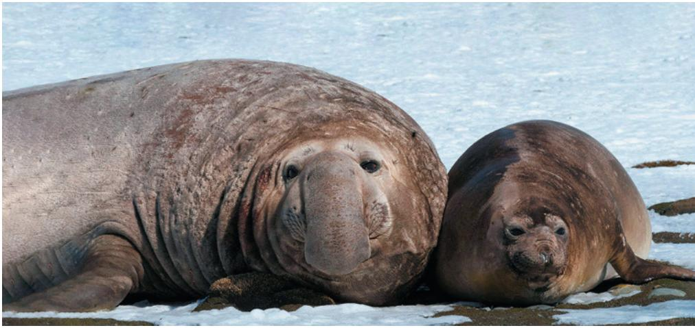  
Figure 45.1 Male and female elephant seals (Mirounga angustirostris) differ greatly in appearance and behavior. The male is much larger, and only he has the prominent proboscis for which the species is named. The male is also far more territorial, using the proboscis to emit loud roars during mating season. Underlying each of these differences is a single hormone—testosterone. Like all hormones, testosterone is an endocrine signaling molecule that circulates in the blood throughout the body.

## Study Tip

Make a flowchart: Many hormones, such as insulin, parathyroid hormone, and epinephrine, have multiple physiological effects in a single organism. To keep track of the action and function of each such hormone, make a flowchart like this example. Use arrows to indicate how the hormone's diverse effects contribute to an overall outcome for the organism.

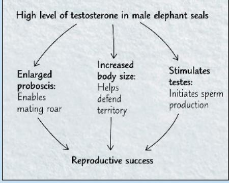

## What variables shape a hormone's effect on an animal's body and behavior?

Concentration of the hormone in the body: Testosterone is present in both male and female

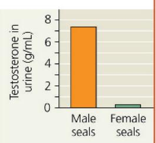

Response of the cell when the receptor binds the hormone: Cells in different tissues may respond differently to the same hormone.

Cells elongate, enlarging proboscis.

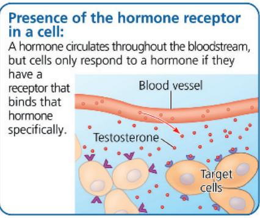

Cells produce sperm.

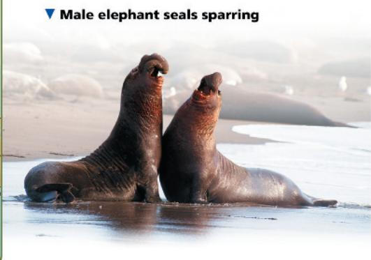

# Concept 45.1: Hormones and other signaling molecules bind to target receptors, triggering specific response pathways

A hormone (from the Greek horman, to excite) is a secreted molecule that circulates throughout the body and stimulates specific cells. Although a given hormone reaches all cells of the body, it only elicits a response—such as a change in metabolism—in specific target cells, those that have a receptor that binds the hormone specifically. Cells lacking a receptor for that hormone are unaffected.

Chemical signaling by hormones is the function of the endocrine system, one of the two basic systems for communication and regulation in the animal body. The other major communication and control system is the nervous system, a network of specialized cells—neurons—that transmit signals along dedicated pathways. These signals in turn regulate neurons, muscle cells, and endocrine cells. Because signaling by neurons can regulate the release of hormones, the nervous and endocrine systems often overlap in function.

As a background to our further exploration of the endocrine system, we'll begin with an overview of the diverse ways that animal cells use chemical signals to communicate.

## Intercellular Information Flow

Communication between animal cells via secreted signals is often classified by two criteria: the type of secreting cell and the route taken by the signal in reaching its target. Figure 45.2 illustrates five forms of signaling distinguished in this manner.

## Endocrine Signaling

In endocrine signaling (see Figure 45.2a), hormones secreted into extracellular fluid by endocrine cells reach target cells via the bloodstream (or hemolymph). One function of endocrine signaling is to maintain homeostasis. Hormones regulate properties that include blood pressure and volume, energy metabolism and allocation, and solute concentrations in body fluids. Endocrine signaling also mediates responses to environmental stimuli, regulates growth and development, and triggers physical and behavioral changes underlying sexual maturity and reproduction (see Figure 45.1).

## Paracrine and Autocrine Signaling

Many types of cells produce and secrete local regulators, molecules that act over short distances, reach their target cells solely by diffusion, and act on their target cells within seconds or even milliseconds. Local regulators play roles in many physiological processes, including blood pressure regulation, nervous system function, and reproduction.

Figure 45.2 Intercellular communication by secreted molecules. In each type of signaling, secreted molecules (small red dots) bind to a specific receptor protein (purple C shapes) expressed by target cells. Some receptors are located inside cells, but for simplicity, here all are drawn on the cell surface.  
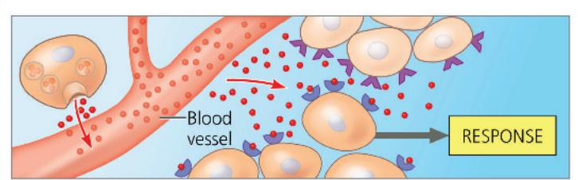  
(a) In endocrine signaling, secreted molecules diffuse into the bloodstream and trigger responses in target cells anywhere in the body.

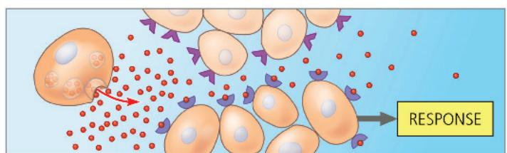  
(b) In paracrine signaling, secreted molecules diffuse locally and trigger a response in neighboring cells.

  
(c) In autocrine signaling, secreted molecules diffuse locally and trigger a response in the cells that secrete them.

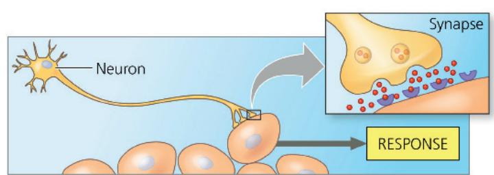  
(d) In synaptic signaling, neurotransmitters diffuse across synapses and trigger responses in target tissues (neurons, muscles, or glands).

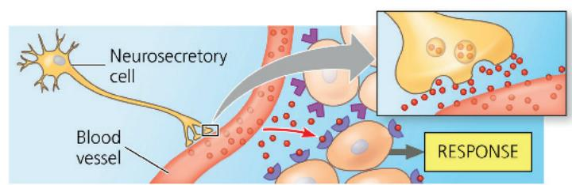  
(e) In neuroendocrine signaling, neurohormones diffuse into the bloodstream and trigger responses in target cells anywhere in the body.

Depending on the target cell, signaling by local regulators is in general either paracrine or autocrine. In paracrine signaling (from the Greek para, to one side of), target cells lie near the secreting cell (see Figure 45.2b). In autocrine signaling (from the

Greek auto, self), the secreting cells themselves are the target cells (see Figure 45.2c).

One group of local regulators are the prostaglandins, which are produced throughout the body and have diverse functions. In the immune system, for example, prostaglandins promote inflammation and the sensation of pain in response to injury. Drugs that block prostaglandin synthesis, such as aspirin and ibuprofen, prevent these activities, producing both anti-inflammatory and pain-relieving effects.

Prostaglandins are modified fatty acids. Many other local regulators are polypeptides, including cytokines, which enable immune cell communication (see Figure 43.16 and Figure 43.17), and growth factors, which promote cell growth, division, and development.

Some local regulators, such as nitric oxide (NO), are gases. When the level of oxygen in the blood falls, endothelial cells in blood vessel walls synthesize and release NO. After diffusing into the surrounding smooth muscle cells, NO activates an enzyme that relaxes the cells. The result is vasodilation, which increases blood flow to tissues.

In human males, NO's ability to promote vasodilation enables sexual function by increasing blood flow into the penis, producing an erection. The drug Viagra (sildenafil citrate), a treatment for male erectile dysfunction, sustains an erection by prolonging activity of the NO response pathway.

## Synaptic and Neuroendocrine Signaling

Secreted molecules are essential for the function of the nervous system. Neurons communicate with target cells, such as other neurons and muscle cells, via specialized junctions called synapses. At most synapses, neurons secrete molecules called neurotransmitters that diffuse a very short distance (a fraction of a cell diameter) and bind to receptors on the target cells (see Figure 45.2d). Such synaptic signaling is central to sensation, memory, cognition, and movement (as we'll explore in Chapters 48–50).

In neuroendocrine signaling, neurons called neurosecretory cells secrete neurohormones, which diffuse from nerve cell endings into the bloodstream (see Figure 45.2e). One example of a neurohormone is antidiuretic hormone, which functions in kidney function and water balance as well as courtship behavior. Many neurohormones regulate endocrine signaling, as we'll discuss later in this chapter.

Figure 45.3 Signaling by pheromones.

Using their lowered antennae, these Asian army ants (Leptogenys distinguenda) carry pupae and larvae along a pheromone-marked trail to a new nest site.

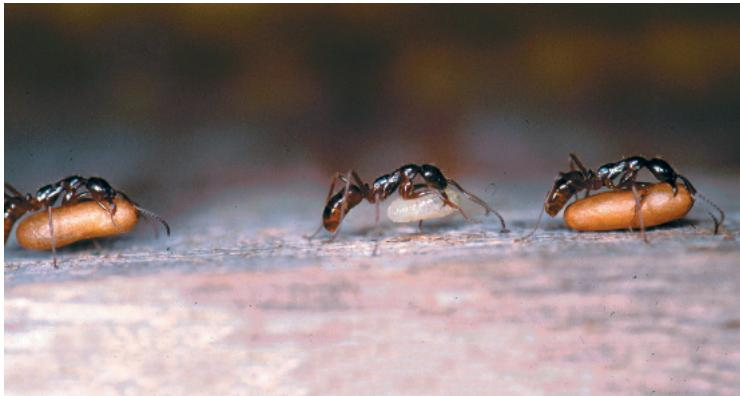

## Signaling by Pheromones

Not all secreted signaling molecules act within the body. Members of a particular animal species sometimes communicate with each other via pheromones, chemicals that are released into the external environment. For example, when a foraging ant discovers a new food source, it marks its path back to the nest with a pheromone. Ants also use pheromones for guidance when a colony migrates to a new location (Figure 45.3).

Pheromones serve a wide range of functions that include defining territories, warning of predators, and attracting potential mates. The polyphemus moth (Antheraea polyphemus) provides a noteworthy example: The sex pheromone released into the air by a female enables her to attract a male of the species from up to 4.5 km away. You'll read more about pheromone function when we take up the topic of animal behavior in Chapter 51.

## Chemical Classes of Hormones

Hormones fall into three major chemical classes: polypeptides, steroids, and amines (Figure 45.4). The hormone insulin, for example, is a polypeptide that contains two chains in its active form. Steroid hormones, such as cortisol, are lipids that contain four fused carbon rings; all are derived from the steroid cholesterol (see Figure 5.12).

Figure 45.4 Variation in hormone solubility and structure.  
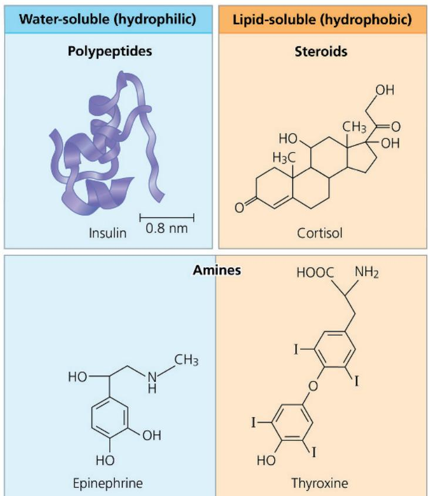  
MAKE CONNECTIONS Cells synthesize epinephrine from the amino acid tyrosine. On the structure of epinephrine shown above, draw a circle around the portion of the molecule corresponding to the R group of tyrosine (see Figure 5.14).

Epinephrine and thyroxine are amine hormones, each synthesized from a single amino acid, either tyrosine or tryptophan.

As Figure 45.4 indicates, hormones vary in their solubility in aqueous and lipid-rich environments. Polypeptides and most amine hormones are water-soluble, whereas steroid hormones and other largely nonpolar (hydrophobic) hormones, such as thyroxine, are lipid-soluble.

## Cellular Hormone Response Pathways

Water-soluble and lipid-soluble hormones differ in their response pathways. One key difference is the location of the receptor proteins in target cells. Water-soluble hormones are secreted by exocytosis and travel freely in the bloodstream. Being insoluble in lipids, they cannot diffuse through the plasma membranes of target cells. Instead, these hormones bind to cell-surface receptors, inducing changes in cytoplasmic molecules and sometimes altering gene transcription (Figure 45.5a). In contrast, lipid-soluble hormones exit endocrine cells by diffusing out across the membranes. They then bind to transport proteins, which keep them soluble in blood. After circulating in the blood, they diffuse into target cells and typically bind to receptors in the cytoplasm or nucleus (Figure 45.5b). The hormone-bound receptor then triggers changes in gene transcription.

Figure 45.5 Variation in hormone receptor location.  
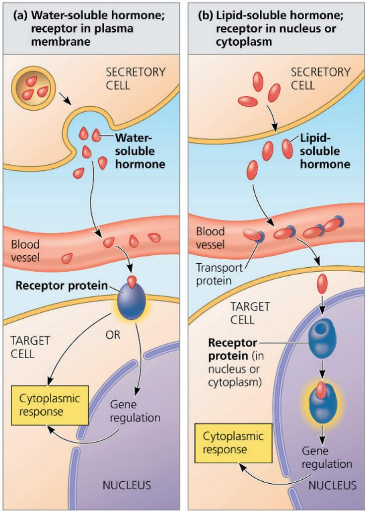  
WHAT IF? Suppose you are studying a cell's response to a particular hormone. You observe that the cell produces the same response to the hormone whether or not the cell is treated with a chemical that blocks transcription. What can you surmise about the hormone and its receptor? For suggested answer, see Appendix A.

To explore further the distinct cellular responses to water-soluble and lipid-soluble hormones, we'll examine the two response pathways in turn.

## Response Pathway for Water-Soluble Hormones

The binding of a water-soluble hormone to a cell-surface receptor protein triggers a cellular response. The response may be the activation of an enzyme, a change in the uptake or secretion of specific molecules, or a rearrangement of the cytoskeleton. In some cases, cell-surface receptors cause proteins in the cytoplasm to move into the nucleus and alter the transcription of specific genes.

The chain of events that converts the extracellular chemical signal to a specific intracellular response is called signal transduction. As an example, we'll consider one response to short-term stress. When you are in a stressful situation, perhaps running to catch a bus, the adrenal glands that lie atop your kidneys secrete the water-soluble hormone epinephrine, also known as adrenaline. Epinephrine regulates many organs, including the liver, where it binds to a G protein-coupled receptor in the plasma membrane of target cells. As shown in Figure 45.6, this interaction triggers a cascade of events involving synthesis of cyclic AMP (cAMP) as a short-lived second messenger. Activation of protein kinase A by cAMP leads to

Figure 45.6 Signal transduction triggered by a cell-surface hormone receptor.  
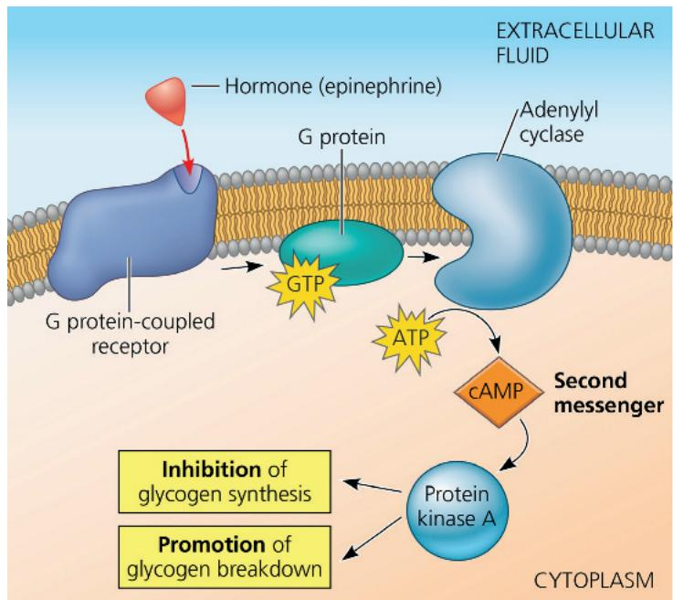  
VISUAL SKILLS A series of arrows represents the steps linking epinephrine to protein kinase A. How does the event represented by the arrow between ATP and cAMP differ from the other four? For suggested answer, see Appendix A.

activation of an enzyme required for breakdown of glycogen into glucose, as well as inactivation of an enzyme needed for glycogen synthesis.

Note that there are three enzymes in this signal transduction cascade—adenylyl cyclase (which converts AMP to its cyclic form), protein kinase A, and, for example, the enzyme that breaks down glycogen into glucose. Each enzyme-catalyzed step in the cascade provides an opportunity for signal amplification: One enzyme molecule can catalyze many reactions, thereby generating multiple signals at that step in the cascade. Furthermore, because the three enzymes act at different steps in the same pathway, the net effect can be enormous. If, for instance, each enzyme carried out 1,000 reactions, the binding of one molecule of epinephrine to its receptor would trigger cleavage of a billion $(10^{3} \times 10^{3} \times 10^{3})$ glycogen molecules. The net result is that the liver releases a substantial quantity of glucose into the bloodstream, quickly providing the body with extra fuel.

## Response Pathway for Lipid-Soluble Hormones

Intracellular receptors for lipid-soluble hormones perform the entire task of transducing a signal within a target cell. The hormone activates the receptor, which then directly triggers the cell's response. In most cases, the response to a lipid-soluble hormone is a change in gene expression.

Most steroid hormone receptors are located in the cytosol prior to binding to a hormone. Binding of a steroid hormone to its cytosolic receptor forms a complex that moves into the nucleus (see Figure 11.9). There, the receptor portion of the complex interacts with a specific DNA-binding protein or response element in the DNA, altering transcription of particular genes. (In some cell types, steroid hormones trigger additional responses by interacting with other kinds of receptor proteins located at the cell surface).

Among the best-characterized steroid hormone receptors are those that bind to estrogens, steroid hormones necessary for female reproductive function in vertebrates. For example, in female birds and frogs, estradiol, a form of estrogen, binds to a cytoplasmic receptor in liver cells. Binding of estradiol to this receptor activates transcription of the vitellogenin gene (Figure 45.7). Following translation of the messenger RNA, vitellogenin protein is secreted and transported in the blood to the reproductive system, where it is used to produce egg yolk.

Thyroxine, vitamin D, and other lipid-soluble hormones that are not steroids typically have receptors in the nucleus. These receptors bind to hormone molecules that diffuse from the bloodstream across both the plasma membrane and nuclear envelope. Once bound to a hormone, the receptor binds to specific sites in the cell's DNA and stimulates the transcription of specific genes.

## Multiple Responses to a Single Hormone

Although hormones bind to specific receptors, a particular hormone can vary in its effects. A hormone can elicit distinct responses in particular target cells if those cells differ in receptor type or in the molecules that produce the response. In this way a single hormone can trigger a range of activities that together bring about a coordinated response to a stimulus. For example, the multiple effects of epinephrine form the basis for the “fight-or-flight” response, a rapid response to stress that you’ll read about in Concept 45.3.

Figure 45.7 Direct regulation of gene expression by a steroid hormone receptor.  
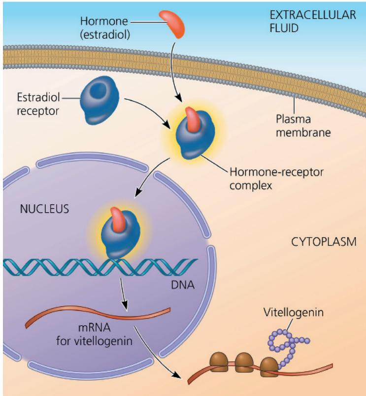

## Endocrine Tissues and Organs

Some endocrine cells are found in organs that are part of other organ systems. For example, the stomach contains isolated endocrine cells that help regulate digestive processes by secreting the hormone gastrin. Other endocrine cells are grouped in ductless organs called endocrine glands, such as the thyroid and parathyroid glands and the gonads, either testes in males or ovaries in females (Figure 45.8).

Note that endocrine glands secrete hormones directly into the surrounding fluid. In contrast, exocrine glands have ducts that carry secreted substances, such as sweat or saliva, onto body surfaces or into body cavities. This distinction is reflected in the glands' names: The Greek endo (within) and exo (out of) refer to secretion into or out of body fluids, while crine (from the Greek word meaning "separate") refers to movement away from the secreting cell. In the case of the pancreas, endocrine and exocrine tissues are found in the same gland: Ductless tissues secrete hormones, whereas tissues with ducts secrete enzymes and bicarbonate.

Figure 45.8 Human endocrine glands and their hormones.

This figure highlights the location and primary functions of the major human endocrine glands. Endocrine tissues and cells are also located in the thymus, heart, liver, stomach, kidneys, and small intestine.

Thyroid gland
Thyroid hormone ( $T_{3}$ and $T_{4}$ ): Stimulates and maintains metabolic processes

Pineal gland
Melatonin: Participates in regulation of biological rhythms

Parathyroid glands — Parathyroid hormone (PTH): Raises blood calcium level

Adrenal glands (atop kidneys)—Adrenal medulla
Epinephrine and norepinephrine: Raise blood glucose level; increase metabolic activity; constrict some blood vessels

Adrenal cortex
Glucocorticoids: Raise blood glucose level
Mineralocorticoids: Promote reabsorption of $Na^{+}$ and excretion of $K^{+}$ in kidneys

Ovaries (in females)
Estrogens\*: Stimulate uterine lining growth; promote development and maintenance of female secondary sex characteristics
Progesterone\*: Promotes uterine lining growth

Testes (in males)
Androgens\*: Support sperm formation; promote development and maintenance of male secondary sex characteristics

\*Found in both males and females, but with a larger role in one sex

## Concept Check 45.1

1. How do response mechanisms in target cells differ for water-soluble and lipid-soluble hormones?

2. What type of gland would you expect to secrete pheromones? Explain.

3. WHAT IF? Predict what would happen if you injected a water-soluble hormone into the cytosol of a target cell.

For suggested answers, see Appendix A.

## Concept 45.2: Feedback regulation and coordination with the nervous system are common in hormone pathways

Having explored hormone structure, recognition, and response, we now consider how regulatory pathways controlling hormone secretion are organized.

Hypothalamus
Hormones released from
posterior pituitary (see below)
Releasing and inhibiting hormones:
Regulate anterior pituitary

Pituitary gland
Posterior pituitary
Oxytocin: Stimulates contraction of uterus and mammary gland cells
Vasopressin, also called antidiuretic hormone (ADH): Promotes retention of water by kidneys

Anterior pituitary
Follicle-stimulating hormone (FSH) and luteinizing hormone (LH): Stimulate gonads (ovaries or testes)
Thyroid-stimulating hormone (TSH):
Stimulates thyroid gland
Adrenocorticotropic hormone (ACTH):
Stimulates adrenal cortex
Prolactin: Stimulates mammary gland growth and milk synthesis in mammals
Growth hormone (GH): Stimulates growth and metabolic functions
Melanocyte-stimulating hormone (MSH):
Affects color of melanocytes, a type of skin cell

Pancreas
Insulin: Lowers blood glucose level
Glucagon: Raises blood glucose level

A feedback loop linking a response back to an initial stimulus is a feature of many control pathways. As discussed in Concept 40.2, this loop often involves negative feedback, in which the response reduces the initial stimulus (see Figure 40.9a). A few hormone pathways involve positive feedback, a control mechanism in which the response reinforces the stimulus, leading to an even greater response (see Figure 40.9b). Hormone pathways can be classified according to the identity of the secretory cell as well as the feedback type.

## Simple Endocrine Pathways

In a simple endocrine pathway, endocrine cells respond directly to an internal or environmental stimulus by secreting a particular hormone. The hormone travels in the bloodstream to target cells, where it interacts with its specific receptors. Signal transduction within target cells brings about a physiological response.

The activity of endocrine cells in the duodenum, the first part of the small intestine, provides a useful example of a simple endocrine pathway. During digestion, the partially processed food that enters the duodenum contains highly acidic digestive juices secreted by the stomach. Before further digestion can occur, this acidic mixture must be neutralized. Figure 45.9 outlines the simple endocrine pathway that ensures neutralization takes place.

Endocrine cells called S cells, found in the lining of the duodenum, detect the low pH of the partially digested food arriving from the stomach. In response, the S cells increase the secretion of the hormone secretin, which diffuses into the blood. Traveling throughout the circulatory system, secretin reaches the pancreas. Target exocrine cells in the pancreas have receptors for secretin and respond by releasing bicarbonate into ducts that lead to the duodenum. In the last step of the pathway, the bicarbonate released into the duodenum raises the pH, neutralizing the stomach acid. Note that the response (increased pH) opposes the stimulus (low pH) and inhibits the endocrine pathway. Secretin signaling is thus an example of a pathway under negative feedback control.

Figure 45.9 A simple endocrine pathway.  
In an endocrine pathway, endocrine cells release a hormone into the bloodstream. This example shown here illustrates negative feedback: The response (bicarbonate release) opposes the stimulus (low pH).  
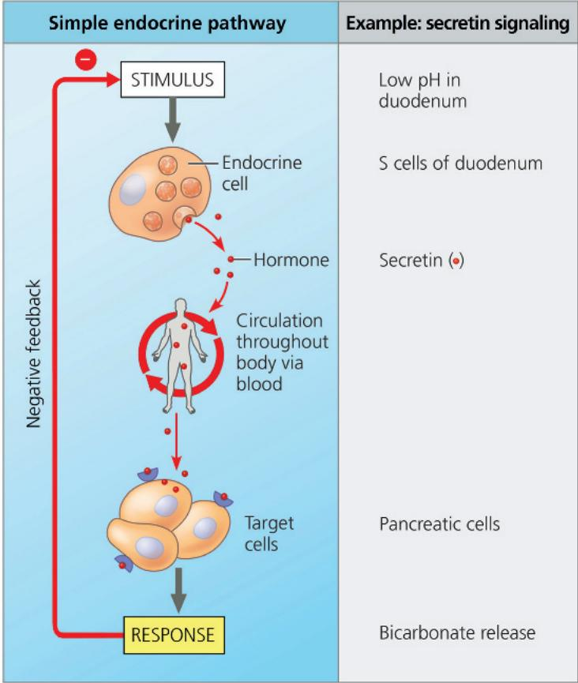  
Figure 45.10 A simple neuroendocrine pathway.  
In a neuroendocrine pathway, neurons release a hormone into the blood stream. The example shown here illustrates positive feedback: The response (milk release) reinforces the stimulus (infant suckling).

## Simple Neuroendocrine Pathways

In a simple neuroendocrine pathway, the hormone is released from a specialized neuron (neurosecretory cell) rather than an endocrine cell. Like other hormones, the neurohormone diffuses into the bloodstream and travels in the circulation to target cells.

As an example of a simple neuroendocrine pathway, consider the regulation of milk release during nursing in mammals (Figure 45.10). When an infant suckles, it stimulates sensory neurons in the nipples, generating nerve impulses that reach the hypothalamus. This input increases the secretion of the neurohormone oxytocin from the posterior pituitary gland. Oxytocin then causes contraction of mammary gland cells,

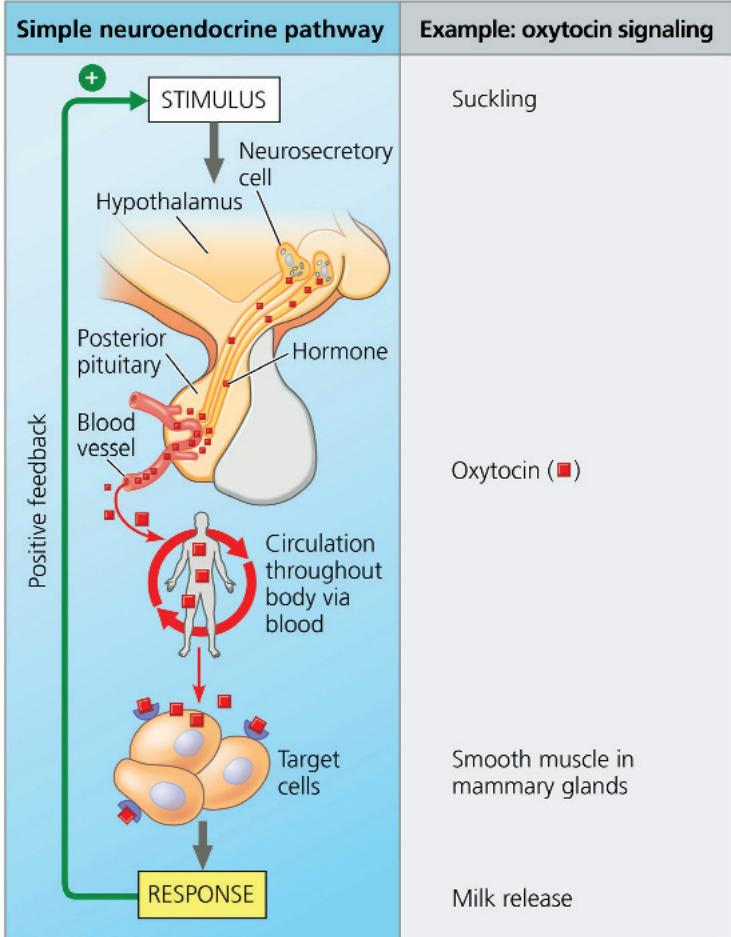

forcing milk from reservoirs in the gland. The response of increased milk release leads to more suckling and more stimulation. Thus, milk release is controlled by a positive feedback pathway that continues until the baby is full and stops suckling. Other functions of oxytocin, such as stimulating contractions of the uterus during birthing, also exhibit positive feedback.

Comparing negative and positive feedback, we see that only negative feedback helps restore the level of a variable to the set point. It is not surprising, therefore, that hormone pathways involved in homeostasis typically exhibit negative feedback. Often such pathways are paired, providing even more balanced control. For example, the blood glucose level is tightly regulated by the opposing, or antagonistic, effects of insulin and glucagon (see Figure 41.23).

## Coordination of the Endocrine and Nervous Systems

In a wide range of animals, endocrine organs in the brain integrate function of the endocrine system with that of the nervous system. We'll explore the basic principles of such integration in invertebrates and vertebrates.

## Invertebrates

The control of development in a moth illustrates neuroendocrine coordination in invertebrates. A moth larva, such as the caterpillar of the giant silk moth (Hyalophora cecropia) shown in Figure 45.11, grows in stages. Because its exoskeleton cannot stretch, the larva must peri-

Figure 45.11 Larva of the giant silk moth.

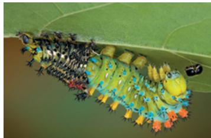

odically molt, shedding the old exoskeleton and secreting a new one. The endocrine pathway that controls molting originates in the larval brain (Figure 45.12). Neurosecretory cells in the brain produce PTTH, a polypeptide neurohormone. When PTTH in body fluids reaches an endocrine organ called the prothoracic gland, it directs release of a second hormone, ecdysteroid. Bursts of ecdysteroid trigger each successive molt.

Ecdysteroid also controls a remarkable change in form called metamorphosis. Within the larva lie islands of tissues that will become the eyes, wings, brain, and other adult structures. Once a plump, crawling larva becomes a stationary pupa, these islands of cells take over. They complete their program of development, while many larval tissues undergo programmed cell death. The end result is the transformation of the crawling caterpillar into a free-flying moth.

Given that ecdysteroid can cause either molting or metamorphosis, what determines which process takes place? The answer is another signal, juvenile hormone (JH), secreted by a pair of endocrine glands behind the brain. JH modulates ecdysteroid activity. When the level of JH in body fluids is high, ecdysteroid stimulates molting (and thus maintains the “juvenile” larval state). When the JH level drops, ecdysteroid instead induces formation of a pupa, within which metamorphosis occurs.

Knowledge of the coordination between the nervous system and endocrine system in insects has provided a basis for novel methods of agricultural pest control. For example, one tool to control insect pests is a chemical that binds to the ecdysteroid receptor, causing insect larvae to molt prematurely and die.

## Vertebrates

In vertebrates, coordination of endocrine signaling relies heavily on the hypothalamus (Figure 45.13). The hypothalamus receives information from sensors throughout the body and other brain regions. It uses this information to alter neuroendocrine signaling pathways in a way that invokes the appropriate response. In many vertebrates, for example, nerve signals from the brain pass sensory information to the hypothalamus about seasonal changes. The hypothalamus, in turn, regulates the release of reproductive hormones required during the breeding season.

Figure 45.12 Regulation of insect development and metamorphosis.

As shown here for a giant silk moth, most insects go through a series of larval stages, with each molt (shedding of the old exoskeleton) leading to a larger larva. Molting of the final larval stage gives rise to

a pupa, in which metamorphosis produces the adult form of the insect. Neurohormones and hormones control the progression of stages.

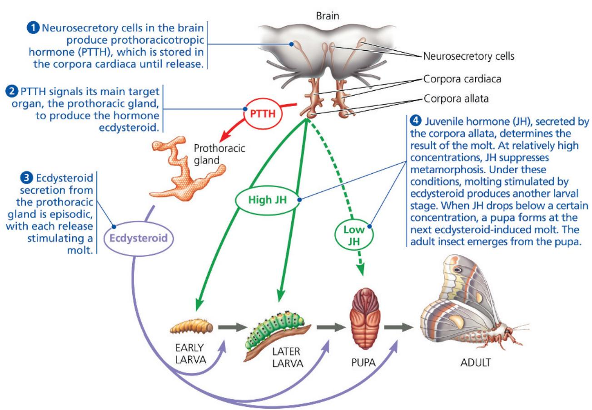

Figure 45.13 Endocrine glands in the human brain.  
This side view of the brain indicates the position of the hypothalamus, the pituitary gland, and the pineal gland. (The pineal gland plays a role in regulating biological rhythms.)  
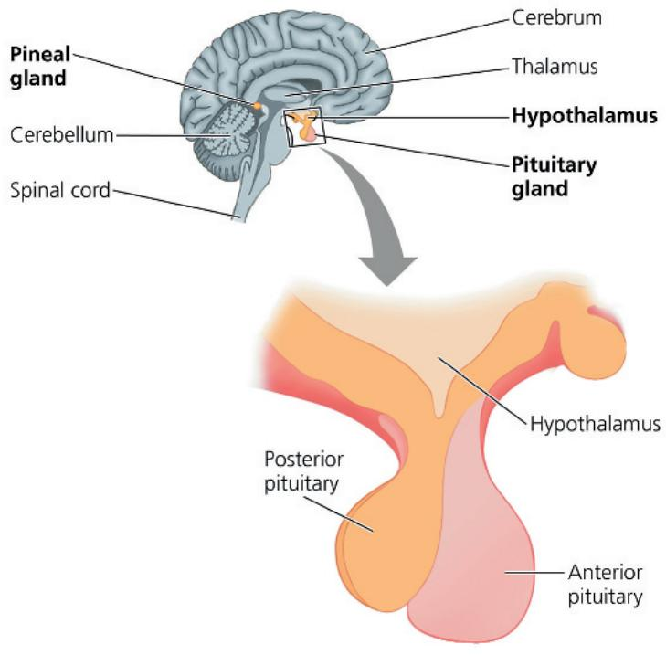  
Figure 45.14 Production and release of posterior pituitary hormones.

Signals from the hypothalamus travel to the pituitary gland, a gland located at the base of the hypothalamus (see Figure 45.13). Roughly the size and shape of a lima bean, the pituitary is made up of two glands that fused during development but remain as discrete posterior and anterior parts, or lobes, that perform very different functions. The posterior pituitary is an extension of the neural tissue of the hypothalamus. Hypothalamic axons that reach into the posterior pituitary secrete neurohormones synthesized in the hypothalamus. In contrast, the anterior pituitary is an endocrine gland that synthesizes and secretes hormones in response to hormones from the hypothalamus.

## Posterior Pituitary Hormones

Neurosecretory cells of the hypothalamus synthesize the two posterior pituitary hormones: antidiuretic hormone (ADH) and oxytocin. After traveling to the posterior pituitary within the long axons of the neurosecretory cells, these neurohormones are stored, to be released into the bloodstream in response to nerve impulses transmitted by the hypothalamus (Figure 45.14).

Antidiuretic hormone (ADH), or vasopressin, regulates kidney function. Circulating ADH increases water retention in the kidneys, helping maintain normal blood osmolarity (see Concept 44.5). ADH also has an important role in social behavior (see Concept 51.4).

Oxytocin has multiple functions related to reproduction. As we have seen, in female mammals oxytocin controls milk secretion by the mammary glands and regulates uterine contractions during birthing. In addition, oxytocin has targets in the brain of both

The posterior pituitary gland is an extension of the hypothalamus. Certain neurosecretory cells in the hypothalamus make antidiuretic hormone (ADH) and oxytocin, which are transported to the posterior pituitary, where they are stored. Nerve signals from the brain trigger release of these neurohormones.

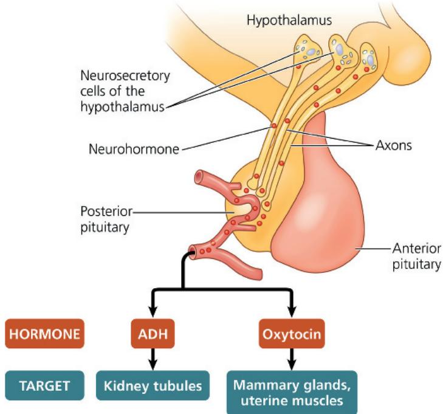

sexes, where it influences behaviors related to parental care, pair bonding, and sexual activity.

## Anterior Pituitary Hormones

Hormones secreted by the anterior pituitary control diverse processes in the body, including metabolism, osmoregulation, and reproduction. As illustrated in Figure 45.15, many anterior pituitary hormones, but not all, regulate endocrine glands or tissues.

Hormones secreted by the hypothalamus control the release of all anterior pituitary hormones. Each hypothalamic hormone that regulates release of one or more hormones by the anterior pituitary is called a releasing or inhibiting hormone. Growth hormone-releasing hormone, for example, is a hypothalamic hormone that stimulates the anterior pituitary to secrete growth hormone. Most anterior pituitary hormones are controlled by at least one releasing hormone. Some, such as growth hormone, have both a releasing hormone and an inhibiting hormone. In contrast, prolactin secretion is primarily regulated by an inhibiting hormone.

The hypothalamic releasing and inhibiting hormones are secreted near capillaries at the base of the hypothalamus. The capillaries drain into short blood vessels, called portal vessels, which subdivide into a second capillary bed within the anterior pituitary. Releasing and inhibiting hormones thus have direct access to the gland they control.

In neuroendocrine pathways, sets of hormones from the hypothalamus, the anterior pituitary, and a target endocrine gland

## Figure 45.15 Production and release of anterior pituitary hormones.

The release of hormones synthesized in the anterior pituitary gland is controlled by hypothalamic releasing and inhibiting hormones. The hypothalamic hormones are secreted by neurosecretory cells and enter a capillary network within the hypothalamus. These capillaries drain into portal vessels that connect with a second capillary network in the anterior pituitary.

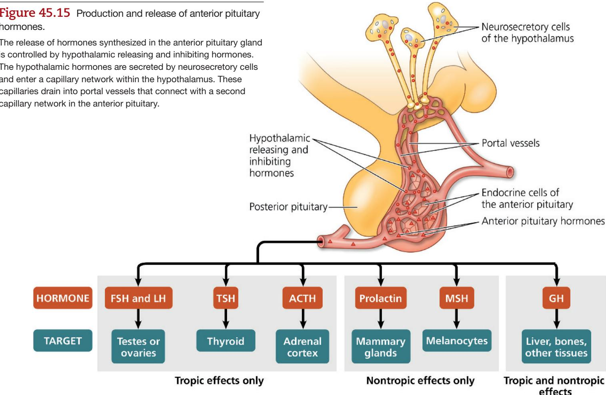

are often organized into a hormone cascade, a form of regulation in which multiple endocrine organs and signals act in series. Signals to the hypothalamus regulate the secretion of a hormone that stimulates or inhibits release of a specific anterior pituitary hormone. The anterior pituitary hormone in turn stimulates another endocrine organ to secrete yet another hormone, which affects specific target tissues. In reproduction, for example, the hypothalamus signals the anterior pituitary to release the hormones FSH and LH, which in turn regulate hormone secretion by the gonads (ovaries or testes).

In a sense, hormone cascade pathways redirect signals from the hypothalamus to other endocrine glands. For this reason, the anterior pituitary hormones in such pathways are called tropic hormones, or tropins, and are said to have a tropic effect (from the Greek trope, to turn). Thus, FSH and LH are gonadotropins because they convey signals from the hypothalamus to the gonads. To learn more about tropic hormones and hormone cascade pathways, we'll turn next to thyroid gland function and regulation.

## Thyroid Regulation: A Hormone Cascade Pathway

In mammals, thyroid hormone increases the metabolic rate, which promotes heat production. It also helps maintain normal blood pressure, digestive activity, and reproductive function. Figure 45.16 provides an overview of the hormone cascade pathway that regulates thyroid hormone release. The hypothalamus secretes

thyrotropin-releasing hormone (TRH), causing the anterior pituitary to secrete thyrotropin, a tropic hormone also known as thyroid-stimulating hormone (TSH). TSH in turn stimulates the thyroid gland, an organ in the neck consisting of two lobes on the ventral surface of the trachea. The thyroid gland responds by secreting thyroid hormone, which inhibits TRH production from the hypothalamus and TSH production by the anterior pituitary. This negative feedback loop helps maintain the circulating concentration of thyroid hormone at its set point. An increase in the thyroid hormone concentration results in more inhibition, which brings the level back down to the set point. A decrease in the thyroid hormone concentration has the opposite effect, because less inhibition will increase the amount of thyroid hormone production.

As with other regulated variables, the thyroid hormone set point can change in different conditions. For example, the stimulus of decreased body temperature increases the thyroid hormone set point in mammals (see Figure 45.16). This change increases TRH production, which in turn increases TSH production, which increases thyroid hormone production. Thyroid hormone then stimulates metabolic heat production, which raises body temperature and opposes the stimulus.

## Disorders of Thyroid Function and Regulation

Disruption of thyroid hormone production and regulation can result in serious disorders. One such disorder reflects the unusual chemical makeup of thyroid hormone, the only iodine-containing molecule synthesized in the body. Thyroid hormone is actually a pair

Figure 45.16 Regulation of thyroid hormone secretion: a hormone cascade pathway.

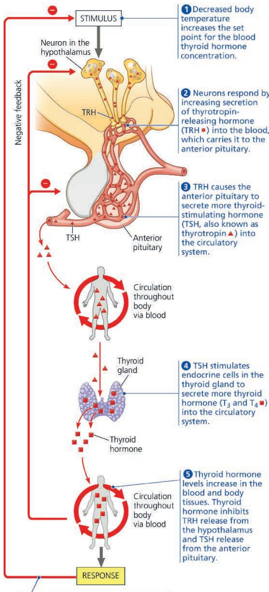  
② Neurons respond by increasing secretion of thyrotropin-releasing hormone (TRH●) into the blood, which carries it to the anterior pituitary.  
3 TRH causes the anterior pituitary to secrete more thyroid-stimulating hormone (TSH, also known as thyrotropin ▲) into the circulatory system.  
4 TSH stimulates endocrine cells in the thyroid gland to secrete more thyroid hormone ( $T_{3}$ and $T_{4}$ ) into the circulatory system.  
⑤ Thyroid hormone levels increase in the blood and body tissues. Thyroid hormone inhibits TRH release from the hypothalamus and TSH release from the anterior pituitary.  
⑥ Thyroid hormone increases metabolic heat production, opposing the stimulus. Once body temperature returns to normal, the thyroid hormone set point returns to its previous level.

of very similar molecules derived from the amino acid tyrosine. Triiodothyronine ( $T_{3}$ ) contains three iodine atoms, whereas tetraiodothyronine, or thyroxine ( $T_{4}$ ), contains four (see Figure 45.4).

Although iodine is readily obtained from seafood or iodized salt, people in many parts of the world lack enough iodine in their diet to synthesize adequate amounts of thyroid hormone. With only a low blood level of thyroid hormone, the pituitary receives less negative feedback and continues to secrete large amounts of TSH. An elevated TSH level in turn causes the thyroid gland to enlarge, resulting in goiter, a marked swelling of the neck.

## Hormonal Regulation of Growth

Growth hormone (GH), which is secreted by the anterior pituitary, stimulates growth through both tropic and nontropic effects. A major target, the liver, responds to GH by releasing insulin-like growth factors (IGFs), which circulate in the blood and directly stimulate bone and cartilage growth. (IGFs also appear to play a key role in aging in many animal species.) In the absence of GH, the skeleton of an immature animal stops growing. GH also exerts diverse metabolic effects that tend to raise the blood glucose level, thus opposing the effects of insulin.

Abnormal production of GH in humans can result in several disorders, depending on when the problem occurs and whether it involves hypersecretion (too much) or hyposecretion (too little). Hypersecretion of GH during childhood can lead to gigantism, in which the person grows unusually tall but retains relatively normal body proportions (Figure 45.17). Excessive

Figure 45.17 Effect of growth hormone overproduction.  
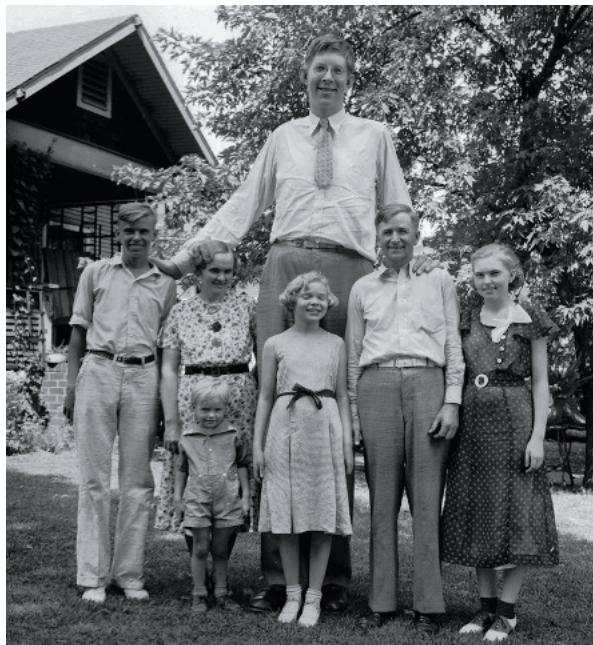

GH production in adulthood stimulates bony growth in the few body parts that are still capable of growth—predominantly the face, hands, and feet. The result is an overgrowth of the extremities called acromegaly (from the Greek acros, extreme, and mega, large).

Hyposecretion of GH in childhood retards long-bone growth and can result in very short stature. People with this disorder are for the most part typically proportioned but generally reach a height of only about 1.2 m (4 feet).

## Problem-Solving Exercise

Is thyroid regulation normal in this patient?

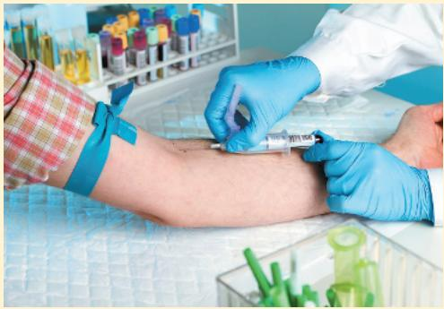

Normal health requires proper regulation of the thyroid gland. Hypothyroidism, the secretion of too little thyroid hormone ( $T_{3}$ and $T_{4}$ ), can cause weight gain, lethargy, and intolerance to cold in adults. In contrast, excessive secretion of thyroid hormone, known as hyperthyroidism, can lead to high body temperature, profuse sweating, weight loss, muscle weakness, irritability, and high blood pressure. Thyroid-stimulating hormone (TSH) stimulates the thyroid to release thyroid hormone. Testing for levels of $T_{3}$ , $T_{4}$ , and TSH in the blood can help diagnose various medical conditions.

In this exercise, you will determine whether a 35-year-old man who came to the emergency room with episodes of paralysis has thyroid problems.

## Your Approach

As the emergency physician, you order a set of blood tests, including four that measure thyroid function. To determine whether the thyroid activity of your patient is normal, you will compare his blood test results with the normal range, as determined from a large set of healthy people.

If diagnosed before puberty, childhood-onset GH deficiency can be treated with human GH (also called HGH). Treatment with HGH produced by recombinant DNA technology is common.

Whereas the effects of altered GH levels are readily related to a change in adult height, disrupting some endocrine pathways can have effects that appear unrelated to normal pathway function. The Problem-Solving Exercise explores one such example of a medical mystery difficult to diagnose based on symptoms alone.

## Your Data

<table><tr><td>#</td><td>Test*</td><td>Patient</td><td>Normal Range</td><td>Comments</td></tr><tr><td>1</td><td>Total triiodothyronine  $\left( {\mathrm{T}}_{3}\right)$ </td><td>2.93 nmol/L</td><td>0.89-2.44 nmol/L</td><td></td></tr><tr><td>2</td><td>Free thyroxine (T4)</td><td>27.4 pmol/L</td><td>9.0-21.0 pmol/L</td><td></td></tr><tr><td>3</td><td>TSH</td><td>5.55 mU/L</td><td>0.35-4.94 mU/L</td><td></td></tr><tr><td>4</td><td>TSH receptor autoantibody</td><td>0.2 U/mL</td><td>0-1.5 U/mL</td><td></td></tr></table>

\* $T_3$ and $T_4$ levels are measured as the number of molecules per unit volume: here, nanomoles (nmol, $10^{-9}$ moles) or picomoles (pmol, $10^{-12}$ moles) per liter (L). The levels of TSH and the autoantibody for its receptor are measured as activity, expressed in units (U) or milliunits (mU) per unit volume.

## Your Analysis

1. For each test, determine whether the patient's test value is high, low, or normal relative to the normal range. Then write High, Low, or Normal in the comments column of the table.

2. Based on tests 1–3, is your patient hypothyroid or hyperthyroid?

3. Test 4 measures the level of autoantibodies (self-reactive antibodies) that bind to and activate the body's receptor for TSH. A high level of autoantibodies causes sustained thyroid hormone production and the autoimmune disorder called Graves' disease. Is it likely that your patient has this disease? Explain.

4. A thyroid tumor increases the mass of cells producing $T_{3}$ and $T_{4}$ , whereas a tumor in the anterior pituitary increases the mass of TSH-secreting cells. Would you expect either condition to result in the observed blood test values? Explain.

Instructors: A version of this Problem-Solving Exercise can be assigned in Mastering Biology.

## Concept Check 45.2

1. What are the roles of oxytocin and prolactin in regulating the mammary glands?

2. How do the two fused glands of the pituitary gland differ in function?

3. WHAT IF? Propose an explanation for why defects in a particular hormone cascade pathway more frequently result from problems with the final gland in the pathway rather than the hypothalamus or pituitary.

4. WHAT IF? Lab tests of two patients, each diagnosed with excessive thyroid hormone production, revealed an elevated level of TSH in one but not the other. Was the diagnosis of one patient necessarily incorrect? Explain.

For suggested answers, see Appendix A.

## Concept 45.3: Endocrine glands respond to diverse stimuli in regulating homeostasis, development, and behavior

In the remainder of this chapter, we'll focus on endocrine function in homeostasis, development, and behavior. We'll begin with another example of a simple hormone pathway, the regulation of calcium ion concentration in the circulatory system.

## Parathyroid Hormone and Vitamin D: Control of Blood Calcium

Because calcium ions ( $Ca^{2+}$ ) are essential to the normal functioning of all cells, homeostatic control of the level of calcium in the blood is vital. If the blood $Ca^{2+}$ level falls substantially, skeletal

Figure 45.18 The roles of parathyroid hormone (PTH) in regulating the blood calcium level in mammals.

muscles begin to contract convulsively, a potentially fatal condition. If the blood $Ca^{2+}$ level rises substantially, calcium phosphate can form precipitates in body tissues, leading to widespread organ damage.

In mammals, the parathyroid glands, a set of four small structures embedded in the posterior surface of the thyroid (see Figure 45.8), play a major role in blood $Ca^{2+}$ regulation. When the blood $Ca^{2+}$ level falls below a set point of about 10 mg/100 mL, these glands increase the release of parathyroid hormone (PTH).

PTH raises the level of blood $Ca^{2+}$ through direct effects in bones and the kidneys and an indirect effect on the intestines (Figure 45.18). In bones, PTH causes the mineralized matrix to break down, releasing $Ca^{2+}$ into the blood. In the kidneys, PTH directly stimulates reabsorption of $Ca^{2+}$ through the renal tubules. In addition, PTH indirectly raises the blood $Ca^{2+}$ level by promoting production of vitamin D. A precursor form of vitamin D is obtained from food or synthesized by skin exposed to sunlight. Conversion of this precursor to active vitamin D begins in the liver. PTH acts in the kidney to stimulate completion of the conversion process. Vitamin D in turn acts on the intestines, stimulating the uptake of $Ca^{2+}$ from food. As the blood $Ca^{2+}$ level rises, a negative-feedback loop inhibits further release of PTH from the parathyroid glands (not shown in Figure 45.18).

## Adrenal Hormones: Response to Stress

The adrenal glands of vertebrates play a major role in the response to stress, a physiological response to mental or physical challenges. Located atop the kidneys (the renal organs), each adrenal gland is actually made up of two glands with different cell types, functions, and embryonic origins: the adrenal cortex, the outer portion, and the adrenal medulla, the central portion (Figure 45.19). The adrenal cortex consists of endocrine cells, whereas the secretory cells of the adrenal medulla are modified neurons. Thus, like the pituitary gland, each adrenal gland is a fused endocrine and neuroendocrine gland.

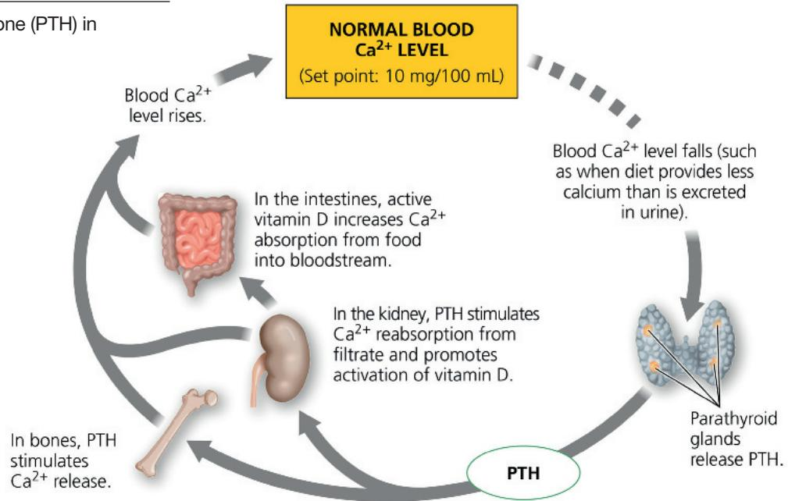

Figure 45.19 Stress and the adrenal gland.  
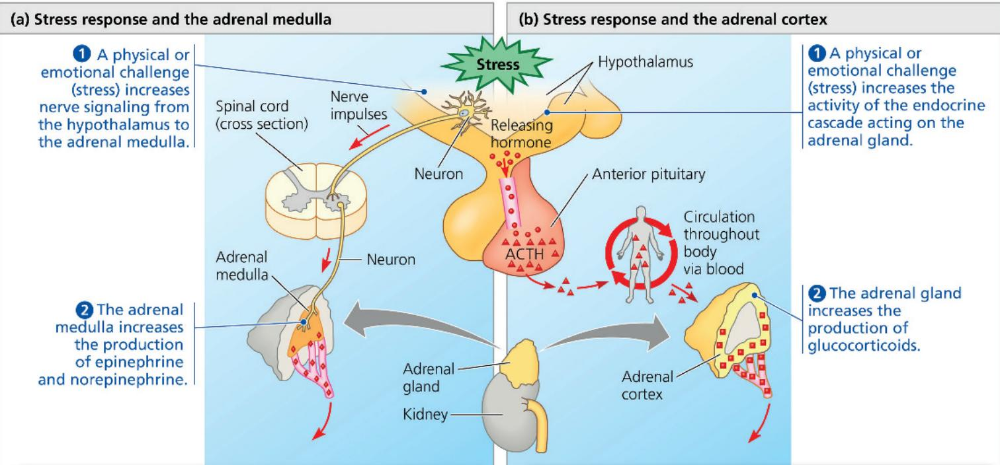

Effects of epinephrine and norepinephrine:

## Effects of glucocorticoids:

• Glycogen broken down to glucose; increased blood glucose

\- Increased glucose synthesis in the liver

\- Increased blood pressure

\- Increased breathing rate

\- Increased fat and protein breakdown to provide substrates for glucose synthesis

\- Increased metabolic rate

\- Change in blood flow patterns, leading to increased alertness and decreased digestive, excretory, and reproductive system activity

\- Increased glycogen storage

\- Suppression of the immune system (at higher levels)

## The Role of the Adrenal Medulla

Imagine that while walking in the woods at night you hear a growling noise nearby. “A bear?” you wonder. Your heart beats faster, your breathing quickens, your muscles tense, and your thoughts speed up. These and other rapid responses to perceived danger comprise the “fight-or-flight” response. This coordinated set of physiological changes is triggered by two hormones of the adrenal medulla, epinephrine (adrenaline) and norepinephrine (also known as noradrenaline). Both are catecholamines, a class of amine hormones synthesized from the amino acid tyrosine. Both molecules also function as neurotransmitters, as you’ll read in Concept 48.4.

As hormones, epinephrine and norepinephrine increase the amount of chemical energy available for immediate use (see Figure 45.19a). Both catecholamines increase the rate of glycogen breakdown in the liver and skeletal muscles and promote the release of glucose by liver cells and of fatty acids from fat cells. The released glucose and fatty acids circulate in the blood and can be used by body cells as fuel.

Catecholamines also exert profound effects on the cardiovascular and respiratory systems. For example, they increase heart rate and stroke volume and dilate the bronchioles in the lungs, actions that raise the rate of oxygen delivery to body cells. For this reason, doctors may prescribe epinephrine as a heart stimulant or to open the

airways during an asthma attack. Catecholamines also alter blood flow, causing constriction of some blood vessels. The overall effect is to shunt blood away from the skin, digestive organs, and kidneys while increasing the blood supply to the heart, brain, and skeletal muscles.

## Epinephrine's Multiple Effects: A Closer Look

How can epinephrine coordinate a response to stress that involves widely varying effects in individual tissues? We can answer that question by examining different response pathways (Figure 45.20) in a range of target cells:

\- In liver cells, epinephrine binds to a $\beta$ -type receptor in the plasma membrane. This receptor activates the enzyme protein kinase A, which in turn regulates enzymes of glycogen metabolism, causing release of glucose into the blood (see Figure 45.20a). Note that this is the signal transduction pathway illustrated in Figure 45.6.

\- In airway walls, the same kinase activated by the same epinephrine receptor inactivates a muscle-specific enzyme. The result is smooth muscle relaxation, leading to dilation (widening) of the airway, and increased air flow (see Figure 45.20b).

## Figure 45.20 One hormone, different effects.

Epinephrine, the primary “fight-or-flight” hormone, produces different responses in different target cells. Target cells with the same receptor exhibit different responses if they have different signal transduction pathways or effector proteins; compare (a) with (b). Target cells with different receptors for the hormone often exhibit different responses; compare (b) with (c).

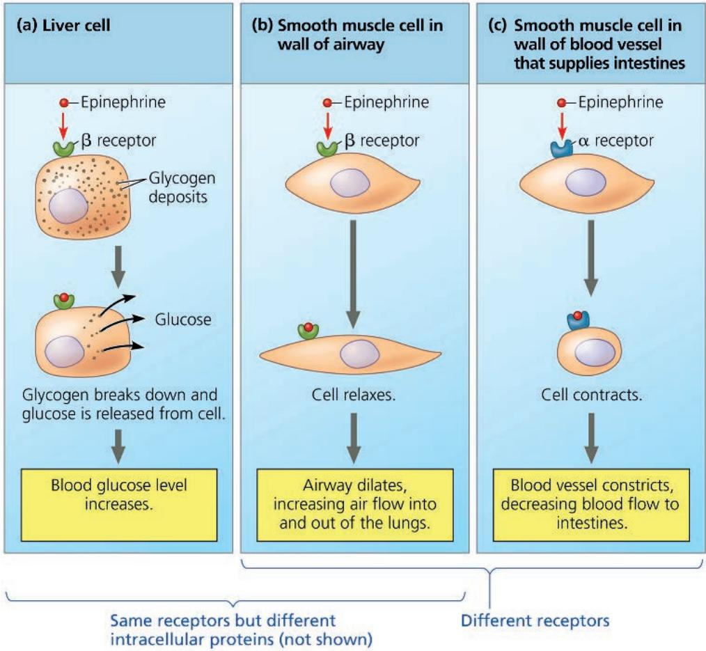

\- In the smooth muscle cells lining blood vessels of the intestines, epinephrine binds to an $\alpha$ -type receptor (see Figure 45.20c). This receptor triggers a signaling pathway that involves enzymes other than protein kinase A and that causes smooth muscle contraction rather than relaxation. The resulting vasoconstriction reduces blood flow to the intestines, facilitating the redirection of blood to active skeletal muscle.

Thus, epinephrine elicits multiple responses if its target cells differ in the receptor protein they express or in the molecules activated by the receptor upon hormone binding. As illustrated in these examples, such variation in response plays a key role in enabling epinephrine to trigger a range of activities that together bring about a coordinated rapid response to stressful stimuli.

## The Role of the Adrenal Cortex

Like the adrenal medulla, the adrenal cortex plays an important role in the stress response (see Figure 45.19b). Challenges such as exercise, physical threat, starvation, or emotional tension cause the hypothalamus to secrete a releasing hormone that stimulates the anterior pituitary to release adrenocorticotropic hormone (ACTH), a tropic hormone. When ACTH reaches the adrenal cortex via the bloodstream, it stimulates the endocrine cells to produce glucocorticoids such as cortisol. These steroid hormones make more glucose available as fuel by promoting glucose synthesis from noncarbohydrate sources. For instance, in the liver, they stimulate the conversion of amino acids, fatty acids, and glycerol into glucose. Glucocorticoids can also increase the availability of these substrates by promoting the catabolism of protein into amino acids, and triglycerides (fats) into fatty acids and glycerol. Since protein contributes to the structure of muscle and connective tissue, chronic exposure to high glucocorticoid levels can damage these tissues.

Glucocorticoid production varies over the course of the day, peaking just before waking. This diurnal rhythm reflects changes in ACTH production. In the Scientific Skills Exercise, on the next page, you can explore an experiment investigating changes in ACTH secretion as humans awaken from sleep.

If glucocorticoids are introduced into the body at a level above that normally present, they suppress certain components of the body's immune system. For this reason, glucocorticoids are sometimes used to treat inflammatory diseases such as arthritis. However, their long-term use disrupts metabolism and increases the risk of infections. Newer treatments, referred

to as disease-modifying anti-rheumatic agents, interfere with the inflammatory process without as many side effects.

Collectively, the steroid hormones produced by the adrenal gland are called corticosteroids. In addition to glucocorticoids, this hormone family includes mineralocorticoids and gonadocorticoids. Mineralcorticoids such as aldosterone regulate salt and water balance (see Figure 44.21). As discussed in Chapter 44, aldosterone production is regulated by factors other than ACTH.

## Sex Hormones

Sex hormones affect growth, development, reproductive cycles, and sexual behavior. The gonads (testes of males and ovaries of females) are their principal sources. The gonads produce and secrete three major types of steroid sex hormones: androgens, estrogens, and progesterone. All three types are found in both males and females but in different proportions.

The testes primarily synthesize androgens, the main one being testosterone. In humans, testosterone first functions in male (XY) embryos, promoting development of male reproductive

# Scientific Skills Exercise Designing a Controlled Experiment

How Is Nighttime ACTH Secretion Related to Expected Sleep Duration? Humans secrete increasing amounts of adrenocorticotropic hormone (ACTH) during the late stages of normal sleep, with the peak secretion occurring at the time of spontaneous waking. Because ACTH is released in response to stressful stimuli, scientists hypothesized that ACTH secretion prior to waking might be an anticipatory response to the stress associated with transitioning from sleep to a more active state. If so, an individual's expectation of waking at a particular time might influence the timing of ACTH secretion. How can such a hypothesis be tested? In this exercise, you will examine how researchers designed a controlled experiment to study the role of expectation.

How the Experiment Was Done Researchers studied 15 healthy volunteers in their mid-20s over three nights. Each night, each subject was told when he or she would be awakened: 6:00 or 9:00 AM. The subjects went to sleep at midnight. Subjects in the “short” or “long” protocol group were awakened at the expected time (6:00 or 9:00 AM, respectively). Subjects in the “surprise” protocol group were told they would be awakened at 9:00 AM, but were actually awakened 3 hours early, at 6:00 AM. At set times, blood samples were drawn to determine plasma levels of ACTH. To determine the change ( $\Delta$ ) in ACTH concentration post-waking, the researchers compared samples drawn at waking and 30 minutes later.

## Data from the Experiment

<table><tr><td rowspan="2">Sleep Protocol</td><td rowspan="2">Expected Wake Time</td><td rowspan="2">Actual Wake Time</td><td colspan="3">Mean Plasma ACTH Level (pg/mL)</td></tr><tr><td>1:00 AM</td><td>6:00 AM</td><td>Δ in the 30 Minutes Post-waking</td></tr><tr><td>Short</td><td>6:00 AM</td><td>6:00 AM</td><td>9.9</td><td>37.3</td><td>10.6</td></tr><tr><td>Long</td><td>9:00 AM</td><td>9:00 AM</td><td>8.1</td><td>26.5</td><td>12.2</td></tr><tr><td>Surprise</td><td>9:00 AM</td><td>6:00 AM</td><td>8.0</td><td>25.5</td><td>22.1</td></tr></table>

Data from J. Born et al., Timing the end of nocturnal sleep, Nature 397:29–30 (1999).

structures (Figure 45.21). In female (XX) embryos, the absence of testosterone allows the development of female reproductive structures. You can learn more about this role of hormones in the development of an embryo as male or female in the Scientific Skills Exercise in Chapter 46.

Androgens play a major role again at puberty, when they are responsible for the development of male secondary sex characteristics. High concentrations of androgens lead to lengthening and thickening of the vocal cords that lower the voice, male patterns of hair growth, and increases in muscle and bone mass. The muscle-building, or anabolic, action of testosterone and related steroids has enticed some athletes to take them as supplements, despite prohibitions against their use in nearly all sports. Use of anabolic steroids, while effective in

## INTERPRET THE DATA

1. Describe the role of the “surprise” protocol in the experimental design.

2. Each subject was given a different protocol on each of the three nights, and the order of the protocols was varied among the subjects that so that one-third had each protocol each night. What factors were the researchers attempting to control for with this approach?

3. For subjects in the short protocol, what was the mean ACTH level at waking? Using the data in the last two columns, calculate the mean level 30 minutes later. Was the rate of change faster or slower in that 30-minute period than during the interval from 1:00 to 6:00 AM?

4. How does the change in ACTH level between 1:00 and 6:00 AM for the surprise protocol compare to that for the short and long protocols? Does this result support the hypothesis being tested? Explain.

5. Using the data in the last two columns, calculate the mean ACTH concentration 30 minutes post-waking for the surprise protocol and compare to your answer for question 3. What do your results suggest about a person's physiological response immediately after waking?

6. What are some variables that weren't controlled for in this experiment that could be explored in a follow-up study?

Instructors: A version of this Scientific Skills Exercise can be assigned in Mastering Biology.

increasing muscle mass, can cause severe acne outbreaks and liver damage, as well as significant decreases in sperm count and testicular size.

Estrogens, of which the most important is estradiol, are responsible for the maintenance of the female reproductive system and for the development of female secondary sex characteristics. In contrast, progesterone is involved in preparing and maintaining tissues of the mammalian uterus required to support the growth and development of an embryo.

Gonadal androgens, estrogens, and progesterone are components of hormone cascade pathways. Synthesis of these hormones is primarily controlled by two gonadotropins from the anterior pituitary, follicle-stimulating hormone and luteinizing hormone (see Figure 45.15). Gonadotropin secretion is in turn

Figure 45.21 Sex hormones regulate formation of internal reproductive structures in human development.

In a male (XY) embryo, the bipotential gonads (gonads that can develop into either of two forms) become the testes, which secrete testosterone and anti-Müllerian hormone (AMH). Testosterone directs formation of sperm-carrying ducts (vas deferens and seminal vesicles), while AMH causes the female ducts to degenerate. In the absence of these testis hormones, the male ducts degenerate and female structures form, including the oviduct, uterus, and vagina.

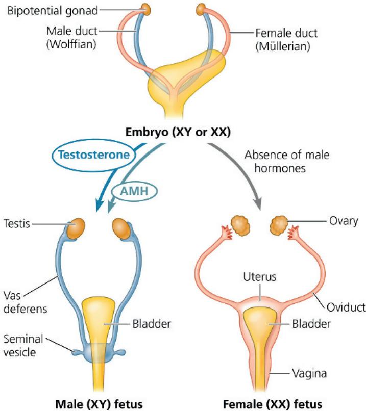  
VISUAL SKILLS Looking at this figure, explain why the adjective bipotential is only used to describe the gonad.
For suggested answer, see Appendix A.

controlled by GnRH (gonadotropin-releasing hormone) from the hypothalamus. We'll examine the feedback relationships that regulate gonadal hormone secretion in detail in Chapter 46.

## Endocrine Disruptors

Between 1938 and 1971, some pregnant patients at risk for pregnancy complications were prescribed a synthetic estrogen called diethylstilbestrol (DES). What was not known until 1971 was that exposure to DES can alter reproductive system development in the fetus. Female offspring of patients who took DES more frequently developed certain reproductive abnormalities, including vaginal and cervical cancer, structural changes in the reproductive organs, and increased risk of miscarriage. DES is now recognized as an endocrine disruptor, a substance that interrupts the normal function of a hormone pathway.

In recent years, some scientists have hypothesized that molecules in the environment also act as endocrine disruptors. For example, bisphenol A, a chemical used in making some

plastics, has been studied for potential interference with normal reproduction and development. In addition, it has been suggested that some estrogen-like molecules, such as those present in soybeans and other edible plant products, have the beneficial effect of lowering breast cancer risk. Sorting out such effects, whether harmful or beneficial, has proven quite difficult, in part because enzymes in the liver change the properties of any such molecules entering the body through the digestive system.

## Hormones and Biological Rhythms

There is still much to be learned about the hormone melatonin, a modified amino acid that regulates functions related to light and the seasons. Melatonin is produced by the pineal gland, a small mass of tissue near the center of the mammalian brain (see Figure 45.13).

Although melatonin affects skin pigmentation in many vertebrates, its primary effects relate to biological rhythms associated with reproduction and with the daily activity level (see Figure 40.9). Melatonin is secreted at night, and the amount released depends on the length of the night. In winter, for example, when days are short and nights are long, more melatonin is secreted. There is also good evidence that nightly increases in the level of melatonin play a significant role in promoting sleep.

The release of melatonin by the pineal gland is controlled by a group of neurons in the hypothalamus called the suprachiasmatic nucleus (SCN). The SCN functions as a biological clock and receives input from specialized light-sensitive neurons in the retina of the eye. Although the SCN regulates melatonin production during the 24-hour light/dark cycle, melatonin also influences SCN activity. We'll consider biological rhythms further in Concept 49.2, where we analyze experiments on SCN function.

## Evolution of Hormone Function

EVOLUTION Over the course of evolution, the functions of a given hormone often diverge between species. An example is thyroid hormone, which across many evolutionary lineages plays a role in regulating metabolism (see Figure 45.16). In frogs, however, the thyroid hormone thyroxine ( $T_{4}$ ) has taken on an apparently unique function: stimulating resorption of the tadpole's tail during metamorphosis (Figure 45.22).

## Figure 45.22 Specialized role of a hormone in frog metamorphosis.

The hormone thyroxine is responsible for the resorption of the tadpole's tail as the frog develops into its adult form.

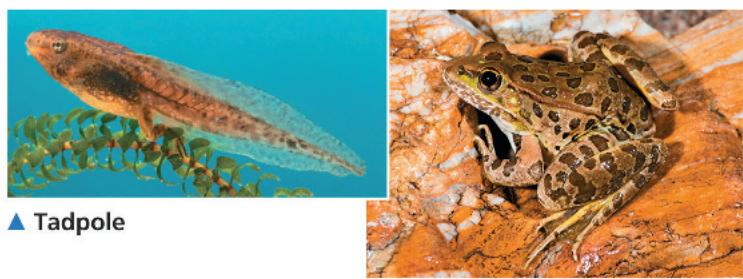  
▲ Tadpole  
▲ Adult frog

The hormone prolactin has an especially broad range of activities. Prolactin stimulates mammary gland growth and milk synthesis in mammals, regulates fat metabolism and reproduction in birds, delays metamorphosis in amphibians, and regulates salt and water balance in freshwater fishes. These varied roles indicate that prolactin is an ancient hormone with functions that have diversified during the evolution of vertebrate groups.

Melanocyte-stimulating hormone (MSH), secreted by the anterior pituitary, provides another example of a hormone with distinct functions in different evolutionary lineages. In amphibians, fishes, and reptiles, MSH regulates skin color by controlling pigment distribution in skin cells called melanocytes. In mammals, MSH functions in hunger and metabolism in addition to skin coloration.

Across evolutionary time, gene duplications and mutations have resulted in families of related hormones. One example is the calcitonin family. Calcitonin is required for normal calcium uptake in the gills of bony fish. While it does not normally serve an important role in humans, salmon calcitonin is used therapeutically to strengthen bone tissue in people with weak bones. Another family member is calcitonin gene-related

peptide (CGRP), produced by alternate splicing of the calcitonin gene. CGRP has been implicated in migraine headaches. Some effective new treatments for migraine block the activity of CGRP.

## Concept Check 45.3

1. If a hormone pathway produces a transient response to a stimulus, how would shortening the stimulus duration affect the need for negative feedback?

2. WHAT IF? Suppose you receive an injection of cortisone, a glucocorticoid, in an inflamed joint. What aspect of glucocorticoid activity would you be exploiting? If a glucocorticoid pill were also effective at treating the inflammation, why would it still be preferable to introduce the drug locally?

3. MAKE CONNECTIONS What parallels can you identify in the properties and effects of epinephrine and the plant hormone auxin (see Concept 39.2) with regard to their effects in different target tissues?

For suggested answers, see Appendix A.

## Chapter 45 Review

## Summary of Key Concepts

To review key terms, go to the Vocabulary Self-Quiz (eTextbook only).

Concept 45.1: Hormones and other signaling molecules bind to target receptors, triggering specific response pathways

\- The forms of signaling between animal cells differ in the type of secreting cell and the route taken by the signal to its target. Endocrine signals, or hormones, are secreted into the extracellular fluid by endocrine cells or ductless glands and reach target cells via circulatory fluids. There the binding of a hormone to a receptor specific for that particular hormone triggers a cellular response. Paracrine signals act on neighboring cells, whereas autocrine signals act on the secreting cell itself.

Neurotransmitters also act locally, but neurohormones can act throughout the body. Pheromones are released into the environment for communication between animals of the same species.

\- Local regulators, which carry out paracrine and autocrine signaling, include cytokines and growth factors (polypeptides), prostaglandins (modified fatty acids), and nitric oxide (a gas).

\- Polypeptides, steroids, and amines comprise the major classes of animal hormones. Depending on whether they are water-soluble or lipid-soluble, hormones activate different response pathways. The endocrine cells that secrete hormones are often located in glands dedicated in part or in whole to endocrine signaling.

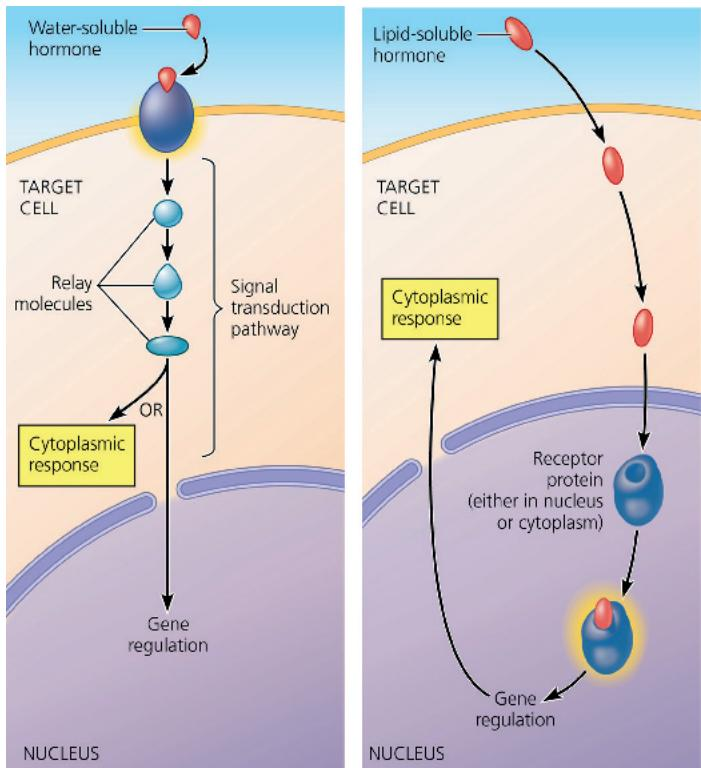  
MAKE CONNECTIONS What forms of signaling activate a helper T cell in immune responses (see Figure 43.18)?

## Concept 45.2: Feedback regulation and coordination with the nervous system are common in hormone pathways

\- In a simple endocrine pathway, endocrine cells respond directly to a stimulus. By contrast, in a simple neuroendocrine pathway, a sensory neuron receives the stimulus.

\- Hormone pathways may include negative feedback, which dampens the stimulus and thus limits the response, or positive feedback, which amplifies the stimulus and drives the response to completion.

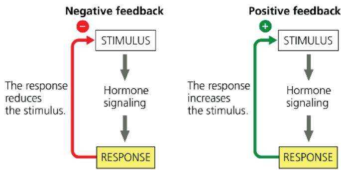

\- In insects, molting and development are controlled by three hormones: PTTH; ecdysteroid, whose release is triggered by PTTH; and juvenile hormone. Coordination of signals from the nervous and endocrine systems and modulation of one hormone activity by another bring about the sequence of developmental stages that lead to an adult form.

\- In vertebrates, neurosecretory cells in the hypothalamus produce two hormones that are secreted by the posterior pituitary and that act directly on nonendocrine tissues: oxytocin, which induces uterine contractions and release of milk from mammary glands, and antidiuretic hormone (ADH), which enhances water reabsorption in the kidneys.

\- Other hypothalamic cells produce hormones that are transported to the anterior pituitary, where they stimulate or inhibit the release of particular hormones.

\- Often, anterior pituitary hormones act in a cascade. For example, the secretion of thyroid-stimulating hormone (TSH) is regulated by thyrotropin-releasing hormone (TRH). TSH in turn induces the thyroid gland to secrete thyroid hormone, a combination of the iodine-containing hormones $T_{3}$ and $T_{4}$ . Thyroid hormone stimulates metabolism and influences development and maturation. Thyroid hormone inhibits the production of TRH and TSH. This negative feedback pathway helps maintain thyroid hormone levels at a set point.

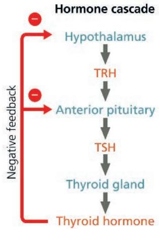

\- Most anterior pituitary hormones are tropic hormones, acting on endocrine tissues or glands to regulate hormone secretion. Tropic hormones of the anterior pituitary include TSH, follicle-stimulating hormone (FSH), luteinizing hormone (LH), and adrenocorticotropic hormone (ACTH). Growth hormone (GH) has both tropic and non-tropic effects. It promotes growth directly, affects metabolism, and stimulates the production of growth factors by other tissues.

Which major endocrine organs described in Figure 45.8 are regulated independently of the hypothalamus and pituitary?

## Concept 45.3: Endocrine glands respond to diverse stimuli in regulating homeostasis, development, and behavior

\- Parathyroid hormone (PTH), secreted by the parathyroid glands, causes bone to release $Ca^{2+}$ into the blood and stimulates reabsorption of $Ca^{2+}$ in the kidneys. PTH also stimulates the kidneys to activate vitamin D, which promotes intestinal uptake of $Ca^{2+}$ from food.

\- In response to stress, neurosecretory cells in the adrenal medulla release epinephrine and norepinephrine, which mediate various fight-or-flight responses. The adrenal cortex releases glucocorticoids, such as cortisol, which influence glucose metabolism and the immune system. It also releases mineralocorticoids, primarily aldosterone, which help regulate salt and water balance.

\- Sex hormones regulate growth, development, reproduction, and sexual behavior. Although the adrenal cortex produces small amounts of these hormones, the gonads (testes and ovaries) serve as the major source. All three types—androgens, estrogens, and progesterone—are produced in males and females, but in different proportions.

\- The pineal gland, located within the brain, secretes melatonin, which functions in biological rhythms related to reproduction and sleep. Release of melatonin is controlled by the SCN, the region of the brain that functions as a biological clock.

\- Hormones have acquired distinct roles in different species over the course of evolution. Prolactin stimulates milk production in mammals but has diverse effects in other vertebrates. Melanocyte-stimulating hormone (MSH) influences hunger and metabolism in mammals and skin pigmentation in other vertebrates. Calcitonin controls calcium balance in bony fish, while calcitonin gene-related peptide (CGRP) has been implicated in migraine headaches in humans.

ADH and epinephrine act as hormones when released into the bloodstream and as neurotransmitters when released in synapses between neurons. What is similar about the endocrine glands that produce these two molecules?

For suggested answers, see Appendix A.

## Test Your Understanding

For more multiple-choice questions, go to the Practice Test (eTextbook only).

## Levels 1-2: Remembering/Understanding

1. Which statement is accurate?

(A) Hormones that differ in effect reach their target cells by different routes through the body.

(B) Pairs of hormones that have the same effect are said to have antagonistic functions.

(C) Hormones are often regulated through feedback loops.

(D) Hormones of the same chemical class usually have the same function.

2. The hypothalamus

(A) synthesizes all of the hormones produced by the pituitary gland.

(B) influences the function of only one lobe of the pituitary gland.

(C) produces only inhibitory hormones.

(D) regulates both reproduction and body temperature.

3. Growth factors are local regulators that

(A) are produced by the anterior pituitary.

(B) are modified fatty acids that stimulate bone and cartilage growth.

(C) are found on the surface of cancer cells and stimulate abnormal cell division.

(D) bind to cell-surface receptors and stimulate growth and development of target cells.

4. Which hormone is correctly paired with its action?

(A) oxytocin—stimulates uterine contractions during childbirth

(B) thyroxine—inhibits metabolic processes

(C) ACTH—inhibits the release of glucocorticoids by the adrenal cortex

(D) melatonin—raises blood calcium level

## Levels 3-4: Applying/Analyzing

5. What do steroid and peptide hormones typically have in common?

(A) their solubility in cell membranes

(B) their requirement for travel through the bloodstream

(C) the location of their receptors

(D) their reliance on signal transduction in the cell

6. Which of the following is the most likely explanation for hypothyroidism in a patient whose iodine level is normal?

(A) greater production of $T_{3}$ than of $T_{4}$

(B) hyposecretion of TSH

(C) hypersecretion of MSH

(D) reduced production of parathyroid hormone

7. The relationship between the insect hormones ecdysteroid and PTTH is an example of

(A) an interaction of the endocrine and nervous systems.

(B) homeostasis achieved by positive feedback.

(C) homeostasis maintained by antagonistic hormones.

(D) competitive inhibition of a hormone receptor.

8. DRAW IT In mammals, the production of the hormone IGF-1 by the liver is controlled by growth hormone (GH) and GH-releasing hormone. Draw a simple sketch of this pathway, including glands, tissues, hormones, routes for hormone movement, and effects.

## Levels 5-6: Evaluating/Creating

9. SCIENTIFIC INQUIRY • INTERPRET THE DATA A chronically high level of glucocorticoids can result in obesity, muscle weakness, and depression, a combination of symptoms called Cushing's syndrome. Excessive activity of either the pituitary or the adrenal gland can be the cause. To determine which gland has abnormal activity in a particular patient, doctors use the drug dexamethasone, a synthetic glucocorticoid that blocks ACTH release. Based on the graph, identify which gland is affected in patient X.

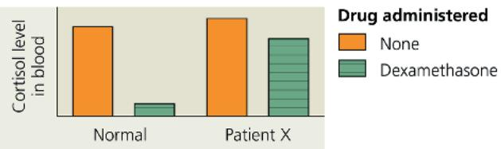

10. WRITE ABOUT A THEME: INTERACTIONS In a short essay (100–150 words), discuss the role of hormones in an animal's responses to changes in its environment. Use specific examples.

11. SYNTHESIZE YOUR KNOWLEDGE

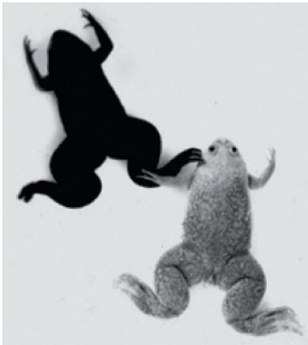

The frog on the left was injected with MSH, causing a change in skin color within minutes due to a rapid redistribution of pigment granules in specialized skin cells. Using what you know about neuroendocrine signaling, explain how a frog could use MSH to match its skin coloration to that of its surroundings.

## Practice Applying Your Learning

12. This question assesses your ability to apply your understanding of feedback loops to a new scenario. This feedback loop results in keeping the level of a regulated variable within a set point.

In fish, a small organ called the corpuscles of Stannius has receptors that sense the level of calcium in the fish's blood. These corpuscles release a hormone known as stanniocalcin (STC). STC binds to receptors on specific cells in the fish's gills, which then take up less calcium from the surrounding water. Based on this information and your knowledge of feedback loops, evaluate each statement as more likely to be TRUE or more likely to be FALSE.

a. This scenario describes a negative feedback loop. \_\_\_\_

b. This feedback loop results in keeping the level of STC within the set point. \_\_\_\_

c. An increase in the blood concentration of calcium would increase STC release. \_\_\_\_

d. The corpuscles of Stannius act as effector organs.

e. STC would only be measurable in blood when calcium levels change. \_\_\_\_

# Animal Reproduction

## Key Concepts

46.1 Both asexual and sexual reproduction occur in the animal kingdom

46.2 Fertilization depends on mechanisms that bring together sperm and eggs of the same species

46.3 Reproductive organs produce and transport gametes

46.4 The interplay of tropic and sex hormones regulates reproduction in mammals

46.5 In placental mammals, an embryo develops fully within the uterus

  
Figure 46.1 This colony of coral polyps is reproducing. Tiny white orbs packed with eggs and sperm emerge from the polyps, rise to the sea surface, and burst. There, the eggs and sperm form embryos that become larvae, eventually drifting down and establishing new coral colonies.

## Study Tip

Make a table: To help you keep track of the roles of the tropic hormones in mammalian reproductive systems, make a table like the one shown here. Complete the last cell for GnRH, and fill in the rows for FSH and LH.

<table><tr><td>Hormone</td><td>Source</td><td>In males: Target/effect</td><td>In females: Target/effect</td></tr><tr><td>GNRH= gonado- tropin- releasing hormone</td><td>Hypo- thalamus</td><td>Anterior pituitary/ promote FSH and LH release</td><td></td></tr><tr><td>FSH=</td><td></td><td></td><td></td></tr><tr><td>LH=</td><td></td><td></td><td></td></tr></table>

## In what different ways do animals reproduce?

Hermaphroditism An individual animal produces both male and female gametes.

External fertilization
An egg encounters sperm outside of the female reproductive tract.

reproductive tract. In some animals, including most mammals, the embryo develops internally and is born from the female's body.

# Concept 46.1: Both asexual and sexual reproduction occur in the animal kingdom

There are two modes of animal reproduction—sexual and asexual. In sexual reproduction, the fusion of haploid gametes forms a diploid cell, the zygote. The animal that develops from a zygote can in turn give rise to gametes by meiosis (see Figure 13.8). The female gamete, the egg, is large and nonmotile, whereas the male gamete, the sperm, is generally much smaller and motile. In asexual reproduction, new individuals are generated without the fusion of egg and sperm. For most asexual animals, reproduction relies entirely on mitotic cell division. Asexual and sexual reproduction are both common among animals.

## Mechanisms of Asexual Reproduction

Among animals, several simple forms of asexual reproduction are found exclusively in invertebrates. One of these is budding, in which new individuals arise from outgrowths of existing ones (see Figure 13.2). In stony corals, for example, buds form and remain attached to the parent. The eventual result is a colony more than 1 m across, consisting of thousands of connected individuals. Also common among invertebrates is fission, the splitting and separation of a parent organism into two individuals of approximately equal size.

Invertebrate asexual reproduction can also occur by fragmentation, the breaking of the body into several pieces, followed by regeneration, regrowth of lost body parts. If more than one piece grows and develops into a complete animal, the effect is reproduction. For example, certain annelid worms can split into several fragments, each regenerating a complete worm. Numerous corals, sponges, cnidarians, and tunicates also reproduce by fragmentation and regeneration.

A wide range of animal species reproduce asexually by parthenogenesis, in which an egg develops without being fertilized. Among invertebrates, parthenogenesis occurs in certain species of bees, wasps, and ants. The offspring can be either haploid or diploid. In the case of honeybees, males (drones) are fertile haploid adults that arise by parthenogenesis. In contrast, female honeybees, including both the sterile workers and the fertile queens, are diploid adults that develop from fertilized eggs.

Among vertebrates, parthenogenesis is thought to be a rare response to low population density. For example, female Komodo dragons, California condors, hammerhead sharks, and zebra sharks have been observed to produce offspring when kept in captivity apart from males of their species. In 2015, DNA analysis of a group of female sawfish from a Florida river identified specimens that had two identical copies of all loci tested, providing evidence of vertebrate parthenogenesis in the wild.

Figure 46.2 Reproduction among hermaphrodites.
In this mating of sea slugs, or nudibranchs (Nembrotha chamberlaini), each hermaphrodite is providing sperm to fertilize the eggs of the other.

## Variation in Patterns of Sexual Reproduction

In many animal species, including humans, sexual reproduction involves the mating of a female and a male. In certain circumstances, however, finding a partner for reproduction can be challenging. Adaptations that arose during the evolution of some species meet this challenge by blurring the distinction between male and female. One such adaptation is particularly common among sessile (stationary) animals, such as barnacles, burrowing animals, such as clams, and some parasites, including tapeworms. That adaptation is hermaphroditism, in which each individual has both male and female reproductive systems (the term hermaphrodite merges the names of Hermes and Aphrodite, a Greek god and goddess). Sessile animals have a very limited opportunity to find a mate, but because each hermaphrodite reproduces as both a male and a female, any two individuals can mate. Each animal donates and receives sperm during mating, as shown for a pair of sea slugs in Figure 46.2. In some species, including many corals, hermaphrodites can also self-fertilize, allowing a form of sexual reproduction that doesn't require any partner.

The bluehead wrasse (Thalassoma bifasciatum) provides an example of a quite different variation in sexual reproduction. These coral reef fish live in harems, each consisting of a single male and several females. When the lone male dies, the opportunity for sexual reproduction would appear to be lost. Instead, within a week the largest female in the harem transforms into a male and begins to produce sperm instead of eggs. What selective pressure in the evolution of the bluehead wrasse resulted in sex reversal for the female with the largest body? Because it is the male wrasse that defends a harem against intruders, a larger size may be particularly important for a male in ensuring successful reproduction.

Certain oyster species also undergo sex reversal. In this case, individuals reproduce as males and then later as females, when their size is greatest. Since the number of gametes produced generally increases with size much more for females than for males, sex reversal in this direction maximizes gamete production. The result is enhanced reproductive success: Because oysters are sedentary animals and release their gametes into the surrounding water rather than mating directly, releasing more gametes tends to result in more offspring.

## Reproductive Cycles

Most animals, whether asexual or sexual, exhibit cycles in reproductive activity, often related to changing seasons. These cycles are controlled by hormones, whose secretion is in turn regulated by environmental cues. In this way, animals expend resources to reproduce only when sufficient energy sources are available and when environmental conditions favor the survival of offspring. For example, ewes (female sheep) have a reproductive cycle lasting 15–17 days. Ovulation, the release of mature eggs, occurs at the midpoint of each cycle. For ewes, reproductive cycles generally occur only during fall and early winter, and the length of any pregnancy is 5 months. Thus, most lambs are born in the early spring, when their chances of survival are optimal.

Because seasonal temperature is often an important cue for reproduction, climate change can decrease reproductive success. Researchers have discovered such an effect on caribou (wild reindeer) in Greenland. In spring, caribou migrate to calving grounds to eat sprouting plants, give birth, and care for their calves. Prior to 1993, the arrival of the caribou at the calving grounds coincided with the brief period during which the plants were nutritious and digestible. By 2006, however, average spring temperatures in the calving grounds had increased by more than 4°C, and the plants sprouted two weeks earlier. Because caribou migration is triggered by day length, not temperature, a mismatch arose between the timing of new plant growth and caribou birthing. Without adequate nutrition for the nursing females, production of caribou offspring has declined by more than 75% since 1993. To learn more about the effects of climate change on caribou and other organisms, see Make Connections Figure 56.31.

Reproductive cycles are also found among animals that can reproduce both sexually and asexually. Consider, for instance, the water flea (genus Daphnia). A female Daphnia can produce eggs of two types. One type of egg requires fertilization to develop, but the other type does not and develops instead by parthenogenesis. Daphnia reproduce asexually when environmental conditions are favorable and sexually during times of environmental stress. As a result, the switch between sexual and asexual reproduction is roughly linked to season.

For some asexual animal species, a cycle of reproductive behavior appears to reflect a sexual evolutionary past. In the parthenogenetic lizard species Aspidoscelis uniparens, reproduction is asexual, and all individuals are female. Nevertheless, these lizards have courtship and mating behaviors very similar to those of sexual species of Aspidoscelis. One member of each mating pair undergoes ovulation, the production and release of mature eggs. The other female mimics a male (Figure 46.3a). Over the course of the breeding season, the two lizards alternate roles two or three times. An individual adopts female behavior prior to ovulation, when the concentration of the hormone estradiol is high, and then switches to male-like behavior after ovulation, when the concentration of the hormone progesterone is high (Figure 46.3b). A female lizard is more likely to ovulate if she is mounted at a critical time of the hormone cycle; isolated lizards lay fewer eggs than those that go through the motions of sex. These findings support the hypothesis that these parthenogenetic lizards evolved from species having two sexes and still require certain sexual stimuli for maximum reproductive success.

Figure 46.3 Sexual behavior in parthenogenetic lizards. The desert grassland whiptail lizard (Aspidoscelis uniparens) is an all-female species. These reptiles reproduce by parthenogenesis, the development of an unfertilized egg, but ovulation is stimulated by mating behavior.  
  
(a) Both lizards in this photograph are A. uniparens females. The one on top is playing the role of a male. Individuals switch sex roles two or three times during the breeding season.

  
(b) The changes in sexual behavior of A. uniparens individuals are correlated with the cycles of ovulation and changing levels of the sex hormones estradiol and progesterone. These drawings track the changes in ovary size, hormone levels, and sexual behavior of one female lizard (shown in brown).  
INTERPRET THE DATA If you plotted hormone levels for the speckled gray lizard in part (b) how would your graph differ from the graph shown?

## Sexual Reproduction: An Evolutionary Enigma

EVOLUTION Although our species and many others reproduce sexually, the existence of sexual reproduction is actually puzzling. To see why, imagine an animal population in which half the females reproduce sexually and half reproduce asexually. We'll assume that the number of offspring per female is a constant, two in this case. The two offspring of an asexual female will both be daughters that

Figure 46.4 The “reproductive handicap” of sex.

These diagrams contrast asexual versus sexual reproduction over four generations, assuming two surviving offspring per female.

will each give birth to two more reproductive daughters. In contrast, half of a sexual female's offspring will be male (Figure 46.4). The number of sexual offspring will remain the same at each generation because both a male and a female are required to reproduce. Thus, the asexual condition will increase in frequency at each generation. Yet despite this “twofold cost,” sex is maintained, even in animal species that can also reproduce asexually.

What advantage does sexual reproduction provide that counteracts its twofold cost? The answer remains uncertain. Most hypotheses focus on the unique combinations of parental genes formed during meiotic recombination and fertilization. By producing offspring of varied genotypes, sexual reproduction may enhance the reproductive success of parents when environmental factors, such as pathogens, change relatively rapidly. In contrast, asexual reproduction is expected to be most advantageous in stable, favorable environments because it can perpetuate successful genotypes precisely.

There are a number of reasons why the unique gene combinations formed during sexual reproduction might be advantageous. One is that beneficial gene combinations arising through recombination might speed up adaptation. Although this idea appears straightforward, the theoretical advantage is significant only when the rate of beneficial mutations is high and population size is small. Another idea is that the shuffling of genes during sexual reproduction might allow a population to rid itself of sets of harmful genes more readily.

## Concept Check 46.1

1. Compare and contrast the outcomes of asexual and sexual reproduction.

2. Parthenogenesis is the most common form of asexual reproduction in animals that at other times reproduce sexually. What characteristic of parthenogenesis might explain this observation?

3. WHAT IF? If a hermaphrodite self-fertilizes, will the offspring be identical to the parent? Explain.

4. MAKE CONNECTIONS What examples of plant reproduction are most similar to asexual reproduction in animals? (See Concept 38.2.)

# Concept 46.2: Fertilization depends on mechanisms that bring together sperm and eggs of the same species

The union of sperm and egg—fertilization—can be external or internal. In species with external fertilization, the female releases eggs into the environment, where the male fertilizes them (Figure 46.5). In species with internal fertilization, sperm deposited in or near the female reproductive tract fertilize eggs within the tract. (We'll discuss cellular and molecular details of fertilization in Concept 47.1.)

A moist habitat is almost always required for external fertilization, both to prevent the gametes from drying out and to allow the sperm to swim to the eggs. Many aquatic invertebrates simply shed their eggs and sperm into the surroundings, and fertilization occurs without the parents making physical contact. However, timing is crucial to ensure that mature sperm and eggs encounter one another.

Among some species with external fertilization, individuals clustered in the same area release their gametes into the water at the same time, a process known as spawning. In some cases, chemical signals that one individual generates in releasing gametes trigger others to release gametes. In other cases, environmental cues, such as temperature or day length, cause a whole population to release gametes at one time. For example, the palolo worm of the South Pacific, like the coral in Figure 46.1, times its spawning to both the season and the lunar cycle. In spring, when the moon is in its last quarter, palolo worms break in half, releasing tail segments engorged with sperm or eggs. These packets rise to the ocean surface and burst in such vast numbers that the sea

## Figure 46.5 External fertilization.

Many species of amphibians reproduce by external fertilization. In most of these species, behavioral adaptations ensure that a male is present when the female releases eggs. Here, a female frog (on bottom) has released a mass of eggs in response to being clasped by a male. The male released sperm (not visible) at the same time, and external fertilization has already occurred in the water.

appears milky with gametes. The sperm quickly fertilize the floating eggs, and within hours the palolo's once-a-year reproductive frenzy is complete.

When external fertilization is not synchronous across a population, individuals may exhibit specific “courtship” behaviors leading to the fertilization of the eggs of one female by one male (see Figure 46.5). By triggering the release of both sperm and eggs, these behaviors increase the probability of successful fertilization.

Internal fertilization is an adaptation that enables sperm to reach an egg even when the external environment is dry. It typically requires sophisticated and compatible reproductive systems, as well as cooperative behavior that leads to copulation. The male copulatory organ delivers sperm, and the female reproductive tract often has receptacles for storage and delivery of sperm to mature eggs.

No matter how fertilization occurs, the mating animals may make use of pheromones, chemicals released by one organism that influence the physiology and behavior of other individuals of the same species. Pheromones are small, volatile or water-soluble molecules that disperse into the environment and are active at very low concentrations (see Concept 45.1). Many pheromones function as mate attractants. For example, pheromones allow some female insects to be detected by males more than a kilometer away.

Evidence for human pheromones is still being investigated. For example, it was formerly thought that female roommates produce pheromones that trigger synchrony in menstrual cycles, but further statistical analyses have failed to support this finding.

## Ensuring the Survival of Offspring

Typically, animals that fertilize eggs internally produce fewer gametes than species with external fertilization, but a higher fraction of their zygotes survive. Better zygote survival is due in part to the fact that eggs fertilized internally are sheltered from potential predators. However, internal fertilization is also more often associated with mechanisms that provide greater protection of the embryos and parental care of the young. For example, the internally fertilized eggs of birds and other reptiles have shells and internal membranes that protect against water loss and physical damage during the eggs' external development (see Figure 34.26). In contrast, the eggs of fishes and amphibians have only a gelatinous coat and lack internal membranes.

Rather than secreting a protective eggshell, some animals retain the embryo for a portion of its development within the female's reproductive tract. The offspring of marsupial mammals, such as kangaroos and opossums, spend only a short period in the uterus as embryos; they then crawl out and complete development attached to a mammary gland in the female's pouch. Embryos of eutherian (placental) mammals, such as zebras and humans, remain in the uterus throughout fetal development. There they are nourished by the parent's blood supply through a temporary organ, the placenta. The embryos of some fishes and sharks also complete development internally.

Figure 46.6 Parental care in an invertebrate.

Compared with many other insects, giant water bugs of the genus Belostoma produce relatively few offspring but offer much greater parental protection. Following internal fertilization, the female glues her fertilized eggs to the back of the male. The male (shown here) carries the eggs for days, frequently fanning water over them to keep them moist, aerated, and free of parasites.

When a caribou or kangaroo is born or when a baby eagle hatches out of an egg, the newborn is not yet capable of independent existence. Instead, mammals nurse their offspring, and adult birds feed their young. Parental care of eggs or offspring is in fact widespread among animals, even including some invertebrates (Figure 46.6).

## Gamete Production and Delivery

Sexual reproduction in animals relies on sets of cells that are precursors for eggs and sperm. Cells dedicated to this function are often established early in the formation of the embryo and remain inactive while the body plan takes shape. Cycles of growth and mitosis then increase, or amplify, the number of cells available for making gametes—eggs or sperm.

In producing gametes from the precursor cells and making them available for fertilization, animals employ a variety of reproductive systems. Gonads, organs that produce gametes, are found in many but not all animals. Exceptions include the palolo, discussed above. The palolo and most other polychaete worms (phylum Annelida) have separate sexes but lack distinct gonads; rather, the eggs and sperm develop from undifferentiated cells lining the coelom (body cavity). As the gametes mature, they are released from the body wall and fill the coelom. Depending on the species, mature gametes in these worms may be shed through the excretory opening, or the swelling mass of eggs may split open a portion of the body, spilling the eggs into the environment.

More elaborate reproductive systems include sets of accessory tubes and glands that carry, nourish, and protect the gametes and sometimes the developing embryos. For example, fruit flies and most other insects have separate sexes with

Figure 46.7 An example of insect reproductive anatomy.  

(a) Male fruit fly. Sperm form in the testes, pass through a sperm duct (vas deferens), and are stored in the seminal vesicles. The male ejaculates sperm along with fluid from the accessory glands. (Males of some species of insects and other arthropods have appendages called claspers that grasp the female during copulation.)

(b) Female fruit fly. Eggs develop in the ovaries and then travel through the oviducts to the uterus. After mating, sperm are stored in the spermathecae, which are connected to the uterus by short ducts. The female uses a stored sperm to fertilize each egg as it enters the uterus before she passes the egg out through the vulva.

VISUAL SKILLS Study the two drawings, and then describe the movement of fruit fly sperm from formation to fertilization.

For suggested answer, see Appendix A.

complex reproductive systems (Figure 46.7). In many insect species, the female reproductive system includes one or more spermathecae (singular, spermatheca), sacs in which sperm may be kept alive and stored for extended periods, a year or more in some cases. Because the female releases male gametes from the spermathecae and thus fertilizes her eggs only in response to the appropriate stimuli, fertilization occurs under conditions likely to be well suited to survival of offspring.

Vertebrate reproductive systems display limited but significant variations. In some vertebrates, the uterus is divided into two chambers; in others, including humans and birds, it is a single structure. In many nonmammalian vertebrates, the digestive, excretory, and reproductive systems have a common opening to the outside, the cloaca, a structure probably present in the ancestors of all vertebrates. Lacking a well-developed penis, males of these species instead release sperm by turning the cloaca inside out. In contrast, mammals generally lack a cloaca and have a separate opening for the digestive tract. In addition, most female mammals have separate openings for the excretory and reproductive systems.

Although fertilization involves the union of a single egg and sperm, animals often mate with more than one member of the other sex. Monogamy, the sustained sexual partnership of two individuals, is rare among animals, including most mammals. Mechanisms have evolved, however, that enhance the reproductive success of a male with a particular female and diminish the chance of that female mating successfully with another partner. For example, some male insects transfer secretions that make a female less receptive to courtship, reducing the likelihood of her mating again.

Can females also influence the relative reproductive success of their mates? This question intrigued two scientific collaborators working in Europe. Studying female fruit flies that copulated with one male and then another, the researchers traced the fate of sperm transferred in the first mating. As shown in Figure 46.8, females play a major role in determining

## Figure 46.8

## Inquiry: Why is sperm usage biased when female fruit flies mate twice?

## Experiment

When a female fruit fly mates twice, 80% of the offspring result from the second mating. Scientists had hypothesized that ejaculate from the second mating displaces sperm from the first mating. To test this hypothesis, Rhonda Snook, at the University of Sheffield, and David Hosken, at the University of Zurich, used mutant males with altered reproductive systems. “No-ejaculate” males mate but do not transfer sperm or fluid to females. “No-sperm” males mate and ejaculate but make no sperm. The researchers allowed females to mate first with wild-type males and then with wild-type males, no-sperm males, or no-ejaculate males. As a control, some females were mated only once (to wild-type males). The scientists then dissected each female under a microscope and recorded whether sperm were absent from the spermathecae, the major sperm storage organs.

## Results

## Conclusion

Because remating reduces sperm storage when no sperm or fluids are transferred, the hypothesis that ejaculate from a second mating displaces stored sperm is incorrect. Instead, it appears females may get rid of stored sperm in response to remating, perhaps allowing for replacing stored sperm, possibly of diminished fitness, with fresh sperm.

Data from R. R. Snook and D. J. Hosken, Sperm death and dumping in Drosophila, Nature 428:939–941 (2004).

WHAT IF? Suppose males in the first mating had a mutant allele that resulted in smaller eyes as a dominant trait. What fraction of the females would produce some offspring with smaller eyes?
For suggested answer, see Appendix A.

the outcome of multiple matings. The processes by which gametes and individuals compete during reproduction remain a vibrant research area.

## Concept Check 46.2

1. How does internal fertilization facilitate life on land?

2. What mechanisms have evolved in animals with (a) external fertilization and (b) internal fertilization that help offspring survive to adulthood?

3. MAKE CONNECTIONS What are the shared and distinct functions of the uterus of an insect and the ovary of a flowering plant? (See Figure 38.6.)

For suggested answers, see Appendix A.

# Concept 46.3: Reproductive organs produce and transport gametes

Having surveyed some of the general features of animal reproduction, we'll focus in the rest of the chapter on humans, beginning with the reproductive anatomy of each sex.

## Human Male Reproductive Anatomy

The human male's external reproductive organs are the scrotum and penis. The internal reproductive organs consist of gonads that produce both sperm and reproductive hormones, accessory glands that secrete products essential to sperm movement, and ducts that carry the sperm and glandular secretions (Figure 46.9).

## Testes

The male gonads, or testes (singular, testis), produce sperm in highly coiled tubes called seminiferous tubules. Most mammals produce sperm properly only when the

testes are cooler than the rest of the body. In humans and many other mammals, testis temperature is maintained about $2^{\circ}$ C below the core body temperature by the scrotum, a fold of the body wall.

The testes develop in the abdominal cavity and descend into the scrotum just before birth (a testis within a scrotum is a testicle). In many rodents, the testes are drawn back into the cavity between breeding seasons, interrupting sperm maturation. Some mammals whose body temperature is low enough to allow sperm maturation—such as whales and elephants—retain the testes in the abdominal cavity at all times.

## Ducts

From the seminiferous tubules of a testis, the sperm pass into the coiled duct of an epididymis. In humans, it takes three weeks for sperm to travel the 6-m length of this duct, during which time the sperm complete maturation and become motile. During ejaculation, the sperm are propelled from each epididymis through a muscular duct, the vas deferens. Each vas deferens (one from each epididymis) extends around and behind the urinary bladder, where it joins a duct from the seminal vesicle, forming a short ejaculatory duct. The ejaculatory ducts open into

Figure 46.9 Reproductive anatomy of the human male.

Labels in parentheses identify nonreproductive structures shown for orientation purposes.

the urethra, the outlet tube for both the excretory system and the reproductive system. The urethra runs through the penis and opens to the outside at the tip of the penis.

## Accessory Glands

Three sets of accessory glands—the seminal vesicles, the prostate gland, and the bulbourethral glands—produce secretions that combine with sperm to form semen, the fluid that is ejaculated. Two seminal vesicles contribute about 60% of the volume of semen. The fluid from the seminal vesicles is thick, yellowish, and alkaline. It contains mucus, the sugar fructose (which provides most of the sperm's energy), a coagulating enzyme, ascorbic acid, and local regulators called prostaglandins (see Concept 45.1).

The prostate gland secretes its products directly into the urethra through small ducts. Thin and milky, the fluid from this gland contains anticoagulant enzymes and citrate (a sperm nutrient). The

bulbourethral glands are a pair of small glands along the urethra below the prostate. Before ejaculation, they secrete clear mucus that neutralizes any acidic urine remaining in the urethra. There is evidence that bulbourethral fluid carries some sperm released before ejaculation, which may contribute to the high failure rate of the withdrawal method of birth control (coitus interruptus).

## Penis

The human penis contains the urethra as well as three cylinders of spongy erectile tissue. During sexual arousal, the erectile tissue fills with blood from the arteries. As this tissue fills, the increasing pressure seals off the veins that drain the penis, causing it to engorge with blood and become erect. Alcohol consumption, certain drugs, emotional issues, and aging all can cause an inability to achieve an erection (erectile dysfunction). For individuals with long-term erectile dysfunction, drugs such as Viagra promote the vasodilating action of the local regulator nitric oxide (NO; see Concept 45.1); the resulting relaxation of smooth muscles in the blood vessels of the penis enhances blood flow into the erectile tissues. Although all mammals rely on penile erection for mating, the penis of dogs, raccoons, walruses, and several other mammals also contains a bone, the baculum, which is thought to further stiffen the penis for mating.

The main shaft of the penis is covered by relatively thick skin. The head of the penis, the male glans, has a much thinner outer layer and is much more sensitive to stimulation. A fold of skin called the prepuce covers the glans of humans. The male prepuce, or foreskin, is removed if a male is circumcised.

## Human Female Reproductive Anatomy

The human female's external reproductive structures are the clitoris and two sets of labia, which surround the clitoris and vaginal opening. The internal organs consist of gonads, which produce eggs and reproductive hormones, and a system of ducts and chambers, which receive and carry gametes and house the embryo and fetus (Figure 46.10).

## Ovaries

The female gonads are a pair of ovaries that flank the uterus and are held in place in the abdominal cavity by ligaments. The outer layer of each ovary is packed with follicles: Each follicle consists of an oocyte, a partially developed egg, surrounded by support cells. The surrounding cells nourish and protect the oocyte during much of its formation and development.

## Oviducts and Uterus

An oviduct, or fallopian tube, extends from the uterus toward a funnel-like opening at each ovary. The dimensions of this tube vary along its length, with the inside diameter near the uterus being as narrow as a human hair. Upon ovulation, cilia on the epithelial lining of the oviduct begin beating. This motion draws fluid from the body cavity into the oviduct, bringing along the egg. Further motion of the cilia, together with wavelike contractions of the oviduct, conveys the egg down the duct to the uterus.

The uterus, also known as the womb, is a thick, muscular organ that can expand during pregnancy to accommodate a 4-kg fetus. The inner lining of the uterus, the endometrium, is richly supplied with blood vessels. The neck of the uterus, called the cervix, opens into the vagina.

## Vagina, Clitoris, and Vulva

The vagina is a muscular but elastic chamber that is the site for insertion of the penis and deposition of sperm during copulation. The vagina, which also serves as the birth canal through which a baby is born, opens to the outside at the vulva, the collective term for the external female genitalia.

A pair of thick, padded ridges called the labia majora enclose and protect the rest of the vulva. The vaginal opening and the separate opening of the urethra are located within a cavity bordered by a pair of slender skin folds, the labia minora. A thin piece of tissue called the hymen partly covers the vaginal opening in humans at birth, but becomes thinner over time and typically wears away through physical activity. The clitoris consists a complex arrangement of spongy erectile tissue, much of it internal. The visible part, the glans (head), is situated at the top of the labia minora and covered by a small hood of skin, the prepuce. The head is supported by the clitoral body, which divides into multiple extensions that curve around the urethra and vagina. During sexual arousal, the clitoris, vagina, and labia minora all engorge with blood and enlarge. Richly supplied with nerve endings, the clitoris is one of the most sensitive points of sexual stimulation. Sexual arousal also induces the vestibular glands near the vaginal opening to secrete lubricating mucus, thereby facilitating sexual activity.

## Mammary Glands

The mammary glands are present in both sexes, but they normally produce milk only in females. Though not part of the reproductive system, the female mammary glands are important to reproduction. Within the glands, small sacs of epithelial tissue secrete milk, which drains into a series of ducts that open at the nipple. The breasts contain connective and fatty (adipose) tissue in addition to the mammary glands.

## Gametogenesis

We turn now to gametogenesis, the production of gametes. In both males and females, there is a close relationship between the gonads' structure and their function. As shown in Figure 46.11, on the next two pages, there are many parallels between spermatogenesis—the production of sperm—and oogenesis—the production of oocytes (eggs). Both processes generate haploid gametes via meiotic divisions of a set of dedicated diploid cells. In addition, support cells in the gonad play an essential role in both spermatogenesis and oogenesis. However, there are also several significant differences in gametogenesis between human males and females:

\- Spermatogenesis is continuous in adult males. In producing hundreds of millions of sperm each day, cell division and maturation occur throughout the seminiferous tubules. For a single sperm, the process takes about 7 weeks. In contrast, oogenesis is a prolonged process in the human female. Immature eggs form in the ovary of the female embryo but do not complete their development until years, and often decades, later.

\- In spermatogenesis, the four products of meiosis develop into mature gametes. In oogenesis, cytokinesis during meiosis is unequal, with almost all the cytoplasm segregated to a single daughter cell. This large cell is destined to become the egg; the other products of meiosis, smaller cells known as polar bodies, degenerate.

\- Spermatogenesis occurs throughout adolescence and adulthood. In contrast, the mitotic divisions that occur in oogenesis in human females are thought to be complete before birth, and the production of mature gametes ceases at about age 50.

\- Spermatogenesis produces mature sperm from precursor cells in a continuous sequence, whereas oogenesis has long interruptions.

## Concept Check 46.3

1. Why might frequent use of a hot tub make it harder for people to conceive a child?

2. The process of oogenesis is often described as the production of a haploid egg by meiosis, but in some animals, this description is not entirely accurate. Explain, referring to Figure 46.11.

3. WHAT IF? If each vas deferens in a male were surgically sealed off, what changes would you expect in sexual response and ejaculate composition?

For suggested answers, see Appendix A.

## Exploring Human Gametogenesis

## Figure 46.11

## Spermatogenesis

Stem cells that give rise to sperm are situated near the outer edge of the seminiferous tubules. Their progeny move inward as they pass through the spermatocyte and spermatid stages, and sperm are released into the lumen (fluid-filled cavity) of the tubule. The sperm travel along the tubule into the epididymis, where they become motile.

The stem cells arise from division and differentiation of primordial germ cells. In mature testes, the stem cells divide mitotically to form spermatogonia, which in turn generate spermatocytes by mitosis. Each spermatocyte gives rise to four spermatids through meiosis, reducing the chromosome number from diploid (2n = 46 in humans) to haploid (n = 23). Spermatids undergo extensive changes as they differentiate into sperm.

The structure of a sperm cell fits its function. In humans, as in most species, a head containing the haploid nucleus is tipped with a specialized vesicle, the acrosome, which contains enzymes that help the sperm penetrate an egg. Behind the head, many mitochondria (or one large mitochondrion in some species) provide ATP for movement of the flagellar tail.

## Oogenesis

Oogenesis begins in the female embryo with the production of oogonia from primordial germ cells. The oogonia divide by mitosis to form cells that begin meiosis, but stop the process at prophase I before birth. These developmentally arrested cells, which are primary oocytes, each reside within a small follicle, a cavity lined with protective cells. At birth, the ovaries together contain about 1–2 million primary oocytes, of which about 500 fully mature between puberty and menopause.

WHAT IF? Suppose you are analyzing the DNA from the polar bodies formed during human oogenesis. If the female who produced the oocyte has a mutation in a known disease gene, would analyze the polar body DNA allow you to infer whether the mutation is present in the mature oocyte? Explain.

For suggested answer, see Appendix A.

Beginning at puberty, follicle-stimulating hormone (FSH) periodically stimulates a small number of follicles to enter the final phase of growth and development. Typically, only one follicle fully matures each month, with its primary oocyte completing meiosis I. The second meiotic division begins, but stops at metaphase. Thus arrested in meiosis II, the secondary oocyte is released at ovulation, when its follicle breaks open. Only if a sperm penetrates the oocyte does meiosis II resume. (In some other animal species, the sperm enters the oocyte earlier or later.) Each of the two meiotic divisions involves unequal cytokinesis, with the smaller cells becoming polar bodies that eventually degenerate (the first polar body may or may not divide again). As a result, the functional product of complete oogenesis is a single mature egg containing a sperm head. Fertilization is defined strictly as the fusion of the haploid nuclei of the sperm and secondary oocyte, although the term is often used loosely to mean the entry of the sperm head into the egg.

The ruptured follicle left behind after ovulation develops into the corpus luteum. The corpus luteum secretes estradiol as well as progesterone, a hormone that helps maintain the uterine lining during pregnancy. If the egg is not fertilized, the corpus luteum degenerates, and a new follicle matures during the next cycle.

# Concept 46.4: The interplay of tropic and sex hormones regulates reproduction in mammals

Mammalian reproduction is governed by the coordinated actions of hormones from the hypothalamus, anterior pituitary, and gonads. Endocrine control of reproduction begins with the hypothalamus, which secretes gonadotropin-releasing hormone (GnRH). This hormone directs the anterior pituitary to secrete the gonadotropins follicle-stimulating hormone (FSH) and luteinizing hormone (LH) (see Figure 45.15). Both are tropic hormones, meaning that they regulate the activity of endocrine cells or glands. They are called gonadotropins because they act on the male and female gonads. FSH and LH support gametogenesis, in part by stimulating sex hormone production by the gonads.

The gonads produce and secrete three major types of steroid sex hormones: androgens, principally testosterone; estrogens, principally estradiol; and progesterone. All three hormones are found in both males and females, but at quite different concentrations. The concentration of testosterone in the blood is roughly ten times higher in males than in females. In contrast, the blood estradiol level is about ten times higher in females than in males; the peak blood progesterone level is also much higher in females. Although the gonads are the major source of sex hormones, the adrenal glands also secrete sex hormones in small amounts.

STUDY TIP Make a table summarizing the source and effects of reproductive hormones (GnRH, FSH, LH, estradiol, progesterone, testosterone) in males and females.

In mammals, sex hormone function in reproduction begins in the embryo. In particular, androgens produced in male embryos direct the appearance of the primary sex characteristics of males, the structures directly involved in reproduction. These include the seminal vesicles and associated ducts, as well as external reproductive structures. In the Scientific Skills Exercise, you can interpret the results of an experiment investigating the development of reproductive structures in mammals.

During sexual maturation, sex hormones in human males and females induce formation of secondary sex characteristics, the physical and behavioral differences between males and females that are not directly related to the reproductive system. Secondary sex characteristics often lead to sexual dimorphism,

## Scientific Skills Exercise Making Inferences and Designing an Experiment

What Role Do Hormones Play in Making a Mammal Male or Female? In non-egg-laying mammals, females have two X chromosomes, whereas males have one X chromosome and one Y chromosome. In the 1940s, French physiologist Alfred Jost wondered whether development of mammalian embryos as female or male in accord with their chromosome set requires instructions in the form of hormones produced by the gonads. In this exercise, you will interpret the results of an experiment that Jost performed to answer this question.

How the Experiment Was Done Working with rabbit embryos still in the uterus at a stage before sex differences are observable, Jost surgically removed the portion of each embryo that would form the ovaries or testes. When the baby rabbits were born, he made note of their chromosomal sex and whether their genital structures were male or female.

Data from the Experiment

<table><tr><td rowspan="2">Chromosome Set</td><td colspan="2">Appearance of Genitalia</td></tr><tr><td>No Surgery</td><td>Embryonic Gonad Removed</td></tr><tr><td>XY (male)</td><td>Male</td><td>Female</td></tr><tr><td>XX (female)</td><td>Female</td><td>Female</td></tr></table>

Data from A. Jost, Recherches sur la differenciation sexuelle de l'embryon de lapin (Studies on the sexual differentiation of the rabbit embryo), Archives d'Anatomie Microscopique et de Morphologie Experimentale 36:271–316 (1947).

INTERPRET THE DATA

1. This experiment is an example of a research approach in which scientists infer how something works normally based on what happens when the normal process is blocked. (a) What normal process was blocked in Jost's experiment? (b) From the results, what

  
Human sex chromosomes in metaphase (duplicated)

inference can you make about the role of the gonads in controlling the development of mammalian genitalia?

2. The data in Jost's experiment could be explained if some aspect of the surgery other than gonad removal caused female genitalia to develop. If you were to repeat Jost's experiment, how might you test the validity of such an explanation?

3. What result would Jost have obtained if female development also required a signal from the gonad?

4. Design another experiment to determine whether the signal that controls male development is a hormone. Make sure to identify your hypothesis, prediction, data collection plan, and controls.

Instructors: A version of this Scientific Skills Exercise can be assigned in Mastering Biology.

Figure 46.12 Androgen-dependent male anatomy and behavior in a moose.

The male and female in this mating pair of moose (Alces alces) differ in both anatomy and physiology. High levels of testosterone in the male are responsible for the appearance of secondary sex characteristics, such as antlers, and for male courtship and territorial behavior.

the difference in appearance between the male and female adults of a species (Figure 46.12). When human males enter puberty, androgens cause the voice to deepen, facial and pubic hair to develop, and muscles to grow (by stimulating protein synthesis). Androgens also promote specific sexual behaviors and sex drive, as well as an increase in general aggressiveness. Estrogens similarly have multiple effects in females. At puberty, estradiol stimulates breast and pubic hair development. Estradiol also influences female sexual behavior, induces fat deposition in the breasts and hips, increases water retention, and alters calcium metabolism.

## Biological Sex and Sexual Orientation in Human Sexuality

A baby is usually assigned a biological sex at birth that typically reflects the genitals present at birth and the child's chromosomes. In mammals, the Y chromosome carries a gene called SRY that directs development of the gonad into a testis. In XX embryos, which lack the Y and hence lack SRY, the gonad becomes an ovary. Although most individuals are born male or female, roughly one in 100 is intersex, having both male and female biological characteristics. For example, intersex individuals may have a nonstandard chromosome set (such as XXY) or may differ in the hormone-directed pathways that control sexual development.

Sexual orientation identifies the type of people to whom an individual is attracted romantically, emotionally, and sexually. Some of the terms currently in use to describe sexual orientation include heterosexual (straight), homosexual (lesbian or gay), bisexual, or asexual. As these descriptions make clear, human sexuality varies considerably.

Figure 46.13 Hormonal control of the testes.  

## Hormonal Control of the Male Reproductive System

When mammals reach sexual maturity, the sex hormones and gonadotropins have essential roles in gametogenesis. In exploring this hormonal control of reproduction, we'll begin with the relatively simple system found in males.

In directing spermatogenesis, FSH and LH act on two types of cells in the testis (Figure 46.13). FSH stimulates Sertoli cells, located within the seminiferous tubules, to nourish developing sperm (see Figure 46.11). LH causes Leydig cells, scattered in connective tissue between the tubules, to produce testosterone and other androgens, which promote spermatogenesis in the tubules.

Two negative-feedback mechanisms control sex hormone production in males (see Figure 46.13). Testosterone regulates the blood concentration of GnRH, FSH, and LH through inhibitory effects on the hypothalamus and anterior pituitary. In addition, inhibin, a hormone that in males is produced by Sertoli cells, acts on the anterior pituitary gland to reduce FSH secretion. Together, these negative-feedback circuits maintain the level of androgen in the normal range.

Leydig cells have other roles besides producing testosterone. They in fact secrete small quantities of many other hormones and local regulators, including oxytocin, renin, angiotensin, corticotropin-releasing factor, growth factors, and prostaglandins. These signals coordinate the activity of reproduction with growth, metabolism, homeostasis, and behavior.

## Hormonal Control of Female Reproductive Cycles

Whereas sperm are produced continuously in human males, there are two closely linked reproductive cycles in human females. Both are controlled by cyclic patterns of endocrine signaling.

Cyclic events in the ovaries define the ovarian cycle: Once per cycle a follicle matures and an oocyte is released. Changes in the uterus define the uterine cycle, which in humans and some other primates is a menstrual cycle. In each menstrual cycle, the endometrium (lining of the uterus) thickens and develops a rich blood supply before being shed through the cervix and vagina if pregnancy does not occur. By linking the ovarian and uterine cycles, hormone activity synchronizes ovulation with the establishment of a uterine lining that can support embryo implantation and development.

If an oocyte is not fertilized and pregnancy does not occur, the uterine lining is sloughed off, and another pair of ovarian and uterine cycles begins. The cyclic shedding of the blood-rich endometrium from the uterus, a process that occurs in a flow through the cervix and vagina, is called menstruation. Menstrual (and ovarian) cycles average 28 days but can range from about 20 to 40 days. Figure 46.14 uses the 28-day average to highlight the major events of these cycles for one ovarian and uterine cycle, illustrating the close coordination across different tissues of the reproductive system.

## The Ovarian Cycle

During the follicular phase (days 0–14), several follicles start to grow, but usually only one matures; the others disintegrate. As in males, GnRH released from the hypothalamus stimulates FSH and LH release from the anterior pituitary. At the beginning of the

follicular phase, rising levels of FSH stimulate rapid follicle growth. FSH and LH work together to stimulate estradiol production by the cells of the follicle. A larger follicle has more hormone-producing cells, so the estradiol concentration rises as the follicle grows. During this portion of the cycle, estradiol inhibits GnRH, FSH, and LH secretion. This effect is particularly obvious in the decrease in FSH production in the later part of the follicular phase.

When estradiol secretion by the follicle begins to rise steeply, the levels of FSH and LH increase markedly. Why? Whereas a low level of estradiol inhibits secretion of pituitary gonadotropins, a high concentration has the opposite effect: It stimulates gonadotropin

Figure 46.14 The reproductive cycles of the human female.
This figure shows how the ovarian cycle and the uterine (menstrual) cycle are regulated by changing hormone levels in the blood.  

secretion by causing the hypothalamus to increase output of GnRH. A high estradiol concentration also increases the GnRH sensitivity of LH-releasing cells in the pituitary, further increasing the LH level.

The maturing follicle, containing a fluid-filled cavity, enlarges to form a bulge at the surface of the ovary. The follicular phase ends at ovulation (day 14), about a day after the LH surge. In response to the peak in LH level, the follicle and adjacent wall of the ovary rupture, releasing the secondary oocyte. At or near the time of ovulation, females may feel a pain in the lower abdomen, on the same side as the ovary that released the oocyte.

The luteal phase (days 15–28) of the ovarian cycle follows ovulation. LH stimulates the remaining follicular tissue to form the corpus luteum. Stimulated by LH, the corpus luteum secretes progesterone and estradiol, which in combination exert negative feedback on the hypothalamus and pituitary. This feedback greatly reduces LH and FSH secretion, preventing maturation of another egg when a pregnancy may be under way.

If pregnancy does not occur, the low gonadotropin concentration at the end of the luteal phase cause the corpus luteum to disintegrate, triggering a sharp decline in estradiol and progesterone concentrations. This decline liberates the hypothalamus and pituitary from negative feedback. The pituitary can then secrete enough FSH to stimulate the growth of new follicles, initiating the next ovarian cycle.

## The Uterine (Menstrual) Cycle

Prior to ovulation, ovarian steroid hormones stimulate the uterus to prepare for support of an embryo. Estradiol secreted in increasing amounts by growing follicles signals the endometrium to thicken. In this way, the follicular phase of the ovarian cycle is coordinated with the proliferative phase (days 6–14) of the uterine cycle. After ovulation, the estradiol and progesterone secreted by the corpus luteum stimulate maintenance and further development of the uterine lining, including enlargement of arteries and growth of endometrial glands. These glands secrete a nutrient fluid that can sustain an early embryo even before it implants in the uterine lining. Thus, the luteal phase of the ovarian cycle is coordinated with the secretory phase (days 15–28) of the uterine cycle.

Once the corpus luteum has disintegrated, the rapid drop in ovarian hormone concentration causes arteries in the endometrium to constrict. Deprived of its circulation, the uterine lining largely disintegrates, releasing blood that is shed along with endometrial tissue and fluid. The result is menstruation—the menstrual flow phase (days 1–5) of the uterine cycle. During this phase, which usually lasts a few days, a new set of ovarian follicles begin to grow. By convention, the first day of flow is designated day 1 of the new uterine (and ovarian) cycle.

About 7% of females of reproductive age suffer from a disorder called endometriosis, in which some cells of the uterine lining migrate to an abdominal location that is abnormal, or ectopic (from the Greek ektopos, away from a place). Having migrated to a location such as an oviduct, ovary, or large intestine, the ectopic tissue responds to hormones in the bloodstream. Like the uterine endometrium, the ectopic tissue swells and breaks down during each ovarian cycle, resulting in pelvic pain and

bleeding into the abdomen. Researchers have not yet determined why endometriosis occurs, but hormonal therapy or surgery can be used to lessen discomfort.

## Menopause

A female starts to run out of functional follicles after about 500 cycles. Menopause, the cessation of ovulation and menstruation, results. Menopause usually occurs between the ages of 46 and 54. Since the follicle and corpus luteum produce estradiol and progesterone, the production of these ovarian steroid hormones declines as reproductive cycles become less frequent and eventually stop altogether.

Menopause is an unusual phenomenon. In human males, reproductive function declines at the same rate as other body functions, and females of other species can reproduce throughout life. Is there an evolutionary explanation for menopause? One intriguing hypothesis proposes that during early human evolution, undergoing menopause after bearing several children allowed a female parent to provide better care for her children and grandchildren, thereby increasing the chances for survival of individuals who share much of her genetic makeup. An alternative hypothesis proposes that menopause itself does not serve an adaptive purpose, but simply reflects the sudden increase in human lifespans.

## Menstrual Versus Estrous Cycles

In all female mammals, the endometrium thickens before ovulation, but only humans and some other primates have menstrual cycles. In other mammals, both domesticated and wild, the uterus reabsorbs the endometrium in the absence of a pregnancy, and no extensive fluid flow occurs. For these animals, the cyclic changes in the uterus occur as part of an estrous cycle that also controls the sexual receptivity of females: Whereas human females may engage in sexual activity throughout the menstrual cycle, mammals with estrous cycles usually copulate only during the period surrounding ovulation. This period, called estrus (from the Latin oestrus, frenzy, passion), is the only time the female is receptive to mating. It is often called “heat,” and the female’s temperature does increase slightly.

The length, frequency, and nature of estrous cycles vary. Bears and wolves have one estrous cycle per year; elephants have several. Rats have estrous cycles throughout the year, each lasting just 5 days. The rat's nemesis, the household cat, ovulates only upon mating.

## Human Sexual Response

In humans, the arousal of sexual interest is complex, involving a variety of psychological as well as physical factors. Although reproductive structures in the male and female differ in appearance, a number serve similar functions in arousal, reflecting their shared developmental origin. For example, the same embryonic tissues give rise to the scrotum and the labia majora, to the skin on the penis shaft and the labia minora, and to the penis and the clitoris. Furthermore, the general pattern of human sexual response is similar in males and females. Two types of physiological reactions predominate in both sexes: vasocongestion, the filling of a tissue with blood, and myotonia, increased muscle tension.

The sexual response cycle can be divided into four phases: excitement, plateau, orgasm, and resolution. An important function of the excitement phase is to prepare the vagina and penis for sexual activity. During this phase, vasocongestion is particularly evident in erection of the penis and clitoris and in enlargement of the testicles, labia, and breasts. The vagina becomes lubricated, and myotonia may occur, as evident in nipple erection or tension of the limbs.

In the plateau phase, sexual responses continue as a result of direct stimulation of the genitalia. In females, the outer third of the vagina becomes vasocongested, while the inner two-thirds slightly expands. This change, coupled with the elevation of the uterus, forms a depression for receiving sperm at the back of the vagina. Breathing quickens and heart rate rises, sometimes to 150 beats per minute—not only in response to the physical effort of sexual activity, but also as an involuntary reaction to stimulation by the autonomic nervous system (see Figure 49.9).

Orgasm is characterized by rhythmic, involuntary contractions of the reproductive structures in both sexes. Male orgasm has two stages. The first, emission, occurs when the glands and ducts of the reproductive tract contract, forcing semen into the urethra. Expulsion, or ejaculation, occurs when the urethra contracts and the semen is expelled. During female orgasm, the uterus and outer vagina contract, but the inner two-thirds of the vagina does not. Orgasm is the shortest phase of the sexual response cycle, usually lasting only a few seconds. In both sexes, contractions occur at about 0.8-second intervals and may also involve the anal sphincter and several abdominal muscles.

The resolution phase completes the cycle and reverses the responses of the earlier stages. Vasocongested organs return to normal size and color, and muscles relax. Most of these changes are completed within 5 minutes, but some may take as long as an hour. Following orgasm, the male typically enters a refractory period, lasting from a few minutes to hours, when erection and orgasm cannot be achieved. The female refractory period is often shorter in duration and may not always occur, allowing for multiple orgasms within a short period of time.

## Concept Check 46.4

1. How are the functions of FSH and LH in females and males similar?

2. How does an estrous cycle differ from a menstrual cycle? In what animals are the two types of cycles found?

3. WHAT IF? If a human female begins taking estradiol and progesterone immediately after the start of a new menstrual cycle, how will ovulation be affected? Explain.

4. MAKE CONNECTIONS A coordination of events is characteristic of the reproductive cycle of a human female and the replicative cycle of an enveloped RNA virus (see Figure 19.8). What is the nature of the coordination in each of these cycles?

# Concept 46.5: In placental mammals, an embryo develops fully within the uterus

Having surveyed the ovarian and uterine cycles of human females, we turn now to reproduction itself, beginning with the events that transform an egg into a developing embryo.

## Conception, Embryonic Development, and Birth

During human copulation, hundreds of millions of sperm are transferred in 2–5 mL of semen. When first ejaculated, the semen coagulates, which likely keeps the ejaculate in place until sperm reach the cervix. Soon after, anticoagulants liquefy the semen, and the sperm swim through the cervix and oviducts. Fertilization—also called conception in humans—occurs when a sperm fuses with an egg (mature oocyte) in an oviduct (Figure 46.15).

The zygote begins a series of cell divisions called cleavage about 24 hours after fertilization and after an additional 4 days produces a blastocyst, a sphere of cells surrounding a central cavity. A few days later, the embryo implants into the endometrium of the uterus. The condition of carrying one or more embryos in the uterus is called pregnancy, or gestation. Human pregnancy averages 266 days (38 weeks) from fertilization of the egg, or 40 weeks from the start of the last menstrual cycle. In comparison, gestation averages 21 days in many rodents, 280 days in cows, and more than 600 days in elephants. The roughly 9 months of human gestation are divided into three trimesters of equal length. However, approximately 25% of human pregnancies end involuntarily, often as a result of chromosomal or developmental abnormalities. Early pregnancy loss (miscarriage) is the most common, occurring in the first 20 weeks of gestation. Miscarriages can happen before people are even aware they are pregnant. A stillbirth, or pregnancy loss after 20 weeks of gestation, occurs in approximately 1 of 175 births in the United States.

In an ectopic pregnancy, or tubal pregnancy, the embryo implants outside of the uterus. The most common site of an ectopic pregnancy is within the oviduct, where fertilization occurred. Such a pregnancy cannot be sustained, and terminating the pregnancy is the only way to prevent rupture of the oviduct and life-threatening bleeding. About 1–2% of pregnancies are ectopic, but early diagnosis and prompt medical treatment greatly increase maternal survival.

## First Trimester

During the first trimester, even before implantation occurs, the embryo secretes hormones that signal its presence and regulate the female parent's reproductive system. One embryonic hormone, human chorionic gonadotropin (hCG), acts like pituitary LH in maintaining secretion of progesterone and estrogens by the corpus luteum through the first few months of pregnancy. Some

Figure 46.15 Formation of a human zygote and early postfertilization events.  
  
VISUAL SKILLS If a female's eggs need to be fertilized in vitro, they can be readily introduced into the uterus but not the extremely narrow oviduct. Based on this drawing, propose conditions for culturing a fertilized egg that you predict will optimize the chance of a successful pregnancy.

For suggested answer, see Appendix A.

hCG passes from the maternal blood to the urine, where it can be detected by the most common early pregnancy tests.

During its first 2–4 weeks of development, the embryo obtains nutrients directly from the endometrium. Meanwhile, the outer layer of the blastocyst, which is called the trophoblast, grows outward and mingles with the endometrium, eventually

## Figure 46.16 Placental circulation.

Maternal blood enters the placenta in arteries, flows through blood pools in the endometrium, and leaves via veins. Embryonic or fetal blood, which remains in vessels, enters the placenta through arteries and passes through capillaries in finger-like chorionic villi, where oxygen and nutrients are acquired. Fetal blood leaves the placenta through veins leading back to the fetus.

WHAT IF? In a rare genetic disorder, the absence of a particular enzyme leads to increased testosterone production. When the fetus has this disorder, the female develops a male-like pattern of body hair during the pregnancy. Explain why.

For suggested answer, see Appendix A.

helping form the placenta (Figure 46.16). This disk-shaped organ contains both embryonic and maternal blood vessels. Exchange between the maternal and embryonic circulatory systems supplies nutrients, provides immune protection, exchanges respiratory gases, and disposes of metabolic wastes for the embryo. Blood from the embryo travels to the placenta through the arteries of the umbilical cord and returns via the umbilical vein.

Occasionally, an embryo splits during the first month of development, resulting in identical, or monozygotic (one-egg), twins. In contrast, fraternal, or dizygotic, twins arise when two follicles mature in a single cycle, followed by independent fertilization and implantation of two genetically distinct embryos.

Figure 46.17 Some stages of human development during the first and second trimesters.  
  
(a) 5 weeks. Limb buds, eyes, the heart, the liver, and rudiments of all other organs have started to develop in the embryo, which is only about 1 cm long.

  
(b) 14 weeks. Growth and development of the offspring, now called a fetus, continue during the second trimester. This fetus is about 6 cm long.

The first trimester is the main period of organogenesis, the development of the body organs (Figure 46.17a). During organogenesis, the embryo is particularly susceptible to damage. For example, alcohol that passes through the placenta and reaches the developing central nervous system of the embryo can cause developmental and intellectual disabilities and other serious conditions associated with fetal alcohol syndrome. The heart begins beating by the 4th week; a heartbeat can be detected at 8–10 weeks. At 8 weeks, all the major structures of the adult are present in rudimentary form, and the embryo is called a fetus.

At the end of the first trimester, the fetus is well differentiated, but only 5cm long. Meanwhile, a high progesterone level brings about rapid changes in the maternal body: Mucus in the cervix forms a plug that protects against infection, the maternal part of the placenta grows, the breasts and uterus get larger, and both ovulation and menstrual cycling stop. About three-fourths of all pregnant individuals experience nausea, misleadingly called “morning sickness,” during the first trimester.

## Second and Third Trimesters

During the second trimester, the fetus grows to about 30 cm in length. Development continues, including formation of fingernails, external sex organs, and outer ears (Figure 46.17b). Fetal movements may be perceived as early as one month into the second trimester, and fetal activity is typically visible through the abdominal wall one to two months later. Hormone concentrations stabilize as hCG secretion declines somewhat; the corpus luteum deteriorates; and the placenta completely takes over the production of progesterone, the hormone that maintains the pregnancy.

During the third trimester, the fetus grows to about 3–4 kg in weight and 50 cm in length. Fetal activity may decrease as the fetus fills the available space. As the fetus grows and the uterus expands around it, the maternal abdominal organs become compressed and displaced, leading to digestive issues and a need for frequent urination.

Childbirth begins with labor, a series of strong, rhythmic uterine contractions that push the fetus and placenta out of the body. Once labor begins, local regulators (prostaglandins) and hormones (chiefly estradiol and oxytocin) induce and regulate further contractions of the uterus (Figure 46.18). Central to this

Figure 46.18 Positive feedback in labor.  
  
VISUAL SKILLS Based on the feedback circuits shown, predict the effect of a single dose of oxytocin on a pregnant individual at the end of 39 weeks gestation.  
For suggested answer, see Appendix A.

Figure 46.19 The three stages of labor.  
  
1 Dilation of the cervix

  
② Expulsion: delivery of the infant

regulation is a positive-feedback loop (see Concept 45.2) in which uterine contractions stimulate secretion of oxytocin, which in turn stimulates further contractions.

Labor is typically described as having three stages (Figure 46.19). The first stage is the thinning and opening up (dilation) of the cervix. The second stage is the expulsion, or delivery, of the baby. Continuous strong contractions force the fetus out of the uterus and through the vagina. The final stage of labor is the delivery of the placenta.

The newborn human or other mammal receives nourishment in the form of milk. In response to suckling by the newborn, the hypothalamus signals the anterior pituitary to secrete prolactin, which stimulates the mammary glands to produce milk. Suckling also stimulates the secretion of oxytocin from the posterior pituitary, which triggers release of milk from the mammary glands (see Figure 45.15).

## Maternal Immune Tolerance of the Embryo and Fetus

Pregnancy is an immunological puzzle. Because half of the embryo's genes are inherited from the male parent, many of the chemical markers present on the surface of the embryo are foreign to the female parent. Why, then, does the body not reject the embryo as foreign matter, as it would a tissue or organ graft from another person? One intriguing clue comes from the relationship between certain autoimmune disorders and pregnancy. For example, the symptoms of rheumatoid arthritis, an autoimmune disease of the joints, become less severe during pregnancy. Such observations suggest that the overall regulation of the immune system changes during pregnancy. Sorting out these changes and how they might protect the developing fetus is an active area of research for immunologists.

## Contraception and Abortion

Contraception, the deliberate prevention of pregnancy, can be achieved in a number of ways. Some contraceptive methods prevent gamete development or release from female or male gonads; others prevent fertilization by keeping sperm and egg apart; and still others prevent implantation of an embryo. For complete information on contraceptive methods, you should consult a health-care provider. The following brief introduction to the biology of the most common methods and the corresponding diagram in Figure 46.20 (on the next page) make no pretense of being a contraception manual.

Fertilization can be prevented by abstinence from sexual intercourse or by any of several kinds of barriers that keep live sperm from contacting the egg. Temporary abstinence, sometimes called natural family planning, depends on refraining from intercourse when conception is most likely. Because the egg can survive in the oviduct for 24–48 hours and sperm for up to 5 days, people practicing temporary abstinence should not engage in inter-course for a number of days before and after ovulation. Furthermore, because the timing of ovulation can vary significantly, the female needs knowledge of physiological indicators associated with ovulation, such as changes in cervical mucus. Note also that a pregnancy rate of 10–20% is typical for people practicing natural family planning. (In this context, pregnancy rate is the percentage of females who become pregnant in one year while using a particular pregnancy prevention method.)

Figure 46.20 Mechanisms of several contraceptive methods. Red arrows indicate where these methods, devices, or products interfere with events from the production of sperm and primary oocytes to implantation of a developing embryo.  

As a method of preventing fertilization, coitus interruptus, or withdrawal (removal of the penis from the vagina before ejaculation), is unreliable. Sperm from a previous ejaculate may be transferred in secretions that precede ejaculation. Furthermore, a split-second lapse in timing or willpower can result in tens of millions of sperm being transferred before withdrawal.

Used properly, several methods of contraception that block sperm from meeting the egg have pregnancy rates of less than 10%. The external condom is a thin, latex rubber or natural membrane sheath that fits over the penis to collect the semen. The internal

condom (sometimes referred to as a “female condom”) is a plastic pouch that can be placed inside the vagina or anus. For sexually active individuals, condoms are the only contraceptives that are highly effective in preventing the spread of sexually transmitted infections (STIs), also known as sexually transmitted diseases (STDs). Although rates have been declining since 2021, 2.4 million cases of chlamydia, gonorrhea, and syphilis were reported in the United States in 2023. This figure underestimates the prevalence of these common STIs, since many people with these infections have no symptoms and thus do not seek medical care.

Another common barrier device is the diaphragm, a dome-shaped rubber cap inserted into the upper portion of the vagina before intercourse. Both of these devices have lower pregnancy rates when used in conjunction with a spermicidal (sperm-killing) foam or jelly.

Except for complete abstinence from sexual intercourse or sterilization (discussed later), the most effective means of birth control are the intrauterine device (IUD) and hormonal contraceptives. The IUD has a pregnancy rate of 1% or less and is the most commonly used reversible method of birth control outside the United States. Placed in the uterus by a healthcare professional, the IUD interferes with fertilization and implantation. Hormonal contraceptives, in the form of birth control pills, injections, vaginal rings, implants, or skin patches, also have pregnancy rates of 1% or less.

Combination hormonal contraceptives contain a synthetic estrogen and a synthetic progesterone-like hormone called progestin. This combination mimics negative feedback in the ovarian cycle, stopping the release of GnRH by the hypothalamus and thus of FSH and LH by the pituitary. The prevention of LH release blocks ovulation. In addition, the inhibition of FSH secretion by the low dose of estrogens in the pills prevents follicles from developing.

Another hormonal contraceptive with a very low pregnancy rate contains only progestin. Progestin causes thickening of a female's cervical mucus so that it blocks sperm from entering the uterus. Progestin also decreases the frequency of ovulation and causes changes in the endometrium that may interfere with implantation if fertilization occurs. This contraceptive can be administered as injections that last for 3 months or as a tablet ("minipill") taken daily.

Hormonal contraceptives have both harmful and beneficial side effects. They increase the risk of some cardiovascular disorders slightly for nonsmokers and quite substantially (three- to tenfold) for females who smoke regularly. At the same time, oral contraceptives eliminate the dangers of pregnancy; females on birth control pills have mortality rates about one-half those of pregnant females. Birth control pills also decrease the risk of ovarian and endometrial cancers. Clinical trials of male hormonal contraceptives are underway.

Sterilization is the permanent prevention of gamete production or release. For females, the most common method is tubal ligation, the sealing shut or tying off (ligating) of a section of each oviduct to prevent eggs from traveling into the uterus. Similarly, vasectomy in males is the cutting and tying off of each vas deferens to prevent sperm from entering the urethra. Sex hormone secretion and sexual function are unaffected by both procedures, with no change in menstrual cycles in females or ejaculate volume in males. Although tubal ligation and vasectomy are considered permanent, both procedures can in many cases be reversed by microsurgery.

The deliberate termination of a pregnancy in progress is called abortion. (Note that many pregnancies end involuntarily, as discussed earlier.) In 2019, approximately 630,000 legal abortions were performed in the United States, according to the Centers for Disease Control and Prevention (CDC).

A drug called mifepristone, or RU486, can terminate a pregnancy nonsurgically within the first 7 weeks. RU486 blocks progesterone receptors in the uterus, thus preventing progesterone from maintaining the pregnancy. It is taken with a small amount of prostaglandin to induce uterine contractions.

## Modern Reproductive Technologies

Recent scientific and technological advances have made it possible to address many reproductive problems, including genetic diseases and infertility.

## Infertility and in Vitro Fertilization

Infertility is defined as the inability to conceive offspring after one year of frequent, unprotected sexual intercourse. It is quite common, affecting about 9% of males and 10% of females aged 15–44. For females, the risk of reproductive difficulties, as well as genetic abnormalities of the fetus, increases steadily past age 35. Evidence suggests that the prolonged period of time oocytes spend in meiosis is largely responsible for this increased risk.

Some forms of infertility are treatable. Hormone therapy can sometimes increase sperm or egg production, and surgery can often correct ducts that formed improperly or have become blocked. In some cases, doctors recommend in vitro fertilization (IVF), which involves combining oocytes and sperm in the laboratory. Fertilized eggs are incubated until they form eight or more cells and are then transferred to the uterus for implantation. If mature sperm are defective or low in number, a whole sperm or a

## Figure 46.21 In vitro fertilization (IVF).

In this form of IVF, a technician holds the egg in place with a pipette (left) and uses a very fine needle (right) to inject one sperm into the egg cytoplasm (colorized LM).

spermatid nucleus may be injected directly into an oocyte (Figure 46.21). Though costly and not always successful, IVF procedures have enabled more than 10 million people to conceive children.

## Detecting Disorders During Pregnancy

Many developmental problems and genetic diseases can now be diagnosed while the fetus is in the uterus. Ultrasound imaging, which generates images using sound frequencies above the normal hearing range, is commonly used to analyze the fetus's size and condition. In amniocentesis and chorionic villus sampling, a needle is used to obtain fetal cells from either fluid or tissue, respectively, surrounding the embryo; these cells then provide the basis for genetic analysis (see Figure 14.19).

A maternal blood test can also be used to analyze the genome of the fetus. As discussed in Concept 14.4, the maternal blood contains DNA from the growing embryo. How does it get there? The maternal blood reaches the embryo through the placenta. When cells produced by the embryo grow old, die, and break open within the placenta, the released DNA enters the maternal circulation. Although the blood also contains pieces of maternal DNA, about 10–15% of the DNA circulating in the blood is from the fetus. Both the polymerase chain reaction (PCR) and high-throughput sequencing can convert the bits of fetal DNA into useful information.

Unfortunately, almost all detectable disorders remain untreatable in the uterus, and many cannot be corrected even after birth. Genetic testing may leave parents faced with difficult decisions about whether to terminate a pregnancy or to raise a child who may have profound developmental abnormalities and a short life expectancy. These are complex issues that demand careful, informed thought and competent genetic counseling.

Parents will be receiving even more genetic information and confronting further questions in the near future. Indeed, in 2012 the first infant was born whose entire genome had been sequenced before the baby was born. Nevertheless, completing a genome sequence does not ensure complete information. Consider, for example, Klinefelter syndrome, in which males have an extra X chromosome. This disorder is quite common, affecting one in 1,000 males, and can cause reduced testosterone and infertility. However, while some males with an extra X chromosome have significant disabilities, others have symptoms so mild that they are unaware of the condition. For other disorders, such as diabetes, heart disease, or cancer, a genome sequence may only indicate the degree of risk. How parents will use this and other information in having and raising children is a question with no clear answers.

## Concept Check 46.5

1. Why does testing for hCG (human chorionic gonadotropin) work as a pregnancy test? What is the function of hCG in pregnancy?

2. In what ways are tubal ligation and vasectomy similar?

3. WHAT IF? If a sperm nucleus is injected into an oocyte, what steps of gametogenesis and conception are bypassed?

## Summary of Key Concepts

To review key terms, go to the Vocabulary Self-Quiz (eTextbook only).

## Concept 46.1: Both asexual and sexual reproduction occur in the animal kingdom

\- Sexual reproduction requires the fusion of male and female gametes, forming a diploid zygote. Examples of asexual reproduction—the production of offspring without gamete fusion—include budding, fission, and fragmentation with regeneration. Variations on the mode of reproduction are achieved through parthenogenesis, hermaphroditism, and sex reversal. Hormones and environmental cues control reproductive cycles.

Would a pair of haploid offspring produced by parthenogenesis be genetically identical? Explain.

## Concept 46.2: Fertilization depends on mechanisms that bring together sperm and eggs of the same species

\- Fertilization occurs externally, when sperm and eggs are both released outside the body, or internally, when sperm deposited by the male fertilize an egg in the female reproductive system. In either case, fertilization requires coordinated timing, which may be mediated by environmental cues, pheromones, or courtship behavior. Internal fertilization is often associated with relatively fewer offspring and greater protection of offspring by the parents.

\- Systems for gamete production and delivery range from undifferentiated cells in the body cavity to complex systems that include gonads, which produce gametes, and accessory tubes and glands that protect or transport gametes and embryos. Although sexual reproduction involves a partnership, it also provides an opportunity for competition between individuals and between gametes.

Identify which of the following, if any, are unique to mammals: a female uterus, a male vas deferens, extended internal development, and parental care of newborns.

## Concept 46.3: Reproductive organs produce and transport gametes

\- In human males, sperm are produced in testes, which are suspended outside the body in the scrotum. Ducts connect the testes to internal accessory glands and to the penis. The reproductive system of the human female consists principally of the labia and the glans of the clitoris externally and the vagina, uterus, oviducts, and ovaries internally. Eggs are produced in the ovaries and upon fertilization develop in the uterus.

\- Gametogenesis, or gamete production, consists of the processes of spermatogenesis in males and oogenesis in females. Human spermatogenesis is continuous and produces four sperm per meiosis. Human oogenesis is discontinuous and cyclic, generating one egg per meiosis.

  
How does the difference in size and cellular contents between sperm and eggs relate to their specific functions in reproduction?

## Concept 46.4: The interplay of tropic and sex hormones regulates reproduction in mammals

\- In mammals, GnRH from the hypothalamus regulates the release of two hormones, FSH and LH, from the anterior pituitary. In males, FSH and LH control the secretion of androgens (chiefly testosterone) and sperm production. In females, cyclic secretion of FSH and LH orchestrates the ovarian and uterine cycles via estrogens (primarily estradiol) and progesterone. The developing follicle and the corpus luteum produce estradiol and progesterone, which also coordinate the uterine and ovarian cycles through positive and negative feedback.

\- In estrous cycles, the lining of the endometrium is reabsorbed, and sexual receptivity is limited to a heat period. Reproductive structures with a shared origin in development underlie many features of human sexual arousal and orgasm common to males and females.

Why do anabolic steroids lead to reduced sperm counts?

## Concept 46.5: In placental mammals, an embryo develops fully within the uterus

\- After fertilization and the completion of meiosis in the oviduct, the zygote undergoes a series of cell divisions and develops into a blastocyst before implantation in the endometrium. All major organs start developing by 8 weeks. A pregnant female's acceptance of the "non-self" offspring likely reflects partial suppression of the maternal immune response. About $25\%$ of pregnancies end involuntarily. Early pregnancy loss (miscarriage) is the most common, occurring in the first 20 weeks of gestation.

\- Contraception may prevent release of mature gametes from the gonads, fertilization, or embryo implantation. Abortion is the deliberate termination of a pregnancy in progress.

\- Reproductive technologies can help detect problems before birth and can assist people with infertility. Infertility may be treated through hormone therapy or in vitro fertilization.

What route would oxygen in the parent's blood follow to arrive at a body cell of the fetus?

For suggested answers, see Appendix A.

## Test Your Understanding

For more multiple-choice questions, go to the Practice Test (eTextbook only).

## Levels 1-2: Remembering/Understanding

1. Which of the following characterizes parthenogenesis?
(A) An individual may change its sex during its lifetime.
(B) Specialized groups of cells grow into new individuals.
(C) An organism is first a male and then a female.
(D) An egg develops without being fertilized.

2. In male mammals, excretory and reproductive systems share (A) the vas deferens. (C) the seminal vesicle. (B) the urethra. (D) the prostate.

3. Which of the following is properly paired?
(A) seminiferous tubule—cervix
(B) vas deferens—oviduct
(C) corpus luteum—Sertoli cell
(D) scrotum—clitoris

4. Peaks of LH and FSH production occur during

(A) the menstrual flow phase of the uterine cycle.

(B) the beginning of the follicular phase of the ovarian cycle.

(C) the period just before ovulation.

(D) the secretory phase of the uterine cycle.

5. During human gestation, rudiments of all organs develop (A) in the first trimester.

(B) in the second trimester.

(C) in the third trimester.

(D) during the blastocyst stage.

## Levels 3-4: Applying/Analyzing

6. Which of the following is a true statement?

(A) All mammals have menstrual cycles.

(B) The endometrial lining is shed in menstrual cycles but reabsorbed in estrous cycles.

(C) Estrous cycles are more frequent than menstrual cycles.

(D) Ovulation occurs before the endometrium thickens in estrous cycles.

7. For which of the following is the number the same in human males and females?

(A) interruptions in meiotic divisions

(B) functional gametes produced by meiosis

(C) meiotic divisions required to produce each gamete

(D) different cell types produced by meiosis

8. Which statement about human reproduction is true?

(A) Fertilization occurs in the vagina.

(B) Spermatogenesis and oogenesis both require normal body temperature.

(C) An oocyte completes meiosis after a sperm penetrates it.

(D) The earliest stages of spermatogenesis occur closest to the lumen of the seminiferous tubules.

## Levels 5-6: Evaluating/Creating

9. DRAW IT In human spermatogenesis, mitosis of a stem cell gives rise to one cell that remains a stem cell and one cell that becomes a spermatogonium. (a) Draw four rounds of mitosis for a stem cell, and label the daughter cells. (b) For one spermatogonium, draw the cells it would produce from one round of mitosis followed by meiosis. Label the cells, and label mitosis and meiosis. (c) Explain what would happen if stem cells divided like spermatogonia.

10. EVOLUTION CONNECTION Hermaphroditism is often found in animals that are fixed to a surface. Motile species are less often hermaphroditic. Explain why.

11. SCIENTIFIC INQUIRY Suppose that you discover a new egg-laying worm species. You dissect four adults and find both oocytes and sperm in each. Cells outside the gonad contain five chromosome pairs. Lacking genetic variants, explain how you would determine whether the worms can self-fertilize.

12. WRITE ABOUT A THEME: ENERGY AND MATTER In a short essay (100–150 words), discuss how different types of energy investment by females contribute to the reproductive success of a frog, a chicken, and a human.

## 13. SYNTHESIZE YOUR KNOWLEDGE

A female Komodo dragon (Varanus komodoensis) kept in isolation in a zoo had offspring. Each of the offspring had two identical copies of every gene in its genome. However, the offspring were not identical to one another. Based on your understanding of parthenogenesis and meiosis, propose a hypothesis to explain these observations.

For selected answers, see Appendix A.

# Animal Development

## Key Concepts

47.1 Fertilization and cleavage initiate embryonic development

47.2 Morphogenesis in animals involves specific changes in cell shape, position, and survival

47.3 Cytoplasmic determinants and inductive signals regulate cell fate

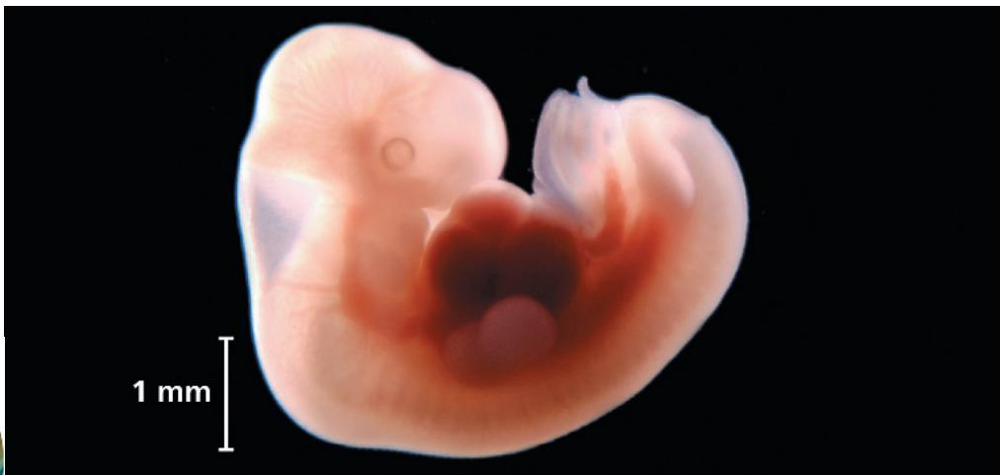

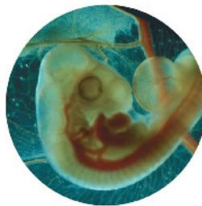  
Chick embryo

Figure 47.1 This human embryo (main photo) and chick embryo (small photo) are quite different in age (41 days old vs. 3.5 days old), but remarkably alike in appearance. The developing eyes, heart, and digestive tract are recognizable. So too are the repeated blocks of tissue that will form the vertebrae. These similarities reflect the fact that the early stages of embryonic development are shared among many animals, giving rise to a basic body plan that is later transformed into distinct and specialized forms.

## Study Tip

Use word roots to learn vocabulary: Word roots often provide clues to the meaning of biological terms. Study this list of word roots and their meanings to help you infer and remember the definitions of vocabulary words from this chapter and others. (See Appendix E for more useful word roots, prefixes, and suffixes.)

<table><tr><td colspan="3">Word root-meaning</td></tr><tr><td rowspan="2">blast-group of immature cells</td><td>poly-many</td><td>endo-internal</td></tr><tr><td>derm-tissue</td><td>meso-middle</td></tr><tr><td>tropho-change</td><td>genesis-origin</td><td>ecto-external</td></tr><tr><td>coel-cavity</td><td></td><td></td></tr><tr><td rowspan="2">morpho-shape</td><td>diplo-two</td><td></td></tr><tr><td>triplo-three</td><td></td></tr><tr><td colspan="3">Term-definition</td></tr><tr><td colspan="3">blastocoel-cavity in ball of immature cells</td></tr><tr><td>diploblast</td><td></td><td></td></tr><tr><td>triploblast</td><td></td><td></td></tr><tr><td>trophoblast</td><td></td><td></td></tr><tr><td>endoderm</td><td></td><td></td></tr><tr><td>morphogenesis</td><td></td><td></td></tr></table>

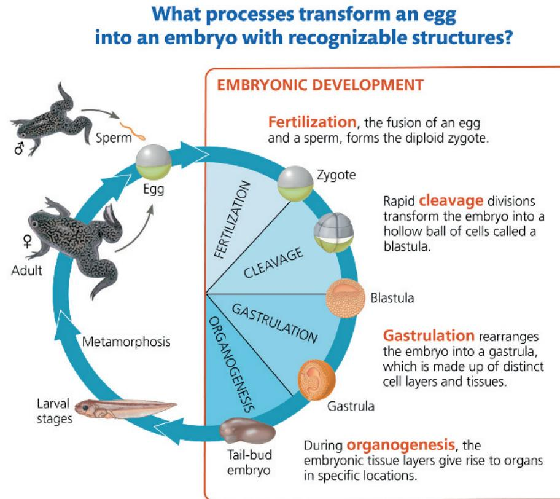  
Gastrulation rearranges the embryo into a gastrula, which is made up of distinct cell layers and tissues.  
During organogenesis, the embryonic tissue layers give rise to organs in specific locations.

# Concept 47.1: Fertilization and cleavage initiate embryonic development

The diagram in Figure 47.1 illustrates the extraordinary transformations that occur over the life cycle of a multicellular organism. The field of developmental biology examines the molecular and cellular processes responsible for these momentous events. In this chapter, our focus is on animal development in the embryonic stage.

Embryonic development in many animal species involves common stages in a set order. The first is fertilization, the fusion of sperm and egg. Next is cleavage, a series of cell divisions that divide, or cleave, the embryo into many cells. These cleavage divisions, which typically are rapid and lack accompanying cell growth, generate a hollow ball of cells called a blastula. In gastrulation, this blastula folds in on itself, rearranging into a multilayered embryo, the gastrula. Then, during organogenesis, local changes in cell shape and large-scale changes in cell location generate the rudimentary organs.

Because embryonic development has many common features across the animal kingdom, lessons learned from studying one animal can often be applied quite broadly. For this reason,

studying development lends itself well to the use of model organisms, species chosen for the ease with which they can be studied. For example, the sea urchin (phylum Echinodermata) is useful for studying cell-surface events that take place during fertilization. Sea urchin gametes are easy to collect and fertilization occurs outside the body. As a result, researchers can observe fertilization and development in the laboratory simply by combining eggs and sperm in seawater.

In this chapter, we will concentrate on the sea urchin and four other model organisms: the fruit fly, the frog, the chick, and the nematode (roundworm). We will also explore some aspects of human embryonic development. We'll begin with the events surrounding fertilization, the formation of a diploid zygote from a haploid egg and sperm.

## Fertilization

When sea urchins release their gametes into the water, the jelly coat of the egg exudes soluble molecules that attract the sperm, which swim toward the egg.

## The Acrosomal Reaction

As detailed in Figure 47.2, the moment a sperm head contacts the egg surface, molecules in the jelly coat trigger the acrosomal reaction in the sperm. This reaction begins with the discharge of hydrolytic enzymes from the acrosome, a specialized vesicle at the tip of the sperm. These enzymes partially digest the jelly coat, enabling a sperm structure called the acrosomal process to form, elongate, and penetrate the coat. Protein molecules on the tip of the acrosomal process bind to specific proteins in the egg plasma membrane. This “lock-and-key” recognition is especially important for sea urchins and other species with external fertilization because the water into which sperm and eggs are released may contain gametes of other species (see, for example, Figure 24.3h).

Figure 47.2 The acrosomal and cortical reactions during sea urchin fertilization.  

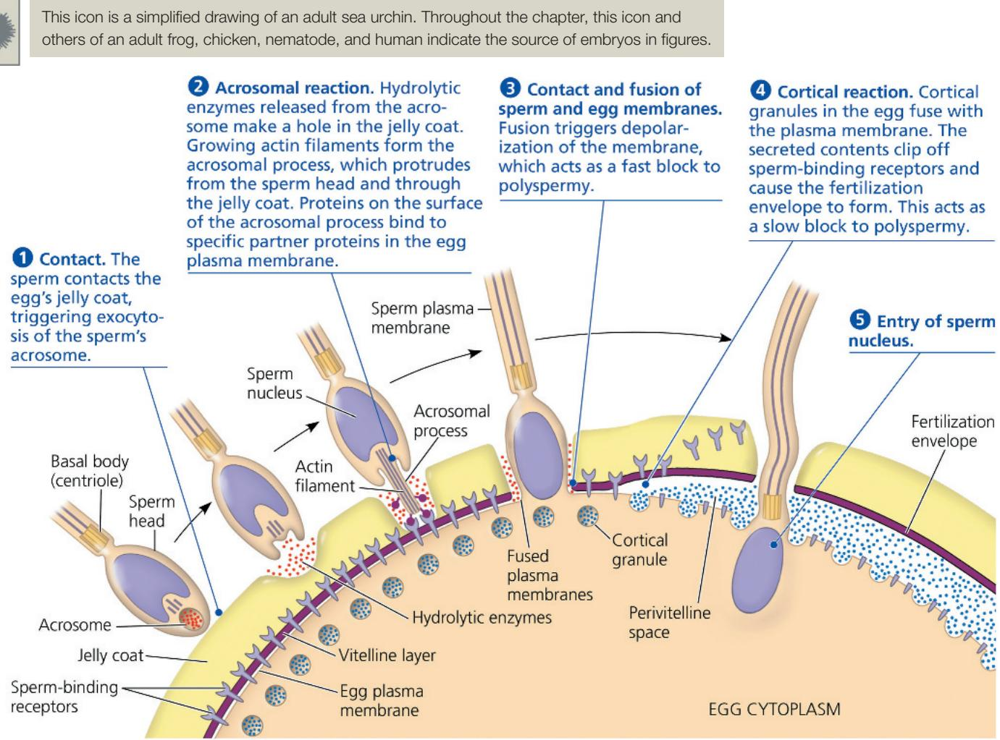

The recognition event between the sperm and egg triggers fusion of their plasma membranes. The sperm nucleus enters the egg cytoplasm as ion channels open in the egg's plasma membrane. Sodium ions diffuse into the egg and cause depolarization, a decrease in the charge difference, or potential, across the plasma membrane (see Concept 7.4).

Once depolarization takes place, additional sperm cannot fuse with the egg's plasma membrane. In this way, depolarization acts as a barrier to polyspermy, the entry of multiple sperm nuclei into the egg. If polyspermy were to occur, the resulting abnormal number of chromosomes would be lethal for the embryo. Because depolarization occurs 1–3 seconds after a sperm binds to an egg, depolarization acts as a fast block to polyspermy.

## The Cortical Reaction

Although membrane depolarization in sea urchins lasts for only a minute or so, there is a longer-lasting change that also prevents polyspermy. This slow block to polyspermy is established by vesicles in the outer rim, or cortex, of the cytoplasm. Within seconds after a sperm binds to the egg, these vesicles, called cortical granules, fuse with the egg plasma membrane (see Figure 47.2). Contents of the cortical granules are released into the space between the plasma membrane and the surrounding vitelline layer, a structure formed by the egg's extracellular matrix. Enzymes and other granule contents then trigger a cortical reaction, which lifts the vitelline layer away from the egg and hardens the layer into a protective fertilization envelope.

Formation of the fertilization envelope requires a high concentration of calcium ions ( $Ca^{2+}$ ) in the egg. As described in Figure 47.3,

## Figure 47.3

# Inquiry: Does the distribution of $Ca^{2+}$ in an egg correlate with formation of the fertilization envelope?

## Experiment

Investigators mixed sea urchin eggs with sperm, waited 10–60 seconds, and then added a chemical fixative, freezing cellular structures in place. When photomicrographs of each sample are ordered according to the time of fixation, they illustrate the stages in the formation of a fertilization membrane for a single egg.

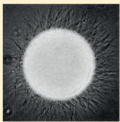  
Fertilization envelope  
10 sec after fertilization

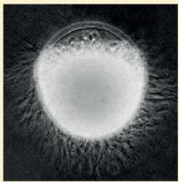  
25 sec

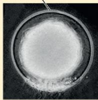

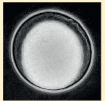  
35 sec

Calcium ion ( $Ca^{2+}$ ) signaling controls fusion of vesicles with the plasma membrane during neurotransmitter release, insulin secretion, and plant pollen tube formation. Researchers hypothesized that $Ca^{2+}$ signaling plays a similar role in forming the fertilization envelope. To test this hypothesis, they tracked the release of free $Ca^{2+}$ in sea urchin eggs after sperm binding. A fluorescent dye that glows when it binds free $Ca^{2+}$ was injected into unfertilized eggs. The scientists then added sea urchin sperm and used fluorescence to produce the results shown here.

## Results

A rise in the concentration of $Ca^{2+}$ in the cytosol began near where the sperm entered and spread in a wave. Soon after the wave passed, the fertilization envelope rose from the egg surface.

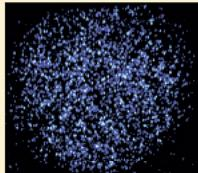  
Point of sperm nucleus entry  
1 sec before fertilization

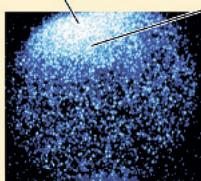  
10 sec after fertilization

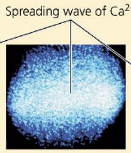

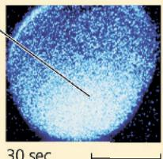

## Conclusion

$\mathrm{Ca^{2+}}$ release correlates with formation of the fertilization envelope, supporting the researchers' hypothesis that an increase in the $\mathrm{Ca^{2+}}$ level triggers cortical granule fusion.

Data from R. Steinhardt et al., Intracellular calcium release at fertilization in the sea urchin egg, Developmental Biology 58:185–197 (1977); M. Hafner et al., Wave of free calcium at fertilization in the sea urchin egg visualized with Fura-2, Cell Motility and the Cytoskeleton 9:271–277 (1988).

WHAT IF? Suppose a particular molecule could enter the egg and bind to $Ca^{2+}$ , blocking its function. How would you use this molecule to further test the hypothesis that a rise in the $Ca^{2+}$ level triggers cortical granule fusion?

For suggested answer, see Appendix A.

Instructors: A related Experimental Inquiry Tutorial can be assigned in Mastering Biology.

Figure 47.4 Fertilization in mammals.

researchers wondered whether a change in the $Ca^{2+}$ concentration triggers the cortical reaction. Using a calcium-sensitive dye, they assessed how $Ca^{2+}$ is distributed in the egg before and during fertilization. They found that $Ca^{2+}$ spread across the egg in a wave that correlated with the appearance of the fertilization envelope.

Further studies demonstrated that the binding of a sperm to the egg activates a signal transduction pathway that triggers release of $Ca^{2+}$ into the cytosol from the endoplasmic reticulum. The resulting increase in $Ca^{2+}$ level causes cortical granules to fuse with the plasma membrane. A cortical reaction triggered by $Ca^{2+}$ also occurs in vertebrates such as fishes and mammals.

## Egg Activation

Fertilization initiates and speeds up metabolic reactions that bring about the onset of embryonic development, “activating” the egg. For example, cellular respiration and protein synthesis in the egg markedly accelerate following the entry of the sperm nucleus. Soon thereafter, the egg and sperm nuclei fully fuse, and cycles of DNA synthesis and cell division begin.

What triggers activation of the egg? A major clue came from experiments demonstrating that the unfertilized eggs of sea urchins and many other species can be activated by an injection of $Ca^{2+}$ . Based on this discovery, researchers concluded that the rise in $Ca^{2+}$ concentration that causes the cortical reaction also causes egg activation. Further experiments revealed that artificial activation is possible even if the nucleus has been removed from the egg. This further finding indicates that the proteins and mRNAs required for activation are already present in the cytoplasm of the unfertilized egg.

Not until about 20 minutes after the sperm nucleus enters the sea urchin egg do the sperm and egg nuclei fuse. DNA synthesis is then initiated. The first cell division, which occurs after about 90 minutes, marks the end of the fertilization stage.

Fertilization in other species shares many features with the process in sea urchins. However, there are differences, such as the stage of meiosis the egg has reached by the time it is fertilized. Sea urchin eggs have already completed meiosis when they are released from the female. In many other species, eggs are arrested at a specific stage of meiosis and do not complete the meiotic divisions until a sperm head enters. Human eggs, for example, are arrested at metaphase of meiosis II until sperm entry (see Figure 46.11).

## Fertilization in Mammals

Unlike sea urchins and most other marine invertebrates, terrestrial animals, including mammals, fertilize their eggs internally. Support cells of the developing follicle surround the mammalian egg before and after ovulation. As shown in Figure 47.4, a sperm must travel through this layer of follicular cells before it reaches the zona pellucida, the extracellular matrix of the egg. There, the

The sperm shown here has traveled through the follicular cells and zona pellucida and has fused with the egg. The cortical reaction has begun, initiating events that ensure that only one sperm nucleus enters the egg.

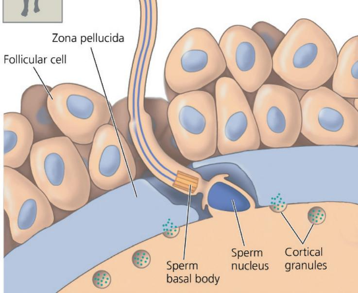

binding of a sperm to a sperm receptor induces an acrosomal reaction, facilitating sperm entry.

As in sea urchins, sperm binding triggers a cortical reaction, the release of enzymes from cortical granules to the outside of the cell. These enzymes catalyze changes in the zona pellucida, which then acts as the slow block to polyspermy. (No fast block to polyspermy is known in mammals.)

Overall, the process of fertilization is much slower in mammals than in sea urchins: The first cell division occurs within 12–36 hours after sperm binding in mammals, compared with about 1.5 hours in sea urchins. This cell division marks the end of fertilization and the beginning of the next stage of development, cleavage.

## Cleavage

The cleavage stage of embryonic development involves a series of cell divisions that occur with astonishing rapidity (Figure 47.5, on the next page).

During cleavage, the cell cycle consists primarily of the S (DNA synthesis) and M (mitosis) phases (see Figure 12.6 for a review of the cell cycle). The $G_{1}$ and $G_{2}$ (gap) phases are essentially skipped, and there is no increase in mass. Instead, cleavage partitions the cytoplasm of the large fertilized egg into many smaller cells called blastomeres.

The first five to seven cleavage divisions produce a hollow ball of cells, the blastula, surrounding a fluid-filled cavity called the blastocoel. In some species, including sea urchins and other echinoderms, the division pattern is uniform across the embryo (Figure 47.6). In others, including frogs, the pattern is asymmetric, with regions of the embryo differing in both the number and size of newly formed cells.

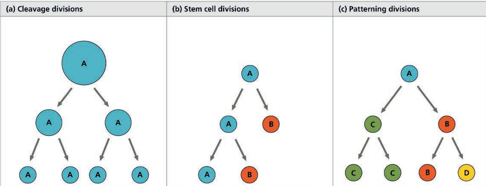  
Figure 47.5 Variation in mitotic cell division in embryonic development.
Circles represent embryonic cells, with letters and colors indicating different cell types (fates).  
Rapid mitotic divisions in early development: Cell number increases but cell size decreases, leaving embryo size unchanged.  
These divisions replenish cells that are needed continuously throughout life, such as blood cells.  
Daughter cells take on different fates based on positional information in the embryo.

## Cleavage Pattern in Frogs

In the eggs of frogs (and many other animals), stored nutrients called yolk are concentrated toward one pole, called the vegetal pole, and away from the opposite or animal pole. This asymmetric

  
Figure 47.6 Cleavage in an echinoderm embryo.

Cleavage is a series of mitotic cell divisions that transform the fertilized egg into a blastula, a hollow ball composed of cells called blastomeres. These light micrographs show the cleavage stages of a sand dollar embryo, which are virtually identical to those of a sea urchin. Each image is taken from above the embryo, with the focal plane, and hence the cells that are visible, at the equator.

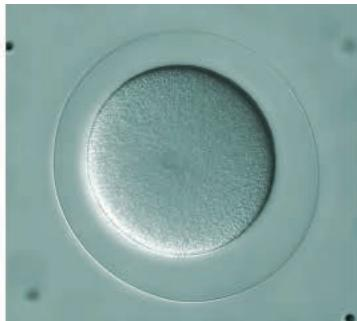  
(a) Fertilized egg. Shown here is the zygote shortly before the first cleavage division, surrounded by the fertilization envelope.

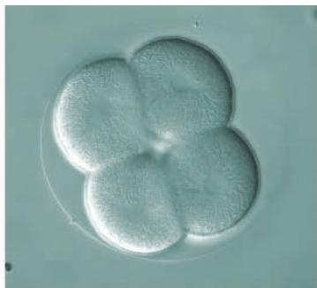  
(b) Four-cell stage. Remnants of the mitotic spindle can be seen between the two pairs of cells that have just completed the second cleavage division.

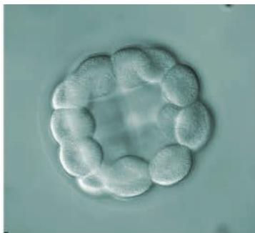  
(c) Early blastula. After further cleavage divisions, the embryo is a multicellular ball. A cavity—the blastocoel—has begun to form in the center.

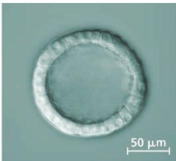  
(d) Later blastula. A single layer of cells surrounds the blastocoel. After further development, the embryo hatches from the fertilization envelope and begins swimming.

distribution of yolk not only gives the two halves of the egg—the animal and vegetal hemispheres—different colors, but also influences the pattern of cleavage divisions, for reasons we will explore next.

When an animal cell divides, an indentation called a cleavage furrow forms in the cell surface as cytokinesis divides the cell in half (Figure 47.7). In the frog embryo, the first two cleavage furrows form parallel to the line (or meridian) connecting the two poles. During these divisions, the dense yolk slows completion of cytokinesis. As a result, the first cleavage furrow is still dividing the yolky cytoplasm in the vegetal hemisphere when the second cell division begins. Eventually, four blastomeres of equal size extend from the animal pole to the vegetal pole.

During the third division, the yolk begins to affect the relative size of cells produced in the two hemispheres. This division is equatorial (perpendicular to the line connecting the poles) and produces an eight-cell embryo. However, as each of the four blastomeres begins this division, yolk near the vegetal pole displaces the mitotic apparatus and the cleavage furrow from the egg equator toward the animal pole. The result is a smaller blastomere size in the animal hemisphere than in the vegetal hemisphere. The displacing effect of the yolk persists in subsequent divisions, causing the blastocoel to form entirely in the animal hemisphere (see Figure 47.7).

## Cleavage Patterns in Other Animals

Although yolk affects where division occurs in the eggs of frogs and other amphibians, the cleavage furrow still passes entirely through the egg. Cleavage in amphibian development is therefore said to be holoblastic (from the Greek holos, complete). Holoblastic cleavage is also seen in many other groups of animals, including echinoderms, mammals, and annelids. In those animals whose eggs contain relatively little yolk, the blastocoel forms centrally and the blastomeres are often of similar size, particularly during the first few divisions of cleavage (see Figure 47.6). This is the case for humans.

Yolk is most plentiful and has its most pronounced effect on cleavage in the eggs of birds and other reptiles, many fishes, and insects. In these animals, the volume of yolk is so great that cleavage furrows cannot pass through it, and only the region of the egg lacking yolk undergoes cleavage. This incomplete cleavage of a yolk-rich egg is said to be meroblastic (from the Greek meros, partial).

For chickens and other birds, the part of the egg that we commonly call the yolk is actually the entire egg cell. Cell divisions are limited to a small whitish area at the animal pole. These divisions produce a cap of cells that sort into

## Figure 47.7 Cleavage in a frog embryo.

The cleavage planes in the first and second divisions extend from the animal pole to the vegetal pole, but the third cleavage is perpendicular to the polar axis. In some species, the first division bisects the gray crescent, a lighter-colored region that appears opposite the site of sperm entry.

Eight-cell stage (viewed from the animal pole). The large amount of yolk displaces the third cleavage toward the animal pole, forming two tiers of cells. The four cells near the animal pole (closer, in this view) are smaller than the other four cells (colorized SEM).

Blastula (at least 128 cells). As cleavage continues, a fluid-filled cavity, the blastocoel, forms within the embryo. Because of unequal cell division, the blastocoel is located in the animal hemisphere. Both the drawing and the micrograph (assembled from fluorescence images) show cross sections of a blastula with about 4,000 cells.

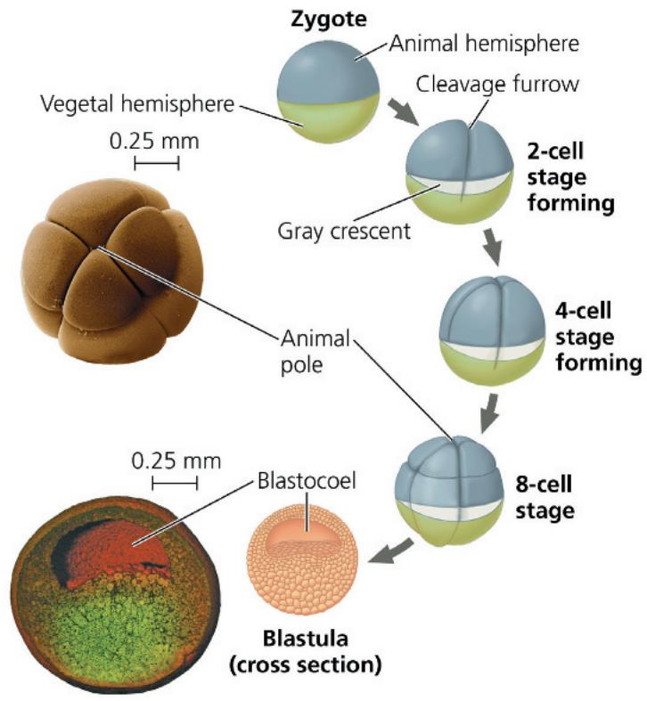

upper and lower layers. The cavity between these two layers is the avian version of the blastocoel.

In Drosophila and most other insects, yolk is found throughout the egg. Early in development, multiple rounds of mitosis occur without cytokinesis. In other words, no cell membranes form around the early nuclei. The first several hundred nuclei spread throughout the yolk and later migrate to the outer edge of the embryo. After several more rounds of mitosis, a plasma membrane forms around each nucleus, and the embryo, now the equivalent of a blastula, consists of a single layer of about 6,000 cells surrounding a mass of yolk (see Figure 18.22). Given that the number of cleavage divisions varies among animals, what determines the end of the cleavage stage? The Scientific Skills Exercise explores one of the landmark studies addressing this question.

# Scientific Skills Exercise Interpreting a Change in Slope

What Causes the End of Cleavage in a Frog Embryo? For a frog embryo in the cleavage stage, the cell cycle consists mainly of the S (DNA synthesis) and M (mitosis) phases. However, after the 12th cell division, $G_{1}$ and $G_{2}$ phases appear, and the cells grow, producing proteins and cytoplasmic organelles. What triggers this change?

How the Experiments Were Done Researchers tested the hypothesis that a mechanism for counting cell divisions determines when cleavage ends. They let frog embryos take up radioactively labeled nucleosides, either thymidine (to measure DNA synthesis) or uridine (to measure RNA synthesis). They then repeated the experiments in the presence of cytochalasin B, a chemical that prevents cell division by blocking cleavage furrow formation and cytokinesis.

Data from the Experiments  
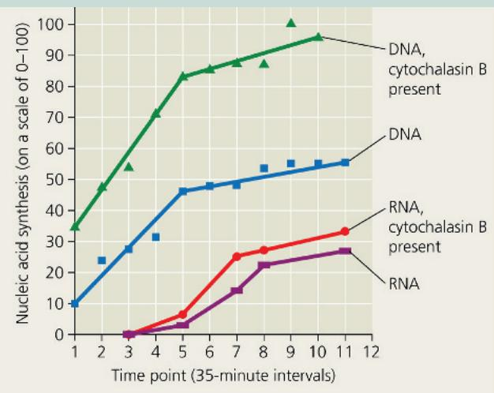

## Concept Check 47.1

1. How does the fertilization envelope form in sea urchins? What is its function?

2. WHAT IF? Predict what would happen if $\mathrm{Ca2+}$ was injected into an unfertilized sea urchin egg.

3. MAKE CONNECTIONS Review Figure 12.16 on cell cycle control. Would you expect MPF (maturation-promoting factor) activity to remain steady during cleavage? Explain.

For suggested answers, see Appendix A.

# Concept 47.2: Morphogenesis in animals involves specific changes in cell shape, position, and survival

The cellular and tissue-based processes that are called morphogenesis and by which the animal body takes shape occur over the last two stages of embryonic development. During gastrulation,

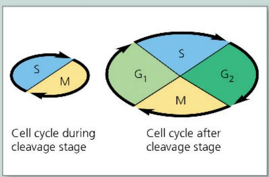  
Cell cycle during cleavage stage  
Cell cycle after cleavage stage

## INTERPRET THE DATA

1. How does the use of particular labeled nucleosides allow independent measurement of DNA and RNA synthesis?

2. Describe the changes in synthesis that occur at the end of cleavage (time point 5 corresponds to cell division 12).

3. Comparing the rate of DNA synthesis with and without cytochalasin B, the researchers hypothesized that the toxin increases diffusion of thymidine into the embryos. Explain their logic.

4. Do the data support the hypothesis that the timing of the end of cleavage depends on counting cell divisions? Explain.

5. In a separate experiment, researchers disrupted the block to polyspermy, generating embryos with seven to ten sperm nuclei. At the end of cleavage, these embryos had the same nucleus-to-cytoplasm ratio as the wild-type embryos, but cleavage ended at the 10th cell division rather than the 12th cell division. What do these results indicate about the timing of the end of cleavage?

Data from J. Newport and M. Kirschner, A major developmental transition in early Xenopus embryos: I. Characterization and timing of cellular changes at the midblastula stage, Cell 30:675–686 (1982).

Instructors: A version of this Scientific Skills Exercise can be assigned in Mastering Biology.

a set of cells at or near the surface of the blastula moves to an interior location, cell layers are established, and a primitive digestive tube is formed. Further transformation occurs during organogenesis, the formation of organs. We will discuss these two stages in turn.

## Gastrulation

Gastrulation is a dramatic reorganization of the hollow blastula into a two-layered or three-layered embryo called a gastrula. Cells move during gastrulation, taking up new positions and often acquiring new neighbors. Figure 47.8 will help you visualize these complex three-dimensional changes. The cell layers produced are collectively called the embryonic germ layers (from the Latin germen, to sprout or germinate). In the late gastrula, ectoderm forms the outer layer and endoderm forms the lining of the digestive tract. In a few radially symmetric animals, only these two germ layers form during gastrulation. Such animals are called diploblasts. In contrast, vertebrates and other bilaterally symmetric animals are triploblasts: In these animals, a third germ layer, the mesoderm, forms between the ectoderm and the endoderm.

Triploblast: Planaria (protostome)

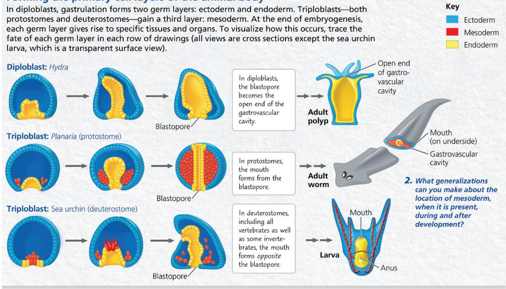

## Visualizing Gastrulation

## Figure 47.8

The embryos of all animals, and only animals, gastrulate. Cells change position: Some are brought inside the embryo, and others spread over the surface. The net result is an embryo with two, or more commonly three, cell layers. This figure will help you visualize the basic choreography of gastrulation before you explore the specific steps in different types of animals.

For suggested answers, see Appendix A.
Instructors: Additional questions related to this Visualizing Figure can be assigned in Mastering Biology.

## Reorganizing the animal embryo in three dimensions

Gastrulation typically begins with invagination, the infolding of a sheet of cells, shown here in both surface view and cross section. The resulting changes to the epithelium covering the embryo resemble what happens if you push a finger into one end of a lightly inflated balloon.

## Surface view:

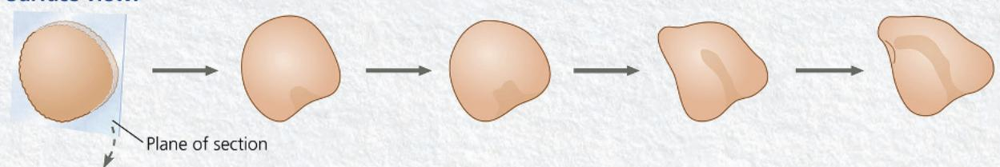  
1. In the gastrula, how many compartments are formed from the blastocoel?

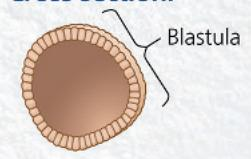

At the end of cleavage, a single sheet of cells covers the surface of the blastula.

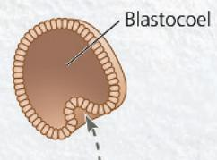

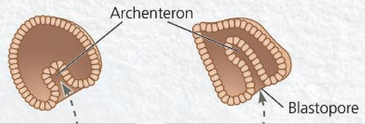

A group of cells buckle into the blastocoel, forming a shallow depression.

Continued invagination forms a blind-ended tube, the archenteron.

The open end of the archenteron, the first opening formed in the embryo, is called the blastopore.

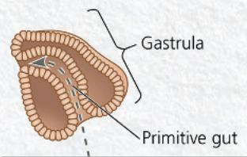

The tip of the archenteron reaches the embryo surface, completing formation of the primitive gut of the embryo, now a gastrula.

## Forming the primary cell layers of the animal body

In diploblasts, gastrulation forms two germ layers: ectoderm and endoderm. Triploblasts—both protostomes and deuterostomes—gain a third layer: mesoderm. At the end of embryogenesis, each germ layer gives rise to specific tissues and organs. To visualize how this occurs, trace the fate of each germ layer in each row of drawings (all views are cross sections except the sea urchin larva, which is a transparent surface view).

In diploblasts, the blastopore becomes the open end of the gastrovascular cavity.

Key
Ectoderm
Mesoderm
Endoderm

\- Open end of gastro-
vascular cavity

In protostomes, the mouth forms from the blastopore.

\- Mouth
  (on underside)
- Gastrovascular
  cavity

Triploblast: Sea urchin (deuterostome)

In deuterostomes, including all vertebrates as well as some invertebrates, the mouth forms opposite the blastopore.

2. What generalizations can you make about the location of mesoderm, when it is present, during and after development?

## Gastrulation in Frogs

Each embryonic germ layer contributes to a distinct set of structures in the adult animal, as shown in Figure 47.9. The embryonic organization of the germ layers is often reflected in the adult: The ectoderm forms the nervous system and outer body layer, the mesoderm gives rise to muscles and skeleton, and the endoderm lines many organs and ducts. There are, however, numerous exceptions.

Figure 47.10 details gastrulation in a frog. The blastula of frogs and other triploblasts has a dorsal (top) and ventral (bottom) side, a left and right side, and an anterior (front) and posterior (back) end. The cell movements that begin gastrulation occur on the dorsal side, opposite where the sperm entered the egg. The frog's anus develops from the blastopore, and the mouth eventually breaks through at the opposite end of the archenteron.

Figure 47.9 Major derivatives of the three embryonic germ layers in vertebrates.

## ECTODERM (outer layer)

• Epidermis of skin and its derivatives (including sweat glands, hair follicles)

• Nervous and sensory systems • Pituitary gland, adrenal medulla - Jaws and teeth

## MESODERM (middle layer)

\- Skeletal and muscular systems • Circulatory and lymphatic systems

• Excretory and reproductive systems (except germ cells)

\- Dermis of skin

\- Adrenal cortex

## ENDODERM (inner layer)

• Epithelial lining of digestive tract and associated organs

\- Epithelial lining of respiratory, excretory, and reproductive tracts and ducts

• Thymus, thyroid, and parathyroid glands

## Figure 47.10 Gastrulation in a frog embryo.

In the frog blastula, the blastocoel is displaced toward the animal pole and is surrounded by a wall several cells thick.

1 Gastrulation begins when cells on the dorsal side invaginate to form a small indented crease, the blastopore. The part above the crease is called the dorsal lip. As the blastopore is forming, a sheet of cells begins to spread out of the animal hemisphere, rolls inward over the dorsal lip (involution), and moves into the interior (shown by the dashed arrow). In the interior, these cells will form endoderm and mesoderm, with the endodermal layer on the inside. Meanwhile, cells at the animal pole change shape and begin spreading over the outer surface.

2 The blastopore extends around both sides of the embryo as more cells invaginate. When the ends meet, the blastopore forms a circle that becomes smaller as ectoderm spreads downward over the surface. Internally, continued involution expands the endoderm and mesoderm; an archenteron forms and grows as the blastocoel shrinks and eventually disappears.

3 Late in gastrulation, the cells remaining on the surface make up the ectoderm. The endoderm is the innermost layer, and the mesoderm lies between the ectoderm and endoderm. The circular blastopore surrounds a plug of yolk-filled cells.

## Key

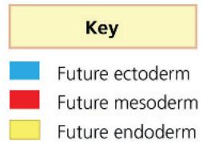

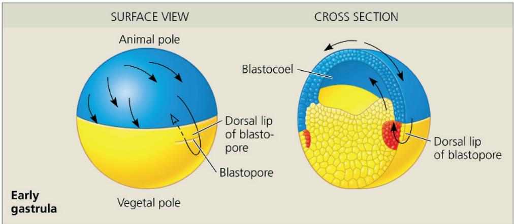

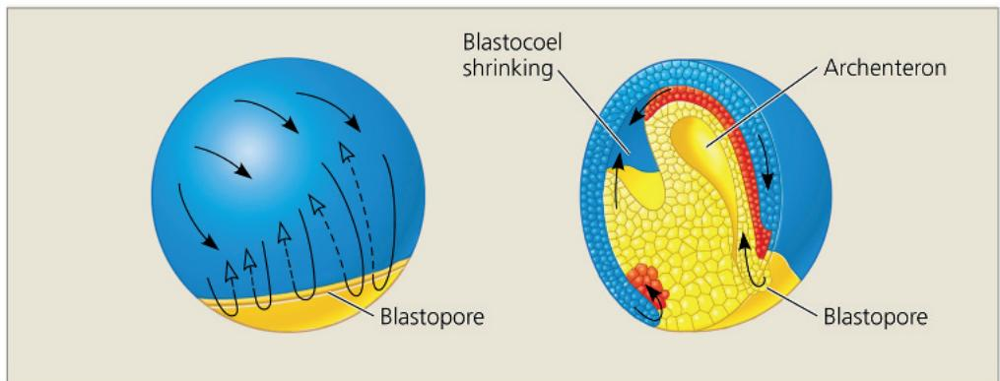

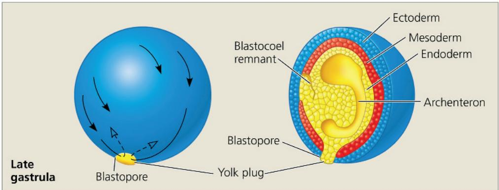

Figure 47.11 Gastrulation in a chick embryo.
This is a cross section of a gastrulating embryo, looking toward the anterior end.  
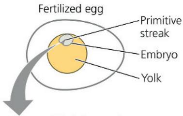

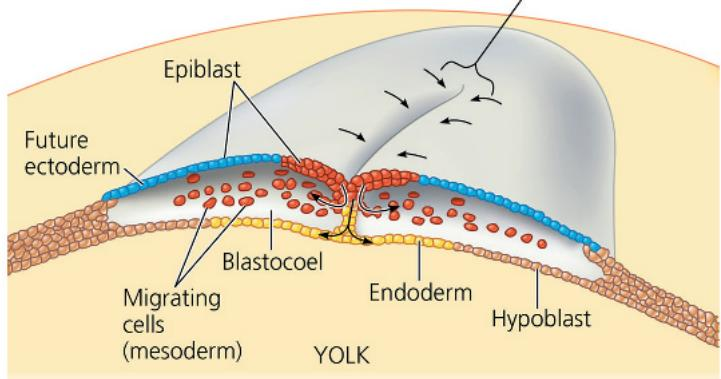

## Gastrulation in Chicks

At the onset of gastrulation in chicks, an upper and a lower layer of cells—the epiblast and hypoblast—lie atop a yolk mass. All the cells that will form the embryo come from the epiblast. During gastrulation, some epiblast cells move toward the midline, detach, and move inward toward the yolk (Figure 47.11). The pileup of cells moving inward at the midline produces a visible thickening called the primitive streak. Some of these cells move downward and form endoderm, pushing aside the hypoblast cells, while others migrate laterally (sideways) and form mesoderm. The cells left behind on the surface at the end of gastrulation will become ectoderm. The hypoblast cells later segregate from the endoderm and eventually form part of the sac that surrounds the yolk and also part of the stalk that connects the yolk mass to the embryo.

Although different terms describe gastrulation in different vertebrate species, the rearrangements and movements of cells exhibit a number of fundamental similarities. In particular, the primitive streak, shown in Figure 47.11 for the chick embryo, is the counterpart of the blastopore lip, shown in Figure 47.10 for the frog embryo. Formation of a primitive streak is also central to human embryo gastrulation, our next topic.

## Gastrulation in Humans

Unlike the large, yolky eggs of many vertebrates, human eggs are quite small, storing little in the way of food reserves. Fertilization takes place in the oviduct, and development begins while the embryo completes its journey down the oviduct to the uterus (see Figure 46.15).

Figure 47.12 outlines the development of the human embryo, starting about 6 days after fertilization. This depiction is largely based on observations of embryos from other mammals, such as the mouse, and of very early human embryos following in vitro fertilization.

  
Figure 47.12 Four stages in the early embryonic development of a human.  
The names of the tissues that develop into the embryo proper are printed in blue.

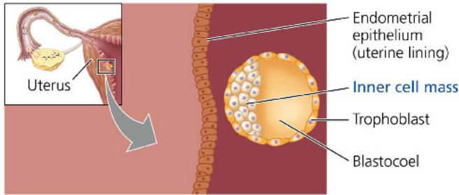

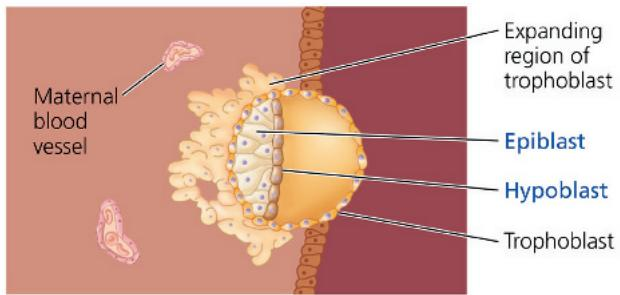

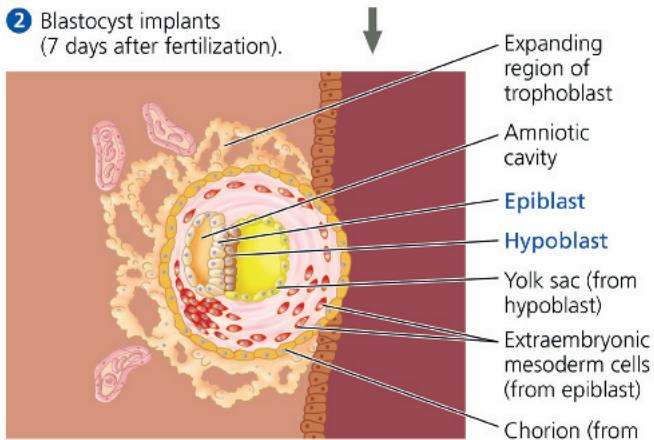  
3 Extraembryonic membranes start to form (10–11 days), and gastrulation begins (13 days).

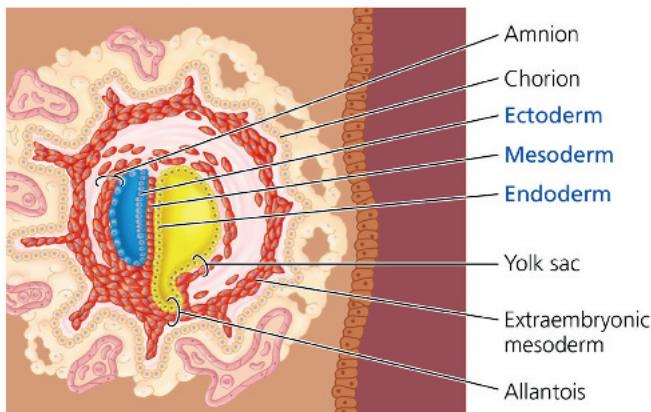  
4 Gastrulation has produced a three-layered embryo with four extraembryonic membranes: the amnion, chorion, yolk sac, and allantois.

At the end of cleavage, the embryo has more than 100 cells arranged around a central cavity and has reached the uterus. At this stage, the embryo is called a blastocyst, the mammalian version of a blastula. Clustered at one end of the blastocyst cavity is a group of cells called the inner cell mass, which will develop into the embryo proper. It is the cells of the inner cell mass that are the source of embryonic stem cell lines (see Concept 20.3).

2 Implantation of the embryo is initiated by the trophoblast, the outer epithelium of the blastocyst. Enzymes secreted by the trophoblast during implantation break down molecules of the endometrium, the lining of the uterus, allowing invasion by the blastocyst. The trophoblast also extends finger-like projections that cause capillaries in the endometrium to spill out blood that can be captured by trophoblast tissues. Around the time the embryo undergoes implantation, the inner cell mass of the blastocyst forms a flat disk with an inner layer of cells, the epiblast, and an outer layer, the hypoblast. As is true for a bird embryo, the human embryo develops almost entirely from epiblast cells.

3 Following implantation, the trophoblast continues to expand into the endometrium, and four new membranes appear. Although these extraembryonic membranes arise from the embryo, they enclose specialized structures located outside the embryo. As implantation is completed, gastrulation begins. Some epiblast cells remain as ectoderm on the surface, while others move inward through a primitive streak and form mesoderm and endoderm, just as in the chick (see Figure 47.11).

4 By the end of gastrulation, the embryonic germ layers have formed. Extraembryonic mesoderm and four distinct extraembryonic membranes now surround the embryo. As development proceeds, cells of the invading trophoblast, the epiblast, and the adjacent endometrial tissue all contribute to the formation of the placenta. This vital organ mediates the exchange of nutrients, gases, and nitrogenous wastes between the developing embryo and the parent (see Figure 46.16).

## Developmental Adaptations of Amniotes

EVOLUTION During embryonic development, mammals and reptiles (including birds) form four extraembryonic membranes: the chorion, allantois, amnion, and yolk sac (Figure 47.13). In all these groups, such membranes provide a “life-support system” for further development. Why did this adaptation appear in the evolutionary history of reptiles and mammals, but not other vertebrates, such as fishes and amphibians? We can formulate a reasonable hypothesis by considering a few basic facts about

Figure 47.13 The shelled egg of reptiles.

(a) The four extraembryonic membranes in a reptile egg

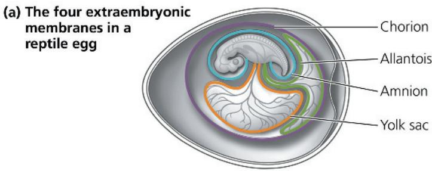

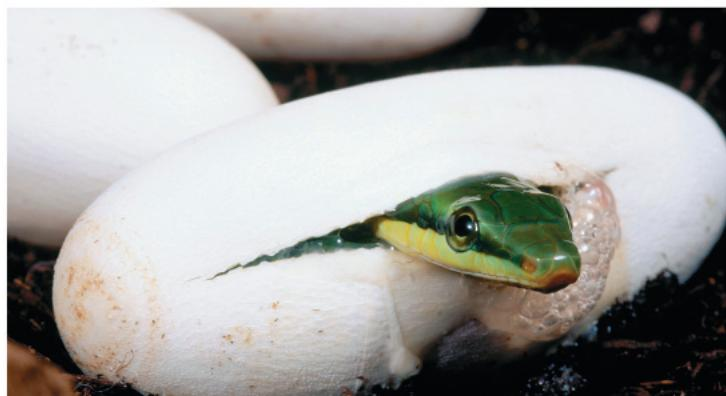  
(b) A baby red-tailed racer snake (Gonyosoma oxycephala) hatching from its protective egg

embryonic development. All vertebrate embryos require an aqueous environment for their development. The embryos of fishes and amphibians usually develop in the surrounding sea or pond and need no specialized water-filled enclosure. However, the extensive colonization of land by vertebrates was possible only after the evolution of structures that would allow reproduction in dry environments. Two such structures exist today: (1) the shelled egg of birds and other reptiles as well as a few mammals (the monotremes) and (2) the uterus of marsupial and eutherian mammals. Inside the shell or uterus, the embryos of these animals are surrounded by fluid within a sac formed by one of the extraembryonic membranes, the amnion. Mammals and reptiles, including birds, are therefore called amniotes (see Concept 34.5).

For the most part, the extraembryonic membranes have similar functions in mammals and reptiles, consistent with a common evolutionary origin (see Figure 34.25). The chorion is the site of gas exchange, and the fluid within the amnion physically protects the developing embryo. (This amniotic fluid is released from the vagina when a pregnant person's “water breaks” before childbirth.) The allantois, which disposes of wastes in the reptilian egg, is incorporated into the umbilical cord in mammals. There, it forms blood vessels that transport oxygen and nutrients from the placenta to the embryo and rid the embryo of carbon dioxide and nitrogenous wastes. The fourth extraembryonic membrane, the yolk sac, encloses yolk in the eggs of reptiles. In mammals it is a site of early formation of blood cells, which later migrate into the embryo proper. Thus, the extraembryonic membranes common to reptiles and

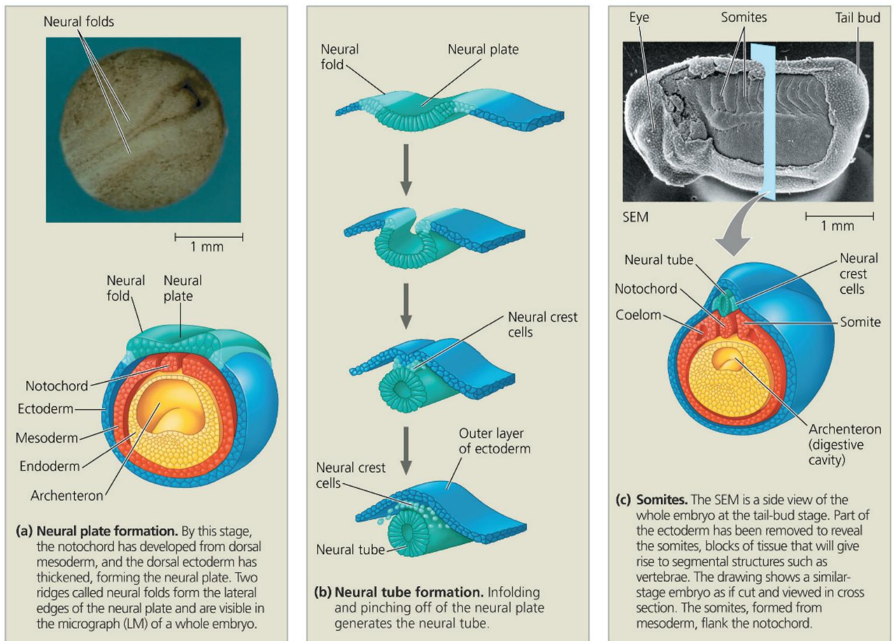

mammals exhibit adaptations specific to development within a shelled egg or a uterus.

After gastrulation is complete and any extraembryonic membranes are formed, the next stage of embryonic development begins: organogenesis, the formation of organs.

## Organogenesis

During organogenesis, regions of the three embryonic germ layers develop into the rudiments of organs. Often, cells from two or three germ layers participate in forming a single organ, with interactions between cells of different germ layers helping to specify cell fates. Adopting particular developmental fates may in turn cause cells to change shape or, in certain circumstances, migrate to another location in the body. To see how these processes contribute to organogenesis, we'll consider neurulation, the early steps in the formation of the brain and spinal cord in vertebrates.

## Neurulation

Neurulation begins as cells from the dorsal mesoderm form the notochord, a rod that extends along the dorsal side of the chordate embryo, as seen for the frog in Figure 47.14a. Signaling molecules secreted by these mesodermal cells and other tissues cause the ectoderm above the notochord to become the neural plate. Formation of the neural plate is thus an example of induction, a process in which a group of cells or tissues influences the development of another group through close-range interactions (see Figure 18.17b).

After the neural plate is formed, its cells change shape, curving the structure inward. In this way, the neural plate rolls itself into the neural tube, which runs along the anterior-posterior axis of the embryo (Figure 47.14b). The neural tube will become the brain in the head and the spinal cord along the rest of the body. In contrast, the notochord disappears before birth, although parts persist as the inner portions of the disks in the adult spine. (These are the disks that can herniate or rupture, causing back pain.)

  
Figure 47.14 Neurulation in a frog embryo.

(a) Neural plate formation. By this stage, the notochord has developed from dorsal mesoderm, and the dorsal ectoderm has thickened, forming the neural plate. Two ridges called neural folds form the lateral edges of the neural plate and are visible in the micrograph (LM) of a whole embryo.

(b) Neural tube formation. Infolding and pinching off of the neural plate generates the neural tube.

(c) Somites. The SEM is a side view of the whole embryo at the tail-bud stage. Part of the ectoderm has been removed to reveal the somites, blocks of tissue that will give rise to segmental structures such as vertebrae. The drawing shows a similar-stage embryo as if cut and viewed in cross section. The somites, formed from mesoderm, flank the notochord.

Neurulation, like other stages of development, is sometimes imperfect. For example, spina bifida, the most common congenital disability in the United States, occurs when a portion of the neural tube fails to develop or close properly. The opening in the spinal column that remains causes nerve damage, resulting in varying degrees of leg paralysis. Although the opening can be surgically repaired shortly after birth, the nerve damage is permanent.

## Cell Migration in Organogenesis

During organogenesis, some cells undergo long-range migration, including two sets of cells that develop near the vertebrate neural tube. The first set is called the neural crest, a set of cells that develops along the borders where the neural tube pinches off from the ectoderm (see Figure 47.14b). Neural crest cells subsequently migrate to many parts of the embryo, forming a variety of tissues that include peripheral nerves as well as parts of the teeth and skull bones.

A second set of migratory cells is formed when groups of mesodermal cells lateral to the notochord separate into blocks called somites (Figure 47.14c). Somites play a significant role in organizing the segmented structure of the vertebrate body. Parts of the somites dissociate into mesenchyme cells. Some form the vertebrae; others form the muscles associated with the vertebral column and the ribs.

By contributing to the formation of vertebrae, ribs, and associated muscles, somites form repeated structures in the adult. Chordates, including ourselves, are thus segmented, although in the adult form the segmentation is much less obvious than in shrimp and other segmented invertebrates.

## Organogenesis in Chicks and Insects

Early organogenesis in the chick is quite similar to that in the frog. For example, the borders of the chick blastoderm fold downward and come together, pinching the embryo into a three-layered tube joined under the middle of the body to the yolk (Figure 47.15a). By the time the chick embryo is 56 hours old, rudiments of the major organs, including the brain, eyes, and heart, are readily apparent (Figure 47.15b).

  
Figure 47.15 Organogenesis in a chick embryo.

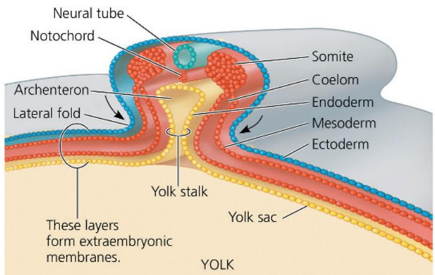  
(a) Early organogenesis. The archenteron forms when lateral folds pinch the embryo away from the yolk. The embryo remains open to the yolk, attached by the yolk stalk, as shown in this cross section.

Comparing organogenesis in invertebrates with that in vertebrates often reveals fundamental similarities in mechanism that are masked by differences in pattern and appearance. For example, consider neurulation. In insects, tissues of the nervous system form on the ventral, not dorsal, side of the embryo. However, ectoderm along the anterior-posterior axis then rolls into a tube inside the embryo, just as in vertebrate neurulation. Furthermore, the molecular signaling pathways that bring about these similar events in different locations have many steps in common, underscoring a shared evolutionary history.

Like gastrulation, organogenesis in vertebrates and invertebrates relies substantially on changes in cell shape and location. We turn now to an exploration of how these changes take place.

## The Cytoskeleton in Morphogenesis

In animals, movement of parts of a cell can bring about changes in cell shape or enable a cell to migrate from one place to another within the embryo. One set of cellular components essential to these events is the collection of microtubules and microfilaments that make up the cytoskeleton (see Table 6.1).

## Cell Shape Changes in Morphogenesis

Reorganization of the cytoskeleton is a major force in changing cell shape during development. As an example, let's return to the topic of neurulation. At the onset of neural tube formation,

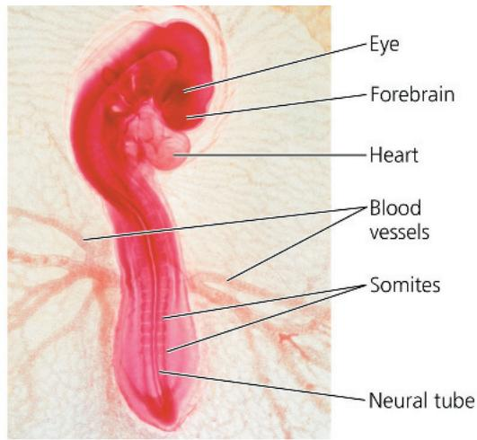  
(b) Late organogenesis. Rudiments of most major organs have already formed in this 56-hour-old chick embryo. Blood vessels extending from the embryo supply the extraembryonic membranes, as seen in this light micrograph (LM).

3 Actin filaments at the dorsal end of the cells may then contract, deforming the cells into wedge shapes.

Figure 47.16 Change in cell shape during morphogenesis. Reorganization of the cytoskeleton is associated with morphogenetic changes in embryonic tissues, as shown here.

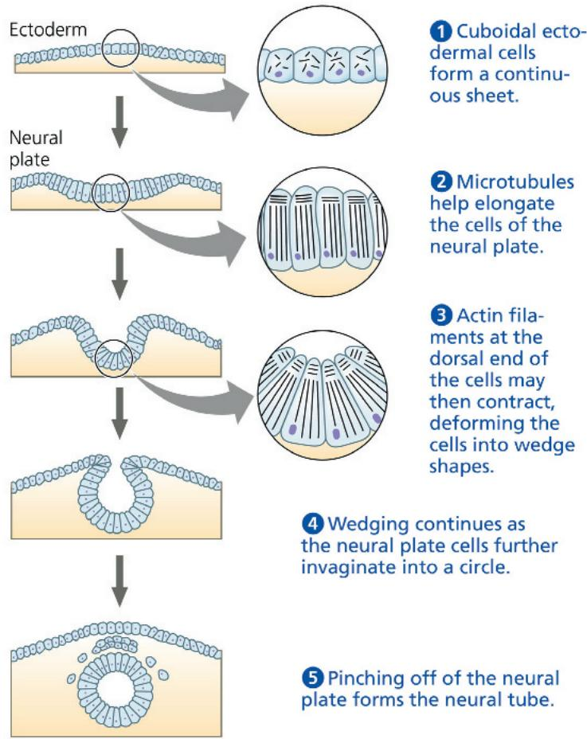

microtubules oriented from dorsal to ventral in a sheet of ectodermal cells help lengthen the cells along that axis (Figure 47.16). At the apical end of each cell is a bundle of actin filaments (microfilaments) oriented crosswise. These actin filaments contract, giving the cells a wedge shape that bends the ectoderm layer inward.

The generation of wedge-shaped cells by apical constriction of actin filaments is a common mechanism in development for invaginating a cell layer. For instance, during gastrulation in the fruit fly Drosophila melanogaster, the formation of wedge-shaped cells along the ventral surface drives generation of the tube of cells that forms the mesoderm.

The cytoskeleton also directs a morphogenetic movement called convergent extension, a rearrangement that causes a sheet of cells to become narrower (converge) while it becomes longer (extends). This type of lengthening and narrowing of cells occurs often in gastrulation, including formation of the primitive streak in the fertilized chick egg (see Figure 47.11) and elongation of the archenteron in the sea urchin embryo (see Figure 47.8). Convergent extension is also important during involution in the frog gastrula. There, convergent extension changes the gastrulating embryo from a spherical shape to the rounded rectangular shape seen in Figure 47.14c.

The cell movements during convergent extension are quite simple: The cells elongate, with their ends pointing in the direction they will move, and then wedge between each other, forming fewer columns of cells (Figure 47.17). It's like a crowd of people about to enter a theater moving forward while also merging into a single-file line.

## Cell Migration in Morphogenesis

The cytoskeleton is responsible not only for cell shape changes but also for cell migration. During organogenesis in vertebrates, cells from the neural crest and from somites migrate to locations throughout the embryo. Cells “crawl” within the embryo by using cytoskeletal fibers to extend and retract cellular protrusions. This type of motility is akin to amoeboid movement (see Figure 6.26b). Transmembrane glycoproteins called cell adhesion molecules play a key role in cell migration by promoting interaction between pairs of cells. Cell migration also involves the extracellular matrix (ECM), the meshwork of secreted glycoproteins and other macromolecules lying outside the plasma membranes of cells (see Figure 6.28).

The ECM helps to guide cells in many types of movements, such as migration of individual cells and shape changes of cell sheets. Cells that line migration pathways regulate the movement of migrating cells by secreting specific molecules into the ECM. Researchers are studying how to link these molecules to an artificial ECM that can serve as a scaffold for the repair or replacement of damaged tissues or organs. Materials that can be used to construct the ECM itself include porous materials, hydrogels, and nanofibers.

## Programmed Cell Death

Just as certain cells of the embryo are programmed to change shape or location, others are programmed to die. At various times in development, individual cells, sets of cells, or whole tissues

In this simplified diagram, the cells elongate coordinately in a particular direction and crawl between each other (convergence) as the sheet becomes longer and narrower (extension).

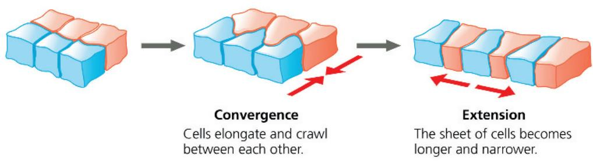

<!-- END OFFICIAL MINERU API RESULT part_11 -->

<!-- BEGIN OFFICIAL MINERU API RESULT part_12 -->

cease to develop, die, and are engulfed by neighboring cells. Thus, programmed cell death, also called apoptosis, is a common feature of animal development.

One circumstance for programmed cell death is when a structure functions only in a larval or other immature form of the organism. One familiar example is the tail of a tadpole, the free-swimming larval stage of a frog or toad. The tail forms during early development, enables locomotion during larval growth, and is then eliminated during metamorphosis into the adult form (see Figure 45.22).

Apoptosis may also occur when a large set of cells is formed, but only a subset has the properties required for further function. Such is the case in both nervous and immune system development. In the vertebrate nervous system, for instance, many more neurons are produced during development than exist in the adult. Neurons that make functional connections with other neurons typically survive; many of the rest undergo apoptosis. Similarly, in the adaptive immune system, self-reactive cells—cells with the potential to attack the animal itself rather than invading pathogens—are often eliminated by apoptosis.

Some cells that undergo apoptosis don't seem to have any function. Why do such cells form? The answer can be found by considering the evolution of amphibians, birds, and mammals. When these groups began to diverge during evolution, the basic developmental program for making a vertebrate body was already in place. The differences in present-day body forms arose through modification of that common developmental program. For example, the shared developmental program generates webbing between the embryonic digits, but in many birds and mammals, including humans, the webbing is eliminated by apoptosis (see Figure 11.21). This is one reason why such different adult forms arise from early vertebrate embryos that look so much alike.

As you have seen, cell behavior and the molecular mechanisms underlying it are crucial to the morphogenesis of the embryo. In the next section, you'll learn some ways in which shared cellular and genetic processes ensure that particular types of cells each end up in the right place.

## Concept Check 47.2

1. In the frog embryo, convergent extension elongates the notochord. Explain how the words convergent and extension apply to this process.

2. WHAT IF? Predict what would happen if, just before neural tube formation, you treated frog embryos with a drug that enters all the cells of the embryo and blocks the function of microfilaments.

3. MAKE CONNECTIONS Unlike some other types of developmental abnormalities, neural tube defects are largely preventable. Explain (see Figure 41.4).

For suggested answers, see Appendix A.

# Concept 47.3: Cytoplasmic determinants and inductive signals regulate cell fate

During embryonic development, cells arise by division, take up particular locations in the body, and become specialized in structure and function. Where a cell resides, how it appears, and what it does define its development fate. Developmental biologists use the terms determination to refer to the process by which a cell or group of cells becomes committed to a particular fate and differentiation to refer to the resulting specialization in structure and function. You may find it a useful analogy to think about determination being equivalent to declaring a major in college and differentiation being comparable to taking the courses required by your major.

Every diploid cell formed during an animal's development has the same genome. With the exception of certain mature immune cells, the collection of genes present in a given cell is the same throughout the cell's life. How, then, do cells acquire different fates? As discussed in Concept 18.4, particular tissues, and often cells within a tissue, differ from one another by expressing distinct sets of genes from their shared genome.

Even animals that display widely differing body plans share many basic mechanisms of development and often use a common set of regulatory genes. For example, the gene that specifies where eyes form in a vertebrate embryo has a close counterpart with a nearly identical function in the fruit fly Drosophila melanogaster. Indeed, when the gene from a mouse is experimentally introduced into a fly embryo, the mouse gene directs eye formation wherever it is expressed in the fly.

A major focus of developmental biology is to uncover the mechanisms that direct the differences in gene expression underlying developmental fates. As one step toward this goal, scientists often seek to trace tissues and cell types back to their origins in the early embryo.

## Fate Mapping

One way to trace the ancestry of embryonic cells is direct observation through the microscope. Such studies produced the first fate maps, diagrams showing the structures arising from each region of an embryo. In the 1920s, German embryologist Walther Vogt used this approach to determine where groups of cells from the blastula end up in the gastrula (Figure 47.18a). Later, researchers developed techniques that allowed them to mark an individual blastomere during cleavage and then follow the marker as it was distributed to all the mitotic descendants of that cell (Figure 47.18b).

A much more comprehensive approach to fate mapping has been carried out on the soil-dwelling nematode Caenorhabditis

Figure 47.18 Fate mapping for two chordates.  
  
(a) Fate map of a frog embryo. The fates of groups of cells in a frog blastula were determined in part by marking different regions of the blastula with nontoxic dyes and observing where the dye was found at later stages of development. The labeling of the two embryonic stages shown here represents the result of numerous such experiments.

  
(b) Cell lineage analysis in a tunicate. In lineage analysis of this invertebrate chordate, an individual blastomere is injected with a dye during cleavage (top). The dark regions in the light micrographs of larvae (bottom) correspond to cells that developed from the two blastomeres indicated in the drawings.

elegans, as shown in Figure 47.19. This roundworm is about 1 mm long, has a simple, transparent body with only a few types of cells, and develops into a mature adult hermaphrodite worm in only 3.5 days in the laboratory. These attributes allowed Sydney Brenner, Robert Horvitz, and John Sulston to determine the complete developmental history, or lineage, of every cell in C. elegans. They found that every adult hermaphrodite worm has exactly 959 somatic cells, which arise from the fertilized egg in virtually the same way for every individual. Careful microscopic observations of worms at all stages of development, coupled with experiments in which particular cells or groups of cells were destroyed by a laser beam or through mutations, resulted in the cell lineage diagram shown in Figure 47.19. Using this cell lineage diagram, you can identify all of the progeny of a single cell, just as you would use a family history to trace the descendants of, for example, one great-great-grandparent.

As an example of a particular cell fate, let's consider germ cells, the specialized cells that give rise to eggs or sperm. In all animals studied, complexes of RNA and protein direct particular cells to become germ cells. In C. elegans, such complexes, called P granules, can be detected in four cells of the newly hatched larva

## Figure 47.19 Cell lineage in Caenorhabditis elegans.

The C. elegans embryo is transparent, making it possible for researchers to trace the lineage of every cell, from the zygote to the adult worm (LM). The diagram shows a detailed lineage only for the intestine, which is derived exclusively from one of the first four cells formed from the zygote.

  
VISUAL SKILLS The pattern of divisions is exactly the same in every C. elegans embryo. How many divisions of the fertilized egg give rise to the intestinal cell closest to the worm's mouth? For suggested answer, see Appendix A.

Cells with P granules

## Figure 47.20 Determination of germ cell fate in C. elegans.

Labeling with a fluorescent antibody that is specific for a C. elegans P granule protein (green) reveals the incorporation of P granules into four cells of the newly hatched larva (two of the four cells are visible in this view).

(Figure 47.20) and, later, in the cells of the adult gonad that produce sperm or eggs.

Tracing the position of the P granules provides a dramatic illustration of how cells acquire a specific fate, during development. As shown in Figure 47.21, the P granules are distributed throughout the newly fertilized egg but move to the posterior end of the zygote before the first cleavage division. As a result, only the posterior of the two cells formed by the first division contains P granules. The P granules continue to be asymmetrically partitioned during subsequent divisions. Thus, the P granules act as cytoplasmic determinants (see Concept 18.4), fixing germ cell fate at the earliest stage of C. elegans development.

Fate mapping in C. elegans paved the way for major discoveries about programmed cell death. Lineage analysis demonstrated that exactly 131 cells die during normal C. elegans development. In the 1980s, researchers found that a mutation inactivating a single gene allows all 131 cells to live. Further research revealed that this gene is part of a pathway that controls and carries out apoptosis in a wide range of animals, including humans. In 2002, Brenner, Horvitz, and Sulston shared a Nobel Prize for their use of the C. elegans fate map in studies of programmed cell death and organogenesis.

Having established fate maps for early development, scientists were positioned to answer questions about underlying mechanisms, such as how the basic axes of the embryo are established, a process known as axis formation.

## Axis Formation

A body plan with bilateral symmetry is found across a range of animals, including nematodes, echinoderms, and vertebrates (see Concept 32.4). This body plan exhibits asymmetry along the dorsal-ventral and anterior-posterior axes, as shown for a frog tadpole in Figure 47.22a. The right-left axis is largely symmetrical, as the two sides are roughly mirror images. When and how are these three axes established? We'll begin answering this question by considering the frog.

## Figure 47.21 Partitioning of P granules during C. elegans development.

The differential interference contrast micrographs (left) highlight the boundaries of nuclei and cells through the first two cell divisions. The fluorescence micrographs (right) show identically staged embryos labeled with a fluorescent antibody specific for a P granule protein.

20 μm

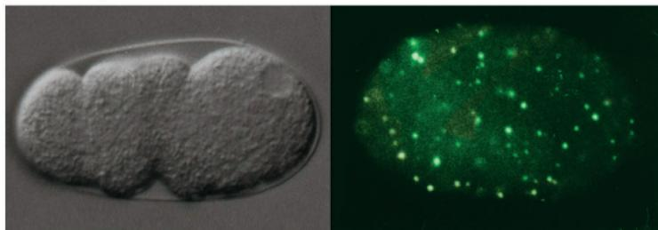  
1 Newly fertilized egg

  
② Zygote prior to first division

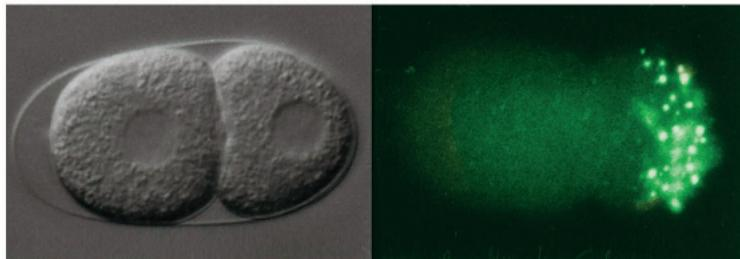  
③ Two-cell embryo

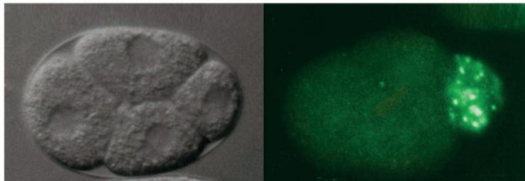

  
Four-cell embryo

## Axis Formation in the Frog

In the frog, the future position of the anterior-posterior axis is determined during oogenesis. Asymmetry in the egg is apparent in the formation of two distinct hemispheres: Dark melanin granules are embedded in the cortex of the animal

Figure 47.22 The body axes and their establishment in an amphibian.

All three axes are established before the zygote begins to undergo cleavage.

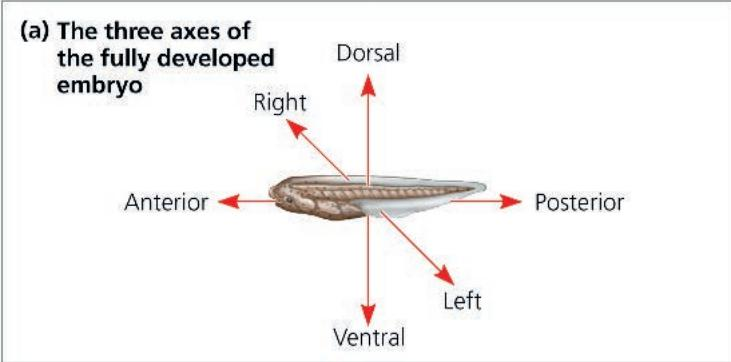  
(b) Establishing the axes. The polarity of the egg and cortical rotation are critical in setting up the body axes.

1 The polarity of the egg determines the anterior-posterior axis before fertilization.

2 At fertilization, the pigmented cortex slides over the underlying cytoplasm toward the point of sperm nucleus entry. This rotation (black arrows) exposes a region of lighter-colored cytoplasm, the gray crescent, which is a marker of the future dorsal side.

3 The first cleavage division bisects the gray crescent. Once the anterior-posterior and dorsal-ventral axes are defined, so is the position of the left-right axis.

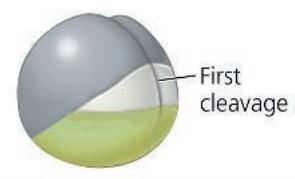

WHAT IF? When researchers allowed normal cortical rotation to occur and then forced the opposite rotation, the result was a two-headed embryo. How might you explain this finding, thinking about how cortical rotation influences body axis formation?

For suggested answer, see Appendix A.

hemisphere, whereas a yellow yolk fills the vegetal hemisphere. This animal-vegetal asymmetry dictates where the anterior-posterior axis forms in the embryo. Note, however, that the anterior-posterior and animal-vegetal axes are not the same; that is, the head of the embryo does not coincide with the animal pole.

Surprisingly, the dorsal-ventral axis of the frog embryo is determined at random. Specifically, wherever the sperm enters in the animal hemisphere determines where the dorsal-ventral axis forms. Once the sperm and egg have fused, the egg surface—the plasma membrane and associated cortex—rotates with respect to the inner cytoplasm, a movement called cortical rotation. From the perspective of the animal pole, this rotation is always toward the point of sperm entry (Figure 47.22b). The resulting interactions between molecules in the vegetal cortex and in the inner cytoplasm of the animal hemisphere activate regulatory proteins. Once activated, these proteins direct expression of one set of genes in dorsal regions and another set of genes in ventral regions.

## Axis Formation in Birds, Mammals, and Insects

It turns out that there are many different processes by which animal embryos establish their body axes. In mammals, the sperm appears to contribute to axis formation, but not in the same manner as in frogs. In particular, the orientation of the egg and sperm nuclei before they fuse influences the location of the first cleavage plane. In chicks, the anterior-posterior axis is established by the pull of gravity during the time when the soon-to-be-laid egg is traveling down the hen's oviduct. In zebrafish, signals within the embryo gradually establish the anterior-posterior axis over the course of a day. Still other mechanisms occur in insects, where gradients of active transcription factors across the body establish both the anterior-posterior and dorsal-ventral axes (see Concept 18.4).

Once the anterior-posterior and dorsal-ventral axes are established, the position of the left-right axis is fixed. Nevertheless, specific molecular mechanisms must establish which side is left and which is right. In vertebrates, there are marked left-right differences in the location of internal organs as well as in the organization and structure of the heart and brain. Recent research has revealed a key role for cilia in setting up this left-right asymmetry, as we will discuss toward the end of this chapter.

## Restricting Developmental Potential

Earlier we described determination in terms of commitment to a particular cell fate. The fertilized egg gives rise to all cell fates. How long during development do cells retain this ability? The German zoologist Hans Spemann addressed this question in 1938. By manipulating embryos to perturb normal development and then examining cell fate after the manipulation, he was able to assay a cell's developmental potential, the range of structures to which it can give rise (Figure 47.23). The work of Spemann and others demonstrated that the first two blastomeres of the frog embryo are totipotent, meaning that they can each develop into all the different cell types of that species.

## Figure 47.23

# Inquiry: How does distribution of the gray crescent affect the developmental potential of the first two daughter cells?

Experiment

Hans Spemann, at the University of Freiburg, Germany, carried out the following experiment in 1938 to test whether substances were located asymmetrically in the gray crescent.

## Results

Blastomeres that received half or all of the material in the gray crescent developed into normal embryos, but a blastomere that received none of the gray crescent gave rise to an abnormal embryo without dorsal structures. Spemann called it a “belly piece.”

## Conclusion

The developmental potential of the two blastomeres normally formed during the first cleavage division depends on their acquisition of cytoplasmic determinants localized in the gray crescent.

Data from H. Spemann, Embryonic Development and Induction, Yale University Press, New Haven, CT (1938).

DRAW IT Draw lines to show the plane of the first cell division that would occur in the fertilized eggs above if no manipulations were done.

WHAT IF? In a similar experiment 40 years earlier, embryologist Wilhelm Roux allowed the first cleavage to occur and then used a needle to kill just one blastomere. The embryo that developed from the remaining blastomere (plus remnants of the dead cell) was abnormal, resembling a half-embryo. How might the presence of molecules in the dead cell explain why Roux's result differed from the control result in Spemann's experiment?

For suggested answers, see Appendix A.

In mammals, embryonic cells remain totipotent through the eight-cell stage, much longer than in many other animals. Recent work, however, indicates that the very early cells (even the first two) are not actually equivalent in a normal embryo. Rather, their

totipotency when isolated likely means that the cells can regulate their fate in response to their embryonic environment. Once the 16-cell stage is reached, mammalian cells are determined to form the trophoblast or the inner cell mass. Although the cells have a limited developmental potential from this point onward, their nuclei remain totipotent, as demonstrated in transplantation and cloning experiments (see Figures 20.17 and 20.18).

The totipotency of cells early in human embryogenesis is the reason why you or a classmate may have an identical twin. Identical (monozygotic) twins result when cells or groups of cells from a single embryo become separated. If the separation occurs before the trophoblast and inner cell mass become differentiated, two embryos grow, each with its own chorion and amnion. This is the case for about a third of identical twins. For the rest, the two embryos that develop share a chorion and, in very rare cases where separation is particularly late, an amnion as well.

Regardless of how uniform or varied early embryonic cells are in a particular species, the progressive restriction of developmental potential is a general feature of development in all animals. In general, the tissue-specific fates of cells are fixed in a late gastrula, but not always so in an early gastrula. For example, if the dorsal ectoderm of an early amphibian gastrula is experimentally replaced with ectoderm from some other location in the same gastrula, the transplanted tissue forms a neural plate. But if the same experiment is performed on a late-stage gastrula, the transplanted ectoderm does not respond to its new environment and does not form a neural plate.

## Cell Fate Determination and Pattern Formation by Inductive Signals

As embryonic development continues, cells influence each other's fates by induction. At the molecular level, the response to an inductive signal is usually to switch on a set of genes that make the receiving cells differentiate into a specific cell type or

tissue. Here we will examine examples of this important developmental process in organizing the basic body plan of an embryo and in directing the three-dimensional development of a vertebrate limb.

## Figure 47.24

# Inquiry: Can the dorsal lip of the blastopore induce cells in another part of the amphibian embryo to change their developmental fate?

## Experiment

In 1924, Hans Spemann and Hilde Mangold, at the University of Freiburg, Germany, investigated the inductive ability of the dorsal lip of the gastrula. Using newts, they transplanted a piece of the dorsal lip from one gastrula to the ventral side of a second gastrula. Because the donor embryo was albino and thus lacked pigmentation, the researchers could visually follow how the transplanted material altered the fate of the recipient embryo.

## Results

The photograph in this figure documents a repeat of this classic experiment, using the frog Xenopus laevis. The tadpole at the top developed from a control gastrula. When an experimental gastrula received the transplant of a dorsal lip from an albino donor (lower left), the recipient embryo formed a second notochord and neural tube in the region of the transplant. Eventually most of a second embryo developed, producing a twinned tadpole (lower right).

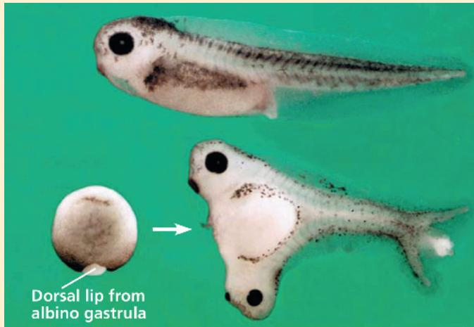

## Conclusion

The transplanted dorsal lip was able to induce cells in a different region of the recipient to form structures different from their normal fate. In effect, the transplanted dorsal lip “organized” the later development of an entire extra embryo.

Data from H. Spemann and H. Mangold, Induction of embryonic primordia by implantation of organizers from a different species, Trans. V. Hamburger (1924). Reprinted in International Journal of Developmental Biology 45:13–38 (2001); and E. M. De Robertis and H. Kuroda, Dorsal-ventral patterning and neural induction in Xenopus embryos, Annual Review of Cell and Developmental Biology 20:285–308 (2004).

WHAT IF? Because the transplant caused the recipient tissue to become something it would not have otherwise, a signal must have passed from the dorsal lip. If you identified a protein candidate for the signaling molecule, how would injecting it into ventral cells of a gastrula test its function?

For suggested answer, see Appendix A.

## The “Organizer” of Spemann and Mangold

Before his studies of totipotency in the fertilized frog egg, Spe-mann had investigated cell fate determination during gastrulation. In these experiments, he and his student Hilde Mangold transplanted tissues between early gastrulas. In their most famous such experiment, summarized in Figure 47.24, they made a remarkable discovery. Not only did a transplanted dorsal lip of the blastopore continue to be a blastopore lip, but it also triggered gastrulation of the surrounding tissue. They concluded that the dorsal lip of the blastopore in the early gastrula functions as an “organizer” of the embryo’s body plan, inducing changes in surrounding tissue that direct formation of the notochord, the neural tube, and other organs.

Nearly a century later, developmental biologists are still studying the basis of induction by what is now called Spemann's organizer. An important clue has come from studies of a growth factor called bone morphogenetic protein 4 (BMP-4). One major function of the organizer seems to be to inactivate BMP-4 on the dorsal side of the embryo. Inactivating BMP-4 allows cells on the dorsal side to make dorsal structures, such as the notochord and neural tube. Proteins related to BMP-4 and its inhibitors are found as well in invertebrates such as the fruit fly, where they also function in regulating the dorsal-ventral axis.

## Formation of the Vertebrate Limb

Inductive signals play a major role in pattern formation, the process governing the arrangement of organs and tissues in their characteristic places in three-dimensional space. The molecular cues that control pattern formation, called positional information, tell a cell where it is with respect to the animal's body axes and help to determine how the cell and its descendants will respond to molecular signaling during embryonic development.

In Concept 18.4, we discussed pattern formation in the development of Drosophila. For the study of pattern formation in vertebrates, a classic model system has been limb development in the chick. The wings and legs of chicks, like all vertebrate limbs, begin as limb buds (see Figure 47.1). These bumps consist of mesodermal tissue covered by a layer of ectoderm (see Figure 47.1, inset). Each component of a chick limb, such as a specific bone or muscle, develops with a precise location and orientation relative to three axes: proximal-distal (shoulder to fingertip), anterior-posterior (thumb to little finger), and dorsal-ventral (knuckle to palm), as shown in Figure 47.25.

Two regions in a limb bud have profound effects on its development. One such region is the apical ectodermal ridge (AER), a thickened area of ectoderm at the tip of the bud (see Figure 47.25a). Surgically removing the AER blocks outgrowth of the limb along the proximal-distal axis. Why? The AER secretes a protein signal called fibroblast growth factor (FGF) that promotes limb-bud outgrowth. If the AER is replaced with beads soaked with FGF, a nearly normal limb develops.

The second major limb-bud regulatory region is the zone of polarizing activity (ZPA), a specialized block of mesodermal tissue (see Figure 47.25a). The ZPA regulates development along the

Figure 47.25 Regulation of vertebrate limb development by organizer regions.  

(a) Organizer regions.
Vertebrate limbs develop from protrusions called limb buds. Two regions in each limb bud, the apical ectodermal ridge (AER, shown in this SEM) and the zone of polarizing activity (ZPA), play key roles as organizers in limb pattern formation.

  
Apical ectodermal ridge (AER)

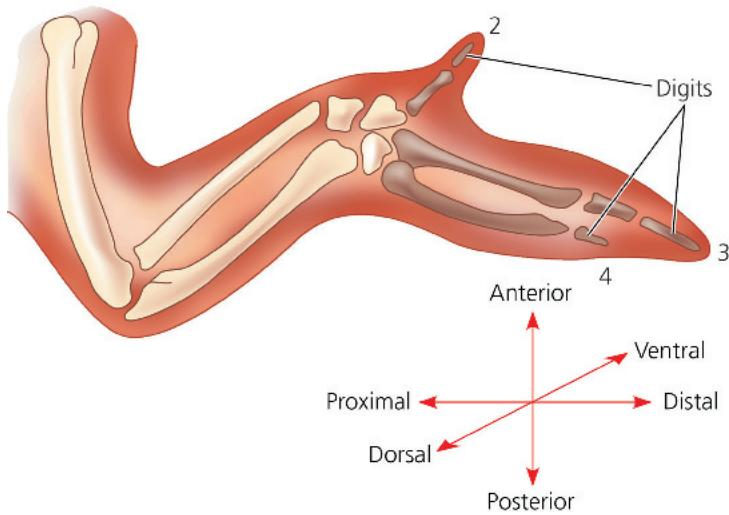

(b) Wing of chick embryo. Each embryonic cell receives positional information indicating location along the three axes of the limb. The AER and ZPA secrete molecules that help provide this information. (Numbers are assigned to the digits based on a convention established for vertebrate limbs. The chicken wing has only four digits; the first digit points backward and is not shown.)

anterior-posterior axis of the limb. Cells nearest the ZPA form posterior structures, such as the most posterior of the chick's digits (equivalent to our little finger); cells farthest from the ZPA form anterior structures, including the most anterior digit (like our thumb).

Like the AER, the ZPA influences development by secreting a protein signal. The signal secreted by the ZPA is called Sonic hedgehog, named after both a video game character and a similar protein in Drosophila that also regulates development. Implanting cells genetically engineered to produce Sonic hedgehog into the anterior region of a normal limb bud causes formation of a mirror-image limb—just as if a ZPA had been grafted there

## Figure 47.26

## Inquiry: What role does the zone of polarizing activity (ZPA) play in limb pattern formation in vertebrates?

## Experiment

In 1985, researchers were eager to investigate the nature of the zone of polarizing activity. They transplanted ZPA tissue from a donor chick embryo under the ectoderm in the anterior margin of a limb bud in another chick (the host).

## Results

The host limb bud developed extra digits from host tissue in a mirror-image arrangement to the normal digits, which also formed (compare with Figure 47.25b, which shows a normal chick wing).

## Conclusion

The mirror-image duplication observed in this experiment suggests that ZPA cells secrete a signal that diffuses from its source and conveys positional information indicating “posterior.” As the distance from the ZPA increases, the signal concentration decreases, and hence more anterior digits develop.

Data from L. S. Honig and D. Summerbell, Maps of strength of positional signaling activity in the developing chick wing bud, Journal of Embryology and Experimental Morphology 87:163–174 (1985).

WHAT IF? Suppose you learned that the ZPA forms after the AER, leading you to develop the hypothesis that the AER is necessary for formation of the ZPA. If you removed the AER and looked for expression of Sonic hedgehog, how would that test your hypothesis?
For suggested answer, see Appendix A.

(Figure 47.26). Furthermore, experiments with mice reveal that production of Sonic hedgehog in part of the limb bud where it is normally absent can result in extra toes.

The AER and ZPA regulate the axes of a limb bud, but what determines whether the bud develops into a forelimb or hind limb? That information is provided by spatial patterns of Hox genes, which specify different developmental fates in particular body regions (see Figure 21.20).

BMP-4, FGF, Sonic hedgehog, and Hox proteins are examples of a much larger set of molecules that govern cell fates in animals. Having mapped out many of the basic functions of these molecules in embryonic development, researchers are now addressing their role in organogenesis, focusing in particular on the development of the brain.

## Cilia and Cell Fate

Researchers have found that the cellular organelles known as cilia are essential for specifying cell fate in human embryos. Like other mammals, humans have stationary and motile cilia (see Figure 6.24). Stationary primary cilia, or monocilia, jut from the surface of nearly all cells, one per cell. In contrast, motile cilia are restricted to cells that propel fluid over their surface, such as the epithelial cells of airways, and sperm (as flagella that propel sperm movement). Both stationary and motile cilia have crucial roles in development.

Genetic studies provided vital clues to the developmental role of monocilia. In 2003, researchers discovered that certain mutations disrupting development of the mouse nervous system affect genes that function in the assembly of monocilia. Other geneticists found that mutations responsible for a severe kidney disease in mice alter a gene important for the transport of materials up and down monocilia. In addition, mutations in humans that block the function of monocilia were linked to cystic kidney disease.

How do monocilia function in development? Evidence indicates that monocilia act as antennae on the cell surface, receiving signals from multiple signaling proteins, including Sonic hedgehog. Mechanisms that regulate which types of receptor proteins are present tune the cilium to particular signals. When the monocilia are defective, signaling is disrupted.

Insight into the role of motile cilia in development grew from studies of Kartagener's syndrome, a set of medical conditions that often appear together. These conditions include male infertility due to immotile sperm and infections of the nasal sinuses and bronchi in both males and females. A distinctive feature of Kartagener's syndrome is situs inversus, a reversal of the normal left-right asymmetry of the organs in the chest and abdomen (Figure 47.27). The heart, for example, is on the right side rather than the left. (By itself, situs inversus causes no significant medical problems.)

Scientists studying Kartagener's syndrome came to realize that all of the associated conditions result from a defect that makes cilia immotile. Without motility, sperm tails cannot beat and airway cells cannot sweep mucus and microbes out of the airway. But what causes situs inversus in these individuals? The current model proposes that ciliary motion in a particular part of the embryo is essential for normal development. Evidence indicates

Figure 47.27 Situs inversus, a reversal of normal left–right asymmetry in the chest and abdomen.

that movement of the cilia generates a leftward fluid flow, breaking the symmetry between left and right sides. Without that flow, asymmetry along the left-right axis arises randomly, and half of the affected embryos develop situs inversus.

If we consider development as a whole, we see a sequence of events marked by cycles of signaling and differentiation. Initial cell asymmetries allow different types of cells to influence each other, resulting in the expression of specific sets of genes. The products of these genes then direct cells to differentiate into specific types. Through pattern formation and morphogenesis, differentiated cells ultimately produce a complex arrangement of tissues and organs, each functioning in its appropriate location and in coordination with other cells, tissues, and organs throughout the organism.

## Concept Check 47.3

1. How do axis formation and pattern formation differ?

2. MAKE CONNECTIONS How does a morphogen gradient differ from cytoplasmic determinants and inductive interactions with regard to the set of cells it affects (see Concept 18.4)?

3. WHAT IF? If the ventral cells of an early frog gastrula were experimentally induced to express large amounts of a protein that inhibits BMP-4, could a second embryo develop? Explain.

4. WHAT IF? If you removed the ZPA from a limb bud and then placed a bead soaked in Sonic hedgehog in the middle of the bud, what would be the most likely result?

For suggested answers, see Appendix A.

## Summary of Key Concepts

To review key terms, go to the Vocabulary Self-Quiz (eTextbook only).

## Concept 47.1: Fertilization and cleavage initiate embryonic development

\- Fertilization forms a diploid zygote and initiates embryonic development. The acrosomal reaction releases hydrolytic enzymes from the sperm head that digest material surrounding the egg.

In mammalian fertilization, the cortical reaction modifies the zona pellucida as a slow block to polyspermy.

\- Fertilization is followed by cleavage, a period of rapid cell division without growth, producing a large number of cells called blastomeres. The amount and distribution of yolk strongly influence the pattern of cleavage. In many species, the completion of the cleavage stage generates a blastula containing a fluid-filled cavity, the blastocoel.

What cell-surface event would likely fail if a sperm contacted an egg of another species?

## Concept 47.2: Morphogenesis in animals involves specific changes in cell shape, position, and survival

\- Gastrulation converts the blastula to a gastrula, which has a primitive digestive cavity and three germ layers: ectoderm (blue), which forms the outer layer of the embryo, mesoderm (red), which forms the middle layer, and endoderm (yellow), which gives rise to the innermost tissues.

\- Gastrulation and organogenesis in mammals resemble the processes in reptiles, including birds. After fertilization and early cleavage in the oviduct, the blastocyst implants in the uterus. The trophoblast initiates formation of the fetal portion of the placenta, and the embryo proper develops from a cell layer, the epiblast, within the blastocyst.

\- The embryos of birds, other reptiles, and mammals develop within a fluid-filled sac that is contained within a shell or the uterus. In these organisms, the three germ layers produce four extraembryonic membranes: the amnion, chorion, yolk sac, and allantois.

\- The organs of the animal body develop from specific portions of the three embryonic germ layers. Early events in organogenesis in vertebrates include neurulation: formation of the notochord by cells of the dorsal mesoderm and development of the neural tube from infolding of the ectodermal neural plate.

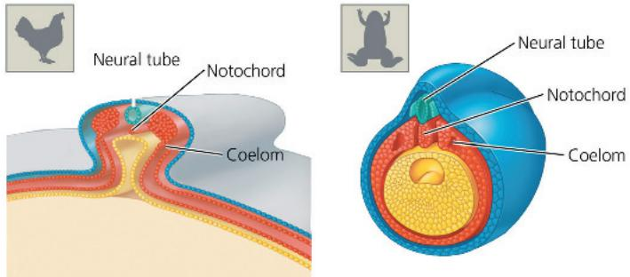

\- Cytoskeletal rearrangements cause changes in the shape of cells that underlie cell movements in gastrulation and organogenesis, including invaginations and convergent extension. The cytoskeleton is also involved in cell migration, which relies on cell adhesion molecules and the extracellular matrix to help cells reach specific destinations. Migratory cells arise both from the neural crest and from somites.

\- Some processes in animal development require apoptosis, programmed cell death.

What are some functions of apoptosis in development?

## Concept 47.3: Cytoplasmic determinants and inductive signals regulate cell fate

\- Experimentally derived fate maps of embryos show that specific regions of the zygote or blastula develop into specific parts of older embryos. The complete cell lineage has been worked out for C. elegans, revealing that programmed cell death contributes to animal development. In all species, the developmental potential of cells becomes progressively more limited as embryonic development proceeds.

\- Cells in a developing embryo receive and respond to positional information that varies with location. This information is often in the form of signaling molecules secreted by cells in specific regions of the embryo, such as the dorsal lip of the blastopore in the amphibian gastrula and the apical ectodermal ridge and zone of polarizing activity of the vertebrate limb bud.

Suppose you found two classes of mouse mutations, one that affected limb development only and one that affected both limb and kidney development. Which class would be more likely to alter the function of monocilia? Explain.

## Test Your Understanding

For more multiple-choice questions, go to the Practice Test (eTextbook only).

## Levels 1-2: Remembering/Understanding

1. The cortical reaction of sea urchin eggs functions directly in (A) the formation of a fertilization envelope. (B) the production of a fast block to polyspermy. (C) the generation of an electrical impulse by the egg. (D) the fusion of egg and sperm nuclei.

2. Which of the following is common to the development of both birds and mammals?
(A) holoblastic cleavage (C) trophoblast
(B) epiblast and hypoblast (D) gray crescent

3. The archenteron develops into
(A) the mesoderm.
(B) the endoderm.
(C) the placenta.
(D) the lumen of the digestive tract.

4. What structural adaptation in chickens allows them to lay their eggs in arid environments rather than in water?
(A) extraembryonic membranes
(B) yolk
(C) cleavage
(D) gastrulation

## Levels 3-4: Applying/Analyzing

5. If an egg cell were treated with EDTA, a chemical that binds calcium and magnesium ions,
(A) the acrosomal reaction would be blocked.
(B) the fusion of sperm and egg nuclei would be blocked.
(C) the fast block to polyspermy would not occur.
(D) the fertilization envelope would not form.

6. In humans, identical twins are possible because
(A) extraembryonic cells interact with the zygote nucleus.
(B) convergent extension occurs.
(C) early blastomeres can form a complete embryo if isolated.
(D) the gray crescent divides the dorsal-ventral axis into new cells.

7. Cells transplanted from the neural tube of a frog embryo to the ventral part of another embryo develop into nervous system tissues. This result indicates that the transplanted cells were (A) totipotent.
(C) differentiated.
(B) determined.
(D) mesenchymal.

8. DRAW IT Each blue circle in the figure below represents a cell in a cell lineage. Draw two modified versions of the cell lineage so that each version produces three cells. Use apoptosis in one of the versions, marking any dead cells with an X.

## Levels 5-6: Evaluating/Creating

9. EVOLUTION CONNECTION Evolution in insects and vertebrates has involved the repeated duplication of body segments, followed by fusion of some segments and specialization of their structure and function. In vertebrates, what anatomical features reflect segmentation?

10. SCIENTIFIC INQUIRY The “snout” region of a salamander has a mustache-shaped structure called a balancer, whereas that of a frog tadpole does not. When you transplant tissue from the side of a young salamander embryo to the snout of a frog embryo, the tadpole that develops has a balancer. If you use a slightly older salamander embryo as the donor, no balancer forms. Propose a hypothesis to explain these results and explain how you might test your hypothesis.

11. SCIENCE, TECHNOLOGY, AND SOCIETY Scientists can now make identical copies, or clones, of animals ranging from dairy cows to pet cats. Propose a few arguments for and against this application of discoveries about embryonic development.

12. WRITE ABOUT A THEME: ORGANIZATION In a short essay (100–150 words), describe how the emergent properties of the cells of the gastrula direct embryonic development.

13. SYNTHESIZE YOUR KNOWLEDGE

  
Occasionally, two-headed animals such as this turtle are born. Thinking about the occurrence of identical twins and the property of totipotency, explain how this might happen.

For selected answers, see Appendix A.

# Explore Scientific Papers with Science in the Classroom | AAAS

What is the molecular basis for limb regrowth in vertebrates? Go to “Limb Regeneration: Fact or (Science) Fiction?” at www.scienceintheclassroom.org.

Instructors: Questions can be assigned in Mastering Biology.

# Neurons, Synapses, and Signaling

## Key Concepts

48.1 Neuron structure and organization reflect function in information transfer

48.2 Ion pumps and ion channels establish the resting potential of a neuron

48.3 Action potentials are the signals conducted by axons

48.4 Neurons communicate with other cells at synapses

## Study Tip

Make a table: Action potentials and graded potentials are two types of electrical signals. As you read, fill in a table like the one shown here to help you distinguish between action and graded potentials.

<table><tr><td></td><td>Graded Potential</td><td>Action Potential</td></tr><tr><td>Occurs in cell body?</td><td></td><td></td></tr><tr><td>Occurs in axon?</td><td></td><td></td></tr><tr><td>All or none?</td><td></td><td></td></tr><tr><td>Refractory period?</td><td></td><td></td></tr><tr><td>Summation?</td><td></td><td></td></tr><tr><td>Threshold?</td><td></td><td></td></tr><tr><td>How does membrane potential change?</td><td></td><td></td></tr><tr><td>Other differences?</td><td></td><td></td></tr></table>

  
Figure 48.1 This cone snail (Conus geographus) is slow-moving, but a dangerous hunter. Delivering venom with a hollow, harpoon-like tooth, it can paralyze a fish almost instantaneously. Scuba divers picking up a cone snail have died from a single injection. Underlying the fast-acting, lethal nature of the venom is an ability to block information transfer by neurons, specialized cells of the nervous system.

## How does a neuron transmit information?

A neuron receives information at dendrites and the cell body, transmits it down the axon, and conveys the information to other cells at a synapse.

# Concept 48.1: Neuron structure and organization reflect function in information transfer

Our starting point for exploring the nervous system is the neuron, the type of nerve cell that uses electrical signals to transfer information within the body. It provides a good example of the close fit of form and function that often arises over the course of evolution.

## Neuron Structure and Function

The ability of a neuron to receive and transmit information is based on the highly specialized cellular organization shown in Figure 48.1. Most of a neuron's organelles, including its nucleus, are located in the cell body. In a typical neuron, the cell body is studded with numerous highly branched extensions called dendrites (from the Greek dendron, tree). Together with the cell body, the dendrites receive signals from other neurons.

A typical neuron has a single axon, the extension that transmits signals to other cells. Axons are often much longer than dendrites, and some, such as those that reach from the spinal cord of a giraffe to the muscle cells in its feet, are over a meter long. The specialized structure of axons allows them to use pulses of electrical current to transmit information, even over long distances. The cone-shaped base of an axon, called the axon hillock, is typically where signals that travel down the axon are generated. Near its other end, an axon usually divides into many branches.

Each branched end of an axon transmits information to another cell at a junction called a synapse (Figure 48.2). The part of each axon branch that forms this specialized junction is a synaptic terminal. At most synapses, chemical messengers called neurotransmitters pass information from the transmitting neuron to the receiving cell. Cone snail venom is particularly potent because it interferes not only with electrical signaling along axons but also with chemical signaling across synapses.

Figure 48.2 Synaptic terminals on the cell body of a postsynaptic neuron.  
  
Figure 48.3 Summary of information processing.

The cone snail's siphon acts as a sensor, transferring information to the neuronal circuits in the snail's head for processing. If prey is detected, these circuits issue motor commands—signals that control muscle activity. In this example, motor commands trigger release of a harpoon-like tooth from the proboscis, spearing the prey.

## Introduction to Information Processing

Information processing by a nervous system includes up to three stages: sensory input, integration, and motor output. As an example, let's consider the cone snail, focusing on the steps involved in identifying and attacking its prey. To generate sensory input to the nervous system, the snail surveys its environment with sensors in its tubelike siphon, sampling scents that might reveal a nearby fish (Figure 48.3). During the integration stage, networks of neurons in the snail brain process this information to determine if a fish is in fact present and, if so, where the fish is located. Motor output from the processing center then initiates attack, activating neurons that trigger release of the harpoon-like tooth toward the prey.

## Interview

## Interview with Baldomero Olivera: Developing drugs from research on cone snail venom (eTextbook only)

In all but the simplest animals, specialized populations of neurons handle each stage of information processing.

\- Sensory neurons, like those in the snail's siphon, transmit information about external stimuli (such as light, touch, or smell), and internal conditions (such as blood pressure or muscle tension).

\- Interneurons form the local circuits connecting neurons in the brain or ganglia. Interneurons are responsible for the integration (analysis and interpretation) of sensory input.

Figure 48.4 Structural diversity of neurons.

In these drawings of neurons, cell bodies and dendrites are black and axons are red. Note that the top diagram shows a peculiarity of some sensory neurons, in which the dendrites fuse with the axon during development. This axon carries information from the dendrites to the axon terminals, from right to left.

  
Figure 48.5 Glia in the mammalian brain.

\- Motor neurons transmit signals to muscle cells, causing them to contract. Additional neurons that extend out of the processing centers trigger gland activity.

All neurons transmit electrical signals within the cell in an identical manner. Thus, a neuron that detects an odor transmits information along its length in the same way as a neuron that controls the movement of a body part. The particular connections made by the active neuron are what distinguish the type of information being transmitted. Interpreting nerve impulses therefore involves sorting neuronal paths and connections.

As shown in Figure 48.4, the shape of a neuron can vary from simple to quite complex, depending on its role in information processing. Neurons that have highly branched dendrites, such as some interneurons, can receive input through tens of thousands of synapses. Similarly, neurons that transmit information to many target cells do so through highly branched axons. When grouped together, the axons of neurons form a bundle called a nerve.

Not all networks involve motor neurons. When you see a friend, for instance, sensory neurons transmit visual information from your eye to your brain. Interneurons in the brain integrate this sensory information with other inputs (such as memories), enabling you to recognize the face of your friend.

In many animals, the neurons that carry out sorting, processing, and integration are organized in a central nervous system (CNS), which may include a brain or simpler clusters called ganglia. The neurons that carry information into and out of

This fluorescently labeled laser confocal micrograph shows a region of the rat brain packed with glia and interneurons. The glia are labeled red, the DNA in nuclei is labeled blue, and the dendrites of neurons are labeled green.

  
the CNS constitute the peripheral nervous system (PNS). Neurons of both the CNS and PNS require supporting cells called glial cells, or glia (from a Greek word meaning “glue”) (Figure 48.5).

## Concept Check 48.1

1. Compare and contrast the structure and function of axons and dendrites.

2. Describe the basic pathway of information flow through neurons that causes you to turn your head when someone calls your name.

3. WHAT IF? How might increased branching of an axon help coordinate responses to signals communicated by the nervous system?

For suggested answers, see Appendix A.

# Concept 48.2: Ion pumps and ion channels establish the resting potential of a neuron

We turn now to the essential role of ions in neuronal signaling. In neurons, as in other cells, ions are unequally distributed between the interior of cells and the surrounding fluid (see Concept 7.4). As a result, the inside of a cell is negatively charged relative to the outside. This charge difference, or voltage, across the plasma membrane is called the membrane potential, reflecting the fact that the attraction of opposite charges across the plasma membrane is a source of potential energy. For a resting neuron—one that is not sending a signal—the membrane potential is called the resting potential and is typically between -60 and -80 millivolts (mV).

Table 48.1 Ion Concentrations Inside and Outside of Mammalian Neurons

<table><tr><td>Ion</td><td>Intracellular Concentration (mM)</td><td>Extracellular Concentration (mM)</td></tr><tr><td>Potassium ( $K^{+}$ )</td><td>140</td><td>5</td></tr><tr><td>Sodium ( $Na^{+}$ )</td><td>15</td><td>150</td></tr><tr><td>Chloride ( $Cl^{-}$ )</td><td>10</td><td>120</td></tr><tr><td>Large anions ( $A^{-}$ ), such as proteins, inside cell</td><td>100</td><td>Not applicable</td></tr></table>

When a neuron receives a stimulus, the membrane potential changes. Rapid shifts in membrane potential are what enable us to see the intricate structure of a spiderweb, hear a song, or ride a bicycle. These changes, which are known as action potentials, will be discussed in Concept 48.3. To understand how they convey information, we need to explore the ways in which membrane potentials are formed, maintained, and altered.

## Formation of the Resting Potential

Potassium ions (K $^{+}$ ) and sodium ions (Na $^{+}$ ) play an essential role in the formation of the resting potential. These ions each have a concentration gradient across the plasma membrane of a neuron (Table 48.1). In most neurons, the concentration of K $^{+}$ is higher inside the cell, while the concentration of Na $^{+}$ is higher outside. The Na $^{+}$ and K $^{+}$ concentration gradients are maintained by the sodium-potassium pump. This pump uses the energy of ATP hydrolysis to actively transport Na $^{+}$ out of the cell and K $^{+}$ into the cell. (There are also concentration gradients for chloride ions (Cl $^{-}$ ) and other anions, as shown in Table 48.1, but we can ignore these for now.)

The sodium-potassium pump transports three $Na^{+}$ out of the cell for every two $K^{+}$ that it transports in (Figure 48.6). Although this pumping generates a net export of positive charge, the pump acts slowly. The resulting change in the membrane potential is therefore quite small—only a few millivolts. Why, then, is there a membrane potential of -60 to -80 mV in a resting neuron? The answer lies in ion movement through ion channels, pores formed by complex proteins that span the membrane. Ion channels allow ions to diffuse back and forth across the membrane. As ions diffuse through channels, they carry with them units of electrical charge. Furthermore, ions can move quite rapidly through ion channels. When this occurs, the resulting current—a net movement of positive or negative charge—generates a membrane potential, or voltage across the membrane.

Concentration gradients of ions across a plasma membrane represent a chemical form of potential energy that can be harnessed for cellular processes (see Figure 44.17). In neurons, the ion channels that convert this chemical potential energy to electrical potential energy can do so because they have selective permeability, allowing only certain ions to pass. For example, a potassium channel allows $K^{+}$ to diffuse freely across the membrane, but not other ions, such as $Na^{+}$ or $Cl^{-}$ .

Diffusion of $K^{+}$ through potassium channels that are always open (sometimes called leak channels) is critical for establishing the resting potential (Figure 48.7). The $K^{+}$ concentration is 140 millimolar (mM) inside the cell, but only 5 mM outside. The

Figure 48.6 Summary of active transport by the sodium-potassium pump.

You can find a step-by-step description of the pump's activity in Figure 7.16.

  
Figure 48.7 The basis of the membrane potential.

The sodium-potassium pump generates and maintains the concentration gradients of $Na^{+}$ and $K^{+}$ shown in Table 48.1. The $Na^{+}$ concentration gradient results in very little net diffusion of $Na^{+}$ in a resting neuron because very few channels are open. In contrast, the many open potassium channels allow a significant net outflow of $K^{+}$ . This outflow of $K^{+}$ results in a net negative charge inside the cell.  

  
The potassium and sodium channels have the same rough overall structure, as shown. How must these proteins differ to allow passage of only a particular ion? For suggested answer, see Appendix A.

chemical concentration gradient thus favors a net outflow of $K^{+}$ . Furthermore, a resting neuron has many open potassium channels, but very few open sodium channels. Because very few $Na^{+}$ ions can cross the membrane, $K^{+}$ outflow leads to a net negative charge inside the cell. This buildup of negative charge within the neuron is the major source of the membrane potential.

What prevents the buildup of negative charge from increasing indefinitely? The excess negative charges inside the cell exert an attractive force that opposes the flow of additional positively charged potassium ions out of the cell. The separation of charge (voltage) thus results in an electrical gradient that counterbalances the chemical concentration gradient of $K^{+}$ .

## Modeling the Resting Potential

The net flow of $K^{+}$ out of a neuron proceeds until the chemical and electrical forces are in balance. We can model this process by considering a pair of chambers separated by an artificial membrane. To begin, imagine that the membrane contains many open ion channels, all of which allow only $K^{+}$ to diffuse across (Figure 48.8a). To produce a $K^{+}$ concentration gradient like that of a mammalian neuron, we place a solution of 140 mM potassium chloride (KCl) in the inner chamber and 5 mM KCl in the outer chamber. The $K^{+}$ will diffuse down its concentration gradient into the outer chamber. But because the chloride ions ( $Cl^{-}$ ) lack a means of crossing the membrane, there will be an excess of negative charge in the inner chamber.

When our model neuron reaches equilibrium, the electrical gradient will exactly balance the chemical gradient so that no further net diffusion of $K^{+}$ occurs across the membrane. The magnitude of the membrane voltage at equilibrium for a particular ion is called that ion's equilibrium potential ( $E_{ion}$ ). For a membrane permeable to a single type of ion, $E_{ion}$ can be calculated using a formula called the Nernst equation. At human body temperature (37°C) and for an ion with a net charge of 1+, such as $K^{+}$ or $Na^{+}$ , the Nernst equation is

$$
E _ {\mathrm{ion}} = 6 2 \mathrm{mV} \left(\log \frac {[ \mathrm{ion} ] _ {\mathrm{outside}}}{[ \mathrm{ion} ] _ {\mathrm{inside}}}\right)
$$

Plugging the $K^{+}$ concentrations into the Nernst equation reveals that the equilibrium potential for $\mathrm{K}^{+}\left(E_{\mathrm{K}}\right)$ is -90 mV (see Figure 48.8a).

## Figure 48.8 Modeling a mammalian neuron.

In this model of the membrane potential of a resting neuron, an artificial membrane divides each container into two chambers. Ion channels allow free diffusion for particular ions, resulting in the net ion flow represented by arrows. (a) The presence of open potassium channels makes the membrane selectively permeable to $K^{+}$ , and the inner chamber contains a 28-fold higher concentration of $K^{+}$ than the outer chamber; at equilibrium, the inside of the membrane is -90 mV relative to the outside. (b) The membrane is selectively permeable to $Na^{+}$ , and the inner chamber contains a tenfold lower concentration of $Na^{+}$ than the outer chamber; at equilibrium, the inside of the membrane is +62 mV relative to the outside.

WHAT IF? How would adding potassium or chloride channels to the membrane in (b) affect the membrane potential?

For suggested answer, see Appendix A.

The minus sign indicates that $K^{+}$ is at equilibrium when the inside of the membrane is 90 mV more negative than the outside.

Whereas the equilibrium potential for $K^{+}$ is -90 mV, the resting potential of a mammalian neuron is somewhat less negative. This difference reflects the small but steady movement of $Na^{+}$ across the few open sodium channels in a resting neuron. The concentration gradient of $Na^{+}$ has a direction opposite to that of $K^{+}$ (see Table 48.1). $Na^{+}$ therefore diffuses into the cell, making the inside of the cell less negative. If we model a membrane in which the only open channels are selectively permeable to $Na^{+}$ , we find that a tenfold higher concentration of $Na^{+}$ in the outer chamber results in an equilibrium potential ( $E_{Na}$ ) of +62 mV (Figure 48.8b). In an actual neuron, the resting potential (-60 to -80 mV) is much closer to $E_{K}$ than to $E_{Na}$ because there are many open potassium channels but only a small number of open sodium channels.

Because neither $K^{+}$ nor $Na^{+}$ is at equilibrium in a resting neuron, there is a net flow of each ion across the membrane. The resting potential remains steady, which means that these $K^{+}$ and $Na^{+}$ currents are equal and opposite. Ion concentrations on either side of the membrane also remain steady. Why? The resting potential arises from the net movement of far fewer ions than would be required to alter the concentration gradients.

If $Na^{+}$ is allowed to cross the membrane more readily, the membrane potential will move toward $E_{Na}$ and away from $E_{K}$ . As you'll see, this happens in generation of a nerve impulse.

## Concept Check 48.2

1. Under what circumstances could ions flow through an ion channel from a region of lower ion concentration to a region of higher ion concentration?

2. WHAT IF? Suppose a cell's membrane potential shifts from $-70\mathrm{mV}$ to $-50\mathrm{mV}$ . What changes in the cell's permeability to $\mathrm{K}^+$ or $\mathrm{Na}^+$ could cause such a shift?

3. MAKE CONNECTIONS Review Figure 7.11, which illustrates the diffusion of dye molecules across a membrane. Could diffusion eliminate the concentration gradient of a dye that has a net charge? Explain.

For suggested answers, see Appendix A.  
  
(a) Membrane selectively permeable to $K^{+}$ Nernst equation for $K^{+}$ equilibrium potential at 37°C:

$$
E _ {K} = 6 2 \mathrm{mV} \left(\log \frac {5 \mathrm{mM}}{1 4 0 \mathrm{mM}}\right) = - 9 0 \mathrm{mV}
$$

(b) Membrane selectively permeable to $\mathrm{Na^{+}}$ Nernst equation for $\mathrm{Na^{+}}$ equilibrium potential at $37^{\circ}\mathrm{C}$ :

$$
E _ {\mathrm{Na}} = 6 2 \mathrm{mV} \left(\log \frac {1 5 0 \mathrm{mM}}{1 5 \mathrm{mM}}\right) = + 6 2 \mathrm{mV}
$$

## Concept 48.3: Action potentials are the signals conducted by axons

When a neuron responds to a stimulus, the membrane potential changes. Using intracellular recording, researchers can monitor these changes as a function of time (Figure 48.9). As you will see, such recordings have been central to the study of information transfer by neurons.

How does a stimulus alter the membrane potential? Certain ion channels in a neuron, called gated ion channels, open or close in response to stimuli. When a gated ion channel opens or closes, it alters the membrane's permeability to particular ions (Figure 48.10). The result of channel opening is a rapid flow of ions across the membrane, altering the membrane potential.

Particular types of gated channels respond to different stimuli. For example, Figure 48.10 illustrates a voltage-gated ion channel, a channel that opens or closes in response to a shift in the voltage across the plasma membrane of the neuron. Later in this chapter, we will discuss gated channels that are located in neurons and are regulated by chemical signals.

## Hyperpolarization and Depolarization

Let's consider now what happens in a neuron when a stimulus causes closed voltage-gated ion channels to open. If gated potassium channels in a resting neuron open, the membrane's

## Figure 48.9 Research Method: Intracellular Recording Application

Electrophysiologists use intracellular recording to measure the membrane potential of neurons and other cells.

## Technique

A microelectrode is made from a glass capillary tube filled with an electrically conductive salt solution. One end of the tube tapers to an extremely fine tip (diameter $<1\mu m$ ). While looking through a microscope, the experimenter uses a micropositioner to insert the tip of the microelectrode into a cell. A voltage recorder (usually an oscilloscope or a computer-based system) measures the voltage between the microelectrode tip inside the cell and a reference electrode placed in the solution outside the cell.

## Figure 48.10 Voltage-gated ion channel.

A change in the membrane potential in one direction (solid arrow) opens the voltage-gated channel. The opposite change (dashed arrow) closes the channel.

  
VISUAL SKILLS Gated ion channels allow ion flow in either direction. Using visual information in this figure, explain why there is net ion movement when the channel opens.  
For suggested answer, see Appendix A.

permeability to $K^{+}$ increases. As a result, net diffusion of $K^{+}$ out of the neuron increases, shifting the membrane potential toward $E_{K}$ (-90 mV at 37°C). This increase in the magnitude of the membrane potential, called a hyperpolarization, makes the inside of the membrane more negative (Figure 48.11a). In a resting neuron, hyperpolarization results from any stimulus that increases the outflow of positive ions or the inflow of negative ions.

Although opening potassium channels in a resting neuron causes hyperpolarization, opening some other types of ion channels has an opposite effect, making the inside of the membrane less negative (Figure 48.11b). A reduction in the magnitude of the membrane potential is a depolarization. In neurons, depolarization often involves gated sodium channels. If a stimulus causes gated sodium channels to open, the membrane's permeability to $\mathrm{Na^{+}}$ increases. $\mathrm{Na^{+}}$ diffuses into the cell along its concentration gradient, causing a depolarization as the membrane potential shifts toward $E_{\mathrm{Na}}(+62\mathrm{mV}$ at $37^{\circ}\mathrm{C})$ .

## Graded Potentials and Action Potentials

Sometimes, the hyperpolarization or depolarization is simply a short-lived shift in the membrane potential. This shift, called a graded potential, has a magnitude that varies with the strength of the stimulus: A larger stimulus causes a greater change in the membrane potential (see Figure 48.11a and 48.11b). Graded potentials induce a small electrical current that dissipates as it flows along the membrane. Graded potentials thus decay with time and with distance from their source.

If a depolarization shifts the membrane potential sufficiently, the result is a massive change in membrane voltage called an action potential. Unlike graded potentials, action potentials have a constant magnitude and can regenerate in adjacent regions of the membrane. Action potentials can therefore spread along axons, making them well suited for transmitting a signal over long distances.

Figure 48.11 Graded potentials and an action potential in a neuron.

The graphs in (a) and (b) show changes in membrane potential over time during two separate trials involving stimuli of different strengths. The tracings (the red lines representing the results) of the two separate trials are superimposed.

  
(a) Graded hyperpolarizations produced by two stimuli that increase membrane permeability to $K^{+}$ . The larger stimulus produces a larger hyperpolarization.

  
(b) Graded depolarizations produced by two stimuli that increase membrane permeability to $Na^{+}$ . The larger stimulus produces a larger depolarization.

  
(c) Action potential triggered by a depolarization that reaches the threshold.  
DRAW IT Redraw the graph in (c), extending the y-axis. Then, label the positions of $E_{K}$ and $E_{Na}$ . For suggested answer, see Appendix A.

Action potentials arise because some of the ion channels in axons are voltage-gated (see Figure 48.10). If a depolarization increases the membrane potential to a level called threshold, the voltage-gated sodium channels open. The resulting flow of $Na^{+}$ into the neuron results in further depolarization. Because the sodium channels are voltage gated, the increased depolarization causes more sodium channels to open, leading to an even greater flow of current. The result is a process of positive feedback that triggers a very rapid opening of many voltage-gated sodium channels and the marked temporary change in membrane potential that defines an action potential (Figure 48.11c).

The positive-feedback loop of channel opening and depolarization triggers an action potential whenever the membrane potential reaches threshold, about -55 mV for many mammals. Once initiated, the action potential has a magnitude that is independent of the strength of the triggering stimulus. Because action potentials either occur fully or do not occur at all, they represent an all-or-none response to stimuli.

## Generation of Action Potentials: A Closer Look

The characteristic shape of the action potential graph in Figure 48.11c reflects changes in membrane potential resulting from ion movement through voltage-gated sodium and potassium channels. Depolarization opens both types of channels, but they respond independently and sequentially. Sodium channels open first, initiating the action potential. As the action potential proceeds, sodium channels remain open but become inactivated: A portion of the channel protein called an inactivation loop blocks ion flow through the open channel. Sodium channels remain inactivated until after the membrane returns to the resting potential and the channels close. Potassium channels open more slowly than sodium channels, but are not inactivated. They remain open until the membrane potential returns to its resting state.

To understand further how voltage-gated channels shape the action potential, consider the process as a series of stages, as depicted in Figure 48.12. ① When the membrane of the axon is at the resting potential, most voltage-gated sodium channels are closed. Ungated potassium channels involved in the resting membrane potential are open, but voltage-gated potassium channels are closed. ② When a stimulus depolarizes the membrane, some gated sodium channels open, allowing more $\mathrm{Na^{+}}$ to diffuse into the cell. If the stimulus is sufficiently strong, more $\mathrm{Na^{+}}$ channels open and the $\mathrm{Na^{+}}$ inflow persists, causing further depolarization, which opens more gated sodium channels, allowing even more $\mathrm{Na^{+}}$ to diffuse into the cell.

③ Once the threshold is crossed, the positive-feedback cycle then rapidly brings the membrane potential close to $E_{Na}$ . This stage of the action potential is called the rising phase. ④ Two events prevent the membrane potential from actually reaching $E_{Na}$ : Voltage-gated

Figure 48.12 The role of voltage-gated ion channels in the generation of an action potential. The circled numbers on the graph in the center and the colors of the action potential phases correspond to the five diagrams showing voltage-gated sodium and potassium channels in a neuron's plasma membrane.  
  
DRAW IT Draw a simple diagram showing how positive feedback underlies the rising phase of the action potential. Your diagram should include these three events: (1) a change in membrane potential; (2) ion flow; and (3) opening, closing, or inactivation of a channel.

For suggested answer, see Appendix A.

sodium channels inactivate soon after opening, halting the flow of $Na^{+}$ into the cell, and most voltage-gated potassium channels open, causing a rapid outflow of $K^{+}$ . Both events quickly bring the membrane potential back toward $E_{K}$ . This stage is called the falling phase. $^{5}$ In the final phase of an action potential, called the undershoot, the membrane's permeability to $K^{+}$ is higher than at rest, so the membrane potential is closer to $E_{K}$ than it is at the resting potential. The gated potassium channels eventually close, and the membrane potential returns to the resting potential.

Why is inactivation of channels required during an action potential? Because they are voltage gated, the sodium channels open when the membrane potential reaches the threshold of $-55\mathrm{mV}$ and don't close until the resting potential is restored. They are therefore open throughout the action potential. However, the resting potential cannot be restored unless the flow of $\mathrm{Na^{+}}$ into the cell stops. This is accomplished by inactivation. The sodium channels remain in the "open" state, but sodium ions cease flowing once inactivation occurs. The end of $\mathrm{Na^{+}}$ inflow allows $\mathrm{K^{+}}$ outflow to repolarize the membrane.

The sodium channels remain inactivated during the falling phase and the early part of the undershoot. As a result, if a second depolarizing stimulus occurs during this period, it will be unable to trigger an action potential. The “downtime” when a second action potential cannot be initiated is called the refractory period. Note that the refractory period is due to the inactivation of sodium channels, not to a change in the ion concentration gradients across the plasma membrane. The flow of charged particles during an action potential involves far too few ions to change the concentration on either side of the membrane significantly.

## Conduction of Action Potentials

Having described the events of a single action potential, we'll explore next how a series of action potentials moves a signal along an axon. At the site where an action potential is initiated (usually the axon hillock), $\mathrm{Na^{+}}$ inflow during the rising phase creates an electrical current that depolarizes the neighboring region of the axon membrane (Figure 48.13). The depolarization is large enough to reach threshold, causing an action potential in the neighboring region. This process is repeated many times along the length of the axon. Because an action potential is an all-or-none event, the magnitude and duration of the action potential are the same at each position along the axon. The net result is the movement of a nerve impulse from the cell body to the synaptic terminals, much like the cascade of events triggered by knocking over the first domino in a line.

An action potential that starts at the axon hillock moves along the axon only toward the synaptic terminals. Why? Immediately behind the traveling zone of depolarization, the sodium channels remain inactivated, making the membrane temporarily refractory (not responsive) to further input. Consequently, the inward current that depolarizes the axon membrane ahead of the action potential cannot produce another action potential behind it. This is why action potentials do not travel back toward the cell body.

After the refractory period is complete, depolarization of the axon hillock to threshold will trigger a new action potential. In many neurons, action potentials last less than 2 milliseconds (msec), and the firing rate can thus reach hundreds of action potentials per second.

The frequency of action potentials conveys information: The rate at which action potentials are produced in a particular neuron is proportional to input signal strength. In hearing, for example, louder sounds result in more frequent action potentials in neurons connecting the ear to the brain. Similarly, increased frequency of action potentials in a neuron that stimulates skeletal muscle tissue will increase the tension in the contracting muscle. Differences in the number of action potentials in a given time are in fact the only variable in how information is encoded and transmitted along an axon.

Gated ion channels and action potentials have a central role in nervous system activity. As a consequence, mutations in genes that encode ion channel proteins can cause disorders affecting the nerves or brain—or the muscles or heart, depending largely on where in the body the gene for the ion channel protein is expressed. For example, mutations affecting voltage-gated sodium channels in skeletal muscle cells can cause myotonia, a periodic spasming of those muscles. Mutations affecting sodium channels in the brain can cause epilepsy, in which groups of nerve cells fire simultaneously and excessively, producing seizures.

Figure 48.13 Conduction of an action potential.

This figure shows events at three successive times as an action potential passes from left to right. At each point along the axon, voltage-gated ion channels go through the sequence of changes shown in Figure 48.9. Membrane colors correspond to the action potential phases in that figure.

  
1 An action potential is generated as Na $^{+}$ flows inward across the membrane in one region.

2 The depolarization of the action potential spreads to the neighboring region of the membrane, reinitiating the action potential there. To the left of this region, the membrane is repolarizing as $K^{+}$ flows outward.

3 The depolarization-repolarization process is repeated in the next region of the membrane. In this way, local currents of ions across the plasma membrane cause the action potential to be propagated along the length of the axon.

DRAW IT For the axon segment shown, consider a point at the left end, a point in the middle, and a point at the right end. Draw a graph for each point showing the change in membrane potential over time at that point as a single nerve impulse moves from left to right across the segment.

For suggested answer, see Appendix A.

## Evolutionary Adaptations of Axon Structure

EVOLUTION The rate at which the axons within nerves conduct action potentials governs how rapidly an animal can react to danger or opportunity. As a consequence, natural selection often results in anatomical adaptations that increase conduction speed. One such adaptation is a wider axon. In the same way that a wide hose offers less resistance to the flow of water than does a narrow hose, a wide axon provides less resistance to the current associated with an action potential than does a narrow axon.

Figure 48.14 Schwann cells and the myelin sheath.  
In the PNS, glia called Schwann cells wrap themselves around axons, forming layers of myelin. Gaps between adjacent Schwann cells are called nodes of Ranvier. The TEM shows a cross section through a myelinated axon.  

In invertebrates, conduction speed varies from several centimeters per second in very narrow axons to approximately 30 m/sec in the giant axons of some arthropods and molluscs. These giant axons (up to 1 mm in diameter) function in rapid behavioral responses, such as the muscle contraction that propels a hunting squid toward its prey.

Vertebrate axons have narrow diameters but can still conduct action potentials at high speed. How is this possible? The evolutionary adaptation that enables fast conduction in vertebrate axons is insulation, analogous to the plastic insulation that encases many electrical wires.

The insulation that surrounds vertebrate axons is called a myelin sheath (Figure 48.14). Myelin sheaths are produced by glia: oligodendrocytes in the CNS and Schwann cells in the PNS. During development, these specialized glia wrap axons in many layers of membrane. The membranes forming these layers are mostly lipid, which is a poor conductor of electrical current and thus a good insulator.

In myelinated axons, voltage-gated sodium channels are restricted to gaps in the myelin sheath called nodes of Ranvier (see Figure 48.14). Furthermore, the extracellular fluid is in contact with the axon membrane only at the nodes. As a result, action potentials are not generated in the regions between the nodes. Rather, the inward current produced during the rising phase of the action potential at a node travels within the axon all the way to the next node. There, the current depolarizes the membrane and regenerates the action potential (Figure 48.15).

Action potentials propagate more rapidly in myelinated axons because the time-consuming process of opening and closing of ion channels occurs at only a limited number of positions along the axon. This mechanism for propagating action potentials is called saltatory conduction (from the Latin saltare, to leap) because the action potential appears to jump from node to node along the axon.

The major selective advantage of myelination is its space efficiency. A myelinated axon 20 $\mu$ m in diameter has a conduction speed faster than that of a squid giant axon with a diameter 40 times greater. Consequently, more than 2,000 of those myelinated axons can be packed into the space occupied by just one giant axon.

For any axon, myelinated or not, the conduction of an action potential to the end of the axon sets the stage for the next step in neuronal signaling—the transfer of information to another cell. This information handoff occurs at synapses, our next topic.

Figure 48.15 Propagation of action potentials in myelinated axons.

In a myelinated axon, the depolarizing current during an action potential at one node of Ranvier spreads along the interior of the axon to the next node (blue arrows), where voltage-gated sodium channels enable reinitiation. Thus, the action potential appears to jump from node to node as it travels along the axon (red arrows).

## Concept Check 48.3

1. How do action potentials and graded potentials differ?

2. In multiple sclerosis (from the Greek skleros, hard), a person's myelin sheaths harden and deteriorate. How would this affect nervous system function?

3. How do both negative and positive feedback contribute to the changes in membrane potential during an action potential?

4. WHAT IF? Suppose a mutation caused gated sodium channels to remain inactivated longer after an action potential. How would this affect the frequency at which action potentials could be generated? Explain.

For suggested answers, see Appendix A.

## Concept 48.4: Neurons communicate with other cells at synapses

Transmission of information from neurons to other cells occurs at synapses. Synapses are either electrical or chemical.

Electrical synapses contain gap junctions (see Figure 6.30) that allow electrical current to flow directly from one neuron to another. Such synapses often play a role in synchronizing the activity of neurons that direct rapid, unvarying behaviors. For example, electrical synapses associated with the giant axons of squids and lobsters facilitate swift escapes from danger. Electrical synapses are also found in the vertebrate heart and brain.

The majority of synapses are chemical synapses, which rely on the release of a chemical neurotransmitter by the presynaptic neuron to transfer information to the target cell. While at rest, the presynaptic neuron synthesizes the neurotransmitter at each synaptic terminal, packaging it in multiple membrane-enclosed compartments called synaptic vesicles. When an action potential arrives at a chemical synapse, it depolarizes the plasma membrane at the synaptic terminal, opening voltage-gated channels that allow $Ca^{2+}$ to diffuse in. The $Ca^{2+}$ concentration in the terminal rises, causing synaptic vesicles to fuse with the terminal membrane and release the neurotransmitter.

Neurotransmitter released from the synaptic terminus diffuses across the synaptic cleft, the gap that separates the presynaptic neuron from the postsynaptic cell. Diffusion time is very short because the gap is less than 50 nm across. Upon reaching the postsynaptic membrane, the neurotransmitter binds to and activates a specific receptor in the membrane. This series of events at the synapse is summarized in Figure 48.16, on the facing page.

Information transfer at chemical synapses can be modified by altering either the amount of neurotransmitter that is released or the responsiveness of the postsynaptic cell. Such modifications underlie an animal's ability to alter its behavior in response to change and also form the basis for learning and memory, as you will read in Concept 49.4.

## Generation of Postsynaptic Potentials

At many chemical synapses, the receptor protein that binds and responds to neurotransmitters is a ligand-gated ion channel, often called an ionotropic receptor. These receptors are clustered in the membrane of the postsynaptic cell, directly opposite the synaptic terminal. Binding of the neurotransmitter (the receptor's ligand) to a particular part of the receptor opens the channel and allows specific ions to diffuse across the postsynaptic membrane. The result is a postsynaptic potential, a graded potential in the postsynaptic cell.

At some chemical synapses, the ligand-gated ion channels are permeable to both $K^{+}$ and $Na^{+}$ (see Figure 48.16). When these channels open, the membrane potential depolarizes toward a value roughly midway between $E_{K}$ and $E_{Na}$ . Because such a depolarization brings the membrane potential toward threshold, it is an example of an excitatory postsynaptic potential (EPSP).

At other chemical synapses, the ligand-gated ion channels are selectively permeable for only $K^{+}$ or $Cl^{-}$ . When such channels open, the postsynaptic membrane hyperpolarizes. A hyperpolarization produced in this manner is an inhibitory postsynaptic potential (IPSP) because it moves the membrane potential farther from threshold.

## Summation of Postsynaptic Potentials

The interplay between multiple excitatory and inhibitory inputs is the essence of integration in the nervous system. The cell body and dendrites of a given postsynaptic neuron may receive inputs from chemical synapses formed with hundreds or even thousands of synaptic terminals (see Figure 48.2). How do so many synapses contribute to information transfer?

The input from an individual synapse is typically insufficient to trigger a response in a postsynaptic neuron. To see why, consider an EPSP arising at a single synapse. As a graded potential, the EPSP becomes smaller as it spreads from the synapse. Therefore, by the time a particular EPSP reaches the axon hillock, it is usually too small to trigger an action potential (Figure 48.17a, after you turn the page).

On some occasions, individual postsynaptic potentials combine to produce a larger postsynaptic potential, a process called summation. For instance, two EPSPs may occur at a single synapse in rapid succession. If the second EPSP arises before the postsynaptic membrane potential returns to its resting value, the EPSPs add together through temporal summation. If the summed postsynaptic potentials depolarize the membrane at the axon hillock to threshold, the result is an action potential (Figure 48.17b). Summation can also involve multiple synapses on the same postsynaptic neuron. If such synapses are active at the same time, the resulting EPSPs can add together through spatial summation (Figure 48.17c).

Summation applies as well to IPSPs: Two or more IPSPs occurring nearly simultaneously at synapses in the same region or in rapid succession at the same synapse have a larger hyperpolarizing effect than a single IPSP. Through summation, an IPSP can also counter the effect of an EPSP (Figure 48.17d).

The axon hillock is the neuron's integrating center, the region where the membrane potential at any instant represents the summed effect of all EPSPs and IPSPs. Whenever the membrane potential at the axon hillock reaches threshold, an action potential is generated and travels along the axon to its synaptic terminals. After the refractory period, the neuron may produce another action potential, provided the membrane potential at the axon hillock once again reaches threshold.

Figure 48.16 A chemical synapse.

This figure illustrates the sequence of events that transmits a signal across a chemical synapse. In response to binding of neurotransmitter, ligand-gated ion channels in the postsynaptic membrane open (as shown here) or, less commonly, close. Synaptic transmission ends when the neurotransmitter diffuses out of the synaptic cleft, is taken up by the synaptic terminal or by another cell, or is degraded by an enzyme.

  
WHAT IF? If all the $Ca^{2+}$ in the fluid surrounding a neuron were removed, how would this affect the transmission of information within and between neurons?  
4 The neurotransmitter binds to ligand-gated ion channels in the postsynaptic membrane. In this example, binding triggers opening, allowing $Na^{+}$ and $K^{+}$ to diffuse through.

## Termination of Neurotransmitter Signaling

After a response is triggered, the chemical synapse returns to its resting state. How does this happen? The key step is clearing the neurotransmitter molecules from the synaptic cleft. Some neurotransmitters are inactivated by enzymatic hydrolysis (Figure 48.18a, after you turn the page). Other neurotransmitters are recaptured into the presynaptic neuron (Figure 48.18b). After this reuptake occurs, neurotransmitters are repackaged in synaptic vesicles or transferred to glia for metabolism or recycling to neurons.

## Modulated Signaling at Synapses

So far, we have focused on synapses where a neurotransmitter binds directly to an ion channel, causing the channel to open.

However, there are also chemical synapses in which the receptor for the neurotransmitter is not part of an ion channel. At these synapses, the neurotransmitter binds to a G protein-coupled receptor, activating a signal transduction pathway in the postsynaptic cell involving a second messenger (see Concept 11.3). Because the resulting opening or closing of ion channels depends on one or more metabolic steps, these G protein-coupled receptors are also called metabotropic receptors.

For example, the binding of norepinephrine to its metabotropic receptor activates a G protein, which in turn activates adenylyl cyclase, the enzyme that converts ATP to cAMP (see Figure 11.11). Cyclic AMP activates protein kinase A, which phosphorylates specific ion channel proteins in the postsynaptic membrane, causing them to open or close. Because of the amplifying effect of the signal transduction pathway, the binding of one norepinephrine molecule can affect the opening or closing of many channels.

Figure 48.17 Summation of postsynaptic potentials.

These graphs trace changes in the membrane potential at a postsynaptic neuron's axon hillock. The red arrows indicate times when postsynaptic potentials occur at two excitatory synapses ( $E_{1}$ and $E_{2}$ , green in the diagrams above the graphs) and at one inhibitory synapse (I, purple). Like most EPSPs, those produced at $E_{1}$ or $E_{2}$ do not reach the threshold at the axon hillock without summation.

  
VISUAL SKILLS Assuming that synapses $E_{1}$ and $E_{2}$ were identical aside from their location, which synapse would produce a stronger EPSP at the axon hillock?  
For suggested answer, see Appendix A.

Figure 48.18 Two mechanisms of terminating neurotransmission.  

(a) Enzymatic breakdown of neurotransmitter in the synaptic cleft  
  
(b) Reuptake of neurotransmitter by presynaptic neuron

Many neurotransmitters have both ionotropic and metabotropic receptors. Compared with the postsynaptic potentials produced by ligand-gated channels, the effects of G protein pathways typically have a slower onset but last longer.

## Neurotransmitters

Signaling at a synapse brings about a response that depends on both the neurotransmitter released from the presynaptic membrane and the receptor produced at the postsynaptic membrane. A single neurotransmitter may bind specifically to more than a dozen different receptors. Indeed, a particular neurotransmitter can excite postsynaptic cells expressing one receptor and inhibit postsynaptic cells expressing a different receptor. As an example, let's examine acetylcholine, a common neurotransmitter in both invertebrates and vertebrates.

## Acetylcholine

In vertebrates, there are two major classes of acetylcholine receptor. One type is the muscarinic receptor, which is metabotropic. Muscarinic receptors have different effects in different locations. In heart muscle, these receptors activate G proteins that directly open potassium channels in the muscle cell membrane as well as inhibit adenylyl cyclase. Both effects reduce the rate at which the heart pumps.

The second type is the ligand-gated ion channel permeable to $Na^{+}$ and $K^{+}$ ions discussed earlier. These ionotropic receptors are called nicotinic receptors because they are also activated by the chemical nicotine that is found in tobacco. These receptors play a key role at the vertebrate neuromuscular junction, the site where a motor neuron forms a synapse with a skeletal muscle cell. When acetylcholine released by motor neurons binds this receptor, the net influx of positive charges causes an EPSP, resulting in action potentials that lead to muscle contraction. This excitatory activity is soon terminated by acetylcholinesterase, an enzyme in the synaptic cleft that hydrolyzes the neurotransmitter into an inactive form. Thus, acetylcholine is inhibitory in heart muscle but excitatory in skeletal muscle.

Several chemicals profoundly influence the nervous system by interfering with acetylcholine production or action. For instance, nicotine in tobacco acts as a stimulant by directly activating nicotinic receptors in the brain. The chemical weapon sarin inhibits acetylcholinesterase, causing uncontrolled skeletal muscle contractions. A third example is the bacterial product botulinum toxin, which causes paralysis of skeletal muscles by blocking acetylcholine release. Because skeletal muscles are required for breathing, untreated botulism is typically fatal. Today, injections of the botulinum toxin, known by the trade name Botox, are used cosmetically to minimize wrinkles around the eyes or mouth by inhibiting synaptic transmission to particular facial muscles.

Although acetylcholine has many roles, it is just one of more than 100 known neurotransmitters. As shown by the examples in Table 48.2, the rest fall into four classes: amino acids, biogenic amines, neuropeptides, and gases.

## Amino Acids

Glutamate is one of several amino acids that can act as a neurotransmitter. In invertebrates, glutamate, rather than acetylcholine, is the neurotransmitter at the neuromuscular junction. In vertebrates, glutamate is the most common neurotransmitter in the CNS. Synapses at which glutamate is the neurotransmitter have a key role in the formation of long-term memory, as you will see in Concept 49.4.

Two amino acids act as inhibitory neurotransmitters in the CNS. Glycine acts at inhibitory synapses in parts of the CNS that lie outside of the brain. Within the brain, the amino acid gamma-aminobutyric acid (GABA) is the neurotransmitter at most inhibitory synapses. Binding of GABA to receptors in postsynaptic cells increases membrane permeability to $Cl^{-}$ , resulting in an IPSP. The widely prescribed drug diazepam (Valium) reduces anxiety through binding to a site on a GABA receptor, increasing the response to GABA.

## Biogenic Amines

The neurotransmitters grouped as biogenic amines are synthesized from amino acids and include norepinephrine, which is made from tyrosine. Norepinephrine is an excitatory neurotransmitter in the autonomic nervous system, a branch of the PNS. Outside the nervous system, norepinephrine has distinct but related functions as a hormone, as does the chemically similar biogenic amine epinephrine (see Concept 45.3).

Table 48.2 Major Neurotransmitters

<table><tr><td>Neurotransmitter</td><td>Structure</td></tr><tr><td>Acetylcholine</td><td></td></tr><tr><td>Amino AcidsGlutamateGABA (gamma-aminobutyric acid)Glycine</td><td> $H_2N—CH—CH_2—CH_2—COOH$  $\begin{array}{c} | \\ COOH \end{array}$  $H_2N—CH_2—CH_2—CH_2—COOH$  $H_2N—CH_2—COOH$ </td></tr><tr><td>Biogenic AminesNorepinephrineDopamineSerotonin</td><td></td></tr><tr><td colspan="2">Neuropeptides(a very diverse group, only two of which are shown)Substance PArg—Pro—Lys—Pro—Gln—Gln—Phe—Phe—Gly—Leu—MetMet-enkephalin (an endorphin)Tyr—Gly—Gly—Phe—Met</td></tr><tr><td>GasesNitric oxide</td><td>N=O</td></tr></table>

The biogenic amines dopamine (made from tyrosine) and serotonin (made from tryptophan) are released at many sites in the brain and affect sleep, mood, attention, and learning. Some psychoactive drugs, including LSD and mescaline, apparently produce their hallucinatory effects by binding to brain receptors for these neurotransmitters.

Biogenic amines have a central role in a number of nervous system disorders and treatments (see Concept 49.5). The degenerative illness Parkinson's disease is associated with a lack of dopamine in the brain. In addition, depression is often treated with drugs that increase the brain concentrations of biogenic amines. Prozac, for instance, enhances the effect of serotonin by inhibiting its reuptake after it is released by presynaptic neurons.

## Neuropeptides

Several neuropeptides, relatively short chains of amino acids, serve as neurotransmitters that operate via metabotropic receptors. Such peptides are typically produced by cleavage of much larger protein precursors. The neuropeptide substance P is a key excitatory neurotransmitter that mediates our perception of pain.

Other neuropeptides, called endorphins, function as natural analgesics, decreasing pain perception.

Endorphins are produced in the brain during times of physical or emotional stress, such as childbirth. In addition to relieving pain, they decrease respiration and produce euphoria, as well as other emotional effects. Because opioids (drugs such as morphine and heroin) bind to the same receptor proteins as endorphins, opioids mimic endorphins and produce many of the same physiological effects (see Figure 2.16). In the Scientific Skills Exercise, you can interpret data from an experiment designed to search for opioid receptors in the brain.

## Gases

Some vertebrate neurons release dissolved gases as neurotransmitters. In human males, for example, certain neurons release nitric oxide (NO) into the erectile tissue of the penis during sexual arousal. The resulting relaxation of smooth muscle in the blood vessel walls of the spongy erectile tissue allows the tissue to fill with blood, producing an erection. The erectile dysfunction drug Viagra works by inhibiting an enzyme that terminates the action of NO.

Unlike most neurotransmitters, NO is not stored in cytoplasmic vesicles but is instead synthesized on demand. NO diffuses into neighboring target cells, produces a change, and is broken down—all

## Scientific Skills Exercise Interpreting Data Values Expressed in Scientific Notation

Does the Brain Have Specific Protein Receptors for Opioids? Researchers were looking for opioid receptors in the mammalian brain. Knowing that the drug naloxone blocks the analgesic effect of opioids, they hypothesized that naloxone acts by binding tightly to brain opioid receptors without activating them. In this exercise, you will interpret the results of an experiment to test this hypothesis.

How the Experiment Was Done The researchers incubated radioactive naloxone with a protein mixture prepared from rodent brains. If the mixture contained opioid receptors or other proteins that could bind naloxone, the radioactivity would stably associate with the mixture. To determine whether the binding was due to specific opioid receptors, they tested other drugs, opioid and non-opioid, for their ability to block naloxone binding.

1 Radioactive naloxone and a test drug are added to a protein mixture.

Drug

2 Proteins are trapped on a filter. Bound naloxone is detected by measuring radioactivity.

within a few seconds. In many of its targets, including smooth muscle cells, NO stimulates an enzyme to synthesize a second messenger that directly affects cellular metabolism.

Although the gas carbon monoxide (CO) is a deadly poison if inhaled, vertebrates produce small amounts of CO as a neurotransmitter. For example, CO synthesized in the brain regulates the release of hormones from the hypothalamus.

In the next chapter, we'll consider how the cellular and biochemical mechanisms we have discussed contribute to nervous system function on the system level.

## Concept Check 48.4

1. How is it possible for a particular neurotransmitter to produce opposite effects in different tissues?

2. Some pesticides inhibit acetylcholinesterase, the enzyme that breaks down acetylcholine. Explain how these toxins would affect EPSPs produced by acetylcholine.

3. MAKE CONNECTIONS Name one or more membrane activities that occur both in fertilization of an egg and in neurotransmission across a synapse (see Figure 47.3).

For suggested answers, see Appendix A.

Data from the Experiment

<table><tr><td>Drug</td><td>Opioid</td><td>Lowest Concentration That Blocked Naloxone Binding</td></tr><tr><td>Morphine</td><td>Yes</td><td> $6 \times 10^{-9} M$ </td></tr><tr><td>Methadone</td><td>Yes</td><td> $2 \times 10^{-8} M$ </td></tr><tr><td>Levorphanol</td><td>Yes</td><td> $2 \times 10^{-9} M$ </td></tr><tr><td>Phenobarbital</td><td>No</td><td>No effect at  $10^{-4} M$ </td></tr><tr><td>Atropine</td><td>No</td><td>No effect at  $10^{-4} M$ </td></tr><tr><td>Serotonin</td><td>No</td><td>No effect at  $10^{-4} M$ </td></tr></table>

Data from C. B. Pert and S. H. Snyder, Opiate receptor: demonstration in nervous tissue, Science 179:1011–1014 (1973).

## INTERPRET THE DATA

1. The data above are expressed in scientific notation: a numerical factor times a power of 10. Remember that a negative power of 10 means a number less than 1. For example, $10^{-1}M$ (molar) can also be written as 0.1 M. Write the concentrations in the table for morphine and atropine in this alternative format.

2. Compare the concentrations listed in the table for methadone and phenobarbital. Which concentration is higher? By how much?

3. Would phenobarbital, atropine, or serotonin have blocked naloxone binding at a concentration of $10^{-5}$ M? Explain.

4. (a) Which drugs blocked naloxone binding in this experiment?
(b) What do these results indicate about the brain receptors for naloxone?

5. When the researchers instead used tissue from intestinal muscles rather than brains, they found no naloxone binding. What does that suggest about opioid receptors in mammalian muscle?

Instructors: A version of this Scientific Skills Exercise can be assigned in Mastering Biology.

# Chapter 48 Review

## Summary of Key Concepts

To review key terms, go to the Vocabulary Self-Quiz (eTextbook only).

Concept 48.1: Neuron structure and organization reflect function in information transfer

\- Most neurons have branched dendrites that receive signals from other neurons and an axon that transmits signals to other cells at synapses. Neurons rely on glia for functions that include nourishment, insulation, and regulation. Higher-order processing is carried out in ganglia or the brain.

\- A central nervous system (CNS) and a peripheral nervous system (PNS) together process information in up to three stages: sensory input, integration, and motor output to effector cells.

How would severing an axon affect the flow of information in a neuron?

## Concept 48.2: Ion pumps and ion channels establish the resting potential of a neuron

\- The uneven distribution of positive and negative ions on either side of the plasma membrane generates a voltage difference, or membrane potential, across the plasma membrane of cells. The concentration of $Na^{+}$ is higher outside than inside; the reverse is true for $K^{+}$ . In resting neurons, the plasma membrane has many open potassium channels but few open sodium channels. Diffusion of ions, principally $K^{+}$ , through channels generates a resting potential, with the inside more negative than the outside.

Suppose you placed an isolated neuron in a solution similar to extracellular fluid and later transferred the neuron to a solution lacking any $Na^{+}$ . What change would you expect in the resting potential?

## Concept 48.3: Action potentials are the signals conducted by axons

\- Neurons have gated ion channels that open or close in response to stimuli, leading to changes in the membrane potential. An increase in the magnitude of the membrane potential is a hyperpolarization; a decrease is a depolarization. Changes in membrane potential that vary continuously with the strength of a stimulus are known as graded potentials.

\- An action potential is a brief, all-or-none reversal of membrane potential. When a graded depolarization brings the membrane potential to threshold, many voltage-gated sodium channels open, triggering an inflow of $Na^{+}$ that rapidly brings the membrane potential to a positive value. A negative membrane potential is restored by the inactivation of sodium

channels and by the opening of many voltage-gated potassium channels, which increases $K^{+}$ outflow. A refractory period follows, corresponding to the interval when the sodium channels are inactivated.

\- An action potential travels from the axon hillock to the synaptic terminals. The speed of conduction increases with the diameter of the axon and, in many vertebrate axons, with myelination. Action potentials in myelinated axons appear to jump from one node of Ranvier to the next, a process called saltatory conduction.

INTERPRET THE DATA Assuming a refractory period equal in length to the action potential (see graph above), what is the maximum frequency per unit time at which a neuron could fire action potentials?

## Concept 48.4: Neurons communicate with other cells at synapses

\- In an electrical synapse, electrical current flows directly from one cell to another. In a chemical synapse, depolarization causes synaptic vesicles to fuse with the terminal membrane and release neurotransmitter into the synaptic cleft.

\- At many synapses, the neurotransmitter binds to ligand-gated ion channels (ionotropic receptors) in the postsynaptic membrane, producing an excitatory or inhibitory postsynaptic potential (EPSP or IPSP). The neurotransmitter then diffuses out of the cleft, is taken up by surrounding cells, or is degraded by enzymes. A single neuron has many synapses on its dendrites and cell body. Temporal and spatial summation of EPSPs and IPSPs at the axon hillock determine whether a neuron generates an action potential.

\- Different receptors for the same neurotransmitter produce different effects. Metabotropic neurotransmitter receptors activate signal transduction pathways, which can produce long-lasting changes in postsynaptic cells. Major neurotransmitters include acetylcholine; the amino acids GABA, glutamate, and glycine; biogenic amines; neuropeptides; and gases such as NO.

## Test Your Understanding

For more multiple-choice questions, go to the Practice Test (eTextbook only).

## Levels 1-2: Remembering/Understanding

1. What happens when a resting neuron's membrane depolarizes? (A) There is a net diffusion of $\mathrm{Na}^{+}$ out of the cell.

(B) The equilibrium potential for $K^{+}(E_{K})$ becomes more positive.

(C) The neuron's membrane voltage becomes more positive.

(D) The cell's inside becomes more negative than the outside.

2. A common feature of action potentials is that they

(A) cause the membrane to hyperpolarize and then depolarize.

(B) can undergo temporal and spatial summation.

(C) are triggered by a depolarization that reaches threshold.

(D) move at the same speed along all axons.

3. Where are neurotransmitter receptors located?

(A) the nuclear membrane

(B) the nodes of Ranvier

(C) the postsynaptic membrane

(D) synaptic vesicle membranes

## Levels 3-4: Applying/Analyzing

4. Why are action potentials usually conducted in one direction? (A) Ions can flow along the axon in only one direction.

(B) The brief refractory period prevents reopening of voltage-gated $Na^{+}$ channels.

(C) The axon hillock has a higher membrane potential than the terminals of the axon.

(D) Voltage-gated channels for both $Na^{+}$ and $K^{+}$ open in only one direction.

5. Which of the following is the most direct result of depolarizing the presynaptic membrane of an axon terminal?

(A) Voltage-gated calcium channels in the membrane open.

(B) Synaptic vesicles fuse with the membrane.

(C) Ligand-gated channels open, allowing neurotransmitters to enter the synaptic cleft.

(D) An EPSP or IPSP is generated in the postsynaptic cell.

6. Suppose a particular neurotransmitter causes an IPSP in postsynaptic cell X and an EPSP in postsynaptic cell Y. A likely explanation is that

(A) the threshold value in the postsynaptic membrane for cell X is different from that for cell Y.

(B) the axon of cell X is myelinated, but that of cell Y is not.

(C) only cell Y produces an enzyme that terminates the activity of the neurotransmitter.

(D) cells X and Y express different receptor molecules for this particular neurotransmitter.

## Levels 5-6: Evaluating/Creating

7. WHAT IF? Ouabain, a plant substance used in some cultures to poison hunting arrows, disables the sodium-potassium pump. What change in the resting potential would you expect to see if you treated a neuron with ouabain? Explain.

8. WHAT IF? If a drug mimicked the activity of GABA in the CNS, what general effect on behavior might you expect? Explain.

9. DRAW IT Suppose a researcher inserts electrodes at two positions along the middle of an axon dissected out of a squid. By applying a depolarizing stimulus, the researcher brings the plasma membrane at both positions to threshold. Using the drawing below as a model, create one or more drawings that illustrate where each action potential would terminate.

  
Squid axon

10. EVOLUTION CONNECTION An action potential is an all-or-none event. This on/off signaling is an evolutionary adaptation of animals that must sense and act in a complex environment. Imagine a nervous system that only uses graded potentials, with the amplitude depending on the size of the stimulus. What type of channel would be absent from axons found in this nervous system? Describe what evolutionary advantage signaling via action potentials might have over this hypothetical mode of signaling relying exclusively on graded potentials.

11. SCIENTIFIC INQUIRY From what you know about action potentials and synapses, propose two hypotheses for how various anesthetics might block pain.

12. WRITE ABOUT A THEME: ORGANIZATION In a short essay (100–150 words), describe how the structure and electrical properties of vertebrate neurons reflect similarities and differences with other animal cells.

## 13. SYNTHESIZE YOUR KNOWLEDGE

This diamondback rattlesnake (Crotalus atrox) alerts enemies to its presence with a rattle—a set of modified scales at the tip of its tail. Describe the roles of gated ion channels in initiating and moving a signal along the nerve from the snake's head to its tail and then to the muscle that shakes the rattle.

For selected answers, see Appendix A.

# Nervous Systems

## Key Concepts

49.1 Nervous systems consist of circuits of neurons and supporting cells

49.2 The vertebrate brain is regionally specialized

49.3 The cerebral cortex controls voluntary movement and cognitive functions

49.4 Changes in synaptic connections underlie memory and learning

49.5 Many nervous system disorders can now be explained in molecular terms

## Study Tip

Think in pairs: Regional specialization involves many examples of paired structures or circuits. Fill in the complementary or reciprocal functions of these pairs to help you understand their roles in the brain or nervous system.

<table><tr><td>Structure A/Function</td><td>Structure B/Function</td></tr><tr><td>CNS (brain and spinal cord)Integration of information</td><td>PNS (ganglia and peripheral nerves)Transfer of information to/from CNS</td></tr><tr><td>Sympathetic division of autonomic nervous system</td><td>Parasympathetic division of autonomic nervous system</td></tr><tr><td>Left hemisphere of brain</td><td>Right hemisphere of brain</td></tr><tr><td>Hippocampus (role in memory)</td><td>Cerebral cortex (role in memory)</td></tr></table>

  
Figure 49.1 Neuroscientists engineered mice to express a random combination of four fluorescent proteins in each brain cell. The result, shown here, is a “brainbow,” with each neuron displaying one of 90 different color combinations. This rainbow technology holds promise for studying particular pathways within the mouse brain. Ultimately, however, we want to understand our own brains, which contain an estimated $10^{11}$ (100 billion) neurons and $10^{14}$ (100 trillion) connections.

## How are billions of neurons organized to perform complex tasks?

Regional specialization: Complex tasks, such as responding to a spoken question, involve the stepwise functions of different brain regions.

Memory formation: Information is stored by reinforcing patterns of active connections (synapses) among particular neurons.  
  
Synapses that are active in synchrony (A and B) are strengthened. Synapses that are not part of an active circuit (C) are weakened or lost.

(a) A hydra contains individual neurons (purple) organized in a diffuse nerve net. (b–h) Animals with more sophisticated nervous systems contain groups of neurons (blue) organized into nerves and often ganglia and a brain.

# Concept 49.1: Nervous systems consist of circuits of neurons and supporting cells

The ability to sense and react originated billions of years ago in prokaryotes, enhancing survival and reproductive success in changing environments. Later in evolution, modification of simple recognition and response processes provided a basis for communication between cells in an animal body. By the time of the Cambrian explosion, more than 500 million years ago (see Concept 32.2), specialized nervous systems had appeared that enable animals to sense their surroundings and respond rapidly.

Hydras, jellies, and other cnidarians are the simplest animals with nervous systems. In most cnidarians, interconnected neurons form a diffuse nerve net (Figure 49.2a), which controls the contraction and expansion of the gastrovascular cavity. In more complex animals, the axons of multiple neurons are often bundled together, forming nerves. These fibrous structures channel information flow along specific routes through the nervous system. For example, sea stars have a set of radial nerves connecting to a central nerve ring (Figure 49.2b). Within

each arm of a sea star, the radial nerve is linked to a nerve net from which it receives input and to which it sends signals that control muscle contraction.

Animals with elongated, bilaterally symmetrical bodies have even more specialized nervous systems. In particular, they exhibit cephalization, an evolutionary trend toward a clustering of sensory neurons and interneurons at the anterior (front) end of the body. Nerves that extend toward the posterior (rear) end enable these anterior neurons to communicate with cells elsewhere in the body.

In many animals, neurons that carry out integration form a central nervous system (CNS), and neurons that carry information into and out of the CNS form a peripheral nervous system (PNS). In nonsegmented worms, such as the planarian in Figure 49.2c, a small brain and longitudinal nerve cords constitute the simplest clearly defined CNS. In certain nonsegmented worms, the entire nervous system is constructed from only a small number of cells, as in the case of the nematode Caenorhabditis elegans. In this species, an adult worm (hermaphrodite) has exactly 302 neurons, no more and no fewer. More complex invertebrates, such as segmented worms (Figure 49.2d) and arthropods (Figure 49.2e), have many more neurons. Their behavior is regulated by more complicated brains and by ventral nerve cords containing ganglia, segmentally arranged clusters of neurons that act as relay points in transmitting information.

Within an animal group, nervous system organization often correlates with lifestyle. Among the molluscs, for example,

Figure 49.2 Nervous system organization.  

sessile and slow-moving species, such as clams and chitons, have relatively simple sense organs and little or no cephalization (Figure 49.2f). In contrast, active predatory molluscs, such as octopuses and squids (Figure 49.2g), have the most sophisticated nervous systems of any invertebrate. With their large, image-forming eyes and a brain containing millions of neurons, octopuses can learn to discriminate between visual patterns and to perform complex tasks, such as unscrewing a jar to feed on its contents.

In vertebrates such as a salamander (Figure 49.2h) or human (Figure 49.3), the brain and the spinal cord form the CNS; nerves and ganglia are the key elements of the PNS. Regional specialization is a hallmark of both systems, as we will see throughout this chapter.

## Organization of the Vertebrate Nervous System

During embryonic development in vertebrates, the central nervous system develops from the hollow dorsal nerve cord—a hallmark of chordates (see Figure 34.3). The cavity of the nerve cord gives rise to the narrow central canal of the spinal cord as well as the ventricles of the brain. Both the canal and ventricles fill with cerebrospinal fluid, which is formed in the brain by filtering

Figure 49.3 The vertebrate nervous system.

The central nervous system consists of the brain and spinal cord (yellow). Left-right pairs of cranial nerves, spinal nerves, and ganglia make up most of the peripheral nervous system (dark gold).

arterial blood (Figure 49.4). The cerebrospinal fluid supplies the CNS with nutrients and hormones and carries away wastes, circulating through the ventricles and central canal before draining into the veins.

In addition to fluid-filled spaces, the brain and spinal cord have gray and white matter. Gray matter is primarily made up of the dendrites, cell bodies, and axon endings of neurons. White matter consists of myelinated axons. In the spinal cord, gray matter forms the inner layer, where signals pass between CNS neurons and PNS sensory or motor neurons. In the brain, gray matter is predominantly located in the outer layer, where signaling between neurons functions in learning, feeling emotions, processing sensory information, and generating commands.

In vertebrates, the spinal cord runs lengthwise inside the vertebral column, known as the spine. The spinal cord conveys information to and from the brain and generates basic patterns of locomotion. It also acts independently of the brain as part of the simple nerve circuits that produce reflexes, the body's automatic responses to certain stimuli.

Reflexes protect the body by providing rapid, involuntary responses to particular stimuli. Reflexes are rapid because sensory information is used to activate motor neurons without the information first having to travel from the spinal cord to the brain and back. If you accidentally put your hand on a hot burner, a reflex jerks your hand back even before your brain processes pain. Similarly, the knee-jerk reflex provides an immediate protective response when you pick up an unexpectedly heavy object. If your legs buckle, the tension across your knees triggers contraction of your thigh muscle (quadriceps), helping you stay upright and support the load. During a physical exam, your doctor may trigger the knee-jerk reflex with a triangular mallet to help assess nervous system function (Figure 49.5).

Figure 49.4 Ventricles, gray matter, and white matter. Ventricles deep in the brain's interior contain cerebrospinal fluid. In the cerebrum, most of the gray matter is on the surface, surrounding the white matter.  

## Figure 49.5 The knee-jerk reflex.

Many neurons are involved in this reflex, but for simplicity only a few neurons are shown.

MAKE CONNECTIONS Using the nerve signals to the hamstring and quadriceps in this reflex as an example, propose a model for regulation of smooth muscle activity in the esophagus during the swallowing reflex (see Figure 41.9).

For suggested answer, see Appendix A.

② Sensors detect a sudden stretch in the quadriceps, and sensory neurons convey the information to the spinal cord.

3 In response to signals from the sensory neurons, motor neurons convey signals to the quadriceps, causing it to contract and jerking the lower leg forward.

## The Peripheral Nervous System

The PNS transmits information to and from the CNS and plays a large role in regulating an animal's movement and its internal environment (Figure 49.6). Sensory information reaches the CNS along PNS neurons designated as afferent (from the Latin, meaning "to carry toward"). Following information processing within the CNS, instructions then travel to muscles, glands, and endocrine cells along PNS neurons designated as efferent (from the Latin, meaning "to carry away"). Note that most nerves are bundles of both afferent and efferent neurons.

The PNS has two efferent components: the motor system and the autonomic nervous system (see Figure 49.8). The neurons of the motor system carry signals to skeletal muscles. Motor control can be voluntary, as when you raise your hand to ask a question, or involuntary, as in the knee-jerk reflex controlled by the spinal cord. In contrast, regulation of smooth muscles, cardiac muscles, and glands by the three divisions of the autonomic nervous system is generally involuntary. The sympathetic and parasympathetic divisions coordinate the activity of many body systems, as we will discuss shortly. The third division, the enteric nervous system, is a network of afferent and efferent neurons controlling the organs of the digestive system. While it is influenced by the sympathetic and parasympathetic divisions and sends sensory information to the brain, the enteric nervous system can also act independently of the CNS.

Figure 49.6 Functional hierarchy of the vertebrate peripheral nervous system.  

Figure 49.7 The parasympathetic and sympathetic divisions of the autonomic nervous system. Most pathways in each division involve two neurons connecting the CNS to target organs. The axon of the first neuron extends from a cell body in the CNS to a set of PNS neurons whose cell bodies are clustered into a ganglion (plural, ganglia). The axons of these PNS neurons transmit instructions to internal organs, where they form synapses with smooth muscle, cardiac muscle, or gland cells.

Homeostasis often relies on cooperation between the motor and autonomic nervous systems. In response to a drop in body temperature, for example, the hypothalamus signals the motor system to cause shivering, which increases heat production. At the same time, the hypothalamus signals the autonomic nervous system to constrict surface blood vessels, reducing heat loss.

The sympathetic and parasympathetic divisions of the autonomic nervous system have largely antagonistic (opposite) functions in regulating organ function (Figure 49.7). Activation of the sympathetic division prepares the animal for physical or mental challenges (“fight or flight”). For example, the heart beats faster, digestion is inhibited, the liver converts glycogen to glucose, and the adrenal medulla increases secretion of epinephrine (adrenaline). Activation of the parasympathetic division generally causes opposite responses that promote calming and a return to self-maintenance functions (“rest and digest”). Thus, heart rate decreases, digestion is enhanced, and glycogen production increases. However, in regulating reproductive activity, a function that is not homeostatic, the parasympathetic division complements rather than antagonizes the sympathetic division, as shown at the bottom of Figure 49.7.

The two divisions differ not only in overall function but also in organization and signals released. Parasympathetic nerves exit the

CNS at the base of the brain or spinal cord and form synapses in ganglia near or within an internal organ. In contrast, sympathetic nerves typically exit the CNS midway along the spinal cord and form synapses in ganglia located just outside of the spinal cord.

In both the sympathetic and parasympathetic divisions, the pathway for information flow typically involves a preganglionic and a postganglionic neuron. The preganglionic neurons have cell bodies in the CNS and release acetylcholine as a neurotransmitter (see Concept 48.4). In the case of the postganglionic neurons, those of the parasympathetic division release acetylcholine, whereas nearly all their counterparts in the sympathetic division release norepinephrine. It is this difference in neurotransmitters that enables the sympathetic and parasympathetic divisions to bring about opposite effects in organs such as the lungs, heart, intestines, and bladder. A comparison of these pathways in the autonomic nervous system, along with a motor system pathway, is shown in Figure 49.8, on the next page.

## Glia

The nervous systems of vertebrates and most invertebrates include not only neurons but also glial cells, or glia. The Schwann cells that myelinate axons in the PNS are an example of glia, as are

(b) Autonomic nervous system

Figure 49.8 Comparison of pathways in the motor and autonomic nervous systems.  

  
Key to neurotransmitters • Acetylcholine ▲ Norepinephrine

oligodendrocytes, their counterparts in the CNS. Figure 49.9 provides an overview of the major types of glia in the adult vertebrate and the ways in which they nourish, support, and regulate the functioning of neurons.

In embryos, two types of glia play essential roles in the development of the nervous system: radial glia and astrocytes.

Radial glia form tracks along which newly formed neurons migrate from the neural tube, the structure that gives rise to the CNS (see Figure 47.14). Later, astrocytes that are adjacent to brain capillaries participate in the formation of the blood-brain barrier, a filtering mechanism that prevents many substances in the blood from entering the CNS. Both radial glia and astrocytes can also act as stem cells, which undergo unlimited cell divisions to self-renew and to form more specialized cells.

## Concept Check 49.1

1. Which division of the autonomic nervous system would likely be activated if a student learned that an exam she had forgotten about would start in 5 minutes? Explain your answer.

2. WHAT IF? Suppose a person had an accident that severed a small nerve required to move some of the fingers of the right hand. Would you also expect an effect on sensation from those fingers?

3. MAKE CONNECTIONS Most tissues regulated by the autonomic nervous system receive both sympathetic and parasympathetic input from postganglionic neurons. Responses are typically local. In contrast, the adrenal medulla receives input only from the sympathetic division and only from preganglionic neurons, yet responses are observed throughout the body. Explain why (see Figure 45.19).

For suggested answers, see Appendix A.

Figure 49.9 Glia in the vertebrate nervous system.  
  
Ependymal cells line the ventricles of the brain and have cilia that promote circulation of the cerebrospinal fluid that fills these compartments.  
Microglia are immune cells in the CNS that protect against pathogens.

Astrocytes (from the Greek astron, star) have numerous functions in the CNS. They facilitate information transfer, regulate extracellular ion concentrations, promote blood flow to neurons, help form the blood-brain barrier, and act as stem cells to replenish certain neurons.

Oligodendrocytes myelinate axons in the CNS. Myelination greatly increases the conduction speed of action potentials.

Schwann cells myelinate axons in the PNS.

# Concept 49.2: The vertebrate brain is regionally specialized

We turn now to the vertebrate brain, which has three major regions: the forebrain, midbrain, and hindbrain (shown here for a ray-finned fish).

Each region is specialized in function. The forebrain, which contains the olfactory bulb and cerebrum, has activities that include processing of olfactory input (smells), regulation of sleep, learning, and any complex processing. The midbrain, located centrally in the brain, coordinates routing of sensory input. The hindbrain, part of which forms the cerebellum, controls involuntary activities, such as blood circulation, and coordinates motor activities, such as locomotion.

EVOLUTION Comparing vertebrates across a phylogenetic tree, we see that the relative sizes of particular brain regions vary (Figure 49.10). Furthermore, these size differences reflect

differences in the importance of particular brain functions. Consider, for example, ray-finned fishes, which explore their environment using olfaction, vision, and a lateral line system that detects water currents, electrical stimuli, and body position. The olfactory bulb, which detects scents in the water, is relatively large in these fishes. So is the midbrain, which processes input from the visual and lateral line systems. In contrast, the cerebrum, required for complex processing and learning, is relatively small.

The correlation between the size and function of brain regions can also be observed by considering the cerebellum. Free-swimming ray-finned fishes, such as the tuna, control movement in three dimensions in the open water and have a relatively large cerebellum. In comparison, the cerebellum is much smaller in species that don't swim actively, such as the lamprey. Evolution has thus resulted in a close match of structure to function, with the size of particular brain regions correlating with their importance for that species in nervous system function and, hence, species survival and reproduction.

If one compares birds and mammals with groups that diverged from the common vertebrate ancestor earlier in evolution, two trends are apparent. First, the forebrain of birds and mammals occupies a larger fraction of the brain than it does in amphibians, fishes, and other vertebrates. Second, birds and mammals have much larger brains relative to body size than do other groups. Indeed, the ratio of brain size to body weight for birds and mammals is ten times larger than that for their evolutionary ancestors. These differences in both overall brain size and the relative size of the forebrain reflect the greater capacity of birds and mammals for cognition and higher-order reasoning, traits we will return to later in this chapter.

Figure 49.10 Vertebrate brain structure and evolution.

These examples of vertebrate brains are drawn to the same overall dimensions to highlight differences in the relative size of major structures. These differences in relative size, which arose over the course of vertebrate evolution, correlate with the importance of particular brain functions for particular vertebrate groups.

In the case of humans, the 100 billion neurons in the brain make 100 trillion connections. How are so many cells and links organized into circuits and networks that can perform highly sophisticated information processing, storage, and retrieval? In addressing this question, let's begin with Figure 49.11, on the next two pages, which explores the overall architecture of the human brain. This key figure describes the structure and function of the four main brain regions: the brainstem, consisting of the midbrain, pons, and medulla oblongata; the diencephalon, consisting of the hypothalamus and thalamus; the cerebellum; and the cerebrum. You can use this figure to trace how brain structures arise during embryonic development; as a reference for their size, shape, and location in the adult brain; and as an introduction to their best-understood functions.

## Exploring the Organization of the Human Brain

## Figure 49.11

The brain is the most complex organ in the human body. Surrounded by the thick bones of the skull, the brain is divided into a set of distinctive structures, some of which are visible in the magnetic resonance image (MRI) of an adult's head shown at right. The diagram below traces the development of these structures in the embryo. Their major functions are explained in the main text of the chapter.

## Human Brain Development

As a human embryo develops, the neural tube forms three anterior bulges—the forebrain, midbrain, and hindbrain—that together produce the adult brain. The midbrain and portions of the hindbrain give rise to the brainstem, a stalk that joins with the spinal cord at the base of the brain. The rest of the hindbrain gives rise to the cerebellum, which lies behind the brainstem. Meanwhile, the forebrain develops into the diencephalon, including the neuroendocrine tissues of the brain, and the telencephalon, which becomes the cerebrum. Rapid, expansive growth of the telencephalon during the second and third months causes the outer portion, or cortex, of the cerebrum to extend over and around much of the rest of the brain.

## The Cerebrum

The cerebrum controls skeletal muscle contraction and is the center for learning, emotion, memory, and perception. It is divided into right and left cerebral hemispheres. The outer layer of the cerebrum is called the cerebral cortex and is vital for

perception, voluntary movement, and learning
The left side of the cerebral cortex receives information from, and controls the movement of, the right side of the body, and vice versa. A thick band of axons known as the corpus callosum enables the right and left cerebral cortices to communicate. Deep within the white matter, clusters of neurons called basal nuclei serve as centers for planning and learning movement sequences. Damage to these sites during fetal development can result in cerebral palsy, a disorder resulting from a disruption in the transmission of motor commands to the muscles.

## The Cerebellum

Left cerebral hemisphere

  
Adult brain viewed from the rear

Right cerebral hemisphere

The cerebellum coordinates movement and balance and helps in learning and remembering motor skills. The cerebellum receives sensory information about the positions of the joints and the lengths of the muscles, as well as input from the auditory

(ing) and visual systems. It also monitors motor commands issued by the cerebrum.
The cerebellum integrates this information as it carries out
cral cortex coordination and error
s callosum checking during motor and perceptual functions.
nuclei Hand-eye coordination is an example of cerebellar control; if the cerebellum is damaged, the eyes can follow a moving object, but they will not stop at the same place as the object. Hand movement toward the object will also be erratic.

## The Diencephalon

The diencephalon gives rise to the thalamus, hypothalamus, and epithalamus. The thalamus is the main input center for sensory information going to the cerebrum. Incoming information from all the senses, as well as from the cerebral cortex, is

appropriate cerebral centers for further processing. The thalamus is formed by two masses, each roughly the size and shape of a walnut. A much smaller structure, the

hypothalamus, constitutes a control center that includes the body's thermostat as well as the central

## Diencephalon

Thalamus—
Pineal gland—
Hypothalamus-
Pituitary gland-

biological clock. The hypothalamus regulates hunger and thirst, plays a role in sexual and mating behaviors, and initiates the fight-or-flight response. The hypothalamus is also the source of posterior pituitary $\text{Spirin}$ hormones and of releasing hormones that act on the anterior pituitary. The epithalamus includes the pineal gland, the source of melatonin.

## The Brainstem

The brainstem consists of the midbrain, the pons, and the medulla oblongata (commonly called the medulla). The midbrain receives and integrates several types of sensory information and sends it to specific regions of the forebrain. All sensory axons involved in hearing

either terminate in the midbrain or pass through it on their way to the cerebrum. In addition, the midbrain coordinates visual reflexes, such as the peripheral vision reflex: The head turns toward an object approaching from the side without the brain having formed an image of the object.
Brainstem
Midbrain
Pons
Medulla oblongata
A major function of the pons and medulla is to transfer information between the PNS and the

midbrain and forebrain. The pons and medulla also help coordinate large-scale body movements, such as

Training and climbing. Most actions that carry instructions about these movements cross from one side of the CNS to the other as they pass through the medulla. As a result, the right side of the brain controls much of the movement of the left side of the body, and vice versa. An additional function of the medulla is the control of several automatic, homeostatic functions, including breathing, heart and blood vessel activity, swallowing, vomiting, and digestion. The pons also participates in some of these activities; for example, it regulates the breathing centers in the medulla.

To learn more about how particular brain structure and brain organization overall relate to brain function in humans, we'll first consider activity cycles of the brain and the physiological basis of emotion. Then, in Concept 49.3, we'll shift our attention to regional specialization within the cerebrum.

## Arousal and Sleep

If you've ever drifted off to sleep while listening to a lecture (or reading a book), you know that your attentiveness and mental alertness can change rapidly. Such transitions are regulated by the brainstem and cerebrum, which control arousal and sleep. Arousal is a state of awareness of the external world. Sleep is a state in which external stimuli are received but not consciously perceived.

Contrary to appearances, sleep is an active state, at least for the brain. By placing electrodes at multiple sites on the scalp, we can record patterns of electrical activity called brain waves in an electroencephalogram (EEG). These recordings reveal that brain wave frequencies change as the brain progresses through distinct stages of sleep.

Some animals have evolutionary adaptations that allow for substantial activity during sleep. Bottlenose dolphins, for example, swim while sleeping, rising to the surface to breathe air on a regular basis. How is this possible? As in other mammals, the forebrain is physically and functionally divided into two halves, the right and left hemispheres. Noting that dolphins sleep with one eye open and one closed, researchers hypothesized that only one side of the brain is asleep at a time. EEG recordings from each hemisphere of sleeping dolphins support this hypothesis (Figure 49.12).

Although sleep is essential for survival, we still know very little about its function. One hypothesis is that sleep and dreams are involved in consolidating learning and memory. Evidence supporting this hypothesis includes the finding that test subjects who are kept awake for 36 hours have a reduced ability to remember when particular events occurred, even if they first “perk up” with caffeine. Other experiments show that regions of

## Figure 49.12 Dolphins can be asleep and awake at the same time.

EEG recordings were made separately for the two sides of a dolphin's brain. At each time point, low-frequency activity characteristic of sleep was recorded in one hemisphere while higher-frequency activity typical of being awake was recorded in the other hemisphere.

<table><tr><td>Location</td><td>Time: 0 hours</td><td>Time: 1 hour</td></tr><tr><td>Left hemisphere</td><td></td><td></td></tr><tr><td>Right hemisphere</td><td></td><td></td></tr></table>

## Key

Low-frequency waves characteristic of sleep

High-frequency waves characteristic of wakefulness

## Figure 49.13 The reticular formation.

Once thought to consist of a single diffuse network of neurons, the reticular formation is now recognized as many distinct clusters of neurons. These clusters function in part to filter sensory input (solid blue arrows), blocking familiar and repetitive information that constantly enters the nervous system before sending the filtered input to the cerebral cortex (dashed green arrows).

  
Input from touch, — pain, and temperature receptors

the brain that are activated during a learning task can become active again during sleep.

Arousal and sleep are controlled in part by the reticular formation, a diffuse network formed primarily by neurons in the midbrain and pons (Figure 49.13). These neurons control the timing of sleep periods characterized by rapid eye movements (REMs) and by vivid dreams. Sleep is also regulated by the biological clock, discussed next, and by regions of the forebrain that regulate sleep intensity and duration.

## Biological Clock Regulation

Cycles of sleep and wakefulness are an example of a circadian rhythm, a daily cycle of biological activity. Such cycles, which occur in organisms ranging from bacteria to humans, rely on a biological clock, a molecular mechanism that directs periodic gene expression and cellular activity. Although biological clocks are typically synchronized to the cycles of light and dark in the environment, they can maintain a roughly 24-hour cycle even in the absence of environmental cues (see Figure 40.9). For example, in a constant environment humans exhibit a sleep/wake cycle of 24.2 hours, with very little variation among individuals.

What normally links the biological clock to environmental cycles of light and dark in an animal's surroundings? In mammals, circadian rhythms are coordinated by clustered neurons in the hypothalamus (see Figure 49.11). These neurons form a structure called the SCN, which stands for suprachiasmatic nucleus. (Certain clusters of neurons in the CNS are referred to as "nuclei.") In response to sensory information from the eyes, the SCN acts as a pacemaker, synchronizing the biological clock in cells throughout the body to the natural cycles of day length. In the Scientific Skills Exercise, you can interpret data from an experiment and propose experiments to test the role of the SCN in hamster circadian rhythms.

# Scientific Skills Exercise Designing an Experiment Using Genetic Mutants

Does the SCN Control the Circadian Rhythm in Hamsters? By surgically removing the SCN from laboratory mammals, scientists demonstrated that the SCN is required for circadian rhythms. Those experiments did not, however, reveal whether circadian rhythms originate in the SCN. To answer this question, researchers performed an SCN transplant experiment on wild-type and mutant hamsters (Mesocricetus auratus). Whereas wild-type hamsters have a circadian cycle lasting about 24 hours in the absence of external cues, hamsters that are homozygous for the $\tau(\text{tau})$ mutation have a cycle lasting only about 20 hours. In this exercise, you will evaluate the design of this experiment and propose additional experiments to gain further insight.

How the Experiment Was Done The researchers surgically removed the SCN from wild-type and $\tau$ hamsters. Several weeks later, each of these hamsters received a transplant of an SCN from a hamster of the opposite genotype. To determine the periodicity of rhythmic activity for the hamsters before the surgery and after the transplants, the researchers measured activity levels over a three-week period. They plotted the data collected for each day in the manner shown in Figure 40.9a and then calculated the circadian cycle period.

Data from the Experiment In 80% of the hamsters in which the SCN had been removed, transplanting an SCN from another hamster restored rhythmic activity. For hamsters in which an SCN transplant restored a circadian rhythm, the net effect of the two procedures (SCN removal and replacement) on the circadian cycle period is graphed at the upper right. Each red line connects the two data points for an individual hamster.

## INTERPRET THE DATA

1. In a controlled experiment, researchers manipulate one variable at a time. (a) What was the variable manipulated in this study? (b) Why did the researchers use more than one hamster for each procedure? (c) What traits of the individual hamsters would likely have been held constant among the treatment groups?

## Emotions

Whereas a single structure in the brain controls the biological clock, the generation and experience of emotions depend on many brain structures, including the amygdala, hippocampus, and parts of the thalamus. As shown in Figure 49.14, on the next page, these structures border the brainstem in mammals and are therefore called the limbic system (from the Latin limbus, border).

One way the limbic system contributes to our emotions is by storing emotional experiences as memories that can be recalled by similar circumstances. This is why, for example, a situation that causes you to remember a frightening event can trigger a faster heart rate, sweating, or fear, even if there is currently nothing scary or threatening in your surroundings. Such storage and recall of emotional memory are especially dependent on function of the

\- Wild-type hamster
- Wild-type hamster with SCN from τ hamster

\- τ hamster
- τ hamster with SCN from wild-type hamster

  
Data from M. R. Ralph et al., Transplanted suprachiasmatic nucleus determines circadian period, Science 247:975–978 (1990).

2. For the wild-type hamsters that received $\tau$ SCN transplants, what would have been an appropriate experimental control?

3. (a) What general trends does the graph above reveal about the circadian cycle period of the transplant recipients? (b) Do the trends differ for the wild-type and $\tau$ recipients? Based on these data, what can you conclude about the role of the SCN in determining the period of the circadian rhythm?

4. (a) In 20% of the hamsters, there was no restoration of rhythmic activity following the SCN transplant. What are some possible reasons for this finding? (b) How confident are you in your conclusion about the role of the SCN based on data from 80% of the hamsters?

5. Suppose that researchers identified a mutant hamster that lacked rhythmic activity; that is, its circadian activity cycle had no regular pattern. Propose SCN transplant experiments using such a mutant along with (a) wild-type and (b) $\tau$ hamsters. Predict the results of those experiments in light of your conclusion in question 3(b).

Instructors: A version of this Scientific Skills Exercise can be assigned in Mastering Biology.

amygdala, an almond-shaped brain structure near the base of the cerebrum.

Often, generating emotion and experiencing emotion require interactions between different regions of the brain. For example, both laughing and crying involve the limbic system interacting with sensory areas of the forebrain. Similarly, structures in the forebrain attach emotional “feelings” to survival-related functions controlled by the brainstem, including aggression, feeding, and sexuality.

To study the function of the human amygdala, researchers sometimes present adult subjects with an image followed by an unpleasant experience, such as a mild electrical shock. After several trials, study participants experience autonomic arousal—as measured by increased heart rate or sweating—if they see the image again. Subjects with brain damage confined to the

Figure 49.14 The limbic system of the human brain.
This diagram shows the brain and brainstem, with the left cerebral hemisphere of the brain removed.  

amygdala can recall the image because their explicit memory is intact. However, they do not exhibit autonomic arousal, indicating that damage to the amygdala has resulted in a reduced capacity for emotional memory.

## Functional Imaging of the Brain

In recent years, scientists have begun studying the amygdala and other brain structures with functional imaging techniques. By scanning the brain while the subject performs a particular function, such as forming a mental image of a person's face, researchers are able to match particular functions with activity in specific brain areas.

Several approaches are available for functional imaging. The first widely used technique was positron-emission tomography (PET), in which injection of radioactive glucose enables a display of metabolic activity. Today, the most commonly used approach is functional magnetic resonance imaging (fMRI). In fMRI, a subject lies with his or her head in the center of a large, doughnut-shaped magnet. Brain activity is detected by an increase in the flow of oxygen-rich blood into a particular region.

In one experiment using fMRI, researchers mapped brain activity while subjects listened to music that they described as sad or happy (Figure 49.15). The findings were striking: Different regions of the brain were associated with the experience of each of these contrasting emotions. Subjects who heard sad music had increased activity in the amygdala. In contrast, listening to happy music led to increased activity in the nucleus accumbens, a brain structure important for the perception of pleasure.

Functional imaging has an ever-increasing number of applications. Hospitals use fMRI to, for example, monitor recovery from stroke, map abnormalities in migraine headaches, and increase the effectiveness of brain surgery.

Figure 49.15 Functional imaging in the working brain.

These images resulted from using fMRI to reveal brain activity associated with music that listeners described as happy or sad. (Each view shows activity in a single plane of the brain, as seen from above.)

  
VISUAL SKILLS The two images reveal activity in different horizontal planes through the brain. How can you tell this from the two photographs? What can you conclude about the location of the nucleus accumbens and the amygdala?  
For suggested answer, see Appendix A.

## Concept Check 49.2

1. When you wave your right hand, what part of your brain initiates the action?

2. People who are inebriated have difficulty touching their nose with their eyes closed. Which brain region does this observation indicate is one of those impaired by alcohol?

3. WHAT IF? Suppose you examine two individuals with CNS damage. In one individual, the damage has resulted in a coma (a prolonged state of unconsciousness). In the other individual, it has caused paralysis (a loss of skeletal muscle function throughout the body). Relative to the position of the midbrain and pons, where is the likely site of damage in each individual? Explain.

For suggested answers, see Appendix A.

## Concept 49.3: The cerebral cortex controls voluntary movement and cognitive functions

We turn now to the cerebrum, the part of the brain essential for language, cognition, memory, consciousness, and awareness of our surroundings. As shown in Figure 49.11, the cerebrum is the largest structure in the human brain. Like the brain overall, it exhibits regional specialization. For the most part, cognitive functions reside in the cerebral cortex, the outer layer of the cerebrum. Within this cortex, sensory areas receive and process sensory information, association areas integrate the information, and motor areas transmit instructions to other parts of the body.

In discussing the location of particular functions in the cerebral cortex, neurobiologists often use four regions, or lobes, as physical landmarks. Each lobe—frontal, temporal, occipital, and parietal—is named for a nearby bone of the skull, and each is the focus of specific brain activities (Figure 49.16).

## Information Processing

Broadly speaking, the human cerebral cortex receives sensory information from two sources. Some sensory input originates in individual receptors in the hands, scalp, and elsewhere in the body. These somatic sensory, or somatosensory, receptors (from the Greek soma, body) provide information about touch, pain, pressure, temperature, and the position of muscles and limbs. Other sensory input comes from groups of receptors clustered in dedicated sensory organs, such as the eyes and nose.

Most sensory information coming into the cortex is directed via the thalamus to primary sensory areas within the brain lobes. Information received at the primary sensory areas is passed along to nearby association areas, which process particular features in the sensory input. In the occipital lobe, for instance, some groups of neurons in the primary visual area are specifically sensitive to rays of light oriented in a particular direction. In the visual association area, information related to such features is combined in a region dedicated to recognizing complex images, such as faces.

Once processed, sensory information passes to the prefrontal cortex, which helps plan actions and movement. The cerebral cortex may then generate motor commands that cause particular behaviors—moving a limb or saying hello, for example. These commands consist of action potentials produced by neurons in the motor cortex, which lies at the rear of the frontal lobe (see Figure 49.16). The action potentials travel along axons to the brainstem and spinal cord, where they excite motor neurons, which in turn excite skeletal muscle cells.

In the somatosensory cortex and motor cortex, neurons are arranged according to the part of the body that generates the sensory input or receives the motor commands (Figure 49.17).

Figure 49.16 The human cerebral cortex.

Each of the four lobes of the cerebral cortex has specialized functions, some of which are listed here. Some areas on the left side of the brain (shown here) have different functions from those on the right side (not shown).

Figure 49.17 Body part representation in the primary motor and primary somatosensory cortices. In these cross-sectional maps of the cortices, the cortical surface area devoted to each body part is represented by the relative size of that part in the cartoons.  
  
VISUAL SKILLS What does it indicate that the hand is larger than the forearm in both parts of this figure? For suggested answer, see Appendix A.

For example, neurons that process sensory information from the legs and feet lie in the region of the somatosensory cortex closest to the midline. Neurons that control muscles in the legs and feet are located in the corresponding region of the motor cortex. Notice in Figure 49.17 that the cortical surface area devoted to each body part is not proportional to the size of the part. Instead, surface area correlates with the extent of neuronal control needed (for the motor cortex) or with the number of sensory neurons that extend axons to that part (for the somatosensory cortex). Thus, the surface area of the motor cortex devoted to the face is proportionately quite large, reflecting the extensive involvement of facial muscles in communication.

## Language and Speech

The mapping of cognitive functions within the cortex began in the 1800s when physicians studied the effects of damage to particular regions of the cortex by injuries, strokes, or tumors. Pierre Broca conducted postmortem (after death) examinations of patients who had been able to understand language but unable to speak. He discovered that many had defects in a small region of the left frontal lobe, now known as Broca's area. Karl Wernicke found that damage to a posterior portion of the left temporal lobe, now called Wernicke's area, abolished the ability to comprehend speech but not the ability to speak. PET studies have now confirmed activity in Broca's area during speech generation and Wernicke's area when speech is heard (Figure 49.18).

## Lateralization of Cortical Function

Both Broca's area and Wernicke's area are located in the left cerebral hemisphere of many (but not all) people, reflecting a greater role in language for the left side of the cerebrum than for the right side. The left hemisphere often plays a greater role than the right

Figure 49.18 Mapping language areas in the cerebral cortex.

These PET images show activity levels on the left side of one person's brain during four activities, all related to speech. Increases in activity are seen in Wernicke's area when hearing words, Broca's area when speaking words, the visual cortex when seeing words, and the prefrontal cortex when generating words (without reading them).

in math and logical operations. In contrast, the right hemisphere appears to dominate in the recognition of faces and patterns, spatial relations, and nonverbal thinking. This difference in function between the right and left hemispheres is called lateralization. Like many human differences, lateralization exists on a spectrum. For instance, the language processing center is found in the right hemisphere (or equally in both hemispheres) in 25% of left-handed people and in 5% of right-handed people.

The two cerebral hemispheres normally exchange information through the fibers of the corpus callosum (see Figure 49.11). Severing this connection (a treatment of last resort for the most extreme forms of epilepsy, a seizure disorder) results in a “split-brain” effect. In such patients, the two hemispheres function independently. For example, they cannot read even a familiar word that appears only in their left field of vision: The sensory information travels from the left field of vision to the right hemisphere, but cannot then reach the language centers in the left hemisphere.

## Frontal Lobe Function

In 1848, a horrific accident pointed to the role of the prefrontal cortex in temperament and decision making. Phineas Gage was the foreman of a railroad construction crew when an explosion drove an iron rod through his head. The rod, which was more than 3 cm in diameter at one end, entered his skull just below his left eye and exited through the top of his head, damaging large portions of his frontal lobe (Figure 49.19). Gage recovered, but his personality changed

Figure 49.19 Phineas Gage's skull injury.

dramatically. He became emotionally detached, impatient, and erratic in his behavior, providing evidence of the role of the prefrontal cortex in temperament and decision making.

Two further sets of observations support the hypothesis that Gage's brain injury and personality change inform us about frontal lobe function. First, frontal lobe tumors cause similar symptoms: Intellect and memory seem intact, but decision making is flawed and emotional responses are diminished. Second, the same problems arise when the connection between the prefrontal cortex and the limbic system is surgically severed. (This procedure, called a frontal lobotomy, was once a common treatment for severe behavioral disorders but is no longer in use.) Together, these observations provide evidence that the frontal lobes have a substantial influence on what are called “executive functions.”

## Evolution of Cognition in Vertebrates

EVOLUTION In nearly all vertebrates, the brain has the same basic structures (see Figure 49.10). Given this uniform organization, how did a capacity for advanced cognition, the perception and reasoning that constitute knowledge, evolve in certain species? For many years researchers favored the hypothesis that higher-order reasoning in vertebrates required evolution of an extensively convoluted cerebral cortex, as is found in humans, other primates, and cetaceans (whales, dolphins, and porpoises). In humans, for example, the cerebral cortex accounts for about 80% of total brain mass.

Birds lack a convoluted cerebral cortex and were long thought to have much lower intellectual capacity than primates and cetaceans. However, recent experiments have refuted this idea: Western scrub jays (Aphelocoma californica) can remember which food items they hid first. New Caledonian crows (Corvus moneduloides) are highly skilled at making and using tools, an ability otherwise well documented only for humans and some other apes. African grey parrots (Psittacus erithacus) understand numerical and abstract concepts, such as “same” and “different” and “none.”

What brain structures enable some birds to have such sophisticated information processing? The answer appears to be a nuclear (clustered) organization of neurons within the pallium, the top or outer portion of the brain (Figure 49.20a). Note that this arrangement is different from that in the human cerebral cortex (Figure 49.20b), where six parallel layers of neurons are arranged tangential to the surface. Thus, vertebrate evolution has resulted in two different types of outer brain organization that can support complex and flexible function.

How did the bird pallium and human cerebral cortex arise during evolution? The current consensus is that the common ancestor of birds and mammals had a pallium in which neurons

Although structurally different, the (a) pallium of a songbird brain and the (b) cerebral cortex of the human brain play similar roles in higher cognitive activities and make many similar connections with other brain structures.

  
(a) Songbird brain (cross section)

  
(b) Human brain (cross section)

were organized into nuclei, as is still found in birds. Early in mammalian evolution, this clustered organization was transformed into a layered one. However, connectivity was maintained such that, for example, the thalamus relays sensory input relating to sights, sounds, and touch to the pallium in birds and to the cerebral cortex in mammals.

Sophisticated information processing depends not only on the overall organization of a brain but also on the very small-scale changes that enable learning and encode memory. We'll turn to these changes in the context of humans in the next section.

## Interview

Interview with Erich Jarvis: Studying how songbirds learn melodies (eTextbook only)

Figure 49.20 Comparison of regions for higher cognition in avian and human brains.  

## Concept Check 49.3

1. How can studying individuals with damage to a particular brain region provide insight into the normal function of that region?

2. How do the functions of Broca's area and Wernicke's area each relate to the activity of the surrounding cortex?

3. WHAT IF? If a woman with a severed corpus callosum viewed a photograph of a familiar face, first in her left field of vision and then in her right field, why would she find it difficult to put a name to the face?

For suggested answers, see Appendix A.

## Concept 49.4: Changes in synaptic connections underlie memory and learning

Formation of the nervous system occurs stepwise. First, regulated gene expression and signal transduction determine where neurons form in the developing embryo. Next, neurons compete for survival. Every neuron requires growth-supporting factors, which are produced in limited quantities by tissues that direct neuron growth. Neurons that don't reach the proper locations fail to receive such factors and undergo programmed cell death. The net effect is the preferential survival of neurons that are in a proper location. The competition is so severe that half of the neurons formed in the embryo are eliminated.

In the final phase of organizing the nervous system, synapse elimination takes place. During development, each neuron forms numerous synapses, more than are required for its proper function. Once a neuron begins to function, its activity stabilizes some synapses and destabilizes others. By the time the embryo completes development, more than half of all synapses have been eliminated. In humans, this elimination of unnecessary connections, a process called synaptic pruning, continues after birth and throughout childhood.

Together, neuron development, neuron death, and synapse elimination establish the basic network of cells and connections within the nervous system required throughout life.

## Neuronal Plasticity

Although the overall organization of the CNS is established during embryonic development, the connections between neurons can be modified. This capacity for the nervous system to be remodeled, especially in response to its own activity, is called neuronal plasticity.

Much of the reshaping of the nervous system occurs at synapses. Synapses belonging to circuits that link information in useful ways are maintained, whereas those that convey bits of information lacking any context may be lost. Specifically, when the activity of a synapse coincides with that of other synapses, changes may occur that reinforce that synaptic connection. Conversely, when the activity of a synapse fails to coincide with that of other synapses, the synaptic connection sometimes becomes weaker.

Figure 49.21a illustrates how activity-dependent events can trigger the gain or loss of a synapse. If you think of signals in the nervous system as traffic on a highway, such changes are comparable to adding or removing an entrance ramp. The net effect is to increase signaling between particular pairs of neurons and decrease signaling between other pairs. Signaling at a synapse can also be strengthen or weakened, as shown in Figure 49.21b. In our traffic analogy, this would be equivalent to widening or narrowing an entrance ramp.

Figure 49.21 Neuronal plasticity.  
Synaptic connections can change over time, strengthening or weakening in response to the level of activity at the synapse.  
  
(a) High-level activity at the synapse of neuron $N_{1}$ with the postsynaptic neuron leads to recruitment of additional axon terminals from that neuron. Lack of activity at the synapse with neuron $N_{2}$ leads to loss of functional connections with that neuron.

  
(b) If two synapses on a postsynaptic cell are often active at the same time, the strength of both responses may increase.

A defect in neuronal plasticity may underlie autism spectrum disorder. People with this condition experience challenges relating to communication and social interactions, and may exhibit repetitive or restrictive behaviors and interests. There is now growing evidence that autism spectrum disorder involves a disruption of activity-dependent remodeling at synapses. At the same time, no link has been found to vaccine preservatives, once proposed as a potential risk factor based on fraudulent data.

Although the underlying causes of autism are unknown, there is a strong genetic contribution to this and related disorders. Further understanding of the autism-associated disruption in synaptic plasticity may help efforts to better understand and treat this disorder.

## Memory and Learning

Neuronal plasticity is essential to the formation of memories. We are constantly checking what is happening against what just happened. We hold information for a time in short-term memory and then release it if it becomes irrelevant. If we wish to retain knowledge of a name, phone number, or other fact, the mechanisms of long-term memory are activated. If we later need to recall the name or number, we fetch it from long-term memory and return it to short-term memory.

Short-term and long-term memory both involve the storage of information in the cerebral cortex. In short-term memory, this information is accessed via temporary links formed in the hippocampus. When memories are made long-term, the links in the hippocampus are replaced by connections within the cerebral cortex itself. As discussed earlier, some of this consolidation of memory is thought to occur during sleep. Furthermore, the reactivation of the hippocampus that is required for memory consolidation likely forms the basis for at least some of our dreams.

According to our current understanding of memory, the hippocampus is essential for acquiring new long-term memories but not for maintaining them. This hypothesis readily explains the symptoms of some individuals who suffer damage to the hippocampus: They cannot form any new lasting memories but can freely recall events from before their injury. In effect, their lack of normal hippocampal function traps them in their past. Hippocampal damage and memory loss are common in the early stages of Alzheimer's disease (see Concept 49.5).

What evolutionary advantage might be offered by organizing short-term and long-term memories differently? One hypothesis is that the delay in forming connections in the cerebral cortex allows long-term memories to be integrated gradually into the existing store of knowledge and experience, providing a basis for more meaningful associations. Consistent with this hypothesis, the

transfer of information from short-term to long-term memory is enhanced by the association of new data with data previously learned and stored in long-term memory. For example, it's easier to learn a new card game if you already have “card sense” from playing other card games.

Motor skills, such as tying your shoes or writing, are usually learned by repetition. You can perform these skills without consciously recalling the individual steps required to do these tasks correctly. Learning skills and procedures, such as those required to ride a bicycle, appears to involve cellular mechanisms very similar to those responsible for brain growth and development. In such cases, neurons actually make new connections. In contrast, memorizing phone numbers, facts, and places—which can be very rapid and may require only one exposure to the relevant item—may rely mainly on changes in the strength of existing neuronal connections. Next, we will consider one way that such changes in strength can take place.

## Long-Term Potentiation

In searching for the physiological basis of memory, researchers have concentrated their attention on processes that can alter a synaptic connection, making the flow of communication either more efficient or less efficient. We will focus here on long-term potentiation (LTP), a lasting increase in the strength of synaptic transmission. Data indicate that LTP represents a fundamental process for memory storage and learning.

First characterized in tissue slices from the hippocampus, LTP involves a presynaptic neuron that releases the excitatory neurotransmitter glutamate. LTP involves two types of glutamate receptors, each named for a molecule—NMDA or AMPA—that can be used to artificially activate that particular receptor. As shown in Figure 49.22, the set of receptors present on the postsynaptic membrane changes when two conditions are met: a rapid series of action potentials at the presynaptic neuron and a depolarizing stimulus elsewhere on the postsynaptic cell. The result is LTP—a stable increase in the size of the postsynaptic potentials at a synapse whose activity coincides with that of another input.

## Concept Check 49.4

1. Outline two mechanisms by which information flow between two neurons in an adult can increase.

2. Individuals with localized brain damage have been very useful in the study of many brain functions. Why is this unlikely to be true for consciousness?

3. WHAT IF? Suppose that a person with damage to the hippocampus is unable to acquire new long-term memories. Why might the acquisition of short-term memories also be impaired?

For suggested answers, see Appendix A.

Figure 49.22 Long-term potentiation in the brain.  

(a) Synapse prior to long-term potentiation (LTP). The NMDA glutamate receptors open in response to glutamate but are blocked by $Mg^{2+}$ .  

(b) Establishing LTP. Activity at nearby synapses (not shown) depolarizes the postsynaptic membrane, causing 1 Mg $^{2+}$ release from NMDA receptors. The unblocked receptors respond to glutamate by allowing 2 an influx of Na $^{+}$ and Ca $^{2+}$ . The Ca $^{2+}$ influx triggers 3 insertion of stored AMPA glutamate receptors into the postsynaptic membrane.  
  
(c) Synapse exhibiting LTP. Glutamate release activates 1 AMPA receptors that trigger 2 depolarization. The depolarization unblocks 3 NMDA receptors. Together, the AMPA and NMDA receptors trigger postsynaptic potentials strong enough to initiate 4 action potentials without input from other synapses. Additional mechanisms (not shown) contribute to LTP, including receptor modification by protein kinases.

# Concept 49.5: Many nervous system disorders can now be explained in molecular terms

Disorders of the nervous system, including schizophrenia, depression, drug addiction, Alzheimer's disease, and Parkinson's disease, are a major public health problem. Together, they result in more hospitalizations in the United States than do heart disease or cancer.

Major research efforts are under way to identify genes that cause or contribute to disorders of the nervous system. Identifying such genes offers hope for identifying causes, predicting outcomes, and developing effective treatments. Most nervous system disorders are multifactorial—that is, they are influenced by many genes as well as environmental factors. Unfortunately, such environmental contributions are typically very difficult to identify.

To distinguish between genetic and environmental variables, scientists often carry out family studies. In these studies, researchers track how family members are related genetically, which individuals are affected, and which family members grew up in the same household. These studies are especially informative when one of the affected individuals has either an adopted sibling who is genetically unrelated or an identical twin, as we'll see for the disorder schizophrenia, our next topic.

## Schizophrenia

Schizophrenia is a severe mental disturbance characterized by psychotic episodes in which patients have a distorted perception of reality. People with schizophrenia typically experience hallucinations (such as “voices” that only they can hear) and delusions (for example, the idea that others are plotting to harm them). Family and molecular studies have revealed a very strong genetic component: One recent study identified 287 genes that are expressed at higher levels in people with schizophrenia. However, as shown in Figure 49.23, the disease is also subject to environmental influences, since an individual who shares 100% of their genes with a twin with schizophrenia has only a 48% chance of developing the disorder.

One current hypothesis is that neuronal pathways that use dopamine as a neurotransmitter are disrupted in schizophrenia. Supporting evidence comes from the fact that many drugs that alleviate the symptoms of schizophrenia block dopamine receptors. In addition, the drug amphetamine (“speed”), which stimulates dopamine release, can produce the same set of symptoms as schizophrenia. Newer drugs with fewer side effects indirectly decrease dopamine activity by activating acetylcholine receptors. The immune system may also be an interesting target for future treatments, since

Figure 49.23 Genetic contribution to schizophrenia.
First cousins, uncles, and aunts of a person with schizophrenia have twice the risk of unrelated members of the population of developing the disease. The risks for closer relatives are many times greater.  
  
INTERPRET THE DATA What is the likelihood of a person developing schizophrenia if the disorder affects his or her fraternal twin? How would the likelihood change if DNA sequencing revealed that the twins shared the genetic variants that contribute to the disorder?

certain variants of the gene encoding the complement protein C4 are associated with schizophrenia.

## Depression

Depression is a disorder characterized by depressed mood, as well as abnormalities in sleep, appetite, and energy level. Individuals affected by major depressive disorder undergo periods—often lasting many months—during which once enjoyable activities provide no pleasure and provoke no interest. One of the most common nervous system disorders, major depression affects about one in every seven adults at some point, and twice as many females as males.

Bipolar disorder involves extreme swings of mood and affects about $1\%$ of the world's population. The manic phase is characterized by high self-esteem, increased energy, a flow of ideas, overtalkativeness, and increased risk taking. In its milder forms, this phase is sometimes associated with great creativity, and some well-known artists, musicians, and literary figures (Vincent van Gogh, Robert Schumann, Virginia Woolf, and Ernest Hemingway, to name a few) have had productive periods during manic phases. The depressive phase comes with lessened motivation, sense of worth, and ability to feel pleasure, as well as sleep disturbances. These symptoms can be so severe that affected individuals attempt suicide.

Major depressive and bipolar disorders can be treated with a class of drugs known as SSRIs (selective serotonin reuptake inhibitors). Fluoxetine (Prozac) and other SSRIs increase serotonin signaling by preventing serotonin uptake from the synaptic cleft. People who do not respond to traditional therapies are sometimes able to be treated with ketamine (an anesthetic) or other drugs that can induce more lasting changes in brain chemistry.

## The Brain's Reward System and Drug Addiction

Emotions are strongly influenced by a neuronal circuit in the brain called the reward system. The reward system provides motivation for activities that enhance survival and reproduction, such as eating in response to hunger, drinking when thirsty, and engaging in sexual activity when aroused. Inputs to the reward system are received by neurons in the ventral tegmental area (VTA), a region located within the midbrain (see Figure 49.11). When activated, these neurons release the neurotransmitter dopamine from their synaptic terminals (Figure 49.24). Targets of this dopamine signaling include the nucleus accumbens and the prefrontal cortex.

## Interview

Interview with Ulrike Heberlein: Research with drunk flies (eTextbook only)

The brain's reward system is dramatically affected by drug addiction, a disorder characterized by compulsive consumption of a drug and loss of control in limiting intake. Addictive drugs range from sedatives to stimulants and include alcohol, cocaine, and nicotine, as well as opioids, such as heroin, fentanyl and oxycodone. All enhance the activity of the dopamine pathway (see Figure 49.24). As addiction develops, there are also long-lasting changes in the reward circuitry. The result is a craving for the drug independent of any pleasure associated with consumption. In 2024, the Centers for Disease Control and Prevention reported more than 54,000 deaths from opioid overdose in the United States alone.

Laboratory animals are highly valuable in modeling and studying addiction. Rats, for example, will provide themselves with heroin, cocaine, or amphetamine when given a dispensing system linked to a lever in their cage. Furthermore, they exhibit addictive behavior, continuing to self-administer the drug rather than seek food, even to the point of starvation.

Figure 49.24 Effects of addictive drugs on the reward system of the mammalian brain.

Addictive drugs alter the transmission of signals in the pathway formed by neurons of the ventral tegmental area (VTA), a region located near the base of the brain.

  
MAKE CONNECTIONS Review depolarization in Concept 48.3. What effect would you expect if you depolarized the neurons in the VTA? Explain.
For suggested answer, see Appendix A.

As scientists expand their knowledge about the brain's reward system and the various forms of addiction, there is hope that the insights will lead to more effective prevention and treatment.

## Alzheimer's Disease

The condition now known as Alzheimer's disease is a mental deterioration, or dementia, characterized by confusion and memory loss. Its incidence is age related, rising from about $10\%$ at age 65 to about $35\%$ at age 85. Overall, Alzheimer's disease accounts for about two of every three cases of dementia. It is also the sixth most common cause of death among adults in the United States (excluding COVID-19), affecting individuals including former President Ronald Reagan, author E.B. White, and civil rights heroine Rosa Parks.

Alzheimer's disease is progressive; patients gradually become less able to function and eventually need to be dressed, bathed, and fed by others. Individuals with Alzheimer's disease often lose their ability to recognize people and may treat even immediate family members with suspicion and hostility.

Figure 49.25 Microscopic signs of Alzheimer's disease.

A hallmark of Alzheimer's disease is the presence of neurofibrillary tangles within neurons and $\beta$ -amyloid plaques between neurons (LM).

Examining the brains of individuals who have died of Alzheimer's disease reveals two characteristic features: amyloid plaques and neurofibrillary tangles, as shown in Figure 49.25. There is also often massive shrinkage of brain tissue, reflecting the death of neurons in many areas of the brain, including the hippocampus and cerebral cortex.

The plaques are aggregates of $\beta$ -amyloid, an insoluble peptide that is cleaved from the extracellular portion of a membrane protein found in neurons. Membrane enzymes, called secretases, catalyze the cleavage, causing $\beta$ -amyloid to accumulate in plaques outside the neurons. One hypothesis is that these plaques interfere with synaptic transmission.

The neurofibrillary tangles observed in Alzheimer's disease are primarily made up of the tau protein. (This protein is unrelated to the tau mutation that affects circadian rhythm in hamsters.) The tau protein normally helps assemble and maintain microtubules that transport nutrients along axons. In Alzheimer's disease, tau undergoes changes that cause it to bind to itself, resulting in neurofibrillary tangles.

The accumulation of tangles and plaques is thought to trigger neuron death. While there is presently no cure for Alzheimer's disease, monoclonal antibodies that target the amyloid protein have shown promise in slowing the disease progression.

Tau protein accumulation is also characteristic of a degenerative brain disease found in athletes, military veterans, and others with a history of repetitive brain trauma. Known as chronic traumatic encephalopathy (CTE), this disease was first observed in deceased professional football players with a history of concussions (symptomatic brain injuries caused by a blow to the head or a hit to the body that shakes the brain). CTE has since been diagnosed in football players as young as 17 years old. The biggest predictor of CTE risk is now thought to be the time spent playing contact sports rather than the number of symptomatic concussions.

## Parkinson's Disease

Symptoms of Parkinson's disease, a motor disorder, include muscle tremors, poor balance, a flexed posture, and a shuffling gait. Facial muscles become rigid, limiting the ability of patients to vary their expressions. Cognitive defects may also develop. Like Alzheimer's disease, Parkinson's disease is a progressive brain illness and is more common with advancing age. The incidence of Parkinson's disease is about $1\%$ at age 65 and about $5\%$ at age 85. In the United States population, approximately 1 million people have Parkinson's disease.

Parkinson's disease involves the death of neurons in the midbrain that normally release dopamine at synapses in the basal nuclei. A second diagnostic feature is neurons that contain Lewy bodies, which are aggregates of a protein called synuclein. Most cases of Parkinson's disease lack an identifiable cause; however, early-onset Parkinson's disease often reflects a mutation in the PRKN (Parkin) gene. The Parkin protein helps target dysfunctional proteins for destruction. Other genes that increase the risk of developing Parkinson's disease encode mitochondrial proteins and lysosomal enzymes.

At present, Parkinson's disease can be treated, but not cured. Approaches used to manage the symptoms include brain surgery, deep-brain stimulation, and a dopamine-related drug, L-dopa. Unlike dopamine, L-dopa crosses the blood-brain barrier. Within the brain, the enzyme dopa decarboxylase converts the drug to dopamine, reducing the severity of Parkinson's disease symptoms:

## Future Directions in Brain Research

In 2014, the United States government launched the BRAIN (Brain Research through Advancing Innovative Neurotechnologies) Initiative. This public-private partnership enables large-scale collaborations between ethicists, engineers, and scientists from diverse fields. Some of the many advances that have already resulted from this initiative include a map of all of the synapses in the fruitfly brain, a cell atlas of the mouse brain, and new treatments for Alzheimer's disease and depression. Now entering its second decade, current BRAIN goals include mapping the brain across the human lifespan, identifying the brain circuits underlying certain behaviors, and applying new approaches to understanding the human brain in health and disease.

## Concept Check 49.5

1. Compare Alzheimer's disease and Parkinson's disease.

2. How is dopamine activity related to schizophrenia, drug addiction, and Parkinson's disease?

3. WHAT IF? If you could detect early-stage Alzheimer's disease, would you expect to see brain changes that were similar to, although less extensive than, those seen in patients who have died of this disease? Explain.

For suggested answers, see Appendix A.

# Chapter 49 Review

## Summary of Key Concepts

To review key terms, go to the Vocabulary Self-Quiz (eTextbook only).

## Concept 49.1: Nervous systems consist of circuits of neurons and supporting cells

\- Invertebrate nervous systems range in complexity from simple nerve nets to highly centralized nervous systems having complicated brains and ventral nerve cords.

\- In vertebrates, the central nervous system (CNS), consisting of the brain and the spinal cord, integrates information, while the nerves of the peripheral nervous system (PNS) transmit sensory and motor signals between the CNS and the rest of the body. The simplest circuits control reflex responses, in which sensory input is linked to motor output without involvement of the brain.

\- Afferent neurons carry sensory signals to the CNS. Efferent neurons function in either the motor system, which carries signals to skeletal muscles, or the autonomic nervous system, which regulates smooth and cardiac muscles. The sympathetic and parasympathetic divisions of the autonomic nervous system have antagonistic effects on a diverse set of target organs, while the enteric nervous system controls the activity of many digestive organs.

\- Vertebrate neurons are supported by glia, including astrocytes, oligodendrocytes, and Schwann cells. Some glia serve as stem cells that can differentiate into mature neurons.

  
How does the circuitry of a reflex facilitate a rapid response?

Concept 49.2: The vertebrate brain is regionally specialized  

\- The cerebrum has two hemispheres, each of which consists of cortical gray matter overlying white matter and basal nuclei. The basal nuclei are important in planning and learning movements. The pons and medulla oblongata are relay stations for information traveling between the PNS and the cerebrum. The reticular formation, a network of neurons within the brainstem, regulates sleep and arousal. The cerebellum helps coordinate motor, perceptual, and cognitive functions. The thalamus is the main center through which sensory information passes to the cerebrum. The hypothalamus regulates homeostasis and basic survival behaviors. Within the hypothalamus, a group of neurons called the suprachiasmatic nucleus (SCN) acts as the pacemaker for circadian rhythms. The amygdala plays a key role in recognizing and recalling a number of emotions.

What roles do the midbrain, cerebellum, thalamus, and cerebrum play in vision and responses to visual input?

## Concept 49.3: The cerebral cortex controls voluntary movement and cognitive functions

\- Each side of the cerebral cortex has four lobes—frontal, temporal, occipital, and parietal—that contain primary sensory areas and association areas. Association areas integrate information from different sensory areas. Broca's area and Wernicke's area are essential for generating and understanding language. These functions are concentrated in the left cerebral hemisphere, as are math and logic operations. The right hemisphere appears to be stronger at pattern recognition and nonverbal thinking.

\- In the somatosensory cortex and the motor cortex, neurons are distributed according to the part of the body that generates sensory input or receives motor commands.

\- Primates and cetaceans, which are capable of higher cognition, have an extensively convoluted cerebral cortex. In birds, a brain region called the pallium contains clustered nuclei that carry out functions similar to those performed by the cerebral cortex of mammals. Some birds can solve problems and understand abstractions in a manner indicative of higher cognition.

A patient has trouble with language and has paralysis on one side of the body. Which side would you expect to be paralyzed? Why?

## Concept 49.4: Changes in synaptic connections underlie memory and learning

\- During development, more neurons and synapses form than will exist in the adult. The programmed death of neurons and elimination of synapses in embryos establish the basic structure of the nervous system. In the adult, reshaping of the nervous system can involve the loss or addition of synapses or the strengthening or weakening of signaling at synapses. This capacity for remodeling is termed neuronal plasticity. Our short-term memory relies on temporary links in the hippocampus. In long-term memory, these links are replaced by connections within the cerebral cortex.

Learning multiple languages is typically easier early in childhood than later in life. How does this fit with our understanding of neural development?

## Concept 49.5: Many nervous system disorders can now be explained in molecular terms

\- Schizophrenia, which is characterized by hallucinations, delusions, and other symptoms, affects neuronal pathways that use dopamine as a neurotransmitter. Drugs that increase the activity of biogenic amines in the brain can be used to treat bipolar disorder and major depressive disorder. The compulsive drug use that characterizes addiction reflects altered activity of the brain's reward system, which normally provides motivation for actions that enhance survival or reproduction.

\- Alzheimer's disease and Parkinson's disease are neurodegenerative and typically age related. Alzheimer's disease is a dementia in which neurofibrillary tangles and amyloid plaques form in the brain. Parkinson's disease is a motor disorder caused by the death of dopamine-secreting neurons and associated with the presence of protein aggregates.

The fact that both amphetamine and PCP (an illegal drug that is a glutamate receptor blocker) have effects similar to the symptoms of schizophrenia suggests a potentially complex basis for this disease. Explain.

For suggested answers, see Appendix A.

## Test Your Understanding

For more multiple-choice questions, go to the Practice Test (eTextbook only).

## Levels 1-2: Remembering/Understanding

1. Activation of the parasympathetic branch of the autonomic nervous system
(A) increases heart rate.
(B) enhances digestion.
(C) triggers release of epinephrine.
(D) causes conversion of glycogen to glucose.

2. Which of the following structures or regions is correctly paired with its function?
(A) limbic system—motor control of speech
(B) medulla oblongata—homeostatic control
(C) cerebrum—coordination of movement and balance
(D) amygdala—short-term memory

3. Patients with damage to Wernicke's area have difficulty
(A) coordinating limb (C) recognizing faces.
movement. (D) understanding
(B) generating speech. language.

4. The cerebral cortex plays a major role in
(A) emotional memory. (C) circadian rhythm.
(B) hand-eye coordination. (D) breath holding.

## Levels 3-4: Applying/Analyzing

5. After suffering a stroke, a patient can see objects anywhere in front of him but pays attention only to objects in his right field of vision. When asked to describe these objects, he has difficulty judging their size and distance. What part of the brain was likely damaged by the stroke?
(A) the left frontal lobe (C) the right parietal lobe
(B) the right frontal lobe (D) the corpus callosum

6. Injury localized to the hypothalamus would most likely disrupt (A) regulation of body temperature.

(B) short-term memory.

(C) executive functions, such as decision making.

(D) sorting of sensory information.

7. DRAW IT The reflex that pulls your hand away when you prick your finger on a sharp object relies on a neuronal circuit with two synapses in the spinal cord. (a) Using a circle to represent a cross section of the spinal cord, draw the circuit. Label the types of neurons, the direction of information flow in each, and the locations of synapses. (b) Draw a simple diagram of the brain indicating where pain would eventually be perceived.

## Levels 5-6: Evaluating/Creating

8. EVOLUTION CONNECTION Scientists often use measures of "higher-order thinking" to assess intelligence in other animals. For example, birds are judged to have sophisticated thought processes because they can use tools and make use of abstract concepts. Identify problems you see in defining intelligence in these ways.

9. SCIENTIFIC INQUIRY Consider an individual who had been fluent in American Sign Language before suffering an injury to his left cerebral hemisphere. After the injury, he could still understand that sign language but could not readily generate sign language that represented his thoughts. Propose two hypotheses that could explain this finding. How might you distinguish between them?

10. SCIENCE, TECHNOLOGY, AND SOCIETY With increasingly sophisticated methods for scanning brain activity, scientists are developing the ability to detect an individual's particular emotions and thought processes from outside the body. What benefits and problems do you envision when such technology becomes readily available? Explain.

11. WRITE ABOUT A THEME: INFORMATION In a short essay (100–150 words), explain how specification of the adult nervous system by the genome is incomplete.

12. SYNTHESIZE YOUR KNOWLEDGE

  
For selected answers, see Appendix A.

Imagine you are standing at a microphone in front of a crowd. Checking your notes, you begin speaking. Using the information in this chapter, describe the series of events in particular regions of the brain that enabled you to say the very first word.

## Explore Scientific Papers with Science in the Classroom | AAAS

How does a neuron develop different functions than those of similar neighboring neurons? Go to “New Neurons Stand Out from the Crowd” at www.scienceintheclassroom.org.

Instructors: Questions can be assigned in Mastering Biology.

# Sensory and Motor Mechanisms

## Key Concepts

50.1 Sensory receptors transduce stimulus energy and transmit signals to the central nervous system

50.2 In hearing and equilibrium, mechanoreceptors detect moving fluid or settling particles

50.3 The diverse visual receptors of animals depend on light-absorbing pigments

50.4 The senses of taste and smell rely on similar sets of sensory receptors

50.5 The physical interaction of protein filaments is required for muscle function

50.6 Skeletal systems transform muscle contraction into locomotion

## Study Tip

Diagram a process: To help you understand the sliding-filament mechanism of muscle contraction, fill in the remaining steps of the process. For each step, draw the position of the myosin head and list 1) the form of ATP or its components bound; 2) the energy state (low/high); and 3) whether a cross-bridge forms at that step.

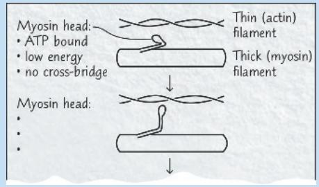

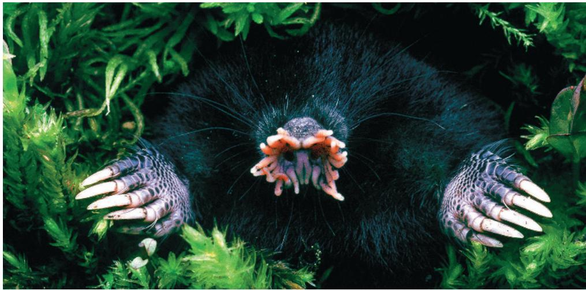  
Figure 50.1 Tunneling beneath North American wetlands, the star-nosed mole (Condylura cristata) finds its prey in almost total darkness. To do so, the mole relies on a star-shaped cluster of appendages, each with 25,000 touch-sensitive receptors. Relaying signals to the mole's brain, the receptors initiate information processing that enables the animal to capture and eat its prey in a fraction of a second.

## What steps link sensory stimuli to animal activity?

# Concept 50.1: Sensory receptors transduce stimulus energy and transmit signals to the central nervous system

All sensory processes begin with stimuli, and all stimuli represent forms of energy. A sensory receptor converts stimulus energy to a change in membrane potential, thereby regulating the output of action potentials to the central nervous system (CNS). Decoding of this information within the CNS results in sensation.

When a stimulus is received and processed by the nervous system, a motor response may be generated. One of the simplest stimulus-response circuits is a reflex, such as the knee-jerk reflex shown in Figure 49.5. For many other behaviors, sensory input undergoes more elaborate processing. As an example, consider how the star-nosed mole in Figure 50.1 searches for food, or forages, in a tunnel. When the mole's nose contacts an object, touch receptors in the nose are activated (Figure 50.2). These receptors transmit sensory information about the object, such as whether the object is moving, to the mole's brain. Circuits in the brain integrate the input and initiate one of two response pathways. If prey or other food is detected, the brain sends

Figure 50.2 A simple response pathway: foraging by a star-nosed mole.  

motor output commands to skeletal muscles that cause the jaws to bite down. If no food is detected, the brain sends instructions to skeletal muscles to continue movement along the tunnel.

With this overview in mind, let's examine the general organization and activity of animal sensory systems. We'll focus on four basic functions common to sensory pathways: sensory reception, transduction, transmission, and perception.

## Sensory Reception and Transduction

A sensory pathway begins with sensory reception, the detection of a stimulus by specialized sensory cells. Each sensory cell is either a neuron or a cell that regulates a neuron (Figure 50.3). Some sensory cells exist singly; others are collected in sensory organs, such as the star-shaped nose of the mole in Figure 50.1.

The term sensory receptor describes a sensory cell or organ, as well as the subcellular structure that detects stimuli. Some sensory receptors respond to stimuli from within the body, such as blood pressure and body position. Other receptors detect stimuli from outside the body, such as heat, light, pressure, or chemicals. Some of these receptors are sensitive to the smallest possible unit of stimulus. Most light receptors, for example, can detect a single quantum (photon) of light.

Although animals use a range of sensory receptors to detect widely varying stimuli, the effect in all cases is to open or close ion channels. The resulting change in the flow of ions across the membrane alters the membrane potential. The change in membrane potential is called a receptor potential, and conversion of the stimulus to a receptor potential is known as sensory transduction. Note that receptor potentials are graded potentials: Their magnitude varies with the strength of the stimulus.

Figure 50.3 Neuronal and non-neuronal sensory receptors.  

## Transmission

Sensory information travels through the nervous system as action potentials. A sensory receptor that is also a neuron generates action potentials that travel along an axon extending into the CNS (see Figure 50.3). In contrast, a non-neuronal sensory receptor does not itself generate action potentials, but instead conveys information to an afferent neuron via a chemical synapse. Because this chemical signaling alters the rate at which the afferent neurons produce action potentials, the sensory information generated also enters the CNS in the form of action potentials.

The size of a receptor potential increases with the intensity of the stimulus. If the receptor is a sensory neuron, a larger receptor potential results in more frequent action potentials (Figure 50.4). If the receptor is not a sensory neuron, a larger receptor potential usually causes the receptor to release more neurotransmitter.

Many sensory neurons spontaneously generate action potentials at a low rate. In these neurons, a stimulus does not switch the production of action potentials on or off, but instead changes how often an action potential is produced, alerting the nervous system to changes in stimulus intensity.

Processing of sensory information can occur before, during, and after transmission of action potentials to the CNS. In many cases, the integration of sensory information begins as soon as the information is received. Receptor potentials produced by stimuli delivered to different parts of a sensory receptor cell are integrated through summation, as are postsynaptic potentials in neurons that receive input from multiple sensory receptors. As you'll see shortly, sensory structures such as eyes also provide higher levels of integration, and the brain further processes all incoming signals.

Figure 50.4 Coding of stimulus intensity by a single sensory receptor.  
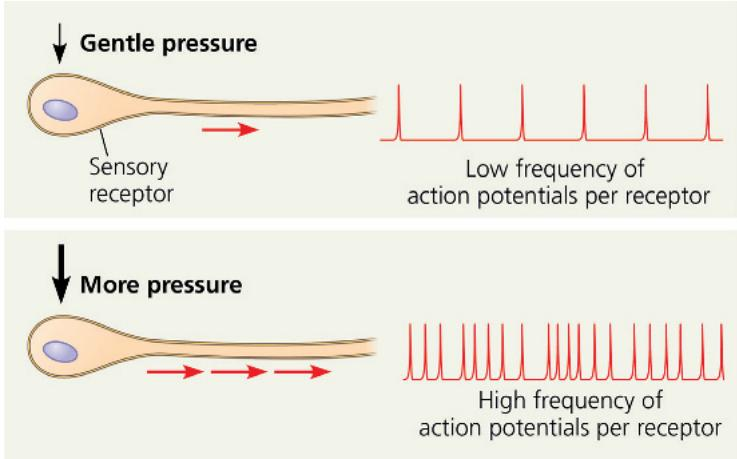

## Perception

When action potentials reach the brain via afferent neurons, circuits of neurons process this input, generating the perception of the stimulus. An action potential triggered by light striking the eye has the same properties as an action potential triggered by air vibrating in the ear. How, then, do we distinguish sights, sounds, and other stimuli? The answer lies in the connections that link sensory receptors to the brain. Action potentials from sensory receptors travel along neurons that are dedicated to a particular stimulus; these dedicated neurons form synapses with particular neurons in the brain or spinal cord. As a result, the brain distinguishes stimuli such as sight and sound solely by the path along which the action potentials have arrived.

Perceptions—such as colors, smells, sounds, and tastes—are constructions formed in the brain and do not exist outside it. So if a tree falls and no animal is present to hear it, is there a sound? The falling tree certainly produces pressure waves in the air, but if sound is defined as a perception, then there is no sound unless an animal senses the waves and its brain perceives them.

## Amplification and Adaptation

The transduction of stimuli by sensory receptors is subject to two types of modification—amplification and adaptation. Amplification refers to the strengthening of a sensory signal during transduction. The effect of amplification can be considerable. For example, an action potential conducted from the eye to the human brain has about 100,000 times as much energy as the few photons of light that triggered it.

Amplification that occurs in sensory receptor cells often requires signal transduction that involves enzyme-catalyzed reactions (see Concept 11.3). Because a single enzyme molecule catalyzes the formation of many product molecules, these pathways amplify signal strength considerably. Amplification may also take place in accessory structures of a sense organ. For example, the lever system formed by three small bones in the ear enhances the pressure associated with sound waves more than 20-fold before the stimulus reaches receptors in the innermost part of the ear.

Upon continued stimulation, many receptors undergo a decrease in responsiveness known as sensory adaptation (not to be confused with the evolutionary term adaptation). Sensory adaptation has very important roles in our perception of ourselves and our surroundings. Without it, you would feel each beat of your heart and be constantly aware of every bit of clothing on your body. Furthermore, adaptation is essential for you to see, hear, and smell changes in external stimuli that vary widely in intensity.

## Types of Sensory Receptors

Sensory receptors fall into five categories based on the nature of the stimuli they transduce: mechanoreceptors, chemoreceptors, electromagnetic receptors, thermoreceptors, and pain receptors.

## Mechanoreceptors

Our senses of hearing, balance, touch, and body position all rely on mechanoreceptors, which sense physical deformation caused by forms of mechanical energy. The vertebrate stretch receptor, a mechanoreceptor that detects muscle movement, triggers the familiar knee-jerk reflex (see Figure 49.5). Stretch receptors in vertebrates are dendrites of sensory neurons that spiral around the middle of certain small skeletal muscle fibers. When the muscle fibers are stretched, the sensory neurons depolarize, triggering nerve impulses that reach the spinal cord, activate motor neurons, and generate a reflex response.

Mechanoreceptors that are the dendrites of sensory neurons are also responsible for the mammalian sense of touch. Touch receptors are often embedded in layers of connective tissue. The structure of the connective tissue and the location of the receptors dramatically affect the type of mechanical energy (light touch, vibration, or strong pressure) that best stimulates them (Figure 50.5). Receptors that detect a light touch or vibration are close to the surface of the skin; they transduce very slight inputs of mechanical energy into receptor potentials. Receptors that respond to stronger pressure and vibrations are in deep skin layers.

Some animals use mechanoreceptors to literally get a feel for their environment. For example, cats and many rodents have

Figure 50.5 Sensory receptors in human skin.

Most receptors in the dermis are encapsulated by connective tissue. Receptors in the epidermis are naked dendrites, as are hair movement receptors that wind around the base of hairs in the dermis.

Receptors that detect gentle pressure and vibration are close to the surface of the skin.

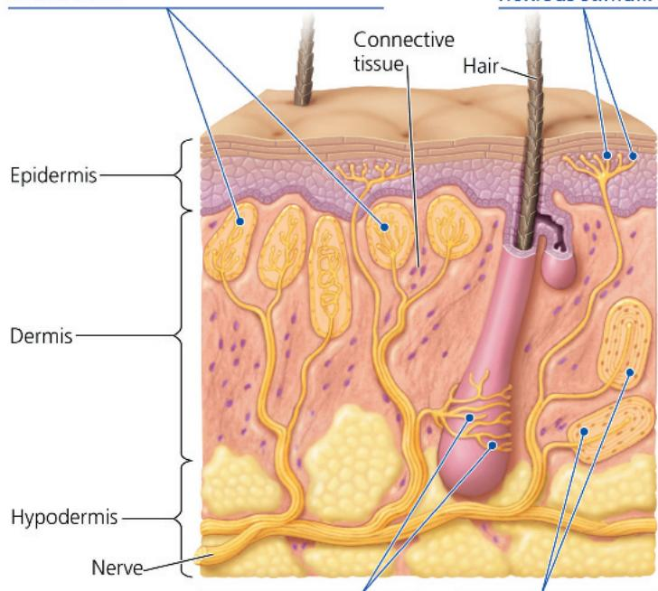  
Naked dendrites wind around the base of hairs and detect hair movement.  
Receptors that respond to strong pressure are in deep skin layers.  
Figure 50.6 Chemoreceptors in an insect.

extremely sensitive mechanoreceptors at the base of their whiskers. Like the appendages on the face of the star-nosed mole, whiskers act as touch organs. Deflection of different whiskers triggers action potentials that reach different cells in the brain. As a result, an animal's whiskers enable the brain to assemble a "touch map" detailing the location of nearby objects such as food or obstacles.

At the subcellular level, an ion channel called Piezo 2 is responsible for detecting stretch, gentle pressure, and vibration. This enormous ion channel consists of three subunits, each containing 38 transmembrane domains. Mechanical stimuli open the channel, allowing positive ions to enter the cell and produce a depolarizing receptor potential.

## Chemoreceptors

Chemoreceptors that monitor the internal environment fall into two broad categories. Some transmit information about overall solute concentration. For example, osmoreceptors in the mammalian brain detect changes in the total solute concentration of the blood and stimulate thirst when osmolarity increases (see Figure 44.19). Other chemoreceptors respond to specific molecules in body fluids, including glucose, oxygen, carbon dioxide, and amino acids.

Animals also use chemoreceptors to detect stimuli in their diet and in the environment they occupy. The antennae of the male silkworm moth contain two of the most sensitive and specific chemoreceptors known (Figure 50.6); these receptors can detect

The antennae of the male silkworm moth Bombyx mori are covered with sensory hairs, visible in the SEM enlargement. The hairs have chemoreceptors that are highly sensitive to the sex pheromone released by the female.

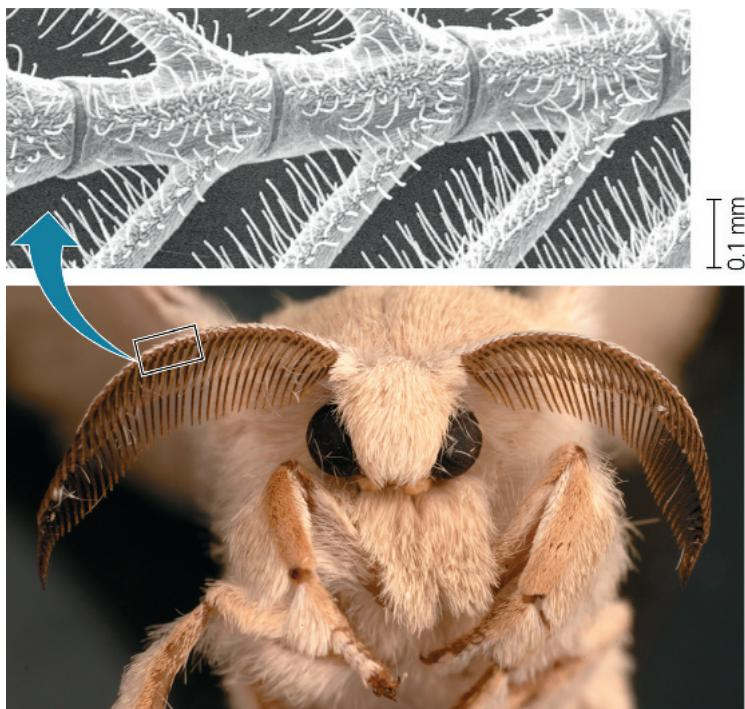

components of the sex pheromone released by a female moth several kilometers away. For pheromones and other molecules detected by chemoreceptors, the stimulus molecule binds to the specific receptor on the membrane of the sensory cell and initiates changes in ion permeability.

## Electromagnetic Receptors

An electromagnetic receptor detects a form of electromagnetic energy, such as light, electricity, and magnetism. For instance, the platypus has electroreceptors on its bill that can detect the electric field generated by the muscles of crustaceans, small fishes, and other prey. In a few cases, the animal detecting the stimulus is also its source: Some fishes generate electric currents and then use electroreceptors to locate prey or other objects that disturb those currents.

Many animals can use Earth's magnetic field lines to orient themselves as they migrate (Figure 50.7a). In 2015, researchers identified a pair of proteins that appear to act as a sensor for the Earth's magnetic field in many animals that can orient to it, including monarch butterflies, pigeons, and minke whales. One of these proteins binds iron; the other is a receptor that is sensitive to electromagnetic radiation.

Figure 50.7 Examples of electromagnetic reception and thermoreception.  
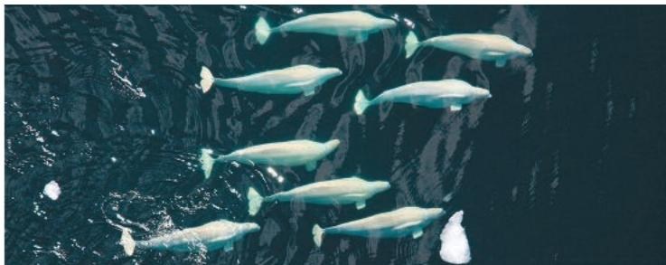  
(a) Some migrating animals, such as these beluga whales, apparently sense Earth's magnetic field and use the information, along with other cues, for orientation.

  
(b) This rattlesnake and other pit vipers have a pair of heat-sensing pit organs, one anterior to and just below each eye. These organs are sensitive enough to detect the infrared radiation emitted by a warm prey a meter away. The snake moves its head from side to side until the radiation is detected equally by the two pit organs, indicating that the prey is straight ahead.

## Thermoreceptors

Thermoreceptors detect heat and cold. For example, certain venomous snakes rely on thermoreceptors to detect the infrared radiation emitted by warm prey. These thermoreceptors are located in a pair of pit organs on the snake's head (Figure 50.7b). In humans, thermoreceptors are located in the skin and in the anterior hypothalamus.

Recently, our understanding of thermoreception has increased substantially, thanks to scientists with an appreciation for fiery foods. Jalapeno and cayenne peppers that we describe as “hot” contain a substance called capsaicin. Applying capsaicin to a sensory neuron causes an influx of calcium and other positively charged ions. When scientists identified the receptor protein in neurons that binds capsaicin, they made a fascinating discovery: The receptor is actually a gated cation channel that opens in response not only to capsaicin but also to high temperatures (42°C or higher). In essence, spicy foods taste “hot” because they activate the same receptors as hot soup and coffee.

Mammals have a variety of thermoreceptors, each specific for a particular temperature range. The capsaicin receptor and at least 10 other types of thermoreceptors belong to the TRP (transient receptor potential) family of ion channel proteins. Just as the TRPV1 receptor specific for high temperature is sensitive to capsaicin, the TRPM8 receptor that senses low temperatures (below 28°C) can be activated by menthol, a plant product that we perceive to have a “cool” flavor.

## Pain Receptors

Extreme pressure or temperature, as well as certain chemicals, can damage animal tissues. To detect stimuli that reflect such noxious (harmful) conditions, animals rely on nociceptors (from the Latin nocere, to hurt), also called pain receptors. By triggering defensive reactions, such as withdrawal from danger, the perception of pain serves an important function. The TRPV1 (capsaicin) receptor responds to noxious chemicals as well as to dangerously high temperatures, so it also functions as a nociceptor.

Chemicals produced in an animal's body sometimes enhance the perception of pain. For example, damaged tissues produce prostaglandins, which act as local regulators of inflammation (see Concept 45.1). Prostaglandins worsen pain by increasing nociceptor sensitivity to noxious stimuli. Aspirin and ibuprofen reduce pain by inhibiting the synthesis of prostaglandins.

Next, we'll turn our focus to sensory systems, beginning with systems for maintaining balance and detecting sound.

## Concept Check 50.1

1. Which one of the five categories of sensory receptors is primarily dedicated to external stimuli?

2. Why can eating "hot" peppers cause a person to sweat?

3. WHAT IF? If you stimulated a sensory neuron electrically, how would that stimulation be perceived?

# Concept 50.2: In hearing and equilibrium, mechanoreceptors detect moving fluid or settling particles

For most animals, the sense of hearing is closely related to the sense of balance, the perception of body equilibrium. For both senses, mechanoreceptor cells produce receptor potentials in response to deflection of cell-surface structures by settling particles or moving fluid.

## Sensing of Gravity and Sound in Invertebrates

To sense gravity and maintain equilibrium, most invertebrates rely on mechanoreceptors located in organs called statocysts (Figure 50.8). In a typical statocyst, statoliths, granules formed by grains of sand or other dense materials, sit freely in a chamber lined with ciliated cells. Each time an animal repositions itself, the statoliths resettle, stimulating mechanoreceptors at the low point in the chamber.

How did researchers test the hypothesis that resettling of statoliths provides information about body position relative to Earth's gravity? In one key experiment, statoliths were replaced with metal shavings. Researchers then “tricked” crayfish into swimming upside down by using magnets to pull the shavings to the upper end of statocysts at the base of their antennae.

Many (perhaps most) insects have body hairs that vibrate in response to sound waves. Hairs differing in stiffness and length vibrate at different frequencies. For example, fine hairs on the antennae of a male mosquito vibrate in a specific way in response

The settling of granules called statoliths to the low point in the chamber bends cilia on receptor cells in that location, providing the brain with information about the orientation of the body with respect to gravity.

Figure 50.9 An insect's "ear"—on its leg.

The tympanic membrane, visible in this SEM of a cricket's front leg, vibrates in response to sound waves. The vibrations stimulate mechanoreceptors attached to the inside of the tympanic membrane.

Figure 50.8 The statocyst of an invertebrate.  
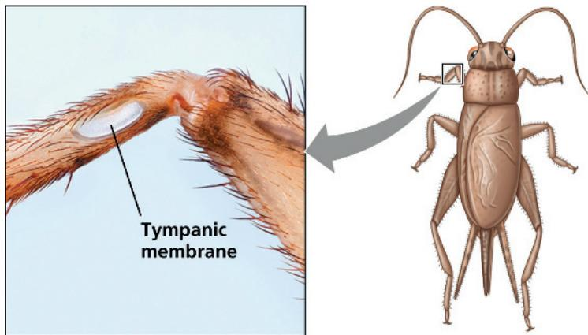

to the hum produced by the beating wings of flying females. The importance of this sensory system in attracting males to a potential mate can be readily demonstrated: A tuning fork vibrating at the same frequency as that of a female's wings by itself attracts males.

Many insects also detect sound by means of vibration-sensitive organs, which consist in some species of a tympanic membrane (eardrum) stretched over an internal air chamber (Figure 50.9). Cockroaches lack such a tympanic membrane, but instead have vibration-sensitive organs that sense air movement, such as that caused by a descending human foot.

## Hearing and Equilibrium in Mammals

In mammals, as in most other terrestrial vertebrates, the sensory organs for hearing and equilibrium are closely associated. Figure 50.10 explores the structure and function of these organs in the human ear.

## Hearing

Vibrating objects, such as a plucked guitar string or the vocal cords of a person who is speaking, create pressure waves in the surrounding air. In hearing, the ear transduces this mechanical stimulus into nerve impulses that the brain perceives as sound. The sensory organ for hearing, the organ of Corti, contains hair cells, mechanoreceptors with hairlike projections that detect motion created by pressure waves.

Before vibration waves reach hair cells, they are amplified and transformed by accessory structures. The first steps involve structures in the ear that convert the vibrations of moving air to pressure waves in fluid. Moving air that reaches the outer ear causes the tympanic membrane to vibrate. The three bones of the middle ear transmit these vibrations to the oval window, a membrane between the middle ear and the inner ear. When one of those bones, the stapes, vibrates against the oval window, it creates pressure waves in the fluid inside the cochlea, a fluid-filled chamber of the inner ear.

# Exploring the Structure of the Human Ear

## Figure 50.10

## 1 Overview of Ear Structure

The outer ear consists of the external pinna and the auditory canal, which collect sound waves and channel them to the tympanic membrane (eardrum), a thin tissue that separates the outer ear from the middle ear. In the middle ear, three small bones—the malleus (hammer), incus (anvil), and stapes (stirrup)—transmit vibrations to the oval window, which is a membrane beneath the stapes. The middle ear also opens into the auditory (Eustachian) tube, a passage that connects to the pharynx and equalizes pressure between the middle ear and the atmosphere. The inner ear consists of fluid-filled chambers, including the semicircular canals, which function in equilibrium, and the coiled cochlea (from the Latin meaning “snail”), a bony chamber that is involved in hearing.

## 2 The Cochlea

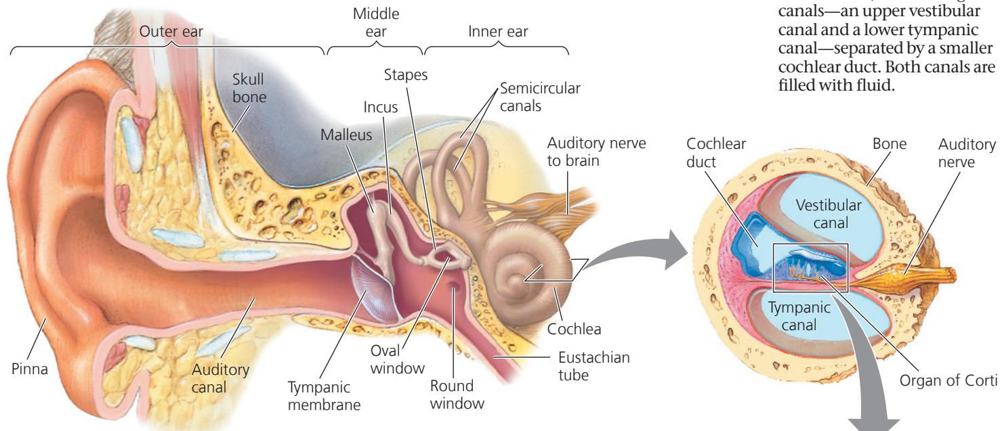

The cochlea, shown here in cross section, has two large canals—an upper vestibular canal and a lower tympanic canal—separated by a smaller cochlear duct. Both canals are filled with fluid.

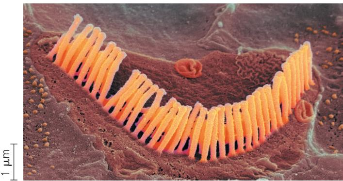

▲ Bundled hairs projecting from a single mammalian hair cell (SEM). Two shorter rows of hairs lie behind the tall hairs in the foreground.

## 4 Hair Cell

Many hairs project from each hair cell. Each cell contains a core of actin filaments and mechanically gated ion channels in the plasma membrane. Vibration of the basilar membrane in response to sound raises and lowers the hair cells, bending the hairs against the surrounding fluid and the tectorial membrane. The membrane tension generated by this movement opens or closes the ion channels. By altering ion flow, this change results in a receptor potential that is depolarizing or hyperpolarizing.

## 3 The Organ of Corti

The floor of the cochlear duct, the basilar membrane, is the base of the organ of Corti, which contains the mechanoreceptors of the ear—hair cells with bundles of rod-shaped “hairs” projecting into the cochlear duct. Many of the hairs are attached to the tectorial membrane, which hangs over the organ of Corti like an awning.

## Figure 50.11 Sensory reception by hair cells.

In hearing or balance, each hair cell forms a synapse with an afferent neuron that conducts action potentials to the CNS. Bending of the hairs of the hair cell in one direction depolarizes the cell. Depolarization increases release of excitatory neurotransmitter, resulting in more frequent action potentials in the afferent neuron. Bending the hairs in the other direction decreases neurotransmitter release, reducing action potential frequency in the afferent neuron.

  
(a) No bending of hairs

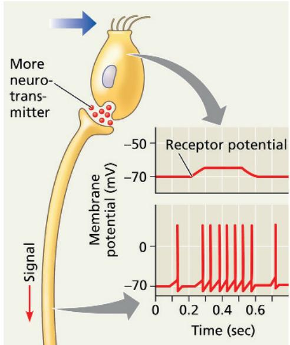  
(b) Bending of hairs in one direction

  
(c) Bending of hairs in other direction

Upon entering the vestibular canal, fluid pressure waves push down on the cochlear duct and basilar membrane. In response, the basilar membrane and attached hair cells vibrate up and down. The hairs projecting from the hair cells are deflected by the fixed tectorial membrane, which lies above (see Figure 50.10). With each vibration, the hairs bend first in one direction and then the other, causing ion channels in the hair cells to open or close. Bending in one direction depolarizes hair cells, increasing neurotransmitter release and the frequency of action potentials directed to the brain along the auditory nerve (Figure 50.11). Bending the hairs in the other direction hyperpolarizes hair cells, reducing neurotransmitter release and the frequency of auditory nerve sensations.

What prevents pressure waves from reverberating within the ear and causing prolonged sensation? After propagating through the vestibular canal, pressure waves pass around the apex (tip) of the cochlea and dissipate as they strike the round window (Figure 50.12a). This damping of sound waves resets the apparatus for the next vibrations that arrive.

The ear captures information about two important sound variables: volume and pitch. Volume (loudness) is determined by the amplitude, or height, of the sound wave. A large-amplitude wave causes more vigorous vibration of the basilar membrane, greater bending of the hairs on hair cells, and more action potentials in the afferent neurons that transmit information to the brain. Pitch is determined by a sound wave's frequency, the number of vibrations per unit time. The detection of sound wave frequency takes place in the cochlea and relies on the asymmetric structure of that organ.

The cochlea can distinguish pitch because the basilar membrane is not uniform along its length: It is relatively narrow and stiff near the oval window and wider and more flexible at the apex at the base of the cochlea. Each region of the basilar membrane is tuned to a different vibration frequency (Figure 50.12b). Furthermore, each region is connected by axons to a different location in the cerebral cortex. Consequently, when a sound wave causes vibration of a particular region of the basilar membrane, nerve impulses are transduced to a specific site in our cortex and we perceive sound of a particular pitch.

## Equilibrium

Several organs in the inner ear of humans and most other mammals detect body movement, position, and equilibrium. For example, the chambers called the utricle and saccule allow us to perceive position with respect to gravity as well as linear movement (Figure 50.13). Situated in a vestibule behind the oval window, each of these chambers contains hair cells that project into a gelatinous material. Embedded in this gel are small calcium carbonate particles called otoliths (“ear stones”). When you tilt your head, the otoliths shift position, contacting a different set of hairs protruding into the gel. The hair cell receptors transform this deflection into a change in neurotransmitter output. This alters the activity of afferent neurons, signaling the brain that your head is at an angle. The otoliths are also responsible for your ability to perceive acceleration, such as when a stationary car in which you are sitting moves forward.

Three fluid-filled semicircular canals connected to the utricle detect turning of the head and other rotational acceleration.

Figure 50.12 Sensory transduction in the cochlea.

The high surface tension of water, resulting from the collective strength of its hydrogen bonds, allows this raft spider to walk on the surface of a pond.

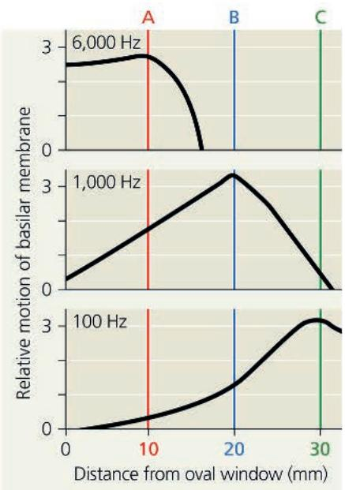  
(a) Vibrations of the stapes against the oval window produce pressure waves (black arrows) in the fluid (perilymph; blue) of the cochlea. (For purposes of illustration, the cochlea on the right is drawn partially uncoiled.) The waves travel to the apex via the vestibular canal and back towards the base via the tympanic canal. The energy in the waves causes the basilar membrane (pink) to vibrate, stimulating hair cells (not shown). Because the basilar membrane varies in stiffness along its length, each point along the membrane vibrates maximally in response to waves of a particular frequency.  
(b) These graphs show the patterns of vibration along the basilar membrane for three different frequencies, high (top), medium (middle), and low (bottom). The higher the frequency, the closer the vibration to the oval window.

INTERPRET THE DATA A musical chord consists of several notes, each formed by a sound wave of different frequency. If a chord had notes with frequencies of 100, 1,000, and 6,000 Hz, what would happen to the basilar membrane? How would this result in your hearing a chord?

Within each canal, the hair cells form a cluster, with the hairs projecting into a gelatinous cap called a cupula (see Figure 50.13). Because the three canals are arranged in the three spatial planes, they can detect angular motion of the head in any direction. If you spin in place, the fluid in each canal eventually comes to equilibrium and remains in that state until you stop. At that point, the moving fluid encounters a stationary cupula, triggering the false sensation of angular motion that we call dizziness.

Figure 50.13 Organs of equilibrium in the inner ear.  

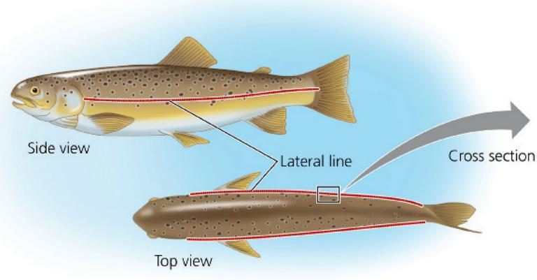  
Figure 50.14 The lateral line system in a fish.

The sensory organs of the lateral line stretch from head to tail along each side of the fish. Water movement into and through the lateral line canals pushes on the gelatinous cupula, bending the hair cells within. In response, the hair cells generate receptor potentials, triggering action potentials that are conveyed to the brain. This information enables a fish to monitor water currents, any pressure waves produced by moving objects, and any low-frequency sounds conducted through the water.

## Hearing and Equilibrium in Other Vertebrates

Fishes rely on several systems for detecting movement and vibrations in their aquatic environment. One system involves a pair of inner ears that contain otoliths and hair cells. Unlike the ears of mammals, these ears have no eardrum, cochlea, or opening to the outside of the body. Instead, the vibrations of the water caused by sound waves are conducted to the inner ear through the skeleton of the head. Some fishes also have a series of bones that conduct vibrations from the swim bladder to the inner ear.

Most fishes and aquatic amphibians are able to detect low-frequency waves by means of a lateral line system along each side of their body (Figure 50.14). As in our semicircular canals, receptors are formed from a cluster of hair cells whose hairs are embedded in a cupula. Water entering the lateral line system through numerous pores bends the cupula, leading to depolarization of the hair cells and production of action potentials. In this way, the fish perceives its movement through water or the direction and velocity of water currents flowing over its body. The lateral line system also detects water movements or vibrations generated by prey, predators, and other moving objects.

In the ear of a frog or toad, sound vibrations in the air are conducted to the inner ear by a tympanic membrane on the body surface and a single middle ear bone. The same is true in birds and other reptiles, although they, like mammals, have a cochlea.

## Concept Check 50.2

1. How are otoliths adaptive for burrowing mammals, such as the star-nosed mole?

2. WHAT IF? Suppose a series of pressure waves in your cochlea caused a vibration of the basilar membrane that moved gradually from the apex toward the base. How would your brain interpret this stimulus?

3. WHAT IF? If the stapes became fused to the other middle ear bones or to the oval window, how would this condition affect hearing? Explain.

4. MAKE CONNECTIONS Plants use statoliths to detect gravity (see Figure 39.22). How do plants and animals differ with regard to the type of compartment in which statoliths are found and the physiological mechanism for detecting their response to gravity?

For suggested answers, see Appendix A.

## Concept 50.3: The diverse visual receptors of animals depend on light-absorbing pigments

The ability to detect light has a central role in the interaction of nearly all animals with their environment. Although the organs used for vision vary considerably among animals, the underlying mechanism for capturing light is the same, suggesting a common evolutionary origin.

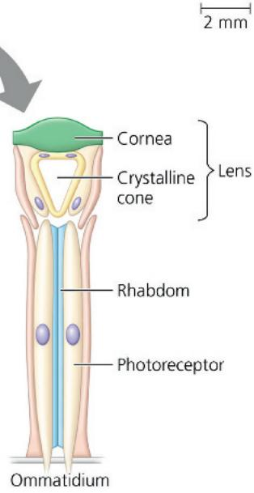

Figure 50.15 Ocelli and orientation behavior of a planarian.  
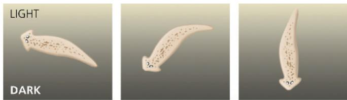  
(a) The planarian's brain directs the body to turn until the sensations from the two ocelli are equal and minimal, causing the animal to move away from light.

  
(b) Whereas light striking the front of an ocellus excites the photoreceptors, light striking the back is blocked by the screening pigment. In this way, the ocelli indicate the direction of a light source, enabling the light avoidance behavior.  
(a) The faceted eyes on the head of a fly form a repeating pattern visible in this photomicrograph.

## Evolution of Visual Perception

EVOLUTION Light detectors in the animal kingdom range from simple clusters of cells that detect only the direction and intensity of light to complex organs that form images. These diverse light detectors all contain photoreceptors, sensory cells that contain light-absorbing pigment molecules. Furthermore, the genes that specify where and when photoreceptors arise during embryonic development are shared among flatworms, annelids, arthropods, and vertebrates. It is thus very probable that the genetic underpinnings of all photoreceptors were already present in the earliest bilaterian animals.

## Light-Detecting Organs

Most invertebrates have some kind of light-detecting organ. One of the simplest is that of planarians (Figure 50.15). A pair of ocelli (singular, ocellus), sometimes called eyespots, are located in the head region. Photoreceptors in each ocellus receive light only through an opening where there are no pigmented cells. By comparing the rate of action potentials coming from the two ocelli, the planarian can move away from a light source until it reaches a shaded location, where the object providing the shade may hide it from predators.

## Compound Eyes

Insects, crustaceans, and some polychaete worms have compound eyes, each consisting of up to several thousand light detectors called ommatidia (Figure 50.16). Each of these “facets” of the eye has its own light-focusing lens that captures light from a tiny portion of the visual field (the total area seen when the eyes point forward). A compound eye is very effective at detecting movement, an important adaptation for flying insects and small animals constantly threatened with predation. Many compound eyes, including those of the fly in Figure 50.16, offer a very wide field of view.

## Figure 50.16 Compound eyes.

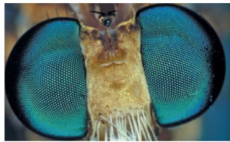

(b) The cornea and crystalline cone of each ommatidium together function as a lens that focuses light on the rhabdom, an organelle formed by and extending inward from a circle of photoreceptors. The rhabdom traps light, serving as the photo-sensitive part of the ommatidium. Information gathered from different intensities of light entering the many ommatidia from different angles is used to form a visual image.

Insects have excellent color vision, and some, such as bees, can see into the ultraviolet (UV) range of the electromagnetic spectrum. Because UV light is invisible to humans, we don't see differences in the environment that bees and other insects detect. In studying animal behavior, we cannot simply extrapolate our sensory world to other species; different animals have different sensitivities and different brain organizations.

## Single-Lens Eyes

Among invertebrates, single-lens eyes are found in some jellies and polychaete worms, as well as in spiders and many molluscs. A single-lens eye works somewhat like a camera.

The eye of an octopus or squid, for example, has a small opening, the pupil, through which light enters. Like a camera's adjustable aperture, the iris expands or contracts, changing the diameter of the pupil to let in more or less light. Behind the pupil, a single lens directs light on a layer of photoreceptors. Similar to a camera's focusing action, muscles in an invertebrate's single-lens eye move the lens forward or backward, focusing on objects at different distances.

The eyes of all vertebrates have a single lens. In fishes, focusing occurs as in invertebrates, with the lens moving forward or backward. In other species, including mammals, focusing is achieved by changing the shape of the lens.

## The Vertebrate Visual System

The human eye will serve as our model of vision in vertebrates. As described in Figure 50.17, vision begins when photons of light enter the eye and strike the innermost layer of the eye, the retina.

## Exploring the Structure of the Human Eye

Figure 50.17  

## 1 Overview of Eye Structure

Starting from the outside, the human eye is surrounded by the conjunctiva, a mucous membrane (not shown); the sclera, a connective tissue; and the choroid, a thin, pigmented layer. At the front, the sclera forms the transparent cornea and the choroid forms the colored iris. By changing size, the iris regulates the amount of light entering the pupil, the hole in the center of the iris. Just inside the choroid, the neurons and photoreceptors of the retina form the innermost layer of the eyeball. The optic nerve exits the eye at the optic disk.

The lens, a transparent disk of protein, divides the eye into two cavities. In front of the lens lies the aqueous humor, a clear watery substance. Blockage of ducts that drain this fluid can produce glaucoma, a condition in which increased pressure in the eye damages the optic nerve, causing vision loss. Behind the lens lies the jellylike vitreous humor (illustrated here in the lower portion of the eyeball). The cornea and the lens refract (bend) light rays so that they converge on the fovea, the region of the retina where vision is sharpest.

The retina contains two types of photoreceptors: rods and cones. There the energy of each photon is captured in retinal, the light-absorbing molecule in the visual pigment rhodopsin.

Although light detection in the eye is the first stage in vision, remember that it is actually the brain that “sees.” Thus, to understand vision, we must examine how the capture of light by retinal changes the production of action potentials and then follow these signals to the visual centers of the brain, where images are perceived.

## Sensory Transduction in the Eye

The transduction of visual information to the nervous system begins with the light-induced conversion of cis-retinal to trans-retinal in rods and cones. Like other cis-trans pairs, these isomers

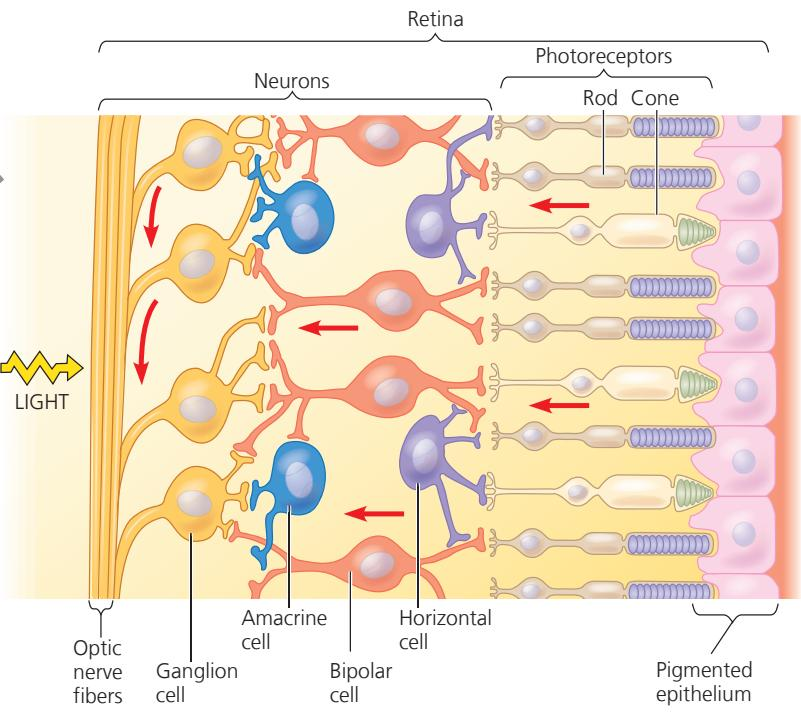

## 2 The Retina

Light (coming from the left in this diagram) strikes the retina, passing through largely transparent layers of neurons before reaching the rods and cones, two types of photoreceptors that differ in shape and in function. The neurons of the retina then relay visual information captured by the photo receptors to the optic nerve and brain along the pathways shown with red arrows. Each bipolar cell receives information from several rods or cones, and each ganglion cell gathers input from several bipolar cells. Horizontal and amacrine cells integrate information across the retina.

The optic disk, where the optic nerve exits the retina, lacks photo-receptors. As a result, this region forms a “blind spot” where light is not detected.

of retinal differ only in the spatial arrangement of atoms at a carbon–carbon double bond (see Figure 4.7).

As shown in Figure 50.17, trans-retinal and cis-retinal differ in shape. This shift in shape activates the visual pigment (in rods, rhodopsin), which activates a G protein, which in turn activates the enzyme phosphodiesterase. The substrate for this enzyme in rods and cones is cyclic GMP (cGMP), which in the dark binds to sodium ion ( $Na^{+}$ ) channels and keeps them open (Figure 50.18a, after you turn the page). When the enzyme hydrolyzes cGMP, $Na^{+}$ channels close, and the cell becomes hyperpolarized (Figure 50.18b). The signal transduction pathway then shuts off as enzymes convert retinal back to the cis form, inactivating the visual pigment.

In bright light, rhodopsin remains active, and the response in the rods becomes saturated. If the amount of light entering the eyes abruptly decreases, the rods do not regain full responsiveness

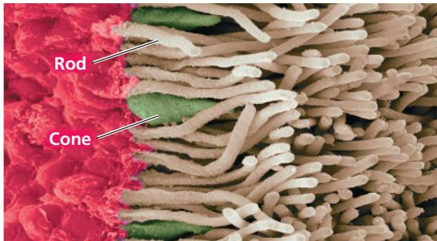

## 3 Photoreceptor Cells

Humans have two main types of photoreceptor cells: rods and cones. Within the outer segment of a rod or cone is a stack of membranous disks in which visual pigments are embedded. Rods are more sensitive to light than cones are, but they do not distinguish colors; rods enable us to see at night, but only in black and white. Cones provide color vision, but, being less sensitive, contribute very little to night vision. There are three types of cones. Each has a different sensitivity across the visible spectrum, providing an optimal response to red, green, or blue light.

In the colorized SEM shown above, cones (green), rods (light tan), and adjacent neurons (red) are visible. The pigmented epithelium, which was removed in this preparation, would be to the right.

## 4 Visual Pigments

Vertebrate visual pigments consist of a light-absorbing molecule called retinal (a derivative of vitamin A) bound to a membrane protein called an opsin. Seven $\alpha$ helices of each opsin molecule span the disk membrane. The visual pigment of rods, shown here, is called rhodopsin.

Retinal exists as two isomers. Absorption of light shifts one bond in retinal from a cis to a trans arrangement, converting the molecule from an angled shape to a straight shape. This change in configuration activates the opsin protein to which retinal is bound.

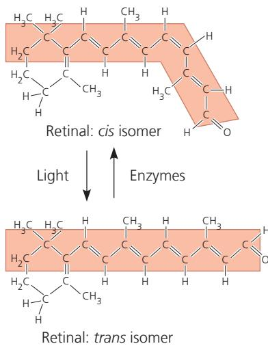

VISUAL SKILLS The isomers of retinal have the same number of atoms and bonds but differ in the spatial arrangement at one carbon–carbon double bond (C=C). In each isomer, circle that C=C bond. Looking at the atoms around that bond, to what atoms do the terms cis (same side) and trans (opposite side) refer? For suggested answer, see Appendix A.

for several minutes. This is why you are briefly blinded if you pass quickly from bright sunshine into a dark movie theater. (Because light activation changes the color of rhodopsin from purple to yellow, rods in which the light response is saturated are often described as “bleached.”)

## Processing of Visual Information in the Retina

The processing of visual information begins in the retina itself, where both rods and cones form synapses with bipolar cells (see Figure 50.17). In the dark, rods and cones are depolarized and continually release the neurotransmitter glutamate at these synapses (Figure 50.19, on the next page). When light strikes the rods and

cones, they hyperpolarize, shutting off their release of glutamate. Depending on the glutamate receptor subtype present on the bipolar cell, either hyperpolarization or depolarization can result from decreased glutamate signaling. By altering the action potential frequency, this change in membrane potential alters the release of neurotransmitters at synapses with ganglion cells.

Processing of signals from rods and cones occurs via several different pathways in the retina. Some information passes directly from photoreceptors to bipolar cells to ganglion cells. In other cases, horizontal cells carry signals from one rod or cone to other photoreceptors and to several bipolar cells.

How is it adaptive for visual information to follow several paths? We'll consider one example. When an illuminated rod or cone stimulates a horizontal cell, the horizontal cell inhibits more (b) Light triggers a cascade of events that activate rhodopsin, transducin, and the enzyme phosphodiesterase, which converts cGMP to GMP. When the cGMP level falls, cGMP no longer occupies the binding sites on the channels, causing the channels to close and the cell to hyperpolarize.

Light triggers a receptor potential in a rod (shown here) or cone. Note that for photoreceptors, this change in membrane potential is a hyperpolarization.

Figure 50.18 Response of a photoreceptor cell to light.  
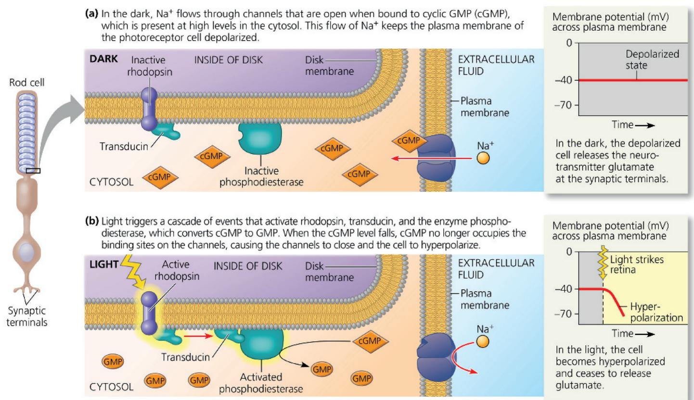  
In the dark, the depolarized cell releases the neurotransmitter glutamate at the synaptic terminals.

Figure 50.19 Synaptic activity of rod cells in light and dark.  
  
Like rods, cone cells are depolarized when their opsin molecules are inactive. In the case of a cone, why might it be misleading to call this a dark response? For suggested answer, see Appendix A.

distant photoreceptors and bipolar cells that are not illuminated. The result is that the region receiving light appears lighter and the dark surroundings even darker. This form of integration, called lateral inhibition, sharpens edges and enhances contrast in the image. An essential part of visual processing, lateral inhibition occurs in the brain as well as the retina.

A single ganglion cell receives information from an array of rods and cones, each of which responds to light coming from a particular location. Together, the rods and cones that are feeding information to one ganglion cell define a receptive field—the part of the visual field to which that ganglion cell can respond. The fewer rods or cones that supply a single ganglion cell, the smaller the receptive field. A smaller receptive field typically results in a sharper image because the information about where light has struck the retina is more precise.

## Processing of Visual Information in the Brain

Axons of ganglion cells form the optic nerves that transmit action potentials from the eyes to the brain (Figure 50.20). The two optic nerves meet at the optic chiasm near the center of the base of the cerebral cortex. Axons in the optic nerves are routed at the optic chiasm such that sensations from the left visual field are transmitted to the right side of the brain, and sensations from the right visual field are transmitted to the left side of the brain. (Note that each visual field, whether right or left, involves input from both eyes.)

Within the brain, most ganglion cell axons lead to the lateral geniculate nuclei, which have axons that reach the primary visual

Figure 50.20 Neural pathways for vision.

Each optic nerve contains about a million axons that synapse with interneurons in the brain. The nuclei relay sensations to the primary visual cortex, one of many brain centers that cooperate in constructing visual perceptions.

cortex in the cerebrum. Additional neurons carry the information to higher-order visual processing and integrating centers elsewhere in the cortex. Researchers estimate that at least 30% of the cerebral cortex, comprising hundreds of millions of neurons in perhaps dozens of integrating centers, takes part in formulating what we actually “see.” Determining how these centers integrate such components of our vision as color, motion, depth, shape, and detail is the focus of much exciting research.

## Color Vision

Among vertebrates, most fishes, amphibians, and reptiles, including birds, have very good color vision. Humans and other primates also see color well, but are among the minority of mammals with this ability. For cats and other mammals that are most active at night, a high proportion of rods in the retina is an adaptation that provides keen night vision. Color vision among these nocturnal animals is limited, and they probably see a pastel world during the day.

In humans, the perception of color is based on three types of cones, each with a different visual pigment—red, green, or blue. The three visual pigments, called photopsins, are formed from the binding of retinal to three distinct opsin proteins. Slight differences in the opsin proteins cause each photopsin to absorb light optimally at a different wavelength. Although the visual pigments are designated as red, green, and blue, their absorption spectra in fact overlap. For this reason, the brain's perception of intermediate hues depends on the differential stimulation of two or more classes of cones. For example, if both red and green cones are stimulated, we see either yellow or orange, depending on which class of cones is more strongly stimulated.

Abnormal color vision typically results from mutations in the genes for one or more photopsin proteins. In humans, color blindness nearly always affects perception of red or green and is far more common in one gender than the other: 5–8% of males, fewer than 1% of females. Why? The human genes for both the red and green pigments are X-linked. Thus, males are affected by a single mutation, whereas females are color-blind only if both copies are mutant. (The human gene for the blue pigment is on chromosome 7.)

Experiments on color vision in the squirrel monkey (Saimiri sciureus) enabled an early breakthrough in the field of gene therapy. These monkeys have only two opsin genes, one sensitive to blue light and the other sensitive to either red or green light, depending on the allele. Because the red/green opsin gene is X-linked, all males have only the red- or green-sensitive version and are red-green color-blind. When researchers injected a virus containing the gene for the missing version into the retina of adult male monkeys, evidence of full color vision was apparent after 20 weeks (Figure 50.21).

The squirrel monkey gene therapy studies demonstrate that the neural circuits required to process visual information can be generated or activated even in adults, making it possible to treat a range of vision disorders. Indeed, gene therapy has been used to treat Leber's congenital amaurosis (LCA), an inherited retinal degenerative disease that causes severe loss of vision. After using gene therapy to restore vision in dogs and mice with LCA, researchers successfully treated the disease in humans by injecting the functional LCA gene in a viral vector (see Figure 20.22).

Figure 50.21 Gene therapy for vision.

Once color-blind, this adult male monkey treated with gene therapy demonstrates his ability to distinguish red from green.

  
MAKE CONNECTIONS Red-green color blindness is X-linked in squirrel monkeys and in humans (see Figure 15.7). Why is the inheritance pattern in humans not apparent in squirrel monkeys? For suggested answer, see Appendix A.

## The Visual Field

The brain not only processes visual information but also controls what information is captured. One important control is focusing, which in humans occurs by changing the shape of the lens, as noted earlier and illustrated in Figure 50.22. When you focus your eyes on a close object, your lenses become almost spherical. When you view a distant object, your lenses are flattened.

Although our peripheral vision allows us to see objects over a nearly $180^{\circ}$ range, the distribution of photoreceptors across the eye limits both what we see and how well we see it. Overall, the human retina contains about 125 million rods and 6 million cones. At the fovea, the center of the visual field, there are no rods but a very high density of cones—about 150,000 cones per square millimeter. The ratio of cones to rods falls with distance from the fovea, with the peripheral regions having only rods. In daylight, you achieve your sharpest vision by looking directly at an object, such that light shines on the tightly packed cones in your fovea. At night, looking directly at a dimly lit object is ineffective, since the rods—the more sensitive light receptors—are absent from the fovea. For this reason, you see a dim star best by focusing on a point just to one side of it.

Figure 50.22 Focusing in the mammalian eye.

Ciliary smooth muscles control the shape of the lens, which bends light and focuses it on the retina. The greater the curvature of the lens, the more sharply the light is bent. Note that these diagrams show a horizontal section of the eye.

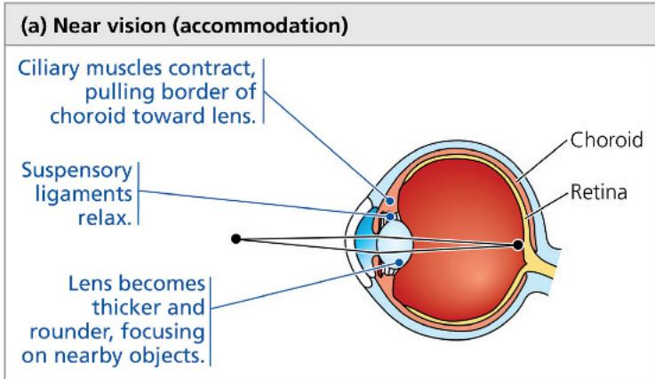

## Concept Check 50.3

1. Contrast the light-detecting organs of planarians and flies. How is each organ adaptive for the lifestyle of the animal?

2. In a condition called presbyopia, the eyes' lenses lose much of their elasticity and maintain a flat shape. How would you expect this condition to affect a person's vision?

3. WHAT IF? Our brain receives more action potentials when our eyes are exposed to light even though our photoreceptors release more neurotransmitter in the dark. Propose an explanation.

4. MAKE CONNECTIONS Compare the function of retinal in the eye with that of the pigment chlorophyll in a plant photosystem (see Concept 10.2).

For suggested answers, see Appendix A.

## Concept 50.4: The senses of taste and smell rely on similar sets of sensory receptors

Animals use their chemical senses for a wide range of purposes, including finding mates, recognizing marked territories, and helping navigate during migration. In addition, animals such as ants and bees that live in large social groups rely extensively on chemical “conversation.”

In all animals, chemical senses are important for feeding behavior. The perceptions of gustation (taste) and olfaction (smell) both depend on chemoreceptors. In the case of terrestrial animals, taste is the detection of chemicals called tastants that are present in a solution, and smell is the detection of odorants that are carried through the air. There is no distinction between taste and smell in aquatic animals.

In insects, taste receptors are located within sensory hairs located on the feet and in mouthparts, where they are used to select food. A tasting hair contains several chemoreceptors, each especially responsive to a particular class of tastant, such as sugar or salt. Insects are also capable of smelling airborne odorants using olfactory hairs, usually located on their antennae (see Figure 50.6). The chemical DEET (N, N-diethyl-meta-toluamide), marketed as an insect “repellant,” actually protects against bites by blocking the olfactory receptor in mosquitoes that detects human scent.

## Taste in Mammals

Humans and other mammals perceive five tastes: sweet, sour, salty, bitter, and umami. Umami (which means “pleasant savory taste” in Japanese) is elicited by the amino acid glutamate. Sometimes used as a flavor enhancer in the form of monosodium glutamate, or MSG, glutamate occurs naturally in meat, aged cheese, and other foods, to which it imparts a “savory” quality.

For decades, many researchers assumed that a taste cell could have more than one type of receptor. An alternative idea is that each taste cell has a single receptor type, programming the cell to recognize only one of the five tastes. To test this hypothesis, scientists used a cloned bitter taste receptor to genetically reprogram gustation in a mouse (Figure 50.23). This reprogramming experiment, together with follow-up studies, revealed that an individual taste cell does in fact express a single receptor type and detects tastants representing only one of the five tastes.

## Figure 50.23

## Inquiry: How do mammals detect different tastes?

## Experiment

To investigate the basis of mammalian taste perception, researchers used a chemical called phenyl- $\beta$ -D-glucopyranoside (PBDG). Humans find PBDG extremely bitter. Mice, however, lack a receptor for PBDG. Mice avoid drinking water containing other bitter tastants but show no aversion to water that contains PBDG.

Using a molecular cloning strategy, the researchers generated mice that made the human PBDG receptor in cells that normally make either a sweet receptor or a bitter receptor. The mice were given a choice of two bottles, one filled with pure water and one filled with water containing PBDG at varying concentrations. The researchers then observed whether the mice had an attraction or an aversion to PBDG.

Results  
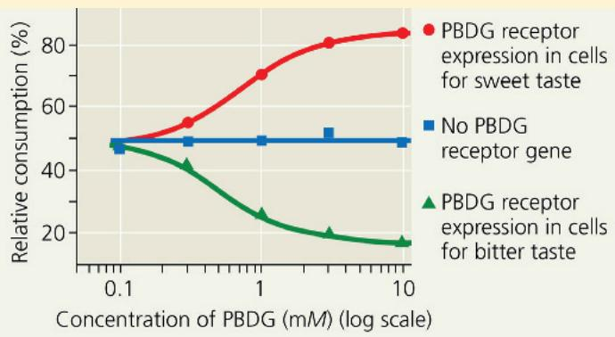

## Conclusion

The researchers found that the presence of a bitter receptor in sweet taste cells is sufficient to cause mice to be attracted to a bitter chemical. They concluded that the mammalian brain must therefore perceive sweet or bitter taste solely on the basis of which afferent neurons are activated.

Data from K. L. Mueller et al., The receptors and coding logic for bitter taste, Nature 434:225–229 (2005).

WHAT IF? Suppose that instead of the PBDG receptor, the researchers had used a receptor specific for a sweetener that humans crave but mice ignore. How would the results of the experiment have differed?
For suggested answer, see Appendix A.

The receptor cells for taste in mammals are modified epithelial cells organized into taste buds, which are scattered in several areas of the tongue and mouth (Figure 50.24). Most taste buds on the tongue are associated with nipple-shaped projections called papillae. Any region of the tongue with taste buds can detect any of the five types of taste. (The frequently reproduced “taste maps” of the tongue are thus not accurate.)

Researchers have identified the receptor proteins for all five tastes. The sensations of sweet, umami, and bitter tastes each require one or more genes encoding a G protein-coupled receptor, or GPCR (see Figures 11.7 and 11.8). Humans have one type of sweet receptor and one type of umami receptor, each assembled from a different pair of GPCR proteins. In contrast, humans have more than 30 different receptors for bitter taste, and each receptor is able to recognize multiple bitter tastants. GPCR proteins are also critical for the sense of smell, as will be discussed shortly.

Figure 50.24 Human taste receptors.  
  
(a) The tongue. Small raised structures called papillae cover the tongue surface. The enlarged cross section shows the side walls of a papilla lined with taste buds.

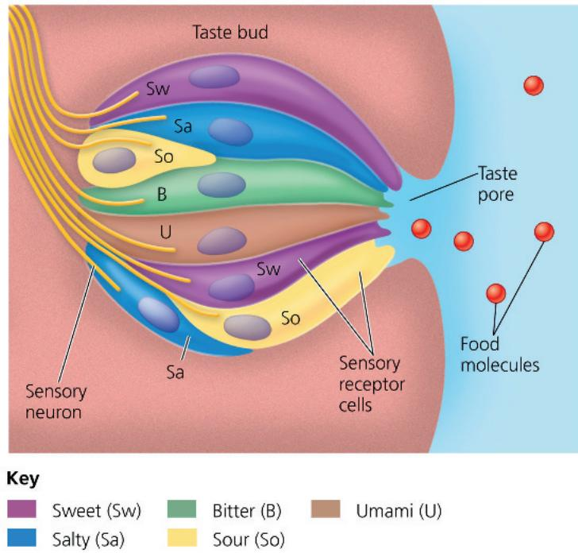  
(b) A taste bud. Taste buds in all regions of the tongue contain sensory receptor cells specific for each of the five taste types.

The receptor for sour tastants is a hydrogen channel called Otop1. (Sour substances are acidic, meaning that they liberate hydrogen ions when in solution.) Hydrogen ions entering the cell through this channel decrease the intracellular pH, which closes potassium channels. Depolarization occurs, activating an afferent neuron that relays information to the CNS, triggering the perception of a sour taste.

The taste receptor for salt turns out to be a sodium channel. Not surprisingly, it specifically detects sodium salts, such as the NaCl that we use in cooking and flavoring.

## Smell in Humans

In olfaction, unlike gustation, the sensory cells are neurons. Olfactory receptor cells line the upper portion of the nasal cavity and send impulses along their axons to the olfactory bulb of the brain (Figure 50.25). The receptive ends of the cells contain cilia that extend into the layer of mucus coating the nasal cavity. When an odorant diffuses into this region, it binds to a specific GPCR protein called an olfactory receptor (OR) on the plasma membrane of the olfactory cilia. These events trigger signal transduction leading to the production of cyclic AMP. In olfactory cells, cyclic AMP opens channels in the plasma membrane that are permeable to both $Na^{+}$ and $Ca^{2+}$ . The flow of these ions into the receptor cell leads to depolarization of the membrane, generating action potentials.

Mammals can distinguish thousands of different odors, each caused by a structurally distinct odorant. How is this remarkable sensory discrimination possible? American researchers Linda Buck and Richard Axel found the answer—a very large gene family. Working with mice, Buck and Axel discovered 1,200 different OR genes—and were honored with a Nobel Prize in 2004. Humans have just 380 OR genes, far fewer than mice, but still nearly 2% of all the genes in our genome. Identification of particular odors relies on two basic properties of the olfactory system. First, each olfactory receptor cell expresses one OR gene. Second, those cells that express the same OR gene transmit action potentials to the same small region of the olfactory bulb.

After odorants are detected, information from olfactory receptors is collected and integrated. Genetic studies on mice, worms, and flies have shown that signals from the nervous system regulate this process, dialing the response to particular odorants up or down. As a result, animals can detect the location of food sources even if the concentration of a key odorant is particularly low or high.

Studies of model organisms also reveal that complex mixtures of odorants are not processed as the simple sum of each input.

Figure 50.25 Smell in humans.

Odorant molecules bind to specific chemoreceptor proteins in the plasma membrane of olfactory receptor cells, triggering action potentials. Each olfactory receptor cell has just one type of chemoreceptor. As shown, cells that express different chemoreceptors detect different odorants.

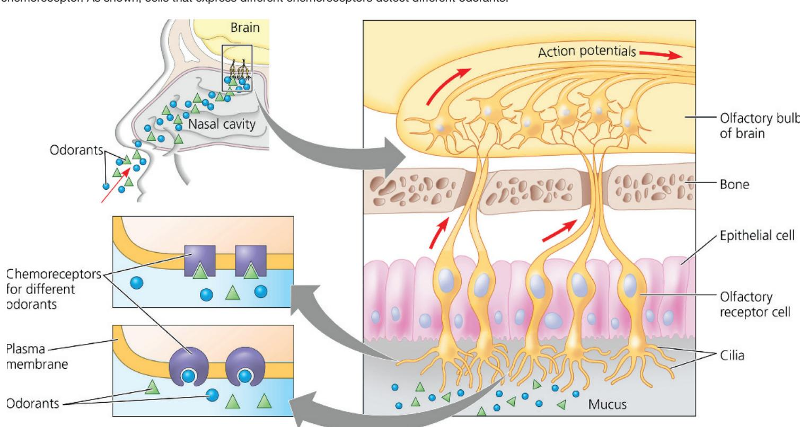  
WHAT IF? If you spray an air freshener in a musty room, would you be affecting detection, transmission, or perception of the odorants responsible for the musty smell?  
For suggested answer, see Appendix A.

Rather, the brain integrates olfactory information from different receptors into single sensations. These sensations contribute to the perception of the environment in the present and to the memory of events and emotions.

Although the receptors and neuronal pathways for taste and smell are independent, the two senses do interact. Indeed, much of the complex flavor humans experience when eating is due to our sense of smell. If the olfactory system is blocked, as occurs when you have a head cold, the perception of flavor is sharply reduced.

## Concept Check 50.4

1. Explain why some taste receptor cells and all olfactory receptor cells use G protein-coupled receptors, yet only olfactory receptor cells produce action potentials.

2. Pathways involving G proteins provide an opportunity for an increase in signal strength in the course of signal transduction, a change referred to as amplification. How might this be beneficial in olfaction?

3. WHAT IF? If you discovered a mutation in mice that disrupted the ability to taste sweet, bitter, and umami but not sour or salty, what might you predict about where this mutation acts in the signaling pathways used by these receptors?

For suggested answers, see Appendix A.

## Concept 50.5: The physical interaction of protein filaments is required for muscle function

In discussing sensory mechanisms, we have seen how sensory inputs to the nervous system can result in specific behaviors: the touch-guided foraging of a star-nosed mole, the upside-down swimming of a crayfish with manipulated statocysts, and the light-avoiding maneuvers of planarians. Underlying these diverse behaviors are common fundamental mechanisms: Feeding, swimming, and crawling all require muscle activity in response to nervous system motor output.

Muscle cell contraction relies on the interaction between protein structures called thin and thick filaments. The major component of thin filaments is the globular protein actin. In thin filaments, two strands of polymerized actin are coiled around one another; similar actin structures called microfilaments function in cell motility. The thick filaments are staggered arrays of myosin molecules. Muscle contraction is the result of filament movement powered by chemical energy; muscle extension occurs only passively. To understand how filaments bring about muscle contraction, we will begin by examining the skeletal muscle of vertebrates.

## Vertebrate Skeletal Muscle

Vertebrate skeletal muscle, which moves bones and body, has a hierarchy of smaller and smaller units (Figure 50.26). Within a typical skeletal muscle is a bundle of long fibers running along the length of the muscle. Each individual fiber is a single cell. Within are multiple nuclei, each derived from one of the stem cells that

Figure 50.26 The structure of skeletal muscle.  
  
VISUAL SKILLS Looking at this figure, would you say that there are multiple sarcomeres per myofibril, multiple myofibrils per sarcomere, or both? Explain. For suggested answer, see Appendix A.

fused to form the fiber. Surrounding these nuclei are longitudinal myofibrils, which consist of bundles of thin and thick filaments.

The myofibrils in muscle fibers are made up of repeating sections called sarcomeres, which are the basic contractile units of skeletal muscle. The borders of the sarcomere line up in adjacent myofibrils, forming a pattern of light and dark bands (striations) visible with a light microscope. For this reason, skeletal muscle is also called striated muscle. Thin filaments attach at the Z lines at the sarcomere ends, while thick filaments are anchored in the middle of the sarcomere (M line).

In a resting (relaxed) myofibril, thick and thin filaments partially overlap. Near the edge of the sarcomere there are only thin filaments, whereas the zone in the center contains only thick filaments. This partially overlapping arrangement is the key to how the sarcomere, and hence the whole muscle, contracts.

## The Sliding-Filament Model of Muscle Contraction

A contracting muscle shortens, but the filaments that bring about contraction stay the same length. To explain this apparent paradox, we'll focus first on a single sarcomere. As shown in Figure 50.27, the filaments slide past each other, much like the segments of a telescoping support pole. According to the well-accepted sliding-filament model, the thin and thick filaments ratchet past each other, powered by myosin molecules.

Figure 50.28 illustrates the cycles of change in the myosin molecule that convert the chemical energy of ATP into the longitudinal sliding of thick and thin filaments.

As shown in the figure, each myosin molecule has a long “tail” region and a globular “head” region. The tail adheres to the tails of other myosin molecules, binding together the thick filament. The head, jutting to the side, can bind ATP. Hydrolysis of bound ATP converts myosin to a high-energy form that binds to actin, forming a cross-bridge between the myosin and the thin filament. The myosin head then returns to its low-energy

Figure 50.27 The sliding-filament model of muscle contraction.
The drawings on the left show that the lengths of the thick (myosin) filaments (purple) and thin (actin) filaments (orange) remain the same as a muscle fiber contracts.

form as it helps to pull the thin filament toward the center of the sarcomere. When a new ATP molecule binds to the myosin head, the cross-bridge is disrupted, releasing the myosin head from the actin filament.

Muscle contraction requires repeated cycles of binding and release. During each cycle of each myosin head, the head is freed from a cross-bridge, cleaves the newly bound ATP, and binds again to actin. Because the thin filament moves toward the center of the sarcomere in each cycle, the myosin head now attaches to a binding site farther along the thin filament than in the previous cycle. Each end of a thick filament contains approximately 300 heads, each of which forms and re-forms about five cross-bridges per second, driving the thick and thin filaments past each other.

At rest, most muscle fibers contain only enough ATP for a few contractions. Powering repetitive contractions requires two other compounds found in muscle cells: creatine phosphate and glycogen. The transfer of a phosphate group from creatine phosphate to ADP in an enzyme-catalyzed reaction synthesizes additional ATP. In this way, the resting supply of creatine phosphate can sustain contractions for about 15 seconds. Glycogen is broken down into glucose, which can then be used to replenish ATP stores. During light or moderate muscle activity, this glucose is fully metabolized by aerobic respiration (see Concept 9.1). On average, stored glycogen alone can power sustained contractions for nearly an hour.

Muscle cells also use nutrients in the blood to generate ATP. Glucose liberated from liver glycogen and fatty acids released from fat cells are particularly important during low-intensity, long-duration activities. During intense muscle activity, many glucose molecules undergo glycolysis, but most of the resulting pyruvate molecules are converted into lactate rather than undergoing the remaining steps of aerobic respiration (see Concept 9.5). This pathway, which does not require either oxygen or mitochondria, is very rapid. However, it generates much less ATP per glucose molecule and can sustain contraction for only a short time.

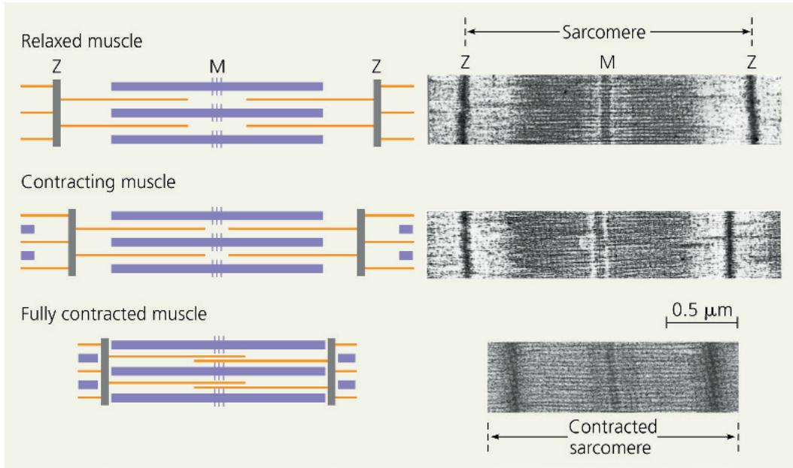

Figure 50.28 Myosin-actin interactions underlying muscle fiber contraction.  
  
When ATP binds the myosin head, what prevents the filaments from sliding back into their original positions? For suggested answer, see Appendix A.

## The Role of Calcium and Regulatory Proteins

Proteins bound to actin play crucial roles in controlling muscle contraction. In a muscle fiber at rest, tropomyosin, a regulatory protein, and the troponin complex, a set of additional regulatory proteins, are bound to the actin strands of thin filaments. Tropomyosin covers the myosin-binding sites along the thin filament, preventing actin and myosin from interacting (Figure 50.29a).

Motor neurons enable actin and myosin to interact by triggering a release of calcium ions ( $Ca^{2+}$ ) into the cytosol. Once in the cytosol, $Ca^{2+}$ binds to the troponin complex, causing the myosin-binding sites on actin to be exposed (Figure 50.29b). Note that the effect of $Ca^{2+}$ is indirect: Binding to $Ca^{2+}$ causes the troponin complex to change shape, dislodging tropomyosin from the myosin-binding sites.

When the $Ca^{2+}$ concentration rises in the cytosol, the cycle of cross-bridge formation begins, the thin and thick filaments slide past each, and the muscle fiber contracts. When the $Ca^{2+}$ concentration falls, the binding sites are covered, and contraction stops.

Figure 50.29 The role of regulatory proteins and calcium in muscle fiber contraction.

Each thin filament consists of two strands of actin and associated regulatory proteins: two long molecules of tropomyosin and multiple copies of the troponin complex.

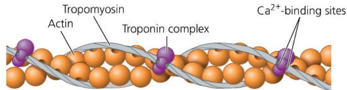  
(a) Myosin-binding sites blocked by tropomyosin

  
(b) Myosin-binding sites exposed

5 Cycles of myosin cross-bridge formation and release, coupled with ATP hydrolysis, slide the thin filament toward the center of the sarcomere.

Figure 50.30 The roles of the sarcoplasmic reticulum and T tubules in muscle fiber contraction.  
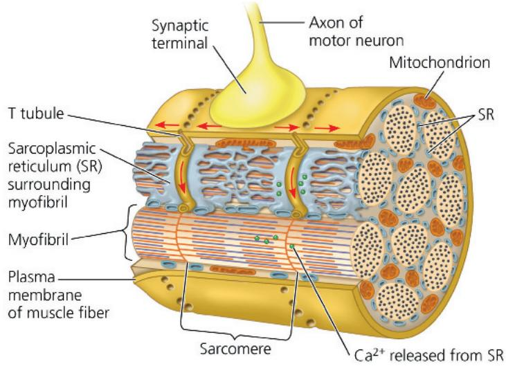  
Figure 50.31 Summary of contraction in a skeletal muscle fiber.

Motor neurons cause muscle contraction through a multi-step process triggering the movement of $Ca^{2+}$ into the cytosol of muscle cells. This process is summarized in Figure 50.30 and detailed step by step in Figure 50.31. First, the arrival of an action potential at the synaptic terminal of a motor neuron ① causes release of the neurotransmitter acetylcholine. Binding of acetylcholine to receptors on the muscle fiber leads to a depolarization that initiates an action potential. Within the muscle fiber, the action potential spreads deep into the interior, following infoldings of the plasma membrane called transverse tubules (T tubules). ② These make close contact with the sarcoplasmic reticulum (SR), a specialized endoplasmic reticulum. As the action potential spreads along the T tubules, it triggers changes in the SR, opening $Ca^{2+}$ channels ③. Calcium ions stored in the interior of the SR flow through open channels into the cytosol ④ and bind to the troponin complex, ⑤ initiating the muscle fiber contraction.

The synaptic terminal of a motor neuron releases acetylcholine, which depolarizes the plasma membrane of the muscle fiber. The depolarization causes action potentials (red arrows) to sweep across the muscle fiber and deep into it along the T tubules. The action potentials trigger the release of calcium (green dots) from the sarcoplasmic reticulum into the cytosol. Calcium initiates the sliding of filaments by allowing myosin to bind to actin.

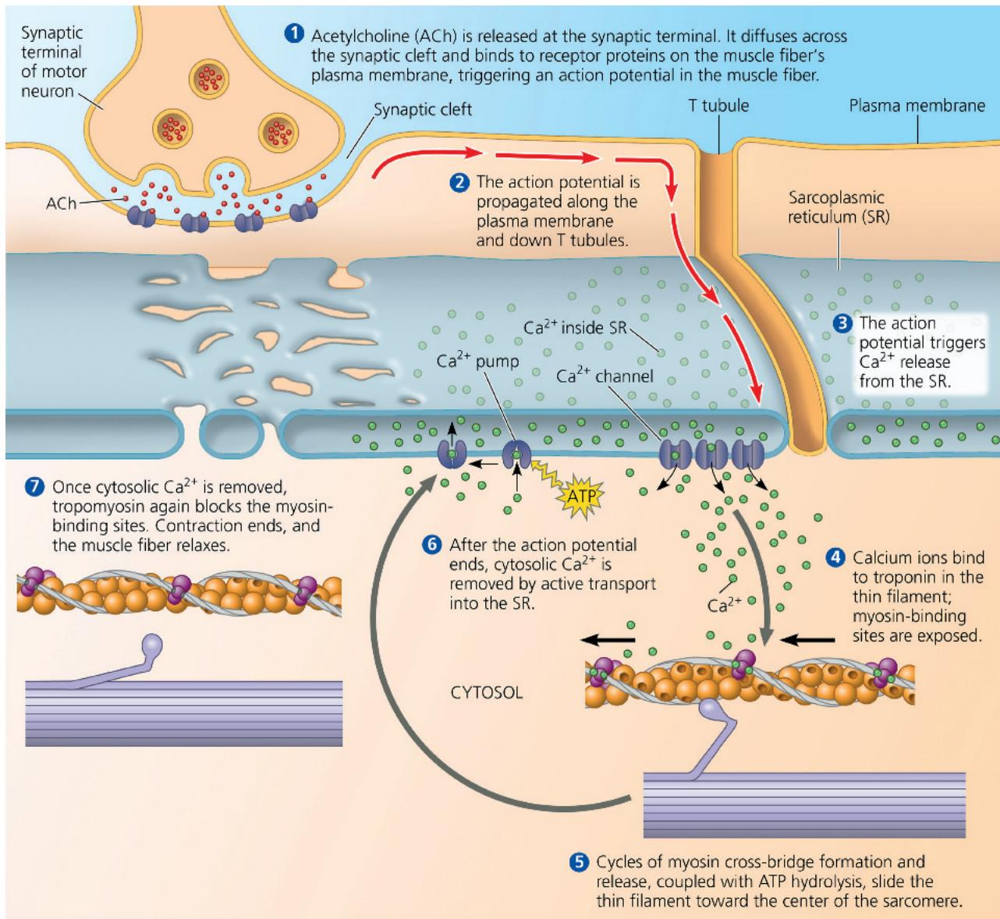

When motor neuron input stops, the filaments slide back to their starting position as the muscle relaxes. Relaxation begins as proteins in the SR pump $Ca^{2+}$ back into the SR ⑥ from the cytosol. When the $Ca^{2+}$ concentration in the cytosol drops to a low level, the regulatory proteins bound to the thin filament shift back to their starting position, ⑦ once again blocking the myosin-binding sites. At the same time, the $Ca^{2+}$ pumped from the cytosol accumulates in the SR, providing the stores needed to respond to the next action potential.

Several diseases cause paralysis by interfering with the excitation of skeletal muscle fibers by motor neurons. In amyotrophic lateral sclerosis (ALS), motor neurons in the spinal cord and brainstem degenerate, and muscle fibers atrophy. ALS is progressive and usually fatal within 5 years after symptoms appear. New gene therapies have shown promise at delaying this progression, however; they act by interfering with the production of proteins that promote neuron degeneration. In myasthenia gravis, a person produces antibodies to the acetylcholine receptors of skeletal muscle. As the disease progresses and the number of receptors decreases, transmission between motor neurons and muscle fibers declines. Myasthenia gravis can generally be controlled with drugs that inhibit acetylcholinesterase or suppress the immune system.

## Nervous Control of Muscle Tension

Whereas a single action potential in a single skeletal muscle fiber causes a brief all-or-none twitch, contraction of a whole muscle, such as the biceps in your upper arm, is graded; you can voluntarily alter the extent and strength of its contraction. The nervous system produces graded contractions of whole muscles by varying (1) the number of muscle fibers that contract and (2) the rate at which muscle fibers are stimulated. Let's consider each mechanism in turn.

In vertebrates, each branched motor neuron may form synapses with many muscle fibers, although each fiber is controlled by only one motor neuron. A motor unit consists of a single motor neuron and all the muscle fibers it controls (Figure 50.32). When a motor neuron produces an action potential, all the muscle fibers in its motor unit contract as a group. The strength of the resulting contraction depends on how many muscle fibers the motor neuron controls.

In the whole muscle, there may be hundreds of motor units. As more and more of the corresponding motor neurons are activated, a process called recruitment, the force (tension) developed by a muscle progressively increases. Depending on the number of motor neurons your brain recruits and the size of their motor units, you can lift a fork or something much heavier, like a biology textbook. Some muscles, especially those that hold up the body and maintain posture, are almost always partially contracted. In such muscles, the nervous system may alternate activation among the motor units, reducing the length of time any one set of fibers is contracted.

The nervous system regulates muscle contraction not only by controlling which motor units are activated but also by varying the rate of muscle fiber stimulation. A single action potential

Figure 50.32 Motor units in a vertebrate skeletal muscle. Each muscle fiber (cell) forms synapses with only one motor neuron, but each motor neuron typically synapses with many muscle fibers. A motor neuron and all the muscle fibers it controls constitute a motor unit.  
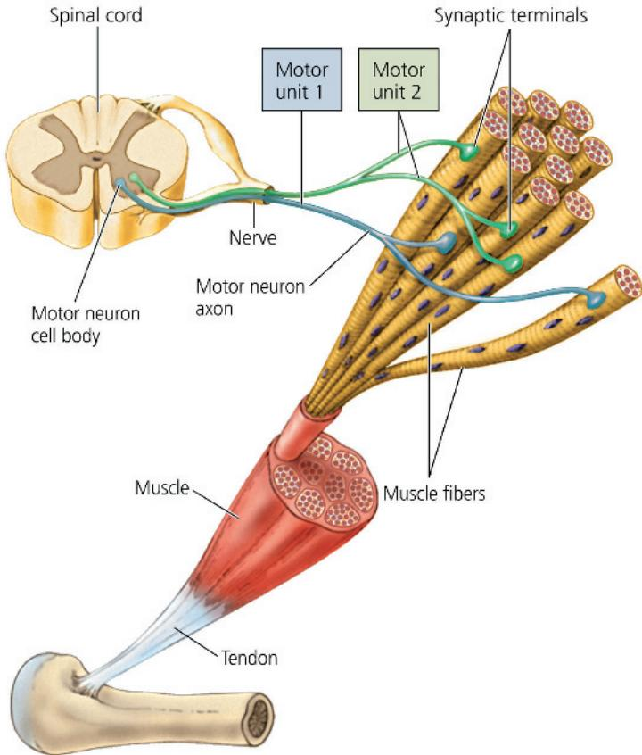

produces a twitch lasting about 100 milliseconds or less. If a second action potential arrives before the muscle fiber has completely relaxed, the two twitches add together, resulting in greater tension (Figure 50.33). Further summation occurs as the rate of stimulation increases. When the rate is so high that the

Figure 50.33 Summation of twitches.  
This graph illustrates how the number of action potentials during a short period of time influences the tension developed in a muscle fiber.  
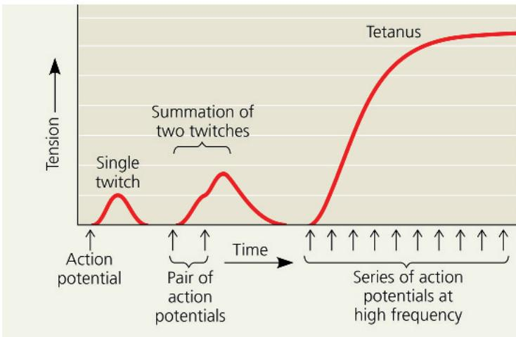  
How could the nervous system cause a skeletal muscle to produce the most forceful contraction it is capable of?
For suggested answer, see Appendix A.

Figure 50.34 Specialization of skeletal muscles.

muscle fiber cannot relax at all between stimuli, the twitches fuse into one smooth, sustained contraction called tetanus. (Note that tetanus is also the name of a disease of uncontrolled muscle contraction caused by a bacterial toxin.)

## Types of Skeletal Muscle Fibers

Our discussion to this point has focused on the general properties of vertebrate skeletal muscles. There are, however, several distinct types of skeletal muscle fibers, each of which is adapted to a particular set of functions. We typically classify these varied fiber types both by the source of ATP used to power their activity and by the speed of their contraction (Table 50.1).

## Oxidative and Glycolytic Fibers

Fibers that rely mostly on aerobic respiration are called oxidative fibers. Such fibers are specialized in ways that enable them to make use of a steady energy supply: They have many mitochondria, a rich blood supply, and a large amount of an oxygen-storing protein called myoglobin. A brownish red pigment, myoglobin binds oxygen more tightly than does hemoglobin, enabling oxidative fibers to extract oxygen from the blood efficiently. In contrast, glycolytic fibers have a larger diameter and less myoglobin. Also, glycolytic fibers use glycolysis as their primary source of ATP and fatigue more readily than oxidative fibers. These two fiber types are readily apparent in the muscle of poultry and fish: The dark meat (red muscle) is made up of oxidative fibers rich in myoglobin, and the light meat (white muscle) is composed of glycolytic fibers.

## Fast-Twitch and Slow-Twitch Fibers

Muscle fibers vary in the speed with which they contract: Fast-twitch fibers develop tension two to three times faster than slow-twitch fibers. Fast fibers enable brief, rapid, powerful contractions. Compared with a fast fiber, a slow fiber has less sarcoplasmic reticulum and pumps $Ca^{2+}$ more slowly. Because $Ca^{2+}$ remains in the cytosol longer, a muscle twitch in a slow fiber lasts about five times as long as one in a fast fiber.

The difference in contraction speed between slow-twitch and fast-twitch fibers mainly reflects the rate at which their myosin

Table 50.1 Types of Skeletal Muscle Fibers

<table><tr><td></td><td>Slow-Twitch</td><td colspan="2">Fast-Twitch</td></tr><tr><td></td><td>Oxidative</td><td>Oxidative</td><td>Glycolytic</td></tr><tr><td>Contraction speed</td><td>Slow</td><td>Fast</td><td>Fast</td></tr><tr><td>Major ATP source</td><td>Aerobic respiration</td><td>Aerobic respiration</td><td>Glycolysis</td></tr><tr><td>Rate of fatigue</td><td>Slow</td><td>Intermediate</td><td>Fast</td></tr><tr><td>Mitochondria</td><td>Many</td><td>Many</td><td>Few</td></tr><tr><td>Myoglobin content</td><td>High (red muscle)</td><td>High (red muscle)</td><td>Low (white muscle)</td></tr></table>

The male oyster toadfish (Opsanus tau) uses superfast muscles to produce its mating call.

heads hydrolyze ATP. However, there isn't a one-to-one relationship between contraction speed and ATP source. Whereas all slow-twitch fibers are oxidative, fast-twitch fibers can be either glycolytic or oxidative.

Most human skeletal muscles contain both fast-twitch and slow-twitch fibers, although the muscles of the eye and hand are exclusively fast-twitch. In a muscle that has a mixture of fast and slow fibers, the relative proportions of each are genetically determined. However, if such a muscle is used repeatedly for activities requiring high endurance, some fast glycolytic fibers can develop into fast oxidative fibers. Because fast oxidative fibers fatigue more slowly than fast glycolytic fibers, the result will be a muscle that is more resistant to fatigue.

Some vertebrates have skeletal muscle fibers that twitch at rates far faster than any human muscle. For example, superfast muscles produce a rattlesnake's rattle and a dove's coo. Even faster are the muscles surrounding the gas-filled swim bladder of the male oyster toadfish (Figure 50.34). In producing its "boat whistle" mating call, the toadfish can contract and relax these muscles more than 200 times per second!

## Other Types of Muscle

Although all muscles share the same fundamental mechanism of contraction—actin and myosin filaments sliding past each other—there are many different types of muscle. Vertebrates, for example, have cardiac muscle and smooth muscle in addition to skeletal muscle (see Figure 40.5).

Vertebrate cardiac muscle is found only in the heart and, like skeletal muscle, is striated. Unlike the cells of skeletal muscle fibers, some cardiac muscle cells can initiate rhythmic depolarization and contraction without nervous system input. Normally, however, cells in one part of the heart act as a pacemaker to initiate contraction. Signals from the pacemaker spread throughout the heart because specialized regions called intercalated disks electrically couple each cardiac muscle cell to the adjacent cells. It is this coupling that enables action potentials generated in one part of the heart to trigger contraction throughout the organ. Although these action potentials last up to 20 times longer than those of skeletal muscle fibers, a long refractory period prevents summation and tetanus.

Smooth muscle in vertebrates is found in the walls of hollow organs, such as the tubes and chambers of the circulatory, digestive, and reproductive systems. In these locations it controls blood flow in the arteries, moves food through the digestive system, carries out uterine contractions during labor, and assists in regulating the temperature of the testicles. Smooth muscle is also found in the eye, where its action controls focusing and pupil diameter.

Smooth muscle cells lack striations because their actin and myosin filaments are not regularly arrayed along the length of the cell. Instead, the thick filaments are scattered throughout the cytoplasm, and the thin filaments are attached to structures called dense bodies, some of which are tethered to the plasma membrane. There is less myosin than in striated muscle fibers, and the myosin is not associated with specific actin strands. Some smooth muscle cells contract only when stimulated by neurons of the autonomic nervous system. Others are electrically coupled to one another and can generate action potentials without input from neurons. Smooth muscles contract and relax more slowly than striated muscles.

Although $Ca^{2+}$ regulates smooth muscle contraction, smooth muscle cells have no troponin complex or T tubules, and their sarcoplasmic reticulum is not well developed. During an action potential, $Ca^{2+}$ enters the cytosol mainly through the plasma membrane. Calcium ions cause contraction by binding to the protein calmodulin, which activates an enzyme that phosphorylates the myosin head, enabling cross-bridge activity.

Invertebrates have muscle cells similar to vertebrate skeletal and smooth muscle cells; in fact, arthropod skeletal muscles are nearly identical to those of vertebrates. However, because the flight muscles of insects contract in response to stretching, the wings of some insects can actually beat up and down faster than action potentials can arrive from the central nervous system. Another interesting evolutionary adaptation has been discovered in the muscles that hold a clam's shell closed. Modification of certain proteins in these muscles allows them to remain contracted for as long as a month with only a low rate of energy consumption.

## Concept Check 50.5

1. Contrast the role of $Ca^{2+}$ in the contraction of a skeletal muscle fiber and a smooth muscle cell.

2. WHAT IF? Why are the muscles of an animal that has recently died likely to be stiff?

3. MAKE CONNECTIONS How does the activity of tropomyosin and troponin in muscle contraction compare with the activity of a competitive inhibitor in enzyme action? (See Figure 8.18b.)

# Concept 50.6: Skeletal systems transform muscle contraction into locomotion

Converting muscle contraction to movement requires a skeleton—a rigid structure to which muscles can attach. An animal changes its shape or location by contracting muscles connecting two parts of its skeleton. Often muscles are anchored to bone indirectly via connective tissue formed into a tendon.

Because muscles exert force only during contraction, moving a body part back and forth typically requires two muscles attached to the same section of the skeleton. We can see such an arrangement in the upper portion of a human arm or grasshopper leg (Figure 50.35). Although we call such muscles an antagonistic pair, their function is actually cooperative, coordinated by the nervous system. For example, when you extend your arm, motor neurons trigger your triceps muscle to contract while the absence of neuronal input allows your biceps to relax.

Vital for movement, animal skeletons also function in support and protection. Most land animals would collapse if they had no skeleton to support their mass. Furthermore, an animal living in water would be formless without a framework to maintain its shape. In many animals, a hard skeleton also protects soft tissues.

Figure 50.35 The interaction of muscles and skeletons in movement.

Back-and-forth movement of a body part is generally accomplished by antagonistic muscles. This arrangement works with either an internal skeleton, as in mammals, or an external skeleton, as in insects.

  
Key Contracting muscle (C) Relaxing muscle (R)

Contraction of the longitudinal muscles thickens and shortens the earthworm; contraction of the circular muscles constricts and elongates it.

For example, the vertebrate skull protects the brain, and the ribs of terrestrial vertebrates form a cage around the heart, lungs, and other internal organs.

## Types of Skeletal Systems

Although we tend to think of skeletons only as interconnected sets of bones, skeletons come in many different forms. Hardened support structures can be external (as in exoskeletons), internal (as in endoskeletons), or even absent (as in fluid-based, or hydrostatic, skeletons).

## Hydrostatic Skeletons

A hydrostatic skeleton consists of fluid held under pressure in a closed body compartment. This is the main type of skeleton in most cnidarians, flatworms, nematodes, and annelids (see Figure 33.2). These animals control their form and movement by using muscles to change the shape of fluid-filled compartments. Among the cnidarians, for example, a hydra elongates by closing its mouth and constricting its central gastrovascular cavity using contractile cells in its body wall. Because water maintains its volume under pressure, the cavity must elongate when its diameter is decreased.

Worms carry out locomotion in a variety of ways. In planarians and other flatworms, body movement results mainly from muscles in the body wall exerting localized forces against the interstitial fluid. In nematodes (roundworms), longitudinal muscles contracting around the fluid-filled body cavity move the animal forward by wavelike motions called undulations. In earthworms and many other annelids, circular and longitudinal muscles act together to change the shape of individual fluid-filled segments, which are divided by septa. These shape changes bring about peristalsis, a movement produced by rhythmic waves of muscle contractions passing from front to back (Figure 50.36).

Hydrostatic skeletons are well suited for life in aquatic environments. On land, they provide support for crawling and burrowing and may cushion internal organs from shocks. However, a hydrostatic skeleton cannot support walking or running, in which an animal's body is held off the ground.

## Exoskeletons

The clam shell you find on a beach once served as an exoskeleton, a hard covering deposited on an animal's surface. The shells of clams and most other molluscs are made of calcium carbonate secreted by the mantle, a sheet-like extension of the body wall (see Figure 33.15). Clams and other bivalves close their hinged shell using muscles attached to the inside of this exoskeleton. As the animal grows, it enlarges its shell by adding to the outer edge.

Insects and other arthropods have a jointed exoskeleton called a cuticle, a coat secreted by the epidermis. About 30–50% of the arthropod cuticle consists of chitin, a polysaccharide similar to cellulose (see Figure 5.8). Fibrils of chitin are embedded in a protein matrix, forming a composite material that combines strength and flexibility. The cuticle may be hardened with organic compounds and, in some cases, calcium salts. In body parts that must be flexible, such as leg joints, the cuticle remains

Figure 50.36 Crawling by peristalsis.

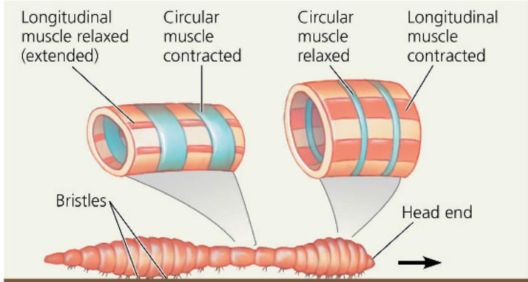  
At the moment depicted, body segments at the earthworm's head end and just in front of the rear end are short and thick (longitudinal muscles contracted; circular muscles relaxed) and are anchored to the ground by bristles. The other segments are thin and elongated (circular muscles contracted; longitudinal muscles relaxed).

  
2 The head has moved forward because circular muscles in the head segments have contracted. Segments behind the head and at the rear are now thick and anchored, thus preventing the worm from slipping backward.

  
3 The head segments are thick again and anchored in their new positions. The rear segments have released their hold on the ground and have been pulled forward.

unhardened. Muscles are attached to knobs and plates of the cuticle that extend into the interior of the body. With each growth spurt, an arthropod must shed its exoskeleton (molt) and produce a larger one.

## Endoskeletons

Animals ranging from sponges to mammals have a hardened internal skeleton, or endoskeleton, buried within their soft tissues. In sponges, the endoskeleton consists of hard needle-like structures of inorganic material or fibers made of protein. Echinoderms' bodies are reinforced by ossicles, hard plates composed of magnesium carbonate and calcium carbonate crystals. Whereas the ossicles of sea urchins are tightly bound, the ossicles of sea stars are more loosely linked, allowing a sea star to change the shape of its arms.

Vertebrates have an endoskeleton consisting of cartilage, bone, or some combination of these materials (see Figure 40.5). The mammalian skeleton contains more than 200 bones, some fused together and others connected at joints by ligaments that allow freedom of movement (Figure 50.37 and Figure 50.38). Cells called osteoblasts secrete bone matrix and thereby build and repair bone (see Figure 40.5). Osteoclasts have an opposite function, resorbing bone components in remodeling of the skeleton.

How thick does an endoskeleton need to be? We can begin to answer this question by applying ideas from civil engineering. The weight of a building increases with the cube of its dimensions. However, the strength of a support depends on its cross-sectional area, which only increases with the square of its diameter. We can thus predict that if we scaled up a mouse to the size of an elephant, the legs of the giant mouse would be too thin to support its weight. Indeed, the body proportions of large animals are very different from those of small ones.

Figure 50.37 Bones and joints of the human skeleton.  

In applying the building analogy, we might also predict that the size of leg bones should be directly proportional to the strain imposed by body weight. Animal bodies, however, are complex and nonrigid. In supporting body weight, it turns out that body posture—the position of the legs relative to the main body—is more important than leg size, at least in mammals and birds. In addition, muscles and tendons, which hold the legs of large mammals relatively straight and positioned under the body, actually bear most of the load.

Figure 50.38 Types of joints.  

## Types of Locomotion

Movement is a hallmark of animals. Even animals fixed to a surface move their body parts: Sponges use beating flagella to generate water currents that draw and trap small food particles, and sessile cnidarians wave tentacles that capture prey. Most animals, however, are mobile and spend a considerable portion of their time and energy actively searching for food, escaping from danger, and seeking mates. These activities involve locomotion—active travel from place to place.

Friction and gravity tend to keep an animal stationary and therefore oppose locomotion. To move, an animal must expend energy to overcome these two forces. As we will see next, the amount of energy required to oppose friction or gravity is often reduced by an animal body plan adapted for movement in a particular environment.

## Locomotion on Land

On land, a walking, running, hopping, or crawling animal must be able to support itself and move against gravity, but air poses relatively little resistance, at least at moderate speeds. When a land animal walks, runs, or hops, its leg muscles expend energy both to propel it and to keep it from falling down. With each step, the animal's leg muscles must overcome inertia by accelerating a leg from a standing start. For moving on land, powerful muscles and strong skeletal support are therefore more important than a streamlined shape.

Diverse adaptations for traveling on land have evolved in various vertebrates. For example, kangaroos have large, powerful muscles in their hind legs, suitable for locomotion by hopping (Figure 50.39). As a kangaroo lands after each leap, tendons in its hind legs momentarily store energy. Much like the energy in a compressed spring, the energy stored in the tendons from one jump is released in the next jump, reducing the energy the animal must expend to travel. The legs of an insect, dog, or human also retain some energy during walking or running, although a considerably smaller share than those of a kangaroo.

## Interview

Interview with Terry Dawson: Kangaroos are “rule” breakers! (eTextbook only)

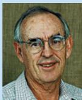

Maintaining balance is another prerequisite for walking, running, or hopping. A cat, dog, or horse maintains balance by keeping three feet on the ground when walking. Illustrating the same principle, bipedal animals, such as humans and birds, keep part of at least one foot on the ground when walking. At running speeds, momentum more than foot contact keeps the body upright, enabling all the feet to be off the ground briefly. A kangaroo's large tail forms a stable tripod with its hind

## Figure 50.39 Energy-efficient locomotion on land.

Members of the kangaroo family travel from place to place mainly by leaping on their large hind legs. Kinetic energy momentarily stored in tendons after each leap provides a boost for the next leap. In fact, a large kangaroo hopping at 30 km/hr uses no more energy per minute than it does at 6 km/hr. The large tail provides extra force for leaping and helps to balance the kangaroo when it leaps as well as when it sits.

legs when the animal sits or moves slowly and helps balance its body during leaps. Recent studies reveal that the tail also generates significant force during hopping, helping to propel the kangaroo's forward movement.

Crawling poses a very different challenge. Having much of its body in contact with the ground, a crawling animal must exert considerable effort to overcome friction. As you have read, earthworms crawl by peristalsis. In contrast, many snakes crawl by undulating their entire body from side to side. Waves of bending propagate from head to tail, with each portion of the body eventually following the same undulating path as the head and neck. Some other snakes, such as boa constrictors and pythons, creep in a straight line, driven by muscles that lift belly scales off the ground, tilt the scales forward, and then push them backward against the ground.

## Swimming

Because most animals are reasonably buoyant in water, overcoming gravity is less of a problem for swimming animals than for species that move on land or through the air. On the other hand, water is a much denser and more viscous medium than air, and thus drag (friction) is a major problem for aquatic animals. A sleek, fusiform (torpedo-like) shape is a common adaptation of fast swimmers (see Figure 40.2).

Swimming occurs in diverse ways. Many insects and four-legged vertebrates use their legs as oars to push against the water. Sharks and bony fishes swim by moving their body and tail from side to side, while whales and dolphins move by undulating their body and tail up and down. Squids, scallops, and some cnidarians are jet-propelled, taking in water and squirting it out in bursts. In contrast, jellies appear to generate a region of low pressure in the water ahead of them such that they are pulled forward rather than pushed.

## Flying

Active flight (in contrast to gliding downward from a tree) has evolved in only a few animal groups: insects, reptiles (including birds), and, among the mammals, bats. One group of flying reptiles, the pterosaurs, died out millions of years ago, leaving birds and bats as the only flying vertebrates.

To fly, an animal's wings must develop enough lift to overcome gravity's downward force. The key to meeting this

# Scientific Skills Exercise Interpreting a Graph with Log Scales

What Are the Energy Costs of Locomotion? In the 1960s, animal physiologist Knut Schmidt-Nielsen, at Duke University, wondered whether general principles govern the energy costs of different forms of locomotion among diverse animal species. To answer this question, he drew on his own experiments as well as those of other researchers. In this exercise you will analyze the combined results of these studies and evaluate the rationale for plotting the experimental data on a graph with logarithmic scales.

How the Experiments Were Done Researchers measured the rate of oxygen consumption or carbon dioxide production in animals that ran on treadmills, swam in water flumes, or flew in wind tunnels. For example, a tube connected to a plastic face mask collected gases exhaled by a parakeet during flight (see photo). From these measurements, Schmidt-Nielsen calculated the amount of energy each animal used to transport a given amount of body mass over a given distance [calories/(kilogram · metre)].

Data from the Experiments Schmidt-Nielsen plotted the cost of running, flying, and swimming versus body mass on a single graph with logarithmic (log) scales for the axes. He then drew a best-fit straight line through the data points for each form of locomotion. (On the graph here, the individual data points are not shown.)

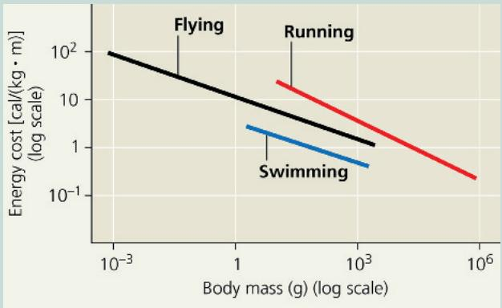

Data from K. Schmidt-Nielsen, Locomotion: Energy cost of swimming, flying, and running, Science 177:222–228 (1972). Reprinted with permission from AAAS.

## INTERPRET THE DATA

1. The body masses of the animals used in these experiments ranged from about 0.001 g to 1,000,000 g, and their rates of energy use ranged from about 0.1 cal/(kg·m) to 100 cal/(kg·m). If you were to plot these data on a graph with linear instead of log scales for the axes, how would you draw the axes so that all of the data would be visible? What is the advantage of using log scales for plotting data with a wide range of values? (For additional information about graphs, see the Scientific Skills Review in Appendix D.)

2. Based on the graph, how much greater is the energy cost of flying for an animal that weighs $10^{-3}$ g than for an animal that weighs 1 g? For any given form of locomotion, which travels more efficiently, a larger animal or smaller animal?

3. The slopes of the flying and swimming lines are very similar. Based on your answer to question 2, if the energy cost of a 2-g swimming animal is 1.2 cal/(kg·m), what is the estimated energy cost of a 2-kg swimming animal?

4. Considering animals with a body mass of about 100 g, rank the three forms of locomotion from highest energy cost to lowest energy cost. Were these the results you expected, based on your own experience? What could explain the energy cost of running compared to that of flying or swimming?

5. Schmidt-Nielson calculated the swimming cost in a mallard duck and found that it was nearly 20 times as high as the swimming cost in a salmon of the same body mass. What could explain the greater swimming efficiency of salmon?

Instructors: A version of this Scientific Skills Exercise can be assigned in Mastering Biology.

challenge is wing shape. All wings act as airfoils—structures whose shape alters air currents in a way that helps animals or airplanes stay aloft. As for the body to which the wings attach, a fusiform shape helps reduce drag in air as it does in water.

Flying animals are relatively light, with body masses ranging from less than a gram for some insects to about 20 kg for the largest flying birds. The low body mass of many flying animals is due to specialized structural adaptations. Birds, for example, have no urinary bladder or teeth and have relatively large bones with air-filled regions that help lessen the bird's weight (see Figure 34.30).

Flying, running, and swimming each impose different energetic demands on animals. In the Scientific Skills Exercise on the preceding page, you can interpret a graph that compares the relative energy costs of these three forms of locomotion.

## Concept Check 50.6

1. Contrast swimming and flying in terms of the main problems they pose and the adaptations that allow animals to overcome those problems.

2. MAKE CONNECTIONS Peristalsis contributes to the locomotion of many annelids and to the movement of food in the digestive tract (see Concept 41.3). Using the muscles of your hand and a toothpaste tube as a model of peristalsis, how would your demonstration differ for the two processes?

3. WHAT IF? When using your arms to lower yourself into a chair, you bend your arms without using your biceps. Explain how this is possible. (Hint: Think about gravity as an antagonistic force.)

For suggested answers, see Appendix A.

## Chapter 50 Review

## Summary of Key Concepts

To review key terms, go to the Vocabulary Self-Quiz (eTextbook only).

## Concept 50.1: Sensory receptors transduce stimulus energy and transmit signals to the central nervous system

\- The detection of a stimulus precedes sensory transduction, the change in the membrane potential of a sensory receptor in response to a stimulus. The resulting receptor potential controls transmission of action potentials to the CNS, where sensory information is integrated to generate perceptions. The frequency of action potentials in an axon and the number of axons activated reflect stimulus strength. The identity of the axon carrying the signal encodes the nature or quality of the stimulus.

\- Mechanoreceptors respond to stimuli such as pressure, touch, stretch, motion, and sound. Chemoreceptors detect either total solute concentrations or specific molecules. Electromagnetic receptors detect different forms of electromagnetic radiation. Thermoreceptors signal surface and core temperatures of the body. Pain is detected by a group of nociceptors that respond to excess heat, pressure, or specific classes of chemicals.

To simplify sensory receptor classification, why might it make sense to eliminate nociceptors as a distinct class?

## Concept 50.2: In hearing and equilibrium, mechanoreceptors detect moving fluid or settling particles

\- Most invertebrates sense their orientation with respect to gravity by means of statocysts. Specialized hair cells form the basis for hearing and balance in mammals and for detection of water movement in fishes and aquatic amphibians. In mammals, the tympanic membrane (eardrum) transmits sound waves to bones of the middle ear, which transmit the waves through the oval window to the fluid in the coiled cochlea of the inner ear. Pressure waves in the fluid vibrate the basilar membrane, depolarizing hair cells and triggering action potentials that travel via the auditory nerve to the brain.

How are music volume and pitch encoded in signals to the brain?

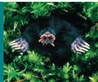

## Concept 50.3: The diverse visual receptors of animals depend on light-absorbing pigments

\- Invertebrates have varied light detectors, including simple light-sensitive eyespots, image-forming compound eyes, and single-lens eyes. In the vertebrate eye, a single lens is used to focus light on photoreceptors in the retina. Both rods and cones contain a pigment, retinal, chemically bonded to a protein (opsin). Absorption of light by retinal triggers a signal transduction pathway that hyperpolarizes the photoreceptors, causing them to release less neurotransmitter. Synapses transmit information from photoreceptors to cells that integrate information and convey it to the brain along axons that form the optic nerve.

How does processing of sensory information sent to the vertebrate brain in vision differ from that in hearing or olfaction?

## Concept 50.4: The senses of taste and smell rely on similar sets of sensory receptors

\- Taste (gustation) and smell (olfaction) depend on stimulation of chemoreceptors by small dissolved molecules. In humans, sensory cells in taste buds express a receptor type specific for one of the five taste perceptions: sweet, sour, salty, bitter, and umami (elicited by glutamate). Olfactory receptor cells line the upper part of the nasal cavity. Hundreds of different genes code for membrane proteins that bind to specific classes of odorants, and each receptor cell appears to express only one of those genes.

Why is the flavor of food less intense when you have a head cold?

## Concept 50.5: The physical interaction of protein filaments is required for muscle function

\- The muscle cells (fibers) of vertebrate skeletal muscle contain myofibrils composed of thin filaments of (mostly) actin and thick filaments of myosin. These filaments are organized into repeating units called sarcomeres. Myosin heads, energized by the hydrolysis of ATP, bind to the thin filaments, form cross-bridges, and then release upon binding ATP anew. As this cycle repeats, the thick and thin filaments slide past each other, shortening the sarcomere and contracting the muscle fiber.

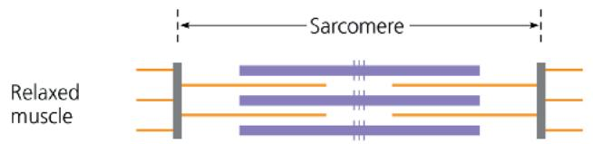

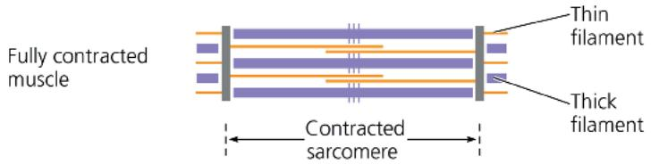

\- Motor neurons release acetylcholine, triggering action potentials in muscle fibers that stimulate the release of $Ca^{2+}$ from the sarcoplasmic reticulum. When the $Ca^{2+}$ binds the troponin complex, tropomyosin moves, exposing the myosin-binding sites on actin and thus initiating cross-bridge formation. A motor unit consists of a motor neuron and the muscle fibers it controls. A twitch results from one action potential. Skeletal muscle fibers are slow-twitch or fast-twitch and oxidative or glycolytic.

\- Cardiac muscle, found in the heart, consists of striated cells electrically connected by intercalated disks. Nervous system input controls the rate at which the heart contracts, but is not strictly required for cardiac muscle contraction. In smooth muscles, contractions are initiated by the muscles or by stimulation from neurons in the autonomic nervous system.

What are two major functions of ATP hydrolysis in skeletal muscle activity?

Concept 50.6: Skeletal systems transform muscle contraction into locomotion

\- Skeletal muscles, often in antagonistic pairs, contract and pull against the skeleton. Skeletons may be hydrostatic and maintained by fluid pressure, as in worms; hardened into exoskeletons, as in insects; or in the form of endoskeletons, as in vertebrates.

\- Each form of locomotion—swimming, movement on land, or flying—presents a particular challenge. For example, swimmers need to overcome substantial friction, but face less of a challenge from gravity than do animals that move on land or fly.

Explain how microscopic and macroscopic anchoring of muscle filaments enables you to bend your elbow.

For suggested answers, see Appendix A.

## Test Your Understanding

For more multiple-choice questions, go to the Practice Test (eTextbook only).

## Levels 1-2: Remembering/Understanding

1. Which sensory receptor—category pair is correct?

(A) hair cell—nociceptor

(B) snake pit organ—mechanoreceptor

(C) taste receptor—chemoreceptor

(D) olfactory receptor—electromagnetic receptor

2. The middle ear converts

(A) air pressure waves to fluid pressure waves.

(B) air pressure waves to nerve impulses.

(C) fluid pressure waves to nerve impulses.

(D) pressure waves to hair cell movements.

3. During vertebrate skeletal muscle contraction, calcium ions

(A) break cross-bridges as a cofactor in hydrolysis of ATP.

(B) bind to troponin, exposing myosin-binding sites.

(C) transmit action potentials to the muscle fiber.

(D) spread action potentials through the T tubules.

## Levels 3-4: Applying/Analyzing

4. The human brain differentiates tastes from smells because action potentials for the two sensations differ in

(A) magnitude and shape.

(B) threshold potential.

(C) where they are received in the brain.

(D) how long they take to reach the brain.

5. The transduction of sound waves into action potentials occurs (A) in the tectorial membrane as it is stimulated by hair cells.

(B) when hair cells are bent against the tectorial membrane, causing them to depolarize and release neurotransmitter that stimulates afferent neurons.

(C) as the basilar membrane vibrates at different frequencies in response to the varying volume of sounds.

(D) within the middle ear as the vibrations are amplified by the malleus, incus, and stapes.

## Levels 5-6: Evaluating/Creating

6. Metal objects cause sharks to misdirect their bites. Sharks also can find batteries buried under sand. These facts suggest that sharks track their prey just before they bite in the same way that

(A) a rattlesnake finds a mouse in its burrow.

(B) an insect avoids being stepped on.

(C) a star-nosed mole locates its prey in tunnels.

(D) a platypus locates its prey in a muddy river.

7. DRAW IT Based on the information in the text, fill in the following graph. Use one line for rods and another line for cones.

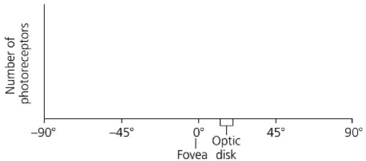  
Position along retina (in degrees away from fovea)

8. EVOLUTION CONNECTION In general, locomotion on land will require more energy than locomotion in water. By integrating what you learned about animal form and function in Unit 7, discuss some of the evolutionary adaptations of mammals that support the high energy requirements for moving on land.

9. SCIENTIFIC INQUIRY • INTERPRET THE DATA To demonstrate how energy is stored in tendons during hopping, an instructor asked student volunteers to hop at a frequency that felt “natural” and then, after resting, to hop at exactly half that frequency. Hopping was done at a standard height and volunteers’ mass, $O_{2}$ consumption, and $CO_{2}$ production were measured. Here is a representative set of results calculated for one student.

<table><tr><td>Frequency (hops/sec)</td><td>Energy used (joules/sec)</td></tr><tr><td>1.85</td><td>735</td></tr><tr><td>0.92</td><td>716</td></tr></table>

The student consumed 159 joules/sec when standing. For each hop frequency, subtract this standing value from the energy used during hopping. Then, divide by the hop frequency to calculate the energy cost per hop. Explain how the energy cost per hop differs at the two frequencies, and how might this be related to energy storage in tendons.

10. WRITE ABOUT A THEME: ORGANIZATION In a short essay (100–150 words), describe three ways in which the structure of the lens of the human eye is well adapted to its function in vision.

## 11. SYNTHESIZE YOUR KNOWLEDGE

Bloodhounds, which are adept at following a scent trail even days old, have no more olfactory receptor genes than other dogs. Predict how the sensory and nervous systems of bloodhounds differ from those of other dogs in ways that contribute to their tracking ability.

For selected answers, see Appendix A.

# Animal Behavior

## Key Concepts

51.1 Discrete sensory inputs can stimulate both simple and complex behaviors

51.2 Learning establishes specific links between experience and behavior

51.3 Selection for individual survival and reproductive success can explain diverse behaviors

51.4 Genetic analyses and the concept of inclusive fitness provide a basis for studying the evolution of behavior

  
Figure 51.1 A male magnificent frigatebird (Fregata magnificens) lives mostly at sea. He often feeds by piracy, harassing diving birds into coughing up their catch for his consumption. Periodically, however, he alights on an island, points his bill to the sky, and inflates an enormous red throat pouch. Clacking his beak, he produces a drumming sound that resonates in the pouch. If a curious female takes notice and lands nearby, a mating ritual ensues.

## Study Tip

## Identifying components of

experimental design: Animal behavior is studied in both the wild and the laboratory and involves approaches ranging from passive observation to active intervention. As you study this chapter, note how scientific methods are applied to answer questions in diverse contexts, such as foraging in honeybees (Figure 51.5; see example started here) and fruit flies (Figure 51.13).

1) Make observations—returning bees do a number of different but set dances

2) Form a hypothesis—the dances convey information about food location

3) Generate predictions

4) Gather and analyze data

5) Draw conclusions

## What questions do biologists seek to answer in studying animal behavior?

1. What event or signal triggers the behavior?

Males inflate their pouch only if females are nearby. The intensity of the display increases when a female circles overhead.

2. How does experience during growth and development influence the behavior?

Older males have larger pouches that produce lower drumming frequencies, which attract more females.

3. How does the behavior aid survival and reproduction?

After mating, males and females cooperate in nest building and feeding the chicks.

4. How has the behavior been shaped by natural selection?

The throat pouch can be inflated prominently for mating, and deflated to maximize flight efficiency.

Answering these questions can provide fundamental insights into how behaviors occur and why they arise.

# Concept 51.1: Discrete sensory inputs can stimulate both simple and complex behaviors

Behavior is the sum of an organism's responses to external and internal stimuli. In animals, behaviors are typically actions carried out by muscles under control of the nervous system. Examples include an animal using its throat muscles to produce a song or releasing a scent to mark its territory. Behavior is an essential part of acquiring nutrients and finding a partner for sexual reproduction. Behavior also contributes to homeostasis, as when honeybees huddle to conserve heat (see Concept 40.3). In short, all of animal physiology contributes to behavior, and behavior influences all of physiology.

Many behaviors, especially those involved in recognition and communication, rely on specialized body structures or form. For instance, the throat pouch of a male frigatebird (see Figure 51.1) is essential for courtship. Inflating the pouch exposes its vibrantly colored surface and provides a resonating chamber that amplifies the male's drumming. As this example illustrates, the process of natural selection that shapes behaviors also influences the evolution of animal anatomy.

What approach do biologists use to determine how behaviors arise and what functions they serve? The Dutch scientist Niko Tinbergen, a pioneer in the study of animal behavior, suggested that understanding any behavior requires answering four questions, which were highlighted in Figure 51.1:

1. What stimulus triggers the behavior and how do the various body systems bring it about?

2. How does the animal's experience during growth and development influence the response to the stimulus?

3. How does the behavior aid survival and reproduction?

4. What is the behavior's evolutionary history?

The first two questions ask about proximate causation—how a behavior occurs or is modified. The last two questions ask about ultimate causation—why a behavior occurs in the context of natural selection.

Experiments on proximate causation by Tinbergen earned him a share of a Nobel Prize awarded in 1973. Such studies

defined the field of ethology, the study of animal behavior observed in a natural environment. We'll consider those and related experiments in the early part of the chapter. The concept of ultimate causation is central to behavioral ecology, the study of the ecological and evolutionary basis for animal behavior. We'll explore this vibrant area of modern biological research in the rest of the chapter.

## Fixed Action Patterns

In addressing Tinbergen's first question, the nature of the stimuli that trigger behavior, we'll begin with behavioral responses to well-defined stimuli, starting with an example from one of Tinbergen's own experiments.

As part of his research, Tinbergen kept fish tanks containing three-spined sticklebacks (Gasterosteus aculeatus), a species in which males, but not females, have red bellies. Male sticklebacks attack other males that invade their nesting territories (Figure 51.2). Tinbergen noticed that his male sticklebacks also behaved aggressively when a red truck passed within view of their tank. Inspired by this chance observation, he carried out experiments showing that the red color of an intruder's underside is the proximate cause of the attack behavior. A male stickleback will not attack a fish lacking red coloration, but will attack even unrealistic models if they contain areas of red color. The territorial response of male sticklebacks is an example of a fixed action pattern, a sequence of unlearned acts directly linked to a simple stimulus. The fixed action pattern of certain moths takes the form of evasive flight maneuvers—loops and spirals—performed instantaneously upon hearing the sounds of an echolocating bat or an ultrasonic whistle in the same frequency range. Fixed action patterns are essentially unchangeable and, once initiated, are usually carried to completion. The trigger for the behavior is an external cue called a sign stimulus, such as a red object that prompts a male stickleback's aggressive behavior.

## Migration

Environmental stimuli not only trigger behaviors but also provide cues that animals use to carry out those behaviors. For example, a wide variety of birds, fishes, and other animals use environmental cues to guide migration—a regular, long-distance change in

## Figure 51.2 Sign stimuli in a classic fixed action pattern.

(a) A male stickleback fish attacks other male sticklebacks that invade its nesting territory. (b) Models, whether realistic or not, can trigger the aggressive behavior, but only if the underside is red. Researchers concluded that the red belly of the intruding male is a sign stimulus that releases the aggressive behavior.
Suggest an explanation for why this behavior might have evolved (its ultimate causation).
For suggested answer, see Appendix A.

location. In the course of migration, many animals pass through environments they have not previously encountered. How, then, do they find their way in these foreign settings?

Some migrating animals track their position relative to the sun, even though the sun's position relative to Earth changes throughout the day. Animals can adjust for these changes by means of a circadian clock, an internal mechanism that has a 24-hour periodicity (see Concept 49.2). For example, experiments have shown that migrating birds orient differently relative to the sun at distinct times of the day. Nocturnal animals can instead use the North Star, which has a constant position in the night sky.

Although the sun and stars can provide useful clues for navigation, clouds can obscure these landmarks. How do migrating animals overcome this problem? A simple experiment with homing pigeons provided one answer. On an overcast day, placing a small magnet on the head of a homing pigeon prevented it from returning efficiently to its roost. Researchers concluded that pigeons sense their position relative to Earth's magnetic field and can thereby navigate without solar or celestial cues.

## Behavioral Rhythms

Although the circadian clock plays a small but significant role in navigation by some migrating species, it has a major role in the daily activity of all animals. As discussed in Concepts 40.2 and 49.2, the clock is responsible for a circadian rhythm, a daily cycle of rest and activity. The clock is normally synchronized with the light and dark cycles of the environment but can maintain rhythmic activity even under constant environmental conditions, such as during hibernation.

Some behaviors, such as migration and reproduction, reflect biological rhythms with a longer cycle, or period, than the circadian rhythm. Behavioral rhythms linked to the yearly cycle of seasons are called circannual rhythms. Although migration and reproduction typically correlate with food availability, these behaviors are not a direct response to changes in food intake. Instead, circannual rhythms, like circadian rhythms, are influenced by the periods of daylight and darkness in the environment. For example, studies with several bird species have shown that an artificial environment with extended daylight can induce out-of-season migratory behavior.

Not all biological rhythms are linked to the light and dark cycles in the environment. Consider, for instance, fiddler crab courtship behavior, which is linked to the lunar cycle. Possessed with front claws of very different size, the male fiddler crab (genus Uca) waves the larger claw in front of him to attract potential mates (Figure 51.3). Timing this claw-waving courtship behavior to the new or full moon helps the development of offspring. How? Fiddler crabs begin their lives as larvae settling in the mudflats. The tides disperse larvae to deeper waters, where they complete early development in relative safety before returning to the tidal flats. By courting at the time of the new or full moon, crabs link their reproduction to the times of greatest tidal movement.

Figure 51.3 Courtship display of male fiddler crab.  

## Animal Signals and Communication

Claw waving by fiddler crabs during courtship is an example of one animal (the male crab) generating the stimulus that guides the behavior of another animal (the female crab). A stimulus transmitted from one organism to another is called a signal. The transmission and reception of signals between animals constitute communication, which often has a role in the proximate causation of behavior.

## Forms of Animal Communication

Let's consider the courtship behavior of the fruit fly, Drosophila melanogaster, as an introduction to the four common modes of animal communication: visual, chemical, tactile, and auditory.

Fruit fly courtship constitutes a stimulus-response chain, in which the response to each stimulus is itself a stimulus for the next behavior. In the first step, a male detects a female in his field

of vision and orients his body toward hers. To confirm she belongs to his species, he uses his olfactory system to detect chemicals she releases into the air. The male then approaches and touches the female with a foreleg (Figure 51.4). This touching, or tactile communication, alerts the female to the male's presence. In the third stage, the male extends and vibrates one wing, producing a courtship song. This auditory communication informs the female whether he is of the same species. Only if all of these forms of communication

Figure 51.4 Male fruit fly tapping female with foreleg.

are successful will the female allow the male to attempt copulation.

In general, the form of communication that evolves is closely related to an animal's lifestyle and environment. For example, most terrestrial mammals are nocturnal, which makes visual displays relatively ineffective. Instead, these species use olfactory and auditory signals, which work as well in the dark as in the light. In contrast, most birds are diurnal (active mainly in daytime) and communicate primarily by visual and auditory signals. Humans are also diurnal and, like birds, use primarily visual and auditory communication. We can thus detect and appreciate the songs and bright colors used by birds to communicate but miss many chemical cues on which other mammals base their behavior.

The information content of animal communication varies considerably. One of the most remarkable examples is the symbolic language of the European honeybee (Apis mellifera), discovered in the early 1900s by Austrian researcher Karl von Frisch. Using glass-walled observation hives, he and his students spent several decades observing honeybees.

they fly almost directly to the area indicated by the waggle dance. By using flower odor and other clues, they locate the source of nectar within this area.

If the food source is close to the hive (less than 50 m away), the waggle dance takes a slightly different form that primarily advertises the availability of nectar nearby. In this form of the waggle dance, which von Frisch called “round,” the returning bee moves in tight circles while moving its abdomen from side to side. In response, the follower bees leave the hive and search in all directions for nearby flowers rich in nectar.

## Pheromones

Animals that communicate through odors or tastes emit chemical substances called pheromones. Pheromones are especially common among mammals and insects and often relate to reproductive behavior. For example, pheromones are the basis for the chemical communication in fruit fly courtship (see Figure 51.4). Pheromones are not limited to short-distance

## Methodical recordings of bee

movements enabled von Frisch to decipher a “dance language” that returning foragers use to inform other bees about the distance and direction of travel to a source of nectar.

When a successful forager returns to the hive, its movements, as well as sounds and odors, quickly become the center of attention for other bees, called followers. Moving along the vertical wall of the honeycomb, the forager performs a “waggle dance” that communicates to the follower bees both the direction and distance of the food source in relation to the hive (Figure 51.5). In performing the dance, the bee follows a half-circle swing in one direction, a straight run during which it waggles its abdomen, and a half-circle swing in the other direction. What von Frisch and colleagues deduced was that the angle of the straight run relative to the hive’s vertical surface indicates the horizontal angle of the food in relation to the sun. Thus, if the returning bee runs at a $30^{\circ}$ angle to the right of vertical, the follower bees leaving the hive fly $30^{\circ}$ to the right of the horizontal direction of the sun.

How does the waggle dance communicate distance to the nectar source? It turns out that a dance with a longer straight run, and therefore more abdominal waggles per run, indicates a greater distance to the food found by the forager. As follower bees exit the hive,

Figure 51.5 Honeybee dance language.
Honeybees returning to the hive communicate the location of food sources through the symbolic language of a dance.  

  
Location A: Food source is in same direction as sun.  
Location B: Food source is in direction opposite sun.  
Location C: Food source is 30° to right of sun.  
The waggle dance, performed when food is distant, resembles a figure eight. Distance is indicated by the number of abdominal waggles performed in the straight-run part of the dance. Direction is indicated by the angle of the straight run relative to the vertical surface of the hive. The dance communicates this information to workers clustered around the dancing bee, directing them to food at a particular location.

  
VISUAL SKILLS What information, if any, might be conveyed by the portions of the waggle dance between the straight runs? Explain.
For suggested answer, see Appendix A.

signaling, however. Male silkworm moths have receptors that can detect the pheromone from a female moth from several kilometers away (see Figure 50.6).

In a honeybee colony, pheromones produced by the queen and her daughters, the workers, maintain the hive's complex social order. One pheromone (once called the queen substance) has a particularly wide range of effects. It attracts workers to the queen, inhibits development of ovaries in workers, and attracts males (drones) to the queen during her mating flights out of the hive.

Pheromones can also serve as alarm signals. For example, when a minnow is injured, a substance released from the fish's skin disperses in the water, inducing a fright response in other minnows in the area. These nearby fish become more vigilant and often form tightly packed schools near the river or lake bottom, where they are safer from attack (Figure 51.6). Pheromones can be very effective at remarkably low concentrations. For instance, just $1\mathrm{cm}^2$ of skin from a fathead minnow contains sufficient alarm substance to induce a reaction in $58,000\mathrm{L}$ of water.

So far in this chapter, we have explored the types of stimuli that elicit behaviors—the first part of Tinbergen's first question. The second part of that question—the physiological mechanisms that mediate responses—involves the nervous, muscular, and skeletal systems explored elsewhere in this unit: Stimuli activate sensory systems, are processed in the central nervous system, and may result in motor outputs that constitute behavior in animals. Thus, we are ready to focus on Tinbergen's second question—how experience influences behavior.

Figure 51.6 Fathead minnows (Pimephales promelas) responding to the presence of an alarm substance.  
  
1 Minnows are widely dispersed in an aquarium before an alarm substance is introduced.

  
2 Within seconds of the alarm substance being introduced, minnows aggregate near the bottom of the aquarium and reduce their movement.

## Concept Check 51.1

1. If an egg rolls out of a greylag goose's nest, the female will retrieve it by nudging it with her beak and head. If researchers remove the egg or substitute a ball during this process, the goose continues to bob her beak and head while she moves back to the nest. Provide proximate and ultimate explanations for this behavior.

2. WHAT IF? Suppose you exposed various fish species from the minnows' environment to the alarm substance from minnows. Thinking about natural selection, suggest why some species might respond like minnows, some might increase their activity, and some might show no change.

3. MAKE CONNECTIONS How is the lunar-linked rhythm of fiddler crab courtship similar in mechanism and function to the seasonal timing of plant flowering? (See Concept 39.3.)

For suggested answers, see Appendix A.

## Concept 51.2: Learning establishes specific links between experience and behavior

Some behaviors—such as a fixed action pattern, a courtship stimulus-response chain, or pheromone signaling—are performed by all individuals the same way each time. Behavior that is developmentally fixed in this way is known as innate behavior. Consider, for example, the construction of a spider's web. Although a spider's web is quite complex, web building is innate, not learned. Many other behaviors, however, vary considerably with experience.

A spider in family Araneidae spinning a web  

## Experience and Behavior

Tinbergen's second question asks how an animal's experiences during growth and development influence the response to stimuli. One informative approach to this question is a cross-fostering study, in which the young of one species are placed in the care of adults from another species in the same or a similar environment. The extent to which the offspring's behavior changes in such a situation provides a measure of how the social and physical environment influences behavior.

Table 51.1 Influence of Cross-Fostering on Male Mice\*

<table><tr><td>Species</td><td>Aggression Toward an Intruder</td><td>Aggression in Neutral Situation</td><td>Paternal Behavior</td></tr><tr><td>California mice fostered by white-footed mice</td><td>Reduced</td><td>No difference</td><td>Reduced</td></tr><tr><td>White-footed mice fostered by California mice</td><td>No difference</td><td>Increased</td><td>No difference</td></tr><tr><td colspan="4">*Comparisons are with mice raised by parents of their own species.</td></tr></table>

Certain mouse species have behaviors well suited for cross-fostering studies. Male California mice (Peromyscus californicus) are highly aggressive toward other mice and provide extensive parental care. In contrast, male white-footed mice (Peromyscus leucopus) are less aggressive and engage in little parental care. Cross-fostering—placing pups in the nests of the other species—altered some behaviors of both species (Table 51.1). For instance, male California mice raised by white-footed mice were less aggressive toward intruders. Thus, experience during development can strongly influence aggressive behavior in these rodents.

One of the most important findings of the cross-fostering experiments with mice was that the influence of experience on behavior can be passed on to progeny: When the cross-fostered California mice became parents, they spent less time retrieving offspring who wandered off than did California mice raised by their own species. Thus, experience during development can modify physiology in a way that alters parental behavior, extending the influence of environment to a subsequent generation. While experiences do not modify gene sequences (the genetic code), they can chemically modify DNA with the result that certain genes are more or less active. These DNA alterations, known as epigenetic changes, can be passed on to future generations (see Concept 18.2).

For humans, the influence of genetics and environment on behavior can be explored by a twin study, in which researchers compare the behavior of identical twins raised apart with the behavior of those raised in the same household. Twin studies have been instrumental in studying disorders that alter human

Identical twins who were raised separately  

behavior, such as anxiety disorders, schizophrenia, and alcohol-use disorder.

## Learning

One powerful way that an animal's environment can influence its behavior is through learning, the modification of behavior as a

result of specific experiences. The capacity for learning depends on nervous system organization established during development following instructions encoded in the genome. Learning itself involves the formation of memories by specific changes in neuronal connectivity (see Concept 49.4). Therefore, the essential challenge for research into learning is not to decide between nature and nurture, but rather to explore the contributions of both nature (genes) and nurture (environment) in shaping learning and, more generally, behavior.

## Imprinting

In some species, the ability of offspring to recognize and be recognized by a parent is essential for survival. In the young, this learning often takes the form of imprinting, the establishment of a long-lasting behavioral response to a particular individual or object. Imprinting can take place only during a specific time period in development, called the critical period. Among gulls, for instance, the critical period for a parent to bond with its young lasts one to two days. During the critical period, the young imprint on their parent and learn basic behaviors, while the parent learns to recognize its offspring. If bonding does not occur, the parent will not care for the offspring, leading to the death of the offspring and a decrease in the reproductive success of the parent.

How do the young know on whom—or what—to imprint? Experiments with many species of waterfowl indicate that young birds have no innate recognition of “parent.” Rather, they identify with the first object they encounter that has certain key characteristics. In the 1930s, experiments showed that the principal imprinting stimulus in greylag geese (Anser anser) is a nearby object that is moving. When incubator-hatched goslings spent their first few hours with a person rather than with a goose, they imprinted on the human and steadfastly followed that person from then on (Figure 51.7). Furthermore, they showed no recognition of their biological parent.

Imprinting has become an important component of efforts to save endangered species, such as the whooping crane (Grus americana). Scientists tried raising whooping cranes in captivity by using sandhill cranes (Grus canadensis) as foster parents. However, because the whooping cranes imprinted on their foster parents, none formed a pair-bond (strong attachment) with a whooping crane mate. To avoid such problems, captive breeding programs now isolate young cranes, exposing them to the sights and sounds of members of their own species.

Previously, scientists made further use of imprinting to teach cranes born in captivity to migrate along safe routes. Young whooping cranes were imprinted on humans in “crane suits” and then allowed to follow these “parents” as they flew ultralight aircraft along selected migration routes. More recently, efforts shifted to a focus on minimizing human intervention as part of an overall strategy aimed at fostering self-sustaining crane populations.

## Spatial Learning and Cognitive Maps

Every natural environment has spatial variation, as in locations of nest sites, hazards, food, and prospective mates. Therefore, an organism's fitness may be enhanced by the capacity for spatial learning, the establishment of a memory that reflects the environment's spatial structure.

Figure 51.7 Imprinting.  
  
WHAT IF? Suppose the geese were bred to each other. How might their imprinting on a human affect their offspring? Explain.  
For suggested answer, see Appendix A.

The idea of spatial learning intrigued Tinbergen while he was a graduate student in the Netherlands. At that time, he was studying females of a digger wasp species (Philanthus triangulum) that nests in small burrows dug into sand dunes. When a wasp leaves her nest to go hunting, she hides the entrance from potential intruders by covering it with sand. When she returns, however, she flies directly to her hidden nest, despite the presence of hundreds of other burrows in the area. How does she accomplish this feat? Tinbergen hypothesized that a wasp locates her nest by learning its position relative to visible landmarks. To test his hypothesis, he carried out an experiment in the wasps' natural habitat (Figure 51.8). By manipulating objects around nest entrances, he demonstrated that digger wasps engage in spatial learning. This experiment was so simple and informative that it could be summarized very concisely. In fact, at 32 pages, Tinbergen's Ph.D. thesis from 1932 is still the shortest ever approved at Leiden University.

In some animals, spatial learning involves formulating a cognitive map, a representation in an animal's nervous system

# Figure 51.8

# Inquiry: Does a digger wasp use landmarks to find her nest?

Experiment

A female digger wasp covers the entrance to her nest while foraging for food, but finds the correct wasp nest reliably upon her return 30 minutes or more later. Niko Tinbergen wanted to test the hypothesis that a wasp learns visual landmarks that mark her nest before she leaves on hunting trips. First, he marked one nest with a ring of pinecones while the wasp was in the burrow. After leaving the nest to forage, the wasp returned to the nest successfully.

  
Two days later, after the wasp had again left, Tinbergen shifted the ring of pinecones away from the nest. Then, he waited to observe the wasp's behavior.

## Results

When the wasp returned, she flew to the center of the pinecone circle instead of to the nearby nest. Repeating the experiment with many wasps, Tinbergen obtained the same results.

## Conclusion

The experiment supported the hypothesis that digger wasps use visual landmarks to keep track of their nests.

Data from N. Tinbergen, The Study of Instinct, Clarendon Press, Oxford (1951).

WHAT IF? Suppose the digger wasp had returned to her original nest site, despite the pinecones having been moved. What alternative hypotheses might you propose regarding how the wasp finds her nest and why the pinecones didn't misdirect the wasp?
For suggested answer, see Appendix A.

of the spatial relationships between objects in its surroundings. One striking example is found in the Clark's nutcracker (Nucifraga columbiana), a relative of ravens, crows, and jays. In the fall, nutcrackers hide pine seeds for retrieval during the winter. By experimentally varying the distance between landmarks in the birds' environment, researchers discovered that the birds kept track of the halfway point between landmarks, rather than a fixed distance, to find their hidden food stores.

## Associative Learning

Learning often involves making associations between experiences. Consider, for example, a blue jay (Cyanocitta cristata) that ingests a brightly colored monarch butterfly (Danaus plexippus). Substances that the monarch accumulates from milkweed plants cause the blue jay to vomit almost immediately (Figure 51.9). Following such experiences, blue jays avoid attacking monarchs and similar-looking butterflies. The ability to associate one environmental feature (such as a color) with another (such as a foul taste) is called associative learning.

Associative learning is well suited to study in the laboratory. In the 1890s, Russian physiologist Ivan Pavlov demonstrated that if he always rang a bell just before feeding a dog, the dog would eventually salivate when the bell sounded, anticipating food. This form of learning, in which an arbitrary stimulus becomes associated with a particular outcome, is known as classical conditioning. Four decades later, the American researcher B. F. Skinner explored how a rat learns through trial and error to obtain food by pressing a lever. Such learning, in which a behavior becomes associated with a reward or punishment, is known as trial-and-error learning or operant conditioning (see Figure 51.9).

Studies reveal that animals can learn to link many pairs of features of their environment, but not all. For example, pigeons can learn to associate danger with a sound but not with a color. However, they can learn to associate a color with food. What does this mean? The development and

Figure 51.9 Associative learning.

Having ingested and vomited a monarch butterfly, a blue jay has probably learned to avoid this species.

organization of the pigeon's nervous system apparently restrict the associations that can be formed. Moreover, such restrictions are not limited to birds. Rats, for example, can learn to avoid illness-inducing foods on the basis of smells, but not on the basis of sights or sounds.

If we consider how behavior evolves, the fact that some animals can't learn to make particular associations appears logical. The associations an animal can readily form typically reflect relationships likely to occur in nature. Conversely, associations that can't be formed are those unlikely to be of selective advantage in a native environment. In the case of a rat's diet in the wild, for example, a harmful food is far more likely to have a certain odor than to be associated with a particular sound.

## Cognition and Problem Solving

The most complex forms of learning involve cognition—the process of knowing that involves awareness, reasoning, recollection, and judgment. Although it was once argued that only primates and certain marine mammals have high-level thought processes, many other groups of animals, including insects, appear to exhibit cognition in controlled laboratory studies. For example, an experiment using Y-shaped mazes provided evidence for abstract thinking in honeybees. One maze had different colors, and one had different black-and-white striped patterns, either vertical or horizontal bars. Two groups of honeybees were trained in the color maze. Upon entering, a bee would see a sample color and could then choose between an arm of the maze with the same color or an arm with a different color. Only one arm contained a food reward. The first group of bees were rewarded for flying into the arm with the same color as the sample (Figure 51.10, ①); the second group were rewarded for choosing the arm with the different color. Next, bees from each group were tested in the bar maze, which had no food reward. After encountering a sample black-and-white pattern of bars, a bee could choose an arm with the same pattern or an arm with a different pattern. The bees in the first group most often chose the arm with the same pattern (Figure 51.10, ②), whereas those in the second group typically chose the arm with the different pattern.

The maze experiments provide strong experimental support for the hypothesis that honeybees can distinguish on the basis of “same” and “different.” Remarkably, research published in 2010 indicates that honeybees can also learn to distinguish human faces.

The information-processing ability of a nervous system can also be revealed in problem solving, the cognitive activity of devising a method to proceed from one condition to another in the face of real or apparent obstacles. For example, if a chimpanzee is placed in a room with several boxes on the floor and a banana hung high out of reach, the chimpanzee can assess the situation and stack the boxes, enabling it to reach the food. Problem-solving behavior is highly developed in some mammals, especially primates and dolphins, and in cephalopods such as octopuses. Notable examples have also been observed in some bird species. In one study, ravens were confronted with food hanging from a branch by a string. After failing to grab the food in flight, one raven flew to the branch and alternately pulled up and stepped on the string until the food was within reach. A number of other

Figure 51.10 A maze test of abstract thinking by honeybees. These mazes are designed to test whether honeybees can distinguish “same” from “different.”

  
VISUAL SKILLS Describe how you would set up the pattern maze to control for an inherent preference for or against a particular orientation of the black bars. For suggested answer, see Appendix A.  
1 Bees were trained in a color maze. As shown here, one group was rewarded for choosing the same color as the stimulus.  
2 Bees were tested in a pattern maze. If previously rewarded for choosing the same color, bees most often chose lines oriented the same way as the stimulus.

ravens eventually arrived at similar solutions. Nevertheless, some ravens failed to solve the problem, indicating that problem-solving success in this species, as in others, varies with individual experience and abilities.

## Development of Learned Behaviors

Most of the learned behaviors we have discussed develop over a relatively short time. Some behaviors develop more gradually. For example, some bird species learn songs in stages. In the case of the white-crowned sparrow (Zonotrichia leucophrys), the first stage of song learning takes place early in life, when the fledgling sparrow first hears the song. If a fledgling is prevented from hearing real sparrows or recordings of sparrow songs during the first 50 days of its life, it fails to develop the adult song of its species.

Although a young sparrow does not sing during the critical period, it memorizes the song of its species by listening to other white-crowned sparrows sing. During the critical period, fledglings chirp more in response to songs of their own species than to songs of other species. Thus, when young white-crowned sparrows learn the songs they will sing later on, that learning appears to be bounded by genetically controlled preferences.

The critical period when a white-crowned sparrow memorizes its species' song is followed by a second learning phase when the juvenile bird sings tentative notes called a subsong. The juvenile bird hears its own singing and compares it with the song memorized during the critical period. Once a sparrow's own song matches the one it memorized, the song "crystallizes" as the final song, and the bird sings only this adult song for the rest of its life.

Song learning is one of many examples of how animals learn from other members of their species. In finishing our exploration of learning, we'll look at several more examples that reflect the more general phenomenon of social learning.

## Social Learning

Many animals learn to solve problems by observing the behavior of other individuals. Learning through observing and interpreting behaviors and their consequences is called social learning. Young wild chimpanzees, for example, learn how to crack open oil palm nuts with two stones by copying experienced chimpanzees (Figure 51.11).

Figure 51.11 A young chimpanzee (Pan troglodytes) learning to crack oil palm nuts by observing an elder.  

Another example of how social learning can modify behavior comes from studies of the vervet monkeys (Chlorocebus pygerythrus) in Amboseli National Park, Kenya. Vervet monkeys, which are about the size of a domestic cat, produce a complex set of alarm calls. Amboseli vervets give distinct alarm calls for leopards, eagles, and snakes. When a vervet sees a leopard, it gives a loud barking sound; when it sees an eagle, it gives a short double-syllable cough; and the snake alarm call is a “chutter.” Upon hearing a particular alarm call, other vervets in the group behave in an appropriate way: They run up a tree on hearing the alarm for a leopard (vervets are nimbler than leopards in the trees); look up on hearing the alarm for an eagle; and look down on hearing the alarm for a snake (Figure 51.12).

Infant vervet monkeys give alarm calls, but in a relatively undiscriminating way. For example, they give the “eagle” alarm on seeing any bird, including harmless birds such as bee-eaters. With age, the monkeys improve their accuracy. In fact, adult vervet monkeys give the eagle alarm only on seeing an eagle belonging to either of the two species that eat vervets. Infants probably learn how to give the right call by observing other members of the group and receiving social confirmation. For instance, if the infant gives the call on the right occasion—say, an eagle alarm when there is an eagle overhead—another member of the group will also give the eagle call. But if the infant gives the call when a bee-eater flies by, the adults in the group are silent. Thus, vervet monkeys have an initial, unlearned tendency to give calls upon seeing

## Figure 51.12 Vervet monkeys learning correct use of alarm calls.

On seeing a python (foreground), vervet monkeys give a distinct “snake” alarm call (inset), and the members of the group stand upright and look down.

potentially threatening objects in the environment. Learning fine-tunes the call so that adult vervets give calls only in response to genuine danger and can fine-tune the alarm calls of the next generation.

Social learning forms the roots of culture, a system of information transfer through social learning or teaching that influences the behavior of individuals in a population. Cultural transfer of information can alter behavioral phenotypes and thereby influence the fitness of individuals.

Changes in behavior that result from natural selection occur on a much longer time scale than does learning. In Concept 51.3, we'll examine the relationship between particular behaviors and the processes of selection related to survival and reproduction.

## Concept Check 51.2

1. How might associative learning explain why different species of distasteful or stinging insects have similar colors?

2. WHAT IF? How might you position and manipulate a few objects in a lab to test whether an animal can use a cognitive map to remember the location of a food source?

3. MAKE CONNECTIONS How might a learned behavior contribute to speciation? (See Concept 24.1.)

For suggested answers, see Appendix A.

## Concept 51.3: Selection for individual survival and reproductive success can explain diverse behaviors

EVOLUTION We turn now to Tinbergen's third question—how behavior enhances survival and reproduction in a population. The focus thus shifts from proximate causation—the "how" questions—to ultimate causation—the "why" questions. We'll begin by considering the activity of gathering food. Food-obtaining behavior, or foraging, includes not only eating but also any activities an animal uses to search for, recognize, and capture food items.

## Evolution of Foraging Behavior

The fruit fly allows us to examine one way that foraging behavior might have evolved. Variation in a gene called forager (for) dictates how far Drosophila larvae travel when foraging. On average, larvae carrying the $for^{R}$ (“Rover”) allele travel nearly twice as far while foraging as do larvae with the $for^{s}$ (“sitter”) allele.

Both the $for^{R}$ and $for^{s}$ alleles are present in natural populations. What circumstances might favor one or the other allele? An answer became apparent in experiments that maintained flies at either low or high population densities for many generations. Larvae in populations kept at a low density foraged over shorter distances than those in populations kept at high density (Figure 51.13). Furthermore, the $for^s$ allele increased in frequency in the low-density populations, whereas the $for^R$ allele increased in frequency in the high-density group. These changes make sense. At a low population density, short-distance foraging yields sufficient food, while long-distance foraging would result in unnecessary energy expenditure. Under crowded conditions, long-distance foraging could enable larvae to move beyond areas depleted of food. Thus, an interpretable evolutionary change in behavior occurred in the course of the experiment.

Figure 51.13 Evolution of foraging behavior by laboratory populations of Drosophila melanogaster.  
After 74 generations of living at low population density, Drosophila larvae (populations R1–R3) followed foraging paths significantly shorter than those of Drosophila larvae that had lived at high density (populations K1–K3).  
  
INTERPRET THE DATA What alternative hypothesis is made far less likely by having three R and K lines, rather than one of each?

## Optimal Foraging Model

To study the ultimate causation of foraging strategies, biologists sometimes apply a type of cost-benefit analysis used in economics. This idea proposes that foraging behavior is a compromise between the benefits of nutrition and the costs of obtaining food. These costs might include the energy expenditure of foraging as well as the risk of being eaten while foraging. According to this optimal foraging model, natural selection should favor a foraging behavior that minimizes the costs of foraging and maximizes the benefits. The Scientific Skills Exercise provides an example of how this model can be applied to animals in the wild.

## Balancing Risk and Reward

One of the most significant potential costs to a forager is risk of predation. Maximizing energy gain and minimizing energy costs are of little benefit if the behavior makes the forager a likely meal for a predator. It seems logical, therefore, that predation risk would influence foraging behavior. Such appears to be the case for the mule deer (Odocoileus hemionus), which lives in the mountains of western North America. Researchers found that the food available for mule deer was fairly uniform across the potential foraging areas, although somewhat lower in open, nonforested areas. In contrast, the risk of predation differed greatly; mountain lions (Puma concolor), the major predator, killed large numbers of mule deer at forest edges and only a small number in open areas and forest interiors.

How does mule deer foraging behavior reflect the differences in predation risk in particular areas? Mule deer feed predominantly in open areas. Thus, it appears that mule deer foraging behavior reflects the large variation in predation risk and not the smaller variation in food availability. This result underscores the point that behavior typically reflects a compromise between competing selective pressures.

## Mating Behavior and Mate Choice

Just as foraging is crucial for individual survival, mating behavior and mate choice play a major role in determining reproductive success. These behaviors include seeking or attracting mates, choosing among potential mates, competing for mates, and caring for offspring.

## Mating Systems and Sexual Dimorphism

There is considerable variation in patterns of sexual contact. In the context of reproduction, biologists describe differences in mating systems, the length and number of relationships between males and females. In some animal species, mating is promiscuous, with no strong pair-bonds. In others, mates form a relationship of some duration that is monogamous (one male mating with one female) or polygamous (an individual of one sex mating with several of the other). Polygamous relationships involve either polygyny, a single male and many females, or polyandry, a single female and multiple males. (Note that same-sex sexual behavior is also very common in many species.)

The extent to which males and females differ in appearance, a characteristic known as sexual dimorphism, typically varies with the type of mating system. Among monogamous species, males and females often look very similar. In contrast, among polygamous species, the sex that attracts multiple mating partners is typically showier and

# Scientific Skills Exercise

# Testing a Hypothesis with a Quantitative Model

Do Crows Display Optimal Foraging Behavior? On islands off British Columbia, Canada, Northwestern crows (Corvus caurinus) search rocky tide pools for sea snails called whelks. After spotting a whelk, the crow picks it up in its beak, flies upward, and drops the whelk onto the rocks. If the drop is successful, the shell breaks and the crow can dine on the whelk's soft parts. If not, the crow flies up and drops the whelk again and again until the shell breaks. What determines how high the crow flies? If energetic considerations dominated selection for the crow's foraging behavior, the average drop height might reflect a trade-off between the cost of flying higher and the benefit of more frequent success. In this exercise, you'll test how well this optimal foraging model predicts the average drop height observed in nature.

How the Experiments Were Done There were two parts to the experiment. First, the researcher measured the height of drops made by crows in the wild by referring to a marked pole erected nearby. Second, the researcher built a device that dropped a whelk onto the rocks from a fixed platform. For each whelk, he kept track of the number of drops carried out before the whelk broke open. Averaging over many trials with the device and combining the data for each platform height, he calculated a predicted total “flight” height: the height of the platform times the average number of drops required to break open the whelk.

Data from the Experiment The graph summarizes the results of the experiment, comparing the behavior of crows in the wild with the measurements using the whelk-dropping device.

Data from R. Zach, Shell-dropping: Decision-making and optimal foraging in northwestern crows, Behavior 68:106–117 (1979).

## INTERPRET THE DATA

1. How does the average number of drops required to break open a whelk depend on platform height for a drop of 5 m or less? For drops of more than 5 m?

2. Total flight height can be considered to be a measure of the total energy required to break open a whelk. Why is this value lower for a platform set at 5 m than for one at 2 or 15 m?

larger than the opposite sex (Figure 51.14). We'll discuss the evolutionary basis of these differences shortly.

## Mating Systems and Parental Care

The needs of the young are an important factor constraining the evolution of mating systems. Most newly hatched birds, for instance, cannot care for themselves. Rather, they require a large, continuous food supply, a need that is difficult for a single parent to meet. In such cases, a male that stays with and helps a single mate may ultimately have more viable offspring than it would by going off to seek additional mates. This may explain why many bird species are monogamous. In contrast, for birds with young

3. Compare the drop height preferred by crows with the graph of total flight height for the platform drops. Are the data consistent with the hypothesis of optimal foraging? Explain.

4. In testing the optimal foraging model, it was assumed that changing the height of the drop only changed the total energy required. Do you think this is a realistic limitation, or might other factors than total energy be affected by height?

5. Researchers observed that the crows only gather and drop the largest whelks. What are some reasons crows might favor larger whelks?

6. It turned out that the probability of a whelk breaking was the same for a whelk dropped for the first time as for an unbroken whelk dropped several times previously. If the probability of breaking instead increased, what change might you predict in the crow's behavior?

Instructors: A version of this Scientific Skills Exercise can be assigned in Mastering Biology.

that can feed and care for themselves almost immediately after hatching, the males derive less benefit from staying with their partner. Males of these species, such as pheasants and quail, can maximize their reproductive success by seeking other mates, and polygyny is relatively common in such birds. In the case of mammals, the lactating female is often the only food source for the young, and males usually play no role in raising the young. In mammalian species where males protect the females and young, such as lions, a male or small group of males typically cares for a harem of many females.

Another factor influencing mating behavior and parental care is certainty of paternity. Young born to or eggs laid by a female definitely contain that female's genes. However, even if there is a

Figure 51.14 Relationship between mating system and male and female forms.

(a) Monogamy (one male, one female)

  
In monogamous species, such as these western gulls (Larus occidentalis), males and females are difficult to distinguish using external characteristics only.

(b) Polygyny (one male, multiple females)  
  
Among polygynous species, such as elk (Cervus canadensis), the male (right) is often highly ornamented.

(c) Polyandry (one female, multiple males)  
  
In polyandrous species, such as these red-necked phalaropes (Phalaropus lobatus), females (right) are generally more ornamented than males.

strong pair-bond, a male other than the female's usual mate may on occasion produce offspring with that female. The certainty of paternity is relatively low in most species with internal fertilization because the acts of mating and birth (or mating and egg laying) are separated over time. This could be one reason that exclusively male parental care is rare in bird and mammal species. However, the males of many species with internal fertilization engage in behaviors that appear to increase their certainty of paternity. These behaviors include guarding females, removing any sperm from the female reproductive tract before copulation, and introducing large quantities of sperm that displace the sperm of other males.

Certainty of paternity is high when egg laying and mating occur together, as in external fertilization. This may explain why parental care in aquatic invertebrates, fishes, and amphibians, when it occurs at all, is at least as likely to be by males as by females (Figure 51.15; see also Figure 46.6). Among fishes and amphibians, parental care occurs in fewer than 10% of species with internal fertilization but in more than half of species with external fertilization.

It is important to point out that certainty of paternity does not mean that animals are aware of those factors when they behave a certain way. Parental behavior correlated with certainty of paternity exists because it has been reinforced over generations by natural selection. The intriguing relationship between certainty of paternity and male parental care remains an area of active research.

## Sexual Selection and Mate Choice

Sexual dimorphism results from sexual selection, a form of natural selection in which differences in reproductive success among individuals are a consequence of differences in mating success (see Concept 23.4). Sexual selection can take the form of intersexual

## Figure 51.15 Paternal care by a male yellowhead jawfish (Opistognathus aurifrons).

The male jawfish, which lives in tropical marine environments, holds the eggs it has fertilized in its mouth, keeping them aerated and protecting them from predators until the young fish hatch.

selection, in which members of one sex choose mates on the basis of characteristics of the other sex, such as courtship songs, or intra-sexual selection, which involves competition between members of one sex for mates.

## Mate Choice by Females

Mate preferences of females may play a central role in the evolution of male behavior and anatomy through intersexual selection. Consider, for example, the courtship behavior of stalk-eyed flies. The eyes of these insects are at the tips of stalks, which are longer in males than in females. During courtship, a male approaches the female headfirst. Researchers have shown that females are more likely to mate with males that have relatively long eyestalks. Why would females favor this seemingly arbitrary trait? Ornaments such as long eyestalks in these flies and bright coloration in birds correlate in general with health and vitality. A female whose mate choice is a healthy male is likely to produce more offspring that survive to reproduce. As a result, males may compete with each other in ritualized contests to attract female attention (Figure 51.16). In face-offs between male stalk-eyed flies, the male whose eyestalk length is smaller usually retreats peacefully.

Mate choice can also be influenced by imprinting, as revealed by experiments carried out with zebra finches

(Taeniopygia guttata). Both male and female zebra finches normally lack any feather crest on their head (Figure 51.17). To explore whether parental appearance affects mate preference in offspring independent of any genetic influence, researchers provided zebra finches with artificial ornamentation. A 2.5-cm-long red feather was taped to the forehead feathers of either or both zebra finch parents when their chicks were 8 days old, approximately 2 days before they opened their eyes. A control group of zebra finches was raised by unadorned parents. When the chicks matured, they were presented with prospective mates that were either artificially ornamented with a red feather or non-ornamented (Figure 51.18). Males showed no preference. Females raised by a male parent that was not ornamented also showed no preference. However, females raised by an ornamented male parent preferred ornamented males as their own mates. Thus, female finches apparently take cues from their male parents in choosing mates.

Mate-choice copying, a behavior in which individuals in a population copy the mate choice of others, has

been studied in the guppy, Poecilia reticulata. When a female guppy chooses between males with no other females present, the female almost always chooses the male with more orange

Figure 51.16 A face-off between male stalk-eyed flies (Cyrtodiopsis whitei) competing for female attention.

Figure 51.17
Appearance of zebra finches in nature.

The male zebra finch (right) is more highly patterned and colorful than the female zebra finch (left).

  
Figure 51.18 Sexual selection influenced by imprinting.

Experiments demonstrated that female zebra finch chicks that had imprinted on artificially ornamented male parents preferred ornamented males as adult mates. For all experimental groups, male offspring showed no preference for either ornamented or non-ornamented female mates.

## Figure 51.19 Mate choice copying by female guppies (Poecilia reticulata).

In the absence of other females (control group), female guppies generally choose males with more orange coloration. However, when a female model is placed near one of the males (experimental group), female guppies often copy the apparent mate choice of the model, even if the male is less colorful than others. Guppy females ignored the mate choice of the model only if an alternative male had much more orange coloration.

coloration. To explore if the behavior of other females could influence this preference, an experiment was set up using both living females and artificial model females (Figure 51.19). If a female guppy observed the model “courting” a male with less extensive orange markings, she often copied the preference of the model female. That is, the female chose the male that had been presented in association with a model female rather than a more orange alternative. The exceptions were also informative. Mate-choice copying typically did not change when the difference in coloration was particularly large; that is, the female guppy chose the male with the much stronger coloration even if a model female was associated with the less orange male. Mate-choice copying can thus mask genetically controlled female preference below a certain threshold of difference, in this case for male color.

Mate-choice copying, a form of social learning, has also been observed in several other fish and bird species. What is the selective pressure for such a mechanism? One possibility is that a female that mates with males that are attractive to other females

## Figure 51.20 Agonistic interaction.

Male eastern grey kangaroos (Macropus giganteus) often “box” in contests that determine which male is most likely to mate with an available female. Typically, one male snorts loudly and strikes the other with his forelimbs. If the male under attack does not retreat, the fight may escalate into grappling or the two males balancing on their tails while attempting to kick each other with the sharp toenails of their hind feet.

increases the probability that her male offspring will also be attractive and have high reproductive success.

## Male Competition for Mates

The previous examples show how female choice can select for one best type of male in a given situation, resulting in low variation among males. Similarly, male competition for mates can reduce variation among males. Such competition may involve agonistic behavior, a contest, typically ritualized, that determines which competitor gains access to a resource, such as food or a mate (Figure 51.20; see also Figure 51.16).

Despite the potential for male competition to select for reduced variation, behavioral and morphological variation in males is extremely high in some vertebrate species, including species of fish and deer, as well as in a wide variety of invertebrates. In some species, sexual selection has led to the evolution of alternative male mating behavior and morphology. How do scientists analyze situations where more than one mating behavior can result in successful reproduction? One approach relies on the rules that govern games.

## Applying Game Theory

Often, the fitness of a particular behavioral phenotype is influenced by other behavioral phenotypes in the population. In studying such situations, behavioral ecologists use a range of

Figure 51.21 Male polymorphism in the common side-blotched lizard (Uta stansburiana).

An orange-throat male, left; a blue-throat male, center; a yellow-throat male, right.

tools, including game theory. Developed by American mathematician John Nash and others to model human economic behavior, game theory evaluates alternative strategies in situations where the outcome depends on the strategies of all the individuals involved.

As an example of applying game theory to mating behavior, let's consider the common side-blotched lizard (Uta stansburiana) of California. Genetic variations give rise to males with orange, blue, or yellow throats (Figure 51.21). One would expect that natural selection would favor one of the three color types, yet all three persist. Why? The answer appears to lie in the fact that each throat color is associated with a different pattern of behavior: Orange-throat males are the most aggressive and defend large territories that contain many females. Blue-throat males are also territorial but defend smaller territories and fewer females. Yellow-throats are nonterritorial males that mimic females and use “sneaky” tactics to gain the chance to mate.

Evidence indicates that the mating success of each male lizard type is influenced by the relative abundance of the other types, an example of frequency-dependent selection. In one study population, the most frequent throat coloration changed over a period of several years from blue to orange to yellow and back to blue.

By comparing the competition between common side-blotched lizard males to the children's game of rock-paper-scissors, scientists devised an explanation for the cycles of variation in the lizard population. In the game, paper defeats rock, rock defeats scissors, and scissors defeats paper. Each hand symbol thus wins one matchup but loses the other. Similarly, each type of male lizard has an advantage over one of the other two types:

\- When blue-throats are abundant, they can defend the few females in their territories from the advances of the

sneaky yellow-throat males. However, blue-throats cannot defend their territories against the hyperaggressive orange-throats.

\- Once the orange-throats become the most abundant, the larger number of females in each territory provides the opportunity for the yellow-throats to have greater mating success.

\- The yellow-throats become more frequent, but then give way to the blue-throats, whose tactic of guarding small territories once again allows them the most success.

Thus, following the population over time, one sees a persistence of all three color types and a periodic shift in which type is most prevalent.

Game theory provides a way to think about complex evolutionary problems in which relative performance (reproductive success relative to other phenotypes), not absolute performance, is the key to understanding the evolution of behavior. This makes game theory an important tool because the relative performance of one phenotype compared with others is a measure of Darwinian fitness.

## Concept Check 51.3

1. Provide an ultimate explanation for the correlation between the mode of fertilization in a species and the presence or absence of male parental care.

2. MAKE CONNECTIONS Balancing selection can maintain variation at a locus (see Concept 23.4). Based on the foraging experiments described in this chapter, devise a simple hypothesis to explain the presence of both $for^R$ and $for^s$ alleles in natural fly populations.

3. WHAT IF? Suppose an infection in a common side-blotched lizard population killed many more males than females. What would be the immediate effect on male competition for reproductive success?

For suggested answers, see Appendix A.

## Concept 51.4: Genetic analyses and the concept of inclusive fitness provide a basis for studying the evolution of behavior

EVOLUTION We'll now explore issues related to Tinbergen's fourth question—the evolutionary history of behaviors. We will first look at the genetic control of a behavior. Next, we will examine the genetic variation underlying the evolution of particular behaviors. Finally, we will see how expanding the definition of fitness beyond individual survival can help explain “selfless” behavior.

## Genetic Basis of Behavior

In exploring the genetic basis of behavior, we'll begin with the courtship behavior of the male fruit fly (see Figure 51.4). During courtship, the male fly carries out a complex series of actions in response to multiple sensory stimuli. Genetic studies have revealed that a single gene called fru controls this entire courtship ritual. If the fru gene is mutated to an inactive form, males do not court or mate with females. (The name fru is short for fruitless, reflecting the absence of offspring from the mutant males.) Normal male and female flies express distinct forms of the fru gene. When females are genetically manipulated to express the male form of fru, they court other females, performing the role normally played by the male.

How does the fru gene control so many different actions? Experiments carried out cooperatively in several laboratories demonstrated that fru is a master regulatory gene that directs the expression and activity of many genes with narrower functions. Together, genes that are controlled by the fru gene bring about sex-specific development of the fly nervous system. In effect, fru programs the fly for male courtship behavior by overseeing a male-specific wiring of the central nervous system.

In many cases, differences in behavior arise not from gene inactivation, but from variation in the activity or amount of a gene product. One striking example comes from the study of two related species of voles, which are small, mouse-like rodents. Male meadow voles (Microtus pennsylvanicus) are solitary and do not form lasting relationships with mates. Following mating, they pay little attention to their pups. In contrast, male prairie voles (Microtus ochrogaster) form a pair-bond with a single female after they mate (Figure 51.22). Male prairie voles provide care for their young pups, hovering over them, licking them, and carrying them, while acting aggressively toward intruders.

A neurotransmitter released during mating is critical for the partnering and parental behavior of male voles. Known as antidiuretic hormone (ADH) or vasopressin (see Concept 44.5), this peptide is released during mating and binds to a specific receptor in the central nervous system. When male prairie voles are given a drug that inhibits the receptor in the brain that detects vasopressin, the male voles fail to form pair-bonds after mating.

The vasopressin receptor gene is much more highly expressed in the brain of prairie voles than in the brain of meadow voles. Testing the hypothesis that the level of vasopressin receptor in the brain regulates postmating behavior, researchers inserted the vasopressin receptor gene from prairie voles into the genome of meadow voles. The male meadow voles carrying this gene not only developed brains with higher levels of the vasopressin receptor but also showed many of the same mating behaviors as male prairie voles, such as pair-bonding. Thus, although many genes influence pair-bonding and parenting in male voles, a change in the level of expression of the vasopressin receptor is sufficient to alter the development of these behaviors.

Figure 51.22 A pair of prairie voles (Microtus ochrogaster) huddling.

Among North American prairie voles, males associate closely with their mates, as shown here, and contribute substantially to the care of young.

## Genetic Variation and the Evolution of Behavior

Behavioral differences between closely related species, such as meadow and prairie voles, are common. Significant differences in behavior can also be found within a species but are often less obvious. When behavioral variation between populations of a species correlates with variation in environmental conditions, it may reflect natural selection.

## Case Study: Variation in Prey Selection

An example of genetically based behavioral variation within a species involves prey selection by the western garter snake (Thamnophis elegans). The natural diet of this species differs widely across its range in California. Coastal populations feed predominantly on banana slugs (Ariolimax californicus). Inland populations feed on frogs, leeches, and fish, but not banana slugs. In fact, banana slugs are rare or absent in the inland habitats.

When researchers offered banana slugs to snakes collected from each wild population, most coastal snakes readily ate them (Figure 51.23). In contrast, inland snakes tended to refuse. To what extent does genetic variation among snake species contribute to a fondness for banana slugs? To answer this question, researchers collected pregnant snakes from the wild coastal and inland populations and then housed these females in separate cages in the laboratory. While the offspring were still very young, they were each offered a small piece of banana slug on ten successive days. More than 60% of the young snakes from coastal females ate banana slugs on eight or more of the ten days. In contrast, fewer

Figure 51.23 Western garter snake from a coastal habitat eating a banana slug.

Experiments indicate that the preference of these snakes for banana slugs may be influenced more by genetics than by environment.

than 20% of the young snakes from inland females ate a piece of banana slug even once. Perhaps not surprisingly, banana slugs thus appear to be a genetically acquired taste.

How did a genetically determined difference in feeding preference come to match the snakes' habitats so well? It turns out that the two populations also vary with respect to their ability to recognize and respond to odor molecules produced by banana slugs. Researchers hypothesize that when inland snakes colonized coastal habitats more than 10,000 years ago, some of them could recognize banana slugs by scent. Because these snakes took advantage of this food source, they had higher fitness than snakes in the population that ignored the slugs. Over hundreds or thousands of generations, the capacity to recognize the slugs as prey increased in frequency in the coastal population. The marked variation in behavior observed today between the coastal and inland populations may be evidence of this past evolutionary change.

## Case Study: Variation in Migratory Patterns

Another species suited to the study of behavioral variation is the blackcap (Sylvia atricapilla), a small migratory warbler. Blackcaps that breed in Germany generally migrate southwest to Spain and then south to Africa for the winter. In the 1950s, a few blackcaps began to spend their winters in Britain, and over time the population of blackcaps wintering in Britain grew to many thousands. Leg bands showed that some of these birds had migrated westward from central Germany. Was this change in the pattern of migration the outcome of natural selection? If so, the birds wintering in Britain must have a heritable difference in migratory behavior. To test this hypothesis, researchers at the Max Planck Institute for Ornithology in Radolfzell, Germany, devised a strategy to study migratory orientation in the laboratory (Figure 51.24). The results demonstrated

that the two patterns of migration—to the west and to the southwest—do in fact reflect genetic differences between the two populations.

The study of western European blackcaps indicated that the change in their migratory behavior occurred both recently and rapidly. Before the year 1950, there were no known westward-migrating blackcaps in Germany. By the 1990s, westward migrants made up 7–11% of the blackcap populations of Germany. Once westward migration began, it persisted and increased in frequency, perhaps due to the widespread use of winter bird feeders in Britain, as well as shorter migration distances.

## Altruism

We typically assume that behaviors are selfish; that is, they benefit the individual at the expense of others, especially competitors. For example, superior foraging ability by one individual may leave less food for others. The problem comes with “unselfish” behaviors. How can such behaviors arise through natural selection? To answer this question, let’s look more closely at some examples of unselfish behavior and consider how they might arise.

In discussing selflessness, we will use the term altruism to describe a behavior that reduces an animal's individual fitness but increases the fitness of other individuals in the population. Consider, for example, the Belding's ground squirrel (Urocitellus beldingi), which lives in the western United States and is vulnerable to predators such as coyotes and hawks. A squirrel that sees a predator approach often gives a high-pitched alarm call that alerts unaware individuals to retreat to their burrows. In warning others, however, this squirrel brings attention to its location and thus increases its own risk of being killed.

Another example of altruistic behavior occurs in honeybee societies, in which the workers are sterile. The workers themselves never reproduce, but they labor on behalf of a single fertile queen. Furthermore, the workers sting intruders, a behavior that helps defend the hive but results in the death of those workers.

Altruism is also observed in naked mole rats (Heterocephalus glaber), highly social rodents that live in underground chambers and tunnels in southern and northeastern Africa. The naked mole rat, which is almost hairless and nearly blind, lives in colonies of 20 to 300 individuals (Figure 51.25). Each colony has only one reproducing female, the queen, who mates with one to three males, called kings. The rest of the colony consists of nonreproductive females and males who at times sacrifice themselves to protect the queen or kings from snakes or other predators that invade the colony.

## Inclusive Fitness

With these examples from ground squirrels, honeybees, and mole rats in mind, let's return to the question of how altruistic behavior arises during evolution. The easiest case to consider is that of parents sacrificing for their offspring. When parents sacrifice their own well-being to produce and aid offspring, this act actually increases the fitness of the parents because it maximizes their genetic representation in the population. By this logic,

## Figure 51.24

# Inquiry: Are differences in migratory orientation within a species genetically determined?

Experiment

Birds known as blackcaps that live in Germany winter elsewhere. Most migrate to Spain and Africa, but a few fly to Britain, where they find food left out by city dwellers. German scientist Peter Berthold and colleagues wondered if this change had a genetic basis. To test this hypothesis, they captured blackcaps wintering in Britain and bred them in Germany in an outdoor cage. They also collected young blackcaps from nests in Germany and raised them in cages. In the autumn, the blackcaps captured in Britain and the birds raised in cages were placed in large, glass-covered funnel cages. When the funnels were lined with carbon-coated paper and placed outside at night, the birds moved around, making marks on the paper that indicated the direction in which they were trying to “migrate.”

  
Figure 51.25 Naked mole rats, a species of colonial mammal that exhibits altruistic behavior.  
Pictured here is a queen nursing offspring while surrounded by other members of the colony.

  
altruistic behavior can be maintained by evolution even though it does not enhance the survival and reproductive success of the self-sacrificing individuals.

## Results

The wintering adult birds captured in Britain and their laboratory-raised offspring both attempted to migrate to the west. In contrast, the young birds collected from nests in southern Germany attempted to migrate to the southwest.

## Conclusion

The young of the British blackcaps and the young birds from Germany (the control group) were raised under similar conditions but showed very different migratory orientations, indicating that their migratory orientation has a genetic basis.

Data from P. Berthold et al., Rapid microevolution of migratory behavior in a wild bird species, Nature 360:668–690 (1992).

WHAT IF? Suppose the birds had not shown a difference in orientation in these experiments. Could you conclude that the behavior was not genetically based? Explain.

For suggested answer, see Appendix A.

What about circumstances when individuals help others who are not their offspring? By considering a broader group of relatives than just parents and offspring, biologist William Hamilton found an answer. He began by proposing that an animal could increase its genetic representation in the next generation by helping close relatives other than its own offspring. Like parents and offspring, full siblings have half their genes in common. Therefore, selection might also favor helping siblings or helping one's parents produce more siblings. This thinking led Hamilton to the idea of inclusive fitness, the total effect an individual has on proliferating its genes by producing its own offspring and by providing aid that enables other close relatives to produce offspring.

## Hamilton's Rule and Kin Selection

The power of Hamilton's hypothesis was that it provided a way to measure, or quantify, the effect of altruism on fitness. According to Hamilton, the three key variables in an act of altruism are the benefit to the recipient, the cost to the altruist, and the coefficient of relatedness. The benefit, $B$ , is the average

<!-- END OFFICIAL MINERU API RESULT part_12 -->

<!-- BEGIN OFFICIAL MINERU API RESULT part_13 -->

number of extra offspring that the recipient of an altruistic act produces. The cost, C, is how many fewer offspring the altruist produces. The coefficient of relatedness, r, equals the fraction of genes that, on average, are shared. Natural selection favors altruism when the benefit to the recipient multiplied by the coefficient of relatedness exceeds the cost to the altruist—in other words, when rB > C. This statement is called Hamilton's rule.

To better understand Hamilton's rule, let's apply it to a human population in which the average individual has two children. We'll imagine that a teenager is close to drowning in heavy surf, and his sister risks her life to swim out and pull her sibling to safety. If the teen had drowned, his reproductive output would have been zero; but now, if we use the average, he can reach adulthood and eventually parent two children. The benefit to the brother is thus two offspring ( $B = 2$ ). What cost does his sister incur? Let's say that she has a $25\%$ chance of drowning in attempting the rescue. The cost of the altruistic act to the sister is then 0.25 times 2, the number of offspring she would be expected to have if she had stayed on shore ( $C = 0.25 \times 2 = 0.5$ ). Finally, we note that a brother and sister share half their genes on average ( $r = 0.5$ ). One way to see this is in terms of the separation of homologous chromosomes that occurs during meiosis of gametes (Figure 51.26; see also Figure 13.7).

We can use our values of B, C, and r to evaluate whether natural selection would favor the altruistic act in our imaginary scenario. For the surf rescue, $rB = 0.5 \times 2 = 1$ , whereas C = 0.5.

## Figure 51.26 The coefficient of relatedness between siblings.

The red band indicates a particular allele (version of a gene) present on one chromosome, but not its homolog, in parent A. Sibling 1 has inherited the allele from parent A. There is a probability of $\frac{1}{2}$ that sibling 2 will also inherit this allele from parent A. Any allele present on one chromosome of either parent will behave similarly. The coefficient of relatedness between the two siblings is thus $\frac{1}{2}$ , or 0.5.

  
WHAT IF? The coefficient of relatedness of an individual to a full (nontwin) sibling or to either parent is the same: 0.5. Does this value also hold true in cases of polyandry and polygyny?
For suggested answer, see Appendix A.

Because $rB$ is greater than $C$ , Hamilton's rule is satisfied; thus, natural selection would favor this altruistic act.

Averaging over many individuals and generations, any particular gene in a sister faced with the situation described will be passed on to more offspring if she risks the rescue than if she does not. Among the genes propagated in this way may be some that contribute to altruistic behavior. Natural selection that thus favors altruism by enhancing the reproductive success of relatives is called kin selection.

Kin selection weakens with hereditary distance. Siblings have an r of 0.5, but between an aunt and her niece, $r = 0.25 \left( \frac{1}{4} \right)$ , and between first cousins, $r = 0.125 \left( \frac{1}{8} \right)$ . Notice that as the degree of relatedness decreases, the rB term in the Hamilton inequality also decreases. Would natural selection favor rescuing a cousin? Not unless the surf were less treacherous. For the original conditions, $rB = 0.125 \times 2 = 0.25$ , which is only half the value of C (0.5). British geneticist J. B. S. Haldane appears to have anticipated these ideas when he jokingly stated that he would not lay down his life for one brother, but would do so for two brothers or eight cousins.

If kin selection explains altruism, then the examples of unselfish behavior we observe among diverse animal species should involve close relatives. This is apparently the case, but often in complex ways. Like most mammals, female Belding's ground squirrels settle close to their site of birth, whereas males settle at distant sites (Figure 51.27). Since nearly all alarm calls are given by females, they are most likely aiding close relatives. In the case of worker bees, who are all sterile, anything they do to help the entire hive benefits the only permanent member who is reproductively active—the queen, who is their parent.

In the case of naked mole rats, DNA analyses have shown that all the individuals in a colony are closely related. Genetically, the queen appears to be a sibling, offspring, or parent of the kings, and the nonreproductive mole rats are the queen's direct

## Figure 51.27 Kin selection and altruism in Belding's ground squirrels.

This graph helps explain the male-female difference in altruistic behavior of ground squirrels. Once weaned (pups are nursed for about one month), females are more likely than males to live near close relatives. Alarm calls that warn these relatives increase the inclusive fitness of the female altruist.

descendants or her siblings. Therefore, when a nonreproductive individual enhances a queen's or king's chances of reproducing, the altruist increases the chance that some genes identical to its own will be passed to the next generation.

## Reciprocal Altruism

Some animals occasionally behave altruistically toward others who are not relatives. A baboon may help an unrelated companion in a fight, or a wolf may offer food to another wolf even though they share no kinship. Such behavior can be adaptive if the aided individual returns the favor in the future. This sort of exchange of aid, called reciprocal altruism, is commonly invoked to explain altruism that occurs between unrelated humans. Reciprocal altruism is rare in other animals; it is limited largely to species (such as chimpanzees) with social groups stable enough that individuals have many chances to exchange aid. It is generally thought to occur when individuals are likely to meet again and when there would be negative consequences associated with not returning favors to individuals who had been helpful in the past, a pattern of behavior that behavioral ecologists refer to as “cheating.”

Since cheating may benefit the cheater substantially, how could reciprocal altruism evolve? Game theory provides a possible answer in the form of a behavioral strategy called tit for tat. In the tit-for-tat strategy, an individual treats another in the same way it was treated the last time they met. Individuals adopting this behavior are always altruistic, or cooperative, on the first encounter with another individual and will remain so as long as their altruism is reciprocated. When their cooperation is not reciprocated, however, individuals employing tit for tat will retaliate immediately but return to cooperative behavior as soon as the other individual becomes cooperative. The tit-for-tat strategy has been used to explain the few apparently reciprocal altruistic interactions observed in animals—ranging from blood sharing between nonrelated vampire bats to social grooming in primates.

## Evolution and Human Culture

As animals, humans behave (and, sometimes, misbehave). Just as humans vary extensively in anatomical features, we display substantial variations in behavior. Environment intervenes in the path from genotype to phenotype for physical traits, but does so much more profoundly for behavioral traits. Furthermore, as a consequence of our marked capacity for learning, humans are probably more able than any other animal to acquire new behaviors and skills (Figure 51.28).

Some human activities have a less easily defined function in survival and reproduction than do, for example, foraging or courtship. One of these activities is play, which is sometimes defined as behavior that appears purposeless. We recognize play in children and what we think is play in the young of other vertebrates. Behavioral biologists describe “object play,” such as chimpanzees playing with leaves, “locomotor play,” such as the acrobatics of an antelope, and “social play,” such as the interactions and antics of lion cubs. These categories, however, do little to inform us about the function of play. One idea is that, rather than generating specific skills or experience, play serves

as preparation for
unexpected events and for
circumstances that cannot
be controlled.

Figure 51.28 Learning a new behavior.

Human behavior and culture are related to evolutionary theory in the discipline of sociobiology. The main premise of sociobiology is that certain behavioral characteristics exist because they are expressions of genes that have been perpetuated by natural selection. In his seminal 1975 book Sociobiology: The New Synthesis, E. O. Wilson speculated about the evolutionary basis of certain kinds of social behavior. By including a few examples from human culture, he sparked a debate that continues today.

Over our recent evolutionary history, we have built up structured societies with governments, laws, cultural values, and religions that define what is acceptable behavior and what is not, even when unacceptable behavior might enhance an individual's Darwinian fitness. Perhaps it is our social and cultural institutions that make us distinct and that provide those qualities that at times make less apparent the continuum between humans and other animals. One such quality, our considerable capacity for reciprocal altruism, will be essential as we tackle current challenges, including global climate change, in which individual and collective interests often appear to be in conflict.

## Interview

Interview with E. O. Wilson: Pioneering the field of sociobiology (eTextbook only)

## Concept Check 51.4

1. Explain why geographic variation in garter snake prey choice might indicate that the behavior evolved by natural selection.

2. Suppose an individual organism aids the survival and reproductive success of the offspring of its sibling. How might this behavior result in indirect selection for certain genes carried by that individual?

3. WHAT IF? Suppose you applied Hamilton's logic to a situation in which one individual is past reproductive age. Could there still be selection for an altruistic act?

Associative learning

Imprinting

Cognition

## Summary of Key Concepts

To review key terms, go to the Vocabulary Self-Quiz (eTextbook only).

## Concept 51.1: Discrete sensory inputs can stimulate both simple and complex behaviors

\- Behavior is the sum of an animal's responses to external and internal stimuli. In behavior studies, proximate, or "how," questions focus on the stimuli that trigger a behavior and on genetic, physiological, and anatomical mechanisms underlying a behavioral act. Ultimate, or "why," questions address evolutionary significance.

\- A fixed action pattern is a largely invariant behavior triggered by a simple cue known as a sign stimulus.

\- Migratory movements involve navigation, which can be based on orientation relative to the sun, the stars, or Earth's magnetic field. Animal behavior is often synchronized to the circadian cycle of light and dark in the environment or to the seasons.

\- The transmission and reception of signals constitute animal communication. Animals use visual, auditory, chemical, and tactile signals. Chemical substances called pheromones transmit species-specific information between members of a species in behaviors ranging from foraging to courtship.

How is migration based on circannual rhythms poorly suited for adaptation to global climate change?

## Concept 51.2: Learning establishes specific links between experience and behavior

\- Cross-fostering studies can be used to measure the influence of social environment and experience on behavior.

\- Learning, the modification of behavior as a result of experience, can take many forms, as summarized in the diagram that follows.

  
Forms of learning and problem solving

  
Spatial learning

  
Social learning

How do imprinting in geese and song development in sparrows differ with regard to the resulting behavior?

## Concept 51.3: Selection for individual survival and reproductive success can explain diverse behaviors

\- Controlled experiments in the laboratory can give rise to interpretable evolutionary changes in behavior.

\- An optimal foraging model is based on the idea that natural selection should favor foraging behavior that minimizes the costs of foraging and maximizes the benefits.

\- Sexual dimorphism correlates with the types of mating relationship, which include monogamous and polygamous mating systems. Variations in mating system and mode of fertilization affect certainty of paternity, which in turn, through evolution, influences mating behavior and parental care.

\- Game theory provides a way of thinking about evolution in situations where the fitness of a particular behavioral phenotype is influenced by other behavioral phenotypes in the population.

In some spider species, the female eats the male immediately after copulation. How might you explain this behavior from an evolutionary perspective?

## Concept 51.4: Genetic analyses and the concept of inclusive fitness provide a basis for studying the evolution of behavior

\- Genetic studies in insects have revealed the existence of master regulatory genes that control complex behaviors. Within the underlying hierarchy, multiple genes influence specific behaviors, such as a courtship song. Research on voles illustrates how variation in a single gene can determine differences in complex behaviors.

\- Behavioral variation within a species that corresponds to environmental variation may be evidence of past evolution.

\- Altruism can be explained by the concept of inclusive fitness, the effect an individual has on proliferating its genes by producing its own offspring and by providing aid that enables close relatives to reproduce. The coefficient of relatedness and Hamilton's rule provide a way of measuring the strength of the selective forces favoring altruism against the potential cost of the "selfless" behavior. Kin selection favors altruistic behavior by enhancing the reproductive success of relatives.

What insight about the genetic basis of behavior emerges from studying the effects of courtship mutations in fruit flies and of pair-bonding in voles? For suggested answers, see Appendix A.

## Test Your Understanding

For more multiple-choice questions, go to the Practice Test (eTextbook only).

## Levels 1-2: Remembering/Understanding

1. Which of the following is true of innate behaviors?

(A) Their expression is only weakly influenced by genes.

(B) They occur with or without environmental stimuli.

(C) They are expressed in most individuals in a population.

(D) They occur in invertebrates and some vertebrates but not mammals.

2. According to Hamilton's rule, natural selection

(A) favors altruistic behavior as long as it does not put the altruist at risk of death.

(B) favors altruistic acts when the resulting benefit to the recipient, corrected for relatedness, exceeds the cost to the altruist.

(C) is more likely to favor altruistic behavior that benefits an offspring than altruistic behavior that benefits a sibling.

(D) can promote altruistic behavior between two unrelated individuals.

3. Female spotted sandpipers aggressively court males and, after mating, leave the clutch of young for the male to incubate. This sequence may be repeated several times with different males until no available males remain, forcing the female to incubate her last clutch. Which of the following terms best describes this behavior?

(A) polygyny

(B) polyandry

(C) promiscuity

(D) certainty of paternity

## Levels 3-4: Applying/Analyzing

4. A region of the canary forebrain shrinks during the nonbreeding season and enlarges when breeding season begins. This change is probably associated with the annual

(A) addition of new syllables to a canary's song repertoire.

(B) crystallization of subsong into adult songs.

(C) critical period in which canary parents imprint on new offspring.

(D) elimination of the memorized template for songs sung the previous year.

5. Although many chimpanzees live in environments with oil palm nuts, members of only a few populations use stones to crack open the nuts. The likely explanation is that

(A) the behavioral difference is caused by genetic differences between populations.

(B) members of different populations have different nutritional requirements.

(C) the cultural tradition of using stones to crack nuts has arisen in only some populations.

(D) members of different populations differ in learning ability.

6. Which of the following is required for a behavioral trait to evolve by natural selection?

(A) An individual's reproductive success depends in part on how the behavior is performed.

(B) The behavior is very similar in all members of the population.

(C) In each individual, the form of the behavior is determined entirely by genes.

(D) The behavior remains constant despite changes in the environment.

## Levels 5-6: Evaluating/Creating

7. DRAW IT You are considering two optimal foraging models for the behavior of a mussel-feeding shorebird, the oystercatcher. In model A, the energetic reward increases solely with mussel size. In model B, you take into consideration that larger mussels are more difficult to open. Construct a graph of reward (energy benefit on a scale of 0–10) versus mussel length (scale of 0–70 mm) for each model. Assume that mussels under 10 mm provide no benefit and are ignored by the birds. Also assume that mussels start becoming difficult to open when

they reach 40 mm in length and impossible to open when 70 mm long. Considering the graphs you have drawn, indicate what observations and measurements you would want to make in this shorebird's habitat to help determine which model is more accurate.

8. EVOLUTION CONNECTION We often explain our behavior in terms of subjective feelings, motives, or reasons, but evolutionary explanations are based on reproductive fitness. Can both kinds of explanation be valid? For instance, is an explanation for behavior such as “falling in love” incompatible with an evolutionary explanation?

9. SCIENTIFIC INQUIRY Scientists studying scrub jays found that "helpers" often assist mated pairs of birds by gathering food for their offspring. (a) Propose a hypothesis to explain what advantage there might be for the helpers to engage in this behavior instead of seeking their own territories and mates. (b) Explain how you would test your hypothesis. If it is correct, what results would you predict your tests to yield?

10. SCIENCE, TECHNOLOGY, AND SOCIETY Researchers are very interested in studying identical twins separated at birth and raised apart. So far, the data reveal that such twins frequently have similar personalities, mannerisms, habits, and interests. What general question do you think researchers hope to answer by studying such twins? Why do identical twins make good subjects for this research? What are the potential pitfalls of this research? What abuses might occur if the studies are not evaluated critically? Explain your thinking.

11. WRITE ABOUT A THEME: INFORMATION Learning is defined as a change in behavior as a result of experience. In a short essay (100–150 words), describe how heritable information contributes to the acquisition of learning, using some examples from imprinting and associative learning.

## 12. SYNTHESIZE YOUR KNOWLEDGE

Acorn woodpeckers (Melanerpes formicivorus) stash acorns in storage holes they drill in trees. When these woodpeckers breed, the offspring from previous years often help with parental duties. Activities of these nonbreeding helpers include incubating eggs and defending stashed acorns. Propose some questions that a behavioral biologist could ask about the proximate and ultimate causation of these behaviors.

For selected answers, see Appendix A.

Unit 8 Ecology

An Interview with Elisa Bonaccorso

Dr. Elisa Bonaccorso is a professor at the University San Francisco de Quito in Ecuador, where she studies the evolutionary biology, ecology, and conservation of birds. Her recent work focuses on the ecology and genetics of hillstars, a group of hummingbirds adapted to the high elevation of the Andes. Dr. Bonaccorso is also part of the South American Classification Committee of the International Ornithologists' Union, a group of experts systematically evaluating the taxonomy of South American birds.

## How have your research interests evolved?

I got into ecology and ornithology as an undergraduate. During my PhD work, I got really excited about studying evolution, especially in the Andes, and how important mountain ranges and valleys are in speciation (forming new species). I became very interested in population genetics, because that is the level where speciation occurs, and that led to conservation genetics. Some of my recent work has been on the blue-throated hillstar (Oreotrochilus cyanolaemus), which we discovered in 2018 and identified as a new species based on morphological and genetic data. Because its population and range are both very small, this species has been considered “Critically Endangered” from the moment it was discovered. There are currently no public reserves protecting its habitat, but my group collaborates with the managers of a private reserve established soon after the description of the species. As we work to protect this bird, our efforts also help protect many species of plants, amphibians, and other parts of the ecosystem.

At a fieldwork site in the Andes, where Dr. Bonaccorso and her team study the blue-throated hillstar (inset).

"As we work to protect this bird species, our efforts also help protect many species of plants, amphibians, and other parts of the ecosystem."

## What does your job look like day to day?

It's often difficult to know how my day is going to be! I spend time in the office for many of my responsibilities. I direct a master's degree program in Tropical Ecology and Conservation, so part of my job involves teaching and giving career advice. I also do a lot of social media managing and fundraising: for example, to support scholarships for women of the Amazon region who are interested in ecology and conservation. Recently, I helped set up a water quality monitoring program for a local stream in Quito, which our graduate students run with the local community. I analyze data and write research papers. I also get out in the field: I teach a course in the Galápagos each year, and the research on the blue-throated hillstar involves fieldwork in a remote part of the Andes.

## What leads to successful conservation efforts?

I think there are two key pillars to conservation. One definitely is science. You need to work through conservation questions with the best scientific knowledge of species, ecosystems, and ecological interactions. But the other big part is people. Conservation biologists need to work in partnership with the people that live in the places that are the focus of conservation efforts. In many cases, the people who live in

ecologically threatened areas know what needs to be done to protect them, and need support. In other cases, people may not be acting in ways that preserve ecosystems because they have other priorities—they need money to eat, need their cows, need their farming operations—but they might be open to adopting ecologically friendly practices. So, it's important to communicate with residents, politicians, and company owners to understand their needs and start

  
Dr. Elisa Bonaccorso

a dialogue to achieve conservation goals in a way that works for all. For example, preserving a “no-take” reserve (an area where fishing is prohibited) typically increases the amount of fish that can be caught outside the reserve because as the fish stock grows inside the reserve, there is fish “spillover” to nearby areas where fishing is allowed. It’s not intuitive to most people that reducing the fishing area can increase overall catch. Biologists can work with social scientists and leaders from local communities to help various groups make these connections.

## What would you tell students who hope to get involved with conservation work?

Many interesting things are currently happening. People are more environmentally conscious overall; there is a collective understanding that we need to act on climate change, deforestation, overuse of agricultural chemicals, and other threats to ecosystems. Our global networks system allows us to communicate about these very important issues and help give a voice to people who didn't have a strong voice before. An international initiative aims to conserve 30% of land and sea by 2030. I'm also optimistic about debt-for-nature swaps, where national debt is forgiven in exchange for investments in preserving nature, In Ecuador, we're preserving a big chunk of ocean next to the Galápagos Islands through such a system. Additionally, there are many local initiatives that help preserve natural environments. Here in Ecuador, farmers are growing organic products in mixed agricultural landscapes, and people in cities are increasingly interested in buying straight from such farmers, to reduce the environmental impact of their food. We need both these big initiatives as well as the local initiatives to reach conservation goals, and seeing more of both makes me hopeful. Students can make a difference at so many angles: academia, non-government organizations, or various levels of governments. As biologists, we're at the center of these important things; if we follow a path based on science and in understanding what various people need, we can be a very powerful force for positive change.

# An Introduction to Ecology and the Biosphere

## Key Concepts

52.1 Earth's climate varies by latitude and season and is changing rapidly

52.2 The distribution of terrestrial biomes is controlled by climate and disturbance

52.3 Aquatic biomes are diverse and dynamic systems that cover most of Earth

52.4 Interactions between organisms and the environment limit the distribution of species

52.5 Ecological change and evolution affect one another over long and short periods of time

Figure 52.1 Dwarfed by a dime, this tiny frog (Paedophryne swiftorum) was discovered on a 2008 expedition to Papua New Guinea. The entire genus Paedophryne is known only from a single peninsula in the eastern part of the country. Adult frogs in this genus are about 8 mm long and are among the smallest adult vertebrates on Earth.  

## Study Tip

Make a table: As you read the chapter, build a table listing factors that influence species distribution in terrestrial and aquatic environments. Add figure numbers or page numbers that give examples of these factors in each type of environment.

<table><tr><td>Type of environment</td><td>Factor affecting what species live there</td><td>Example</td></tr><tr><td>Lake</td><td>Amount of sunlight that reaches organisms</td><td>Photosynthetic plants and algae live at shallow edges and sunlit surface (Figs. 52.15 and 52.18)</td></tr><tr><td></td><td></td><td></td></tr></table>

What determines where a species such as this tiny frog lives?  
  
Dispersal and interactions among organisms, such as competition, also affect where species are found.

When studying a species in nature, scientists often begin by asking, what environmental factors limit where it is found? How do variations in an organism's food supply or interactions with other species, such as predators, affect the size of their populations?

Questions like these are the subject of ecology, the scientific study of the interactions between organisms and the environment. (Note that here and throughout this text, the term environment

refers to other organisms as well as the physical aspects of an organism's surroundings.) The interactions studied by ecologists can be organized into a hierarchy that ranges in scale from single organisms to the planet (Figure 52.2). We'll begin our study of ecology by considering how Earth's climate and other factors determine the location of major life zones on land and in the oceans.

## Exploring the Scope of Ecological Research

## Figure 52.2

Ecologists work at different levels of the biological hierarchy, from individual organisms to the planet. Here we present a sample research question for each level of the hierarchy.

## Organismal Ecology

Organismal ecology, which includes the subdisciplines of physiological, evolutionary, and behavioral ecology, is concerned with how an organism's structure, physiology, and behavior meet the challenges posed by its environment.

How do flamingos select a mate?

## Population Ecology

A population is a group of individuals of the same species living in an area. Population ecology analyzes factors that affect population size and how and why it changes through time.

What environmental factors affect the reproductive rate of flamingos?

## Community Ecology

A community is a group of populations of different species in an area. Community ecology examines how interactions between species, such as predation and competition, affect community structure and organization.

What factors influence the diversity of species that interact at this African lake?

## Ecosystem Ecology

An ecosystem is the community of organisms in an area and the physical factors with which those organisms interact. Ecosystem ecology emphasizes energy flow and chemical cycling between organisms and the environment.

What factors control photosynthetic productivity in this aquatic ecosystem?

## Landscape Ecology

A landscape (or seascape) is a mosaic of connected ecosystems. Research in landscape ecology focuses on the factors controlling exchanges of energy, materials, and organisms across multiple ecosystems.

To what extent do nutrients from terrestrial ecosystems affect organisms in the lake?

## Global Ecology

The biosphere is the global ecosystem—the sum of all the planet's ecosystems and landscapes. Global ecology examines how the regional exchange of energy and materials influences the functioning and distribution of organisms across the biosphere.

How do global patterns of air circulation affect the distribution of organisms?

# Concept 52.1: Earth's climate varies by latitude and season and is changing rapidly

The most significant influence on the distribution of organisms on land is climate, the long-term prevailing weather conditions in a given area. Four physical factors—temperature, precipitation, sunlight, and wind—are key components of climate. To set the stage for understanding how climate—and climate change—affect life on Earth, we’ll begin by examining patterns in climate at the global, regional, and local levels.

## Global Climate Patterns

Global climate patterns are determined largely by the input of solar energy and Earth's movement in space. The sun warms the atmosphere, land, and water. This warming establishes the temperature variations, movements of air and water, and evaporation of water that cause dramatic latitudinal variations in climate. Figure 52.3, on the next page, summarizes Earth's climate patterns and how they are formed.

## Regional and Local Effects on Climate

Climate varies seasonally and can be modified by other factors, such as large bodies of water and mountain ranges. We will examine each of these factors in more detail.

## Seasonality

In middle to high latitudes, Earth's tilted axis of rotation and its annual passage around the sun cause strong seasonal cycles in day length, solar radiation, and temperature (Figure 52.4). The changing angle of the sun over the course of the year also affects local environments. For example, the belts of wet and dry air on either side of the equator move slightly northward and southward as the sun's angle changes; this produces marked wet and dry seasons around $20^{\circ}$ north and $20^{\circ}$ south latitude, where many tropical deciduous forests grow. In addition, seasonal changes in wind patterns alter ocean currents, sometimes causing the upwelling of cold water from deep ocean layers (see Figure 52.15). This nutrient-rich water stimulates the growth of surface-dwelling phytoplankton and the organisms that feed on them. Though these upwelling zones make up only a few percent of the ocean's area, they are the source of more than $25\%$ of all fish caught globally.

## Bodies of Water

Ocean currents influence climate along the coasts of continents by heating or cooling overlying air masses that pass across the land. Coastal regions are also generally wetter than inland areas at the same latitude. The cool, misty climate produced by the cold California Current that flows southward along western North America supports a coniferous rain forest ecosystem along much of the continent's Pacific coast and large redwood groves farther south. Conversely, the west coast of northern Europe has a mild climate because the Gulf Stream carries warm water from the

Figure 52.4 Seasonal variation in sunlight intensity.

Because Earth is tilted on its axis relative to its plane of orbit around the sun, the intensity of solar radiation varies seasonally. This variation is smallest in the tropics and increases toward the poles.

## Exploring Global Climate Patterns

## Figure 52.3

## Latitudinal Variation in Sunlight Intensity

Earth's curved shape causes latitudinal variation in the intensity of sunlight. Sunlight strikes the tropics (those regions that lie between $23.5^{\circ}$ north latitude and $23.5^{\circ}$ south latitude) most directly, while at higher latitudes, sunlight hits Earth at an oblique angle. This means that a given area at the equator (say, a square meter) receives more solar energy than the same area at higher latitudes. Therefore, temperatures are generally highest near the equator and steadily decrease with increasing latitude.

## Global Air Circulation and Precipitation Patterns

Intense solar radiation near the equator initiates a global pattern of air circulation and precipitation. High temperatures in the tropics evaporate water from Earth's surface and cause warm, wet air masses to rise (blue arrows) and flow toward the poles. As the rising air masses expand and cool, they release much of their water content, creating abundant precipitation in tropical regions. The high-altitude air masses, now dry, descend (tan arrows) toward Earth around $30^{\circ}$ north and south, absorbing moisture from the land and creating an arid climate conducive to the development of the deserts that are common at those latitudes. Some of the descending air then flows toward the poles. At latitudes around $60^{\circ}$ north and south, the air masses again rise and release abundant precipitation (though less than in the tropics). Some of the cold, dry rising air then flows to the poles, where it descends and flows back toward the equator, absorbing moisture and creating the comparatively rainless and bitterly cold climates of the polar regions.

Air flowing close to Earth's surface creates predictable global wind patterns. As Earth rotates on its axis, land near the equator moves faster than that at the poles, deflecting the winds from the vertical paths shown above and creating the more easterly and westerly flows shown at left. Cooling trade winds blow from the northeast to the southwest (northern hemisphere) or the southeast to the northwest (southern hemisphere) in the tropics. Prevailing westerlies blow from the southwest to the northeast (northern hemisphere) or the northwest to the southeast (southern hemisphere) in temperate zones, defined as the regions between the Tropic of Cancer and the Arctic Circle and between the Tropic of Capricorn and the Antarctic Circle.

Figure 52.5 Global circulation of surface water in the oceans.

Water is warmed at the equator and flows north and south toward the poles, where it cools. Note the similarities between the direction of water circulation in the gyres and the direction of the trade winds in Figure 52.3. This is due to the fact that ocean surface circulation is driven by dominant winds.

equator to the North Atlantic (Figure 52.5). As a result, northwestern Europe is warmer during winter than southeastern Canada, which is farther south but is cooled by the Labrador Current flowing south from the coast of Greenland.

Because of the high specific heat of water (see Concept 3.2), oceans and large lakes tend to moderate the climate of nearby land. Therefore, coastal areas with moist air tend to have a smaller difference in temperature between day and night than deserts do. The difference in heat capacity of water and land also influences local wind patterns, resulting in a cooling breeze blowing onto land during a hot day and out to sea at night (Figure 52.6). This local moderation of climate can be limited to the coast itself, however. In southern California and southwestern Australia, cool, dry ocean breezes in summer are warmed when they contact the land, absorbing moisture and creating a hot, arid climate just a few kilometers inland (see Figure 3.5). This climate pattern also occurs around the Mediterranean Sea, which gives it the name Mediterranean climate.

## Mountains

Like large bodies of water, mountains influence air flow over land. When warm, moist air approaches a mountain, the air rises and cools, releasing moisture on the windward side of the peak (Figure 52.7). On the leeward side, cooler, dry air descends, absorbing moisture and producing a “rain shadow.” Such leeward rain shadows determine where many deserts are found, including the Mojave Desert of western North America and the Gobi Desert of Asia.

Mountains also affect the amount of sunlight reaching an area and thus the local temperature and rainfall. South-facing slopes in

Figure 52.6 Effects of the ocean on coastal wind patterns.  
  
(a) On a hot day, the land heats up more quickly than the ocean. This warmer, less dense air over the land rises and is replaced by cooler air from offshore.

  
(b) When the temperature drops at night, the land cools more quickly than the ocean. Now the relatively warmer, less dense air over the water rises and is replaced by cooler air from land.

Figure 52.7 How mountains affect climate.

This figure illustrates what happens when warm, moist wind blows over a mountain range.

the Northern Hemisphere receive more sunlight than north-facing slopes and are therefore warmer and drier. These physical differences influence species distributions locally. On many mountains in western North America, spruce and other conifers grow on the cooler north-facing slopes, but shrubby, drought-resistant plants inhabit the south-facing slopes. In addition, every 1,000-m increase in elevation produces an average temperature drop of $6^{\circ}$ C, equivalent to that produced by an 880-km increase in latitude. This is one reason that high-elevation plant communities near the equator, for example, can be similar to lower-elevation plant communities that are far from the equator.

## Effects of Vegetation on Climate

Climate affects where terrestrial organisms can live, but organisms can also affect climate. This is especially true of forests, which can alter the climate at local and even regional scales.

When viewed from above, a forest is darker in color than a desert or grassland. As a result, a forest absorbs more (and reflects less) solar energy than does a desert or grassland, thereby contributing to a warming of Earth's surface in forested areas. This warming effect, however, is more than offset by transpiration, an evaporative loss of water from a plant that cools the plant's surface—similar to how your body is cooled when you sweat. The evaporative loss of water is much greater in forests than in other ecosystems, causing forests to affect climate in two key ways: Forests reduce Earth's surface temperature and they increase precipitation rates (Figure 52.8). As documented in regions around the world, the climate becomes hotter and drier in areas where humans have cut down large forests and becomes cooler and wetter where humans have restored large forests.

## Microclimate

At an even smaller scale is the microclimate, very fine, localized patterns in climatic conditions. Many features in the environment influence microclimate by casting shade, altering evaporation from soil, or changing wind patterns. For example, forest trees often moderate the microclimate below them. Cleared areas therefore

Figure 52.8 How cutting down a forest affects regional climate.  

typically experience greater temperature extremes than the forest interior because of greater solar radiation and wind currents that arise from the rapid heating and cooling of open land. Within a forest, low-lying ground is usually wetter than higher ground and tends to be occupied by different tree species. A log or large stone can shelter organisms such as salamanders, worms, and insects, buffering them from the extremes of temperature and moisture.

Every environment on Earth exhibits small-scale differences in chemical and physical attributes, such as temperature, light, water, and nutrients. Later, we'll examine how these abiotic, or nonliving, factors influence the distribution and abundance of organisms. Similarly, all of the biotic, or living, factors—the other organisms that are part of an individual's environment—also influence the distribution and abundance of life on Earth.

## Global Climate Change

Because climatic variables affect the geographic ranges of most plants and animals, any large-scale change in Earth's climate profoundly affects the biosphere. In fact, a large-scale climate "experiment" is under way: The burning of fossil fuels and deforestation are increasing the concentrations of carbon dioxide and other greenhouse gases in the atmosphere. This has caused climate change, a directional change to the global climate that lasts three decades or more (as opposed to short-term changes in the weather). As we'll explore in more detail in Concept 56.4, Earth has warmed an average of $1.1^{\circ}\mathrm{C}$ $(2.0^{\circ}\mathrm{F})$ since 1900 and is projected to warm $0.5 - 4.5^{\circ}\mathrm{C}$ $(1 - 8^{\circ}\mathrm{F})$ more by the year 2100. Wind and precipitation patterns also are shifting, and extreme weather events (such as major storms and droughts) are occurring more frequently.

How will these changes affect the distribution of species on Earth? Some species may shift their ranges in response to climate change toward higher latitudes (toward the poles), greater elevations, or greater depths in aquatic habitats. A growing amount of research documents that such range shifts are already occurring for many species in all ecosystems. As just a few examples, as the climate has warmed in recent decades, 22 of 35 European butterfly species studied have shifted their ranges farther north by 35–240 km; marine zooplankton globally have shifted their ranges by an average of about 100 km/decade; and a study in the North Sea showed that the depth range of many fish species has deepened by several meters per decade.

Yet, there is considerable variation in range shift between species: Some are adjusting their ranges much more readily than others, which is likely to lead to novel interactions in ecological communities (see Figure 56.31). There are three main reasons for this variation. First, species vary in their dispersal abilities. Animals that swim, fly, or run can more readily move in response to environmental change than sessile (nonmotile) organisms, such as plants that are rooted in place. Populations of sessile organisms can experience range shifts if offspring (which are dispersed via seeds and larvae) settle in different areas than the parents, but this generational shift is especially slow for long-lived species that have long generation times. Second, a lack of suitable habitat can impede range shifts for many species. Consider, for example, a rodent living on the southern coast of Australia or a salamander species inhabiting a mountaintop in Mexico. Range shifts to greater latitude or greater elevation, respectively, are not possible in these examples. Human activities that destroy and fragment habitats can alter how species can adjust their ranges; this is especially relevant

## Figure 52.9 Examples of variation in abiotic factors.

In response to a warming climate, species may adjust their ranges toward higher latitudes, deeper water, or higher elevation to stay in zones of suitable temperatures. However, other abiotic factors may not be suitable in the potential new range.

  
WHAT IF? Suppose warming ocean waters cause corals to shift their ranges to higher latitudes. What changes in other abiotic factors would the corals face as latitude increases?
For suggested answer, see Appendix A.

## Interview

Interview with Margaret Davis: Using fossil pollen to track tree species migration (eTextbook only)

for terrestrial species. Finally, it is important to remember that while temperature is a very important factor affecting species' ranges, there are many other abiotic factors that affect where organisms can live and thrive. Range shifts that would maintain an organism within its ideal temperature range may place it in an area that is unsuitable with respect to other abiotic factors (Figure 52.9).

A growing body of research shows the complicated impacts of climate change on biological communities. For example, in western North America, researchers have documented nearly 200 plant species that have moved to lower elevations, most likely in response to decreased rain and snow at higher elevations. Another recent study found that, on average, the geographic ranges of 67 bumblebee species (Figure 52.10) in the Northern Hemisphere have

Figure 52.10 The rusty-patched bumblebee (Bombus affinis).

been shrinking: The bees have been retreating from the southern edges of their distributions, but failing to expand their ranges to the north. Many groups of organisms with limited ability for range shifts are in severe decline. For example, the increasing frequency of marine heat waves in the past two decades has severely reduced reef-building corals around the world.

## Concept Check 52.1

1. Explain how the sun's unequal heating of Earth's surface results in deserts near $30^{\circ}$ north and south of the equator.

2. What are some of the differences in microclimate between an unplanted agricultural field and a nearby stream corridor with trees?

3. WHAT IF? Changes in Earth's climate at the end of the last ice age happened gradually, taking centuries to thousands of years. If the planet continues to warm at its current, rapid rate, how might this affect the evolution of long-lived trees compared with that of annual plants, which have much shorter generation times?

4. MAKE CONNECTIONS Focusing just on the effects of temperature, would you expect the global distribution of $C_{4}$ plants to expand or contract as Earth becomes warmer? Why? (See Concept 10.4.)

For suggested answers, see Appendix A.

# Concept 52.2: The distribution of terrestrial biomes is controlled by climate and disturbance

Earth's life is distributed on a grand scale in biomes, major life zones characterized by vegetation type in terrestrial biomes (or by the physical environment in aquatic biomes). On land, what determines where biomes are located?

## Climate and Terrestrial Biomes

Because climate has a strong influence on the distribution of plant species, it is a major factor in determining the locations of terrestrial biomes (Figure 52.11). The importance of climate on the distribution of biomes can be shown in a climograph, a plot of the annual mean temperature and precipitation in a particular region. Figure 52.12 is a climograph for some North American biomes. Notice, for instance, that the range of precipitation in northern coniferous and temperate forests is similar but that temperate forests are generally warmer. Temperate grasslands are typically drier than either kind of forest, and deserts are drier still.

Factors other than mean temperature and precipitation also play a role in determining where biomes exist. Some areas in North America with a particular combination of temperature and precipitation support a temperate broadleaf forest, but other areas with similar values support a coniferous forest (see the overlap in Figure 52.12). One reason for this variation is that climographs are based on annual averages, but the pattern of climatic variation is often as important as the average climate. For example, some areas may receive regular precipitation throughout the year, whereas other areas may have distinct wet and dry seasons.

## General Features of Terrestrial Biomes

Most terrestrial biomes are named for major climatic features and for their predominant vegetation. Temperate grasslands, for instance, are generally found in middle latitudes, where the climate is moderate, and are dominated by various grass species. Each biome is also characterized by microorganisms, fungi, and animals adapted to that particular environment. Temperate grasslands are usually more likely than temperate broadleaf forests to

Figure 52.11 The distribution of major terrestrial biomes.  

## Figure 52.12 A climograph for some major biomes in North America.

The areas plotted here encompass the ranges of annual mean temperature and precipitation in the biomes.

  
INTERPRET THE DATA Some arctic tundra ecosystems receive as little rainfall as deserts but have much more dense vegetation. What climatic factor could cause this difference? Explain.

be populated by arbuscular mycorrhizal fungi (see Figure 37.14) and by large grazing mammals. Although Figure 52.11 shows distinct boundaries between the biomes, terrestrial biomes usually grade into neighboring biomes, sometimes over large areas. The area of intergradation, called an ecotone, may be wide or narrow.

Vertical layering of vegetation is an important feature of terrestrial biomes. In many forests, the layers from top to bottom consist of the upper canopy, the low-tree layer, the shrub understory, the ground layer of herbaceous plants, the forest floor (litter layer), and the root layer. Nonforest biomes have similar, though usually

less pronounced, layers. Layering of vegetation provides many different habitats for animals, which sometimes exist in well-defined feeding groups, from the insectivorous birds and bats that feed above canopies to the worms, arthropods, and small mammals that search for food in the litter and root layers below.

The species composition of each kind of biome varies from place to place. For instance, in the northern coniferous forest (taiga) of North America, red spruce is common in the east but does not occur in most other areas, where black spruce and white spruce are abundant. As Figure 52.13 shows, cacti living in deserts of North and South America resemble plants called euphorbs found in African deserts. But since cacti and euphorbs belong to different evolutionary lineages, their similarities are due to convergent evolution rather than shared ancestry.

## Disturbance and Terrestrial Biomes

Biomes are dynamic, and disturbance rather than stability tends to be the rule. In ecological terms, disturbance is an event such as a storm, fire, or human activity that changes a community, removing organisms from it and altering resource availability. For example, hurricanes and other storms create openings for new species in many tropical and temperate forests and can alter forest composition. After Hurricane Katrina struck the Gulf coast of the United States in 2005, mixed swamp forests in the area shifted toward a dominance of bald cypress (Taxodium distichum) and water tupelo (Nyssa aquatica) because these species are less susceptible to wind damage than other tree species found there. As a result of disturbances, biomes are often patchy, containing several different communities in a single area.

In many biomes, even the dominant plants depend on periodic disturbance. Natural wildfires are an integral component of grasslands, savannas, chaparral, and many coniferous forests. Before agricultural and urban development, much of the south-eastern United States was dominated by a single conifer species, the longleaf pine. Without periodic burning, broadleaf trees tended to replace the pines. Forest managers now use fire as a tool to help maintain many coniferous forests.

Figure 52.14 summarizes the major features of terrestrial biomes. As you read about the characteristics of each biome, remember that humans have altered much of Earth's surface,

Figure 52.13 Convergent evolution in a cactus and a euphorb.

Cacti in the genus Cereus are found in the Americas; Euphorbia canariensis, a euphorb, is native to the Canary Islands, off the northwest coast of Africa.

## Exploring Terrestrial Biomes

Figure 52.14

## Tropical Forest

Distribution Tropical forest occurs in equatorial and subequatorial regions.

Precipitation In tropical rain forests, rainfall is relatively constant, about 200–400 cm annually. In tropical dry forests, precipitation is highly seasonal, about 150–200 cm annually, with a six- to seven-month dry season.

Temperature High year-round, averaging 25–29°C with little seasonal variation.

Plants Tropical forests are vertically layered, and competition for light is intense. Layers in rain forests include trees that grow above a closed canopy, the canopy trees, one or two layers of subcanopy trees, and layers of shrubs and herbs (small, nonwoody plants). There are generally fewer layers in tropical dry forests. Broadleaf evergreen trees are dominant in tropical rain forests, whereas many tropical dry forest trees drop

  
A tropical rain forest in Costa Rica

their leaves during the dry season. Epiphytes such as bromeliads and orchids generally cover tropical forest trees but are less abundant in dry forests. Thorny shrubs and succulent plants are common in some tropical dry forests.

Animals Earth's tropical forests are home to millions of species, including an estimated 5–30 million still undescribed species of insects, spiders, and other arthropods. In fact, animal diversity is higher in tropical forests than in any other terrestrial biome. The animals, including amphibians, birds and other reptiles, mammals, and arthropods, are adapted to the vertically layered environment and are often inconspicuous.

Human Impact Humans have long had thriving communities in tropical forests. Many tropical forests are now being cut down and converted to farmland, urban areas, and other types of land use.

## Desert

Distribution Deserts occur in bands near $30^{\circ}$ north and south latitude or at other latitudes in the interior of continents (for instance, the Gobi Desert of north-central Asia).

Temperature Temperature is variable seasonally and daily. Maximum air temperature in hot deserts may exceed $50^{\circ}$ C; in cold deserts air temperature may fall below $-30^{\circ}$ C.

  
Precipitation
Precipitation is low and highly variable, generally less than 30 cm per year.

Plants Deserts are dominated by low, widely scattered vegetation; the proportion of bare ground is high compared with other biomes. The plants include succulents such as cacti or euphorbs, deeply rooted shrubs, and herbs that grow during the infrequent moist periods. Desert plant adaptations include tolerance of heat and dessication, water storage, and reduced leaf surface area. Physical defenses, such as spines, and chemical defenses, such as toxins in the leaves of shrubs, are common. Many of the plants exhibit $C_{4}$ or CAM photosynthesis.

Animals Common desert animals include snakes and lizards, scorpions, ants, beetles, migratory and resident birds, and seed-eating rodents. Many species are nocturnal. Water conservation is a common adaptation, with some species surviving solely on water obtained from breaking down carbohydrates in seeds.

Human Impact Long-distance transport of water and deep groundwater wells have allowed humans to maintain substantial populations in deserts. Urbanization and conversion to irrigated agriculture have reduced the natural biodiversity of some deserts.

Organ Pipe Cactus National Monument, Arizona

## Savanna

Distribution Savanna occurs in equatorial and subequatorial regions.

Precipitation Seasonal rainfall averages 30–50 cm per year. The dry season can last up to eight or nine months.

Temperature The savanna is warm year-round, averaging 24–29°C, but with somewhat more seasonal variation than in tropical forests.

Plants The scattered trees found at different densities in the savanna often are thorny and have small leaves, an apparent adaptation to the relatively dry conditions. Fires are common in the dry season, and the dominant plant species are fire-adapted and tolerant of seasonal drought. Grasses and small nonwoody plants called forbs, which make up most of the ground cover, grow rapidly in response to seasonal rains and are tolerant of grazing by large mammals and other herbivores.

Animals Large plant-eating mammals, such as wildebeests and zebras, and predators, including lions and hyenas, are common inhabitants. However, the dominant herbivores are actually insects, especially termites. During seasonal droughts, grazing mammals often migrate to parts of the savanna with more forage and scattered watering holes.

A savanna in Kenya

Human Impact The earliest humans may have lived in savannas. Fires set by humans may help maintain this biome, though overly frequent fires reduce tree regeneration by killing the seedlings and saplings. Cattle ranching and overhunting have led to declines in large-mammal populations.

## Chaparral

Distribution This biome occurs in midlatitude coastal regions on several continents, and its many names reflect its far-flung distribution: chaparral in North America, matorral in Spain and Chile,

Precipitation Precipitation is highly seasonal, with rainy winters and dry summers. Annual precipitation generally falls within the range of 30–50 cm.

Temperature Fall, winter, and spring are cool, with average temperatures in the range of 10–12°C. Average summer temperature can reach 30°C, and daytime maximum temperature can exceed 40°C.

Plants Chaparral is dominated by shrubs and small trees, along with many kinds of grasses and herbs. Plant diversity is high, with

many species confined to a specific, relatively small geographic area. Adaptations of the woody plants to drought include their tough evergreen leaves, which reduce water loss. Adaptations to fire are also prominent. Some of the shrubs produce seeds that will germinate only after a hot fire; food reserves stored in their fire-resistant roots enable them to resprout quickly and use nutrients released by the fire.

Animals Native mammals include browsers, such as deer and goats, that feed on twigs and buds of woody vegetation, and a high diversity of small mammals. Chaparral areas also support many species of amphibians, birds and other reptiles, and insects.

Human Impact Chaparral areas have been heavily settled and reduced through conversion to agriculture and urbanization. Humans contribute to the fires that sweep across the chaparral.

An area of chaparral in California

(Continued)

## Figure 52.14 (Continued)

## Temperate Grassland

Distribution The veldts of South Africa, the puszta of Hungary, the pampas of Argentina and Uruguay, the steppes of Russia, and the plains and prairies of central North America are examples of temperate grasslands.

Precipitation Precipitation is often highly seasonal, with relatively dry winters and wet summers. Annual precipitation generally averages between 30 and 100 cm. Periodic drought is common.

Temperature Winters are generally cold, with average temperatures falling below $-10^{\circ}C$ . Summers, with average temperatures often approaching $30^{\circ}C$ , are hot.

Plants The dominant plants are grasses and forbs, which vary in height from a few centimeters to 2 m in tallgrass prairie. Many grassland plants have adaptations that help them survive periodic, protracted droughts and fire. For example, grasses can sprout quickly following fire. Grazing by large mammals helps prevent establishment of woody shrubs and trees.

  
A grassland in Nebraska

Animals Native mammals include large grazers such as bison and wild horses. Temperate grasslands are also inhabited by a wide variety of burrowing mammals, such as prairie dogs in North America.

Human Impact Deep, fertile soils make temperate grasslands ideal places for agriculture, especially for growing grains. As a consequence, most grassland in North America and much of Eurasia has been converted to farmland. In some drier grasslands, cattle and other grazers have turned parts of the biome into desert.

## Northern Coniferous Forest

Distribution Extending in a broad band across northern North America and Eurasia to the edge of the arctic tundra, the northern coniferous forest, or taiga, is the largest terrestrial biome on Earth.

Precipitation Annual precipitation generally ranges from 30 to $70\mathrm{cm}$ , and periodic droughts are common. However, some coastal coniferous forests of the U.S. Pacific Northwest are temperate

rain forests that may receive over 300 cm of annual precipitation.

Temperature Winters are usually cold; summers may be hot. Some areas of coniferous forest in Siberia typically range in temperature from $-50^{\circ}C$ in winter to over $20^{\circ}C$ in summer.

Plants Northern coniferous forests are dominated by cone-bearing trees, such as pine, spruce, fir, and hemlock, some of which depend on fire to regenerate. The conical shape of many conifers prevents too much snow from accumulating and breaking their branches, and their needle- or scale-like leaves reduce water loss. The diversity of plants in the shrub and herb layers of these forests is lower than in temperate broadleaf forests.

Animals While many migratory birds nest in northern coniferous forests, other species reside there year-round. The mammals of this biome, which include moose, brown bears, and Siberian tigers, are diverse. Periodic outbreaks of insects that feed on the dominant trees can kill vast tracts of trees.

Human Impact Although they have not been heavily settled by human populations, northern coniferous forests are being logged at an alarming rate, and the old-growth stands of these trees may soon disappear.

A coniferous forest in Alaska

Continued on next page

## Temperate Broadleaf Forest

Distribution Temperate broadleaf forest is found mainly at midlatitudes in the Northern Hemisphere, with smaller areas in Chile, South Africa, Australia, and New Zealand.

Precipitation Precipitation can average from about 70 to over 200 cm annually. Significant amounts fall during all seasons, including summer rain and, in some forests, winter snow.

Temperature Winter temperatures average $0^{\circ}$ C. Summers, with temperatures up to $35^{\circ}$ C, are hot and humid.

Plants A mature temperate broadleaf forest has distinct vertical layers, including a closed canopy, one or two strata of understory trees, a shrub layer, and an herb layer. There are few epiphytes. The dominant plants in the Northern Hemisphere are deciduous trees, which drop their leaves before winter, when low temperatures would reduce photosynthesis and make water uptake from frozen soil difficult. In Australia, evergreen eucalyptus trees dominate these forests.

  
A temperate broadleaf forest in New Jersey

Animals In the Northern Hemisphere, many mammals hibernate in winter, while many bird species migrate to warmer climates. Mammals, birds, and insects make use of all the vertical layers of the forest.

Human Impact Temperate broadleaf forest has been heavily settled on all continents. Logging and land clearing for agriculture and urban development cleared virtually all the original deciduous forests in North America. However, owing to their capacity for recovery, these forests are returning over much of their former range.

## Tundra

Distribution Tundra covers expansive areas of the Arctic, amounting to $20\%$ of Earth's land surface. High winds and low temperatures produce similar plant communities, called alpine

Precipitation Precipitation averages from 20 to 60 cm annually in arctic tundra but may exceed 100 cm in alpine tundra.

Temperature Winters are cold, with averages in some areas below $-30^{\circ}\mathrm{C}$ . Summer temperatures generally average less than $10^{\circ}\mathrm{C}$ .

Plants The vegetation of tundra is mostly herbaceous, consisting of a mixture of mosses, grasses, and forbs, along with some dwarf shrubs and trees and lichens. A permanently frozen layer of soil called permafrost restricts the growth of plant roots.

Animals Large grazing musk oxen are resident, while caribou and reindeer are migratory. Predators include bears, wolves, and foxes. Many bird species migrate to the tundra for summer nesting.

Human Impact Tundra is sparsely settled but has become the focus of significant mineral and oil extraction in recent years.

Tundra in Yukon Territory, Canada, in autumn

replacing natural communities with urban and agricultural ones. The central United States, for example, is classified as grassland and once contained extensive areas of tallgrass prairie. Very little of the original prairie remains today, however, having been converted to farmland.

## Concept Check 52.2

1. Based on the climograph in Figure 52.12, what mainly differentiates temperate grassland from temperate broadleaf forest?

2. Using Figure 52.14, identify the natural biome in which you live, and summarize its abiotic and biotic characteristics. Do these reflect your actual surroundings? Explain.

3. WHAT IF? If average temperatures on Earth increase by $4^{\circ}$ C in this century, predict which biome would be most likely to replace tundra in some locations as a result. Explain.

For suggested answers, see Appendix A.

## Concept 52.3: Aquatic biomes are diverse and dynamic systems that cover most of Earth

Some of the most important factors affecting aquatic biomes are the amount of light and the availability of nutrients–chemical elements required by primary producers for their growth and metabolism. Aquatic biomes are also influenced by other physical and chemical factors. For example, marine biomes generally have salt concentrations that average 3%, whereas freshwater biomes are usually characterized by a salt concentration of less than 0.1%.

The oceans make up the largest marine biome, covering about $75\%$ of Earth's surface. Because of their vast size, they greatly impact the biosphere. Water evaporated from the oceans provides most of the planet's rainfall. Marine algae and photosynthetic bacteria supply much of the world's oxygen and consume large amounts of atmospheric carbon dioxide. Ocean temperatures have a major effect on global climate and wind patterns (see Figure 52.3), and along with large lakes, oceans tend to moderate the climate of nearby land.

Freshwater biomes are closely linked to the soils and biotic components of the surrounding terrestrial biome. The particular characteristics of a freshwater biome are also influenced by the patterns and speed of water flow and the climate to which the biome is exposed.

## Zonation in Aquatic Biomes

An important feature of aquatic biomes is their physical and chemical stratification (layering), both vertically and horizontally, as illustrated for both a lake and a marine environment in Figure 52.15. Light is absorbed by water, and its intensity decreases rapidly with depth, resulting in vertical stratification. The upper photic zone is the region where there is sufficient light for photosynthesis, while the lower aphotic zone is the region where little light penetrates. Deep in the aphotic zone of the ocean lies the abyssal zone, at 2,000–6,000 m below the surface. The water column is called the pelagic zone. The bottom surface of all these aquatic zones, deep or shallow, is the benthic zone,

Figure 52.15 Zonation in aquatic environments.  
  
The lake environment is generally classified on the basis of three physical criteria: light penetration (photic and aphotic zones), distance from shore and water depth (littoral and limnetic zones), and whether the environment is open water (pelagic zone) or on the bottom (benthic zone).

  
Like lakes, the marine environment is generally classified on the basis of light penetration (photic and aphotic zones), distance from shore and water depth (intertidal, littoral, neritic, and oceanic zones), and whether the environment is open water (pelagic zone) or on the bottom (benthic zone).

The diagram shows a cross-section of an ocean basin in the tropics, where a permanent thermocline occurs. The thermocline limits exchange between the colder, more dense deep water below and the warmer, less dense shallow water above, resulting in low nutrient concentration in surface waters, except in areas where runoff or upwelling occur.

Rivers carry nutrients (represented by orange and green circles) from terrestrial ecosystems; as a result, coastal waters typically have high nutrient availability.

Nutrient concentration in surface waters is usually low when a strong thermocline is present (for example, at tropical latitudes or in the summer in temperate zones): Available nutrients are quickly used by photosynthetic organisms, and the thermocline prevents mixing of the water column.

In some parts of oceans and large lakes, deep water is forced to the surface when dominant winds force surface water away from land. This process, called upwelling, brings cold, nutrient-rich water to the surface.

  
Nutrients are plentiful in the deep ocean below the photic zone, since they are released through decomposition of organisms and by the consumers when they respire, and there are no photosynthetic organisms to take up the nutrients.

which consists of rocks and sediment occupied by communities of organisms collectively called the benthos. In addition, the photic zone exhibits horizontal stratification with distance from shore. Where the benthos is within the photic zone (called the littoral zone in both lakes and oceans), aquatic plants and seaweeds are important primary producers, along with phytoplankton. In areas farther from shore where the benthos is deeper than the photic zone, phytoplankton floating near the surface are the only primary producers. In lakes, this occurs in the limnetic zone (photic zone in an area of a lake that is too deep for rooted plants to grow). In oceans, this occurs in part of the neritic zone (the water column above the continental shelf) and in the oceanic zone (the water column above deep oceanic crust). A major source of food for many benthic species, especially those in the aphotic zone, is dead organic matter called detritus, which “rains” down from the productive surface waters of the photic zone.

While thermal energy from sunlight warms surface waters to whatever depth the sunlight penetrates, the deeper waters remain quite cold. In many areas of oceans and lakes, a narrow layer of abrupt temperature change called a thermocline separates the more uniformly warm (and less dense) upper layer from more uniformly cold (and denser) deeper waters. Such thermoclines occur year-round in the tropics and in the summer in temperate zones. Where and when strong thermoclines occur, surface waters are typically low in nutrients, because photosynthetic organisms are constantly taking up available nutrients. Deeper waters, on the other hand, are typically nutrient-rich, because respiration and decomposition release nutrients from organic molecules, yet the aphotic zone lacks photosynthetic organisms that would take up nutrients. Several mechanisms can supply nutrients to the photic zone, including 1) runoff from land, which leads to greater nutrient levels in the neritic zone compared to the oceanic zone, especially near large rivers (Figure 52.16a); 2) upwelling of deep water toward the surface caused by winds forcing surface current away from land or away from another surface current (Figure 52.16b); and 3) vertical mixing caused by temperature-driven changes in water density.

Temperature affects water density differently in marine and freshwater environments. In the oceans, water density increases continuously as temperature decreases, all the way to the point of ice formation. When surface water is cold—year-round in polar zones and in autumn, winter, and spring in temperate zones—it sinks to the bottom due to its higher density, forcing less dense, nutrient-rich deep water to the surface (Figure 52.17, on the next page). The density of fresh water, however, is highest at $4^{\circ}$ C, and so in freshwater environments the water column is stratified not just in the summer, due to warm surface water, but also in the winter, due to less dense water (colder than $4^{\circ}$ C) at the surface. As a result, a temperate lake experiences the most vertical mixing—called turnover—in spring and autumn. This seasonal turnover also plays an important role in bringing oxygen to the bottom of the lake.

In both freshwater and marine environments, communities are distributed according to water depth, degree of light penetration, amount of water movement, distance from shore, and whether they are found in open water or near the bottom. Marine communities, in particular, illustrate the limitations on species distribution that result from these abiotic factors. Most of

Figure 52.17 Seasonal vertical mixing in temperate marine ecosystems.

The water column is well-mixed in the winter, when the surface is continuously cooled by cold air above, causing this dense water to sink to the bottom and less dense bottom water to rise to the surface. Considerable water column mixing also occurs in the spring and fall. In the summer, however, warming of surface waters by the sun leads to a strong thermocline that separates warmer, less dense surface water from colder, more dense bottom water. Nutrients become limiting in surface waters as they are used by photosynthetic organisms, and the thermocline prevents mixing of nutrient-rich bottom water with nutrient-poor surface water.

the plankton and fish biomass is found in the relatively shallow photic zone (see Figure 52.15b). Because water absorbs light so well and the ocean is so deep, most of the ocean volume is dark (the aphotic zone) and generally harbors a much lower density of organisms, which are mostly consumers that rely on food that falls from the photic zone above. However, there are isolated areas that teem with life, where hydrogen sulfide and other chemicals provide the energy for chemosynthetic organisms to grow. These producers in turn support a high biomass of consumers.

Figure 52.18 explores the main characteristics of Earth's major aquatic biomes.

## Concept Check 52.3

1. Why are phytoplankton, and not benthic algae or rooted aquatic plants, the dominant photosynthetic organisms of the oceanic pelagic zone? (See Figure 52.18.)

2. MAKE CONNECTIONS Many organisms living in estuaries experience freshwater and saltwater conditions each day with the rising and falling of tides. Explain how these changing conditions challenge the survival of these organisms (see Concept 44.1).

3. MAKE CONNECTIONS As noted in Figure 52.18, the addition of nutrients to a lake can cause an algal bloom. When these algae die, complex molecules in their bodies are broken down by decomposers using aerobic respiration. Explain why this could reduce the lake's oxygen levels (see Concept 9.1).

## Concept 52.4: Interactions between organisms and the environment limit the distribution of species

Broadly speaking, species distributions are a consequence of both ecological factors and evolutionary history. Consider kangaroos, which are found in Australia and nowhere else in the world. Fossil evidence indicates that kangaroos and their close relatives originated in Australia, roughly 5 million years ago. By that time, Australia had moved close to its present location (by continental drift; see Concept 25.4), and it was not connected to other landmasses. Thus, kangaroos occur only in Australia in part because of an accident of history: The kangaroo lineage originated there at a point in time when the continent was geographically isolated.

But ecological factors are also important. To date, kangaroos have not dispersed (on their own) to other continents; hence, they are restricted to the continent on which they originated. And within Australia, kangaroos are found in some habitats but not in others. The red kangaroo, for example, occurs in the arid grasslands of central Australia, but not in the tall, open forests of eastern Australia. Moreover, kangaroos are not unusual in this

# Exploring Aquatic Biomes

Figure 52.18

## Lakes

Physical Environment Standing bodies of water range from ponds a few square meters in area to lakes covering thousands of square kilometers. Light decreases with depth, creating stratification. Temperate lakes may have a seasonal thermocline; tropical lowland lakes have a thermocline year-round.

Chemical Environment The salinity, oxygen concentration, and nutrient content differ greatly among lakes and can vary with season. Oligotrophic lakes tend to be nutrient-poor and generally oxygen-rich; eutrophic lakes are nutrient-rich and often depleted of oxygen in the deepest zone in summer and if covered with ice in winter. The amount of decomposable organic matter in bottom sediments is low in oligotrophic lakes and high in eutrophic lakes; high rates of decomposition in deeper layers of eutrophic lakes cause periodic oxygen depletion.

Geologic Features Oligotrophic lakes tend to have less surface area relative to their depth than eutrophic lakes. Oligotrophic lakes may become more eutrophic over time as runoff adds sediments and nutrients.

Photosynthetic Organisms Rooted and floating aquatic plants in lakes live in the littoral zone, the shallow, well-lit waters close to shore. Farther from shore, where water is too deep to support rooted aquatic plants, the limnetic zone is inhabited by a variety of phytoplankton, including cyanobacteria.

  
An oligotrophic lake in Jasper National Park, Alberta

Heterotrophs In the limnetic zone, small drifting heterotrophs, or zooplankton, graze on the phytoplankton. The benthic zone is inhabited by assorted invertebrates whose species composition depends partly on oxygen levels. Fishes live in all zones with sufficient oxygen.

  
A eutrophic lake in the Okavango Delta, Botswana

Human Impact Runoff from fertilized land and dumping of wastes lead to nutrient enrichment, which can produce large numbers of algae (an algal “bloom”) oxygen depletion, and fish kills.

## Wetlands

Physical Environment A wetland is a habitat that is inundated by water at least some of the time and that supports plants adapted to water-saturated soil. Some wetlands are inundated at all times, whereas others flood infrequently.

Chemical Environment Because of high organic production by plants and decomposition by microbes and other organisms, both the water and the soils are periodically low in dissolved oxygen. Wetlands have a high capacity to filter dissolved nutrients and chemical pollutants.

Geologic Features Basin wetlands develop in shallow basins, ranging from upland depressions to filled-in lakes and ponds. Riverine wetlands develop along shallow and periodically flooded banks of rivers and streams. Fringe wetlands occur along the coasts of large lakes and seas, where water

flows back and forth because of rising lake levels or tidal action. Thus, fringe wetlands include both freshwater and marine biomes.

Photosynthetic Organisms Wetlands are among the most productive biomes on Earth. Their water-saturated soils favor the growth of plants such as pond lilies and cattails, many sedges, bald cypress, and black spruce, which have adaptations enabling them to grow in water or in soil that is periodically anaerobic owing to the presence of unaerated water. Woody plants dominate the vegetation of swamps, while bogs are dominated by sphagnum mosses.

Heterotrophs Wetlands are home to a diverse community of invertebrates, birds, and many other organisms. Herbivores, from crustaceans and aquatic insect larvae to muskrats, consume algae, detritus, and plants. Carnivores are also varied and may include dragonflies, otters, frogs, alligators, and herons.

Human Impact Wetlands help purify water and reduce peak flooding. Draining and filling have destroyed up to 90% of wetlands in Europe.

A basin wetland in the United Kingdom

(Continued)

## Figure 52.18 (Continued)

## Streams and Rivers

Physical Environment The most prominent physical characteristic of streams and rivers is the speed and volume of their flow. Headwater streams are generally cold, clear, swift, and turbulent. Farther downstream, where numerous tributaries may have joined, forming a river, the water is generally warmer and more turbid because of suspended sediment. Streams and rivers are stratified into vertical zones.

Chemical Environment The salt and nutrient content of streams and rivers increases from the headwaters to the mouth. Headwaters are generally rich in oxygen. Downstream water may also contain substantial oxygen, except where there has been organic enrichment. A large fraction of the organic matter in rivers consists of dissolved or highly fragmented material that is carried by the current from forested streams.

Geologic Features Headwater stream channels are often narrow, have a rocky bottom, and alternate between shallow sections and deeper pools. The downstream stretches of rivers are generally wide and meandering. River bottoms are often silty from sediments deposited over long periods of time.

  
A headwater stream in Washington

## Estuaries

Physical Environment An estuary is a transition area between river and sea. Seawater flows up the estuary channel during a rising tide and flows back down during the falling tide. Often, higher-density seawater occupies the bottom of the channel and

Photosynthetic Organisms Headwater streams that flow through grasslands or deserts may be rich in phytoplankton or rooted aquatic plants.

  
The Loire River in France, far from its headwaters

Heterotrophs A great diversity of fishes and invertebrates inhabit unpolluted rivers and streams, distributed according to, and throughout, the vertical zones. In streams flowing through temperate or tropical forests, organic matter from terrestrial vegetation is the primary source of food for aquatic consumers.

Human Impact Municipal, agricultural, and industrial pollution degrade water quality and kill aquatic organisms. Damming and flood control impair the natural functioning of stream and river ecosystems and threaten migratory species such as salmon.

mixes little with the lower-density river water at the surface.

Chemical Environment Salinity varies spatially within estuaries, from nearly that of fresh water to that of seawater. Salinity also varies with the rise and fall of the tides. Nutrients from the river make estuaries, like wetlands, among the most productive biomes.

Geologic Features Estuarine flow patterns combined with the sediments carried by river and tidal waters create a complex network of tidal channels, islands, natural levees, and mudflats.

Photosynthetic Organisms Saltmarsh grasses and algae, including phytoplankton, are the major producers in estuaries.

Heterotrophs Estuaries support an abundance of worms, oysters, crabs, and many fish species that humans consume. Many marine invertebrates and fishes use estuaries as a breeding ground or migrate through them to freshwater habitats upstream. Estuaries are also crucial feeding areas for waterfowl and some marine mammals.

Human Impact Filling, dredging, and pollution from upstream have disrupted estuaries worldwide.

An estuary in southern Spain

## Intertidal Zones

Physical Environment An intertidal zone is periodically submerged and exposed by the tides, twice daily on most marine shores. Upper zones experience longer exposures to air and greater variations in temperature and salinity. Changes in physical conditions from the upper to the lower intertidal zones limit the distributions of many organisms to particular strata, as shown in the photograph.

Chemical Environment Oxygen and nutrient levels are generally high and are renewed with each turn of the tides.

Geologic Features The substrates of intertidal zones, which are generally either rocky or sandy, select for particular behavior and anatomy among intertidal organisms. The configuration of bays or coastlines influences the magnitude of tides and the relative exposure of intertidal organisms to wave action.

Photosynthetic Organisms A high diversity and biomass of attached marine algae inhabit rocky intertidal zones, especially in the lower zone. Sandy

intertidal zones exposed to vigorous wave action generally lack attached plants or algae, while sandy intertidal zones in protected bays or lagoons often support rich beds of seagrass and algae.

Heterotrophs Many of the animals in rocky intertidal environments have structural adaptations that enable them to attach to the hard substrate. The composition, density, and diversity of animals change markedly from the upper to the lower intertidal zones. Many of the animals in sandy or muddy intertidal zones, such as worms, clams, and predatory crustaceans, bury themselves and feed as the tides bring sources of food. Other common animals are sponges, sea anemones, echino-derms, and small fishes.

Human Impact Oil pollution has disrupted many intertidal areas. The construction of rock walls and barriers to reduce erosion from waves and storm surges has disrupted this zone in some locations.

  
A rocky intertidal zone on the Oregon coast

## Oceanic Pelagic Zone

Physical Environment The oceanic pelagic zone is a vast realm of open blue water, constantly mixed by wind driven oceanic currents. Because of higher water clarity, the photic zone extends to greater depths than in coastal marine waters.

Chemical Environment Oxygen levels are generally high. Nutrient concentrations are generally lower than in coastal waters. Because they are thermally stratified year-round, some tropical areas of the oceanic pelagic zone have lower nutrient concentrations than temperate oceans. Turnover between fall and spring renews nutrients in the photic zones of temperate and high-latitude ocean areas.

Geologic Features This biome covers approximately $70\%$ of Earth's surface and has an average depth of nearly $4,000\mathrm{m}$ . The deepest point in the ocean is more than $10,000\mathrm{m}$ beneath the surface.

Photosynthetic Organisms The dominant photosynthetic organisms are phytoplankton, including photosynthetic bacteria, that drift with the oceanic currents. Spring turnover renews nutrients in temperate

Open ocean near Iceland

(Continued)

oceans, producing a surge of phytoplankton growth. Because of this biome's large size, photosynthetic plankton account for about half of the photosynthetic activity on Earth.

Heterotrophs The most abundant heterotrophs in this biome are zooplankton. These protists, worms, copepods, shrimp-like krill, jellies, and small larvae of invertebrates and fishes graze on photosynthetic plankton. The oceanic pelagic zone also includes numerous free-swimming animals, such as large squids, fishes, sea turtles, and marine mammals.

Human Impact Overfishing has depleted fish stocks in all Earth's oceans; marine life has also been harmed by pollution, ocean acidification, and global warming.

Figure 52.18 (Continued)

Coral Reefs

Physical Environment Coral reefs are formed largely from the calcium carbonate skeletons of corals. Shallow reef-building corals live in the photic zone of relatively stable tropical marine environments with high water clarity, primarily near islands and along the edge of some continents. They are sensitive to temperatures below about 18–20°C and above 30°C. Deep-sea coral reefs, found between 200 and 1,500 m deep, are less known than their shallow counterparts but harbor as much diversity as many shallow reefs do.

Chemical Environment Corals require high oxygen levels and are excluded by high inputs of fresh water and nutrients.

Geologic Features Corals require a solid substrate for attachment. A typical coral reef begins as a fringing reef on a young, high island, forming an offshore barrier reef later in the history of the island and becoming a coral atoll as the older island submerges.

  
A coral reef in the Red Sea

Photosynthetic Organisms Unicellular algae live within the tissues of the corals, forming a mutualistic relationship that provides the corals with organic molecules. Diverse multicellular red and green algae growing on the reef also contribute substantial amounts of photosynthesis.

Heterotrophs Corals, a diverse group of cnidarians, are themselves the predominant animals on coral reefs. However, fish and invertebrate diversity is exceptionally high. Overall animal diversity on coral reefs rivals that of tropical forests.
Human Impact Collecting of coral

skeletons and overfishing have reduced populations of corals and reef fishes. Global warming and pollution may be contributing to large-scale coral death. Development of coastal mangroves for aquaculture has also reduced spawning grounds for many species of reef fishes.

## Marine Benthic Zone

Physical Environment The marine benthic zone consists of the seafloor below the surface waters of the coastal, or neritic, zone and the offshore pelagic zone. Except for shallow, near-coastal areas, the marine benthic zone receives no sunlight. Water temperature declines with depth, while pressure increases. As a result, organisms in the very deep benthic, or abyssal, zone are adapted to continuous cold (about 3°C) and very high water pressure.

Chemical Environment Except in areas of organic enrichment, oxygen is usually

present at sufficient concentrations to support diverse animal life.

Geologic Features Soft sediments cover most of the benthic zone. However, there are areas of rocky substrate on reefs, submarine mountains, and new oceanic crust.

Autotrophs Photosynthetic organisms, mainly algae, are limited to shallow benthic areas with sufficient light to support them. Unique assemblages of organisms live near deep-sea hydrothermal vents on mid-ocean ridges. In these dark, hot

environments, the food producers are chemoautotrophic prokaryotes that obtain energy by oxidizing $H_{2}S$ formed by a reaction of the hot water with dissolved sulfate ( $SO_{4}^{2-}$ ).

Heterotrophs Neritic benthic communities include numerous invertebrates and fishes. Beyond the photic zone, most consumers depend entirely on organic matter raining down from above. Among the animals of the deep-sea hydrothermal vent communities are giant tube worms (pictured), some more than 1 m long. They are nourished by chemoautotrophic prokaryotes that live as symbionts within their bodies. Many other invertebrates, including arthropods and echinoderms, are also abundant around the vents.

Human Impact Overfishing has decimated important benthic fish populations, such as the cod of the Grand Banks off Newfoundland. Dumping of organic wastes has created oxygen-deprived benthic areas.

A deep-sea hydrothermal vent community

Figure 52.19 Distribution of the saguaro cactus in North America.

Freezing temperatures strongly limit where saguaros are found, but other abiotic and biotic factors are also important.

respect—all species are found in some habitats but not others. Hence, ecologists ask not only where species occur, but also why species occur where they do: What ecological factors—biotic and abiotic—determine their distribution?

In many cases, both biotic and abiotic factors affect the distribution of a species, as is true of the saguaro cactus (Carnegiea gigantea). Saguaros are found almost exclusively in the Sonoran Desert of the southwestern United States and northwestern Mexico (Figure 52.19). To the north, their range is limited by an abiotic factor: temperature. Saguaros tolerate freezing temperatures only briefly, typically for less than a day, and

generally cannot survive at temperatures below $-4^{\circ}C$ ( $25^{\circ}F$ ). For the same reason, saguaros are rarely found at elevations above 1,200 m (4,000 feet).

However, temperature alone does not fully explain the distribution of saguaros, including why they are missing from the western portion of the Sonoran Desert. Water availability is critical because seedling survival typically requires consecutive years of moist conditions, something that may occur only a few times each century. Biotic factors almost certainly influence their distribution as well. Mice and grazers such as goats eat the seedlings, and bats pollinate the large, white flowers that open at night. Saguaros are also vulnerable to a deadly bacterial disease. Thus, for the saguaro, as for most other species, ecologists need to consider multiple factors and alternative hypotheses when attempting to explain the distribution of a species.

To see how ecologists might arrive at such an explanation, let's examine the ecological factors highlighted by the questions in the flowchart in Figure 52.20.

## Dispersal and Distribution

One factor that contributes greatly to the global distribution of organisms is dispersal, the movement of individuals or gametes away from their area of origin or from centers of high population density. For example, while land-bound kangaroos have not reached Africa under their own power, other Australian organisms that disperse more readily, such as some birds, have. The dispersal of organisms is critical to understanding the role of geographic isolation in evolution (see Concept 24.2) as well as the patterns of species distribution we see today, including that of the Pacific diatom discussed earlier in this chapter.

## Natural Range Expansions and Adaptive Radiation

The importance of dispersal is most evident when organisms reach an area where they did not exist previously, called a range expansion. For instance, 200 years ago, the cattle egret (Bubulcus ibis) was found only in Africa and southwestern Europe. But in the late 1800s, some of these birds managed to cross the Atlantic Ocean and colonize northeastern South America. From there, cattle egrets gradually spread southward and also northward through Central America and into North America, reaching Florida by 1960

Figure 52.20 Flowchart of factors limiting geographic distribution.  
  
How might the importance of various abiotic factors differ for aquatic and terrestrial ecosystems? For suggested answer, see Appendix A.

Figure 52.21 Dispersal of the cattle egret in the Americas.
Native to Africa, cattle egrets were first reported in South America in 1877. The color-coding and dates show the regions to which the birds had spread at different points in time.

  
Figure 52.22 Effects of feeding by sea urchins on seaweed distribution.

(Figure 52.21). Today they have breeding populations as far west as the Pacific coast of the United States and as far north as southern Canada.

In rare cases, such long-distance dispersal can lead to adaptive radiation, the rapid evolution of an ancestral species into new species that fill many ecological niches. The diversity of Hawaiian silverswords is one example of adaptive radiation that was possible only with the long-distance dispersal of an ancestral tarweed from North America (see Figure 25.22).

Natural range expansions clearly show the influence of dispersal on distribution. However, opportunities to observe such dispersal directly are rare, so ecologists often turn to experimental methods to better understand the role of dispersal in limiting the distribution of species.

## Species Transplants

To determine if dispersal is a key factor limiting the distribution of a species, ecologists may observe the results of intentional or accidental transplants of the species to areas where it was previously absent. For a transplant to be successful, some of the organisms must not only survive in the new area but also reproduce there sustainably. If a transplant is successful, then we can conclude that the potential range of the species is larger than its actual range; in other words, the species could live in certain areas where it currently does not.

Seaweed abundance in areas from which the long-spined sea urchin (Centrostephanus rodgersii) had been removed was much higher than seaweed abundance in adjacent control sites from which the urchin was not removed.

In some cases, species introduced to new geographic locations have disrupted the communities and ecosystems to which they have been introduced (see Concept 56.1). Consequently, ecologists rarely move species to new regions. Instead, they document the outcome when a species reaches a new region in other ways, such as when a predator is introduced to control a pest species or when a species has been moved accidentally to the area.

## Biotic Factors

Our next question is whether biotic factors—other species—limit the distribution of a species. Often, the ability of a species to survive and reproduce is reduced by its interactions with other species, such as predators (organisms that kill their prey) or herbivores (organisms that eat plants or algae). Figure 52.22 shows how an herbivore, the long-spined sea urchin (Centrostephanus rodgersii), has affected the distribution of a food species. In certain marine ecosystems, there is often an inverse relationship between the abundance of sea urchins and seaweeds (multicellular algae, such as kelp). Where urchins that graze on seaweeds and other algae are common, large stands of seaweeds do not become established. As shown in Figure 52.22, Australian researchers tested whether C. rodgersii is a biotic factor limiting seaweed distribution. When this urchin was removed from experimental plots, seaweed cover increased dramatically, showing that C. rodgersii limited the distribution of seaweeds.

In addition to predation and herbivory, the presence or absence of pollinators, food resources, parasites, pathogens, and competing organisms can act as a biotic limitation on species distribution. Such biotic limitations are common in nature.

## Abiotic Factors

The last question in the flowchart in Figure 52.20 considers whether abiotic factors, such as temperature, water, oxygen, salinity, sunlight, or soil, might be limiting a species' distribution. If the physical conditions at a site do not allow a species to survive and reproduce, then the species will not be found there. Throughout this discussion, keep in mind that most abiotic factors vary substantially over space and time. Daily and annual fluctuations of abiotic factors may either blur or accentuate regional distinctions. Furthermore, organisms can avoid some stressful conditions temporarily through behaviors such as dormancy or hibernation (see Concept 40.4).

## Temperature

Environmental temperature is an important factor in the distribution of organisms because of its effect on biological processes. Cells may rupture if the water they contain freezes (at temperatures below $0^{\circ}$ C), and the proteins of most organisms denature at temperatures above $45^{\circ}$ C. Organisms typically function best within a specific range of environmental temperature. Temperatures outside that range may force some animals to expend energy regulating their internal temperature, as mammals and birds do (see Figure 40.16). Extraordinary adaptations enable certain organisms, such as thermophilic prokaryotes, to live outside the temperature range habitable by other life.

As mentioned earlier, climate change has already caused hundreds of species to alter their geographic ranges. A shift in the range of one species can also have profound effects on the distribution of other species. Consider how rising sea temperatures have affected the geographic range of the sea urchin C. rodgersii. Since 1950, water temperatures along the coast of Tasmania, an island south of mainland Australia, have increased from 11.5°C to 12.5°C. This has enabled C. rodgersii—whose larvae fail to develop properly if temperatures drop below 12°C—to expand its range to the south (Figure 52.23). The urchin is a voracious consumer of kelp and other algae. As a result, algal communities that once harbored a rich diversity of other species have been completely destroyed in regions where the urchin has become well established (denoted by a solid orange line in Figure 52.23).

## Water and Oxygen

The dramatic variation in water availability among habitats is another important factor in species distribution. Species living at the seashore or in tidal wetlands can desiccate (dry out) as the tide recedes. Terrestrial organisms face a nearly constant threat of desiccation, and the distribution of terrestrial species reflects their ability to obtain and conserve water. Many amphibians, such as the tiny frog in Figure 52.1, are particularly vulnerable to drying because they use their moist, delicate skin for gas exchange. Desert organisms exhibit a variety of adaptations for acquiring and conserving water in dry environments, as described in Concept 44.4.

Water affects oxygen availability in aquatic environments and in flooded soils, where the slow diffusion of oxygen in water can

Figure 52.23 A sea urchin's expanding range.

Since the 1950s, water temperatures along the coast of Tasmania have increased, allowing the sea urchin C. rodgersii to expand its range to the south. The bold orange type indicates the years when C. rodgersii was first observed colonizing those locations. Once its population has been established in a new location, C. rodgersii has eliminated the local kelp community.

limit cellular respiration and other physiological processes. Oxygen concentrations can be particularly low in deep ocean and deep lake waters, as well as in sediments where organic matter is abundant. Flooded wetland soils may also have low oxygen content. Mangroves and other trees have specialized roots that project above the water and help the root system obtain oxygen (see Figure 35.4). Unlike many flooded wetlands, the surface waters of streams and rivers tend to be well oxygenated because of rapid exchange of gases with the atmosphere.

## Salinity

The salt concentration of water in the environment affects the water balance of organisms through osmosis. Most aquatic organisms are restricted to either freshwater or saltwater habitats by their limited ability to osmoregulate (see Concept 44.1). Most terrestrial organisms can excrete excess salts from specialized glands or in feces or urine. However, the salt concentrations in some habitats (such as salt flats) are so high that few species of plants or animals can survive there (Figure 52.24). In the Scientific Skills Exercise, you can interpret data from an experiment investigating the influence of salinity on plant distributions.

Figure 52.24 Salar de Uyuni, in Bolivia, the largest salt flat in the world.

Aside from the flamingos that breed there annually, very few animals or plants inhabit the vast expanse of crusty white salt.

# Scientific Skills Exercise Making a Bar Graph and a Line Graph to Interpret Data

How Do Salinity and Competition Affect the Distribution of Plants in an Estuary? Field observations show that Spartina patens (salt marsh hay) is a dominant plant in salt marshes and Typha angustifolia (cattail) is a dominant plant in freshwater marshes. In this exercise, you will graph and interpret data from an experiment that examined the influence of an abiotic factor, salinity, and a biotic factor, competition, on the growth of these two species.

How the Experiment Was Done Researchers planted S. patens and T. angustifolia in salt marshes and freshwater marshes with and without neighboring plants. After two growing seasons (1.5 years), they measured the biomass of each species in each treatment. The researchers also grew both species in a greenhouse at six salinity levels and measured the biomass at each level after eight weeks.

Data from the Field Experiment (averages of 16 replicate samples)

<table><tr><td rowspan="3"></td><td colspan="4">Average Biomass (g/100 cm2)</td></tr><tr><td colspan="2">Spartina patens</td><td colspan="2">Typha angustifolia</td></tr><tr><td>Salt Marshes</td><td>Freshwater Marshes</td><td>Salt Marshes</td><td>Freshwater Marshes</td></tr><tr><td>With neighbors</td><td>8</td><td>3</td><td>0</td><td>18</td></tr><tr><td>Without neighbors</td><td>10</td><td>20</td><td>0</td><td>33</td></tr></table>

Data from the Greenhouse Experiment

<table><tr><td>Salinity (parts per thousand)</td><td>0</td><td>20</td><td>40</td><td>60</td><td>80</td><td>100</td></tr><tr><td>% maximum biomass (S. patens)</td><td>77</td><td>40</td><td>29</td><td>17</td><td>9</td><td>0</td></tr><tr><td>% maximum biomass (T. angustifolia)</td><td>80</td><td>20</td><td>10</td><td>0</td><td>0</td><td>0</td></tr></table>

Data from C. M. Crain et al., Physical and biotic drivers of plant distribution across estuarine salinity gradients, Ecology 85:2539–2549 (2004).

Salmon that migrate between freshwater streams and the ocean use both behavioral and physiological mechanisms to osmoregulate. They balance their salt content by adjusting the amount of water they drink and by switching their gills from taking up salt in fresh water to excreting salt in the ocean.

## Sunlight

Sunlight provides the energy that drives most ecosystems, and too little sunlight can limit the distribution of photosynthetic species. In forests, shading by leaves makes competition for light especially intense, particularly for seedlings growing on the forest floor. In aquatic environments, every meter of water depth absorbs about 45% of the red light and about 2% of the blue light passing through it. Thus, most photosynthesis occurs relatively near the water surface.

Too much light can also limit the survival of organisms. In some ecosystems, such as deserts, high light levels can increase temperature stress if animals and plants are unable to avoid the light or to cool themselves through evaporation (see Figure 40.12).

  
▲ Spartina patens

  
▲ Typha angustifolia

## INTERPRET THE DATA

1. Make a bar graph of the data from the field experiment. (For additional information about graphs, see the Scientific Skills Review in Appendix D.) What do these data indicate about the salinity tolerances of S. patens and T. angustifolia?

2. What do the data from the field experiment indicate about the effect of competition on the growth of these two species? Which species was limited more by competition?

3. Make a line graph of the data from the greenhouse experiment. Decide which values constitute the dependent and independent variables, and use these values to set up the axes of your graph.

4. (a) In the field, S. patens is typically absent from freshwater marshes. Based on the data, does this appear to be due to salinity or competition? Explain your answer. (b) T. angustifolia does not grow in salt marshes. Does this appear to be due to salinity or competition? Explain your answer.

Instructors: A version of this Scientific Skills Exercise can be assigned in Mastering Biology.

Figure 52.25 Alpine tree line in Banff National Park, Canada. Organisms living at high elevations are exposed not only to high levels of ultraviolet radiation but also to freezing temperatures, moisture deficits, and strong winds. Above the tree line, the combination of such factors restricts the growth and survival of trees.  

At high elevations, the sun's rays are more likely to damage DNA and proteins because the atmosphere is thinner, absorbing less ultraviolet (UV) radiation. Damage from UV radiation, combined with other abiotic stresses, prevents trees from surviving above a certain elevation, resulting in the appearance of a tree line on mountain slopes (Figure 52.25).

## Rocks and Soil

In terrestrial environments, the pH, mineral composition, and physical structure of rocks and soil limit the distribution of plants and thus of the animals that feed on them, contributing to the patchiness of terrestrial ecosystems. The pH of soil can limit the distribution of organisms directly, through extreme acidic or basic conditions, or indirectly, by affecting the solubility of toxins and nutrients. Soil phosphorus, for instance, is relatively insoluble in basic soils and precipitates into forms unavailable to plants.

In a river, the composition of rocks and soil that make up the substrate (riverbed) can affect water chemistry, which in turn influences the resident organisms. In freshwater and marine environments, the structure of the substrate determines the organisms that can attach to it or burrow into it.

## Concept Check 52.4

1. Describe human actions that could expand a species' range by changing its (a) dispersal or (b) biotic interactions.

2. WHAT IF? You suspect that deer are restricting the distribution of a tree species by preferentially eating the seedlings of the tree. How might you test this hypothesis?

3. MAKE CONNECTIONS Hawaiian silverswords underwent a remarkable adaptive radiation after their ancestor reached Hawaii, while the islands were still young (see Figure 25.23). Would you expect the cattle egret to undergo a similar adaptive radiation in the Americas (see Figure 52.21)? Explain.

# Concept 52.5: Ecological change and evolution affect one another over long and short periods of time

Biologists have long recognized that ecological interactions can cause evolutionary change, and vice versa (Figure 52.26). The history of life includes many examples of these reciprocal effects occurring over long periods of time. Consider the origin and diversification of plants. As described in Concept 29.3, the evolutionary origin of plants altered the chemical cycling of carbon, leading to the removal of large quantities of carbon dioxide from the atmosphere. As the adaptive radiation of plants continued over time, the appearance of new plant species provided new habitats and new sources of food for insects and other animals. In turn, the availability of new habitats and new food sources stimulated bursts of speciation in animals, leading to further ecological changes. Here, as in many other such examples, ecological and evolutionary changes had ongoing and major effects upon one another.

The interplay between ecological and evolutionary change illustrated by the origin of plants occurred over millions of years. Reciprocal “eco-evolutionary” effects occurring over centuries or thousands of years are also well documented, as in the examples of the mosquitofish and the apple maggot fly discussed in Concept 24.2. But are such joint effects common over even shorter periods of time? As we’ve seen in previous chapters, ecological change can cause evolutionary change over the course of a few years to decades; examples include beak length evolution in soapberry bugs (see Figure 22.13) and the formation of new sunflower species (see Figure 24.18).

Recent studies show that the causation can run both ways: Rapid evolution can also cause rapid ecological change. For

Figure 52.26 Reciprocal effects of ecological and evolutionary change.

An ecological change, such as the expansion of a predator's range, can alter the selective pressures faced by prey populations. This could cause evolutionary change, such as an increase in the frequency of a new defensive mechanism in a prey population; that change, in turn, could alter the outcome of ecological interactions.

example, Trinidadian guppy (Poecilia reticulata) populations evolve rapidly when predators are removed: Guppy color patterns, jaw morphology, and feeding preferences all change within a few years. In 2017, researchers showed that these rapid evolutionary changes affect the stream ecosystems in which the guppies live. For instance, guppies that had evolved under different levels of predation had contrasting effects on algal abundance (Figure 52.27). Guppies that had evolved under low predation fed primarily on algae (thereby reducing algal abundance), while guppies that had evolved under high predation fed primarily on invertebrates (thereby tending to increase algal abundance because some invertebrates eat algae). As producers, algae are key components of the ecosystem: Other organisms depend on them for food, either directly (by eating them) or indirectly (by eating an organism that ate algae). Overall, this and other studies show that ecological change and evolution have the potential to exert rapid feedback effects on each other.

## Concept Check 52.5

1. Describe a scenario showing how ecological change and evolution can affect one another.

2. MAKE CONNECTIONS Fisheries target older, larger cod fish, causing cod that reproduce at a younger age and smaller size to be favored by natural selection. Younger, smaller cod have fewer offspring than do older cod. Predict how evolution in response to fishing would affect the ability of a cod population to recover from overfishing. What other reciprocal eco-evolutionary effects might occur? (See Concept 23.3.)

Figure 52.27 Rapid evolution leading to rapid ecological change. Dotted lines connect algal abundance at control sites (with no guppies) to algal abundance at nearby sites in the same streams inhabited by guppies that had evolved under either low or high levels of predation.  

For suggested answers, see Appendix A.

## Chapter 52 Review

## Summary of Key Concepts

To review key terms, go to the Vocabulary Self-Quiz (eTextbook only).

## Concept 52.1: Earth's climate varies by latitude and season and is changing rapidly

\- Global climate patterns are largely determined by the input of solar energy and Earth's revolution around the sun.

\- The changing angle of the sun over the year, bodies of water, and mountains exert seasonal, regional, and local effects on climate.

\- Climate affects where plants can live, but these effects run both ways: Vegetation can alter local and regional climate.

\- Fine-scale differences in certain abiotic (nonliving) factors, such as sunlight and temperature, determine microclimate.

\- Increasing greenhouse gas concentrations in the air are warming Earth and altering the distributions of many species. Some species will not be able to shift their ranges quickly enough to reach suitable habitat in the future.

Suppose global air circulation suddenly reversed, with moist air ascending at $30^{\circ}$ north and south latitude and descending at the equator. At what latitude would you most likely find deserts in this scenario?

## Concept 52.2: The distribution of terrestrial biomes is controlled by climate and disturbance

\- Climographs show that temperature and precipitation are correlated with biomes. Because other factors also play roles in biome location, biomes overlap.

\- Terrestrial biomes are often named for major physical or climatic factors and for their predominant vegetation. Vertical layering is an important feature of terrestrial biomes.

\- Disturbance, both natural and human-induced, influences the type of vegetation found in biomes. Humans have altered much of Earth's surface, replacing the natural terrestrial communities described and depicted in Figure 52.14 with urban and agricultural ones.

\- The pattern of climatic variation is as important as the average climate in determining where biomes occur.

In what ways are disturbances important for savanna ecosystems and the plants in them?

## Concept 52.3: Aquatic biomes are diverse and dynamic systems that cover most of Earth

\- Aquatic biomes are characterized primarily by their physical and chemical environment, and are often layered with regard to light penetration, temperature, and nutrient availability. Marine biomes have a higher salt concentration than freshwater biomes.

\- Light penetration decreases quickly with depth, and only the shallowest parts of aquatic biomes have enough light to sustain photosynthesis. Where waters are shallow enough that the photic zone reaches the benthic zone, benthic seaweeds (algae) and aquatic plants can be important primary producers. In areas where the benthos is deeper than the photic zone, phytoplankton are the only photosynthetic organisms.

\- Availability of nutrients is an important determinant of aquatic biomes. Nutrients are often limited in the photic zone. New nutrients can be added to the photic zone via runoff from land, upwelling of nutrient-rich deep water, and density-driven mixing of the water column.

In which aquatic biomes might you find an aphotic zone?

## Concept 52.4: Interactions between organisms and the environment limit the distribution of species

Ecologists want to know not only where species occur but also why those species occur where they do.

  
VISUAL SKILLS If you were an ecologist studying the chemical and physical limits to the distributions of species, how might you rearrange the flowchart preceding this question?

## Concept 52.5: Ecological change and evolution affect one another over long and short periods of time

\- Ecological interactions can cause evolutionary change, as when predators cause natural selection in a prey population.

\- Likewise, an evolutionary change, such as an increase in the frequency of a new defensive mechanism in a prey population, can alter the outcome of ecological interactions.

Suppose humans introduced a species to a new continent where it had few predators or parasites. How might this lead to eco-evolutionary feedback effects?

For suggested answers, see Appendix A.

## Test Your Understanding

For more multiple-choice questions, go to the Practice Test (eTextbook only).

## Levels 1-2: Remembering/Understanding

1. Which of the following areas of study focuses on the exchange of energy, organisms, and materials between ecosystems?

(A) organismal ecology

(B) landscape ecology

(C) ecosystem ecology

(D) community ecology

2. Which lake zone would be absent in a very shallow lake?

(A) benthic zone

(B) aphotic zone

(C) pelagic zone

(D) littoral zone

## Levels 3-4: Applying/Analyzing

3. Which of the following is characteristic of most terrestrial biomes?

(A) a distribution predicted almost entirely by rock and soil patterns

(B) clear boundaries between adjacent biomes

(C) vegetation demonstrating vertical layering

(D) cold winter months

4. The oceans affect the biosphere by

(A) absorbing a substantial amount of the biosphere's oxygen.

(B) regulating the pH of freshwater biomes and terrestrial groundwater.

(C) decreasing winter temperatures of coastal terrestrial biomes.

(D) removing carbon dioxide from the atmosphere.

5. Which statement about dispersal is true?

(A) Dispersal is not a component of the life cycles of most plants and animals.

(B) Dispersal occurs only on an evolutionary time scale.

(C) Colonization of devastated areas after floods or volcanic eruptions depends on dispersal.

(D) The ability to disperse does not affect the geographic distribution of a species.

6. When climbing a mountain, we can observe transitions in biological communities that are analogous to the changes (A) in biomes at different latitudes.

(B) in different depths in the ocean.

(C) in a community through different seasons.

(D) in an ecosystem as it evolves over time.

7. Suppose that the number of bird species is determined mainly by the number of vertical strata found in the environment. If so, in which of the following biomes would you find the greatest number of bird species?

(A) tropical rain forest

(B) savanna

(C) desert

(D) temperate broadleaf forest

## Levels 5-6: Evaluating/Creating

8. WHAT IF? If the direction of Earth's rotation reversed, the most predictable effect would be

(A) a big change in the length of the year.

(B) winds blowing from west to east along the equator.

(C) a loss of seasonal variation at high latitudes.

(D) the elimination of ocean currents.

9. INTERPRET THE DATA After examining Figure 52.22, you decide to study feeding relationships among sea otters, sea urchins, and kelp. You know that sea otters prey on sea urchins and that urchins eat kelp. At four coastal sites, you measure kelp abundance. Then, you spend one day at each site and mark whether otters are present or absent every 5 minutes during the day. Graph kelp abundance (on the y-axis versus otter density (on the x-axis), using the data below. Then, formulate a hypothesis to explain any pattern you observe.

<table><tr><td>Site</td><td>Otter Density (# sightings per day)</td><td>Kelp Abundance (% cover)</td></tr><tr><td>1</td><td>98</td><td>75</td></tr><tr><td>2</td><td>18</td><td>15</td></tr><tr><td>3</td><td>85</td><td>60</td></tr><tr><td>4</td><td>36</td><td>25</td></tr></table>

10. EVOLUTION CONNECTION Discuss how the distribution of a species can be affected both by its evolutionary history and by ecological factors. Could ongoing evolutionary change also affect its distribution? Explain.

11. SCIENTIFIC INQUIRY Jens Clausen and colleagues, at the Carnegie Institution of Washington, studied how the size of yarrow plants (Achillea lanulosa) growing on the slopes of the Sierra Nevada varied with elevation. They found that plants from low elevations were generally taller than plants from high elevations, as shown in the diagram.

  
Data from J. Clausen et al., Experimental studies on the nature of species. III. Environmental responses of climatic races of Achillea, Carnegie Institution of Washington Publication No. 581 (1948).

Clausen and colleagues proposed two hypotheses to explain this variation within a species: (1) There are genetic differences between populations of plants found at different elevations. (2) The

species has developmental flexibility and can assume tall or short growth forms, depending on local abiotic factors. If you had seeds from yarrow plants found at low and high elevations, how would you test these hypotheses?

12. WRITE ABOUT A THEME: INTERACTIONS Global warming is occurring rapidly in arctic marine and terrestrial ecosystems. The reflective white snow and ice cover are melting quickly and extensively, uncovering darker-colored ocean water, plants, and rocks. In a short essay (100–150 words), explain how this process might exemplify positive feedback.

## 13. SYNTHESIZE YOUR KNOWLEDGE

  
If you were to hike up Mount Kilimanjaro in Tanzania, you would pass through several habitats, including savanna at the base, forest on the slopes, and alpine tundra near the top. Explain how such diverse habitats can be found at one location near the equator.  
For selected answers, see Appendix A.

# Explore Scientific Papers with Science in the Classroom | AAAS

How have Earth's forests changed over time? Go to "Seeing the Forest for the Trees" at www.scienceintheclassroom.org.

Instructors: Questions can be assigned in Mastering Biology.

# Population Ecology

## Key Concepts

53.1 Biotic and abiotic factors affect population density, dispersion, and demographics

53.2 The exponential model describes population growth in an idealized, unlimited environment

53.3 The logistic model describes how a population grows more slowly as it nears its carrying capacity

53.4 Life history traits are products of natural selection

53.5 Density-dependent factors regulate population growth

53.6 The human population is no longer growing exponentially but is still increasing extremely rapidly

## Study Tip

Annotate a graph: This chapter contains several scatter plots, graphs in which each measurement or observation is plotted as a single point. To make sure you understand a scatter plot, select one point and describe what it represents, as shown here for Figure 53.8. Do this for Figures 53.4, 53.8, 53.10, 53.16, and 53.18.

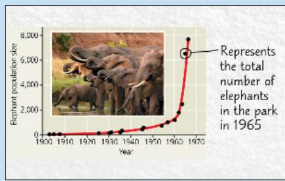

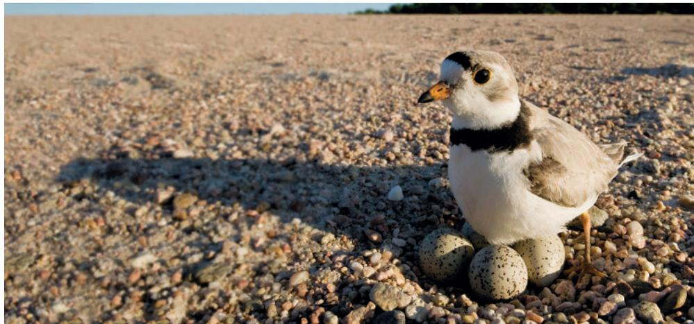  
Figure 53.1 Although it was once common along the Atlantic coast, by 1985 prospects looked grim for the piping plover (Charadrius melodus). Since then, nesting site protection has enabled the piping plover's numbers to grow, with recent surveys finding 1,400 to 4,000 adults in recent years. Such variation is typical of natural populations, all of which vary in number (size) over time.

What affects the size of a population and how it changes over time?  
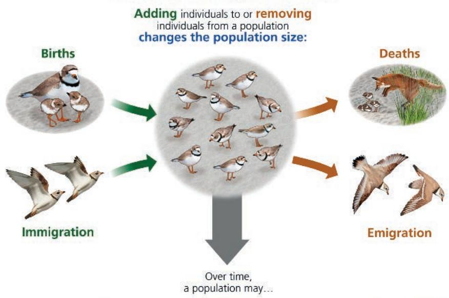

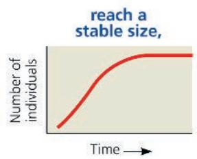

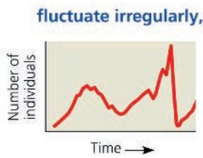

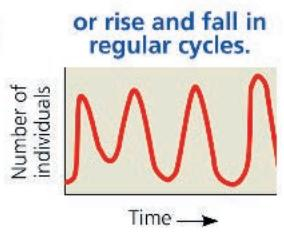

# Concept 53.1: Biotic and abiotic factors affect population density, dispersion, and demographics

A population is a group of individuals of a single species living in the same general area. Members of a population rely on the same resources, are influenced by similar environmental factors, and are likely to interact and breed with one another.

Populations are often described by their boundaries and size (the number of individuals living within those boundaries). Ecologists usually begin investigating a population by defining boundaries appropriate to the organism under study and to the questions being asked. A population's boundaries may be natural ones, as in the case of an island or a lake, or they may be arbitrarily defined by an investigator—for example, a specific county in Minnesota for a study of oak trees.

In this chapter, we will explore how ecologists describe and analyze populations and the factors that can determine the abundance of organisms. We will then examine recent trends in the size and makeup of the human population.

## Density and Dispersion

The density of a population is the number of individuals per unit area or volume: the number of oak trees per square kilometer in the Minnesota county or the number of Escherichia coli bacteria per milliliter in a test tube. Dispersion is the pattern of spacing among individuals within the boundaries of the population.

## Density: A Dynamic Perspective

In some cases, population size and density can be determined by counting all individuals within the boundaries of the population. We could count all the sea stars in a tide pool, for instance. Large mammals that live in herds, such as elephants, can sometimes be counted accurately from airplanes.

In most cases, however, it is impractical or impossible to count all individuals in a population. Instead, ecologists use various sampling techniques to estimate densities and total population sizes. They might count the number of oak trees in several randomly located $100 \times 100$ m plots, calculate the average density in the plots, and then extend the estimate to the population size in the entire area. Such estimates are most accurate when there are many sample plots and when the habitat is fairly homogeneous. In other cases, instead of counting single organisms, ecologists estimate density from an indicator of population size, such as the number of nests, burrows, tracks, or fecal droppings. Ecologists also use the mark-recapture method to estimate the size of wildlife populations (Figure 53.2).

## Figure 53.2

Research Method: Determining Population Size Using the Mark-Recapture Method

## Application

Ecologists cannot count all the individuals in a population if the organisms move too quickly or are hidden from view. In such cases, researchers often use

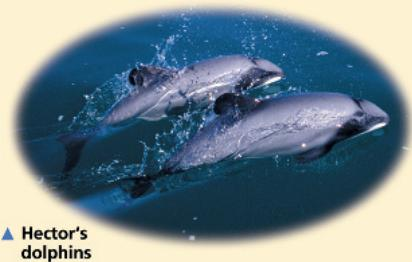  
▲ Hector's dolphins

the mark-recapture method to estimate population size. Andrew Gormley and his colleagues at the University of Otago applied this method to a population of endangered Hector's dolphins (Cephalorhynchus hectori) near Banks Peninsula, in New Zealand.

## Technique

Scientists typically begin by capturing a random sample of individuals in a population. They tag, or “mark,” each individual and then release it. With some species, researchers can identify individuals without physically capturing them. For example, Gormley and colleagues identified 180 Hector’s dolphins by photographing their distinctive dorsal fins from boats.

After waiting for the marked or otherwise identified individuals to mix back into the population, usually a few days or weeks, scientists capture or sample a second set of individuals. At Banks Peninsula, Gormley's team encountered 44 dolphins in their second sampling, 7 of which they had photographed before. The number of marked animals captured in the second sampling (x) divided by the total number of animals captured in the second sampling (n) should equal the number of individuals marked and released in the first sampling (s) divided by the estimated population size (N):

$$
{\frac {x}{n}} = {\frac {s}{N}} \text {   or,   solving   for   population   size,   } N = {\frac {s n}{x}}
$$

The method assumes that marked and unmarked individuals have the same probability of being captured or sampled, that the marked organisms have mixed completely back into the population, and that no individuals are born, die, immigrate, or emigrate during the resampling interval.

## Results

Based on these initial data, the estimated population size of Hector's dolphins at Banks Peninsula would be $180 \times 44/7 = 1,131$ individuals. Repeated sampling by Gormley and colleagues suggested a true population size closer to 1,100.

Data from A. M. Gormley et al., Capture-recapture estimates of Hector's dolphin abundance at Banks Peninsula, New Zealand, Marine Mammal Science 21:204–216 (2005).

INTERPRET THE DATA Suppose that none of the 44 dolphins encountered in the second sampling had been photographed before. Would you be able to solve the equation for N? What might you conclude about population size in this case?

Density is not a static property but can increase or decrease over time as individuals are added to or removed from a population. As seen on the opening page of this chapter, additions occur through birth (which we define here to include all forms of reproduction) and immigration, the influx of new individuals from other areas. The factors that remove individuals from a population are death (mortality) and emigration, the movement of individuals out of a population and into other locations.

While birth and death rates influence the density of all populations, immigration and emigration can also have substantial effects. For example, studies of a population of Hector's dolphins (see Figure 53.2) in New Zealand showed that immigration accounted for about $15\%$ of the total population size each year. Emigration was also important, typically occurring during the winter season when the dolphins move farther from shore. In general, both immigration and emigration represent key factors affecting the populations of many species. Emigration, for example, not only reduces the density of the original population, it also can result in the establishment of new populations in regions of favorable habitat, as we'll discuss later in this chapter.

## Patterns of Dispersion

Within the boundaries of a population, the spacing among individuals may differ substantially, creating contrasting patterns of dispersion. Such differences in spacing can provide insight into the biotic and abiotic factors that affect individuals in the population.

The most common pattern of dispersion is clumped, in which individuals are aggregated in patches. Plants and fungi are often clumped where soil conditions and other environmental factors favor germination and growth. Mushrooms, for instance, may be clumped within and on top of a rotting log. Insects and salamanders may be clumped under the same log because of the higher humidity there. Clumping of animals may also be associated with mating behavior. Sea stars in the intertidal zone group together where food is readily available and the risk of desiccation (drying out) is low (Figure 53.3a). The aggregation of individuals into groups may also increase the effectiveness of predation or defense; for example, a wolf pack is more likely than a single wolf to subdue a moose, and a flock of birds is more likely than a single bird to warn of a potential attack.

A uniform, or evenly spaced, pattern of dispersion may result from direct interactions between individuals in the population. Some plants secrete chemicals that inhibit the germination and growth of nearby individuals that could compete for resources. Animals often exhibit uniform dispersion as a result of antagonistic social interactions, such as territoriality—the defense of a bounded physical space against encroachment by other individuals (Figure 53.3b).

In random dispersion (unpredictable spacing), the position of each individual in a population is independent of other individuals. This pattern occurs in the absence of strong attractions or repulsions among individuals or where key physical or chemical factors are relatively constant across the study area. Plants established by windblown seeds, such as dandelions, may be randomly distributed in a fairly uniform habitat (Figure 53.3c).

Figure 53.3 Patterns of dispersion within a population's geographic range.

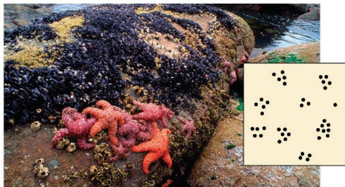  
(a) Clumped. Sea stars group together where food is abundant.

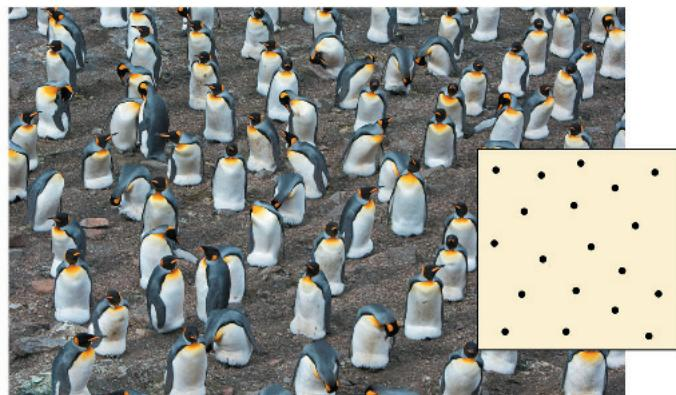  
(b) Uniform. King penguins and other birds that nest on small islands often exhibit uniform spacing, maintained by aggressive interactions between neighbors.

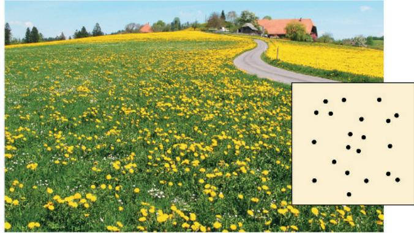  
(c) Random. Dandelions grow from windblown seeds that land at random and later germinate.

Patterns of dispersion can depend on scale. How might the penguin dispersion look from an airplane flying high above the ocean? For suggested answer, see Appendix A.

## Demographics

The biotic and abiotic factors that influence population density and dispersion patterns also influence other characteristics of populations, including birth, death, and migration rates. Demography is the study of these key characteristics of populations and how they change over time. A useful way to summarize demographic information for a population is to make a life table.

## Life Tables

A life table summarizes the survival and reproductive rates of individuals in specific age-groups within a population. To construct a life table, researchers often follow the fate of a cohort, a group of individuals of the same age, from birth until all of the individuals are dead. Building the life table requires determining the proportion of the cohort that survives from one age-group to the next. It is also necessary to keep track of the number of offspring produced by females in each age-group. Note that life tables, like basic models of population growth, only consider how births and deaths influence population growth. Of course, immigration and emigration can also be important factors in population dynamics, as we'll discuss in Concept 53.5.

Demographers who study sexually reproducing species often ignore the males and concentrate on the females in a population because only females produce offspring. Using this approach, a population is viewed in terms of females giving rise to new females. Table 53.1 is a life table built in this way for female Belding's ground squirrels (Urocitellus beldingi) from a population located in the Sierra Nevada mountains of California. Next, we'll take a closer look at some of the data presented in a life table.

the other points in the curve for the ground squirrel population, we multiply the proportion alive at the start of each year (the third column of Table 53.1) by 1,000 (the hypothetical beginning cohort). The result is the number alive at the start of each year. Plotting these numbers versus age for female Belding's ground squirrels yields Figure 53.4. The approximately straight line of the plot indicates a relatively constant rate of death.

Figure 53.4 represents just one of many patterns of survivorship exhibited by natural populations. Though diverse, survivorship curves can be classified into three general types (Figure 53.5). A Type I curve is flat at the start, reflecting low death rates during early and middle life, and then drops steeply as death rates increase among older age-groups. Many large mammals, including humans and elephants, that produce few offspring but provide them with good care exhibit this kind of curve.

In contrast, a Type III curve drops sharply at the start, reflecting very high death rates for the young, but flattens out as death rates decline for those few individuals that survive the early period of die-off. This type of curve is usually associated with organisms that produce very large numbers of offspring but provide little or no care, such as long-lived plants, many fishes, and most marine invertebrates. An oyster, for example, may release millions of eggs, but most larvae hatched from fertilized

## Survivorship Curves

The survival rate data in a life table can be represented graphically as a survivorship curve, a plot of the proportion or numbers in a cohort still alive at each age. As an example, let's use the data for female Belding's ground squirrels in Table 53.1 to draw a survivorship curve. Often, a survivorship curve begins with a cohort of a convenient size—say, 1,000 individuals. To obtain eggs die from predation or other causes. Those few

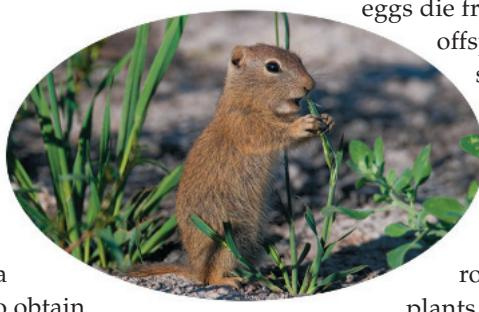

offspring that survive long enough to attach to a suitable substrate and begin growing a hard shell tend to survive for a relatively long time. Type II curves are intermediate, with a constant death rate over the organism's life span. This kind of survivorship occurs in Belding's ground squirrels and some other rodents, many invertebrates, lizards, and annual plants.

Table 53.1 Life Table for Female Belding's Ground Squirrels (Tioga Pass, in the Sierra Nevada Mountains of California)

<table><tr><td>Age (years)</td><td>Number Alive at Start of Year</td><td>Proportion Alive at Start of Year*</td><td>Death Rate†</td><td>Average Number of Female Offspring per Female</td></tr><tr><td>0–1</td><td>653</td><td>1.000</td><td>0.614</td><td>0.00</td></tr><tr><td>1–2</td><td>252</td><td>0.386</td><td>0.496</td><td>1.07</td></tr><tr><td>2–3</td><td>127</td><td>0.197</td><td>0.472</td><td>1.87</td></tr><tr><td>3–4</td><td>67</td><td>0.106</td><td>0.478</td><td>2.21</td></tr><tr><td>4–5</td><td>35</td><td>0.054</td><td>0.457</td><td>2.59</td></tr><tr><td>5–6</td><td>19</td><td>0.029</td><td>0.526</td><td>2.08</td></tr><tr><td>6–7</td><td>9</td><td>0.014</td><td>0.444</td><td>1.70</td></tr><tr><td>7–8</td><td>5</td><td>0.008</td><td>0.200</td><td>1.93</td></tr><tr><td>8–9</td><td>4</td><td>0.006</td><td>0.750</td><td>1.93</td></tr><tr><td>9–10</td><td>1</td><td>0.002</td><td>1.00</td><td>1.58</td></tr></table>

Data from P. W. Sherman and M. L. Morton, Demography of Belding's ground squirrel, Ecology 65:1617–1628 (1984). $^{*}$ Indicates the proportion of the original cohort of 653 individuals that are still alive at the start of a time interval. $^{\dagger}$ The death rate is the proportion of individuals alive at the start of a time interval that die during that time interval.

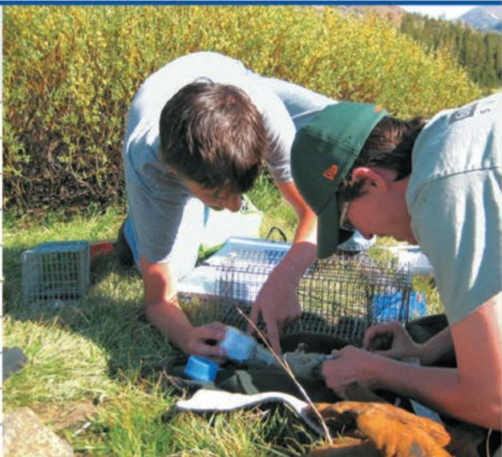  
▲ Researchers working with a Belding's ground squirrel

The logarithmic scale on the y-axis allows the number of survivors to be visible across the entire range (2–1,000 individuals) on the graph.  
Figure 53.4 Survivorship curve for female Belding's ground squirrels.  
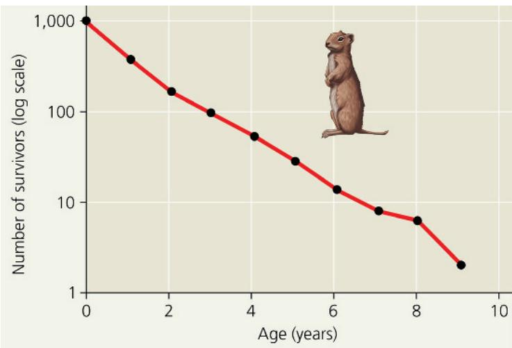  
Based on this graph, what percentage of the female ground squirrels survive to be 3 years old?  
For suggested answer, see Appendix A.

Many species fall somewhere between these basic types of survivorship or show more complex patterns. In birds, mortality is often high among the youngest individuals (as in a Type III curve) but fairly constant among adults (as in a Type II curve). Some invertebrates, such as crabs, may show a “stair-stepped” curve, with brief periods of increased mortality during molts, followed by periods of lower mortality when their protective exoskeleton is hard. In addition to such variation among species, survivorship curves also can differ among the populations of a single species.

In populations experiencing low levels of immigration and emigration, survivorship is one of the two key factors determining changes in population size. The other key factor that affects how population size changes over time is reproductive rate.

Figure 53.5 Idealized survivorship curves: Types I, II, and III. The y-axis is logarithmic and the x-axis is on a relative scale so that species with widely varying life spans can be presented together on the same graph.  
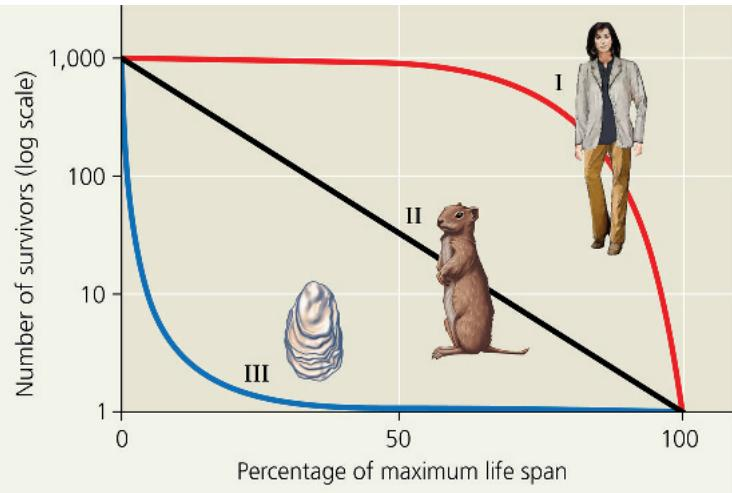

## Reproductive Rates

As mentioned above, demographers often ignore the males and concentrate on the females in a population because only females produce offspring. Therefore, demographers view populations in terms of females giving rise to new females. The simplest way to describe the reproductive pattern of a population is to identify how reproductive output varies with the number of breeding females and their ages.

How do ecologists estimate the number of breeding females in a population? Possible approaches include direct counts and the mark-recapture method (see Figure 53.2). Increasingly, ecologists also use molecular tools. For example, scientists working in the state of Georgia collected skin samples from 198 female loggerhead turtles between 2005 and 2009. From these samples, they amplified nuclear short tandem repeats at 14 loci using the polymerase chain reaction (PCR; see Figure 20.7) and produced a genetic profile for each female (Figure 53.6, on the next page). They then extracted DNA from an eggshell from each turtle nest on the beaches they studied and, using their database of genetic profiles, matched the nest to a specific female. This approach allowed them to determine how many of the 198 females were breeding—and how many offspring each female produced—without having to disturb the females during egg laying.

Reproductive output for sexual organisms such as birds and mammals is typically measured as the average number of female offspring produced by the females in a given age-group. For some organisms, the number of offspring for each female can be counted directly; alternatively, molecular methods can be used (see Figure 53.6). Researchers directly counted the offspring of the Belding's ground squirrels, which begin to reproduce at age 1 year. The squirrels' reproductive output rises to a peak at 4–5 years of age and then gradually falls off in older females (see Table 53.1).

Age-specific reproductive rates vary considerably by species. Squirrels, for example, have a litter of two to six young once a year for less than a decade, whereas oak trees drop thousands of acorns each year for tens or hundreds of years. Mussels and other invertebrates may release millions of eggs and sperm in a spawning cycle. However, a high reproductive rate will not lead to rapid population growth unless conditions are near ideal for the growth and survival of offspring, as you'll learn in the next section.

## Concept Check 53.1

1. DRAW IT Each female of a particular fish species produces millions of eggs per year. Draw and label the most likely survivorship curve for this species, and explain your choice.

2. WHAT IF? Suppose you are constructing a life table for a population of Belding's ground squirrels (see Table 53.1). If 485 individuals are alive at the start of year 0–1 and 218 are still alive at the start of year 1–2, what is the proportion alive at the start of each of these years (see column 3 in Table 53.1)?

3. MAKE CONNECTIONS A male stickleback fish attacks other males that invade its nesting territory (see Figure 51.2a). Predict the likely pattern of dispersion for male sticklebacks, and explain your reasoning.

Figure 53.6 Using genetic profiles from loggerhead turtle eggshells to identify which female laid the eggs.  
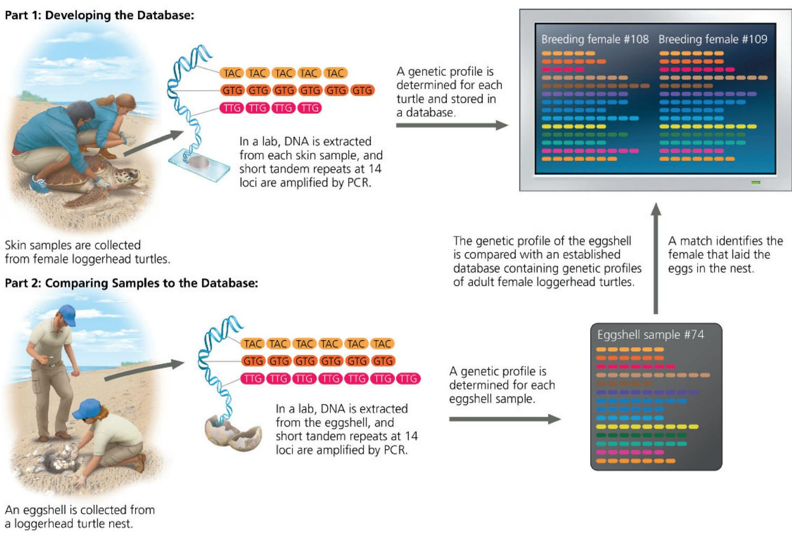  
VISUAL SKILLS Use the profiles displayed in the figure to determine which breeding female laid the eggs in the nest from which eggshell sample #74 was taken.
For suggested answer, see Appendix A.

## Concept 53.2: The exponential model describes population growth in an idealized, unlimited environment

Populations of all species have the potential to expand greatly when resources are abundant. To appreciate the potential for population increase, consider a bacterium that can reproduce by fission every 20 minutes under ideal laboratory conditions. There would be two bacteria after 20 minutes, four after 40 minutes, and eight after 60 minutes. If reproduction continued at this rate for a day and a half without mortality, there would be

$3.245 \times 10^{32}$ bacteria, enough to form a layer 30 cm deep over the entire globe! But unlimited growth does not occur for long in nature, where individuals typically have access to fewer resources as a population grows. Nonetheless, ecologists can study population growth in ideal, unlimited environments to reveal how fast populations are capable of growing and the conditions under which rapid growth might actually occur.

## Changes in Population Size

Imagine a population consisting of a few individuals living in an ideal, unlimited environment. Under these conditions, there are no external limits on the abilities of individuals to harvest energy, grow, and reproduce. The population will increase in size with every birth and with the immigration of individuals from other populations, and it will decrease in size with every death and with the emigration of individuals out of the population. We can thus define a change in population size during a fixed time interval with the following verbal equation:

$$
\begin{array}{l l} \text {Change in} & \text {Immigrants} \\ \text {population} = \text {Births} + \text {entering} & - \text {Deaths} - \text {leaving} \\ \text {size} & \text {population} \end{array}
$$

For now, we will simplify our discussion by ignoring the effects of immigration and emigration.

We can use mathematical notation to express this simplified relationship more concisely. If N represents population size and t represents time, then $\Delta N$ is the change in population size and $\Delta t$ is the time interval (appropriate to the life span or generation time of the species) over which we are evaluating population growth. (The Greek letter delta, $\Delta$ , indicates change, such as change in time.) Using B for the number of births in the population during the time interval and D for the number of deaths, we can rewrite the verbal equation:

$$
\frac {\Delta N}{\Delta t} = B - D
$$

Population ecologists often are most interested in changes in population size—the number of individuals that are added to or subtracted from a population during a given time interval, symbolized by R. Here, R represents the difference between the number of births (B) and the number of deaths (D) that occur in the time interval. Thus, R = B - D, and we can simplify our equation by writing the following:

$$
\frac {\Delta N}{\Delta t} = R
$$

Next, we can convert our model to one in which changes in population size are expressed on a per individual (per capita) basis. The per capita change in population size $(r_{\Delta t})$ represents the contribution that an average member of the population makes to the number of individuals added to or subtracted from the population during the time interval $\Delta t$ . If, for example, a population of 1,000 individuals increases by 16 individuals per year, then on a per capita basis, the annual change in population size is 16/1,000, or 0.016. If we know the annual per capita change in population size, we can use the formula $R = r_{\Delta t}N$ to calculate how many individuals will be added to (or subtracted from) a population each year. For example, if $r_{\Delta t}$ is 0.016 and the population size is 500,

$$
R = r _ {\Delta t} N = 0. 0 1 6 \times 5 0 0 = 8 \text {   per   year }
$$

Since the number of individuals added to (or subtracted from) the population $(R)$ can be expressed on a per capita basis as $R = r_{\Delta t}N$ , we can revise our population growth equation to take this into account:

$$
\frac {\Delta N}{\Delta t} = r _ {\Delta t} N
$$

Remember that our equation is for a specific time interval (often one year). However, many ecologists prefer to use

differential calculus to express population growth as a rate of change at each instant in time:

$$
\frac {d N}{d t} = r N
$$

In this case, $r$ represents the per capita change in population size that occurs at each instant in time (whereas $r_{\Delta t}$ represented the per capita change that occurred during the time interval $\Delta t$ ). If you have not yet studied calculus, don't be intimidated by the last equation; it is similar to the previous one, except that the time intervals $\Delta t$ are very short and are expressed in the equation as $dt$ . In fact, as $\Delta t$ becomes shorter, $r_{\Delta t}$ and $r$ become increasingly close to one another in value.

Note that the per capita population growth rate $(r)$ can vary depending on circumstances. To account for this, we will make one final change to this general equation of population growth to specify that the per capita population growth rate r is the “realized” per capita growth rate—that is, what the population is actually experiencing at a given time—which we’ll call $r_{realized}$ .

$$
\frac {d N}{d t} = r _ {r e a l i z e d} N
$$

## Exponential Growth

Earlier we described a population whose members all have access to abundant food and can reproduce at their physiological capacity. In some cases, a population that experiences such ideal conditions increases in size by a constant proportion at each instant in time. When this occurs, the pattern of growth that results is called exponential population growth. In exponential growth, the realized per capita population growth rate ( $r_{realized}$ ) is always the highest it can be for that particular species ( $r_{max}$ , the maximum per capita population growth rate), so we can write the equation as follows:

$$
\frac {d N}{d t} = r _ {m a x} N
$$

In this equation, dN/dt represents the rate at which the population is increasing in size at each moment in time, akin to how a glance at the speedometer of a car reveals the speed at that instant in time. As seen in the equation, dN/dt equals the current population size, N, multiplied by a constant, $r_{max}$ . Ecologists also refer to $r_{max}$ as the intrinsic rate of increase, the per capita rate at which an exponentially growing population increases in size at each instant in time.

The size of a population that is growing exponentially increases at a constant rate per individual, resulting eventually in a J-shaped growth curve when population size is plotted over time (Figure 53.7). Although the per capita rate of population growth is constant (and equals $r_{max}$ ), more new individuals are added per unit of time when the population is large than when it is small; thus, the curves in Figure 53.7 get progressively steeper over time. This occurs because population growth depends on N as well as $r_{max}$ , and hence more individuals are added to larger populations than to small ones growing at the same per capita rate. It is also clear from Figure 53.7 that a population with a higher intrinsic rate of increase (dN/dt = 1.0N) will grow faster than one with a lower intrinsic rate of increase (dN/dt = 0.5N).

Figure 53.7 Population growth predicted by the exponential model.

This graph compares growth in a population with $r_{max} = 1.0$ (solid blue curve) to growth in a population with $r_{max} = 0.5$ (dashed red curve).

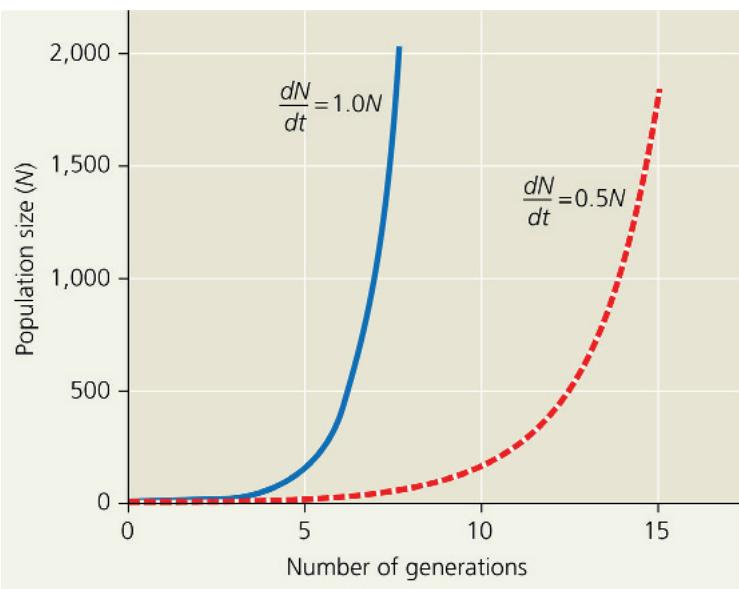  
How many generations does it take these populations to reach a size of 1,500 individuals?  
For suggested answer, see Appendix A.

The J-shaped curve of exponential growth is characteristic of some populations that are introduced into a new environment or whose numbers have been drastically reduced by a catastrophic event and are rebounding. For example, the population of elephants in Kruger National Park, South Africa, grew exponentially for approximately 60 years after they were first protected from hunting (Figure 53.8). The increasingly large number of elephants eventually caused enough damage to vegetation in the park that a collapse in their food supply was likely. To protect other species and the park ecosystem before that happened, park managers began

Figure 53.8 Exponential growth in the African elephant population of Kruger National Park, South Africa.  
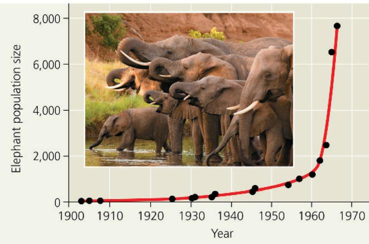

limiting the elephant population by giving birth control medication to females and by exporting elephants to other countries.

## Concept Check 53.2

1. Explain why a constant per capita rate of growth ( $r_{max}$ ) for a population produces a curve that is J-shaped.

2. Where is exponential growth by a plant population more likely—in an area where a forest was destroyed by fire or in a mature, undisturbed forest? Why?

3. WHAT IF? In 2022, the United States had a population of 337 million people. If the (annual) per capita change in population size $(r_{\Delta t})$ was 0.007, how many people were added to the population that year (ignoring immigration and emigration)? What would you need to know to determine whether the United States is currently experiencing exponential growth?

For suggested answers, see Appendix A.

## Concept 53.3: The logistic model describes how a population grows more slowly as it nears its carrying capacity

The exponential growth model assumes that resources remain abundant, which is rarely the case in the real world. Instead, as the size of a population increases, each individual has access to fewer resources. Ultimately, there is a limit to the number of individuals that can occupy a habitat. Ecologists define the carrying capacity, symbolized by K, as the maximum population size that a particular environment can sustain. Carrying capacity varies over space and time with the abundance of limiting resources. Energy, shelter, refuge from predators, nutrient availability, water, and suitable nesting sites can all be limiting factors. For example, the carrying capacity for bats may be high in a habitat with abundant flying insects and roosting sites but lower where there is abundant food but fewer suitable shelters.

Crowding and resource limitation can have a profound effect on population growth rate. If individuals cannot obtain sufficient resources to reproduce, then the per capita birth rate will decline. Similarly, if starvation or disease increases with density, then the per capita death rate may increase. Falling per capita birth rates or rising per capita death rates will cause the realized per capita rate of population growth to drop, a very different situation from the constant per capita growth rate ( $r_{max}$ ) seen in a population that is growing exponentially.

## The Logistic Growth Model

We can modify our mathematical model so that the realized per capita population growth rate decreases as N increases. In the logistic population growth model, the realized per capita rate of population growth approaches zero as the population size nears the carrying capacity (K).

To construct the logistic model, we start with the exponential population growth model and add an expression that reduces the realized per capita rate of population growth as N increases. If the carrying capacity is K, then K - N is the number of additional individuals the environment can support, and $(K - N)/K$ is the fraction of K that is still available for population growth. By multiplying the exponential rate of population growth $r_{max}N$ by $(K - N)/K$ , we modify the change in population size as N increases:

$$
\frac {d N}{d t} = r _ {m a x} \Big (\frac {K - N}{K} \Big) N
$$

When N is small compared to K, the term $(K - N)/K$ is close to 1. In this scenario, the realized per capita rate of population growth, $r_{max}[(K - N)/K]$ , will be close to (but slightly less than) $r_{max}$ , the intrinsic rate of increase seen in exponential population growth. But when N is large and resources are limiting, then $(K - N)/K$ is close to 0, and the realized per capita population growth rate is small. When N equals K, the population stops growing. Table 53.2 shows calculations of population growth rate for a hypothetical population growing according to the logistic model, with $r_{max} = 1.0$ per individual per year. Notice that the overall population growth rate $(dN/dt)$ is highest, +375 individuals per year, when the population size is 750, or half the carrying capacity. At a population size of 750, the realized per capita population growth rate remains relatively high (one-half the value of $r_{max}$ ), and there are more reproducing individuals $(N)$ in the population than at lower population sizes.

As shown in the bottom part of Figure 53.9, the logistic model of population growth produces a sigmoid (S-shaped) growth

Table 53.2 Logistic Growth of a Hypothetical Population (K = 1,500)  
Table 53.2 Population growth predicted by exponential and logistic models

<table><tr><td>Population Size (N)</td><td>Intrinsic Rate of Increase  $\left( {{r}_{\max }\text{)}}\right)$ </td><td>Proportion of K Available for Population Growth  $\frac{K - N}{K}$ </td><td>Realized Per Capita Population Growth Rate,  ${r}_{\max }\frac{\left( {K - N}\right) }{K}$ </td><td>Overall Population Growth Rate,*  ${r}_{\max }\frac{\left( {K - N}\right) }{K}N$ </td></tr><tr><td>25</td><td>1.0</td><td>0.983</td><td>0.983</td><td>+25</td></tr><tr><td>100</td><td>1.0</td><td>0.933</td><td>0.933</td><td>+93</td></tr><tr><td>250</td><td>1.0</td><td>0.833</td><td>0.833</td><td>+208</td></tr><tr><td>500</td><td>1.0</td><td>0.667</td><td>0.667</td><td>+333</td></tr><tr><td>750</td><td>1.0</td><td>0.500</td><td>0.500</td><td>+375</td></tr><tr><td>1,000</td><td>1.0</td><td>0.333</td><td>0.333</td><td>+333</td></tr><tr><td>1,250</td><td>1.0</td><td>0.167</td><td>0.167</td><td>+208</td></tr><tr><td>1,400</td><td>1.0</td><td>0.067</td><td>0.067</td><td>+93</td></tr><tr><td>1,475</td><td>1.0</td><td>0.017</td><td>0.017</td><td>+26</td></tr><tr><td>1,500</td><td>1.0</td><td>0.000</td><td>0.000</td><td>0</td></tr><tr><td colspan="5">*Rounded to the nearest whole number.</td></tr></table>

Figure 53.9 Population growth predicted by the exponential and logistic models.

In exponential growth (top), the overall rate of population growth $(dN/dt)$ becomes increasingly fast as the population size $(N)$ increases, since $r_{realized}$ is always equal to $r_{max}$ . In logistic growth (bottom), the rate of population growth $(dN/dt)$ decreases as population size $(N)$ approaches the carrying capacity $(K)$ of the environment, since $r_{realized}$ decreases with increasing population size due to the term $(K - N)/K\cdot$

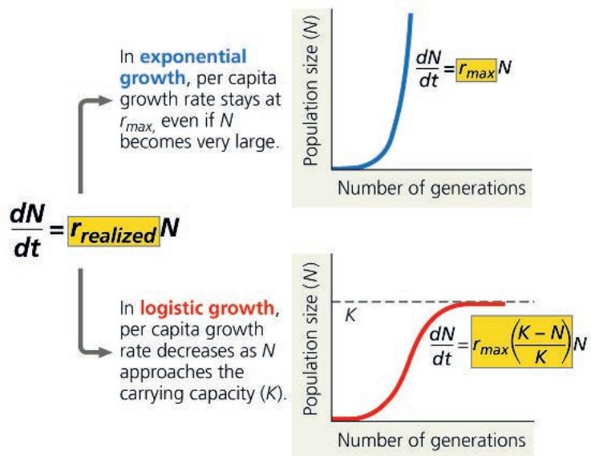

curve when N is plotted over time. Overall population growth rate $(dN/dt)$ is low at small population sizes because while the realized per capita population growth rate $(r_{realized})$ is high, there are few individuals producing offspring. New individuals are added to the population most rapidly at intermediate population sizes, when there is not only a breeding population of substantial size, but also lots of available space and other resources in the environment. The realized per capita population growth rate $(r_{realized})$ decreases dramatically as N approaches K. As a result, the overall population growth rate $(dN/dt)$ also decreases as N approaches K.

Note that we haven't said anything yet about why the population growth rate decreases as $N$ approaches $K$ . For a population's growth rate to decrease, the birth rate must decrease, the death rate must increase, or both. Later in the chapter, we'll consider some of the factors affecting these rates, including the presence of disease, predation, and limited amounts of food and other resources.

## The Logistic Model and Real Populations

The growth of laboratory populations of some small animals, such as beetles and crustaceans, and of some microorganisms, such as bacteria, Paramecium, and yeasts, fits an S-shaped curve fairly well under conditions of limited resources (Figure 53.10a). These populations are grown in a constant environment lacking predators and competing species that may reduce growth of the populations, conditions that rarely occur in nature.

Figure 53.10 How well do these populations fit the logistic growth model? In each graph, the black dots plot the measured growth of the population, and the red curve is the growth predicted by the logistic model.

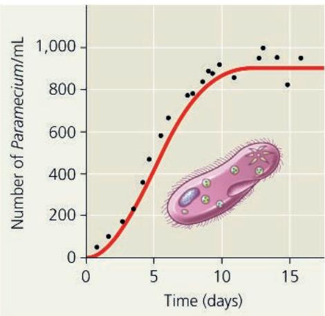  
(a) A Paramecium population in the lab. The growth of Paramecium aurelia in a small culture closely approximates logistic growth if the researcher maintains a constant environment.

Populations in nature rarely match the predictions of the logistic model as closely as do some laboratory populations, such as the Paramecium population in Figure 53.10a. This is not surprising, since some of the assumptions built into the logistic model clearly do not apply to all populations. The logistic model assumes that populations adjust instantaneously to growth and approach carrying capacity smoothly. In reality, there is often a delay before the negative effects of an increasing population are realized. If food becomes limiting for a population, for instance, reproduction will decline eventually, but females may use their energy reserves to continue reproducing for a short time. This may cause the population to overshoot its carrying capacity temporarily, as shown for the water fleas in Figure 53.10b. In the Scientific Skills Exercise,

The two animals pictured here are members of the southern subspecies, which has a population of around 17,000 individuals. The northern subspecies is critically endangered, with just a few known individuals.

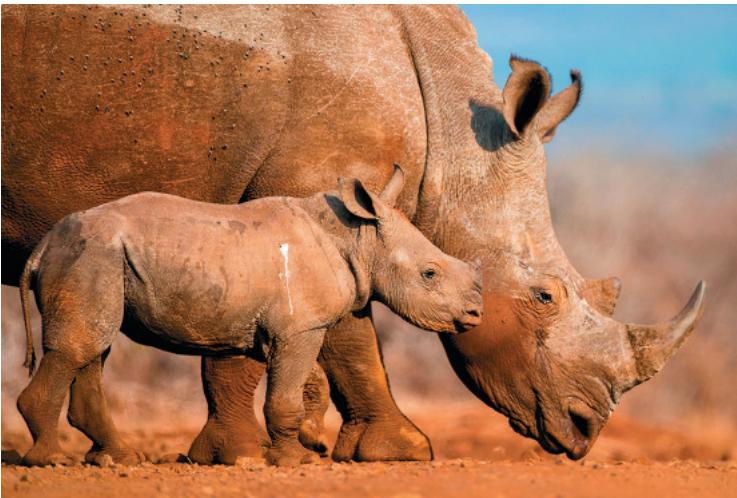

Figure 53.11 White rhinoceros mother and calf.  
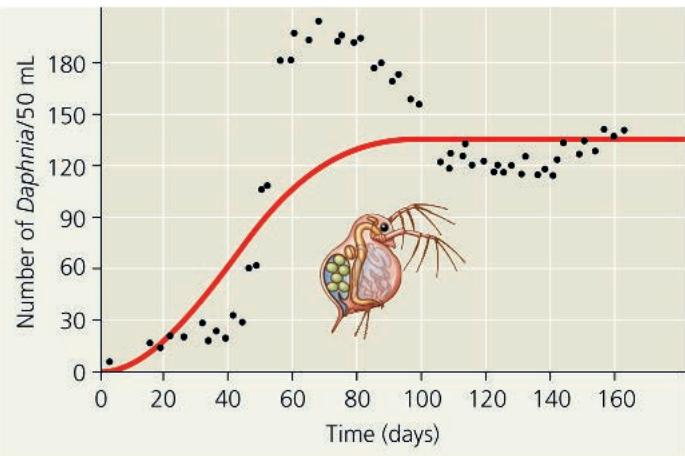  
(b) A Daphnia population in the lab. The growth of a population of water fleas (Daphnia) in a small laboratory culture does not correspond well to the logistic model. This population overshoots the carrying capacity of its artificial environment before it settles down to an approximately stable population size.

you can model what can happen to such a population when N becomes greater than K. Other populations fluctuate greatly, making it difficult even to define carrying capacity. We will examine some possible reasons for such fluctuations later in the chapter.

The logistic model provides a useful starting point for thinking about how populations grow and for constructing more complex models. As such, its role is similar to that played by the Hardy-Weinberg equation for thinking about the evolution of populations. The logistic model is also important in conservation biology for predicting how rapidly a particular population might increase in numbers after it has been reduced to a small size and for estimating sustainable harvest rates for wildlife populations. Conservation biologists can also use the model to estimate the critical size below which populations of certain organisms, such as the northern subspecies of the white rhinoceros (Ceratotherium simum), may become extinct (Figure 53.11).

## Concept Check 53.3

1. Explain why a population that fits the logistic growth model increases more rapidly at an intermediate size than at relatively small and large sizes.

2. WHAT IF? Given the latitudinal differences in sunlight intensity (see Figure 52.3), how might you expect the carrying capacity of plant species found at the equator to compare with that of plant species found at high latitudes?

3. MAKE CONNECTIONS Suppose that a sudden change in environmental conditions caused a substantial drop in a population's carrying capacity. Predict how natural selection and genetic drift might affect this population. (See Concept 23.3.)

# Scientific Skills Exercise Using the Logistic Equation to Model Population Growth

What Happens to the Size of a Population When It Overshoots Its Carrying Capacity? In the logistic population growth model, the per capita rate of population increase approaches zero as the population size (N) approaches the carrying capacity (K). Under some conditions, however, a population in the laboratory or the field can overshoot K, at least temporarily. If food becomes limiting to a population, for instance, there may be a delay before reproduction declines, and N may briefly exceed K. In this exercise, you will use the logistic equation to model the growth of the hypothetical population in Table 53.2 when N > K.

## INTERPRET THE DATA

1. Assuming that $r_{max} = 1.0$ and K = 1,500, calculate the population growth rate for four cases where population size (N) is greater than carrying capacity (K): N = 1,510, 1,600, 1,750, and 2,000 individuals. To do this, first write the equation for population growth rate given in Table 53.2. Plug in the values for each of the four cases, starting with N = 1,510, and solve the equation for each one. Which population size has the highest growth rate?

## Concept 53.4: Life history traits are products of natural selection

EVOLUTION Natural selection favors traits that improve an organism's chances of survival and reproductive success. In every species, there are trade-offs between survival and reproductive traits such as frequency of reproduction, number of offspring (number of seeds produced by plants; litter or clutch size for animals), or investment in parental care. The traits that affect an organism's schedule of reproduction and survival make up its life history. Life history traits of an organism are evolutionary outcomes reflected in its development, physiology, and behavior.

## Diversity of Life Histories

We'll focus on three key components of an organism's life history: when reproduction begins (the age at first reproduction or age at maturity), how often the organism reproduces, and how many offspring are produced per reproductive episode. The fundamental idea that evolution accounts for the diversity of life is manifest in the broad range of these life history characteristics in nature. For example, the age at which reproduction begins varies considerably across species. A typical loggerhead turtle is about 30 years old

Daphnia

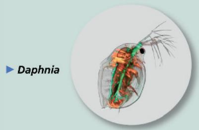

2. If r is doubled, predict how the population growth rates will change for the four population sizes given in question 1. Now calculate the population growth rate for the same four cases, this time assuming that $r_{max} = 2.0$ (and with K still = 1,500).

3. Now let's see how the growth of a real-world population of Daphnia corresponds to this model. At what times in Figure 53.10b is the Daphnia population changing in ways that correspond to the values you calculated? Hypothesize why the population drops below the carrying capacity briefly late in the experiment.

Instructors: A version of this Scientific Skills Exercise can be assigned in Mastering Biology.

when it first crawls onto a beach to lay eggs. In contrast, the coho salmon (Oncorhynchus kisutch) is often only three or four years old when it first spawns.

Organisms also vary in how often they reproduce. The coho salmon is an example of organisms that undergo a “one-shot” pattern of big-bang reproduction, or semelparity (from the Latin semel, once, and parere, to beget). It hatches in the headwaters of a freshwater stream and then migrates to the Pacific Ocean, where it typically requires a few years to mature. The salmon eventually returns to the same stream to spawn, producing thousands of eggs in a single reproductive opportunity before it dies. Semelparity also occurs in some plants, such as the agave, or “century plant” (Figure 53.12a). Agaves generally grow in arid climates with unpredictable rainfall and poor soils. An agave grows for years, accumulating nutrients in its tissues, until there is an unusually wet year. It then sends up a large flowering stalk, produces seeds, and dies. This life history appears to be an adaptation to the agave’s harsh desert environment.

In contrast to semelparity is iteroparity (from the Latin iterare, to repeat), or repeated reproduction. As an example, a female loggerhead turtle produces four clutches totaling approximately 300 eggs in a year. It then typically waits two to three years before laying more eggs; presumably, the turtles lack sufficient resources to produce that many eggs every year. A mature turtle may lay eggs for 30 years after the first clutch. Horses and other large mammals also reproduce repeatedly, as do many fish, sea urchins, and long-lived trees, such as maples and oaks (Figure 53.12b).

Figure 53.12 Semelparity and iteroparity.  
  
(a) Semelparity: one-time reproduction. An agave (Agave americana) is an example of semelparity. The leaves of the plant are visible at the base of the giant flowering stalk, which is produced only at the end of the agave's life.

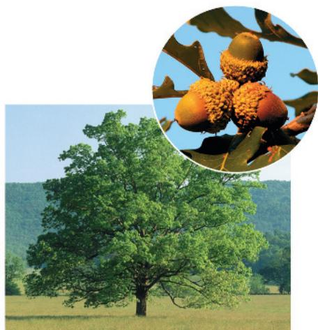  
(b) Iteroparity: repeat reproduction. Organisms that reproduce repeatedly, such as the bur oak (Quercus macrocarpa), undergo iteroparity. One oak tree can produce thousands of acorns (inset) per year over the course of many decades.

Finally, organisms also vary in how many offspring they produce. Some species, such as the white rhinoceros (see Figure 53.11), produce a single calf when they reproduce, while most insects and many plants produce large numbers of offspring. Such variation in offspring number has other consequences as well; as you'll read, a species that produces one or a few offspring may provision them better than does a species that produces many offspring.

## "Trade-offs" and Life Histories

No organism could produce thousands of offspring yet provision each of them as well as does a white rhinoceros caring for its single calf. There is a trade-off between the number of offspring and the amount of resources a parent can devote to each offspring. Such trade-offs occur because organisms do not have access to unlimited amounts of resources. As a result, the use of resources for one function (such as reproduction) can reduce the resources available for supporting another function (such as survival). In Eurasian kestrels, for example, caring for a larger number of young lowered the survival rates of the parents (Figure 53.13). In another study, in Scotland, researchers found that female red deer that reproduced in a given summer were more likely to die the next winter than were females that did not reproduce.

Selective pressures also influence trade-offs between the number and size of offspring. Plants and animals whose young have a low chance of survival often produce many small

## Figure 53.13

## Inquiry: How does caring for offspring affect parental survival in kestrels?

## Experiment

Cor Dijkstra and colleagues in the Netherlands studied the effects of parental caregiving in Eurasian kestrels over five years. The researchers transferred chicks among nests to produce reduced broods (three or four chicks), normal broods (five or six), and enlarged broods (seven or eight). They then measured the percentage of male and female parent birds that survived the following winter. (Both males and females provide care for chicks.)

## Results

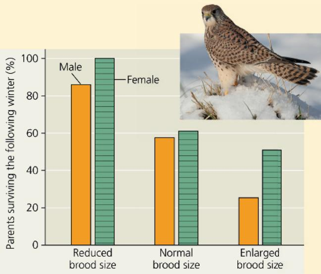

## Conclusion

The lower survival rates of kestrels with larger broods indicate that caring for more offspring negatively affects survival of the parents.

Data from C. Dijkstra et al., Brood size manipulations in the kestrel (Falco tinnunculus): effects on offspring and parent survival, Journal of Animal Ecology 59:269–285 (1990).

INTERPRET THE DATA The males of some bird species provide no parental care. If this were true for the Eurasian kestrel, predict how the experimental results would differ from those shown here.

offspring. For example, plants that colonize disturbed environments usually produce many small seeds, only a few of which may reach a suitable habitat. Small size may also increase the chance of seedling establishment by enabling the seeds to be carried longer distances to a broader range of habitats (Figure 53.14a). Animals that suffer high predation rates, such as quail, sardines, and mice, also tend to produce many offspring.

Figure 53.14 Variation in the number and size of seeds in plants.  
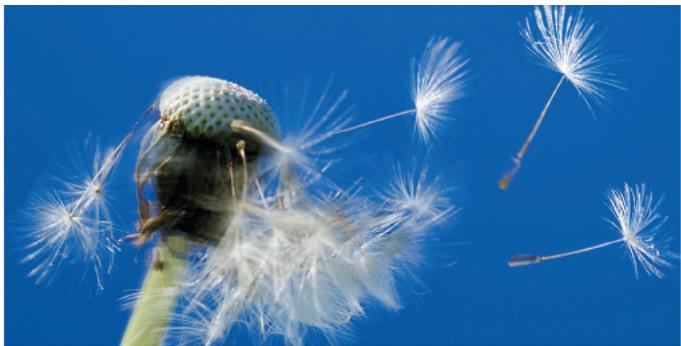  
(a) Dandelions grow quickly and release a large number of tiny fruits, each containing a single seed. Producing numerous seeds increases the chance that at least some will grow into plants that eventually produce seeds themselves.

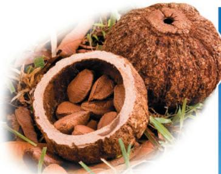  
(b) Some plants, such as the Brazil nut tree (right), produce a moderate number of large seeds in pods (above). Each seed's large endosperm provides nutrients for the embryo, an adaptation that helps a relatively large fraction of offspring survive.

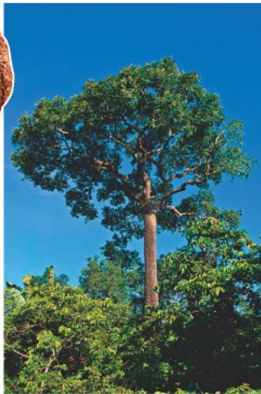

In other organisms, extra investment on the part of the parent greatly increases the offspring's chances of survival. Brazil nut and walnut trees produce large seeds packed with nutrients that help the seedlings become established (Figure 53.14b). Primates generally bear only one or two offspring at a time; parental care and an extended period of learning in the first several years of life are very important to offspring fitness. Such provisioning and extra care can be especially important in habitats with high population densities.

One way to categorize variation in life history traits is related to the logistic growth model discussed in Concept 53.3. Selection for traits that are advantageous at high densities is referred to as as K-selection. In contrast, selection for traits that maximize reproductive success in uncrowded environments (low densities) is called r-selection. These names follow from the variables of the logistic equation. K-selection is said to operate in populations living at a density near the limit imposed by their resources (the carrying capacity, K), where competition among individuals is stronger. Mature trees growing in an old-growth forest are an example of K-selected organisms. In contrast, r-selection is said to maximize $r_{max}$ , the intrinsic rate of increase, and occurs in environments in which population densities are well below carrying capacity or individuals face little competition. Such conditions are often found in disturbed habitats that are being recolonized. Weeds

growing in an abandoned agricultural field are an example of r-selected organisms.

The concepts of K- and r-selection represent two extremes in a range of actual life histories. The framework of K- and r-selection, grounded in the idea of carrying capacity, also relates to the important question we alluded to earlier: Why does population growth rate decrease as population size approaches carrying capacity? Answering this question is the focus of the next section.

## Concept Check 53.4

1. Identify three key life history traits, and give examples of organisms that vary widely in each of these traits.

2. In the fish called the peacock wrasse (Symphodus tinca), females disperse some of their eggs widely and lay other eggs in a nest. Only the latter receive parental care. Explain the trade-offs in reproduction that this behavior illustrates.

3. WHAT IF? Mice that experience stress such as a food shortage will sometimes abandon their young. Explain how this behavior might have evolved in the context of reproductive trade-offs and life history.

For suggested answers, see Appendix A.

## Concept 53.5: Density-dependent factors regulate population growth

As discussed in Concept 53.4, the logistic growth model predicts a decrease in realized per-capita population growth rate as a population's size increases. What causes these changes? What environmental factors keep populations from growing indefinitely? Why are some populations fairly stable in size, while others are not?

Answers to such questions can be important in practical applications. Farmers may want to reduce the abundance of insect pests or stop the growth of a weed that is spreading rapidly. Conservation ecologists need to know what environmental factors create favorable feeding or breeding habitats for endangered species, such as the white rhinoceros and the whooping crane. Overall, whether seeking to reduce the size of an unwanted population or increase the size of one that is endangered, it is helpful to understand factors that affect population abundance.

## Population Change and Population Density

To understand why a population stops growing when it reaches a certain size, ecologists study how the rates of birth, death, immigration, and emigration change as population density rises. If immigration and emigration offset each other, then a population grows when the birth rate exceeds the death rate and declines when the death rate exceeds the birth rate.

A birth rate or death rate that does not change with population density is said to be density independent. For example, researchers found that the mortality of dune fescue grass (Vulpia fasciculata) is mainly due to physical factors that kill similar proportions of a local population, regardless of its density. Drought stress that arises when the roots of the grass are uncovered by shifting sands is a density-independent factor that can kill these plants. In contrast, a death rate that increases with population density or a birth rate that falls with rising density is said to be density dependent. Researchers found that reproduction by dune fescue declines as population density increases, in part because water or nutrients become more scarce. Thus, the key factors affecting birth rate in this population are density dependent, while death rate is largely determined by density-independent factors. For situations in which immigration and emigration offset each other, Figure 53.15 shows how the combination of density-dependent reproduction and density-independent mortality can stop population growth (as in species such as dune fescue).

Variation in density-independent factors such as temperature and precipitation can cause dramatic changes in population size. For example, a drought or heat wave can cause a sharp increase in mortality rates, causing the abundance of a population to plummet. Note, however, that a density-independent factor cannot consistently cause a population to decrease in size when it is large or increase in size when it is small—only a density-dependent factor can consistently cause such changes. With this in mind, a population is said to be regulated when one or more density-dependent factors cause its size to decrease when large (or increase when small).

Figure 53.15 Determining equilibrium for population density. In this example, the birth rate changes with population density, while the death rate is constant; immigration and emigration rates are assumed to be equal. At the equilibrium density (Q), the birth and death rates are equal. As a result, the number of individuals added to the population equals the number removed from it, and the population stops changing in size.  
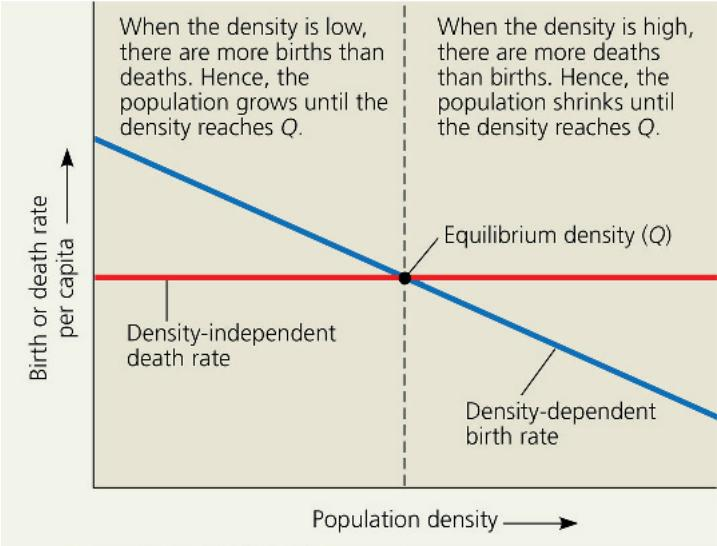  
DRAW IT Redraw this figure for the case where the birth and death rates are both density dependent, as occurs for many species.
For suggested answer, see Appendix A.

Figure 53.16 An example of density-dependent regulation. At high population densities, the death rate of kelp perch increased because they ran out of spaces to hide from predators.  
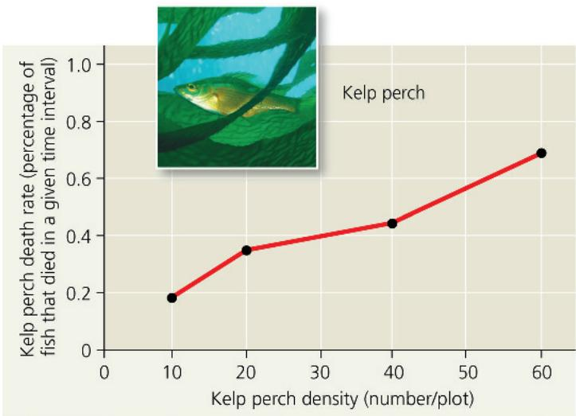

## Mechanisms of Density-Dependent Population Regulation

Without some type of negative feedback between population density and the rates of birth and death, a population would never stop growing. But no population can increase in size indefinitely. Ultimately, at large population sizes, negative feedback is provided by density-dependent regulation, which halts population growth through mechanisms that reduce birth rates or increase death rates. For example, a study of kelp perch (Brachyistius frenatus) populations showed that the fish's death rate rose proportionally as its density increased (Figure 53.16). This occurred because at high densities, the fish ran out of safe spaces in the kelp where they could hide from predators. Several other mechanisms that can cause density-dependent regulation are described in Figure 53.17.

These various examples of population regulation by negative feedback show how increased densities cause population growth rates to decline by affecting reproduction, growth, and survival. Although negative feedback helps explain why populations stop growing, it does not address why some populations fluctuate dramatically while others remain relatively stable.

## Population Dynamics

Like the piping plover (see Figure 53.1), all populations show some fluctuation in size. Such population fluctuations from year to year or place to place, called population dynamics, are influenced by many factors and in turn affect other species. For example, fluctuations in fish populations affect populations of seabirds that eat fish. The study of population dynamics focuses on the complex interactions between biotic and abiotic factors that cause variation in population sizes.

# Exploring Mechanisms of Density-Dependent Regulation

## Figure 53.17

As population density increases, density-dependent mechanisms operating within a species can slow or stop population growth by decreasing birth rates or increasing death rates.

## Competition for Resources

Increasing population density leads to competition among members of a population for nutrients and other resources, reducing reproductive rates. Farmers minimize the effect of competition on the growth of wheat (Triticum aestivum) and other crops by applying fertilizers to reduce nutrient limitations on crop yield.

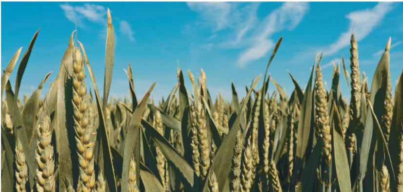

## Territoriality

Territoriality can limit population density when space becomes the resource for which individuals compete. Cheetahs (Acinonyx jubatus) use a chemical marker in urine to warn other cheetahs of their territorial boundaries. The presence of surplus, or nonbreeding, individuals is a good indication that territoriality is restricting population growth.

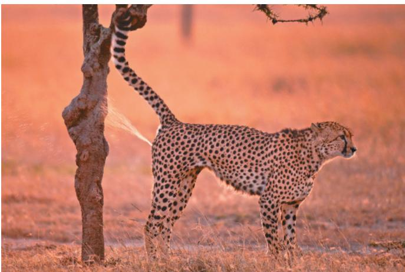

## Disease

If the transmission rate of a disease increases as a population becomes more crowded, then the disease's impact is density dependent. In humans, the respiratory diseases influenza (flu) and tuberculosis are spread through the air when an infected person sneezes or coughs. Both diseases strike a greater percentage of people in densely populated cities than in rural areas.

## Intrinsic Factors

Intrinsic physiological factors (those operating within an individual organism) sometimes regulate population size. Reproductive rates of white-footed mice (Peromyscus leucopus) in a field enclosure can drop even when food and shelter are abundant. This drop in reproduction at high population density is associated with aggressive interactions and hormonal changes within individual mice that delay sexual maturation and depress the immune system.

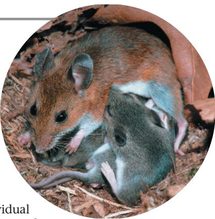

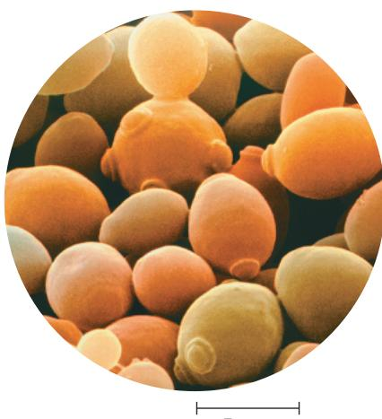  
5 μm

## Toxic Wastes

Yeasts, such as the brewer's yeast Saccharomyces cerevisiae, are used to convert carbohydrates to ethanol in winemaking. The ethanol that accumulates in the wine is toxic to yeasts and contributes to density-dependent regulation of yeast population size. The alcohol content of wine is usually less than 13% because that is the maximum concentration of ethanol that most wine-producing yeast cells can tolerate.

## Stability and Fluctuation

Populations of large mammals were once thought to remain relatively stable, but long-term studies have challenged that idea. For instance, the moose population on Isle Royale in Lake Superior has fluctuated substantially since around 1900. At that time, moose from the Ontario mainland (25 km away) colonized the island, perhaps by walking across the lake when it was frozen. Wolves, which rely on moose for most of their food, reached the island around 1950 by walking across the frozen lake. The lake has not frozen over since the early 1950s, and both populations appear to have been isolated from immigration and emigration since then. Despite this isolation, the moose population experienced two major increases and collapses during the last 50 years (Figure 53.18).

What factors cause the size of the moose population to change so dramatically? Harsh weather, particularly cold winters with heavy snowfall, can weaken moose and reduce food availability, decreasing the population size. When moose numbers are low and the weather is mild, food is readily available and the population grows quickly. Conversely, when moose numbers are high, density-dependent factors such as predation and an increase in the density of ticks and other parasites cause the population to shrink. The effects of some of these factors can be seen in Figure 53.18. The first major collapse coincided with a peak in the numbers of wolves from 1975 to 1980. The second major collapse, around 1995, coincided with harsh winter weather, which increased the energy needs of the moose and made it harder for them to find food under the deep snow.

## Population Cycles: Scientific Inquiry

While many populations fluctuate at unpredictable intervals, others undergo regular boom-and-bust cycles. Some small herbivorous mammals, such as voles and lemmings, tend to have 3- to 4-year cycles, while some birds, such as ruffed grouse and ptarmigans, have 9- to 11-year cycles.

One striking example of population cycles is the roughly 10-year cycling of snowshoe hares (Lepus americanus) and lynx (Lynx canadensis) in the far northern forests of Canada and

Figure 53.18 Fluctuations in moose and wolf population sizes on Isle Royale, 1959–2011.  
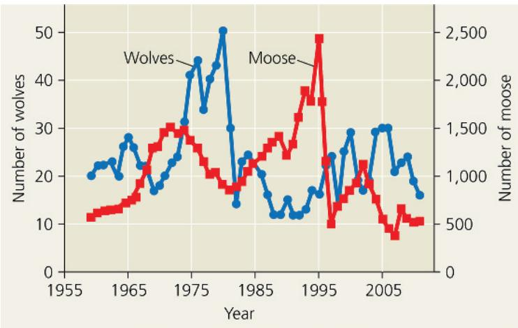

Figure 53.19 Population cycles in the snowshoe hare and lynx. Population counts are based on the number of pelts sold by trappers to the Hudson Bay Company.  
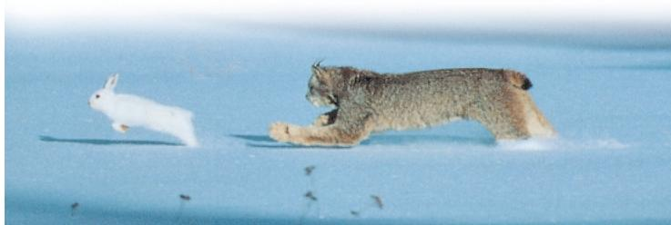

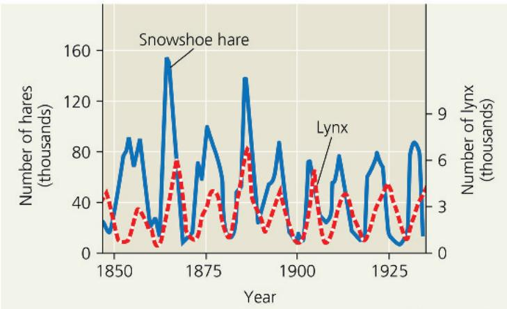  
INTERPRET THE DATA What do you observe about the relative timing of the peaks in lynx numbers and hare numbers? What might explain this observation?

Alaska. Lynx are predators that feed predominantly on snowshoe hares, so lynx numbers might be expected to rise and fall with the numbers of hares (Figure 53.19). But why do hare numbers rise and fall in approximately 10-year cycles? Two main hypotheses have been proposed. First, the cycles may be caused by food shortage during winter. Hares eat the terminal twigs of small shrubs such as willow and birch in winter, although why this food supply might cycle in 10-year intervals is uncertain. Second, the cycles may be due to predator-prey interactions. Many predators other than lynx eat hares, and they may overexploit their prey.

Let's consider the evidence for the two hypotheses. If hare cycles are due to winter food shortage, then the cycles should stop if extra food is provided to a field population. Researchers conducted such experiments in the Yukon for 20-year—over two hare cycles. They found that hare populations in the areas with extra food increased about threefold in density but continued to cycle in the same way as the unfed control populations. Therefore, food supplies alone do not cause the hare cycles shown in Figure 53.19, so we can reject the first hypothesis.

To study the effects of predation, ecologists used radio collars to track individual hares to determine why they died. Predators, including lynx, coyotes, hawks, and owls, killed 95% of the hares in such studies. None of the hares appeared to have died of starvation. These data support the second hypothesis. When

ecologists set up electric fences to exclude predators from certain areas, the collapse in survival that normally occurs in the decline phase of the cycle was nearly eliminated. Overexploitation by predators thus seems to be an essential part of snowshoe hare cycles; without predators, it is unlikely that hare populations would cycle in northern Canada.

## Immigration, Emigration, and Metapopulations

So far, our discussion of population dynamics has focused mainly on the contributions of births and deaths. However, immigration and emigration also influence populations. When a population becomes crowded and resource competition increases, emigration often increases.

Immigration and emigration are particularly important when a number of local populations are linked, forming a metapopulation. Local populations in a metapopulation can be thought of as occupying discrete patches of suitable habitat in a sea of otherwise unsuitable habitat. Such patches vary in size, quality, and isolation from other patches, factors that influence how many individuals move among the populations. If one population becomes extinct, the patch it occupied may be recolonized by immigrants from another population.

The Glanville fritillary (Melitaea cinxia) illustrates the movement of individuals between populations. On average, this butterfly is found in about 500 meadows across the Åland Islands of Finland, but its potential habitat in the islands is much larger, approximately 4,000 suitable patches. New populations of the butterfly regularly appear and existing populations become extinct, constantly shifting the locations of the 500 colonized patches (Figure 53.20). The species persists in a balance of local extinctions and recolonizations.

An individual's ability to move between populations depends on a number of factors, including its genetic makeup. One gene that has a strong effect on the Glanville fritillary's ability to move is $Pgi$ , which codes for the enzyme phosphoglucoisomerase. This enzyme catalyzes the second step of glycolysis (see Figure 9.8), and its activity correlates with the rate of $CO_2$ production from respiration by the butterflies. Ecologists studied butterflies known to be heterozygous or homozygous for a single nucleotide polymorphism in $Pgi$ . They tracked the movements of individual butterflies using radar and transponders attached to the butterflies that emit an identifying signal. Butterfly movements ranged widely, from 10 m to 4 km, in 2-hour periods. Heterozygous individuals flew more than twice as far in the morning and at lower ambient temperatures than did homozygous individuals. The results indicated a fitness advantage to the heterozygous genotype in low temperatures and a greater likelihood of heterozygotes colonizing new locations in the metapopulation.

The metapopulation concept underscores the significance of immigration and emigration for the Glanville fritillary and many other species. It also helps ecologists understand population dynamics and gene flow in patchy habitats, providing a framework for the conservation of species living in a network of habitat fragments and reserves.

Figure 53.20 The Glanville fritillary: a metapopulation.

On the Åland Islands, local populations of this butterfly (filled circles) are found in only a fraction of the suitable habitat patches at any given time. Individuals can move between local populations and colonize unoccupied patches (open circles).

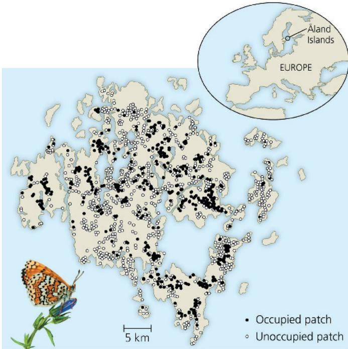  
A Glanville fritillary (Melitaea cinxia) wearing a tracking transponder.

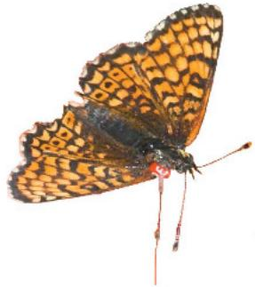

## Concept Check 53.5

1. Describe three attributes of habitat patches that could affect population density and rates of immigration and emigration.

2. DRAW IT Circle the portion of the bottom graph in Figure 53.9 in which density-dependent population regulation would likely have the most pronounced effects.

3. WHAT IF? Suppose you were studying a species that has a population cycle of about ten years. How long would you need to study the species to determine if its population size were declining? Explain.

4. MAKE CONNECTIONS Negative feedback is a process that regulates biological systems (see Concept 40.2). Explain how the density-dependent birth rate of dune fescue grass exemplifies negative feedback.

# Concept 53.6: The human population is no longer growing exponentially but is still increasing extremely rapidly

In the last few centuries, the human population has grown at an unprecedented rate, more like the elephant population in Kruger National Park (see Figure 53.8) than the fluctuating populations we considered in Concept 53.5. No population can grow indefinitely, however. In this section of the chapter, we'll apply the concepts of population dynamics to the specific case of the human population.

## The Global Human Population

The human population has grown explosively over the last four centuries (Figure 53.21). In 1650, about 500 million people inhabited Earth. Our population doubled to 1 billion within the next two centuries, doubled again to 2 billion by 1930, and doubled still again to 4 billion by 1975. Notice that the time it took our population to double in size decreased from 200 years in 1650 to just 45 years in 1930. Thus, historically our population has grown even faster than exponential growth, which has a constant per capita rate of increase and hence a constant doubling time.

The global population is now more than 8.1 billion people and is increasing by about 70 million each year. This translates into more than 190,000 people each day, the equivalent of adding a city the size of Knoxville, Tennessee. At this rate, it takes only about 5 years to add the equivalent of another United States to the world population. Ecologists predict there will be about 9.8 billion people on Earth by the year 2050.

Figure 53.21 Human population growth (data as of 2022). The global human population has grown almost continuously throughout history, but it skyrocketed after the Industrial Revolution.  
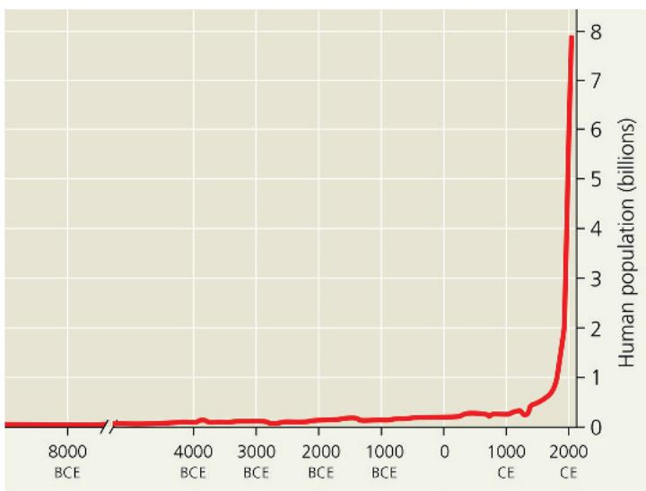  
Figure 53.22 Annual percent increase and recent human population growth.

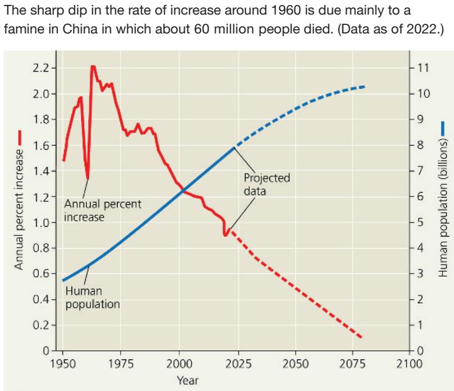  
VISUAL SKILLS The human population curve (blue) in this figure appears to tell a different story about human population growth than does the curve in Figure 53.21, yet both curves are accurate. Summarize what each curve conveys about recent human population growth and explain how both can be accurate.  
For suggested answer, see Appendix A.

Though the global population is still growing, the rate of growth began to slow during the 1960s (Figure 53.22). The annual rate of increase in the global population peaked at 2.2% in 1962 but was only 0.9% in 2024. Current models project a growth rate of 0.45% by 2050, which would add about 44 million more people per year if the population climbs to a projected 9.8 billion. The reduction in annual growth rate observed over the past six decades shows that the human population is now growing more slowly than expected in exponential growth. This change resulted from fundamental shifts in population dynamics due to diseases, including AIDS, as well as social change and voluntary population control.

## Regional Patterns of Population Change

We have described changes in the global population, but population dynamics vary widely from region to region. In a stable regional population, birth rate equals death rate (disregarding the effects of immigration and emigration). Two possible configurations for a stable population are

$$
\begin{array}{c} \text {Zero population growth = High birth rate - High death rate} \\ \text {or} \end{array}
$$

$$
\text { Zero   population   growth } = \text { Low   birth   rate } - \text { Low   death   rate }
$$

The movement from high birth and death rates toward low birth and death rates, which tends to accompany industrialization and improved living conditions, is called the demographic transition. In Sweden, this transition took about 150 years, from 1810 to 1975, when birth rates finally approached death rates.

In Mexico, where the human population is still growing rapidly, the transition is projected to take until at least 2050. Demographic transition is associated with an increase in the quality of health care and sanitation as well as improved access to education, especially for women.

After 1950, death rates declined rapidly in most developing countries, but birth rates have declined more variably. Birth rates have fallen most dramatically in China. The expected number of children per woman per lifetime in China decreased from 5.9 in 1970 to 1.6 in 2011, largely due to the government's strict "one-child" policy. In some countries of Africa, the transition to lower birth rates has also been rapid, though birth rates remain high in most of sub-Saharan Africa.

How do such variable birth rates affect the growth of the world's population? In industrialized nations, populations are near equilibrium, with reproductive rates near the replacement level of 2.1 children per female (over their lifetime). In many industrialized countries—including the United States, Canada, Germany, Japan, and the United Kingdom—total reproductive rates are in fact below the replacement level. These populations will eventually decline if there is no immigration and if the birth rate does not change. In fact, the population is already declining in many eastern and central European countries. Most of the current global population growth occurs in less industrialized countries, where about $80\%$ of the world's people now live.

A unique feature of human population growth is our ability to control family sizes through planning and voluntary contraception. Social change and the rising educational and career aspirations of women in many cultures encourage women to delay marriage and postpone reproduction. Delayed reproduction helps to decrease population growth rates and to move a society toward zero population growth under conditions of low birth rates and low death rates. However, there is a great deal of disagreement as to how much support should be provided for global family planning efforts.

## Age Structure

Another important factor that can affect population growth is a country's age structure, the relative number of individuals of each age in the population. Age structure is commonly graphed as “pyramids” like those in Figure 53.23. For Zambia, the pyramid is bottom heavy, skewed toward young individuals who will grow up and perhaps sustain the explosive population growth with their own reproduction. The age structure for the United States is relatively even until the older, postreproductive ages. Although the total reproductive rate in the United States was about 1.6 children per woman in 2023—below the replacement rate—the population is projected to grow slowly through 2050 as a result of immigration. For Italy, the pyramid has a small base, indicating that individuals younger than reproductive age are relatively underrepresented in the population. This situation contributes to the projection of a future population decrease in Italy.

Age-structure diagrams not only predict a population's growth trends but also can illuminate social conditions. Based on the diagrams in Figure 53.23, we can predict that employment and education opportunities will continue to be a problem for Zambia in the foreseeable future. In the United States and Italy, a decreasing proportion of younger working-age people will soon be supporting an increasing population of retired “boomers.” This demographic feature has made the future of Social Security and Medicare a major political issue in the United States. Understanding age structures is necessary to plan for the future.

Figure 53.23 Age-structure pyramids for the human population of three countries. The annual growth rate was approximately $2.8\%$ in Zambia, $1.0\%$ in the United States, and $0.0\%$ in Italy. Note that Zambia's pyramid has a different scale for its $x$ -axis from that of the other two pyramids. (Data as of 2010.)  
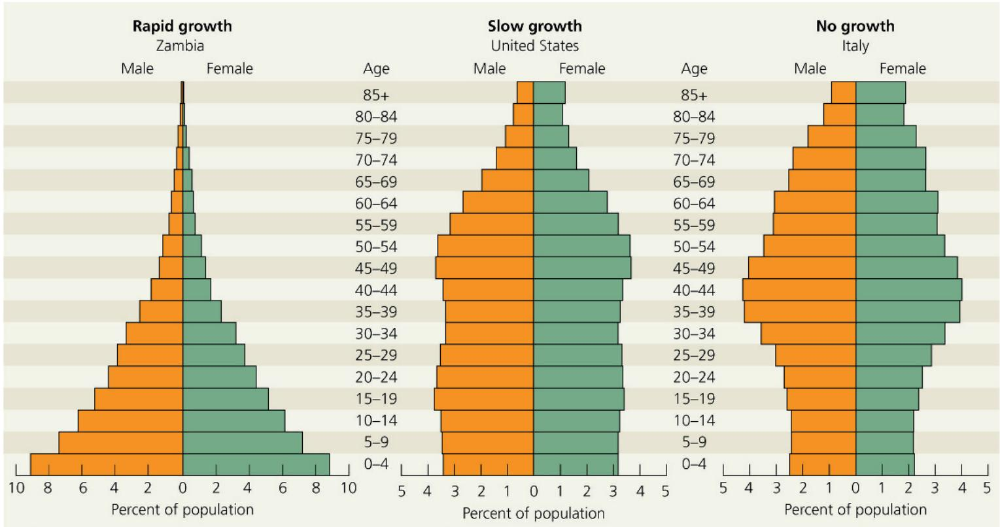

## Infant Mortality and Life Expectancy

Infant mortality, the number of infant deaths per 1,000 live births, and life expectancy at birth, the predicted average length of life at birth, vary widely in different countries. In 2023, for example, the infant mortality rate was 58 (5.8%) in Mali but only 2 (0.2%) in Japan. Life expectancy at birth was 60 years in Mali but 84 years in Japan. These differences reflect the quality of life faced by children at birth and influence the reproductive choices parents make. If infant mortality is high, then parents may choose to have more children to ensure that some reach adulthood.

Although global life expectancy has been increasing since about 1950, it has recently dropped in a number of regions, including countries of the former Soviet Union and in sub-Saharan Africa. In these regions, social upheaval, decaying infrastructure, and infectious diseases such as AIDS and tuberculosis are reducing life expectancy.

## Global Carrying Capacity

No ecological question is more important than the future size of the human population. As noted earlier, population ecologists project a global population of about 9.8 billion people in 2050. That means that about 1.7 billion people will be added to the population in the next 25 years because of the momentum of population growth. But just how many humans can the biosphere support? Will the world be overpopulated in 2050? Is it already overpopulated?

## Estimates of Carrying Capacity

For over three centuries, scientists have attempted to estimate the human carrying capacity of Earth. The first known estimate, 13.4 billion people, was made in 1679 by Anton van Leeuwenhoek (a Dutch scientist who also discovered protists). Since then, estimates have varied from less than 1 billion to more than 1,000 billion (1 trillion).

Carrying capacity is difficult to estimate, and scientists use different methods to produce their estimates. Some researchers use curves like that produced by the logistic equation (see Figure 53.9) to predict the future maximum of the human population. Others generalize from existing “maximum” population density and multiply this number by the area of habitable land. Still others base their estimates on a single limiting factor, such as food, and consider variables such as the amount of farmland, the average yield of crops, the prevalent diet—vegetarian or meat based—and the number of calories needed per person per day.

## Limits on Human Population Size

A more comprehensive approach to estimating the carrying capacity of Earth is to recognize that humans have multiple constraints: We need food, water, fuel, building materials, and other resources, such as clothing and transportation. The ecological footprint concept summarizes the aggregate land and water area required by each person, city, or nation to produce all the resources it consumes and to absorb all the waste it generates (Figure 53.24).

Breaking down the overall footprint into the relative portions for specific needs shows that nearly two thirds of an average North American's ecological footprint is due to carbon emissions—the area needed to support the photosynthetic organisms that can absorb that $\mathrm{CO}_{2}$ from the atmosphere.

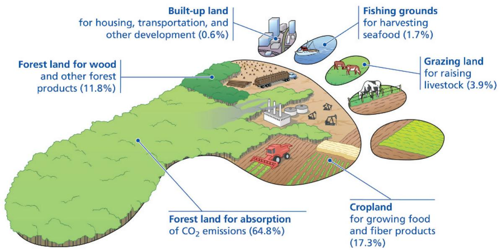

Figure 53.25 Per capita ecological footprint by country.  
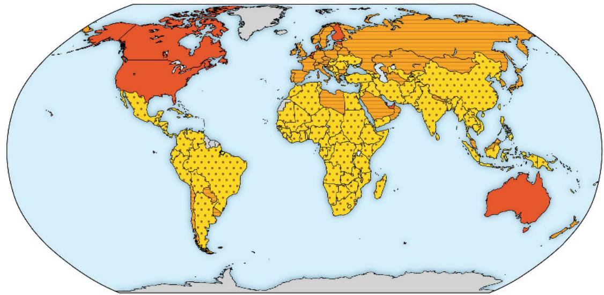  
Per capita ecological footprint in global hectares (gha)
0–3 >6
3–6 Insufficient data  
Earth has a total of 11.9 billion gha of productive land. How many people could Earth support sustainably if the average ecological footprint were 8 gha per person (as in the United States)?  
For suggested answer, see Appendix A.

What is a sustainable ecological footprint for the entire human population? One way to estimate this footprint is to add up all the ecologically productive land and water area on the planet and divide by the size of the human population. Typically, this estimate is made using global hectares, where a global hectare (gha) represents a hectare of land or water with a productivity equal to the average of all biologically productive areas on Earth (1 hectare = 2.47 acres). This calculation yields an allotment of 1.6 gha per person—the benchmark for comparing actual ecological footprints. Anyone who consumes resources and produces waste that require more than 1.6 gha to produce or absorb is using an unsustainable share of Earth's resources, as is the case for the citizens of many countries (Figure 53.25). For example, a typical ecological footprint for a person in the United States is 8 gha. Globally, the average footprint is 2.8 gha per person, a 75% overshoot of the sustainable use (1.6 gha per person) of Earth's resources.

Carbon absorption is the largest element of the ecological footprint for an individual in North America (see Figure 53.24), though average energy use differs greatly across different regions of the world. A typical person in the United States, Canada, or Norway consumes roughly 30 times the energy that a person in central Africa does. Moreover, fossil fuels, such as oil, coal, and natural gas, are the source of $80\%$ or more of the energy used in most developed nations. As Concept 56.4 discusses in more detail, this unsustainable reliance on fossil fuels is changing Earth's climate and increasing the amount of waste that humans produce. Ultimately, the combination of resource use and waste produced per person and population density determines our global ecological footprint.

What factors will eventually limit the growth of the human population? Perhaps food will be the main limiting factor. Malnutrition and famine are common in some regions, but they result mainly from the unequal distribution of food rather than from inadequate production. So far, technological improvements in agriculture have allowed food supplies to keep up with global population growth. In contrast, the demands of many populations have already far exceeded the local and even regional supplies of one renewable resource—fresh water. More than 1 billion people do not have access to sufficient water to meet their basic sanitation needs. The human population may also be limited by the capacity of the environment to absorb its wastes. If so, then Earth's current human occupants could lower the planet's long-term carrying capacity for future generations.

Technology has substantially increased Earth's carrying capacity, but no population can grow indefinitely. After reading this chapter, you should realize that there is no single carrying capacity. How many people our planet can sustain depends on the quality of life each of us has and the distribution of wealth across people and nations, topics of great concern and political debate. We can decide whether zero population growth will be attained through social changes based on human choices or, instead, through increased mortality due to resource limitation, plagues, war, and environmental degradation.

## Concept Check 53.6

1. How does a human population's age structure affect its growth rate?

2. How have the rate and number of people added to the human population each year changed in recent decades?

3. WHAT IF? Type "personal ecological footprint calculator" into a search engine and use one of the resulting calculators to estimate your footprint. Is your current lifestyle sustainable? If not, what choices can you make to influence your own ecological footprint?

## Summary of Key Concepts

To review key terms, go to the Vocabulary Self-Quiz (eTextbook only).

Concept 53.1: Biotic and abiotic factors affect population density, dispersion, and demographics

\- Population density—the number of individuals per unit area or volume—reflects the interplay of births, deaths, immigration, and emigration. Environmental and social factors influence the dispersion of individuals.

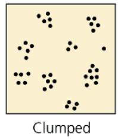

Patterns of dispersion  
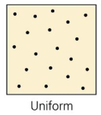

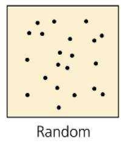

\- Populations increase from births and immigration and decrease from deaths and emigration. Life tables and survivorship curves summarize specific trends in demography.

Gray whales (Eschrichtius robustus) gather each winter near Baja California to give birth. How might such behavior make it easier for ecologists to estimate birth and death rates for the species?

## Concept 53.2: The exponential model describes population growth in an idealized, unlimited environment

\- If immigration and emigration are ignored, a population's per capita growth rate equals its birth rate minus its death rate.

\- The exponential growth equation $dN/dt = r_{max}N$ represents a population's growth when resources are relatively abundant, where $r_{max}$ is the intrinsic rate of increase and $N$ is the number of individuals in the population.

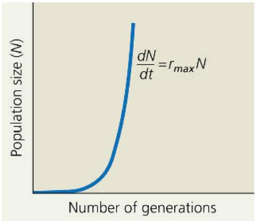  
Suppose one population has an $r_{max}$ that is twice as large as the $r_{max}$ of another population. What is the maximum size that both populations will reach over time, based on the exponential model?

## Concept 53.3: The logistic model describes how a population grows more slowly as it nears its carrying capacity

\- Exponential growth cannot be sustained in any population. A more realistic population model limits growth by incorporating carrying capacity (K), the maximum population size the environment can support.

\- According to the logistic growth equation $dN/dt = r_{max}N(K-N)/K$ , growth levels off as population size approaches the carrying capacity.

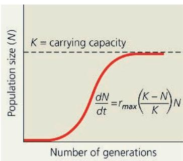

\- The logistic model fits few real populations perfectly, but it is useful for estimating possible growth.

As an ecologist who manages a wildlife preserve, you want to increase the preserve's carrying capacity for a particular endangered species. How might you go about accomplishing this?

## Concept 53.4: Life history traits are products of natural selection

\- Life history traits are evolutionary outcomes reflected in the development, physiology, and behavior of organisms.

\- Big-bang, or semelparous, organisms reproduce once and die. Iteroparous organisms produce offspring repeatedly.

\- Life history traits such as brood size, age at maturity, and parental caregiving represent trade-offs between conflicting demands for time, energy, and nutrients. Two hypothetical life history patterns are K-selection and r-selection.

Explain why ecological trade-offs are common.

## Concept 53.5: Density-dependent factors regulate population growth

\- In density-dependent population regulation, death rates rise and birth rates fall with increasing density. A birth or death rate that does not vary with density is said to be density independent.

\- Density-dependent changes in birth and death rates curb population increase through negative feedback and can eventually stabilize a population near its carrying capacity. Density-dependent limiting factors include intraspecific competition for limited food or space, increased predation, disease, and intrinsic physiological factors.

\- Because changing environmental conditions periodically disrupt them, all populations exhibit some size fluctuations. Many populations undergo regular boom-and-bust cycles that are

influenced by complex interactions between biotic and abiotic factors. A metapopulation is a group of populations linked by immigration and emigration.

Give an example of one biotic and one abiotic factor that contribute to yearly fluctuations in the size of the human population.

## Concept 53.6: The human population is no longer growing exponentially but is still increasing extremely rapidly

\- Since about 1650, the global human population has grown exponentially, but within the last 60 years, the rate of growth has fallen by more than half. Differences in age structure show that while some nations' populations are growing rapidly, those of others are stable or declining in size. Infant mortality rates and life expectancy at birth vary widely in different countries.

\- Ecological footprint is the aggregate land and water area needed to produce all the resources a person or group of people consume and to absorb all of their waste. It is one measure of how close we are to the carrying capacity of Earth, which is uncertain. With a world population of more than 7.9 billion people, we are already using many resources in an unsustainable manner.

How do humans differ from other species in the ability to “choose” a carrying capacity for their environment?

For suggested answers, see Appendix A.

## Test Your Understanding

For more multiple-choice questions, go to the Practice Test (eTextbook only).

## Levels 1-2: Remembering/Understanding

1. Population ecologists follow the fate of same-age cohorts to

(A) determine a population's carrying capacity.

(B) determine the birth rate and death rate of each group in a population.

(C) determine if a population is regulated by density-dependent processes.

(D) determine the factors that affect the size of a population.

2. A population's carrying capacity

(A) may change as environmental conditions change.

(B) can be accurately calculated using the logistic growth model.

(C) increases as the per capita population growth rate decreases.

(D) can never be exceeded.

3. Analyzing ecological footprints reveals that

(A) Earth's carrying capacity would increase if per capita meat consumption increased.

(B) current demand by industrialized countries for resources is much smaller than the ecological footprint of those countries.

(C) it is not possible for technological improvements to increase Earth's carrying capacity for humans.

(D) the ecological footprint of the United States is large because per capita resource use is high.

## Levels 3-4: Applying/Analyzing

4. The observation that members of a population are uniformly distributed suggests that

(A) resources are distributed unevenly.

(B) the members of the population are competing for access to a resource.

(C) the members of the population are neither attracted to nor repelled by one another.

(D) the density of the population is low.

## 5. According to the logistic growth equation

$$
\frac {d N}{d t} = r _ {m a x} \frac {(K - N)}{K} N
$$

(A) the number of individuals added per unit time is greatest when $N$ is close to zero.

(B) the realized growth rate increases as N approaches K.

(C) population growth is zero when N equals K.

(D) the population grows exponentially when K is small.

6. During exponential growth, a population always

(A) has a constant per capita population growth rate.

(B) quickly reaches its carrying capacity.

(C) cycles through time.

(D) loses some individuals to emigration.

## Levels 5-6: Evaluating/Creating

7. EVOLUTION CONNECTION Contrast the selective pressures operating in high-density populations (those near the carrying capacity, K) versus low-density populations.

8. SCIENTIFIC INQUIRY You are testing the hypothesis that increased population density of a particular plant species increases the rate at which a pathogenic fungus infects the plant. Because the fungus causes visible scars on the leaves, you can easily determine whether a plant is infected. Design an experiment to test your hypothesis. Describe your experimental and control groups, how you would collect data. Indicate the results you would see if your hypothesis is correct.

9. SCIENCE, TECHNOLOGY, AND SOCIETY Some people regard the rapid population growth of less industrialized countries as our most serious environmental problem. Others think that the population growth in industrialized countries, though smaller, is actually a greater environmental threat. What problems result from population growth in (a) less industrialized countries and (b) industrialized nations? Which do you think is a greater threat, and why? Explain.

10. WRITE ABOUT A THEME: INTERACTIONS In a short essay (100–150 words), identify the factor or factors in Figure 53.17 that you think may ultimately be most important for density-dependent population regulation in humans, and explain your reasoning.

## 11. SYNTHESIZE YOUR KNOWLEDGE

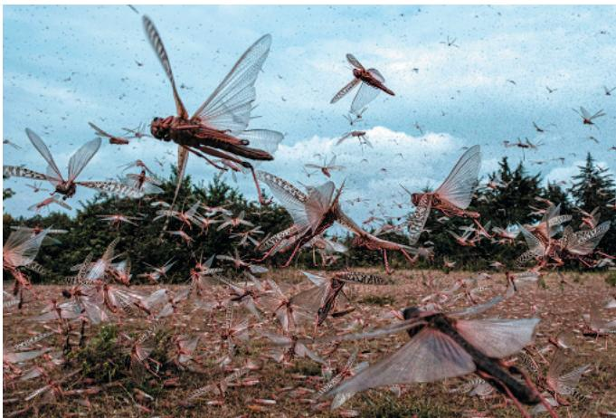

Locusts (grasshoppers in the family Acrididae) undergo cyclic population outbreaks, leading to massive swarms such as this one in Kenya in 2021. Of the mechanisms of density-dependent regulation shown in Figure 53.17, choose the two that you think most apply to locust swarms, and explain why.

## Practice Applying Your Learning

12. This question assesses your ability to apply your understanding of population growth and carrying capacity to a new scenario.

The reticulated python (Python reticulatus), the world's longest snake, is common in the rainforests of Southeast Asia, where its diet mostly consists of rodents and other small mammals. Its lifespan is about 20 years and sexual maturity is reached within two to five years. Adult females typically lay 20–40 eggs per clutch. Population growth for this species can be modeled using a logistic growth model, and food availability is a key factor in determining the carrying capacity.

Suppose there are three islands—A, B, and C—that are all similar in size and biomes and that each have a population of P. reticulatus. Islands A and B are national parkland and are undeveloped. Island A recently experienced a disease outbreak that killed 50% of its P. reticulatus, but the disease has just been eradicated from the island this year. On island C, about half of the natural rainforest was removed by the 1950s for human settlements and agriculture; land use has not changed much since then.

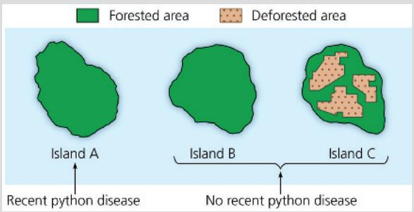  
For selected answers, see Appendix A.

Based on this information, evaluate each statement as more likely to be TRUE or more likely to be FALSE.

a. Islands A and B have a similar carrying capacity for P. reticulatus. \_\_\_\_

b. Islands B and C have a similar carrying capacity for P. reticulatus. \_\_\_\_

c. If a new parasitic infection were to drastically reduce the populations of rodents on island B, you would expect the carrying capacity for P. reticulatus on this island to decline.

d. The maximum per capita population growth rate ( $r_{max}$ ) for P. reticulatus is the same on all three islands. \_\_\_\_

e. The $r_{max}$ of P. reticulatus is less than the $r_{max}$ of a smaller species of snake with a lifespan of four years that reaches sexual maturity at one year and lays 40–80 eggs per clutch. \_\_\_\_

f. CHALLENGE: Both the current realized per capita population growth rate ( $r_{realized}$ ) and the overall population growth rate (dN/dt) for P. reticulatus are close to 0 on islands B and C. \_\_\_\_

g. CHALLENGE: The current $r_{realized}$ for P. reticulatus populations is the same on islands A and B. \_\_\_\_

# Community Ecology

## Key Concepts

54.1 Interactions between species can help, harm, or have no effect on the individuals involved

54.2 Diversity and trophic structure characterize biological communities

54.3 Disturbance influences species diversity and composition

54.4 Biogeographic factors affect community diversity

54.5 Pathogens alter community structure locally and globally

  
Figure 54.1 Although this moray eel could easily eat the cleaner wrasse in its mouth, the eel remains still, allowing the wrasse to eat parasites living in the eel's mouth. The wrasse and the eel—and the parasites in the eel's mouth—live together in a community, a group of populations of different species living in close enough proximity to interact.

## Study Tip

Make a table: As you read the chapter, build a table listing factors that can affect community structure. Add in figure numbers or page numbers that give examples of these factors.

<table><tr><td>Factor affecting community structure</td><td>What aspect of community structure is affected?</td><td>Example</td></tr><tr><td>Competition</td><td>Locations where a species can live in a community</td><td>Competition between two barnacle species (Figure 543)</td></tr><tr><td></td><td></td><td></td></tr></table>

## What are some factors that influence the structure of a community?

## Foundation species

Species that are large or abundant, such as the corals that form this reef, may affect community structure by providing habitat and food for other organisms, like the parrotfish below.

Interactions between species
Predation and other interactions affect the number of species in a community and the particular species that are present. Interactions can be classified in three categories:

\- Competition: negatively affects both organisms involved

  
Disturbances
Marine heat waves (resulting in coral bleaching, above), storms, human activities, and other disturbances can affect a community by removing organisms or altering resource availability.

• Exploitation: benefits one organism while harming the other

• Positive interactions: benefit one or both organisms without harming either

# Concept 54.1: Interactions between species can help, harm, or have no effect on the individuals involved

In the interaction shown in Figure 54.1, both organisms benefit: The cleaner wrasse gains access to a supply of food, and the moray eel is freed of parasites that might weaken it or spread disease. However, other interactions between members of different species can harm one of the participants, and still others can reduce the reproduction and survival of both participants. We'll begin this chapter by examining ecological interactions between the members of different species that live together in a community. We'll then turn to factors that affect community structure—the number of species found in a community, the particular species that are present, and the relative abundance of these species.

Some key relationships in the life of an organism are its interactions with individuals of other species in the community. These interspecific interactions include competition, predation, herbivory, parasitism, mutualism, and commensalism. In this section, we'll define and describe each of these interactions, grouping them according to whether they have positive (+) or negative (−) effects on the survival and reproduction of individuals engaged in the interaction.

For example, predation is a $+/-$ interaction, with a positive effect on the survival and reproduction of members of the predator population and a negative effect on members of the prey population. Mutualism is a $+/+$ interaction in which the survival and reproduction of individuals of each species is increased in the presence of the other. A zero (0) indicates that the members of a species are not affected by the interaction.

We'll consider three broad categories of ecological interactions: competition $(- / -)$ , exploitation $(+ / -)$ , and positive interactions $(+ / +$ or $+ / 0)$ . As you study examples of these interactions, bear in mind that their effects can change over time. For example, an interaction that typically benefits individuals of both species may at times continue to benefit one of them, while harming or having no effect on the other.

## Competition

Interspecific competition is a $- / -$ interaction that occurs when individuals of different species each use a resource that limits the survival and reproduction of both individuals. (As described in Figure 53.18, competition for resources can also occur between members of the same species; this case is sometimes distinguished as intraspecific competition.) Weeds growing in a garden compete with garden plants for soil nutrients and water. Lynx and foxes in the northern forests of Alaska and Canada compete for prey such as snowshoe hares. In contrast, some resources, such as oxygen, are rarely in short supply on land; most terrestrial species use this resource but do not usually compete for it.

## Competitive Exclusion and Mechanisms of Coexistence

What happens in a community when individuals of two species compete for limited resources? In 1934, Russian ecologist G. F. Gause studied this question using laboratory experiments with two closely related ciliate species, Paramecium aurelia and Paramecium caudatum (see Figure 28.19a). He cultured the species under stable conditions, adding a constant amount of food each day. When Gause grew the two species separately, each population increased rapidly in number and then leveled off at the apparent carrying capacity of the culture (see Figure 53.10a for an illustration of the logistic growth of a Paramecium population). But when Gause grew the two species together, P. caudatum became extinct in the culture. Gause inferred that P. aurelia had a competitive edge in obtaining food. More generally, his results led him to conclude that two species whose members compete for the same limiting resources cannot coexist permanently in the same place. In the absence of disturbance, one species will use the resources more efficiently and reproduce more rapidly than the other. Even a slight reproductive advantage will eventually lead to local elimination of the inferior competitor, an outcome called competitive exclusion. Note, however, that coexistence can occur between species that compete for two or more resources, as long as both species are not limited by the same resource. For instance, two species of diatoms may coexist in a lake if one is limited by silicate concentration and the other one by phosphate concentration. Exploring how various competitors coexist in natural communities is an important area of research in community ecology.

## Ecological Niches and Natural Selection

EVOLUTION Competition for limited resources can cause evolutionary change in populations. One way to examine how this occurs is to focus on an organism's ecological niche, the specific set of biotic and abiotic resources that an organism uses in its environment. The niche of a tropical tree lizard, for instance, includes the temperature range it tolerates, the size of branches on which it perches, the time of day when it is active, and the sizes and kinds of insects it eats. Such factors define the lizard's niche, or ecological role—how it fits into an ecosystem.

We can use the niche concept to restate the principle of competitive exclusion: Two species cannot coexist permanently in a community if their niches are identical. However, ecologically similar species can coexist in a community if one or more significant differences in their niches arise through time. Evolution by natural selection can result in one of the species using a different set of resources or similar resources at different times of the day or year. The differentiation of niches that enables similar species to coexist in a community is called resource partitioning (Figure 54.2).

As a result of competition, a species' fundamental niche, which is the niche potentially occupied by that species, is often different from its realized niche, the portion of its fundamental niche that it actually occupies. Ecologists can identify the fundamental niche of a species by testing the range of conditions in which it grows and reproduces in the absence of competitors. They can also test whether a potential competitor limits a species' realized niche by removing the

Figure 54.2 Resource partitioning among Dominican Republic lizards.

Seven species of Anolis lizards live in close proximity, and all feed on insects and other small arthropods. However, competition for food is reduced because each lizard species has a different preferred perch, thus occupying a distinct niche.

competitor and seeing if the first species expands into the newly available space. The classic experiment depicted in Figure 54.3 clearly showed that competition between individuals of two barnacle species kept one species from occupying part of its fundamental niche.

Species can partition their niches not just in space, as lizards and barnacles do, but in time as well. The common spiny mouse (Acomys cahirinus) and the golden spiny mouse (A. russatus; Figure 54.4) live in rocky habitats of the Middle East and Africa, using similar microhabitats and food sources. Where they coexist, A. cahirinus is nocturnal (active at night), while A. russatus is diurnal (active during the day). Surprisingly, laboratory research showed that A. russatus is naturally nocturnal. To be active during the day, it must override its biological clock in the presence of A. cahirinus. When researchers in Israel removed all A. cahirinus individuals from a site in the species' natural habitat, A. russatus individuals at that site became nocturnal, consistent with the

Figure 54.4 The golden spiny mouse (Acomys russatus).  

## Figure 54.3

# Inquiry: Can a species' niche be influenced by competition?

## Experiment

Ecologist Joseph Connell studied two barnacle species—Chthamalus stellatus and Balanus balanoides—that have a stratified distribution on rocks along the coast of Scotland. Chthamalus is usually found higher on the rocks than Balanus. To determine whether the distribution of Chthamalus is the result of competition with Balanus, Connell removed Balanus from the rocks at several sites.

## Results

Chthamalus spread into the region formerly occupied by Balanus.

## Conclusion

Competition makes the realized niche of Chthamalus much smaller than its fundamental niche.

Data from J. H. Connell, The influence of interspecific competition and other factors on the distribution of the barnacle Chthamalus stellatus, Ecology 42:710–723 (1961).

WHAT IF? Other observations showed that Balanus cannot survive high on the rocks because it dries out during low tides. How would Balanus's realized niche compare with its fundamental niche?

For suggested answer, see Appendix A.

Instructors: A related Experimental Inquiry Tutorial can be assigned in Mastering Biology.

laboratory results. This change in behavior suggests that these individuals were competing for resources and that partitioning of their active time helps them coexist.

## Character Displacement

Closely related species whose populations are sometimes allopatric (geographically separate; see Concept 24.2) and sometimes sympatric (geographically overlapping) provide additional evidence of how competition affects communities. In some cases, the allopatric populations of such species are morphologically similar and use similar resources. By contrast, sympatric populations, which would potentially compete for resources, show differences in body structures and in the resources they use. This tendency for characteristics to diverge more in sympatric than in allopatric populations of two species is called character displacement. An example of character displacement can be seen in two species of Galápagos finches, Geospiza fuliginosa and Geospiza fortis: Beak depths in these species are similar in allopatric populations but have diverged considerably in sympatric populations (Figure 54.5).

## Figure 54.5 Character displacement: indirect evidence of past competition.

Allopatric populations of Geospiza fuliginosa and Geospiza fortis on Los Hermanos and Daphne Islands have similar beak morphologies (top two graphs) and presumably eat similarly sized seeds. However, where the two species are sympatric on Floreana and San Cristóbal, G. fuliginosa has a shallower, smaller beak and G. fortis a deeper, larger one (bottom graph), adaptations that favor eating different-sized seeds.

  
WHAT IF? If G. fuliginosa became extinct on Floreana, predict how beak depth would change over time in Floreana's G. fortis population. Explain your reasoning.

## Exploitation

All heterotrophic organisms must eat, and all organisms are at risk of being eaten. As a result, much of the drama in nature involves exploitation, a term for any type of $+ / -$ interaction in which individuals of one species benefit by feeding on (and thereby harming) individuals of the other species. Exploitative interactions include predation, herbivory, and parasitism.

## Predation

Predation is a +/− interaction in which an individual of one species, the predator, kills and eats an individual of the other species, the prey. Though the term predation generally elicits such images as a lion attacking and eating an antelope, it applies to a wide range of interactions. A rotifer (a tiny aquatic animal that is smaller than many unicellular protists) that kills a protist by eating it can also be considered a predator. Because eating and avoiding being eaten are prerequisites to reproductive success, the adaptations of both predators and prey tend to be refined through natural selection. In the Scientific Skills Exercise, after you turn the page, you can interpret data on the impact of natural selection for a specific predator-prey interaction.

Many important feeding adaptations of predators are obvious and familiar. Most predators have acute senses that enable them to find and identify potential prey. Rattlesnakes and other pit vipers, for example, find their prey with a pair of heat-sensing organs located between their eyes and nostrils (see Figure 50.7b). Owls have characteristically large eyes that help them see prey at night. Many predators also have adaptations such as claws, fangs, or poison that help them catch and subdue their food. Predators that pursue their prey are generally fast and agile, whereas those that lie in ambush are often disguised in their environments.

Just as predators possess adaptations for capturing prey, potential prey have adaptations that help them avoid being eaten. In animals, these adaptations include behavioral defenses such as hiding, fleeing, and forming herds or schools. Active self-defense is less common, though some large grazing mammals vigorously defend their young from predators.

Animals also display a variety of morphological and physiological defensive adaptations. Mechanical or chemical defenses protect species such as porcupines and skunks (Figure 54.6a and b). Some animals, such as the European fire salamander, can synthesize toxins; others accumulate toxins passively from the plants they eat. Animals with effective chemical defenses often exhibit bright aposematic coloration, or warning coloration, such as that of poison dart frogs (Figure 54.6c). Such coloration seems to be adaptive because predators often avoid brightly colored prey. Cryptic coloration, or camouflage, makes prey difficult to see (Figure 54.6d).

Some prey species are protected by their resemblance to other species. For example, in Batesian mimicry, a palatable or harmless species mimics an unpalatable or harmful species to which it is not closely related. The larva of the hawkmoth Hemeroplanes ornatus puffs up its head and thorax when disturbed, looking like the head of a small venomous snake (Figure 54.6e). In this case, the mimicry even involves behavior; the larva weaves its head back

For suggested answer, see Appendix A.

Figure 54.6 Examples of defensive adaptations in animals.  

  
(f) Müllerian mimicry: Two unpalatable species mimic each other.

  
MAKE CONNECTIONS Explain how natural selection could increase the resemblance of a harmless species to a distantly related harmful species. In addition to selection, what else could account for a harmless species resembling a closely related harmful species? (See Concept 22.2.)  
For suggested answer, see Appendix A.

and forth and hisses like a snake. Such cases of Batesian mimicry are thought to result from natural selection, as individuals in the harmless species that happen to more closely resemble the harmful one are avoided by predators who have learned not to eat the harmful ones. Over time, closer and closer resemblance to the harmful species evolves. In Müllerian mimicry, two or more unpalatable species, such as the cuckoo bee and yellow jacket, resemble each other (Figure 54.6f). Presumably, the more unpalatable prey there are, the faster predators learn to avoid prey with that particular appearance.

Mimicry has also evolved in many predators. The mimic octopus Thaumoctopus mimicus (Figure 54.7, after you turn the page) can take on the appearance and movement of more than a dozen marine animals, including crabs, sea stars, sea snakes, fish, and stingrays. This octopus's ability to mimic other animals enables it to approach prey—for example, imitating a crab to approach another crab and eat it. The octopus also can defend itself from predators through mimicry. When attacked by a damselfish, the octopus quickly mimics a banded sea snake, a known predator of the damselfish.

# Scientific Skills Exercise Making a Bar Graph and a Scatter Plot

Can a Native Predator Species Adapt Rapidly to an Introduced Prey Species? Cane toads (Bufo marinus) were introduced to Australia in 1935 in a failed attempt to control an insect pest. Since then, the toads have spread across northeastern Australia,

with a population of over 200 million today. Cane toads have glands that produce a toxin that is poisonous to snakes and other potential predators. In this exercise, you will graph and interpret data from a two-part experiment conducted to determine whether native Australian predators have developed resistance to the cane toad toxin.

How the Experiment Was Done In part 1, researchers collected 12 red-bellied black snakes (Pseudechis porphyriacus) from areas where cane toads had existed for 40–60 years and another 12 from areas free of cane toads. They recorded the percentage of snakes from each area that ate either a freshly killed native frog (Limnodynastes peronii, a species the snakes commonly eat) or a freshly killed cane toad from which the toxin gland had been removed (making the toad nonpoisonous). In part 2, researchers collected snakes from areas where cane toads had been present for 5–60 years. To assess how cane toad toxin affected the physiological activity of these snakes, they injected small amounts of the toxin into the snakes' stomachs and measured the snakes' swimming speed in a small pool.

Data from the Experiment, Part 1

<table><tr><td rowspan="2">Type of Prey Offered</td><td colspan="2">% of Snakes from Each Area That Ate Each Type of Prey</td></tr><tr><td>Area with Cane Toads Present for 40–60 Years</td><td>Area with No Cane Toads</td></tr><tr><td>Native frog</td><td>100</td><td>100</td></tr><tr><td>Cane toad</td><td>0</td><td>50</td></tr></table>

## Interview

Interview with Tracy Langkilde: Studying the evolution of novel defensive adaptations in lizards (eTextbook only)

## Herbivory

Herbivory is an exploitative (+/−) interaction in which an organism—an herbivore—eats parts of a plant or alga, thereby harming it but usually not killing it. While large mammalian herbivores such as cattle, sheep, and water buffalo may be most familiar, most herbivores are actually invertebrates, such as grasshoppers, caterpillars, and beetles. In the ocean, herbivores include sea urchins, some fishes, and certain mammals (Figure 54.8).

Data from the Experiment, Part 2

<table><tr><td>Number of Years Cane Toads Had Been Present in the Area</td><td>5</td><td>10</td><td>10</td><td>20</td><td>50</td><td>60</td><td>60</td><td>60</td><td>60</td><td>60</td></tr><tr><td>% Reduction in Snake Swimming Speed</td><td>52</td><td>19</td><td>30</td><td>30</td><td>5</td><td>5</td><td>9</td><td>11</td><td>12</td><td>22</td></tr></table>

Data from B. L. Phillips and R. Shine, An invasive species induces rapid adaptive change in a native predator: cane toads and black snakes in Australia, Proceedings of the Royal Society B 273:1545–1550 (2006).

## INTERPRET THE DATA

1. Make a bar graph of the data in part 1. (For additional information about graphs, see the Scientific Skills Review in Appendix D.)

2. What do the data represented in the graph suggest about the effects of cane toads on the predatory behavior of red-bellied black snakes in areas where the toads are and are not currently found?

3. Suppose a novel enzyme that deactivates the cane toad toxin evolved in a snake population exposed to cane toads. If the researchers repeated part 1 of this study, predict how the results would change.

4. Identify the dependent and independent variables in part 2 and make a scatter plot. What conclusion would you draw about whether exposure to cane toads is having a selective effect on the snakes? Explain.

5. Explain why a bar graph is appropriate for presenting the data in part 1 and a scatter plot is appropriate for the data in part 2.

Instructors: A version of this Scientific Skills Exercise can be assigned in Mastering Biology.

Like predators, herbivores have many specialized adaptations. Many herbivorous insects have chemical sensors on their feet that enable them to distinguish between plants based on their toxicity or nutritional value. Some mammalian herbivores, such as goats, use their sense of smell to examine plants, rejecting some and eating others. They may also eat just a specific part of a plant, such as the flowers. Many herbivores also have specialized teeth or digestive systems adapted for processing vegetation (see Concept 41.4).

Unlike animals, plants cannot run away to avoid being eaten. Instead, a plant's arsenal against herbivores may feature chemical toxins or structures such as spines and thorns. Among the plant compounds that serve as chemical defenses are the poison strychnine, produced by the tropical vine Strychnos toxifera; nicotine, from the tobacco plant; and tannins, from a variety of plant species. Compounds that are not toxic to humans but may be distasteful to many herbivores are responsible for the familiar flavors of cinnamon, cloves, and peppermint. Certain

Figure 54.7 The mimic octopus.

(a) After hiding six of its tentacles in a hole in the seafloor, the octopus waves its other two tentacles to mimic a sea snake. (b) Flattening its body and arranging its arms to trail behind, the octopus mimics a sole (a flat fish). (c) It can mimic a lionfish that has its poisonous spines extended by spreading out its curved arms on each side of its body.

  
(a) Mimicking a sea snake

  
(b) Mimicking a sole  
(c) Mimicking a lionfish

Figure 54.8 An herbivorous marine mammal.  
This West Indian manatee (Trichechus manatus) in Florida is grazing on Hydrilla, an introduced plant species.  

plants produce chemicals that cause abnormal development in some insects that eat them. For more examples of how plants defend themselves, see Make Connections Figure 39.27, “Levels of Plant Defenses Against Herbivores.”

## Parasitism

Parasitism is a +/− exploitative interaction in which one organism, the parasite, derives its nourishment from another organism, its host, which is harmed in the process. Parasites that live within the body of their host, such as tapeworms, are called endoparasites; parasites that feed on the external surface of a host, such as ticks and lice, are called ectoparasites. Some ecologists have estimated that at least one-third of all species on Earth are parasites. In one particular type of parasitism, parasitoid insects—usually small wasps—lay eggs on or in living hosts. The larvae then feed on the body of the host, eventually killing it.

Many parasites have complex life cycles involving multiple hosts. The blood fluke, which currently infects approximately 200 million people around the world, requires two hosts at different times in its development: humans and freshwater snails (see Figure 33.10). Some parasites change the behavior of their current host in ways that increase the likelihood that the parasite will reach its next host. For instance, crustaceans that are parasitized by acanthocephalan (spiny-headed) worms leave protective cover and move into the open, where they are more likely to be eaten by the birds that are the second host in the worm's life cycle.

Parasites can significantly affect the survival, reproduction, and density of their host population, either directly or indirectly. For example, ticks that feed as ectoparasites on moose can weaken their hosts by withdrawing blood and causing hair breakage and loss. In their weakened condition, the moose have a greater chance of dying from cold stress or predation by wolves.

## Positive Interactions

While nature abounds with dramatic and gory examples of exploitative interactions, ecological communities are also heavily influenced by positive interactions, a term that refers to a +/+ or +/0 interaction between members of two species in which at least one individual benefits and neither is harmed. Positive interactions include mutualism and commensalism. As we'll see, positive interactions can affect the diversity of species found in an ecological community.

## Mutualism

Mutualism is a +/+ interaction that benefits individuals of both of the interacting species. Mutualisms are common in nature, as illustrated by examples seen in previous chapters, including cellulose digestion by microorganisms in the digestive systems of termites and ruminant mammals, animals that pollinate flowers or disperse seeds, nutrient exchange between fungi and plant roots in mycorrhizae, and photosynthesis by unicellular algae in corals. In some mutualisms, such as the acacia-ant example shown in Figure 54.9, each of the interacting individuals depends on the other for their survival and reproduction. In other mutualisms, however, both individuals can survive on their own.

Typically, both partners in a mutualism incur costs as well as benefits. In mycorrhizae, for example, the plant often transfers carbohydrates to the fungus, while the fungus transfers limiting nutrients, such as phosphorus, to the plant. Each partner benefits, but each partner also experiences a cost: It transfers materials that it could have used to support its own growth and metabolism. For an interaction to be considered a mutualism, the benefits to each partner must exceed the costs. When this is not the case, the mutualism may break down, at least temporarily. In some mycorrhizae, for example, the plant may cease to supply carbohydrates to its fungal partner when soil nutrients are plentiful—a change that occurs because the cost of supporting the fungus has become greater than the benefits the fungus can provide.

Figure 54.9 Mutualism between acacia trees and ants.  

(a) Certain species of acacia trees (genus Acacia) in Central and South America have hollow thorns (not shown) that are home to stinging ants of the genus Pseudomyrmex. The ants feed on nectar produced by the tree and on protein-rich swellings (yellow in the photograph) at the tips of leaflets.  
  
(b) The acacia benefits because the pugnacious ants, which attack anything that touches the tree, remove fungal spores, small herbivores, and debris. They also clip vegetation that grows close to the acacia.

## Commensalism

An interaction that benefits the individuals of one of the interacting species but neither harms nor helps the individuals of the other species is called commensalism (+/0). Like mutualism, commensalisms are common in nature. For instance, many wildflowers that grow best in low light levels are found only in shaded, forest floor environments. Such shade-tolerant “specialists” depend entirely on the trees that tower above them—the trees provide their dim habitat. Yet the survival and reproduction of the trees are not affected by these wildflowers. Thus, these species are involved in a +/0 interaction in which the wildflowers benefit and the trees are not affected.

Figure 54.10 Commensalism between cattle egrets and African buffalo.  

In another example of a commensalism, cattle egrets feed on insects flushed out of the grass by grazing bison, cattle, horses, and other herbivores (Figure 54.10). Because the birds increase their feeding rates when following the herbivores, they clearly benefit from the association. Much of the time, the herbivores are not affected by the birds. At times, however, the herbivores too may derive some benefit; for example, the birds may remove and eat ticks and other ectoparasites from the herbivores' skin, or they may warn the herbivores of a predator's approach. This example provides another illustration of a key point about ecological interactions: Their effects can change over time. In this case, an interaction whose effects are typically $+ / 0$ (commensalism) may at times become $+ / +$ (mutualism).

Positive interactions can have major effects on ecological communities. For instance, the black rush Juncus gerardii alters soil conditions in ways that benefit other plant species in New England salt marshes (Figure 54.11a). Juncus shades the soil surface, which reduces evaporation and thus lowers the concentration of salt in the soil. The presence of Juncus also increases soil oxygen levels; this occurs because some oxygen leaks into the soil as Juncus transports oxygen to its belowground tissues. In one study, when Juncus was removed from areas of the marsh, those areas supported 50% fewer plant species (Figure 54.11b).

Like positive interactions, competition and exploitation (predation, herbivory, and parasitism) also can strongly affect ecological communities, as examples throughout the rest of this chapter will show.

## Figure 54.11 Positive interactions in New England salt marshes.

When black rush (Juncus gerardii) is present, soil salt concentrations drop and soil oxygen levels rise, increasing the number of plant species that can live in the marsh.

  
(a) Salt marsh with Juncus (foreground)

## Concept Check 54.1

1. Explain how competition, predation, and mutualism differ in their effects on members of the two interacting species.

2. According to the principle of competitive exclusion, what outcome is expected when two species with identical niches compete for a resource? Why?

3. MAKE CONNECTIONS Figure 24.14 illustrates how a hybrid zone can change over time. Imagine that two finch species colonize a new island and are capable of hybridizing (mating and producing viable offspring). The island contains two plant species, one with large seeds and one with small seeds, growing in isolated habitats. If the two finch species specialize in eating different plant species, would reproductive barriers be reinforced, weakened, or unchanged in this hybrid zone? Explain.

For suggested answers, see Appendix A.

## Concept 54.2: Diversity and trophic structure characterize biological communities

Ecological communities can be characterized by certain general attributes, including how diverse they are and the feeding relationships of their species. In some cases, as you'll read, a few species exert strong control on a community's structure—the number, identity, and relative abundance of its species.

## Species Diversity

The species diversity of a community—the variety of different kinds of organisms that make up the community—has two components. One is species richness, the number of different species in the community. The other is the relative abundance of the different species, the proportion each species represents of all individuals in the community.

Imagine two small forest communities, each with 100 individuals distributed among four tree species (A, B, C, and D) as follows:

Community 1: 25A, 25B, 25C, 25D

Community 2: 80A, 5B, 5C, 10D

The species richness is the same for both communities because they both contain four species of trees, but the relative abundance is very different (Figure 54.12). You would easily notice the four types of trees in community 1, but unless you looked carefully, you might see only the abundant species A in the second forest. Given this, many observers would intuitively describe community 1 as the more diverse of the two communities.

Ecologists use many tools to compare the diversity of communities. They often calculate indexes of diversity based on species richness and relative abundance. One widely used index is the Shannon diversity index (H):

$$
H = - \left(p _ {\mathrm{A}} \ln p _ {\mathrm{A}} + p _ {\mathrm{B}} \ln p _ {\mathrm{B}} + p _ {\mathrm{C}} \ln p _ {\mathrm{C}} + \dots\right)
$$

where A, B, C... are the species in the community, p is the relative abundance of each species, and ln is the natural logarithm; the ln of each value of p can be determined using the “ln” key on a scientific calculator. A higher value of H indicates a more diverse community. Let’s use this equation to calculate the Shannon diversity index of the two communities in Figure 54.12. For community 1, p = 0.25 for each species, so

$$
H = - 4 (0. 2 5 \ln 0. 2 5) = 1. 3 9.
$$

For community 2,

$$
H = - [ 0. 8 \ln 0. 8 + 2 (0. 0 5 \ln 0. 0 5) + 0. 1 \ln 0. 1 ] = 0. 7 1.
$$

## Figure 54.12 Which forest is more diverse?

Ecologists would say that community 1 has greater species diversity, a measure that includes both species richness and relative abundance.

  
Community 1 A: $25\%$ B: $25\%$ C: $25\%$ D: $25\%$

  
Community 2 A: $80\%$ B: $5\%$ C: $5\%$ D: $10\%$

Figure 54.13 Two samples of one species, the red alga Chondracanthus harveyanus.

These calculations confirm our intuitive description of community 1 as more diverse. Indeed, for a given species richness, greater species evenness (that is, closer values of relative abundance between species) results in communities that have greater species diversity.

Determining the number and relative abundance of species in a community can be challenging. Because most species in a community are relatively rare, it may be hard to obtain a sample size large enough to be representative. It can also be difficult to identify some of the species in the community. If an unknown organism cannot be identified on the basis of morphology alone, it is useful to compare all or part of its genome to a reference database of DNA sequences from known organisms. For example,

although the two samples of red algae shown in Figure 54.13 might appear to be two different species, comparing their sequences of a short standardized section of DNA—a DNA "barcode"—to a reference database shows that they belong to the same species. Researchers are increasingly using DNA sequencing for species identification as it becomes cheaper and as DNA sequences from more organisms are added to comparative databases.

It can also be difficult to census the highly mobile or less visible members of communities, such as microorganisms, deep-sea creatures, and nocturnal species. The small size of microorganisms makes them particularly difficult to sample, so ecologists now commonly use molecular tools to help determine microbial diversity (Figure 54.14).

## Diversity and Community Stability

In addition to measuring species diversity, ecologists manipulate diversity in experimental communities in nature and in the laboratory. Many experiments examine the potential benefits of diversity, including increased productivity and stability of biological communities.

Researchers at the Cedar Creek Ecosystem Science Reserve, in Minnesota, have been manipulating plant diversity in experimental communities for more than three decades (Figure 54.15a). Higher-diversity communities generally are more productive and are better able to withstand and recover from environmental stresses, such as droughts. More diverse

## Figure 54.14

# Research Method: Determining Microbial Diversity Using Molecular Tools

## Application

Ecologists are increasingly using molecular techniques to determine microbial diversity and richness in environmental samples. One such technique produces a DNA profile for microbial taxa based on sequence variations in the DNA that encodes the small subunit of ribosomal RNA. Researchers used this method to compare the diversity of soil bacteria in 98 habitats across North and South America to help identify environmental variables associated with high bacterial diversity.

## Technique

Researchers first extracted and purified DNA from the microbial community in each sample. They used the polymerase chain reaction (PCR; see Figure 20.7) to amplify the ribosomal DNA and labeled it with a fluorescent dye. Restriction enzymes then cut the amplified, labeled DNA into fragments of different lengths, which are separated

by gel electrophoresis. (A gel is shown here; see also Figure 20.6.) The number and abundance of these fragments characterize the sample's DNA profile, which was then used to calculate the Shannon diversity index $(H)$ of each sample. Researchers then looked for a correlation between $H$ and several environmental variables, including vegetation type, mean annual temperature and rainfall, and soil acidity.

## Results

The diversity of bacterial communities was related to soil pH, with the Shannon diversity index being highest in neutral soils (pH 7) and lowest in very acidic soils (pH < 5). Amazonian rain forests, which have extremely high plant and animal diversity, had the most acidic soils and the lowest bacterial diversity of the samples tested.

  
Data from N. Fierer and R. B. Jackson, The diversity and biogeography of soil bacterial communities, Proceedings of the National Academy of Sciences USA 103:626–631 (2006).

  
(a) Study plots at Cedar Creek

Figure 54.15 The Cedar Creek Ecosystem Science Reserve, site of long-term experiments on manipulating plant diversity.  
  
(b) Total biomass of plants (6 years after planting) in study plots with varying plant species richness

communities are also more stable year to year in their productivity. In one decade-long experiment, for instance, researchers at Cedar Creek created 168 plots, each containing 1, 2, 4, 8, or 16 perennial grassland species. The most diverse plots consistently produced more biomass (the total mass of all organisms in a habitat) each year than did the single-species plots (Figure 54.15b).

Higher-diversity communities are often more resistant to introduced species, which are organisms that humans have moved to regions outside of the species' native range. In research conducted off the coast of Connecticut, scientists created communities of different levels of diversity consisting of sessile marine invertebrates, including tunicates (see Figure 34.5). They then examined how vulnerable these experimental communities were to an introduced tunicate. They found that the introduced tunicate was four times more likely to survive in lower-diversity communities than in higher-diversity ones. The researchers concluded that relatively diverse communities captured more of the resources available in the system, leaving fewer resources for the introduced species and thus decreasing its survival.

## Trophic Structure

In addition to species diversity, the structure and dynamics of a community also depend on the feeding relationships between organisms—the trophic structure of the community. The transfer of chemical energy from its source in plants and other autotrophs (primary producers) through herbivores (primary consumers) to carnivores (secondary, tertiary, and quaternary consumers) and eventually to decomposers is referred to as a

Figure 54.16 Examples of terrestrial and marine food chains. The arrows trace the transfer of the chemical energy in food through the trophic levels of a community when organisms feed on one another. Decomposers, which consume the remains of organisms from all trophic levels, are not shown here.  
  
VISUAL SKILLS Suppose the abundance of carnivores that eat zooplankton increased greatly. Use this diagram to infer how that might affect phytoplankton abundance.

For suggested answer, see Appendix A.

food chain (Figure 54.16). The position an organism occupies in a food chain is called its trophic level.

## Food Webs

A food chain is not an isolated unit, separate from other feeding relationships in a community. Instead, a group of food chains are linked together to form a food web. Ecologists diagram the trophic relationships of a community using arrows that link species according to who eats whom. In an Antarctic pelagic community, for example, the primary producers are phytoplankton, which serve as food for the dominant grazing zooplankton, especially krill and copepods, both of which are crustaceans (Figure 54.17). These zooplankton species are in turn eaten by various carnivores, including other plankton, penguins, seals, fishes, and baleen whales. Squids, which are carnivores that feed on fishes and

Figure 54.17 An Antarctic marine food web.

Arrows follow the transfer of the chemical energy in food from the producers (phytoplankton) up through the trophic levels. For simplicity, this diagram omits decomposers. At various times over the last two centuries, humans have also played a role in the Antarctic food web as consumers of fish, krill, and whales.

  
VISUAL SKILLS For each organism in this food web, indicate the number of other kinds of organisms that it eats. Which two organisms are both predator and prey for each other?  
For suggested answer, see Appendix A.

zooplankton, are another important link in these food webs, as they are in turn eaten by seals and toothed whales.

How are food chains linked into food webs? A given species may weave into the web at more than one trophic level. In the food web shown in Figure 54.17, krill feed on phytoplankton as well as on other grazing zooplankton, such as copepods. Such “nonexclusive” consumers are also found in terrestrial communities. For instance, foxes are omnivores whose diet includes berries and other plant materials, herbivores such as mice, and other predators, such as weasels. Humans are among the most versatile of omnivores.

Complicated food webs can be simplified in two ways for easier study. First, species with similar trophic relationships in a given community can be grouped into broad functional

Figure 54.18 Partial food web for Chesapeake Bay estuary. The sea nettle (Chrysaora quinquecirrha) and the juvenile striped bass (Morone saxatilis) are the main predators of fish larvae.  
  
VISUAL SKILLS Based on this food web, identify organisms that function as primary, secondary, or tertiary consumers.
For suggested answer, see Appendix A.

groups. In Figure 54.17, more than 100 phytoplankton species are grouped as the primary producers in the food web. A second way to simplify a food web is to isolate a portion of the web that interacts very little with the rest of the community. Figure 54.18 illustrates a partial food web for sea nettles (a type of cnidarian) and juvenile striped bass in the Chesapeake Bay estuary on the Atlantic coast of the United States.

## Limits on Food Chain Length

Each food chain within a food web is usually only a few links long. In the Antarctic web of Figure 54.17, there are rarely more than seven links from the producers to any top-level predator, and most chains in this web have fewer links. In fact, most food webs studied to date have chains consisting of five or fewer links.

Why do food chains tend to be relatively short? The most common explanation suggests that the length of a food chain is limited by the inefficiency of energy transfer along the chain. On average, only about 10% of the energy stored in the organic matter of each trophic level is converted to organic matter at the next trophic level (see Concept 55.3). Thus, a producer level consisting of 100 kg of plant material can support about 10 kg of herbivore biomass and 1 kg of carnivore biomass. At a certain point, there simply is not enough energy to sustain viable populations at the next trophic level.

Another factor that may limit food chain length is that carnivores tend to be larger at higher trophic levels. The size of a carnivore puts an upper limit on the size of food it can take into its mouth. And except in a few cases, large carnivores cannot live on very small food items because they cannot obtain enough food in a given time to meet their metabolic needs. Among the exceptions are baleen whales, huge filter feeders with adaptations that enable them to consume enormous quantities of krill and other small organisms (see Figure 41.5).

## Species with a Large Impact

Certain species have an especially large impact on the structure of entire communities because they are highly abundant or play a pivotal role in community dynamics. The impact of these species occurs through trophic interactions and their influence on the physical environment.

Foundation species have strong effects on their communities as a result of their large size or high abundance. Examples of foundation species include trees, desert shrubs such as creosote, and certain marine algae, such as kelp. Such species often have community-wide effects because they provide habitat or food. Foundation species may also be competitively dominant—superior in exploiting key resources such as space, water, nutrients, or t light.

The impact of a foundation species can be discovered when it is removed from the community. For example, the American chestnut was a competitively dominant tree in deciduous forests of eastern North America before 1910, making up more than 40% of mature trees. Then, humans accidentally introduced the fungal disease chestnut blight to New York City via nursery stock imported from Asia. Between 1910 and 1950, this fungus killed almost all of the chestnut trees in eastern North America. In this case, removing the foundation species had a relatively small impact on some species but large effects on others. Oaks, hickories, beeches, and red maples that were already present in the forest increased in abundance and replaced the chestnuts. No mammals or birds seemed to have been harmed by the loss of the chestnut, but seven species of moths and butterflies that fed on the tree became extinct.

In contrast to foundation species, keystone species are not usually abundant in a community. They exert strong control on community structure not by numerical might but by their pivotal ecological roles. In other words, keystone species have a disproportionately high impact on the community. Figure 54.19 highlights the importance of a keystone species, a sea star, in maintaining the diversity of an intertidal community. In this case, the sea star affects its community by feeding on and thereby limiting the abundance of a competitively dominant species, a mussel.

Still other organisms exert their influence on a community not through trophic interactions but by changing the physical environment. Species that create or dramatically alter their environment are called ecosystem engineers. A familiar ecosystem engineer is the beaver (Figure 54.20, on the next page). The effects

## Figure 54.19

# Inquiry: Is Pisaster ochraceus a keystone species?

## Experiment

In rocky intertidal communities of western North America, the relatively uncommon sea star Pisaster ochraceus preys on mussels such as Mytilus californianus, a dominant competitor for space. Robert Paine, of the University of Washington, removed Pisaster

from an area in the intertidal zone and examined the effect on species richness.

## Results

In the absence of Pisaster, species richness declined as mussels monopolized the rock face and eliminated most other invertebrates and algae. In a control area where Pisaster was not removed, species richness changed very little.

  
Data from R. T. Paine, Intertidal community structure. Experimental studies on the relationship between a dominant competitor and its principal predator. Oecologia 15:93–120 (1974).

## Conclusion

Pisaster acts as a keystone species, exerting an influence on the community that is not reflected in its abundance.

WHAT IF? Suppose that an invasive fungus killed most individuals of Mytilus at these sites. Predict how species richness would be affected if Pisaster were then removed.

For suggested answer, see Appendix A.

of ecosystem engineers on other species can be positive or negative, depending on the needs of the other species. Some foundation species, such as corals, can also be considered ecosystem engineers because their presence modifies the physical environment in ways that create habitats on which other species depend.

Figure 54.20 Beavers as ecosystem engineers.

By felling trees, building dams, and creating ponds, beavers can transform large areas of forest into flooded wetlands.

(killer whales) should increase the abundance of primary carnivores (sea otters), decrease the number of herbivores (urchins), and increase the abundance of primary producers (kelp). The effects thus move down the trophic structure as alternating +/− effects.

Ecologists have applied top-down control to improve water quality in lakes with a high abundance of algae. For example, in lakes with three trophic levels, removing fish should improve water quality by increasing zooplankton density, thereby decreasing algal populations (Figure 54.22). In lakes with four trophic levels, adding top predators should have the same effect.

Ecologists in Finland used this approach to help purify Lake Vesijärvi, a large lake that was polluted with city sewage and industrial waste until 1976. After pollution controls reduced these inputs, the lake's water quality began to improve. In 1986, however, massive blooms of cyanobacteria began occurring. These blooms coincided with an increase in the population of roach, a fish species that eats zooplankton, which otherwise keep cyanobacteria in check. To reverse these changes, ecologists removed nearly a million kilograms of fish from the lake between

## Bottom-Up and Top-Down Controls

The ways in which adjacent trophic levels affect one another can be useful for describing community organization. These effects occur in two general ways: organisms can be controlled by what they eat (“bottom-up” control) or by what eats them (“top-down” control).

In bottom-up control, the abundance of organisms at each trophic level is limited by nutrient supply or the availability of food at lower trophic levels. As shown on the left side of Figure 54.21, the supply of nutrients controls plant numbers, which control herbivore numbers, which in turn control predator numbers. To change the structure of a bottom-up community, you would need to alter the biomass or abundance of organisms at lower trophic levels, allowing those changes to propagate up through the food web. For example, if you add nutrients to stimulate plant growth, then each of the higher trophic levels should also increase in biomass. If you change predator abundance, however, the effect should not extend down to the lower trophic levels.

In top-down control, the abundance of organisms at each trophic level is controlled by the abundance of consumers at higher trophic levels. Thus, in top-down control, predators limit herbivores, and herbivores limit plants or algae. In the example on the right side of Figure 54.21, removing the top carnivores

Figure 54.21 Bottom-up and top-down control.

The abundance of organisms at each trophic level can be controlled from the bottom up (by the availability of food or nutrients) or from the top down (by rates of consumption at higher trophic levels). Large gray arrows indicate the direction of control in each of the food chains shown.

Figure 54.22 Restoring water quality in a lake with top-down control.

Decreasing the abundance of fish that ate zooplankton results in a decrease in the biomass of algae, improving water quality. Arrow thickness indicates the relative strength of each top-down control.

1989 and 1993, reducing roach abundance by about 80%. At the same time, they added a fourth trophic level by stocking the lake with pike perch, a predatory fish that eats roach. The water cleared up, and the last cyanobacterial bloom was in 1989. Ecologists continue to monitor the lake for cyanobacterial blooms and low oxygen availability, but the lake has remained clear, even though roach removal ended in 1993. One cautionary note on this successful restoration of water quality in Lake Vesijarvi: While the introduction of the non-native pike perch to the lake accomplished the goal of improving water quality while seeming to avoid any measurable negative consequences, we need to remember that in many cases, species introduced for biological control have become pests in their introduced ecosystems, as we'll discuss more in Concept 56.1.

## Concept Check 54.2

1. What two components contribute to species diversity? Explain how two communities with the same number of species can differ in species diversity.

2. How is a food chain different from a food web?

3. WHAT IF? Consider a grassland with five trophic levels: grasses, mice, snakes, raccoons, and bobcats. If you released additional bobcats into the grassland, how would grass biomass change if bottom-up control applied? If top-down control applied?

4. MAKE CONNECTIONS Rising atmospheric $CO_{2}$ levels lead to ocean acidification (see Figure 3.12) and higher ocean temperatures, both of which can reduce krill abundance. Predict how a drop in krill abundance might affect other organisms in the food web shown in Figure 54.17. Which organisms are particularly at risk? Explain.

# Concept 54.3: Disturbance influences species diversity and composition

Decades ago, most ecologists thought that biological communities are at equilibrium, a more or less stable balance, unless seriously disturbed by human activities. This “balance of nature” view focused on competition as a key factor determining the composition and stability of communities. Stability in this context refers to a community’s tendency to reach and maintain a relatively constant composition of species.

Proponents of this view thought that the community of plants at a site had only one stable equilibrium, a climax community controlled solely by climate. They also argued that biotic interactions caused the species in the community to function as an integrated unit—in effect, as a superorganism. This argument was based on the observation that certain species of plants are often found together, such as the oaks, maples, birches, and beeches in deciduous forests of the northeastern United States.

Other ecologists questioned whether most communities were at equilibrium and challenged the concept of a single climax community. They thought that differences in soils, topography, and other factors created many potential communities that were stable within a region. Rather than functioning as an integrated unit, communities could be viewed as chance assemblages of species found together because they have similar abiotic requirements, such as for temperature, rainfall, and soil type. Moreover, evidence shows that disturbance keeps many communities from reaching a state of equilibrium in species diversity or composition. A disturbance is an event, such as a storm, fire, flood, drought, or human activity, that changes a community by removing organisms from it or altering resource availability.

This emphasis on change in communities led to the formulation of the nonequilibrium model, which describes most communities as constantly changing after disturbance. Even relatively stable communities can be rapidly transformed into nonequilibrium communities. Let's examine some of the ways that disturbances influence community structure.

## Characterizing Disturbance

The types of disturbances and their frequency and severity vary among communities. Storms disturb almost all communities, even those in the oceans through the action of waves. Fire is a significant disturbance; in fact, chaparral and some grassland biomes require regular burning to maintain their structure and species composition. Many streams and ponds are disturbed by seasonal flooding and drying. A high level of disturbance is generally the result of frequent and intense disturbance, while low disturbance levels can result from either a low frequency or low intensity of disturbance.

The intermediate disturbance hypothesis states that moderate levels of disturbance foster greater species diversity than do high or low levels of disturbance. High levels of disturbance reduce diversity by creating environmental stresses that exceed the tolerances of many species or by disturbing the community so often that slow-growing or slow-colonizing species are excluded. At the other extreme, low levels of disturbance can reduce species diversity by allowing competitively dominant species to exclude less competitive ones. Meanwhile, intermediate levels of disturbance can foster greater species diversity by opening up habitats for occupation by less competitive species. Such intermediate disturbance levels rarely create conditions so severe that they exceed the environmental tolerances or recovery rates of potential community members.

Figure 54.23 Testing the intermediate disturbance hypothesis. Researchers identified the taxa (species or genera) of invertebrates at two locations in each of 27 New Zealand streams. They assessed the intensity of flooding at each location using an index of streambed disturbance. The number of invertebrate taxa peaked where the intensity of flooding was at intermediate levels.  

The intermediate disturbance hypothesis is supported by many terrestrial and aquatic studies. In one study, ecologists in New Zealand compared the richness of invertebrates living in the beds of streams exposed to different frequencies and intensities of flooding (Figure 54.23). When floods occurred either very frequently or rarely, invertebrate richness was low. Frequent floods made it difficult for some species to become established in the streambed, while rare floods resulted in species being displaced by superior competitors. Invertebrate richness peaked in streams that had an intermediate frequency or intensity of flooding, as predicted by the hypothesis.

Although moderate levels of disturbance appear to maximize species diversity in some cases, small and large disturbances also can have important effects on community structure. Small-scale disturbances can create patches of different habitats across a landscape, which help maintain diversity in a community. Large-scale disturbances are also a natural part of many communities. Much of Yellowstone National Park, for example, is dominated by lodgepole pine, a tree species that requires the rejuvenating influence of periodic fires. Lodgepole pine cones remain closed until exposed to intense heat. When a forest fire burns the trees, the cones open and the seeds are released. The new generation of lodgepole pines can then thrive on nutrients released from the burned trees and in the sunlight that is no longer blocked by taller trees.

In the summer of 1988, extensive areas of Yellowstone burned during a severe drought (Figure 54.24a). By 1989, many burned areas in the park were largely covered with new vegetation,

Figure 54.24 Recovery following a large-scale disturbance. The 1988 Yellowstone National Park fires burned large areas of forests dominated by lodgepole pines.  
  
(a) Soon after fire. While all trees in the foreground of this photograph were killed by the fire, unburned trees can be seen in other locations.

  
(b) One year after fire. The community has begun to recover. Herbaceous plants, different from those in the former forest, cover the ground.

suggesting that the species in this community are adapted to rapid recovery after fire (Figure 54.24b). In fact, large-scale fires have periodically swept through the lodgepole pine forests of Yellowstone and other northern areas for thousands of years. In contrast, more southerly pine forests were historically affected by frequent but low-intensity fires. In these forests, a century of human intervention to suppress small fires has allowed an unnatural buildup of fuels in some places and elevated the risk of large, severe fires to which the species are not adapted.

## Interview

Interview with Monica Turner: Studying the consequences of fire and other disturbances on ecosystems (eTextbook only)

Studies of the Yellowstone forest community and many others indicate that they are nonequilibrium communities, changing continually because of natural disturbances and the internal processes of growth and reproduction. Mounting evidence suggests that nonequilibrium conditions are in fact the norm for most communities.

## Ecological Succession

Changes in the composition of terrestrial communities are most apparent after a severe disturbance, such as a volcanic eruption or a glacier, strips away all the existing vegetation. The disturbed area may be colonized by a variety of species, which are gradually replaced by other species, which are in turn replaced by still other species—a process called ecological succession. When this process begins in a virtually lifeless area, such as on a new volcanic island or on the rubble (moraine) left by a retreating glacier, it is called primary succession.

Let's now examine typical patterns of succession in terrestrial ecosystems. During primary succession, the only life-forms initially present are often prokaryotic organisms and unicellular eukaryotes. Lichens and mosses, which grow from windblown spores, are commonly the first macroscopic photosynthesizers to colonize such areas. Soil develops gradually as rocks weather and organic matter accumulates from the decomposed remains of the early colonizers. Once soil is present, the lichens and mosses are usually overgrown by grasses, shrubs, and trees that sprout from seeds blown in from nearby areas or carried in by animals. Eventually, an area is colonized by plants that become the community's dominant form of vegetation. Producing such a community through primary succession may take hundreds or thousands of years.

Early-arriving species and later-arriving ones may be linked by one of three key processes: facilitation, tolerance, and inhibition (Figure 54.25). In facilitation, the early arrivals may make the environment more favorable for the appearance of the later species—for example, by increasing the fertility of the soil. Alternatively, succession in some ecosystems may occur via tolerance: A number of different species are capable of becoming established early in primary succession, and the early colonizers neither help nor impede the arrival of other species. Finally, in the process of inhibition, many species are able to start a succession, and the earliest settlers inhibit the establishment of other species. It is important to note that ecological successions rarely feature only one of these patterns; the nature of the mechanisms at play may be different for various sets of species in the community and they may change as the succession progresses.

Figure 54.25 Three contrasting models of succession.  

Ecologists have conducted some of the most extensive research on primary succession at Glacier Bay in southeastern Alaska, where glaciers have retreated more than 100 km since 1760 (Figure 54.26). By studying the communities at different distances from the mouth of the bay—with the oldest exposed areas being closest to the mouth and the more recently exposed areas being farthest—ecologists can examine different stages in succession. As the glaciers have retreated, the following sequence of events occurred on areas above the waterline of the bay: The exposed glacial moraine is colonized first by pioneering species that include liverworts, mosses, fireweed, scattered Dryas (a mat-forming shrub), and willows. ② After about three decades, Dryas dominates the plant community. ③ A few decades later, the area is invaded by alder, which forms dense thickets up to 9 m tall. ④ In the next two centuries, these alder stands are overgrown first by Sitka spruce and later by western hemlock and mountain hemlock. In areas of poor drainage, the forest floor of this spruce-hemlock forest is invaded by sphagnum moss, which holds water and acidifies the soil, eventually killing the trees. Thus, by about 300 years after glacial retreat, the vegetation consists of sphagnum bogs on the poorly drained flat areas and spruce-hemlock forest on the well-drained slopes.

Succession on glacial moraines exhibits clear facilitation, especially in early in the succession, owing to changes in soil nutrients and other environmental factors caused by transitions in the vegetation. Because the bare soil after glacial retreat is low in nitrogen content, almost all the pioneer plant species begin succession with poor growth and yellow leaves due to limited nitrogen supply. The exceptions are Dryas and alder, whose roots host symbiotic bacteria that fix atmospheric nitrogen (see Figure 37.12). Soil nitrogen content increases quickly during the

Figure 54.26 Glacial retreat and primary succession near the shores of Glacier Bay, Alaska. The different shades of blue on the map are based on historical information of how the area covered by Glacier Bay has increased over time due to retreat of the glaciers since 1760.  
  
4 Spruce stage

Figure 54.27 Changes in soil nitrogen content during succession at Glacier Bay.  
  
MAKE CONNECTIONS Figure 37.11 illustrates two types of atmospheric nitrogen fixation by prokaryotes. At the earliest stages of primary succession, before any plants are present at a site, which type of nitrogen fixation would occur, and why?  
For suggested answer, see Appendix A.  
Before trawling  
After trawling

alder stage of succession and keeps increasing during the spruce stage (Figure 54.27). By altering soil properties, pioneer plant species can facilitate colonization by new plant species during early succession. In later stages of succession, interactions between species likely include a combination of facilitation, tolerance, and inhibition.

In contrast to primary succession, secondary succession involves the recolonization of an area after a major disturbance has removed most but not all of the organisms in a community, as in Yellowstone following the 1988 fires (see Figure 54.25). Following the disturbance, the area may return to something like its original state. For instance, in a forested area that has been cleared for farming and later abandoned, the earliest plants to recolonize are often herbaceous species that grow from windblown or animal-borne seeds. If the area has not been burned or heavily grazed, woody shrubs may in time replace most of the herbaceous species, and forest trees may eventually replace most of the shrubs.

## Human Disturbance

Ecological succession is a response to disturbance of the environment, and some of the strongest disturbances result from human activities. Agricultural development has disrupted what were once the vast grasslands of the North American prairie. Tropical rain forests are quickly disappearing as a result of clear-cutting for lumber, cattle grazing, and farmland. Centuries of overgrazing and agricultural

Figure 54.28 Disturbance of the ocean floor by trawling. These photos show the seafloor off northwestern Australia before and after deep-sea trawlers have passed through.

disturbance have contributed to famine in parts of Africa by turning seasonal grasslands into vast barren areas.

Human actions have disturbed marine ecosystems as well as terrestrial ones. The effects of ocean trawling, in which boats drag weighted nets across the seafloor, are similar to those of clear-cutting a forest or plowing a field. The trawls scrape and scour corals and other life on the seafloor (Figure 54.28). In a typical year, ships trawl an area about the size of South America, 150 times larger than the area of forests that are clear-cut annually.

Because disturbance by human activities is often severe, it reduces species diversity in many communities. In Chapter 56, we'll take a closer look at how human-caused disturbance is affecting the diversity of life.

## Concept Check 54.3

1. Why do high and low levels of disturbance usually reduce species diversity? Why does an intermediate level of disturbance promote species diversity?

2. During succession, how might the early species facilitate the arrival of other species?

3. WHAT IF? Most prairies experience regular fires, typically every few years. If these disturbances were relatively modest, how would the species diversity of a prairie likely be affected if no burning occurred for 100 years? Explain.

# Concept 54.4: Biogeographic factors affect community diversity

So far, we have examined relatively small-scale or local factors that influence the diversity of communities, including the effects of species interactions, foundation species, and many types of disturbances. Large-scale biogeographic factors also contribute to the tremendous range of diversity observed in biological communities. Two biogeographic factors in particular—the latitude of a community and the area it occupies—have been investigated for more than a century.

## Latitudinal Gradients

In the 1850s, both Charles Darwin and Alfred Wallace pointed out that plant and animal life was generally more abundant and diverse in the tropics than in other parts of the globe. Since that time, many researchers have confirmed this observation. One study found that a 6.6-hectare (1 ha = 10,000 m $^{2}$ ) plot in tropical Malaysia contained 711 tree species, while a 2-ha plot of deciduous forest in Michigan typically contained just 10 to 15 tree species. Many groups of animals show similar latitudinal gradients. For instance, there are more than 200 species of ants in Brazil but only 7 in Alaska.

Two key factors that can affect latitudinal gradients of species richness are evolutionary history and climate. Over the course of evolution, a series of speciation events may lead to increased species richness in a community (see Concept 24.2). Tropical communities are generally older than temperate or polar communities, which have repeatedly “started over” after major disturbances such as glaciations. As a result, species diversity may be highest in the tropics simply because there has been more time for speciation to occur in tropical communities than in temperate or polar communities.

Climate is another key factor thought to affect latitudinal gradients of richness and diversity. In terrestrial communities, the two main climatic factors correlated with diversity are sunlight and precipitation, both of which occur at high levels in the tropics. These factors can be considered together by measuring a community's rate of evapotranspiration, the evaporation of water from soil and plants. Evapotranspiration, a function of solar radiation, temperature, and water availability, is much higher in hot areas with abundant rainfall than in areas with low temperatures or low precipitation. The species richness of plants and animals correlates with measures of evapotranspiration, as shown for vertebrates in Figure 54.29.

## Area Effects

In 1807, naturalist and explorer Alexander von Humboldt described one of the first patterns of species richness to be recognized, the species-area curve: All other factors being equal, the larger the geographic area of a community, the more species it has. One explanation for this relationship is that larger areas offer a greater diversity of habitats and microhabitats. Another factor is that larger habitats can support bigger populations, which are at lesser risk of extinction compared to small populations.

Figure 54.29 Energy, water, and species richness.
Vertebrate species richness in North America increases with an index of evapotranspiration, expressed as rainfall equivalents (mm/yr).  

Predictions of the species-area relationship have been tested by examining the number of animals and plants in many different regions. As one example, in the Sunda Islands of Malaysia, the number of bird species increased with island size (Figure 54.30). Different species-area curves vary in how rapidly species richness increases with area. Even so, the basic concept of diversity increasing with increasing area applies in many situations, from surveys of ant diversity in New Guinea to studies of plant species richness on islands of different sizes.

## Island Equilibrium Model

Because of their isolation and limited size, islands provide excellent opportunities for studying how area and other factors affect the species diversity of communities. By “islands,” we mean not only oceanic islands, but also habitat islands on land, such as lakes, mountain peaks, or habitat fragments—any patch surrounded by an environment not suitable for the “island” species.

Figure 54.30 Species richness and island area.
The number of bird species on the Sunda Islands of Malaysia increases with island size.  

Figure 54.31 MacArthur and Wilson's island equilibrium model. The equilibrium number of species on an island represents a balance between the immigration of new species (red curve) and the extinction of species already there (black curve). The point at which these curves intersect shows the predicted equilibrium number of species $(Q)$ .  
  
WHAT IF? Suppose rising sea levels substantially decreased the size of the island. How would that affect (a) the population sizes of species already on the island, (b) the extinction curve shown above, and (c) the predicted equilibrium number of species?  
For suggested answer, see Appendix A.  
Figure 54.32 Mangrove island.  
The islands that researchers studied were small, each consisting of one or a few mangrove trees.

Recognizing the opportunities that studying islands provides, Robert MacArthur and E. O. Wilson developed a method for predicting the species diversity of islands (Figure 54.31). In their approach, the number of species on an island represents a balance between the immigration of new species to the island and the extinction of species already there.

In Figure 54.31, note that the immigration rate decreases as the number of species on the island gets larger, while the extinction rate increases. To see why this is so, consider a newly formed oceanic island that receives colonizing species from a distant mainland. At any given time, an island's immigration and extinction rates are affected by the number of species currently present. As the number of species already on the island increases, the immigration rate of new species decreases, because any individual reaching the island is less likely to represent a species that is not already present. Moreover, as more species inhabit an island, extinction rates on the island increase because of the greater likelihood of competitive exclusion.

An island's size and its distance from the mainland are important elements influencing the island's species richness. Small islands generally have lower immigration rates because potential colonizers are less likely to reach a small island than a large one. Small islands also have higher extinction rates because they generally contain fewer resources, have less diverse habitats, and have smaller population sizes. With respect to distance, an island that is closer to the mainland generally has a higher immigration rate and a lower extinction rate than one farther away. Arriving colonists increase the abundance of a species on a near island, thereby reducing the species' chance of extinction.

MacArthur and Wilson's model is called the island equilibrium model because an equilibrium will eventually be reached where the rate of species immigration equals the rate of species extinction. The number of species at this equilibrium point is correlated with the island's size and distance from the mainland. Although the number of species ultimately should stabilize at a constant level, immigration and extinction continue and hence the exact species composition on the island may change over time.

Researchers tested the island equilibrium model in an experiment on six small mangrove islands in the Florida Keys (Figure 54.32). To do this, they first painstakingly identified and counted all of the arthropod species on each island. As predicted by the model, they found more species on islands that were larger and closer to the mainland. They then fumigated four of the islands with methyl bromide to kill all of the arthropods. As also predicted by the model, the number of arthropod species on the islands increased over time to near their pre-fumigation values (Figure 54.33).

Figure 54.33 Testing the island equilibrium model.

The graph shows results for one of the islands studied. The number of arthropod species increased over time; by 140 days, it had reached levels similar to those found on the island prior to the start of the experiment.

The island closest to the mainland recovered first, while the island farthest from the mainland was the slowest to recover. The number of arthropod species on the remaining two islands—which were not fumigated and hence served as controls—remained approximately constant during the study.

## Concept Check 54.4

1. Describe two hypotheses as to why species diversity is greater in the tropics than in temperate and polar regions.

2. Describe how an island's size and distance from the mainland affect the island's species richness.

3. WHAT IF? Based on MacArthur and Wilson's island equilibrium model, predict how the richness of birds on an island would compare with that of snakes and lizards there.

For suggested answers, see Appendix A.

## Concept 54.5: Pathogens alter community structure locally and globally

Now that we have examined several important factors that structure biological communities, we'll finish the chapter by examining community interactions involving pathogens, disease-causing microorganisms, viruses, viroids, or prions. (Viroids and prions are infectious RNA molecules and proteins, respectively; see Concept 19.3.) As you'll see, pathogens have strong effects on ecological communities.

Pathogens produce especially clear effects when they are introduced into new habitats, as in the case of the fungus that causes chestnut blight (see Concept 54.2). A pathogen can be particularly virulent in a new habitat because new host populations have not had a chance to become resistant to the pathogen through natural selection. The invasive chestnut blight fungus had far stronger effects on the American chestnut, for instance, than it had on Asian chestnut species in the fungus's native habitat.

## Effects on Community Structure

The ecological importance of disease can be highlighted by how pathogens have affected coral reef communities. White-band disease, caused by an unknown pathogen, has resulted in dramatic changes in Caribbean reefs. The disease kills corals by causing their tissue to slough off in a band from the base to the tip of the branches. Because of the disease, staghorn coral (Acropora

cervicornis) has virtually disappeared from the Caribbean. Populations of elkhorn coral (Acropora palmata) have also been decimated. Such corals provide key habitat for lobsters as well as snappers and other fish species. When corals die, their skeletons often become overgrown by algae because herbivore biomass is quite low—in part because of a disease that infected a key sea urchin herbivore. Eventually, the dead coral skeletons topple because of damage from storms and other disturbances. The complex, three-dimensional structure of the reef disappears, and diversity plummets.

Pathogens also influence community structure in terrestrial ecosystems. Consider sudden oak death (SOD), a recently discovered disease that is caused by the protist Phytophthora ramorum (see Concept 28.6). SOD was first described in California in 1995, when hikers noticed trees dying around San Francisco Bay. By 2014, it had spread more than 1,000 km, from the central California coast to southern Oregon, and it had killed more than a million oaks and other trees. The loss of the oaks has led to the decreased abundance of at least five bird species, including the acorn woodpecker and the oak titmouse, that rely on oaks for food and habitat. Although there is currently no cure for SOD, scientists recently sequenced the genome of P. ramorum in hopes of finding a way to fight the pathogen.

## Community Ecology and Zoonotic Diseases

Three-quarters of emerging human diseases and many of the most devastating established diseases are caused by zoonotic pathogens—those that are transferred to humans from other animals, either through direct contact with an infected animal or via an intermediate species, called a vector. The vectors that spread zoonotic diseases are often parasites, including ticks, lice, and mosquitoes. Established zoonotic diseases such as rabies, plague, dengue fever, Chagas' disease, Salmonella infection, and some forms of sleeping sickness cause an estimated 1 billion cases of illness in people and millions of deaths each year. Emerging zoonotic diseases such as Lyme disease, Zika virus, Ebola hemorrhagic fever, and mpox also pose a dire threat to global health and world economies.

Identifying the community of hosts and vectors for a pathogen can help prevent illnesses such as Lyme disease, which is spread by ticks. For years, scientists thought that the primary host for the Lyme pathogen was the white-footed mouse because mice are heavily parasitized by young ticks. When researchers vaccinated mice against Lyme disease and released them into the wild, however, the number of infected ticks hardly changed. Further investigation in New York revealed that two inconspicuous shrew species were the source for more than half the infected ticks collected in the field (Figure 54.34). Identifying the most important hosts for a pathogen provides information that may be used to control the hosts most responsible for spreading diseases.

Ecologists also use their knowledge of community interactions to track the spread of zoonotic diseases. One example, avian flu, is caused by highly contagious viruses transmitted through the saliva and feces of birds (see Concept 19.3). Most of these viruses cause milder symptoms in wild birds than in domesticated birds, the most common source of human infections. Since 2003, one particular viral strain, called H5N1, has killed hundreds of millions of poultry, as well as hundreds of thousands of wild birds and more than 450 people.

Figure 54.34 Unexpected hosts of the Lyme disease pathogen. A combination of ecological data and genetic analyses enabled scientists to show that more than half of ticks carrying the Lyme pathogen became infected by feeding on the northern short-tailed shrew (Blarina brevicauda) or the masked shrew (Sorex cinereus).  
  
MAKE CONNECTIONS Concept 23.1 discusses the significance of genetic variation between populations. How might genetic variation between shrew populations in different locations affect the number of infected ticks? For suggested answer, see Appendix A.  
Figure 54.35 Tracking avian flu.

Control programs that quarantine domestic birds or monitor their transport can be difficult for strains of avian flu that spread naturally through the movements of wild birds. This is the case for H5N1, which, from 2003 to 2006, spread rapidly across Asia, the Middle East, Europe, and Africa. In 2021–22, the virus was transmitted from Europe to eastern Canada, perhaps transported by ducks or other migratory water birds. It then spread rapidly across the United States and Canada, forcing farmers to kill tens of millions of poultry. This outbreak also led to the deaths of thousands of wild birds, including more than 50 bald eagles. Ecologists are studying the virus by trapping and testing migrating and resident birds (Figure 54.35), but to date, efforts to halt its spread have not been successful.

Human activities that lead to climate change and the destruction of natural habitat increase the risk of zoonotic disease by allowing animal carriers of disease to move into new geographic regions and by increasing the contact people have with wild animals. In addition, humans are transporting pathogens around the world at unprecedented rates. For

A graduate student bands a young gyrfalcon as part of a project to monitor the spread of avian flu.  

example, genetic analyses suggest that the pathogen that causes SOD, P. ramorum, likely came to North America from Europe in nursery plants.

Similarly, the pathogens that cause human diseases are spread by the global movements of people. In recent years, coronaviruses have caused several new infectious diseases in humans. First identified in 2003 in Foshan, China, severe acute respiratory syndrome (SARS) originated from the transfer of the coronavirus SARS-CoV from bats to civet cats to humans and caused 774 confirmed deaths worldwide. In 2012, Middle East respiratory syndrome (MERS) emerged in the Saudi Arabia from the transfer of the coronavirus MERS-CoV from camels to humans and caused at least 943 deaths worldwide. The most striking coronavirus to affect humans in recent years has been SARS-CoV-2, the coronavirus that causes COVID-19. It was first detected in Wuhan, China, in late 2019. This virus quickly spread around the world when infected individuals traveled to other countries. Within three years, COVID-19 had a confirmed death toll of more than 6.5 million people, with over 1,000,000 fatalities in the United States alone. (The actual numbers may have been significantly higher since many people who died with COVID-19-like symptoms were not tested for SARS-CoV-2.) These events, as well as an alarming increase in the overall number of emerging zoonotic diseases, indicate a need to broaden our efforts to survey wildlife populations for viruses with the potential to cause human disease.

While our emphasis here has been on community ecology, pathogens are also greatly influenced by changes in the physical environment. To control pathogens and the diseases they cause, scientists need an ecosystem perspective—an intimate knowledge of how the pathogens interact with other species and with all aspects of their environment. Ecosystems are the subject of Chapter 55.

## Concept Check 54.5

1. What are pathogens?

2. WHAT IF? Rabies, a viral disease in mammals, is not currently found in the British Isles. If you were in charge of disease control

For suggested answers, see Appendix A.

## Chapter 54 Review

there, what practical approaches might you employ to keep the rabies virus from reaching these islands?

## Summary of Key Concepts

To review key terms, go to the Vocabulary Self-Quiz (eTextbook only).

Concept 54.1: Interactions between species can help, harm, or have no effect on the individuals involved

\- Interspecific interactions affect the survival and reproduction of the individuals that engage in them. As shown in the table, these interactions can be grouped into three broad categories: competition, exploitation, and positive interactions.

\- Competitive exclusion states that two species whose members compete for the same resource cannot coexist permanently in the same place. Resource partitioning is the differentiation of ecological niches that enables species to coexist in a community.

For each interaction listed in the table, give an example of a pair of species that exhibit the interaction.

<table><tr><td>Interaction</td><td>Description</td></tr><tr><td>Interspecific Competition (-/-)</td><td>Individuals of different species each use a limited resource, reducing the survival or reproduction of both individuals.</td></tr><tr><td>Exploitation (+/-)</td><td>Members of one species benefit by feeding upon (and thereby harming) members of the other species. Exploitation includes the following:</td></tr><tr><td>Predation</td><td>An individual of one species, the predator, kills and eats an individual of the other, the prey.</td></tr><tr><td>Herbivory</td><td>An herbivore eats part of a plant or alga.</td></tr><tr><td>Parasitism</td><td>The parasite derives its nourishment from a second organism, its host.</td></tr><tr><td>Positive interactions (+/+ or 0/+)</td><td>Members of one species benefit, while members of the other benefit or are not harmed. Positive interactions include the following:</td></tr><tr><td>Mutualism (+/+)</td><td>Members of both species benefit from the interaction.</td></tr><tr><td>Commensalism (+/0)</td><td>Members of one species benefit, while members of the other are not affected.</td></tr></table>

## Concept 54.2: Diversity and trophic structure characterize biological communities

\- Species diversity is affected by both the number of species in a community—its species richness—and their relative abundance.

\- More diverse communities typically produce more biomass and show less year-to-year variation in growth than less diverse communities and are more resistant to introduced species.

\- Trophic structure is a key factor in community dynamics. Food chains link the trophic levels from producers to top carnivores. Branching food chains and complex trophic interactions form food webs.

\- Foundation species are large or abundant members of a community that provide food or habitat. Keystone species are usually less abundant species that exert a disproportionate influence on community structure. Ecosystem engineers influence community structure through their effects on the physical environment.

\- In bottom-up control, the abundance of organisms at each trophic level is limited by nutrient supply or food availability. In top-down control, each trophic level is controlled by the abundance of consumers at higher trophic levels.

Based on indexes such as the Shannon diversity index, is a community of higher species richness always more diverse than a community of lower species richness? Explain.

## Concept 54.3: Disturbance influences species diversity and composition

\- Increasing evidence suggests that disturbance and lack of equilibrium, rather than stability and equilibrium, are the norm for most communities. According to the intermediate disturbance hypothesis, moderate levels of disturbance can foster higher species diversity than can low or high levels of disturbance.

\- Ecological succession is the sequence of community and ecosystem changes after a disturbance. Primary succession occurs in an area that is virtually lifeless, while secondary succession occurs after a disturbance has removed most but not all of the organisms in a community.

Is the disturbance pictured in Figure 54.28 more likely to initiate primary or secondary succession? Explain.

## Concept 54.4: Biogeographic factors affect community diversity

\- Species richness generally declines along a latitudinal gradient from the tropics to the poles. Climate influences the diversity gradient through energy (heat and light) and water. The greater age of tropical environments also may contribute to their greater species richness.

\- Species richness is directly related to a community's geographic size, a principle formalized in the species-area curve.

\- Species richness on islands depends on island size and distance from the mainland. The island equilibrium model maintains that species richness on an ecological island reaches an equilibrium where new immigrations are balanced by extinctions.

How have periods of glaciation influenced latitudinal patterns of diversity?

## Concept 54.5: Pathogens alter community structure locally and globally

\- Pathogens play a key in structuring terrestrial and marine communities.

\- Zoonotic pathogens are transferred from other animals to humans and cause most emerging human diseases. Community ecology provides the framework for identifying key species interactions associated with such pathogens and for helping us track and control their spread.

Suppose a pathogen attacks a keystone species. Explain how this could alter the structure of a community.

For suggested answers, see Appendix A.

## Test Your Understanding

For more multiple-choice questions, go to the Practice Test (eTextbook only).

## Levels 1-2: Remembering/Understanding

1. The feeding relationships among the species in a community determine the community's

(A) secondary succession.

(B) ecological niche.

(C) species richness.

(D) trophic structure.

2. The principle of competitive exclusion states that

(A) two species cannot coexist in the same habitat.

(B) competition between two species always causes extinction or emigration of one species.

(C) two species that have exactly the same niche cannot coexist in a community.

(D) two species will stop reproducing until one species leaves the habitat.

3. Based on the intermediate disturbance hypothesis, a community's species diversity is increased by

(A) frequent massive disturbance.

(B) stable conditions with no disturbance.

(C) moderate levels of disturbance.

(D) human intervention to eliminate disturbance.

4. According to the island equilibrium model, species richness would be greatest on an island that is

(A) large and remote.

(B) small and remote.

(C) large and close to a mainland.

(D) small and close to a mainland.

## Levels 3-4: Applying/Analyzing

5. Predators that are keystone species can maintain species diversity in a community if they

(A) competitively exclude other predators.

(B) prey on the community's dominant competitors.

(C) reduce the number of disruptions in the community.

(D) prey on the least abundant species in the community.

6. Food chains tend to be short because

(A) only a single species of herbivore feeds on each plant species.

(B) local extinction of a species causes extinction of the other species in its food chain.

(C) most of the energy in a trophic level is lost as energy passes to the next higher level.

(D) most producers are inedible.

7. Which of the following could qualify as a top-down control on a grassland community?

(A) limitation of plant biomass by rainfall amount (B) influence of temperature on interspecific competition among plants

(C) influence of soil nutrients on the abundance of grasses versus wildflowers

(D) effect of grazing by bison on plant species diversity

8. The most plausible hypothesis to explain why species richness is higher in tropical than in temperate regions is that

(A) tropical communities are younger.

(B) tropical regions generally have more available water and higher levels of solar radiation.

(C) tropical habitats tend to have smaller areas than temperate habitats.

(D) diversity increases as evapotranspiration decreases.

9. Community 1 contains 100 individuals distributed among four species: 5A, 5B, 85C, and 5D. Community 2 contains 100 individuals distributed among three species: 30A, 40B, and 30C. Calculate the Shannon diversity index (H) for each community. Which community is more diverse?

## Levels 5-6: Evaluating/Creating

10. DRAW IT In the Chesapeake Bay estuary, the blue crab is an omnivore that eats eelgrass and other primary producers as well as clams. It is also a cannibal. In turn, the crabs are eaten by humans and by the endangered Kemp's Ridley sea turtle. Based on this information, draw a food web that includes the blue crab. Assuming that top-down control occurs in this system, describe what would happen to the abundance of eelgrass if humans stopped eating blue crabs.

11. EVOLUTION CONNECTION Explain why adaptations of particular organisms to competition may not necessarily represent instances of character displacement. What would a researcher have to demonstrate about two competing species to make a convincing case for character displacement?

12. SCIENTIFIC INQUIRY An ecologist studying desert plants performed the following experiment. She staked out two identical plots, containing sagebrush plants and small annual wildflowers. She found the same five wildflower species in roughly equal numbers on both plots. She then enclosed one plot with a fence to keep out kangaroo rats, the most common grain-eaters of the area. After two years, four of the wildflower species were no longer present in the fenced plot, but one species had become much more abundant. The control plot had not changed in species diversity. Using the principles of community ecology, propose a hypothesis to explain her results. What additional evidence would support your hypothesis?

13. WRITE ABOUT A THEME: INTERACTIONS In Batesian mimicry, a palatable species gains protection by mimicking an unpalatable one. Imagine that individuals of a palatable, brightly colored fly species are blown to three remote islands. The first island has no predators of that species; the second has predators but no similarly colored, unpalatable species; and the third has both predators and a similarly colored, unpalatable species. In a short essay (100–150 words), predict what might happen to the coloration of the palatable species on each island through time if coloration is a genetically controlled trait. Explain your predictions.

## 14. SYNTHESIZE YOUR KNOWLEDGE

  
For selected answers, see Appendix A.

Describe two types of ecological interactions that appear to be occurring between the three species shown in this photo. (Look closely to see the three species: a flower, a bee, and a spider!) What morphological adaptation can be seen in the species that is at the highest trophic level in this scene?

# Explore Scientific Papers with Science in the Classroom | AAAS

How do native species evolve in response to introduced species? Go to “There’s a New Kid in Town” at www.scienceintheclassroom.org.

Instructors: Questions can be assigned in Mastering Biology.

# Ecosystems and Restoration Ecology

## Key Concepts

55.1 Physical laws govern energy flow and chemical cycling in ecosystems

55.2 Energy and other limiting factors control primary production in ecosystems

55.3 Energy transfer between trophic levels is typically only 10% efficient

55.4 Biological and geochemical processes cycle nutrients and water in ecosystems

55.5 Restoration ecologists return degraded ecosystems to a more natural state

## Study Tip

Make a flowchart: To connect the processes shown in Figures 55.4 and 55.14 to actual events in an ecosystem, make a flowchart like the one begun here. It should show how a carbon atom exhaled as $CO_{2}$ by a squirrel could eventually enter another squirrel after passing through decomposers, a small bird, grass, a hawk, an oak tree, and a grasshopper (not in that order).

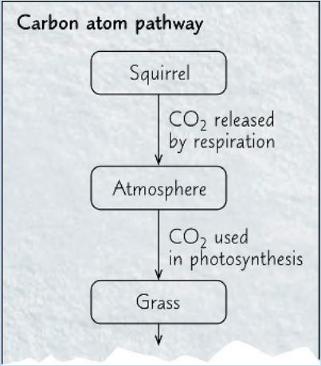

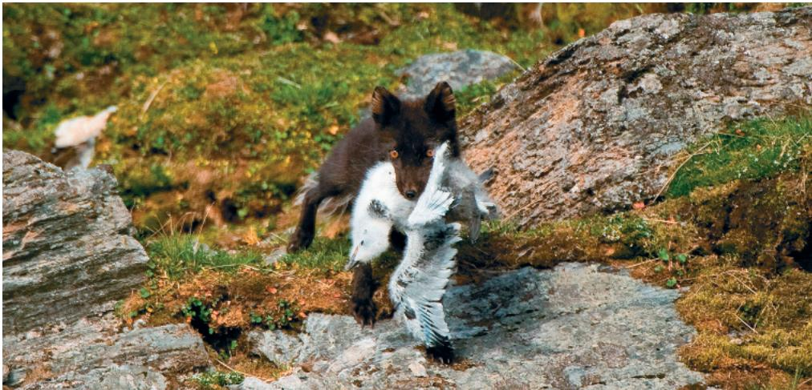  
Figure 55.1 When this arctic fox (Vulpes lagopus) eats the seabird it has killed, it obtains energy from the organic molecules contained in the body of the seabird and uses these molecules as building blocks for its own body. The seabird previously ate fish and excreted waste that provided key nutrients (such as phosphorus and nitrogen) for the plants on this Alaskan island. These interactions illustrate a few of the many ways that matter and energy move through ecosystems.  
What are the dynamics of energy and matter in an ecosystem?

There is a one-way flow of energy through an ecosystem, whereas matter cycles within the ecosystem.

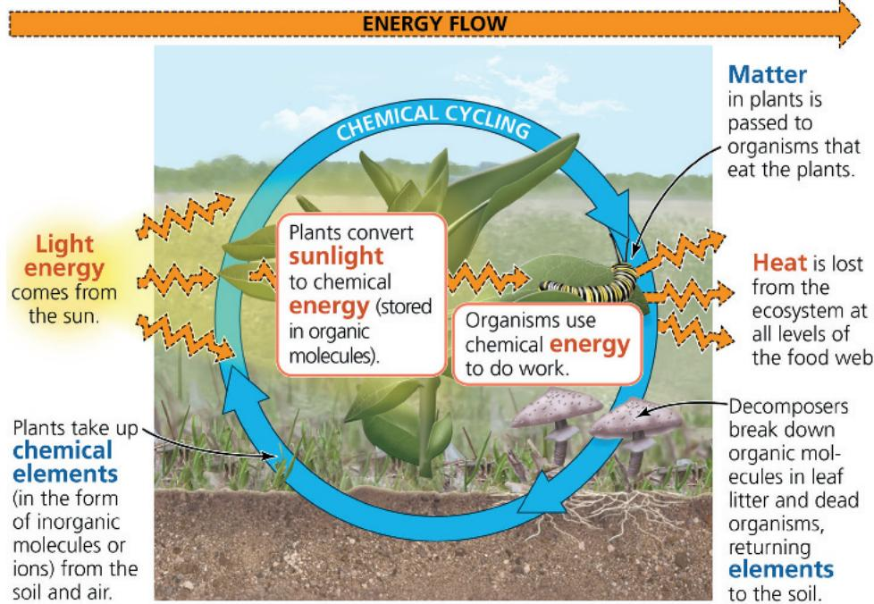

# Concept 55.1: Physical laws govern energy flow and chemical cycling in ecosystems

The “fox island” in Figure 55.1 and its community of organisms are an example of an ecosystem, the sum of all the organisms living in a given area and the abiotic factors with which they interact. An ecosystem can encompass a large area, such as a lake, forest, or island, or a microcosm, such as the space under a fallen log or a small desert spring (Figure 55.2). As with populations and communities, the boundaries of ecosystems are not always discrete. Many ecologists view the entire biosphere as a global ecosystem, a composite of all the local ecosystems on Earth.

## Energy Flow and Chemical Cycling

An ecosystem, regardless of its size, has two key emergent properties: energy flow and chemical cycling (see Figure 55.1). Energy enters most ecosystems as sunlight. This light energy is converted to chemical energy by autotrophs, passed to heterotrophs in the organic compounds of food, and dissipated as heat.

As for chemical cycling, elements such as carbon and nitrogen are passed between the biotic and abiotic components of the ecosystem. Photosynthetic and chemosynthetic organisms take up these elements in inorganic form from the air, soil, and water and incorporate them into organic compounds, some of which are consumed by animals. The elements are returned in inorganic form to the environment by the metabolism of organisms and by the breakdown of organic wastes and dead organisms by decomposers.

Both energy and chemicals are transformed in ecosystems through photosynthesis and feeding relationships. But unlike chemicals, energy cannot be recycled. An ecosystem requires a continuous influx of energy from an external source—in most cases, the sun. As we'll see, energy has a one-way flow through ecosystems, whereas chemicals cycle within them.

Figure 55.2 A desert spring ecosystem.  

## Conservation of Energy

Cells transform energy and matter, subject to the laws of thermodynamics (see Concept 8.1). Cell biologists study these transformations within organelles and cells, and measure the amounts of energy and chemical compounds that cross the cells' boundaries. Ecosystem ecologists do the same thing, except in their case the unit of study is an entire ecosystem. By studying feeding relationships among organisms and how organisms interact with their physical environment, ecologists can follow the transformations of energy in an ecosystem and map the movements of chemical elements.

To study energy flow and chemical cycling, ecosystem ecologists use approaches based on laws of physics and chemistry. The first law of thermodynamics states that energy cannot be created or destroyed but only transferred or transformed (see Concept 8.1). Plants and other photosynthetic organisms convert solar energy to chemical energy, but the total amount of energy does not change: The amount of energy stored in organic molecules must equal the total solar energy intercepted by the plant minus the amounts reflected and dissipated as heat. Ecosystem ecologists measure energy transfers within and across ecosystems, in part to understand how many organisms a habitat can support and the amount of food humans can harvest from a site.

The second law of thermodynamics states that every exchange of energy increases the entropy of the universe. One implication of this law is that energy conversions are inefficient. Some energy is always lost as heat. As a result, each unit of energy that enters an ecosystem eventually exits as heat. Thus, energy flows through ecosystems—it does not cycle within them. Because energy flowing through ecosystems is ultimately lost as heat, most ecosystems would vanish if the sun were not continuously providing energy to Earth.

## Conservation of Mass

Matter, like energy, cannot be created or destroyed. This law of conservation of mass is as important for ecosystems as are the laws of thermodynamics. Because mass is conserved, we can determine how much of a chemical element cycles within an ecosystem or is gained or lost by that ecosystem from and to nearby ecosystems over time.

Unlike energy, chemical elements are continually recycled within ecosystems. For example, a carbon atom in $\mathrm{CO}_{2}$ might be released by a decomposer from the soil to the air, where it can be taken up by a blade of grass and incorporated into an organic molecule through photosynthesis. This organic molecule might be consumed by a grazing animal and eventually returned to the soil in the animal's waste.

In addition to cycling within ecosystems, elements can also be gained or lost by an ecosystem. For example, a forest gains mineral nutrients—the essential elements that plants obtain from soil—that enter as dust or as solutes dissolved in rainwater or leached from rocks in the ground. Nitrogen is also supplied through the biological process of nitrogen fixation (see Figure 37.11). In terms of losses, some elements return to the atmosphere as gases, while others are carried out of the ecosystem by moving water or by wind.

Most gains and losses of matter to ecosystems are small compared to the amounts that cycle within them. Even so, the balance between inputs and outputs is important because it determines whether an ecosystem stores or loses a given element. In particular, if a nutrient's outputs exceed its inputs, that nutrient will eventually limit production in that ecosystem. Human activities often change the balance of inputs and outputs considerably, as we'll see later in this chapter and in Concept 56.4.

## Energy, Mass, and Trophic Levels

Ecologists group species in an ecosystem into trophic levels based on feeding relationships (see Concept 54.2). The first trophic level, which ultimately supports all others, consists of autotrophs, also called the primary producers of the ecosystem. Most autotrophs are photosynthetic organisms that use light energy to synthesize sugars and other organic compounds, which they use as fuel for cellular respiration and as building material for growth. The most common autotrophs are plants, algae, and photosynthetic bacteria. However, chemo-synthetic bacteria and archaea are the primary producers in some ecosystems, such as deep-sea hydrothermal vents (see Figure 52.16).

Organisms in trophic levels above the primary producers are heterotrophs (consumers), which depend directly or indirectly on the outputs of primary producers for their source of energy. Herbivores, which eat plants and other primary producers, are primary consumers and occupy the second trophic level. Carnivores that eat herbivores are secondary consumers (third trophic level), and carnivores that eat other carnivores are tertiary consumers (fourth trophic level) or higher trophic level.

Another group of heterotrophs is the decomposers, consumers that get their energy from detritus. Detritus is nonliving organic material, such as the remains of dead organisms, feces, and fallen leaves. Although some animals (such as earthworms) feed on detritus, the main decomposers are prokaryotic organisms and fungi (Figure 55.3). These organisms secrete enzymes that digest organic material; they then absorb the breakdown products. Many

## Figure 55.3 Decomposers.

▼ Fungi decomposing a dead tree

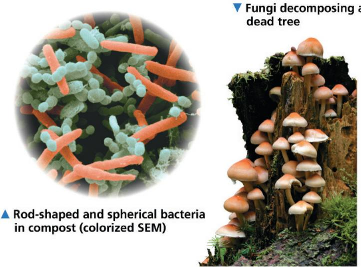  
▲ Rod-shaped and spherical bacteria in compost (colorized SEM)

decomposers are in turn eaten by secondary and tertiary consumers. In a forest, for instance, birds eat earthworms that have been feeding on leaf litter and its associated prokaryotic organisms and fungi. As a result, chemicals originally synthesized by plants pass from the plants to leaf litter to decomposers to birds.

By recycling chemical elements to producers, decomposers also play a key role in the trophic relationships of an ecosystem (Figure 55.4). Decomposers convert organic matter from all trophic levels to inorganic compounds usable by primary producers. When the decomposers excrete waste products or die, those inorganic compounds are returned to the soil. Producers can then absorb these elements and use them to synthesize organic compounds. If decomposition stopped, life as we know it would cease as detritus piled up and the supply of ingredients needed to synthesize organic matter was exhausted.

## Figure 55.4 An overview of energy and nutrient dynamics in an ecosystem.

Energy enters, flows through, and exits an ecosystem, whereas matter cycles within it. Energy (orange arrows with dashed outlines) entering from the sun as radiation is transferred as chemical energy through the food web; each of these units of energy ultimately exits as heat radiated into space. Most transfers of matter (blue arrows) through the food web lead eventually to detritus; the nutrients then cycle back to the primary producers.

VISUAL SKILLS In this diagram, one blue arrow leads to the box labeled "Primary consumers," and three blue arrows come out of it. For each of these arrows, describe an example of chemical transfer that the arrow could represent, using specific organisms and other components of an ecosystem in your answer.

For suggested answer, see Appendix A.

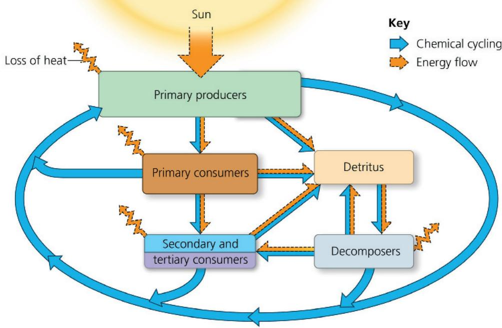

## Concept Check 55.1

1. Why is the transfer of energy in an ecosystem referred to as energy flow, not energy cycling?

2. WHAT IF? You are studying nitrogen cycling on the Serengeti Plain in Africa. During your experiment, a herd of migrating wildebeests grazes through your study plot. What would you need to know to measure their effect on nitrogen balance in the plot?

3. MAKE CONNECTIONS Use the second law of thermodynamics to explain why an ecosystem's energy supply must be continually replenished (see Concept 8.1).

For suggested answers, see Appendix A.

## Concept 55.2: Energy and other limiting factors control primary production in ecosystems

The theme of energy transfer underlies all biological interactions (see Concept 1.1). In most ecosystems, the primary producers are photoautotrophs, and primary production is the amount of light energy converted to chemical energy in the form of organic compounds during a given time period. In ecosystems where the primary producers are chemoautotrophs, the initial energy input is chemical, and the initial products are the organic compounds synthesized by those microorganisms.

## Ecosystem Energy Budgets

In most ecosystems, primary producers use light energy to synthesize energy-rich organic molecules, and consumers acquire their organic fuels secondhand (or even third- or fourth-hand) through food webs (see Figure 54.17). Therefore, the total amount of photosynthetic production sets the “spending limit” for the entire ecosystem’s energy budget.

## The Global Energy Budget

Each day, Earth's atmosphere is bombarded by approximately $10^{22}$ joules of solar radiation (1 J = 0.239 cal). This is enough energy to supply the demands of the entire human population for 16 years at 2022 energy consumption levels. The intensity of the solar energy striking Earth varies with latitude, with the tropics receiving the greatest input (see Figure 52.3). About $50\%$ of incoming solar radiation is absorbed, scattered, or reflected by clouds and dust in the atmosphere. The amount of solar radiation that ultimately reaches Earth's surface limits the possible photosynthetic output of ecosystems.

However, only a small fraction of the sunlight that reaches Earth's surface is actually used in photosynthesis. Much of the radiation strikes materials that don't photosynthesize, such as ice and soil. Of the radiation that does reach photosynthetic organisms, only certain wavelengths are absorbed by photosynthetic pigments (see Figure 10.9); the rest is transmitted, reflected, or lost as heat. As a result, only about $1\%$ of the visible light that strikes photosynthetic organisms is converted to chemical energy. Nevertheless, Earth's primary producers create about 150 billion metric tons $(1.50 \times 10^{14} \mathrm{~kg})$ of organic material each year.

## Gross and Net Production

Total primary production in an ecosystem is known as that ecosystem's gross primary production (GPP)—the amount of energy from light (or chemicals, in chemoautotrophic systems) converted to the chemical energy of organic molecules per unit time. Not all of this production is stored as organic material in the primary producers because they use some of the molecules as fuel for their own cellular respiration. Net primary production (NPP) is equal to gross primary production minus the energy used by the primary producers (autotrophs) for their cellular respiration ( $R_{a}$ , where “a” stands for autotrophs):

$$
\mathrm{NPP} = \mathrm{GPP} - \mathrm{R} _ {\mathrm{a}}
$$

On average, NPP is about one-half of GPP. To ecologists, NPP is the key measurement because it represents the storage of chemical energy that will be available to consumers in the ecosystem. Using the analogy of a paycheck, you can think of net primary production (NPP) as the take-home pay, which equals gross primary production (GPP), the gross pay, minus respiration ( $R_{a}$ ), the taxes.

Net primary production can be expressed as energy per unit area per unit time $[J/(m^{2}\cdot yr)$ or as biomass (mass of autotrophs) added per unit area per unit time $[g/(m^{2}\cdot yr)]$ . (Note that biomass is usually expressed in terms of the dry mass of organic material.) An ecosystem's NPP should not be confused with the total biomass of photosynthetic autotrophs present. The net primary production is the rate at which biomass is added—in other words, the amount of new biomass built in a given period of time. Although the total biomass of a forest is large, its NPP may actually be less than that of some grasslands; grasslands do not accumulate as much biomass as forests because animals consume the plants rapidly and because grasses and herbs decompose more quickly than trees do.

Satellites provide a powerful tool for studying global patterns of primary production. Images produced from satellite data show that different ecosystems vary considerably in their NPP. For example, tropical rain forests are among the most productive terrestrial ecosystems and contribute a large portion of the planet's NPP (Figure 55.5). Among marine ecosystems, estuaries, coral reefs, and upwelling zones also have very high NPP, but their contribution to the global total is smaller because these ecosystems cover only about one-tenth the area covered by tropical rain forests. In contrast, while the open oceans are relatively unproductive, their vast size means that together they contribute as much global NPP as terrestrial systems do.

Whereas NPP can be expressed as the amount of new biomass added by producers in a given period of time, net ecosystem production (NEP) is a measure of the biomass accumulation by producers and consumers during that time. NEP is defined as gross primary production minus the total respiration of all organisms in the system $(R_{\mathrm{T}})$ —not just primary producers, as for the calculation of NPP, but decomposers and other heterotrophs as well:

$$
\mathrm{NEP} = \mathrm{GPP} - \mathrm{R} _ {\mathrm{T}}
$$

## Figure 55.5 Global net primary production.

The map is based on satellite-collected data, such as amount of sunlight absorbed by vegetation. Note that tropical land areas have the highest rates of production [yellow to red; 2–3 kg carbon/(m $^{2}$ ·yr)].

VISUAL SKILLS Does this map accurately reflect the significance of wetlands, coral reefs, and coastal zones, all highly productive habitats? Explain.

For suggested answer, see Appendix A.

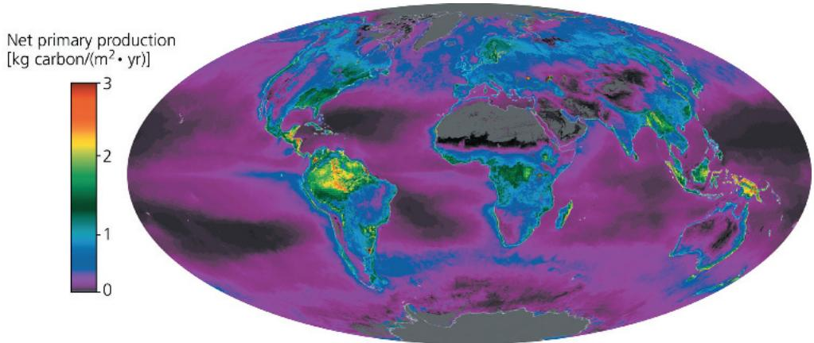

NEP is useful to ecologists because its value determines whether an ecosystem is gaining or losing carbon over time. A forest may have a positive NPP but still lose carbon if heterotrophs release it as $CO_{2}$ more quickly than primary producers incorporate it into organic compounds.

The most common way to estimate NEP is to measure the net flux (flow) of $CO_{2}$ or $O_{2}$ entering or leaving the ecosystem. If more $CO_{2}$ enters than leaves, the system is storing carbon. Because $O_{2}$ release is directly coupled to photosynthesis and respiration (see Figure 9.1), a system that is giving off $O_{2}$ is also storing carbon.

Next, we'll examine factors that limit production in ecosystems, focusing first on aquatic ecosystems.

## Primary Production in Aquatic Ecosystems

In aquatic (marine and freshwater) ecosystems, both light and nutrients are important in controlling primary production.

## Light Limitation

Because solar radiation drives photosynthesis, you would expect light to be a key variable in controlling primary production in oceans. Indeed, the depth of light penetration affects primary production throughout the photic zone of an ocean or lake (see Figure 52.14). About half of the solar radiation is absorbed in the first 15 m of water. Even in “clear” water, only 5–10% of the radiation may reach a depth of 75 m.

If light were the main variable limiting primary production in the ocean, you would expect production to increase along a gradient from the poles toward the equator, which receives the greatest intensity of light. However, you can see in Figure 55.5 that there is no such gradient. What other factor strongly influences primary production in the ocean?

## Nutrient Limitation

More than light, nutrients limit primary production in most oceans and lakes. A limiting nutrient is the element that must be added for production to increase. The nutrients that most often limit aquatic production are nitrogen and phosphorus. Concentrations of these nutrients in the inorganic molecules that are usable by most producers (such as nitrate, nitrite, ammonium, and phosphate) are typically low in the photic zone because they are rapidly taken up by phytoplankton and because detritus tends to sink.

In one study, detailed in Figure 55.6 on the next page, nutrient enrichment experiments found that nitrogen was limiting phytoplankton growth off the south shore of Long Island, New York. Moreover, as also seen in Figure 55.6, primary production can increase dramatically when the nutrient status of an ecosystem changes from nutrient-poor to nutrient-rich, a process known as eutrophication (from the Greek eutrophos, well nourished). One practical application of this work is in preventing algal blooms caused by excess nitrogen runoff that fertilizes the phytoplankton. Preventing such blooms is critical because their occurrence can lead to the formation of large marine “dead zones,” regions in which oxygen concentrations drop to levels that are fatal to many organisms (see Figure 56.24).

The macronutrients nitrogen and phosphorus are not the only nutrients that limit aquatic production. Several large areas of the ocean have low phytoplankton densities despite relatively high nitrogen concentrations. The Sargasso Sea, a subtropical region of the Atlantic Ocean, has some of the clearest water in the world because of its low phytoplankton density. Nutrient enrichment experiments have revealed that the availability of the micro-nutrient iron limits primary production there (Table 55.1).

Nutrient limitation in the photic zone is particularly severe in tropical areas where a permanent thermocline prevents mixing between shallow, well-lit warm waters and deep, nutrient-rich cold

Table 55.1 Nutrient Enrichment Experiment for Sargasso Sea

<table><tr><td>Nutrients Added to Experimental Culture</td><td>Relative Uptake of  $^{14}\mathrm{C}$  by Cultures*</td></tr><tr><td>None (controls)</td><td>1.00</td></tr><tr><td>Nitrogen (N) + phosphorus (P) only</td><td>1.10</td></tr><tr><td>N + P + metals, excluding iron (Fe)</td><td>1.08</td></tr><tr><td>N + P + metals, including Fe</td><td>12.90</td></tr><tr><td>N + P + Fe</td><td>12.00</td></tr></table>

\*14C uptake by cultures measures primary production.

Data from D. W. Menzel and J. H. Ryther, Nutrients limiting the production of phytoplankton in the Sargasso Sea, with special reference to iron, Deep Sea Research 7:276–281 (1961).

INTERPRET THE DATA The element molybdenum (Mo) is another micronutrient that can limit primary production in the oceans. If the researchers found the following results for additions of Mo, what would you conclude about its relative importance for growth?

$$
N + P + M o: 6. 0 \quad N + P + F e + M o: 7 2. 0
$$

## Figure 55.6

# Inquiry: Which nutrient limits phytoplankton production along the coast of Long Island?

Experiment

Pollution from duck farms concentrated near Moriches Bay adds both nitrogen and phosphorus to the coastal water off Long Island, New York. To determine which nutrient limits phytoplankton growth in this area, John Ryther and William Dunstan, of the Woods Hole Oceanographic Institution, cultured the phytoplankton Nannochloris atomus with water collected from several sites, identified as A through G. They added either ammonium $\left(\mathrm{NH}_{4}^{+}\right)$ or phosphate $\left(\mathrm{PO}_{4}^{3-}\right)$ to some of the cultures.

## Results

The addition of ammonium caused heavy phytoplankton growth in the cultures, but the addition of phosphate did not.

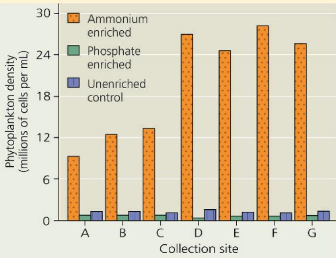

## Conclusion

Nitrogen is the nutrient that limits phytoplankton growth in this ecosystem because adding phosphorus did not increase Nannochloris growth, whereas adding nitrogen increased phytoplankton density dramatically.

Data from J. H. Ryther and W. M. Dunstan, Nitrogen, phosphorus, and eutrophication in the coastal marine environment, Science 171:1008–1013 (1971).

WHAT IF? Predict how the results would change if water samples were drawn from areas where new duck farms had greatly increased the amount of pollution in the water. Explain.

For suggested answer, see Appendix A.

and dense waters. Tropical marine primary production is therefore typically low year-round due to nutrient limitation. In temperate zones, a thermocline forms only in the summer; it breaks down in the fall when surface waters cool, become denser, and sink to the bottom, forcing deep nutrient-rich waters to the surface (see Figure 52.17).

Primary production in temperate zones is highest in the spring and fall, when enough sunlight and nutrients for photosynthesis are present in the photic zone. It is limited by nutrients in the summer, and by light availability in the winter. In polar zones, the water column is well mixed throughout the year. Since there are plenty of nutrients in surface water, primary production is very high in polar zones for a short time in the summer, when there is enough sunlight to sustain photosynthesis.

Several other mechanisms can supply nutrients to the photic zone at various latitudes (see Figure 52.16). In coastal areas, runoff from land can bring nutrients and boost primary production, especially near large rivers. In some areas, surface currents generated by dominant winds force surface water away from land or away from other surface currents, creating an area of upwelling, where deep, nutrient-rich waters are forced to the surface. Upwelling zones such as those in the Southern (Antarctic) Ocean, along the equator, and along the coastlines of Peru, California, and western Africa host highly productive ecosystems and some of the largest fisheries in the world. Finally, windblown dust from land can be important in supplying limiting nutrients to some open ocean ecosystems, such as iron to the Sargasso Sea.

Nutrient limitation is also common in freshwater lakes. During the 1970s, scientists showed that the sewage and fertilizer runoff from farms and lawns adds considerable nutrients to lakes, promoting the growth of primary producers. When the primary producers die, their bodies are broken down by aerobic decomposers. This depletes the water of much or all of its oxygen, killing large numbers of fish and causing the loss of many fish species from the lakes.

To prevent such fish kills, scientists need to know which nutrient is responsible. While nitrogen rarely limits primary production in lakes, many whole-lake experiments showed that phosphorus availability limited cyanobacterial growth. This and other ecological research led to the use of phosphate-free detergents and other water quality reforms.

## Primary Production in Terrestrial Ecosystems

At regional and global scales, temperature and moisture are the main factors controlling primary production in terrestrial ecosystems. Primary production is greater in wetter ecosystems, as shown for the plot of NPP and annual precipitation in Figure 55.7. NPP also increases with temperature and the amount of solar energy available to drive evaporation and transpiration. As a result, tropical rain forests, with their warm, wet conditions that promote plant growth, are the most productive terrestrial ecosystems. In contrast, low-productivity systems are generally dry, like many deserts and arctic tundra. Between these extremes lie the temperate forest and grassland ecosystems, with moderate climates and intermediate productivity.

Nutrients can also affect NPP in terrestrial ecosystems. A dramatic example occurred after the arctic fox (see Figure 55.1) was introduced onto islands near Alaska. The presence of foxes had the surprising effect of converting grasslands to tundra, thereby lowering NPP. The foxes fed voraciously on the islands' seabirds, decreasing their density almost 100-fold. Fewer seabirds meant less bird guano (waste), a primary source of essential

Forests in the American southwest are experiencing hotter droughts caused by rising temperatures in the summer and reduced snowfall in the winter. The drought-stress index indicates how greatly trees are stressed by these conditions; rising values of this index correspond to increasing drought. Higher drought stress correlates with increasing area burned by wildfires (top graph) and affected by bark beetles (bottom graph), which target drought-stressed trees with weakened defenses.

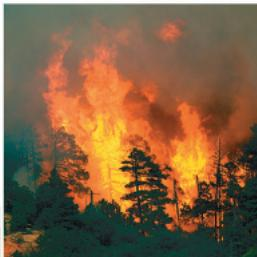

Figure 55.7 A global relationship between NPP and mean annual precipitation for terrestrial ecosystems.  
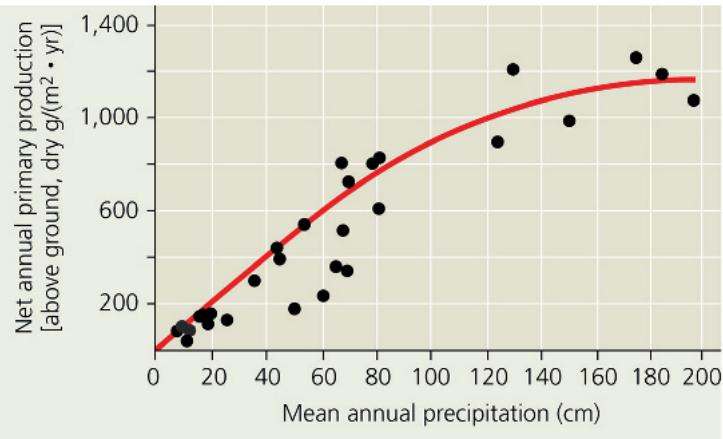

nutrients for plants on the islands. Researchers suspected that the scarcity of nutrients reduced the growth of nutrient-hungry grasses, favoring instead the slower-growing plants typical of tundra. To test this explanation, they added fertilizer to plots of tundra on one of the fox-infested islands. Three years later, the fertilized plots had reverted back to grassland.

## Nutrient Limitations and Adaptations That Reduce Them

EVOLUTION As in aquatic systems, nitrogen and phosphorus are the nutrients that most commonly limit terrestrial production. Globally, nitrogen limits plant growth most. Phosphorus limitations are common in older soils where phosphate molecules have been leached away by water, such as in many tropical ecosystems. Note that adding a nonlimiting nutrient, even one that is scarce, will not stimulate production. Conversely, adding more of the limiting nutrient will increase production until some other nutrient becomes limiting.

Various adaptations have evolved in plants that can increase their uptake of limiting nutrients. One important adaptation is the mutualism between plant roots and nitrogen-fixing bacteria. Another is the mycorrhizal association between plant roots and fungi that supply phosphorus and other limiting elements to plants (see Figure 37.14). Plant roots also have hairs and other anatomical features that increase the area of soil in contact with the roots (see Figures 33.8 and 35.3). Many plants release enzymes and other substances into the soil that increase the availability of limiting nutrients; such substances include phosphatases, which cleave a phosphate group from larger molecules, and certain molecules (called chelating agents) that make micronutrients such as iron more soluble in the soil.

## Effects of Climate Change on Production

As we've seen, climatic factors such as temperature and precipitation affect terrestrial NPP. Thus, we might expect that climate change could affect production in terrestrial ecosystems—and it does. For example, satellite data showed that from 1982 to 1999, NPP increased by $6\%$ in terrestrial ecosystems. Nearly half of this increase occurred in the tropical forests of the Amazon, where

changing climate patterns had caused cloud cover to decrease, thereby increasing the amount of solar energy available to primary producers. Since 2000, however, these gains in NPP have been erased. This reversal was affected by another aspect of climate change: a series of major droughts in the Southern Hemisphere.

Effects of climate change on NPP can also be seen in the impact of “hotter droughts” on wildfires and insect outbreaks. Consider forests in the American Southwest. In recent decades, the forests of this region have experienced droughts driven by climate warming and changing patterns of precipitation. These ongoing droughts, in turn, have led to increases in the area burned by wildfires and the area affected by outbreaks of bark beetles such as the mountain pine beetle Dendroctonus ponderosae (Figure 55.8). As a result, tree mortality has increased and NPP has decreased in these forests.

Climate change can also affect whether an ecosystem stores or loses carbon over time. As discussed earlier, net ecosystem production, or NEP, reflects the total biomass accumulation that occurs during a given period of time. When NEP > 0, the ecosystem gains more carbon than it loses; such ecosystems store carbon and are said to be a carbon sink. In contrast, when NEP < 0, the ecosystem loses more carbon than it gains; such ecosystems are a carbon source.

Figure 55.8 Climate change, wildfires, and insect outbreaks.  
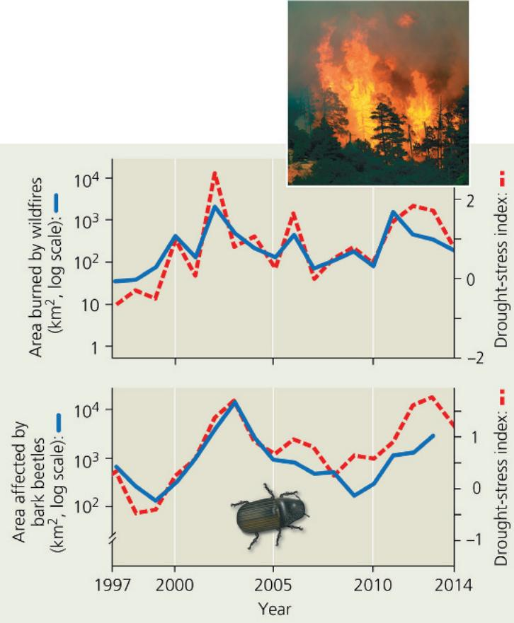

## Problem-Solving Exercise

## Can an insect outbreak threaten a forest's ability to absorb $\mathrm{CO}_{2}$ from the atmosphere?

One way to combat climate change is to plant trees, since trees absorb large amounts of $CO_{2}$ from the atmosphere, converting it to biomass through photosynthesis. But what happens to the carbon stored as biomass in trees when an insect population explodes in number? Such insect outbreaks have become more frequent with climate change.

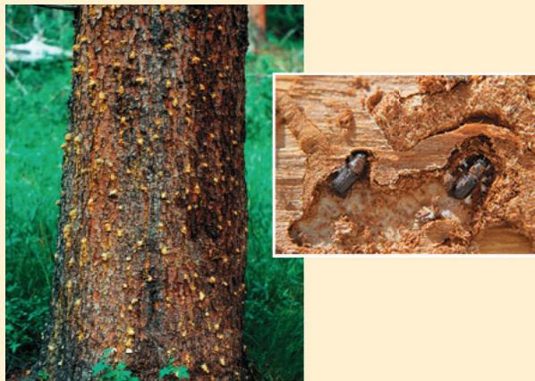

A tree with dozens of “pitch tubes,” indications of a damaging outbreak of mountain pine beetles (inset).

In this exercise, you will test whether an outbreak of the mountain pine beetle (Dendroctonus ponderosae) alters the amount of $CO_{2}$ that a forest ecosystem absorbs from and releases to the atmosphere.

## Your Approach

The principle guiding your investigation is that every ecosystem both absorbs and releases $CO_{2}$ . Net ecosystem production (NEP) indicates whether an ecosystem is a carbon sink (absorbing more $CO_{2}$ from the atmosphere than it releases; this occurs

Recent research shows that climate change can cause an ecosystem to switch from a carbon sink to a carbon source. For example, in some arctic ecosystems, climate warming has increased the metabolic activities of soil microorganisms, causing an uptick in the amount of $CO_{2}$ produced in cellular respiration. In these ecosystems, the total amount of $CO_{2}$ produced in cellular respiration now exceeds what is absorbed in photosynthesis. As a result, these ecosystems—which once were carbon sinks—are now carbon sources. When this happens, an ecosystem may contribute to climate change by releasing more $CO_{2}$ than it absorbs. Indeed, a 2017 study found that with climate warming, large regions of tundra in Alaska now release more $CO_{2}$ than they absorb—and for the years 2013 and 2014, the entire state of Alaska released more $CO_{2}$ than it absorbed. In the Problem-Solving Exercise, you can examine how outbreaks of an insect population may affect the NEP of forest ecosystems.

when NEP > 0) or a carbon source (releasing more CO₂ than it absorbs; NEP < 0). To find out if the mountain pine beetle affects NEP, you will determine a forest's NEP before and after a recent outbreak of this insect.

## Your Data

From 2000 to 2006, an outbreak of the mountain pine beetle killed millions of trees in British Columbia, Canada. The impact of such outbreaks on whether forests gain carbon (NEP > 0) or lose carbon (NEP < 0) was poorly understood. To find out, ecologists estimated net primary production (NPP) and cellular respiration by decomposers and other heterotrophs ( $R_{h}$ ), before and after the outbreak. These data allow forest NEP to be calculated from the equation $NEP = NPP - R_{h}$ .

<table><tr><td></td><td>NPP [g/(m2·yr)]</td><td> ${\mathrm{R}}_{\mathrm{h}}$   $\left\lbrack  {\mathrm{g}/\left( {{\mathrm{m}}^{2} \cdot  \mathrm{{yr}}}\right) }\right\rbrack$ </td><td>NEP [g/(m2·yr)]</td></tr><tr><td>Before outbreak</td><td>440</td><td>408</td><td></td></tr><tr><td>After outbreak</td><td>400</td><td>424</td><td></td></tr></table>

## Your Analysis

1. Complete the table by calculating the values of NEP before and after the outbreak. Before the outbreak, was the forest a carbon sink or a carbon source? After the outbreak?

2. NEP is often defined as $NEP = GPP - R_{T}$ , where GPP is gross primary production and $R_{T}$ equals cellular respiration by autotrophs ( $R_{a}$ ) plus cellular respiration by heterotrophs ( $R_{h}$ ). Use the relation $NPP = GPP - R_{a}$ to show that the two equations for NEP introduced in this exercise are equivalent.

3. Based on your results in question 1, predict whether the mountain pine beetle outbreak could have feedback effects on the global climate. Explain.

Instructors: A version of this Problem-Solving Exercise can be assigned in Mastering Biology.

## Concept Check 55.2

1. Why is only a small portion of the solar energy that strikes Earth's atmosphere stored by primary producers?

2. How can ecologists experimentally determine the factor that limits primary production in an ecosystem?

3. WHAT IF? Suppose a forest was heavily burned by a wildfire. Predict how NEP of this forest would change over time.

4. MAKE CONNECTIONS Explain how nitrogen and phosphorus, the nutrients that most often limit primary production, are necessary for the Calvin cycle to function in photosynthesis (see Concept 10.3).

For suggested answers, see Appendix A.

## Concept 55.3: Energy transfer between trophic levels is typically only 10% efficient

The amount of chemical energy in consumers' food that is converted to their own new biomass during a given period is called the secondary production of the ecosystem. Consider the transfer of organic matter from primary producers to herbivores, the primary consumers. In most ecosystems, herbivores eat only a small fraction of plant material produced; globally, they consume only about one-sixth of total plant production. Moreover, they cannot digest all the plant material that they do eat, as anyone who has walked through a field where cattle have been grazing will attest. Most of an ecosystem's production is eventually consumed by decomposers. Let's analyze the process of energy transfer more closely.

## Production Efficiency

We'll begin by examining secondary production in one organism—a caterpillar. When a caterpillar feeds on a leaf, only about 33 J out of 200 J, or one-sixth of the potential energy in the leaf, is used for secondary production, or growth (Figure 55.9). The caterpillar stores some of the remaining energy in organic compounds that will be used for cellular respiration and passes the rest in its feces. The energy in the feces remains in the ecosystem temporarily, but most of it is lost as heat after the feces are consumed by decomposers. The energy used for the caterpillar's respiration is also eventually lost from the ecosystem as heat. Only the chemical energy stored

Figure 55.9 Energy partitioning within a link of the food chain.  
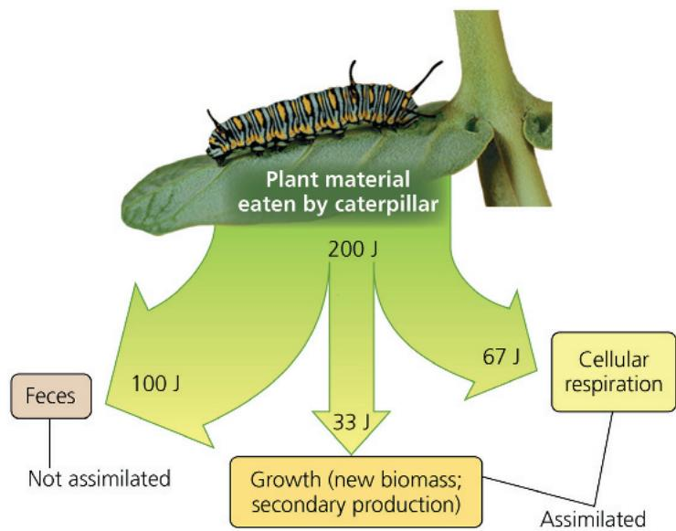  
INTERPRET THE DATA What percentage of the energy in the caterpillar's food is actually used for secondary production (growth)?

by herbivores as biomass, through growth or the production of offspring, is available as food to secondary consumers.

We can measure the efficiency of animals as energy transformers using the following equation:

$$
\text { Production   efficiency } = \frac {\text { Net   secondary   production } \times 100 \%}{\text { Assimilation   of   primary   production }}
$$

Net secondary production is the amount of energy an organism has consumed and used for growth and reproduction. Assimilation consists of the total amount of energy an organism has consumed that is absorbed inside the body (not passed as feces) and used for growth, reproduction, and respiration. Production efficiency, therefore, is the percentage of energy stored in assimilated food that is used for growth and reproduction, not respiration. For the caterpillar in Figure 55.9, production efficiency is 33%; 67 J of the 100 J of assimilated energy is used for respiration. (The 100 J of energy lost as undigested material in feces does not count toward assimilation.) Birds and mammals typically have low production efficiencies, in the range of 1–3%, because they use so much energy in maintaining a constant, high body temperature. Fishes, which are mainly ectothermic (see Concept 40.3), have production efficiencies around 10%. Insects and microorganisms are even more efficient, with production efficiencies averaging 40% or more.

## Trophic Efficiency and Ecological Pyramids

Let's scale up now from the production efficiencies of individual consumers to the flow of energy through trophic levels.

Trophic efficiency is the percentage of production transferred from one trophic level to the next. Trophic efficiencies must always be less than production efficiencies because they take into account not only the energy lost through respiration and contained in feces, but also the energy in organic material in a lower trophic level that is not consumed by the next trophic level. Trophic efficiencies range from roughly 5% to 20% in different ecosystems, but on average are only about 10%. In other words, 90% of the energy available at one trophic level typically is not transferred to the next. This loss is multiplied over the length of a food chain. If 10% of available energy is transferred from primary producers to primary consumers, such as caterpillars, and 10% of that energy is transferred to secondary consumers (carnivores), then only 1% of net primary production is available to secondary consumers (10% of 10%). In the Scientific Skills Exercise, you can calculate trophic efficiency and other measures of energy flow in a salt marsh ecosystem.

The loss of energy with each transfer in a food chain can be represented by an energy pyramid, in which the net productions of different trophic levels are arranged in tiers (Figure 55.10). The width of each tier is proportional to the net production, expressed in joules, of each trophic level. The highest level, which represents top-level predators, contains relatively few individuals. The small population size typical of top predators is one reason they tend to be vulnerable to

## Scientific Skills Exercise Interpreting Quantitative Data

How Efficient Is Energy Transfer in a Salt Marsh Ecosystem? In a classic experiment, John Teal studied the flow of energy through the producers, consumers, and decomposers in a salt marsh. In this exercise, you will use the data from this study to calculate some measures of energy transfer between trophic levels in this ecosystem.

How the Study Was Done Teal measured the amount of solar radiation entering a salt marsh in Georgia over a year. He also measured the aboveground biomass of the dominant primary producers, which were grasses, as well as the biomass of the dominant consumers, including insects, spiders, and crabs, and of the detritus that flowed out of the marsh to the surrounding coastal waters. To determine the amount of energy in each unit of biomass, he dried the biomass, burned it in a calorimeter, and measured the amount of heat produced.

Data from the Study

<table><tr><td>Form of Energy</td><td>Amount [kcal/(m2·yr)]*</td></tr><tr><td>Solar radiation</td><td>600,000</td></tr><tr><td>Gross grass production</td><td>34,580</td></tr><tr><td>Net grass production</td><td>6,585</td></tr><tr><td>Gross insect production</td><td>305</td></tr><tr><td>Net insect production</td><td>81</td></tr><tr><td>Detritus leaving marsh</td><td>3,671</td></tr><tr><td colspan="2">* 1 kcal = 4.184 kJ</td></tr></table>

Data from J. M. Teal, Energy flow in the salt marsh ecosystem of Georgia, Ecology 43:614 – 624 (1962).

This example assumes a trophic efficiency of 10% for each link in the food chain. Notice that primary producers convert only about 1% of the energy available to them to net primary production.

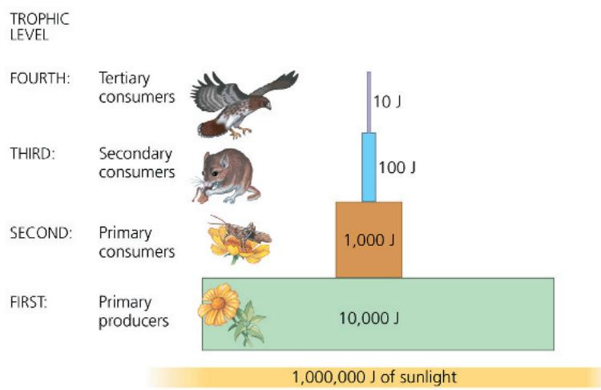

Figure 55.10 An idealized pyramid of energy.  
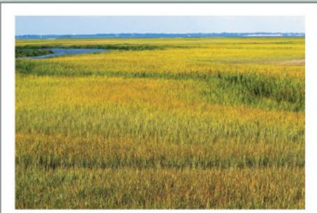

## INTERPRET THE DATA

1. What percentage of solar energy is incorporated into the marsh as gross primary production? As net primary production?

2. How much energy is lost by primary producers as respiration in this ecosystem? How much is lost as respiration by the insect population?

3. If all of the detritus leaving the marsh is plant material, what percentage of all net primary production leaves the marsh as detritus each year?

Instructors: A version of this Scientific Skills Exercise can be assigned in Mastering Biology.

extinction (see Concept 56.2) and to the evolutionary consequences of small population size (see Concept 23.3).

One ecological consequence of low trophic efficiencies is represented in a biomass pyramid, in which each tier represents the total dry mass of all organisms in one trophic level. Most biomass pyramids narrow sharply from primary producers at the base to top-level carnivores at the apex because energy transfers between trophic levels are so inefficient (Figure 55.11a). Certain aquatic ecosystems, however, have inverted biomass pyramids, in which primary consumers outweigh the producers (Figure 55.11b).

Such inverted biomass pyramids occur because the producers—phytoplankton—have very high turnover rates. They are consumed so quickly by the zooplankton that their total biomass remains at comparatively low levels. However, because the phytoplankton continually replace their biomass (via growth and reproduction) at such a rapid rate, they can support a biomass of zooplankton that is larger than their own biomass. Phytoplankton still have much higher production than zooplankton, and the pyramid of energy for this ecosystem is still bottom-heavy, like the one shown in Figure 55.10.

Figure 55.11 Pyramids of biomass.  
Numbers denote the dry mass of all organisms at each trophic level.  
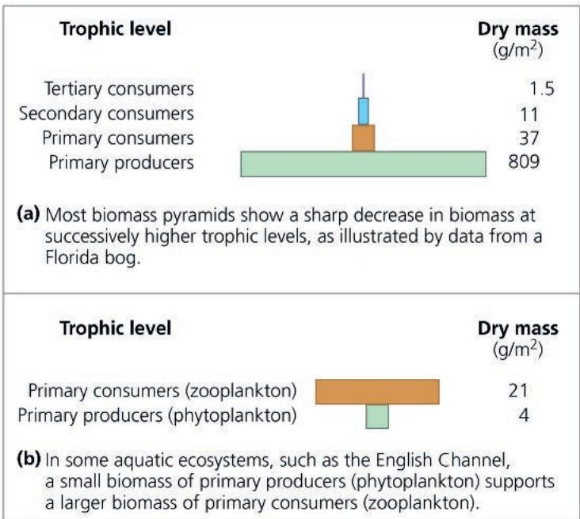  
(b) In some aquatic ecosystems, such as the English Channel, a small biomass of primary producers (phytoplankton) supports a larger biomass of primary consumers (zooplankton).

The low trophic efficiency of ecosystems has two main ecological consequences. First, it typically limits the length of food chains to a maximum of four or five trophic levels. Only about 0.1% of the chemical energy fixed by photosynthesis can flow through a food web to a consumer such as the hawk in Figure 55.10, and only about 0.01% could be passed on a fifth trophic level above the hawk. There is simply not enough energy to sustain viable populations at higher trophic levels. Second, the number of trophic levels in a food chain, along with the primary production of a system, influences the amount of energy and biomass of top predators. Areas that have high primary production and short food chains have the highest amount of energy and biomass at the top of the food web. Indeed, some of the world's greatest densities of large whales occur in upwelling areas where high nutrient levels support exceptionally high primary production, and where the food chain can be as short as three levels, from large phytoplankton to krill to baleen whales (see Figure 54.17). In terrestrial habitats, areas that have higher primary production tend to have longer food chains, since the amount of energy stored in primary producers is high enough to support viable populations of consumers at a fourth or even fifth trophic level. In areas that have low primary production, such as the arctic tundra, large populations of top predators can still be sustained because there are few steps in the food chain (see Figure 55.19).

The dynamics of energy flow through ecosystems also have implications for human consumers. For example, eating meat is a relatively inefficient way of tapping photosynthetic production. The same pound of soybeans that a person could eat for protein produces only a fifth of a pound of beef or less when fed to a cow.

Agriculture worldwide could, in fact, feed many more people and require less land if we all fed more efficiently—as primary consumers, eating plant material.

## Concept Check 55.3

1. Explain the difference between trophic efficiency and production efficiency.

2. If a small rodent that eats plant seeds containing 200 J of energy uses 145 J of that energy for respiration and excretes 50 J in its feces, how much of this food goes to the rodent's growth? What is its production efficiency? Compare these numbers to the ones in Figure 55.9. Suggest explanations for the differences in assimilation rate, respiration rate, and production efficiency.

3. WHAT IF? Tobacco leaves contain nicotine, a poisonous compound that is energetically expensive for the plant to make. What advantage might the plant gain by using some of its resources to produce nicotine?

For suggested answers, see Appendix A.

## Concept 55.4: Biological and geochemical processes cycle nutrients and water in ecosystems

Since chemical elements are available only in limited amounts in ecosystems, life depends on the recycling of these essential chemical elements. Much of an organism's chemical stock is replaced continuously as nutrients are assimilated and waste products are released. When the organism dies, the atoms in its body are returned to the atmosphere, water, or soil by decomposers. By liberating nutrients from organic matter, decomposition replenishes the pools of inorganic nutrients that plants and other autotrophs use to build new organic matter.

## Decomposition and Nutrient Cycling Rates

Decomposers are heterotrophs that get their energy from detritus. Their growth is controlled by the same factors that limit primary production in ecosystems, including temperature, moisture, and nutrient availability. Decomposers usually grow faster and decompose material more quickly in warmer ecosystems (Figure 55.12). In tropical rain forests, most organic material decomposes in a few months to a few years, whereas in temperate forests, decomposition takes 4 to 6 years, on average. The difference is largely the result of the higher temperatures and more abundant precipitation in tropical rain forests.

## Figure 55.12

# Inquiry: How does temperature affect litter decomposition in an ecosystem?

## Experiment

Researchers with the Canadian Forest Service placed identical samples of organic material—litter—on the ground in 21 sites across Canada. Three years later, they returned to see how much of each sample had decomposed.

## Results

The mass of litter in the warmest ecosystem decreased four times faster than in the coldest ecosystem.

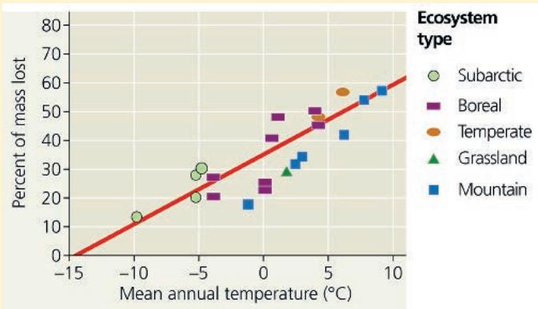

## Conclusion

Decomposition rate increases with temperature across much of Canada.

Data from J. A. Trofymow and the CIDET Working Group, The Canadian Intersite Decomposition Experiment: Project and Site Establishment Report (Information Report BC-X-378), Natural Resources Canada, Canadian Forest Service, Pacific Forestry Centre (1998) and T. R. Moore et al., Litter decomposition rates in Canadian forests, Global Change Biology 5:75–82 (1999).

WHAT IF? What factors other than temperature might also have varied across these 21 sites? How might this variation have affected the interpretation of the results?

For suggested answer, see Appendix A.

Because decomposition in a tropical rain forest is rapid, relatively little organic material accumulates as leaf litter on the forest floor; about $75\%$ of the ecosystem's nutrients is present in the woody trunks of trees, and only about $10\%$ is contained in the soil. Thus, the relatively low concentrations of some nutrients in the soil of tropical rain forests result from a short cycling time, not from a lack of these elements in the ecosystem. In temperate forests, where decomposition is much slower, the soil may

contain as much as 50% of all the organic material in the ecosystem. The nutrients that are present in temperate forest detritus and soil may remain there for years before plants assimilate them.

Decomposition on land is also slower when conditions are either too dry for decomposers to thrive or too wet to supply them with enough oxygen. Decomposers grow especially poorly in ecosystems that are both cold and wet, such as peatlands. As a result, net primary production greatly exceeds the rate of decomposition in such ecosystems, causing them to store large amounts of organic matter.

In aquatic ecosystems, deep waters below the photic zone usually contain high levels of nutrients, since organisms that sink there are decomposed, yet there are no photosynthetic organisms to use up nutrients. Thus, processes that bring deep water to the surface, such as seasonal mixing or wind-driven upwelling of deep water, boost primary production in surface waters. Additionally, large rivers carry a lot of nutrients from terrestrial ecosystems to the coastal zone and boost primary production where they meet seawater.

## Biogeochemical Cycles

Because nutrient cycles involve both biotic and abiotic components, they are called biogeochemical cycles. We can recognize two general scales of biogeochemical cycles: global and local. Gaseous forms of carbon, oxygen, sulfur, and nitrogen occur in the atmosphere, and these elements' cycles are essentially global. For example, some of the carbon atoms a plant acquires from the air as $CO_{2}$ may have been released into the atmosphere by the respiration of an organism in a distant locale. Other elements—including phosphorus, potassium, and calcium—are too heavy to occur as gases at Earth's surface, although they are transported in dust. In terrestrial ecosystems, these elements cycle more locally, absorbed from the soil by plant roots and eventually returned to the soil by decomposers. In aquatic systems, however, they cycle more broadly as dissolved forms carried in currents.

Let's first look at a general model of nutrient cycling that includes reservoirs where elements exist and processes that transfer elements between them (Figure 55.13). The nutrients in living organisms and detritus (reservoir A) are available to other organisms when consumers feed and when decomposers consume nonliving organic matter. The low pH and low oxygen levels found in the waterlogged sediments of swamps can inhibit decomposition, leading to the formation of peat. When this occurs, organic materials from dead organisms can be transferred from reservoir A to reservoir B; eventually, peat may be converted to fossil fuels such as coal or oil. Inorganic materials that are dissolved in water or present in soil or air (reservoir C) are available for use. Although most organisms cannot directly tap into the inorganic elements tied up in rocks (reservoir D), these nutrients may slowly become available through weathering and erosion.

# Visualizing Biogeochemical Cycles

## Figure 55.13

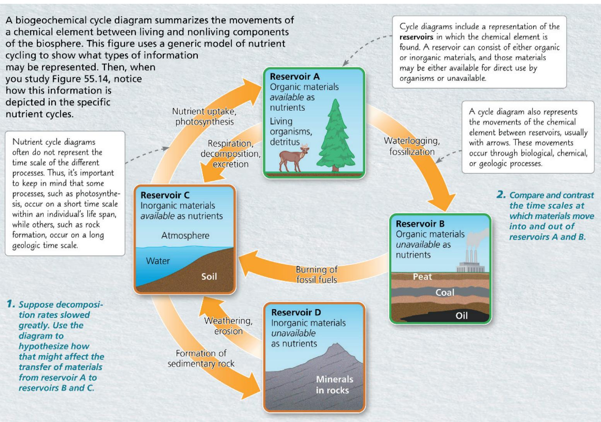  
Instructors: Additional questions related to this Visualizing Figure can be assigned in Mastering Biology.  
For suggested answers, see Appendix A.

Figure 55.14, on the next two pages, provides a detailed look at the cycling of water, carbon, nitrogen, and phosphorus. When you study each cycle, consider which steps are driven primarily by biological processes. For the carbon cycle, for instance, plants, animals, and other organisms control most of the key steps, including photosynthesis and decomposition. For the water cycle, however, purely physical processes control many key steps, such as evaporation from the oceans. Note also that human actions, such as the burning of fossil fuels and the production of fertilizers, have had major effects on the global cycling of carbon and nitrogen.

## Case Study: Nutrient Cycling in the Hubbard Brook Experimental Forest

Since 1963, ecologist Gene Likens and colleagues have been studying nutrient cycling at the Hubbard Brook Experimental Forest in the White Mountains of New Hampshire. Their research site is a

deciduous forest that grows in six small valleys, each drained by a single creek. Impermeable bedrock underlies the soil of the forest.

The research team first determined the mineral budget for each of six valleys by measuring the input and outflow of several key nutrients. They collected rainfall at several sites to measure the amount of water and dissolved minerals added to the ecosystem. To monitor the loss of water and minerals, they constructed a small concrete dam with a V-shaped spillway across the creek at the bottom of each valley (Figure 55.15a, after you turn the page). They found that about 60% of the water added to the ecosystem as rainfall and snow exits through the stream, and the remaining 40% is lost by evapotranspiration.

Preliminary studies confirmed that internal cycling conserved most of the mineral nutrients in the system. For example, only about 0.3% more calcium ( $Ca^{2+}$ ) leaves a valley via its creek than is added by rainwater, and this small net loss is probably replaced by chemical decomposition of the bedrock. During most years, the forest even registers small net gains of a few mineral nutrients, including nitrogen.

# Exploring Water and Nutrient Cycling

## Figure 55.14

Examine each cycle closely, considering the major reservoirs of water, carbon, nitrogen, and phosphorus and the processes that drive each cycle. The widths of the arrows in the diagrams approximately reflect the relative contribution of each process to the movement of water or a nutrient in the biosphere.

## The Water Cycle

Biological importance Water is essential to all organisms, and its availability influences the rates of ecosystem processes, particularly primary production and decomposition in terrestrial ecosystems.

Forms available to life All organisms are capable of exchanging water directly with their environment. Liquid water is the primary physical phase in which water is used, though some organisms can harvest water vapor. Freezing of soil water can limit water availability to terrestrial plants.

Reservoirs The oceans contain 97% of the water in the biosphere. Approximately 2% is bound in glaciers and polar ice caps, and the remaining 1% is in lakes, rivers, and groundwater, with a negligible amount in the atmosphere.

Key processes The main processes driving the water cycle are evaporation of liquid water by solar energy, condensation of water vapor into clouds, and precipitation. Transpiration by terrestrial plants also moves large volumes of water into the atmosphere. Surface and groundwater flow can return water to the oceans, completing the water cycle.

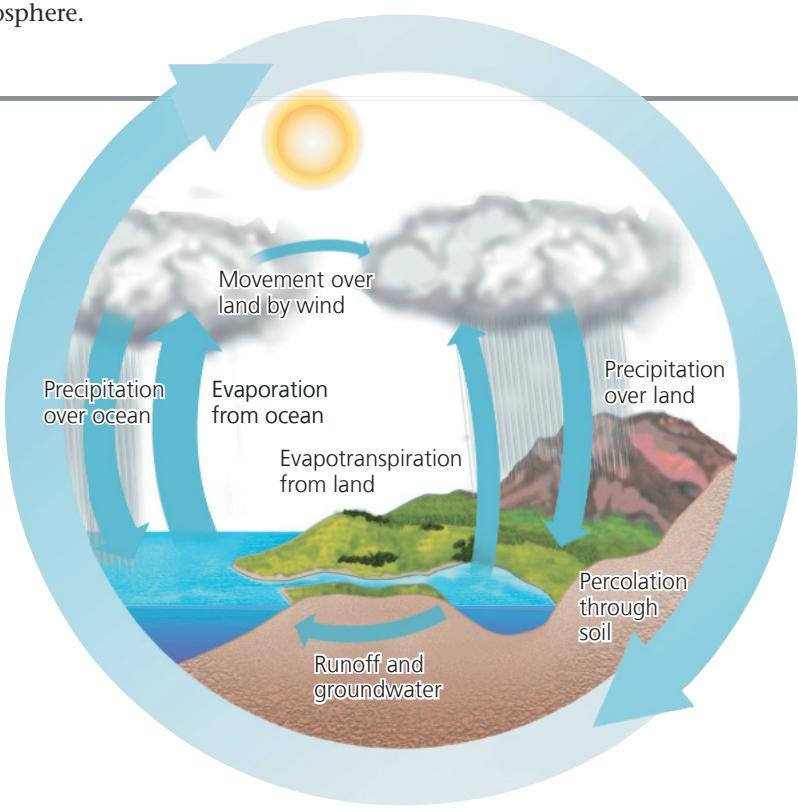

## The Carbon Cycle

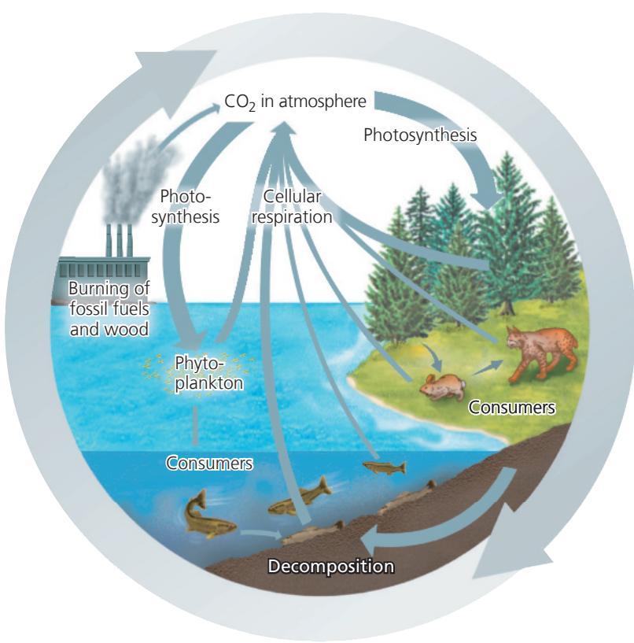

Biological importance Carbon forms the framework of the organic molecules essential to all organisms.

Forms available to life Photosynthetic organisms utilize $CO_{2}$ during photosynthesis and convert the carbon to organic forms that are used by consumers, including animals, fungi, and unicellular heterotrophs.

Reservoirs The major reservoirs of carbon include fossil fuels, soils, the sediments of aquatic ecosystems, the oceans (dissolved $CO_{2}$ and organic compounds), the biomass of living organisms, and the atmosphere ( $CO_{2}$ ). The largest reservoir is sedimentary rocks such as limestone; however, carbon remains in this pool for long periods of time. All organisms are capable of returning carbon directly to their environment in its original form ( $CO_{2}$ ) through respiration.

Key processes Photosynthesis by plants, multicellular algae (seaweeds), and phytoplankton removes substantial amounts of atmospheric $CO_{2}$ each year. This quantity is approximately equal to the $CO_{2}$ added to the atmosphere through cellular respiration by producers and consumers. The burning of fossil fuels and wood is adding significant amounts of additional $CO_{2}$ to the atmosphere. Over geologic time, volcanoes are also a substantial source of $CO_{2}$ .

## The Nitrogen Cycle

Biological importance Nitrogen is part of amino acids, proteins, and nucleic acids and is often a limiting plant nutrient.

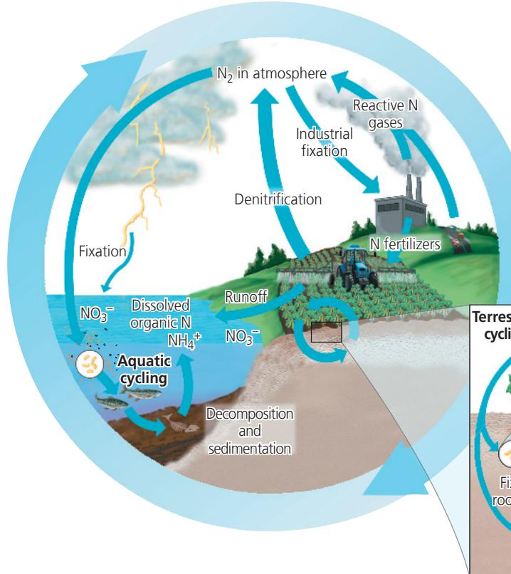

## The Phosphorus Cycle

Biological importance Organisms require phosphorus as a major constituent of nucleic acids, phospholipids, and ATP and other energy-storing molecules and as a mineral constituent of bones and teeth.

Forms available to life The most biologically important inorganic form of phosphorus is phosphate ( $PO_{4}^{3-}$ ), which plants absorb and use in the synthesis of organic compounds.

Reservoirs The largest accumulations of phosphorus are in sedimentary rocks of marine origin. There are also large quantities of phosphorus in soil, in the oceans (in dissolved form), and in organisms. Because soil particles bind $PO_{4}^{3-}$ , the recycling of phosphorus tends to be quite localized in ecosystems.

Key processes Weathering of rocks gradually adds $PO_{4}^{3-}$ to soil; some leaches into groundwater and surface water and may eventually reach the sea. Phosphate taken up by producers and incorporated into biological molecules may be eaten by consumers. Phosphate is returned to soil or water by either decomposition of biomass or excretion by consumers. Because there are no significant phosphorus-containing gases, only relatively small amounts of phosphorus move through the atmosphere, usually in the forms of dust and sea spray.

Forms available to life Plants can assimilate (use) two inorganic forms of nitrogen—ammonium $\left(\mathrm{NH}_{4}^{+}\right)$ and nitrate $\left(\mathrm{NO}_{3}^{-}\right)$ —and some organic forms, such as amino acids. Various bacteria can use all of these forms as well as nitrite $\left(\mathrm{NO}_{2}^{-}\right)$ . Animals can use only organic forms of nitrogen.

Reservoirs The main reservoir of nitrogen is the atmosphere, which is 80% free nitrogen gas ( $N_{2}$ ). The other reservoirs of inorganic and organic nitrogen compounds are soils and the sediments of lakes, rivers, and oceans; surface water and groundwater; and the biomass of living organisms.

Key processes The major pathway for nitrogen to enter an ecosystem is via nitrogen fixation, the conversion of $N_{2}$ to forms that can be used to synthesize organic nitrogen compounds. Certain bacteria, as well as lightning and volcanic activity, fix nitrogen naturally. Nitrogen inputs from human activities now outpace natural inputs on land. Two major contributors are industrially produced fertilizers and

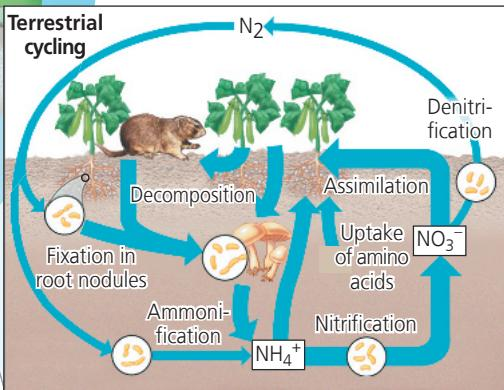

legume crops that fix nitrogen via bacteria in their root nodules. Other bacteria in soil convert nitrogen to different forms. Examples include nitrifying bacteria, which convert ammonium to nitrate, and denitrifying bacteria, which convert nitrate to nitrogen gas. Human activities also release large quantities of reactive nitrogen gases, such as nitrogen oxides, to the atmosphere.

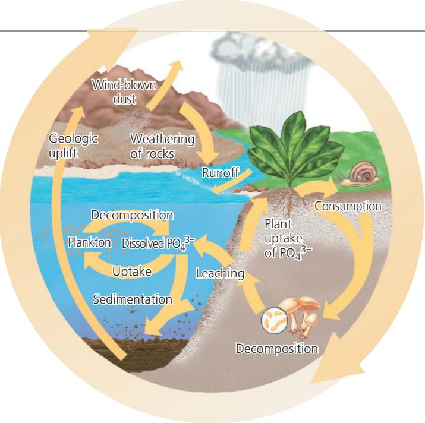

Figure 55.15 Nutrient cycling in the Hubbard Brook Experimental Forest.  
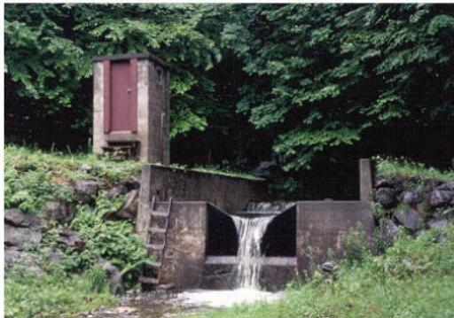  
(a) Concrete dams and weirs built across streams at the bottom of watersheds enabled researchers to monitor the outflow of water and nutrients from the ecosystem.

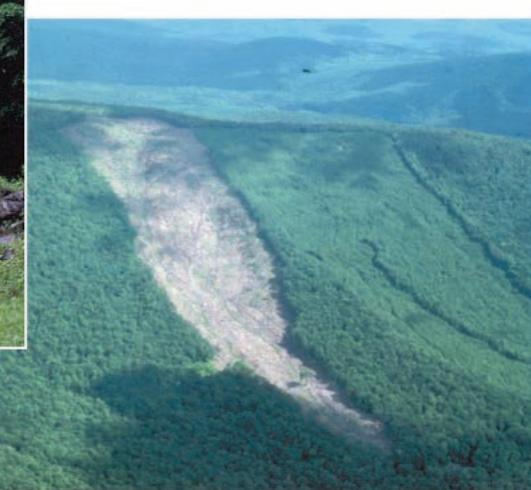  
(b) One watershed was clear-cut to study the effects of the loss of vegetation on drainage and nutrient cycling. All of the original plant material was left in place to decompose.

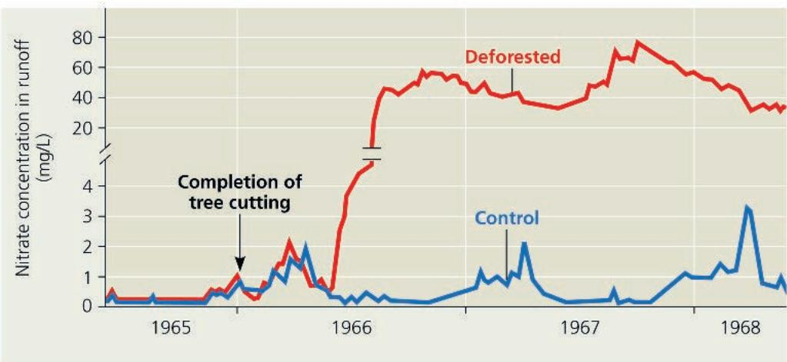  
(c) The concentration of nitrate in runoff from the deforested watershed was 60 times greater than in a control (unlogged) watershed.  
VISUAL SKILLS If this graph were redrawn so that the y-axis had a consistent scale, what information would be emphasized compared to the above graph? What information might be lost or harder to see? Explain.  
Instructors: A related Experimental Inquiry Tutorial can be assigned in Mastering Biology.

For suggested answer, see Appendix A.

Experimental deforestation of a watershed dramatically increased the flow of water and minerals leaving the watershed (Figure 55.15b). Over 3 years, water runoff from the newly deforested watershed was 30–40% greater than in a control watershed, apparently because there were no plants to absorb and transpire water from the soil. Most remarkable was the loss of nitrate, whose concentration in the creek increased 60-fold, reaching levels considered unsafe for drinking water (Figure 55.15c). The Hubbard Brook deforestation study showed that the amount of nutrients leaving an intact forest ecosystem is controlled mainly by the plants. Retaining nutrients in an

ecosystem helps to maintain the productivity of the system as well as to avoid problems elsewhere, such as algal blooms caused by excess nutrient runoff that enters a downstream ecosystem.

## Interview

Interview with Eugene Likens: Co-founder of the Hubbard Brook Forest Study (eTextbook only)

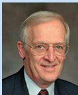

## Concept Check 55.4

1. DRAW IT For each of the four biogeochemical cycles in Figure 55.14, draw a simple diagram that shows one possible path for an atom of that chemical from abiotic to biotic reservoirs and back.

2. Why does deforestation of a watershed increase the concentration of nitrates in streams draining the watershed?

3. WHAT IF? Why is nutrient availability in a tropical rain forest particularly vulnerable to logging?

For suggested answers, see Appendix A.

## Concept 55.5: Restoration ecologists return degraded ecosystems to a more natural state

Ecosystems can recover naturally from many disturbances (including the experimental deforestation at Hubbard Brook) through the stages of ecological succession (see Concept 54.3). Sometimes, however, that recovery takes centuries, particularly when humans have degraded the environment. Tropical areas that are cleared for farming may quickly become unproductive because of nutrient losses. Mining activities may last for several decades, and the lands are often abandoned in a degraded state. Ecosystems can also be damaged by salts that build up in soils from irrigation and by toxic chemicals or oil spills. Biologists increasingly are called on to help restore and repair damaged ecosystems.

Restoration ecologists seek to initiate or speed up the recovery of degraded ecosystems. One of the basic assumptions is that environmental damage is at least partly reversible. This optimistic view must be balanced by a second assumption—that ecosystems are not infinitely resilient. Restoration ecologists

therefore work to identify and manipulate the processes that most limit recovery of ecosystems from disturbances. Where disturbance is so severe that restoring all of a habitat is impractical, ecologists try to reclaim as much of a habitat or ecological process as possible, within the limits of the time and money available to them.

In extreme cases, the physical structure of an ecosystem may need to be restored before biological restoration can occur. If a stream was straightened to channel water quickly through a suburb, ecologists may reconstruct a meandering channel to slow down the flow of water eroding the stream bank. To restore an open-pit mine, engineers may grade the site with heavy equipment to reestablish a gentle slope, spreading topsoil when the slope is in place (Figure 55.16).

After any physical reconstruction of the ecosystem is complete, the next step is biological restoration. The long-term objective of restoration is to return an ecosystem as closely as possible to its predisturbance state. Figure 55.17, on the next page, explores four ambitious and successful restoration projects. These and the many other such projects throughout the world often employ two key strategies: bioremediation and biological augmentation.

## Bioremediation

Using organisms—usually plants, fungi, or prokaryotic organisms—to detoxify polluted ecosystems is known as bioremediation. Some plants and lichens adapted to soils containing heavy metals can accumulate high concentrations of toxic metals such as lead and cadmium in their tissues. Restoration ecologists can introduce such species to sites polluted by mining and other human activities and then harvest these organisms to remove the metals from the ecosystem. For instance, researchers in the United Kingdom have discovered a lichen species that grows on soil polluted with uranium dust left over from mining. The lichen concentrates uranium in a dark pigment, making it useful as a biological monitor and potentially as a remediator.

Figure 55.16 A gravel and clay mine site in New Jersey before and after restoration.  
  
(a) In 1991, before restoration

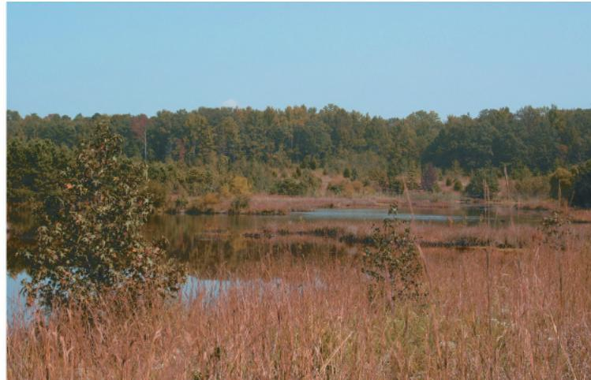  
(b) In 2010, several years after restoration

<!-- END OFFICIAL MINERU API RESULT part_13 -->

<!-- BEGIN OFFICIAL MINERU API RESULT part_14 -->

# Exploring Restoration Ecology Worldwide

## Figure 55.17

The examples highlighted on this page are just a few of the many restoration ecology projects taking place around the world.

Kissimmee River, Florida

In the 1960s, the Kissimmee River was converted from a meandering river to a 90-km canal to control flooding. This channelization diverted water from the floodplain, causing the wetlands to dry up, threatening many fish and wetland bird populations. Kissimmee River restoration has filled 12 km of drainage canal and reestablished 24 km of the original

167 km of natural river channel. Pictured here is a section of the Kissimmee canal that has been plugged (wide, light strip on the right side of the photo), diverting flow into remnant river channels (center of the photo). The project will also restore natural flow patterns, which will foster self-sustaining populations of wetland birds and fishes.

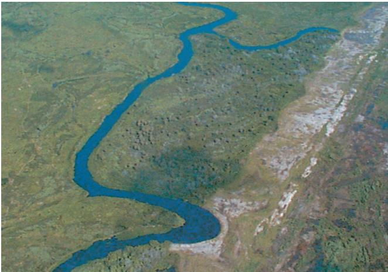

## Succulent Karoo, South Africa

In the Succulent Karoo desert region of southern Africa, as in many arid regions, overgrazing by livestock has damaged vast areas. Private landowners and government agencies in South Africa are restoring large areas of this unique region, revegetating the land and employing more sustainable resource management. The photo shows a small sample of the exceptional plant diversity of the Succulent Karoo; its 5,000 plant species include the highest diversity of succulent plants in the world.

## Maungatautari, New Zealand

Weasels, rats, pigs, and other introduced species pose a serious threat to New Zealand's native plants and animals, including kiwis, a group of flightless, ground-dwelling bird species. The goal of the Maungatautari restoration project is to exclude all exotic mammals from a 3,400-ha reserve located on a forested volcanic cone. A specialized fence around the reserve eliminates the need to continue setting traps and using poisons that can harm native wildlife. In 2006, a pair of critically endangered takahe (a species of flightless rail) were released into the reserve with the hope of reestablishing a breeding population of this colorful bird on New Zealand's North Island.

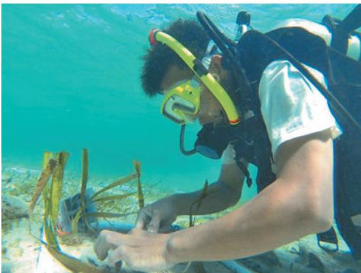

## Coastal Indonesia

Seaweed and seagrass beds are important nursery grounds for a wide variety of fishes and shellfish. Once extensive but now reduced by development, these beds are being restored in the coastal areas of

Indonesia. Techniques include constructing suitable seafloor habitat, hand seeding, and transplanting seaweeds and seagrasses from natural beds (shown in this photograph).

Ecologists already utilize many prokaryotic organisms to carry out bioremediation of soils and water. Scientists have sequenced the genomes of at least ten prokaryotic species specifically for their bioremediation potential. One of the species, the bacterium Shewanella oneidensis, appears particularly promising. It can metabolize a dozen or more elements under aerobic and anaerobic conditions. In doing so, it converts soluble forms of uranium, chromium, and nitrogen to insoluble forms that are less likely to leach into streams or groundwater. Researchers at Oak Ridge National Laboratory, in Tennessee, stimulated the growth of Shewanella and other uranium-reducing bacteria by adding ethanol to groundwater contaminated with uranium; the bacteria can use ethanol as an energy source. In just 5 months, the concentration of soluble uranium in the ecosystem dropped by 80% (Figure 55.18).

## Biological Augmentation

In contrast to bioremediation, which is a strategy for removing harmful substances from an ecosystem, biological augmentation uses organisms to add essential materials to a degraded ecosystem. To augment ecosystem processes, restoration ecologists need to determine which factors, such as chemical nutrients, have been lost from a system and are limiting its recovery.

Encouraging the growth of plants that thrive in nutrient-poor soils often speeds up succession and ecosystem recovery. In alpine ecosystems of the western United States, nitrogen-fixing plants such as lupines are often planted to raise nitrogen concentrations in soils disturbed by mining and other activities. Once these nitrogen-fixing plants become established, other native species are better able to obtain enough soil nitrogen to survive. In other systems where the soil has been severely disturbed or where topsoil is missing entirely, plant roots may lack the mycorrhizal symbionts that help them meet their nutritional needs (see Concept 31.1). Ecologists restoring a tallgrass prairie in Minnesota recognized this limitation and enhanced the recovery of native species by adding mycorrhizal symbionts to the soil they seeded.

Restoring the physical structure and plant community of an ecosystem does not always ensure that animal species will recolonize a site and persist there. Because animals provide critical ecosystem services, including pollination and seed dispersal, restoration ecologists sometimes help wildlife to reach and use restored ecosystems. They might release animals at a site or establish habitat corridors that connect a restored site to places where the animals are found. They may build perches for birds to use. These and other efforts can increase the biodiversity of restored ecosystems and help the community persist.

## Ecosystems: A Review

Figure 55.19, on the next two pages, illustrates energy transfer, nutrient cycling, and other key processes for an arctic tundra ecosystem. Note the conceptual similarities between this figure and

Figure 55.18 Bioremediation of groundwater contaminated with uranium at Oak Ridge National Laboratory, Tennessee.  
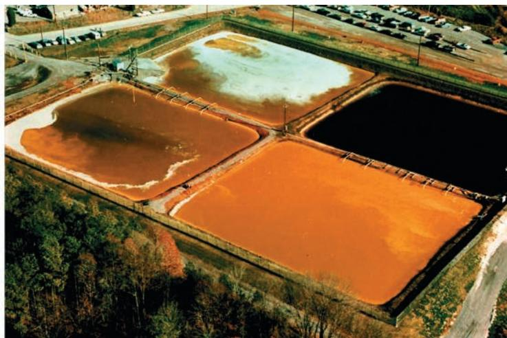  
(a) Wastes containing uranium were dumped in these four unlined pits for more than 30 years, contaminating soils and groundwater.

  
(b) After ethanol was added, microbial activity decreased the concentration of soluble uranium in groundwater near the pits.

Make Connections Figure 10.22, “The Working Cell.” The scale of the two figures is different, but the physical laws and biological rules that govern life apply equally to both systems.

## Concept Check 55.5

1. Identify the main goal of restoration ecology.

2. How do bioremediation and biological augmentation differ?

3. WHAT IF? In what way is the Kissimmee River project a more complete ecological restoration than the Maungatautari project (see Figure 55.17)?

## Make Connections: The Working Ecosystem

Figure 55.19

This arctic tundra ecosystem teems with life during the short two-month growing season each summer. In ecosystems, organisms interact with each other and with the environment around them in diverse ways, including those illustrated here.

Populations Are Dynamic (Chapter 53)

1 Caribou migrate across the tundra to give birth at their calving grounds each year. In general, populations change in size through births and deaths and through immigration and emigration. (See Figure 53.1 and Concept 53.1.)

2 Snow geese and many other species migrate to the Arctic each spring for the abundant food found there in summer. (See Concept 53.5.)

3 Birth and death rates influence the density of all populations. Death in the tundra comes from many causes, including predation, competition for resources, and lack of food in winter. (See Figure 53.17.)

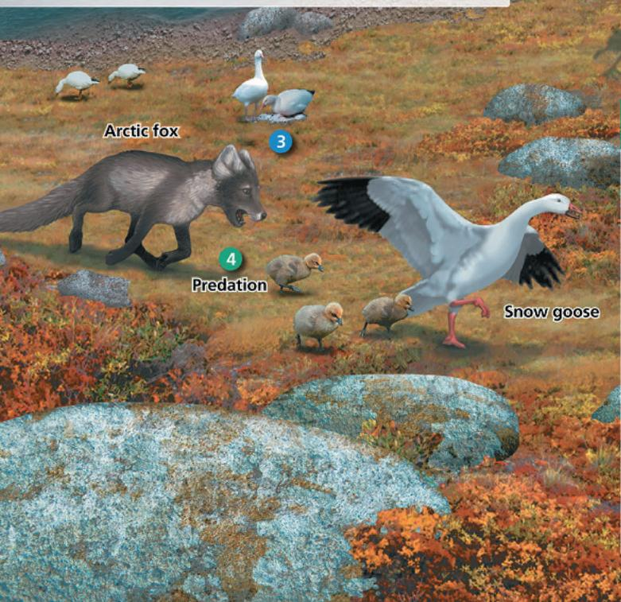

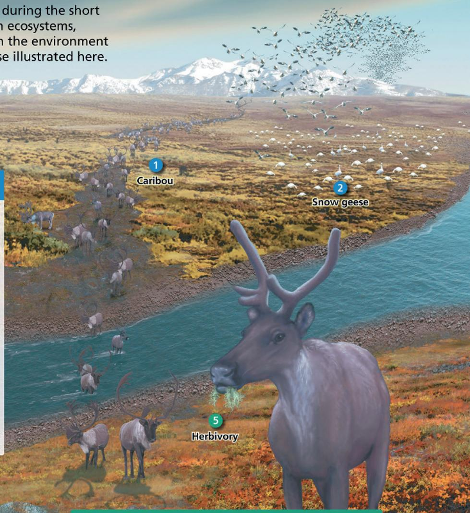

Species Interact in Diverse Ways (Chapter 54)

4 In predation, an individual of one species kills and eats another, such as an arctic fox eating a snow goose. (See Concept 54.1.)

5 In herbivory, an individual of one species eats part of a plant or other primary producer, such as a caribou eating a lichen. (See Concept 54.1.)

6 In mutualism, individuals of two species interact in ways that benefit each other. In some mutualisms, the partners live in direct contact, forming a symbiosis; for example, a lichen is a symbiotic mutualism between a fungus and an alga or cyanobacterium. (See Concept 54.1 and Figures 31.22 and 31.23.)

7 In competition, individuals of two species seek to acquire the same limiting resources. For example, snow geese and caribou both eat cottongrass. (See Concept 54.1.)

## Organisms Transfer Energy and Matter in Ecosystems (Chapter 55)

8 Primary producers convert the energy in sunlight to chemical energy through photosynthesis. Their growth is often limited by abiotic factors such as low temperatures, low moisture, scarce soil nutrients, and lack of light in winter. (See Figures 10.6, 52.14, and 55.4.)

9 Food chains are typically short in the tundra compared to most other ecosystems. (See Figure 54.16.) This short food chain means that a greater proportion of the energy contained in primary producers reaches the top predators (wolves), compared to a longer food chain.

10 Energy flows through ecosystems. Only 10% of the energy contained in biomass transfers from one trophic level to the next (see Figure 55.10), and this energy cannot be reused by primary producers. Solar energy must be supplied to power photosynthesis.

11 Decomposers recycle chemical elements back to primary producers. (See Figures 55.3 and 55.4.)

12 Chemical elements such as carbon and nitrogen move in cycles between the physical environment and organisms. (See Figures 55.13 and 55.14.)

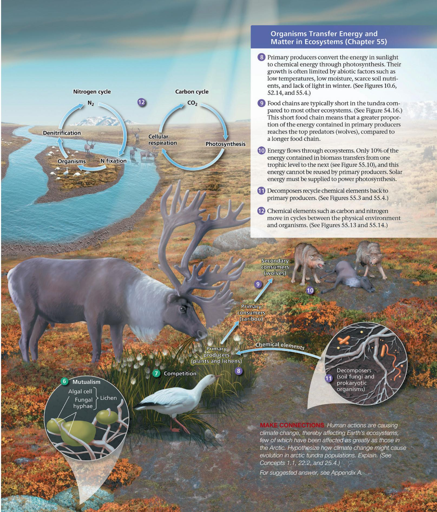

## Summary of Key Concepts

To review key terms, go to the Vocabulary Self-Quiz (eTextbook only).

Concept 55.1: Physical laws govern energy flow and chemical cycling in ecosystems

\- An ecosystem consists of all the organisms in a community and the environment with which they interact. Energy is passed from lower to higher trophic levels but released as heat during ecosystem processes. As a result, energy flows through ecosystems (rather than being recycled).

\- Chemical elements enter and leave an ecosystem and cycle within it, subject to the law of conservation of mass. Inputs and outputs are generally small compared to recycled amounts, but their balance determines whether the ecosystem gains or loses an element over time.

Considering the second law of thermodynamics, would you expect the typical biomass of primary producers in an ecosystem to be greater than or less than the biomass of consumers in the system? Explain your reasoning.

## Concept 55.2: Energy and other limiting factors control primary production in ecosystems

\- Primary production sets the spending limit for the global energy budget. Gross primary production is the total energy assimilated by an ecosystem in a given period. Net primary production, the energy accumulated in autotroph biomass, equals gross primary production minus the energy used by the primary producers for respiration. Net ecosystem production is the total biomass accumulation of an ecosystem, defined as the difference between gross primary production and total ecosystem respiration.

\- In aquatic ecosystems, light and nutrients limit primary production. In terrestrial ecosystems, climatic factors such as temperature and moisture affect primary production at large scales, but a soil nutrient is often the limiting factor locally.

If you know NPP for an ecosystem, what additional variable do you need to know to estimate NEP? Why might measuring this variable be difficult, for instance, in a sample of ocean water?

## Concept 55.3: Energy transfer between trophic levels is typically only 10% efficient

\- The amount of energy available to each trophic level is determined by the net primary production and the trophic efficiency, the percentage of energy transferred from one trophic level to the next.

\- Trophic efficiency is based on 1) the proportion of food available that is consumed by the next trophic level, 2) the proportion of food eaten that is assimilated, and 3) the production efficiency (proportion of assimilated energy that is converted to biomass).

\- Trophic efficiency is typically 10%. Pyramids of energy and biomass reflect low trophic efficiency.

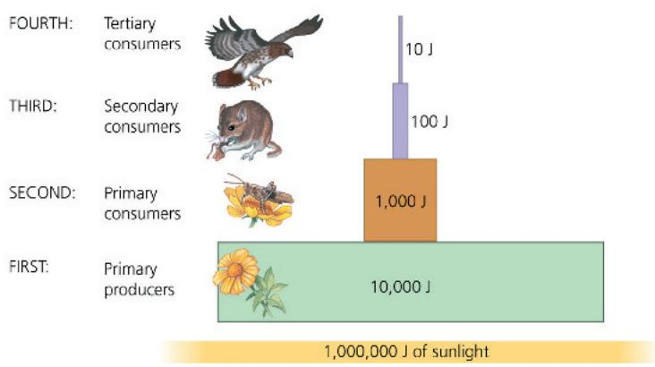  
Why would runners have a lower production efficiency when running a long-distance race than when they are sedentary?

## Concept 55.4: Biological and geochemical processes cycle nutrients and water in ecosystems

\- Water moves in a global cycle driven by solar energy. The carbon cycle primarily reflects the reciprocal processes of photosynthesis and cellular respiration. Nitrogen enters ecosystems through atmospheric deposition and nitrogen fixation by prokaryotes.

\- The proportion of a nutrient in a particular form varies among ecosystems. In terrestrial ecosystems, this variation is largely because of differences in the rate of decomposition. In aquatic ecosystems, the amount of nutrients being supplied to the photic zone via coastal runoff, or from deep waters (via seasonal mixing of the water column or upwelling), is one of the most important controls of primary production.

\- Nutrient cycling is strongly regulated by vegetation. The Hubbard Brook case study showed that logging increases water runoff and can cause large losses of minerals.

If decomposers usually grow faster and decompose material more quickly in warmer ecosystems, why is decomposition in hot deserts relatively slow?

## Concept 55.5: Restoration ecologists return degraded ecosystems to a more natural state

\- Restoration ecologists harness organisms to detoxify polluted ecosystems through the process of bioremediation.

\- In biological augmentation, ecologists use organisms to add essential materials to ecosystems.

In preparing a site for surface mining and later restoration, why would engineers separate the topsoil from the deeper soil, rather than removing all soil at once and mixing it in a single pile?

For suggested answers, see Appendix A.

## Test Your Understanding

For more multiple-choice questions, go to the Practice Test (eTextbook only).

## Levels 1-2: Remembering/Understanding

1. Which of the following organisms is correctly paired with a trophic level?

(A) cyanobacterium—secondary consumer

(B) grasshopper—primary consumer

(C) zooplankton—primary producer

(D) grass—decomposer

2. Which of these ecosystems has the lowest net primary production per square meter?
(A) a salt marsh (C) a coral reef
(B) an open ocean (D) a tropical rain forest

3. The discipline that applies ecological principles to returning degraded ecosystems to a more natural state is known as (A) restoration ecology. (C) eutrophication. (B) thermodynamics. (D) biogeochemistry.

## Levels 3-4: Applying/Analyzing

4. Nitrifying bacteria participate in the nitrogen cycle mainly by (A) converting nitrogen gas to ammonia.

(B) releasing ammonium from organic compounds, thus returning it to the soil.

(C) converting ammonium to nitrate, which plants absorb.

(D) incorporating nitrogen into amino acids and organic compounds.

5. Which of the following marine areas would you expect to have the lowest primary production?

(A) offshore in the tropical South Pacific in July

(B) ten miles off the coast of Peru in the Pacific in November (C) the Grand Banks, a relatively shallow area off the east coast of Canada, in April

(D) the Southern Ocean in January

6. Which of the following was a result of the Hubbard Brook watershed deforestation experiment?

(A) Most minerals were not recycled within the intact forest ecosystem.

(B) Calcium levels remained high in the soil of deforested areas.

(C) Deforestation decreased water runoff.

(D) The nitrate concentration in waters draining the deforested area became dangerously high.

(A) adding nitrogen-fixing microorganisms to a degraded ecosystem to increase nitrogen availability

(B) using a bulldozer to regrade a strip mine

(C) reconfiguring the channel of a river

(D) adding seeds of a chromium-accumulating plant to soil contaminated by chromium

8. If you applied a fungicide to a cornfield, what would you expect to happen to the rate of decomposition and net ecosystem production (NEP)?

(A) Both decomposition rate and NEP would decrease.

(B) Neither would change.

(C) Decomposition rate would increase and NEP would decrease.

(D) Decomposition rate would decrease and NEP would increase.

## Levels 5-6: Evaluating/Creating

## 9. DRAW IT

(a) Draw a simplified global water cycle showing ocean, land, atmosphere, and runoff from the land to the ocean. Label your drawing with these annual water fluxes:

• ocean evaporation: 425 km $^{3}$

\- ocean evaporation that returns to the ocean as precipitation: 385 km $^{4}$

\- ocean evaporation that falls as precipitation on land: $40 \, km^{3}$

\- evapotranspiration from plants and soil that falls as precipitation on land: 70 km $^{3}$

• runoff to the oceans: 40 km $^{3}$

(b) Calculate the ratio of ocean evaporation that falls as precipitation on land compared with runoff from land to the oceans.

(c) How would this ratio change during an ice age, and why?

10. WHAT IF? Consider a comparison of two marine ecosystems. One ecosystem has three trophic levels: large phytoplankton, plankton-eating fish, and large fish that eat other fish. The other ecosystem has five trophic levels: small phytoplankton, small herbivorous zooplankton, large carnivorous zooplankton, plankton-eating fish, and large fish that eat other fish. If both ecosystems have similar primary production and similar trophic efficiency, how will these ecosystems differ in biomass of top predators? Explain.

11. EVOLUTION CONNECTION Some biologists have suggested that ecosystems are emergent, “living” systems capable of evolving. One manifestation of this idea is environmentalist James Lovelock’s Gaia hypothesis, which views Earth itself as a living, homeostatic entity—a kind of superorganism. Are ecosystems capable of evolving? If so, would this be a form of Darwinian evolution? Why or why not? Explain.

12. SCIENTIFIC INQUIRY Using six comparable neighboring ponds in a forest as your study site, design a controlled experiment to measure the effect of falling leaves on net primary production in a pond.

## 13. WRITE ABOUT A THEME: ENERGY AND MATTER

Decomposition typically occurs quickly in moist tropical forests. However, waterlogging in the soil of some moist tropical forests results over time in a buildup of organic matter called “peat.” In a short essay (100–150 words), discuss the relationship of net primary production, net ecosystem production, and decomposition for such an ecosystem. Are NPP and NEP likely to be positive? Predict what would happen to NEP if a landowner drained the water from a tropical peatland, exposing the organic matter to air.

## 14. SYNTHESIZE YOUR KNOWLEDGE

  
This dung beetle (genus Scarabaeus) is burying a ball of dung it has collected from a large mammalian herbivore in Kenya. Explain why this process is important for the cycling of nutrients and for primary production.  
For selected answers, see Appendix A.

# Conservation Biology and Global Change

## Key Concepts

56.1 Human activities threaten Earth's biodiversity

56.2 Population conservation focuses on population size, genetic diversity, and critical habitat

56.3 Landscape and regional conservation help sustain biodiversity

56.4 Earth is changing rapidly as a result of human actions

56.5 Sustainable development can improve human lives while conserving biodiversity

## Study Tip

Make a table: As you read the chapter, fill in a table like the one shown to organize what you learn about human activities that have major effects on the environment. Describe the activity; summarize its impact; and list actions at personal and government levels that could reduce harmful effects of the activity.

<table><tr><td>Activity</td><td>Harmful effects</td><td>Personal choice/governmental action</td></tr><tr><td>Cutting down tropical forests (often for cattle ranches)</td><td>Destroys habitat for tropical species; contributes to rising  $CO_{2}$  levels</td><td>Eat less beef to reduce demand/establish conservation areas</td></tr><tr><td></td><td></td><td></td></tr></table>

Figure 56.1 This vibrantly patterned lizard, the Union Island gecko (Gonatodes daudini), was discovered in 2005 and is known only from one watershed on the small Caribbean island of Union (in Saint Vincent and the Grenadines). Unfortunately, the gecko's population dwindled soon after its discovery due to trafficking for the exotic pet trade. The local community, in partnership with the government and several non-governmental organizations, sprang into action to increase protection for the gecko. The population has since been increasing, though it is still considered critically endangered.  
Restore or preserve habitat that species need to survive

## How can we protect the many species threatened by human activities?

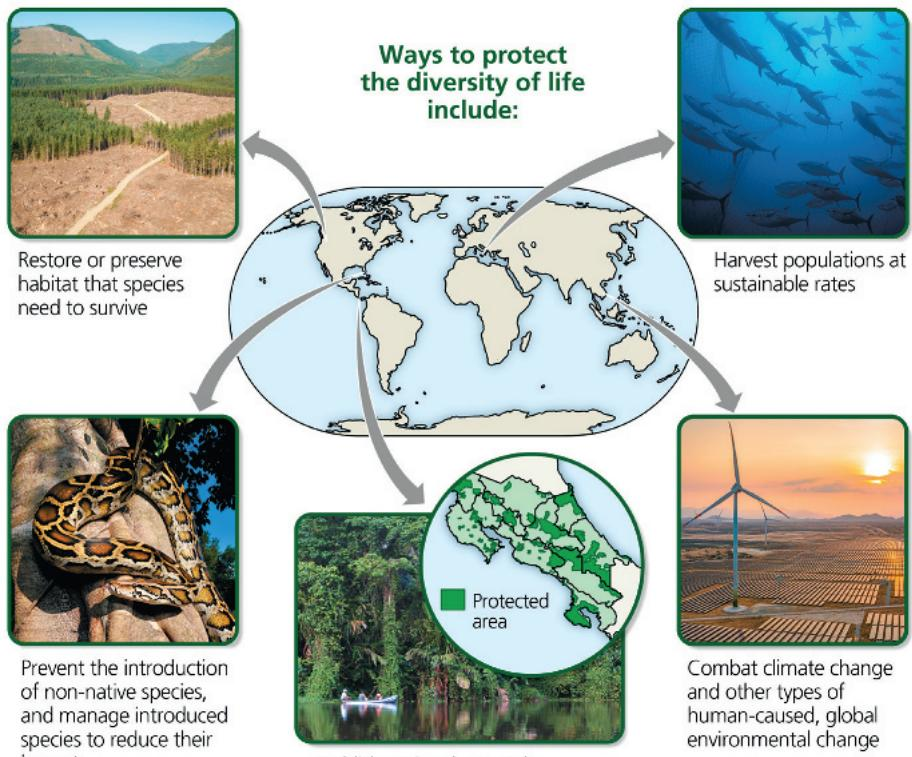  
Prevent the introduction of non-native species, and manage introduced species to reduce their impact  
Combat climate change and other types of human-caused, global environmental change  
Establish regional networks of protected areas

# Concept 56.1: Human activities threaten Earth's biodiversity

Throughout the biosphere, human activities are altering natural disturbances, trophic structures, energy flow, and chemical cycling—ecosystem processes on which we and all other species depend. We have physically altered nearly half of Earth's land surface, and we use over half of all accessible surface fresh water. In the oceans, stocks of most major fisheries are shrinking because of overharvesting. By some estimates, we may be pushing more species toward extinction than did the asteroid that triggered the Cretaceous mass extinction 66 million years ago (see Figure 25.18).

In this chapter, we'll examine changes happening across Earth, focusing on conservation biology, a discipline that integrates ecology, physiology, molecular biology, genetics, and evolutionary biology to conserve the diversity of life on Earth. Efforts to sustain ecosystem processes and stem the extinction of species also connect the life sciences with the social sciences, economics, and humanities.

Extinction is a natural phenomenon that has been occurring since life first evolved; it is the high rate of extinction that is of concern. More than 1,000 species have become extinct in the last 400 years, a rate that is 100 to 1,000 times the “background,” or typical, extinction rate seen in the fossil record (see Concept 25.4). This comparison indicates that the extinction rate today is high and that human activities threaten Earth’s biological diversity at all levels.

## Three Levels of Biodiversity

Biodiversity—short for biological diversity—can be considered at three main levels: genetic diversity, species diversity, and ecosystem diversity (Figure 56.2).

## Genetic Diversity

Genetic diversity comprises not only the individual genetic variation within a population, but also genetic differences between populations of a species—differences that often are associated with adaptations to local conditions. If one population becomes extinct, then a species may have lost some of the genetic diversity that makes microevolution possible. This erosion of genetic diversity in turn reduces the adaptive potential of the species.

## Species Diversity

Public awareness of the biodiversity crisis centers on species diversity, which correlates with species richness—the number of species in an ecosystem or across the biosphere. To date, scientists have described and formally named about 1.8 million species of organisms. In addition to these named species, many others remain to be discovered: Estimates for the number of species that currently exist range from 5 million to 100 million.

Figure 56.2 Three levels of biodiversity.

The oversized chromosomes in the top diagram symbolize the genetic variation within the population.

  
Genetic diversity in a vole population

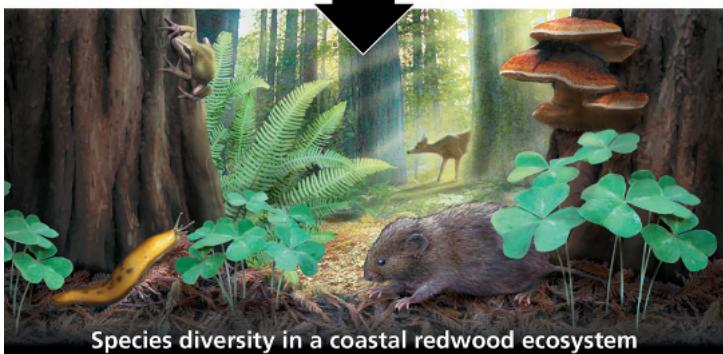  
Species diversity in a coastal redwood ecosystem

  
Community and ecosystem diversity across the landscape of an entire region

Of particular concern are species that are endangered or threatened. An endangered species is one that is in danger of extinction throughout all or much of its range (Figure 56.3), while a threatened species is considered likely to become endangered in the near future. The following are just a few statistics that illustrate the problem of species loss:

\- As of 2024, according to the International Union for Conservation of Nature and Natural Resources (IUCN), more than 46,300 species (28% of species assessed) are threatened with extinction. Some of the groups with the greatest proportion of threatened species include cycad plants (71%), amphibians (41%), cartilagenous fishes (37%), and reef-building corals (44%).

\- A survey by the Center for Plant Conservation showed that of the nearly 20,000 known plant species in the United States, 200 have become extinct since such records have been kept, and 730 are endangered or threatened.

Figure 56.3 Critically Endangered species.

The International Union for the Conservation of Nature (IUCN)'s Red List of Threatened Species is the most comprehensive list of the conservation status of species around the globe. The species pictured are among those listed as Critically Endangered, the highest threat level for species still present in the wild.

Great Philippine eagle (Pithecophaga jefferyi)

Vaquita (Phocoena sinus)

  
Caribbean staghorn coral (Acropora cervicornis)

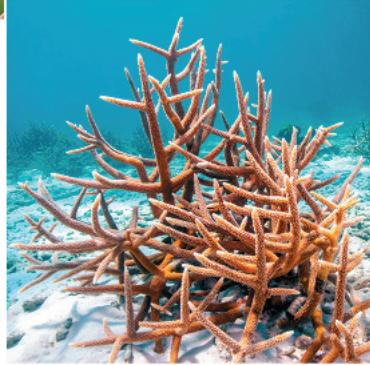  
To document that a species has actually become extinct, what factors would you need to consider?

## Interview

Interview with Elisa Bonaccorso: Identifying endangered species in the Andes (at the start of Unit 8, before Chapter 52)

\- In North America, at least 123 freshwater animal species have become extinct since 1900, and hundreds more species are threatened. The extinction rate for North American freshwater fauna is about five times as high as that for terrestrial animals.

The local populations of a species can also be driven to extinction; for example, populations of a species may be lost in one river system but survive in an adjacent one. Global extinction of a species means that it is lost from all the ecosystems in which it lived, leaving them permanently impoverished. Because of the many interactions between members of different species in an ecosystem, the extinction of populations of one species can have a negative impact on other species in the ecosystem (see Figure 54.20). For instance, bats called “flying foxes” are important pollinators and seed dispersers in the Pacific Islands, where they are increasingly hunted as a luxury food (Figure 56.4). Conservation biologists fear that the extinction of flying foxes would also harm the native plants of the Samoan Islands, where four-fifths of the tree species depend on flying foxes for pollination or seed dispersal.

Figure 56.4 The endangered Marianas “flying fox” bat (Pteropus mariannus), an important pollinator.  
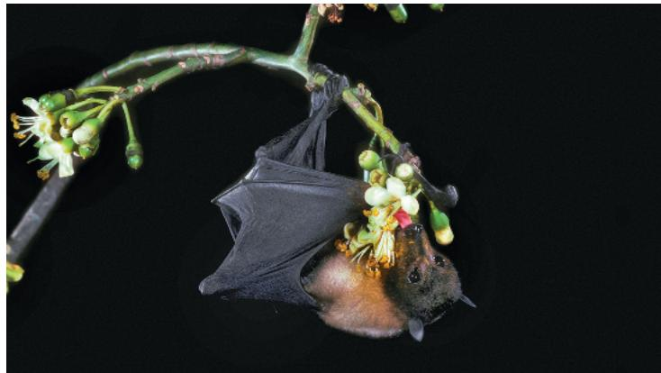

## Ecosystem Diversity

The variety of ecosystems on Earth is a third level of biological diversity. Preserving many types of ecosystems leads to greater regional diversity, and it may be critical to the success of some species that migrate between ecosystems during their lives. For example, mangrove forests are an important coastal ecosystem in tropical regions, with high productivity and diversity. Since coral reef fishes spend their juvenile stages in mangrove habitats, the loss of mangroves (due to logging, or for prawn aquaculture) leads not only to species loss in the mangrove forests, but also in nearby coral reef ecosystems.

Some ecosystems have already been heavily affected by humans, and others are being altered at a rapid pace. Since European colonization, more than half of the wetlands in the contiguous United States have been drained and converted to agricultural and other uses. In California, Arizona, and New Mexico, roughly 90% of native riparian (streamside) communities have been affected by overgrazing, flood control, water diversions, lowering of water tables, and invasion by non-native plants.

## Biodiversity and Human Welfare

Why should we care about the loss of biodiversity? One basic reason concerns our human sense of connection to nature and all forms of life, termed biophilia. Moreover, the belief that other species are entitled to life is a pervasive theme of many religions and the basis of a moral argument that we should protect biodiversity. There is also a concern for future human generations. Paraphrasing an old proverb, G. H. Brundtland, a former prime minister of Norway, said, “We must consider our planet to be on loan from our children, rather than being a gift from our ancestors.” In addition to such philosophical and moral justifications, species and genetic diversity bring us many practical benefits.

## Benefits of Species and Genetic Diversity

Many threatened species could potentially provide medicines, food, and fibers for human use, making biodiversity a crucial natural resource. Products from aspirin to antibiotics were derived originally from natural sources. If we lose wild populations of plants closely related to agricultural species, we lose genetic resources that could be used to improve crop qualities, such as disease resistance. For instance, in the 1970s, plant breeders responded to devastating outbreaks of the grassy stunt virus in rice (Oryza sativa) by screening 7,000 populations of this species and its close relatives for resistance to the virus. One population of a single relative, Indian rice (Oryza nivara), was found to be resistant to the virus, and scientists succeeded in breeding the resistance trait into commercial rice varieties. Today, the original disease-resistant population has apparently become extinct in the wild.

In the United States, about 25% of the prescriptions dispensed from pharmacies contain substances originally derived from plants. For example, researchers discovered that the rosy periwinkle, which grows in Madagascar, contains alkaloids that inhibit cancer cell growth (Figure 56.5). This discovery led to treatments for two

Figure 56.5 The rosy periwinkle (Catharanthus roseus), a plant that saves lives.

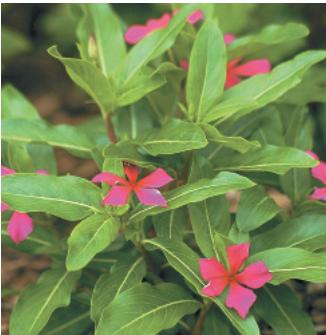

deadly forms of cancer, Hodgkin's lymphoma and childhood leukemia, resulting in remission in most cases. Madagascar is also home to five other species of periwinkles, one of which is approaching extinction. Losing these species would mean the loss of any possible medicinal benefits they might offer.

Each species lost means the loss of unique genes, some of which may code for enormously useful proteins. The enzyme Taq polymerase was first extracted from a bacterium, Thermus

aquaticus, found in hot springs at Yellowstone National Park. This enzyme is essential for the polymerase chain reaction (PCR) because it is stable at the high temperatures required for automated PCR (see Figure 20.8). DNA from many other species of prokaryotic organisms, living in a variety of environments, is used in the mass production of proteins for new medicines, foods, petroleum substitutes, industrial chemicals, and other products. However, because many species may become extinct before we discover them, we stand to lose the valuable genetic potential held in their unique libraries of genes.

## Ecosystem Services

The benefits that individual species provide to humans are substantial, but saving individual species is only part of the reason for preserving ecosystems. Humans evolved in Earth's ecosystems, and we rely on these systems and their inhabitants for our survival. Ecosystem services encompass all the processes through which natural ecosystems benefit human life. Ecosystems purify our air and water. They detoxify and decompose our wastes and reduce the impacts of extreme weather and flooding. The organisms in ecosystems pollinate our crops, control pests, and create and preserve our soils. Moreover, these diverse services are provided for free.

If we had to pay for them, how much would the services of natural ecosystems be worth? In 1997, scientists estimated the value of Earth's ecosystem services at \$33 trillion per year, nearly twice the gross national product of all the countries on Earth at the time (\$18 trillion). It may be more realistic to do the accounting on a smaller scale. For example, New York City invested \$1.5 billion to buy land and restore habitat in the Catskill Mountains, the source of much of the city's fresh water. This investment was spurred by increasing pollution of the water by sewage, pesticides, and fertilizers. By harnessing ecosystem services to purify its water naturally, the city avoided spending \$2 billion to build new water treatment plants and \$300 million a year to run those plants.

There is growing evidence that the functioning of ecosystems, and hence their capacity to perform services, is linked to biodiversity. As human activities reduce biodiversity, we are reducing the capacity of the planet's ecosystems to perform processes critical to our own survival.

## Interview

Interview with E. O. Wilson: Advocate for protecting biodiversity (eTextbook only)

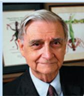

## Threats to Biodiversity

Many different human activities threaten biodiversity on local, regional, and global scales. The threats posed by these activities include four major types: habitat loss, introduced species, overharvesting, and global change.

## Habitat Loss

Human alteration of habitat is a very important threat to biodiversity throughout the biosphere. Habitat loss has been brought about by factors such as agriculture, urban development, forestry, mining, and pollution. As discussed in more detail later in this chapter, global climate change is also altering habitats today and will have an even larger effect later this century. When no alternative habitat is available or a species is unable to move, habitat loss may mean extinction.

Habitat loss and fragmentation may occur over immense regions. Approximately 98% of the tropical dry forests of Central America and Mexico have been cut down. The clearing of tropical rain forest in the state of Veracruz, Mexico, mostly for cattle ranching, has resulted in the loss of more than 90% of the original forest, leaving relatively small, isolated patches of forest. Many other natural habitats have also been fragmented by human activities (Figure 56.6).

Habitat fragmentation often reduces the number of species in a region because the smaller populations in habitat fragments have a higher probability of extinction. Prairie covered about 800,000 hectares of southern Wisconsin when Europeans first arrived in North America but occupies only 800 hectares today; most of the original prairie in this area is now used to grow crops. Plant diversity surveys of 54 Wisconsin prairie remnants conducted in 1948–1954 and 1987–1988 showed that the remnants lost from 8% to as much as 60% of their plant species in the time between the two surveys.

Figure 56.6 Habitat fragmentation near a coal mine in Alberta, Canada.

Organisms of the boreal forest are now confined to small forested areas separated by land cleared for mine operations.

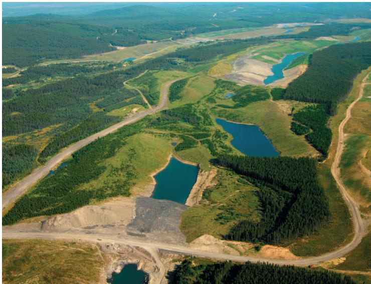  
Figure 56.7 Some disruptive introduced species in the United States.

Habitat loss is also a major threat to aquatic biodiversity. From 1957 to 2007, an estimated $50\%$ of the world's reef-building corals were lost due to overfishing, disease, and climate change. Since coral reefs are among Earth's most species-rich aquatic communities, such losses in corals lead to extinction of many fish and invertebrates that live in this habitat. In addition, since 2009, several mass bleaching events associated with warming temperatures have played an important role in a further loss of at least $14\%$ of the world's coral. Freshwater habitats are also being lost, often as a result of the dams, reservoirs, channel modification, and flow regulation now affecting most of the world's rivers. For example, the more than 30 dams and locks built along the Mobile River basin in the southeastern United States have changed river depth and flow. While providing the benefits of hydroelectric power and increased ship traffic, these dams and locks also helped drive more than 40 species of mussels and snails to extinction.

## Introduced Species

Introduced species—sometimes called non-native or exotic species—are those that humans move intentionally or accidentally from the species' native locations to new geographic regions. Human travel by ship and airplane has accelerated the transplant of species. Free from the predators, herbivores, pathogens, or competitors that limit their populations in their native habitats, such transplanted species may spread rapidly through a new region.

Some introduced species disrupt their new community, often by preying on native organisms or outcompeting native organisms for resources, at which point they are termed invasive species. For example, the brown tree snake was accidentally introduced to the island of Guam from other parts of the South Pacific after World War II, as a “stowaway” in military cargo. Since then, 12 native species of birds and 6 species of lizards that the snakes ate have become extinct on Guam. In 1988, the devastating zebra mussel, a suspension-feeding mollusc, was discovered in the Great Lakes of North America, most

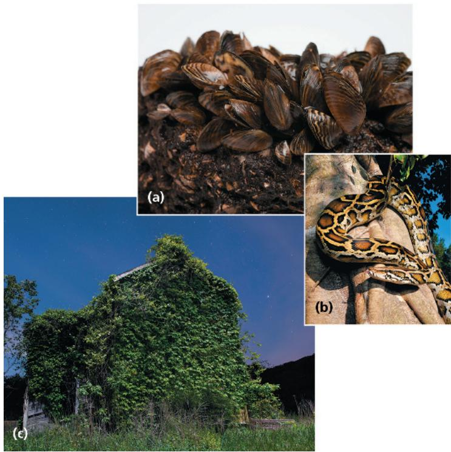

likely introduced in the ballast water of ships arriving from Europe. Zebra mussels form dense colonies and have disrupted freshwater ecosystems, threatening native aquatic species (Figure 56.7a). They have also clogged water intake structures, causing billions of dollars in damage to domestic and industrial water supplies. The Burmese python, a snake native to Southeast Asia that can grow to 20 feet long, was introduced in Florida via the exotic pet trade (Figure 56.7b). By 2000, a large breeding population was established in the Everglades, where they prey on small mammals. One 2012 study estimated a 99% decline in populations of raccoons and opossums that coincided with the python invasion, as well as severe declines in several other species of small mammals.

Humans have deliberately introduced many species with good intentions but disastrous effects. An Asian plant called kudzu, which the U.S. Department of Agriculture once introduced in the southern United States to help control erosion, has taken over large areas of the landscape there (Figure 56.7c). The European starling was brought intentionally into New York's Central Park in 1890 by a citizens' group intent on introducing all the plants and animals mentioned in Shakespeare's plays. It quickly spread across North America, where its population now exceeds 100 million, displacing many native songbirds.

Introduced species are a worldwide problem, contributing to many extinctions and costing billions of dollars each year in damage and control efforts. There are more than 50,000 introduced species in the United States alone.

## Overharvesting

The term overharvesting refers generally to the harvesting of wild organisms at rates exceeding the ability of their populations to rebound. Species with restricted habitats, such as those

These Atlantic bluefin tuna are being funneled into fishing nets in the Mediterranean Sea.

that inhabit small islands, are particularly vulnerable to overharvesting. One such species was the great auk, a large, flightless seabird found on islands in the North Atlantic. By the 1840s, humans had hunted the great auk to extinction to satisfy demand for its feathers, eggs, and meat.

Also susceptible to overharvesting are large organisms with low reproductive rates, such as elephants, whales, sharks, and rhinoceroses. The decline of Earth's largest terrestrial animals, the African elephants, is a classic example of the impact of overhunting. Largely because of the trade in ivory, elephant populations have been declining in most of Africa for the last 50 years. An international ban on the sale of new ivory resulted in increased poaching (illegal hunting), so the ban had little effect in much of central and eastern Africa. From 2006 to 2015, the number of elephants dropped by 110,000, a $22\%$ decline (from 525,000 to 415,000). Only in South Africa, where once-decimated herds have been well protected for nearly a century, have elephant populations been stable or increasing (see Figure 53.8). If such protections are not extended to other regions, elephants could become extinct in the wild across most of Africa.

Conservation biologists are increasingly using the tools of molecular genetics to track the origins of tissues harvested from endangered species. For example, researchers have used DNA isolated from samples of elephant dung to construct a DNA reference map for the African savanna elephant (Loxodonta africana). By comparing this reference map with DNA isolated from ivory harvested legally or by poachers, they can determine to within a few hundred kilometers where the elephants were killed (Figure 56.8). Such work in Zambia suggested that poaching rates were 30 times higher than previously estimated, a finding that has stimulated improved anti-poaching efforts by the Zambian government. Similarly, biologists using phylogenetic analyses of mitochondrial DNA (mtDNA) showed that some whale meat sold in Japanese fish markets came from illegally

These severed tusks were part of an illegal shipment of ivory intercepted on its way from Africa to Singapore in 2002. DNA-based evidence showed that the thousands of elephants killed for the tusks came from a relatively narrow east-west band centered in Zambia rather than from across Africa.

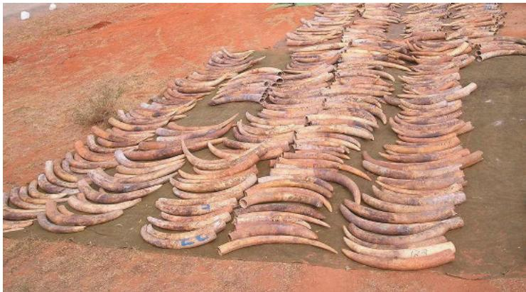  
MAKE CONNECTIONS Figure 26.6 describes a similar example in which conservation biologists used DNA analyses to compare harvested samples of whale meat with a reference DNA database. How are these examples similar, and how are they different? What limitations might there be to using such forensic methods in other suspected cases of poaching?

For suggested answer, see Appendix A.

Figure 56.8 Ecological forensics and elephant poaching.  
Figure 56.9 Overharvesting.  

harvested species, including fin and humpback whales, which are endangered (see Figure 26.6).

Many commercially important fish populations, once thought to be inexhaustible, have been decimated by overfishing (Figure 56.9). Demands from a growing human population for protein-rich food, coupled with new harvesting technologies, such as long-line fishing and modern trawlers, have reduced these fish populations to levels that cannot sustain further exploitation. Until the past few decades, the Atlantic bluefin tuna was considered a sport fish of little commercial value—just a few cents per pound for use in cat food. In the 1980s, however, wholesalers began flying fresh, iced bluefin to Japan for sushi and sashimi. In that market, the fish can now bring over \$500 per pound. With increased harvesting spurred by such high prices, it took just 10 years to reduce the western Atlantic bluefin population to less than 20% of its 1980 size.

## Global Change

The fourth threat to biodiversity, global change, alters the fabric of Earth's ecosystems at regional to global scales. Global change includes alterations in climate, atmospheric and ocean chemistry, and broad ecological systems that reduce the capacity of Earth to sustain life.

One of the first types of global change to cause concern was acid precipitation, which is rain, snow, or fog with a pH less than 5.2. The burning of wood and fossil fuels releases oxides of sulfur and nitrogen that react with water in air, forming sulfuric and nitric acids. The acids eventually fall to Earth's surface, where they cause chemical reactions that decrease nutrient supplies and increase concentrations of toxic metals. These changes to the soil and water harm some terrestrial and aquatic organisms.

In the 1960s, ecologists determined that lake-dwelling organisms in eastern Canada were dying because of acid precipitation caused by air pollution from factories in the Midwestern United States. Newly hatched lake trout, for instance, die when the pH drops below 5.4. Similarly, lakes and streams in southern Norway and Sweden were losing fish because of pollution generated in Great Britain and central Europe. By 1980, the pH of precipitation in large areas of North America and Europe averaged 4.0–4.5 and sometimes dropped as low as 3.0. (To review pH, see Concept 3.3.)

Figure 56.10 Changes in the pH of precipitation at the Hubbard Brook Experimental Forest, New Hampshire.  
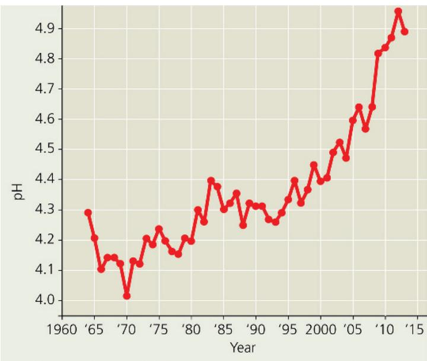  
MAKE CONNECTIONS Describe the relationship between pH and acidity. (See Concept 3.3.) Overall, is the precipitation in this forest becoming more acidic or less acidic?  
For suggested answer, see Appendix A.

Environmental regulations and new technologies have enabled many countries to reduce sulfur dioxide emissions in recent decades. In the United States, sulfur dioxide emissions decreased more than 75% between 1990 and 2013, gradually reducing the acidity of precipitation (Figure 56.10). However, ecologists estimate that it will take decades for aquatic ecosystems to recover. Meanwhile, emissions of nitrogen oxides are increasing in the United States, and emissions of sulfur dioxide and acid precipitation continue to damage forests in central and eastern Europe.

We'll explore the importance of global change for Earth's biodiversity in more detail in Concept 56.4, where we examine such factors as climate change and ozone depletion.

## Can Extinct Species Be Resurrected?

To the best of our knowledge, extinction has always been forever. Some scientists are nevertheless trying to use cloning techniques (see Concept 20.3) to resurrect species that have become extinct. For example, researchers used this approach in an attempt to reverse the extinction of the Pyrenean ibex, Capra pyrenaica pyrenaica. In 1999, researchers removed a skin sample from the last living individual, a female, and froze it. When that individual died a year later, scientists used the frozen cells to try to produce more ibex. Eventually, one ibex was born in 2009. Sadly, it lived for only 7 minutes before succumbing to lung defects similar to those observed in other cloned animals.

More recently, researchers completed an early step toward the possible use of cloning to prevent the extinction of the northern white rhinoceros (Ceratotherium simum cottoni). The last C. simum cottoni male died in 2018—dooming the northern white rhinoceros to eventual extinction. That same year, researchers successfully

created hybrid embryos using sperm from northern white rhinoceroses and eggs from closely related southern white rhinoceroses, C. simum simum (the few living females from the northern subspecies all had severe reproductive issues).

Many steps remain before the northern white rhinoceros could be considered resurrected from extinction. Moreover, even if scientists eventually can resurrect one or a few species, that approach will not solve the extinction crisis we face today. To do that, we must take steps to clean up the environment and protect natural habitat for the thousands of species currently threatened by extinction.

## Concept Check 56.1

1. Explain why it is too narrow to define the biodiversity crisis as simply a loss of species.

2. Identify the four main threats to biodiversity and explain how each damages diversity.

3. WHAT IF? Imagine two populations of a fish species, one in the Mediterranean Sea and one in the Caribbean Sea. Now imagine two scenarios: (1) The populations breed separately, and (2) adults of both populations migrate yearly to the North Atlantic to interbreed. Which scenario would result in a greater loss of genetic diversity if the Mediterranean population were harvested to extinction? Explain your answer.

For suggested answers, see Appendix A.

## Concept 56.2: Population conservation focuses on population size, genetic diversity, and critical habitat

Biologists who work on conservation at the population and species levels use two main approaches. One approach focuses on populations that are small and hence often vulnerable, while the other emphasizes critical habitat.

## Extinction Risks in Small Populations

Small populations are particularly vulnerable to overharvesting, habitat loss, and the other threats to biodiversity that you read about in Concept 56.1. After such factors have reduced a population's size to a small number of individuals, the small size itself can push the population to extinction.

## The Extinction Vortex: Evolutionary Implications of Small Population Size

EVOLUTION A small population is vulnerable to inbreeding and genetic drift, which can draw the population down an extinction vortex toward smaller and smaller population size until no individuals survive (Figure 56.11). A key factor driving the extinction vortex is the loss of genetic variation. Recall from Concept 23.1

Figure 56.11 Processes driving an extinction vortex.  
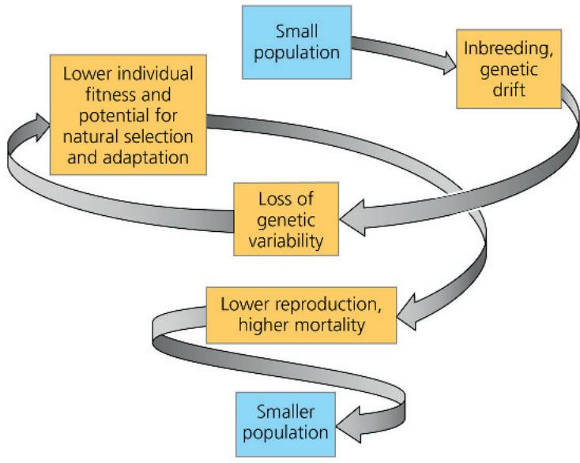

that genetic variation is necessary for evolutionary responses to environmental change, such as the appearance of new strains of pathogens. Both inbreeding and genetic drift can cause a loss of genetic variation (see Concept 23.3), and their effects become more harmful as a population shrinks. Inbreeding often reduces fitness because offspring are more likely to be homozygous for harmful recessive traits.

Not all small populations are doomed by low genetic diversity, and low genetic variability does not automatically lead to permanently small populations. For instance, overhunting of northern elephant seals in the 1890s reduced the species to only 20 individuals—clearly a bottleneck with reduced genetic variation. Since that time, however, the northern elephant seal populations have rebounded to about 150,000 individuals today, though their genetic variation remains relatively low.

## Case Study: The Greater Prairie Chicken and the Extinction Vortex

When Europeans arrived in North America, the greater prairie chicken (Tympanuchus cupido) was common from New England to Virginia and across the western prairies of the continent. Land cultivation for agriculture fragmented the populations of this species, and its abundance decreased rapidly (see Figure 23.11). Illinois had millions of greater prairie chickens in the 19th century but fewer than 50 by 1993. Researchers found that the decline in the Illinois population was associated with reduced genetic variation and a decrease in fertility. As a test of the extinction vortex hypothesis, scientists increased genetic variation by importing 271 birds from larger populations elsewhere (Figure 56.12). The Illinois population rebounded, indicating that it had been on its way to extinction until rescued by the transfusion of genetic variation.

## Minimum Viable Population Size

How small does a population have to be before it starts down an extinction vortex? The answer depends on the type of organism,

## Figure 56.12

# Inquiry: What caused the drastic decline of the Illinois greater prairie chicken population?

Experiment

Researchers had observed that the population collapse of the greater prairie chicken was mirrored in a reduction in fertility, as measured by the hatching rate of eggs. Comparison of DNA samples from the Jasper County, Illinois, population with DNA from feathers in museum specimens showed that genetic variation had declined in the study population (see Figure 23.11). In 1992, researchers began translocating prairie chickens from neighboring states in an attempt to increase genetic variation.

## Results

After translocation (black arrow), the viability of eggs rapidly increased, and the population rebounded.

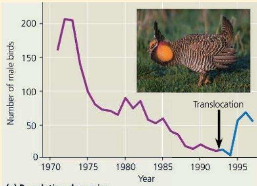  
(a) Population dynamics

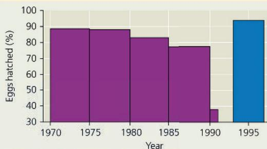  
(b) Hatching rate. Bar height represents the average rate for the years spanned by the bar.

## Conclusion

Reduced genetic variation had started the Jasper County population of prairie chickens down the extinction vortex.

Data from R. L. Westemeier et al., Tracking the long-term decline and recovery of an isolated population, Science 282:1695–1698 (1998). © 1998 by AAAS. Reprinted with permission.

INQUIRY IN ACTION Read and analyze the original paper in Inquiry in Action: Interpreting Scientific Papers.

WHAT IF? Given the success of using transplanted birds as a tool for increasing the percentage of hatched eggs in Illinois, would you support transplanting additional birds to Illinois? Why or why not?
For suggested answer, see Appendix A.

but all populations require some minimum size to remain viable. The minimal population size at which a species is able to sustain its numbers is known as the minimum viable population (MVP). MVP is usually estimated for a given species using computer models that integrate many factors, including mean demographic rates (that is, birth and death rates) as well as chance events that impact population growth rate—for example, a natural catastrophe such as a storm that leads to unusually high mortality. Once in the extinction vortex, two or three consecutive years of bad weather could finish off a population that is already below its MVP.

## Effective Population Size

As we've discussed, genetic variation can be of considerable importance in small populations. The total size of a population may be misleading because only certain members of the population breed successfully and pass their alleles on to offspring. Therefore, a meaningful estimate of MVP requires the researcher to determine the effective population size, which is based on the breeding potential of the population.

The following formula illustrates one way to estimate the effective population size, abbreviated $N_{e}$ :

$$
N _ {\mathrm{e}} = \frac {4 N _ {\mathrm{f}} N _ {\mathrm{m}}}{N _ {\mathrm{f}} + N _ {\mathrm{m}}}
$$

where $N_{f}$ and $N_{m}$ are, respectively, the number of females and the number of males that successfully breed. If we apply this formula to an idealized population whose total size is 1,000 individuals, $N_{e}$ will also be 1,000 if every individual breeds and the sex ratio is 500 females to 500 males. In this case, $N_{\mathrm{e}} = (4 \times 500 \times 500)/(500 + 500) = 1,000$ . Any deviation from these conditions (not all individuals breed or there is not a 1:1 sex ratio) reduces $N_{e}$ . For instance, if the total population size is 1,000 but only 400 females and 400 males breed, then $N_{\mathrm{e}} = (4 \times 400 \times 400)/(400 + 400) = 800$ , or 80% of the total population size. Numerous factors can influence $N_{e}$ . As a result, alternative formulas for estimating $N_{e}$ have been developed to account for factors such as age at maturation, genetic relatedness among population members, the effects of gene flow, and population fluctuations.

In actual study populations, $N_{e}$ is always some fraction of the total population. Thus, simply determining the total number of individuals in a small population does not necessarily provide a good measure of whether the population is large enough to avoid extinction. Whenever possible, conservation programs attempt to sustain total population sizes that include at least the minimum viable number of reproductively active individuals. The conservation goal of sustaining effective population size ( $N_{e}$ ) above MVP stems from the concern that populations retain enough genetic diversity to adapt as their environment changes.

The MVP of a population is often used in population viability analysis. The objective of this analysis is to predict a population's chances for survival, usually expressed as a specific probability of survival, such as a $95\%$ chance, over a particular time interval, perhaps 100 years. Such modeling approaches allow conservation biologists to explore the potential consequences of alternative management plans.

Figure 56.13 Monitoring a grizzly bear population.

A scientist measures a tranquilized bear that has been fitted with a radio collar so that the bear's movements can be compared with those of other grizzlies in Yellowstone National Park.

## Case Study: Analysis of Grizzly Bear Populations

One of the first population viability analyses was conducted in 1978 by Mark Shaffer as part of a long-term study of grizzly bears in Yellowstone National Park and its surrounding areas (Figure 56.13). A threatened species in the United States, the grizzly bear (Ursus arctos horribilis) is currently found in only 4 of the 48 contiguous states. Its populations in those states have been drastically reduced and fragmented. In 1800, an estimated 100,000 grizzlies ranged over about 500 million hectares of habitat, while today only 1,000 individuals in six relatively isolated populations range over less than 5 million hectares.

Shaffer attempted to determine viable sizes for the Yellowstone grizzly population. Using life history data obtained for individual Yellowstone bears over a 12-year period, he simulated the effects of environmental factors on survival and reproduction. His models predicted that, given a suitable habitat, a Yellowstone grizzly bear population of 70–90 individuals would have about a 95% chance of surviving for 100 years. A slightly larger population of only 100 bears would have a 95% chance of surviving for twice as long, about 200 years.

How does the actual size of the Yellowstone grizzly population compare with Shaffer's predicted MVP? A current estimate puts the total grizzly bear population in the greater Yellowstone ecosystem at about 700 individuals. The relationship of this estimate to the effective population size $(N_{\mathrm{e}})$ depends on several factors. Usually, only a few dominant males breed, and it may be difficult for them to locate females, since individuals inhabit such large areas. Moreover, females may reproduce only when there is abundant food. As a result, $N_{\mathrm{e}}$ is only about $25\%$ of the total population size, or about 175 bears.

Because small populations tend to lose genetic variation over time, researchers have used proteins, mitochondrial DNA, and short tandem repeats (see Concept 21.4) to assess genetic variability in the Yellowstone grizzly bear population. All results to date indicate that the Yellowstone population has less genetic variability than other grizzly bear populations in North America.

How might conservation biologists increase the effective size and genetic variation of the Yellowstone grizzly bear population? Migration between isolated populations of grizzlies could increase both effective and total population sizes. Computer models predict that introducing only two unrelated bears each decade into a population of 100 individuals would reduce the loss of genetic variation by about half. For the grizzly bear, and probably for many other species with small populations, finding ways to promote dispersal among populations may be one of the most urgent conservation needs.

This case study and that of the greater prairie chicken show how an understanding of the ecological and evolutionary consequences of small populations can have practical applications for conservation. Next, we look at an alternative approach to understanding the biology of extinction.

## Critical Habitat and Population Decline

A loss of critical habitat can cause threatened and endangered populations to show a downward trend, even if the population is far above its minimum viable population size. A focus on the importance of critical habitat emphasizes the environmental factors that can cause a population decline in the first place. If, for instance, an area is deforested, then species that depend on trees will decline in abundance, whether or not they retain genetic variation. The following case study illustrates how a critical-habitat approach has been applied to the conservation of an endangered species.

## Case Study: Decline of the Red-Cockaded Woodpecker

The red-cockaded woodpecker (Picoides borealis) is found only in the southeastern United States. It requires mature pine forests, preferably ones dominated by the longleaf pine, for its habitat. A critical-habitat factor for the red-cockaded woodpecker is that the undergrowth of plants around the pine trunks must be low (Figure 56.14a). Breeding birds tend to abandon nests when vegetation among the pines is thick and higher than about 4.5 m (Figure 56.14b); the birds appear to need a clear flight path between their home trees and the neighboring feeding grounds. Periodic fires have historically swept through longleaf pine forests, keeping the undergrowth low.

In addition, although most woodpecker species nest in dead trees, the red-cockaded woodpecker drills its nest holes in mature, living pine trees. It also drills small holes around the entrance to its nest cavity, which causes resin from the tree to ooze down the trunk. The resin seems to repel predators, such as corn snakes, that eat bird eggs and nestlings.

One factor leading to decline of the red-cockaded woodpecker has been the destruction or fragmentation of suitable habitats by logging and agriculture (Figure 56.15). By recognizing key habitat factors, protecting some longleaf pine forests, and using controlled fires to reduce forest undergrowth, conservation managers have helped restore habitat that can support viable populations.

Sometimes conservation managers also help species colonize restored habitats. Because red-cockaded woodpeckers take months to excavate nesting cavities, researchers performed an experiment to see whether providing cavities for the birds would make them more

Figure 56.14 A habitat requirement of the red-cockaded woodpecker.

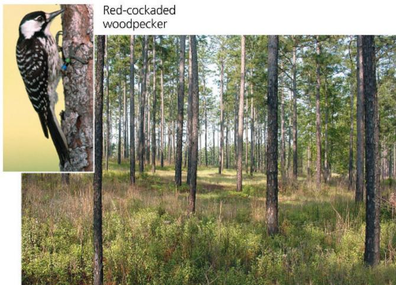  
(a) Forests that can sustain red-cockaded woodpeckers have low undergrowth.

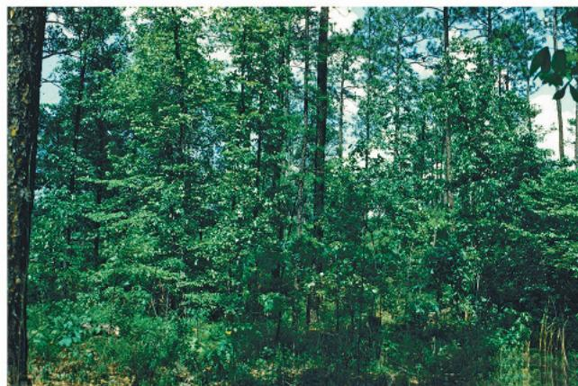  
(b) Forests that cannot sustain red-cockaded woodpeckers have high, dense undergrowth that interferes with the woodpeckers' access to feeding grounds.  
How is habitat disturbance absolutely necessary for the long-term survival of the woodpecker?

For suggested answer, see Appendix A.

## Figure 56.15 Decline of longleaf pine forests.

Fire suppression, logging, urban development, and other human activities have reduced longleaf pine forests to 3% of their original area; the covered area has not increased since 2004.

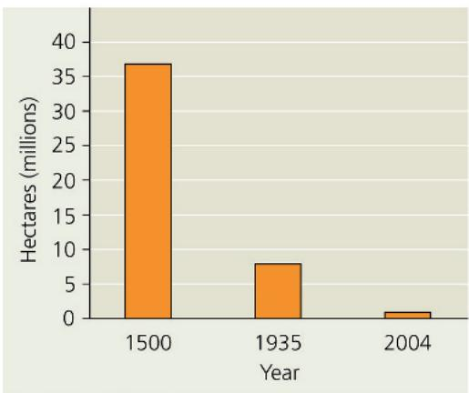

VISUAL SKILLS What edges between ecosystems do you observe in this photo? For suggested answer, see Appendix A.

likely to use a site. The researchers constructed cavities in pine trees at 20 sites. The results were dramatic. Cavities in 18 of the 20 sites were colonized by red-cockaded woodpeckers, and new breeding groups formed only in those sites. Based on this experiment, conservationists initiated a habitat maintenance program that included controlled burning and excavation of new nesting cavities, enabling this endangered species to begin to recover.

## Weighing Conflicting Demands

Determining population numbers and habitat needs is only part of a strategy to save species. Scientists also need to weigh a species' needs against other conflicting demands. Conservation biology often highlights the relationship between science, technology, and society. For example, an ongoing, sometimes bitter debate in the western United States pits habitat preservation for wolf, grizzly bear, and bull trout populations against job opportunities in the grazing and resource extraction industries. Programs that restocked wolves in Yellowstone National Park remain controversial for people concerned about human safety and for many ranchers concerned with potential loss of livestock outside the park.

Large, high-profile vertebrates are not always the focal point in such conflicts, but habitat use is almost always the issue. Should work proceed on a new highway bridge that benefits the local economy but destroys the only remaining habitat of a species of freshwater mussel? If you were the owner of a coffee plantation growing varieties that thrive in bright sunlight, would you be willing to change to shade-tolerant varieties that produce less coffee per hectare but can grow beneath trees that support large numbers of songbirds? Successful conservation efforts often strive for a “win-win” outcome: to protect both endangered species and jobs or other aspects of a region’s economy.

Another important consideration is the ecological role of a species. Because we cannot save every endangered species, we must determine which species are most important for conserving biodiversity as a whole. Identifying keystone species and finding ways to sustain their populations can be central to maintaining communities and ecosystems. In most situations, conservation biologists must also look beyond single species and consider the whole community and ecosystem as an important unit of biodiversity.

## Concept Check 56.2

1. How does the reduced genetic diversity of small populations make them more vulnerable to extinction?

2. If there were 100 greater prairie chickens in a population, and 30 females and 10 males bred, what would be the effective population size $N_{e}$ ?

3. WHAT IF? In 2005, at least ten grizzly bears in the greater Yellowstone ecosystem were killed through contact with people. Most of these deaths resulted from three things: collisions with automobiles, hunters (of other animals) shooting when charged by a female grizzly bear with cubs nearby, and conservation managers killing bears that attacked livestock repeatedly. If you were a conservation manager, what steps might you take to minimize such encounters in Yellowstone?

# Concept 56.3: Landscape and regional conservation help sustain biodiversity

Although conservation efforts have historically focused on saving individual species, efforts today often seek to sustain the biodiversity of entire communities, ecosystems, and landscapes. Such a broad view requires applying not just ecological principles, but aspects of human population dynamics and economics as well.

## Landscape Structure and Biodiversity

The biodiversity of a given landscape is heavily influenced by its physical features, or structure. Understanding landscape structure is critically important in conservation because many species use more than one kind of ecosystem, and many live on the borders between ecosystems.

## Fragmentation and Edges

The boundaries, or edges, between ecosystems—such as between a lake and the surrounding forest or between cropland and suburban housing tracts—are defining features of landscapes (Figure 56.16). An edge has its own set of physical conditions, which differ from those on either side of it. The soil surface of an edge between a forest patch and a burned area receives more sunlight and is usually hotter and drier than the forest interior, but it is cooler and wetter than the soil surface in the burned area.

Some organisms thrive in edge communities because they gain resources from both adjacent areas. The ruffed grouse

Figure 56.16 Natural edges between ecosystems in Siberia.  

(Bonasa umbellus) is a bird that needs forest habitat for nesting, winter food, and shelter, but it also needs forest openings with dense shrubs and herbs for summer food.

Ecosystems in which edges arise from human alterations often have reduced biodiversity and a preponderance of edge-adapted species. For example, white-tailed deer (Odocoileus virginianus) thrive in edge habitats, where they can browse on woody shrubs; deer populations often expand when forests are logged and more edges are generated. The brown-headed cowbird (Molothrus ater) is an edge-adapted species that lays its eggs in the nests of other birds, often migratory songbirds. Cowbirds need forests, where they can parasitize the nests of other birds, and open fields, where they forage on seeds and insects. Consequently, their populations are growing where forests are being cut and fragmented, creating more edge habitat and open land. Increasing cowbird parasitism and habitat loss are correlated with declining populations of several of the cowbird's host species.

The influence of fragmentation on the structure of communities has been explored since 1979 in the long-term Biological Dynamics of Forest Fragments Project. Located in the heart of the Amazon River basin, the study area consists of isolated fragments of tropical rain forest separated from surrounding continuous forest by distances of 80–1,000 m (Figure 56.17). Numerous researchers working on this project have clearly documented the effects of this fragmentation on organisms ranging from bryophytes to beetles to birds. They have consistently found that species adapted to forest interiors show the greatest declines when patches are the smallest, suggesting that landscapes dominated by small fragments will support fewer species.

## Corridors That Connect Habitat Fragments

In fragmented habitats, the presence of a movement corridor, a narrow strip or series of small clumps of habitat connecting

Figure 56.17 Amazon rain forest fragments created as part of the Biological Dynamics of Forest Fragments Project.  

Figure 56.18 An artificial corridor.

This highway overpass in the Netherlands helps animals cross a human-created barrier.

otherwise isolated patches, can be important for conserving biodiversity. Movement corridors can promote dispersal and reduce inbreeding in otherwise isolated populations. Corridors have been shown to increase the exchange of individuals among populations of many organisms, including butterflies, voles, and aquatic plants. Corridors are also important to species that migrate between different habitats seasonally.

Some corridors occur naturally. For example, riparian habitats, the terrestrial habitats that occur at the edges of streams and rivers, often traverse many different landscapes and thereby provide a dispersal route for many species. For this reason, in some nations, government policy prohibits altering these habitats.

In areas of heavy human use, artificial corridors are sometimes constructed. Bridges or tunnels, for instance, can reduce the number of animals killed trying to cross highways and can increase gene flow across a divided landscape (Figure 56.18).

## Establishing Protected Areas

As of 2024, 17.6% of terrestrial/freshwater habitats and 8.4% of marine habitats worldwide are protected by some form of reserve, and there are strong efforts in the global community to reach the goal of protecting 30% of the world's ecosystems by 2030. Choosing where to place nature reserves and how to design them poses many challenges. Should the reserve be managed to minimize the risks of fire and predation to a threatened species? Or should the reserve be left as natural as possible, with such processes as fires ignited by lightning allowed to play out on their own? This is just one of the debates that arise among people who share an interest in the health of national parks and other protected areas.

## Preserving Biodiversity Hot Spots

In deciding which areas are of highest conservation priority, biologists often focus on hot spots of biodiversity. A biodiversity hot spot is a relatively small area with numerous endemic

Figure 56.19 Earth's terrestrial and marine biodiversity hot spots.  
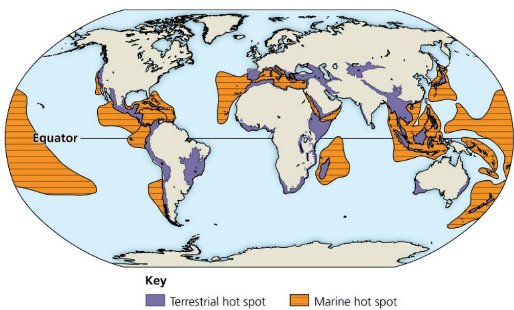

species (species found nowhere else in the world) and a large number of endangered and threatened species (Figure 56.19). Nearly 30% of all bird species can be found in hot spots that make up only about 2% of Earth's land area. Together, the "hottest" of the terrestrial biodiversity hot spots total less than 1.5% of Earth's land but are home to more than a third of all species of plants, amphibians, reptiles (including birds), and mammals. Aquatic ecosystems also have hot spots, such as coral reefs and certain river systems.

Biodiversity hot spots are good choices for nature reserves, but identifying them is not always simple. One problem is that a hot spot for one taxonomic group, such as butterflies, may not be a hot spot for some other taxonomic group, such as birds. Designating an area as a biodiversity hot spot is often biased toward saving vertebrates and plants, with less attention paid to invertebrates and microorganisms. Some biologists are also concerned that the hot-spot strategy places too much emphasis on such a small fraction of Earth's surface.

Climate change makes the task of preserving hot spots even more challenging because the conditions that favor a particular community may not occur there in the future. The biodiversity hot spot in the southwest corner of Australia (see Figure 56.19) holds thousands of species of endemic (unique to that area) plants and many endemic vertebrates. Researchers recently concluded that between 5% and 25% of the plant species they examined may become extinct by 2080 because the plants will be unable to tolerate the increased dryness predicted for this region.

## Philosophy of Nature Reserves

Nature reserves are protected “islands” of biodiversity in a sea of habitat altered or degraded by human activity. An earlier policy—that protected areas should be set aside to remain unchanged forever—was based on the concept that ecosystems are balanced, self-regulating units. However, disturbance is common in all ecosystems (see Concept 54.3). Management policies that ignore disturbances or attempt to prevent them have generally failed. For instance, setting aside an area of a fire-dependent community, such as a portion of a tallgrass prairie, chaparral, or dry pine forest, with the intention of saving it is unrealistic if periodic burning is excluded. Without the dominant disturbance, the fire-adapted species are usually outcompeted and biodiversity is reduced.

An important conservation question is whether to create numerous small reserves or fewer large reserves. A network of small reserves may achieve the best conservation outcomes by protecting more types of habitats and providing more protection against entire species being decimated by a natural disaster or disease in one location. One argument for large reserves is that large, far-ranging animals with low-density populations, such as the grizzly bear, require extensive habitats. Large reserves

also have proportionately smaller perimeters than small reserves and are therefore less affected by edges.

As conservation biologists have learned more about the requirements for achieving minimum viable populations for endangered species, they have realized that most national parks and other reserves are far too small. The area needed for the long-term survival of the Yellowstone grizzly bear population, for instance, is more than 11 times the area of Yellowstone National Park. Therefore, areas of private and public land surrounding reserves will likely have to contribute to biodiversity conservation.

## Zoned Reserves

Several nations have adopted a zoned reserve approach to landscape management. A zoned reserve is an extensive region that includes areas relatively undisturbed by humans surrounded by areas that have been changed by human activity and are used for economic gain. The key challenge of the zoned reserve approach is to develop a social and economic climate in the surrounding lands that is compatible with the long-term viability of the protected core. These surrounding areas continue to support human activities, but regulations prevent the types of extensive alterations likely to harm the protected area. As a result, the surrounding habitats serve as buffer zones against further intrusion into the undisturbed area.

The Central American nation of Costa Rica has become a world leader in establishing zoned reserves. An agreement initiated in 1987 reduced Costa Rica's international debt in return for land preservation there. The country is now divided into 11 Conservation Areas, which include national parks and other protected areas, both on land and in the ocean (Figure 56.20). Costa Rica is making progress toward managing its zoned reserves, and the buffer zones provide a steady, lasting supply of forest products, water, and hydroelectric power while also supporting sustainable agriculture and tourism, both of which employ local people.

Costa Rica relies on its zoned reserve system to maintain at least 80% of its native species, but the system is not without

Figure 56.20 Protected areas in Costa Rica.

The boundaries of the 11 Conservation Areas are indicated by black outlines.

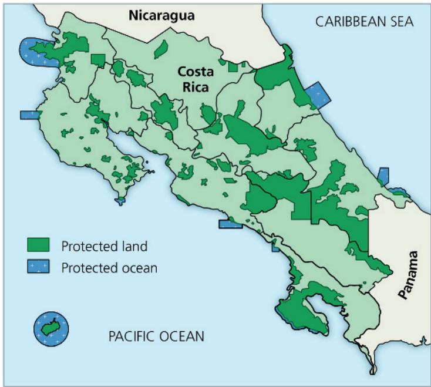  
Figure 56.21 A diver measuring coral in the Florida Keys National Marine Sanctuary.

problems. A 2003 analysis of land cover change between 1960 and 1997 showed negligible deforestation within Costa Rica's national parks and a gain in forest cover in the 1-km buffer around the parks. However, significant losses in forest cover were discovered in the 10-km buffer zones around all national parks, threatening to turn the parks into isolated habitat islands.

Although marine ecosystems have also been heavily affected by human exploitation, reserves in the ocean are far less common than reserves on land. Many fish populations around the world have collapsed as increasingly sophisticated equipment puts nearly all potential fishing grounds within human reach. Networks of marine reserves can serve as a means of both increasing fish populations within the reserves and improving fishing success in nearby areas. This system is a modern application of a centuries-old practice in the Fiji Islands in which some areas have historically remained closed to fishing—a traditional example of the zoned reserve concept.

The United States adopted such a system in creating a set of 13 national marine sanctuaries, including the Florida Keys National Marine Sanctuary, which was established in 1990 (Figure 56.21). Populations of marine organisms, including fishes and lobsters, recovered quickly after harvests were banned in the 9,500-km $^{2}$ reserve. Larger and more abundant fish now produce larvae that help repopulate reefs and improve fishing outside the sanctuary. The increased marine life within the sanctuary also makes it a favorite for recreational divers, increasing the economic value of this zoned reserve.

## Urban Ecology

The zoned reserves that you just read about combine habitats that are relatively undisturbed by human activity with those that are used extensively by people for economic gain. Increasingly, ecologists are looking at species preservation even in the context of cities. The field of urban ecology examines organisms and their environment in urban settings.

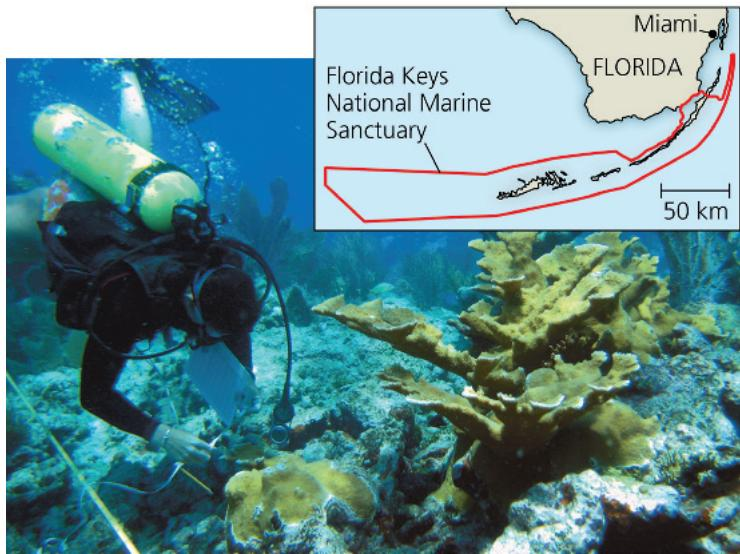

For the first time in history, more than half of the people on Earth live in cities. By the year 2030, 5 billion people are expected to be living in urban environments. As cities expand in number and size, protected areas that were once outside city boundaries become incorporated into urban landscapes. Ecologists are now studying cities as ecological laboratories, seeking to balance species preservation and other ecological needs with the needs of people.

One critical area of research centers on urban streams, including the quality and flow of their water and the organisms living in them. Urban streams tend to rise and fall more quickly after rain than natural streams. This rapid change in water level occurs because of the concrete and other impervious surfaces in cities as well as the drainage systems that route water out of cities as quickly as possible to avoid flooding. Urban streams also tend to have higher concentrations of nutrients and contaminants and are often straightened or even channeled underground.

Near Vancouver, Canada, ecologists and volunteers have worked to restore a degraded urban stream, Guichon Creek. They stabilized its banks, removed introduced plants, and planted native trees and shrubs along the creek (Figure 56.22). Their efforts returned the water flow and the communities of invertebrates and fish in the stream much closer to what they had been 50 years before the stream became degraded. A few years ago, ecologists successfully reestablished cutthroat trout in the stream. The trout are now thriving.

As cities continue to expand into the landscapes around them, understanding the ecological effects of this expansion will only increase in importance. Research on and conservation of urban habitats will continue to grow.

Figure 56.22 Volunteers working to remove invasive species along the urban Guichon Creek.

## Concept Check 56.3

1. What is a biodiversity hot spot?

2. How do zoned reserves provide economic incentives for long-term conservation of protected areas?

3. WHAT IF? Suppose a developer proposes to clear-cut a forest that serves as a corridor between two parks. To compensate, the developer also proposes to add the same area of forest to one of the parks. As a professional ecologist, how might you argue for retaining the corridor?

For suggested answers, see Appendix A.

# Concept 56.4: Earth is changing rapidly as a result of human actions

As we've discussed, landscape and regional conservation help protect habitats and preserve species. However, environmental changes that result from human activities are creating new challenges. As a consequence of human-caused climate change, for example, the place where a vulnerable species is found today may not be the same place that is needed for its preservation in the future. What would happen if many habitats on Earth changed so quickly that the locations of preserves today were unsuitable for their species in 10, 50, or 100 years? Such a scenario is increasingly possible.

The rest of this section describes four types of environmental change that humans are bringing about: nutrient enrichment, toxin accumulation, climate change, and ozone depletion. The impacts of these and other changes are evident not just in human-dominated ecosystems, such as cities and farms, but also in the most remote ecosystems on Earth.

## Nutrient Enrichment

Human activity often removes nutrients from one part of the biosphere and adds them to another. Someone eating broccoli in Washington, DC, consumes nutrients that only days before were in the soil in California; a short time later, some of these nutrients will be in the Potomac River, having passed through the person's digestive system and a local sewage treatment facility. Likewise, nutrients in farm soil may run off into streams and lakes,

depleting nutrients in one area, increasing them in another, and altering chemical cycles in both.

Farming illustrates how human activities can lead to nutrient enrichment. After vegetation is cleared from an area, the existing reserve of nutrients in the soil is depleted over time because many of these nutrients are exported from the area in crop biomass. How long this takes varies greatly. When some of the early North American prairie lands were first tilled, good crops could be produced for decades because the large store of organic materials in the soil continued to decompose and provide nutrients. By contrast, some cleared land in the tropics can be farmed for only 1 or 2 years because so little of the ecosystems' nutrient load is contained in the soil. Despite such variations, the natural store of nutrients eventually becomes exhausted.

Consider nitrogen, the main nutrient lost through agriculture (see Figure 55.14). Plowing mixes the soil and speeds up decomposition of organic matter, releasing nitrogen that is then removed when crops are harvested. Fertilizers containing nitrates and other forms of nitrogen that plants can absorb are used to replace the nitrogen that is lost. However, after crops are harvested, few plants remain to take up nitrates from the soil. As shown in Figure 55.15, without plants to absorb them, nitrates are often leached from the ecosystem.

Recent studies indicate that human activities have more than doubled Earth's supply of fixed nitrogen available to primary producers. Industrial fertilizers provide the largest additional nitrogen source. Fossil fuel combustion also releases nitrogen oxides, which enter the atmosphere and dissolve in rainwater; the nitrogen ultimately enters ecosystems as nitrate. Increased cultivation of legumes, with their nitrogen-fixing symbionts, is a third way in which humans increase the amount of fixed nitrogen in the soil.

A problem arises when the nutrient level in an ecosystem exceeds the critical load, the amount of added nutrient, usually nitrogen or phosphorus, that can be absorbed by plants without damaging ecosystem integrity. For example, nitrogenous minerals in the soil that exceed the critical load eventually leach into groundwater or run off into freshwater and marine ecosystems, contaminating water supplies and causing eutrophication in aquatic ecosystems (see Concept 55.2). Nitrate concentrations in groundwater are increasing in most agricultural regions, sometimes reaching levels that are unsafe for drinking.

Many rivers contaminated with nitrates and ammonium from agricultural runoff and sewage drain into the Atlantic Ocean, with the highest inputs coming from northern Europe and the central United States. The Mississippi River carries nitrogen pollution to the ocean, fueling a phytoplankton bloom each summer. When the phytoplankton die and sink below the thermocline, their

Figure 56.23 A dead zone arising from nitrogen pollution in the Mississippi basin. Each year, a large dead zone (a region where dissolved $O_{2}$ levels are less than 2.0 mg/L) forms offshore.  
  
(a) Nutrients drain from agricultural land (green) and cities (red) through the vast Mississippi watershed to the ocean.

decomposition by oxygen-using organisms results in an extensive “dead zone” of low oxygen levels along the coast (Figure 56.23). When this occurs, fish and other marine animals disappear from some of the most economically important waters in the United States. To reduce the size of the dead zone, farmers have begun using fertilizers more efficiently, and managers are restoring wetlands in the Mississippi watershed. The plants in these wetlands take up nutrients and therefore can reduce the nutrient load downstream.

Nutrient runoff can also lead to the eutrophication of lakes. The bloom and subsequent die-off of algae and cyanobacteria and the ensuing depletion of oxygen are similar to what occurs in a marine dead zone. Such conditions threaten the survival of many organisms. For example, eutrophication of Lake Erie coupled with overfishing wiped out commercially important fishes such as blue pike, whitefish, and lake trout by the 1960s. Since then, tighter regulations on the dumping of sewage into the lake have enabled some fish populations to rebound, but many native species of fish and invertebrates have not recovered.

## Toxins in the Environment

Humans release an immense variety of toxic chemicals, including thousands of synthetic compounds previously unknown in nature, with little regard for the ecological consequences. Organisms acquire toxic substances from the environment along with nutrients and water. Some of the poisons are metabolized or excreted, but others accumulate in specific tissues, often fat. One of the reasons accumulated toxins are particularly harmful is that they become more concentrated in successive trophic levels of a food web. This phenomenon, called biological magnification, occurs because the biomass at any given trophic level is produced from a much larger biomass ingested from the level below (see Concept 55.3). Thus, top-level carnivores tend to be most severely affected by toxic compounds in the environment. We'll discuss three types of environmental toxins: industrial compounds and pesticides, pharmaceuticals, and plastic waste.

  
(b) The 2017 dead zone, represented here, was the largest yet measured. It occupied 22,730 km $^{2}$ (8,776 mi $^{2}$ ), an area slightly larger than New Jersey.

## Industrial Compounds and Pesticides

Chlorinated hydrocarbons are a class of industrially synthesized compounds that have demonstrated biological magnification. Chlorinated hydrocarbons include the industrial chemicals called PCBs (polychlorinated biphenyls) and many pesticides, such as DDT. Current research implicates many of these compounds in endocrine system disruption in numerous animal species, including humans. Biological magnification of PCBs has been found in the food web of the Great Lakes, where the concentration of PCBs in herring gull eggs, at the top of the food web, is nearly 5,000 times that in phytoplankton, at the base (Figure 56.24).

An infamous case of biological magnification that harmed top-level carnivores involved DDT, a chemical used to control insects such as mosquitoes and agricultural pests. In the decade after World War II, the use of DDT grew rapidly. By the 1950s, scientists were learning that DDT persists in the environment and is transported by water to areas far from where it is applied. One of the first signs that DDT was a serious environmental problem was a decline in the populations of pelicans, ospreys, and eagles, birds that feed at the top of food webs. The accumulation of DDT (and DDE, a product of its breakdown) in the tissues of these birds interfered with the deposition of calcium in their eggshells. When the birds tried to incubate their eggs, the weight of the parents broke the shells of affected eggs, resulting in catastrophic declines in the birds' reproduction rates. Rachel Carson's book Silent Spring helped bring the problem to public attention in the 1960s (Figure 56.25), and DDT was banned in the United States in 1971. A dramatic recovery in populations of the affected bird species followed.

In much of the tropics, DDT is still used to control the mosquitoes that spread malaria and other diseases. Societies there face a trade-off between saving human lives and protecting other species. Moreover, resistance to DDT has evolved in many insect

Figure 56.24 Biological magnification of PCBs in a Great Lakes food web. (ppm = parts per million)

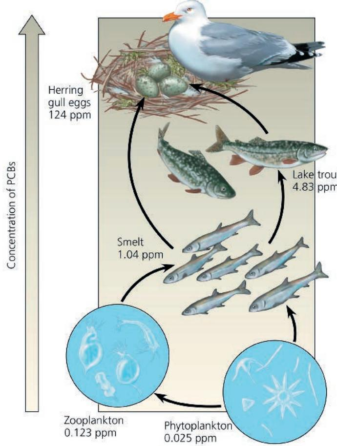  
Calculate how much the PCB concentration increased at each step in the food web.  
For suggested answer, see Appendix A.

species, further complicating its use (for a specific example, see Chapter Review question 7 in Chapter 22). Overall, the best approach seems to be to apply DDT sparingly and to couple its use with mosquito netting and other low-technology solutions.

Figure 56.25 Rachel Carson.

Biologist and author Rachel Carson helped promote a new environmental ethic through her writing and her testimony before the U.S. Congress. Her efforts led to a ban on DDT use in the United States and stronger controls on the use of other chemicals.

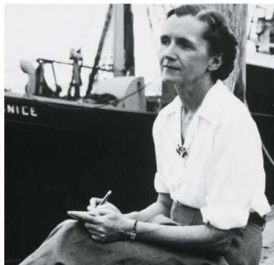

## Pharmaceuticals

Chemicals used as medicines, called pharmaceuticals, make up another group of toxins in the environment, one that is a growing concern among ecologists. The use of over-the-counter and prescription drugs has risen in recent years, particularly in industrialized nations. People who consume such products excrete residual chemicals in their waste and may also dispose of unused drugs improperly, such as in their toilets or sinks. Drugs that are not broken down in sewage treatment plants may then enter rivers and lakes with the material discharged from these plants. Growth-promoting drugs and antibiotics given to farm animals can also enter rivers and lakes with agricultural runoff. As a consequence, many pharmaceuticals are spreading in low concentrations across the world's freshwater ecosystems (Figure 56.26).

Among the pharmaceuticals that ecologists are studying are the sex steroids, including forms of estrogen used for birth control. Some fish species are so sensitive to certain estrogens that concentrations of a few parts per trillion in their water can alter sexual differentiation and shift the female-to-male sex ratio toward females. Researchers in Ontario, Canada, conducted a 7-year experiment in which they applied the synthetic estrogen used in contraceptives to a lake in very low concentrations (5–6 ng/L). They found that chronic exposure

Figure 56.26 Sources and movements of pharmaceuticals in the environment.  

of the fathead minnow (Pimephales promelas) to the estrogen led to feminization of males, reproductive failure, and a near extinction of the population of this species from the lake.

## Plastic Waste

Plastics are synthetic compounds that typically are made from petroleum products, such as oil or natural gas. An estimated 4.8 to 12.7 million metric tons (11 to 28 billion pounds) of plastic waste enters the ocean each year, making plastics the most common type of marine debris.

Figure 56.27 A victim of plastic waste.

Found in a wildlife refuge in Hawaii, this Laysan albatross (Phoebastria immutabilis) chick died after consuming large amounts of plastic debris.

Over time, larger pieces of plastic waste are broken into successively smaller pieces by the actions of waves and by UV light, which breaks the bonds that hold plastic compounds together. As a result, the oceans are contaminated by large pieces of plastic and by microplastics, plastic particles less than 5 mm in size. Data suggest that plastic waste can persist in the environment for hundreds to thousands of years.

The enormous quantities of plastic waste in the oceans have wide-ranging effects. For example, birds, marine mammals, turtles, and fish can die after mistaking plastic debris for food (Figure 56.27). A 2018 study documented another effect: Coral reefs contaminated by plastic waste had much higher rates of disease than did reefs without plastic waste (Figure 56.28). What causes this dramatic rise in disease levels? Bacterial pathogens can “hitchhike” on plastic waste—so pieces of plastic waste may introduce new pathogens to a reef or increase the abundance of pathogens already present. In addition, plastic waste that becomes entangled on a reef can damage corals or deprive them of light and oxygen, making them more susceptible to pathogens.

As for microplastics, these small particles now contaminate all of the world's oceans and have been found in organisms from every type of marine food chain. While less is known about the extent to which microplastics contaminate terrestrial and freshwater ecosystems, current evidence indicates they are widespread there as well—they have been found in lakes, streams, soils, invertebrates, birds, and freshwater fish. Harmful effects of microplastics have been documented in some fish and invertebrates. They may also pose a threat to human health: Recent evidence indicates that people routinely eat and inhale microplastics. For example, microplastics have been found in supermarket fish, bottled water, beer, sea salt, and shellfish. Recent studies also have documented that microplastics are transported in the atmosphere, causing humans (and other animals) to inhale them when we breathe. Air transport also enables microplastics to be deposited all over the globe, even in the most remote locations.

Figure 56.28 Plastic waste and disease in corals.
A 2018 study found that the percentage of diseased corals increases 20-fold in reefs contaminated by plastic waste. The photo shows plastic waste on coral at one of the study sites.

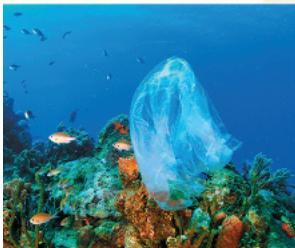

Research into the extent and effects of plastic waste is still in the early stages. Even so, it is clear that plastic waste is a major and growing environmental problem—one that will require new and innovative ways to reduce both the amount of plastic waste we generate and how much of that waste is mismanaged, thereby contaminating natural ecosystems.

## Interview

Interview with Chelsea Rochman: Studying the ecological effects of plastic waste (eTextbook only)

## Greenhouse Gases and Climate Change

Human activities release a variety of gaseous waste products. People once thought that the vast atmosphere could absorb these materials indefinitely, but we now know that our actions can lead to climate change, a directional change to the global climate that lasts for three decades or more (as opposed to short-term changes in the weather).

## Rising Atmospheric CO $_{2}$ Levels

To see how human actions can cause climate change, consider atmospheric $CO_{2}$ levels. Over the past 170 years, the concentration of $CO_{2}$ in the atmosphere has been increasing as a result of the burning of fossil fuels and deforestation. Scientists estimate that the average $CO_{2}$ concentration in the atmosphere before 1850 was about 274 ppm. In 1958, a monitoring station began taking accurate measurements on Hawaii's Mauna Loa peak, a location far from cities and high enough for the atmosphere to be well mixed. At that time, the average $\mathrm{CO}_{2}$ concentration was 315 ppm (Figure 56.29). By 2024, the $\mathrm{CO}_{2}$ level exceeded 422 ppm, an increase of more than $50\%$ since the mid-19th century. In the Scientific Skills Exercise, you can graph and interpret changes in $\mathrm{CO}_{2}$ concentration that occur over three 10-year periods of time.

The increase in the concentration of atmospheric $CO_{2}$ over the last 170 years concerns scientists because of its link to increased global temperature. Much of the solar radiation that strikes the planet is emitted toward space as infrared radiation (known informally as “heat radiation”). Although $CO_{2}$ , methane, water vapor, and other greenhouse gases in the atmosphere are transparent to visible light, they intercept and absorb much of the infrared radiation that Earth emits, radiating most of it back toward Earth. This process, called the greenhouse effect, retains some of the solar heat (Figure 56.30). If it were not for this greenhouse effect, the average air temperature at Earth’s surface would be a frigid $-18^{\circ}C$ ( $-0.4^{\circ}F$ ), and most life as we know it could not exist.

As the concentrations of $CO_{2}$ and other greenhouse gases rise, more solar heat is retained, thereby increasing the temperature of our planet. So far, Earth has warmed by an average of $1.15^{\circ}C$ ( $2.07^{\circ}F$ ) since 1900, with 2014–2023 being the warmest years on record, as of 2024 (see Figure 56.29).

As our planet warms, the climate is changing in other ways as well: Wind and precipitation patterns are shifting, and extreme weather events (such as droughts, heat waves, and hurricanes) are occurring more often. How are such changes to the global climate affecting life on Earth?

## Figure 56.29 Increase in atmospheric carbon dioxide concentration at Mauna Loa, Hawaii, and average global temperatures.

Aside from normal seasonal fluctuations, the $CO_{2}$ concentration (blue curve) increased steadily since 1958. Though average global temperatures (red curve) fluctuated a great deal over time, there is a clear warming trend.

## Biological Effects of Climate Change

Many organisms, especially those such as plants that cannot disperse rapidly over long distances, may not be able to survive the rapid warming and changing precipitation patterns projected to occur over the next century. Furthermore, many habitats today are more fragmented than ever, further limiting the ability of many organisms to migrate. Indeed, the climate change that has occurred to date has already altered the geographic ranges of hundreds of species, in some cases leading to declining population sizes and shrinking geographic ranges (see Concept 52.1). For example, a recent study of 67 species of bumblebees found that on average, the geographic ranges of these important pollinators have decreased in size as the climate has warmed since 1900. Several other observed effects of climate change are discussed in Figure 56.31, on the next two pages.

Figure 56.30 The greenhouse effect.

Carbon dioxide and other greenhouse gases in the atmosphere absorb heat emitted from Earth's surface and then radiate much of that heat back to Earth.

① Some of the incoming solar radiation is reflected back to space, but most passes through the atmosphere to reach Earth's surface.

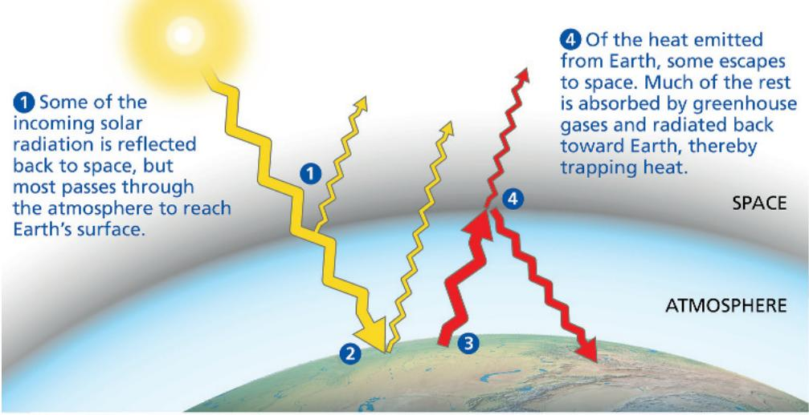  
4 Of the heat emitted from Earth, some escapes to space. Much of the rest is absorbed by greenhouse gases and radiated back toward Earth, thereby trapping heat.  
2 Of the radiation that reaches Earth's surface, some is reflected back to space. Much of the rest is absorbed, warming Earth's surface.  
3 Some of the energy that warms the surface is then emitted from Earth as heat.

Resin canal

## Make Connections: Climate Change Has Effects at All Levels of Biological Organization

Figure 56.31

The burning of fossil fuels by humans has caused atmospheric concentrations of carbon dioxide and other greenhouse gases to rise dramatically (see Figure 56.29). This, in turn, is changing Earth's climate: The planet's average temperature has increased by about $1^{\circ}\mathrm{C}$ since 1900, and extreme weather events are occurring more often in some regions of the globe. How are these changes affecting life on Earth today?

## Effects on Cells

Temperature affects the rates of enzymatic reactions (see Figure 8.17), and as a result, the rates of DNA replication, cell division, and other key processes in cells are affected by rising temperatures.

Global warming and other aspects of climate change have also impaired some organisms' defense responses at the cellular level. For example, in the vast coniferous forests of western North America, climate change has reduced the ability of pine trees to defend themselves against attack by the mountain pine beetle (Dendroctonus ponderosae).

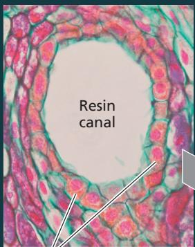

Pine defenses include specialized resin cells that secrete a sticky substance (resin) that can entrap and kill mountain pine beetles. Resin cells produce less resin in trees that are stressed by rising temperatures and drought conditions.

## Resin cells

## 100 μm

When beetles overwhelm a tree's cellular defenses, they produce large numbers of offspring that tunnel through the wood, causing extensive damage. Rising temperatures have shortened how long it takes beetles to mature and reproduce, resulting in even more beetles. The beetles can also infect the tree with a harmful fungus, which appears as blue stains on the wood.

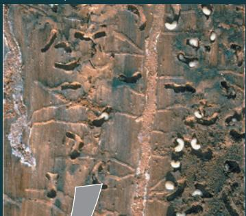

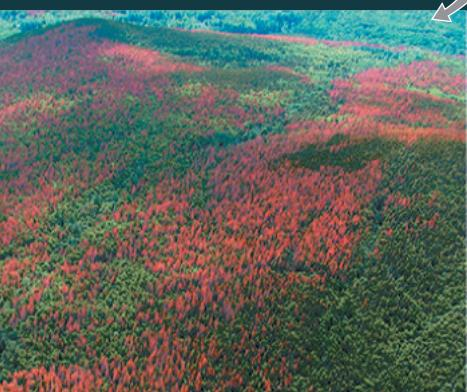

## Effects on Individual Organisms

Organisms must maintain relatively constant internal conditions (see Concept 40.3); for example, an individual will die if its body temperature becomes too high. Global warming has increased the risk of overheating in some species, leading to reduced food intake and reproductive failure.

For instance, an American pika (Ochotona princeps) will die if its body temperature rises just $3^{\circ}$ C above its resting temperature—and this can happen quickly in regions where climate change has already caused significant warming.

As summer temperatures have risen, American pikas are spending more time in their burrows to escape the heat. Thus, they have less time to forage for food. Lack of food has caused mortality rates to increase and birth rates to drop. Pika populations have dwindled, some to the point of extinction. (See Figure 1.11 for another example.)

## Effects on Populations

Climate change has caused some populations to increase in size, while others have declined (see Concept 1.1 and Concept 46.1). In particular, as the climate has changed, some species have adjusted when they grow, reproduce, or migrate—but others have not, causing their populations to face food shortages and reduced survival or reproductive success.

In one example, researchers have documented a link between rising temperatures and declining populations of caribou (Rangifer tarandus) in the Arctic.

  
Caribou populations migrate north in the spring to give birth and to eat sprouting plants.

Alpine chickweed is an early-flowering plant on which caribou depend.

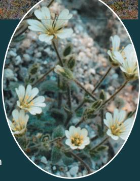

## Effects on Communities and Ecosystems

Climate affects where species live (see Figure 52.9). Climate change has caused hundreds of species to move to new locations, in some cases leading to dramatic changes in ecological communities. Climate change has also altered primary production (see Figure 28.21) and nutrient cycling in ecosystems.

In the example we discuss here, rising temperatures have enabled a sea urchin to invade southern regions along the coast of Australia, causing catastrophic changes to marine communities there.

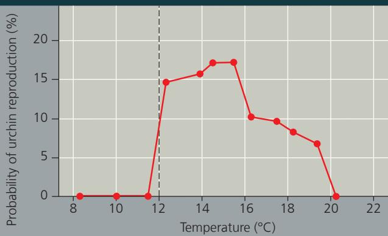  
The sea urchin Centrostephanus rodgersii requires water temperatures above 12°C to reproduce successfully, as shown in this graph. As ocean waters rise above this critical temperature, the urchin has been able to expand its range to the south, destroying kelp beds as it moves into new regions.

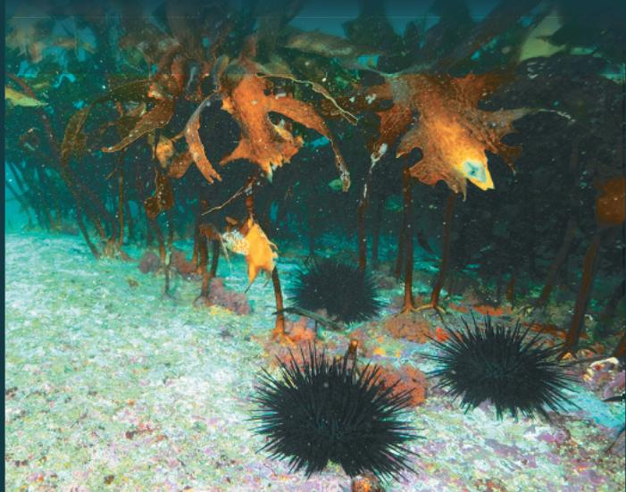  
As the urchin has expanded its range to the south, it has destroyed high-diversity kelp communities, leaving bare regions called "urchin barrens" in its wake.

MAKE CONNECTIONS In addition to contributing to climate change, rising concentrations of $CO_{2}$ also contribute to ocean acidification (see Figure 3.12). Explain how ocean acidification can affect individual organisms, and how that, in turn, can cause dramatic changes in ecological communities.
For suggested answer, see Appendix A.

# Scientific Skills Exercise Graphing Data and Evaluating Evidence

How Has the Rise in Atmospheric $\mathrm{CO}_{2}$ Concentration Changed Over Time? The blue curve in Figure 56.29 shows how the concentration of $\mathrm{CO}_{2}$ in Earth's atmosphere has changed over a span of nearly 60 years. For each year in that span, scientists collected daily $\mathrm{CO}_{2}$ concentration data and used those data to calculate the average $\mathrm{CO}_{2}$ level for that year. In this exercise, you'll graph average $\mathrm{CO}_{2}$ concentrations for three 10-year periods and analyze how those concentrations have changed over time.

Data from the Study The data in the table below are average $CO_{2}$ concentrations (in parts per million, or ppm) at the Mauna Loa monitoring station for each of the indicated years.

<table><tr><td>1969</td><td>324.6</td><td>1989</td><td>353.1</td><td>2009</td><td>387.4</td></tr><tr><td>1970</td><td>325.7</td><td>1990</td><td>354.4</td><td>2010</td><td>389.9</td></tr><tr><td>1971</td><td>326.3</td><td>1991</td><td>355.6</td><td>2011</td><td>391.7</td></tr><tr><td>1972</td><td>327.5</td><td>1992</td><td>356.5</td><td>2012</td><td>393.9</td></tr><tr><td>1973</td><td>329.7</td><td>1993</td><td>357.1</td><td>2013</td><td>396.5</td></tr><tr><td>1974</td><td>330.2</td><td>1994</td><td>358.8</td><td>2014</td><td>398.7</td></tr><tr><td>1975</td><td>331.1</td><td>1995</td><td>360.8</td><td>2015</td><td>400.8</td></tr><tr><td>1976</td><td>332.0</td><td>1996</td><td>362.6</td><td>2016</td><td>404.2</td></tr><tr><td>1977</td><td>333.8</td><td>1997</td><td>363.7</td><td>2017</td><td>406.6</td></tr><tr><td>1978</td><td>335.4</td><td>1998</td><td>366.7</td><td>2018</td><td>408.5</td></tr></table>

Data from National Oceanic & Atmospheric Administration, Earth System Research Laboratory, Global Monitoring Division.

## INTERPRET THE DATA

1. Plot the data for each 10-year period on one graph, where the x-axis runs from year 1 to year 10 (producing three curves); this approach can help you to compare and contrast how the $CO_{2}$ level has changed during the three decades. Select a type of graph that is appropriate for these data, and choose a vertical axis scale that allows you to clearly see how the $CO_{2}$ concentration has changed, both from year to year and from one 10-year period to the next. (For additional information about graphs, see the Scientific Skills Review in Appendix D.)

The ecosystems where the climate has changed the most include those in the far north, particularly northern coniferous forests and tundra. As snow and ice melt and uncover darker, more absorptive surfaces, these systems reflect less radiation back to the atmosphere and warm further (see Figure 56.30). Satellite data show that the area covered by Arctic sea ice in the summer has been declining since 1979 (the first year the data were available). At current rates of decline, there may be no summer ice there within a few decades, decreasing habitat for polar bears, seals, and seabirds. In addition, as discussed in Concept 55.2, rising temperatures have caused some Arctic regions to switch from being a $CO_{2}$ sink (absorbing more $CO_{2}$ from the atmosphere

▶ A researcher sampling the air at the Mauna Loa monitoring station, Hawaii.  

2. For each 10-year period, what is the pattern of change in $CO_{2}$ concentration? Do the curves you have drawn suggest that the pattern has changed from decade to decade?

3. Calculate the annual rate at which the $CO_{2}$ concentration increased during each 10-year period. Perform these calculations as shown here for data from 1959 to 1968 (not in the table): in 1959 the $CO_{2}$ concentration was 316 ppm, while in 1968 it was 323. Thus, from 1959 to 1968, the $CO_{2}$ concentration increased at an average annual rate of

$$
\frac {3 2 3 - 3 1 6}{9}
$$

or 0.8 ppm per year (we divide by 9 because during a 10-year period of time, there are 9 year-to-year changes in $CO_{2}$ concentration).

4. (a) If the annual increase in $CO_{2}$ concentration were to remain at the level observed for 2009–2018, predict the $CO_{2}$ concentration in 2100. (b) Use your results to evaluate the effectiveness of efforts to reduce $CO_{2}$ emissions.

Instructors: A version of this Scientific Skills Exercise can be assigned in Mastering Biology.

than they release to the atmosphere) to a $CO_{2}$ source (releasing more $CO_{2}$ than they absorb)—a worrisome change that could contribute to further climate warming.

Coniferous forests in western North America have also been hard hit, in this case by a combination of higher temperatures, decreased winter snowfall, and a lengthening of the summer dry period. Since the latter half of the 20th century, otherwise healthy forests have experienced a steady increase in the percentage of trees that die each year. Higher temperatures and more frequent droughts also increase the likelihood of fires (see Figure 55.8). In boreal forests of western North America and Russia, for example, fires have burned twice the usual area in recent decades, again

leading to widespread tree mortality. As the climate continues to warm, other changes in the geographic distribution of precipitation are likely, such as agricultural areas of the central United States becoming much drier.

Climate change has already affected many other ecosystems as well. In Europe and Asia, for example, plants are producing leaves earlier in the spring, while in tropical regions, the growth and survival of some species of coral have declined as water temperatures have risen. Recently, Australia's Great Barrier Reef had a catastrophic decline: The combined effects of marine heat waves (in 2016, 2017, 2020, 2022, and 2024) killed so many corals that two-thirds of the reef was severely degraded. A key take-home message from these examples is that a given effect of climate change may, in turn, cause a series of other biological changes. The exact nature of such cascading biological effects can be hard to predict, but it is clear that the more our planet warms, the more severely its ecosystems will be affected.

## Modeling Climate Change

At the current rates that human activities are adding $\mathrm{CO}_{2}$ and other greenhouse gases to the atmosphere, global models predict that Earth's temperature will rise by an additional $3^{\circ}\mathrm{C}$ ( $5^{\circ}\mathrm{F}$ ) by the end of the 21st century. What data are used to construct such models, and are their predictions accurate?

Global models are constructed using data on factors that affect the absorption of solar radiation at Earth's surface. These data are crucial because global temperatures rise when more solar radiation is absorbed by Earth's surface, and they fall when less solar radiation is absorbed by the surface. Natural factors that affect the absorption of solar radiation include an 11-year solar cycle and volcanic explosions. During each round of the solar cycle, the amount of energy emitted by the sun increases and decreases in a regular way, thereby contributing to a well-understood rise or fall in global temperatures at different points in time. Volcanic explosions emit gases and tiny particles that block incoming solar radiation, thereby contributing to a temporary drop in global temperatures. (Changes in the shape of Earth's orbit around the sun also contribute to increases or decreases in global temperatures, but those changes occur gradually over tens of thousands of years and hence are not a cause of recent climate change.)

Scientists also have collected vast amounts of data on how human activities affect absorption of solar radiation. When we burn fossil fuels for electricity, heat, and transportation, we cause $CO_{2}$ and other greenhouse gases to be released to the atmosphere. As shown in Figure 56.30, adding $CO_{2}$ and other greenhouse gases to the atmosphere increases the absorption of solar radiation, leading to global warming. Other human activities decrease the absorption of solar radiation, thereby tending to reduce global temperatures. For example, dust released by plowing fields and the emission of gases such as sulfur dioxide ( $SO_{2}$ ) both decrease the absorption of solar energy, thus reducing global temperatures.

Each of these and other types of data provides a single, well-understood piece of a grand puzzle—how Earth's

## Figure 56.32 Factors contributing to rising global temperatures.

Scientists have measured the temperature of our planet since 1880. These observed temperatures (solid red line) can be compared to results from climate models that incorporate only natural factors that affect global temperatures (dashed blue line) and from models that incorporate both natural and human factors (dotted black line).

  
VISUAL SKILLS Describe how well the predictions shown in the blue and black lines match observed (red) temperature changes over time. Based on the information in this graph, evaluate whether human activities such as burning fossil fuels have contributed to observed temperature changes over time.  
For suggested answer, see Appendix A.

temperature is affected by a combination of natural and human factors. Scientists use computer models to put the pieces of this puzzle together. Each year, large amounts of data on natural and human factors that affect the absorption of solar radiation are entered into the model, which then sums their effects to predict Earth's temperature. Over time, predictions from these models have become increasingly accurate: Global climate models can now reproduce observed changes such as the increase in global warming that has occurred since the 1950s (Figure 56.32) and the global cooling that results from volcanic eruptions.

But why go to all this trouble developing models when Earth's temperature can be measured each year? The reason is that we have only one Earth and hence cannot perform experiments to determine how emitting different amounts of $\mathrm{CO}_{2}$ affects the temperature of our planet. Instead, because we know that global climate models yield accurate predictions, we can use the models to perform "if-then" thought experiments: If we add a certain amount of $\mathrm{CO}_{2}$ to the atmosphere, then global temperatures will rise by a certain number of degrees.

The predictions are sobering. If we continue with “business as usual,” where emissions of $CO_{2}$ continue at current levels, by 2100

September 1979

Earth's temperature will likely be $4^{\circ}\mathrm{C}$ higher than it was in 1900—an increase that would have dire effects for all of Earth's species, including our own. Moreover, even if all $\mathrm{CO}_{2}$ emissions were to stop immediately, the temperature of our planet would continue to rise, making it about $1.5^{\circ}\mathrm{C}$ higher in 2100 than it was in 1900. Earth will continue to warm long after emissions stop because it takes decades for the $\mathrm{CO}_{2}$ already emitted to warm the oceans, and thus that long for the full effect of past emissions to be realized.

## Finding Solutions to Address Climate Change

We will need many approaches to slow global warming and other aspects of climate change. Quick progress can be made by using energy more efficiently and by replacing fossil fuels with renewable solar and wind power and, more controversially, with nuclear power. Today, coal, gasoline, wood, and other organic fuels remain central to industrialized societies and cannot be burned without releasing $CO_{2}$ . Stabilizing $CO_{2}$ emissions will require concerted international effort and changes in both personal lifestyles and industrial processes.

Progress toward finding solutions to address climate change was made in 2015 when virtually all nations agreed—for the first time—to take steps to reduce $CO_{2}$ emissions and limit the extent to which global temperatures ultimately rise. This international effort, known as the Paris Agreement, was ratified by 169 nations. However, reports by the United Nations in 2021 and 2022 indicate that governments are not on target to meet the goals set by the Paris Agreement. An overwhelming amount of evidence indicates that climate change is happening, that the rise in global temperatures since the 1950s was caused primarily by human actions, and that it is associated with negative consequences for human societies and other life on Earth. What we choose to do with this information is up to us.

## Depletion of Atmospheric Ozone

Like carbon dioxide and other greenhouse gases, atmospheric ozone ( $O_{3}$ ) has also changed in concentration because of human activities. Life on Earth is protected from the damaging effects of ultraviolet (UV) radiation by a layer of ozone located in the stratosphere 17–25 km above Earth's surface. However, satellite studies of the atmosphere show that the springtime ozone layer over Antarctica has thinned substantially since the mid-1970s (Figure 56.33). The destruction of atmospheric ozone results primarily from the accumulation of chlorofluorocarbons (CFCs), chemicals once widely used in refrigeration and manufacturing. In the stratosphere, chlorine atoms released from CFCs react with ozone, reducing it to molecular $O_{2}$ . Subsequent chemical reactions liberate the chlorine, allowing it to react with other ozone molecules in a catalytic chain reaction.

The thinning of the ozone layer is most apparent over Antarctica in spring, where cold, stable air allows the chain reaction to continue (Figure 56.34). The magnitude of ozone depletion and the size of the ozone hole have been slightly smaller in recent years than the average for the last 20 years, but the hole still sometimes extends as far as the southernmost portions of Australia, New Zealand, and South America. At the more heavily populated middle latitudes, ozone levels have decreased 2–10% during the past 20 years.

Figure 56.33 Thickness of the October ozone layer over Antarctica, in units called Dobsons.  

Decreased ozone levels in the stratosphere increase the intensity of UV rays reaching Earth's surface. The consequences of ozone depletion may be severe for plants, animals, and microorganisms. Some scientists expect increases in skin cancer and cataracts in humans, as well as unpredictable effects on crops and natural communities, especially the phytoplankton that are responsible for much of Earth's primary production. Such effects have been documented in field experiments. For example, scientists have shown that the growth of phytoplankton decreases and damage to their DNA increases when the ozone hole opens over the Southern Ocean (Antarctic Ocean) each year.

Figure 56.34 Erosion of Earth's ozone shield.  
The ozone hole over Antarctica is visible as the dark blue patch in these images based on atmospheric data.  
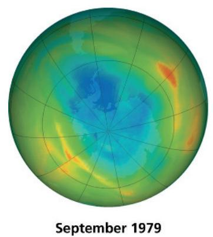

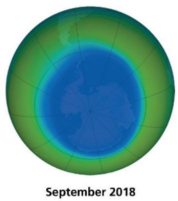

The good news about the ozone hole is how quickly many countries have responded to it. Since 1987, at least 197 nations, including the United States, have signed the Montreal Protocol, a treaty that regulates the use of ozone-depleting chemicals. Most nations have ended the production of CFCs. As a consequence, chlorine concentrations in the stratosphere have stabilized and ozone depletion is slowing. But even though CFC emissions today are close to zero, chlorine molecules already in the atmosphere will continue to influence stratospheric ozone levels for at least 50 years.

The partial destruction of Earth's ozone shield is one more example of how greatly humans can disrupt the dynamics of ecosystems and the biosphere. It also highlights our ability to solve environmental problems when we set our minds to it. However, in 2018 researchers detected an unexpected rise in atmospheric CFC levels, suggesting that unreported new production of these compounds may be occurring. Thus, once environmental regulations are in place, we cannot take them for granted—ongoing monitoring and enforcement are needed.

## Concept Check 56.4

1. How can the addition of excess mineral nutrients to a lake threaten its fish population?

2. MAKE CONNECTIONS There are vast stores of carbon-containing organic matter in the soils of northern coniferous forests and tundra around the world. Suggest why scientists who study global warming are closely monitoring these carbon reservoirs (see Figure 55.14).

3. MAKE CONNECTIONS Mutagens are chemical and physical agents that induce mutations in DNA (see Concept 17.5). How does reduced ozone concentration in the atmosphere increase the likelihood of mutations in various organisms?

For suggested answers, see Appendix A.

# Concept 56.5: Sustainable development can improve human lives while conserving biodiversity

With the increasing loss and fragmentation of habitats, changes in Earth's physical environment and climate, and increasing human population (see Concept 53.6), we face difficult trade-offs in managing the world's resources. Preserving all habitat patches isn't feasible, so biologists must help societies set conservation priorities by identifying which habitat patches are most crucial, while likewise improving the quality of life for local people. Ecologists use the concept of sustainability as a tool to establish long-term conservation priorities.

## Sustainable Development

We need to understand the interconnections of the biosphere to protect species from extinction and improve the quality of human life. To this end, many nations, scientific societies, and other groups have embraced the concept of sustainable development, economic development that meets the needs of people today without limiting the ability of future generations to meet their needs.

Achieving sustainable development is an ambitious goal. To sustain ecosystem processes and stem the loss of biodiversity, we must connect life science with the social sciences, economics, and the humanities. We must also reassess our personal values. Those of us living in wealthier nations have a larger ecological footprint than do people living in developing nations (see Concept 53.6). By including the long-term costs of consumption in our decision-making processes, we can learn to value the ecosystem services that sustain us.

## Case Study: Sustainable Development in Costa Rica

The success of conservation in Costa Rica discussed earlier has required a partnership between the government, nongovernment organizations (NGOs), and private citizens. Many nature reserves established by individuals have been recognized as national wildlife reserves and given significant tax benefits. However, conservation and restoration are only one facet of sustainable development; the other is improving the human condition.

How have the living conditions of the Costa Rican people changed as the country has pursued its conservation goals? As represented in Figure 56.35, two fundamental indicators of

Figure 56.35 Infant mortality and life expectancy at birth in Costa Rica.  

Figure 56.36 Biophilia, past and present.

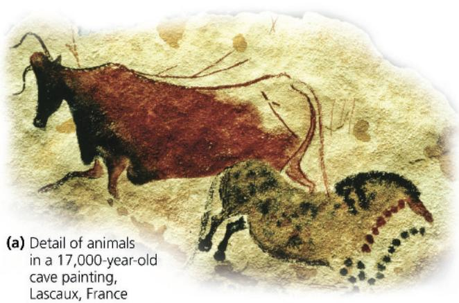  
(a) Detail of animals in a 17,000-year-old cave painting, Lascaux, France

  
(b) A 30,000-year-old ivory carving of a water bird, found in Germany

  
(c) Nature lovers on a wildlife-watching expedition

living conditions are infant mortality rate and life expectancy (see Concept 53.6). From 1930 to 2020, the infant mortality rate in Costa Rica declined from 170 to 7 per 1,000 live births; over the same period, life expectancy increased from about 43 years to 79 years. Another indicator of living conditions is the

literacy rate. The 2015 literacy rate in Costa Rica was 98%, compared to an average of 87% in the other six Central American countries. Such statistics show that living conditions in Costa Rica have improved greatly in the time in which the country has dedicated itself to conservation and restoration. While this does not prove that conservation causes an improvement in human welfare, we can say with certainty that development in Costa Rica has attended to both nature and people.

## The Future of the Biosphere

Our modern lives are very different from those of early humans, who hunted and gathered to survive. Their reverence for nature is evident in the early cave paintings of wildlife (Figure 56.36a) and in the visions of life they sculpted from bone and ivory (Figure 56.36b).

Our lives reflect remnants of our ancestral attachment to nature and the diversity of life—the concept of biophilia introduced early in this chapter. We evolved in natural environments rich in biodiversity, and we still have an affinity for such settings (Figure 56.36c and d). Indeed, our biophilia may be innate, an evolutionary product of natural selection acting on a brainy species whose survival depended on a close connection to the environment and a practical appreciation of plants and animals.

Our appreciation of life guides the field of biology today. We celebrate life by deciphering the genetic code that makes each species unique. We embrace life by using fossils and DNA to chronicle evolution through time. We preserve life through our efforts to classify and protect the millions of species on Earth. We respect life by using nature responsibly and reverently to improve human welfare.

Biology is the scientific expression of our desire to know nature. We are most likely to protect what we appreciate and are most likely to appreciate what we understand. By learning about the processes and diversity of life, we become more aware of our place in the biosphere. We hope this text has served you well in this lifelong adventure.

## Concept Check 56.5

1. What is meant by the term sustainable development?

2. How might biophilia influence us to conserve species and restore ecosystems?

3. WHAT IF? Suppose a new fishery is discovered, and you are put in charge of developing it sustainably. What ecological data might you want on the fish population? What criteria would you apply for the fishery's development?

For suggested answers, see Appendix A.

# Chapter 56 Review

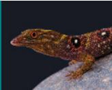

## Summary of Key Concepts

To review key terms, go to the Vocabulary Self-Quiz (eTextbook only).

Concept 56.1: Human activities threaten earth's biodiversity

\- Biodiversity can be considered at three main levels:

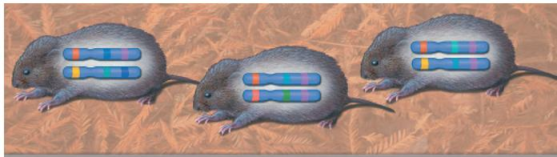  
Genetic diversity: enables adaptation to environmental change

  
Species diversity: maintains communities and food webs

  
Ecosystem diversity: provides life-sustaining services

\- Our biophilia enables us to recognize the value of biodiversity for its own sake. Other species also provide humans with food, fiber, medicines, and ecosystem services.

\- Four major threats to biodiversity are habitat loss, introduced species, overharvesting, and global change.

Give at least three examples of key ecosystem services that nature provides for people.

## Concept 56.2: Population conservation focuses on population size, genetic diversity, and critical habitat

\- When a population drops below a minimum viable population (MVP) size, its loss of genetic variation due to inbreeding and genetic drift can trap it in an extinction vortex.

\- A loss of critical habitat can cause threatened populations to show a downward trend, even if the population is far above its minimum viable population size.

\- Conserving species often requires resolving conflicts between the habitat needs of endangered species and human demands.

Why is the minimum viable population size smaller for a genetically diverse population than for a less genetically diverse population?

## Concept 56.3: Landscape and regional conservation help sustain biodiversity

\- The structure of a landscape can strongly influence biodiversity. As habitat fragmentation increases and edges become more extensive, biodiversity tends to decrease. Movement corridors can promote dispersal and help sustain populations.

\- Biodiversity hot spots are also hot spots of extinction and thus prime candidates for protection. Sustaining biodiversity in parks and reserves requires management to ensure that human activities in the surrounding landscape do not harm the protected habitats. The zoned reserve model recognizes that conservation efforts often involve working in landscapes that are greatly affected by human activity.

\- Urban ecology is the study of organisms and their environment in primarily urban settings.

Give two examples that show how habitat fragmentation can harm species in the long term.

## Concept 56.4: Earth is changing rapidly as a result of human actions

\- Agriculture removes plant nutrients from ecosystems, so large supplements are usually required. The nutrients in fertilizer can pollute groundwater and surface-water aquatic ecosystems (eutrophication), where they can stimulate excess algal growth.

\- The release of industrial compounds, pesticides, pharmaceuticals, and plastic waste has polluted the environment with harmful substances that often persist for long periods and become increasingly concentrated in successively higher trophic levels of food webs (biological magnification).

\- Because of the burning of fossil fuels and other human activities, the atmospheric concentration of $CO_{2}$ and other greenhouse gases has been steadily increasing. These increases have caused climate change, including significant global warming and changing patterns of precipitation. Climate change has already affected many ecosystems.

\- The ozone layer reduces the penetration of UV radiation through the atmosphere. Human activities, notably the release of chlorine-containing pollutants, have eroded the ozone layer, but government policies are helping to solve the problem.

Thinking about biological magnification of toxins, is it healthier to feed at a lower or higher trophic level? Explain.

## Concept 56.5: Sustainable development can improve human lives while conserving biodiversity

\- Sustainable development refers to economic development that meets the needs of people today without limiting the ability of future generations to meet their needs.

\- Costa Rica's success in conserving tropical biodiversity has involved a partnership among the government, other organizations, and private citizens. Human living conditions in Costa Rica have improved along with ecological conservation.

Why is sustainability such an important goal for conservation biologists? For suggested answers, see Appendix A.

## Test Your Understanding

For more multiple-choice questions, go to the Practice Test (eTextbook only).

## Levels 1-2: Remembering/Understanding

1. One characteristic that distinguishes a population in an extinction vortex from most other populations is that

(A) its members are rare, top-level predators.

(B) its effective population size is lower than its total population size.

(C) its genetic diversity is very low.

(D) it is not well adapted to edge conditions.

2. The main cause of the increase in the amount of $\mathrm{CO}_{2}$ in Earth's atmosphere over the past 170 years is

(A) increased worldwide primary production.

(B) increased worldwide fertilizer production.

(C) increased infrared radiation absorption by the atmosphere.

(D) the burning of fossil fuels and deforestation.

3. What is the single greatest threat to biodiversity?

(A) overharvesting of commercially important species

(B) habitat alteration, fragmentation, and destruction

(C) introduced species that compete with native species

(D) novel pathogens

from forest edges. The reserve extends about 6,000 m from east to west and 3,000 m from north to south. It is surrounded by a deforested pasture on the west, an agricultural field for 500 m in the southwest corner, and intact forest everywhere else. You must build a road, 10 m by 3,000 m, from the north to the south side of the reserve and construct a maintenance building that will take up 100 m $^{2}$ . Draw a map of the reserve and explain where you would put the road and building to minimize cowbird intrusion along edges.

8. EVOLUTION CONNECTION The fossil record indicates that there have been five mass extinction events in the past 500 million years (see Concept 25.4). Many ecologists think we are on the verge of another. Briefly discuss the history of mass extinctions and the length of time it typically takes for species diversity to recover through evolution. Explain why this should motivate us to slow the loss of biodiversity today.

9. WRITE ABOUT A THEME: INTERACTIONS One factor favoring rapid population growth by an introduced species is the absence of the predators, parasites, and pathogens that controlled its population in the region where it evolved. In a short essay (100–150 words), explain how evolution by natural selection would influence the rate at which native predators, parasites, and pathogens attack an introduced species.

## Levels 3-4: Applying/Analyzing

4. Which of these is a consequence of biological magnification?

(A) Toxic chemicals in the environment pose greater risk to top-level predators than to primary consumers.

(B) Populations of top-level predators are generally smaller than populations of primary consumers.

## 10. SYNTHESIZE YOUR KNOWLEDGE

(C) The biomass of producers in an ecosystem is generally higher than the biomass of primary consumers.

(D) Only a small portion of the energy captured by producers is transferred to consumers.

5. Which of the following strategies would most rapidly increase the genetic diversity of a population in an extinction vortex?

(A) Establish a reserve that protects the population's habitat.

(B) Introduce new individuals transported from other populations of the same species.

(C) Sterilize the least fit individuals in the population.

(D) Control populations of the endangered population's predators and competitors.

6. Which of the following statements about protected areas established to preserve biodiversity is true?

(A) About $25\%$ of Earth's land area is now protected.

(B) National parks are the only type of protected area.

(C) Management of a protected area does not need to be coordinated with management of the surrounding area.

(D) It is especially important to protect biodiversity hot spots.

## Levels 5-6: Evaluating/Creating

7. DRAW IT Suppose you are managing a forest reserve, and one of your goals is to protect local populations of woodland birds from parasitism by the brown-headed cowbird. You know that female cowbirds don't venture more than about $100\mathrm{m}$ into a forest and that nest parasitism is reduced when woodland birds nest away

  
Big cats, such as the Siberian tiger (Panthera tigris altaica), are one of the most endangered groups of mammals in the world. Based on what you've learned in this chapter, discuss some approaches you would use to help preserve them.

For selected answers, see Appendix A.

# Explore Scientific Papers with Science in the Classroom | AAAS

How can genetic analyses help in the fight against poaching? Go to “CSI Africa: Tracking Ivory Poachers” at www.scienceintheclassroom.org.

Instructors: Questions can be assigned in Mastering Biology.

# Appendix A: Answers

NOTE: Answers to Scientific Skills Exercises, Problem-Solving Exercises, Interpret the Data questions, and short-answer essay questions are available only for instructors in the Instructor Resources area of Mastering Biology. Scientific Skills Exercises, Problem-Solving Exercises, Interpret the Data questions, and additional questions for the Visualizing Figures can be assigned and automatically graded in Mastering Biology.

## Chapter 1

## Figure Questions

Figure 1.4 Dividing the length of the prokaryotic cell by the length of the scale bar, the length of the prokaryotic cell is about 1.4 scale bars. Each scale bar represents 1 $\mu$ m, so the prokaryotic cell is about 1.4 $\mu$ m long. Dividing the diameter of the eukaryotic cell by the length of the scale bar, the diameter of the eukaryotic cell is about 8.2 scale bars,

Figure 1.18

  
5 Environmental change resulting in survival of organisms with different traits

which is 8.2 $\mu$ m. Figure 1.10 The response to high blood glucose is increased glucose uptake by cells and glucose storage in liver cells and muscle. The response lowers blood glucose levels—thus, it acts in opposition to the original stimulus.

As the soil gradually becomes lighter gray, beetles that match the color of the soil will not be seen by birds and therefore will not be eaten. For example, when the soil is medium-colored, it will be easiest for birds to see and eat the darkest and lightest of the beetles in a population. (Most or all of the lighter beetles will have been eaten earlier, but new light beetles will arise due to variation in new generations of the population.) Thus, over time, the population will become lighter as the soil becomes lighter.

## Concept Check 1.1

1. Examples: A molecule consists of atoms bonded together. Each organelle has an orderly arrangement of molecules. Photosynthetic plant cells contain organelles called chloroplasts. A tissue consists of a group of similar cells. Organs such as the heart are constructed from several tissues. A complex multicellular organism, such as a plant, has several types of organs, such as leaves and roots. A population is a set of organisms of the same species. A community consists of populations of the various species inhabiting a specific area. An ecosystem consists of a biological community along with the nonliving factors important to life, such as air, soil, and water. The biosphere is made up of all of Earth's ecosystems. 2. (a) New properties emerge at successive levels of biological organization: Structure and function are correlated. (b) Life's processes involve the expression and transmission of genetic information. (c) Life requires the transfer and transformation of energy and matter. 3. Sample answers: Organization (Emergent properties): The ability of a human heart to pump blood requires an intact heart; it is not a capability of any of the heart's tissues or cells working alone. Organization (Structure and function): The strong, sharp teeth of a wolf are well suited to grasping and dismembering its prey. Information: Human eye color is determined by the combination of genes inherited from the two parents. Energy and Matter: A plant, such as a grass, absorbs energy from the sun and transforms it into molecules that act as stored fuel. Animals can eat parts of the plant and use the food for energy to carry out their activities. Interactions (Molecules): When your stomach is full, it signals your brain to decrease your appetite. Interactions (Ecosystems): A mouse eats food, such as nuts or grasses, and deposits some of the food material as wastes (feces and urine). Construction of a nest rearranges the physical environment and may hasten degradation of some of its components. The mouse may also act as food for a predator.

## Concept Check 1.2

1. The naturally occurring heritable variation in a population is “edited” by natural selection because individuals with traits better suited to the environment survive and reproduce more successfully than others, and these traits are passed on to the next generation more often. Over time, better-suited individuals persist and their percentage in the population increases, while less well-suited individuals become less prevalent—a type of population editing. 2. Here is one possible explanation: The ancestor species of the green warbler finch lived on an island where insects were a plentiful food source. Among individuals in the ancestor population, there was likely variation in beak shape and size. Individuals with slender, sharp beaks were likely more successful at picking up insects for food. Being well-nourished, they gave rise to more offspring than birds with thick, short beaks. Their many offspring inherited slender, sharp beaks (because of genetic information being passed from generation to generation, although Darwin didn’t know this). In each generation, the offspring birds with the beaks of a shape best at picking up insects would eat more and have more offspring. Therefore, the green warbler finch of today has a slender beak that is very well matched (adapted) to its food source, insects.
3.

## Concept Check 1.3

1. Mouse coat color matches the environment for both beach and inland populations.
2. Inductive reasoning derives generalizations from specific cases; deductive reasoning predicts specific outcomes from general premises.
3. Compared to a hypothesis, a scientific theory is usually more general and substantiated by a much greater amount of evidence. Natural selection is an explanatory idea that applies to all kinds of organisms and is supported by vast amounts of evidence of various kinds.
4. Based on the mouse coloration in Figure 1.25, you might expect that the mice that live on the sandy soil would be lighter in color and those that live on the lava rock would be much darker. And in fact, that is what researchers have found. You would predict that each color of mouse would be less preyed upon in its native habitat than it would be in the other habitat. (Research results also support this prediction.) You could repeat the Hoekstra experiment with colored models, painted to resemble these two types of mouse. Or you could try transplanting some of each population to its non-native habitat and counting how many you can recapture over the next few days, then comparing the four samples as was done in Hoekstra's experiment. (The painted models are easier to recapture, of course!) In the live mouse transplantation experiment, you would have to do controls to eliminate the variable represented by the transplanted mice being in a new, unknown territory. You could control for the transplantation process by transplanting some dark mice from one area of lava rock to one far distant, and some light mice from one area of sandy soil to a distant area.

## Concept Check 1.4

1. Science aims to understand natural phenomena and the underlying mechanisms that affect them, while technology involves application of scientific discoveries for a particular purpose or to solve a specific problem.
2. Natural selection could be operating. Malaria is present in sub-Saharan Africa, India, southeast Asia, and other warm regions, so there might be an advantage to people with the sickle-cell disease form of the gene that makes them more able to survive and pass on their genes to offspring. Among descendants of ancestors from those regions living in the United States, where malaria is absent, there would be no advantage, so they would be selected against more strongly, resulting in fewer individuals with the sickle-cell disease form of the gene.

## Summary of Key Concepts Questions

1.1 Finger movements rely on the coordination of the many structural components of the hand (muscles, nerves, bones, etc.), each of which is composed of elements from lower levels of biological organization (cells, molecules). The development of the hand relies on the genetic information encoded in chromosomes found in cells throughout the body. To power the finger movements that result in a text message, muscle and nerve cells require chemical energy that they transform in powering muscle contraction or in propagating nerve impulses. Texting is in essence communication, an interaction that conveys information between organisms, in this case of the same species. 1.2 Ancestors of the beach mouse may have exhibited variations in their coat color. Because of the prevalence of visual predators, the better-camouflaged (lighter) mice in the beach habitat may have survived longer and been able to produce more offspring. Over time, a higher and higher proportion of individuals in the population would have had the adaptation of lighter fur that acted to camouflage the mouse in the beach habitat. 1.3 Gathering and interpreting data are core activities in the scientific process, and they are affected by, and affect in turn, three other arenas of the scientific process: exploration and discovery, community analysis and feedback, and societal benefits and outcomes. 1.4 Different approaches taken by scientists studying natural phenomena at different levels complement each other, so more is learned about each problem being studied. A diversity of backgrounds among scientists may lead to fruitful ideas in the same way that important innovations have often arisen where a mix of cultures coexist, due to multiple different viewpoints.

## Test Your Understanding

1. B 2. C 3. C 4. B 5. C 6. A 7. D 8. Your figure should show the following: (1) for the biosphere, the Earth with an arrow coming out of a tropical ocean; (2) for the ecosystem, a distant view of a coral reef; (3) for the community, a collection of reef animals and algae, with corals, fishes, some seaweed, and any other organisms you can think of; (4) for the population, a group of fish of the same

species; (5) for the organism, one fish from your population; (6) for the organ, the fish's stomach; (7) for a tissue, a group of similar cells from the stomach; (8) for a cell, one cell from the tissue, showing its nucleus and a few other organelles; (9) for an organelle, the nucleus, where most of the cell's DNA is located; and (10) for a molecule, a DNA double helix. Your sketches can be very rough!

## Chapter 2

## Figure Questions

Figure 2.7 Atomic number = 12; 12 protons, 12 electrons; three electron shells; 2 valence electrons

Figure 2.14 One possible answer:  
Figure 2.17  

## Concept Check 2.1

1. Table salt (sodium chloride) is made up of sodium and chlorine. We are able to eat the compound, showing that it has different properties from those of a metal (sodium) and a poisonous gas (chlorine). 2. Yes. An organism requires trace elements, though only in small amounts. 3. A person with an iron deficiency will probably show fatigue and other effects of a low oxygen level in the blood. (The condition is called anemia and can also result from too few red blood cells or abnormal hemoglobin.) 4. Variant ancestral plants that could tolerate elevated levels of the elements in serpentine soils could grow and reproduce there. (Plants that were well adapted to nonserpentine soils would not be expected to survive in serpentine areas.) The offspring of the variants would also vary, with those most capable of thriving under serpentine conditions growing best and reproducing most. Over many generations, this probably led to the serpentine-adapted species we see today.

## Concept Check 2.2

1.7 2. $^{15}_{7}\mathrm{N}$ 3.9 electrons; two electron shells; 1s, 2s, 2p (three orbitals); 1 electron is needed to fill the valence shell. 4. The elements in a row all have the same number of electron shells. All the elements in a column have the same number of electrons in their valence shells.

## Concept Check 2.3

1. In this structure, each carbon atom has only three covalent bonds instead of the required four.
2. The attraction between oppositely charged ions, forming ionic bonds
3. If you could synthesize molecules that mimic these shapes, you might be able to treat diseases or conditions caused by the inability of affected individuals to synthesize such molecules—or to block the function of such molecules if overproduction is the cause of the disorder.

## Concept Check 2.4

2. At equilibrium, the forward and reverse reactions occur at the same rate. 3. $C_{6}H_{12}O_{6} + 6O_{2} \rightarrow 6CO_{2} + 6H_{2}O + Energy$ . Glucose and oxygen react to form carbon dioxide and water, releasing energy. We breathe in oxygen because we need it for this reaction to occur, and we breathe out carbon dioxide because it is a by-product of this reaction. (This reaction is called cellular respiration, and you will learn more about it in Chapter 9.)

## Summary of Key Concepts Questions

2.1 A compound is made up of two or more elements combined in a fixed ratio, while an element is a substance that cannot be broken down to other substances.
2.2

  
Neon(10Ne)

Both neon and argon have completed valence shells, containing 8 electrons. They do not have unpaired electrons that could participate in chemical bonds. 2.3 Electrons are shared equally between the two atoms in a nonpolar covalent bond. In a polar covalent bond, the electrons are drawn closer to the more

electronegative atom. In the formation of ions, an electron is completely transferred from one atom to a much more electronegative atom. 2.4 The concentration of products would increase as the added reactants were converted to products. Eventually, an equilibrium would again be reached in which the forward and reverse reactions were proceeding at the same rate and the relative concentrations of reactants and products returned to where they were before the addition of more reactants.

## Test Your Understanding

1. D 2. A 3. B 4. A 5. D 6. B 7. C 8. D

$$
H: \ddot {O}: \begin{array}{c} H \\ C \\ H \end{array} : \begin{array}{c} H \\ C \\ C \end{array} :: \ddot {O}\tag{9.}
$$

This structure makes sense because all valence shells are complete, and all bonds have the correct number of electrons.

This structure doesn't make sense because H has only 1 electron to share, so it cannot form bonds with 2 atoms.

## Chapter 3

Figure Questions

Figure 3.2 One possible answer:  

Figure 3.8 Heating the solution would cause the water to evaporate faster than it is evaporating at room temperature. At a certain point, there wouldn't be enough water molecules to dissolve the salt ions. The salt would start coming out of solution and re-forming crystals. Eventually, all the water would evaporate, leaving behind a pile of salt like the original pile. Figure 3.12 Adding excess $\mathrm{CO}_{2}$ to the oceans ultimately reduces the rate at which calcification (by organisms) can occur.

## Concept Check 3.1

1. Electronegativity is the attraction of an atom for the electrons of a covalent bond. Because oxygen is more electronegative than hydrogen, the oxygen atom in $H_{2}O$ pulls electrons toward itself, resulting in two partial negative charges on the oxygen atom and a partial positive charge on each hydrogen atom. Atoms in neighboring water molecules with opposite partial charges are attracted to each other, forming a hydrogen bond. 2. Due to its two polar covalent bonds, a water molecule has regions of partial negative charge on the O atom that allow it to form hydrogen bonds with hydrogen atoms on neighboring water molecules, and regions of partial positive charge on the H atoms that allow them to form hydrogen bonds with oxygen atoms on neighboring water molecules. 3. The hydrogen atoms of one molecule, with their partial positive charges, would repel the partially positively charged hydrogen atoms of the adjacent molecule. 4. The covalent bonds of water molecules would not be polar, so no regions of the molecule would carry partial charges and water molecules would not form hydrogen bonds with each other.

## Concept Check 3.2

1. Hydrogen bonds hold neighboring water molecules together. This cohesion helps chains of water molecules move upward against gravity in water-conducting cells as water evaporates from the leaves. Adhesion between water molecules and the walls of the water-conducting cells also helps counter gravity.
2. High humidity hampers cooling by suppressing the evaporation of sweat.
3. As water freezes, it expands because water molecules move farther apart in forming ice crystals. When there is water in a crevice of a boulder, expansion due to freezing may crack the boulder.
4. The hydrophobic substance repels water, perhaps helping to keep the ends of the legs from becoming coated with water and breaking through the surface. If the legs were coated with a hydrophilic substance, water would be drawn up them, possibly making it more difficult for the water strider to walk on water.

## Concept Check 3.3

1. $10^{5}$ , or 100,000
2. $[H^{+}] = 0.01M = 10^{-2}M$ , so pH = 2.

3. $CH_{3}COOH \rightarrow CH_{3}COO^{-} + H^{+}$ . $CH_{3}COOH$ is the acid (the $H^{+}$ donor), and $CH_{3}COO^{-}$ is the base (the $H^{+}$ acceptor). 4. The pH of the water should decrease from 7 to about 2 (as mentioned in the text); the pH of the acetic acid solution will decrease only a small amount, because as a weak acid, it acts (like carbonic acid) as a buffer. The reaction shown for question 3 will shift to the left, with $CH_{3}COO^{-}$ accepting the influx of $H^{+}$ and becoming $CH_{3}COOH$ molecules.

## Summary of Key Concepts Questions

3.1

No. A covalent bond is a strong bond in which electrons are shared between two atoms. A hydrogen bond is a weak bond, which does not involve electron sharing, but is simply an attraction between two partial charges on neighboring atoms. 3.2 Ions dissolve in water when polar water molecules form a hydration shell around them, with partially charged regions of water molecules being attracted to ions of the opposite charge. Polar molecules dissolve as water molecules form hydrogen bonds with them and surround them. A solution is a homogeneous mixture of a solute and a solvent. 3.3 The concentration of hydrogen ions ( $H^{+}$ ) would be $10^{-11}$ , and the pH of the solution would be 11.

## Test Your Understanding

1.C 2.D 3.C 4.A 5.D

7. Due to intermolecular hydrogen bonds, water has a high specific heat (the amount of heat required to increase the temperature of water by $1^{\circ}$ C). When water is heated, much of the heat is absorbed in breaking hydrogen bonds before the water molecules increase their motion and the temperature increases. Conversely, when water is cooled, many H bonds are formed, which releases a significant amount of heat. This release of heat can provide some protection against freezing of the plants' leaves, thus protecting the cells from damage. 8. Both global warming and ocean acidification are caused by increasing levels of carbon dioxide in the atmosphere, the result of burning fossil fuels.

## Chapter 4

## Figure Questions

Figure 4.2 Because the concentration of the reactants influences the equilibrium (as discussed in Concept 2.4), there might have been more HCN relative to $CH_{2}O$ since there would have been a higher concentration of the reactant gas containing nitrogen.

Figure 4.4  

Figure 4.6 The tails of fats contain only carbon-hydrogen bonds, which are relatively nonpolar. Because the tails occupy the bulk of a fat molecule, they make the molecule as a whole nonpolar and therefore incapable of forming hydrogen bonds with water.

Figure 4.7

## Concept Check 4.1

1. The sparks provided energy needed for the inorganic molecules in the atmosphere to react with each other. (You'll learn more about energy and chemical reactions in Chapter 8.)

## Concept Check 4.2

2. The forms of $C_{4}H_{10}$ in (b) are structural isomers, as are the butenes (forms of $C_{4}H_{8}$ ) in (c). 3. Both consist largely of hydrocarbon chains, which provide fuel—gasoline for engines and fats for plant embryos and animals. Reactions of both types of molecules release energy. 4. No. There is not enough diversity in propane's atoms. It can't form structural isomers because there is only one way for three carbons to attach to each other (in a line). There are no double bonds, so cis-trans isomers are not possible. Each carbon has at least two hydrogens attached to it, so the molecule is symmetrical and cannot have enantiomers.

## Concept Check 4.3

1. An amino acid has both an amino group ( $—NH_{2}$ ), which makes it an amine, and a carboxyl group (—COOH), which makes it a carboxylic acid. 2. The ATP molecule loses a phosphate, becoming ADP.

A chemical group that can act as a base has been replaced with a group that can act as an acid, increasing the acidic properties of the molecule. The shape of the molecule would also change, likely changing the molecules with which it can interact. The original cysteine molecule has an asymmetric carbon in the center. After replacement of the amino group with a carboxyl group, this carbon is no longer asymmetric.

## Summary of Key Concepts Questions

4.1 Miller showed that organic molecules could form under the physical and chemical conditions estimated to have been present on early Earth. This abiotic synthesis of organic molecules would have been a first step in the origin of life. 4.2 Acetone and propanal are structural isomers. Acetic acid and glycine have no asymmetric carbons, whereas glycerol phosphate has one. Therefore, glycerol phosphate can exist as forms that are enantiomers, but acetic acid and glycine cannot. 4.3 The methyl group is nonpolar and not reactive. The other six groups are called functional groups because they can participate in chemical reactions. Also, all except the sulfhydryl group are hydrophilic, increasing the solubility of organic compounds in water.

## Test Your Understanding

1. B 2. B 3. C 4. C 5. A 6. B 7. A 8. The molecule on the right; the middle carbon is asymmetric.

9. Silicon has 4 valence electrons, the same number as carbon. Therefore, silicon would be able to form long chains, including branches, that could act as skeletons for large molecules. It would clearly do this much better than neon (with no valence electrons) or aluminum (with 3 valence electrons).

## Chapter 5

## Figure Questions

Figure 5.3 Glucose and fructose are structural isomers.

Figure 5.4

Four carbons are in the fructose ring, and two are not. (The latter two carbons are attached to carbons 2 and 5, which are in the ring.) The fructose ring differs from the glucose ring, which has five carbons in the ring and one that is not. (Note that the orientation of this fructose molecule is flipped horizontally relative to that of the one in Figure 5.5b; also, note that the oxygen on carbon 5 lost its proton and that the oxygen on carbon 2, which used to be the carbonyl oxygen, gained a proton.

Figure 5.5  

a. In maltose, the linkage is called a 1–4 glycosidic linkage because the number 1 carbon in the left monosaccharide (glucose) is linked to the number 4 carbon in the right monosaccharide (also glucose). b. In sucrose, the linkage is called a 1–2 glycosidic linkage because the number 1 carbon in the left monosaccharide (glucose) is linked to the number 2 carbon in the right monosaccharide (fructose). (Note that the fructose molecule is oriented differently from glucose in Figures 5.4 and 5.5b, where carbon 2 is on the right. In fructose in Figure 5.5b and here, carbon 2 of fructose is on the left.)  

Figure 5.16 1. The polypeptide backbone is most easily followed in the ribbon model.  

3. The point of this diagram is to show that a pancreas cell secretes insulin proteins, so the shape is not important to the process being illustrated. Figure 5.17 We can see that their complementary shapes allow the two proteins to fit together quite precisely. Figure 5.19 The R group on glutamic acid is acidic and hydrophilic, whereas that on valine is nonpolar and hydrophobic. Therefore, it is unlikely that valine and glutamic acid participate in the same intramolecular interactions. A change in these interactions could (and does) cause a disruption of molecular structure. Figure 5.26 Using a genomics approach allows us to use gene sequences to identify species and to learn about evolutionary relationships among any two species. This is because all species are related by their evolutionary history, and the evidence is in the DNA sequences. Proteomics—looking at proteins that are expressed—allows us to learn about how organisms or cells are functioning at a given time or in an association with another species.

## Concept Check 5.1

1. The four main classes are proteins, carbohydrates, lipids, and nucleic acids. Lipids are not polymers.
2. Nine, with one water molecule required to hydrolyze each connection between adjacent monomers.
3. The amino acids in the fish protein must be released in hydrolysis reactions and incorporated into other proteins in dehydration reactions.

## Concept Check 5.2

1. $C_{3}H_{6}O_{3}$ 2. $C_{12}H_{22}O_{11}$ 3. The antibiotic treatment is likely to have killed the cellulose-digesting prokaryotic organisms in the cow's gut. The absence of these prokaryotic organisms would hamper the cow's ability to obtain energy from food and could lead to weight loss and possibly death. Thus, prokaryotic species are reintroduced, in appropriate combinations, in the gut culture given to treated cows.

## Concept Check 5.3

1. Both have a glycerol molecule attached to fatty acids. The glycerol of a fat has three fatty acids attached, whereas the glycerol of a phospholipid is attached to two fatty acids and one phosphate group.
2. Human sex hormones are steroids, a type of compound that is hydrophobic and thus classified as a lipid.
3. The oil droplet membrane could consist of a single layer of phospholipids rather than a bilayer, because an arrangement in which the hydrophobic tails of the membrane phospholipids were in contact with the hydrocarbon regions of the oil molecules would be more stable.

## Concept Check 5.4

1. Secondary structure involves hydrogen bonds between atoms of the polypeptide backbone. Tertiary structure involves interactions between atoms of the side chains of the amino acid subunits. 2. The two ring forms of glucose are called $\alpha$ and $\beta$ , depending on how the glycosidic bond dictates the position of a hydroxyl group. Proteins have $\alpha$ helices and $\beta$ pleated sheets, two types of repeating structures found in polypeptides due to interactions between the repeating constituents of the chain (not the side chains). The hemoglobin molecule is made up of two types of polypeptides: It contains two molecules each of $\alpha$ -globin and $\beta$ -globin. 3. During formation of a polypeptide by polymerization of amino acids, the amino group of one amino acid reacts with the carboxyl group of the next, forming a peptide bond. Therefore, in a polypeptide, there is only one amino group on the N-terminus and one carboxyl group on the C-terminus, along with any carboxyl groups or amino groups located in the amino acid side chains (R groups). 4. These are all nonpolar, hydrophobic amino acids, so you would expect this region to be located in the interior of the folded polypeptide, where it would not contact the aqueous environment inside the cell.

## Concept Check 5.5

## Concept Check 5.6

1. The DNA of an organism encodes all of its proteins, and proteins are the molecules that carry out the work of cells, whether an organism is unicellular or multicellular. By knowing the DNA sequence of an organism, scientists would be able to catalog the protein sequences as well.
2. Ultimately, the DNA sequence carries the information necessary to make the proteins that determine the traits of a particular species. Because the traits of the two species are similar, you would expect the proteins to be similar as well, and therefore the gene sequences should also have a high degree of similarity.

## Summary of Key Concepts Questions

5.1 The polymers of large carbohydrates (polysaccharides), proteins, and nucleic acids are built from three different types of monomers (monosaccharides, amino acids, and nucleotides, respectively). 5.2 Both starch and cellulose are polymers of glucose, but the glucose monomers are in the $\alpha$ configuration in starch and the $\beta$ configura tion in cellulose. The glycosidic linkages thus have different geometries, giving the polymers different shapes and thus different properties. Starch is an energy-storage compound in plants; cellulose is a structural component of plant cell walls. Humans can hydrolyze starch to provide energy but cannot hydrolyze cellulose. Cellulose aids in the passage of food through the digestive tract. 5.3 Lipids are not polymers because they do not exist as a chain of linked monomers. They are not considered macromolecules because they do not reach the giant size of many polysaccharides, proteins, and nucleic acids. 5.4 A polypeptide, which may consist of hundreds of amino acids in a specific sequence (primary structure), has regions of coils and pleats (secondary structure), which are then folded into irregular contortions (tertiary structure) and may be noncovalently associated with other polypeptides (quaternary structure). The linear order of amino acids, with the varying properties of their side chains (R groups), determines what secondary and

8.

tertiary structures will form to produce a protein. The resulting unique three-dimensional shapes of proteins are key to their specific and diverse functions. 5.5 The complementary base pairing of the two strands of DNA makes possible the precise replication of DNA every time a cell divides, ensuring that genetic information is faithfully transmitted. In some types of RNA, complementary base pairing enables RNA molecules to assume specific three-dimensional shapes that facilitate diverse functions. 5.6 You would expect the human gene sequence to be most similar to that of the mouse (another mammal), then to that of the fish (another vertebrate), and least similar to that of the fruit fly (an invertebrate).

## Test Your Understanding

1. D  2. A  3. B  4. A  5. B  6. B  7. C

<table><tr><td></td><td>Monomers or Components</td><td>Polymer or larger molecule</td><td>Type of linkage</td></tr><tr><td>Carbohydrates</td><td>Monosaccharides</td><td>Polysaccharides</td><td>Glycosidic linkages</td></tr><tr><td>Fats</td><td>Fatty acids</td><td>Triacylglycerols</td><td>Ester linkages</td></tr><tr><td>Proteins</td><td>Amino acids</td><td>Polypeptides</td><td>Peptide bonds</td></tr><tr><td>Nucleic acids</td><td>Nucleotides</td><td>Polynucleotides</td><td>Phosphodiester linkages</td></tr></table>

## Practice Applying Your Learning

11. (a) T (b) F (c) F (d) T (e) F (f) T (g) T (h) T

## Chapter 6

## Figure Questions

Figure 6.3 The cilia in the lower portion of the TEM were oriented lengthwise in the plane of the slice, while those in the upper portion of the TEM were oriented perpendicular to the plane of the slice. Therefore, the cilia in the lower portion were cut in longitudinal section, and the cilia in the upper portion were cut in cross section. Figure 6.4 You would use the pellet from the final fraction, which is rich in ribosomes. These are the sites of protein translation. Figure 6.6 The dark bands in the TEM correspond to the hydrophilic heads of the phospholipids, while the light band corresponds to the hydrophobic fatty acid tails of the phospholipids. Figure 6.9 The DNA in a chromosome dictates synthesis of a messenger RNA (mRNA) molecule,

which then moves out to the cytoplasm. There, the information is used for the production, on ribosomes, of proteins that carry out cellular functions. Figure 6.10 Any of the bound ribosomes (attached to the endoplasmic reticulum) could be circled, because any could be making a protein that will be secreted. Table 6.1 Three dimers Figure 6.22 Each centriole has nine sets of 3 microtubules, so the entire centrosome

  
Triplet of microtubules

(two centrioles) has 54 microtubules. Each microtubule consists of a helical array of tubulin dimers (as shown in Table 6.1). Figure 6.24 The two central microtubules terminate above the basal body, so they aren't present at the level of the cross section through the basal body, indicated by the lower red rectangle shown in the EM on the left.

  
Figure 6.32 1. Nuclear pore, ribosome, proton pump, cyt c. 2. As shown in the figure, the enzyme RNA polymerase moves along the DNA, transcribing the genetic information into an mRNA molecule. Given that RNA polymerase is somewhat larger than a nucleosome, the enzyme would not be able to fit between the histone proteins of the nucleosome and the DNA itself. Thus, the group of histone proteins must be separated from or moved along the DNA somehow in order for the RNA polymerase enzyme to access the DNA. 3. A mitochondrion.

## Concept Check 6.1

1. Stains used for light microscopy are colored molecules that bind to cell components, affecting the light passing through, while stains used for electron microscopy involve heavy metals that affect the beams of electrons.
2. (a) Light microscope, (b) scanning electron microscope.

## Concept Check 6.2

1. See Figure 6.8.

This cell would have the same volume as the cells in columns 2 and 3 in Figure 6.7 but proportionally more surface area than that in column 2 and less than that in column 3. Thus, the surface-to-volume ratio should be greater than 1.2 but less than 6. To obtain the surface area, you would add the area of the six sides (the top, bottom, sides, and ends): $125 + 125 + 125 + 125 + 1 + 1 = 502$ . The surface-to-volume ratio equals 502 divided by a volume of 125, or roughly 4.0.

## Concept Check 6.3

1. Ribosomes in the cytoplasm translate the genetic message, carried from the DNA in the nucleus by mRNA, into a polypeptide chain.
2. Nucleoli consist of DNA and the ribosomal RNAs (rRNAs) made according to its genes in the DNA, as well as proteins imported from the cytoplasm. Together, the rRNAs and proteins are assembled into large and small ribosomal subunits. (These are exported through nuclear pores to the cytoplasm, where they will participate in polypeptide synthesis.)
3. Each chromosome consists of one long DNA molecule attached to numerous protein molecules, a combination called chromatin. As a cell begins division, each chromosome becomes “condensed” as its diffuse mass of chromatin coils up.

## Concept Check 6.4

1. The primary distinction between rough and smooth ER is the presence of bound ribosomes on the rough ER. Both types of ER make phospholipids, but membrane proteins and secretory proteins are all produced by the ribosomes on the rough ER. The smooth ER also functions in detoxification, carbohydrate metabolism, and storage of calcium ions.
2. Transport vesicles move membranes and the substances they enclose between other components of the endomembrane system.
3. The mRNA is synthesized in the nucleus and then passes out through a nuclear pore to the cytoplasm, where it is translated on a bound ribosome, attached to the rough ER. The protein is synthesized into the lumen of the ER and may be modified there. A transport vesicle carries the protein to the Golgi apparatus. After further modification in the Golgi, another transport vesicle carries it back to the ER, where it will perform its cellular function.

## Concept Check 6.5

1. Both organelles are involved in energy transformation, mitochondria in cellular respiration and chloroplasts in photosynthesis. They both have multiple membranes that separate their interiors into compartments. In both organelles, the innermost membranes—cristae, or infoldings of the inner membrane, in mitochondria and the thylakoid membranes in chloroplasts—have large surface areas with embedded enzymes that carry out their main functions. 2. Yes. Plant cells are able to make their own sugar by photosynthesis, but mitochondria in plant cells (which are, of course, eukaryotic) are the organelles that are able to generate ATP molecules to be used for energy generation from sugars, a function required in all cells. 3. Mitochondria and chloroplasts are not derived from the ER, nor are they connected physically or via transport vesicles to organelles of the endomembrane system. Mitochondria and chloroplasts are structurally different from vesicles derived from the ER, which are bounded by a single membrane.

## Concept Check 6.6

1. Dynein arms, powered by ATP, move neighboring doublets of microtubules relative to each other. Because they are anchored within the flagellum or cilium and with respect to one another, the doublets bend instead of sliding past each other. Synchronized bending of the nine microtubule doublets brings about bending of both cilia and flagella.
2. Such individuals have defects in the microtubule-based movement of cilia and flagella. Thus, the sperm can't move because of malfunctioning or nonexistent flagella, and the airways are compromised because cilia that line the trachea malfunction or don't exist, and so mucus cannot be cleared from the lungs.

## Concept Check 6.7

1. The most obvious difference is the presence of direct cytoplasmic connections between cells of plants (plasmodesmata) and animals (gap junctions). These connections result in the cytoplasm being continuous between adjacent cells. 2. The cell would not be able to function properly and would probably soon die, as the cell wall or ECM must be permeable to allow the exchange of matter between the cell and its external environment. Molecules involved in energy production and use must be allowed entry, as well as those that provide information about the cell's environment. Other molecules, such as products synthesized by the cell for export and the by-products of cellular respiration, must be allowed to exit. 3. The parts of the protein that face aqueous regions would be expected to have polar or charged (hydrophilic) amino acids, while the parts that go through the membrane would be expected to have nonpolar (hydrophobic) amino acids. You would predict polar or charged amino acids at each end (tail), in the region of the cytoplasmic loop, and in the regions of the two extracellular loops. You would predict nonpolar amino acids in the four regions that go through the membrane between the tails and loops.

## Concept Check 6.8

1. Colpidium colpoda moves around in freshwater using cilia, projections from the plasma membrane that enclose microtubules in a "9 + 2" arrangement. The interactions between motor proteins and microtubules cause the cilia to bend synchronously, propelling the cell through the water. This is powered by ATP, obtained via breaking down sugars from food in a process that occurs in mitochondria. C. colpoda obtains bacteria as their food source, maybe via the same process (involving filopodia) the macrophage uses in Figure 6.31. This process uses actin filaments and other elements of the cytoskeleton to ingest the bacteria. Once ingested, the bacteria are broken down by enzymes in lysosomes. The proteins involved in all of these processes are encoded by genes on DNA in the nucleus of the C. colpoda.

## Summary of Key Concepts Questions

6.1 Both light and electron microscopy allow cells to be studied visually, thus helping us understand internal cellular structure and the arrangement of cell components. Cell fractionation techniques separate out different groups of cell components, which can then be analyzed biochemically to determine their function. Performing microscopy on the same cell fraction helps to correlate the biochemical function of the cell with the cell component responsible. 6.2 The separation of different functions in different organelles has several advantages. Reactants and enzymes can be concentrated in one area instead of spread throughout the cell. Reactions that require specific conditions, such as a lower pH, can be compartmentalized. And enzymes for specific reactions are often embedded in the membranes that enclose or partition an organelle. 6.3 The nucleus contains the genetic material of the cell in the form of DNA, which specifies messenger RNA, which in turn provides instructions for the synthesis of proteins (including the proteins that make up part of the ribosomes). DNA also codes for ribosomal RNAs, which are combined with proteins in the nucleolus into the subunits of ribosomes. Within the cytoplasm, ribosomes join with mRNA to build polypeptides, using the genetic information in the mRNA. 6.4 Transport vesicles move proteins and membranes synthesized by the rough ER to the Golgi for further processing and then to the plasma membrane, lysosomes, or other locations in the cell, including back to the ER. 6.5 According to the endosymbiont theory, mitochondria originated from an oxygen-using bacterial cell that was engulfed by an archaeal cell that was ancestral to eukaryotic cells. Over time, the host and endosymbiont evolved into a single unicellular organism containing a mitochondrion. Chloroplasts originated when at least one of these eukaryotic cells containing mitochondria engulfed and then retained a photosynthetic bacterial cell, which eventually evolved into a chloroplast. 6.6 Inside the cell, motor proteins interact with components of the cytoskeleton to move cellular parts. Motor proteins "walk" vesicles along microtubules. The movement of cytoplasm within a cell involves interactions of the motor protein myosin and microfilaments (actin filaments). Whole cells can be moved by the rapid bending of flagella or cilia, which is caused by the motor protein-powered sliding of microtubules within these structures. Cell movement can also occur when pseudopodia form at one end of a cell (caused by actin polymerization into a filamentous network), followed by contraction of the cell toward that end; this amoeboid movement is powered by interactions of microfilaments with myosin. Interactions of motor proteins and microfilaments in muscle cells causes muscle contraction that can propel whole organisms (for example, by walking or swimming). 6.7 A plant cell wall is primarily composed of microfibrils of cellulose embedded in other polysaccharides and proteins. The ECM of animal cells is primarily composed of collagen and other protein fibers, such as fibronectin and other glycoproteins. These fibers are embedded in a network of carbohydrate-rich proteoglycans. A plant cell wall provides structural support for the cell and, collectively, for the plant body. In addition to giving support, the ECM of an animal cell allows for communication of environmental changes into the cell. 6.8 The nucleus houses the chromosomes; each is made up of proteins and a single DNA molecule. The genes that exist along the DNA carry the genetic information necessary to make the proteins involved in ingesting a bacterial cell, such as the actin of microfilaments that form pseudopodia (filopodia), the proteins in the mitochondria responsible for providing the necessary ATP, and the enzymes present in the lysosomes that will digest the bacterial cell.

## Test Your Understanding

1. B 2. C 3. B 4. A 5. D 6. See Figure 6.8.

## Chapter 7

Figure Questions

Figure 7.2  

The hydrophilic portion is in contact with an aqueous environment (cytosol or extracellular fluid), and the hydrophobic portion is in contact with the hydrophobic portions of other phospholipids in the interior of the bilayer. Figure 7.4 You couldn't rule out movement of proteins within membranes of the same species. You might propose that the membrane lipids and proteins from one species weren't able to mingle with those from the other species because of some incompatibility. Figure 7.7 A transmembrane protein like the dimer in (f) might change its shape upon binding to a particular extracellular matrix (ECM) molecule. The new shape

might enable the interior portion of the protein to bind to a second, cytoplasmic protein that would relay the message to the inside of the cell, as shown in (c). Figure 7.8 The shape of a protein on the HIV surface is likely to be complementary to the shape of the receptor (CD4) and also to that of the co-receptor (CCR5). A molecule with a shape similar to that of the HIV surface protein could bind CCR5, blocking HIV binding. (Another answer would be a molecule that bound to CCR5 and changed the shape of CCR5 so it could no longer bind HIV; in fact, this is how maraviroc works.)

Figure 7.9  

The protein would contact the extracellular fluid. (Because one end of the protein is in the ER membrane, no part of the protein extends into the cytoplasm.) The part of the protein not in the membrane extends into the ER lumen. Once the vesicle fuses with the plasma membrane, the "inside" of the ER membrane, facing the lumen, will become the "outside" of the plasma membrane, facing the extracellular fluid. Figure 7.12 The orange dye would be evenly distributed throughout the solution on both sides of the membrane. The solution levels would not be affected because the orange dye can diffuse through the membrane and equalize its concentration. Thus, no additional osmosis would take place in either direction. In this experiment, the membrane is meant to represent the plasma membrane of a cell. Figure 7.13 The cells take up water and become turgid, causing the stalk to lose its limpness and become crisp. Figure 7.16 The sodium ion concentration $\left(\left[\mathrm{Na}^{+}\right]\right)$ is low inside the cell and high outside, while potassium ion concentration $\left(\left[\mathrm{K}^{+}\right]\right)$ is low outside the cell and high inside. Three $\mathrm{Na}^{+}$ ions are moved out of the cell and two $\mathrm{K}^{+}$ ions into the cell for each cycle. Figure 7.17 The diamond solutes are moving into the cell (downward), and the round solutes are moving out of the cell (upward); each is moving against its concentration gradient. Figure 7.21 (a) In the micrograph of the algal cell, the diameter of the algal cell is about 2.3 times longer than the scale bar, which represents $5\mu \mathrm{m}$ , so the diameter of the algal cell is about $11.5\mu \mathrm{m}$ . (b) In the micrograph of the coated vesicle, the diameter of the coated vesicle is about 1.2 times longer than the scale bar, which represents $0.25\mu \mathrm{m}$ , so the diameter of the coated vesicle is about $0.3\mu \mathrm{m}$ . (c) Therefore, the food vacuole around the algal cell will be about $40\times$ larger than the coated vesicle.

## Concept Check 7.1

1. They are on the inside of the transport vesicle membrane. 2. The grasses living in the cooler region would be expected to have more unsaturated fatty acids in their membranes because those fatty acids remain fluid at lower temperatures. The grasses living immediately adjacent to the hot springs would be expected to have more saturated fatty acids, which would allow the fatty acids to "stack" more closely, making the membranes less fluid and therefore helping them to stay intact at higher temperatures. (In plants, cholesterol is generally not used to moderate the effects of temperature on membrane fluidity because it is found at vastly lower levels in membranes of plant cells than in those of animal cells.)

## Concept Check 7.2

1. $O_{2}$ and $CO_{2}$ are both small, nonpolar molecules that can easily pass through the hydrophobic interior of a membrane.
2. Water is a polar molecule, so it cannot pass very rapidly through the hydrophobic region in the middle of a phospholipid bilayer.
3. The hydronium ion is charged, while glycerol is not. Charge is probably more significant than size as a basis for exclusion by the aquaporin channel.

## Concept Check 7.3

1. $CO_{2}$ is a nonpolar molecule that can diffuse through the plasma membrane. As long as it diffuses away so that the concentration remains low outside the cell, it will continue to exit the cell in this way. (This is the opposite of the case for $O_{2}$ , described in this section of the text.) 2. Paramecium's contractile vacuole will become less active. The vacuole pumps out excess water that accumulates in the cell; this accumulation occurs only in a hypotonic environment.

## Concept Check 7.4

1. These pumps use ATP. To establish a voltage, ions have to be pumped against their gradients, which requires energy.
2. Each ion is being transported against its electrochemical gradient. If either ion were transported down its electrochemical

gradient, this would be considered cotransport. 3. The internal environment of a lysosome is acidic, so it has a higher concentration of $H^{+}$ than does the cytoplasm. Therefore, you might expect the membrane of the lysosome to have a proton pump such as that shown in Figure 7.18 to pump $H^{+}$ into the lysosome.

Figure 8.13

## Concept Check 7.5

1. Exocytosis. When a transport vesicle fuses with the plasma membrane, the vesicle membrane becomes part of the plasma membrane.

3. The glycoprotein is synthesized in the ER lumen, moves through the Golgi apparatus, and then travels in a vesicle to the plasma membrane, where it undergoes exocytosis and becomes part of the ECM.

## Summary of Key Concepts Questions

7.1 Plasma membranes define the cell by separating the cellular components from the external environment. This allows conditions inside cells to be controlled by membrane proteins, which regulate entry and exit of molecules and even cell function (see Figure 7.7). The processes of life can be carried out inside the controlled environment of the cell, so membranes are crucial. In eukaryotes, membranes also function to subdivide the cytoplasm into different compartments where distinct processes can occur, even under differing conditions such as low or high pH.
7.2 Aquaporins are channel proteins that greatly increase the permeability of a membrane to water molecules, which are polar and therefore do not readily diffuse through the hydrophobic interior of the membrane. 7.3 There will be a net diffusion of water out of a cell into a hypertonic solution. The free water concentration is higher inside the cell than in the solution (where not as many water molecules are free, because many are clustered around the numerous solute particles).
7.4 One of the solutes moved by the cotransporter is actively transported against its concentration gradient. The energy for this transport comes from the concentration gradient of the other solute, which was established by an electrogenic pump that used energy to transport the other solute across the membrane. Because energy is required overall to drive this process (because ATP is used to establish the concentration gradient), it is considered active transport. 7.5 In receptor-mediated endocytosis, specific molecules bind to receptors on the plasma membrane in a region where a coated pit develops. The cell can acquire bulk quantities of those specific molecules when the coated pit forms a vesicle and carries the bound molecules into the cell.

## Test Your Understanding

1. B 2. C 3. A 4. C 5. B

6. (a)  

(b) The solution outside is hypotonic. It has less sucrose, which is a nonpenetrating solute. (c) See answer for (a). (d) The artificial cell will become more turgid. (e) Eventually, the two solutions will have the same solute concentrations. Even though sucrose can't move through the membrane, water flow (osmosis) will lead to isotonic conditions.

## Chapter 8

## Figure Questions

Figure 8.5 With a proton pump (Figure 7.18), the energy stored in ATP is used to pump protons across the membrane and build up a higher (nonrandom) concentration outside of the cell, so this process results in higher free energy. When solute molecules (analogous to hydrogen ions) are uniformly distributed, similar to the random distribution in the bottom of (b), the system has less free energy than it does in the top of (b). The system in the bottom can do no work. Because the concentration gradient created by a proton pump (Figure 7.18) represents higher free energy, this system has the potential to do work once there is a higher concentration of protons on one side of the membrane (as you will see in Figure 9.15). Figure 8.10 Glutamic acid (Glu) has a carboxyl group at the end of its R group. Glutamine (Gln) has exactly the same structure as glutamic acid, except that there is an amino group in place of the $-\mathrm{O}^{-}$ on the R group. (This O atom on the R group leaves during the synthesis reaction.) Thus, in this figure, Gln is drawn as a Glu with an attached $\mathrm{NH}_2$ .

Figure 8.16  

## Concept Check 8.1

1. The second law is the trend toward randomization, or increasing entropy. When the concentrations of a substance on both sides of a membrane are equal, the distribution is more random than when they are unequal. Diffusion of a substance to a region where it is initially less concentrated increases entropy, making it an energetically favorable (spontaneous) process as described by the second law. This explains the process seen in Figure 7.11. 2. The apple has potential energy in its position hanging on the tree, and the sugars and other nutrients it contains have chemical energy. The apple has kinetic energy as it falls from the tree to the ground. Finally, when the apple is digested and its molecules broken down, some of the chemical energy is used to do work, and the rest is lost as thermal energy. 3. The sugar crystals become less ordered (entropy increases) as they dissolve and become randomly spread out in the water. Over time, the water evaporates, and the crystals form again because the water volume is insufficient to keep them in solution. While the reappearance of sugar crystals may represent a “spontaneous” increase in order (decrease in entropy), it is balanced by the decrease in order (increase in entropy) of the water molecules, which changed from a relatively compact arrangement as liquid water to a much more dispersed and disordered form as water vapor.

## Concept Check 8.2

1. Cellular respiration is a spontaneous and exergonic process. The energy released from glucose is used to do work in the cell or is lost as heat.
2. Catabolism breaks down organic molecules, releasing their chemical energy and resulting in smaller products with more entropy, as when moving from the top to the bottom of Figure 8.5c. Anabolism consumes energy to synthesize larger molecules from simpler ones, as when moving from the bottom to the top of part (c).
3. The reaction is exergonic because it releases energy—in this case, in the form of light. (This is a non-biological version of the bioluminescence seen in Figure 8.1.)

## Concept Check 8.3

1. ATP usually transfers energy to an endergonic process by phosphorylating (adding a phosphate group to) another molecule. (Exergonic processes, in turn, phosphorylate ADP to regenerate ATP.) 2. A set of coupled reactions can transform the first combination into the second. Since this is an exergonic process overall, $\Delta G$ is negative and the first combination must have more free energy (see Figure 8.10). 3. Active transport: The solute is being transported against its concentration gradient, which requires energy, provided by ATP hydrolysis.

## Concept Check 8.4

1. A spontaneous reaction is a reaction that is exergonic. However, if it has a high activation energy that is rarely attained, the rate of the reaction may be low. 2. $O_{2}$ is required as a substrate to react with the gas. There is $O_{2}$ in the lab air, which is why

the Bunsen burner has a flame above the gas delivery opening, but there is no $O_{2}$ in the rubber tubing or the gas supply. 3. In the presence of malonate, increase the concentration of the normal substrate (succinate) and see whether the rate of reaction increases. If it does, malonate is a competitive inhibitor.

## Concept Check 8.5

1. The activator binds in such a way that it stabilizes the active form of an enzyme, whereas the inhibitor stabilizes the inactive form.
2. A catabolic pathway breaks down organic molecules, generating energy that is stored in ATP molecules. In feedback inhibition of such a pathway, ATP (one product) would act as an allosteric inhibitor of an enzyme catalyzing an early step in the catabolic process. When ATP is plentiful, the pathway would be turned off and no more would be made.

## Summary of Key Concepts Questions

8.1 The process of "ordering" a cell's structure is accompanied by an increase in the entropy (disorder) of the universe. For example, an animal cell takes in highly ordered organic molecules as the source of matter and energy used to build and maintain its structures. In the same process, however, the cell releases heat and the simple molecules of $\mathrm{CO}_{2}$ and $\mathrm{H}_2\mathrm{O}$ to the surroundings. The increase in entropy of the latter process offsets the entropy decrease in the former. 8.2 A spontaneous reaction has a negative $\Delta G$ and is exergonic. For a chemical reaction to proceed with a net release of free energy $(- \Delta G)$ , the enthalpy or total energy of the system must decrease $(- \Delta H)$ , and/or the entropy or disorder must increase (yielding a more negative term, $-T\Delta S$ ). Spontaneous reactions supply the energy to perform cellular work. 8.3 The free energy released from the hydrolysis of ATP may drive endergonic reactions through the transfer of a phosphate group to a reactant molecule, forming a more reactive phosphorylated intermediate. ATP hydrolysis also powers the mechanical and transport work of a cell, often by powering shape changes in the relevant motor proteins. Cellular respiration, the catabolic breakdown of glucose, provides the energy for the endergonic regeneration of ATP from ADP and $\mathbb{P}_i$ . 8.4 Activation energy barriers prevent the complex molecules of the cell, which are rich in free energy, from spontaneously breaking down to less ordered, more stable molecules. Enzymes permit a regulated metabolism by binding to specific substrates and forming enzyme-substrate complexes that selectively lower the $\mathrm{E_A}$ for the chemical reactions in a cell. 8.5 A cell tightly regulates its metabolic pathways in response to fluctuating needs for energy and materials. The binding of activators or inhibitors to regulatory sites on allosteric enzymes stabilizes either the active or the inactive form of the subunits. For example, the binding of ATP to a catabolic enzyme in a cell with excess ATP would inhibit that pathway. Such types of feedback inhibition preserve chemical resources within a cell. If ATP supplies are depleted, binding of ADP to the regulatory site of catabolic enzymes would activate that pathway, generating more ATP.

## Test Your Understanding

1. B 2. C 3. B 4. A 5. C 6. D 7. C

Practice Applying Your Learning
11. (a) T (b) F (c) F (d) F (e) T (f) T

## Chapter 9

## Figure Questions

Figure 9.2 The C atom is oxidized. The electrons that used to be equally shared with H atoms in methane are now much closer to the O atoms in $CO_{2}$ than they are to the C. Figure 9.3 The reduced form has an extra hydrogen, along with 2 electrons, bound to the carbon shown at the top of the nicotinamide (opposite the N). There are different numbers and positions of double bonds in the two forms: The oxidized form has three double bonds in the ring, while the reduced form has only two. (In organic chemistry you may have learned, or will learn, that three double bonds in a ring are able to “resonate,” or act as a ring of electrons. Having three resonant double bonds is more “oxidized” than having only two double bonds in the ring.) In the oxidized form there is a + charge on the N (because it is sharing 4 electron pairs), whereas in the reduced form it is only sharing 3 electron pairs (having a pair of electrons to itself). Figure 9.6 Because there is no external source of energy for the reaction, it must be exergonic, and the reactants must be at a higher energy level than the products. Figure 9.8 The removal would probably stop glycolysis, or at least slow it down, since it would push the equilibrium for step 5 toward DHAP. If less (or no) glyceraldehyde 3-phosphate were available, step 6 would slow down (or be unable to occur). Figure 9.12 The electrons in NADH are in a C—H bond (right side of Figure 9.3). In $H_{2}O$ , the electrons are in an O—H bond. Because the electronegativities of C and H are similar, the electrons are equally shared in NADH. The electronegativity of O is much higher than that of C or H, so the electrons are much closer to O in $H_{2}O$ and have “fallen” in potential energy. Figure 9.14 At first, some ATP could be made, since electron transport could proceed as far as complex III, and a small $H^{+}$ gradient could be built up. Soon, however, no more electrons could be passed to complex III because it could not be reoxidized by passing its electrons to complex IV. Figure 9.15 First, there are 2 NADH from the oxidation of pyruvate plus 6 NADH from the citric acid cycle (CAC); 8 NADH × 2.5 ATP/NADH = 20 ATP. Second, there are 2 FADH₂ from the CAC; 2 FADH₂ × 1.5 ATP/FADH₂ = 3 ATP. Third, the 2 NADH from glycolysis enter the mitochondrion through one of two types of shuttle. They pass their electrons either to 2 FAD, which become FADH₂ and result in 3 ATP, or to 2 NAD⁺, which become NADH and result in 5 ATP. Thus, 20 + 3 + 3 = 26 ATP, or 20 + 3 + 5 = 28 ATP from all NADH and FADH₂.

## Concept Check 9.1

1. Both processes include glycolysis, the citric acid cycle, and oxidative phosphorylation. In aerobic respiration, the final electron acceptor is molecular oxygen $\left(\mathrm{O}_{2}\right)$ ; in anaerobic respiration, the final electron acceptor is a different substance.
2. $C_{4}H_{6}O_{5}$ would be oxidized and $NAD^{+}$ would be reduced.

## Concept Check 9.2

1. $NAD^{+}$ acts as the oxidizing agent in step 6, accepting electrons from glyceraldehyde 3-phosphate (G3P), which thus acts as the reducing agent.

## Concept Check 9.3

1. NADH and FADH $_{2}$ ; one ATP (or its equivalent) is produced during substrate-level phosphorylation in step 5.
2. The CO $_{2}$ that we exhale is produced by pyruvate oxidation and the citric acid cycle.
3. In both cases, the precursor molecule loses a CO $_{2}$ molecule and then donates electrons to an electron carrier in an oxidation step. Also, the product has been activated due to the attachment of a CoA group by its S atom.

## Concept Check 9.4

1. Oxidative phosphorylation would eventually stop entirely, resulting in no ATP production by this process. Without oxygen to "pull" electrons down the electron transport chain, $\mathrm{H^{+}}$ would not be pumped into the mitochondrion's intermembrane space and chemiosmosis would not occur. 2. Decreasing the pH means addition of $\mathrm{H^{+}}$ . This would establish a proton gradient even without the function of the electron transport chain, and we would expect ATP synthase to function and synthesize ATP. (In fact, it was experiments like this that provided support for chemiosmosis as an energy-coupling mechanism.) 3. One of the components of the electron transport chain, ubiquinone (Q), must be able to diffuse within the membrane. It could not do so if the membrane components were locked rigidly into place.

## Concept Check 9.5

1. A derivative of pyruvate, such as acetaldehyde during alcohol fermentation, or pyruvate itself during lactic acid fermentation; $O_{2}$ ; another electron acceptor at the end of an electron transport chain, such as sulfate ( $SO_{4}^{2-}$ ) 2. The cell would need to consume glucose at a rate about 16 times the consumption rate in the aerobic environment (2 ATP are generated by fermentation versus up to 32 ATP by cellular respiration).

## Concept Check 9.6

1. The fat is much more reduced; it has many $-CH_{2}-$ units, and in all these bonds the electrons are equally shared. The electrons present in a carbohydrate molecule are already somewhat oxidized (shared unequally in bonds; there are more C—O and O—H bonds), as quite a few of them are bound to oxygen. Electrons that are equally shared, as in fat, have a higher energy level than electrons that are unequally shared, as in carbohydrates. Thus, fat is a much better fuel than carbohydrate. 2. When you consume more food than necessary for metabolic processes, your body synthesizes fat as a way of storing energy for later use. 3. AMP will accumulate, stimulating phosphofructokinase, and thus increasing the rate of glycolysis. Since oxygen is not present, the cell will convert more pyruvate to lactate, providing a supply of ATP. 4. When $O_{2}$ is present, the fatty acid chains containing most of the energy of a fat are oxidized and fed into the citric acid cycle and the electron transport chain. During intense exercise, however, $O_{2}$ is scarce in muscle cells, so ATP must be generated by glycolysis alone. A very small part of the fat molecule, the glycerol backbone, can be oxidized via glycolysis, but the amount of energy released by this portion is insignificant compared to that released by the fatty acid chains. (This is why moderate exercise, staying below 70% maximum heart rate, is better for burning fat—because enough $O_{2}$ remains available to the muscles.)

## Summary of Key Concepts Questions

9.1 Most of the ATP produced in cellular respiration comes from oxidative phosphorylation, in which the energy released from redox reactions in an electron transport chain is used to produce ATP. In substrate-level phosphorylation, an enzyme directly transfers a phosphate group to ADP from an intermediate substrate. All ATP production in glycolysis occurs by substrate-level phosphorylation; this form of ATP production also occurs at one step in the citric acid cycle. 9.2 The oxidation of the three-carbon sugar, glyceraldehyde 3-phosphate, yields energy. In this oxidation, electrons and $\mathrm{H^{+}}$ are transferred to $\mathrm{NAD^{+}}$ , forming NADH, and a phosphate group is attached to the oxidized substrate. ATP is then formed by substrate-level phosphorylation when this phosphate group is transferred to ADP. 9.3 The release of six molecules of $\mathrm{CO}_{2}$ represents the complete oxidation of glucose. During the processing of two pyruvates to acetyl CoA, the fully oxidized carboxyl groups ( $-\mathrm{COO^{-}}$ ) are given off as $2\mathrm{CO}_{2}$ . The remaining four carbons are released as $\mathrm{CO}_{2}$ in the citric acid cycle as citrate is oxidized back to oxaloacetate. 9.4 The flow of $\mathrm{H^{+}}$ through the ATP synthase complex causes the rotor and attached rod to rotate, exposing catalytic sites in the knob portion that produce ATP from ADP and $\mathbb{P}_i$ . ATP synthases are found in the inner mitochondrial membrane, the plasma membrane of prokaryotic organisms, and membranes within chloroplasts. 9.5 Anaerobic respiration yields more ATP. The 2 ATP produced by substrate-level phosphorylation in glycolysis represent the total energy yield of fermentation. NADH passes its "high-energy" electrons to pyruvate or a derivative of pyruvate, recycling $\mathrm{NAD^{+}}$ and allowing glycolysis to continue. In anaerobic respiration, the NADH produced during glycolysis, as well as additional molecules of NADH produced when pyruvate is oxidized, are used to generate ATP molecules. An electron transport chain captures the energy of the electrons in NADH via a series of redox reactions; ultimately, the electrons are transferred to an electronegative atom in a molecule other than oxygen. 9.6 The ATP produced by catabolic pathways is used to drive anabolic pathways. Also, many of the intermediates of glycolysis and the citric acid cycle are used in the biosynthesis of a cell's molecules.

## Test Your Understanding

1. C 2. C 3. A 4. B 5. D 6. A 7. B 8. Since the overall process of glycolysis results in net production of ATP, it would make sense for the process to slow down when ATP levels have increased substantially. Thus, we would expect ATP to allosterically inhibit phosphofructokinase.9. The proton pump in Figures 7.18 and 7.19 is carrying out active transport, using ATP hydrolysis to pump protons against their concentration gradient. Because ATP is required, this is active transport of protons. The ATP synthase in Figure 9.13 is using the flow of protons down their concentration gradient to power ATP synthesis. Because the protons are moving down their concentration gradient, no energy is required, and this is passive transport.

12.  

$H^{+}$ would continue to be pumped across the membrane into the intermembrane space, increasing the difference between the matrix pH and the intermembrane space pH. $H^{+}$ would not be able to flow back through ATP synthase, since the enzyme is inhibited by the poison, so rather than maintaining a constant difference across the membrane, the difference would continue to increase. (Over a longer period of time, the $H^{+}$ concentration in the intermembrane space would be so high that no more $H^{+}$ would be able to be

pumped against the gradient. This wasn't asked for in the question, but if your graph levels off at the right end and this is your reasoning, your answer is correct.)

## Chapter 10

## Figure Questions

Figure 10.11 In the leaf, most of the chlorophyll electrons excited by photon absorption are used to power the reactions of photosynthesis. Figure 10.15 The person at the top of the photosystem I tower would not turn to his left and throw his electron into the NADPH bucket. Instead, he would throw it onto the top of the ramp at his right, next to the photosystem II tower. The electron would then roll down the ramp, get energized by a photon, and return to him. This cycle would continue as long as light was available. (This is why it's called cyclic electron flow.) Figure 10.16 You would (a) decrease the pH outside the mitochondrion (thus increasing the $\mathrm{H^{+}}$ concentration) and (b) increase the pH in the chloroplast stroma (thus decreasing the $\mathrm{H^{+}}$ concentration). In both cases, this would generate an $\mathrm{H^{+}}$ gradient across the membrane that would cause ATP synthase to synthesize ATP. Figure 10.17 Steps that increase $[\mathrm{H^{+}}]$ in the thylakoid space or decrease $[\mathrm{H^{+}}]$ in the stroma contribute to the $[\mathrm{H^{+}}]$ gradient across the thylakoid membrane. In step 2, water is split in the thylakoid space, releasing $2\mathrm{H^{+}}$ and increasing $[\mathrm{H^{+}}]$ . In step 3, as electrons travel down the electron transport chain, $4\mathrm{H^{+}}$ are pumped into the thylakoid space, increasing $[\mathrm{H^{+}}]$ . In step 5, NADPH formation uses an $\mathrm{H^{+}}$

from the stroma, decreasing $[H^{+}]$ in the stroma. Figure 10.22 The gene encoding hexokinase is part of the DNA of a chromosome in the nucleus. There, the gene is transcribed into mRNA, which is transported to the cytoplasm where it is translated on a free ribosome into a polypeptide. The polypeptide folds into a functional protein with secondary and tertiary structure. Once functional, it carries out the first reaction of glycolysis in the cytoplasm.

## Concept Check 10.1

1. Because heterotrophs cannot photosynthesize, they cannot capture the energy of sunlight and produce energy-rich compounds like sugars, as autotrophs can. [Sugars are oxidized by cellular respiration, providing energy (in the form of ATP) for cellular processes.] Without this ability, heterotrophs depend on autotrophs to provide sugars as the food molecules that fuel their vital processes. 2. The main product of fossil fuel combustion (for example, by cars) is $CO_{2}$ . Placing containers of algae near sources of $CO_{2}$ emission makes sense because the algae need $CO_{2}$ to carry out photosynthesis. The higher the $CO_{2}$ concentration, the higher will be the rate of algal photosynthesis. (At the same time, algae would be reducing the $CO_{2}$ concentration in those areas, which would otherwise contribute to climate change; see Concept 1.1.)

## Concept Check 10.2

1. $CO_{2}$ enters the leaves via stomata, and, being a nonpolar molecule, can cross the leaf cell membrane and the chloroplast membranes to reach the stroma of the chloroplast.
2. Using ${}^{18}O$ , a heavy isotope of oxygen, as a label, researchers were able to confirm van Niel's hypothesis that the oxygen atoms in $O_{2}$ produced during photosynthesis comes from $H_{2}O$ , not from $CO_{2}$ .
3. The light reactions could not keep producing NADPH and ATP without the $NADP^{+}$ , ADP, and $P_{i}$ that the Calvin cycle generates. The two cycles are interdependent.

## Concept Check 10.3

1. Green, because green light is mostly transmitted and reflected—not absorbed—by photosynthetic pigments 2. Water ( $H_{2}O$ ) is the initial electron donor; $NADP^{+}$ accepts electrons at the end of the electron transport chain, becoming reduced to NADPH. 3. In this experiment, the rate of ATP synthesis would slow and eventually stop. Because the added compound would not allow a proton gradient to build up across the membrane, ATP synthase could not catalyze ATP production.

## Concept Check 10.4

1. 6, 18, 12
2. The more potential energy and reducing power a molecule stores, the more energy and reducing power are required for the formation of that molecule. Glucose is a valuable energy source because it is highly reduced (has lots of C—H bonds), storing lots of potential energy in its electrons. To reduce $CO_{2}$ to glucose, a large amount of energy and a lot of reducing power are required in the form of large numbers of ATP and NADPH molecules, respectively.
3. Yes, it would inhibit the dark reactions. The light reactions require ADP and $NADP^{+}$ , which would not be formed in sufficient quantities from ATP and NADPH if the Calvin cycle stopped.

For every three turns of the Calvin cycle, the total number of carbon atoms remains constant because three carbons enter as part of $CO_{2}$ molecules, replacing the three that left as part of a G3P molecule. 5. In glycolysis, G3P acts as an intermediate. The six-carbon sugar fructose 1,6-bisphosphate is cleaved into two three-carbon sugars, one of which is G3P. The other is an isomer called dihydroxyacetone phosphate (DHAP), which can be converted to G3P by an isomerase. Because G3P is the substrate for the next enzyme, it is constantly removed, and the

reaction equilibrium is pulled in the direction of conversion of DHAP to more G3P. In the Calvin cycle, G3P acts as both an intermediate and a product. For every three $CO_{2}$ molecules that enter the cycle, six G3P molecules are formed, five of which must remain in the cycle and become rearranged to regenerate three five-carbon RuBP molecules. The one remaining G3P is a product, which can be thought of as the result of “reducing” the three $CO_{2}$ molecules that entered the cycle into a three-carbon sugar that can later be used to generate energy.

## Concept Check 10.5

1. Photorespiration decreases photosynthetic output by adding $O_{2}$ , instead of $CO_{2}$ , to the Calvin cycle. As a result, no sugar is generated (no carbon is fixed), and $O_{2}$ is used rather than generated.
2. Without PS II, no $O_{2}$ is generated in

10.4

bundle-sheath cells. This avoids the problem of $O_{2}$ competing with $CO_{2}$ for binding to rubisco in these cells. 3. Both problems are caused by a drastic change in Earth's atmosphere due to burning of fossil fuels. The increase in $CO_{2}$ concentration affects ocean chemistry by decreasing pH, thus affecting calcification by marine organisms. On land, $CO_{2}$ concentration and air temperature are conditions that plants have become adapted to, and changes in these characteristics have a strong effect on photosynthesis by plants. Thus, alteration of these two fundamental factors could have critical effects on organisms all around the planet, in all different habitats. 4. You would expect that $C_{4}$ and CAM species would replace many of the $C_{3}$ species.

## Concept Check 10.6

1. Plants can break down the sugar they make (in the form of glucose) by cellular respiration, producing ATPs for various cellular processes such as endergonic chemical reactions, transport of substances across membranes, and movement of molecules in the cell. ATPs are also used for the movement of chloroplasts during cellular streaming in some plant cells (see Figure 6.26).

## Summary of Key Concepts Questions

10.1 Photosynthesizing autotrophs are called producers because they use sunlight as energy to make their own organic molecules (including sugars) from $CO_{2}$ and $H_{2}O$ . Heterotrophs are called consumers because they cannot make their own food and therefore must feed on other organisms, either autotrophs or other heterotrophs. Heterotrophs that consume the remains of dead organisms are called decomposers. Photosynthesis enables almost all organisms to survive because it makes food for photosynthesizing autotrophs, which in turn are food for most heterotrophs.
10.2 $CO_{2}$ and $H_{2}O$ are the products of cellular respiration; they are the reactants in photosynthesis. In respiration, glucose is oxidized to $CO_{2}$ and electrons are passed through an electron transfer chain from glucose to $O_{2}$ , producing $H_{2}O$ . In photosynthesis, $H_{2}O$ is the source of electrons, which are energized by light, temporarily stored in NADPH, and used to reduce $CO_{2}$ to carbohydrate.
10.3 The action spectrum of photosynthesis shows that some wavelengths of light that are not absorbed by chlorophyll a are still effective at promoting photosynthesis. The light-harvesting complexes of photosystems contain accessory pigments such as chlorophyll b and carotenoids, which absorb different wavelengths and pass the energy to chlorophyll a, broadening the spectrum of light usable for photosynthesis.

In the reduction phase of the Calvin cycle, ATP phosphorylates a three-carbon compound, and NADPH then reduces this compound to G3P. ATP is also used in the regeneration phase, when five molecules of G3P are converted to three molecules of the five-carbon compound RuBP. Rubisco catalyzes the first step of carbon fixation—the addition of $CO_{2}$ to RuBP.

10.5 Both $C_{4}$ photosynthesis and CAM photosynthesis involve initial fixation of $CO_{2}$ to produce a four-carbon compound

(in mesophyll cells in $C_{4}$ plants and at night in CAM plants). These compounds are then broken down to release $CO_{2}$ (in the bundle-sheath cells in $C_{4}$ plants and during the day in CAM plants). ATP is required for recycling the molecule that is used initially to combine with $CO_{2}$ . These pathways avoid the photorespiration that consumes ATP and reduces the photosynthetic output of $C_{3}$ plants when they close stomata on hot, dry, bright days. Thus, hot, arid climates would favor $C_{4}$ and CAM plants. 10.6 Sucrose made in the leaves of plants is transported through veins to nonphotosynthetic parts of the plant, where some of it is oxidized by cellular respiration, producing ATP for cellular processes. Other sugar molecules enter anabolic pathways, where they are used for synthesis of proteins, lipids, and polysaccharides such as cellulose, the main component of cell walls. Excess sugar is stockpiled as glucose subunits of the polysaccharide starch.

## Test Your Understanding

1. D  2. B  3. C  4. A  5. A  6. B  7. C

The ATP would end up outside the thylakoid. The thylakoids were able to make ATP in the dark because the researchers set up an artificial proton concentration gradient across the thylakoid membrane; thus, the light reactions were not necessary to establish the $H^{+}$ gradient required for ATP synthesis by ATP synthase.

## Chapter 11

## Figure Questions

Figure 11.6 Epinephrine is a signaling molecule outside the cell; presumably, it binds to a cell-surface receptor protein and thus is part of the signal reception step. Figure 11.8 This is an example of passive transport. The ion is moving down its concentration gradient, and no energy is required. Figure 11.9 The aldosterone molecule, a steroid, doesn't need a receptor protein—it is hydrophobic and can therefore pass directly through the hydrophobic lipid bilayer of the plasma membrane into the cell. (Hydrophilic molecules cannot do this.) Figure 11.10 The entire phosphorylation cascade wouldn't operate. Regardless of whether or not the signaling molecule was bound, protein kinase 2 would always be inactive and would not be able to activate the purple-colored protein leading to the cellular response. Figure 11.11 The signaling molecule (cAMP) would remain in its active form and would continue to signal; the pathway would remain active even in the absence of ligand because the cAMP would persist. Figure 11.14 The $\mathrm{Ca^{2+}}$ pump shown in Figure 11.13 is carrying out active transport of $\mathrm{Ca^{2+}}$ ions against their concentration gradient, using ATP for energy. These pumps help maintain a significantly lower $[\mathrm{Ca^{2+}}]$ in the cytoplasm than outside the cell and inside the ER. The $\mathrm{Ca^{2+}}$ channel proteins seen in Figure 11.14 are facilitating diffusion of $\mathrm{Ca^{2+}}$ down its concentration gradient; here, the $\mathrm{Ca^{2+}}$ is moving from inside the ER, where it is more concentrated, to the cytoplasm. Because the ion is moving down its concentration gradient, no energy is required—this is passive transport. Figure 11.16 100,000,000 (one hundred million, or $10^{8}$ ) glucose molecules are released just from one epinephrine binding to the receptor. The first step results in $100\times$ amplification (one epinephrine activates $100\mathrm{G}$ proteins); the next step does not amplify the response; the next step is a $100\times$ amplification ( $10^{2}$ active adenylyl cyclase molecules to $10^{4}$ cyclic AMPs); the next step does not amplify; the next two steps are each $10\times$ amplifications, and the final step is a $100\times$ amplification. Figure 11.17 The signaling pathway shown in Figure 11.14 leads to the splitting of $\mathrm{PIP}_2$ into the second messengers DAG and $\mathrm{IP}_3$ , which produce different responses. (The response elicited by DAG is mentioned but not shown.) The pathway shown for cell B is similar in that it branches and leads to two responses.

## Concept Check 11.1

1. The two cells of opposite mating type (a and $\alpha$ ) each secrete a unique signaling molecule, which can only be bound by receptors carried on cells of the opposite mating type. Thus, the a mating factor cannot bind to another a cell and cause it to grow toward the first a cell. Only an $\alpha$ cell can “receive” the signaling molecule and respond by directed growth.
2. Glycogen phosphorylase acts in the third stage, the cellular response to epinephrine signaling.
3. Glucose 1-phosphate would not be generated because the activation of the enzyme requires an intact cell, with an intact receptor in the membrane and an intact signal transduction pathway. The enzyme cannot be activated directly by interaction with the signaling molecule in the cell-free mixture.

## Concept Check 11.2

1. NGF is water-soluble (hydrophilic), so it cannot pass through the lipid membrane to reach intracellular receptors, as steroid hormones can. Therefore, you'd expect the NGF receptor to be in the plasma membrane—which is, in fact, the case. 2. The cell with the faulty receptor would not be able to respond appropriately to the signaling molecule when it was present. This would most likely have dire consequences for the cell since regulation of the cell's activities by this receptor would not occur appropriately. 3. Binding of a ligand to a receptor changes the shape of the receptor, altering the ability of the receptor to transmit a signal. Binding of an allosteric regulator to an enzyme changes the shape of the enzyme, either promoting or inhibiting enzyme activity.

## Concept Check 11.3

1. A protein kinase is an enzyme that transfers a phosphate group from ATP to a protein, usually activating that protein (often a second type of protein kinase). Many signal transduction pathways include a series of such interactions, in which each phosphorylated protein kinase in turn phosphorylates the next protein kinase in the series. Such phosphorylation cascades carry a signal from outside the cell to the cellular protein(s) that will carry out the response. 2. Protein phosphatases reverse the effects of the kinases by dephosphorylation, and unless the signaling molecule is at a high enough concentration that it is continuously rebinding the receptor, the kinase molecules will all be returned to their inactive states by phosphatases. 3. The signal that is being transduced is the information that a signaling molecule is bound to the cell-surface receptor. Information is transduced by way of sequential protein-protein interactions that change protein shapes, causing them to function in a way that passes the signal (the information) along. 4. The IP $_{3}$ -gated channel would open, allowing calcium ions to flow out of the ER and into the cytoplasm, which would raise the cytosolic Ca $^{2+}$ concentration.

## Concept Check 11.4

1. At each step in a cascade of sequential activations, one molecule or ion may activate numerous molecules functioning in the next step. This causes the response to be amplified at each such step and overall results in a large amplification of the original signal.
2. Scaffolding proteins hold molecular components of signaling pathways in a complex with each other. Different scaffolding proteins would assemble different

collections of proteins, facilitating different molecular interactions and leading to different cellular responses in the two cells. 3. A malfunctioning protein phosphatase would not be able to dephosphorylate a particular receptor or relay protein. As a result, the signaling pathway, once activated, would not be able to be terminated. (In fact, one study found altered protein phosphatases in cells from $25\%$ of colorectal tumors.) 4. The proteins in the two cells are different, so the cellular response is different. In heart muscle cells, the pathway shown in Figure 11.16 allows glucose to fuel faster muscle contractions and heart rate. In respiratory muscles, the relay proteins must be different, so that the effect is to block muscle contraction. [In fact, the steps are the same through protein kinase A (PKA), but in respiratory muscle cells, PKA phosphorylates a protein that is required for muscle contraction—and in this case, phosphorylation inactivates that protein. So muscle contraction cannot occur.]

## Concept Check 11.5

1. In formation of the hand or paw in mammals, cells in the regions between the digits are programmed to undergo apoptosis. This serves to shape the digits of the hand or paw so that they are not webbed. (A lack of apoptosis in these regions in water birds results in webbed feet.) 2. If a receptor protein for a death-signaling molecule were defective such that it was activated even in the absence of the death signal, this would lead to apoptosis when it wouldn't normally occur. Similar defects in any of the proteins in the signaling pathway would have the same effect if the defective proteins activated relay or response proteins in the absence of interaction with the previous protein or second messenger in the pathway. Conversely, if any protein in the pathway were defective in its ability to respond to an interaction with an early protein or other molecule or ion, apoptosis would not occur when it normally should. For example, a receptor protein for a death-signaling ligand might not be able to be activated, even when ligand was bound. This would stop the signal from being transduced into the cell.

## Summary of Key Concepts Questions

11.1 A cell is able to respond to a hormone only if it has a receptor protein on the cell surface or inside the cell that can bind to the hormone. The response to a hormone depends on the specific signal transduction pathway within the cell, which will lead to the specific cellular response. The response can vary for different types of cells. 11.2 Both GPCRs and RTKs have an extracellular binding site for a signaling molecule (ligand) and one or more $\alpha$ -helical regions of the polypeptide that spans the membrane. A GPCR functions singly, while RTKs tend to dimerize or form larger groups of RTKs. GPCRs usually trigger a single transduction pathway, whereas the multiple activated tyrosines on an RTK dimer may trigger several different transduction pathways at the same time. 11.3 A protein kinase is an enzyme that adds a phosphate group to another protein. Protein kinases are often part of a phosphorylation cascade that transduces a signal. A second messenger is a small, nonprotein molecule or ion that rapidly diffuses and relays a signal throughout a cell. Both protein kinases and second messengers can operate in the same pathway. For example, the second messenger cAMP often activates protein kinase A, which then phosphorylates other proteins. 11.4 In G protein-coupled pathways, the GTPase portion of a G protein converts GTP to GDP, inactivating the G protein. Protein phosphatases remove phosphate groups from activated proteins, thus stopping a phosphorylation cascade of protein kinases. Phosphodiesterase converts cAMP to AMP, thus reducing the effect of cAMP in a signal transduction pathway. 11.5 The basic mechanism of controlled cell suicide evolved early in eukaryotic evolution, and the genetic basis for these pathways has been conserved during animal evolution. Such a mechanism is essential to the development and maintenance of all animals.

## Test Your Understanding

1. D 2. A 3. B 4. A 5. C 6. C 7. C 8. This is one possible drawing of the pathway. (Similar drawings would also be correct.)

## Chapter 12

Figure Questions

Figure 12.4

Circling the other chromatid instead would also be correct. Figure 12.5 The chromosome has four arms. The single (duplicated) chromosome in ② becomes two (unduplicated) chromosomes in ③. The duplicated chromosome in step 2 is considered one single chromosome. Figure 12.7 12;2;2;1
Figure 12.8

  
Figure 12.9 The mark would have moved toward the pole closer to it. The lengths of fluorescent microtubules between that pole and the mark would have decreased, while the lengths between the chromosomes and the mark would have remained the same. Figure 12.14 In both cases, the $G_{1}$ nucleus would have remained in $G_{1}$ until the time it normally would have entered the S phase. Chromosome condensation and spindle formation would not have occurred until the S and $G_{2}$ phases had been completed. Figure 12.16 Passing the $G_{2}$ checkpoint in the diagram corresponds to the beginning of the “Time” axis of the graph, and entry into the mitotic phase (yellow background on the diagram) corresponds to the peaks of MPF activity and cyclin concentration on the graph (see the yellow M banner over the peaks). During $G_{1}$ and S phase in the diagram, Cdk is present without cyclin, so on the graph both cyclin concentration and MPF activity are low. The wide curved purple gradient arrow in the diagram shows increasing cyclin concentration, seen on the graph during the end of S phase and throughout $G_{2}$ phase. Then, the cell cycle begins again. Figure 12.17 The cell would divide under conditions where it was inappropriate to do so. If the daughter cells and their descendants also ignored either of the checkpoints and divided, there would soon be an abnormal mass of cells. (This type of inappropriate cell division can contribute to the development of cancer.) Figure 12.18 The cells in the vessel with PDGF would not be able to respond to the growth factor signal and thus would not divide. The culture would resemble that without the added PDGF.

## Concept Check 12.1

1. 1; 1; 2
2. 39; 39; 78

## Concept Check 12.2

1. 6 chromosomes; they are duplicated; 12 chromatids  
2. Following mitosis, cytokinesis results in two genetically identical daughter cells in both plant cells and animal cells. However, the mechanism of dividing the cytoplasm is different in animals and plants. In an animal cell, cytokinesis occurs by cleavage, which divides the parent cell in two with a contractile ring of actin filaments. In a plant cell, a cell plate forms in the middle of the cell and grows until its membrane fuses with the plasma membrane of the parent cell. A new cell wall grows from material inside the cell plate, thus eventually between the two new cells.  
3. From the end of S phase in interphase through the end of metaphase in mitosis  
4. During eukaryotic cell division, tubulin is involved in spindle formation and chromosome movement, while actin functions during cytokinesis. In bacterial binary fission, it's the opposite: Actin-like molecules are thought to move the daughter bacterial chromosomes to opposite ends of the cell, and tubulin-like molecules are thought to act in daughter cell separation.  
5. A kinetochore connects the spindle (a motor; note that it has motor proteins) to a chromosome (the cargo it will move).  
6. Microtubules made up of tubulin in the cell provide "rails" along which vesicles and other organelles can travel, based on interactions of motor proteins with tubulin in the microtubules. In muscle cells, actin in microfilaments interacts with myosin filaments to cause muscle contraction.

## Concept Check 12.3

1. The nucleus on the right was originally in the $G_{1}$ phase; therefore, it had not yet duplicated its chromosomes. The nucleus on the left was in the M phase, so it had already duplicated its chromosomes.
2. A sufficient amount of MPF has to exist for a cell to pass the $G_{2}$ checkpoint; this occurs through the accumulation of cyclin proteins, which combine with Cdk to form (active) MPF. MPF then phosphorylates other proteins, initiating mitosis.
3. The intracellular receptor (for example, an estrogen receptor), once activated, would be able to act as a transcription factor in the nucleus, turning on genes that may cause the cell to pass a checkpoint and divide. The RTK receptor, when activated by a ligand, would form a dimer, and each subunit of the dimer would phosphorylate the other. This would lead to a series of signal transduction steps, ultimately turning on genes in the nucleus. As in the case of the estrogen receptor, the genes would code for proteins necessary to cause the cell to pass a checkpoint and divide.

Figure 13.7

## Summary of Key Concepts Questions

12.1 The DNA of a eukaryotic cell is packaged into structures called chromosomes. Each chromosome is a long molecule of DNA, which carries hundreds to thousands of genes, with associated proteins that maintain chromosome structure and help control gene activity. This DNA-protein complex is called chromatin. The chromatin of each chromosome is long and thin when the cell is not dividing. Prior to cell division, each chromosome is duplicated, and the resulting sister chromatids are attached to each other by proteins at the centromeres and, for many species, all along their lengths (a phenomenon called sister chromatid cohesion). 12.2 A chromosome exists as a single DNA molecule in $G_{1}$ of interphase and in anaphase and telophase of mitosis. During S phase, DNA replication produces two sister chromatids per chromosome, which persist during $G_{2}$ of interphase and through prophase, prometaphase, and metaphase of mitosis. 12.3 Checkpoints allow cellular surveillance mechanisms to determine whether the cell is prepared to go to the next stage. Internal and external signals move a cell past these checkpoints. The $G_{1}$ checkpoint determines whether a cell will proceed forward in the cell cycle or switch into the $G_{0}$ phase. The signals to pass this checkpoint often are external, such as growth factors. Passing the $G_{2}$ checkpoint requires sufficient numbers of active MPF complexes, which in turn orchestrate several mitotic events. MPF also initiates degradation of its cyclin component, terminating the M phase. The M phase will not begin again until sufficient cyclin is produced during the next S and $G_{2}$ phases. The signal to pass the M phase checkpoint is not activated until all chromosomes are attached to kinetochore fibers and are aligned at the metaphase plate. Only then will sister chromatid separation occur.

## Test Your Understanding

1. B 2. A 3. C 4. C 5. A 6. B 7. A 8. D 9. See Figure 12.7 for a description of major events. Only one cell is indicated for each stage, but other correct answers are also present in this micrograph.

## Figure Questions

Figure 13.3 The chromosomes in a karyotype are photographed at their most condensed, at metaphase, which occurs during M phase of the cell cycle. At this point, the chromosomes have already been duplicated during S phase, so each chromosome exists as two sister chromatids. Figure 13.4 Two sets of chromosomes are present. Three pairs of homologous chromosomes are present. One long chromosome would be red (maternal), and one would be blue (paternal); one medium chromosome would be red, and one would be blue; one short chromosome would be red, and one would be blue. Figure 13.6 In (a), haploid cells do not undergo mitosis. In (b), haploid spores undergo mitosis to form the gametophyte, and certain haploid cells of the gametophyte undergo mitosis to form gametes. In (c), haploid cells undergo mitosis to form either a multicellular haploid organism or a new unicellular haploid organism, and these haploid cells undergo mitosis to form gametes.

(A short strand of DNA is shown here for simplicity, but each chromosome or chromatid contains a very coiled and folded DNA molecule.) Figure 13.8 If a cell with six chromosomes undergoes two rounds of mitosis, each of the four resulting cells will have six chromosomes, while the four cells resulting from meiosis in Figure 13.8 each have three chromosomes. In mitosis, DNA replication (and thus chromosome duplication) precedes each prophase, ensuring that daughter cells have the same number of chromosomes as the parent cell. In contrast, in meiosis, DNA replication occurs only before prophase I (not before prophase II). Thus, in two rounds of mitosis, the chromosomes duplicate twice and divide twice, while in meiosis, the chromosomes duplicate once and divide twice.

Figure 13.10 Yes. Each of the six chromosomes (three per cell) shown in telophase I has one nonrecombinant chromatid and one recombinant chromatid. Therefore, eight (2 possibilities for the first chromosome ×2 for the second ×2 for the third) possible sets of chromosomes can be generated for the cell on the left and eight for the cell on the right.

## Concept Check 13.1

1. Parents pass genes to their offspring; by dictating the production of messenger RNAs (mRNAs), the genes program cells to make specific enzymes and other proteins, whose cumulative action produces an individual's inherited traits. 2. Such organisms reproduce by mitosis, which generates offspring whose genomes are exact copies of the parent's genome (in the absence of mutation). 3. She should clone (generate a clone of) it. Crossbreeding it with another plant would generate offspring that have additional variation, which she no longer desires now that she has obtained her ideal orchid.

## Concept Check 13.2

1. Each of the six chromosomes is duplicated, so each contains two DNA molecules (double helices), so there are 12 DNA molecules in the cell. The haploid number, n, is 3. One set is always haploid.
2. There are 23 pairs of chromosomes and two sets.
3. A human diploid cell would have 23 “pairs of shoes.” A haploid cell would have 23 “shoes,” one of each pair.
4. This organism has the life cycle shown in Figure 13.6c, since the zygote doesn’t undergo mitosis but immediately undergoes meiosis. Therefore, it must be a fungus or a protist.

## Concept Check 13.3

1. The chromosomes are similar in that each is composed of two sister chromatids, and the individual chromosomes are positioned similarly at the metaphase plate. The chromosomes differ in that in a mitotically dividing cell, sister chromatids of each chromosome are genetically identical, but in a meiotically dividing cell, sister chromatids are genetically distinct because of crossing over in meiosis I. Moreover, the chromosomes in metaphase of mitosis can be a diploid set or a haploid set, but the chromosomes in metaphase of meiosis II always consist of a haploid set. 2. If crossing over did not occur, the two homologs would not be associated in any way. This is because each sister chromatid would be either all maternal or all paternal DNA, and the single DNA molecule would therefore not have been joined to the DNA of a non-sister chromatid, holding the complex together. The lack of association of homologs could easily result in the incorrect arrangement of homologs during metaphase I (both might go toward the same pole, for instance) and ultimately in formation of gametes with an abnormal number of chromosomes.

## Concept Check 13.4

1. Mutations in a gene lead to the different versions (alleles) of that gene. 2. Without crossing over, independent assortment of chromosomes during meiosis I theoretically can generate $2^{n}$ possible haploid gametes, and random fertilization can produce $2^{n} \times 2^{n}$ possible diploid zygotes. Because the haploid number (n) of grasshoppers is 23 and that of fruit flies is 4, two grasshoppers would be expected to produce a greater variety of zygotes than would two fruit flies. 3. If the segments of the maternal and paternal chromatids that undergo crossing over are genetically identical and thus have the same two alleles for every gene, then the recombinant chromosomes will be genetically equivalent to the parental chromosomes. Crossing over contributes to genetic variation only when it involves the rearrangement of different alleles.

## Summary of Key Concepts Questions

13.1 Genes program specific traits, and offspring inherit their genes from each parent, accounting for similarities in their appearance to one or the other parent. Humans reproduce sexually, which ensures new combinations of genes (and thus traits) in the offspring. Consequently, the offspring are not clones of their parents (which would be the case if humans reproduced asexually). 13.2 Animals and plants both reproduce sexually, alternating meiosis with fertilization. Both have haploid gametes that unite to form a diploid zygote, which then goes on to divide mitotically, forming a diploid multicellular organism. In animals, haploid cells become gametes and don't undergo mitosis, while in plants, the haploid cells resulting from meiosis undergo mitosis to form a haploid multicellular organism, the gametophyte. This organism then goes on to generate haploid gametes. (In plants such as trees, the gametophyte is quite reduced in size and not obvious to the casual observer.) 13.3 At the end of meiosis I, the two members of a homologous pair end up in different cells, so they cannot pair up and undergo crossing over during prophase II. 13.4 First, during independent assortment in metaphase I, each pair of homologous chromosomes lines up independently of each other pair at the metaphase plate, so a daughter cell of meiosis I randomly inherits either a maternal or a paternal chromosome of each pair. Second, due to crossing over, each chromosome is not exclusively maternal or paternal, but includes regions at the ends of the chromatid from a nonsister chromatid (a chromatid of the other homolog). (The nonsister segment can also be in an internal region of the chromatid if a second crossover occurs beyond the first one before the end of the chromatid.) This provides much additional diversity in the form of new combinations of alleles. Third, random fertilization ensures even more variation since any sperm of a large number containing many possible genetic combinations can fertilize any egg of a similarly large number of possible combinations.

## Test Your Understanding

1. A 2. B 3. A 4. D 5. C

6. (a) One possible answer:

(b) A haploid set is made up of one long, one medium, and one short chromosome, no matter what combination of colors. For example, one red long, one blue medium, and one red short chromosome make up a haploid set. (In cases where crossovers have occurred, a haploid set of one color may include segments of chromatids of the other color.) All red and blue chromosomes together make up a diploid set. (c) Metaphase I 7. This cell must be undergoing meiosis because the two homologs of a homologous pair are associated with each other at the metaphase plate; this does not occur in mitosis. Also, chiasmata are clearly present, meaning that crossing over has occurred, another process unique to meiosis.

## Chapter 14

## Figure Questions

Figure 14.3 All offspring would have purple flowers. (The ratio of purple to white flowers would be 1 purple: 0 white.) The P generation plants are true-breeding, so mating two purple-flowered plants produces the same result as self-pollination: All the offspring have the same trait. If Mendel had stopped after the $F_{1}$ generation, he could have concluded that the white factor had disappeared entirely and would not ever reappear.

Figure 14.8  

Yes, this cross would also have allowed Mendel to make different predictions for the two hypotheses, thereby allowing him to distinguish the correct one. Figure 14.10 Your classmate would probably point out that the $F_{1}$ generation hybrids show an intermediate phenotype between those of the homozygous parents, which supports the blending hypothesis. You could respond that crossing the $F_{1}$ hybrids results in the reappearance of the white phenotype, rather than identical pink offspring, which fails to support the idea of traits blending during inheritance. The blending hypothesis predicts that the white trait would have been lost after the $F_{1}$ generation. Figure 14.11 Both the $I^{A}$ and $I^{B}$ alleles are dominant to the i allele because the i allele results in no attached carbohydrate. The $I^{A}$ and $I^{B}$ alleles are codominant; both are expressed in the phenotype of $I^{A}I^{B}$ heterozygotes, who have type AB blood. Figure 14.12 In this cross, the final “3” and “1” of a standard cross are lumped together as a single phenotype. This occurs because in dogs that are ee, no pigment is deposited, thus the three dogs that have a B in their genotype (normally black) can no longer be distinguished from the dog that is bb (normally brown). Figure 14.16 In the Punnett square, two of the three individuals without albinism are carriers, so the probability is $\frac{2}{3}$ . (Note that you must take into account everything you know when you calculate probability: You know she is not aa, so there are only three possible genotypes to consider.)

## Concept Check 14.1

1. According to the law of independent assortment, 25 plants ( $\frac{1}{16}$ of the offspring) are predicted to be aatt, or recessive for both characters. The actual result is likely to differ slightly from this value.
2. The plant could make eight different gametes (YRI, YRI, YrI, Yri, yRI, yRi, yrI and yri). To fit all the possible gametes in a self-pollination, a Punnett square would need 8 rows and 8 columns. It would have spaces for the 64 possible unions

of gametes in the offspring. 3. Self-pollination is sexual reproduction because meiosis is involved in forming gametes, which unite during fertilization. As a result, the offspring in self-pollination are genetically different from the parent. (As mentioned in the footnote near the beginning of Concept 14.1, we have simplified the explanation in referring to the single pea plant as a parent. Technically, the gametophytes in the flower are the two “parents.”)

<table><tr><td></td><td>At</td><td>At</td><td>aT</td><td>at</td></tr><tr><td>AT</td><td>AATT</td><td>AATT</td><td>AATT</td><td>AATT</td></tr><tr><td>At</td><td>AATT</td><td>AATT</td><td>AATT</td><td>AATT</td></tr><tr><td>aT</td><td>AATT</td><td>AATT</td><td>aATT</td><td>aATT</td></tr><tr><td>at</td><td>AATT</td><td>AATT</td><td>aATT</td><td>aATT</td></tr></table>

Concept Check 14.2
1. $\frac{1}{2}$ homozygous dominant (AA), 0 homozygous recessive (aa), and $\frac{1}{2}$ heterozygous (Aa)
2. $\frac{1}{4}$ BBDD; $\frac{1}{4}$ BbDD;

$\frac{1}{4}BBDd;\ \frac{1}{4}BbDd$ 3. The genotypes that fulfill this condition are ppyyII, ppyyIi, ppYYii, ppYyii, Ppyyii, and ppyyii. Use the multiplication rule to find the probability of getting each genotype, and then use the addition rule to find the overall probability of meeting the conditions of this problem:

Genotypic ratio 1 Ii: 1 ii (2:2 is equivalent)

<table><tr><td>ρρyyII</td><td>1/2(probability of pp)×1/4(yy)×1/4(II)=1/32</td><td></td></tr><tr><td>ρρyyIi</td><td>1/2(pp)×1/4(yy)×1/2(Ii)</td><td>=1/16=2/32</td></tr><tr><td>ρρYyii</td><td>1/2(pp)×1/4(YY)×1/4(ii)</td><td>=1/32</td></tr><tr><td>ρρYyii</td><td>1/2(pp)×1/2(YY)×1/4(ii)</td><td>=1/16=2/32</td></tr><tr><td>ρρyyii</td><td>1/2(Pp)×1/4(yy)×1/4(ii)</td><td>=1/32</td></tr><tr><td>ρρyyii</td><td>1/2(pp)×1/4(yy)×1/4(ii)</td><td>=1/32</td></tr><tr><td colspan="2">Fraction predicted to be homozygous recessive</td><td>8/32=1/4</td></tr><tr><td colspan="3">for at least two of the three characters</td></tr></table>

## Concept Check 14.3

1. Incomplete dominance describes the relationship between two alleles of a single gene, whereas epistasis relates to the genetic relationship between two genes (and the respective alleles of each). 2. Half of the children would be expected to have type A blood and half type B blood. 3. The black and white alleles are incompletely dominant, with heterozygotes being gray in color. A cross between a gray rooster and a black hen should yield approximately equal numbers of gray and black offspring.

## Concept Check 14.4

1. $\frac{1}{9}$ (Since cystic fibrosis is caused by a recessive allele, Lucia and Jared's siblings who have CF must be homozygous recessive. Therefore, each parent must be a carrier of the recessive allele. Since neither Lucia nor Jared has CF and are thus not cc (using C/c as the alleles for the CF gene), this means they each have a $\frac{2}{3}$ chance of being a carrier. If they are both carriers, there is a $\frac{1}{4}$ chance that they will have a child with CF; $\frac{2}{3} \times \frac{2}{3} \times \frac{1}{4} = \frac{1}{9}$ ); virtually 0 (Both Lucia and Jared would have to be carriers to produce a child with the disease, unless a very rare mutation (change) occurred in the DNA of cells making eggs or sperm in a noncarrier that resulted in the CF allele.) 2. In normal hemoglobin, the sixth amino acid is glutamic acid (Glu), which is acidic (has a negative charge on its side chain). In sickle-cell hemoglobin, Glu is replaced by valine (Val), which is a nonpolar amino acid, very different from Glu. The primary structure of a protein (its amino acid sequence) ultimately determines the shape of the protein and thus its function. The substitution of Val for Glu enables the hemoglobin molecules to interact with each other and form long fibers, leading to the protein's deficient function and the deformation of the red blood cell. 3. Juanita's genotype is Dd. Because the allele for polydactyly (D) is dominant to the allele for five digits per appendage (d), the trait is expressed in people with either the DD or Dd genotype. But because Juanita's father does not have polydactyly, his genotype must be dd, which means that Juanita inherited a d allele from him. Therefore, Juanita, who does have the trait, must be heterozygous. 4. In the monohybrid cross involving flower color, the ratio is 3.15 purple : 1 white, while in the human family in the pedigree, the ratio in the third generation is 1 taster of PTC : 1 nontaster of PTC. The difference is due to the small sample size (two offspring) in the human family. If the second-generation couple in this pedigree were able to have 929 offspring as in the pea plant cross, the ratio would likely be closer to 3:1. (Note that none of the pea plant crosses in Table 14.1 yielded exactly a 3:1 ratio.)

## Summary of Key Concepts Questions

14.1 Alternative versions of genes, called alleles, are passed from parent to offspring during sexual reproduction. In a cross between purple- and white-flowered homozygous parents, the $F_{1}$ offspring are all heterozygous, each inheriting a purple allele from one parent and a white allele from the other. Because the purple allele is dominant, it determines the phenotype of the $F_{1}$ offspring to be purple, and the expression of the recessive white allele is masked. Only in the $F_{2}$ generation is it possible for some of the offspring to be homozygous recessive, which causes the white trait to be expressed.
14.2

$3/4 \text{ yellow} \times 3/4 \text{ round} = 9/16 \text{ yellow round}$

3/4 yellow × 1/4 wrinkled = 3/16 yellow wrinkled

1/4 green × 3/4 round = 3/16 green round

1/4 green × 1/4 wrinkled = 1/16 green wrinkled

=9 yellow round:3 yellow wrinkled:3 green round:1 green wrinkled

14.3 The ABO blood group is an example of multiple alleles because this single gene has more than two alleles ( $I^{A}$ , $I^{B}$ , and i). Two of the alleles, $I^{A}$ and $I^{B}$ , exhibit codominance since both carbohydrates (A and B) are present when these two alleles exist together in a genotype. $I^{A}$ and $I^{B}$ each exhibit complete dominance over the i allele. This situation is not an example of incomplete dominance because each allele affects the phenotype in a distinguishable way, so the result is not intermediate between the two phenotypes. Because this situation involves a single gene, it is not an example of epistasis or polygenic inheritance. 14.4 The chance of the fourth child having cystic fibrosis is $\frac{1}{4}$ , as it was for each of the other children, because each birth is an independent event. We already know both parents are carriers, so whether their first three children are carriers or not has no bearing on the probability that their next child will have the disease. The parents' genotypes provide the only relevant information.

## Test Your Understanding

1. A cross of $Ii \times ii$ would yield offspring with a genotypic ratio of 1 $Ii: 1\ ii$ (2:2 is an equivalent answer) and a phenotypic ratio of 1 inflated : 1 constricted (2:2 is equivalent).

2. Male parent $I^{A}i$ ; female parent $I^{B}i$ ; child ii. Genotypes for future children are predicted to be $\frac{1}{4}I^{A}I^{B}$ , $\frac{1}{4}I^{A}i$ , $\frac{1}{4}I^{B}i$ , $\frac{1}{4}ii$ .
3. $\frac{1}{2}$

Phenotypic ratio 1 inflated : 1 constricted (2:2 is equivalent)

4. The green pod trait is dominant, so the green pod allele is G and the yellow pod allele is g; the inflated pod trait is dominant, so the inflated pod allele is I and the constricted pod allele is i. The cross described is $GgIi \times GgIi$ .

  
9 green inflated: 3 green constricted; 3 yellow inflated: 1 yellow constricted

$$
5. (a) ^ {3 / 4} \times^ {3 / 4} \times^ {3 / 4} = ^ {2 7 / 6 4}; (b) 1 - ^ {2 7 / 6 4} = ^ {3 7 / 6 4}; (c) ^ {1 / 4} \times^ {1 / 4} \times^ {1 / 4} = ^ {1 / 6 4};
$$

7. (a) 1; (b) $\frac{1}{32}$ ; (c) $\frac{1}{8}$ ; (d) $\frac{1}{2}$ 8. $\frac{1}{9}$ 9. Matings of the original mutant cat with true-breeding noncurl cats will produce both curl and noncurl $F_1$ offspring if the curl allele is dominant, but only noncurl offspring if the curl allele is recessive. Whether the curl trait is dominant or recessive, you would obtain some true-breeding offspring homozygous for the curl allele from matings between the $F_1$ cats resulting from the original curl × noncurl crosses. If dominant, you wouldn't be able to tell true-breeding, homozygous offspring from heterozygotes without further crosses. You know that cats are true-breeding when curl × curl matings produce only curl offspring. As it turns out, the allele that causes curled ears is dominant. 10. Recessive. All individuals with alkaptonuria (Ariana, Benito, Elena, and Carlota) are homozygous recessive aa. Jorge is Aa, since some of his children with Ariana have alkaptonuria. Diego, Carmen, Hector, and Julio are each Aa, since they are all unaffected children with one affected parent. Miguel also is Aa, since he has an affected child (Carlota) with Carmen, who is heterozygous. Mariposa, Paloma, and Roberto can each have either the AA or Aa genotype. 11. $\frac{1}{6}$

Practice Applying Your Learning
16. (a) F (b) T (c) F (d) T (e) T (f) F (g) F

## Figure Questions

Figure 15.3 About $\frac{3}{4}$ of the $F_2$ offspring would have red eyes and about $\frac{1}{4}$ would have white eyes. Since this hypothetical cross assumes the sex chromosomes are not involved in determining eye color, about half of the white-eyed flies would be female and half would be male; similarly, about half of the red-eyed flies would be female and half would be male. (Note that the two autosomes with the eye color alleles would be the same shape in the Punnett square—unlike the X and Y chromosomes—and each offspring would inherit two alleles. The sex of the flies would be determined separately by inheritance of the sex chromosomes. Thus your $F_2$ Punnett square would have four possible combinations in sperm and two in eggs; it would have eight squares altogether.) Figure 15.4 The ratio would be 1 yellow round : 1 green round : 1 yellow wrinkled : 1 green wrinkled. (This is similar to a test cross.) Figure 15.7 All the males would be color-blind, and all the females would be carriers. (Another way to say this is that $\frac{1}{2}$ the offspring would be color-blind males, and $\frac{1}{2}$ the offspring would be carrier females.) Figure 15.9 The two largest classes would still be the offspring with the phenotypes of the true-breeding P generation flies, but now they would be gray vestigial and black normal, which is now the “parental type” because those were the specific allele combinations in the P generation (the linked alleles on their chromosomes). Figure 15.10 The two chromosomes on the left side of the sketch below are like the two chromosomes inherited by the $F_1$ female, one from each P generation fly. They are passed by the $F_1$ female intact to the offspring and thus could be called “parental” chromosomes. The other two chromosomes result from crossing over during meiosis in the $F_1$ female. Because they have combinations of alleles not seen in either of the $F_1$ female’s chromosomes, they can be called “recombinant” chromosomes. (Note that in this example, the allele combinations on the recombinant chromosomes, $b^+vg^+$ and $bvg$ , are the allele combinations that were on the parental chromosomes in the cross shown in Figures 15.9 and 15.10. The basis for calling them parental chromosomes is that they have the combination of alleles that was present on the P generation chromosomes.)

  
Parental Chromosomes

  
Recombinant chromosomes

## Concept Check 15.1

1. To show the mutant phenotype, a male needs to possess only one mutant allele. If this gene had been on a pair of autosomes, an individual would show the recessive phenotype only if both alleles were mutant, a much less probable situation.
2. The law of segregation describes the inheritance of alleles for a single character. The law of independent assortment of alleles describes the inheritance of alleles for two characters.
3. The physical basis for the law of segregation is the separation of homologs in anaphase I. The physical basis for the law of independent assortment is the alternative arrangements of all the different homologous chromosome pairs in metaphase I.

## Concept Check 15.2

1. Because the gene for this eye color character is located on the X chromosome, all female offspring will be red-eyed and heterozygous $(X^{w}+X^{w})$ ; all male offspring will inherit a Y chromosome from the male parent and be white-eyed $(X^{w}Y)$ . (Another way to say this is that $\frac{1}{2}$ the offspring will be red-eyed heterozygous [carrier] females, and $\frac{1}{2}$ will be white-eyed males.) 2. $\frac{1}{4}$ ( $\frac{1}{2}$ chance that the child will inherit a Y chromosome from the male parent and be male $\times\frac{1}{2}$ chance that he will inherit the X carrying the disease allele from the female parent). If the child is a male, there is a $\frac{1}{2}$ chance he will have the disease; a female would have zero chance (but $\frac{1}{2}$ chance of being a carrier). 3. In a disorder caused by a dominant allele, there is no such thing as a “carrier,” since those with the allele have the disorder. Because the allele is dominant, the females lose any “advantage” in having two X chromosomes, since one disorder-associated allele is sufficient to result in the disorder. All males who have the dominant allele will pass it along to all their female offspring, who will also have the disorder. A female who has the allele (and thus the disorder) will pass it to half of her male offspring and half of her female offspring.

## Concept Check 15.3

1. Crossing over during meiosis I in the heterozygous parent produces some gametes with recombinant genotypes for the two genes. Offspring with a recombinant phenotype arise from fertilization of the recombinant gametes by homozygous recessive gametes from the double-mutant parent.
2. In each case, the alleles contributed by the female parent (in the egg) determine the phenotype of the offspring because the male in this cross contributes only recessive alleles. Thus, identifying the phenotype of the offspring tells you what alleles were in the female parent's (the dihybrid female's) egg. 3. No. The order could be A-C-B or C-A-B. To determine which possibility is correct, you need to know the recombination frequency between B and C.

## Concept Check 15.4

1. In meiosis, a combined 14-21 chromosome will behave as one chromosome. If a gamete receives the combined 14-21 chromosome and a normal copy of chromosome 21, trisomy 21 will result when this gamete combines with a normal gamete (with its own chromosome 21) during fertilization.
2. No. The child can be either $I^{A}I^{A}i$ or $I^{A}ii$ . A sperm of genotype $I^{A}I^{A}$ could result from nondisjunction in the male parent during meiosis II, while an egg with the genotype ii could result from nondisjunction in the female parent during either meiosis I or meiosis II.
3. Activation of this gene could lead to the production of too much of this kinase. If the kinase is involved in a signaling pathway that triggers cell division, too much of it could trigger unrestricted cell division, which in turn could contribute to the development of a cancer (in this case, a cancer of one type of white blood cell).

## Concept Check 15.5

1. Inactivation of an X chromosome in females and genomic imprinting. Because of X inactivation, the effective dose of genes on the X chromosome is the same in males and females. As a result of genomic imprinting, only one allele of certain genes is phenotypically expressed.
2. The genes for leaf coloration are located in plastids within the cytoplasm. Normally, only the maternal parent transmits plastid genes to offspring. Since variegated offspring are produced only when the female parent is of the B variety, we can conclude that variety B contains both the wild-type and mutant alleles of pigment genes, producing variegated leaves. (Variety A must contain only the wild-type allele of pigment genes.)
3. Each cell contains numerous mitochondria, and in affected individuals, most cells contain a variable mixture of normal and mutant mitochondria. The normal mitochondria carry out enough cellular respiration for survival. (The situation is similar for chloroplasts.)

## Summary of Key Concepts Questions

15.1 Because the sex chromosomes are different from each other and because they determine the sex of the offspring, Morgan could use the sex of the offspring as a phenotypic character to follow the parental chromosomes. (He could also have followed them under a microscope, as the X and Y chromosomes look different.) At the same time, he could record eye color to follow the eye color alleles. 15.2 Males have only one X chromosome, along with a Y chromosome, while females have two X chromosomes. The Y chromosome has very few genes on it, while the X has about 1,000. When a recessive X-linked allele that causes a disorder is inherited by a male on the X from his female parent, there isn't a second allele present on the Y (males are hemizygous), so the male has the disorder. Because females have two X chromosomes, they must inherit two recessive alleles in order to have the disorder, a rarer occurrence. 15.3 Crossing over results in new combinations of alleles. Crossing over is a random occurrence, and the more distance there is between two genes, the more chances there are for crossing over to occur, leading to new allele combinations. 15.4 In inversions and reciprocal translocations, the same genetic material is present in the same relative amount but just organized differently. In aneuploidy, duplications, deletions, and nonreciprocal translocations, the balance of genetic material is upset, as large segments are either missing or present in more than one copy. Apparently, this type of imbalance is very damaging to the organism. (Although it isn't lethal in the developing embryo, the reciprocal translocation during mitosis that produces the Philadelphia chromosome can lead to a serious condition, cancer, by altering the expression of important genes.) 15.5 In these cases, the sex of the parent contributing an allele affects the inheritance pattern. For imprinted genes, either the paternal or the maternal allele is expressed, depending on the imprint. For mitochondrial and chloroplast genes, only the maternal contribution will affect offspring phenotype because the offspring inherit these organelles from the female parent, via the egg cytoplasm.

## Test Your Understanding

1. 0; $\frac{1}{2}$ ; $\frac{1}{16}$ 2. Recessive; if the disorder were dominant, it would affect at least one parent of a child born with the disorder. The disorder's inheritance is sex-linked because it is seen only in males. For a female to have the disorder, she would have to inherit recessive alleles from both parents. This would be very rare, since males with the recessive allele on their X chromosome die in their early teens. 3. 17%; yes, it is consistent. In Figure 15.9, the recombination frequency was also 17%. (You'd expect this to be the case since these are the very same two genes, and their distance from each other wouldn't change from one experiment to another.)

  
Wild-type parents chromosomes  
Black Parents
chromosomes

4. Between T and A, 12%; between A and S, 5% 5. Between T and S, 16%; sequence of genes is T-A-S 6. 6%; wild-type heterozygous for normal wings and red eyes × recessive homozygous for vestigial wings and purple eyes 7. Fifty percent of the offspring will show phenotypes resulting from crossovers. These results would be the same as those from a cross where A and B were not on the same chromosome, and you would interpret the results to mean that the genes are unlinked. (Further crosses involving other genes between A and B on the same chromosome would reveal the genetic linkage and map distances.) 8. 450 each of blue/oval and white/round (parentals) and 50 each of blue/round and white/oval (recombinants) 9. About one-third of the distance along the chromosome from the vestigial wing locus toward the brown eye locus 10. Because bananas are triploid, homologous pairs cannot line up during meiosis. Therefore, it is not possible to generate gametes that can fuse to produce a zygote with the triploid number of chromosomes. 12. (a) For each pair of genes, you had to generate an $\mathrm{F}_1$ dihybrid fly; let's use the $A$ and $B$ genes as an example. You obtained homozygous parental flies, either the first with dominant alleles of the two genes (AABB) and the second with recessive alleles (aabb), or the first with dominant alleles of gene $A$ and recessive alleles of gene $B$ (AAbb) and the second with recessive alleles of gene $A$ and dominant alleles of gene $B$ (aaBB). Breeding either of these pairs of P generation flies gave you an $\mathrm{F}_1$ dihybrid, which you then testcrossed with a doubly homozygous recessive fly (aabb). You classed the offspring as parental or recombinant, based on the genotypes of the P generation parents (either of the two pairs described above). You added up the number of recombinant types and then divided by the total number of offspring. This gave you the recombination percentage (in this case, $8\%$ ), which you can translate into map units (8 map units) to construct your map.

(b)  

## Chapter 16

## Figure Questions

Figure 16.2 The living S cells found in the blood sample were able to reproduce to yield more S cells, indicating that the S trait is a permanent, heritable change, rather than just a one-time use of the dead S cells' capsules. Figure 16.4 The radioactivity would have been found in the pellet when proteins were labeled (batch 1) because proteins would have had to enter the bacterial cells to program them with genetic instructions. It's hard for us to imagine now, but the DNA might have played a structural role that allowed some of the proteins to be injected while it remained outside the bacterial cell (thus no radioactivity would be found in the pellet in batch 2). Figure 16.7 (1) The nucleotides in a single DNA strand are held together by covalent bonds between an oxygen on the $3^{\prime}$ carbon of one nucleotide and the phosphate group on the $5^{\prime}$ carbon of the next nucleotide in the chain. Instead of covalent bonds, the bonds that hold the two strands together are hydrogen bonds between a nitrogenous base on one strand and the complementary nitrogenous base on the other strand. (Hydrogen bonds are weaker than covalent bonds, but there are so many hydrogen bonds in a DNA double helix that, together, they are enough to hold the two strands together.) (2) One end, the $5^{\prime}$ end, has a phosphate group, which is attached to the $5^{\prime}$ carbon of the sugar, the one that is not in the ring. The other end, the $3^{\prime}$ end, has an —OH group attached to the $3^{\prime}$ carbon of the sugar; this carbon is in the ring. (3) The left diagram shows the most detail. It shows that each sugar-phosphate backbone is made up of sugars (blue pentagons) and phosphates (yellow circles) joined by covalent bonds (black lines). The middle diagram doesn't show any detail in the backbone. Both the left and middle diagrams label the bases and represent their complementarity by the complementary shapes at the ends of the bases (curves/ indents for G/C or V's/notches for T/A). The diagram on the right is the least detailed, implying that the base pairs pair up, but showing all bases as the same shape so not including the information about specificity and complementarity visible in the other two diagrams. The left and right diagrams show that the strand on the left was synthesized most recently, as indicated by the light blue color. All three diagrams show the $5^{\prime}$ and $3^{\prime}$ ends of the strands. Figure 16.12 The tube from the first replication would look the same, with a middle band of hybrid ${}^{15}\mathrm{N}-{}^{14}\mathrm{N}$ DNA, but the second tube would not have the upper band of DNA molecules made up of two light blue strands. Instead, it would have a bottom band of DNA made up of two dark blue strands, like the bottom band in the result predicted after one replication in the conservative model. Figure 16.13 In the bubble at the top of the micrograph in (b), arrows should be drawn pointing left and right to indicate the two replication forks.

New strand Template strand  

Figure 16.18  

Figure 16.19  
  
Figure 16.24 The two members of a homologous pair (which would be the same color) would be associated tightly together at the metaphase plate during metaphase I of meiosis I. In metaphase of mitosis, however, each chromosome would be lined up individually, so the two chromosomes of the same color would be in different places at the metaphase plate.

## Concept Check 16.1

1. In order to tell which end is the 5' end, you need to know which end has a phosphate group on the 5' carbon (the 5' end) and/or which end has an —OH group on the 3' carbon (the 3' end).
2. Griffith expected that the mouse injected with the mixture of heat-killed S cells and living R cells would survive, since neither type of cell alone would kill the mouse.

## Concept Check 16.2

1. Complementary base pairing ensures that the two daughter molecules are exact copies of the parental molecule. When the two strands of the parental molecule separate, each serves as a template on which nucleotides are arranged by the base-pairing rules; they will then be polymerized by enzymes into new complementary strands.
2. DNA pol III covalently adds nucleotides to new DNA strands and proof-reads each added nucleotide for correct base pairing.
3. In the cell cycle, DNA synthesis occurs during the S phase, between the $G_{1}$ and $G_{2}$ phases of interphase. DNA replication is therefore complete before the mitotic phase begins.
4. Synthesis of the leading strand is initiated by an RNA primer, which must be removed and replaced with DNA, a task that could not be performed if the cell's DNA pol I were nonfunctional. In the overview box in Figure 16.18, just to the left of the top origin of replication, a functional DNA pol I would replace the RNA primer of the leading strand (shown in red) with DNA nucleotides (blue). The nucleotides would be added on to the 3' end of the first Okazaki fragment of the upper lagging strand (the right half of the replication bubble).

## Concept Check 16.3

1. A nucleosome is made up of eight histone proteins, two each of four different types, around which DNA is wound. Linker DNA runs from one nucleosome to the next. 2. The 10-nm fiber of euchromatin is less compacted during interphase than in mitosis and is accessible to the cellular proteins responsible for gene expression. In contrast, the 10-nm fiber of heterochromatin is relatively compacted (densely arranged) during interphase, and genes in heterochromatin are largely inaccessible to proteins necessary for gene expression. 3. The nuclear lamina is a netlike array of protein filaments that provides mechanical support just inside the nuclear envelope and thus maintains the shape of the nucleus. Considerable evidence also supports the existence of a nuclear matrix, a framework of protein fibers extending throughout the nuclear interior.

## Summary of Key Concepts Questions

16.1 Each strand in the double helix has polarity; the end with a phosphate group on the 5' carbon of the sugar is called the 5' end, and the end with an —OH group on the 3' carbon of the sugar is called the 3' end. The two strands run in opposite directions, one running 5' → 3' and the other alongside it running 3' → 5'. Thus, each end of the molecule has both a 5' and a 3' end, one on each strand of the double helix. This arrangement is called antiparallel. If the strands were parallel, they would both run 5' → 3' in the same direction, so an end of the molecule would have either two 5' ends or two 3' ends. 16.2 On both the leading and lagging strands, DNA polymerase adds onto the 3' end of an RNA primer synthesized by primase, synthesizing DNA in the 5' → 3' direction. Because the parental strands are antiparallel, however, only on the leading strand does synthesis proceed continuously into the replication fork. The lagging strand is synthesized bit by bit in the direction away from the fork as a series of shorter Okazaki fragments, which are later joined together by DNA ligase. Each fragment is initiated by synthesis of an RNA primer by primase as soon as a given stretch of single-stranded template strand is opened up. Although both strands are synthesized at the same rate, synthesis of the lagging strand is delayed because initiation of each fragment begins only when sufficient template strand is available. 16.3 The chromatin in an interphase nucleus is present as the 10-nm fiber, either fairly loosely arranged in euchromatin or more densely arranged in heterochromatin (such as at the centromeres and telomeres). The euchromatin is also subdivided into larger compartments and smaller looped domains. This organization may reflect differences in gene expression occurring in these regions.

## Test Your Understanding

1. C 2. C 3. B 4. D 5. A 6. D 7. B 8. A 9. Like histones, the E. coli proteins would be expected to contain many basic (positively charged) amino acids, such as lysine and arginine, which can form weak bonds with the negatively charged phosphate groups on the sugar-phosphate backbone of the DNA molecule.

## Chapter 17

## Figure Questions

Figure 17.3 The previously presumed pathway would have been wrong. The new results would support this pathway: precursor → citrulline → ornithine → arginine. They would also indicate that class I mutants have a defect in the second step and class II mutants have a defect in the first step. Figure 17.5 The mRNA sequence (5'-UGGUUUGGCUCA-3') is the same as the nontemplate DNA strand sequence (5'-TGGTTTGGCTCA-3'), except there is a U in the mRNA wherever there is a T in the DNA. The nontemplate strand is probably used to represent a DNA sequence because it so closely resembles the mRNA sequence, containing codons. (This is why it's called the coding strand.) Figure 17.6 Arg (or R)-Glu (or E)-Pro (or P)-Arg (or R) Figure 17.8 The processes are similar in that polymerases form polynucleotides complementary to an antiparallel DNA template strand. In replication, however, both strands act as templates, whereas in transcription, only one DNA strand acts as a template. This reflects, of course, the fact that replication results in a double-stranded product (DNA) while transcription results in a single-stranded product (an RNA). Figure 17.9 The RNA polymerase would bind directly to the promoter, rather than being dependent on the previous binding of transcription factors.
Figure 17.12

  
Figure 17.16 The anticodon on the tRNA is so it would bind to the mRNA codon 5'-UUC-3'. This codon codes for phenylalanine (Phe, or F), which is the amino acid this tRNA would carry. Figure 17.22 It would be packaged in a vesicle, transported to the Golgi apparatus for further processing, and then transported via

a vesicle to the plasma membrane. The vesicle would fuse with the membrane, releasing the protein outside the cell. Figure 17.24 The mRNA farthest to the right (the longest one) started transcription first. The ribosome at the top, closest to the DNA, started translating first and thus has the longest polypeptide.

## Concept Check 17.1

1. Recessive 2. A polypeptide made up of 10 Gly (glycine) amino acids

3. Nontemplate sequence (from template sequence given in problem), written $3' \rightarrow 5'$ : $3'$ -ACGACTGAA- $5'$

If above used as template, mRNA sequence: 5'-UGCUGACUU-3'

Translated:

Cys-STOP

If the nontemplate sequence could have been used as a template for transcribing the mRNA, the protein translated from the mRNA would have a completely different amino acid sequence, so it would not be able to function as the original protein (translated from an mRNA transcribed from the template strand). It would also be shorter because of the UGA stop signal shown in the mRNA sequence above—and possibly others earlier in the mRNA sequence.

## Concept Check 17.2

1. A promoter is the region of DNA to which RNA polymerase binds to begin transcription. It is at the upstream end of the gene (transcription unit). 2. In a bacterial cell, part of the RNA polymerase recognizes the gene's promoter and binds to it. In a eukaryotic cell, transcription factors must bind to the promoter first, then the RNA polymerase binds to them. In both cases, sequences in the promoter determine the precise binding of RNA polymerase so the enzyme is in the right location and orientation. 3. The transcription factor that recognizes the TATA sequence would be unable to bind, so RNA polymerase could not bind and transcription of that gene most likely would not occur.

## Concept Check 17.3

1. Due to alternative splicing of exons, each gene can result in multiple different mRNAs and can thus direct synthesis of multiple different proteins. 2. In watching a pre-recorded show, you watch segments of the show itself (exons) and fast-forward through the commercials, which are thus like introns. However, unlike introns, commercials remain in the recording, while the introns are cut out of the RNA transcript during RNA processing. 3. Once the mRNA has exited the nucleus, the cap prevents it from being degraded by hydrolytic enzymes and facilitates its attachment to ribosomes. If the cap were removed from all mRNAs, the cell would no longer be able to synthesize any proteins and would probably die.

## Concept Check 17.4

1. First, each aminoacyl-tRNA synthetase specifically recognizes a single amino acid and attaches it only to an appropriate tRNA. Second, a tRNA charged with its

specific amino acid binds only to an mRNA codon for that amino acid. 2. A signal peptide on the leading end (amino end, or N-terminus) of the polypeptide being synthesized is recognized by a signal-recognition particle that brings the ribosome to the ER membrane. There, the ribosome attaches and continues to synthesize the polypeptide, depositing it in the ER lumen. 3. Because of wobble, the tRNA could bind to either 5'-GCA-3' or 5'-GCG-3', both of which code for alanine (Ala, or A). Alanine would be attached to the tRNA (see diagram, upper right). 4. When one ribosome terminates translation and dissociates, the two

subunits would be very close to the cap. This could facilitate their rebinding and initiating synthesis of a new polypeptide, thus increasing the efficiency of translation.

## Concept Check 17.5

1. In the mRNA, the reading frame downstream from the deletion is shifted, leading to a long string of incorrect amino acids in the polypeptide, and in most cases, a stop codon will occur, leading to premature termination. The polypeptide will most likely be nonfunctional.
2. Heterozygous individuals, said to have sickle-cell trait, have a copy each of the wild-type allele and the sickle-cell allele. Both alleles will be expressed, so these individuals will have both normal and sickle-cell hemoglobin molecules. Apparently, having a mix of the two forms of $\beta$ -globin has no effect under most conditions, but during prolonged periods of low blood oxygen (such as at higher altitudes), these individuals can show some signs of sickle-cell disease.

<table><tr><td>Normal DNA sequence(template strand is on top):</td><td>3′-TACTTGTCCGATATC-5′5′-ATGAACAGGCTATAG-3′</td></tr><tr><td>mRNA sequence:</td><td>5′-AUGAACAGGCUAUAG-3′</td></tr><tr><td>Amino acid sequence:</td><td>Met-Asn-Arg-Leu-STOP</td></tr><tr><td>Mutated DNA sequence(template strand is on top):</td><td>3′-TACTTGTCCAATATC-5′5′-ATGAACAGGTTATAG-3′</td></tr><tr><td>mRNA sequence:</td><td>5′-AUGAACAGGUUAUAG-3′</td></tr><tr><td>Amino acid sequence:</td><td>Met-Asn-Arg-Leu-STOP</td></tr></table>

No effect: The amino acid sequence is Met-Asn-Arg-Leu both before and after the mutation because the mRNA codons 5'-CUA-3' and 5'-UUA-3' both code for Leu. (The fifth codon is a stop codon.) 4. A Cas9–guide RNA could be synthesized complementary to the mutated sequence, and the Cas9–guide RNA complex injected into a cell with the mutation. A region of double-stranded DNA with the correct sequence would also be provided. Cas9 would cut the mutated sequence, and the DNA repair system in the cell would repair the DNA, using the correct sequence as a template. Based on the answer to question 3, however, this would not be worthwhile because there is no amino acid change in the encoded protein, so the function of the protein encoded by the mutated gene is normal.

## Summary of Key Concepts Questions

17.1 A gene contains genetic information in the form of a nucleotide sequence. The gene is first transcribed into an RNA molecule, and a messenger RNA molecule is ultimately translated into a polypeptide. The polypeptide makes up part or all of a protein, which performs a function in the cell and contributes to the phenotype of the organism. 17.2 Both bacterial and eukaryotic genes have promoters, regions where RNA polymerase ultimately binds and begins transcription. In bacteria, RNA polymerase binds directly to the promoter; in eukaryotes, transcription factors bind first to the promoter, and then RNA polymerase binds to the transcription factors and promoter together. 17.3 Both the 5' cap and the 3' poly-A tail help the mRNA exit from the nucleus and then, in the cytoplasm, help ensure mRNA stability and allow it to bind to ribosomes. 17.4 In the context of the ribosome, tRNAs function as translators between the nucleotide-based language of mRNA and the amino-acid-based language of polypeptides. A tRNA carries a specific amino acid, and the anticodon on the tRNA is complementary to the codon on the mRNA that codes for that amino acid. In the ribosome, the tRNA binds to the A site. Then, the polypeptide being synthesized (currently on the tRNA in the P site) is joined to the new amino acid, which becomes the new (C-terminal) end of the polypeptide. Next, the tRNA in the A site moves to the P site. After the polypeptide is transferred to the new tRNA, thus adding the new amino acid, the now empty tRNA moves from the P site to the E site, where it exits the ribosome. 17.5 When a nucleotide base is altered chemically, its base-pairing characteristics may be changed. When that happens, an incorrect nucleotide is likely to be incorporated into the complementary strand during the next replication of the DNA, and successive rounds of replication will perpetuate the mutation. Once the gene is transcribed, the mutated codon may code for a different amino acid that inhibits or changes the function of a protein. If, however, the chemical change in the base is detected and repaired by the DNA repair system before the next replication, no mutation will result.

## Test Your Understanding

1. B 2. C 3. A 4. B 5. B 6. C 7. D 8. No. Transcription and translation are separated in space and time in a eukaryotic cell, as a result of the eukaryotic cell's nuclear membrane

<table><tr><td>Type of RNA</td><td>Functions</td></tr><tr><td>Messenger RNA (mRNA)</td><td>Carries information specifying amino acid sequences of polypeptides from DNA to ribosomes</td></tr><tr><td>Transfer RNA (tRNA)</td><td>Serves as translator molecule in protein synthesis; translates mRNA codons into amino acids</td></tr><tr><td>Ribosomal RNA (rRNA)</td><td>In a ribosome, plays a structural role; as a ribozyme, plays a catalytic role (catalyzes peptide bond formation)</td></tr><tr><td>Primary transcript</td><td>Is a precursor to mRNA, rRNA, or tRNA, before being processed; some intron RNA acts as a ribozyme, catalyzing its own splicing</td></tr><tr><td>Small RNAs in spliceosome</td><td>Play structural and catalytic roles in spliceosomes, the complexes of protein and RNA that splice pre-mRNA</td></tr></table>

## Chapter 18

## Figure Questions

Figure 18.3 As the concentration of tryptophan in the cell falls, eventually there will be none bound to trp repressor molecules. These will then change into their inactive shapes and dissociate from the operator, allowing transcription of the operon to resume. The enzymes for tryptophan synthesis will be made, and they will again synthesize tryptophan in the cell. Figure 18.10 Each of the two polypeptides has two regions—one that makes up part of MyoD's DNA-binding domain and one that makes up part of MyoD's activation domain. Each functional domain in the complete MyoD protein is made up of parts of both polypeptides. Figure 18.12 In both types of cell, the albumin gene enhancer has the three control elements colored yellow, gray, and

red. The sequences in the liver and lens cells would be identical, since the cells are in the same organism. Figure 18.18 Even if the mutant MyoD protein couldn't activate the myoD gene, it could still turn on genes for the other proteins in the pathway (other transcription factors, which would turn on the genes for muscle-specific proteins, for example). Therefore, some differentiation would occur. But unless there were other activators that could compensate for the loss of the MyoD protein's activation of the myoD gene, the cell would not be able to maintain its differentiated state. Figure 18.22 Normal Bicoid protein would be made in the anterior end and compensate for the presence of mutant bicoid mRNA put into the egg by the female. Development should be normal, with a head present. (This is what was observed.) Figure 18.25 The mutation is likely to be recessive because it is more likely to have an effect if both copies of the gene are mutated and code for nonfunctional proteins. If one normal copy of the gene is present, its product could inhibit the cell cycle. (However, there are also known cases of dominant p53 mutations, and the HNPCC gene, discussed later, is a dominant mutation in a tumor-suppressor pathway.) Figure 18.27 Cancer is a disease in which cell division occurs without its usual regulation. Cell division can be stimulated by growth factors (see Figure 12.18), which bind to cell-surface receptors (see Figure 11.8). Cancer cells evade these normal controls and can often divide in the absence of growth factors (see Figure 12.19). This suggests that the receptor proteins or some other components in a signaling pathway are abnormal in some way (see, for example, the mutant Ras protein in Figure 18.24) or are expressed at abnormal levels, as seen for the receptors in this figure. Under some circumstances in the mammalian body, steroid hormones such as estrogen and progesterone can also promote cell division. These molecules also use cell-signaling pathways, as described in Concept 11.2 (see Figure 11.9). Because signaling receptors are involved in triggering cells to undergo cell division, it is not surprising that altered genes encoding these proteins might play a significant role in the development of cancer. Genes might be altered through either a mutation that changes the function of the protein product or a mutation that causes the gene to be expressed at abnormal levels that disrupt the overall regulation of the signaling pathway.

## Concept Check 18.1

1. Binding by the trp corepressor (tryptophan) activates the trp repressor, which binds to the trp operator, shutting off transcription of the trp operon. Binding by the lac inducer (allolactose) inactivates the lac repressor, so that it can no longer bind to the lac operator, leading to transcription of the lac operon. 2. When glucose is scarce, cAMP is bound to CRP and CRP is bound to the lac promoter, favoring the binding of RNA polymerase. However, in the absence of lactose, the lac repressor is bound to the lac operator, blocking RNA polymerase from transcribing the lac operon genes. 3. The cell would continuously produce $\beta$ -galactosidase and the two other enzymes for using lactose, even in the absence of lactose, thus wasting cell resources.

## Concept Check 18.2

1. Histone acetylation is generally associated with gene expression, while DNA methylation is generally associated with lack of expression. 2. The same enzyme could not methylate both a histone and a DNA base. Enzymes are very specific in structure, and an enzyme that could methylate an amino acid of a protein would not be able to fit the base of a DNA nucleotide into the same active site. 3. General transcription factors function in assembling the transcription initiation complex at the promoters for all genes. Specific transcription factors bind to control elements associated with a particular gene and, once bound, either increase (activators) or decrease (repressors) transcription of that gene. 4. Regulation of translation initiation, degradation of the mRNA, activation of the protein (by chemical modification, for example), and protein degradation 5. The three genes should have some similar or identical sequences in the control elements of their enhancers. Because of this similarity, the same specific transcription factors that are present in muscle cells could bind to the enhancers of all three genes and stimulate their expression coordinately.

## Concept Check 18.3

1. Both miRNAs and siRNAs are small, single-stranded RNAs that associate with a complex of proteins and then can base-pair with mRNAs that have a complementary sequence. This base pairing leads to either degradation of the mRNA or blockage of its translation. In some yeasts, siRNAs associated with proteins in a different complex can bind back to centromeric chromatin, recruiting enzymes that cause condensation of that chromatin into heterochromatin. Both miRNAs and siRNAs are processed from double-stranded RNA precursors but have subtle variations in the structure of those precursors. 2. The mRNA would persist and be translated into the cell division-promoting protein, and the cell would probably divide. If the intact miRNA is necessary for inhibition of cell division, then division of this cell might be inappropriate. Uncontrolled cell division could lead to formation of a mass of cells (tumor) that prevents proper functioning of the organism and could contribute to the development of cancer. 3. The XIST RNA is transcribed from the XIST gene on the X chromosome that will be inactivated. It then binds to that chromosome and induces heterochromatin formation. A likely model is that XIST RNA somehow recruits chromatin modification enzymes that lead to formation of heterochromatin.

## Concept Check 18.4

1. Cells undergo differentiation during embryonic development, becoming different from each other. Therefore, the adult organism is made up of many highly specialized cell types that are different from each other. 2. By binding to a receptor on the receiving cell's surface and triggering a signal transduction pathway, involving intracellular molecules such as second messengers and transcription factors that affect gene expression 3. The products of maternal effect genes, made and deposited into the egg by the female, determine the head and tail ends, as well as the back and belly, of the egg and embryo (and eventually the adult fly). 4. The lower cell is synthesizing signaling molecules because the gene encoding them is activated, meaning that the appropriate specific transcription factors are binding to the gene's enhancer. The genes encoding these specific transcription factors are also being expressed in this cell because the transcription factor activators that can turn them on were expressed in the precursor to this cell. A similar explanation also applies to the cells expressing the receptor proteins. This scenario began with specific cytoplasmic determinants localized in specific regions of the egg. These cytoplasmic determinants were distributed unevenly to daughter cells, resulting in cells going down different developmental pathways.

## Concept Check 18.5

1. A cancer-causing mutation in a proto-oncogene usually makes the gene product overactive, whereas a cancer-causing mutation in a tumor-suppressor gene usually makes the gene product nonfunctional.
2. When an individual has inherited an oncogene or a mutant allele of a tumor-suppressor gene
3. Apoptosis is signaled by the p53 protein when a cell has extensive DNA damage, so apoptosis plays a protective role in eliminating a cell that might contribute to cancer. If mutations in the genes in the apoptotic pathway blocked apoptosis, a cell with such damage could continue to divide and might lead to tumor formation.

## Summary of Key Concepts Questions

18.1 A corepressor and an inducer are both small molecules that bind to the repressor protein in an operon, causing the repressor to change shape. In the case of a corepressor (like tryptophan), this shape change allows the repressor to bind to the operator, blocking transcription. In contrast, an inducer causes the repressor to dissociate from the operator, allowing transcription to begin. 18.2 In that specific type of cell, the chromatin must not be tightly condensed because it must be accessible to transcription factors. The appropriate specific transcription factors (activators), which are made in that type of cell, must bind to the control elements in the enhancer of the gene, while repressors must not be bound. The DNA must be bent by a bending protein so the activators can contact the mediator proteins and form a complex with general transcription factors at the promoter. Then RNA polymerase must bind and begin transcription. 18.3 miRNAs do not "code" for the amino acids of a protein—they are never translated. Each miRNA associates with a group of proteins to form a complex. Binding of the complex to an mRNA with a complementary sequence causes that mRNA to be degraded or blocks its translation. This is considered gene regulation because it controls the amount of a particular mRNA that can be translated into a functional protein. 18.4 The first process involves cytoplasmic determinants, including mRNAs and proteins, placed into specific locations in the egg by maternal cells. The embryonic cells that are formed from different regions of the egg during early cell divisions will have different proteins in them, which will direct different programs of gene expression. The second process involves the cell in question responding to signaling molecules secreted by neighboring cells (induction). The signaling pathway in the responding cell also leads to a different pattern of gene expression. The coordination of these two processes results in each cell following a unique pathway in the developing embryo.

18.5 The protein product of a proto-oncogene is usually involved in a pathway that stimulates cell division. The protein product of a tumor-suppressor gene is usually involved in a pathway that inhibits cell division.

## Test Your Understanding

1. C 2. A 3. B 4. C 5. C 6. D 7. A 8. C 9. B 10. D
11. (a)

The purple, blue, and red activator proteins would be present.

Only gene 4 would be transcribed. (c) In nerve cells, the yellow, blue, green, and black activators would have to be present, thus activating transcription of genes 1, 2, and 4. In skin cells, the red, black, purple, and blue activators would have to be present, thus activating genes 3 and 5.

## Chapter 19

## Figure Questions

Figure 19.2 Beijerinck might have concluded that the agent was a toxin produced by the plant that was able to pass through a filter but that became more and more dilute. In this case, he would have concluded that the infectious agent could not replicate. Figure 19.4

Figure 19.9 The main protein on the cell surface that HIV binds to is called CD4. However, HIV also requires a “co-receptor,” which in many cases is a protein called CCR5. HIV binds to both of these proteins together and then is taken into the cell. Researchers discovered this requirement by studying individuals who seemed to be resistant to HIV infection despite multiple exposures. These individuals turned out to have mutations in the gene that encodes CCR5 such that the protein apparently cannot act as a co-receptor, and so HIV can’t enter and infect cells.

## Concept Check 19.1

1. Both viruses consist of RNA as the genetic material, associated with proteins. However, TMV consists of one molecule of RNA surrounded by a helical array of proteins, while the influenza virus has eight molecules of RNA, each associated with proteins and wound into a double helix. Another difference between the viruses is that the influenza virus has an outer envelope and TMV does not.
2. The T2 phages were an excellent choice for use in the Hershey-Chase experiment because they consist of only DNA surrounded by a protein coat, and DNA and protein were the two candidates for macromolecules that carried genetic information. Hershey and Chase were able to radioactively label each type of molecule alone and follow it during separate infections of E. coli cells with T2. Only the DNA entered the bacterial cell during infection, and only labeled DNA showed up in some of the progeny phage. Hershey and Chase concluded that the DNA must carry the genetic information necessary for the phage to reprogram the cell and produce progeny phages.

## Concept Check 19.2

1. Lytic phages can only carry out lysis of the host cell, whereas lysogenic phages may either lyse the host cell or integrate into the host chromosome. In the latter case, the viral DNA (prophage) is simply replicated along with the host chromosome. Under certain conditions, a prophage may exit the host chromosome and initiate a lytic cycle. 2. Both the CRISPR-Cas system and miRNAs involve RNA molecules bound in a protein complex and acting as "homing devices" that enable the complex to bind a complementary sequence. However, miRNAs are involved in regulating gene expression (by affecting mRNAs) and the CRISPR-Cas system protects bacterial cells from foreign invaders—infecting phages. Thus the CRISPR-Cas system is more like an immune system than is the miRNA system. 3. Both the viral RNA polymerase and the RNA polymerase in Figure 17.10 synthesize an RNA molecule complementary to a template strand. However, the RNA polymerase in Figure 17.10 uses one of the strands of the DNA double helix as a template, whereas the viral RNA polymerase uses the RNA of the viral genome as a template. 4. HIV is called a retrovirus because it synthesizes DNA using its RNA genome as a template. This is the reverse ("retro") of the usual DNA → RNA information flow. 5. There are many steps that could be interfered with: binding of the virus to the cell, reverse transcriptase function, integration into the host cell chromosome, genome synthesis (in this case, transcription of RNA from the integrated provirus), assembly of the virus inside the cell, and budding of the virus. (Many of these, if not all, are targets of actual medical strategies to block progress of the infection in HIV-infected people.)

## Concept Check 19.3

1. Mutations can lead to a new strain of a virus that can no longer be effectively fought by the immune system, even if an animal had been exposed to the original strain; a virus can jump from one species to a new host; and a rare virus can spread if a host population becomes less isolated.
2. In horizontal transmission, a plant is infected from an external source of virus, which enters through a break in the plant's epidermis due to damage by herbivores or other agents. In vertical transmission, a plant inherits viruses from its parent either via infected seeds (sexual reproduction) or via an infected cutting (asexual reproduction).
3. Humans are not within the host range of TMV, so they can't be infected by the virus. (TMV can't bind to receptors on human cells and infect them.)

## Summary of Key Concepts Questions

19.1 Viruses are generally considered nonliving because they are not capable of replicating outside of a host cell and are unable to carry out the energy-transforming reactions of metabolism. To replicate and carry out metabolism, they depend completely on host enzymes and resources. 19.2 Single-stranded RNA viruses require an RNA polymerase that can make RNA using an RNA template. (Cellular RNA polymerases make RNA using a DNA template.) Retroviruses require reverse transcriptases to make DNA using an RNA template. (Once the first DNA strand has been made, the same enzyme can promote synthesis of the second DNA strand.) 19.3 The mutation rate of RNA viruses is higher than that of DNA viruses because RNA polymerase has no proofreading function, so errors in replication are not corrected. Their higher mutation rate is one reason that RNA viruses change faster than DNA viruses, leading to their being able to have an altered host range and to evade immune defenses in possible hosts.

## Test Your Understanding

1. C 2. D 3. C 4. D 5. B 6. As shown below, the viral genome would be translated into capsid proteins and envelope glycoproteins directly, rather than after a complementary RNA copy was made. A complementary RNA strand would still be made, however, that could be used as a template for many new copies of the viral genome.

## Chapter 20

## Figure Questions

Figure 20.5  

Figure 20.16 None of the eggs with the transplanted nuclei from the four-cell embryo at the upper left would have developed into a tadpole. Also, the result might include only some of the tissues of a tadpole, which might differ, depending on which nucleus was transplanted. (This assumes that there was some way to tell the four cells apart, as one can in some frog species.) Figure 20.21 Using converted iPS cells would not carry the same risk, which is its major advantage. Because the donor cells would come from the patient, they would be perfectly matched. The patient's immune system would recognize them as "self" cells and would not mount an attack (which is what leads to rejection). On the other hand, cells that are rapidly dividing might carry a risk of inducing some type of tumor or contributing to development of cancer.

## Concept Check 20.1

1. The covalent sugar-phosphate bonds of the DNA strands 2. Yes, PvuI will cut the molecule (at the position indicated by the dashed red line).

3. Some eukaryotic genes are too large to be incorporated into bacterial plasmids. Bacterial cells lack the means to process RNA transcripts into mRNA, and even if the need for RNA processing is avoided by using cDNA, bacteria lack enzymes to catalyze the post-translational processing that many eukaryotic proteins require to function properly. (This is often the case for human proteins, which are a focus of biotechnology.) 4. During the replication of the ends of linear DNA molecules (see Figure 16.21), an RNA primer is used at the 5' end of each new strand. The RNA must be replaced by DNA nucleotides, but DNA polymerase is incapable of starting from scratch at the 5' end of a new DNA strand. During PCR, the primers are made of DNA nucleotides already, so they don't need to be replaced—they just remain as part of each new strand. Therefore, there is no problem with end replication during PCR, and the fragments don't shorten with each replication.

## Concept Check 20.2

1. Complementary base pairing is involved in cDNA synthesis, which is required for all three techniques: RT-PCR, DNA microarray analysis, and RNA sequencing. Reverse transcriptase uses mRNA as a template to synthesize the first strand of cDNA, adding nucleotides complementary to those on the mRNA. Complementary base pairing is also involved when DNA polymerase synthesizes the second strand of the cDNA. Furthermore, in RT-PCR, the primers must base-pair with their target sequences in the DNA mixture, locating one specific region among many. Also, the DNA polymerase (for example, Taq polymerase) used in PCR relies on complementary base pairing to the template strand to add new nucleotides during synthesis of the fragments. In DNA microarray analysis, the labeled cDNA probe binds only to the specific target sequence due to complementary nucleic acid hybridization (DNA-DNA hybridization). In RNA-seq, when sequencing the cDNAs, base complementarity plays a role in the sequencing process.
2. As a researcher interested in how cancer develops, you would want to study genes represented by spots that are green or red because these are genes for which the expression level differs between the two types of tissue. Some of these genes may be expressed differently as a result of cancer, while others might play a role in causing cancer, so both would be of interest.

## Concept Check 20.3

1. The state of chromatin modification in the nucleus from the intestinal cell was undoubtedly less similar to that of a nucleus from a fertilized egg, explaining why many fewer of these nuclei were able to be reprogrammed. In contrast, the chromatin in a nucleus from a cell at the four-cell stage would have been much more like that of a nucleus in a fertilized egg and therefore much more easily programmed to direct development. 2. No, primarily because of subtle (and perhaps not so subtle) differences in the environment in which the clone develops and lives compared with that in which the original pet lived (see the differences noted in Figure 20.18). This does provoke ethical questions. To produce Dolly, also a mammal, several hundred embryos were cloned, but only one survived to adulthood. If any of the "reject" dog embryos survived to birth as defective dogs, would they be killed? Is it ethical to produce living animals that may be defective? You can probably think of other ethical issues as well. 3. Given that muscle cell differentiation involves a master regulatory gene (MyoD), you might start by introducing either the MyoD protein or an expression vector carrying the MyoD gene into stem cells. (This is not likely to work, because the embryonic precursor cell in Figure 18.18 is more differentiated than the stem cells you are working with, and some other changes would have to be introduced as well. But it's a good way to start! And you may be able to think of others.)

## Concept Check 20.4

1. Stem cells continue to reproduce themselves, ensuring that the corrective gene product will continue to be made.
2. Herbicide resistance, pest resistance, disease resistance, drought resistance, enhanced nutritional value, and delayed ripening
3. Because hepatitis A is an RNA virus, you could isolate RNA from the blood and try to detect copies of hepatitis A RNA by RT-PCR. You would first reverse-transcribe the blood mRNA into cDNA and then use PCR to amplify the cDNA, using primers specific to hepatitis A sequences. If you then ran the products on an electrophoretic gel, the presence of a band of the appropriate size would support your hypothesis. Alternatively, you could use RNA-seq to sequence all the RNAs in your patient's blood and see whether any of the sequences match up with that of hepatitis A. (Since you are only seeking one sequence, though, RT-PCR is probably a better choice.)

## Summary of Key Concepts Questions

20.1 A plasmid vector and a source of foreign DNA to be cloned are both cut with the same restriction enzyme, generating restriction fragments with sticky ends. These fragments are mixed together, ligated, and reintroduced into bacterial cells. The plasmid has a gene for resistance to an antibiotic. That antibiotic is added to the host cells, and only cells that have taken up a plasmid will grow. (Another technique allows researchers to select only the cells that have a recombinant plasmid, rather than the original plasmid without an inserted gene.) 20.2 The genes that are expressed in a given tissue or cell type determine the proteins (and non-coding RNAs) that are the basis of the structure and functions of that tissue or cell type. Understanding which groups of interacting genes establish particular structures and carry out certain functions will help us learn how the parts of an organism work together. We will also be better able to treat diseases that occur when faulty gene expression leads to malfunctioning tissues. 20.3 (1) Cloning a mouse involves transplanting a nucleus from a differentiated mouse cell into a mouse egg cell that has had its own nucleus removed. Activating the egg cell and promoting its development into an embryo in a surrogate carrier results in a mouse that is genetically identical to the mouse that donated the nucleus. In this case, the differentiated nucleus has been reprogrammed by factors in the egg cytoplasm. (2) Mouse ES cells are generated from inner cells in mouse blastocysts, so in this case the cells are “naturally” reprogrammed by the process of reproduction and development. (Cloned mouse embryos can also be used as a source of ES cells.) (3) iPS cells can be generated without the use of embryos from a differentiated adult mouse cell by adding certain transcription factors into the cell. In this case, the transcription factors are reprogramming the cells to become pluripotent. 20.4 First, the disease must be caused by a single gene, and the molecular basis of the problem must be understood. Second, the cells that are going to be introduced into the patient must be cells that will integrate into body tissues and continue to multiply (and provide the needed gene product). Third, the gene must be able to be introduced into the cells in question in a safe way, as there have been instances of cancer resulting from some gene therapy trials. (Note that this will require testing the procedure in mice; moreover, the factors that determine a safe vector are not yet well understood. Maybe one of you will go on to solve this problem!)

## Test Your Understanding

1. D 2. B 3. C 4. B 5. C 6. A 7. B 8. You would use PCR to amplify the gene. This could be done from genomic DNA. Alternatively, mRNA could be isolated from lens cells and reverse-transcribed by reverse transcriptase to make cDNA. This cDNA could then be used for PCR. In either case, the gene would then be inserted into an expression vector so you could produce the protein and study it. 9. Crossing over, which causes recombination, is a random event. The chance of crossing over occurring between two loci increases as the distance between them increases. If a SNP is located very close to a disease-associated allele, it is said to be genetically linked. Crossing over will rarely occur between the SNP and the allele, so the SNP can be used as a genetic marker indicating the presence of the particular allele.

10.

## Chapter 21

## Figure Questions

Figure 21.2 In step 2 of this figure, the order of the fragments relative to each other is not known and will be determined later by computer. The unordered nature of the fragments is reflected by their scattered arrangement in the diagram. Figure 21.8 The transposon would be cut out of the DNA at the original site rather than copied, so the figure would show the original stretch of DNA without the transposon after the mobile transposon had been cut out. Figure 21.10 The RNA transcripts extending from the DNA in each transcription unit are shorter on the left and longer on the right. This means that RNA polymerase must be starting on the left end of the unit and moving toward the right.

Figure 21.13

Figure 21.14 Pseudogenes are nonfunctional. They could have arisen by any mutations in the second copy that made the gene product unable to function. Examples are base changes that introduce stop codons in the sequence, alter amino acids, or change a region of the gene promoter so that the gene can no longer be expressed. Figure 21.15 At position 5, there is an R (arginine) in lysozyme and a K (lysine) in $\alpha$ -lactalbumin; both of these are basic amino acids. Figure 21.16 Let's say a transposable

element (TE) existed in the intron to the left of the indicated EGF exon in the EGF gene, and the same TE was present in the intron to the right of the indicated F exon in the fibronectin gene. During meiotic recombination, these TEs could cause nonsister chromatids on homologous chromosomes to pair up incorrectly, as seen in Figure 21.13. One gene might end up with an F exon next to an EGF exon. Further mistakes in pairing over many generations might result in these two exons being separated from the rest of the gene and placed next to a single or duplicated K exon. In general, the presence of repeated sequences in introns and between genes facilitates these processes because it allows incorrect pairing of nonsister chromatids, leading to novel exon combinations. Figure 21.18 Since you know that chimpanzees do not speak but humans do, you'd probably want to know how many amino acid differences there are between the human wild-type FOXP2 protein and that of the chimpanzee and whether these changes affect the function of the protein. You know that humans with mutations in this gene have severe language impairment. You would want to learn more about the human mutations by checking whether they affect the same amino acids in the gene product that the chimpanzee sequence differences affect. If so, those amino acids might play an important role in the function of the protein in language. Going further, you could analyze the differences between the chimpanzee and mouse FOXP2 proteins. You might ask: Are they more similar than the chimpanzee and human proteins? (It turns out that the chimpanzee and mouse proteins have only one amino acid difference and thus are more similar than the chimpanzee and human proteins,

which have two differences, and also are more similar than the human and mouse proteins, which have three differences.)

## Concept Check 21.1

1. In the whole-genome shotgun approach, short fragments are generated by cutting the genome with multiple restriction enzymes. These fragments are sequenced by high-throughput machines, and then ordered by computer programs that identify overlapping regions.

## Concept Check 21.2

1. The Internet allows centralization of databases such as GenBank and software resources such as BLAST, making them freely accessible. Having all the data in a central database, easily accessible on the Internet, minimizes the possibility of errors and of researchers working with different data. It streamlines the process of science, since all researchers are able to use the same software programs, rather than each having to obtain their own, possibly different, software. It speeds up dissemination of data and ensures as much as possible that errors are corrected in a timely fashion. These are just a few answers; you can probably think of more.
2. Cancer is a disease caused by multiple factors. Focusing on a single gene or a single defect would mean ignoring other factors that may influence the cancer and even the behavior of the single gene being studied. The systems approach, because it takes into account many factors at the same time, is more likely to lead to an understanding of the causes and most useful treatments for cancer.
3. Some of the transcribed region is accounted for by introns. The rest is transcribed into noncoding RNAs, including small RNAs, such as microRNAs (miRNAs), siRNAs, and piRNAs. Some of these RNAs help regulate gene expression by blocking translation, causing degradation of mRNA, binding to the promoter and repressing transcription, or causing remodeling of chromatin structure. The long noncoding RNAs (lncRNAs) may also contribute to gene regulation or to remodeling of chromatin structure.
4. Genome-wide association studies use the systems biology approach in that they consider the correlation of many single nucleotide polymorphisms (SNPs) with particular diseases, such as heart disease and diabetes, in an attempt to find patterns of SNPs that correlate with each disease.

## Concept Check 21.3

1. Alternative splicing of RNA transcripts from a gene and post-translational processing of polypeptides 2. At the top of the web page, you can see the number of genomes completed and those considered permanent drafts in a bar graph by year. Scrolling down, you can see the number of complete and incomplete sequencing projects by year, the number of projects by “domain group” by year (the genomes of viruses and metagenomes are counted too, even though these are not “domain groups”), the phylogenetic distribution of bacterial genome projects, and projects by sequencing center. Finally, near the bottom, you can see a pie chart of the “Project Relevance of Bacterial Genome Projects,” which shows that about 50–55% have medical relevance. (This number may vary over time.) The web page ends with several pie charts showing the major sequencing centers for archaeal and bacterial projects, fungal genomes, and plant genomes. 3. A prokaryotic cell is generally smaller than a eukaryotic cell, and prokaryotic organisms reproduce by binary fission. The evolutionary process involved is natural selection for more quickly reproducing cells: The faster they can replicate their DNA and divide, the more likely they will be able to dominate a population of prokaryotic organisms. The less DNA they have to replicate, then, the faster they will reproduce.

## Concept Check 21.4

1. The number of genes is higher in mammals, and the amount of noncoding DNA is greater. Also, the presence of introns in mammalian genes makes them larger, on average, than prokaryotic genes.
2. The copy-and-paste transposon mechanism and retrotransposition
3. In the rRNA gene family, identical transcription units, each containing genes for all three different RNA products, are present in long arrays, repeated one after the other. The large number of copies of the rRNA genes enable organisms to produce the rRNA for enough ribosomes to carry out active protein synthesis, and the single transcription unit for the three rRNAs ensures that the relative amounts of the different rRNA molecules produced are correct—every time one rRNA is made, a copy of each of the other two is made as well. Rather than numerous identical units, each globin gene family consists of a relatively small number of nonidentical genes. The differences in the globin proteins encoded by these genes result in production of hemoglobin molecules adapted to particular developmental stages of the organism.
4. The exons would be classified as exons (1.5%); the enhancer region containing the distal control elements, the region closer to the promoter containing the proximal control elements, and the promoter itself would be classified as regulatory sequences (5%); and the introns would be classified as introns (20%).

## Concept Check 21.5

1. If meiosis is faulty, two copies of the entire genome can end up in a single cell. Errors in crossing over during meiosis can lead to one segment being duplicated while another is deleted. During DNA replication, slippage backward along the template strand can result in segment duplication. Also, a "copy-and-paste" transposable element could copy and paste a segment of DNA, resulting in a duplication of that segment (and of the transposable element itself.) 2. For either gene, a mistake in crossing over during meiosis could have occurred between the two copies of that gene, such that one ended up with a duplicated exon. (The other copy would have ended up with a deleted exon.) This could have happened several times, resulting in the multiple copies of a particular exon in each gene. 3. Homologous transposable elements scattered throughout the genome provide sites where recombination can occur between different chromosomes. Movement of these elements into coding or regulatory sequences may change expression of genes, which can affect the phenotype in a way that is subject to natural selection. Transposable elements also can carry genes with them, leading to dispersion of genes and in some cases different patterns of expression. Transport of an exon during transposition and its insertion into a gene may add a new functional domain to the originally encoded protein, a type of exon shuffling. (For any of these changes to be heritable, they must happen in germ cells, cells that will give rise to gametes.) 4. Because more offspring are born to females who have this inversion, it must provide some advantage during the process of reproduction and development. Because proportionally more offspring have this inversion, we would expect it to persist and spread in the population. (In fact, evidence in the study allowed the researchers to conclude that it has been increasing in proportion in the population. You'll learn more about population genetics in the next unit.)

## Concept Check 21.6

1. Because both humans and macaques are primates, their genomes are expected to be more similar than the macaque and mouse genomes are. The mouse lineage diverged from the primate lineage before the human and macaque lineages diverged. 2. Homeotic genes differ in their nonhomeobox sequences, which determine the interactions of homeotic gene products with other transcription factors and hence which genes are regulated by the homeotic genes. These nonhomeobox sequences differ in the two species, as do the expression patterns of the homeobox genes. 3. Alu elements underwent transposition more actively in the human genome for some reason. Their increased sites of insertion may have then allowed more recombination errors in the human genome, resulting in more or different duplications. The divergence of the organization and content of the two genomes presumably made the chromosomes of each genome less similar to those of the other, thus accelerating divergence of the two species by making matings less and less likely to result in fertile offspring due to the mismatch of genetic information.

## Summary of Key Concepts Questions

21.1 One focus of the Human Genome Project was to improve sequencing technology in order to speed up the process. During the project, many advances in sequencing technology allowed faster reactions and detection of products, which were therefore less expensive. 21.2 The most significant finding is that more than 75% of the human genome appears to be transcribed at some point in at least one of the cell types studied. Also, at least 80% of the genome contains an element that is functional, participating in gene regulation or maintaining chromatin structure in some way. The project was expanded to include other species to further investigate the functions of these transcribed DNA elements. It is necessary to carry out this type of analysis on the genomes of species that can be used in laboratory experiments. 21.3 (a) In general, prokaryotic organisms in Bacteria and Archaea have smaller genomes, lower numbers of genes, and higher gene density than eukaryotes. (b) Among eukaryotes, there is no apparent systematic relationship between genome size and phenotype. The number of genes is often lower than would be expected from the size of the genome—in other words, the gene density is often lower in larger genomes. (Humans are a good example.) 21.4 Transposable element-related sequences can move from place to place in the genome, and some of these sequences make a new copy of themselves when they do so. Thus, it is not surprising that they make up a significant percentage of the genome, and this percentage might be expected to increase over evolutionary time. 21.5 Chromosomal rearrangements within a species lead to some individuals having different chromosomal arrangements. Each of these individuals could still undergo meiosis and produce gametes, and fertilization involving gametes with different chromosomal arrangements could result in viable offspring. However, during meiosis in the offspring, the maternal and paternal chromosomes might not be able to pair up, causing gametes with incomplete sets of chromosomes to form. Most often, when zygotes are produced from such gametes, they do not survive. Ultimately, a new species could form if two different chromosomal arrangements became prevalent within a population and individuals could mate successfully only with other individuals having the same arrangement. 21.6 Comparing the genomes of two closely related species can reveal information about more recent evolutionary events, perhaps events that resulted in the distinguishing characteristics of the two species. Comparing the genomes of very distantly related species can tell us about evolutionary events that occurred a very long time ago. For example, genes that are shared between two distantly related species must have arisen before the two species diverged.

## Test Your Understanding

1. B 2. A 3. C 4. Answers for (a) through (c):

Chimpanzee PKSSD ... TSSTT ... NARRD
Mouse PKSSE ... TSSTT ... NARRD
Gorilla PKSSD ... TSSTT ... NARRD
Human PKSSD ... TSSNT ... SARRD
Rhesus monkey PKSSD ... TSSTT ... NARRD (d) There is one difference between the sequence for the mouse and the sequence for the chimpanzee, gorilla, and rhesus monkey. There are two differences between the human sequence and the sequence for the chimpanzee, gorilla, and rhesus monkey. These facts might lead to the hypothesis that the FOXP2 gene has been evolving faster in the human lineage than in other primates: Two differences between humans and other primates occurred during the 6 million years since they diverged, but only one difference occurred during the much longer period of 65 million years since rodents and primates diverged. However, as described in the text, later analysis that included more genomes that were more diverse failed to support this hypothesis.

## Chapter 22

## Figure Questions

Figure 22.6 You should have circled the branch located at the far left of Figure 1.20. Although three of the descendants (Certhidea olivacea, Camarhynchus pallidus, and Camarhynchus parvulus) of this common ancestor ate insects, the other three species that descended from this ancestor did not eat insects. Figure 22.8 The common ancestor lived about 5.5 million years ago. Figure 22.13 These results show that being reared from the egg stage on one plant species or the other did not result in the adult having a beak length appropriate for that host; instead, adult beak lengths were determined primarily by the population from which the eggs were obtained. Because an egg from a balloon vine population likely had long-beaked parents, while an egg from a golden rain tree population likely had short-beaked parents, these results indicate that beak length is an inherited trait. Figure 22.14 Both strategies should increase the time that it takes S. aureus to become resistant to a new drug. If a drug that harms S. aureus does not harm other bacteria, natural selection will not favor resistance to that drug in the other species. This would decrease the chance that S. aureus would acquire resistance genes from other bacteria—thus slowing the evolution of resistance. Similarly, selection for resistance to a drug that slows the growth but does not kill S. aureus is much weaker than selection for resistance to a drug that kills S. aureus—again slowing the evolution of resistance. Figure 22.17 Based on this evolutionary tree, crocodiles are more closely related to birds than to lizards because they share a more recent common ancestor with birds (ancestor ⑤) than with lizards (ancestor ④). Figure 22.20 Hind limb structure changed first. Rodhocetus lacked flukes, but its pelvic bones and hind limbs had changed substantially from how those bones were shaped and arranged in Pakicetus. For example, in Rodhocetus, the pelvis and hind limbs appear to be oriented for paddling, whereas they were oriented for walking in Pakicetus.

## Concept Check 22.1

1. Hutton and Lyell proposed that geologic events in the past were caused by the same processes operating today, at the same gradual rate. This principle suggested that Earth must be much older than a few thousand years, the age that was widely accepted in the early 19th century. Hutton's and Lyell's ideas also stimulated Darwin to reason that the slow accumulation of small changes could ultimately produce the profound changes documented in the fossil record. In this context, the age of Earth was important to Darwin, because unless Earth was very old, he could not envision how there would have been enough time for evolution to occur.
2. By this criterion, Cuvier's explanation of the fossil record and Lamarck's hypothesis of evolution are both scientific. Cuvier thought that species did not evolve over time. He also suggested that sudden, catastrophic events caused extinctions in particular areas and that such regions were later repopulated by a different set of species that immigrated from other areas. These assertions can be tested against the fossil record. Lamarck's principle of use and disuse can be used to make testable predictions for fossils of groups such as whale ancestors as they adapted to a new habitat. Lamarck's principle of use and disuse and his associated principle of the inheritance of acquired characteristics can also be tested directly in living organisms.

## Concept Check 22.2

1. Organisms share characteristics (the unity of life) because they share common ancestors; the great diversity of life occurs because new species have repeatedly formed when descendant organisms gradually adapted to different environments, thereby becoming different from their ancestors. 2. The fossil mammal species (or its ancestors) would most likely have colonized the Andes from within South America, whereas ancestors of mammals currently found in Asian mountains would most likely have colonized those mountains from other parts of Asia. As a result, the Andes fossil species would share a more recent common ancestor with South American mammals than with mammals in Asia. Thus, for many of its traits, the fossil mammal species would probably more closely resemble mammals that live in South American jungles than mammals that live on Asian mountains. It is also possible that for some of its features, the Andean fossil mammal species could closely resemble a mammal from the mountains of Asia. This could happen because similar environments had selected for similar adaptations (even though the fossil and Asian species were only distantly related to one another). 3. As long as the white phenotype (encoded by the genotype pp) continues to be favored by natural selection, the proportion of white individuals in the population should increase over time relative to the proportion of purple individuals (encoded by the genotypes PP and Pp). As a result, the frequency of the p allele in the population would likely increase over time.

## Concept Check 22.3

1. An environmental factor such as a drug does not create new traits, such as drug resistance, but rather selects for traits among those that are already present in the population.
2. (a) Despite their different functions, the forelimbs of different mammals are structurally similar because they all represent modifications of a structure found in the common ancestor; thus, they are homologous structures. (b) In this case, the similar features of these mammals represent analogous features that arose by convergent evolution. The similarities between the sugar glider and flying squirrel indicate that similar environments selected for similar adaptations despite different ancestry.
3. At the time that dinosaurs originated, Earth's landmasses formed a single large continent, Pangaea. Because many dinosaurs were large and mobile, it is likely that early members of these groups lived on many different parts of Pangaea. When Pangaea broke apart, fossils of these organisms would have moved with the rocks in which they were deposited. As a result, we would predict that fossils of early dinosaurs would have a broad geographic distribution (this prediction has been upheld).

## Summary of Key Concepts Questions

Concept 22.1 Darwin thought that descent with modification occurred as a gradual, steplike process. The age of Earth was important to him because if Earth were only a few thousand years old (as conventional wisdom suggested), there wouldn't have been sufficient time for major evolutionary change. Concept 22.2 All species have the potential to overreproduce—that is, to produce more offspring than can be supported by the environment. This ensures that there will be what Darwin called a “struggle for existence” in which many of the offspring are eaten, starved, diseased, or unable to reproduce for a variety of other reasons. Members of a population exhibit a range of heritable variations, some of which make it likely that their bearers will leave more offspring than other individuals (for example, the bearer may escape predators more effectively or be more tolerant of the physical conditions of the environment). Over time, natural selection resulting from factors such as predators, lack of food, or the physical conditions of the environment can increase the proportion of individuals with favorable traits in a population (evolutionary adaptation). Concept 22.3 The hypothesis that cetaceans originated from a terrestrial mammal and are closely related to even-toed ungulates is supported by several lines of evidence. For example, fossils document that early cetaceans had hind limbs, as expected for organisms that descended from a land mammal; these fossils also show that cetacean hind limbs became reduced over time. Other fossils show that early cetaceans had a type of ankle bone that is otherwise found only in even-toed ungulates, providing strong evidence that even-toed ungulates are the land mammals to which cetaceans are most closely related. DNA sequence data also indicate that even-toed ungulates are the land mammals to which cetaceans are, most closely related.

## Test Your Understanding

(b) The rapid rise in the percentage of mosquitoes resistant to DDT was most likely caused by natural selection in which mosquitoes resistant to DDT could survive and reproduce while other mosquitoes could not. (c) In India—where DDT resistance first appeared—natural selection would have caused the frequency of resistant mosquitoes to increase over time. If resistant mosquitoes then migrated from India (for example, transported by wind or in planes, trains, or ships) to other parts of the world, the frequency of DDT

resistance would increase there as well. In addition, if resistance to DDT were to arise independently in mosquito populations outside of India, those populations would also experience an increase in the frequency of DDT resistance.

## Chapter 23

## Figure Questions

Figure 23.4 The genetic code is redundant, meaning that more than one codon can specify the same amino acid. As a result, a substitution at a particular site in a coding region of the Adh gene might change the codon but not the translated amino acid, and thus not the resulting protein encoded by the gene. One way an insertion in an exon would not affect the gene produced is if it occurs in an untranslated region of the exon. (This is the case for the insertion at location 1,703.) Figure 23.7 There should be 24 red balls. Figure 23.8 The predicted frequencies are 36% $C^{RC}$ , 48% $C^{RC}$ , and 16% $C^{WC}$ . Figure 23.9 Overall, by chance the frequency of the $C^{W}$ allele first increases in generation 2 and then falls to zero in generation 3—causing the $C^{R}$ allele to become fixed (reach a frequency of 100%). Figure 23.12 The frequency of banded color patterns in island populations would probably increase in the year immediately after the storm. Since mainland populations did not decline in size, the number of individuals migrating from the mainland to the islands would probably not decline either. As a result, after island populations had decreased in size (because of the storm), alleles encoding banded coloration that were transferred from the mainland would comprise a larger proportion of the gene pool in island populations. This would cause the frequency of banded color patterns in island populations to increase. Figure 23.13 Directional selection. The seeds of golden rain tree are buried less deeply than are the seeds of the native host, balloon vine. Thus, in soapberry bug populations feeding on golden rain tree, bugs with shorter beaks had an advantage, resulting in directional selection for shorter beak length. Figure 23.16 Crossing a single female's eggs with both an SC and an LC male's sperm allowed the researchers to directly compare the effects of the males' contribution to the next generation since both batches of offspring had the same maternal contribution. This isolation of the male's impact enabled researchers to draw conclusions about differences in genetic "quality" between the SC and LC males. Figure 23.18 Under prolonged low-oxygen conditions, some of the red blood cells of a heterozygote may sickle, leading to harmful effects. This does not occur in individuals with two wild-type hemoglobin alleles, suggesting that there may be selection against heterozygotes in malaria-free regions (where heterozygote advantage does not occur). However, since heterozygotes are healthy under most conditions, selection against them is unlikely to be strong.

## Concept Check 23.1

1. Within a population, genetic differences among individuals provide the raw material on which natural selection and other mechanisms can act. Without such differences, allele frequencies could not change over time—and hence the population could not evolve. 2. Many mutations occur in somatic cells, which do not produce gametes and so are lost when the organism dies. Of the mutations that do occur in cell lines that produce gametes, many do not have a phenotypic effect on which natural selection can act. Others have a harmful effect and are thus unlikely to increase in frequency because they decrease the reproductive success of their bearers. 3. Genetic variation is a measure of the different alleles in a population and may or may not be expressed phenotypically. Phenotypic variation is a measure of how variable the traits are in a population. Selection differentiates among phenotypic variation but cannot differentiate genetic variation that is not expressed phenotypically. Both are required for evolution by natural selection—phenotypic variation is required for some individuals to be selected over others, while genetic variation is required for the transmission of the selected trait to the next generation. 4. Its genetic variation (whether measured at the level of the gene or at the level of nucleotide sequences) would probably drop over time. During meiosis, crossing over and the independent assortment of chromosomes produce many new combinations of alleles. In addition, a population contains a vast number of possible mating combinations, and fertilization brings together the gametes of individuals with different genetic backgrounds. Thus, via crossing over, independent assortment of chromosomes, and fertilization, sexual reproduction reshuffles alleles into fresh combinations each generation. Without sexual reproduction, the rate of forming new combinations of alleles would be vastly reduced, causing the overall amount of genetic variation to drop.

## Concept Check 23.2

1. There are 700 individuals in the population: 85 of genotype AA, 320 of genotype Aa, and 295 of genotype aa. The genotype frequencies are thus 0.12 (85/700) for genotype AA, 0.46 (320/700) for genotype Aa, and 0.46 (295/700) for genotype aa. Each individual has two alleles, so the total number of alleles is 1,400. To calculate the frequency of allele A, note that each of the 85 individuals of genotype AA has two A alleles, each of the 320 individuals of genotype Aa has one A allele, and each of the 295 individuals of genotype aa has zero A alleles. Thus, the frequency (p) of allele A is

$$
p = \frac {(2 \times 8 5) + (1 \times 3 2 0) + (0 \times 2 9 5)}{1 , 4 0 0} = 0. 3 5
$$

There are only two alleles (A and a) in our population, so the frequency of allele a must be q = 1 - p = 0.65. 2. Because the frequency of allele a is 0.45, the frequency of allele A must be 0.55. Thus, the expected genotype frequencies are $p^{2} = 0.3025$ for genotype AA, 2pq = 0.495 for genotype Aa, and $q^{2} = 0.2025$ for genotype aa. 3. There are 120 individuals in the population, so there are 240 alleles. Of these, there are 124 V alleles—32 from the 16 VV individuals and 92 from the 92 Vv individuals. Thus, the frequency of the V allele is p = 124/240 = 0.52; hence, the frequency of the v allele is q = 0.48. For the population from 5 years ago, similar calculations show that V = 0.25 and v = 0.75. The frequency of v has decreased from 0.75 to 0.48, indicating selection against this allele.

## Concept Check 23.3

1. Natural selection is more “predictable” in that it alters allele frequencies in a nonrandom way: It tends to increase the frequency of alleles that increase the organism’s reproductive success in its environment and decrease the frequency of alleles that decrease the organism’s reproductive success. Alleles subject to genetic drift increase or decrease in frequency by chance alone, whether or not they are advantageous.
2. Genetic drift results from chance events that cause allele frequencies to fluctuate at random from generation to generation; within a population, this process tends to decrease genetic variation over time. Gene flow is the transfer of alleles between populations, a process that can introduce new alleles to a population and hence may increase its genetic variation (albeit slightly, since rates of gene flow are often low).
3. Selection is not important at this locus; furthermore, the populations are not small, and hence the effects of genetic drift should not be pronounced. Gene flow is occurring via the movement of pollen and seeds. Thus, allele and genotype frequencies in these populations should become more similar over time as a result of gene flow.

## Concept Check 23.4

1. The relative fitness of a mule is zero, because fitness includes reproductive contribution to the next generation, and a sterile mule cannot produce offspring.
2. Although both gene flow and genetic drift can increase the frequency of advantageous alleles in a population, they can also decrease the frequency of advantageous alleles or increase the frequency of harmful alleles. Only natural selection consistently results in an increase in the frequency of alleles that enhance survival or reproduction. Thus, natural selection is the only mechanism that consistently leads to adaptive evolution.
3. The three modes of natural selection (directional, stabilizing, and disruptive) are defined in terms of the selective advantage of different phenotypes, not different genotypes. Thus, the type of selection represented by heterozygote advantage depends on the phenotype of the heterozygotes. In this question, because heterozygous individuals have a more extreme phenotype than either homozygote, heterozygote advantage represents directional selection.

## Summary of Key Concepts Questions

23.1 Much of the nucleotide variability at a genetic locus occurs within introns. Nucleotide variation at these sites typically does not affect the phenotype because introns do not code for the protein product of the gene. (Note: In certain circumstances, it is possible that a change in an intron could affect RNA splicing and ultimately have some phenotypic effect on the organism, but such mechanisms are not covered in this introductory text.) There are also many variable nucleotide sites within exons. However, most of the variable sites within exons reflect changes to the DNA sequence that do not change the sequence of amino acids encoded by the gene (and hence may not affect the phenotype). 23.2 Having a small population size does not itself change allele frequencies, but it increases the likelihood that frequencies will change over time due to random chance (genetic drift). 23.3 It is unlikely that two such populations would evolve in similar ways. Since their environments are very different, the alleles favored by natural selection would probably differ between the two populations. Although genetic drift may have important effects in each of these small populations, drift causes unpredictable changes in allele frequencies, so it is unlikely that drift would cause the populations to evolve in similar ways. Both populations are geographically isolated, suggesting that little gene flow would occur between them (again making it less likely that they would evolve in similar ways). 23.4 Compared to males, it is likely that the females of such species would be larger, more colorful, endowed with more elaborate ornamentation (for example, a large morphological feature such as the peacock's tail), and more apt to engage in behaviors intended to attract mates or prevent other members of their sex from obtaining mates.

Test Your Understanding

1. D  2. C  3. B  4. A  5. C

Practice Applying Your Learning
10. (a) T (b) T (c) F (d) F (e) T (f) F (g) F

## Chapter 24

## Figure Questions

Figure 24.7 If this had not been done, the strong preference of “starch flies” and “maltose flies” to mate with like-adapted flies could have occurred simply because the flies could detect (for example, by sense of smell) what their potential mates had eaten as larvae—and preferred to mate with flies that had a similar smell to their own. Figure 24.11 Tragopogon dubius and T. pratenis are the parent species of the polyploid species T. miscellus. T. dubius and T. porrifolius are the parent species of the other polyploid species, T. mirus. Figure 24.12 In murky waters where females distinguish colors poorly, females of each species might mate often with males of the other species. Hence, since hybrids between these species are viable and fertile, the gene pools of the two species might become more similar over time.

Figure 24.13 The graph indicates that there has been gene flow of some fire-bellied toad alleles into the range of the yellow-bellied toad. Otherwise, all individuals located to the left of the hybrid zone portion of the graph would have allele frequencies equal to 1. Figure 24.15 Because the populations had only just begun to diverge from one another at this point in the process, it is likely that any existing barriers to reproduction would weaken over time. Figure 24.19 Over time, the chromosomes of the experimental hybrids came to resemble those of H. anomalus. This occurred even though conditions in the laboratory differed greatly from conditions in the field, where H. anomalus is found, suggesting that selection for laboratory conditions was not strong. Thus, it is unlikely that the observed rise in the fertility of the experimental hybrids was due to selection for life under laboratory conditions. Figure 24.20 The presence of M. cardinalis plants that carry the M. lewisii yup allele would make it more likely that bumblebees would transfer pollen between the two monkey flower species. As a result, we would expect the number of hybrid offspring to increase.

## Concept Check 24.1

1. (a) All except the biological species concept can be applied to both asexual and sexual species because they define species on the basis of characteristics other than the ability to reproduce. In contrast, the biological species concept can be applied only to sexual species. (b) The easiest species concept to apply in the field would be the morphological species concept because it is based only on the appearance of the organism. Additional information about its ecological habits or reproduction is not required. 2. Because these birds live in fairly similar environments and can breed successfully in captivity, the reproductive barrier in nature is probably prezygotic; given the species' differences in habitat preference, this barrier could result from habitat isolation.

## Concept Check 24.2

1. In allopatric speciation, a new species forms while in geographic isolation from its parent species; in sympatric speciation, a new species forms in the absence of geographic isolation. Geographic isolation greatly reduces gene flow between populations, whereas ongoing gene flow is more likely in sympatric populations. As a result, allopatric speciation is more common than sympatric speciation. 2. Gene flow between subsets of a population that live in the same area can be reduced in a variety of ways. In some species—especially plants—changes in chromosome number can block gene flow and establish reproductive isolation in a single generation. Gene flow can also be reduced in sympatric populations by habitat differentiation (as seen in the apple maggot fly, Rhagoletis) and sexual selection (as seen in Lake Victoria cichlids). 3. Allopatric speciation would be less likely to occur on an island near a mainland than on a more isolated island of the same size. We expect this result because continued gene flow between mainland populations and those on a nearby island reduces the chance that enough genetic divergence will take place for allopatric speciation to occur. 4. If all of the homologs failed to separate during anaphase I of meiosis, some gametes would end up with an extra set of chromosomes (and others would end up with no chromosomes). If a gamete with an extra set of chromosomes fused with a normal gamete, a triploid would result; if two gametes with an extra set of chromosomes fused with each other, a tetraploid would result.

## Concept Check 24.3

1. Hybrid zones are regions in which members of different species meet and mate, producing some offspring of mixed ancestry. Such regions can be viewed as “natural laboratories” in which to study speciation because scientists can directly observe factors that cause (or fail to cause) reproductive isolation. 2. (a) If hybrids consistently survived and reproduced poorly compared with the offspring of intraspecific matings, reinforcement could occur. If it did, natural selection would cause prezygotic barriers to reproduction between the parent species to strengthen over time, decreasing the production of unfit hybrids and leading to a completion of the speciation process. If reinforcement did not occur, hybrids may continue to be produced even though they are selected against (as in the Bombina hybrid zone). (b) If hybrid offspring survived and reproduced as well as the offspring of intraspecific matings, indiscriminate mating between the parent species would lead to the production of large numbers of hybrid offspring. As these hybrids mated with each other and with members of both parent species, the gene pools of the parent species could fuse over time, reversing the speciation process.

## Concept Check 24.4

1. The time between speciation events includes (1) the length of time that it takes for populations of a newly formed species to begin diverging reproductively from one another and (2) the time it takes for speciation to be complete once this divergence begins. Although speciation can occur rapidly once populations have begun to diverge from one another, it may take millions of years for that divergence to begin.
2. Investigators transferred alleles at the yup locus (which influences flower color) from each parent species to the other. M. lewisii plants with an M. cardinalis yup allele received many more visits from hummingbirds than usual; hummingbirds usually pollinate M. cardinalis but avoid M. lewisii. Similarly, M. cardinalis plants with an M. lewisii yup allele received many more visits from bumblebees than usual; bumblebees usually pollinate M. lewisii and avoid M. cardinalis. Thus, alleles at the yup locus can influence pollinator choice, which in these species provides the primary barrier to interspecific mating. Nevertheless, the experiment does not prove that the $yup$ locus alone controls barriers to reproduction between M. lewisii and M. cardinalis; other genes might enhance the effect of the $yup$ locus (by modifying flower color) or cause entirely different barriers to reproduction (for example, gametic isolation or a postzygotic barrier). 3. Crossing over. If crossing over did not occur, each chromosome in an experimental hybrid would remain as in the $\mathrm{F}_1$ generation: composed entirely of DNA from one parent species or the other.

## Summary of Key Concepts Questions

24.1 According to the biological species concept, a species is a group of populations whose members interbreed and produce viable, fertile offspring; thus, gene flow occurs between populations of a species. In contrast, members of different species do not interbreed and hence no gene flow occurs between their populations. Overall, then, in the biological species concept, species can be viewed as designated by the absence of gene flow—making gene flow of central importance to the biological species concept. 24.2 Sympatric speciation can be promoted by factors such as polyploidy, sexual selection, and habitat shifts, all of which can reduce gene flow between the subpopulations of a larger population. Of these factors, sexual selection and habitat shifts can also occur in allopatric populations and hence can also promote allopatric speciation. 24.3 If the hybrids are selected against, the hybrid zone could persist if individuals from the parent species regularly travel into the zone, where they mate to produce hybrid offspring. If hybrids are not selected against, there is no cost to the continued production of hybrids, and large numbers of hybrid offspring may be produced. However, natural selection for life in different environments may keep the gene pools of the two parent species distinct, thus preventing the loss (by fusion) of the parent species and once again causing the hybrid zone to be stable over time. 24.4 As the goats-beard plant, Bahamas mosquitofish, and apple maggot fly illustrate, speciation continues to happen today. A new species can begin to form whenever gene flow is reduced between populations of the parent species. Such reductions in gene flow can occur in many ways: A new, geographically isolated population may be founded by a few colonists; some members of the parent species may begin to utilize a new habitat; or sexual selection may isolate formerly connected populations or subpopulations. These and many other such events are happening today.

## Test Your Understanding

8. Here is one possibility:

## Chapter 25

## Figure Questions

Figure 25.2 Proteins are almost always composed of the same 20 amino acids shown in Figure 5.14. However, many other amino acids could potentially form in this or any other experiment. For example, any molecule that had an R group that differed from those listed in Figure 5.14 would still be an amino acid as long as it also contained an $\alpha$ carbon, an amino group, and a carboxyl group—but that molecule would not be one of the 20 amino acids commonly found in nature. Figure 25.4 The hydrophobic regions of such molecules are attracted to one another and excluded from water, whereas the hydrophilic regions have an affinity for water. As a result, the molecules can form a bilayer in which the hydrophilic regions are on the outside of the bilayer (facing water on each side of the bilayer) and the hydrophobic regions point toward each other (that is, toward the inside of the bilayer). Figure 25.6 Because uranium-238 has a half-life of 4.5 billion years, the $x$ -axis would be relabeled (in billions of years) as 4.5, 9, 13.5, and 18. Figure 25.8 (1) The earliest direct evidence of life comes from fossils of prokaryotic organisms that date to 3.5 billion years ago. Fossil evidence also shows that for the next 2 billion years (3.5 to 1.5 billion years ago), life on Earth consisted entirely of unicellular organisms. In fact, from 3.5 billion years ago to 1.8 billion years ago, all of Earth's organisms were prokaryotic organisms; around

1.8 billion years ago, these prokaryotic organisms were joined by unicellular eukaryotes (multicellular eukaryotes emerged about 1.3 billion years ago). (2) Sample answer: In Figure 25.12, there are two hatch marks on the x-axis. These hatch marks represent large time spans. Unless the graph was very wide, showing these entire time spans would obscure key details for the figure, such as when selected animal groups first appear in the fossil record. (3) The horizontal time scale indicates that prokaryotic organisms originated 3.5 billion years ago and that the colonization of land took place 500 million years ago. On a 1-hour time scale, this indicates that prokaryotic organisms appeared about 46 minutes ago, while the colonization of land took place less than 7 minutes ago. Figure 25.12 You should have circled the node, shown in the tree diagram at approximately 635 million years ago (mya), that leads to the echinoderm–chordate lineage and to the lineage that gave rise to brachiopods, annelids, molluscs, and arthropods. To determine a minimum estimate of the age of the ancestor represented by this node, note that the most recent common ancestor of chordates and annelids must be at least as old as any of its descendants. Since fossil molluscs date to about 560mya, the common ancestor represented by the circled branch point must be at least 560 million years old. Figure 25.14 There are two speciation events and five extinctions in lineage A, while there are five speciation events and one extinction in lineage B during the last 2 million years. Figure 25.17 The Australian plate's current direction of movement is roughly similar to the northeasterly direction the continent traveled over the past 66 million years. Figure 25.27 The coding sequence of the Pitx1 gene would differ between the marine and lake populations, but patterns of gene expression would not.

## Concept Check 25.1

1. The hypothesis that conditions on early Earth could have permitted the synthesis of organic molecules from inorganic ingredients 2. In contrast to random mingling of molecules in an open solution, segregation of molecular systems by membranes could concentrate organic molecules, assisting biochemical reactions. 3. Today, genetic information usually flows from DNA to RNA, as when the DNA sequence of a gene is used as a template to synthesize the mRNA encoding a particular protein. However, the life cycle of retroviruses such as HIV shows that genetic information can flow in the reverse direction (from RNA to DNA). In these viruses, the enzyme reverse transcriptase uses RNA as a template for DNA synthesis, suggesting that a similar enzyme could have played a key role in the transition from an RNA world to a DNA world.

## Concept Check 25.2

1. The fossil record shows that different groups of organisms dominated life on Earth at different points in time and that many organisms once alive are now extinct; specific examples of these points can be found in Figure 25.5. The fossil record also indicates that new groups of organisms can arise via the gradual modification of previously existing organisms, as illustrated by fossils that document the origin of mammals from their cynodont ancestors (see Figure 25.7). 2. 22,920 years (four half-lives: $5,730 \times 4$ )

## Concept Check 25.3

1. Free oxygen attacks chemical bonds and can inhibit enzymes and damage cells. As a result, the appearance of oxygen in the atmosphere probably caused many prokaryotic organisms that had thrived in anaerobic environments to survive and reproduce poorly, ultimately driving many of these species to extinction.
2. All eukaryotes have mitochondria or remnants of these organelles, but not all eukaryotes have plastids.
3. A fossil record of life today would include many organisms with hard body parts (such as vertebrates and many marine invertebrates), but might not include some species we are very familiar with, such as those that have small geographic ranges and/or small population sizes (for example, endangered species such as the giant panda, tiger, and several rhinoceros species).

## Concept Check 25.4

1. The theory of plate tectonics describes the movement of Earth's continental plates, which alters the physical geography and climate of Earth, as well as the extent to which organisms are geographically isolated. Because these factors affect extinction and speciation rates, plate tectonics has a major impact on life on Earth.
2. Mass extinctions; major evolutionary innovations; the diversification of another group of organisms (which can provide new sources of food); migration to new locations where few competitor species exist
3. Evidence from previous mass extinctions indicates that the diversity of life on Earth would not recover, for millions of years, to what it had been before the mass extinction—a much greater period of time than our species has been in existence (about 200,000 years). Although new speciation events would eventually cause the total number of species on Earth to recover, the many species and evolutionary lineages driven to extinction would be gone forever, thus forever changing the course of evolution on our planet. In addition, previous evidence suggests that a sixth mass extinction would reduce thriving and complex ecological communities (such as forests and coral reefs) so greatly that they might hardly resemble what they are like now. A sixth mass extinction would also change the types of organisms that live in ecological communities and how those organisms interact with one another. Finally, a sixth mass extinction would pave the way for new adaptive radiations in some of the groups that survive the extinction.

## Concept Check 25.5

1. Heterochrony can cause a variety of morphological changes. For example, if the timing of the onset of sexual maturity changes, retention of juvenile characteristics (paedomorphosis) may result. Paedomorphosis can be caused by small genetic changes that result in large changes in morphology, as seen in the axolotl salamander.
2. In animal embryos, Hox genes influence the development of structures such as limbs and feeding appendages. As a result, changes in these genes—or in the regulation of these genes—are likely to have major effects on morphology.
3. From genetics, we know that gene regulation is altered by how well transcription factors bind to noncoding DNA sequences called control elements. Thus, if changes in morphology are often caused by changes in gene regulation, portions of noncoding DNA that contain control elements are likely to be strongly affected by natural selection.

## Concept Check 25.6

1. Complex structures do not evolve all at once, but in increments, with natural selection selecting for adaptive variants of the earlier versions. 2. Although the myxoma virus is highly lethal, initially some of the rabbits are resistant (0.2% of infected rabbits are not killed). Thus, assuming resistance is an inherited trait, we would expect the rabbit population to show a trend for increased resistance to the virus. We would also expect the virus to show an evolutionary trend toward reduced lethality. We would expect this trend because a rabbit infected with a less lethal virus would be more likely to live long enough for a mosquito to bite it and hence potentially transmit the virus to another rabbit. (A virus that kills its rabbit host before a mosquito transmits the virus to another rabbit dies with its host.)

## Summary of Key Concepts Questions

Concept 25.1 Particles of montmorillonite clay may have provided surfaces on which organic molecules became concentrated and hence were more likely to react with one another. Montmorillonite clay particles may also have facilitated the transport of key molecules, such as short strands of RNA, into vesicles. These vesicles can form spontaneously from simple precursor molecules, "reproduce" and "grow" on their own, and maintain internal concentrations of molecules that differ from those in the surrounding environment. These features of vesicles represent key steps in the emergence of protocells and (ultimately) the first living cells. Concept 25.2 One challenge is that radioisotopes with very long half-lives are not used by organisms to build their bones or shells. As a result, fossils older than 75,000 years cannot be dated directly. Fossils are often found in sedimentary rock, but those rocks typically contain sediments of different ages, again posing a challenge when trying to date old fossils. To circumvent these challenges, geologists use radioisotopes with long half-lives to date layers of volcanic rock that surround old fossils. This approach provides minimum and maximum estimates for the ages of fossils sandwiched between two layers of volcanic rock. Concept 25.3 The "Cambrian explosion" refers to a relatively short interval of time (535–525 million years ago) during which large forms of many present-day animal phyla first appear in the fossil record. The evolutionary changes that occurred during this time, such as the appearance of large predators and well-defended prey, were important because they set the stage for many of the key events in the history of life over the last 500 million years. Concept 25.4 The broad evolutionary changes documented by the fossil record reflect the rise and fall of major groups of organisms. In turn, the rise or fall of any particular group results from a balance between speciation and extinction rates: A group increases in size when the rate at which its members produce new species is greater than the rate at which its member species are lost to extinction, while a group shrinks in size if extinction rates are greater than speciation rates. Concept 25.5 A change in the sequence or regulation of a developmental gene can produce major morphological changes. In some cases, such morphological changes may enable organisms to perform new functions or live in new environments—thus potentially leading to an adaptive radiation and the formation of a new group of organisms. Concept 25.6 Evolutionary change results from interactions between organisms and their current environments. No goal is involved in this process. As environments change over time, the features of organisms favored by natural selection may also change. When this happens, what once may have seemed like a "goal" of evolution (for example, improvements in the function of a feature previously favored by natural selection) may cease to be beneficial or may even be harmful.

## Test Your Understanding

1. B 2. A 3. D 4. B 5. D 6. C 7. A

## Chapter 26

## Figure Questions

Figure 26.5 (1) In this tree, frogs are most closely related to a group consisting of lizards, chimps, and humans. (2) You should have circled the branch point splitting the frog lineage from the lineage leading to lizards, chimps, and humans. (3) Four: chimps–humans, lizards–chimps/humans; frogs–lizards/chimps/humans; and fishes–frogs/lizards/chimps/humans.

(4)  

(5)  

Each of the three trees identifies chimps and lizards as the two closest relatives of humans in these trees because they are the groups shown with whom we share the two most recent common ancestors.

Figure 26.6 Unknown 1b (a portion of sample 1) and unknowns 9–13 all would have to be located on the branch of the tree that currently leads to Minke (Southern Hemisphere) and unknowns 1a and 2–8. Figure 26.8 You should have circled the branch point that is drawn farthest to the left (the common ancestor of all taxa shown). Both cetaceans and seals descended from terrestrial lineages of mammals, indicating that the cetacean–seal common ancestor lacked a streamlined body form and hence would not be part of the cetacean–seal group. Figure 26.9 Hinged jaws are a shared ancestral character for the group that includes frogs, turtles, and leopards. Thus, you should have circled the frog, turtle, and leopard lineages, along with their most recent common ancestor. Figure 26.10 Crocodilians are the sister taxon to the dinosaur clade (which includes birds) because crocodilians and the dinosaur clade share an immediate common ancestor that is not shared by any other group. Figure 26.14 There are four possible bases (A, C, G, T) at each nucleotide position. If the base at each position depends on chance, not common descent, we would expect roughly one out of four (25%) of them to be the same. Figure 26.21 This tree indicates that the sequences of rRNA and other genes in mitochondria are most closely related to those of proteobacteria, while the sequences of chloroplast genes are most closely related to those of cyanobacteria. These gene sequence relationships are what would be predicted from endosymbiont theory, which posits that both mitochondria and chloroplasts originated as engulfed prokaryotic cells.

## Concept Check 26.1

1. In Figure 26.4, leopards are the sister taxon to a group consisting of the family Mustelidae (which includes badgers) and the family Canidae (which includes wolves). Since members of a sister group are each other's closest relatives, leopards are equally related to badgers and to wolves.
2. The tree in (c) shows a different pattern of evolutionary relationships. In (c), C and B are sister taxa, whereas C and D are sister taxa in (a) and (b).
3. The redrawn version of Figure 26.4 is shown below.

## Concept Check 26.2

1. No; hair is a shared ancestral character common to all mammals and thus is not helpful in distinguishing different mammalian subgroups.
2. Four limbs would be a shared ancestral character of the group descended from the common ancestor of the turtle and the leopard (that is, the amniotes). All amniotes have four limbs (unless they were lost) but this trait is not unique to this group. Four limbs would be a shared derived trait of the group descended from the common ancestor of the frog and the turtle-leopard lineage (that is, the tetrapods). This trait was new in this group's common ancestor.

The traditional classification provides a poor match to evolutionary history, thus violating the basic principle of cladistics—that classification should be based on common descent. Both birds and mammals originated from groups traditionally designated as reptiles, making reptiles (as traditionally delineated) a paraphyletic group. These problems can be addressed by removing Dimetrodon and cynodonts from the reptiles and by regarding birds as a group of reptiles (specifically, as a group of dinosaurs).

## Concept Check 26.3

1. (a) Analogy, since porcupines and cacti are not closely related and since most other animals and plants do not have similar structures; (b) homology, since cats and humans are both mammals and have homologous forelimbs, of which the hand and paw are the lower part; (c) analogy, since owls and hornets are not closely related and since the structure of their wings is very different. 2. Species B and C are more likely to be closely related. Small genetic changes (as between species B and C) can produce divergent physical appearances, but if many genes have diverged greatly (as in species A and B), then the lineages have probably been separate for a long time. 3. The common name for a species in a language such as English or Spanish may be completely based on analogous similarity. People may tend to default to thinking that, for example, all “fish” are closely related, when in fact these commonalities may result from convergent evolution of analogous similarity (animals that swim). 4. The principle of maximum parsimony states that the hypothesis about nature we investigate first should be the simplest explanation found to be consistent with the facts. Actual evolutionary relationships may differ from those inferred by parsimony owing to complicating factors such as convergent evolution.

## Concept Check 26.4

1. Proteins are gene products. Their amino acid sequences are determined by the nucleotide sequences of the DNA that codes for them. Thus, differences between comparable proteins in two species reflect underlying genetic differences that have accumulated as the species diverged from one another. As a result, differences between the proteins can reflect the evolutionary history of the species.
2. Orthologous genes are homologous genes in which the homology results from a speciation event and hence occurs between genes found in different species. Paralogous genes are homologous genes in which the homology results from gene duplication. Orthologous genes should be used to infer phylogeny since differences among them reflect the history of speciation events.
3. In RNA processing, the exons or coding regions of a gene can be spliced together in different ways, yielding different mRNAs and hence different protein products. As a result, different proteins could potentially be produced from the same gene in different tissues, thereby enabling the gene to perform different functions in these different tissues.

## Concept Check 26.5

1. A molecular clock is a method of estimating the actual time of evolutionary events based on numbers of base changes in orthologous genes. It is based on the assumption that the regions of genomes being compared evolve at constant rates. 2. There are many portions of the genome that do not code for genes; mutations that alter the sequence of bases in such regions could accumulate through drift without affecting an organism's fitness. Even in coding regions of the genome, some mutations may not have a critical effect on genes or proteins.

## Concept Check 26.6

1. The kingdom Monera included bacteria and archaea, but we now know that these organisms are in separate domains. Kingdoms are subsets of domains, so a single kingdom (like Monera) that includes taxa from different domains is not

valid. 2. Because of horizontal gene transfer, some genes in eukaryotes are more closely related to bacteria, while others are more closely related to archaea; thus, depending on which genes are used, phylogenetic trees constructed from DNA data can yield conflicting results. 3. Eukaryotes are hypothesized to have originated when a heterotrophic prokaryotic organism (an archaeal host cell) engulfed a bacterium that would later become an organelle found in all eukaryotes—the mitochondrion. Over time, a fusion of organisms occurred as the archaeal host cell and its bacterial endosymbiont evolved to become a single organism. As a result, we would expect the cell of a eukaryote to include both archaeal DNA and bacterial DNA, making the origin of eukaryotes an example of horizontal gene transfer.

## Summary of Key Concepts Questions

26.1 The fact that humans and chimpanzees are sister species indicates that we share a more recent common ancestor with chimpanzees than we do with any other living primate species. But that does not mean that humans evolved from chimpanzees, or vice versa; instead, it indicates that both humans and chimpanzees are descendants of that common ancestor. 26.2 For example, four limbs can be considered a shared ancestral character of mammals (because the shared ancestor of mammals and their closest relatives, reptiles, had four limbs), and a shared derived character of tetrapods (because this trait appeared in the common ancestor of tetrapods, but not the ancestor they share with their closest relatives). 26.3 Homologous characters result from shared ancestry. As organisms diverge over time, some of their homologous characters will also diverge. The homologous characters of organisms that diverged long ago typically differ more than do the homologous characters of organisms that diverged more recently. As a result, differences in homologous characters can be used to infer phylogeny. In contrast, analogous characters result from convergent evolution, not shared ancestry, and hence can give misleading estimates of phylogeny. 26.4 Orthologous genes should be used; for such genes, the homology results from speciation and hence reflects evolutionary history. 26.5 A key assumption of molecular clocks is that nucleotide substitutions occur at fixed rates, and hence the number of nucleotide differences between two DNA sequences is proportional to the time since the sequences diverged from each other. Some limitations of molecular clocks: No gene marks time with complete precision; natural selection can favor certain DNA changes over others; nucleotide substitution rates can change over long periods of time (causing molecular clock estimates of when events in the distant past occurred to be highly uncertain); and the same gene can evolve at different rates in different organisms. 26.6 Genetic data indicated that many prokaryotic organisms differed as much from each other as they did from eukaryotes. This indicated that organisms should be grouped into three broad domains (Archaea, Bacteria, and Eukarya). These data also indicated that the previous kingdom Monera (which had contained all the prokaryotic organisms) did not make biological sense and should be abandoned. Later genetic and morphological data also indicated that the former kingdom Protista (which had primarily contained single-celled organisms) should be abandoned because some protists are more closely related to plants, fungi, or animals than they are to other protists.

## Test Your Understanding

1. A 2. C 3. B 4. C 5. B 6. A 7. D  
9.  

(c) The tree in (a) requires seven evolutionary changes, while the tree in (b) requires eleven evolutionary changes. Thus, the tree in (a) is more parsimonious since it requires fewer evolutionary changes.

## Chapter 27

## Figure Questions

Figure 27.7 The top ring, to which the hook is attached, is embedded within the interior, hydrophobic portion of the lipid bilayer of the outer membrane, suggesting that the top ring is hydrophobic. Likewise, the third ring down is embedded within the hydrophobic portion of the plasma membrane's lipid bilayer, suggesting that this ring also is hydrophobic. Figure 27.9 The third plasmid is the separate, small twisted loop located just above and to the left of the line pointing to the label "Chromosome." Figure 27.10 It is likely that the expression or sequence of genes that affect glucose metabolism may have changed; genes for metabolic processes no longer needed by the cell also may have changed. Figure 27.11 Transduction results in horizontal gene transfer when the host and recipient cells are members of different species. Figure 27.18 Thermophiles live in very hot environments, so it is likely that their enzymes can continue to function normally at much higher temperatures than can the enzymes of other organisms. At low temperatures, however, the enzymes of thermophiles may not function as well as the enzymes of other organisms. Figure 27.19 From the graph, plant uptake can be estimated as 0.72, 0.62, and $0.96\mathrm{mgK^{+}}$ for strains 1, 2, and 3, respectively. These values average to $0.77\mathrm{mgK^{+}}$ . If bacteria had no effect, the average plant uptake of $\mathrm{K}^+$ for strains 1, 2, and 3 should be close to $0.51\mathrm{mgK^{+}}$ the value observed for plants grown in bacteria-free soil. Figure 27.22 Penicillin.

## Concept Check 27.1

1. Adaptations include the capsule (shields prokaryotic organisms from the host's immune system) and endospores (enable cells to survive harsh conditions and to revive when the environment becomes favorable). 2. Prokaryotic cells lack the complex compartmentalization associated with the membrane-enclosed organelles of eukaryotic cells. Prokaryotic genomes have much less DNA than eukaryotic genomes, and most of this DNA is contained in a single ring-shaped chromosome located in the nucleoid rather than within a true membrane-enclosed nucleus. In addition, many prokaryotic organisms also have plasmids, small ring-shaped DNA molecules containing a few genes. 3. Plastids such as chloroplasts are thought to have evolved from an endosymbiotic photosynthetic prokaryotic organisms. More specifically, the phylogenetic tree shown in Figure 26.21 indicates that plastids are closely related to cyanobacteria. Hence, we can hypothesize that the thylakoid membranes of chloroplasts resemble those of cyanobacteria because chloroplasts evolved from an endosymbiotic cyanobacterium.

## Concept Check 27.2

1. Prokaryotic organisms can have extremely large population sizes, in part because they often have short generation times. The large number of individuals in prokaryotic populations makes it likely that in each generation there will be many individuals that have new mutations at any particular gene, thereby adding considerable genetic diversity to the population.
2. In transformation, naked, foreign DNA from the environment is taken up by a bacterial cell. In transduction, phages carry bacterial genes from one bacterial cell to another. In conjugation, a bacterial cell directly transfers plasmid or chromosomal DNA to another cell via a mating bridge that temporarily connects the two cells.
3. Yes. Genes for antibiotic resistance could be transferred (by transformation, transduction, or conjugation) from the nonpathogenic bacterium to a pathogenic bacterium; this could make the pathogen an even greater threat to human health. In general, transformation, transduction, and conjugation tend to increase the spread of resistance genes.

## Concept Check 27.3

1. A phototroph derives its energy from light, while a chemotroph gets its energy from chemical sources. An autotroph derives its carbon from $CO_{2}$ , $HCO_{3}^{-}$ , or related compounds, while a heterotroph gets its carbon from organic nutrients such as glucose. Thus, there are four nutritional modes: photoautotrophic, photoheterotrophic (unique to prokaryotic organisms), chemoautotrophic (unique to prokaryotic organisms), and chemoheterotrophic.
2. Chemoheterotrophy; the bacterium must rely on chemical sources of energy, since it is not exposed to light, and it must be a heterotroph if it requires a source of carbon other than $CO_{2}$ (or a related compound, such as $HCO_{3}^{-}$ ). 3. If humans could fix nitrogen, we could build proteins using atmospheric $N_{2}$ and hence would not need to eat high-protein foods such as meat, fish, or soy. Our diet would, however, need to include a source of carbon, along with minerals and water. Thus, a typical meal might consist of carbohydrates as a carbon source, along with fruits and vegetables to provide essential minerals (and additional carbon).

## Concept Check 27.4

1. Molecular systematic studies indicate that some organisms once classified as bacteria are more closely related to eukaryotes and belong in a domain of their own: Archaea. Such studies have also shown that horizontal gene transfer is common and plays an important role in the evolution of prokaryotic organisms. By not requiring that organisms be cultured in the laboratory, metagenomic studies have revealed an immense diversity of previously unknown prokaryotic species. Over time, the ongoing discovery of new species by metagenomic analyses may alter our understanding of prokaryotic phylogeny greatly.

## Concept Check 27.5

1. Although prokaryotic organisms are small, their large numbers and metabolic abilities enable them to play key roles in ecosystems by decomposing wastes, recycling chemicals, and affecting the concentrations of nutrients available to other organisms.
2. Cyanobacteria produce oxygen when water is split in the light reactions of photosynthesis. The Calvin cycle incorporates $CO_{2}$ from the air into organic molecules, which are then converted to sugars.

## Concept Check 27.6

1. Sample answers: eating fermented foods such as yogurt, sourdough bread, or cheese; receiving clean water from sewage treatment; taking medicines produced by bacteria 2. No. If the poison is secreted as an exotoxin, live bacteria could be transmitted to another person. But the same is true if the poison is an endotoxin—only in this case, the live bacteria that are transmitted may be descendants of the (now-dead) bacteria that produced the poison. 3. Some of the many different species of prokaryotic organisms that live in the human gut compete with one another for resources (from the food that you eat). Because different prokaryotic species have different adaptations, a change in diet may alter which species can grow most rapidly, thus altering species abundance.

## Summary of Key Concepts Questions

27.1 Specific structural features that enable prokaryotic organisms to thrive in diverse environments include their cell walls (which provide shape and protection), flagella (which function in directed movement), and ability to form capsules or endospores (both of which can protect against harsh conditions). Prokaryotic organisms also possess biochemical adaptations for growth in varied conditions, such as those that enable them to tolerate extremely hot or salty environments. 27.2 Many prokaryotic species can reproduce extremely rapidly, and their populations can number in the trillions. As a result, even though mutations are rare, every day many offspring are produced that have new mutations at particular gene loci. In addition, even though prokaryotic organisms reproduce asexually and hence the vast majority of offspring are genetically identical to their parent, the genetic variation of their populations can be increased by transduction, transformation, and conjugation. Each of these (nonreproductive) processes can increase genetic variation by transferring DNA from one cell to another—even among cells that are of different species. 27.3 Prokaryotic organisms have an exceptionally broad range of metabolic adaptations. As a group, prokaryotic organisms perform all four modes of nutrition (photoautotrophy, chemoautotrophy, photoheterotrophy, and chemoheterotrophy), whereas eukaryotes perform only two of these (photoautotrophy and chemoheterotrophy). Prokaryotic organisms are also able to metabolize nitrogen in a wide variety of forms (again unlike eukaryotes), and they frequently cooperate with other prokaryotic cells of the same or different species. 27.4 Phenotypic criteria such as shape, motility, and nutritional mode do not provide a clear picture of the evolutionary history of the prokaryotic organisms. In contrast, molecular data have elucidated relationships among major groups of prokaryotic organisms. Molecular data have also allowed researchers to sample genes directly from the environment; using such genes to construct phylogenies has led to the discovery of major new groups of prokaryotic organisms. 27.5 Prokaryotic organisms play key roles in the chemical cycles on which life depends. For example, prokaryotic organisms are important decomposers, breaking down corpses and waste materials, thereby releasing nutrients to the environment where they can be used by other organisms. Prokaryotic organisms also convert inorganic compounds to forms that other organisms can use. With respect to their ecological interactions, many Prokaryotic species form life-sustaining mutualisms with other species. In some cases, such as hydrothermal vent communities, the metabolic activities of prokaryotic organisms provide an energy source on which hundreds of other species depend; in the absence of the prokaryotic organisms, the community would collapse. 27.6 Human well-being depends on our associations with mutualistic prokaryotic organisms, such as the many species that live in our intestines and digest food that we cannot. Humans also can harness the remarkable metabolic capabilities of prokaryotic organisms to produce a wide range of useful products and to perform key services such as bioremediation. Negative effects of prokaryotic organisms result primarily from bacterial pathogens that cause disease.

Test Your Understanding

1. D  2. A  3. B  4. C  5. D  6. A

## Chapter 28

## Figure Questions

Figure 28.4 The diagram shows that a single secondary endosymbiosis event gave rise to the stramenopiles and alveolates—thus, these groups can trace their ancestry back to a single heterotrophic protist (shown in yellow) that ingested a red alga. In contrast, euglenids and chlorarachniophytes each descended from a different heterotrophic protist (one of which is shown in gray, the other in brown). Hence, it is likely that stramenopiles and alveolates are more closely related than are euglenids and chlorarachniophytes.

Figure 28.6

Figure 28.10 The sperm cells in the diagram are produced by the asexual (mitotic) division of cells in a single male gametophyte, which was itself produced by the asexual (mitotic) division of a single zoospore. Thus, the sperm cells are all derived from a single zoospore and so are genetically identical to one another. Figure 28.14 Merozoites are produced by the asexual (mitotic) cell division of haploid sporozoites; similarly, gametocytes are produced by the asexual cell division of merozoites. Hence, it is likely that individuals in these three stages have the same complement of genes and that morphological differences between them result from changes in gene expression. Figure 28.15 These events have a similar overall effect to fertilization. In both cases, haploid nuclei that were originally from two genetically different cells fuse to form a diploid nucleus. Figure 28.21 The following stage should be circled: step 6, where a mature cell undergoes mitosis and forms four or more daughter cells. In step 7, the zoospores eventually grow into mature haploid cells, but they do not produce new daughter cells. Likewise, in step 2, a mature cell develops into a gamete, but it does not produce new daughter cells. Figure 28.23 They would be haploid because originally each of these cells was a haploid, solitary amoeba.

## Concept Check 28.1

1. Sample response: Protists include unicellular, colonial, and multicellular organisms; photoautotrophs, heterotrophs, and mixotrophs; species that reproduce asexually, sexually, or both ways; and organisms with diverse physical forms and adaptations.
2. Strong evidence shows that eukaryotes acquired mitochondria after a host cell (either an archaean or a cell closely related to the archaea) first engulfed and then formed an endosymbiotic association with an alpha proteobacterium. Similarly, chloroplasts in red and green algae appear to have descended from a photosynthetic cyanobacterium that was engulfed by an ancient heterotrophic eukaryote. Secondary endosymbiosis also played an important role: Various protistan lineages acquired plastids by engulfing unicellular red or green algae.

4. Four. The first (and primary) genome is the DNA located in the chlorarachniophyte nucleus. A chlorarachniophyte also contain remnants of a green alga's nuclear DNA, located in the nucleomorph. Finally, mitochondria and chloroplasts contain DNA from the (different) bacteria from which they evolved. These two prokaryotic genomes comprise the third and fourth genomes contained within a chlorarachniophyte.

## Concept Check 28.2

1. Because foram tests are hardened with calcium carbonate, they form long-lasting fossils in marine sediments and sedimentary rocks.
2. The plastid DNA would likely be more similar to the chromosomal DNA of cyanobacteria based on the well-supported hypothesis that eukaryotic plastids (such as those found in the eukaryotic groups listed) originated by an endosymbiosis event in which a eukaryote engulfed a cyanobacterium. If the plastid is derived from the cyanobacterium, its DNA would be derived from the bacterial DNA.
3. Figure 13.6b. Algae and plants with alternation of generations have a multicellular haploid stage and a multicellular diploid stage. In the other two life cycles, either the haploid stage or the diploid stage is unicellular.
4. During photosynthesis, aerobic algae produce $O_{2}$ and use $CO_{2}$ . $O_{2}$ is produced as a by-product of the light reactions, while $CO_{2}$ is used as an input to the Calvin cycle (the end products of which are sugars). Aerobic algae also perform cellular respiration, which uses $O_{2}$ as an input and produces $CO_{2}$ as a waste product.

## Concept Check 28.3

1. Many red algae contain a photosynthetic pigment called phycoerythrin, which gives them a reddish color and allows them to carry out photosynthesis in relatively deep

coastal water. Also unlike brown algae, red algae have no flagellated stages in their life cycle and must depend on water currents to bring gametes together for fertilization. 2. Ulva contains many cells and its body is differentiated into leaflike blades and a rootlike holdfast. Caulerpa's body is composed of multinucleate filaments without cross-walls, so it is essentially one large cell. 3. Red algae have no flagellated stages in their life cycle and hence must depend on water currents to bring their gametes together. This feature of their biology might increase the difficulty of reproducing on land. In contrast, the gametes of green algae are flagellated, making it possible for them to swim in thin films of water. In addition, a variety of green algae contain compounds in their cytoplasm, cell wall, or zygote coat that protect against intense sunlight and other terrestrial conditions. Such compounds may have increased the chance that descendants of green algae could survive on land.

## Concept Check 28.4

1. Amoebozoans have lobe- or tube-shaped pseudopodia, whereas forams have threadlike pseudopodia.
2. Slime molds are fungus-like in that they produce fruiting bodies that aid in the dispersal of spores, and they are animal-like in that they are motile and ingest food. However, slime molds are more closely related to tubulinids and archamoebas than to fungi or animals.
3. This is a zygotic life cycle, because mitosis only occurs in haploid cells, and the zygote is the only diploid cell.

## Concept Check 28.5

1. Haptophytes, which have coccoliths made of calcium carbonate, are likely the phytoplankton that produced these calcareous deposits.
2. Because the genetic material of Provora is so different from organisms in other eukaryotic supergroups, molecular clocks suggest a very early divergence of this group in eukaryotic history.

## Concept Check 28.6

1. Because photosynthetic protists constitute the base of aquatic food webs, many aquatic organisms depend on them for food, either directly or indirectly. (In addition, a substantial percentage of the oxygen produced by photosynthesis is made by photosynthetic protists.) 2. Protists form mutualistic and parasitic associations with other organisms. Examples include photosynthetic dinoflagellates that form a mutualistic symbiosis with coral polyps; parabasalids that form a mutualistic symbiosis with termites; and the stramenopile Phytophthora ramorum, a parasite of oak trees. 3. Corals depend on their dinoflagellate symbionts for nourishment, so coral bleaching could cause the corals to die. As the corals die, less food would be available for fishes and other species that eat coral. As a result, populations of these species might decline, and that, in turn, might cause populations of their predators to decline. 4. The two approaches differ in the evolutionary changes they may bring about. A strain of Wolbachia that confers resistance to infection by Plasmodium and does not harm mosquitoes would spread rapidly through the mosquito population. In this case, natural selection would favor any Plasmodium individuals that could overcome the resistance to infection conferred by Wolbachia. If insecticides are used, mosquitoes that are resistant to the insecticide would be favored by natural selection. Hence, use of Wolbachia could cause evolution in Plasmodium populations, while using insecticides could cause evolution in mosquito populations.

## Summary of Key Concepts Questions

28.1 Sample response: Protists, plants, animals, and fungi are similar in that their cells have a nucleus and other membrane-enclosed organelles, unlike the cells of prokaryotic organisms. These membrane-enclosed organelles make the cells of eukaryotes more complex than the cells of prokaryotic organisms. Protists and other eukaryotes also differ from prokaryotic organisms in having a well-developed cytoskeleton that enables them to have asymmetric forms and to change in shape as they feed, move, or grow. With respect to differences between protists and other eukaryotes, most protists are unicellular, unlike animals, plants, and most fungi. Protists also have greater nutritional diversity than other eukaryotes.
28.2 Stramenopiles and alveolates are hypothesized to have originated by secondary endosymbiosis. Under this hypothesis, we can infer that the common ancestor of these two groups had a plastid, in this case of red algal origin. Thus, we would expect that apicomplexans (and alveolate or stramenopile protists) either would have plastids or would have lost their plastids over the course of evolution.
28.3 Red algae, green algae, and plants are placed in the same supergroup because considerable evidence indicates that these organisms all descended from the same ancestor, an ancient heterotrophic protist that acquired a cyanobacterial endosymbiont.
28.4 The amorpheans are a diverse group of eukaryotes that includes many protists, along with animals and fungi. Most of the protists in Amorphea are amoebozoans, a clade of amoebas that have lobe- or tube-shaped pseudopodia (as opposed to the threadlike pseudopodia of rhizarians). Other protists in Amorphea include several groups that are closely related to fungi and several other groups that are closely related to animals.
28.6 Sample response: Ecologically important protists include photosynthetic dinoflagellates that provide essential sources of energy to their symbiotic partners, the corals that build coral reefs. Other important protistan symbionts include those that enable termites to digest wood and Plasmodium, the pathogen that causes malaria. Photosynthetic protists such as diatoms are among the most important producers in aquatic communities; as such, many other species in aquatic environments depend on them for food.

Test Your Understanding 1. D 2. B 3. C 4. D 5. D 6. C

Pathogens that share a relatively recent common ancestor with humans will likely also share metabolic and structural characteristics with humans. Because drugs target the pathogen's metabolism or structure, developing drugs that harm the pathogen but not the patient should be most difficult for pathogens with whom we share the most recent evolutionary history. Working backward in time, we can use the phylogenetic tree to determine the order in which humans shared a common ancestor with pathogens in different taxa. This process leads to the prediction that it should be hardest to develop drugs to combat animal pathogens, followed by choanoflagellate pathogens, fungal and nucleariid pathogens, amoebozoans, other protists, and finally prokaryotic organisms.

## Chapter 29

## Figure Questions

Figure 29.5 The life cycles of plants and some algae, shown in Figure 13.6b, have alternation of generations; other life cycles do not. Unlike in the animal life cycle (Figure 13.6a), in the plant/algal life cycle, meiosis produces spores, not gametes. These haploid spores then divide repeatedly by mitosis, ultimately forming a multicellular haploid individual that produces gametes. There is no multicellular haploid stage in the animal life cycle. An alternation of generations life cycle also has a multicellular diploid stage, whereas the life cycle of most fungi and some protists shown in Figure 13.6c does not. Figure 29.10 Plants, nonvascular plants, vascular plants, and seed plants are monophyletic because each of these groups includes the common ancestor of the group and all of the descendants of that common ancestor. The seedless vascular plants are paraphyletic: This group does not include all of the descendants of the group's most recent common ancestor. Figure 29.11 Yes. As shown in the diagram, the sperm cell and the egg cell that fuse each resulted from the mitotic division of spores produced by the same sporophyte. However, these spores would differ genetically from one another because they were produced by meiosis, a cell division process that generates genetic variation among the offspring cells. Figure 29.14 Because the moss reduces nitrogen loss from the ecosystem, species that typically colonize the soils after the moss probably experience higher soil nitrogen levels than they otherwise would. The resulting increased availability of nitrogen may benefit these species because nitrogen is an essential nutrient that often is in short supply. Figure 29.17 A fern that had wind-dispersed sperm would not require water for fertilization, thus removing a difficulty that ferns face when they live in arid environments. The fern would also be under strong selection to produce sperm above ground (as opposed to the current situation, where some fern gametophytes are located below ground).

## Concept Check 29.1

1. Plants share some key traits only with charophytes: rings of cellulose-synthesizing complexes and similarity in sperm structure. Comparisons of nuclear, chloroplast, and mitochondrial DNA sequences also indicate that certain groups of charophytes (such as Zygnema) are the closest living relatives of plants. 2. Possible answers include walls toughened by sporopollenin (protects against harsh environmental conditions); multicellular, dependent embryos (provide nutrients and protection to the developing embryo); cuticle (reduces water loss); stomata (control gas exchange and reduce water loss) 3. The multicellular diploid stage of the life cycle would not produce gametes. Instead, both males and females would produce haploid spores by meiosis. These spores would give rise to multicellular male and female haploid stages—a major change from the single-celled haploid stages (sperm and eggs) that we actually have. The multicellular haploid stages would produce gametes and reproduce sexually. An individual at the multicellular haploid stage of the human life cycle might look like us, or it might look completely different.

## Concept Check 29.2

1. Most bryophytes do not have a vascular transport system, and their life cycle is dominated by gametophytes rather than sporophytes.
2. Answers may include the following: Large surface area of protonema enhances absorption of water and minerals; the vase-shaped archegonia protect eggs during fertilization and transport nutrients to the embryos via placental transfer cells; the stalk-like seta conducts nutrients from the gametophyte to the capsule, where spores are produced; the peristome enables gradual spore discharge; stomata enable $CO_{2}/O_{2}$ exchange while minimizing water loss; lightweight spores are readily dispersed by wind.
3. Effects of global warming on peatlands could result in positive feedback, which occurs when an end product of a process increases its own production. In this case, global warming is expected to lower the water levels of some peatlands. This would expose peat to air and cause it to decompose, thereby releasing stored $CO_{2}$ to the atmosphere. The release of more stored $CO_{2}$ to the atmosphere could cause additional global warming, which in turn could cause further drops in water levels, the release of still more $CO_{2}$ to the atmosphere, additional warming, and so on: an example of positive feedback.

## Concept Check 29.3

1. Lycophytes have microphylls, whereas seed plants and monilophytes (ferns and their relatives) have megaphylls. Monilophytes and seed plants also share other traits not found in lycophytes, such as the initiation of new root branches at various points along the length of an existing root.
2. Both seedless vascular plants and bryophytes have flagellated sperm that require moisture for fertilization; this shared similarity poses challenges for these species in arid regions. With respect to key differences, seedless vascular plants have lignified, well-developed vascular tissue, a trait that enables the sporophyte to grow tall and that has transformed life on Earth (via the formation of forests). Seedless vascular plants also have true leaves and roots, which, when compared with bryophytes, provide increased surface area for photosynthesis and improve their ability to extract nutrients from soil.
3. Three mechanisms contribute to the production of genetic variation in sexual reproduction: independent assortment of chromosomes, crossing over, and random fertilization. If fertilization were to occur between gametes from the same gametophyte, all of the offspring would be genetically identical. This would be the case because all of the cells produced by a gametophyte—including its sperm and egg cells—are the descendants of a single spore and hence are genetically identical. Although crossing over and the independent assortment of chromosomes would continue to generate genetic variation during the production of spores (which ultimately develop into gametophytes), overall the amount of genetic variation produced by sexual reproduction would drop.

## Summary of Key Concepts Questions 29.1

  
29.2 Some mosses colonize bare, sandy soils, leading to the increased retention of nitrogen in these otherwise low-nitrogen environments. Other mosses harbor nitrogen-fixing cyanobacteria that increase the availability of nitrogen in the ecosystem. The moss Sphagnum is often a major component of deposits of peat (partially decayed organic material). Boggy regions with thick layers of peat, known as peatlands, cover broad geographic regions and contain large reservoirs of carbon. By storing large amounts of carbon—in effect, removing $CO_{2}$ from the atmosphere—peatlands affect the global climate, making them of considerable ecological importance.

29.3 Lignified vascular tissue provided the strength needed to support a tall plant against gravity, as well as a means to transport water and nutrients to plant parts located high above ground. Roots were another key trait, anchoring the plant to the ground and providing additional structural support for plants that grew tall. Tall plants could shade shorter plants, thereby outcompeting them for light. Because the spores of a tall plant disperse farther than the spores of a short plant, it is also likely that tall plants could colonize new habitats more rapidly than short plants.

## Test Your Understanding

1. B 2. D 3. C 4. A 5. C 6. (a) diploid; (b) haploid; (c) haploid; (d) diploid 7. Based on our current understanding of the evolution of major plant groups, the phylogeny has the four branch points shown here:

  
Derived characters unique to the charophyte and plant clade (indicated by branch point 1) include rings of cellulose-synthesizing complexes and flagellated sperm structure. Derived characters unique to the plant clade (branch point 2) include alternation of generations; multicellular, dependent embryos; walled spores produced in sporangia; and apical meristems. Derived characters unique to the vascular plant clade (branch point 3) include life cycles with dominant sporophytes, complex vascular systems (xylem and phloem), and well-developed roots and leaves. Derived characters unique to the monilophyte and seed plant clade (branch point 4) include megaphylls and roots that can branch at various points along the length of an existing root.

## Chapter 30

## Figure Questions

Figure 30.2 Retaining the gametophyte within the sporophyte shields the egg-containing gametophyte from UV radiation. UV radiation is a mutagen. Hence, we would expect fewer mutations to occur in the egg cells produced by a gametophyte retained within the body of a sporophyte. Most mutations are harmful. Thus, the fitness of embryos should increase because fewer embryos would carry harmful mutations. Figure 30.3 The seed contains cells from three generations: (1) the current sporophyte (cells of ploidy 2n, found in the seed coat and in the megasporangium remnant that surrounds the spore wall), (2) the female gametophyte (cells of ploidy n, found in the food supply), and (3) the sporophyte of the next generation (cells of ploidy 2n, found in the embryo). Figure 30.4 Mitosis. A single haploid megaspore divides by mitosis to produce a multicellular, haploid female gametophyte. (Likewise, a single haploid microspore divides by mitosis to produce a multicellular male gametophyte.)

Figure 30.9

Figure 30.12 The largest number of seeds this flower could produce is six. We can infer this because the flower is shown as having six ovules, each of which can develop into a single seed. At least six pollen grains would have to germinate to produce six seeds. Figure 30.14 No. The branching order shown could still be correct if species on the lineages leading to Amborella, water lilies, star anise, and magnoliids had originated prior to 150 million years ago, but fossils of that age from those lineages had not yet been discovered. In such a situation, the 140-million-year-old date for the origin of the angiosperms shown on the phylogeny would be incorrect.

## Concept Check 30.1

1. To reach the eggs, the flagellated sperm of seedless plants must swim through a film of water, usually over a distance of no more than a few centimeters. In contrast, the sperm of seed plants do not require water because they are produced within pollen grains that can be transported long distances by wind or by animal pollinators. Although flagellated in some species, the sperm of seed plants do not require mobility because pollen tubes convey them from the point at which the pollen grain is deposited (near the ovules) directly to the eggs.
2. The reduced gametophytes of seed plants are nurtured by sporophytes and protected from stress, such as drought conditions and UV radiation. Pollen grains, with walls containing sporopollenin, provide protection during transport by wind or animals. Seeds have one or two layers of protective tissue, the seed coat, that improve survival by providing more protection from environmental stresses than do the walls of spores. Seeds also contain a stored supply of food, which provides nourishment for growth after dormancy is broken and the embryo emerges as a seedling.
3. If a seed could not enter dormancy, the embryo would continue to grow after it was fertilized. As a result, the embryo might rapidly become too large to be dispersed, thus limiting its transport. The embryo's chance of survival might also be reduced because it could not delay growth until conditions become favorable.

## Concept Check 30.2

1. The pine life cycle illustrates heterospory, as ovulate cones produce megaspores and pollen cones produce microspores. The reduced gametophytes are evident in the form of the microscopic pollen grains that develop from microspores and the microscopic female gametophyte that develops from the megaspore. The egg is shown developing within an ovule, and a pollen tube is shown conveying the sperm. The figure also shows the protective and nutritive features of a seed. 2. In pines, pollination occurs when a pollen grain is transferred to an ovulate cone scale, the part of a pine that contains ovules. Fertilization occurs when a sperm nucleus unites with an egg nucleus, forming a diploid zygote. Although pollination is required for fertilization, they are separate events: In pines, pollination usually occurs more than a year before fertilization.

## Concept Check 30.3

1. In the oak's life cycle, the tree (the sporophyte) produces flowers, which contain gametophytes in pollen grains and ovules; the eggs in ovules are fertilized; the mature ovaries develop into dry fruits called acorns. We can view the oak's life cycle as starting when the acorn seeds germinate, resulting in embryos giving rise to seedlings and finally to mature trees, which produce flowers—and then more acorns.
2. Pine cones and flowers both have sporophylls, modified leaves that produce spores. Pine trees have separate pollen cones (with pollen grains) and ovulate cones (with ovules inside cone scales). In flowers, pollen grains are produced by the anthers of stamens, and ovules are within the ovaries of carpels. Unlike pine cones, many flowers produce both pollen and ovules.
3. The fact that the clade with bilaterally symmetrical flowers had more species establishes a correlation between flower shape and the rate of plant speciation. Flower shape is not necessarily responsible for the result because the shape (that is, bilateral or radial symmetry) may have been correlated with another factor that was the actual cause of the observed result. Note, however, that flower shape was associated with increased speciation rates when averaged across 19 different pairs of plant lineages. Since these 19 lineage pairs were independent of one another, this association suggests—but does not establish—that differences in flower shape cause differences in speciation rates. In general, strong evidence for causation can come from controlled, manipulative experiments, but such experiments are usually not possible for studies of past evolutionary events.

## Concept Check 30.4

1. Plant diversity can be considered a resource because plants provide many important benefits to humans; as a resource, plant diversity is nonrenewable because if a species is lost to extinction, that loss is permanent.
2. A detailed phylogeny of the seed plants would identify many different monophyletic groups of seed plants. Using this phylogeny, researchers could look for clades that contained species in which medicinally useful compounds had already been discovered. Identification of such clades would allow researchers to concentrate their search for new medicinal compounds among clade members—as opposed to searching for new compounds in species that were selected at random from the more than 290,000 existing species of seed plants.

## Summary of Key Concepts Questions

30.1 The integument of an ovule develops into the protective coat of a seed. The ovule's megaspore develops into a haploid female gametophyte, and two parts of the seed are related to that gametophyte: The food supply of the seed is derived from haploid gametophyte cells, and the embryo of the seed develops after the female gametophyte's egg cell is fertilized by a sperm cell. A remnant of the ovule's megasporangium surrounds the spore wall that encloses the seed's food supply and embryo. 30.2 Gymnosperms arose about 305 million years ago, making them a successful group in terms of their evolutionary longevity. Gymnosperms have the five derived traits common to all seed plants (reduced gametophytes, heterospory, ovules, pollen, and seeds), making them well adapted for life on land. Finally, because gymnosperms dominate immense geographic regions today, the group is also highly successful in geographic distribution. 30.3 Based on fossils known during his lifetime, Darwin was troubled by the relatively sudden and geographically widespread appearance of angiosperms in the fossil record. Recent fossil evidence shows that angiosperms arose and began to diversify over a period of 20–30 million years, a less rapid event than was suggested by the fossils known during Darwin's lifetime. Fossil discoveries have also uncovered extinct lineages of woody seed plants thought to have been more closely related to angiosperms than to gymnosperms; one such group, the Bennettitales, had flowerlike structures that may have been pollinated by insects. In addition, phylogenetic analyses have identified a woody species, Amborella, as the lineage of extant angiosperms that was the first to diverge from other angiosperms. The fact that both the extinct seed plant ancestors of angiosperms and the earliest-diverging taxon of extant angiosperms were woody

suggests that the common ancestor of angiosperms also was woody. 30.4 The loss of tropical forests could contribute to global warming (which would have negative effects on many human societies). People also depend on Earth's biodiversity for many products and services and hence would be harmed by the loss of species that would occur if the world's remaining tropical forests were cut down. With respect to a possible mass extinction, tropical forests harbor at least $50\%$ of the species on Earth. If the remaining tropical forests were destroyed, large numbers of these species could be driven to extinction, thus rivaling the losses that occurred in the five mass extinction events documented in the fossil record.

  
(b) The phylogeny indicates that the lineages of extant angiosperms that were the first to diverge from other angiosperms differed from other angiosperms in terms of the number of cells in female gametophytes and the ploidy of the endosperm. The ancestral state of the angiosperms cannot be determined from these data alone. It is possible that the common ancestor of angiosperms had seven-celled female gametophytes and triploid endosperm and hence that the eight-celled and four-celled conditions represent derived traits for those lineages. Alternatively, either the eight-celled or four-celled condition may represent the ancestral state.

## Chapter 31

## Figure Questions

Figure 31.2 DNA from each of these mushrooms would be identical if each mushroom is part of a single hyphal network, as is likely. Figure 31.5 The haploid spores produced in the sexual portion of the life cycle develop from haploid nuclei that were produced by meiosis; because genetic recombination occurs during meiosis, these spores will differ genetically from one another. In contrast, the haploid spores produced in the asexual portion of the life cycle develop from nuclei that were produced by mitosis; as a result, these spores are genetically identical to one another. Figure 31.17 One or both of the following would apply to each species: DNA analyses would reveal that it is a member of the ascomycete clade, or aspects of its sexual life cycle would indicate that it is an ascomycete (for example, it would produce asci and ascospores). Figure 31.18 The hypha is composed of cells that are haploid $(n)$ , as indicated by the teal-colored arrow behind it. Figure 31.20 The mushroom is a basidiocarp, or fruiting body, of the dikaryotic mycelium, and so a cell from its stalk would be dikaryotic $(n + n)$ . Figure 31.22 Two possible controls would be E-P- and E+P-. Results from an E-P-control could be compared with results from the E-P+ experiment, and results from an E+P-control could be compared with results from the E+P+ experiment. Together, these two comparisons would indicate whether the addition of the pathogen causes an increase in leaf mortality. Results from an E-P-experiment could also be compared with results from the second control $(\mathrm{E} + \mathrm{P}-)$ to determine whether adding the fungal endophytes has a negative effect on the plant.

## Concept Check 31.1

1. Both a fungus and a human are heterotrophs. Many fungi digest their food externally by secreting enzymes into the food and then absorbing the small molecules that result from digestion. Other fungi absorb such small molecules directly from their environment. In contrast, humans (and most other animals) ingest relatively

large pieces of food and digest the food within their bodies. 2. The ancestors of such a mutualist most likely secreted powerful enzymes to digest the body of their insect host. Since such enzymes would harm a living host, it is likely that the mutualist would not produce such enzymes or would restrict their secretion and use. 3. Carbon that enters the plant through stomata is fixed into sugar through photosynthesis. Some of these sugars are absorbed by the fungus that partners with the plant to form mycorrhizae; others are transported within the plant body and used in the plant. Thus, the carbon may be deposited in either the body of the plant or the body of the fungus.

## Concept Check 31.2

1. The majority of the fungal life cycle is spent in the haploid stage, whereas the majority of the human life cycle is spent in the diploid stage.
2. The two mushrooms might be reproductive structures of the same mycelium (the same organism). Or they might be parts of two separate organisms that have arisen from a single parent organism through asexual reproduction (for example, from two genetically identical asexual spores) and thus carry the same genetic information.

## Concept Check 31.3

1. DNA evidence indicates that fungi, animals, and their protistan relatives form a clade, the opisthokonts. Furthermore, chytrids have posterior flagella, as do most other opisthokonts. This suggests that other fungal lineages lost their flagella after diverging from ancestors that had flagella.
2. Mycorrhizae form extensive networks of hyphae through the soil, enabling nutrients to be absorbed more efficiently than a plant can do on its own; this is true today, and similar associations were probably very important for the earliest plants (which lacked roots). Evidence for the antiquity of mycorrhizal associations includes fossils showing arbuscular mycorrhizae in the early plant Aglaophyton and molecular results showing that genes required for the formation of mycorrhizae are present in liverworts and other early-diverging plant lineages.
3. Fungi are heterotrophs. Prior to the colonization of land by plants, terrestrial fungi would have lived where other organisms (or their remains) were present and provided a source of food. Thus, if fungi colonized land before plants, they could have fed on prokaryotic organisms or protists that lived on land or by the water's edge—but not on the plants or animals on which many fungi feed today.

## Concept Check 31.4

1. One explanation would be that the ancestor of present-day microsporidians had flagellated spores, but that over the course of evolution within the microsporidian lineage, the flagella were lost.
2. Possible answers include the following: In mucoromycetes, the sturdy, thick-walled zygosporangium can withstand harsh conditions and then undergo karyogamy and meiosis when the environment is favorable for reproduction. In one group of mucoromycetes, the glomeromycetes, the hyphae have a specialized morphology that enables the fungi to form arbuscular mycorrhizae with plant roots. In ascomycetes, the asexual spores (conidia) are often produced in chains or clusters at the tips of conidiophores, where they are easily dispersed by wind. The often cup-shaped ascocarps house the sexual spore-forming asci. In basidiomycetes, the basidiocarp supports and protects a large surface area of basidia, from which spores are dispersed.
3. Such a change to the life cycle of an ascomycete would reduce the number and genetic diversity of ascospores that result from a mating event. Ascospore number would drop because a mating event would lead to the formation of only one ascus. Ascospore genetic diversity would also drop because in ascomycetes, one mating event leads to the formation of asci by many different dikaryotic cells. As a result, genetic recombination and meiosis occur independently many different times—which could not happen if only a single ascus was formed. It is also likely that if such an ascomycete formed an ascocarp, the shape of the ascocarp would differ considerably from that found in its close relatives.

## Concept Check 31.5

1. A suitable environment for growth, retention of water and minerals, protection from intense sunlight, and protection from being eaten 2. A hardy spore stage enables dispersal to host organisms through a variety of mechanisms; their ability to grow rapidly in a favorable new environment enables them to capitalize on the host's resources. 3. Many different outcomes might have occurred. Organisms that currently form mutualisms with fungi might have gained the ability to perform the tasks currently done by their fungal partners, or they might have formed similar mutualisms with other organisms (such as bacteria). Alternatively, organisms that currently form mutualisms with fungi might be less effective at living in their present environments. For example, the colonization of land by plants might have been more difficult. And if plants did eventually colonize land without fungal mutualists, natural selection might have favored plants that formed more highly divided and extensive root systems (in part replacing mycorrhizae).

## Summary of Key Concepts Questions

31.1 The body of a multicellular fungus typically consists of thin filaments called hyphae. These filaments form an interwoven mass (mycelium) that penetrates the substrate on which the fungus grows and feeds. Because the individual filaments are thin, the surface-to-volume ratio of the mycelium is maximized, making nutrient absorption highly efficient.

31.3 Phylogenetic analyses show that fungi and animals are more closely related to each other than either is to other multicellular eukaryotes (such as plants or multicellular algae). These analyses also show that fungi are more closely related to single-celled protists called nucleariids than they are to animals, whereas animals are more closely related to a different group of single-celled protists, the choanoflagellates, than they are to fungi. In combination, these results indicate that multicellularity evolved in fungi and animals independently, from different single-celled ancestors.
31.4  

31.5 As decomposers, fungi break down the bodies of dead organisms, thereby recycling elements between the living and nonliving environments. Without the activities of fungi and bacterial decomposers, essential nutrients would remain tied up in organic matter, and life as we know it would cease. As an example of their key role as mutualists, fungi form mycorrhizal associations with plants. These associations improve the growth and survival of plants, thereby indirectly affecting the many other species (humans included) that depend on plants. As pathogens, fungi harm other species. In some cases, fungal pathogens have caused their host populations to decline across broad geographic regions, as in the case of the American chestnut.

## Test Your Understanding

1. B 2. D 3. A 4. D

## Chapter 32

## Figure Questions

Figure 32.3 As described in ① and ②, choanoflagellates and a broad range of animals have collar cells. Since collar cells have never been observed in plants, fungi, or non-choanoflagellate protists, this suggests that choanoflagellates may be more closely related to animals than to other eukaryotes. If choanoflagellates are more closely related to animals than to any other group of eukaryotes, choanoflagellates and animals should share other traits that are not found in other eukaryotes. The data described in ③ are consistent with this prediction. Figure 32.8 (1) Any imaginary slice through the central axis of a radial animal divides its body into mirror images. As a result, a radial animal has no front and back sides and no left and right sides.

(2)  
  
Figure 32.11 Cnidaria is the sister phylum in this tree.

## Concept Check 32.1

1. In most animals, the zygote undergoes cleavage, which leads to the formation of a blastula. Next, in gastrulation, one end of the embryo folds inward, producing layers of embryonic tissue. As the cells of these layers differentiate, a wide variety of animal forms are produced. Despite the diversity of animal forms, animal development is controlled by a similar set of Hox genes across a broad range of taxa. 2. The imaginary plant would require tissues composed of cells that were analogous to the muscle and nerve cells found in animals: "Muscle" tissue would be necessary for the plant to chase prey, and "nerve" tissue would be required for the plant to coordinate its movements when chasing prey. To digest captured prey, the plant would need to either secrete enzymes into one or more digestive cavities (which could be modified leaves, as in a Venus flytrap) or secrete enzymes outside of its body and feed by absorption. To extract nutrients from the soil—yet be able to chase prey—the plant would need something other than fixed roots, perhaps retractable "roots" or a way to ingest soil. To conduct photosynthesis, the plant would require chloroplasts. Overall, such an imaginary plant would be very similar to an animal that had chloroplasts and retractable roots.

## Concept Check 32.2

1. c, b, a, d 2. The branch with a question mark should be labeled "Choanoflagellates." One line of evidence for this is morphological: Collar cells similar to present-day choanoflagellates are found in animals but have never been seen in plants, fungi, or protists other than choanoflagellates. Additionally, there is strong molecular evidence that choanoflagellates are the lineage most closely related to animals. 3. In descent with modification, an organism shares characteristics with its ancestors (due to their shared ancestry), yet it also differs from its ancestors (because organisms accumulate differences over time as they adapt to their surroundings). As an example, consider the evolution of animal cadherin proteins, a key step in the origin of multicellular animals. These proteins illustrate both of these aspects of descent with modification: Animal cadherin proteins share many protein domains with a cadherin-like protein found in their choanoflagellate ancestors, yet they also have a unique "CCD" domain that is not found in choanoflagellates.

## Concept Check 32.3

1. A snail has a spiral and determinate cleavage pattern; a human has radial, indeterminate cleavage. In a snail, the coelomic cavity is formed by splitting of mesoderm masses; in a human, the coelom forms from folds of archenteron. In a snail, the mouth forms from the blastopore; in a human, the anus develops from the blastopore.
2. Animals that lack a body cavity tend to have thin, flat bodies. Such animals don't require an internal transport system: With bodies that are only a few cells thick, the exchange of nutrients, gases, and wastes can occur across the entire body surface.
3. Most triploblasts have two openings to their digestive tract, a mouth and an anus. As such, their bodies have a structure that is analogous to that of a doughnut: The digestive tract (the hole of the doughnut) runs from the mouth to the anus and is surrounded by various tissues (the solid part of the doughnut). The doughnut analogy is most obvious at early stages of development (see Figure 32.10c).

## Concept Check 32.4

1. Cnidarians possess tissues, while sponges do not. Also unlike sponges, cnidarians exhibit body symmetry, though it is radial and not bilateral as in most other animal phyla.

Under the hypothesis that ctenophores are the first lineage of metazoans to diverge from other animals, sponges (which lack tissues) would be nested within a clade whose other members all have tissues. As a result, a group composed of animals with tissues would not form a clade. 3. The phylogeny in Figure 32.11 indicates that molluscs are members of Lophotrochozoa, one of the three main groups of bilaterians (the others being Deuterostomia and Ecdysozoa).

As seen in Figure 25.11, the fossil record shows that molluscs were present tens of millions of years before the Cambrian explosion. Thus, long before the Cambrian explosion, the lophotrochozoan clade had formed and was evolving independently of the evolutionary lineages leading to Deuterostomia and Ecdysozoa. Based on the phylogeny in Figure 32.11, we can also conclude that the lineages leading to Deuterostomia and Ecdysozoa were independent of one another before the Cambrian explosion. Since the lineages leading to the three main clades of bilaterians were evolving independently of one another prior to the Cambrian explosion, that explosion could be viewed as consisting of three “explosions,” not one.

## Summary of Key Concepts Questions

32.1 Unlike animals, which are heterotrophs that ingest their food, plants are autotrophs, and fungi are heterotrophs that grow on their food and feed by absorption. Animals lack cell walls, which are found in both plants and fungi. Animals also have muscle tissue and nerve tissue, which are not found in either plants or fungi. In addition, the sperm and egg cells of animals are produced by meiotic division, unlike what occurs in plants and fungi (where reproductive cells such as sperm and eggs are produced by mitotic division). Finally, animals regulate the development of body form with Hox genes, a unique group of genes that is not found in either plants or fungi. 32.2 Current hypotheses about the cause of the Cambrian explosion include new predator-prey relationships, an increase in atmospheric oxygen, and an increase in developmental flexibility provided by the origin of Hox genes and other genetic changes. 32.3 Body plans provide a helpful way to compare and contrast key features of organisms. However, phylogenetic analyses show that similar body plans have arisen independently in different groups of organisms. As such, similar body plans may have arisen by convergent evolution and hence may not be informative about evolutionary relationships. 32.4 Listed in order from the most to the least inclusive clade, humans belong to Metazoa, Bilateria, Deuterostomia, and Chordata.

Test Your Understanding

1. A  2. D  3. C  4. C

Practice Applying Your Learning

7. (a) F (b) F (c) T (d) T (e) F (f) T

## Chapter 33

## Figure Questions

Figure 33.8 Obelia is an animal, and its life cycle is indeed most similar to the generalized life cycle of animals (Figure 13.6a). In Obelia, both the polyp and the medusa are diploid organisms. As in other animals, in Obelia only the single-celled gametes are haploid. By contrast, plants and some algae (Figure 13.6b) have a multicellular haploid generation and a multicellular diploid generation. Obelia also differs from fungi and some protists (Figure 13.6c) in that the diploid stage of those organisms is unicellular. Figure 33.9 Possible examples include the Golgi apparatus (flattening; increases area for receiving and transporting proteins), the cristae of mitochondria (folding; increases the surface area available for cellular respiration), the cardiovascular system (branching; increase area for materials exchange in tissues), and root hairs (projections; increase area for absorption). Figure 33.11 Adding fertilizer to the water supply would probably increase the abundance of algae, and that, in turn, would likely increase the abundance of snails (which eat algae). If the water was also contaminated with infected human feces or urine, an increase in the number of snails would likely lead to an increase in the abundance of blood flukes (which require snails as an intermediate host). As a result, the occurrence of schistosomiasis might increase. Figure 33.22 The extinction of freshwater bivalves might lead to an increase in the abundance of photosynthetic protists and bacteria. Because these organisms are at the base of aquatic food webs, increases in their abundance could have major effects on aquatic communities (including both increases and decreases in the abundance of other species). Figure 33.30 Such a result would be consistent with the origin of the Ubx and abd-A Hox genes having played a major role in the evolution of increased body segment diversity in arthropods. However, note that such a result would simply show that the presence of the Ubx and abd-A Hox genes was correlated with an increase in body segment diversity in arthropods; it would not provide direct experimental evidence that the origin of the Ubx and abd-A genes caused an increase in arthropod body segment diversity. Figure 33.36 You should have circled the clade that includes the insects, remipedians, and other crustaceans, along with the branch point that represents their most recent common ancestor.

## Concept Check 33.1

1. The flagella of choanocytes draw water through their collars, which trap food particles. The particles are engulfed by phagocytosis and digested, either by choanocytes or by amoebocytes.
2. Ctenophores have diploblastic spherical or oval-shaped gelatinous bodies with modified radial symmetry. They have two unique features: ctenes, plates of partially fused cilia arranged in eight rows that can beat and propel the ctenophore in the water column, and colloblasts, structures with sticky cells on the ctenophore's tentacles that allow it to capture zooplankton prey.

## Concept Check 33.2

1. Both the polyp and the medusa are composed of an outer epidermis and an inner gastrodermis separated by a gelatinous layer, the mesoglea. The polyp is a cylindrical form that adheres to the substrate by its aboral end; the medusa is a flattened, mouthdown form that moves freely in the water. 2. Both a feeding polyp and a medusa are diploid, as indicated by the pink arrow in the diagram. The medusa stage produces haploid gametes. This is an example of a gametic life cycle. 3. Evolution is not goal oriented; hence, it would not be correct to argue that cnidarians are not “highly evolved” simply because their form had changed relatively little over the past 560 million years. Instead, the fact that cnidarians have persisted for hundreds of millions of years indicates that the cnidarian body plan is a highly successful one.

## Concept Check 33.3

1. Tapeworms can absorb food from their environment and release ammonia into their environment through their body surface because their body is very flat, due in part to the lack of a body cavity.
2. The inner tube is the alimentary canal, which runs the length of the body. The outer tube is the body wall. The two tubes are separated by the coelom.
3. All molluscs have inherited a foot from their common ancestor. However, in different groups of molluscs, the structure of the foot has been modified over time by natural selection. In gastropods, the foot is used as a holdfast or to move slowly on the substrate. In cephalopods, the foot has been modified into part of the tentacles and into an excurrent siphon, through which water is propelled (resulting in movement in the opposite direction).

## Concept Check 33.4

1. Nematodes lack body segments and a coelom; annelids have both. 2. The arthropod exoskeleton, which had already evolved in the ocean, allows terrestrial species to retain water and support their bodies on land. Wings allow insects to disperse quickly to new habitats and to find food and mates. The tracheal system allows for efficient gas exchange despite the presence of an exoskeleton. 3. Yes. Under the traditional hypothesis, we would expect body segmentation to be controlled by similar Hox genes in annelids and arthropods. However, if annelids are in Lophotrochozoa and arthropods are in Ecdysozoa (as current evidence suggests), body segmentation may have evolved independently in these two groups. In such a case, we might expect that different Hox genes would control the development of body segmentation in the two clades.

## Concept Check 33.5

1. Each tube foot consists of an ampulla and a podium. When the ampulla squeezes, it forces water into the podium, which causes the podium to expand and contact the substrate. Adhesive chemicals are then secreted from the base of the podium, thereby attaching the podium to the substrate.
2. Both insects and nematodes are members of Ecdysozoa, one of the three major clades of bilaterians. Therefore, a characteristic

shared by Drosophila and Caenorhabditis may be informative for other members of their clade—but not necessarily for members of Deuterostomia. Instead, Figure 33.2 suggests that a species within Echinodermata or Chordata might be a more appropriate invertebrate model organism from which to draw inferences about humans and other vertebrates. 3. Echinoderms include species with a wide range of body forms. However, even echinoderms that look very different from one another, such as sea stars and sea cucumbers, share characteristics unique to their phylum, including a water vascular system and tube feet. The differences between echinoderm species illustrate the diversity of life, while the characteristics they share illustrate the unity of life. The match between organisms and their environments can be seen in such echinoderm features as the eversible stomachs of sea stars (enabling them to digest prey that are larger than their mouth) and the complex, jaw-like structure that sea urchins use to eat seaweed.

## Summary of Key Concepts Questions

33.1 The sponge body consists of two layers of cells, both of which are in contact with water. As a result, gas exchange and waste removal occur as substances diffuse into and out of the cells of the body. Choenocytes and amoebocytes ingest food particles from the surrounding water. Choenocytes also release food particles to amoebocytes, which then digest the food particles and deliver nutrients to other cells. 33.2 The cnidarian body plan consists of a sac with a central digestive compartment, the gastrovascular cavity. The single opening to this compartment serves as both a mouth and an anus. The two main variations on this body plan are sessile polyps (which adhere to the substrate at the end of the body opposite to the mouth/anus) and motile medusae (which move freely through the water and resemble flattened, mouth-down versions of polyps). 33.3 No. Some lophotrochozoans have a crown of ciliated tentacles that function in feeding (called a lophophore), while others go through a distinctive developmental stage known as trochophore larvae. Many other lophotrochozoans do not have either of these features. As a result, the clade is defined primarily by DNA similarities, not morphological similarities.

33.4 Many nematode species live in soil and in sediments on the bottom of bodies of water. These free-living species play important roles in decomposition and nutrient cycling. Other nematodes are parasites, including many species that attack the roots of plants and some that attack animals (including humans). Arthropods have profound effects on all aspects of ecology. In aquatic environments, crustaceans play key roles as grazers (of algae), scavengers, and predators and some species, such as krill, are important sources of food for whales and other vertebrates. On land, it is difficult to think of features of the natural world that are not affected in some way by insects and other arthropods, such as spiders and ticks. There are more than 1 million species of insects, many of which have enormous ecological effects as herbivores, predators, parasites, decomposers, and vectors of disease. Insects are also key sources of food for many organisms, including humans in some regions of the world.

33.5 Echinoderms and chordates are both members of Deuterostomia, one of the three main clades of bilaterian animals. As such, chordates (including humans) are more closely related to echinoderms than we are to animals in any of the other phyla covered in this chapter. Nevertheless, echinoderms and chordates have evolved independently for over 500 million years. This statement does not contradict the close relationship of echinoderms and chordates, but it does make clear that "close" is a relative term indicating that these two phyla are more closely related to each other than either is to animal phyla not in Deuterostomia.

## Test Your Understanding

1. A 2. C 3. B 4. C 5. C 6. D

## Chapter 34

Figure Questions  

The redrawn tree shows mammals (including humans) as nested near the middle of the evolutionary tree of vertebrates. Showing the vertebrate tree in this way provides a visual illustration of the fact that the evolutionary history of vertebrates did not consist of a series of steps “leading to” humans. Figure 34.6 The patterns in these figures suggest that specific Hox genes, as well as the order in which they are expressed, have been highly conserved over the course of evolution.

Figure 34.20 Tiktaalik was a lobe-fin fish that had both fish and tetrapod characters. Like a fish, Tiktaalik had fins, scales, and gills. As described by Darwin's concept of descent with modification, such shared characters can be attributed to descent from ancestral species—in this case, Tiktaalik's descent from fish ancestors. Tiktaalik also had traits that were unlike a fish but like a tetrapod, including a flat skull, a neck, a full set of ribs, and the skeletal structure of its fin. These characters illustrate the second part of descent with modification, showing how ancestral features had become modified over time. Figure 34.21 Sometime between 350 mya and 340 mya. We can infer this because amphibians must have originated after the most recent common ancestor of amphibians and amniotes (and that ancestor is shown as having lived 350 mya), but no later than the date of the earliest known fossils of amphibians (shown in the figure as 340 mya). Figure 34.25 Pterosaurs did not descend from the common ancestor of all dinosaurs; hence, pterosaurs are not dinosaurs. However, birds are descendants of the common ancestor of the dinosaurs. As a result, a monophyletic clade of dinosaurs must include birds. In that sense, birds are dinosaurs. Figure 34.37 In a catabolic pathway, like the aerobic processes of cellular respiration, water is released as a by-product when an organic compound such as glucose is mixed with oxygen. The kangaroo rat can retain and use that water, decreasing its need to drink water. Figure 34.38 In general, the process of exaptation occurs as a structure that had one function acquires a different function via a series of intermediate stages. Each of these intermediate stages typically has some function in the organism in which it is found. The incorporation of articular and quadrate bones into the mammalian ear illustrates exaptation because these bones originally evolved as part of the jaw, where they functioned as the jaw hinge, but over time they became co-opted for another function, namely, the transmission of sound. Figure 34.44 As shown in this phylogeny, chimpanzees and humans represent the tips of separate branches of evolution. As such, the human and chimpanzee lineages have evolved independently after they diverged from their common ancestor—an event that took place 7–8 million years ago. Hence, it is incorrect to say that humans evolved from chimpanzees (or vice versa). If humans had descended from chimpanzees, for example, the human lineage would be nested within the chimpanzee lineage, much as birds are nested within the reptile clade (see Figure 34.25).

## Concept Check 34.1

1. The four characters are a notochord; a dorsal, hollow nerve chord; pharyngeal slits or clefts; and a muscular, post-anal tail.
2. In humans, these characters are present only in the embryo. The notochord becomes disks between the vertebrae; the dorsal, hollow nerve cord develops into the brain and spinal cord; the pharyngeal clefts develop into various adult structures, and the tail is almost completely lost.
3. You would expect the vertebrate groups Actinopterygii, Actinistia, Dipnoi, Amphibia, Reptilia, and Mammalia to have lungs or lung derivatives. All of these groups originate to the right of (evolved after) the hatch mark indicating the appearance of this derived character in their lineage.

## Concept Check 34.2

1. Parasitic lampreys have a round, rasping mouth, which they use to attach to fish. Non-parasitic lampreys feed only as larvae; these larvae resemble lancelets and like them, are suspension feeders. Conodonts had two sets of mineralized dental elements, which may have been used to impale prey and cut it into smaller pieces. 2. Such a finding suggests that early organisms with a head were favored by natural selection in several different evolutionary lineages. However, while a logical argument can be made that having a head was advantageous, fossils alone do not constitute proof. 3. In armored jawless vertebrates, bone served as external armor that may have provided protection from predators. Some species also had mineralized mouthparts, which could be used for either predation or scavenging.

## Concept Check 34.3

1. Both are gnathostomes and have jaws, four clusters of Hox genes, enlarged forebrains, and lateral line systems. Shark skeletons consist mainly of cartilage, whereas tuna have bony skeletons. Sharks also have a spiral valve. Tuna have an operculum and a swim bladder, as well as flexible rays supporting their fins.
2. Aquatic gnathostomes have jaws (an adaptation for feeding) and paired fins and a tail (adaptations for swimming). Aquatic gnathostomes also typically have streamlined bodies for efficient swimming and swim bladders or other mechanisms (such as oil storage in sharks) for buoyancy.

4. Yes, that could have happened. The paired appendages of aquatic gnathostomes other than the lobe-fins could have served as a starting point for the evolution of limbs. The colonization of land by aquatic gnathostomes other than the lobe-fins might have been facilitated in lineages that possessed lungs, as that would have enabled those organisms to breathe air.

## Concept Check 34.4

1. Tetrapods are thought to have originated about 365 million years ago when the fins of some lobe-fins evolved into the limbs of tetrapods. In addition to their four limbs with digits—a key derived trait for which the group is named—other derived traits of tetrapods include a neck (consisting of vertebrae that separate the head from the rest of the body) and a pelvic girdle that is fused to the backbone. 2. Some fully aquatic species are paedomorphic, retaining larval features for life in water as adults. Species that live in dry environments may avoid dehydration by burrowing or living under moist leaves, and they protect their eggs with foam nests, viviparity, and other adaptations. 3. Many amphibians spend part of their life cycle in aquatic environments and part on land. Thus, they may be exposed to a wide range of environmental problems, including water and air pollution and the loss or degradation of aquatic and/or terrestrial habitats. In addition, amphibians have highly permeable skin, providing relatively little protection from external conditions, and their eggs do not have a protective shell.

## Concept Check 34.5

1. The amniotic egg provides protection to the embryo and allows the embryo to develop on land, eliminating the necessity of a watery environment for reproduction. Another key adaptation is rib cage ventilation, which improves the efficiency of air intake and may have allowed early amniotes to dispense with breathing through their skin. Finally, not breathing through their skin allowed amniotes to develop relatively impermeable skin, thereby conserving water. 2. Yes. Although snakes lack limbs, they descended from lizards with legs. Some snakes retain vestigial pelvic and leg bones, providing evidence of their descent from an ancestor with legs. 3. Birds have weight-saving modifications, including the absence of teeth, a urinary bladder, and a second ovary in females. The wings and feathers are adaptations that facilitate flight, as do efficient respiratory and circulatory systems that support a high metabolic rate. 4. (a) synapsids, (b) tuataras, (c) turtles

## Concept Check 34.6

1. Monotremes lay eggs. Marsupials give birth to very small live young that attach to a nipple in the female's pouch, where they complete development. Eutherians give birth to more developed live young.
2. Hands and feet adapted for grasping, flat nails, large brain, forward-looking eyes on a flat face, parental care, and movable big toe and thumb.
3. Mammals are endothermic, enabling them to live in a wide range of habitats. Milk provides young with a balanced set of nutrients, and hair and a layer of fat under the skin help mammals retain heat. Mammals have differentiated teeth, enabling them to eat many different kinds of food. Mammals also have relatively large brains, and many species are capable learners. Following the mass extinction at the end of the Cretaceous period, the absence of large terrestrial dinosaurs may have opened many new ecological niches to mammals, promoting an adaptive radiation. Continental drift also isolated many groups of mammals from one another, promoting the formation of many new species.

## Concept Check 34.7

1. Hominins are a clade within the ape clade that includes humans and all species more closely related to humans than to other apes. The derived characters of hominins include bipedal locomotion and relatively larger brains. 2. In hominins, bipedal locomotion evolved long before large brain size. Homo ergaster, for example, was fully upright, bipedal, and as tall as modern humans, but its brain was significantly smaller than that of modern humans. 3. Yes, both can be correct. Homo sapiens may have established populations outside of Africa as early as 180,000 years ago, as indicated by the fossil record. However, those populations may have left few or no descendants today. Instead, all living humans may have descended from Africans that spread from Africa roughly 50,000 years ago, as indicated by genetic data.

## Summary of Key Concepts Questions

34.1 Lancelets represent the lineage of living chordates that was first to diverge from other chordates, and as adults they have key derived characters of chordates. This suggests that the chordate common ancestor may have resembled a lancelet in having an anterior end with a mouth along with the following four derived characters: a notochord; a dorsal, hollow nerve cord; pharyngeal slits or clefts; and a muscular, post-anal tail. 34.2 Conodonts, among the earliest vertebrates in the fossil record, were very abundant for 300 million years. While jawless, their well-developed teeth provide early signs of bone formation. Other species of jawless vertebrates developed armor on the outside of their bodies, which probably helped protect them from predators. Like lampreys, these species had paired fins for locomotion and an inner ear with semicircular canals that provided a sense of balance. There were many species of these armored jawless vertebrates, but they all became extinct by the close of the Devonian period, 359 million years ago. 34.3 The origin of jaws altered how fossil gnathostomes obtained food, which in turn had large effects on ecological interactions. Predators could use their jaws to grab prey or remove chunks of flesh, stimulating the evolution of increasingly sophisticated means of defense in prey species. Evidence for these changes can be found in the fossil record, which includes fossils of 10-m-long predators with remarkably powerful jaws, as well as lineages of well-defended prey species whose bodies were covered by armored plates. 34.4 Amphibians require water for reproduction; their bodies can lose water rapidly through their moist, highly permeable skin; and amphibian eggs do not have a shell and hence are vulnerable to desiccation. 34.5 Birds are descended from theropod dinosaurs, and dinosaurs are nested within the archosaur lineage, one of the two main reptile lineages. Thus, the other living archosaur reptiles, the crocodilians, are more closely related to birds than they are to non-archosaur reptiles such as lizards. As a result, birds are considered reptiles. (Note that if reptiles were defined as excluding birds, the reptiles would not form a clade; instead, the reptiles would be a paraphyletic group.) 34.6 Mammals are members of a group of amniotes called synapsids. Early (nonmammalian) synapsids laid eggs and had a sprawling gait. Fossil evidence shows that mammalian features arose gradually over a period of more than 100 million years. For example, the jaw was modified over time in nonmammalian synapsids, eventually coming to resemble that of a mammal. By 180 million years ago, the first mammals had appeared. There were many species of early mammals, but most of them were small, and they were not abundant or dominant members of their community. Mammals did not rise to ecological dominance until after the extinction of the dinosaurs. 34.7 The fossil record shows that from 4.5 to 2.5 million years ago, a wide range of hominin species walked upright but had relatively small brain sizes. About 2.5 million years ago, the first members of genus Homo emerged. These species used tools and had larger brains than those of earlier hominins. Fossil evidence indicates that multiple members of our genus were alive at any given point in time. Furthermore, until about 1.3 million years ago, these various Homo species also coexisted with members of earlier hominin lineages, such as Paranthropus. The different hominins alive at the same periods of time varied in body size, body shape, brain size, dental morphology, and the capacity for tool use. Ultimately, except for Homo sapiens, all of these species became extinct. Overall, human evolution can be viewed as an evolutionary tree with many branches—the only surviving lineage of which is our own.

(c)  
  
(1)

## Test Your Understanding

## 1. D  2. C  3. B  4. C  5. D  6. A

8. (a) Because brain size tends to increase consistently in such lineages, we can conclude that natural selection favored the evolution of larger brains and hence that the benefits outweighed the costs. (b) As long as the benefits of brains that are large relative to body size are greater than the costs, large brains can evolve. Natural selection might favor the evolution of brains that are large relative to body size because such brains confer an advantage in obtaining mates and/or an advantage in survival.

  
Mortality tends to be lower in birds with larger brains.

## Chapter 35

## Figure Questions

Figure 35.5 All three examples have nodes because they're all stems. The nodes are the locations where the axillary buds arise.

Figure 35.11

-Mature Tissues

-Primary meristems

-Root apical meristem

-Root cap

X1 X2 X3 X4 X5 V P3 P2 P1

As a result of the addition of secondary xylem cells, the vascular cambium is pushed farther to the outside. Figure 35.15

Figure 35.17 Pith and cortex are defined, respectively, as ground tissue that is internal and ground tissue that is external to vascular tissue. Since vascular bundles of monocot stems are scattered throughout the ground tissue, there is no clear distinction between internal and external relative to the vascular tissue. Figure 35.19 The vascular cambium produces growth that increases the diameter of a stem or root. The tissues that are exterior to the vascular cambium cannot keep pace with the growth because their cells no longer divide. As a result, these tissues rupture. Figure 35.23 Periderm (mainly cork and cork cambium), primary phloem, secondary phloem, vascular cambium, secondary xylem (sapwood and heartwood), primary xylem, and pith. At the base of ancient redwood that is many centuries old, the remnants of primary growth (primary phloem, primary xylem, and pith) would be quite insignificant. Figure 35.30 Every root epidermal cell would develop a root hair. Figure 35.32 Another example of homeotic gene mutation is the mutation in a Hox gene that causes legs to form in place of antennae in Drosophila (see Figure 18.20). Figure 35.33

## Concept Check 35.1

1. The vascular tissue system connects leaves and roots, allowing sugars to move from leaves to roots in the phloem and allowing water and minerals to move to the leaves in the xylem.
2. To get sufficient energy from photosynthesis, we would need lots of surface area exposed to the sun. This large surface-to-volume ratio, however, would create a new problem—evaporative water loss. We would have to be permanently connected to a water source—the soil, also our source of minerals. In short, we would probably look and behave very much like plants.
3. As plant cells enlarge, they typically form a huge central vacuole that contains a dilute, watery sap. Central vacuoles enable plant cells to become large with only a minimal investment of new cytoplasm. The orientation of the cellulose microfibrils in plant cell walls affects the growth pattern of cells.

## Concept Check 35.2

1. Yes. In a woody plant, secondary growth is occurring in the older parts of the stem and root, while primary growth is occurring at the root and shoot tips. 2. The largest, oldest leaves would be lowest on the shoot. Since they would probably be heavily shaded, they would not photosynthesize much regardless of their size. Determinate growth benefits the plant by keeping it from investing an ever-increasing amount of resources into organs that provide little photosynthetic product. 3. No. The carrot roots will probably be smaller at the end of the second year because the food stored in the roots will be used to produce flowers, fruits, and seeds.

## Concept Check 35.3

1. In roots, primary growth occurs in three successive stages, moving away from the tip of the root: the zones of cell division, elongation, and differentiation. In shoots, it occurs at the tip of apical buds, with leaf primordia arising along the sides of an apical meristem. Most growth in length occurs in older internodes below the shoot tip.
2. The fossil probably came from a floating leaf because having stomata exclusively on the upper surface would be a poor adaptation for a desert plant since it would lead to water loss. A floating leaf, on the other hand, would benefit from having stomata on its upper surface since only that surface is in contact with the gaseous environment.
3. Root hairs are cellular extensions that increase the surface area of the root epidermis, thereby enhancing the absorption of minerals and water. Microvilli are extensions that increase the absorption of nutrients by increasing the surface area of the gut.

## Concept Check 35.4

1. The sign will still be 2 m above the ground because this part of the tree is no longer growing in length (primary growth); it is now growing only in thickness (secondary growth).
2. Stomata must be able to close because evaporation is much more intensive from leaves than from the trunks of woody trees as a result of the higher surface-to-volume ratio in leaves.
3. Since there is little seasonal temperature variation in the tropics, the growth rings of a tree from the tropics would be difficult to discern unless the tree came from an area that had pronounced wet and dry seasons.
4. The tree would die slowly. Girdling removes an entire ring of secondary phloem (part of the bark), completely preventing transport of sugars and starches from the shoots to the roots. After several weeks, the roots would have used all of their stored carbohydrate reserves and would die.

## Concept Check 35.5

1. Although all the living vegetative cells of a plant have the same genome, they develop different forms and functions because of differential gene expression. 2. Plants show indeterminate growth; juvenile and mature phases are found on the same individual plant; and cell differentiation in plants is more dependent on final position than on lineage. 3. One hypothesis is that tepals arise if B gene activity is present in all three of the outer whorls of the flower.

## Summary of Key Concepts Questions

35.1 Here are a few examples: The cuticle of leaves and stems protects these structures from desiccation. Collenchyma and sclerenchyma cells have thick walls that provide support for plants. Strong, branching root systems help anchor plants in the soil. 35.2 Primary growth arises from apical meristems and involves production and elongation of organs. Secondary growth arises from lateral meristems and adds to the diameter of roots and stems. 35.3 Lateral roots emerge from the pericycle and destroy plant cells as they emerge. In stems, branches arise from axillary buds and do not destroy any cells. 35.4 With the evolution of secondary growth, plants were able to grow taller and shade competitors. 35.5 The orientation of cellulose microfibrils in the innermost layers of the cell wall causes growth along one axis. Microtubules in the cell's outermost cytoplasm play a key role in regulating the axis of cell expansion because it is their orientation that determines the orientation of cellulose microfibrils.

## Test Your Understanding

1. D  2. C  3. C  4. A  5. D  6. C  7. D  8. B  9. D  10. D

12. The tea and iris leaves differ in the arrangement of photosynthetic mesophyll cells. In the tea leaf, the mesophyll cells are divided into two layers, with the lower part of the leaf having a loosely arranged spongy layer with large air spaces, and the upper part having a palisade layer of tightly packed cells. In contrast, the mesophyll cells in the iris leaf are evenly distributed with no large air spaces. These differences are associated with the natural orientation of the leaves of these two species. Tea leaves are horizontally oriented and are more likely to receive light on the upper surface, so most of the mesophyll cells are concentrated in a palisade layer to absorb light efficiently. In contrast, iris leaves are vertically oriented with both sides illuminated about equally during the course of the day, so the mesophyll cells are evenly distributed. In both leaves, structure fits function because the arrangement of mesophyll cells maximizes photosynthesis. 13. Pranksters must have been carried the bicycle high into the tree and threaded it over a young woody branch: Primary growth did not raise the bicycle off the ground. Over time, secondary growth in the region of the tree notch enveloped the bicycle.

## Chapter 36

## Figure Questions

Figure 36.2 There would be no reference to photosynthesis because it ceases at night. Also, the directions of the $\mathrm{CO}_{2}$ and $\mathrm{O}_2$ arrows associated with the leaves would be reversed because at night only the gas exchange related to cellular respiration is occurring. Figure 36.3 The leaves are being produced in a counterclockwise spiral. The next leaf primordium will emerge approximately between and to the inside of leaves 8 and 13. Figure 36.4 A higher leaf area index will not necessarily increase photosynthesis because of upper leaves shading lower leaves. Figure 36.6 A proton pump inhibitor would depolarize (increase) the membrane potential because fewer hydrogen ions would be pumped out across the plasma membrane. The immediate effect of an inhibitor of the $\mathrm{H}^{+}/\mathrm{sucrose}$ transporter would be to hyperpolarize (decrease) the membrane potential because fewer hydrogen ions would be leaking back into the cell through these cotransporters. An inhibitor of the $\mathrm{H}^{+}/\mathrm{NO}_{3}^{-}$ cotransporter would have no effect on the membrane potential because the simultaneous cotransport of a positively charged ion and a negatively charged ion has no net effect on charge difference across the membrane. An inhibitor of the potassium ion channels would decrease the membrane potential because additional positively charged ions would not be accumulating outside the cell. Figure 36.8 Few, if any, mesophyll cells are more than three cells from a vein. Figure 36.9 The Casparian strip blocks water and minerals from moving between endodermal cells or moving around an endodermal cell via the cell's wall. Therefore, water and minerals must pass through an endodermal cell's plasma membrane. Figure 36.13 A section $500\mu \mathrm{m}$ by $300\mu \mathrm{m}$ is equal to $150,000\mu \mathrm{m}^2$

or 0.0015 cm $^{2}$ . Since there are five stomata visible in 0.0015 cm $^{2}$ , the stomatal density of this bean leaf is approximately 3,333 stomata per square centimeter of leaf surface. Figure 36.18 Because the xylem is under negative pressure (tension), excising a stylet that had been inserted into a tracheid or vessel element would probably introduce air into the cell. No xylem sap would exude unless positive root pressure was predominant.

## Concept Check 36.1

1. Vascular plants must transport minerals and water absorbed by the roots to all the other parts of the plant. They must also transport sugars from sites of production to sites of use.
2. Increased stem elongation would raise the plant's upper leaves. Erect leaves and reduced lateral branching would make the plant less subject to shading by the encroaching neighbors.
3. Pruning shoot tips removes apical dominance, resulting in lateral shoots (branches) growing from axillary buds (see Concept 35.3). This branching produces a bushier plant with a higher leaf area index.

## Concept Check 36.2

1. The cell's $\Psi_{\mathrm{P}}$ is $0.7\mathrm{MPa}$ . In a solution with a $\Psi$ of $-0.4\mathrm{MPa}$ , the cell's $\Psi_{\mathrm{P}}$ at equilibrium would be $0.3\mathrm{MPa}$ . 2. The cell would still adjust to changes in its osmotic environment, but its responses would be slower. Although aquaporins do not affect the water potential gradient across membranes, they allow for more rapid osmotic adjustments. 3. If tracheids and vessel elements were alive at maturity, their cytoplasm would impede water movement, preventing rapid long-distance transport. 4. The protoplasts would burst. Because the cytoplasm has many dissolved solutes, water would enter the protoplast continuously without reaching equilibrium. (When present, the cell wall prevents rupturing by limiting expansion of the protoplast.)

## Concept Check 36.3

1. At dawn, a drop is exuded from the rooted stump because the xylem is under positive pressure due to root pressure. At noon, the xylem is under negative pressure (tension) when it is cut, and the xylem sap is pulled back into the rooted stump. Root pressure cannot keep pace with the increased rate of transpiration at noon.
2. Perhaps greater root mass helps compensate for the lower water permeability of the plasma membranes.
3. The Casparian strip and tight junctions both prevent movement of fluid between cells.

## Concept Check 36.4

1. Stomatal opening at dawn is controlled mainly by light, $CO_{2}$ concentration, and a circadian rhythm. Environmental stresses such as drought, high temperature, and wind can stimulate stomata to close during the day. Water deficiency during the peak of the day can trigger release of the plant hormone abscisic acid, which signals guard cells to close stomata.
2. The activation of the proton pumps of stomatal cells would cause the guard cells to take up $K^{+}$ . The increased turgor of the guard cells would lock the stomata open and lead to extreme evaporation from the leaf.
3. After the flowers are cut, transpiration from any leaves and from the petals (which are modified leaves) will continue to draw water up the xylem. If cut flowers are transferred directly to a vase, air pockets in xylem vessels prevent delivery of water from the vase to the flowers. Cutting stems again underwater, a few centimeters from the original cut, will sever the xylem above the air pocket. The water droplets prevent another air pocket from forming while the flowers are transferred to a vase.
4. Water molecules are in constant motion, traveling at different speeds. If water molecules gain enough energy, the most energetic molecules near the liquid's surface will have sufficient speed, and therefore sufficient kinetic energy, to leave the liquid in the form of gaseous molecules (water vapor). As the molecules with the highest kinetic energy leave the liquid, the average kinetic energy of the remaining liquid decreases. Because a liquid's temperature is directly related to the average kinetic energy of its molecules, the temperature drops as evaporation proceeds.

## Concept Check 36.5

1. In both cases, the long-distance transport is a bulk flow driven by a pressure difference at opposite ends of tubes. Pressure is generated at the source end of a sieve tube by the loading of sugar and resulting osmotic flow of water into the phloem, and this pressure pushes sap from the source end to the sink end of the tube. In contrast, transpiration generates a negative pressure potential (tension) that pulls the ascent of xylem sap. 2. The main sources are fully grown leaves (producing sugar by photosynthesis) and fully developed storage organs (producing sugar by breakdown of starch). Roots, buds, stems, expanding leaves, and fruits are powerful sinks because they are actively growing. A storage organ may be a sink in the summer when accumulating carbohydrates but a source in the spring when breaking down starch into sugar for growing shoot tips. 3. Positive pressure, whether it be in the xylem when root pressure predominates or in the sieve-tube elements of the phloem, requires active transport. Most long-distance transport in the xylem depends on bulk flow driven by the negative pressure potential generated ultimately by the evaporation of water from the leaf and does not require living cells. 4. The spiral slash prevents optimal bulk flow of the phloem sap to the root sinks. Therefore, more phloem sap can move from the source leaves to the fruit sinks, making them sweeter.

## Concept Check 36.6

1. Plasmodesmata, unlike gap junctions, have the ability to pass RNA, proteins, and viruses from cell to cell.
2. Long-distance signaling is critical for the integrated functioning of all large organisms, but the speed of such signaling is much less critical to plants because their responses to the environment, unlike those of animals, do not typically involve rapid movements.
3. Although this strategy would eliminate the systemic spread of viral infections, it would also severely impact the development of the plants.

## Summary of Key Concepts Questions

36.1 Plants with tall shoots and elevated leaf canopies generally had an advantage over shorter competitors. A consequence of the selective pressure for tall shoots was the further separation of leaves from roots. This separation created problems for the transport of materials between root and shoot systems. Plants with xylem cells were more successful at supplying their shoot systems with soil resources (water and minerals). Similarly, those with phloem cells were more successful at supplying sugar sinks with carbohydrates. 36.2 Xylem sap is pulled up the plant by transpiration much more often than it is pushed up the plant by root pressure. 36.3 Hydrogen bonds are necessary for the cohesion of water molecules to each other and for the adhesion of water to other materials, such as cell walls. Both adhesion and cohesion of water molecules are involved in the ascent of xylem sap under conditions of negative pressure. 36.4 Although stomata account for most of the water lost from plants, they are necessary for exchange of gases—for example, for the uptake of carbon dioxide needed for photosynthesis. The loss of water through stomata also drives the long-distance transport of water that brings soil nutrients from roots to the rest of the plant. 36.5 Although the movement of phloem sap depends on bulk flow, the pressure gradient that drives phloem transport depends on the osmotic uptake of water in response to the loading of sugars into sieve-tube elements at sugar sources. Phloem loading depends on $\mathrm{H^{+}}$ cotransport processes that ultimately depend on $\mathrm{H^{+}}$ gradients established by active $\mathrm{K^{+}}$ pumping. 36.6 Electrical signaling, cytoplasmic pH, cytoplasmic $\mathrm{Ca^{2 + }}$ concentration, and viral movement proteins all affect symplastic communication, as do developmental changes in the number of plasmodesmata.

Test Your Understanding

1. A 2. B 3. B 4. C 5. B 6. C 7. A 8. D

## Chapter 37

## Figure Questions

Figure 37.3 Cations. At low pH, there would be more protons ( $H^{+}$ ) to displace mineral cations from negatively charged soil particles into the soil solution. Figure 37.4 The A horizon, which consists of the topsoil Table 37.1 During photosynthesis, $CO_{2}$ is fixed into carbohydrates, which contribute to the dry mass. In cellular respiration, $O_{2}$ is reduced to $H_{2}O$ and does not contribute to the dry mass. Figure 37.9 Some other examples of mutualism are the following relationships. Flashlight fish and bioluminescent bacteria: The bacteria gain nutrients and protection from the fish, while the bioluminescence attracts prey and mates for the fish. Flowering plants and pollinators: Animals distribute the pollen and are rewarded by a meal of nectar or pollen. Vertebrate herbivores and some bacteria in the digestive system: Microorganisms in the alimentary canal break down cellulose to glucose and, in some cases, provide the animal with vitamins or amino acids. Meanwhile, the microorganisms have a steady supply of food and a warm environment. Humans and some bacteria in the digestive system: Some bacteria provide humans with vitamins, while the bacteria get nutrients from the digested food. Figure 37.11 Both ammonium and nitrate. A decomposing animal would release amino acids into the soil that would be converted into ammonium by ammonifying bacteria. Some of this ammonium could be used directly by the plant. A large part of the ammonium, however, would be converted by nitrifying bacteria to form nitrate ions that could also be absorbed by the plant root system. Figure 37.12 The legume plants benefit because the bacteria fix nitrogen that is absorbed by their roots. The bacteria benefit because they acquire photosynthetic products from the plants. Figure 37.13 All three plant tissue systems are affected. Root hairs (dermal tissue) are modified to allow Rhizobium penetration. The cortex (ground tissue) and pericycle (vascular tissue) proliferate during nodule formation. The vascular tissue of the nodule connects to the vascular cylinder of the root to allow for efficient nutrient exchange.

## Concept Check 37.1

1. Overwatering deprives roots of oxygen. Overfertilizing is wasteful and can lead to soil salinization and water pollution.
2. As lawn clippings decompose, they restore mineral nutrients to the soil. If they are removed, the minerals lost from the soil must be replaced by fertilization.
3. Because of their small size and negative charge, clay particles would increase the number of binding sites for cations and water molecules and would therefore increase cation exchange and water retention in the soil.
4. Due to hydrogen bonding between water molecules, water expands when it freezes, and this causes mechanical fracturing of rocks. Water also coheres to many objects, and this cohesion combined with other forces, such as gravity, can help tug particles from rock. Finally, water, because it is polar, is an excellent solvent that allows many substances, including ions, to become dissolved in solution.

## Concept Check 37.2

1. No. Even though macronutrients are required in greater amounts, all essential elements are necessary for a plant to complete its life cycle.
2. No. The fact that the addition of an element results in an increase in the growth rate of a crop does not mean that the element is strictly required for the plant to complete its life cycle.
3. Inadequate aeration of the roots of hydroponically grown plants would promote alcohol fermentation, which uses more energy and may lead to the accumulation of ethanol, a toxic by-product of fermentation.

## Concept Check 37.3

1. The rhizosphere is the zone in the soil immediately adjacent to living roots. It harbors many rhizobacteria with which the root systems form beneficial mutualisms. Some rhizobacteria produce antibiotics that protect roots from disease. Others absorb toxic metals or make nutrients more available to roots. Still others convert gaseous nitrogen into forms usable by the plant or produce chemicals that stimulate plant growth.
2. Soil bacteria and mycorrhizae enhance plant nutrition by making certain minerals more available to plants. For example, many types of soil bacteria are involved in the nitrogen cycle, and the hyphae of mycorrhizae provide a large surface area for the absorption of nutrients, particularly phosphate ions.
3. Mixotrophy refers to the strategy of using photosynthesis and heterotrophy for nutrition. Euglenids are well-known mixotrophic protists.
4. Saturating rainfall may deplete the soil of oxygen. A lack of soil oxygen would inhibit nitrogen fixation by the peanut root nodules and decrease the nitrogen available to the plants. Alternatively, heavy rain may leach nitrate from the soil. A symptom of nitrogen deficiency is yellowing of older leaves.

## Summary of Key Concepts Questions

37.1 The term ecosystem refers to the communities of organisms within a given area and their interactions with the physical environment around them. Soil is teeming with many communities of organisms, including bacteria, fungi, animals, and the root systems of plants. The vigor of these individual communities depends on nonliving factors in the soil environment, such as minerals, oxygen, and water, as well as on interactions, both positive and negative, between different communities of organisms. 37.2 No. Plants can complete their life cycle when grown hydroponically, that is, in aerated salt solutions containing the proper ratios of all the minerals needed by plants. 37.3 No. Some parasitic plants obtain their energy by siphoning off carbon nutrients from other organisms.

## Test Your Understanding

1. B  2. B  3. A  4. D  5. B  6. B  7. D  8. C  9. D

## Chapter 38

## Figure Questions

Figure 38.4 Having a specific pollinator is more efficient because less pollen gets delivered to flowers of the wrong species. However, it is also a risky strategy: If the pollinator population suffers to an unusual degree from predation, disease, or climate change, then the plant may not be able to produce seeds. Figure 38.6 The part of the angiosperm life cycle characterized by the most mitotic divisions is the step between seed germination and the mature sporophyte. Figure 38.8 Make Connections In addition to having a single cotyledon, monocots have leaves with parallel leaf venation, scattered vascular bundles in their stems, a fibrous root system, floral parts in threes or multiples of threes, and pollen grains with only one opening. In contrast, eudicots have two cotyledons, netlike leaf venation, vascular bundles in a ring, taproots, floral parts in fours or fives or multiples thereof, and pollen grains with three openings. Visual Skills The mature garden bean seed lacks an endosperm at maturity. Its endosperm was consumed during seed development, and its nutrients were stored anew in the cotyledons. Figure 38.9 Beans use a hypocotyl hook to push through the soil. The delicate leaves and shoot apical meristem are also protected by being sandwiched between two large cotyledons. The coleoptile of maize seedlings helps protect the emerging leaves.

## Concept Check 38.1

1. In angiosperms, pollination is the transfer of pollen from an anther to a stigma. Fertilization is the fusion of the egg and sperm to form the zygote; it cannot occur until after the growth of the pollen tube from the pollen grain. 2. Long styles help to weed out pollen grains that are genetically inferior and not capable of successfully growing long pollen tubes. 3. No. The haploid (gametophyte) generation of plants is multicellular and arises from spores. The haploid phase of the animal life cycles is a single-celled gamete (egg or sperm) that arises directly from meiosis: There are no spores.

## Concept Check 38.2

1. Flowering plants can avoid self-fertilization by self-incompatibility, having male and female flowers on separate plants (dioecious species), or having stamens and styles of different heights on separate plants ("pin" and "thrum" flowers). 2. Asexually propagated crops lack genetic diversity. Genetically diverse populations are less likely to become extinct in the face of an epidemic because there is a greater likelihood that a few individuals in the population are resistant. 3. In the short term, selfing may be advantageous in a population that is so dispersed and sparse that pollen delivery is unreliable. In the long term, however, selfing is an evolutionary dead end because it leads to a loss of genetic diversity that may preclude adaptive evolution.

## Concept Check 38.3

1. Traditional breeding and genetic engineering both involve artificial selection for desired traits. However, genetic engineering techniques facilitate faster gene transfer and are not limited to transferring genes between closely related varieties or species.
2. Bt maize suffers less insect damage; therefore, Bt maize plants are less likely to be infected by fumonisin-producing fungi that infect plants through wounds.
3. In such species, engineering the transgene into the chloroplast DNA would not prevent its escape in pollen; such a method requires that the chloroplast DNA be found only in the egg. An entirely different method of preventing transgene escape would therefore be needed, such as male sterility, apomixis, or self-pollinating closed flowers.

## Summary of Key Concepts Questions

38.1 After pollination and fertilization, a flower changes into a fruit. The petals, sepals, and stamens typically fall off the flower. The stigma of the pistil withers, and the ovary begins to swell. The ovules (embryonic seeds) inside the ovary begin to mature. 38.2 Asexual reproduction can be advantageous in a stable environment because individual plants that are well suited to that environment pass on all their genes to offspring. Also, asexual reproduction generally results in offspring that are less fragile than the seedlings produced by sexual reproduction. However, sexual reproduction offers the advantage of dispersal of tough seeds. Moreover, sexual reproduction produces genetic variety, which may be advantageous in an unstable environment. The likelihood is better that at least one offspring of sexual reproduction will survive in a changed environment. 38.3 "Golden Rice," although not yet in widespread commercial production, has been engineered to produce more vitamin A, thereby raising the nutritional value of rice. A protoxin gene from a soil bacterium has been engineered into Bt maize. This protoxin is lethal to invertebrates but harmless to vertebrates. Bt crops require less pesticide spraying and have lower levels of fungal infection and fungal toxins. The nutritional value of cassava is being increased in many ways by genetic engineering. Enriched levels of iron and beta-carotene (a vitamin A precursor) have been achieved, and cyanide-producing chemicals have been almost eliminated from the roots.

## Test Your Understanding

1. A 2. C 3. C 4. D 5. D

Practice Applying Your Learning
11. (a) F (b) T (c) T (d) F (e) F (f) F (g) T

## Chapter 39

## Figure Questions

Figure 39.4 Panel B in Figure 11.17 shows a branching signal transduction pathway that resembles the branching phytochrome-dependent pathway involved in de-etiolation. Figure 39.5 To determine which wavelengths of light are most effective in phototropism, you could use a glass prism to split white light into its component colors and see which colors cause the quickest bending (the answer is blue; see Figure 39.15). Figure 39.6 No. Polar auxin transport depends on the distribution of auxin transport proteins at the basal ends of cells. Figure 39.13 No. Since the ein mutation renders the seedling "blind" to ethylene, enhancing ethylene production by adding an eto mutation would have no effect on phenotype compared with the ein mutation alone. Figure 39.16 Yes. The white light, which contains red light, would stimulate seed germination in all treatments. Figure 39.20 Since far-red light, like darkness, causes an accumulation of the red-absorbing form $(\mathrm{P_r})$ of phytochrome, single flashes of far-red light at night would have no effect on flowering beyond what the dark periods alone would have. Figure 39.21 If this were true, then florigen would be an inhibitor of flowering, not an inducer. Figure 39.27 Photosynthetic adaptations can occur at the molecular level, as is apparent in the fact that $\mathrm{C_3}$ plants use rubisco to fix carbon dioxide initially, whereas $\mathrm{C_4}$ and CAM plants use PEP carboxylase. An adaptation at the tissue level is that plants have different stomatal densities based on their genotype and environmental conditions. At the organismal level, plants alter their shoot architectures to make photosynthesis more efficient. For example, self-pruning removes branches and leaves that respire more than they photosynthesize.

## Concept Check 39.1

1. Dark-grown seedlings are etiolated: They have long stems, underdeveloped root systems, and unexpanded leaves, and their shoots lack chlorophyll. Etiolated growth is beneficial to seeds sprouting under the dark conditions they would encounter

underground. By devoting more energy to stem elongation and less to leaf expansion and root growth, a plant increases the likelihood that the shoot will reach the sunlight before its stored foods run out. 2. Cycloheximide should inhibit de-etiolation by preventing the synthesis of new proteins necessary for de-etiolation. 3. No. Applying Viagra, like injecting cyclic GMP as described in the text, should cause only a partial de-etiolation response. Full de-etiolation would require activation of the calcium branch of the signal transduction pathway.

## Concept Check 39.2

1. Fusicoccin's ability to cause an increase in plasma $\mathrm{H^{+}}$ pump activity has an auxin-like effect and promotes stem cell elongation. 2. The plant will exhibit a constitutive triple response. Because the kinase that normally prevents the triple response is dysfunctional, the plant will undergo the triple response regardless of whether ethylene is present or the ethylene receptor is functional. 3. Since ethylene often stimulates its own synthesis, it is under positive-feedback regulation.

## Concept Check 39.3

1. Not necessarily. Many environmental factors, such as temperature and light, change over a 24-hour period in the field. To determine whether the enzyme is under circadian control, a scientist would have to demonstrate that its activity oscillates even when environmental conditions are held constant.
2. It is impossible to say. To establish that this species is a short-day plant, it would be necessary to establish the critical night length for flowering and that this species only flowers when the night is longer than the critical night length.
3. According to the action spectrum of photosynthesis, red and blue light are the most effective in photosynthesis. Thus, it is not surprising that plants assess their light environment using blue- and red-light-absorbing photoreceptors.

## Concept Check 39.4

1. A plant that overproduces ABA would undergo less evaporative cooling because its stomata would not open as widely.
2. Plants close to the aisles may be more subject to mechanical stresses caused by passing workers and air currents. The plants nearer the center of the bench may also be taller as a result of shading and less evaporative stress.
3. No. Because root caps are involved in sensing gravity, roots that have their root caps removed are almost completely insensitive to gravity.

## Concept Check 39.5

1. An infection can trigger the hypersensitive response, which causes a ring of cell death around the infection site, thereby isolating the pathogen from living host cells and preventing systemic infection.
2. Mechanical damage breaches a plant's first line of defense against infection, its protective dermal tissue.
3. No. Pathogens that kill their hosts would soon run out of victims and might themselves go extinct.
4. Perhaps the breeze dilutes the local concentration of a volatile defense compound that the plants produce.

## Summary of Key Concepts Questions

39.1 Signal transduction pathways often activate protein kinases, enzymes that phosphorylate other proteins. Protein kinases can directly activate certain preexisting enzymes by phosphorylating them, or they can regulate gene transcription (and enzyme production) by phosphorylating specific transcription factors. 39.2 Yes, there is truth to the old adage that one bad apple spoils the whole bunch. Ethylene, a gaseous hormone that stimulates ripening, is produced by damaged, infected, or overripe fruits. Ethylene can diffuse to healthy fruit in the "bunch" and stimulate their rapid ripening. 39.3 Plant physiologists proposed the existence of a floral-promoting factor (florigen) based on the fact that a plant induced to flower could induce flowering in a second plant to which it was grafted, even though the second plant was not in an environment that would normally induce flowering in that species. 39.4 Plants subjected to drought stress are often more resistant to freezing stress because the two types of stress are quite similar. Freezing of water in the extracellular spaces causes free water concentrations outside the cell to decrease. This, in turn, causes free water to leave the cell by osmosis, leading to the dehydration of cytoplasm, much like what is seen in drought stress. 39.5 Chewing insects make plants more susceptible to pathogen invasion by disrupting the waxy cuticle of shoots, thereby creating an opening for infection. Moreover, substances released from damaged cells can serve as nutrients for the invading pathogens.

## Test Your Understanding

1. B 2. C 3. D 4. C 5. B 6. B 7. C

## Chapter 40

## Figure Questions

Figure 40.4 Such exchange surfaces are internal in the sense that they cannot be easily visualized without specialized equipment (such as endoscopes). However, they are also continuous with openings on the external body surface that contact the environment. Figure 40.6 Signals in the nervous system always travel on a direct route between the sending and receiving cell. In contrast, hormones that reach target cells can have an effect regardless of the path by which they arrive or how many times they travel through the circulatory system.

Figure 40.8  

Figure 40.13 The conduction arrows would be in the opposite direction, transferring heat from the penguin to the ice because the penguin is warmer than the ice. Figure 40.17 If a female Burmese python were not incubating eggs, her oxygen consumption would decrease with decreasing temperature, as for any other ectotherm. Figure 40.18 The skeletal muscles, blood vessels in skin, and sweat glands are all effectors. Figure 40.19 The transport of nutrients across membranes and the synthesis of RNA and protein are coupled to ATP hydrolysis. These processes proceed spontaneously because there is an overall drop in free energy, with the excess energy given off as heat. Similarly, less than half of the free energy in glucose is captured in the coupled reactions of cellular respiration. The remainder of the energy is released as heat. Figure 40.23 Nothing. Although genes that show a circadian variation in expression during euthermia exhibit constant RNA levels during hibernation, a gene that shows constant expression during hibernation might also show constant expression during euthermia. Figure 40.24 In hot environments, both plants and animals experience evaporative cooling as a result of transpiration (in plants) or bathing, sweating, and panting (in animals); both plants and animals synthesize heat-shock proteins, which protect other proteins from heat stress; and animals also use various behavioral responses to minimize heat absorption. In cold environments, both plants and animals increase the proportion of unsaturated fatty acids in their membrane lipids and use antifreeze proteins that prevent or limit the formation of intracellular ice crystals; plants increase cytoplasmic levels of specific solutes that help reduce the loss of intracellular water during extracellular freezing; and animals increase metabolic heat production and use insulation, circulatory adaptations such as countercurrent exchange, and behavioral responses to minimize heat loss.

## Concept Check 40.1

1. All types of epithelia consist of cells that line a surface, are tightly packed, are situated on top of a basal lamina, and form an active and protective interface with the external environment.
2. An oxygen molecule must cross a plasma membrane when entering the body at an exchange surface in the respiratory system, in both entering and exiting the circulatory system, and in moving from the interstitial fluid to the cytoplasm of the body cell.
3. The individual would not grow normally without functional growth hormone receptors, because hormones require a specific hormone receptor to influence body cells.

## Concept Check 40.2

1. Both negative feedback in thermoregulation and feedback inhibition involve the end result of a pathway inhibiting the activity of the pathway. However, in thermoregulation, the end result (response) of the pathway (change in body temperature) decreases pathway activity by reducing the stimulus (change in body temperature). In an enzyme-catalyzed biosynthetic process, the end result (product) of the pathway (in this case, isoleucine) directly interacts with and inhibits a component of the pathway that generated it (threonine deaminase). There are also elements of negative feedback loops (sensor, control center, set point) that are not involved in feedback inhibition.
2. You would want to put the thermostat close to where you would be spending time, where it would be protected from environmental perturbations, such as direct sunshine, and not right in the path of the output of the heating system. Similarly, the sensors for homeostasis located in the human brain are separated from environmental influences and can monitor conditions in a vital and sensitive tissue.
3. In convergent evolution, the same biological trait arises independently in two or more species. Gene analysis can provide evidence for an independent origin. In particular, if the genes responsible for the trait in one species lack significant sequence similarity to the corresponding genes in another species, scientists conclude that there is a separate genetic basis for the trait in the two species and thus an independent origin. In the case of circadian rhythms, the clock genes in cyanobacteria appear unrelated to those in humans.

## Concept Check 40.3

1. The hummingbird, being a very small endotherm, has a very high metabolic rate. If by absorbing sunlight certain flowers warm their nectar, a hummingbird feeding on these flowers is saved the metabolic expense of warming the nectar to its body temperature. 2. Yes. Increased sweat production maintains homeostasis under hot conditions by keeping body temperature relatively constant. 3. To raise body temperature to the higher range of fever, the hypothalamus triggers heat generation by muscular contractions, or shivering. The person with a fever may in fact say that they feel cold, even though their body temperature is above normal.

## Concept Check 40.4

1. The mouse would consume oxygen at a higher rate because it is an endotherm, so its basal metabolic rate is higher than the ectothermic lizard's standard metabolic rate.
2. The house cat; smaller animals have a higher metabolic rate per unit body mass and a greater demand for food per unit body mass.
3. The alligator's body temperature would decrease along with the air temperature. Its metabolic rate would therefore also decrease as chemical reactions slowed. In contrast, the lion's body temperature would not change. Its metabolic rate would increase as it shivered and produced heat to keep its body temperature constant.

## Summary of Key Concepts Questions

40.1 Animals exchange materials with their environment across their body surface, and a spherical shape has the minimum surface area per unit volume. As body size increases, the ratio of surface area to body volume decreases. 40.2 No; an animal's internal environment fluctuates slightly around set points. Homeostasis is a dynamic state. Furthermore, there are sometimes programmed changes in set points, such as those resulting in radical increases in hormone levels at particular times in development. 40.3 Heat exchange across the skin is a primary mechanism for the regulation of body core temperature, with the result that the skin is cooler than the body core. 40.4 Small animals have a higher BMR per unit mass and therefore consume more oxygen per unit mass than large animals. A higher breathing rate enables this increased oxygen consumption.

## Test Your Understanding

1. B 2. C 3. A 4. B 5. C 6. B 7. D 8. You would expect ethylene to increase fruit ripening. In positive feedback loops, the signal (ethylene) causes a response (more ripening) that amplifies the stimulus (ripening).

## Chapter 41

## Figure Questions

Figure 41.6 Your diagram should show food entering through the hydra's mouth and being digested into nutrients in the large portion of the gastrovascular cavity. The nutrients then diffuse into the extensions of that cavity that reach into the tentacles. There, nutrients would be absorbed by cells of the gastrodermis and transported to cells of the epidermis of a tentacle. Figure 41.9 The airway must be open for exhaling to occur. If the epiglottis is up, water that entered the throat from the mouth encounters air forced out of the lungs and is carried along into the nasal cavity and out the nose. Figure 41.12 Circular fold, villus, microvillus, epithelial cell Figure 41.13 Membrane transport: arrows for fatty acids and monoglycerides entering epithelial cell and arrow for chylomicron leaving epithelial cell; mechanical assembly: arrows from fatty acids and monoglycerides to triglycerides and arrow from triglycerides to chylomicron; mechanical digestion: arrow from fat globule to fat droplet; chemical reaction: arrows from triglycerides to fatty acids and monoglycerides Figure 41.23 Both insulin and glucagon are involved in negative feedback circuits.

## Concept Check 41.1

1. The only essential amino acids are those that an animal cannot synthesize from other molecules.
2. Many vitamins serve as enzyme cofactors, which, like enzymes themselves, are unchanged by the chemical reactions in which they participate. Therefore, only very small amounts of vitamins are needed.
3. To identify the essential nutrient missing from an animal's diet, a researcher could supplement the diet with individual nutrients one at a time and determine which nutrient eliminates the signs of malnutrition.

## Concept Check 41.2

1. A gastrovascular cavity is a digestive pouch with a single opening that functions in both ingestion and elimination; an alimentary canal is a digestive tube with a separate mouth and anus at opposite ends. 2. Since the function of the gizzard is to aid in mechanical digestion, you might predict that the seed-eating songbird would have a more muscular gizzard with more ridges or other adaptations to grind and break up hard seeds than a nectar-drinking hummingbird. You might predict that the hummingbird's crop would be larger than the songbird's since it likely needs to hold a larger volume of lower-nutrient density nectar. 3. In both cases, high-energy fuels are consumed, complex molecules are broken down into simpler ones, and waste products are eliminated. In addition, gasoline, like food, is broken down in a specialized compartment, so that surrounding structures are protected from disassembly. Finally, just as food and wastes remain outside the body in a digestive tract, neither gasoline nor its waste products enter the passenger compartment of the automobile.

## Concept Check 41.3

1. Because parietal cells in the stomach pump hydrogen ions into the stomach lumen where they combine with chloride ions to form HCl, a proton pump inhibitor reduces the acidity of chyme and thus the irritation that occurs when chyme enters the esophagus.
2. Bile acids act as emulsifiers, dispersing large fat globules into smaller fat droplets. The lipid-soluble surfaces of the bile acids bind to the fat droplets and the

water-soluble surfaces of the bile acids interact with the digestive fluids. As a result, surface tension is reduced and the droplets are stabilized, facilitating enzymatic digestion of fats by lipases. 3. Proteins would be denatured and digested into peptides. Further digestion, to individual amino acids, would require enzymatic secretions found in the small intestine. Minimal digestion of carbohydrates or lipids would occur.

## Concept Check 41.4

1. The increased time for transit through the alimentary canal allows for more extensive processing, and the increased surface area of the canal provides greater opportunity for absorption.
2. A mammal's digestive system provides mutualistic microorganisms with an environment that is protected against other microorganisms by saliva and gastric juice, that is held at a constant temperature conducive to enzyme action, and that provides a steady source of nutrients.
3. For the yogurt treatment to be effective, the bacteria from yogurt would have to establish a mutualistic relationship with the small intestine, where disaccharides are broken down and sugars are absorbed. Conditions in the small intestine are likely to be very different from those in a yogurt culture. The bacteria might be killed before they reach the small intestine, or they might not be able to grow there in sufficient numbers to aid in digestion.

## Concept Check 41.5

1. Over the long term, the body stores excess calories in fat, whether those calories come from fat, carbohydrate, or protein in food.
2. In most individuals, leptin levels decline during fasting. Individuals in the group with low levels of leptin are likely to be unable to produce leptin, so leptin levels would remain low regardless of food intake. Individuals in the group with high leptin levels are likely to be unable to respond to leptin, but leptin production will still decline as fat stores decrease.
3. Excess insulin production will cause the blood glucose level to decrease below normal physiological levels. It will also trigger glycogen synthesis in the liver, further decreasing the blood glucose level. However, a low blood glucose level will stimulate the release of glucagon from alpha cells in the pancreas, which will trigger glycogen breakdown. Thus, there will be antagonistic effects in the liver.

## Summary of Key Concepts Questions

41.1 Since the cofactor is necessary in all animals, those animals that do not require it in their diet must be able to synthesize it from other organic molecules. 41.2 A liquid diet containing glucose, amino acids, and other building blocks could be ingested and absorbed without the need for mechanical or chemical digestion. 41.3 The small intestine has a much larger surface area than the stomach. 41.4 The assortment of teeth in our mouth and the short length of our cecum suggest that our ancestors' digestive systems were not specialized for digesting plant material. 41.5 When mealtime arrives, nervous inputs from the brain signal the stomach to prepare to digest food through secretions and churning.

## Test Your Understanding

1. B 2. A 3. B 4. B 5. B 6. D 7. B
8.

## Chapter 42

## Figure Questions

Figure 42.2 Although gas exchange might be improved by a steady, one-way flow of fluid, there would likely be inadequate time for food to be digested and nutrients absorbed if fluid flowed through the cavity in this manner. Figure 42.5 Two capillary beds. The molecule of carbon dioxide would need to enter a capillary bed in the thumb before returning to the right atrium and ventricle, then travel to the lung and enter a capillary from which it could diffuse into an alveolus and be available to be

exhaled. Figure 42.8 Each feature of the ECG recording, such as the sharp upward spike, occurs once per cardiac cycle. Using the x-axis to measure the time in seconds between successive spikes and dividing that number by 60 would yield the heart rate as the number of cycles per minute. Figure 42.25 The reduction in surface tension results from the presence of surfactant. Therefore, for all the infants who had died of RDS, you would expect the amount of surfactant to be near zero. For infants who had died of other causes, you would expect the amount of surfactant to be near zero for body masses less than 1,200 g but much greater than zero for body masses above 1,200 g. Figure 42.26 Since exhalation is largely passive, the recoil of the elastic fibers in alveoli helps force air out of the lungs. When alveoli lose their elasticity, as occurs in the disease emphysema, less air is exhaled. Because more air is left in the lungs, less fresh air can be inhaled. With a smaller volume of air exchanged, there is a decrease in the partial pressure gradient that drives gas exchange. Figure 42.28 Breathing at a rate or depth that eliminates more $CO_{2}$ than the body produces (hyper-ventilation) would lower the blood $CO_{2}$ level. Sensors in major blood vessels and the medulla would signal the breathing control center to decrease the rate of contraction of the diaphragm and rib muscles, decreasing the breathing rate and depth, thereby restoring normal $CO_{2}$ level in the blood and other tissues. Figure 42.29 The resulting increase in tidal volume would enhance ventilation within the lungs, increasing $P_{O_{2}}$ and decreasing $P_{CO_{2}}$ in the alveoli. Figure 42.31 No, the amount of oxygen available would be reduced by much less than 20%. Because of the shape of the dissociation curve, reducing the $P_{O_{2}}$ from 100 mm Hg to 80 mm Hg only reduces the saturation of hemoglobin from about 98% to about 95%.

## Concept Check 42.1

1. The ability to shut off blood supply to the lungs when the animal is submerged 2. The systemic circulation delivers oxygen-rich blood to lung cells. These cells might not receive enough oxygen if they were only supplied by the oxygen-poor blood of the pulmonary circuit. 3. The $\mathrm{O}_2$ content would be abnormally low because some oxygen-depleted blood returned to the right atrium from the systemic circuit would mix with the oxygen-rich blood in the left atrium.

## Concept Check 42.2

1. The pulmonary veins carry blood that has just passed through capillary beds in the lungs, where it accumulated $O_{2}$ . The venae cavae carry blood that has just passed through capillary beds in the rest of the body, where it lost $O_{2}$ to the tissues. 2. The delay allows the atria to empty completely, filling ventricles fully before they contract. 3. The heart, like any other muscle, becomes stronger through regular exercise. You would expect a stronger heart to have a greater stroke volume, which would allow for the decrease in heart rate.

## Concept Check 42.3

1. The large total cross-sectional area of the capillaries 2. Your diagram should show blood pressure as the regulated variable in the center, heavy bleeding as the stimulus, sensors, a control center, effectors, and increase in blood pressure as the response. 3. Additional hearts could be used to improve blood return from the legs. However, it might be difficult to coordinate the activity of multiple hearts and to maintain adequate blood flow to hearts far from the gas exchange organs.

## Concept Check 42.4

1. An increase in the number of white blood cells (leukocytes) may indicate that the person is combating an infection 2. The chest pain results from inadequate blood flow in coronary arteries. Vasodilation promoted by nitric oxide from nitroglycerin increases blood flow, providing the heart muscle with additional oxygen and thus relieving the pain. 3. Embryonic stem cells are pluripotent rather than multipotent, meaning they can give rise to many rather than a few different cell types.

## Concept Check 42.5

1. Their interior position helps gas exchange tissues stay moist. If the respiratory surfaces of lungs extended into the terrestrial environment, they would quickly dry out, and diffusion of $O_{2}$ and $CO_{2}$ across these surfaces would stop. 2. Earthworms need to keep their skin moist for gas exchange, but they need air outside this moist layer. If they stay in their waterlogged tunnels after a heavy rain, they will suffocate because they cannot get as much $O_{2}$ from water as from air. 3. In fish, water passes over the gills in the direction opposite to that of blood flowing through the gill capillaries, maximizing the extraction of oxygen from the water along the length of the exchange surface. Similarly, in the extremities of some vertebrates, blood flows in opposite directions in neighboring veins and arteries; this countercurrent arrangement maximizes the recapture of heat from blood leaving the body core in arteries, which is important for thermoregulation in cold environments.

## Concept Check 42.6

1. An increase in blood $CO_{2}$ concentration causes an increase in the rate of $CO_{2}$ diffusion into the cerebrospinal fluid, where the $CO_{2}$ combines with water to form carbonic acid. Dissociation of carbonic acid releases hydrogen ions, decreasing the pH of the cerebrospinal fluid.
2. Increased heart rate increases the rate at which $CO_{2}$ -rich blood is delivered to the lungs, where $CO_{2}$ is removed.
3. A hole would allow air to enter the space between the inner and outer layers of the double membrane, resulting in a condition called a pneumothorax. The two layers would no longer stick together, and the lung on the side with the hole would collapse and cease functioning.

## Concept Check 42.7

1. Differences in partial pressure between the capillaries and the surrounding tissues or medium; the net diffusion of a gas occurs from a region of higher partial pressure to a region of lower partial pressure. 2. The Bohr shift causes hemoglobin to release more $O_{2}$ at a lower pH, such as is found in the vicinity of tissues with high rates of cellular respiration and $CO_{2}$ release. 3. The doctor is assuming that the rapid breathing is the body's response to low blood pH. Metabolic acidosis, the lowering of blood pH as a result of metabolism, can have many causes, including complications of certain types of diabetes, shock (extremely low blood pressure), and poisoning.

## Summary of Key Concepts Questions

42.1 In a closed circulatory system, an ATP-driven muscular pump generally moves fluids in one direction on a scale of millimeters to meters. Exchange between cells and their environment relies on diffusion, which involves random movements of molecules. Concentration gradients of molecules across exchange surfaces can drive rapid net diffusion on a scale of 1 mm or less. 42.2 Replacement of a defective valve should increase stroke volume. A lower heart rate would therefore be sufficient to maintain the same cardiac output. 42.3 Blood pressure in the arm would fall by 25–30 mm Hg, the same difference as is normally seen between your heart and your brain. 42.4 One microliter of blood contains about 5 million erythrocytes and 5,000 leukocytes, so leukocytes make up only about 0.1% of the cells in the absence of infection. 42.5 Because $CO_{2}$ is such a small fraction of atmospheric gas (0.29 mm Hg/760 mm Hg, or less than 0.04%), the partial pressure gradient of $CO_{2}$ between the respiratory surface and the environment always strongly favors the release of $CO_{2}$ to the atmosphere. 42.6 Because the lungs do not empty completely with each breath, incoming and outgoing air mix. Lungs thus contain a mixture of fresh and stale air. 42.7 An enzyme speeds up a reaction without changing the equilibrium and without being consumed. Similarly, a respiratory pigment speeds up the exchange of gases between the body and the external environment without changing the equilibrium state and without being consumed.

Test Your Understanding

1. C  2. D  3. C  4. C  5. A  6. A

Practice Applying Your Learning

11. (a) T (b) F (c) F (d) T (e) F (f) F

## Chapter 43

## Figure Questions

Figure 43.3 Dicer-2 binds double-stranded RNA without regard to size or sequence and then cuts that RNA into fragments, each 21 base pairs long. The Argo complex binds to double-stranded RNA fragments that are each 21 base pairs long, displaces one strand, and then uses the remaining strand to match to a particular target sequence in a single-stranded mRNA. Figure 43.4 Cell-surface TLRs recognize molecules on the surface of pathogens, whereas TLRs in vesicles recognize internal molecules of pathogens after the pathogens are broken down. Figure 43.5 Because the pain of a splinter stops almost immediately when you remove it from the skin, you can correctly deduce that the signals that mediate the inflammatory response are quite short-lived. Figure 43.10 Part of the enzyme or antigen receptor provides a structural "backbone" that maintains overall shape, while interaction occurs at a surface with a close fit to the substrate or antigen. The combined effect of multiple noncovalent interactions at the active site or binding site is a high-affinity interaction of tremendous specificity. Figure 43.14 After gene rearrangement, a lymphocyte and its daughter cells make a single version of the antigen receptor. In contrast, alternative splicing is not heritable and can give rise to diverse gene products in a single cell. Figure 43.16 A single B cell has more than 100,000 identical antigen receptors on its surface, not four, and there are more than 1 million B cells differing in their antigen specificity, not three. Figure 43.19 These receptors enable memory cells to present antigen on their cell surface to a helper T cell. This presentation of antigen is required to activate memory cells in a secondary immune response. Figure 43.23 Primary response: arrows extending from Antigen (1st exposure), Antigen-presenting cell, Helper T cell, B cell, Plasma cells, Cytotoxic T cell, and Active cytotoxic T cells; secondary response: arrows extending from Antigen (2nd exposure), Memory helper T cells, Memory B cells, Memory cytotoxic T cells, Plasma cells, and Active cytotoxic T cells. Figure 43.26 There would be no change in the results. Because the two antigen-binding sites of an antibody have identical specificity, the two bacteriophages bound would have to display the same viral peptide.

## Concept Check 43.1

1. Because pus contains white blood cells, fluid, and cell debris, it indicates an active and at least partially successful inflammatory response against invading pathogens.
2. Whereas the ligand for the TLR receptor is a foreign molecule, the ligand for many signal transduction pathways is a molecule produced by the organism itself.
3. Mounting an immune response would require recognition of some molecular feature of the wasp egg not found in the host. It might be that only some potential hosts have a receptor with the necessary specificity.

## Concept Check 43.2

1. See Figure 43.9. The transmembrane regions lie within the C regions, which also form the disulfide bridges. In contrast, the antigen-binding sites are in the V regions.
2. Generating memory cells ensures both that a receptor specific for a particular epitope will be present and that there will be more lymphocytes with this specificity than in a host that had never encountered the antigen.
3. If each B cell produced two different light and heavy chains for its antigen receptor, different combinations would make four different receptors. If any one were self-reactive, the lymphocyte would be eliminated in the generation of self-tolerance. For this reason, many more B cells would be eliminated, and those that could respond to a foreign antigen would be less effective at doing so due to the variety of receptors (and antibodies) they express.

## Concept Check 43.3

1. A child lacking a thymus would have no functional T cells. Without helper T cells to help activate B cells, the child would be unable to produce antibodies against extracellular bacteria. Furthermore, without cytotoxic T cells or helper T cells, the child's immune system would be unable to kill virus-infected cells.
2. Since the antigen-binding site is intact, the antibody fragments could neutralize viruses and opsonize bacteria.
3. If the handler developed immunity to proteins in the anti-venin, another injection could provoke a severe immune response.

## Concept Check 43.4

1. Myasthenia gravis is considered an autoimmune disease because the immune system produces antibodies against self molecules (certain receptors on muscle cells). 2. A person with a cold is likely to produce oral and nasal secretions that facilitate viral transfer. In addition, since sickness can cause incapacitation or death, a virus that is programmed to exit the host when there is a physiological stress has the opportunity to find a new host at a time when the current host may cease to function. 3. A person with a macrophage deficiency would have frequent infections. The causes would be poor innate responses, due to diminished phagocytosis and inflammation, and poor adaptive responses, due to the lack of macrophages to present antigens to helper T cells.

## Summary of Key Concepts Questions

43.1 Lysozyme in saliva destroys bacterial cell walls; the viscosity of mucus helps trap bacteria; acidic pH in the stomach kills many bacteria; and the tight packing of cells lining the gut provides a physical barrier to infection. 43.2 Sufficient numbers of cells to mediate an innate immune response are always present, whereas an adaptive response requires selection and proliferation of an initially very small cell population specific for the infecting pathogen. 43.3 No. Immunological memory after a natural infection and that after vaccination are very similar. There may be minor differences in the particular antigens that can be recognized in a subsequent infection. 43.4 No. AIDS refers to a loss of immune function that can occur over time in an individual infected with HIV. However, certain multidrug combinations (“cocktails”) or rare genetic variations usually prevent progression to AIDS in people infected with HIV.

Test Your Understanding

1. B 2. C 3. C 4. B 5. B 6. B 7. C

8. One possible answer:

9. Lamarck's discredited idea was that organisms changed their form to fit challenges and then somehow passed those changes on to their descendants. In clonal selection, heritable differences that give rise to variation arise prior to any challenge. An encounter with a particular antigen results in proliferation of the variants best suited to recognize and respond to that challenge.

## Chapter 44

## Figure Questions

Figure 44.13 You would expect to find these cells lining tubules where they pass through the renal medulla. Because the extracellular fluid of the renal medulla has a very high osmolarity, production of organic solutes by tubule cells in this region keeps intracellular osmolarity high, with the result that these cells maintain normal volume. Figure 44.14 Furosemide increases urine volume. The absence of ion transport in the ascending limb reduces the osmolarity of the interstitial fluid, so less fluid will move out of the collecting duct by osmosis. Figure 44.20 The ADH levels would likely be elevated in both sets of patients with mutations because either defect prevents the recapture of water that restores blood osmolarity to normal levels. Figure 44.21 Arrows that would be labeled “secretion” are the arrows indicating secretion of aldosterone, angiotensinogen, and renin.

## Concept Check 44.1

1. Because the salt is moved against its concentration gradient, from low concentration (fresh water) to high concentration (blood) 2. A freshwater osmoconformer would have body fluids too dilute to carry out life's processes. 3. Without a layer of insulating fur, the camel must use the cooling effect of evaporative water loss to maintain body temperature, thus linking thermoregulation and osmoregulation.

## Concept Check 44.2

1. Because uric acid is largely insoluble in water, it can be excreted as a semisolid paste, thereby reducing an animal's water loss.
2. Humans produce uric acid from purine breakdown, and reducing purines in the diet often lessens the severity of gout. Birds, however, produce uric acid as a waste product of general nitrogen metabolism. They would therefore need a diet low in all nitrogen-containing compounds, not just purines.

## Concept Check 44.3

1. In flatworms, ciliated cells draw interstitial fluids containing waste products into protonephridia. In earthworms, waste products pass from interstitial fluids into the coelom. From there, cilia move the wastes into metanephridia via a funnel surrounding an internal opening to the metanephridia. In insects, the Malpighian tubules pump fluids from the hemolymph, which receives waste products during exchange with cells in the course of circulation.
2. Filtrate is formed when the glomerulus filters blood from the renal artery within Bowman's capsule. Some of the filtrate contents are recovered, enter capillaries, and exit in the renal vein; the rest remain in the filtrate and pass out of the kidney in the ureter.
3. The presence of $Na^{+}$ and other ions (electrolytes) in the dialysate would limit the extent to which they would be removed from the filtrate during dialysis. Adjusting the electrolytes in the starting dialysate can thus lead to the restoration of proper electrolyte concentrations in the plasma. Similarly, the absence of urea and other waste products in the starting dialysate facilitates their removal from the filtrate.

## Concept Check 44.4

1. The numerous nephrons and well-developed glomeruli of freshwater fishes produce urine at a high rate, while the small numbers of nephrons and smaller glomeruli of marine fishes produce urine at a low rate. 2. Less water would leave the collecting duct; thus, the drug would increase the amount of water lost in the urine. 3. Blood pressure provides the force to move fluid across the walls of the glomerulus and Bowman's capsule; thus a decline in blood pressure in the afferent arteriole would reduce the rate of filtration.

## Concept Check 44.5

1. Less water would be reabsorbed in the collecting duct. Consequently, the drugs would increase both blood osmolarity and the amount of water lost in the urine. 2. The consumption of a very large amount of water in a short period of time, coupled with an absence of solute intake, can reduce sodium levels in the blood below tolerable levels. This condition, called hyponatremia, leads to disorientation and, sometimes, respiratory distress. It has occurred in some marathon runners who drink water rather than sports drinks. (It has also caused the death of a fraternity pledge as a consequence of a water hazing ritual and the death of a contestant in a water-drinking competition.) 3. High blood pressure. The increased aldosterone would increase sodium retention, which would increase water retention and thus blood pressure. A second problem would be very low levels of potassium in the plasma, which also has serious side effects such as fatigue, muscle weakness, and muscle cramps.

## Summary of Key Concepts Questions

44.1 Water moves into a cell by osmosis when the fluid outside the cells is hypoosmotic (has a lower solute concentration than the cytosol). 44.2 As cofactors for the enzymes that catalyze metabolism, nitrogen-containing molecules such as NAD+/NADH are "recycled" during cellular respiration. They thus are not broken down and their components are not absorbed or excreted. 44.3 Filtration produces a fluid for exchange processes that is free of cells and large molecules, which are of benefit to the animal and could not readily be reabsorbed. 44.4 Both types of nephrons have proximal tubules that can reabsorb nutrients, but only juxtamedullary nephrons have loops of Henle that extend deep into the renal medulla. Thus, only kidneys containing juxtamedullary nephrons can produce urine that is more concentrated than the blood. 44.5 Individuals who don't produce ADH have symptoms relieved by treatment with the hormone, but many individuals with diabetes insipidus lack functional receptors for ADH.

Test Your Understanding
1. C  2. A  3. C  4. D  5. C  6. B

## Chapter 45

Figure Questions

Figure 45.4

  
Concept Check 45.1

Figure 45.5 The hormone is water-soluble and has a cell-surface receptor. Such receptors, unlike those for lipid-soluble hormones, can cause observable changes in cells without hormone-dependent gene transcription. Figure 45.6 ATP is enzymatically converted to cAMP. The other steps represent the element at the beginning of the arrow binding to the element at the end of the arrow. Figure 45.21 The embryonic gonad can become either a testis or an ovary. In contrast, the ducts either form a particular structure or degenerate, and the bladder forms in both males and females.

1. Water-soluble hormones, which cannot penetrate the plasma membrane, bind to cell-surface receptors. This interaction triggers an intracellular signal transduction pathway that ultimately alters the activity of a preexisting protein in the cytoplasm and/or changes transcription of specific genes in the nucleus. Steroid hormones are lipid-soluble and can cross the plasma membrane into the cell interior, where they bind to receptors located in the cytosol or nucleus. The hormone-receptor complex then functions directly as a transcription factor that changes transcription of specific genes. 2. An exocrine gland, because pheromones are not secreted into interstitial fluid but instead are typically released onto a body surface or into the environment 3. Because receptors for water-soluble hormones are located on the cell surface, facing the extracellular space, injecting the hormone into the cytosol would not trigger a response.

## Concept Check 45.2

1. Prolactin regulates milk production, and oxytocin regulates milk release. 2. The posterior pituitary, an extension of the hypothalamus that contains the axons of neurosecretory cells, is the storage and release site for two neurohormones, oxytocin and antidiuretic hormone (ADH). The anterior pituitary contains endocrine cells that make at least six different hormones. Secretion of anterior pituitary hormones is controlled by hypothalamic hormones that travel via blood vessels to the anterior pituitary. 3. The hypothalamus and pituitary glands function in many different endocrine pathways. Major defects in these structures, such as those affecting growth or organization, would therefore disrupt many hormone pathways. Only a very specific defect, such as a mutation affecting a particular hormone receptor, would alter just one endocrine pathway. The situation is quite different for the final gland in a pathway, such as the thyroid gland. In this case, a wide range of defects that disrupt gland function would disrupt only the one pathway or small set of pathways in which that gland functions. 4. Both diagnoses could be correct. In the first case, a problem with the pituitary gland or hypothalamus resulted in elevated TSH levels, which then increased thyroid hormone levels. In the other case, a problem with the thyroid gland itself resulted in elevated thyroid hormone levels, which would actually inhibit production of TRH and TSH from the hypothalamus and pituitary gland (respectively).

## Concept Check 45.3

1. If the function of the pathway is to provide a transient response, a short-lived stimulus would be less dependent on negative feedback.
2. You would be exploiting the anti-inflammatory activity of glucocorticoids. Local injection avoids the effects on glucose metabolism that would occur if glucocorticoids were taken orally and transported throughout the body in the bloodstream.
3. Both hormones produce opposite effects in different target tissues. In the fight-or-flight response, epinephrine increases flow through airways and reduces blood flow to smooth muscles in the digestive system. In establishing apical dominance, auxin promotes the growth of apical buds and inhibits the growth of lateral buds.

## Summary of Key Concepts Questions

45.1 As shown in Figure 43.18, helper T cell activation by cytokines acting as local regulators involves both autocrine and paracrine signaling. 45.2 The pancreas, parathyroid glands, and pineal gland 45.3 Both the pituitary and the adrenal glands are formed by fusion of neural and nonneural tissue. ADH is secreted by the neurosecretory portion of the pituitary gland, and epinephrine is secreted by the neurosecretory portion of the adrenal gland.

Test Your Understanding

1. C 2. D 3. D 4. A 5. B 6. B 7. A

Practice Applying Your Learning
12. (a) T (b) F (c) T (d) F (e) F

## Chapter 46

## Figure Questions

Figure 46.7 Newly formed sperm enter the seminal vesicle from the testis and exit via the ejaculatory duct during intercourse. Sperm enter the spermatheca after intercourse and, after storage, are released into the oviduct to fertilize an egg moving into the uterus. Figure 46.8 When successfully courted by a second male, regardless of his genotype, about one-third of the females rid themselves of all sperm from the first mating. Thus, two-thirds retained some sperm from the first mating. We would therefore predict that two-thirds of those females would have some offspring exhibiting the small-eye phenotype of the dominant mutation carried by the males with which the females mated first. Figure 46.11 The analysis would be informative because the polar bodies contain all of the maternal chromosomes that don't end up in the mature egg. For example, finding two copies of the disease gene in the polar bodies would indicate its absence in the egg. This method of genetic testing is sometimes carried out when oocytes collected from a female are fertilized with sperm in a laboratory dish. Figure 46.15 The embryo normally implants about a week after conception, but it spends several days in the uterus before implanting, receiving nutrients from the endometrium. Therefore, the fertilized egg should be cultured for several days in liquid that is at normal body temperature and contains the same nutrients as those provided by the endometrium before implantation. Figure 46.16 Testosterone can pass from fetal blood to maternal blood via the placental circulation, temporarily upsetting the hormonal balance in the female parent. Figure 46.18 Oxytocin would most likely induce labor, starting a positive-feedback loop that would direct labor to completion. Synthetic oxytocin is in fact frequently used to induce labor when prolonged pregnancy might endanger the parent or fetus.

## Concept Check 46.1

1. The offspring of sexual reproduction are more genetically diverse. However, asexual reproduction can produce more offspring over multiple generations. 2. Unlike other forms of asexual reproduction, parthenogenesis involves gamete production. By controlling whether or not haploid eggs are fertilized, species such as honeybees can readily switch between asexual and sexual reproduction. 3. No. Owing to random assortment of chromosomes during meiosis, the offspring may receive the same copy or different copies of a particular parental chromosome from the sperm and the egg. Furthermore, genetic recombination during meiosis will result in reassortment of genes between pairs of parental chromosomes. 4. Fragmentation occurs in both plants and animals. Also, budding in animals and the growth of adventitious plant roots both involve emergence of new individuals from outgrowths of the parent.

## Concept Check 46.2

1. Internal fertilization allows sperm to reach the egg without either gamete drying out.
2. (a) Animals with external fertilization tend to release many gametes at once, resulting in the production of enormous numbers of zygotes. This increases the chances that some will survive to adulthood.
(b) Animals with internal fertilization produce fewer offspring but generally exhibit greater care of the embryos and the young.
3. Like the uterus of an insect, the ovary of a plant is the site of fertilization. Unlike the plant ovary, the uterus is not the site of egg production, which occurs in the insect ovary. In addition, the fertilized insect egg is expelled from the uterus, whereas the plant embryo develops within a seed in the ovary.

## Concept Check 46.3

1. Spermatogenesis occurs normally only when the testicles are cooler than normal body temperature. Extensive use of a hot tub (or of very tight-fitting underwear) can cause a decrease in sperm quality and number. 2. In humans, the secondary oocyte combines with a sperm before it finishes the second meiotic division. Thus, oogenesis is completed after, not before, fertilization. 3. The only effect of sealing off each vas deferens is an absence of sperm in the ejaculate. Sexual response and ejaculate volume are unchanged. The cutting and sealing off of these ducts, a vasectomy, is a common surgical procedure for males who do not wish to produce any (more) offspring.

## Concept Check 46.4

1. In the testis, FSH stimulates the Sertoli cells, which nourish developing sperm. LH stimulates the production of androgens (mainly testosterone), which in turn stimulate sperm production. In both females and males, FSH encourages the growth of cells that support and nourish developing gametes (follicle cells in females and Sertoli cells in males), and LH stimulates the production of sex hormones that promote gametogenesis (estrogens, primarily estradiol, in females and androgens, especially testosterone, in males). 2. In estrous cycles, which occur in most female mammals, the endometrium is reabsorbed (rather than shed) if fertilization does not occur. Estrous cycles often occur just once or a few times a year, and the female is usually receptive to copulation only during the period around ovulation. Menstrual cycles are found only in humans and some other primates. They control the buildup and breakdown of the uterine lining, but not sexual receptivity. 3. The combination of estradiol and progesterone would have a negative-feedback effect on the hypothalamus, blocking release of GnRH. This would interfere with LH secretion by the pituitary, thus preventing ovulation. This is in fact one basis of action of the most common hormonal contraceptives. 4. In the viral replicative cycle, the production of new viral genomes is coordinated with capsid protein expression and with the production of phospholipids for viral coats. In the reproductive cycle of a human female, there is hormonally based coordination of egg maturation with the development of support tissues of the uterus.

## Concept Check 46.5

1. Typically, hCG is produced only by tissues present in pregnant individuals (the embryo, and eventually the placenta), so it is diagnostic of pregnancy. The secretion of hCG by the early embryo stimulates the corpus luteum to make progesterone, which helps maintain the pregnancy.
2. Both tubal ligation and vasectomy block the movement of gametes from the gonads to a site where fertilization could take place.
3. The introduction of a sperm nucleus directly into an oocyte bypasses the sperm's acquisition of motility in the epididymis, its swimming to meet the egg in the oviduct, and its fusion with the egg.

## Summary of Key Concepts Questions

46.1 No. Because parthenogenesis involves meiosis, the female parent would pass on to each offspring a random and therefore typically distinct combination of the chromosomes she inherited from her parents. 46.2 None 46.3 The small size and lack of cytoplasm characteristic of a sperm are adaptations well suited to its function as a delivery vehicle for DNA. The large size and rich cytoplasmic contents of eggs support the growth and development of the embryo. 46.4 Circulating anabolic steroids mimic the feedback regulation of testosterone, turning off pituitary signaling to the testes and thereby blocking the release of signals required for spermatogenesis. 46.5 Oxygen in maternal blood diffuses from pools in the endometrium into fetal capillaries in the chorionic villi of the placenta and from there travels throughout the circulatory system of the fetus.

Test Your Understanding

1. D 2. B 3. B 4. C 5. A 6. B 7. C 8. C

(c) The supply of stem cells would be used up, and spermatogenesis would not be able to continue.

## Chapter 47

## Figure Questions

Figure 47.3 You could inject the compound into an unfertilized egg, expose the egg to sperm, and see whether the fertilization envelope forms. Figure 47.6 There would be fewer cells, and they would be closer together. Figure 47.8 (1) The blastocoel forms a single compartment that surrounds the gut, much like a doughnut surrounds a hole. (2) Ectoderm forms the outer covering of the animal, and endoderm lines the internal organs, such as the digestive tract. Mesoderm fills much of the space between these two layers. Figure 47.19 Eight cell divisions are required to give rise to the intestinal cell closest to the mouth. Figure 47.22 When the researchers allowed normal cortical rotation to occur, the "back-forming" determinants were activated. When they then forced the opposite rotation to occur, the back was established on the opposite side as well. Because the molecules on the normal side were already activated, forcing the opposite rotation apparently did not "cancel out" the establishment of the back side by the first rotation.

What If? In Spemann's control, the two blastomeres were physically separated, and each grew into a whole embryo. In Roux's experiment, remnants of the dead blastomere were still contacting the live blastomere, which developed into a half-embryo. Therefore, molecules present in the dead cell's remnants may have been signaling to the live cell, inhibiting it from making all the embryonic structures. Figure 47.24 You could inject the isolated protein (or an mRNA encoding it) into ventral cells of an earlier gastrula. If dorsal structures form on the ventral side, that would support the idea that the protein is the signaling molecule secreted or presented by the dorsal lip. You should also do a control experiment to make sure the injection process alone did not cause dorsal structures to form. Figure 47.26 Either Sonic hedgehog mRNA or protein can serve as a marker of the zone of polarizing activity (ZPA). The absence of either one after removal of the apical ectodermal ridge would support your hypothesis. You could also block fibroblast growth factor function and see whether the ZPA formed (by looking for Sonic hedgehog).

## Concept Check 47.1

1. The fertilization envelope forms after cortical granules release their contents outside the egg, causing the vitelline membrane to rise and harden. The fertilization envelope serves as a barrier to fertilization by more than one sperm.
2. The increased $Ca^{2+}$ concentration in the egg would cause the cortical granules to fuse with the plasma membrane, releasing their contents and causing a fertilization envelope to form, even though no sperm had entered. This would prevent fertilization.
3. You would expect it to fluctuate. The fluctuation of MPF drives the transition between DNA replication (S phase) and mitosis (M phase), which is still required in the abbreviated cleavage cell cycle.

## Concept Check 47.2

1. The cells of the notochord migrate toward the midline of the embryo (converge), rearranging themselves so there are fewer cells across the notochord, which thus becomes longer overall (extends; see Figure 47.17).
2. Because microfilaments would not be able to contract and decrease the size of one end of the cell, both the inward bending in the middle of the neural tube and the outward bending of the hinge regions at the edges would be blocked. Therefore, the neural tube probably would not form.
3. Dietary intake of the vitamin folic acid dramatically reduces the frequency of neural tube defects.

## Concept Check 47.3

1. Axis formation establishes the location and polarity of the three axes that provide the coordinates for development. Pattern formation positions particular tissues and organs in the three-dimensional space defined by those coordinates. 2. Morphogen gradients act by specifying cell fates across a field of cells through variation in the level of a determinant. Morphogen gradients thus act more globally than cytoplasmic determinants or inductive interactions between pairs of cells. 3. Yes, a second embryo could develop because inhibiting BMP-4 activity would have the same effect as transplanting an organizer. 4. The limb that developed probably would have a mirror-image duplication, with the most posterior digits in the middle and the most anterior digits at either end.

## Summary of Key Concepts Questions

47.1 The binding of a sperm to a receptor on the egg surface is very specific and likely would not occur if the two gametes were from different species. Without sperm binding, the sperm and egg membranes would not fuse. 47.2 Apoptosis functions to eliminate structures required only in an immature form, nonfunctional cells from a pool larger than the number required, and tissues formed by a developmental program that is not adaptive for the organism as it has evolved. 47.3 Mutations that affected both limb and kidney development would be more likely to alter the function of monocilia because these organelles are important in several signaling pathways. Mutations that affected limb development but not kidney development would more likely alter a single pathway, such as Hedgehog signaling.

## Test Your Understanding

1. A 2. B 3. D 4. A 5. D 6. C 7. B

## Chapter 48

## Figure Questions

Figure 48.7 Potassium and sodium channels must differ in the structure of the channel through which the ions pass. The channel could differ in the size of the opening, the distribution of charge, or other properties that would allow one type of ion but not others to diffuse through the channel. Figure 48.8 Adding chloride channels would make the membrane potential less positive. Adding potassium channels would have no effect because there are no potassium ions present. Figure 48.10 In the absence of other forces, chemical concentration gradients govern net diffusion. In this case, ions are more concentrated outside of the cell and move in when the channel opens.

Figure 48.11

Figure 48.12  
  
Figure 48.13  
Figure 48.16 The production and transmission of action potentials would be unaffected. However, action potentials arriving at chemical synapses would be unable to trigger release of neurotransmitter. Signaling at such synapses would thus be blocked. Figure 48.17 Since EPSPs become smaller as they spread from the synapse, the synapse that is closer to the axon hillock ( $E_{1}$ ) would produce a stronger EPSP than the synapse that is farther away ( $E_{2}$ ).

## Concept Check 48.1

1. A typical neuron has multiple dendrites and one axon. Dendrites transfer information to the cell body, whereas axons transmit information from the cell body. Both axons and dendrites extend from the cell body and function in information flow.
2. Sensors in your ear transmit information to your brain. There, the activity of interneurons in processing centers enables you to recognize your name. In response, signals transmitted via motor neurons cause contraction of muscles that turn your neck.
3. Increased branching would allow control of a greater number of postsynaptic cells, enhancing coordination of responses to nervous system signals.

## Concept Check 48.2

1. Ions can flow against a chemical concentration gradient if there is an opposing electrical gradient of greater magnitude.
2. A decrease in permeability to $K^{+}$ , an increase in permeability to $Na^{+}$ , or both
3. Charged dye molecules could equilibrate only if other charged molecules could also cross the membrane. If not, a membrane potential would develop that would counterbalance the chemical gradient.

## Concept Check 48.3

1. A graded potential has a magnitude that varies with stimulus strength, whereas an action potential has an all-or-none magnitude that is independent of stimulus strength.
2. Loss of the insulation provided by myelin sheaths leads to a disruption of action potential propagation along axons. Voltage-gated sodium channels are restricted to the nodes of Ranvier, and without the insulating effect of myelin, the inward current produced at one node during an action potential cannot depolarize the membrane to the threshold at the next node.
3. Positive feedback is responsible for the rapid opening of many voltage-gated sodium channels, causing the rapid outflow of sodium ions responsible for the rising phase of the action potential. As the membrane potential becomes positive, voltage-gated potassium channels open in a form of negative feedback that helps bring about the falling phase of the action potential.
4. The maximum frequency would decrease because the refractory period would be extended.

## Concept Check 48.4

1. It can bind to different types of receptors, each triggering a specific response in postsynaptic cells.
2. These toxins would prolong the EPSPs that acetylcholine produces because the neurotransmitter would remain longer in the synaptic cleft.
3. Membrane depolarization, exocytosis, and membrane fusion each occur in fertilization and in neurotransmission.

## Summary of Key Concepts Questions

48.1 It would prevent information from being transmitted away from the cell body along the axon. 48.2 There are very few open sodium channels in a resting neuron, so the resting potential either would not change or would become slightly more negative (hyperpolarization). 48.4 A given neurotransmitter can have many receptors

that differ in their location and activity. Drugs that target receptor activity rather than neurotransmitter release or stability are therefore likely to exhibit greater specificity and potentially have fewer undesirable side effects.

## Test Your Understanding

1. C 2. C 3. C 4. B 5. A 6. D 7. The activity of the sodium-potassium pump is essential to maintain the resting potential. With the pump inactivated, the sodium and potassium concentration gradients would gradually disappear, resulting in a greatly reduced resting potential. 8. Since GABA is an inhibitory neurotransmitter in the CNS, this drug would be expected to decrease brain activity. A decrease in brain activity might be expected to slow down or reduce behavioral activity. Many sedative drugs act in this fashion. 9. As shown in this pair of drawings, a pair of action potentials would move outward in both directions from each electrode. (Action potentials are unidirectional only if they begin at one end of an axon.) However, because of the refractory period, the two action potentials between the electrodes both stop where they meet. Thus, only one action potential reaches the synaptic terminals.

## Chapter 49

## Figure Questions

Figure 49.5 During swallowing, muscles along the esophagus alternately contract and relax, resulting in peristalsis. One model to explain this alternation is that each section of muscle receives nerve impulses that alternate between excitation and inhibition, just as the quadriceps and hamstring receive opposing signals in the knee-jerk reflex. Figure 49.15 The gray areas have a different shape and pattern, indicating different planes through the brain. This fact indicates that the nucleus accumbens and the amygdala are in different planes. Figure 49.17 The hand is shown larger than the forearm because the hand receives more innervation than the forearm for sensory input to the brain and motor output from the brain. Figure 49.24 If the depolarization brings the membrane potential to or past threshold, it should initiate action potentials that cause dopamine release from the VTA neurons. This should mimic natural stimulation of the brain reward system, resulting in positive and perhaps pleasurable sensations.

## Concept Check 49.1

1. The sympathetic division would likely be activated. It mediates the "fight-or-flight" response in stressful situations.
2. Nerves contain bundles of axons, some that belong to motor neurons, which send signals outward from the CNS, and some that belong to sensory neurons, which bring signals into the CNS. Therefore, you would expect effects on both motor control and sensation.
3. Neurosecretory cells of the adrenal medulla secrete the hormones epinephrine and norepinephrine in response to preganglionic input from sympathetic neurons. These hormones travel in the circulation throughout the body, triggering responses in many tissues.

## Concept Check 49.2

1. The cerebral cortex on the left side of the brain initiates voluntary movement of the right side of the body.
2. Alcohol diminishes function of the cerebellum.
3. A coma reflects a disruption in the cycles of sleep and arousal regulated by communication between the midbrain and pons (reticular formation) and the cerebrum. You would expect this individual to have damage to the midbrain, the pons, the cerebrum, or any part of the brain between these structures. Paralysis reflects an inability to carry out motor commands transmitted from the cerebrum to the spinal cord. You would expect this individual to have damage to the portion of the CNS extending from the spinal cord up to but not including the midbrain and pons.

## Concept Check 49.3

1. Brain damage that disrupts behavior, cognition, memory, or other functions provides evidence that the portion of the brain affected by the damage is important for the normal activity that is blocked or altered. 2. Broca's area, which is active during the generation of speech, is located near the motor cortex, which controls skeletal muscles, including those in the face. Wernicke's area, which is active when speech is heard, is located in the posterior part of the temporal lobe, which is involved in hearing. 3. Each cerebral hemisphere is specialized for different parts of this task—the right for face recognition and the left for language. Without an intact corpus callosum, neither hemisphere can take advantage of the other's processing abilities.

## Concept Check 49.4

1. There can be an increase in the number of synapses between the neurons or an increase in the strength of existing synaptic connections.
2. If consciousness is an emergent property resulting from the interaction of many different regions of the brain, then it is unlikely that localized brain damage will have a discrete effect on consciousness. 3. The hippocampus is responsible for organizing newly acquired information. Without hippocampal function, the links necessary to retrieve information from the cerebral cortex will be lacking, and no functional memory, short- or long-term, will be formed.

## Concept Check 49.5

1. Both are progressive brain diseases whose risk increases with advancing age. Both result from the death of brain neurons and are associated with the accumulation of peptide or protein aggregates.
2. The symptoms of schizophrenia can be mimicked by a drug that stimulates dopamine-releasing neurons. The brain's reward system, which is involved in drug addiction, is composed of dopamine-releasing neurons that connect the ventral tegmental area to regions in the cerebrum. Parkinson's disease results from the death of dopamine-releasing neurons.
3. Not necessarily. It might be that the plaques, tangles, and missing regions of the brain seen at death reflect secondary effects, the consequence of other unseen changes that are actually responsible for the alterations in brain function.

## Summary of Key Concepts Questions

49.1 Because reflex circuits involve only a few neurons—the simplest consist of a sensory neuron and a motor neuron—the path for information transfer is short and simple, increasing the speed of the response. 49.2 The midbrain coordinates visual reflexes; the cerebellum controls coordination of movement that depends on visual input; the thalamus serves as a routing center for visual information; and the cerebrum is essential for converting visual input to a visual image. 49.3 You would expect the right side of the body to be paralyzed because it is controlled by the left cerebral hemisphere, where language generation and interpretation are localized. 49.4 Learning a new language likely requires the maintenance of synapses that are formed during early development but are otherwise lost prior to adulthood. 49.5 Whereas amphetamine stimulates dopamine release, PCP blocks glutamate receptors, suggesting that schizophrenia does not reflect a defect in the function of just one neurotransmitter.

## Test Your Understanding

1. B 2. A 3. D 4. D 5. C 6. A

  
(b)

## Chapter 50

Figure Questions

Figure 50.17 The terms cis and trans refer to the hydrogens.

Figure 50.19 Each of the three types of cones is most sensitive to a different wavelength of light. A cone might be fully depolarized when there is light present if the light is of a wavelength far from its optimum. Figure 50.21 In humans, an X chromosome with a defect in the red or green opsin gene is much less common than a wild-type X chromosome. Color blindness therefore typically skips a generation as the defective allele passes from an affected male to a carrier daughter and back to an affected grandson. In squirrel monkeys, no X chromosome can confer full color vision. As a result, all males are color-blind and no unusual inheritance pattern is observed. Figure 50.23 The results of the experiment would have been identical. What matters is the activation of particular sets of neurons, not the manner in which they are activated. Any signal from a bitter cell will be interpreted by the brain as a bitter taste, regardless of the nature of the compound and the receptor involved. Figure 50.25 Only perception. Binding of an odorant to its receptor will cause action potentials to be sent to the brain. Although an excess of that odorant might cause a diminished response through adaptation, another odorant can mask the first only at the level of perception in the brain. Figure 50.26 Both. A muscle fiber contains many myofibrils bundled together and divided lengthwise into many sarcomeres. A sarcomere is a contractile unit made up of portions of many myofibrils, and each myofibril is a part of many sarcomeres. Figure 50.28 Hundreds of myosin heads participate in sliding each pair of thick and thin filaments past each other. Because cross-bridge formation and breakdown are not synchronized, many myosin heads are exerting force on the thin filaments at all times during muscle contraction. Figure 50.33 By causing all of the motor neurons that control the muscle to generate action potentials at a rate high enough to produce tetanus in all of the muscle fibers.

## Concept Check 50.1

1. Electromagnetic receptors in general detect only external stimuli. Nonelectromagnetic receptors, such as chemoreceptors or mechanoreceptors, can act as either internal or external sensors. 2. The capsaicin present in the peppers activates the thermoreceptor for high temperatures. In response to the perceived high temperature, the nervous system triggers sweating to achieve evaporative cooling. 3. You would perceive the electrical stimulus as if the sensory receptors that regulate that neuron had been activated. For example, electrical stimulation of the sensory neuron controlled by the thermoreceptor activated by menthol would likely be perceived as a local cooling.

## Concept Check 50.2

1. Otoliths detect the animal's orientation with respect to gravity, providing information that is essential in environments such as the tunnel habitat of the star-nosed mole, where light cues are absent. 2. As a sound that changes gradually from a very low to a very high pitch. 3. The stapes and the other middle ear bones transmit vibrations from the tympanic membrane to the oval window. Fusion of these bones (as occurs in a disease called otosclerosis) would block this transmission and result in hearing loss. 4. In animals, the statoliths are extracellular. In contrast, the statoliths of plants are found within an intracellular organelle. The methods for detecting their location also differ. In animals, detection is by means of mechanoreceptors on ciliated cells. In plants, the mechanism appears to involve calcium signaling.

## Concept Check 50.3

1. Planarians have ocelli that cannot form images but can sense the intensity and direction of light, providing enough information to enable the animals to find protection in shaded places. Flies have compound eyes that form images and excel at detecting movement. 2. The person can focus on distant objects but not close objects (without glasses) because close focusing requires the lens to become almost spherical. This problem is common after age 50. 3. The signal produced by rod and cone cells is glutamate, and their release of glutamate decreases upon exposure to light. However, a decrease in glutamate production causes other retinal cells to increase the rate at which action potentials are sent to the brain, so that the brain receives more action potentials in light than in dark. 4. Absorption of light by retinal converts retinal from its cis isomer to its trans isomer, initiating the process of light detection. In contrast, a photon absorbed by chlorophyll does not bring about isomerization, but instead boosts an electron to a higher energy orbital, initiating the electron flow that generates ATP and NADPH.

## Concept Check 50.4

1. Both taste cells and olfactory cells have receptor proteins in their plasma membrane that bind certain substances, leading to membrane depolarization through a signal transduction pathway involving a G protein. However, olfactory cells are sensory neurons, whereas taste cells are not.
2. Since animals rely on chemical signals for behaviors that include finding mates, marking territories, and avoiding dangerous substances, it is adaptive for the olfactory system to have a robust response to a very small number of molecules of a particular odorant.
3. Because the sweet, bitter, and umami tastes involve GPCR proteins but the sour taste does not, you might predict that the mutation is in a molecule that acts in the signal transduction pathway common to the different GPCRs.

## Concept Check 50.5

1. In a skeletal muscle fiber, $Ca^{2+}$ binds to the troponin complex, which moves tropomyosin away from the myosin-binding sites on actin and allows cross-bridges to form. In a smooth muscle cell, $Ca^{2+}$ binds to calmodulin, which activates an enzyme that phosphorylates the myosin head and thus enables cross-bridge formation.
2. Rigor mortis, a Latin phrase meaning “stiffness of death,” results from the complete depletion of ATP in skeletal muscle. Since ATP is required to release myosin from actin and to pump $Ca^{2+}$ out of the cytosol, muscles become chronically contracted beginning about 3–4 hours after death.
3. A competitive inhibitor binds the enzyme at the same site as the substrate. Similarly, in the absence of calcium the troponin-tropomyosin complex binds actin at the same site as myosin. Thus, the complex “competes” with myosin for the same binding site on the actin molecules.

## Concept Check 50.6

1. The main problem in swimming is drag; a fusiform body minimizes drag. The main problem in flying is overcoming gravity; wings shaped like airfoils provide lift, and adaptations such as air-filled bones reduce body mass.
2. In modeling peristalsis you would constrict the toothpaste tube at different points along its length, using your hand to encircle the tube and squeeze concentrically. To demonstrate movement of food through the digestive tract you would want the cap off the toothpaste tube, whereas you would want the cap on to show how peristalsis contributes to worm locomotion.
3. When you grasp the sides of the chair, you are using a contraction of the triceps to keep your arms extended against the pull of gravity on your body. As you lower yourself slowly into the chair, you gradually decrease the number of motor units in the triceps that are contracted. Contracting your biceps would jerk you down, since you would no longer be opposing gravity.

## Summary of Key Concepts Questions

50.1 Nociceptors overlap with other classes of receptors in the type of stimulus they detect. They differ from other receptors only in how a particular stimulus is perceived. 50.2 Volume is encoded by the frequency of action potentials transmitted to the brain; pitch is encoded by which axons are transmitting action potentials. 50.3 The major difference is that neurons in the retina integrate information from multiple sensory receptors (photoreceptors) before transmitting information to the central nervous system. 50.4 Our olfactory sense is responsible for most of what we describe as distinct tastes. A head cold or other source of congestion blocks odorant access to receptors lining portions of the nasal cavity. 50.5 Hydrolysis of ATP is required to convert myosin to a high-energy configuration for binding to actin and to power the $\mathrm{Ca^{2+}}$ pump that removes cytosolic $\mathrm{Ca^{2+}}$ during muscle relaxation. 50.6 Human body movements rely on the contraction of muscles anchored to a rigid endoskeleton. Tendons attach muscles to bones, which in turn are composed of fibers built up from a basic organizational unit, the sarcomere. The thin and thick filaments have separate points of attachment within the sarcomere. In response to nervous system motor output, the formation and breakdown of cross-bridges between myosin heads and actin ratchet the thin and thick filaments past each other. Because the filaments are anchored, this sliding movement shortens the muscle fibers. Furthermore, because the fibers themselves are part of the muscles attached at each end to bones, muscle contraction moves bones of the body relative to each other. In this way, the structural anchoring of muscles and filaments enables muscle function, such as the bending of an elbow by contraction of the biceps.

## Test Your Understanding

1. C  2. A  3. B  4. C  5. B  6. D

  
Position along retina (in degrees away from fovea)

The answer shows the actual distribution of rods and cones in the human eye. Your graph may differ, but should have the following properties: only cones at the fovea; fewer cones and more rods at both ends of the x-axis; no photoreceptors in the optic disk.

## Chapter 51

## Figure Questions

Figure 51.2 The fixed action pattern based on the sign stimulus of a red belly ensures that the male will chase away any invading males of his species. By chasing away such males, the defender decreases the chance that another male will fertilize eggs laid in his nesting territory. Figure 51.5 The straight-run portion conveys two pieces of information: direction, via the angle of that run relative to the wall of the hive, and distance, via the number of waggles performed during the straight run. At a minimum, the portions between the straight runs identify the activity as a waggle dance. Since they also provide contact with workers to one side and then the other, they may ensure transmission of information to a larger number of other bees. Figure 51.7 There should be no effect. Imprinting is an innate behavior that is carried out anew in each generation. Assuming the nest was not disturbed, the offspring of the geese imprinted on a human would imprint on the adult goose. Figure 51.8 Perhaps the wasp doesn't use visual cues. It might also be that wasps recognize objects native to their environment, but not foreign objects, such as the pinecones. Tinbergen addressed these ideas before carrying out the pinecone study. When he swept away the pebbles and sticks around the nest, the wasps could no longer find their nests. If he shifted the natural objects in their natural arrangement, the shift in the landmarks caused a shift in the site to which the wasps returned. Finally, if natural objects around the nest site were replaced with pinecones while the wasp was in the burrow, the wasp nevertheless found her way back to the nest site. Figure 51.10 Switching the orientations of all three grids would control for an inherent preference for or against a particular orientation. If there were no inherent preference or bias, the experiment should work equally well after the switch. Figure 51.24 It might be that the birds require stimuli during flight to exhibit their migratory preference. If this were true, the birds would show the same orientation in the funnel experiment despite their distinct genetic programming. Figure 51.26 It holds true for some, but not all individuals. If a parent has more than one reproductive partner, the offspring of different partners will have a coefficient of relatedness less than 0.5.

## Concept Check 51.1

1. The proximate explanation for this fixed action pattern might be that nudging and rolling are released by the sign stimulus of an object outside the nest, and the behavior is carried to completion once initiated. The ultimate explanation might be that ensuring that eggs remain in the nest increases the chance of producing healthy offspring.
2. There might be selective pressure for other prey fish to detect an injured fish because the source of the injury might threaten them as well. Among predators, there might be selection for those that are attracted to the alarm substance because they would be more likely to encounter crippled prey. Fish with adequate defenses might show no change because they have a selective advantage if they do not waste energy responding to the alarm substance.
3. In both cases, the detection of periodic variation in the environment results in a reproductive cycle timed to environmental conditions that optimize the opportunity for success.

## Concept Check 51.2

1. Natural selection would tend to favor convergence in color pattern because a predator learning to associate a pattern with a sting or bad taste would avoid all other individuals with that same color pattern, regardless of species.
2. You might move objects around to establish an abstract rule, such as “past landmark A, the same distance as A is from the starting point,” while maintaining a minimum of fixed metric relationships, that is, avoiding having the food directly adjacent to or a set distance from a landmark. As you might surmise, designing an informative experiment of this kind is not easy.
3. Learned behavior, just like innate behavior, can contribute to reproductive isolation and thus to speciation. For example, learned bird songs contribute to species recognition during courtship, thereby helping ensure that only members of the same species mate.

## Concept Check 51.3

1. Certainty of paternity is higher with external fertilization. 2. Balancing selection could maintain the two alleles at the forager locus if population density fluctuated from one generation to another. At times of low population density, the energy-conserving sitter larvae (carrying the for $^{s}$ allele) would be favored, while at higher population density, the more mobile Rover larvae (for $^{R}$ allele) would have a selective advantage. 3. Because females would now be present in much larger numbers than males, all three types of males should have some reproductive success. Nevertheless, since the advantage that the bluethroats rely on—a limited number of females in their territory—will be absent, the yellow-throats are likely to increase in frequency in the short term.

## Concept Check 51.4

1. Because this geographic variation corresponds to differences in prey availability between two garter snake habitats, it seems likely that snakes with characteristics enabling them to feed on the abundant prey in their locale would have had increased survival and reproductive success. In this way, natural selection would have resulted in the divergent foraging behaviors.
2. The fact that the individual shares some genes with the offspring of its sibling (in the case of humans, with the individual's niece or nephew) means that the reproductive success of that niece or nephew increases the representation of those genes in the population (selects for them).
3. The older individual cannot be the beneficiary because he or she cannot have extra offspring. However, the cost is low for an older individual performing the altruistic act because that individual has already reproduced (but perhaps is still caring for a child or grandchild). There can therefore be selection for an altruistic act by a postreproductive individual that benefits a young relative.

## Summary of Key Concepts Questions

51.1 Circannual rhythms are typically based on the cycles of light and dark in the environment. As the global climate changes, animals that migrate in response to these rhythms may shift to a location before or after local environmental conditions are optimal for reproduction and survival. 51.2 For the goose, all that is acquired is an object at which the behavior is directed. In the case of the sparrow, learning takes place that will give shape to the behavior itself. 51.3 Because feeding the female is likely to improve her reproductive success, the genes from the sacrificed male are likely to appear in a greater number of progeny. 51.4 Studying the genetic basis of these behaviors reveals that changes in a single gene can have large-scale effects on even complex behaviors.

## Test Your Understanding

1. C 2. B 3. B 4. A 5. C 6. A

You could measure the size of mussels that oystercatchers successfully open and compare that with the size distribution in the habitat.

## Chapter 52

## Figure Questions

Figure 52.9 As latitude increases, light availability decreases, which could lower the photosynthetic rate of the algae that live in coral tissues. Additionally, more acidic waters are likely to lower the calcification rate of corals. Figure 52.20 Some factors, such as fire, are relevant only for terrestrial systems. At first glance, water availability is primarily a terrestrial factor, too. However, species living along the intertidal zone of oceans or along the edge of lakes also suffer desiccation. Salinity stress is important for species in some aquatic and terrestrial systems. Oxygen availability is an important factor primarily for species in some aquatic systems and in soils and sediments.

## Concept Check 52.1

1. In the tropics, high temperatures evaporate water and cause warm, moist air to rise. The rising air cools and releases much of its water as rain over the tropics. The remaining dry air descends at approximately $30^{\circ}$ north and south, causing deserts to occur in those regions.
2. The microclimate around the stream will be cooler, moister, and shadier than that around the unplanted agricultural field.
3. Trees that require a long time to reach reproductive age are likely to evolve more slowly than annual plants in response to climate change, constraining the potential ability of such trees to respond to rapid climate change.
4. Plants with $C_{4}$ photosynthesis are likely to expand their range globally as Earth's climate warms. $C_{4}$ photosynthesis minimizes photorespiration and enhances sugar production, an advantage that is especially useful in warmer regions where $C_{4}$ plants are found today.

## Concept Check 52.2

1. The biggest difference between the two biomes is the higher amounts of precipitation that the forest receives.
2. Answers will vary by location but should be based on the information and maps in Figure 52.14. How much your local area has been altered from its natural state will influence how much it reflects the expected characteristics of your biome, particularly the expected plants and animals.
3. Northern coniferous forest is likely to replace tundra along the boundary between these biomes. To see why, note that northern coniferous forest is adjacent to tundra throughout North America, northern Europe, and Asia (see Figure 52.11) and that the temperature range for northern coniferous forest is just above that for tundra (see Figure 52.12).

## Concept Check 52.3

1. In the oceanic pelagic zone, the ocean bottom lies below the photic zone, so there is too little light to support benthic algae or rooted plants.
2. Aquatic organisms either gain or lose water by osmosis if the osmolarity of their environment differs from their internal osmolarity. Water gain can cause cells to swell, and water loss can cause them to shrink. To avoid excessive changes in cell volume, organisms that live in estuaries must be able to compensate for both water gain (under freshwater conditions) and water loss (under saltwater conditions).
3. Oxygen serves as a reactant when decomposers break down the bodies of dead algae using aerobic respiration. Following an algal bloom, there are many dead algae; hence, decomposers may use a lot of oxygen to break down the bodies of dead algae, causing the lake's oxygen levels to drop.

## Concept Check 52.4

1. (a) Humans might transplant a species to a new area that it could not previously reach because of a geographic barrier. (b) Humans might eliminate a predator or herbivore species, such as sea urchins, from an area. 2. One test would be to build a fence around a plot of land in an area that has trees of that species, excluding all deer from the plot. You could then compare the abundance of tree seedlings inside and outside the fenced plot over time. 3. Because the ancestor of the silverswords reached isolated Hawaii early in the islands' existence, it likely faced little competition and was able to occupy many unfilled niches. The cattle egret, in contrast, arrived in the Americas only recently and has to compete with a well-established group of species. Thus, its opportunities for adaptive radiation have probably been much more limited.

## Concept Check 52.5

1. Changes in how organisms interact with one another and their environment can cause evolutionary change. In turn, an evolutionary change, such as an improvement in the ability of a predator to detect its prey, can alter ecological interactions. 2. As cod adapt to the pressure of commercial fishing by reproducing at younger ages and smaller sizes, the number of offspring they produce each year will be lower. This may cause the population to decline as time goes on, thereby further reducing the population's ability to recover. If that happened, as the population becomes smaller over time, effects of genetic drift might become increasingly important. Drift could, for example, lead to the fixation of harmful alleles, which would further hinder the ability of the cod population to recover from overfishing.

## Summary of Key Concepts Questions

52.1 Because dry air would descend at the equator instead of at $30^{\circ}$ north and south latitude (where deserts exist today), deserts would be more likely to exist along the equator (see Figure 52.3). 52.2 The dominant plants in savanna ecosystems tend to be adapted to fire and tolerant of seasonal droughts. The savanna biome is maintained by periodic fires, both natural and set by humans, but humans are also

clearing savannas for agriculture and other uses. 52.3 An aphotic zone is most likely to be found in the deep waters of a lake, the oceanic pelagic zone, or the marine benthic zone. 52.4 You might arrange a flowchart that begins with abiotic limitations—first determining the physical and chemical conditions under which a species could survive—and then moves through the other factors listed in the flowchart. 52.5 Because the introduced species had few predators or parasites, it might outcompete native species and thereby increase in number and expand its range in the new location. As the introduced species increased in abundance, natural selection might cause evolution in populations of competing species, favoring individuals with traits that made them more effective competitors with the introduced species. Selection could also cause evolution in populations of potential predator or parasite species, in this case favoring individuals with traits that enabled them to take advantage of this new potential source of food. Such evolutionary changes could modify the outcome of ecological interactions, potentially leading to further evolutionary changes, and so on.

Test Your Understanding

1. B 2. B 3. C 4. D 5. C 6. A 7. A 8. B

## Chapter 53

## Figure Questions

Figure 53.3 The dispersion of the penguins would likely appear clumped as you flew over densely populated islands and sparsely populated ocean. Figure 53.4 Ten percent (100/1,000) of the females survive to be 3 years old. Figure 53.6 #109

Figure 53.7 The population with r = 1.0 (solid blue curve) reaches 1,500 individuals in about 7.5 generations, whereas the population with r = 0.5 (dashed red curve) reaches 1,500 individuals in about 14.5 generations.

  
Figure 53.22 Based on Figure 53.21, which highlights the long-term, explosive growth of the human population, one might conclude (mistakenly) that the growth rate of the human population has not decreased in recent decades. However, the growth rate of the human population has decreased in recent decades—a slowdown that is evident in the human population curve (blue) shown in Figure 53.22. Both curves are accurate, but they convey different messages because they differ in the time scale over which human population size is represented. The time period covered by Figure 53.21 is so long (over 6,000 years in the “unbroken” portion of the x-axis lying to the right of the hatch mark) that the recent slowdown in how fast the human population is growing is not visually apparent. In contrast, Figure 53.22 covers only 100 years, a time period that is short enough to show the recent decrease in the growth rate of the human population. Figure 53.24 If the average ecological footprint were 8 gha per person, Earth could support about 1.5 billion people in a sustainable fashion. This estimate is obtained by dividing the total amount of Earth’s productive land (11.9 billion gha) by the number of global hectares used per person (8 gha/person), which yields 1.49 billion people.  
1.

## Concept Check 53.1

  
A Type III survivorship curve is most likely because very few of the young probably survive. 2. The proportion alive at the start of year 0–1 is 485/485 = 1.0. The proportion alive at the start of year 1–2 is 218/485 = 0.449. 3. Male sticklebacks

would likely have a uniform pattern of dispersion, with antagonistic interactions maintaining a relatively constant spacing between them.

## Concept Check 53.2

1. Although $r_{realized}$ is constant at $r_{max}$ , the population size (N) is increasing. As $r_{max}$ is applied to an increasingly large N, population growth ( $r_{max}N$ ) accelerates, producing the J-shaped curve.
2. Exponential growth is more likely in the area where a forest was destroyed by fire. The first plants that found suitable habitat there would encounter an abundance of space, nutrients, and light. In the undisturbed forest, competition among plants for these resources would be intense.
3. The equation for the number of people added to the population each year is $\Delta N/\Delta t = r_{\Delta t} N$ . Therefore, the net population growth in 2022 was

$$
\Delta N / \Delta t = 0. 0 0 7 \times 3 3 7, 0 0 0, 0 0 0 = 2, 3 5 9, 0 0 0
$$

or roughly 2.4 million people. To determine whether the population is growing exponentially, you would need to determine whether r > 0 and if it is constant through time (across multiple years).

## Concept Check 53.3

1. When N (population size) is small, there are relatively few individuals producing offspring. When N is large, near the carrying capacity, the realized per capita growth rate is relatively small because it is limited by available resources. The steepest part of the logistic growth curve corresponds to a population with a number of reproducing individuals that is substantial but not yet near carrying capacity.
2. All else being equal, you would expect a plant species to have a larger carrying capacity at the equator than at high latitudes because there is more incident sunlight near the equator.
3. The sudden change in environmental conditions might alter the phenotypic traits favored by natural selection. Assuming the newly favored traits were encoded at least in part by genes, natural selection might alter gene frequencies in this population. In addition, a substantial drop in the carrying capacity of the population could cause the size of the population to drop considerably. If this occurred, effects of genetic drift could become more pronounced—and that in turn could lead to the fixation of harmful alleles, hindering the ability of the population to rebound in size.

## Concept Check 53.4

1. Three key life history traits are when reproduction begins, how often reproduction occurs, and how many offspring are produced per reproductive episode. Organisms differ widely for each of these traits. For example, the age of first reproduction is typically 3–4 years in coho salmon compared to 30 years in loggerhead turtles. Similarly, an agave reproduces only once during its lifetime, whereas an oak tree reproduces many times. Finally, the white rhinoceros produces a single calf when it reproduces, while most insects produce many offspring each time they reproduce.
2. By preferentially investing in the eggs it lays in the nest, the peacock wrasse increases the chance those eggs will survive. The eggs it disperses widely and does not provide care for are less likely to survive, at least some of the time, but require a lower investment by the adults. (In this sense, the adults avoid the risk of placing all their eggs in one basket.) 3. If a parent's survival is compromised greatly by bearing young during times of stress, the animal's fitness may increase if it abandons its current young and survives to produce healthier young at a later time.

## Concept Check 53.5

1. Three attributes are the size, quality, and isolation of patches. A patch that is larger or of higher quality is more likely to attract individuals and to be a source of individuals for other patches. A patch that is relatively isolated will undergo fewer exchanges of individuals with other patches.
2. You should have circled the portion of the curve where it is close to K.
3. You would need to study the population for more than one cycle (longer than 10 years and probably at least 20) before having sufficient data to examine changes through time. Otherwise, it would be impossible to know whether an observed decrease in the population size reflected a long-term trend or was part of the normal cycle.
4. In negative feedback, the output, or product, of a process slows that process. In populations that have a density-dependent birth rate, such as dune fescue grass, an accumulation of product (more individuals, resulting in a higher population density) slows the process (population growth) by decreasing the birth rate.

## Concept Check 53.6

1. A bottom-heavy age structure, with a disproportionate number of young people, portends continuing growth of the population as these young people begin reproducing. In contrast, a more evenly distributed age structure predicts a more stable population size, and a top-heavy age structure predicts a decrease in population size because relatively fewer young people are reproducing.
2. The growth rate of Earth's human population has dropped by more than half since the 1960s, from 2.2% in 1962 to 0.9% today. Nonetheless, the yearly increase in population size has not slowed as much because the smaller growth rate is counterbalanced by increased population size; hence, the number of additional people on Earth each year remains enormous—approximately 75 million.
3. Each student will calculate their own ecological footprint. Each of us influences our ecological footprint by how we live—what we eat, how much energy we use, and the amount of waste we generate—as well as by how many children we have. Making choices that reduce our demand for resources makes our ecological footprint smaller.

## Summary of Key Concepts Questions

53.1 Ecologists can potentially estimate birth rates by counting the number of young born each year, and they can estimate death rates by seeing how the number of adults changes each year. 53.2 Since both populations are following the exponential growth model, both will continue to grow to infinite size with population growth rate becoming faster and faster as the population size increases. But the one with the lower $r_{max}$ has a lower population growth rate for any given population size.

53.3 There are many things you can do to increase the carrying capacity of the species, including increasing its food supply, protecting it from predators, and providing more sites for nesting or reproduction. 53.4 Ecological trade-offs are common because organisms do not have access to unlimited amounts of energy and resources. As a result, the use of energy or resources for one function (such as reproduction) can decrease the energy or resources available to support other functions (such as growth or survival). 53.5 An example of a biotic factor is disease caused by a pathogen; natural disasters, such as earthquakes and floods, are examples of abiotic factors. 53.6 Humans are unique in our potential ability to reduce global population through contraception and family planning. Humans also are capable of consciously choosing their diet and personal lifestyle, and these choices influence the number of people Earth can support.

Test Your Understanding

1. B 2. A 3. D 4. B 5. C 6. A

Practice Applying Your Learning

12. (a) T (b) F (c) T (d) T (e) T (f) T (g) F

## Chapter 54

## Figure Questions

Figure 54.3 Its realized and fundamental niches would be similar, unlike those of Chthamalus. Figure 54.5 Beak depths in the G. fortis population would likely decrease over time. With the extinction of G. fuliginosa, the small seeds eaten by that species would increase in abundance. As a result, natural selection would favor G. fortis individuals with smaller beaks because those individuals can eat small seeds more efficiently than could G. fortis individuals with larger beaks. Figure 54.6 Individuals of a harmless species that resembled a distantly related harmful species might be attacked by predators less often than were other individuals that did not resemble the harmful species. As a result, individuals of the harmless species that resembled a harmful species would tend to contribute more offspring to the next generation than would other individuals of the harmless species. Over time, as natural selection by predators continued to favor those individuals of the harmless species that most closely resembled the harmful species, the resemblance of the harmless species to the harmful species would increase. However, selection is not the only process that could cause a harmless species to resemble a closely related harmful species. In this case, the two species could also resemble each other because they descended from a recent common ancestor and hence share many traits (including a resemblance to one another). Figure 54.16 An increase in the abundance of carnivores that eat zooplankton might cause zooplankton abundance to drop, thereby causing phytoplankton abundance to increase. Figure 54.17 The number of types of organisms eaten is zero for phytoplankton; one for copepods, crab-eater seals, and baleen whales; two for krill, carnivorous plankton, elephant seals, and sperm whales; three for squids, fishes, and leopard seals; and five for birds and smaller toothed whales. The two groups that both consume and are consumed by each other are fishes and squids. Figure 54.18 Zooplankton are primary consumers of phytoplankton. Fish larvae are secondary consumers of zooplankton. Sea nettles function as secondary consumers when they eat zooplankton, but as tertiary consumers when they eat fish larvae. Juvenile striped bass are tertiary consumers of fish larvae. Figure 54.19 The death of individuals of Mytilus, a competitively dominant species, should open up space for individuals of other species and thereby increase species richness even in the absence of Pisaster. Figure 54.27 At the earliest stages of primary succession, free-living prokaryotic organisms in the soil would reduce atmospheric $\mathrm{N}_2$ to $\mathrm{NH}_3$ . Symbiotic nitrogen fixation could not occur until plants were present at the site. Figure 54.31 We would expect that (a) population sizes would decrease because there would be fewer resources and less suitable habitat; (b) the extinction curve would rise more rapidly as the number of species on the island increased because small islands generally have fewer resources, less diverse habitats, and smaller population sizes; and (c) the predicted equilibrium species number would be smaller than shown in Figure 54.31. Figure 54.34 Shrew populations in different locations and habitats might show substantial genetic variation in their susceptibility to the Lyme pathogen. As a result, there might be fewer infected ticks where shrew populations are less susceptible to the Lyme pathogen and more infected ticks where shrews are more susceptible.

## Concept Check 54.1

1. Competition has negative effects on individuals of both species $(- / -)$ . In predation, members of the predator population benefit by killing and eating members of the prey population; this is an example of exploitation $(+ / -)$ . Mutualism is an interaction in which individuals of both species benefit $(+ / +)$ . 2. One of the competing species will become locally extinct because of the greater reproductive success of the more efficient competitor. 3. By specializing in eating seeds of different plant species, individuals of the two finch species may be less likely to come into contact in the separate habitats, thereby reinforcing a reproductive barrier to hybridization.

## Concept Check 54.2

1. Species richness, the number of species in the community, and relative abundance, the proportions of the community represented by the various species, both contribute to species diversity. Compared to a community with a very high proportion of one species, one with a more even proportion of species is considered more diverse. 2. A food chain presents a set of one-way transfers of food energy up to successively higher trophic levels. A food web documents how food chains are linked together, with many species weaving into the web at more than one trophic level. 3. In bottom-up control, adding extra predators would have little effect on lower trophic levels, particularly vegetation. If top-down control applied, increased bobcat numbers would decrease raccoon numbers, increase snake numbers, decrease mouse numbers, and increase grass biomass. 4. A decrease in krill abundance might increase the abundance of organisms that krill eat (phytoplankton and copepods), while decreasing the abundance of organisms that eat krill (baleen whales, crabeater seals, birds, fishes, and carnivorous plankton); baleen whales and crabeater seals might be particularly at risk because they eat only krill. However, many of these possible changes could lead to other changes as well, making the overall outcome hard to predict. For example, a decrease in krill abundance could cause an increase in copepod abundance—but an increase in copepod abundance could counteract some of the other effects of decreased krill abundance (since like krill, copepods eat phytoplankton and are eaten by carnivorous plankton and fishes).

## Concept Check 54.3

1. High levels of disturbance are generally so disruptive that they eliminate many species from communities, leaving the community dominated by a few tolerant species. Low levels of disturbance permit competitively dominant species to exclude other species from the community. On the other hand, moderate levels of disturbance can facilitate coexistence of a greater number of species in a community by preventing competitively dominant species from becoming abundant enough to eliminate other species from the community.
2. Early successional species can facilitate the arrival of other species in many ways, including increasing the fertility or water-holding capacity of soils or providing shelter to seedlings from wind and intense sunlight.
3. The absence of fire for 100 years would represent a change to a low level of disturbance. According to the intermediate disturbance hypothesis, this change should cause diversity to decline as competitively dominant species gain sufficient time to exclude less competitive species.

## Concept Check 54.4

1. Ecologists propose that the greater species richness of tropical regions is the result of their longer evolutionary history and the greater solar energy input and water availability in tropical regions.
2. Immigration of species to islands declines with distance from the mainland and increases with island area. Extinction of species is lower on larger islands and on less isolated islands. Since the number of species on islands is largely determined by the difference between rates of immigration and extinction, the number of species will be highest on large islands near the mainland and lowest on small islands far from the mainland.
3. Because of their greater mobility, birds disperse to islands more often than snakes and lizards, so birds should have greater richness.

## Concept Check 54.5

1. Pathogens are microorganisms, viruses, viroids, or prions that cause disease. 2. To keep the rabies virus out, you could ban imports of all mammals, including pets. Potentially, you could also attempt to vaccinate all dogs in the British Isles against the virus. A more practical approach might be to quarantine all pets brought into the country that are potential carriers of the disease, the approach the British government actually takes.

## Summary of Key Concepts Questions

54.1 Note: Sample answers follow; other answers could also be correct. Competition: a fox and a bobcat competing for prey. Predation: an orca eating a sea otter. Herbivory: a bison eating grass. Parasitism: a parasitoid wasp that lays its eggs on a caterpillar. Mutualism: a fungus and an alga that make up a lichen. Commensalism: a wildflower that grows in a maple forest and a maple tree. 54.2 Not necessarily if the more species-rich community is dominated by only one or a few species. 54.3 Similar to clear-cutting a forest or plowing a field, some species would be present initially. As a result, the disturbance would initiate secondary succession in spite of its severe appearance. 54.4 Glaciations are major disturbances that can completely destroy

communities found in temperate and polar regions. As a result, tropical communities may be older than temperate or polar communities. This can cause species diversity to be high in the tropics simply because there has been more time for speciation to occur. 54.5 A keystone species is one with a pivotal ecological role. Hence, a pathogen that reduces the abundance of (or otherwise harms) a keystone species could greatly alter the structure of the community. For example, if a novel pathogen drove a keystone species to local extinction, drastic changes in species diversity could occur.

## Test Your Understanding

1. D 2. C 3. C 4. C 5. B 6. C 7. D 8. B 9. Community 1: $H = -(0.05 \ln 0.05 + 0.05 \ln 0.05 + 0.85 \ln 0.85 + 0.05 \ln 0.05) = 0.59$ . Community 2: $H = -(0.30 \ln 0.30 + 0.40 \ln 0.40 + 0.30 \ln 0.30) = 1.1$ . Community 2 is more diverse. 10. Crab numbers should increase, reducing the abundance of eelgrass.

## Chapter 55

## Figure Questions

Figure 55.4 Following the blue arrows with dashed outlines representing chemical cycling—the blue arrow leading to Primary consumers could represent a grasshopper feeding on a plant. The blue arrow leading from Primary consumers to Detritus could represent the remains of a dead primary consumer (such as a grasshopper) becoming part of the detritus found in the ecosystem. The blue arrow leading from Primary consumers to Secondary and tertiary consumers could represent a bird (the secondary consumer) eating a grasshopper (the primary consumer). Finally, the blue arrow leading from Primary consumers to Primary producers could represent $\mathrm{CO}_{2}$ released by a grasshopper in cellular respiration. Figure 55.5 The map does not accurately reflect the productivity of wetlands, coral reefs, and coastal zones because these habitats cover areas that are too small to show up clearly on global maps. Figure 55.6 New duck farms would add extra nitrogen and phosphorus to the water samples used in the experiment. We would expect that the extra phosphorus from these new duck farms would not alter the results (because in the original experiment, phosphorus levels were already so high that adding phosphorus did not increase phytoplankton growth). However, the new duck farms might increase nitrogen levels to the point where adding extra nitrogen in an experiment would not increase phytoplankton density. Figure 55.9 $16.5\%$ of the food consumed is used for growth. Figure 55.12 The availability of water and exposure to light are other factors that may have varied across the sites. Factors such as these that are not included in the experimental design could make the results more difficult to interpret. Multiple factors can also be correlated to each other in nature, so ecologists must be careful that the factor they are studying is actually causing the observed response and is not just correlated with it. Figure 55.13 (1) If the rate of decomposition slowed, more organic materials would be transferred from reservoir A to reservoir B; eventually, this might lead to more organic material becoming fossilized into fossil fuels. In addition, a decrease in decomposition rate would cause fewer inorganic materials to become available as nutrients in reservoir C, which would ultimately slow the rates of nutrient uptake and photosynthesis by living organisms. (2) Materials move into and out of reservoir A on a much shorter time scale than they move into reservoir B. Materials may remain in reservoir B for a very long time, or humans may remove them at a rapid pace by excavating and burning fossil fuels. Figure 55.15 If the $y$ -axis had a consistent scale with no break, the change in nitrate concentration in runoff from one tick mark to the next would remain constant throughout the entire axis. For example, if the $y$ -axis were redrawn to have a consistent scale that ran from 0 to $80~\mathrm{mg / L}$ with nine evenly spaced tick marks, the nitrate concentration would increase by $10~\mathrm{mg / L}$ from each tick mark to the next. Drawing the graph with a consistent scale would emphasize the dramatic increase in nitrate concentration that occurred in 1966, but it would be harder to see other, comparatively small changes that occurred from 1965 to 1968 in both control and deforested areas. Figure 55.19 Populations evolve as organisms interact with each other and with the physical and chemical conditions of their environment. As a result, any human action that alters the environment has the potential to cause evolutionary change. In particular, since climate change has greatly affected arctic ecosystems, we would expect that climate change will cause evolution in arctic tundra populations.

## Concept Check 55.1

1. Energy passes through an ecosystem, entering as sunlight and leaving as heat. It is not recycled within the ecosystem.
2. You would need to know how much biomass the wildebeests ate from your plot and how much nitrogen was contained in that biomass. You would also need to know how much nitrogen they deposited in urine or feces.
3. The second law states that in any energy transfer or transformation, some of the energy is dissipated to the surroundings as heat. For the ecosystem to remain intact, this “escape” of energy from the ecosystem must be offset by the continuous influx of solar radiation.

## Concept Check 55.2

1. Only a fraction of solar radiation strikes plants or algae, only a portion of that fraction is of wavelengths suitable for photosynthesis, and much energy is reflected or lost as heat.
2. By manipulating the level of the factors of interest, such as phosphorus availability or soil moisture, and measuring responses by primary producers.
3. It is likely that NEP would decline after the fire. To see why, recall that $NEP = GPP - R_{T}$ , where GPP is gross primary production and $R_{T}$ is the total amount of cellular respiration in the ecosystem. By killing trees and other plants, the fire would cause GPP to decline from its pre-fire level. In addition, as decomposers broke down the remains of trees killed by fire, the overall amount of cellular respiration ( $R_{T}$ ) in the ecosystem could increase (because of increased cellular respiration by decomposers).
4. The enzyme rubisco, which catalyzes the first step in the Calvin cycle, is the most abundant protein on Earth. Like all proteins, rubisco contains nitrogen, and because photosynthetic organisms require so much rubisco, they also require considerable nitrogen to make it. Phosphorus is also needed as a component of several metabolites in the Calvin cycle and as a component of both ATP and NADPH (see Figure 10.19).

## Concept Check 55.3

1. Production efficiency is calculated for one organism and is the proportion of the energy in the food ingested that is assimilated by the organism and that goes to growth (that is, is not used in respiration). Trophic efficiency is calculated for an entire ecosystem, as the proportion of energy locked in biomass at one trophic level that is incorporated into biomass of the next trophic level. Losses of energy are due to respiration, food not assimilated (that is, lost in feces) and food not eaten. 2. Only 5 joules would go to growth and the production efficiency would be $3.33\%$ $(100\% \times 5$ joules/150 joules). This is much lower than the $33\%$ production efficiency of the caterpillar in Figure 55.9. The greater respiration rate is because the rodent is an endotherm with high metabolism. Therefore, the rodent has lower production efficiency than the caterpillar because more energy is lost in the rodent through cellular respiration. 3. It might gain the advantage of survival against herbivores who will choose to eat other plants based on toxic effects from eating the tobacco leaves.

## Concept Check 55.4

1. For example, for the carbon cycle:

2. Removal of the trees stops nitrogen uptake from the soil, allowing nitrate to accumulate in the soil. The nitrate is washed away by precipitation and enters the streams.
3. Most of the nutrients in a tropical rain forest are contained in the trees, so removing the trees by logging rapidly depletes nutrients from the ecosystem. The nutrients that remain in the soil are quickly carried away into streams and groundwater by the abundant precipitation.

## Concept Check 55.5

1. The main goal is to restore degraded ecosystems to a more natural state. 2. Bioremediation uses organisms—generally prokaryotic organisms, fungi, or plants—to detoxify or remove pollutants from ecosystems. Biological augmentation uses organisms, such as nitrogen-fixing plants, to add essential materials to degraded ecosystems. 3. The Kissimmee River project returns the flow of water to the original channel and restores natural flow, a self-sustaining outcome. Ecologists at the Maungatautari reserve will need to maintain the integrity of the fence indefinitely, an outcome that is not self-sustaining in the long term.

## Summary of Key Concepts Questions

55.1 Because energy conversions are inefficient, with some energy inevitably lost as heat, you would expect that a given mass of primary producers would support a smaller biomass of consumers. 55.2 If you know NPP and want to estimate NEP, you must be able to determine how much of the total respiration ( $R_{T}$ ) results from heterotrophs and how much results from autotrophs. In a sample of ocean water, primary producers and other organisms are usually mixed together, making their respective respirations hard to separate. 55.3 Runners use much more energy in respiration when they are running than when they are sedentary, reducing their production efficiency. 55.4 Factors other than temperature, including a shortage of water and nutrients, slow decomposition in hot deserts. 55.5 If the topsoil and deeper soil are kept separate, the engineers could return the deeper soil to the site first and then apply the more fertile topsoil to improve the success of revegetation and other restoration efforts.

## Test Your Understanding

1. B 2. B 3. A 4. C 5. A 6. D 7. D 8. D (b) On average, the ratio is 1, with equal amounts of water moving from the ocean to land as precipitation and moving from land to ocean in runoff. (c) During an ice age, the amount of ocean evaporation falling on land as precipitation would be greater than the amount returning to the oceans in runoff; thus, the ratio would be 71. The difference would build up on land as ice. 10. The food chain with three trophic levels will have greater biomass of top predators, since less energy is lost in trophic transfers.

9. (a)  

## Chapter 56

## Figure Questions

Figure 56.3 You would need to know the complete range of the species and that it is missing across all of that range. You would also need to be certain that the species isn't hidden, as might be the case for an animal that is hibernating underground or a plant that is present in the form of seeds or spores. Figure 56.8 The two examples are similar in that segments of DNA from the harvested samples were analyzed and compared with segments from specimens of known origin. One difference is that the whale researchers investigated relatedness at species and population levels to determine whether illegal activity had occurred, whereas the elephant investigators determined relatedness at the population level to determine the precise location of the poaching. Another difference is that mtDNA was used for the whale study, whereas nuclear DNA was used for the elephant study. The primary limitations of such approaches are the need to have (or generate) a reference database and the requirement that the organisms have sufficient variation in their DNA to reveal the relatedness of samples. Figure 56.10 The higher the pH, the lower the acidity. Thus, the precipitation in this forest is becoming less acidic. Figure 56.12 Answers may vary, but there are two reasons not to support transplanting additional birds. First, the Illinois population has a different genetic makeup than birds in other regions, and you would want to maintain to the greatest extent possible the frequency of beneficial genes or alleles found only in the Illinois population. Second, the translocation of birds from other states already caused the percentage of hatched eggs to increase dramatically, indicating that the transplantation of additional birds is not necessary. Figure 56.14 The natural disturbance regime in this habitat includes frequent fires that clear undergrowth but do not kill mature pine trees. Without these fires, the undergrowth quickly fills in and the habitat becomes unsuitable for red-cockaded woodpeckers. Figure 56.16 The photo shows edges between forest and grassland ecosystems, and grassland and river ecosystems. Figure 56.24 The PCB concentration increased by a factor of 4.9 from phytoplankton to zooplankton, 41.6 from phytoplankton to smelt, 8.5 from zooplankton to smelt, 4.6 from smelt to lake trout, 119.2 from smelt to herring gull eggs, and 25.7 from lake trout to herring gull eggs. Figure 56.31 Ocean acidification reduces the availability of carbonate ions $(\mathrm{CO}_3^{2-})$ . Corals and many other marine organisms require carbonate ions to build their shells. Since shell-building organisms depend upon their shells for survival, scientists have predicted that ocean acidification will cause many shell-building organisms to die. In turn, increased mortality rates of organisms that build shells would cause many other changes to ecological communities. For example, increased mortality rates of corals would harm the many other species that seek protection in coral reefs or that feed upon the species living there. Figure 56.32 The model results in the dashed blue curve (natural factors only) and the results in the dotted black curve (natural and human factors) both provide a good match to observed temperature changes until about 1960. After 1960, however, the results in the dashed blue curve are a poor match to observed temperature changes, whereas the results in the dotted black curve continue to provide a good match. These results suggest that human activities such as burning fossil fuels have contributed to the observed rise in global temperatures, especially for the period 1960 to the present.

## Concept Check 56.1

1. In addition to species loss, the biodiversity crisis includes the loss of genetic diversity within populations and species and the degradation of entire ecosystems. 2. Habitat destruction, such as deforestation, channelizing of rivers, or conversion of natural ecosystems to agriculture or cities, deprives species of places to live. Introduced species, which are transported by humans to regions outside their native range, often reduce the population sizes of native species through competition or by feeding on them (as predators, herbivores, or pathogens). Overharvesting has reduced populations of plants and animals or driven them to extinction. Finally, global change is altering the environment to the extent that it reduces the capacity of Earth to sustain life. 3. If both populations breed separately, then gene flow between the populations would not occur and genetic differences between them would be greater. As a result, the loss of genetic diversity would be greater than if the populations interbreed.

## Concept Check 56.2

1. Reduced genetic variation decreases the capacity of a population to evolve in the face of change.
2. The effective population size, $N_{e}$ , would be $4(30 \times 10)/(30 + 10) = 30$ birds. 3. Because millions of people use the greater Yellowstone ecosystem each year, it would be impossible to eliminate all contact between people and bears. Instead, you might try to reduce the kinds of encounters where bears are killed. You might recommend lower speed limits on roads in the park, adjust the timing or location of hunting seasons (where hunting is allowed outside the park) to minimize contact with adult female bears and their cubs, and provide financial incentives for livestock owners to try alternative means of protecting livestock, such as using guard dogs.

## Concept Check 56.3

1. A small area supporting numerous endemic species as well as a large number of endangered and threatened species 2. Zoned reserves may provide sustained supplies of forest products, water, hydroelectric power, educational opportunities, and income from tourism. 3. Habitat corridors can increase the rate of movement or dispersal of organisms between habitat patches and thus the rate of gene flow between subpopulations. They thus help prevent a decrease in fitness attributable to inbreeding. They can also minimize interactions between organisms and humans as the organisms disperse; in cases involving potential predators, such as bears or large cats, minimizing such interactions is desirable.

## Concept Check 56.4

1. Adding nutrients causes population explosions of algae and the organisms that feed on them. Increased respiration by algae and consumers, including decomposers, depletes the lake's oxygen, which the fish require.
2. Decomposers are consumers that use nonliving organic matter as fuel for cellular respiration, which releases $CO_{2}$ as a by-product. Because higher temperatures lead to faster decomposition, organic matter in these soils could be decomposed to $CO_{2}$ more rapidly, thereby speeding up global warming.
3. Reduced concentrations of ozone in the atmosphere increase the amount of UV radiation that reaches Earth's surface and the organisms living there. UV radiation can cause mutations by producing disruptive thymine dimers in DNA.

## Concept Check 56.5

1. Sustainable development is an approach to development that works toward the long-term prosperity of human societies and the ecosystems that support them, which requires linking the biological sciences with the social sciences, economics, and humanities.
2. Biophilia, our sense of connection to nature and all forms of life, may act as a significant motivation for the development of an environmental ethic that resolves not to allow species to become extinct or ecosystems to be destroyed. Such an ethic is necessary if we are to become more attentive and effective custodians of the environment.
3. At a minimum, you would want to know the size of the population and the average reproductive rate of the individuals in it. To develop the fishery sustainably, you would seek a harvest rate that maintains the population near its original size and maximizes its harvest in the long term rather than the short term.

## Summary of Key Concepts Questions

56.1 Nature provides us with many beneficial services, including a supply of reliable, clean water, the production of food and fiber, and the dilution and detoxification of our pollutants. 56.2 A more genetically diverse population is better able to withstand pressures from disease or environmental change, making it less likely to become extinct over a given period of time. 56.3 Habitat fragmentation can isolate populations, leading to inbreeding and genetic drift, and it can make populations more susceptible to local extinctions resulting from edge effects, including a change in physical conditions and an increase in competition or predation with edge-adapted species. 56.4 It's healthier to feed at a lower trophic level because biological magnification increases the concentration of toxins at higher levels. 56.5 One goal of conservation biology is to preserve as many species as possible. Sustainable approaches that maintain the quality of habitats are required for the long-term survival of organisms.

## Test Your Understanding

1. C 2. D 3. B 4. A 5. B 6. D

  
To minimize the area of forest into which the cowbirds penetrate, you should locate the road along the west edge of the reserve (since that edge abuts deforested pasture and an agricultural field). Any other location would increase the area of affected habitat. Similarly, the maintenance building should be in the southwest corner of the reserve to minimize the area susceptible to cowbirds.

# Appendix B

## Classification of Life

This appendix presents a taxonomic classification for the major extant groups of organisms discussed in this text; not all kingdoms or phyla are included. Various alternative classification schemes are discussed in Unit Five of the text. The many active areas of

taxonomic research include debates about the earliest branchings of the tree of life; the classification of newly identified organisms; and the definition and boundaries of species, kingdoms, and other groups and how they relate to the findings of cladistic analysis.

## BACTERIA

\- Proteobacteria

Chlamydia

\- Spirochetes

In the phylogenetic hypothesis we present in Chapter 28, some major clades of eukaryotes are grouped together in the “supergroups” listed in bold blue type. Formerly, all the eukaryotes generally called protists were assigned to a single kingdom, Protista. However, advances in systematics have made it clear that some protists are more closely related to plants, fungi, or animals than they are to other protists. As a result, the kingdom Protista has been abandoned as a formal group, though the informal term protist is still useful for collectively referring to the many diverse (mostly unicellular) eukaryotes that are not plants, fungi, or animals.

Cyanobacteria

\- Gram-positive Bacteria

## ARCHAEA\*

Euryarchaeota

Thaumarchaeota

Aigarchaeota

Crenarchaeota

\- Korarchaeota

\- Asgardarcheota

  
\*As discussed in Unit Five, here the term Archaea refers to prokaryotic species, though many phylogenetic studies now place Eukarya as the sister group to a prokaryotic clade within Archaea (see Chapter 26).

Discoba (discobans)

Kinetoplastida (kinetoplastids)
Euglenophyta (euglenids)

■ Metamonada (metamonadans)

■ Haptophyta (haptophytes)

■ Cryptophyta (cryptophytes)

## SAR

\- Stramenopila (stramenopiles)
Oomycota (oomycetes)
Phaeophyta (brown algae)
Bacillariophyta (diatoms)

Alveolata (alveolates)

Dinoflagellata (dinoflagellates)
Apicomplexa (apicomplexans)
Ciliophora (ciliates)

Rhizaria (rhizarians)

Radiolaria (radiolarians)

Foraminifera (forams)

Cercozoa (cercozoans)

## EUKARYA

## Archaeplastida

Rhodophyta (red algae)

\- Chlorophyta (green algae: chlorophytes)

\- Charophyta (green algae: charophytes)

## Plantae

Phylum Hepatophyta (liverworts)
Phylum Bryophyta (mosses)

Phylum Anthocerophyta (hornworts)

Phylum Lycophyta (lycophytes)

Phylum Monilophyta (ferns, horsetails, whisk ferns)

Phylum Ginkgophyta (ginkgo)

Phylum Cycadophyta (cycads)

Phylum Gnetophyta (gnetophytes)

Phylum Coniferophyta (conifers)

Phylum Anthophyta (flowering plants)

Nonvascular plants (bryophytes)

Seedless vascular plants

Gymnosperms

Seed plants

Angiosperms

EUKARYA, continued

## Amorphea (formerly called Unikonta)

\- Amoebozoa (amoebozoans)
Tubulinea (tubulinids)
Myxogastrida (plasmodial slime molds)
Dictyostelida (cellular slime molds)
Archamoeba (archamoebans)

Nucleariida (nucleariids)

Fungi
Phylum Cryptomycota (cryptomycetes)
Phylum Microsporidia (microsporidians)
Phylum Chytridiomycota (chytrids)
Phylum Zoopagomycota (zoopagomycetes)
Phylum Mucoromycota (mucoromycetes)
Phylum Ascomycota (ascomycetes)
Phylum Basidiomycota (basidiomycetes)

\- Choanoflagellata (choanoflagellates)

Animalia

Phylum Porifera (sponges)

Phylum Ctenophora (comb jellies)

Phylum Cnidaria (cnidarians)

Medusozoa (hydrozoans, jellies, box jellies)

Anthozoa (sea anemones and most corals)

Phylum Xenacoelomorpha (acoel flatworms)

Phylum Placozoa (placozoans)

Lophotrochozoa (lophotrochozoans)

Phylum Platyhelminthes (flatworms)

Catenulida (chain worms)

Rhabditophora (planarians, flukes, tapeworms)

Phylum Nemertea (ribbon worms)

Phylum Ectoprocta (ectoprocts)

Phylum Brachiopoda (brachiopods)

Phylum Syndermata (rotifers and spiny-headed worms)

Phylum Gastrotricha (gastrotrichs)

Phylum Cycliophora (cycliophorans)

Phylum Mollusca (molluscs)

Polyplacophora (chitons)

Gastropoda (gastropods)

Bivalvia (bivalves)

Cephalopoda (cephalopods)

Phylum Annelida (segmented worms)
Errantia (errantians)
Sedentaria (sedentarians)

Ecdysozoa (ecdysozoans)

Phylum Loricifera (loriciferans)
Phylum Priapula (priapulans)
Phylum Nematoda (roundworms)
Phylum Arthropoda (This survey groups arthropods into a single phylum, but some zoologists now split the arthropods into multiple phyla.)
Chelicerata (horseshoe crabs, arachnids)
Myriapoda (millipedes, centipedes)
Pancrustacea (crustaceans, insects)
Phylum Tardigrada (tardigrades)
Phylum Onychophora (velvet worms)

Deuterostomia (deuterostomes)

Phylum Hemichordata (hemichordates)
Phylum Echinodermata (echinoderms)
Asteroidea (sea stars, sea daisies)
Ophiuroidea (brittle stars)
Echinoidea (sea urchins, sand dollars)
Crinoidea (sea lilies)
Holothuroidea (sea cucumbers)

Phylum Chordata (chordates)
Cephalochordata (cephalochordates: lancelets)
Urochordata (urochordates: tunicates)

Cyclostomata (cyclostomes)
Myxini (hagfishes)
Petromyzontida (lampreys)
Gnathostomata (gnathostomes)
Chondrichthyes (sharks, rays, chimaeras)
Actinopterygii (ray-finned fishes)
Actinistia (coelacanths)
Dipnoi (lungfishes)
Amphibia (amphibians: frogs, salamanders, caecilians)
Reptilia (reptiles: tuataras, lizards, snakes, turtles, crocodilians, birds)
Mammalia (mammals)

Vertebrates

## Appendix C

# A Comparison of the Light Microscope and the Electron Microscope

## Light Microscope

In light microscopy, light is focused on a specimen by a glass condenser lens; the image is then magnified by an objective lens and an ocular lens for projection on the eye, digital camera, digital video camera, or photographic film.

## Electron Microscope

In electron microscopy, a beam of electrons (top of the microscope) is used instead of light, and electromagnets are used instead of glass lenses. The electron beam is focused on the specimen by a condenser lens; the image is magnified by an objective lens and a projector lens for projection on a digital detector, fluorescent screen, or photographic film.

If the second data set has a different dependent variable or different units, it may be plotted on the right vertical axis.

Each axis is divided into equal intervals, which are indicated by numbered tick marks along the axis.

# Appendix D Scientific Skills Review

## Graphs

Graphs provide a visual representation of numerical data. They may reveal patterns or trends in the data that are not easy to recognize in a table. A graph is a diagram that shows how one variable in a data set is related (or perhaps not related) to another variable. The independent variable is the factor that

A scatter plot is used when the data for all variables are numerical and continuous. Each piece of data is represented by a point. In a line graph, each data point is connected to the next point in the data set with a straight line, as in the graph shown here of number of species present over time. (To practice making and interpreting scatter plots and line graphs, see the Scientific Skills Exercises in Chapters 2, 3, 7, 8, 10, 13, 19, 24, 34, 43, 47, 49, 50, 52, 54, and 56.)

is manipulated or changed by the researchers. The dependent variable is the factor that the researchers are measuring in relation to the independent variable. The independent variable is typically plotted on the x-axis and the dependent variable on the y-axis. Types of graphs that are frequently used in biology include scatter plots, line graphs, bar graphs, and histograms.

The dependent variable, in this case the number of species present, is plotted on the vertical (y) axis.

  
Each piece of data is represented by a point on the graph. The point's horizontal position equals the value of the independent variable, and its vertical position equals the value of the dependent variable.  
The independent variable, in this case time (year), is plotted on the horizontal (x) axis.  
The span of each axis covers all the data that are plotted.

Two or more data sets can be plotted on the same line graph to show how two dependent variables are related to the same independent variable. (To practice making and interpreting line graphs with two or more data sets, see the Scientific Skills Exercises in Chapters 7, 43, 47, 49, 50, 52, and 56.)

The plotted data sets are identified by labels on the graph (as shown here) or by a key.

  
The dependent variable for one data set is plotted on the left vertical axis.  
Because both data sets have the same independent variable, there is only one horizontal axis.

In some scatter plot graphs, a straight or curved line is drawn through the entire data set to show the general trend in the data. A straight line that mathematically best fits the data is called a regression line. Alternatively, a mathematical function that best fits the data may describe a curved line, often termed a best-fit curve. (To practice making and interpreting regression lines, see the Scientific Skills Exercises in Chapters 3, 10, and 34.)

  
The regression line can be expressed as a mathematical equation. It allows you to predict the value of the dependent variable for any value of the independent variable within the span of the data set and, less commonly, beyond the span of the data.

A bar graph is a kind of graph in which the independent variable represents groups or nonnumerical categories and the values of the dependent variable(s) are shown by bars. (To practice making and interpreting bar graphs, see the Scientific Skills Exercises in Chapters 1, 9, 18, 22, 25, 29, 33, 35, 39, 51, 52, and 54.)

Each piece of data is represented by a bar on the graph. The top of the bar aligns with the value of the dependent variable.

As in a line graph or scatter plot, the vertical axis is usually used for the dependent variable.

The axis for the dependent variable is labeled and divided into equal intervals indicated by numbered tick marks.

If multiple data sets are plotted on the same bar graph, they are distinguished by bars of different colors or styles and identified by labels or a key.

The groups or categories of the independent variable are usually spaced equally along the horizontal axis. (In some bar graphs, the horizontal axis is used for the dependent variable and the vertical axis for the independent variable.)

A variant of a bar graph called a histogram can be made for numeric data by first grouping, or “binning,” the variable plotted on the x-axis into intervals of equal width. The “bins” may be integers or spans of numbers. In the histogram shown here, the intervals are 25 mg/dL wide. The height of each bar shows the percent (or, alternatively, the number) of experimental subjects whose characteristics can be described by one of the intervals plotted on the x-axis. (To practice making and interpreting histograms, see the Scientific Skills Exercises in Chapters 12, 14, and 42.)

The height of this bar shows the percent of individuals (about 4%) whose plasma LDL cholesterol levels are in the interval indicated on the x-axis.  
  
This interval runs from 50 to 74 mg/dL.

## Glossary of Scientific Inquiry Terms

See Concept 1.3 for more discussion of the process of scientific inquiry.

control group In a controlled experiment, a set of subjects that lacks (or does not receive) the specific factor being tested. Ideally, the control group is identical to the experimental group in other respects.

controlled experiment An experiment designed to compare an experimental group with a control group; ideally, the two groups differ only in the factor being tested.

data Recorded observations.

deductive reasoning A type of logic in which specific results are predicted from a general premise.

dependent variable A factor whose value is measured during an experiment to see whether it is influenced by changes in another factor (the independent variable).

experiment A scientific test. Often carried out under controlled conditions that involve manipulating one factor in a system in order to see the effects of changing that factor.

experimental group A set of subjects that has (or receives) the specific factor being tested in a controlled experiment. Ideally, the experimental group is identical to the control group for all other factors.

## Chi-Square ( $\chi^{2}$ ) Distribution Table

To use the table, find the row that corresponds to the degrees of freedom in your data set. (The degrees of freedom is the number of categories of data minus 1.) Move along that row to the pair of hypothesis A testable explanation for a set of observations based on the available data and guided by inductive reasoning. A hypothesis is narrower in scope than a theory.

independent variable A factor whose value is manipulated or changed during an experiment to reveal possible effects on another factor (the dependent variable).

inductive reasoning A type of logic in which generalizations are based on a large number of specific observations.

inquiry The search for information and explanation, often focusing on specific questions.

model A physical or conceptual representation of a natural phenomenon.

prediction In deductive reasoning, a forecast that follows logically from a hypothesis. By testing predictions, experiments may allow certain hypotheses to be rejected.

theory An explanation that is broader in scope than a hypothesis, generates new hypotheses, and is supported by a large body of evidence.

variable A factor that varies during an experiment.

values that your calculated $\chi^{2}$ value lies between. Move up from those numbers to the probabilities at the top of the columns to find the probability range for your $\chi^{2}$ value. A probability of 0.05 or less is generally considered significant. (To practice using the chi-square test, see the Scientific Skills Exercise in Chapter 15.)

<table><tr><td rowspan="2">Degrees of Freedom (df)</td><td colspan="11">Probability</td></tr><tr><td>0.95</td><td>0.90</td><td>0.80</td><td>0.70</td><td>0.50</td><td>0.30</td><td>0.20</td><td>0.10</td><td>0.05</td><td>0.01</td><td>0.001</td></tr><tr><td>1</td><td>0.004</td><td>0.02</td><td>0.06</td><td>0.15</td><td>0.45</td><td>1.07</td><td>1.64</td><td>2.71</td><td>3.84</td><td>6.64</td><td>10.83</td></tr><tr><td>2</td><td>0.10</td><td>0.21</td><td>0.45</td><td>0.71</td><td>1.39</td><td>2.41</td><td>3.22</td><td>4.61</td><td>5.99</td><td>9.21</td><td>13.82</td></tr><tr><td>3</td><td>0.35</td><td>0.58</td><td>1.01</td><td>1.42</td><td>2.37</td><td>3.66</td><td>4.64</td><td>6.25</td><td>7.82</td><td>11.34</td><td>16.27</td></tr><tr><td>4</td><td>0.71</td><td>1.06</td><td>1.65</td><td>2.19</td><td>3.36</td><td>4.88</td><td>5.99</td><td>7.78</td><td>9.49</td><td>13.28</td><td>18.47</td></tr><tr><td>5</td><td>1.15</td><td>1.61</td><td>2.34</td><td>3.00</td><td>4.35</td><td>6.06</td><td>7.29</td><td>9.24</td><td>11.07</td><td>15.09</td><td>20.52</td></tr><tr><td>6</td><td>1.64</td><td>2.20</td><td>3.07</td><td>3.83</td><td>5.35</td><td>7.23</td><td>8.56</td><td>10.64</td><td>12.59</td><td>16.81</td><td>22.46</td></tr><tr><td>7</td><td>2.17</td><td>2.83</td><td>3.82</td><td>4.67</td><td>6.35</td><td>8.38</td><td>9.80</td><td>12.02</td><td>14.07</td><td>18.48</td><td>24.32</td></tr><tr><td>8</td><td>2.73</td><td>3.49</td><td>4.59</td><td>5.53</td><td>7.34</td><td>9.52</td><td>11.03</td><td>13.36</td><td>15.51</td><td>20.09</td><td>26.12</td></tr><tr><td>9</td><td>3.33</td><td>4.17</td><td>5.38</td><td>6.39</td><td>8.34</td><td>10.66</td><td>12.24</td><td>14.68</td><td>16.92</td><td>21.67</td><td>27.88</td></tr><tr><td>10</td><td>3.94</td><td>4.87</td><td>6.18</td><td>7.27</td><td>9.34</td><td>11.78</td><td>13.44</td><td>15.99</td><td>18.31</td><td>23.21</td><td>29.59</td></tr></table>

## Mean and Standard Deviation

The mean is the sum of all data points in a data set divided by the number of data points. The mean (or average) represents a “typical” or central value around which the data points are clustered. The mean of a variable x (denoted by $\overline{x}$ ) is calculated from the following equation:

$$
\overline {{x}} = \frac {\sum_ {i = 1} ^ {n} x _ {i}}{n}
$$

In this formula, n is the number of observations, and $x_{i}$ is the value of the ith observation of variable x; the “ $\Sigma$ ” symbol indicates that the n values of $x_{i}$ are to be summed. (To practice calculating the mean, see the Scientific Skills Exercises in Chapters 27, 32, and 34.)

The standard deviation provides a measure of the variation found in a set of data points. The standard deviation (s) of a variable x is calculated from the following equation:

$$
s = \sqrt {\frac {\sum_ {i = 1} ^ {n} (x _ {i} - \overline {{x}}) ^ {2}}{n - 1}}
$$

In this formula, n is the number of observations, $x_{i}$ is the value of the ith observation of variable x, and $\overline{x}$ is the mean of x; the “ $\Sigma$ ” symbol indicates that the n values of $(x_{i}-\overline{x})^{2}$ are to be summed. (To practice calculating standard deviation, see the Scientific Skills Exercises in Chapters 27, 32, and 34.)

## Performing a t-Test

One way to assess whether the results of an experiment are statistically significant is to perform a t-test. Consider an experiment in which one group of bean plants was treated with fertilizer, whereas a control group was not. Before beginning the experiment, the researchers hypothesized that fertilizer would not affect plant height (the fertilizer would neither increase plant height nor decrease it).

When the experiment was completed, the fertilized plants appeared overall to have grown taller than the unfertilized ones—that is, the mean height of the fertilized plants was greater than the mean height of the unfertilized ones. This result suggests that the fertilizer did, in fact, have an effect and, hence, that the two means are not equal. However, it is also possible that the different means in the two study groups resulted from natural variation of plant heights within the two groups, particularly if the total number of plants is small. How can we determine the likelihood that the observed differences are meaningful and therefore indicate that the fertilizer had an effect? The t-test provides a standardized way to decide whether the fertilizer had a significant effect on mean plant height.

$$
T = \frac {\overline {{x}} _ {1} - \overline {{x}} _ {2}}{\sqrt {\frac {(s _ {1} ^ {2} + s _ {2} ^ {2})}{n}}}
$$

To perform a t-test, the first step is to calculate the value T (named for “t-test”):

In this equation, $\overline{x}_{1}$ is the mean for the experimental group (fertilized plants), $\overline{x}_{2}$ is the mean for the control group (unfertilized plants), $s_{1}$ is the standard deviation for the experimental group, and $s_{2}$ is the standard deviation for the control group. Finally, n is the number of observations in each of the groups. [Note: The formula shown here is valid when the experimental and control groups have the same number of observations (n). A different formula would be used if the two groups had different numbers of observations.]

To calculate T, plug in the values for $\overline{x}_{1}$ , $\overline{x}_{2}$ , $s_{1}$ , $s_{2}$ , and n. T will be close to zero when the means $\overline{x}_{1}$ and $\overline{x}_{2}$ are nearly equal, and T will be farther from zero (will differ more greatly from zero) when the means are considerably different.

Is the calculated value T different enough from zero to reject the hypothesis that the two means are equal? This decision is based on the probability $(p)$ that an observed difference between two means could have occurred simply by chance (assuming the initial hypothesis was correct, that is, that the two means are equal). The value of p can be determined using a t distribution that has $2(n - 1)$ degrees of freedom, where n is the number of observations. When p is small (typically, when it is less than 0.05), we reject the hypothesis that the means $\overline{x}_{1}$ and $\overline{x}_{2}$ are equal. The value of p can be obtained from an online calculator or looked up in tables for t distributions in a statistics textbook.

# Appendix E

# Word Roots, Prefixes, and Suffixes for Learning Vocabulary

These common word roots, prefixes, and suffixes and their meanings are a useful study tool to help you understand and remember vocabulary terms in biology (and in general).

a-, an- not, without (abiotic, anaerobic, aphotic zone, asexual reproduction)

allo- different (allosteric regulation, allopatric speciation, allopolyploidy)

anti- opposite (antibody, anticodon, antidiuretic hormone, antigen, antiparallel)

aqu, aque water (aquaporin, aqueous solution)

arch ancient, beginning (Archaea, archenteron)

auto-self (autoimmune disease, autopolyploidy, autosome, autotroph)

bio life, living (biodiversity, bioenergetics, biofilm, biofuel, biogeography, biology, bioinformatics, biomass, bioremediation, biosphere, biotic)

chloro- green (chloroplast, chlorophyll, chlorophyte)

chrom color (chromatin, chromosome, chromatophore, phytochrome)

co-, com-, con- together (codominance, coenzyme, cofactor, commensalism, community, conjugation, corepressor, cotransport, covalent)

cyto-, -cyte cell (choanocyte, cytochrome, cytokinesis, cytoplasm, cytoskeleton, cytosol, lymphocyte, phagocytosis)

derm skin (dermal tissue, endoderm, endodermis, epidermis, mesoderm, periderm)

ecto- outside, outer (ectoderm, ectomycorrhizae, ectoparasite, ectotherm)

endo- inner, within (endocrine gland, endoderm, endocytosis, endomembrane system, endometrium, endoskeleton, endosperm, endospore, endosymbiosis, endothelium, endotherm, endotoxin)

epi- beside, on (epicotyl, epidemic, epididymis, epigenetics, epiphyte, epistasis, epithelium, epitope)

eu- good, true (euchromatin, eukaryote, eumetazoan, eutherian, eutrophic)

ex-, exo-, extra- out, outer (excretion, exergonic reaction, exocrine gland, exocytosis, exoskeleton, exotoxin)

gastr, gastro stomach, belly (gastric juice, gastrula, gastrovascular cavity, gastrulation, gastropod)

-gen produce, producing (mutagen, carcinogen, electrogenic pump, gametogenesis, oogenesis, organogenesis, spermatogenesis)

hem, hemo blood (hemoglobin, hemolymph, hemophilia)

hetero- other (heterochrony, heterotroph, heterozygote)

homeo-, homo- similar, like (homeobox, homeostasis, homeotic gene, homologous chromosomes, homology, homoplasy, homozygote)

hydr-, hydro- water (hydration shell, hydrolysis, hydrophilic, hydrophobic, hydroponic culture, hydrostatic skeleton)

hyper-exceeding (hyperosmotic, hyperpolarization, hypertension)

hypo- lower (hypocotyl, hypoosmotic, hypotonic)

inter- between (interneuron, internode, interphase, interspecific interaction, interstitial fluid, intertidal zone)

intr-, intra- within (intrasexual selection, intron)

iso- equal (isomer, isotonic, isotope)

kine, kinet moving, movement (cytokinin, kinesis, kinetochore, kinetic energy)

lig bind, tie (DNA ligase, ligament, ligand)

lyse, lysis, lyze break, split (catalysis, hydrolysis, lysosome, plasmolysis)

macro-, mega- big (macromolecule, macronutrient, macrophage, megaphyll, megaspore)

meso- middle (mesoderm, mesophyll)

meta- between (metaphase, metapopulation, metastasis)

micro- small (microbiome, microfilament, micronutrient, microphyll, microRNA, microscope, microspore, microtubule, microvillus)

-morph, morpho- form, shape (heteromorphic, morphogenesis, morphology, nucleomorph, sexual dimorphism)

para- beside (paraphyletic, parasite, parasympathetic division)

phage, phago to eat (bacteriophage, macrophage, phagocytosis)

-phil, -philic loving (extremophile, halophile, hemophilia, hydrophilic, neutrophil)

-phob, -phobic fearing (hydrophobic)

photo light (photic zone, photomorphogenesis, photon, photoperiodism, photophosphorylation, photoreceptor, photosynthesis, photosystem, phototropism)

phyll leaf (chlorophyll, microphyll, megaphyll)

phyte, phyto plant (bryophyte, gametophyte, lycophyte, sporophyte)

(Continued on next page)

-pod foot (pseudopodium, gastropod, cephalopod, arthropod)

post- after, behind (posterior pituitary, postzygotic barrier)

pre-, pro- before (prediction, prezygotic barrier, prokaryotic cell, prometaphase, prophase, provirus)

proto-first, original (protocoll, proto-oncogene, protoplast)

pseudo- false (pseudogene, pseudopodium)

rhiza, rhizo root (coleorhiza, mycorrhizae, rhizobacterium, rhizoid, rhizosphere)

soma, -some a body (centrosome, chromosome, desmosome, lysosome, nucleosome, ribosome, somatic cell)

# Common Prefixes for Number/Quantity

bi-, bin- two (bilateral symmetry, binary fission, binomial)

di- two (dioecious, dihybrid cross, diploid, disaccharide, disulfide bridge, sexual dimorphism)

haplo- single (haploid cell)

mono- one (monoclonal antibody, monogamy, monohybrid cross, monomer, monophyletic group, monosaccharide)

multi- many (multifactorial, multigene, multiple fruit)

omni- all (omnivore)

stoma mouth (peristome, stomata)

sym-, syn- together (symbiosis, sympatric speciation, symplast, synapse, synaptonemal complex)

therm, thermo- temperature (ectotherm, endotherm, thermal energy, thermocline, thermodynamics, thermophile, thermoreceptor, thermoregulation)

trans- across (cotransport, transcription, transduction, transformation, transgenic, translation, translocation, transpiration, transposon, transverse tubule)

troph food, eating (trophic level, autotroph, chemotroph, heterotroph)

pan- all (pandemic, Pangaea)

pleio- more, several (pleiotropy)

poly- many (polygamy, polygenic inheritance, polymer, polynucleotide, polypeptide, polyphyletic, polyploidy, polysaccharide, polytomy)

semi-half (semicircular canals, semiconservative model, semilunar valve)

tetra- four (tetrapod, tetraploid)

tri-, trip- three (triacylglycerol, triplet code, triploid, trisomy)

uni-one (unikont)

## Credits

## Photo Credits

About the Authors Peter Vilotti/Pearson Education; Neil Campbell Pearson Education; iPhone, iPad Pixedon; Preface Paul Starosta/Stone/Getty Images; Figure 21.5 Sorantin, E., Grasser, M.G., Hemmelmayr, A. et al. The augmented radiologist: artificial intelligence in the practice of radiology. Pediatr Radiol 52, 2074–2086 (2022). https://doi.org/10.1007/s00247-021-05177-7; Figure 33.4 Andrew J. Martinez/Science Source; buffalo Arco/G. Lacz/imageBROKER.com GmbH & Co. KG/Alamy Stock Photo; E. coli Kwangshin Kim/Science Source; Interviews — Anseth Glenn Asakawa; Theriot Matthew Footer; Sabeti Ore Huiying/Getty Images for TIME; Shubin Neil Shubin; Dunn Yale Peabody Museum; Gianoli Ernesto Gianoli; Bratcher Adrienne Bratcher; Bonaccorso Universidad San Francisco de Quito.

Chapter 1 1.1 top J.B. Miller/Florida Department of Environmental Protection; beach mouse Hopi Hoekstra/Harvard University; inland mouse Szasz-Fabian Jozsef/Shutterstock; 1.2 sunflower Reyda Val/Shutterstock; pipefish Scubazoo/Science Source; rabbit Joe McDonald/Getty Images; butterfly Louise Docker Sydney Australia/Moment/Getty Images; seedling Georgette Apol/Alamy Stock Photo; venus flytrap Maximilian Weinzierl/Alamy Stock Photo; giraffe imageBROKER/Malcolm Schuyl/Alamy Stock Photo; 1.3 biosphere Leonello Calvetti/Stocktrek Images/Getty Images; ecosystems Terry Donnelly/Alamy Stock Photo; communities, populations Floris van Breugel/Nature Picture Library; organisms Greg Vaughn/Alamy Stock Photo; organs Pat Burner/Pearson Education; tissues Dr. Jeremy Burgess/Science Source; cells Andreas Holzenburg, University of Texas Rio Grande Valley; organelles Jeremy Burgess/Science Source; hummingbird Jim Zipp/Science Source; 1.4 left to right Steve Gschmeissner/Science Source; CNRI/Science Source; 1.5 Conly L. Rieder, Wadsworth Center, Albany, NY; 1.6 Gelpi/Shutterstock; 1.8a Carol Yepes/Moment/Getty Images; inset Ralf Dahm/Max Planck Institute of Neurobiology; 1.11 Eyal Bartov/Alamy Stock Photo; 1.12 Kefca/Shutterstock; 1.13a, b Eye of Science/Science Source; 1.13c Plantae John R. Delapp/Design Pics Inc /Alamy Stock Photo; Fungi 635926/Shutterstock; Animalia Anup Shah/Nature Picture Library; protists M. I. Walker/Science Source; 1.14 lake Basel101658/Shutterstock; paramecium SPL/Science Source; cilium Dartmouth College Electron Microscope Facility; cilia Steve Gschmeissner/Science Source; 1.15 Patrick Aventurier/Getty Images; 1.16 left G. Richmond/FineArt/Alamy Stock Photo; 1.16 right Origin of Species/Charles Darwin, 1859. Murray edition; 1.17 hawk jhayes44/E+/Getty Images; robin Sebastian Knight/Shutterstock; flamingo zhaoyan/Shutterstock; penguin Volodymyr Goinyk/Shutterstock; 1.19 Dorling Kindersley ltd/Alamy Stock Photo; 1.21 Penelope Breese/Hulton Archive/Getty Images; Goodall Jim Dallas/Alamy Stock Photo; 1.23 top to bottom, left to right Martin Shields/Alamy Stock Photo; xpacifica/Getty Images; Rolf Hicker Photography/All Canada Photos/Alamy Stock Photo; Maureen Spuhler/Pearson Education; 1.24 left HildeAnna/Shutterstock; inset Courtesy of Hopi Hoekstra/Harvard University; right Sacha Vignieri; inset Szasz-Fabian Jozsef/Shutterstock; 1.25 From: The selective advantage of cryptic coloration in mice. Vignieri, S. N., J. Larson, and H. E. Hoekstra. 2010. Evolution 64:2153–2158. Fig. 1; Hoekstra Josh Frost/Pearson Education; Scientific Skills Exercise Rolf Nussbaumer Photography/Alamy Stock Photo; 1.26 White John Amis/AP Images; DeJac Don Heupel/AP Images; Morton LBJ Presidential Library/Alamy Stock Photo; Aguirre-Jarquin McClatchy-Tribune/Tribune Content Agency LLC/Alamy Stock Photo; Synthesize Your Knowledge Chris Mattison/Alamy Stock Photo.

Unit One Interview Glenn Asakawa.

Chapter 2 2.1 ants www.pqpictures.co.uk/Alamy Stock Photo; ant Kim Taylor/Nature Picture Library/Alamy Stock Photo; 2.2 sodium sciencephotos/Alamy Stock Photo; chlorine, sodium chloride Stephen Frisch/Pearson Education; Olden CUNY; 2.3 community Richard Wong/Alamy Stock Photo; lily Tom Hilton; rock Andrew Alden; 2.5 National Library of Medicine; Scientific Skills Exercise Pascal Goetgheluck/Science Source; 2.13 Stephen Frisch/Pearson Education; gecko nico99/Shutterstock; hairs Andrew Syred/Science Source; Pert Photo 12/Alamy Stock Photo; 2.17 Nigel Cattlin/Science Source; Scientific Inquiry Rolf Nussbaumer Photography/Alamy Stock Photo; Synthesize Your Knowledge Thomas Eisner, Daniel J Aneshansley.

Chapter 3 3.1 ringed seal CORDIER Sylvain/hemis.fr/Alamy Images; harp seal Heather Angel/Natural Visions/Alamy Stock Photo; 3.3 Alasdair James/E+/Getty Images; 3.4 N.C Brown Center for Ultrastructure Studies, SUNY-ESF, Syracuse, NY; 3.6 Four Oaks/Shutterstock; p. 48 Solomon Justina Thorsen; 3.10 JPL/University of Arizona/NASA; 3.11 lemon Paulista/Shutterstock; ant Kim Taylor/Nature Picture Library/Alamy Stock Photo; blood cells SCIEPRO/SPL/AGE Fotostock; bleach Beth Van Trees/Shutterstock; Scientific Skills Exercise Vlad61/Shutterstock; Synthesize Your Knowledge Pedro Ferrão Patrício/Alamy Stock Photo.

Chapter 4 4.1 Florian Möllers/Nature Picture Library/Alamy Stock Photo; Scientific Skills Exercise notes Mandeville Special Collections Library; vials Jeffrey Bada/Scripps Institution of Oceanography/University of California San Diego; Miller Robin Heyden, Pearson Education; Gordon Stuart Brinin; 4.6a David M. Phillips/Science Source; Synthesize Your Knowledge George Sanker/ Alamy Stock Photo.

Chapter 5 5.1 Mark J. Winter/Science Source; 5.6a arm Dougal Waters/Getty Images; plastids Omikron/Science Source; 5.6b Mediscan/Alamy Stock Photo; 5.6c cell John Durham/Science Source; microfibrils Biophoto Associates/Science Source; 5.8 blickwinkel/Alamy Stock Photo; 5.10a Vincent Giordano Photo/Shutterstock; 5.10b Bamorgan91/Shutterstock; Jones Courtesy of Lovell Jones; 5.13 eggs Andrey Stratilatov/Shutterstock; muscle, collagen Nina Zanetti/Pearson Education; 5.16 wireframe model Clive Freeman, The Royal Institution/Science Source; 5.17 Peter M. Colman; 5.18 spider Dieter Hopf/imageBROKER/AGE Fotostock; blood cells SCIEPRO/SPL/AGE Fotostock; 5.19 Eye of Science/Science Source; Pauling j r Eyerman/The LIFE Picture Collection/Shutterstock; 5.21 top Dsrjsr; bottom Laguna Design/Science Source; 5.25 Centers for Disease Control and Prevention (CDC); 5.26 DNA Alfred Pasieka/Science Source; neanderthal Mark Thiessen/National Geographic/Alamy Stock Photo; hippo Frontline Photography/Alamy Stock

Photo; whale WaterFrame\_mus/Alamy Stock Photo; 5.26 doctor LightField Studios Inc./Alamy Stock Photo; elephants Villiers Steyn/Shutterstock; roots D.J. Read, Department of Animal and Plant Sciences, University of Sheffield; Scientific Skills Exercise human lanych/Shutterstock; monkey David Bagnall/Alamy Stock Photo; gibbon Eric Isselee/Shutterstock; Problem-Solving Exercise Cindy Hopkins/Alamy Stock Photo; butter Vincent Giordano Photo/Shutterstock; olive oil Bamorgan91/Shutterstock; Synthesize Your Knowledge Africa Studio/Shutterstock.

Unit Two Interview Theriot Matthew Footer; cell Julie Theriot.

Chapter 6 6.1 M. I. Walker/Science Source; 6.3 brightfield, phase-contrast, Nomarski Elisabeth Pierson/Pearson Education; fluorescence Michael W. Davidson/The Florida State University Research Foundation; confocal Karl Garsha; deconvolution Hans van der Voort SVI; super-resolution Muthugapatti K. Kandasamy, Biomedical Microscopy Core, University of Georgia; SEM, TEM Steve Gschmeissner/Science Source; cryo-EM Veronica Falconieri and Siriam Subramaniam, National Cancer Institute; 6.5b CNRI/Science Source; 6.6a Don W. Fawcett/Science Source; Scientific Skills Exercise Kelly Tatchell; 6.8 human cells S. Cinti/Science Source; yeast SEM SPL/Science Source; yeast TEM A. Barry Dowsett/Science Source; duckweed Biophoto Associates/Science Source; alga SEM SPL/Science Source; alga TEM William L. Dentler; nucleus Thomas Deerinck/Mark Ellisman/NCMIR; 6.9 nuclear envelope Biophoto Associates/Science Source; pore complex Don W. Fawcett/Science Source; nuclear lamina Ueli Aebi; 6.10 left to right Don W. Fawcett/Science Source; Harry Noller; Ramakrishnan Courtesy of Venki Ramakrishnan; 6.11 R. W. Bolender; Don W. Fawcett/Science Source; 6.12 Don W. Fawcett/Science Source; 6.13a Steve Gschmeissner/Science Source; 6.13b Don W. Fawcett/Science Source; 6.14 Eldon H. Newcomb; 6.17a Keith R. Porter/Science Source; 6.17c From: The shape of mitochondria and the number of mitochondrial nucleoids during the cell cycle of Euglena gracilis. Y. Hayashi and K. Ueda. Journal of Cell Science, 93:565-570, fig. 3. Copyright © 1989 by Company of Biologists; 6.18a Jeremy Burgess/Mary Martin/Science Source; 6.18b Ed Reschke/Photolibrary/Getty Images; 6.19 Eldon H. Newcomb; 6.20 Albert Tousson; 6.21b Bruce J. Schnapp; Langford Syracuse University; Table 6.1 left to right NIH/BSIP SA/Alamy Stock Photo; Michael W. Davidson, The Florida State University Research Foundation; Dr. Peter Dawson/Science Source; 6.22 Kent L. McDonald; 6.23a Biophoto Associates/Science Source; 6.23b Oliver Meckes, Nicole Ottawa/Eye of Science/Science Source; 6.24a Omikron/Science Source; 6.24b Dartmouth College Electron Microscope Facility; 6.24c Richard W. Linck; 6.25 From: Organization of actin, myosin, and intermediate filaments in the brush border of intestinal epithelial cells. Hirokawa et al. J Cell Biol. 1982 Aug;94(2):425-43. Fig. 1. The Rockefeller University Press; 6.26a Clara Franzini-Armstrong/University of Pennsylvania; 6.26b M. I. Walker/Science Source; 6.26c Michael Clayton/University of Wisconsin; Theriot Matthew Footer; 6.27 G. F. Leedale/Science Source; 6.29 Eldon H. Newcomb; 6.30 top to bottom Don W. Fawcett/Science Source; From: Fine structure of desmosomes, hemidesmosomes, and an adepidermal globular layer in developing newt epidermis. DE Kelly. J Cell Biol. 1966 Jan; 28(1):51-72. Fig. 7. Reproduced by permission of Rockefeller University Press; From: Low resistance junctions in crayfish. Structural changes with functional uncoupling. C. Peracchia and A. F. Dulhunty, The Journal of Cell Biology. 1976 Aug; 70(2 pt 1):419-39. Fig. 6. Reproduced by permission of Rockefeller University Press; 6.31 Eye of Science/Science Source; Synthesize Your Knowledge Susumu Nishinaga/Science Source.

Chapter 7 7.1 David Goodsell; mosaic Tuul and Bruno Morandi/Alamy Stock Photo; 7.10 Used by permission of B. L. de Groot. Related to work done for: Water Permeation Across Biological Membranes: Mechanism and Dynamics of Aquaporin-1 and GlpF. B. L de Groot, H. Grubmüller. Science 294:2353-2357 (2001); Agre Sam Kittner/Pearson Education; 7.14 Michael Abbey/Science Source; ion channel From: Crystal structure of a mammalian voltage-dependent Shaker family K+ channel. S. B. Long et al. Science. 2005 Aug 5;309(5736):897-903. Epub 2005 Jul 7. Cover image; Serrano Darren Phillips/New Mexico State University; Scientific Skills Exercise Photo Fun/Shutterstock; 7.21 phagocytosis Biophoto Associates/Science Source; vesicles Don W. Fawcett/Science Source; endocytosis From: M.M. Perry and A.B. Gilbert, Journal of Cell Science 39: 257–272, Figs. 11 and 13 (1979). © 1979 The Company of Biologists Ltd.; Synthesize Your Knowledge Kristoffer Tripplaar/Alamy Stock Photo.

Chapter 8 8.1 Biosphoto/Alamy Stock Photo; 8.2 Stephen Simpson/Getty Images; 8.3 Robert N. Johnson/RnJ Photography; 8.4a Zosimus/123RF; 8.4b Neale Clark Agency/robertharding/Alamy Stock Photo; 8.15 Thomas Steitz; Scientific Skills Exercise Fer Gregory/Shutterstock; 8.17 Jack Dykinga/Nature Picture Library/Alamy Stock Photo; 8.22 Keith R. Porter/Science Source; Synthesize Your Knowledge slowmotiongli/Shutterstock.

Chapter 9 9.1 Tierfotoagentur/Alamy Stock Photo; 9.3 Dionisvera/Shutterstock; 9.9 Z. Hong Zhou, University of California, Los Angeles; Scientific Skills Exercise Thomas Kitchin & Victoria Hurst/Design Pics/Alamy Stock Photo; cacao Aedka Studio/Shutterstock; Test Your Understanding Medical Research Council; Synthesize Your Knowledge Stephen Rees/Shutterstock.

Chapter 10 10.1 tree Rolf Roeckl/mauritius images GmbH/Alamy Stock Photo; caterpillar blickwinkel/Alamy Stock Photo; 10.2a STILLFX/Shutterstock; 10.2b NatalieJean/Shutterstock; 10.2c M. I. Walker/Science Source; 10.2d Michael Abbey/ Science Source; 10.2e Heide N. Schulz-Vogt, Leibniz Institute for Baltic Sea Research Warnemuende; 10.3 mesophyll Andreas Holzenburg, University of Texas Rio Grande Valley; chloroplast Jeremy Burgess/Science Source; C. thermalis Dennis Nürnberg; 10.11b Christine L. Case; Scientific Skills Exercise DarcyMaulsby/Getty Images; 10.20a Doukdouk/Alamy Stock Photo; 10.20b Keysurfing/Shutterstock; Synthesize Your Knowledge gary yim/Shutterstock.

Chapter 11 11.1 cheetah Federico Veronesi/Gallo Images/Alamy Stock Photo; impala Nature Picture Library/Alamy Stock Photo; 11.2 Michiel Vos; inset A. Dale Kaiser/Stanford University; Bassler Alena Soboleva; Problem-Solving Exercise Bruno Coignard, Jeff Hageman/CDC; 11.7 From: High-resolution crystal structure of an engineered

human beta2-adrenergic G protein-coupled receptor. V. Cherezov, et al. Science. 2007 Nov 23;318(5854):1258-65. Epub 2007 Oct 25; Bautista Mark Joseph Hanson; 11.19 Gopal Murti/Science Source; 11.21 William Wood; Synthesize Your Knowledge Maureen Spuhler/Seelevel.com.

Chapter 12 12.1 George von Dassow; 12.2a, c Biophoto/Science Source; 12.2b Biology Pics/Science Source; 12.3 Andrew S. Bajer, University of Oregon, Eugene; 12.4, 12.5 Biophoto/Science Source; 12.7 Conly L. Rieder, Wadsworth Center, Albany, NY; 12.8 Jane Stout and Claire Walczak, Indiana University; inset Matthew J. Schibler; 12.10a Don W. Fawcett/Science Source; 12.10b B. A. Palevitz and E. H. Newcomb, University of Wisconsin; 12.11 Elizabeth Pierson, Pearson Education; Nurse Zach Veilleux, Rockefeller University; 12.18 Guenter Albrecht-Buehler; 12.19 Lan Bo Chen; 12.20 Nature's Geometry/ Science Source; Scientific Skills Exercise Dr Matthew Daniels/Science Source; Alberts Photo by Tom Kochel, courtesy of the Department of Biochemistry and Biophysics, The University of California San Francisco. Gitschier J. (2012) "Scientist Citizen: An Interview with Bruce Alberts". PLoS Genetics 8(5): e1002743. doi:10.1371/journal.pgen.1002743. Figure 1; onion cells Scenics & Science/Alamy Stock Photo; Synthesize Your Knowledge Steve Gschmeissner/Science Source.

Unit Three Interview Sabeti Ore Huiying/Getty Images for TIME; lab research Olivier Douliery.

Chapter 13 13.1 PeopleImages/DigitalVision/Getty Images; sperm Don W. Fawcett/Science Source; 13.2a Roland Birke/Okapia/Science Source; 13.2b George Ostertag/Alamy Stock Photo; 13.3 top Ermakoff/Science Source; bottom CNRI/Science Source; Scientific Skills Exercise SciMAT/Science Source; 13.12 Dr. Jasna Puizina, Institute of Botany, University of Vienna, Austria; 13.13 John Walsh/Science Source; Synthesize Your Knowledge Nigel Cattlin/Alamy Stock Photo.

Chapter 14 14.1 DebraLee Wiseberg/E+/Getty Images; Scientific Skills Exercise Apomares/E+/Getty Images; 14.14a Maximilian Weinzierl/Alamy Stock Photo; 14.14b Paul Dymond/Alamy Stock Photo; 14.15 Barbara Bowman/Pearson Education; 14.16 akurtz/iStock/Getty Images Plus; 14.18 Michael Ciesielski Photography; Wexler Ron Galella, Ltd./ Getty Images; 14.19 CNRI/Science Source; cat Arco/G. Lacz/imageBROKER.com GmbH & Co. KG/Alamy Stock Photo; Synthesize Your Knowledge Lily Auld.

Chapter 15 15.1 Courtesy of Peter Lichter; 15.2 Martin Shields/Alamy Stock Photo; 15.5 Andrew Syred/Science Source; 15.6b ithinksky/E+/Getty Images; 15.6c Kosam/Shutterstock; 15.6d Creative images/Shutterstock; 15.8 Jagodka/Shutterstock; Scientific Skills Exercise Oliver91119/Shutterstock; Orr-Weaver Maria Nemchuk; bananas vincentchuls/Shutterstock; wheat Dmytro Donhauzer/Shutterstock; strawberries yuris/Shutterstock; 15.15 karyotype CNRI/Science Source; child Denis Kuvaev/Shutterstock; Tilghman Denise Applewhite, Office of Communications, Princeton University; 15.18 Phomphan/Shutterstock; Synthesize Your Knowledge James K Adams.

Chapter 16 16.1 XH4D/E+/Getty Images; 16.3 Oliver Meckes/Eye of Science/Science Source; Scientific Skills Exercise age fotostock/Alamy Stock Photo; 16.6a Pictorial Press Ltd/Alamy Stock Photo; 16.6b Science Source; 16.13a Jerome Vinograd; 16.13b From: Enrichment and visualization of small replication units from cultured mammalian cells. D. J. Burks et al. J Cell Biol. 1978 Jun;77(3):762-73. Fig. 6A; 16.22 Courtesy of Peter Lansdorp, Terry Fox Laboratory, BC Cancer Research Center, Vancouver, Canada; 16.23 DNA strand Gopal Murti/Science Source; nucleosome Victoria E. Foe; chromosome Biophoto/Science Source; 16.24a Thomas Reid, Genetics Branch/CCR/NCI/NIH; 16.24b Michael R. Speicher/Medical University of Graz; Synthesize Your Knowledge Thomas A. Steitz/Yale University.

Chapter 17 17.1 AFP/Getty Images; 17.7a Keith V. Wood; 17.7b Sinclair Stammers/Science Source; Steitz National Science Foundation; 17.23b Barbara Hamkalo; 17.24 Oscar Miller/Science Source; 17.26 Eye of Science/Science Source; Problem-Solving Exercise Duplass/Shutterstock; Mojica University of Alicante; Synthesize Your Knowledge Vasiliy Koval/Shutterstock.

Chapter 18 18.1 top to bottom gallimaufry/Shutterstock; Life on white/Alamy Stock Photo; 18.8a Randy Jirtle, Professor of Epigenetics, NC State University, Raleigh, NC; Scientific Skills Exercise hidesy/E+/Getty Images; 18.13 Michael Speicher and Nigel Carter, Medical University of Graz; Lin Courtesy of Haifan Lin; 18.16 Mike Wu; 18.20 Thomas Kaufman/Indiana University; 18.21 Wolfgang Driever, University of Freiburg, Freiburg, Germany; 18.22 Ruth Lahmann, The Whitehead Institution; Hopkins Courtesy of the Cold Spring Harbor Laboratory Archives; 18.27 Bloomberg/Getty Images; King © University of Washington; Synthesize Your Knowledge Frederick R. McConnaughey/Science Source.

Chapter 19 19.1 Thomas Deerinck, NCMIR/Science Source; 19.2 Peter von Sengbusch, Botanik; 19.3a Omikron/Science Source; 19.3b Linda M. Stannard, University of Cape Town/Science Source; 19.3c Hazel Appleton, Health Protection Agency Centre for Infections/Science Source; 19.3e NIAID; 19.3e Ami Images/Science Source; 19.7 StudioMolekuul/Shutterstock; Mojica University of Alicante; 19.9 top to bottom Charles Dauguet/Science Source; Petit Format/Science Source; Sabeti Ore Huiying/Getty Images for TIME; 19.10a CDC/NIAID; 19.10b CDC/Cynthia Goldsmith, James A. Comer, and Barbara Johnson; 19.10c Kuhn and Rossmann research groups, Purdue University; Satcher Courtesy of David Satcher; Scientific Skills Exercise Imaginechina Limited/Alamy Stock Photo; 19.11 Olivier Asselin/Alamy Stock Photo; inset CDC/James Gathany; 19.12 Nigel Cattlin/Alamy Stock Photo; Synthesize Your Knowledge Nelson Hale/Shutterstock.

Chapter 20 20.1 Ian Derrington; 20.2 P. Morris, Garvan Institute of Medical Research; 20.6b Scott Sinklier/Alamy Stock Photo; 20.9 Kosman, D. (August 06, 2004). Multiplex Detection of RNA Expression in Drosophila Embryos. Science, 305, 5685, 846. Figure 01; 20.13 George S. Watts and Bernard W. Futscher, University of Arizona Cancer Center; 20.14 Stephen McNally/UC Berkeley; Rotimi National Human Genome Research Institute; 20.17 Roslin Institute; 20.18 Pat Sullivan/AP Images; 20.19 Steve Gschmeissner/Science Photo Library/Alamy Stock Photo; 20.23 Anseth Glenn Asakawa; Research Courtesy of Anseth Laboratory at the University of Colorado Boulder; 20.24 Steve Helber/AP Images; Suzuki dpa picture alliance archive/Alamy Stock Photo; Synthesize Your Knowledge Galyna Andrushko/Shutterstock.

Chapter 21 21.1 elephant shark Rudie Kuiter/OceanwideImages.com; sea horse Rich Cary/Shutterstock; 21.4 Michael Costanzo et al., The Genetic Landscape of a Cell. Science, 327, 425-431 (2010). DOI: 10.1126/science.1180823; 21.5 Sorantin, E., Grasser, M.G., Hemmelmayr, A. et al. The augmented radiologist: artificial intelligence in the practice of radiology. Pediatr Radiol 52, 2074–2086 (2022). https://doi.org/10.1007/s00247-021-05177-7; 21.7 left Associated Press; right Virginia Walbot; Walbot Courtesy of Virginia Walbot; 21.10a Oscar L. Miller Jr., Dept. of Biology, University of Virginia; Lander Sipa USA/

Alamy Stock Photo; 21.18 mice Francois Gohier/Science Source; brain cells From: Altered ultrasonic vocalization in mice with a disruption in the Foxp2 gene. W. Shu et al. Proc Natl Acad Sci U S A. 2005 Jul 5;102(27):9643-8. Epub 2005 Jun 27. Fig. 3; Rotimi National Human Genome Research Institute; sea urchins WaterFrame/Alamy Stock Photo; Synthesize Your Knowledge Patrick Landmann/Science Source.

Unit Four Interview Neil Shubin.

Chapter 22 22.1 Francesco Tomasinelli/Science Source; 22.2 rhino fossil Recherches sur les ossemens fossiles. G. Cuvier. Atlas, pl. 17 (1836); iguana Wayne Lynch/All Canada Photos/Alamy Stock Photo; frog The Natural History Museum, London/Alamy Stock Photo; Alfred Russel Wallace The Natural History Museum/Alamy Stock Photo; The Origin of Species 1859 Murray edition of The Origin of Species by Charles Darwin; 22.4 manusapon kasosod/Getty Images; 22.5 Darwin Derek Bayes/Lebrecht Music and Arts Photo Library/Alamy Stock Photo; Beagle Photo Researchers/Science History Images/Alamy Stock Photo; 22.6a Michel Gunther/Science Source; 22.6b David Hosking/FLPA/Alamy Stock Photo; 22.6c David Hosking/Alamy Stock Photo; 22.7 Darwin, C. R. Notebook B: Transmutation of species (1837-1838), p. 36. CUL-DAR121; 22.9 Brussels sprouts Pablo Paul/Alamy Stock Photo; kale Željko Radojko/Shutterstock; cabbage Guy Shapira/Shutterstock; wild mustard Martin Fowler/Alamy Stock Photo; broccoli YinYang/E+/Getty Images; kohlrabi Motorola/Shutterstock; 22.10 Robert Hamilton/Alamy Stock Photo; 22.11 Kichigin/Shutterstock; 22.12a William Mullins/Alamy Stock Photo; 22.12b Chris Mattison/Alamy Stock Photo; 22.13 Scott P. Carroll; 22.16 chick embryo Keith Wheeler/Science Source; human embryo Omikron/Science Source; 22.18 sugar glider ANT Photo Library/Science Source; flying squirrel Joe McDonald/Steve Bloom Images/Alamy Stock Photo; 22.19 Chris Linz, Thewissen lab, Northeastern Ohio Universities College of Medicine (NEOUCOM); Synthesize Your Knowledge Wayne Lynch/All Canada Photos/Alamy Stock Photo.

Chapter 23 23.1 Sylvain Cordier/Science Source; Grants Robin Heyden; 23.3 Juniors Bildarchiv GmbH/Alamy Stock Photo; 23.5 Erick Greene; 23.6 left to right Edward Bennett Agency/Design Pics Inc/Alamy Stock Photo; Patrick Valkenburg/Alaska Department of Fish and Game; Scientific Skills Exercise Denis Pogostin/Shutterstock; 23.11 Bruce Montagne/Dembinsky Photo Associates/Alamy Stock Photo; 23.12 top to bottom Paul Whitten/Science Source; Kent Bekker, United States Fish and Wildlife Service; 23.14 Anthony Bannister/Avalon.red/Alamy Stock Photo; 23.15 Dave Blackey Agency/All Canada Photos/Alamy Stock Photo; 23.18 child Caroline Penn/Alamy Stock Photo; blood cells Eye of Science/Science Source; mosquito CDC/James Gathany; 23.19a From: Camouflage mismatch in seasonal coat color due to decreased snow duration. L. S. Mills, et al. Proc Natl Acad Sci U S A. 2013 Apr 30;110(18):7360-5. Fig. 1; 23.19b L. Scott Mills; Synthesize Your Knowledge Thomas/Pat Leeson/Science Source; gray squirrel mike lane/Alamy Stock Photo; gray-black squirrel Hailshadow/iStock/Getty Images Plus; black squirrel Bill Coster/Alamy Stock Photo.

Chapter 24 24.1 Eric and David Hosking/Science Source; 24.2a left to right Malcolm Schuyl/Alamy Stock Photo; photography by JH Williams/iStock/Getty Images Plus; 24.2b clockwise from top left Robert Kneschke/Shutterstock; jhorrocks/Getty Images; Ryan Mcvay/Getty Images; Jaki good photography - celebrating the art of life/Moment Open/Getty Images; arek\_malang/Shutterstock; Dragon Images/Shutterstock; 24.3a Phil Huntley-Franck; 24.3b Jerry A. Payne, USDA Agricultural Research Service, Bugwood.org; 24.3c Hogle Zoo; 24.3d USDA; 24.3e Imagebroker/Alamy Stock Photo; 24.3f, g Takahiro Asami; 24.3h Larry Geddis/Alamy Stock Photo; 24.3i Chuck Brown/Science Source; 24.3j mivod/Shutterstock; 24.3k bagicat/Shutterstock; 24.3l Arco/G. Lacz/imageBROKER.com GmbH & Co. KG/Alamy Stock Photo; 24.3m Kazutoshi Okuno; 24.4 grizzly CLF Productions/Shutterstock; polar Russell Mountford/Alamy Stock Photo; hybrid Arterra Picture Library/Alamy Stock Photo; 24.6a Courtesy of Brian Langerhans; 24.8 maps NASA EOS Earth Observing System; shrimp Arthur Anker, Florida Museum of Natural History; Scientific Skills Exercise John Shaw/Avalon.red/Alamy Stock Photo; 24.11 Pam and Doug Soltis; 24.12 Ole Seehausen; 24.13 Jeroen Speybroeck, Research Institute for Nature and Forest; 24.14a Steve Byland/Shutterstock; 24.14b Bonnie Taylor Barry/Shutterstock; Problem-Solving Exercise Mile 91/Ben Langdon/Alamy Stock Photo; 24.16 Ole Seehausen; Gould Ulf Andersen/Hulton Archive/Getty Images; 24.18 Jason Rick and Loren Rieseberg; 24.20 Reprinted by permission from Nature. From: Allele substitution at a flower colour locus produces a pollinator shift in monkeyflowers. H. D. Bradshaw et al. Nature. 2003 November 12; 426(6963):176-8. Fig. 1. © 2003. Macmillan Magazines Limited; Synthesize Your Knowledge Rolf Nussbaumer Photography/Alamy Stock Photo.

Chapter 25 25.1 Juergen Ritterbach/Alamy Stock Photo; 25.2 Carlos Gutierrez/UPI/Alamy Stock Photo;25.3 NASA; inset Deborah S. Kelley; 25.4b From: Chemically-Induced Birthing and Foraging in Vesicle Systems. F. M. Menger, and Kurt Gabrielson. J. Am. Chem. Soc., February 1994, 116 (4), pp 1567–1568. Fig. 1; 25.4c Jack W. Szostak; Szostak Imago/Alamy Stock Photo; 25.5a John Cancalosi/Alamy Stock Photo Image; 25.5b Jerome Gorin/PhotoAlto sas/Alamy Stock Photo; 25.5c Michael Lockley; 25.5d Iolanda Astor/AGE Fotostock/Alamy Stock Photo; 25.5e Government of Yukon; 25.8 stromatolites Biosphoto/Alamy Stock Photo; inset Sinclair Stammers/Science Source; microfossil David Lamb; Cocosteus Roger Jones; Tiktaalik Peter van Evert/Alamy Stock Photo; Archaefructus David L. Dilcher and Ge Sun; 25.11a Xunlai Yuan; 25.11b Andrey Yu Ivantsov; 25.13 From: Four hundred-million-year-old vesicular arbuscular mycorrhizae. W. Remy et al. Proc Natl Acad Sci USA. 1994 Dec 6;91(25):11841-3; Vermeij Courtesy of Geerat J. Vermeij; Scientific Skills Exercise Biophoto Associates/Science Source; 25.23 Dubautia laxa, Argyroxiphium sandwichense, Dubautia waialealae, Dubautia scabra, Dubautia linearis Gerald D. Carr; Carlquistia muirii Bruce G. Baldwin; 25.24 Jean Kern; 25.25 Juniors Bildarchiv GmbH/Alamy Stock Photo; 25.27 top to bottom Fiedler, W./juniors@wildlife/Juniors Bildarchiv GmbH/Alamy Stock Photo; Images courtesy of Michael Shapiro and David Kingsley; Extavour Kris Snibbe; 25.28 Sinclair Stammers/Science Source; Synthesize Your Knowledge Solent News/Splash News/Newscom.

Unit Five Interview Dunn Yale Peabody Museum; siphonophores Casey Dunn.

Chapter 26 26.1 blickwinkel/Alamy Stock Photo; 26.11a Mick Ellison; 26.11b Julius T. Csotonyi/Science Source; Scientific Skills Exercise Nigel Cattlin/Alamy Stock Photo; 26.22 Gary Crabbe/Enlightened Images/Alamy Stock Photo; inset Gerald Schoenknecht; Moran Courtesy of Nancy Moran; Synthesize Your Knowledge David Fleetham/Alamy Stock Photo.

Chapter 27 27.1 lake Zastolskiy Viktor/Shutterstock; mutations CDC/Janice Haney Carr; adaptations Irina Sen/Shutterstock; evolution Oliver Meckes/Eye of Science/Science Source; 27.2a CDC/Janice Haney Carr 27.2b CDC/James Archer; 27.2c Stem Jems/Science Source; 27.3 L. Brent Selinger/Pearson; 27.4 Immo Rantala/SPL/Science Source; 27.5 Oliver

Meckes/Eye of Science/Science Source; 27.6 Kwangshin Kim/Science Source; 27.7 David DeRosier; 27.8a From: Taxonomic Considerations of the Family Nitrobacteraceae Buchanan: Requests for Opinions. Stanley W. Watson, IJSEM (International Journal of Systematic and Evolutionary Microbiology formerly (in 1971) Intl. Journal of Systematic Bacteriology), July 1971 vol. 21 no. 3, 254-270. Fig. 14; 27.8b From: Light-dependent governance of cell shape dimensions in cyanobacteria. B. L. Montgomery. Front Microbiol. 2015 May 26;6:514. doi: 10.3389/fmicb.2015.00514. eCollection 2015. Fig. 1. CC BY 4.0; 27.9 Huntington Potter; 27.12 Charles C. Brinton, Jr.; 27.14 John Walsh/Science Source; 27.15 Paul Gunning/Science Source; 27.17 proteobacteria National Library of Medicine; chlamydia Moredon Animal Health/SPL/Science Source; spirochetes CNRI/SPL/Science Source; cyanobacteria Michael Abbey/Science Source; gram-positive bacteria Paul Alan Hoskisson; 27.18 Irina Sen/Shutterstock; 27.19 Pascale Frey-Klett; 27.20 WaterFrame/Alamy Stock Photo; Chisholm Gretchen Ertl 27.21 tick Steve Heap Agency/Zoonar GmbH/Alamy Stock Photo; spirochete David M. Phillips/Science Source; rash CDC/James Gathany; Scientific Skills Exercise Slava Epstein; 27.24 From: RNA-directed gene editing specifically eradicates latent and prevents new HIV-1 infection. W. Hu et al. Proc Natl Acad Sci U S A. 2014 Aug 5;111(31):11461-6. Fig. 3D; 27.25 From: Synthesis of High-Molecular-Weight Polyhydroxyalkanoates by Marine Photosynthetic Purple Bacteria. M. Higuchi-Takeuchi et al. PLoS One. 2016 Aug 11;11(8):e0160981. doi: 10.1371/journal.pone.0160981. eCollection 2016. Fig. 2; 27.26 Accent Alaska/Alamy Stock Photo; Synthesize Your Knowledge Biophoto Associates/Science Source.

Chapter 28 28.1 Artem Belyaev and Denis Tikhonenkov; 28.2 Brian S. Leander; Scientific Skills Exercise Marbury/Shutterstock; 28.5 Ken Ishida; 28.6 diatom M I Walker/NHPA/Photoshot/Newscom; Globigerina Ruben Duro/Science Source; inset NOAA; Volvox Frank Fox/Science Source; inset David J. Patterson; amoeba Michael Abbey/Science Source; Giardia Tony Brain/Science Source; 28.7 CDC; 28.8 Steve Gschmeissner/Science Source; 28.9 Colin Bates/Coastal Imageworks; 28.10 Andrew J. Martinez/Science Source; 28.11a Jennifer L. Matthews, Zebrafish Int'l Resource Center; 28.11b Noble Proctor/Science Source; 28.12 Guy Brugerolle; 28.13a David M. Phillips/Science Source; 28.13b William D. Bachman/Science Source; 28.14 Miller, L. H., Aikawa, M., Johnson, J. G., & Shiroishi, T. (January 01, 1979). Interaction between cytochalasin B-treated malarial parasites and erythrocytes. Attachment and junction formation. The Journal of Experimental Medicine, 149, 1, 172-84; 28.15 M. I. Walker/Science Source; 28.16 Perennou Nuridsany/Science Source; 28.17 Nature Picture Library/Alamy Stock Photo; 28.18 Eva Nowack; 28.19 Bonnemaisonia hamifera D. P. Wilson/Science Source; Palmaria palmata Andrew J. Martinez/Science Source; nori Biophoto Associates/Science Source; sushi agencyby/123RF; 28.20a Michael Abbey/Science Source; 28.20b Syarafina/Shutterstock; 28.20c Michael Patrick O'Neill/Alamy Stock Photo; 28.21 William L. Dentler; 28.22 Ken Hickman; 28.23 Robert Kay; 28.24 David M. Phillips/Science Source; 28.25 David J. Patterson; 28.26 Oliver Meckes/Science Source; 28.27 The Natural History Museum, London/Science Source; 28.28 CSIRO; 28.29 Patrick Keeling; 28.30 David Rizzo; Synthesize Your Knowledge Greg Antipa/Biophoto Associates/Science Source.

Chapter 29 29.1 Exactostock/SuperStock; 29.2 Candace Haigler and Deborah P. Delmer; 29.3 M. I. Walker/Science Source; 29.5 left to right Linda E. Graham/University of Wisconsin-Madison; Karen S. Renzaglia; 29.6 Johan De Meester/Arterra Picture Library/Alamy Stock Photo; inset Photo by Brian King, courtesy of Nancy Smith-Huerta, Miami University; 29.7 Ed Reschke/Stone/Getty Images; 29.8 Charles H. Wellman; 29.9 From: The early evolution of land plants, from fossils to genomics: a commentary on Lang (1937) "On the plant-remains from the Downtonian of England and Wales." D. Edwards and P. Kenrick. Philos Trans R Soc Lond B Biol Sci. 2015 Apr 19;370(1666). pii: 20140343. doi: 10.1098/rstb.2014.0343; 29.11 Custom Life Science Images/Alamy Stock Photo; 29.12 Bill Malcolm & Nancy Malcolm; 29.13 thalloid liverwort Alvin E. Staffan/Science Source; sporophyte Linda E. Graham/University of Wisconsin-Madison; leafy liverwort, hornwort The Hidden Forest; moss Mantonature/iStock/Getty Images Plus; 29.15a John Warburton-Lee Photography/Alamy Stock Photo; 29.15b Thierry Lauzun/Iconotec/Alamy Stock Photo; Scientific Skills Exercise Richard Becker/Fundamental Photographs; 29.16 Hans Kerp; 29.18 microphyll Michael Sundue, Ferns of the World; megaphyll FloralImages/Alamy Stock Photo; 29.19 spikemoss Purdue University; quillwort Murray Fagg/Australian National Botanic Gardens; club moss Helga and Kurt Rasbach; ostrich fern John Martin/Alamy Stock Photo; horsetail Stephen P. Parker/Science Source; whisk fern Francisco Javier Yeste Garcia; 29.20 Christian Jegou/Publiphoto/Science Source; Concept 29.1 Ed Reschke/Stone/Getty Images; Synthesize Your Knowledge © W. Barthlott, lotus-salvinia.de.

Chapter 30 30.1 Lyn Topinka, USGS; inset Marlin Harms; Scientific Skills Exercise Guy Eisner; 30.5 Rudolph Serbet, Natural History and Biodiversity Institute, University of Kansas; 30.6 Claus Habfast; 30.7 Cycas revoluta Warren Price Photography/Shutterstock; ginkgo seeds www.biolib.de; Ginkgo biloba Travis Amos/Pearson Education; Welwitschia Jeroen Peys/Getty Images; Welwitschia cones Francesco Tomasinelli/Science Source; Gnetum Michael Clayton; Ephedra Bob Gibbons/Alamy Stock Photo; Douglas fir vincentlouis/Fotolia; juniper Svetlana Tikhonova/Shutterstock; larch Adam Jones/Getty Images; sequoia Daniel Acevedo/AGE Fotostock/Alamy Stock Photo; Wollemi fossil Jaime Plaza/Royal Botanic Gardens Sydney; Wollemi forest Wildlight Photo Agency/Alamy Stock Photo; bristlecone pine Russ Bishop/Alamy Stock Photo; 30.9 top to bottom Silver Spiral Arts/Shutterstock; Paul Atkinson/Shutterstock; 30.10 tomatoes Tim UR/Shutterstock; grapefruit almandreev/Shutterstock; nectarine Ines Behrens-Kunkel/Shutterstock; hazelnuts Diana Taliun/Fotolia; milkweed Maria Dryfhout/123RF; 30.11 explosive seed Dr. Keith Wheeler/Science Source; winged fruit Pixtal/AGE Fotostock; mouse with fruit Eduard Kyslynskyy/Shutterstock; cocklebur Nataly Studio/Shutterstock; dog with burrs Scott Camazine/Science Source; 30.13a David L. Dilcher; 30.15 Nuridsany et Perennou/Science Source; 30.17 Amborella trichopoda Joel McNeal; water lily Dorling Kindersley ltd/Alamy Stock Photo; star anise Floridata.com; Magnolia grandiflora Dorling Kindersley ltd/Alamy Stock Photo; orchid PS-I/Alamy Stock Photo; barley kenjii/Shutterstock; miniature date palm Kanok Chantong/Shutterstock; snow pea Maria Dattola/Getty Images; dog rose Glam/Shutterstock; Armenian oak Dorling Kindersley ltd/Alamy Stock Photo; 30.18 NASA; Synthesize Your Knowledge Howard Sandler/Shutterstock.

Chapter 31 31.1 top to bottom Arie v.d. Wolde/Shutterstock; Ted M. Kinsman/Science Source; 31.2 top to bottom Nata-Lia/Shutterstock; Fred Rhoades; (inset) George L. Barron; 31.4a Biophoto Associates/Science Source; Scientific Skills Exercise U.S. Department of Energy/DOE Photo; 31.6 Olga Popova/123RF; inset Biophoto Associates/Science Source; 31.7 Mediscan/Alamy Stock Photo; 31.9 Martin R. Smith; 31.11 Tim James; 31.12 Leon White; 31.13 William E. Barstow; 31.14 Clarence Holmes Wildlife/Alamy Stock Photo; 31.15 bread Antonio D'Albore/Getty Images; Rhizopus Culture Collection of Fungi (CCF);

sporangia George L. Barron; zygosporangium Ed Reschke/Getty Images; 31.16 Sava Krstic; 31.17 left to right Bryan Eastham/Shutterstock; Jacana/Science Source; 31.19 top to bottom Frank Paul/Alamy Stock Photo; Kichigin/Shutterstock; Fletcher and Baylis/Science Source; 31.20 Biophoto Associates/Science Source; 31.21 Stephen Dorey Creatively/Alamy Stock Photo; 31.23 Mark Bowler/Science Source; 31.24 top to bottom Wild Wonders of Europe/Benvie/Nature Picture Library/Alamy Stock Photo; Don Johnston/AGE Fotostock/Alamy Stock Photo; Eye of Science/Science Source; 31.25 Eye of Science/Science Source; 31.26a Scott Camazine/Alamy Stock Photo; 31.26b left to right Christian Hatter/imageBROKER/Alamy Stock Photo; Sabena Jane Blackbird/Alamy Stock Photo; 31.26c blickwinkel/Hecker/Alamy Stock Photo; 31.27 Vance T. Vredenburg; 31.28 Gary Strobel; Synthesize Your Knowledge Erich G Vallery/USDA Forest Service.

Chapter 32 32.1 chameleon Thomas Marent/Rolfnp/Rolf Nussbaumer Photography/Alamy Stock Photo; koala Tom Brakefield/Stockbyte/Getty Images; neuron James Cavallini/Science Source; muscle Nina Zanetti/Pearson Education; King Josh Frost/Pearson Education; 32.5a Lisa-Ann Gershwin; 32.5b From: The most probable Eumetazoa among late Precambrian macrofossils. A.Yu. Ivantsov. Invertebrate Zoology. Vol.14. No.2:127–133 [in English], 2017. Fig 2; 32.6 From: Predatorial borings in late precambrian mineralized exoskeletons. S. Bengtson and Y. Zhao. Science. 1992 Jul 17;257(5068):367-9. Fig. 3. Reprinted with permission from AAAS; 32.7 John Sibbick/Science Source; inset Chip Clark; 32.12a Blickwinkel/Alamy Stock Photo; Dunn Yale Peabody Museum; Synthesize Your Knowledge WaterFrame/Alamy Stock Photo.

Chapter 33 33.1 Sahara Frost/Shutterstock; 33.2 Porifera Andrew J. Martinez/Science Source; Cnidaria Helmut Comeli/Alamy Stock Photo; acoel Teresa Zuberbühler; Placozoa From: Global diversity of the Placozoa. M. Eitel et al. PLoS One. 2013;8(4):e57131. doi: 10.1371/journal.pone.0057131. Epub 2013 Apr 2. Fig. 1; ctenophore Gregory G. Dimijian/ Science Source; platyhelmithes Oceans Image/Avalon.red/Alamy Stock Photo; syndermata M. I. Walker/Science Source; ectoprocts blickwinkel/Hecker/Alamy Stock Photo; brachiopod Andrew J. Martinez/Science Source; gastrotrichan Sinclair Stammers/ Nature Picture Library; cycliophoran Peter Funch; ribbon worm Sue Daly/Nature Picture Library/Alamy Stock Photo; annelid cbimages/Alamy Stock Photo; octopus Photonimo/ Shutterstock; loriciferan Reinhart Mobjerg Kristensen; priapulan Andreas Altenburger/ Alamy Stock Photo; onychophoran Thomas Stromberg; tardigrades Andrew Syred/ Science Source; roundworm Frank Hecker/Alamy Stock Photo; spider Reinhard Hölzl/ ImageBROKER/AGE Fotostock; acorn worm Leslie Newman & Andrew Flowers/Science Source; tunicate Ethan Daniels/Stocktrek Images/Alamy Stock Photo; sea urchin Louise Murray/robertharding/Alamy Stock Photo; 33.3 Andrew J. Martinez/Science Source; 33.4 Andrew J. Martinez/Science Source; 33.7a scyphozoan Helmut Corneli/Alamy Stock Photo; cubozoan Arthurfogo7; 33.7b anemone Neil G. McDaniel/Science Source; coral Mark Conlin/Alamy Stock Photo; 33.8 Biophoto Associates/Science Source; 33.9 branching blickwinkel/Alamy Stock Photo; flattening Amar and Isabelle Guillen - Guillen Photo LLC/Alamy Stock Photo; folding Eldon H. Newcomb; projections Science Photo Library/Alamy Stock Photo; 33.11 CDC/Dr. Shirley Maddison; 33.12 Eye of Science/ Science Source; 33.13 M. I. Walker/Science Source; 33.14 Holger Herlyn, University of Mainz, Germany; 33.15a blickwinkel/Alamy Stock Photo; 33.15b Andrew J. Martinez/ Science Source; 33.17 Chris Mattison/Nature Picture Library/Alamy Stock Photo; 33.18a Lubos Chlubny/Shutterstock; 33.18b Terry Moore/Stocktrek Images/Alamy Stock Photo; Scientific Skills Exercise Christophe Courteau/Water Rights/Alamy Stock Photo; 33.19 Andrew J. Martinez/Science Source; 33.21 top to bottom Mark Conlin/VWPPs/Alamy Stock Photo; Photonimo/Shutterstock; SeaTops/Alamy Stock Photo; 33.22 left to right Dave Clarke/Zoological Society of London; The U.S. Bureau of Fisheries; 33.23 Fredrik Pleijel; 33.24 WaterFrame/Alamy Stock Photo; 33.25 Astrid Michler; Hanns-Frieder Michler/ Science Source; 33.26 Wayne Taylor/The AGE/Fairfax Media via Getty Images; 33.27 Frank Hecker/Alamy Stock Photo; 33.28 Power and Syred/Science Source; 33.29 Dan Cooper; 33.30 Photos courtesy of Sean B. Carroll; 33.32 Mark Newman/FLPA/imageBROKER. com/Alamy Stock Photo; 33.33 scorpion Tim Flach/The Image Bank/Getty Images; mite Andrew Syred/Science Source; spider Reinhard Hölzl/ImageBROKER/AGE Fotostock; 33.35a Premaphotos/Nature Picture Library; 33.35b Tom McHugh/Science Source; 33.37 Maximilian Weinzierl/Alamy Stock Photo; 33.38 Jean-Paul Ferrero/AUSCAPE/Auscape International Pty Ltd/Alamy Stock Photo; 33.39 L. Newman & A. Flower/Science Source; 33.41 André Skonieczny/F1online digitale Bildagentur GmbH/Alamy Stock Photo; 33.42a, b, d, e Cathy Keifer/Shutterstock; 33.42c Jim Zipp/Science Source; 33.43 Archaeognatha Kevin Murphy; Zygentoma Denis Crawford/Alamy Stock Photo; Coleoptera Premaphotos/Nature Picture Library; Diptera Bruce Marlin; Hymenoptera John Cancalosi/ Alamy Stock Photo; Lepidoptera Hans Christoph Kappel/Nature Picture Library/Alamy Stock Photo; Hemiptera Dante Fenolio/Science Source; Orthoptera Chris Mattison/ Alamy Stock Photo; 33.44 Andrey Nekrasov/imageBROKER.com GmbH & Co. KG/Alamy Stock Photo; 33.45 Daniel Janies; 33.46 Jeff Rotman/Science Source; 33.47 Louise Murray/ robertharding/Alamy Stock Photo; 33.48 Jurgen Freund/Nature Picture Library; 33.49 Hal Beral/The Image Bank/Getty Images; Synthesize Your Knowledge Lucy Arnold.

Chapter 34 34.1 top to bottom Derek Siveter; Tom McHugh/Science Source; Gino Santa Maria/Shutterstock; Digital Vision/Photodisc/Getty Images; Blue Planet Archive/Mark V. Erdmann; Tom McHugh/Science Source; Rolf Nussbaumer Photography/Alamy Stock Photo; moosehenderson/Shutterstock; 34.4 Natural Visions/Alamy Stock Photo; 34.5c Ethan Daniels/Stocktrek Images/Alamy Stock Photo; 34.8 Tom McHugh/Science Source; 34.9 blickwinkel/Hartl/Alamy Stock Photo; 34.10 Junyuan Chen/Nanjing Institute of Geology and Palaeontology, Chinese Academy of Sciences; 34.14 Field Museum Library/Premium Archive/Getty Images; 34.15a Gino Santa Maria/Shutterstock; 34.15b WaterFrame\_mus/Alamy Stock Photo; 34.15c RGB Ventures/SuperStock/Alamy Stock Photo; 34.17 tuna WaterFrame\_mus/Alamy Stock Photo; lionfish Teigler/blickwinkel/Alamy Stock Photo; sea horse Jane Rix/Shutterstock; eel Fred McConnaughey/Science Source; 34.18 Lou-Foto/Alamy Stock Photo; 34.19 Blue Planet Archive/Mark V. Erdmann; 34.20 Tiktaalik fossil Peter van Evert/Alamy Stock Photo ribs, scales Ted Daeschler/Academy of Natural Sciences/Vireo; fin Kalliopi Monoyios Studio; Shubin Neil Shubin; 34.22a Alberto Fernández/AGE Fotostock/Alamy Stock Photo; 34.22b Anneka/Shutterstock; 34.22c Zeeshan Mirza/ephotocorp/Alamy Stock Photo; 34.23a DP Wildlife Vertebrates/Alamy Stock Photo; 34.23b FLPA/Alamy Stock Photo; 34.23c Alessandra Sarti/imageBROKER.com/Alamy Stock Photo; 34.24 Hinrich Kaiser, Victor Valley College; Problem-Solving Exercise Vance T. Vredenburg; 34.28 Chris Mattison/Alamy Stock Photo; Sereno Paul Sereno Fossil Lab; 34.29a Juniors Bildarchiv/F259/Juniors Bildarchiv GmbH/Alamy Stock Photo 34.29b Heather Angel/Natural Visions/Alamy Stock Photo; 34.29c Matt T. Lee; 34.29c Nick Garbutt/Nature Picture Library; 34.29e Carl & Ann Purcell/Corbis NX/Getty Images; 34.30a moosehenderson/Shutterstock; 34.30b The Natural History Museum/Alamy Stock

<!-- END OFFICIAL MINERU API RESULT part_14 -->

<!-- BEGIN OFFICIAL MINERU API RESULT part_15 -->

Photo; 34.32 Boris Karpinski/Alamy Stock Photo; 34.33 Paul Souders/Stone/Getty Images; 34.34 topseller/Shutterstock; 34.35 The Africa Image Library/Alamy Stock Photo; inset mychicport/Shutterstock; 34.36 PAUL R. STERRY/Nature Photographers Ltd/Alamy Stock Photo; 34.39 Clearviewstock/Shutterstock; inset WILDLIFE GmbH/Alamy Stock Photo; 34.40a John Cancalosi/Alamy Stock Photo; 34.40b Martin Harvey/Alamy Stock Photo; 34.40c Rick & Nora Bowers/Alamy Stock Photo; 34.43 ImageBroker/Alamy Stock Photo; 34.45a Rob Jansen/Shutterstock; 34.45b imageBROKER/BA-Geduldig/Alamy Stock Photo; 34.46a M. Watson/Science Source; 34.46b Tim Laman/Nature Picture Library; 34.46c TJ Rich/Nature Picture Library; 34.46d Anup Shah/Stone/Getty Images; 34.46e Martin Harvey/Photolibrary/Getty Images; 34.48 T. White/David L. Brill Photography; 34.49a John Reader/Science Source; 34.49b Mauricio Anton/Science Source; Scientific Skills Exercise Golfx/Shutterstock; 34.50 Kenneth Garrett/Danita Delimont, Agent/Alamy Stock Photo; 34.52a Erik Trinkaus; 34.52b Tom Higham, University of Oxford; 34.53 David L. Brill Photography; 34.54 From: Homo naledi, a new species of the genus Homo from the Dinaledi Chamber, South Africa. L. R. Berger et al. eLife 2015;4:e09560. Fig. 6; 34.55 Image courtesy of Professor Christopher Henshilwood; Synthesize Your Knowledge Tony Heald/Nature Picture Library.

Unit Six Interview Ernesto Gianoli.

Chapter 35 35.1 tree Raimund Linke/Photodisc/Getty Images; seedling Beata Becia/Shutterstock; leaf cross section P&R Fotos/AGE Fotostock/Alamy Stock Photo; chloroplasts John Durham/Science Source; tube-shaped cells Science Photo Library/Alamy Stock Photo; root hairs Scenics & Science/Alamy Stock Photo; 35.3 Jeremy Burgess/Science Source; 35.4 buttress roots Karl Weidmann/Science Source; prop roots Natalie Bronstein; beet Rob Walls/Alamy Stock Photo; pneumatophores Bjorn Svensson/AGE Fotostock/Alamy Stock Photo; strangling roots Dana Tezarr/Photodisc/Getty Images; 35.5 rhizomes Maureen Spuhler/Seelevel.com; stolons Dorling Kindersley ltd/Alamy Stock Photo; tubers Toshihiko Watanabe/Aflo/Alamy Stock Photo; Scientific Skills Exercise Dorling Kindersley ltd/Alamy Stock Photo; 35.7 tendrils Neil Cooper/Alamy Stock Photo; spines Martin Ruegner/Photodisc/Getty Images; storage leaves Dmytro Skorobogatov/123RF; reproductive leaves Godunova Tatiana/Shutterstock; 35.9 Steve Gschmeissner/SPL/AGE Fotostock; 35.10 parenchyma M I (Spike) Walker/Alamy Stock Photo; collenchyma Keith Wheeler/Science Source; sclereid Graham Kent/Pearson Education; fiber Graham Kent/Pearson Education; tracheids and vessels N.C Brown Center for Ultrastructure Studies; sieve-tube element (TEM) From: Plant Cell Biology on DVD: Information for students and a resource for teachers Springer-Verlag 2009, by B Gunning; sieve-tube element (LM) Ray F. Evert; sieve plate Graham Kent/Pearson Education; 35.13 From: ABA-mediated ROS in mitochondria regulate root meristem activity by controlling PLETHORA expression in Arabidopsis. Yang L. PLoS Genet. 2014 Dec 18;10(12):e1004791. doi: 10.1371/journal.pgen.1004791. eCollection 2014 Dec. Figure 6G; 35.14a, b Ed Reschke; 35.14a inset Chuck Brown/Science Source; 35.15 Michael Clayton; 35.16 Ed Reschke/Stone/Getty Images; 35.17, 35.18 Ed Reschke/Stone/Getty Images; 35.20 left Michael Clayton; right Alison W. Roberts; 35.23 University of Southern California; 35.25 Edu Boer, NVWA, NL; 35.26 From: Natural variation in Arabidopsis: from molecular genetics to ecological genomics. D. Weigel. Plant Physiol. 2012 Jan;158(1):2-22. doi: 10.1104/pp.111.189845. Epub 2011 Dec 6. Fig. 1; Chory Micheline Pelletier/Courtesy of Joanne Chory; 35.28 From: Microtubule plus-ends reveal essential links between intracellular polarization and localized modulation of endocytosis during division-plane establishment in plant cells. P. Dhonukshe. BMC Biol. 2005 Apr 14;3:11. Fig4B; 35.28 inset B. Wells and K. Roberts; 35.29 Bart-Jan Janssen, Lance Lund, Neelima Sinha, Overexpression of a Homeobox Gene, LeT6, Reveals Indeterminate Features in the Tomato Compound Leaf, Plant Physiology, Volume 117, Issue 3, July 1998, Pages 771–786, https://doi.org/10.1104/pp.117.3.771; 35.31 Lawrence Jensen; 35.32 From: Genetic interactions among floral homeotic genes of Arabidopsis. JL Bowman, DR Smyth, EM Meyerowitz. Development. 1991 May;112(1):1-20; Fig. 1A; Walbot Courtesy of Virginia Walbot; Test Your Understanding woody eudicot From: Anatomy of the vessel network within and between tree rings of Fraxinus lanuginosa (Oleaceae). P. B. Kitin et al. American Journal of Botany. 2004;91:779-788. Fig. 1; tea leaves Volodymyr Burdiak/Shutterstock; tea leaf cross section Keith Wheeler/Science Source; iris leaves Rob Stark/Shutterstock; iris leaf cross section www.willemsmicroscope.com; bicycle Janet Horton/Alamy Stock Photo; Synthesize Your Knowledge Biophoto Associates/Science Source.

Chapter 36 36.1 velislava/Alamy Stock Photo; 36.3 Rolf Rutishauser and Evelin Pfeifer; plants Nigel Cattlin/Alamy Stock Photo; 36.8 Benjamin Blonder and David Elliott; 36.10 Scott Camazine/Science Source; 36.13 age fotostock/Alamy Stock Photo; 36.14 Power and Syred/Science Source; 36.15 leafless ocotillo mike lane/Alamy Stock Photo; green ocotillo Rick & Nora Bowers/Alamy Stock Photo; inset Steven J. Baskauf http://bioimages.vanderbilt.edu; oleander cross section Natalie Bronstein; inset SutidaS/Shutterstock; cactus Danita Delimont/Alamy Stock Photo; 36.18 M. H. Zimmerman/Harvard Forest; 36.19 From: A coiled-coil interaction mediates cauliflower mosaic virus cell-to-cell movement. L. Stavolone et al. Proc Natl Acad Sci U S A. 2005 Apr 26;102(17):6219-24. Epub 2005 Apr 18. Fig. 5c; Zambryski Patricia C. Zambryski; Synthesize Your Knowledge Catalin Petolea/Alamy Stock Photo.

Chapter 37 37.1 Visuals Stock/Alamy Stock Photo; 37.2 ARS/USDA; 37.4 National Oceanic and Atmospheric Administration (NOAA); 37.5 Menlo Park/USGS; 37.6 Chronicle/Alamy Stock Photo; Coruzzi Courtesy of Gloria M. Coruzzi; 37.8 healthy View Stock RF/AGE Fotostock; nitrogen-deficient Guillermo Roberto Pugliese/International Plant Nutrition Institute; phosphorus-deficient C. Witt/International Plant Nutrition Institute; potassium-deficient Rupinder singh 0071/Shutterstock; Scientific Skills Exercise Sarah2/Shutterstock; 37.9 lichen David T. Webb, University of Montana; lichen section Courtesy of Ralf Wagner; puffer Andrey Nekrasov/Pixtal/AGE Fotostock; azolla Daniel L. Nickrent; ant Juan Carlos Vindas/Moment Open/Getty Images; fungal garden Martin Dohrn/Nature Picture Library; root Yoshihiro Kobae; nectar Oxford Scientific/The Image Bank/Getty Images; 37.10 Sarah Lydia Lebeis; 37.12 Scimat/Science Source; 37.14 sheath Hugues B. Massicotte/University of Northern British Columbia Ecosystem and Management Program, Prince George, BC, Canada; cells, arbuscules Mark Brundrett; 37.15 fern David Wall/Alamy Stock Photo; mistletoe Peter Lane/Alamy Stock Photo; dodder Emilio Ereza/Alamy Stock Photo; ghost pipe Martin Shields/Alamy Stock Photo; sundew Fritz Polking/Frank Lane Picture Agency Limited W. Rolfes/Arco Images GmbH/Alamy Stock Photo; pitcher plants Dorling Kindersley Ltd/Alamy Stock Photo; ant Paul Zahl/Science Source; Venus flytrap Chris Mattison/Nature Picture Library/Alamy Stock Photo; Synthesize Your Knowledge Wayne Forward/Mode Images/Alamy Stock Photo.

Chapter 38 38.1 blickwinkel/Alamy Stock Photo; inset Nicolas J. Vereecken; 38.4 hazel carpellate Friedhelm Adam/imageBROKER/Getty Images; hazel staminate Wildlife GmbH/Alamy Stock Photo; dandelions © Bjørn Rørslett/NN/Samfoto/Sipa USA; moth

Doug Backlund/WildPhotosPhotography.com; blowfly Kjell B. Sandved/Science Source; bat Danita Delimont/Shutterstock; hummingbird Rolf Nussbaumer Photography/Alamy Stock Photo; 38.5 W. Barthlott and W.Rauh/Nees Institute for Biodiversity of Plants; 38.6 top to bottom Michael Clayton/Botany Dept., University of Wisconsin; Ed Reschke/Stone/Getty Images; 38.10 Blickwinkel/Alamy Stock Photo; 38.12 coconut Kevin Schafer/Alamy Stock Photo; Alsomitra macrocarpa adrian davies/Alamy Stock Photo; maple seed AlessandroZocc/Shutterstock; dandelion Steve Bloom Images/Alamy Stock Photo; tumbleweed Nurlan Kalchinov/Alamy Stock Photo; Tribulus terrestris California Department of Food and Agriculture's Plant Health and Pest Prevention Services; feces Sergei Prokhorov/Shutterstock; squirrel Alan Williams/Alamy Stock Photo; ant Benoit Guénard; 38.13 Dennis Frates/Alamy Stock Photo; Scientific Skills Exercise monkeyflower Ken Barber/Alamy Stock Photo; hummingbird Dec Hogan/Shutterstock; 38.14a Marcel Dorken; 38.14b Nobumitsu Kawakubo; 38.15 Meriel G. Jones, University of Liverpool School of Biological Sciences; 38.16 Dorling Kindersley ltd/Alamy Stock Photo; Herrera-Estrella Michael Starghill Photography; 38.17 Gary P. Munkvold; 38.18 ton koene/Alamy Stock Photo; Gonsalves Courtesy of Dennis Gonsalves; Synthesize Your Knowledge Pictorial Press Ltd/Alamy Stock Photo.

Chapter 39 39.1 Christopher Ison/Alamy Stock Photo; 39.2 Natalie Bronstein; 39.6 From: Regulation of polar auxin transport by AtPIN1 in Arabidopsis vascular tissue. L. Gälweiler et al. Science. 1998 Dec 18;282(5397):2226-30; Fig. 4; 39.9a Richard Amasino; 39.9b Fred Jensen, Kearney Agricultural Center; 39.11 mangrove Nublee bin Shamsu Bahar/Shutterstock; maize Karen E. Koch; 39.13a Kurt Stepnitz; 39.13b Joseph J. Kieber; 39.14 Ed Reschke/Stone/Getty Images; 39.16 Nigel Cattlin/Alamy Stock Photo; 39.18 Martin Shields/Alamy Stock Photo; Satter Robin Heyden/Pearson Education; 39.22 Michael L. Evans/Ohio State University; 39.23 From the cover of Cell, Volume 60, Issue 3, 9 February 1990. Janet Braam, Ronald W. Davis. Used by permission, Copyright ©1990 Cell Press. Image courtesy of Elsevier Sciences, Ltd; 39.24 Martin Shields/Alamy Stock Photo; 39.25 J. L. Basq/M. C. Drew; 39.26 New York State Agricultural Experiment Station/Cornell University College of Agriculture and Life Sciences; 39.27 poppy seed De Meester Johan/Arterra Picture Library/Alamy Stock Photo; taro plant David T. Webb; olive leaf Science Photo Library/Alamy Stock Photo; cactus spines Susumu Nishinaga/Science Source; snowflake plant Giuseppe Mazza; passion flower Lawrence E. Gilbert/University of Texas-Austin; hummingbird Danny Kessler; bamboo plants Kim Jackson/Mode Images/Alamy Stock Photo; wasp, cocoons Custom Life Science Images/Alamy Stock Photo; Dangl Courtesy of Jeff Dangl; Synthesize Your Knowledge Gary Crabbe/Alamy Stock Photo.

Chapter 40 40.1 penguins Doug Allan/Bluegreen Pictures/Alamy Stock Photo; form CNRS/IPEV/IPHC, France; behavior Nature Picture Library/Alamy Stock Photo; 40.2 seal Dave Fleetham/Alamy Stock Photo penguin WILDLIFE GmbH/Alamy Stock Photo; tuna ArteSub/Alamy Stock Photo; 40.4 intestine Eye of Science/Science Source; lung, kidney Susumu Nishinaga/Science Source; 40.5 epithelia Steve Downing/Pearson Education; loose connective tissue, adipose tissue, bone, skeletal muscle Nina Zanetti/Pearson Education; blood Jarun Ontakrai/Shutterstock; cartilage Chuck Brown/Science Source; fibrous connective tissue, smooth muscle, cardiac muscle Ed Reschke/Photolibrary/Getty Images; neuron James Cavallini/Science Source; glia Thomas Deerinck; 40.7 otter Kaufung Agency/blickwinkel/Alamy Stock Photo; bass Roderick Paul Walker/Alamy Stock Photo; 40.11 Meiqianbao/Shutterstock; 40.12a Paul Souders/Danita Delimont Creative/Alamy Stock Photo; 40.12b Bill Gozansky/Alamy Stock Photo; 40.15 Mirko Graul/Shutterstock; 40.16 From: Assessment of oxidative metabolism in brown fat using PET imaging. Otto Muzik, Thomas J. Mangner and James G. Granneman Front. Endocrinol., 08 February 2012 | http://dx.doi.org/10.3389/fendo.2012.00015 Fig. 2; 40.20 Jeff Rotman/Alamy Stock Photo; 40.22 FLPA/Alamy Stock Photo; 40.24 sunflowers PhiloPhotos/iStock/Getty Images Plus; fly WildPictures/Alamy Stock Photo; plants Irin-K/Shutterstock; fox Jo Rabhansl/Panther Media GmbH/Alamy Stock Photo; sprouts Bogdan Wankowicz/Shutterstock; molting Nature's Images/Science Source; plant vessels Last Refuge/Robert Harding Picture Library Ltd/Alamy Stock Photo; blood vessels Susumu Nishinaga/Science Source; root hairs FLPA/Alamy Stock Photo; intestinal lining David M. Martin/Science Source; peas Scott Rothstein/Shutterstock; pigs steven goodier/Alamy Stock Photo; mesophyll Steve Gschmeissner/SPL/Getty Images; alveoli David M. Phillips/Science Source; Bartholomew Robin Heyden Synthesize Your Knowledge mapman/Shutterstock.

Chapter 41 41.1 Clement Philippe/Arterra Picture Library/Alamy Stock Photo; 41.3 Stefan Huwiler/Rolf Nussbaumer Photography/Alamy Stock Photo; 41.5 baleen Vicki Beaver/Alamy Stock Photo; caterpillar Stuart Wilson/Science Source; fly Peter Parks/Image Quest Marine/Alamy Stock Photo; python Paul Grace Photography Somersham/Moment/Getty Images; 41.16 lion McPhoto/INS Agency/blickwinkel/Alamy Stock Photo; koala nattanan726/Shutterstock; 41.19 CDC/James Archer; Strathdee UCSD Health; 41.21 ©DeepSeaPhotography.com; Scientific Skills Exercise ORNL/Science Source; Synthesize Your Knowledge imageBROKER.com/Shutterstock.

Chapter 42 42.1 John Cancalosi/Alamy Stock Photo; 42.2a Reinhard Dirscherl/mauritius images GmbH/Alamy Stock Photo; 42.2b Eric Grave/Science Source; sea spider cbimages/Alamy Stock Photo; 42.9 artery Jose Luis Calvo/Shutterstock; capillary Ed Reschke/Stone/Getty Images; Yanagisawa Skeeter Hagler; 42.18 Eye of Science/Science Source; 42.19 Image Source Plus/Alamy Stock Photo; Scientific Skills Exercise Jarun Ontakrai/Shutterstock; 42.21a © DeepSeaPhotography.com; 42.21b Olgysha/Shutterstock; 42.21c Greg Amptman/Shutterstock; 42.23c Prepared by Dr. Hong Y. Yan, University of Kentucky and Dr. Peng Chai, University of Texas; 42.24 Motta and Macchiarelli, Anatomy Dept., Univ. La Sapienza, Rome/Science Source; 42.27 Hans-Rainer Duncker, Institute of Anatomy and Cell Biology, Justus-Liebig-University Giessen; 42.32 Doug Allan/Nature Picture Library/Alamy Stock Photo; Synthesize Your Knowledge CB2/ZOB/WENN.com/Newscom.

Chapter 43 43.1 macrophage SPL/Science Source; virus James Cavallini/BSIP SA/Alamy Stock Photo; bacterium Chris Bjornberg/Science Source; fungus Callista Images/Cultura Creative (RF)/Alamy Stock Photo; influenza Kateryna Kon/Shutterstock; 43.15 Steve Gschmeissner/Science Source; 43.28 CNRI/Science Source; Scientific Skills Exercise Eye of Science/Science Source; Wong-Staal Bill Branson/NIH; 43.30 Stephen C. Harrison/The Laboratory of Structural Cell Biology/Harvard Medical School; zur Hausen Tobias Schwerdt; vaccine Tatan Yuflana/AP Images.

Chapter 44 44.1 David Wall/Alamy Stock Photo; 44.2 Mark Conlin/VWPICS/Visual&Written SL/Alamy Stock Photo; 44.4 Eye of Science/Science Source; Scientific Skills Exercise Gerhard Koertner/Avalon.red/Alamy Stock Photo; 44.6 fish GeorgePeters/E+/Getty Images; squirrel Eric Isselée/Shutterstock; bird Maksym Gorpenyuk/Shutterstock; 44.7 Stephane Bidouze/Shutterstock; 44.12 Steve Gschmeissner/Science

Source; 44.15 Michael Lynch/Shutterstock; 44.16 vblinov/Shutterstock; 44.17 fish WaterFrame\_fur/Alamy Stock Photo; stomata Eye of Science/Science Source; frog F1online digitale Bildagentur GmbH/Alamy Stock Photo; bacterium Power and Syred/Science Source; Synthesize Your Knowledge Steven A. Wasserman.

Chapter 45 45.1 top G&M Therin-Weise/robertharding/Alamy Stock Photo; bottom Craig K. Lorenz/Science Source; 45.3 Volker Witte/Ludwig-Maximilians-Universitat Munchen; 45.11 Cathy Keifer/123RF; 45.17 Vintage\_Space/Alamy Stock Photo; Problem-Solving Exercise angellodeco/Shutterstock; 45.22 tadpole Blickwinkel/Alamy Stock Photo; frog Rick & Nora Bowers/Alamy Stock Photo; Synthesize Your Knowledge Eric Roubos.

Chapter 46 46.1 coral NOAA/USGS; hydra Roland Birke/Okapia/Science Source; nudibranchs Colin Marshall/FLPA/Alamy Stock Photo; frogs Andy Sands/Nature Picture Library; sperm Don W. Fawcett/Science Source; cardinals William Leaman/Alamy Stock Photo; zebras Mike Taylor/Alamy Stock Photo; 46.2 Colin Marshall/FLPA/Alamy Stock Photo; 46.3a P. de Vries/David Crews; 46.5 Andy Sands/Nature Picture Library; 46.6 John Cancalosi/Alamy Stock Photo; Scientific Skills Exercise Andrew Syred/Science Source; 46.12 Design Pics Inc/Alamy Stock Photo; 46.17 LENNART NILSSON, TT/SCIENCE PHOTO LIBRARY 46.21 M.I. Walker/Science Source; Synthesize Your Knowledge Dave Thompson/AP Images.

Chapter 47 47.1 Brad Smith/Stamps School of Art & Design, University of Michigan; inset Oxford Scientific/Getty Images; 47.3 top to bottom Victor D. Vacquier; From: Wave of free calcium at fertilization in the sea urchin egg visualized with fura-2. M. Hafner et al, Cell Motil Cytoskeleton. 1988;9(3):271-7. Fig. 1; 47.6 George von Dassow; 47.7 top to bottom Jürgen Berger/Max Planck Institute for Developmental Biology, Tübingen Germany; Andrew J. Ewald, Johns Hopkins Medical School; 47.13b Alejandro Díaz Díez/AGE Fotostock/Alamy Stock Photo; 47.14a P. Huw Williams and Jim Smith, The Wellcome Trust/Cancer Research UK Gurdon Institute; 47.14c Thomas Poole, SUNY Health Science Center; 47.15b Keith Wheeler/Science Source; 47.18b From: Cell lineage analysis in ascidian embryos by intracellular injection of a tracer enzyme. III. Up to the tissue restricted stage. H. Nishida. Dev Biol. 1987 Jun;121(2):526-41. Fig. 1. Reprinted by permission of Academic Press; 47.19 SDym Photography/Alamy Stock Photo; 47.20 Susan Strome; 47.21 Susan Strome; 47.24 From: Dorsal-ventral patterning and neural induction in Xenopus embryos. E. M. De Robertis and H. Kuroda. Annu Rev Cell Dev Biol. 2004;20:285-308. Fig. 1; 47.25a Kathryn Tosney, University of Michigan; 47.26 Based on Honig and Summerbell, courtesy of Lawrence S. Honig; Synthesize Your Knowledge FABRICE COFFRINI/AFP/Getty Images.

Chapter 48 48.1 Franco Banfi/Science Source; 48.2 Edwin R. Lewis; Olivera From: QnAs with Baldomero M. Olivera. Beth Azar. PNAS August 21, 2012 109 (34) 13470; https://doi.org/10.1073/pnas.1211581109. Fig. 1; 48.5 Thomas Deerinck/National Center for Microscopy and Imaging Research, University of California, San Diego; 48.14 Alan Peters; Synthesize Your Knowledge Eric B.A.E./Alamy Stock Photo.

Chapter 49 49.10 Sergi Reboredo/Alamy Stock Photo; 49.11 MriMan/Shutterstock; 49.15 From: A functional MRI study of happy and sad affective states induced by classical music. M. T. Mitterschiffthaler et al. Hum Brain Mapp. 2007 Nov. 28(11):1150-62. Fig. 1; 49.18 Marcus E. Raichle, Washington University Medical Center. From research based on "Positron emission tomographic studies of the cortical anatomy of single-word processing". S.E. Petersen et al. Nature 331:585-589 (1988); 49.19 National Library of Medicine (NLM); Jarvis Walter Oleksy/Alamy Stock Photo; p. 1103 Heberlein Matthew Staley; 49.25 Martin M. Rotker/Science Source; Synthesize Your Knowledge Eric Delmar/Getty Images.

Chapter 50 50.1 Gary Meszaros/Science Source; 50.6 CSIRO Publishing; inset R. A. Steinbrecht, Max Planck Institute; 50.7a Laura Morse/NOAA; 50.7b Grischa Georgiew/Panther Media/AGE Fotostock; 50.9 ALIMDI.NET/Matthias Lenke/Alamy Stock Photo; 50.10 SPL/Science Source; 50.16a APHIS Animal and Plant Health Inspection Service/USDA; 50.17 Steve Gschmeissner/Science Source; 50.21 Neitz Laboratories; 50.26 Clara Franzini-Armstrong; 50.27 H. E. Huxley; 50.34 Joe Quinn/Alamy Stock Photo; 50.39 Dave Watts/Alamy Stock Photo; Dawson Terence Dawson; Scientific Skills Exercise Vance A. Tucker; Synthesize Your Knowledge msgrafixx/Shutterstock.

Chapter 51 51.1 Robert Koss/Shutterstock; 51.3 Manamana/Shutterstock; 51.5b Scott Camazine/Alamy Stock Photo; spider Ian Fletcher/Shutterstock; twins Dustin Finkelstein/Getty Images for SXSW; 51.7 Thomas D. McAvoy/The LIFE Picture Collection/Shutterstock; 51.9 Lincoln Brower/Sweet Briar College; 51.11 Fiona Rogers/Nature Picture Library/Alamy Stock Photo; 51.12 Richard Wrangham; inset Mike Korostelev www.mkorostelev.com/Moment Open/Getty Images; Scientific Skills Exercise Matt Goff; 51.14a Matt T. Lee; 51.14b David Osborn/Alamy Stock Photo; 51.14c imageBROKER/David Tipling/Alamy Stock Photo; 51.15 Fotograferen.net/Alamy Stock Photo; 51.16 Gerald S. Wilkinson; 51.17 Juniors Bildarchiv/F300/Alamy Stock Photo; 51.20 Martin Harvey/Photolibrary/Getty Images; 51.21 Erik Svensson/Lund University, Sweden; 51.22 Lowell Getz; 51.23 Rory Doolin; 51.25 Jennifer Jarvis, University of Cape Town; 51.27 Fred van Wijk/Alamy Stock Photo; 51.28 Jupiterimages/Creatas/Thinkstock/Getty Images; Wilson Michael Dwyer/Alamy Stock Photo; Synthesize Your Knowledge William Leaman/Alamy Stock Photo.

Unit Eight Interview Bonaccorso Universidad San Francisco de Quito; fieldwork Paúl Tito; inset Paul Molina photography/Shutterstock.

Chapter 52 52.1 frog Christopher Austin; waterfall Siepmann/imageBROKER/Alamy Stock Photo; desert Anton Foltin/123RF; reef Digital Vision/Photodisc/Getty Images; riftia NOAA Okeanos Explorer Program; 52.2 organismal Luca Nichetti/Shutterstock; population Barrie Britton/Nature Picture Library; community Oleg Znamenskiy/Shutterstock; ecosystem Bluegreen Pictures/Alamy Stock Photo; landscape age fotostock/Alamy Stock Photo; global expert/Shutterstock; Davis Courtesy of Margaret Davis; 52.10 Susan Carpenter; 52.12 desert Anton Foltin/123RF; grassland Zack Frank/Shutterstock; broadleaf forest gary718/Shutterstock; tropical forest Siepmann/ImageBroker/Alamy Stock Photo; coniferous forest MShieldsPhotos/Alamy Stock Photo; tundra Pi-Lens/Shutterstock; 52.13 cereus JTB Media Creation, Inc./Alamy Stock Photo; euphorb Krystyna Szulecka/Alamy Stock Photo; 52.14 tropical forest Siepmann/imageBROKER/Alamy Stock Photo; desert Anton Foltin/123RF; savanna Robert Harding Picture Library/Alamy Stock Photo; chaparral Tim Gray/Shutterstock; grassland Zack Frank/Shutterstock; coniferous forest MShieldsPhotos/Alamy Stock Photo; broadleaf forest Gary718/Shutterstock; tundra Pi-Lens/Shutterstock; 52.18 oligotrophic lake Susan L. Powell; eutrophic lake AfriPics.com/Alamy Stock Photo; wetland David Tipling/Nature Picture Library; stream scubaluna/Shutterstock; river Alexis G./Photo12/Alamy Stock Photo; estuaries Juan Carlos Munoz/Shutterstock; intertidal zone Stuart Westmorland/Danita Delimont/Alamy Stock Photo; ocean Tatonka/Shutterstock; coral reef Digital Vision/Photodisc/Getty Images; benthic zone NOAA Okeanos Explorer Program; 52.19 Joao Virissimo/Shutterstock; 52.21

Sylvain Oliveira/Alamy Stock Photo; 52.22 Scott Ling; 52.24 Sabastien Lecocq/Alamy Stock Photo; Scientific Skills Exercise Spartina John W. Bova/Science Source; Typha Dave Bevan/Alamy Stock Photo; 52.25 Harold Stiver/Alamy Stock Photo; Synthesize Your Knowledge graemes/iStock/Getty Images Plus.

Chapter 53 53.1 Design Pics/Shutterstock; Study Tip Villiers Steyn/Shutterstock; 53.2 Todd Pusser/Nature Picture Library; 53.3a Bernard Castelein/Nature Picture Library/Alamy Stock Photo; 53.3b David Tipling Photo Library/Alamy Stock Photo; 53.3c Alexander Chaikin/Shutterstock; Table 53.1 squirrel Kevin Ebi/Alamy Stock Photo; researchers Jennifer A. Dever; 53.8 Villiers Steyn/Shutterstock; Scientific Skills Exercise Lebendkulturen.de/Shutterstock; 53.11 Bence Mate/Nature Picture Library/Alamy Stock Photo; 53.12a Stone Nature Photography/Alamy Stock Photo; 53.12b Kent Foster/Science Source; inset ElBrubaker/iStock/Getty Images Plus; 53.13 Dietmar Nill/Nature Picture Library; 53.14a Steve Bloom Images/Alamy Stock Photo; 53.14b seeds Fernanda Preto/Alamy Stock Photo; tree Edward Parker/Alamy Stock Photo; 53.16 National Geographic/Alamy Stock Photo; 53.17 wheat FotoVoyager/E+/Getty Images; humans Jorge Lopez/Reuters/Alamy Stock Photo; cheetah Ian Cumming/Axiom/Design Pics/Alamy Stock Photo; mice Nicholas Bergkessel Jr./Science Source; yeast Andrew Syred/Science Source; 53.19 Alan & Sandy Carey/Science Source; 53.20 Robert Pickett/Papilio/Alamy Stock Photo; transponder From: Tracking butterfly movements with harmonic radar reveals an effect of population age on movement distance. O. Ovaskainen et al. Proc Natl Acad Sci U S A. 2008 Dec 9;105(49):19090-5. doi: 10.1073/pnas.0802066105. Epub 2008 Dec 5. Fig. 1; Synthesize Your Knowledge Yasuyoshi CHIBA/AFP via Getty Images.

Chapter 54 54.1 eel Andi de Boer/Shutterstock; coral reef Jan Wlodarczyk/Alamy Stock Photo; triggerfish imageBROKER/Alamy Stock Photo; shark Andrey Armyagov/Alamy Stock Photo; coral bleaching Reinhard Dirscherl/Alamy Stock Photo; 54.2 left to right Joseph T. Collins/Science Source; Eladio Fernandez/Science Source; 54.4 imageBROKER/Frank W Lane/Alamy Stock Photo; Scientific Skills Exercise Johan Larson/Shutterstock; 54.6a Tony Heald/Nature Picture Library; 54.6b Tom Brakefield/Getty Images; 54.6c Dirk Ercken/Shutterstock; 54.6d Barry Mansell/Nature Picture Library; 54.6e left to right Photoshop/Avalon.red/Alamy Stock Photo; Andrew DuBois/Alamy Stock Photo; 54.6f left to right David J Martin/Shutterstock; Lightwriter1949/Alamy Stock Photo; 54.7a David Fleetham/Alamy Stock Photo; 54.7b Ethan Daniels/Alamy Stock Photo; 54.7c Georgette Apol/Alamy Stock Photo; Langkilde Patrick Mansell/PennState; 54.8 Doug Perrine/Nature Picture Library; 54.9a Bazzano Photography/Alamy Stock Photo; 54.9b Nicholas Smythe/Science Source; 54.10 Arco/G. Lacz/imageBROKER.com GmbH & Co. KG/Alamy Stock Photo; 54.11a Sally D. Hacker; 54.13 Gary W. Saunders; 54.14 Dung Vo Trung/Science Source; 54.15 Cedar Creek Ecosystem Science Reserve, University of Minnesota; 54.19 Genny Anderson; 54.20 Adam Welz; 54.24 National Park Service (NPS.gov); Turner From: Tracking butterfly movements with harmonic radar reveals an effect of population age on movement distance. O. Ovaskainen et al. Proc Natl Acad Sci U S A. 2008 Dec 9;105(49):19090-5. doi:10.1073/pnas.0802066105. Epub 2008 Dec 5. Fig. 1; 54.26 (1) Charles D. Winters/Science Source; (2) Keith Boggs; (3) Don Paulson Photography/Purestock/SuperStock/Alamy Stock Photo; (4) Glacier Bay National Park and Preserve; 54.27 left to right Charles D. Winters/Science Source; Keith Boggs; Don Paulson Photography/Purestock/SuperStock/Alamy Stock Photo; Glacier Bay National Park and Preserve; 54.28 left to right R. Grant Gilmore/NOAA; Lance Horn/National Undersea Research Center/University of North Carolina-Wilmington/NOAA; 54.32 Tim Laman/National Geographic/Getty Images; 54.34 Nelish Pradhan/Bates College/Lewiston, ME; 54.35 Josh Spice; Synthesize Your Knowledge Jim Holden/Alamy Stock Photo.

Chapter 55 55.1 Steven Kazlowski/RGB Ventures/SuperStock/Alamy Stock Photo; 55.2 Stone Nature Photography/Alamy Stock Photo; 55.3 left to right Scimat/Science Source; Justus de Cuveland/imageBROKER/AGE Fotostock; 55.5 MODIS Science Team/Earth Observatory/NASA; 55.8 A. T. Willett/Alamy Stock Photo; Problem-Solving Exercise tree Steven Katovich/USDA Forest Service; mountain pine beetles Keith Douglas/Alamy Stock Photo; 55.9 Thala\_JSR Photography/Shutterstock; Scientific Skills Exercise David R. Frazier Photolibrary, Inc./Alamy Stock Photo; 55.15 Hubbard Brook Research Foundation/USDA Forest Service; Likens Courtesy of Gene Likens; 55.16 Mark Gallagher/Princeton Hydro, LLC/Ringoes, NJ; 55.17 top to bottom Kissimmee Division/South Florida Water Management District; Adam Wilson/Alamy Stock Photo; Supapixx/Alamy Stock Photo; From: Species richness accelerates marine ecosystem restoration in the Coral Triangle. S. L. Williams et al. Proc Natl Acad Sci U S A. 2017 Nov 7;114(45):11986-11991. doi: 10.1073/pnas.1707962114. Epub 2017 Oct 24. Fig. 1a. Photos courtesy of D. Trockel, University of California, Davis, CA; 55.18 U.S. Department of Energy; Synthesize Your Knowledge Bill Gozansky/Alamy Stock Photo.

Chapter 56 56.1 gecko Matthijs Kuijpers/Alamy Stock Photo; clearcutting Mason Vranish/Alamy Stock Photo; fishing Jeff Rotman/Science Source; python Mark Conlin/Alamy Stock Photo; rainforest Edwin Giesbers/Nature Picture Library; energy Ververidis Vasilis/Shutterstock; 56.3 eagle Alaz/Shutterstock; vaquita Marko Steffensen/Alamy Stock Photo; coral John A. Anderson/Shutterstock; Bonaccorso Universidad San Francisco de Quito; 56.4 Merlin D. Tuttle/Science Source; 56.5 Scott Camazine/Science Source; Wilson Michael Dwyer/Alamy Stock Photo; 56.6 Ron Garnett/All Canada Photos/Alamy Stock Photo; 56.7a 1082492116/Shutterstock; 56.7b Mark Conlin/Alamy Stock Photo; 56.7c Cavan Images/Alamy Stock Photo; 56.8 Benezeth M. Mutayoba; 56.9 Jeff Rotman/Science Source; 56.12 Bruce Montagne/Dembinsky Photo Associates/Alamy Stock Photo; 56.13 Courtesy Interagency Grizzly Bear Study Team, USGS; 56.14a Chuck Bargeron; inset William Leaman/Alamy Stock Photo; 56.14b William D. Boyer/USDA; 56.16 Vladimir Melnikov/Shutterstock; 56.17 Richard O. Bierregaard, Jr.; 56.18 Frans Lemmens/Alamy Stock Photo; 56.21 Mark Chiappone; 56.22 Lyda Bergman, Green Teams of Canada; 56.25 USDA/Science Source; 56.27 Claire Fackler/NOAA National Marine Sanctuaries; 56.28 Courtesy of Bette Willis and Joleah Lamb; Rochman Courtesy of Chelsea Rochman; Scientific Skills Exercise Hank Morgan/Science Source; 56.31 resin canal Biophoto Associates/Science Source; tunnels Ladd Livingston, Idaho Department of Lands, Bugwood.org; dead trees Dezene Huber; pika Chris Ray; caribou Loic Poidevin/Nature Picture Library/Alamy Stock Photo; chickweed Botanic World/Alamy Stock Photo; urchin Scott Ling; 56.34 NASA Ozone Watch; 56.36a Serge de Sazo/Science Source; 56.36b Javier Trueba/MSF/Science Source; 56.36c Gabriel Rojo/Nature Picture Library; 56.36d MISTER DIN/Shutterstock; Synthesize Your Knowledge Edwin Giesbers/Nature Picture Library.

Appendix A Figure 2.17 Nigel Cattlin/Science Source; Figure 6.24 left Omikron/Science Source; 6.24 right Dartmouth College Electron Microscope Facility; Ch. 9 Test Your Understanding 10 Medical Research Council; Figure 12.4 Biophoto/Science Source; Figure 12.8 Jane Stout and Claire Walczak, Indiana University; Ch. 12 Test Your Understanding 9 Scenics & Science/Alamy Stock Photo; Ch. 16 Test Your Understanding 11 Thomas A.

Steitz, Yale University, New Haven; Figure 30.9 Paul Atkinson/Shutterstock; Ch. 35 Test Your Understanding 11 From: Anatomy of the vessel network within and between tree rings of Fraxinus lanuginosa (Oleaceae). Peter B. Kitin, Tomoyuki Fujii, Hisashi Abe and Ryo Funada. American Journal of Botany. 2004;91:779-788.

Appendix B Bacteria, Archaea Eye of Science/Science Source; diatoms M I Walker/NHPA/Photoshot/Newscom; lily Howard Rice/Dorling Kindersley, Ltd./Alamy Stock Photo; fungus 635926/Shutterstock; chimpanzees Anup Shah/Stone/Getty Images;

## Illustration and Text Credits

Chapter 1 1.23 Adapted from The Real Process of Science (2013), Understanding Science website. The University of California Museum of Paleontology, Berkeley, and the Regents of the University of California. Retrieved from http://undsci.berkeley.edu/article/howscienceworks\_02; 1.25 Data from S. N. Vignieri, J. G. Larson, and H. E. Hoekstra, The Selective Advantage of Crypsis in Mice, Evolution 64:2153–2158 (2010); Scientific Skills Exercise Data from D. W. Kaufman, Adaptive Coloration in Peromyscus polionotus: Experimental Selection by Owls, Journal of Mammalogy 55:271–283 (1974).

Chapter 2 Scientific Skills Exercise Data from R. Pinhasi et al., Revised Age of late Neanderthal Occupation and the End of the Middle Paleolithic in the Northern Caucasus, Proceedings of the National Academy of Sciences USA 147:8611–8616 (2011). doi 10.1073/pnas.1018938108.

Chapter 3 3.7 map based on NOAA Fisheries, Bowhead Whale (Balaena mysticetus); sea ice extent from National Snow and Ice Data Center (https://nsidc.org/arcticseaicenews/); 3.9 Based on Simulating Water and the Molecules of Life by Mark Gerstein and Michael Levitt, from Scientific American, November 1998; Scientific Skills Exercise Data from C. Langdon et al., Effect of Calcium Carbonate Saturation State on the Calcification Rate of an Experimental Coral Reef, Global Biogeochemical Cycles 14:639–654 (2000).

Chapter 4 4.2 Data from S. L. Miller, A Production of Amino Acids Under Possible Primitive Earth Conditions, Science 117:528–529 (1953); Scientific Skills Exercise Data from E. T. Parker et al., Primordial Synthesis of Amines and Amino Acids in a 1958 Miller H2S-rich Spark Discharge Experiment, Proceedings of the National Academy of Sciences USA 108:5526–5531 (2011). www.pnas.org/cgi/doi/10.1073/pnas.1019191108; 4.7 Adapted from Becker, Wayne M.; Reece, Jane B.; Poenie, Martin F., The World of the Cell, 3rd Ed., ©1996. Reprinted and electronically reproduced by permission of Pearson Education, Inc., Upper Saddle River, New Jersey.

Chapter 5 5.11 Adapted from Wallace/Sanders/Ferl, Biology: The Science of Life, 3rd Ed., ©1991. Reprinted and electronically reproduced by permission of Pearson Education, Inc., Upper Saddle River, New Jersey; 5.13 Collagen Data from Protein Data Bank ID 1CGD: "Hydration Structure of a Collagen Peptide" by Jordi Bella et al., from Structure, September 1995, Volume 3(9); 5.16 Space-filling model, ribbon model Data from PDB ID 2LYZ: R. Diamond. Real-Space Refinement of the Structure of Hen Egg-white Lysozyme. Journal of Molecular Biology 82(3):371–91 (Jan. 25, 1974); 5.18 Transthyretin Data from PDB ID 3GS0: S.K. Palaninathan, N.N. Mohamedmohaideen, E. Orlandini, G. Ortore, S. Nencetti, A. Lapucci, A. Rossello, J.S. Freundlich, J.C. Sacchettini. Novel Transthyretin Amyloid Fibril Formation Inhibitors: Synthesis, Biological Evaluation, and X-ray Structural Analysis. Public Library of Science ONE 4:e6290–e6290 (2009); 5.18 Collagen Data from PDB ID 1CGD: J. Bella, B. Brodsky, and H.M. Berman. Hydration Structure of a Collagen Peptide, Structure 3:893–906 (1995); 5.18 Hemoglobin Data from PDB ID 2HHB: G. Fermi, M.F. Perutz, B. Shaanan, R. Fourme. The Crystal Structure of Human Deoxyhaemoglobin at 1.74 Å resolution. J. Mol. Biol. 175:159–174 (1984).

Chapter 6 6.6 Adapted from Becker, Wayne M.; Reece, Jane B.; Poenie, Martin F., The World of the Cell, 3rd Ed., ©1996. Reprinted and electronically reproduced by permission of Pearson Education, Inc. Upper Saddle River, New Jersey; 6.8 Animal cell Adapted from Marieb, Elaine N.; Hoehn, Katja, Human Anatomy and Physiology, 8th Ed., ©2010. Printed and electronically reproduced by permission of Pearson Education, Inc., Upper Saddle River, New Jersey; 6.9–6.13, 6.17, 6.22, 6.24 Small cell Adapted from Marieb, Elaine N.; Hoehn, Katja, Human Anatomy and Physiology, 8th Ed., ©2010. Printed and electronically reproduced by permission of Pearson Education, Inc., Upper Saddle River, New Jersey; 6.14 Adapted from Marieb, Elaine N.; Hoehn, Katja, Human Anatomy and Physiology, 8th Ed., ©2010. Printed and electronically reproduced by permission of Pearson Education, Inc., Upper Saddle River, New Jersey; Table 6.1 Adapted from Hardin Jeff; Bertoni Gregory Paul, Kleinsmith, Lewis J., Becker's World of the Cell, 8th Edition, ©2012, p. 423. Reprinted and electronically reproduced by permission of Pearson Education, Inc. Upper Saddle River, New Jersey; 6.32 Data from: Proton pump: PDB ID 3B8C: Crystal Structure of the Plasma Membrane Proton Pump, Pedersen, B.P., Buch-Pedersen, M.J., Morth, J.P., Palmgren, M.G., Nissen, P. (2007) Nature 450: 1111–1114; calcium channel: PDB ID 5E1J: Structure of the Voltage-Gated Two-Pore Channel TPC1 from Arabidopsis thaliana, Guo, J., Zeng, W., Chen, Q., Lee, C., Chen, L., Yang, Y., Cang, C., Ren, D., Jiang, Y. (2016) Nature 531: 196–201; aquaporin: PDB ID 5I32: Crystal Structure of an Ammonia-Permeable Aquaporin, Kirscht, A., Kaptan, S.S., Bienert, G.P., Chaumont, F., Nissen, P., de Groot, B.L., Kjellbom, P., Gourdon, P., Johanson, U. (2016) Plos Biol. 14: e1002411–e1002411; BRI1 and SERK1 co-receptors: PDB ID 4LSX: Molecular mechanism for plant steroid receptor activation by somatic embryogenesis co-receptor kinases, Santiago, J., Henzler, C., Hothorn, M. (2013) Science 341: 889–892; BRI1 kinase domain: PDB ID 4OAC: Crystal structures of the phosphorylated BRI1 kinase domain and implications for brassinosteroid signal initiation, Bojar, D., Martinez, J., Santiago, J., Rybin, V., Bayliss, R., Hothorn, M. (2014) Plant J. 78: 31–43; BAK1 kinase domain: PDB ID 3UIM: Structural basis for the impact of phosphorylation on the activation of plant receptor-like kinase BAK1, Yan, L., Ma, Y.Y., Liu, D., Wei, X., Sun, Y., Chen, X., Zhao, H., Zhou, J., Wang, Z., Shui, W., Lou, Z.Y. (2012) Cell Res. 22: 1304–1308; BSK8 pseudokinase: PDB ID: 4I92 Structural Characterization of the RLCK Family Member BSK8: A Pseudokinase with an Unprecedented Architecture, Grutter, C., Sreeramulu, S., Sessa, G., Rauh, D. (2013) J. Mol. Biol. 425: 4455–4467; ATP synthase PDB ID 1E79: The Structure of the Central Stalk in Bovine F(1)-ATPase at 2.4 Å Resolution, Gibbons, C., Montgomery, M.G., Leslie, A.G.W., Walker, J.E. (2000) Nat. Struct. Biol. 7: 1055; ATP synthase PDB ID 1C17: Structural changes linked to proton translocation by subunit c of the ATP synthase, Rastogi, V.K., Girvin, M.E. (1999) Nature 402: 263–268; ATP synthase PDB ID 1L2P: The "Second Stalk" of Escherichia coli ATP Synthase: Structure of the Isolated Dimerization Domain, Del Rizzo, P.A., Bi, Y., Dunn, S.D., Shilton, B.H. (2002) Biochemistry 41: 6875–6884; ATP synthase PDB ID 2A7U: Structural Characterization of the

Interaction of the Delta and Alpha Sub-units of the Escherichia coli F(1)F(0)-ATP Synthase by NMR Spectroscopy, Wilkens, S., Borchardt, D., Weber, J., Senior, A.E. (2005) Biochemistry 44: 11786–11794; Phosphofructokinase: PDB ID 1PFK: Crystal Structure of the Complex of Phosphofructokinase from Escherichia coli with Its Reaction Products, Shirakihara, Y., Evans, P.R. (1988) J. Mol. Biol. 204: 973–994; Hexokinase: PDB ID 4QS8: Biochemical and Structural Study of Arabidopsis Hexokinase 1, Feng, J., Zhao, S., Chen, X., Wang, W., Dong, W., Chen, J., Shen, J.-R., Liu, L., Kuang, T. (2015) Acta Crystallogr., Sect. D 71: 367–375; Isocitrate dehydrogenase: PDB ID 3BLW: Allosteric Motions in Structures of Yeast NAD+-specific Isocitrate Dehydrogenase, Taylor, A.B., Hu, G., Hart, P.J., McAlister-Henn, L. (2008) J. Biol. Chem. 283:10872–10880; NADH-quinone oxidoreduc-tase: PDB ID 3M9S: The architecture of respiratory complex I, Efremov, R.G., Barada-ran, R., Sazanov, L.A. (2010) Nature 465: 441–445; NADH-quinone oxidore-ductase: PDB ID 3RKO: Structure of the membrane domain of respiratory complex I, Efremov, R.G., Sazanov, L.A. (2011) Nature 476: 414–420; Succinate dehydrogenase: PDB ID 1NEK: Architecture of Succinate Dehydrogenase and Reactive Oxygen Species Generation, Yankovskaya, V., Horsefield, R., Tornroth, S., Luna-Chavez, C., Miyoshi, H., Leger, C., Byrne, B., Cecchini, G., Iwata, S. (2003) Science 299: 700–704; Ubiquinone: http://www.proteopedia.org/wiki/index.php/Image: Coenzyme\_Q10.pdb; Cytochrome bc1: PDB ID 1BGY: Complete structure of the 11-subunit bovine mitochondrial cytochrome bc1 complex, Iwata, S., Lee, J.W., Okada, K., Lee, J.K., Iwata, M., Rasmussen, B., Link, T.A., Ramaswamy, S., Jap, B.K. (1998) Science 281: 64–71; Cytochrome c: PDB ID 3CYT: Redox Conformation Changes in Refined Tuna Cytochrome c, Takano, T., Dickerson, R.E. (1980) Proc. Natl. Acad. Sci. USA 77: 6371–6375; Cytochrome c oxidase: PDB ID 1OCO: Redox-Coupled Crystal Structural Changes in Bovine Heart Cytochrome c Oxidase, Yoshikawa, S., Shinzawa-Itoh, K., Nakashima, R., Yaono, R., Yamashita, E., Inoue, N., Yao, M., Fei, M.J., Libeu, C.P., Mizushima, T., Yamaguchi, H., Tomizaki, T., Tsukihara, T. (1998) Science 280: 1723–1729; Rubisco: PDB ID 1RCX: The Structure of the Complex between Rubisco and its Natural Substrate Ribulose 1,5-Bisphosphate, Taylor, T.C., Andersson, I. (1997) J. Mol. Biol. 265: 432–444; Photosystem II: PDB ID 1S5L: Architecture of the Photosynthetic Oxygen-Evolving Center, Ferreira, K.N., Iverson, T.M., Maghlaoui, K., Barber, J., Iwata, S. (2004) Science 303: 1831–1838; Plastoquinone: http://www.rcsb.org/pdb/ligand/ligandsummary.do?hetId=PL9; Photosystem I: PDB ID 1JB0: Three-Dimensional Structure of Cyanobacterial Photosystem I at 2.5 Å Resolution, Jordan, P., Fromme, P., Witt, H.T., Klukas, O., Saenger, W., Krauss, N. (2001) Nature 411: 909–917; Ferredoxin-NADP+ reductase: PDB ID 3W5V: Concentration-Dependent Oligomerization of Cross-Linked Complexes between Ferredoxin and Ferredoxin-NADP(+) Reductase; DNA:PDB ID 1BNA: Structure of a B-DNA Dodecamer: Conformation and Dynamics, Drew, H.R., Wing, R.M., Takano, T., Broka, C., Tanaka, S., Itakura, K., Dickerson, R.E. (1981) Proc. Natl. Acad. Sci. USA 78: 2179–2183; RNA polymerase: PDB ID 2E2I: Structural basis of transcription: role of the trigger loop in substrate specificity and catalysis, Wang, D., Bushnell, D.A., Westover, K.D., Kaplan, C.D., Kornberg, R.D. (2006) Cell (Cambridge, Mass.) 127: 941–954; Nucleosome: PDB ID 1AOI: Crystal Structure of the Nucleosome Core Particle at 2.8 Å Resolution, Luger, K., Mader, A.W., Richmond, R.K., Sargent, D.F., Richmond, T.J. (1997) Nature 389: 251–260; tRNA: PDB ID 4TNA: Further refinement of the structure of yeast tRNAPhe, Hingerty, B., Brown, R.S., Jack, A. (1978) J. Mol. Biol. 124: 523–534; Ribosome: PDB ID 1FJF: Structure of the 30S Ribosomal Subunit, Wimberly, B.T., Brodersen, D.E., Clemons Jr., W.M., Morgan-Warren, R.J., Carter, A.P., Vonrhein, C., Hartsch, T., Ramakrishnan, V. (2000) Nature 407: 327–339; Ribosome: PDB ID 1JJ2: The Kink-Turn: A New RNA Secondary Structure Motif, Klein, D.J., Schmeing, T.M., Moore, P.B., Steitz, T.A. (2001) EMBO J. 20: 4214–4221; Microtubule: PDB ID 3J2U: Structural Model for Tubulin Recognition and Deformation by Kinesin-13 Microtubule Depolymerases, Asenjo, A.B., Chatterjee, C., Tan, D., Depaoli, V., Rice, W.J., Diaz-Avalos, R., Silvestry, M., Sosa, H. (2013) Cell Rep. 3: 759–768; Actin microfilament: PDB ID 1ATN: Atomic Structure of the Actin:DNase I Complex. Kabsch, W., Mannherz, H.G., Suck, D., Pai, E.F., Holmes, K.C. (1990) Nature 347: 37–44; Myosin: PDB ID 1M8Q: Molecular Modeling of Averaged Rigor Crossbridges from Tomograms of Insect Flight Muscle, Chen, L.F., Winkler, H., Reedy, M.K., Reedy, M.C., Taylor, K.A. (2002) J. Struct. Biol. 138: 92–104; Phosphoglucose Isomerase: PDB ID 1IAT: The Crystal Structure of Human Phosphoglucose Isomerase at 1.6 Å Resolution: Implications for Catalytic Mechanism, Cytokine Activity and Haemolytic Anaemia, Read, J., Pearce, J., Li, X., Muirhead, H., Chirgwin, J., Davies, C. (2001) J. Mol. Biol. 309: 447–463; Aldolase: PDB ID 1ALD: Activity and Specificity of Human Aldolases, Gamblin, S.J., Davies, G.J., Grimes, J.M., Jackson, R.M., Littlechild, J.A., Watson, H.C. (1991) J. Mol. Biol. 219: 573–576; Triosephosphate Isomerase: PDB ID 7TIM: Structure of the Triose-Phosphate Isomerase-Phosphoglycolohydroxamate Complex: An Analogue of the Intermediate on the Reaction Pathway, Davenport, R.C., Bash, P.A., Seaton, B.A., Karplus, M., Petsko, G.A., Ringe, D. (1991) Biochemistry 30: 5821–5826; Glyceraldehyde-3-Phosphate Dehydrogenase: PDB ID 3GPD: Twinning in Crystals of Human Skeletal Muscle D-Glyceraldehyde-3-Phosphate Dehydrogenase, Mercer, W.D., Winn, S.I., Watson, H.C. (1976) J. Mol. Biol. 104: 277–283; Phosphoglycerate Kinase: PDB ID 3PGK: Sequence and Structure of Yeast Phosphoglycerate Kinase, Watson, H.C., Walker, N.P., Shaw, P.J., Bryant, T.N., Wendell, P.L., Fothergill, L.A., Perkins, R.E., Conroy, S.C., Dobson, M.J., Tuite, M.F. (1982) EMBO J. 1: 1635–1640; Phosphoglycerate Mutase: PDB ID 3PGM: Structure and Activity of Phosphoglycerate Mutase, Winn, S.I., Watson, H.C., Harkins, R.N., Fothergill, L.A. (1981) Philos. Trans. R. Soc. London, Ser. B 293: 121–130; Enolase: PDB ID 5ENL: Inhibition of Enolase: The Crystal Structures of Enolase-Ca2(+)-2-Phosphoglycerate and Enolase-Zn2(+)-Phosphoglycolate Complexes at 2.2-Å Resolution, Lebioda, L., Stec, B., Brewer, J.M., Tykarska, E. (1991) Biochemistry 30: 2823–2827; Pyruvate Kinase: PDB ID 1A49: Structure of the Bis(Mg2+)-ATP-Oxalate Complex of the Rabbit Muscle Pyruvate Kinase at 2.1 Å Resolution: ATP Binding over a Barrel, Larsen, T.M., Benning, M.M., Rayment, I., Reed, G.H. (1998) Biochemistry 37: 6247–6255; Citrate Synthase: PDB ID 1CTS: Crystallographic Refinement and Atomic Models of Two Different Forms of Citrate Synthase at 2.7 and 1.7 Å Resolution, Remington, S., Wiegand, G., Huber, R. (1982) J. Mol. Biol. 158: 111–152; Succinyl-CoA Synthetase: PDB ID 2FP4: Interactions of GTP with the ATP-Grasp Domain of GTP-Specific Succinyl-CoA Synthetase, Fraser, M.E., Hayakawa, K., Hume, M.S., Ryan, D.G., Brownie,E.R. (2006) J. Biol. Chem. 281: 11058-11065; Malate Dehydrogenase: PDB ID 4WLE: Crystal Structure of Citrate Bound MDH2,Eo,Y.M.Han,B.G.Ahn,H.C.To Be Published; Summary art nucleus,Golgi apparatus and endoplasmic reticulum Adapted from Marieb Elaine N.; Hoehn,Katja Human Anatomy and Physiology，8th Ed．©2010.Printed and electronically reproduced by permission of Pearson Education，Inc．Upper Saddle River，New Jersey

Chapter 7 7.4 Data from L. D. Frye and M. Edidin, The Rapid Intermixing of Cell Surface Antigens after Formation of Mouse-human Heterokaryons, Journal of Cell Science 7:319 (1970); 7.6 Based on Similar Energetic Contributions of Packing in the Core of Membrane and Water-Soluble Proteins by Nathan H. Joh et al., from Journal of the American Chemical Society, Volume 131(31); Scientific Skills Exercise Data from Figure 1 in T. Kondo and E.

Beutler, Developmental Changes in Glucose Transport of Guinea Pig Erythrocytes, Journal of Clinical Investigation 65:1–4 (1980).

Chapter 8 8 Scientific Skills Exercise Data from S. R. Commerford et al., Diets Enriched in Sucrose or Fat Increase Gluconeogenesis and G-6-pase but not Basal Glucose Production in Rats, American Journal of Physiology—Endocrinology and Metabolism 283:E545–E555 (2002); 8.19 Data from Protein Data Bank ID 3e1f: "Direct and Indirect Roles of His-418 in Metal Binding and in the Activity of Beta-Galactosidase (E. coli)" by Douglas H. Juers et al., from Protein Science, June 2009, Volume 18(6); 8.20 Data from Protein Data Bank ID 1MDYO: "Crystal Structure of MyoD bHLH Domain-DNA Complex: Perspectives on DNA Recognition and Implications for Transcriptional Activation" from Cell, May 1994, Volume 77(3); 8.22 Small cell Adapted from Marieb, Elaine N.; Hoehn, Katja, Human Anatomy and Physiology, 8th Ed., ©2010. Printed and electronically reproduced by permission of Pearson Education, Inc., Upper Saddle River, New Jersey.

Chapter 9 9.4 Adaptation of Figure 2.69 from Molecular Biology of the Cell, 4th Edition, by Bruce Alberts et al. Garland Science/Taylor & Francis LLC; 9.8 Figure adapted from Biochemistry, 4th Edition, by Christopher K. Mathews et al. Pearson Education, Inc.; Scientific Skills Exercise Data from M. E. Harper and M. D. Brand, The Quantitative Contributions of Mitochondrial Proton Leak and ATP Turnover Reactions to the Changed Respiration Rates of Hepatocytes from Rats of Different Thyroid Status, Journal of Biological Chemistry 268:14850–14860 (1993).

Chapter 10 10.9 Data from T. W. Engelmann, Bacterium Photometricum. Ein Beitrag zur Vergleichenden Physiologie des Lichtund Farbensinnes, Archiv. für Physiologie 30:95–124 (1883); 10.12b Data from Architecture of the Photosynthetic Oxygen-Evolving Center by Kristina N. Ferreira et al., from Science, March 2004, Volume 303(5665); 10.14 Adaptation of Figure 4.1 from Energy, Plants, and Man, by Richard Walker and David Alan Walker. © 1992 by Richard Walker and David Alan Walker. Reprinted with permission of Richard Walker; Scientific Skills Exercise Data from D. T. Patterson and E. P. Flint, Potential Effects of Global Atmospheric CO2 Enrichment on the Growth and Competitiveness of C3 and C4 Weed and Crop Plants, Weed Science 28(1):71–75 (1980).

Chapter 11 Problem-Solving Exercise Data from N. Balaban et al., Treatment of Staphylococcus aureus Biofilm Infection by the Quorum-Sensing Inhibitor RIP, Anti-microbial Agents and Chemotherapy, 51:2226–2229 (2007); 11.8, 11.12 Adapted from Becker, Wayne M.; Reece, Jane B.; Poenie, Martin F., The World of the Cell, 3rd Edition, © 1996. Reprinted and electronically reproduced by permission of Pearson Education, Inc., Upper Saddle River, New Jersey.

Chapter 12 12.9 Data from G. J. Gorbsky, P. J. Sammak, and G. G. Borisy, Chromosomes Move Poleward in Anaphase along Stationary Microtubules that Coordinately Disassemble from their Kinetochore Ends, Journal of Cell Biology 104:9–18 (1987); 12.13 Adaptation of Figure 18.41 from Molecular Biology of the Cell, 4th Edition, by Bruce Alberts et al. Garland Science/Taylor & Francis LLC; 12.14 Data from R. T. Johnson and P. N. Rao, Mammalian Cell Fusion: Induction of Premature Chromosome Condensation in Interphase Nuclei, Nature 226:717–722 (1970); Scientific Skills Exercise Data from K. K. Velpula et al., Regulation of Glioblastoma Progression by Cord Blood Stem Cells is Mediated by Downregulation of Cyclin D1, PLoS ONE 6(3): e18017 (2011).

Chapter 14 14.3, 14.8 Data from G. Mendel, Experiments in Plant Hybridization, Proceedings of the Natural History Society of Brünn 4:3–47 (1866).

Chapter 15 15.3 Data from T. H. Morgan, Sex-limited inheritance in Drosophila, Science 32:120–122 (1910); 15.9 Based on the data from “The Linkage of Two Factors in Drosophila That Are Not Sex-Linked” by Thomas Hunt Morgan and Clara J. Lynch, from Biological Bulletin, August 1912, Volume 23(3).

Chapter 16 16.2 Data from F. Griffith, The Significance of Pneumococcal Types, Journal of Hygiene 27:113–159 (1928); 16.4 Data from A. D. Hershey and M. Chase, Independent Functions of Viral Protein and Nucleic Acid in Growth of Bacteriophage, Journal of General Physiology 36:39–56 (1952); Scientific Skills Exercise Data from several papers by Chargaff: for example, E. Chargaff et al., Composition of the Desoxypentose Nucleic Acids of Four Genera of Sea-urchin, Journal of Biological Chemistry 195:155–160 (1952); quote J. D. Watson and F. H. C. Crick, Genetical Implications of the Structure of Deoxyribonucleic Acid, Nature 171:964–967 (1953); 16.12 Data from M. Meselson and F. W. Stahl, The Replication of DNA in Escherichia coli, Proceedings of the National Academy of Sciences USA 44:671–682 (1958).

Chapter 17 17.3 Data from A. M. Srb and N. H. Horowitz, The Ornithine Cycle in Neurospora and Its Genetic Control, Journal of Biological Chemistry 154:129–139 (1944); 17.12 Adapted from Becker, Wayne M.; Reece, Jane B.; Poenie, Martin F., The World of the Cell, 3rd Edition, © 1996. Reprinted and electronically reproduced by permission of Pearson Education, Inc., Upper Saddle River, New Jersey; 17.14 Adapted from Klein-Smith, Lewis J., Kish, Valerie M.; Principles of Cell and Molecular Biology. Reprinted and electronically reproduced by permissions of Pearson Education, Inc., Upper Saddle River, New Jersey; 17.17 Joachim Frank; 17.18 Adapted from Mathews, Christopher K.; Van Holde, Kensal E., Biochemistry, 2nd ed., ©1996. Reprinted and electronically reproduced by permission of Pearson Education, Inc. Upper Saddle River, New Jersey; Scientific Skills Exercise Material provided courtesy of Dr. Thomas Schneider, National Cancer Institute, National Institutes of Health, 2012; Problem-Solving Exercise Data from N. Nishi and K. Nanjo, Insulin Gene Mutations and Diabetes, Journal of Diabetes Investigation Vol. 2: 92–100 (2011).

Chapter 18 18.10 Data from PDB ID 1MDY: P. C. Ma et al. Crystal structure of MyoD bHLH Domain-DNA Complex: Perspectives on DNA Recognition and Implications for Transcriptional Activation, Cell 77:451–459 (1994); Scientific Skills Exercise Data from J. N. Walters et al., Regulation of Human Microsomal Prostaglandin E Synthase-1 by IL-1b Requires a Distal Enhancer Element with a Unique Role for C/EBPb, Biochemical Journal 443:561–571 (2012); 18.26 Adapted from Becker, Wayne M.; Reece, Jane B.; Poenie, Martin F., The World of the Cell, 3rd Edition, © 1996. Reprinted and electronically reproduced by permission of Pearson Education, Inc., Upper Saddle River, New Jersey.

Chapter 19 19.2 Data from M. J. Beijerinck, Concerning a Contagium Vivum Fluidum as Cause of the Spot Disease of Tobacco Leaves, Verhandelingen der Koninkyke Akademie Wettenschappen te Amsterdam 65:3–21 (1898). Translation published in English as Phytopathological Classics Number 7 (1942), American Phytopathological Society Press, St. Paul, MN; Scientific Skills Exercise Data from J.-R. Yang et al., New Variants and Age

Shift to High Fatality Groups Contribute to Severe Successive Waves in the 2009 Influenza Pandemic in Taiwan, PLoS ONE 6(11): e28288 (2011).

Chapter 20 20.7 Adapted from Becker, Wayne M.; Reece, Jane B.; Poenie, Martin F., The World of the Cell, 3rd Edition, © 1996. Reprinted and electronically reproduced by permission of Pearson Education, Inc., Upper Saddle River, New Jersey; 20.16 Data from J. B. Gurdon et al., The Developmental Capacity of Nuclei Transplanted from Keratinized Cells of Adult Frogs, Journal of Embryology and Experimental Morphology 34:93–112 (1975); 20.21 Data from K. Takahashi et al., Induction of pluripotent stem cells from adult human fibroblasts by defined factors, Cell 131:861–872 (2007).

Chapter 21 21.3 Simulated screen shots based on Mac OS X and from data found at NCBI, U.S. National Library of Medicine using Conserved Domain Database, Sequence Alignment Viewer, and Cn3D; 21.8, 21.9 Adapted from Becker, Wayne M.; Reece, Jane B.; Poenie, Martin F., The World of the Cell, 3rd Edition, © 1996. Reprinted and electronically reproduced by permission of Pearson Education, Inc., Upper Saddle River, New Jersey; 21.10 Hemoglobin Data from PDB ID 2HHB: G. Fermi, M.F. Perutz, B. Shaanan, and R. Fourme. The Crystal Structure of Human Deoxyhaemoglobin at 1.74 Å resolution. J. Mol. Biol. 175:159–174 (1984); 21.15a Drawn from data in Protein Data Bank ID 1LZ1: "Refinement of Human Lysozyme at 1.5 Å Resolution Analysis of Non-bonded and Hydrogen-bond Interactions" by P. J. Artymiuk and C. C. Blake, from Journal of Molecular Biology, 1981, 152:737–762; 21.15b Drawn from data in Protein Data Bank ID 1A4V: "Structural Evidence for the Presence of a Secondary Calcium Binding Site in Human Alpha-Lactalbumin" by N. Chandra et al., from Biochemistry, 1998, 37:4767–4772; Scientific Skills Exercise Hemoglobin PDB ID 2HHB: G. Fermi, M.F. Perutz, B. Shaanan, and R. Fourme. The Crystal Structure of Human Deoxyhaemoglobin at 1.74 Å Resolution. J. Mol. Biol. 175:159–174 (1984); Table Compiled using data from NCBI; 21.18 Data from W. Shu et al., Altered ultrasonic vocalization in mice with a disruption in the Foxp2 gene, Proceedings of the National Academy of Sciences USA 102:9643–9648 (2005); 21.19 Adapted from The Homeobox: Something Very Precious That We Share with Flies, From Egg to Adult by Peter Radetsky, © 1992. Reprinted by permission from William McGinnis; 21.20 Adaptation from "Hox Genes and the Evolution of Diverse Body Plans" by Michael Akam, from Philosophical Transactions of the Royal Society B: Biological Sciences, September 29, 1995, Volume 349(1329): 313–319. Reprinted by permission from The Royal Society.

Chapter 22 22.8 Artwork by Utako Kikutani (as appeared in "What Can Make a Four-Ton Mammal a Most Sensitive Beast?" by Jeheskel Shoshani, from Natural History, November 1997, Volume 106(1), 36–45). Copyright © 1997 by Utako Kikutani. Reprinted with permission of the artist; 22.13 Data from "Host Race Radiation in the Soapberry Bug: Natural History with the History" by Scott P. Carroll and Christin Boyd, from Evolution, 1992, Volume 46(4); 22.14 Figure created by Dr. Binh Diep on request of Michael Cain. Copyright © 2011 by Binh Diep. Reprinted with permission; Scientific Skills Exercise Data from J. A. Endler, Natural Selection on Color Patterns in Poecilia reticulata, Evolution 34:76–91 (1980); Test Your Understanding Question 7 Data from C. F. Curtis et al., Selection for and Against Insecticide Resistance and Possible Methods of Inhibiting the Evolution of Resistance in Mosquitoes, Ecological Entomology 3:273–287 (1978).

Chapter 23 23.4 Based on the data from Evolution, by Douglas J. Futuyma. Sinauer Associates, 2006; and Nucleotide Polymorphism at the Alcohol Dehydrogenase Locus of Drosophila melanogaster by Martin Kreitman, from Nature, August 1983, Volume 304(5925); 23.11a Maps adapted from Figure 20.6 from Discover Biology, 2nd Edition, edited by Michael L. Cain, Hans Damman, Robert A. Lue, and Carol Kaesuk Loon. W. W. Norton & Company, Inc.; 23.12 Data from Joseph H. Camin and Paul R. Ehrlich, Natural Selection in Water Snakes (Natrix sipedon L.) on Islands in Lake Erie, Evolution 12:504–511 (1958); 23.14 Based on many sources: Evolution by Douglas J. Futuyma. Sinauer Associates 2005; and Vertebrate Paleontology and Evolution by Robert L. Carroll. W.H. Freeman & Co., 1988; 23.16 Data from A. M. Welch et al., Call Duration as an Indicator of Genetic Quality in Male Gray Tree Frogs, Science 280:1928–1930 (1998); 23.17 Adapted from Frequency-Dependent Natural Selection in the Handedness of Scale-Eating Cichlid Fish by Michio Hori, from Science, April 1993, Volume 260(5105); Test Your Understanding Question 7 Data from R. K. Koehn and T. J. Hilbish, The Adaptive Importance of Genetic Variation, American Scientist 75:134–141 (1987).

Chapter 24 24.6 Original unpublished graph created by Brian Langerhans; 24.7 Data from D. M. B. Dodd, Reproductive Isolation as a Consequence of Adaptive Divergence in Drosophila pseudoobscura, Evolution 43:1308–1311 (1989); Scientific Skills Exercise Data from S. G. Tilley, A. Verrell, and S. J. Arnold, Correspondence between Sexual Isolation and Allozyme Differentiation: A Test in the Salamander Desmognathus ochrophaeus, Proceedings of the National Academy of Sciences USA 87:2715–2719 (1990); 24.12 Data from O. Seehausen and J. J. M. van Alphen, The Effect of Male Coloration on Female Mate Choice in Closely Related Lake Victoria Cichlids (Haplochromis nyererei complex), Behavioral Ecology and Sociobiology 42:1–8 (1998); 24.13 Based on Hybrid Zone and the Evolutionary Process, edited by Richard G. Harrison. Oxford University Press; 24.19 Data from Role of Gene Interactions in Hybrid Speciation: Evidence from Ancient and Experimental Hybrids by Loren H. Rieseberg et al., from Science, May 1996, Volume 272(5262).

Chapter 25 25.2 Based on data from The Miller Volcanic Spark Discharge Experiment by Adam P. Johnson et al., from Science, October 2008, Volume 322(5900); 25.4 Based on "Experimental Models of Primitive Cellular Compartments: Encapsulation, Growth, and Division" by Martin M. Hanczyc, Shelly M. Fujikawa, and Jack W. Szostak, from Science, October 2003, Volume 302(5645); 25.6 Eicher, D. L., Geologic Time, 2nd Ed., ©1976, p. 119. Adapted and electronically reproduced by permission of Pearson Education, Inc., Upper Saddle River, New Jersey; 25.7 Synapsid, Therapsid, early and later Cynodont Adapted from many sources including D.J. Futuyama, Evolution, Fig. 4.10, Sunderland, MA: Sinauer Associates, Sunderland, MA (2005) and from R.L. Carroll, Vertebrate Paleontology and Evolution. W.H. Freeman & Co. (1988); 25.7 Very late Cynodont Adapted from Z. Luo et al., A New Mammaliaform from the Early Jurassic and Evolution of Mammalian Characteristics, Science 292:1535 (2001); 25.8 Adapted from When Did Photosynthesis Emerge on Earth? by David J. Des Marais, from Science, September 2000, Volume 289(5485). 25.9 Adapted from The Rise of Atmospheric Oxygen by Lee R. Kump, from Nature, January 2008, Volume 451(7176); Scientific Skills Exercise Data from T. A. Hansen, Larval Dispersal and Species Longevity in Lower Tertiary Gastropods, Science 199:885–887 (1978); 25.16 Based on Earthquake Information Bulletin, December 1977, Volume 9(6), edited by Henry Spall; 25.18 Based on many sources: D.M. Raup and J. J. Sepkoski, Jr., Mass Extinctions in the Marine Fossil Record, Science 215:1501–1503 (1982); J. J. Sepkoski, Jr., A Kinetic Model of Phanerozoic Taxonomic Diversity. III. Post-Paleozoic Families and Mass Extinctions,

Paleobiology 10:246–267 (1984); and D. J. Futuyma, The Evolution of Biodiversity, p. 143, Fig. 7.3a and p. 145, Fig. 7.6, Sinauer Associates, Sunderland, MA; 25.20 Based on data from A Long-Term Association between Global Temperature and Biodiversity, Origination and Extinction in the Fossil Record by P.J. Mayhew, G.B. Jenkins and T.G. Benton, Proceedings of the Royal Society B: Biological Sciences 275(1630):47–53. The Royal Society, 2008; 25.21 Adapted from Anatomical and Ecological Constraints on Phanerozoic Animal Diversity in the Marine Realm by Richard K. Bambach et al., from Proceedings of the National Academy of Sciences USA, May 2002, Volume 99(10); 25.26 Adaptation of Figure 1a from "Hox Protein Mutation and Macroevolution of the Insect Body Plan" by Matthew Ronshaugen, et al., from Nature, February 2002, Volume 415(6874). Copyright © 2002 by Macmillan Publishers Ltd. Reprinted with permission; 25.27 Data from Genetic and Developmental Basis of Evolutionary Pelvic Reduction in Threespine Sticklebacks by Michael D. Shapiro et al., from Nature, April 2004, Volume 428(6984); 25.29 Adaptations of Figure 3-1(a–d, f) from Evolution, 3rd Edition, by Monroe W. Strickberger. Jones & Bartlett Learning, Burlington, MA.

Chapter 26 26.6 Data from C. S. Baker and S. R. Palumbi, Which Whales Are Hunted? A Molecular Genetic Approach to Monitoring Whaling, Science 265:1538–1539 (1994); 26.15 Based on The Evolution of the Hedgehog Gene Family in Chordates: Insights from Amphioxus Hedgehog by Sebastian M. Shimeld, from Developmental Genes and Evolution, January 1999, Volume 209(1); 26.19 Based on Molecular Markers, Natural History, and Evolution, 2nd ed., by J.C. Advise. Sinauer Associates, 2004; 26.20 Adapted from Timing the Ancestor of the HIV-1 Pandemic Strains by B. Korber et al., Science 288(5472):1789–1796 (6/9/00); Scientific Skills Exercise Data from Nancy A. Moran, Yale University. See N. A. Moran and T. Jarvik, Lateral transfer of genes from fungi underlies carotenoid production in aphids, Science 328:624–627 (2010); 26.23 Adapted from Phylogenetic Classification and the Universal Tree by W.F. Doolittle, Science 284(5423):2124–2128 (6/25/99).

Chapter 27 27.10 Graph Data from V. S. Cooper and R. E. Lenski, The Population Genetics of Ecological Specialization in Evolving Escherichia coli Populations, Nature 407:736–739 (2000); 27.19 Data from Root-Associated Bacteria Contribute to Mineral Weathering and to Mineral Nutrition in Trees: A Budgeting Analysis by Christophe Calvaruso et al., Applied and Environmental Microbiology, February 2006, Volume 72(2); Scientific Skills Exercise Data from L. Ling et al. A New Antibiotic Kills Pathogens without Detectable Resistance, Nature 517:455–459 (2015); Test Your Understanding Question 8 Data from J. J. Burdon et al., Variation in the Effectiveness of Symbiotic Associations between Native Rhizobia and Temperate Australian Acacia: Within Species Interactions, Journal of Applied Ecology 36:398–408 (1999).

Chapter 28 Scientific Skills Exercise Data from D. Yang et al., Mitochondrial Origins, Proceedings of the National Academy of Sciences USA 82:4443–4447 (1985); 28.15 Adaptation of illustration by Kenneth X. Probst, from Microbiology by R.W. Bauman. Copyright © 2004 by Kenneth X. Probst; 28.23 Data from R. Derelle et al., Bacterial proteins pinpoint a single eukaryotic root, Proceedings of the National Academy of Sciences USA 112:E693–699 (2015); 28.32 Based on Global Phytoplankton Decline over the Past Century by Daniel G. Boyce et al., from Nature, July 29, 2010, Volume 466(7306); and authors' personal communications.

Chapter 29 29.14 Data from "Inputs, Outputs, and Accumulation of Nitrogen in an Early Successional Moss (Polytrichum) Ecosystem" by Richard D. Bowden, from Ecological Monographs, June 1991, Volume 61(2); Scientific Skills Exercise Data from T.M. Lenton et al, First Plants Cooled the Ordovician. Nature Geoscience 5:86–89 (2012); Test Your Understanding Question 8 Data from O. Zackrisson et al., Nitrogen Fixation Increases with Successional Age in Boreal Forests, Ecology 85:3327–3334 (2006).

Chapter 30 Scientific Skills Exercise Data from S. Sallon et al, Germination, Genetics, and Growth of an Ancient Date Seed. Science 320:1464 (2008); 30.14a Adapted from “A Revision of Williamsoniella” by T. M. Harris, from Proceedings of the Royal Society B: Biological Sciences, October 1944, Volume 231(583): 313–328; 30.14b Adaptation of Figure 2.3, Phylogeny and Evolution of Angiosperm, 2nd Edition, by Douglas E. Soltis et al. (2005). Sinauer Associates, Inc.

Chapter 31 Scientific Skills Exercise Data from F. Martin et al., The genome of Laccaria bicolor provides insights into mycorrhizal symbiosis, Nature 452:88–93 (2008); 31.22 Data from A. E. Arnold et al., Fungal Endophytes Limit Pathogen Damage in a Tropical Tree, Proceedings of the National Academy of Sciences USA 100:15649–15654 (2003); 31.27 Adaption of Figure 1 from “Reversing Introduced Species Effects: Experimental Removal of Introduced Fish Leads to Rapid Recovery of a Declining Frog” by Vance T. Vredenburg, from Proceedings of the National Academy of Sciences USA, May 2004, Volume 101(20). Copyright (2004) National Academy of Sciences, U.S.A.; Test Your Understanding Question 5 Data from R. S. Redman et al., Thermotolerance Generated by Plant/Fungal Symbiosis, Science 298:1581 (2002).

Chapter 32 Scientific Skills Exercise Data from B. Deline, J.M. Greenwood, J.W. Clark, M.N. Puttick, K.J. Peterson, & P.C.J. Donoghue, Evolution of metazoan morphological disparity, Proc. Natl. Acad. Sci. U.S.A. 115 (38) E8909-E8918, https://doi.org/10.1073/pnas.1810575115 (2018).

Chapter 33 Scientific Skills Exercise Data from R. Rochette et al., Interaction between an Invasive Decapod and a Native Gastropod: Predator Foraging Tactics and Prey Architectural Defenses, Marine Ecology Progress Series 330:179–188 (2007); 33.22 Adaptation of Figure 3 from "The Global Decline of Nonmarine Mollusks" by Charles Lydeard et al., from Bioscience, April 2004, Volume 54(4). American Institute of Biological Sciences. Oxford University Press; 33.30 Tree Data from J. K. Grenier et al., Evolution of the Entire Arthropod Hox Gene Set Predated the Origin and Radiation of the Onychophoran/Arthropod Clade, Current Biology 7:547–553 (1997).

Chapter 34 34.10 Adaptation of Figure 1a from "Fossil Sister Group of Craniates: Predicted and Found" by Jon Mallatt and Jun-yuan Chen, from Journal of Morphology, May 15, 2003, Volume 258(1). John Wiley & Sons, Inc.; 34.12 Adapted from Vertebrates: Comparative Anatomy, Function, Evolution (2002) by Kenneth Kardong. The McGraw-Hill Companies, Inc.; 34.18 Adaptation of Figure 3 from "The Oldest Articulated Osteichthyan Reveals Mosaic Gnathostome Characters" by Min Zhu et al., from Nature, March 26, 2009, Volume 458(7237); 34.21 Adaptation of Figure 4 from "The Pectoral Fin of Tiktaalik roseae and the Origin of the Tetrapod Limb" by Neil H. Shubin et al., from Nature, April 6, 2006, Volume 440(7085). Macmillan Publishers Ltd.; Acanthostega adaptation of Figure 27 from "The Devonian Tetrapod Acanthostega gunnari Jarvik: Postcranial Anatomy, Basal Tetrapod Relationships and Patterns of Skeletal Evolution" by Michael I. Coates, from Transactions of the Royal Society of Edinburgh: Earth Sciences, Volume 87: 398; 34.27 Nobumichi Tamura; 34.38a Based on many sources including Figure 4.10 from Evolution, by Douglas J. Futuyma. Sinauer Associates, 2005; and Vertebrate Paleontology and Evolution by Robert L. Carroll. W.H. Freeman & Co.,

1988; 34.47 Based on many photos of fossils. Some sources are O. tugenensis photo in "Early Hominid Sows Division" by Michael Balter, from Science Now, Feb. 22, 2001; A. garhi and H. neanderthalensis based on The Human Evolution Coloring Book by Adrienne L. Zihlman and Carla J. Simmons. Harper Collins, 2001; K. platyops based on photo in "New Hominin Genus from Eastern Africa Shows Diverse Middle Pliocene Lineages" by Meave Leakey et al., from Nature, March 2001, Volume 410(6827); P. boisei based on a photo by David Brill; H. ergaster based on a photo at www.museumsinhand.com; S. tchadensis based on Figure 1b from "A New Hominid from the Upper Miocene of Chad, Central Africa" by Michel Brunet et al., from Nature, July 2002, Volume 418(6894); Scientific Skills Exercise Data from Dean Falk, Florida State University, 2013; Test Your Understanding Question 8 Data from D. Sol et al., Big-Brained Birds Survive Better in Nature, Proceedings of the Royal Society B 274:763–769 (2007).

Chapter 35 Scientific Skills Exercise Data from D. L. Royer et al., Phenotypic Plasticity of Leaf Shape Along a Temperature Gradient in Acer rubrum, PLOS ONE 4(10):e7653 (2009); 35.21 Data from "Mongolian Tree Rings and 20th-Century Warming" by Gordon C. Jacoby, et al., from Science, August 9, 1996, Volume 273(5276): 771–773.

Chapter 36 Scientific Skills Exercise Data from J. D. Murphy and D. L. Noland, Temperature Effects on Seed Imbibition and Leakage Mediated by Viscosity and Membranes, Plant Physiology 69:428–431 (1982); 36.18 Data from S. Rogers and A. J. Peel, Some Evidence for the Existence of Turgor Pressure in the Sieve Tubes of Willow (Salix), Planta 126:259–267 (1975).

Chapter 37 37.10 Data from D.S. Lundberg et al., Defining the Core Arabidopsis thaliana Root Microbiome, Nature 488:86–94 (2012).

Chapter 38 Scientific Skills Exercise Data from S. Sutherland and R. K. Vickery, Jr. Trade-offs between Sexual and Asexual Reproduction in the Genus Mimulus. Oecologia 76:330–335 (1998).

Chapter 39 39.5 Data from C. R. Darwin, The Power of Movement in Plants, John Murray, London (1880). P. Boysen-Jensen, Concerning the Performance of Phototropic Stimuli on the Avenacoleoptile, Berichte der Deutschen Botanischen Gesellschaft (Reports of the German Botanical Society) 31:559–566 (1913); 39.6 Data from L. Gälweiler et al., Regulation of Polar Auxin Transport by AtPIN1 in Arabidopsis Vascular Tissue, Science 282:2226–2230 (1998); 39.15a Based on Plantwatching: How Plants Remember, Tell Time, Form Relationships and More by Malcolm Wilkins. Facts on File, 1988; 39.16 Data from H. Borthwick et al., A Reversible Photo Reaction Controlling Seed Germination, Proceedings of the National Academy of Sciences USA 38:662–666 (1952); Problem-Solving Exercise Map data from Camilo Mora et al. Days for Plant Growth Disappear under Projected Climate Change: Potential Human and Biotic Vulnerability. PLoS Biol. 13(6): e1002167 (2015); Scientific Skills Exercise Data from O. Malik et al., Rumor Has It ...: Relay Communication of Stress Cues in Plants, PLoS ONE 6(11):e23625 (2011).

Chapter 40 40.17 Data from V. H. Hutchison, H. G. Dowling, and A. Vinegar, Thermoregulation in a Brooding Female Indian Python, Python molurus bivittatus, Science 151:694–696 (1966); Scientific Skills Exercise Based on the data from M. A. Chappell et al., Energetics of Foraging in Breeding Adélie Penguins, Ecology 74:2450–2461 (1993); M. A. Chappell et al., Voluntary Running in Deer Mice: Speed, Distance, Energy Costs, and Temperature Effects, Journal of Experimental Biology 207:3839–3854 (2004); T. M. Ellis and M. A. Chappell, Metabolism, Temperature Relations, Maternal Behavior, and Reproductive Energetics in the Ball Python (Python regius), Journal of Comparative Physiology B 157:393–402 (1987); 40.23 Data from F. G. Revel et al., The Circadian Clock Stops Ticking During Deep Hibernation in the European Hamster, Proceedings of the National Academy of Sciences USA 104:13816–13820 (2007).

Chapter 41 41.4 Data from R. W. Smithells et al., Possible Prevention of Neural-Tube Defects by Periconceptional Vitamin Supplementation, Lancet 315:339–340 (1980); 41.8 Adapted from Marieb, Elaine; Hoehn, Katja, Human Anatomy and Physiology, 8th Edition, 2010, p. 852, Reprinted and electronically reproduced by permission of Pearson Education, Upper Saddle River, New Jersey; 41.17 Adapted from Ottman N., Smidt H., de Vos W.M. and Belzer C. (2012) The function of our microbiota: who is out there and what do they do? Front. Cell. Inf. Microbiol. 2:104. doi: 10.3389/fcimb.2012.00104; 41.24 Republished with permission of American Association for the Advancement of Science, from Cellular Warriors at the Battle of the Bulge by Kathleen Sutliff and Jean Marx, from Science, February 2003, Volume 299(5608); Scientific Skills Exercise Based on the data from D. L. Coleman, Effects of Parabiosis of Obese Mice with Diabetes and Normal Mice, Diabetologia 9:294–298 (1973).

Chapter 42 Scientific Skills Exercise Data from J. C. Cohen et al., Sequence Variations in PCSK9, Low LDL, and Protection Against Coronary Heart Disease, New England Journal of Medicine 354:1264–1272 (2006); 42.25 Data from M. E. Avery and J. Mead, Surface Properties in Relation to Atelectasis and Hyaline Membrane Disease, American Journal of Diseases of Children 97:517–523 (1959).

Chapter 43 43.5 Adapted from Microbiology: An Introduction, 11th Edition, by Gerard J. Tortora, Berdell R. Funke, and Christine L. Case. Pearson Education, Inc.; 43.6 Adapted from Marieb, Elaine N.; Hoehn, Katja, Human Anatomy and Physiology, 8th Ed., © 2010. Reprinted and electronically reproduced by permission of Pearson Education, Inc., Upper Saddle River, New Jersey; 43.24 Based on multiple sources: WHO/UNICEF Coverage Estimates 2014 Revision. July 2015. Map Production: Immunization Vaccines and Biologicals (IVB). World Health Organization, 16 July 2015; Our Progress Against Polio, May 1, 2014. CDC; Scientific Skills Exercise Data from sources: L. J. Morrison et al., Probabilistic Order in Antigenic Variation of Trypanosoma brucei, International Journal for Parasitology 35:961-972 (2005); and L. J. Morrison et al., Antigenic Variation in the African Trypanosome: Molecular Mechanisms and Phenotypic Complexity, Cellular Microbiology 1: 1724–1734 (2009).

Chapter 44 Scientific Skills Exercise Data from R. E. MacMillen et al., Water Economy and Energy Metabolism of the Sandy Inland Mouse, Leggadina hermannsburgensis, Journal of Mammalogy 53:529–539 (1972); 44.6 Adapted from Mitchell, Lawrence G., Zoology, © 1998. Reprinted and electronically reproduced by permission of Pearson Education, Inc., Upper Saddle River, New Jersey; 44.12 Kidney structure Adapted from Marieb, Elaine N.; Hoehn, Katja, Human Anatomy and Physiology, 8th Ed., 2010. Reprinted and electronically reproduced by permission of Pearson Education, Inc., Upper Saddle River, New Jersey; 44.13 Kidney structure Adapted from Marieb, Elaine N.; Hoehn, Katja, Human Anatomy and Physiology, 8th Ed., 2010. Reprinted and electronically reproduced by permission of Pearson Education, Inc., Upper Saddle River, New Jersey; 44.20 Data in tables from P. M. Deen et al., Requirement of Human Renal Water Channel Aquaporin-2 for Vasopressin-Dependent

Concentration of Urine, Science 264:92–95 (1994); Concept 44.1 Adapted from Beck, Life: An Introduction to Biology, 3rd Ed., ©1991, p. 643. Reprinted and electronically reproduced by permission of Pearson Education, Inc., Upper Saddle River, New Jersey; Test Your Understanding Question 7 Data for kangaroo rat from Animal Physiology: Adaptation and Environment by Knut Schmidt-Nielsen. Cambridge University Press, 1991.

Chapter 45 Scientific Skills Exercise Data from J. Born et al., Timing the End of Nocturnal Sleep, Nature 397:29–30 (1999).

Chapter 46 46.8 Data from R. R. Snook and D. J. Hosken, Sperm Death and Dumping in Drosophila, Nature 428:939–941 (2004); Scientific Skills Exercise Data from A. Jost, Recherches Sur la Differenciation Sexuelle de l'embryon de Lapin (Studies on the Sexual Differentiation of the Rabbit Embryo), Archives d'Anatomie Microscopique et de Morphologie Experimentale 36:271–316 (1947); 46.16 Adapted from Marieb, Elaine N., Hoehn, Katja, Human Anatomy and Physiology, 8th Ed., 2010. Reprinted and electronically reproduced by permission of Pearson Education, Inc., Upper Saddle River, New Jersey.

Chapter 47 47.3 Data from "Intracellular Calcium Release at Fertilization in the Sea Urchin Egg" by R. Steinhardt et al., from Developmental Biology, July 1977, Volume 58(1); Scientific Skills Exercise Data from J. Newport and M. Kirschner, A Major Developmental Transition in Early Xenopus Embryos: I. Characterization and Timing of Cellular Changes at the Midblastula Stage, Cell 30:675–686 (1982); 47.10 Adapted from Keller, R. E. 1986. The Cellular Basis of Amphibian Gastrulation. In L. Browder (ed.), Developmental Biology: A Comprehensive Synthesis, Vol. 2. Plenum, New York, pp. 241–327; 47.14 Based on "Cell Commitment and Gene Expression in the Axolotl Embryo" by T. J. Mohun et al., from Cell, November 1980, Volume 22(1); 47.17 Principles of Development, 2nd Edition by Wolpert (2002), Fig. 8.26, p. 275. By permission of Oxford University Press; 47.19 Republished with permission of Garland Science, Taylor & Francis Group, from Molecular Biology of the Cell, Bruce Alberts et al., 4th Edition, © 2002; permission conveyed through Copyright Clearance Center, Inc.; 47.23 Data from H. Spemann, Embryonic Development and Induction, Yale University Press, New Haven, CT (1938); 47.24 Data from H. Spemann and H. Mangold, Induction of Embryonic Primordia by Implantation of Organizers from a Different Species, Trans. V. Hamburger (1924). Reprinted in International Journal of Developmental Biology 45:13–38 (2001); 47.26 Data from L. S. Honig and D. Summerbell, Maps of strength of positional signaling activity in the developing chick wing bud, Journal of Embryology and Experimental Morphology 87:163–174 (1985); 47.27 Adapted from Marieb, Elaine N.; Hoehn, Katja, Human Anatomy and Physiology, 8th Edition, 2010. Reprinted and electronically reproduced by permission of Pearson Education, Inc., Upper Saddle River, New Jersey.

Chapter 48 48.12 Graph Based on Figure 6-2d from Cellular Physiology of Nerve and Muscle, 4th Edition, by Gary G. Matthews. Wiley-Blackwell, 2003; Scientific Skills Exercise Data from C. B. Pert and S. H. Snyder, Opiate Receptor: Demonstration in Nervous Tissue, Science 179:1011–1014 (1973).

Chapter 49 49.7 Adapted from Marieb, Elaine N.; Hoehn, Katja, Human Anatomy and Physiology, 8th Ed., © 2010. Reprinted and electronically reproduced by permission of Pearson Education, Inc., Upper Saddle River, New Jersey; 49.12 Based on “Sleep in Marine Mammals” by L. M. Mukhametov, from Sleep Mechanisms, edited by Alexander A. Borberly and J. L. Valatx. Springer; Scientific Skills Exercise Data from M. R. Ralph et al., Transplanted Suprachiasmatic Nucleus Determines Circadian Period, Science 247:975–978 (1990); 49.20 Adaptation of Figure 1c from “Avian Brains and a New Understanding of Vertebrate Brain Evolution” by Erich D. Jarvis et al., from Nature Reviews Neuroscience, February 2005, Volume 6(2); 49.23 Adaptation of Figure 10 from Schizophrenia Genesis: The Origins of Madness by Irving I. Gottesman. Worth Publishers.

Chapter 50 50.12a, 50.13, 50.17 eye structure, 50.24a, 50.26, 50.31 Adapted from Marieb, Elaine N; Hoehn, Katja, Human Anatomy and Physiology, 8th Ed., © 2010 Reprinted and electronically reproduced by Permission of Pearson Education, Inc., Upper Saddle River, New Jersey; 50.23 Data from K. L. Mueller et al., The receptors and coding logic for bitter taste, Nature 434:225–229 (2005); 50.35 grasshopper Based on Hickman et al., Integrated Principles of Zoology, 9th ed., p. 518, Fig. 22.6, McGraw-Hill Higher Education, NY (1993); Scientific Skills Exercise Data from K. Schmidt-Nielsen, Locomotion: Energy Cost of Swimming, Flying, and Running, Science 177:222–228 (1972).

Chapter 51 51.4 Based on "Drosophila: Genetics Meets Behavior" by Marla B. Sokolowski, from Nature Reviews: Genetics, November 2001, Volume 2(11); 51.8 Data from The Study of Instinct, N. Tinbergen, Clarendon Press, Oxford (1951); 51.10 Adapted from "Prospective and Retrospective Learning in Honeybees" by Martin Giurfa and Julie Bernard, from International Journal of Comparative Psychology, 2006, Volume 19(3); 51.13 Adapted from Evolution of Foraging Behavior in Drosophila by Density Dependent Selection by Maria B. Sokolowski et al., from Proceedings of the National Academy of Sciences USA, July 8, 1997, Volume 94(14); Scientific Skills Exercise Data from Shell Dropping: Decision-Making and Optimal Foraging in Northwestern Crows by Reto Zach, from Behaviour, 1979, Volume 68(1–2); 51; 51.18 Reprinted by permission from Klaudia Witte; 51.24 Illustration Adaptations of photograph by Jonathan Blair, Figure/PhotoID: 3.14, as appeared in Animal Behavior: An Evolutionary Approach, 8th Edition, Editor: John Alcock, p. 88. Reprinted by permission; Map data from "Rapid Microevolution of Migratory Behaviour in a Wild Bird Species" by P. Berthold et al., from Nature, December 1992, Volume 360(6405); Art for Concept 51.2 Summary: Data from The Study of Instinct, N. Tinbergen, Clarendon Press, Oxford (1951).

Chapter 52 52.21 Based on the data from Ecology and Field Biology by Robert L. Smith. Pearson Education, 1974; and Sibley Guide to Birds by David Allen Sibley. Random House, 2000; 52.22 Based on the data from W.J. Fletcher, Interactions among Subtidal Australian Sea Urchins, Gastropods and Algae: Effects of Experimental Removals, Ecological Monographs 57:89–109 (1987); 52.23 Based on S. D. Ling et al. Climate-Driven Range Extension of a Sea Urchin: Inferring Future Trends by Analysis of Recent Population Dynamics, Global Change Biology (2009) 15, 719–731, doi: 10.1111/j.1365-2486.2008.01734.x; Scientific Skills Exercise Based on the data from C. M. Crain et al., Physical and Biotic Drivers of Plant Distribution Across Estuarine Salinity Gradients, Ecology 85:2539–2549 (2004); Test Your Understanding Question 11 Based on the data from J. Clausen et al., Experimental Studies on the Nature of Species. III. Environmental Responses of Climatic Races of Achillea, Carnegie Institution of Washington Publication No. 581 (1948).

Chapter 53 53.2 Data from A. M. Gormley et al., Capture-Recapture Estimates of Hector's Dolphin Abundance at Banks Peninsula, New Zealand, Marine Mammal Science 21:204–216 (2005); Table 53.1 Data from P. W. Sherman and M. L. Morton, Demography of Belding's Ground Squirrel, Ecology 65:1617–1628 (1984); 53.4 Based on Demography of Belding's Ground Squirrels by Paul W. Sherman and Martin L. Morton, from Ecology, October 1984, Volume 65(5); 53.13 Data from Brood Size Manipulations in the Kestrel (Falco tinnunculus): Effects on Offspring and Parent Survival by C. Dijkstra et al., from Journal of Animal Ecology, 1990, Volume 59(1); 53.15 Based on Climate and Population Regulation: The Biogeographer's Dilemma by J. T. Enright, from Oecologia, 1976, Volume 24(4); 53.16 Based on the data from Predator Responses, Prey Refuges, and Density-Dependent Mortality of a Marine Fish by T.W. Anderson, Ecology 82(1):245–257 (2001); 53.18 Based on the data provided by Dr. Rolf O. Peterson; 53.21 Based on U.S. Census Bureau International Data Base; 53.22 Based on U.S. Census Bureau International Data Base; 53.23 Based on U.S. Census Bureau International Data Base; 53.24 Based on Ewing B., D. Moore, S. Goldfinger, A. Oursler, A. Reed, and M. Wackernagel. 2010. The Ecological Footprint Atlas 2010. Oakland: Global Footprint Network, p. 33 (www.footprintnetwork.org); 53.25 NASA.

Chapter 54 54.2 Based on A. Stanley Rand and Ernest E. Williams. The Anoles of La Palma: Aspects of Their Ecological Relationships, Breviora, Volume 327: 1–19. Museum of Comparative Zoology, Harvard University; 54.3 Data from J. H. Connell, The Influence of Interspecific Competition and Other Factors on the Distribution of the Barnacle Chthamalus stellatus, Ecology 42:710–723 (1961); Scientific Skills Exercise Based on the data from B. L. Phillips and R. Shine, An Invasive Species Induces Rapid Adaptive Change in a Native Predator: Cane Toads and Black Snakes in Australia, Proceedings of the Royal Society B 273:1545–1550 (2006); 54.11 Based on the data from Sally D. Hacker and Mark D. Bertness, Experimental Evidence for Factors Maintaining Plant Species Diversity in a New England Salt Marsh. Ecology, September 1999, Volume 80(6); 54.14 Graph Data from N. Fierer and R. B. Jackson, The Diversity and Biogeography of Soil Bacterial Communities, Proceedings of the National Academy of Sciences USA 103:626–631 (2006); 54.17 Based on George A. Knox. Antarctic Marine Ecosystems, from Antarctic Ecology, Volume 1, edited by Martin W. Holdgate. Academic Press, 1970; 54.18 Adapted from Denise L. Breitburg et al., Varying Effects of Low Dissolved Oxygen on Trophic Interactions in an Estuarine Food Web. Ecological Monographs, November 1997, Volume 67(4). Used by permission of the Ecological Society of America; 54.19 Graph Data from R. T. Paine, Food web complexity and species diversity, American Naturalist 100:65–75 (1966); 54.23 Based on the data from C.R. Townsend, M.R. Scarsbrook, and S. Doledec, The Intermediate Disturbance Hypothesis, Refugia, and Biodiversity in Streams, Limnology and Oceanography 42:938–949 (1997); 54.26 Based on Robert L. Crocker and Jack Major. Soil Development in Relation to Vegetation and Surface Age at Glacier Bay, Alaska. Journal of Ecology, July 1955, Volume 43(2); 54.27 Adapted from F. Stuart Chapin et al., Mechanisms of Primary Succession Following Deglaciation at Glacier Bay. Ecological Monographs, May 1994, Volume 64(2). Ecological Society of America; 54.29 Adapted from D. J. Currie. Energy and Large-Scale Patterns of Animal-and Plant-Species Richness. American Naturalist, January 1991, Volume 137(1): 27–49; 54.30 Adapted from Robert H. MacArthur and Edward O. Wilson, An Equilibrium Theory of Insular Zoogeography. Evolution, December 1963, Volume 17(4). Society for the Study of Evolution; 54.33 Based on Daniel S. Simberloff and Edward O. Wilson. 1969. Experimental Zoogeography of Islands: The Colonization of Empty Islands. Ecology, Vol. 50, No. 2 (Mar., 1969), pp. 278–296.

Chapter 55 55.4 Based on Figure 1.2 from Donald L. DeAngelis (1992), Dynamics of Nutrient Cycling and Food Webs. Taylor & Francis; 55.6 Data from J. H. Ryther and W. M. Dunstan, Nitrogen, Phosphorus, and Eutrophication in the Coastal Marine Environment, Science 171:1008–1013 (1971); Table 55.1 Data from D. W. Menzel and J. H. Ryther, Nutrients Limiting the Production of Phytoplankton in the Sargasso Sea, with Special Reference to Iron, Deep Sea Research 7:276–281 (1961); 55.7 Based on the data from Fig. 4.1, p. 82, in R.H. Whittaker (1970), Communities and Ecosystems. Macmillan, New York; 55.8 Based on Fig. 3c and 3d from Temperate Forest Health in an Era of Emerging Megadisturbance, Constance I. Millar and Nathan L. Stephenson, Science 349, 823 (2015); doi: 10.1126/science.aaa9933; Scientific Skills Exercise Data from J. M. Teal, Energy Flow in the Salt Marsh Ecosystem of Georgia, Ecology 43:614–624 (1962); 55.12 Data from J. A. Trofymow and the CIDET Working Group, The Canadian Intersite Decomposition Experiment: Project and Site Establishment Report (Information Report BC-X-378), Natural Resources Canada, Canadian Forest Service, Pacific Forestry Centre (1998) and T. R. Moore et al., Litter decomposition rates in Canadian forests, Global Change Biology 5:75–82 (1999); 55.14 Adapted Figure 7.4 from Robert E. Ricklefs (2001), The Economy of Nature, 5th edition. W.H. Freeman and Company; 55.18b Based on the data from Wei-Min Wu et al. (2006), Pilot-Scale in Situ Bioremediation of Uranium in a Highly Contaminated Aquifer. 2. Reduction of U(VI) and Geochemical Control of U(VI) Bioavailability. Environmental Science Technology 40 (12):3986–3995 (5/13/06); Art for Concept 55.1 Summary Based on Figure 1.2 from Donald L. DeAngelis (1992). Dynamics of Nutrient Cycling and Food Webs. Taylor & Francis.

Chapter 56 56.10 Based on data from Gene Likens; 56.11 Krebs, Charles J., Ecology: The Experimental Analysis of Distribution and Abundance, 5th Ed., © 2001. Reprinted and electronically reproduced by permission of Pearson Education, Inc., Upper Saddle River, New Jersey; 56.13 Data from “Tracking the Long-Term Decline and Recovery of an Isolated Population” by R.L. Westemeier et al., Science Volume 282(5394):1695–1698 (11/27/98), AAAS; 56.19 Adapted from Norman Myers et al. (2000). Biodiversity Hotspots for Conservation Priorities, Nature, February 24, 2000, Volume 403(6772); 56.28 Based on CO2 data from www.esrl.noaa.gov/gmd/ccgg/trends. Temperature data from www.giss.nasa.gov/gistemps/graphs/Fig. A.lrg.gif; Scientific Skills Exercise Based on data from National Oceanic & Atmospheric Administration, Earth System Research Laboratory, Global Monitoring Division; 56.33 Based on the data from “History of the Ozone Hole,” from NASA website, February 26, 2013; and “Antarctic Ozone,” from British Antarctic Society website, June 7, 2013; 56.35 Based on the data from Instituto Nacional de Estadística y Censos de Costa Rica and Centro Centroamericano de Poblacion, Universidad de Costa Rica.

Appendix A Figure 5.11 Wallace/Sanders/Ferl, Biology: The Science of Life, 3rd Ed., © 1991. Reprinted and electronically reproduced by permission of Pearson Education, Inc., Upper Saddle River, New Jersey.

## Useful Reference: The Metric System

Metric Prefixes: $10^{15} = \text{peta (P)}$ $10^{6} = \text{mega (M)}$ $10^{-2} = \text{centi (c)}$ $10^{-9} = \text{nano (n)}$ $10^{12} = \text{tera (T)}$ $10^{3} = \text{kilo (k)}$ $10^{-3} = \text{milli (m)}$ $10^{-12} = \text{pico (p)}$ $10^{9} = \text{giga (G)}$ $10^{-1} = \text{deci (d)}$ $10^{-6} = \text{micro (\mu)}$ $10^{-15} = \text{femto (f)}$

<table><tr><td>Measurement</td><td>Unit and Abbreviation</td><td>Metric Equivalent</td><td>Metric-to-English Conversion Factor</td><td>English-to-Metric Conversion Factor</td></tr><tr><td rowspan="7">Length</td><td>1 kilometer (km)</td><td>= 1,000 ( $10^{3}$ ) meters</td><td>1 km = 0.62 mile</td><td>1 mile = 1.61 km</td></tr><tr><td>1 meter (m)</td><td>= 100 ( $10^{2}$ ) centimeters= 1,000 millimeters</td><td>1 m = 1.09 yards1 m = 3.28 feet1 m = 39.37 inches</td><td>1 yard = 0.914 m1 foot = 0.305 m</td></tr><tr><td>1 centimeter (cm)</td><td>= 0.01 ( $10^{-2}$ ) meter</td><td>1 cm = 0.394 inch</td><td>1 foot = 30.5 cm1 inch = 2.54 cm</td></tr><tr><td>1 millimeter (mm)</td><td>= 0.001 ( $10^{-3}$ ) meter</td><td>1 mm = 0.039 inch</td><td></td></tr><tr><td>1 micrometer (μm)(formerly micron, μ)</td><td>=  $10^{-6}$ meter ( $10^{-3}$  mm)</td><td></td><td></td></tr><tr><td>1 nanometer (nm)(formerly millimicron, mμ)</td><td>=  $10^{-9}$ meter ( $10^{-3}$  μm)</td><td></td><td></td></tr><tr><td>1 angstrom (Å)</td><td>=  $10^{-10}$ meter ( $10^{-4}$  μm)</td><td></td><td></td></tr><tr><td rowspan="3">Area</td><td>1 hectare (ha)</td><td>= 10,000 square meters</td><td>1 ha = 2.47 acres</td><td>1 acre = 0.405 ha</td></tr><tr><td>1 square meter ( $m^{2}$ )</td><td>= 10,000 square centimeters</td><td>1  $m^{2}$  = 1.196 square yards1  $m^{2}$  = 10.764 square feet</td><td>1 square yard = 0.8361  $m^{2}$ 1 square foot = 0.0929  $m^{2}$ </td></tr><tr><td>1 square centimeter ( $cm^{2}$ )</td><td>= 100 square millimeters</td><td>1  $cm^{2}$  = 0.155 square inch</td><td>1 square inch = 6.4516  $cm^{2}$ </td></tr><tr><td rowspan="5">Mass</td><td>1 metric ton (t)</td><td>= 1,000 kilograms</td><td>1 t = 1.103 tons</td><td>1 ton = 0.907 t</td></tr><tr><td>1 kilogram (kg)</td><td>= 1,000 grams</td><td>1 kg = 2.205 pounds</td><td>1 pound = 0.4536 kg</td></tr><tr><td>1 gram (g)</td><td>= 1,000 milligrams</td><td>1 g = 0.0353 ounce1 g = 15.432 grains</td><td>1 ounce = 28.35 g</td></tr><tr><td>1 milligram (mg)</td><td>=  $10^{-3}$ gram</td><td>1 mg = approx. 0.015 grain</td><td></td></tr><tr><td>1 microgram (μg or mcg)</td><td>=  $10^{-6}$ gram</td><td></td><td></td></tr><tr><td rowspan="3">Volume (solids)</td><td>1 cubic meter ( $m^{3}$ )</td><td>= 1,000,000 cubic centimeters</td><td>1  $m^{3}$  = 1.308 cubic yards1  $m^{3}$  = 35.315 cubic feet</td><td>1 cubic yard = 0.7646  $m^{3}$ 1 cubic foot = 0.0283  $m^{3}$ </td></tr><tr><td>1 cubic centimeter( $cm^{3}$  or cc)</td><td>=  $10^{-6}$ cubic meter</td><td>1  $cm^{3}$  = 0.061 cubic inch</td><td>1 cubic inch = 16.387  $cm^{3}$ </td></tr><tr><td>1 cubic millimeter ( $mm^{3}$ )</td><td>=  $10^{-9}$ cubic meter=  $10^{-3}$ cubic centimeter</td><td></td><td></td></tr><tr><td rowspan="4">Volume (liquids and gases)</td><td>1 kiloliter (kL or kl)</td><td>= 1,000 liters</td><td>1 kL = 264.17 gallons</td><td></td></tr><tr><td>1 liter (L or l)</td><td>= 1,000 milliliters</td><td>1 L = 0.264 gallon1 L = 1.057 quarts</td><td>1 gallon = 3.785 L1 quart = 0.946 L</td></tr><tr><td>1 milliliter (mL or ml)</td><td>=  $10^{-3}$ liter= 1 cubic centimeter (cc)</td><td>1 mL = 0.034 fluid ounce1 mL = approx. 1⁄4 teaspoon1 mL = approx. 15–16 drops (gtt.)</td><td>1 quart = 946 mL1 pint = 473 mL1 fluid ounce = 29.57 mL1 teaspoon = approx. 5 mL</td></tr><tr><td>1 microliter (μL or μl)</td><td>=  $10^{-6}$ liter ( $10^{-3}$  milliliter)</td><td></td><td></td></tr><tr><td rowspan="3">Pressure</td><td>1 megapascal (MPa)</td><td>= 1,000 kilopascals</td><td>1 MPa = 10 bars</td><td>1 bar = 0.1 MPa</td></tr><tr><td>1 kilopascal (kPa)</td><td>= 1,000 pascals</td><td>1 kPa = 0.01 bar</td><td>1 bar = 100 kPa</td></tr><tr><td>1 pascal (Pa)</td><td>= 1 newton/ $m^{2}$  ( $N/m^{2}$ )</td><td>1 Pa =  $1.0 \times 10^{-5}$  bar</td><td>1 bar =  $1.0 \times 10^{5}$  Pa</td></tr><tr><td rowspan="2">Time</td><td>1 second (s or sec)</td><td>= 1⁄260 minute</td><td></td><td></td></tr><tr><td>1 millisecond (ms or msec)</td><td>=  $10^{-3}$ second</td><td></td><td></td></tr><tr><td>Temperature</td><td colspan="2">Degrees Celsius (°C) (0 K [Kelvin] = -273.15°C)</td><td>°F = % $^{o}C$  + 32</td><td>°C = 5⁄2 (°F - 32)</td></tr></table>

<table><tr><td rowspan="2">*Lanthanides†Actinides</td><td>58Ce140.1</td><td>59Pr140.9</td><td>60Nd144.2</td><td>61Pm(145)</td><td>62Sm150.4</td><td>63Eu152.0</td><td>64Gd157.3</td><td>65Tb158.9</td><td>66Dy162.5</td><td>67Ho164.9</td><td>68Er167.3</td><td>69Tm168.9</td><td>70Yb173.0</td><td>71Lu175.0</td></tr><tr><td>90Th232.0</td><td>91Pa231.0</td><td>92U238.0</td><td>93Np(237)</td><td>94Pu(244)</td><td>95Am(243)</td><td>96Cm(247)</td><td>97Bk(247)</td><td>98Cf(251)</td><td>99Es(252)</td><td>100Fm(257)</td><td>101Md(258)</td><td>102No(259)</td><td>103Lr(262)</td></tr></table>

<table><tr><td rowspan="2" colspan="5"></td><td rowspan="2">Noble gases↓18Group 8A</td></tr><tr></tr><tr><td>13 Group 3A</td><td>14 Group 4A</td><td>15 Group 5A</td><td>16 Group 6A</td><td>17 Group 7A</td><td>2 He 4.003</td></tr><tr><td>5 B 10.81</td><td>6 C 12.01</td><td>7 N 14.01</td><td>8 O 16.00</td><td>9 F 19.00</td><td>10 Ne 20.18</td></tr><tr><td>13 Al 26.98</td><td>14 Si 28.09</td><td>15 P 30.97</td><td>16 S 32.06</td><td>17 Cl 35.45</td><td>18 Ar 39.95</td></tr><tr><td>31 Ga 69.72</td><td>32 Ge 72.64</td><td>33 As 74.92</td><td>34 Se 78.96</td><td>35 Br 79.90</td><td>36 Kr 83.80</td></tr><tr><td>49 In 114.8</td><td>50 Sn 118.7</td><td>51 Sb 121.8</td><td>52 Te 127.6</td><td>53 I 126.9</td><td>54 Xe 131.3</td></tr><tr><td>81 Tl 204.4</td><td>82 Pb 207.2</td><td>83 Bi 209.0</td><td>84 Po (209)</td><td>85 At (210)</td><td>86 Rn (222)</td></tr><tr><td>113 Nh (284)</td><td>114 Fl (289)</td><td>115 Mc (288)</td><td>116 Lv (293)</td><td>117 Ts (293)</td><td>118 Og (294)</td></tr></table>

# Useful Reference: The Periodic Table of the Elements

Atomic number (number of protons) Element symbol

Atomic mass (number of protons plus number of neutrons averaged over all isotopes)

Metals

Representative elements

Metalloids

Nonmetals

Groups: Elements in a vertical column have the same number of electrons in their valence (outer) shell and thus have similar chemical properties.

Periods: Each horizontal row contains elements with the same total number of electron shells. Across each period, elements are ordered by increasing atomic number.

<table><tr><td>Name (Symbol)</td><td>Atomic Number</td><td>Name (Symbol)</td><td>Atomic Number</td><td>Name (Symbol)</td><td>Atomic Number</td><td>Name (Symbol)</td><td>Atomic Number</td><td>Name (Symbol)</td><td>Atomic Number</td></tr><tr><td>Actinium (Ac)</td><td>89</td><td>Copper (Cu)</td><td>29</td><td>Iron (Fe)</td><td>26</td><td>Osmium (Os)</td><td>76</td><td>Silicon (Si)</td><td>14</td></tr><tr><td>Aluminum (Al)</td><td>13</td><td>Curium (Cm)</td><td>96</td><td>Krypton (Kr)</td><td>36</td><td>Oxygen (O)</td><td>8</td><td>Silver (Ag)</td><td>47</td></tr><tr><td>Americium (Am)</td><td>95</td><td>Darmstadtium (Ds)</td><td>110</td><td>Lanthanum (La)</td><td>57</td><td>Palladium (Pd)</td><td>46</td><td>Sodium (Na)</td><td>11</td></tr><tr><td>Antimony (Sb)</td><td>51</td><td>Dubnium (Db)</td><td>105</td><td>Lawrencium (Lr)</td><td>103</td><td>Phosphorus (P)</td><td>15</td><td>Strontium (Sr)</td><td>38</td></tr><tr><td>Argon (Ar)</td><td>18</td><td>Dysprosium (Dy)</td><td>66</td><td>Lead (Pb)</td><td>82</td><td>Platinum (Pt)</td><td>78</td><td>Sulfur (S)</td><td>16</td></tr><tr><td>Arsenic (As)</td><td>33</td><td>Einsteinium (Es)</td><td>99</td><td>Lithium (Li)</td><td>3</td><td>Plutonium (Pu)</td><td>94</td><td>Tantalum (Ta)</td><td>73</td></tr><tr><td>Astatine (At)</td><td>85</td><td>Erbium (Er)</td><td>68</td><td>Livermorium (Lv)</td><td>116</td><td>Polonium (Po)</td><td>84</td><td>Technetium (Tc)</td><td>43</td></tr><tr><td>Barium (Ba)</td><td>56</td><td>Europium (Eu)</td><td>63</td><td>Lutetium (Lu)</td><td>71</td><td>Potassium (K)</td><td>19</td><td>Tellurium (Te)</td><td>52</td></tr><tr><td>Berkelium (Bk)</td><td>97</td><td>Fermium (Fm)</td><td>100</td><td>Magnesium (Mg)</td><td>12</td><td>Praseodymium (Pr)</td><td>59</td><td>Tennessine (Ts)</td><td>117</td></tr><tr><td>Beryllium (Be)</td><td>4</td><td>Flerovium (Fl)</td><td>114</td><td>Manganese (Mn)</td><td>25</td><td>Promethium (Pm)</td><td>61</td><td>Terbium (Tb)</td><td>65</td></tr><tr><td>Bismuth (Bi)</td><td>83</td><td>Fluorine (F)</td><td>9</td><td>Meitnerium (Mt)</td><td>109</td><td>Protactinium (Pa)</td><td>91</td><td>Thallium (Tl)</td><td>81</td></tr><tr><td>Bohrium (Bh)</td><td>107</td><td>Francium (Fr)</td><td>87</td><td>Mendelevium (Md)</td><td>101</td><td>Radium (Ra)</td><td>88</td><td>Thorium (Th)</td><td>90</td></tr><tr><td>Boron (B)</td><td>5</td><td>Gadolinium (Gd)</td><td>64</td><td>Mercury (Hg)</td><td>80</td><td>Radon (Rn)</td><td>86</td><td>Thulium (Tm)</td><td>69</td></tr><tr><td>Bromine (Br)</td><td>35</td><td>Gallium (Ga)</td><td>31</td><td>Molybdenum (Mo)</td><td>42</td><td>Rhenium (Re)</td><td>75</td><td>Tin (Sn)</td><td>50</td></tr><tr><td>Cadmium (Cd)</td><td>48</td><td>Germanium (Ge)</td><td>32</td><td>Moscovium (Mc)</td><td>115</td><td>Rhodium (Rh)</td><td>45</td><td>Titanium (Ti)</td><td>22</td></tr><tr><td>Calcium (Ca)</td><td>20</td><td>Gold (Au)</td><td>79</td><td>Neodymium (Nd)</td><td>60</td><td>Roentgenium (Rg)</td><td>111</td><td>Tungsten (W)</td><td>74</td></tr><tr><td>Californium (Cf)</td><td>98</td><td>Hafnium (Hf)</td><td>72</td><td>Neon (Ne)</td><td>10</td><td>Rubidium (Rb)</td><td>37</td><td>Uranium (U)</td><td>92</td></tr><tr><td>Carbon (C)</td><td>6</td><td>Hassium (Hs)</td><td>108</td><td>Neptunium (Np)</td><td>93</td><td>Ruthenium (Ru)</td><td>44</td><td>Vanadium (V)</td><td>23</td></tr><tr><td>Cerium (Ce)</td><td>58</td><td>Helium (He)</td><td>2</td><td>Nickel (Ni)</td><td>28</td><td>Rutherfordium (Rf)</td><td>104</td><td>Xenon (Xe)</td><td>54</td></tr><tr><td>Cesium (Cs)</td><td>55</td><td>Holmium (Ho)</td><td>67</td><td>Nihonium (Nh)</td><td>113</td><td>Samarium (Sm)</td><td>62</td><td>Ytterbium (Yb)</td><td>70</td></tr><tr><td>Chlorine (Cl)</td><td>17</td><td>Hydrogen (H)</td><td>1</td><td>Niobium (Nb)</td><td>41</td><td>Scandium (Sc)</td><td>21</td><td>Yttrium (Y)</td><td>39</td></tr><tr><td>Chromium (Cr)</td><td>24</td><td>Indium (In)</td><td>49</td><td>Nitrogen (N)</td><td>7</td><td>Seaborgium (Sg)</td><td>106</td><td>Zinc (Zn)</td><td>30</td></tr><tr><td>Cobalt (Co)</td><td>27</td><td>Iodine (I)</td><td>53</td><td>Nobelium (No)</td><td>102</td><td>Selenium (Se)</td><td>34</td><td>Zirconium (Zr)</td><td>40</td></tr><tr><td>Copernicium (Cn)</td><td>112</td><td>Iridium (Ir)</td><td>77</td><td>Oganesson (Og)</td><td>118</td><td></td><td></td><td></td><td></td></tr></table>

## Pronunciation Key

<table><tr><td>ā</td><td>ace</td></tr><tr><td>a/ah</td><td>ash</td></tr><tr><td>ch</td><td>chose</td></tr><tr><td>ē</td><td>meet</td></tr><tr><td>e/eh</td><td>bet</td></tr><tr><td>g</td><td>game</td></tr><tr><td>ī</td><td>ice</td></tr><tr><td>i</td><td>hit</td></tr><tr><td>ks</td><td>box</td></tr><tr><td>kw</td><td>quick</td></tr><tr><td>ng</td><td>song</td></tr><tr><td>ō</td><td>robe</td></tr><tr><td>o</td><td>ox</td></tr><tr><td>oy</td><td>boy</td></tr><tr><td>s</td><td>say</td></tr><tr><td>sh</td><td>shell</td></tr><tr><td>th</td><td>thin</td></tr><tr><td>ū</td><td>boot</td></tr><tr><td>u/uh</td><td>up</td></tr><tr><td>z</td><td>zoo</td></tr></table>

' = primary accent  
' = secondary accent

5' cap A modified form of guanine nucleotide added onto the 5' end of a pre-mRNA molecule.

Anaerobic respiration (an-er-ō'-bik) A catabolic pathway in which inorganic molecules other than oxygen accept electrons at the "downhill" end of electron transport chains.

ABC hypothesis A model of flower formation identifying three classes of organ identity genes that direct formation of the four types of floral organs.

Abiotic (ā'-bī-ot'-ik) Nonliving; referring to the physical and chemical properties of an environment.

Abortion The deliberate termination of a pregnancy in progress.

Abscisic acid (ABA) (ab-sis'-ik) A plant hormone that slows growth, often antagonizing the actions of growth hormones. Two of its many effects are to promote seed dormancy and facilitate drought tolerance.

Absorption The third stage of food processing in animals: the uptake of small nutrient molecules by an organism's body.

Absorption spectrum The range of a pigment's ability to absorb various wavelengths of light; also a graph of such a range.

Abyssal zone (uh-bis'-ul) The part of the ocean's benthic zone between 2,000 and 6,000 m deep.

Acanthodians (ak'-an-thō'-dē-un) A group of ancient jawed aquatic vertebrates from the Silurian and Devonian periods.

Accessory fruit A fruit, or assemblage of fruits, in which the fleshy parts are derived largely or entirely from tissues other than the ovary.

Acclimatization (uh-kli'-muh-ti-zā'-shun) Physiological adjustment to a change in an environmental factor.

Acetyl CoA Acetyl coenzyme A; the entry compound for the citric acid cycle in cellular respiration, formed from a two-carbon fragment of pyruvate attached to a coenzyme.

Acetylcholine (as'-uh-til-kō'-lēn) One of the most common neurotransmitters; functions by binding to receptors and altering the permeability of the postsynaptic membrane to specific ions, either depolarizing or hyperpolarizing the membrane.

Acid A substance that increases the hydrogen ion concentration of a solution.

## Acquired immunodeficiency syndrome

(AIDS) The symptoms and signs present during the late stages of HIV infection, defined by a specified reduction in the number of T cells and the appearance of characteristic secondary infections.

## Acrosomal reaction (ak'-ruh-sōm'-ul) The

discharge of hydrolytic enzymes from the acrosome, a vesicle in the tip of a sperm, when the sperm approaches or contacts an egg.

Acrosome (ak'-ruh-sōm) A vesicle in the tip of a sperm containing hydrolytic enzymes and other proteins that help the sperm reach the egg.

Actin (ak'-tin) A globular protein that links into chains, two of which twist helically about each other, forming microfilaments (actin filaments) in muscle and other kinds of cells.

Action potentials Electrical signals that propagate (travel) along the membrane of a neuron or other excitable cell as a nongraded (all-or-none) depolarization.

Action spectrum A graph that profiles the relative effectiveness of different wavelengths of radiation in driving a particular process.

Activation energy The amount of energy that reactants must absorb before a chemical reaction will start; also called free energy of activation.

Activator A protein that binds to DNA and stimulates gene transcription. In prokaryotes, activators bind in or near the promoter; in eukaryotes, activators generally bind to control elements in enhancers.

Active immunity Long-lasting immunity conferred by the action of B cells and T cells and the resulting B and T memory cells specific for a pathogen. Active immunity can develop as a result of natural infection or immunization.

Active site The specific region of an enzyme that binds the substrate and that forms the pocket in which catalysis occurs.

Active transport The movement of a substance across a cell membrane against its concentration or electrochemical gradient, mediated by specific transport proteins and requiring an expenditure of energy.

Adaptations Inherited characteristics of an organism that enhance its survival and reproduction in a specific environment.

Adaptive evolution A process in which traits that enhance survival or reproduction tend to increase in frequency over time, resulting in a better match between organisms and their environment.

Adaptive immunity A vertebrate-specific defense that is mediated by B lymphocytes (B cells) and T lymphocytes (T cells) and that exhibits specificity, memory, and self-nonself recognition; also called acquired immunity.

Adaptive radiations Periods of evolutionary change in which groups of organisms form many new species whose adaptations allow them to fill different ecological roles in their communities.

Addition rule A rule of probability stating that the probability of any one of two or more mutually exclusive events occurring can be determined by adding their individual probabilities.

Adenosine triphosphate (a-den'-ō-sēn trī-fos'-fāt) An adenine-containing nucleoside triphosphate that releases free energy when its phosphate bonds are hydrolyzed. This energy is used to drive endergonic reactions in cells.

Adenylyl cyclase (uh-den'-uh-lil) An enzyme that converts ATP to cyclic AMP in response to an extracellular signal.

Adhesion The clinging of one substance to another, such as water to plant cell walls, in this case by means of hydrogen bonds.

Adipose tissue A connective tissue that insulates the body and serves as a fuel reserve; contains fat-storing cells called adipose cells.

Adrenal gland (uh-drē'-nul) One of two endocrine glands located adjacent to the kidneys in mammals. Endocrine cells in the outer portion (cortex) respond to adrenocorticotropic hormone (ACTH) by secreting steroid hormones that help maintain homeostasis during long-term stress. Neurosecretory cells in the central portion (medulla) secrete epinephrine and

norepinephrine in response to nerve signals triggered by short-term stress.

Aerobic respiration A catabolic pathway for organic molecules, using oxygen as the final electron acceptor in an electron transport chain and ultimately producing ATP. This is the most efficient catabolic pathway and is carried out in most eukaryotic cells and many prokaryotic organisms.

Amoebocytes (uh-mē'-buh-sīts') Amoeba-like cells that move by pseudopodia and are found in most animals. Depending on the species, amoebocytes may digest and distribute food, dispose of wastes, form skeletal fibers, fight infections, or change into other cell types.

Alternative RNA splicing A type of eukaryotic gene regulation at the RNA-processing level in which different mRNA molecules are produced from the same primary transcript, depending on which RNA segments are treated as exons and which as introns.

Age structure The relative number of individuals of each age in a population.

Amoebozoan (uh-mē'-buh-zō'-an) A protist in a clade that includes many species with lobe- or tube-shaped pseudopodia.

Aggregate fruit A fruit derived from a single flower that has more than one carpel.

Altruism (al'-trū-iz-um) Selflessness; behavior that reduces an individual's fitness while increasing the fitness of another individual.

AIDS (acquired immunodeficiency syndrome) The symptoms and signs present during the late stages of HIV infection, defined by a specified reduction in the number of T cells and the appearance of characteristic secondary infections.

Alveolates (al-vē'-uh-lets) One of the three major subgroups for which the SAR eukaryotic supergroup is named. This clade arose by secondary endosymbiosis, and its members have membrane-enclosed sacs (alveoli) located just under the plasma membrane.

Amorphea An extremely diverse supergroup of eukaryotes that includes animals, fungi, and some protists. There are two major clades of amorphea, the amoebozoans (tubulinids and close protist relatives) and the opisthokonts (animals, fungi, and closely related protist groups). This supergroup was formerly called Unikonta.

Alveolus (al-vē'-uh-lus) (plural, alveoli) One of the dead-end air sacs where gas exchange occurs in a mammalian lung.

Amphibians The clade of tetrapods that includes salamanders, frogs, and caecilians.

Alcohol fermentation Glycolysis followed by the reduction of pyruvate to ethyl alcohol, regenerating NAD-plus and releasing carbon dioxide.

Alzheimer's disease (alts'-hī-merz) An age-related dementia (mental deterioration) characterized by confusion and memory loss.

Amphipathic (am'-fē-path'-ik) Having both a hydrophilic region and a hydrophobic region.

Amino acid (uh-mēn'-ō) An organic molecule possessing both a carboxyl and an amino group. Amino acids serve as the monomers of polypeptides.

Amplification The strengthening of stimulus energy during transduction.

Algae (singular, alga) A general term for any species of photosynthetic protist, including both unicellular and multicellular forms. Algal species are included in several eukaryote supergroups.

Amygdala (uh-mig'-duh-luh) A structure in the temporal lobe of the vertebrate brain that has a major role in the processing of emotions.

Alimentary canal (al'-uh-men'-tuh-rē) A complete digestive tract, consisting of a tube running between a mouth and an anus.

Amino group (uh-mēn'-ō) A chemical group consisting of a nitrogen atom bonded to two hydrogen atoms; can act as a base in solution, accepting a hydrogen ion and acquiring a positive charge.

Amylase (am'-uh-lās') An enzyme that hydrolyzes starch (a glucose polymer from plants) and glycogen (a glucose polymer from animals) into smaller polysaccharides and the disaccharide maltose.

Alkaline vents Deep-sea hydrothermal vents that release water that is warm (40 to 90 degrees C) rather than hot and that has a high pH (is basic). These vents consist of tiny pores lined with iron and other catalytic minerals that some scientists hypothesize might have been the location of the earliest abiotic synthesis of organic compounds.

Aminoacyl-tRNA synthetases Enzymes that join each amino acid to the appropriate tRNA.

Ammonia A small, toxic molecule (NH subscript 3) produced by nitrogen fixation or as a metabolic waste product of protein and nucleic acid metabolism.

Anabolic pathways (an'-uh-bol'-ik) Metabolic pathways that consume energy to synthesize a complex molecule from simpler molecules.

Analogous Having characteristics that are similar because of convergent evolution, not homology.

Allele (uh-lē'-ul) Any of the alternative versions of a gene that may produce distinguishable phenotypic effects.

Ammonites A group of shelled cephalopods that were important marine predators for hundreds of millions of years until their extinction at the end of the Cretaceous period (65.5 million years ago).

Analogy (an-al'-uh-jē) Similarity between two species that is due to convergent evolution rather than to descent from a common ancestor with the same trait.

Allopatric speciation (al'-uh-pat'-rik) The formation of new species in populations that are geographically isolated from one another.

Anaphase The fourth stage of mitosis, in which the chromatids of each chromosome have separated and the daughter chromosomes are moving to the poles of the cell.

Amniocentesis (am'-nē-ō-sen-tē'-sis) A technique associated with prenatal diagnosis in which amniotic fluid is obtained by aspiration from a needle inserted into the uterus. The fluid and the fetal cells it contains are analyzed to detect certain genetic and congenital defects in the fetus.

Allopolyploid (al'-ō-pol'-ē-ployd) A fertile individual that has more than two chromosome sets as a result of two different species interbreeding and combining their chromosomes.

Anatomy The structure of an organism.

Anchorage dependence The requirement that a cell must be attached to a substratum in order to initiate cell division.

Allosteric regulation The binding of a regulatory molecule to a protein at one site that affects the function of the protein at a different site.

Amniotes (am'-nē-ōt) A clade of tetrapods named for a key derived character, the amniotic egg, which contains specialized membranes, including the fluid-filled amnion, that protect the embryo. Amniotes include mammals as well as birds and other reptiles.

Androgens (an'-drō-jens) Steroid hormones, such as testosterone, that stimulate the development and maintenance of the male reproductive system and secondary sex characteristics.

α helix (al'-fuh hē'-liks) A coiled region constituting one form of the secondary structure of proteins, arising from a specific pattern of hydrogen bonding between atoms of the polypeptide backbone (not the side chains).

Alternation of generations A life cycle in which there is both a multicellular diploid form, the sporophyte, and a multicellular haploid form, the gametophyte; characteristic of plants and some algae.

Amniotic egg An egg that contains specialized membranes that function in protection, nourishment, and gas exchange. The amniotic egg was a major evolutionary innovation, allowing embryos to develop on land in a fluid-filled sac, thus reducing the dependence of tetrapods on water for reproduction.

Aneuploidy (an'-yū-ploy'-dē) A chromosomal aberration in which one or more chromosomes are present in extra copies or are deficient in number.

Amoebas (uh-mē'-buhs) Protists characterized by the presence of pseudopodia.

Angiosperms (an'-jē-ō-sperm) Flowering plants, which form seeds inside a protective chamber called an ovary.

Anhydrobiosis (an-hī'-drō-bī-ō'-sis) A dormant state involving loss of almost all body water.

Animal pole The point at the end of an egg in the hemisphere where the least yolk is concentrated; opposite of vegetal pole.

Anion (an'-ī-on) A negatively charged ion.

Anterior pituitary A portion of the pituitary gland that develops from nonneural tissue; consists of endocrine cells that synthesize and secrete several tropic and nontropic hormones.

Anther In an angiosperm, the terminal pollen sac of a stamen, where pollen grains containing sperm-producing male gametophytes form.

Antheridia (an-thuh-rid'-ē-uh) (singular, antheridium) In plants, the male gametangium, a moist chamber in which gametes develop.

Anthropoids (an'-thruh-poyd) Members of a primate group made up of the monkeys and the apes (gibbons, orangutans, gorillas, chimpanzees, bonobos, and humans).

Antibody A protein secreted by plasma cells (differentiated B cells) that binds to a particular antigen; also called immunoglobulin. All antibodies have the same Y-shaped structure and in their monomer form consist of two identical heavy chains and two identical light chains.

Anticodon (an'-tī-kō'-don) A nucleotide triplet at one end of a tRNA molecule that base-pairs with a particular complementary codon on an mRNA molecule.

Antidiuretic hormone (ADH) (an'-tī-dī-yū-ret'-ik) A peptide hormone, also called vasopressin, that promotes water retention by the kidneys. Produced in the hypothalamus and released from the posterior pituitary, ADH also functions in the brain.

Antigen (an'-ti-jen) A substance that elicits an immune response by binding to receptors of B or T cells.

Antigen presentation (an'-ti-jen) The process by which an MHC molecule binds to a fragment of an intracellular protein antigen and carries it to the cell surface, where it is displayed and can be recognized by a T cell.

Antigen-presenting cell (an'-ti-jen) A cell that upon ingesting pathogens or internalizing pathogen proteins generates peptide fragments that are bound by class II MHC molecules and subsequently displayed on the cell surface to T cells. Macrophages, dendritic cells, and B cells are the primary antigen-presenting cells.

Antigen receptor (an'-ti-jen) The general term for a surface protein, located on B cells and T cells, that binds to antigens, initiating adaptive immune responses. The antigen receptors on B cells are called B cell receptors, and the antigen receptors on T cells are called T cell receptors.

Antiparallel Referring to the arrangement of the sugar-phosphate backbones in a DNA double helix (they run in opposite 5' to 3' directions).

Aphotic zone ( $\bar{a}^{\prime}-f\bar{o}^{\prime}-tik$ ) The part of an ocean or lake beneath the photic zone, where light does not penetrate sufficiently for photosynthesis to occur.

Apical bud (ā'-pik-ul) A bud at the tip of a plant stem; also called a terminal bud.

Apical dominance (ā'-pik-ul) Tendency for growth to be concentrated at the tip of a plant shoot because the apical bud partially inhibits axillary bud growth.

Apical ectodermal ridge (AER) (ā'-pik-ul) A thickened area of ectoderm at the tip of a limb bud that promotes outgrowth of the limb bud.

Apical meristems (ā'-pik-ul mār'-uh-stems)
Localized regions at a growing tip of a plant body where one or more cells divide repeatedly. The dividing cells of an apical meristem enable the plant to grow in length.

Apicomplexans (ap'-ē-kom-pleks'-un) A group of alveolate protists, this clade includes many species that parasitize animals. Some apicomplexans cause human disease.

Apomixis (ap'-uh-mik'-sis) The ability of some plant species to reproduce asexually through seeds without fertilization by a male gamete.

Apoplast (ap'-ō-plast) Everything external to the plasma membrane of a plant cell, including cell walls, intercellular spaces, and the space within dead structures such as xylem vessels and tracheids.

Apoptosis (ā-puh-tō'-sus) A type of programmed cell death, which is brought about by activation of enzymes that break down many chemical components in the cell.

Aposematic coloration (ap'-ō-si-mat'-ik) The bright warning coloration of many animals with effective physical or chemical defenses.

Appendix A small, finger-like extension of the vertebrate cecum; contains a mass of white blood cells that contribute to immunity.

Aquaporins Channel proteins in a cellular membrane that specifically facilitate osmosis, the diffusion of free water across the membrane.

Aqueous solution (ā'-kwē-us) A solution in which water is the solvent.

Arachnids A subgroup of the major arthropod clade Chelicerata. Arachnids have six pairs of appendages, including four pairs of walking legs, and include spiders, scorpions, ticks, and mites.

Arbuscular mycorrhizae (ar-bus'-kyū-lur mī'-kō-rī'-zuh) Association of a fungus with a plant root system in which the fungus causes the invagination of the host (plant) cells' plasma membranes; also called endomycorrhiza.

Arbuscular mycorrhizal fungi (ar-bus'-kyū-lur) Symbiotic fungi whose hyphae grow through the cell wall of plant roots and extend into the root cell (enclosed in tubes formed by invagination of the root cell plasma membrane).

Arbuscules Specialized branching hyphae that are found in some mutualistic fungi and exchange nutrients with living plant cells.

Archaea (ar'-kē'-uh) A domain (major branch of the tree of life); consists of single-celled prokaryotic organisms. (Though recent studies suggest that Eukarya likely evolved within the

Archaea, it is still useful to distinguish the prokaryotic species in Archaea as a group, and so in this text the term Archaea refers to prokaryotic species unless otherwise noted.)

Archaeplastida (ar'-kē-plas'-tid-uh) A super-group of eukaryotes proposed in a current hypothesis of the evolutionary history of eukaryotes that includes red algae, green algae, and plants; descended from an ancient protistan ancestor that engulfed a cyanobacterium.

Archegonia (ar-ki-gō'-nē-uh) (singular, archegonium) In plants, the female gametangium, a moist chamber in which gametes develop.

Archenteron (ar-ken'-tuh-ron) The endoderm-lined cavity, formed during gastrulation, that develops into the digestive tract of an animal.

Archosaurs (ar'-kō-sōr) The reptilian group that includes crocodiles, alligators and dinosaurs, including birds.

Arteries Vessels that carry blood away from the heart to organs throughout the body.

Arterioles (ar-ter'-ē-ōls) Vessels that convey blood between an artery and a capillary bed.

Arthropods Segmented ecdysozoans with a hard exoskeleton and jointed appendages. Familiar examples include insects, spiders, millipedes, and crabs.

Artificial intelligence (AI) The development and use of computer systems that can function like neural networks in the human brain to perform various tasks.

Artificial selection The selective breeding of domesticated plants and animals to encourage the occurrence of desirable traits.

Asci (singular, ascus) A saclike spore capsule located at the tip of a dikaryotic hypha of a sac fungus.

Ascocarps The fruiting bodies of a sac fungus (ascomycete).

Ascomycetes (as'-kuh-mī'-sēt) Members of the fungal phylum Ascomycota, commonly called sac fungi. The name comes from the saclike structure in which the spores develop.

Asexual reproduction The generation of offspring from a single parent that occurs without the fusion of gametes. In most cases, the offspring are genetically identical to the parent.

A site One of a ribosome's three binding sites for tRNA during translation. The A site holds the tRNA carrying the next amino acid to be added to the polypeptide chain. (A stands for aminoacyl tRNA.)

Associative learning The acquired ability to associate one environmental feature (such as a color) with another (such as danger).

Atherosclerosis A cardiovascular disease in which fatty deposits called plaques develop in the inner walls of the arteries, obstructing the arteries and causing them to harden.

Atom The smallest unit of matter that retains the properties of an element.

Atomic mass The total mass of an atom, numerically equivalent to the mass in grams of 1 mole of the atom. (For an element with more than one isotope, the atomic mass is the average mass of the naturally occurring isotopes, weighted by their abundance.)

Atomic nucleus An atom's dense central core, containing protons and neutrons.

Atomic number The number of protons in the nucleus of an atom, unique for each element and designated by a subscript.

ATP (adenosine triphosphate) (a-den'-ō-sēn trī-fos'-fāt) An adenine-containing nucleoside triphosphate that releases free energy when its phosphate bonds are hydrolyzed. This energy is used to drive endergonic reactions in cells.

ATP synthase A complex of several membrane proteins that functions in chemiosmosis with adjacent electron transport chains, using the energy of a hydrogen ion (proton) concentration gradient to make ATP. ATP synthases are found in the inner mitochondrial membranes of eukaryotic cells and in the plasma membranes of prokaryotes.

Atria (ā- trē-uh) (singular, atrium) A chamber of the vertebrate heart that receives blood from the veins and transfers blood to a ventricle.

Atrial natriuretic peptide (ANP) (ā'-trē-ul na'-trē-yū-ret'-ik) A peptide hormone secreted by cells of the atria of the heart in response to high blood pressure. ANP's effects on the kidney alter ion and water movement and reduce blood pressure.

Atrioventricular node (AV node) A region of specialized heart muscle tissue between the left and right atria where electrical impulses are delayed for about 0.1 second before spreading to both ventricles and causing them to contract.

Atrioventricular valve (AV valve) A heart valve located between each atrium and ventricle that prevents a backflow of blood when the ventricle contracts.

Atrium (ā-trē-um) (plural, atria) A chamber of the vertebrate heart that receives blood from the veins and transfers blood to a ventricle.

Autocrine Referring to a secreted molecule that acts on the cell that secreted it.

Autoimmune disease An immunological disorder in which the immune system turns against self.

Autonomic nervous system (ot'-ō-nom'-ik) An efferent branch of the vertebrate peripheral nervous system that regulates the internal environment; consists of the sympathetic and parasympathetic divisions and the enteric nervous system.

Autopolyploid (ot'-ō-pol'-ē-ployd) An individual that has more than two chromosome sets that are all derived from a single species.

Autosomes Chromosomes that are not directly involved in determining sex; not sex chromosomes.

Autotrophs (ot'-ō-trōfs) Organisms that obtain organic food molecules without eating other organisms or substances derived from other organisms. Autotrophs use energy from the sun or from inorganic substances to make organic molecules from inorganic ones.

Auxin (ok'-sin) A term that primarily refers to indoleacetic acid (IAA), a natural plant hormone that has a variety of effects, including cell elongation, root formation, secondary growth, and fruit growth.

Axillary bud (ak'-sil-ār-ē) A structure that has the potential to form a lateral shoot, or branch. The bud appears in the angle formed between a leaf and a stem.

Axon (ak'-son) A typically long extension, or process, of a neuron that carries nerve impulses away from the cell body toward target cells.

Bacteria A domain (major branch of the tree of life); consists of single-celled prokaryotic organisms.

Bacteriophages (singular, bacteriophage)
(bak-tēr'-ē-ō-fāj) A virus that infects bacteria;
also called a phage.

Bacteroids A form of the bacterium Rhizobium contained within the vesicles formed by the root cells of a root nodule.

Balancing selection Natural selection that maintains two or more phenotypic forms in a population.

Bar graph A graph in which the independent variable represents groups or nonnumerical categories and the values of the dependent variable(s) are shown by bars.

Bark All tissues external to the vascular cambium, consisting mainly of the secondary phloem and layers of periderm.

Barr body A dense object lying along the inside of the nuclear envelope in cells of female mammals, representing a highly condensed, inactivated X chromosome.

Basal body (bā'-sul) A eukaryotic cell structure consisting of a "9 plus 0" arrangement of microtubule triplets. The basal body may organize the microtubule assembly of a cilium or flagellum and is structurally very similar to a centriole.

Basal metabolic rate (BMR) The metabolic rate of a resting, fasting, and nonstressed endotherm at a comfortable temperature.

Base A substance that reduces the hydrogen ion concentration of a solution.

Basidiocarps Elaborate fruiting bodies of a dikaryotic mycelium of a club fungus.

Basidiomycetes (buh-sid'-ē-ō-mī'-sēts) Members of the fungal phylum Basidiomycota, commonly called club fungi. The name comes from the club-like shape of the basidium.

Basidium (plural, basidia) (buh-sid'-ē-um, buh-sid'-ē-ah) A reproductive appendage that produces sexual spores on the gills of mushrooms (club fungi).

Batesian mimicry (bāt'-zē-un mim'-uh-krē) A type of mimicry in which a harmless species resembles an unpalatable or harmful species to which it is not closely related.

B cells The lymphocytes that complete their development in the bone marrow and become effector cells for the humoral immune response.

Behavior The internally coordinated responses (actions or inactions) of whole organisms (individuals or groups) to internal and/or external stimuli, excluding responses more easily understood as developmental changes.

Behavioral ecology The study of behavioral interactions between individuals within populations and communities, usually in an evolutionary context.

Benign tumor A mass of abnormal cells with specific genetic and cellular changes such that the cells are not capable of surviving at a new site and generally remain at the site of the tumor's origin.

Benthic zone The bottom surface of an aquatic environment.

Benthos (ben'-thōz) The communities of organisms living in the benthic zone of an aquatic biome.

Beta oxidation A metabolic sequence that breaks fatty acids down to two-carbon fragments that enter the citric acid cycle as acetyl CoA.

β pleated sheet One form of the secondary structure of proteins in which the polypeptide chain folds back and forth. Two regions of the chain lie parallel to each other and are held together by hydrogen bonds between atoms of the polypeptide backbone (not the side chains).

Bilateral symmetry Body symmetry in which a central longitudinal plane divides the body into two equal but opposite halves.

Bilaterians (bī'-luh-ter'-ē-uhns) Members of a clade of animals with bilateral symmetry and three germ layers.

Bile A mixture of substances that is produced in the liver and stored in the gallbladder; enables formation of fat droplets in water as an aid in the digestion and absorption of fats.

Binary fission A method of asexual reproduction in single-celled organisms in which the cell grows to roughly double its size and then divides into two cells. In prokaryotes, binary fission does not involve mitosis, but in single-celled eukaryotes that undergo binary fission, mitosis is part of the process.

Binomial A common term for the two-part, latinized format for naming a species, consisting of the genus and specific epithet; also called a binomen.

Biodiversity hot spot A relatively small area with numerous endemic species and a large number of endangered and threatened species.

Bioenergetics (1) The overall flow and transformation of energy in an organism. (2) The study of how energy flows through organisms.

Biofilm A surface-coating colony of one or more species of unicellular organisms that engage in metabolic cooperation; most known biofilms are formed by prokaryotes.

Biofuels Fuels produced from biomass.

Biogeochemical cycles The various chemical cycles, including the water cycle, carbon cycle, nitrogen cycle, and phosphorus cycle, which involve both biotic and abiotic components of ecosystems.

Biogeography The scientific study of the past and present geographic distributions of species.

Bioinformatics The use of computational tools to store, organize, and analyze biological information from large data sets.

Biological augmentation An approach to restoration ecology that uses organisms to add essential materials to a degraded ecosystem.

Biological clock An internal timekeeper that controls an organism's biological rhythms. The biological clock marks time with or without environmental cues but often requires signals from the environment to remain tuned to an appropriate period; A physiological cycle of about 24 hours that persists even in the absence of external cues.

Biological magnification A process in which retained substances become more concentrated at each higher trophic level in a food chain.

Biological species concept Definition of a species as a group of populations whose members have the potential to interbreed in nature and produce viable, fertile offspring but do not produce viable, fertile offspring with members of other such groups.

Biology The scientific study of life.

Biomass The total mass of organic matter comprising a group of organisms in a particular habitat.

Biomes (bī'-ōms) Earth's major ecosystem types, often classified according to the predominant vegetation for terrestrial biomes and the physical environment for aquatic biomes and characterized by adaptations of organisms to that particular environment.

Bioremediation The use of organisms to detoxify and restore polluted and degraded ecosystems.

Biotechnology The manipulation of organisms or their components to produce useful products.

Biotic (bī-ot'-ik) Pertaining to the living factors—the organisms—in an environment.

Bipolar disorder A depressive mental illness characterized by swings of mood from high to low; also called manic-depressive disorder.

Birth control pills Hormonal contraceptives that inhibit ovulation, retard follicular development, or alter the cervical mucus to prevent sperm from entering the uterus.

Blades (1) Leaflike structures of a seaweed that provide most of the surface area for photosynthesis. (2) The flattened portions of typical leaves.

Blastocoel (blas'-tuh-sēl) The fluid-filled cavity that forms in the center of a blastula.

Blastocoelom A body cavity lined by tissue derived from mesoderm and by tissue derived from endoderm; sometimes called a hemacoel.

Blastocyst (blas'-tuh-sist) The blastula stage of mammalian embryonic development, consisting of an inner cell mass, a cavity, and an outer layer, the trophoblast. In humans, the blastocyst forms 1 week after fertilization.

Blastomeres Early embryonic cells arising during the cleavage stage of an early embryo.

Blastopore (blas'-tō-pōr) In a gastrula, the opening of the archenteron that typically develops into the anus in deuterostomes and the mouth in protostomes.

Blastula (blas'-tyū-luh) A hollow ball of cells that marks the end of the cleavage stage during early embryonic development in animals.

Blood A connective tissue with a fluid matrix called plasma in which red blood cells, white blood cells, and cell fragments called platelets are suspended.

Blue-light photoreceptors Any of several classes of light-absorbing molecules that have physiological effects when activated by blue light.

Body cavity A fluid- or air-filled space between the digestive tract and the body wall.

Body plan In multicellular eukaryotes, a set of morphological and developmental traits that are integrated into a functional whole—the living organism.

Bohr shift A lowering of the affinity of hemoglobin for oxygen, caused by a drop in pH. It facilitates the release of oxygen from hemoglobin in the vicinity of active tissues.

Book lungs Organs of gas exchange in spiders, each consisting of stacked plates contained in an internal chamber.

Bottleneck effect Genetic drift that occurs when the size of a population is reduced, as by a natural disaster or human actions. Typically, the surviving population is no longer genetically representative of the original population.

Bottom-up control A situation in which the abundance of organisms at each trophic level is limited by nutrient supply or the availability of food at lower trophic levels; thus, the supply of nutrients controls plant numbers, which control herbivore numbers, which in turn control predator numbers.

Bowman's capsule (bō'-munz) A cup-shaped receptacle in the vertebrate kidney that is the initial, expanded segment of the nephron, where filtrate enters from the blood.

Brachiopods (bra'-kē-uh-pods') Marine lophotrochozoans with a shell divided into

dorsal and ventral halves; also called lamp shells.

Brain Organ of the central nervous system where information is processed and integrated.

Brainstem A collection of structures in the vertebrate brain, including the midbrain, the pons, and the medulla oblongata; functions in homeostasis, coordination of movement, and conduction of information to higher brain centers.

Branch point The representation on a phylogenetic tree of the divergence of two or more taxa from a common ancestor. A branch point is usually shown as a dichotomy in which a branch representing the ancestral lineage splits (at the branch point) into two branches, one for each of the two descendant lineages.

Brassinosteroids A class of steroid hormones in plants that have a variety of effects, including inducing cell elongation, retarding leaf abscission, and promoting xylem differentiation.

Breathing Ventilation of the lungs through alternating inhalation and exhalation.

Bronchioles (brong'-kē-ōls') Fine branches of the bronchi that transport air to alveoli.

Bronchus (brong'-kus) (plural, bronchi) One of a pair of breathing tubes that branch from the trachea into the lungs.

Brown algae Multicellular, photosynthetic protists with a characteristic brown or olive color that results from carotenoids in their plastids. Most brown algae are marine, and some have a plantlike body.

Bryophytes (brī'-uh-fīts) An informal name for mosses, liverworts, and hornworts; nonvascular plants that live on land but lack some of the terrestrial adaptations of vascular plants.

Buffer A solution that contains a weak acid and its corresponding base. A buffer minimizes changes in pH when acids or bases are added to the solution.

Bulk feeders Animals that eat relatively large pieces of food.

Bulk flow The movement of a fluid due to a difference in pressure between two locations.

Bundle-sheath cells In $C_{4}$ plants, a type of photosynthetic cell arranged into tightly packed sheaths around the veins of a leaf.

$C_{3}$ plants Plants that use the Calvin cycle for the initial steps that incorporate carbon dioxide into organic material, forming a three-carbon compound as the first stable intermediate.

$C_{4}$ plants Plants in which the Calvin cycle is preceded by reactions that incorporate carbon dioxide into a four-carbon compound, the end product of which supplies carbon dioxide for the Calvin cycle.

Callus A mass of dividing, undifferentiated cells growing at the site of a wound or in culture.

Calorie (cal) The amount of heat energy required to raise the temperature of 1 g of water by

1 degree C; also the amount of heat energy that 1 g of water releases when it cools by 1 degree C. The Calorie (with a capital C), usually used to indicate the energy content of food, is a kilocalorie.

Calvin cycle The second of two major stages in photosynthesis (following the light reactions), involving fixation of atmospheric carbon dioxide and reduction of the fixed carbon into carbohydrate.

CAM plants Plants that use crassulacean acid metabolism, an adaptation for photosynthesis in arid conditions. In this process, carbon dioxide entering open stomata during the night is converted to organic acids, which release carbon dioxide for the Calvin cycle during the day, when stomata are closed.

Cambrian explosion A relatively brief time in geologic history when many present-day phyla of animals first appeared in the fossil record. This burst of evolutionary change occurred about 535–525 million years ago and saw the emergence of the first large, hard-bodied animals.

Canopy The uppermost layer of vegetation in a terrestrial biome.

Capillaries (kap'-il-ār'-ēs) Microscopic blood vessels that penetrate the tissues and consist of a single layer of endothelial cells that allows exchange between the blood and interstitial fluid.

Capillary beds (kap'-il-ār'-ēs) Networks of capillaries in a tissue or organ.

Capsid The protein shell that encloses a viral genome. It may be rod-shaped, polyhedral, or more complex in shape.

Capsule (1) In many prokaryotes, a dense and well-defined layer of polysaccharide or protein that surrounds the cell wall and is sticky, protecting the cell and enabling it to adhere to substrates or other cells. (2) The sporangium of a bryophyte (moss, liverwort, or hornwort).

Carbohydrates (kar'-bō-hī'-drāts) Sugars (monosaccharides) or one of their dimers (disaccharides) or polymers (polysaccharides).

Carbon fixation The initial incorporation of carbon from carbon dioxide into an organic compound by an autotrophic organism (a plant, another photosynthetic organism, or a chemoautotrophic prokaryote).

Carbonyl group (kar'-buh-nil) A chemical group present in aldehydes and ketones and consisting of a carbon atom double-bonded to an oxygen atom.

Carboxyl group (kar-bok'-sil) A chemical group present in organic acids and consisting of a single carbon atom double-bonded to an oxygen atom and also bonded to a hydroxyl group.

Cardiac cycle (kar'-dē-ak) The alternating contractions and relaxations of the heart.

Cardiac muscle (kar'-dē-ak) A type of striated muscle that forms the contractile wall of the heart. Its cells are joined by intercalated disks

that relay the electrical signals underlying each heartbeat.

Cardiac output (kar'-dē-ak) The volume of blood pumped per minute by each ventricle of the heart.

Cardiovascular system A closed circulatory system with a heart and branching network of arteries, capillaries, and veins. The system is characteristic of vertebrates.

Carnivores Organisms that consume animals for nutrition.

Carotenoids (kuh-rot'-uh-noyds') Accessory pigments, either yellow or orange, in the chloroplasts of plants and in some prokaryotes. By absorbing wavelengths of light that chlorophyll cannot, carotenoids broaden the spectrum of colors that can drive photosynthesis.

Carpels (kar'-puls) The ovule-producing reproductive organs of a flower, consisting of the stigma, style, and ovary.

Carriers In genetics, individuals who are heterozygous at a given genetic locus for a recessively inherited disorder. The heterozygote is generally phenotypically normal for the disorder but can pass on the recessive allele to offspring.

Carrying capacity The maximum population size that can be supported by the available resources, symbolized as K.

Casparian strip (ka-spār'–ē-un) A water-impermeable ring of wax in the endodermal cells of plants that blocks the passive flow of water and solutes into the stele by way of cell walls.

Catabolic pathways (kat'-uh-bol'-ik) Metabolic pathways that release energy by breaking down complex molecules to simpler molecules.

Catalysis (kuh-ta'-luh-sis) A process by which a chemical agent called a catalyst selectively increases the rate of a reaction without being consumed by the reaction.

Catalyst (kat'-uh-list) A chemical agent that selectively increases the rate of a reaction without being consumed by the reaction.

Cation (cat'-ī'-on) A positively charged ion.

Cation exchange (cat'-ī'-on) A process in which positively charged minerals are made available to a plant when hydrogen ions in the soil displace mineral ions from the clay particles.

Cecum (sē'-kum) (plural, ceca) The blind pouch forming one branch of the large intestine.

Cell Life's fundamental unit of structure and function; the smallest unit of organization that can perform all activities required for life.

Cell body The part of a neuron that houses the nucleus and most other organelles.

Cell cycle An ordered sequence of events in the life of a cell, from its origin in the division of a parent cell until its own division into two. The eukaryotic cell cycle is composed of interphase (including $G_{1}$ , S, and $G_{2}$ phases) and M phase (including mitosis and cytokinesis).

Cell cycle control system A cyclically operating set of molecules in the eukaryotic cell that both triggers and coordinates key events in the cell cycle.

Cell division The reproduction of cells.

Cell fractionation The disruption of a cell and separation of its parts by centrifugation at successively higher speeds.

Cell-mediated immune response The branch of adaptive immunity that involves the activation of cytotoxic T cells, which defend against infected cells.

Cell plate A membrane-bounded, flattened sac located at the midline of a dividing plant cell, inside which the new cell wall forms during cytokinesis.

Cell wall A protective layer external to the plasma membrane in the cells of plants, prokaryotes, fungi, and some protists. Polysaccharides such as cellulose (in plants and some protists), chitin (in fungi), and peptidoglycan (in bacteria) are important structural components of cell walls.

Cellular respiration The catabolic pathways of aerobic and anaerobic respiration, which break down organic molecules and use an electron transport chain for the production of ATP.

Cellulose (sel'-yū-lōs) A structural polysaccharide of plant cell walls, consisting of glucose monomers joined by beta glycosidic linkages.

Central nervous system (CNS) The portion of the nervous system where signal integration occurs; in vertebrate animals, the brain and spinal cord.

Central vacuole In a mature plant cell, a large membranous sac with diverse roles in growth, storage, and sequestration of toxic substances.

Centrioles (sen'-trē-ōls) Structures in the centrosome of an animal cell composed of a cylinder of microtubule triplets arranged in a "9 plus 0" pattern. A centrosome has a pair of centrioles.

Centromere (sen'-trō-mēr) In a duplicated chromosome, the region on each sister chromatid where it is most closely attached to its sister chromatid by proteins that bind to the centromeric DNA. Other proteins condense the chromatin in that region, so it appears as a narrow "waist" on the duplicated chromosome. (An unduplicated chromosome has a single centromere, identified by the proteins bound there.)

Centrosome (sen'-trō-sōm) A structure present in the cytoplasm of animal cells that functions as a microtubule-organizing center and is important during cell division. A centrosome has two centrioles.

Cercozoans A group of amoeboid or flagellated protists that feed with threadlike pseudopodia.

Cerebellum (sār'-ruh-bel'-um) Part of the vertebrate hindbrain located dorsally; functions in unconscious coordination of movement and balance.

Cerebral cortex (suh-rē'-brul) The surface of the cerebrum; the largest and most complex part of the mammalian brain, containing nerve cell bodies of the cerebrum; the part of the vertebrate brain most changed through evolution.

Cerebrum (suh-rē'-brum) The dorsal portion of the vertebrate forebrain, composed of right and left hemispheres; the integrating center for memory, learning, emotions, and other highly complex functions of the central nervous system.

Cervix (ser'-viks) The neck of the uterus, which opens into the vagina.

Chaparral A scrubland biome of dense, spiny evergreen shrubs found at midlatitudes along coasts where cold ocean currents circulate offshore; characterized by mild, rainy winters and long, hot, dry summers.

Character An observable heritable feature that may vary among individuals.

Character displacement The tendency for characteristics to be more divergent in sympatric populations of two species than in allopatric populations of the same two species.

Checkpoint A control point in the cell cycle where stop and go-ahead signals can regulate the cycle.

Chelicerae (kē-lih'-suh-ruhs) (singular, chelicera) A pair of clawlike feeding appendages characteristic of chelicerates.

Chelicerates (kē-lih-suh'-rātes) Arthropods that have chelicerae and a body divided into a cephalothorax and an abdomen. Living chelicerates include sea spiders, horseshoe crabs, scorpions, ticks, and spiders.

Chemical bonds Attractions between two atoms, resulting from a sharing of outer-shell electrons or the presence of opposite charges on the atoms. The bonded atoms gain complete outer electron shells.

Chemical energy Energy available in molecules for release in a chemical reaction; a form of potential energy.

Chemical equilibrium In a chemical reaction, the state in which the rate of the forward reaction equals the rate of the reverse reaction, so that the relative concentrations of the reactants and products do not change with time.

Chemical reactions The making and breaking of chemical bonds, leading to changes in the composition of matter.

Chemiosmosis (kem'-ē-oz-mō'-sis) An energy-coupling mechanism that uses energy stored in the form of a hydrogen ion gradient across a membrane to drive cellular work, such as the synthesis of ATP. Under aerobic conditions, most ATP synthesis in cells occurs by chemiosmosis.

Chemoautotroph (kē'-mō-ot'-ō-trōf) An organism that obtains energy by oxidizing inorganic substances and needs only carbon dioxide as a carbon source.

Chemoheterotroph (kē'-mō-het'-er-ō-trōf) An organism that requires organic molecules for both energy and carbon.

Chemoreceptors Sensory receptors that respond to a chemical stimulus, such as a solute or an odorant.

Chiasma (plural, chiasmata) (kī-az'-muh, kī-az'-muh-tuh) The X-shaped, microscopically visible region where crossing over has occurred earlier in prophase I between homologous non-sister chromatids. Chiasmata become visible after synapsis ends, with the two homologues remaining associated due to sister chromatid cohesion.

Chitin (kī'-tin) A structural polysaccharide, consisting of amino sugar monomers, found in many fungal cell walls and in the exoskeletons of all arthropods.

Chlorophyll (klōr'-ō-fil) A green pigment located in membranes within the chloroplasts of plants and algae and in the membranes of certain prokaryotes. Chlorophyll a participates directly in the light reactions, which convert solar energy to chemical energy.

Chloroplasts (klōr'-ō-plasts) Organelles found in plants and photosynthetic protists that absorb sunlight and use it to drive the synthesis of organic compounds from carbon dioxide and water.

Choanocytes (kō-an'-uh-sīts) Flagellated feeding cells found in sponges. Also called collar cells, they have a collar-like ring that traps food particles around the base of its flagellum.

Cholesterol (kō-les'-tuh-rol) A steroid that forms an essential component of animal cell membranes and acts as a precursor molecule for the synthesis of other biologically important steroids, such as many hormones.

Chondrichthyans (kon-drik'-thē-an) Members of the clade Chondrichthyes, vertebrates with skeletons made mostly of cartilage, such as sharks and rays.

Chordates Members of the phylum Chordata, animals that at some point during their development have a notochord; a dorsal, hollow nerve cord; pharyngeal slits or clefts; and a muscular, post-anal tail.

Chorionic villus sampling (CVS) (kōr'-ē-on'-ik vil'-us) A technique associated with prenatal diagnosis in which a small sample of the fetal portion of the placenta is removed for analysis to detect certain genetic and congenital defects in the fetus.

Chromatin (krō'-muh-tin) The complex of DNA and proteins that makes up eukaryotic chromosomes. When the cell is not dividing, chromatin exists in its dispersed form, as a mass of very long, thin fibers that are not visible with a light microscope.

Chromosome theory of inheritance (krō'-muh-sōm) A basic principle in biology stating that genes are located at specific positions (loci) on chromosomes and that the behavior of chromosomes during meiosis accounts for inheritance patterns.

Chromosomes (singular, chromosome) (krō'-muh-sōm) A cellular structure consisting of one DNA molecule and associated protein molecules. A duplicated chromosome has two DNA molecules. (In some contexts, such as genome sequencing, the term may refer to the DNA alone.) A eukaryotic cell typically has multiple, linear chromosomes, which are located in the nucleus. A prokaryotic cell often has a single, circular chromosome, which is found in the nucleoid, a region that is not enclosed by a membrane; The complex of DNA and proteins that makes up eukaryotic chromosomes. When the cell is not dividing, chromatin exists in its dispersed form, as a mass of very long, thin fibers that are not visible with a light microscope.

Chylomicrons (kī'-lō-mī'-kron) Lipid transport globules composed of fats mixed with cholesterol and coated with proteins.

Chyme (kīm) The mixture of partially digested food and digestive juices formed in the stomach.

Chytrids (kī'-trids) Members of the fungal phylum Chytridiomycota, mostly aquatic fungi with flagellated zoospores.

Ciliates (sil'-ē-its) A group of protists in the SAR supergroup that move by means of cilia.

Cilium (sil'-ē-um) (plural, cilia) A short appendage containing microtubules in eukaryotic cells. A motile cilium is specialized for locomotion or moving fluid past the cell; it is formed from a core of nine outer doublet microtubules and two inner single microtubules (the "9 plus 2" arrangement) ensheathed in an extension of the plasma membrane. A primary cilium is usually nonmotile and plays a sensory and signaling role; it lacks the two inner microtubules (the "9 plus 0" arrangement).

Circadian rhythms (ser-kā'-dē-un) Physiological cycles of about 24 hours that persist even in the absence of external cues.

Cis-trans isomers Compounds that have the same molecular formula and covalent bonds between atoms but differ in the spatial arrangements of their atoms owing to the inflexibility of double bonds; also called geometric isomers.

Citric acid cycle A chemical cycle involving eight steps that completes the metabolic breakdown of glucose molecules begun in glycolysis by oxidizing acetyl CoA (derived from pyruvate) to carbon dioxide; occurs within the mitochondrion in eukaryotic cells and in the cytosol of prokaryotes; together with pyruvate oxidation, the second major stage in cellular respiration.

Clades (klād) Groups of species that include an ancestral species and all of its descendants. A clade is equivalent to a monophyletic group.

Cladistics (kluh-dis'-tiks) An approach to systematics in which organisms are placed into

groups called clades based primarily on common descent.

Classes In Linnaean classification, the taxonomic category above the level of orders.

Cleavage (1) The process of cytokinesis in animal cells, characterized by pinching of the plasma membrane. (2) The succession of rapid cell divisions without significant growth during early embryonic development that converts the zygote to a ball of cells.

Cleavage furrow The first sign of cleavage in an animal cell; a shallow groove around the cell in the cell surface near the old metaphase plate.

Climate The long-term prevailing weather conditions at a given place.

Climate change A directional change in temperature, precipitation, or other aspect of the global climate that lasts for three decades or more.

Climograph A plot of the temperature and precipitation in a particular region.

Clitoris (klit'-uh-ris) An organ at the upper intersection of the labia minora that engorges with blood and becomes erect during sexual arousal.

Cloaca (klō-ā'-kuh) A common opening for the digestive, urinary, and reproductive tracts found in many nonmammalian vertebrates but in few mammals.

Clonal selection The process by which an antigen selectively binds to and activates only those lymphocytes bearing receptors specific for the antigen. The selected lymphocytes proliferate and differentiate into a clone of effector cells and a clone of memory cells specific for the stimulating antigen.

Clone (1) A group of genetically identical individuals or cells. (2) In popular usage, an individual that is genetically identical to another individual. (3) As a verb, to make one or more genetic replicas of an individual or cell; The production of multiple copies of a gene.

Cloning vector In genetic engineering, a DNA molecule that can carry foreign DNA into a host cell and replicate there. Cloning vectors include plasmids and bacterial artificial chromosomes (BACs), which move recombinant DNA from a test tube back into a cell, and viruses that transfer recombinant DNA by infection.

Closed circulatory system A circulatory system in which blood is confined to vessels and is kept separate from the interstitial fluid.

Cnidocytes (nī'-duh-sīts) Specialized cells unique to the phylum Cnidaria; contain a capsule-like organelle housing a coiled thread that, when discharged, explodes outward and functions in prey capture or defense.

Cochlea (kok'-lē-uh) The complex, coiled organ of hearing that contains the organ of Corti.

Coding strand Nontemplate strand of DNA, which has the same sequence as the mRNA except it has thymine (T) instead of uracil (U).

Codominance The situation in which the phenotypes of both alleles are exhibited in the

heterozygote because both alleles affect the phenotype in separate, distinguishable ways.

Codons (kō'-don) Three-nucleotide sequences of DNA or mRNA that specify a particular amino acid or termination signal; the basic units of the genetic code.

Coefficient of relatedness The fraction of genes that, on average, are shared by two individuals.

Coelom (sē'-lōm) A body cavity lined by tissue derived only from mesoderm.

Coenocytic fungi (sē'-no-si'-tic) Fungi that lack septa and hence whose bodies are made up of a continuous cytoplasmic mass that may contain hundreds or thousands of nuclei.

Coenzyme (kō-en'-zīm) An organic molecule serving as a cofactor. Most vitamins function as coenzymes in metabolic reactions.

Coevolution The joint evolution of two inter-acting species, each in response to selection imposed by the other.

Cofactors Nonprotein molecules or ions that are required for the proper functioning of an enzyme. Cofactors can be permanently bound to the active site or may bind loosely and reversibly, along with the substrate, during catalysis.

Cognition The process of knowing that may include awareness, reasoning, recollection, and judgment.

Cognitive map A neural representation of the abstract spatial relationships between objects in an animal's surroundings.

Cohesion The linking together of like molecules, often by hydrogen bonds.

Cohesion-tension hypothesis The leading explanation of the ascent of xylem sap. It states that transpiration exerts pull on xylem sap, putting the sap under negative pressure, or tension, and that the cohesion of water molecules transmits this pull along the entire length of the xylem from shoots to roots.

Cohort A group of individuals of the same age in a population.

Coleoptile (kō'-lē-op'-tul) The covering of the young shoot of the embryo of a grass seed.

Coleorhiza (kō'-lē-uh-rī'-zuh) The covering of the young root of the embryo of a grass seed.

Collagen A glycoprotein in the extracellular matrix of animal cells that forms strong fibers, found extensively in connective tissue and bone; the most abundant protein in the animal kingdom.

Collecting duct The location in the kidney where processed filtrate, called urine, is collected from the renal tubules.

Collenchyma cells (kō-len'-kim-uh) A flexible plant cell type that occurs in strands or cylinders that support young parts of the plant without restraining growth.

Colon (kō'-len) The largest section of the vertebrate large intestine; functions in water absorption and formation of feces.

Commensalism (kuh-men'-suh-lizm) A positive-neutral ecological interaction that benefits the individuals of one species but neither harms nor helps the individuals of the other species.

Communication (1) In behavior, a process involving the transmission and reception of signals between organisms. (2) Transfer of information from one cell or molecule to another by means of chemical or physical signals.

Community All the organisms that inhabit a particular area; an assemblage of populations of different species living close enough together for potential interaction.

Community structure The number of species found in an ecological community, the particular species that are present, and the relative abundance of these species.

Companion cells Plant cells that are connected to a sieve tube element by many plasmo-desmata and whose nucleus and ribosomes may serve one or more adjacent sieve tube elements.

Competitive exclusion The concept that when populations of two similar species compete for the same limited resources, one population will use the resources more efficiently and have a reproductive advantage that will eventually lead to the elimination of the other population.

Competitive inhibitors Substances that reduce the activity of an enzyme by entering the active site in place of the substrate, whose structure it mimics.

Complement system A group of about 30 blood proteins that may amplify the inflammatory response, enhance phagocytosis, or directly lyse extracellular pathogens.

Complementary DNA (cDNA) A double-stranded DNA molecule made in vitro using mRNA as a template and the enzymes reverse transcriptase and DNA polymerase. A cDNA molecule corresponds to the exons of a gene.

Complete dominance The situation in which the phenotypes of the heterozygote and dominant homozygote are indistinguishable.

Complete flowers Flowers that have all four basic floral organs: sepals, petals, stamens, and carpels.

Complete metamorphosis The transformation of a larva into an adult that looks very different, and often functions very differently in its environment, than the larva.

Compound A substance consisting of two or more different elements combined in a fixed ratio.

Compound eyes A type of multifaceted eye in insects and crustaceans consisting of up to several thousand light-detecting, focusing ommatidia.

Concentration gradient A region along which the density of a chemical substance increases or decreases.

Conception The fertilization of an egg by a sperm in humans.

Cones Cone-shaped cells in the retina of the vertebrate eye, sensitive to color.

Conformer An animal for which an internal condition conforms to (changes in accordance with) changes in an environmental variable.

Conidia (singular, conidium) Haploid spores produced at the tip of a specialized hypha in ascomycetes during asexual reproduction.

Conifers Members of the largest gymnosperm phylum. Most conifers are cone-bearing trees, such as pines and firs.

Conjugation (kon'-jū-gā'-shun) (1) In prokaryotes, the direct transfer of DNA between two cells that are temporarily joined. When the two cells are members of different species, conjugation results in horizontal gene transfer. (2) In ciliates, a sexual process in which two cells exchange haploid micronuclei but do not reproduce.

Connective tissue Animal tissue that functions mainly to bind and support other tissues, having a sparse population of cells scattered through an extracellular matrix.

Conodonts Early, soft-bodied vertebrates with prominent eyes and dental elements.

Conservation biology The integrated study of ecology, evolutionary biology, physiology, molecular biology, and genetics to sustain biological diversity at all levels.

Consumer An organism that feeds on producers, other consumers, or nonliving organic material.

Contraception The deliberate prevention of pregnancy.

Contractile vacuoles Membranous sacs that help move excess water out of certain freshwater protists.

Control center A component of an animal's homeostatic control system that compares the body's sensor inputs with the set point for a given variable, and, if necessary, alters the activity of an effector (such as a muscle, gland, or specific body cell) in a way that brings the level of the variable closer to set point.

Control elements Segments of noncoding DNA that help regulate transcription of a gene by serving as binding sites for a transcription factor. Multiple control elements are present in a eukaryotic gene's enhancer.

Control group In a controlled experiment, a set of subjects that lacks (or does not receive) the specific factor being tested. Ideally, the control group is identical to the experimental group in other respects.

Controlled experiment An experiment designed to compare an experimental group with a control group; ideally, the two groups differ only in the factor being tested.

Convergent evolution The evolution of similar features in independent evolutionary lineages.

Convergent extension A process in which the cells of a tissue layer rearrange themselves in such a way that the sheet of cells becomes narrower (converges) and longer (extends).

Cooperativity A kind of allosteric regulation whereby a shape change in one subunit of a protein caused by substrate binding is transmitted to all the other subunits, facilitating binding of additional substrate molecules to those subunits.

Corepressor A small molecule that binds to a bacterial repressor protein and changes the protein's shape, allowing it to bind to the operator and switch an operon off.

Cork cambium (kam'-bē-um) A cylinder of meristematic tissue in woody plants that replaces the epidermis with thicker, tougher cork cells.

Corpus callosum (kor'-pus kuh-lō'-sum) The thick band of nerve fibers that connects the right and left cerebral hemispheres in mammals, enabling the hemispheres to process information together.

Corpus luteum (kor'-pus lū'-tē-um) A secreting tissue in the ovary that forms from the collapsed follicle after ovulation and produces progesterone.

Cortex (1) The outer region of cytoplasm in a eukaryotic cell, lying just under the plasma membrane, that has a more gel-like consistency than the inner regions due to the presence of multiple microfilaments. (2) In plants, ground tissue that is between the vascular tissue and dermal tissue in a root or eudicot stem.

Cotransport The coupling of the “downhill” diffusion of one substance to the “uphill” transport of another against its own concentration gradient.

Cotyledons (kot'-uh-lē'-duns) Seed leaves of an angiosperm embryo. Some species have one cotyledon, others two.

Countercurrent exchange The exchange of a substance or heat between two fluids flowing in opposite directions. For example, blood in a fish gill flows in the opposite direction of water passing over the gill, maximizing diffusion of oxygen into and carbon dioxide out of the blood.

Countercurrent multiplier systems
Countercurrent systems in which energy is expended in active transport to facilitate exchange of materials and generate concentration gradients.

Covalent bond (kō-vā'-lent) A type of strong chemical bond in which two atoms share one or more pairs of valence electrons.

COVID-19 (CQrona VIrus Disease 2019) The disease caused by the coronavirus called SARS-CoV-2; first identified in 2019, the disease became pandemic in 2020 and has caused millions of deaths globally.

Crassulacean acid metabolism (CAM) (crass-yū-lā'-shen) An adaptation for photosynthesis in arid conditions, first discovered in the family Crassulaceae. In this process, a plant takes up carbon dioxide and incorporates it into a variety of organic acids at night; during the day, carbon dioxide is released from organic acids for use in the Calvin cycle.

CRISPR-Cas9 system A technique for editing genes in living cells, involving a bacterial protein called Cas9 associated with a guide RNA complementary to a gene sequence of interest.

Cristae (singular, crista) (kris'-tē, kris'-tuh)
Infoldings of the inner membrane of a mitochondrion. The inner membrane houses electron transport chains and molecules of the enzyme catalyzing the synthesis of ATP (ATP synthase).

Critical load The amount of added nutrient, usually nitrogen or phosphorus, that can be absorbed by plants without damaging ecosystem integrity.

Critical period A limited phase in an animal's development when learning of particular behaviors can take place; sometimes called a sensitive period.

Crop rotation The practice of growing different crops in succession on the same land chiefly to preserve the productive capacity of the soil.

Cross-fostering study A behavioral study in which the young of one species are placed in the care of adults from another species.

Cross-pollination In angiosperms, the transfer of pollen from an anther of a flower on one plant to the stigma of a flower on another plant of the same species.

Crossing over The reciprocal exchange of genetic material between nonsister chromatids during prophase I of meiosis.

Cryptic coloration Camouflage that makes a potential prey difficult to spot against its background.

Cryptomycetes Members of the fungal phylum Cryptomycota, unicellular fungi that have flagellated spores.

Cryptophytes A clade of phytoplankton with two flagella that inhabit freshwater and marine environments; thought to be closely related to Archaeplastida.

Culture A system of information transfer through social learning or teaching that influences the behavior of individuals in a population.

Cuticle (kyū'-tuh-kul) Any of a variety of tough but flexible, non-mineral outer coverings of an organism, or parts of an organism, which provide protection.

Cyclic AMP (cAMP) Cyclic adenosine monophosphate, named because of its ring structure, is a common chemical signal that has a diversity of roles, including as a second messenger in many eukaryotic cells, and as a regulator of some bacterial operons.

Cyclic electron flow A route of electron flow during the light reactions of photosynthesis that involves only one photosystem and that produces ATP but not NADPH or oxygen.

Cyclin (sī'-klin) A cellular protein that occurs in a cyclically fluctuating concentration and thawat plays an important role in regulating the cell cycle.

Cyclin-dependent kinases (Cdks) Protein kinases that are active only when attached to a particular cyclin.

Cyclostomes (sī'-cluh-stōm) Members of one of the two main clades of vertebrates; cyclostomes lack jaws and include lampreys and hagfishes.

Cystic fibrosis (sis'-tik fī-brō'-sis) A human genetic disease caused by a recessive allele for a chloride channel protein; characterized by an excessive secretion of mucus and consequent vulnerability to infection; fatal if untreated.

Cytochromes (sī'-tō-krōms) Iron-containing proteins that are components of electron transport chains in the mitochondria and chloroplasts of eukaryotic cells and the plasma membranes of prokaryotic cells.

Cytokines (sī'-tō-kīns') A group of small proteins secreted by a number of cell types, including macrophages and helper T cells, that regulate the function of other cells, particularly immune cells. Examples include interferons and interleukins.

Cytokinesis (sī'-tō-kuh-nē'-sis) The division of the cytoplasm to form two separate daughter cells immediately after mitosis, meiosis I, or meiosis II.

Cytokinins (sī'-tō-kī'-nins) A class of related plant hormones that retard aging and act in concert with auxin to stimulate cell division, influence the pathway of differentiation, and control apical dominance.

Cytoplasm (sī'-tō-plaz-um) The contents of the cell bounded by the plasma membrane; in eukaryotes, the portion exclusive of the nucleus.

Cytoplasmic determinants Maternal substances, such as protein or RNA, that when placed into an egg influence the course of early development by regulating the expression of genes that affect the developmental fate of cells.

Cytoplasmic streaming A circular flow of cytoplasm, involving interactions of myosin and actin filaments, that speeds the distribution of materials within cells.

Cytoskeleton A network of microtubules, microfilaments, and intermediate filaments that extend throughout the cytoplasm and serve a variety of mechanical, transport, and signaling functions.

Cytosol (sī'-tō-sol) The semifluid portion of the cytoplasm.

Cytotoxic T cells A type of lymphocyte that, when activated, kills infected cells as well as certain cancer cells and transplanted cells.

Dalton A measure of mass for atoms and sub-atomic particles; the same as the atomic mass unit, or amu.

Damage-associated molecular patterns (DAMP) A set of molecules characteristic of damaged or stressed body cells or tissues that can be recognized by an animal's immune system.

Data Recorded observations.

Day-neutral plants Plants in which flower formation is not controlled by photoperiod or day length.

De-etiolation The changes a plant shoot undergoes in response to sunlight; also known informally as greening.

Decomposers Organisms that absorb nutrients from nonliving organic material such as corpses, fallen plant material, and the wastes of living organisms and convert them to inorganic forms; also called detritivores.

Deductive reasoning A type of logic in which specific results are predicted from a general premise.

Dehydration reaction A chemical reaction in which two molecules become covalently bonded to each other with the removal of a water molecule.

Deletion (1) A deficiency in a chromosome resulting from the loss of a fragment through breakage. (2) A mutational loss of one or more nucleotide pairs from a gene.

Demographic transition In a stable population, a shift from high birth and death rates to low birth and death rates.

Demography The study of changes over time in the vital statistics of populations, especially birth rates and death rates.

Denaturation (dē-nā'-chur-ā'-shun) In proteins, a process in which a protein loses its native shape due to the disruption of weak chemical bonds and interactions, thereby becoming biologically inactive; in DNA, the separation of the two strands of the double helix. Denaturation occurs under extreme (noncellular) conditions of pH, salt concentration, or temperature.

Dendrites (den'-drīt) Short, highly branched, usually numerous extensions of a neuron that receive signals from other neurons.

Dendritic cells Antigen-presenting cells, located mainly in lymphatic tissues and skin, that are particularly efficient in presenting antigens to helper T cells, thereby initiating a primary immune response.

Density The number of individuals per unit area or volume.

Density dependent Referring to any characteristic that varies with population density.

Density-dependent inhibition The phenomenon observed in normal animal cells that causes them to stop dividing when they come into contact with one another.

Density independent Referring to any characteristic that is not affected by population density.

Deoxyribonucleic acid (DNA) (dē-ok--sē-rī'-bō-nū-klā--ik) A nucleic acid molecule, usually a double-stranded helix, in which each polynucleotide strand consists of nucleotide monomers with a deoxyribose sugar and the nitrogenous bases adenine (A), cytosine (C), guanine (G), and thymine (T); capable of being replicated and determining the inherited structure of a cell's proteins.

Deoxyribose (dē-ok'-si-rī'-bōs) The sugar component of DNA nucleotides, having one fewer hydroxyl group than ribose, the sugar component of RNA nucleotides.

Dependent variable A factor whose value is measured during an experiment or other test to see whether it is influenced by changes in another factor (the independent variable).

Depolarization A change in a cell's membrane potential such that the inside of the membrane is made less negative relative to the outside. For example, a neuron membrane is depolarized if a stimulus decreases its voltage from the resting potential of negative $70\mathrm{mV}$ in the direction of zero voltage.

Dermal tissue The outer protective covering of plants.

Desmosomes A type of intercellular junction in animal cells that functions like a rivet, fastening cells together.

Determinate cleavage A type of embryonic development in protostomes that rigidly casts the developmental fate of each embryonic cell very early.

Determinate growth A type of growth characteristic of most animals and some plant organs, in which growth stops after a certain size is reached.

Determination The progressive restriction of developmental potential in which the possible fate of each cell becomes more limited as an embryo develops. At the end of determination, a cell is committed to its fate.

Detritus (di-trī'-tus) Dead organic matter.

Deuteromycetes (dū'-tuh-rō-mī'-sēt) Traditional classification for a fungus with no known sexual stage.

Deuterostome development (dū'-tuh-rō-stōm') In animals, a developmental mode distinguished by the development of the anus from the blastopore; often also characterized by radial cleavage and by the body cavity forming as outpockets of mesodermal tissue.

Deuterostomia (dū--tuh-rō-stōm'-ē-uh) One of the three main lineages of bilaterian animals.

Development The events involved in an organism's changing gradually from a simple to a more complex or specialized form.

Diabetes mellitus (dī'-uh-bē'-tis mel'-uh-tus) An endocrine disease marked by an inability to maintain glucose homeostasis. The type 1 form results from autoimmune destruction of insulin-secreting cells; treatment usually requires daily insulin injections. The type 2 form most commonly results from reduced responsiveness of target cells to insulin; obesity and lack of exercise are risk factors.

Diacylglycerol (DAG) (dī-a'-sil-glis'-er-ol) A second messenger produced by the cleavage of the phospholipid PIP2 in the plasma membrane.

Diaphragm (di'-uh-fram') (1) A sheet of muscle that forms the bottom wall of the thoracic cavity in mammals. Contraction of the diaphragm pulls air into the lungs. (2) A dome-shaped rubber cup fitted into the upper portion of the vagina before sexual intercourse. It serves as a physical barrier to the passage of sperm into the uterus.

Diapsids (dī-ap'-sid) Members of an amniote clade distinguished by having a pair of holes on each side of the skull. Diapsids include the lepidosaurs and archosaurs.

Diastole (dī-as'-tō-lē) The stage of the cardiac cycle in which a heart chamber is relaxed and fills with blood.

Diastolic pressure Blood pressure in the arteries when the ventricles are relaxed.

Diatoms Photosynthetic protists in the stramenopile clade; diatoms have a unique glass-like wall made of silicon dioxide embedded in an organic matrix.

Dicots A term traditionally used to refer to flowering plants that have two embryonic seed leaves, or cotyledons. Recent molecular evidence indicates that dicots do not form a clade; species once classified as dicots are now grouped into eudicots, magnoliids, and several lineages of basal angiosperms.

Differential gene expression The expression of different sets of genes by cells with the same genome.

Differentiation The process by which a cell or group of cells becomes specialized in structure and function.

Diffusion The random thermal motion of particles of liquids, gases, or solids. In the presence of a concentration or electrochemical gradient, diffusion results in the net movement of a substance from a region where it is more concentrated to a region where it is less concentrated.

Digestion The second stage of food processing in animals: the breaking down of food into molecules small enough for the body to absorb.

Dihybrid cross (dī'-hī'-brid) A cross between two organisms that are each heterozygous for both of the characters being followed (or the self-pollination of a plant that is heterozygous for both characters).

Dihybrids (dī'-hī'-brids) Organisms that are heterozygous with respect to two genes of interest. All the offspring from a cross between parents doubly homozygous for different

alleles are dihybrids. For example, parents of genotypes AABB and aabb produce a dihybrid of genotype AaBb.

Dikaryotic (dī'-kār-ē-ot'-ik) Referring to a fungal mycelium with two haploid nuclei per cell, one from each parent.

Dinoflagellates (dī'-nō-flaj'-uh-lets) A group of mostly unicellular photosynthetic algae with two flagella situated in perpendicular grooves in cellulose plates covering the cell.

Dinosaurs Members of an extremely diverse clade of reptiles varying in body shape, size, and habitat. Birds are the only extant dinosaurs.

Diploblastic Having two germ layers.

Diploid cell (dip'-loyd) A cell containing two sets of chromosomes (2n), one set inherited from each parent.

Directional selection Natural selection in which individuals at one end of the phenotypic range survive or reproduce more successfully than do other individuals.

Disaccharide (dī-sak'-uh-rīd) A double sugar, consisting of two monosaccharides joined by a glycosidic linkage formed by a dehydration reaction.

Discoba A diverse clade of protists that includes predatory heterotrophs, photosynthetic autotrophs, and mixotrophs found in marine, freshwater, and moist terrestrial ecosystems, as well as parasites; this group includes the euglenids.

Dispersal The movement of individuals or gametes away from their parent location. This movement sometimes expands the geographic range of a population or species.

Dispersion The pattern of spacing among individuals within the boundaries of a population.

Disruptive selection Natural selection in which individuals on both extremes of a phenotypic range survive or reproduce more successfully than do individuals with intermediate phenotypes.

Distal tubule In the vertebrate kidney, the portion of a nephron that helps refine filtrate and empties it into a collecting duct.

Disturbance A natural or human-caused event that changes a biological community and usually removes organisms from it. Disturbances, such as fires and storms, play a pivotal role in structuring many communities.

DNA (deoxyribonucleic acid) (dē-ok'-sē-rī'-bō-nū-klā'-ik) A nucleic acid molecule, usually a double-stranded helix, in which each polynucleotide strand consists of nucleotide monomers with a deoxyribose sugar and the nitrogenous bases adenine (A), cytosine (C), guanine (G), and thymine (T); capable of being replicated and determining the inherited structure of a cell's proteins.

DNA cloning The production of multiple copies of a specific DNA segment.

DNA ligase (li'-gās) A linking enzyme essential for DNA replication; catalyzes the covalent bonding

of the 3' end of one DNA fragment (such as an Okazaki fragment) to the 5' end of another DNA fragment (such as a growing DNA chain).

DNA methylation The presence of methyl groups on the DNA bases (usually cytosine) of plants, animals, and fungi. (The term also refers to the process of adding methyl groups to DNA bases.)

DNA microarray assays A method to detect and measure the expression of thousands of genes at one time. Tiny amounts of a large number of single-stranded DNA fragments representing different genes are fixed to a glass slide and tested for hybridization with samples of labeled cDNA.

DNA polymerases (puh-lim'-er-ās-es) Enzymes that catalyze the elongation of new DNA (for example, at a replication fork) by the addition of nucleotides to the 3' end of an existing chain. There are several different DNA polymerases; DNA polymerase III and DNA polymerase I play major roles in DNA replication in E. coli.

DNA replication The process by which a DNA molecule is copied; also called DNA synthesis.

DNA sequencing Determining the complete nucleotide sequence of a gene or DNA segment.

DNA technology Techniques for sequencing and manipulating DNA.

Domains (1) Taxonomic category above the kingdom level. In the three-domain hypothesis, the three domains are Bacteria, Archaea, and Eukarya. In the two-domain hypothesis, the domains are Bacteria and Archaea. (2) Discrete structural and functional regions of a protein.

Dominant allele An allele that is fully expressed in the phenotype of a heterozygote.

Dormancy A condition typified by extremely low metabolic rate and a suspension of growth and development.

Dorsal In an animal with bilateral symmetry, pertaining to the top (in most animals) or back (in animals with upright posture) of the body.

Double bond A double covalent bond; the sharing of two pairs of valence electrons by two atoms.

Double circulation A circulatory system consisting of separate pulmonary and systemic circuits, in which blood passes through the heart after completing each circuit.

Double fertilization A mechanism of fertilization in angiosperms in which two sperm cells unite with two cells in the female gametophyte (embryo sac) to form the zygote and endosperm.

Double helix The form of native DNA, referring to its two adjacent antiparallel polynucleotide strands wound around an imaginary axis into a spiral shape.

Down syndrome A human genetic disease usually caused by the presence of an extra chromosome 21; characterized by developmental

delays and heart and other defects that are generally treatable or non-life-threatening.

Duchenne muscular dystrophy (duh-shen') A human genetic disease caused by a sex-linked recessive allele; characterized by progressive weakening and a loss of muscle tissue.

Duodenum (dū'-uh-dēn'-um) The first section of the small intestine, where chyme from the stomach mixes with digestive juices from the pancreas, liver, and gallbladder as well as from gland cells of the intestinal wall.

Duplication An aberration in chromosome structure due to fusion with a fragment from a homologous chromosome, such that a portion of a chromosome is duplicated.

Dyneins (dī'-nē-uns) In cilia and flagella, large motor proteins extending from one microtubule doublet to the adjacent doublet. ATP hydrolysis drives changes in dynein shape that lead to bending of cilia and flagella.

Ecdysozoa (ek'-dē-sō-zō--uh) One of the three main lineages of bilaterian animals; many ecdysozoans are molting animals.

Echinoderms (i-kī'-nō-derms) Slow-moving or sessile marine deuterostomes with a water vascular system and, in larvae, bilateral symmetry. Echinoderms include sea stars, brittle stars, sea urchins, feather stars, and sea cucumbers.

Ecological footprint The aggregate land and water area required by a person, city, or nation to produce all of the resources it consumes and to absorb all of the waste it generates.

Ecological niche (nich) The sum of a species' use of the biotic and abiotic resources in its environment.

Ecological species concept Definition of a species in terms of ecological niche, the sum of how members of the species interact with the nonliving and living parts of their environment.

Ecological succession Transition in the species composition of a community following a disturbance; establishment of a community in an area virtually barren of life.

Ecology The study of how organisms interact with each other and their environment.

Ecosystem All the organisms in a given area as well as the abiotic factors with which they interact; one or more communities and the physical environment around them.

Ecosystem engineers Organisms that influence community structure by causing physical changes in the environment.

Ecosystem services Functions performed by an ecosystem that directly or indirectly benefit humans.

Ecotone The transition from one type of habitat or ecosystem to another, such as the transition from a forest to a grassland.

Ectoderm (ek'-tō-durm) The outermost of the three primary germ layers in animal embryos; gives rise to the outer covering and, in some phyla, the nervous system, inner ear, and lens of the eye.

Ectomycorrhizae (plural, ectomycorrhizae) (ek'-tō-mī'-kō-rī'-zuh, ek'-tō-mī'-kō-rī'-zē) Association of a fungus with a plant root system in which the fungus surrounds the roots but does not cause invagination of the host (plant) cell's plasma membrane.

Ectomycorrhizal fungi Symbiotic fungi that form sheaths of hyphae over the surface of plant roots and also grow into extracellular spaces of the root cortex.

Ectoparasites Parasites that feed on the external surface of a host.

Ectopic Occurring in an abnormal location.

Ectoprocts Sessile, colonial lophotrochozoans; also called bryozoans.

Ectothermic Referring to organisms for which external sources provide most of the heat for temperature regulation.

Ediacaran biota (ē'-dē-uh-keh'-run bī-ō'-tuh) An early group of macroscopic, mostly soft-bodied, multicellular eukaryotes known from fossils that range in age from 635 million to 541 million years old.

Effective population size An estimate of the size of a population based on the numbers of females and males that successfully breed; generally smaller than the total population.

Effector (1) A muscle, gland, or specific body cell that carries out the body's response to stimuli as directed by signals from the brain or other processing center of the nervous system. (2) A lymphocyte that has undergone clonal selection and is capable of mediating an adaptive immune response. (3) In plants, pathogen-encoded protein that cripples the host's innate immune system.

Egg The female gamete.

Ejaculation The propulsion of sperm from the epididymis through the muscular vas deferens, ejaculatory duct, and urethra.

Electrocardiogram (ECG or EKG) A record of the electrical impulses that travel through heart muscle during the cardiac cycle.

Electrochemical gradient The diffusion gradient of an ion, which is affected by both the concentration difference of an ion across a membrane (a chemical force) and the ion's tendency to move relative to the membrane potential (an electrical force).

Electrogenic pump An active transport protein that generates voltage across a membrane while pumping ions.

Electromagnetic receptor A receptor of electromagnetic energy, such as visible light, electricity, or magnetism.

Electromagnetic spectrum The entire spectrum of electromagnetic radiation, ranging in wavelength from less than a nanometer to more than a kilometer.

Electrons Subatomic particles with a single negative electrical charge and a mass about 0.5 percent that of a neutron or proton. One or more electrons move around the nucleus of an atom.

Electron microscope (EM) A microscope that uses magnets to focus an electron beam on or through a specimen, resulting in a practical resolution that is 100-fold greater than that of a light microscope using standard techniques. A transmission electron microscope (TEM) is used to study the internal structure of thin sections of cells. A scanning electron microscope (SEM) is used to study the fine details of cell surfaces.

Electron shells Energy levels of electrons at a characteristic average distance from the nucleus of an atom.

Electron transport chain A sequence of electron carrier molecules (membrane proteins) that shuttle electrons down a series of redox reactions that release energy used to make ATP.

Electronegativity The attraction of a given atom for the electrons of a covalent bond.

Electroporation A technique to introduce recombinant DNA into cells by applying a brief electrical pulse to a solution containing the cells. The pulse creates temporary holes in the cells' plasma membranes, through which DNA can enter.

Element Any substance that cannot be broken down to any other substance by chemical reactions.

Elimination The fourth and final stage of food processing in animals: the passing of undigested material out of the body.

Embryo sac (em'-brē-ō) The female gametophyte of angiosperms, formed from the growth and division of the megaspore into a multicellular structure that typically has eight haploid nuclei.

Embryonic lethals Mutations with a phenotype leading to death of an embryo or larva.

Emergent properties New properties that arise with each step upward in the hierarchy of life, owing to the arrangement and interactions of parts as complexity increases.

Emigration The movement of individuals out of a population.

Enantiomers (en-an'-tē-ō-mers) Compounds that are mirror images of each other and that differ in shape due to the presence of an asymmetric carbon.

Endangered species A species that is in danger of extinction throughout all or a significant portion of its range.

Endergonic reaction (en'-der-gon'-ik) A non-spontaneous chemical reaction in which free energy is absorbed from the surroundings.

Endocrine glands (en'-dō-krin) Ductless glands that secrete hormones directly into the interstitial fluid, from which they diffuse into the bloodstream.

Endocrine system (en'-dō-krin) In animals, the internal system of communication involving hormones, the ductless glands that secrete hormones, and the molecular receptors on or in target cells that respond to hormones; functions in concert with the nervous system to effect internal regulation and maintain homeostasis.

Endocytosis (en'-dō-sī-tō'-sis) Cellular uptake of biological molecules and particulate matter via formation of vesicles from the plasma membrane.

Endoderm (en'-dō-durm) The innermost of the three primary germ layers in animal embryos; lines the archenteron and gives rise to the liver, pancreas, lungs, and the lining of the digestive tract in species that have these structures.

Endodermis In plant roots, the innermost layer of the cortex that surrounds the vascular cylinder.

Endomembrane system The collection of membranes inside and surrounding a eukaryotic cell, related either through direct physical contact or by the transfer of membranous vesicles; includes the plasma membrane, the nuclear envelope, the smooth and rough endoplasmic reticulum, the Golgi apparatus, lysosomes, vesicles, and vacuoles.

Endometriosis (en'-dō-mē-trē-ō'-sis) The condition resulting from the presence of endometrial tissue outside of the uterus.

Endometrium (en'-dō-mē'-trē-um) The inner lining of the uterus, which is richly supplied with blood vessels.

Endoparasites Parasites that live within a host.

Endophytes Harmless fungi, or occasionally other organisms, that live between cells of a plant part or multicellular alga.

Endoplasmic reticulum (ER) (en'-dō-plaz'-mik ruh-tik'-yū-lum) An extensive membranous network in eukaryotic cells, continuous with the outer nuclear membrane and composed of ribosome-studded (rough) and ribosome-free (smooth) regions.

Endorphins (en-dōr'-fins) Several hormones produced in the brain and anterior pituitary that inhibit pain perception.

Endoskeleton A hard skeleton buried within the soft tissues of an animal.

Endosperm In angiosperms, a nutrient-rich tissue formed by the union of a sperm with two polar nuclei during double fertilization. The endosperm provides nourishment to the developing embryo in angiosperm seeds.

Endospores Thick-coated, resistant cells produced by some bacterial cells when they are exposed to harsh conditions.

Endosymbiont theory The theory that mitochondria and plastids originated as prokaryotic cells engulfed by a host cell. The engulfed cell and its host cell then evolved into a single organism; A relationship between two species

in which one organism lives inside the cell or cells of another organism.

Endosymbiosis A relationship between two species in which one organism lives inside the cell or cells of another organism; The theory that mitochondria and plastids originated as prokaryotic cells engulfed by a host cell. The engulfed cell and its host cell then evolved into a single organism.

Endothelium (en'-dō-thē'-lē-um) The simple squamous layer of cells lining the lumen of blood vessels.

Endothermic Referring to organisms that are warmed by heat generated by their own metabolism. This heat usually maintains a relatively stable body temperature higher than that of the external environment.

Endotoxins Toxic components of the outer membrane of certain gram-negative bacteria that are released only when the bacteria die.

Energy The capacity to cause change, especially to do work (to move matter against an opposing force).

Energy coupling In cellular metabolism, the use of energy released from an exergonic reaction to drive an endergonic reaction.

Enhancers Segments of eukaryotic DNA containing multiple control elements, usually located far from the gene whose transcription they regulate.

Enteric nervous system Within the autonomic nervous system, a distinct network of neurons that exerts partially independent control over the digestive tract, pancreas, and gallbladder.

Entropy A measure of molecular disorder, or randomness.

Enzyme (en'-zim) A macromolecule serving as a catalyst, a chemical agent that increases the rate of a reaction without being consumed by the reaction. Most enzymes are proteins.

Enzyme-substrate complex (en'-zīm) A temporary complex formed when an enzyme binds to its substrate molecule(s).

Eosinophils Immune system cells that secrete destructive enzymes and help defend against multicellular pathogens.

Epicotyl (ep'-uh-kot'-ul) In an angiosperm embryo, the embryonic axis above the point of attachment of the cotyledon(s) and below the first pair of miniature leaves.

Epidemic A widespread outbreak of a disease.

Epidermis (1) The dermal tissue of nonwoody plants, usually consisting of a single layer of tightly packed cells. (2) The outermost layer of cells in an animal.

Epididymis (ep'-uh-did'-uh-mus) A coiled tubule located adjacent to the mammalian testis where sperm are stored.

Epigenetics The study of the inheritance of traits transmitted by mechanisms that do not involve the nucleotide sequence.

Epinephrine (ep'-i-nef'-rin) A catecholamine that, when secreted as a hormone by the adrenal medulla, mediates “fight-or-flight” responses to short-term stresses; also released by some neurons as a neurotransmitter; also called adrenaline.

Epiphytes (ep'-uh-fit) A plant that nourishes itself but grows on the surface of another plant for support, usually on the branches or trunks of trees.

Epistasis (ep'-i-stā'-sis) A type of gene interaction in which the phenotypic expression of one gene alters that of another independently inherited gene.

Epithelial tissue (ep'-uh-thē'-lē-ul) Sheets of tightly packed cells that line organs and body cavities as well as external surfaces.

Epitope A small, accessible region of an antigen to which an antigen receptor or antibody binds.

Equilibrium potential ( $E_{\text{ion}}$ ) The magnitude of a cell's membrane voltage at equilibrium; calculated using the Nernst equation.

Erythrocytes (eh-rith'-ruh-sits) Blood cells that contain hemoglobin, which transports oxygen; also called red blood cells.

Erythropoietin (EPO) (eh-rith'-rō-poy'-uh-tin) A hormone that stimulates the production of erythrocytes. It is secreted by the kidney when body tissues do not receive enough oxygen.

E site One of a ribosome's three binding sites for tRNA during translation. The E site is the place where discharged tRNAs leave the ribosome. (E stands for exit.)

Esophagus (eh-sof'-uh-gus) A muscular tube that conducts food, by peristalsis, from the pharynx to the stomach.

Essential amino acids Amino acids that an animal cannot synthesize itself and must be obtained from food in prefabricated form.

Essential elements Chemical elements required for an organism to survive, grow, and reproduce.

Essential fatty acids Unsaturated fatty acids that an animal needs but cannot make.

Essential nutrients Substances that an organism cannot synthesize from any other material and therefore must absorb in preassembled form.

Estradiol (es'-truh-dī'-ol) A steroid hormone that stimulates the development and maintenance of the female reproductive system and secondary sex characteristics; the major estrogen in mammals.

Estrogens (es'-trō-jens) Steroid hormones, such as estradiol, that stimulate the development and maintenance of the female reproductive system and secondary sex characteristics.

Estrous cycle (es'-trus) A reproductive cycle characteristic of female mammals except humans and certain other primates, in which the endometrium is reabsorbed in the absence of pregnancy and sexual response

occurs only during a mid-cycle point known as estrus.

Evolutionary tree A branching diagram that reflects a hypothesis about evolutionary relationships among groups of organisms.

in a bacterial cell. Expression vectors are also available that have been genetically engineered for use in specific types of eukaryotic cells.

Ethylene (eth'-uh-lēn) A gaseous plant hormone involved in responses to mechanical stress, programmed cell death, leaf abscission, and fruit ripening.

Etiolation Plant morphological adaptations for growing in darkness.

Extinction vortex A downward population spiral in which inbreeding and genetic drift combine to cause a small population to shrink and, unless the spiral is reversed, become extinct.

Euchromatin (yū-krō'-muh-tin) The less condensed form of eukaryotic chromatin that is available for transcription.

Eudicots (yū-dī'-kots) Members of a clade that contains the vast majority of flowering plants that have two embryonic seed leaves, or cotyledons.

Extracellular matrix (ECM) The meshwork surrounding animal cells, consisting of glycoproteins, polysaccharides, and proteoglycans synthesized and secreted by cells.

Excavata (ex'-kuh-vah'-tuh) An informal group of eukaryotes that have unique cytoskeletal features; some species have an “excavated” feeding groove on one side of the cell body.

Euglenids (yū'-glen-ids) Single-celled eukaryotes, including Euglena and its relatives, characterized by an anterior pocket from which one or two flagella emerge.

Extraembryonic membranes The four membranes (yolk sac, amnion, chorion, and allantois) located outside the embryo that support the developing embryo in reptiles and mammals.

Eukarya (yū-kār'-ē-uh) The clade that includes all eukaryotic organisms.

Eukaryotic cell (yū'-kār-ē-ot'-ik) A type of cell with a membrane-enclosed nucleus and membrane-enclosed organelles. Organisms with eukaryotic cells (protists, plants, fungi, and animals) are called eukaryotes.

Extreme halophiles Organisms that live in a highly saline environment, such as the Great Salt Lake or the Dead Sea.

Eurypterids (yur-ip'-tuh-rids) Extinct carnivorous chelicerates; also called water scorpions.

Eutherians (yū-thēr'-ē-uns) Placental mammals; mammals whose young complete their embryonic development within the uterus, joined to the female parent by the placenta.

Extreme thermophiles Organisms that thrive in hot environments (often 60 to 80 degrees C or hotter).

Eutrophication A process by which nutrients, particularly phosphorus and nitrogen, become highly concentrated in a body of water, leading to increased growth of organisms such as algae or cyanobacteria.

Excitatory postsynaptic potential (EPSP) An electrical change (depolarization) in the membrane of a postsynaptic cell caused by the binding of an excitatory neurotransmitter from a presynaptic cell to a postsynaptic receptor; makes it more likely for a postsynaptic cell to generate an action potential.

Evaporative cooling The process in which the surface of an object becomes cooler during evaporation, a result of the molecules with the greatest kinetic energy changing from the liquid to the gaseous state.

Excretion The disposal of nitrogen-containing metabolites and other waste products.

Extremophiles Organisms that live in environmental conditions so extreme that few other species can survive there. Extremophiles include extreme halophiles (“salt lovers”) and extreme thermophiles (“heat lovers”).

Exergonic reaction (ek'-ser-gon'-ik) A spontaneous chemical reaction in which there is a net release of free energy.

Evapotranspiration The total evaporation of water from an ecosystem, including water transpired by plants and evaporated from a landscape, usually measured in millimeters and estimated for a year.

Exocytosis (ek'-sō-sī-tō'-sis) The cellular secretion of biological molecules by the fusion of vesicles containing them with the plasma membrane.

$F_{1}$ generation The first filial, hybrid (heterozygous) offspring arising from a parental (P generation) cross.

Exons Sequences within a primary transcript that remain in the RNA after RNA processing; the term exon also refers to the region of DNA from which this sequence was transcribed.

Evo-devo Evolutionary developmental biology; a field of biology that compares developmental processes of different multicellular organisms to understand how these processes have evolved and how changes can modify existing organismal features or lead to new ones.

Exoskeleton A hard encasement on the surface of an animal, such as the shell of a mollusc or the cuticle of an arthropod, that provides protection and points of attachment for muscles.

Evolution Descent with modification; the process by which species accumulate differences from their ancestors as they adapt to different environments over time; also defined as a change in the genetic composition of a population from generation to generation.

$F_{2}$ generation The offspring resulting from interbreeding (or self-pollination) of the hybrid $F_{1}$ generation.

Exotoxins (ek'-sō-tok'-sin) Toxic proteins that are secreted by a prokaryote or other pathogen and that produce specific symptoms, even if the pathogen is no longer present.

Facilitated diffusion The passage of molecules or ions down their electrochemical gradient across a biological membrane with the assistance of specific transmembrane transport proteins, requiring no energy expenditure.

Expansins Nonenzyme plant proteins that break the cross-links (hydrogen bonds) between cellulose microfibrils and other cell wall constituents, loosening the wall's fabric.

Evolutionary lineage The sequence of ancestral organisms leading to a particular taxon; represented by a branch (line) in a phylogenetic tree.

Facilitation In ecological succession, a process by which early-arriving species make the environment more favorable for the establishment of later-arriving species; for example, by increasing the nutrient content of the soil.

Experiment A scientific test. Often carried out under controlled conditions that involve manipulating one factor in a system in order to see the effects of changing that factor.

Facultative anaerobes (fak'-ul-tā'-tiv an'-uh-rōbs) Organisms that make ATP by aerobic respiration if oxygen is present but that switch to anaerobic respiration or fermentation if oxygen is not present.

Experimental group A set of subjects that has (or receives) the specific factor being tested in a controlled experiment. Ideally, the experimental group is identical to the control group for all other factors.

Family In Linnaean classification, the taxonomic category above genus.

Exploitation A positive-negative ecological interaction in which individuals of one species benefit by feeding on (and thereby harming) individuals of the other species. Exploitative interactions include predation, herbivory, and parasitism.

Fast-twitch fibers A muscle fiber used for rapid, powerful contractions.

Fat A lipid consisting of three fatty acids linked to one glycerol molecule; also called a triacylglycerol or triglyceride.

Exponential population growth Growth of a population in an ideal, unlimited environment, represented by a J-shaped curve when population size is plotted over time.

Fate maps Territorial diagrams of embryonic development that display the future derivatives of individual cells and tissues.

Expression vector A cloning vector that contains a highly active bacterial promoter just upstream of a restriction site where a eukaryotic gene can be inserted, allowing the gene to be expressed

Fatty acid A carboxylic acid with a long carbon chain. Fatty acids vary in length and in the number and location of double bonds; three fatty acids linked to a glycerol molecule form a fat molecule, also called triacylglycerol or triglyceride.

Feces (fē'-sēz) The wastes of the digestive tract.

Feedback inhibition A method of metabolic control in which the end product of a metabolic pathway acts as an inhibitor of an enzyme within that pathway.

Feedback regulation The regulation of a process by its output or end product.

Fermentation A catabolic process that makes a limited amount of ATP from glucose (or other organic molecules) without an electron transport chain and that produces a characteristic end product, such as ethyl alcohol or lactic acid.

Fertilization (1) The union of haploid gametes to produce a diploid zygote. (2) The addition of mineral nutrients to the soil.

Fetus (fē'-tus) A developing mammal that has all the major structures of an adult. In humans, the fetal stage lasts from the 9th week of gestation until birth.

F factor In bacteria, the DNA segment that confers the ability to form pili for conjugation and associated functions required for the transfer of DNA from donor to recipient. The F factor may exist as a plasmid or be integrated into the bacterial chromosome.

Fibroblasts A type of cell in loose connective tissue that secretes the protein ingredients of the extracellular fibers.

Fibronectin An extracellular glycoprotein secreted by animal cells that helps them attach to the extracellular matrix.

Filament In an angiosperm, the stalk portion of the stamen, the pollen-producing reproductive organ of a flower.

Filter feeders Animals that feed by using a filtration mechanism to strain small organisms or food particles from its surroundings.

Filtrate Cell-free fluid extracted from the body fluid by the excretory system.

Filtration In excretory systems, the extraction of water and small solutes, including metabolic wastes, from the body fluid.

Fimbriae (singular, fimbria) Short, hairlike appendages of a prokaryotic cell that help it adhere to the substrate or to other cells.

First law of thermodynamics The principle of conservation of energy: Energy can be transferred and transformed, but it cannot be created or destroyed.

Fission The separation of an organism into two or more individuals of approximately equal size.

Fixed action pattern In animal behavior, a sequence of unlearned acts that is essentially unchangeable and, once initiated, usually carried to completion.

Flaccid (flas'-id) Limp. Lacking turgor (stiffness or firmness), as in a plant cell in surroundings where there is a tendency for water to leave the cell. (A walled cell becomes flaccid if it has a higher water potential than its surroundings, resulting in the loss of water.)

Flagella (fluh-jel'-uh) (singular, flagellum)
Long cellular appendages specialized for locomotion. Like motile cilia, eukaryotic flagella have a core with nine outer doublet microtubules and two inner single microtubules (the "9 plus 2" arrangement) ensheathed in an extension of the plasma membrane. Prokaryotic flagella have a different structure.

Florigen A flowering signal, probably a protein, that is made in leaves under certain conditions and that travels to the shoot apical meristems, inducing them to switch from vegetative to reproductive growth.

Flower In an angiosperm, a specialized shoot with up to four sets of modified leaves, bearing structures that function in sexual reproduction.

Fluid feeding Method of ingestion in which an animal sucks nutrient-rich fluids from another living organism.

Fluid mosaic model The currently accepted model of cell membrane structure, which envisions the membrane as a mosaic of protein molecules drifting laterally in a fluid bilayer of phospholipids.

Follicle (fol'-uh-kul) A microscopic structure in the ovary that contains the developing oocyte and secretes estrogens.

Follicle-stimulating hormone (FSH) (fol'-uh-kul)
A tropic hormone that is produced and secreted by the anterior pituitary and that stimulates the production of eggs by the ovaries and sperm by the testes.

Food chain The pathway along which food energy is transferred from trophic level to trophic level, beginning with producers.

Food vacuoles Membranous sacs formed by phagocytosis of microorganisms or particles to be used as food by the cell.

Food web The interconnected feeding relationships in an ecosystem.

Foot In molluscs, one of three main body parts: a muscular organ mainly used for movement.

Foraging The seeking and obtaining of food.

Forams (foraminiferans) A group of aquatic protists that secrete a hardened shell containing calcium carbonate and that extend pseudopodia through pores in the shell.

Forebrain One of three ancestral and embryonic regions of the vertebrate brain; develops into the thalamus, hypothalamus, and cerebrum.

Fossils Preserved remnants or impressions of an organism that lived in the past.

Foundation species A species that has strong effects on its community as a result of its large size, high abundance, or pivotal role in community dynamics. Foundation species may provide significant habitat or food for other species; they may also be competitively dominant in exploiting key resources.

Founder effect Genetic drift that occurs when a few individuals become isolated from a larger population and form a new population whose gene pool composition is not reflective of that of the original population.

Fovea (fō'-vē-uh) The place on the retina at the eye's center of focus, where cones are highly concentrated.

F plasmid The plasmid form of the F factor.

Fragmentation A means of asexual reproduction whereby a single parent breaks into parts that regenerate into whole new individuals.

Frameshift mutation A mutation occurring when nucleotides are inserted in or deleted from a gene and the number inserted or deleted is not a multiple of three, resulting in the improper grouping of the subsequent nucleotides into codons.

Free energy The portion of a biological system's energy that can perform work when temperature and pressure are uniform throughout the system. The change in free energy of a system (delta $G$ ) is calculated by taking the change in enthalpy (delta $H$ ) and subtracting the product of the temperature ( $T$ ) and the change in entropy (delta $S$ ). In biological systems, the change in enthalpy is equivalent to total energy, and the change in temperature is the absolute temperature.

Frequency-dependent selection Selection in which the fitness of a phenotype depends on how common the phenotype is in a population.

Fruit A mature ovary of a flower. The fruit protects dormant seeds and often functions in their dispersal.

Functional groups Specific configurations of atoms commonly attached to the carbon skeletons of organic molecules and involved in chemical reactions.

Fusion In evolutionary biology, a process in which gene flow between two species that can form hybrid offspring weakens barriers to reproduction between the species. This process causes their gene pools to become increasingly alike and can cause the two species to fuse into a single species.

$G_{0}$ phase A nondividing state occupied by cells that have left the cell cycle, sometimes reversibly.

$G_{1}$ phase The first gap, or growth phase, of the cell cycle, consisting of the portion of interphase before DNA synthesis begins.

$G_{2}$ phase The second gap, or growth phase, of the cell cycle, consisting of the portion of interphase after DNA synthesis occurs.

Gallbladder An organ that stores bile and releases it as needed into the small intestine.

Gametangia (gam'-uh-tan'-jē-uh) (singular, gametangium) Multicellular plant structures in which gametes are formed. Female gametangia are called archegonia, and male gametangia are called antheridia.

Gametes (singular, gamete) (gam'-ēt) A haploid reproductive cell, such as an egg or sperm, that is formed by meiosis or is the descendant of cells

formed by meiosis. Gametes unite during sexual reproduction to produce a diploid zygote.

Game theory An approach to evaluating alternative strategies in situations where the outcome of a particular strategy depends on the strategies used by other individuals.

Gametogenesis (guh-mē'-tō-gen'-uh-sis) The process by which gametes are produced.

Gametophytes (guh-mē'-tō-fits) In organisms (plants and some algae) that have alternation of generations, the multicellular haploid forms that produce haploid gametes by mitosis. The haploid gametes unite and develop into sporophytes.

Ganglia (gan'-glē-uh) (singular, ganglion)
A cluster (functional group) of nerve cell bodies.

Gap junctions A type of intercellular junction inanimal cells, consisting of proteins surrounding a pore that allows the passage of materials between cells.

Gas exchange The uptake of molecular oxygen from the environment and the discharge of carbon dioxide to the environment.

Gastric juice A digestive fluid secreted by the stomach.

Gastrovascular cavity A central cavity with a single opening in the body of certain animals, including cnidarians and flatworms, that functions in both the digestion and distribution of nutrients.

Gastrula (gas'-trū-luh) An embryonic stage in animal development encompassing the formation of three layers: ectoderm, mesoderm, and endoderm.

Gastrulation (gas'-trū-lā'-shun) In animal development, a series of cell and tissue movements in which the blastula-stage embryo folds inward, producing a three-layered embryo, the gastrula.

Gated channels Transmembrane protein channels that open or close in response to a particular stimulus.

Gated ion channels Gated channels for a specific ion. The opening or closing of such channels may alter a cell's membrane potential.

Gel electrophoresis (ē-lek'-trō-fōr-ē'-sis) A technique for separating nucleic acids or proteins on the basis of their size and electrical charge, both of which affect their rate of movement through an electric field in a gel made of agarose or another polymer.

Gene annotation Analysis of genomic sequences to identify protein-coding genes and determine the function of their products.

Gene cloning The production of multiple copies of a gene.

Gene drive A process that biases inheritance such that a particular allele is more likely to be inherited than are other alleles, causing the

favored allele to spread (be “driven”) through the population.

Gene editing Altering genes in a specific, predictable way.

Gene expression The process by which information encoded in DNA directs the synthesis of proteins or, in some cases, RNAs that are not translated into proteins and instead function as RNAs.

Gene flow The transfer of alleles from one population to another, resulting from the movement of fertile individuals or their gametes.

Gene pool The aggregate of all copies of every type of allele at all loci in every individual in a population. The term is also used in a more restricted sense as the aggregate of alleles for just one or a few loci in a population.

Genes (singular, gene) Discrete units of hereditary information consisting of a specific nucleotide sequence in DNA (or RNA, in some viruses).

Gene therapy The introduction of genes into an afflicted individual for therapeutic purposes.

Genetically modified organisms (GMOs)
Organisms that have acquired one or more genes by artificial means.

Genetic drift A process in which chance events cause unpredictable fluctuations in allele frequencies from one generation to the next. Effects of genetic drift are most pronounced in small populations.

Genetic engineering The direct manipulation of genes for practical purposes.

Genetic map An ordered list of genetic loci (genes or other genetic markers) along a chromosome.

Genetic profile An individual's unique set of genetic markers, detected most often today by PCR or, previously, by electrophoresis and nucleic acid probes.

Genetic recombination General term for the production of offspring with combinations of traits that differ from those found in either parent.

Genetics The scientific study of heredity and hereditary variation.

Genetic variation Differences among individuals in the composition of their genes or other DNA sequences.

Genome (jē'-nōm) The genetic material of an organism or virus; the complete complement of an organism's or virus's genes along with its noncoding nucleic acid sequences.

Genome-wide association studies (jē'-nōm)
Large-scale analyses of the genomes of many people having a certain phenotype or disease, with the aim of finding genetic markers that correlate with that phenotype or disease.

Genomic imprinting (juh-nō'-mik) A phenomenon in which expression of an allele in offspring depends on whether the allele is inherited from the male or female parent.

Genomics (juh-nō'-miks) The systematic study of whole sets of genes (or other DNA) and their interactions within a species, as well as genome comparisons between species.

Genotype (jē'-nō-tīp) The genetic makeup, or set of alleles, of an organism.

Genus (jē'-nus) (plural, genera) A taxonomic category above the species level, designated by the first word of a species' two-part scientific name.

Geologic record A standard time scale dividing Earth's history into time periods, grouped into four eons—Hadean, Archaean, Proterozoic, and Phanerozoic—and further subdivided into eras, periods, and epochs.

Germ layers The three main layers in a gastrula that will form the various tissues and organs of an animal body.

Gestation (jes-tā'-shun) Pregnancy; the condition of carrying one or more embryos in the uterus.

Gibberellin (jib'-uh-rel'-in) Any of a class of related plant hormones that stimulate growth in the stem and leaves, trigger the germination of seeds and breaking of bud dormancy, and (with auxin) stimulate fruit development.

Glans In humans, the rounded head of the penis (in males) or of the clitoris (in females); the glans is highly sensitive to stimulation.

Glia (glial cells) Non-neuronal cells of the nervous system that support, regulate, and nourish neurons; they also insulate neuron axons and remove pathogens and dead cells.

Glomerulus (glō-mār'-yū-lus) A ball of capillaries surrounded by Bowman's capsule in the nephron and serving as the site of filtration in the vertebrate kidney.

Glucagon (glü'-kuh-gon) A hormone secreted by the pancreas that raises blood glucose levels. It promotes glycogen breakdown and release of glucose by the liver.

Glucocorticoids Steroid hormones that are secreted by the adrenal cortex and that influence glucose metabolism and immune function.

Glyceraldehyde 3-phosphate (G3P) (glis'-er-al'-de-hid) A three-carbon carbohydrate that is the direct product of the Calvin cycle; it is also an intermediate in glycolysis.

Glycogen (glī'-kō-jen) An extensively branched glucose storage polysaccharide found in the liver and muscle of animals; the animal equivalent of starch.

Glycolipids Lipids with one or more covalently attached carbohydrates.

Glycolysis (gli-kol'-uh-sis) A series of reactions that ultimately splits glucose into pyruvate. Glycolysis occurs in almost all living cells, serving as the starting point for fermentation or cellular respiration.

Glycoproteins Proteins with one or more covalently attached carbohydrates.

Glycosidic linkage A covalent bond formed between two monosaccharides by a dehydration reaction.

Gnathostomes (na'-thu-stōm) Members of one of the two main clades of vertebrates; gnathostomes have jaws and include sharks and rays, ray-finned fishes, coelacanths, lung-fishes, amphibians, reptiles, and mammals.

Golgi apparatus (gol'-jē) An organelle in eukaryotic cells consisting of stacks of flat membranous sacs that modify, store, and route products of the endoplasmic reticulum and synthesize some products, notably noncellulose carbohydrates.

Gonads (gō'-nads) Male or female gamete-producing organs.

G protein A GTP-binding protein that relays signals from a plasma membrane signal receptor, known as a G protein-coupled receptor, to other signal transduction proteins inside the cell.

G protein-coupled receptors (GPCR) Cell-surface receptors in the plasma membrane involved in relaying signals to other signal transduction proteins inside the cell.

Graded potential An electrical response of a cell to a stimulus, consisting of a change in voltage across the membrane proportional to the stimulus strength.

Gradient A difference in a particular quality or measurement between two regions.

Gram-negative Describing the group of bacteria that have a cell wall that is structurally more complex and contains less peptidoglycan than the cell wall of gram-positive bacteria. Gram-negative bacteria are often more toxic than gram-positive bacteria.

Gram-positive Describing the group of bacteria that have a cell wall that is structurally less complex and contains more peptidoglycan than the cell wall of gram-negative bacteria. Gram-positive bacteria are usually less toxic than gram-negative bacteria.

Gram stain A staining method that distinguishes between two different kinds of bacterial cell walls; may be used to help determine medical response to an infection.

Granum (gran'-um) (plural, grana) A stack of membrane-bounded thylakoids in the chloroplast. Grana function in the light reactions of photosynthesis.

Gravitropism (grav'-uh-trō'-pizm) A response of a plant or animal to gravity.

Gray matter Regions of clustered neuron cell bodies within the CNS.

Green algae Photosynthetic protists, named for green chloroplasts that are similar in structure and pigment composition to the chloroplasts of plants. Green algae are a paraphyletic group; some members are more closely related to plants than they are to other green algae.

Greenhouse effect The warming of Earth due to the atmospheric accumulation of carbon

dioxide and certain other gases, which absorb reflected infrared radiation and reradiate some of it back toward Earth.

Gross primary production (GPP) The total primary production of an ecosystem.

Ground tissue Plant tissue that is neither vascular nor dermal, fulfilling a variety of functions, such as storage, photosynthesis, and support.

Growth factor (1) A protein that must be present in the extracellular environment (culture medium or animal body) for the growth and normal development of certain types of cells. (2) A local regulator that acts on nearby cells to stimulate cell proliferation and differentiation.

Growth hormone (GH) A hormone that is produced and secreted by the anterior pituitary and that has both direct (nontropic) and tropic effects on a wide variety of tissues.

Guard cells The two cells that flank the stomatal pore and regulate the opening and closing of the pore.

Gustation The sense of taste.

Guttation The exudation of water droplets from leaves, caused by root pressure in certain plants.

Gymnosperms (jim'-nō-sperm) Vascular plants that bear naked seeds—seeds not enclosed in protective chambers.

Hagfishes Marine jawless vertebrates that have highly reduced vertebrae and a skull made of cartilage; most hagfishes are bottom-dwelling scavengers.

Hair cells Mechanosensory cells that alter output to the nervous system when hairlike projections on the cell surface are displaced.

Half-life The amount of time it takes for 50 percent of a sample of a radioactive isotope to decay.

Hamilton's rule The principle that for natural selection to favor an altruistic act, the benefit to the recipient (B), devalued by the coefficient of relatedness (r) must exceed the cost to the altruist (C); expressed as $rB > C$ .

Haploid cell (hap'-loyd) A cell containing only one set of chromosomes (n).

Haptophytes A clade of single-celled algae currently thought to be closely related to the SAR supergroup; haptophytes include coccolithophores, a group of phytoplankton with unique calcified scales around their cells.

Hardy-Weinberg equilibrium The state of a population in which frequencies of alleles and genotypes remain constant from generation to generation, provided that only Mendelian segregation and recombination of alleles are at work.

Heart A muscular pump that uses metabolic energy to elevate the hydrostatic pressure of the circulatory fluid (blood or hemolymph). The fluid then flows down a pressure gradient through the body and eventually returns to the heart.

Heart attack The damage or death of cardiac muscle tissue resulting from prolonged blockage of one or more coronary arteries.

Heart murmur A hissing sound that most often results from blood squirting backward through a leaky valve in the heart.

Heart rate The frequency of heart contraction (in beats per minute).

Heat Thermal energy in transfer from one body of matter to another.

Heat of vaporization The quantity of heat a liquid must absorb for 1 g of it to be converted from the liquid to the gaseous state.

Heat-shock proteins Proteins that help protect other proteins during heat stress. Heat-shock proteins are found in plants, animals, and microorganisms.

Heavy chains One of the two types of polypeptide chains that make up an antibody molecule and B cell receptor; each heavy chain consists of a variable region, which contributes to the antigen-binding site, and a constant region.

Helicases Enzymes that untwist the double helix of DNA at replication forks, separating the two strands and making them available as template strands.

Helper T cell A type of T cell that, when activated, secretes cytokines that promote the response of B cells (humoral response) and cytotoxic T cells (cell-mediated response) to antigens.

Hemoglobin (hē'-mō-glō'-bin) An iron-containing protein in red blood cells that reversibly binds oxygen.

Hemolymph (hē'-mō-limf') In invertebrates with an open circulatory system, the body fluid that bathes tissues.

Hemophilia (hē'-muh-fil'-ē-uh) A human genetic disease caused by a sex-linked recessive allele resulting in the absence of one or more blood-clotting proteins; characterized by excessive bleeding following injury.

Hepatic portal vein A large vessel that conveys nutrient-laden blood from the small intestine to the liver, which regulates the blood's nutrient content.

Herbivores (hur'-bi-vōrs') Animals that eat primarily plants or algae.

Herbivory A positive-negative ecological interaction in which an organism eats part of a plant or alga.

Heredity The transmission of traits from one generation to the next.

Hermaphrodites (hur-maf'-ruh-dits')
Individuals that function as both male and female in sexual reproduction by producing both sperm and eggs.

Hermaphroditism (hur-maf'-rō-dī-tizm) A condition in which an individual has both female and male gonads and functions as both a male

and a female in sexual reproduction by producing both sperm and eggs.

Heterochromatin (het'-er-ō-krō'-muh-tin)
Eukaryotic chromatin that remains highly compacted during interphase and is generally not transcribed.

Heterochrony (het'-uh-rok'-ruh-nē)
Evolutionary change in the timing or rate of an organism's development.

Heterocysts (het'-er-ō-sists) Specialized cells that engage in nitrogen fixation in some filamentous cyanobacteria; also called a heterocyte.

Heterokaryon (het'-er-ō-kār'-ē-un) A fungal mycelium that contains two or more haploid nuclei per cell.

Heteromorphic (het'-er-ō-mōr'-fik) Referring to a condition in the life cycle of plants and certain algae in which the sporophyte and gametophyte generations differ in morphology.

Heterosporous (het-er-os'-pōr-us) Referring to a plant species that has two kinds of spores: microspores, which develop into male gametophytes, and megaspores, which develop into female gametophytes.

Heterotrophs (het'-er-ō-trōfs) Organisms that obtain organic food molecules by eating other organisms or substances derived from them.

Heterozygote An organism that has two different alleles for a gene (encoding a character).

Heterozygote advantage Greater reproductive success of heterozygous individuals compared with homozygotes; tends to preserve variation in a gene pool.

Heterozygous (het'-er-ō-zī'-gus) Having two different alleles for a given gene.

Hibernation A long-term physiological state in which metabolism decreases, the heart and respiratory system slow down, and body temperature is maintained at a lower level than normal.

High-density lipoprotein (HDL) A particle in the blood made up of thousands of cholesterol molecules and other lipids bound to a protein. HDL scavenges excess cholesterol.

Hindbrain One of three ancestral and embryonic regions of the vertebrate brain; develops into the medulla oblongata, pons, and cerebellum.

Histamine (his'-tuh-mēn) A substance released by mast cells that causes blood vessels to dilate and become more permeable in inflammatory and allergic responses.

Histogram A variant of a bar graph that is made for numeric data by first grouping, or "binning," the variable plotted on the $x$ -axis into intervals of equal width. The "bins" may be integers or ranges of numbers. The height of each bar shows the percent or number of experimental subjects whose characteristics can be described by one of the intervals plotted on the $x$ -axis.

Histone acetylation (his'-tōn) The attachment of acetyl groups to certain amino acids of histone proteins.

Histones (his'-tōns) Small proteins with a high proportion of positively charged amino acids that binds to the negatively charged DNA and plays a key role in chromatin structure.

HIV (human immunodeficiency virus) The infectious agent that causes AIDS. HIV is a retrovirus.

Holdfast A rootlike structure that anchors a seaweed.

Homeobox (hō'-mē-ō-boks') A 180-nucleotide sequence within homeotic genes and some other developmental genes that is widely conserved in animals. Related sequences occur in plants and yeasts.

Homeostasis (hō'-mē-ō-stā'-sis) The steady-state physiological condition of the body.

Homeotic genes (hō-mē-o'-tik) Master regulatory genes that control placement and spatial organization of body parts in animals, plants, and fungi by controlling the developmental fate of groups of cells.

Hominins (hō'-mi-nins) A group consisting of humans and the extinct species that are more closely related to humans than to chimpanzees.

Homologous chromosomes (or homologs) (hō-mol'-uh-gus) A pair of chromosomes of the same length, centromere position, and staining pattern that possess genes for the same characters at corresponding loci. One homologous chromosome is inherited from the organism's male parent, the other from the female parent. Also called a homologous pair.

Homologous structures (hō-mol'-uh-gus)
Structures in different species that are similar because of common ancestry.

Homologs (or homologous chromosomes) A pair of chromosomes of the same length, centromere position, and staining pattern that possess genes for the same characters at corresponding loci. One homologous chromosome is inherited from the organism's male parent, the other from the female parent. Also called a homologous pair.

Homology (hō-mol'-ō-jē) Similarity in characteristics resulting from a shared ancestry.

Homosporous (hō-mos'-puh-rus) Referring to a plant species that has a single kind of spore, which typically develops into a bisexual gametophyte.

Homozygote An organism that has a pair of identical alleles for a gene (encoding a character).

Homozygous (hō'-mō-zī'-gus) Having two identical alleles for a given gene.

Horizontal gene transfer The transfer of genes from one genome to another through mechanisms such as transposable elements, plasmid

exchange, viral activity, and perhaps fusions of different organisms.

Hormones (singular, hormone) In multicellular organisms, one of many types of secreted chemicals that are formed in specialized cells, travel in body fluids, and act on specific target cells in other parts of the organism, changing the target cells' functioning.

Hornworts Small, herbaceous, nonvascular plants that are members of the phylum Anthocerophyta.

Host The larger participant in a symbiotic relationship, often providing a home and food source for the smaller symbiont.

Host range The limited number of species whose cells can be infected by a particular virus.

Human Genome Project An international collaborative effort to map and sequence the DNA of the entire human genome.

Humoral immune response (hyū'-mer-ul) The branch of adaptive immunity that involves the activation of B cells and that leads to the production of antibodies, which defend against bacteria and viruses in body fluids.

Humus (hyū'-mus) Decomposing organic material that is a component of topsoil.

Huntington's disease A human genetic disease caused by a dominant allele; characterized by uncontrollable body movements and degeneration of the nervous system; usually fatal 10 to 20 years after the onset of symptoms.

Hybridization In genetics, the mating, or crossing, of two true-breeding varieties.

Hybrids Offspring that result from the mating of individuals from two different species or from two true-breeding varieties of the same species.

Hybrid zone A geographic region in which members of different species meet and mate, producing at least some offspring of mixed ancestry.

Hydration shell The sphere of water molecules around a dissolved ion.

Hydrocarbons Organic molecules consisting only of carbon and hydrogen.

Hydrogen bond A type of weak chemical bond that is formed when the slightly positive hydrogen atom of a polar covalent bond in one molecule is attracted to the slightly negative atom of a polar covalent bond in another molecule or in another region of the same molecule.

Hydrogen ion A single proton with a charge of plus one. The dissociation of a water molecule leads to the generation of a hydroxide ion (with a charge of minus one) and a hydrogen ion (with a charge of plus one); in water, the hydrogen ion is not found alone but associates with a water molecule to form a hydronium ion.

Hydrolysis (hī-drol'-uh-sis) A chemical reaction that breaks bonds between two molecules by the addition of water; functions in disassembly of polymers to monomers.

Hydronium ion A water molecule that has an extra proton bound to it, commonly represented as H superscript plus.

Hydrophilic (hī'-drō-fil'-ik) Having an affinity for water.

Hydrophobic (hī'-drō-fō'-bik) Having no affinity for water; tending to coalesce and form droplets in water.

Hydrophobic interactions (hī'-drō-fō' -bik) A type of weak chemical interaction caused when molecules that do not mix with water coalesce to exclude water.

Hydroponic culture A method in which plants are grown in mineral solutions rather than in soil.

Hydrostatic skeleton A skeletal system composed of fluid held under pressure in a closed body compartment; the main skeleton of most cnidarians, flatworms, nematodes, and annelids.

Hydrothermal vents Areas on the seafloor where heated water and minerals from Earth's interior gush into the seawater, producing a dark, hot, oxygen-deficient environment. The producers in a hydrothermal vent community are chemoautotrophic prokaryotes.

Hydroxide ion A water molecule that has lost a proton, represented as OH superscript minus.

Hydroxyl group (hī-drok'-sil) A chemical group consisting of an oxygen atom joined to a hydrogen atom. Molecules possessing this group are soluble in water and are called alcohols.

Hyperpolarization A change in a cell's membrane potential such that the inside of the membrane becomes more negative relative to the outside. Hyperpolarization reduces the chance that a neuron will transmit a nerve impulse.

Hypersensitive response A plant's localized defense response to a pathogen, involving the death of cells around the site of infection.

Hypertension A disease in which blood pressure remains abnormally high.

Hypertonic Referring to a solution that, when surrounding a cell, will cause the cell to lose water.

Hyphae (singular, hypha) (hī'-fē, hī'-fuh) One of many connected filaments that collectively make up the mycelium of a fungus.

Hypocotyl (hī'-puh-cot'-ul) In an angiosperm embryo, the embryonic axis below the point of attachment of the cotyledon(s) and above the radicle.

Hypothalamus (hī'-pō-thal'-uh-mus) The ventral part of the vertebrate forebrain; functions in maintaining homeostasis, especially in coordinating the endocrine and nervous systems; secretes hormones of the posterior pituitary and releasing factors that regulate the anterior pituitary.

Hypothesis (hī-poth'-uh-sis) A testable explanation for a set of observations based on the

available data and guided by inductive reasoning. A hypothesis is narrower in scope than a theory.

Hypotonic Referring to a solution that, when surrounding a cell, will cause the cell to take up water.

Imbibition The uptake of water by a seed or other structure, resulting in swelling.

Immigration The influx of new individuals into a population from other areas.

Immune system An organism's system of defenses against agents that cause disease.

Immunization The process of generating a state of immunity by artificial means. In vaccination, an inactive or weakened form of a pathogen is administered, inducing B and T cell responses and immunological memory. In passive immunization, antibodies specific for a particular pathogen are administered, conferring immediate but temporary protection.

Immunoglobulin (Ig) (im'-yū-nō-glob'-yū-lin) A protein secreted by plasma cells (differentiated B cells) that binds to a particular antigen; also called immunoglobulin. All antibodies have the same Y-shaped structure and in their monomer form consist of two identical heavy chains and two identical light chains.

Imprinting In animal behavior, the formation at a specific stage in life of a long-lasting behavioral response to a specific individual or object; A phenomenon in which expression of an allele in offspring depends on whether the allele is inherited from the male or female parent.

Inclusive fitness The total effect an individual has on proliferating its genes by producing its own offspring and by providing aid that enables other close relatives to increase production of their offspring.

Incomplete dominance The situation in which the phenotype of heterozygotes is intermediate between the phenotypes of individuals homozygous for either allele.

Incomplete flowers Flowers in which one or more of the four basic floral organs (sepals, petals, stamens, or carpels) are either absent or nonfunctional.

Incomplete metamorphosis A type of development in certain insects, such as grasshoppers, in which the young (called nymphs) resemble adults but are smaller and have different body proportions. The nymph goes through a series of molts, each time looking more like an adult, until it reaches full size.

Independent variable A factor whose value is manipulated or changed during an experiment to reveal possible effects on another factor (the dependent variable).

Indeterminate cleavage A type of embryonic development in deuterostomes in which each cell produced by early cleavage divisions retains the capacity to develop into a complete embryo.

Indeterminate growth A type of growth characteristic of plants, in which the organism continues to grow as long as it lives.

Induced fit Caused by entry of the substrate, the change in shape of the active site of an enzyme so that it binds more snugly to the substrate.

Inducer A specific small molecule that binds to a bacterial repressor protein and changes the repressor's shape so that it cannot bind to an operator, thus switching an operon on.

Induction A process in which a group of cells or tissues influences the development of another group through close-range interactions.

Inductive reasoning A type of logic in which generalizations are based on a large number of specific observations.

Inflammatory response An innate immune defense triggered by physical injury or infection of tissue involving the release of substances that promote swelling, enhance the infiltration of white blood cells, and aid in tissue repair and destruction of invading pathogens.

Inflorescences Groups of flowers tightly clustered together on a plant.

Ingestion The first stage of food processing in animals: the act of eating.

Ingroup A species or group of species whose evolutionary relationships are being examined in a given analysis.

Inhibition In ecological succession, a process by which early-arriving species in an area make the environment less favorable for the establishment of later-arriving species.

Inhibitory postsynaptic potential (IPSP) An electrical change (usually hyperpolarization) in the membrane of a postsynaptic neuron caused by the binding of an inhibitory neurotransmitter from a presynaptic cell to a postsynaptic receptor; makes it more difficult for a postsynaptic neuron to generate an action potential.

Innate behavior Animal behavior that is developmentally fixed and under strong genetic control. Innate behavior is exhibited in virtually the same form by all individuals in a population despite internal and external environmental differences during development and throughout their lifetimes.

Innate immunity A form of defense common to all animals that is active immediately upon exposure to a pathogen and that is the same whether or not the pathogen has been encountered previously.

Inner cell mass An inner cluster of cells at one end of a mammalian blastocyst that subsequently develops into the embryo proper and some of the extraembryonic membranes.

Inner ear One of the three main regions of the vertebrate ear; includes the cochlea (which in turn contains the organ of Corti) and the semicircular canals.

Inositol trisphosphate (IP $_{3}$ ) (in- $\bar{o}^{\prime}$ -suh-tol) A second messenger that functions as an intermediate between certain signaling molecules and a subsequent second messenger, a calcium ion (Ca $^{2+}$ ), causing a rise in cytoplasmic calcium ion concentration.

Inquiry The search for information and explanation, often focusing on specific questions.

In situ hybridization A technique using nucleic acid hybridization with a labeled probe to detect the location of a specific mRNA in an intact organism.

Insulin (in'-suh-lin) A hormone secreted by pancreatic beta cells that lowers blood glucose levels. It promotes the uptake of glucose by most body cells and the synthesis and storage of glycogen in the liver and also stimulates protein and fat synthesis.

Integral proteins Transmembrane proteins with hydrophobic regions that extend into and often completely span the hydrophobic interior of the membrane and with hydrophilic regions in contact with the aqueous solution on one or both sides of the membrane (or lining the channel in the case of a channel protein).

Integrins (in'-tuh-grins) In animal cells, transmembrane receptor proteins with two subunits that interconnect the extracellular matrix and the cytoskeleton.

Integument (in-teg'-yū-ment) Layer of sporophyte tissue that contributes to the structure of an ovule of a seed plant.

Integumentary system The outer covering of a mammal's body, including skin, hair, and nails, claws, or hooves.

Interferons (in'-ter-fēr'-ons) Proteins that have antiviral or immune regulatory functions. For example, interferons secreted by virus-infected cells help nearby cells resist viral infection.

Intermediate disturbance hypothesis The concept that moderate levels of disturbance can foster greater species diversity than low or high levels of disturbance.

Intermediate filaments Components of the cytoskeleton that include filaments intermediate in size between microtubules and microfilaments.

Interneurons Association neurons; nerve cells within the central nervous system that form synapses with sensory and/or motor neurons and integrate sensory input and motor output.

Internodes Segments of a plant stem between the points where leaves are attached.

Interphase The period in the cell cycle when the cell is not dividing. During interphase, cellular metabolic activity is high, chromosomes and organelles are duplicated, and cell size may increase. Interphase often accounts for about 90 percent of the cell cycle.

Intersexual selection A form of natural selection in which individuals of one sex (usually the females) are choosy in selecting their mates from the other sex; also called mate choice.

Interspecific competition A negative-negative interaction that occurs when individuals of different species both use a resource that limits the survival and reproduction of each species.

Interspecific interactions Relationships between individuals of two or more species in a community.

Interstitial fluid The fluid filling the spaces between cells in most animals.

Intertidal zone The shallow zone of the ocean adjacent to land and between the high- and low-tide lines.

Intrasexual selection A form of natural selection in which there is direct competition among individuals of one sex for mates of the opposite sex.

Intrinsic rate of increase In population models, the per capita rate at which an exponentially growing population increases in size at each instant in time; symbolized in this text by $r_{max}$ .

Introduced species A species moved by humans, either intentionally or accidentally, from its native location to a new geographic region; sometimes called a non-native species, exotic species, or invasive species.

Introns (in'-tron) Noncoding, intervening sequences within a primary transcript that are removed from the transcript during RNA processing; the term intron also refers to the region of DNA from which this sequence was transcribed.

Inversion An aberration in chromosome structure resulting from reattachment of a chromosomal fragment in a reverse orientation to the chromosome from which it originated.

Invertebrates Animals without a backbone. Invertebrates make up 95 percent of animal species.

In vitro fertilization (IVF) (vē'-trō) Fertilization of oocytes in laboratory containers followed by artificial implantation of the early embryo in the uterus.

In vitro mutagenesis A technique used to discover the function of a gene by cloning it, introducing specific changes into the cloned gene's sequence, reinserting the mutated gene into a cell, and studying the phenotype of the mutant.

Ion channels ( $\bar{i}^{\prime}$ -ons) Transmembrane protein channels that allow a specific ion to diffuse across the membrane down its concentration or electrochemical gradient.

Ionic bond (ī-on'-ik) A chemical bond resulting from the attraction between oppositely charged ions.

Ionic compounds (i-on'-ik) Compounds resulting from the formation of an ionic bond; also called salts.

Isomers (ī'-sō-mers) Two or more compounds that have the same numbers of atoms of the same elements but different structures and hence different properties.

Ions (i'-ons) Individual atoms or groups of atoms that have gained or lost one or more electrons, thus acquiring a charge.

Iris The colored part of the vertebrate eye, formed by the anterior portion of the choroid.

Isomorphic Referring to alternating generations in plants and certain algae in which the sporophytes and gametophytes look alike, although they differ in chromosome number.

Isotonic (ī'-sō-ton'-ik) Referring to a solution that, when surrounding a cell, causes no net movement of water into or out of the cell.

Isotopes (ī'-sō-tōps') Different atomic forms of an element, each with the same number of protons but a different number of neutrons, thus differing in atomic mass.

Iteroparity Reproduction in which adults produce offspring over many years; also called repeated reproduction.

Jasmonates A class of plant hormones that regulate a wide range of developmental processes in plants and play a key role in plant defense against herbivores.

Joule (J) A unit of energy: 1 J equals 0.239 cal; 1 cal equals 4.184 J.

Juxtaglomerular apparatus (JGA) (juks'-tuh-gluh-mār'-yū-ler) A specialized tissue in nephrons that releases the enzyme renin in response to a drop in blood pressure or volume.

Juxtamedullary nephrons In mammals and birds, nephrons with a loop of Henle that extends far into the renal medulla.

Karyogamy (kār'-ē-og'-uh-mē) In fungi, the fusion of haploid nuclei contributed by the two parents; occurs as one stage of sexual reproduction, preceded by plasmogamy.

Karyotype (kār'-ē-ō-tīp) A display of the chromosome pairs of a cell arranged by size and shape.

Keystone species A species that is not necessarily abundant in a community yet exerts strong control on community structure by the nature of its ecological role or niche.

Kidney In vertebrates, one of a pair of excretory organs where blood filtrate is formed and processed into urine.

Kilocalorie (kcal) A thousand calories; the amount of heat energy required to raise the temperature of 1 kg of water by 1 degree C.

Kin selection Natural selection that favors altruistic behavior by enhancing the reproductive success of relatives.

Kinetic energy (kuh-net'-ik) The energy associated with the relative motion of objects. Moving matter can perform work by imparting motion to other matter.

Kinetochore (kuh-net'-uh-kōr) A structure of proteins attached to the centromere that links each sister chromatid to the mitotic spindle.

Kingdoms A taxonomic category, the second broadest after domain.

K-selection Selection for life history traits that are sensitive to population density.

Labia majora A pair of thick, padded ridges that enclose and protect the rest of the vulva.

Labia minora A pair of slender skin folds that surround the openings of the vagina and urethra.

Lacteal (lak'-tē-ul) A tiny lymph vessel extending into the core of an intestinal villus and serving as the destination for absorbed chylomicrons.

Lactic acid fermentation Glycolysis followed by the reduction of pyruvate to lactate, regenerating $NAD^{+}$ with no release of carbon dioxide.

Lagging strand A discontinuously synthesized DNA strand that elongates by means of Okazaki fragments, each synthesized in a 5' to 3' direction away from the replication fork.

Lampreys Jawless vertebrates with highly reduced vertebrae that live in freshwater and marine environments. Almost half of extant lamprey species are parasites that feed by clamping their round, jawless mouth onto the flank of a live fish; nonparasitic lampreys are suspension feeders that feed only as larvae.

Lancelets Members of the clade Cephalochordata, small blade-shaped marine chordates that lack a backbone.

Landscape An area containing several different ecosystems linked by exchanges of energy, materials, and organisms.

Large intestine The portion of the vertebrate alimentary canal between the small intestine and the anus; functions mainly in water absorption and the formation of feces.

Larva (lar'-vuh) (plural, larvae) A free-living, sexually immature form in some animal life cycles that may differ from the adult animal in morphology, nutrition, and habitat.

Larynx (lār'-inks) The portion of the respiratory tract containing the vocal cords; also called the voice box.

Lateral line system A mechanoreceptor system consisting of a series of pores and receptor units along the sides of the body in fishes and aquatic amphibians; detects water movements made by the animal itself and by other moving objects.

Lateral meristems (mār'-uh-stems) Meristems that thicken the roots and shoots of woody plants. The vascular cambium and cork cambium are lateral meristems.

Lateral roots Roots that arise from the pericycle of an established root.

Lateralization Segregation of functions in the cortex of the left and right cerebral hemispheres.

Law of conservation of mass A physical law stating that matter can change form but cannot be created or destroyed. In a closed system, the mass of the system is constant.

Law of independent assortment Mendel's second law, stating that each pair of alleles segregates, or assorts, independently of each

other pair during gamete formation; applies when genes for two characters are located on different pairs of homologous chromosomes or when they are far enough apart on the same chromosome to behave as though they are on different chromosomes.

Law of segregation Mendel's first law, stating that the two alleles in a pair segregate (separate from each other) into different gametes during gamete formation.

Leading strand The new complementary DNA strand synthesized continuously along the template strand toward the replication fork in the mandatory 5' to 3' direction.

Leaf The main photosynthetic organ of vascular plants.

Leaf primordia (singular, primordium) Finger-like projections along the flank of a shoot apical meristem, from which a leaf arises.

Learning The modification of behavior as a result of specific experiences.

Lens The structure in an eye that focuses light rays onto the photoreceptors.

Lenticels (len'-ti-sels) Small raised areas in the bark of stems and roots that enable gas exchange between living cells and the outside air.

Lepidosaurs (leh-pid'-uh-sōr) Members of the reptilian group that includes lizards, snakes, and two species of New Zealand animals called tuataras.

Leukocytes (lū'-kō-sīts') Blood cells that function in fighting infections; also called white blood cells.

Lichen The mutualistic association between a fungus and a photosynthetic alga or cyanobacterium.

Life cycle The generation-to-generation sequence of stages in the reproductive history of an organism.

Life history The traits that affect an organism's schedule of reproduction and survival.

Life table A summary of the age-specific survival and reproductive rates of individuals in a population.

Ligand (lig'-und) A molecule that binds specifically to another molecule, usually a larger one.

Ligand-gated ion channel (lig'-und) A transmembrane protein containing a pore that opens or closes as it changes shape in response to a signaling molecule (ligand), allowing or blocking the flow of specific ions; also called an ionotropic receptor.

Light chains One of the two types of polypeptide chains that make up an antibody molecule and B cell receptor; each light chain consists of a variable region, which contributes to the antigen-binding site, and a constant region.

Light microscope (LM) An optical instrument with lenses that refract (bend) visible light to magnify images of specimens.

Light reactions The first of two major stages in photosynthesis (preceding the Calvin cycle). These reactions, which occur on the thylakoid membranes of the chloroplast or on membranes of certain prokaryotes, convert solar energy to the chemical energy of ATP and NADPH, releasing oxygen in the process.

Light-harvesting complex A complex of proteins associated with pigment molecules (including chlorophyll a, chlorophyll b, and carotenoids) that captures light energy and transfers it to reaction-center pigments in a photosystem.

Lignin (lig'-nin) A strong polymer embedded in the cellulose matrix of the secondary cell walls of vascular plants that provides structural support in terrestrial species.

Limiting nutrient An element that must be added for production to increase in a particular area.

Limnetic zone In a lake, the well-lit, open surface waters in the area of the lake that is too deep for rooted plants to grow.

Line graph A graph in which each data point is connected to the next point in the data set with a straight line.

Linear electron flow A route of electron flow during the light reactions of photosynthesis that involves both photosystems (I and II) and produces ATP, NADPH, and oxygen. The net electron flow is from water to NADP plus.

Linkage map A genetic map based on the frequencies of recombination between markers during crossing over of homologous chromosomes.

Linked genes Genes located close enough together on a chromosome that they tend to be inherited together.

Lipids (lip'-ids) A group of large biological molecules, including fats, phospholipids, and steroids, that mix poorly, if at all, with water.

Littoral zone In a lake or ocean, the shallow, well-lit waters close to shore, where the bottom-dwelling organisms (benthos) are within the photic zone (depth to which light penerates).

Liver A large internal organ in vertebrates that performs diverse functions, such as producing bile, maintaining blood glucose level, and detoxifying poisonous chemicals in the blood.

Liverworts Small, herbaceous, nonvascular plants that are members of the phylum Hepatophyta.

Loams The most fertile soil type, made up of roughly equal amounts of sand, silt, and clay.

Lobe-fins Members of a clade of osteichthyans having rod-shaped muscular fins. The group includes coelacanths, lungfishes, and tetrapods.

Local regulators Secreted molecules that influence cells near where they are secreted.
Locomotion Active motion from place to place.

Locus (plural, loci), (lō'-kus), (lō'-sī) A specific place along the length of a chromosome where a given gene is located.

Logistic population growth Population growth that levels off as population size approaches carrying capacity.

Long-day plants Plants that flower (usually in late spring or early summer) only when the light period is longer than a critical length.

Long noncoding RNAs (lncRNAs) RNA molecules between 200 and hundreds of thousands of nucleotides in length that do not code for protein but are expressed at significant levels.

Long-term memory The ability to hold, associate, and recall information over one's lifetime.

Long-term potentiation (LTP) An enhanced responsiveness to an action potential (nerve signal) by a receiving neuron.

Loop of Henle (hen'-lē) The hairpin turn, with a descending and ascending limb, between the proximal and distal tubules of the vertebrate kidney; functions in water and salt reabsorption.

Lophophore (lof'-uh-fōr) In some lophotrochozoan animals, including brachiopods, a crown of ciliated tentacles that surround the mouth and function in feeding.

Lophotrochozoa (lo-phah--truh-kō-zō'-uh) One of the three main lineages of bilaterian animals; lophotrochozoans include organisms that have lophophores or trochophore larvae. See also Deuterostomia and Ecdysozoa.

Low-density lipoprotein (LDL) A particle in the blood made up of thousands of cholesterol molecules and other lipids bound to a protein. LDL transports cholesterol from the liver for incorporation into cell membranes.

Lungs Infolded respiratory surfaces of a terrestrial vertebrate, land snail, or spider that connect to the atmosphere by narrow tubes.

Luteinizing hormone (LH) (lū'-tē-uh-nī'-zing) A tropic hormone that is produced and secreted by the anterior pituitary and that stimulates ovulation in females and androgen production in males.

Lycophytes (lī'-kuh-fits) An informal name for members of the phylum Lycophyta, which includes club mosses, spike mosses, and quillworts.

Lymph The colorless fluid, derived from interstitial fluid, in the lymphatic system of vertebrates.

Lymph nodes Organs located along a lymph vessel that filter lymph and contain cells that attack viruses and bacteria.

Lymphatic system A system of vessels and nodes, separate from the circulatory system, that returns fluid, proteins, and cells to the blood.

Lymphocytes A type of white blood cell that mediates immune responses. The two main classes are B cells and T cells.

Lysogenic cycle (lī'-sō-jen'-ik) A type of phage replicative cycle in which the viral genome becomes incorporated into the bacterial host chromosome as a prophage, is replicated along with the chromosome, and does not kill the host.

Lysosome (lī'-suh-sōm) A membrane-enclosed sac of hydrolytic enzymes found in the cytoplasm of animal cells and some protists.

Lysozyme (lī'-sō-zīm) An enzyme that destroys bacterial cell walls; in mammals, it is found in sweat, tears, and saliva.

Lytic cycle (lit'-ik) A type of phage replicative cycle resulting in the release of new phages by lysis (and death) of the host cell.

Macroevolution Evolutionary change above the species level. Examples of macroevolutionary change include the origin of a new group of organisms through a series of speciation events and the impact of mass extinctions on the diversity of life and its subsequent recovery.

Macromolecules Giant molecules formed by the joining of smaller molecules. Polysaccharides, proteins, and nucleic acids are macromolecules.

Macronutrients Essential elements that an organism must obtain in relatively large amounts.

Macrophages (mak'-rō-fāj-es) Phagocytic cells present in many tissues that function in innate immunity by destroying microorganisms and in acquired immunity as antigen-presenting cells.

Magnoliids Members of the angiosperm clade that is most closely related to the combined eudicot and monocot clades. Extant examples are magnolias, laurels, and black pepper plants.

Major depressive disorder A mood disorder characterized by feelings of sadness, lack of self-worth, emptiness, or loss of interest in nearly all things.

Major histocompatibility complex molecule (MHC) A host protein that functions in antigen presentation. Foreign MHC molecules on transplanted tissue can trigger T cell responses that may lead to rejection of the transplant.

Malignant tumor A cancerous tumor containing cells that have significant genetic and cellular changes and are capable of invading and surviving in new sites. Malignant tumors can impair the functions of one or more organs.

Malnutrition Ingestion of too little or too much of an essential nutrient, or all essential nutrients, over an extended period of time.

Malpighian tubules (mal-pig'-ē-un) Unique excretory organs of insects that empty into the digestive tract, remove nitrogenous wastes from the hemolymph, and function in osmoregulation.

Mammals Members of the clade Mammalia, amniotes that have hair and mammary glands (glands that produce milk).

Mammary glands Exocrine glands that secrete milk for nourishing the young. Mammary glands are characteristic of mammals.

Mantle One of the three main parts of a mollusc; a fold of tissue that drapes over the mollusc's visceral mass and may secrete a shell. See also foot and visceral mass.

Mantle cavity A water-filled chamber that houses the gills, anus, and excretory pores of a mollusc.

Map unit A unit of measurement of the distance between genes. One map unit is equivalent to a 1 percent recombination frequency.

Mark-recapture method A sampling technique used to estimate the size of animal populations.

Marsupials (mar-sū'-pē-ul) Mammals, such as a koalas, kangaroos, or opossums, whose young complete their embryonic development inside a maternal pouch called the marsupium.

Mass extinction The elimination of a large number of species throughout Earth, the result of global environmental changes.

Mass number The total number of protons and neutrons in an atom's nucleus.

Mast cells Immune system cells that secrete histamine; play role in inflammatory response and allergies.

Mate-choice copying Behavior in which individuals in a population copy the mate choice of others, apparently due to social learning.

Maternal effect gene A gene that, when mutant in the female parent, results in a mutant phenotype in the offspring, regardless of the offspring's genotype. Maternal effect genes, also called egg-polarity genes, were first identified in Drosophila melanogaster.

Matter Anything that takes up space and has mass.

Maximum likelihood As applied to DNA sequence data, a principle that states that when considering multiple phylogenetic hypotheses, one should take into account the hypothesis that reflects the most likely sequence of evolutionary events, given certain rules about how DNA changes over time.

Maximum parsimony The principle that when considering multiple explanations for an observation, one should first investigate the simplest explanation that is consistent with the facts.

Mean The sum of all data points in a data set divided by the number of data points.

Mechanoreceptors Sensory receptors that detect physical deformation in the body's environment associated with pressure, touch, stretch, motion, or sound.

Medulla oblongata (meh-dul'-uh ob'-longgo'-tuh) The lowest part of the vertebrate brain, commonly called the medulla; a swelling of the hindbrain anterior to the spinal cord that controls autonomic, homeostatic functions, including breathing, heart and blood vessel activity, swallowing, digestion, and vomiting.

Medusa (muh-dū'-suh) (plural, medusae) The floating, mouth-down form of the cnidarian body plan. The alternate form is the polyp.

Megapascal (MPa) (meg'-uh-pas-kal') A unit of pressure equivalent to about 10 atmospheres of pressure.

Megaphylls (meh'-guh-fils) Leaves with a highly branched vascular system, found in almost all vascular plants other than lycophytes. See also microphyll.

Megaspores Spores from a heterosporous plant species that develop into female gametophytes.

Meiosis (mī-ō'-sis) A modified type of cell division in sexually reproducing organisms consisting of two rounds of cell division but only one round of DNA replication. It results in cells with half the number of chromosome sets as the original cell.

Meiosis I (mī-ō'-sis) The first division of a two-stage process of cell division in sexually reproducing organisms that results in cells with half the number of chromosome sets as the original cell.

Meiosis II (mī-ō'-sis) The second division of a two-stage process of cell division in sexually reproducing organisms that results in cells with half the number of chromosome sets as the original cell.

Melanocyte-stimulating hormone (MSH) A hormone produced and secreted by the anterior pituitary with multiple activities, including regulating the behavior of pigment-containing cells in the skin of some vertebrates.

Melatonin A hormone that is secreted by the pineal gland and that is involved in the regulation of biological rhythms and sleep.

Membrane potential The difference in electrical charge (voltage) across a cell's plasma membrane due to the differential distribution of ions. Membrane potential affects the activity of excitable cells and the transmembrane movement of all charged substances.

Memory cells A clone of long-lived lymphocytes, formed during the primary immune response, that remain in a lymphoid organ until activated by exposure to the same antigen that triggered their formation. Activated memory cells mount the secondary immune response.

Menopause The cessation of ovulation and menstruation marking the end of a human female's reproductive years.

Menstrual cycle (men'-strū-ul) In humans and certain other primates, the periodic growth and shedding of the uterine lining that occurs in the absence of pregnancy.

Menstruation The shedding of portions of the endometrium during a uterine (menstrual) cycle.

Meristems (mār'-uh-stems) Plant tissues that remain embryonic as long as the plant lives, allowing for indeterminate growth.

Mesoderm (mez'-ō-derm) The middle primary germ layer in a triploblastic animal embryo; develops into the notochord, the lining of the coelom, muscles, skeleton, gonads, kidneys, and most of the circulatory system in species that have these structures.

Mesohyl (mez'-ō-hīl) A gelatinous region between the two layers of cells of a sponge.

Mesophyll (mez'-ō-fil) Leaf cells specialized for photosynthesis. In $C_{3}$ and CAM plants, mesophyll cells are located between the upper and lower epidermis; in $C_{4}$ plants, they are located between the bundle-sheath cells and the epidermis.

Messenger RNA (mRNA) A type of RNA, synthesized using a DNA template, that attaches to ribosomes in the cytoplasm and specifies the primary structure of a protein. (In eukaryotes, the primary RNA transcript must undergo RNA processing to become mRNA.)

Metabolic pathway A series of chemical reactions that either builds a complex molecule (anabolic pathway) or breaks down a complex molecule to simpler molecules (catabolic pathway).

Metabolic rate The total amount of energy an animal uses in a unit of time.

Metabolism (muh-tab'-uh-lizm) The totality of an organism's chemical reactions, consisting of catabolic and anabolic pathways, which manage the material and energy resources of the organism.

Metagenomics The collection and sequencing of DNA from a group of species, usually an environmental sample of microorganisms. Computer software sorts partial sequences and assembles them into genome sequences of individual species making up the sample.

Metamonada A group of anaerobic, heterotrophic flagellated protists that are free-living or parasitic. This group includes well-known parasites of humans, including Giardia intestinalis and Trichomonas vaginalis.

Metamorphosis (met'-uh-mōr'-fuh-sis) A developmental transformation that turns an animal larva into either an adult or an adult-like stage that is not yet sexually mature.

Metanephridia (met'-uh-nuh-frid'-ē-uh) (singular, metanephridium) Excretory organs found in many invertebrates that typically consist of tubules connecting ciliated internal openings to external openings.

Metaphase The third stage of mitosis, in which the spindle is complete and the chromosomes, attached to microtubules at their kinetochores, are all aligned at the metaphase plate.

Metaphase plate An imaginary structure located at a plane midway between the two poles of a cell in metaphase on which the centromeres of all the duplicated chromosomes are located.

Metapopulation A group of spatially separated populations of one species that interact through immigration and emigration.

Metastasis (muh-tas'-tuh-sis) The spread of cancer cells to locations distant from their original site.

Methanogens (meth-an'-ō-jens) Organisms that produce methane as a waste product of the way they obtain energy. All known methanogens are in domain Archaea.

Methyl group A chemical group consisting of a carbon bonded to three hydrogen atoms. The methyl group may be attached to a carbon or to a different atom.

Microbiome The collection of microorganisms living in or on an organism's body, along with their genetic material.

Microclimate Climate patterns on a very fine scale, such as the specific climatic conditions underneath a log.

Microevolution Evolutionary change below the species level; change in the allele frequencies in a population over generations.

Microfilaments Cables composed of actin proteins in the cytoplasm of almost every eukaryotic cell, making up part of the cytoskeleton and acting alone or with myosin to cause cell contraction; also called actin filaments.

Micronutrients Essential elements that an organism needs in very small amounts.

Microphylls (mī'-krō-fils) Small, usually spine-shaped leaves supported by a single strand of vascular tissue, found only in lycophytes.

Microplastics Plastic particles less than $5\mathrm{mm}$ in size; microplastics have contaminated all of the world's oceans as well as freshwater and terrestrial ecosystems.

Micropyle A pore in the integuments of an ovule.

MicroRNAs (miRNAs) Small, single-stranded RNA molecules, generated from a double-stranded RNA precursor. The miRNA associates with one or more proteins in a complex that can degrade or prevent translation of an mRNA with a complementary sequence.

Microspores Spores from a heterosporous plant species that develop into male gametophytes.

Microsporidians Members of the fungal phylum Microsporidia, unicellular parasites of protists and animals.

Microtubules Hollow rods composed of tubulin proteins that make up part of the cytoskeleton in all eukaryotic cells and are found in cilia and flagella.

Microvilli (singular, microvillus) The many fine, finger-like projections of the epithelial

cells in the lumen of the small intestine that increase its surface area.

Midbrain One of three ancestral and embryonic regions of the vertebrate brain; in human children and adults, the part of the brainstem that receives and integrates sensory information and then transmits it to the cerebrum.

Middle ear One of three main regions of the vertebrate ear; in mammals, a chamber containing three small bones (the malleus, incus, and stapes) that convey vibrations from the eardrum to the oval window.

Middle lamella (luh-mel'-uh) In plants, a thin layer of adhesive extracellular material, primarily pectins, found between the primary walls of adjacent young cells.

Migration A regular, long-distance change in location.

Mineralcorticoids Steroid hormones such as aldosterone that regulate salt and water balance.

Minerals In nutrition, simple nutrients that are inorganic and therefore cannot be synthesized in the body.

Minimum viable population (MVP) The smallest population size at which a species is able to sustain its numbers and survive.

Miscarriage Early pregnancy loss (occurring in the first 20 weeks of gestation).

Mismatch repair The cellular process that uses specific enzymes to remove and replace incorrectly paired nucleotides.

Missense mutations Nucleotide-pair substitutions that result in a codon that codes for a different amino acid.

Mitochondria (mī'-tō-kon'-drē-uh) (singular, mitochondrion) Organelles in eukaryotic cells that serve as the site of cellular respiration; in a mitochondrion, oxygen is used to break down organic molecules and synthesize ATP.

Mitochondrial matrix The compartment of the mitochondrion enclosed by the inner membrane and containing enzymes and substrates for the citric acid cycle, as well as ribosomes and DNA.

Mitosis (mī-tō'-sis) A process of nuclear division in eukaryotic cells conventionally divided into five stages: prophase, prometaphase, metaphase, anaphase, and telophase. Mitosis conserves chromosome number by allocating replicated chromosomes equally to each of the daughter nuclei.

Mitotic phase (M) The phase of the cell cycle that includes mitosis and cytokinesis.

Mitotic spindle An assemblage of microtubules and associated proteins that is involved in the movement of chromosomes during mitosis.

Mixotrophs Organisms that are capable of both photosynthesis and heterotrophy.

Model organism A particular species chosen for research into broad biological principles

because it is representative of a larger group and usually easy to grow in a lab.

Molarity A common measure of solute concentration, referring to the number of moles of solute per liter of solution.

Molds Informal term for a fungi that grow as a filamentous fungus, producing haploid spores by mitosis and forming a visible mycelium.

Mole (mol) The number of grams of a substance that equals its molecular or atomic mass in daltons; a mole contains Avogadro's number of the molecules or atoms in question.

Molecular clock A method for estimating the time required for a given amount of evolutionary change, based on the observation that some regions of genomes evolve at constant rates.

Molecular mass The sum of the masses of all the atoms in a molecule; sometimes called molecular weight.

Molecule Two or more atoms held together by covalent bonds.

Molting A process in ecdysozoans in which the exoskeleton is shed at intervals, allowing growth by the production of a larger exoskeleton.

Monilophytes An informal name for members of the phylum Monilophyta, which includes ferns, horsetails, and whisk ferns and their relatives.

Monoclonal antibodies (mon'-ō-klōn'-ul)
A preparation of antibodies that have been produced by a single clone of cultured cells and thus are all specific for the same epitope.

Monocots Members of a clade consisting of flowering plants that have one embryonic seed leaf, or cotyledon.

Monogamous (muh-nog'-uh-mus) Referring to a type of relationship in which one male mates with just one female.

Monohybrids Organisms that are heterozygous with respect to a single gene of interest. All the offspring from a cross between parents homozygous for different alleles are monohybrids. For example, parents of genotypes AA and aa produce a monohybrid of genotype Aa.

Monohybrid cross A cross between two organisms that are heterozygous for the character being followed (or the self-pollination of a heterozygous plant).

Monomers (mon'-uh-mers) Subunits that serve as the building block of a polymer.

Monophyletic (mon'-ō-fī-let'-ik) Pertaining to a group of taxa that consists of a common ancestor and all of its descendants. A monophyletic taxon is equivalent to a clade.

Monosaccharides (mon'-ō-sak'-uh-rīds) The simplest carbohydrates, active alone or serving as monomers to build disaccharides and polysaccharides. Also called simple sugars, monosaccharides have molecular formulas that are generally some multiple of $CH_{2}O$ .

Monosomic Referring to a diploid cell that has only one copy of a particular chromosome instead of the normal two.

Monotremes Egg-laying mammals, such as the platypus or echidna. Like all mammals, monotremes have hair and produce milk, but they lack nipples.

Morphogenesis (mōr'-fō-jen'-uh-sis) The development of the form of an organism and its structures.

Morphogens Substances, such as Bicoid protein in Drosophila, that provide positional information in the form of a concentration gradient along an embryonic axis.

Morphological species concept Definition of a species in terms of measurable anatomical criteria.

Mosses Small, herbaceous, nonvascular plants that are members of the phylum Bryophyta.

Motor neurons Nerve cells that transmit signals from the brain or spinal cord to muscles or glands.

Motor proteins Proteins that interact with cytoskeletal elements and other cell components, producing movement of the whole cell or parts of the cell.

Motor system An efferent branch of the vertebrate peripheral nervous system composed of motor neurons that carry signals to skeletal muscles in response to external stimuli.

Motor unit A single motor neuron and all the muscle fibers it controls.

Movement corridor A series of small clumps or a narrow strip of quality habitat (usable by organisms) that connects otherwise isolated patches of quality habitat.

MPF Maturation-promoting factor (or M-phase-promoting factor); a protein complex required for a cell to progress from late interphase to mitosis. The active form consists of cyclin and a protein kinase.

Mucoromycetes Members of the fungal phylum Mucoromycota, characterized by the formation of a sturdy structure called a zygosporangium during sexual reproduction.

Mucus A viscous and slippery mixture of glycoproteins, cells, salts, and water that moistens and protects the membranes lining body cavities that open to the exterior.

Müllerian mimicry (myū-lār'-ē-un mim'-uh-krē) Reciprocal mimicry by two unpalatable species.

Multifactorial Referring to a phenotypic character that is influenced by multiple genes and environmental factors.

Multigene families Collections of genes with similar or identical sequences, presumably of common origin.

Multiple fruit A fruit derived from an entire inflorescence.

Multiplication rule A rule of probability stating that the probability of two or more independent events occurring together can be determined by multiplying their individual probabilities.

Muscle tissue Tissue consisting of long muscle cells that can contract, either on its own or when stimulated by nerve impulses.

Mutagens (myū'-tuh-jens) Chemical or physical agents that interact with DNA and can cause a mutation.

Mutations (myū-tā'-shuns) Changes in the nucleotide sequence of an organism's DNA or in the DNA or RNA of a virus.

Mutualism (myū'-chū-ul-izm) A positive-positive ecological interaction that benefits individuals of both interacting species.

Mycelium (mī-sē'-lē-um) (plural, mycelia) The densely branched network of hyphae in a fungus.

Mycorrhizae (singular, mycorrhiza) (mī'-kō-rī'-zē, mī'-kō-rī'-zuh) A mutualistic association of plant roots and fungus.

Mycosis (mī-kō'-sis) General term for a fungal infection.

Myelin sheath (mī'-uh-lin) Wrapped around the axon of a neuron, an insulating coat of cell membranes from Schwann cells or oligodendrocytes. It is interrupted by nodes of Ranvier, where action potentials are generated.

Myofibrils (mī'-ō-fi'-bril) Longitudinal bundles in a muscle cell (fiber) that contain thin filaments of actin and regulatory proteins and thick filaments of myosin.

Myoglobin (mī'-uh-glo'-bin) An oxygen-storing, pigmented protein in muscle cells.

Myosin (mī'-uh-sin) A type of motor protein that associates into filaments that interact with actin filaments to cause cell contraction.

Myriapods (mir'-ē-uh-pods') Terrestrial arthropods with many body segments and one or two pairs of legs per segment. Millipedes and centipedes are the two major groups of living myriapods.

NADH The reduced form of nicotinamide adenine dinucleotide that temporarily stores electrons during cellular respiration. NADH acts as an electron donor to the electron transport chain.

NADP $^{+}$ The oxidized form of nicotinamide adenine dinucleotide phosphate, an electron carrier that can accept electrons, becoming NADPH. NADPH temporarily stores energized electrons produced during the light reactions.

NADPH The reduced form of nicotinamide adenine dinucleotide phosphate; temporarily stores energized electrons produced during the light reactions. NADPH acts as “reducing power” that can be passed along to an electron acceptor, reducing it.

Natural killer cells A type of white blood cell that can kill tumor cells and virus-infected cells as part of innate immunity.

Natural selection A process in which individuals that have certain inherited traits tend to

survive and reproduce at higher rates than other individuals because of those traits.

Negative feedback A form of regulation in which accumulation of an end product of a process slows the process; in physiology, a primary mechanism of homeostasis, whereby a change in a variable triggers a response that counteracts the initial change.

Negative pressure breathing A breathing system in which air is pulled into the lungs.

Nematocysts (nem'-uh-tuh-sists') In a cnidocyte of a cnidarian, capsule-like organelles containing a coiled thread that when discharged can penetrate the body wall of the prey.

Nephron (nef'-ron) The tubular excretory unit of the vertebrate kidney.

Neritic zone The water column in the relatively shallow region of the ocean overlying the continental shelf.

Nerve A fiber composed primarily of the bundled axons of neurons.

Nervous system In animals, the fast-acting internal system of communication involving sensory receptors, networks of nerve cells, and connections to muscles and glands that respond to nerve signals; functions in concert with the endocrine system to effect internal regulation and maintain homeostasis.

Nervous tissue issue made up of neurons and supportive cells.

Net ecosystem production (NEP) The gross primary production of an ecosystem minus the energy used by all autotrophs and heterotrophs for respiration.

Net primary production (NPP) The gross primary production of an ecosystem minus the energy used by the producers for respiration.

Neural crest In vertebrates, a region located along the sides of the neural tube where it pinches off from the ectoderm. Neural crest cells migrate to various parts of the embryo and form pigment cells in the skin and parts of the skull, teeth, adrenal glands, and peripheral nervous system.

Neural tube A tube of infolded ectodermal cells that runs along the anterior-posterior axis of a vertebrate, just dorsal to the notochord. It will give rise to the central nervous system.

Neurohormones Molecules that are secreted by a neuron, travel in body fluids, and act on specific target cells, changing their functioning.

Neuron (nyūr'-on) A nerve cell; the fundamental unit of the nervous system, having structure and properties that allow it to conduct signals by taking advantage of the electrical charge across its plasma membrane.

Neuronal plasticity The capacity of a nervous system to change with experience.

Neuropeptides Relatively short chains of amino acids that serve as a neurotransmitter.

Neurotransmitters Molecules that are released from the synaptic terminal of a neuron at a chemical synapse, diffuse across the synaptic cleft, and bind to the postsynaptic cell, triggering a response.

Neutral variation Genetic variation that does not provide a selective advantage or disadvantage.

Neutrons Subatomic particles having no electrical charge (electrically neutral), found in the nucleus of an atom.

Neutrophils The most abundant type of white blood cell. Neutrophils are phagocytic and tend to self-destruct as they destroy foreign invaders, limiting their life span to a few days.

Nitric oxide (NO) A gas produced by many types of cells that functions as a local regulator and as a neurotransmitter.

Nitrogen cycle The natural process by which nitrogen, either from the atmosphere or from decomposed organic material, is converted by soil bacteria to compounds assimilated by plants. This incorporated nitrogen is then taken in by other organisms and subsequently released, acted on by bacteria, and made available again to the nonliving environment.

Nitrogen fixation The conversion of atmospheric nitrogento ammonia. Biological nitrogen fixation is carried out by certain prokaryotic organisms, some of which have mutualistic relationships with plants.

No-till agriculture A plowing technique that minimally disturbs the soil, thereby reducing soil loss.

Nociceptors (nō'-si-sep'-tur) Sensory receptors that respond to noxious or painful stimuli; also called pain receptors.

Nodes Points along the stem of a plant at which leaves are attached.

Nodes of Ranvier (ron'-vē-ā') Gaps in the myelin sheath of certain axons where an action potential may be generated. In saltatory conduction, an action potential is regenerated at each node, appearing to "jump" along the axon from node to node.

Nodules A swelling on the root of a legume. Nodules are composed of plant cells that contain nitrogen-fixing bacteria of the genus Rhizobium.

Noncompetitive inhibitors Substances that reduce the activity of an enzyme by binding to a location remote from the active site, changing the enzyme's shape so that the active site no longer effectively catalyzes the conversion of substrate to product.

Nondisjunction An error in meiosis or mitosis in which members of a pair of homologous chromosomes or a pair of sister chromatids fail to separate properly from each other.

Nonequilibrium model A model that maintains that communities change constantly after being buffeted by disturbances.

Nonpolar covalent bond A type of covalent bond in which electrons are shared equally between two atoms of similar electronegativity.

Nonsense mutation A mutation that changes an amino acid codon to one of the three stop codons, resulting in a shorter and usually non-functional protein.

Norepinephrine (nor-ep'-i-nef'-rin) A catecholamine that is chemically and functionally similar to epinephrine and acts as a hormone or neurotransmitter; also called noradrenaline.

Northern coniferous forest A terrestrial biome characterized by long, cold winters and dominated by cone-bearing trees.

Notochord (nō'-tuh-kord') A longitudinal, flexible rod made of tightly packed mesodermal cells that runs along the anterior-posterior axis of a chordate in the dorsal part of the body.

Nuclear envelope In a eukaryotic cell, the double membrane that surrounds the nucleus, perforated with pores that regulate traffic with the cytoplasm. The outer membrane is continuous with the endoplasmic reticulum.

Nuclear lamina A netlike array of protein filaments that lines the inner surface of the nuclear envelope and helps maintain the shape of the nucleus.

Nucleariids Members of a group of unicellular, amoeboid protists that are more closely related to fungi than they are to other protists.

Nuclease An enzyme that cuts DNA or RNA, either removing one or a few bases or hydrolyzing the DNA or RNA completely into its component nucleotides.

Nucleic acid hybridization (nū-klā'-ik) The base pairing of one strand of a nucleic acid to the complementary sequence on a strand from another nucleic acid molecule.

Nucleic acid probe (nū'-klā'-ik) In DNA technology, a labeled single-stranded nucleic acid molecule used to locate a specific nucleotide sequence in a nucleic acid sample. Molecules of the probe hydrogen-bond to the complementary sequence wherever it occurs; radioactive, fluorescent, or other labeling of the probe allows its location to be detected.

Nucleic acids (nū-klā'-ik) Polymers (polynucleotides) consisting of many nucleotide monomers; serve as a blueprint for proteins and, through the actions of proteins, for all cellular activities. The two types are DNA and RNA.

Nucleoid (nū'-klē-oyd) A non-membrane-enclosed region in a prokaryotic cell where its chromosome is located.

Nucleolus (nū-klē'-ō-lus) (plural, nucleoli) A specialized structure in the nucleus, consisting of chromosomal regions containing ribosomal RNA (rRNA) genes along with ribosomal proteins imported from the cytoplasm; site of rRNA synthesis and ribosomal subunit assembly. See also ribosome.

Nucleosomes (nǚ'-klē-ō-sōms') The basic, bead-like units of DNA packing in eukaryotes, each consisting of a segment of DNA wound around a protein core composed of two copies of each of four types of histone.

Nucleotide excision repair (nū'-klē-ō-tīd') A repair system that removes and then correctly replaces a damaged segment of DNA using the undamaged strand as a guide.

Nucleotide-pair substitution (nū'-klē-ō-tīd') A type of point mutation in which one nucleotide in a DNA strand and its partner in the complementary strand are replaced by another pair of nucleotides.

Nucleotides (nū'-klē-ō-tīds') The building blocks of a nucleic acid, each consisting of a five-carbon sugar covalently bonded to a nitrogenous base and one to three phosphate groups.

Nucleus (1) An atom's central core, containing protons and neutrons. (2) The organelle of a eukaryotic cell that contains the genetic material in the form of chromosomes, made up of chromatin. (3) A cluster of neurons.

Nutrition The process by which an organism takes in and makes use of food substances.

Obligate aerobes (ob'-lig-et uh-rōbs) Organisms that require oxygen for cellular respiration and cannot live without it.

Obligate anaerobes (ob'-lig-et an'-uh-rōbs)
Organisms that carry out only fermentation or anaerobic respiration. Such organisms cannot use oxygen and in fact may be poisoned by it.

Ocean acidification The process by which the pH of the ocean is lowered (made more acidic) when excess carbon dioxide dissolves in seawater and forms carbonic acid.

Oceanic zone The water column in most of the ocean's waters beyond the edge of the continental shelf, above the deep ocean floor.

Odorants Molecules that can be detected by sensory receptors of the olfactory system.

Okazaki fragments (ō'-kah-zah'-kē) Short segments of DNA synthesized away from the replication fork on a template strand during DNA replication. Many such segments are joined together to make up the lagging strand of newly synthesized DNA.

Olfaction The sense of smell.

Oligodendrocytes A type of glial cell that forms insulating myelin sheaths around the axons of neurons in the central nervous system.

Ommatidia (ōm'-uh-tid'-ē-uh) (singular, ommatidium) One of the facets of the compound eye of arthropods and some polychaete worms.

Omnivores Animals that regularly eat animals as well as plants or algae.

Oncogenes (on'-kō-jēns) Genes found in viral or cellular genomes that are involved in triggering molecular events that can lead to cancer.

Oocyte (ō'-uh-sīt) A cell in the female reproductive system that differentiates to form an egg.

Oogenesis ( $\bar{o}'$ -uh-jen'-uh-sis) The process in the ovary that results in the production of female gametes.

Open circulatory system A circulatory system in which fluid called hemolymph bathes the tissues and organs directly and there is no distinction between the circulating fluid and the interstitial fluid.

Operator In bacterial and phage DNA, a sequence of nucleotides near the start of an operon to which an active repressor can attach. The binding of the repressor prevents RNA polymerase from attaching to the promoter and transcribing the genes of the operon.

Operculum (ō-per'-kyuh-lum) In aquatic osteichthyans, a protective bony flap that covers and protects the gills.

Operon (op'-er-on) A unit of genetic function found in bacteria and phages, consisting of a promoter, an operator, and a coordinately regulated cluster of genes whose products function in a common pathway.

Opisthokonts (uh-pis'-thuh-konts') An extremely diverse clade of eukaryotes that includes fungi, animals, and several closely related groups of protists.

Opposable thumb A thumb that can touch the ventral surface (fingerprint side) of the fingertip of all four fingers of the same hand with its own ventral surface.

Opsin A membrane protein bound to a light-absorbing pigment molecule.

Optimal foraging model The basis for analyzing behavior as a compromise between feeding costs and feeding benefits.

Oral cavity The mouth of an animal.

Orbital The three-dimensional space where an electron is found 90 percent of the time.

Orders In Linnaean classification, the taxonomic category above the level of family.

Organ A specialized center of body function composed of several different types of tissues.

Organelles (ör-guh-nel') Any of several membrane-enclosed structures with specialized functions, suspended in the cytosol of eukaryotic cells.

Organic chemistry The study of carbon compounds (organic compounds).

Organic compounds Chemical compounds that contain carbon.

Organism An individual living thing, consisting of one or more cells.

Organ of Corti (kor'-tē) The actual hearing organ of the vertebrate ear, located in the floor of the cochlear duct in the inner ear; contains the receptor cells (hair cells) of the ear.

Organogenesis (ōr-gan'-ō-jen'-uh-sis) The process in which organ rudiments develop from the three germ layers after gastrulation.

Organ system A group of organs that work together in performing vital body functions.

Origin of replication Site where the replication of a DNA molecule begins, consisting of a specific sequence of nucleotides.

Orthologous genes Homologous genes that are found in different species because of speciation.

Osculum (os'-kyuh-lum) A large opening in a sponge that connects the spongocoel to the environment.

Osmoconformer An animal that is isoosmotic with its environment.

Osmolarity (oz'-mō-lār'-uh-tē) Solute concentration expressed as molarity.

Osmoregulation Regulation of solute concentrations and water balance by a cell or organism.

Osmoregulator An animal that controls its internal osmolarity independent of the external environment.

Osmosis (oz-mō-sis) The diffusion of free water across a selectively permeable membrane.

Osteichthyans (os'-tē-ik'-thē-an) A member of a vertebrate clade with jaws and mostly bony skeletons.

Outer ear One of the three main regions of the ear in reptiles (including birds) and mammals; made up of the auditory canal and, in many birds and mammals, the pinna.

Outgroup A species or group of species from an evolutionary lineage that is known to have diverged before the lineage that contains the group of species being studied. An outgroup is selected so that its members are closely related to the group of species being studied, but not as closely related as any study-group members are to each other.

Oval window In the vertebrate ear, a membrane-covered gap in the skull bone, through which sound waves pass from the middle ear to the inner ear.

Ovarian cycle (ō-vār'-ē-un) The cyclic recurrence of the follicular phase, ovulation, and the luteal phase in the mammalian ovary, regulated by hormones.

Ovulation The release of an egg from an ovary. In humans, an ovarian follicle releases an egg during each uterine (menstrual) cycle.

Ovary (ō'-vuh-rē) (1) In flowers, the portion of a carpel in which the egg-containing ovules develop. (2) In animals, the structure that produces female gametes and reproductive hormones.

Oviduct ( $\delta'$ -vuh-duct) A tube passing from the ovary to the vagina in invertebrates or to the uterus in vertebrates, where it is also called a fallopian tube.

Oviparous (ō-vip'-uh-rus) Referring to a type of development in which young hatch from eggs laid outside the female's body.

Ovoviviparous (ō'-vō-vī-vip'-uh-rus) Referring to a type of development in which young hatch from eggs that are retained in the uterus.

Ovule (o'-vyūl) A structure that develops within the ovary of a seed plant and contains the female gametophyte.

Oxidation The complete or partial loss of electrons from a substance involved in a redox reaction.

Oxidative phosphorylation (fos'-fōr-uh-lā'-shun) The production of ATP using energy derived from the redox reactions of an electron transport chain; the third major stage of cellular respiration.

Oxidizing agent The electron acceptor in a redox reaction.

Oxytocin (ok'-si-tō'-sen) A hormone produced by the hypothalamus and released from the posterior pituitary. It induces contractions of the uterine muscles during labor and causes the mammary glands to eject milk during nursing.

P53 gene A tumor-suppressor gene that codes for a specific transcription factor that promotes the synthesis of proteins that inhibit the cell cycle.

Paedomorphosis (pē'-duh-mōr'-fuh-sis) The retention in an adult organism of the juvenile features of its evolutionary ancestors.

Pain receptors Sensory receptors that respond to noxious or painful stimuli; also called nociceptors.

Paleoanthropology The study of human origins and evolution.

Paleontology (pā'-lē-un-tol'-ō-jē) The scientific study of fossils.

Pancreas (pan'-krē-us) A gland with exocrine and endocrine tissues. The exocrine portion functions in digestion, secreting enzymes and an alkaline solution into the small intestine via a duct; the ductless endocrine portion functions in homeostasis, secreting the hormones insulin and glucagon into the blood.

Pancrustaceans A diverse arthropod clade that includes lobsters, crabs, barnacles and other crustaceans, as well as insects and their six-legged terrestrial relatives.

Pandemic A global epidemic.

Pangaea (pan-jē'-uh) The supercontinent that formed near the end of the Paleozoic era, when plate movements brought all the landmasses of Earth together.

Paracrine Referring to a secreted molecule that acts on a neighboring cell.

Paralogous genes Homologous genes that are found in the same genome as a result of gene duplication.

Paraphyletic (pār'-uh-fī-let'-ik) Pertaining to a group of taxa that consists of a common ancestor and some, but not all, of its descendants.

Parasite (pār'-uh-sīt) An organism that feeds on the cell contents, tissues, or body fluids of another species (the host) while in or on the host organism. Parasites harm but usually do not kill their host.

Parasitism (pār'-uh-sit-izm) A positive-negative ecological interaction in which one organism, the parasite, benefits by feeding upon another organism, the host, which is harmed; some parasites live within the host (feeding on its tissues), while others feed on the host's external surface.

Parasympathetic division A division of the autonomic nervous system; generally enhances body activities that gain and conserve energy, such as digestion and reduced heart rate.

Parathyroid glands Four small endocrine glands, embedded in the surface of the thyroid gland, that secrete parathyroid hormone.

Parathyroid hormone (PTH) A hormone secreted by the parathyroid glands that raises blood calcium level by promoting calcium release from bone and calcium retention by the kidneys.

Parenchyma cells (puh-ren'-ki-muh) A relatively unspecialized plant cell type that carries out most of the metabolism, synthesizes and stores organic products, and develops into a more differentiated cell type.

Parental types Offspring with a phenotype that matches one of the true-breeding parental (P generation) phenotypes; also refers to the phenotype itself.

Parkinson's disease A progressive brain disease characterized by difficulty in initiating movements, slowness of movement, and rigidity.

Parthenogenesis (par'-thuh-nō'-jen'-uh-sis) A form of asexual reproduction in which females produce offspring from unfertilized eggs.

Partial pressure The pressure exerted by a particular gas in a mixture of gases (for instance, the pressure exerted by oxygen in air).

Passive immunity Short-term immunity conferred by the transfer of antibodies, as occurs in the transfer of maternal antibodies to a fetus or nursing infant.

Passive transport The diffusion of a substance across a biological membrane with no expenditure of energy.

Pathogen-associated molecular pattern (PAMP) A set of molecules characteristic of a group of pathogens that can be recognized by an animal's immune system.

Pathogens Organisms or viruses that cause disease.

Pattern formation The development of a multicellular organism's spatial organization, the arrangement of organs and tissues in their characteristic places in three-dimensional space.

Peat Extensive deposits of partially decayed organic material often formed primarily from the wetland moss Sphagnum.

Pedigree A diagram of a family tree with conventional symbols, showing the occurrence of heritable characters in parents and offspring over multiple generations.

Pelagic zone The open-water component of aquatic biomes.

Penis The copulatory structure of male mammals.

PEP carboxylase An enzyme that adds carbon dioxide to phosphoenolpyruvate (PEP) to form oxaloacetate in mesophyll cells of $C_{4}$ plants. It acts prior to photosynthesis.

Pepsin An enzyme present in gastric juice that begins the hydrolysis of proteins.

Pepsinogen The inactive form of pepsin secreted by chief cells located in gastric pits of the stomach.

Peptide bond The covalent bond between the carboxyl group on one amino acid and the amino group on another, formed by a dehydration reaction.

Peptidoglycan (pep'-tid-ō-gli'-kan) A type of polymer in bacterial cell walls consisting of modified sugars cross-linked by short polypeptides.

Perception The interpretation of sensory system input by the brain.

Pericycle The outermost layer in the vascular cylinder, from which lateral roots arise.

Periderm (pār'-uh-derm') The protective coat that replaces the epidermis in woody plants during secondary growth, formed of the cork and cork cambium.

Peripheral nervous system (PNS) The sensory and motor neurons that connect to the central nervous system.

Peripheral proteins Proteins loosely bound to the surface of a membrane or to part of an integral protein and not embedded in the lipid bilayer.

Peristalsis (pār'-uh-stal'-sis) (1) Alternating waves of contraction and relaxation in the smooth muscles lining the alimentary canal that push food along the canal. (2) A type of movement on land produced by rhythmic waves of muscle contractions passing from front to back, as in many annelids.

Peristome (pār'-uh-stōme') A ring of interlocking, tooth-like structures on the upper part of a moss capsule (sporangium), often specialized for gradual spore discharge.

Peroxisome (puh-rok'-suh-sōm') An organelle containing enzymes that transfer hydrogen atoms from various substrates to oxygen, producing and then degrading hydrogen peroxide.

Personalized medicine A type of medical care in which each person's specific genetic profile can provide information about diseases or conditions for which the person is especially at risk and help make health-care decisions.

Petals Modified leaves of a flowering plant; the often colorful parts of a flower that advertise it to insects and other pollinators.

Petiole (pet'-ē-ōl) The stalk of a leaf, which joins the leaf to a node of the stem.

P generation The true-breeding (homozygous) parent individuals from which F1 hybrid offspring are derived in studies of inheritance. (P stands for parental.)

pH A measure of hydrogen ion concentration equal to the negative log of the concentration of hydrogen ions and ranging in value from 0 to 14.

Phages (singular, phage) (fāj) A virus that infects bacteria; also called a bacteriophage.

Phagocytosis (fag'-ō-sī-tō'-sis) A type of endocytosis in which large particulate substances or small organisms are taken up by a cell. It is carried out by some protists and by certain immune cells of animals (in mammals, mainly macrophages, neutrophils, and dendritic cells).

Pharyngeal clefts (fuh-rin'-jē-ul) In chordate embryos, the grooves that separate a series of arches along the outer surface of the pharynx and may develop into a pharyngeal slit.

Pharyngeal slits (fuh-rin'-jē-ul) In chordate embryos, the narrow openings that form from the pharyngeal clefts and open into the pharynx, later developing into gill slits in many vertebrates.

Pharynx (fār'-inks) (1) An area in the vertebrate throat where air and food passages cross. (2) In flatworms, the muscular tube that protrudes from the ventral side of the worm and ends in the mouth.

Phase changes (1) Shifts from one developmental phase to another. (2) In plants, morphological changes that arise from a transition in shoot apical meristem activity.

Phenotype (fē'-nō-tīp) The observable physical and physiological traits of an organism, which are determined by its genetic makeup.

Phenotypic plasticity The ability of an individual genotype to produce different phenotypes under different environmental conditions.

Pheromones (fār'-uh-mōns) In animals and fungi, small molecules released into the environment that function in communication between members of the same species. In animals, a pheromone acts much like a hormone in influencing physiology and behavior.

Phloem (flô-em) Vascular plant tissue consisting of living cells arranged into elongated tubes that transport sugar and other organic nutrients throughout the plant.

Phloem sap (flō'-em) The sugar-rich solution carried through a plant's sieve tubes.

Phosphate group A chemical group consisting of a phosphorus atom bonded to four oxygen atoms; important in energy transfer.

Phosphodiester linkage In DNA or RNA, the covalent bonds joining the sugars of two

adjacent nucleotides via the phosphate group between them.

Phospholipid (fos'-fō-lip'-id) A lipid made up of glycerol joined to two fatty acids and a phosphate group. The hydrocarbon chains of the fatty acids act as nonpolar, hydrophobic tails, while the rest of the molecule acts as a polar, hydrophilic head. Phospholipids form bilayers that function as biological membranes.

Phosphorylated intermediate (fos'-fōr-uh-lā'-ted) A molecule (often a reactant) with a phosphate group covalently bound to it, making it more reactive (less stable) than the unphosphorylated molecule.

Phosphorylation cascade (fos'-fōr-uh-lā'-shun) A series of chemical reactions during cell signaling mediated by enzymes (kinases), in which each kinase in turn phosphorylates and activates another, ultimately leading to phosphorylation of many proteins.

Photic zone (fō'-tic) The narrow top layer of an ocean or lake, where light penetrates sufficiently for photosynthesis to occur.

Photoautotroph (fō'-tō-ot'-ō-trōf) An organism that harnesses light energy to drive the synthesis of organic compounds from carbon dioxide.

Photoheterotroph (fō'-tō-het'-er-ō-trōf) An organism that uses light to generate ATP but must obtain carbon in organic form.

Photomorphogenesis Effects of light on plant morphology.

Photons (fō'-tons) Quanta, or discrete quantities, of light energy that behave as if they were a particle.

Photoperiodism (fō'-tō-pēr'-ē-ō-dizm) A physiological response to photoperiod, the interval in a 24-hour period during which an organism is exposed to light. An example of photoperiodism is flowering.

Photophosphorylation (fō'-tō-fos'-fōr-uh-lā'-shun) The process of generating ATP from ADP and phosphate by means of chemiosmosis, using a proton-motive force generated across the thylakoid membrane of the chloroplast or the membrane of certain prokaryotes during the light reactions of photosynthesis.

Photoreceptors Electromagnetic receptors that detect the radiation known as visible light.

Photorespiration A metabolic pathway that consumes oxygen and ATP, releases carbon dioxide, and decreases photosynthetic output. Photorespiration generally occurs on hot, dry, bright days, when the stomata close and the oxygen to carbon dioxide ratio in the leaf increases, favoring the binding of oxygen rather than carbon dioxide by rubisco.

Photosynthesis (fō'-tō-sin'-thi-sis) The conversion of light energy to chemical energy that is stored in sugars or other organic compounds; occurs in plants, algae, and certain prokaryotes.

Photosystem A light-capturing unit located in the thylakoid membrane of the chloroplast or in the membrane of some prokaryotes, consisting of a reaction-center complex surrounded by numerous light-harvesting complexes. There are two types of photosystems, I and II; they absorb light best at different wavelengths.

Photosystem I (PS I) A light-capturing unit in a chloroplast's thylakoid membrane or in the membrane of some prokaryotes; it has two molecules of P700 chlorophyll $a$ at its reaction center.

Photosystem II (PS II) One of two light-capturing units in a chloroplast's thylakoid membrane or in the membrane of some prokaryotes; it has two molecules of P680 chlorophyll $a$ at its reaction center.

Phototropism (fō'-tō-trō'-pizm) The bending of a plant or other organism in response to light, either toward the source of light (positive phototropism) or away from it (negative phototropism).

Phyla (fi'-luh) (singular, phylum) In Linnaean classification, the taxonomic category above class.

Phylogenetic tree A branching diagram that represents a hypothesis about the evolutionary history of a group of organisms.

Phylogeny (fi-loj'-uh-nē) The evolutionary history of a species or group of related species.

Physiology The processes and functions of an organism.

Phytochromes (fi'-tuh-krōm) Plant pigments that absorb mostly red and far-red light and regulate many plant responses, such as seed germination and shade avoidance.

Phytoremediation An emerging technology that seeks to reclaim contaminated areas by taking advantage of some plant species' ability to extract heavy metals and other pollutants from the soil and to concentrate them in easily harvested portions of the plant.

Pili (singular, pilus) (pī'-lī, pī'-lus) In bacteria, a structure that links one cell to another at the start of conjugation; also called a sex pilus or conjugation pilus.

Pineal gland (pī'-nē-ul) A small gland on the dorsal surface of the vertebrate forebrain that secretes the hormone melatonin.

Pistil A single carpel (a simple pistil) or a group of fused carpels (a compound pistil).

Pith Ground tissue that is internal to the vascular tissue in a stem; in many monocot roots, parenchyma cells that form the central core of the vascular cylinder.

Pituitary gland (puh-tū'-uh-tār'-ē) An endocrine gland at the base of the hypothalamus; consists of a posterior lobe, which stores and releases two hormones produced by the hypothalamus, and an anterior lobe, which produces and secretes many hormones that regulate diverse body functions.

Placenta (pluh-sen'-tuh) A structure in the uterus of a pregnant eutherian mammal that

nourishes the fetus with the maternal blood supply; formed from the uterine lining and embryonic membranes.

Placoderms Members of an extinct group of fishlike vertebrates that had jaws and were enclosed in a tough outer armor.

Planarians Free-living flatworms found in ponds and streams.

Plasma (plaz'-muh) The liquid matrix of blood in which the blood cells are suspended.

Plasma membrane (plaz'-muh) The membrane at the boundary of every cell that acts as a selective barrier, regulating the cell's chemical composition.

Plasmids (plaz'-mids) Small, circular, double-stranded DNA molecules that carry accessory genes separate from those of a bacterial chromosome; in DNA cloning, plasmids are used as vectors carrying up to about 10,000 base pairs (10 kb) of DNA. Plasmids are also found in some eukaryotes, such as yeasts.

Plasmodesmata (singular, plasmodesma) An open channel through the cell wall that connects the cytoplasm of adjacent plant cells, allowing water, small solutes, and some larger molecules to pass between the cells.

Plasmogamy (plaz-moh'-guh-mē) In fungi, the fusion of the cytoplasm of cells from two individuals; occurs as one stage of sexual reproduction, followed later by karyogamy.

Plasmolysis (plaz-mol'-uh-sis) A phenomenon in walled cells in which the cytoplasm shrivels and the plasma membrane pulls away from the cell wall; occurs when the cell loses water to a hypertonic environment.

Plastids A family of closely related organelles, including chloroplasts, chromoplasts, and amyloplasts. Plastids are found in cells of photosynthetic eukaryotes.

Plate tectonics The theory that the continents are part of great plates of Earth's crust that float on the hot, underlying portion of the mantle. Movements in the mantle cause the continents to move slowly over time.

Platelets Pinched-off cytoplasmic fragments of a specialized bone marrow cell. Platelets circulate in the blood and are important in blood clotting.

Pleiotropy (plī'-o-truh-pē) The ability of a single gene to have multiple effects.

Pluripotent Describing a cell that can give rise to many, but not all, parts of an organism.

Point mutations Changes in a single nucleotide pair of a gene.

Polar covalent bond A covalent bond between atoms that differ in electronegativity. The shared electrons are pulled closer to the more electronegative atom, making it slightly negative and the other atom slightly positive.

Polar covalent bonds Covalent bonds between atoms that differ in electronegativity. The

shared electrons are pulled closer to the more electronegative atom, making it slightly negative and the other atom slightly positive.

Polar molecule A molecule (such as water) with an uneven distribution of charges in different regions of the molecule.

Pollen grain In seed plants, a structure consisting of the male gametophyte enclosed within a pollen wall.

Pollen tube A tube that forms after germination of the pollen grain and that functions in the delivery of sperm to the ovule.

Pollination (pol'-uh-nā'-shun) The transfer of pollen to the part of a seed plant containing the ovules, a process required for fertilization.

Poly-A tail A sequence of 50 to 250 adenine nucleotides added onto the 3' end of a pre-mRNA molecule.

Polygamous Referring to a type of relationship in which an individual of one sex mates with several of the other.

Polygenic inheritance (pol'-ē-jen'-ik) An additive effect of two or more genes on a single phenotypic character.

Polymer (pol'-uh-mer) A long molecule consisting of many similar or identical monomers linked together by covalent bonds.

Polymerase chain reaction (PCR) (puh-lim'-uh-ras) A technique for amplifying DNA in vitro by incubating it with specific primers, a heat-resistant DNA polymerase, and nucleotides.

Polynucleotides (pol'-ē-nū'-klē-ō-tīds) Polymers consisting of many nucleotide monomers in a chain. The nucleotides can be those of DNA or RNA.

Polypeptide (pol'-ē-pep'-tīd) A polymer of many amino acids linked together by peptide bonds.

Polyphyletic (pol'-ē-fī-let'-ik) Pertaining to a group of taxa that includes distantly related organisms but does not include their most recent common ancestor.

Polyploidy (pol'-ē-ploy'-dē) A chromosomal alteration in which the organism possesses more than two complete chromosome sets. It is the result of an accident of cell division.

Polyps Sessile variants of the cnidarian body plan. The alternate form is the medusa.

Polyribosomes (pol'-ē-rī'-buh-sōms') A group of several ribosomes attached to, and translating, the same messenger RNA molecule; also called polysomes.

Polysaccharides (pol'-ē-sak'-uh-rīds) Polymers of many monosaccharides, formed by dehydration reactions.

Polysomes A group of several ribosomes attached to, and translating, the same messenger RNA molecule; also called polyribosomes.

Polyspermy The fertilization of an egg by more than one sperm.

Polytomy In a phylogenetic tree, a branch point from which more than two descendant lineages emerge. A polytomy indicates that the sequence of divergence and evolutionary relationships between the descendant lineages are unclear.

Pons A portion of the brain that participates in certain automatic, homeostatic functions, such as regulating the breathing centers in the medulla.

Population A group of individuals of the same species that live in the same area and interbreed, producing fertile offspring.

Population dynamics The study of how complex interactions between biotic and abiotic factors influence variations in population size.

Positional information Molecular cues that control pattern formation in an animal or plant embryonic structure by indicating a cell's location relative to the organism's body axes. These cues elicit a response by genes that regulate development.

Positive feedback A form of regulation in which an end product of a process speeds up that process; in physiology, a control mechanism in which a change in a variable triggers a response that reinforces or amplifies the change.

Positive interactions Positive-positive or positive-neutral ecological interactions between individuals of two species in which at least one individual benefits and neither is harmed; positive interactions include mutualism and commensalism.

Positive pressure breathing A breathing system in which air is forced into the lungs.

Posterior pituitary An extension of the hypothalamus composed of nervous tissue that secretes oxytocin and antidiuretic hormone made in the hypothalamus; a temporary storage site for these hormones.

Postzygotic barriers (pōst'-zī-got'-ik)
Reproductive barriers that prevent hybrid zygotes produced by two different species from developing into viable, fertile adults.

Potential energy The energy that matter possesses as a result of its location or spatial arrangement (structure).

Predation An interaction in which an individual of one species, the predator, kills and eats an individual of the other species, the prey.

Pregnancy The condition of carrying one or more embryos in the uterus; also called gestation.

Pressure potential(represented by psi subscript P) A component of water potential that consists of the physical pressure on a solution, which can be positive, zero, or negative.

Prezygotic barriers (prē'-zī-got'-ik)
Reproductive barriers that impede mating between species or hinders fertilization if interspecific mating is attempted.

Primary cell wall In plants, a relatively thin and flexible layer that surrounds the plasma membrane of a young cell.

Primary consumers Herbivores; organisms that eat plants or other autotrophs.

Primary electron acceptor In the thylakoid membrane of a chloroplast or in the membrane of some prokaryotes, a specialized molecule that shares the reaction-center complex with a pair of chlorophyll $a$ molecules and that accepts an electron from them.

Primary growth Growth produced by apical meristems, lengthening stems and roots.

Primary immune response The initial adaptive immune response to an antigen, which appears after a lag of about 10 to 17 days.

Primary meristems The three meristematic derivatives (protoderm, procambium, and ground meristem) of an apical meristem.

Primary producers Autotrophs, usually photosynthetic organisms, but in some cases chemosynthetic. Collectively, autotrophs make up the trophic level of an ecosystem that ultimately supports all other levels.

Primary production The amount of light energy converted to chemical energy (organic compounds) by the autotrophs in an ecosystem during a given time period.

Primary structure The level of protein structure referring to the specific linear sequence of amino acids.

Primary succession A type of ecological succession that occurs in an area where there were originally no organisms present and where soil has not yet formed.

Primary transcript An initial RNA transcript from any gene; also called pre-mRNA when transcribed from a protein-coding gene.

Primase An enzyme that joins RNA nucleotides to make a primer during DNA replication, using the parental DNA strand as a template.

Primer A short polynucleotide with a free 3' end, bound by complementary base pairing to the template strand and elongated with DNA nucleotides during DNA replication.

Prions Infectious agents that are misfolded versions of normal cellular proteins. Prions appear to increase in number by converting correctly folded versions of the protein to more prions.

Problem solving The cognitive activity of devising a method to proceed from one state to another in the face of real or apparent obstacles.

Producers Organisms that produce organic compounds from carbon dioxide by harnessing light energy (in photosynthesis) or by oxidizing inorganic chemicals (in chemosynthetic reactions carried out by some prokaryotic organisms).

Production efficiency The percentage of energy stored in assimilated food that is not used for respiration or eliminated as waste.

Products Materials resulting from a chemical reaction.

Progesterone A steroid hormone that contributes to the menstrual cycle and prepares the uterus for pregnancy; the major progestin in mammals.

Prokaryotes Single-celled organisms of the domain Bacteria or Archaea.

Prokaryotic cell (prō'-kār'-ē-ot'-ik) A type of cell lacking a membrane-enclosed nucleus and membrane-enclosed organelles. Organisms with prokaryotic cells (bacteria and archaea) are called prokaryotes.

Prolactin A hormone produced and secreted by the anterior pituitary with a great diversity of effects in different vertebrate species. In mammals, it stimulates growth of and milk production by the mammary glands.

Prometaphase The second stage of mitosis, in which the nuclear envelope fragments and the spindle microtubules attach to the kinetochores of the chromosomes.

Promoter A specific nucleotide sequence in the DNA of a gene that binds RNA polymerase, positioning it to start transcribing RNA at the appropriate place.

Prophage (prō'-fāj) A phage genome that has been inserted into a specific site on a bacterial chromosome.

Prophase The first stage of mitosis, in which the chromatin condenses into discrete chromosomes visible with a light microscope, the mitotic spindle begins to form, and the nucleolus disappears but the nucleus remains intact.

Prostaglandins (pros'-tuh-glan'-dins) A group of modified fatty acids that are secreted by virtually all tissues and that perform a wide variety of functions as local regulators.

Prostate gland (pros'-tāt) A gland in human males that secretes an acid-neutralizing component of semen.

Protease (prō'-tē-āz) An enzyme that digests proteins by hydrolysis.

Protein (prō'-tēn) A biologically functional molecule consisting of one or more polypeptides folded and coiled into a specific three-dimensional structure.

Protein kinase (prō'-tēn kī'-nās) An enzyme that transfers phosphate groups from ATP to a protein, thus phosphorylating the protein.

Protein phosphatases (prō'-tēn fos'-fuh-tās) Enzymes that remove phosphate groups from (dephosphorylate) proteins, often functioning to reverse the effect of a protein kinase.

Proteoglycans (prō'-tē-ō-glī'-kans) Large molecules each consisting of a small core protein with many carbohydrate chains attached, found in the extracellular matrix of animal cells. A proteoglycan may consist of up to 95 percent carbohydrate.

Proteome The entire set of proteins expressed by a given cell, tissue, or organism.

Proteomics (prō'-tē-ō'-miks) The systematic study of sets of proteins and their properties, including their abundance, chemical modifications, and interactions.

Protists An informal term applied to eukaryotes that are not plants, animals, or fungi. Most protists are unicellular, though some are colonial or multicellular.

Proto-oncogenes (prō'-tō-on'-kō-jēn) A normal cellular gene that has the potential to become an oncogene.

Protocells An abiotic precursor of a living cell that had a membrane-like structure and that maintained an internal chemistry different from that of its surroundings.

Proton pump (prō'-ton) An active transport protein in a cell membrane that uses ATP to transport hydrogen ions out of a cell against their concentration gradient, generating a membrane potential in the process.

Proton-motive force (prō'-ton) The potential energy stored in the form of a proton electrochemical gradient, generated by the pumping of hydrogen ions across a biological membrane during chemiosmosis.

Protonema (prō'-tuh-nē'-muh) (plural, protone-mata) A mass of green, branched, one-cell-thick filaments produced by germinating moss spores.

Protonephridia (prō'-tō-nuh-frid'-ē-uh) (singular, protonephridium) An excretory system, such as the flame bulb system of flatworms, consisting of a network of tubules lacking internal openings.

Protons (prō'-tons) Subatomic particles with a single positive electrical charge, found in the nucleus of an atom.

Protoplast The living part of a plant cell, which also includes the plasma membrane.

Protostome development In animals, a developmental mode distinguished by the development of the mouth from the blastopore; often also characterized by spiral cleavage and by the body cavity forming when solid masses of mesoderm split.

Provirus A viral genome that is permanently inserted into a host genome.

Proximal tubule In the vertebrate kidney, the portion of a nephron immediately downstream from Bowman's capsule that conveys and helps refine filtrate.

Pseudogenes (sū'-dō-jēn) DNA segments that are very similar to a real gene but do not yield a functional product; DNA segments that formerly functioned as genes but have become inactivated in a particular species because of mutation.

Pseudopodia (sū'-dō-pō'-dē-uh) (singular, pseudopodium) Cellular extensions of amoeboid cells used in moving and feeding.

P site One of a ribosome's three binding sites for tRNA during translation. The P site holds the tRNA carrying the growing polypeptide chain. (P stands for peptidyl tRNA.)

Pterosaurs Winged reptiles that lived during the Mesozoic era.

Pulmonary circuit The branch of the circulatory system that pumps oxygen-poor blood from the right side of the heart into the capillary beds of the lungs, where oxygen can be picked and carbon dioxide removed.

Pulse The rhythmic bulging of the artery walls with each heartbeat.

Punctuated equilibria In the fossil record, long periods of apparent stasis, in which a species undergoes little or no morphological change, interrupted by relatively brief periods of sudden change.

Punnett square A diagram used in the study of inheritance to show the predicted genotypic results of random fertilization in genetic crosses between individuals of known genotype.

Pupil The opening in the iris, which admits light into the interior of the vertebrate eye. Muscles in the iris regulate its size.

Purines (pyū'-rēns) Two types of nitrogenous bases found in nucleotides, characterized by a six-membered ring fused to a five-membered ring. Adenine (A) and guanine (G) are purines.

Pyrimidine (puh-rim'-uh-dēn) One of two types of nitrogenous bases found in nucleotides, characterized by a six-membered ring. Cytosine (C), thymine (T), and uracil (U) are pyrimidines.

Quantitative characters Heritable features that vary continuously over a range rather than in an either-or fashion.

Radial cleavage A type of embryonic development in deuterostomes in which the planes of cell division that transform the zygote into a ball of cells are either parallel or perpendicular to the vertical axis of the embryo, thereby aligning tiers of cells one above the other.

Radicle An embryonic root of a plant.

Radioactive isotope An isotope (an atomic form of a chemical element) that is unstable; the nucleus decays spontaneously, giving off detectable particles and energy.

Radiolarians A group of protists, mostly marine, with a shell generally made of silica and pseudopodia that radiate from the central body.

Radiometric dating A method for determining the absolute age of rocks and fossils, based on the half-life of radioactive isotopes.

Radula A straplike scraping organ used by many molluscs during feeding.

Ras gene A gene that codes for Ras, a G protein that relays a growth signal from a growth factor receptor on the plasma membrane to a cascade

of protein kinases, ultimately resulting in stimulation of the cell cycle.

Ratites (rat'-īt) Members of the group of flightless birds.

Ray-finned fishes Members of the clade Actinopterygii, aquatic osteichthyans with fins supported by long, flexible rays, including tuna, bass, and herring.

Reabsorption In excretory systems, the recovery of solutes and water from filtrate.

Reactants Starting materials in a chemical reaction.

Reaction-center complex A complex of proteins associated with a special pair of chlorophyll a molecules and a primary electron acceptor. Located centrally in a photosystem, this complex triggers the light reactions of photosynthesis. Excited by light energy, the pair of chlorophylls donates an electron to the primary electron acceptor, which passes an electron to an electron transport chain.

Reading frame On an mRNA, the triplet grouping of ribonucleotides used by the translation machinery during polypeptide synthesis.

Receptacle The base of a flower; the part of the stem that is the site of attachment of the floral organs.

Receptor potential A graded potential occurring in a receptor cell.

Receptor tyrosine kinase (RTK) A receptor protein spanning the plasma membrane, the cytoplasmic (intracellular) part of which can catalyze the transfer of a phosphate group from ATP to a tyrosine on another protein. Receptor tyrosine kinases often respond to the binding of a signaling molecule by dimerizing and then phosphorylating a tyrosine on the cytoplasmic portion of the other receptor in the dimer.

Recessive allele An allele whose phenotypic effect is not observed in a heterozygote.

Reciprocal altruism Altruistic behavior between unrelated individuals, whereby the altruistic individual benefits in the future when the beneficiary reciprocates.

Recombinant chromosomes Chromosomes that result when crossing over combines DNA from two parents into a single chromosome.

Recombinant DNA molecule A DNA molecule made in vitro with segments from different sources.

Recombinant types Offspring whose phenotype differs from that of the true-breeding P generation parents; also refers to the phenotype itself.

Rectum The terminal portion of the large intestine, where the feces are stored prior to elimination.

Red algae A group of photosynthetic protists, named for their color, which results from a red pigment that masks the green of chlorophyll. Most red algae are multicellular and marine.

Redox reactions (rē'-doks) Chemical reactions involving the complete or partial transfer of one or more electrons from one reactant to another; short for reduction-oxidation reaction.

Reducing agent The electron donor in a redox reaction.

Reduction The complete or partial addition of electrons to a substance involved in a redox reaction.

Reference genome A complete sequence that researchers agree best represents the genome of a given species, arrived at by sequencing multiple individuals.

Reflexes Automatic reactions to a stimulus, mediated by the spinal cord or lower brain.

Refractory period (rē-frakt'-ōr-ē) A period, immediately following a response to stimulation, during which a cell or organ is unresponsive to further stimulation.

Regulator An animal for which mechanisms of homeostasis moderate internal changes in a particular variable in the face of external fluctuation of that variable.

Regulatory gene A gene that codes for a protein, such as a repressor, that controls the transcription of another gene or group of genes.

Reinforcement In evolutionary biology, a process in which natural selection strengthens prezygotic barriers to reproduction, thus reducing the chances of hybrid formation. Such a process is likely to occur only if hybrid offspring are less fit than members of the parent species.

Relative abundance The proportional abundance of different species in a community.

Relative fitness The contribution an individual makes to the gene pool of the next generation, relative to the contributions of other individuals in the population.

Renal cortex The outer portion of the vertebrate kidney.

Renal medulla The inner portion of the vertebrate kidney, beneath the renal cortex.

Renal pelvis The funnel-shaped chamber that receives processed filtrate from the vertebrate kidney's collecting ducts and is drained by the ureter.

Renin-angiotensin-aldosterone system (RAAS) A hormone cascade pathway that helps regulate blood pressure and blood volume.

Repetitive DNA Nucleotide sequences, usually noncoding, that are present in many copies in a eukaryotic genome. The repeated units may be short and arranged tandemly (in series) or long and dispersed in the genome.

Replication fork A Y-shaped region on a replicating DNA molecule where the parental strands are being unwound and new strands are being synthesized.

Repressor A protein that inhibits gene transcription. In prokaryotes, repressors bind to the DNA in or near the promoter. In eukaryotes, repressors may bind to control elements within enhancers, to activators, or to other proteins in a way that blocks activators from binding to DNA.

Reproductive isolation The existence of biological factors (barriers) that impede members of two species from producing viable, fertile offspring.

Reptile A member of the clade of amniotes that includes tuataras, lizards and snakes, turtles, crocodilians, and birds.

Reservoirs In biogeochemical cycles, locations of a chemical element, consisting of either organic or inorganic materials that are either available for direct use by organisms or unavailable as nutrients.

Residual volume The amount of air that remains in the lungs after forceful exhalation.

Resource partitioning The division of environmental resources by coexisting species such that the niche of each species differs by one or more significant factors from the niches of all coexisting species.

Respiratory pigments Proteins that transport oxygen in blood or hemolymph.

Response (1) In cellular communication, the change in a specific cellular activity brought about by a transduced signal from outside the cell. (2) In feedback regulation, a physiological activity triggered by a change in a variable.

Resting potential The membrane potential characteristic of a nonconducting excitable cell, with the inside of the cell more negative than the outside.

Restriction enzymes Endonucleases (a type of enzyme) that recognize and cut DNA molecules foreign to a bacterium (such as phage genomes). The enzyme cuts at specific nucleotide sequences (restriction sites).

Restriction fragments DNA segments that result from the cutting of DNA by a restriction enzyme.

Restriction site A specific sequence on a DNA strand that is recognized and cut by a restriction enzyme.

Retina (ret'-i-nuh) The innermost layer of the vertebrate eye, containing photoreceptor cells (rods and cones) and neurons; transmits images formed by the lens to the brain via the optic nerve.

Retinal The light-absorbing pigment in rods and cones of the vertebrate eye.

Retrotransposons (re'-trō-trans-pō'-zon)
Transposable elements that move within a genome by means of an RNA intermediate, a transcript of the retrotransposon DNA.

Retroviruses (re'-trō-vī'-rus) RNA viruses that replicate by transcribing their RNA into DNA and then inserting the DNA into a cellular

chromosome; an important class of cancer-causing viruses.

Reverse transcriptase (tran-skrip'-tās) An enzyme encoded by certain viruses (retroviruses) that uses RNA as a template for DNA synthesis.

Reverse transcriptase polymerase chain reaction (RT-PCR) A technique for determining expression of a particular gene. It uses reverse transcriptase and DNA polymerase to synthesize cDNA from all the mRNA in a sample and then subjects the cDNA to PCR amplification using primers specific for the gene of interest.

Rhizarians (rī-za'-rē-uhns) One of the three major subgroups for which the SAR eukaryotic supergroup is named. Many species in this clade are amoebas characterized by threadlike pseudopodia.

Rhizobacteria Soil bacteria whose population size is much enhanced in the rhizosphere, the soil region close to a plant's roots.

Rhizoids (rī'-zoyd) Long, tubular single cells or filaments of cells that anchor bryophytes to the ground. Unlike roots, rhizoids are not composed of tissues, lack specialized conducting cells, and do not play a primary role in water and mineral absorption.

Rhizosphere The soil region close to plant roots and characterized by a high level of microbiological activity.

Rhodopsin (rō-dop--sin) A visual pigment consisting of retinal and opsin. Upon absorbing light, the retinal changes shape and dissociates from the opsin.

Ribonucleic acid(RNA) (rī'-bō-nū-klā'-ik) A type of nucleic acid consisting of a polynucleotide made up of nucleotide monomers with a ribose sugar and the nitrogenous bases adenine (A), cytosine (C), guanine (G), and uracil (U); usually single-stranded; functions in protein synthesis, in gene regulation, and as the genome of some viruses.

Ribose The sugar component of RNA nucleotides.

Ribosomal RNAs (rRNA) (rī'-buh-sō'-mul) RNA molecules that, together with proteins, make up ribosomes; the most abundant type of RNA.

Ribosomes (rī'-buh-sōm) Complexes of rRNA and protein molecules that function as sites of protein synthesis in the cytoplasm; each ribosome consists of a large and a small subunit. In eukaryotic cells, each subunit is assembled in the nucleolus. See also nucleolus.

Ribozymes (rī'-buh-zīm) RNA molecules that function as an enzyme, such as an intron that catalyzes its own removal during RNA splicing.

RNA interference (RNAi) A mechanism for silencing the expression of specific genes. In RNAi, double-stranded RNA molecules that match the sequence of a particular gene are processed into siRNAs that either block translation or trigger the degradation of the gene's messenger RNA. This happens naturally in some cells and can be carried out in laboratory experiments as well.

RNA polymerase An enzyme that links ribonucleotides into a growing RNA chain during transcription, based on complementary binding to nucleotides on a DNA template strand.

RNA processing Modification of RNA primary transcripts, including splicing out of introns, joining together of exons, and alteration of the 5' and 3' ends.

RNA sequencing (RNA-seq) (RNA-sēk) A method of analyzing large sets of RNAs that involves making cDNAs and sequencing them.

RNA splicing After synthesis of a eukaryotic primary RNA transcript, the removal of portions of the transcript (introns) that will not be included in the mRNA and the joining together of the remaining portions (exons).

Rods Rodlike cells in the retina of the vertebrate eye, sensitive to low light intensity.

Root An organ in vascular plants that anchors the plant and enables it to absorb water and minerals from the soil.

Root cap A cone of cells at the tip of a plant root that protects the apical meristem.

Root hairs Tiny extensions of a root epidermal cell, growing just behind the root tip and increasing surface area for absorption of water and minerals.

Root pressure Pressure exerted in the roots of plants as the result of osmosis, causing exudation from cut stems and guttation of water from leaves.

Root system All of a plant's roots, which anchor it in the soil, absorb and transport minerals and water, and store food.

Rooted Describing a phylogenetic tree that contains a branch point (often, the one farthest to the left) representing the most recent common ancestor of all taxa in the tree.

Rough ER That portion of the endoplasmic reticulum with ribosomes attached.

Round window In the mammalian ear, the point of contact where vibrations of the stapes create a traveling series of pressure waves in the fluid of the cochlea.

R plasmids Bacterial plasmids carrying genes that confer resistance to certain antibiotics.

r-selection Selection for life history traits that maximize reproductive success in uncrowded environments.

Rubisco (rū-bis'-kō) Ribulose bisphosphate (RuBP) carboxylase-oxygenase, the enzyme that normally catalyzes the first step of the Calvin cycle (the addition of carbon dioxide to RuBP). When excess oxygen is present or carbon dioxide levels are low, rubisco can bind oxygen, resulting in photorespiration.

Ruminants (rūh'-muh-nents) Cud-chewing animals, such as cows or sheep, with multiple stomach compartments specialized for an herbivorous diet.

Saccule (sack'-yū-uhl) In the vertebrate ear, a chamber in the vestibule behind the oval window that participates in the sense of balance.

Salicylic acid (sal'-i-sil'-ik) A signaling molecule in plants that may be partially responsible for activating systemic acquired resistance to pathogens.

Salivary glands Glands associated with the oral cavity that secrete substances that lubricate food and begin the process of chemical digestion.

Saltatory conduction (sol'-tuh-tōr'-ē) Rapid transmission of a nerve impulse along an axon, resulting from the action potential jumping from one node of Ranvier to another, skipping the myelin-sheathed regions of membrane.

Salts Compounds resulting from the formation of an ionic bond; also called ionic compounds.

SAR A supergroup of eukaryotes proposed in a current hypothesis of the evolutionary history of eukaryotes that includes a large, extremely diverse collection of protists from three major subgroups: stramenopiles, alveolates, and rhizarians.

Sarcomeres (sar'-kō-mēr) The fundamental, repeating units of striated muscle, delimited by the Z lines.

Sarcoplasmic reticulum (SR) (sar'-kō-plaz'-mik ruh-tik'-yū-lum) A specialized endoplasmic reticulum that regulates the calcium concentration in the cytosol of muscle cells.

SARS-CoV-2 (Severe Acute Respiratory Syndrome-CoronaVirus-2) The virus that causes COVID-19.

Saturated fatty acid A fatty acid in which all carbons in the hydrocarbon tail are connected by single bonds, thus maximizing the number of hydrogen atoms that are attached to the carbon skeleton.

Savannas A category of grassland biome located in the tropics, characterized by scattered individual trees and large herbivores and maintained by occasional fires and drought.

Scaffolding protein A type of large relay protein to which several other relay proteins are simultaneously attached, increasing the efficiency of signal transduction.

Scanning electron microscope(SEM) A microscope that uses an electron beam to scan the surface of a sample, coated with metal atoms, to study details of its topography.

Scatter plot A graph in which each piece of data is represented by a point. A scatter plot is used when the data for all variables are numerical and continuous.

Schizophrenia (skit'-suh-frē'-nē-uh) A severe mental disturbance characterized by psychotic episodes in which patients have a distorted perception of reality.

Schwann cells A type of glial cell that forms insulating myelin sheaths around the axons of neurons in the peripheral nervous system.

Science An approach to understanding the natural world.

Scion (sī'-un) The twig grafted onto the stock when making a graft.

Sclerenchyma cells (skluh-ren'-kim-uh) A rigid, supportive plant cell type usually lacking a protoplast and possessing thick secondary walls strengthened by lignin at maturity.

Scrotum A pouch of skin outside the abdomen that houses the testes; functions in maintaining the testes at the lower temperature required for spermatogenesis.

Second law of thermodynamics The principle stating that every energy transfer or transformation increases the entropy of the universe. Usable forms of energy are at least partly converted to heat.

Second messengers Molecules that relay messages in a cell from a receptor to a target where an action within the cell takes place.

Secondary cell wall In plant cells, a strong and durable matrix that is often deposited in several laminated layers around the plasma membrane and provides protection and support.

Secondary consumers Carnivores that eat herbivores.

Secondary endosymbiosis A process in eukaryotic evolution in which a heterotrophic eukaryotic cell engulfed a photosynthetic eukaryotic cell, which survived in a symbiotic relationship inside the heterotrophic cell.

Secondary growth Growth produced by lateral meristems, thickening the roots and shoots of woody plants.

Secondary immune response The adaptive immune response elicited on second or subsequent exposures to a particular antigen. The secondary immune response is more rapid, of greater magnitude, and of longer duration than the primary immune response.

Secondary oocyte ( $\bar{o}'$ -uh-sīt) An oocyte that has completed meiosis I.

Secondary production The amount of chemical energy in consumers' food that is converted to their own new biomass during a given time period.

Secondary structure Regions of repetitive coiling or folding of the polypeptide backbone of a protein due to hydrogen bonding between constituents of the backbone (not the side chains).

Secondary succession A type of succession that occurs where an existing community has been cleared by some disturbance that leaves the soil or substrate intact.

Secretion (1) The discharge of molecules synthesized by a cell. (2) The active transport of wastes and certain other solutes from the body fluid into the filtrate in an excretory system.

Seed An adaptation of some terrestrial plants consisting of an embryo packaged along with a store of food within a protective coat.

Seed coat A tough outer covering of a seed, formed from the outer coat of an ovule. In a flowering plant, the seed coat encloses and protects the embryo and endosperm.

Seedless vascular plants An informal name for plants that have vascular tissue but lack seeds. Seedless vascular plants form a paraphyletic group that includes the phyla Lycophyta (club mosses and their relatives) and Monilophyta (ferns and their relatives).

Selective permeability A property of biological membranes that allows them to regulate the passage of substances across them.

Self-incompatibility The ability of a seed plant to reject its own pollen and sometimes the pollen of closely related individuals.

Semelparity (seh'-mel-pār'-i-tē) Reproduction in which an organism produces all of its offspring in a single event; also called big-bang reproduction.

Semen (sē'-mun) The fluid that is ejaculated by the male during orgasm; contains sperm and secretions from several glands of the male reproductive tract.

Semicircular canals Three-part chamber of the inner ear that functions in maintaining equilibrium.

Semiconservative model Type of DNA replication in which the replicated double helix consists of one old strand, derived from the parental molecule, and one newly made strand.

Semilunar valve A valve located at each exit of the heart, where the aorta leaves the left ventricle and the pulmonary artery leaves the right ventricle.

Seminal vesicles (sem'-i-nul ves'-i-kul) In males, glands that secrete a fluid component of semen that lubricates and nourishes sperm.

Seminiferous tubules (sem'-i-nif'-er-us) Highly coiled tubes in the testis in which sperm are produced.

Senescence (se-nes'-ens) The programmed death of certain cells or organs or the entire organism.

Sensor In homeostasis, a receptor that detects a stimulus.

Sensory adaptation The tendency of sensory neurons to become less sensitive when they are stimulated repeatedly.

Sensory neurons Nerve cells that receive information from the internal or external environment and transmit signals to the central nervous system.

Sensory reception The detection of a stimulus by sensory cells.

Sensory receptor A specialized structure or cell that responds to a stimulus from an animal's internal or external environment.

Sensory transduction The conversion of stimulus energy to a change in the membrane potential of a sensory receptor cell.

Sepals (sē'-puls) Modified leaves in angiosperms that help enclose and protect a flower bud before it opens.

Septa (singular, septum) One of the cross-walls that divide a fungal hypha into cells. Septa generally have pores large enough to allow ribosomes, mitochondria, and even nuclei to flow from cell to cell.

Serial endosymbiosis A hypothesis for the origin of eukaryotes consisting of a sequence of endosymbiotic events in which mitochondria, chloroplasts, and perhaps other cellular structures were derived from small prokaryotic organisms that had been engulfed by larger cells.

Set point In homeostasis in animals, a value maintained for a particular variable, such as body temperature or solute concentration.

Seta (sē'-tuh) (plural, setae) The elongated stalk of a bryophyte sporophyte.

Sex chromosomes Chromosomes responsible for determining the sex of an individual; in humans, the X and Y chromosomes.

Sex-linked gene A gene located on either sex chromosome. Most sex-linked genes are on the X chromosome and show distinctive patterns of inheritance; there are very few genes on the Y chromosome.

Sexual dimorphism (dī-mōr'-fizm) Differences between the secondary sex characteristics of males and females of the same species.

Sexual reproduction Reproduction arising from fusion of two gametes.

Sexual selection A process in which individuals with certain inherited characteristics are more likely than other individuals of the same sex to obtain mates.

Shannon diversity index An index of community diversity symbolized by H and represented by the equation $H = -(p_{\mathrm{A}} \ln p_{\mathrm{A}} + p_{\mathrm{B}} \ln p_{\mathrm{B}} + p_{\mathrm{C}} \ln p_{\mathrm{C}} + \ldots)$ , where A, B, C... are species, p is the relative abundance of each species, and ln is the natural logarithm.

Shared ancestral character A character, shared by members of a particular clade, that originated in an ancestor that is not a member of that clade.

Shared derived character An evolutionary novelty that is unique to a particular clade.

Shoot system The aerial portion of a plant body, consisting of stems, leaves, and (in angiosperms) flowers.

Short tandem repeats (STRs) Simple sequence DNA containing multiple tandemly repeated units of two to five nucleotides. Variations in STRs act as genetic markers in STR analysis, used to prepare genetic profiles.

Short-day plant A plant that flowers (usually in late summer, fall, or winter) only when the light period is shorter than a critical length.

Short-term memory The ability to hold information, anticipations, or goals for a time and then release them if they become irrelevant.

Sickle-cell disease A recessively inherited human blood disease in which a single nucleotide change in the gene causes hemoglobin to aggregate, changing red blood cell shape and causing multiple symptoms in affected individuals.

Sieve plates The end walls in a sieve-tube element, which facilitate the flow of phloem sap in angiosperm sieve tubes.

Sieve-tube elements A living cell that conducts sugars and other organic nutrients in the phloem of angiosperms; also called a sieve-tube member. Connected end to end, they form sieve tubes.

Sign stimulus An external sensory cue that triggers a fixed action pattern by an animal.

Signal Any kind of information sent from one organism to another, or from one place in an organism to another place.

Signal peptide A sequence of about 20 amino acids at or near the leading (amino) end of a polypeptide that targets it to the endoplasmic reticulum or other organelles in a eukaryotic cell.

Signal reception In cellular communication, the first step of a signaling pathway in which a signaling molecule is detected by a receptor molecule on or in the cell.

Signal-recognition particle (SRP) A protein-RNA complex that recognizes a signal peptide as it emerges from a ribosome and helps direct the ribosome to the endoplasmic reticulum (ER) by binding to a receptor protein on the ER.

Signal transduction The linkage of a mechanical, chemical, or electromagnetic stimulus to a specific cellular response.

Signal transduction pathway A series of steps linking a mechanical, chemical, or electrical stimulus to a specific cellular response.

Silent mutation A nucleotide-pair substitution that has no observable effect on the phenotype; for example, within a gene, a mutation that results in a codon that codes for the same amino acid.

Simple fruit A fruit derived from a single carpel or several fused carpels.

Simple sequence DNA A DNA sequence that contains many copies of tandemly repeated short sequences.

Single bond A single covalent bond; the sharing of a pair of valence electrons by two atoms.

Single circulation A circulatory system consisting of a single pump and circuit, in which blood passes from the sites of gas exchange to the rest of the body before returning to the heart.

Single nucleotide polymorphism (SNP) (snip)
A single base-pair site in a genome where nucleotide variation is found in at least 1 percent of the population.

Single-lens eyes The camera-like eyes found in some jellies, polychaete worms, spiders, and many molluscs.

Single-strand binding proteins Proteins that bind to the unpaired DNA strands during DNA replication, stabilizing them and holding them apart while they serve as templates for the synthesis of complementary strands of DNA.

Sinoatrial node (SA) (sī'-nō-ā'-trē-uhl) A region in the right atrium of the heart that sets the rate and timing at which all cardiac muscle cells contract; the pacemaker.

Sister chromatids Two copies of a duplicated chromosome attached to each other by proteins at the centromere and, sometimes, along the arms. While joined, two sister chromatids make up one chromosome. Chromatids are eventually separated during mitosis or meiosis II.

Sister taxa Groups of organisms that share an immediate common ancestor and hence are each other's closest relatives.

Skeletal muscle A type of striated muscle that is generally responsible for the voluntary movements of the body.

Sliding-filament model The idea that muscle contraction is based on the movement of thin (actin) filaments along thick (myosin) filaments, shortening the sarcomere, the basic unit of muscle organization.

Slow-twitch fibers Muscle fibers that can sustain long contractions.

Small interfering RNAs (siRNAs) Small, single-stranded RNA molecules generated by cellular machinery from a long, linear, double-stranded RNA molecule. The siRNA associates with one or more proteins in a complex that can degrade or prevent translation of an mRNA with a complementary sequence.

Small intestine The longest section of the alimentary canal, so named because of its small diameter compared with that of the large intestine; the principal site of the enzymatic hydrolysis of food macromolecules and the absorption of nutrients.

Smooth ER That portion of the endoplasmic reticulum that is free of ribosomes.

Smooth muscle A type of muscle lacking the striations of skeletal and cardiac muscle because of the uniform distribution of myosin filaments in the cells; responsible for involuntary body activities.

Social learning Modification of behavior through the observation of other individuals.

Sodium-potassium pump A transport protein in the plasma membrane of animal cells that actively transports sodium out of the cell and potassium into the cell.

Soil horizons Soil layers with physical characteristics that differ from those of the layers above or beneath them.

Solute (sol'-yūt) A substance that is dissolved in a solution.

Solute potential (represented by psi subscript S) A component of water potential that is proportional to the molarity of a solution and that measures the effect of solutes on the direction of water movement; also called osmotic potential, it can be either zero or negative.

Solution A liquid that is a homogeneous mixture of two or more substances.

Solvent The dissolving agent of a solution. Water is the most versatile solvent known.

Somatic cell (sō-mat'-ik) Any cell in a multicellular organism except a sperm or egg or their precursors.

Somites A series of blocks of mesoderm that exist in pairs just lateral to the notochord in a vertebrate embryo.

Soredia (suh-rē'-dē-uh) (singular, soredium) In lichens, small clusters of fungal hyphae with embedded algae.

Sori (singular, sorus) A cluster of sporangia on a fern sporophyll. Sori may be arranged in various patterns, such as parallel lines or dots, which are useful in fern identification.

Spatial learning The establishment of a memory that reflects the environment's spatial structure.

Speciation (spē'-sē-ā'-shun) An evolutionary process in which one species splits into two or more species.

Species (spē'-sēz) A population or group of populations whose members have the potential to interbreed in nature and produce viable, fertile offspring but do not produce viable, fertile offspring with members of other such groups.

Species-area curve (spē'-sēz) The biodiversity pattern that shows that the larger the geographic area of a community is, the more species it has.

Species diversity (spē'-sēz) The number and relative abundance of species in a biological community.

Species richness (spē'-sēz) The number of species in a biological community.

Specific heat The amount of heat that must be absorbed or lost for 1 g of a substance to change its temperature by 1 degree C.

Spectrophotometer An instrument that measures the proportions of light of different wavelengths absorbed and transmitted by a pigment solution.

Sperm The male gamete.

Spermathecae (sper'-muh-thē'-kuay) (singular, spermatheca) In many insects, a sac in the female reproductive system where sperm are stored.

Spermatogenesis (sper-ma'-tō-gen'-uh-sis) The continuous and prolific production of mature sperm in the testis.

Spermatogonium (sper-ma'-tō-gō'-nē-um) (plural, spermatogonia) A cell that divides mitotically to form spermatocytes.

S phase The synthesis phase of the cell cycle; the portion of interphase during which DNA is replicated.

Sphincter (sfink'-ter) A ringlike band of muscle fibers that controls the size of an opening in the body, such as the passage between the esophagus and the stomach.

Spiral cleavage A type of embryonic development in protostomes in which the planes of cell division that transform the zygote into a ball of cells are diagonal to the vertical axis of the embryo. As a result, the cells of each tier sit in the grooves between cells of adjacent tiers.

Spliceosome (spli'-sō-sōm)A large complex made up of proteins and RNA molecules that splices RNA by interacting with the ends of an RNA intron, releasing the intron and joining the two adjacent exons.

Spongocoel (spon'-jō-sēl) The central cavity of a sponge.

Spontaneous process A process that occurs without an overall input of energy; a process that is energetically favorable.

Sporangia (spōr-an'-jē-uh) (singular, sporangium) A multicellular organ in fungi and plants in which meiosis occurs and haploid cells develop.

Sporangium (spōr-an'-jē-um) (plural, sporangia)
A multicellular organ in fungi and plants in which meiosis occurs and haploid cells develop.

Spore (1) In the life cycle of a plant or alga undergoing alternation of generations, haploid cells produced in the sporophyte by meiosis. A spore can divide by mitosis to develop into a multicellular haploid individual, the gametophyte, without fusing with another cell. (2) In fungi, haploid cells, produced either sexually or asexually, that produce a mycelium after germination.

Sporophylls (spō'-ruh-fils) Modified leaves that bear sporangia and hence are specialized for reproduction.

Sporophytes (spō'-ruh-fit) In organisms (plants and some algae) that have alternation of generations, the multicellular diploid form that results from the union of gametes. Meiosis in the sporophyte produces haploid spores that develop into gametophytes.

Sporopollenin (spōr-uh-pol'-eh-nin) A durable polymer that covers exposed zygotes of charophyte algae and forms the walls of plant spores, preventing them from drying out.

Stability In evolutionary biology, a term referring to a hybrid zone in which hybrids continue to be produced; this causes the hybrid zone to be “stable” in the sense of persisting over time.

Stabilizing selection Natural selection in which intermediate phenotypes survive or reproduce more successfully than do extreme phenotypes.

Stamens (stā'-mens) The pollen-producing reproductive organs of a flower, consisting of an anther and a filament.

Standard deviation A measure of the variation found in a set of data points.

Standard metabolic rate (SMR) Metabolic rate of a resting, fasting, and nonstressed ectotherm at a particular temperature.

Starch A storage polysaccharide in plants, consisting entirely of glucose monomers joined by glycosidic linkages.

Start point In transcription, the nucleotide position on the promoter where RNA polymerase begins synthesis of RNA.

Statocysts (stat'-uh-sist') A type of mechanoreceptor that functions in equilibrium in invertebrates by use of statoliths, which stimulate hair cells in relation to gravity.

Statoliths (stat'-uh-liths') (1) In plants, specialized plastids that contain dense starch grains and may play a role in detecting gravity. (2) In invertebrates, dense particles that settle in response to gravity and are found in sensory organs that function in equilibrium.

Stele (stēl) The vascular tissue of a stem or root.

Stem A vascular plant organ consisting of an alternating system of nodes and internodes that support the leaves and reproductive structures.

Stem cell Any relatively unspecialized cell that can produce, during a single division, two identical daughter cells or two more specialized daughter cells that can undergo further differentiation, or one cell of each type.

Steroids Lipids characterized by a carbon skeleton consisting of four fused rings with various chemical groups attached.

Sticky end A single-stranded end of a double-stranded restriction fragment.

Stigma (plural, stigmata) The sticky part of a flower's carpel, which receives pollen grains.

Stimulus In feedback regulation, a fluctuation in a variable that triggers a response.

Stipe A stemlike structure of a seaweed.

Stock The plant that provides the root system when making a graft.

Stomach An organ of the digestive system that stores food and performs preliminary steps of digestion.

Stomata (singular, stoma) Microscopic pores surrounded by guard cells in the epidermis of leaves and stems that allow gas exchange between the environment and the interior of the plant.

Stramenopiles (strah'-men-ō'-pē-lēs) One of the three major subgroups for which the SAR eukaryotic supergroup is named. This clade arose by secondary endosymbiosis and includes diatoms and brown algae.

Strata (strah'-tuh) (singular, stratum) Rock layers formed when new layers of sediment cover older ones and compress them.

Strigolactones A class of plant hormones that inhibit shoot branching, trigger the germination of parasitic plant seeds, and stimulate the association of plant roots with mycorrhizal fungi.

Strobili (singular, strobilus) The technical term for a cluster of sporophylls known commonly as a cone, found in most gymnosperms and some seedless vascular plants.

Stroke The death of nervous tissue in the brain, usually resulting from rupture or blockage of arteries in the neck or head.

Stroke volume The volume of blood pumped by a heart ventricle in a single contraction.

Stroma (strō'-muh) The dense fluid within the chloroplast surrounding the thylakoid membrane and containing ribosomes and DNA; involved in the synthesis of organic molecules from carbon dioxide and water.

Stromatolites Layered rock that results from the activities of prokaryotes that bind thin films of sediment together.

Structural isomers Two or more compounds that have the same molecular formula but differ in the covalent arrangements of their atoms.

Style The stalk of a flower's carpel, with the ovary at the base and the stigma at the top.

Substrate The reactant on which an enzyme works.

Substrate feeding Method of ingestion in which an animal lives in or on its food source, eating its way through the food.

Substrate-level phosphorylation (fos'-fōr-uh-lā'-shun) The enzyme-catalyzed formation of ATP by direct transfer of a phosphate group to ADP from an intermediate substrate in catabolism.

Sugar sink A plant organ that is a net consumer or storer of sugar. Growing roots, buds, stems, and fruits are examples of sugar sinks supplied by phloem.

Sugar source A plant organ in which sugar is being produced by either photosynthesis or the breakdown of starch. Mature leaves are the primary sugar sources of plants.

Sulfhydryl group A chemical group consisting of a sulfur atom bonded to a hydrogen atom.

Summation A phenomenon of neural integration in which the membrane potential of the postsynaptic cell is determined by the combined effect of EPSPs or IPSPs produced in rapid succession at one synapse or simultaneously at different synapses.

Suprachiasmatic nucleus (SCN) (sūp'-ruh-kē-as-ma-tik) A group of neurons in the hypothalamus of mammals that functions as a biological clock.

Surface tension A measure of how difficult it is to stretch or break the surface of a liquid. Water has a high surface tension because of the hydrogen bonding of surface molecules.

Surfactant A substance secreted by alveoli that decreases surface tension in the fluid that coats the alveoli.

Survivorship curve A plot of the number of members of a cohort that are still alive at each age; one way to represent age-specific mortality.

Suspension feeder An animal that feeds by removing suspended food particles from the surrounding medium by a capture, trapping, or filtration mechanism.

Sustainable agriculture Long-term productive farming methods that are environmentally safe.

Sustainable development Development that meets the needs of people today without limiting the ability of future generations to meet their needs.

Swim bladder In aquatic osteichthyans, an air sac that enables the animal to control its buoyancy in the water.

Symbiont (sim'-bē-ont) The smaller participant in a symbiotic relationship, living in or on the host.

Symbiosis An ecological relationship between organisms of two different species that live together in direct and intimate contact.

Sympathetic division A division of the autonomic nervous system; generally increases energy expenditure and prepares the body for action.

Sympatric speciation (sim-pat'-rik) The formation of new species in populations that live in the same geographic area.

Symplast In plants, the continuum of cytosol connected by plasmodesmata between cells.

Synapse (sin'-aps) The junction where a neuron communicates with another cell across a narrow gap via a neurotransmitter or an electrical coupling.

Synapsids (si-nap'-sid) Members of an amniote clade distinguished by having a single hole on each side of the skull. Synapsids include the mammals.

Synopsis (si-nap'-sis) The pairing and physical connection of one duplicated chromosome to its homolog during prophase I of meiosis.

Synaptonemal complex (si-nap'-tuh-nē'-muhl) A zipper-like structure composed of proteins, which connects a chromosome to its homolog tightly along their lengths during part of pro-phase I of meiosis.

Systematics A scientific discipline focused on classifying organisms and determining their evolutionary relationships.

Systemic acquired resistance A defensive response in infected plants that helps protect healthy tissue from pathogenic invasion.

Systemic circuit The branch of the circulatory system that supplies oxygenated blood to and carries deoxygenated blood away from organs and tissues throughout the body.

Systems biology An approach to studying biology that aims to model the dynamic behavior of whole biological systems based on a study of the interactions among the system's parts.

Systole (sis'-tō-lē) The stage of the cardiac cycle in which a heart chamber contracts and pumps blood.

Systolic pressure Blood pressure in the arteries during contraction of the ventricles.

Taproot A main vertical root that develops from an embryonic root and gives rise to lateral (branch) roots.

Tastants Any chemicals that stimulate the sensory receptors in a taste bud.

Taste buds A collection of modified epithelial cells on the tongue or in the mouth that are receptors for taste in mammals.

TATA box A DNA sequence in eukaryotic promoters crucial in forming the transcription initiation complex.

Taxis (tak'-sis) An oriented movement toward or away from a stimulus.

Taxon (plural, taxa) A named taxonomic unit at any given level of classification.

Tay-Sachs disease A human genetic disease caused by a recessive allele for a dysfunctional enzyme, leading to accumulation of certain lipids in the brain. Seizures, blindness, and degeneration of motor and mental performance usually become manifest a few months after birth, followed by death within a few years.

T cells The class of lymphocytes that mature in the thymus; they include both effector cells for the cell-mediated immune response and helper cells required for both branches of adaptive immunity.

Technology The application of scientific knowledge for a specific purpose, often involving industry or commerce but also including uses in basic research.

Telomeres (tel'-uh-mēr) The tandemly repetitive DNA at the end of a eukaryotic chromosome's DNA molecule. Telomeres protect the organism's genes from being eroded during successive rounds of replication; Nucleotide sequences, usually noncoding, that are present in many copies in a eukaryotic genome. The repeated units may be short and arranged tandemly (in series) or long and dispersed in the genome.

Telophase The fifth and final stage of mitosis, in which daughter nuclei are forming and cytokinesis has typically begun.

Temperate broadleaf forest A biome located throughout midlatitude regions where there is sufficient moisture to support the growth of large, broadleaf deciduous trees.

Temperate grasslands A category of terrestrial biome that exists at midlatitude regions and is dominated by grasses and forbs.

Temperate phages Phages that are capable of replicating by either a lytic or lysogenic cycle.

Temperature A measure in degrees of the average kinetic energy (thermal energy) of the atoms and molecules in a body of matter.

Template strand The DNA strand that provides the pattern, or template, for ordering, by complementary base pairing, the sequence of nucleotides in an RNA transcript.

Tendon A fibrous connective tissue that attaches muscle to bone.

Terminator In bacteria, a sequence of nucleotides in DNA that marks the end of a gene and signals RNA polymerase to release the newly made RNA molecule and detach from the DNA.

Territoriality A behavior in which an animal defends a bounded physical space against encroachment by other individuals, usually of its own species.

Tertiary consumers (ter'-shē-ār'-ē) Carnivores that eat other carnivores.

Tertiary structure (ter'-shē-ār'-ē) The overall shape of a protein molecule due to interactions of amino acid side chains, including hydrophobic interactions, ionic bonds, hydrogen bonds, and disulfide bridges.

Testcross Breeding an organism of unknown genotype with a homozygous recessive individual to determine the unknown genotype. The ratio of phenotypes in the offspring reveals the unknown genotype.

Testes (singular, testis) The male reproductive organ, or gonad, in which sperm and reproductive hormones are produced.

Testosterone A steroid hormone required for development of the male reproductive system, spermatogenesis, and male secondary sex characteristics; the major androgen in mammals.

Tests In foram protists, porous shells that consist of a single piece of organic material hardened with calcium carbonate.

Tetanus (tet'-uh-nus) The maximal, sustained contraction of a skeletal muscle, caused by a very high frequency of action potentials elicited by continual stimulation.

Tetrapods A vertebrate clade whose members have limbs with digits. Tetrapods include mammals, amphibians, and birds and other reptiles.

Thalamus (thal'-uh-mus) An integrating center of the vertebrate forebrain. Neurons with cell bodies in the thalamus relay neural input to specific areas in the cerebral cortex and regulate what information goes to the cerebral cortex.

Theory An explanation that is broader in scope than a hypothesis, generates new hypotheses, and is supported by a large body of evidence.

Thermal energy Kinetic energy due to the random motion of atoms and molecules; energy in its most random form; Thermal energy in transfer from one body of matter to another.

Thermocline A narrow stratum of abrupt temperature change in the ocean and in many temperate-zone lakes.

Thermodynamics (ther'-mō-dī-nam'-iks) The study of energy transformations that occur in a collection of matter; The principle of conservation of energy: Energy can be transferred and transformed, but it cannot be created or destroyed and the principle stating that every energy transfer or transformation increases the entropy of the universe. Usable forms of energy are at least partly converted to heat.

Thermoreceptors Receptors stimulated by either heat or cold.

Thermoregulation The maintenance of internal body temperature within a tolerable range.

Theropods Members of a group of dinosaurs that were bipedal carnivores.

Thick filaments Filaments composed of staggered arrays of myosin molecules; a component of myofibrils in muscle fibers.

Thigmomorphogenesis (thig'-mō-mor'-phō-gen'-uh-sis) A response in plants to chronic mechanical stimulation, resulting from increased ethylene production. An example is thickening stems in response to strong winds.

Thigmotropism (thig-mō'-truh-pizm) A directional growth of a plant in response to touch.

Thin filaments Filaments consisting of two strands of actin and two strands of regulatory protein coiled around one another; a component of myofibrils in muscle fibers.

Threatened species A species that is considered likely to become endangered in the foreseeable future.

Threshold The potential that an excitable cell membrane must reach for an action potential to be initiated.

Thrombus (plural, thrombi) A fibrin-containing clot that forms in a blood vessel and blocks the flow of blood.

Thylakoids (thī'-luh-koyds) Flattened, membranous sacs inside a chloroplast. Thylakoids often exist in stacks called grana that are interconnected; their membranes contain molecular "machinery" used to convert light energy to chemical energy.

Thymus (thi'-mus) A small organ in the thoracic cavity of vertebrates where maturation of T cells is completed.

Thyroid gland An endocrine gland, located on the ventral surface of the trachea, that secretes two iodine-containing hormones, triiodothyronine (T subscript 3) and thyroxine (T subscript 4), as well as calcitonin.

Thyroid hormone Either of two iodine-containing hormones (triiodothyronine and thyroxine) that are secreted by the thyroid gland and that help regulate metabolism, development, and maturation in vertebrates.

Tidal volume The volume of air a mammal inhales and exhales with each breath.

Tight junctions A type of intercellular junction-between animal cells that prevents the leakage of material through the space between cells.

Tissue system One or more tissues organized into a functional unit connecting the organs of a plant.

Tissues Integrated groups of cells with a common structure, function, or both.

Tolerance In ecological succession, the situation in which early-arriving species neither help nor hinder the establishment of later-arriving species.

Toll-like receptor (TLR) A membrane receptor on a phagocytic white blood cell that recognizes fragments of molecules common to a set of pathogens.

Tonicity The ability of a solution surrounding a cell to cause that cell to gain or lose water.

Topsoil A mixture of particles derived from rock, living organisms, and decaying organic material (humus).

Topoisomerase A protein that breaks, swivels, and rejoins DNA strands. During DNA replication, topoisomerase helps to relieve strain in the double helix ahead of the replication fork.

Top-down control A situation in which the abundance of organisms at each trophic level is controlled by the abundance of consumers at higher trophic levels; thus, predators limit herbivores, and herbivores limit plants.

Torpor A physiological state in which activity is low and metabolism decreases.

Totipotent (tō'-tuh-pōt'-ent) Describing a cell that can give rise to all parts of the embryo and adult, as well as extraembryonic membranes in species that have them.

Trachea (trā'-kē-uh) The portion of the respiratory tract that passes from the larynx to the bronchi; also called the windpipe.

Trace elements Elements indispensable for life but required in extremely small amounts.

Tracheal system In insects, a system of branched, air-filled tubes that extends throughout the body and carries oxygen directly to cells.

Transcription initiation complex The completed assembly of transcription factors and RNA polymerase bound to a promoter.

Trans fats An unsaturated fat, formed artificially during hydrogenation of oils, containing one or more trans double bonds.

Transcription unit A region of DNA that is transcribed into an RNA molecule.

Tracheids (trā'-kē-ids) Long, tapered water-conducting cells found in the xylem of nearly all vascular plants. Functioning tracheids are no longer living.

Transduction A process in which phages (viruses) carry bacterial DNA from one bacterial cell to another. When these two cells are members of different species, transduction results in horizontal gene transfer; A series of steps linking a mechanical, chemical, or electrical stimulus to a specific cellular response.

Transcription The synthesis of RNA using a DNA template.

Transfer RNA (tRNA) An RNA molecule that functions as a translator between nucleic acid and protein languages by picking up a specific amino acid and carrying it to the ribosome, where the tRNA recognizes the appropriate codon in the mRNA.

Transformation (1) The process by which a cell in culture acquires the ability to divide indefinitely, similar to the division of cancer cells. (2) A change in genotype and phenotype due to the assimilation of external DNA by a cell. When the external DNA is from a member of a different species, transformation results in horizontal gene transfer.

Transgene A gene that has been transferred naturally or by a genetic engineering technique from one organism to another.

Transcription factors Regulatory proteins that bind to DNA and affect transcription of specific genes.

Trait One of two or more detectable variants in a genetic character.

Transgenic Pertaining to an organism whose genome contains DNA introduced from another organism of the same or a different species.

Translation The synthesis of a polypeptide using the genetic information encoded in an mRNA molecule. There is a change of “language” from nucleotides to amino acids.

Transposons Transposable elements that move within a genome by means of a DNA intermediate.

Translocation (1) An aberration in chromosome structure resulting from attachment of a chromosomal fragment to a nonhomologous chromosome. (2) During protein synthesis, the third stage in the elongation cycle, when the RNA carrying the growing polypeptide moves from the A site to the P site on the ribosome. (3) The transport of organic nutrients in the phloem of vascular plants.

Transmembrane proteins A type of integral proteins that span the entire membrane.

Transmission electron microscope (TEM) A microscope that passes an electron beam through very thin sections stained with metal atoms and is primarily used to study the internal structure of cells.

Trichomes In plants, epidermal cells that are highly specialized, often hairlike outgrowths on a plant shoot.

Triploblastic Possessing three germ layers: the endoderm, mesoderm and ectoderm. All bilaterian animals are triploblastic.

Transposable elements Segments of DNA that can move within the genome of a cell by means of a DNA or RNA intermediate; also called transposable genetic elements.

Transverse tubules (T tubules) Infoldings of the plasma membrane of skeletal muscle cells.

Transpiration The evaporative loss of water from a plant.

Triple response A plant growth maneuver in response to mechanical stress, involving slowing of stem elongation thickening of the stem, and a curvature that causes the stem to start growing horizontally.

Triplet code A genetic information system in which a series of three-nucleotide-long words specifies a sequence of amino acids for a polypeptide chain.

Transport epithelia (singular, transport epithelium) One or more layers of specialized epithelial cells that carry out and regulate solute movement.

Trisomic Referring to a diploid cell that has three copies of a particular chromosome instead of the normal two.

Transport vesicles Small membranous sacs in a eukaryotic cell's cytoplasm carrying molecules produced by the cell.

Transport proteins Transmembrane proteins that help a certain substance or class of closely related substances to cross the membrane.

Tropism A growth response that results in the curvature of whole plant organs toward or away from stimuli due to differential rates of cell elongation.

Trochophore larva (trō'-kuh-fōr) Distinctive larval stage observed in some lophotrochozoan animals, including some annelids and molluscs.

Trophic efficiency The percentage of production transferred from one trophic level to the next higher trophic level.

Tropomyosin The regulatory protein that blocks the myosin-binding sites on actin molecules.

Trophoblast The outer epithelium of a mammalian blastocyst. It forms the fetal part of the placenta, supporting embryonic development but not forming part of the embryo proper.

Trophic level The position an organism occupies in a food chain.

Troponin complex The regulatory proteins that control the position of tropomyosin on the thin filament.

Trophic structure The different feeding relationships in an ecosystem, which determine the route of energy flow and the pattern of chemical cycling.

True-breeding Referring to organisms that produce offspring of the same variety over many generations of self-pollination.

Tubal ligation A means of sterilization in which the two oviducts (fallopian tubes) are tied closed and a segment of each is removed to prevent eggs from reaching the uterus.

Tube feet The many extensions of an echinoderm's water vascular system. Tube feet function in locomotion and feeding.

Tumor-suppressor genes Genes whose protein product inhibits cell division, thereby preventing the uncontrolled cell growth that contributes to cancer.

Tundra A terrestrial biome at the extreme limits of plant growth. At the northernmost limits, it is called arctic tundra, and at high altitudes, where plant forms are limited to low shrubby or matlike vegetation, it is called alpine tundra.

Tunicates Members of the clade Urochordata, sessile marine chordates that lack a backbone.

Turgid (ter'-jid) Swollen or distended, as in plant cells. (A walled cell becomes turgid if it has a lower water potential than its surroundings, resulting in entry of water.)

Turgor pressure The force directed against a plant cell wall after the influx of water and swelling of the cell due to osmosis.

Turnover The mixing of waters as a result of changing water-temperature profiles in a lake.

Tympanic membrane Another name for the eardrum, the membrane between the outer and middle ear.

Unsaturated fatty acid A fatty acid that has one or more double bonds between carbons in the hydrocarbon tail. Such bonding reduces the number of hydrogen atoms attached to the carbon skeleton.

Urban ecology The study of organisms and their environment in urban and suburban settings.

Urea A soluble nitrogenous waste produced in the liver by a metabolic cycle that combines ammonia with carbon dioxide.

Ureter (yū-rē'-ter) A duct leading from the kidney to the urinary bladder.

Urethra (yū-rē'-thruh) A tube that releases urine from the mammalian body near the vagina in females and through the penis in males; also serves in males as the exit tube for the reproductive system.

Uric acid A product of protein and purine metabolism and the major nitrogenous waste product of insects, land snails, and many reptiles. Uric acid is relatively nontoxic and largely insoluble in water.

Urinary bladder The pouch where urine is stored prior to elimination.

Uterine cycle The cyclic changes in the endometrium (uterine lining) of mammals that occur in the absence of pregnancy. In certain primates, including humans, the uterine cycle is a menstrual cycle.

Uterus A female organ where eggs are fertilized and/or development of the young occurs.

Utricle (yū'-trick-uhl) In the vertebrate ear, a chamber in the vestibule behind the oval window that opens into the three semicircular canals.

Vaccine A harmless variant or derivative of a pathogen that stimulates a host's immune system to mount defenses against the pathogen.

Vacuoles (vak'-yū-ōls') Membrane-bounded vesicles whose specialized function varies in different kinds of cells.

Vagina Part of the female reproductive system between the uterus and the outside opening; the birth canal in mammals. During copulation, the vagina accommodates the male's penis and receives sperm.

Valence The bonding capacity of a given atom; the number of covalent bonds that an atom can form, which usually equals the number of unpaired electrons in its outermost (valence) shell.

Valence electrons Subatomic particles having no electrical charge (electrically neutral), found in the nucleus of an atom.

Valence shell The outermost energy shell of an atom, containing the valence electrons involved in the chemical reactions of that atom.

Van der Waals interactions Weak attractions between molecules or parts of molecules that result from transient local partial charges.

Variables Factors that vary in an experiment.

Variation Differences between members of the same species.

Vas deferens In mammals, the tube in the male reproductive system in which sperm travel from the epididymis to the urethra.

Vasa recta The capillary system in the kidney that serves the loop of Henle.

Vascular cambium A cylinder of meristematic tissue in woody plants that adds layers of secondary vascular tissue called secondary xylem (wood) and secondary phloem.

Vascular plants Plants with vascular tissue. Vascular plants include all living plant species except liverworts, mosses, and hornworts.

Vascular tissue Plant tissue consisting of cells joined into tubes that transport water and nutrients throughout the plant body.

Vasectomy The cutting and sealing of each vas deferens to prevent sperm from entering the urethra.

Vasoconstriction A decrease in the diameter of blood vessels caused by contraction of smooth muscles in the vessel walls.

Vasodilation An increase in the diameter of blood vessels caused by relaxation of smooth muscles in the vessel walls.

Vasopressin (an'-tī-dī-yū-ret'-ik) A peptide hormone, also called vasopressin, that promotes water retention by the kidneys. Produced in the hypothalamus and released from the posterior pituitary, ADH also functions in the brain.

Vector An organism that transmits pathogens from one host to another.

Vegetal pole The point at the end of an egg in the hemisphere where most yolk is concentrated; opposite of animal pole.

Vegetative propagation Asexual reproduction in plants that is facilitated or induced by humans.

Vegetative reproduction Asexual reproduction in plants.

Veins (1) In animals, vessels that carry blood toward the heart. (2) In plants, vascular bundles in a leaf.

Ventilation The flow of air or water over a respiratory surface.

Ventral In an animal with bilateral symmetry, pertaining to the underside (in most animals) or front (in animals with upright posture) of the body.

Ventricles (ven-tri-kul) (1) Heart chambers that pump blood out of the heart. (2) Spaces in the vertebrate brain, filled with cerebrospinal fluid.

Venules (ven--yūl) Vessels that convey blood between a capillary bed and a vein.

Vernalization The use of cold treatment to induce a plant to flower.

Vertebrates Chordate animals with vertebrae, the series of bones that make up the backbone.

Vesicles (ves'-i-kuls) Membrane-bound sacs in or outside a cell.

Vessel A continuous water-conducting micropipe found in most angiosperms and a fewnon-flowering vascular plants.

Vessel elements Short, wide, water-conducting cells found in the xylem of most angiosperms and a few nonflowering vascular plants. Dead at maturity, vessel elements are aligned end to end to form micropipes called vessels.

Vestigial structures Features of an organism that are historical remnants of structures that served a function in the organism's ancestors.

Villi (singular, villus) (1) A finger-like projection of the inner surface of the small intestine. (2) A finger-like projection of the chorion of the mammalian placenta. Large numbers of villi increase the surface areas of these organs.

Viral envelopes In viruses, membranes, derived from membranes of the host cell, that cloak the capsid, which in turn encloses a viral genome.

Virulent phage A phage that replicates only by a lytic cycle.

Virus An infectious particle incapable of replicating outside of a cell, consisting of an RNA or DNA genome surrounded by a protein coat (capsid) and, for some viruses, a membranous envelope.

Visceral mass (1) The portion of a bryophyte sporophyte that gathers sugars, amino acids, water, and minerals from the parent gametophyte via transfer cells. (2) One of the three main parts of a mollusc; a muscular structure usually used for movement.

Visible light That portion of the electromagnetic spectrum that can be detected as various colors by the human eye, ranging in wavelength from about 380 nm to about 740 nm.

Vital capacity The maximum volume of air that a mammal can inhale and exhale with each breath.

Vitamins Organic molecules that are required in the diet in very small amounts. Many vitamins serve as coenzymes or parts of coenzymes.

Viviparous (vī-vip'-uh-rus) Referring to a type of development in which the young are born alive after having been nourished in the uterus by blood from the placenta.

Voltage-gated ion channel A specialized ion channel that opens or closes in response to changes in membrane potential.

Vulva Collective term for the female external genitalia.

Water potential (represented by the Greek letter psi) The physical property predicting the direction in which water will flow, governed by solute concentration and applied pressure.

Water vascular system A network of hydraulic canals unique to echinoderms that branches into extensions called tube feet, which function in locomotion and feeding.

Wavelength The distance between crests of waves, such as those of the electromagnetic spectrum.

Wetlands Habitats that are inundated by water at least some of the time and that support plants adapted to water-saturated soil.

White matter Tracts of axons within the CNS.

Whole-genome shotgun approach Procedure for genome sequencing in which the genome is randomly cut into many overlapping short segments that are sequenced; computer software then assembles the complete sequence.

Wild type The phenotype most commonly observed in natural populations; also refers to the individual with that phenotype.

Yeasts Single-celled fungi. Yeasts reproduce asexually by binary fission or by the pinching of small buds off a parent cell. Many fungal species can grow both as yeasts and as a network of filaments; relatively few species grow only as yeasts.

Wilting The drooping of leaves and stems as a result of plant cells becoming flaccid.

Wobble Flexibility in the base-pairing rules in which the nucleotide at the 5' end of a tRNA anticodon can form hydrogen bonds with more than one kind of base in the third position (3' end) of a codon.

X-linked genes Genes located on the X chromosome; such genes show a distinctive pattern of inheritance.

X-ray crystallography A technique used to study the three-dimensional structure of molecules. It depends on the diffraction of an X-ray beam by the individual atoms of a crystallized molecule.

Xerophytes (zir'-ō-fīts') Plants adapted to an arid climate.

Xylem (zī-lum) Vascular plant tissue consisting mainly of tubular dead cells that conduct most of the water and minerals upward from the roots to the rest of the plant.

Yolk Nutrients stored in an egg.

Xylem sap (zī'-lum) The dilute solution of water and minerals carried through vessels and tracheids.

Zona pellucida The extracellular matrix surrounding a mammalian egg.

Zone of polarizing activity (ZPA) A block of mesoderm located just under the ectoderm where the posterior side of a limb bud is attached to the body; required for proper pattern formation along the anterior-posterior axis of the limb.

Zoned reserve An extensive region that includes areas relatively undisturbed by humans surrounded by areas that have been changed by human activity and are used for economic gain.

Zoonotic pathogens Disease-causing agents that are transmitted to humans from other animals.

Zoospores Flagellated spores found in chytrid fungi and some protists.

Zoopagomycetes Members of the fungal phylum Zoopagomycota, multicellular parasites or commensal symbionts of animals; sexual reproduction, where known, involves the formation of a sturdy structure called a zygosporangium.

Zygosporangium (zī'-guh-spōr-an'-jē-um) (plural, zygosporangia) In zygomycete fungi, a sturdy multinucleate structure in which karyogamy and meiosis occur.

Zygote (zī'-gōt) The diploid cell produced by the union of haploid gametes during fertilization; a fertilized egg.

NOTE: A page number in regular type indicates where a topic is discussed in the text; a bold page number indicates where a term is bold and defined; an f following a page number indicates a figure (the topic may also be discussed in the text on that page); a t following a page number indicates a table (the topic may also be discussed in the text on that page).

## A

2,4-dichlorophenoxyacetic acid (2,4-D), 861  
3' end (sugar-phosphate backbone), 87f, 349f, 352f  
3-phosphoglycerate, 203, 204f  
5' cap, 348, 349f, 352f  
5' end (sugar-phosphate backbone), 87f  
5-methylcytosine, 64f  
10-nm fibers, DNA, 334f–335f  
30-nm fibers, DNA, 334f

a (yeast mating type), 216f, 217, 220
ABC hypothesis, flower formation, 792f
abd-A gene, 720f
Abdomen, insect, 724f
Abiotic factors, 1177
microclimate and, 1176–1177
in pollination, 836f
in species distributions, 1185, 1191f
Abiotic stresses, plant, 875, 876f, 877
Abiotic synthesis, organic molecule, 57f, 58, 537f–538f
Abnormal chromosome number disorders, 311f
ABO blood groups, 284f, 980
Abomasum, 926f
Abortion, 1049
Abscisic acid (ABA), 810, 858t, 864, 875
Abscission, leaf, 864, 866f
Absorption, 915
in animal food processing, 915, 917f
in large intestine, 922
of light energy and primary production, 1253f
plant and animal, 907f
in small intestine, 921f–922f
of water and mineral by root cells, 804
Absorption spectrum, 195f
Abstinence, 1047, 1048f
Abstract thinking, 1154
Abyssal zone, 1184
Acacia trees, 10f, 1230f
Acanthocephalans, 700f, 711f, 1229
Acanthodians, 738
Accessory fruits, 842, 843f
Accessory glands, male reproductive, 1035f, 1036
Acclimatization, 895f, 900
Accommodation, visual, 1130f
Acetic acid, 64f
Acetone, 64f
Acetylation, histone, 375f
Acetylcholine, 1088, 1089t, 1136f
Acetylcholinesterase, 1089
Acetyl CoA (acetyl coenzyme A), 173f–175f
Acetylsalicylic acid, 663
Achillea lanulosa, 1198
Achondroplasia, 290f
Acid bogs, 540f
Acid growth hypothesis, 860, 861f

Acidic rain, 54
Acidification, ocean, 52f
Acid precipitation, 833, 1278, 1279f
Acid reflux, 920
Acids, 50
    acid precipitation and, 833, 1278, 1279f
    amino acids as, 78f, 79
    buffers and, 51
    ocean acidification and, 52, 53f
    pH scale and, 50, 51f
Acinetobacter baumannii, 925
Acoela, 695f
Acorn woodpeckers (Melanerpes formicivorus), 1169
Acorn worms, 702f
Acquired immunodeficiency, 983–984. See also AIDS
Acquired traits, noninheritance of, 478f
Acromegaly, 1020
Acrosomal reactions, 1053f, 1054
Acrosomes, 1038f, 1053f, 1054
Actias luna, 42
Actin, 77f, 117, 245
Actin filaments, 115t, 1065f, 1133f–1134f. See also Microfilaments
Actinistia, 732f, 742
Actinomycetes, 595f
Actinopterygii (ray-finned fishes), 732f, 741f–742f
Action potentials, neuron, 1081
    adaptations of axon structure for, 1085f
    conduction of, 1084f, 1085
    evolution of, 1092
    generation of, 1082, 1083f, 1084
    graded potentials, voltage-gated ion channels, and, 1081–1082, 1083f
    hyperpolarization and depolarization of membrane potentials and, 1081, 1082f
    in long-term potentiation, 1109f
    in sensory systems, 1117f
Action potentials, plant, 874
Action spectrum, 195f, 196, 867
Activation, allosteric, 161f, 162
Activation, egg, 1055
Activation energy, 154, 155f–156f
Activators, 161f, 373, 378f–379f, 401
Active immunity, 979
Active sites, enzyme, 156f–157f
Active transport, 128, 140f
    ATP as energy for, 139f
    cotransport in, 140f, 141
    maintenance of membrane potential by ion pumps in, 139, 140f
    passive transport vs., 139f
    in plant cells, 211f
    of solutes across plant plasma membranes, 800, 801f
Activity, animal metabolic rate and, 903
Actual range, 1192
Acyclovir, 414

Adaptations, 479. See also Evolution; Natural selection
in amniote development, 1062f, 1063
axon width and myelination as, 1085f
evolution and, 3f, 14f–15f, 479, 480f–483f
as evolutionary compromises, 512f
floral, to prevent self-fertilization, 845f
gas exchange, 958f–960f
for heat exchange in animals, 885f, 897f–901f
against herbivory, 1228–1229
mycorrhizae as plant, 829
of pathogens to evade immune systems, 968, 983t, 985, 987
of plants and animals to life challenges, 906f–907f
of plants to global climate change, 206–207
of plants to terrestrial life, 205
of plants to toxic elements, 29f
predator and prey, 1226, 1227f–1228f, 1248
prokaryotic, 584f–588f, 589, 592t, 593f
as property of life, 3f
to reduce terrestrial nutrient limitations, 1255
of seed plants, 665
sexual reproduction patterns as, 1032
of smooth muscles, 1139
terrestrial, of fungi and plants, 634, 672
terrestrial, of seed plants, 649f–650f
of vertebrate digestive systems, 923f–926f
Adaptive evolution, 502, 506, 507f, 512. See also Evolution; Natural selection
Adaptive immunity, 964
antigen recognition by B cells and antibodies of, 969f–970f
antigen recognition by T cells, 970f–971f
B cell and T cell development of, 971, 972f–973f
B cells and antibodies in responses of, 975f–976f
cytotoxic T cells in responses of, 977f
helper T cells in responses of, 974f
immune rejection and, 980–981
immunization and, 979f, 987
overview of, 968f, 978f
pathogen recognition in, 963f, 968f–969f
self-tolerance in, 971
Adaptive radiations, 15f, 536, 553, 554f, 555, 1191
Addition rule, 281f, 282
Adélie penguin, 904
Adenine, 86, 87f, 88, 321f, 322, 862
Adenomatous polyposis coli (APC), 395f, 398
Adenosine diphosphate. See ADP
Adenosine triphosphate. See ATP
Adenoviruses, 405f
Adenylyl cyclase, 226f–227f
Adhesion, 45f, 807–808
Adhesive chemicals, echinoderm, 727f
Adipose tissue, 890f, 927, 930

Adjuvants, vaccine, 977

ADP (adenosine diphosphate)
as enzyme activator, 162
hydrolysis of ATP to, 152f
in sliding-filament model of muscle
contraction, 1134f–1135f
synthesis of ATP from, 154f, 171, 177, 178f,
179–180

Adrenal cortex, 1014f, 1023

Adrenal glands, 1021
epinephrine and. See Epinephrine
(adrenaline)
in human endocrine system, 1014f
responses of, to stress, 1022f, 1024
smooth ER and, 106

Adrenaline. See Epinephrine
Adrenal medulla, 1014f, 1022f
Adrenocorticotropic hormone (ACTH), 1014f,
1018f, 1022f, 1023

Adult stem cells, 435, 436f
Adventitious roots, 772f
Aerial roots, 772f
Aerobic prokaryotes, 588f
Aerobic respiration, 167, 181–183
Afferent arteriole, 997f
Afferent neurons, 1096f, 1116f
Africa, human population in, 1217
African-Americans, sickle-cell disease in, 290f
African buffalo, 1230f
African elephants (Loxodonta africana), 481f, 1206f,
1278f
African golden mole, 574f, 575
African grey parrots, 1077
Africans
genomes of, 468
sickle-cell disease in, 290f
African sleeping sickness, 724
Agave, 1209, 1210f
Age-related macular degeneration
(AMD), 437
Age structure, human population, 1217f
Aggregate fruits, 843f
Aging, 236, 292
Aglaophyton major, 641f, 672
Agonistic behavior, 1161f
agouti gene, 376f
Agriculture. See also Crop plants
allopolyploidy in, 525f
biotechnology in, 443–444
C₃ plants in, 205
C₄ plants in, 205
climate change and, 875
community disturbances by, 1242
effects of atmospheric carbon dioxide on
productivity of, 207
fertilizing in. See Fertilization, soil
global human population size and, 1219
importance of insects to, 724
importance of mycorrhizae to, 829–830
nematode pests in, 718
nitrogen fixation and, 829
nutrient pollution from, 1287
plant biotechnology and genetic engineering
in, 847f, 849f, 850–851
plant breeding in, 835, 848
plant cloning in, 434
plant control systems in, 883
seed plants in, 663
soil conservation and sustainable, 819f–821f
vegetative propagation of plants in, 847

Agrobacterium tumefaciens, 428, 608, 848

Aguirre-Jarquin, Clemente, 23f

AIDS (acquired immunodeficiency syndrome), 411, 985f. See also HIV

cell-surface proteins and blocking HIV to prevent, 132f

drug cocktails in treatment of, 497

emergence of, 417

G protein-coupled receptors and, 220f

HIV and, 402f, 411, 412f

host range of, 405

Aigarchaeota clade, 597

Ailuropoda melanoleuca, 455t

Ain, Michael C., 290f

Air circulation patterns, global, 1174f

Air roots, 772f

Air sacs, 953f–954f

Alanine, 78f

Alarm calls, 1156f

Albatross, 988f, 1290f

Albinism, 289f, 339f, 340

Albumen, 748f

Albumin, 381f, 946f

Albuterol, 62f

Alcohol compounds, 64f

Alcohol dehydrogenase, 67f

Alcohol fermentation, 182f

Alcoholic beverages, 682

Aldehyde compounds, 64f

Alder, 1240f–1241f

Aldoses, 69f

Aldosterone, 221, 224f, 1005, 1006f

alternation of generations in, 262f

brown, 613f, 614

chloroplasts in, 112, 113f

DNA identification of, 1232

as earliest multicellular eukaryotes, 546f

evolution of plants from green, 629–630, 631f

fossils of, 540f, 543

fungi and, as lichens, 676, 680f–681f

green, 103f, 609f, 620f–621f, 629, 630f

horizontal gene transfer in, 580

photosynthesis in, 190f

as protists, 611f

red, 609f, 619f

structure and organelles of cells of, 103f

Algin, 613

Alimentary canals, 701f, 710, 717, 718f, 917f, 924f

Alkaline vents, 537, 538f

Alkaloids, 880f

Alkaptonuria, 296, 340

Allantois, 748f, 1061f, 1062

Alleles, 276. See also Genes

combination predictions of, 272

correlating behavior of chromosome pairs with, 299, 300f

degrees of dominance of, and phenotypes, 282, 283f, 284

dominant, in genetic disorders, 290f

dominant vs. recessive, in Mendelian inheritance, 277f–278f, 296

frequencies of, in gene pools of populations, 498f

genetic markers for disease-causing, 433f

genetic variation from recombination of, 309. See also Recombination

genetic variation preserved in recessive, 509

genomic imprinting of maternal or paternal, 376

microevolution as alteration in frequencies of, in populations, 495f, 503f–505f

multiple, and pleiotropy, 284f

mutations as sources of, 269, 496–497

recessive, in genetic disorders, 289f–290f

in sexual life cycles, 263

sickle-cell, 510f–511f

transmission of, 273

Allergens, 850, 981, 982f

Allergies, 444, 981, 982f

Alliaria petiolata, 830

Alligator mississippiensis. See American alligator

Alligators, 750f, 751, 937

Allohexaploid, 525, 535

Allolactose, 371f

Allopatric populations, 1226f

Allopatric speciation, 521f, 522, 523f, 550

Allopolyploids, 524, 525f

All-or-none responses, 1082

Allosteric regulation, 161f–162f

Alpha (α) carbon, 77

Alpha cells, 928f

$\alpha$ chain, 970f

α-globin gene family, 459f

α helix, 82f

α-lactalbumin, 462f

Alpha proteobacteria, 595f, 607

Alpheus species, 522, 523f

Alpine chickweed, 1293f

Alpine pennycress (Thlaspi caerulescens), 821

Alpine tundra, 1183f

Alpine wood sorrel, 845f

Alternation of generations, 262f, 613, 614f, 632, 633f

Alternative RNA splicing, 350, 351f, 382f, 455

Altruism, 1164, 1165f, 1168

Alu elements, 458, 464

Aluminum toxicity, plant, 820

Alveolates, 610f, 614, 615f

Alveoli, 615f, 954f–955f

Alzheimer's disease, 85, 234, 315, 365, 418, 438, 440, 1111, 1112f

Amacrine cells, 1126f

Amazon rain forest, 1284f

Amber, fossils in, 540f

Amborella trichopoda, 660f, 662f, 665

American alligator (Alligator mississippiensis), 750f

American chestnut trees, 1235, 1244

American Dust Bowl, 819f

American flamingo, 14f

American pika (Ochotona princeps), 1292f

American pokeweed, 842f

Amine compounds, 64f

Amines, 1011f

Amino acids

abiotic synthesis of, 537f–538f

activation of, in eukaryotic cells, 360f

deamination of, for catabolism, 184

in enzymatic catalysis, 157

essential, 911f

in evolution of enzymes, 160f

in genetic code, 343f–345f, 346

human dietary deficiencies in, 913

as neurotransmitters, 1089t

in nitrogen cycle, 1263f

in polypeptides and proteins, 77f–79f. See also Proteins

sequences of, 450, 451f, 463

sickle-cell disease and, 84f

specified by nucleotide triplets in translation, 351f–353f

structure of, 93

Amino acid sequence identity tables, 463

Amino acid sequences, 450, 451f, 462

Aminoacyl tRNA, 353f

Aminoacyl-tRNA synthetases, 353f

Amino end. See N-terminus

Amino group, 63, 64f

Amitochondriate protists, 609

Ammonia, 993
as base, 50
hydrogen bonds and, 38f
as nitrogenous waste, 993f, 994, 999

Ammonites, 714

Ammonium, in nitrogen cycle, 1263f

Amniocentesis, 292f, 1049

Amnion, 487, 748f, 1061f

Amniotes, 747, 1062
derived characters of, 747, 748f
developmental adaptations of, 1062f, 1063
evolution of, 691
fossils and early evolution of, 748f
mammals as, 754
phylogeny of, 747f
reptiles, 748f, 749, 750f–753f

Amniotic egg, 731f, 747, 748f

Amoebas, 119f, 239f, 455, 611f, 618

Amoebic dysentery, 622

Amoebocytes, 703f

Amoeboid movement, 119f

Amoebozoans, 622f–623f

Amorphea, 611f, 622

AMP (adenosine monophosphate), 185f, 353f

AMPA receptors, 1109f

Amphetamines, 1110, 1111f

breathing in, 937, 954

cell developmental potential in, 1069, 1070f

cell fate and pattern formation by inductive signals in, 1071f

cleavage in, 1057f, 1058

diversity of, 745f, 746

double circulation in, 936f, 937

evolution of, 691

external fertilization in, 1032f

fungal parasites of, 681f

gastrulation in, 1060f, 1061

hearing and equilibrium in, 1124f

neurulation in, 1063f, 1064

parental care in, 1159

species distributions of, 1171f, 1193

Amphipathic molecules, 129

Amplification, sensory, 1117

Amplification, signal, 225, 229

Ampulla, sea star, 727f

Amygdala, 1103, 1104f

Amylase, 918

Amyloid plaques, 1112f

Amylopectin, 71f

Amyloplasts, 113

Amylose, 71f, 113

Amyotrophic lateral sclerosis (ALS), 1137

Anabaena, 593f

Enableps anableps, 369f

Anabolic pathways, 146, 185

Anabolic steroids, 1024

Anabrus simplex, 455

Anaerobic respiration, 167, 181–184, 593

Analogies, 574f

Analogous structures, 488

Anaphase (mitosis), 241, 243f, 245f, 247f, 267f

Anaphase I, 264f, 267f, 270f

Anaphase II, 265f, 270f

Anaphylactic shock, 982

Anatomical homologies, 486f, 487

Anatomy, 885f, 886. See also Animal form and function; Morphology

Ancestral characters, shared, 569, 570f

Ancestry, common, 15f, 486f–487f, 566, 567f–570f, 659

Anchorage dependence, 252f

Anchoring junctions, 122f

Androgens, 1014f, 1023, 1025f, 1040, 1041f

Anemia, 947

Anesthetics, 1092

Aneuploidies, 311, 312f, 313

Angiosperm reproduction

breeding and genetic engineering in, 848f–849f, 850–851

flower pollination in, 836f–837f

flower structure and function in, 835f, 842

fruit structure and function in, 842f–843f

evolution of, 659f–661f

evolution of seeds in, 651

flowers of, 656f

fruits of, 656, 657f

gametophyte-sporophyte relationships in, 649f, 650

life cycle of, 657, 658f, 659, 665, 838, 839f

G. Mendel's techniques of crossing, 274f–275f

phylogeny of, 635t, 660f, 665

reproduction of. See Angiosperm reproduction

Angiotensin II, 1005, 1006f

Anhydrobiosis, 990f

cerebral cortex information processing and, 1105f, 1106

genetics, altruism, and inclusive fitness in evolution of, 1161, 1162f–1166f, 1167

hormones and, 1009f

learning and, 1152, 1153f–1156f

stimuli for simple and complex, 1148f-1151f

survival and reproductive success in evolution of, 1156–1157, 1158f–1162f, 1168

in thermoregulation, 885f, 899f

Animal cells. See also Eukaryotic cells

apoptosis in, 233f–234f

cell junctions of, 122f

cellular respiration in. See Cellular respiration

cytokinesis in, 245, 246f

endocytosis in, 142f

extracellular matrix of, 120, 121f

local and long-distance cell signaling in, 218f, 219

meiosis in, 264f–265f

stem cells, 436f

structure and organelles of, 102f

structure and specialization of, 686

water balance of, 136f–137f

Animal development. See also Embryonic development

adaptations of, 906f

animal phylogeny and, 694, 695f, 696

cell fate specification in, 1066, 1067f–1073f

comparing processes of, 469f–470f

developmental biology and, 1066

fertilization and cleavage in, 1053f–1057f, 1058

morphogenesis in, 1058, 1059f–1065f, 1066

protostome vs. deuterostome, 693, 694f

reproduction and embryonic, 686f, 687

Animal form and function

anatomy and physiology as, 885f, 886

bioenergetics of, 901, 902f, 903–904

body plans, 691, 692f–694f

correlation of, at all levels of organization, 886f–887f, 888t, 889f–892f

evolution of body size and shape in, 886f

exchange with environment in, 886, 887f, 888

feedback regulation of homeostasis in,
893f–895f

hierarchical organization of body plans in, 888t, 889f–891f

mammalian organ systems in, 888t

regulation of, by endocrine and nervous systems, 892f

thermoregulation in, 896f–901f

Animal hormones, 892, 1010. See also Endocrine systems; Hormones

behavior and, 1009f

birth control, 1048f

cascade pathways of, 1018, 1019f, 1024

cellular response pathways of, 1012f–1013f

chemical classes of, 1012f

as chemical signals of endocrine system, 1010f–1013f

in childbirth and labor, 1047f

embryonic, 1044

endocrine system glands and, 1013, 1014f

endocrine systems and, in cell signaling, 892f

erythropoietin, 947

evolution of, 1025f, 1026

feedback regulation of, 1014

in fight-or-flight responses, 215

in neuroendocrine signaling, 1010f, 1011, 1016f–1018f. See also Neuroendocrine signaling

plant hormones vs., 219, 906f

receptors for, 1010f–1014f, 1028

regulation of appetite and consumption by, 929f, 930

in regulation of digestive systems, 927f

in regulation of mammalian reproduction, 1040, 1041f–1042f, 1043–1044

in regulatory functions of endocrine glands, 1021f-1023f, 1024, 1025f, 1026

in sex determination, 1040

in simple endocrine pathway, 1014, 1015f

in simple neuroendocrine pathway, 1015f

Animalia kingdom, 12f, 578

Animal nutrition. See also Human nutrition

adaptations of vertebrate digestive systems for diets in, 923f–926f

compartmentalized processing in, 910

diets and requirements for, 911f, 912t–913t, 913f

digestive systems and, 918f–923f

feedback regulation in, 927f–929f, 930

food processing stages in, 915, 916f–917f

nutritional modes in, 686, 906f

Animal pole, 1057f

Animal reproduction. See also Human reproduction

amphibian, 745f

asexual, 270f, 1030

development and, 686f, 687

different ways of, 1029f

evolution of sexual, 1031, 1032f

fertilization mechanisms in, 1032f–1034f

of fish, 740

Antagonistic functions, autonomic nervous system, 1097f

hormonal regulation of mammalian, 1040, 1041f–1042f, 1043

reproductive cycles in, 1031f

sexual life cycles in, 262f. See also Sexual life cycles

of sharks and rays, 740

variations in patterns of sexual, 1030f

Animals. See also Animal behavior; Animal development; Animal form and function; Animal hormones; Animal nutrition; Animal reproduction

aquatic. See Aquatic animals

Antagonistic muscle pairs, 1139f

catabolic pathways in, 184f, 185

cells of, 6f. See also Animal cells

cell structure and specialization of tissues of, 686

cellular respiration in hibernating, 180

circulatory and gas exchange systems of. See Cardiovascular systems; Circulatory systems; Gas exchange

in energy flow and chemical cycling, 9f

evolutionary history of, 687f–689f, 690–691

glycogen as storage polysaccharide for, 71f, 72

endangered or threatened, 1274, 1275f, 1300

climate change and, 11f, 1292f–1293f

evolutionary links between plants and, 660, 661f

cloning of, 434, 435f

herbivore adaptations in, 484f, 485

extinctions of, 715f

fungal parasites of, 681f–682f

in domain Eukarya, 12f

immune systems of. See Immune systems

latitude and size of, 909

land colonization by, 543f, 547f

Antarctic, 1234f

nutrition of, 12f

neurons and nervous systems of. See Nervous systems; Neurons

microevolution of populations of. See Microevolution

as consumers and predators, 685f

maximizing body surface area of, 708f

seed dispersal by, 657f

life challenges and solutions for, 906f–907f

in ecosystem interaction, 10f, 11

as opisthokonts, 622

sensory and motor systems of. See Motor systems; Sensory systems

flower pollination by, 836f–837f

fruit and seed dispersal by, 844f

fungal mutualisms with, 679f

osmoregulation in, 989f–992f

Antarctic Circumpolar Current, 1175f

reproduction and development of, 686f, 687

Animal viruses

osmoregulation and excretion of. See Excretory systems; Osmoregulation

phylogeny of, 694, 695f, 696, 699

Antennae, 42, 1118f, 1130

zoonotic pathogens and, 1244, 1245f

classes of, 411t

Anterior-posterior axis, 1064, 1069f

Antheraea polyphemus, 1011

Anterior pituitary gland, 1014f, 1017f–1018f, 1026, 1040, 1041f–1042f

Anthropoids, 758f–759f

Anthrax, 586f, 595f

Anthozoans, 706f

Ankle bones, 488f

tropical deforestation and extinctions of, 663f

Anthocerophyta (hornworts), 636, 638f

Anti-aging effects, 862

Anthophyta. See Angiosperms

Anthers, 656f, 835f

as pathogens, 413, 414f, 415–416, 417f–418f

Annuals, 779

Antheridia, 637f, 636, 642f

replicative cycles of, 409, 410f, 411t, 412f

Anions, 36, 37f, 818, 819f, 1079t

bacterial resistance to, 216, 592, 599f–600f

Antibiotic drugs
bacteria and, 353

Annelids, 701f, 716f–718f, 935f, 995f, 1094f

evolution of resistance to, 485f, 604

as enzyme inhibitors, 159–160

for cystic fibrosis, 289

Anseth, Kristi, 26

Annual human population growth rates, 1216f

gram-positive bacteria and, 595f

fungal, 682

in immune cells, 236

peptidoglycan and, 585

Apical buds, 773

prokaryotic ribosomes and, 588

from soil bacteria, 601

in morphogenesis, 1066

p53 gene and, 394f

Apical dominance, 782, 862f

sponges and, 703

Apoplast, 799, 800f, 812f

viruses and, 414

molecular mechanisms of, 233f ethylene in response to senescence and, 865–866

Appendix, 922, 923f

plant response to flooding with, 877f

Apoplastic route, 800f, 805f

Apical ectodermal ridge (AER), 1071, 1072f

Aposematic coloration, 1226, 1227f

Antibodies, 969

antigen recognition by, 969f–970f

cell-signaling pathways of, 232, 234f

in allergic reactions, 982f

Apoptosis, 232

Apicomplexans, 615, 616f

gene rearrangement by, 971, 972f

as programmed cell death, 232f

Apical meristems, 632f, 778f

Appendages, arthropod, 719–720, 721f, 722

in humoral immune response, 974f–975f

as proteins, 77f, 80f

in responses to extracellular pathogens, 975f–976f

Apical surface, epithelial, 889f

Anticodons, 352f–353f

immunological memory, 973f

as medical tools, 979–980, 981f

Apomixis, 843

Apicoplasts, 617

Antifreeze proteins, 877, 900

Antigen fragments, 970f–971f

Antigenic variation, 983

Antigen presentation, 970f–971f

Antigens, 969, 973f–978f
in allergic reactions, 981, 982f
B cell recognition of, 969f–970f
T cell recognition of, 970f–971f

Antigen-presenting cells, 974f

Antioxidants, 196

Antidiuretic hormone (ADH), 1004f, 1005, 1014f, 1017f, 1163

Antigen receptors, 969f–972f

Antithrombin, 441

Appetite regulation, 929f, 930

Apodans, 745f

Antihistamines, 981

Antiviral drugs, 414

Anurans, 745f

Anti-retroviral therapy (ART), 985

Anus, 922–923

Apple fruit, 843f

Aorta, 938f, 942f

Aphids, 580, 813f

Apes, 758f–759f

Anti-inflammatory drugs, 1023

Aphotic zone, 1184f

Antimicrobial peptides, 964–965, 967–968

Ants, 27f, 302f, 493, 679f, 726f, 825f, 844f, 1011f, 1230f

Apple maggot fly (Rhagoletis pomonella), 518f, 525

Antiparallel DNA sugar-phosphate backbones, 87, 88f, 323f, 324, 328, 329f

Aptenodytes forsteri, 885f

Aquaporins, 134, 803, 999
cellular membrane selective permeability and, 134f

Aptenodytes patagonicus, 753f, 896f

facilitated diffusion and, 137f

in kidney regulation, 1004f, 1005

water diffusion and role of, 802

Aquatic animals
adaptations of kidneys of, 1001
gills for gas exchange in, 933f, 951f–952f
ice and, 43
nitrogenous wastes of, 993f
osmoregulation in, 990f

Aquatic biomes

acid precipitation in, 1278, 1279f

biodiversity hot spots in, 1285f

coral reefs, 1190f

decomposition in, 1259–1260

estuaries, 1188f

eutrophication of, 1288f

food chains in, 1233f

habitat loss in, 1277

lakes, 1187f

intertidal zones, 1189f

locomotion in, 1142

marine benthic zones, 1190f

nutrient cycling in, 1262f–1263f

oceanic pelagic zones, 1189f

plastic waste in, 1290f

primary production in, 1253, 1254t, 1255f

streams and rivers, 1188f

protists as producers in, 622, 626f

wetlands, 1187f

zonation in, 1184f

Aqueous humor, 1126f

Aqueous solutions, 47
acidic and basic conditions of, 49–50, 51f, 52, 53f
solvents, solutes, and, 48f

Aquifers, 820

Arabidopsis thaliana (mustard plant)
altering gene expression of, with touch, 874f
genome size of, 455t
as model organism, 21, 788f, 795
triple response in, 865f
Arachnids, 702f, 720, 721f
Arbuscular mycorrhizae, 668, 672, 674, 829, 830f
Arbuscule, 547f, 668f
Archaea, 11, 12f
domain, 12f, 578, 579f, 596
genome sizes and number of genes for, 455t
prokaryotic cells of, 6f, 99. See also Prokaryotes
Archaean eon, 541f, 543, 544f
Archaefructus sinensis, 545f, 659f
Archaeoglobus fulgidus, 455t
Archaeognatha (bristletails), 726f
Archaeology, peat moss and, 639f
Archaeopteris, 653
Archaeopteryx, 752f
Archaeplastida, 610f, 619, 620f
Archamoebas, 622
Archegonia, 636, 637f, 642f
Archenterons, 694f, 1059f
Architeuthis dux, 715
Archosaurs, 749
Arctic, 47f
Arctic fox, 1249f, 1254, 1268f
Arctic ground squirrel (Spermophilus parryii), 904
Arctic sea ice, 1294
Arctic tundra ecosystem, 1249f, 1255, 1268f–1269f
Ardipithecus ramidus, 760f–761f
Area effects, community diversity and, 1242f
Arginine, 78f, 340f, 341, 342f
Argo complex, 965f
Argyroneta aquatica, 962
Arid conditions, 144, 205, 206f, 207–208, 1174f, 1175
Aristotle, 477
Armenian oak, 662f
Arms, chromatid, 240, 266
Arousal
autonomic, 1103
brain functions in sleep and, 1102f
human sexual, 1043, 1090
Arsenic, 28
Art, humans and, 766f
Arteries, 936f, 937, 938f, 941f–943f, 948f, 950
Arterioles, 936, 941f–944f
Arthrophytes, 644f
Arthropods, 719. See also Ecdysozoans
chelicerates, 720, 721f
compound eyes of, 1125f
crustaceans and insects as pancrustaceans,
722f–723f
evolution of, 690
exoskeletons of, 1140
general characteristics of, 719–720, 721f, 722
Hox genes and body plan of, 719, 720f
land colonization by, 547
Malpighian tubules of, 995f
myriapods, 722f
nervous systems of, 1094f
origins of, 719, 720f
phylogeny of, 702f, 722f
Artificial corridors, 1284f
Artificial intelligence (AI), 8, 453
Artificial selection, 481, 482f, 483, 663, 835, 848f
Artiodactyls, 757f
Ascending limb, loop of Henle, 998f, 999
Asci, 675
Ascocarps, 675, 676f
Ascomycetes, 672f, 675, 676f, 677t, 683f

Asexual reproduction, 259, 843, 1030
in angiosperms, 845f–848f
in bryophytes, 636
evolution of, in animals, 270f
in fungi, 670, 671f
inheritance in, 259f
in lichens, 680f–681f
mechanisms of, 1030
in protists, 606
in rotifers, 710–711
sexual reproduction vs., 259f, 845, 1031, 1032f.
See also Sexual reproduction
of triploid organisms, 272
Asian army ants (Leptogenys distinguenda), 1011f
Asian elephant, 481f
Asian ladybird beetles, 482f
A site (aminoacyl-tRNA binding site), 353f, 355f–356f
A soil horizon, 818f
Asparagine, 78f
Aspartic acid, 78f
Aspen trees (Populus tremuloides), 803f, 845f
Aspirin, 663, 1011, 1119
Assassin bugs, 726f
Assembly stage, phage lytic cycle, 407f
Association areas, cerebral cortex, 1104
Associative learning, 1154f
Asteroidea, 727f
Asters, 242f, 244f
Asthma, 62, 221, 1022
Astragalus bones, 488f
Astrobiologists, 49
Astrocytes, 1098f
Asymmetrical cell division, 789f
Asymmetric carbon, 62f, 69, 77
Asymmetry, body, 1068–1069, 1070f, 1073f
Atherosclerosis, 75–76, 143, 948f, 950
Athletes
abuse of anabolic steroids by, 1024
blood doping by, 947
Athlete's foot, 682
Atlantic lobster (Homarus americanus), 989
Atlantic salmon (Salmo salar), 91
Atmosphere
animal evolution and oxygen in, 689
carbon dioxide in, 10
Earth's early, 537f–538f
global climate change and carbon dioxide in,
1291f, 1295, 1296f
ozone in, 1296f, 1297
photosynthesis and oxygen in, 543f
Atomic mass, 30
Atomic mass unit (amu), 30
Atomic nucleus, 29f, 30
Atomic number, 30
Atoms, 29f, 30, 31f–34f, 36
ATP (adenosine triphosphate), 63, 152
in bioenergetics, 902f
catabolic pathways and production of, 167
conversion of, to cyclic AMP, 226f–227f
in DNA replication, 328
energy coupling and, 151, 152f–154f
as energy for active transport, 139f
as energy for membrane proteins, 132f
as energy source for cellular processes, 63
in feedback regulation of cellular respiration,
185f, 186
in muscle fiber contraction speed, 1138
phosphofructokinase and, 188
in photosynthesis, 193f, 199f–202f, 203, 208, 209f
regeneration of, in ATP cycle, 154f
regulation of regeneration of, 161

in sliding-filament model of muscle contraction, 1134f–1135f
synthesis of, by cellular respiration, 166f, 167, 171. See also Cellular respiration
synthesis of, by fermentation and anaerobic respiration, 181, 182f–183f, 184
thylakoids and production of, 213
in translation, 353f
yield of, at each stage of cellular respiration, 179f, 180
ATP synthase, 177f–178f, 179, 188, 315
Atria, heart, 936f, 937, 938f–939f
Atrial natriuretic peptide (ANP), 1006
Atrioventricular (AV) nodes, 940f
Atrioventricular (AV) valves, 938f, 939
Attachment function, membrane protein, 132f
Attachment stage, phage lytic cycle, 407f
Auditory communication, 1149–1150
Aurea mutant tomato, 856f, 857
Australia, 488f, 550–551, 615f, 755
Australian moles, 574f, 575
Australian thorny devil lizard (Moloch horridus), 750f
Australopiths, 761, 762f
Autism spectrum disorder, 1108
Autocrine signaling, 1010f, 1011
Autoimmune diseases, 982f
Autonomic arousal, 1103
Autonomic nervous system, 1096f–1097f
Autophagy, 109f, 110
Autopolyploids, 523f
Autosomes, 261
Autotrophs, 190f, 592t, 597, 901, 906f, 1251
Auxin, 857, 858t, 859f, 860f–861f, 862, 866f, 873
Avery, Mary Ellen, 954, 955f
Avery, Oswald, 319
Avian flu, 415, 1244, 1245f
Avogadro's number, 49
Axel, Richard, 1132
Axillary buds, 773
Axis formation, 388, 389f, 390, 1068, 1069f
Axolotls, 555, 556f, 933f
Axons, 891f, 1076, 1077f, 1084, 1085f, 1092, 1094–1095, 1097f
Azidothymidine (AZT), 414
Azolla, 825f, 829

## B

Bacillus anthracis, 586f, 595f  
Bacillus thuringiensis, 849  
Backbone, nucleic acid, 87, 88f  
Backbone, polypeptide, 79f  
Bacteria, 11, 12f  
    alcohol fermentation by, 182f  
    antibiotic drugs and, 353  
    antibiotic resistance in, 485f, 592  
    binary fission in, 246, 247f  
    bioremediation using, 1267f  
    cell signaling in, 216f, 217  
    cell structure of, 99f  
    cholera and, 227  
    conjugation in, 590, 591f, 592  
    as decomposers, 1251f  
    in digestive systems, 924, 925f–926f  
    diversity of, 1232f  
    as DNA cloning vectors, 422, 424f  
    DNA packing in chromosomes of, 333–334  
    DNA replication in, 326f–331f  
    domain, 12f, 578, 579f, 595f  
    evolution of cell division in, 246, 247f  
    evolution of glycolysis in, 183–184  
    expressing cloned eukaryotic genes in, 428 flagellum, movement of, 1003f

Bases, 50

genome sizes and number of genes for, 455t

amino acids as, 77, 78f, 79

G proteins and infections by, 222f

Gram staining of, 585, 586f

immune system recognition of, 963f

Basidiocarps, 677

land colonization by, 547

Basidiomycetes, 669, 672f, 677f–679f

as model organism. See Escherichia coli

Basidiospores, 678f

mutualistic and pathogenic, 598–599, 825f

Basidium, 677

nitrogen-fixing, and plants, 826f–828f, 829, 1255

Basilar membrane, 1121f

nutrient limitations and, 1255

Basin wetlands, 1187f

origin of photosynthesis in, 543f

Basking, reptilian, 748

origins of mitochondria and chloroplasts, 111, 112f

Basophils, 946f–947f

in Permian mass extinction, 551

photosynthesis of, 190f, 191, 200

Bass fishes, 893f

Bassham, James, 193

phylogeny of, 594f, 596

in polymerase chain reaction, 426f, 427

Bile, 921, 927f

Batesian mimicry, 1226, 1227f, 1248

prokaryotic cells of, 6f, 99. See also Prokaryotes

regulation of transcription in, 369f–373f

Batrachochytrium dendrobatidis, 681, 682f

Bats, 14, 15f, 730, 837f, 1001f, 1275f

Bdelloid rotifers, 270f, 711

B cells, 969f–970f, 971, 972f–975f
DNA of, 987

reproduction rate of, 604

root mutualism with, 604

soil, 818

transcription in, 346f–348f

Beadle, George, 340f, 341, 342f

translation in. See Translation

Beach mouse (Peromyscus polionotus), 2f, 19f–20f

viral infections of. See Phages

Beaks
finch, 480f, 494f–495f
shapes of bird, 753f

Bacteriophages (phages), 319, 405

Beagle, HMS, C. Darwin's voyage on, 479f

Cas9 protein and, 364f

defense against, 408, 409f

in DNA research, 319f–320f, 321

Beans, 841f–842f, 870f, 911

replicative cycles of, 406, 407f–409f

Bears, 147f, 520f, 1281f, 1282

Bacteriorhodopsin, 131f

Bacteroides thetaiotaomicron, 599

Behavior, 1148. See also Animal behavior

Bees, 302f, 726f, 836f, 899

Bacteroids, 828f

Behavioral ecology, 1148

Behavioral isolation, 518f

Beavers, 1236f

Bada, Jeffrey, 58

Beetles, 482f, 726f, 730, 1255f, 1256, 1272, 1292f

Beijerinck, Martinus, 403

Baker, C. S., 568f

Bed bugs, 726f

Baker's yeast. See Saccharomyces cerevisiae

Beluga whales, 1119f

Balance, body, 1120f–1124f, 1142

Balancer, 1075

Balancing selection, 509f–511f

Balanus balanoides, 1225f

Benign tumors, 252

Baleen, 916f

Ball-and-socket joints, 1141f

Binary fission, 246, 247f, 588, 617f, 618

Belding's ground squirrels, 1164, 1166f, 1202t, 1203f

Ball-and-stick models, 38f, 59f

Bennettitales, 660f

Ballooning, spider, 722

Benson, Andrew, 193

Ball pythons, 904

Benthic zone, 1184f

Banana, 272, 317

Banana slugs, 1163, 1164f

Bergmann, Christian, 909

Barbiturates, 106–107

Benthos, 1185

Barbs, 657f

Barrier reefs, 1190f

Barr body, 304f, 313

Barr, Murray, 304

Bark beetles, 1255f

Barrier defenses, 964–965

Basal body, 117, 118f

Bar graphs in Scientific Skills Exercises, 22, 181, 380, 491, 640, 713, 774, 876, 1158, 1194, 1228

Basal cells, 840f

Bark, 786

Barley, 662f, 863f

Barrier contraceptives, 1048f

Basal lamina, 941f

Barnacles, 720–722, 723f, 1225f

Berthold, Peter, 1165f

$\beta_{2}$ -adrenergic receptor, 220f, 221

Binding sites, ribosome, 353f

β-galactosidase, 160f, 371f

Basal-like breast cancer, 397f

Biochemical pathways. See Metabolic pathways

Beta-carotene, 849f

Beta cells, 928f

$\beta$ chain, 970f

Biochemistry, 98

$\beta$ -amyloid, 1112

Basal nuclei, 1101f

$\beta$ -globin, 89, 361f, 367

Binomials (nomenclature), 477, 565f–566f

β-keratin, bird feathers and, 751f

β-globin gene family, 459f

Basal metabolic rate (BMR), 902, 903f

$\beta$ pleated sheet, 82f

Basal surface, epithelial, 889f

BGI (formerly Beijing Genome Institute), 450

Beta oxidation, 184

Big-bang reproduction, 1209

Biodiversity

bicoid gene, 390f–391f, 469

Biennials, 779

Bilateral symmetry

animal, 691, 692f, 695

axis formation and, 1068, 1069f

flower, 657f, 661f

Bilaterians, 689, 695

chordates, 732f

Deuterostomia, 725

Base pairing, DNA and RNA, 88f, 323f–325f

Ecdysozoans, 717

invertebrates, 699f

Lophotrochozoans, 706–707

cellular structures and, 127

Bilayers, phospholipid. See Phospholipid bilayers

angiosperm, 661f–662f. See also Angiosperms

animal. See Animals

landscape ecology and regional conservation to sustain, 1283f–1284f

climate change effects on, 1291

conservation biology and, 1274. See also Conservation biology

of bacteria and archaea. See Archaea; Bacteria

gymnosperm, 653, 654f–655f

evolution and, 14f–15f, 480. See also Evolution

effects of mass extinctions on, 551f–553f

plant. See Plants

of fungi. See Fungi

protist. See Protists

sustainable development and, 1297, 1298f, 1299

within species, 517f

taxonomy and classification of, 11, 12f–13f

tree of life and, 15f. See also Phylogenetic trees; Phylogenies; Tree of life

threats to, 1273f, 1274, 1276, 1277f–1279f

tropical deforestation as threat to, 663f

of osmoregulation, 992

Biodiversity hot spots, 1284, 1285f

Bioenergetics, 146, 901. See also Metabolism

of locomotion, 1143

energy allocation and use in, 901, 902f

energy budgets in, 904

thyroid regulation of, 1018

energy costs of foraging in, 1157

influences on metabolic rate in, 903f, 904

of urea and uric acid wastes, 993 torpor, hibernation, and energy conservation in, 904, 905f

Biofilms, 216, 593f

Biofortification, 849

Biofuels, 683f, 850

Biogenic amines, 1089t

Biogeochemical cycles, 1260, 1261f–1264f. See also Energy flow and chemical cycling

Biogeographic factors, community diversity and, 1242f–1243f, 1244

Biogeography, 489, 490f

Bioinformatics, 8, 89, 449

in analysis of protein structure, 85 artificial intelligence and machine learning, 453–454

centralized resources of, for genome analysis, 450, 451f

genomics, proteomics, and, 88f, 89

systems biology and proteomics in, 452, 453f

Biological augmentation, 1267

Biological clocks, 869, 870f–872f, 1102–1103. See also Circadian rhythms

Biological Dynamics of Forest Fragments Project, 1284f

Biological magnification, 1288, 1289f

Biological molecules. See also Organic compounds

carbohydrates as. See Carbohydrates

four classes of, 67

genomics and proteomics in study of, 88f, 89

lipids as, 73, 74f–76f

macromolecules as polymers, 67f–68f

Biological molecules (continued)
as measures of evolution, 89
nucleic acids as, 85, 86f–87f
proteins as. See Proteins
Biological species concept, 517f–520f
Biologic drugs (biologics), 441
Biology, 3
biodiversity in. See Animals; Biodiversity; Plants
cells in. See Cells
classification in. See Cladistics; Phylogenies; Systematics; Taxonomy
conservation biology in. See Conservation biology
developmental biology in, 1066
ecology in. See Ecology
emergent properties in, 4f–6f
evolutionary developmental (evo-devo) biology in, 391, 468, 555
evolution as theme of, 2, 3, 11, 12f–15f, 16. See also Evolution
genomics and proteomics in, 88f, 89
molecular biology in. See Molecular biology
science of, 16f–20f, 21–22, 23f. See also Case studies; Research Method Figures
systems biology in, 4–5, 452, 453f–454f
unifying themes of, 2f–11f
Bioluminescence, 145f
Biomass, 850, 1233, 1252
Biomass pyramid, 1259f
Biomaterials, 441
Biomes, 1178. See also Aquatic biomes; Biosphere; Global ecology; Terrestrial biomes
aquatic, 1184f–1190f
terrestrial, 1178f–1183f, 1184
Biophilia, 1275, 1298f
Bioremediation, 443, 602f, 821, 1265
ecosystem restoration using, 1265, 1267f
Biorhythms, melatonin and, 1025
Biosphere, 4f, 1172f. See also Earth aquatic biomes of, 1184f–1190f
climate of, 1174f–1177f
ecological role of prokaryotes in, 597f–598f
global climate change of. See Climate change global ecology of, 1172f. See also Global ecology human population, and carrying capacity of, 1218f–1219f
as level of biological organization, 4f–5f
terrestrial biomes of, 1178f–1183f, 1184, 1198
Biosynthetic pathways, 146, 185
Biotechnology, 438
DNA technology. See DNA technology evolution and, 447
genetic code and, 345f, 446
genetic engineering of plants, 848, 849f, 850
in genetic testing, 291, 292f
genome-sequencing, 8
phytoremediation, 821
practical applications of, 438, 439f, 440,
441f–442f, 443–444
prokaryotes in, 600, 601f–602f
science, society, and, 23f
Biotic factors, 1177
microclimate and, 1176–1177
in pollination, 836f–837f
in species distributions, 1186, 1191f–1192f
Biotic stresses, plant, 875, 878, 879f–881f
Bipedal animals, 762f, 1142
Bipolar cells, 1126f, 1127, 1128f
Bipolar disorder, 1110
Birds

adaptations of kidneys of, 1002f

alimentary canals in, 917f

avian flu in, 1244, 1245f

axis formation in, 1069

brains of, 1099f

breathing by, 937, 956f

cleavage in, 1057

DDT and, 1289f

derived characters of, 751f, 752

as descended from dinosaurs, 571f

endangered or threatened, 1274, 1275f

evolution of, 691

evolution of cognition and brains of, 1106, 1107f

evolution of genes in, 462, 464f

flight adaptations of, 1143–1144

flower pollination by, 837f

gastrulation in, 1061f

hearing and equilibrium in, 1124

limb formation in, 1071, 1072f, 1073

living, 752, 753f

migration behaviors of, 1148

nitrogenous wastes of, 993f, 994

organogenesis in, 1064f

origin of, 752f

phylogeny of, 732f

plastic waste and, 1290f

as pollinators, 533

problem solving of, 1154–1155

salt excretion in marine, 992f

sex determination of, 302f

Birth control, human, 1047, 1048f, 1049

Birth defects, human, 914f, 1049

Births
demographics of, 1201, 1202t, 1203f–1204f
in density-dependent population growth,
1212f–1213f
in exponential population growth, 1205, 1206f
in population dynamics, 1201

newborn screening and, 292–293

Bisphenol A, 1025

Bitter tastes, 1130, 1131f

Bivalves, 712, 714f–715f

Black-bellied seedcracker finches, 506

Black bread mold, 674, 675f

Black-breasted hill turtle (Geoemyda spengleri), 750f

Black-capped chickadees (Poecile atricapillus), 527, 528f

Blackcap warblers, 1164, 1165f

Black rush plants, 1231f

Blacktip reef sharks (Carcharhinus melanopterus), 739f

Bladderwort, 455t

Blades, 613f, 773

Blastocoel, 1056f

Blastocoelom, 693f, 710, 730

Blastocysts, 435, 436f, 1044, 1045f, 1061f, 1062

Blastomeres, 1055f

Blastopores, 694f, 1059f, 1071f

BLAST program, 450, 451f

Blastula, 686f, 1053, 1055, 1056f

Blebbing, 232f–233f

Blending hypothesis on inheritance, 275

Blindness, 315, 503, 595f, 1129
Blind spot, eye, 1126f
Blood, 890f, 935. See also Blood pressure; Blood vessels
ABO blood groups, 284f, 294
cell division of bone marrow cells and, 239f
cholesterol in, and atherosclerosis, 76
in closed circulatory systems, 720, 935f. See also Cardiovascular systems; Closed circulatory systems
clotting of, 9, 304, 424f, 441, 717, 947, 948f
components of, 945, 946f–948f
diffusion across capillary walls, 944, 945f
enzymes and glucose levels in, 158
filtration of, by nephrons, 997, 998f, 999
flow velocity of, 942f
gas exchange systems and, 957, 958f–960f
glucose level regulation in, 10f
hormones in, 1008
immune system rejection of transfusions of, 980
melatonin concentrations in human, 895f
pH of human, 51f
regulation of calcium levels in, 1021f
sickle-cell disease and. See Sickle-cell disease
vampire bat digestion of, 1001f
Blood-brain barrier, 1098
Blood doping, 947
Blood flow velocity, 942f
Blood flukes, 710f, 1229
Blood groups, 284f, 980
Bloodhounds, 1146
Bloodletting, 717f
Blood pressure
cardiac cycle changes in, 942, 960–961
in closed circulatory systems, 925
gravity and, 942, 943f
hormonal regulation of, 1002, 1004f–1006f
hypertension and, 950
regulation of, 942
Blood vessels
blood flow velocity in, 942f
blood pressure in, 941–942, 943f
capillary function, 944f–945f
lymphatic systems and, 945f
structure and function of, 940, 941f
Blooms
algal, 1237f, 1253, 1254f
diatom, 612–613
dinoflagellate, 615f
nitrogen pollution and phytoplankton, 1288f
Blowfly, 837f
Blueberry maggot fly (Rhagoletis mendax), 518f
Blue crab, 1247
Blue dragons (Glaucus atlanticus), 699f
Bluefin tuna, 1278f
Blue-footed boobies, 518f
Bluehead wrasse (Thalassoma bifasciatum), 1030
Blue jays (Cyanocitta cristata), 1154f
Blue-light photoreceptors, 867, 868f, 870–871
Blue whales, 732
Body axes, 1069f
Body cavities, 692, 693f, 730
Body hairs, insect, 1120f
Body plans, 691
angiosperm, 660f
animal, 691, 692f–694f
arthropod, 719, 720f
cell fate and. See Cell fate
fungal, 667f–668f
hierarchical organization of animal, 888t, 889f–891f. See also Animal form and function homeotic genes and, 469f–470f

human. See Human body
lichen, 680f–681f
macroevolution of, 555f, 558
maximizing body surface area in animal, 708f
mollusc, 712f
morphogenesis and. See Morphogenesis
pattern formation of, 387–388, 389f–391f
Body size, metabolic rate and animal, 903f
Body temperature regulation. See
Thermoregulation
Bohr shift, 959f
Bolting, 863
Bolus, 918f
Bombardier beetle, 42
Bombina toads, 526, 527f, 529
Bombus affinis, 1177f
Bonaccorso, Elisa, 1170
Bonasa umbellus, 1284
Bonds, chemical. See Chemical bonds
Bone marrow, 239f, 439f
Bone morphogenetic protein 4 (BMP-4), 1071
Bones, 738
of human skeleton, 1141f
of mammalian ear, 754, 755f
Bonobos, 466, 758f–759f
Bony fishes, 990f, 1002, 1003f
Book lungs, 721f
Boom-and-bust population cycles, 1214f
Boquila trifoliolata, 769
Borisy, Gary, 245f
Borrelia burgdorferi, 595f
Botox, 1089
Bottleneck effect, 503f
Bottlenose dolphins, 898f, 1102
Bottom-up control, 1236f
Botulism, 222f, 408, 595f, 599, 1089
Boundaries ecosystem, 1283f, 1300
Bound ribosomes, 105f, 106, 357
Boveri, Theodor, 299
Bowden, Richard, 639f
Bowman's capsule, 997f
Box jellies, 706f
Boysen-Jensen, Peter, 859f, 860
Brachiopods, 701f, 712f, 725
Brachyistius frenatus, 1212
Brainbow technology, 1093f
Brain cancer, 254
Brain Research through Advancing Innovative
Neurotechnologies (BRAIN), 1106
Brains, 1078. See also Nervous systems
arousal and sleep functions of, 1102f
biological clock regulation by, 1102
in central nervous systems, 1094, 1095f
cerebral cortex and cognitive functions of,
1104, 1105f–1106f
development of, 735f, 1100f, 1107–1108
disorders of, 1111, 1112f
drug addiction and reward system of, 1111f
emotional functions of, 1103, 1104f
evolution of chordate and vertebrate,
734–735
evolution of cognition in, 1107f
evolution of vertebrate, 1099f
frontal lobe function of, 1106
glia in mammalian, 1078f
glioblastoma cancer of, 453
human, 760, 1100f–1101f, 1104f–1107f
hypothalamus of human, in thermoregulation,
900, 901f
imaging of, 1104f
language and speech functions of, 1106f

lateralization of cortical function of, 1106
Neanderthal, 764
in neuroendocrine signaling, 1016–1017
neurons in, 1077, 1093f, 1099. See also Neurons
opioids receptors in mammalian, 1090
of primates, 760
regions of, 1099
in sensory systems, 1107
size of, 768
strokes in, 948
visual information processing in, 1128–1129
Zika virus and, 414
Brainstem, 1099, 1100f–1101f, 1102
Brain waves, 1102
Branching, body surface area and, 708f
Branching, carbon skeleton, 61f
Branching, plant, 782
Branching evolution, 559
Branch length, phylogenetic tree, 571, 572f
Branch points, 566, 567f
Brassinosteroids, 857, 858t, 867
Bratcher, Adrienne, 844
Brazil nut tree, 1211f
BRCA1 and BRCA2 genes, 397f, 398
Bread mold. See Neurospora crassa
Breakdown pathways, 146
Breast cancer, 221, 253f, 395, 396f–397f, 398, 439
Breasts, 1037
Breathing, 768, 932, 937, 955, 956f–957f
Breathing control centers, 957
Breeding
as artificial selection, 481, 482f
plant, 835, 847–848
Brenner, Sydney, 1067–1068
Brewer's yeast. See Saccharomyces cerevisiae
Briggs, Robert, 434
Brightfield microscopy, 97f
Brine shrimp, 470f, 556
Bristlecone pine tree, 655f
Brittle stars, 727, 728f
Broca, Pierre, 1106
Broca's area, 1106f
Bronchi, 953, 954f
Bronchioles, 954f
Brood bodies, 636f
Brown algae, 610f, 613f
Brown bears, 147f
Brown fat, 180, 899f
Brown-headed cowbird (Molothrus ater), 1284, 1300
Brown tree snake, 1277
Brundtland, G. H., 1275
Brush border, 921f
Bryophytes, 634
ecological and economic importance of, 639f
evolution of, 646
gametophytes of, 636, 637f–638f
gametophyte-sporophyte relationships in, 649f, 650
as nonvascular plants, 634, 635t
phylogeny of, 635f
sporophytes of, 636–637, 638f
Bryozoans, 701f, 712
B soil horizon, 818f
Bt toxin, 849f, 850
Bubulcus ibis, 1191
Buck, Linda, 1132
Budding, 259f, 671f, 1030
Buff-end moth (Phalera bucephala), 483f
Buffers, 51
Bulbourethral glands, 1035f, 1036

Bulk flow, 803
as long-distance transport, 803f
as translocation mechanism in angiosperms, 812, 813f
of water and minerals from roots to shoots, 804, 805f, 808
Bulk transport, 128
Bumblebees, 533, 1177f, 1291
Bundle sheath, 784
Bundle-sheath cells, 205, 206f
Burkholderia glathei, 597f
Burkitt's lymphoma, 398
Burmese pythons (Python molurus bivittatus), 899, 900f
Bush babies, 758
Butterflies, 317, 562, 725f–726f, 836f, 851
Buttress roots, 772f
Buxbaum, Joseph, 467f

C
C₃ plants, 205, 207
C₄ plants, 205, 206f–208f
C₄ Rice Project, 443
Cabomba aquatica, 787, 788f
Cacao tree, 679, 680f
Cactus, 1179f, 1191f
Caddisflies, 562
Cadherin proteins, 688f
Caecilians, 745f
Caenorhabditis elegans (soil nematode)
apoptosis in, 233f
fate mapping for, 1066, 1067f–1068f
genome size and number of genes of, 455t
as model organism, 21
nervous system of, 1094f, 1095
Caffeine, 236
Caimans, 937
Calcitonin gene-related peptide (CGRP), 1026
Calcium, 28t
Calcium homeostasis, 1021f
Calcium ions
diffusion of, across synapses, 1086, 1087f
in formation of fertilization envelope, 1054f, 1055
in regulation of muscle contraction, 1135, 1136f, 1138–1139
in signal transduction pathways, 227, 228f, 856f, 857
Caledonian fern (Tmesipteris oblanceolata), 855
California Current, 1173f
California mice, 1152t
Callus, 847
Calmodulin, 1139
Calochortus tiburonensis, 29f
Calories (cal), 45, 902
Calorimeters, 902
Calvin, Melvin, 193
Calvin cycle, 193f, 203, 204f, 208, 209f
Cambrian explosion, 545f, 546f, 547, 689f, 695
Camels, 991
Camouflage, 19f–20f, 22, 483f, 512, 1226, 1227f
CAM (crassulacean acid metabolism) plants, 208f, 810, 811f
cAMP (cyclic AMP), 226f–227f, 236, 373f,
1012f, 1087
cAMP receptor protein (CRP), 373f
Canada goose, 898f
Cancer
abnormal cell cycle control systems in, 252, 254
abnormal protein kinases in, 225–226
biotechnology in treatment of, 439

Cancer (continued)

carcinogen screening and, 364

in carbon cycle, 1262f

chromosomal translocations and, 313

DNA microarray detection of, 432

endocrine disruptors and, 1025

in carbon fixation, 193f, 203, 204f, 205, 206f–208f

faulty apoptosis in, 234

faulty cell-surface receptors in, 221

faulty growth factors in, 229

genetic markers for, 432

genomics, cell signaling, and breast, 395, 396f–397f, 398

HIV and, 985

immune system and, 985f

inherited disposition and environmental factors in, 398

interferences with normal cell-signaling pathways in development of, 392–393, 394f, 395

lymph nodes and, 945

mismatch repair and colon, 331

multistep model of development of, 395f

ozone depletion, UV radiation, and, 1297

personal genome analysis and, 438–439

personalized medicine and, 439

PET scanners and, 30, 31f

sponges and, 703–704

skin, 332, 1296

covalent bonding of carbon atoms in, 60

stem cells and, 435–436

systems biology approach to, 453

telomeres and prevention of, 333

treatment of, with cell cycle inhibitor, 254

tumor-suppressor genes and, 392

diatom capture of, 613

Candida albicans, 682

Cancer Genome Atlas, 395, 396f–397f, 453

Cane toads, 1228

Cannibalism, 418, 1247

Carbonic acid, 50, 51, 53f, 957

Canopy, 1179

Carbon fixation, 193f, 203, 204f, 205, 206f–208f

Carbon monoxide, 1090

Canyon tree frog, 1227f

tropical rain forest deforestation and, 663f

rubisco as acceptor for, 203, 204f

Carbon skeletons, 56, 60, 61f–62f

Carbon sink, 1256

in photosynthesis, 40f

as stimulus for stomatal opening and closing, 809–810

Capillary beds, 936, 943, 944f

Carbon-14, 540

Carbon-12, 540

Carbonate ions, 52, 53f

isotopes of, 30–32

Carbon cycle, 1262f

prokaryotic chemical recycling of, 597

in peatlands, 640

Capillary electrophoresis, 425

Carbon dioxide (CO₂)

Capsomeres, 404f, 405

Capillaries, 936f–937f, 940, 941f, 943, 944f

Capsids, 404f, 405

Capsaicin, 1119

Carbon source, 1255–1256

Capsule, 99f, 586f

in regulation of human breathing, 957f

Capsule, sporangium, 637

Carbon

photosynthetic processing of, by marine protists, 626, 627f

in amino acids, 77

half-life of, 32

fossil fuels, ocean acidification, and, 52, 53f

Carbonyl group, 63, 64f

Capra pyrenaica pyrenaica, 1279

in gas exchange, 933, 950t, 951, 957, 958f

in Permian mass extinction, 551

global climate change and, 10, 47f, 1171

Carboxyl end. See C-terminus

inhibition of fruit ripening with, 866

Carbohydrates, 69

metabolic rate and, 902

in mammalian circulation, 938f

as essential element, 28t, 63

Carboxyl group, 63, 64f

net ecosystem production and, 1253, 1256

Carcinogens, 364, 392. See also Cancer

Carboxylic acid, 64f

polysaccharides, 71f–73f

Cardiac cycle, 939f, 942

Cardiac muscle, 891f,. 1138

Cardiac output, 939

Cardiomyopathy, familial, 361

atmospheric, 207, 1290, 1291f, 1294–1295 sustainable development in Costa Rica, 1297f, 1298

in organic compounds, 59f, 60. See also Organic compounds

on predation and mouse coat coloration, 19f–20f

Cardiovascular diseases, 75, 947, 948f, 949–950

on variation in migratory patterns, 1164, 1165f

digestion and absorption of, 920f–921f

as fuel for catabolism, 184f, 185

on variation in prey selection, 1163, 1164f

Casparian strip, 804, 805f

Cardiovascular systems, 936 on nutrient cycling in Hubbard Brook Experimental Forest, 1261, 1264f

Cassava, 663, 849f

Caspases, 233, 236

Cas protein, 409f

Castor beans, 840

as product of photosynthesis, 208, 209f oxidation of, during cellular respiration, 168–169

adaptations of, 957, 958f–959f

Catabolic pathways, 146, 167, 183f, 184–185

blood composition and function in, 945, 946f–950f

Catecholamines, 1022f

Catalytic cycle, 157f

Catalysts, 76, 154. See also Enzymatic catalysis

Catalytic knob, ATP synthase, 177f

Cataracts, 1296

Catenulida, 709

blood vessels of, 940, 941f–945f

glycoproteins and, 405. See also Glycoproteins

monosaccharides and disaccharides, 69f–70f

Catharanthus roseus, 1276f

Cation exchange, 818, 819f

Caterpillars, 496f, 883, 909, 916f, 1016f, 1256f

on kidney function in vampire bats, 1001f

closed circulatory systems. See Circulatory systems

Case studies

Casein, 77f

on greater prairie chicken extinction vortex, 1280f

Cations, 36, 37f, 818, 819f

Cats, 296, 304f, 368, 435f

Cascade, hormonal, 1018, 1019f, 1024

on grizzly bear populations, 1281f, 1282

prokaryotes and, 600, 601f

coordination of gas exchange systems and. See Gas exchange

on decline of red-cockaded woodpecker, 1282f, 1283

on evolution of tolerance to toxic elements, 29f

diseases of, 75, 948f, 949–950

Catskill Mountains, 1276

hearts in mammalian, 938f–940f

Cattle, 926f

lymphatic systems and, 944, 945f

Cattails (Typha angustifolia), 1194

Cattle egrets (Bubulcus ibis), 1191, 1192f, 1230f

Caulerpa, 620f

single and double circulation in, 936f, 937

Causation, behavioral, 1148

Caribou (Rangifer tarandus), 498f, 1031, 1258f, 1293f

Cavendish banana, 272

CCR5 gene, 440

CC (Carbon Copy, cloned cat), 435f

Carnegiea gigantea, 1191

Carnivora, phylogenetic tree of, 566f, 757f

Carnivores, 912, 923f, 924

Carnivorous plants, 830, 831f

CCR5 protein, 132f

Carotenoids, 195f, 196, 580, 615f

Cdks (cyclin-dependent kinases), 249, 250f

Carpellate flowers, 845

Cecum, 922f

Carolina chickadees (Poecile carolinensis), 527, 528f

Carpels, 274f, 656f, 835f

Carriers, genetic disorder, 288, 289f, 291

Carrier proteins, 134, 137f–139f

Carrots, 433

Cartilage, 890f

Carrion flower, 837f

Carson, Rachel, 1288f

Cedar Creek Ecosystem Science Reserve, 1232, 1233f

Cell adhesion molecules, 1065

Cell body, 891f, 1077f, 1086

Cartilage skeleton, 736–738

Carrying capacity (K), 1206
global, for human population, 1218–1219
in logistic population growth model, 1207f,
1207t, 1209

Cell-cell recognition, 132f, 133, 218f

Cell cycle, 241. See also Cell cycle control system; Cell division

binary fission in bacterial, 246, 247f

cell division roles in, 238f–239f

cellular organization of chromosomes in, 239f, 240

cytokinesis in, 245, 246f–247f

distribution of chromosomes during eukaryotic, 240f, 241

evolution of, 256

mitosis stages of, in animal cells, 242f–243f

mitotic spindle in mitotic phase of, 244f–245f

regulation of eukaryotic, 248, 249f–253f

treating cancer by inhibiting, 254

Cell cycle control system, 248. See also Cell cycle in cancer development, 252, 253f, 254, 392, 393f–397f

checkpoints in, 248, 249f

cyclins and cyclin-dependent kinases in, 249, 250f

cytoplasmic signals in, 248, 249f

Cell cycle-inhibiting pathway, 393, 394f

Cell cycle–stimulating pathway, 392–393, 394f

Cell differentiation. See Differentiation, cell

Cell division, 239

bacterial, 246, 247f

cancer and, 392–393, 394f

in cell cycle, 238f–239f. See also Cell cycle

cytokinins in, 862

cytoplasmic determinants and induction in, 386f, 387

distribution of chromosomes during eukaryotic, 239f–240f, 241

as embryonic development process, 385f, 386. See also Embryonic development

evolution of, 247, 248f

of HeLa cancer cells, 256

key roles of, 239f

in meiosis, 263f–266f. See also Meiosis

in mitosis vs. in meiosis, 266, 267f, 268

in plant growth, 789f

Cell expansion, 789f

Cell fate, 1066, 1067f–1068f, 1070–1071, 1072f, 1073

Cell fractionation, 98f, 99, 123

Cell-free fetal DNA, 292

Cell junctions

in local cell signaling, 218f

plasmodesmata in plants, 121f

tight junctions, desmosomes, and gap junctions in animals, 122f

Cell-mediated immune response, 968f, 969, 977f–978f

Cell migration in organogenesis, 1063f, 1064

Cell motility, 115t, 116, 117f–119f, 1065f

Cell plate, 245, 246f–247f

Cells, 5f, 771

animal. See Animal cells

blood, 945, 946f–948f

calculating volume and surface area of, 101

cellular membranes of. See Cellular membranes

cellular respiration and. See Cellular respiration

climate change effects on, 1292f

cytokinins in, 862

communication between. See Cell signaling

differentiation of. See Differentiation, cell

division of, as fundamental to life, 239. See also Cell cycle; Cell division

eukaryotic vs. prokaryotic, 99f–100f. See also Eukaryotic cells

as fundamental units of life, 5f, 95f

metabolism of. See Metabolism

microscopy in study of, 96f–97f, 98

molecular machinery in, 124f–125f

plant. See Plant cells

photosynthesis and. See Photosynthesis

programmed death of. See Apoptosis shape changes in animal morphogenesis, 1064, 1065f

protein folding in, 84, 85f

size range of, 96f

protocells as first, 539f

stem cells. See Stem cells

water regulation of, 144

Cell sap, 110

programming of, by viral DNA, 319f–320f, 321

Cell signaling. See also Signal transduction pathways

by animal endocrine and nervous systems, 892f

in apoptosis, 232f–234f

cancer and, 392–393, 394f

in cell cycle control system, 248, 249f–252f. See also Cell cycle control system

cilia in, 116

endocrine system, 1010f–1014f

evolution of, 216f, 217–218, 236

fight-or-flight responses in, 215f

local and long-distance, 218f, 219

mechanical, 121

pathways of. See Endocrine signaling; Neuroendocrine signaling

sequential gene regulation in differentiation of, 387, 388f

reception stage of, 220f, 221, 222f–224f

response stage of, 229f–231f, 232

in simple endocrine pathway, 1014, 1015f

symplastic, 814

in simple neuroendocrine pathway, 1015f

three stages of, 219f, 220

transduction stage of, 224, 225f–228f

Cell-surface proteins, 120, 132

Cell-surface receptor tyrosine kinases (RTKs), 253

Cellular hormone response pathways, 1012f–1013f

Cell-surface transmembrane receptors, 220f–224f

of mitochondria, 112, 113f

Cellular innate immune defenses, 965, 966f

fluidity of, 130f, 131

as fluid mosaics of lipids and proteins, 129f, 130

membrane proteins of, 131f–132f, 134

Cellular membranes. See also Plasma membranes

bulk transport across, 141, 142f, 143

active transport across, 138, 139f–140f, 141

evolution of differences in lipid composition of, 131

movement across plant cell, 211f

nuclear envelopes, 104, 105f

organelles and internal, 100f, 101

phospholipids in, 75f, 76 passive transport as diffusion across, 134, 135f–137f

Cellular respiration, 167

ATP yield at each stage of, 180

in carbon cycle, 1262f

synthesis and sidedness of, 133f

as catabolic, 146, 167

specialized prokaryotic, 588f

in plant response to cold stress, 877

enzymes for, in mitochondria, 163f

selective permeability of, 133f, 134

evolutionary significance of glycolysis in,
183–184

biosynthesis in anabolic pathways and, 185

fermentation vs., 167, 181, 182f–183f

overall reaction for, 147

glycolysis in, 172f

oxidative phosphorylation in, 176f–179f, 180

oxygen diffusion and, 135

photosynthesis vs., 192. See also Photosynthesis

metabolic rate and, 902f

in plant cells, 211f

fungal cell, 102f, 673–674

mitochondria in, 111–112, 113f

monosaccharides in, 70 pyruvate oxidation and citric acid cycle in, 173f–175f

origin of, 545, 546f

redox reactions and, 167, 168f–170f

regulation of, 185f, 186

scale of, 124f

osmosis, water balance, and, 136f–137f

stages of, 170, 171f

cellulose in plant, 631

Cenozoic era, 541f, 543f, 550f, 691

using cell fractionation to study, 99

Cellular slime molds, 622, 623f

Cellulose synthase, 120

Cellulose, 72

in plant cell walls, 71f–72f, 120

Cell walls, 120

Center for Plant Conservation, 1274

Centipedes, 722f

as product of photosynthesis, 208, 209f

Central axis, 692f

Central canal, 1095f

Central disk, sea star, 727f

Central dogma, DNA, 343

Central nervous system (CNS), 1078, 1094. See also Brains

in energy flow and chemical cycling, 9f, 166f, 167

neuronal plasticity of, 1108f

neurons of, 1078

Centrioles, 116f

Centromeres, 240f, 266

Centromeric DNA, 458 peripheral nervous system and, 1094, 1095f–1098f

Centrifuge, 98f, 99

in sensory systems, 1116–1117

Central vacuoles, 103f, 110f structure and function of vertebrate, 1095f–1096f

Centrosomes, 102f, 116f, 242f, 244f

Centrostephanus rodgersii, 1293f

Century plants, 1209, 1210f

Cephalization, 1094–1095

Cephalochordata (lancelets), 732f, 733f, 735f

Cercozoans, 619f

Cerebellum, 1099f, 1100f–1101f

Cephalopods, 712, 714, 715f

Cerebral cortex, 1101f, 1104, 1105f–1107f, 1122

Ceratotherium simum cottoni, 1279

Cerebral ganglia, 718f, 724f

Cervical cancer, 985f

Cerebrospinal fluid, 957f, 1095f

Cerebral hemispheres, 1101f

Cerebrum, 1100f–1101f, 1102f

Certainty of paternity, 1158, 1159f

Cervix, 1036f, 1037

Cetaceans, 488f–489f, 757f

Cetartiodactyla, 757f

cGMP (cyclic GMP), 227, 856f, 857

Chaetae, 716, 718f

Chain worms, 709

Chambered nautilus, 714, 715f

Chameleons, 685f, 748f

Chamerion angustifolium, 648f

Chamois (Rupicapra rupicapra), 913f

Change, spontaneous, 150f

Channel proteins, 134, 137f, 138

Chaparral biomes, 1237f

Character displacement, 1226f, 1247

dominant vs. recessive traits and, 275f, 276t

shared ancestral and shared derived, 569, 570f

Character tables, 570f

Charadrius melodus, 1199f

Chargaff, Edwin, 321f, 322

Chargaff's rules, 321f, 322, 324

Charophytes, 620, 631f, 633f

Charged tRNA, 352f

Charpentier, Emmanuelle, 432

Chase, Martha, 320f, 321

Cheating behavior, 1167

Checkpoints, cell cycle control system, 248, 249f–250f

Cheetahs, 215f, 1213f

Chelicerae, 720

Chelicerates, 720, 721f

Chemical cycling in ecosystems, 1249f–1250f, 1251

Chemical cycling, energy flow and. See Biogeochemical cycles; Energy flow and chemical cycling

hydrogen bonds, 37, 38f

Chemical defense, prey, 1226, 1227f

Chemical digestion, 919f–920f, 921

Chemical energy, 145–146, 147f, 901, 902f. See also Cellular respiration; Photosynthesis

Chemical equilibrium, 40

metabolism and, 150, 151f

Chemical mutagens, 364

Chemical reactions, 39

activation energy barrier of, 154, 155f–156f

chemical energy in, 146, 147f

endergonic, 150f

enzymatic catalysis of. See Enzymatic catalysis

exergonic, 150f, 155f, 167

free energy change and, 149f

metabolism and. See Metabolism

in photosynthesis, 191, 192f. See also Light reactions

Chemical signals, 1077. See also Animal hormones; Hormones; Plant hormones

Chemistry

Chemical structure, DNA, 323f

atoms in, 29f, 30, 31f–34f

Chemical synapses, 1086, 1087f. See also Synapses

Chemiosmosis, 171, 177, 178f–179f, 193f, 201f–202f, 203

Chemical work, 151, 153f

biological molecules in. See Biological molecules

chemical bonding between atoms in, 35f–39f

matter as elements and compounds in, 28f–29f. See also Compounds; Molecules

organic, as study of carbon compounds, 57f, 58–59. See also Organic compounds

of water. See Water

Chemoautotrophs, 592t

Chemoheterotrophs, 592t
Chemoreceptors, 1118f, 1130, 1132f
Chemosynthetic organisms, 1251
Chemotaxis, 587
Chemotherapy, 253, 397f
Chemotrophs, 592t
Chesapeake Bay estuary food web, 1234f, 1247
Chestnut blight, 681, 879, 1235, 1244
Chewing, 932
Chiasmata, 264f, 266f–267f, 268
Chickadees, 527, 528f
Chicken pox, 972
Chicks
gastrulation in, 1061f
limb formation in, 1071, 1072f, 1073
organogenesis in, 1064f
Chicxulub crater, 551, 552f
Chief cells, 919f
Chikungunya virus, 414f, 417
Childbirth, human, 1046, 1047f. See also Births, human
Chimaeras, 732f, 739f
Chimpanzees (Pan troglodytes)
comparison of human genome with genome of, 89, 91, 460f, 465f, 466
heterochrony and differential growth rates in skulls of, 555f
humans vs., 760
J. Goodall's research on, 16f
as primates, 758f–759f
problem solving of, 1154
skulls of humans and, 574
social learning in, 1155f
tool use by, 764
China, 1217
Chiroptera, 757f
Chi-square ( $x^{2}$ ) test in Scientific Skills Exercise, 308
Chitin, 73f, 668, 673, 719, 1140
Chitons, 712f, 1094f
Chlamydias, 595f
Chlamydomonas, 103f, 620, 621f. See also Green algae
Chlamydomonas nivalis, 214
Chlorarachniophytes, 608f, 609, 619
Chloride cells, 1002, 1003f
Chloride ions, 1079f, 1079t, 1080f
Chloride transport channels, 289
Chlorinated hydrocarbons, 1288, 1289f
Chlorine, 28t, 1296–1297
Chlorofluorocarbons (CFCs), 1296f, 1297
Chlorophyll, 5f, 191f
chemiosmosis, 201f, 202f, 203
cyclic electron flow in, 200f, 201
light excitation of, 196, 197
linear electron flow in, 198, 199f
in photosystems, 197, 198f
structure of, 196f
Chlorophyll a, 196f, 197–199
Chlorophyll b, 196f, 197
Chlorophyll d, 196
Chlorophyll f, 196
Chlorophytes, 620f
Chloroplasts, 111, 191
chemiosmosis in, 179
chemiosmosis in mitochondria vs. in,
201f–202f, 203
evolutionary origins of, 111, 112f
folding of, 708f
light reactions in. See Light reactions as organelles, 5f, 6

photosynthesis by, 111–112, 113f, 189
in plant cells, 103f, 211f
as sites of photosynthesis, 191f, 208, 209f
Chlorosis, 822, 824
Choanocytes, 695, 703f
Choanoflagellates, 623, 687f–688f, 695
Cholecystokinin (CCK), 927f
Cholera, 222f, 227, 595f, 599
Cholesterol, 76f
in cellular membranes, 129f–130f
in egg yolks, 93
G protein-coupled receptors and, 220f
receptor-mediated endocytosis and, 141, 143
types of, in blood, 950
Chondracanthus harveyanus, 1232f
Chondrichthyans, 732f, 739f
Chondrocytes, 890f
Chondroitin sulfate, 890f
Chordates, 732
endoskeletons of, 1140, 1141f
hagfishes and lampreys, 736f
invertebrate, 702f, 728, 732f–735f
lancelets, 733f, 734
phylogeny and derived characters of, 732f–733f
phylogeny of, 695f
tunicates, 734f
vertebrates as, 702f, 728, 732f, 735f–737f, 738
Chorion, 748f, 1061f
Chorionic villus sampling (CVS), 292f, 1049
Choroid, 1126f
Christmas tree worm, 716f, 717
Chromatin, 104, 240, 334
animal cell, 102f
in cell division, 239f–240f, 241
in eukaryotic cell nucleus, 104, 105f
in eukaryotic chromosomes, 334f–335f
plant cell, 103f
regulation of structure of eukaryotic, 375f–376f
remodeling of, by siRNAs, 384–385
Chromatin loops, 381, 382f
ChromEMT, 334f
Chromoplasts, 113
Chromosomal basis of inheritance
as basis for Mendelian inheritance, 298f, 299
chromosomal alterations and genetic disorders in, 310, 311f–313f
genomic imprinting in, 313, 314f
inheritance of organelle genes in, 314, 315f
linked genes and linkage in, 305f–310f
sex-linked genes in, 302f–304f
Chromosomal breakage points, 461
Chromosome conformation capture (3C)
techniques, 381
Chromosomes, 104, 239. See also DNA; Genes alleles on, 276f, 277. See also Alleles alterations of, 310, 311f–312f, 313, 460f, 461 bacterial, 246, 247f
in cancer cells, 252–254
in cell division, 238f–239f, 248f
in chromosomal basis of Mendelian inheritance, 298f, 299. See also Chromosomal basis of inheritance crossing over and recombinant, 269, 270f distribution of, during eukaryotic cell division, 239f–240f, 241
DNA, genes, and, 7f–8f, 334f–335f
in eukaryotic cell nucleus, 104f
gene expression and interaction of, 381, 382f
genetic variation due to mutations in, 496–497
in genome evolution, 459, 460f–461f
homologous, 260f–261f

human, 104, 239, 240f, 241, 260f–261f, 262

independent assortment of, 269f

in interphase, 256

karyotypes of, 260f

locating genes along, 299, 300f–301f

Classical conditioning, 1154

mapping distance between genes on, 309f–310f

in meiosis, 258, 263f–267f, 268

molecular tags and karyotypes of human, 336f

movement of, on kinetochore microtubules, 244, 245f

in prokaryotic and eukaryotic cells, 99f, 100, 588f

prokaryotic conjugation and, 590, 591f, 592

Chromosome theory of inheritance, 299

Chronic inflammation, 967–968

Chronic myelogenous leukemia (CML), 313f, 441

Chronic traumatic encephalopathy (CTE), 1112

Chroococcidiopsis thermalis, 196f

Chrysanthemums, 872

Chthamalus stellatus, 1225f

Chum salmon (Oncorhynchus keta), 91

Chylomicrons, 922f

Chyme, 919, 920f

Chytrids, 672f, 673, 674f, 682f, 746

Cilia, 116
architecture of eukaryotic, and unity, 13f
bronchial, 953
cell fate and, 1073f
ciliate, 617f
flagella vs., 117f
as microtubules, 116f–118f

Cichlid fish, 525, 526f, 529, 530f

Ciliates, 617f, 629

Cilium-based signaling, 116

Cinnabar (cn) gene, 309f

Clausen, Jens, 1198

Circadian rhythms, 810, 870, 895. See also Biological clocks

in animal behavior, 1149

in animal homeostasis, 894, 895f

brain regulation of, 1102

hibernation and, 905f

melatonin and, 1025

in plant responses to light, 869, 870f–872f

in stomatal opening and closing, 810

Circannual rhythms, 1149

Circulatory systems

cardiovascular systems. See Cardiovascular systems

gas exchange and, 933f–936f, 937, 958f. See also Gas exchange

gastrovascular cavities as, 934f

invertebrate, 714, 718f

open and closed, 935f

Claw-waving behavior of male fiddler crab, 1149f

organization of vertebrate, 936f, 937. See also Cardiovascular systems

thermoregulatory adaptations of animal, 897, 898f

cis face, Golgi apparatus, 108f, 109

cis isomers, 61, 62f

Cisternae, 106–107, 108f

Cisternal maturation model, 108f

Cisternal space, 106

Cleaner wrasse, 1223f

Citrulline, 342f

Clams, 701f, 712, 714f

Clades, 569f, 570, 634–635

Citric acid cycle, 170f–171f, 174f–175f, 179f

Cleanup, environmental, 438f, 443

Cladistics, 569, 570f, 583. See also Systematics; Taxonomy

in animal embryonic development, 686f, 1053, 1055, 1056f–1057f, 1058

in cell cycle, 245, 246f–247f

in human embryonic development, 1045f

Clark's nutcracker (Nucifraga columbiana), 1154

Classes, taxonomy, 566f in protostome and deuterostome development, 693, 694f

Cleavage furrows, 243f, 245, 246f, 1057f

Click beetle (Pyrophorus nyctophanus), 145f

Climate, 1173. See also Climate change continental drift and changes in, 550 effect of large bodies of water on, 46f global patterns of, 1173, 1174f greenhouse gases and, 1290, 1291f–1296f latitudinal gradients and, 1242f microclimate and, 1176–1177 Permian mass extinction and changes in, 551 regional and local effects on, 1173f–1176f seedless vascular plants and ancient, 645 species distributions and, 1171 terrestrial biomes and, 1178f using dendrochronology to study, 785f–786f vegetation effects on, 1176f

Climate change, 10, 1177f, 1290
biodiversity hot spot preservation and, 1285
biological effects of, 1291, 1292f–1293f
coral reefs and, 706
crop productivity and, 875
ecological footprints, fossil fuels, and, 1219f
effects of, on photosynthetic marine protists, 626, 627f

extinction rates and, 552f

food quality and, 824

fossil fuel burning and, 10

greenhouse gases and, 1290, 1291f–1296f

habitat loss from, 1276

hybrid zones and, 527, 528f

melting of Arctic sea ice and, 47f

models of, 1295–1296

ocean acidification and, 52, 53f

overharvesting of peat moss and, 640

Club fungi, 677f–678f

positive feedbacks of, 1198

in Permian mass extinction, 551

of extinct species, 1279

Club mosses, 644f

nonvascular plants in Ordovician period, 641

Clutch size, 1209, 1210f

primary production response to, 1256

Clotting, blood, 9, 304, 424f, 441, 717f, 947, 948f

Clumped dispersion, 1201f

fragmentation and, 843, 845f

seedless vascular plants and, 645

from plant cuttings, 847, 861

Clostridium difficile, 924

Cloudina, 689f

Cloning vectors, 424. See also Recombinant DNA

snowshoe hares and, 512f

test-tube or in vitro, 847f, 848

Closed circulatory systems, 714, 718f, 935f. See also Cardiovascular systems

Cnidocytes, 705f, 706

solutions for, 1296

viral transmission and, 417

Cnidarians, 695, 700f, 705f–706f, 1094f

Clostridium botulinum, 595f, 599

Climax communities, 1237

Climographs, 1178f

using dendrochronology to study, 785f–786f

tropical rain forest deforestation and, 663f

Coal, 645. See also Fossil fuels

Clitoris, 1036f, 1037

Cloaca, 740, 1034

Coal gas, 864

Clock, cell cycle, 249

Coccidioidomycosis, 682

Cloned genes. See also DNA cloning; Gene cloning

Coat coloration case studies, 19f

Clock genes, 870

expressing eukaryotic, 427–428

Cochlea, 1120, 1121f–1123f

Cocaine, 1111f

Coenocytic fungi, 668f

Coccosteus cuspidatus, 545f

Cofactors, 159

Coevolution, 837f

in gene therapy, 439f

Coenzymes, 159

Coffee, 663

Coenzyme Q (CoQ), 177, 188

Clonal selection, 972, 973f, 987

uses for, 424f

Cocklebur, 871

Cognition, 1104, 1106, 1107f, 1154, 1155f

Coelomates, 693

Cocktails, drug, 414, 497

Coelacanths, 732f, 742f

Coelom, 693f, 712, 718f, 730

Cognitive maps, 1153

Clone (term). See Organismal cloning

Coconut, 840, 844f

Cod (Gadus morhua), 741, 989

Cohesins, 240, 244, 266f

Codon recognition, 356f

Coding strand, 344f

Cohesion, 44, 45f, 807–808

Coefficient of relatedness (r), 1166f

Codominance, 283

Coefficients, correlation, 690, 763

Cohorts, 1202

Cohesion-tension hypothesis, 806f–807f

Coho salmon (Oncorhynchus kisutch), 91, 1209

Coitus interruptus, 1048f

plant response to stress of, 877 thermoreceptors and, 1119

Coleoptera (beetles), 726f

Cold viruses, 405, 409

Coleoptiles, 841f–842f, 859f, 860

Coleorhiza, 841f

Colistin, 599f

Collagen, 77f, 83f, 120, 121f, 686

Collar cells, 687f

Collared flycatchers (Ficedula albicollis), 528

Clones, 259, 1075. See also Organismal cloning

Collecting duct, 997f–998f, 999

Collenchyma cells, 776f, 783

asexual reproduction of, 259f

Colloblasts, 704

Colon, 922f

Colon cancer, 331

Colony collapse disorder, 673

biological. See Biological molecules

emergent properties of, 28f

of fast swimmers, 886f

ionic, 37f

of homologies, 488f

organic. See Organic compounds

of marsupials, 755, 756f

Color blindness, 303f, 1129f

properties of, 27

Colorectal cancer, 395f, 398

Color vision, 1125, 1129f

in phylogenies, 565f

Colossal squid, 715

Columbine flowers, 837f

Columnar epithelium, 889f

Combinatorial control elements, 378, 379f

Comb jellies, 700f

Commensalism, 598, 674, 1230f

pure elements vs., 35

Common arrowhead flower, 845f

Communicating junctions, 122f

Communication, animal, 892f, 1149, 1150f–1151f

Communication, cellular. See Cell signaling

Communities, 4f, 1172f

Condensation reaction, 68

Condensins, 335f

Compromises, evolutionary, 512

biogeographic factors affecting, 1242f–1243f, 1244

Condoms, 1048f

scientific, 18f

as level of biological organization, 4f

climate change effects on, 1293f

diversity in, 1274f–1275f

interspecific interactions in, 1224, 1225f–1231f, 1246

disturbances of, 1223, 1237, 1238f–1241f

trophic structure of, 1233f–1237f. See also Trophic structure

Conception, human, 1044, 1045f

Computational tools, 8, 450, 451f, 453f. See also Bioinformatics

Concentration gradients, 135f, 138, 139f–140f, 141

species diversity and stability of, 1231f–1232f. See also Species diversity

Conduction, animal heat exchange and, 897f

structure of, 1223f, 1224, 1244, 1245f

Conduction, of action potential, 1084f

Community diversity, 1274f–1275f study of, by community ecology, 1172f. See also Community ecology

disturbances in, 1223, 1237, 1238f–1241f

interspecific interactions in, 1223f, 1224, 1225f–1231f, 1246

Community ecology, 1172f. See also Ecology

Concentrations, chemical reactions and, 40

biogeographic factors in, 1242f–1243f, 1244

pathogens in, 1244, 1245f

species diversity and trophic structure in,
1231f–1237f. See also Species diversity;
Trophic structure

Cones (photoreceptor), 1127f–1128f, 1129, 1145

Compact body cavity, 693f

Convergent extension, 1065f

Companion cells, 777f

Confocal microscopy, 97f, 98

Cone snails (Conus geographus), 1076f–1077f

Community-level herbivore defenses, plant, 881f

Conformer animals, 893f

Conversion, data, 268

Congenital disorders, 2606f

Compartmentalized processing, 910

Conifers, 635, 652f, 653, 655f

Compound eyes, 726f, 1125f

Conidia, 676f

Competition, 1224, 1268f

Coordination animal, 892f

Competitive inhibitors, 160f

Complete flowers, 835

sexual, 508f, 1161f

Complex eyes, 558, 559f

Competitive exclusion, 1224

Coordinately controlled genes, 370, 379–381

Conjugation, 590, 591f, 592, 617f, 618

Copepods, 723f

Coordination, cell-signaling response, 230, 231f

Cooksonia sporangium, 634f

Compound leaves, 773f

Coprophagy, 926

in species distributions of plants, 1194

Complementary base pairing, DNA and RNA, 87, 88f

Complete digestive tracts, 917f

Cooper, Vaughn, 589f

Connective tissue, animal, 77f, 888, 890f

Copy-number variants (CNVs), 468

Complement systems, 968, 976f

Connell, Joseph, 1225f

Cooling, evaporative, 46, 47f, 898

CoQ (coenzyme Q), 177, 188

Complementary DNA (cDNA), 429, 431f

Complete dominance, 282

interspecific, 1224, 1225f–1226f, 1247

Conodonts, 737f

Coral atolls, 1190f

Cooperativity, 162
in allosteric activation, 161f
prokaryotic metabolic, 593f
science and, 21–22, 23f

Complete growth medium, 342f

Coral polyps, 1029f

Consanguineous mating, human, 289

Conservation Areas, Costa Rican, 1286f

density-dependent population regulation by, 1213f

global change and, 1278, 1279f, 1287, 1288f–1296f, 1297

Coral reefs, 52, 53f, 625, 1190f, 1244, 1277, 1290f, 1295

genomics and proteomics in, 90f

Corals, 706f–707f

Conservation biology, 1274. See also Ecology

landscape and regional conservation in,
1283f–1287f

population conservation in, 1279, 1280f–1282f, 1283

Corepressors, 371f

Complete metamorphosis, 724, 725f, 726f

Cork cambium, 778f, 786–787

Cormorant, flightless (Phalacrocorax harrisi), 516f, 517, 521

sustainable development in, 1297, 1298f, 1299

Cork cells, 786, 794

Compounds, 28. See also Molecules

Conservation of energy, 147f, 1250

Conservation of mass, 1250–1251

Cornea, 1126f

Corn (Zea mays), 207, 455t. See also Maize

Corn smut, 681f

Corpus callosum, 1101f, 1106

Conservative model, DNA replication, 325f–326f

Corpus luteum, 1039f, 1042f, 1043

Conserved Domain Database (CDD), 451f

Correlation coefficients in Scientific Skills Exercise, 690, 763

Correlations, positive and negative, in Scientific Skills Exercise, 846

Constant (C) region, light and heavy chain, 969f–971f

Correns, Carl, 314f

Corridors, movement, 1284f

Cortex, 117, 775, 782f

Constipation, 923

Cortical microfilaments, 117

Consumers, 9, 190, 685f

Cortical nephrons, 996f, 1001

primary, 1251f, 1257, 1258f–1259f

Cortical reactions, 1054–1055

Cortical rotation, 1069f

Corticosteroids, 1023

Cortisol, 1011f

tertiary, 1251f, 1258f–1259f

Continental drift, 489, 536, 549, 550f, 551

Corynebacterium diphtheriae, 99f

Contour tillage, 821f

Costa Rica, 1285, 1286f, 1297, 1298f

Contraception, 1047, 1048f, 1049, 1217

Cost-benefit behavior analysis, 1157

Cotransport, 140f, 141

Contraction, muscle, 1134f. See also Muscle

Cotton, 48, 816

Contractile proteins, 77f

Contractile vacuoles, 110, 137f

Cottongrass, 1268f

Contrast, 96

Control animal, 892f

Counseling, genetic, 291

Control center, homeostatic, 893–894

Cotyledons, 659, 661f, 840f–842f

Countercurrent multiplier systems, 1000–1001

Courtship rituals. See also Mating behavior

Countercurrent exchange, 898f, 952f

Control elements, 377f–381f

forms of animal communication in, 1149f, 1150

external fertilization and, 1033

Control groups, 19, 20f

genetic basis of, 1163f

Controlled experiments, 19–20
designing, in Scientific Skills Exercise, 1024 reproductive cycles and, 1031f

Conus geographus, 1076f

analogies and, 574f

sexual selection and, 508f, 509, 1159, 1160f–1161f

Convection, animal heat exchange and, 897f

Covalent bonds, 35

Convergent evolution, 488

of disaccharides, 70f

of cacti and euphorbs, 1179f

in organic compounds, 59f, 60, 63

in protein tertiary structure, 83f

types of, 35–36

COVID-19 pandemic, 914, 1245
vaccination campaign, 978–979
Cowbirds, 1284, 1300
Crabs, 722, 723f
“Crank” drug, 62
Crassulacean acid metabolism (CAM) plants, 208f, 810
Crawling, 1140f, 1142
Crayfish, 722, 951f, 1120
Creatine phosphate, 1134
Crenarchaeota clade, 597–598
Cretaceous mass extinction, 551
Creutzfeldt-Jakob disease, 418
Cricetus cricetus, 905f
Crick, Francis
discovery of DNA molecular structure by, 4, 23, 318f, 321, 322f–324f
model of DNA replication by, 325, 326f
Crickets (Anabrus simplex), 455, 726f, 1120f
Cri du chat, 313
Crinoidea, 728f
CRISPR-Cas9 system, 364f, 365, 384, 408, 409f, 600
in gene editing, 364, 439–440
in gene identification, 452
plant mutations and, 788
Cristae, 112
Critical habitat, 1282f, 1283
Critical load, 1287
Critical period, 1152
Crocodiles, 571f, 732f, 750f, 751, 937, 1099f
Crop (esophageal pouch), 917f, 926
Crop plants. See also Agriculture; Plants artificial selection and breeding of, 848
biotechnology and genetic engineering of, 848–850
climate change and, 875
as polyploids, 523–525
seed plants as, 663
transgenic and genetically modified, 443
Crop rotation, 829
Cross-fostering studies, 1152t
Crossing over, 264f, 306
chromosomal alterations during, 311, 312f
evolution and, 317
gene duplication due to unequal, 461f
genetic variation from, 269, 270f
in meiosis, 265f, 266f
recombination of linked genes in, 306, 307f
Cross-pollination, 658
angiosperm, 658f, 659
G. Mendel’s techniques of, 274f–275f
of plants, 848
Cross-talk, cell-signaling, 230f
Crotalus atrox, 1092
Crows, 1158
CRP (cAMP receptor protein), 373f
Crustaceans, 470f, 556f, 702f, 720, 722f–723f
Crustose lichens, 680f, 684
Cryo-electron microscopy (cryo-EM), 97f, 98
Cryptic coloration, 1226, 1227f
Cryptochromes, 867
Cryptomycetes, 672f–673f
Cryptophyte, 624, 625f
Crypts, 811f
Crystallin, 381f, 446
Crystallin proteins, 8f
Crystals, ice, 47
C soil horizon, 818f
Ctenes (comb plates), 704
Ctenophora, 700f
Ctenophores, 695f, 696, 704f

C-terminus, 79f, 355
Cuatro ojos fish, 369f
Cuboidal epithelium, 889f
Cubozoans, 706f–707f
Cuckoo bee, 1227f
Cud, 926f
Culex pipiens, 505
Culture, 1156, 1167f
Cupula, 1123, 1124f
Curl cat, 296
Curvularia, 684
Cuscuta, 831f
Cushing's syndrome, 1028
Cuticle, ecdysozoan, 717, 719
Cuticle, exoskeleton, 1140
Cuticle, leaf, 774
Cuticle, plant, 632
Cuttings, plant, 434, 847, 861
Cutworms, 718
Cuvier, Georges, 476f, 477–478
Cyanobacteria
blooms of, 1236f
bryophyte symbiosis with, 638f, 639
chemical recycling by, 597f
evolution of glycolysis in, 184
fungi and, as lichens, 676, 680
metabolic cooperation in, 593f
mutualism with, 825f
origin of photosynthesis in, 543
photosynthesis by, 190f, 196f, 200, 595f
protist endosymbiosis and photosynthetic, 609f, 619f
Cyanocitta cristata, 1154f
Cycads, 654f
Cyclic AMP (cyclic adenosine monophosphate, cAMP), 226f–227f, 236, 373f, 1012f, 1087
Cyclic electron flow, 200f, 201
Cyclic GMP (cGMP), 227, 856f, 857
Cyclin, 249f
Cyclin-dependent kinases (Cdks), 249, 250f
Cyclophora, 701f
Cyclosporine, 682
Cyclostomes, 736
Cynodonts, 541, 542f
Cysteine, 64f, 78f
Cystic fibrosis, 85, 284, 289, 438
Cystic kidney disease, 1073
Cytochromes, 177, 201, 233, 576
Cytogenetic maps, 310
Cytokines, 966–967, 1011
Cytokinesis, 240
in meiosis, 264f–265f
mitosis and, 238, 243f, 245f–247f
nuclear envelope during, 256
Cytokinins, 858t, 862f
Cytology, 98
Cytoplasm, 100
cell cycle control signals in, 248, 249f
cell-signaling responses in, 229, 230f
cytokinesis and division of, 240, 243f, 245, 246f–247f
Cytoplasmic determinants, 386f, 388
Cytoplasmic genes, 314
Cytoplasmic responses, cell-signaling, 229, 230f
Cytoplasmic streaming, 119f, 618
Cytosine, 86, 87f, 321f, 322
Cytoskeletons, 114
actin microfilaments of, 115t, 117, 118f
animal cell, 102f
ATP in mechanical work of, 153f
intermediate filaments of, 115t, 119

membrane proteins and attachment to, 132f

microtubules of, 115t, 116f–118f

in morphogenesis, 1065f–1066f

plant cell, 103f

scale of, 125f

Cytosol, 99

Cytosolic calcium ions, 856f

Cytotoxic chemotherapy, 397f

Cytotoxic T cells, 969, 972, 977f

## D

DAG (diacylglycerol), 228f

Dalton (atomic mass unit), 30, 48–49

Dalton, John, 30

Damage-associated molecular patterns (DAMPs), 966–967, 985

Danaus plexippus, 1154f

Dance language, honeybee, 1150f

Dandelions, 836f, 844f, 1201f, 1211f

Dangl, Jeffery, 826f

Danio rerio (zebrafish) model organism, 21

Daphnia pulex, 455t, 1031, 1208f, 1209

Darkness
flowering in long-night plants and, 871f, 872
plant etiolation response to, 855f

Dark responses, rod cell, 1128f

D'Arrigo, Rosanne, 785f–786f

Darwin, Charles. See also Evolution Beagle voyage and field research of, 479f–480f on coevolution of flower-pollinator mutualism, 837

evidence supporting theory of, 483, 484f-489f, 490

historical context of life and ideas of, 476f–478f

on island species, 491

on mystery of flowering plants, 483, 659, 837f

on mystery of speciation, 516f, 517

on natural selection, 270, 495

On the Origin of Species by Means of Natural Selection by, 476, 480, 490, 495

speciation theory of, 480, 481f–483f

study by, of phototropism in grass coleoptiles, 859f

theory of descent with modification by, 13f–15f, 476–477, 480f–483f, 490

Darwin, Francis, 859f

Dasyatis americana, 739f

Data, 16, 18f, 20–21

Databases
in estimating reproductive rates, 1203, 1204f
genome-sequence, 450, 451f

Dating, radiometric, 31–33, 540, 541f

dATP, 328

Daughter cells, 238, 239f–240f, 241, 270f

Day-neutral plants, 871f

db gene, 930

DDT pesticide, 160, 492, 529, 1289f

Dead-leaf moth (Oxytenis modestia), 483f

Dead Sea, 596

Dead zone, 1253, 1288f

Deamination, amino acid, 184

demographics of, 1202t, 1203f–1204f in density-dependent population growth, 1212f–1214f

in exponential population growth, 1205, 1206f

in human population dynamics, 1216–1218

in population dynamics, 1200, 1268f

Death signals, apoptosis, 233, 234f. See also Apoptosis

Decapods, 722, 723f

Decay curves, radioactive isotope, 32

December solstice, 1173f

Deciduous forest, nutrient cycling in, 1264f

Decomposers, 190, 597, 1251f

Decomposers, 190, 597, 1251f in energy flow and chemical recycling, 9f, 1251f, 1252

fungi as, 666, 671f, 674f, 677

lichens as, 681

Decomposition, 1251f, 1259f–1264f, 1271–1272

Deconvolution microscopy, 97f, 98

Deductive reasoning, 17, 629

Deep-sea hydrothermal vents, 538f, 1190f

Deer, 883, 1157, 1284

Deer mice, 507f, 904

DEET insect repellant, 1130

De-etiolation (greening), 855f–856f, 857

Defensive adaptations, 27f, 1226, 1227f–1229f, 1248

Defensive proteins, 77f

Deficiencies, plant, 822, 823f, 830

climate effects of, 1176f

experimental, and nutrient cycling, 1261f

as human community disturbance, 1242

loss of species from, 1273f, 1276

rising atmospheric carbon dioxide levels from, 1290–1291

of tropical rain forests, 663f, 1276

Degradation, protein, 383

Dehydration

plant, 205, 206f–208f, 547

Dehydration reactions, 68f

Dehydrogenases, 169f, 171

DeJac, Lynn, 23f

Delayed reproduction, 1217

Deletions (mutations), 362f

Deletions, chromosome, 311, 312f, 313

Dementia, 1111, 1112f

Demographics, population, 1202t, 1203f–1204f

Demography, 1201. See also Demographics, population

Denaturation, 81, 84f

Dendrites, 1077f, 1086, 1118f

Dendritic cells, 966

Dendrobates pumilio, 535

Dendrochronology, 785f–786f

Dendroctonus ponderosae, 1255f, 1256, 1292f

Dengue fever, 417

Denitrifying bacteria, 1263f

Density, population, 1200f–1201f, 1211, 1212f, 1268f

Density-dependent inhibition, 251, 252f

Density-dependent population change, 1211, 1212f–1215f, 1221

Density-independent population change, 1212

Dentition, 541, 542f, 923f, 924

Deoxyribonucleic acid. See DNA

Deoxyribose, 86f, 321f, 328

Dependent assortment hypothesis, 280, 279f

Dependent variables, 20, 524

Dephosphorylation, protein, 226

Depolarization, 1081f–1083f in fertilization, 1053f, 1054

Depolymerization, protein, 244

Depression, 1089, 1110–1111

Derived characters, shared, 569, 570f

Derived traits, plant, 632f–633f

DES (diethylstilbestrol), 1025

Descending limb, loop of Henle, 998f, 999

Dermal tissue system, plant, 770, 774, 775f

Descent with modification theory, 13f–15f, 476–477, 480f–483f, 490. See also Evol

476–477, 480f–483f, 490. See also Evolution

Desert animals, 991

Desert iguana (Dipsosaurus dorsalis), 900

Desert mice, 991

Deserts, 810, 811f, 1175, 1176f, 1180f

Desert spring, 1250f

Desiccation, 990

Desmognathus ochrophaeus, 524

Desmosomes, 122f

Desynchronization, 870–871

Determinate cleavage, 693, 694f

Determinate growth, 775f–778f

Determination, 387, 388f, 1066

Detoxification, 106–107, 114, 821

Detritus, 1185, 1251f

Deuteromycetes, 671

Deuterostome development, 693, 694f

Deuterostomes, 694f, 702f, 725, 727f–728f, 732f. See also Chordates; Echinoderms

Development, 787

of brain, 735f, 1100f, 1107–1108

as cell division function, 239f

embryonic. See Embryonic development

in human life cycle, 261f, 262. See also Human

macroevolution of, 556f–557f, 558

plant and animal, 906f–907f. See also Animal development: Plant development

postzygotic barriers and, 519f, 520

sustainable. See Sustainable development

Developmental biology, 1066

Developmental genes. See Homeotic genes; Hox genes

Developmental plasticity, 788f

Developmental potential, cell fate and, 1069, 1070f

Diabetes

aquaporin mutations as causes of, 1005f

autoimmunity and, 982

disruption of glucose homeostasis in, 928–929

genetic markers for, 432

mitochondrial mutations in, 315

neonatal, insulin mutations and, 363

Diabetes insipidus, 1005f

Diabetes mellitus, 928–929

Diacodexis, 489f

Diacylglycerol (DAG), 228f

antibodies as tools in, 979f

biotechnology in, 438, 439f, 440

Diamond-back rattlesnake (Crotalus atrox), 1092

Diaphragm in breathing, 956f

Diaphragm, birth control, 1048f

Diapsids, 749

Diarrhea, 141, 227, 599, 611f, 923

Diastole, 939f

Diastolic pressure, 942, 943f

Diatomaceous earth, 612

Diatoms, 248f, 610f, 612f, 629, 1191

Diazepam, 1089

Dicer-2, 965f

Dicots, 661

Dictyostelium discoideum, 621f, 622

Dideoxy DNA sequencing, 422, 449

Didinium, 629

Diencephalon, 1101f

Diets. See also Food

adaptations of vertebrate digestive systems for, 923f–926f

catabolism and human, 184f, 185

deficiencies in, 913f, 914

essential nutrients for, 911f, 912t–913t, 913f

genetic variation in prey selection and, 1163f

nonheritable variation and, 496f

Differential centrifugation, 98f, 99

Differential gene expression, 374. See also Gene regulation

cytoplasmic determinants and induction in, 386f, 387

in eukaryotic gene regulation, 375, 387f

in gene regulation, 369f

in pattern formation of body plans, 388, 389f-391f

in processes of embryonic development, 385f, 386. See also Embryonic development

Differential-interference microscopy, 97f

Differential reproductive success, 270f

Differential speciation success, 559–560

Differentiation, 1066

Differentiation, cell, 385

cytokinins in, 862

as embryonic development process, 385f, 386. See also Embryonic development

plant development and, 775, 787, 790f

sequential gene regulation in, 387, 388f

stem cells and, 436f. See also Stem cells

Diffusion, 134, 934

body surface area and, 708f

effects on water balance of osmosis as, 135f–137f

extracellular, 781

free energy change and, 149f

as passive transport, 134, 135f

in plant cells, 211f

proteins and facilitated, 137f, 138

of water across plant plasma membranes, 800, 801f–803f, 804

Digestion, 915

compartmentalized processing in, 910

digestive systems and, 887f

extracellular, 915f–917f

fungal, 667, 679

hydrolysis in, 68

intracellular, 915

lysosomes in intracellular, 109f, 110

regulation of animal, 927f

in small intestine, 920f, 921

in stomach, 919f–920f

vertebrate adaptations for, 923f–926f

Digestive enzymes, 77f

Digestive secretions, 910f, 919f–920f, 921–922, 927f

Digestive systems

adaptations of, 923f–926f

alimentary canals, 917f, 924f

bacteria in, 923–924, 925f–927f

feedback regulation of, 927f

of invertebrates, 730

large intestine in, 922, 923f

oral cavity, pharynx, and esophagus in, 918f–920f

small intestine in, 920f–922f

stomach in, 919f–920f

Digger wasps, 1153f

Dihybrid crosses, 279f

Dihybrids, 279f

Dihydroxyacetone, 69f

Dijkstra, Cor, 1210f

Dikaryotic mycelia, 670

Dimers, tubulin, 116
Dimorphism, sexual, 508f, 764, 1157–1158, 1159f
Dinitrophenol (DNP), 188
Dinoflagellates, 248f, 606f, 614, 615f
Dinosaurs, 749
blood pressure of, 942
as early reptiles, 751
flying, 1143
in fossil record, 540f, 571f, 575
mass extinction of, 552f
in Mesozoic era, 543
Diomedea exulans, 988f
Dionaea muscipula, 814, 831f, 874
Diphtheria, 408
Diploblastic animals, 692
Diploid cells, 261
haploid cells vs., 261
mitosis vs. meiosis in, 266, 267f, 268
in sexual life cycles, 262f, 263
Dipnoi (lungfishes), 732f, 742
Dipodomys merriami, 754f, 1008
Dipsosaurus dorsalis, 900
Diptera, 726f
Direct contact, cell signaling by, 218f
Direct inhibition hypothesis, 862
Directionality, DNA replication, 328, 329f–330f
Directional selection, 506, 507f
Disaccharides, 69, 70f, 71
Discoba, 624
Diseases, animal
density-dependent population regulation by,
1213f
viral, 404f, 412f, 414f–417f
Diseases, plant
community structure and pathogens in, 1244
density-dependent population regulation
by, 1213f
disease-resistant genes and, 878, 879f
viral, 403f–404f, 417f
Diseases and disorders, human
adenoviruses and, 404f
alkaptonuria, 340
allergies, 981f, 982
Alzheimer's disease, 418, 1111, 1112f
ameobic dysentery, 622
amyotrophic lateral sclerosis (ALS), 1137
antibiotic resistance and, 485f
asthma, 62, 221
atherosclerosis, 75, 76, 143, 948f, 949–950
autism spectrum disorder, 1108
autoimmune, 982f
bacterial, 407, 585, 586f–587f, 595f, 598, 599f
biotechnology in diagnosis and treatment of,
438–441
cancer. See Cancer
cardiovascular diseases, 75, 315, 948f, 949–950
chikungunya virus, 414
cholera, 227, 595f, 599
color blindness, 303f, 1129f
community ecology, and, 1244–1245
cri du chat and chronic myelogenous
leukemia, 313f
cystic fibrosis, 289, 296
cystic kidney disease, 1073
density-dependent population regulation by,
1213f
diabetes. See Diabetes
diabetes insipidus, 1005f
diarrhea, 141
dominantly inherited, 290f

Down syndrome, 311, 312f
drug addiction, 1111f
Duchenne muscular dystrophy, 303
due to chromosomal alterations, 310, 311f–313f
Ebola virus, 414f
emerging viral diseases and, 414f–417f
endocrine disruptors and, 1025
endometriosis, 1043
epilepsy, 1106
erectile dysfunction, 1090
familial cardiomyopathy, 361
fetal screening for, 291, 292f
flatworm parasites and, 708f–710f
flesh-eating disease, 485f
fungal, 682
gastric ulcers and acid reflux, 920
genetic. See Genetic disorders
gonorrhea, 586, 595f
gout, 993
growth-related, 1019f
heart murmurs, 939
hemophilia, 304
HIV/AIDS. See AIDS; HIV
Hodgkin's disease, 983
Huntington's disease, 290
hypercholesterolemia, 141
hypertension, 350
immunization against, 977f, 987
immunodeficiency, 982–983, 985f
influenza, 404f, 415
iodine deficiency and goiter, 28
Kartagener's syndrome, 1073
karyotypes and, 260f
Klinefelter syndrome, 313
lactose intolerance, 71
Leber's congenital amaurosis, 1129
lymphatic system and, 944
major depressive disorder and bipolar disorder, 1110–1111
malaria. See Malaria
mitochondrial, 315
mosaicism, 304f
multifactorial, 291
mutations and, 359, 361f–362f, 363
myasthenia gravis, 1137
myotonia and epilepsy, 1084
nematode parasites and trichinosis, 717f, 719
of nervous system, 1110f–1112f
neurodegenerative, 418
neurotransmitters and, 1088–1090
parasitic. See Parasites
Parkinson's disease, 418, 1089, 1112
phenylketonuria, 500–502
plastic waste, 1290
pleiotropy and inherited, 284
pneumonia, 319f, 590
polydactyly, 284
protein misfolding and, 84–85
protists and, 611f
recessively inherited, 288f–289f, 290
respiratory distress syndrome, 954, 955f
retinitis pigmentosa, 503
schizophrenia, 1110f
sexually transmitted diseases. See Sexually transmitted infections
sickle-cell disease. See Sickle-cell disease
sleeping sickness, 624, 625f
spina bifida, 1064
Tay-Sachs disease and lysosomal storage, 110,
283, 289, 291, 292f

Turner syndrome, 313

Wiskott-Aldrich syndrome, 231

thyroid, 1019

xeroderma pigmentosum, 331

Disease-modifying anti-rheumatic agents, 1023

Disease-suppressive soil, 601

Disorder, entropy and, 147–148

Disparity, vertebrate, 732

Dispersion, population, 1200f–1201f

Dispersive model, DNA replication, 325f–326f

Disruptive selection, 506f

Dissociation, water, 50

Distal control elements, 378

Distal tubule, 997f–998f, 999

Distance vision, 1130f

Distribution patterns, analyzing, 286

Distributions, species. See Species distributions

Disturbances, 1179, 1223, 1237, 1238f–1241f

Disulfide bridges, 83f

Divergence
allopatric speciation and, 516, 521f–523f
of closely related species, 466–468
in phylogenetic trees, 566, 567f, 568

Diversity. See also Biodiversity evolution and, 11, 475f, 476, 480 within a species, 517f

Diving bell spider (Argyroneta aquatica), 962

Diving mammals, respiratory adaptations of, 960f

Division, cell. See Cell division

Dixon, Henry, 806

Dizygotic twins, 1045

Dizziness, 1123

DNA (deoxyribonucleic acid), 6, 85. See also Chromosomes; Genes; Genetics; Nucleic acids

amplification of, 426f, 427

in bacterial binary fission, 246, 247f

bending of, 378, 379f, 457

in cancer cells, 252–254

cell-free fetal, 292

Chargaff's rules on structure of, 321f, 322

complementary DNA. See Complementary DNA

components of, 85, 87f

CRISPR-Cas9 system and, 364–365

discovery of structure of, 4, 18–19, 23, 318f, 321, 322f–324f

diseases of mitochondrial, 315f

distribution of, during eukaryotic cell division, 239f–240f, 241

in ecological forensics, 1278f

eukaryotic, 6f, 99f, 100, 104, 105f

evidence for, as genetic material, 319f–321f, 322

evolution of genomes from changes in, 459, 460f–462f, 463–465

in expression and transmission of genetic information, 6, 7f–8f

gene density and noncoding, 455–456

genetic code for, 343, 344f, 345f, 346

genetic variation due to mutations in, 496–497

genomics, bioinformatics, and proteomics in study of, 88–89

homeoboxes in, 469f–470f

in hybrids, 535

DNA (deoxyribonucleic acid) (continued)
inheritance of, in chromosomes and genes, 259
as measure of evolution, 89, 401
methylation of, 375, 376, 395, 435
molecular homologies and, 486–487, 574, 575f
p53 gene and repair of, 393–395
in plant cells, 210f
prokaryotic, 6f, 99f, 100, 588f, 590f–591f, 592
proofreading and repairing of, 331, 332f
recombinant. See Recombinant DNA
repetitive noncoding, 456f–457f, 458
replication of. See DNA replication
roles of, in gene expression, 86f
sequencing of. See DNA sequencing
simple sequence and short-tandem repeat, 458
structure of, 88f, 338, 368
technology of. See DNA technology
testing of, in forensic science, 442
in transcription, 341, 343f
viral, 404f–412f, 411t

DNA amplification, 426, 428

DNA "barcode," 1232

DNA-binding domain, 378f

DNA-binding proteins, 966

DNA chips, 431

DNA cloning, 422

amplification of DNA using polymerase chain reaction in, 426, 427

copying DNA with gene cloning and, 424f, 425

expressing cloned eukaryotic genes in, 427–428

in gene therapy, 439f

using restriction enzymes to make recombinant DNA plasmids for, 424–425, 426f

DNA Data Bank of Japan, 450

DNA deletion experiments in Scientific Skills Exercise, 380

DNA ligases, 329f–330f, 331t, 332f, 425f, 426

DNA methylation, 375, 377, 395, 435

DNA microarray assays, 292, 431f. See also Microarray chips, human genome

DNA pol I and pol III, 329, 330f, 331t

DNA polymerases, 328f

DNA profiles, 1232f

DNA replication, 325

base pairing in, 324, 325f–326f

errors in, and genome evolution, 461f-464f

evolutionary significance of mutations during, 332

inheritance and, 7f–8f

in molecular basis of inheritance, 318–319. See also Molecular basis of inheritance

proofreading and repairing of DNA during, 331, 332f

steps of, 326f–331f

DNA replication complex, 330f–332f, 337

analyzing phylogenetic trees based on, 416

animal phylogeny and, 694, 695f, 696

constructing phylogenetic trees using, 571f, 572, 573f

evaluating molecular homologies in, 574f–575f

interpreting sequence logos for, 354

noncoding, 455–456

promoter and terminator, 346, 347f

types of, in human genome, 456f

DNA sequencing, 88, 422

of complementary DNA, 431f

in genetic testing for cancer predisposition, 398

genome sequencing and, 449f, 450

human genome sequencing by, 421f, 422

standard vs. next-generation techniques for, 422f–423f

systems biology, medicine, and, 453

DNA strands, 7f–8f, 321, 322f–324f, 344f, 425f. See also DNA replication

DNA technology, 422

amplifying DNA with polymerase chain reaction in, 426, 428

in analyzing gene expression and function, 429f–433f

bioinformatics and, 450, 451f–454f

in biotechnology applications, 422, 438, 439f–442f, 443–444. See also Biotechnology

in breast cancer treatment, 253

creating recombinant DNA plasmids using restriction enzymes, 425f–426f

DNA cloning and gene cloning in, 424f

DNA sequencing in, 421f–423f

in ecological forensics, 1278f

in expressing cloned eukaryotic genes, 427–428

organismal cloning in, 433, 434f–437f

DNA testing, forensic, 442

DNA viruses, 404f–412f, 410t

DNP (dinitrophenol), 188

Dobzhansky, Theodosius, 11

Dodder (Cuscuta), 831f

Dog rose, 662f

Dolly (cloned lamb), 435f

Dolphins, 898f, 1102f, 1200f, 1201

Domains, protein, 350f, 450, 451f, 688f

Domains, taxonomy, 12f, 465f, 565f, 566, 578, 579f, 596t. See also Archaea, domain; Bacteria, domain; Eukarya, domain

Domestication, plant, 663

Dominance, degrees of, 283f

Dominant alleles, 277f–279f, 283f, 284, 290f, 296. See also Alleles

Dominantly inherited disorders, human, 290f

Dominant traits, 275f, 276t

Donkeys, 339f, 341

L-Dopa, 66

Dopamine, 56, 1089t, 1110, 1111f, 1112

Doppler, Christian, 274

Dormancy, endospore, 651f

Dormancy, seed, 651, 840–841, 845–846, 864

Dormouse, 905f

Dorsal lip, 1060f, 1071f

Dorsal sides, 692f

Dorsal-ventral axis, 1069f

Double bonds, 35, 36f, 60f

Double circulation, 936f, 937, 938f

Double fertilization, 658f, 659, 838, 839f

Double-stranded RNA (dsRNA) viruses, 410t

Double helix, DNA, 7f, 88f, 318f, 322f–324f, 334f

Doudna, Jennifer, 365, 432

Douglas fir, 655f

Doushantuophyton, 546f

Double-stranded DNA (dsDNA) viruses, 411t, 413

Dowling, Herndon, 900f

Down syndrome, 260f, 292, 311, 312f, 437

Dragonflies, 899f

Draw It Questions, 14f, 16, 25, 38f, 40f, 41–42, 44f, 53–55, 62f, 63–66, 70f, 75f, 79f, 88, 104, 105f, 118f, 127, 133f, 143–144, 155f, 161, 164, 188, 204, 212, 236, 240f, 244f, 256, 263f, 267f, 272, 280, 293, 295, 307f, 317, 327f, 330f–331f, 338, 346, 349f, 359, 365, 401, 420, 425f, 428, 446, 472, 492, 499f, 535, 541f, 569f, 570f, 583, 610f, 629, 647, 657f, 665, 722f, 732f, 742, 768,

781f, 792f, 794, 833, 852, 883, 917f, 932, 962,

974, 987, 1028, 1051, 1075, 1082f–1084f,

1092, 1114, 1145, 1169, 1203, 1212f, 1247,

Drip irrigation, 820

Dromaius novaehollandiae, 752

Drosophila melanogaster (fruit fly). See also Fruit flies

alternative RNA splicing in, 382f

analyzing single-gene expression in, 429f–430f

changes in developmental genes of, 556f, 557

circadian rhythm molecular mechanisms in, 895

courtship behaviors of, 1149f

diploid and haploid numbers of, 261

female bias in sperm usage of, 1034f

foraging genes of, 1156, 1157f

genetic basis of behavior in, 1163

genetic variation of, 495, 496f

genome size and number of genes of, 455t

homeotic genes in, 469f–470f

linkage maps of, 309f–310f

linked genes and, 305f–307f

as model organism, 21, 299f, 1053

natural selection and adaptive evolution of, 502

pattern formation of body plan of, 388, 389f–391f

reproductive anatomy of, 1034f

Drought, 1237, 1255f

abscisic acid in plant tolerance to, 864

American Dust Bowl and, 819f

climate change and, 10

plant responses to, 875–876

Drugs. See also Medicine; Pharmaceutical products

addiction to, 1111f

antibiotic. See Antibiotic drugs

antiviral, 414

biotechnology in production of, 440

cocktails of, in AIDS treatment, 497

enantiomers in, 62f

as environmental toxins, 1288, 1290f

fungi and, 682–683

molecular shape and, 39f, 81

plant-derived, 663t

resistance to, 485f, 603

Dryas, 1240f–1241f

from sponges, 703

Dry fruits, 657f

Dubautia species, 554f

Duchenne muscular dystrophy, 303, 438

Duckweed (Spirodela oligorrhiza), 103f

Ducts, male reproductive, 1035f

Dulse, 620f

Dune fescue grass, 1212

Dung beetle, 1272

Dunn, Casey, 563

Dunstan, William, 1254f

Duodenum, 921

Duplications, chromosome, 311, 312f, 460f–462f

Duplications, gene, 497, 576f

Dusky salamanders (Desmognathus ochrophaeus), 524

Dust Bowl, American, 819f

Dust mites, 721f

Dutch Hunger Winter, 376

Dwarfism, 290f, 441

Dynamics, population, 1200f, 1201, 1212–1213
1214f–1215f, 1216, 1268f

Dyneins, 117, 118f

Dysentery, 622

## E

Eagles, 1275f

Ear bones, mammalian, 541, 542f, 755f

Eardrum, 1120, 1121f

Ears. See also Hearing
bones of mammalian, 541, 542f, 755f
human, 1121f
insect, 1120f

Earth. See also Biosphere; Global ecology development of photosynthesis and atmospheric oxygen on, 543 mass extinctions of life on, 551f–553f origins of life on, 57f, 58, 537f–539f plate tectonics of, 548–550

Earthworms, 701f, 717, 718f, 819, 917f, 935f, 995f

East Australian Current, 1175f

Eastern tent caterpillars (Malacosoma americanum), 909

Ebola virus, 414f

Ecdysis, 695–696, 717, 906f

Ecdysozoans, 695f, 695 arthropods, 719f–726f. See also Arthropods nematodes, 717, 718f, 719 phylogeny of, 702f

Ecdysteroid, 1016f

Echidnas, 755

Echinoderms, 702f, 725, 727f–728f, 732f, 1053f–1056f, 1094f, 1140

Echinoidea, 728f

ECM. See Extracellular matrix

Ecological footprint, 1218f, 1219f

Ecological forensics, 1278f

Ecological niches, 1224, 1225f

Ecological pyramids, 1257, 1258f, 1259

Ecological species concept, 520

Ecological succession, 1239, 1240f–1241f

Ecology, 1172. See also Community ecology; Conservation biology; Ecosystem ecology; Global ecology; Landscape ecology; Organismal ecology; Population ecology

evolution and, 1195f

of fungi, 679f–682f

of mosses, 639f, 640

population growth and, 1221

prokaryotes in, 597f–602f

scope and fields of, 1172f

of seedless vascular plants, 645

urban, 1286, 1287f

Ecosystem diversity, 1274f–1275f

Ecosystem ecology, 1172f. See also Ecology; Ecosystems

Ecosystem engineers, 1235f

Ecosystems, 4f, 1172f, 1250, 1268f–1269f

biogeochemical cycles in, 1260f–1261f

climate change effects on, 1291, 1292f–1293f

decomposition in, 1251f, 1252, 1260f

diversity of, 1274f–1275f

energy budgets of, 1252, 1253f

energy flow and chemical cycling in, 9f, 166–167, 1249f–1251f, 1252, 1268f–1269f

evolution of, 1271

as level of biological organization, 4f

metagenomics and genome sequencing of species in, 450

primary production in, 1252, 1253f–1255f, 1254t, 1256

restoration of degraded, 1265f–1267f

secondary production in, 1257f–1259f

Ecosystem services, 1276

Ecotones, 1179

Ectoderm, 692, 1058, 1059f–1060f

Ectomycorrhizae, 829, 830f

Ectomycorrhizal fungi, 668

Ectoparasites, 1229

Ectopic cells and tissue, 1043

Ectopic pregnancies/tubal pregnancy, 1044

Ectoprocts, 701f, 712f, 725

Ectothermic organisms, 748, 896f, 897f–899f, 900, 902–904

Edema, 945

Edges, ecosystem, 1283, 1283f, 1300

Ediacaran biota, 546f, 688f–689f

Edidin, Michael, 130f

Effective population size, 1281

Effectors, 878, 894

Effector-triggered immunity, 878

Efferent arteriole, 997f

Efferent neurons, 1096f

Efficiency, cell-signaling, 231f, 232

Egg-polarity genes, 390

in embryonic development, 385f, 386

in fertilization, 1032f–1034f, 1053f, 1054–1055

human, 240–241, 1037, 1045f

human oogenesis and, 1039f

ovules and production of, in seed plants, 650f Egg yolk, 93

Egrets, 1191, 1192f

Ejaculation, 1035, 1044

Ejaculatory duct, 1035f

Elastic fibers, 889f

Elastin, 77f

Electrically charged side chains, 77, 78f

Electrical synapses, 1086. See also Synapses

Electrocardiogram (ECG or EKG), 940f

Electrochemical gradients, 139f, 140

Electroencephalogram (EEG), 1102f

Electrogenic pump, 140f

Electrolytes, blood plasma, 946f

Electromagnetic receptors, 1119f

Electromagnetic spectrum, 194f

Electron distribution diagrams, 33f–34f, 36f

Electronegativity, 36, 44

Electron microscope (EM), 96f–97f

Electrons, 29
chemical properties and, 33f, 34
cyclic flow of, in photosynthesis, 200f
in electron transport chains, 169f–170f
energy levels of, 31f, 33
linear flow of, in photosynthesis, 198f–200f
orbitals of, 34f, 35, 38f, 39
in organic compounds, 59, 60f
in redox reactions, 167, 168f
as subatomic particles, 29f, 30

Electron shells, 31f, 33, 34f, 35

Electron transfer, 36, 37f

Electron transport chains, 170
in anaerobic respiration and fermentation,
181–182

in cellular respiration, 169f–170f

in chemiosmosis, 177, 178f, 179

in oxidative phosphorylation, 176, 178f

Electrophysiologists, 1081f

Electroporation, 428

Elephantiasis, 945

Elephants, 10f, 90f, 481f, 1206f, 1278f

Elephant seals (Mirounga angustirostris), 1009f, 1280

Elephant shark (Callorhinchus milii), 448f

Elicitors, 878

Elimination, 915, 917f, 923

Elk, 1159f

Elkhorn coral, 1244

Elkinsia, 653f

Elodea, 54

Elongation, antiparallel DNA strand, 328, 329f–330f, 331t

Elongation factors, 355, 356f

Elongation stage
transcription, 347f–348f
translation, 355, 356f

Embryo development, plant, 840f–841f

Embryonic development. See also Differential gene expression

analyzing single-gene expression in, 429f–430f

animal, 686f, 687. See also Animal development

cell fate specification in, 1066, 1067f–1073f

cytoplasmic determinants and induction in, 386f

fertilization in, 1053f–1055f

gene conservation in, 472

genomic imprinting and, 314f

human. See Human embryonic development

morphogenesis in, 1058

pattern formation of body plans in, 388, 389f–390f

processes of, 1052f

sequential gene regulation in, 387, 388f

Embryonic lethals, 389

Embryonic stem (ES) cells, 436f

Embryophytes, 632f–633f

Embryos. See also Embryonic development

Embryo sacs, 658f, 838, 839f

of gastrula, 1066

hierarchical organization of animal body plans and, 1075

levels of biological organization and, 4f–6f

Emerging diseases, 414f–417f, 1244

Emigration, 1201, 1204, 1206f, 1215f, 1268f

Emotions, 1103f, 1104, 1114

Emperor penguins (Aptenodytes forsteri), 885f

Emu (Dromaius novaehollandiae), 752f

Enantiomers, 62f, 66

Encephalitis, 405, 414

ENCODE (Encyclopedia of DNA Elements), 452, 456

Endangered species, 1208f, 1274, 1275f, 1285f, 1300

Endergonic reactions, 150f

Endocarp, 844f

Endocrine cells (S cells), 1014–1015

Endocrine disruptors, 1025, 1288

Endocrine glands, 1013. See also specific glands of human endocrine system, 1014f in neuroendocrine signaling, 1017f–1018f regulatory functions of, 1021f–1025f, 1026

Endocrine signaling, 1010f. See also Endocrine systems

cascade pathways in, 1018f, 1020, 1024

in cell signaling, 218, 219f

cellular response pathways for, 1012f–1013f

simple pathway of, 1014, 1015f

Endocrine systems, 892, 1010. See also Animal hormones

coordination of nervous systems and. See Neuroendocrine signaling

disruption of, 1025, 1288

evolution of hormone function in, 1025f, 1026

feedback regulation of, 1014–1015

glands and hormones of human, 1013, 1014f

hormone cascade pathways of, 1018, 1019f, 1020, 1024

hormones and cell signaling in, 892f

nervous system coordination with, 1010f, 1011, 1015f–1018f

regulatory functions of endocrine glands in, 1021f–1025f, 1026

simple endocrine pathway of, 1014, 1015f

simple neuroendocrine pathway of, 1015f

Endocytosis, 128, 141, 142f, 143, 210f–211f

Endoderm, 692, 1058, 1059f–1060f

Endodermis, 781, 804, 805f

Endomembrane system, 106

endoplasmic reticulum of, 106, 107f

Golgi apparatus, 107, 108f, 109

Endometriosis, 1043

Endometrium, 1036f, 1037

Endomycorrhizae, 668, 672, 674, 829

Endoparasites, 1229

Endophytes, 679f, 826

Endoplasmic reticulum (ER), 106, 111f
animal cell, 102f
cellular membrane synthesis and, 133f
ribosomes and, 105f, 106
in RNA virus replicative cycle, 410f
targeting polypeptides to, 357f, 358

Endorphins, 39f, 81, 1089t, 1090

Endoskeletons, 1140f–1141f

Endosperm, 659, 838, 839f–841f

Endospores, 586f

Endosymbiont theory, 111, 112f, 191, 544, 545f

Endosymbiosis, 111, 112f, 544, 546f, 607, 609f, 619f, 629

Endothelin, 942

Endothelium, blood vessel, 940–941

Endothermic organisms, 748, 896f, 897f–901f, 902–904

Endotoxins, 599

Energy, 31, 146

allocation and use of, 901, 902f

animal. See Bioenergetics

ATP energy coupling and, 151, 152f–154f

biofuel technology, 850

chemical, 146, 901, 902f

chemiosmosis, 177, 178f, 179

conservation of, 1250

in ecosystems, 1249f–1251f, 1252

electrons and levels of, 31f, 33

in energy flow and chemical cycling, 166f, 167

enzymatic catalysis and. See Enzymatic catalysis

forms of, 146, 147f

free-energy change and. See Free-energy change

global human use of, 1219f

heat as, 45

kinetic, 45, 146, 165

laws of transformation of, 147f–148f

light. See Light energy

locomotion and, 1142–1144

metabolism and. See Metabolism

in photosynthesis, 40f

potential, 31, 146, 147f, 165

primary production of, 1252, 1253f–1255f, 1254t, 1256

regulation of storage of, in animal nutrition, 927, 928f, 929

secondary production of, 1257f–1259f

thermal, 45, 134, 146

transformation of, 111, 112f–113f, 211f

trophic levels and, 1251f, 1252, 1257, 1258f, 1259

decomposition and, 1272

eukaryotic cells and, 95f

photosynthesis and, 213

as theme of biology, 2, 3

Energy conservation, animal, 904, 905f

Energy coupling, 151, 152f–154f

Energy flow
in ecosystems, 1249f–1251f, 1252, 1268f–1269f
between trophic levels, 1257f–1259f

Energy flow and chemical cycling, 9f, 166f, 167. See also Biogeochemical cycles; Primary production; Secondary production

Energy pyramids, 1257, 1258f, 1259

Engelmann, Theodor W., 196, 195f

English ivy, 786f

Enhancers, 378f–379f, 401

Entamoebas, 622

Enteric division, peripheral nervous system, 927, 1096f-1097f

Enteric nervous system, 927, 1096

Enthalpy, 149

Entomopathogenic fungus, 684

Entomophthora muscae, 674f

Entropy, 147–148, 1250

Entry stage, phage lytic cycle, 407f

Enveloped viruses, 405, 410f

adaptation to, 3f, 502, 506, 4507f. See also Adaptive evolution

animal and plant responses to, 906f

biotechnology in cleanup of, 424f, 443

cancer and factors of, 398

C. Darwin on natural selection and adaptations to, 13f–16f. See also Adaptations; Evolution; Natural selection

cell cycle control system and factors of, 250, 251f

cellular membranes and factors of, 130f, 131

Earth's early, and origin of life, 537f-539f

ecology and. See Ecology

enzymatic catalysis and factors of, 159, 160

exchanges with, in animals, 886, 887f, 888

gene regulation in response to, 381

heat exchange with, in animals, 885f, 897f–901f

hormones and, 1028

human impacts on. See Human environmental impacts

hybrid zones and, 527f

influence of evolution and, on nitrogenous wastes, 994

interaction with, as theme of biology, 10f

nervous system disorders and, 1110f

organism interactions with, 1172, 1186, 1191f–1195f

plant responses to abiotic stresses from, 874–876, 877f

population ecology as study of populations in, 1199f, 1200. See also Population ecology

prokaryotic adaptations to extreme, 584f, 585

protein structure and factors of, 84f

reproductive cycles and cues from, 1031

response to, as property of life, 3f

vertebrate kidney adaptations to diverse, 1001f–1003f

Environmental issues. See also Climate change; Ecology; Pollution

decline in amphibian populations, 743

density-dependent population regulation by toxic waste, 1213f

prokaryotes, biotechnology, and, 600, 601f–602f

threats to biodiversity, 1273f, 1274, 1276–1279

threats to seed plant diversity, 663f

Environmental toxins, 1288, 1289f–1290f

Enzymatic catalysis. See also Enzymes

activation energy barrier and, 154, 155f

allosteric regulation of, 161f–162f

of cellular respiration, 185f, 186

cofactors and, 159

effects of temperature and pH on, 158, 159f

in enzyme active sites, 157f

enzyme inhibitors and, 159, 160f

in plant cells, 210

regulation of, 370f–373f, 374

by ribozymes, 350

substrate specificity of enzymes in, 156f, 157

Enzymatic hydrolysis, 915, 920f
neurotransmission and, 1087, 1088f
in vacuoles, 110

Enzymatic proteins, 77f

in cell-signaling nuclear responses, 229, 230f

in chemical digestion, 919f–920f, 921

evolution of, 160f

facilitation of synthesis and breakdown of polymers by, 68f

fungal, 667

gene relationship with, in protein synthesis, 340f–342f

inducible and repressible, 371f–372f

locations of, in cells, 162f

lysosomes and, 109f, 110

as proteins, 76, 77f, 132f

restriction. See Restriction enzymes

ribozymes as, 350

smooth ER and rough ER, 106–107

substrate specificity of, 156f, 157

Enzyme-substrate complexes, 156f, 157

Eosinophils, 946f–947f, 966

Ependymal cells, 1098f

Ephedra, 654f

Ephrussi, Boris, 340

Epiblast, 1061f–1062f

Epicotyl, 840f–842f

Epidemics, 413, 414f, 415, 879

Epidemiology, 914

Epidermis, 5f, 774f–775f

Epididymis, 1035f

Epigenetic inheritance, 376f

Epigenetic modifications, cancer gene, 392, 393f

Epigenetics, 435

Epiglottis, 918f

Epilepsy, 1084, 1106

Epinephrine (adrenaline), 1012
adrenal glands and, 1014f, 1022f–1023f
in fight-or-flight responses, 215f, 940
multiple effects of, 1014f, 1023f
second messenger of, 226f–227f
signal transduction pathway of, 219, 229, 230f, 236
as water-soluble hormone, 1011f

Epiphytes, 644f, 830, 831f, 832

Epistasis, 284f

Epithalamus, 1100f

Epithelial milk-secreting cell, 396f

Epithelial tissue, 888, 889f as barrier defense, 965 cell junctions in, 122f in small intestine, 921f transport, 992f, 998f, 999

Epitopes, 969, 970f, 979, 987

Epstein-Barr virus, 398

Equilibrium potential (E $_{ion}$ ), 1080f

Equine encephalitis virus, 405

Equisetum, 644f, 645

Equus, 559, 560f

ER. See Endoplasmic reticulum

Erectile dysfunction, 1036, 1090

Ergots, 681f

ER lumen, 106

Erosion, soil, 821f

Errantians, 716f

Errors, DNA replication, 331

Erythrocytes (red blood cells), 84f, 509, 510f–511f, 889f, 946f–947f

Erythropoietin (EPO), 947

Erythropsidinium, 606f

Escherichia coli (E. coli) bacteria, 608

DNA cloning and gene cloning of, 424f, 424, 600

DNA packing in chromosomes of, 334–335

DNA replication and repair in, 326f–331f

genetic recombination and conjugation in, 590, 591f, 592

genome size and number of genes of, 454t, 455

as model organism, 21

pathogenic strains of, 599

rapid adaptive evolution of, 589f, 590

regulation of gene expression in, 370f–373f, 374

viral infection of, 405, 407f–408f

E site (exit site), 355f–356f

Esophagus, 919f, 920f

Essential amino acids, 911f

Essential elements, 28t, 63, 821, 822f, 823t

Essential fatty acids, 911f

Essential nutrients, animal, 911f, 912t–913t, 913f

Estivation, 905

Estradiol, 63f, 1013f, 1024, 1025f, 1040, 1042f, 1047f

Estrogen receptor alpha (ERa), 396f–397f

Estrogens, 63f, 379, 401, 1013f–1014f, 1024, 1025f, 1040, 1042f, 1048, 1286

Estrous cycles, 1043

Estuaries, 1188f, 1194

Ethane, 59f

Ethanol, 64f, 182f, 602, 1213f

Ethene (ethylene), 60f

on biotechnology, 443–444, 850–851

on diagnosing fetal genetic diseases, 1049

on DNA technology, 23

Ethylene, 219, 858t, 864, 865f–866f, 877f

Etiolation, 855f

Euchromatin, 334f, 335

Eudicots, 661f–662f, 773, 781f–782f, 840f–842f

Eugenics, 440

Euglenids, 624f

Euhadra species, 533

Eukarya, domain, 11f, 578, 579f, 596t, 606

Eukaryotes. See also Animals; Fungi; Plants cells of. See Eukaryotic cells

chemiosmosis in, 177, 178f, 179

electron transport chains in, 170–171

endosymbiosis in evolution of, 607–608, 609f

Eukarya, domain, 12f, 578, 579f, 596t, 606

genome sizes and number of genes for, 454, 455t

life cycle types, 607f

origins of, 543f, 546f–547f

protists as single-celled, 606. See also Protists

reproductive diversity, 606–607

taxonomy of, 578, 579f

Eukaryotic cells, 6, 99. See also Cells

animal and plant, 102f–103f. See also Animal cells; Plant cells

cellular integration of, 123f

chromatin packing in chromosomes of, 334f–336f

combinatorial transcription control for types of, 378–379, 381f

cytoskeletons of, 114f–119f

distribution of chromosomes in cell division of, 239f–240f, 241

DNA replication in, 326, 327f

in embryonic development, 385f, 386

endomembrane system of, 106, 107f–111f

evolution of cell division of, 246, 248f

extracellular components, 120f–122f

internal membranes and organelles of, 95f, 100f, 101, 102f–103f

mitochondria, chloroplasts, and peroxisomes of, 111, 112f–114f

origins of, 544, 546f

plasma membranes of, 100f, 101

prokaryotic cells vs., 6f, 99f–100f

regulation of gene expression in. See Eukaryotic gene regulation

replication of DNA telomeres of, 332, 333f

ribosomes as protein factories of, 104, 105f, 106

RNA processing in, 348, 349f–351f transcription and translation in, 343f, 346f–348f, 360f

surface area of, 100f, 101

Eukaryotic gene regulation. See also Gene regulation

differential gene expression in, 369f, 374f, 375. See also Differential gene expression

post-transcriptional regulation in, 381, 382f, 383

regulation of chromatin structure in, 375f–376f, 377

regulation of transcription initiation in, 376, 377f–382f, 383

Eukaryotic genomes

evolution of, from DNA changes, 459, 460f–464f, 465

genes and multigene families in, 458, 459f

horizontal gene transfer in, 580, 581f

noncoding repetitive DNA sequences in, 456f–457f, 458

sizes and number of genes for, 454, 455t

Eumetazoans, 699f

Euphorbs, 1179f

European flycatchers, 528

European hamster (Cricetus cricetus), 905f

European honeybees, 1150f

European kestrels, 1210f

European larch, 655f

European Molecular Biology Laboratory, 450

European robin, 14f

European starling, 1277

Euryarchaeota clade, 597

Euryhaline animals, 989

Eurypterids, 720

Eustachian tube, 1121f

Eutherians (placental mammals), 488f, 553f, 756f–759f

Eutrophication, 1253, 1288f

Eutrophic lakes, 1187f

Evaporation, 45f, 46, 897f, 898 in water cycle, 1262f, 1272

Evaporative cooling, 46, 46f

Evapotranspiration, 1242f in water cycle, 1262f

Evenness, 1232

Even-toed ungulates, 488f–489f

Evergreen trees, 655f

fossils as, for evolution, 12f scientific data as, 16f, 18f theories and, 20–21

Evo-devo. See Evolutionary developmental biology

Evolution, 11, 476. See also Adaptations; Natural selection

of action potentials, 1092

of alternative carbon fixation mechanisms in plants, 205

of amniotes, 748f

of angiosperms, 659f–661f

of animals, 687f–689f, 690–691

of animal size and shape, 886f

of antifreeze proteins, 877

of arthropods, 719, 720f

of ATP synthase, 188

of axon width and myelination, 1085f

of behaviors by associative learning, 1154

bilaterian phylogenetic tree, 730

of biochemical pathways, 165

of biological diversity. See Biodiversity

of bryophytes, 647

Evolution (continued)

of cell cycle, 256

mass extinctions and, 665, 1300

of cell signaling, 216f, 218, 236

of cellular water regulation, 144

of chordates, 735f

cladistic analysis and, 583

of mitochondria and chloroplasts, 111, 112f

classification of diversity of life and, 12f–13f

of codons, 367

coevolution of flowers and pollinators in, 837f

of cognition in vertebrates, 1106, 1107f

comparing genome sequences to study, 465f, 467f, 469f–470f

of mitosis, 246–247, 248f

convergent. See Convergent evolution

crossing over and, 317

Darwinian theory of, as descent with modification by natural selection, 14f–15f, 476–477, 480f–483f, 490–491

of differences in cellular membrane lipid composition, 131

divergence of human globin genes during, 463

DNA and proteins as measures of, 89, 401

of double circulation, 937

of drug resistance, 604

early vertebrate, 737f

of ecological niches, 1224, 1225f

ecosystem, 1271

ecological change and, 1195f

endosymbiosis in eukaryotic, 607, 609f, 619f

of enzymes, 160f

evidence supporting Darwinian theory of, 483, 484f–490f

evolutionary developmental biology "evo-devo" in study of, 391

exaptation, 795

of extraembryonic membranes in amniote development, 1061f–1062f, 1063

extremophiles and, 54

field research by C. Darwin on, 479f–480f

of fishes, 742

of flowers, 837f

of fungi, 671f–672f

of foraging behaviors, 1156, 1157f

gene conservation in, 472

of fungus-alga symbiosis, 684

of gas exchange, 957, 958f–959f

of genes and genomes, 459, 460f–464f, 465, 576f, 577

of genetic code, 345f, 346

of glycolysis, 183–184

of gnathostomes and jaws, 738f

of gymnosperms, 653f

of genetic variation in populations, 270f

of hermaphroditism, 1051

historical context of Darwinian theory of, 476f-478f

molecular clocks and rates of, 577f–578f

hominin and human, 760f–766f

of hormone function, 1025f, 1026

genetic variation and, of behavior, 1163f–1165f

of human genome, 535, 576

of insect size, 962

of intelligence, 1114

imperfections of organisms and, 514

of introns, 349–350, 351f

of kidneys, 1001, 1008

mutation rate and, 338

of lignin, 795

of locomotion, 1145

of life on planets with water, 49f

of plants, 629–630, 631f–632f, 635t

light-sensitive germination, 883

of mycorrhizae in plants, 829

of mammals, 754, 755f natural selection and genetic variation from recombination of alleles in, 309

of nitrogen recycling in bacteria, 833

of life history traits, 1209, 1210f–1211f

of pathogen detection by plants, 878

of prokaryotic flagella, 587f, 588 of plant self-compatibility, 852 of pathogens that evade immune systems, 968, 983t, 984, 985f, 987

photorespiration and, 213

of plant secondary growth, 787

as property of life, 3f

phylogenetic bracketing and, 583

phylogenies as history of, 565f–567f. See also Phylogenies

rapid prokaryotic, 584, 589f, 590

of reproductive method switch, 272

of reptiles, 749

reversals of, 768

of resource acquisition adaptations in vascular plants, 796f–798f, 799

of RNA interference, 384

of seeds in seed plant, 651

of segmentation, 1075

Experiments, 17–20. See also Case studies; Research Method Figures

Experimental groups, 19, 20f

Exploitation, 1226, 1227f, 1229f

sickle-cell disease and, 289, 290f

Exotoxins, 599

silicon-based life and, 66

Exploration, 16f

of short-term and long-term memory, 1108, 1109f

Expansins, 860, 861f

Explosive seed dispersal, 657f

small population size and extinction vortex in,
1279, 1280f

Exponential population growth, 1205, 1206f, 1216f

of smooth muscles, 1139

Exhalation, 955, 956f

Expressed sequence tags (ESTs), 451

chitin as structural polysaccharide in, 73f

Exotic species. See Introduced species

Expression vectors, 428

Exergonic reactions, 150f, 155f, 167

speciation, 517, 533. See also Macroevolution; Microevolution; Speciation

Extension, muscle, 1139f

Exercise, immune systems and, 982

species distributions and, 1191, 1198

anthozoan, 706

arthropod, 721f

of tetrapods, 742

as theme of biology, 2–3, 11, 12f–15f, 16

Extensively drug-resistant tuberculosis (XDR-TB), 600

Exocrine glands, 1013

of tolerance to toxic elements, 29f

Exoskeletons, 706, 1140

External factors, cell cycle control system, 250, 251f–252f

Exit tunnel, ribosome, 353f, 355

tree of life and, 14, 15f, 16

External fertilization, 1032f, 1033, 1159

Exon shuffling, 350, 351f, 464f

Extinctions

Exocytosis, 128, 141f, 210f–211f

of vascular plants, 640, 641f–643f

of amphibians, 746

Exons, 349f-351f, 455, 464f, 496f

of vertebrate brain structure, 1099f

climate change and, 10

current rate of, 1274, 1275f

of viruses, 411, 413, 416, 420

of visual perception, 1125f–1127f

of dinosaurs, 749

ecological factors affecting rates of, 549

in fossil record, 488, 540f

global and local, 1275

Evolutionary developmental biology (evo-devo), 391, 468, 555

Evolutionary trees, 481f, 487f. See also Phylogenetic trees

Evolutionary lineage, 556, 567f

global temperature and, 552f

human impacts on, 1274, 1275f

introduced species and, 1277f, 1300

Excavates, 610f–611f, 624

island equilibrium model and, 1242, 1243f

Exaptations, 559, 588, 795

mass, 551f–553f, 1300

Exchange surfaces, animal, 886, 887f, 888

of molluscs, 715f

Excretory systems, 994

internal exchange surfaces and, 887f

Excitement phase, sexual, 1044

Excitatory postsynaptic potential (EPSP), 1086

resurrection of species after, 1279

Excretion, 993, 994f. See also Excretory systems; Osmoregulation

of seed plant species, 663f

hormonal regulation of, 1002, 1004f–1006f

kidneys in mammalian and human, 996f–998f, 999, 1000f–1002f

small population risks for, 1279, 1280f–1281f, 1282

speciation and, 530–533

Malpighian tubules in, 995f

Extinction vortex, 1279, 1280f

Extracellular diffusion, 781

osmoregulation and, 988f–992f

metanephridia in, 995f

nitrogenous wastes and, 988, 993f, 994

Extracellular digestion, 915f, 917f

Extracellular matrix (ECM), 120, 121f, 132f, 1065

processes of, 994f

Extraembryonic membranes, 747, 748f, 1061f–1062f, 1063

Extranuclear genes, 314

Extreme halophiles, 596–597

Extreme thermophiles, 596f, 597

protonephridia in, 995, 996f

Extremophiles, 54, 596f, 597

Eyes. See also Visual systems

Executive functions, brain, 1106

euglenid eyespot as, 624f

evolution of light detecting organs and, 1125f–1127f

insect compound, 726f, 906f–907f

vertebrate, 1125, 1126f–1130f

Eyespots, 624f, 1125f

## F

F1 (first filial) generations, 275f, 535
F2 (second filial) generations, 275f
Faceted eyes, arthropod, 1125f
Facilitated diffusion, 137f, 138, 211f
Facilitation, 1239–1240
Facultative anaerobes, 183, 593
FAD (flavin adenine dinucleotide), 174f–175f, 180
FADH₂, 174f–175f, 177, 180
Fairy ring, mushroom, 678, 679f
Falling phase, action potential, 1083f
Familial cardiomyopathy, 361
Families, taxonomy, 565f–566f
Family planning, 1217
Family studies, 1110f
Family trees, 287, 288f
Far-red light, plant response to, 869f
Fas molecule, 236
Fast block to polyspermy, 1054
Fast-twitch fibers, 1138
Fate maps, 1066, 1067f–1068f
Fathead minnows (Pimephales promelas), 1289
Fatigue, muscle, 1138
Fats, 73
animal heat exchange and, 897, 898f
blood cholesterol and, 949
digestion and absorption of, 920f–922f
in egg yolks, 93
as fuel for catabolism, 184f, 185
in glyoxysomes, 114
hydrocarbons in, 60, 61f
as lipids, 73, 74f, 75
oxidation of, during cellular respiration,
168–169
trans fats, 61
Fat-soluble vitamins, 912t
Fatty acids, 73
beta oxidation of, for catabolism, 184f
essential, 911f
fats and, 73, 74f, 75
Fd, 200f, 201
Feathers, 751f, 752
Feather stars, 728f
Fecal microbial transplantation, 924
Feces, 709, 844f, 923, 1257f
Feedback inhibition, 162f, 185f, 186, 370f
Feedback mechanisms, 401
Feedback regulation, 9. See also Regulation of animal digestion, energy storage, and appetite, 926, 927f–929f, 930
of animal homeostasis, 893f–895f
in density-dependent population growth, 1195
of endocrine systems, 1014–1015
of molecular interactions, 10f
Feeding mechanisms, 667, 915, 916f
Feet, bird adaptation to perching, 753f
Female condoms, 1048
Female gametophytes, angiosperm, 838, 839f
Females
autoimmune diseases in human, 983
fruit fly bias in sperm usage by, 1034f
hormonal regulation of reproductive systems of human, 1041, 1042f, 1043–1044
hormones of, 1009f, 1014f, 1017f, 1018,
1023–1024, 1025f
inactivation of X-linked genes in mammalian, 304f
mate choice by, 508f, 509, 1159,
1160f–1161f, 1162

maternal immune tolerance of embryo and fetus during pregnancy, 1047

oogenesis in human, 1037, 1039f

parental care by, 1159

parthenogenesis by, 710–711

reproductive anatomy of human, 1036f, 1037

reproductive rates and, 1203, 1204f, 1213f, 1217

sex chromosomes of, 302f, 303

Fermentation, 167
anaerobic and aerobic respiration vs., 181–182
cellular respiration vs., 167, 183f
types of, 182f, 183

Fern galls, 690

Ferns, 642f–644f, 645, 647, 649f

Ferredoxin (Fd), 200f, 201

Fertilization, reproductive, 261, 838, 1032, 1053.

angiosperm double, 657, 658f, 659, 838, 839f. See also Pollination

in animal embryonic development, 1053f–1055f

external versus internal, 1032f, 1033

gamete production and delivery in, 1033f, 1034

genetic variation from random, 270, 309

in human life cycle, 258, 261f, 262, 1045f

meiosis and, 241

G. Mendel's techniques of plant, 274f–275f

offspring survival following, 1033f

parental care and internal vs. external, 1159

parthenogenic self-fertilization, 1030, 1031f

Fertilization, soil, 819, 1255, 1288f

Fertilization envelope, 1054f, 1055f

Fertilizers, in nitrogen cycle, 1263f

Fescue grass, 1212

Fetal alcohol syndrome, 1046

Fetal testing, 291, 292f

fetus, 1046
detecting disorders of, during pregnancy, 1049
gestation and birth of, 1044, 1045f–1047f
maternal immune tolerance of, 1047
Zika virus and, 414

Fever, 900, 901f, 967–968

F factor, 591f, 592

Fiber cells, 776f

Fibers, muscle, 1138t

Fibrillanosema crangonycis, 673f

Fibrin, 947, 948f

Fibrinogen, 947, 948f

Fibroblast growth factor (FGF), 1071

Fibroblasts, 115t, 251, 890f

Fibronectin, 121f

Fibrous connective tissue, 890f

Fibrous proteins, 80

Fibrous root systems, 772

Ficedula species, 528

Fiddler crabs, 1149f

Fierer, Noah, 1232f

Fight-or-flight responses, 215f, 940, 1013, 1022f–1023f, 1097

Filamentous fungi, 671

Filaments, 891f

Filaments, flagellum, 587f, 588

Filaments, flower, 656f

Filter feeders, 703f, 916f

Filtrates, 994f, 998f, 999

Filtration, 994f

Fimbriae, 99f, 586, 587f

Fingerprints, DNA, 442

Finland, 1237f

Fire, 1179, 1237, 1238f, 1255f

Firefly gene, 345f

Fireweed, 648f

Finches, 15f, 20, 480f, 494f–495f, 506, 528, 1226f

First law of thermodynamics, 145, 147f, 1250

Fishapod discovery, 743f

Fishes
adaptations of kidneys of, 1001, 1003f
in biomanipulation, 1236f
changes in gene regulation of, 557f, 558
differential gene expression in, 369f
endangered or threatened, 1275
flashlight, 401, 598f
frequency-dependent selection in, 509f
gills for gas exchange in, 952f
hearing and equilibrium in, 1124f
lux genes in, 401
osmoregulation in, 990f
parental care in, 1159f
parthenogenesis in, 1030
plastic waste and, 1289–1290
protists as pathogens of, 625
ray-finned, and lobe-finned, 741f–742f
sex determination of, 302f
sex reversal in, 1030
single circulation in, 936f
thermoregulation in, 893f

Fish fraud, 91

Fission, 1030

Fitness, relative, 506

FitzRoy, Robert, 479

Fixed action patterns, 1148f

Fixed alleles, 498, 505

Flaccid cells, 137, 802, 803f, 809f

Flagellated sperm, 631

Flagellin, 878

Flame bulbs, 709, 995

Flamingo (Phoenicopterus ruber), 14f, 753f

Flashlight fish, 401, 598f

Flattening, body surface area and, 708f

Flatworms
characteristics of, 701f, 707, 708f–710f
gastrovascular cavities of, 934f
hydrostatic skeletons of, 1140f
nervous systems of, 1094f
protonephridia of, 944, 995f

Flavin adenine dinucleotide (FAD), 174f–175f, 180

Flavin mononucleotide (FMN), 177

Flavoproteins, 177

Flemming, Walther, 241

Flesh-eating disease, 485f

Fleshy fruits, 656, 657f

Flexion, muscle, 1139f

Flies, 726f, 837f

Flight, 723f–726f, 749, 751f, 752, 1143–1144

Flightless birds, 516f, 517, 521, 752f

Floating bladderwort (Utricularia gibba), 455t

Floating fern, 825f

Floating of ice, 47f

Flooding, 1237

plant responses to, 816, 877f

Floral meristems, 842

Florida, restoration projects in, 1266f

Florida Keys mangrove islands, 1243f

Florida Keys National Marine Sanctuary, 1286f

Florida red-bellied turtles (Pseudemys nelsoni), 896f

Florigen, 872f

Flowering, 841–842

FLOWERING LOCUS T (FT) gene, 872f

adaptations of, that prevent self-fertilization, 845f, 846–847

coevolution of pollinators and, 837f

genetic control of formation and flowering of, 791f–792f

hormonal control of flowering of, 872f

monocot vs. eudicot, and pollination of, 661f

photoperiodism and flowering of, 871f–872f

structure and function of, 656f, 657, 835f–837f

Flu. See Influenza viruses

Fluctuation, population, 1214f

Fluid feeders, 916f

Fluid mosaic model, 129f, 130

Flukes, 700f, 709, 710f

Fluorescence, 197f, 254

Fluorescence microscopy, 97f, 98

Fluoxetine, 1111

Flycatchers, European, 528

Fly death fungus, 674f

Flying fox bats (Pteropus mariannus), 1275f

Flying squirrels, 488f, 528

FMN (flavin mononucleotide), 177

Focusing, visual, 1130f

Folding, body surface area and, 708f

Folding, protein, 84

Folic acid, 376f

Foliose lichens, 680f, 684

Follicles, 1036f

Follicle-stimulating hormone (FSH), 1014f, 1018f, 1040, 1041f–1042f, 1043

Follicular phase, 1042f, 1043

Food. See also Animal nutrition; Trophic structure

in bioenergetics and metabolic rates, 901, 902f

climate change and quality of, 824

as fuel for catabolism, 184f, 185

genetically modified organisms (GMOs) as, 444, 849f, 851

as limiting factor for human population size, 1219

as fuel for cellular respiration, 166f, 167

plants as, for animals, 629, 631

digestion of. See Digestion; Digestive systems

Food chains, 1233f–1234f, 1269f
biological magnification in, 1288, 1289f
energy loss along, 1257, 1258f

population cycles and shortages of, 1214f, 1215

Food poisoning, 408, 599

Food vacuoles, 109f, 110, 617f, 915

Food webs, 626f, 1234f, 1247

Foolish seedling disease, 863

Foot, mollusc, 712f

Foot, sporophyte, 637

forager gene, 1156, 1157f

Foraging behaviors, 1156, 1157f, 1158, 1169

Foraminiferans (forams), 610f, 618f

Forebrain, 1099f–1100f

Forelimbs, mammalian, 486f

Forensic science, 23f, 442f

Forensic ecology, 1278f

Foreskin, penile, 1036

Forest fires, 1237, 1238f, 1255f

Forests. See also Deforestation

climate change effects on, 1255–1256, 1294

decomposition in, 1259–1260

northern coniferous, 1182f

temperate broadleaf, 1183f

Formic acid, 27f

Fossil fuels

biofuel technology to reduce dependence on, 850

in carbon cycle, 1262f

ecological footprints and, 1219f

global climate change and, 206–207, 1290, 1292f–1293f, 1295f, 1296

hydrocarbons as, 60

nutrient cycling and, 1261f

ocean acidification and, 52, 53f

seedless vascular plants and, 645

Fossil record. See also Fossils

angiosperms in, 659f

animals in, 687f–689f, 690–691

arthropods in, 719, 720f, 722

colonization of land in, 547f

evidence in, for evolutionary change, 13f

evolutionary trends in, 559, 560f

forams in, 618f

fungi in, 671f, 672

geologic record and, 544f–545f

gymnosperms in, 653f

as history of life, 536, 540f

molecular clocks and, 578

origin of mammals in, 541, 542f

cleavage in, 1057f, 1058

embryonic development of, 385f

discovery of new species of, 1171f, 1193

external fertilization of, 1032f

coloration of, 1227f

origin of multicellular organisms in, 543f, 545, 546f–547f

fungal parasites of, 681, 682f cell fate and pattern formation by inductive signals in, 1071f

gastrulation in, 1060f

origin of single-celled organisms in, 545f–546f

metamorphosis of, 1025f

plant origin and diversification in, 634f

seedless vascular plants in, 641f

neurulation in, 1063f, 1064

nuclear transplantation in, 434f

whales in, 536f, 537

Frogs

Fossils, 477. See also Fossil record

cell developmental potential in, 1069, 1070f

polyploidy in, 523

axis formation in, 1068, 1069f

breathing in, 937

reproductive isolation in, 535

biogeography and, 489–490

Free energy of activation (activation energy), 154, 155f

Fronds, 644f

bird, 752f

Free ribosomes, 105f, 106, 358f

as amphibians, 732f, 744, 745f–746f

dating of, 540, 541f

Freezing, 877

early Homo, 764f

Frontal lobe, 1093, 1105f, 1106

Fregata magnificens, 1147f

of early vertebrates, 436, 736, 737f, 738

Frontal lobotomy, 1106

Frequency-dependent selection, 509f

as evidence for Darwinian evolution, 488f–489f

Freshwater animals, 990f, 1001–1002

Fritillaries, 1215f

Frost-tolerant plants, 877

of gnathostomes, 739f

Freshwater biomes, 1184f, 1186f
habitat loss in, 1277

Fringe wetlands, 1187f

Fringing reefs, 1190f

hominin, 760f–761f, 762

Freshwater lakes, primary production in,
1253–1254

Friction, locomotion and, 1142

Fructose, 69f–70f, 154, 156

Freshwater marshes, 1194

Homo sapiens, 765f, 766

Fructose 6-phosphate, 188

fru gene, 1163

Fruit flies

radiometric dating of, 31–32

reptile and dinosaur, 749

speciation patterns of, 530, 531f

courtship behavior of, 1163

Fovea, 1130f

Foundation species, 1223, 1235

Founder effect, 503

hybrid sterility of, 533

Fox, 1249f, 1255, 1268f

FOXP2 gene, 466, 467f, 468

Fraternal twins, 1046

Free energy, 149

F plasmids, 591f

Frameshift mutations, 362f

Franklin, Rosalind, 321, 322f, 324

Fragmentation, reproductive, 843, 1030

Free-energy change, 150f–151f, 153f

Fruiting bodies, 216f, 622f–623f, 676f, 677t

Fruitlets, 842, 843f

Fruits, 656, 842

Fragmentation, habitat, 1276, 1277f, 1283f–1284f

auxin in growth of, 861

angiosperm seeds as, 656, 657f

Fruticose lichens, 680f, 684

ethylene in ripening of, 866

dispersal of, 844f

Frye, Larry, 130f

Fuels

bacteria in production of ethanol, 602

peat and coal, 639f, 645

fossil. See Fossil fuels

genetic engineering of, using fungi, 683f

seed plants as, 663

Fumonisin, 850

Function, structure and, 6

Functional groups, 63f–64f

Functional magnetic resonance imaging (fMRI), 1104f

Fungi

Fundamental niches, 1224, 1225f

amphibian population declines due to, 746  
ascomycetes, 676f, 677t, 683f  
basidiomycetes, 677f–679f  
body structure of, 667f–668f  
cells of, 102f  
chitin in, 73  
chytrids, 673, 674f  
cryptomycetes, 673f  
as decomposers, 190, 1251f  
in domain Eukarya, 12f  
fungal plant toxin, 850  
immune system recognition of, 963f  
land colonization by, 547f  
maximizing surface area by, 708f  
microsporidians, 673f  
mucoromycetes, 674, 675f  
mycorrhizal, 634, 668f, 669, 799, 829, 830f  
nutritional and ecological roles of, 11, 12f, 667, 680f–682f  
as opisthokonts, 622  
origin and evolution of, 671f, 672  
phylogeny and diversity of, 672f–679f  
practical uses of, for humans, 682, 683f  
sexual and asexual life cycles of, 262f, 263, 670f–671f  
symbiotic associations of, 684  
terrestrial adaptations of, 672  
zoopagomycetes, 674f  
Fungi kingdom, 12f, 578  
Furcifer pardalis, 748f  
Fusarium, 850  
Fusion, hybrid zone, 528, 530f  
Fymbos, 1181f

## G

G0 phase, 250, 251f
G1 checkpoint, 249f–251f
G1 phase, 241f
G2 checkpoint, 249f–251f
G2 phase, 241f–242f
G3P, 203, 204f, 208, 209f
Gadus morhua, 741, 990f
Gage, Phineas, 1106f
Gaia hypothesis, 1271
Galactose, 69f, 372f
Galápagos Islands, 15f, 20, 479f–480f, 516f, 528
Galdieria sulphuraria, 581f
Gallbladders, 921
Gälweiler, Leo, 860f
Gambusia hubbsi, 521f, 522
Gametangia, 636, 638f
Gametes, 240, 259
formation of, 273
human gametogenesis and, 1037, 1038f–1039f
production and delivery of, in animal reproduction, 1033, 1034f, 1035
production of, by meiosis, 241
in sexual life cycles, 259, 261
Game theory, 1162f, 1167
Gametic isolation, 519f
Gametogenesis, human, 1037, 1038f–1039f
Gametophytes, 633f, 636, 835
in alternation of generations, 262f
angiosperm, 838, 839f
brown algae, 613f–614f
of plants, 632f–633f, 636, 637f–638f
sporophyte relationships with, 649f, 650
Gamma-aminobutyric acid (GABA), 1089t, 1092
Ganglia, 1078, 1094f
Ganglia, planarian, 709f. See also Cerebral ganglia
Ganglion cells, 1126f, 1127, 1128f

Gap junctions, 122f, 218f
Garden peas, G. Mendel's experiments with, 273f–279f
Garigue, 1181f
Garlic, 847f
Garlic mustard (Alliaria petiolata), 830
Garrod, Archibald, 340
Garter snakes, 1163, 1164f
Gas chromatography, 864
Gases
    greenhouse, 10, 47, 53f, 1177
    as neurotransmitters, 1089t, 1090
Gas exchange, 950
    adaptations for, 957, 958f–960f
    amphibian, 745
    arthropod, 719–720, 724f
    breathing in, 937, 955, 956f–957f
    chordate, 733
    circulatory systems and, 933f–936f, 937, 957, 958f. See also Circulatory systems
    coordination of cardiovascular systems and. See Cardiovascular systems fish, 740
    gills for, in aquatic animals, 933f, 951f–952f of insects, 962
    ion movements and gradients and, 1003f in lungs, 936f, 937, 953, 954f–957f
    mammalian respiratory systems, 953, 954f–957f. See also Respiratory systems partial pressure gradients in, 950
    plant and animal, 906f–907f
    respiratory media in, 950t, 951
    shark, 739
    tracheal systems for, in insects, 952, 953f
Gasterosteus aculeatus, 557f, 1148f
Gastric glands, 919f
Gastric juices, 919f, 920, 927f
Gastric ulcers, 924, 925f
Gastrin, 927f
Gastrodermis, 705f
Gastropods, 553, 712, 713f–715f, 716
Gastrotrichs, 701f
Gastrovascular cavities, 705f, 934f
Gastrovascular cavity, 709f, 917f
Gastrula, 686f, 1053, 1058, 1059f–1061f, 1075
Gastrulation, 686f, 692, 1053, 1058, 1059f–1061f, 1062
Gated channels, 137
Gated ion channels, 1081f–1085f
Gause, G. F., 1224
Geckos, 25, 38, 1273f
Geese, 898f, 1268f–1269f
Gel electrophoresis, 425, 426f
GenBank, 450, 451f
Genealogy, molecular, 89
Gene amplification, cancer gene, 392, 393f
Gene annotation, 451–452
Gene cloning, 424f, 427f
Gene drive, 432
Gene editing, 364f, 365
Gene expression, 7, 85, 340. See also Genes; Genetics auxin and, 860
basic principles of transcription and translation in, 341, 343f changes in, in macroevolution, 556f–557f, 558 of cloned eukaryotic genes, 427–428 control of plant cell differentiation and, 790f differential. See Differential gene expression DNA, RNA, and genes in, 8f DNA technology in analysis of, 429f–432f, 433 evidence for, in study of metabolic defects, 340f, 341, 342f

flowering and, 872f

gene concept and, 365

genetic code in, 344f–345f

interacting groups of, 430, 431f, 432

mutations in, 361f–362f

nematode parasite control of host, 719

nucleic acids in, 86f

polypeptide synthesis via RNA-directed translation in, 350, 351f–360f

regulation of. See Gene regulation

RNA modification after transcription by eukaryotic cells in, 349f–351f

RNA synthesis via DNA-directed transcription in, 346f–348f

study of, by systems biology, 452, 453f

summary of eukaryotic transcription and translation in, 360f

as transcription, 375. See also Transcription

Gene families, 576f

biological species concept and, 516–517, 518f–520f

as cause of microevolution, 505f

Hardy-Weinberg equilibrium and, 500t

in macroevolution, 562

Gene pools, 498f

General transcription factors, 377–378

Generative cells, 657, 658f, 838

Gene regulation

in bacterial transcription, 370f–373f

cancer due to faulty cell cycle control in, 392, 393f–397f, 398. See also Cancer

changes in, in macroevolution, 557f, 558

differential gene expression and, 369f. See also Differential gene expression

in eukaryotic cells. See Eukaryotic gene regulation

faulty, in cloned animals, 435

noncoding RNAs in, 383, 384f, 385

of plant cell differentiation, 790f

in plant signal transduction pathways, 857

steroid hormones and, 1013f

Genes, 7, 85, 259. See also Chromosomes; DNA; Genetics; Genomes

activator binding to, 401

alleles as alternative versions of, 276. See also Alleles

animal developmental. See Hox genes

apoptosis, 233f

appetite regulation, 930

associated with cancer, 392, 393f

B cell and T cell diversity and rearrangement of, 971, 972f

calibrating molecular clocks of, 577f

for color vision, 1129f

conservation of, 472

coordinately controlled, 370, 379, 381

density of, in genomes, 455

divergence of human globin, during evolution, 463

DNA technology in determining functions of, 432, 433f

duplication of, due to unequal crossing over, 461f

editing of, 432, 433f, 439–440

effects of developmental, 555f–556f

evolution of, 461–462, 464f, 467f, 468, 576f

Genes (continued)

extending Mendelian inheritance for, 282, 283f–285f. See also Mendelian inheritance

flower formation, 791f–792f

foraging, 1156, 1157f

gene expression and, 7f–8f, 365. See also Gene expression

genetic diversity and, 1276

genetic variation due to alterations of number or position of, 497

genomic imprinting and, 313, 314f

genomics, bioinformatics, and proteomics in study of, 8, 88f

homeotic and Hox, 389f, 469f–470f, 556f, 557

homologous, 486–487

horizontal gene transfer of, 579f, 580, 581f

Hox genes, 1073

inheritance of organelle, 315f

jumping. See Transposable elements

linked, 305f–307f. See also Linked genes

locating, along chromosomes, 299, 300f–301f

in macroevolution of development, 556f-557f, 558

mapping distance between, on chromosomes, 309f–310f

maternal effect, egg-polarity, and bicoid, 390f–391f

G. Mendel's hereditary factors as, 273–274

meristem identity and organ identity, 791f–792f

molecular homologies and, 574, 575f

multigene families and, in eukaryotic genomes, 458, 459f

notation system for, 299

nucleic acids and, 86. See also DNA; Nucleic acids; RNA

number of, in genomes, 455t

olfactory, 1132

organization of typical eukaryotic, 377f

pseudogenes, 456

regulation of. See Gene regulation

regulatory, 371f

sex-linked, 302f–304f

speciation and, 533f

split, 349f–351f

transcription factors for, 221

transcription of, during cell-signal response stage, 229f

transplanting, into different species, 345f

variability of, in genetic variation, 496

Gene therapy, 432, 439f, 1129f

Genetically modified organisms (GMOs), 444 for fossil fuel dependency reduction, 850 gene cloning and, 424 for hunger and malnutrition reduction, 849f issues about, 444, 850–851

Genetically modified (GM) organisms. See also Transgenic animals; Transgenic plants fungi as, 683

plant biotechnology and genetic engineering of, 849f

Genetic code

biotechnology and, 447

codons and triplet code of nucleotides as, 344f

cracking of, 345f

of DNA, 7f–8f

evolution of, 345f, 346

as molecular homology, 486–487

in mutations, 361f–362f

neutral variation and redundancy of, 496–497

Genetic counseling, 291, 296

Genetic disorders

biotechnology in diagnosis and treatment of, 438, 439f, 440

from chromosomal alterations, 310, 311f–313f

counseling for, 291

diagnosing fetal, 1049

dominantly inherited, 290f

ethics of testing for, 23

multifactorial, 291

mutations and, 359, 361f–362f

recessively inherited, 289f–290f

sickle-cell disease. See Sickle-cell disease

Genetic diversity. See also Genetic variation in biodiversity, 1274f as factor in extinction vortex, 1279, 1280f in human welfare, 1275, 1276f prokaryotic, 589f–591f, 592, 594f in small populations, 1279, 1280f–1281f

Genetic drift, 501–502, 503f, 504, 562

Genetic engineering, 422

CRISPR-Cas9 system, 364f

DNA technology tools for, 422, 424f–427f, 429

of ethylene signal transduction pathways, 866 fungi in, 683

of genetically modified organisms, 443–444. See also Genetically modified organisms

opposition to, 850–852

of plants. See Transgenic plants

plant tissue culture and, 847

prokaryotes in, 600, 601f–602f

Genetic Information Nondiscrimination Act, 291

Genetic maps, 309f–310f

Genetic markers, 433f, 439, 442f, 446

Genetic mutants in Scientific Skills Exercises, 930, 1103

Genetic profiles, 439, 442, 1203, 1204f

Genetic prospecting, 594

Genetic recombination, 305

identifying linked genes for, 308

of linked genes in crossing over, 305, 307f

natural selection and genetic variation from, 309

in prokaryotes, 590f–591f, 592

transposable elements and, 464–465

of unlinked genes in independent assortment of chromosomes, 305f, 306

Genetics, 259. See also Genetic variation; Inheritance; Mendelian inheritance

of blood cholesterol levels, 949

in ecological forensics, 1278f

flow of genetic information in plant cells, 210f

of foraging behaviors, 1156, 1157f

genetic basis of animal behavior, 1163f

genomics and proteomics in, 88f, 89

inheritance of chromosomes and genes in, 259

of nervous system disorders, 1110f

Punnett square as tool in, 277f

of sickle-cell disease, 510f–511f

solving complex problems of, with rules of probability, 281–282

of speciation, 533f

as study of heredity and hereditary variation, 259

vocabulary of, 278f

Genetic sequences in Scientific Skills Exercise, 608

Genetic testing

biotechnology in, 438–439

for breast cancer predisposition, 398

fetal, 292f, 1049

identifying carriers, 291

newborn, 292–293

personal genome analysis, 438–439

Genetic variation, 259, 495

chromosome activity and, 272

from crossing over and recombinant chromosomes, 269, 270f

evolutionary significance of, within populations, 270f, 271

extinction vortex and loss of, 1279, 1280f

in genetic diversity, 1274f. See also Genetic diversity

genetics as study of, 259. See also Genetics

from independent assortment of chromosomes, 269f

microevolution of populations and sources of, 495f–496f, 497

in migratory patterns, 1164, 1165f

molecular clocks and rates of, 577f

natural selection and, from recombinant chromosomes, 309

phylogenetic tree branch lengths and, 571, 572f

preservation of, 509

from random fertilization, 270

in sexual reproduction, 259

in small populations, 1279, 1280f–1281f, 1282

Gene trees, 568f

Genomes, 8, 239. See also Genes

animal phylogeny and, 694, 695f–696f, 697

bioinformatics in analysis of, 450, 451f, 452, 453f, 454

in cell division, 239

comparing, 465f, 466, 467f, 468, 469f–470f, 688f

complete, 677, 735, 788

differential gene expression for identical, 374f, 375. See also Differential gene expression

evolutionary history in, 576f

evolution of, from DNA duplication, rearrangement, and mutation, 459, 460f–464f, 465

gene density of, 677t

genetic testing of fetal, 1049

genome-wide association studies of, 433f, 438

horizontal gene transfer between, 579f, 580, 581f

Human Genome Project and development of DNA-sequencing techniques for, 449f, 450

nervous systems and, 1114

noncoding DNA and multigene families in eukaryotic, 456f–457f, 458, 459f

personal analysis of, 438–439

prokaryotic, 588f

reference, 449

species with complete sequences of, 455t

variations in size, number of genes, gene density, and noncoding DNA of, 455t viral, 404, 406f–410f, 411t, 412f

Genome sequencing, 449f, 450, 453, 669

Genome-wide association studies, 432, 438

Genomic data in Scientific Skills Exercise, 669

Genomic imprinting, 314f, 376

Genomics, 8, 88–89, 449–450, 594

cell signaling, cancer, and, 395, 396f–397f, 398

contributions of, 90f

cracking the genetic code, 344, 345f

polyadenylation signal sequence, 348, 349f

simple sequence DNA, 458

transcription termination, 348

Genotypes, 278

DNA transformation and, 319

gene expression as link between phenotypes and, 339–340
genetic variation and, 495, 496f
heterozygote advantage and, 509
phenotypes vs., 278f, 285f, 286
proteins and, 339
relative fitness of, 506
Gentoo penguin, 14f
Genus (genera), 11, 565, 566f
Geochemical cycles, 1260, 1261f–1264f
Geoemyda spengleri, 750f
Geographical barriers, allopatric speciation and, 521f–523f
Geographic species distributions. See Species distributions
Geologic record, 541f, 544f–545f
Geospiza fortis, 494f–495f, 1226f
Geospiza fuliginosa, 1226f
Germ cells
fate maps and, 1066, 1067f–1068f
human, 262, 1039f
telomerase and telomeres in, 333
Germination
gibberellins in, 863
light-sensitive, 883
phytochromes in, 868, 869f
seedling development after, 841, 842f
strigolactones in, 867
Germ layers, 692, 1058, 1059f–1060f
Gestation, 1044, 1045f–1047f
Ghost crabs, 723f
Ghrelin, 929f
Gianoli, Ernesto, 769
Giant panda (Ailuropoda melanoleuca), 455t
Giant sequoia tree, 786f
Giant squid, 715
Giardia intestinalis, 611f, 624
Gibberellins, 858t, 862, 863f
Gibbons, 89, 758f–759f
Gibbs, J. Willard, 149
Gibbs free energy, 149. See also Free-energy change
Gigantism, 1019f, 1020
Gills, 933f, 951f–952f
annelid, 716
arthropod, 719
of axolotls, 933f
crustacean, 722
of fishes, 741f
mollusc, 713f
osmoregulation by, 990f
Gill slits, 733f
Ginkgos, 654f
Giraffes, 943
GLABRA-2 gene, 790f
Glaciation
ecological succession after, 1240f–1241f
seedless vascular plants and, 645
Glacier Bay, Alaska, 1240f–1241f
Glands, endocrine system. See Endocrine glands
Glans, 1035f, 1036
Glanville fritillaries (Melitaea cinxia), 1215f
Glass lizard, 564f–565f
Glass sponge, 148f
Glaucomys volans, 528
Glaucus atlanticus, 699f
Glia (glial cells), 891f, 1078f, 1085f, 1098f
Glioblastoma, 254, 453
Global biogeochemical cycles, 1260
Global carrying capacity, human population, 1218, 1219f

Global change. See also Climate change
atmospheric ozone depletion in, 1296f, 1297
environmental toxins in, 1288, 1289f–1290f
greenhouse gases and climate change in, 1290, 1291f–1296f
human impacts on, 1278, 1279f, 1287, 1288f–1296f, 1297
nutrient enrichment in, 1287, 1288f
as threat to biodiversity, 1278, 1279f
Global climate change. See Climate change
Global climate patterns, 1173, 1174f
Global cooling, 645
Global ecology, 1172f. See also Ecology
aquatic biomes in, 1184f–1190f
of biosphere. See Biosphere
effects of mass extinctions on, 553f
evolution and, 1196f
global climate in, 1173, 1174f
global human population size issues in, 1218, 1219f
human environmental impacts in. See Human environmental impacts
importance of mycorrhizae to, 829–830
ocean acidification in, 52, 53f
species distributions in, 1171, 1177f, 1185, 1191f–1194f
terrestrial biomes in, 1178f–1183f, 1197
Global energy budget, 1252
Global extinctions, 1275
Global human population, 1216f–1217f, 1218
Global net primary production, 1252, 1253f
Global temperatures, extinction rates and, 552f
Global warming. See Climate change
fossil fuel burning and, 10
Globigerina, 611f
Globin genes, human, 459f, 461, 462f, 463
Globular proteins, 80
Glomeromycetes, 674
Glomerulus, 997f
Glottis, 918f
Glucagon, 928f, 929, 1014f
Glucocorticoids, 1014f, 1022f, 1023, 1028
Glucose
blood regulation of, 10f
enzymatic catalysis and, 154, 156, 158
as fuel for cellular respiration, 167–169
glucocorticoids and metabolism of, 1022f, 1023
homeostasis of, 928f, 929
insulin regulation of, 1014f
as monosaccharide, 69f–70f
oxidation of, to pyruvate by glycolysis, 172f–173f
in photosynthesis, 40f, 192f, 208, 209f
in signal transduction pathways, 219
transport of, 134, 138
Glucose 6-phosphatase, 158
Glutamate, 237, 1089t, 1109f, 1127, 1128f
Glutamic acid, 78f, 153f, 345f
Glutamine, 78f, 153f
Glyceraldehyde, 69f
Glyceraldehyde 3-phosphate (G3P), 203, 204f,
208, 209f
Glycerol phosphate, 64f
Glycine, 64f, 78f, 1089t
Glycocalyx, 99f
Glycogen, 72
in cell signaling, 219f, 229, 230f
in glucose metabolism, 927, 928f
in muscle contraction, 1136
as storage polysaccharide, 71f, 72
Glycogen phosphorylase, 219–220

Glycogen phosphorylase, 219–220

Glycolipids, 132
Glycolysis, 170
ATP yield in, 179f
evolutionary significance of, 183–184
fermentation and, 182f
oxidation of glucose to pyruvate by, 172f–173f
Glycolytic fibers, 1138
Glycoproteins, 107, 133
in animal morphogenesis, 1065
in cellular membranes, 129f, 132f, 133
in extracellular matrix, 120, 121f
genetic engineering of, using fungi, 683
rough ER and, 107
viruses and, 404f, 410f, 412f
Glycosidic linkages, 70
Glyoxysomes, 114
Glyphosate, 850
Gnathostomes, 738
derived characters of, 738f
fossil, 739f
ray-finned fishes and lobe-fins as osteichthyans, 741f–742f
sharks and rays as chondrichthyans, 739f, 740 tetrapods as, 742
Gnetophytes, 654f, 659
Gnetum, 654f
Goatsbeard plants (Tragopogon miscellus), 524, 525f
Goiter, 28, 1019
Golden Rice, 849
Goldenrod (Solidago canadensis), 824
Golden spiny mouse, 1225f
Golgi apparatus, 102f, 107, 108f, 109, 111f, 133f, 210f, 410f
Gonadotropin-releasing hormone (GnRH), 1025, 1040, 1041f–1042f, 1043
Gonadotropins, 1018, 1024, 1025f, 1040, 1041f–1042f, 1043
Gonads, 241, 262, 1014f, 1023, 1025f, 1033
Gonorrhea, 586, 595f
Gonyosoma oxycephala, 1062f
Goodall, Jane, 16f
Gorillas, 89, 758f–759f
Gormley, Andrew, 1200f
Gout, 993
GPCRs (G protein-coupled receptors), 220f–224f, 222, 227f, 1131
GPP. See Gross primary production
G protein-coupled receptors (GPCRs), 220f–224f, 222, 227f, 1131
G proteins, 222f, 227f
Graded potentials, 1081, 1082f, 1086
Gradient, 897
Gradients, solute, 999, 1000f
Gradual model of speciation, 531f
Grafting, plant, 847
Gram (unit), 49
Gram, Hans Christian, 585
Gram-negative bacteria, 585, 586f, 595f
Gram-positive bacteria, 585, 586f, 595f
Gram stain technique, 585, 586f
Grant, Peter and Rosemary, 20, 495
Granum, 112, 113f, 191f
Grapefruit, 657f
Grapes, 863f
Grapes of Wrath, The (book), 819f
Graphs in Scientific Skills Exercises bar, 22, 181, 380, 491, 640, 713, 774, 876, 1194, 1228
comparing two variables on a common x-axis of, 984

Graphs in Scientific Skills Exercises (continued)
estimating quantitative data from, 549
histograms, 254, 286, 949
interpreting changes in slope in, 1058
line, 32, 158, 268, 416, 984, 1103, 1143, 1194
with log scales, 1143
pie charts, 904
scatter plots, 52, 138, 207, 524, 1228
sequence logos, 354
Grass, phototropism in coleoptiles of, 859f, 860
Grasshoppers, 470f, 724f, 726f, 917f, 935f,
953f, 1139f
Grasslands, 795, 1182f
Grassy stunt virus, 1276
Graves' disease, 1020
Gravitational motion, free energy and, 149f
Gravitropism, 873f
Gravity
axis formation and, 1068
blood pressure and, 943f–944f
locomotion and, 1142
mechanoreceptors for sensing, 1120, 1123f
plant responses to, 873f
Gray matter, 1095f
Gray tree frogs (Hyla versicolor), 508f, 523
Great auk, 1278
Great Barrier Reef, 1295
Greater bilby, 756f
Greater prairie chickens (Tympanuchus cupido),
504f, 1280f
Great Salt Lake, 144, 596
Great tits (Parus major), 753f
Green algae, 103f, 609f–610f, 620f–621f, 626,
629–631, 632f, 634, 676, 679f–681f
Green fluorescent protein (GFP), 345f
Greenhouse effect, 1291f
Greenhouse gases, 10, 47, 52, 53f, 1177, 1290,
1291f–1296f
Greening, plant, 855f–856f, 857
Green manure, 829
Green parrot snake, 1227f
Griffith, Frederick, 319f
Grizzly bears (Ursus arctos), 520f, 1281f,
1282, 1285
Grolar bears, 520f
Gross primary production (GPP), 1252, 1253f
Ground meristem, 779
Ground squirrels, 904, 1164, 1166f, 1202t, 1203f
Ground tissue system, plant, 770, 775f
Groups, control and experimental, 19, 20f
Growth. See also Plant growth
as cell division function, 239f, 789f
heterochrony and differential rates of,
555f–556f
hormonal regulation of, 1014f, 1019f
plant and animal, 906f–907f
as property of life, 3f
vegetative, 841
Growth factors, 251
in cell cycle control system, 252f
cell fate and, 1071–1073
in cell-signaling nuclear responses, 229f
induction and, 386
as local regulators in cell signaling, 218f, 219
Growth hormone (GH), 1014f, 1017f,
1019–1020
Growth rings, tree, 785f
Grus species, 1152
GTP (guanosine triphosphate), 174f–175f, 222f,
355f–356f
GTPase, 232
Guanine, 86, 87f, 321f, 322, 345f

Guano, 993f
Guanosine triphosphate (GTP), 174f–175f, 222f, 355f–356f
Guard cells, 774, 783f, 809f, 810
Guichon Creek, 1286, 1287f
Gulf of Carpentaria, 615f
Gulf Stream, 1173, 1175f
Gulls, 910f, 1159f
Guppies (Poecilia reticulata), 491, 1160, 1161f, 1196f
Gurdon, John, 434f, 437
Gustation, 1130, 1131f, 1132
Guttation, 805f
Gymnosperms, 635f
evolution of, 653f
evolution of seeds in, 651
gametophyte-sporophyte relationships in, 649f, 650
life cycle of pine and, 652f, 653
ovules and production of seeds in, 650f
phylogeny of, 635t, 647, 654f–655f
Gymnothorax dovii, 741f, 1223f
Gynandromorph, 317
Gyres, ocean, 1175f

H
H1N1 virus, 415–416
H5N1 virus, 415, 1245f
Habitat
carrying capacity of, 1206, 1207f–1208f, 1207t, 1209
critical, 1282f
destruction of, in tropical rain forests, 663, 663f
fragmented, 1276, 1277f, 1283, 1284f
island, 1242, 1243f
loss of, as threat to biodiversity, 1276, 1277f
sympatric speciation and differentiation of, 525–526
Habitat isolation, 518f
Hadean eon, 541t, 543, 544f
Haemophilus influenzae, 455t
Hagfishes, 732f, 736f
Haikouella, 737f
Hair, mammalian, 754, 932
Hair cells, 1120, 1121f–1122f
Hair color, polygenic inheritance, 285
Hairy-cap moss, 638f
Hakea purpurea, 795
Haldane, J. B. S., 537, 1166
Half-life, 31, 540, 541f
Hall, Jeffrey, 895
Hallucigenia, 719
Halobacterium, 596
Hamilton, William, 1165–1166
Hamilton's rule, 1165–1166
Hammerhead shark, 902f
Hamsters, 905f, 1103
Hansen's disease, 66
Haplo-diploid sex determination system, 302f
Haploid cells, 261, 262f, 263
Haplotypes, 472
Haptophyte, 624, 625f
Hardy-Weinberg model, 498–501
Hardy-Weinberg equilibrium, 499f, 500t, 501
Hares, 1214f
Haustoria, 668
Hawaiian Islands, 522–523, 544f
Hawaiian silversword plants, 544f, 574, 1192
Hawkmoth, 837f, 881f, 1226, 1227f
Hazel, 836f
Hazel dormouse (Muscardinus avellanarius), 905f
Hazelnut, 657f

Head end, 692f
Head, insect, 724f
Head structure morphogen, 390f–391f
Hearing, 1120f–1124f
Heart attacks, 424f, 441, 948f, 950
Heartbeat rhythm, 940f
Heartburn, 920
Heart disease, 221, 424f, 433, 438, 441. See also Cardiovascular diseases
Heart murmurs, 939
Heart rate, 939, 940f
Hearts, 935
atrial natriuretic peptide hormone released by, 1006
cardiac cycle of, 939f–940f, 942
in circulatory systems, 935f–936f
effects of adrenal hormones on, 1021
insect, 724f
mammalian, in cardiovascular systems, 938f–940f
mollusc, 713f
regulation of rhythmic beating of, 940f
Heartwood, 786f
Heat, 45, 145–146
as by-product of cellular respiration, 180
diffusion and, 134
metabolic rate and loss of, 902
plant response to stress of, 877
temperature vs., 45
thermophiles and, 596f, 597
thermoreceptors and, 1119f
Heat exchange adaptations, animal, 897f–901f
Heat of vaporization, 46
Heat-shock proteins, 877
Heavy chains, 969f–972f
Heavy metals, bioremediation of, 1265, 1267f
Hector's dolphins, 1200f, 1201
Hedgehog growth factor, 1072–1073
Height, polygenic inheritance, 284–285
Heimlich maneuver, 919
HeLa cancer cells, 252–253, 256
Helianthus species, 531f
Helical viruses, 404f
Helicases, 327, 328f, 330f, 331t
Helicobacter pylori, 595f, 924, 925f
Helium, 29f, 34
Helper T cells, 974f
Hemagglutinin gene, 415–416
Heme group, 177
Hemichordata, 702f
Hemings, Sally, 443
Hemiptera, 726f
Hemispheres, brain, 1101f, 1106, 1114
Hemizygous organisms, 303
Hemocoel, 720
Hemocyanin, 958
Hemocytes, 964
Hemoglobin, 946
α-globin and β-globin gene families and, 459f,
461, 462f
in circulation and gas exchange, 958f–959f
cooperativity as allosteric regulation in, 162
dissociation curves of, 959f, 962
in erythrocytes, 946–947
as measure of evolution, 89–91
polypeptides in, 341
as protein, 77f, 82f–83f
sickle-cell disease and, 84f, 290f, 509,
510f–511f, 514
Hemolymph, 720, 935f, 992, 996
Hemophilia, 304, 438, 947

Hemorrhagic fever, 414

Hepatic portal veins, 922

Hepatitis B virus, 413, 985

Hepatophyta (liverworts), 633f, 636, 638f

HER2 breast cancer, 221, 253, 396f–397f

Herbicide resistance, 444

Herbicides
auxin in, 861
transgenic, 849

Herbivores, 912
alimentary canals of, 924f
animals as, 685f
as biotic factors limiting species distributions, 1192
dentition and diet in, 923f, 924
evolutionary links between plants and, 660, 661f
insects as, 724
mutualistic digestive adaptations of, 926f
plant defenses against, 879, 880f–881f

Herbivory, 562, 879, 880f–881f, 1228, 1229f, 1268f

Herceptin, 221, 253, 397f

Hereditary factors, genes as, 273–274, 298f. See also Genes

Hereditary nonpolyposis colon cancer (HNPCC), 398

Hereditary variation, 259. See also Genetic variation

Heredity, 259, 273–274. See also Inheritance; Mendelian inheritance

Hermaphrodites, 703–704, 717

Hermaphroditism, 1030, 1051

Heroin, 39, 81, 1111f

Herpes simplex viruses, 983t

Herpesviruses, 410, 414, 983t

Herring gull, 910f

Hershey, Alfred, 320f, 321

Heterochromatin, 334f, 335, 375, 385

Heterochrony, 555f

Heterocysts (heterocytes), 593f

Heterokaryon mycelia, 670

Heteromorphic generations, 613

Heterosporous species, 643, 650

Heterotrophs, 190, 592t, 606, 667, 685–686, 901, 906f, 1251f

Heterozygote, 278

Heterozygote advantage, 509, 509f–511f

Heterozygote protection, 497

Heterozygous organisms, 278

Hexoses, 69f

Hfr cells, 591f, 592

Hibernation, 180, 904, 905f, 909

Hierarchical classification, 565, 566f

High-density lipoproteins (HDLs), 950

Highly conserved genes, 466

High-throughput DNA technology, 8, 421f–423f, 449f, 453

Hindbrain, 1093, 1099f–1100f

Hinge joints, 1141f

Hippocampus, 1103, 1104f, 1103, 1109f

Hippopotamus, 90f

Hirudin, 717

Hirudinea, 716

Histamine, 966f, 967, 981

Histidine, 78f

Histograms in Scientific Skills Exercises, 254, 286, 949

Histone acetylation, 375f

Histones, 334f

Histone modifications, 375f, 376, 395

HIV (human immunodeficiency virus), 411, 984.
See also AIDS
AIDS and, 402f
antiviral drugs and, 414
applying molecular clock to origin of, 578f
attacks on immune system by, 984f, 985
biotechnology in diagnosis of, 438
CCR5 gene and, 440
cell-surface proteins and blocking entry of, into cells, 132f
as emerging virus, 414–415
G protein-coupled receptors and, 220f
rapid reproduction of, 497
replicative cycle of, 412f
as retrovirus, 411t

HIV-1 M strain, 578f

Hoary marmot (Marmota caligata), 166f

Hodgkin's disease, 983, 1276f

Hoekstra, Hopi, 19, 20f, 21, 25

Holdfasts, 613f

Holoblastic cleavage, 1057

Holothuroidea, 728f

Homarus americanus, 989

Homeoboxes, 469f–470, 687

Homeodomains, 469

Homeostasis, 893. See also Thermoregulation of blood calcium levels, 1021f as feedback regulation, 893f–895f of glucose, 927, 928f, 929, 1014f, 1022f, 1023 hormonal regulation of kidneys for, 1004f–1006f of human breathing, 957f osmoregulation for, 988f, 989 peripheral nervous system in, 1096–1097 thyroid, 1018, 1019f, 1020

Homeotherms, 896

Homeotic genes, 389f, 469f–470f, 555f–557f, 558. See also Hox genes

Hominins, 760
Australopiths, 761, 762f
bipedalism in, 762f
derived characters of, 762
earliest, 760f–761f
early Homo genus, 764, 764f
Homo sapiens, 765f–766f
Neanderthals, 764f–765f
tool use in, 763, 764

Homo erectus, 764

Homo ergaster, 764f

Homo floresiensis, 766

Homogenization, 98f

Homo genus, 758f, 763, 764f–766f

Homo habilis, 764

Homologies, 486f–488f, 574f–575f

Homologous chromosomes (homologs), 260
alleles in, 263
in chromosomal basis of Mendelian inheritance, 298f, 299
human, 260f–261f
in meiosis, 264f
in mitosis vs. in meiosis, 266, 267f, 268

Homologous genes, 576f

Homologous structures, 486f–488f

Homo naledi, 765f, 766

Homo sapiens, 565, 667t. See also Humans

Homosporous species, 643, 650

Homozygote, 277

Homozygous organisms, 277

Honeybees, 673, 836f, 899, 1150f, 1151, 1154, 1155f, 1164

Honeypot ant, 493

Hook, flagellum, 587f

Hooke, Robert, 96

Hookworms, 718

Hopping, 1146

Horizontal cells, 1126f, 1127

Horizontal gene transfer, 580f–581f, 590f, 594, 599, 702f

Horizontal transmission, viral, 417

Hormonal proteins, 77f

Hormone cascade pathways, 1018, 1019f, 1021, 1024

Hormones, 218, 858, 1010. See also Animal hormones; Plant hormones

animal vs. plant, 218–219, 906f. See also Animal hormones

coordinate control of genes by, 379

environment and, 1028

in fight-or-flight responses, 215

as intracellular chemical signals, 915, 224f

kidney regulation by, 1002f–1006f

Hornworts, 636, 638f. See also Bryophytes

Horowitz, Norman, 341f–342f

Horses, 559, 560f

Horseshoe crabs, 720, 721f

Horsetails, 643f–644f, 647

Horvitz, Robert, 1067–1068

Hosken, David, 1034f

Host cells, endosymbiont, 544, 546f

Host ranges, viral, 405

Hosts, parasite, 1229, 1244

Hosts, symbiont, 598

Hot spots, biodiversity, 1284f

Hot springs, 596f, 597

jaws and, 738, 739f

lancelet, tunicate, and vertebrate, 735f

in treehoppers, 473

HTLV-1 virus, 398

Hubbard Brook Experimental Forest, 1262f, 1279f

Human body

bacteria in, 598, 599f

brain in nervous system of, 1093f, 1099f–1104f.
See also Brains; Nervous systems

circadian rhythms in thermoregulation of, 895f

digestive systems. See Digestive systems

ears of, 1121f

endocrine glands and hormones of, 1014f, 1017f–1018f. See also Animal hormones; Endocrine systems; Nervous systems

excretory systems of, 996f–997f

eyes of, 1126f–1127f

glucose homeostasis in, 927, 928f

hypothalamus in thermoregulation of, 900, 901f

locomotion of, 1139f

lymphatic system of, 967f

mechanoreceptors in skin of, 1118f

metabolic rates of, 903

osmoregulation of, 992

overnourishment, obesity, and, 914, 929f

regulation of growth of, 1019, 1020f

skeleton of, 1141f

two-solute model of kidney function, 999,

1000f, 1001

Human chorionic gonadotropin (hCG), 979, 1044–1045

Human embryonic development. See also Animal development

brains in, 1100f–1101f

conception, pregnancy, and birth in, 1044, 1045f–1047f

embryo image, 1052f

gastrulation in, 1061f, 1062

maternal immune tolerance in, 1047

biodiversity crisis, 1273f–1275f. See also Biodiversity

biome disturbances, 1179, 1184

climate change, 1290f–1296f

community disturbances, 1237, 1241f

global change, 1278, 1279f, 1287, 1288f–1296f, 1298

habitat loss and fragmentation, 1276, 1277f

introduced species, 1277f

melting of Arctic sea ice, 47f

ocean acidification, 53f, 52

overharvesting, 1277, 1278f

Human genetics

genetic testing and counseling in, 291, 292f, 293, 296

molecular tags and karyotypes in, 336f

multifactorial disorders in, 291

pedigree analysis in, 288f

recessively inherited disorders in, 288, 289f, 291

skin pigmentation and, 285, 285f

Human genome

α-globin and β-globin gene families in, 459f, 461, 462f

comparing genomes of other species with, 460f, 464, 465f–468f, 467

complete sequence for, 449f

evolution of, 535, 576

function of FOXP2 gene in, 466, 467f, 468

sequencing of, 449f, 450, 453

size, number of genes, gene density, and noncoding DNA of, 455t

types of DNA sequences in, 456f

Human Genome Project, 88, 350, 449–450, 455

Human growth hormone (HGH), 424f, 441, 1019–1020

Human immunodeficiency virus (HIV). See HIV

Human nutrition. See also Animal nutrition

dietary deficiencies in, 914f

essential nutrients for, 911f, 912t–913t

transgenic crops and, 443–444

Human papillomavirus (HPV), 985f

Human population density-dependent population regulation of, by diseases, 1213f

global carrying capacity for, 1218, 1219f

growth of, 1216f–1219f, 1221

survivorship curves for, 1203f

Human reproduction. See also Animal reproduction

conception, embryonic development, and birth in, 1044, 1045f–1047f

contraception and abortion in, 1047,

1048f, 1049

endocrine disruptors and, 1025

female reproductive organs of, 1036f, 1037

gametogenesis in, 1037, 1038f–1039f

hormonal regulation of, 1040, 1041f–1042f, 1043–1044

male reproductive organs of, 1035f, 1036

maternal immune tolerance of embryo and fetus in, 1047

reproductive technologies and, 1049f, 1050

sexual response in, 1043

Humans (Homo sapiens). See also Human body; Human embryonic development; Human environmental impacts; Human genetics; Human genome; Human nutrition; Human population; Human reproduction

Human population; Human reproduction as anthropoid apes, 758–760

biodiversity and welfare of, 1275, 1276f

biological species concept and, 517f

blood pH of, 51f

blood pressure of, 943f

chromosomes of, 104, 239, 240f, 241, 260f–261f, 262

circulatory systems of. See Cardiovascular systems

cloning of, 435

derived characters of, 760

digestive system of. See Digestive systems

DNA microarray assays on tissue of, 431f

DNA sequencing of genome of, 421f, 422

essential elements and trace elements for, 28t

evolution of culture in, 1166f, 1168

fossils of, 765f–766f

gene flow with Neanderthals and, 764f–765f

genomics and proteomics in study of, 88f, 89

glycoproteins and blood types of, 133

as Homo sapiens, 760, 761f

inactivated olfactory receptor genes of, 497

lymphatic systems of, 945f

origin of, 543f, 547

overlap of Neanderthals and modern, 32

plastic waste and, 1289–1290

practical uses of fungi for, 682, 683f

primate phylogenetic tree and, 758f

prokaryotic impacts on, 598, 599f–603f

regulation of breathing in, 957f

regulation of molecular interactions in, 10f, 11

sex chromosomes of, 302f, 303

skulls of chimpanzees and, 574

urban, 1286

transgenic crops and health of, 850

Humboldt Current, 1175f

water gain and loss in, 1008

Humpback whales, 916f

Hummingbird hawkmoth, 726f

Hummingbirds, 6, 533, 753f, 837f, 881f

Huntington's disease, 290, 436–438

Humus, 818–819

Humoral immune response, 968f, 969, 974f–978f

Hurricane Katrina, 1179

Hunger, transgenic crops and reducing human, 849f

Hybrids, 520

Hutton, James, 476f, 478

bears, 520f

DNA in, 535

sterility of, 533–534

Hybrid orbitals, 38f, 39

Hybrid zones, 527f–530f, 528–529

Hybrid breakdown, 519f

speciation rates and, 532f, 533

Hydrangea, 286f

reproductive barriers and sterility of, 518f

Hybridization, 275, 529, 848, 851–852

Hydras, 259f, 700f, 705f–707f, 917f, 1094f

Hydration shells, 48

by lysosomes, 109f, 110

Hydrocarbons, 60, 61f, 683f

Hydrocarbon tail, chlorophyll, 196f

Hydrochloric acid, 50, 919f, 920

Hydronium ions, 50, 51f

Hydrolagus colliei, 739f

Hydrogen
covalent bonding and, 35f–36f
electronegativity of, 44
electrons of, 34
as essential element, 28t, 63
in organic compounds, 59f–60f
oxidation of organic molecules containing, 168–169
in plant composition, 821
in saturated and unsaturated fats, 74f, 75

Hydrolytic enzymes, fungal, 667

Hydrogen sulfide gas, 551

Hydrogen peroxide, 114

Hydrogen ions, 49, 51f

Hydrophilic substances, 48, 129f amino acids as, 77, 78f

Hydrophobic interaction, 83f

in saturated and unsaturated fats, 74f, 75

Hydroxide ions, 50, 51f

Hydrogen bonds, 37
in DNA structure, 88f
floating of ice and, 47f
in water molecules, 43, 44f–45f
as weak chemical bonds, 37, 38f

Hydrophobic substances, 48, 129f
amino acids as, 77, 78f

Hydroponic culture, 821, 822f

Hydrostatic skeletons, 1140f

Hydrothermal vents, 537, 538f, 596, 598, 604, 926f, 1190f

Hydrozoans, 706f–707f

Hydroxyl group, 63, 64f

Hyla versicolor, 508f, 523

Hymen, 1037

Hylonomus, 748f

Hymenoptera, 726f

Hypercholesterolemia, 141

Hypermastigote, 626f

Hypersensitive response, plant, 878, 879f

Hypertension, 950

Hyperosmotic solutions, 988–989, 1000

Hypertonic solutions, 136f

Hyperpolarization, 1081f–1082f

Hyphae, fungal, 666, 667f–668f, 830

Hypoblast, 1061f, 1062

Hypocotyl, 840, 841f–842f

Hypoosmotic solutions, 988–989

Hypothalamus, 900, 1014f, 1016, 1099, 1101f

in human brain, 1100f

in kidney regulation, 1002, 1004f, 1005

in neuroendocrine signaling, 1016, 1017f, 1018, 1019f

in regulation of mammalian reproduction, 1040, 1041f–1042f

in stress responses, 1022f

suprachiasmatic nucleus (SCN) in, 905f, 1025, 1102–1103
in thermoregulation, 900, 901f

Hypotheses, 17
forming and testing of, in science, 17f–18f
phylogenetic trees as, 571f, 572
theories and, 20–21, 490–491

Hypothyroidism, 1020
Hypotonic solutions, 136f
Hyracoidea, 757f
Hyracotherium, 559, 560f

I
Ibex, 1279
Ibuprofen, 62f, 1011, 1119
Ice
floating of, on liquid water, 47f
fossils in, 540f
on Mars, 49f
as solid water, 43

Icosahedral viruses, 405f, 413, 417
Identical DNA sequences, 458, 459f
Identical twins, 1046, 1070, 1169
Idioblasts, 880f
IgE antibodies, 981f
Iguanas, 900, 1008
Ileum, 921
Imaging, brain, 1093f, 1104f
Imaging techniques, fetal testing, 292
Imatinib, 441
Imbibition, 841
Immigration, 1201, 1204–1205, 1206f, 1215f, 1268f
island equilibrium model and, 1242, 1243f
Immune defenses, plant, 878
Immune response
overview of, 968f
pathogen trigger of, 963f
primary and secondary, 973f
trypanosome evasion of, 624
Immune systems, 964
adaptations of pathogens to evade, 963, 983t,
984, 985f, 986–987
adaptive immunity defense against infection in, 974f–981f
apoptosis in, 236
diseases of, 231
disruptions of, 982f–985f, 983t
HIV/AIDS and, 402f, 410. See also AIDS; HIV immune rejection by, 980
immunization and, 979f, 987
innate immunity in, 963f–968f
leukocytes in, 946f–947f
lymphatic systems and, 945f
maternal immune tolerance, 1047
membrane carbohydrate cell-cell recognition in, 132f–133f
pathogen recognition in, 963f, 964, 968f–973f in plants, 878
prostaglandins in, 1011
stem cells and, 435
Immunity
active and passive, 977
maternal immune tolerance, 1047
Immunization, 979f, 987
Immunodeficiency diseases, 982–983, 984f, 985
Immunoglobulin (Ig), 969f–972f, 976
Immunological memory, 971, 972, 973f
Immunotherapy, 985
Impala, 215f, 219–220
Imprinting, 1152, 1153f, 1160f–1161f
Inactivation, cell-signaling, 232

Inborn errors of metabolism, 340
Inborn immunodeficiency, 983
Inclusive fitness, 1165, 1166f
Incomplete digestive tract, 917
Incomplete dominance, 282, 283f
Incomplete flowers, 835
Incomplete metamorphosis, 724, 726f
Independent assortment, law of, 279f, 280, 300, 301f, 305
Independent assortment of chromosomes, 269f
Independent variables, 20, 524
Indeterminate cleavage, 693, 694f
Indeterminate growth, 775, 779f
Indian Ocean Subtropical Gyre, 1175f
Indoleacetic acid (IAA), 860. See also Auxin
Indolebutyric acid (IBA), 861
Indonesia, 1266f
Induced fit, 156f, 157
Induced pluripotent stem (iPS) cells, 437f, 438
Inducers, 372f
Inducible enzymes, 372f
Inducible operons, 372f
Induction, 386f, 1063
Inductive reasoning, 17
Inductive signals, cell fate determination and pattern formation by, 1070, 1071f–1072f, 107
Industrial toxins, 1288, 1289f
Industrialization, human population growth and, 1216f
Inert elements, 34
Infant mortality, 1218, 1297f, 1298
Infection
adaptive immunity defense against, 974f, 981f, 983
bacterial, 222f
cytotoxic T cell response to, 977f, 978
fungal, 682
inflammation in, 967–968
Infection thread, bacterial, 828f, 829
Inferences, 1040
Infertility, 1049f
Inflammation, 948f, 1023, 1119
systemic and chronic, 967–968
Inflammatory response, 966f–967f
Inflorescences, 836
Influenza viruses
antibody proteins and, 81f
antigenic variation of, 983
in density-dependent population regulation, 1213f
as emerging viruses, 415
immune system recognition and response to, 963
oseltamivir for, 420
structure of, 404f
as zoonotic, 1244, 1245f
Information
alleles and, 296
biotechnology and, 447
chromosomes and, 272, 317
DNA structure and inheritance, 338, 368
in eukaryotic cells, 95f
genetic material as, 6, 7f–8f
in mitosis, 256
phylogeny reconstruction with, 583
as theme of biology, 2, 3
Information flow, intercellular, 1010f–1011f
Information processing
cerebral cortex in, 1104, 1105f
ion movements and gradients and, 1003f
neuron, 1076–1077, 1078f

problem solving and, 1154, 1155f
Infrared receptors, 1119f
Ingestion, 915, 916f
Ingroups, 570f
Inhalation, 955, 956f
Inheritance. See also Mendelian inheritance;
Sexual life cycles
of cancer predisposition, 398
chromosomal basis of. See Chromosomal basis of inheritance
of chromosomes and genes, 259
Darwinian theory on, 482f, 483
DNA structure and, 338, 367
epigenetic, 376f
genetics as study of, 259. See also Genetics
genetic variation and, 495
genomic imprinting and, 314f
Lamarck's theory on, 478
molecular basis of. See Molecular basis of inheritance
of organelle genes, 314, 315f
of X-linked genes, 303f, 304
Inheritance of acquired characteristics principle, 478
Inherited variation, 259
Inhibin, 1041f
Inhibiting hormones, 1014f, 1017, 1018f
Inhibition, 159f–162f, 1240
Inhibitors, 161f
Inhibitory postsynaptic potential (IPSP), 1086
Initials, cell, 778
Initiation factors, 355f
Initiation stage
regulation of transcription, 377f–382f, 383
regulation of translation, 382–383
transcription, 346f
translation, 355f
Inland mouse (Peromyscus polionotus), 19f–20f
Innate behavior, 1151
Innate immunity, 964
antimicrobial peptides and proteins in,
964–965, 966f, 967–968
barrier defenses of, 964–965
cellular innate defenses of, 965, 966f
inflammatory response of, 966f–967f
invertebrate, 964f–965f
molecular recognition by, 964
pathogen evasion of, 968
pathogen recognition in, 963f
vertebrate, 965f–967f, 968
Inner cell mass, 1061, 1062f
Inner ear, 1120f–1122f
Innocence Project, 23f, 442f
Inorganic components, topsoil, 818, 819f
Inositol triphosphate (IP₃), 228f
Inquiry, scientific, 16. See also Research Method Figures; Scientific inquiry
Insecticide resistance, 505, 529
Insects
alimentary canals in, 917f
anatomy and features of, 724f–725f
antiviral defense of, 965f
axis formation in, 1068–1069
body plans of, 556f, 557
camouflage of, 475f, 483f
cleavage in, 1057
compound eyes of, 1125f
CRISPR-Cas9 and gene editing of, 432
defense mechanisms of, 27f
evolution by natural selection in, 484f, 485
exoskeletons of, 1140

Insects (continued)

eyes of, 906f

flower pollination by, 661f, 834f–837f

in fossil record, 540f

gamete production and delivery in, 1034f

gas exchange of, 961

herbivory evolution in, 562

Hox genes in, 469f–470f

importance of, for humans, 724

innate immunity in, 964f–965f

insecticide resistance in, 505

malaria and, 616f

Malpighian tubules of, 995f

mechanoreceptors and hearing in, 1120f

nervous systems of, 1094f

neuroendocrine coordination in, 1016f

open circulatory systems of, 935f

organogenesis in, 1064f

parasitic, 1229

phylogeny and diversity of, 700f, 720, 722f, 724, 726f

plant defenses against, 879, 880f–881f

pollination by, 533, 653f

sex determination of, 302f

taste and smell in, 1130

thermoregulation in, 899f

Insertions (mutations), 362f, 363

In situ hybridization, 429f

Instability, free-energy change and, 149f

Insulation, animal thermoregulation and, 897

Insulin, 928, 1014f
in diabetes mellitus, 928–929
exocytosis and, 141
in glucose homeostasis, 928f
in glucose metabolism, 10f, 219
neonatal diabetes and, 363
as polypeptide, 1011f
production of, by biotechnology, 441
as protein, 77f
in regulation of appetite and consumption, 929f
rough ER and, 107
stem cells and, 435–436

Insulin-dependent diabetes, 929

Insulin-like growth factor gene (Igf2), 314f

Insulin-like growth factors (IGFs), 1019

Integral proteins, 131

Integration cellular, 123f sensory, 1077f, 1116f, 1117

Integrins, 121f, 131

Integument, 650f, 838

Integumentary systems, 897

Intelligence, 1114

Intestinal organoid, 441f

Interactions

Interactions
climate change and positive feedbacks, 1198
diatoms and, 629
in eukaryotic cells, 95f
feedback mechanisms, 401
between hormones and environment, 1028
interspecific. See Interspecific interactions
across kingdoms and domains, 825f
mycorrhizal, 669
within organisms, 10f
between organisms and physical environment,
10f–11f
physical environment and evolution, 493

phytochromes and shoot growth, 883

of plants with other kingdoms, 660, 661f

prokaryotic ecological, 597f, 598

species, 1223f–1231f, 1248

Intercalated disks, 891f, 1139

Intercellular communication. See Cell signaling

Intercellular information flow, 1010f–1011f

Intercellular joining function, membrane protein, 132f

Interdisciplinary research teams, 8

Interferons, 968

Intermediate disturbance hypothesis, 1237, 1238f

Intermediate filaments, 102f–103f, 104, 115t, 119

Intermediate sexual (intersex) characteristics, 303

Intermembrane space, 112

Internal environments, animal, 886, 887f, 888, 893f–895f

Internal factors, cell cycle control system, 250, 251f–252f

Internal fertilization, 1032–1033, 1159. See also Fertilization, reproductive

International Union for Conservation of Nature and Natural Resources (IUCN), 1274

Internet resources, genome-sequence, 450, 451f, 452

Interneurons, 1077, 1078f, 1096f

Internodes, 773

Interphase, 238, 241f-242f, 256

Interphase nucleus transcription factories, 381, 382f

Interpret the Data, 20f, 22, 28t, 32, 46f, 49, 52, 58, 89, 101, 138, 158, 159f, 181, 188, 195f, 207, 268, 509f, 514, 551f, 572f, 577f, 604, 647, 730, 786f, 816, 962, 973f, 1008, 1028, 1031f, 1091, 1110f, 1123f, 1146, 1157f, 1179f, 1198, 1214f, 1221, 1228, 1254t, 1257f

Intersex characteristics, 303

Intersexual selection, 508f, 1159–1160

Interspecific competition, 1224, 1225f–1226f, 1248

Interspecific interactions, 1223f, 1224 character displacement and, 1226f, 1248 competition, 1224, 1225f–1226f, 1248 exploitation, 1226, 1227f–1229f positive interactions, 1229f–1231f

Interspecific mating, 517f. See also Mating

Interstitial fluid, 887f, 935, 944f, 967f, 992, 999, 1000f

Intertidal zones, 1189f

Intestinal bacteria, 924, 925f

Intestines, 598, 708f

Intracellular digestion, 915

Intracellular receptors, cell-signaling, 221, 224f, 1028

Intracellular recording, 1081f

Intrasexual selection, 508f, 1160

Intrauterine devices (IUDs), 1048f

Intrinsic (physiological) factors, density-dependent population regulation by, 1213f

Intrinsic rate of increase, 1220

Introduced species, 830, 1233, 1277f, 1300

Introns, 349f–351f, 349, 456, 496f

Invagination, 1059f

Invasive species, 1277

Inversions, chromosome, 311, 312f

Invertebrates, 695, 700
action potential conduction speed in, 1085
chordates, 732f–735f
cnidarians, 700f, 705f–707f
deuterostomes, echinoderms, and chordates, 702f, 725, 727f–728f

digestive systems of, 730

ecdysozoans and arthropods, 700f–701f, 719f–726f, 724. See also Arthropods; Ecdysozoans

gamete production and delivery in, 1034f

hydrostatic skeletons of, 1140f

innate immunity in, 964f–965f

lophotrochozoans, 699f–702f, 707, 708f–717, 718f. See also Lophotrochozoans

mechanoreceptors in, to sense gravity, 1120

nervous systems of, 1094f, 1095

neuroendocrine signaling in, 1016f, 1016

organogenesis in, 1064f

osmoregulation in, 990f, 992

parental care in, 1033f

phylogeny and diversity of, 699f–702f

sponges, 700f–703f, 704

In vitro culturing, angiosperm, 848

In vitro fertilization (IVF), 441, 1049f

In vitro mutagenesis, 432

Iodine, 28

Iodine deficiencies, 1019

Ion channel proteins, 1084

Ion channel receptors, 224f

ion channels, 137, 1079
action potentials and gated, 1081f–1085f
in mechanoreceptors, 1117–1118
neuron resting potential and, 1079f–1080f

Ionic bonds, 36, 37f

Ionic compounds (salts), 37f. See also Salts

Ionotropic receptors, 1086, 1087f, 1086–1088

Ion pumps, 139, 140f, 1079f–1080f

Ions, 36, 37f, 946f, 1003f, 1079t

$\mathrm{IP}_3$ (inositol triphosphate), 228f

Iridium, 551

Iris, 1125, 1126f

Iron as limiting nutrient in aquatic biomes, 1254t plant deficiency in, 822f

Iron oxide, 543

Irrigation, 144, 820, 833

Island equilibrium model, 1242, 1243f, 1244

Island species, 491

Isolated systems, 147, 151f

Isoleucine, 78f

Isoleucine synthesis, 162f

Isomers, 61, 62f

Isomorphic generations, 613

Isoosmotic solutions, 988–989

Isopods, 722

Isotonic solutions, 136f

Isotopes, 30, 31f, 32, 192

Italy, age-structure pyramid for, 1217f

Iteroparity, 1209, 1210f

Ivanowsky, Dmitri, 403

Ivory, 1278f

## J

J. See Joule

Jackson, Rob, 1232f

Jacoby, Gordon C., 785f

Japan, 1218

Japanese canopy plant (Paris japonica), 455t

Japanese snails, 533

Jasmine, 867

Jasmonates, 858t, 867

Jawfish, 1159f

Jawless vertebrates, 736f–737f

Jaws
mammalian, 541, 542f
snake, 506, 507f
vertebrate, 731, 736, 737f, 738
Jefferson, Thomas, 442
Jejunum, 921
Jellies (jellyfish), 700f–702f, 705f–706f, 934f
Jellyfish gene, 345f
Jenner, Edward, 977
Jirtle, Randy, 376
Joints, human, 1141f
Joly, John, 806
Jost, Alfred, 1040
Joule (J), 45, 902
J-shaped exponential growth curve, 1206f
Jumping genes. See Transposable elements
June solstice, 1173f
Juniper, 655f
Junk DNA. See Noncoding DNA
Juvenile hormone (JH), 1016f
Juxtaglomerular apparatus (JGA), 1005, 1006f
Juxtamedullary nephrons, 996f, 1001

Kangaroo rat (Dipodomys merriami), 754f, 1008  
Kangaroos, 755, 756f, 1142f, 1161f, 1186  
Kaposi's sarcoma herpesvirus, 985  
Kartagener's syndrome, 1073  
Karyogamy, 670f, 675f  
Karyotypes, 260f, 292f, 312f, 336f  
Katydids, 726f  
Kaufman, D. W., 22  
kcal. See Kilocalorie  
Kelp perch (Brachyistius frenatus), 1212f  
Kelps, 613, 816, 1198  
Keratin, 77f, 341, 748, 932  
Kestrels, 1210f  
Ketone compounds, 64f  
Ketoses, 69f  
Keystone species, 1235, 1283  
Kidneys, 996  
adaptations of vertebrate, to diverse environments, 754, 1001f–1002f  
evolution of, 1001, 1008  
and homeostasis, 1002, 1004f–1006f  
hormonal regulation of, 1017f  
human cystic kidney disease, 1073  
osmoregulation by, in aquatic animals, 990f  
processing of blood filtrate in nephrons of, 997, 998f, 999  
solute gradients and water conservation by, 999, 1000f  
structure of, 996f

## K

KNOTTED-1 gene, 790f
Koalas, 755, 924f
Kombu, 613
Komodo dragon (Varanus komodoensis), 1051
Korarchaeota clade, 597
Krebs, Hans, 174
Krebs cycle. See Citric acid cycle
Krill, 723f
K-selection, 1211
Kudzu, 1277
Kuru, 418

## L

Labeling, GM products, 444
Labia majora, 1036f, 1037
Labia minora, 1036f, 1037
Labor, childbirth and, 1046, 1047f
Labrador Current, 1175f
Lacks, Henrietta, 252
lac operon, 372f, 373
Lactase, 71
Lactate, 182f, 183
Lacteals, 921f–922f
Lactic acid fermentation, 182f, 183
Lactose, 71, 372f, 373
Laetoli footprints, 762f
Lagging strand, DNA, 328, 329f
Lagomorpha, 757f
Lake Erie water snake (Nerodia sipedon), 505f
Lakes, 1184f, 1187f, 1288, 1289f
primary production in, 1253–1254
Lake Vesijärvi, 1236f
Lake Victoria, 526f, 528, 530f
Lamarck, Jean-Baptiste de, 476f, 478
Laminaria, 613, 614f
Lampreys, 732f, 736f, 1099f
Lamp shells, 701f, 711, 712f
Lancelets, 702f, 728, 732f, 733f, 734, 735f
Land
colonization of, 547f
global human use of, 1218
locomotion on, 1142f
subsidence of, 820f
Land plants. See Plants
Landscape ecology, 1172f. See also Ecology
biodiversity hot spots in, 1284, 1285f
landscape fragmentation and edges in,
1283f, 1284
movement corridors in, 1284f
urban ecology and, 1286, 1287f
zoned reserves in, 1285, 1286f
Landscapes, 1172f
Land snails, 713f, 715f
Language
brain function and, 1106f
FOXP2 gene and, 466, 467f, 468
lap alleles, 514
Larch, 655f
Large intestine, 922, 923f–924f
Largemouth bass, 893f
Large-scale disturbances, 1238f
Large tree finch, 528
Larva, 686f, 725f
Larval dispersal, 549
Larynx, 918f, 953, 954f
La Sagrada Familia towers, 148f
Late-acting dominant lethal alleles, 296
Latency, viral, 983t
Lateral geniculate nuclei, 1129f
Lateral inhibition, 1128
Lateralization, 1106

Lateral line system, 738, 741f, 1124f
Lateral meristems, 778f
Lateral roots, 771f, 781f
Latitude
animal size and, 909
sunlight intensity and, 1174f
Latitudinal gradients, community diversity and, 1242f
Law of conservation of mass, 1250
Law of independent assortment, 279–280, 301f, 305–306
Law of segregation, 275f–280f, 277, 300, 301f
Laws of probability, 280, 281f, 282
Laws of thermodynamics, 145, 147f
Laysan albatross (Phoebastria immutabilis), 1290f
L-dopa, 1112
Leaching, 818
Leading strand, DNA, 328, 329f
Leaf area index, 798f
Leaf-cutter ants, 679f, 825f
Leaf primordia, 782f, 783f
Leafy liverworts, 638f
Learned behaviors, 1155
Learning, 1152
associative, 1154f
cognition, problem solving, and, 1154, 1155f
inheritance and, 1169
neuronal plasticity and, 1108, 1109f
sleep and, 1102
social, 1155f–1156f
Leaves (leaf), 642, 770, 773
abscisic acid in abscission of, 864
anatomy of, in C₄ plants, 206f
auxin in pattern formation of, 861
effects of transpiration on wilting and temperature of, 810
ethylene in abscission of, 866f
evolution of, in vascular plants, 642, 643f
green color of, 194f
Hox genes in formation of, 790f
leaf area index, 798f, 799
monocot vs. eudicot, 661f
photosynthesis in, 191f, 192
structure of, 773f–774f
tissue organization of, 782, 783f
Leber's congenital amaurosis (LCA), 1129
Leber's hereditary optic neuropathy, 315
Leeches, 717f, 1094f
Leeuwenhoek, Anton van, 1218
Left atrium, 938f
Left ventricle, 938f
Leghemoblobin, 828
Legless lizards, 564f–565f
Legumes, 827f–828f, 829
Lemurs, 758f
Length, carbon skeleton, 61f
Lens, 1126f, 1146
Lenski, Richard, 589f
Lenticels, 787
Leopards, 565, 566f
Lepidopterans, 726f
Lepidosaurs, 749, 750f, 751
Leprosy, 595f
Leptin, 929f, 930
Leptogenys distinguenda, 1011f
Lepus americanus, 512f, 1214f
Lettuce seed germination, 869f
Leucine, 78f
Leukemia, 313f, 398, 439, 1276f
Leukocytes (white blood cells), 232f, 890f,
946f–947f

structure of, 996f

Killifish, 491

Kilocalorie (kcal), 45, 902

Kimberella, 546f, 547, 706

Klinefelter syndrome, 313, 1049

Kinases, 223f, 221. See also Protein kinases; Receptor tyrosine kinases

Kinetic energy, 45, 146, 146f, 165

Knee-jerk reflex, 1096f

Kinetochore microtubules, 242f, 244f–245f, 248f, 256

Kingdoms, taxonomy, 11f, 556, 565f, 578

King, Thomas, 434

Kinetochores, 242f, 244f–245f

Kin selection, 1157, 1166f

Kinetoplastids, 625f

King penguins (Aptenodytes patagonicus), 753f, 896f, 1201f

King, Mary-Claire, 398

Lewis, Edward B., 389–390

Lewis dot structures, 35, 36f, 42, 66

Leydig cells, 1041f

Life. See also Animals; Organisms; Plants abiotic synthesis of organic molecules as origin of, 57f, 59

biological molecules of, 67. See also Biological molecules

biology as scientific study of, 3. See also Biology; Science

cells as fundamental units of, 5f–6f, 95f. See also Cells; Eukaryotic cells

cellular respiration and energy for, 166f, 167. See also Cellular respiration

classification of diversity of, 12f–13f

colonization of land by, 547, 548f

conditions on early Earth and origin of, 536f–539f

diversity of. See Biodiversity

domains of, 12f–13f

as emergent property, 127

essential elements and trace elements for, 28t

extension of, 236

fossil record as history of, 540f. See also Fossil record

geologic record and, 543f–544f

importance of water for. See Water

levels of biological organization of, 4f–6f

order as property of, 148f, 149

origin of multicellular, 543f, 546f–547f

origin of single-celled, 544f–546f

photosynthesis as process that feeds, 190f. See also Photosynthesis

phylogenies as evolutionary history of, 565f–567f. See also Phylogenies

properties of, 3f

silicon-based, 66

tree of, 14f–15f. See also Tree of life

Life cycles, 260. See also Sexual life cycles

of angiosperms, 658f, 659, 665, 838, 839f

of apicomplexan Plasmodium, 616f

of blood fluke Schistosoma mansoni, 710f

of brown alga Laminaria, 613, 614f

of cellular slime mold Dictyostelium, 623f

of ciliate Paramecium caudatum, 617f

developmental events in, 1053

of Drosophila melanogaster (fruit fly), 389f

of fern as seedless vascular plant, 642f

of fungi, 670f–671f, 674f, 676f, 678f

of green algal chlorophyte Chlamydomonas, 621f

of humans, 261f, 262

of hydrozoan Obelia, 707f

of pine tree and gymnosperms, 652f, 653

Life expectancy at birth, 1218, 1297f, 1298

Life histories, population, 1209, 1210f–1211f

Life tables, population, 1202t

Ligaments, 890f

Ligand binding, 220

Ligand-gated ion channels, 224f, 1085–1086, 1087f, 1088

Ligands, 220, 226

Light chains, 969f–972f

Light-detecting organs, 1125f

Light detector, euglenid, 624f

Light energy absorption of, determining primary production with, 1253f

bioluminescence as, 145 in energy flow and chemical cycling, 9f, 166f, 167, 1251f

excitation of chlorophyll by, 197f

global energy budget and, 1252

in photosynthesis, 189f, 208, 209f. See also Light reactions

primary production in aquatic ecosystems and limitations of, 1253

properties of, 194f

sunlight as, 145, 147, 151

Light energy, plant responses to biological clocks and circadian rhythms in, 869, 870f, 871

blue-light photoreceptors in, 867, 868f

de-etiolation signal transduction pathway for, 855f–856f, 857

germination and, 883

photomorphogenesis and action spectrum of, 867

photoperiodism and seasonal responses in, 871f–872f

phototropism and, 859f–860f

phytochromes as photoreceptors in, 868, 869f

plant shoot architecture and, 797, 798f, 799

stomatal opening and closing as, 809–810

Light-harvesting complexes, 197, 198f

Light microscopy (LM), 96f–97f

Light reactions, 193. See also Photosynthesis chemiosmosis of, in chloroplasts vs. in mitochondria, 201f–202f, 203

cyclic electron flow in, 200f

excitation of chlorophyll by light energy in, 197f

linear electron flow in, 198, 199f–200f

most effective wavelengths for, 195f

photosynthetic pigments as light receptors in, 194f–195f, 197

photosystems of, 197, 198f–200f, 201

as stage of photosynthesis, 193f, 194, 208, 209f

Light responses, rod cell, 1128f

Likens, Gene, 1264f

Lily, 662f

Lignin, 641–642, 677, 776f, 795

Limbic system, 1104f, 1103

Local extinctions, 1275

Limbs

Lobsters, 720, 721f, 722, 989

Local cell signaling, 218f, 219

Lizards, 564f–565f, 748, 750f, 937, 1031f, 1162f, 1225f, 1273f

Lipid rafts, 130

genes for formation of, 556f

Local regulators, 1010f, 1011

Lobes, brain, 1104, 1105f, 1106

Lock-and-key specificity, viral, 405

Local biogeochemical cycles, 1260

Lobotomy, 1106

Lobe-fins, 731, 741, 742f

tetrapod, 731, 742, 743f

Locomotion, 1003f, 1140f, 1142f, 1143, 1145

as homologous structures, 486f, 487

Locomotor play, 1167

Locus, gene, 259, 276

phospholipids as, 74f, 75

Living fossils, 645, 721f

Lions, 924f

Locusts, 1221

Loams, 818

Local inflammatory response, 966f–967f

smooth ER synthesis of, 106–107

Lionfish, 741f

Lodgepole pines, 1238f

Liverworts, 633f, 636, 638f. See also Bryophytes

Logarithms, natural, 651

Lipid-soluble hormones, 1011f–1012f

Lipopolysaccharides, 585, 987

Liver, 921
in digestion, 921–922
in energy storage, 927, 928f

vertebrate formation of, 1071, 1072f, 1073

Litter decomposition, 1260f

Literacy rate, Costa Rican, 1298

Limiting nutrients, 1253, 1254f–1255f, 1254t

Loggerhead turtles, 1203, 1204f

Logistic equation in Scientific Skills Exercise, 1209

Littoral zone, 1187f

Limnetic zone, 1185, 1187f

Litter size, 1209, 1210f–1211f

Limp cells, 802, 803f, 809f

Limpets, 558f–559f

Logistic population growth, 1206, 1207f–1208f, 1207t, 1209

LINE-1 retrotransposons, 458

Linkage groups, 310f

Lineage-based mechanisms, 790

Logos, DNA sequence, 354

Log scales in Scientific Skills Exercise, 1143

Linker DNA, 334f

Lokiarchaeotes, 597

Linear electron flow, 198f–200f

Linnaeus, Carolus, 477, 565

Linkage maps, 309f–310f

Linked genes, 305

Line graphs in Scientific Skills Exercises, 32, 158, 268, 416, 984, 1058, 1103, 1143, 1194, 1294

Long-day plants, 871f

genetic recombination and, 305, 307f

Lipid bilayers. See Phospholipid bilayers

Linnaean classification, 565, 565f

Long Island Sound, 514

Long-distance cell signaling, 218f, 219

Long-night plants, 871f

Long noncoding RNAs (lncRNAs), 384–385

Long-term memory, 1108, 1109f

Long-term potentiation (LTP), 1109f

Looped domains, DNA, 335f

Loop of Henle, 997f-1000f, 1008

Loose connective tissue, 890f

Lophophores, 695, 696f, 707, 711f, 712

characteristics of, 706–707

ectoprocts and brachiopods, 711f, 712

flatworms, 707, 708f–711f

Loricifera, 701f

Lorises, 758f

"Lost City" vent field, 538f

Lovelock, James, 1271

Low-density lipoproteins (LDLs), 141, 143, 949–950

Loxodonta africana, 481f, 1206f, 1278f

LSD, 1089

LSD, 1089
Luminal A and luminal B breast cancer, 397f
Luna moths (Actias luna), 42
Lung cancer, 453
Lung cells, newt, 6f, 242f–243f
Lungfishes, 487f, 732f, 742
Lungs, 740, 953
gas exchange in, 936f, 937, 953, 954f–957f
Lupines, 1267
Lupus, 982
Luteal phase, 1042f, 1043
Luteinizing hormone (LH), 1014f, 1018f, 1040, 1041f–1042f, 1043
lux genes, 401
Lycophytes, 634, 635t, 643, 644f, 645, 647
Lyell, Charles, 476f, 478–480
Lyme disease, 595f, 599f, 1244, 1245f
Lymph, 944, 945f, 967f
Lymphatic systems, 922, 944, 945f, 967f
Lymph nodes, 945f, 967f
Lymphocytes, 946f–947f, 969f. See also B cells; T cells
Lymphoid stem cells, 947f
Lymph vessels, 945f, 967f
Lynx, 1214f
Lyon, Mary, 304f
Lysine, 78f
Lysogenic cycle, 407, 408f
Lysosomal storage diseases, 110
Lysosomes, 102f, 109f–111f
Lysozymes, 48f, 80f, 462f, 964f, 965
Lytic cycle, 406, 407f, 419

## M

Macaques (Macaca fuscata), 909

MacArthur, Robert, 1243f

MacLeod, Colin, 319

colonization of land in, 547, 548f

of development, 555f–557f, 558

early Earth conditions for origin of life in, 537f–539f

fossil evidence for, 536f, 537, 539, 540f–542f

gene flow, genetic drift, and natural selection in, 562

geologic record of key events in, 543f–544f

mass extinctions in, 551f–553f

novelties and trends in, 558f–560f

origin of multicellular organisms in, 543f, 546, 547f

origin of single-celled organisms in, 544f–545f, 546

plate tectonics and, 548f–550f, 551

speciation and extinction rates of organisms in, 548f–554f

Macronuclei, ciliate, 618, 617f

Macronutrients, plant, 822, 823t

Macrophages, 109f, 123f, 890f, 966f, 967

Macular degeneration, age-related, 437

Madagascar orchids, 837f

Mad cow disease, 85, 418

Madreporite, sea star, 727f

MADS-box genes, 556, 790f

Maggot flies, 518f, 525–526, 916f

Magnesium, 28t, 822

Magnetic field, Earth's, 1119f, 1149

Magnification, 96

Magnificent frigatebird (Fregata magnificens), 1147f

Magnolia tree, 662f

Magnoliids, 661, 662f

Maiden veil fungus, 677f

Major depressive disorder, 1110

Major histocompatibility complex (MHC) molecule, 970f–971f, 974f, 980

Malacidins, 600f

Malacosoma americanum, 909

Malaria, 290f, 509, 511f, 610f, 616f, 625, 724

Malaysia, 1242f

Malaysian orchid mantis (Hymenopus coronatus), 475f, 476

Male gametophytes, angiosperm, 839f

competition between, for mates, 1161f, 1162

hormonal regulation of reproductive systems of, 1041f

hormones of, 1009f, 1023, 1025f

parental care by, 1159f

reproductive anatomy of human, 1035f, 1036

sex chromosomes of, 302f, 303

sexual competition between, 508f, 509

spermatogenesis in human, 1037, 1038f, 1041f, 1051

Malignant tumors, 252, 253f

Malnutrition, 849f, 850, 913–914

Malpighian tubules, 724f, 995f

Malthus, Thomas, 476f, 482

Maltose, 70f

Mammals, 754

adaptations of kidneys of, 1001f

adaptive radiation of, 553, 554f

amniotic eggs of, 747, 748f

axis formation in, 1068–1069

brains in nervous systems of, 1099f. See also Nervous systems

breathing in, 937, 956f–957f

cardiovascular systems of. See Cardiovascular systems

circulation in, 936f, 937. See also Cardiovascular systems

comparing genomes of, 460f–461f, 465f–467f

control of circadian rhythms in, 1102

convergent evolution of, 488f, 756f

derived characters of, 754f

digestive systems of. See Digestive systems

early evolution of, 754, 755f

endangered or threatened, 1274, 1275f

eutherians, 756f–758f

evolution of, 691

evolution of melanocyte-stimulating hormone in, 1026

extraembryonic membranes of, 1061f, 1062

fertilization in, 1055f

gas exchange adaptations of, 957f–960f

glia in brains of, 1078f

hearts of, 938f–940f

hominins and humans as, 760f–766f

homologous structures in, 486f

hormonal regulation of reproduction in,
1041f–1042f, 1043–1044. See also Animal
reproduction; Human reproduction
inactivation of X-linked genes in female, 304f
kidneys in excretory systems of, 996f. See also
Excretory systems; Kidneys
marsupials, 756f–757f
mechanoreceptors for hearing and equilibrium
in, 1120f–1124f
molecular clock for, 577f
monotremes, 755f
nitrogenous wastes of, 993f
opioid receptors in brains of, 1090
organ systems of, 888t
origination of cetaceans as terrestrial, 488f–489f
origin of, 541, 542f
osmoregulation in, 992
phylogeny of, 732f, 757f
reproductive cloning of, 436f
respiratory systems of, 953, 954f–957f
sex chromosomes of, 302f
taste in, 1131f
thermoregulation in, 893f
Mammary glands, 396f, 754, 1015f–1018f,
1026, 1037
Mammoths, 427
Manatee, 583, 1229f
Mandibles, 722, 724f
Mangold, Hilda, 1071f
Mantises, 475f
Mantle, 712f
Mantle cavity, 712f
Maple tree leaves, 773
Mapping
of brain activity, 1104f
linkage, 309f–310f
Map units, 309f
Maquis, 1181f
Maraviroc, 220
Marchantia, 633f, 638f
March equinox, 1173f
Marine animals
adaptations of kidneys of, 1001, 1003f
mass extinctions and, 552
osmoregulation in, 989, 990f
Marine benthic zones, 1190f
Marine biomes, 1184, 1185, 1233f
primary production in, 1253, 1254t, 1255f
Marine birds, 992f
Marine reserves, 1286f
Marine snails, 549
Marine worm, 951f
Mark-recapture method, 1200f
Marmota caligata, 166f
Mars, 49f
Marshall, Barry, 924
Marshes, 1194
Marsh gas, 596
Marsupials, 488, 551, 553f, 755, 756f–757f
Marsupium, 755
Mass, 30
conservation of, 1250–1251
trophic levels and, 1251, 1251f
Mass extinctions, 551f–553f, 1300
current sixth, 715f
of dinosaurs, 749
evolution and, 665
speciation and, 533
tropical deforestation and potential, 663, 663f
Mass number, 30
Mast cells, 966f, 967, 982f

Master regulatory genes, 556f–557f, 558. See also Homeotic genes; Hox genes

stem cells in, 436–437

Masting, 881f

treatments of nervous system disorders in, 1110

Mate choice, 508f, 526f, 528, 1159, 1160f–1161f, 1162

Mate choice copying, 1160, 1161f

Mediterranean climate, 1175

Mate recognition, 520f

Medulla oblongata, 956f, 1099, 1101f

Medusa, 705f, 706

Maternal age, Down syndrome and, 312

Maternal alleles, 376

Maternal chromosomes, 269

Maternal effect genes, 390

Medusozoans, 706f–707f

Maternal inheritance, 314

Maternal mRNAs, 391f

Mating. See also Reproduction

Megapascal (MPa), 801

cell signaling in yeast, 216f, 218

Hardy-Weinberg equilibrium and random, 500t

external fertilization and, 1033

reproductive cycles and, 1031f

Megasporangia, 650f

human, 1043, 1090

sexual selection and, 508f–509f

reproductive barriers to, 518f, 520

Mating behavior. See also Courtship rituals applying game theory to, 1162f  
mating systems, 1157–1158, 1159f  
sexual selection and mate choice in, 1159, 1160f–1161f, 1162

of pea plants, 274f, 275

Megaphylls, 642, 643f, 647

hybrid zones and, 526, 527f

insect, 724

Mating systems, 1158, 1159f

interspecific, and hybrids, 580

Matorral, 1181f

Matter, 2, 3, 8, 28–29. See also Energy and matter

Matteuccia, 644f

Maturation-promoting factor (MPF), 249, 250f

Megasporocytes, 838

Mauna Loa monitoring station, 1291f, 1294

McCarty, Maclyn, 319

Maungatautari restoration project, 1266f

M checkpoint, 249f–251f

McClintock, Barbara, 457f, 464

Maximum likelihood, 572

Megaspores, 643, 650f, 838, 839f

Meadowlarks, 517f

Mayer, Adolf, 403

Meadow voles, 1163f

Maximum parsimony, 571, 572, 573f

Maze experiments, 1154, 1155f

Measles virus, 979f

Meiosis, 262

Measles, 405, 413

Mechanical defense, prey, 1227f

Mechanical work, 151, 153f

Mechanical isolation, 518f

Mechanical signaling, 121

Mechanoreceptors, 1118f, 1120f–1124f

Medical records, 453

Mediator proteins, 378, 379f

Mechanical stress, plant responses to, 865f

in animal cells, 264f–265f

Medicine. See also Drugs; Pharmaceutical products

Mechanical stimuli, plant responses to, 873, 874f

fungi in, 682

crossing over and synapsis during, 264f, 266f

biotechnology in, 438, 439f–441f

medical leeches in, 717f

genomics and proteomics in, 90f

application of systems biology to, 453

blocking HIV entry into cells in, 132f

gamete formation by, in sexual life cycles, 262

genetic variation from, 497

genome evolution and errors in, 461f–462f

Mesohyl, 703f

plant-derived medicines in, 663t

Mesoglea, 705f

radioactive tracers in, 30, 31f

human gametogenesis and, 1037

in human life cycle, 258, 261f, 262

Melitaea cinxia, 1215f

Membrane proteins, 107, 129f–132f, 153f

Melatonin, 895f, 1014f, 1025

Membrane attack complex, 976f

Membranes, amniotic egg extraembryonic, 747, 748f

Mesenchyme cells, 1064

Melanin, 341

mitosis vs., 266, 267f, 268

Membranes, cellular. See Cellular membranes

Melanerpes formicivorus, 1169

Membrane potentials, 139, 140f, 1078, 1079f–1080f. See also Action potentials, neuron; Resting potentials, neuron

emotion and, 1103

Melanocyte-stimulating hormone (MSH), 1014f, 1019f, 1026, 1028

Meiosis II, 263f, 267f, 268, 269f

neuronal plasticity and, 1108, 1109f

production of gametes by, 241

sleep and, 1102

Meiosis I, 263f–265f, 266f–267f, 268

Mesonychoteuthis hamiltoni, 715

Memory cells, 972

Mesoderm, 692, 1058, 1059f

Mendel, Gregor

in varieties of sexual life cycles, 262f, 263

experimental, quantitative approach of, 274f, 275

Meselson, Matthew, 326f

Merozoites, 616f

Mesozoic era, 541f, 543, 550f, 691

genes as hereditary factors of, 299

Mesophyll, 191f, 205, 206f, 208f, 783f

exceptions to, 314f–315f

Messenger RNA (mRNA), 341. See also RNA

law of segregation of, 275f–280f

Mendelian inheritance

law of independent assortment of, 279f–280f

Meroblastic cleavage, 1057

human patterns of inheritance and, 288f–292f, 293

extending, for single gene, 282, 283f–284f

particulate model of inheritance of, 495

extending, for multiple genes, 284f–286f

chromosomal basis of, 298f, 299

evolution of gene concept from, 365

in breast cancer, 396f

in analyzing gene expression, 429, 430f–433f

law of segregation of, 275f–280f

Menopause, 1043

in gene expression, 8f, 86f

law of independent assortment of, 279f–280f

laws of probability governing, 280, 281f, 282

maternal, 390

Menstrual cycle, 1042f, 1043

Menstruation, 1042f

effects of miRNAs and siRNAs on, 384f

genetic code and, 343, 344

Menstrual flow phase, 1042f, 1043

Meristems, 775, 778f, 842, 861

mutations affecting, 361f–362f

in plant cells, 210f

polyribosomes and, 359f

regulation of degradation of, 383

synthesis of, in cell signaling, 229f

synthesis of, in eukaryotic cell nucleus, 104

synthesis of, in transcription, 347, 346f–347f

in transcription and translation, 341, 343f

in translation, 351f-353f, 356f

viral, 405, 406f, 411t

Metabolic defects, 340–341, 340f

Metabolic pathways, 146. See also Metabolism evolution of, 165
metabolic defects in, 340–341, 340f
regulation of bacterial, 370f

Metabolic rates, 902f–905f

Metabolism, 146. See also Bioenergetics

ATP energy coupling in, 151, 152f–154f

bioenergetics and, 902f–905f

catabolism and, 184, 184f

osmoregulation and, 992

effects of adrenal hormones on, 1022f, 1023

prokaryotic, 592, 593f, 598 nitrogenous wastes and, 993 enzymatic catalysis of reactions in. See Enzymatic catalysis

free-energy change, equilibrium, and,
149f–150f

laws of thermodynamics and, 147–148, 147f

protocell, 538, 539f

radioactive tracers in research on, 30, 31f

regulation of cellular respiration and, 185f, 186

role of enzymes as catalysts in, 76, 77f

thermogenesis in animal, 889f–900f

Metabotropic receptors, 1087

Metagenomics, 450, 594

frog, 1025f

Metamonada, 624

Metamorphosis, 686

amphibian, 745f

insect, 724f, 1016, 1016f

lancelet, 734

tunicate, 734

Metanephridium, 712f, 718f, 995f

Metaphase (mitosis), 241, 244f, 247f, 256, 267f, 335f

Metaphase chromosomes, 335f–336f

Metaphase I, 264f, 267f

Metaphase II, 264f

Metaphase plate, 243f, 244f, 266

Metapopulations, 1215f
Metastasis, 253f, 453
Metazoans (Metazoa), 695f, 697
Meteorites, 538
Methamphetamine, 62
Methane
carbon and bonds in, 60f
combustion of, as redox reaction, 168f
covalent bonding in, 36f
molecular shape of, 38f, 39
Methanogens, 586–587
Methanosarcina barkeri, 455t
Methicillin, 485f
Methicillin-resistant Staphylococcus aureus (MRSA), 217, 485f, 600f, 601
Methionine, 78f, 345f
Methods, research. See Research Method Figures
Methylated compounds, 64f
Methylation, DNA, 375, 377, 395, 435
Methyl group, 63, 64f
Methyl jasmonate, 867
Methylsalicylic acid, 879f
Mexico, 1217
MHC (major histocompatibility complex) molecule, 970f–971f, 974f, 980
Mice. See Mouse
Microarray analysis, 396f
Microbial diversity, 1232f
Microbiomes, 924, 925f
Microcephaly, 415
Microclimate, 1176, 1177
Microdystrophin, 303
Microevolution, 495, 517. See also Evolution adaptive evolution by natural selection in, 502, 506f–511f, 512
alteration of allele frequencies in, 502, 503f–504f
genetic variation and, 495f–496f, 497
populations as smallest units of, 494f–495f
using Hardy–Weinberg equation to test, 497–498, 498f–499f, 500t, 501
Microfibrils
cellulose, 789f
in plant cell walls, 120
in structural polysaccharides, 71f
Microfilaments, 117
animal cell, 102f
in animal cytokinesis, 245, 246f
cytoskeleton structure and function and, 115t
in morphogenesis, 1065f
plant cell, 103f
structure and function of, 117, 118f–119f
Microglia, 1098f
Micronuclei, ciliate, 618, 617f
Micronutrients, plant, 822, 823t
Microphylls, 642f
Microplastics, 1290
Micropyles, 658, 838
MicroRNAs (miRNAs), 384f, 395, 690
Microscopy, 96f–97f, 98
Microsporangia, 650, 838
Microspores, 643, 650, 838, 839f
Microsporidians, 672f–673f
Microsporocytes, 838
Microtubule-organizing center, 244
Microtubules, 116
in animal cell, 102f
in cell division, 242f–245f, 248f
cytoskeleton structure and function and, 115t
in plant cell, 103f
structure and function of, 116f–118f

Microvilli, 100, 102f, 118f, 708f, 921f
Midbrain, 1093, 1099f–1100f
Middle ear, 1120, 1121f
Middle East respiratory syndrome (MERS), 1245
Middle lamella, 120
Midrib, 773
Mifepristone (RU486), 1049
Migration, 1148
electromagnetic receptors and, 1119f
as fixed action pattern, 1148f
genetic variation in patterns of, 1163, 1165f
movement corridors and, 1284f
Milk, mammalian, 754f–755f, 1015f–1018f, 1026
Milk duct, 396f
Milkweed, 657f, 665
Miller, Stanley, 57f, 58, 537f
Millipedes, 722f
Mimic octopus, 1229f
Mimicry
endorphin, 1090
molecular, 39f, 81
in prey and predator adaptations, 1227f–1229f,
1248
as prey defensive adaptation, 880f
Mimivirus, 413
Mimosa pudica, 814, 874f
Mimulus species, 533f
Mineralized dental elements, 737f
Mineralized organic matter, 540f
Mineralocorticoids, 1014f, 1023
Minerals, 911f, 912, 913t
deficiencies of, in plants, 822, 823, 823t, 830
root architecture and acquisition of, 799
transpiration of, from roots to shoots via xylem, 804, 805f–807f, 808
vascular plant transport of, 799, 800f–803f
Mines, restoration of, 1265f
Miniaturization, gametophyte, 649f, 650
Minimal medium, 340f–342f
Minimum viable population (MVP), 1281
Minnows, 1151f, 1289
Mirounga angustirostris, 1009f
Miscarriages, 310, 1044
Misfolding, protein, 85
Mismatch repairs, 331
Missense mutations, 361, 362f
Mississippi River, 1288f
Mistletoe, 831f
Mitchell, Peter, 179
Mites, 720, 721f
Mitochondria, 111
animal cell, 102f
animal hibernation and, 180
in apoptosis, 233f, 234
ATP synthase and, 188
chemical energy conversion by, 111–112, 113f
chemiosmosis in, 177, 178f, 179, 201f–202f
dinitrophenol and, 188
electron transport chains in, 170–171
endosymbiotic origin of, 545, 546f
enzymes in, 163f
evolutionary origins of, 111, 112f
fungal cell, 102f
inheritance of genes of, 314
origin of, in endosymbiosis, 608, 609f
plant cell, 103f
protist, 606
pyruvate in, 173f
Mitochondria DNA (mtDNA)
evolutionary rate of, 576
species identity in, 568f

Mitochondrial matrix, 112
Mitochondrial myopathy, 315
Mitosis, 240. See also Cell cycle; Cell division in animal cells, 242f–243f
in chromatin packing, 336f
in daughter cells, 238
evolution of, 246f–247f
in human life cycle, 261f, 262
information in, 272
meiosis vs., 266, 267f, 268
in plant cells, 245, 246f–247f
in spermatogenesis, 1051
in varieties of sexual life cycles, 262f, 263
Mitotic (M) phase, 241f
Mitotic spindles, 244f–245f
Mixotrophs, 606
Mobile genetic elements, evolution of viruses and, 411
Mobile River basin, 1277
Model organisms, 21, 1053. See also Drosophila melanogaster; Escherichia coli bacteria
Arabidopsis thaliana, 21, 787, 788f, 795
Caenorhabditis elegans, 21, 717
in developmental biology, 1053
for DNA research, 320f, 321
mouse (Mus musculus), 21. See also Mouse Neurospora crassa, 676f, 677t
scientific cooperation and, 21–22
Models
atomic, 29f
community disturbance, 1237, 1238f
of covalent bonds, 35, 36f
electron orbital, 34f
exponential population growth, 1205, 1206f, 1216f
island equilibrium, 1242, 1243f
logistic population growth, 1206, 1207f–1208f, 1207t, 1209
molecular-shape, 38f
optimal foraging, 1157
process of science, 18f
testing hypotheses with quantitative in Scientific Skills Exercise, 1158
Modified leaves, 774f
Modified roots, 772f
Modified stems, 773f
Mojica, Francisco, 364
Molarity, 49, 978
Molar mass, 49
Molar ratios in Scientific Skills Exercise, 58
Molds, 670f–671f, 674, 675f
Molecular basis of inheritance
chromatin packing of DNA and proteins in eukaryotic chromosomes, 334f–336f
discovery of double helix structure of DNA in, 318f, 321, 322f–324f
DNA replication and repair in. See DNA replication
evidence for DNA as genetic material in, 319f–321f, 322
Molecular biology
Arabidopsis thaliana as model organism for, 787, 788f
measures of evolution in, 89, 90f
mutants in, 857
of plant development, 788f–792f
Molecular clocks, 577f–578f, 671f, 672
Molecular formulas, 35, 36f, 59f
Molecular genetics, in ecological forensics, 1278f
Molecular genetic variation, 495, 496f
Molecular homologies, 486–487, 574, 575f

Molecular identification tags, 109

Molecular-level herbivore defenses, plant, 880f

Molecular mass, 48

Molecular recognition, immune system, 964, 968f

Molecular systematics, 573f, 594, 694, 695f, 696. See also Cladistics; Systematics; Taxonomy

Molecular tags, 336f

Molecules, 5f, 35. See also Compounds biological. See Biological molecules chemical bonds and formation of. See Chemical bonds as level of biological organization, 4f organic. See Organic compounds origin of self-replicating, 537f–538f regulation of interactions of, 10f shape and function of, 38f–39f, 59f structure of DNA and RNA, 7f–8f

Moles, 1115f–1116f

Moles (animal), 574f, 575

Moles (mol), 49, 58

Molluscs, 701f
bivalves, 712, 714f–715f
body plan of, 712f
cephalopods, 712, 714, 715f
chitons, 713f
in Ediacaran period, 546f
eye complexity in, 558f–559f
gastropods, 553, 712, 713f–714f, 715
nervous systems of, 1094f

Moloch horridus, 750f

Molothrus ater, 1284, 1300

Molting (ecdysis), 695–696, 717, 719, 906f

Monarch butterflies (Danaus plexippus), 851, 1154f

Monera kingdom, 578

Monilophytes, 634, 635t

Monkey flowers, 533f, 846

Monkeys, 56f, 89, 758f–759f, 1129f.

Monocilia, 1073

Monoclonal antibodies, 979

Monocots, 661f–662f, 773, 781f–782f, 841f–842f

Monocytes, 946f–947f

Monod, Jacques, 370

Monogamous mating, 1034, 1157–1158, 1159f

Monoglycerides, 922f

Monohybrid crosses, 279

Monohybrids, 279

Monomers, 68f

Monophyletic groups, 569f

Monosaccharides, 69f–70f

Monosodium glutamate, 1130

Monosomic cells, 311

Monosomy X, 313

Monotremes, 553f, 755f, 757f

Monozygotic twins, 1045–1046, 1070

Monterey County, California, 626f

Montmorillonite clay, 538, 539f

Montreal Protocol, 1297

Moon jelly, 934f

Moose, 1214f

Moray eel (Gymnothorax dovii), 741f, 1223f

Morels, 675, 676f, 682

Morgan, Thomas Hunt, 299f–300f, 305f–307f, 319

Morning sickness, 66, 1046

Morphine, 39f, 81

Morphogenesis, 385–386, 1058. See also Embryonic development; Pattern formation

apoptosis in, 1066

cytoskeletons in, 1065f

1062f, 1063

gastrulation in, 1053, 1058, 1059f–1061f

developmental adaptations of amniotes in,

organogenesis in, 1053, 1058, 1063f–1064f

plant development and, 788–789, 790f

Morphogen gradients, 390

Morphogens, 390f–391f

Morphological homologies, 574

Mortality rates. See Deaths

Morphological isolation, 518f

Morton, Michael, 23f

Morphological species concept, 520

Mosaicism, 304f

Mosquito larva, 345f

Mosquitoes, 414, 417f, 492, 505, 511f, 529, 616f, 726f, 724

Mosquitofish (Gambusia hubbsi), 521f, 522

Mosses, 632f, 636, 637f–639f, 640, 647, 649f. See also Bryophytes

Mossy leaf-tailed gecko, 25

Moths, 42, 483f, 562, 726f, 730, 836f, 1011, 1016f, 1118f

Motile cilia, 1073

Motility, prokaryotic, 587f, 588

Motor areas, cerebral cortex, 1104

Motor cortex, 1105f, 1106

Motor neurons, 1078f, 1096f, 1135, 1136f–1137f

Motor output stage, 1077f

Motor proteins, 77f, 115f, 117, 118f, 125f, 153f, 244f, 256

Motor, flagellum, 587f, 588

Motor systems, 1096
muscle function in, 1133f–1138f, 1139
sensory systems and, 1115f–1116f. See also Sensory systems
skeletal systems and locomotion in, 1139f–1142f, 1143

Motor unit, 1137f

Mountain lions, 1157

Mountain pine beetles (Dendroctonus ponderosae), 1255f, 1256, 1292f

Mountains, 1175, 1176f

Mount Kilimanjaro, 1198

Mount St. Helens, 648f, 649

Mouse (mice), 21

appetite regulation in, 930

comparing human genome with genome of, 459, 460f, 465f–467f

density-dependent population regulation of, 1213f

energy budgets of, 904

FOXP2 gene evolution in, 466, 467f, 468

homeotic genes in, 469f

as model organisms. See Mus musculus

paw development of, 234f

Mouse (Peromyscus polionotus), camouflage case studies with, 2f, 19f–20f, 22

Mouth formation, 1059f

Movement, prokaryotic, 587f, 588

Movement corridors, 1284f

MPF (maturation-promoting factor), 249, 250f

mPGES-1 gene, 380

MRSA, 217, 485f

Mucoromycetes, 672f, 674f

Mucous cells, 919f

Mule deer, 883, 1157

Mucus, 918, 919f, 965

Mules, 519f

Mucus escalator, 953

Muller, Hermann, 363

Müllerian mimicry, 1227f, 1227

Multicellular asexual reproduction, 259f

Multienzyme complexes, 162

Multifactorial characters, 287

Multifactorial disorders, human, 291, 1110

Multigene families, 458, 459f

Multiple fruits, 842f

Multiple myeloma, 66

Multiple sclerosis, 982

Multiplication rule, 281f-282f

Multiprotein complexes, 176f, 177

Mumps, 413

Murchison meteorite, 538

Muscardinus avellanarius, 905f

Muscarinic receptors, 1088

Muscle cells, 119f, 387, 388f, 685, 927

Muscle fibers, 890f, 1137, 1138t

Muscle tissue, 888, 891f

Muscular dystrophy, 303, 438

Mushrooms, 666f, 667, 677f–679f, 682. See also Fungi

Mus musculus (mouse), 21. See also Mouse

Mussels, 514, 714f, 715f, 1277

Mustard plant model organism. See Arabidopsis thaliana

Mutagens, 363

Mutant phenotypes, 299f–300f

Mutants

designing experiments using genetic, 1103

interpreting data from experiments with genetic, 930

in molecular biology, 857

nutritional, in gene-enzyme relationship experiment, 340f–342f

Mutations, 359, 361f

in alterations of chromosome structure, 460f–461f

in aquaporins causing diabetes insipidus, 1005f

in cancer development, 395f, 398

cancer genes and, 392, 393f

CRISPR-Cas9 and gene editing for, 432, 440

of developmental genes, 556f–557f

in duplication and divergence of gene-sized regions, 461f–462f

effects of, during cell division, 393f–394f

as embryonic lethals, 390

as errors in proofreading, 331

evolution and rate of, 338

evolution of enzymes by, 160f

in flowering, 791f–792f

gene editing to correct, 364f

genetic variation from, 309f–310f

genome evolution and, 460f–462f, 463–464

Hardy-Weinberg equilibrium and, 500t

of ion channel protein genes, 1084

in mitochondrial DNA, 315

molecular clock speed and, 577f

mutagens as cause of, 363

natural selection and, 332

phenotypes and, 299f–300f, 310f

point mutations, 361f–362f, 363

in prokaryotes, 584, 589–590

as source of alleles, 269

as sources of genetic variation, 496–497

transposable elements and, 464

of viruses, 414, 420

Mutualism, 598, 1229, 1268f–1269f

in flower pollination, 837f

fungal, 667, 674f, 680f–681f. See also Mycorrhizae

as interspecific interaction, 1230f

plant-bacteria, 825f–828f, 829

in vertebrate digestive systems, 924, 925f–926f

Myasthenia gravis, 1137

Mycelium (mycelia), 667f–671f, 668, 675f

Mycetozoans, 622f–623f

Mycobacterium tuberculosis, 600, 968

Mycorrhizae, 668, 799, 829

biological augmentation using, 1267

in colonization of land by plants, 547f

as mutualism, 1229–1230

nutrient limitations and, 1255

plant nutrition and, 829, 830f

plant roots and, 771–772

specialized hyphae in, 668f, 669

Mycorrhizal associations, 772

Mycosis, 682

Myelination, 1085f

Myllokunmingia fengjiao, 731f, 737

Myoblasts, 387, 388f

Myocardial infarctions, 948–949, 950f

MyoD activator, 378f

myoD gene, 387, 388f

Myofibrils, 1133f

Myoglobin, 959, 1138, 1138t

Myopathy, 315

Myosin, 77f, 118, 245, 387f, 891f

Myosin filaments, 1133, 1134f–1135f

Myotonia, 1043, 1084

Myriapods, 720, 722f

Myrmecocystus, 493

Mytilus edulis, 514

Myxini (hagfishes), 732f, 736f

Myxobacteria, 216f

Myxococcus xanthus, 216f

## N

NAD $^{+}$ (nicotinamide adenine dinucleotide), 169f–170f, 174f–175f, 180, 182f, 183

NADH, 174f–175f, 180, 182f, 183

NADP $^{+}$ (nicotinamide adenine dinucleotide phosphate), 193f, 208, 209f

NADPH, 193f, 194, 198f–199f, 208, 209f

Naked mole rats, 1165f, 1166

Naloxone, 1090

Nanopores, 422

Nasal glands, marine bird, 992f

Nash, John, 1161

National Cancer Institute, 453

National Center for Biotechnology Information (NCBI), 450, 451f

National Institutes of Health (NIH), 450, 453

National Library of Medicine (NLM), 450

National Medal of Science, 954

Native Americans, 576

Natural family planning, 1047, 1048f

Natural killer (NK) cells, 966

Natural logarithms in Scientific Skills

Exercise, 651

Natural plastics, 600, 602f

Natural range expansions, 1191f–1192f

Natural selection, 14, 480. See also Adaptations; Evolution

adaptations and, 479, 480f

adaptive evolution and, 502

Darwinian theory of descent with modification by, 13f–16f, 476–477, 480f–482f, 491–492

of developmental genes, 556

directional, disruptive, and stabilizing selection in, 506, 507f

of ecological niches, 1224, 1225f

evolution of drug resistance by, 485f

evolution of enzymes by, 160f

in evolution of life history traits, 1209, 1210f–1211f

Hardy-Weinberg equilibrium and, 500t

in macroevolution, 562

mutations and, 332

predator role in, 25

relative fitness and, 506

of ribozymes, 538

species selection as, 559–560

Natural vs. supernatural explanations, 18

Nature reserves, 1285–1286f

Nature vs. nurture, 286f, 774

Nautilus, chambered, 714, 715f

ncRNAs, 383, 384f, 385

Neanderthals (Homo neanderthalensis), 32, 90f, 764f–765f

Near vision, 1130f

Nectar guides, 836f

Nectaries, 825f

Nectarine, 657f

Negative and positive correlations, 846

Negative feedback, 894, 1014 negative feedback, 691, 1811
in density-dependent population growth, 1212

in endocrine system feedback regulation, 1014–1015

in feedback regulation, 10f

in homeostasis, 894

Negative gene regulation, bacterial, 373

Negative gravitropism, 873

Negative pressure breathing, 956f

Neisseria gonorrhoeae, 586, 595f

Nematocysts, 705f

Nematode model organism. See Caenorhabditis elegans

Nematodes, 702f, 718f, 719, 1067f, 1140f

Nemertea, 701f

Nemoria arizonaria, 496f

Neon, 34f

Neonatal diabetes, 363

Neoproterozoic era, 541f, 688f–689f

Neornithes, 752

NEP. See Net ecosystem production

Nephrons, 996f, 997

adaptations of, 1001f–1002f

processing of blood filtrate to urine by, 997–999, 998f

solute gradients and water conservation in, 999f–1000f

Nereimyra punctata, 716f

Neritic zones, 1185, 1190f

Nernst equation, 1080f

Nerodia sipedon, 505f

Nerve cells, 685

Nerve cord, 724f, 733f

Nerve nets, 705, 1094f

Nerves, 1094

Nervous systems, 892, 1010. See also Central nervous system; Peripheral nervous system

cerebral cortex in, 1104, 1105f–1107f

disorders of, 1110f–1112f

endocrine system coordination with, 1010f, 1011, 1015f–1017f

Huntington's disease and, 290

long-distance cell signaling in, 218f, 219

memory, learning, and changes of synaptic connections in, 1107, 1108f–1119f

neurons and cell signaling in, 892f. See also Neurons

organization of, 1094f, 1095

regulation of blood pressure by, 942

regulation of digestion by, 927

regulation of heart rhythm by, 940f

regulation of skeletal muscle contraction by, 1136f, 1138

research methods for studying, 1093f

synaptic and neuroendocrine signaling of, 1010f, 1011. See also Neuroendocrine signaling

vertebrate, 1095f–1098f

vertebrate brain in, 1099f–1104f

Nervous tissue, 888, 891f

of birds and dinosaurs, 571f, 574

red-cockaded woodpecker, 1282f–1283f

Net ecosystem production (NEP), 1252 climate change effects on, 1255f

Neural crest, 735f, 1063f, 1064

Neural pathways, 1129f

Neural plate, 1063f

Neural tube birth defects, human, 914f

Neural tubes, 1063f

Neuraminidase, 415, 420

Neurodegenerative diseases, 418

Neuroendocrine signaling. See also Endocrine systems; Nervous systems coordination of endocrine and nervous systems in, 1010f, 1011, 1016f–1018f feedback regulation in of, 1014–1015

simple pathway of, 1015f

Neurofibrillary tangles, 1112f

Neurohormones, 1010f, 1011, 1015f–1017f

Neuromuscular junctions, 1089

Neuronal plasticity, 1108f

Neurons, 891f, 1077

action potentials of, 1081f–1086f
in cell signaling by animal nervous
systems, 892f

chemical and electrical signals of, 1077

communication between cells and, at synapses, 1086, 1087f–1088f, 1089t, 1090

exocytosis and, 141

in human eye, 1125f

ion pumps, ion channels, and resting potential of, 1079f–1080f

in nervous systems, 1093f, 1094, 1096f, 1097. See also Nervous systems

in neuroendocrine signaling, 1010f, 1011

olfactory, 1132f

organization of, 1092

plasticity of, in memory and learning, 1107–1108, 1108f–1109f

in sensory reception, 1116f–1117f

Neuropathy, 315

Neuropeptides, 1089t

Neurospora crassa (bread mold), 340f–342f, 676f, 677t

Neurotransmitters, 1011, 1077
exocytosis and, 141
synaptic signaling by, 1086, 1087f
types of, 1088–1090, 1089t

Neutral mutations, 577

Neutral variation, 497

Neurulation, 1063f, 1064

Neutralization, 976f

Neutrons, 29f, 30

Neutrophils, 946f–947f, 966f

Newborn screening, 292–293

New Caledonian crows, 1107

New Guinea, 755

Newton, Isaac, 21

Newts, 6f, 242f–243f

New World monkeys, 758f–759f

New York City, Catskill Mountain purchase by,
1276

Nicotine, 1111f, 1228

New Zealand, restoration projects in, 1266f

Nicotinic receptors, 1089

Nicotinamide adenine dinucleotide phosphate (NADP $^{+}$ ), 193f, 208, 209f

Night length, flowering and, 871f, 872

Nirenberg, Marshall, 344

Nitrates, 1288f
deforestation effects on, 1264f
in nitrogen cycle, 1262f

Next-generation DNA sequencing, 421f–423f, 449f

169f-170f, 174f-175f, 180, 182f, 183

Nicotinamide adenine dinucleotide (NAD $^{+}$ ),

Nitric oxide (NO), 221, 227, 942, 1011, 1036, 1089t, 1090

Nibbleromonas arcticus, 605f

Nitrification, 827f

as essential element, 28t, 63

as limiting nutrient, 1253, 1254f, 1254t, 1255

nutrient enrichment and pollution by, 1288f

Nitrifying bacteria, 827f, 1263f

Nitrite, in nitrogen cycle, 1263f

in organic compounds, 59f

bacteria in plant acquisition of, 826f–828f, 829

prokaryotic chemical recycling of, 597

soil, in ecological succession, 1240, 1241f

soil fertilization and, 817, 820

Nitrogen cycle, 827f, 833, 1263f, 1269f

Nitrogen fixation, 593, 597, 827f

bacterial, 826f–828f, 829, 833, 1255

biological augmentation using, 1267

P. Mitchell, 179

bryophyte, 638f, 639

lichens and, 680–681

N. Tinbergen, 1148

in nitrogen cycle, 1263f

S. Brenner, R. Horvitz, and J. Sulston, 1067

prokaryotic, 593, 603

J. Watson, F. Crick, and M. Wilkins, 324

Nitrogenous bases, 86, 87f, 321f, 322. See also Nucleotides

Nitrogenous wastes, 988–989, 993f–994f

S. Prusiner, 418

R. Axel and L. Buck, 1132

Nitrogen oxide emissions, 1279

Nodes, lymph, 945f

NMDA receptors, 1109f

NO (nitric oxide), 221, 227, 942, 1011, 1036, 1089t, 1090

E. Sutherland, 219

Nobel Prize winners

F. Jacob, 558

Nociceptors, 1119

B. Marshall and R. Warren, 924

B. McClintock, 457

C. Nüsslein-Volhard, E. Wieschaus, and E. Lewis, 389–390

for discovery of ncRNAs, 384

J. Hall, M. Rosbash, and M. Young, 895

F. Sanger, 422

Nodes, plant stem, 772

G. Beadle and E. Tatum, 341

for discovery of Toll receptor in insects, 964

H. zur Hausen, 985

J. Gurdon and S. Yamanaka, 437

Nodes of Ranvier, 1085f

Nodules, 828f, 829

Nomarski microscopy, 97f

Nonbreeding adults, territoriality and, 1213f

Noncoding DNA, 455, 456f–457f, 458

Noncompetitive inhibitors, 160f

Non-insulin-dependent diabetes, 929

Nondisjunction, 310, 311f, 312

Nonequilibrium model, community, 1237

Nonidentical DNA sequences, 459f

Non-native species, 1277

Nonpolar covalent bonds, 36

Nonpolar side chains, 77, 78f

Nonrenewable resources, 1219f

Nonsense mutations, 361, 362f

Nonkinetochore microtubules, 242f, 244f, 245, 256

Nonshivering thermogenesis, 899f

Nonsister chromatids, 261f, 266, 268, 270f

Nonspontaneous processes, 148

Nonsteroid hormones, 381

Nontemplate DNA strand, 344f

Nonvascular plants. See Bryophytes

Norepinephrine (noradrenaline), 1014f, 1022f–1023f, 1089t

Nori, 619, 620f

Normal range, homeostatic, 893

North America, 755–756

North Atlantic Subtropical Gyre, 1175f

Northern coniferous forests, 1182f

Northern red maple tree leaves, 774

Northern white rhinoceros (Ceratotherium simum cottoni), 1279

North Pacific Subtropical Gyre, 1175f

Nosema ceranae, 673

Notation system, gene, 299

No-till agriculture, 821

Notochords, 733f, 1063f

Novelties, evolutionary, 558, 559f

NPP. See Net primary production

N-terminus, 79f, 355, 375f

Nucifraga columbiana, 1154

Nuclear envelopes, 102f–103f, 104, 105f, 111f, 256, 335, 343f, 359

Nucleariids, 623, 671

Nuclear lamina, 104, 105f, 119, 335

Nuclear magnetic resonance (NMR) spectroscopy, 85

Nuclear matrix, 104, 330, 335

Nuclear responses, cell-signaling, 229f

Nuclear transplantation, animal cloning and, 434f–435f

Nucleases, 331

Nucleic acid hybridization, 422

Nucleic acid probes, 429, 438

Nucleic acids, 86. See also DNA; RNA components of, 86, 87f digestion of, 920f genes, nucleotides, and, 86f. See also Genes as genetic material, 319. See also DNA as macromolecules, 67 separating, with gel electrophoresis, 426f structures of molecules of, 88f viral, 404, 406f–412f, 411t

Nucleoids, 99f, 588

Nucleolus, 102f–103f, 104, 105f

Nucleomorphs, 609f

Nucleosides, 86, 87f

Nucleotide excision repairs, 331, 332f

Nucleosomes, 334f

Nucleoside triphosphates, 328

Nucleotide-pair insertions and deletions, 362f

Nucleotide-pair substitutions, 361, 362f

Nucleotides, 86. See also Nucleic acids

coding and noncoding, 349f–351f

as components of nucleic acids, 86, 87f

in DNA-sequencing techniques, 421f–423f

DNA vs. RNA, 341

in genetic code, 7f–8f, 343f–344f

genomics and proteomics in study of, 88f

mutations of, 361, 362f, 363

ratios of, 321f, 322

in telomeres, 332, 333f

Nucleus, atomic, 29f, 30

variability of, in genetic variation, 496f

Nucleus, cell, 104

animal cell, 102f

cell division of, 240, 246, 247f. See also Cell cycle; Cell division

cell-signaling responses in, 229f

ciliate types of, 617f, 618

DNA in eukaryotic cell, 99, 104, 105f

fungal cell, 102f

hormone receptors in, 1012f–1013f

plant cell, 101f

regulation of gene expression and architecture of, 381, 382f

reproductive cloning by transplantation of eukaryotic, 433, 434f–435f

Nucleus accumbens, 1104f, 1111f

Nudibranchs, 713f, 1030f

Nursing, 1015f–1018f

Nurture vs. nature, 286f, 774

Nüsslein-Volhard, Christiane, 389, 391f

Nutrient cycling. See also Energy flow and chemical cycling
biogeochemical cycles, 1261f–1264f
decomposition and nutrient cycling rates in, 1260f

Nutrient enrichment, global, 1287, 1288f

Nutrients

cycling of. See Energy flow and chemical cycling

essential, 911f, 912t–913t, 913f

limiting, 1253, 1254f–1255f, 1254t

plant and animal absorption of, 906f

prokaryotic recycling of, 597f

small intestine and, 127

uptake of, 910

Nutrition, 911. See also Animal nutrition; Plant nutrition

essential elements and trace elements for, 28t

fungal, 667–668

prokaryotic, 592t, 593f

protist, 606

Nymphs, 724

## O

Oak Ridge National Laboratory, 1267f  
Oak trees, 626f, 662f, 1210f  
Obelia, 706f–707f  
Obesity, 376f, 929f, 930, 1028  
ob gene, 930  
Object play, 1167  
Obligate aerobes, 592  
Obligate anaerobes, 183, 592  
Observations  
of evolutionary change, 484f–485f  
scientific, 16f, 18f  
in Scientific Skills Exercise, 823  
Occam's razor, 572  
Occipital lobe, 1093, 1105f  
Ocean acidification, 52–55, 53f  
Ocean currents, climate and, 1175f–1176f  
Oceanic pelagic zone, 1189f  
Oceanic zone, 1185  
Oceans  
acidification of, 52, 53f  
climate and currents of, 1175f–1176f  
marine benthic zones of, 1189f  
as marine biome, 1184f, 1186  
moderation of climate by, 46f  
pelagic zones of, 1189f  
plastic waste in, 1289f  
primary production in, 1253, 1254f, 1254t  
tides of, 1189f  
trawling of, as community disturbance, 1241f  
Ocelli, 1125f  
Ocelloid, 606f  
Ochotona princeps, 1292f  
Ocotillo, 811f  
Octopus, 701f, 712, 714, 715f, 1229f  
Odocoileus virginianus, 1284  
Odorant receptors (ORs), 1132f  
Odorants, 1130–1131, 1132f  
Offspring  
life history traits in survival of, 1209, 1210f–1211f  
survival of, 1033f  
Oil. See also Fossil fuels  
conodonts and, 737  
Oil spills, 602f. See also Fossil fuels  
Okazaki fragments, 329f  
Olden, Kenneth, 28  
Old World monkeys, 758f–759f  
Oleander, 811f  
Olfaction, 1130f–1132f  
Olfactory bulb, 1099f, 1104f, 1132f  
Olfactory receptor genes, human, 497, 576  
Oligochaetes, 717  
Oligodendrocytes, 1085f, 1098f  
Oligotrophic lakes, 1187f  
Omasum, 926f  
Ommatidia, 1125f  
Omnivores, 912, 923f, 924  
Oncogenes, 392, 393f, 395f  
Oncorhynchus keta, 91  
Oncorhynchus kisutch, 91, 1209  
Oncorhynchus nerka, 989f  
One gene-one enzyme hypothesis, 340–341, 342f, 677  
One gene-one polypeptide hypothesis, 340, 341  
One gene-one protein hypothesis, 341  
One-shot reproduction, 1209  
Onion, 256  
On the Origin of Species by Means of Natural Selection (Darwin, C.), 13f, 476, 480, 490, 495  
Onychophorans, 702f

Oocytes, 1036, 1037f, 1039f
Oogenesis, 1037, 1039f
Oogonia, 1039f
Oomycetes, 614, 615f
Oparin, A. I., 537
Oparin-Haldane hypothesis, 537
Open circulatory systems, 712f, 720, 935f
Open systems, 147, 151f
Operant conditioning, 1154
Operators, 370, 371f
Operculum, 740, 741f
Operon model, 370
Operons, 370
basic concept of, 370, 371f
inducible, 372f
positive gene regulation and, 373f, 374
repressible, 371f–373f
Ophisaurus apodus, 564f–565f
Ophiuroidea, 727, 728f
Ophrys speculum, 834f
Opioids, 39f, 81, 1090, 1111f
Opisthokonts, 613–614, 622–623, 671
Opium poppy, 880f
Opossums, 755
Opposable thumb, 758
Opposite phyllotaxy, 798
Opsin, 1127f, 1129
Opsonization, 976f
Optic chiasm, 1129f
Optic disk, 1126f
Optic nerves, 1129f
Optic neuropathy, 315
Optimal conditions, enzymatic catalysis, 158f–159f
Optimal foraging model, 1157f
Oral cavity, 918f, 920f
Oral rehydration therapy (ORT), 922
Orangutans, 758f–759f, 764
Orbitals, electron, 34f, 35, 38f, 39
Orchid mantis, 475f, 476
Orchids, 662f, 834f, 837f
Order, as property of life, 3f, 148f, 149
Orders, taxonomy, 565, 566f
Organelles, 5f, 96
of eukaryotic cells, 99f–101f
inheritance of genes in, 314, 315f
as level of biological organization, 4f
lysosomal digestion of, 109f, 110
plastids in plant cells, 113
of prokaryotic cells, 99f, 100
Organ of Corti, 1120
Organic acid, 64f
Organic chemistry, 57f, 59
Organic compounds. See also Biological molecules
abiotic synthesis of, 57f, 59, 537f–538f
ATP as, 63
bonding of carbon atoms in, 59f, 60
chemical functional groups and, 62f–63f
diversity of, 60f–62f
working with moles and molar ratios of, 56
Organic fertilizers, 820
Organic phosphate, 64f
Organismal cloning
of animals, 434, 434f–435f
of animal stem cells, 434, 436f–437f
of plants, 434
Organismal ecology, 1172f. See also Ecology; Organisms
Organisms, 4f. See also Animals; Fungi; Life; Plants

adaptations of, to environments, 475f. See also Adaptations
carbon in organic compounds of, 56, 63
cells as fundamental units of, 6f, 95f.
See also Cells
climate change effects on, 1292f
cloning of. See Organismal cloning
differential gene expression in multicellular.
See Differential gene expression
DNA in development of, 7f–8f
ecosystem interactions of, 10f–11f
elemental ratio in, 42
environment interactions with, 1172, 1186, 1191f–1194f
geographic distributions of, 550–551
interactions of, as theme in biology, 9f–10f
as level of biological organization, 4f
model. See Model organisms
as open systems, 147
origin of multicellular, 543f, 545f–546f
origin of single-celled, 544f–546f
in topsoil, 818
transgenic. See Transgenic animals; Transgenic plants
Organization
of cell, 6f
digestive tracts of invertebrates, 730
DNA structure and inheritance, 338
emergent properties of, 4–6
levels of biological, 4f
of neurons, 1091
as theme of biology, 2, 3
Organizer of Spemann and Mangold, 1071f
Organ of Corti, 1121f
Organogenesis, 1046f, 1053, 1058, 1063f–1064f
Organs, 5f, 771, 888t
digestive. See Digestive systems
embryonic germ layers and, 1060f
endocrine system, 1013, 1014f. See also Endocrine glands
excretory, 995, 996f
eyes and light-detecting, 1125f–1127f
floral, 835f
human reproductive, 1035f–1036f
immune system rejection of transplanted, 980–981
as level of biological organization, 4f
organogenesis of, 1053, 1058, 1063f–1064f
plant roots, stems, and leaves as, 771f–774f
reverse positioning of human, in situs inversus, 1073f
smooth muscle in vertebrate, 1138–1139
Organ systems, 888
internal exchange surfaces of, 887f
mammalian, 888t
Orgasm, 1044
Orientation
honeybees, 1150f
leaf, 799
migratory, 1164, 1165f
plant cell expansion, 789f
Origin-of-life studies, 57f, 58
Origin of Species, The (Darwin, C.), 14f, 476, 480, 490, 495
Origins of replication, 246, 247f, 326f, 327
Ornithine, 342f
Orthologous genes, 576f
Orthoptera, 726f
Oryza sativa, 443, 519f, 663, 829, 849,
862–863, 1276
Osculum, 703f

Oseltamivir (Tamiflu), 420
Osmoconformers, 989
Osmolarity, 999, 1000f, 1008
Osmoreceptors, 1118
Osmoregulation, 136, 989
    challenges and mechanisms of, 989f–990f, 992
    energetics of, 992
    excretion and. See Excretory systems
    homeostasis by, 988f, 989
    ion movement and gradients and, 1003f
    osmosis and, 136f–137f, 989
    salinity and, 1193, 1194f
    transport epithelia in, 992f
Osmoregulators, 989f
Osmosis, 136, 800, 988
    diffusion of water by, across plant plasma
    membranes, 800, 801f–803f
    effects of, on water balance, 135f–137f
    osmolarity and, 989
Osmotic pressure, blood, 944f
Osteichthyans, 740, 741f–742f. See also Fishes
Osteoblasts, 890f, 1141
Osteoclasts, 1141
Osteons, 890f
Ostriches, 487f
Otoliths, 1122f
Otters, 1198
Ouabain, 1092
Outer ear, 1120, 1121f
Outgroups, 570f, 583
Ovalbumin, 77f
Oval window, 1120, 1121f
Ovarian cancer, 453
Ovarian cycle, 1042f, 1043
Ovaries, angiosperm, 656f–658f, 835f–836f,
    842f–843f. See also Fruits
Ovaries, human, 261, 262f, 1014f, 1023,
    1025f, 1036f
Overgrazing, 1241
Overharvesting, 715f, 739–740, 1277–1278, 1278f
Overnourishment, 914
Overproduction, offspring, 482f
Oviducts, 1036f, 1037
Oviparous organisms, 740
Oviraptor dinosaurs, 571f
Ovoviviparous organisms, 740
Ovulate cones, 652f, 653
Ovulation, 1031, 1045f
Ovules, 648, 650f, 835f
Owl-mouse predation study, 22
Owls, 932, 1226
Oxidation, 113, 167f
Oxidative fibers, 1138
Oxidative phosphorylation, 170, 171f, 176f–179f, 188
Oxidizing agents, 168f
Oxygen
    atmospheric, in animal evolution, 689
    catabolic pathways and, 167
    in circulation and gas exchange, 957f–960f
    covalent bonding and, 35, 36f
    development of photosynthesis and
    atmospheric, 544f–547f
    diffusion of, across capillary walls, 944
    in double circulation, 936f, 937
    electronegativity of, 36, 44
    as essential element, 28t, 63
    in gas exchange, 933, 950t, 951
    in human breathing, 956–957
    plants production of, 631
    in mammalian circulation, 938f
    metabolic rate and, 902f

in net ecosystem production, 1252  
in organic compounds, 59f  
in oxidation, 168f  
in photosynthesis, 40f, 190, 208, 209f  
in plant cells, 211f  
in plant composition, 820  
role of, in prokaryotic metabolism, 592  
species distributions and availability of, 1193  
thyroid hormone and consumption of, 181  
transport of, 962  
Oxytocin, 1014f–1015f, 1017f, 1047f  
Oystercatcher, 1169  
Oyster drills, 553  
Oysters, 712, 714f, 1030  
Ozone depletion, 1296f, 1297

## P

p21 gene, 393
p53 gene, 392, 394f–395f
P680 chlorophyll a, 198, 199f
P700 chlorophyll a, 198, 199f, 200
Pacemaker, heart, 939, 940f
Pacific Island land snails, 715f, 716
Pacific salmon (Oncorhynchus species), 91
Pac-man mechanism, 244, 245f
Paedomorphosis, 555, 556f, 744
Paedophryne swiftorum, 1171f
Paine, Robert, 1235f
Pain receptors, 1119
Pair bonding, 1152, 1163f
Pakicetus, 489f
Paleoanthropology, 760
Paleogene period, 549
Paleontology, 90f, 477f
Paleozoic era, 541f, 543f, 550f, 689f
Palisade mesophyll, 783f
Pallium, avian, 1107f
Palumbi, S. R., 568f
Pampas, 1182f
PAMP-triggered immunity, 878
Pan-Cancer Atlas, 453
Pancreas, 921, 1014f
cellular interactions of, 144
exocytosis and, 141
in glucose homeostasis, 928f
Pancrustaceans, 720, 722f–726f
Pandemics, 414–415
Pandoravirus, 413
Pangaea, 489, 550f, 562
Pan genus, 759f. See also Chimpanzees
Panthera pardus, 565, 566f
Panthera tigris altaica, 1300
Panther chameleons (Furcifer pardalis), 748f
Paper, 663
Paper wasps, 726f
Papillae, 1131f
Papillomaviruses, 398
Pappochelys, 749
Papua New Guinea, 1171f
Parabasalids, 624f
Parabronchi, 956f
Parachutes, seed and fruit, 844f
Paracrine signaling, 218f, 1010f, 1011
Parahippus, 559, 560f
Parakeets, 1143
Paralogous genes, 576f
Paramecium, 13f, 95f, 136, 137f, 617f, 629, 1208f,
1224
Paraphyletic groups, 569f
Parapodia, 716
Parasites, 595f, 598, 1229

acanthocephalans, 711
animals as, 685f
antigenic variation and, 983
apicomplexans, 615, 616f
arachnids, 720, 721f
cercozoans, 619
entamoebas, 622
flatworms, 710
fungi as, 667, 672, 674, 677, 681f–682f
insects as, 724
lampreys as, 736f
nematodes, 717f–718f, 719
plants as, 830, 831f
protist, 625, 610f
in zoonotic diseases, 1244

Parasitism, 598, 1229
Parasitoid wasps, 881f
Parasympathetic division, peripheral nervous system, 940, 1096f–1097f
Parathion, 160
Parathyroid glands, 1014f, 1021f
Parathyroid hormone (PTH), 1014f, 1021f
Parenchyma cells, 783, 776f, 781f
Parental alleles, genomic imprinting and, 313f–314f
Parental care, 1033f, 1158, 1159f, 1209, 1210f–1211f
Parental types, 305
Parietal cells, 919f
Parietal lobe, 1093, 1105f
Paris Agreement, 1296
Parkinson's disease, 66, 85, 234, 365, 418, 436–437, 682, 1089, 1122
Parsimony, 572, 573f, 574
Parthenogenesis, 710–711, 1030, 1031f
Partial pressure, 950
Particulate model of inheritance, 495
Parus major, 753f
Passeriformes, 753f
Passive immunity, 977
Passive transport, 128, 135
active transport vs., 139f
diffusion as, 134f–135f
facilitated diffusion as, 138, 137f
in plant cells, 211f
of water across plant plasma membranes, 800, 801f–803f
Patella vulgata, 558f–559f
Paternal alleles, 376
Paternal chromosomes, 269
Paternity
certainty of, 1158, 1159f
tests for, 442
Pathogen-associated molecular patterns (PAMPs), 878
Pathogenicity trait, bacterial, 319f
Pathogens, 598, 964, 1244
adaptations of, 968, 983t, 985f, 987
alteration of community structure by, 1244, 1245f
bacterial, 596, 598, 319f, 594f–595f, 599f
B cells and antibodies as responses to extracellular, 975f–976f
cytotoxic T cell response to, 977f
fungi as, 667, 674, 681f–682f
immune system recognition and response to, 963f, 964, 968f–969f
innate immunity evasion by, 968
plant defenses against, 878, 879f
prokaryotic, 598–599
viruses as, 402f–404f, 405, 413, 414f–418f
Pathways

nervous system, 892
Pathways, sensory, 1116f–1117f
Pattern evolutionary, 477, 490–491
Pattern formation, 388, 389f–391f, 790f, 861, 1071, 1072f–1073f. See also Morphogenesis
Paulinella chromatophora, 619f
Pauling, Linus, 321–322
Pavlov, Ivan, 1154
Pax-6 gene, 428
Pc, 200f
PCSK9 enzyme, 949
PDGF (platelet-derived growth factor), 251f
Pea aphids (Acyrthosiphon pisum), 580
Peacocks, 508f
Pea fruit, 843f
Pea plants, G. Mendel's experiments with, 273f–280f
Pearl mussels, 715f
Peat, 639f, 640, 645–646, 1260, 1272
Pectin, 120
Pediastrum, 620f
Pedigrees, 287f–288f
Pedipalps, 721
Pelagic zone, 1184f
Pellicle, 624f
Peltigera, 825f
Penguins, 14f, 753f, 885f, 886f, 896f, 904, 1201f
Penicillin, 160, 485, 585, 682
Penicillium, 671f
Penis, 1035f, 1036, 1043, 1090
Pentoses, 69f
PEP carboxylase, 205, 206f
Pepsin, 159f, 919f
Pepsinogen, 919f
Peptide bonds, 76, 79f, 356f
Peptides antimicrobial, 964, 967–968
Peptidoglycan, 585, 586f
Per capita birth rate, 1205–1206
Per capita death rate, 1205–1206
Per capita rate of increase, 1205–1206
Perception, 1117, 1129f
Perch, 990f, 1212f
Perennials, 779
Pericarp, 842
Pericycle, 781f
Periderm, 774, 786
Perilymph, 1123f
Periodic table of elements, 33f
Peripheral nervous system (PNS), 1078, 1089, 1094, 1095f–1098f
Peripheral proteins, 131
Peripheral vision, 1130f
Perissodactyla, 757f
Perissodus microlepis, 509f
Peristalsis, 919, 1140f, 1142
Peristome, 637
Peritubular capillaries, 998
Periwinkles, 1276f
Permafrost, 1183f
Permease, 372f
Permian mass extinction, 551f, 552
Peromyscus polionotus, 2f, 19f–20f, 22
Peroxisomes, 102f–103f, 113, 114f
Personal genome analysis, 438
Personalized medicine, 90f, 439
Pertussis, 222f
Pesticides, 1288, 1289f
DDT, 160
transgenic, 849
Pest resistance, plant, 424f, 444

Petals, 656f, 835f
Petioles, 773
Petromyzon marinus, 736
Petromyzontida (lampreys), 732f, 736f
PET scanners, 30, 31f
Pévet, Paul, 905f
Pfu polymerase, 427
P (parental) generations, 275f
P granules, 1068f
pH, 51
acid precipitation and, 1278, 1279f
adjusting soil, 820–821
buffers and, 51
enzymatic catalysis and, 159f
and hemoglobin dissociation, 959f
pH scale and, 50, 51f
protein denaturation and, 81, 84f
PHA (polyhydroxyalkanoate), 601, 602f
Phage l, 407–408, 409f
Phages, 319, 405
capsids of, 404f, 405
Cas9 protein and, 364f
defense against, 408, 409f
in DNA research, 319f–320f, 321
replicative cycles of, 406f–409f
in transduction, 590f
virulent, 407f
Phagocytic cells, 966f, 967
Phagocytosis, 109, 142f, 964f
as endocytosis, 141, 142f
immune systems and, 964f, 966f, 967, 975f
lysosomes and, 109f
Phanerozoic eon, 541f, 543, 550f
Pharmaceutical products
biotechnology in production of, 440. See also Drugs; Medicine
as environmental toxins, 1288, 1289f
fungal, 682
species and genetic diversity and, 1276f
Pharmacogenetics, 439
Pharyngeal clefts, 732, 733f
Pharyngeal slits, 733f
Pharyngolepis, 737f
Pharynx, 709f, 918f, 920f
Phase changes, plant development, 790, 792f
Phase-contrast microscopy, 97f
Phenobarbital, 106
Phenolics, 880f
Phenotypes, 278
DNA transformation and, 319
dominant alleles and, 282–284
gene concept and, 365
gene expression as link between genotypes and, 339–340
genetic mapping and, 309f
genetic variation and, 495f–496f
genotypes vs., 278f, 283f, 287
impact of environment on, 286f
mutant, 299f–300f, 332
relative fitness and, 506
Phenotypic plasticity, 287, 496
Phenylalanine, 78f, 293, 344–345, 500–501
Phenylketonuria (PKU), 292–293, 500–502
Phenylthiocarbamide (PTC) pedigree analysis case, 287–288
Pheromones, 670, 682, 1011f, 1033, 1150, 1151f
Philadelphia chromosome, 313f
Philippine eagle, 1275f
Phloem, 641, 775, 797
primary growth and, 778f
sugar-conducting cells of, 777f

sugar transport via, 811, 812f–813f
symplastic communication through, 814
vascular plant, 641–642

Phloem sap, 811, 812f–813f

Phoca hispida, 43f

Phoebastria immutabilis, 1290f

Phoenicopterus ruber, 14f, 753f

Phosphatases, 226

Phosphate group, 86, 63, 64f, 87f

Phosphates, in phosphorus cycle, 1263f

Phosphodiesterase, 232, 236

Phosphofructokinase, 185, 188

Phospholipid bilayers, 75f, 76, 100f, 101, 104, 112, 129f, 134

Phospholipids, 75

in cellular membranes, 104, 112, 129f, 134

Golgi apparatus and, 107–108

movement of, in cellular membranes, 130f, 131

in plasma membranes, 101, 100f

structure of, 75f, 76

Phosphorus

as essential element, 63, 28t

as limiting nutrient, 1253, 1254f, 1254t, 1255

plant deficiency in, 830

soil fertilization and, 817, 820

Phosphorus cycle, 1263f

Phosphorylated intermediates, 152, 153f

Phosphorylation

in cell-signal responses, 229f

in cell-signal transduction, 225f, 226

in light reactions of photosynthesis, 193f

Phosphorylation cascade, 225f, 229f

Photic zone, 1184f

Photoautotrophs, 190f, 592t, 606

Photoheterotrophs, 592t

Photomorphogenesis, 867

Photons, 194f, 197f

Photoperiodism, 871f–872f

Photophosphorylation, 193

Photoprotection, 196, 201

Photopsins, 1129

Photoreceptors, 1125f–1127f

Photorespiration, 205, 213

Photosynthates, 771

Photosynthesis, 190

alternative mechanisms of carbon fixation in,

205, 206f–208f

in aquatic ecosystems, 1253

Calvin cycle of, 203, 204f

in carbon cycle, 1262f

cellular respiration vs., 192.

cercozoan, 619f

chemical reactions in, 40f

chloroplasts in, 5f, 111–112, 113f

climate change and, 213

conversion of light energy to chemical energy
of food by, 191f–193f

cyanobacteria and, 595f

determining rate of, with satellites, 1253f

in energy flow and chemical cycling, 9f,

166–167, 214, 1251f

as gas exchange, 907f

importance of, 190f, 208f–209f

lichens in, 190f–191f

light reactions of. See Light reactions
maximizing surface area for, 708f

as plant nutritional mode, 906f

principles of, 165

prokaryotic, 588f

protist, 606, 610f–611f, 626f

red and green algae, 619f–620f

Photosynthesis (continued)
scale of, 124f
stramenopile, 612
sunlight availability and, 1194
two stages of, 192f–193f
in vascular plants, 643
zonation of aquatic biomes and, 1184f–1186f
Photosystem I (PS I), 197, 199f–200f
Photosystem II (PS II), 198, 199f–200f
Photosystems, 197, 198f–200f
Phototrophs, 592t
Phototropin, 868f
Phototropism, 859f–860f
pH scale, 50, 51f
Phycoerythrin, 619
Phyla, taxonomy and, 556f, 565
angiosperm, 660f
bryophyte, 638f
gymnosperm, 654f–655f
plant, 635t
Phyllotaxy, 798f
Phylogenetic bracketing, 571f, 583
Phylogenetic trees, 566, 571. See also Evolutionary trees; Phylogenies
of animals, 695f
application of, 568f
of bilaterians, 730
of chordates, 732f
cladistics in construction of, 569, 570f
as hypotheses, 571f
of mammals, 757f
maximum parsimony and maximum likelihood in, 572, 573f
of primates, 758f
of prokaryotes, 594f
of protists, 610f
of tetrapods, 743f
tree of life and, 14f–16f
visualizing, 567f
Phylogenies, 565
of amniotes, 747f
of angiosperms, 665, 660f–662f
of animals, 694–696
of chordates, 732f
constructing phylogenetic trees for, 569, 569f–571f, 575. See also Phylogenetic trees of fungi, 672f–679f
gymnosperm, 653, 654f–655f
as hypotheses, 571f
inferring, 574f–575f
of maize, 568
of mammals, 757f
molecular clocks and evolutionary time in, 577f–578f
of plants, 635f
of primates, 758f
of prokaryotes, 594f
of protists, 609, 610f–611f
taxonomy and evolutionary relationships in, 565, 566f–567f, 578, 5789f
of tetrapods, 743f
Physical reconstruction, ecosystem, 1265f–1266f
Physiological thermostats, 900, 901f
Physiology, 885f–886f
Phytoalexins, 878
Phytochemicals, 196
Phytochromes, 868
in circadian rhythms, 869–870
in plant signal transduction pathways, 856f
in seed germination, 868, 869f
in shade avoidance in plants, 869, 883

Phytophthora species, 614, 1244, 626f
Phytoplankton, 595f. See also Plankton in biomass pyramids, 1258, 1259f
in carbon cycle, 1262f
dinoflagellate, 615f
green algae, 620
nitrogen pollution and blooms of, 1288f
primary production by, 1252, 1254f, 1254t
Phytoremediation, 821
Picoides borealis, 1282f
Pie charts in Scientific Skills Exercise, 904
Pied flycatchers (Ficedula hypoleuca), 528
Pigmentation
gene expression and, 336, 339f
plant, 315f
of Siamese cats, 368
skin, 284, 285f
Pigments
as photosynthetic light receptors, 194f–195f, 196
in photosystems, 198f–202f
respiratory, 958f–959f
visual, 1129
Pikas, 1292f
Pili, 586, 591f, 592
Pill bugs, 722
Pilobolus, 675f
Pimephales promelas, 1289
Pineal gland, 1014f, 1017f, 1025, 1101f
Pineapple, 208f, 843f
Pine trees, 652f, 655f, 1238f, 1255f, 1256, 1292f
Pin flower, 845f
Pinocytosis, 142f
Pinworms, 718
Piping plover (Charadrius melodus), 1199f
Pisaster ochraceus, 1235f
Pistils, 656f, 835f
Pitch, 1122
Pitcher plants, 831f
Pitch pine canker, 681
Pith, 775, 794, 782f
Pithovirus sibericum, 413
Pituitary dwarfism, 1020
Pituitary gland, 1017, 1040, 1041f–1042f, 1101f
in human endocrine system, 1014f
in kidney regulation, 1004f–1005f
in neuroendocrine signaling, 1016, 1017f–101
Pit vipers, 750f, 1119f
Pivot joints, 1141f
Piwi-interacting RNAs (piRNAs), 384
PKU (phenylketonuria), 292–293, 500–502
Placenta, 742, 1045f
Placental mammals. See Eutherians
Placental transfer cells, 633f
Placoderm fossil, 545f
Placoderms, 738, 739f
Placozoans, 700f
Plains, 1182f
Planarians, 700f, 708f–709f. See also Flatworms
Planes, plant cell division, 789
Planets, possible evolution of life on other, 49f
Plankton, 618, 723f. See also Phytoplankton
Plantae kingdom, 12f, 578–579, 620, 632f
Plant cells. See also Eukaryotic cells
cell fate in pattern formation, 789f
cell signaling in, 218f
cellular activities of, 210f–211f
cell walls of, 120f
chloroplasts in, 111, 112f–113f
common types of, 775, 776f–777f
cytoplasmic streaming in, 119f

division and expansion of, in growth, 789f
as eukaryotic cells, 102f
gene expression of, 790f
mitosis and cytokinesis in, 245, 246f–247f
photosynthesis in. See Photosynthesis
plant cloning from single, 433. See also
Transgenic plants
plasmodesmata as cell junctions in, 121f, 122
Plant development
adaptations of, 906f
auxin in, 861
cell division and cell expansion in, 789f
gene expression in, 790f
genetic control of flowering in, 791f–792f
growth, morphogenesis, and cell
differentiation in, 787, 788f
model organisms in the study of, 787f
morphogenesis and pattern formation in, 790f
phase changes in, 791
Plant growth
adaptations of, 906f
cell division and cell expansion in, 789f
meristem generation of cells for, 775f–780f
plant development and, 787
primary, 780f–783f
regulators of. See Plant hormones
secondary, 785f–787f
Polytomy, 568
Prediction, 17
Primary structure, 81
Proteases, 919
Proteasomes, 383
Protected areas, 1284–1286, 1285f–1286f
Protective secretions, 910
Protein Data Bank, 450
Protein interaction networks, 452, 453f
Protein kinase A, 226, 227f
Protein kinases, 225f–227f, 231f, 232
Protein phosphatases, 226
Proteins, 76. See also Amino acids
amino acids of, 68, 76, 77f–79f. See also Amino
acids
antifreeze, 900
in bacterial binary fission, 246, 248f
biotechnology in production of, 440
blood plasma, 946
cadherin in choanoflagellates and animals,
688f
in cell-signaling nuclear responses, 229f
cell-signaling receptor, 220f–221f
in cellular membranes, 129f–132f
cellulose-synthesizing, 631f
as composed of polypeptides, 79f. See also
Polypeptides
Conserved Domain Database (CDD) of
structures of, 451f
denaturation and renaturation of, 81, 84f
digestion and absorption of, 920f–921f
in DNA replication, 330f, 331t
domains of, 351f
in egg yolks, 93
in electron transport chains, 176f, 177
enzymes as, 76, 77f, 154, 160f
essential amino acids in, 911
expressing cloned genes for, 428
facilitated diffusion and, 137f, 138
florigen as, 872f
folding and post-translational modifications
of, 357
folding of, in cells, 84f–85f
four levels of structure of, 81, 82f–83f

as fuel for catabolism, 184f
functions of types of, 67f, 77f
gene expression and, 8f
genotypes and, 340
human dietary deficiencies in, 913
innate immune response and, 968
as macromolecules, 67
as measures of evolution, 89, 91
mediator, 378, 379f
motor. See Motor proteins
nonenzyme, 341
phenotypes and, 340
phosphorylation of, 225f, 226
in photosystems, 198f–202f, 203
plant antifreeze, 877
plant heat-shock, 877
post-translational modification of, in plant responses, 857
prions as infectious, 418, 418f
producing, with gene cloning, 424, 424f
in prokaryotic flagella, 587f, 588
proteomics in study of, 8, 88f, 452
regulation of eukaryotic processing and degradation of, 382–383
regulatory, 382–383, 387, 388f
in replication of DNA telomeres, 332
repressor, 371f
scaffolding, 231f, 232
separating, with gel electrophoresis, 426f
structures of, 79–81, 80f–81f
synthesis of. See Protein synthesis transcription factors, 347f
translation elongation factors, 356f
translation initiation factors, 355f
translation release factors, 356, 357f
transport. See Transport proteins in transport and mechanical work, 153f
viral movement, 814
viruses and, 404f, 407f
visualizing, 80f
water-soluble, 48f
Protein sequences, 450, 451f, 452
in Scientific Skills Exercise, 580
Protein synthesis. See also Gene expression evidence for, in study of metabolic defects, 340f–341, 342f
gene concept and, 365
genetic code in, 343f–345f
mutations during, 359f–362f
by ribosomes, 104, 105f, 106
via transcription, RNA processing, and translation, 341, 343f. See also RNA processing; Transcription; Translation
Proteobacteria, 595f
Proteoglycans, 120, 121f
Proteomes, 8, 452
Proteomics, 8, 88, 89, 90f, 452
Proterozoic eon, 541f, 543f
Prothoracicotropic hormone (PTTH), 1016f
Prothrombin, 948f
Protista, kingdom, 578, 606
Protists, 12f, 606
contractile vacuoles of, 110
in domain Eukarya, 12f
ecological roles of, 625f–627f
endosymbiosis in evolution of, 607–608, 609f,
619f
excavates, 624, 610f, 624
origin of, 606
photosynthesis in, 190f
phylogeny of, 609, 610f–611f

red and green algae, 611f, 620f–621f
SAR clade, 610f, 612f–618f, 619
sexual life cycles of, 262f, 263
as single-celled eukaryotes, 606
unikonts, 611f, 622, 625
Protocell, 537, 538, 539f
Protoderm, 779
Protonema, 637f, 636
Protonephridia, 709, 995f
Proton gradients, 178f, 179
Proton-motive force, 178f, 179
Proton pumps, 140f, 800, 801f, 860
Protons, 27, 29f, 30
Proto-oncogenes, 392, 393f, 395f
Protoplasts, 801
Protostome development, 693, 694f, 698
Proviruses, 411, 412f
Proximal control elements, 378
Proximal tubule, 997f
Proximate causation, 1148
Prozac, 1089, 1111
Prusiner, Stanley, 418
Pseudemys nelsoni, 896f
Pseudocoelomates, 693
Pseudogenes, 456, 487
Pseudomonas aeruginosa, 593f
Pseudemys hermannsburgensis, 991
Pseudopodia, 118, 142f, 611f, 618f, 703
Pseudostratified columnar epithelium, 889f
Psilotum, 644f, 645
P site (peptidyl-tRNA binding site), 355f–356f
Psychoactive drugs, 1089
PTC pedigree analysis case, 288f
Pteraspis, 737f
Pterois volitans, 741f
Pteropus mariannus, 1275f
Pterosaurs, 749, 1143
Puberty, human, 1041
PubMed, 25
Puffballs, 677f
Puffer fish, 825f
Pulmocutaneous circuit, 936f, 937
Pulmonary circuit, 936f–938f
Pulp, fruit, 842
Pulse, 942
Punctuated equilibria, 531f, 531
Puncture vine, 844f
Pundamilia species, 525f, 530f
Punnett squares, 277f, 278f, 285f–286f, 295–296
Pupa, 725f
Pupil, 1125f
Pure elements, 35
Purines, 86, 87f, 324f
Purple sulfur bacteria, 190f
Pus, 967
Puszta, 1182f
Pyramids
age-structure, 1217f
ecological, 1257, 1258f, 1259
Pyrenean ibex (Capra pyrenaica pyrenaica), 1279
Pyrimidines, 86, 87f, 324f
Pyrococcus furiosus, 427, 596, 600
Pyrophorus nyctophanus, 145f
Pyruvate
ATP yield in oxidation of, 179f
in fermentation, 183f, 183
oxidation of, as stage of cellular respiration,
170, 171f
oxidation of, to acetyl CoA, 173f–174f
oxidation of glucose to, by glycolysis, 172f–173f
Python molurus bivittatus, 899, 900f

## Q

Q (ubiquinone), 177
Qinling golden snub-nosed monkeys, 56f
Qualitative data, 16f
Quantitative characters, 285, 286f
Quantitative data, 16f
Quantitative RT-PCR (qRT-PCR), 430
Quaternary structure, protein, 84f
Quillworts, 643, 644f, 646
Quorum sensing, 216–217

## R

RAAS (renin-angiotensin-aldosterone system), 1005, 1006f
Rabbits, 926
Radial canal, sea star, 727f
Radial cleavage, 693, 694f
Radial glia, 1098
Radial symmetry, 657f, 661, 691, 692f
Radiation, 897f
alterations of chromosome structure by, 311 cancer and, 392, 398
as cancer treatment, 253
mutagenic, 332
Radicle, 840, 841f–842f
Radioactive isotope decay curve in Scientific Skills Exercise, 32
Radioactive isotopes, 30–32, 321, 540, 541f
Radioactive tracers, 30, 31f
Radiolarians, 618f
Radiometric dating, 31–32, 540, 541f
Radula, 712f
Raft spider, 1123f
Rain, acidic, 54
Rain shadow, 1176f
Random dispersion, 1201f
Random fertilization, 270, 309
Random mating, 500t
Random mutations. See Mutations
Randomness, entropy and, 147
Range expansions, species, 1191, 1193f
Ranges, actual and potential, 1192
Rangifer tarandus, 498f, 1031, 1268f–1269f, 1293f
Raphides, 880f
Rapid eye movements (REMs), 1102
ras gene, 392, 394f–395f
Raspberry fruit, 843f
Ras protein, 392, 394f
Rates, speciation, 531f–532f
Ratfish, 732f, 739f
Ratites, 752f
Rattlesnakes, 1092, 1119f
Ravens, 1154
Ray-finned fishes, 732f, 741f–742f, 1099f
Rays, 732f, 738, 739f
Reabsorption, 994f
Reactants, 40
Reaction-center complexes, 197, 198f
Reading frame, 345, 362f
Realized niches, 1224, 1225f
Reasoning, 17
Receptacle, flower, 835f
Reception, sensory, 1116f, 1117
Reception stage, cell-signaling, 219, 220f–221f in plant signal transduction pathways, 856f
Receptive fields, 1128
Receptor-mediated endocytosis, 142f
Receptor potential, 1117

Receptor proteins, 77f

antigen, 969f–972f

dendrites as, 1077

glutamate, 1109f

hormone, 1010f–1014f, 1028

sensory, 1116f–1119f, 1120

somatosensory, 1105f, 1106

Toll-like, 966f, 987

Receptor tyrosine kinases (RTKs), 221, 222f, 225, 253

Recessive alleles, 277f–279f, 283, 289f–290f, 296, 509. See also Alleles

Recessively inherited human disorders, 288f–289f, 290

Recessive traits, 275f, 276t, 289f, 303f, 304

Reciprocal altruism, 1167

Reciprocal eco-evolutionary effects, 1196f

Recombinant bacteria, 424f

Recombinant chromosomes, 270f

Recombinant DNA, 424
in DNA cloning and gene cloning, 424f
ethical issues on, 443–444
using restriction enzymes to make, 425f–426f

Recombinants (recombinant types), 305

Recombinase, 971, 972f

Recombination. See also Recombinant DNA linkage maps based on frequency of, 309f–310f of linked genes, 305, 307f natural selection and genetic variation from, 309 of unlinked genes, 305f

Recombination frequencies, 309f–310f, 316

Reconstruction, ecosystem, 1265f–1266f

Recovery, seed plants and, 648f

Recruitment, motor neuron, 1137

Recruitment of predatory animals, plant, 881f

Rectum, 923

Red alga (Chondracanthus harveyanus), 1232

Red algae, 609f, 611f, 619, 620f

Red-bellied black snakes, 1228

Red blood cells. See Erythrocytes

Red-cockaded woodpecker (Picoides borealis), 1282f

Red-green color blindness, 303f

Red light, plant responses to, 868, 869f, 872f

Red lionfish (Pterois volitans), 741f

Red mangrove, 864f

Red maple tree leaves, 773

Red-necked phalaropes, 1159f

Redox (oxidation-reduction) reactions, 167, 168f–170f, 192

Red-tailed hawk, 14f

Red-tailed racer snake (Gonyosoma oxycephala), 1062f

Red tide, 615f

Reduced hybrid fertility, 519f

Reduced hybrid viability, 519f

Reducing agents, 168f

Reduction, 167, 168f, 203, 204f

Reductionism, 4

Redundancy, genetic code, 344, 361, 497

Redwood trees, 259f

Reefs, ectoproct, 712

Reference genome, 449

Reflexes, 918f, 1095, 1096f

Refractory period, 1084

Regeneration, 717, 727, 1030

Regenerative medicine, 437

Regional adaptive radiations, 554f

Regional conservation, 1283, 1283f–1287f

Regional human population patterns, 1217
Regression lines in Scientific Skills Exercises, 52, 207, 763
Regulation. See also Osmoregulation of animal digestion, 926, 927f–929f, 930 by animal endocrine and nervous systems, 892f of biological clocks, 1102 of biological rhythms, 1025 of blood pressure, 941f–942f of cell-signaling responses, 229–230, 231f, 232 of cellular respiration, 185f of cleavage, 1058 by endocrine glands, 1021f–1025f, 1026 of enzymatic catalysis, 160, 161f–162f feedback, of endocrine systems, 1014–1015 of gene expression. See Gene regulation of growth, 1014f, 1019f of heart rhythm, 940f homeostatic feedback, 892f–885f hormonal, of mammalian sexual reproduction, 1040, 1041f–1042f, 1043–1044 hormone cascade pathways in, 1018f, 1020, 1023 of human breathing, 957f kidney, 1004f–1006f of muscle contraction, 1135, 1136f, 1137 of neurons in sensory reception, 1116f plant and animal, 906f of population growth, 1211, 1212f–1215f, 1216 as property of life, 3f thyroid, 1018, 1019f, 1020
Regulator animals, 893f
Regulatory genes, 371f
Regulatory proteins, 382–383, 387, 388f, 1135, 1136f, 1138
Regulatory T cells, 982
Reinforcement, hybrid zone, 528, 530f
Rejection, immune system, 980
Relatedness, altruism and, 1166f
Relative abundance, species, 1231. See also Species diversity
Relative fitness, 506
Relay molecules, 220
Relay proteins, 231f, 232
Release factors, 356, 357f
Release stage, phage lytic cycle, 407f
Releasing hormones, 1014f, 1018
Renal cortex, 996f
Renal medulla, 996f
Renal pelvis, 996f
Renaturation, protein, 84f, 85
Renin-angiotensin-aldosterone system (RAAS), 1005, 1006f
Repair, DNA, 331, 332f
Repetitive DNA, 456f
Replication fork, DNA, 328f
Replicative cycles, viral of animal viruses, 409, 410f, 411t, 412f general features of, 405, 406f of phages, 407f–409f
Repolarization, 1084
Repressible enzymes, 372f, 373
Repressible operons, 371f, 371–373
Repressors, 371f, 378
Reproduction. See also Life cycles; Mating; Sexual life cycles animal behavior and, 1156, 1157f–1161f, 1169 bacterial rate of, 603 crustacean, 722 C. Darwin on natural selection and, 13–14, 13f–14f

delayed human, in population growth, 1217

density-dependent, 1213f

effective population size and, 1281, 1281f

evolution and differential success in, 270, 270f

fungal, 670, 670f–671f

genetic disorders from human, 288–289

heterochrony, 555f–546f

insect, 724

iteroparity vs. semelparity in, 1209, 1210f

life history traits in, 1209, 1210f–1211f

overproduction of offspring, 482f, 906

plant and animal, 895f. See also Angiosperm reproduction; Animal reproduction

prokaryotic binary fission, 588

as property of life, 3f

protist, 606

protocell, 538, 539f

rapid prokaryotic, and mutation, 584, 589f, 590

rates of, 1203, 1204f, 1213f, 1217, 1221

sexual, as source of genetic variation, 497

sexual vs. asexual, 259f

of triploid organisms, 272

Reproduction, plant. See Angiosperm reproduction

Reproductive cloning, 435f–436f

Reproductive cycles, animal, 1031f

Reproductive cycles, human, 1042f, 1043

Reproductive isolation, 517
    allopatric speciation and, 522, 521f–523f
    hybrid zones and, 526, 527f–530f, 528
    pollinator choice and, 533f
    reproductive barriers in, 516–517, 518f–519f, 520
    sexual selection and, 526f

Reproductive leaves, 774f

Reproductive rates, 1203, 1203f, 1213f, 1217, 1221

Reproductive success, 1034, 1051

Reproductive technologies, 1049f

characteristics of, 748f, 749

crocodilians, 750f, 751

extraembryonic membranes of, 1061f

hearing and equilibrium in, 1124

lepidosaurs, 749–751, 750f

in Mesozoic era, 543

Reservoirs
carbon, 1262f
nitrogen, 1263f
nutrient, 1261f
phosphorus, 1263f
water, 1262f

Residual volume, 956

Resolution, 96

Resolution phase, sexual, 1044

Resource acquisition, vascular plant, 796f–798f, 799. See also Transport in vascular plants; Vascular plants

Resource competition, density-dependent population regulation by, 1213f

Resource partitioning, 1224, 1225f

Respiration, cellular. See Cellular respiration

Respiration, plant and animal, 907f

Respiratory diseases, human, 1213f

Respiratory distress syndrome (RDS), 954, 955f

Respiratory media, 950t, 951

Respiratory pigments, 958f–959f, 959

Respiratory surfaces, 951

Respiratory systems. See also Gas exchange adaptations of, 958f–960f
breathing to ventilate lungs in, 955, 956f–957f
effects of adrenal hormones on, 1021
internal exchange surfaces and, 887f
lungs and components of, 953, 954f

Response
homeostatic, 893
immune, 963f, 968f, 973, 973f
inflammatory, 966f–967f

Response pathways, endocrine system, 1010f–1014f

Response to environment, 3f, 906f. See also Environment

Rest-and-digest responses, 1097

Resting potentials, neuron, 1078 formation of, 1079–1080, 1079f

Restoration ecology, 1265f
biological augmentation in, 1267
biomanipulation of trophic levels in, 1236f
bioremediation in, 1265, 1267f

Restriction enzymes, 408, 424  
making recombinant DNA plasmids using, 424–425  
polymerase chain reaction and, 426

Restriction fragments, 425

Restriction sites, 424

Resurrection of extinct species, 1279

Reticular fibers, 889f

Reticular formation, 1102f

Reticulum, 926f

Retina, 1126f, 1129, 1144

Retinal, 1127f

Retinitis pigmentosa, 503

Retrotransposons, 457f

Retroviral vectors, gene therapy using, 439f

Retroviruses, 410, 411f, 412f

Reverse transcriptase, 410, 412f, 430f

Reverse transcriptase-polymerase chain reaction (RT-PCR), 429, 430f, 438

Reward system, brain, 1111f

Reward vs. risk, foraging behavior and, 1157

R groups, amino acid, 77f–78f

Rhabditophora, 709, 708f–711f

Rhagoletis mendax, 518f

Rhagoletis pomonella, 518f, 525–526

Rhesus monkeys, 89

Rheumatoid arthritis, 982f

Rhinoceros, 1208f, 1279

Rhizarians, 610f, 618

Rhizobacteria, 826f–828f, 829

Rhizobium bacteria, 604, 826f–828f, 829

Rhizoids, 636

Rhizomes, 773f

Rhizopus stolonifer, 674, 675f

Rhizosphere, 826f

Rhodophytes, 619, 620f

Rhodopsin, 1127f–1128f

Ribbon model, 80f

Ribbon worms, 701f

Ribonucleic acid. See RNA

Ribose, 86
in ATP, 152f
as monosaccharide, 69f
in nucleic acids, 87f

Ribosomes, 104, 343
animal cell, 102f
plant cell, 103f, 210f
polyribosomes and, 358, 359f
prokaryotic, 588
in prokaryotic and eukaryotic cells, 99f
protein synthesis in, 85–86, 104, 105f, 106
in RNA virus replicative cycle, 410f
rough ER and, 107
structure of, 105f, 353
in translation, 341, 343f, 352, 355f, 355f–356f

Ribozymes, 154, 350, 538

Ribulose, 69f

Rice (Oryza sativa), 443, 519f, 663, 829, 849, 862–863, 1276

Rieseberg, Loren, 532f

Right atrium, 938f

Right ventricle, 938f

Ringed seals (Phoca hispida), 43f

Ring structures
of carbon skeletons, 60f
of cellulose-synthesizing proteins, 631f
of glucose, 70f

Ringworm, 680

Rising phase, action potential, 1082, 1083f

Risk factors, cardiovascular disease, 950

Risk vs. reward, foraging behavior and, 1157

Riverine wetlands, 1187f

River otters, 893f

Rivers, 1188f

RNA (ribonucleic acid), 85–86. See also Messenger RNA; Nucleic acids; RNA processing; Transfer RNA

components of, 85, 87f

development of self-replicating, 538–539

in DNA replication, 327f, 328

elongation of strands of, 348f

in eukaryotic cells, 104

gene density in genomes and, 455

in gene expression, 8f, 86f

in insect infection, 965f

noncoding, in gene regulation, 383, 384f, 385

in plant cells, 210f

post-transcriptional modification of, 348–351

in regulation of cleavage, 1058

ribosomal RNA gene family, 459f

sequencing of, 431f

structure of, 88f

synthesis of, 341, 343f, 347, 347f–348f

viral. See RNA viruses

RNA enzymes. See Ribozymes

RNA interference (RNAi), 384, 432

RNA polymerases, 346, 347f–348f, 377f, 378

RNA processing, 348
alteration of mRNA ends in, 349f
eukaryotic transcription and, 377f
in gene expression and protein synthesis, 341, 343f–344f
regulation of eukaryotic, 382f
ribozymes in, 350
split genes and RNA splicing in, 349f–350f
summary of eukaryotic, 360f

RNA sequencing (RNA-seq), 431f, 453

RNA splicing, 349f–351f, 382f

RNA transcript, 346f–348f
RNA viruses
classes of, 411t
emerging viral disease and, 414–415
HIV as, 411, 412f. See also HIV
replicative cycles of, 406f, 409, 410f
retroviruses as, 411t, 412f
structure of, 404f, 405

Robin, European, 14f

Rock python, 916f

Rocks
    dating of, 540, 541f
    species distributions and, 1194
    weathering of, in phosphorus cycle, 1263f

Rod, ATP synthase, 177f

Rodents, 757f

Rods (photoreceptor), 1127f–1128f, 1130, 1145

Rod-shaped prokaryotes, 99f, 585f

Rolling circle replication, 591f

Root caps, 780f

Rooted phylogenetic trees, 567f, 568

Root hairs, 770, 771f–772f, 790f, 804

Root pressure, 805f, 806

bacterial mutualism with, 603, 826f

drought responses of, 875–876

fungal mycorrhizae and, 799

gravitropism in, 873f

monocot vs. eudicot, 661f

mycorrhizae and plant, 668f, 669

primary growth of, 780f–781f

rhizoids vs., 637

secondary growth of, 785f–786f

seedling, 842f

soil texture and, 818

structure of, 771f–772f

transport of water and minerals from, to shoots via xylem, 804, 805f–807f, 808

Root systems, 771f–772f

Rosbash, Michael, 895

Rosy periwinkle (Catharanthus roseus), 1276f

Rotifers, 700f, 710f, 711

Rotor, ATP synthase, 177f

Rough ER, 102f–103f, 106, 107f, 111f

Round dance, honeybee, 1150f

Round window, 1122, 1123f

Roundworms, 702f, 717f, 717, 1067f–1068f, 1140f

Rous, Peyton, 398

Rozella allomycis, 673f

R plasmids, 592

$r$ -selection, 1211

RTKs (receptor tyrosine kinases), 223f, 221, 225, 253

RU486 (mifepristone), 1049

Rubella, 413

RuBP carboxylase, 203, 204f
Ruffed grouse (Bonasa umbellus), 1283
Rumen, 926f
Ruminants, 926f
Running, 1142–1143
Runoff
experimental, and nutrient cycling, 1261f
in nitrogen cycle, 1263f
in water cycle, 1262f
Rupicapra rupicapra, 913f
Rusts, 677
Rusty-patched bumblebee (Bombus affinis), 1177f
Ryther, John, 1254f

S
Sabeti, Pardis, 257
Saccharomyces cerevisiae (yeast)
budding of, 671f
cell signaling in, 216f, 217–218
genome size and number of genes of,
454, 455t
human uses of, 682–683
toxic wastes of, in winemaking, 1213f
Saccule, 1123f
Sac fungi, 675, 676f, 677t
Safety issues
on biotechnology, 444
on plant biotechnology and genetic
engineering, 850–851
Saguaro cactus (Carnegiea gigantea), 1191, 1191f
Sahara Desert, 536f, 537
Sahelanthropus tchadensis, 761f, 760
Salamanders, 519f, 523, 555, 556f, 732f, 744, 745f,
933f, 1075, 1094f
Salicin, 663
Salicylic acid, 879
Salinity
extreme halophiles and, 584f, 596
lap alleles and, 514
osmosis, water balance, and, 136
plant responses to, 144, 876
soil salinization and, 820
species distributions and, 1193f, 1194
Saliva, 918
Salivary glands, 918
Salmon, 91, 444, 989f, 990, 1209
Salmonella species, 599
Salmo salar, 91
Saltatory conduction, 1085f
Salt marshes, 1194, 1231f, 1258
Salt marsh hay (Spartina patens), 1194
Salts (ionic compounds), 37f
in blood plasma, 946f
diffusion of, across capillary walls, 943, 944f
ion gradients and transport of, 1003f
osmoregulation of, 988f–992f
Salt stress, plant responses to, 876–877
Salt water, 988f, 990f, 992f
Salty tastes, 237, 1130–1132
Sampling techniques, population, 1200f
San Andreas fault, 550
Sand dollars, 239f, 701f, 728
Sandhill crane (Grus canadensis), 1152
Sandy inland mouse (Pseudomys hermannsburgensis), 991
Sanger, Frederick, 422
Sapwood, 786f
SAR clade, 610f–611f, 612f–618f, 619
Sarcomeres, 891f, 1133f
Sarcoplasmic reticulum (SR), 1136f
Sarcopterygii (lobe-fins), 741, 742f

Sargasso Sea, 1253, 1254t
Sarin, 160
Satellites, determining primary production with, 1253f
Satiety center, 929f
Saturated enzymes, 157
Saturated fats, 74f, 75, 130f
Saturated fatty acids, 74f, 75
Savannas, 762, 1181f
Savory tastes, 1130f–1131f
Sawfish, 1030
Scaffolding proteins, 231f, 232
Scala naturae (scale of nature), Aristotle's, 477
Scale bar in Scientific Skills Exercise, 101
Scale-eating fish (Perissodus microlepis), 509
Scales
    fish, 740
    reptile, 748
Scallops, 714f
Scanning electron microscope (SEM), 96, 97f, 98
Scarlet fever, 408
Scatter plots in Scientific Skills Exercises, 52, 138, 207, 524, 1228
Sceloporus species, climate change and, 11f
Schindleria brevipinguis, 732
Schistosoma mansoni, 710f
Schistosomiasis, 710f
Schizophrenia, 1110f
Schmidt-Nielsen, Knut, 1143
Schwann cells, 1085f, 1098f
Science, 16
    biology as study of life by, 3. See also Biology cooperative approach in, 21–22, 23f.
    inquiry process of, 16, 17f–20f, 21. See also Case studies
    medical. See Medicine society, technology, and, 23
Scientific inquiry, 16–19. See also Case studies
Scientific method, 16, 17f–20f, 21.
Scientific notation in Scientific Skills Exercise, 1090
Scion, 847
Sclera, 1126f
Sclereids, 776f
Sclerenchyma cells, 776f, 783
Sclerenchyma tissue, 880f
Scolex, 710f
Scorpions, 720, 721f
Scrapie, 418
Scr gene, 556
Scrotum, 1035f
Scrub jays, 1107, 1169
Scutellum, 841f
Scyphozoans, 706f
Sea anemones, 706f
Seabirds, 1249f, 1254
Sea cucumbers, 728f
Sea daisies, 727
Sea horse, 741f
Sea lampreys, 736f
Sea lettuce, 620f
Sea lilies, 728
Seals, 43f, 886f, 960f
Sea otters, 1198
Sea slugs, 713f, 1030f
Seasonality, 1173f
Sea spiders, 720–721
Sea squirts, 734f
Sea stars, 702f, 725, 727f, 951f, 1094f,
    1201f, 1235f
Sea urchin (Centrostephanus rodgersii), 1293f

Sea urchins, 519f, 702f, 725, 728f, 1053f–1056f, 1192f–1193f, 1198
Sea wasps, 706f
Seawater, 988f, 990f, 992f
Seaweed, 611f, 613, 619, 620f, 1192f
Secondary cell walls, 120
Secondary consumers, 1251f
trophic efficiency of, 1257, 1258f, 1259
Secondary endosymbiosis, 608f–609f
Secondary growth, plant, 778, 795
cork cambium and periderm production in, 786
evolution of, 787
meristem generation of cells for, 775–778
vascular cambium and secondary vascular tissue for, 784f, 785–787
Secondary immune response, 973
Secondary oocytes, 1039f
Secondary production, 1257
in arctic tundra ecosystem, 1268f–1269f
production efficiency in, 1257f
in salt marsh ecosystem, 1258
trophic efficiency in, 1257, 1258f
Secondary structure, protein, 81, 82f
Secondary succession, 1240–1241
Secondary vascular tissue, 772f–784f, 785–786
Second law of thermodynamics, 145, 147f, 1250
Second messengers, 226, 856
calcium ions, inositol trisphosphate, and diacylglycerol as, 227, 228f
cyclic AMP as, 226f–227f
in hormone pathways, 1012
in plant signal transduction, 856f, 857
Secretin, 927f, 1015f
Secretion, excretory system, 994f
Secretions
animal hormone, 1001f–1004f
cell signaling and. See Animal hormones; Neurohormones
digestive, 898, 907f–908f, 909–910, 915f
protective, 898
Secretory phase, 1032f, 1033
Secretory proteins, 105
Secretory systems, prokaryotic, 577
Secretory tubules, marine bird, 982f
Sedentarians, 703f–704f, 705
Sedimentary strata, 470f, 529f
Seed coat, 828f–829f
Seedless vascular plants, 622
gametophyte-sporophyte relationships in, 637f, 638
importance of, 633f, 634
life cycles of, 630f
origin and traits of, 628f–631f
phylogeny of, 622t, 631, 632f, 633
Seedling development, 829, 830f
Seed plants. See also Angiosperms; Gymnosperms; Plants adaptations of, 653
angiosperms, 637f, 638, 644f–650f. See also Angiosperms
gymnosperms, 637f–643f
importance of, 636f, 651f, 652
phylogeny of, 623f
terrestrial adaptations of, 637f–638f, 639
threats to biodiversity of, 651f, 652
Seeds, 622–623, 636–637, 828
abscisic acid in dormancy of, 852
development of, 826, 827f–829f
dispersal of, 832f
dormancy of, 639

fruits and angiosperm, 645f

Sertoli cells, 1041f

gibberellins in germination of, 851f

glyoxysomes in, 112

Serum, 946

phytochromes in germination of, 856, 857f

Seta, 637

plant seedlings development from, 828f–830f strigolactones in germination of 855

Segmentation, 1066

Segmented worms, 688f

Set point, homeostatic, 894f

Segregation, law of, 271f–275f, 296, 297f

Seizures, 1076

Selective breeding, 474, 475f, 841

Selective permeability, 131, 132f, 1071f

Self-assembly, protocell, 527, 528f

Self-assembly stage, phage lytic cycle, 402f

Severe combined immunodeficiency (SCID), 439f, 983

Self-fertilization, 834, 835f, 840–841, 1042

Self-incompatibility, 834, 835f, 840–841

Selfing, 834, 835f, 840–841

Self-pollination, 275f

Sewage treatment, 596, 602

Self-pruning, 798

Self-replicating molecules, 537, 538f–539f

Semiconservative model, DNA replication, 325f–326f

Semicircular canals, 1121f, 1123f, 1123

Semilunar valves, 939f

Self-splicing, 350

Semen, 1036, 1044

Self-thinning, 813

Seminal vesicles, 1035f, 1036

Self-tolerance, 971

Semelparity, 1209, 1210f

Seminiferous tubules, 1035f

Senescence, 865–866

Senile dementia, 85

Sensitive plants (Mimosa pudica), 814, 874f

Sensors, homeostatic, 894f

genomic imprinting and, 313, 314f

Sensory adaptation, 1117

chromosomal basis of, 302f, 303

arthropod, 721f

Sensory systems

Sensory reception, 1116f, 1117

animal and plant, 906f–907f

Sex attractant, 42

motor systems and, 1115f–1116f. See also Motor systems

Sensory input, 1077f, 1104, 1105f–1106f

Sensory areas, cerebral cortex, 1104, 1105f–1106f

mechanoreceptors in, 1120f–1124f

Sensory neurons, 1077, 1078f, 1096f

Sensory receptors, 1116f–1119f, 1120

muscle function and, 1133f–1138f, 1139

shark, 740

sensory receptors in, 1116f–1119f

snake, 751

Sepals, 656f, 835f

Sensory transduction, 1117, 1126-1127, 1128f

Separase, 244

visual receptors in, 1124, 1125f–1130f

Separate electron orbitals model, 34f

Septa, 668f

September equinox, 1173f

Septic shock, 968

skeletal systems and, 1139f–1142f, 1144

taste and smell receptors in, 1130, 1131f–1132f, 1133

Sequence logo in Scientific Skills Exercise, 354

Sequencing by synthesis, 421f–423f. See also DNA sequencing

Sequoiadendron giganteum, 786f

Sequoia trees, 655f, 786f

Serial endosymbiosis, 544, 546f

Serine, 78f, 225

Sex determination, 1040

Serotonin, 1089t

Sex hormones

cell, 117–118

endocrine disruptors and, 1025

enzyme, 156f, 157, 161f–163f

Serpentine plant communities, 29f

functional groups and, 63f

Sex-linked genes, 302f–304f, 302

Sexual intercourse, human, 1044, 1090

Sex pili, 586, 591f, 592

as steroids, 76f, 1024, 1025f

in sex determination, 1040

Sex reversal, 1030

in regulation of mammalian reproduction, 1040, 1041f–1042f, 1043

alternation of fertilization and meiosis in, 260f–262f, 263

smooth ER synthesis of, 106–107

Sexual life cycles. See also Life cycles

Sexual dimorphism, 508f, 764, 1157–1158, 1159f

molecular, 38f–39f

angiosperm, 838, 839f

insect pollinators and flower, 660, 661f

asexual reproduction vs., 259f

chromosomal basis of Mendelian inheritance in, 298f, 299. See also Chromosomal basis of inheritance

evolution from genetic variation produced in, 269f–270f, 271

genetics of heredity and genetic variation in, 258–259

Shark Bay, 544f

karyotypes of chromosomes in, 260f

graphing DNA changes in meiosis of, 268

mitosis vs. meiosis in, 266, 267f, 268

Shared ancestral characters, 569, 570f

Sexual reproduction, animal, 1030. See also Animal reproduction; Human reproduction

protist, 606

Shelf fungi, 677f

Shared derived characters, 569, 570f

morphogenesis and cell, 1064, 1065f–1066f

stages of meiosis in, 263f–265f

Shell drilling adaptation, 553

Sharks, 448f, 732f, 739f, 740, 902f, 990, 1099f

Sexual response, human, 1043–1044

Sexual selection, 508f, 509, 525, 526f, 1159, 1160f–1161f

S-genes, 846

inheritance in, 259

Shaffer, Mark, 1281

varieties of, 262f, 263

Shade avoidance, plant, 869

microevolution from, 508f, 509

as source of genetic variation, 497

Sexual reproduction, 259. See also Sexual life cycles

Shells, electron, 31f, 33, 34f

Shapes

in fungi, 670f

Shannon diversity index (H), 1231, 1232f

Short-day plants, 871f

Short-term memory, 1108–1109

Short tandem repeats (STRs), 442f, 443, 458, 468

Sexually transmitted infections (STIs), 624f, 1048.
See also AIDS; HIV

Shrimp, 470f, 522, 523f, 720, 722

Shrews, 1244, 1245f

Shewanella oneidensis, 1267f

Shubin, Neil H., 474

Siamese cats, 368

Siberian tiger (Panthera tigris altaica), 1300

Shoot systems, 771f

Shivering thermogenesis, 899, 900f

phytochromes and, 883

apical meristems of plant, 632f

asexual reproduction vs., 259f, 843–845

in bryophytes, 636f–639f

primary growth of, 782f–783f

light capture of, 797, 798f, 799, 816

genetic diagnosis of, 438

heterozygote advantage in, 509

in angiosperms. See Angiosperm reproduction

Sickle-cell trait, 290

Side-blotched lizards, 1162f

Side chains, amino acid, 77f–78f, 79

Sidedness, cellular membrane, 133f

Sieve plates, 777f, 811–812

Sieve-tube elements, 777f

Sieve tubes, 811, 812f–813f

Signaling molecules, 218f, 219, 1010f–1014f. See also Animal hormones; Neurohormones; Neurotransmitters

Signal peptides, 357, 358f

Signal-recognition particles (SRPs), 358f

Signals, animal, 1149f–1151f

Signal transduction, 1012f, 132f

coordinate control of, 379

Signal transduction pathways, 220
cancer and interference with normal, 392,
393f–394f, 395

differential gene expression in, 386, 387

in cell signaling, 215, 219f, 225, 236

evolution of, 216

linking signal reception to plant responses, 855f–856f, 857

neurotransmitters and, 1088

second messengers in, 226f–228f

in sensory amplification, 1117

in visual sensory transduction, 1126, 1128f

in yeast cell mating, 217

Sign language, 1114

Sign stimulus, 1148f

Silencing, gene expression, 432

Silencing, transcription, 378
Silent mutations, 361, 362f
Silent Spring (Carson), 1288
Silicon-based life, 66
Silk, 82, 722, 962
Silk moth, 1016f
Silkworm moths, 1118f
Silverfish, 726f
Silversword plants, 554f, 574, 1192
Simple columnar epithelium, 889f
Simple endocrine pathway, 1014, 1015f
Simple fruits, 842, 843f
Simple leaves, 773f
Simple neuroendocrine pathway, 1015f
Simple sequence DNA, 458
Simple squamous epithelium, 889f
Single bonds, 35, 36f
Single-celled organisms, 5f, 95, 543f–546f, 606. See also Protists
Single circulation, 936f, 937
Single-lens eyes, 1125, 1126f–1127f
Single nucleotide polymorphisms (SNPs), 433f, 438–439, 446, 468, 472
Single-strand binding proteins, 327f, 331t
Single-stranded DNA (ssDNA) viruses, 411t
Single-stranded RNA (ssRNA) viruses, 410f, 411t
Sinoatrial (SA) node, 939, 940f
Sirenia, 757f
Sister chromatid cohesion, 240, 263
Sister chromatids, 240f, 241, 261f, 264f–265f, 268, 270f
Sister species, 522, 523f
Sister taxa, 566, 567f
Situs inversus, 1073f
Sixth mass extinction, 552f, 553
Size
    brain, 768, 1099f
    changes in population, 1204–1205
    determining population, 1200f
    ecosystem, 1250f
    extinction risks in small population, 1279, 1280f–1281f, 1282
    of genomes, 454, 455t
    of global human population, 1216f–1219f, 1221
    of Homo floresiensis, 766
    of hormones, 219
    of insects, 962
    latitude and animal, 909
    life history traits and, 1209, 1210f–1211f
    locomotion costs and, 1143
    metabolic rate and animal body, 903f
    prokaryotic cell, 584–585
    of prokaryotic vs. eukaryotic cells, 6f, 100
    of skeletons, 1141
Skeletal muscle, 891f, 1133. See also Muscle in human breathing, 956f
    locomotion from contraction of, in skeletal systems, 1139f–1142f, 1143–1144
    muscle fibers of, 1137, 1138t
    sliding-filament model of contraction of, 1134f–1135f
Skeletal systems
    bones and joints of human, 1141f
    cartilage, 736–739
    energy costs of locomotion by, 1143
    locomotion, 1139f, 1142f, 1144
    origins of, 738
    types of, 1140f–1141f
Skeletons, carbon, 60, 61f–62f
Skin
    cancer of, 332, 1296

heat exchange and, in animals, 897

mechanoreceptors in human, 1118f

gas exchange and, 936f, 937

Skinner, B. F., 1154

coloration, 1026, 1028

Skulls, human vs. chimpanzee, 555f, 574

Skunks, 518f, 1226, 1227f

Sleep, ACTH secretion during, 1024

Sleep, brain functions and, 1102f

Slime, hagfish, 736f

Sleep movements, plant, 869, 870f

Sliding-filament model, 1134f-1135f

Sleeping sickness, 66, 624, 625f, 724, 983

Slime bacteria, 216f

Slime layer, 586

Slime molds, 622f–623f

Slope in Scientific Skills Exercises, 158, 1058

Slow-twitch fibers, 1138

Slugs, 712, 714, 1163, 1164f

Small interfering RNAs (siRNAs), 384f

Small populations, conservation of, 1279, 1280f, 1281–1282

Smallpox, 413, 978

Smithells, Richard, 914f

Smooth ER, 102f–103f, 106, 107f, 111f

Smooth muscle, 891f, 1139

Smuts, 677

Snails, 518f, 533, 549, 701f, 712, 713f, 714, 715f,

Snakes, 506, 507f, 732f, 748, 750f, 751, 937, 1062f, 1119f, 1227f, 1228, 1277

gene flow in Lake Erie water snake, 505f

prey selection of, 1163, 1164f

Snapdragons, 283f

Snapping shrimp, 522, 523f

Snook, Rhonda, 1034f

Snow geese, 1268f–1269f

Snow pea, 662f

Snowshoe hares (Lepus americanus), 512f, 1214f

Soapberry bugs, 484f, 485, 1195

Social behavior, 1167f

Social learning, 1155f-1156f, 1161

Social play, 1167

Society
plant biotechnology and, 851
population age structure and, 1217

Society, science and, 18f, 23f

Sociobiology, 1167

Sockeye salmon (Oncorhynchus nerka), 989f

Sodium, 28t

Sodium chloride

Sodium chloride
elimination of excess, by marine birds, 992f
human diets and, 912
kidney processing of, 998f–1000f, 1001
osmoregulation of, 1002, 1003f
plant responses to excessive, 876
as table salt, 28f, 37f, 48f
in treating diarrhea, 141

Sodium ions, 1079t, 1080f

Sodium-potassium pump, 139, 1079

as active transport, 138, 139f

neuron resting potential and, 1079f–1080f

Software, bioinformatics, 450, 451f, 452, 453f, 454

Soil

acid precipitation and, 833
bacteria in, 595f, 597f, 826f–828f, 829
fossils in, 540f
fungi in, 668f
limiting nutrients in, 1255
plant resource acquisition from, 799
species distributions and, 1194
sustainable agriculture and, 819f–821f
texture and composition of, 818f–819f

Soil conservation, 819f–821f

Soil horizons, 818f

Soil worm model organism. See Caenorhabditis elegans

Solar cycle, 1295

Solar energy
in energy flow and chemical cycling, 9f, 1251f
global energy budget and, 1252
in photosynthesis, 40f, 189f
primary production and, 1253

Solidago canadensis, 824

Solute potential equation, 816

Solute potential, 801, 816

Solutes, 47
animal osmoregulation of, 992f
diffusion of, 134, 135f, 944f
effects of, on water potential, 801
ion gradients and transport of, 1003f
kidney gradients of, 999, 1000f, 1001
osmoregulation of, 988f–992f
short-distance transport of, across plant plasma membranes, 800, 801f
solvents and, 48f, 49
transport of, 804, 805f–807f, 808, 811, 812f–813f

Solutions, 47f, 48

Solvents, 47f, 48

Somatic cells, 240, 259

Somatosensory cortex, 1105f, 1106
Somites, 734, 1063f, 1064

Songs, bird learning of, 1155

Sonic hedgehog growth factor, 1072–1073

Soredia, 681f

Sorghum, 825f

Sori, 643

Soufriere Hills volcano, 562

Sound receptors, 1117, 1120f–1124f

Sour tastes, 1131f, 1132

South Africa, restoration projects in, 1266f

South America, 755

South American vampire bats, 1001f

South Atlantic Subtropical Gyre, 1175f

Southern flying squirrel (Glaucomys volans), 528

Southern stingray (Dasyatis americana), 739f

South Pacific Subtropical Gyre, 1175f

Soybeans, 213, 501, 827f–828f, 829, 1025

Space-filling models, 35, 36f, 38f, 59f, 75f, 80f, 323f

Spain, 584f

Spanish flu pandemic, 415

Spartina patens, 1194

Spatial learning, 1152, 1153f

Spatial summation, 1088f

Spawning, 1032–1033

Speciation, 517
allopatric, 521f, 522, 523f
Darwinian theory of, 480, 481f–483f
genetics of, 533f
of humans, 535
hybrid zones and, 526, 528f–530f
as origin of species in, 516f, 517
orthologous genes and, 576
reproductive isolation and, 517f–520f
species selection and differential, 559

sympatric, 523f–525f, 526

Spectrophotometer, 194f

time course of, 531f–532f

of plants, 632f–633f

Speciation clock, 532

of seedless vascular plants, 641f–642f

brain function and, 1106f

Sporopollenin, 631, 632f, 650

Species, 517

FOXP2 gene and, 466, 467f

Sporozoites, 615, 616f

biological concept of, 517f–520f

Spemann, Hans, 1069, 1070f–1071f

Spotted ratfish (Hydrolagus colliei), 739f

classification of, 11, 12f–13f, 477, 565f–566f

Sperm, 1030

Spotted skunks (Spilogale species), 518f

communities of. See Communities

biased usage of, in female fruit flies, 1034f

Spruce, 1240f–1241f

complete genome sequences for, 455t

chromosomes in human, 240–241

Squamates, 750f

C. Darwin's theory of origin and evolution of, 13f–15f, 16, 480, 481f–483f. See also Evolution; Speciation

conception and, 1045f

Squamous epithelium, 889f

in fertilization, 1032f–1034f, 1053f, 1054

Squids, 701f, 712, 714, 715f, 1094f

flagellated, in plants, 631

Squirrel monkeys, 1129f

discovery of new, 1171f, 1193, 1273f human spermatogenesis and, 1037, 1038f, 1041f, 1051

distributions of. See Species distributions

Squirrels, 844f
Arctic ground, 904
Belding's ground,
flying, 488f, 528

diversity of. See Species diversity

mammalian sex determination and, 302f

edge, 1283

Spermathecae, 724, 1034f

endangered or threatened, 1274, 1275f, 1285f

Spermatids, 1038f

Srb, Adrian, 341, 342f

foundation, 1223, 1235

Spermatocytes, 1038f

SRY gene, 302

fusion of, 528, 530f

Spermatogenesis, 1037, 1038f, 1041f, 1051

S-shaped logistic growth curve, 1207f–1208f

genome size, 454, 455t

geographic distribution of, 489, 490f

Spermicidal foam or jelly, 1048

Stability, hybrid zone, 528–529, 530f

homologous genes in, 576f

Spermophilus parryii, 904

Stability, population, 1214f, 1216

interactions between, 1223f–1231f, 1248. See Interspecific interactions

Sphagnum moss, 639f, 640

Stabilizing selection, 506, 507f

S phase, 241f

Stable isotopes, 30

introduced, 1233, 1277f, 1300

Sphenodon punctatus, 750f

Staghorn coral, 1244

keystone, 1235f, 1283

Spherical prokaryotes, 585f

Staghorn fern, 831f

large-impact, 1235f–1236f

Sphincters, 918f, 919, 944f

Stahl, Franklin, 326f

metagenomics of, 450

Sphygmomanometer, 943f

Stalk-eyed flies, 1160f

morphological and ecological concepts of, 517, 518f–519f, 520

Stamens, 274f, 656f, 835f

Sipikemosses, 643, 644f, 646

Staminate flowers, 845

number of named, 1274

Spilogale species, 518f

Standard metabolic rate (SMR), 902–904

phylogenies as history of, for species, 565f–567f. See also Phylogenies

Spina bifida, 1064

Stanley, Wendell, 404

Spinal cord, 1094f–1096f

Staphylococcus aureus, 217f, 485f, 595f

populations of. See Populations

Spines, 774f

Star anise, 662f, 665

in tree of life, 14f–15f, 16

Spines, sea star, 727f

Starches, 71

Species-area curve, 1242f

Spinnerets, 722

as fuel for catabolism, 184f

Species distributions

Spiny-headed worms, 711f

as product of photosynthesis, 208, 209f

abiotic factors in, 1185, 1191f–1194f

Spiny mouse, 1225f

in aquatic biomes, 1186

Spiral cleavage, 693, 694f

Starfish. See Sea stars

biotic factors in, 1185, 1191f–1192f

Spiral phyllotaxy, 798f

Starling, European, 1277

climate and, 1171, 1177f

Spiral valve, shark, 740

Star-nosed moles, 1115f–1116f

dispersal in, 1191, 1192f

Spirobranchus giganteus, 716f

Start codons, 345f, 355

natural range expansion, 1191, 1192f

Spirochetes, 595f

Start point, transcription, 347f

Species diversity, 1231f

Spirodela oligorrhiza, 103f

Statins, 950

benefits of, to humans, 1276f

Spliceosomes, 350f

Stationary cilia, 1073

biodiversity crisis and, 1274f–1275f

Split-brain effect, 1106

Statistics, 16

biogeographical factors affecting, 1242f–1243f, 1244

Sponges, 694, 695f, 697, 699f, 702f

Statocysts, 1120f

Spongin, 703

Statoliths, 873f, 1120f

bottom-up and top-down controls in,
1236f–1237f

Spongocoel, 703f

Stator, ATP synthase, 177f

Spongy mesophyll, 783f

Steinbeck, John, 819f

climate change effects on, 1291

Spontaneous change, 149f

Stele, 775, 781f

community stability and, 1232f

Spontaneous mutations, 363, 392

disturbances influencing, 1237, 1238f–1241f

Spontaneous processes, 148

Stem cells, 433, 947
animal embryonic and adult, 435, 436f

human impacts on, 1241f

Sporangia, 632f, 637, 643, 652f, 653, 675f

animal induced pluripotent, 437f

protection of, 1273

Spores, 633f, 669
in alternation of generations, 262f
brown algae, 613f

glia as, 1098f

species richness and, 1231f

plant, 775–776

sustainable development and, 1297, 1298f, 1299

in replacement of blood components, 947f

threats to, 1274, 1276, 1277f–1279f

cell signaling and bacterial, 216f

in spermatogenesis, 1051

trophic structure and, 1233, 1234f–1237f. See also Trophic structure

fossilized plant, 634f

Stems, 770, 772

fungal, 666, 667f, 669, 670f–671f, 674f

ethylene in triple response of, 865f

Species richness, 1231

meiosis and production of, 274

Species richness, 1231
biogeographic factors affecting, 1242f–1243f
species-area curves of, 1242f

gibberellins in elongation of, 863f

monocot vs. eudicot, 661f

seeds vs., 651

primary and secondary growth of, 778f, 780f

Species selection, 559

variations of, in vascular plants, 643

primary growth of, 781f–782f, 787f

Species transplants, 1192

Sporophylls, 643

Specific heat, 45, 46f

Sporophytes, 633f, 835

Specificity

in alternation of generations, 262f

Stenohaline animals, 989

cell-signaling, 230, 231f

brown algae, 613f–614f

Stents, 950f

enzyme substrate, 156f, 157

of bryophytes, 636, 638f

Steppes, 1182f

polymerase chain reaction, 427f

viral, 405

gametophyte relationships with, in plants, 649f, 650

Sterility

Specific transcription factors, 378f–379f, 857

in pine tree life cycle, 652f, 653

hybrid, 519f, 533

transgenic plant, 851

Sterilization, human, 1048f
Steroid hormones, 76
coordinate control of genes by, 379
functional groups and, 63f
as intracellular chemical signals, 221, 224f
as lipids, 76f
smooth ER synthesis of, 106–107
Steroids, 76
adrenal gland and, 1022f, 1023
brassinosteroids as, 867
in human endocrine system, 1014f
as lipid-soluble hormones, 1011f
receptors for, 1013f
sex hormones as, 1023–1024, 1025f
Steward, F. C., 433
Stickleback fish (Gasterosteus aculeatus), 488, 557f,
558, 1148f
Sticky end, DNA, 425
Stigma, 656f, 835f
Stimulus, 893
environmental, 1148f–1149f
sensory, 1116f–1117f
Stingrays, 739f
Stink bugs, 726f
Stipes, 613f
Stock, 847
Stolons, 773f
Stomach, 919
adaptations of, 924f
bacteria in, 924, 925f
digestion in, 919f–920f
Stomach ulcers, 595f
Stomata, 191, 632, 783f, 789f
of CAM plants, 208f
of horsetail, 647
ion gradients and, 1003f
in photosynthesis, 191f
photosynthesis–water loss compromise, 799
regulation of transpiration by opening and closing of, 808, 809f, 810, 811f
sporophyte, 637
Stop codons, 345f, 356, 357f
Storage leaves, 774f
Storage polysaccharides, 71f, 72
Storage proteins, 77f
Storage roots, 772f
Storms, 1179, 1237
climate change and, 10
Stramenopiles, 610f, 612f
Strangling aerial roots, 772f
Strasburger, Eduard, 806
Strata, 477f, 539
Stratified squamous epithelium, 889f
Strawberry poison dart frogs, 535
Streams, 1188f, 1286
Streptococcus, 586f, 595f, 704
Streptococcus pneumoniae, 319f, 590, 968
Streptococcus pyogenes, 409f
Stress
adrenal gland response to, 1022f, 1027
ethylene in plant responses to, 865f
immune systems and, 982
response to, 1013
Stretch receptors, 1118
Striated muscle, 891f, 1134. See also Skeletal muscle
Striga, 867
Strigolactones, 858t, 862, 867
Strobili, 643
Strokes, 948f, 950
Stroke volume, 939

Stroma, 112, 113f, 191f, 193f, 202f, 203  
Stromatolites, 543, 544f  
Structural formulas, 35, 36f, 59f, 75f  
Structural isomers, 61, 62f  
Structural polysaccharides, 71f–73f  
Structural proteins, 77f  
Structure, function and, 5–6  
Strychnine, 1228  
Sturnella magna, 517f  
Sturnella neglecta, 517f  
Sturtevant, Alfred H., 309f–310f  
Styles, flower, 656f, 835f  
Subatomic particles, 29–30  
Suberin, 786  
Subsidence, land, 820f  
Substance P, 1089t  
Substrate feeders, 916f  
Substrate-level phosphorylation, 171f  
Substrates, 156f–157f, 161f–162f  
Succulent Karoo restoration project, 1266f  
Succulent plants, 208f  
Suckling, 1047  
Sucrase, 154, 156  
Sucrose  
as disaccharide, 70f  
enzymatic catalysis and, 154, 156  
molecular mass of, 48  
plant cell uptake of, 144  
as product of photosynthesis, 209f  
transport of, in vascular plants, 811, 812f–813f  
Sudden oak death (SOD), 626f, 879, 1244  
Sugarcane, 208f  
Sugar gliders, 488f  
Sugar-phosphate backbone, DNA, 87f–88f, 321f, 323f, 324, 329, 330f  
Sugars. See also Carbohydrates  
blood regulation, 9, 10f  
as components of nucleic acids, 86, 87f  
conduction of, in plant cells, 777f, 778  
monosaccharides and disaccharides, 69f–70f  
polysaccharides, 71f–73f  
as products of photosynthesis, 193f, 203, 204f, 208, 209f  
translocation of, 811, 812f–813f  
Sugar sinks, 812  
Sugar sources, 812  
Suicide genes, 393  
Sulfhydryl group, 63, 64f  
Sulfur, 28t, 63  
Sulfur dioxide emissions, 1279  
Sulston, John, 1067–1068  
Sumner, Francis Bertody, 19  
Sundews, 831f  
Sunflowers, 531f–532f, 906f  
Sunlight  
absorption of, 1295f  
aquatic biomes and, 1184f, 1190f  
cancer and, 398  
DNA damage from, 332  
in energy flow and chemical cycling, 9f, 167, 1251f  
as energy for life, 146–147, 151  
global energy budget and, 1252  
latitudinal variation in intensity of, 1174f  
in photosynthesis, 189f, 208, 209f  
primary production in aquatic ecosystems and limitations of, 1253  
properties of, 194f  
seasonal variations in, 1173f  
species distributions and availability of, 1193  
Supercontinent, 548, 550f

Supergroups, protist, 609f–611f
Superimposed electron orbitals model, 34f
Supernatural vs. natural explanations, 18
Super-resolution microscopy, 97f, 98
Superweeds, 444
Suprachiasmatic nucleus (SCN), 905f, 1025, 1102
Surface area
    calculating cell volume and, 101
    maximizing, by animals, 708f
Surface area-volume relationships, 100f
Surface tension, 44f
Surfactants, 954, 955f
Surroundings, systems and, 147
Survival
    adaptations, natural selection, and, 482f, 483
    animal behavior evolution and, 1156,
    1157f–1162f
    life histories and, 1209, 1210f–1211f
Survivorship curves, 1202, 1203f
Suspension feeding, 734f, 740, 916f
Suspensor cells, 840f
Sustainability, 1297
Sustainable agriculture, 819
    in Costa Rica zoned reserves, 1285
    soil conservation in, 819f–821f
Sustainable development, 1297, 1298f, 1299
Sutherland, Earl W., 219f, 226
Sutton, Walter S., 299
Swallowing reflex, 918f
Sweden, 1216
Sweet potatoes, 663, 848
Sweet tastes, 1131f
Swim bladders, 740, 741f
Swimming, 1142
Swine flu, 415
Switchgrass, 850
Symbionts, 598
Symbiosis, 598, 1268f. See also Commensalism;
    Mutualism; Parasitism
    fungal, 674, 680f–681f
    protist, 626f
sym genes, 672
Symmetry
    animal body, 691, 692f
    body, 1068, 1069f, 1073f
    flower, 657f, 661f
Sympathetic division, peripheral nervous system, 940, 1097f
Sympatric populations, character displacement in, 1226f
Sympatric speciation, 523f, 526f
Symplast, 799, 800f, 812f
Symplastic communication, 814
Symplastic domains, 814
Symplastic route, 800f, 805f
Synapses, 1076–1077
    electrical and chemical, 1086, 1087f
    generation of postsynaptic potentials and, 1086 in memory and learning, 1107, 1108f–1109f
    modulated signaling at, 1087
    neurotransmitters and, 1086, 1087f–1088f,
    1089t, 1090
    in regulation of muscle contraction, 1135,
    1136f, 1137
    scaffolding proteins and, 231f
    summation of postsynaptic potentials and,
    1086, 1088f
Synapsids, 542f, 754, 755f
Synapsis, 266f
Synaptic cleft, 1086
Synaptic signaling, 218f, 1010f, 1011

Synaptic terminals, 1077f
Synaptic vesicles, 1086
Synaptonemal complex, 266f
Syndermata, 700f
Syndromes, 312
Synthesis stage, phage lytic cycle, 407f
Synthetases, 353f
Syphilis, 595f
Systematics, 565, 696. See also Cladistics; Molecular systematics; Taxonomy
Systemic acquired resistance, 878, 879f
Systemic circuit, 936f, 937, 938f
Systemic inflammation, 967–968
Systemic lupus erythematosus, 982
Systemic mycoses, 682
Systems, thermodynamics, 147, 151f
Systems approach, 431
Systems biology, 5, 452, 453f
Systole, 939f
Systolic pressure, 942, 943f
Szent-Györgyi, Albert, 911
Szostak, Jack, 539

## T

T2 phage, 320f
Table salt. See Sodium chloride
Tables in Scientific Skills Exercises, 58, 89, 158,
181, 207, 268, 308, 322, 463, 501, 524, 580,
601, 608, 640, 651, 669, 690, 763, 774, 802,
846, 930, 984, 991, 1024, 1040, 1090, 1194,
1228, 1258, 1294
TACK supergroup, 597
Tactile communication, 1149f
Tadpoles, 385f, 745f
Taiga, 1182f
Tail, muscular post-anal, 733f
Tail end, 692f
Tails, histone, 334f, 375f
Takahe bird, 1266f
TAL protein, 338
Tamiflu, 420
Tamoxifen, 253, 397f
Tannins, 1228
Tapeworms, 700f, 709, 710f, 1229
Tapping, in fruit fly courtship, 1149f
Taproots, 771f–772f
Taproot systems, 771f
Taq polymerase, 427, 1276
Tardigrades, 702f, 990f
Target cells, hormone, 1010f–1014f
Tarsiers, 758f
Tar spot fungus, 681f
Tastants, 1130, 1131
Taste, 237, 1130, 1131f
Taste buds, 1131f
TATA boxes, 347f, 377
Tatum, Edward, 340f, 341, 342f
Tau protein, 1112
Taxis, 587
Taxol, 253
Taxon, 565f–567f, 569
Taxonomy. See also Cladistics; Phylogenies;
Systematics
grouping of species in, 12f–13f
mammalian, 757f
phylogenies and, 565f–567f
possible plant kingdoms, 632f
ten phyla of extant plants, 635t
three-domain and two-domain systems of, 11,
12f, 579f
tree of life of, 14, 15f

Tay-Sachs disease, 283
    allele dominance and, 283
    fetal testing for, 291, 292f
    as lysosomal storage disease, 110
    recessive alleles in, 289

T cells, 969f
    antigen recognition by, 970f–971f
    clonal selection of, 973f
    cytotoxic, 972, 977f
    development of, 971, 972f–973f
    diversity of, 971, 972f
    DNA of, 987
    helper, 974f
    immunological memory, 973f
    proliferation of, 971–972
    regulatory, 982

Tea, 663, 795

Teal, John, 1258

Technology, 23f
    DNA. See Biotechnology; DNA technology
    global carrying capacity and, 1219
    prokaryotes in research and, 600, 601f–602f

Tectonic plates, 549f–550f

Teeth
    conodont mineralized dental elements, 737f
    diet and adaptations of, 923f, 924
    mammalian, 541, 542f, 754
    origins of, 738

Teixobactin, 485, 601

Telomerase, 333

Telomeres, 332, 333f, 458

Telomeric DNA, 458

Telophase (mitosis), 241, 243f, 247f, 256, 267f

Telophase I, 264f, 267f

Telophase II, 265f

Temperate broadleaf forests, 1183f

Temperate forests, decomposition in, 1259

Temperate grasslands, 1182f

Temperate phages, 407, 408f

Temperature, 45
    aquatic biomes and, 1184, 1186f
    climographs of, 1179f
    coefficients in Scientific Skills Exercise, 802
    correlation of atmospheric carbon dioxide with global, 1291f, 1294, 1295, 1296f
    decomposition rates and, 1260f
    enzymatic catalysis and, 158, 159f
    global, and extinction rates, 552f, 552–553
    heat vs., 45
    membrane proteins and, 130f
    moderation of, by water, 45, 46f
    plant response to stress of, 877
    primary production in terrestrial biomes and, 1255f, 1256
    protein denaturation and, 84f, 81
    regulation of body. See Thermoregulation species distributions and, 1171, 1193f

Template strands, DNA, 324, 325f–331f, 344f

Templates, viral DNA and RNA, 410f, 411t

Tempo, speciation, 531f–532f

Temporal fenestra, 542f, 754

Temporal isolation, 518f

Temporal lobe, 1093, 1105f

Temporal summation, 1088f

Tendons, 890f, 1146

Tendrils, 774f

Tentacles, invertebrate, 705f, 715f

Terminal cells, 840f

Termination codons, 345f

Termination, neurotransmission, 1088f

Termination stage

transcription, 346f, 348
translation, 356, 357f
Terminators, 346f
Termites, 145f, 626f, 667
Terpenoids, 880f
Terrestrial adaptations
mycorrhizae as plant, 829
seed plant, 649f–650f, 651
Terrestrial biomes
animal osmoregulation in, 992
biodiversity hot spots in, 1285f
chaparral, 1181f
climate and, 1179f
climate change effects on, 1255f
decomposition in, 1260f
deserts, 1180f
disturbance in, 1179
food chains in, 1233f
global distribution of, 1180f, 1198
habitat loss in, 1276–1277
northern coniferous forests, 1182f
nutrient cycling in, 1262f–1262f
plant adaptations to, 205
primary production in, 1255f, 1256
savannas, 1181f
temperate broadleaf forests, 1182f
temperate grasslands, 1182f
tropical forests, 1181f
tundra, 1182f, 1268f–1269f
Territoriality, 1201f, 1213f
Tertiary consumers, 1251f
trophic efficiency of, 1257, 1258f
Tertiary structure, protein, 81, 83f
Testcrosses, 278f, 279, 305f–306f
Testes, 261f, 262, 1014f, 1023, 1025f, 1035f, 1041f
Testicles, 1035f
Testing, genetic. See Genetic testing
Testing, hypothesis, 17f–18f
Testosterone, 63f, 401, 1009f, 1023, 1025f, 1040,
1041f
Tests, foraminiferan, 618
Test-tube cloning, 847f
Tetanus, 1138
Tetrahymena, 350
Tetraploids, 523
Tetraploidy, 311
Tetrapods, 742
amniotes, 747f–748f
amphibians, 744f–745f
derived characters of, 742–743
land colonization by, 547
as lobe-fins, 742
origin and phylogeny of, 541, 542f–545f,
743f–744f
Tetrodotoxin, 825f
Texture, soil, 818f
Thalamus, 1101f, 1104f, 1105
Thalassoma bifasciatum, 1030
Thalidomide, 66
Thalloid liverworts, 638f
Thaumarchaeota clade, 597
Themes of biology, 3f–15f
Theobroma cacao, 679, 680f
Theories, 20–21, 490
Therapeutic cloning, 436
Therapsids, 542f
Theriot, Julie, 93
Thermal energy, 45, 134, 146
Thermocline, 1185, 1186f
Thermodynamics, laws of, 145, 147f, 1250
Thermogenesis, 899f–900f

<!-- END OFFICIAL MINERU API RESULT part_15 -->

<!-- BEGIN OFFICIAL MINERU API RESULT part_16 -->

Thermophiles, 447, 596f, 597

Thermoreceptors, 1119f

Thermoregulation, 896

acclimatization in, 895f, 900

circadian rhythms in human, 895f

in endothermic and ectothermic animals, 896f

heat loss and gain balance in, 897f–900f

minimum metabolic rate and, 902–903

physiological thermostats and fever in, 900, 901f

Thermostatic thermoregulation, 900, 901f

Thermus aquaticus, 427, 447, 1276

Theropods, 749

Thick filaments, 1133f–1135f, 1139

Thigmomorphogenesis, 873, 874f

Thigmotropism, 874f

Thin filaments, 1133f–1135f, 1139

Thiol compounds, 64f

Thiomargarita namibiensis, 585, 595f

Third-generation sequencing, 422

Thirst, 1118

Thlaspi caerulescens, 821

Thompson seedless grapes, 863f

Thoracic cavity, 953, 955

Thorax, insect, 724f

Threatened species, 1274, 1275f, 1285f

Threonine, 78f, 225

Threshold, 1082

Thrombin, 948f

Thrombus, 947

Thrum flower, 845f

Thucydides, 972

Thumbs, opposable, 758

Thunnus albacares, 741f

Thylakoid membranes, 191f, 198f–202f, 203

ATP production and, 214

in chloroplasts, 112, 113f

Thylakoid space, 191f

Thymine, 86, 87f, 321f, 322, 341, 344f

Thymine dimers, 331

Thymus, 969

Thyroid gland, 1014f, c, 1019f, 1020

Thyroid hormone ( $T_{3}$ and $T_{4}$ ), 181, 221, 1014f, 1018, 1019f, 1020, 1025f

Thyroid-stimulating hormone (TSH), 1014f, 1018f–1019f, 1020

Thyrotropin-releasing hormone (TRH), 1019f

Thyroxine ( $T_{4}$ ), 1011f, 1013, 1019, 1020, 1025f

Tiburon Mariposa lily (Calochortus tiburonensis), 29f

Ticks, 599f, 720, 1229, 1244, 1245f

Tidal volume, 956

Tides, 1189f

Tiger moths, 730

Tiger swallowtail, 317

Tight junctions, 122f

Tiktaalik fossil, 545f, 743f

phylogenetic tree branch lengths and, 571, 572f required for human cell division, 241

Tinbergen, Niko, 1148, 1153f

Tissue culture, plant, 847f

Tissue-level herbivore defenses, plant, 880f

Tissue plasminogen activator (TPA), 441, 464f

Tissues, 5f, 686, 771, 888

animal, 685–687, 888, 889f–891f

animal body plan and, 685–686, 692–693
culturing plant, 847f
of human endocrine system, 1013, 1014f
immune system rejection of transplanted, 980
as level of biological organization, 4f–5f
plant, 771, 774, 775f
substitutes for, 909
water and salt concentrations in, 988f, 989

Tissue-specific proteins, 387

Tissue systems, plant, 774
in leaves, 782, 783f
in primary growth of roots, 780f–781f
in primary growth of shoots, 782f–783f
types of, 774, 775f

Tit-for-tat strategy, 1167

Tmesipteris, 644f, 645

Tmesipteris oblanceolata, 454–455, 855

Toadfish, 1138f
Toads, 527f, 744, 1228

Tobacco mosaic virus (TMV), 403f–404f, 417

Tobacco plant, 345f

Toll-like receptors (TLRs), 966f, 987

Toll receptors, 965

Tollund Man, 639f

Tomatoes, 657f, 861

Tongue, 918f, 1131f

Tonicity, 136f–137f

Tools, hominin use of, 762

Tooth cavities, 216

Top-down control, 1236f

Topoisomerases, 328f, 331t

Topologically associated domains (TADs), 381, 382f

Topsoil, 818, 819f

Torpor, 904

Tortoiseshell cats, 304f

Totipotent amoebocytes, 703

Totipotent cells, 433, 1069

Totipotent plants, 847

Touch, plant response to, 873, 874f

Touch receptors, 1118f

Tourism, zoned reserves and, 1285, 1286f

Toxic waste
bioremediation of, 1265, 1267f
biotechnology in cleanup of, 424f, 443
density-dependent population regulation by,
1213f

Toxins
botulism, 1089
as defensive adaptations, 1228–1229
detoxification and, 106–107, 114
dinoflagellate, 615f
environmental, 1288, 1289f
evolution of tolerance to, 29f
fungal, 681f
soil, 820, 823

T phages, 404f–407f

Trace elements, 28t

Trace fossils, 540f

Tracers, radioactive, 30, 31f, 192

Trachea, 918f, 953, 954f

Tracheal systems, insect, 720, 724f, 952, 953f

Tracheids, 641–642, 777f

Trade-offs, 512

Trade-offs, life history, 1210f–1211f

Tragopogon species, 524, 525f

Traits, 274. See also Alleles
characters and, 274–275
dominant vs. recessive, 275f, 276t, 289f
inheritance of, in Darwinian evolution,
482f, 483

inheritance of X-linked genes and recessive, 303f, 304
life history, 1209, 1210f–1211f
plant derived, 632f–633f
seedless vascular plant, 641f–643f
Transacetylase, 372f
Transcription, 341
effects of ncRNAs on, 384–385
eukaryotic gene regulation after, 381, 382f, 383
in gene expression and protein synthesis, 7f–8f, 339–340, 341, 343f
molecular components and stages of, 346f
regulation of, in plant responses, 857
regulation of bacterial, 370f–373f, 374
regulation of eukaryotic initiation of, 377f–382f, 383
RNA processing after, 349f–351f
scale of, 125f
summary of eukaryotic, 360f
synthesis of RNA transcript during, 347f–348f
template strands in, 344f
Transcription factories, 381, 382f
Transcription factors, 347f
in cell signaling, 224f, 229f
in eukaryotic gene regulation, 378f–381f
Transcription initiation complex, 347f, 377f–379f
Transcription units, 346f, 347
Transduction, genetic, 590f
Transduction, sensory, 1117, 1120, 1123f, 1128f
Transduction stage, cell-signaling, 220
multistep pathways in, 225
overview of, 219f, 220
in plant signal transduction, 856f, 857
protein phosphorylation and dephosphorylation in, 225f, 226
signal transduction pathways and, 225
small molecules and ions as second messengers in, 226f–228f
in yeast-cell mating, 217
trans face, Golgi apparatus, 108f, 109
trans fats, 61, 75, 950
Transfer RNA (tRNA), 351. See also RNA (ribonucleic acid)
structure of, 88f, 352f
in translation, 351f–353f, 355, 356f
Transformation, cancer and cellular, 253f
Transformation, energy, 145f–147, 148, 211f. See also Metabolism
Transformation, genetic, 319f, 590, 788
Transfusions, blood, 980
Transgene escape issue, 851
Transgenes, 441, 788, 848, 852
Transgenic animals, 441
Transgenic plants, 848. See also Genetically modified organisms
biotechnology and genetic engineering of, 848, 849f
issues about agricultural crops as, 443–444, 849–851
trans isomers, 62f
Transitional ER, 107f
Transition state, 155
Translation, 341–343
building polypeptides in, 353f–356f
completing and targeting functional proteins in, 358f
in eukaryotic cells, 360f
in gene expression and protein synthesis, 340–341, 343f
molecular components of, 351f–353f
post-translational protein modification, 857

regulation of eukaryotic initiation of, 382–383
ribosomes in, 352, 353f
scale of, 125f
synthesizing multiple polypeptides, 359f
transfer RNA in, 351f–353f
Translation initiation complex, 355f
Translation initiation factors, 382–383
Translocation, 811
cancer gene, 392, 393f
chromosome structure and, 311, 312f, 313f
plant transport, 811, 812f–813f
in translation, 355, 356f, 358
Transmembrane proteins, 131f–132f, 220f–222f
Transmembrane route, 800f, 805f
Transmission, sensory, 1117f
Transmission electron microscope (TEM), 97f, 98
Transmission rate, disease, 1213f
Transpiration, 804, 810
plant adaptations for, 810, 811f
regulation of, 808, 809f–811f
in water and mineral transport from roots to shoots via xylem, 804, 805f–807f, 808
in water cycle, 1262f
Transpirational pull, 806f–807f
Transplants
immune system rejection of, 980
species, 1192
Transport, plant and animal, 906f. See also Circulatory systems; Transport in vascular plants
Transport epithelia, 992f, 998f, 999
Transport function, membrane protein, 132f
Transport in vascular plants, 641–642. See also Vascular plants
regulation of transpiration rate by stomata in, 808, 809f–811f
resource acquisition and, 796f–798f, 799
short-distance and long-distance mechanisms of, 799, 800f–803f
sugar transport in, 811, 812f–813f
symplastic communication in, 813, 814f
of water and minerals, 804, 805f–807f, 808
xylem and phloem in, 777f
Transport proteins, 77f, 128, 134
in active transport, 138, 139f
aquaporins, 803
as cotransporters, 140f, 141
facilitated diffusion and, 137f, 138
plant solute transport and, 800, 801f
water diffusion and, 803
Transport vesicles, 107, 108f, 109, 111f, 141, 142f
Transport work, 151, 153f
Transposable elements, 456f–457f, 458, 464
Transposase, 457f
Transposition process, 456f–457f, 458, 464–465
Transposons, 384–385, 411, 457f
Transthyretin protein, 82f–83f
Transverse (T) tubules, 1136f–1137f
Trawling, 1241f
Tree frogs, 508f
Treehopper, 473
Tree of life
Darwinian evolution and, 15f, 481f. See also Evolutionary trees
phylogenies, 564f–565f, 578, 579f–581f
three-domain taxonomy of, 578, 579
Tree rings, 786f
Trees
climate change effects on, 1256
ecosystem interaction with, 10f, 11
petrified, 540f

photosynthesis in, 189f
Tree trunks, 786f
Trematodes, 710f
Trends, evolutionary, 559, 560f
Treponema pallidum, 595f
Triacylglycerols, 73, 74f
Trial-and-error learning, 1154f
Tricarboxylic acid cycle. See Citric acid cycle
Trichechus manatus, 583, 1229f
Trichinosis, 719f
Trichomes, 775f, 811f, 880f
Trichomonas vaginalis, 624f
Triglycerides, 73, 74f, 922
Triiodothyronine (T₃), 1019f, 1020
Trilobites, 719f
Trimesters, human pregnancy, 1045f–1047f
Trimethylamine oxide (TMAO), 990
Trioses, 69f
Triple response, plant, 865
Triplet code, 344f. See also Genetic code
Triploblastic animals, 692, 693f
Triploidy, 272, 311
Trisomic cells, 311
Trisomy 21, 312f, 313. See also Down syndrome
Trisomy X, 313
Tristan da Cunha, 503
Triticum aestivum, 1213f
Triticum species, 525, 535
Trochophore larva, 695, 695, 698, 707
Trophic efficiency, 1257, 1258f, 1259
Trophic levels, 1233, 1269f
in ecosystem energy flow and chemical cycling, 1251f, 1252
energy transfer between, 1257, 1258f, 1259
Trophic structure, 1233
bottom-up and top-down, 1236f
food webs of food chains in, 1234f, 1247
species with large impacts on, 1235, 1236f
Trophoblasts, 1045, 1061f, 1062
Tropical cone snails, 1076f–1077f
Tropical dry forests, 1180f, 1276
Tropical rain forests, 1180f
climate change and photosynthesis of, 213
decomposition in, 1259
deforestation of, 663f, 1276
fragmentation of, 1284f
primary production in, 1255
Tropic hormones, 1018f
Tropic of Cancer, 1174f
Tropic of Capricorn, 1174f
Tropics, 1174f, 1242
Tropidolaemus wagleri, 750f
Tropisms, 859
Tropomyosin, 1135f–1136f
Troponin complex, 1135f
Troponin T, 382f
Trout, 741f, 1278
trp operator, 371f
trp operon, 371f, 373
TRP (transient receptor potential) proteins, 1119
trp repressor, 371f
True-breeding organisms, 275
True bugs, 726f
Truffles, 676f, 682
Trypanosoma, 625f, 724, 983
Trypsin, 159f
Tryptophan, 78f, 370f–371f, 1089
Tsetse flies, 724, 916f
Tuataras (Sphenodon punctatus), 748, 750f
Tubal ligation, 1048f
Tubal pregnancies, 1048

Tube cells, 658f, 838
Tube feet, 725, 727f
Tuberculosis, 595f, 600, 604, 968, 1213f
Tubers, 773f
Tubeworms, 926f
Tubulin, 116, 244–245
Tubulinids, 622
Tumbleweeds, 844f
Tumor viruses, 398
Tumors, cancer, 253f
Tumor-suppressor genes, 392, 395f, 398
Tuna, 741f, 886f, 1278f
Tundra, 1183f, 1255, 1268f–1269f
Tunicates, 728, 732f, 734f, 735, 1067f
Turgid cells, 136f, 137, 802, 803f, 809f
Turgor movements, plant, 874f
Turgor pressure, 136f, 801
Turner syndrome, 313
Turtles, 732f, 748, 749, 750f, 896f, 937, 1075, 1203, 1204f
Twins, 1046, 1070, 1169
Twin studies, 1152
Tympanic membrane, 1120f–1121f
Tympanuchus cupido, 504, 1280f
Type 1 diabetes, 929
Type 2 diabetes, 376, 929
Typha angustifolia, 1194
Typhoid fever, 599
Tyrannosaurus rex, 749, 886, 994
Tyrosinase, 341
Tyrosine, 78f, 225, 1019, 1089

## U

Ubiquinone (Q), 177  
Ubiquitin, 383  
Ubx gene, 556f, 720f  
Ulcers, 595f, 924, 925f  
Ultimate causation, 1148  
Ultrasonic sound, 730  
Ultrasound fetal testing, 292  
Ultrasound imaging, 1049  
Ultraviolet (UV) radiation cancer and, 398  
DNA damage from, 331  
elevation and, 1195  
flowers and, 836f  
in insect vision, 1125  
mutations from, 363  
ozone depletion and, 1296f, 1297  
Ulva, 620f  
Umami tastes, 237, 1131f  
Undernourishment, 914  
Undershoot phase, action potential, 1083f  
Unger, Franz, 274  
Ungulates, 488f–489f  
Unicellular organisms, 544f  
Uniform dispersion, 1201f  
Unikonts, 611f, 622  
Unisexual flowers, 835  
United States, age-structure pyramid for, 1217f  
Unity in biodiversity, 13f–14f, 25  
cellular structures and, 126  
evolution and, 476, 480  
within species, 520  
Unlinked genes identifying, 308  
mapping, 309f–310f  
recombination of, 305f  
Unpaired electrons, 34  
Unsaturated fats, 74f, 75, 130f

## I-55 Index

Unsaturated fatty acids, 74f, 75  
Unselfish behavior, 1164f–1165f  
Untranslated regions (UTRs), 349f, 382  
Upright posture, hominin, 760  
Upwellings, 1253  
Uracil, 86, 87f, 88, 341, 344f  
Uranium  
bioremediation of, 1267f  
half-life of, 31  
Uranium-238, 541f  
Urban ecology, 1286, 1287f  
Urea, 60, 990, 993f, 1000f  
Ureter, 996f  
Urethra, 996f, 1035f  
Urey, Harold, 57, 537  
Uric acid, 993f  
Urinary bladder, 996f  
Urine  
concentration of, 999, 1000f, 1001  
hyperosmotic, 1000  
nephron processing of, 997, 998f, 999  
Urochordata (tunicates), 732f, 734f  
Urodela, 744, 745f  
Ursus arctos, 520f, 1281f, 1285  
Ursus maritimus, 11, 510f  
USA300 bacteria, 485f, 600f  
Use and disuse principle, Lamarck's, 478  
Uterine cycle, 1042f, 1043  
Uterus, 102f, 1037, 1036f  
Utricle, 1123f  
Utricularia gibba, 455t  
Uyuni Salt Flat, 1194f

## V

Vaccination, 979f, 987  
Vaccines, 413, 745  
Vacuolar sap, 789  
Vacuoles, 102f–103f, 110f  
Vagina, 1036f, 1044  
Vaginal pouch, 1048  
Valence, 35, 60f  
Valence electrons, 34–35  
Valence shells, 34  
Valine, 78f  
Valium, 1089  
Vampire bats, 1001f  
van der Waals interactions, 38, 83f  
van Leeuwenhoek, Antoni, 96  
van Niel, C. B., 192  
Varanus komodoensis, 1051  
Variable (V) region, light and heavy chain, 969f–972f  
Variables, 20  
comparing two, 984  
identifying dependent and independent, 524  
Variation, 259  
Variation, genetic. See Genetic variation  
Variegation, 315f  
Vasa recta, 997f  
Vascular bundles, 775, 782f  
Vascular cambium, 778f, 784f–786f, 861  
Vascular cylinder, 775  
Vascular plants, 634. See also Seedless vascular plants; Seed plants  
origin and traits of, 641f–643f  
phylogeny of, 634  
resource acquisition for, 796f–797f, 799  
seedless. See Seedless vascular plants transport in. See Transport in vascular plants  
Vascular rays, 784f  
Vascular tissue, 634, 797

Vascular tissue system, plant, 770, 775f–777f
Vascular transport, 547, 641–642
Vas deferens, 1035f
Vasectomy, 1048f
Vasocongestion, 1043
Vasoconstriction, 897, 942
Vasodilation, 897, 942, 1011, 1036
Vasopressin. See Antidiuretic hormone
Vectors, zoonotic disease, 1244
Vegetable oil, 48, 75
Vegetal pole, 1056, 1057f
Vegetarian diets, 911
Vegetation, climate effects of, 1176f
Vegetative growth, 841
Vegetative propagation, 847, 861
Vegetative reproduction, 845
Veins, blood, 936f–938f, 941f–944f
Veins, leaf, 191f, 773, 783f, 861
Veldts, 1182f
Velocity
blood flow, 942f
Velvetleaf plants, 207
Velvet worms, 702f
Venae cavae, 938, 942f
Venom, snail, 1076f
Venomous snakes, 751
Venter, Craig, 449f
Ventilation, 952. See also Breathing of lungs, 955, 956f–957f
Ventral nerve cords
earthworm, 718f
planarian, 709f
Ventral side, 692f
Ventral tegmental area (VTA), 1111f
Ventricles, brain, 1095f
Ventricles, heart, 936f–939f
Venules, 936, 941f–942f, 944f
Venus flower basket glass sponge, 148f
Venus flytrap (Dionaea muscipula), 814, 831f, 874
Vernalization, 872
Verreaux's sifaka (Propithecus verreauxi), 758f
Vertebrae, 731
Vertebrates, 695, 732
adaptations of digestive systems of, 923f–926f.
See also Digestive systems
amniotes, 747f–753f. See also Amniotes
brains of, 1099f–1103f, 1107f. See also Nervous systems
cardiovascular systems of. See Cardiovascular systems
as chordates, 702f, 728, 732f, 735–738. See also Chordates
circulatory systems of, 936f, 937. See also Cardiovascular systems
derived characters of, 735f
energy budgets for terrestrial, 904
evolution of, 690
fossils and early evolution of, 737f
gamete production and delivery in, 1035
gas exchange systems of. See Gas exchange gnathostomes and development of jaws in,
738f–742f
hominins and humans, 760f–766f
innate immunity in, 965f–967f, 968
kidneys in excretory systems of, 996f, 1001f–1002f. See also Excretory systems;
Kidneys
limb formation in, 1071, 1072f, 1073
mammals, 754f–760f
mechanoreceptors for hearing and equilibrium in, 1120f–1124f. See also Sensory systems

nervous system of, 1094f–1098f. See also
Nervous systems
neuroendocrine signaling in, 1016f–1018f
organogenesis in, 1046f
origins of bone and teeth in, 738
phylogeny of, 695f
small intestine surface area in, 708f
tetrapods, 743f–746f
visual systems of, 1125f–1130f
Vertical layering, terrestrial biome, 1179
Vertical transmission, viral, 418
Vervet monkeys, 1156f
Vesicles, 106
abiotically produced, 538, 539f
in endomembrane system, 106
in exocytosis and endocytosis, 141, 142f
in plant cytokinesis, 245, 246f
self-replicating RNA in, 538–539
transport, 107, 108f, 109, 111f
Vessel elements, 660, 777f
Vessels, 777f
Vessels, blood. See Blood vessels
Vessels, lymph, 945f
Vestibular glands, 1036f
Vestigial structures, 486
Viagra, 227, 1011, 1036, 1090
Vibrio cholerae, 227, 595f, 599
Villi, 708f, 921f, 922
Vinegar, 48
Viral envelopes, 404f, 405, 406f
Viral integration, 398
Viral movement proteins, 814f
Virtual plants, computer-generated, 788
Virulent phages, 407f
Viruses, 319, 403–404
antigenic variation in, 983
cancer-causing, 985f
in cancer development, 398
cellular RNAi pathway and, 384
classes of animal, 411t
climate change and, 417
discovery of, 403–404
emerging, 414f–417f
evolution of, 411, 413, 416
host range of, 405
immune system recognition of, 963f
infection of bacterial cells by, 319f–320f, 321
influenza. See Influenza viruses
insect defense against, 965f
latency of, 983t
mutations of, 415, 419
as pathogens, 402f–404f, 405, 413, 414f–418f
rapid reproduction of, 497
replication of, 402
replicative cycles of animal, 409–410, 411t, 412f
replicative cycles of phages as, 406f–409f
structure of, 403, 404f, 405
Visceral mass, 712f
Visible light, 194f
Visual communication, 1150f
Visual cortex, 1129f
Visualizing Figures
biogeochemical cycles, 1261f
DNA, 323f
gastrulation, 1059f
molecular machinery in cell, 124f–125f
phylogenetic relationships, 567f
primary and secondary growth, 778f
proteins, 80f
scale of geologic time, 544f–545f
Visual pigments, 1127f, 1129

Visual Skills Questions, 6f, 10f, 33f, 35, 44, 53f, 59, 62–66, 80f, 97f, 100f, 116, 129, 132–135, 139, 141, 142f, 151, 169f, 173, 176f, 179, 186, 188, 200f, 219f, 230f–231f, 250f, 256, 261f–262f, 263, 284f–285f, 310, 324, 333, 344f–345f, 352f, 359f, 371f, 378f, 381f, 405, 413, 428, 433, 449f, 457f, 459f, 464f, 481f, 487f, 489f, 503f, 512, 547f, 550f, 569, 571f, 583, 587f, 590f, 609f, 614f, 621f, 623f, 637f, 650f, 660f, 691, 695f, 735, 747f, 753, 758f, 782f, 784f, 786f, 798f, 803f, 805f, 819f, 827f–828f, 839f, 841f–842f, 865f, 872f, 918f, 922f, 938f, 957f, 965f–966f, 973f, 978f, 1006f, 1012f, 1025f, 1034f, 1045f–1046f, 1081f, 1088f, 1104f–1105f, 1127f, 1133f, 1150f, 1155f, 1197, 1204f, 1233f, 1251f, 1253f, 1264f, 1283f. See also
Draw It Questions
Visual systems, 1125f–1130f
Vital capacity, 956
Vitamin A, deficiencies of, 849f
Vitamin D, 1013, 1021f
Vitamins, 159, 911–912
    deficiencies of, 913–914
    effects of supplementation of, on neural tube defects in, 914f
    as lipid-soluble hormones, 1013
    parathyroid hormone and, 1021f
Vitelline layer, 1054
Vitellogenin, 1013
Vitreous humor, 1126f
Viviparous organisms, 740
Vocal cords, 953, 954f
Vocal folds, 953, 954f
Vocalization, FOXP2 gene and, 467f, 468
Vogt, Walther, 1066
Volcanic springs, 596f
Volcanoes, 57–58, 537f, 538, 551, 562, 1295
Voles, 1163f
Voltage-gated ion channels, 224f, 1081f–1085f
Volume, 101, 1122
Volume-surface area relationships, 100f
Voluntary contraception, population growth and, 1217
Volutidae family, 549
Volvox, 611f, 620f
von Frisch, Karl, 1150
von Humboldt, Alexander, 1242
Vulva, 1036f, 1037

## W

Waggle dance, honeybee, 1150f
Wagler's pit viper (Tropidolaemus wagleri), 750f
Waists, chromatid, 240
Walking, 768, 1142
Wallace, Alfred Russel, 476f, 480, 1242
Walled spores, 633f
Wandering albatross (Diomedea exulans), 988f
Warming, global. See Climate change
Warren, Robin, 924
WAS (Wiskott-Aldrich syndrome), 231
Washington, Earl, 442f
Wasps, 684, 726f, 834f, 881f, 1153f
Waste, toxic. See Toxic waste
Wastes, nitrogenous. See Nitrogenous wastes
Water
acidic and basic conditions of, 49–50, 51f,
52, 53f
biomanipulation and quality of, 1237f
in blood plasma, 946f
cellular regulation of, 144
cohesion of molecules of, 44f–45f

conduction of, in plant cells, 777f
covalent bonding of, 36f, 44f
floating of ice on liquid, 43, 47f
forms of, 43
fruit and seed dispersal by, 844f
gain and loss of, 1008
hydrogen bonds and, 37, 38f
imbibition of, by seeds, 841
ions in, 37
irrigation with, 820
as limiting factor on human population size, 1219
maximizing body surface area and uptake of, 708f
moderation of temperature by, 45, 46f
molecular shape of, 38f, 39
plant adaptations for reducing evaporative loss of, 810, 811f
in plant composition, 821
plant response to submergence in, 876, 877f
plant transport of, 45f
properties of, 44f–49f
regulation of transpiration and, 808, 809f–811f
root architecture and acquisition of, 799
seed dispersal by, 657f
as solvent of life, 48f, 49, 54
species distributions and availability of, 1193
splitting of, in photosynthesis, 192f
transport of, 800, 801f–803f, 804, 805f–807f, 808
uptake of, 910f
Water balance
effects of osmosis on, 135f–137f
hormonal regulation of, 1002, 1003f–1004f,
1005, 1006f
osmoregulation of, 988f–992f
Water bears, 702f
Water bodies, climate and, 1173f–1177f
Water bugs, 1033f
Water conservation
kidney adaptations for, 1001f–1002f
kidney role in, 999, 1000f, 1001
Water cycle, 1262f, 1271
Water cycling, in ecosystems, 1259, 1260f–1261f
Water fleas (Daphnia pulex), 455t, 1031, 1208f, 1209
Water lily, 662f, 665
"Watermelon snow," 214
Water potential, 800, 801f–803f
Water scorpions, 720
Water snakes, 505f
Water-soluble hormones, 1012f–1013f
Water-soluble vitamins, 912t
Water vascular system, 725, 727f
Watson, James, 4, 23, 318f, 321, 322f–325f
model of DNA replication by, 325f
Wavelengths, electromagnetic, 194f–195f, 197
Wawona Sequoia, 786f
WD40 domains, 451f
Weak acids, 50
Weather
climate change and, 10
population fluctuations and, 1214f. See also Climate
Weathering, rock, 640
Web of life, 581f
Weddell seals, 690f
Weeds, transgene escape and, 851
Weevils, 726f
Welwitschia, 654f
Wernicke, Karl, 1106
Wernicke's area, 1106f
Westemeier, Ronald, 1280f

Western garter snakes, 1163, 1164f
Western gulls, 1159f
West Indian manatee (Trichechus manatus), 583, 1229f
West Nile virus, 405, 415
Wetlands, 1187f, 1275
restoration of, 1266f
Whales, 90f, 488f–489f, 536f, 537, 568f, 723, 732, 916f, 1119f, 1278
Wheat (Triticum aestivum), 525f, 535, 608, 663, 1213f
Whisk ferns, 643, 635f, 645
White, John, 23f
White-band disease, 1244
White blood cells. See Leukocytes
White-crowned sparrows, 1155
White-footed mice, 1152t
White matter, 1095f
White rhinoceros, 1208f, 1279
White-tailed deer (Odocoileus virginianus), 1284
Whole-genome shotgun approach, DNA sequencing, 449f, 450, 453, 458
Whooping cough, 222f
Whooping crane (Grus americana), 1152
Whorled phyllotaxy, 798
Widow's peak pedigree analysis case, 288f
Wieschaus, Eric, 389
Wildfires, 1179, 1237, 1238f, 1255f
Wild mustard, artificial selection and, 482f
Wild tobacco plants, 881f
Wild types, 299f
Wilkins, Maurice, 321–322, 324
Wilson, E. O., 1167, 1243f, 1275f, 1276
Wilting, 802, 810, 816, 864, 876
Wind
dispersal of mosses by, 639
flower pollination by, 836f
fruit and seed dispersal by, 657f, 844f
global patterns of, 1174f
Windpipes, 13f
Winged fruits and seeds, 844f
Wings
bat, as evolutionary adaptation, 15f
bird, 751f, 752
evolution of, 691
flight muscles and, 1143
insect, 723, 724f–726f
muscle contraction and insect, 1139
pterosaur, 749
seed, 657f
Wireframe models, 80f
Wiskott-Aldrich syndrome (WAS), 231
Witchweed, 867
WNT4 gene, 303
Wobble, 353
Wollemi pine, 655f
Wolves, 540f, 1214f, 1269f, 1283
Wood, 120, 663, 794
Wood ants, 27f
Wood lice, 722
Woolly mammoths, 427
Work, cellular, 151, 152f–154f
World Trade Center attack, 443
Worldwide adaptive radiations, 553, 554f
Worms, 917f, 1140f

## X

Xanthomonas, 338
X chromosomes, 261f, 302f–304f, 385, 1040, 1049

Xenarthra, 757f

Xeroderma pigmentosum (XP), 331–332
Xerophytes, 810, 811f
X-linked genes, 303f–304f
X-O sex determination system, 302f
X-ray crystallography, 85f, 98, 221, 322f
X-rays, 364, 392
Xylem, 641, 775, 797
primary growth and, 781f
transport of water and minerals from roots to shoots via, 804, 805f–807f, 808
water-conducting cells of, 777f
Xylem sap, 804, 805f–807f, 808
X-Y sex determination system, 302f, 317

## Y

Yamanaka, Shinya, 437f
Yarrow (Achillea lanulosa), 1198
Y chromosomes, 260f–261f, 302f, 303, 317, 1040
Yeast cells, 102f
Yeast infections, 682
Yeasts, 667
    alcohol fermentation by, 182f
    asexual reproduction in, 671f

cell division in, 248f
cell signaling in, 216f, 217–218
expressing cloned eukaryotic genes in, 428
fungi as, 667, 682
human uses of, 682–683
model organism. See Saccharomyces cerevisiae
Yellowfin tuna (Thunnus albacares), 741f
Yellow jackets, 1227f
Yellow-legged frogs, 682f
Yellowstone National Park, 447, 1283
extreme thermophiles in, 596f, 597
forest fire disturbance of, 1237, 1238f
grizzly bear population in, 1281f, 1282, 1285
Y-linked genes, 302–303
Yolk, 93, 1056f
Yolk sac, 748f, 1061f, 1062
Young, Michael, 895
Yucca, 836f

Zambia, 1217f, 1278f
Zea mays (corn). See Corn; Maize
Zeatin, 862

## Z

Zebra finches, 1160f
Zebrafish model organism, 21
Zebra mussels, 1277
Zero population growth, 1217, 1219
Zika virus, 414f
Zona pellucida, 1055f
Zonation, aquatic, 1184f–1186f
Zoned reserves, 1285f–1286f
Zone of cell division, 780f
Zone of differentiation, 780f
Zone of elongation, 780f
Zone of polarizing activity (ZPA), 1071, 1072f
Zoonotic pathogens, 1244, 1247
Zoopagomycetes, 672f, 674f, 675
Zooplankton, in biomass pyramids, 1259f
Zoospores, 614f, 673, 674f
zur Hausen, Harald, 985
Z-W sex determination system, 302f
Zygentoma (silverfish), 726f
Zygnema, 631f
Zygomycetes, 672
Zygosporangium, 674, 675f
Zygotes, 261f, 262, 1030, 1044, 1045f

<!-- END OFFICIAL MINERU API RESULT part_16 -->
