THIRTEENTH EDITION

# CAMPBELL BIOLOGY URRY • MINORSKY • HULL • ORR

# THIRTEENTH EDITION CAMPBELL BIOLOGY URRY • MINORSKY • HULL • ORR

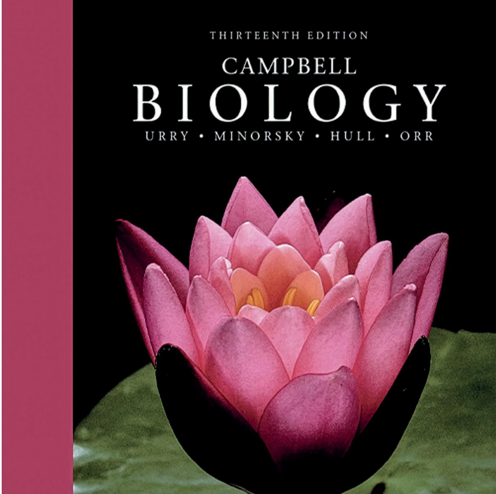

Lisa A. Urry
Mills College at Northeastern University,
Oakland, California

Peter V. Minorsky
Mercy University, Dobbs Ferry,
New York

Kerry L. Hull
Bishop's University, Quebec,
Canada

Rebecca B. Orr
Collin College, McKinney,
Texas

Content Development: Beth N. Winickoff; Mary Hill; Andrew Recher

Content Management: Ginnie Simione Jutson

Content Production: Tod Regan; Lori Newman; Ziki Dekel; Kaitlin Smith; Sarah Jensen; Shatadru Bhattacharjee; Titas Basu; Integra Software Services; Lachina Creative

Product Management: Michael Gillespie; Josh Frost; Rebecca Berardy Schwartz; Nida Ahmed

Product Marketing: Sierra Suggs

Rights and Permissions: Ben Ferrini; Matt Perry, Straive

Cover Image (water lily; Nymphaea "Yuh Ling"), Paul Starosta/Stone/Getty Image

Please contact www.AskPearsonSupport.com with any queries on this content. Pearson puts care into the creation of our products. Our learning materials undergo content reviews to minimize bias and ensure the content is inclusive, accurate, and relevant. Please use this link to report instances of bias and inaccuracies: https://www.pearson.com/report-bias.html You can learn more about Pearson's commitment to accessibility at https://www.pearson.com/us/accessibility.html

Copyright © 2027, 2023, 2021 by Pearson Education, Inc. or its affiliates. All Rights Reserved. This digital publication is protected by copyright, and permission should be obtained from the publisher prior to any prohibited reproduction, storage in a retrieval system, or transmission in any form or by any means, electronic, mechanical, photocopying, recording, or otherwise except as authorized for use under the product subscription through which this digital application is accessed. For information regarding permissions, request forms and the appropriate contacts within the Pearson Education Global Rights & Permissions department, please visit https://www.pearson.com/global-permission-granting.html.

Pearson uses AI, including to support the creation of content. We claim copyright to the fullest extent permissible by law.

Acknowledgments of third-party content appear on page CR-1 which constitutes an extension of this copyright page.

PEARSON, Mastering $^{™}$ Biology, and BioFlix $^{®}$ , and Pearson+ are exclusive trademarks in the U.S. and/or other countries owned by Pearson Education, Inc. or its affiliates.

Unless otherwise indicated herein, any third-party trademarks that may appear in this work are the property of their respective owners and any references to third-party trademarks, logos or other trade dress are for demonstrative or descriptive purposes only. Such references are not intended to imply any sponsorship, endorsement, authorization, or promotion of Pearson's products by the owners of such marks, or any relationship between the owner and Pearson Education, Inc. or its affiliates, authors, licensees or distributors.

Library of Congress Cataloging-in-Publication Data is available.

\$PrintCode

# About the Authors

The author team's contributions reflect their biological expertise as researchers and their teaching sensibilities gained from years of experience as instructors at diverse institutions, as well as their experience as authors of other texts, including Campbell Biology in Focus.

## Lisa A. Urry

(Chapter 1 and Units 1, 2, and 3) is Professor of Biology at Mills College at Northeastern University in Oakland, California. After earning a BA at Tufts University, she completed her PhD at the Massachusetts Institute of Technology (MIT). Lisa has conducted research on gene expression during embryonic and larval development in sea urchins. Deeply committed to promoting opportunities in science for women and underrepresented groups, she has taught courses ranging from introductory and developmental biology to an immersive course on the U.S./Mexico border.

## Peter V. Minorsky

(Unit 6) is Professor of Biology at Mercy University in New York, where he teaches introductory biology, ecology, and botany. He received his AB from Vassar College and his PhD from Cornell University. Peter has also taught at Kenyon College, Union College, Western Connecticut State University, and Vassar College. His research interests concern how plants sense environmental change. Peter received the 2008 Award for Teaching Excellence at Mercy.

## Kerry L. Hull

(Unit 7) is the Associate Vice-Principal, Research; Dean of Natural Science and Mathematics; and a Professor in the Department of Biology and Biochemistry at Bishop's University in Quebec, Canada. Kerry holds a BSc in Biology and a PhD in Physiology (Endocrinology), both from the University of Alberta (Canada). She teaches physiology and anatomy courses to undergraduates, using guided inquiry and case studies as her primary teaching approaches. A comparative endocrinologist by training, her current research focuses on the development and implementation of active learning strategies in anatomy and physiology courses.

## Rebecca B. Orr

(Assessment Lead, eTextbook Media Integration, and Active Learning Modules) is Professor of Biology at Collin College in McKinney, Texas, where she teaches introductory biology. She earned her BS from Texas A&M University and her PhD from University of Texas Southwestern Medical Center at Dallas. Rebecca has a passion for investigating strategies that result in more effective assessment for learning, and she is a certified Team-Based Learning Collaborative Trainer Consultant. She enjoys focusing on the creation of learning opportunities that both engage and challenge students. Rebecca was named the 2022 Outstanding Professor of the Year at Collin College.

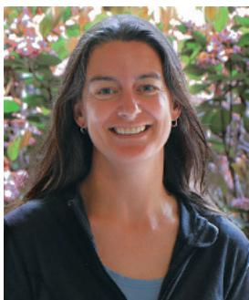

## Chantale Bégin

(Chapters 28, 32–34, and Unit 8) is an ecologist with a strong interest in benthic ecology and marine conservation. Chantale earned a BSc from Dalhousie University, an MSc from Université Laval, and a PhD from Simon Fraser University. As a Professor of Instruction at the University of South Florida (USF), she teaches many courses, including Biological Diversity, Marine Biology, Coral Reef Ecology, Conservation Biology, and Scientific Diving. She has received several teaching awards at USF for her work integrating active learning into large-enrollment courses and her field courses in the Caribbean.

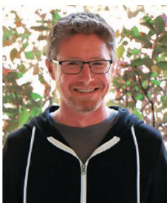

## Josh R. Auld

(Unit 4 and Chapter 26) is a Professor of Biology at West Chester University in West Chester, Pennsylvania. He received his BS in biology from Duquesne University and his PhD in Ecology and Evolutionary Biology from the University of Pittsburgh. Josh's research focuses on the evolution of life-history traits and mating systems, using freshwater snails as a model system. He has taught courses in introductory biology, zoology, botany, and evolution.

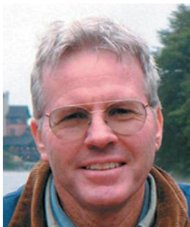

## Neil A. Campbell

(1946–2004) earned his MA from the University of California, Los Angeles, and his PhD from the University of California, Riverside. His research focused on desert and coastal plants. Neil's 30 years of teaching included introductory biology courses at Cornell University, Pomona College, and San Bernardino Valley College, where he received the college's first Outstanding Professor Award. He was also a visiting scholar at the University of California, Riverside. Neil was the founding author of Campbell Biology.

# Students: Campbell offers many tools to help you succeed

Access your text anywhere with the Pearson eTextbook.

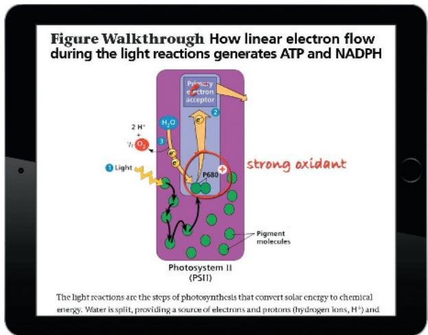  
Prepare for your exams with the Dynamic Study Modules.  
Strengthen your knowledge in the Mastering Biology Study Area.

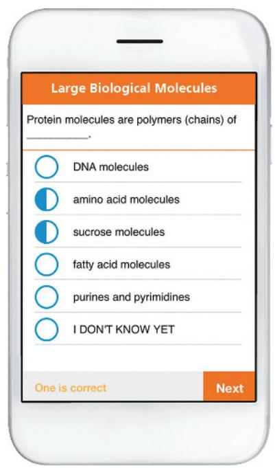

DNA molecules

amino acid molecules

sucrose molecules

○ fatty acid molecules

purines and pyrimidines

I DON'T KNOW YET

Use the tools in Campbell Biology and Mastering Biology to create a Study Plan, like the one shown here.

## Bio Study Plan

□Review the syllabus, assignments, and notes from my instructor
□Read the chapter and...

□ Use the Study Tip □ Fill out the Active Reading Guide (download from the Study Area)

□ Watch the Figure Walkthroughs, Videos, and Animations (in the eText or Study Area)

□ Answer the questions in the chapter

□ do the assignments

□ Study for the test!

□ Review lecture notes and assignments

□ Read the Summary

□Answer the questions at the end of the chapter

□ Use the Dynamic Study Modules

Take the Practice Test (in the eText or Study Area)

We are honored to present the Thirteenth Edition of Campbell Biology. For the last four decades, Campbell Biology has been the leading college text in the biological sciences. It has been translated into 19 languages and has provided millions of students with a solid foundation in college-level biology. This success is a testament not only to Neil Campbell's original vision but also to the dedication of hundreds of reviewers, who, together with editors, artists, and contributors, have shaped and inspired this work.

## New to the Thirteenth Edition

The Thirteenth Edition of Campbell Biology includes relevant, current content updates and engaging resources designed to help students succeed. Our goals for the Thirteenth edition include:

\- Supporting students with visual presentations of content and study tools

\- Supporting instructors by providing tools and materials for introducing, teaching, and assessing important, often challenging topics

\- Integrating text and media to engage, guide, and inform students in an active process of inquiry and learning

Here we provide an overview of the new features that we have developed for the Thirteenth Edition. Our starting point, as always, is our commitment to crafting text and visuals that are accurate and current, and that reflect our passion for teaching biology.

\- NEW! AI-Powered Study Tool: In the Campbell eTextbook, the AI-powered study tool pulls from vetted Campbell content to help students achieve proficiency and master key course concepts. The tool eliminates the need to leave the required course material for internet-wide help with its potential inaccuracies and inefficiency. Instead, support is provided, anytime, anywhere, within the assigned textbook. The AI-powered study tool provides instant explanations, on-demand summaries, and practice questions with feedback.

\- NEW! "Quick Tip" Videos by the Authors: Based on their classroom experiences with their own students, the authors have created short point-of-use videos in each unit that offer insights and tips for approaching tough topics and avoiding common points of confusion.

\- NEW! Practice Applying Your Learning Question Sets: Each unit includes new Practice Applying Your Learning scenario-based question sets. Each set consists of a short biological scenario followed by multiple True/False questions at lower and higher Bloom's levels. An alternate version of each Practice Applying Your Learning question set is available in Mastering Biology, to enable assigning one set for practice or formative assessment, and then an alternate version for summative assessment.

\- EXPANDED! Interactive CheckPoint Questions: Embedded at point-of-use in the eTextbook, these short sequences of interactive questions diagnose and remediate misconceptions around topics that are common “stumbling blocks” to understanding. Customized feedback guides students through an evidence-based approach to reason their way to learning and retaining the content. The CheckPoints are also assignable in Mastering Biology.

\- NEW! Updated Content: As in each new edition of Campbell Biology, the Thirteenth Edition incorporates new content summarized in the Highlights of New Content section that follows this Preface, including:

\- updates in gene editing, stem cell research, genomics, cancer genetics, “biologic” drugs, and biomaterials (see Chapters 17, 18, and 20)

○ introduction of artificial intelligence and its role in determining protein structure, bioinformatics, and medical diagnosis (see Chapters 1, 5, 11, and 21)

\- updated coverage of the evolutionary origins of eukaryotes and the phylogeny of archaea, unicellular eukaryotes, plants, and animals (see Chapters 26, 27, 28, 29, 32, and 33)

SARS-CoV-2 and the COVID-19 pandemic and expanded discussions of emerging and zoonotic pathogens (see Chapters 19, 43, and 54)

\- updated data on global climate and population changes (see Chapters 3, 55, and 56)

## Pearson eTextbook

Students using the Pearson eTextbook will reap all the benefits of the 13th Edition text features described above, as well as the following existing interactive resources, which are integrated directly into the online text:

\- The popular Figure Walkthroughs guide students through key figures with narrated explanations and figure mark-ups that reinforce important points.

\- Links to the AAAS Science in the Classroom website provide research papers from Science with annotations to help students understand the papers. These links are included at the end of selected chapters.

\- 400 animations and videos bring biology to life. These include resources from HHMI BioInteractive that engage students in topics from CRISPR to coral reefs.

\- Get Ready for This Chapter interactive questions provide a quick check of student understanding of the background information needed to learn a new chapter's content, with feedback to bolster their preparation.

\- Vocabulary Self-Quizzes and Practice Tests at the end of each chapter provide opportunities for students to test their understanding.

\- Links to Interviews from all editions of Campbell Biology are included in the chapter where they are most relevant. The interviews show students the human side of science by featuring diverse scientists talking about how they became interested in biology and what inspires them.

## Mastering Biology

Mastering Biology provides valuable resources for instructors to assign homework and for students to study on their own:

\- Assignments. Mastering Biology is the most widely used online assessment and tutorial program for biology, providing an extensive library of thousands of tutorials and questions that are graded automatically.

○ AAAS Science in the Classroom journal articles can be assigned with automatically graded questions.

\- Hundreds of self-paced tutorials provide individualized coaching with specific hints and feedback on the most difficult topics in the course.

\- Pearson eTextbook. The Pearson eTextbook, described above, can be directly accessed from Mastering Biology.

\- Dynamic Study Modules. These popular review tools can be assigned, or students can use them for self-study.

\- Study Area. Media references in the printed book direct students to the wealth of online self-study resources available to them in the Mastering Biology Study Area, including Active Reading Guides, Figure Walkthroughs, videos, animations, Get Ready for This Chapter, Practice Tests, Cumulative Test, and more.

\- Instructor Resources. This area of Mastering Biology provides one-stop shopping for PowerPoints, Clicker Questions, animations, videos, the Test Bank, and more.

## Our Hallmark Features

Teachers of general biology face a daunting challenge: to help students acquire a conceptual framework for organizing an ever-expanding amount of information. The hallmark features of Campbell Biology provide such a framework, while promoting a deeper understanding of biology and the process of science. As such, they are well-aligned with the core competencies outlined by the Vision and Change national conferences. Furthermore, the core concepts defined by Vision and Change have close parallels in the unifying themes that are introduced in Chapter 1 and integrated throughout the book.

Chief among the themes of both Vision and Change and Campbell Biology is evolution. Each chapter of this text includes at least one Evolution section that explicitly focuses on evolutionary aspects of the chapter material, and each chapter ends with an Evolution Connection Question and a Write About a Theme Question.

To help students distinguish “the forest from the trees,” each chapter is organized around a framework of three to seven carefully chosen Key Concepts. The text, Concept Check Questions, Summary of Key Concepts, and Mastering Biology resources all reinforce these main ideas and essential facts.

Because text and illustrations are equally important for learning biology, integration of text and figures has been a hallmark of Campbell Biology since the First Edition. The chapter-opening Visual Overviews, together with our popular Visualizing Figures, Exploring Figures, and Make Connections Figures, epitomize this approach.

To encourage active reading of the text, Campbell Biology includes numerous opportunities for students to stop and think about what they are reading, often by putting pencil to paper to draw a sketch, annotate a figure, or graph data. Answering these questions requires students to write or draw as well as think and thus helps develop the core competency of communicating science.

Finally, Campbell Biology has always featured scientific inquiry. The inquiry activities provide students practice in applying the process of science and using quantitative reasoning, addressing core competencies from Vision and Change.

## Our Partnership with Instructors and Students

The real test of any textbook is how well it helps instructors teach and students learn. We welcome comments from both students and instructors. Please address your suggestions to:

Lisa Urry (Chapter 1 and Units 1–3): l.urry@northeastern.edu
Peter Minorsky (Unit 6): pminorsky@mercy.edu

Josh Auld (Unit 4 and Chapter 26): JAuld@wcupa.edu

Kerry Hull (Unit 7): khull@ubishops.ca

Chantale Bégin (Chapters 27–34 and Unit 8): cbegin@usf.edu
Rebecca Orr (Assessment and Media): rorr@collin.edu

# Highlights of New Content

This section highlights selected new content in Campbell Biology, Thirteenth Edition.

## Unit 1 The Chemistry of Life

In Unit 1, new content engages students by showing why understanding chemistry is relevant and important as a basis for learning biology. For example, Chapter 3 has information on discoveries of exoplanets as well as a 2024 study on the presence and location of water on Mars, including a new photo in Figure 3.10. Building on this, Chapter 4 now includes the search by the Mars Rover for samples to be analyzed for fossils. In Chapter 5, the text has been updated on the breakthroughs achieved by use of computational approaches to predict 3D protein structure, including the role of artificial intelligence (AI) and the related 2024 Nobel Prize in Chemistry. The definition of bioinformatics has been revised to include AI.

## Unit 2 The Cell

Our main goal for this unit was to make the material more exciting to students, to show that cell biology research is dynamic and ongoing. Chapter 6 includes recent changes in thinking on the role of mitochondria: In addition to being the “powerhouse of the cell” and producing ATP, they have many further functions, including biosynthesis, regulation of apoptosis, and extensive engagement in intracellular and extracellular signaling. Chapter 7 includes an update on the discovery of a second co-receptor for HIV called CXCR4. Chapter 11 mentions AlphaFold2, an AI system that predicts 3D protein structures, in the context of why it has been challenging to predict the structure of G-protein-coupled receptors (GPCRs). Also included is the recent discovery that a defect in a particular voltage-gated ion channel can cause muscle weakness or stiffness, or even temporary paralysis. Chapter 12 includes a new interactive CheckPoint activity entitled CheckPoint: Counting Chromosomes, and coverage of the $G_{1}$ checkpoint has been updated with new research from 2023, concluding that a subset of cells may require ongoing signals to continue progressing through S and $G_{2}$ . This finding has implications for potential cancer treatments.

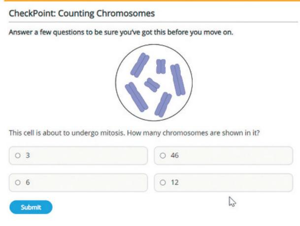

## Unit 3 Genetics

Chapters 13–17 incorporate changes that help students grasp the more abstract concepts of genetics as well as recognize their current relevance. In Chapter 14, the term phenotypic plasticity has been added and defined, and the discussion of sickle-cell disease (SCD) has been revised to clarify its occurrence wherever malaria is endemic, not just in Africa. Also, new gene therapy-based treatments for SCD are described. In Chapter 15, the contribution of Dr. Nettie Stevens to understanding the role of the Y chromosome in sex determination has been added, along with FDA-approved gene therapies for Duchenne muscular dystrophy and certain hemophilia cases. Coverage of imprinted genes has also been updated with recent research on two male-parent embryos, and the discussion of human “three-parent” babies has been enhanced. In Chapter 16, a new interactive CheckPoint activity entitled CheckPoint: Leading and Lagging Strand Synthesis has been inserted to aid students with this difficult topic. Chapter 17 now includes a new CheckPoint activity entitled CheckPoint: Transcription and Translation. Content has also been added about a novel use of the CRISPR system in conjunction with a technique called base editing, as well as mention of new forms of Cas proteins that minimize “off-target” gene editing.

Chapters 18–21 are extensively updated, driven by exciting new discoveries based on gene-editing technology and use of artificial intelligence (AI). In Chapter 18, updates have been made to the discussions of master regulatory gene function and colon cancer, as well as nuclear architecture and its possible role in neuropsychiatric disorders. In Chapter 19, the topic of emerging viral diseases has been updated extensively to discuss SARS-CoV-2 and the COVID-19 pandemic. Other Chapter 19 updates include information on vaccine programs, the 2025 measles epidemic, new prevention and treatment approaches for HIV infection, and the H5N1 avian influenza epidemic. Chapter 20 introduces new subsections on cell and tissue culture (including a new figure on organoids), small-molecule drugs, biologic drugs, and biomaterials for drug delivery. Other updates include discussions of the cloning of human/macaque chimeric embryos and the associated ethical issues, FDA-approved CRISPR-based gene therapies for sickle-cell disease, and establishment of the Human Genome Editing Registry. The coverage of using DNA technology for environmental cleanup now includes the term bioremediation. Chapter 21 has a new section, “Application of artificial intelligence and machine learning to bioinformatics,” which describes multiple examples of how AI is transforming the field of bioinformatics. Artificial intelligence has been added as a key term and defined, as well as a new Figure 21.5 (see next page) featuring the use of AI in medical diagnosis. Other updates include results of the ENCODE project and the Cancer Genome Atlas Project, establishment of the Impact of Genomic Variants on Function program, a massive international study of primate genomes, and new information on the FOXP2 gene. Discussions of genome comparisons have been revised to reflect new thinking about the relationship of Bacteria, Archaea, and Eukarya.

Figure 21.5 Example of use of artificial intelligence (AI) in medical diagnosis.  
  
(a) Radiograph of the fibula

  
(b) Radiograph with Al-generated heatmap overlaid  
Unit 4 Mechanisms of Evolution

In Chapter 23, the presentation of the Hardy-Weinberg model and Hardy-Weinberg equilibrium was revised to illustrate that, in a simplified situation, an allele does not increase or decrease in frequency on its own. Two new figures help students visualize how the equation projects the next generation. By starting with the fundamental concept of allele frequency, we aim to assist students in bridging the gap between individual- and population-level thinking. The assumptions of the Hardy-Weinberg model are then discussed as mechanisms of change that may operate alone or together in a natural population. The Scientific Skills Exercise and Concept Check 21.2 Question 3 have been revised to compare frequencies across generations.

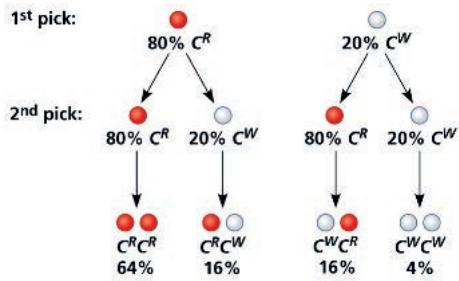

# Unit 5 The Evolutionary History of Biological Diversity

In Chapter 26, Concepts 26.2 and 26.3 have been reorganized to emphasize the distinction between inferring (that is, determining) a phylogeny from reading/interpreting a phylogeny—namely, clarifying that we do not both infer a tree's topology and interpret patterns of trait evolution based on the same data. Phylogenies are inferred from one type of data (for example, molecular genetic sequences) and then used to understand the evolution of other traits (for example, vertebral column, amnion, and hair), as discussed in the section now titled "Mapping Characters on a Phylogeny." The discussion in Concept 26.6 has been updated to reflect current hypotheses about early branching of the tree of life and the concept of domains. Other revisions throughout Unit 5 including updating phylogeny and

taxonomy to reflect recent changes, largely based on phylogenomic research. The title of Chapter 28 has been updated from “Protists” to “Origin and Diversification of Eukaryotes” to better reflect its focus. Chapter 27 discusses current hypotheses of archaeal phylogeny, including the possible origin of eukaryotes within the Asgard archaea. In Chapter 28, a new section on reproductive diversity of eukaryotes in Concept 28.1 reviews the three types of life cycles found in sexually reproducing eukaryotes. The phylogenetic tree of major groups of eukaryotes was updated to indicate that excavates are likely not a monophyletic group, and to update the placement of cryptophytes and haptophytes. Concept 28.5 discusses recent discoveries in phylogenomic research and describes some of the latest eukaryotic supergroups to be described. In Chapter 32 and 33, the phylogenetic tree of animal was updated to present the ctenophores, sponges, and other animals as a polytomy while resolving some of the polytomies that were shown in the previous edition. A new figure (Figure 33.4) and text in Concept 33.1 describe ctenophores. Chapter 34 was updated with new information about phylogenetic relationships between various groups of hominins, and a new Figure 34.47 presents a phylogenetic tree of hominins.

Figure 33.4 Anatomy of a sea gooseberry (Pleurobrachia spp.), a ctenophore.  
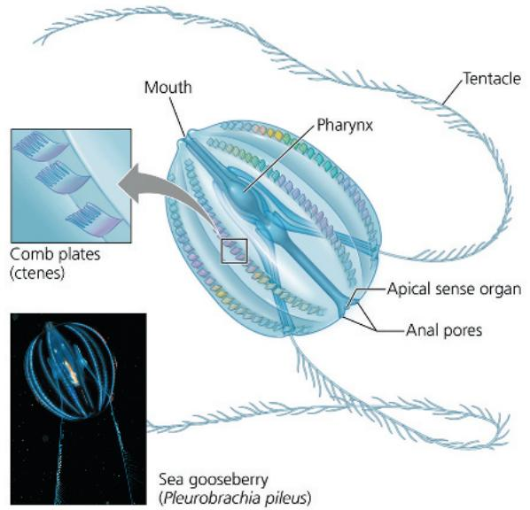

## Unit 6 Plant Form and Function

In Chapter 35, the term “prop root” has been replaced with the more precise term “brace root,” and vascular rays are now more accurately portrayed. Also, an additional benefit of compound leaves, namely better light penetration through the canopy, is now mentioned as a possible advantage of compound leaf forms. In Chapter 37, the Scientific Skills Exercise includes a new photograph of raspberry plants that better shows the characteristics of iron deficiency. Figure 37.15 has been updated to include new research indicating that staghorn ferns can grow as colonial assemblages (“superorganisms”). In Chapter 38, a new interactive CheckPoint activity, CheckPoint: Critical Night Length, helps students work through common confusion around the concept of critical night length in flowering plants and its related terminology (short-day/long-day plants).

## Unit 7 Animal Form and Function

The major focus of this revision in Unit 7 was to help students use basic scientific principles to understand the many aspects of animal form and function. In particular, we refined our explanation of homeostasis as an underlying theme. A new figure (Figure 40.9) provides an overview of negative and positive feedback in relation to stimuli and responses, and another new figure (Figure 40.8B) completes the picture by incorporating the concepts of set points, sensors, control centers, and effectors.

Figure 40.9 Overview of negative and positive feedback.  

Narrative explanations and figures presenting homeostatic systems throughout the unit have been revised so that students can more readily apply the basic principle to develop mechanistic explanations for physiological situations. These changes are particularly evident in Chapter 40 (thermoregulation), 41 (blood glucose), 42 (blood pressure, blood gas levels), and 44 (blood pressure, volume, and osmolarity). We also apply these principles to the discussion of hormone feedback loops in Chapters 45 and 46. Numerous learning tools have been designed to address common misconceptions and help students apply the concept of homeostasis. For instance, Chapter 40 features a new CheckPoint interactive activity to diagnose and remediate common student misunderstandings about regulators and conformers, and students are given multiple opportunities to work with feedback loops (for example, the Study Tip in Chapter 40, Draw It Question in Figure 40.8, and Test your Understanding Question 8 in the Chapter 42 Review). The scientific principle of flow down gradients also receives greater emphasis in the Thirteenth Edition. Gradients are introduced in the context of heat flow (Chapter 40), and subsequently provide the basis for explaining water and solute flow (Chapter 44) and electrical signaling (Chapter 48). New interactive CheckPoint activities encourage students to use gradients to understand Ventilation and Respiration (Chapter 42) and the Membrane Potential (Chapter 48).

The Unit 7 revision also introduces new material and updates. For instance, Chapter 43 provides information about the COVID-19 pandemic and a new figure (Figure 43.18) explaining how mRNA vaccines interact with the immune system, and updates coverage of relevant topics (sepsis, cytokines, interferons, monoclonal antibody treatments). Chapter 50 now introduces newly identified receptors for touch and sour tastants. We also updated our coverage of malnourishment to include both overnourishment and undernourishment (Chapter 41), and refined our explanation of stress to highlight that stress is a physiological response to mental or physical challenges (Chapter 45). The clinical information has been updated throughout the Unit, such as describing new treatments for diabetes mellitus, overnourishment, cancer,

autoimmune disease, nervous system diseases, and cardiovascular disease, and providing updated statistics regarding global hunger, infectious diseases (Figure 43.25), sexually transmitted infections, infertility, and opioid use.

We have also augmented our coverage of non-human physiology, including adding information about the circulatory system of sea spiders (Chapter 42), refining our explanation of avian ventilation (Chapter 42), and updating and expanding the coverage of digestive function in avians, ruminants, and non-ruminant herbivores (Chapter 41). In Chapter 45, we removed the description of calcitonin actions in humans and instead discuss the evolution of the calcitonin gene family.

## Unit 8 Ecology

The two major goals of the Unit 8 revision were to clarify and accurately represent all types of environments (terrestrial, freshwater, and marine); and provide new examples while incorporating elements of conservation biology throughout the unit. Revisions in Chapter 52 include a new figure (Figure 52.8) and corresponding text that highlights the ways in which various abiotic factors can limit range shifts, as well as two new figures and a better description of the processes that bring nutrients to the photic zone in aquatic environments. In Chapter 53, a new figure (Figure 53.9) and annotations clarify the difference between the realized per capita population growth rate ( $r_{realized}$ ) and maximum per capita population growth rate ( $r_{max}$ ). Another new figure (Figure 53.24) illustrates the concept of the ecological footprint. Chapter 54 features a newly revised figure (54.21) illustrating how the abundance of organisms at different trophic levels can be affected by bottom-up or top-down control, a new figure (Figure 54.25) on contrasting models of succession, and updates on emerging diseases, with COVID-19 as one example. Revisions to some figures in Chapter 55 provide clearer descriptions of nutrient cycling in aquatic ecosystems. Chapter 56 opens with a photo of the colorful Union Island gecko, with a figure legend that highlights the role that local communities can play in conservation success. This chapter includes new text and figures (Figures 56.25 and 56.26) in Concept 56.4 on the growing problem of plastic and microplastic waste in aquatic and terrestrial ecosystems. Concept 56.4 has updated data on atmospheric CO $_{2}$ concentrations, global temperatures, and consequences of climate change on ecosystems. Throughout the unit, we added new examples and photographs of diverse species, such as species on the verge of extinction and introduced species in a range of habitats.

Figure 53.9 Population growth predicted by the exponential and logistic models.  

\- Endophyte not present; pathogen present (E-P+)
- Both endophyte and pathogen present (E+P+)

# Instructor Resources

## The Instructor Resources Area of Mastering Biology

\- Active Reading Guide with Answers: Instructors can find a version of the Active Reading Guide with answers in the Instructor Resources Area.

\- Accessible PowerPoint Lecture Presentations for each chapter with lecture notes, tables, and links to animations and videos have alt text for every image; students can access alt text with a screen reader if needed.

\- JPEG images, including labeled and unlabeled art, photos from the text, and extra photos

\- Clicker Questions in PowerPoint

\- 400 instructor animations and videos, including BioFlix® 3-D Animations, HHMI Videos and Animations, and much more

\- Test Bank questions in TestGen $^{®}$ software and Microsoft $^{®}$ Word. This invaluable resource contains over 4,500 questions, including scenario-based questions and art, graph, and data interpretation questions. Every image has alt text, which students can access with a screen reader if needed.

• Statistics Worksheets for Biology

\- Instructor Answers to Scientific Skills Exercises, Problem-Solving Exercises, Interpret the Data questions, and essay questions; includes rubric and tips for grading short-answer essays

\- Instructor Guides for Supplements: Instructor Guide for Practicing Biology: A Student Workbook; Instructor Guide for Biological Inquiry: A Workbook of Investigative Cases; Answer Key for Inquiry in Action: Interpreting Scientific Papers; Investigating Biology Lab Prep Guide; and Investigating Biology Lab Data Tables

\- Live Response (TM) Live Response allows students to use their smartphone, tablet, or laptop to respond to questions in class.

\- Customizable PowerPoint Lectures provide a jumpstart for instruction.

Concept 7.1: Cellular membranes are fluid mosaics of lipids and proteins (1 of 3)

• Membranes are composed mainly of phospholipids

\- Phospholipids are amphipathic molecules, containing hydrophobic ("water-fearing") and hydrophilic ("water-loving") regions

\- All of the art, graphs, and photos from the text are provided with enlarged labels. More than 1,600 photos from the text and other sources are included.

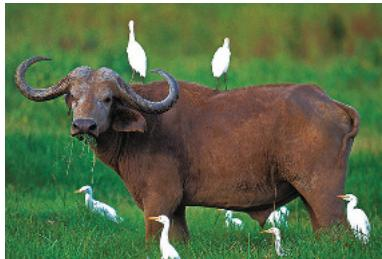

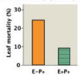

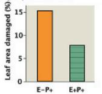  
Data from A. E. Arnold et al., Fungal endophytes limit pathogen damage in a tropical tree, Proceedings of the National Academy of Sciences USA 100:15649–15654 (2003).

\- Clicker Questions can be used to stimulate effective classroom discussions (for use with or without clickers).

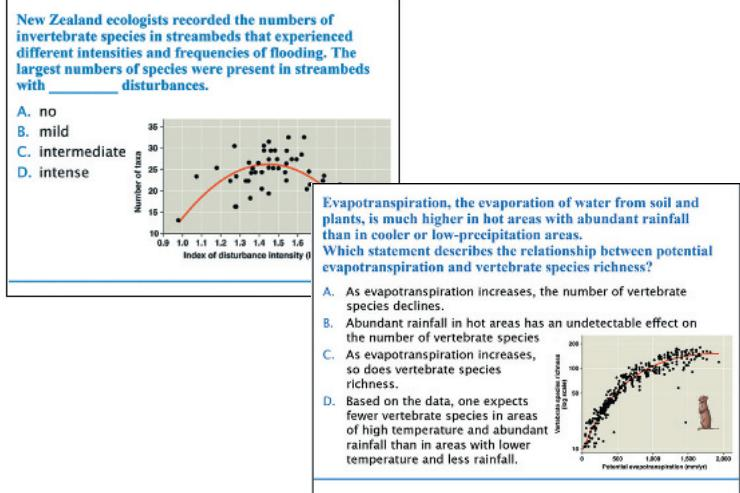

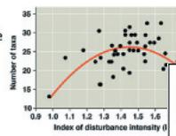

## Learning Management Systems

Integration with various learning management systems is available for Mastering Biology. Contact your sales representative for details.

# Acknowledgments

The authors wish to express their gratitude to the global community of instructors, researchers, students, and publishing professionals who have contributed to the Thirteenth Edition of Campbell Biology.

As authors of this text, we are mindful of the daunting challenge of keeping up to date in all areas of our rapidly expanding subject. We are grateful to the many scientists who helped shape this text by discussing their research fields with us, answering specific questions in their areas of expertise, and sharing their ideas about biology education. We are especially grateful to the following, listed alphabetically: Rick Brusca, Dan Buckley, Nicholas Butterfield, Doug Erwin, Kenneth Halanych, Bruce Jakosky, Emanuelle Javaux, Patrick Keeling, Dovid Kozlovsky, Andrew Leslie, Kevin Peterson, Adam Phillippy, Martin Picar, Susannah Porter, Andrew Roger, Timothy Shutt, Alastair Simpson, Shreya Soni, Max Telford, Sarathi Weraduwage, and Felipe Zapata. In addition, the biologists listed in the Reviewers section provided detailed reviews, helping us ensure the text's scientific accuracy and improve its pedagogical effectiveness.

Thanks also to the other professors and students, from all over the world, who contacted the authors directly with useful suggestions. We alone bear the responsibility for any errors that remain, but the dedication of our consultants, reviewers, and other correspondents makes us confident in the accuracy and effectiveness of this text.

Interviews with prominent scientists have been a hallmark of Campbell Biology since its inception, and conducting these interviews was again one of the great pleasures of revising the book. To open the eight units of this edition, we are proud to include interviews with Kristi Anseth, Julie Theriot, Pardis Sabeti, Neil Shubin, Casey Dunn, Ernesto Gianoli, Adrienne Bratcher, and Elisa Bonaccorso.

Mastering Biology and the other electronic accompaniments for this text are invaluable teaching and learning aids. Thanks to Ann Brokaw and Bob Cooper for their contributions to the AAAS Science in the Classroom activities; we also appreciate the support of Beth Reudi, Shelby Lake, and Lydia Kaprelian from AAAS.

The value of Campbell Biology as a learning tool is greatly enhanced by the supplementary materials that have been created for instructors and students. We recognize that the dedicated authors of these materials are essentially writing mini (and not so mini) books. We appreciate the hard work and creativity of all the authors listed, with their creations, in the Student and Lab Supplements section. We are also grateful to Dana Kurpius and Ashley Spring (PowerPoint Lecture Presentations); Doug Darnowski (Clicker and Reading Questions); Ford Lux, Pamela Sandstrom, Carolyn Wetzel, Chris Romero, Jordan Marshall, Paul Luyster, and David Knochel (Test Bank); and Theresa Holtzclaw (Active Reading Guide).

Campbell Biology results from an unusually strong synergy between a team of scientists and a team of publishing professionals.

Our editorial team at Pearson Education again demonstrated unmatched talents, commitment, and pedagogical insights. Josh xii

Frost, our Product Management Specialist, brought publishing savvy, intelligence, and a much-appreciated level head to leading the whole team. The clarity and effectiveness of every page owe much to our extraordinary Supervising Editor Beth Winickoff, who worked with a top-notch team of Senior Developmental Editor Mary Hill and Art Developmental Editor Andrew Recher. Our unsurpassed Director of Content Development Ginnie Simione Jutson was indispensable in moving the project in the right direction. We also want to thank Robin Heyden for organizing the annual Biology Leadership Conferences and keeping us in touch with the world of AP Biology, and Beth Wilbur for her many years of wise editorial leadership. We also extend our thanks to Nida Ahmed, Associate Content Strategy Administrator.

You would not have this beautiful text if not for the work of the production team: Director Erin Gregg; Senior Producer Lori Newman; Rights & Permissions Manager Ben Ferrini; Rights & Permissions Project Manager Matt Perry; Aimee Bear and the staff at Integra Software Services, Inc., and Becca Marshall, Molly Montanaro, Michael White, and the staff at Lachina Creative. We also thank those who worked on the text's supplements: Shatadru Bhattacharjee, Hemadevi Sridharan, and their team at Integra Software Services.

For creating the wonderful package of electronic media that accompanies the text, we are grateful to Senior Content Developer Sarah Jensen; Content Producer Kaitlin Smith; Director, Production & Digital Studio Katie Foley; Managing Producer Tod Regan; Digital Program Manager, Science, Caroline Ayres; and Media Producer Ziki Dekel.

For her important role in marketing the text and media, we thank Sierra Suggs. For their enthusiasm, encouragement, and support, we are grateful to Michael Gillespie, Director, Higher Ed Product Management, Life Sciences and Adam Jaworski, VP Product Management Higher Ed.

The Pearson sales team, which represents Campbell Biology on campus, is an essential link to the users of the text. They tell us what you like and don't like about the text, communicate the features of the text, and provide prompt service. We thank them for their hard work and professionalism. For representing our text to our international audience, we thank our sales and marketing partners throughout the world. They are all strong allies in biology education.

Finally, we wish to thank our families and friends for their encouragement and patience throughout this long project. Our special thanks to Lily and Alex (L.A.U.); Natalie (P.V.M.); Norm, Leo, and Evan (K.L.H.); Jim, Abby, Dan, and Emily (R.B.O.); Boomer, Zoë, and Exie (C.B.); and Jan (J.R.A.); Thanks to Jane Reece for her generosity and thoughtfulness throughout her many years as a Campbell author—enjoy your retirement! And, as always, thanks to Rochelle, Allison, Jason, McKay, and Gus.

Lisa A. Urry, Peter V. Minorsky, Kerry L. Hull, Rebecca B. Orr, Chantale Bégin, and Josh Auld

## Thirteenth Edition Reviewers

Sheena Abernathy, College of the Mainland; Matthew Aderholt, Abraham Baldwin Agricultural College; Amelia Atwell, Wofford College; Victor Babich, Mercy College of Health Sciences; Matthew Badtke, Jackson College; Harini Bajjuri, Collin College; Michael Balsai, Temple University; John Barringer, Tougaloo College; Gemma Barth, Springfield College; Emily Basile, Delaware Valley University; Rachelle Bassen, Western Nevada College; Kevin Beach, University of Tampa; Chris Beals, Abraham Baldwin Agricultural College; Abby Beatty, St. Mary's College of Maryland; Lynn Bedard, DePauw University; Morgan Benowitz-Fredricks, Bucknell University; Elizabeth Binney, Western Washington University; Terronica Blackmonn, Houston Community College; Jerry Brunson, Northwestern State University of Louisiana; Patrick Cafferty, Emory University; Kellen Calinger-Yoak, The Ohio State University; William Caldecutt, Polk State College; Victor Canela, Butler University; Richard Cardullo, University of California, Riverside; Dale Casamatta, University of North Florida; Rebekah E. Chapman, Georgia State University; Brian Deis, University of Hawai'i; Danyelle Dehner, University of North Georgia; Tracy Gartner, Carthage College; Tammy Greene, Ivy Tech Community College; Judyth Gulden, Oklahoma State University; Matt Hatkoff, SUNY Geneseo; Valerie Haywood, Case Western Reserve University; Jeba Inbarasu, Metropolitan Community College; Katie Johnson, Collin College; Kristy Johnson, The Citadel; Amy Klocko, University of Colorado Colorado Springs; Diqui LaPenta, University of Texas at San Antonio; Haiwei Lu, University of Nebraska-Kearney; Benjamin Navia, Andrews University; Frank Nelson, Temple University; Julie Phillips, Cumberland University; Amanda Rosenzweig, Delgado Community College; Shreya Soni, Drexel University; Molly Staley, Loyola University Chicago; Sophia Szymkowiak, Fletcher Spaght; Jeung Woon-Lee, Lake Erie College of Osteopathic Medicine.

## Reviewers of Previous Editions

Steve Abedon, Ohio State University; Sheena Abernathy, College of the Mainland; Kenneth Able, State University of New York, Albany; Thomas Adams, Michigan State University; Martin Adamson, University of British Columbia; Dominique Adriaens, Ghent University; Ann Aguanno, Marymount Manhattan College; Shylaja Akkaraju, Bronx Community College of CUNY; Marc Albrecht, University of Nebraska; John Alcock, Arizona State University; Eric Alcorn, Acadia University; George R. Aliaga, Tarrant County College; Philip Allman, Florida Gulf Coast College; Rodney Allrich, Purdue University; Richard Almon, State University of New York, Buffalo; Bonnie Amos, Angelo State University; Katherine Anderson, University of California, Berkeley; Richard J. Andren, Montgomery County Community College; Estry Ang, University of Pittsburgh, Greensburg; Jeff Appling, Clemson University; J. David Archibald, San Diego State University; David Armstrong, University of Colorado, Boulder; James Arnone, William Paterson University; Howard J. Arnott, University of Texas, Arlington; Mary Ashley, University of Illinois, Chicago; Angela S. Aspbury, Texas State University; Robert Atherton, University of Wyoming; Karl Aufderheide, Texas A&M University; Josh Auld, West Chester University; Leigh Auleb, San Francisco State University; Terry Austin, Temple College; P. Stephen Baenziger, University of Nebraska; Brian Bagatto, University of Akron; Ellen Baker, Santa Monica College; Katherine Baker, Millersville University; Virginia Baker, Chipola College; Teri Balser, University of Wisconsin, Madison; William Barklow, Framingham State College; Susan Barman, Michigan State University; Steven Barnhart, Santa Rosa Junior College; Jim Barron, Montana State University Billings; Gemma Bartha, Springfield College; Andrew Barton, University of Maine Farmington; Rebecca A. Bartow, Western Kentucky University; Ron Basmajian, Merced College; David Bass, University of Central Oklahoma; Bonnie Baxter, Westminster College; Tim Beagley, Salt Lake Community College; Louise Beard, University of Essex; Margaret E. Beard, College of the Holy Cross; Tom Beatty, University of British Columbia; Marin Beaupre, Massasoit Community College; Chris Beck, Emory University; Wayne Becker, University of Wisconsin, Madison; Patricia Bedinger, Colorado State University; Jane Beiswenger, University of Wyoming; Anne Bekoff, University of Colorado, Boulder; Marc Bekoff, University of Colorado, Boulder; Tania Beliz, College of San Mateo; Adrianne Bendich, Hoffman-La Roche, Inc.; Kevin Bennett, University of Hawai'i; Marilee Benore, University of Michigan, Dearborn; Barbara Bentley, State University of New York, Stony Brook; Darwin Berg, University of California, San Diego; Werner Bergen, Michigan State University; Gerald Bergstrom, University of Wisconsin, Milwaukee; Anna W. Berkovitz, Purdue University; Aimee Bernard, University of Colorado Denver; Dorothy Berner, Temple University; Kelsie Bernot, North Carolina A&T State University; Annalisa Berta, San Diego State University; Christine Bezotte, Elmira College; Paulette Bierzychudek, Pomona College; Charles Biggers, Memphis State University; Teresa Bilinski, St. Edward's University; Kenneth Birnbaum, New York University; Sarah Bissonnette, University of California, Berkeley; Catherine Black, Idaho State University; Michael W. Black, California Polytechnic State University, San Luis Obispo; William Blaker, Furman University; Robert Blanchard, University of New Hampshire; Andrew R. Blaustein, Oregon State University; Chris Bloch, Bridgewater State University; Judy Bluemer, Morton College; Edward Blumenthal, Marquette University; Robert Blystone, Trinity University; Robert Boley, University of Texas, Arlington; Jason E. Bond, East Carolina University; Eric Bonde, University of Colorado, Boulder; Cornelius Bondzi, Hampton University; Richard Boohar, University of Nebraska, Omaha; Carey L. Booth, Reed College; Aiwei Borengasser, University of Arkansas - Pulaski Tech; Robert Borgon, University of Central Florida; Allan Bornstein, Southeast Missouri State University; David Bos, Purdue University; Oliver Bossdorf, State University of New York, Stony Book; James L. Botsford, New Mexico State University; Lisa Boucher, University of Nebraska, Omaha; Jeffery Bowen, Bridgewater State University; J. Michael Bowes, Humboldt State University; Richard Bowker, Alma College; Robert Bowker, Glendale Community College, Arizona; Scott Bowling, Auburn University; Barbara Bowman, Mills College; Barry Bowman, University of California, Santa Cruz; Deric Bownds, University of Wisconsin, Madison; Robert Boyd, Auburn University; Sunny Boyd, University of Notre Dame; Jerry Brand, University of Texas, Austin; Edward Braun, Iowa State University; Theodore A. Bremner, Howard University; James Brenneman, University of Evansville; Charles H. Brenner, Berkeley, California; Lawrence Brewer, University of Kentucky; Donald P. Briskin, University of Illinois, Urbana; Paul Broady, University of Canterbury; Chad Brommer, Emory University; Judith L. Bronstein, University of Arizona; George Brooks, University of California, Berkeley; David Broussard, Lycoming College; Danny Brower, University of Arizona; Beverly Brown, Nazareth College; Carole Browne, Wake Forest University; Mark Browning, Purdue University; David Bruck, San Jose State University; Theodore Van Bruggen, University of South Dakota; Robb T. Brumfield, Louisiana State University; Herbert Bruneau, Oklahoma State University; Gary Brusca, Humboldt State University; Richard C. Brusca, University of Arizona, Arizona-Sonora Desert Museum; Alan H. Brush, University of Connecticut, Storrs; Howard Buhse, University of Illinois, Chicago; Arthur Buikema, Virginia Tech; Michael Buoni, Delaware Technical Community College; Beth Burch, Huntington University; Tessa Burch, University of Tennessee; Al Burchsted, College of Staten Island; Warren Burggren, University of North Texas; Meg Burke, University of North Dakota; Edwin Burling, De Anza College; Dale Burnside, Lenoir-Rhyne University; Kelcey Burris, Union High School; William Busa, Johns Hopkins University; Jorge Busciglio, University of California, Irvine; John Bushnell, University of Colorado; Linda Butler, University of Texas, Austin; David Byres, Florida Community College, Jacksonville; Patrick Cafferty, Emory University; Elena Cainas, Broward College; Guy A. Caldwell, University of Alabama; Jane Caldwell, West Virginia University; Kim A. Caldwell, University of Alabama; Ragan Callaway, The University of Montana; Kenneth M. Cameron, University of Wisconsin, Madison; R. Andrew Cameron, California Institute of Technology; Alison Campbell, University of Waikato; Iain Campbell, University of Pittsburgh; Michael Campbell, Penn State University; Patrick Canary, Northland Pioneer College; W. Zacheus Cande, University of California, Berkeley; Deborah Canington, University of California, Davis; Robert E. Cannon, University of North Carolina, Greensboro; Frank Cantelmo, St. John's University; John Capeheart, University of Houston, Downtown; Gregory Capelli, College of William and Mary; Cheryl Keller Capone, Pennsylvania State University; Richard Cardullo, University of California, Riverside; Nina Caris, Texas A&M University; Mickael Cariveau, Mount Olive College; Jeffrey Carmichael, University of North Dakota; Robert Carroll, East Carolina University; Laura L. Carruth, Georgia State University; Billy Carver, Lees-McRae College; Anne Casper, Eastern Michigan University; J. Aaron Cassill, University of Texas, San Antonio; Karen I. Champ, Central Florida Community College; David Champlin, University of Southern Maine; Brad Chandler, Palo Alto College; Wei-Jen Chang, Hamilton College; Bruce Chase, University of Nebraska, Omaha; P. Bryant Chase, Florida State University; Amanda Chau, Blinn College; Doug Cheeseman, De Anza College; Shepley Chen, University of Illinois, Chicago; Giovina Chinchar, Tougaloo College; Joseph P. Chinnici, Virginia Commonwealth University; Jung H. Choi, Georgia Institute of Technology; Steve Christensen, Brigham Young University, Idaho; Geoffrey Church, Fairfield University; Henry Claman, University of Colorado Health Science Center; Anne Clark, Binghamton University; Greg Clark, University of Texas; Katie Clark, University of California, Riverside; Patricia J. Clark, Indiana University-Purdue University, Indianapolis; Ross C. Clark, Eastern Kentucky University; Lynwood Clemens, Michigan State University; Janice J. Clymer, San Diego Mesa College; Reggie Cobb, Nashville Community College; Catharina Coenen, Allegheny College; Curt Coffman, Vincennes University; William P. Coffman, University of Pittsburgh; Austin Randy Cohen, California State University, Northridge; Bill Cohen, University of Kentucky; J. John Cohen, University of Colorado Health Science Center; James T. Colbert, Iowa State University; Sean Coleman, University of the Ozarks; Juliet Collins, University of Wisconsin, Madison; Jan Colpaert, Hasselt University; Robert Colvin, Ohio University; Jay Comeaux, McNeese State University; David Cone, Saint Mary's University; Erin Connolly, University of South Carolina; Elizabeth Connor, University of Massachusetts; Joanne Conover, University of Connecticut; Bob Cooper, Pennsylvania High School; Ron Cooper, University of California, Los Angeles; Gregory Copenhaver, University of North Carolina, Chapel Hill; John Corliss, University of Maryland; James T. Costa, Western Carolina University; Robin Cotter, Phoenix College; Stuart J. Coward, University of Georgia; Charles Creutz, University of Toledo; Marilyn Cruz-Alvarez, Florida Gulf Coast University; Bruce Criley, Illinois Wesleyan University; Norma Criley, Illinois Wesleyan University; Joe W. Crim, University of Georgia; Greg Crowther, University of Washington; Karen Curto, University of Pittsburgh; William Cushwa, Clark College; Anne Cusic, University of Alabama, Birmingham; Noelle Cutter, Molloy College; Richard Cyr, Pennsylvania State University; Curtis Daehler, University of Hawaii at Manoa; Marymegan Daly, The Ohio State University; Deborah Dardis, Southeastern Louisiana University; W. Marshall Darley, University of Georgia; Douglas Darnowski, Indiana University Southeast; Cynthia Dassler, The Ohio State University; Farahad Dastoor, University of Maine, Orono; Shannon Datwyler, California State University, Sacramento; Marianne Dauwalder, University of Texas, Austin; Larry Davenport, Samford University; Andrew David, Clarkson University; Jeremiah Davie, D'Youville College; Bonnie J. Davis, San Francisco State University; Jerry Davis, University of Wisconsin, La Crosse; Michael A. Davis, Central Connecticut State University; Thomas Davis, University of New Hampshire; Melissa Deadmond, Truckee Meadows Community College; John Dearn, University of Canberra; Teresa DeGolier, Bethel College; Maria E. de Bellard, California State University, Northridge; Janet De Souza-Hart, Massachusetts College of Pharmacy & Health Sciences; Brian Deis, University of Hawai'i; James Dekloe, University of California, Santa Cruz; Eugene Delay, University of Vermont; Patricia A. DeLeon, University of Delaware; Veronique Delesalle, Gettysburg College; T. Delevoryas, University of Texas, Austin; Roger Del Moral, University of Washington; Charles F. Delwiche, University of Maryland; Diane C. DeNagel, Northwestern University; William L. Dentler, University of Kansas; Jennifer Derkits, J. Sergeant Reynolds Community College; Daniel DerVartanian, University of Georgia; Jean DeSaix, University of North Carolina at Chapel Hill; Biao Ding, Ohio State University; Michael Dini, Texas Tech University; Kevin Dixon, Florida State University; Andrew Dobson, Princeton University; Stanley Dodson, University of Wisconsin, Madison; Gerard O'Donovan, University of North Texas; Jason Douglas, Angelina College; Mark Drapeau, University of California, Irvine; John Drees, Temple University School of Medicine; Charles Drewes, Iowa State University; Marvin Druger, Syracuse University; Kelly Dubois, Calvin College; Gary Dudley, University of Georgia; David Dunbar, Cabrini College; Susan Dunford, University of Cincinnati; Kathryn A. Durham, Lorain Community College; Betsey Dyer, Wheaton College; Gerald Van Dyke, North Carolina State University; Robert Eaton, University of Colorado; Mary Ellard-Ivey, Pacific Lutheran University; Cynthia Eayre, Fresno City College; Robert S. Edgar, University of California, Santa Cruz; Anna Edlund, Lafayette College; Douglas J. Eernisse, California State University, Fullerton; Betty J. Eidemiller, Lamar University; Arri Eisen, Emory University; Brad Elder, Doane College; Curt Elderkin, College of New Jersey; William D. Eldred, Boston University; Michelle Elekonich, University of Nevada, Las Vegas; Lisa Elfring, University of Arizona; Kurt Elliott, Northwest Vista College; George Ellmore, Tufts University; Norman Ellstrand, University of California, Riverside; Bert Ely, University of South Carolina; Dennis Emery, Iowa State University; John Endler, University of California, Santa Barbara; Rob Erdman, Florida Gulf Coast College; Dale Erskine, Lebanon Valley College; Margaret T. Erskine, Lansing Community College; Susan Erster, Stony Brook University; Ana Esther Escandon, Los Angeles Harbor College; Gerald Esch, Wake Forest University; Frederick B. Essig, University of South Florida; Mary Eubanks, Duke University; David Evans, University of Florida; Robert C. Evans, Rutgers University, Camden; Sharon Eversman, Montana State University; Olukemi Fadayomi, Ferris State University; Lincoln Fairchild, Ohio State University; Peter Fajer, Florida State University; Bruce Fall, University of Minnesota; Sam Fan, Bradley

University; Lynn Fancher, College of DuPage; Ellen H. Fanning, Vanderbilt University; Paul Farnsworth, University of New Mexico; Larry Farrell, Idaho State University; Jerry F. Feldman, University of California, Santa Cruz; Lewis Feldman, University of California, Berkeley; Myriam Alhadeff Feldman, Cascadia Community College; Linda Fergusson-Kolmes, Portland Community College; Eugene Fenster, Longview Community College; Russell Fernald, University of Oregon; Danilo Fernando, SUNY College of Environmental Science and Forestry, Syracuse; Rebecca Ferrell, Metropolitan State College of Denver; Christina Fieber, Horry-Georgetown Technical College; Melissa Fierke, SUNY College of Environmental Science and Forestry; Kim Finer, Kent State University; Milton Fingerman, Tulane University; Barbara Finney, Regis College; Teresa Fischer, Indian River Community College; Frank Fish, West Chester University; David Fisher, University of Hawaii, Manoa; Jonathan S. Fisher, St. Louis University; Steven Fisher, University of California, Santa Barbara; David Fitch, New York University; Kirk Fitzhugh, Natural History Museum of Los Angeles County; Lloyd Fitzpatrick, University of North Texas; William Fixsen, Harvard University; T. Fleming, Bradley University; Abraham Flexer, Manuscript Consultant, Boulder, Colorado; Mark Flood, Fairmont State University; Margaret Folsom, Methodist College; April Fong, Portland Community College; Kerry Foresman, University of Montana; Norma Fowler, University of Texas, Austin; Robert G. Fowler, San Jose State University; David Fox, University of Tennessee, Knoxville; Carl Frankel, Pennsylvania State University, Hazleton; Stewart Frankel, University of Hartford; Robert Franklin, College of Charleston; James Franzen, University of Pittsburgh; Art Fredeen, University of Northern British Columbia; Kim Fredericks, Viterbo University; Bill Freedman, Dalhousie University; Matt Friedman, University of Chicago; Otto Friesen, University of Virginia; Frank Frisch, Chapman University; Virginia Fry, Monterey Peninsula College; Bernard Frye, University of Texas, Arlington; Jed Fuhrman, University of Southern California; Alice Fulton, University of Iowa; Chandler Fulton, Brandeis University; Sara Fultz, Stanford University; Berdell Funke, North Dakota State University; Anne Funkhouser, University of the Pacific; Zofia E. Gagnon, Marist College; Michael Gaines, University of Miami; Cynthia M. Galloway, Texas A&M University, Kingsville; Arthur W. Galston, Yale University; Stephen Gammie, University of Wisconsin, Madison; Carl Gans, University of Michigan; John Gapter, University of Northern Colorado; Andrea Gargas, University of Wisconsin, Madison; Lauren Garner, California Polytechnic State University, San Luis Obispo; Reginald Garrett, University of Virginia; Brittany Gasper, Florida Southern College; Craig Gatto, Illinois State University; Kristen Genet, Anoka Ramsey Community College; Patricia Gensel, University of North Carolina; Chris George, California Polytechnic State University, San Luis Obispo; Robert George, University of Wyoming; Carri Gerber, The Ohio State University; Marina Gerson, California State University, Stanislaus; Brian Gibbens, University of Minnesota; J. Whitfield Gibbons, University of Georgia; J. Phil Gibson, University of Oklahoma; Frank Gilliam, Marshall University; Eric Gillock, Fort Hayes State University; Simon Gilroy, University of Wisconsin, Madison; Alan D. Gishlick, Gustavus Adolphus College; Todd Gleeson, University of Colorado; Jessica Gleffe, University of California, Irvine; John Glendinning, Barnard College; William Glider, University of Nebraska; Tricia Glidewell, Marist School; Elizabeth A. Godrick, Boston University; Jim Goetze, Laredo Community College; Lynda Goff, University of California, Santa Cruz; Elliott Goldstein, Arizona State University; Paul Goldstein, University of Texas, El Paso; Sandra Gollnick, State University of New York, Buffalo; Roy Golsteyn, University of Lethbridge; Anne Good, University of California, Berkeley; Judith Goodenough, University of Massachusetts, Amherst; Wayne Goodey, University of British Columbia; Barbara E. Goodman, University of South Dakota; Robert Goodman, University of Wisconsin, Madison; Ester Goudsmit, Oakland University; Linda Graham, University of Wisconsin, Madison; Robert Grammer, Belmont University; Joseph Graves, Arizona State University; Eileen Gregory, Rollins College; Sara Gremillion, Georgia Southern University; Phyllis Griffard, University of Houston, Downtown; A. J. F. Griffiths, University of British Columbia; Bradley Griggs, Piedmont Technical College; William Grimes, University of Arizona; David Grise, Texas A&M University, Corpus Christi; Mark Gromko, Bowling Green State University; Serine Gropper, Auburn University; Katherine L. Gross, Ohio State University; Ron Gross, Community College of Allegheny County; Edward Gruberg, Temple University; Gary Gussin, University of Iowa; Carla Guthridge, Cameron University; Melissa Gutierrez, University of Southern Mississippi; Mark Guyer, National Human Genome Research Institute; Ruth Levy Guyer, Bethesda, Maryland; Edwin Ginés-Candelaria, Miami Dade College; Carla Haas, Pennsylvania State University; R. Wayne Habermehl, Montgomery County Community College; Gokhan Hacisalihoglu, Florida A&M University; Pryce Pete Haddix, Auburn University; Mac Hadley, University of Arizona; Joel Hagen, Radford University; Jack P. Hailman, University of Wisconsin; Leah Haimo, University of California, Riverside; Ken Halanych, Auburn University; Jody Hall, Brown University; Heather Hallen-Adams, University of Nebraska, Lincoln; Douglas Hallett, Northern Arizona University; Rebecca Halyard, Clayton State College; Devney Hamilton, Stanford University (student); E. William Hamilton

Washington and Lee University; Matthew B. Hamilton, Georgetown University; Sam Hammer, Boston University; Penny Hanchey-Bauer, Colorado State University; Dennis Haney, Furman University; William F. Hanna, Massasoit Community College; Laszlo Hanzely, Northern Illinois University; Jeff Hardin, University of Wisconsin, Madison; Jean Hardwick, Ithaca College; Luke Harmon, University of Idaho; Lisa Harper, University of California, Berkeley; Deborah Harris, Case Western Reserve University; Jeanne M. Harris, University of Vermont; Richard Harrison, Cornell University; Catherine Hartkorn, New Mexico State University; Stephanie Harvey, Georgia Southwestern State University; Carla Hass, Pennsylvania State University; Chris Haufler, University of Kansas; Bernard A. Hauser, University of Florida; Chris Haynes, Shelton State Community College; Valerie Haywood, Case Western Reserve University; Evan B. Hazard, Bemidji State University (emeritus); H. D. Heath, California State University, East Bay; George Hechtel, State University of New York, Stony Brook; S. Blair Hedges, Pennsylvania State University; Brian Hedlund, University of Nevada, Las Vegas; David Heins, Tulane University; Jean Heitz, University of Wisconsin, Madison; Andreas Hejnol, Sars International Centre for Marine Molecular Biology; John D. Helmann, Cornell University; Colin Henderson, University of Montana; Susan Hengeveld, Indiana University; Michelle Henricks, University of California, Los Angeles; Carroll Henry, Chicago State University; Frank Heppner, University of Rhode Island; Maryann Herman, St. John Fisher College; Albert Herrera, University of Southern California; Scott Herrick, Missouri Western State College; Ira Herskowitz, University of California, San Francisco; Paul E. Hertz, Barnard College; Chris Hess, Butler University; Alexander Heyl, Adelphi University; David Hibbett, Clark University; R. James Hickey, Miami University; Karen Hicks, Kenyon College; Kendra Hill, San Diego State University; Laura Hill, University of Vermont; William Hillenius, College of Charleston; Kenneth Hillers, California Polytechnic State University, San Luis Obispo; Ralph Hinegardner, University of California, Santa Cruz; William Hines, Foothill College; Robert Hinrichsen, Indiana University of Pennsylvania; Helmut Hirsch, State University of New York, Albany; Tuan-hua David Ho, Washington University; Carl Hoagstrom, Ohio Northern University; Elizabeth Hobson, New Mexico State University; Jason Hodin, Stanford University; James Hoffman, University of Vermont; A. Scott Holaday, Texas Tech University; Mark Holbrook, University of Iowa; N. Michele Holbrook, Harvard University; James Holland, Indiana State University, Bloomington; Charles Holliday, Lafayette College; Lubbock Karl Holte, Idaho State University; Alan R. Holyoak, Brigham Young University, Idaho; Laura Hoopes, Occidental College; Nancy Hopkins, Massachusetts Institute of Technology; Sandra Horikami, Daytona Beach Community College; Kathy Hornberger, Widener University; Pius F. Horner, San Bernardino Valley College; Anne-Marie Hoskinson, South Dakota State University; Becky Houck, University of Portland; Margaret Houk, Ripon College; Laura Houston, Northeast Lakeview College; Daniel J. Howard, New Mexico State University; Ronald R. Hoy, Cornell University; Sandra Hsu, Skyline College; Sara Huang, Los Angeles Valley College; Cristin Hulslander, University of Oregon; Donald Humphrey, Emory University School of Medicine; Catherine Hurlbut, Florida State College, Jacksonville; Diane Husic, Moravian College; Robert J. Huskey, University of Virginia; Steven Hutcheson, University of Maryland, College Park; Linda L. Hyde, Gordon College; Bradley Hyman, University of California, Riverside; Jeffrey Ihara, Mira Costa College; Mark Iked, San Bernardino Valley College; Katriina Ilves, Pace University; Erin Irish, University of Iowa; Sally Irwin, University of Hawaii, Maui College; Harry Itagaki, Kenyon College; Alice Jacklet, State University of New York, Albany; John Jackson, North Hennepin Community College; James Jacob, Tompkins Cortland Community College; Thomas Jacobs, University of Illinois; Kathy Jacobson, Grinnell College; Mark Jaffe, Nova Southeastern University; John C. Jahoda, Bridgewater State College; Darrel James, Fred C. Beyer High School; Douglas Jensen, Converse College; Jamie Jensen, Brigham Young University; Dan Johnson, East Tennessee State University; Jerry Johnson, Corban University; Lance Johnson, Midland Lutheran College; Lee Johnson, The Ohio State University; Randall Johnson, University of California, San Diego; Roishene Johnson, Bossier Parish Community College; Stephen Johnson, William Penn University; Wayne Johnson, Ohio State University; Greg Jones, Santa Fe College; Kathryn Jones, Howard Community College; Kenneth C. Jones, California State University, Northridge; Russell Jones, University of California, Berkeley; Seth Jones, University of Kentucky; Cheryl Jorcyk, Boise State University; Chad Jordan, North Carolina State University; Ann Jorgensen, University of Hawaii; Alan Journet, Southeast Missouri State University; Walter Judd, University of Florida; Ari Jumpponen, Kansas State University; Thomas W. Jurik, Iowa State University; Caroline M. Kane, University of California, Berkeley; Doug Kane, Defiance College; Thomas C. Kane, University of Cincinnati; The-Hui Kao, Pennsylvania State University; Tamos Kapros, University of Missouri; Steven Karafit, University of Central Arkansas; Kasey Karen, Georgia College & State University; E. L. Karlstrom, University of Puget Sound; David Kass, Eastern Michigan University; Jennifer Katcher, Pima Community College; Laura A. Katz, Smith College; Judy Kaufman, Monroe Community College; Lori Kayes, Oregon State University; Maureen Kearney

Field Museum of Natural History; Eric G. Keeling, Cary Institute of Ecosystem Studies; Patrick Keeling, University of British Columbia; Thomas Keller, Florida State University; Elizabeth A. Kellogg, University of Missouri, St. Louis; Norm Kenkel, University of Manitoba; Chris Kennedy, Simon Fraser University; Paul Kenrick, Natural History Museum, London; George Khoury, National Cancer Institute; Stephen T. Kilpatrick, University of Pittsburgh at Johnstown; Rebecca T. Kimball, University of Florida; Shannon King, North Dakota State University; Mark Kirk, University of Missouri, Columbia; Robert Kitchin, University of Wyoming; Hillar Klandorf, West Virginia University; Attila O. Klein, Brandeis University; Karen M. Klein, Northampton Community College; Daniel Klionsky, University of Michigan; Mark Knauss, Georgia Highlands College; Janice Knepper, Villanova University; Charles Knight, California Polytechnic State University; Jennifer Knight, University of Colorado; Ned Knight, Linfield College; Roger Koeppe, University of Arkansas; David Kohl, University of California, Santa Barbara; Ben Kolber, Duquesne University; Catherine Konopka, John Carroll University; Greg Kopf, University of Pennsylvania School of Medicine; Thomas Koppenheffer, Trinity University; Peter Kourtev, Central Michigan University; Margareta Krabbe, Uppsala University; Jacob Krans, Western New England University; Anselm Kratochwil, Universität Osnabrück; Eliot Krause, Seton Hall University; Deborah M. Kristan, California State University, San Marcos; Steven Kristoff, Ivy Tech Community College; Dubear Kroening, University of Wisconsin; Bill Kroll, Loyola University, Chicago; William Kroll, Loyola University, Chicago; Janis Kuby, San Francisco State University; Barbara Kuemerle, Case Western Reserve University; Justin P. Kumar, Indiana University; Rukmani Kuppuswami, Laredo Community College; David Kurijaka, Ohio University; Lee Kurtz, Georgia Gwinnett College; William L'Amoreaux, College of Staten Island; Michael P. Labare, United States Military Academy, West Point; Marc-André Lachance, University of Western Ontario; J. A. Lackey, State University of New York, Oswego; Elaine Lai, Brandeis University; Mohamed Lakrim, Kingsborough Community College; MaryLynne LaMantia, Golden West College; Ellen Lamb, University of North Carolina, Greensboro; Neil Lamb, HudsonAlpha Institute for Biotechnology; William Lamberts, College of St Benedict and St John's University; Lynn Lamoreux, Texas A&M University; Carmine A. Lanciani, University of Florida; Kenneth Lang, Humboldt State University; Jim Langeland, Kalamazoo College; Dominic Lannutti, El Paso Community College; Michelle LaPorte, St. Louis Community College; Allan Larson, Washington University; Grace Lasker, Lake Washington Institute of Technology; John Latto, University of California, Santa Barbara; Diane K. Lavett, State University of New York, Cortland, and Emory University; Neil Lax, Duquesne University; Charles Leavell, Fullerton College; C. S. Lee, University of Texas; Daewoo Lee, Ohio University; Tali D. Lee, University of Wisconsin, Eau Claire; Hugh Lefcort, Gonzaga University; Robert Leonard, University of California, Riverside; Michael R. Leonardo, Coe College; John Lepri, Carrboro High School; John Lepri, University of North Carolina, Greensboro; Donald Levin, University of Texas, Austin; Joseph Levine, Boston College; Mike Levine, University of California, Berkeley; David Glenn-Lewin, Wichita State University; Alcinda Lewis, University of Colorado, Boulder; Bill Lewis, Shoreline Community College; Jani Lewis, State University of New York at Geneseo; John Lewis, Loma Linda University; Lorraine Lica, California State University, East Bay; Harvey Liftin, Broward Community College; Harvey Lillywhite, University of Florida, Gainesville; Graeme Lindbeck, Valencia Community College; Clark Lindgren, Grinnell College; Eric W. Linton, Central Michigan University; Diana Lipscomb, George Washington University; Christopher Little, The University of Texas, Pan American; Kevin D. Livingstone, Trinity University; Andrea Lloyd, Middlebury College; Tatyana Lobova, Old Dominion University; Sam Loker, University of New Mexico; David Longstreth, Louisiana State University; Christopher A. Loretz, State University of New York, Buffalo; Donald Lovett, College of New Jersey; Jane Lubchenco, Oregon State University; Douglas B. Luckie, Michigan State University; Hannah Lui, University of California, Irvine; Eddie Lunsford, Southwestern Community College; Margaret A. Lynch, Tufts University; Steven Lynch, Louisiana State University, Shreveport; Lisa Lyons, Florida State University; Elizabeth Machunis-Masuoka, University of Virginia; Alyssa MacDonald, Leeward Community College; James MacMahon, Utah State University; Nancy Magill, Indiana University; Christine R. Maher, University of Southern Maine; Linda Maier, University of Alabama, Huntsville; Jose Maldonado, El Paso Community College; Richard Malkin, University of California, Berkeley; Charles Mallery, University of Miami; Keith Malmos, Valencia Community College, East Campus; Cindy Malone, California State University, Northridge; Mark Maloney, University of South Mississippi; Carol Mapes, Kutztown University of Pennsylvania; William Margolin, University of Texas Medical School; Lynn Margulis, Boston University; Julia Marrs, Barnard College (student); Kathleen A. Marrs, Indiana University-Purdue University, Indianapolis; Edith Marsh, Angelo State University; Marlee Marsh, Columbia College; Diane L. Marshall, University of New Mexico; Mary Martin, Northern Michigan University; Richard Machemer Jr., St. John Fisher College; Karl Mattox, Miami University of Ohio; Joyce Maxwell, California State University, Northridge; Jeffrey D. May

Marshall University; Mike Mayfield, Ball State University; Kamau Mbuthia, Bowling Green State University; Lee McClenaghan, San Diego State University; Richard McCracken, Purdue University; Andrew McCubbin, Washington State University; Nicole McDaniels, Herkimer College; Kerry McDonald, University of Missouri, Columbia; Tanya McGhee, Craven Community College; Jacqueline McLaughlin, Pennsylvania State University, Lehigh Valley; Neal McReynolds, Texas A&M International; Darcy Medica, Pennsylvania State University; Lisa Marie Meffert, Rice University; Susan Meiers, Western Illinois University; Michael Meighan, University of California, Berkeley; Scott Meissner, Cornell University; Paul Melchior, North Hennepin Community College; Phillip Meneely, Haverford College; John Merrill, Michigan State University; Brian Metscher, University of California, Irvine; Jennifer Metzler, Ball State University; Ralph Meyer, University of Cincinnati; James Mickle, North Carolina State University; Jan Mikesell, Gettysburg College; Roger Milkman, University of Iowa; Grace Ju Miller, Indiana Wesleyan University; Helen Miller, Oklahoma State University; John Miller, University of California, Berkeley; Jonathan Miller, Edmonds Community College; Kenneth R. Miller, Brown University; Mill Miller, Wright State University; Terry Miller, Central Carolina Community College; Alex Mills, University of Windsor; Sarah Milton, Florida Atlantic University; Eli Minkoff, Bates College; John E. Minnich, University of Wisconsin, Milwaukee; Subhash Minocha, University of New Hampshire; Michael J. Misamore, Texas Christian University; Kenneth Mitchell, Tulane University School of Medicine; Shamone Mizenmayer, Central High School; Ivona Mladenovic, Simon Fraser University; Alan Molumby, University of Illinois, Chicago; Nicholas Money, Miami University; Russell Monson, University of Colorado, Boulder; Joseph P. Montoya, Georgia Institute of Technology; Frank Moore, Oregon State University; Janice Moore, Colorado State University; Linda Moore, Georgia Military College; Randy Moore, Wright State University; William Moore, Wayne State University; Carl Moos, Veterans Administration Hospital, Albany, New York; Linda Martin Morris, University of Washington; Michael Mote, Temple University; Alex Motten, Duke University; Jeanette Mowery, Madison Area Technical College; Deborah Mowshowitz, Columbia University; Rita Moyes, Texas A&M, College Station; Cam Muir, University of Hawai'i at Hilo; Heather Murdock, San Francisco State University; Darrel L. Murray, University of Illinois, Chicago; Courtney Murren, College of Charleston; John Mutchmor, Iowa State University; Elliot Myerowitz, California Institute of Technology; Madhavan Narayanan, Mercy College; Barbara Nash, Mercy College; Jennifer Nauen, University of Delaware; Gavin Naylor, Iowa State University; Karen Neal, J. Sargeant Reynolds Community College, Richmond; Leonore Neary, Joliet Junior College; John Neess, University of Wisconsin, Madison; Ross Nehm, Ohio State University; Tom Neils, Grand Rapids Community College; Kimberlyn Nelson, Pennsylvania State University; Raymond Neubauer, University of Texas, Austin; Todd Newbury, University of California, Santa Cruz; James Newcomb, New England College; Jacalyn Newman, University of Pittsburgh; Harvey Nichols, University of Colorado, Boulder; Deborah Nickerson, University of South Florida; Bette Nicotri, University of Washington; Caroline Niederman, Tomball College; Eric Nielsen, University of Michigan; Maria Nieto, California State University, East Bay; Shanna Nifoussi, University of Superior; Anders Nilsson, University of Umeå; Greg Nishiyama, College of the Canyons; Charles R. Noback, College of Physicians and Surgeons, Columbia University; Jane Noble-Harvey, Delaware University; Mary C. Nolan, Irvine Valley College; Kathleen Nolta, University of Michigan; Peter Nonacs, University of California, Los Angeles; Mohamed A. F. Noor, Duke University; Shawn Nordell, St. Louis University; Richard S. Norman, University of Michigan, Dearborn (emeritus); David O. Norris, University of Colorado, Boulder; Steven Norris, California State University, Channel Islands; Gretchen North, Occidental College; Cynthia Norton, University of Maine, Augusta; Steve Norton, East Carolina University; Steve Nowicki, Duke University; Bette H. Nybakken, Hartnell College; Patricia O'Hern, Emory University; Brian O'Conner, University of Massachusetts, Amherst; Sharman O'Neill, University of California, Davis; Eugene Odum, University of Georgia; Mark P. Oemke, Alma College; Linda Ogren, University of California, Santa Cruz; Olabisi Ojo, Southern University at New Orleans; Nathan O. Okia, Auburn University, Montgomery; Jeanette Oliver, St. Louis Community College, Florissant Valley; Gary P. Olivetti, University of Vermont; Margaret Olney, St. Martin's College; John Olsen, Rhodes College; Laura J. Olsen, University of Michigan; Wan Ooi, Houston Community College; Aharon Oren, The Hebrew University; John Oross, University of California Riverside; Rebecca Orr, Collin College; Catherine Ortega, Fort Lewis College; Jennifer Ortiz, North Hills School District; Charissa Osborne, Butler University; Gay Ostarello, Diablo Valley College; Henry R. Owen, Eastern Illinois University; Thomas G. Owens, Cornell University; Fernanda Oyarzun, Universidad Católica de la Santísima Concepción Chile; Penny Padgett, University of North Carolina Chapel Hill Kevin Padian, University of California Berkeley Dianna Padilla State University of New York Stony Brook Anthony T. Paganini Michigan State University Fatimata Pale Thiel College Barry Palevitz University of Georgia Michael A. Palladino Monmouth University Matt Palmtag Florida Gulf Coast University Stephanie Pandolfi Michigan State University Stephanie Pandolfi

Wayne State University; Daniel Papaj, University of Arizona; Peter Pappas, County College of Morris; Nathalie Pardigon, Institut Pasteur; Bulah Parker, North Carolina State University; Stanton Parmeter, Chemeketa Community College; Susan Parrish, McDaniel College; Cindy Paszkowski, University of Alberta; Robert Patterson, San Francisco State University; Ronald Patterson, Michigan State University; Crellin Pauling, San Francisco State University; Kay Pauling, Foothill Community College; Daniel Pavuk, Bowling Green State University; Debra Pearce, Northern Kentucky University; Patricia Pearson, Western Kentucky University; Andrew Pease, Stevenson University; Nancy Pelaez, Purdue University; Shelley Penrod, North Harris College; Imara Y. Perera, North Carolina State University; Beverly Perry, Houston Community College; Irene Perry, University of Texas of the Permian Basin; Roger Persell, Hunter College; Eric Peters, Chicago State University; Larry Peterson, University of Guelph; David Pfennig, University of North Carolina, Chapel Hill; Mark Pilgrim, College of Coastal Georgia; David S. Pilliod, California Polytechnic State University, San Luis Obispo; Vera M. Piper, Shenandoah University; Deb Pires, University of California, Los Angeles; J. Chris Pires, University of Missouri, Columbia; Jarmila Pittermann, University of California, Santa Cruz; Bob Pittman, Michigan State University; James Platt, University of Denver; John Plunket, Horry-Georgetown Technical College; Martin Poenie, University of Texas, Austin; Scott Poethig, University of Pennsylvania; Crima Pogge, San Francisco Community College; Michael Pollock, Mount Royal University; Roberta Pollock, Occidental College; Jeffrey Pommerville, Texas A&M University; Therese M. Poole, Georgia State University; Angela R. Porta, Kean University; Jason Porter, University of the Sciences, Philadelphia; Warren Porter, University of Wisconsin; Daniel Potter, University of California, Davis; Donald Potts, University of California, Santa Cruz; Robert Powell, Avila University; Andy Pratt, University of Canterbury; David Pratt, University of California, Davis; Elena Pravosudova, University of Nevada, Reno; Halina Presley, University of Illinois, Chicago; Eileen Preston, Tarrant Community College Northwest; Mary V. Price, University of California, Riverside; Mitch Price, Pennsylvania State University; Steven Price, Virginia Commonwealth University; Terrell Pritts, University of Arkansas, Little Rock; Rong Sun Pu, Kean University; Rebecca Pyles, East Tennessee State University; Scott Quackenbush, Florida International University; Ralph Quatrano, Oregon State University; Peter Quinby, University of Pittsburgh; Johnny El-Rady, University of South Florida; Val Raghavan, Ohio State University; Monica Ranes-Goldberg, University of California, Berkeley; Deanna Raineri, University of Illinois, Champaign-Urbana; Talitha Rajah, Indiana University Southeast; Charles Ralph, Colorado State University; Pushpa Ramakrishna, Chandler-Gilbert Community College; Thomas Rand, Saint Mary's University; David Randall, City University Hong Kong; Sami Raut, University of Alabama, Birmingham; Robert S. Rawding, Gannon University; Robert H. Reavis, Glendale Community College; Kurt Redborg, Coe College; Ahnya Redman, Pennsylvania State University; Brian Reeder, Morehead State University; Linda Rehfuss, Bucks County Community College; Bruce Reid, Kean University; David Reid, Blackburn College; C. Gary Reiness, Lewis & Clark College; Charles Remington, Yale University; Erin Rempala, San Diego Mesa College; David Reznick, University of California, Riverside; Fred Rhoades, Western Washington State University; Douglas Rhoads, University of Arkansas; Deborah Rhoden, Snead State Community College; Eric Ribbens, Western Illinois University; Christina Richards, New York University; Linda Richardson, Blinn College; Sarah Richart, Azusa Pacific University; Wayne Rickoll, University of Puget Sound; Christopher Riegle, Irvine Valley College; Loren Rieseberg, University of British Columbia; Bruce B. Riley, Texas A&M University; Todd Rimkus, Marymount University; John Rinehart, Eastern Oregon University; Brian Ring, Valdosta State University; Donna Ritch, Pennsylvania State University; Carol Rivin, Oregon State University East; Laurel Roberts, University of Pittsburgh; Diane Robins, University of Michigan; Kenneth Robinson, Purdue University; Thomas Rodella, Merced College; Luis Rodriguez, San Antonio College; Deb Roess, Colorado State University; Heather Roffey, Marianopolis College; Rodney Rogers, Drake University; Suzanne Rogers, Seton Hill University; Brandi Van Roo, Framingham State College; William Roosenburg, Ohio University; Kara Rosch, Blinn College; Mike Rosenzweig, Virginia Polytechnic Institute and State University; Wayne Rosing, Middle Tennessee State University; Thomas Rost, University of California, Davis; Stephen I. Rothstein, University of California, Santa Barbara; John Ruben, Oregon State University; Albert Ruesink, Indiana University; Patricia Rugaber, College of Coastal Georgia; Rob Ruliffson, Minneapolis Community and Technical College; Scott Russell, University of Oklahoma; Jodi Rymer, College of the Holy Cross; Neil Sabine, Indiana University; Tyson Sacco, Cornell University; Glenn-Peter Saetre, University of Oslo; Rowan F. Sage, University of Toronto; Tammy Lynn Sage, University of Toronto; Sanga Saha, Harold Washington College; Don Sakaguchi, Iowa State University; Walter Sakai, Santa Monica College; Per Salvesen, University of Bergen; Mark F. Sanders, University of California, Davis; Kathleen Sandman, Ohio State University; Davison Sangweme, University of North Georgia; Louis Santiago, University of California Riverside; Ted Sargent, University of Massachusetts Amherst K. SathasivanuUniversity of Texas Austin: Gary Saunders ,University of New Brunswick: Thomas

R. Sawicki, Spartanburg Community College; Inder Saxena, University of Texas, Austin; Karin Scarpinato, Georgia Southern University; Carl Schaefer, University of Connecticut; Andrew Schaffner, Cal Poly San Luis Obispo; Maynard H. Schaus, Virginia Wesleyan College; Renate Scheibe, University of Osnabrück; Cara Schillington, Eastern Michigan University; David Schimpf, University of Minnesota, Duluth; William H. Schlesinger, Duke University; Mark Schlissel, University of California, Berkeley; Christopher J. Schneider, Boston University; Thomas W. Schoener, University of California, Davis; Judy Schoonmaker, Colorado School of Mines; Robert Schorr, Colorado State University; Patricia M. Schulte, University of British Columbia; David Schultz, University of Louisville; Karen S. Schumaker, University of Arizona; Brenda Schumpert, Valencia Community College; David J. Schwartz, Houston Community College; Carrie Schwarz, Western Washington University; Christa Schwintzer, University of Maine; Erik P. Scully, Towson State University; Robert W. Seagull, Hofstra University; Edna Seaman, Northeastern University; Duane Sears, University of California, Santa Barbara; Brent Selinger, University of Lethbridge; J. Michael Sellers, University of Southern Mississippi; Orono Shukdeb Sen, Bethune-Cookman College; Pramila Sen, Houston Community College; Wendy Sera, Seton Hill University; Alison M. Shakarian, Salve Regina University; Timothy E. Shannon, Francis Marion University; Jyotsna Sharma, University of Texas San Antonio; Joan Sharp, Simon Fraser University; Victoria C. Sharpe, Blinn College; Elaine Shea, Loyola College, Maryland; Stephen Sheckler, Virginia Polytechnic Institute and State University; Robin L. Sherman, Nova Southeastern University; Richard Sherwin, University of Pittsburgh; Alison Sherwood, University of Hawaii at Manoa; Lisa Shimeld, Crafton Hills College; James Shinkle, Trinity University; Barbara Shipes, Hampton University; Brian Shmaefsky, Lone Star College; Marcia Shofner, University of Maryland, College Park; Richard M. Showman, University of South Carolina; Eric Shows, Jones County Junior College; Peter Shugarman, University of Southern California; Alice Shuttey, DeKalb Community College; James Sidie, Ursinus College; Linda Sigismondi, University of Rio Grande; Daniel Simberloff, Florida State University; Rebecca Simmons, University of North Dakota; Anne Simon, University of Maryland, College Park; Robert Simons, University of California, Los Angeles; Alastair Simpson, Dalhousie University; Susan Singer, Carleton College; Sedonia Sipes, Southern Illinois University, Carbondale; John Skillman, California State University, San Bernardino; Roger Sloboda, Dartmouth University; John Smarrelli, Le Moyne College; Andrew T. Smith, Arizona State University; Cheryl Ingram-Smith, Clemson University; Kelly Smith, University of North Florida; Nancy Smith-Huerta, Miami Ohio University; John Smol, Queen's University; Davida Smyth, Mercy College; Helen Snodgrass, YES Prep North Forest; Andrew J. Snope, Essex Community College; Ayodotun Sodipe, Texas Southern University; Mitchell Sogin, Woods Hole Marine Biological Laboratory; Doug Soltis, University of Florida, Gainesville; Julio G. Soto, San Jose State University; Susan Sovonick-Dunford, University of Cincinnati; Kathy Sparace, Tri-County Technical College; Rebecca Sperry, Salt Lake Community College; Frederick W. Spiegel, University of Arkansas; Clint Springer, Saint Joseph's University; Moira Van Staaden, Bowling Green State University; John Stachowicz, University of California, Davis; Joel Stafstrom, Northern Illinois University; Alam Stam, Capital University; Amanda Starnes, Emory University; Patricia Steinke, San Jacinto College Central; Karen Steudel, University of Wisconsin; Barbara Stewart, Swarthmore College; Gail A. Stewart, Camden County College; Cecil Still, Rutgers University, New Brunswick; Margery Stinson, Southwestern College; James Stockand, University of Texas Health Science Center, San Antonio; John Stolz, California Institute of Technology; Claudia Uhde-Stone, California State University, East Bay; Judy Stone, Colby College; Richard D. Storey, Colorado College; Tara Turley-Stoulig, Southeastern Louisiana University; Stephen Strand, University of California, Los Angeles; Eric Strauss, University of Massachusetts, Boston; Antony Stretton, University of Wisconsin, Madison; Russell Stullken, Augusta College; Mark Sturtevant, Oakland University, Flint; Elizabeth Sudduth, Georgia Gwinnett College; Aaron Sullivan, Houghton College; John Sullivan, Southern Oregon State University; Gerald Summers, University of Missouri; Judith Sumner, Assumption College; Yvonne Sun, University of Dayton; Marshall D. Sundberg, Emporia State University; Cynthia Surmacz, Bloomsburg University; Lucinda Swatzell, Southeast Missouri State University; Daryl Sweeney, University of Illinois, Champaign-Urbana; Diane Sweeney, Punahou School; Samuel S. Sweet, University of California, Santa Barbara; Andrea Swei, San Francisco State University; Janice Swenson, University of North Florida; Michael A. Sypes, Pennsylvania State University; Lincoln Taiz, University of California, Santa Cruz; David Tam, University of North Texas; Stephanie Toering-Peters, Wartburg College; Yves Tan, Cabrillo College; Samuel Tarsitano, Southwest Texas State University; David Tauck, Santa Clara University; Emily Taylor, California Polytechnic State University, San Luis Obispo; James Taylor, University of New Hampshire; John W. Taylor, University of California, Berkeley; Kristen Taylor, Salt Lake Community College; Martha R. Taylor, Cornell University; Franklyn Tan Te, Miami Dade College; Thomas Terry, University of Connecticut; Roger Thibault, Bowling Green State University; Kent Thomas, Wichita State University; Rebecca

Thomas, College of St. Joseph; William Thomas, Colby-Sawyer College; Cyril Thong, Simon Fraser University; John Thornton, Oklahoma State University; Robert Thornton, University of California, Davis; Greg Thurmon, Central Methodist University; William Thwaites, Tillamook Bay Community College; Stephen Timme, Pittsburg State University; Monica Togna, Drexel University; Mike Toliver, Eureka College; Gail Tompkins, Wake Technical Community College; Eric Toolson, University of New Mexico; Leslie Towill, Arizona State University; James Traniello, Boston University; Paul Q. Trombley, Florida State University; Nancy J. Trun, Duquesne University; Constantine Tsoukas, San Diego State University; Marsha Turell, Houston Community College; Victoria Turgeon, Furman University; Robert Tuveson, University of Illinois, Urbana; Bishnu Twanabasu, Weatherford College; Maura G. Tyrrell, Stonehill College; Catherine Uekert, Northern Arizona University; Gordon Uno, University of Oklahoma; Lisa A. Urry, Mills College; Saba Valadkhan, Center for RNA Molecular Biology; James W. Valentine, University of California, Santa Barbara; Sarah VanVickle-Chavez, Washington University, St. Louis; Joseph Vanable, Purdue University; Kathryn VandenBosch, Texas A&M University; Nicole Bournias-Vardiabasis, California State University, San Bernardino; Martin Vaughan, Indiana University-Purdue University Indianapolis; William Velhagen, New York University; Erin Ventresca, Albright College; Steven D. Verhey, Central Washington University; Kathleen Verville, Washington College; Sara Via, University of Maryland; Meena Vijayaraghavan, Tulane University; Frank Visco, Orange Coast College; Laurie Vitt, University of California, Los Angeles; Neal Voelz, St. Cloud State University; Thomas J. Volk, University of Wisconsin, La Crosse; Amy Volmer, Swarthmore College; Janice Voltzow, University of Scranton; Margaret Voss, Penn State Erie; Leif Asbjørn Vøllestad, University of Oslo; Susan D. Waaland, University of Washington; Charles Wade, C.S. Mott Community College; William Wade, Dartmouth Medical College; John Waggoner, Loyola Marymount University; Jyoti Wagle, Houston Community College; Edward Wagner, University of California, Irvine; D. Alexander Wait, Southwest Missouri State University; Claire Walczak, Indiana University; Jerry Waldvogel, Clemson University; Dan Walker, San Jose State University; Robert Lee Wallace, Ripon College; Jeffrey Walters, North Carolina State University; Linda Walters, University of Central Florida; Wei Wan, Texas A&M University; James T. Warren Jr., Pennsylvania State University; James Wandersee, Louisiana State University; Nickolas M. Waser, University of California, Riverside; Alan Wasmoen, Metropolitan Community College, Nebraska; Fred Wasserman, Boston University; Margaret Waterman, University of Pittsburgh; Vicki Watson, University of Montana; Charles Webber, Loyola University of Chicago; Peter Webster, University of Massachusetts, Amherst; Terry Webster, University of Connecticut, Storrs; Beth Wee, Tulane University; James Wee, Loyola University, New Orleans; Andrea Weeks, George Mason University; John Weishampel, University of Central Florida; Peter Wejksnora, University of Wisconsin, Milwaukee; Charles Wellman, Sheffield University; Kentwood Wells, University of Connecticut; Bill Wesley, Mars Area High School; David J. Westenberg, University of Missouri, Rolla; Richard Wetts, University of California, Irvine; Christopher Whipps, State University of New York College of Environmental Science and Forestry; Jessica White-Phillip, Our Lady of the Lake University; Clay White, Lone Star College; Matt White, Ohio University; Philip White, James Hutton Institute; Lisa Whitenack, Allegheny College; Susan Whittemore, Keene State College; Murray Wiegand, University of Winnipeg; Ernest H. Williams, Hamilton College; Kathy Williams, San Diego State University; Kimberly Williams, Kansas State University; Stephen Williams, Glendale Community College; Elizabeth Willott, University of Arizona; Christopher Wills, University of California, San Diego; Paul Wilson, California State University, Northridge; Fred Wilt, University of California, Berkeley; Peter Wimberger, University of Puget Sound; Larry Wimmers, Towson University; Robert Winning, Eastern Michigan University; E. William Wischusen, Louisiana State University; Clarence Wolfe, Northern Virginia Community College; Vickie L. Wolfe, Marshall University; Janet Wolkenstein, Hudson Valley Community College; Robert T. Woodland, University of Massachusetts Medical School; Joseph Woodring, Louisiana State University; Monica Hall-Woods, St. Charles Community College; Heather Woodson, Gaston College; Denise Woodward, Pennsylvania State University; Patrick Woolley, East Central College; Shelly Wu, Texas Christian University; Mary Wuerth, Tamalpais High School; Sarah E. Wyatt, Ohio University; Grace Wyngaard, James Madison University; Shuhai Xiao, Virginia Polytechnic Institute; Ramin Yadegari, University of Arizona; Paul Yancey, Whitman College; Philip Yant, University of Michigan; Linda Yasuii, Northern Illinois University; Anne D. Yoder, Duke University; John Yoder, University of Alabama; Hideo Yonenaka, San Francisco State University; Robert Yost, Indiana University-Purdue University Indianapolis; Tia Young, Pennsylvania State University; Gina M. Zainelli, Loyola University, Chicago; Edward Zalisko, Blackburn College; Nina Zanetti, Siena College; Alyson Zeamer, University of Texas San Antonio; Sam Zeveloff, Weber State University; Zai Ming Zhao, University of Texas, Austin; John Zimmerman, Kansas State University; Miriam Zolan, Indiana University; Theresa Zucchero, Methodist University; Uko Zylstra, Calvin College.

## Contents

About the Authors iii
Students: Campbell offers many tools to help you succeed v
Preface vi
Highlights of New Content viii
Instructor Resources xi
Acknowledgments xii
Reviewers xiii
Contents xviii
Skills Exercises xxxii
Featured Figures xxxiii
Interviews xxxv
1 Evolution, the Themes of Biology, and Scientific Inquiry 2
Concept 1.1: The study of life reveals unifying themes 3
Theme: New Properties Emerge at Successive Levels of Biological Organization 4
Theme: Life's Processes Involve the Expression and Transmission of Genetic Information 6
Theme: Life Requires the Transfer and Transformation of Energy and Matter 8
Theme: From Molecules to Ecosystems, Interactions Are Important in Biological Systems 9
Concept 1.2: The Core Theme: Evolution accounts for the unity and diversity of life 11
Classifying the Diversity of Life 11
Charles Darwin and the Theory of Natural Selection 13
The Tree of Life 14
Concept 1.3: In studying nature, scientists form and test hypotheses 16
Exploration and Observation 16
Gathering and Analyzing Data 16
Forming and Testing Hypotheses 17
The Flexibility of the Scientific Process 18
A Case Study in Scientific Inquiry: Investigating Coat Coloration in Mouse Populations 19
Variables and Controls in Experiments 19
Theories in Science 20
Concept 1.4: Science benefits from a cooperative approach and diverse viewpoints 21
Building on the Work of Others 21
Science, Technology, and Society 23
UNIT 1 The Chemistry of Life 26
An Interview with Kristi Anseth 26
2 The Chemical Context of Life 27
Concept 2.1: Matter consists of chemical elements in pure form and in combinations called compounds 28
Elements and Compounds 28
The Elements of Life 28
Case Study: Evolution of Tolerance to Toxic Elements 29
Concept 2.2: An element's properties depend on the structure of its atoms 29

Subatomic Particles 29
Atomic Number and Atomic Mass 30
Isotopes 30
The Energy Levels of Electrons 31
Electron Distribution and Chemical Properties 33
Electron Orbitals 34
Concept 2.3: The formation and function of molecules and ionic compounds depend on chemical bonding between atoms 35
Covalent Bonds 35
Ionic Bonds 36
Weak Chemical Interactions 37
Molecular Shape and Function 38
Concept 2.4: Chemical reactions make and break chemical bonds 39
3 Water and Life 43
Concept 3.1: Polar covalent bonds in water molecules result in hydrogen bonding 44
Concept 3.2: Four emergent properties of water contribute to Earth's suitability for life 44
Cohesion of Water Molecules 44
Moderation of Temperature by Water 45
Floating of Ice on Liquid Water 47
Water: The Solvent of Life 47
Possible Evolution of Life on Other Planets 49
Concept 3.3: Acidic and basic conditions affect living organisms 49
Acids and Bases 50
The pH Scale 50
Buffers 51
Acidification: A Threat to Our Oceans 52
4 Carbon and the Molecular Diversity of Life 56
Concept 4.1: Organic chemistry is key to the origin of life 57
Concept 4.2: Carbon atoms can form diverse molecules by bonding to four other atoms 59
The Formation of Bonds with Carbon 59
Molecular Diversity Arising from Variation in Carbon Skeletons 60
Concept 4.3: A few chemical groups are key to molecular function 62
The Chemical Groups Most Important in the Processes of Life 63
ATP: An Important Source of Energy for Cellular Processes 63
The Chemical Elements of Life: A Review 63
5 The Structure and Function of Large Biological Molecules 67
Concept 5.1: Macromolecules are polymers, built from monomers 68
The Synthesis and Breakdown of Polymers 68

The Diversity of Polymers 68  
Concept 5.2: Carbohydrates serve as fuel and building material 69  
Sugars 69  
Polysaccharides 71  
Concept 5.3: Lipids are a diverse group of hydrophobic molecules 73  
Fats 73  
Phospholipids 75  
Steroids 76  
Concept 5.4: Proteins include a diversity of structures, resulting in a wide range of functions 76  
Amino Acids (Monomers) 77  
Polypeptides (Amino Acid Polymers) 79  
Protein Structure and Function 79  
Concept 5.5: Nucleic acids store, transmit, and help express hereditary information 85  
The Roles of Nucleic Acids 85  
The Components of Nucleic Acids 86  
Nucleotide Polymers 86  
The Structures of DNA and RNA Molecules 87  
Concept 5.6: Genomics and proteomics have transformed biological inquiry and applications 88  
DNA and Proteins as Tape Measures of Evolution 89

## UNIT 2 The Cell

An Interview with Julie Theriot 94  
6 A Tour of the Cell 95  
Concept 6.1: Biologists use microscopes and biochemistry to study cells 96  
Microscopy 96  
Cell Fractionation 98  
Concept 6.2: Eukaryotic cells have internal membranes that compartmentalize their functions 99  
Comparing Prokaryotic and Eukaryotic Cells 99  
A Panoramic View of the Eukaryotic Cell 101  
Concept 6.3: The eukaryotic cell's genetic instructions are housed in the nucleus and carried out by the ribosomes 104  
The Nucleus: Information Central 104  
Ribosomes: Protein Factories 104  
Concept 6.4: The endomembrane system regulates protein traffic and performs metabolic functions 106  
The Endoplasmic Reticulum: Biosynthetic Factory 106  
The Golgi Apparatus: Shipping and Receiving Center 107  
Lysosomes: Digestive Compartments 109  
Vacuoles: Diverse Maintenance Compartments 110  
The Endomembrane System: A Review 110  
Concept 6.5: Mitochondria and chloroplasts change energy from one form to another 111  
The Evolutionary Origins of Mitochondria and Chloroplasts 111  
Mitochondria: Chemical Energy Conversion 112  
Chloroplasts: Capture of Light Energy 112

Peroxisomes: Oxidation 113
Concept 6.6: The cytoskeleton is a network of fibers that organizes structures and activities in the cell 114
Roles of the Cytoskeleton: Support and Motility 114
Components of the Cytoskeleton 115
Concept 6.7: Extracellular components and connections between cells help coordinate cellular activities 119
Cell Walls of Plants 120
The Extracellular Matrix (ECM) of Animal Cells 120
Cell Junctions 121
Concept 6.8: A cell is greater than the sum of its parts 123
Membrane Structure and Function 128
Concept 7.1: Cellular membranes are fluid mosaics of lipids and proteins 129
The Fluidity of Membranes 130
Evolution of Differences in Membrane Lipid Composition 131
Membrane Proteins and Their Functions 131
The Role of Membrane Carbohydrates in Cell-Cell Recognition 132
Synthesis and Sidedness of Membranes 133
Concept 7.2: Membrane structure results in selective permeability 133
The Permeability of the Lipid Bilayer 134
Transport Proteins 134
Concept 7.3: Passive transport is diffusion of a substance across a membrane with no energy investment 134
Effects of Osmosis on Water Balance 135
Facilitated Diffusion: Passive Transport Aided by Proteins 137
Concept 7.4: Active transport uses energy to move solutes against their gradients 138
The Need for Energy in Active Transport 138
How Ion Pumps Maintain Membrane Potential 139
Cotransport: Coupled Transport by a Membrane Protein 140
Concept 7.5: Bulk transport across the plasma membrane occurs by exocytosis and endocytosis 141
Exocytosis 141
Endocytosis 141
An Introduction to Metabolism 145
Concept 8.1: An organism's metabolism transforms matter and energy 146
Metabolic Pathways 146
Forms of Energy 146
The Laws of Energy Transformation 147
Concept 8.2: The free-energy change of a reaction tells us whether or not the reaction occurs spontaneously 148
Free-Energy Change, ΔG 149
Free Energy, Stability, and Equilibrium 149
Free Energy and Metabolism 150
Concept 8.3: ATP powers cellular work by coupling exergonic reactions to endergonic reactions 151
The Structure and Hydrolysis of ATP 152
How ATP Provides Energy That Performs Work 152
The Regeneration of ATP 154

Concept 8.4: Enzymes speed up metabolic reactions by lowering energy barriers 154
The Activation Energy Barrier 154
How Enzymes Speed Up Reactions 155
Substrate Specificity of Enzymes 156
Catalysis in the Enzyme's Active Site 157
Effects of Local Conditions on Enzyme Activity 158
The Evolution of Enzymes 160
Concept 8.5: Regulation of enzyme activity helps control metabolism 161
Allosteric Regulation of Enzymes 161
Localization of Enzymes Within the Cell 162
Cellular Respiration and Fermentation 166
Concept 9.1: Catabolic pathways yield energy by oxidizing organic fuels 167
Catabolic Pathways and Production of ATP 167
Redox Reactions: Oxidation and Reduction 167
The Stages of Cellular Respiration: A Preview 170
Concept 9.2: Glycolysis harvests chemical energy by oxidizing glucose to pyruvate 172
Concept 9.3: After pyruvate is oxidized, the citric acid cycle completes the energy-yielding oxidation of organic molecules 173
Oxidation of Pyruvate to Acetyl CoA 173
The Citric Acid Cycle 174
Concept 9.4: During oxidative phosphorylation, chemiosmosis couples electron transport to ATP synthesis 176
The Pathway of Electron Transport 176
Chemiosmosis: The Energy-Coupling Mechanism 177
An Accounting of ATP Production by Cellular Respiration 179
Concept 9.5: Fermentation and anaerobic respiration enable cells to produce ATP without the use of oxygen 181
Types of Fermentation 182
Comparing Fermentation with Anaerobic and Aerobic Respiration 183
The Evolutionary Significance of Glycolysis 183
Concept 9.6: Glycolysis and the citric acid cycle connect to many other metabolic pathways 184
The Versatility of Catabolism 184
Biosynthesis (Anabolic Pathways) 185
Regulation of Cellular Respiration via Feedback Mechanisms 185
) Photosynthesis 189
Concept 10.1: Photosynthesis feeds the biosphere 190
Concept 10.2: Photosynthesis converts light energy to the chemical energy of food 191
Chloroplasts: The Sites of Photosynthesis in Plants 191
Tracking Atoms Through Photosynthesis 191
The Two Stages of Photosynthesis: A Preview 192
Concept 10.3: The light reactions convert solar energy to the chemical energy of ATP and NADPH 194
The Nature of Sunlight 194
Photosynthetic Pigments: The Light Receptors 194
Excitation of Chlorophyll by Light 196

A Photosystem: A Reaction-Center Complex
Associated with Light-Harvesting Complexes 197
Linear Electron Flow 198
Cyclic Electron Flow 200
A Comparison of Chemiosmosis in Chloroplasts and Mitochondria 201
Concept 10.4: The Calvin cycle uses the chemical energy of ATP and NADPH to reduce CO₂ to sugar 203
Concept 10.5: Alternative mechanisms of carbon fixation have evolved in hot, arid climates 205
Photorespiration: An Evolutionary Relic? 205
C₄ Plants 205
CAM Plants 208
Concept 10.6: Photosynthesis is essential for life on Earth: A review 208
Cell Communication 215
Concept 11.1: External signals are converted to responses within the cell 216
Evolution of Cell Signaling 216
Local and Long-Distance Signaling 218
The Three Stages of Cell Signaling: A Preview 219
Concept 11.2: Signal reception: A signaling molecule binds to a receptor, causing it to change shape 220
Receptors in the Plasma Membrane 220
Intracellular Receptors 221
Concept 11.3: Signal transduction: Cascades of molecular interactions transmit signals from receptors to relay molecules in the cell 224
Signal Transduction Pathways 225
Protein Phosphorylation and Dephosphorylation 225
Small Molecules and Ions as Second Messengers 226
Concept 11.4: Cellular response: Cell signaling leads to regulation of transcription or cytoplasmic activities 229
Nuclear and Cytoplasmic Responses 229
Regulation of the Response 229
Concept 11.5: Apoptosis requires integration of multiple cell-signaling pathways 232
Apoptosis in the Soil Worm Caenorhabditis elegans 233
Apoptotic Pathways and the Signals That Trigger Them 233
The Cell Cycle 238
Concept 12.1: Most cell division results in genetically identical daughter cells 239
Key Roles of Cell Division 239
Cellular Organization of the Genetic Material 239
Distribution of Chromosomes During Eukaryotic Cell Division 240
Concept 12.2: The mitotic phase alternates with interphase in the cell cycle 241
Phases of the Cell Cycle 241
The Mitotic Spindle: A Closer Look 244
Cytokinesis: A Closer Look 245
Binary Fission in Bacteria 246
The Evolution of Mitosis 246
Concept 12.3: The eukaryotic cell cycle is regulated by a molecular control system 248

The Cell Cycle Control System 248
Loss of Cell Cycle Controls in Cancer Cells 252

UNIT 3 Genetics 257

An Interview with Pardis Sabeti 257

13 Meiosis and Sexual Life Cycles 258

Concept 13.1: Offspring acquire genes from parents by inheriting chromosomes 259
Inheritance of Genes 259
Comparison of Asexual and Sexual Reproduction 259
Concept 13.2: Fertilization and meiosis alternate in sexual life cycles 260
Sets of Chromosomes in Human Cells 260
Behavior of Chromosome Sets in the Human Life Cycle 261
The Variety of Sexual Life Cycles 262
Concept 13.3: Meiosis reduces the number of chromosome sets from diploid to haploid 263
The Stages of Meiosis 263
Crossing Over and Synapsis During Prophase I 266
A Comparison of Mitosis and Meiosis 266
Concept 13.4: Genetic variation produced in sexual life cycles contributes to evolution 269
Origins of Genetic Variation Among Offspring 269
The Evolutionary Significance of Genetic Variation Within Populations 270

14 Mendel and the Gene Idea 273

Concept 14.1: Mendel used the scientific approach to identify two laws of inheritance 274
Mendel's Experimental, Quantitative Approach 274
The Law of Segregation 275
The Law of Independent Assortment 279
Concept 14.2: Probability laws govern Mendelian inheritance 280
The Multiplication and Addition Rules Applied to Monohybrid Crosses 280
Solving Complex Genetics Problems with the Rules of Probability 281
Concept 14.3: Inheritance patterns are often more complex than predicted by simple Mendelian genetics 282
Extending Mendelian Genetics for a Single Gene 282
Extending Mendelian Genetics for Two or More Genes 284
Nature and Nurture: The Environmental Impact on Phenotype 286
A Mendelian View of Heredity and Variation 287
Concept 14.4: Many human traits follow Mendelian patterns of inheritance 287
Pedigree Analysis 287
Recessively Inherited Disorders 288
Dominantly Inherited Disorders 290
Multifactorial Disorders 291
Genetic Testing and Counseling 291

15 The Chromosomal Basis of Inheritance 298

Concept 15.1: Mendelian inheritance has its physical basis in the behavior of chromosomes 299

Morgan's Choice of Experimental Organism 299
Correlating Behavior of a Gene's Alleles with Behavior of a Chromosome Pair: Scientific Inquiry 299
Concept 15.2: Sex-linked genes exhibit unique patterns of inheritance 302
The Chromosomal Basis of Sex 302
Inheritance of X-Linked Genes 303
X Inactivation in Female Mammals 304
Concept 15.3: Linked genes tend to be inherited together because they are located near each other on the same chromosome 305
How Linkage Affects Inheritance 305
Genetic Recombination and Linkage 305
Mapping the Distance Between Genes Using Recombination Data: Scientific Inquiry 309
Concept 15.4: Alterations of chromosome number or structure cause some genetic disorders 310
Abnormal Chromosome Number 310
Alterations of Chromosome Structure 311
Human Conditions Due to Chromosomal Alterations 312
Concept 15.5: Some inheritance patterns are exceptions to standard Mendelian inheritance 313
Genomic Imprinting 313
Inheritance of Organelle Genes 314
The Molecular Basis of Inheritance 318
Concept 16.1: DNA is the genetic material 319
The Search for the Genetic Material: Scientific Inquiry 319
Building a Structural Model of DNA 321
Concept 16.2: Many proteins work together in DNA replication and repair 324
The Basic Principle: Base Pairing to a Template Strand 325
DNA Replication: A Closer Look 326
Proofreading and Repairing DNA 331
Evolutionary Significance of Altered DNA Nucleotides 332
Replicating the Ends of DNA Molecules 332
Concept 16.3: A chromosome consists of a DNA molecule packed together with proteins 333
Gene Expression: From Gene to Protein 339
Concept 17.1: Genes specify proteins via transcription and translation 340
Evidence from Studying Metabolic Defects 340
Basic Principles of Transcription and Translation 341
The Genetic Code 343
Concept 17.2: Transcription is the DNA-directed synthesis of RNA: A Closer Look 346
Molecular Components of Transcription 346
Synthesis of an RNA Transcript 347
Concept 17.3: Eukaryotic cells modify RNA after transcription 348
Alteration of mRNA Ends 348
Split Genes and RNA Splicing 349
Concept 17.4: Translation is the RNA-directed synthesis of a polypeptide: A Closer Look 351
Molecular Components of Translation 351
Building a Polypeptide 355
Completing and Targeting the Functional Protein 357

Making Multiple Polypeptides in Bacteria and Eukaryotes 358
Concept 17.5: Mutations of one or a few nucleotides can affect protein structure and function 359
Types of Small-Scale Mutations 361
New Mutations and Mutagens 362
Using CRISPR to Edit Genes and Correct Disease-Causing Mutations 364
What Is a Gene? Revisiting the Question 365
3 Regulation of Gene Expression 369
Concept 18.1: Bacteria often respond to environmental change by regulating transcription 370
Operons: The Basic Concept 370
Repressible and Inducible Operons: Two Types of Negative Gene Regulation 371
Positive Gene Regulation 373
Concept 18.2: Eukaryotic gene expression is regulated at many stages 374
Differential Gene Expression 374
Regulation of Chromatin Structure 375
Regulation of Transcription Initiation 376
Mechanisms of Post-transcriptional Regulation 381
Concept 18.3: Noncoding RNAs play multiple roles in controlling gene expression 383
Effects on mRNAs by MicroRNAs and Small Interfering RNAs 384
Chromatin Remodeling and Effects on Transcription by ncRNAs 384
Concept 18.4: A program of differential gene expression leads to the different cell types in a multicellular organism 385
A Genetic Program for Embryonic Development 385
Cytoplasmic Determinants and Inductive Signals 386
Sequential Regulation of Gene Expression During Cellular Differentiation 387
Pattern Formation: Setting Up the Body Plan 387
Concept 18.5: Cancer results from genetic changes that affect cell cycle control 392
Types of Genes Associated with Cancer 392
Interference with Normal Cell-Signaling Pathways 392
The Multistep Model of Cancer Development 395
Inherited Predisposition and Environmental Factors Contributing to Cancer 398
The Role of Viruses in Cancer 398
VIRUSES 402
Concept 19.1: A virus consists of a nucleic acid surrounded by a protein coat 403
The Discovery of Viruses: Scientific Inquiry 403
Structure of Viruses 404
Concept 19.2: Viruses replicate only in host cells 405
General Features of Viral Replicative Cycles 405
Replicative Cycles of Phages 406
Replicative Cycles of Animal Viruses 409
Evolution of Viruses 411
Concept 19.3: Viruses and prions are formidable pathogens in animals and plants 413
Viral Diseases in Animals 413

Emerging Viral Diseases 414
Viral Diseases in Plants 417
Prions: Proteins as Infectious Agents 418
20 DNA Tools and Biotechnology 421
Concept 20.1: DNA sequencing and DNA cloning are valuable tools for genetic engineering and biological inquiry 422
DNA Sequencing 422
Making Multiple Copies of a Gene or Other DNA Segment 422
Using Restriction Enzymes to Make a Recombinant DNA Plasmid 424
Amplifying DNA: The Polymerase Chain Reaction (PCR) and Its Use in DNA Cloning 426
Expressing Cloned Eukaryotic Genes 427
Concept 20.2: Biologists use DNA technology to study gene expression and function 429
Analyzing Gene Expression 429
Determining Gene Function 432
Concept 20.3: Cloned organisms and stem cells are useful for basic research and other applications 433
Cloning Plants: Single-Cell Cultures 433
Cloning Animals: Nuclear Transplantation 434
Stem Cells of Animals 435
Concept 20.4: The practical applications of DNA-based biotechnology affect our lives in many ways 438
Medical Applications 438
Forensic Evidence and Genetic Profiles 442
Environmental Cleanup 443
Agricultural Applications 443
Safety and Ethical Questions Raised by DNA Technology 443
21 Genomes and Their Evolution 448
Concept 21.1: The Human Genome Project fostered development of faster, less expensive sequencing techniques 449
Concept 21.2: Scientists use bioinformatics to analyze genomes and their functions 450
Centralized Resources for Analyzing Genome Sequences 450
Identifying Protein-Coding Genes and Understanding Their Functions 451
Understanding Genes and Gene Expression at the Systems Level 452
Concept 21.3: Genomes vary in size, number of genes, and gene density 454
Genome Size 454
Number of Genes 455
Gene Density and Noncoding DNA 455
Concept 21.4: Multicellular eukaryotes have a lot of noncoding DNA and many multigene families 456
Transposable Elements and Related Sequences 457
Other Repetitive DNA, Including Simple Sequence DNA 458
Genes and Multigene Families 458
Concept 21.5: Duplication, rearrangement, and mutation of DNA contribute to genome evolution 459

Duplication of Entire Chromosome Sets 460
Alterations of Chromosome Structure 460
Duplication and Divergence of Gene-Sized Regions of DNA 461
Rearrangements of Parts of Genes: Exon Duplication and Exon Shuffling 464
How Transposable Elements Contribute to Genome Evolution 464
Concept 21.6: Comparing genome sequences provides clues to evolution and development 465
Comparing Genomes 465
Widespread Conservation of Developmental Genes Among Animals 468

UNIT 4 Mechanisms of Evolution 474
An Interview with Neil H. Shubin 474

22 Descent with Modification: A Darwinian View of Life 475
Concept 22.1: The Darwinian revolution challenged traditional views of a young Earth inhabited by unchanging species 476
Endless Forms Most Beautiful 476
Scala Naturae and Classification of Species 477
Ideas About Change over Time 477
Lamarck's Hypothesis of Evolution 478
Concept 22.2: Descent with modification by natural selection explains the adaptations of organisms and the unity and diversity of life 478
Darwin's Research 479
Ideas from The Origin of Species 480
Key Features of Natural Selection 483
Concept 22.3: Evolution is supported by an overwhelming amount of scientific evidence 483
Direct Observations of Evolutionary Change 484
Homology 486
The Fossil Record 488
Biogeography 489
What Is Theoretical About Darwin's View of Life? 490

23 The Evolution of Populations 494
Concept 23.1: Genetic variation makes evolution possible 495
Individuals and Populations 495
Genetic Variation 495
Sources of Genetic Variation 496
Concept 23.2: The Hardy-Weinberg equation is a model of no evolution occurring for a given gene 497
Gene Pools and Allele Frequencies 498
The Hardy-Weinberg Model 498
Concept 23.3: Natural selection, genetic drift, and gene flow can alter allele frequencies in a population 502
Natural Selection 502
Genetic Drift 502
Gene Flow 504
Concept 23.4: Natural selection is the only mechanism that consistently causes adaptive evolution 506
Natural Selection: A Closer Look 506

The Key Role of Natural Selection in Adaptive Evolution 506
Sexual Selection 508
Balancing Selection 509
Why Natural Selection Cannot Fashion Perfect Organisms 512

4 The Origin of Species 516
Concept 24.1: The biological species concept emphasizes reproductive isolation 517
The Biological Species Concept 517
Other Definitions of Species 520
Concept 24.2: Speciation can take place with or without geographic separation 521
Allopatric (“Other Country”) Speciation 521
Sympatric (“Same Country”) Speciation 523
Allopatric and Sympatric Speciation: A Review 526
Concept 24.3: Hybrid zones reveal factors that cause reproductive isolation 526
Patterns Within Hybrid Zones 526
Hybrid Zones and Environmental Change 527
Hybrid Zones over Time 528
Concept 24.4: Speciation can occur rapidly or slowly and can result from changes in few or many genes 530
The Time Course of Speciation 531
Studying the Genetics of Speciation 533
From Speciation to Macroevolution 533

5 The History of Life on Earth 536
Concept 25.1: Conditions on early Earth made the origin of life possible 537
Synthesis of Organic Compounds on Early Earth 537
Abiotic Synthesis of Macromolecules 538
Protocells 538
Self-Replicating RNA 538
Concept 25.2: The fossil record documents the history of life 539
The Fossil Record 539
How Rocks and Fossils Are Dated 540
The Origin of New Groups of Organisms 541
Concept 25.3: Key events in life’s history include the origins of unicellular and multicellular organisms and the colonization of land 543
The First Single-Celled Organisms 543
The Origin of Multicellularity 545
The Colonization of Land 547
Concept 25.4: The rise and fall of groups of organisms reflect differences in speciation and extinction rates 548
Plate Tectonics 548
Mass Extinctions 551
Adaptive Radiations 553
Concept 25.5: Major changes in body form can result from changes in the sequences and regulation of developmental genes 555
Effects of Developmental Genes 555
The Evolution of Development 556
Concept 25.6: Evolution is not goal oriented 558
Evolutionary Novelties 558
Evolutionary Trends 559

UNIT 5 The Evolutionary History of Biological Diversity 563
An Interview with Casey Dunn 563
26 Phylogeny and the Tree of Life 564
Concept 26.1: Phylogenies show evolutionary relationships 565
Binomial Nomenclature 565
Hierarchical Classification 565
Linking Classification and Phylogeny 566
Phylogenetic Trees are Tools Inferred from Data 566
Applying Phylogenies 568
Concept 26.2: Phylogenies can be used to understand shared characters 569
Cladistics 569
Phylogenetic Trees as Hypotheses 571
Phylogenetic Trees with Proportional Branch Lengths 571
Maximum Parsimony and Maximum Likelihood 572
Concept 26.3: Phylogenies are inferred from morphological and molecular data 574
Morphological and Molecular Homologies 574
Sorting Homology from Analogy 574
Evaluating Molecular Homologies 574
Concept 26.4: An organism's evolutionary history is documented in its genome 575
Gene Duplications and Gene Families 576
Genome Evolution 576
Concept 26.5: Molecular clocks help track evolutionary time 577
Molecular Clocks 577
Applying a Molecular Clock: Dating the Origin of HIV 578
Concept 26.6: New information continues to improve our understanding of evolutionary history 578
Kingdoms and Domains of Life 578
The Important Role of Horizontal Gene Transfer 580
27 Bacteria and Archaea 584
Concept 27.1: Structural and functional adaptations contribute to prokaryotic success 585
Cell-Surface Structures 585
Motility 587
Internal Organization and DNA 588
Reproduction 588
Concept 27.2: Rapid reproduction, mutation, and genetic recombination promote genetic diversity in prokaryotic organisms 589
Rapid Reproduction and Mutation 589
Genetic Recombination 590
Concept 27.3: Diverse nutritional and metabolic adaptations have evolved in Bacteria and Archaea 592
The Role of Oxygen in Metabolism 592
Nitrogen Metabolism 593
Metabolic Cooperation 593
Concept 27.4: Bacteria and Archaea have radiated into a diverse set of lineages 594

An Overview of Prokaryotic Diversity 594
Bacteria 594
Archaea 596
Concept 27.5: Prokaryotic organisms play crucial roles in the biosphere 597
Chemical Recycling 597
Ecological Interactions 598
Concept 27.6: Prokaryotic organisms have both beneficial and harmful impacts on humans 598
Mutualistic Bacteria 598
Pathogenic Bacteria 599
Antibiotic Resistance 599
Prokaryotic Organisms in Research and Technology 600
The Origin and Diversification of Eukaryotes 605
Concept 28.1: Most eukaryotes are single-celled organisms 606
Structural and Functional Diversity in Protists 606
Endosymbiosis in Eukaryotic Evolution 607
Eukaryotic Supergroups 609
Concept 28.2: SAR is a highly diverse group of protists defined by DNA similarities 612
Stramenopiles 612
Alveolates 614
Rhizarians 618
Concept 28.3: Red algae and green algae are the closest relatives of plants 619
Red Algae 619
Green Algae 620
Concept 28.4: Amorpheans include protists that are closely related to fungi and animals 621
Amoebozoans 622
Opisthokonts 622
Concept 28.5: Phylogenomic research has identified new supergroups and led to the rearrangement of the eukaryotic tree of life 623
Concept 28.6: Protists play key roles in ecological communities 625
Symbiotic Protists 625
Photosynthetic Protists 626
Plant Diversity I: How Plants Colonized Land 630
Concept 29.1: Plants evolved from green algae 631
Evidence of Algal Ancestry 631
Adaptations Enabling the Move to Land 631
Derived Traits of Plants 632
The Origin and Diversification of Plants 634
Concept 29.2: Mosses and other nonvascular plants have life cycles dominated by gametophytes 636
Bryophyte Gametophytes 636
Bryophyte Sporophytes 636
The Ecological and Economic Importance of Mosses 639
Concept 29.3: Ferns and other seedless vascular plants were the first plants to grow tall 641
Origins and Traits of Vascular Plants 641
Classification of Seedless Vascular Plants 643
The Significance of Seedless Vascular Plants 645

30 Plant Diversity II: The Evolution of Seed Plants 648
Concept 30.1: Seeds and pollen grains are key adaptations for life on land 649
Advantages of Reduced Gametophytes 649
Heterospory: The Rule Among Seed Plants 650
Ovules and Production of Eggs 650
Pollen and Production of Sperm 650
The Evolutionary Advantage of Seeds 651
Concept 30.2: Gymnosperms bear “naked” seeds, typically on cones 652
The Life Cycle of a Pine 652
Early Seed Plants and the Rise of Gymnosperms 653
Gymnosperm Diversity 653
Concept 30.3: The reproductive adaptations of angiosperms include flowers and fruits 656
Characteristics of Angiosperms 656
Angiosperm Evolution 659
Angiosperm Diversity 661
Concept 30.4: Human welfare depends on seed plants 663
Products from Seed Plants 663
Threats to Plant Diversity 663
31 Fungi 666
Concept 31.1: Fungi are heterotrophs that feed by absorption 667
Nutrition and Ecology 667
Body Structure 667
Specialized Hyphae in Mycorrhizal Fungi 668
Concept 31.2: Fungi produce spores through sexual or asexual life cycles 670
Sexual Reproduction 670
Asexual Reproduction 670
Concept 31.3: The ancestor of fungi was an aquatic, single-celled, flagellated protist 671
The Origin of Fungi 671
The Move to Land 672
Concept 31.4: Fungi have radiated into a diverse set of lineages 672
Cryptomycetes and Microsporidians 673
Zoopagomycetes 674
Mucoromycetes 674
Ascomycetes 675
Basidiomycetes 677
Concept 31.5: Fungi play key roles in nutrient cycling, ecological interactions, and human welfare 679
Fungi as Decomposers 679
Fungi as Mutualists 679
Practical Uses of Fungi 682
32 An Overview of Animal Diversity 685
Concept 32.1: Animals are multicellular, heterotrophic eukaryotes with tissues that develop from embryonic layers 686
Nutritional Mode 686
Cell Structure and Specialization 686
Reproduction and Development 686
Concept 32.2: The history of animals spans more than half a billion years 687

Steps in the Origin of Multicellular Animals 687
Neoproterozoic Era(1 Billion–541 Million Years Ago) 688
Paleozoic Era (541–252 Million Years Ago) 689
Mesozoic Era (252–66 Million Years Ago) 691
Cenozoic Era (66 Million Years Ago to the Present) 691
Concept 32.3: Animals can be characterized by body plans 691
Symmetry 691
Tissues 691
Body Cavities 692
Protostome and Deuterostome Development 693
Concept 32.4: Views of animal phylogeny continue to be shaped by new molecular and morphological data 694
The Diversification of Animals 694
Future Directions in Animal Systematics 696

An Introduction to Invertebrates 699
Concept 33.1: Sponges and ctenophores belong to lineages that diverged early on from other animals 700
Concept 33.2: Cnidarians are radially symmetric animals that are closely related to bilaterians 705
Medusozoans 706
Anthozoans 706
Concept 33.3: Lophotrochozoans have the widest range of animal body forms 706
Flatworms 707
Rotifers and Acanthocephalans 710
Ectoprocts and Brachiopods 711
Molluscs 712
Annelids 716
Concept 33.4: Ecdysozoans are the most species-rich animal group 717
Nematodes 717
Arthropods 719
Concept 33.5: Echinoderms and chordates are deuterostomes 725
Echinoderms 725

The Origin and Evolution of Vertebrates 731
Concept 34.1: Chordates have a notochord and a dorsal, hollow nerve cord 732
Derived Characters of Chordates 732
Lancelets 733
Tunicates 734
Early Chordate Evolution 734
Concept 34.2: Vertebrates are chordates that have a backbone 735
Derived Characters of Vertebrates 735
Hagfishes and Lampreys 736
Early Vertebrate Evolution 736
Concept 34.3: Gnathostomes are vertebrates that have jaws 738
Derived Characters of Gnathostomes 738
Fossil Gnathostomes 738
Chondrichthyans (Sharks, Rays, and Their Relatives) 739

Ray-Finned Fishes and Lobe-Fins 740
Concept 34.4: Tetrapods are gnathostomes that have four limbs 742
Derived Characters of Tetrapods 742
The Origin of Tetrapods 743
Amphibians 744
Concept 34.5: Amniotes are tetrapods that have a terrestrially adapted egg 747
Derived Characters of Amniotes 747
Early Amniotes 748
Reptiles 748
Concept 34.6: Mammals are amniotes that have hair and produce milk 754
Derived Characters of Mammals 754
Early Evolution of Mammals 754
Monotremes 755
Marsupials 755
Eutherians (Placental Mammals) 756
Concept 34.7: Humans are mammals that have a large brain and bipedal locomotion 760
Derived Characters of Humans 760
The Earliest Hominins 760
Australopiths 761
Bipedalism 762
Tool Use 762
Early Homo 764
Neanderthals 764
Homo sapiens 765

NIT 6 Plant Form and Function 769
In Interview with Ernesto Gianoli 769
Vascular Plant Structure, Growth, and Development 770
Concept 35.1: Plants have a hierarchical organization consisting of organs, tissues, and cells 771
Vascular Plant Organs: Roots, Stems, and Leaves 771
Dermal, Vascular, and Ground Tissues 774
Common Types of Plant Cells 775
Concept 35.2: Different meristems generate new cells for primary and secondary growth 775
Concept 35.3: Primary growth lengthens roots and shoots 780
Primary Growth of Roots 780
Primary Growth of Shoots 782
Concept 35.4: Secondary growth increases the diameter of stems and roots in woody plants 785
The Vascular Cambium and Secondary Vascular Tissue 785
The Cork Cambium and the Production of Periderm 786
Evolution of Secondary Growth 787
Concept 35.5: Growth, morphogenesis, and cell differentiation produce the plant body 787
Model Organisms: Revolutionizing the Study of Plants 787

Growth: Cell Division and Cell Expansion 789  
Morphogenesis and Pattern Formation 790  
Gene Expression and the Control of Cell Differentiation 790  
Shifts in Development: Phase Changes 791  
Genetic Control of Flowering 791  
Resource Acquisition and Transport in Vascular Plants 796  
Concept 36.1: Adaptations for acquiring resources were key steps in the evolution of vascular plants 797  
Shoot Architecture and Light Capture 797  
Root Architecture and Acquisition of Water and Minerals 799  
Concept 36.2: Different mechanisms transport substances over short or long distances 799  
The Apoplast and Symplast: Transport Continuums 799  
Short-Distance Transport of Solutes Across Plasma Membranes 800  
Short-Distance Transport of Water Across Plasma Membranes 800  
Long-Distance Transport: The Role of Bulk Flow 803  
Concept 36.3: Transpiration drives the transport of water and minerals from roots to shoots via the xylem 804  
Absorption of Water and Minerals by Root Cells 804  
Transport of Water and Minerals into the Xylem 804  
Bulk Flow Transport via the Xylem 804  
Xylem Sap Ascent by Bulk Flow: A Review 808  
Concept 36.4: The rate of transpiration is regulated by stomata 808  
Stomata: Major Pathways for Water Loss 809  
Mechanisms of Stomatal Opening and Closing 809  
Stimuli for Stomatal Opening and Closing 810  
Effects of Transpiration on Wilting and Leaf Temperature 810  
Adaptations That Reduce Evaporative Water Loss 810  
Concept 36.5: Sugars are transported from sources to sinks via the phloem 811  
Movement from Sugar Sources to Sugar Sinks 811  
Bulk Flow by Positive Pressure: The Mechanism of Translocation in Angiosperms 812  
Concept 36.6: The symplast is highly dynamic 813  
Changes in Plasmodesmatal Number and Pore Size 814  
Phloem: An Information Superhighway 814  
Electrical Signaling in the Phloem 814  
Soil and Plant Nutrition 817  
Concept 37.1: Soil contains a living, complex ecosystem 818  
Soil Texture 818  
Topsoil Composition 818  
Soil Conservation and Sustainable Agriculture 819  
Concept 37.2: Plant roots absorb many types of essential elements from the soil 821  
Essential Elements 821  
Symptoms of Mineral Deficiency 822  
Global Climate Change and Food Quality 824

Concept 37.3: Plant nutrition often involves relationships with other organisms 824
Bacteria and Plant Nutrition 826
Fungi and Plant Nutrition 829
Epiphytes, Parasitic Plants, and Carnivorous Plants 830

38 Angiosperm Reproduction and Biotechnology 834
Concept 38.1: Flowers, double fertilization, and fruits are key features of the angiosperm life cycle 835
Flower Structure and Function 835
Methods of Pollination 836
The Angiosperm Life Cycle: An Overview 838
Development of Female Gametophytes (Embryo Sacs) 838
Development of Male Gametophytes in Pollen Grains 838
Seed Development and Structure 840
Sporophyte Development from Seed to Mature Plant 841
Fruit Structure and Function 842
Concept 38.2: Flowering plants reproduce sexually, asexually, or both 843
Mechanisms of Asexual Reproduction 843
Advantages and Disadvantages of Asexual and Sexual Reproduction 845
Mechanisms That Prevent Self-Fertilization 845
Totipotency, Vegetative Reproduction, and Tissue Culture 847
Concept 38.3: People modify crops by breeding and genetic engineering 848
Plant Breeding 848
Plant Biotechnology and Genetic Engineering 848
The Debate over Plant Biotechnology 850

39 Plant Responses to Internal and External Signals 854
Concept 39.1: Signal transduction pathways link signal reception to response 855
Reception 856
Transduction 856
Response 857
Concept 39.2: Plants use chemicals to communicate 857
General Characteristics of Plant Hormones 858
A Survey of Plant Hormones 859
Concept 39.3: Responses to light are critical for plant success 867
Blue-Light Photoreceptors 867
Phytochrome Photoreceptors 868
Biological Clocks and Circadian Rhythms 869
The Effect of Light on the Biological Clock 870
Photoperiodism and Responses to Seasons 871
Concept 39.4: Plants respond to a wide variety of stimuli other than light 873
Gravity 873
Mechanical Stimuli 873
Environmental Stresses 874
Concept 39.5: Plants respond to attacks by pathogens and herbivores 878
Defenses Against Pathogens 878
Defenses Against Herbivores 879

UNIT 7 Animal Form and Function 884
An Interview with Adrienne Bratcher 884
40 Basic Principles of Animal Form and Function 885
Concept 40.1: Animal form and function are correlated at all levels of organization 886
Evolution of Animal Size and Shape 886
Exchange with the Environment 886
Hierarchical Organization of Body Plans 888
Coordination and Control 892
Concept 40.2: Feedback control maintains the internal environment in many animals 893
Regulating and Conforming 893
Homeostasis 893
Concept 40.3: Homeostatic processes for thermoregulation involve form, function, and behavior 896
Endothermy and Ectothermy 896
Variation in Body Temperature 896
Balancing Heat Loss and Gain 897
Acclimatization in Thermoregulation 900
Thermoregulatory Feedback Loops 900
Concept 40.4: Energy requirements are related to animal size, activity, and environment 901
Energy Allocation and Use 901
Quantifying Energy Use 902
Minimum Metabolic Rate and Thermoregulation 902
Influences on Metabolic Rate 903
Torpor and Energy Conservation 904
41 Animal Nutrition 910
Concept 41.1: An animal's diet must supply chemical energy, organic building blocks, and essential nutrients 911
Essential Nutrients 911
Variation in Diet 912
Malnutrition 913
Assessing Nutritional Needs 914
Concept 41.2: Food processing involves ingestion, digestion, absorption, and elimination 915
Digestive Compartments 915
Concept 41.3: Organs specialized for sequential stages of food processing form the mammalian digestive system 918
The Oral Cavity, Pharynx, and Esophagus 918
Digestion in the Stomach 919
Digestion in the Small Intestine 920
Absorption in the Small Intestine 921
Processing in the Large Intestine 922
Concept 41.4: Evolutionary adaptations of vertebrate digestive systems correlate with diet 923
Dental Adaptations 923
Stomach and Intestinal Adaptations 924
Mutualistic Adaptations 924
Concept 41.5: Feedback circuits regulate digestion, energy storage, and appetite 927
Regulation of Digestion 927
Regulation of Energy Storage 927
Regulation of Appetite 929

2 Circulation and Gas Exchange 933
Concept 42.1: Circulatory systems link exchange surfaces with cells throughout the body 934
Gastrovascular Cavities 934
Open and Closed Circulatory Systems 935
Organization of Vertebrate Circulatory Systems 936
Concept 42.2: Coordinated cycles of heart contraction drive double circulation in mammals 938
Mammalian Circulation 938
The Mammalian Heart: A Closer Look 938
Maintaining the Heart's Rhythmic Beat 939
Concept 42.3: Patterns of blood pressure and flow reflect the structure and arrangement of blood vessels 940
Blood Vessel Structure and Function 940
Blood Flow Velocity 941
Blood Pressure 941
Capillary Function 943
Fluid Return by the Lymphatic System 944
Concept 42.4: Blood components function in exchange, transport, and defense 945
Blood Composition and Function 945
Cardiovascular Disease 947
Concept 42.5: Gas exchange occurs across specialized respiratory surfaces 950
Partial Pressure Gradients in Gas Exchange 950
Respiratory Media 951
Respiratory Surfaces 951
Gills in Aquatic Animals 951
Tracheal Systems in Insects 952
Lungs 953
Concept 42.6: Breathing ventilates the lungs 955
How an Amphibian Breathes 955
How a Mammal Breathes 955
How a Bird Breathes 956
Control of Breathing in Humans 956
Concept 42.7: Adaptations for gas exchange include pigments that bind and transport gases 957
Coordination of Circulation and Gas Exchange 957
Respiratory Pigments 958
Respiratory Adaptations of Diving Mammals 959
3 The Immune System 963
Concept 43.1: In innate immunity, recognition and response rely on traits common to groups of pathogens 964
Innate Immunity of Invertebrates 964
Innate Immunity of Vertebrates 965
Evasion of Innate Immunity by Pathogens 968
Concept 43.2: In adaptive immunity, receptors provide pathogen-specific recognition 968
Antigens as the Trigger for Adaptive Immunity 969
Antigen Recognition by B Cells and Antibodies 969
Antigen Recognition by T Cells 970
B Cell and T Cell Development 971
Concept 43.3: Adaptive immunity defends against infection of body fluids and body cells 974
Helper T Cells: Activating Adaptive Immunity 974

B Cells and Antibodies: A Response to Extracellular Pathogens 975
Cytotoxic T Cells: A Response to Infected Host Cells 977
Summary of the Humoral and Cell-Mediated Immune Responses 977
Immunization 977
Active and Passive Immunity 979
Antibodies as Tools 979
Immune Rejection 980
Concept 43.4: Disruptions in immune system function can elicit or exacerbate disease 981
Exaggerated, Self-Directed, and Diminished Immune Responses 981
Evolutionary Adaptations of Pathogens That Underlie Immune System Avoidance 983
Cancer and Immunity 985
Osmoregulation and Excretion 988
Concept 44.1: Osmoregulation balances the uptake and loss of water and solutes 989
Osmosis and Osmolarity 989
Osmoregulatory Challenges and Mechanisms 989
Energetics of Osmoregulation 992
Transport Epithelia in Osmoregulation 992
Concept 44.2: An animal's nitrogenous wastes reflect its phylogeny and habitat 993
Forms of Nitrogenous Waste 993
The Influence of Evolution and Environment on Nitrogenous Wastes 994
Concept 44.3: Diverse excretory systems are variations on a tubular theme 994
Survey of Excretory Systems 994
Concept 44.4: The nephron is organized for stepwise processing of blood filtrate 997
From Blood Filtrate to Urine: A Closer Look 998
Solute Gradients and Water Conservation 999
Adaptations of the Vertebrate Kidney to Diverse Environments 1001
Concept 44.5: Hormonal circuits link kidney function, water balance, and blood pressure 1002
The Kidney and Homeostasis 1002
Hormones and the Endocrine System 1009
Concept 45.1: Hormones and other signaling molecules bind to target receptors, triggering specific response pathways 1010
Intercellular Information Flow 1010
Chemical Classes of Hormones 1011
Cellular Hormone Response Pathways 1012
Endocrine Tissues and Organs 1013
Concept 45.2: Feedback regulation and coordination with the nervous system are common in hormone pathways 1014
Simple Endocrine Pathways 1014
Simple Neuroendocrine Pathways 1015
Coordination of the Endocrine and Nervous Systems 1015
Thyroid Regulation: A Hormone Cascade Pathway 1018
Hormonal Regulation of Growth 1019

Concept 45.3: Endocrine glands respond to diverse stimuli in regulating homeostasis, development, and behavior 1021
Parathyroid Hormone and Vitamin D: Control of Blood Calcium 1021
Adrenal Hormones: Response to Stress 1021
Sex Hormones 1023
Hormones and Biological Rhythms 1025
Evolution of Hormone Function 1025

46 Animal Reproduction 1029
Concept 46.1: Both asexual and sexual reproduction occur in the animal kingdom 1030
Mechanisms of Asexual Reproduction 1030
Variation in Patterns of Sexual Reproduction 1030
Reproductive Cycles 1031
Sexual Reproduction: An Evolutionary Enigma 1031
Concept 46.2: Fertilization depends on mechanisms that bring together sperm and eggs of the same species 1032
Ensuring the Survival of Offspring 1033
Gamete Production and Delivery 1033
Concept 46.3: Reproductive organs produce and transport gametes 1035
Human Male Reproductive Anatomy 1035
Human Female Reproductive Anatomy 1036
Gametogenesis 1037
Concept 46.4: The interplay of tropic and sex hormones regulates reproduction in mammals 1040
Biological Sex and Sexual Orientation in Human Sexuality 1041
Hormonal Control of the Male Reproductive System 1041
Hormonal Control of Female Reproductive Cycles 1041
Human Sexual Response 1043
Concept 46.5: In placental mammals, an embryo develops fully within the uterus 1044
Conception, Embryonic Development, and Birth 1044
Maternal Immune Tolerance of the Embryo and Fetus 1047
Contraception and Abortion 1047
Modern Reproductive Technologies 1049

47 Animal Development 1052
Concept 47.1: Fertilization and cleavage initiate embryonic development 1053
Fertilization 1053
Cleavage 1055
Concept 47.2: Morphogenesis in animals involves specific changes in cell shape, position, and survival 1058
Gastrulation 1058
Developmental Adaptations of Amniotes 1062
Organogenesis 1063
The Cytoskeleton in Morphogenesis 1064
Concept 47.3: Cytoplasmic determinants and inductive signals regulate cell fate 1066
Fate Mapping 1066
Axis Formation 1068

Restricting Developmental Potential 1069
Cell Fate Determination and Pattern Formation by Inductive Signals 1070
Cilia and Cell Fate 1073
Neurons, Synapses, and Signaling 1076
Concept 48.1: Neuron structure and organization reflect function in information transfer 1077
Neuron Structure and Function 1077
Introduction to Information Processing 1077
Concept 48.2: Ion pumps and ion channels establish the resting potential of a neuron 1078
Formation of the Resting Potential 1079
Modeling the Resting Potential 1080
Concept 48.3: Action potentials are the signals conducted by axons 1081
Hyperpolarization and Depolarization 1081
Graded Potentials and Action Potentials 1081
Generation of Action Potentials: A Closer Look 1082
Conduction of Action Potentials 1084
Concept 48.4: Neurons communicate with other cells at synapses 1086
Generation of Postsynaptic Potentials 1086
Summation of Postsynaptic Potentials 1086
Termination of Neurotransmitter Signaling 1087
Modulated Signaling at Synapses 1087
Neurotransmitters 1088
Nervous Systems 1093
Concept 49.1: Nervous systems consist of circuits of neurons and supporting cells 1094
Organization of the Vertebrate Nervous System 1095
The Peripheral Nervous System 1096
Glia 1097
Concept 49.2: The vertebrate brain is regionally specialized 1099
Arousal and Sleep 1102
Biological Clock Regulation 1102
Emotions 1103
Functional Imaging of the Brain 1104
Concept 49.3: The cerebral cortex controls voluntary movement and cognitive functions 1104
Information Processing 1105
Language and Speech 1106
Lateralization of Cortical Function 1106
Frontal Lobe Function 1106
Evolution of Cognition in Vertebrates 1106
Concept 49.4: Changes in synaptic connections underlie memory and learning 1107
Neuronal Plasticity 1108
Memory and Learning 1108
Long-Term Potentiation 1109
Concept 49.5: Many nervous system disorders can now be explained in molecular terms 1110
Schizophrenia 1110
Depression 1110
The Brain's Reward System and Drug Addiction 1111

Alzheimer's Disease 1111
Parkinson's Disease 1112
Future Directions in Brain Research 1112

50 Sensory and Motor Mechanisms 1115
Concept 50.1: Sensory receptors transduce stimulus energy and transmit signals to the central nervous system 1116
Sensory Reception and Transduction 1116
Transmission 1117
Perception 1117
Amplification and Adaptation 1117
Types of Sensory Receptors 1117
Concept 50.2: In hearing and equilibrium, mechanoreceptors detect moving fluid or settling particles 1120
Sensing of Gravity and Sound in Invertebrates 1120
Hearing and Equilibrium in Mammals 1120
Hearing and Equilibrium in Other Vertebrates 1124
Concept 50.3: The diverse visual receptors of animals depend on light-absorbing pigments 1124
Evolution of Visual Perception 1125
The Vertebrate Visual System 1125
Concept 50.4: The senses of taste and smell rely on similar sets of sensory receptors 1130
Taste in Mammals 1130
Smell in Humans 1132
Concept 50.5: The physical interaction of protein filaments is required for muscle function 1133
Vertebrate Skeletal Muscle 1133
Other Types of Muscle 1138
Concept 50.6: Skeletal systems transform muscle contraction into locomotion 1139
Types of Skeletal Systems 1140
Types of Locomotion 1142

51 Animal Behavior 1147
Concept 51.1: Discrete sensory inputs can stimulate both simple and complex behaviors 1148
Fixed Action Patterns 1148
Migration 1148
Behavioral Rhythms 1149
Animal Signals and Communication 1149
Concept 51.2: Learning establishes specific links between experience and behavior 1151
Experience and Behavior 1151
Learning 1152
Concept 51.3: Selection for individual survival and reproductive success can explain diverse behaviors 1156
Evolution of Foraging Behavior 1156
Mating Behavior and Mate Choice 1157
Concept 51.4: Genetic analyses and the concept of inclusive fitness provide a basis for studying the evolution of behavior 1162
Genetic Basis of Behavior 1163
Genetic Variation and the Evolution of Behavior 1163
Altruism 1164
Inclusive Fitness 1164
Evolution and Human Culture 1167

UNIT 8 Ecology 1170
An Interview with Elisa Bonaccorso 1170
2 An Introduction to Ecology and the Biosphere 1171
Concept 52.1: Earth's climate varies by latitude and season and is changing rapidly 1173
Global Climate Patterns 1173
Regional and Local Effects on Climate 1173
Effects of Vegetation on Climate 1176
Microclimate 1176
Global Climate Change 1177
Concept 52.2: The distribution of terrestrial biomes is controlled by climate and disturbance 1178
Climate and Terrestrial Biomes 1178
General Features of Terrestrial Biomes 1178
Disturbance and Terrestrial Biomes 1179
Concept 52.3: Aquatic biomes are diverse and dynamic systems that cover most of Earth 1184
Zonation in Aquatic Biomes 1184
Concept 52.4: Interactions between organisms and the environment limit the distribution of species 1186
Dispersal and Distribution 1191
Biotic Factors 1192
Abiotic Factors 1193
Concept 52.5: Ecological change and evolution affect one another over long and short periods of time 1195
3 Population Ecology 1199
Concept 53.1: Biotic and abiotic factors affect population density, dispersion, and demographics 1200
Density and Dispersion 1200
Demographics 1201
Concept 53.2: The exponential model describes population growth in an idealized, unlimited environment 1204
Changes in Population Size 1204
Exponential Growth 1205
Concept 53.3: The logistic model describes how a population grows more slowly as it nears its carrying capacity 1206
The Logistic Growth Model 1206
The Logistic Model and Real Populations 1207
Concept 53.4: Life history traits are products of natural selection 1209
Diversity of Life Histories 1209
"Trade-offs" and Life Histories 1210
Concept 53.5: Density-dependent factors regulate population growth 1211
Population Change and Population Density 1211
Mechanisms of Density-Dependent Population Regulation 1212
Population Dynamics 1212
Concept 53.6: The human population is no longer growing exponentially but is still increasing extremely rapidly 1216
The Global Human Population 1216
Global Carrying Capacity 1218

Community Ecology 1223
Concept 54.1: Interactions between species can help, harm, or have no effect on the individuals involved 1224
Competition 1224
Exploitation 1226
Positive Interactions 1229
Concept 54.2: Diversity and trophic structure characterize biological communities 1231
Species Diversity 1231
Diversity and Community Stability 1232
Trophic Structure 1233
Species with a Large Impact 1235
Bottom-Up and Top-Down Controls 1236
Concept 54.3: Disturbance influences species diversity and composition 1237
Characterizing Disturbance 1237
Ecological Succession 1239
Human Disturbance 1241
Concept 54.4: Biogeographic factors affect community diversity 1242
Latitudinal Gradients 1242
Area Effects 1242
Island Equilibrium Model 1242
Concept 54.5: Pathogens alter community structure locally and globally 1244
Effects on Community Structure 1244
Community Ecology and Zoonotic Diseases 1244
Ecosystems and Restoration Ecology 1249
Concept 55.1: Physical laws govern energy flow and chemical cycling in ecosystems 1250
Energy Flow and Chemical Cycling 1250
Conservation of Energy 1250
Conservation of Mass 1250
Energy, Mass, and Trophic Levels 1251
Concept 55.2: Energy and other limiting factors control primary production in ecosystems 1252
Ecosystem Energy Budgets 1252
Primary Production in Aquatic Ecosystems 1253
Primary Production in Terrestrial Ecosystems 1254
Effects of Climate Change on Production 1255
Concept 55.3: Energy transfer between trophic levels is typically only $10\%$ efficient 1257
Production Efficiency 1257
Trophic Efficiency and Ecological Pyramids 1257
Concept 55.4: Biological and geochemical processes cycle nutrients and water in ecosystems 1259
Decomposition and Nutrient Cycling Rates 1259
Biogeochemical Cycles 1260

Case Study: Nutrient Cycling in the Hubbard
Brook Experimental Forest 1261
Concept 55.5: Restoration ecologists return degraded ecosystems to a more natural state 1265
Bioremediation 1265
Biological Augmentation 1267
Ecosystems: A Review 1267
56 Conservation Biology and Global Change 1273
Concept 56.1: Human activities threaten Earth's biodiversity 1274
Three Levels of Biodiversity 1274
Biodiversity and Human Welfare 1275
Threats to Biodiversity 1276
Can Extinct Species Be Resurrected? 1279
Concept 56.2: Population conservation focuses on population size, genetic diversity, and critical habitat 1279
Extinction Risks in Small Populations 1279
Critical Habitat and Population Decline 1282
Weighing Conflicting Demands 1283
Concept 56.3: Landscape and regional conservation help sustain biodiversity 1283
Landscape Structure and Biodiversity 1283
Establishing Protected Areas 1284
Urban Ecology 1286
Concept 56.4: Earth is changing rapidly as a result of human actions 1287
Nutrient Enrichment 1287
Toxins in the Environment 1288
Greenhouse Gases and Climate Change 1290
Depletion of Atmospheric Ozone 1296
Concept 56.5: Sustainable development can improve human lives while conserving biodiversity 1297
Sustainable Development 1297
The Future of the Biosphere 1298
APPENDIX A Answers A-1
APPENDIX B Classification of Life B-1
APPENDIX C A Comparison of the Light Microscope and the Electron Microscope C-1
APPENDIX D Scientific Skills Review D-1
APPENDIX E Word Roots, Prefixes, and Suffixes for Learning Vocabulary E-1
CREDITS CR-1
USEFUL REFERENCE The Metric System UR-1
USEFUL REFERENCE The Periodic Table of the Elements UR-2
GLOSSARY G-1
INDEX I-1

## Skills Exercises

## Scientific Skills Exercises

1 Interpreting a Pair of Bar Graphs 22

2 Calibrating a Standard Radioactive Isotope Decay Curve and Interpreting Data 32

3 Interpreting a Scatter Plot with a Regression Line 52

4 Working with Moles and Molar Ratios 58

5 Analyzing Polypeptide Sequence Data 89

6 Using a Scale Bar to Calculate Volume and Surface Area of a Cell 101

7 Interpreting a Scatter Plot with Two Sets of Data 138

8 Making a Line Graph and Calculating a Slope 158

9 Making a Bar Graph and Evaluating a Hypothesis 181

10 Making Scatter Plots with Regression Lines 207

11 Using Experiments to Test a Model\* 231

12 Interpreting Histograms 254

13 Making a Line Graph and Converting Between Units of Data 268

14 Making a Histogram and Analyzing a Distribution Pattern 286

15 Using the Chi-Square $(\chi^2)$ Test 308

16 Working with Data in a Table 322

17 Interpreting a Sequence Logo 354

18 Analyzing DNA Deletion Experiments 380

19 Analyzing a Sequence-Based Phylogenetic Tree to Understand Viral Evolution 416

20 Analyzing Quantitative and Spatial Gene Expression Data\* 430

21 Reading an Amino Acid Sequence Identity Table 463

22 Making and Testing Predictions 491

23 Using the Hardy–Weinberg Equation to Interpret Data and Make Predictions 501

24 Identifying Independent and Dependent Variables, Making a Scatter Plot, and Interpreting Data 524

25 Estimating Quantitative Data from a Graph and Developing Hypotheses 549

26 Using Protein Sequence Data to Test an Evolutionary Hypothesis 580

27 Calculating and Interpreting Means and Standard Errors Making a Bar Graph and Interpreting the Data\* 601

28 Interpreting Comparisons of Genetic Sequences 608

29 Making Bar Graphs and Interpreting Data 640

30 Using Natural Logarithms to Interpret Data 651

31 Interpreting Genomic Data and Generating Hypotheses Synthesizing Information from Multiple Data Sets\* 669

32 Calculating and Interpreting Correlation Coefficients 690

33 Understanding Experimental Design and Interpreting Data 713

34 Determining the Equation of a Regression Line 763

35 Using Bar Graphs to Interpret Data 774

36 Calculating and Interpreting Temperature Coefficients 802

37 Making Observations 824

38 Using Positive and Negative Correlations to Interpret Data 846

39 Interpreting Experimental Results from a Bar Graph 876

40 Interpreting Pie Charts 904

41 Interpreting Data from an Experiment with Genetic Mutants 930

42 Making and Interpreting Histograms 949

43 Comparing Two Variables on a Common x-Axis 984

44 Describing and Interpreting Quantitative Data 991

45 Designing a Controlled Experiment 1024

46 Making Inferences and Designing an Experiment 1040

47 Interpreting a Change in Slope 1058

48 Interpreting Data Values Expressed in Scientific Notation 1090

49 Designing an Experiment Using Genetic Mutants 1103

50 Interpreting a Graph with Log Scales 1143

51 Testing a Hypothesis with a Quantitative Model 1158

52 Making a Bar Graph and a Line Graph to Interpret Data 1194

53 Using the Logistic Equation to Model Population Growth 1209

54 Making a Bar Graph and a Scatter Plot 1228

55 Interpreting Quantitative Data 1258

56 Graphing Data and Evaluating Evidence 1294

## Problem-Solving Exercises

5 Are you a victim of fish fraud? 91

11 Can a skin wound turn deadly? 217

17 Are insulin mutations the cause of three infants' neonatal diabetes? 363

24 Is hybridization promoting insecticide resistance in mosquitoes that transmit malaria? 529

34 Can declining amphibian populations be saved by a vaccine? 746

39 How will climate change affect crop productivity? 875

45 Is thyroid regulation normal in this patient? 1020

55 Can an insect outbreak threaten a forest's ability to absorb $\mathrm{CO}_{2}$ from the atmosphere? 1256

## Featured Figures

## Visualizing Figures

5.16 Visualizing Proteins 80
6.32 Visualizing the Scale of the Molecular Machinery in a Cell 124
16.7 Visualizing DNA 323
25.8 Visualizing the Scale of Geologic Time 544
26.5 Visualizing Phylogenetic Relationships 567
32.8 Visualizing Animal Body Symmetry and Axes 692
35.11 Visualizing Primary and Secondary Growth 778
47.8 Visualizing Gastrulation 1059
55.13 Visualizing Biogeochemical Cycles 1261

## Make Connections Figures

5.26 Contributions of Genomics and Proteomics to Biology 90  
10.22 The Working Cell 210  
18.27 Genomics, Cell Signaling, and Cancer 396  
23.18 The Sickle-Cell Allele 510  
33.9 Maximizing Surface Area 708  
37.9 Mutualism Across Kingdoms and Domains 825  
39.27 Levels of Plant Defenses Against Herbivores 880  
40.24 Life Challenges and Solutions in Plants and Animals 906  
44.17 Ion Movement and Gradients 1003  
55.19 The Working Ecosystem 1268  
56.31 Climate Change Has Effects at All Levels of Biological Organization 1292

## Exploring Figures

1.3 Levels of Biological Organization 4  
5.18 Levels of Protein Structure 82  
6.3 Microscopy 97  
6.8 Eukaryotic Cells 102

6.30 Cell Junctions in Animal Tissues 122  
7.21 Endocytosis in Animal Cells 142  
11.8 Cell-Surface Transmembrane Receptors 222  
12.7 Mitosis in an Animal Cell 242  
13.8 Meiosis in an Animal Cell 264  
16.23 Chromatin Packing in a Eukaryotic Chromosome 334  
24.3 Reproductive Barriers 518  
25.7 The Origin of Mammals 542  
27.17 Bacterial Diversity 595  
28.6 Protistan Diversity 610  
29.5 Alternation of Generations 633  
29.13 Bryophyte Diversity 638  
29.19 Seedless Vascular Plant Diversity 644  
30.7 Gymnosperm Diversity 654  
30.17 Angiosperm Diversity 662  
33.2 Invertebrate Diversity 700  
33.43 Insect Diversity 726  
34.42 Mammalian Diversity 757  
35.10 Examples of Differentiated Plant Cells 776  
37.15 Unusual Nutritional Adaptations in Plants 831  
38.4 Flower Pollination 836  
38.12 Fruit and Seed Dispersal 844  
40.5 Structure and Function in Animal Tissues 889  
41.5 Four Main Feeding Mechanisms of Animals 916  
44.12 The Mammalian Excretory System 996  
46.11 Human Gametogenesis 1038  
49.11 The Organization of the Human Brain 1100  
50.10 The Structure of the Human Ear 1121  
50.17 The Structure of the Human Eye 1126  
52.2 The Scope of Ecological Research 1172  
52.3 Global Climate Patterns 1174  
52.14 Terrestrial Biomes 1180  
52.18 Aquatic Biomes 1187  
53.17 Mechanisms of Density-Dependent Regulation 1213  
55.14 Water and Nutrient Cycling 1262  
55.17 Restoration Ecology Worldwide 1266

## Inquiry Figures

1.25 Does camouflage affect predation rates on two populations of mice? 20
4.2 Can organic molecules form under conditions estimated to simulate those on the early Earth? 57
7.4 Do membrane proteins move? 130
†10.9 Which wavelengths of light are most effective in driving photosynthesis? 195
12.9 At which end do kinetochore microtubules shorten during anaphase? 245
12.14 Do molecular signals in the cytoplasm regulate the cell cycle? 249
14.3 When F₁ hybrid pea plants self- or cross-pollinate, which traits appear in the F₂ generation? 275

14.8 Do the alleles for one character segregate into gametes dependently or independently of the alleles for a different character? 279
†15.3 In a cross between a wild-type female fruit fly and a mutant white-eyed male, what color eyes will the F₁ and F₂ offspring have? 300
15.9 How does linkage between two genes affect inheritance of characters? 306
16.2 Can a genetic trait be transferred between different bacterial strains? 319
16.4 Is protein or DNA the genetic material of phage T2? 320
\*†16.12 Does DNA replication follow the conservative, semiconservative, or dispersive model? 326
17.3 Do individual genes specify the enzymes that function in a biochemical pathway? 342
18.22 Could Bicoid be a morphogen that determines the anterior end of a fruit fly? 391
19.2 What causes tobacco mosaic disease? 403
20.16 Can the nucleus from a differentiated animal cell direct development of an organism? 434
20.21 Can a fully differentiated human cell be “deprogrammed” to become a stem cell? 437
21.18 What is the function of a gene (FOXP2) that may be involved in language acquisition? 467
22.13 Can a change in a population’s food source result in evolution by natural selection? 484
\*23.16 Do females select mates based on traits indicative of “good genes”? 508
24.7 Can divergence of allopatric populations lead to reproductive isolation? 522
24.12 Does sexual selection in cichlids result in reproductive isolation? 526
24.19 How does hybridization lead to speciation in sunflowers? 532
25.27 What causes the loss of spines in lake stickleback fish? 557
26.6 What is the species identity of food being sold as whale meat? 568
27.10 Can prokaryotic populations evolve rapidly in response to environmental change? 589
29.14 Can bryophytes reduce the rate at which key nutrients are lost from soils? 639
31.22 Do fungal endophytes benefit a woody plant? 680
33.30 Did the arthropod body plan result from new Hox genes? 720
36.18 Does phloem sap contain more sugar near sources than near sinks? 813
37.10 How variable are the compositions of bacterial communities inside and outside of roots? 826
39.5 What part of a grass coleoptile senses light, and how is the signal transmitted? 859
39.6 What causes polar movement of auxin from shoot tip to base? 860
39.16 How does the order of red and far-red illumination affect seed germination? 869
40.17 How does a Burmese python generate heat while incubating eggs? 900

40.23 What happens to the circadian clock during hibernation? 905
\*41.4 Can diet influence the frequency of neural tube defects? 914
42.25 What causes respiratory distress syndrome? 955
44.20 Can aquaporin mutations cause diabetes? 1005
46.8 Why is sperm usage biased when female fruit flies mate twice? 1034
†47.3 Does the distribution of Ca $^{2+}$ in an egg correlate with formation of the fertilization envelope? 1054
47.23 How does distribution of the gray crescent affect the developmental potential of the first two daughter cells? 1070
47.24 Can the dorsal lip of the blastopore induce cells in another part of the amphibian embryo to change their developmental fate? 1071
47.26 What role does the zone of polarizing activity (ZPA) play in limb pattern formation in vertebrates? 1072
50.23 How do mammals detect different tastes? 1131
51.8 Does a digger wasp use landmarks to find her nest? 1153
51.24 Are differences in migratory orientation within a species genetically determined? 1165
53.13 How does caring for offspring affect parental survival in kestrels? 1210
†54.3 Can a species' niche be influenced by competition? 1225
54.19 Is Pisaster ochraceus a keystone species? 1235
55.6 Which nutrient limits phytoplankton production along the coast of Long Island? 1254
55.12 How does temperature affect litter decomposition in an ecosystem? 1260
\*56.12 What caused the drastic decline of the Illinois greater prairie chicken population? 1280

## Research Method Figures

5.21 X-Ray Crystallography 85  
6.4 Cell Fractionation 98  
10.8 Determining an Absorption Spectrum 195  
13.3 Preparing a Karyotype 260  
14.2 Crossing Pea Plants 274  
14.7 The Testcross 278  
15.11 Constructing a Linkage Map 309  
20.3 Sequencing by Synthesis: Next-Generation Sequencing 423  
20.7 The Polymerase Chain Reaction (PCR) 426  
20.11 RT-PCR Analysis of the Expression of Single Genes 430  
26.14 Applying Parsimony to a Problem in Molecular Systematics 573  
35.21 Using Dendrochronology to Study Climate 785  
37.7 Hydroponic Culture 822  
48.9 Intracellular Recording 1081  
53.2 Determining Population Size Using the Mark-Recapture Method 1200  
54.14 Determining Microbial Diversity Using Molecular Tools 1232

## Unit 1 The Chemistry of Life

Unit 3 Genetics  
  
Kristi Anseth
University of Colorado at Boulder

## Unit 2 The Cell

  
Julie Theriot
University of Washington

  
Pardis Sabeti
Harvard University, Massachusetts  
Unit 4 Mechanisms of Evolution

  
Neil H. Shubin
University of Chicago, Illinois  
Unit 5 The Evolutionary History of Biological Diversity

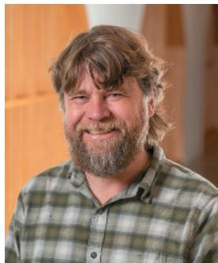  
Casey Dunn
Yale University, Connecticut

## Unit 6 Plant form and Function

  
Ernesto Gianoli
Tarleton State University, Texas

## Unit 7 Animal form and Function

  
Adrienne Bratcher
Morehouse School of Medicine,
Georgia

## Unit 8 Ecology

  
University San Francisco de Quito, Ecuador

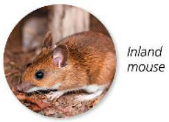

# Evolution, the Themes of Biology, and Scientific Inquiry

## Key Concepts

1.1 The study of life reveals unifying themes

1.2 The Core Theme: Evolution accounts for the unity and diversity of life

1.3 In studying nature, scientists form and test hypotheses

1.4 Science benefits from a cooperative approach and diverse viewpoints

  
Figure 1.1 The light, dappled color of this beach mouse (Peromyscus polionotus) allows it to blend into its habitat—brilliant white sand dunes dotted with sparse clumps of beach grass along the Florida seashore. Mice of the same species that inhabit nearby inland areas are much darker, blending with the soil and vegetation where they live.

## Study Tip

Make a table: List the five unifying themes of biology across the top. Enter at least three examples of each theme as you read this chapter. One example is filled in for you. To help you focus on these big ideas, continue adding examples throughout your study of biology.

<table><tr><td>Evolution</td><td>Organization</td><td></td><td></td><td></td></tr><tr><td>Beach mouse&#x27;s coat color matches its sandy habitat.</td><td></td><td></td><td></td><td></td></tr><tr><td></td><td></td><td></td><td></td><td></td></tr></table>

Beach mouse

## How do these mice illustrate the unifying themes of biology?

As a result of evolution through natural selection over long periods of time, the fur colors of these two populations of mice resemble their surroundings, providing protection from predators.

  
Structure fits function at all levels of a mouse's organization.

  
Energy flows one way from the sun to plants to a mouse; matter cycles between a mouse and its environment.  
Inland mouse

  
A plant being eaten by a mouse and a mouse being preyed upon by a hawk are interactions within a system.

Genetic information encoded in DNA determines a mouse's fur colors.

Gene for brown fur

Gene for white fur

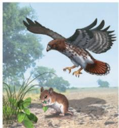

# Concept 1.1: The study of life reveals unifying themes

At the most fundamental level, we may ask: What is life? Even a child realizes that a dog or a plant is alive, while a rock or a car is not. Yet the phenomenon we call life defies a simple definition. We recognize life by what living things do. Figure 1.2 highlights some of the properties and processes we associate with life.

Biology, the scientific study of life, is a subject of enormous scope, and exciting new biological discoveries are being made every day. How can you organize into a comprehensible framework all the information you'll encounter as you study biology? Focusing on a few big ideas will help. Here are five unifying themes—ways of thinking about life that will still be useful decades from now.

\- Organization

\- Information

\- Energy and Matter

\- Interactions

\- Evolution

In this section and the next, we'll briefly explore each theme.

▼ Order. This close-up of a sunflower illustrates the highly ordered structure that characterizes life.

  
▲ Evolutionary adaptation. The overall appearance of these ghost pipefish camouflages the animals in their environment. Such adaptations evolve over countless generations by the reproductive success of those individuals with heritable traits that are best suited to their environments.

Figure 1.2 Some properties of life.  
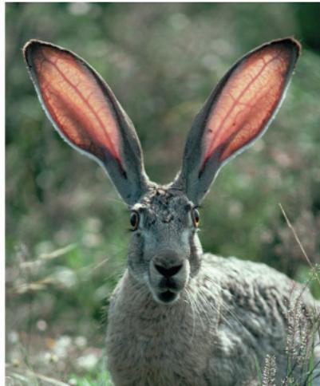

  
▲ Regulation. The regulation of blood flow through the blood vessels of this jackrabbit's ears helps maintain a constant body temperature by adjusting heat exchange with the surrounding air.  
▲ Energy processing. This butterfly obtains fuel in the form of nectar from flowers. The butterfly will use chemical energy stored in its food to power flight and other work.

  
▲ Growth and development.
Inherited information carried by genes controls the pattern of growth and development of organisms, such as this oak seedling.

  
▲ Response to the environment.
The Venus flytrap on the left closed its trap rapidly in response to the environmental stimulus of a grasshopper landing on the open trap.  
Reproduction.
Organisms (living things) reproduce their own kind.

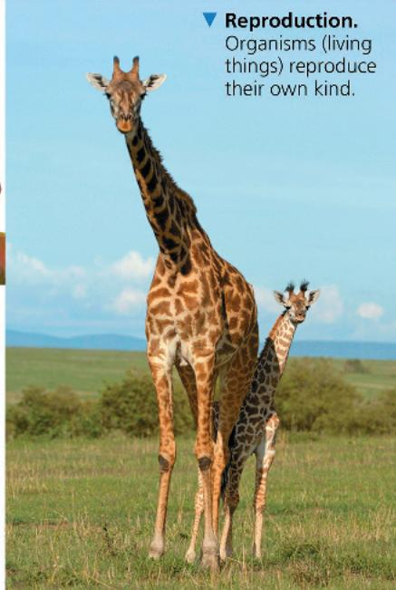

# Theme: New Properties Emerge at Successive Levels of Biological Organization

ORGANIZATION The study of life on Earth extends from the microscopic scale of the molecules and cells that make up an organism to the global scale of the entire living planet. As biologists, we can divide this enormous range into different levels of biological organization. In Figure 1.3, we zoom in from space to take a closer and closer look at life in a mountain meadow. This journey, depicted as a series of numbered steps, highlights the hierarchy of biological organization.

Zooming in at ever-finer resolution illustrates the principle that underlies reductionism, an approach that reduces complex systems to simpler components that are more manageable to study. Reductionism is a powerful strategy in biology. For example, by studying the molecular structure of DNA that had been extracted from cells, Francis Crick and James Watson inferred the chemical basis of biological inheritance. Despite its importance, reductionism provides an incomplete view of life on Earth, as you'll see next.

## Emergent Properties

Let's reexamine Figure 1.3, beginning this time at the molecular level and then zooming out. This approach allows us to see novel properties emerge at each level that are absent from the preceding one. These emergent properties are due to the arrangement and interactions of parts as complexity increases. For example,

# Exploring Levels of Biological Organization

Figure 1.3

## ◀1 The Biosphere

Even from space, we can see signs of Earth's life—in the mosaic of greens indicating forests, for example. We can also see the biosphere, which consists of all life on Earth and all the places where life exists: most regions of land, most bodies of water, the atmosphere to an altitude of several kilometers, and even sediments far below the ocean floor.

## 2 Ecosystems

Our first scale change brings us to a North American mountain meadow, which is an example of an ecosystem, as are a tropical forest, grassland, desert, and coral reef. An ecosystem consists of all the living things in a particular area, along with all the nonliving components of the environment with which life interacts, such as soil, water, atmospheric gases, and light.

## ▶ 3 Communities

The array of organisms inhabiting a particular ecosystem is called a biological community. The community in our meadow ecosystem includes many kinds of plants, various animals, mushrooms and other fungi, and enormous numbers of diverse microorganisms, such as bacteria, that are too small to see without a microscope. Each of these forms of life belongs to a species—a group whose members can only reproduce with other members of the group.

## ▶ 4 Populations

A population consists of all the individuals of a species living within the bounds of a specified area. For example, our meadow includes a population of lupines (some of which are shown here) and a population of mule deer. A community is therefore the set of populations that inhabit a particular area.

## ▲ 5 Organisms

Individual living things are called organisms. Each plant in the meadow is an organism, and so is each animal, fungus, and bacterium.

although photosynthesis occurs in an intact chloroplast, it will not take place if chlorophyll and other chloroplast molecules are simply mixed in a test tube. The coordinated processes of photosynthesis require a specific organization of these molecules in the chloroplast. Isolated components of living systems—the objects of study in a reductionist approach—lack a number of significant properties that emerge at higher levels of organization.

Emergent properties are not unique to life. A box of bicycle parts won't transport you anywhere, but if they are arranged in a certain way, you can pedal to your chosen destination. Compared with such nonliving examples, however, biological systems are far more complex, making the emergent properties of life especially challenging to study.

To fully explore emergent properties, biologists today complement reductionism with systems biology, the exploration of a biological system by analyzing the interactions among its parts. In this context, a single leaf cell can be considered a system, as can a frog, an ant colony, or a desert ecosystem. By examining and modeling the dynamic behavior of an integrated network of components, systems biology enables us to pose new kinds of questions. For example, how do networks of molecular interactions in our bodies generate our 24-hour cycle of wakefulness and sleep? At a larger scale, how does a gradual increase in atmospheric carbon dioxide alter ecosystems and the entire biosphere? Systems biology can be used to study life at all levels.

## Structure and Function

At each level of the biological hierarchy, we find a correlation between structure and function. Consider the leaf in Figure 1.3: Its broad, flat shape maximizes the capture of sunlight by chloroplasts. Because such correlations of structure and function are common in all living things, analyzing a biological structure gives us clues about what it does and how it works. For

## ▼ 6 Organs

The structural hierarchy of life continues to unfold as we explore the architecture of a complex organism. This lupine leaf (consisting of six leaflets) is an example of an organ, a body part that is made up of multiple tissues and has specific functions in the body. Leaves, stems, and roots are the major organs of plants. Within an organ,

plants. Within an organ, each tissue has a distinct arrangement and contributes particular properties to organ function.

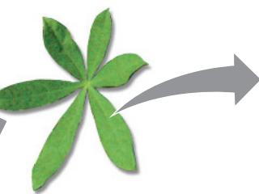

## ▼ 7 Tissues

Viewing the tissues of a leaf requires a microscope. Each tissue is a group of cells that work together, performing a specialized function. The leaf shown here has been cut on an angle. The honeycombed tissue in the interior of

  
$\overline{50\mu m}$

the leaf (left side of photo) is the main location of photosynthesis, the process that converts light energy to the chemical energy of sugar. The jigsaw puzzle-like “skin” on the surface of the leaf (right side of photo) is a tissue called epidermis. The pores through the epidermis allow entry of the gas $CO_{2}$ , a raw material for sugar production.

## ▶ 8 Cells

The cell is life's fundamental unit of structure and function. Some organisms consist of a single cell, which performs all the functions of life. Other

10 μm

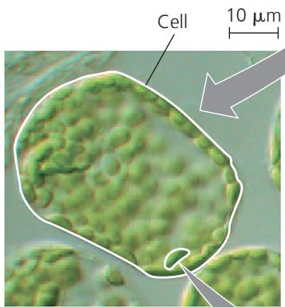

organisms are multicellular and feature a division of labor among specialized cells. Here we see a magnified view of a cell in a leaf tissue. This cell is about 40 micrometers ( $\mu$ m) across—about 500 of them would reach across a small coin. Within these tiny cells are even smaller green structures called chloroplasts, which are responsible for photosynthesis.

## ▼ 9 Organelles

Chloroplasts are examples of organelles, the various functional components present in cells. The image below, taken by a powerful microscope, shows a single chloroplast.

  
Chloroplast  
1 μm

## ▼ 10 Molecules

Our last scale change drops us into a chloroplast for a view of life at the molecular level. A molecule is a chemical structure consisting of two or more units called atoms, represented as balls in this computer graphic of a chlorophyll molecule. Chlorophyll is

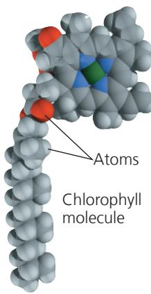  
Chlorophyll molecule

the pigment that makes a leaf green, and it absorbs sun-light during photo-synthesis. Within each chloroplast, millions of chlorophyll molecules are organized into systems that convert light energy to the chemical energy of food.

Figure 1.4 Contrasting eukaryotic and prokaryotic cells in size and complexity.

The cells are shown to scale here; to see a larger magnification of a prokaryotic cell, see Figure 6.5.

VISUAL SKILLS Measure the scale bar, the length of the prokaryotic cell, and the diameter of the eukaryotic cell. Knowing that this scale bar represents $1 \mu m$ , calculate the length of the prokaryotic cell and the diameter of the eukaryotic cell in $\mu m$ .

For suggested answer, see Appendix A.

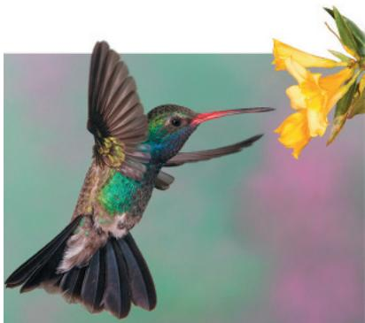

example, the hummingbird's anatomy allows its wings to rotate at the shoulder, so hummingbirds have the ability, unique among birds, to fly backward or hover in place. While hovering, the birds can extend their long, slender beaks into flowers and feed on nectar. The elegant match

of form and function in the structures of life is explained by natural selection, which we'll explore shortly.

## The Cell: An Organism's Basic Unit of Structure and Function

The cell is the smallest unit of organization that can perform all activities required for life. The so-called Cell Theory was first developed in the 1800s, based on the observations of many scientists. The theory states that all living organisms are made of cells, which are the basic unit of life. In fact, the actions of organisms are all based on the activities of cells. For instance, the movement of your eyes as you read this sentence results from the activities of muscle and nerve cells. Even a process that occurs on a global scale, such as the recycling of carbon atoms, is the product of cellular functions, including the photosynthetic activity of chloroplasts in leaf cells.

All cells share certain characteristics. For instance, every cell is enclosed by a membrane that regulates the passage of materials between the cell and its surroundings. Nevertheless, we distinguish two main forms of cells: prokaryotic and eukaryotic. Prokaryotic cells are found in single-celled microorganisms belonging to one of two groups: the bacteria (singular, bacterium) and the archaea (singular, archaean). All other forms of life, including plants and animals, are composed of eukaryotic cells.

A eukaryotic cell contains membrane-enclosed organelles (Figure 1.4). Some organelles, such as the DNA-containing nucleus, are found in the cells of all eukaryotes; other organelles are specific to particular cell types. For example, the chloroplast in Figure 1.3 is an organelle found only in eukaryotic cells that carry out photosynthesis. In contrast to eukaryotic cells, a prokaryotic cell lacks a nucleus or other membrane-enclosed organelles. Furthermore, prokaryotic cells are generally smaller than eukaryotic cells, as shown in Figure 1.4.

# Theme: Life's Processes Involve the Expression and Transmission of Genetic Information

INFORMATION Within cells, structures called chromosomes contain genetic material in the form of DNA (deoxyribonucleic acid). In cells that are preparing to divide, the chromosomes may be made visible using a dye that appears blue when bound to the DNA (Figure 1.5).

Figure 1.5 A lung cell from a newt divides into two smaller cells that will grow and divide again.  
DNA in chromosomes  
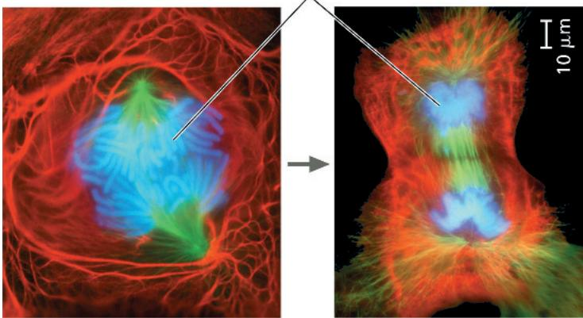

Figure 1.6 Inherited DNA directs the development of an organism.  
  
Offspring with traits inherited from both parents

## DNA, the Genetic Material

Each chromosome contains one very long DNA molecule with hundreds or thousands of genes, each a section of the DNA of the chromosome. Transmitted from parents to offspring, genes are the units of inheritance. They encode the information necessary to build all of the molecules synthesized within a cell, which in turn establish that cell's identity and function. You began as a single cell stocked with DNA inherited from your parents. The replication of that DNA prior to each cell division transmitted copies of the DNA to what eventually became the trillions of cells of your body. As the cells grew and divided, the genetic information encoded by the DNA directed your development (Figure 1.6).

The molecular structure of DNA accounts for its ability to store information. A DNA molecule is made up of two long chains, called strands, arranged in a double helix. Each chain is made up of four kinds of chemical building blocks called nucleotides, abbreviated A, T, C, and G (Figure 1.7). Specific sequences of these four nucleotides encode the information in genes. The way DNA encodes information is analogous to how we arrange the letters of the alphabet into words and phrases with specific meanings. The word rat, for example, evokes a rodent; the words tar and art, which contain the same letters, mean very different things. We can think of nucleotides as a four-letter alphabet.

For many genes, the sequence provides the blueprint for making a protein. For instance, a given bacterial gene may specify a particular protein (such as an enzyme) required to break down a certain sugar molecule, while one particular human gene may denote an enzyme, and another gene a different protein (an antibody, perhaps) that helps fight off infection. Overall, proteins are major players in building and maintaining the cell and carrying out its activities.

Protein-encoding genes control protein production indirectly, using a related molecule called RNA as an intermediary. The sequence of nucleotides along a gene is transcribed into mRNA, which is then translated into a linked series of protein building blocks called amino acids. Once completed, the amino acid chain forms a specific protein with a unique shape and function. The entire

Figure 1.7 DNA: the genetic material.

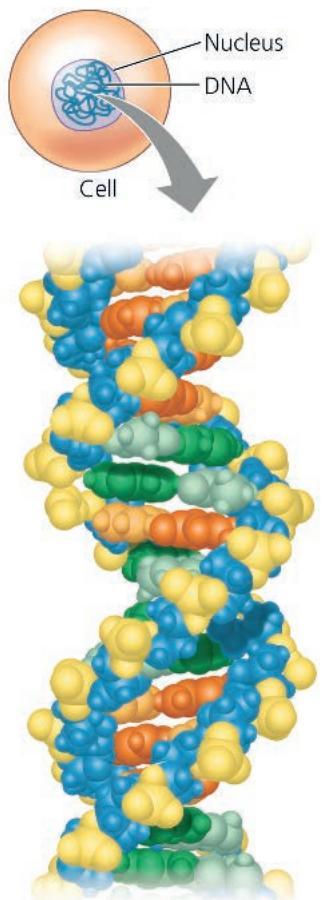

  
(b) Single strand of DNA. These geometric shapes and letters are simple symbols for the nucleotides in a small section of one strand of a DNA molecule. Genetic information is encoded in specific sequences of the four types of nucleotides. Their names are abbreviated A, T, C, and G.

(a) DNA double helix. This model shows the atoms in a segment of DNA. Made up of two long chains (strands) of building blocks called nucleotides, a DNA molecule takes the three-dimensional form of a double helix.

process by which the information in a gene directs the manufacture of a cellular product is called gene expression (Figure 1.8, on the next page).

In carrying out gene expression, all forms of life employ essentially the same genetic code: A particular sequence of nucleotides means the same thing in one organism as it does in another. Differences between organisms reflect differences between their nucleotide sequences rather than between their underlying genetic codes. This universality of the genetic code is a strong piece of evidence that all life is related. Comparing the sequences in several species for a gene that codes for a particular protein can provide valuable information both about the protein and about the relationship of the species to each other.

Molecules of mRNA, like the one in Figure 1.8, are translated into proteins, but other cellular RNAs function differently. For example, we have known for decades that some types of RNA are actually components of the cellular machinery that manufactures proteins. In the last few decades, scientists have discovered new classes of RNA that play other roles in the cell, such as regulating the function of protein-coding genes. Genes specify these RNAs as well, and their production is also referred to as gene expression. By carrying the instructions for making proteins and RNAs and by replicating with each cell division, DNA ensures faithful inheritance of genetic information from generation to generation.

Figure 1.8 Gene expression: Cells use information encoded in a gene to synthesize a functional protein.  
  
(a) The lens of the eye (behind the pupil) is able to focus light because lens cells are tightly packed with transparent proteins called crystallin. How do lens cells make crystallin proteins?

  
The chain of amino acids folds into the specific shape of a crystallin protein. Crystallin proteins can then pack together and focus light, allowing the eye to see.

## Genomics: Large-Scale Analysis of DNA Sequences

The entire “library” of genetic instructions that an organism inherits is called its genome. A typical human cell has two similar sets of chromosomes, and each set has approximately 3 billion nucleotide pairs of DNA. If the one-letter abbreviations for the nucleotides of a set were written in letters the size of those you are now reading, the genomic text would fill about 700 biology textbooks.

Since the early 1990s, the pace at which researchers can determine the sequence of a genome has accelerated at an astounding rate, enabled by a revolution in technology. The genome sequence—the entire sequence of nucleotides for a representative member of a species—is now known for humans and many other animals, as well as numerous plants, fungi, bacteria, and archaea. To make sense of the deluge of data from genome-sequencing projects and the growing catalog of known gene functions, scientists are applying a systems biology approach at the cellular and molecular levels. Rather than investigating a single gene at a time, researchers study whole sets of genes (or other DNA) in one or more species—an approach called genomics. Likewise, the term proteomics refers to the study of sets of proteins and their properties. (The entire set of proteins expressed by a given cell, tissue, or organism is called a proteome.)

Three important research developments have made the genomic and proteomic approaches possible. One is “high-throughput” technology, tools that can analyze many biological samples very rapidly. The second major development is bioinformatics, the use of computational tools to store, organize, and analyze the huge volume of data that results from high-throughput methods. One new bioinformatics tool that is becoming essential is artificial intelligence (AI), the development and use of computer systems that can function like neural networks in the human brain to perform various tasks. AI is transforming how researchers analyze biological data, identify patterns, and develop new medical treatments. The third development is the formation of interdisciplinary research teams—groups of diverse specialists that may include computer scientists, mathematicians, engineers, chemists, physicists, and, of course, biologists from a variety of fields. Researchers in such teams aim to learn how the activities of all the proteins and RNAs encoded by the DNA are coordinated in cells and in whole organisms.

## Theme: Life Requires the Transfer and Transformation of Energy and Matter

ENERGY AND MATTER Moving, growing, reproducing, and the various cellular activities of life are work, and work requires energy. The input of energy, primarily from the sun, and the

Figure 1.9 Energy flow and chemical cycling.

There is a one-way flow of energy in an ecosystem: During photosynthesis, plants convert energy from sunlight to chemical energy (stored in food molecules such as sugars), which is used by plants and other organisms to do work and is eventually lost from the ecosystem as heat. In contrast, chemicals cycle between organisms and the physical environment.

transformation of energy from one form to another make life possible (Figure 1.9). When a plant's leaves absorb sunlight in the process of photosynthesis, molecules within the leaves convert the energy of sunlight to the chemical energy of food, such as sugars. The chemical energy in the food molecules is then passed along from plants and other photosynthetic organisms (producers) to consumers. A consumer is an organism that feeds on other organisms or their remains.

When an organism uses chemical energy to perform work, such as muscle contraction or cell division, some of that energy is lost to the surroundings as heat. As a result, energy flows through an ecosystem in one direction, usually entering as light and exiting as heat. In contrast, chemicals cycle within an ecosystem, where they are used and then recycled (see Figure 1.9). Chemicals that a plant absorbs from the air or soil may be incorporated into the plant's body and then passed to an animal that eats the plant. Eventually, these chemicals will be returned to the environment by decomposers such as bacteria and fungi that break down waste products, leaf litter, and the bodies of dead organisms. The chemicals are then available to be taken up by plants again, thereby completing the cycle.

## Theme: From Molecules to Ecosystems, Interactions Are Important in Biological Systems

INTERACTIONS At any level of the biological hierarchy, interactions between the components of the system ensure smooth integration of all the parts, such that they function as a whole. This holds true equally well for molecules in a cell and the components of an ecosystem; we'll look at both as examples.

## Molecules: Interactions Within Organisms

At lower levels of organization, the interactions between components that make up living organisms—organs, tissues, cells, and molecules—are crucial to their smooth operation. Consider the regulation of blood sugar level, for instance. Cells in the body must match the supply of fuel (sugar) to demand, regulating the opposing processes of sugar breakdown and storage. The key is the ability of many biological processes to self-regulate by a mechanism called feedback.

In feedback regulation, the output or product of a process regulates that very process. The most common form of regulation in living systems is negative feedback, a loop in which the response acts in opposition to the initial stimulus. As seen in the example of blood glucose regulation (Figure 1.10, on the next page), after a meal the level of the sugar glucose in your blood rises (stimulus), which stimulates cells of the pancreas to secrete insulin. Insulin, in turn, causes body cells to take up glucose and liver and muscle cells to store it. This response decreases the blood glucose level, so insulin secretion decreases. Thus, the response (increased glucose uptake) opposes the stimulus (increased blood glucose level).

Though less common than processes regulated by negative feedback, there are also many biological processes regulated by positive feedback, in which an end product reinforces or strengthens the stimulus. The clotting of your blood in response to injury is an example. When a blood vessel is damaged, structures in the blood called platelets begin to aggregate at the site. Positive feedback occurs as chemicals released by the platelets attract more platelets. The platelet pileup then initiates a complex process that seals the wound with a clot.

Figure 1.10 Feedback regulation.

The human body regulates the use and storage of glucose, a major cellular fuel. This figure shows negative feedback: The response to increased blood glucose levels acts in opposition to the initial stimulus.

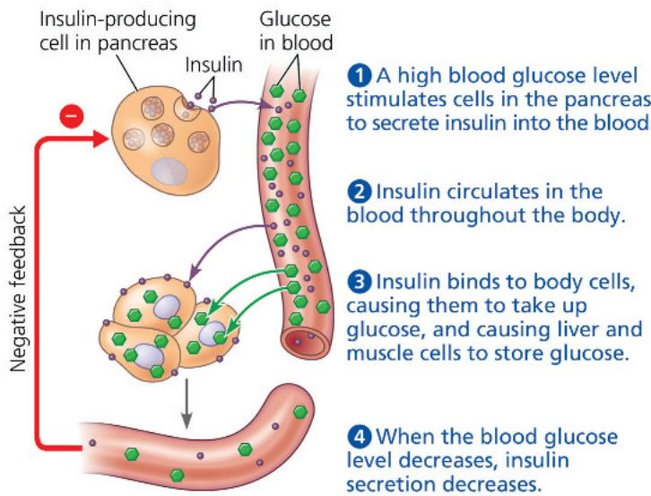  
VISUAL SKILLS In this example, what is the response to high blood glucose levels? How does this response act in opposition to the stimulus? For suggested answer, see Appendix A.

# Ecosystems: An Organism's Interactions with Other Organisms and the Physical Environment

At the ecosystem level, every organism interacts with other organisms. For instance, an acacia tree interacts with soil

microorganisms associated with its roots, insects that live on it, and animals that eat its leaves and fruit (Figure 1.11). Interactions between organisms include those that are mutually beneficial (as when “cleaner fish” eat small parasites on a turtle) and those in which one species benefits and the other is harmed (as when a lion kills and eats a zebra). In some interactions between species, both are harmed—for example, when two plants compete for a soil resource that is in short supply. Interactions among organisms help regulate the functioning of the ecosystem as a whole.

Each organism also interacts continuously with physical factors in its environment. The leaves of a tree, for example, absorb light from the sun, take in carbon dioxide from the air, and release oxygen to the air (see Figure 1.11). The environment is also affected by organisms. For instance, in addition to taking up water and minerals from the soil, the roots of a plant break up rocks as they grow, contributing to the formation of soil. On a global scale, plants and other photosynthetic organisms have generated all the oxygen in the atmosphere.

Like other organisms, we humans interact with our environment. Our interactions sometimes have dire consequences: For example, over the past 150 years, humans have greatly increased the burning of fossil fuels (coal, oil, and gas). This practice releases large amounts of carbon dioxide $(\mathrm{CO}_{2})$ and other gases into the atmosphere, causing heat to be trapped close to Earth's surface (see Figure 56.29). Scientists calculate that the $\mathrm{CO}_{2}$ added to the atmosphere by human activities has increased the average temperature of the planet by about $1.15^{\circ}\mathrm{C}$ since 1900. At the current rates that $\mathrm{CO}_{2}$ and other gases are being added to the atmosphere, global models predict an additional rise of about $3^{\circ}\mathrm{C}$ before the end of this century.

This ongoing global warming is a major aspect of climate change, a directional change to the global climate that lasts for three decades or more (as opposed to short-term changes in the weather). But global warming is not the only way the climate is changing: Wind and precipitation patterns are also shifting, and extreme weather events such as storms and droughts are occurring more often. Climate change has already affected organisms and their habitats all over the planet. For example, polar bears have lost much of the ice platform from which they hunt, leading to food shortages and increased mortality rates. As habitats deteriorate, hundreds of plant and animal species are shifting their ranges to more suitable locations—but for some, there is insufficient suitable habitat, or they may not be able to migrate quickly enough. As a result, the populations of many species are shrinking in size or even disappearing (Figure 1.12). (For more examples of how climate change is affecting life on Earth, see Make Connections Figure 56.30.)

Figure 1.11 Interactions of an African acacia tree with other organisms and the physical environment.  
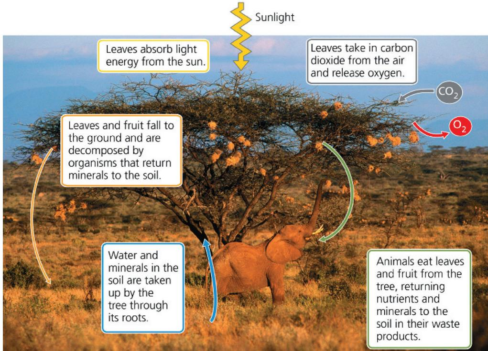

Figure 1.12 Threatened by global warming.

A warmer environment causes lizards in the genus Sceloporus to spend more time in refuges from the heat, reducing time for foraging. Their food intake drops, decreasing reproductive success. Surveys of 200 Sceloporus populations in Mexico show that 12% of these populations have disappeared since 1975.

The loss of populations due to climate change can ultimately result in extinction, the permanent loss of a species. As we'll explore in greater detail in Concept 56.4, the consequences of these changes for humans and other organisms may be profound.

Having considered four of the unifying themes (organization, information, energy and matter, and interactions), let's now turn to evolution. There is consensus among biologists that evolution is the core theme of biology, and it is discussed in detail in the next section.

## Concept Check 1.1

1. Starting with the molecular level in Figure 1.3, write a sentence that includes components from the previous (lower) level of biological organization, for example: "A molecule consists of atoms bonded together." Continue with organelles, moving up the biological hierarchy.

2. Identify the theme or themes exemplified by (a) the sharp quills of a porcupine, (b) the development of a multicellular organism from a single fertilized egg, and (c) a hummingbird using sugar to power its flight.

3. WHAT IF? For each theme discussed in this section, give an example not mentioned in the text.

For suggested answers, see Appendix A.

# Concept 1.2: The Core Theme: Evolution accounts for the unity and diversity of life

EVOLUTION An understanding of evolution helps us to make sense of everything we know about life on Earth. As the fossil record clearly shows, life has been evolving for billions of years, resulting in a vast diversity of past and present organisms. But along with the diversity there is also unity, in the form of shared features. For example, while sea horses, jackrabbits, hummingbirds, and giraffes all look very different, their skeletons are organized in the same basic way.

The scientific explanation for the unity and diversity of organisms is evolution: a process of biological change in which species accumulate differences from their ancestors as they adapt to different environments over time. Thus, we can account for differences between two species (diversity) with the idea that certain heritable changes occurred after the two species diverged from their common ancestor. However, they also share certain traits (unity) simply because they have descended from a common ancestor. An abundance of evidence of different types supports the occurrence of evolution and the mechanisms that describe how it takes place, which we'll explore in detail in Chapters 22–25. To quote one of the founders of modern evolutionary theory, Theodosius Dobzhansky, "Nothing in biology makes sense except in the light of evolution." To understand this statement, we need to examine how biologists think about the vast diversity of life on the planet.

## Classifying the Diversity of Life

Diversity is a hallmark of life. Biologists have so far identified and named about 1.8 million species of organisms. Each species is given a two-part name: The first part is the name of the genus (plural, genera) to which the species belongs, and the second part is unique to the species within the genus. (For example, Homo sapiens is the name of our species.)

To date, known species include at least 150,000 species of fungi, 435,000 plant species, 65,000 vertebrate species (animals with backbones), and 1 million insect species (more than half of all known forms of life)—not to mention the myriad types of single-celled organisms. Researchers identify thousands of additional species each year. Estimates of the total number of species range from about 10 million to over 100 million. Whatever the actual number, the enormous variety of life gives biology a very broad scope. Biologists face a major challenge in attempting to make sense of this variety.

## Rethinking the Domains of Life

Humans tend to group diverse items according to their similarities and relationships to each other. Consequently, biologists have long used careful comparisons of structure, function, and other obvious features to classify forms of life into groups. As described in more detail in Concept 26.6, this process has led to changing conceptions of the broadest groupings as new analytical methods have been developed, such as comparing genomic sequences. In 1990, researcher Carl Woese and colleagues proposed a system classifying organisms into three groups, called domains: Bacteria, Archaea, and Eukarya (Figure 1.13). As described, two of the three domains—Bacteria and Archaea—consisted of single-celled prokaryotic organisms. All the eukaryotes (organisms with eukaryotic cells) were placed in domain Eukarya. This domain includes kingdom Plantae, kingdom Fungi, kingdom Animalia, and the protists. The three kingdoms are distinguished partly by their modes of nutrition: Plants produce their own sugars and other food molecules by photosynthesis, fungi absorb nutrients in dissolved form from their surroundings, and animals obtain food by eating and digesting other organisms. Animalia is, of course, the kingdom to which we humans belong.

100 μm

(b) Archaea  
Figure 1.13 The three-domain hypothesis.  
Although recent analyses indicate that Eukarya likely evolved within the Archaea (see Concept 26.6), it is still useful to distinguish the prokaryotic species in Archaea as a group since there are many significant differences between eukaryotic and prokaryotic organisms.  
(a) Bacteria  
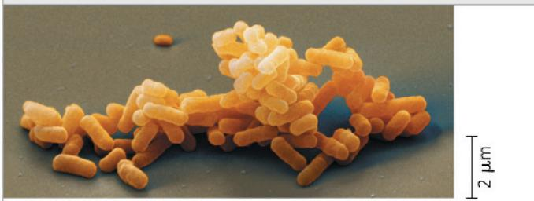  
Bacteria are the most diverse and widespread prokaryotic species and are classified into multiple kingdoms. Each rod-shaped structure in this photo is a bacterial cell.

  
Archaea includes multiple kingdoms. Some of the prokaryotic organisms known as archaea live in Earth's extreme environments, such as salty lakes and boiling hot springs. Each round structure in this photo is an archaeal cell.

(c) Eukarya  

  
Kingdom Plantae (plants) consists of multicellular eukaryotes that carry out photosynthesis, the conversion of light energy to the chemical energy in food. Most plant species live on land.  
Kingdom Animalia consists of multicellular eukaryotes that ingest other organisms.  
Kingdom Fungi, which includes unicellular and multicellular eukaryotes, is characterized in part by the nutritional mode of its members (such as this mushroom), which absorb nutrients from outside their bodies.  
▶ Protists are mostly unicellular eukaryotes and some relatively simple multicellular relatives. Pictured here is an assortment of protists inhabiting

  
pond water. Scientists are currently debating how to classify protists in a way that accurately reflects their evolutionary relationships.

In the last few decades, many more analyses of genetic sequences and protein structures have contributed to an ongoing reevaluation of the classification of life. As one example, let's consider the most numerous and diverse eukaryotes—the protists, which are mostly single-celled organisms. Although protists were once placed in a single kingdom, they are now classified into several groups. One major reason for this change is DNA evidence showing that some protists are less closely related to other protists than they are to plants, animals, or fungi. In another example, molecular comparisons of many organisms across Bacteria, Archaea, and Eukarya support that Archaea are more closely related to Eukarya than they are to Bacteria, and that in fact Eukarya may be descended from a subgroup of Archaea. These evolutionary relationships of Eukarya and Archaea are currently a matter of active research, as well as their status as domains (see Concept 26.6).

Although the earliest branching of the tree of life is not fully understood, the names biologists have assigned these groups—Bacteria, Archaea, and Eukarya—are still quite useful for purposes of studying the significant differences between them; therefore,

in this text, when we use the term Archaea, we are referring to prokaryotic species unless otherwise noted.

## Unity in the Diversity of Life

As diverse as life is, there is also remarkable unity among forms of life. Consider, for example, the similar skeletons of different animals and the universal genetic language of DNA (the genetic code), both mentioned earlier. In fact, similarities between organisms are evident at all levels of the biological hierarchy. For example, unity is obvious in many features of cell structure, even among distantly related organisms (Figure 1.14).

How can we account for life's dual nature of unity and diversity? The process of evolution, explained next, illuminates both the similarities and differences in the world of life. It also introduces another important dimension of biology: the passage of time. The history of life, as documented by fossils and other evidence, is the saga of an ever-changing Earth billions of years old, inhabited by an evolving cast of living forms (Figure 1.15).

Figure 1.14 An example of unity underlying the diversity of life: the architecture of cilia in eukaryotes.

Cilia (singular, cilium) are extensions of cells that function in locomotion. They occur in eukaryotes as diverse as Paramecium (found in pond water) and humans. Even organisms so different share a common architecture for their cilia, which have an elaborate system of tubules that is striking in cross-sectional views.

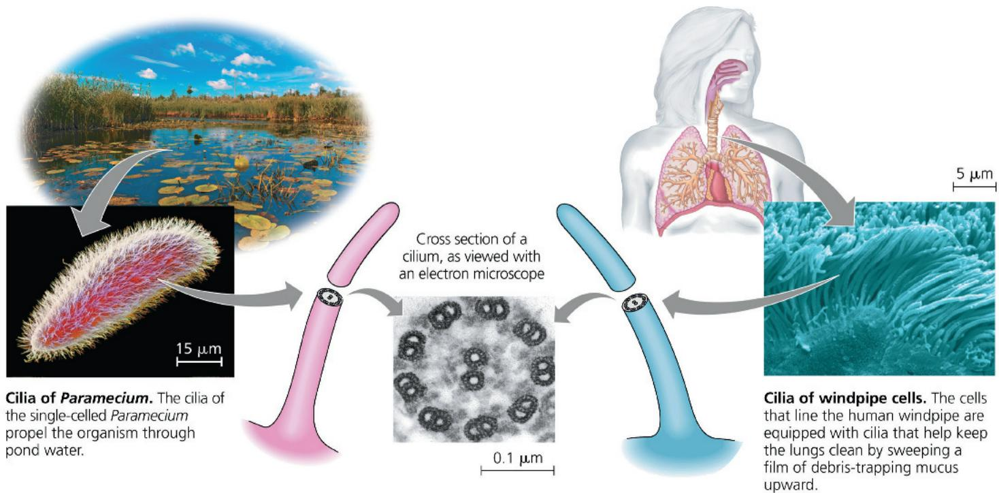  
Cross section of a cilium, as viewed with an electron microscope  
Cilia of Paramecium. The cilia of the single-celled Paramecium propel the organism through pond water.  
Cilia of windpipe cells. The cells that line the human windpipe are equipped with cilia that help keep the lungs clean by sweeping a film of debris-trapping mucus upward.

Figure 1.15 Studying the history of life.  
Paleontologist Marie-Antoinette de Lumley examines a fossilized tooth of Tautavel Man, a pre-Neanderthal species discovered in southern France. Fossilized teeth preserve well and provide valuable information concerning the age, health, and diet of the individual.  

## Charles Darwin and the Theory of Natural Selection

An evolutionary view of life came into sharp focus in November 1859, when Charles Darwin published one of the most important and influential books ever written, On the Origin of Species by Means of Natural Selection (Figure 1.16). The Origin of Species articulated

Figure 1.16 Charles Darwin.  
The portrait shows Darwin in about 1840, well before the 1859 publication of his revolutionary book, commonly referred to as The Origin of Species.  
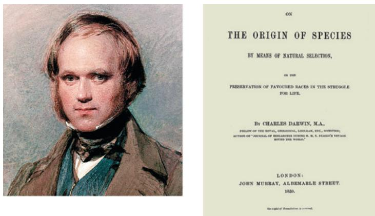

two main points. The first point was that, as species adapt to different environments over time, they accumulate differences from their ancestors. Darwin called this process “descent with modification.” This insightful phrase captured the duality of life’s unity and diversity—unity in the kinship among species that descended from common ancestors and diversity in the modifications that evolved as species branched from their common ancestors (Figure 1.17). Darwin’s second main point was his proposal that “natural selection” is a primary cause of descent with modification.

Darwin developed his theory of natural selection from observations that by themselves were neither new nor profound. However, although others had described the pieces of the puzzle, it was Darwin who saw how they fit together. He started with the

4 Increased frequency of traits that enhance survival and reproductive success

Figure 1.17 Unity and diversity among birds.

These four birds are variations on a common body plan. For example, each has feathers, a beak, and wings. However, these common features are highly specialized for the birds' diverse lifestyles.

▼ Red-tailed hawk (Buteo borealis)

▼ American flamingo (Phoenicopterus ruber)

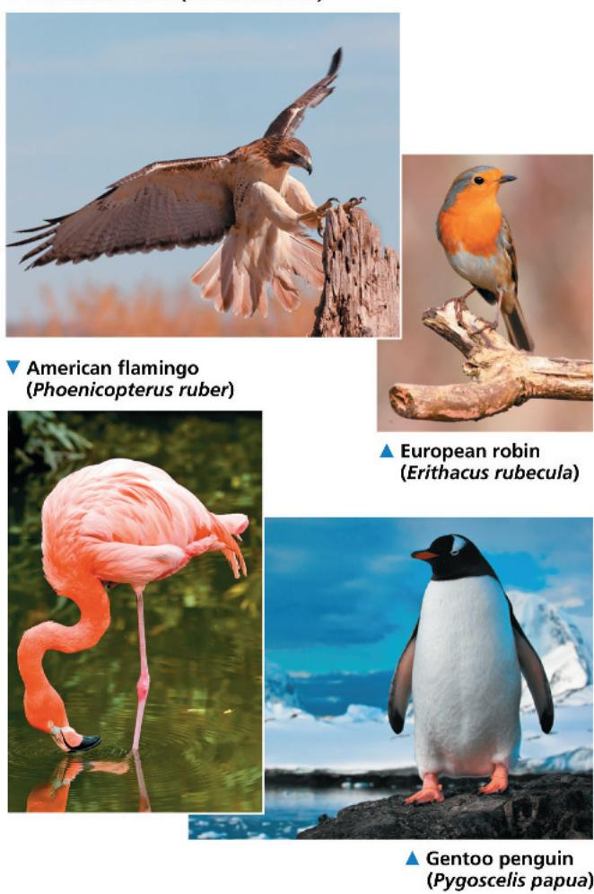  
▲ European robin (Erithacus rubecula)  
▲ Gentoo penguin (Pygoscelis papua)  
This imaginary beetle population has colonized a locale where the soil has been blackened by a recent brush fire. Initially, the population varies extensively in the inherited coloration of the individuals, from very light gray to charcoal. For hungry birds that prey on the beetles, it is easiest to spot the beetles that are lightest in color.

following three observations from nature: First, individuals in a population vary in their traits, many of which seem to be heritable (passed on from parents to offspring). Second, a population can produce far more offspring than can survive to produce offspring of their own. With more individuals than the environment is able to support, competition is inevitable. Third, species generally are suited to their environments—in other words, they are adapted to their circumstances. For instance, a common adaptation among birds that eat hard seeds is an especially strong beak.

By making inferences from these three observations, Darwin developed a scientific explanation for how evolution occurs. He reasoned that individuals with inherited traits that are better suited to the local environment are more likely to survive and reproduce than less well-suited individuals. Over many generations, a higher and higher proportion of individuals in a population will have the advantageous traits. Evolution occurs as the unequal reproductive success of individuals ultimately leads to adaptation to their environment, as long as the environment remains the same.

Darwin called this mechanism of evolutionary adaptation natural selection because the natural environment consistently “selects” for the propagation of certain traits among naturally occurring variant traits in the population. The example in Figure 1.18 illustrates the ability of natural selection to “edit” an insect population’s heritable variations in coloration. We see the products of natural selection in the exquisite adaptations of various organisms to the special circumstances of their way of life and their environment. The wings of the bat shown in Figure 1.19 are an excellent example of adaptation.

## The Tree of Life

Take another look at the skeletal architecture of the bat's wings in Figure 1.19. These wings are not like those of feathered birds; the bat is a mammal. The bones, joints, nerves, and blood vessels

Figure 1.18 Natural selection.

  
DRAW IT Over time, the soil will gradually become lighter in color. Draw another step to show how the soil, when lightened to medium color, would affect natural selection. Write a caption for this new step 5. Then explain how the population would change over time as the soil becomes lighter.  
For suggested answer, see Appendix A.

Figure 1.19 Evolutionary adaptation.

Bats, the only mammals capable of active flight, have wings with webbing between extended “fingers.” Darwin proposed that such adaptations are refined over time by natural selection.

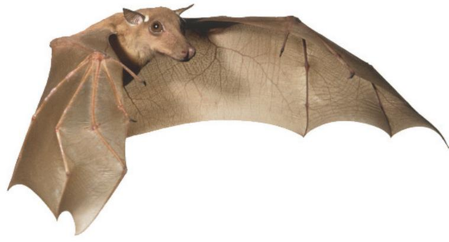

in the bat's forelimbs, though adapted for flight, are very similar to those in the human arm, the foreleg of a horse, and the flipper of a whale. Indeed, all mammalian forelimbs are anatomical variations of a common architecture. According to the Darwinian concept of descent with modification, the shared anatomy of mammalian limbs reflects inheritance of the limb structure from a common ancestor—the “prototype” mammal from which all other mammals descended. The diversity of mammalian forelimbs results from modification by natural selection operating over millions of years in different environmental contexts. Fossils and other evidence corroborate anatomical unity in supporting this view of mammalian descent from a common ancestor.

Darwin proposed that natural selection, by its cumulative effects over long periods of time, could cause an ancestral species to give rise to two or more descendant species. This could occur, for example, if one population of organisms became fragmented into several subpopulations isolated in different environments. In these separate arenas of natural selection, one species could gradually radiate into multiple species as the geographically isolated populations adapted over many generations to different environmental conditions.

The Galápagos finches are a famous example of the process of radiation of new species from a common ancestor. Darwin collected specimens of these birds during his 1835 visit to the remote Galápagos Islands, 900 kilometers (km) off the Pacific coast of South America. These relatively young volcanic islands are home to many species of plants and animals found nowhere else in the world, though many Galápagos organisms are clearly related to species on the South American mainland. The Galápagos finches are thought to have descended from an ancestral finch species that reached the archipelago from South America or the Caribbean. Over time, the Galápagos finches diversified from their ancestor as populations became adapted to different food sources on their particular islands. Years after Darwin collected the finches, researchers began to sort out their evolutionary relationships, first from anatomical and geographic data and more recently with the help of DNA sequence comparisons.

Biologists' diagrams of evolutionary relationships generally take treelike forms, though the trees are often turned sideways as in Figure 1.20. Tree diagrams make sense: Just as an individual has a genealogy that can be diagrammed as a family tree, each species is one twig of a branching tree of life extending back in time through ancestral species more and more remote. Species that are very similar, such as the Galápagos finches, share a relatively recent common ancestor. Through an ancestor that lived much further back in time, finches are related to sparrows, hawks,

Figure 1.20 Descent with modification: adaptive radiation of finches on the Galápagos Islands.

This “tree” illustrates a current hypothesis for the evolutionary relationships of finches on the Galápagos. Note the various beaks, which are adapted to particular food sources. For example, heavier, thicker beaks are better at cracking seeds, while the more slender beaks are better at grasping insects.

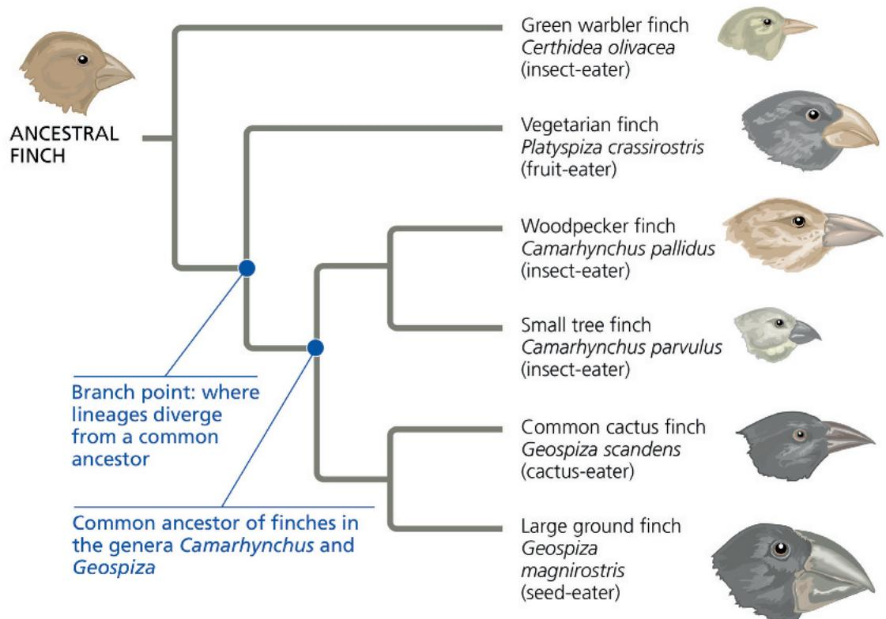

penguins, and all other birds. Furthermore, finches and other birds are related to us through a common ancestor even more ancient. Trace life back far enough, and we reach the early prokaryotic species that inhabited Earth over 3.5 billion years ago. We can recognize their vestiges in our own cells—in the universal genetic code, for example. Indeed, all of life is connected through its long evolutionary history.

## Concept Check 1.2

1. Explain why “editing” is a metaphor for how natural selection acts on a population’s heritable variation.

2. Referring to Figure 1.20, provide a possible explanation for how, over a very long time, the green warbler finch came to have a slender beak.

3. DRAW IT The three major groups you learned about in Concept 1.2 can be represented in the tree of life as the three main branches, with three subbranches on the eukaryotic branch being the kingdoms Plantae, Fungi, and Animalia. Genomic and other evidence has shown that fungi and animals are more closely related to each other than either of these kingdoms is to plants. Draw a simple branching pattern that symbolizes the proposed relationship between these three eukaryotic kingdoms.

For suggested answers, see Appendix A.

## Concept 1.3: In studying nature, scientists form and test hypotheses

Science is a way of knowing—an approach to understanding the natural world. It developed out of our curiosity about ourselves, other life-forms, our planet, and the universe. The word science is derived from a Latin verb meaning “to know.” Striving to understand seems to be one of our basic urges.

At the heart of science is inquiry, the search for information and explanations of natural phenomena. There is no formula for successful scientific inquiry, no single scientific method that researchers must rigidly follow. As in all quests, science includes elements of challenge, adventure, and luck, along with careful planning, reasoning, creativity, patience, and the persistence to overcome setbacks. Such diverse elements of inquiry make science far less structured than most people realize. That said, it is possible to highlight certain characteristics that help to distinguish science from other ways of describing and explaining nature.

Scientists use a process of inquiry that includes making observations, forming logical, testable explanations (hypotheses), and testing them. The process is necessarily repetitive: In testing a hypothesis, more observations may inspire revision of the original hypothesis or formation of a new one, thus leading to further testing. In this way, scientists circle closer and closer to their best estimation of the laws governing nature.

## Exploration and Observation

Biology, like other sciences, begins with careful observations. In gathering information, biologists often use tools such as microscopes, precision thermometers, or high-speed cameras that extend their senses or facilitate careful measurement. Observations can reveal valuable information about the natural world. For example, a series of detailed observations have shaped our understanding of cell structure, and another set of observations is currently expanding our databases of genome sequences from diverse species and databases of genes whose expression is altered in various diseases.

In exploring nature, biologists also rely heavily on the scientific literature, the published contributions of fellow scientists. By reading about and understanding past studies, scientists can build on the foundation of existing knowledge, focusing their investigations on observations that are original and on hypotheses that are consistent with previous findings. Identifying publications relevant to a new line of research is now easier than at any point in the past, thanks to indexed and searchable electronic databases.

## Gathering and Analyzing Data

Recorded observations are called data. Put another way, data are items of information on which scientific inquiry is based. The term data implies numbers to many people. But some data are qualitative, often in the form of recorded descriptions rather than numerical measurements. For example, Jane Goodall spent decades recording her observations of chimpanzee behavior during field research in a Tanzanian jungle (Figure 1.21). In her studies, Goodall also enriched the field of animal behavior with volumes of quantitative data, such as the frequency and duration of specific behaviors for different members of a group of chimpanzees in a variety of situations. Quantitative data are generally expressed as numerical measurements and often organized into tables and graphs. Scientists analyze their data using a type of mathematics called statistics to test whether their results are significant or merely due to random fluctuations. All results presented in this text have been shown to be statistically significant.

## Figure 1.21 Jane Goodall collecting qualitative data on chimpanzee behavior.

Goodall recorded her observations in field notebooks, often with sketches of the animals' behavior.

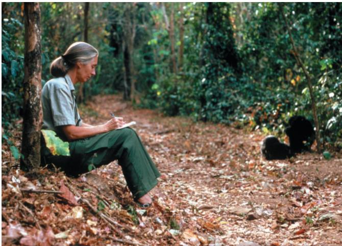

## Interview

Interview with Jane Goodall: Living with chimpanzees (eTextbook only)

Collecting and analyzing observations can lead to important conclusions based on a type of logic called inductive reasoning. Through induction, we derive generalizations from a large number of specific observations. "The sun always rises in the east" is one example. Another biological example is the generalization "All organisms are made of cells," which was based on two centuries of microscopic observations made by biologists examining cells in diverse biological specimens. Careful observations and data analyses, along with generalizations reached by induction, are fundamental to our understanding of nature.

## Forming and Testing Hypotheses

Our innate curiosity often stimulates us to pose questions about the natural basis for the phenomena we observe in the world. What caused the different chimpanzee behaviors observed in the wild? What explains the variation in coat color among the mice of a single species, shown in Figure 1.1? Answering such questions usually involves forming and testing logical explanations—that is, hypotheses.

In science, a hypothesis is an explanation, based on observations and assumptions, that leads to a testable prediction. Said another way, a hypothesis is an explanation on trial. The hypothesis is usually a rational accounting for a set of observations, based on the available data and guided by inductive reasoning. A scientific hypothesis must lead to predictions that can be tested by making additional observations or by performing experiments. An experiment is a scientific test, carried out under controlled conditions.

We all make observations and develop questions and hypotheses in solving everyday problems. Let's say, for example, that your desk lamp is plugged in and turned on but the bulb doesn't light up. That's an observation. The question is obvious: Why doesn't the lamp work? Two reasonable hypotheses based on your experience are that (1) the bulb is burnt out or (2) the bulb is not screwed in properly. Each of these alternative hypotheses leads to predictions you can test with experiments. For example, the burnt-out bulb hypothesis predicts that replacing the bulb will fix the problem. Figure 1.22 diagrams this informal inquiry. Figuring things out in this way by trial and error is a hypothesis-based approach.

## Deductive Reasoning

A type of logic called deduction is also built into the use of hypotheses in science. While induction entails reasoning from a set of specific observations to reach a general conclusion, deductive reasoning involves logic that flows in the opposite direction, from the general to the specific. From general premises, we extrapolate to the specific results we should expect if the premises are true. In the scientific process, deductions usually take the form of a prediction of results that will be found if a particular hypothesis (premise) is correct. We then test the hypothesis by carrying out experiments or observations to see whether or not the results are as predicted. This deductive testing takes the form of “If… then”

Figure 1.22 A simplified view of the scientific process.

The idealized process sometimes called the “scientific method” is shown in this flow chart, which illustrates hypothesis testing for a desk lamp that doesn’t work.

logic. In the case of the desk lamp example: If the burnt-out bulb hypothesis is correct, then the lamp should work if you replace the bulb with a new one.

We can use the desk lamp example to illustrate two other key points about the use of hypotheses in science. First, one can always devise additional hypotheses to explain a set of observations. For instance, another hypothesis to explain our nonworking desk lamp is that the wall socket is faulty. Although you could design an experiment to test this hypothesis, you can never test all possible hypotheses. Second, we can never prove that a hypothesis is true. Suppose that replacing the bulb fixed the lamp. The burnt-out bulb hypothesis would be the most likely explanation, but testing supports that hypothesis not by proving that it is correct, but rather by failing to prove it incorrect. For example, even if replacing the bulb fixed the desk lamp, it might have been because there was a temporary power outage that just happened to end while the bulb was being changed.

Although a hypothesis can never be proved beyond all doubt, testing it in various ways can significantly increase our confidence in its validity. Often, rounds of hypothesis formulation and testing lead to a scientific consensus—the shared conclusion of many scientists that a particular hypothesis explains the known data well and stands up to experimental testing.

## Questions That Can and Cannot Be Addressed by Science

Scientific inquiry is a powerful way to learn about nature, but there are limitations to the kinds of questions it can answer. A scientific hypothesis must be testable; there must be some observation or experiment that could reveal if such an idea is likely to be true or false. The hypothesis that a burnt-out bulb is the sole reason the lamp doesn't work would not be supported if replacing the bulb with a new one didn't fix the lamp.

Not all hypotheses meet the criteria of science: You wouldn't be able to test the hypothesis that invisible ghosts are fooling with your desk lamp! Because science only deals with natural, testable explanations for natural phenomena, it can neither support nor contradict the invisible ghost hypothesis, nor whether spirits or elves cause storms, rainbows, or illnesses. Such supernatural explanations are simply outside the bounds of science, as are religious matters, which are issues of personal faith. Science and religion are not mutually exclusive or contradictory; they are simply concerned with different issues.

## The Flexibility of the Scientific Process

The way that researchers answer questions about the natural and physical world is often idealized as the scientific method. However, very few scientific inquiries adhere rigidly to the sequence of steps that are typically used to describe this approach. For example, a scientist may start to design an experiment, but then backtrack after realizing that more preliminary observations are necessary. In other cases, observations remain too puzzling to prompt well-defined questions until further study provides a new context in which to view those observations. For example, scientists could not unravel the details of how genes encode proteins until after the discovery of the structure of DNA (an event that took place in 1953).

A more realistic model of the scientific process is shown in Figure 1.23. The focus of this model, shown in the central circle in the figure, is the forming and testing of hypotheses. This core set of activities is the reason that science does so well in explaining phenomena in the natural world. These activities, however, are shaped by exploration and discovery (the upper circle in Figure 1.23) and influenced by interactions with other scientists and with society more generally (lower circles). For example, the community of scientists influences which hypotheses are tested, how test results are

In reality, the process of science is not linear, but instead involves backtracking, repetitions, and feedback between different parts of the process. This illustration is based on a model (How Science Works) from the website Understanding Science (www.understandingscience.org).

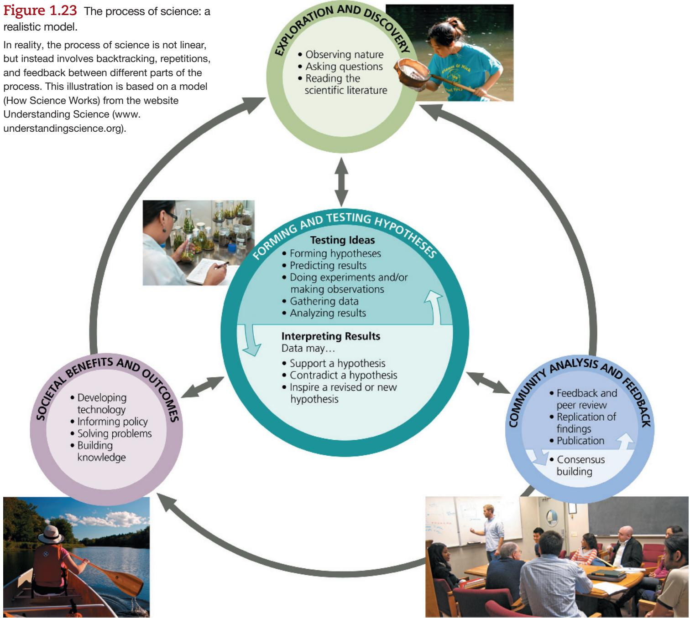

interpreted, and what value is placed on the findings. Similarly, societal needs—such as the push to cure cancer or understand the process of climate change—may help shape what research projects are funded and how extensively the results are discussed.

Now that we have highlighted the key features of scientific inquiry—making observations and forming and testing hypotheses—you should be able to recognize these features in a case study of actual scientific research.

## A Case Study in Scientific Inquiry: Investigating Coat Coloration in Mouse Populations

Our case study begins with a set of observations and inductive generalizations. Color patterns of animals vary widely in nature, sometimes even among members of the same species. What accounts for such variation? As you may recall, the two mice depicted at the beginning of this chapter are members of the same species (Peromyscus polionotus), but they have different coat (fur) color patterns and reside in different environments. The beach mouse lives along the Florida seashore, a habitat of brilliant white sand dunes with sparse clumps of beach grass. The inland mouse lives on darker, more fertile soil farther inland (Figure 1.24). Even a brief glance at the photographs in Figure 1.24 reveals a striking match of mouse coloration to its habitat. The natural predators of these mice, including hawks, owls, foxes, and coyotes, are all visual hunters (they use their sense of sight to look for prey). It was logical, therefore, for Francis Bertody Sumner, a naturalist studying populations of these mice in the 1920s, to form the hypothesis that their coloration patterns had evolved as adaptations that camouflage the mice in their native environments, protecting them from predation.

As obvious as the camouflage hypothesis may seem, it still required testing. In 2010, biologist Hopi Hoekstra of Harvard University and a group of her students headed to Florida to test the prediction that mice with coloration that did not match their habitat would be preyed on more heavily than the native, well-matched mice. Figure 1.25 summarizes this field experiment, introducing a format we will use throughout this text to walk through other examples of biological inquiry.

## Interview

Interview with Hopi Hoekstra: Investigating the genetics and natural selection of mouse coat color (eTextbook only)

The researchers built hundreds of models of mice and spray-painted them to resemble either beach or inland mice, so that the models differed only in their color patterns. The researchers placed equal numbers of these model mice randomly in both habitats and left them overnight. The mouse models resembling the native mice in the habitat were the control group (for instance, light-colored mouse models in the beach habitat), while the mouse models with the non-native coloration were the experimental group (for example, darker models in the beach habitat). The following morning, the team counted and recorded signs of predation events, which ranged from bites and gouge marks on some models to the outright disappearance of others. Judging by the shape of the predators' bites and the tracks surrounding the experimental sites, the predators appeared to be split fairly evenly between mammals (such as foxes and coyotes) and birds (such as owls, herons, and hawks).

For each environment, the researchers then calculated the percentage of predation events that targeted camouflaged models. The results were clear-cut: Camouflaged models showed much lower predation rates than those lacking camouflage in both the beach habitat (where light mice were less vulnerable) and the inland habitat (where dark mice were less vulnerable). The data thus fit the key prediction of the camouflage hypothesis.

## Variables and Controls in Experiments

In carrying out an experiment, a researcher often manipulates one factor in a system and observes the effects of this change. The mouse camouflage experiment described in Figure 1.25 is an example of a controlled experiment, one that is designed to compare an experimental group (the non-camouflaged mice models, in this case) with a control group (the camouflaged models). Both

Figure 1.24 Different coloration in beach and inland populations of Peromyscus polionotus.  
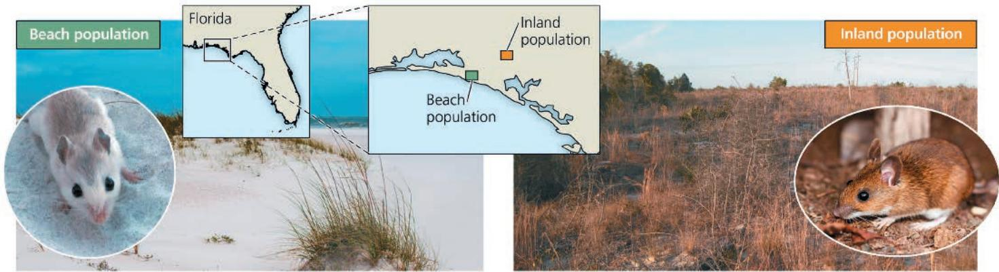  
Beach mice live on sparsely vegetated sand dunes along the coast. The light tan, dappled fur on their backs causes them to blend into their surroundings, providing camouflage.  
Members of the same species living about 30 km inland have dark fur on their backs, camouflaging them against the dark ground of their habitat.

## Figure 1.25

# Inquiry: Does camouflage affect predation rates on two populations of mice?

Experiment

Hopi Hoekstra and colleagues tested the hypothesis that coat coloration provides camouflage that protects beach and inland populations of Peromyscus polionotus mice from predation in their habitats. The researchers spray-painted mouse models with light or dark color patterns that matched those of the beach and inland mice and placed models with each of the patterns in both habitats. The next morning, they counted damaged or missing models.

## Results

For each habitat, the researchers calculated the percentage of attacked models that were camouflaged or non-camouflaged. In both habitats, the models whose pattern did not match their surroundings suffered much higher “predation” than did the camouflaged models.

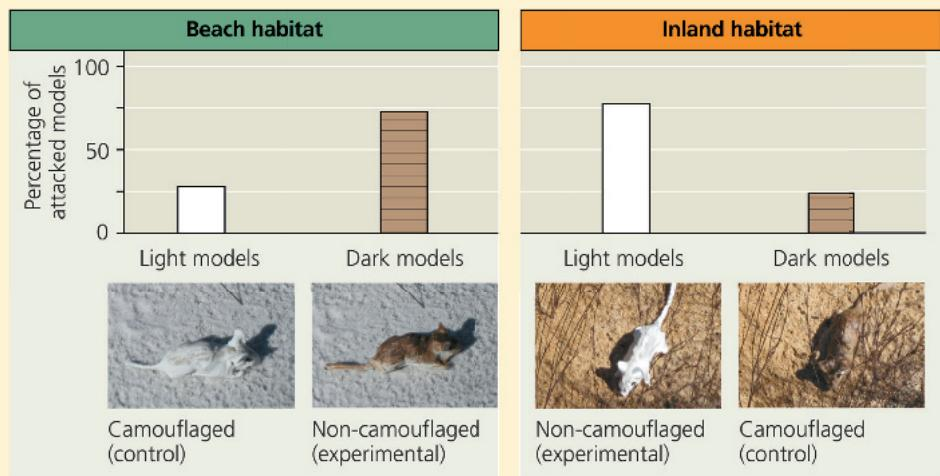  
Data from S. N. Vignieri, J. G. Larson, and H. E. Hoekstra, The selective advantage of crypsis in mice, Evolution 64:2153–2158 (2010).

## Conclusion

The results are consistent with the researchers' prediction: that mouse models with camouflage coloration would be attacked less often than non-camouflaged mouse models. Thus, the experiment supports the camouflage hypothesis.

INTERPRET THE DATA The bars indicate the percentage of the attacked models that were either light or dark. Assume 100 mouse models were attacked in each habitat. For the beach habitat, how many were light models? Dark models? Answer the same questions for the inland habitat. Do the results of the experiment support the camouflage hypothesis? Explain.

variable; in this case, the researchers measured the amount of predation in response to variation in color of the mouse model. Note also that the experimental and control groups differ in only one independent variable: color.

As a result, the researchers could rule out other factors as causes of the more frequent attacks on the non-camouflaged mice—such as different numbers of predators or different temperatures in the different test areas. The clever experimental design left coloration as the only factor that could account for the low predation rate on models camouflaged with respect to the surrounding environment.

A common misconception is that the term controlled experiment means that scientists control all features of the experimental environment. But that's impossible in field research and can be very difficult even in highly regulated laboratory environments. Researchers usually "control" unwanted variables not by eliminating them through environmental regulation, but by canceling out their effects by using control groups.

## Theories in Science

"It's just a theory!" Our everyday use of the term theory often implies an untested speculation. But the term theory has a different meaning in science. What is a scientific theory, and how is it different from a hypothesis or from mere speculation?

First, a scientific theory is much broader in scope than a hypothesis. This is a hypothesis: "Coat coloration well-matched to their habitat is an adaptation that protects mice from predators." But this is a theory: "Evolutionary adaptations arise by natural selection." This theory proposes that natural selection is the evolutionary mechanism that accounts for an enormous

the factor that is manipulated and the factor that is subsequently measured are variables—a feature or quantity that varies in an experiment.

In our example, the color of the mouse model was the independent variable—the factor being manipulated by the researchers. The dependent variable is the factor being measured that is predicted to be affected by the independent variety of adaptations, of which coat color in mice is but one example.

Second, a theory is general enough to spin off many new, testable hypotheses. For example, the theory of natural selection motivated two researchers at Princeton University, Peter and Rosemary Grant, to test the specific hypothesis that the beaks of Galápagos finches evolve in response to changes in the types of

available food. (Their results supported their hypothesis; see Figure 23.2.)

And third, compared to any one hypothesis, a theory is generally supported by a much greater body of evidence. The theory of natural selection has been supported by a vast quantity of evidence, with more being found every day, and has not been contradicted by any scientific data. Those theories that become widely adopted in science (such as the theory of natural selection and the theory of gravity) explain a great diversity of observations and are supported by a vast accumulation of evidence.

Finally, scientists will sometimes modify or even reject a previously supported theory if new research consistently produces results that don't fit. For example, biologists once lumped bacteria and archaea together as a kingdom of prokaryotic species. When new methods for comparing cells and molecules could be used to test such relationships, the evidence led scientists to reject the theory that bacteria and archaea are members of the same kingdom. If there is “truth” in science, it is at best conditional, based on the weight of available evidence.

## Concept Check 1.3

1. What qualitative observation led to the quantitative study in Figure 1.25?

2. Contrast inductive reasoning with deductive reasoning.

3. Why is natural selection called a theory?

4. WHAT IF? In the deserts of New Mexico, the soils are mostly sandy, with occasional regions of black rock derived from lava flows that occurred about 1,000 years ago. Mice are found in both sandy and rocky areas, and owls are known predators. What might you expect about coat color in these two mouse populations? Explain. How would you use this ecosystem to further test the camouflage hypothesis?

For suggested answers, see Appendix A.

## Concept 1.4: Science benefits from a cooperative approach and diverse viewpoints

Movies and cartoons sometimes portray scientists as loners in white lab coats, working in isolated labs. In reality, science is an intensely social activity. Most scientists work in teams, which often include both graduate and undergraduate students, as well as post-doctoral research scientists (“post-docs”). And to succeed in science, it helps to be a good communicator. Research results have no impact until shared with a community of peers through seminars, publications, and websites. And, in fact, research papers aren’t published until they are vetted by colleagues in what is called the “peer review" process. The examples of scientific inquiry described in this book, for instance, have all been published in peer-reviewed journals.

## Building on the Work of Others

The great scientist Isaac Newton once said: "To explain all nature is too difficult a task for any one man or even for any one age. 'Tis much better to do a little with certainty, and leave the rest for others that come after you." Anyone who becomes a scientist, driven by curiosity about how nature works, is sure to benefit greatly from the rich storehouse of discoveries by others who have come before. In fact, Hopi Hoekstra's experiment benefited from the work of another researcher, D. W. Kaufman, 40 years earlier. You can study the design of Kaufman's experiment and interpret the results in the Scientific Skills Exercise.

Scientific results are continually scrutinized through the repetition of observations and experiments. Scientists working in the same research field often check one another's claims by attempting to confirm observations or repeat experiments. If scientific colleagues cannot repeat experimental findings, this failure may reflect some underlying weakness in the original claim, which will then have to be revised. In this sense, science policies itself. Integrity and adherence to high professional standards in reporting results are central to the scientific endeavor, since the validity of experimental data is key to designing further lines of inquiry.

It is not unusual for several scientists to converge on the same research question. Some scientists enjoy the challenge of being first with an important discovery or key experiment, while others derive more satisfaction from cooperating with fellow scientists working on the same problem.

Cooperation is facilitated when scientists use the same organism. Often, it is a widely used model organism—a species that is easy to grow in the lab and lends itself particularly well to the questions being investigated. Because all species are evolutionarily related, such an organism may be viewed as a model for understanding the biology of other species and their diseases. Genetic studies of the fruit fly Drosophila melanogaster, for example, have taught us a lot about how genes work in other species, even humans. Some other popular model organisms are the mustard plant Arabidopsis thaliana, the soil worm Caenorhabditis elegans, the zebrafish Danio rerio, the mouse Mus musculus, and the bacterium Escherichia coli. As you read through this book, note the many contributions that these and other model organisms have made to the study of life.

Biologists may approach interesting questions from different angles. Some biologists focus on ecosystems, while others study natural phenomena at the level of organisms or cells. This text is divided into units that look at biology at different levels and investigate problems through different approaches. Yet any given problem can be addressed from many perspectives, which in fact complement each other. For example, Hoekstra not only carried out field studies showing that coat coloration can affect predation

## Scientific Skills Exercise Interpreting a Pair of Bar Graphs

How much does camouflage affect predation on mice by owls with and without moonlight? D. W. Kaufman hypothesized that the extent to which the coat color of a mouse contrasted with the color of its surroundings would affect the rate of nighttime predation by owls. He also hypothesized that the contrast would be affected by the amount of moonlight. In this exercise, you will analyze data from his studies of owl predation on mice that tested these hypotheses.

How the Experiment Was Done Pairs of mice (Peromyscus polionotus) with different coat colors, one light brown and one dark brown, were released simultaneously into an enclosure that contained a hungry owl. The researcher recorded the color of the mouse that was first caught by the owl. If the owl did not catch either mouse within 15 minutes, the test was recorded as a zero. The release trials were repeated multiple times in enclosures with either a dark-colored soil surface or a light-colored soil surface. The presence or absence of moonlight during each assay was recorded.

Data from the Experiment  

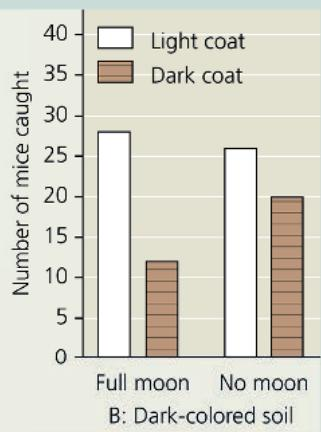  
Data from D. W. Kaufman, Adaptive coloration in Peromyscus polionotus: Experimental selection by owls, Journal of Mammalogy 55:271–283 (1974).

## INTERPRET THE DATA

1. First, make sure you understand how the graphs are set up. Graph A shows data from the light-colored soil enclosure and graph B from the dark-colored enclosure, but in all other

rates but also did lab studies that uncovered at least one genetic mutation that underlies the differences between beach and inland mouse coloration. Her lab includes biologists specializing in different biological levels, allowing links to be made between the evolutionary adaptations she focuses on and their molecular basis in DNA sequences.

As a biology student, you can benefit from making connections between the different levels of biology. You can develop this skill by noticing when certain topics crop up again and again in different units. One such topic is sickle-cell disease, a

respects the graphs are the same. (a) There is more than one independent variable in these graphs. What are the independent variables, the variables that were tested by the researcher? Which axis of the graphs has the independent variables? (b) What is the dependent variable,

the response to the variables being tested? Which axis of the graphs has the dependent variable?

2. (a) How many dark brown mice were caught in the light-colored soil enclosure on a moonlit night? (b) How many dark brown mice were caught in the dark-colored soil enclosure on a moonlit night? (c) On a moonlit night, would a dark brown mouse be more likely to escape predation by owls on dark- or light-colored soil? Explain your answer.

3. (a) Is a dark brown mouse on dark-colored soil more likely to escape predation under a full moon or with no moon? (b) What about a light brown mouse on light-colored soil? Explain.

4. (a) Under which conditions would a dark brown mouse be most likely to escape predation at night? (b) A light brown mouse?

5. (a) What combination of independent variables led to the highest predation level in enclosures with light-colored soil? (b) What combination of independent variables led to the highest predation level in enclosures with dark-colored soil?

6. Thinking about your answers to question 5, provide a simple statement describing conditions that are especially deadly for either color of mouse.

7. Combining the data from both graphs, estimate the number of mice caught in moonlight versus no-moonlight conditions. Which condition is optimal for predation by the owl? Explain.

Instructors: A version of this Scientific Skills Exercise can be assigned in Mastering Biology.

well-understood genetic condition that is prevalent among native inhabitants of Africa, India, southeast Asia, and other warm regions, as well as their descendants. Sickle-cell disease will appear in several units of the text, each time addressed at a new level. In addition, Make Connections figures, such as Figure 23.18 on sickle-cell disease, connect the content in different chapters, and Make Connections questions ask you to make the connections yourselves. We hope these features will help you integrate the material you're learning and enhance your enjoyment of biology by encouraging you to keep the big picture in mind.

## Science, Technology, and Society

The research community is part of society at large, and the relationship of science to society becomes clearer when we add technology to the picture (see Figure 1.23). Though science and technology sometimes employ similar inquiry patterns, their basic goals differ. The goal of science is to understand natural phenomena, while that of technology is to apply scientific knowledge for some specific purpose. Because scientists put new technology to work in their research, science and technology are interdependent.

The potent combination of science and technology can have dramatic effects on society. Sometimes, the applications of basic research that turn out to be the most beneficial come out of the blue, from completely unanticipated observations in the course of scientific exploration. For example, discovery of the structure of DNA by Crick and Watson in 1953 and subsequent achievements in DNA science led to the technologies of DNA manipulation that are transforming applied fields such as medicine, agriculture, and forensics (Figure 1.26). Perhaps Crick and Watson envisioned that their discovery would someday lead to important applications, but it is unlikely that they could have predicted exactly what all those applications would be.

The directions that technology takes depend less on the curiosity that drives basic science than on the current needs and wants of people and on the social environment of the times. Debates about technology center more on “should we do it” than “can we do it.” With advances in technology come difficult choices. For example, under what circumstances is it acceptable to use DNA technology to find out if particular people have genes for hereditary diseases? Should such tests always be voluntary, or are there circumstances when genetic testing should be mandatory? Should insurance companies or employers have access to the information, as they do for many other types of personal health data? These questions are becoming much more urgent as the sequencing of individual genomes becomes quicker and cheaper.

Ethical issues raised by such questions have as much to do with politics, economics, and cultural values as with science and technology. All citizens—not only professional scientists—have a responsibility to be informed about how science works and about the potential benefits and risks of technology. The relationship between science, technology, and society increases the significance and value of any biology course.

## Chapter 1 Review

## Summary of Key Concepts

To review key terms, go to the Vocabulary Self-Quiz (eTextbook only).

Concept 1.1: The study of life reveals unifying themes

Organization Theme: New Properties Emerge at Successive Levels of Biological Organization

\- The hierarchy of life unfolds as follows: biosphere > ecosystem > community > population > organism > organ system > organ > tissue > cell > organelle > molecule > atom. With each step from atoms to the biosphere, new emergent properties result from interactions among components at the lower levels. In an

## Figure 1.26 DNA technology and forensics.

Since 1992, the Innocence Project, along with other groups, has used forensic analysis of DNA samples from crime scenes to exonerate 375 wrongly convicted prisoners. Most had served many years in prison. To read about the four people shown here who were found to be innocent, go to the Innocence Project website.

  
Lynn DeJac  
John White

  
Michael Morton  
Clemente Aguirre-Jarquin

## Concept Check 1.4

1. How does science differ from technology?

2. MAKE CONNECTIONS The gene that causes sickle-cell disease is present in a higher percentage of native inhabitants of sub-Saharan Africa, India, southeast Asia, and other warm regions than among descendants of people from those regions living in the United States. Even though this gene causes sickle-cell disease, it also provides some protection from malaria, a serious disease that is widespread in sub-Saharan Africa but absent in the United States. Discuss an evolutionary process that could account for the different percentages of the sickle-cell gene. (See Concept 1.2.)

For suggested answers, see Appendix A.

approach called reductionism, complex systems are broken down to simpler components that are more manageable to study. In systems biology, scientists attempt to model the dynamic behavior of whole biological systems by studying the interactions among the system's parts.

\- Structure and function are correlated at all levels of biological organization. The cell, an organism's basic unit of structure and function, is the lowest level that can perform all activities required for life. Cells are either prokaryotic or eukaryotic. Eukaryotic cells have a DNA-containing nucleus and other membrane-enclosed organelles. Prokaryotic cells lack such organelles.

## Information Theme: Life's Processes Involve the Expression and Transmission of Genetic Information

\- Genetic information is encoded in the nucleotide sequences of DNA. It is DNA that transmits heritable information from parents to offspring. DNA sequences (called genes) program a cell's protein production by being transcribed into mRNA and then translated into specific proteins, a process called gene expression. Gene expression also produces RNAs that are not translated into protein but serve other important functions. Genomics is the large-scale analysis of the DNA sequences of a species (its genome) as well as the comparison of genomes between species. Bioinformatics uses computational tools to deal with huge volumes of sequence data.

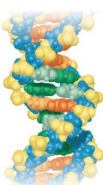

## Energy and Matter Theme: Life Requires the Transfer and Transformation of Energy and Matter

\- Energy flows through an ecosystem. All organisms must perform work, which requires energy. Producers convert energy from sunlight to chemical energy, some of which is used by them and by consumers to do work, and is eventually lost from the ecosystem as heat. Chemicals cycle between organisms and the environment.

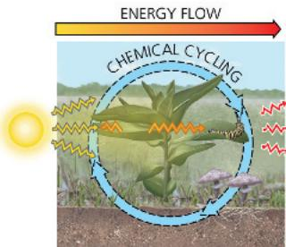

## Interactions Theme: From Molecules to Ecosystems, Interactions Are Important in Biological Systems

\- In feedback regulation, the output or product of a process alters the activity of the process. In negative feedback, the response opposes the stimulus. In positive feedback, the response

reinforces or strengthens the stimulus.

\- Organisms interact continuously with physical factors. Plants take up nutrients from the soil and chemicals from the air and use energy from the sun.

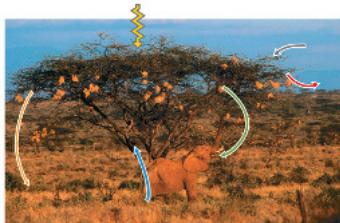

Thinking about the muscles and nerves in your hand, how does the activity of text messaging reflect the four unifying themes of biology described in this section?

## Concept 1.2: The Core Theme: Evolution accounts for the unity and diversity of life

\- Evolution, the process of change that has transformed life on Earth, accounts for the unity and diversity of life. It also explains evolutionary adaptation—the match of organisms to their environments.

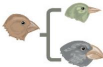

\- Biologists classify species according to a system of broader and broader groups. The major groups Bacteria and Archaea consist of prokaryotic organisms. Eukarya, the eukaryotes, includes various groups of protists and the kingdoms Plantae, Fungi, and Animalia. As diverse as life is, there is also evidence of remarkable unity, revealed in the similarities between different species.

\- Darwin proposed natural selection as the mechanism for evolutionary adaptation of populations to their environments. Natural selection is the evolutionary process that occurs when a population is exposed to environmental factors that consistently cause individuals with certain heritable traits to have greater reproductive success than do individuals with other heritable traits.

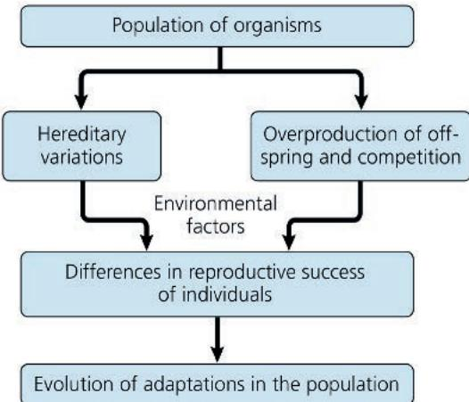

\- Each species is one twig of a branching tree of life extending back in time through more and more remote ancestral species. All of life is connected through its long evolutionary history.

How could natural selection have led to the evolution of adaptations such as camouflaging coat color in beach mice?

## Concept 1.3: In studying nature, scientists form and test hypotheses

\- In scientific inquiry, scientists collect data and use inductive reasoning to draw a general conclusion, which can be developed into a testable hypothesis. Deductive reasoning uses predictions to test hypotheses. Hypotheses must be testable; science can address neither the possibility of supernatural phenomena nor religious beliefs. Hypotheses can be tested by conducting experiments or, when that is not possible, by making observations. In the process of science, the core activity is testing ideas. This endeavor is influenced by exploration and discovery, community analysis and feedback, and societal outcomes.

\- Controlled experiments are designed to demonstrate the effect of one variable by testing control groups and experimental groups that differ in only that one variable.

\- A scientific theory is broad in scope, generates new hypotheses, and is supported by a large body of evidence.

What are the roles of gathering and interpreting data?

## Concept 1.4: Science benefits from a cooperative approach and diverse viewpoints

\- Science is a social activity. The work of each scientist builds on the work of others who have come before. Scientists must be able to repeat each other's results, and integrity is key. Biologists approach questions at different levels; their approaches complement each other

\- Technology consists of any method or device that applies scientific knowledge for some specific purpose that affects society. The impact of basic research is not always immediately obvious.

Explain how different approaches among scientists can be helpful to advance scientific knowledge.

For suggested answers, see Appendix A.

## Test Your Understanding

For more multiple-choice questions, go to the Practice Test (eTextbook only).

## Levels 1-2: Remembering/Understanding

1. All the organisms on your campus make up
(A) an ecosystem.
(B) a community.
(C) a population.
(D) a taxonomic kingdom.

2. Systems biology is mainly an attempt to

(A) analyze genomes from different species.

(B) simplify complex problems by reducing the system into smaller, less complex units.

(C) understand the behavior of entire biological systems by studying interactions among its component parts.

(D) build high-throughput machines to rapidly acquire data.

3. Which of these best demonstrates unity among organisms?
(A) emergent properties (C) the structure and
(B) descent with function of DNA
modification (D) natural selection

4. A controlled experiment is one that
(A) proceeds slowly so a scientist can make careful records.
(B) tests experimental and control groups in parallel.
(C) is repeated many times to make sure the results are accurate.
(D) keeps all variables constant.

5. Which of the following statements best distinguishes hypotheses from theories in science?

(A) Theories are hypotheses that have been proved.

(B) Hypotheses are guesses; theories are correct answers.

(C) Hypotheses usually are relatively narrow in scope; theories have broad explanatory power.

(E) Theories are proved true; hypotheses are often contradicted by experimental results.

## Levels 3-4: Applying/Analyzing

6. Which of the following is an example of qualitative data?

(A) The fish swam in a zigzag motion.

(B) The contents of the stomach are mixed every 20 seconds.

(C) The temperature decreased from $20^{\circ}$ C to $15^{\circ}$ C.

(D) The six pairs of robins hatched an average of three chicks each.

7. Which sentence best describes the logic of scientific inquiry?

(A) If I generate a testable hypothesis, tests and observations will support it.

(B) If my prediction is correct, it will lead to a testable hypothesis.

(C) If my observations are accurate, they will support my hypothesis.

(D) If my prediction turns out to be correct, my hypothesis is supported.

8. DRAW IT Draw a biological hierarchy similar to the one in Figure 1.3 but using a coral reef as the ecosystem, a fish as the organism, its stomach as the organ, and DNA as the molecule. Include all levels in the hierarchy.

## Levels 5-6: Evaluating/Creating

9. EVOLUTION CONNECTION A typical prokaryotic cell has about 3,000 genes in its DNA, while a human cell has about 20,000 genes. About 1,000 of these genes are present in both types of cells. Explain how such different organisms could have this same subset of 1,000 genes. What sorts of functions might these shared genes have?

10. SCIENTIFIC INQUIRY Based on the results of the mouse coloration case study, suggest another hypothesis researchers might use to study the role of predators in natural selection.

11. SCIENTIFIC INQUIRY Scientists search the scientific literature using electronic databases such as PubMed, a free online database maintained by the National Center for Biotechnology Information. Use PubMed to find the abstract of an article that Hopi Hoekstra published in 2017 or later.

12. WRITE ABOUT A THEME: EVOLUTION In a short essay (100–150 words), discuss Darwin's view of how natural selection resulted in both unity and diversity of life. Include in your discussion some of his evidence. (For help in writing essays, see "Writing Tips and Rubrics" in the Study Area of Mastering Biology under "Additional Resources.")

## 13. SYNTHESIZE YOUR KNOWLEDGE

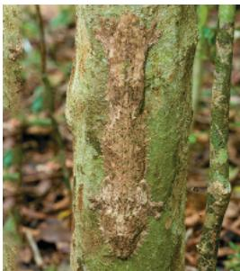  
For selected answers, see Appendix A.

Can you pick out the mossy leaf-tailed gecko lying against the tree trunk in this photo? How is the appearance of the gecko a benefit in terms of survival? Given what you learned about evolution, natural selection, and genetic information in this chapter, describe how the gecko's coloration might have evolved.

# Unit 1 The Chemistry of Life

An Interview with Kristi Anseth

Dr. Kristi Anseth is the Tisone Distinguished Professor of Chemical and Biological Engineering and Associate Faculty Director of the BioFrontiers Institute at the University of Colorado at Boulder. She received a BS in Chemical Engineering from Purdue and a PhD in Chemical Engineering from the University of Colorado. Dr. Anseth has been elected to the National Academy of Sciences, the National Academy of Engineering, and the National Academy of Inventors, and has been named a Howard Hughes Medical Institute Investigator. She was named one of “100 Chemical Engineers of the Modern Era” by the American Institute of Chemical Engineers and is a recipient of the David and Lucile Packard Fellowship for Science and Engineering as well as numerous other awards and honorary degrees. She and her laboratory members develop innovative biological materials that deliver medications to specific sites in the body, regenerate body tissues, or act as a 3-D scaffolding that supports growing cells in culture.

## How did you get started in science?

Growing up, I was always interested in my science and math courses. I wanted to understand how things worked: how reactions occur when you're baking, or how mechanical devices work. So for me, those interests blended: I trained as an engineer, but I use engineering principles to better understand biology and explore medical applications. As an undergraduate, I was intrigued by the idea of making molecules and materials that can improve healthcare and quality of life. I did research in Nicholas Pepys's lab—he was working on designing new types of biomaterials.

## What are biomaterials?

Biomaterials are substances made in the lab based on biological molecules, designed to interface with the tissues in our bodies. Some examples are biomaterials that help your heart to heal after a heart attack or your skin to heal faster after a severe burn, or that deliver medications in a more efficient and stable manner. Developers of the COVID-19 vaccine used a biomaterial to stabilize it as it interacted with body tissues. In that case, the biomaterial was lipids, molecules that make up cellular membranes. Lipids can form organized structures that can protect fragile biomolecules like the vaccine. In making biomaterials, sometimes we use materials that are found in the body, and other times we construct new materials from biological building blocks: amino acids to make proteins that have unique functions, or nucleotides that can assemble into nucleic acids, or sugars to build large molecules called polysaccharides or proteoglycans. And since we know from physics that like charges repel each other and opposite charges attract, we can fine-tune biomaterials to have defined interactions based on ionic charges.

## What is an example of something you've developed that's used in the healthcare field?

One biomaterial we work on is called a hydrogel. Hydrogels are made up of long biological molecules that would normally dissolve in water, but because of interactions between the chains—which can be ionic, covalent, or hydrogen bonds—the material is insoluble and actually takes up a lot of water. Jello is a hydrogel, and so is the super-absorbent material found in diapers that can absorb up to 1,000 times their weight in water. Many cells in the body reside in a natural hydrogel matrix called the extracellular matrix, or ECM, which is made up of molecules secreted by cells. The ECM takes up water and gives unique mechanical properties to the tissue, and it helps cells receive nutrients and heal themselves. We make synthetic mimics of ECM that can be used to repair damaged cartilage, which is a type of ECM. Cartilage cushions our joints, and once it's damaged it doesn't repair itself easily. It has no blood supply, and the cells that make cartilage, called chondrocytes, are present in small numbers. So we collect chondrocytes from other cartilage in a patient's body, cause them to multiply to high numbers, and reinject them into joints along with our artificial ECM. At higher densities, they will make new natural cartilage while the synthetic cartilage degrades away. This procedure is usually used for osteoarthritis, a type of arthritis that's caused by a mechanical or sports injury.

  
Dr. Kristi Anseth

  
Graduate student Cierra Walker and Dr. Anseth prepare cells to be imaged and tracked in a 3-D hydrogel matrix (synthetic ECM).

"The path is not really a ladder; it's more of a jungle gym, so be nimble and flexible, and don't be afraid to pursue your passions."

## What do you find most personally rewarding about being a scientist? What would you advise students considering a career in biology?

First, I love my research in that it's discovery of new knowledge, trying to develop new products that can improve quality of life for people everywhere. I feel like I learn something new every day that's intellectually stimulating. As a biologist, you will be a lifelong learner because new discoveries are emerging all the time. Second, in my position at the University of Colorado, one of the best things is the students in my lab. I get to help them learn how to do research, and they end up teaching me as much as I've taught them. In the end, we as scientists want to make the world a better place and tackle important problems, and there are many approaches to that. There is a wealth of career opportunities for those with a biological science background. So don't be afraid to take risks and try new things to find out what really interests you. Sometimes you might fail or really not like something, and that's okay. That helps guide you in a different direction. The path is not really a ladder; it's more of a jungle gym, so be nimble and flexible, and don't be afraid to pursue your passions.

A compound's properties depend on its atoms and how they are bonded together.

# The Chemical Context of Life

## Key Concepts

2.1 Matter consists of chemical elements in pure form and in combinations called compounds

2.2 An element's properties depend on the structure of its atoms

2.3 The formation and function of molecules and ionic compounds depend on chemical bonding between atoms

2.4 Chemical reactions make and break chemical bonds

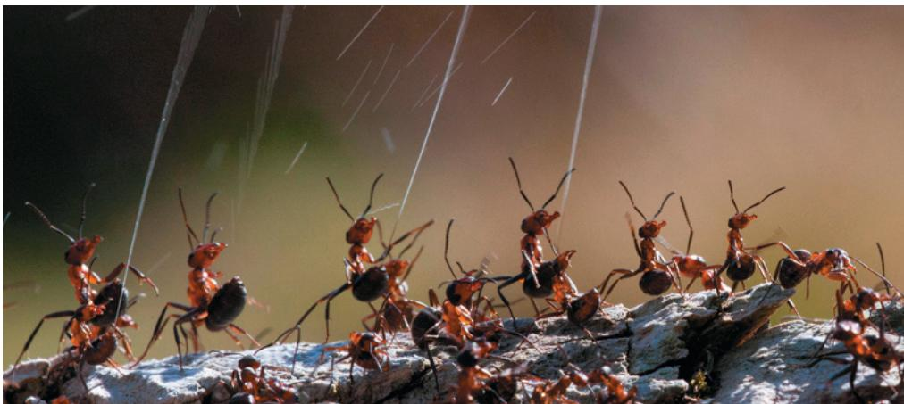  
Figure 2.1 Wood ants (Formica rufa) use chemistry to ward off enemies. When threatened from above, they shoot volleys of formic acid from their abdomens into the air. The acid bombards and stings potential predators, such as hungry birds.

## Study Tip

Make a table: As you read the chapter, make a summary table like the following. Add more rows as you proceed.

<table><tr><td colspan="5">Element (atom)</td></tr><tr><td>Property</td><td>C</td><td>H</td><td>O</td><td>N</td></tr><tr><td>Atomic number</td><td></td><td></td><td></td><td></td></tr><tr><td># Electrons</td><td></td><td></td><td></td><td></td></tr><tr><td># Neutrons</td><td></td><td></td><td></td><td></td></tr><tr><td>Mass number</td><td></td><td></td><td></td><td></td></tr><tr><td>Electron distribution diagram</td><td></td><td></td><td></td><td></td></tr><tr><td># Valence electrons</td><td></td><td></td><td></td><td></td></tr></table>

A compound is made of atoms joined by bonds. Formic acid (CH₂O₂) consists of carbon (C), hydrogen (H), and oxygen (O).

## What determines the properties of a compound such as formic acid?

The number of protons (+) determines an atom's identity. Oxygen has 8 protons.

An atom's electron ( $\ominus$ ) distribution determines its ability to form bonds. Oxygen has space for 2 more electrons, so it can form 2 bonds.

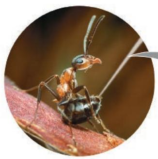

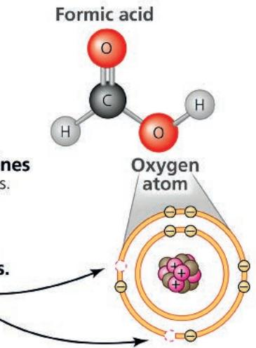

  
In formic acid, this O attracts H's electron, releasing $H^{+}$ and making this compound an acid, which stings.

# Concept 2.1: Matter consists of chemical elements in pure form and in combinations called compounds

Organisms are composed of matter, which is anything that takes up space and has mass. Matter exists in many forms. Rocks, metals, oils, gases, and living organisms are a few examples of what seems to be an endless assortment of matter.

## Elements and Compounds

Matter is made up of elements. An element is a substance that cannot be broken down to other substances by chemical reactions. Today, chemists recognize 92 elements occurring in nature; gold, copper, carbon, and oxygen are examples. Each element has a symbol, usually the first letter or two of its name. Some symbols are derived from Latin or German; for instance, the symbol for sodium is Na, from the Latin word natrium.

A compound is a substance consisting of two or more different elements combined in a fixed ratio. Table salt, for example, is sodium chloride (NaCl), a compound composed of the elements sodium (Na) and chlorine (Cl) in a 1:1 ratio. Pure sodium is a metal, and pure chlorine is a poisonous gas. When chemically combined, however, sodium and chlorine form an edible compound. Water ( $H_{2}O$ ), another compound, consists of the elements hydrogen (H) and oxygen (O) in a 2:1 ratio. These are simple examples of organized matter having emergent properties: A compound has characteristics different from those of its elements (Figure 2.2).

## The Elements of Life

Of the 92 natural elements, about 20–25% are essential elements that an organism needs to live a healthy life and reproduce. The essential elements are similar among organisms, but there is some

Figure 2.2 The emergent properties of a compound.

The metal sodium combines with the poisonous gas chlorine, forming the edible compound sodium chloride, or table salt.

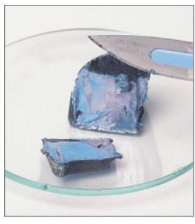

variation—for example, humans need 25 elements, but plants need only 17.

Just four elements—oxygen (O), carbon (C), hydrogen (H), and nitrogen (N)—make up approximately 96% of living matter. Calcium (Ca), phosphorus (P), potassium (K), sulfur (S), and a few other elements account for most of the remaining 4% or so of an organism's mass. Trace elements are required by an organism in only minute quantities. Some trace elements, such as iron (Fe), are needed by all forms of life; others are required only by certain species. For example, in vertebrates (animals with backbones), the element iodine (I) is an essential ingredient of a hormone produced by the thyroid gland. A daily intake of only 0.15 milligram (mg) of iodine is adequate for normal activity of the human thyroid. An iodine deficiency in the diet causes the thyroid gland to grow to abnormal size, a condition called goiter. Consuming seafood or iodized salt reduces the incidence of goiter. Relative amounts of all the elements in the human body are listed in Table 2.1.

Some naturally occurring elements are toxic to organisms. In humans, for instance, the element arsenic has been linked to numerous diseases and can be lethal. In some areas of the world, arsenic occurs naturally and can make its way into the groundwater. As a result of using water from drilled wells in southern Asia, millions of people have been inadvertently exposed to arsenic-laden water. Efforts are under way to reduce arsenic levels in their water supply.

## Interview

Interview with Kenneth Olden: Assessing susceptibility to environmental toxins using genomics (eTextbook only)

Table 2.1 Elements in the Human Body

<table><tr><td>Element</td><td>Symbol</td><td colspan="2">Percentage of Body Mass (including water)</td></tr><tr><td>Oxygen</td><td>O</td><td>65.0%</td><td rowspan="4">96.3%</td></tr><tr><td>Carbon</td><td>C</td><td>18.5%</td></tr><tr><td>Hydrogen</td><td>H</td><td>9.5%</td></tr><tr><td>Nitrogen</td><td>N</td><td>3.3%</td></tr><tr><td>Calcium</td><td>Ca</td><td>1.5%</td><td rowspan="7">3.7%</td></tr><tr><td>Phosphorus</td><td>P</td><td>1.0%</td></tr><tr><td>Potassium</td><td>K</td><td>0.4%</td></tr><tr><td>Sulfur</td><td>S</td><td>0.3%</td></tr><tr><td>Sodium</td><td>Na</td><td>0.2%</td></tr><tr><td>Chlorine</td><td>Cl</td><td>0.2%</td></tr><tr><td>Magnesium</td><td>Mg</td><td>0.1%</td></tr></table>

Trace elements (less than 0.01% of mass): Boron (B), chromium (Cr), cobalt (Co), copper (Cu), fluorine (F), iodine (I), iron (Fe), manganese (Mn), molybdenum (Mo), selenium (Se), silicon (Si), tin (Sn), vanadium (V), zinc (Zn)

INTERPRET THE DATA Given the makeup of the human body, what compound do you think accounts for the high percentage of oxygen?

## Case Study: Evolution of Tolerance to Toxic Elements

EVOLUTION Some species have become adapted to environments containing elements that are usually toxic; an example is serpentine plant communities. Serpentine is a jade-like mineral that contains elevated concentrations of elements such as chromium, nickel, and cobalt. Although most plants cannot survive in soil that forms from serpentine rock, a small number of plant species have adaptations that allow them to do so (Figure 2.3). Presumably, variants of ancestral, nonserpentine species arose that could survive in serpentine soils, and subsequent natural selection resulted in the distinctive array of species we see in these areas today. Serpentine-adapted plants are of great interest to researchers because studying them can teach us so much about natural selection and evolutionary adaptations on a local scale.

Figure 2.3 Serpentine plant community.

These plants are growing on serpentine soil, which contains elements that are usually toxic to plants. The insets show a close-up of serpentine rock and one of the plants, a Tiburon Mariposa lily (Calochortus tiburonensis). This specially adapted species is found only on this one hill in Tiburon, a peninsula that juts into San Francisco Bay.

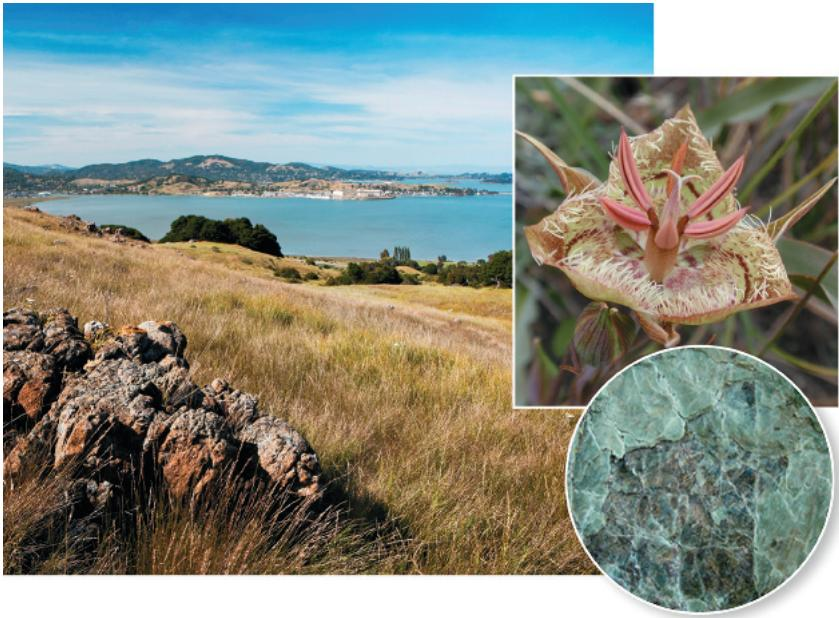

## Concept Check 2.1

1. MAKE CONNECTIONS Explain how table salt has emergent properties. (See Concept 1.1.)

2. Is a trace element an essential element? Explain.

3. WHAT IF? In humans, iron is a trace element required for the proper functioning of hemoglobin, the molecule that carries oxygen in red blood cells. What might be the effects of an iron deficiency?

4. MAKE CONNECTIONS Explain how natural selection might have played a role in the evolution of species that are tolerant of serpentine soils. (Review Concept 1.2.)

For suggested answers, see Appendix A.

# Concept 2.2: An element's properties depend on the structure of its atoms

Each element consists of a certain type of atom that is different from the atoms of any other element. An atom is the smallest unit of matter that still retains the properties of an element. Atoms are so small that it would take about a million of them to stretch across the period printed at the end of this sentence. We symbolize atoms with the same abbreviation used for the element that is made up of those atoms. For example, the symbol C stands for both the element carbon and a single carbon atom.

## Subatomic Particles

Although the atom is the smallest unit having the properties of an element, these tiny bits of matter are composed of even smaller parts, called subatomic particles. Using high-energy collisions, physicists have produced more than 100 types of particles from the atom, but only three kinds of particles are relevant here: neutrons, protons, and electrons. Protons and electrons are electrically charged. Each proton has one unit of positive charge, and each electron has one unit of negative charge. A neutron, as its name implies, is electrically neutral.

Protons and neutrons are packed together tightly in a dense core, or atomic nucleus, at the center of an atom; protons give the nucleus a positive charge. The rapidly moving electrons form a “cloud” of negative charge around the nucleus, and it is the attraction between opposite charges that keeps the electrons in the vicinity of the nucleus. Figure 2.4 shows two commonly used models of the structure of the helium atom as an example.

Figure 2.4 Simplified models of a helium (He) atom.

The helium nucleus consists of 2 neutrons (brown) and 2 protons (pink with a plus sign). Two electrons (yellow with a minus sign) exist outside the nucleus. These models are not to scale; they greatly overestimate the size of the nucleus in relation to the electron cloud.

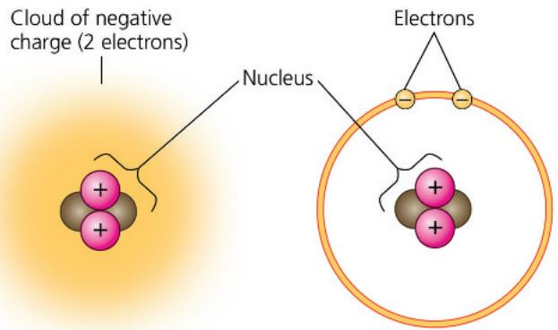  
(a) This model represents the two electrons as a cloud of negative charge, a result of their motion around the nucleus.  
(b) In this more simplified model, the electrons are shown as two small yellow spheres on a circle around the nucleus.

The neutron and proton are almost identical in mass, each about $1.7 \times 10^{-24}$ gram (g). Grams and other conventional units are not very useful for describing the mass of objects that are so minuscule. Thus, for atoms and subatomic particles (and for molecules, too), we use a unit of measurement called the dalton, in honor of John Dalton, the British scientist who helped develop atomic theory around 1800. (The dalton is the same as the atomic mass unit, or amu, a unit you may have encountered elsewhere.) Neutrons and protons have masses close to 1 dalton. Because the mass of an electron is only about 1/2,000 that of a neutron or proton, we can ignore electrons when computing the total mass of an atom.

## Atomic Number and Atomic Mass

Atoms of the various elements differ in their number of sub-atomic particles. All atoms of a particular element have the same number of protons in their nuclei. This number of protons, which is unique to that element, is called the atomic number and is written as a subscript to the left of the symbol for the element. The abbreviation $_{2}$ He, for example, tells us that an atom of the element helium has 2 protons in its nucleus. Unless otherwise indicated, an atom is neutral in electrical charge, which means that its protons must be balanced by an equal number of electrons. Therefore, the atomic number tells us the number of protons and also the number of electrons in an electrically neutral atom.

We can deduce the number of neutrons from a second quantity, the mass number, which is the total number of protons and neutrons in the nucleus of an atom. The mass number is written as a superscript to the left of an element's symbol. For example, we can use this shorthand to write an atom of helium as $\frac{4}{2}He$ . Because the atomic number indicates how many protons there are, we can determine the number of neutrons by subtracting the atomic number from the mass number. In our example, the helium atom $\frac{4}{2}He$ has 2 neutrons. For sodium (Na):

Atomic number = number of protons

Number of neutrons = mass number - atomic number
= 23 - 11 = 12 for sodium

The simplest atom is hydrogen ${}^{1}_{1}H$ , which has no neutrons; it consists of a single proton with a single electron.

Because the contribution of electrons to mass is negligible, almost all of an atom's mass is concentrated in its nucleus. Neutrons and protons each have a mass very close to 1 dalton, so the mass number is close to, but slightly different from, the total mass of an atom, called its atomic mass. For example, the mass number of sodium $\left(\frac{23}{11}\mathrm{Na}\right)$ is 23, but its atomic mass is 22.9898 daltons; the difference is explained below.

## Isotopes

All atoms of a given element have the same number of protons, but some atoms have more neutrons than other atoms of the same element and therefore have greater mass. These different atomic forms of the same element are called isotopes of the element. In nature, an element may occur as a mixture of its isotopes. As an example, the element carbon, which has the atomic number 6, has three naturally occurring isotopes. The most common isotope is carbon-12, $^{12}_{6}$ C, which accounts for about 99% of the carbon in nature. The isotope $^{12}_{6}$ C has 6 neutrons. Most of the remaining 1% of carbon consists of atoms of the isotope $^{13}_{6}$ C, with 7 neutrons. A third, even rarer isotope, $^{14}_{6}$ C, has 8 neutrons. Notice that all three isotopes of carbon have 6 protons; otherwise, they would not be carbon. Although the isotopes of an element have slightly different masses, they behave identically in chemical reactions. (For an element with more than one naturally occurring isotope, the atomic mass is an average of those isotopes, weighted by their abundance. Thus, carbon has an atomic mass of 12.01 daltons.)

Both ${}^{12}$ C and ${}^{13}$ C are stable isotopes, meaning that their nuclei do not have a tendency to lose subatomic particles, a process called decay. The isotope ${}^{14}$ C, however, is unstable, or radioactive. A radioactive isotope is one in which the nucleus decays spontaneously, giving off particles and energy. When the radioactive decay leads to a change in the number of protons, it transforms the atom to an atom of a different element. For example, when a carbon-14 ( ${}^{14}$ C) atom decays, a neutron decays into a proton, transforming the atom into a nitrogen ( ${}^{14}$ N) atom. Radioactive isotopes have many useful applications in biology.

## Radioactive Tracers

Radioactive isotopes are often used as diagnostic tools in medicine. Cells can use radioactive atoms just as they would use nonradioactive isotopes of the same element. The radioactive isotopes are incorporated into biologically active molecules, which are then used as tracers to track atoms during metabolism, the chemical processes of an organism. For example, certain kidney disorders are diagnosed by injecting small doses of radioactively labeled substances into the blood and then analyzing the tracer molecules excreted in the urine. Radioactive tracers are also used in combination with sophisticated imaging instruments, such as PET scanners that can monitor growth and metabolism of cancers in the body (Figure 2.5).

Although radioactive isotopes are very useful in biological research and medicine, radiation from decaying isotopes also poses a hazard to life by damaging cellular molecules. The severity of this damage depends on the type and amount of radiation an organism absorbs. One of the most serious environmental threats is radioactive fallout from nuclear accidents. The doses of most isotopes used in medical diagnosis, however, are relatively safe.

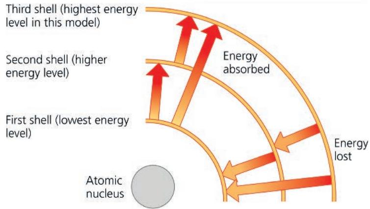

Figure 2.5 A PET scan, a medical use for radioactive isotopes. PET, an acronym for positron-emission tomography, detects locations of intense chemical activity in the body. The bright yellow spot marks an area with an elevated level of radioactively labeled glucose, which in turn indicates high metabolic activity, a hallmark of cancerous tissue.  

## Radiometric Dating

EVOLUTION Researchers measure radioactive decay in fossils to date these relics of past life. Fossils provide a large body of evidence for evolution, documenting differences between organisms from the past and those living at present and giving us insight into species that have disappeared over time. While the layering of fossil beds establishes that deeper fossils are older than more shallow ones, the actual age (in years) of the fossils in each layer cannot be determined by position alone. This is where radioactive isotopes come in.

A “parent” isotope decays into its “daughter” isotope at a fixed rate, expressed as the half-life of the isotope—the time it takes for 50% of the parent isotope to decay. Each radioactive isotope has a characteristic half-life that is not affected by temperature, pressure, or any other environmental variable. Using a process called radiometric dating, scientists measure the ratio of different isotopes and calculate how many half-lives (in years) have passed since an organism was fossilized or a rock was formed. Half-life values range from very short for some isotopes, measured in seconds or days, to extremely long—uranium-238 has a half-life of 4.5 billion years! Each isotope can best “measure” a particular range of years: Uranium-238 was used to determine that moon rocks are approximately 4.5 billion years old, similar to the estimated age of Earth. In the Scientific Skills Exercise on the next page, you can work with data from an experiment that used carbon-14 to determine the age of an important fossil. (Figure 25.6 explains more about radiometric dating of fossils.)

## The Energy Levels of Electrons

The simplified models of the atom in Figure 2.4 greatly exaggerate the size of the nucleus relative to that of the whole atom. If an atom of helium were the size of a typical football stadium, the nucleus would be the size of a pencil eraser in the center of the field. Moreover, the electrons would be like two tiny gnats buzzing around the stadium. Atoms are mostly empty space. When two atoms approach each other during a chemical reaction, their nuclei do not come close enough to interact. Of the three sub-atomic particles we have discussed, only electrons are directly involved in chemical reactions.

An atom's electrons vary in the amount of energy they possess. Energy is defined as the capacity to cause change—for instance, by doing work. Potential energy is the energy that matter possesses because of its location or structure. For example, water in a reservoir on a hill has potential energy because of its altitude. When the gates of the reservoir's dam are opened and the water runs downhill, the energy can be used to do work, such as moving the blades of turbines to generate electricity. Because energy has been expended, the water has less energy at the bottom of the hill than it did in the reservoir. Matter has a natural tendency to move toward the lowest possible state of potential energy; in our example, the water runs downhill. To restore the potential energy of a reservoir, work must be done to elevate the water against gravity.

The electrons of an atom have potential energy due to their distance from the nucleus (Figure 2.6). The negatively charged electrons are attracted to the positively charged nucleus.

It takes work to move a given electron farther away from the nucleus, so the more distant an electron is from the nucleus, the greater its potential energy. Unlike the continuous flow of water downhill, changes in the potential energy of electrons can occur only in steps of fixed amounts. An electron having a certain amount of energy is something like a ball on a staircase (Figure 2.6a). The ball can have different amounts of potential energy, depending on which step it is on, but it

## Figure 2.6 Energy levels of an atom's electrons.

Electrons exist only at fixed levels of potential energy called electron shells.

(a) A ball bouncing down a flight of stairs can come to rest only on each step, not between steps. Similarly, an electron can exist only at certain energy levels, not between levels.

  
Third shell (highest energy level in this model)  
Second shell (higher energy level)  
First shell (lowest energy level)  
(b) An electron can move from one shell to another only if the energy it gains or loses is exactly equal to the difference in energy between the energy levels of the two shells. Arrows in this model indicate some of the stepwise changes in potential energy that are possible.

# Scientific Skills Exercise Calibrating a Standard Radioactive Isotope Decay Curve and Interpreting Data

How Long Might Neanderthals Have Co-Existed with Modern Humans (Homo sapiens)? Neanderthals (Homo neanderthalensis) were living in Europe by 430,000 years ago and may have coexisted with early Homo sapiens in parts of Eurasia for hundreds or thousands of years before Neanderthals became extinct. Researchers sought to more accurately determine the extent of their overlap by pinning down the latest date Neanderthals still lived in the area. They used carbon-14 dating to determine the age of a Neanderthal fossil from the most recent (uppermost) archeological layer containing Neanderthal bones. In this exercise you will calibrate a standard carbon-14 decay curve and use it to determine the age of this Neanderthal fossil. The age will help you approximate the last time the two species may have coexisted at the site where this fossil was collected.

How the Experiment Was Done Carbon-14 ( $^{14}$ C) is a radioactive isotope of carbon that decays to $^{14}$ N at a constant rate. $^{14}$ C is present in the atmosphere in small amounts at a constant ratio with both $^{13}$ C and $^{12}$ C, two other isotopes of carbon. When carbon is taken up from the atmosphere by a plant during photosynthesis, $^{12}$ C, $^{13}$ C, and $^{14}$ C isotopes are incorporated into the plant in the same proportions in which they were present in the atmosphere. These proportions remain the same in the tissues of an animal that eats the plant. While an organism is alive, the $^{14}$ C in its body constantly decays to $^{14}$ N but is constantly replaced by new carbon from the environment. Once an organism dies, it stops taking in new $^{14}$ C but the $^{14}$ C in its tissues continues to decay, while the $^{12}$ C in its tissues remains the same because it is not radioactive and does not decay. Thus, scientists can calculate how long the pool of original $^{14}$ C has been decaying in a fossil by measuring the ratio of $^{14}$ C to $^{12}$ C and comparing it to the ratio of $^{14}$ C to $^{12}$ C present originally in the atmosphere. The fraction of $^{14}$ C in a fossil compared to the original fraction of $^{14}$ C can be converted to years because we know that the half-life of $^{14}$ C is 5,730 years—in other words, half of the $^{14}$ C in a fossil decays every 5,730 years.

Data from the Experiment The researchers found that the Neanderthal fossil had approximately 0.0078 (or, in scientific notation, $7.8 \times 10^{-3}$ ) as much $^{14}\mathrm{C}$ as the atmosphere. The following questions will guide you through translating this fraction into the age of the fossil.

## INTERPRET THE DATA

1. The graph shows a standard curve of radioactive isotope decay. The line shows the fraction of the radioactive isotope over time (before the present) in units of half-lives. Recall that a half-life is the amount of time it takes for half of the radioactive isotope to decay. Labeling each data point with the corresponding fractions will help orient you to this graph. Draw an arrow to the data point for half-life = 1 and write the fraction of ${}^{14}$ C that will remain after one half-life. Calculate the fraction of ${}^{14}$ C remaining at each half-life and write the fractions on the graph near arrows pointing to the data points. Convert each fraction to a decimal number and round off to a maximum of three significant digits (zeros at the beginning of the number do not count as significant digits). Also write each decimal number in scientific notation.

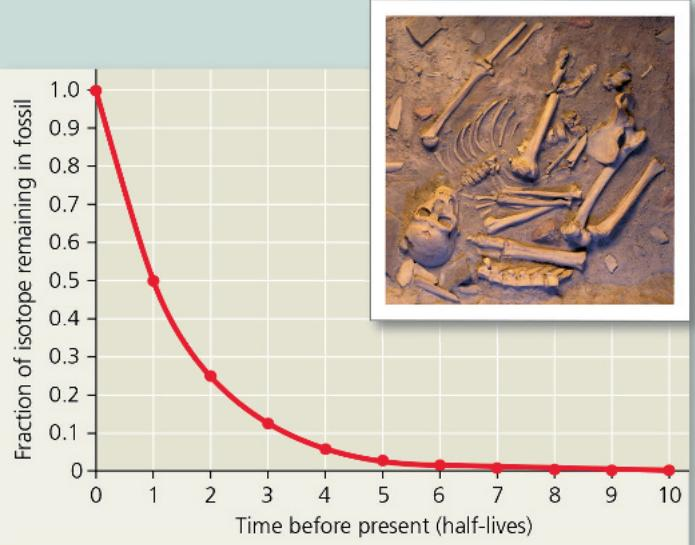  
Data from R. Pinhasi et al., Revised age of late Neanderthal occupation and the end of the Middle Paleolithic in the northern Caucasus, Proceedings of the National Academy of Sciences USA 147:8611–8616 (2011). doi 10.1073/pnas.1018938108

2. Recall that ${}^{14}$ C has a half-life of 5,730 years. To calibrate the x-axis for ${}^{14}$ C decay, write the time before present in years below each half-life.

3. The researchers found that the Neanderthal fossil had approximately 0.0078 as much $^{14}$ C as found originally in the atmosphere. (a) Using the numbers on your graph, determine how many half-lives have passed since the Neanderthal died. (b) Using your $^{14}$ C calibration on the x-axis, what is the approximate age of the Neanderthal fossil in years (round off to the nearest thousand)? (c) Approximately when did Neanderthals become extinct according to this study? (d) The researchers cite evidence that modern humans (H. sapiens) became established in the same region as the last Neanderthals approximately 39,000–42,000 years ago. What does this suggest about possible overlap of Neanderthals and modern humans?

4. Carbon-14 dating works for fossils up to about 75,000 years old; fossils older than that contain too little ${}^{14}$ C to be detected. Most dinosaurs became extinct 65.5 million years ago.

(a) Can $^{14}$ C be used to date dinosaur bones? Explain.

(b) Radioactive uranium-235 has a half-life of 75,000 years If it was incorporated into dinosaur bones, could it be used to date the dinosaur fossils? Explain.

Instructors: A version of this Scientific Skills Exercise can be assigned in Mastering Biology.

cannot spend much time between the steps. Similarly, an electron's potential energy is determined by its energy level. An electron can exist only at certain energy levels, not between them.

An electron's energy level is correlated with its average distance from the nucleus. Electrons are found in different electron shells, each with a characteristic average distance and energy level. In diagrams, shells can be represented by concentric circles, as they are in Figure 2.6b. The first shell is closest to the nucleus, and electrons in this shell have the lowest potential energy. Electrons in the second shell have more energy, and electrons in the third shell even more energy. An electron can move from one shell to another, but only by absorbing or losing an amount of energy equal to the difference in potential energy between its position in the old shell and that in the new shell. When an electron absorbs energy, it moves to a shell farther out from the nucleus. For example, light energy can excite an electron to a higher energy level. (Indeed, this is the first step taken when plants harness the energy of sunlight for photosynthesis, the process that produces food from carbon dioxide and water.) When an electron loses energy, it “falls back” to a shell closer to the nucleus, and the lost energy is usually released to the environment as visible light or ultraviolet radiation.

## Electron Distribution and Chemical Properties

The chemical behavior of an atom is determined by the distribution of electrons in the atom's electron shells. Beginning with hydrogen, the simplest atom, we can imagine building the atoms of the other elements by adding 1 proton and 1 electron at a time (along with an appropriate number of neutrons). Figure 2.7, a modified version of what is called the periodic table of the elements, shows this distribution of electrons for the first 18 elements, from hydrogen ( $_{1}$ H) to argon ( $_{18}$ Ar). The elements are arranged in rows, or periods, each row representing the filling of an electron shell sequentially from left to right. As electrons are added, they occupy the lowest available shell until that shell is filled at the end of the row. Three rows are shown in Figure 2.7, each with a different number of electron shells. (See the complete periodic table at the back of the book.)

Hydrogen's 1 electron and helium's 2 electrons are located in the first shell. Electrons, like all matter, tend to exist in the lowest available state of potential energy. In an atom, this state is in the first shell. However, the first shell can hold no more than 2 electrons; thus, hydrogen and helium are the only elements in the first row of the table. In an atom with

Figure 2.7 Electron distribution diagrams for the first 18 elements in the periodic table.

In a standard periodic table, information for each element is presented as shown for helium in the inset. In these diagrams, electrons are represented as small yellow dots and electron shells as concentric circles. The diagrams show the distribution of an atom's electrons among its electron shells, but they do not accurately represent the atom's shape or its electrons' locations.

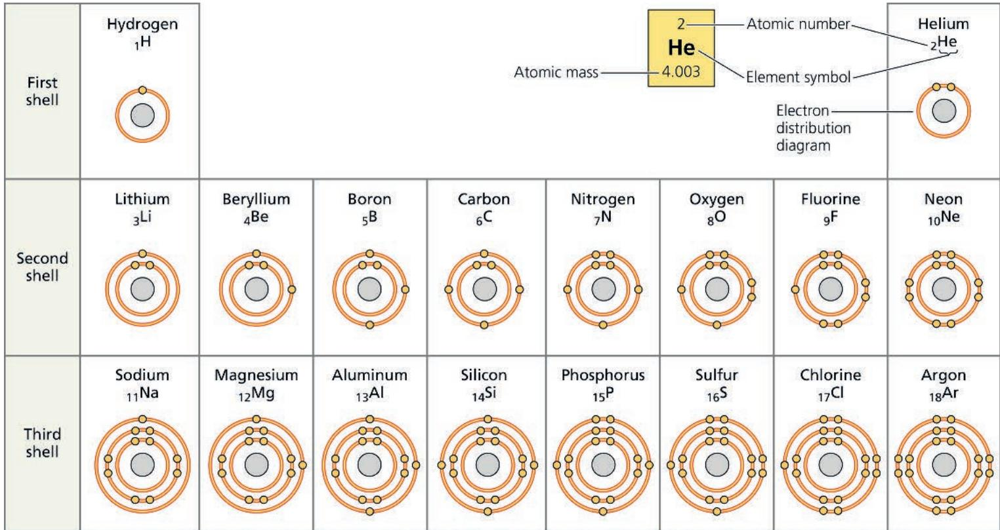  
VISUAL SKILLS What is the atomic number of magnesium? How many protons and electrons does it have? How many electron shells? How many valence electrons?  
For suggested answer, see Appendix A.

more than 2 electrons, the additional electrons must occupy higher shells because the first shell is full. The next element, lithium, has 3 electrons. Two of these electrons fill the first shell, while the third electron occupies the second shell. The second shell holds a maximum of 8 electrons. Neon, at the end of the second row, has 8 electrons in the second shell, giving it a total of 10 electrons.

The chemical behavior of an atom depends mostly on the number of electrons in its outermost shell. We call those outer electrons valence electrons and the outermost electron shell the valence shell. In the case of lithium, there is only 1 valence electron, and the second shell is the valence shell. Atoms with the same number of electrons in their valence shells exhibit similar chemical behavior. For example, fluorine (F) and chlorine (Cl) both have 7 valence electrons, and both form compounds when combined with the element sodium (Na): Sodium fluoride (NaF) is commonly added to toothpaste to prevent tooth decay, and, as described earlier, NaCl is table salt (see Figure 2.2). An atom with a completed valence shell is unreactive; that is, it will not interact readily with other atoms. At the far right of the periodic table are helium, neon, and argon, the only three elements shown in Figure 2.7 that have full valence shells. These elements are said to be inert, meaning chemically unreactive. All the other atoms in Figure 2.7 are chemically reactive because they have incomplete valence shells.

## Electron Orbitals

In the early 1900s, the electron shells of an atom were visualized as concentric paths of electrons orbiting the nucleus, somewhat like planets orbiting the sun. It is still convenient to use two-dimensional concentric-circle diagrams, as in Figure 2.7, to symbolize three-dimensional electron shells. However, you need to remember that each concentric circle represents only the average distance between an electron in that shell and the nucleus. Accordingly, the concentric-circle diagrams do not give a real picture of an atom. In reality, we can never know the exact location of an electron. What we can do instead is describe the space in which an electron spends most of its time. The three-dimensional space where an electron is found 90% of the time is called an orbital.

Each electron shell contains electrons at a particular energy level, distributed among a specific number of orbitals of distinctive shapes and orientations. Figure 2.8 shows the orbitals of neon as an example, with its electron distribution diagram for reference. You can think of an orbital as a component of an electron shell. The first electron shell has only one spherical s orbital (called 1s), but the second shell has four orbitals: one large spherical s orbital (called 2s) and three dumbbell-shaped p orbitals (called 2p orbitals). (The third shell and other higher electron shells also have s and p orbitals, as well as orbitals of more complex shapes.)

No more than 2 electrons can occupy a single orbital. The first electron shell can therefore accommodate up to 2 electrons in its s orbital. The lone electron of a hydrogen atom occupies the 1s orbital, as do the 2 electrons of a helium atom. The four orbitals of the second electron shell can hold up to 8 electrons, (b) Separate electron orbitals. The three-dimensional shapes represent electron orbitals—the volumes of space where the electrons of an atom are most likely to be found. Each orbital holds a maximum of 2 electrons. The first electron shell, on the left, has one spherical (s) orbital, designated 1s. The second shell, on the right, has one larger s orbital (designated 2s for the second shell) plus three dumbbell-shaped orbitals called p orbitals (2p for the second shell). The three 2p orbitals lie at right angles to one another along imaginary x-, y-, and z-axes of the atom. Each 2p orbital is outlined here in a different color.

Figure 2.8 Electron orbitals.  
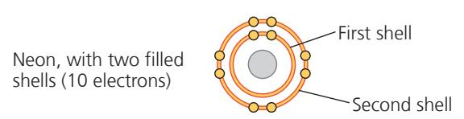  
(a) Electron distribution diagram. An electron distribution diagram is shown here for a neon atom, which has a total of 10 electrons. Each concentric circle represents an electron shell, which can be subdivided into electron orbitals.

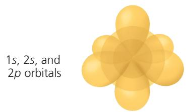  
(c) Superimposed electron orbitals. To reveal the complete picture of the electron orbitals of neon, we superimpose the 1s orbital of the first shell and the 2s and three 2p orbitals of the second shell.

2 in each orbital. Electrons in each of the four orbitals in the second shell have nearly the same energy, but they move in different volumes of space.

The reactivity of an atom arises from the presence of unpaired electrons in one or more orbitals of the atom's valence shell. As you will see in the next section, atoms interact in a way that completes their valence shells. When they do so, it is the unpaired electrons that are involved.

## Concept Check 2.2

4. VISUAL SKILLS In Figure 2.7, if two or more elements are in the same row, what do they have in common? If two or more elements are in the same column, what do they have in common?

For suggested answers, see Appendix A.

## Concept 2.3: The formation and function of molecules and ionic compounds depend on chemical bonding between atoms

Now that we have looked at the structure of atoms, we can move up the hierarchy of organization and see how atoms combine to form molecules and ionic compounds. Atoms with incomplete valence shells can interact with certain other atoms in such a way that each partner atom completes its valence shell: The atoms either share or transfer valence electrons. These interactions usually result in atoms staying close together, held by attractions called chemical bonds. The strongest kinds of chemical bonds are covalent bonds in molecules and ionic bonds in dry ionic compounds. (Ionic bonds in aqueous, or water-based, solutions are weak interactions, as we will see later.)

## Covalent Bonds

A covalent bond is the sharing of a pair of valence electrons by two atoms. For example, let's consider what happens when two hydrogen atoms approach each other. Recall that hydrogen has 1 valence electron in the first shell, but the shell's capacity is 2 electrons. When the two hydrogen atoms come close enough for their 1s orbitals to overlap, they can share their electrons (Figure 2.9). Each hydrogen atom is now associated with 2 electrons in what amounts to a completed valence shell. Two or more atoms held together by covalent bonds constitute a molecule, in this case a hydrogen molecule.

Figure 2.10a, on the next page, shows several ways of representing a hydrogen molecule. Its molecular formula, $H_{2}$ , simply indicates that the molecule consists of two atoms of hydrogen. Electron sharing can be depicted by an electron distribution diagram or by a Lewis dot structure, in which element symbols are surrounded by dots that represent the valence electrons (H:H). We can also use a structural formula, H—H, where the line represents a single bond, a pair of shared electrons. A space-filling model comes closest to representing the actual shape of the molecule. (You may also be familiar with ball-and-stick models, which are shown in Figure 2.15.)

Figure 2.9 Formation of a covalent bond.  
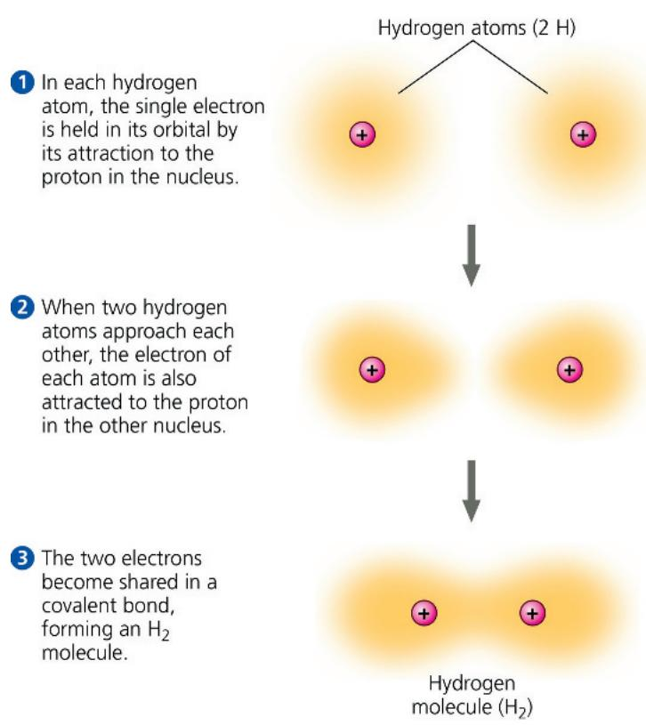

Oxygen has 6 electrons in its second electron shell and therefore needs 2 more electrons to complete its valence shell. Two oxygen atoms form a molecule by sharing two pairs of valence electrons (Figure 2.10b). The atoms are thus joined by what is called a double bond (O=O).

Each atom that can share valence electrons has a bonding capacity corresponding to the number of covalent bonds the atom can form. When the bonds form, they give the atom a full complement of electrons in the valence shell. The bonding capacity of oxygen, for example, is 2. This bonding capacity is called the atom's valence and usually equals the number of electrons required to complete the atom's outermost (valence) shell. See if you can determine the valences of hydrogen, oxygen, nitrogen, and carbon by studying the electron distribution diagrams in Figure 2.7. You can see that the valence of hydrogen is 1; oxygen, 2; nitrogen, 3; and carbon, 4. The situation is more complicated for phosphorus, in the third row of the periodic table, which can have a valence of 3 or 5 depending on the combination of single and double bonds it makes.

The molecules $H_{2}$ and $O_{2}$ are pure elements rather than compounds because a compound is a combination of two or more different elements. Water, with the molecular formula $H_{2}O$ , is a

Figure 2.10 Covalent bonding in four molecules.  
The number of electrons required to complete an atom's valence shell generally determines how many covalent bonds that atom will form. This figure shows several ways of indicating covalent bonds.  

compound. Two atoms of hydrogen are needed to satisfy the valence of one oxygen atom. Figure 2.10c shows the structure of a water molecule. (Water is so important to life that Chapter 3 is devoted to its structure and behavior.)

Methane, the main component of natural gas, is a compound with the molecular formula $\mathrm{CH}_4$ . It takes four hydrogen atoms, each with a valence of 1, to complete the valence shell of a carbon atom, with its valence of 4 (Figure 2.10d). (We'll look at other carbon compounds in Chapter 4.)

Atoms in a molecule attract shared bonding electrons to varying degrees, depending on the element. The attraction of a particular atom for the electrons of a covalent bond is called its electronegativity. The more electronegative an atom is, the more strongly it pulls shared electrons toward itself. In a covalent bond between two atoms of the same element, the electrons are shared equally because the two atoms have the same electronegativity—the tug-of-war is at a standoff. Such a bond is called a nonpolar covalent bond. For example, the single bond of $H_{2}$ is nonpolar, as is the double bond of $O_{2}$ . However, when an atom is bonded to a more electronegative atom, the electrons of the bond are not shared equally. This type of bond is called a polar covalent bond. Such bonds vary in their polarity, depending on the relative electronegativity of the two atoms. For example, the bonds between the oxygen and hydrogen atoms of a water molecule are quite polar (Figure 2.11).

Figure 2.11 Polar covalent bonds in a water molecule.  
Because oxygen (O) is more electronegative than hydrogen (H), shared electrons are pulled more toward oxygen. Thus, the covalent bonds in water are polar.  
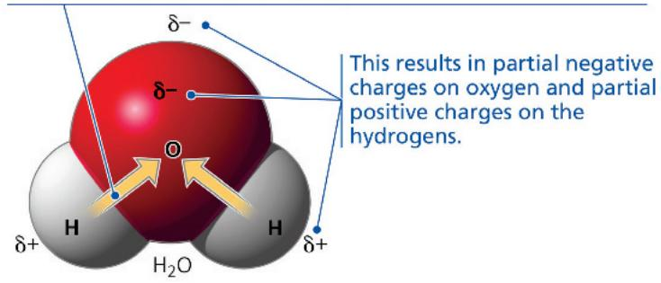

Oxygen is one of the most electronegative elements, attracting shared electrons much more strongly than hydrogen does. In a covalent bond between oxygen and hydrogen, the electrons spend more time near the oxygen nucleus than near the hydrogen nucleus. Because electrons have a negative charge and are pulled toward oxygen in a water molecule, the oxygen atom has partial negative charges (indicated by the Greek letter $\delta$ with a minus sign, $\delta-$ , or “delta minus”), and the hydrogen atoms have partial positive charges ( $\delta+$ , or “delta plus”). In contrast, the individual bonds of methane ( $CH_{4}$ ) are much less polar because the electronegativities of carbon and hydrogen are quite similar.

## Ionic Bonds

In some cases, two atoms are so unequal in their attraction for valence electrons that the more electronegative atom strips an electron completely away from its partner. The two resulting oppositely charged atoms (or molecules) are called ions. A positively charged ion is called a cation, while a negatively charged ion is called an anion. (It may help you to think of the t in cation as a plus sign, and of anion as “a negative ion.”) Because of their opposite charges, cations and anions attract each other; this attraction is called an ionic bond. Note that the transfer of an electron is not, by itself, the formation of a bond; rather, it allows a bond to form because it results in two ions of opposite charge. Any two ions of opposite charge can form an ionic bond. The ions do not need to have acquired their charge by an electron transfer with each other.

This is what happens when an atom of sodium $(_{11}\mathrm{Na})$ encounters an atom of chlorine $(_{17}\mathrm{Cl})$ (Figure 2.12). A sodium atom has a total of 11 electrons, with its single valence electron in the third electron shell. A chlorine atom has a total of 17 electrons,

Sodium chloride (NaCl)

Figure 2.12 Electron transfer and ionic bonding.

The attraction between oppositely charged atoms, or ions, is an ionic bond. An ionic bond can form between any two oppositely charged ions, even if they have not been formed by transfer of an electron from one to the other.

① The single valence electron of a sodium atom is transferred to join the 7 valence electrons of a chlorine atom.

② Each resulting ion has a completed valence shell. An ionic bond can form between the oppositely charged ions.

with 7 electrons in its valence shell. When these two atoms meet, the lone valence electron of sodium is transferred to the chlorine atom, and both atoms end up with their valence shells complete. (Because sodium no longer has an electron in the third shell, the second shell is now the valence shell.) The electron transfer between the two atoms moves one unit of negative charge from sodium to chlorine. Sodium, now with 11 protons but only 10 electrons, has a net electrical charge of 1+; the sodium atom has become a cation. Conversely, the chlorine atom, having gained an extra electron, now has 17 protons and 18 electrons, giving it a net electrical charge of 1−; it has become a chloride ion—an anion.

Compounds formed by ionic bonds are called ionic compounds, or salts. We know the ionic compound sodium chloride (NaCl) as table salt (Figure 2.13). Salts are often found in nature as crystals of various sizes and shapes. Each salt crystal is an aggregate of vast numbers of cations and anions bonded by their electrical attraction and arranged in a three-dimensional lattice. Unlike a covalent compound, which consists of molecules having a definite size and number of atoms, an ionic compound does not consist of molecules. The formula for an ionic compound, such as NaCl, indicates only the ratio of elements in a crystal of the salt. “NaCl” by itself is not a molecule.

Figure 2.13 A sodium chloride (NaCl) crystal.  
The sodium ions ( $Na^{+}$ ) and chloride ions ( $Cl^{-}$ ) are held together by ionic bonds. The formula NaCl tells us that the ratio of $Na^{+}$ to $Cl^{-}$ is 1:1.  

Not all salts have equal numbers of cations and anions. For example, the ionic compound magnesium chloride (MgCl $_2$ ) has two chloride ions for each magnesium ion. Magnesium ( $_{12}$ Mg) must lose 2 outer electrons if the atom is to have a complete valence shell, so it has a tendency to become a cation with a net charge of 2+ (Mg $^{2+}$ ). One magnesium cation can therefore form ionic bonds with two chloride anions (Cl $^-$ ).

The term ion also applies to entire molecules that are electrically charged. In the salt ammonium chloride $\left(\mathrm{NH}_{4}\mathrm{Cl}\right)$ , for instance, the anion is a single chloride ion $\left(\mathrm{Cl}^{-}\right)$ , but the cation is ammonium $\left(\mathrm{NH}_{4}^{+}\right)$ , a nitrogen atom covalently bonded to four hydrogen atoms. The whole ammonium ion has an electrical charge of 1+ because it has given up 1 electron and thus is 1 electron short.

Environment affects the strength of ionic bonds. In a dry salt crystal, the bonds are so strong that it takes a hammer and chisel to break enough of them to crack the crystal in two. However, if the same salt crystal is dissolved in water, the ionic bonds are much weaker because each ion is partially shielded by its interactions with water molecules. Most drugs are manufactured as salts because they are quite stable when dry but can dissociate (come apart) easily in water. (In Concept 3.2, you will learn how water dissolves salts.)

## Weak Chemical Interactions

In organisms, most of the strongest chemical bonds are covalent bonds, which link atoms to form a cell's molecules. But weaker interactions within and between molecules are also indispensable, contributing greatly to the emergent properties of life. Many large biological molecules are held in their functional form by weak interactions. In addition, when two molecules in the cell make contact, they may adhere temporarily by weak interactions. The reversibility of weak interactions can be an advantage: Two molecules can come together, affect one another in some way, and then separate.

Several types of weak chemical interactions are important in organisms. One is the ionic bond as it exists between ions dissociated in water, which we mentioned above. Hydrogen bonds and van der Waals interactions are also crucial to life.

## Hydrogen Bonds

Among weak chemical interactions, hydrogen bonds are so central to the chemistry of life that they deserve special attention. When a hydrogen atom is covalently bonded to an electronegative atom, the hydrogen atom has a partial positive charge that allows it to be attracted to a different electronegative atom with a partial negative charge nearby. This noncovalent attraction between a hydrogen and an electronegative atom is called a hydrogen bond. In living cells, the electronegative partners are usually oxygen or nitrogen atoms. Figure 2.14 shows hydrogen bonding between water ( $H_{2}O$ ) and ammonia ( $NH_{3}$ ).

Figure 2.14 A hydrogen bond.  
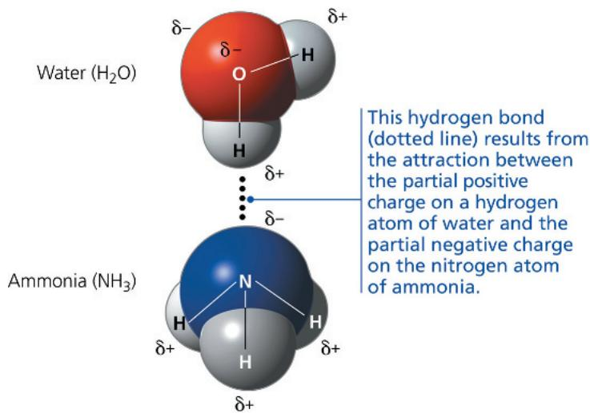  
DRAW IT Draw one water molecule hydrogen bonded to four other water molecules around it. Use simple outlines of space-filling models. Draw the partial charges on the water molecules and use dots for the hydrogen bonds. For suggested answer, see Appendix A.

## Van der Waals Interactions

Even a molecule with nonpolar covalent bonds may have positively and negatively charged regions. Electrons are not always evenly distributed; at any instant, they may accumulate by chance in one part of a molecule or another. The results are ever-changing regions of positive and negative charge that enable all atoms and molecules to stick to one another. These van der Waals interactions are individually weak and occur only when atoms and molecules are very close together. When many such interactions occur simultaneously, however, they can be powerful: Van der Waals interactions allow the gecko lizard shown here to walk straight up a wall! The anatomy of the gecko's foot—including toes with hundreds of thousands of tiny hairs, each with multiple projections—maximizes surface contact with

the wall. The van der Waals interactions between the foot molecules and the molecules of the wall's surface are so numerous that despite their individual weakness, together they can support the gecko's body weight.

Van der Waals interactions, hydrogen bonds, ionic bonds in water, and other weak interactions may form not only between molecules but also between parts of a large molecule, such as a protein or nucleic acid. The cumulative effect of weak interactions is to reinforce the three-dimensional shape of the molecule. (You will learn more about the very important biological roles of weak interactions in Figures 5.18 and 5.24.)

## Molecular Shape and Function

A molecule has a characteristic size and shape, which are key to its function in the living cell. A molecule consisting of two atoms, such as $H_{2}$ or $O_{2}$ , is always linear, but most molecules with more than two atoms have more complicated shapes. These shapes are determined by the positions of the atoms' orbitals (Figure 2.15). When an atom forms covalent bonds, the orbitals in its valence shell undergo rearrangement.

Figure 2.15 Molecular shapes due to hybrid orbitals.  
  
(a) Hybridization of orbitals. The single s and three p orbitals of a valence shell involved in covalent bonding combine to form four teardrop-shaped hybrid orbitals. These orbitals extend to the four corners of an imaginary tetrahedron (outlined in pink).

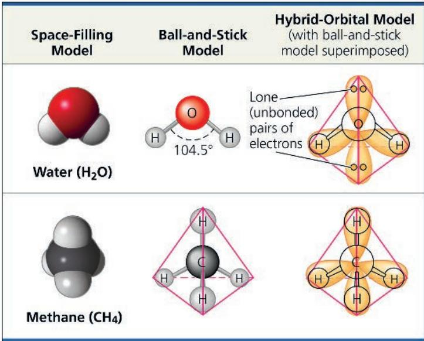  
(b) Molecular-shape models. Three models representing molecular shape are shown for water and methane. The positions of the hybrid orbitals determine the shapes of the molecules.

For atoms with valence electrons in both s and p orbitals (review Figure 2.8), the single s and three p orbitals form four new hybrid orbitals shaped like identical teardrops extending from the region of the atomic nucleus, as shown in Figure 2.15a. If we connect the larger ends of the teardrops with lines, we have the outline of a geometric shape called a tetrahedron, a pyramid with a triangular base.

For water molecules ( $H_{2}O$ ), two of the hybrid orbitals in the oxygen's valence shell are shared with hydrogens. The other two hybrid orbitals are occupied by lone (unbonded) pairs of electrons (see Figure 2.15b). The result is a molecule shaped roughly like a V, with its two covalent bonds at an angle of $104.5^{\circ}$ .

The methane molecule $\left(\mathrm{CH}_{4}\right)$ has the shape of a completed tetrahedron because all four hybrid orbitals of the carbon atom are shared with hydrogen atoms (see Figure 2.15b). The carbon nucleus is at the center, with its four covalent bonds radiating to hydrogen nuclei at the corners of the tetrahedron. Larger molecules containing multiple carbon atoms, including many of the molecules that make up living matter, have more complex overall shapes. However, the tetrahedral shape of a carbon atom bonded to four other atoms is often a repeating motif within such molecules.

Molecular shape is crucial: It determines how biological molecules recognize and respond to one another with specificity. Biological molecules often bind temporarily to each other by forming weak interactions, but only if their shapes are complementary. Consider the effects of opiates, drugs such as morphine and heroin derived from opium. Opiates relieve pain and alter mood by weakly binding to specific receptor molecules on the surfaces of brain cells. Why would brain cells carry receptors for opiates, compounds that are not endogenous, made by the body? In 1975, this question was answered by the discovery of endorphins (or “endogenous morphines”). Endorphins are signaling molecules made by the pituitary gland that bind to the receptors, relieving pain and producing euphoria during times of stress, such as intense exercise. Opiates have shapes similar to endorphins and can bind to endorphin receptors in the brain. That is why opiates and endorphins have similar effects (Figure 2.16). The role of molecular shape in brain chemistry illustrates how biological organization leads to a match between structure and function, one of biology’s unifying themes.

## Interview

Interview with Candace Pert: Discovering opiate receptors in the brain (eTextbook only)

## Concept Check 2.3

1. Why does the structure H—C=C—H fail to make sense chemically?

2. What holds the atoms together in a crystal of magnesium chloride (MgCl $_{2}$ )?

3. WHAT IF? If you were a pharmaceutical researcher, why would you want to learn the three-dimensional shapes of naturally occurring signaling molecules?

Figure 2.16 A molecular mimic.  
Morphine affects pain perception and emotional state by mimicking the brain's natural endorphins.  
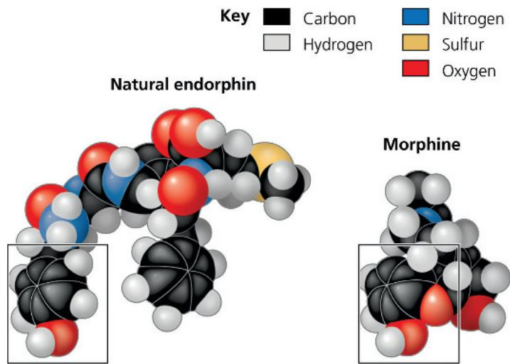  
(a) Structures of endorphin and morphine. The boxed portion of the endorphin molecule (left) binds to receptor molecules on target cells in the brain. The boxed portion of the morphine molecule (right) is a close match.

  
(b) Binding to endorphin receptors. Both endorphin and morphine can bind to endorphin receptors on the surface of a brain cell.

## Concept 2.4: Chemical reactions make and break chemical bonds

The making and breaking of chemical bonds, leading to changes in the composition of matter, are called chemical reactions. An example is the reaction between hydrogen and oxygen molecules that forms water:

This reaction breaks the covalent bonds of $H_{2}$ and $O_{2}$ and forms the new bonds of $H_{2}O$ . When we write the equation for a chemical reaction, we use an arrow to indicate the conversion of the starting materials, called the reactants, to the resulting materials, or products. The coefficients indicate the number of molecules involved; for example, the coefficient 2 before the $H_{2}$ means that the reaction starts with two molecules of hydrogen. Notice that all atoms of the reactants must be accounted for in the products. Matter is conserved in a chemical reaction: Reactions cannot create or destroy atoms but can only rearrange (redistribute) the electrons among them.

Photosynthesis, which takes place within the cells of green plant tissues, is an important biological example of how chemical reactions rearrange matter. Humans and other animals ultimately depend on photosynthesis for food and oxygen, and this process is at the foundation of life in almost all ecosystems.

The following summarizes photosynthesis:

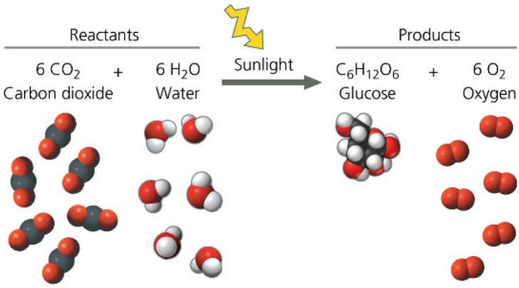

The raw materials of photosynthesis are carbon dioxide $\left(\mathrm{CO}_{2}\right)$ and water $\left(\mathrm{H}_{2}\mathrm{O}\right)$ , which land plants absorb from the air and soil, respectively. Within the plant cells, sunlight powers the conversion of these ingredients to a sugar called glucose $\left(\mathrm{C}_{6}\mathrm{H}_{12}\mathrm{O}_{6}\right)$ and oxygen molecules $\left(\mathrm{O}_{2}\right)$ , a by-product that can be seen when released by a water plant (Figure 2.17). Although photosynthesis is actually a sequence of many chemical reactions, we still end up with the same number and types of atoms that we had when we started. Matter has simply been rearranged, with an input of energy provided by sunlight.

All chemical reactions are theoretically reversible, with the products of the forward reaction becoming the reactants for the reverse reaction. For example, hydrogen and nitrogen molecules can combine to form ammonia, but ammonia can also decompose to regenerate hydrogen and nitrogen:

$$
3 \mathrm{H} _ {2} + \mathrm{N} _ {2} \rightleftharpoons 2 \mathrm{NH} _ {3}
$$

The two opposite-headed arrows indicate that the reaction is reversible.

One of the factors affecting the rate of a reaction is the concentration of reactants. The greater the concentration of reactant molecules, the more frequently they collide with one another and have an opportunity to react and form products. The same holds true for products. As products accumulate, collisions

Figure 2.17 Photosynthesis: a solar-powered rearrangement of matter.

Elodea, a freshwater plant, produces sugar by rearranging the atoms of carbon dioxide and water in the chemical process known as photosynthesis, which is powered by sunlight. Much of the sugar is then converted to other food molecules. Oxygen gas ( $O_{2}$ ) is a by-product of photosynthesis; notice the bubbles of $O_{2}$ gas escaping from the leaves submerged in water.

DRAW IT Add labels and arrows on the photo showing the reactants and products of photosynthesis as it takes place in a leaf. For suggested answer, see Appendix A.

resulting in the reverse reaction become more frequent. Eventually, the forward and reverse reactions occur at the same rate, and the relative concentrations of products and reactants stop changing. The point at which the reactions offset one another exactly is called chemical equilibrium. This is a dynamic equilibrium; reactions are still going on in both directions, but with no net effect on the concentrations of reactants and products. Equilibrium does not mean that the reactants and products are equal in concentration, but only that their concentrations have stabilized at a particular ratio. The reaction involving ammonia reaches equilibrium when ammonia decomposes as rapidly as it forms. In some chemical reactions, the equilibrium point may lie so far to the right that these reactions go essentially to completion; that is, virtually all the reactants are converted to products.

We will return to the subject of chemical reactions after more detailed study of the various types of molecules that are important to life. In the next chapter, we focus on water, the substance in which all the chemical processes of organisms occur.

## Concept Check 2.4

1. MAKE CONNECTIONS Consider the reaction between hydrogen and oxygen that forms water, shown with ball-and-stick models at the beginning of Concept 2.4. After studying Figure 2.10, draw and label the Lewis dot structures representing this reaction.

2. Which type of chemical reaction, if any, occurs faster at equilibrium: the formation of products from reactants or that of reactants from products?

3. WHAT IF? Write an equation that uses the products of photosynthesis as reactants and the reactants of photosynthesis as products. Add energy as another product. This new equation describes a process that occurs in your cells. Describe this equation in words. How does this equation relate to breathing?

# Chapter 2 Review

## Summary of Key Concepts

To review key terms, go to the Vocabulary Self-Quiz (eTextbook only).

Concept 2.1: Matter consists of chemical elements in pure form and in combinations called compounds

\- Elements cannot be broken down chemically to other substances. A compound contains two or more different elements in a fixed ratio. Oxygen, carbon, hydrogen, and nitrogen make up approximately 96% of living matter.

Compare an element and a compound.

## Concept 2.2: An element's properties depend on the structure of its atoms

\- An atom, the smallest unit of an element, has the following components:

\- An electrically neutral atom has equal numbers of electrons and protons; the number of protons determines the atomic number. The atomic mass is measured in daltons and is roughly equal to the mass number, the sum of protons plus neutrons. Isotopes of an element differ from each other in neutron number and therefore mass. Unstable isotopes give off particles and energy as radioactivity.

\- In an atom, electrons occupy specific electron shells; the electrons in a shell have a characteristic energy level. Electron distribution in shells determines the chemical behavior of an atom. An atom that has an incomplete outer shell, the valence shell, is reactive.

\- Electrons exist in orbitals, three-dimensional spaces with specific shapes that are components of electron shells.

DRAW IT Draw the electron distribution diagrams for neon $(_{10}\mathrm{Ne})$ and argon $(_{18}\mathrm{Ar})$ . Use these diagrams to explain why these elements are chemically unreactive.

Concept 2.3: The formation and function of molecules and ionic compounds depend on chemical bonding between atoms

\- Chemical bonds form when atoms interact and complete their valence shells. Covalent bonds form when pairs of electrons are shared:

\- Molecules consist of two or more covalently bonded atoms. The attraction of an atom for the electrons of a covalent bond is its electronegativity. If both atoms are the same, they have the same electronegativity and share a nonpolar covalent bond. Electrons of a polar covalent bond are pulled closer to the more electronegative atom, such as the oxygen in $H_{2}O$ .

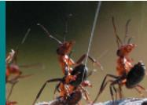

\- An ion forms when an atom or molecule gains or loses an electron and becomes charged. An ionic bond is the attraction between two oppositely charged ions:

\- Weak interactions reinforce the shapes of large molecules and help molecules adhere to each other. A hydrogen bond is an attraction between a hydrogen atom carrying a partial positive charge ( $\delta+$ ) and an electronegative atom carrying a partial negative charge ( $\delta-$ ). Van der Waals interactions occur between transiently positive and negative regions of molecules. Ionic bonds in water are also weak interactions.

\- A molecule's shape is determined by the positions of its atoms' valence orbitals. Covalent bonds result in hybrid orbitals, which are responsible for the shapes of $\mathrm{H}_2\mathrm{O}$ , $\mathrm{CH}_4$ , and many more complex biological molecules. Molecular shape is usually the basis for the recognition of one biological molecule by another.

In terms of electron sharing between atoms, compare nonpolar covalent bonds, polar covalent bonds, and the formation of ions.

## Concept 2.4: Chemical reactions make and break chemical bonds

\- Chemical reactions change reactants into products while conserving matter. All chemical reactions are theoretically reversible. Chemical equilibrium is reached when the forward and reverse reaction rates are equal.

What would happen to the concentration of products if more reactants were added to a reaction that was in chemical equilibrium? How would this addition affect the equilibrium?

For suggested answers, see Appendix A.

## Test Your Understanding

For more multiple-choice questions, go to the Practice Test (eTextbook only).

## Levels 1-2: Remembering/Understanding

1. Compared with ${}^{31}$ P, the radioactive isotope ${}^{32}$ P has

(A) a different atomic number.

(B) one more proton.

(C) one more electron.

(D) one more neutron.

2. In the term trace element, the adjective trace means that

(A) the element is required in very small amounts.

(B) the element can be used as a label to trace atoms through an organism's metabolism.

(C) the element is very rare on Earth.

(D) the element enhances health but is not essential for the organism's long-term survival.

3. The reactivity of an atom arises from

(A) the average distance of the outermost electron shell from the nucleus.

(B) the existence of unpaired electrons in the valence shell.

(C) the sum of the potential energies of all the electron shells.

(D) the potential energy of the valence shell.

4. Which statement is true of all atoms that are anions?

(A) The atom has more electrons than protons.

(B) The atom has more protons than electrons.

(C) The atom has fewer protons than does a neutral atom of the same element.

(D) The atom has more neutrons than protons.

5. Which of the following statements correctly describes any chemical reaction that has reached equilibrium?

(A) The concentrations of products and reactants are equal.

(B) The reaction is now irreversible.

(C) Both forward and reverse reactions have halted.

(D) The rates of the forward and reverse reactions are equal.

## Levels 3-4: Applying/Analyzing

6. We can represent atoms by listing the number of protons, neutrons, and electrons—for example, $2p^{+}$ , $2n^{0}$ , $2e^{-}$ for helium. Which of the following represents the ${}^{18}O$ isotope of oxygen?

(A) $7p^{+}$ , $2n^{0}$ , $9e^{-}$ (C) $9p^{+}$ , $9n^{0}$ , $9e^{-}$ (B) $8p^{+}$ , $10n^{0}$ , $8e^{-}$ (D) $10p^{+}$ , $8n^{0}$ , $9e^{-}$

7. The atomic number of sulfur is 16. Sulfur combines with hydrogen by covalent bonding to form a compound, hydrogen sulfide. Based on the number of valence electrons in a sulfur atom, predict the molecular formula of the compound.
(A) HS (C) $H_{2}S$ (B) $HS_{2}$ (D) $H_{4}S$

8. What coefficients must be placed in the following blanks so that all atoms are accounted for in the products?

$$
\mathrm{C} _ {6} \mathrm{H} _ {1 2} \mathrm{O} _ {6} \rightarrow \_ \_ \_ \_ \mathrm{C} _ {2} \mathrm{H} _ {6} \mathrm{O} + \_ \_ \_ \_ \mathrm{CO} _ {2}
$$

(A) 2;1 (C) 1;3  
(B) 3;1 (D) 2;2

9. DRAW IT Draw Lewis dot structures for each hypothetical molecule shown below, using the correct number of valence electrons for each atom. Determine which molecule makes sense because each atom has a complete valence shell and each bond has the correct number of electrons. Explain what makes the other molecule nonsensical, considering the number of bonds each type of atom can make.

(a)  

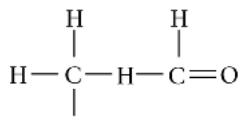  
(b)

## Levels 5-6: Evaluating/Creating

10. EVOLUTION CONNECTION The percentages of naturally occurring elements making up the human body (see Table 2.1) are similar to the percentages of these elements found in other organisms. How could you account for this similarity among organisms?

11. SCIENTIFIC INQUIRY Female luna moths (Actias luna) attract males by emitting chemical signals that spread through the air. A male hundreds of meters away can detect these molecules and fly toward their source. The sensory organs responsible for this behavior are the comblike antennae visible in the photograph shown here. Each filament of an antenna is equipped with thousands of

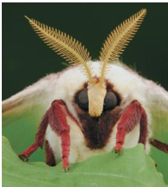

receptor cells that detect the sex attractant. Based on what you learned in this chapter, propose a hypothesis to account for the ability of the male moth to detect a specific molecule in the presence of many other molecules in the air. What predictions does your hypothesis make? Design an experiment to test one of these predictions.

12. WRITE ABOUT A THEME: ORGANIZATION While waiting at an airport, Neil Campbell once overheard this claim: "It's paranoid and ignorant to worry about industry or agriculture contaminating the environment with their chemical wastes. After all, this stuff is just made of the same atoms that were already present in our environment." Drawing on your knowledge of electron distribution, bonding, and emergent properties (see Concept 1.1), write a short essay (100–150 words) countering this argument.

13. SYNTHESIZE YOUR KNOWLEDGE This bombardier beetle is spraying a boiling hot liquid that contains irritating chemicals, used as a defense mechanism against its enemies. The beetle stores two sets of chemicals separately in its glands. Using what you learned about chemistry in this chapter, propose a possible explanation for why the beetle is not harmed by the chemicals it stores and what causes the explosive discharge.

  
For selected answers, see Appendix A.

# Water and Life

## Key Concepts

3.1 Polar covalent bonds in water molecules result in hydrogen bonding

3.2 Four emergent properties of water contribute to Earth's suitability for life

3.3 Acidic and basic conditions affect living organisms

  
Figure 3.1 Ringed seals (Phoca hispida) depend on Arctic sea ice as a platform from which to hunt for fish in the water below. As Earth warms from climate change, the melting of sea ice is a threat to species that live on, under, and around the floating ice.

## Study Tip

Make a visual study guide: Draw a diagram and write a caption that explains how the structure of water supports life for each of the properties of water listed in the diagram.

<table><tr><td colspan="2">The Properties of Water</td></tr><tr><td>Cohesion of water molecules</td><td>Moderation of temperature</td></tr><tr><td>Floating of ice</td><td>The solvent of life</td></tr></table>

## How does water's chemical structure allow its solid form (ice) to float on liquid water?

Water (H₂O) is a polar molecule: At one end, the O has partial negative charges (δ−) because O pulls electrons toward itself. At the other end, the H atoms have partial positive charges (δ+).

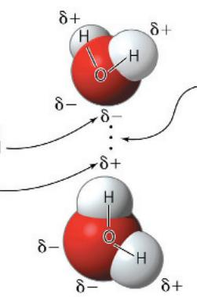  
In liquid water, the hydrogen bonds constantly break and re-form. As a result, the water molecules can slip closer together.

Weak attractions between oppositely charged regions of water molecules, called hydrogen bonds, allow water molecules to bond to each other.

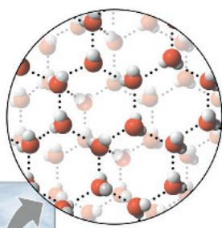

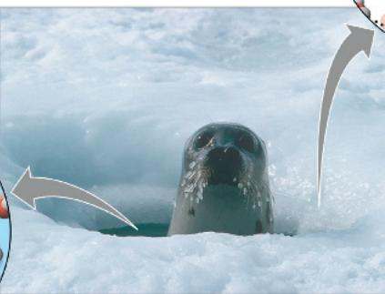  
In ice, the hydrogen bonds are stable and the water molecules are farther apart. Therefore, ice is less dense than liquid water, so it floats.  
Floating ice insulates the water below, enabling survival of aquatic life. Water also has other life-supporting properties, as you'll learn in this chapter.

# Concept 3.1: Polar covalent bonds in water molecules result in hydrogen bonding

Three quarters of Earth's surface is covered by water, the only substance on the planet to exist in all three physical states of matter (solid, liquid, and gas). Water is so familiar to us that it is easy to overlook its many extraordinary qualities. Following the theme of emergent properties, we can trace water's unique behavior to the structure and interactions of its molecules.

Studied on its own, the water molecule is deceptively simple. It is shaped like a wide V, with its two hydrogen atoms joined to the oxygen atom by single covalent bonds. Oxygen is more electronegative than hydrogen, so the electrons of the covalent bonds spend more time closer to oxygen than to hydrogen; these are polar covalent bonds (see Figure 2.11). This unequal sharing of electrons and water's V-like shape make it a polar molecule, meaning that its overall charge is unevenly distributed. In water, the oxygen of the molecule has partial negative charges $(\delta -)$ , and the hydrogens have partial positive charges $(\delta -)$ .

The properties of water arise from attractions between oppositely charged atoms of different water molecules: The partially positive hydrogen of one molecule is attracted to the partially negative oxygen of a nearby molecule. The two molecules are thus held together by a hydrogen bond (Figure 3.2). When water is in its liquid form, its hydrogen bonds are very fragile, each only about 1/20 as strong as a covalent bond. The hydrogen bonds form, break, and re-form with great frequency. Each lasts only a few trillions of a second, but the molecules are constantly forming new hydrogen bonds with a succession of partners. Therefore, at any instant, most of the water molecules are hydrogen-bonded to their neighbors. The extraordinary properties of water emerge from this hydrogen bonding, which organizes water molecules into a higher level of structural order.

Figure 3.2 Hydrogen bonds between water molecules.  
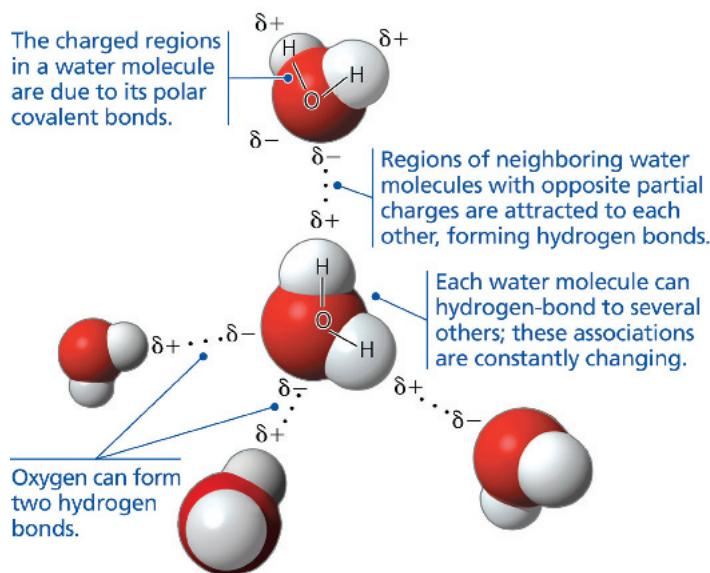  
DRAW IT Draw partial charges on the water molecule at the far left, and draw three more water molecules hydrogen-bonded to it. For suggested answer, see Appendix A.

## Concept Check 3.1

1. MAKE CONNECTIONS What is electronegativity, and how does it affect interactions between water molecules? (Review Figure 2.11.)

2. VISUAL SKILLS Look at Figure 3.2 and explain why the central water molecule can hydrogen-bond to other water molecules.

3. Why is it unlikely that two neighboring water molecules would be arranged as shown here?

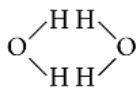

4. WHAT IF? What would be the effect on the properties of the water molecule if oxygen and hydrogen had equal electronegativity?

For suggested answers, see Appendix A.

## Concept 3.2: Four emergent properties of water contribute to Earth's suitability for life

We will examine four emergent properties of water that contribute to Earth's suitability as an environment for life: cohesive behavior, ability to moderate temperature, expansion upon freezing, and versatility as a solvent.

## Cohesion of Water Molecules

Water molecules stay close to each other as a result of hydrogen bonding. Although the arrangement of molecules in a sample of liquid water is constantly changing, at any given moment many of the molecules are linked by multiple hydrogen bonds. These linkages make water more structured than most other liquids. Collectively, the hydrogen bonds hold the substance together, a phenomenon called cohesion.

One result of cohesion due to hydrogen bonding is high surface tension, a measure of how difficult it is to stretch or break the surface of a liquid. At the air-water interface is an ordered arrangement of water molecules, hydrogen-bonded to one another and to the water below, but not to the air above. This asymmetry gives water an unusually high surface tension, making it behave as though it were coated with an invisible film. The spider in Figure 3.3 takes advantage of the surface tension of water to walk across a pond without breaking the surface, and some plants can float on water as well. You can observe the surface tension of

Figure 3.3 Walking on water.
The high surface tension of water, resulting from the collective strength of its hydrogen bonds, allows this raft spider to walk on the surface of a pond.  
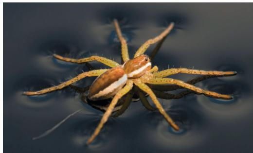

Figure 3.4 Water transport in plants.

Evaporation from leaves pulls water upward from the roots through water-conducting cells. Because of the properties of cohesion and adhesion, the tallest trees can transport water more than 100 m upward—approximately one-quarter the height of the Empire State Building in New York City.

water by slightly overfilling a drinking glass; the water will stand above the rim.

Cohesion also contributes to the transport of water and dissolved nutrients against gravity in plants (Figure 3.4). Water from the roots reaches the leaves through a network of water-conducting cells. As water evaporates from a leaf, hydrogen bonds cause water molecules leaving the veins to tug on molecules farther down, and the upward pull is transmitted through the water-conducting cells all the way to the roots. Adhesion, the clinging of one substance to another, also plays a role. Adhesion of water by hydrogen bonds to the molecules of cell walls helps counter the downward pull of gravity (see Figure 3.4).

## Moderation of Temperature by Water

Water moderates air temperature by absorbing heat from air that is warmer and releasing stored heat to air that is cooler. Water is effective as a heat bank because it can absorb or release a relatively large amount of heat with only a slight change in its own temperature. To understand this capability of water, let's first look at temperature and heat.

## Temperature and Heat

Anything that moves has kinetic energy, the energy of motion. Atoms and molecules have kinetic energy because they are always moving, although not necessarily in any particular direction. The faster a molecule moves, the greater its kinetic energy. The kinetic energy associated with the random movement of atoms or molecules is called thermal energy. Thermal energy is related to temperature, but they are not the same thing. Temperature represents the average kinetic energy of the molecules in a body of matter, regardless of volume, whereas the thermal energy of a body of matter reflects the total kinetic energy, and thus depends on the matter's volume. When water is heated in a coffeemaker, the average speed of the molecules increases, and the thermometer records this as a rise in temperature of the liquid. The total amount of thermal energy also increases in this case. Note, however, that although the pot of coffee has a much higher temperature than, say, the water in a swimming pool, the swimming pool contains more thermal energy because of its much greater volume.

Whenever two objects of different temperature are brought together, thermal energy passes from the warmer to the cooler object until the two are the same temperature. Molecules in the cooler object speed up at the expense of the thermal energy of the warmer object. An ice cube cools a drink not by adding coldness to the liquid but by absorbing thermal energy from the liquid as the ice itself melts. Thermal energy in transfer from one body of matter to another is defined as heat.

One convenient unit of heat used in this book is the calorie (cal). A calorie is the amount of heat it takes to raise the temperature of 1 g of water by 1°C. Conversely, a calorie is also the amount of heat that 1 g of water releases when it cools by 1°C. A kilocalorie (kcal), 1,000 cal, is the quantity of heat required to raise the temperature of 1 kilogram (kg) of water by 1°C. (The “Calories” on food packages are actually kilocalories.) Another energy unit used in this book is the joule (J). One joule equals 0.239 cal; one calorie equals 4.184 J.

## Water's High Specific Heat

The ability of water to stabilize temperature stems from its relatively high specific heat. The specific heat of a substance is defined as the amount of heat that must be absorbed or lost for 1 g of that substance to change its temperature by 1°C. We already know water's specific heat because we have defined a calorie as the amount of heat that causes 1 g of water to change its temperature by 1°C. Therefore, the specific heat of water is 1 calorie per gram and per degree Celsius, abbreviated as 1 cal/(g·°C). Compared with most other substances, water has an unusually high specific heat. For example, ethyl alcohol, the type of alcohol in alcoholic beverages, has a specific heat of 0.6 cal/(g·°C); that is, only 0.6 cal is required to raise the temperature of 1 g of ethyl alcohol by 1°C.

Because of the high specific heat of water relative to other materials, water will change its temperature less than other liquids when it absorbs or loses a given amount of heat. The reason you can burn your fingers by touching the side of an iron pot on the stove when the water in the pot is still lukewarm is that the specific heat of water is ten times greater than that of iron. In other words, the same amount of heat will raise the temperature of 1 g of the iron much faster than it will raise the temperature of 1 g of the water. Specific heat can be thought of as a measure of how well a substance resists changing its temperature when it absorbs or releases heat. Water resists changing its temperature; when it does change its temperature, it absorbs or loses a relatively large quantity of heat for each degree of change.

We can trace water's high specific heat, like many of its other properties, to hydrogen bonding. Heat must be absorbed in order to break hydrogen bonds; by the same token, heat is released when hydrogen bonds form. A calorie of heat causes a relatively small change in the temperature of water because much of the heat is used to disrupt hydrogen bonds before the water molecules can begin moving faster. And when the temperature of water drops slightly, many additional hydrogen bonds form, releasing a considerable amount of energy in the form of heat.

What is the relevance of water's high specific heat to life on Earth? A large body of water can absorb and store a huge amount of heat from the sun in the daytime and during summer while warming up only a few degrees. At night and during winter, the gradually cooling water can warm the air. This capability of water serves to moderate air temperatures in coastal areas (Figure 3.5). The high specific heat of water also tends to stabilize ocean temperatures, creating a favorable environment for marine life. Thus, because of its high specific heat, the water that covers most of Earth keeps temperature fluctuations on land and in water within limits that permit life. Also, because organisms are made primarily of water, they are better able to resist changes in their own temperature than if they were made of a liquid with a lower specific heat.

## Evaporative Cooling

Molecules of any liquid stay close together because they are attracted to one another. Molecules moving fast enough to overcome these attractions can depart the liquid and enter the air as a gas (vapor). This transformation from a liquid to a gas is called vaporization, or evaporation. Recall that the speed of molecular movement varies and that temperature is the average kinetic energy of molecules. Even at low temperatures, the speediest molecules can escape into the air. Some evaporation occurs at any temperature; a glass of water at room temperature, for example, will eventually evaporate completely. If a liquid is heated, the average kinetic energy of molecules increases and the liquid evaporates more rapidly.

Heat of vaporization is the quantity of heat a liquid must absorb for 1 g of it to be converted from the liquid to the gaseous state. For the same reason that water has a high specific heat, it also has a high heat of vaporization relative to most other liquids. To evaporate 1 g of water at $25^{\circ}$ C, about 580 cal of heat is needed—nearly double the amount needed to vaporize a gram of alcohol or ammonia. Water’s high heat of vaporization is another emergent property resulting from the strength of its hydrogen bonds, which must be broken before the molecules can exit from the liquid in the form of water vapor.

Figure 3.5 Temperatures for the Pacific Ocean and Southern California on an August day.  
  
INTERPRET THE DATA Explain the pattern of temperatures shown in this diagram.  
Figure 3.6 Evaporative cooling.  
In hot weather, an elephant sprays water from its trunk onto its head. Evaporation of this water cools the elephant down.  
Water molecules with the greatest kinetic energy leave as gas, making the remaining liquid water cooler.

The high amount of energy required to vaporize water has a wide range of effects. On a global scale, for example, it helps moderate Earth's climate. A considerable amount of solar heat absorbed by tropical seas is consumed during the evaporation of surface water. Then, as moist tropical air circulates poleward, it releases heat as it condenses and forms rain. On an organismal level, water's high heat of vaporization accounts for the severity of steam burns. These burns are caused by the heat energy released (during formation of hydrogen bonds) when steam condenses into liquid on the skin.

As a liquid evaporates, the surface of the liquid that remains behind cools down (its temperature decreases). This evaporative cooling occurs because the “hottest” molecules, those with the greatest kinetic energy, are the most likely to leave as gas. It is as if the 100 fastest runners at a college transferred to another school; the average speed of the remaining students would decline.

Evaporative cooling of water contributes to the stability of temperature in lakes and ponds and also provides a mechanism that prevents terrestrial organisms from overheating. For example, evaporation of water from the leaves of a plant helps keep the tissues in the leaves from becoming too warm in the sunlight. Evaporation of sweat from human skin dissipates body heat and helps prevent overheating on a hot day or when excess heat is generated by strenuous activity. High humidity on a hot day increases discomfort because the high concentration of water vapor in the air inhibits the evaporation of sweat from the body. Animals without sweat glands, such as elephants, may spray water on themselves to cool down (Figure 3.6).

Populations of bowhead whales and some fish species may be increasing because more plankton are available to eat.

## Floating of Ice on Liquid Water

Water is one of the few substances that are less dense as a solid than as a liquid. As a result, ice floats on liquid water. While other materials contract and become denser when they solidify, water expands. The cause of this exotic behavior is, once again, hydrogen bonding. At temperatures above $4^{\circ}$ C, water behaves like other liquids, expanding as it warms and contracting as it cools. As the temperature falls from $4^{\circ}$ C to $0^{\circ}$ C, water begins to freeze because more and more of its molecules are moving too slowly to break hydrogen bonds. At $0^{\circ}$ C, the molecules become locked into a crystalline lattice, each water molecule hydrogen-bonded to four partners (see Figure 3.1). The hydrogen bonds keep the molecules at “arm’s length,” far enough apart to make ice about 10% less dense 10% fewer molecules in the same volume) than liquid water at $4^{\circ}$ C. When ice absorbs enough heat for its temperature to rise above $0^{\circ}$ C, hydrogen bonds between molecules are disrupted. As the crystal collapses, the ice melts and molecules have fewer hydrogen bonds, allowing them to slip closer together. Water reaches its greatest density at $4^{\circ}$ C and then begins to expand as the molecules move faster. Even in liquid water, many of the molecules are connected by hydrogen bonds, though only transiently: The hydrogen bonds are constantly breaking and re-forming.

The ability of ice to float due to its lower density is an important factor in the suitability of the environment for life. If ice sank, then eventually ponds, lakes, and even oceans could freeze

## Interview

Many scientists are worried that these bodies of ice are at risk of disappearing. Global warming, which is caused by carbon dioxide and other “greenhouse” gases in the atmosphere (see Figure 56.30), is having a profound effect on icy environments around the globe. In the Arctic, the average air temperature has risen 2.2°C just since 1961. This temperature increase has affected the seasonal balance between Arctic sea ice and liquid water, causing ice to form later in the year, to melt earlier, and to cover a smaller area. The rate at which glaciers and Arctic sea ice are disappearing is posing an extreme challenge to animals that depend on ice for their survival (Figure 3.7).

Interview with Susan Solomon: Understanding climate change (eTextbook only)

## Water: The Solvent of Life

A sugar cube placed in a glass of water will dissolve. In time, the glass will contain a uniform mixture of sugar and water; the concentration of dissolved sugar will be the same everywhere in the mixture. A liquid that is a completely homogeneous mixture of two or more substances is called a solution. The dissolving agent of a solution is the solvent, and the substance that is dissolved is the solute. In this case, water is the solvent and sugar is the solute. An aqueous solution is one in which the solute is dissolved in water; water is the solvent.

Water is a very versatile solvent, a quality we can trace to the polarity of the water molecule. Suppose, for example, that a spoonful of table salt, the ionic compound sodium chloride (NaCl), is placed in water (Figure 3.8). At the surface of each crystal (grain) of salt, the sodium and chloride ions are exposed to the solvent. These ions and regions of the water molecules are attracted to each other due to their opposite charges. The oxygens of the water molecules have regions of partial negative charge that are attracted to sodium cations. The hydrogen regions are partially positively charged and are attracted to chloride anions. As a result, water molecules surround the individual sodium and chloride ions,

solid, making life as we know it impossible on Earth. During summer, only the upper few inches of the ocean would thaw. Instead, when a deep body of water cools, the ice floats, insulating the liquid water below. This prevents it from freezing and allows life to exist under the frozen surface, as shown in Figure 3.1. Besides insulating the water below, ice also provides a solid habitat for some animals, such as polar bears and seals.

Figure 3.7 Effects of climate change on the Arctic.

Warmer temperatures in the Arctic cause more sea ice to melt in the summer. The loss of ice disrupts the ecosystem, affecting many species. (Map data from the National Snow and Ice Data Center.)

  
Less ice reduces feeding opportunities for polar bears, who hunt from the ice.  
Black guillemots in Alaska cannot fly from their nests on land to their fishing grounds at the edge of the ice, which is now too far from land; young birds are starving.  
Loss of floating ice as habitat has caused a decline in Pacific walrus populations due to overcrowding and deadly stampedes on land.

Figure 3.8 Table salt dissolving in water.

A sphere of water molecules, called a hydration shell, surrounds each solute ion.

Negative regions on oxygens of polar water molecules are attracted to sodium cations (Na $^{+}$ ).

Positive regions on hydrogens of polar water molecules are attracted to chloride anions (Cl $^{-}$ ).

  
WHAT IF? What would happen if you heated this solution for a long time? For suggested answer, see Appendix A.  
Figure 3.9 A water-soluble protein.

separating and shielding them from one another. The sphere of water molecules around each dissolved ion is called a hydration shell. Working inward from the surface of each salt crystal, water eventually dissolves all the ions. The result is a solution of two solutes, sodium cations and chloride anions, mixed homogeneously with water, the solvent. Other ionic compounds also dissolve in water. Seawater, for instance, contains a great variety of dissolved ions, as do living cells.

A compound does not need to be ionic to dissolve in water; many compounds made up of nonionic polar molecules, such as the sugar in the sugar cube mentioned earlier, are also water-soluble. Such compounds dissolve when water molecules surround each of the solute molecules, forming hydrogen bonds with them. Even molecules as large as proteins can dissolve in water if they have ionic and polar regions on their surface (Figure 3.9). Many different kinds of polar compounds are dissolved (along with ions) in the water of such biological fluids as blood, the sap of plants, and the liquid within all cells. Water is the solvent of life.

## Hydrophilic and Hydrophobic Substances

Any substance that has an affinity for water is said to be hydrophilic (from the Greek hydro, water, and philos, loving). In some cases, substances can be hydrophilic without actually dissolving. For example, some molecules in cells are so large that they do not dissolve. Another example of a hydrophilic substance that does not dissolve is cotton, a plant product. Cotton consists of giant molecules of cellulose, a compound with numerous regions of partial positive and partial negative charges that can form hydrogen bonds with water. Water adheres to the cellulose fibers. Thus, a cotton towel does a great job of drying the body,

Human lysozyme is a protein found in tears and saliva that has antibacterial action (see Figure 5.16). This model shows the lysozyme molecule (purple) in an aqueous environment. Ionic and polar regions on the protein's surface attract the partially charged regions on water molecules.

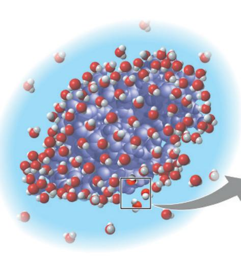  
This oxygen is attracted to a partial positive charge on the lysozyme molecule.

  
This hydrogen is attracted to a partial negative charge on the lysozyme molecule.

yet it does not dissolve in the washing machine. Cellulose is also present in the walls of water-conducting cells in a plant; you read earlier how the adhesion of water to these hydrophilic walls helps water move up the plant against gravity.

There are, of course, substances that do not have an affinity for water. Substances that are nonionic and nonpolar (or otherwise cannot form hydrogen bonds) actually seem to repel water; these substances are said to be hydrophobic (from the Greek phobos, fearing). An example from the kitchen is vegetable oil, which, as you know, does not mix stably with water-based substances such as vinegar. The hydrophobic behavior of the oil molecules results from a high number of relatively nonpolar covalent bonds, in this case bonds between carbon and hydrogen, which share electrons almost equally. Hydrophobic molecules related to oils are major ingredients of cell membranes. (Imagine what would happen to a cell if its membrane dissolved!)

## Solute Concentration in Aqueous Solutions

Most of the chemical reactions in organisms involve solutes dissolved in water. To understand such reactions, we must know how many atoms and molecules are involved and calculate the concentration of solutes in an aqueous solution (the number of solute molecules in a volume of solution).

When carrying out experiments, we use mass to calculate the number of molecules. We must first calculate the molecular mass, which is the sum of the masses of all the atoms in a molecule. As an example, let's calculate the molecular mass of table sugar (sucrose), $C_{12}H_{22}O_{11}$ , by multiplying the number of atoms by the atomic mass of each element (see the periodic table at the back of the book). In round numbers of daltons, the mass of a carbon atom is 12, the mass of a hydrogen atom is 1, and the mass of an oxygen atom is 16. Thus, sucrose has a molecular mass of $(12 \times 12) + (22 \times 1) + (11 \times 16) = 342$ daltons. Because we can't weigh out small numbers of molecules, we usually measure substances in units called moles. Just as a dozen always means 12 objects, a mole (mol) represents an exact number of objects: $6.02 \times 10^{23}$ , which is called Avogadro's number. Because of the way in which Avogadro's number and the unit dalton were originally defined, there are $6.02 \times 10^{23}$ daltons in $1\mathrm{g}$ . Once we determine the molecular mass of a molecule such as sucrose, we can use the same number (342), but with the unit gram, to represent the mass of $6.02 \times 10^{23}$ molecules of sucrose, or $1\mathrm{mol}$ of sucrose (sometimes called the molar mass). To obtain $1\mathrm{mol}$ of sucrose in the lab, therefore, we weigh out $342\mathrm{g}$ .

The practical advantage of measuring a quantity of chemicals in moles is that a mole of one substance has exactly the same number of molecules as a mole of any other substance. If the molecular mass of substance A is 342 daltons and that of substance B is 10 daltons, then 342 g of A will have the same number of molecules as 10 g of B. A mole of ethyl alcohol $\left(\mathrm{C}_{2}\mathrm{H}_{6}\mathrm{O}\right)$ also contains $6.02 \times 10^{23}$ molecules, but its mass is only 46 g because the mass of a molecule of ethyl alcohol is only 46 daltons, much less than that of a molecule of sucrose. Measuring in moles makes it convenient for scientists working in the laboratory to combine substances in fixed ratios of molecules.

How would we make a liter (L) of solution consisting of 1 mol of sucrose dissolved in water? We would measure out 342 g of sucrose and then gradually add water, while stirring, until the sugar was completely dissolved. We would then add enough water to bring the total volume of the solution up to 1 L. At that point, we would have a 1-molar (1 M) solution of sucrose.

Molarity—the number of moles of solute per liter of solution—is the unit of concentration most often used by biologists for aqueous solutions.

Water's capacity as a versatile solvent complements the other properties discussed in this chapter. Since these remarkable properties allow water to support life on Earth so well, scientists who seek life elsewhere in the universe look for water as a sign that a planet might sustain life.

## Possible Evolution of Life on Other Planets

EVOLUTION Biologists who look for life elsewhere in the universe (known as astrobiologists) have concentrated their search on planets that might have water. More than 5,600 planets have been found outside our solar system (so-called exoplanets), with evidence of water in the atmospheres of a few. In our own solar system, Mars has been a focus of study. Like Earth, Mars has an ice cap at both poles. Images from the Mars Reconnaissance Orbiter (Figure 3.10) provide compelling evidence that much liquid water was present on the surface of Mars until about 3 billion years ago, and trace amounts may still be present today. The Mars rover Perseverance has been collecting surface samples that will be analyzed for fossils or other evidence for life

## Figure 3.10 Evidence for liquid water on Mars.

This image from the Jezero crater, site of an ancient lake, shows the path carved by water flowing in from the left and out to the right, as well as the delta deposit that formed when water flowed into the lake, slowed down, and dropped its sediment. The colors represent different compositions of the sediment and crater floor. (This digitally treated photograph was taken by the Mars Reconnaissance Orbiter.)

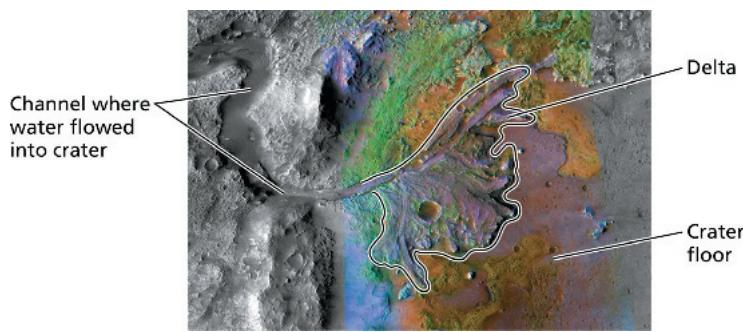

on Mars, past or present. Even farther out in our solar system, one of Jupiter's moons, Europa, shows strong evidence for the current presence of liquid water under an icy crust. Due to its distance, this moon is even more difficult to study, but it warrants further exploration. If any life-forms or fossils are found on Mars or Europa, their study will shed light on the process of evolution from an entirely new perspective.

## Concept Check 3.2

1. Describe how properties of water contribute to the upward movement of water in a tree.

2. Explain the saying "It's not the heat; it's the humidity."

3. How can the freezing of water crack boulders?

4. WHAT IF? A water strider (an insect that can walk on water) has legs that are coated with a hydrophobic substance. What might be the benefit? What would happen if the substance were hydrophilic?

5. INTERPRET THE DATA The concentration of the appetite-regulating hormone ghrelin is about $1.3 \times 10^{-10} M$ in the blood of a fasting person. How many molecules of ghrelin are in 1 L of blood?

For selected answers, see Appendix A.

## Concept 3.3: Acidic and basic conditions affect living organisms

Occasionally, a hydrogen atom participating in a hydrogen bond between two water molecules shifts from one molecule to the other. When this happens, the hydrogen atom leaves its electron behind, and what is actually transferred is a hydrogen ion ( $H^{+}$ ), a single proton with a charge of 1+. The water molecule that lost a proton is now a hydroxide ion (OH $^{-}$ ), which has a charge of 1−. The proton binds to the other water molecule, making that molecule a hydronium ion (H $_{3}$ O $^{+}$ ). We can picture the chemical reaction as follows:

By convention, $H^{+}$ (the hydrogen ion) is used to represent $H_{3}O^{+}$ (the hydronium ion), and we follow that practice in this book. Keep in mind, though, that $H^{+}$ does not exist on its own in an aqueous solution. It is always associated with a water molecule in the form of $H_{3}O^{+}$ .

As indicated by the double arrows, this is a reversible reaction that reaches a state of dynamic equilibrium when water molecules dissociate at the same rate that they are being reformed from $H^{+}$ and $OH^{-}$ . At this equilibrium point, the concentration of water molecules greatly exceeds the concentrations of $H^{+}$ and $OH^{-}$ . In pure water, only one water molecule in every 554 million is dissociated; the concentration of $H^{+}$ and of $OH^{-}$ in pure water is therefore $10^{-7} M$ (at $25^{\circ}C$ ). This means there is only one ten-millionth of a mole of hydrogen ions per liter of pure water and an equal number of hydroxide ions. (Even so, this is a huge number—over 60,000 trillion—of each ion in a liter of pure water.)

Although the dissociation of water is reversible and statistically rare, it is exceedingly important in the chemistry of life. $\mathrm{H^{+}}$ and $\mathrm{OH^{-}}$ are very reactive. Changes in their concentrations can drastically affect a cell's proteins and other complex molecules. As we have seen, the concentrations of $\mathrm{H^{+}}$ and $\mathrm{OH^{-}}$ are equal in pure water, but adding certain kinds of solutes, called acids and bases, disrupts this balance. Biologists use something called the pH scale to describe how acidic or basic (the opposite of acidic) a solution is. In the remainder of this chapter, you will learn about acids, bases, and pH and why changes in pH can adversely affect organisms.

## Acids and Bases

What would cause an aqueous solution to have an imbalance in $H^{+}$ and $OH^{-}$ concentrations? When acids dissolve in water, they donate additional $H^{+}$ to the solution. An acid is a substance that increases the hydrogen ion concentration of a solution. For example, when hydrochloric acid (HCl) is added to water, hydrogen ions dissociate from chloride ions:

$$
\mathrm{HCl} \rightarrow \mathrm{H} ^ {+} + \mathrm{Cl} ^ {-}
$$

This source of $H^{+}$ (dissociation of water is the other source) results in an acidic solution—one having more $H^{+}$ than $OH^{-}$ .

A substance that reduces the hydrogen ion concentration of a solution is called a base. Some bases reduce the $H^{+}$ concentration directly by accepting hydrogen ions. Ammonia ( $NH_{3}$ ), for instance, acts as a base when the unshared electron pair in

nitrogen's valence shell attracts a hydrogen ion from the solution, resulting in an ammonium ion $(\mathrm{NH}_4^+)$ :

$$
\mathrm{NH} _ {3} + \mathrm{H} ^ {+} \rightleftharpoons \mathrm{NH} _ {4} ^ {+}
$$

Other bases reduce the $H^{+}$ concentration indirectly by dissociating to form hydroxide ions, which combine with hydrogen ions and form water. One such base is sodium hydroxide (NaOH), which in water dissociates into its ions:

$$
\mathrm{NaOH} \rightarrow \mathrm{Na} ^ {+} + \mathrm{OH} ^ {-}
$$

In either case, the base reduces the $H^{+}$ concentration. Solutions with a higher concentration of $OH^{-}$ than $H^{+}$ are known as basic solutions. A solution in which the $H^{+}$ and $OH^{-}$ concentrations are equal is said to be neutral.

Notice that single arrows were used in the reactions for HCl and NaOH. These compounds dissociate completely when mixed with water, so hydrochloric acid is called a strong acid and sodium hydroxide a strong base. In contrast, ammonia is a weak base. The double arrows in the reaction for ammonia indicate that the binding and release of hydrogen ions are reversible reactions, although at equilibrium there will be a fixed ratio of $NH_{4}^{+}$ to $NH_{3}$ .

Weak acids are acids that reversibly release and accept back hydrogen ions. An example is carbonic acid:

$$
\begin{array}{c}\mathrm{H} _ {2} \mathrm{CO} _ {3} \quad \rightleftharpoons \quad \mathrm{HCO} _ {3} ^ {-} \quad + \quad \mathrm{H} ^ {+}\\\text {   Carbonic   acid   } \quad \text {   Bicarbonate   ion   } \quad \text {   Hydrogen   ion   }\end{array}
$$

Here the equilibrium so favors the reaction in the left direction that when carbonic acid is added to pure water, only 1% of the molecules are dissociated at any particular time. Still, that is enough to shift the balance of $H^{+}$ and $OH^{-}$ from neutrality.

## The pH Scale

In any aqueous solution at $25^{\circ}$ C, the product of the $H^{+}$ and $OH^{-}$ concentrations is constant at $10^{-14}$ . This can be written

$$
[ \mathrm{H} ^ {+} ] [ \mathrm{OH} ^ {-} ] = 1 0 ^ {- 1 4}
$$

(The brackets indicate molar concentration.) As previously mentioned, in a neutral solution at $25^{\circ}C$ , $[H^{+}] = 10^{-7}$ and $[OH^{-}] = 10^{-7}$ . Therefore, the product of $[H^{+}]$ and $[OH^{-}]$ in a neutral solution at $25^{\circ}C$ is $10^{-14}$ . If enough acid is added to a solution to increase $[H^{+}]$ to $10^{-5}M$ , then $[OH^{-}]$ will decline by an equivalent factor to $10^{-9}M$ (note that $10^{-5} \times 10^{-9} = 10^{-14}$ ). This constant relationship expresses the behavior of acids and bases in an aqueous solution. An acid not only adds hydrogen ions to a solution, but also removes hydroxide ions because of the tendency for $H^{+}$ to combine with $OH^{-}$ , forming water. A base has the opposite effect, increasing $OH^{-}$ concentration but also reducing $H^{+}$ concentration by the formation of water. If enough of a base is added to raise the $OH^{-}$ concentration to $10^{-4}M$ , it will cause the $H^{+}$ concentration to drop to $10^{-10}M$ . Whenever we know the concentration of either $H^{+}$ or $OH^{-}$ in an aqueous solution, we can deduce the concentration of the other ion.

The pH scale (Figure 3.11) is a simple numerical method for expressing the range of $H^{+}$ concentrations. The $H^{+}$ concentrations of solutions can vary by a factor of 100 trillion or more. Instead of using moles per liter, the pH scale compresses the range of $H^{+}$ concentrations by employing

Figure 3.11 The pH scale and pH values of some aqueous solutions.  

logarithms. The pH of a solution is defined as the negative logarithm (base 10) of the $H^{+}$ concentration:

$$
\mathrm{pH} = - \log [ \mathrm{H} ^ {+} ]
$$

For a neutral aqueous solution, $[H^{+}]$ is $10^{-7}M$ , giving us

$$
- \log 1 0 ^ {- 7} = - (- 7) = 7
$$

Notice that pH decreases as $H^{+}$ concentration increases (see Figure 3.11). Notice, too, that although the pH scale is based on $H^{+}$ concentration, it also implies $OH^{-}$ concentration. A solution of pH 10 has a hydrogen ion concentration of $10^{-10} M$ and a hydroxide ion concentration of $10^{-4} M$ .

The pH of a neutral aqueous solution at $25^{\circ}$ C is 7, the midpoint of the pH scale. A pH value less than 7 denotes an acidic solution; the lower the number, the more acidic the solution. The pH for basic solutions is above 7. Most biological fluids, such as blood and saliva, are within the range of pH 6–8. There are a few exceptions, however, including the strongly acidic digestive juice of the human stomach (gastric juice), which has a pH of about 2.

Remember that each pH unit represents a tenfold difference in $H^{+}$ and $OH^{-}$ concentrations. It is this mathematical feature that makes the pH scale so compact.

A solution of pH 3 is not twice as acidic as a solution of pH 6, but 1,000 times $(10 \times 10 \times 10)$ more acidic. When the pH of a solution changes slightly, the actual concentrations of $H^{+}$ and $OH^{-}$ in the solution change substantially.

## Buffers

The internal pH of most living cells is close to 7. Even a slight change in pH can be harmful because the chemical processes of the cell are very sensitive to the concentrations of hydrogen and hydroxide ions. The pH of human blood is very close to 7.4, which is slightly basic. A person cannot survive for more than a few minutes if the blood pH drops to 7 or rises to 7.8, and a chemical system exists in the blood that maintains a stable pH. If 0.01 mol of a strong acid is added to a liter of pure water, the pH drops from 7.0 to 2.0. If the same amount of acid is added to a liter of blood, however, the pH decrease is only from 7.4 to 7.3. Why does the addition of acid have so much less of an effect on the pH of blood than it does on the pH of water?

The presence of substances called buffers allows biological fluids to maintain a relatively constant pH despite the addition of acids or bases. A buffer is a substance that minimizes changes in the concentrations of $H^{+}$ and $OH^{-}$ in a solution. It does so by accepting hydrogen ions from the solution when they are in excess and donating hydrogen ions to the solution when they have been depleted. Most buffer solutions contain a weak acid and its corresponding base, which combine reversibly with hydrogen ions.

Several buffers contribute to pH stability in human blood and many other biological solutions.

One of these is carbonic acid $\left(\mathrm{H}_{2}\mathrm{CO}_{3}\right)$ , which is formed when $CO_{2}$ reacts with water in blood plasma. As mentioned earlier, carbonic acid dissociates to yield a bicarbonate ion $\left(\mathrm{HCO}_{3}^{-}\right)$ and a hydrogen ion $\left(\mathrm{H}^{+}\right)$ :

$$
\begin{array}{c c c} \mathrm{H} _ {2} \mathrm{CO} _ {3} & \xrightarrow {\text {Response to}} \\ \mathrm{H} ^ {+} \text {donor} & \text {Response to} \\ (\text {acid}) & \text {a drop in pH} \end{array} \quad \begin{array}{c c c} \mathrm{HCO} _ {3} ^ {-} & + & \mathrm{H} ^ {+} \\ \mathrm{H} ^ {+} \text {acceptor} & & \text {Hydrogen} \\ (\text {base}) & & \text {ion} \end{array}
$$

The chemical equilibrium between carbonic acid and bicarbonate acts as a pH regulator, the reaction shifting left or right as other processes in the solution add or remove hydrogen ions. If the $H^{+}$ concentration in blood begins to fall (that is, if pH rises), the reaction proceeds to the right and more carbonic acid dissociates, replenishing hydrogen ions. But when the $H^{+}$ concentration in blood begins to rise (when pH drops), the reaction proceeds to the left, with $HCO_{3}^{-}$ (the base) removing the hydrogen ions from the solution and forming $H_{2}CO_{3}$ . Thus, the carbonic acid–bicarbonate buffering system consists of an acid and a base in equilibrium with each other. Most other buffers are also acid-base pairs.

## Acidification: A Threat to Our Oceans

Among the many threats to water quality posed by human activities is the burning of fossil fuels, which releases $CO_{2}$ into the atmosphere. The resulting increase in atmospheric $CO_{2}$ levels has caused global warming and other aspects of climate change (see Concept 56.4). In addition, about 25% of human-generated $CO_{2}$ is absorbed by the oceans. In spite of the huge volume of water in the oceans, scientists worry that the absorption of so much $CO_{2}$ will harm marine ecosystems.

Recent data have shown that such fears are well founded. When $CO_{2}$ dissolves in seawater, it reacts with water to form carbonic acid, which lowers ocean pH. This process, known as ocean acidification, alters the delicate balance of conditions for life in the oceans (Figure 3.12). Based on measurements of the $CO_{2}$ level in air

## Scientific Skills Exercise Interpreting a Scatter Plot with a Regression Line

How Does the Carbonate Ion Concentration of Seawater Affect the Calcification Rate of a Coral Reef? Scientists predict that acidification of the ocean due to higher levels of atmospheric $CO_{2}$ will lower the concentration of dissolved carbonate ions, which living corals use to build calcium carbonate reef structures. In this exercise, you will analyze data from a controlled experiment that examined the effect of carbonate ion concentration ( $[CO_{3}^{2-}]$ ) on calcium carbonate deposition, a process called calcification.

How the Experiment Was Done For several years, scientists conducted research on ocean acidification using a large coral reef aquarium at Biosphere 2 in Arizona. They measured the rate of calcification by the reef organisms and examined how the calcification rate changed with differing amounts of dissolved carbonate ions in the seawater.

Data from the Experiment The black data points in the graph form a scatter plot. The red line, known as a linear regression line, is the best-fitting straight line for these points.

## INTERPRET THE DATA

1. When presented with a graph of experimental data, the first step in analysis is to determine what each axis represents. (a) In words, what is shown on the x-axis? (Include the units.) (b) What is on the y-axis? (c) Which variable is the independent variable—the one that was manipulated by the researchers? (d) Which is the dependent variable—the one that responded to or depended on the treatment, which was measured by the researchers? (For additional information about graphs, see the Scientific Skills Review in Appendix D.)

2. Based on the data shown in the graph, describe in words the relationship between carbonate ion concentration and calcification rate.

3. (a) If the seawater carbonate ion concentration is $270~\mu \mathrm{mol / kg}$ , estimate the rate of calcification and how many bubbles trapped in ice over thousands of years, scientists calculate that the pH of the oceans is 0.1 pH unit lower (more acidic) now than at any time in the past 420,000 years. Recent studies predict that it will drop another 0.3–0.5 pH unit by the end of this century.

As seawater acidifies, the extra hydrogen ions combine with carbonate ions $\left(\mathrm{CO}_{3}^{2-}\right)$ to form bicarbonate ions $\left(\mathrm{HCO}_{3}^{-}\right)$ , thereby reducing the carbonate ion concentration (see Figure 3.12). Scientists predict that ocean acidification will cause the carbonate ion concentration to decrease by 40% by the year 2100. This is of great concern because carbonate ions are required for calcification, the production of calcium carbonate $\left(\mathrm{CaCO}_{3}\right)$ by many marine organisms, including reef-building corals and animals that build shells. The Scientific Skills Exercise allows you to work with data from an experiment examining the effect of carbonate ion

  
Data from C. Langdon et al., Effect of calcium carbonate saturation state on the calcification rate of an experimental coral reef, Global Biogeochemical Cycles 14:639–654 (2000).

days it would take 1 square meter of reef to accumulate 30 mmol of calcium carbonate (CaCO $_{3}$ ). (b) If the seawater carbonate ion concentration is 270 $\mu$ mol/kg, what is the approximate rate of calcification, and approximately how many days would it take 1 square meter of reef to accumulate 30 mmol of calcium carbonate?

4. (a) Which step of the process in Figure 3.12 is measured in this experiment? (b) Are the results of this experiment consistent with the hypothesis that increased atmospheric $\left[\mathrm{CO}_{2}\right]$ will slow the growth of coral reefs? Why or why not?

Instructors: A version of this Scientific Skills Exercise can be assigned in Mastering Biology.

Figure 3.12 Atmospheric $CO_{2}$ from human activities and its fate in the ocean.

Some carbon dioxide $(\mathrm{CO}_{2})$ in the atmosphere dissolves in the ocean, where it reacts with water to form carbonic acid $(\mathrm{H}_2\mathrm{CO}_3)$ .

  
Carbonic acid dissociates into hydrogen ions (H $^{+}$ ) and bicarbonate ions (HCO $_{3}^{-}$ ).  
The added $\mathsf{H}^+$ combines with carbonate ions $(\mathrm{CO}_{3}^{2-})$ , forming more $\mathrm{HCO}_{3}^{-}$ .

VISUAL SKILLS Summarize the effect of adding excess $CO_{2}$ to the oceans on the calcification process in the final equation.
For suggested answer, see Appendix A.

concentration on coral reefs, using an artificial system. In 2018, researchers carried out the first $CO_{2}$ enhancement study on an unconfined natural coral reef, observing that addition of $CO_{2}$

## Summary of Key Concepts

To review key terms, go to the Vocabulary Self-Quiz (eTextbook only).

## Chapter 3 Review

Concept 3.1: Polar covalent bonds in water molecules result in hydrogen bonding

\- Water is a polar molecule. A hydrogen bond forms when a partially negatively charged region on the oxygen of one water molecule is attracted to the partially positively charged hydrogen of a nearby water molecule. Hydrogen bonding between water molecules is the basis for water's properties.

  
DRAW IT Label a hydrogen bond and a polar covalent bond in the diagram of five water molecules. Is a hydrogen bond a covalent bond? Explain.

suppressed calcification and concluding that ocean acidification is likely to cause “profound, ecosystem-wide changes in coral reefs.” Coral reefs are sensitive ecosystems that act as havens for a great diversity of marine life. The disappearance of coral reef ecosystems would be a tragic loss of biological diversity.

If there is any reason for optimism about the future quality of water resources on our planet, it is that we have made progress in learning about the delicate chemical balances in oceans, lakes, and rivers. Continued progress can come only from the actions of informed individuals, like yourselves, who are concerned about environmental quality. This requires understanding the crucial role that water plays in the suitability of the environment for continued life on Earth.

## Concept Check 3.3

1. Compared with a basic solution at pH 9, the same volume of an acidic solution at pH 4 has \_\_\_\_ times as many hydrogen ions ( $H^{+}$ ).

2. HCl is a strong acid that dissociates in water: $\mathrm{HCl} \rightarrow \mathrm{H}^{+} + \mathrm{Cl}^{-}$ . What is the pH of $0.01\mathrm{M}$ HCl?

3. Acetic acid (CH $_{3}$ COOH) can be a buffer, similar to carbonic acid. Write the dissociation reaction, identifying the acid, base, H $^{+}$ acceptor, and H $^{+}$ donor.

4. WHAT IF? Given a liter of pure water and a liter solution of acetic acid, what would happen to the pH, in general, if you added 0.01 mol of a strong acid to each? Use the reaction from question 3 to explain the result.

For suggested answers, see Appendix A.

## Concept 3.2: Four emergent properties of water contribute to Earth's suitability for life

\- Hydrogen bonding keeps water molecules close to each other, giving water cohesion. Hydrogen bonding is also responsible for water's surface tension.

\- Water has a high specific heat: Heat is absorbed when hydrogen bonds break and is released when hydrogen bonds form. This helps keep temperatures relatively steady, within limits that permit life. Evaporative cooling is based on water's high heat of vaporization. The evaporative loss of the most energetic water molecules cools a surface.

\- Ice floats because it is less dense than liquid water. This property allows life to exist under the frozen surfaces of lakes and polar seas.

\- Water is an unusually versatile solvent because its polar molecules are attracted to ions and polar substances that can form hydrogen bonds. Hydrophilic substances have an affinity for water; hydrophobic substances do not. Molarity, the number of moles of solute per liter of solution, is used as a measure of solute concentration in solutions. A mole is a certain number of molecules of a substance. The mass of a mole of a substance in grams is the same as the molecular mass in daltons.

\- The emergent properties of water support life on Earth and may contribute to the potential for life to have evolved on other planets.

Describe how different types of solutes dissolve in water. Explain what a solution is.

Concept 3.3: Acidic and basic conditions affect living organisms

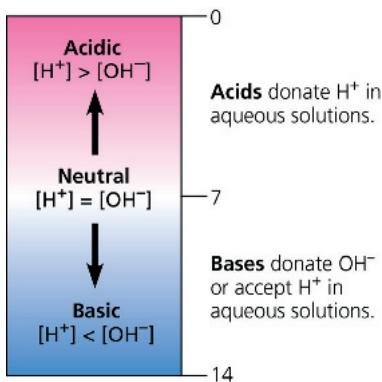

\- A water molecule can transfer an $H^{+}$ to another water molecule to form $H_{3}O^{+}$ (represented simply by $H^{+}$ ) and $OH^{-}$ .

\- The concentration of $H^{+}$ is expressed as pH; pH = -log $[H^{+}]$ . A buffer consists of an acid-base pair that combines reversibly with hydrogen ions, allowing it to resist pH changes.

\- The burning of fossil fuels increases the amount of $CO_{2}$ in the atmosphere. Some $CO_{2}$ dissolves in the oceans, causing ocean acidification, which has potentially grave consequences for marine organisms that rely on calcification.

Explain what happens to the concentration of hydrogen ions in an aqueous solution when you add a base and cause the concentration of $OH^{-}$ to rise to $10^{-3}$ . What is the pH of this solution?

For suggested answers, see Appendix A.

## Test Your Understanding

For more multiple-choice questions, go to the Practice Test (eTextbook only).

## Levels 1-2: Remembering/Understanding

1. Which of the following is a hydrophobic material?
(A) paper
(B) table salt
(C) wax
(D) sugar

2. We can be sure that a mole of table sugar and a mole of vitamin C are equal in their

(A) mass.

(B) volume.

(C) number of atoms.

(D) number of molecules.

3. Measurements show that the pH of a particular lake is 4.0. What is the hydrogen ion concentration of the lake?

(A) 4.0 M

(B) $10^{-10}M$

(C) $10^{-4}M$

(D) $10^{4}M$

4. What is the hydroxide ion concentration of the lake described in question 3?

(A) $10^{-10}M$

(B) $10^{-4}M$

(C) $10^{-7}M$

(D) 10.0 M

## Levels 3-4: Applying/Analyzing

5. A slice of pizza has 500 kcal. If we could burn the pizza and use all the heat to warm a 50-L container of cold water, what would be the approximate increase in the temperature of the water? (Note: A liter of cold water weighs about 1 kg.)

(A) $50^{\circ}$ C

(B) $5^{\circ}$ C

(C) $100^{\circ}$ C

(D) $10^{\circ}$ C

6. DRAW IT Draw the hydration shells that form around a potassium ion and a chloride ion when potassium chloride (KCl) dissolves. Label the positive, negative, and partial charges.

## Levels 5-6: Evaluating/Creating

7. Right before a predicted overnight freeze, farmers spray water on crops to protect the plants. Use the properties of water to explain how this method works. Be sure to mention why hydrogen bonds are responsible for this phenomenon.

8. MAKE CONNECTIONS What do climate change (see Concepts 1.1 and 3.2) and ocean acidification have in common?

9. EVOLUTION CONNECTION This chapter explains how the emergent properties of water contribute to the suitability of the environment for life. Until fairly recently, scientists assumed that other physical requirements for life included a moderate range of temperature, pH, atmospheric pressure, and salinity, as well as low levels of toxic chemicals. That view has changed with the discovery of organisms known as extremophiles, which flourish in hot, acidic sulfur springs, around hydrothermal vents deep in the ocean, and in soils with high levels of toxic metals. Why would astrobiologists study extremophiles? What does the existence of life in such extreme environments say about the possibility of life on other planets?

10. SCIENTIFIC INQUIRY Design a controlled experiment to test the hypothesis that water acidification caused by acidic rain would inhibit the growth of Elodea, a freshwater plant (see Figure 2.17).

11. WRITE ABOUT A THEME: ORGANIZATION Several emergent properties of water contribute to the suitability of the environment for life. In a short essay (100–150 words), describe how the ability of water to function as a versatile solvent arises from the structure of water molecules.

## 12. SYNTHESIZE YOUR KNOWLEDGE

How do cats drink?
Scientists using highspeed video have shown that cats use an interesting technique to drink aqueous substances like water and milk. Four times a second, the cat touches the tip of its tongue to the water and draws a column of water up into its mouth (as you can see in the photo), which then shuts before gravity can pull the water back down. Describe how the properties of water

allow cats to drink in this fashion, including how water's molecular structure contributes to the process.

For selected answers, see Appendix A.

# Explore Scientific Papers with Science in the Classroom | AAAS

How are coral reefs responding to climate change? Go to “Take the Heat” at www.scienceintheclassroom.org.

Instructors: Questions can be assigned in Mastering Biology.

# Carbon and the Molecular Diversity of Life

## Key Concepts

4.1 Organic chemistry is key to the origin of life

4.2 Carbon atoms can form diverse molecules by bonding to four other atoms

4.3 A few chemical groups are key to molecular function

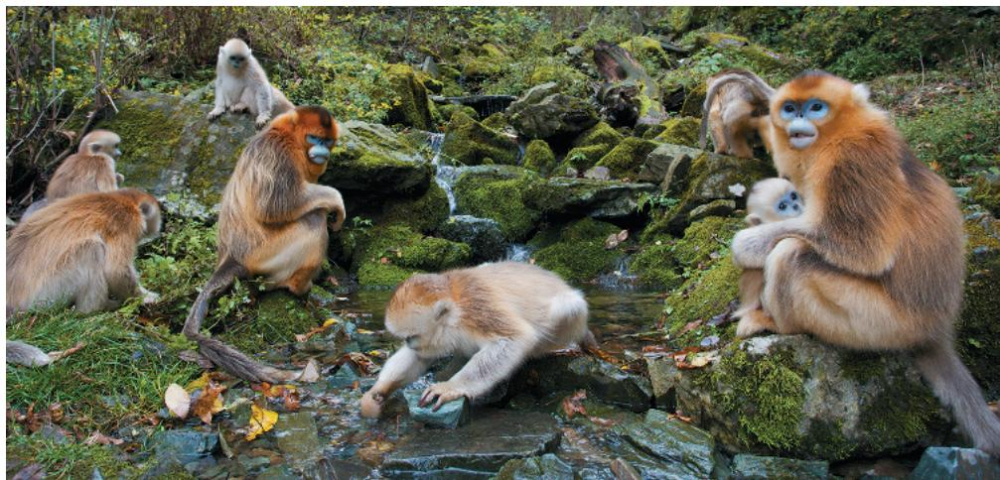  
Figure 4.1 These Qinling golden snub-nosed monkeys in the mountainous forests of southwest China, like all living organisms, are made up of chemicals based mostly on the element carbon. Of all chemical elements, carbon is unparalleled in its ability to form molecules that are large, complex, and varied, making possible the diversity of organisms that have evolved on Earth.

## Study Tip

Label chemical groups: After you have read through Figure 4.9, look through Chapters 4 and 5 for molecules that have the chemical groups shown in that figure. Circle and label the chemical groups you find, as in the example shown here.

  
Carbon can form four bonds, and therefore can bond to up to four other atoms or groups of atoms.

## What makes carbon the basis for all biological molecules?

The properties of a carbon-containing molecule depend on the arrangement of its carbon skeleton and on its chemical groups.

Carbon can bond to other carbons, resulting in carbon skeletons. Carbon also commonly bonds to

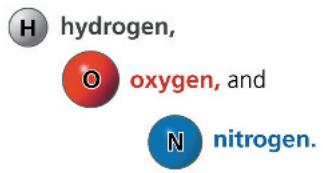

  
The signaling molecule shown here, dopamine, has many functions, including promoting mother-infant bonding.

## Concept 4.1: Organic chemistry is key to the origin of life

For historical reasons, compounds containing carbon are called organic compounds, and their study is called organic chemistry. Organic compounds range from simple molecules, such as methane ( $CH_{4}$ ), to colossal ones, such as proteins, with thousands of atoms.

EVOLUTION In 1953, Stanley Miller, a graduate student of Harold Urey at the University of Chicago, designed an experiment on the abiotic (nonliving) synthesis of organic compounds to investigate the origin of life. Study Figure 4.2 to learn about his classic experiment. From his results, Miller concluded that complex

organic molecules could arise spontaneously under conditions thought at that time to have existed on early Earth. You can work with the data from a related experiment in the Scientific Skills Exercise. These experiments support the idea that abiotic synthesis of organic compounds, perhaps near volcanoes, could have been an early stage in the origin of life (see Figure 25.2).

In Concept 3.2, you learned about evidence for the presence of water on Mars in the past. Even more exciting, in 2018, NASA reported that the rover Curiosity had found carbon-based compounds on Mars in Gale Crater where a lake once existed. While these compounds might have been brought to Mars on a meteorite or formed by geologic processes, an intriguing possibility is that they might have been the relics of life-forms that once existed on that planet. Samples were collected here and from other sites so they could be analyzed later for the presence of fossils, which would provide strong evidence for past life on Mars.

## Figure 4.2

## Inquiry: Can organic molecules form under conditions estimated to simulate those on the early Earth?

## Experiment

In 1953, Stanley Miller set up a closed system to mimic conditions thought at that time to have existed on the early Earth. A flask of water simulated the primeval sea. The water was heated so that some vaporized and moved into a second, higher flask containing the “atmosphere”—a mixture of gases. Sparks were discharged in the synthetic atmosphere to mimic lightning.

## Results

Miller identified a variety of organic molecules that are common in organisms. These included simple compounds, such as formaldehyde ( $CH_{2}O$ ) and hydrogen cyanide (HCN), and more complex molecules, such as amino acids and long chains of carbon and hydrogen known as hydrocarbons.

## Conclusion

Organic molecules, a first step in the origin of life, may have been synthesized abiotically on the early Earth. Although later evidence indicated that the early-Earth atmosphere was different from the “atmosphere” used by Miller in this experiment, recent experiments using the revised list of chemicals also produced organic molecules. (We will explore this hypothesis in more detail in Concept 25.1.)

Data from S. L. Miller, A production of amino acids under possible primitive Earth conditions, Science 117:528–529 (1953).

WHAT IF? If Miller had increased the concentration of $NH_{3}$ in his experiment, how might the relative amounts of the products HCN and $CH_{2}O$ have differed?

For suggested answer, see Appendix A.

  
⑤ As material cycled through the apparatus, Miller periodically collected samples for analysis.  
4 A condenser cooled the atmosphere, raining water and dissolved molecules into the sea flask.

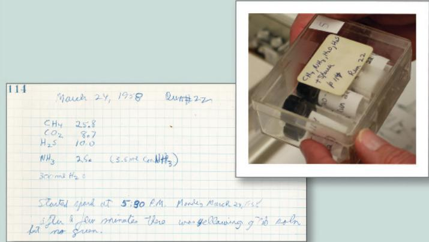

# Scientific Skills Exercise Working with Moles and Molar Ratios

Could the First Biological Molecules Have Formed Near Volcanoes on Early Earth? In 2007, Jeffrey Bada, a former graduate student of Stanley Miller, discovered some vials of samples that had never been analyzed from an experiment performed by Miller in 1958. In that experiment, Miller used hydrogen sulfide gas ( $H_{2}S$ ) as one of the gases in the reactant mixture. Since $H_{2}S$ is released by volcanoes, the $H_{2}S$ experiment was designed to mimic conditions near volcanoes on early Earth. In 2011, Bada and colleagues published the results of their analysis of these “lost” samples. In this exercise, you will make calculations using the molar ratios of reactants and products from the $H_{2}S$ experiment.

How the Experiment Was Done According to his laboratory notebook, Miller used the same apparatus as in his original experiment (see Figure 4.2), but the mixture of gaseous reactants included methane $(\mathrm{CH}_4)$ , carbon dioxide $(\mathrm{CO}_2)$ , hydrogen sulfide $(\mathrm{H}_2\mathrm{S})$ , and ammonia $(\mathrm{NH}_3)$ . After three days of simulated volcanic activity, he collected samples of the liquid, partially purified the chemicals, and sealed the samples in sterile vials. In 2011, Bada's research team used modern analytical methods to analyze the products in the vials for the presence of amino acids, the building blocks of proteins.

Data from the Experiment The table below shows 4 of the 23 amino acids detected in the 2011 analysis of the samples from Miller's 1958 $\mathrm{H}_2\mathrm{S}$ experiment.

<table><tr><td>Product Compound</td><td>Molecular Formula</td><td>Molar Ratio (Relative to Glycine)</td></tr><tr><td>Glycine</td><td> $C_{2}H_{5}NO_{2}$ </td><td>1.0</td></tr><tr><td>Serine</td><td> $C_{3}H_{7}NO_{3}$ </td><td> $3.0 \times 10^{-2}$ </td></tr><tr><td>Methionine</td><td> $C_{5}H_{11}NO_{2}S$ </td><td> $1.8 \times 10^{-3}$ </td></tr><tr><td>Alanine</td><td> $C_{3}H_{7}NO_{2}$ </td><td>1.1</td></tr></table>

Data from E. T. Parker et al., Primordial synthesis of amines and amino acids in a 1958 Miller H₂S-rich spark discharge experiment, Proceedings of the National Academy of Sciences USA 108:5526-5531 (2011). www.pnas.org/cgi/doi/10.1073/pnas.1019191108.  
Some of Stanley Miller's notes from his 1958 hydrogen sulfide $(\mathrm{H}_2\mathrm{S})$ experiment along with his original vials.

## INTERPRET THE DATA

1. A mole is the number of particles of a substance with a mass equivalent to its molecular (or atomic) mass in daltons. There are $6.02 \times 10^{23}$ molecules (or atoms) in 1.0 mole (Avogadro's number; see Concept 3.2). The data table shows the “molar ratios” of some of the products from the Miller $H_{2}S$ experiment. In a molar ratio, each unitless value is expressed relative to a standard for that experiment. Here, the standard is the number of moles of the amino acid glycine, which is set to a value of 1.0. For instance, serine has a molar ratio of $3.0 \times 10^{-2}$ , meaning that for every mole of glycine, there is $3.0 \times 10^{-2}$ mole of serine. (a) Give the molar ratio of methionine to glycine and explain what it means. (b) How many molecules of glycine are present in 1.0 mole? (c) For every 1.0 mole of glycine in the sample, how many molecules of methionine are present? (Recall that to multiply two numbers with exponents, you add their exponents; to divide them, you subtract the exponent in the denominator from that in the numerator.)

2. (a) Which amino acid is present in higher amounts than glycine? (b) How many more molecules of that amino acid are present than the number of molecules in 1.0 mole of glycine?

3. The synthesis of products is limited by the amount of reactants. (a) If one mole each of $CH_{4}$ , $NH_{3}$ , $H_{2}S$ , and $CO_{2}$ is added to 1 liter of water (=55.5 moles of $H_{2}O$ ) in a flask, how many moles of hydrogen, carbon, oxygen, nitrogen, and sulfur are in the flask? (b) Looking at the molecular formula in the table, how many moles of each element would be needed to make 1.0 mole of glycine? (c) What is the maximum number of moles of glycine that could be made in that flask, with the specified ingredients, if no other molecules were made? Explain. (d) If serine or methionine were made individually, which element(s) would be used up first for each? How much of each product could be made?

4. The earlier published experiment carried out by Miller did not include $H_{2}S$ in the reactants (see Figure 4.2). Which of the compounds shown in the data table can be made in the $H_{2}S$ experiment but could not be made in the earlier experiment?

Instructors: A version of this Scientific Skills Exercise can be assigned in Mastering Biology.

The overall percentages of the major elements of life—C, H, O, N, S, and P—are quite uniform from one organism to another, reflecting the common evolutionary origin of all life. Because of carbon's ability to form four bonds, however, this limited assortment of atomic building blocks can be used to build an inexhaustible variety of organic molecules. Different species of organisms, and different individuals within a species, are distinguished by variations in the types of organic molecules they make. In a sense, the great diversity of living organisms we see on the planet (and in fossil remains) is made possible by the unique chemical versatility of the carbon atom.

## Interview

Interview with Stanley Miller: Investigating the origin of life (eTextbook only)

## Concept Check 4.1

1. VISUAL SKILLS See Figure 4.2. Miller carried out a control experiment without discharging sparks and found no organic compounds. What might explain this result?

For suggested answers, see Appendix A.

# Concept 4.2: Carbon atoms can form diverse molecules by bonding to four other atoms

The key to an atom's chemical characteristics is its electron configuration. This configuration determines the kinds and number of bonds an atom will form with other atoms. Recall that it is the valence electrons, those in the outermost shell, that are available to form bonds with other atoms.

## The Formation of Bonds with Carbon

Carbon has 6 electrons, with 2 in the first electron shell and 4 in the second shell; thus, it has 4 valence electrons in a shell that can hold up to 8 electrons. A carbon atom usually completes its valence shell by sharing its 4 electrons with other atoms so that 8 electrons are present. Each pair of shared electrons constitutes a covalent bond (see Figure 2.10d). In organic molecules, carbon usually forms single or double covalent bonds. Each carbon atom acts as an intersection point from which a molecule can branch off in as many as four directions. This enables carbon to form large, complex molecules.

When a carbon atom forms four single covalent bonds, the arrangement of its four hybrid orbitals causes the bonds to angle toward the corners of an imaginary tetrahedron. The bond angles in methane $\left(\mathrm{CH}_{4}\right)$ are $109.5^{\circ}$ (Figure 4.3a), and they are roughly the same in any group of atoms where carbon has four single bonds.

Figure 4.3 The shapes of three simple organic molecules.

<table><tr><td>Molecule and Molecular Shape</td><td>Molecular Formula</td><td>Structural Formula</td><td>Ball-and-Stick Model (molecular shape in pink)</td><td>Space-Filling Model</td></tr><tr><td>(a) Methane. When a carbon atom has four single bonds to other atoms, the molecule is tetrahedral.</td><td> $CH_4$ </td><td>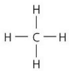</td><td>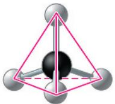</td><td></td></tr><tr><td>(b) Ethane. A molecule may have more than one tetrahedral group of single-bonded atoms. (Ethane consists of two such groups.)</td><td> $C_2H_6$ </td><td></td><td>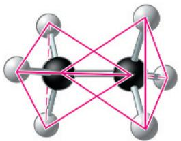</td><td>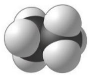</td></tr><tr><td>(c) Ethene (ethylene). When two carbon atoms are joined by a double bond, all atoms attached to those carbons are in the same plane, and the molecule is flat.</td><td> $C_2H_4$ </td><td></td><td></td><td></td></tr></table>

For example, ethane $\left(\mathrm{C}_{2}\mathrm{H}_{6}\right)$ is shaped like two overlapping tetrahedrons (Figure 4.3b). In molecules with more carbons, every grouping of a carbon bonded to four other atoms has a tetrahedral shape. But when two carbon atoms are joined by a double bond, as in ethene $\left(\mathrm{C}_{2}\mathrm{H}_{4}\right)$ , the bonds from both carbons are all in the same plane, so the atoms joined to those carbons are in the same plane as well (Figure 4.3c). We find it convenient to write molecules as structural formulas, as if the molecules being represented are two-dimensional, but keep in mind that molecules are three-dimensional and that the shape of a molecule is central to its function.

The number of electrons required to fill the valence shell of an atom is generally equal to the atom's valence, the number of covalent bonds it can form. Figure 4.4 shows the valences of carbon and its most frequent bonding partners—hydrogen, oxygen, and nitrogen. These are the four main atoms in organic molecules.

The electron configuration of carbon gives it covalent compatibility with many different elements. Let's consider how valence and the rules of covalent bonding apply to carbon atoms with partners other than hydrogen. We'll look at two examples, the simple molecules carbon dioxide and urea.

In the carbon dioxide molecule $\left(\mathrm{CO}_{2}\right)$ , a single carbon atom is joined to two atoms of oxygen by double covalent bonds. The structural formula for $CO_{2}$ is shown here:

$$
\mathrm{O} = \mathrm{C} = \mathrm{O}
$$

Each line in a structural formula represents a pair of shared electrons. Thus, the two double bonds in $CO_{2}$ have the same number of shared electrons as four single bonds. The arrangement completes the valence shells of all atoms in the molecule:

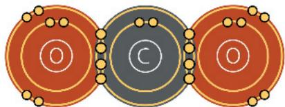

Because $CO_{2}$ is a very simple molecule and lacks hydrogen, it is often considered inorganic, even though it contains carbon. Whether we call $CO_{2}$ organic or inorganic, however, it is clearly important to the living world as the source of carbon, via photosynthetic organisms, for all organic molecules in organisms (see Concept 2.4).

Urea, $\mathrm{CO(NH_{2})_{2}}$ , is an organic compound found in urine. Again, each atom has the required number of covalent bonds. In this case, one carbon atom participates in both single and double bonds.

Urea and carbon dioxide are molecules with only one carbon atom. But a carbon atom

can also use one or more valence electrons to form covalent bonds to other carbon atoms, linking the atoms into chains, as shown here for $C_{3}H_{8}$ :

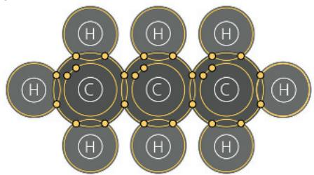

Figure 4.4 Valences of the major elements of organic molecules. Valence, the number of covalent bonds an atom can form, is generally equal to the number of electrons required to fill the valence shell. (Sodium, phosphorus, and chlorine are exceptions.)

<table><tr><td></td><td>Hydrogen</td><td>Oxygen</td><td>Nitrogen</td><td>Carbon</td></tr><tr><td>Lewis dot structure showing existing valence electrons</td><td>H·</td><td> $\cdot\ddot{O}:$ </td><td> $\cdot\ddot{N}\cdot$ </td><td> $\cdot\dot{C}\cdot$ </td></tr><tr><td>Electron distribution diagram with red dashed circles showing electrons needed to fill the valence shell</td><td></td><td></td><td></td><td></td></tr><tr><td>Number of electrons needed to fill the valence shell</td><td>1</td><td>2</td><td>3</td><td>4</td></tr><tr><td>Valence: Number of bonds the element can form</td><td>1</td><td>2</td><td>3</td><td>4</td></tr></table>

MAKE CONNECTIONS Draw the Lewis dot structures for sodium, silicon, phosphorus, sulfur, and chlorine. (Refer to Figure 2.7.)  
For suggested answer, see Appendix A.

## Molecular Diversity Arising from Variation in Carbon Skeletons

Carbon chains form the basis of most organic molecules. Carbon skeletons vary in length and may be straight, branched, or arranged in closed rings (Figure 4.5). Some carbon chains have double bonds, which vary in number and location. Such variation in carbon chains is one important source of the molecular complexity and diversity that characterize living matter. In addition, the skeletons of biological molecules often include atoms of other elements, like oxygen and phosphorus; such atoms can also be bonded to carbons of the skeleton.

## Hydrocarbons

All of the molecules that are shown in Figures 4.3 and 4.5 are hydrocarbons, organic molecules consisting of only carbon and hydrogen. Atoms of hydrogen are attached to the carbon skeleton wherever electrons are available for covalent bonding. Hydrocarbons are the major components of petroleum, which is called a fossil fuel because it consists of the partially decomposed remains of organisms that lived millions of years ago.

## Interview

Interview with Deborah Gordon: Studying how ants use hydrocarbons to communicate (eTextbook only)

Although hydrocarbons are not prevalent in most living organisms, some of a cell's organic molecules have regions consisting of only carbon and hydrogen. For example, the molecules known as fats have long hydrocarbon tails attached to a nonhydrocarbon component (Figure 4.6). Neither petroleum nor

  
1-Butene  
Figure 4.5 Four ways that carbon skeletons can vary.

## (a) Length

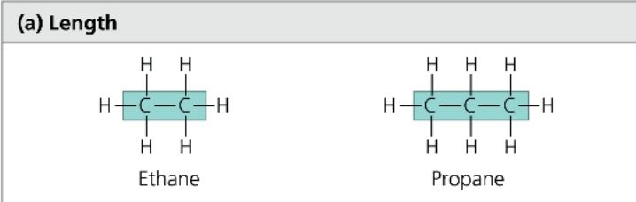  
Carbon skeletons vary in length.

## (b) Branching

## (c) Double bond position

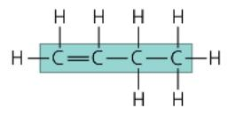

  
The skeleton may have double bonds, which can vary in location.

## (d) Presence of rings

  
Some carbon skeletons are arranged in rings. In the abbreviated structural formula for each compound (to its right), each corner represents a carbon and its attached hydrogens.

fat dissolves in water; both are hydrophobic compounds because the great majority of their bonds are relatively nonpolar carbon-to-hydrogen linkages. Another characteristic of hydrocarbons is that they can undergo reactions that release a relatively large amount of energy. The gasoline that fuels a car consists of hydrocarbons, and the hydrocarbon tails of fats serve as stored fuel for plant embryos (seeds) and animals.

## Isomers

Variation in the architecture of organic molecules can be seen in isomers, compounds that have the same numbers of atoms of the same elements but different structures and hence different

## Figure 4.6 The role of hydrocarbons in fats.

(a) Mammalian adipose cells stockpile fat molecules as a fuel reserve. This colorized micrograph shows part of a human adipose cell with many fat droplets, each containing a large number of fat molecules. (b) A fat molecule consists of a small, nonhydrocarbon component joined to three hydrocarbon tails that account for the hydrophobic behavior of fats. The tails can be broken down to provide energy. (Black = carbon; gray = hydrogen; red = oxygen.)

Skeletons may be unbranched or branched.  
  
(a) Part of a human adipose cell (b) A fat molecule  
MAKE CONNECTIONS How do the tails account for the hydrophobic nature of fats? (See Concept 3.2.)
For suggested answer, see Appendix A.

properties. We will examine three types of isomers: structural isomers, cis-trans isomers, and enantiomers.

Structural isomers differ in the covalent arrangements of their atoms. Compare, for example, the two five-carbon compounds in Figure 4.7a. Both have the molecular formula $C_{5}H_{12}$ , but they differ in the covalent arrangement of their carbon skeletons. The skeleton is straight in one compound but branched in the other. The number of possible isomers increases tremendously as carbon skeletons increase in size. There are only three forms of $C_{5}H_{12}$ (two of which are shown in Figure 4.7a), but there are 18 variants of $C_{8}H_{18}$ and 366,319 possible structural isomers of $C_{20}H_{42}$ . Structural isomers may also differ in the location of double bonds.

In cis-trans isomers (also known as geometric isomers), carbons have covalent bonds to the same atoms, but these atoms differ in their spatial arrangements due to the inflexibility of double bonds. Single bonds allow the atoms they join to rotate freely about the bond axis without changing the compound. In contrast, double bonds do not permit such rotation. If a double bond joins two carbon atoms, and each C also has two different atoms (or groups of atoms) attached to it, then two distinct cis-trans isomers are possible. Consider a simple molecule with two double-bonded carbons, each of which has an H and an X attached to it (Figure 4.7b). The arrangement with both Xs on the same side of the double bond is called a cis isomer, and that with the Xs on opposite sides is called a trans isomer. The subtle difference in shape between such isomers can have a dramatic effect on the biological activities of organic molecules. For example, the biochemistry of vision involves a light-induced change of retinal, a chemical compound in the eye, from the cis isomer to the trans isomer (see Figure 50.17). Another example involves trans fats, harmful fats formed during food processing that are discussed in Concept 5.3.

2-Methylbutane

Figure 4.7 Three types of isomers.

Isomers are compounds that have the same molecular formula but different structures.

## (a) Structural isomers

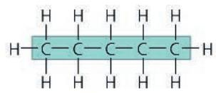

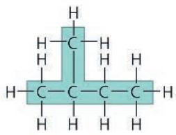  
Structural isomers differ in the arrangement of covalent bonding partners, as shown in these two isomers of $C_{5}H_{12}$ .

## (b) Cis-trans isomers (also known as geometric isomers)

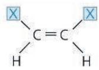

  
cis isomer: The two Xs are on the same side.  
trans isomer: The two Xs are on opposite sides.  
Cis-trans isomers differ in arrangement about a double bond. In these diagrams, X represents an atom or group of atoms attached to a double-bonded carbon.

## (c) Enantiomers

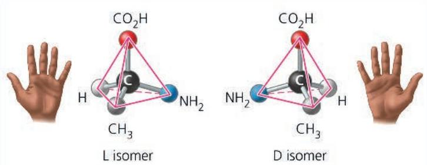  
Enantiomers differ in spatial arrangement around an asymmetric carbon, resulting in molecules that are mirror images, like left and right hands. The two isomers here are designated the L and D isomers from the Latin for "left" and "right" (levo and dextro). Enantiomers cannot be superimposed on each other.

For suggested answer, see Appendix A.

Enantiomers are isomers that are mirror images of each other and that differ in shape due to the presence of an asymmetric carbon, one that is attached to four different atoms or groups of atoms. (See the middle carbon in the ball-and-stick models shown in Figure 4.7c.) The four groups can be arranged in space around the asymmetric carbon in two different ways that are mirror images. Enantiomers are, in a way, left-handed and right-handed versions of the molecule. Just as your right hand won't fit into a left-handed glove, a "right-handed" molecule won't fit into the same space as the "left-handed" version. Usually, only one isomer is biologically active because only that form can bind to specific molecules in an organism.

DRAW IT There are three structural isomers of $C_{5}H_{12}$ ; draw the one not shown in (a).  
Figure 4.8 The pharmacological importance of enantiomers.  
Ibuprofen and albuterol are drugs whose enantiomers have different effects. (S and R are used here to distinguish between enantiomers, rather than D and L as in Figure 4.7c.) Ibuprofen is commonly sold as a mixture of the two enantiomers; the S enantiomer is 100 times more effective than the R form. Albuterol is synthesized and sold only as the R form of that drug; the S form counteracts the active R form.

<table><tr><td>Drug</td><td>Effects</td><td>Effective Enantiomer</td><td>Ineffective Enantiomer</td></tr><tr><td>Ibuprofen</td><td>Reduces inflammation and pain</td><td>S-Ibuprofen</td><td>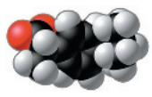R-Ibuprofen</td></tr><tr><td>Albuterol</td><td>Relaxes bronchial (airway) muscles, improving airflow in asthma patients</td><td>R-Albuterol</td><td>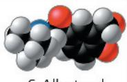S-Albuterol</td></tr></table>

The concept of enantiomers is important in the pharmaceutical industry because the two enantiomers of a drug may not be equally effective, as is the case for both ibuprofen and the asthma medication albuterol (Figure 4.8). Methamphetamine also occurs in two enantiomers that have very different effects. One enantiomer is the highly addictive stimulant drug known as “crank,” sold illegally in the street drug trade. The other has a much weaker effect and is the active ingredient in an over-the-counter vapor inhaler for treatment of nasal congestion. The differing effects of enantiomers in the body demonstrate that organisms are sensitive to even the subtlest variations in molecular architecture. Once again, we see that molecules have emergent properties that depend on the specific arrangement of their atoms.

## Concept Check 4.2

1. DRAW IT (a) Draw a structural formula for $C_{2}H_{4}$ . (b) Draw the trans isomer of $C_{2}H_{2}Cl_{2}$ .

2. VISUAL SKILLS Which two pairs of molecules in Figure 4.5 are isomers? For each pair, identify the type of isomer.

3. How are gasoline and fat chemically similar?

4. VISUAL SKILLS See Figures 4.5a and 4.7. Can propane $(\mathrm{C}_3\mathrm{H}_8)$ form isomers? Explain.

For suggested answers, see Appendix A.

## Concept 4.3: A few chemical groups are key to molecular function

The distinctive properties of an organic molecule depend not only on the arrangement of its mostly carbon skeleton but also on the various chemical groups attached to that skeleton. These groups may participate in chemical reactions or may contribute to

function indirectly by their effects on molecular shape; they help give each molecule its unique properties.

## The Chemical Groups Most Important in the Processes of Life

Consider the differences between estradiol (a type of estrogen) and testosterone. These compounds are female and male sex hormones, respectively, in humans and other vertebrates. Both are steroids, organic molecules with a common carbon skeleton in the form of four fused rings. They differ only in the chemical groups attached to the rings (shown here in abbreviated form, where each corner represents a carbon and its attached hydrogens); the distinctions in molecular architecture are marked with a dotted line:

The different actions of these two molecules on many targets throughout the body are the basis of sexual characteristics, producing the contrasting features of male and female vertebrates. In this case, the chemical groups are important because they affect molecular shape, contributing to function.

In other cases, chemical groups are directly involved in chemical reactions; such groups are known as functional groups. Each has certain properties, such as shape and charge, that cause it to participate in chemical reactions in a characteristic way.

The seven chemical groups most important in biological processes are the hydroxyl group, carbonyl group, carboxyl group, amino group, sulfhydryl group, phosphate group, and methyl group. The first six groups can be chemically reactive (thus are functional groups); of these six, all except the sulfhydryl group are also hydrophilic and thus increase the solubility of organic compounds in water. The methyl group is not reactive, but instead often serves as a recognizable tag on biological molecules. Study Figure 4.9, on the next page, to become familiar with these biologically important chemical groups. Note in the Examples column of the figure that the carboxyl group and the amino group are ionized at normal cellular pH.

## ATP: An Important Source of Energy for Cellular Processes

The “Phosphate group” row in Figure 4.9 shows a simple example of an organic phosphate molecule. A more complicated organic phosphate, adenosine triphosphate, or ATP, is worth mentioning here because its function in the cell is so important.

ATP consists of an organic molecule called adenosine attached to a string of three phosphate groups:

Where three phosphates are present in series, as in ATP, one phosphate may be split off as a result of a reaction with water. This inorganic phosphate ion, HOPO $_{3}^{2-}$ , is often abbreviated $\textcircled{P}_{i}$ in this book, and a phosphate group in an organic molecule is often written as $\textcircled{P}$ . Having lost one phosphate, ATP becomes adenosine $d$ iphosphate, or ADP. Although ATP is sometimes said to store energy, it is more accurate to think of it as storing the potential to react with water or other molecules. Overall, the process releases energy that can be used by the cell. You'll learn more about this in Concept 8.3.

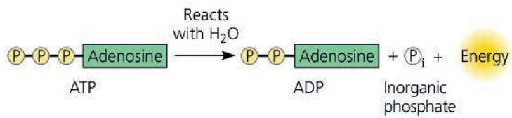

## The Chemical Elements of Life: A Review

Living matter, as you have learned, consists mainly of carbon, oxygen, hydrogen, and nitrogen, with smaller amounts of sulfur and phosphorus. These elements all form strong covalent bonds, an essential characteristic in the architecture of complex organic molecules. Of all these elements, carbon is the virtuoso of the covalent bond. The versatility of carbon makes possible the great diversity of organic molecules, each with particular properties that emerge from the unique arrangement of its mostly carbon skeleton and the chemical groups attached to that skeleton. This variation at the molecular level provides the foundation for the rich biological diversity found on our planet.

## Concept Check 4.3

1. VISUAL SKILLS What does the term amino acid signify about the structure of such a molecule? See Figure 4.9.

2. What chemical change occurs to ATP when it reacts with water and releases energy?

3. DRAW IT Suppose you had an organic molecule such as cysteine (see Figure 4.9, sulfhydryl group example), and you chemically removed the $-NH_{2}$ group and replaced it with —COOH. Draw this structure. How would this change the chemical properties of the molecule? Is the central carbon asymmetric before the change? After?

Figure 4.9 Some biologically important chemical groups.

<table><tr><td>Chemical Group</td><td>Group Properties and Compound Name</td><td colspan="2">Examples</td></tr><tr><td>Hydroxyl group (—OH)(Note: By convention, the bond between the O and H is typically not depicted.)</td><td>Is polar due to electronegative oxygen. Forms hydrogen bonds with water, helping dissolve compounds such as sugars.Compound name:Alcohol(specific name usually ends in -o/)</td><td></td><td>Ethanol, the alcohol present in alcoholic beverages</td></tr><tr><td>Carbonyl group (&gt;C=O)</td><td>Sugars with ketone groups are called ketoses; those with aldehydes are calledaldoses.Compound name:Ketone(carbonyl group is within a carbon skeleton) oraldehyde(carbonyl group is at the end of acarbon skeleton)</td><td>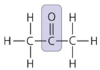Acetone, the simplest ketone</td><td>Propanal, an aldehyde</td></tr><tr><td>Carboxyl group (—COOH)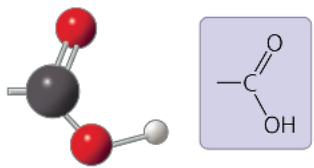</td><td>Acts as an acid (can donate  $H^{+}$ ) because the covalent bond between oxygen and hydrogen is so polar.Compound name:Carboxylic acid, ororganic acid</td><td>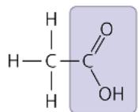Acetic acid, which givesvinegar its sour taste</td><td>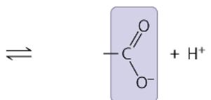Ionized form of —COOH (carboxylate ion), found in cells</td></tr><tr><td>Amino group (— $NH_{2}$ )</td><td>Acts as a base; can pick up an  $H^{+}$  from the surrounding solution (water, in living organisms).Compound name:Amine</td><td>Glycine, an amino acid(note its carboxyl group)</td><td>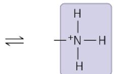Ionized form of — $NH_{2}$ , found in cells</td></tr><tr><td>Sulfhydryl group (—SH)</td><td>Two — SH groups can react, forming a “cross-link” that helps stabilize protein structure. Hair protein cross-links maintain the straightness or curliness of hair; in hair salons, “permanent” treatments break cross-links, then re-form them while the hair is in the desired shape.Compound name:Thiol</td><td>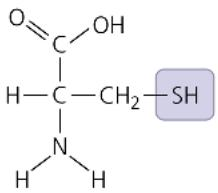</td><td>Cysteine, a sulfur-containing amino acid</td></tr><tr><td>Phosphate group ( $—OPO_{3}^{2-}$ )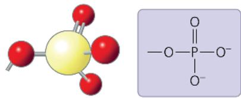</td><td>Contributes negative charge (1– when positioned inside a chain of phosphates; 2– when at the end). When attached, confers on a molecule the ability to react with water, releasing energy.Compound name:Organic phosphate</td><td>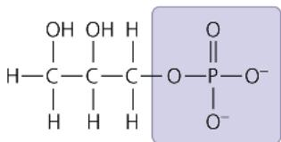</td><td>Glycerol phosphate, which takes part in many important chemical reactions in cells</td></tr><tr><td>Methyl group ( $—CH_{3}$ )</td><td>Affects the expression of genes when bonded to DNA or to proteins that bind to DNA. Affects the shape and function of male and female sex hormones.Compound name:Methylated compound</td><td>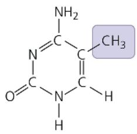</td><td>5-Methylcytosine:Cytosine, a component of DNA, has been modified by addition of a methyl group.</td></tr></table>

# Chapter 4 Review

## Summary of Key Concepts

To review key terms, go to the Vocabulary Self-Quiz (eTextbook only).

## Concept 4.1: Organic chemistry is key to the origin of life

\- Organic compounds, once thought to arise only within living organisms, were finally synthesized in the laboratory.

\- Living matter is made mostly of carbon, oxygen, hydrogen, and nitrogen. Biological diversity results from carbon's ability to form a huge number of molecules with particular shapes and properties.

How did Stanley Miller's experiments support the idea that, even at life's origins, physical and chemical laws govern the processes of life?

## Concept 4.2: Carbon atoms can form diverse molecules by bonding to four other atoms

\- Carbon, with a valence of 4, can bond to various other atoms, including O, H, and N. Carbon can also bond to other carbon atoms, forming the carbon skeletons of organic compounds. These skeletons vary in length and shape and have bonding sites for atoms of other elements.

• Hydrocarbons consist of carbon and hydrogen.

\- Isomers are compounds that have the same molecular formula but different structures and therefore different properties. Three types of isomers are structural isomers, cis-trans isomers, and enantiomers.

VISUAL SKILLS Refer back to Figure 4.9. What type of isomers are acetone and propanal? How many asymmetric carbons are present in acetic acid, glycine, and glycerol phosphate? Can these three molecules exist as forms that are enantiomers?

## Concept 4.3: A few chemical groups are key to molecular function

\- Chemical groups attached to the carbon skeletons of organic molecules participate in chemical reactions (functional groups) or contribute to function by affecting molecular shape (see Figure 4.9).

\- ATP (adenosine triphosphate) consists of adenosine attached to three phosphate groups. ATP can react with water or other molecules, forming ADP (adenosine diphosphate) and inorganic phosphate. This reaction releases energy that can be used by the cell.

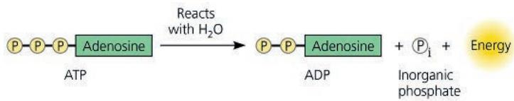  
In what ways does a methyl group differ chemically from the other six important chemical groups shown in Figure 4.9?  
For suggested answers, see Appendix A.

## Test Your Understanding

For more multiple-choice questions, go to the Practice Test (eTextbook only).

## Levels 1-2: Remembering/Understanding

1. Organic chemistry is currently defined as

(A) the study of compounds made only by living cells.

(B) the study of carbon compounds.

(C) the study of natural (as opposed to synthetic) compounds.

(D) the study of hydrocarbons.

## 2. VISUAL SKILLS Which functional group is present in this

molecule?

(A) sulfhydryl

(B) carboxyl

(C) methyl

(D) phosphate

3. MAKE CONNECTIONS Which chemical group is most likely to be responsible for an organic molecule behaving as a base (see Concept 3.3)?

(A) hydroxyl

(B) carbonyl

(C) amino

(D) phosphate

## Levels 3-4: Applying/Analyzing

4. VISUAL SKILLS Visualize the structural formula of each of the following hydrocarbons. Which hydrocarbon has a double bond in its carbon skeleton?

(A) $C_{3}H_{8}$

(B) $C_{2}H_{6}$

(C) $C_{2}H_{4}$

(D) $C_{2}H_{2}$

5. VISUAL SKILLS Choose the term that correctly describes the relationship between these two sugar molecules.

(A) structural isomers

(B) cis-trans isomers

(C) enantiomers

(D) isotopes

6. VISUAL SKILLS Identify the asymmetric carbon in this molecule.

