7. Which action could produce a carbonyl group?

(A) the replacement of the —OH of a carboxyl group with hydrogen

(B) the addition of a thiol to a hydroxyl

(C) the addition of a hydroxyl to a phosphate

(D) the replacement of the nitrogen of an amine with oxygen

8. VISUAL SKILLS Which of the molecules shown in question 5 has an asymmetric carbon? Which carbon is asymmetric?

## Levels 5-6: Evaluating/Creating

9. EVOLUTION CONNECTION • DRAW IT Some scientists think that life elsewhere in the universe might be based on the element silicon, rather than on carbon, as on Earth. Look at the electron distribution diagram for silicon in Figure 2.7 and draw the Lewis dot structure for silicon. What properties does silicon share with carbon that would make silicon-based life more likely than, say, neon-based life or aluminum-based life?

10. SCIENTIFIC INQUIRY In the late 1950s and early 1960s, thousands of pregnant patients who were prescribed thalidomide for morning sickness gave birth to children with missing limbs and other congenital abnormalities. Thalidomide is a mixture of two enantiomers; one reduces morning sickness, but the other causes severe congenital deformities. Today, the FDA has approved this drug for non-pregnant individuals with Hansen's disease (leprosy) or newly diagnosed multiple myeloma, a blood and bone marrow cancer. The beneficial enantiomer can be synthesized and given to patients, but over time, both the beneficial and the harmful enantiomer can be detected in the body. Propose a possible explanation for the presence of the harmful enantiomer.

11. WRITE ABOUT A THEME: ORGANIZATION In 1918, an epidemic of sleeping sickness caused an unusual rigid paralysis in some survivors, similar to symptoms of advanced Parkinson's disease. Years later, L-dopa (below, left), a chemical used to treat Parkinson's disease, was given to some of these patients. L-dopa was remarkably effective at eliminating the paralysis, at least temporarily. However, its enantiomer, D-dopa (right), was subsequently shown to have no effect at all, as is the case for Parkinson's disease. In a short essay (100–150 words), discuss how the effectiveness of one enantiomer and not the other illustrates the theme of structure and function.

  
L-dopa

  
D-dopa

## 12. SYNTHESIZE YOUR KNOWLEDGE

  
Explain how the chemical structure of the carbon atom accounts for the differences between the male and female lions seen in the photo.  
For selected answers, see Appendix A.

# The Structure and Function of Large Biological Molecules

## Key Concepts

5.1 Macromolecules are polymers, built from monomers

5.2 Carbohydrates serve as fuel and building material

5.3 Lipids are a diverse group of hydrophobic molecules

5.4 Proteins include a diversity of structures, resulting in a wide range of functions

5.5 Nucleic acids store, transmit, and help express hereditary information

5.6 Genomics and proteomics have transformed biological inquiry and applications

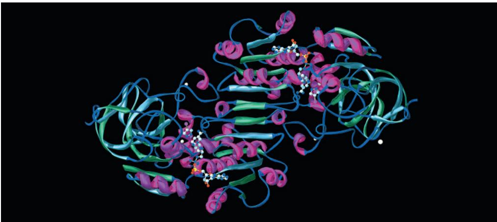  
Figure 5.1 Alcohol dehydrogenase, a protein that breaks down alcohol in the body, is shown here as a molecular model. The form of this protein that an individual possesses affects how well that person tolerates drinking alcohol. Proteins are one class of large molecules, or macromolecules.

## Study Tip

Make a visual study guide: For each class of biological molecules, draw two examples and list their structural similarities and their functions.

<table><tr><td colspan="2">Important Biological Molecules</td></tr><tr><td>Carbohydrates</td><td>Proteins</td></tr><tr><td>Nucleic acids</td><td>Lipids</td></tr></table>

## What are the structures and functions of the four important classes of biological molecules?

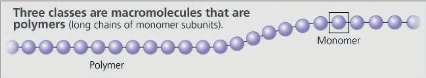

Carbohydrates are a source of energy and provide structural support.

  
Carbohydrate (starch)  
Nucleic acids store genetic information and function in gene expression.

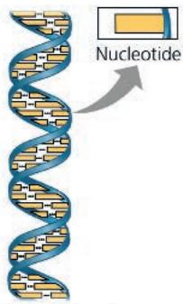  
Nucleic acid (DNA)

  
Protein (alcohol dehydrogenase)

## The fourth class, lipids, are not polymers or macromolecules.

Lipids are a group of diverse molecules that do not mix well with water. Key functions include providing energy, making up cell membranes, and acting as hormones.

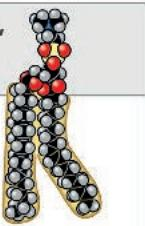  
Lipid (phospholipid)

# Concept 5.1: Macromolecules are polymers, built from monomers

Large carbohydrates, proteins, and nucleic acids, also known as macromolecules for their huge size, are chain-like molecules called polymers (from the Greek polys, many, and meros, part). A polymer is a long molecule consisting of many similar or identical building blocks linked by covalent bonds, much as a train consists of a chain of boxcars. The repeating units that serve as the building blocks of a polymer are smaller molecules called monomers (from the Greek monos, single). In addition to forming polymers, some monomers have functions of their own.

## The Synthesis and Breakdown of Polymers

Although each class of polymer is made up of a different type of monomer, the chemical mechanisms by which cells make polymers (polymerization) and break them down are similar for all classes of large biological molecules. In cells, these processes are facilitated by enzymes, specialized macromolecules (usually proteins) that speed up chemical reactions. The reaction that connects a monomer to another monomer or a polymer is a condensation reaction, a reaction in which two molecules are covalently bonded to each other with the loss of a small molecule. If a water molecule is lost, it is known as a dehydration reaction. For example, carbohydrate and protein polymers are synthesized by dehydration reactions. Each reactant contributes part of the water molecule that is released during the reaction: One provides a hydroxyl group (—OH), while the other provides a hydrogen (—H) (Figure 5.2a). This reaction is repeated as monomers are added to the chain one by one, lengthening the polymer.

Polymers are disassembled to monomers by hydrolysis, a process that is essentially the reverse of the dehydration reaction (Figure 5.2b). Hydrolysis means water breakage (from the Greek hydro, water, and lysis, break). The bond between monomers is broken by the addition of a water molecule, with a hydrogen from water attaching to one monomer and the hydroxyl group attaching to the other. An example of hydrolysis within our bodies is the process of digestion. The bulk of the organic material in our food is in the form of polymers that are much too large to enter our cells. Within the digestive tract, various enzymes attack the polymers, speeding up hydrolysis. Released monomers are then absorbed into the bloodstream for distribution to all body cells. Those cells can then use dehydration reactions to assemble the monomers into new, different polymers that can perform specific functions required by the cell. (Dehydration reactions and hydrolysis can also be involved in the formation and breakdown of molecules that are not polymers, such as some lipids.)

Figure 5.2 The synthesis and breakdown of carbohydrate and protein polymers.

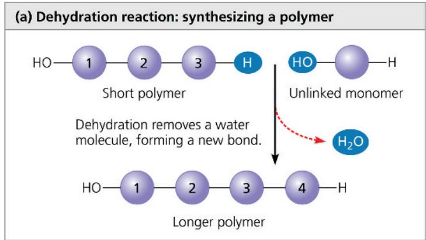

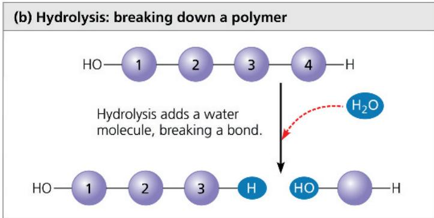

## The Diversity of Polymers

A cell has thousands of different macromolecules; the collection varies from one type of cell to another. The inherited differences between close relatives, such as human siblings, reflect small variations in polymers, particularly DNA and proteins. Molecular differences between unrelated individuals are more extensive, and those between species greater still. The diversity of macromolecules in the living world is vast, and the possible variety is effectively limitless.

What is the basis for such diversity in life's polymers? These molecules are constructed from only 40 to 50 common monomers and some others that occur rarely. Building a huge variety of polymers from such a limited number of monomers is analogous to constructing hundreds of thousands of words from only 26 letters of the alphabet. The key is arrangement—the particular linear sequence that the units follow. However, this analogy falls far short of describing the great diversity of macromolecules because most biological polymers have many more monomers than the number of letters in even the longest word. Proteins, for example, are built from 20 kinds of amino acids arranged in chains that are typically hundreds of amino acids long. The molecular logic of life is simple but elegant: Small molecules common to all organisms act as building blocks that are ordered into unique macromolecules.

Despite this immense diversity, molecular structure and function can still be grouped roughly by class. Let's examine each of the four major classes of large biological molecules. For each class, the large molecules have emergent properties not found in their individual components.

## Concept Check 5.1

1. What are the four main classes of large biological molecules? Which class does not consist of polymers?

2. How many molecules of water are needed to completely hydrolyze a polymer that is ten monomers long?

3. WHAT IF? If you eat a piece of fish, what reactions must occur for the amino acid monomers in the protein of the fish to be converted to new proteins in your body?

For suggested answers, see Appendix A.

## Concept 5.2: Carbohydrates serve as fuel and building material

Carbohydrates include sugars and polymers of sugars. The simplest carbohydrates are the monosaccharides, or simple sugars; these are the monomers from which more complex carbohydrates are built. Disaccharides are double sugars, consisting of two monosaccharides joined by a covalent bond. Carbohydrate macromolecules are polymers called polysaccharides, composed of many sugar building blocks.

## Sugars

Monosaccharides (from the Greek monos, single, and sacchar, sugar) generally have molecular formulas that are some multiple of the unit $CH_{2}O$ . Glucose ( $C_{6}H_{12}O_{6}$ ), the most common monosaccharide, is of central importance in the chemistry of life. In the structure of glucose, we can see the trademarks of a monosaccharide: The molecule has a carbonyl group, $\bigg\backslash C=O$ , and multiple hydroxyl groups, —OH (Figure 5.3). Depending on the location of the carbonyl group, a monosaccharide is either an aldose (aldehyde sugar) or a ketose (ketone sugar). Glucose, for example, is an aldose; fructose, an isomer of glucose, is a ketose. (Most names for sugars end in -ose.) Another criterion for classifying monosaccharides is the size of the carbon skeleton, which ranges from three to seven carbons long. Glucose, fructose, and other sugars that have six carbons are called hexoses. Trioses (three-carbon sugars) and pentoses (five-carbon sugars) are also common.

Still another source of diversity for simple sugars is in the way their parts are arranged spatially around asymmetric carbons. (Recall that an asymmetric carbon is a carbon attached to four different atoms or groups of atoms.) Glucose and galactose, for example, differ only in the placement of parts around one asymmetric carbon (see the purple boxes with dashed outline in Figure 5.3). What seems like a small difference is significant enough to give the two sugars distinctive shapes and binding activities, thus different behaviors.

Although it is convenient to draw glucose with a linear carbon skeleton, this representation is not completely accurate. In aqueous solutions, glucose molecules, as well as most other

## Figure 5.3 The structure and classification of some monosaccharides.

Sugars vary in the location of the carbonyl group (orange, with solid outline), the length of their carbon skeletons, and the way their parts are arranged spatially around asymmetric carbons (compare, for example, the portions of glucose and galactose highlighted purple with a dashed outline).

<table><tr><td>Aldoses (Aldehyde Sugars)Carbonyl group at end of carbon skeleton</td><td>Ketoses (Ketone Sugars)Carbonyl group within carbon skeleton</td></tr><tr><td colspan="2">Trioses: three-carbon sugars ( $C_3H_6O_3$ )</td></tr><tr><td>GlyceraldehydeAn initial breakdown product of glucose</td><td>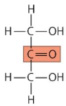DihydroxyacetoneAn initial breakdown product of glucose</td></tr><tr><td colspan="2">Pentoses: five-carbon sugars ( $C_5H_{10}O_5$ )</td></tr><tr><td>RiboseA component of RNA</td><td>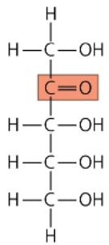RibuloseAn intermediate in photosynthesis</td></tr><tr><td colspan="2">Hexoses: six-carbon sugars ( $C_6H_{12}O_6$ )</td></tr><tr><td>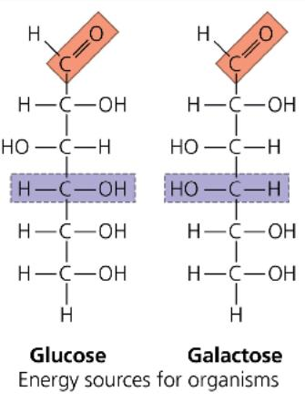</td><td>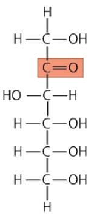FructoseAn energy source for organisms</td></tr></table>

MAKE CONNECTIONS In the 1970s, a process was developed that converts the glucose in corn syrup to its sweeter-tasting isomer, fructose. High-fructose corn syrup, a common ingredient in soft drinks and processed food, is a mixture of glucose and fructose. What type of isomers are glucose and fructose? (See Figure 4.7.)

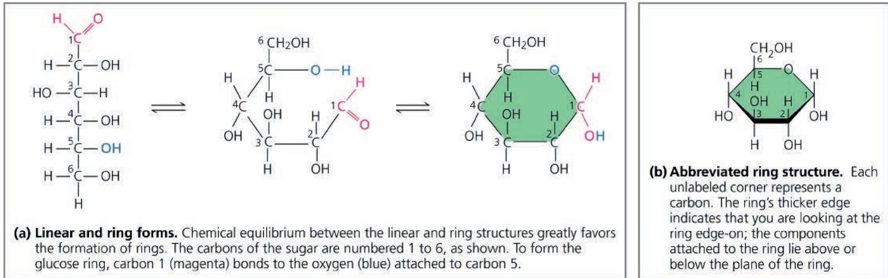  
Figure 5.4 Linear and ring forms of glucose.  
DRAW IT Start with the linear form of fructose (see Figure 5.3) and draw the formation of the fructose ring in two steps, as shown in (a). First, number the carbons starting at the top of the linear structure. Then, draw the molecule in a ringlike orientation, attaching carbon 5 via its oxygen to carbon 2. Compare the number of carbons in the ring portions of fructose and glucose.  
For suggested answer, see Appendix A.

(a) Linear and ring forms. Chemical equilibrium between the linear and ring structures greatly favors the formation of rings. The carbons of the sugar are numbered 1 to 6, as shown. To form the glucose ring, carbon 1 (magenta) bonds to the oxygen (blue) attached to carbon 5.

(b) Abbreviated ring structure. Each unlabeled corner represents a carbon. The ring's thicker edge indicates that you are looking at the ring edge-on; the components attached to the ring lie above or below the plane of the ring.

five- and six-carbon sugars, form rings, because they are the most stable form of these sugars under physiological conditions (Figure 5.4).

Monosaccharides, particularly glucose, are major nutrients for cells. In the process known as cellular respiration, cells extract energy from glucose molecules by breaking them down in a series of reactions. Not only are monosaccharides a major fuel for cellular work, but their carbon skeletons also serve as raw material for the synthesis of other types of small organic molecules, such as amino acids and fatty acids. Monosaccharides that are not

immediately used in these ways are generally incorporated as monomers into disaccharides or polysaccharides, discussed next.

A disaccharide consists of two monosaccharides joined by a glycosidic linkage, a covalent bond formed between two monosaccharides by a dehydration reaction (glyco refers to carbohydrate). For example, maltose is a disaccharide formed by the linking of two molecules of glucose (Figure 5.5a). Also known as malt sugar, maltose is an ingredient used in brewing beer. The most prevalent disaccharide is sucrose, or table sugar. Its two monomers are glucose and fructose (Figure 5.5b). Plants generally (a) Starch stored in plant cells, (b) glycogen stored in muscle cells, and (c) structural cellulose fibers in plant cell walls are all polysaccharides composed entirely of glucose monomers (green hexagons). In starch and glycogen, the polymer chains tend to form helices in unbranched regions because of the angle of the 1–4 linkages between glucose molecules. There are two kinds of starch: amylose and amylopectin. Cellulose, with a different kind of glucose linkage, is always unbranched.

Figure 5.5 Examples of disaccharide synthesis.  
  
DRAW IT Referring to Figures 5.3 and 5.4, number the carbons in each sugar in this figure.  
How does the name of each linkage relate to the numbers?  
For suggested answer, see Appendix A.

transport carbohydrates from leaves to roots and other nonphotosynthetic organs in the form of sucrose. Lactose, the sugar present in milk, is another disaccharide, in this case a glucose molecule joined to a galactose molecule. Disaccharides must be broken down into monosaccharides to be used for energy by organisms. Lactose intolerance is a common condition in humans who lack lactase, the enzyme that breaks down lactose. The sugar is instead broken down by intestinal bacteria, causing formation of gas and subsequent cramping. The problem may be avoided by taking the enzyme lactase when eating or drinking dairy products or consuming dairy products that have already been treated with lactase to break down the lactose.

## Polysaccharides

Polysaccharides are macromolecules, polymers with a few hundred to a few thousand monosaccharides joined by glycosidic linkages. Some polysaccharides serve as storage material, hydrolyzed as needed to provide monosaccharides for cells. Other polysaccharides serve as building material for structures that protect the cell or the whole organism. The architecture and function of a polysaccharide are determined by its monosaccharides and by the positions of its glycosidic linkages.

## Storage Polysaccharides

Both plants and animals store sugars for later use in the form of storage polysaccharides (Figure 5.6). Plants store starch, a polymer of glucose monomers, as granules within cellular structures known as plastids. (Plastids include chloroplasts.) Synthesizing starch enables the plant to stockpile surplus glucose. Because glucose is a major cellular fuel, starch represents stored energy. The sugar can later be withdrawn by the plant from this carbohydrate “bank” by hydrolysis, which breaks the bonds between the glucose monomers.

Figure 5.6 Polysaccharides of plants and animals.  

Most animals, including humans, also have enzymes that can hydrolyze plant starch, making glucose available as a nutrient for cells. Potato tubers and grains—the fruits of wheat, maize (corn), rice, and other grasses—are the major sources of starch in the human diet.

Most of the glucose monomers in starch are joined by 1–4 linkages (number 1 carbon to number 4 carbon), like the glucose units in maltose (see Figure 5.5a). The simplest form of starch, amylose, is unbranched. Amylopectin, a more complex starch, is a branched polymer with 1–6 linkages at the branch points. Both of these starches are shown in Figure 5.6a.

Animals store a polysaccharide called glycogen, a polymer of glucose that is like amylopectin but more extensively branched (Figure 5.6b). Vertebrates store glycogen mainly in liver and muscle cells. Breakdown of glycogen in these cells releases glucose when the demand for energy increases. (The extensively branched structure of glycogen fits its function: More free ends are available for breakdown.) This stored fuel cannot sustain an animal for long, however. In humans, for example, glycogen stores are depleted in about a day unless they are replenished by eating. This is an issue of concern in low-carbohydrate diets, which can result in weakness and fatigue.

## Structural Polysaccharides

Organisms build strong materials from structural polysaccharides. For example, the polysaccharide called cellulose is a major component of the tough walls that enclose plant cells (Figure 5.6c). Globally, plants produce almost $10^{14}$ kg (100 billion tons) of cellulose per year; it is the most abundant organic compound on Earth.

Like starch, cellulose is a polymer of glucose with 1–4 glycosidic linkages, but the linkages in these two polymers differ. The difference is based on the fact that there are actually two slightly different ring structures for glucose (Figure 5.7a). When glucose forms a ring, the hydroxyl group attached to the number 1 carbon is positioned either below or above the plane of the ring. These two ring forms for glucose are called alpha ( $\alpha$ ) and beta ( $\beta$ ), respectively. (Greek letters are often used as a “numbering” system for different versions of biological structures, much as we use the letters a, b, c, and so on for the parts of a question or a figure.) In starch, all the glucose monomers are in the $\alpha$ configuration (Figure 5.7b), the arrangement we saw in Figures 5.4 and 5.5. In contrast, the glucose monomers of cellulose are all in the $\beta$ configuration, making every glucose monomer “upside down” with respect to its neighbors (Figure 5.7c; see also Figure 5.6c).

The differing glycosidic linkages in starch and cellulose give the two molecules distinct three-dimensional shapes. Certain starch molecules are largely helical, fitting their function of efficiently storing glucose units. Conversely, a cellulose molecule is straight. Cellulose is never branched, and some hydroxyl groups on its glucose monomers are free to hydrogen-bond with the hydroxyls of other cellulose molecules lying parallel to it. In plant cell walls, parallel cellulose molecules held together in this way are grouped into units called microfibrils (see Figure 5.6c). These cable-like microfibrils are a strong building material for plants and an important substance for humans because cellulose is the major constituent of paper and the only component of cotton. The unbranched structure of cellulose thus fits its function: imparting strength to parts of the plant.

Figure 5.7 Starch and cellulose structures.  
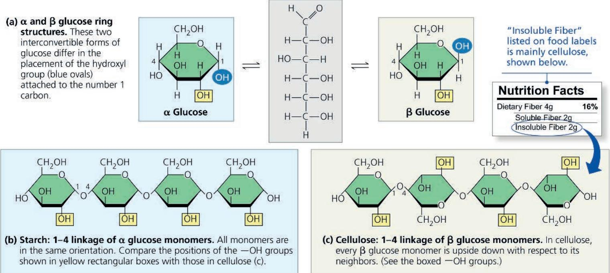

Enzymes that digest starch by hydrolyzing its $\alpha$ linkages are unable to hydrolyze the $\beta$ linkages of cellulose due to the different shapes of these two molecules. In fact, few organisms possess enzymes that can digest cellulose. Almost all animals, including humans, do not; the cellulose in our food passes through the digestive tract and is eliminated with the feces. Along the way, the cellulose abrades the wall of the digestive tract and stimulates the lining to secrete mucus, which aids in the smooth passage of food through the tract. Thus, although cellulose is not a nutrient for humans, it is an important part of a healthy diet. Most fruits, vegetables, and whole grains are rich in cellulose. On food packages, “insoluble fiber” refers mainly to cellulose (see Figure 5.7).

Some microorganisms can digest cellulose, breaking it down into glucose monomers. A cow harbors cellulose-digesting prokaryotic and eukaryotic microorganisms in its gut. These microorganisms hydrolyze the cellulose of hay and grass and convert the glucose to other compounds that nourish the cow. Similarly, a termite, which is unable to digest cellulose by itself, has microorganisms living in its gut that can make a meal of wood. Some fungi can also digest cellulose in soil and elsewhere, thereby helping recycle chemical elements within Earth's ecosystems.

Another important structural polysaccharide is chitin, the carbohydrate used by arthropods (insects, spiders, crustaceans, and related animals) to build their exoskeletons—hard cases that surround the soft parts of an animal (Figure 5.8). Made up of chitin embedded in a layer of proteins, the case is leathery and flexible at first, but becomes hardened when the proteins are chemically linked to each other (as in insects) or encrusted with calcium carbonate (as in crabs). Chitin is also found in fungi, which use this polysaccharide rather than cellulose as the building material for their cell walls. Chitin is similar to cellulose, with $\beta$ linkages, except that the glucose monomer of chitin has a nitrogen-containing attachment (see Figure 5.8).

Figure 5.8 Chitin, a structural polysaccharide.  
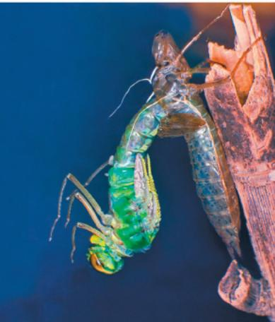

  
Chitin, embedded in proteins, forms the exoskeleton of arthropods. This emperor dragonfly (Anax imperator) is molting—shedding its old exoskeleton (brown upright structure) and emerging upside down in adult form.

## Concept Check 5.2

1. Write the formula for a monosaccharide that has three carbons.

2. A dehydration reaction joins two glucose molecules to form maltose. The formula for glucose is $C_{6}H_{12}O_{6}$ . What is the formula for maltose?

3. WHAT IF? After a cow is given antibiotics to treat an infection, a vet gives the animal a drink of "gut culture" containing various microorganisms. Why is this necessary?

For suggested answers, see Appendix A.

## Concept 5.3: Lipids are a diverse group of hydrophobic molecules

Lipids are the one class of large biological molecules that does not include true polymers, and they are generally not big enough to be considered macromolecules. The compounds called lipids are grouped with each other because they share one important trait: They are hydrophobic: They mix poorly, if at all, with water. This behavior of lipids is based on their molecular structure. Although they may have some polar bonds associated with oxygen, lipids consist mostly of hydrocarbon regions with relatively nonpolar C—H bonds. Lipids are varied in form and function. They include waxes and certain pigments, but we will focus on the types of lipids that are most important biologically: fats, phospholipids, and steroids.

## Fats

Although fats are not polymers, they are large molecules assembled from smaller molecules by dehydration reactions, like the dehydration reaction described in Figure 5.2a. A fat consists of a glycerol molecule joined to three fatty acids (Figure 5.9). Glycerol is an alcohol; each of its three carbons bears a hydroxyl group. A fatty acid has a long carbon skeleton, usually 16 or 18 carbon atoms in length. The carbon at one end of the skeleton is part of a carboxyl group, the functional group that gives these molecules the name fatty acid. The rest of the skeleton consists of a hydrocarbon chain. The relatively nonpolar C—H bonds in the hydrocarbon chains of fatty acids are the reason fats are hydrophobic. Fats separate from water because the water molecules hydrogen-bond to one another and exclude the fats. This is why vegetable oil (a liquid fat) separates from the aqueous vinegar solution in a bottle of salad dressing.

In making a fat, each fatty acid molecule is joined to glycerol by a dehydration reaction (Figure 5.9a). This results in an ester linkage, a bond between a hydroxyl group and a carboxyl group. The completed fat consists of three fatty acids linked to one glycerol molecule. (Other names for a fat are triacylglycerol and triglyceride; levels of triglycerides are reported when blood is tested for lipids.) The fatty acids in a fat can all be the same, or they can be of two or three different kinds, as in Figure 5.9b.

Figure 5.9 The synthesis and structure of a fat, or triacylglycerol. The molecular building blocks of a fat are one molecule of glycerol and three molecules of fatty acids. The carbons of the fatty acids are arranged zigzag to suggest the actual orientations of the four single bonds extending from each carbon (see Figures 4.3a and 4.6b).  
  
(a) One of three dehydration reactions in the synthesis of a fat. One water molecule is removed for each fatty acid joined to the glycerol. (Note that the hydrophobic region of the fat is highlighted in yellow.)

  
(b) A fat molecule (triacylglycerol) with three fatty acid units. In this example, two of the fatty acid units are identical.  
Figure 5.10 Saturated and unsaturated fats and fatty acids.

The terms saturated fats and unsaturated fats are commonly used in the context of nutrition (Figure 5.10). These terms refer to the structure of the hydrocarbon chains of the fatty acids. If there are no double bonds between carbon atoms composing a chain, then as many hydrogen atoms as possible are bonded to the carbon skeleton. Such a structure is said to be saturated with hydrogen, and the resulting fatty acid is therefore called a saturated fatty acid (Figure 5.10a). An unsaturated fatty acid has one or more double bonds, with one fewer hydrogen atom on each double-bonded carbon. Nearly every double bond in naturally occurring fatty acids is a cis double bond, which creates a kink in the hydrocarbon chain wherever it occurs (Figure 5.10b). (See Figure 4.7b to remind yourself about cis and trans double bonds.)

A fat made from saturated fatty acids is called a saturated fat. Most animal fats are saturated: The hydrocarbon chains of their fatty acids—the “tails” of the fat molecules—lack double bonds (see Figure 5.10a), and their flexibility allows the fat

## (a) Saturated fat

At room temperature, the molecules of a saturated fat, such as the fat in butter, are packed closely together, forming a solid.

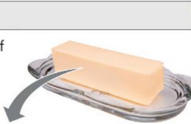  
Structural formula of a saturated fat molecule (Each hydrocarbon chain is represented as a zigzag line, where each bend represents a carbon atom; hydrogens are not shown.)

  
Space-filling model of stearic acid, a saturated fatty acid (red = oxygen, black = carbon, gray = hydrogen)

## (b) Unsaturated fat

At room temperature, the molecules of an unsaturated fat such as olive oil cannot pack together closely enough to solidify because of the kinks in some of their fatty acid hydrocarbon chains.

Structural formula of an unsaturated fat molecule

Space-filling model of oleic acid, an unsaturated fatty acid  

molecules to pack together tightly. Saturated animal fats, such as lard and butter, are solid at room temperature. In contrast, the fats of plants and fishes are generally unsaturated, meaning that they are composed of one or more types of unsaturated fatty acids. Usually liquid at room temperature, plant and fish fats are referred to as oils—olive oil and cod liver oil are examples. The kinks where the cis double bonds are located (see Figure 5.10b) prevent the molecules from

packing together closely enough to solidify at room temperature. The phrase hydrogenated vegetable oils on food labels means that unsaturated fats have been synthetically converted to saturated fats by adding hydrogen, allowing them to solidify. Peanut butter, margarine, and many other products are hydrogenated to prevent lipids from separating out in liquid (oil) form.

A diet rich in saturated fats is one of several factors that may contribute to the cardiovascular disease known as atherosclerosis. In this condition, deposits called plaques develop within the walls of blood vessels, causing inward bulges that impede blood flow and reduce the resilience of the vessels. The process of hydrogenating vegetable oils produces not only saturated fats but also unsaturated fats with trans double bonds. It appears that trans fats can contribute to coronary heart disease (see Concept 42.4). Because trans fats have been especially common in baked goods and processed foods, the U.S. Food and Drug Administration (FDA) requires nutritional labels to include information on trans fat content. In addition, the FDA has ordered U.S. food manufacturers to stop adding trans fats to foods. Globally, the World Health Organization has a stated goal of eliminating industrially produced trans fats. As of 2024, over a third of countries worldwide had already passed such regulations.

The major function of fats is energy storage. The hydrocarbon chains of fats are similar to gasoline molecules and just as rich in energy. A gram of fat stores more than twice as much energy as a gram of a polysaccharide, such as starch. Because plants are relatively immobile, they can function with bulky energy storage in the form of starch. (Vegetable oils are generally obtained from seeds, where more compact storage is an asset to the plant.) Animals, however, must carry their energy

  
(a) Structural formula  
(b) Space-filling model

stores with them, so there is an advantage to having a more compact reservoir of fuel—fat. Humans and other mammals stock their long-term food reserves in adipose cells (see Figure 4.6a), which swell and shrink as fat is deposited and withdrawn from storage. In addition to storing energy, adipose tissue also cushions such vital organs as the kidneys, and a layer of fat beneath the skin insulates the body. This subcutaneous layer is especially thick in whales, seals, and most other marine mammals, insulating their bodies in cold ocean water.

## Interview

Interview with Kristi Anseth: Designing biological molecules that can help heal wounds and repair damaged cartilage (at the start of Unit 1, before Chapter 2)

## Phospholipids

Cells as we know them could not exist without another type of lipid, called phospholipids. Phospholipids are essential for cells because they are major constituents of cell membranes. Their structure provides a classic example of how form fits function at the molecular level. As shown in Figure 5.11, a phospholipid is similar to a fat molecule but has only two fatty acids attached to glycerol rather than three. The third hydroxyl group of glycerol is joined to a phosphate group, which has a negative electrical charge in the cell. Typically, an additional small charged or polar

Figure 5.11 The structure of a phospholipid.

A phospholipid has a hydrophilic (polar) head and two hydrophobic (nonpolar) tails. This particular phospholipid, called a phosphatidylcholine, has a choline attached to a phosphate group. Shown here are (a) the structural formula, (b) the space-filling model (yellow atom is phosphorus, blue is nitrogen), (c) the symbol for a phospholipid that will appear throughout this book, and (d) the bilayer structure formed by self-assembly of phospholipids in an aqueous environment.

DRAW IT Draw an oval around the hydrophilic head of the space-filling model. For suggested answer, see Appendix A.  
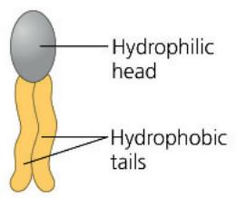  
(c) Phospholipid symbol

  
(d) Phospholipid bilayer

molecule is also linked to the phosphate group. Choline is one such molecule (see Figure 5.11), but there are many others as well, allowing formation of a variety of phospholipids that differ from each other.

The two ends of phospholipids show different behaviors with respect to water. The hydrocarbon tails are hydrophobic and are excluded from water. However, the phosphate group and its attachments form a hydrophilic head that has an affinity for water. When phospholipids are added to water, they self-assemble into a double-layered sheet called a “bilayer” that shields their hydrophobic fatty acid tails from water (Figure 5.11d).

At the surface of a cell, phospholipids are arranged in a similar bilayer. The hydrophilic heads of the molecules are on the outside of the bilayer, in contact with the aqueous solutions inside and outside of the cell. The hydrophobic tails point toward the interior of the bilayer, away from the water. The phospholipid bilayer forms a boundary between the cell and its external environment and establishes separate compartments within eukaryotic cells; in fact, the existence of cells depends on the properties of phospholipids.

## Steroids

Steroids are lipids characterized by a carbon skeleton consisting of four fused rings. Different steroids are distinguished by the particular chemical groups attached to this ensemble of rings. Cholesterol, a type of steroid, is a crucial molecule in animals (Figure 5.12). It is a common component of animal cell membranes and is also the precursor from which other steroids, such as the vertebrate sex hormones, are synthesized. In vertebrates, cholesterol is synthesized in the liver and is also obtained from the diet. A high level of cholesterol in the blood may contribute to atherosclerosis, although some researchers are questioning the roles of cholesterol and saturated fats in the development of this condition.

Cholesterol is the molecule from which other steroids, including the sex hormones, are synthesized. Steroids vary in the chemical groups attached to their four interconnected rings (shaded in gold).

  
MAKE CONNECTIONS Compare cholesterol with the sex hormones shown in the figure at the beginning of Concept 4.3. Circle the chemical groups that cholesterol has in common with estradiol; put a square around the chemical groups that cholesterol has in common with testosterone.

For suggested answer, see Appendix A.

## Interview

Interview with Lovell Jones: Investigating the effects of sex hormones on cancer (eTextbook only)

Figure 5.12 Cholesterol, a steroid.  

## Concept Check 5.3

1. Compare the structure of a fat (triglyceride) with that of a phospholipid.

2. Why are human sex hormones considered lipids?

3. WHAT IF? Suppose a membrane surrounded an oil droplet, as it does in the cells of plant seeds and in some animal cells. Describe and explain the form it might take.

For suggested answers, see Appendix A.

## Concept 5.4: Proteins include a diversity of structures, resulting in a wide range of functions

Nearly every dynamic function of a living being depends on proteins. In fact, the importance of proteins is underscored by their name, which comes from the Greek word proteios, meaning “first,” or “primary.” Proteins account for more than 50% of the dry mass of most cells, and they are instrumental in almost everything organisms do. Some proteins speed up chemical reactions, while others play a role in defense, storage, transport, cellular communication, movement, or structural support. Figure 5.13 shows examples of proteins with these functions, which you’ll learn more about in later chapters.

Life would not be possible without enzymes, most of which are proteins. Enzymatic proteins regulate metabolism by acting as catalysts, chemical agents that selectively speed up chemical reactions without being consumed in the reaction. Because an enzyme can perform its function over and over again, these molecules can be thought of as workhorses that keep cells running by carrying out the processes of life.

A human has tens of thousands of different proteins, each with a specific structure and function; proteins, in fact, are the most structurally sophisticated molecules known. Consistent with their diverse functions, they vary extensively in structure, each type of protein having a unique three-dimensional shape.

Proteins are all constructed from the same set of 20 amino acids, linked in unbranched polymers. The bond between amino acids is called a peptide bond, so a polymer of amino acids is called a polypeptide. A protein is a biologically functional molecule made up of one or more polypeptides, each folded and coiled into a specific three-dimensional structure.

Connective tissue

Figure 5.13 An overview of protein functions.

## Enzymatic proteins

Function: Selective acceleration of chemical reactions
Example: Digestive enzymes catalyze the hydrolysis of bonds in food molecules.

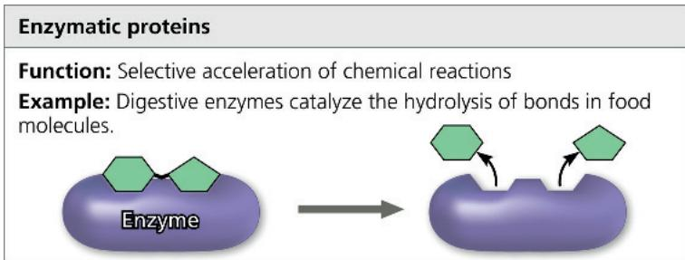

## Storage proteins

## Function: Storage of amino acids

Examples: Casein, the protein of milk, is the major source of amino acids for baby mammals. Plants have storage proteins in their seeds. Ovalbumin is the protein of egg white, used as an amino acid source for the developing embryo.

## Hormonal proteins

Function: Coordination of an organism's activities Example: Insulin, a hormone secreted by the pancreas, causes other tissues to take up glucose, thus regulating blood sugar concentration.

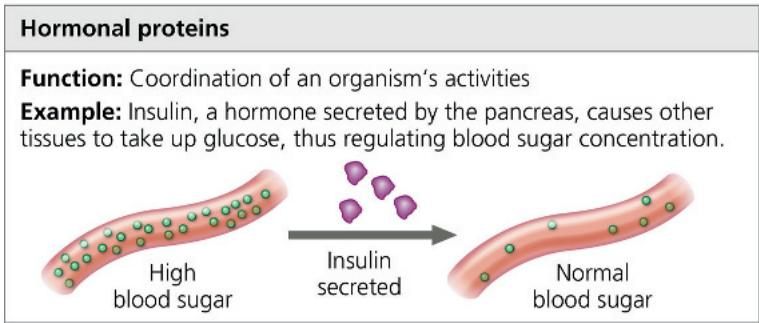

## Contractile and motor proteins

## Function: Movement

Examples: Motor proteins are responsible for the undulations of cilia and flagella. Actin and myosin proteins are responsible for the contraction of muscles.

## Amino Acids (Monomers)

All amino acids share a common structure. An amino acid is an organic molecule with both an amino group and a carboxyl group (see Figure 4.9); the small figure shows the general formula for an amino acid. At the center of the amino acid is an asymmetric carbon atom called the alpha ( $\alpha$ ) carbon. Its four different partners are an amino group, a carboxyl group, a hydrogen atom, and

Side chain (R group)

  
Amino group  
Carboxyl group

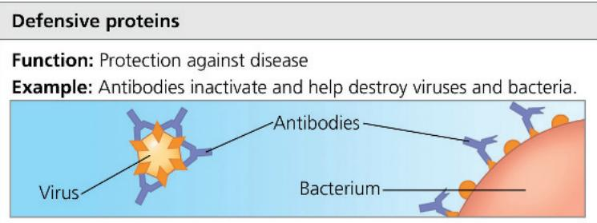

## Transport proteins

## Function: Transport of substances

Examples: Hemoglobin, the iron-containing protein of vertebrate blood, transports oxygen from the lungs to other parts of the body. Other proteins transport molecules across membranes, as shown here.

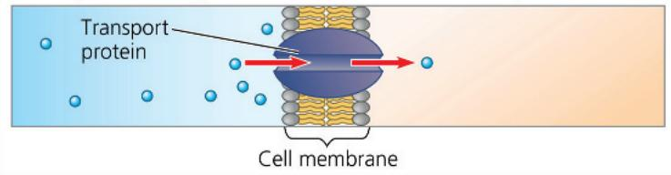

## Receptor proteins

Function: Response of cell to chemical stimuli
Example: Receptors built into the membrane of a nerve cell detect signaling molecules released by other nerve cells.

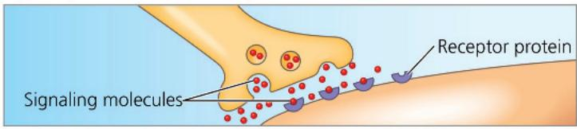

## Structural proteins

## Function: Support

Examples: Keratin is the protein of hair, horns, feathers, and other skin appendages. Insects and spiders use silk fibers to make their cocoons and webs, respectively. Collagen and elastin proteins provide a fibrous framework in animal connective tissues.

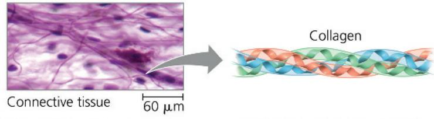

a variable group symbolized by R. The R group, also called the side chain, differs with each amino acid. The R group may be as simple as a hydrogen atom, or it may be a carbon skeleton with various functional groups attached. The physical and chemical properties of the side chain determine the unique characteristics of a particular amino acid, thus affecting its functional role in a polypeptide.

Figure 5.14 shows the 20 amino acids that cells use to build their thousands of proteins. Here the amino groups and carboxyl groups are all depicted in ionized form, the way they usually exist at the pH found in a cell. The amino acids are grouped

At the top right are the non-ionized and ionized forms of a generic amino acid. The specific amino acids are shown below in their ionized form, prevalent at the pH within a cell (pH 7.2.) The amino acids are grouped by properties of their side chains. The three-letter and one-letter abbreviations for the amino acids are in parentheses. All of the amino acids used in proteins are L enantiomers (see Figure 4.7c).

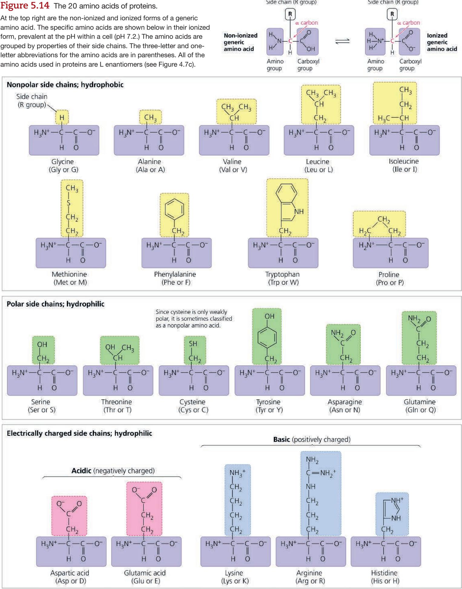

according to the properties of their side chains. One group consists of amino acids with nonpolar side chains, which are hydrophobic. Another group consists of amino acids with polar side chains, which are hydrophilic. Acidic amino acids have side chains that are generally negative in charge due to the presence of a carboxyl group, which is usually dissociated (ionized) at cellular pH. Basic amino acids have amino groups in their side chains that are generally positive in charge. (The terms acidic and basic in this context refer only to groups in the side chains because all amino acids—as monomers—have carboxyl groups and amino groups.) Because they are charged, acidic and basic side chains are also hydrophilic.

## Polypeptides (Amino Acid Polymers)

Now that we have examined amino acids, let's see how they are linked to form polymers (Figure 5.15). When two amino acids are positioned so that the carboxyl group of one is adjacent to the amino group of the other, they can become joined by a dehydration reaction, with the removal of a water molecule. The resulting covalent bond is called a peptide bond. Repeated over and over, this process yields a polypeptide, a polymer of many amino acids linked by peptide bonds. You'll learn more about how cells synthesize polypeptides in Concept 17.4.

The repeating sequence of atoms highlighted in purple boxes with solid outlines in Figure 5.15 is called the polypeptide backbone. Extending from this backbone are the different side chains (R groups) of the amino acids. Polypeptides range in length from a few amino acids to 1,000 or more. Each specific polypeptide has a unique linear sequence of amino acids. Note that one end of the polypeptide chain has a free amino group (the N-terminus of the polypeptide), while the opposite end has a free carboxyl group (the C-terminus). The chemical nature of the molecule as a whole is determined by the kind and sequence of the side chains, which determine how a polypeptide folds and thus its final shape and chemical characteristics. The immense variety of polypeptides in nature illustrates an important concept introduced earlier—that cells can make many different polymers by linking a limited set of monomers into diverse sequences.

## Protein Structure and Function

The specific activities of proteins result from their intricate three-dimensional architecture, the simplest level of which is the sequence of their amino acids. What can the amino acid sequence of a polypeptide tell us about the three-dimensional structure (commonly referred to simply as the “structure”) of the protein and its function? The term polypeptide is not synonymous with the term protein. Even for a protein consisting

## Figure 5.15 Making a polypeptide chain.

Peptide bonds are formed by dehydration reactions, which link the carboxyl group of one amino acid to the amino group of the next. The peptide bonds are formed one at a time, starting with the amino acid at the amino end (N-terminus). The polypeptide has a repetitive backbone (purple boxes with solid outlines) to which the amino acid side chains are attached (yellow boxes with dashed outlines and green boxes with dotted outlines).

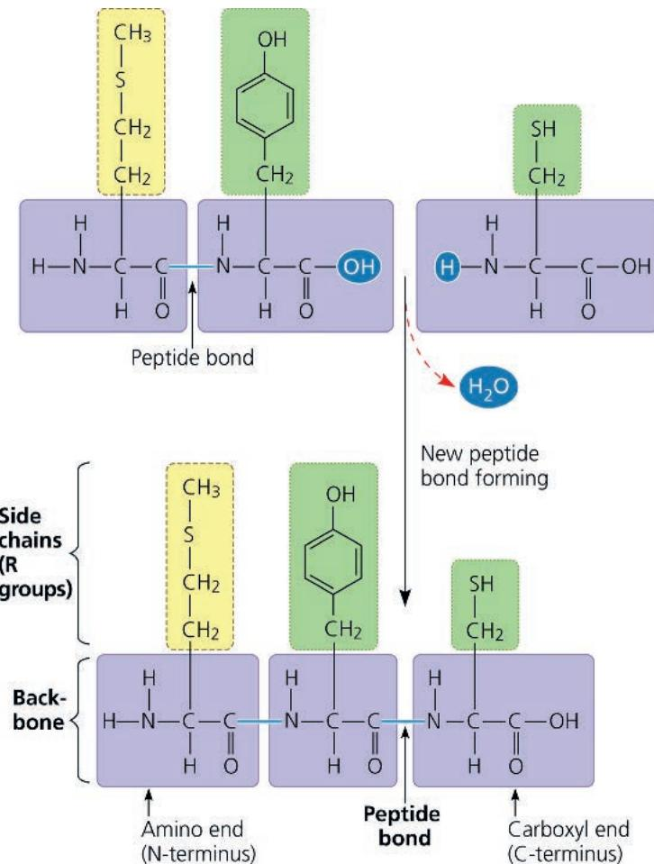  
DRAW IT Label the three amino acids in the upper part of the figure using three-letter and one-letter codes. Circle and label the carboxyl and amino groups that will form the new peptide bond.
For suggested answer, see Appendix A.

of a single polypeptide, the relationship is somewhat analogous to that between a long strand of yarn and a sweater of particular size and shape that can be knitted from the yarn. A functional protein is not just a polypeptide chain, but one or more polypeptides precisely twisted, folded, and coiled into a molecule of unique shape, which can be shown in several different types of models (Figure 5.16). And it is the amino acid sequence of each polypeptide that determines

## Visualizing Proteins

Figure 5.16

Proteins can be represented in different ways, depending on the goal of the illustration.

## Structural Models

Using data from structural studies of proteins, computers can generate various types of models. Each model emphasizes a different aspect of the protein's structure, but no model can show what a protein actually looks like. These three models depict lysozyme, a protein in tears and saliva that helps prevent infection by binding to target molecules on bacteria.

1. In which model is it easiest to follow the polypeptide backbone?

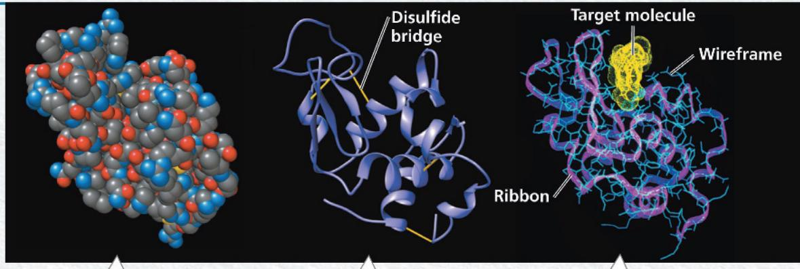

Space-filling model: Emphasizes the overall globular shape. Shows all the atoms of the protein (except hydrogen), which are color-coded: gray = carbon, red = oxygen, blue = nitrogen, and yellow = sulfur.

Ribbon model: Shows only the polypeptide backbone, emphasizing how it folds and coils to form a 3-D shape, in this case stabilized by disulfide bridges (yellow lines).

Wireframe model (blue): Shows the polypeptide backbone with side chains extending from it. A ribbon model (purple) is superimposed on the wireframe model. The bacterial target molecule (yellow) is bound.

## Simplified Diagrams

It isn't always necessary to use a detailed computer model; simplified diagrams are useful when the focus of the figure is on the function of the protein, not the structure.

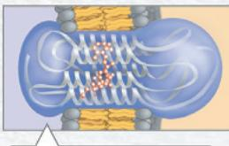

A transparent shape is drawn around the contours of a ribbon model of the protein rhodopsin, showing the shape of the molecule as well as some internal details.

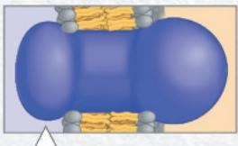

When structural details are not needed, a solid shape can be used.

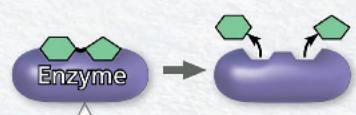

A simple shape is used here to represent a generic enzyme because the diagram focuses on enzyme action in general.

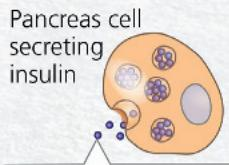

2. Draw a simple version of lysozyme that shows its overall shape, based on the molecular models in the top section of the figure.

Sometimes a protein is represented simply as a dot, as shown here for insulin.

3. Why is it unnecessary to show the actual shape of insulin here?

For suggested answers, see Appendix A.

Instructors: The tutorial “Molecular Model: Lysozyme,” in which students rotate 3-D models of lysozyme,

can be assigned in Mastering Biology.

Instructors: Additional questions related to this Visualizing Figure can be assigned in Mastering Biology.

what three-dimensional structure the protein will have under normal cellular conditions.

When a cell synthesizes a polypeptide, the chain may fold spontaneously, assuming the functional structure for that protein. This folding is driven and reinforced by the formation of various bonds between parts of the chain, which in turn depends on the sequence of amino acids. Many proteins are roughly spherical (globular proteins), while others are shaped like long

fibers (fibrous proteins). Even within these broad categories, countless variations exist.

A protein's specific structure determines how it works. In almost every case, the function of a protein depends on its ability to recognize and bind to some other molecule. In an especially striking example of the marriage of form and function, Figure 5.17 shows the exact match of shape between an antibody (a protein in the body) and the particular foreign substance on a flu virus that the antibody binds to and marks for destruction. Also, you may recall another example of molecules with matching shapes from Concept 2.3: endorphin molecules (produced by the body) and morphine molecules (a manufactured drug), both of which fit into receptor proteins on the surface of brain cells in humans, producing euphoria and relieving pain. Morphine, heroin, and other opiate drugs are able to mimic endorphins because they all have a shape similar to that of endorphins and can thus fit into and bind to endorphin receptors in the brain. This fit is very specific, something like a handshake (see Figure 2.16). The endorphin receptor, like other receptor molecules, is a protein. The function of a protein—for instance, the ability of a receptor protein to bind to a particular pain-relieving signaling molecule—is an emergent property resulting from exquisite molecular order.

Antibody protein  
Protein from flu virus  

## Four Levels of Protein Structure

In spite of their great diversity, proteins share three superimposed levels of structure, known as primary structure, secondary structure, and tertiary structure. A fourth level, quaternary structure, arises when a protein consists of two or more polypeptide chains. Figure 5.18, on the next two pages, describes these four levels of protein structure. Be sure to study this figure thoroughly before going on to the next section.

## Sickle-Cell Disease: A Change in Primary Structure

Even a slight change in primary structure can affect a protein's shape and ability to function. For instance, sickle-cell disease, an inherited blood disorder, is caused by the substitution of one amino acid (valine) for the normal one (glutamic acid) at the position of the sixth amino acid in the primary structure of hemoglobin, the protein that carries oxygen in red blood cells. Normal red blood cells are disk-shaped, but in sickle-cell disease, the abnormal hemoglobin molecules tend to aggregate into chains, deforming some of the cells into a sickle shape (Figure 5.19, after you turn the next

## Figure 5.17 Complementarity of shape between two protein surfaces.

A technique called X-ray crystallography was used to generate a computer model of an antibody protein (blue and orange, left) bound to a flu virus protein (yellow and green, right). This is a wireframe model modified by adding an “electron density map” in the region where the two proteins meet. Computer software was then used to back the images away from each other slightly.

VISUAL SKILLS What do these computer models allow you to see about the two proteins? For suggested answer, see Appendix A.

page). A person with the disease has periodic i“sickle-cell crises” when the angular cells clog tiny blood vessels, impeding blood flow. The toll taken on such patients is a dramatic example of how a simple change in protein structure can have devastating effects on protein function.

## Interview

Interview with Linus Pauling: Winner of the Nobel Prize in Chemistry and the Nobel Peace Prize (eTextbook only)

## What Determines Protein Structure?

You've learned that a unique shape endows each protein with a specific function. But what are the key factors determining protein structure? You already know most of the answer: A polypeptide chain of a given amino acid sequence can be arranged into a three-dimensional shape determined by the interactions responsible for secondary and tertiary structure. This folding normally occurs as the protein is being synthesized in the crowded environment within a cell, aided by other proteins. However, protein structure also depends on the physical and chemical conditions of the protein's environment. If the pH, salt concentration, temperature, or other aspects of its environment are altered, the weak chemical bonds and interactions within a protein may be destroyed, causing the protein to unravel and lose its native shape, a change called denaturation. Because it is misshapen, the denatured protein is biologically inactive.

Most proteins become denatured if they are transferred from an aqueous environment to a nonpolar solvent, such as ether or chloroform; the polypeptide chain refolds so that its hydrophobic regions face outward toward the solvent. Other denaturation agents include chemicals that disrupt the hydrogen bonds, ionic bonds, and disulfide bridges that maintain a protein's shape. Denaturation can also result from excessive heat, which agitates the polypeptide chain enough to overpower the weak interactions

# Exploring Levels of Protein Structure

Figure 5.18

## Primary Structure

## Linear chain of amino acids

The primary structure of a protein is its sequence of amino acids. As an example, let's consider transthyretin, a globular blood protein that transports vitamin A and one of the thyroid hormones. Transthyretin is made up of four identical polypeptide chains, each composed of 127 amino acids. Shown here is one of these chains unraveled for a closer look at its primary structure. Each of the 127 positions along the chain is occupied by one of the 20 amino acids, indicated here by its three-letter abbreviation.

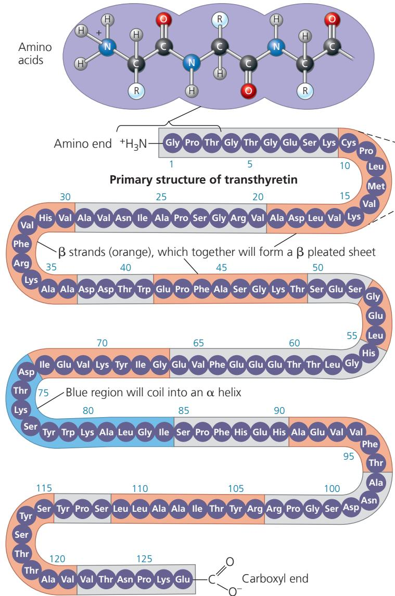

The primary structure is like the order of letters in a very long word. If left to chance, there would be $20^{127}$ different ways of making a polypeptide chain 127 amino acids long. However, the precise primary structure of a protein is determined not by the random linking of amino acids, but by inherited genetic information. The primary structure in turn dictates secondary structure ( $\alpha$ helices and $\beta$ pleated sheets) and tertiary structure, due to the chemical nature of the backbone and the side chains (R groups) of the amino acids along the polypeptide.

  
A region of $\beta$ pleated sheet (made up of adjacent $\beta$ strands) in transthyretin

  
- β strand, often shown as a folded or flat arrow pointing toward the carboxyl end

Most proteins have segments of their polypeptide chains repeatedly coiled or folded in patterns that contribute to the protein's overall shape. These coils and folds, collectively referred to as secondary structure, are the result of hydrogen bonds between the repeating constituents of the polypeptide backbone (not the amino acid R groups or side chains). Within the backbone, the oxygen atoms have a partial negative charge, and the hydrogen atoms attached to the nitrogens have a partial positive charge (see Figure 2.14); therefore, hydrogen bonds can form between these atoms. Individually, these hydrogen bonds are weak, but because they are repeated many times over a relatively long region of the polypeptide chain, they can support a particular shape for that part of the protein.

One such secondary structure is the $\alpha$ helix, a delicate coil held together by hydrogen bonding between every fourth amino acid, as shown above. Although each transthyretin polypeptide has only one $\alpha$ helix region (see the Primary and Tertiary Structure sections), other globular proteins have multiple stretches of $\alpha$ helix separated by nonhelical regions (see hemoglobin in the Quaternary Structure section). Some fibrous proteins, such as $\alpha$ -keratin, the structural protein of hair, have the $\alpha$ helix formation over most of their length.

The other secondary structure is the $\beta$ pleated sheet. As shown above, two or more segments of the polypeptide chain lying side by side (called $\beta$ strands) are connected by hydrogen bonds between parts of the two parallel segments. $\beta$ pleated sheets make up the core of many globular proteins, as is the case for transthyretin (see Tertiary Structure), and dominate some fibrous proteins, including the silk protein of a spider's web. The teamwork of so many hydrogen bonds makes each spider silk fiber stronger than a steel strand.

▶ Spiders secrete silk fibers made of a structural protein containing $\beta$ pleated sheets, which allow the spiderweb to stretch and recoil.

Quaternary Structure
Association of two or more polypeptides (some proteins only)

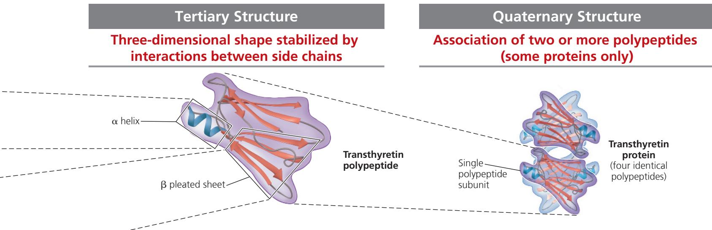

Superimposed on the patterns of secondary structure is a protein's tertiary structure, shown here in a ribbon model of the transthyretin polypeptide. While secondary structure involves interactions between backbone constituents, tertiary structure is the overall shape of a polypeptide resulting from interactions between the side chains (R groups) of the various amino acids. One type of interaction that contributes to tertiary structure is called—somewhat misleadingly—a hydrophobic interaction. As a polypeptide folds into its functional shape, amino acids with hydrophobic (nonpolar) side chains usually end up in clusters at the core of the protein, out of contact with water. Thus, a “hydrophobic interaction” is actually caused by the exclusion of nonpolar substances by water molecules. Once nonpolar amino acid side chains are close together, van der Waals interactions help hold them together. Meanwhile, hydrogen bonds between polar side chains and ionic bonds between positively and negatively charged side chains also help stabilize tertiary structure. These are all weak interactions in the aqueous cellular environment, but their cumulative effect helps give the protein a unique shape.

Covalent bonds called disulfide bridges may further reinforce the shape of a protein. Disulfide bridges form where two cysteine monomers, which have sulfhydryl groups (—SH) on their side chains (see Figure 4.9), are brought close together by the folding of the protein. The sulfur of one cysteine bonds to the sulfur of the second, and the disulfide bridge (—S—S—) rivets parts of the protein together (see yellow lines in Figure 5.16 ribbon model). All of these different kinds of interactions can contribute to the tertiary structure of a protein, as shown here in a small part of a hypothetical protein:

Some proteins consist of two or more polypeptide chains aggregated into one functional macromolecule. Quaternary structure is the overall protein structure that results from the aggregation of these polypeptide subunits. For example, shown above is the complete globular transthyretin protein, made up of its four polypeptides.

Another example is collagen, which is a fibrous protein that has three identical helical polypeptides intertwined into a larger triple helix, giving the long fibers great strength. This suits collagen fibers to their function as the girders of connective tissue in skin, bone, tendons, ligaments, and other body parts. (Collagen accounts for 40% of the protein in a human body.)

Hemoglobin, the oxygen-binding protein of red blood cells, is another example of a globular protein with quaternary structure. It consists of four polypeptide subunits,

two of one kind ( $\alpha$ ) and two of another kind ( $\beta$ ). Both $\alpha$ and $\beta$ subunits consist primarily of $\alpha$ -helical secondary structure. Each subunit has a nonpolypeptide component, called heme, with an iron atom that binds oxygen.

Figure 5.19 A single amino acid substitution in a protein causes sickle-cell disease.  
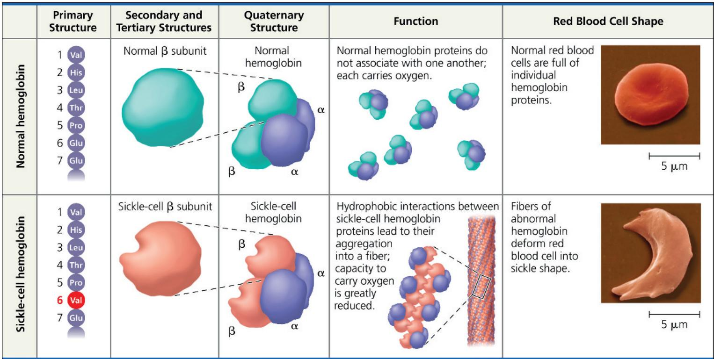  
MAKE CONNECTIONS Considering the chemical characteristics of the amino acids valine and glutamic acid (see Figure 5.14), propose a possible explanation for the dramatic effect on protein function that occurs when valine is substituted for glutamic acid.  
For suggested answer, see Appendix A.

Figure 5.20 Denaturation and renaturation of a protein.

High temperatures or various chemical treatments will denature a protein, causing it to lose its shape and hence its ability to function. If the denatured protein remains dissolved, it may renature when the chemical and physical aspects of its environment are restored to normal.

that stabilize the structure. The white of an egg becomes opaque during cooking because the denatured proteins are insoluble and solidify. This also explains why excessively high fevers can be fatal: Proteins in the blood tend to denature at very high body temperatures.

When a protein in a test-tube solution has been denatured by heat or chemicals, it can sometimes return to its functional shape when the denaturing agent is removed (Figure 5.20). (Sometimes this is not possible: For example, a fried egg will not become liquefied when placed back into the refrigerator!) We can conclude that the information for building specific shape is intrinsic to the protein's primary structure; this is often the case for small proteins. The sequence of amino acids determines the protein's shape—where an $\alpha$ helix can form, where a $\beta$ pleated sheet can exist, where disulfide bridges are located, where ionic bonds can form, and so on. But how does protein folding occur in the cell?

## Protein Folding in the Cell

Biochemists now know the amino acid sequence for over 200 million proteins, with millions added each month, and the three-dimensional shape for tens of thousands has been experimentally determined. For decades, researchers have tried to discover the rules of protein folding as determined by a protein's amino acid sequence so that its 3-D structure could be predicted. The experimental methods for determining 3-D structure—such as X-ray crystallography described below—are very time-consuming. It can take years to confirm a particular protein's shape. A huge breakthrough occurred once scientists harnessed computational methods, using computer algorithms and artificial intelligence to tackle this task. In 2020, a team from Google unveiled a project called AlphaFold2 that was able to predict protein structure from amino acid sequence with over 90% accuracy, based on experimentally determined 3-D structures. Three scientists—Demis Hassabis, John Jumper, and David Baker—won the Nobel Prize in Chemistry for this work in 2024, only three years after its debut.

Misfolding of polypeptides in cells is a serious problem that has come under increasing scrutiny by medical researchers. Many diseases—such as cystic fibrosis, Alzheimer's, Parkinson's, and mad cow disease—are associated with an accumulation of misfolded proteins. In fact, misfolded versions of the transthyretin protein featured in Figure 5.18 have been implicated in several diseases, including one form of senile dementia.

Even though computational methods can now predict 3-D structure with remarkable accuracy, the prediction still must be experimentally confirmed for any given protein. The method previously used to determine the 3-D structure of a protein, and the one used to confirm the original computational predictions, is X-ray crystallography, which depends on the diffraction of an X-ray beam by the atoms of a crystallized molecule. Using this technique, scientists can build a 3-D model that shows the exact position of every atom in a protein molecule (Figure 5.21). Cryo-electron microscopy (cryo-EM; see Concept 6.1), nuclear magnetic resonance (NMR) spectroscopy, and bioinformatics

## Figure 5.21

## Research Method: X-Ray Crystallography Application

Scientists use X-ray crystallography to determine the three-dimensional (3-D) structure of macromolecules such as nucleic acids and proteins.

## Technique

Researchers aim an X-ray beam through a crystallized protein or nucleic acid. The atoms of the crystal diffract (bend) the X-rays into an orderly array that a digital detector records as a pattern of spots called an X-ray diffraction pattern, an example of which is shown here.

## Results

Using data from X-ray diffraction patterns and the sequence of monomers determined by chemical methods, researchers can build a 3-D computer model of the macromolecule being studied, such as the four-subunit protein transthyretin (see Figure 5.18) shown here.

(see Concept 5.6) are complementary approaches to understanding protein structure and function. Cryo-EM is emerging as a quicker method to confirm structure predictions because it does not require crystallization of the protein being studied, something that is very challenging and sometimes not possible.

The structure of some proteins is difficult to determine for a simple reason: A growing body of biochemical research has revealed that a significant number of proteins, or regions of proteins, do not have a distinct 3-D structure until they interact with a target protein or other molecule. Their flexibility and indefinite structure are important for their function, which may require binding with different targets at different times. These proteins, which may account for 20–30% of mammalian proteins, are called intrinsically disordered proteins and are the focus of current research.

## Concept Check 5.4

1. What parts of a polypeptide participate in the bonds that hold together secondary structure? Tertiary structure?

2. Thus far in the chapter, the Greek letters $\alpha$ and $\beta$ have been used to specify at least three different pairs of structures. Name and briefly describe them.

3. Each amino acid has a carboxyl group and an amino group. Are these groups present in a polypeptide? Explain.

4. WHAT IF? Where would you expect a polypeptide region rich in the amino acids valine, leucine, and isoleucine to be located in a folded polypeptide? Explain.

For suggested answers, see Appendix A.

## Concept 5.5: Nucleic acids store, transmit, and help express hereditary information

If the primary structure of polypeptides determines a protein's shape, what determines primary structure? The amino acid sequence of a polypeptide is programmed by a discrete unit of inheritance known as a gene. Genes consist of DNA, which belongs to the class of compounds called nucleic acids. Nucleic acids are polymers made of monomers called nucleotides.

## The Roles of Nucleic Acids

The two types of nucleic acids, deoxyribonucleic acid (DNA) and ribonucleic acid (RNA), enable living organisms to reproduce their complex components from one generation to the next. Unique among molecules, DNA provides directions for its own replication. DNA also directs RNA synthesis and, through RNA, controls protein synthesis; this entire process is called gene expression (Figure 5.22).

DNA is the genetic material that organisms inherit from their parents. Each chromosome contains one long DNA molecule,

Figure 5.22 Gene expression: DNA → RNA → protein.
In a eukaryotic cell, DNA in the nucleus programs protein production in the cytoplasm by dictating synthesis of messenger RNA (mRNA).  
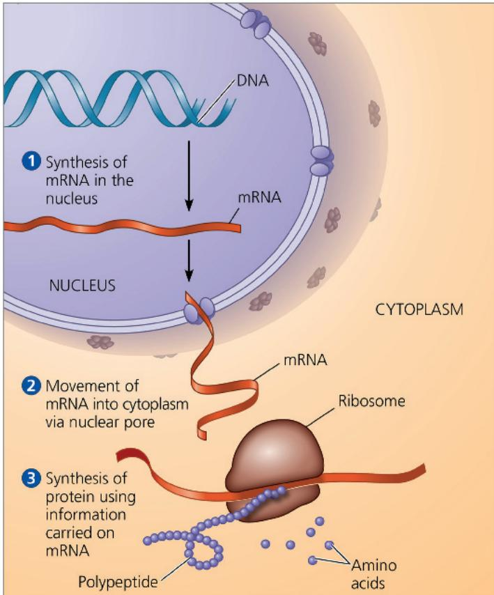

usually carrying several hundred or more genes. When a cell reproduces itself by dividing, its DNA molecules are copied and passed along from one generation of cells to the next. The information that programs all the cell's activities is encoded in the structure of the DNA. The DNA, however, is not directly involved in running the operations of the cell, any more than computer software by itself can read the bar code on a box of cereal. Just as a scanner is needed to read a bar code, proteins are required to implement genetic programs. The molecular hardware of the cell—the tools that carry out biological functions—consists mostly of proteins. For example, the oxygen carrier in red blood cells is the protein hemoglobin that you saw earlier (see Figure 5.18), not the DNA that specifies its structure.

How does RNA, the other type of nucleic acid, fit into gene expression, the flow of genetic information from DNA to proteins? A given gene along a DNA molecule can direct synthesis of a type of RNA called messenger RNA (mRNA). The mRNA molecule interacts with the cell's protein-synthesizing machinery to direct production of a polypeptide, which folds into all or part of a protein. We can summarize the flow of genetic information as DNA → RNA → protein (see Figure 5.22). The sites of protein synthesis are cellular structures called ribosomes. In a eukaryotic cell, ribosomes are in the cytoplasm—the region between the nucleus and the cell's outer boundary, the plasma membrane—but DNA resides in the nucleus. Messenger RNA conveys genetic instructions for building proteins from the nucleus to the cytoplasm. Prokaryotic cells lack nuclei but still use mRNA to convey a message from the DNA to ribosomes and

other cellular equipment that translate the coded information into amino acid sequences. Later, you'll read about other functions of some more recently discovered RNA molecules; the stretches of DNA that direct synthesis of these RNAs are also considered genes (see Concept 18.3).

## The Components of Nucleic Acids

Nucleic acids are macromolecules that exist as polymers called polynucleotides (Figure 5.23a). As indicated by the name, each polynucleotide consists of monomers called nucleotides. A nucleotide, in general, is composed of three parts: a five-carbon sugar (a pentose), a nitrogen-containing (nitrogenous) base, and one to three phosphate groups (Figure 5.23b). The beginning monomer used to build a polynucleotide has three phosphate groups, but two are lost during the polymerization process. The portion of a nucleotide without any phosphate groups is called a nucleoside.

To understand the structure of a single nucleotide, let's first consider the nitrogenous bases (Figure 5.23c). Each nitrogenous base has one or two rings that include nitrogen atoms. (They are called nitrogenous bases because the nitrogen atoms tend to take up $\mathrm{H^{+}}$ from solution, thus acting as bases.) There are two families of nitrogenous bases: pyrimidines and purines. A pyrimidine has one six-membered ring of carbon and nitrogen atoms. The members of the pyrimidine family are cytosine (C), thymine (T), and uracil (U). Purines are larger, with a six-membered ring fused to a five-membered ring. The purines are adenine (A) and guanine (G). The specific pyrimidines and purines differ in the chemical groups attached to the rings. Adenine, guanine, and cytosine are found in both DNA and RNA; thymine is found only in DNA and uracil only in RNA.

Now let's add the sugar to which the nitrogenous base is attached. In DNA the sugar is deoxyribose; in RNA it is ribose (see Figure 5.23c). The only difference between these two sugars is that deoxyribose lacks an oxygen atom on the second carbon in the ring, hence the name deoxyribose.

So far, we have built a nucleoside (base plus sugar). To complete the construction of a nucleotide, we attach one to three phosphate groups to the 5' carbon of the sugar (the carbon numbers in the sugar include ', the prime symbol; see Figure 5.23b). With one phosphate, this is a nucleoside monophosphate, more often called a nucleotide.

## Nucleotide Polymers

The linkage of nucleotides into a polynucleotide involves a condensation reaction. (You will learn the details in Concept 16.2.) In the polynucleotide, adjacent nucleotides are joined by a phosphodiester linkage (see Figure 5.23a), which consists of a phosphate group that covalently links the sugars of two nucleotides. This bonding results in a repeating pattern of sugar-phosphate units called the sugar-phosphate backbone. (Note that the nitrogenous bases are not part of the backbone.) The two free ends of the polymer are distinctly different from each other. One end has a phosphate attached to a 5' carbon, and the other end has a hydroxyl group on a 3' carbon; we refer to these as the 5' end and the 3' end, respectively. We can say that a polynucleotide has a built-in directionality along its sugar-phosphate backbone, from 5' to 3', somewhat like a one-way street. The bases are attached all along the sugar-phosphate backbone.

(a) A polynucleotide has a sugar-phosphate backbone with variable appendages, the nitrogenous bases. (b) In a polynucleotide, each nucleotide monomer includes a nitrogenous base, a sugar, and a phosphate group. Note that carbon numbers in the sugar include primes ('). (c) A nucleoside includes a nitrogenous base (purine or pyrimidine) and a five-carbon sugar (deoxyribose or ribose).

The sequence of bases along a DNA (or mRNA) polymer is unique for each gene and provides very specific information to the cell. Because genes are hundreds to thousands of nucleotides long, the number of possible base sequences is effectively limitless. The information carried by the gene is encoded in its specific sequence of the four DNA bases. For example, the sequence 5'-AGGTAACTT-3' means one thing, whereas the sequence 5'-CGCTTTAAC-3' has a different meaning. (Entire genes, of course, are much longer.) The linear order of bases in a gene specifies the amino acid sequence—the primary structure—of a protein, which in turn specifies that protein's 3-D structure, thus enabling its function in the cell.

## The Structures of DNA and RNA Molecules

A DNA molecule has two polynucleotides, or “strands,” that wind around an imaginary axis, forming a double helix (Figure 5.24a). The two sugar-phosphate backbones run in opposite $5'\rightarrow3'$ directions from each other; this arrangement is referred to as anti-parallel, somewhat like a divided highway. The sugar-phosphate backbones are on the outside of the helix, and the nitrogenous bases are paired in the interior of the helix. The two strands are held together by hydrogen bonds between the paired bases (see Figure 5.24a). Most DNA molecules are very long, with thousands or even millions of base pairs. The one long DNA double helix in a eukaryotic chromosome includes many genes, each one a particular segment of the double-stranded molecule.

In base pairing, only certain bases in the double helix are compatible with each other. Adenine (A) in one strand always pairs with thymine (T) in the other, and guanine (G) always pairs with cytosine (C). Reading the sequence of bases along one strand of the double helix would tell us the sequence of bases along the other strand. If a stretch of one strand has the base sequence 5'-AGGTCCG-3', then the base-pairing rules tell us that the same stretch of the other strand must have the sequence 3'-TCCAGGC-5'. The two strands of the double helix are complementary, each the predictable counterpart of the other. It is this feature of DNA that makes it possible to generate two identical copies of each DNA molecule in a cell that is preparing to divide. When the cell divides, the copies are distributed to the daughter cells, making them genetically identical to the parent cell. Thus, the structure of DNA accounts for its function of transmitting genetic information whenever a cell reproduces.

RNA molecules, by contrast, exist as single strands. Complementary base pairing can occur, however, between regions of two RNA molecules or even between two stretches of nucleotides in the same RNA molecule. In fact, base pairing within an RNA molecule allows it to take on the particular three-dimensional shape necessary for its function. Consider, for example, the type of RNA called transfer RNA (tRNA), which brings amino acids to the ribosome during the synthesis of a

## Figure 5.24 The structures of DNA and tRNA molecules.

(a) The DNA molecule is usually a double helix, with the sugar-phosphate backbones of the antiparallel polynucleotide strands (symbolized here by blue ribbons) on the outside of the helix. Hydrogen bonds between pairs of nitrogenous bases hold the two strands together. As illustrated here with symbolic shapes for the bases, adenine (A) can pair only with thymine (T), and guanine (G) can pair only with cytosine (C). Each DNA strand in this figure is the structural equivalent of the polynucleotide diagrammed in Figure 5. 23a. (b) A tRNA molecule has a roughly L-shaped structure due to complementary base pairing of antiparallel stretches of RNA. In RNA, A pairs with U.

polypeptide. A tRNA molecule is about 80 nucleotides in length. Its functional shape results from base pairing between nucleotides where complementary stretches of the molecule can run antiparallel to each other (Figure 5.24b).

Note that in RNA, adenine (A) pairs with uracil (U); thymine (T) is not present in RNA. Another difference between RNA and DNA is that DNA almost always exists as a double helix, whereas RNA molecules are more variable in shape. RNAs are versatile molecules, and many biologists believe RNA may have preceded DNA as the carrier of genetic information in early forms of life (see Concept 25.1).

## Concept Check 5.5

1. DRAW IT In Figure 5.23a, number all the carbons of the top three nucleotides (use primes), circle the nitrogenous bases, and star the phosphates.

2. DRAW IT A region along one DNA strand has this sequence of nitrogenous bases: 5'-TAGGCCT-3'. Write down its complementary strand, labeling the 5' and 3' ends.

For suggested answers, see Appendix A.

## Concept 5.6: Genomics and proteomics have transformed biological inquiry and applications

Experimental work in the first half of the 20th century established the role of DNA as the carrier of genetic information, passed from generation to generation, that specified the functioning of living cells and organisms. Once the structure of the DNA molecule was described in 1953, and the linear sequence of nucleotide bases was understood to specify the amino acid sequence of proteins, biologists sought to “decode” genes by learning their nucleotide sequences (often called “base sequences”).

An unplanned but profound side benefit of this project—the Human Genome Project—was the rapid development of faster and less expensive methods of sequencing. This trend has continued: The cost for sequencing 1 million bases in 2001, well over \$5,000, has decreased to less than \$0.00002 in 2024. And a human genome, the first of which took over 10 years to sequence, could be completed at today's pace in day or less (Figure 5.25). The number of genomes that have been fully

The first chemical techniques for DNA sequencing, or determining the sequence of nucleotides along a DNA strand, one by one, were developed in the 1970s. Researchers began to study gene sequences, gene by gene, and the more they learned, the more questions they had: How was expression of genes regulated? Genes and their protein products clearly interacted with each other, but how? What was the function, if any, of the DNA that is not part of genes? To fully understand the genetic functioning of a living organism, the entire sequence of the full complement of DNA, the organism's genome, would be most enlightening. In spite of the apparent impracticality of this idea, in the late 1980s several prominent biologists put forth an audacious proposal to launch a project that would sequence the entire human genome—all 3 billion bases of it! This endeavor began in 1990 and was effectively completed in the early 2000s.

Figure 5.25 Automatic DNA-sequencing machines and abundant computing power enable rapid sequencing of genes and genomes.  

sequenced has exploded, generating reams of data and prompting development of bioinformatics. Bioinformatics is an approach that uses computer software and other computational tools, such as artificial intelligence, that can analyze large data sets.

The reverberations of these developments have transformed the study of biology and related fields. Biologists often look at problems by analyzing large sets of genes or even comparing whole genomes of different species, an approach called genomics. A similar analysis of large sets of proteins, including their sequences, is called proteomics. (Protein sequences can be determined either by using biochemical techniques or by translating the DNA sequences that code for them.) These approaches permeate all fields of biology, some examples of which are shown in Figure 5.26.

Perhaps the most significant impact of genomics and proteomics on the field of biology as a whole has been their contributions to our understanding of evolution. In addition to confirming evidence for evolution from the study of fossils and characteristics of currently existing species, genomics has helped us tease out relationships among different groups of organisms that had not been resolved by previous types of evidence, and thus infer evolutionary history.

## Scientific Skills Exercise Analyzing Polypeptide Sequence Data

Are Rhesus Monkeys or Gibbons More Closely Related to Humans? In this exercise, you will look at amino acid sequence data for the $\beta$ polypeptide chain of hemoglobin, often called $\beta$ -globin. You will then interpret the data to hypothesize whether the monkey or the gibbon is more closely related to humans.

Human

Rhesus monkey

How Such Experiments Are Done Researchers can isolate the polypeptide of interest from an organism and then determine the amino acid sequence. More frequently, the DNA of the relevant gene

<table><tr><td>Species</td><td colspan="6">Alignment of Amino Acid Sequences of β-globin</td></tr><tr><td>Human</td><td>1</td><td>VHLTPEEKSA</td><td>VTALWGKVNV</td><td>DEVGGEALGR</td><td>LLVVYPWTQR</td><td>FFESFGDLST</td></tr><tr><td>Monkey</td><td>1</td><td>VHLTPEEKNA</td><td>VTTLWGKVNV</td><td>DEVGGEALGR</td><td>LLLVYPWTQR</td><td>FFESFGDLSS</td></tr><tr><td>Gibbon</td><td>1</td><td>VHLTPEEKSA</td><td>VTALWGKVNV</td><td>DEVGGEALGR</td><td>LLVVYPWTQR</td><td>FFESFGDLST</td></tr><tr><td>Human</td><td>51</td><td>PDAVMGNPKV</td><td>KAHGKKVLGA</td><td>FSDGLAHLDN</td><td>LKGTFATLSE</td><td>LHCDKLHVDP</td></tr><tr><td>Monkey</td><td>51</td><td>PDAVMGNPKV</td><td>KAHGKKVLGA</td><td>FSDGLNHLDN</td><td>LKGTFAQLSE</td><td>LHCDKLHVDP</td></tr><tr><td>Gibbon</td><td>51</td><td>PDAVMGNPKV</td><td>KAHGKKVLGA</td><td>FSDGLAHLDN</td><td>LKGTFAQLSE</td><td>LHCDKLHVDP</td></tr><tr><td>Human</td><td>101</td><td>ENFRLLGNVL</td><td>VCVLAHHFGK</td><td>EFTPPVQAAY</td><td>QKVVAGVANA</td><td>LAHKYH</td></tr><tr><td>Monkey</td><td>101</td><td>ENFRLLGNVL</td><td>VCVLAHHFGK</td><td>EFTPPVQAAY</td><td>QKVVAGVANA</td><td>LAHKYH</td></tr><tr><td>Gibbon</td><td>101</td><td>ENFRLLGNVL</td><td>VCVLAHHFGK</td><td>EFTPPVQAAY</td><td>QKVVAGVANA</td><td>LAHKYH</td></tr></table>

Data from Human: http://www.ncbi.nlm.nih.gov/protein/AAA21113.1; rhesus monkey: http://www.ncbi.nlm.nih.gov/protein/122634; gibbon: http://www.ncbi.nlm.nih.gov/protein/122616

## DNA and Proteins as Tape Measures of Evolution

EVOLUTION We are accustomed to thinking of shared traits, such as hair and milk production in mammals, as evidence of shared ancestry. Because DNA carries heritable information in the form of genes, sequences of genes and their protein products document the hereditary background of an organism. The linear sequences of nucleotides in DNA molecules are passed from parents to offspring; these sequences determine the amino acid sequences of proteins. As a result, siblings have greater similarity in their DNA and proteins than do unrelated individuals of the same species.

Given our evolutionary view of life, we can extend this concept of “molecular genealogy” to relationships between species: We would expect two species that appear to be closely related based on anatomical evidence (and possibly fossil evidence) to also share a greater proportion of their DNA and protein sequences than do less closely related species. In fact, that is the case. An example is the comparison of the $\beta$ polypeptide chain of human hemoglobin with the corresponding hemoglobin polypeptide in other vertebrates. In this chain of 146 amino acids, humans and gorillas differ in just 1 amino acid, while humans and frogs, more distantly related, differ in 67 amino acids. In the Scientific Skills Exercise, you can apply this sort of reasoning to

is sequenced, and the amino acid sequence of the polypeptide is deduced from the DNA sequence of its gene.

Data from the Experiments In the data below, the letters give the sequence of the 146 amino acids in $\beta$ -globin from humans, rhesus monkeys, and gibbons. Because a complete sequence would not fit on one line here, the sequences are divided into three segments: amino acids 1–50, 51–100, and 101–146. The sequences for the three different species are aligned so that you can compare them easily. For example, you can see that for all three species, the first amino acid is V (valine) and the 146th amino acid is H (histidine).

## INTERPRET THE DATA

1. Scan the monkey and gibbon sequences, letter by letter, circling any amino acids that do not match the human sequence. (a) How many amino acids differ between the monkey and the human sequences? (b) Between the gibbon and human?

2. For each nonhuman species, what percent of its amino acids are identical to the human sequence of $\beta$ -globin?

3. Based on these data alone, state a hypothesis for which of these two species is more closely related to humans. What is your reasoning?

4. What other evidence could you use to support your hypothesis?

Instructors: A version of this Scientific Skills Exercise can be assigned in Mastering Biology.

## Figure 5.26

Nucleotide sequencing and the analysis of large sets of genes and proteins can be done rapidly and inexpensively due to advances in technology and information processing. Taken together, genomics and proteomics have advanced our understanding of biology across many different fields.

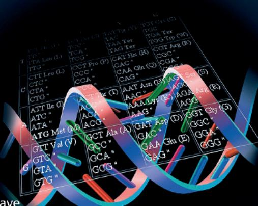

## Paleontology

New DNA sequencing techniques have allowed decoding of minute quantities of DNA found in ancient tissues from our extinct relatives, the Neanderthals (Homo neanderthalensis). Sequencing the Neanderthal genome has informed our understanding of their physical appearance (as in this reconstruction), as well as their relationship with modern humans. (See Figures 27.36 and 27.37.)

## Medical Science

## Evolution

A major aim of evolutionary biology is to understand the relationships among species, both living and extinct. For example, genome sequence comparisons have identified the hippopotamus as the land mammal sharing the most recent common ancestor with whales. (See Figure 19.20.)

Identifying the genetic basis for human diseases like cancer helps researchers focus their search for potential future treatments. Currently, sequencing the sets of genes expressed in an individual's type gene analyses were

tumor can allow a more targeted approach to treating the cancer, a type of “personalized medicine.” (See Concept 9.3 and Figure 16.21.)

## Hippopotamus

## Short-finned pilot whale

## Conservation Biology

The tools of molecular genetics and genomics are increasingly used by forensic ecologists to identify which species of animals and plants are killed illegally. In one case, genomic sequences of DNA from illegal shipments of elephant tusks were used to track down poachers and pinpoint the territory where they were operating. (See Figure 43.8.)

## Species Interactions

Most plant species exist in a mutually beneficial partnership with fungi (the white fibers in photo) and bacteria associated with the plants' roots; these interactions improve plant growth. Genome sequencing and analysis of gene expression have allowed characterization of plant-associated communities. Such studies will help advance our understanding of such interactions and may improve agricultural practices. (See the Chapter 26 Scientific Skills Exercise and Figure 29.11.)

additional species. And this conclusion holds true as well when comparing whole genomes: The human genome is 95–98% identical to that of the chimpanzee, but only roughly 85% identical to that of the mouse, a more distant evolutionary relative. Molecular biology has added a new tape measure to the toolkit biologists use to assess evolutionary kinship.

Comparing genomic sequences has practical applications as well. In the Problem-Solving Exercise, you can see how this type of genomic analysis can help you detect consumer fraud.

## Concept Check 5.6

1. How would sequencing the entire genome of an organism help scientists to understand how that organism functioned?

2. Given the function of DNA, why would you expect two species with very similar traits to also have very similar genomes?

For suggested answers, see Appendix A.

## Problem-Solving Exercise

## Are you a victim of fish fraud?

Despite its higher price, some people prefer to buy wild-caught Pacific salmon (Oncorhynchus species) over farmed Atlantic salmon (Salmo salar) for environmental or health reasons. But if they buy fish labeled as Pacific salmon, studies reveal that about $40\%$ of the time, customers won't get the fish they paid for!

In this exercise, you will investigate whether a piece of salmon has been fraudulently labeled.

## Your Approach

The principle guiding your investigation is that DNA sequences from within a species or from closely related species are more similar to each other than are sequences from more distantly related species.

## Your Data

You've been sold a piece of salmon labeled as coho salmon (Oncorhynchus kisutch). To see whether your fish was labeled correctly, you will compare a short DNA sequence from your sample with known sequences from the same gene for three salmon species. The sequences are as follows:

Sample labeled as O. kisutch (coho salmon)

Known sequences

5 '-CGGCACCGCCCTAAGTCTCT-3'

O. kisutch (coho salmon)
O. keta (chum salmon)
Salmo salar (Atlantic salmon)

5'-AGGCACCGCCCTAAGTCTAC-3'

5'-AGGCACCGCCCTGAGCCTAC-3'

5'-CGGCACCGCCCTAAGTCTCT-3'

Data from the International Barcode of Life.

## Your Analysis

1. Circle any bases in the known sequences that do not match the sequence from your fish sample.

2. How many bases differ between (a) O. kisutch and your fish sample? (b) O. keta and the sample? (c) S. salar and the sample?

3. For each known sequence, what percentage of its bases are identical to your sample?

4. Based on these data alone, state a hypothesis for the species identity of your sample. What is your reasoning?

Instructors: A version of this Problem-Solving Exercise can be assigned in Chapter 5 of Mastering Biology. A more extensive “Solve It” tutorial is in Chapter 26 of Mastering Biology.

## Concept 5.6: Genomics and proteomics have transformed biological inquiry and applications

\- Recent technological advances in DNA sequencing have given rise to genomics, an approach that analyzes large sets of genes or whole genomes, and proteomics, a similar approach for large sets of proteins. Bioinformatics is the use of computational tools, including artificial intelligence, and computer software to analyze these large data sets.

\- The more closely two species are related evolutionarily, the more similar their DNA sequences are. DNA sequence data confirm models of evolution based on fossils and anatomical evidence.

Given the sequences of a particular gene in fruit flies, fish, mice, and humans, predict the relative similarity of the human sequence to that of each of the other species.
For suggested answers, see Appendix A.

## Test Your Understanding

For more multiple-choice questions, go to the Practice Test (eTextbook only).

## Levels 1-2: Remembering/Understanding

1. Which of the following categories includes all others in the list?
(A) disaccharide (C) starch
(B) polysaccharide (D) carbohydrate

2. The enzyme amylase can break glycosidic linkages between glucose monomers only if the monomers are in the $\alpha$ form. Which of the following could amylase break down?

(A) glycogen, starch, and amylopectin

(B) glycogen and cellulose

(C) cellulose and chitin

(D) starch, chitin, and cellulose

3. Which statement about unsaturated fats is true?

(A) They are more common in animals than in plants.

(B) They have double bonds in their fatty acid chains.

(C) They generally solidify at room temperature.

(D) They contain more hydrogen than do saturated fats having the same number of carbon atoms.

4. The structural level of a protein least affected by a disruption in hydrogen bonding is the
(A) primary level.
(B) secondary level.
(C) tertiary level.
(D) quaternary level.

5. Enzymes that break down DNA catalyze the hydrolysis of the covalent bonds that join nucleotides together. What would happen to DNA molecules treated with these enzymes?

(A) The two strands of the double helix would separate.

(B) The phosphodiester linkages of the polynucleotide backbone would be broken.

(C) The pyrimidines would be separated from the deoxyribose sugars.

(D) All bases would be separated from the deoxyribose sugars.

## Levels 3-4: Applying/Analyzing

6. The molecular formula for glucose is $C_{6}H_{12}O_{6}$ . What would be the molecular formula for a polymer made by linking ten glucose molecules together by dehydration reactions?
(A) $C_{60}H_{120}O_{60}$ (C) $C_{60}H_{100}O_{50}$ (B) $C_{60}H_{102}O_{51}$ (D) $C_{60}H_{111}O_{51}$

7. Which of the following pairs of base sequences could form a short stretch of a normal double helix of DNA?
(A) 5'-AGCT-3' with 5'-TCGA-3'
(B) 5'-GCGC-3' with 5'-TATA-3'
(C) 5'-ATGC-3' with 5'-GCAT-3'
(D) 5'-ATGC-3' with 5'-ATGC-3'

8. Construct a table that organizes the following terms and label the columns and rows.

Monosaccharides Triacylglycerols Peptide bonds
Fatty acids Polynucleotides Glycosidic linkages
Amino acids Polysaccharides Ester linkages
Nucleotides Phosphodiester
Polypeptides linkages

## Levels 5-6: Evaluating/Creating

9. WRITE ABOUT A THEME: ORGANIZATION Proteins, which have diverse functions in a cell, are all polymers of the same kinds of monomers—amino acids. Write a short essay (100–150 words) that discusses how the structure of amino acids allows this one type of polymer to perform so many functions.

## 10. SYNTHESIZE YOUR KNOWLEDGE

Given that the function of egg yolk is to nourish and support the developing chick, explain why egg yolks are so high in fat, protein, and cholesterol.

  
For selected answers, see Appendix A.

## Practice Applying Your Learning

11. This question assesses your ability to apply your understanding of the structures and functions of large biological molecules.

A portion of a molecule is shown in the diagram. Use your knowledge about macromolecules to evaluate each statement about this molecule as more likely to be TRUE or more likely to be FALSE.

a. Based on the portion shown, this is an organic molecule. \_\_\_\_

b. Hydrolysis reactions are used to synthesize this molecule. \_\_\_\_

c. This molecule is assembled from nucleotide monomers. \_\_\_\_

d. Peptide bonds link the monomers of this molecule together. \_\_\_\_

e. The bend marked by the asterisk represents an oxygen atom. \_\_\_\_

f. This molecule includes an amino group and a carboxyl group. \_\_\_\_

g. Hydrogen bonds are likely to form between certain atoms in this portion of the molecule. \_\_\_\_

h. Exposure to substantial temperature changes will cause this molecule to be biologically inactive. \_\_\_\_

Unit 2
The Cell

An Interview with Julie Theriot

Dr. Julie Theriot is a Professor of Biology at the University of Washington, a Howard Hughes Medical Institute Investigator, and Chief Scientist at the Allen Institute for Cell Science. She received a BS in Biology and Physics from the Massachusetts Institute of Technology (MIT) and a PhD from University of California San Francisco (UCSF) and is a recipient of the David and Lucile Packard Foundation Fellowship for Science and Engineering, the John D. and Catherine T. MacArthur Foundation Fellowship, and numerous other awards. She and her laboratory members investigate the mechanical behavior of structural elements in cells, including cell motility and shape change.

## How did you get started in biology?

Both of my parents were scientists, so I was interested in science from an early age, and I majored in physics and biology in college. I had great professors who really stimulated my interest in biology, and I worked in Steve Burden's lab, looking at the connection between nerve and muscle cells. I loved sitting in the darkened microscope room and looking down at the glowing cells—it seemed like a miracle! Even the positive control samples were beautiful and made me happy. So, after college, I went straight to graduate school.

## What made you pick UCSF for graduate school, and what did you work on for your PhD?

I loved UCSF—it had a sort of joyful spirit and it seemed like all the grad students were friends. There were several faculty members there who were very much at the cutting edge of cell biology. I decided to work in Tim Mitchison's lab because he was interesting to talk to, and I liked what he worked on: the cytoskeleton. Some of the most abundant proteins in the cell are proteins of the cytoskeleton. The two main ones are tubulin and actin; they are both little globular proteins that have a remarkable ability to self-assemble. Many copies can bind to each other and make a long filamentous structure, thousands of times larger than the individual proteins. These long filaments carry out mechanical activities in the cell. Tim was working on microtubules and had developed a method to “tag” them with fluorescent molecules that were photo-activatable—they glowed when you shone light on them.

## What did you discover during your PhD research?

I decided to develop a similar photoactivatable tagging system for actin to find out more about how it worked. At first, I was working on skin cells from under the scales of goldfish. These cells have an enormous front leading edge that helps them move around. I used my tagged actin technique in these living cells, and showed that actin was assembled primarily at the leading edge, and also that it was very dynamic—there was a lot of assembly and disassembly. Then, we learned something interesting about a bacterium called Listeria monocytogenes that causes food-borne illness: This bacterium enters human cells and grows a beautiful comet tail structure that gets longer and longer. The mechanism wasn't clear, although some biologists thought it involved actin assembly. They had been looking at fixed (nonliving) cells, so it seemed that using my labeled actin system in living cells would help answer the question. We were able to show that what drove the movement was actin assembly next to the tails of the bacteria. Once I saw these bacteria moving around, it just blew

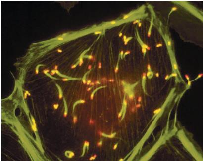  
Listeria monocytogenes infecting a mammalian host cell.

  
Dr. Julie Theriot

my mind! They look like little submarines driving around inside the cell.

"Once I saw these bacteria moving around, it just blew my mind! They look like little submarines driving around inside the cell."

## How were these bacteria moving?

Nobody knew how the actin was assembling at the tail end of Listeria—but it struck me that these pathogenic bacteria were like little cell biologists that could manipulate the cytoskeleton in human cells! It turned out that the bacteria had a protein on their surface that caused the human actin molecules to polymerize there, and that force drove the bacteria around the cell. This discovery ended up helping us understand how human cells regulate assembly of microfilaments. When I set up my own lab, we took a 20-year detour from eukaryotic cells to try to understand what bacteria were doing during an infection, because that seemed like a key to a treasure chest of information. After that, I transitioned back to also studying the cytoskeleton of various eukaryotic cells.

## Do you think it's important for people who are not going to be biologists to learn about cell biology?

Yes, it is very important. It's the basis of how we're alive. One thing that really drew me to cell biology initially was that an individual protein, like an individual enzyme, might be able to do something cool, but that's still just chemistry. A protein by itself isn't alive. But once a whole bunch of those things get together as parts of a cell, the cell is alive, and the cell as a unit can take energy from the environment it can grow; it can arrange things that can perform novel functions. And going from being a cell to being a multicellular organism is in many ways just more of the same. We're great big piles of cells, and our cells can specialize to do different things, but the individual cell is the threshold where you cross from a nonliving chemical system into a living entity.

DNA in the nucleus contains instructions for making proteins.

# A Tour of the Cell

## Key Concepts

6.1 Biologists use microscopes and biochemistry to study cells

6.2 Eukaryotic cells have internal membranes that compartmentalize their functions

6.3 The eukaryotic cell's genetic instructions are housed in the nucleus and carried out by the ribosomes

6.4 The endomembrane system regulates protein traffic and performs metabolic functions

6.5 Mitochondria and chloroplasts change energy from one form to another

6.6 The cytoskeleton is a network of fibers that organizes structures and activities in the cell

6.7 Extracellular components and connections between cells help coordinate cellular activities

6.8 A cell is greater than the sum of its parts

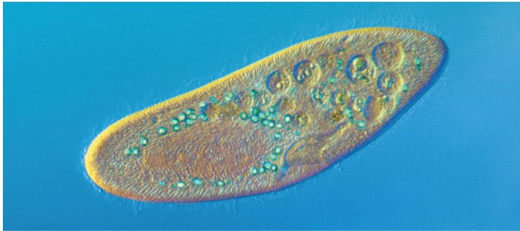  
Figure 6.1 The cell is an organism's basic unit of structure and function. Many forms of life exist as single-celled organisms, such as the Paramecium shown here. Larger, more complex organisms, including plants and animals, are multicellular. In this chapter, we focus mainly on eukaryotic cells—cells with a nucleus.

## Study Tip

Draw animal and plant cells: Draw an outline of an animal cell and add structures, labels, and functions. Draw a plant cell labeled with structures unique to plant cells.

Plasma membrane: a selective barrier

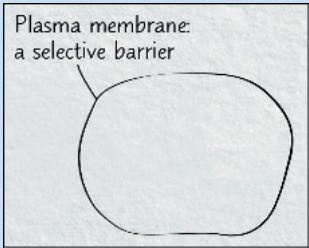  
Internal membranes divide a cell, such as this plant cell, into compartments where specific chemical reactions occur.  
Mitochondria break down molecules, generating ATP.

## How does the internal organization of eukaryotic cells allow them to perform the functions of life?

## Energy and matter transformations

A system of internal membranes synthesizes and modifies proteins, lipids, and carbohydrates.

Chloroplasts convert light energy to chemical energy.

## Interactions with the environment

The plasma membrane—controls what goes into and out of the cell.

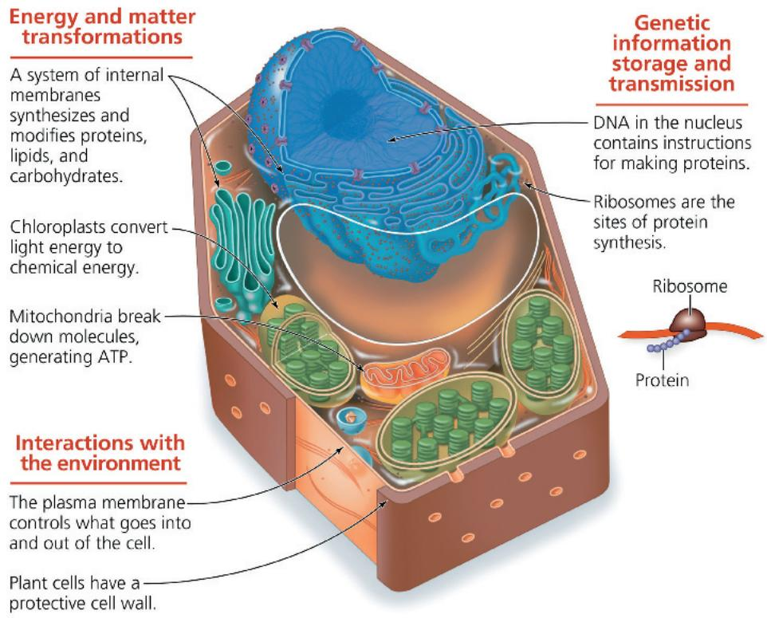  
Plant cells have a — protective cell wall.  
- Ribosomes are the sites of protein synthesis.

1 micrometer ( $\mu m$ ) = $10^{-3}$ mm = $10^{-6}$ m

# Concept 6.1: Biologists use microscopes and biochemistry to study cells

How can cell biologists investigate the inner workings of a cell, usually too small to be seen by the unaided eye? Before we tour the cell, it will be helpful to learn how cells are studied.

## Microscopy

The development of instruments that extend the human senses allowed the discovery and early study of cells. Microscopes were invented in 1590 and further refined during the 1600s. Cell walls were first seen on dead cells of oak bark by Robert Hooke in 1665 and living cells by Antoni van Leeuwenhoek a few years later.

The microscopes first used by Renaissance scientists, as well as the microscopes you are likely to use in the laboratory, are all light microscopes. In a light microscope (LM), visible light is passed through the specimen and then through glass lenses. The lenses refract (bend) the light in such a way that the image of the specimen is magnified as it is projected into the eye or into a camera (see Appendix C).

Three important parameters in microscopy are magnification, resolution, and contrast. Magnification is the ratio of an object's image size to its real size. Light microscopes can magnify effectively to about 1,000 times the actual size of the specimen; at greater magnifications, additional details cannot be seen clearly. Resolution is a measure of the clarity of the image; it is the minimum distance two points can be separated and still be distinguished as separate points. For example, what appears to the unaided eye as one star in the sky may be resolved as twin stars with a telescope, which has a higher resolving ability than the eye. Similarly, using standard techniques, the light microscope cannot resolve detail finer than about 0.2 micrometer ( $\mu$ m), or 200 nanometers (nm), regardless of the magnification (Figure 6.2). The third parameter, contrast, is the difference in brightness between the light and dark areas of an image. Methods for enhancing contrast include staining or labeling cell components to stand out visually.

Figure 6.3 shows some different types of microscopy; study this figure as you read this section.

Until recently, the resolution barrier prevented cell biologists from using standard light microscopy when studying organelles, the membrane-enclosed structures within eukaryotic cells. To see these structures in any detail required the development of a new instrument. In the 1950s, the electron microscope was introduced to biology. Rather than focusing light, the electron microscope (EM) focuses a beam of electrons through the specimen or onto its surface (see Appendix C). Resolution is inversely related to the wavelength of the light (or electrons) a microscope uses for imaging, and electron beams have much shorter wavelengths than visible light. Modern electron microscopes can theoretically achieve a resolution of about 0.002 nm, though in practice they usually

Figure 6.2 The size range of cells.

Most cells are between 1 and 100 $\mu$ m in diameter (yellow region of chart), and their components are even smaller (see Figure 6.32), as are viruses. Notice that the scale along the left side is logarithmic, to accommodate the range of sizes shown. Starting at the top of the scale with 10 m and going down, each reference measurement marks a tenfold decrease in diameter or length. For a complete table of the metric system, see the back of the book.

  
1 nanometer (nm) = $10^{-3}$ $\mu$ m = $10^{-9}$ m

cannot resolve structures smaller than about 2 nm across. Still, this is a 100-fold improvement over the standard light microscope.

The scanning electron microscope (SEM) is especially useful for detailed study of the topography of a specimen (see Figure 6.3). The electron beam scans the surface of the sample, usually coated with a thin film of gold. The beam excites electrons on the surface, and these secondary electrons are detected by a device that translates the pattern of electrons

# Exploring Microscopy

## Figure 6.3

## Light Microscopy (LM)

Brightfield. Light passes directly through the specimen. Unstained (left), the image has little contrast. Staining with dyes (right) enhances contrast. Most stains require cells to be preserved, which kills them.

Phase-contrast. Variations in density within the specimen are amplified to enhance contrast in unstained cells; this is especially useful for examining living, unstained cells.

  
Human
cheek
cells

Differential interference contrast (Nomarski). As in phase-contrast microscopy, optical modifications are used to exaggerate differences in density; the image appears almost 3-D.

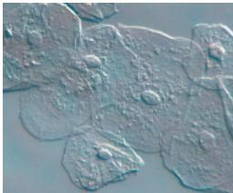  
50 μm

Fluorescence. Locations of specific molecules are revealed by labeling the molecules with fluorescent dyes or antibodies, which absorb ultraviolet radiation and emit visible light. In this fluorescently labeled uterine cell, DNA is blue, organelles called mitochondria are orange, and part of the cell's "skeleton" (called the cytoskeleton) is green.

  
10μm

Confocal. This image shows two types of fluorescence micrographs: confocal (top) and standard (bottom). (Nerve cells are green, support cells orange, areas of overlap yellow.) In confocal microscopy, a laser is used to create a single plane of fluorescence; out-of-focus light from other planes is eliminated. By capturing

sharp images at many different planes, a 3-D reconstruction can be created. A standard fluorescence micrograph is blurry because out-of-focus light is not excluded.

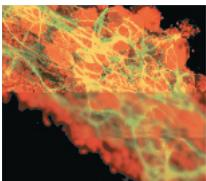  
50 μm

Deconvolution. The top of this image of a white blood cell was reconstructed from many blurry fluorescence images at different planes, each processed using deconvolution software. This process digitally removes out-of-focus light and reassigns it to its source, creating a much sharper 3-D image. The bottom is a compilation of standard fluorescent micrographs through the same cell.

  
10 μm

Super-resolution. To make this super-resolution image of a cow aorta cell (top), individual fluorescent molecules were excited by UV light and their position recorded. (DNA is blue, mitochondria red, and part of the cytoskeleton green.) Combining information from many molecules in different places "breaks" the resolution limit, resulting in the sharp image on top. The size of each dot is well below the 200-nm resolution of a standard light microscope, as seen in the confocal image (bottom) of the same cell.

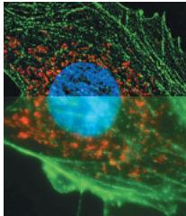  
10 μm

## Electron Microscopy (EM)

Scanning electron microscopy (SEM). Micrographs taken with a scanning electron microscope show a 3-D image of the surface of a specimen. This SEM shows the surface of a cell from a trachea (windpipe) covered with cell projections called cilia. Electron micrographs are black and white but are often artificially colored to highlight particular structures, as has been done with all three electron micrographs shown here.

SEM

Abbreviations used in figure legends in this text:
LM = Light Micrograph
SEM = Scanning Electron Micrograph
TEM = Transmission Electron Micrograph

Transmission electron microscopy (TEM). A transmission electron microscope profiles a thin section of a specimen. This TEM shows a section through a tracheal cell, revealing its internal structure. In preparing the specimen, some cilia were cut along their lengths, creating longitudinal sections, while other cilia were cut straight across, creating cross sections.

Cilia

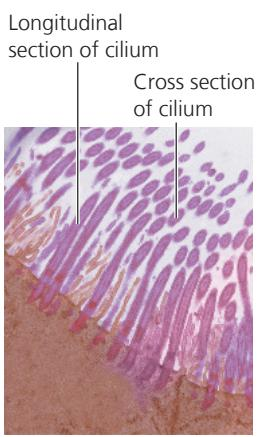  
TEM

Cryo-electron microscopy (cryo-EM). Specimens of tissue or aqueous solutions of proteins are frozen rapidly at temperatures less than $-160^{\circ}\mathrm{C}$ , locking the molecules into a rigid state. A beam of electrons is passed through the sample to visualize the molecules by electron microscopy, and software is used to merge a series of such micrographs, creating a 3-D image like the one below.

2 μm

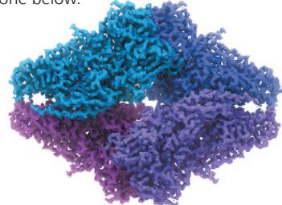  
Computer-generated image of the bacterial enzyme $\beta$ -galactosidase, which breaks down lactose. This image was compiled from more than 90,000 cryo-EM images.

into an electronic signal sent to a video screen. The result is an image of the specimen's surface that appears three-dimensional.

The transmission electron microscope (TEM) is used to study the internal structure of cells (see Figure 6.3). The TEM aims an electron beam through a very thin section of the specimen, much as a light microscope aims light through a sample on a slide. For the TEM, the specimen has been stained with atoms of heavy metals, which attach to certain cellular structures, thus enhancing the electron density of some parts of the cell more than others. The electrons passing through the specimen are scattered more in the denser regions, so fewer are transmitted. The image displays the pattern of transmitted electrons. Instead of using glass lenses, both the SEM and TEM use electromagnets as lenses to bend the paths of the electrons, ultimately focusing the image onto a monitor for viewing.

Electron microscopes have revealed many subcellular structures that were impossible to resolve with the light microscope. But the light microscope offers advantages, especially in studying living cells. A disadvantage of electron microscopy is that the methods customarily used to prepare the specimen kill the cells and can introduce artifacts, structural features seen in micrographs that do not exist in the living cell.

In the past several decades, light microscopy has been revitalized by major technical advances (see Figure 6.3). Labeling individual cellular molecules or structures with fluorescent markers has made it possible to see such structures with increasing detail. In addition, both confocal and deconvolution microscopy have produced sharper images of three-dimensional tissues and cells. Finally, a group of new techniques and labeling molecules developed in recent years, called super-resolution microscopy, has allowed researchers to “break” the resolution barrier and distinguish subcellular structures as small as 10–20 nm across.

A recently developed new type of TEM called cryo-electron microscopy (cryo-EM) (see Figure 6.3) allows specimens to be preserved at extremely low temperatures. This avoids the use of preservatives, allowing visualization of structures in their cellular environment. This method is increasingly used to complement X-ray crystallography in revealing protein complexes and subcellular structures like ribosomes, described later. Cryo-EM has even been used to resolve some individual proteins. The Nobel Prize for Chemistry was awarded in 2017 to the developers of this valuable technique.

Microscopes are the most important tools of cytology, the study of cell structure. Understanding the function of each structure, however, required the integration of cytology and biochemistry, the study of the chemical processes (metabolism) of cells.

## Cell Fractionation

A useful technique for studying cell structure and function is cell fractionation (Figure 6.4), which takes cells apart and separates major organelles and other subcellular structures from one another. The piece of equipment that is used for this task is the

## Figure 6.4

## Research Method: Cell Fractionation Application

Cell fractionation is used to separate (fractionate) cell components based on size and density.

## Technique

Cells are homogenized in a blender to break them up. The resulting mixture (homogenate) is centrifuged. The liquid above the pellet (supernatant) is poured into another tube and centrifuged at a higher speed for a longer period. This process is repeated several times. This process, called differential centrifugation, results in a series of pellets, each containing different cell components.

## Results

In early experiments, researchers used microscopy to identify the organelles in each pellet and biochemical methods to determine their metabolic functions. These

identifications established a baseline for this method, enabling today's researchers to know which cell fraction they should collect in order to isolate and study particular organelles.

MAKE CONNECTIONS If you wanted to study the process of translation of proteins from mRNA, which part of which fraction would you use? (See Figure 5.22.)

For suggested answer, see Appendix A.

centrifuge, which spins test tubes holding mixtures of disrupted cells at a series of increasing speeds, a process called differential centrifugation. At each speed, the resulting force causes a subset of the cell components to settle to the bottom of the tube, forming a pellet. At lower speeds, the pellet consists of larger components, and higher speeds result in a pellet with smaller components.

# Concept 6.2: Eukaryotic cells have internal membranes that compartmentalize their functions

Cell fractionation enables researchers to prepare specific cell components in bulk and identify their functions, a task not usually possible with intact cells. For example, on one of the cell fractions, biochemical tests showed the presence of enzymes involved in cellular respiration, while electron microscopy revealed large numbers of the organelles called mitochondria. Together, these data helped biologists determine that mitochondria are the sites of cellular respiration. Biochemistry and cytology thus complement each other in correlating cell function with structure.

## Concept Check 6.1

1. How do stains used for light microscopy compare with those used for electron microscopy?

2. WHAT IF? Which type of microscope would you use to study (a) the changes in shape of a living white blood cell? (b) the details of surface texture of a hair?

For suggested answers, see Appendix A.

Cells—the basic structural and functional units of every organism—are of two distinct types: prokaryotic and eukaryotic. Organisms in Bacteria and Archaea consist of prokaryotic cells. (As discussed in Concept 1.2, the term “Archaea” in this text refers to prokaryotic species unless otherwise noted.) Organisms belonging to Eukarya—protists, fungi, animals, and plants—all consist of eukaryotic cells. (“Protist” is an informal term referring to a diverse group of mostly unicellular eukaryotes; see Concept 28.1.)

## Comparing Prokaryotic and Eukaryotic Cells

All cells share certain basic features: They are all bounded by a selective barrier, called the plasma membrane (or the cell membrane). Inside all cells is a semifluid, jellylike substance called cytosol, in which subcellular components are suspended. All cells contain chromosomes, which carry genes in the form of DNA. And all cells have ribosomes, tiny complexes that make proteins according to instructions from the genes.

A major difference between prokaryotic and eukaryotic cells is the location of their DNA. In a eukaryotic cell, most of the DNA is in an organelle called the nucleus, which is bounded by a double membrane (see Figure 6.8). In a prokaryotic cell, the DNA is concentrated in a region that is not membrane-enclosed, called the nucleoid (Figure 6.5).

Eukaryotic means “true nucleus” (from the Greek eu, true, and karyon, kernel, referring to the nucleus), and prokaryotic means “before nucleus” (from the Greek pro, before), reflecting the earlier evolution of prokaryotic cells.

The interior of either type of cell is called the cytoplasm; in eukaryotic cells, this term refers only to the region between the nucleus and the plasma membrane. Within the cytoplasm of a eukaryotic cell, suspended in cytosol, are a variety of organelles of specialized form and function. These membrane-bounded structures are absent in almost all prokaryotic cells, another distinction between prokaryotic and eukaryotic cells. In spite of the absence of organelles, though, the prokaryotic cytoplasm is not a formless soup. For example, some prokaryotic organisms contain regions surrounded by proteins (not membranes), within which specific reactions take place.

Eukaryotic cells are generally much larger than prokaryotic cells (see Figure 6.2). Size is a general feature of cell structure that relates to function. The logistics of carrying out cellular metabolism sets limits on cell size. At the lower limit, the smallest cells known are bacteria called mycoplasmas, which have diameters between 0.1 and 1.0 $\mu$ m. These are perhaps the smallest packages with enough DNA to program metabolism and enough enzymes and other cellular equipment to allow a cell to sustain itself and reproduce. Typical bacteria are 1–5 $\mu$ m in diameter, about ten times the size of mycoplasmas. Eukaryotic cells are typically 10–100 $\mu$ m in diameter.

Metabolic requirements also impose theoretical upper limits on the size that is practical for a single cell. At the boundary of every cell, the plasma membrane functions as a selective barrier that allows passage of enough oxygen, nutrients, and wastes to service the entire cell (Figure 6.6). For each square micrometer of membrane, only a limited amount of a particular substance can cross per second, so the ratio of surface area to volume is critical. As a cell (or any other object) increases in size, its surface area grows proportionately less than its volume. (Area is proportional to a linear dimension squared, whereas volume is proportional to the linear dimension cubed.) Thus, a smaller cell has a greater ratio of surface area to volume: Compare the calculations for the first two “cells” in Figure 6.7. The Scientific Skills Exercise gives you a chance to calculate the volumes and surface areas of two actual cells—a mature yeast cell and a cell budding from it. To explore different ways that the surface area of cells is maximized in various organisms, see Make Connections Figure 33.8.

The need for a surface area large enough to accommodate the volume helps explain the microscopic size of most cells and the narrow, elongated shapes of some cells, such as nerve cells. Larger organisms do not generally have larger cells than smaller organisms—they simply have more cells (see the far right of Figure 6.7). A sufficiently high ratio of surface area to volume is especially important in cells that exchange a lot of material with their surroundings, such as intestinal cells. Such cells may have many long, thin projections from their surface called microvilli, which increase surface area without an appreciable increase in volume.

The evolutionary relationships between prokaryotic and eukaryotic cells will be discussed later in this chapter, and prokaryotic cells will be described in detail elsewhere (see Chapter 27). Most of the discussion of cell structure that follows in this chapter applies to eukaryotic cells.

Figure 6.6 The plasma membrane.

The plasma membrane and the membranes of organelles consist of a double layer (bilayer) of phospholipids with various proteins attached to or embedded in it. The hydrophobic parts of phospholipids and membrane proteins are found in the interior of the membrane, while the hydrophilic parts are in contact with aqueous solutions on either side. Carbohydrate side chains may be attached to proteins or lipids on the outer surface of the plasma membrane.

(a) Colorized TEM of a plasma membrane. The plasma membrane appears as a pair of dark bands separated by a gold band.

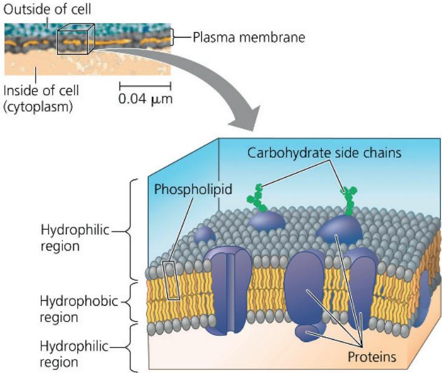  
(b) Structure of the plasma membrane

VISUAL SKILLS What parts of the membrane diagram in (b) correspond to the dark bands in the TEM in (a)? What parts correspond to the gold band? (Review Figure 5.11.)

For suggested answer, see Appendix A.

## Figure 6.7 Geometric relationships between surface area and volume.

In this diagram, cells are represented as cubes. Using arbitrary units of length, we can calculate the cell's surface area (in square units, or units $^{2}$ ), volume (in cubic units, or units $^{3}$ ), and ratio of surface area to volume. A high surface area-to-volume ratio facilitates the exchange of materials between a cell and its environment.

Surface area increases while total volume remains constant

<table><tr><td>Total surface area[(height × width of 1 side)× 6 sides × number of cells]</td><td>6 units2</td><td>150 units2</td><td>750 units2</td></tr><tr><td>Total volume[(height × width × lengthof 1 cell) × number of cells]</td><td>1 unit3</td><td>125 units3</td><td>125 units3</td></tr><tr><td>Surface area-to-volume ratio[surface area ÷ volume]</td><td>6</td><td>1.2</td><td>6</td></tr></table>

# Scientific Skills Exercise Using a Scale Bar to Calculate Volume and Surface Area of a Cell

How Much New Cytoplasm and Plasma Membrane Are Made by a Growing Yeast Cell? The unicellular yeast Saccharomyces cerevisiae divides by budding off a small new cell that then grows to full size (see the yeast cells at the bottom of Figure 6.8). During its growth, the new cell synthesizes new cytoplasm, which increases its volume, and new plasma membrane, which increases its surface area. In this exercise, you will use a scale bar to determine the sizes of a mature parent yeast cell and a cell budding from it. You will then calculate the volume and surface area of each cell. You will use your calculations to determine how much cytoplasm and plasma membrane the new cell needs to synthesize to grow to full size.

How the Experiment Was Done Yeast cells were grown under conditions that promoted division by budding. The cells were then viewed with a differential interference contrast light microscope and photographed.

Data from the Experiment This light micrograph shows a budding yeast cell about to be released from the mature parent cell:

  
Micrograph from K. Tatchell, using yeast cells grown for experiments described in L. Kozubowski et al., Role of the septin ring in the asymmetric localization of proteins at the mother-bud neck in Saccharomyces cerevisiae, Molecular Biology of the Cell 16:3455–3466 (2005).

## INTERPRET THE DATA

1. Examine the micrograph of the yeast cells. The scale bar under the photo is labeled $1 \mu m$ . The scale bar works in the same way as a scale on a map, where, for example, 1 inch equals 1 mile. In this case the bar represents one thousandth

## A Panoramic View of the Eukaryotic Cell

In addition to the plasma membrane at its outer surface, a eukaryotic cell has extensive, elaborately arranged internal membranes that divide the cell into compartments—the organelles mentioned earlier. The cell’s compartments provide different local environments that support specific metabolic functions, so incompatible processes can occur simultaneously in a single cell. The plasma membrane and organelle membranes also participate directly in the cell’s metabolism because many enzymes are built right into the membranes.

of a millimeter. Using the scale bar as a basic unit, determine the diameter of the mature parent cell and the new cell. Start by measuring the scale bar and the diameter of each cell. The units you use are irrelevant, but working in millimeters is convenient. Divide each diameter by the length of the scale bar and then multiply by the scale bar's length value to give you the diameter in micrometers.

2. The shape of a yeast cell can be approximated by a sphere.
(a) Calculate the volume of each cell using the formula for the volume of a sphere:

$$
V = \frac {4}{3} \pi r ^ {3}
$$

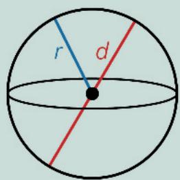

Note that $\pi$ (the Greek letter pi) is a constant with an approximate value of 3.14, d stands for diameter, and r stands for radius, which is half the diameter. (b) What volume of new cytoplasm will the new cell have to synthesize as it matures? To determine this, calculate the difference between the volume of the full-sized cell and the volume of the new cell.

3. As the new cell grows, its plasma membrane needs to expand to contain the increased volume of the cell. (a) Calculate the surface area of each cell using the formula for the surface area of a sphere: $A = 4\pi r^{2}$ . (b) How much area of new plasma membrane will the new cell have to synthesize as it matures?

4. When the new cell matures, it will be approximately how many times greater in volume and how many times greater in surface area than its current size? Which is growing at a faster rate?

Instructors: A version of this Scientific Skills Exercise can be assigned in Mastering Biology.

The basic fabric of most biological membranes is a double layer of phospholipids and other lipids. Embedded in this lipid bilayer or attached to its surfaces are diverse proteins (see Figure 6.6). However, each type of membrane has a unique composition of lipids and proteins suited to that membrane's specific functions. For example, enzymes embedded in the membranes of the organelles called mitochondria function in cellular respiration. Because membranes are so fundamental to the organization of the cell, Chapter 7 will discuss them in detail.

Before continuing with this chapter, examine the eukaryotic cells in Figure 6.8. The generalized diagrams of an animal cell and

Figure 6.8

ENDOPLASMIC RETICULUM (ER): network of membranous sacs and tubes; active in membrane synthesis and other synthetic and metabolic processes; has rough (ribosome-studded) and smooth regions

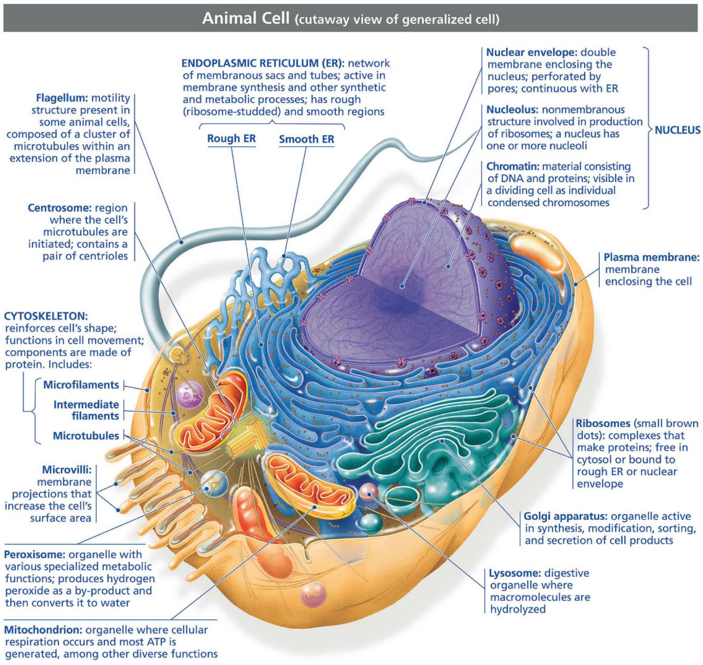

Mitochondrion: organelle where cellular respiration occurs and most ATP is generated, among other diverse functions

Animal Cells

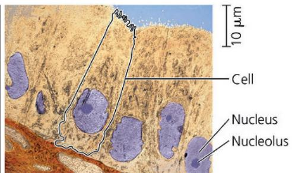  
Human cells from lining of uterus (colorized TEM)  
Unicellular Fungi

  
Yeast cells: reproducing by budding (above, colorized SEM) and a single cell (right, colorized TEM)

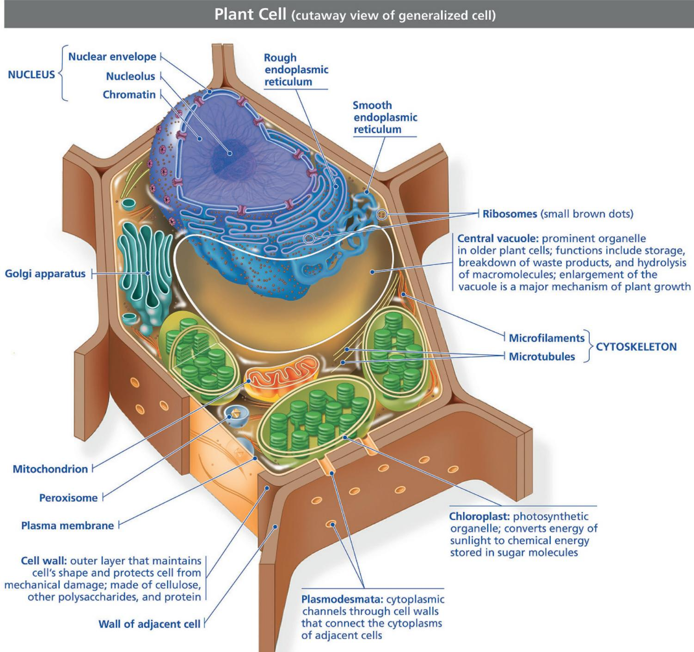

  
Cells from duckweed (Spirodela oligorrhiza), a floating plant (colorized TEM)  
Unicellular Algae

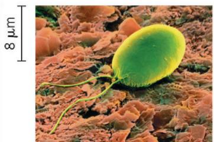  
Unicellular green alga Chlamydomonas (above, colorized SEM; right, colorized TEM)

5 μm

a plant cell introduce the various organelles and show the key differences between animal and plant cells. The micrographs at the bottom of the figure give you a glimpse of cells from different types of eukaryotic organisms.

## Concept Check 6.2

1. Briefly describe the structure and function of the nucleus, the mitochondrion, the chloroplast, and the endoplasmic reticulum.

2. DRAW IT Draw a simplified elongated cell that measures $125 \times 1 \times 1$ arbitrary units. A nerve cell would be roughly this shape. Predict how its surface-to-volume ratio would compare with those in Figure 6.7. Then calculate the ratio and check your prediction.

For suggested answers, see Appendix A.

## Concept 6.3: The eukaryotic cell's genetic instructions are housed in the nucleus and carried out by the ribosomes

On the first stop of our detailed tour of the eukaryotic cell, let's look at two cellular components involved in the genetic control of the cell: the nucleus, which houses most of the cell's DNA, and the ribosomes, which use information from the DNA to make proteins.

## The Nucleus: Information Central

The nucleus contains most of the genes in the eukaryotic cell. (Some genes are located in mitochondria and chloroplasts.) It is usually the most conspicuous organelle (see the purple structure in the fluorescence micrograph), averaging about 5 $\mu$ m in diameter. The nuclear envelope encloses the nucleus (Figure 6.9), separating its contents from the cytoplasm.

The nuclear envelope is a double membrane. The two membranes, each a lipid bilayer with associated proteins, are separated by a space of 20–40 nm. The envelope is perforated by pore structures that are about 100 nm in diameter. At the lip of each pore, the inner and outer membranes of the nuclear envelope are continuous. An intricate protein structure called a pore complex lines each pore and plays an important role in the cell by regulating the entry and exit of proteins and RNAs, as well as large complexes of macromolecules. Except at the pores, the nuclear side of the envelope is lined by the nuclear lamina, a netlike array of protein filaments (in animal cells, called intermediate filaments) that maintains the shape of the nucleus by mechanically supporting the nuclear envelope. There is also much evidence for a nuclear matrix, a framework of protein fibers extending throughout the nuclear interior. The nuclear lamina and matrix may help organize the genetic material so it functions efficiently.

Within the nucleus, the DNA is organized into discrete units called chromosomes, structures that carry the genetic information. Each chromosome contains one long DNA molecule associated with many proteins, including small basic proteins called histones. Some of the proteins help coil the DNA molecule of each chromosome, reducing its length and allowing it to fit into the nucleus. The complex of DNA and proteins making up chromosomes is called chromatin. When a cell is not dividing, stained chromatin appears as a diffuse mass in micrographs, and the chromosomes cannot be distinguished from one another, even though discrete chromosomes are present. As a cell prepares to divide, however, the chromosomes form loops and coil, condensing and becoming thick enough to be distinguished under a microscope as separate structures (see Figure 16.23). Each eukaryotic species has a characteristic number of chromosomes. For example, a typical human cell has 46 chromosomes in its nucleus; the exceptions are human sex cells (eggs and sperm), which have only 23 chromosomes. A fruit fly cell has 8 chromosomes in most cells and 4 in the sex cells.

A prominent structure within the nondividing nucleus is the nucleolus (plural, nucleoli), which appears through the electron microscope as a mass of densely stained granules and fibers adjoining part of the chromatin. Here a type of RNA called ribosomal RNA (rRNA) is synthesized from genes in the DNA. Also in the nucleolus, proteins imported from the cytoplasm are assembled with rRNA into large and small subunits of ribosomes.

These subunits then exit the nucleus through the nuclear

pores to the cytoplasm, where a large and a small subunit can assemble into a ribosome.

Sometimes there are two or more nucleoli; the number depends on the species and the stage in the cell's reproductive cycle. The nucleoli may also play a role in controlling cell division and the life span of a cell.

As we saw in Figure 5.22, the nucleus directs protein synthesis by synthesizing messenger RNA (mRNA) that carries information from the DNA. The mRNA is then escorted by specific proteins to the cytoplasm via nuclear pores. Once an mRNA molecule reaches the cytoplasm, ribosomes translate

um the mRNA's genetic message into the primary structure of a specific polypeptide. (This process of transcribing and translating genetic information is described in detail in Chapter 17.)

## Ribosomes: Protein Factories

Ribosomes, which are complexes made of ribosomal RNAs and proteins, are the cellular components that carry out protein synthesis (Figure 6.10). (Note that ribosomes are not membrane

Figure 6.9 The nucleus and its envelope.

Within the nucleus are the chromosomes, which appear as a mass of chromatin (DNA and associated proteins) and one or more nucleoli (singular, nucleolus), which function in ribosome synthesis. The nuclear envelope, which consists of two membranes separated by a narrow space, is perforated with pores and lined by the nuclear lamina.

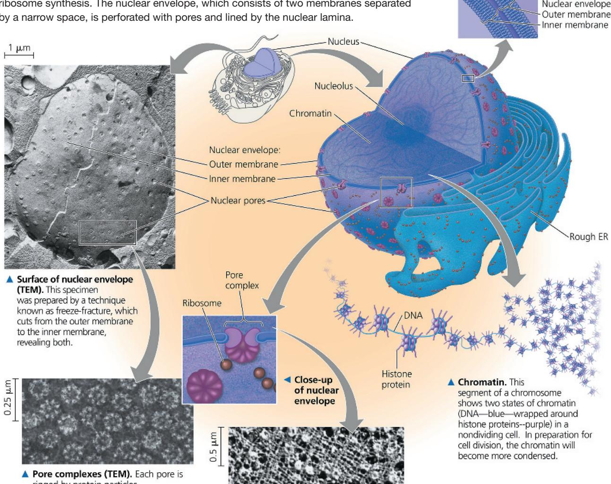  
Surface of nuclear envelope (TEM). This specimen was prepared by a technique known as freeze-fracture, which cuts from the outer membrane to the inner membrane, revealing both.  
▲ Pore complexes (TEM). Each pore is ringed by protein particles.

▶ Nuclear lamina (TEM). The netlike lamina lines the inner surface of the nuclear envelope. (The light circular spots are nuclear pores.)

MAKE CONNECTIONS Chromosomes contain the genetic material and reside in the nucleus. How does the rest of the cell get access to the information they carry? (See Figure 5.22.) For suggested answer, see Appendix A.

Figure 6.10 Ribosomes.  
This electron micrograph of a pancreas cell shows both free and bound ribosomes. The simplified diagram and computer model show the two subunits of a ribosome.  
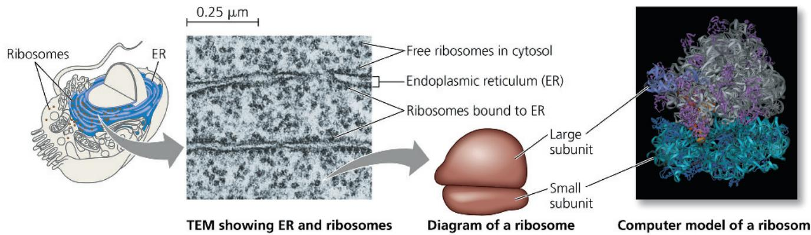  
DRAW IT After you have read the section on ribosomes, circle a ribosome in the micrograph that might be making a protein that will be secreted.  
For suggested answer, see Appendix A.

bounded and thus are not considered organelles.) Cells with high rates of protein synthesis have particularly large numbers of ribosomes as well as prominent nucleoli, which makes sense, given the role of nucleoli in ribosome assembly. For example, a human pancreas cell, which makes many digestive enzymes, has a few million ribosomes.

## Interview

Interview with Venki Ramakrishnan: Studying ribosome structure (eTextbook only)

Ribosomes build proteins in two cytoplasmic regions: At any given time, free ribosomes are suspended in the cytosol, while bound ribosomes are attached to the outside of the endoplasmic reticulum or nuclear envelope (see Figure 6.10). Bound and free ribosomes are structurally identical, and ribosomes can play either role at different times. Most of the proteins made on free ribosomes function within the cytosol; examples are enzymes that catalyze the first steps of sugar breakdown. Bound ribosomes generally make proteins that are destined for insertion into membranes, for packaging within certain organelles such as lysosomes (see Figure 6.8), or for export from the cell (secretion). Cells that specialize in protein secretion—for instance, the cells of the pancreas that secrete digestive enzymes—frequently have a high proportion of bound ribosomes. (You will learn more about ribosome structure and function in Concept 17.4.)

## Concept Check 6.3

1. What role do ribosomes play in carrying out genetic instructions?
2. Describe the molecular composition of nucleoli and explain their function.

3. WHAT IF? As a cell begins the process of dividing, its chromosomes become shorter, thicker, and individually visible in an LM (light micrograph). Explain what is happening at the molecular level.

For suggested answers, see Appendix A.

# Concept 6.4: The endomembrane system regulates protein traffic and performs metabolic functions

Many of the different membrane-bounded organelles of the eukaryotic cell are part of the endomembrane system, which includes the nuclear envelope, the endoplasmic reticulum, the Golgi apparatus, lysosomes, various kinds of vesicles and vacuoles, and the plasma membrane. This system carries out a variety of tasks in the cell, including synthesis of proteins, transport of proteins into membranes and organelles or out of the cell, metabolism and movement of lipids, and detoxification of poisons. The membranes of this system are related either through direct physical continuity or by the transfer of membrane segments as tiny vesicles (sacs made of membrane). Despite these relationships, the various membranes are not identical in structure and function. Moreover, the thickness, molecular composition, and types of chemical reactions carried out in a given membrane are not fixed, but may be modified several times during the membrane's life. Having already looked at the nuclear envelope, we will now focus on the endoplasmic reticulum and the other endomembranes to which the endoplasmic reticulum gives rise.

## The Endoplasmic Reticulum: Biosynthetic Factory

The endoplasmic reticulum (ER) is such an extensive network of membranes that it accounts for more than half the total membrane in many eukaryotic cells. (The word endoplasmic means “within the cytoplasm,” and reticulum is Latin for “little net.”) The ER consists of a network of membranous tubules and sacs called cisternae (from the Latin cisterna, a reservoir for a liquid). The ER membrane separates the internal compartment of the ER, called the ER lumen (cavity) or cisternal space, from the cytosol. And because the ER membrane is continuous with the nuclear envelope, the space between the two membranes of the envelope is continuous with the lumen of the ER (Figure 6.11).

There are two distinct, though connected, regions of the ER that differ in structure and function: smooth ER and rough ER. Smooth ER is so named because its outer surface lacks ribosomes. Rough ER is studded with ribosomes on the outer surface of the membrane and thus appears rough through the electron microscope. As already mentioned, ribosomes are also attached to the cytoplasmic side of the nuclear envelope's outer membrane, which is continuous with rough ER.

## Functions of Smooth ER

The smooth ER functions in diverse metabolic processes, which vary with cell type. These processes include synthesis of lipids, metabolism of carbohydrates, detoxification of drugs and poisons, and storage of calcium ions.

Enzymes of the smooth ER are important in the synthesis of lipids, including oils, steroids, and new membrane phospholipids. Among the steroids produced by the smooth ER in animal cells are the sex hormones of vertebrates and the various steroid hormones secreted by the adrenal glands. The cells that synthesize and secrete these hormones—in the testes and ovaries, for example—are rich in smooth ER, a structural feature that fits the function of these cells.

Other enzymes of the smooth ER help detoxify drugs and poisons, especially in liver cells. Detoxification usually involves adding hydroxyl groups to drug molecules, making them more water-soluble and easier to flush from the body. The sedative phenobarbital and other barbiturates are examples of drugs metabolized in this manner by smooth ER in liver cells. In fact, barbiturates, alcohol, and many other drugs induce the

proliferation of smooth ER and its associated detoxification enzymes, thus increasing the rate of detoxification. This, in turn, increases tolerance to the drugs, meaning that higher doses are required to achieve a particular effect, such as sedation. Also, because some of the detoxification enzymes have relatively broad action, the proliferation of smooth ER in response to one drug can increase the need for higher dosages of other drugs as well. Barbiturate use, for instance, can decrease the effectiveness of certain antibiotics and other useful drugs.

Figure 6.11 Endoplasmic reticulum (ER).

A membranous system of interconnected tubules and flattened sacs called cisternae, the ER is also continuous with the nuclear envelope, as shown in the cutaway diagram at the top. The membrane of the ER encloses a continuous compartment called the ER lumen (or cisternal space). Rough ER, which is studded on its outer surface with ribosomes, can be distinguished from smooth ER in the electron micrograph (TEM). Transport vesicles bud off from a region of the rough ER called transitional ER and travel to the Golgi apparatus and other destinations.

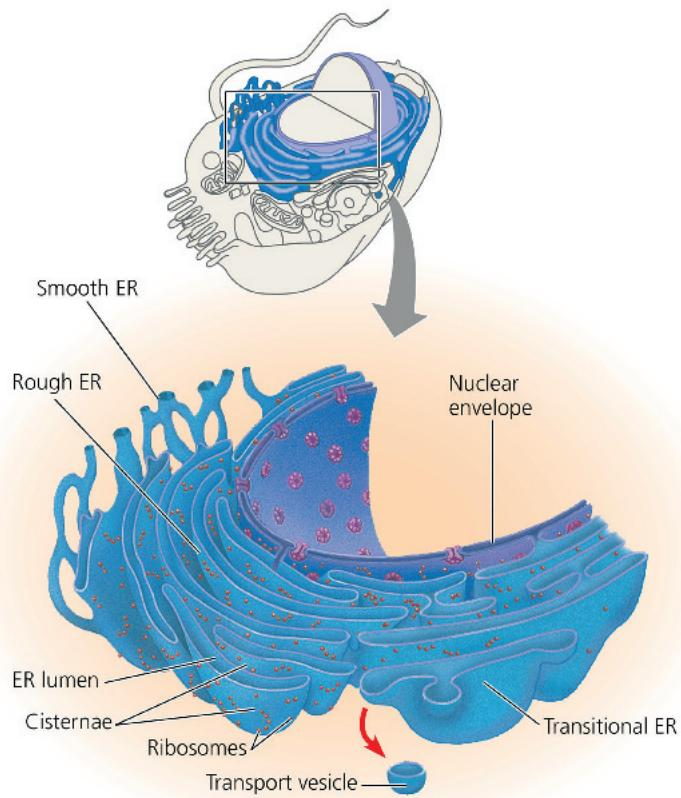

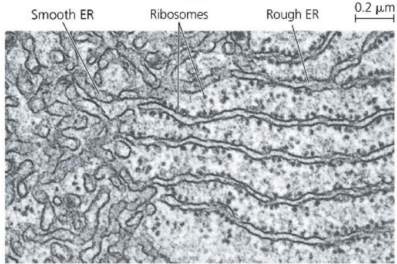

The smooth ER also stores calcium ions. In muscle cells, for example, the smooth ER membrane pumps calcium ions from the cytosol into the ER lumen. When a muscle cell is stimulated by a nerve impulse, calcium ions rush back across the ER membrane into the cytosol and trigger contraction of the muscle cell. In other cell types, release of calcium ions from the smooth ER triggers different responses, such as secretion of vesicles carrying newly synthesized proteins.

## Functions of Rough ER

Many cells secrete proteins that are produced by ribosomes attached to rough ER. For instance, certain pancreatic cells synthesize the protein insulin in the ER and secrete this hormone into the bloodstream. As a polypeptide chain grows from a bound ribosome, the chain is threaded into the ER lumen through a pore formed by a protein complex in the ER membrane. The new polypeptide folds into its functional shape as it enters the ER lumen. Most secretory proteins are glycoproteins, proteins with carbohydrates covalently bonded to them. The carbohydrates are attached to the proteins in the ER lumen by enzymes built into the ER membrane.

After secretory proteins are formed, the ER membrane keeps them separate from proteins in the cytosol, which are produced by free ribosomes. Secretory proteins depart from the ER wrapped in the membranes of vesicles that bud like bubbles from a specialized region called transitional ER (see Figure 6.11). Vesicles in transit from one part of the cell to another are called transport vesicles; we will examine their fate shortly.

In addition to making secretory proteins, rough ER is a membrane factory for the cell; it grows in place by adding membrane proteins and phospholipids to its own membrane. As polypeptides destined to be membrane proteins grow from the ribosomes, they are inserted into the ER membrane itself and anchored there by their hydrophobic portions. Like the smooth ER, the rough ER also makes membrane phospholipids; enzymes built into the ER membrane assemble phospholipids from precursors in the cytosol. The ER membrane expands, and portions of it are transferred in the form of transport vesicles to other components of the endomembrane system.

## The Golgi Apparatus: Shipping and Receiving Center

After leaving the ER, many transport vesicles travel to the Golgi apparatus. We can think of the Golgi as a warehouse for receiving, sorting, shipping, and even some manufacturing. Here, products of the ER, such as proteins, are modified and stored and then sent to other destinations. Not surprisingly, the Golgi apparatus is especially extensive in cells specialized for secretion.

The Golgi apparatus consists of a group of associated, flattened membranous sacs—cisternae—looking like a stack of pita bread (Figure 6.12). A cell may have many, even hundreds, of these stacks. The membrane of each cisterna in a stack separates its internal space from the cytosol. Vesicles concentrated in the vicinity of the Golgi apparatus are engaged

## Figure 6.12 The Golgi apparatus.

The Golgi apparatus consists of stacks of associated, flattened sacs, or cisternae. Unlike the ER cisternae, these sacs are not physically connected, as you can see in the cutaway diagram. A Golgi stack receives and dispatches transport vesicles and the products they contain. A Golgi stack has a structural and functional directionality, with a cis face that receives vesicles containing ER products and a trans face that dispatches vesicles. The cisternal maturation model proposes that the Golgi cisternae themselves “mature,” moving from the cis to the trans face while carrying some proteins along. In addition, some vesicles recycle enzymes that had been carried forward in moving cisternae, transporting them “backward” to a less mature region where their functions are needed.

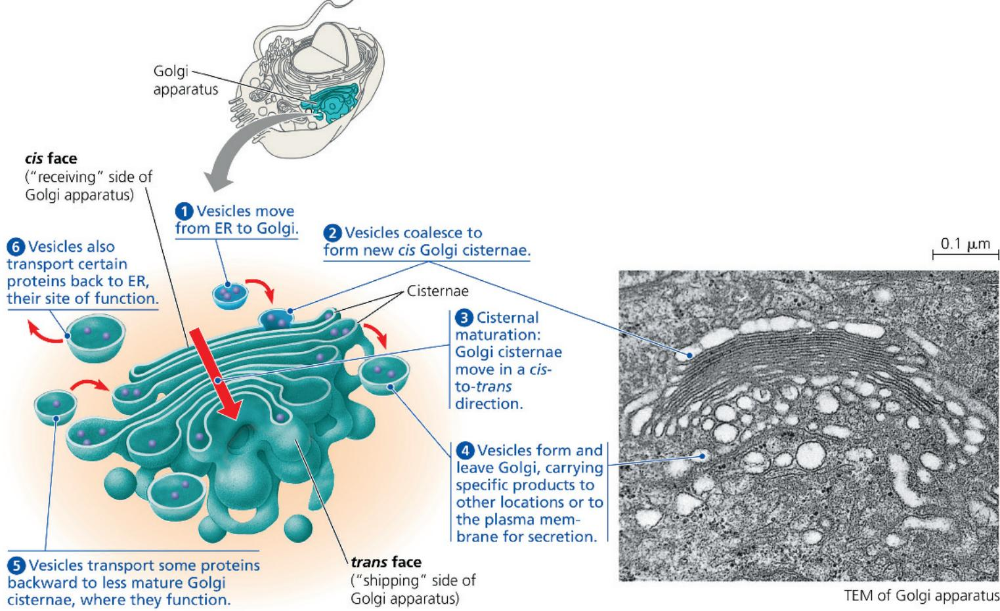  
5 Vesicles transport some proteins backward to less mature Golgi cisternae, where they function.  
④ Vesicles form and leave Golgi, carrying specific products to other locations or to the plasma membrane for secretion.  
TEM of Golgi apparatus

in the transfer of material between parts of the Golgi and other structures.

A Golgi stack has a distinct structural directionality, with the membranes of cisternae on opposite sides of the stack differing in thickness and molecular composition. The two sides of a Golgi stack are referred to as the cis face and the trans face; these act, respectively, as the receiving and shipping departments of the Golgi apparatus. The term cis means “on the same side,” and the cis face is usually located near the ER. Transport vesicles move material from the ER to the Golgi apparatus. A vesicle that buds from the ER can add its membrane and the contents of its lumen to the cis face by fusing with a Golgi membrane on that side. The trans face (“on the opposite side”) gives rise to vesicles that pinch off and travel to other sites.

Products of the endoplasmic reticulum are usually modified during their transit from the cis region to the trans region of the Golgi apparatus. For example, glycoproteins formed in the ER have their carbohydrates modified, first in the ER itself, and then as they pass through the Golgi. The Golgi removes some sugar monomers and substitutes others, producing a large variety of carbohydrates. Membrane phospholipids may also be altered in the Golgi.

In addition to its finishing work, the Golgi apparatus also manufactures some macromolecules. Many polysaccharides secreted by cells are Golgi products. For example, pectins and certain other noncellulose polysaccharides are made in the Golgi of plant cells and then incorporated along with cellulose into their cell walls. Like secretory proteins, nonprotein Golgi products that will be secreted depart from the trans face of the Golgi inside transport vesicles that eventually fuse with the plasma membrane. The contents are released and the vesicle membrane is incorporated into the plasma membrane, adding to the surface area.

The Golgi manufactures and refines its products in stages, with different cisternae containing unique teams of enzymes. Biologists formerly viewed the Golgi as a static structure, with products in various stages of processing transferred from one cisterna to the next by vesicles. While this may occur, research from several labs has given rise to a new model of the Golgi as a more dynamic structure. According to the cisternal maturation model, the cisternae of the Golgi actually progress forward from the cis to the trans face, carrying and modifying their cargo as they move. Figure 6.12 shows the details of this model. The reality probably lies somewhere between the two models; recent research suggests the central regions of the cisternae may remain in place, while the outer ends form tubules and vesicles that are more dynamic.

Before a Golgi stack dispatches its products by budding vesicles from the trans face, it sorts these products and targets them for various parts of the cell. Molecular identification tags, such as phosphate groups added to the Golgi products, aid in sorting by acting like zip codes on mailing labels. Finally, transport vesicles budded from the Golgi may have external molecules on their membranes that recognize “docking sites” on the surface of specific organelles or on the plasma membrane, thus targeting the vesicles appropriately.

## Lysosomes: Digestive Compartments

A lysosome is a membranous sac of hydrolytic enzymes that many eukaryotic cells use to digest (hydrolyze) macromolecules. Lysosomal enzymes work best in the acidic environment found in lysosomes. If a lysosome breaks open or leaks its contents, the released enzymes are not very active because the cytosol has a near-neutral pH. However, excessive leakage from a large number of lysosomes can destroy a cell by self-digestion.

Figure 6.13 Lysosomes.  
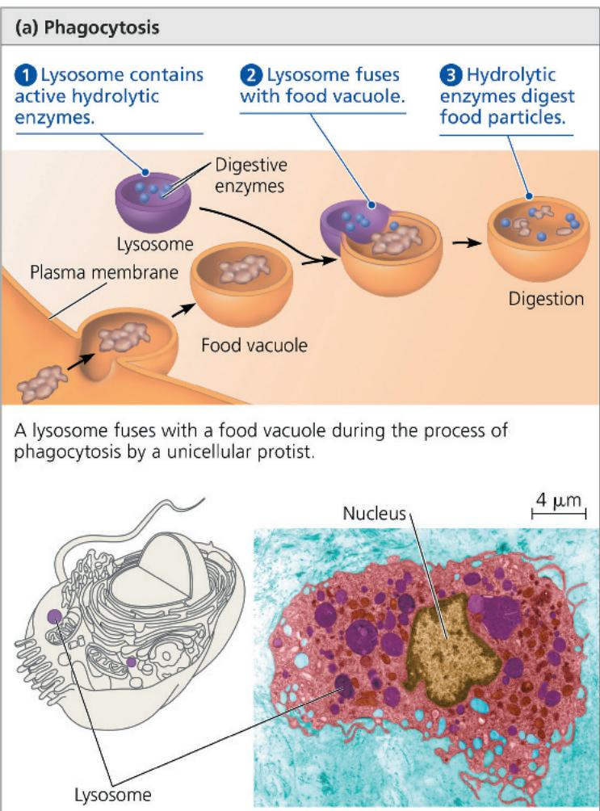  
In this colorized TEM of a macrophage (a type of white blood cell), lysosomes are the round structures colored in purple. They contain enzymes that digest foreign particles such as bacteria and pollen.

Hydrolytic enzymes and lysosomal membrane are made by rough ER and then transferred to the Golgi apparatus for further processing. At least some lysosomes probably arise by budding from the trans face of the Golgi apparatus (see Figure 6.12). How are the proteins of the inner surface of the lysosomal membrane and the digestive enzymes themselves spared from destruction? Apparently, the three-dimensional shapes of these proteins protect vulnerable bonds from enzymatic attack.

Lysosomes carry out intracellular digestion in a variety of circumstances. Amoebas and many other unicellular protists eat by engulfing smaller organisms or food particles, a process called phagocytosis (from the Greek phagein, to eat, and kytos, vessel, referring here to the cell). The food vacuole formed in this way then fuses with a lysosome, whose enzymes digest the food (Figure 6.13a, top). Digestion products, including simple sugars, amino acids, and other monomers, pass into the cytosol and become nutrients for the cell. Some human cells also carry out phagocytosis. Among them are macrophages, a type of white blood cell that helps defend the body by engulfing and destroying bacteria and other invaders (see Figure 6.13a, bottom, and Figure 6.31).

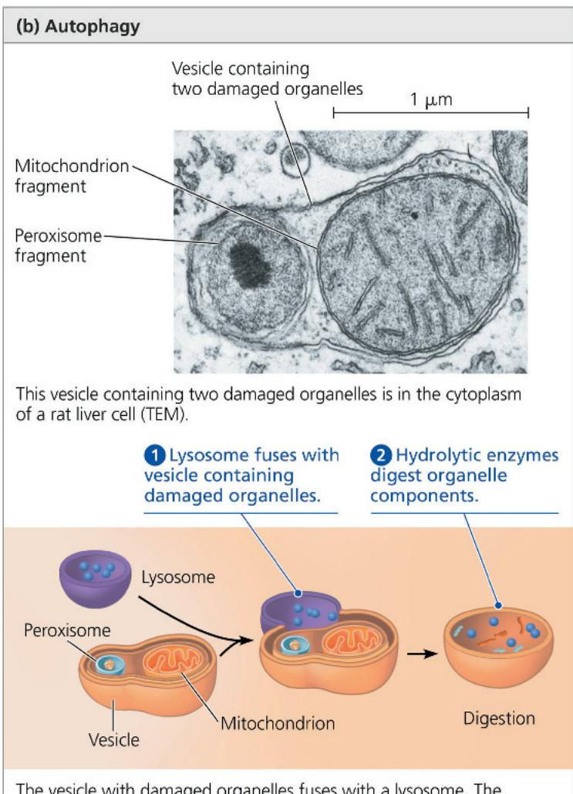  
This vesicle containing two damaged organelles is in the cytoplasm of a rat liver cell (TEM).  
The vesicle with damaged organelles fuses with a lysosome. The organelles are then digested and their components recycled.

Lysosomes also use their hydrolytic enzymes to recycle the cell's own organic material, a process called autophagy. During autophagy, a damaged organelle or small amount of cytosol becomes surrounded by a double membrane (of unknown origin), and a lysosome fuses with the outer membrane of this vesicle (Figure 6.13b). The lysosomal enzymes dismantle the inner membrane and the enclosed material, and the resulting small organic compounds are released to the cytosol for reuse. With the help of lysosomes, the cell continually renews itself. A human liver cell, for example, recycles half of its macromolecules each week.

The cells of people with inherited lysosomal storage diseases lack a functioning hydrolytic enzyme normally present in lysosomes. The lysosomes become engorged with indigestible material, which begins to interfere with other cellular activities. In Tay-Sachs disease, for example, a lipid-digesting enzyme is missing or inactive, and the brain becomes impaired by an accumulation of lipids in the cells (see Concept 14.3). Fortunately, lysosomal storage diseases are rare in the general population.

## Vacuoles: Diverse Maintenance Compartments

Vacuoles are large vesicles derived from the endoplasmic reticulum and Golgi apparatus. Thus, vacuoles are an integral part of a cell's endomembrane system. Like all cellular membranes, the vacuolar membrane is selective in transporting solutes; as a result, the solution inside a vacuole differs in composition from the cytosol.

Vacuoles perform a variety of functions in different kinds of cells. Food vacuoles, formed by phagocytosis, have already been mentioned (see Figure 6.13a). Many unicellular protists living in fresh water have contractile vacuoles that pump excess water out of the cell, thereby maintaining a suitable concentration of ions and molecules inside the cell (see Figure 7.13). In plants and fungi, certain vacuoles carry out enzymatic hydrolysis, a function shared by lysosomes in animal cells. (In fact, some biologists consider these hydrolytic vacuoles to be a type of lysosome.) In plants, small vacuoles can hold reserves of important organic compounds, such as the proteins stockpiled in the storage cells in seeds. Vacuoles may also help protect the plant against herbivores by storing compounds that are poisonous or unpalatable to animals. Some plant vacuoles contain pigments, such as the red and blue pigments of petals that help attract pollinating insects to flowers.

Mature plant cells generally contain a large central vacuole (Figure 6.14), which develops by the coalescence of smaller vacuoles. The solution inside the central vacuole, called cell sap, is the plant cell's main repository of inorganic ions, including potassium and chloride. The central vacuole plays a major role in the growth of plant cells, which enlarge as the vacuole absorbs water, enabling the cell to become larger with a minimal

Figure 6.14 The plant cell vacuole.

The central vacuole is usually the largest compartment in a plant cell; the rest of the cytoplasm is often confined to a narrow zone between the vacuolar membrane and the plasma membrane (TEM).

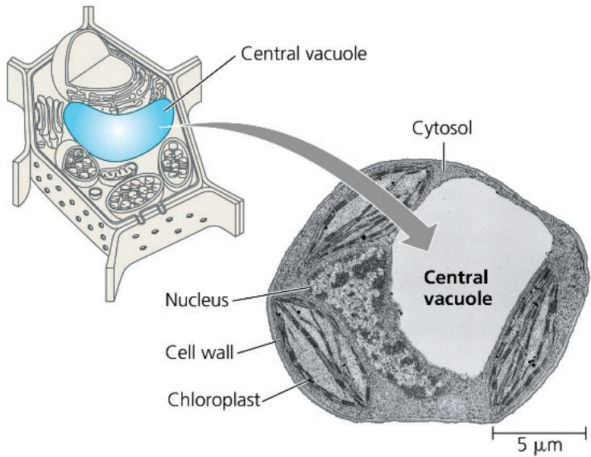

investment in new cytoplasm. The cytosol often occupies only a thin layer between the central vacuole and the plasma membrane, so the ratio of plasma membrane surface to cytosolic volume is sufficient, even for a large plant cell.

## The Endomembrane System: A Review

Figure 6.15 reviews the endomembrane system, showing the flow of membrane lipids and proteins through the various organelles. As the membrane moves from the ER to the Golgi and then elsewhere, its molecular composition and metabolic functions are modified, along with those of its contents. The endomembrane system is a complex and dynamic player in the cell's compartmental organization.

We'll continue our tour of the cell with some organelles that are not closely related to the endomembrane system but play crucial roles in the energy transformations carried out by cells.

## Concept Check 6.4

1. Describe the structural and functional distinctions between rough and smooth ER.

2. Describe how transport vesicles integrate the endomembrane system.

3. WHAT IF? Imagine a protein that functions in the ER but requires modification in the Golgi apparatus before it can achieve that function. Describe the protein's path through the cell, starting with the mRNA molecule that specifies the protein.

⑤ A transport vesicle carries proteins to the plasma membrane for secretion.

Figure 6.15 Review: Relationships among organelles of the endomembrane system. The red arrows show some of the migration pathways for membranes and the materials they enclose.  
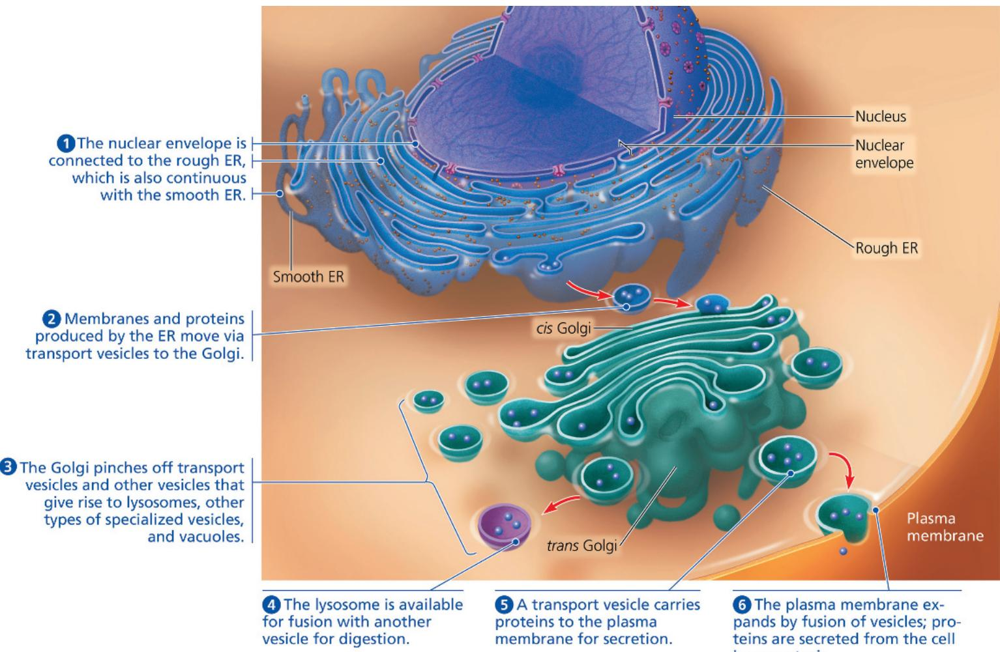  
⑥ The plasma membrane expands by fusion of vesicles; proteins are secreted from the cell by exocytosis.

## Concept 6.5: Mitochondria and chloroplasts change energy from one form to another

Organisms transform the energy they acquire from their surroundings. In eukaryotic cells, mitochondria and chloroplasts are the organelles that convert energy to forms that cells can use for work. Mitochondria (singular, mitochondrion) are the sites of cellular respiration, the metabolic process that uses oxygen to drive the generation of ATP by extracting energy from sugars, fats, and other fuels. Chloroplasts, found in plants and algae, are the sites of photosynthesis. This process in chloroplasts converts solar energy to chemical energy by absorbing sunlight and using it to drive the synthesis of organic compounds such as sugars from carbon dioxide and water.

In addition to having related functions, mitochondria and chloroplasts share similar evolutionary origins, which we'll look at briefly before examining their structures. In this section, we'll also consider the peroxisome, an oxidative organelle. The evolutionary origin of the peroxisome, as well as its relation to other organelles, is still a matter of some debate.

## The Evolutionary Origins of Mitochondria and Chloroplasts

EVOLUTION Mitochondria and chloroplasts display similarities with bacteria that led to the endosymbiont theory, illustrated in Figure 6.16. This theory states that an early ancestor of eukaryotic cells (a host cell) engulfed an oxygen-using nonphotosynthetic bacterial cell. Eventually, the engulfed cell formed a relationship with the host cell in which it was enclosed, becoming an endosymbiont (a cell living within another cell). Indeed, over the course of evolution, the host cell and its endosymbiont merged into a single organism, a eukaryotic cell with the endosymbiont having become a mitochondrion. At least one of these cells may have then taken up a photosynthetic bacterium, becoming the ancestor of eukaryotic cells that contain chloroplasts.

This is a widely accepted theory, which we will examine in more detail in Concept 25.3. This theory is consistent with many structural features of mitochondria and chloroplasts. First, rather than being bounded by a single membrane like organelles of the endomembrane system, mitochondria and typical chloroplasts have two membranes surrounding them. (Chloroplasts also have an internal system of membranous sacs.) There is evidence that the ancestral engulfed bacterium had two outer membranes, which became the double membranes of mitochondria and chloroplasts.

Figure 6.16 The endosymbiont theory of the origins of mitochondria and chloroplasts in eukaryotic cells.

According to this theory, the proposed ancestor of mitochondria was an oxygen-using nonphotosynthetic bacterium that was taken into a host cell, while the proposed ancestor of chloroplasts was a photosynthetic bacterium. The large arrows represent change over evolutionary time; the small arrows inside the cells show the process of the endosymbiont becoming an organelle, also over long periods of time.

  
Engulfing of oxygen-using nonphotosynthetic bacterium, which, over many generations of cells, becomes a mitochondrion

Photosynthetic eukaryote

Second, like bacteria, mitochondria and chloroplasts contain ribosomes, as well as circular DNA molecules—like bacterial chromosomes—associated with their inner membranes. The DNA in these organelles programs the synthesis of some organelle proteins on ribosomes that have been synthesized and assembled there as well. Third, also consistent with their probable evolutionary origins as cells, mitochondria and chloroplasts are autonomous (somewhat independent) organelles that grow and reproduce within the cell.

Next, we focus on the structures of mitochondria and chloroplasts, while providing an overview of their structures and functions. (In Chapters 9 and 10, we will examine their roles as energy transformers.)

## Mitochondria: Chemical Energy Conversion

Mitochondria are found in nearly all eukaryotic cells, including those of plants, animals, fungi, and most protists. Some cells have a single large mitochondrion, but more often a cell has hundreds or even thousands of mitochondria; the number correlates with the cell's level of metabolic activity. For example, cells that move or contract have proportionally more mitochondria per volume than less active cells.

Each of the two membranes enclosing the mitochondrion is a phospholipid bilayer with a unique collection of embedded proteins.

The outer membrane is smooth, but the inner membrane is convoluted, with infoldings called cristae (Figure 6.17a). The inner membrane divides the mitochondrion into two internal compartments. The first is the intermembrane space, the narrow region between the inner and outer membranes. The second compartment, the mitochondrial matrix, is enclosed by the inner membrane. The matrix contains many different enzymes as well as the mitochondrial DNA and ribosomes. Enzymes in the matrix catalyze some of the steps of cellular respiration. Other proteins that function in respiration, including the enzyme that makes ATP, are built into the inner membrane. As highly folded surfaces, the cristae give the inner mitochondrial membrane a large surface area, thus enhancing the productivity of cellular respiration. This is another example of structure fitting function. (Chapter 9 discusses cellular respiration in detail.)

Mitochondria are generally in the range of 1–10 $\mu$ m long. Time-lapse films of living cells reveal mitochondria moving around, changing their shapes, and fusing or dividing into separate fragments, unlike the static structures seen in most diagrams and electron micrographs. These studies helped cell biologists understand that mitochondria in a living cell form a branched tubular network that is in a dynamic state of flux (see Figure 6.17b and c). In skeletal muscle, this network has been referred to by researchers as a “power grid.”

The mitochondrion is often referred to as the “powerhouse of the cell.” However, a large number of studies of mitochondria done over the past few decades have shown that they have many functions beyond ATP production. Mitochondria receive signals, both from inside the cell and from other cells both local and distant. They integrate multiple signals coming from different sources and respond to them. For instance, mitochondria regulate a process of programmed cell suicide (apoptosis; see Concept 11.5). They also synthesize molecules such as the antioxidant molecule melatonin and the stress hormone cortisol. Finally, mitochondria can signal other organelles in the cell and other cells and affect their functions, including gene expression in the nucleus. Their many information-coordinating functions have led some researchers to propose new descriptors for the mitochondrion such as the “processor” or “CEO” of the cell.

## Chloroplasts: Capture of Light Energy

Chloroplasts contain the green pigment chlorophyll, along with enzymes and other molecules that function in the photosynthetic production of sugar. These lens-shaped organelles, about 3–6 $\mu$ m in length, are found in leaves and other green organs of plants and in algae (Figure 6.18; see also Figure 6.26c).

The contents of a chloroplast are partitioned from the cytosol by an envelope consisting of two membranes separated by a very narrow intermembrane space. Inside the chloroplast is another membranous system in the form of flattened, interconnected sacs called thylakoids. In some regions, thylakoids are stacked like poker chips; each stack is called a granum (plural, grana). The fluid outside the thylakoids is the stroma, which contains the chloroplast DNA and ribosomes as well as many enzymes. The membranes of the chloroplast divide the chloroplast space into three compartments: the intermembrane space, the stroma, and the thylakoid space. This compartmental organization enables the chloroplast to convert light energy to chemical energy during photosynthesis. (You will learn more about photosynthesis in Chapter 10.)

As with mitochondria, the static and rigid appearance of chloroplasts in micrographs or schematic diagrams cannot

Figure 6.17 The mitochondrion, site of cellular respiration.

(a) The inner and outer membranes seen in the drawing and TEM establish two compartments: the intermembrane space and the mitochondrial matrix. The cristae increase the surface area of the inner membrane. Circular DNA molecules are associated with the inner mitochondrial membrane. (b) Mitochondria are dynamic, at times separating into fragments or fusing. (c) The LM shows one protist (Euglena gracilis) at a much lower magnification than the TEM. The mitochondria form a branched tubular network; the mitochondrial matrix is stained green. The nuclear DNA is stained red; molecules of mitochondrial DNA appear as bright yellow spots.

accurately depict their dynamic behavior in the living cell. Their shape is changeable, and they grow and occasionally pinch in two, reproducing themselves. They are mobile and, with mitochondria and other organelles, move around the cell along tracks of the cytoskeleton, a structural network we will consider in Concept 6.6.

The chloroplast is a specialized member of a family of closely related plant organelles called plastids. One type of plastid, the amyloplast, is a colorless organelle that stores starch (amylose), particularly in roots and tubers. Another is the

chromoplast, which has pigments that give fruits and flowers their orange and yellow hues.

## Peroxisomes: Oxidation

The peroxisome is a specialized metabolic compartment bounded by a single membrane (Figure 6.19). Peroxisomes contain enzymes that remove hydrogen atoms from various substrates and transfer them to oxygen ( $O_{2}$ ), producing hydrogen

Figure 6.18 The chloroplast, site of photosynthesis.

(a) Many plants have lens-shaped chloroplasts, as shown here in a diagram and a TEM. A chloroplast has three compartments: the intermembrane space, the stroma, and the thylakoid space. Free ribosomes are present in the stroma, as are copies of chloroplast DNA molecules. (b) This light micrograph, at a much lower magnification than the TEM, shows a whole cell of the green alga Spirogyra crassa, which is named for the spiral arrangement of each cell's chloroplasts.

## Figure 6.19 A peroxisome.

Peroxisomes are roughly spherical and often have a granular or crystalline core that is thought to be a dense collection of enzyme molecules. Chloroplasts and mitochondria cooperate with peroxisomes in certain metabolic functions (TEM).

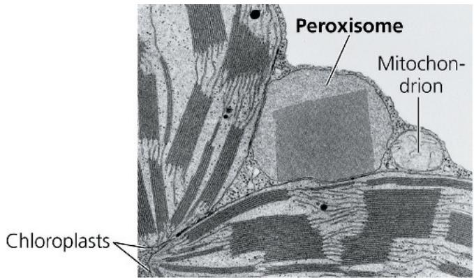  
1 μm

peroxide ( $H_{2}O_{2}$ ) as a by-product (from which the organelle derives its name). These reactions have many different functions. Some peroxisomes use oxygen to break fatty acids down into smaller molecules that are transported to mitochondria and used as fuel for cellular respiration. Peroxisomes in the liver detoxify alcohol and other harmful compounds by transferring hydrogen from the poisonous compounds to oxygen. The $H_{2}O_{2}$ formed by peroxisomes is itself toxic, but the organelle also contains an enzyme that converts $H_{2}O_{2}$ to water. This is an excellent example of how the cell's compartmental structure is crucial to its functions: The enzymes that produce $H_{2}O_{2}$ and those that dispose of this toxic compound are sequestered away from other cellular components that could be damaged.

Specialized peroxisomes called glyoxysomes are found in the fat-storing tissues of plant seeds. These organelles contain enzymes that initiate the conversion of fatty acids to sugar, which the emerging seedling uses as a source of energy and carbon until it can produce its own sugar by photosynthesis.

Peroxisomes grow larger by incorporating proteins made in the cytosol and ER, as well as lipids made in the ER and within the peroxisome itself. But how peroxisomes increase in number and how they arose in evolution—as well as what organelles they are related to—are still the focus of current research. One research group reported that in some cells, newly generated peroxisomes have membranes that come from both ER and mitochondria, and another group has suggested that peroxisomes may have evolved from the bacterium that became the mitochondrion. In fact, this and other evidence support the idea that peroxisomes have a closer relationship with mitochondria than previously thought.

## Concept Check 6.5

1. Describe two characteristics shared by chloroplasts and mitochondria. Consider both function and membrane structure.

2. Do plant cells have mitochondria? Explain.

3. WHAT IF? A classmate proposes that mitochondria and chloroplasts should be classified in the endomembrane system. Argue against the proposal.

# Concept 6.6: The cytoskeleton is a network of fibers that organizes structures and activities in the cell

In the early days of electron microscopy, biologists thought that the organelles of a eukaryotic cell floated freely in the cytosol. But improvements in both light microscopy and electron microscopy have revealed the cytoskeleton, a network of fibers extending throughout the cytoplasm (Figure 6.20). Bacterial cells also have fibers that form a type of cytoskeleton, constructed of proteins similar to eukaryotic ones, but here we will concentrate on eukaryotes. The eukaryotic cytoskeleton plays a major role in organizing the structures and activities of the cell.

## Roles of the Cytoskeleton: Support and Motility

The most obvious function of the cytoskeleton is to give mechanical support to the cell and maintain its shape. This is especially important for animal cells, which lack walls. The remarkable strength and resilience of the cytoskeleton as a whole are based on its architecture. Like a dome tent, the cytoskeleton is stabilized by a balance between opposing forces exerted by its elements. And just as the skeleton of an animal helps fix the positions of other body parts, the cytoskeleton provides anchorage for many organelles and even cytosolic enzyme molecules. The cytoskeleton is more dynamic than an animal skeleton, however. It can be quickly dismantled in one part of the cell and reassembled in a new location, changing the shape of the cell.

Figure 6.20 The cytoskeleton.

As shown in this fluorescence micrograph, the cytoskeleton extends throughout the cell. The cytoskeletal elements have been tagged with different fluorescent molecules: green for microtubules and reddish-orange for microfilaments. A third component of the cytoskeleton, intermediate filaments, is not evident here. (The blue color tags the DNA in the nucleus.)

Some types of cell motility (movement) also involve the cytoskeleton. The term cell motility includes both changes in cell location and movements of cell parts. Cell motility generally requires interaction of the cytoskeleton with motor proteins. There are many such examples: Cytoskeletal elements and motor proteins work together with plasma membrane molecules to allow whole cells to move along fibers outside the cell. Inside the cell, vesicles and other organelles often use motor protein “feet” to “walk” to their destinations along a track provided by the cytoskeleton. For example, this is how vesicles containing neurotransmitter molecules migrate to the tips of axons, the long extensions of nerve cells that release these molecules as chemical signals to adjacent nerve cells (Figure 6.21). The cytoskeleton also manipulates the plasma membrane, bending it inward to form food vacuoles or other phagocytic vesicles.

## Components of the Cytoskeleton

Now let's look more closely at the three main types of fibers that make up the cytoskeleton: Microtubules are the thickest of the three types; microfilaments (also called actin filaments) are the thinnest; and intermediate filaments are fibers with diameters in a middle range (Table 6.1).

Figure 6.21 Motor proteins and the cytoskeleton.  
  
(a) A motor protein that attaches to a receptor on a vesicle can "walk" the vesicle along a microtubule or microfilament.

  
(b) Two vesicles containing neurotransmitters move along a microtubule toward the tip of a nerve cell extension called an axon (SEM).

Table 6.1 The Structure and Function of the Cytoskeleton  
  
VISUAL SKILLS How many tubulin dimers are in the boxed row? For suggested answer, see Appendix A.

## Interview

Interview with George Langford: Investigating how motor proteins move cargo (eTextbook only)

## Microtubules

All eukaryotic cells have microtubules, hollow rods constructed from globular proteins called tubulins. Each tubulin protein is a dimer, a molecule made up of two components. A tubulin dimer consists of two slightly different polypeptides, $\alpha$ -tubulin and $\beta$ -tubulin. Microtubules grow in length by adding tubulin dimers; they can also be disassembled and their tubulins used to build microtubules elsewhere in the cell. Because of the orientation of tubulin dimers, the two ends of a microtubule are slightly different. One end can accumulate or release tubulin dimers at a much higher rate than the other, thus growing and shrinking significantly during cellular activities. (This is called the “plus end,” not because it can only add tubulin proteins but because it’s the end where both “on” and “off” rates are much higher.)

Microtubules shape and support the cell and also serve as tracks along which organelles equipped with motor proteins can move. In addition to the example in Figure 6.21, microtubules guide vesicles from the ER to the Golgi apparatus and from the Golgi to the plasma membrane. Microtubules are also involved in the separation of chromosomes during cell division, as shown in Figure 12.7.

## Centrosomes and Centrioles

In animal cells, microtubules grow out from a centrosome, a region that is often located near the nucleus. These microtubules function as compression-resisting girders of the cytoskeleton. Within the centrosome is a pair of centrioles, each composed of nine sets of triplet microtubules arranged in a ring (Figure 6.22). Although centrosomes with centrioles may help organize microtubule assembly in animal cells, many other eukaryotic cells lack centrosomes with centrioles and instead organize microtubules by other means.

## Cilia and Flagella

Some eukaryotic cells have flagella (singular, flagellum) and cilia (singular, cilium), cellular extensions that contain microtubules. A specialized arrangement of the microtubules is responsible for the beating of these structures. (The bacterial flagellum, shown in Figure 6.5, has a completely different structure.) Many unicellular protists are propelled through water by cilia or flagella that act as locomotor appendages, and the sperm of animals, algae, and some plants have flagella. When cilia or flagella extend from cells that are attached tightly together in a sheet that is part of a tissue layer, they can move fluid over the surface of the tissue. For example, the ciliated lining of the trachea (windpipe) sweeps mucus containing trapped debris out of the lungs (see the EMs in Figure 6.3). In the female reproductive tract, the cilia lining the oviducts help move an egg toward the uterus.

Figure 6.22 Centrosome containing a pair of centrioles. Most animal cells have a centrosome, a region near the nucleus where the cell's microtubules are initiated. Within the centrosome is a pair of centrioles, each about $250\mathrm{nm}$ $(0.25\mu \mathrm{m})$ in diameter. The two centrioles are at right angles to each other, and each is made up of nine sets of three microtubules. The blue portions of the drawing represent nontubulin proteins that connect the microtubule triplets.  
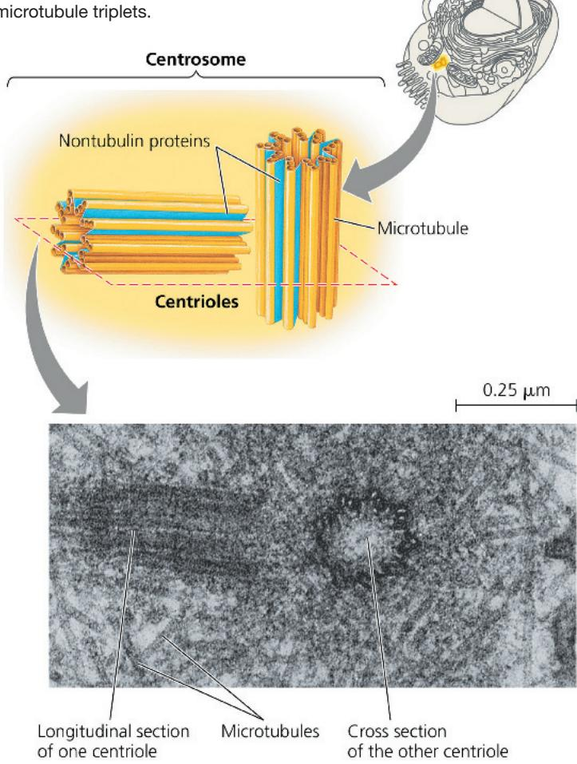  
Longitudinal section of one centriole Microtubules Cross section of the other centriole  
VISUAL SKILLS How many microtubules are in a centrosome? In the drawing, circle and label one microtubule and describe its structure. Circle and label a triplet.  
For suggested answer, see Appendix A.

Motile cilia usually occur in large numbers on the cell surface. Flagella are usually limited to just one or a few per cell, and they are longer than cilia. Flagella and cilia differ in their beating patterns. A flagellum has an undulating motion like the tail of a fish. In contrast, cilia have alternating power and recovery strokes, much like the oars of a racing crew boat (Figure 6.23).

A cilium may also act as a signal-receiving “antenna” for the cell. Cilia that have this function are generally nonmotile, and there is only one per cell. (In fact, in vertebrate animals, it appears that almost all cells have such a cilium, which is called a primary cilium.) Membrane proteins on this kind of cilium transmit molecular signals from the cell’s environment to its interior, triggering signaling pathways that may lead to changes in the cell’s activities. Cilium-based signaling appears to be crucial to brain function and to embryonic development.

(a) Motion of flagella. A flagellum usually undulates, its snakelike motion driving a cell in the same direction as the axis of the flagellum. Propulsion of a human sperm cell is an example of flagellate locomotion (LM).

(b) Motion of cilia. Cilia have a back-and-forth motion. The rapid power stroke moves the cell in a direction perpendicular to the axis of the cilium. Then, during the slower recovery stroke, the cilium bends and sweeps sideways, closer to the cell surface. A dense nap of cilia, beating at a rate of about 40 to 60 strokes a second, covers this Colpidium, a freshwater protist (colorized SEM).

Figure 6.23 A comparison of the beating of flagella and motile cilia.  

Though different in length, number per cell, and beating pattern, motile cilia and flagella share a common structure. Each motile cilium or flagellum has a group of microtubules sheathed in an extension of the plasma membrane (Figure 6.24a). Nine doublets of microtubules are arranged in a ring with two single microtubules in its center (Figure 6.24b). This arrangement, referred to as the “9 + 2” pattern, is found in nearly all eukaryotic flagella and motile cilia. (Nonmotile primary cilia have a “9 + 0” pattern, lacking the central pair of microtubules.) The microtubule assembly of a cilium or flagellum is anchored in the cell by a basal body, which is structurally very similar to a centriole, with microtubule triplets in a “9 + 0” pattern (Figure 6.24c). In fact, in many animals (including humans), the basal body of the fertilizing sperm’s flagellum enters the egg and becomes a centriole.

How does the microtubule assembly produce the bending movements of flagella and motile cilia? Bending involves large motor proteins called dyneins (red in the diagram in Figure 6.24) that are attached along each outer microtubule doublet. A typical dynein protein has two “feet” that “walk” along the microtubule of the adjacent doublet, using ATP for energy. One foot maintains contact, while the other releases and reattaches one step farther along the microtubule (see Figure 6.21). The outer doublets and two central microtubules are held together by flexible cross-linking proteins (blue in the diagram in Figure 6.24), and the walking movement is coordinated so that it happens on one side of the circle at a time. If the doublets were not held in place, the

walking action would make them slide past each other. Instead, the movements of the dynein feet cause the microtubules—and the organelle as a whole—to bend.

## Microfilaments (Actin Filaments)

Microfilaments are thin solid rods. They are also called actin filaments because they are built from molecules of actin, a globular protein. A microfilament is a twisted double chain of actin subunits (see Table 6.1). Besides occurring as linear filaments, microfilaments can form structural networks when certain proteins bind along the side of such a filament and allow a new filament to extend as a branch. Like microtubules, microfilaments seem to be present in all eukaryotic cells.

In contrast to the compression-resisting role of microtubules, the structural role of microfilaments in the cytoskeleton is to bear tension (pulling forces). A three-dimensional network formed by microfilaments just to the inside of the plasma membrane (cortical microfilaments) helps support the cell's shape (see Figure 6.8). This network gives the outer cytoplasmic layer of a cell, called the cortex, the semisolid consistency of a gel, in contrast with the more fluid state of the interior cytoplasm. In some kinds of animal cells, such as nutrient-absorbing intestinal cells, bundles of microfilaments make up the core of microvilli, delicate projections that increase the cell's surface area (Figure 6.25).

Microfilaments are well known for their role in cell motility. Thousands of actin filaments and thicker filaments made of a

Figure 6.24 Structure of a flagellum or motile cilium.

(a) A longitudinal section of a motile cilium shows microtubules running the length of the membrane-sheathed structure (TEM).

  
(b) A cross section through a motile cilium shows the "9 + 2" arrangement of microtubules (TEM). The outer microtubule doublets are held together with the two central microtubules by flexible cross-linking proteins (blue in art), including the radial spokes. The doublets also have attached motor proteins called dyneins (red in art).

(c) Basal body: The nine outer doublets of a cilium or flagellum extend into the basal body, where each doublet joins another microtubule to form a ring of nine triplets. Each triplet is connected to the next by nontubulin proteins (thinner blue lines in diagram). This is a "9 + 0" arrangement: The two central microtubules are not present because they terminate above the basal body (TEM).

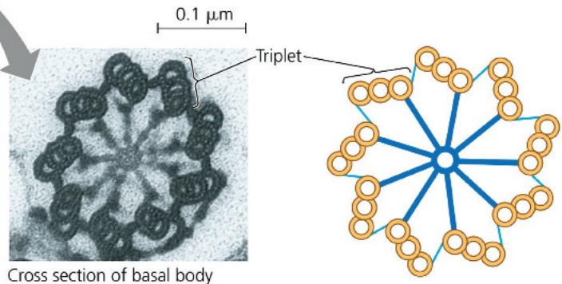  
Cross section of basal body

DRAW IT In (a) and (b), circle and label the central pair of microtubules. In (a), show where they terminate, and explain why they aren't seen in the cross section of the basal body in (c).

For suggested answer, see Appendix A.

Figure 6.25 A structural role of microfilaments.

The surface area of this nutrient-absorbing intestinal cell is increased by its many microvilli (singular, microvillus), cellular extensions reinforced by bundles of microfilaments. These actin filaments are anchored to a network of intermediate filaments (TEM).

protein called myosin interact to cause contraction of muscle cells (Figure 6.26a); muscle contraction is described in detail in Concept 50.5. In the unicellular protist Amoeba and some of our white blood cells, localized contractions brought about by actin and myosin are involved in the amoeboid (crawling) movement of the cells. The cell crawls along a surface by extending cellular extensions called pseudopodia (from the Greek pseudes, false, and pod, foot) and moving toward them (Figure 6.26b). In plant cells, actin-protein interactions contribute to cytoplasmic streaming, a circular flow of cytoplasm within cells (Figure 6.26c). This movement, which is especially common in large plant cells, speeds the movement of organelles and the distribution of materials within the cell.

0.25 μm

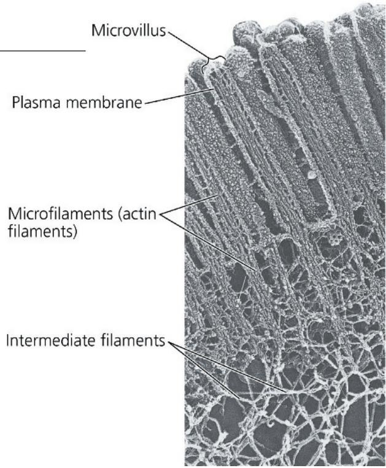

Figure 6.26 Microfilaments and motility.

In these three examples, interactions between actin filaments and motor proteins bring about cell movement.

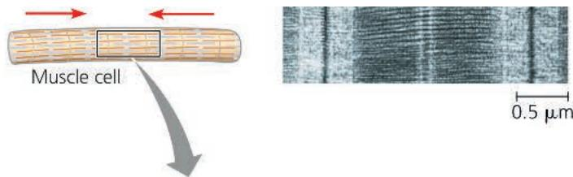

  
(a) Myosin motors in muscle cell contraction. The "walking" of myosin projections (the so-called heads) drives the parallel myosin and actin filaments past each other so that the actin filaments approach each other in the middle (red arrows). This shortens the muscle cell. Muscle contraction involves the shortening of many muscle cells at the same time (TEM).

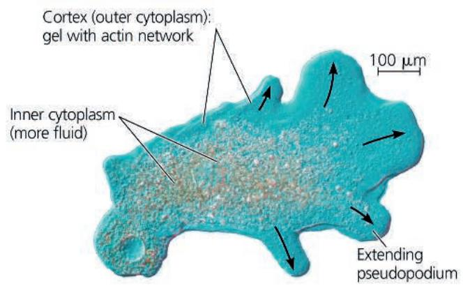  
(b) Amoeboid movement. Interaction of actin filaments with myosin causes contraction of the cell, pulling the cell's trailing end (at left) forward (to the right) (LM).

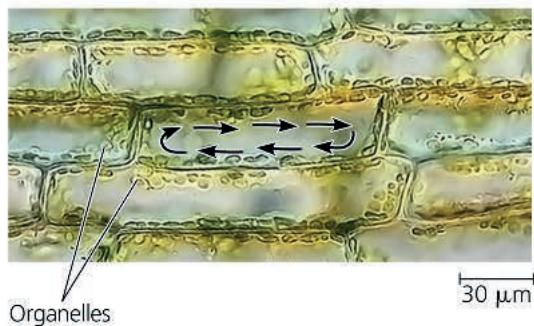  
(c) Cytoplasmic streaming in plant cells. A layer of cytoplasm cycles around the cell, moving over tracks of actin filaments. Myosin motors attached to some organelles drive the streaming by interacting with the actin (LM).  
Interview with Julie Theriot: Studying how bacterial pathogens inside human cells hitch a ride on the cytoskeleton (at the start of Unit 2, before Chapter 6)

## Interview

## Intermediate Filaments

Intermediate filaments are named for their diameter, which is larger than the diameter of microfilaments but smaller than that of microtubules (see Table 6.1). While microtubules and microfilaments are found in all eukaryotic cells, intermediate filaments are only found in the cells of some animals, including vertebrates. Specialized for bearing tension (like microfilaments), intermediate filaments are a diverse class of cytoskeletal elements. Each type is constructed from a particular molecular subunit belonging to a family of proteins whose members include the keratins. Microtubules and microfilaments, in contrast, are consistent in diameter and composition in all eukaryotic cells.

Intermediate filaments are more permanent fixtures of cells than are microfilaments and microtubules, which are often disassembled and reassembled in various parts of a cell. Even after cells die, intermediate filament networks often persist; for example, the outer layer of our skin consists of dead skin cells full of keratin filaments. Intermediate filaments are especially sturdy and play an important role in reinforcing the shape of a cell and fixing the position of certain organelles. For instance, the nucleus typically sits within a cage made of intermediate filaments. Other intermediate filaments make up the nuclear lamina, which lines the interior of the nuclear envelope (see Figure 6.9). In general, the various kinds of intermediate filaments seem to function together as the permanent framework of the entire cell.

## Concept Check 6.6

1. Describe how cilia and flagella bend.

2. WHAT IF? Males who have Kartagener's syndrome are unable to reproduce because of immotile sperm, and they tend to experience lung infections. This condition has a genetic basis. Suggest what the underlying genetic defect might be.

For suggested answers, see Appendix A.

# Concept 6.7: Extracellular components and connections between cells help coordinate cellular activities

Having crisscrossed the cell to explore its inner components, we complete our tour of the cell by returning to the surface of this microscopic world, where there are additional structures with important functions. The plasma membrane is usually regarded as the boundary of the living cell, but most cells synthesize and secrete materials extracellularly (to the outside of the cell). Although these materials and the structures they form are outside the cell, their study is important to cell biology because they are involved in a great many essential cellular functions.

## Cell Walls of Plants

The cell wall is an extracellular structure of plant cells (Figure 6.27). This is one of the features that distinguishes plant cells from animal cells. The wall protects the plant cell, maintains its shape, and prevents excessive uptake of water. At the level of the whole plant, the strong walls of specialized cells hold the plant up against the force of gravity. Prokaryotic organisms, some protists, and fungi also have cell walls, as you saw in Figures 6.5 and 6.8. Those organisms will be discussed in Chapters 27, 28, and 31.

Plant cell walls are much thicker than the plasma membrane, ranging from 0.1 $\mu$ m to several micrometers. The exact chemical composition of the wall varies from species to species and even from one cell type to another in the same plant, but the basic design of the wall is consistent. Microfibrils made of the polysaccharide cellulose (see Figure 5.6) are synthesized by an enzyme called cellulose synthase and secreted to the extracellular space, where they become embedded in a matrix of other polysaccharides and proteins. This combination of materials, strong fibers in a “ground substance” (matrix), is the same basic architectural design found in steel-reinforced concrete and in fiberglass.

A young plant cell first secretes a relatively thin and flexible wall called the primary cell wall (see the micrograph in Figure 6.27). Between primary walls of adjacent cells is the middle lamella, a thin layer rich in sticky polysaccharides called pectins. The middle lamella glues adjacent cells together. (Pectin is used in cooking as a thickening agent in jams and jellies.) When the cell matures and stops growing, it strengthens its wall. Some plant cells do this simply by secreting hardening substances into the primary wall. Other cells add a secondary cell wall between the plasma membrane and the primary wall. The secondary wall, often deposited in several laminated layers, has a strong and durable matrix that affords the cell protection and support. Wood, for example, consists mainly of secondary walls.

## The Extracellular Matrix (ECM) of Animal Cells

Although animal cells lack walls akin to those of plant cells, they do have an elaborate extracellular matrix (ECM). The main ingredients of the ECM are glycoproteins and other carbohydrate-containing molecules secreted by the cells. (Recall that glycoproteins are proteins with covalently bonded carbohydrates.) The most abundant glycoprotein in the ECM of most animal cells is collagen, which forms strong fibers

The drawing shows the relationship between primary and secondary cell walls in several mature plant cells. (Organelles aren't shown because many cells with secondary walls, such as the water-conducting cells, lack organelles.) The TEM shows the cell walls where two cells come together. The multilayered partition between plant cells consists of adjoining walls individually secreted by the cells. Adjacent cells are glued together by a very thin layer called the middle lamella.

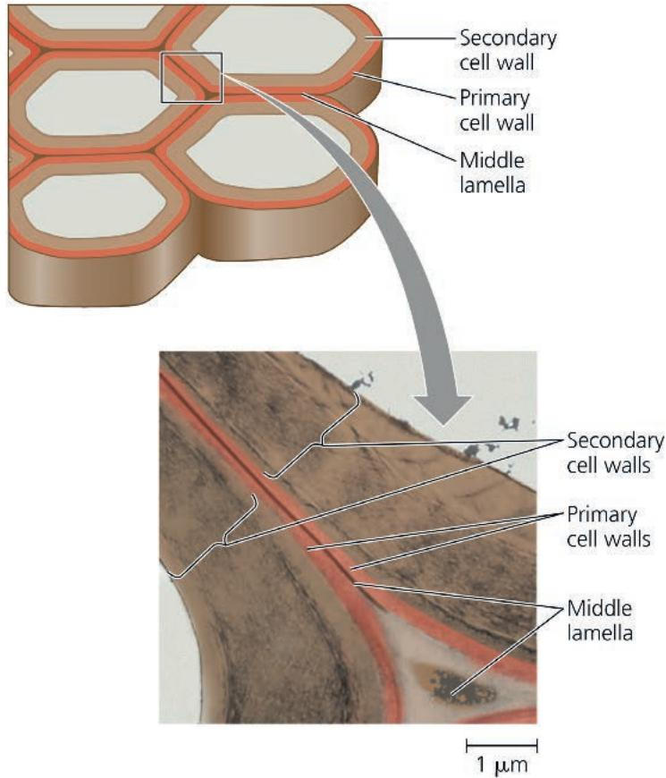

outside the cells (see Figure 5.18). In fact, collagen accounts for about 40% of the total protein in the human body. The collagen fibers are embedded in a network woven out of proteoglycans secreted by cells (Figure 6.28). A proteoglycan molecule consists of a small core protein with many carbohydrate chains covalently attached, so that it may be up to 95% carbohydrate. Large proteoglycan complexes can form when hundreds of proteoglycan molecules become noncovalently attached to a single long polysaccharide molecule, as shown in Figure 6.28. Some cells are attached to the ECM by ECM glycoproteins such as fibronectin. Fibronectin and other ECM proteins bind to cell-surface receptor proteins called integrins that are built into the plasma membrane. Integrins span the membrane and bind on their cytoplasmic side to associated proteins attached to microfilaments of the cytoskeleton. The name integrin is based on the word integrate: Integrins are in a position to transmit signals between the ECM and the cytoskeleton and thus to integrate changes occurring outside and inside the cell.

Current research on fibronectin, other ECM molecules, and integrins reveals the influential role of the ECM in the lives of cells. By communicating with a cell through integrins, the ECM can regulate a cell's behavior. For example, some

Figure 6.28 Extracellular matrix (ECM) of an animal cell.

The molecular composition and structure of the ECM vary from one cell type to another. In this example, three different types of ECM molecules are present: collagen, fibronectin, and proteoglycans.

cells in a developing embryo migrate along specific pathways by matching the orientation of their microfilaments to the "grain" of fibers in the extracellular matrix. Researchers have also learned that the extracellular matrix around a cell can influence the activity of genes in the nucleus. Information about the ECM probably reaches the nucleus by a combination of mechanical and chemical signaling pathways. Mechanical signaling involves fibronectin, integrins, and microfilaments of the cytoskeleton. Changes in the cytoskeleton may in turn trigger signaling pathways inside the cell, leading to changes in the set of proteins being made by the cell and therefore changes in the cell's function. In this way, the extracellular matrix of a particular tissue may help coordinate the behavior of all the cells of that tissue. Direct connections between cells also function in this coordination, as we'll explore next.

## Cell Junctions

Cells in an animal or plant are organized into tissues, organs, and organ systems. Neighboring cells often adhere, interact, and communicate via sites of direct physical contact.

## Plasmodesmata in Plant Cells

It might seem that the nonliving cell walls of plants would isolate plant cells from one another. But in fact, as shown in Figure 6.29, many plant cell walls have plasmodesmata (singular, plasmodesma; from the Greek desma, bond), channels that

A proteoglycan complex consists of hundreds of proteoglycan molecules attached noncovalently to a single long polysaccharide molecule.

Integrins, membrane proteins with two subunits, bind to the ECM on the outside and to associated proteins attached to microfilaments on the inside. This linkage can transmit signals between the cell's external environment and its interior and can result in changes in cell behavior.

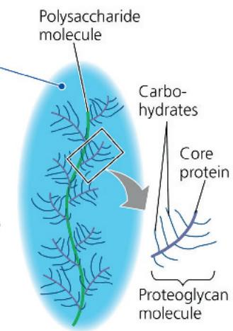  
Proteoglycan complex

connect cells, extending through them. The plasma membranes of adjacent cells line the channel of each plasmodesma and thus are continuous. Because the channels are filled with cytosol, the cells share the same internal chemical environment. By joining adjacent cells, plasmodesmata unify most of the plant into one living continuum. Water and small solutes can pass freely from cell to cell, and several experiments have shown that in some circumstances, certain proteins and RNA molecules can do this as well (see Concept 36.6). The macromolecules transported to neighboring cells appear to reach the plasmodesmata by moving along fibers of the cytoskeleton.

Figure 6.29 Plasmodesmata between plant cells.

The cytoplasm of one plant cell is continuous with the cytoplasm of its neighbors via plasmodesmata, cytoplasmic channels through the cell walls (TEM).

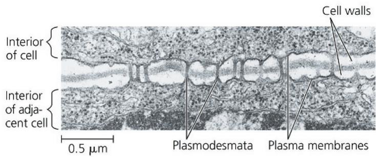

## Tight Junctions, Desmosomes, and Gap Junctions in Animal Cells

In animals, there are three main types of cell junctions: tight junctions, desmosomes, and gap junctions. (Gap junctions are most like the plasmodesmata of plants, although gap junction pores are not lined with membrane—rather, they consist of proteins extending from each cell's membrane that form a connecting pore.) All three types of cell junctions are especially common in epithelial tissue, which lines the external and internal surfaces of the body. Figure 6.30 uses epithelial cells of the intestinal lining to illustrate these junctions.

## Concept Check 6.7

1. In what way are the cells of plants and animals structurally different from single-celled eukaryotes?

2. WHAT IF? If the plant cell wall or the animal extracellular matrix were impermeable, what effect would this have on cell function?

3. MAKE CONNECTIONS The polypeptide chain that makes up a tight junction weaves back and forth through the membrane four times, with two extracellular loops and one loop plus short C-terminal and N-terminal tails in the cytoplasm. Looking at Figure 5.14, what would you predict about the amino acid sequence of the tight junction protein?

For suggested answers, see Appendix A.

## Exploring Cell Junctions in Animal Tissues

Figure 6.30  
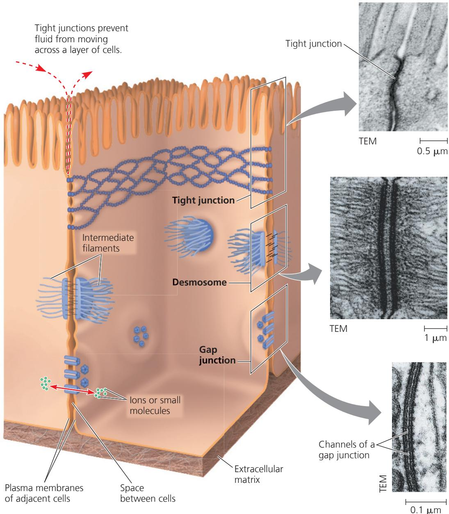

## Tight Junctions

At tight junctions, the plasma membranes of neighboring cells are very tightly pressed against each other, bound together by specific proteins. Forming continuous seals around the cells, tight junctions establish a barrier that prevents leakage of extracellular fluid across a layer of epithelial cells (see red dashed arrow). For example, tight junctions between skin cells make us watertight.

## Desmosomes

Desmosomes (one type of anchoring junction) function like rivets, fastening cells together into strong sheets. Intermediate filaments made of sturdy keratin proteins anchor desmosomes in the cytoplasm. Desmosomes attach muscle cells to each other in a muscle. Some “muscle tears” involve the rupture of desmosomes.

## Gap Junctions

Gap junctions (also called communicating junctions) provide cytoplasmic channels from one cell to an adjacent cell and in this way are similar in their function to the plasmodesmata in plants. Gap junctions consist of membrane proteins extending from the membranes of the two cells. These proteins create pores through which ions, sugars, amino acids, and other small molecules may pass. Gap junctions are necessary for communication between cells in many types of tissues, such as heart muscle, and in animal embryos.

Figure 6.31 Coordination of activities in a cell. The ability of this macrophage to recognize, apprehend, and destroy bacteria involves coordination among components such as the cytoskeleton, lysosomes, and plasma membrane (colorized SEM).  
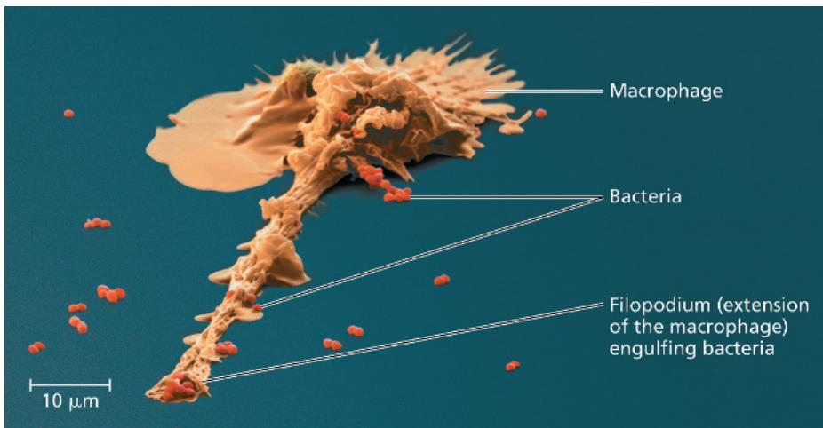

## Concept 6.8: A cell is greater than the sum of its parts

From our panoramic view of the cell's compartmental organization to our close-up inspection of each organelle's architecture, this tour of the cell has shown the correlation of structure with function. (See Figure 6.8 to review cell structure.)

Remember that none of a cell's components work alone. For example, consider the microscopic scene in Figure 6.31. The large cell is a macrophage (see Figure 6.13a). It helps defend the mammalian body against infections by ingesting bacteria (the smaller cells) into phagocytic vesicles. The macrophage crawls along a surface and reaches out to the bacteria with thin pseudopodia (specifically, filopodia). Actin filaments interact with other elements of the cytoskeleton in these movements. After the macrophage engulfs the bacteria, they are destroyed by lysosomes produced by the elaborate endomembrane system. The digestive enzymes of the lysosomes and the proteins of the cytoskeleton are all made by ribosomes. And the synthesis of these proteins is programmed by genetic messages dispatched from the DNA in the nucleus. All these processes require energy, which mitochondria supply in the form of ATP.

Cellular functions arise from cellular order: The cell is a living unit greater than the sum of its parts. The cell in Figure 6.31 is a good example of integration of cellular processes, seen from the outside. But what about the internal organization of a cell? As you proceed in your study of biology to consider different cellular processes, it will be helpful to try to visualize the architecture and furnishings inside a cell. Figure 6.32, on the next two pages, is designed to introduce you to some important biological molecules and structures and to help you get a sense of their relative sizes and organization in the context of other cellular components. As you study this figure, see if you can mentally shrink yourself down to the size of a protein and contemplate your surroundings.

## Concept Check 6.8

1. Colpidium colpoda is a unicellular protist that lives in freshwater, eats bacteria, and moves by cilia (see Figure 6.23b). Describe how the parts of this cell work together in the functioning of C. colpoda, including as many organelles and other cell structures as you can.

For suggested answer, see Appendix A.

## Chapter 6 Review

## Summary of Key Concepts

To review key terms, go to the Vocabulary Self-Quiz (eTextbook only).

## Concept 6.1: Biologists use microscopes and biochemistry to study cells

\- Improvements in microscopy that affect the parameters of magnification, resolution, and contrast have catalyzed progress in the study of cell structure. Light microscopy (LM) and electron microscopy (EM), as well as other types, remain important tools.

\- Cell biologists can obtain pellets enriched in particular cellular components by centrifuging disrupted cells at sequential speeds, a process known as cell fractionation.

How do microscopy and biochemistry complement each other to reveal cell structure and function?

## Concept 6.2: Eukaryotic cells have internal membranes that compartmentalize their functions

\- All cells are bounded by a plasma membrane.

\- Prokaryotic cells lack nuclei and other membrane-enclosed organelles, while eukaryotic cells have internal membranes that compartmentalize cellular functions.

\- The surface-to-volume ratio is an important parameter affecting cell size and shape.

\- Plant and animal cells have most of the same organelles: a nucleus, endoplasmic reticulum, Golgi apparatus, and mitochondria. Chloroplasts are present only in cells of photosynthetic eukaryotes.

Explain how the compartmental organization of a eukaryotic cell contributes to its biochemical functioning.

# Visualizing the Scale of the Molecular Machinery in a Cell

## Figure 6.32

\- A slice of a plant cell's interior is illustrated in the center panel, with all structures and molecules drawn to scale. Selected molecules and structures are shown above and below, all enlarged by the same factor so you can compare their sizes. All protein and nucleic acid structures are based on data from the Protein Data Bank; regions whose structure has not yet been determined are shown in gray.

This figure introduces a cast of characters that you will learn more about as you study biology. Refer back to this figure as you encounter these molecules in your studies.

(a) Membrane proteins (Chapter 7)
Proteins embedded in cellular membranes help transport substances and conduct signals across membranes. They also participate in other crucial cellular functions. Many proteins are able to move within the membrane.

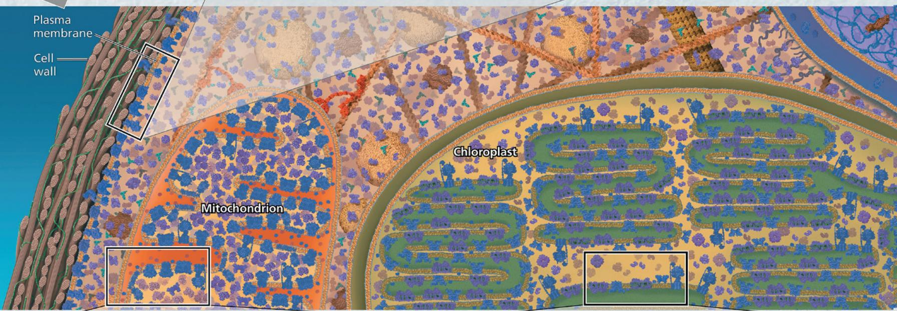

(b) Cellular respiration (Chapter 9) Cellular respiration, a multi-step process, generates ATP from food molecules. The first two stages are carried out by enzymes in the cytoplasm and mitochondrial matrix; a few of these enzymes (pinkish-purple) are shown. The final stage is carried out by proteins (bluish-purple) that form a "chain" in the inner mitochondrial membrane.

(c) Photosynthesis (Chapter 10) Photosynthesis produces sugars that provide food for all life on the planet. The process begins with large complexes of proteins and chlorophyll (green) embedded in the thylakoid membranes. These complexes trap light energy in molecules that are used by rubisco and other proteins in the stroma to make sugars.

(d) Transcription (Chapter 17) In the nucleus, the information contained in a DNA sequence is transferred to messenger RNA (mRNA) by an enzyme called RNA polymerase. After their synthesis, mRNA molecules leave the nucleus via nuclear pores.

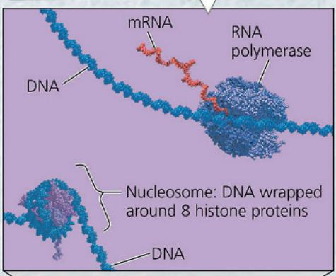

(f) Translation (Chapter 17) In the cytoplasm, the information in mRNA is used to assemble a polypeptide with a specific sequence of amino acids. Both transfer RNA (tRNA) molecules and ribosomes play a role. The eukaryotic ribosome, which includes a large subunit and a small subunit, is a colossal complex composed of four large ribosomal RNA (rRNA) molecules and more than 80 proteins. Through transcription and translation, the nucleotide sequence of DNA in a gene determines the amino acid sequence of a polypeptide, via the intermediary mRNA

## (e) Nuclear pore (Concept 6.3) The

nuclear pore complex regulates molecular traffic in and out of the nucleus, which is bounded by a double membrane. Among the largest structures that pass through the pore are the ribosomal subunits, which are built in the nucleus.

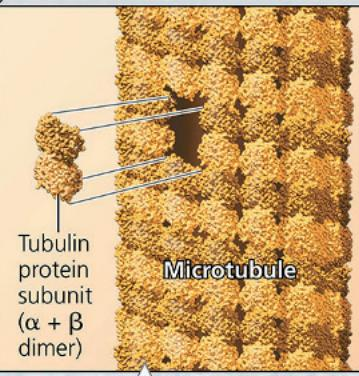

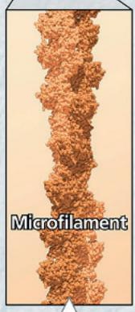

## (g) Cytoskeleton (Concept 6.6)

Cytoskeletal structures are polymers of protein subunits. Microtubules are hollow structural rods made of tubulin protein subunits, while microfilaments are cables that have two chains of actin proteins wound around each other.

## (h) Motor proteins

(Concept 6.6) Motor proteins, such as myosin, are responsible for transport of vesicles and movement of organelles within the cell.

1. List the following structures from largest to smallest: proton pump, nuclear pore, cyt c, ribosome.

2. Considering the structures of a nucleosome and of RNA polymerase, speculate about what must happen before RNA polymerase can transcribe the DNA that is wrapped around the histone proteins of a nucleosome.

3. Find another myosin motor protein walking on a microfilament in this figure. What organelle is being moved by that myosin protein?

Instructors: Additional questions related to this Visualizing Figure can be assigned in Mastering Biology. For suggested answers, see Appendix A.

<table><tr><td></td><td>Cell Component</td><td>Structure</td><td>Function</td></tr><tr><td rowspan="2">CONCEPT 6.3The eukaryotic cell&#x27;s genetic instructions are housed in the nucleus and carried out by the ribosomes?Describe the relationship between the nucleus and ribosomes.</td><td></td><td>Surrounded by nuclear envelope (double membrane) perforated by nuclear pores; nuclear envelope is continuous with endoplasmic reticulum (ER)</td><td>Houses chromosomes, which are made of chromatin (DNA and proteins); contains nucleoli, where ribosomal subunits are made; pores regulate entry and exit of materials</td></tr><tr><td>Ribosome</td><td>Two subunits made of ribosomal RNAs and proteins; can be free in cytosol or bound to ER</td><td>Protein synthesis</td></tr><tr><td rowspan="4">CONCEPT 6.4The endomembrane system regulates protein traffic and performs metabolic functions?Describe the key role played by transport vesicles in the endomembrane system.</td><td>Endoplasmic reticulum (ER)</td><td>Extensive network of membrane-bounded tubules and sacs; ER membrane separates lumen from cytosol and is continuous with nuclear envelope</td><td>Smooth ER:synthesis of lipids, metabolism of carbohydrates, storage of calcium ions, detoxification of drugs and poisonsRough ER:aids in synthesis of secretory and other proteins on bound ribosomes; adds carbohydrates to proteins to make glycoproteins; produces new membrane</td></tr><tr><td>Golgi apparatus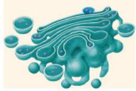</td><td>Stacks of flattened membranous sacs; has polarity (cis and trans faces)</td><td>Modification of proteins, carbohydrates on proteins, and phospho-lipids; synthesis of many polysaccharides; sorting of Golgi products, which are then released in vesicles</td></tr><tr><td>Lysosome</td><td>Membranous sac of hydrolytic enzymes (in animal cells)</td><td>Breakdown of ingested substances, cell macromolecules, and damaged organelles for recycling</td></tr><tr><td>Vacuole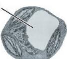</td><td>Large membrane-bounded vesicle</td><td>Digestion, storage, waste disposal, water balance, cell growth, and protection</td></tr><tr><td rowspan="3">CONCEPT 6.5Mitochondria and chloroplasts change energy from one form to another?What does the endosymbiont theory propose as the origin for mitochondria and chloroplasts?Explain.</td><td>Mitochondrion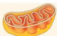</td><td>Bounded by double membrane; inner membrane has infoldings</td><td>Cellular respiration</td></tr><tr><td>Chloroplast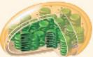</td><td>Typically two membranes around fluid stroma, which contains thylakoids stacked into grana</td><td>Photosynthesis (chloroplasts are present in cells of photosynthetic eukaryotes, including plants)</td></tr><tr><td>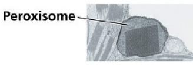</td><td>Specialized metabolic compartment bounded by a single membrane</td><td>Contains enzymes that transfer H atoms from substrates to oxygen, producing  $H_2O_2$  (hydrogen peroxide), which is converted to  $H_2O_2$ </td></tr></table>

## Concept 6.6: The cytoskeleton is a network of fibers that organizes structures and activities in the cell

\- The cytoskeleton functions in structural support for the cell and in motility and signal transmission.

\- Microtubules shape the cell, guide organelle movement, and separate chromosomes in dividing cells. Cilia and flagella are motile appendages containing microtubules. Primary cilia also play sensory and signaling roles. Microfilaments are thin rods that function in muscle contraction, amoeboid movement, cytoplasmic streaming, and support of microvilli. Intermediate filaments support cell shape and fix organelles in place.

Describe the role of motor proteins inside the eukaryotic cell and in whole-cell movement.

## Concept 6.7: Extracellular components and connections between cells help coordinate cellular activities

\- Plant cell walls are made of cellulose fibers embedded in other polysaccharides and proteins.

\- Animal cells secrete glycoproteins and proteoglycans that form the extracellular matrix (ECM), which functions in support, adhesion, movement, and regulation.

\- Cell junctions connect neighboring cells. Plants have plasmodes-mata that pass through adjoining cell walls. Animal cells have tight junctions, desmosomes, and gap junctions.

Compare the structure and functions of a plant cell wall and the extracellular matrix of an animal cell.

## Concept 6.8: A cell is greater than the sum of its parts

Many components work together in a functioning cell. When a cell ingests a bacterium, what role does the nucleus play? For suggested answers, see Appendix A.

## Test Your Understanding

For more multiple-choice questions, go to the Practice Test (eTextbook only).

## Levels 1-2: Remembering/Understanding

1. Which structure is part of the endomembrane system? (A) mitochondrion (B) Golgi apparatus (C) chloroplast (D) centrosome

2. Which structure is common to plant and animal cells?
(A) chloroplast
(B) central vacuole
(C) mitochondrion
(D) centriole

3. Which of the following is present in a prokaryotic cell?
(A) mitochondrion
(B) ribosome
(C) nuclear envelope
(D) chloroplast

## Levels 3-4: Applying/Analyzing

4. Cyanide binds to at least one molecule involved in producing ATP. In a cell exposed to cyanide, most of the cyanide will be in
(A) mitochondria.
(B) ribosomes.
(C) peroxisomes.
(D) lysosomes.

5. Which cell would be best for studying lysosomes?
(A) muscle cell
(B) nerve cell
(C) bacterial cell
(D) phagocytic white blood cell

6. DRAW IT Draw two eukaryotic cells. Label the structures listed here and show any physical connections between the structures of each cell: nucleus, rough ER, smooth ER, mitochondrion, centrosome, chloroplast, vacuole, lysosome, microtubule, cell wall, ECM, microfilament, Golgi apparatus, intermediate filament, plasma membrane, peroxisome, ribosome, nucleolus, nuclear pore, vesicle, flagellum, microvilli, plasmodesma.

## Levels 5-6: Evaluating/Creating

7. EVOLUTION CONNECTION (a) What cell structures best reveal evolutionary unity? (b) Give an example of diversity related to specialized cellular modifications.

8. SCIENTIFIC INQUIRY Imagine protein X, destined to span the plasma membrane; assume the mRNA carrying the genetic message for protein X has been translated by ribosomes in a cell culture. If you fractionate the cells (see Figure 6.4), in which fraction would you find protein X? Explain by describing its transit.

9. WRITE ABOUT A THEME: ORGANIZATION Write a short essay (100–150 words) on this topic: Life is an emergent property that appears at the level of the cell. (See Concept 1.1.)

10. SYNTHESIZE YOUR KNOWLEDGE

  
For selected answers, see Appendix A.

The cells in this SEM are epithelial cells from the small intestine. Discuss how their cellular structure contributes to their specialized functions of nutrient absorption and as a barrier between the intestinal contents and the blood supply on the other side of the sheet of epithelial cells.

# Explore Scientific Papers with Science in the Classroom | AAAS

How do actin networks affect myosin motors? Go to “Fussy about Filaments” at www.scienceintheclassroom.org.

Instructors: Questions can be assigned in Mastering Biology.

# Membrane Structure and Function

## Key Concepts

7.1 Cellular membranes are fluid mosaics of lipids and proteins

7.2 Membrane structure results in selective permeability

7.3 Passive transport is diffusion of a substance across a membrane with no energy investment

7.4 Active transport uses energy to move solutes against their gradients

7.5 Bulk transport across the plasma membrane occurs by exocytosis and endocytosis

## Study Tip

Make a visual study guide: Draw a plasma membrane (two lines) all the way down a piece of paper (or digitally). Label the cytoplasm and the extracellular fluid. At the top, draw the phospholipid bilayer in detail. As you read the chapter, draw and label membrane proteins that you encounter and diagram the different ways materials can enter or leave a cell.

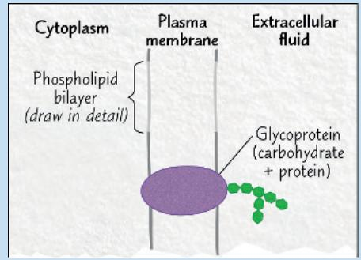  
Figure 7.1 Successful learning relies on communication between brain cells. Here, the vesicles fusing with the plasma membrane of the top cell release molecules (yellow) that bind to membrane proteins (light green) on the surface of the bottom cell, triggering the proteins to change shape. The plasma membrane that surrounds each cell regulates its exchanges with its environment and surrounding cells.

## How does the plasma membrane regulate inbound and outbound traffic?

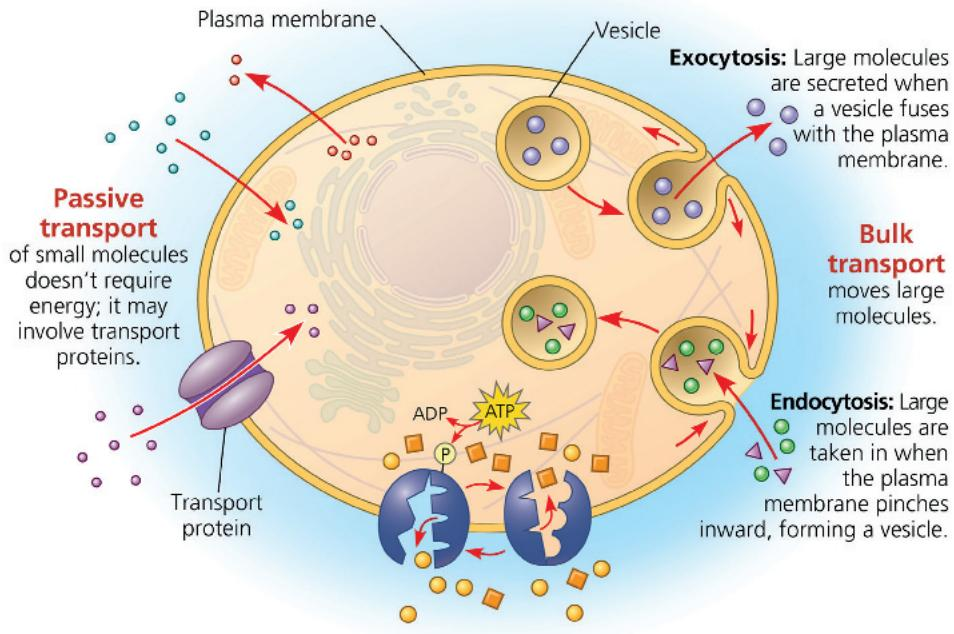  
Active transport of small molecules requires energy and a transport protein.

# Concept 7.1: Cellular membranes are fluid mosaics of lipids and proteins

Lipids and proteins are the staple ingredients of membranes, although carbohydrates are also important. The most abundant lipids in most membranes are phospholipids. Their ability to form membranes is inherent in their molecular structure. A phospholipid is an amphipathic molecule, meaning it has both a hydrophilic (“water-loving”) region and a hydrophobic (“water-fearing”) region (see Figure 5.11). A phospholipid bilayer can exist as a stable boundary between two aqueous compartments because the molecular arrangement shelters the hydrophobic tails of the phospholipids from water while exposing the hydrophilic heads to water (Figure 7.2).

Like membrane lipids, most membrane proteins are amphipathic. Such proteins can reside in the phospholipid bilayer with their hydrophilic regions protruding. This molecular orientation maximizes contact of hydrophilic regions of a protein with water in the cytosol and extracellular fluid, while providing their hydrophobic parts

with a nonaqueous environment. Figure 7.3 shows the currently accepted model of the arrangement of

Figure 7.2 Phospholipid bilayer (cross section).  

VISUAL SKILLS Consulting Figure 5.11, circle and label the hydrophilic and hydrophobic portions of the enlarged phospholipids on the right. Explain what each portion contacts when the phospholipids are in the plasma membrane. For suggested answer, see Appendix A.

Figure 7.3 Current model of an animal cell's plasma membrane (cutaway view). Lipids are colored gray and gold, proteins purple, and carbohydrates green.  
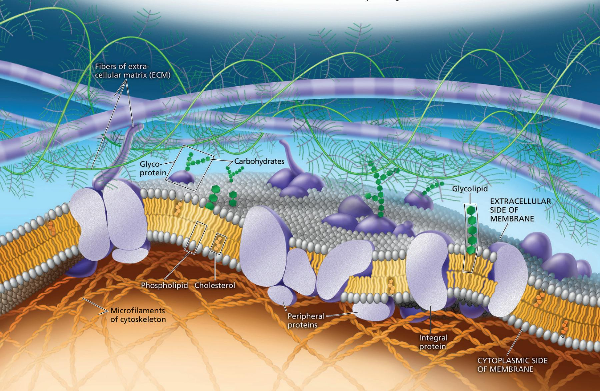

molecules in the plasma membrane. In this fluid mosaic model, the membrane is a mosaic of protein molecules bobbing in a fluid bilayer of phospholipids.

The proteins are not randomly distributed in the membrane, however. Groups of proteins are often associated in long-lasting, specialized patches, where they carry out common functions. Researchers have found specific lipids in these patches as well and have proposed naming them lipid rafts; however, the debate continues about whether such structures exist in living cells or are an artifact of biochemical techniques. In some regions, the membrane may be much more tightly packed with proteins than shown in Figure 7.3. Like all models, the fluid mosaic model is continually being refined as new research reveals more about membrane structure.

## The Fluidity of Membranes

Membranes are not static sheets of molecules locked rigidly in place. A membrane is held together mainly by hydrophobic interactions, which are much weaker than covalent bonds (see Figure 5.18). Most of the lipids and some proteins can shift about sideways—that is, in the plane of the membrane, like partygoers elbowing their way through a crowded room. Very rarely, also, a lipid may flip-flop across the membrane, switching from one phospholipid layer to the other.

The sideways movement of phospholipids within the membrane is rapid. Adjacent phospholipids switch positions about $10^{7}$ times per second, which means that a phospholipid can travel about 2 $\mu$ m—the length of a typical bacterial cell—in 1 second. Proteins are much larger than lipids and move more slowly, when they do move. Many membrane proteins seem to be held immobile by their attachment to the cytoskeleton or to the extracellular matrix (see Figure 7.3). Some membrane proteins seem to move in a highly directed manner, perhaps driven along cytoskeletal fibers by motor proteins. And other proteins simply drift in the membrane, as shown the classic experiment described in Figure 7.4.

A membrane remains fluid as temperature decreases until the phospholipids settle into a closely packed arrangement and the membrane solidifies, much as bacon grease forms lard when it cools. The temperature at which a membrane solidifies depends on the types of lipids it is made of. As the temperature decreases, the membrane remains fluid to a lower temperature if it is rich in phospholipids with unsaturated hydrocarbon tails (see Figures 5.10 and 5.11). Because of kinks in the tails where double bonds are located, unsaturated hydrocarbon tails cannot pack together as closely as saturated hydrocarbon tails, making the membrane more fluid (Figure 7.5a).

The steroid cholesterol, which is wedged between phospholipid molecules in the plasma membranes of animal cells, has different effects on membrane fluidity at different temperatures (Figure 7.5b). At relatively high temperatures—at $37^{\circ}$ C, the body temperature of humans, for example—cholesterol makes the membrane less fluid by restraining phospholipid movement. However, because cholesterol also hinders the close packing of phospholipids, it lowers the temperature required for the membrane to solidify. Thus, cholesterol can be thought of as a “fluidity buffer” for the membrane, resisting changes in membrane fluidity that can be caused by changes in temperature. Compared to animals, plants have very low levels of cholesterol; rather, related steroid lipids buffer membrane fluidity in plant cells.

## Figure 7.4

## Inquiry: Do membrane proteins move? Experiment

Larry Frye and Michael Edidin, at Johns Hopkins University, labeled the plasma membrane proteins of a mouse cell and a human cell with two different markers and fused the cells. Using a microscope, they observed the markers on the hybrid cell.

## Results

## Conclusion

The mixing of the mouse and human membrane proteins indicates that at least some membrane proteins move sideways within the plane of the plasma membrane.

Data from L. D. Frye and M. Edidin, The rapid intermixing of cell surface antigens after formation of mouse-human heterokaryons, Journal of Cell Science 7:319 (1970).

WHAT IF? Suppose the proteins did not mix in the hybrid cell, even many hours after fusion. Could you conclude that proteins don't move within the membrane? What other explanation could there be?

For suggested answer, see Appendix A.

Figure 7.5 Factors that affect membrane fluidity.  

Membranes must be fluid to work properly; the fluidity of a membrane affects both its permeability and the ability of membrane proteins to move to where their function is needed. Usually, membranes are about as fluid as olive oil. When a membrane solidifies, its permeability changes, and enzymatic proteins in the membrane may become inactive if their activity requires movement within the membrane. However, membranes that are too fluid cannot support protein function either. Therefore, extreme environments (for example, those with extreme temperatures) pose a challenge for life, resulting in evolutionary adaptations that include differences in membrane lipid composition.

## Evolution of Differences in Membrane Lipid Composition

EVOLUTION Variations in the cell membrane lipid compositions of many species appear to be evolutionary adaptations that maintain the appropriate membrane fluidity under specific environmental conditions. For instance, fishes that live in extreme cold have membranes with a high proportion of unsaturated hydrocarbon tails, enabling their membranes to remain fluid in spite of the low temperature (see Figure 7.5a). At the other extreme, some bacteria and archaea thrive at temperatures greater than 90°C (194°F) in thermal hot springs and geysers. Their membranes include unusual lipids that may prevent excessive fluidity at such high temperatures.

The ability to change the lipid composition of cell membranes in response to changing temperatures has evolved in organisms that live where temperatures vary. In many plants that tolerate extreme cold, such as winter wheat, the percentage of unsaturated phospholipids increases in autumn, an adjustment that keeps the membranes from solidifying during winter. Some bacteria and archaea also exhibit different proportions of unsaturated phospholipids in their cell membranes, depending on the temperature at which they are growing. Overall, natural selection has apparently favored organisms whose mix of membrane lipids ensures an appropriate level of membrane fluidity for their environment.

## Membrane Proteins and Their Functions

Now we come to the mosaic aspect of the fluid mosaic model. Somewhat like a tile mosaic (shown here), a membrane is a col-

Tile mosaic.

lage of different proteins, often clustered together in groups, embedded in the fluid matrix of the lipid bilayer (see Figure 7.3). More than 50 kinds of proteins have been found in the plasma membrane of red blood cells, for example. Phospholipids form the main fabric of the membrane, but proteins determine most of the membrane's functions. Different types of cells contain different sets of membrane proteins, and the

## Figure 7.6 The structure of a transmembrane protein.

Bacteriorhodopsin (a bacterial transport protein) has a distinct orientation in the membrane, with its N-terminus outside the cell and its C-terminus inside. This ribbon model highlights the secondary structure of the hydrophobic parts, including seven transmembrane $\alpha$ helices, which lie mostly within the hydrophobic interior of the membrane. The nonhelical hydrophilic segments are in contact with the aqueous solutions on the extracellular and cytoplasmic sides of the membrane.

various membranes within a cell each have a unique collection of proteins.

Notice in Figure 7.3 that there are two major populations of membrane proteins: integral proteins and peripheral proteins. Integral proteins penetrate the hydrophobic interior of the lipid bilayer. The majority are transmembrane proteins, which span the membrane; other integral proteins extend only partway into the hydrophobic interior. The hydrophobic regions of an integral protein consist of one or more stretches of nonpolar amino acids (see Figure 5.14), typically 20–30 amino acids in length, usually coiled into $\alpha$ helices (Figure 7.6). The hydrophilic parts of the molecule are exposed to the aqueous solutions on either side of the membrane. Some proteins also have one or more hydrophilic channels that allow passage through the membrane of hydrophilic substances (even of water itself). Peripheral proteins are not embedded in the lipid bilayer at all; they are loosely bound to the surface of the membrane, often to exposed parts of integral proteins (see Figure 7.3).

On the cytoplasmic side of the plasma membrane, some membrane proteins are held in place by attachment to the cytoskeleton. And on the extracellular side, certain membrane proteins may attach to materials outside the cell. For example, in animal cells, membrane proteins may be attached to fibers of the extracellular matrix (see Figure 6.28; integrins are one type of integral, transmembrane protein). These attachments combine to give animal cells a stronger framework than the plasma membrane alone could provide.

Figure 7.7 illustrates six major functions performed by proteins of the plasma membrane. A single cell may have different membrane proteins that carry out various functions, and one protein may itself carry out multiple functions. Thus, the membrane is a functional mosaic as well as a structural one.

Proteins on a cell's surface are important in the medical field. For example, a protein called CD4 on the surface of immune cells helps the human immunodeficiency virus (HIV) infect these cells, leading to acquired immune deficiency syndrome (AIDS). Despite multiple exposures to HIV, however, a small number of people do not develop AIDS and show no

(a) Transport. Left: A protein that spans the membrane may provide a hydrophilic channel across the membrane that is selective for a particular solute (see Figures 6.32a and 7.15a). Right: Other transport proteins shuttle a substance from one side to the other by changing shape (see Figure 7.15b). Some of these proteins hydrolyze ATP as an energy source to actively pump substances across the membrane.

Figure 7.7 Some functions of membrane proteins. In many cases, a single protein performs multiple tasks.  

(b) Enzymatic activity. A protein built into the membrane may be an enzyme with its active site (where the reactant binds) exposed to substances in the adjacent solution. In some cases, several enzymes in a membrane are organized as a team that carries out sequential steps of a metabolic pathway.

(c) Signal transduction. A membrane protein (receptor) may have a binding site with a specific shape that fits the shape of a chemical messenger, such as a hormone. The external messenger (signaling molecule) may cause the protein to change shape, allowing it to relay the message to the inside of the cell, usually by binding to a cytoplasmic protein (see Figures 6.32a and 11.6).

(d) Cell-cell recognition. Some glyco-proteins serve as identification tags that are specifically recognized by membrane proteins of other cells. This type of cell-cell binding is usually short-lived compared with that shown in (e).

(e) Intercellular joining. Membrane proteins of adjacent cells may hook together in various kinds of junctions, such as gap junctions or tight junctions (see Figure 6.30). This type of binding is more long-lasting than that shown in (d).

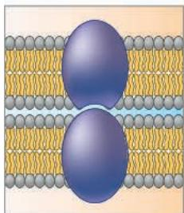

(f) Attachment to the cytoskeleton and extracellular matrix (ECM).
Microfilaments or other elements of the cytoskeleton may be noncovalently bound to membrane proteins, a function that helps maintain cell shape and stabilizes the location of certain membrane proteins. Proteins that can bind to ECM molecules can coordinate extracellular and intracellular changes (see Figure 6.28).

  
MAKE CONNECTIONS Study Figures 2.16 and 5.17; each shows pairs of molecules binding to each other. What would you predict about CCR5 that would allow HIV to bind to it? How could a drug molecule interfere with this binding? For suggested answer, see Appendix A.

VISUAL SKILLS Some transmembrane proteins can bind to a particular ECM molecule and, when bound, transmit a signal into the cell. Use the proteins shown in (c) and (f) to explain how this might occur.
For suggested answer, see Appendix A.

Figure 7.8 The genetic basis for HIV resistance.  
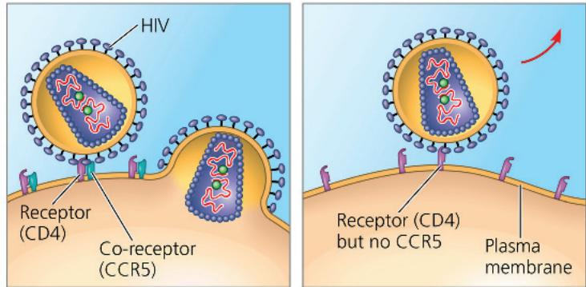  
(a) Some strains of HIV can infect a cell with CCR5 on its surface, as in most people.  
(b) These strains of HIV cannot infect a cell lacking CCR5 on its surface, as in resistant individuals.

evidence of HIV-infected cells. Comparing their genes with the genes of infected individuals, researchers learned that resistant people have an unusual form of a gene that codes for an immune cell-surface protein called CCR5. Further work showed that although CD4 is the main HIV receptor, HIV must also bind to a “co-receptor,” in most cases CCR5 or another protein called CXCR4, depending on the strain of HIV (Figure 7.8a). An absence of CCR5 on the cells of resistant individuals, due to the gene alteration, prevents the strains of the virus that use CCR5 from entering the cells (Figure 7.8b).

This information has been key to developing a treatment for HIV infection. Interfering with CD4 causes dangerous side effects because of its many important functions in cells. Discovery of the CCR5 co-receptor provided a safer target for development of drugs that mask this protein and block HIV entry. One such drug, maraviroc (brand name Selzentry), has been approved for treatment of HIV in patients whose HIV strains use CCR5 as a co-receptor.

## The Role of Membrane Carbohydrates in Cell-Cell Recognition

Cell-cell recognition, a cell's ability to distinguish one type of neighboring cell from another, is crucial to the functioning of an organism. It is important, for example, in the sorting of cells into tissues and organs in an animal embryo. It is also the basis for the rejection of foreign cells by the immune system, an important line of defense in vertebrate animals (see Concept 43.1). Cells recognize other cells by binding to molecules, often containing carbohydrates, on the extracellular surface of the plasma membrane (see Figure 7.7d).

Membrane carbohydrates are usually short, branched chains of fewer than 15 sugar units. Some are covalently bonded to lipids, forming molecules called glycolipids.

(Recall that glyco refers to carbohydrate.) However, most are covalently bonded to proteins, which are thereby glycoproteins (see Figure 7.3).

The carbohydrates on the extracellular side of the plasma membrane vary from species to species, among individuals of the same species, and even from one cell type to another in a single individual. The diversity of the molecules and their location on the cell's surface enable membrane carbohydrates to function as markers that distinguish one cell from another. For example, the four human blood types designated A, B, AB, and O reflect variation in the carbohydrate part of glycoproteins on the surface of red blood cells.

## Concept Check 7.1

1. VISUAL SKILLS Carbohydrates are attached to plasma membrane proteins in the ER (see Figure 7.9). On which side of the vesicle membrane are the carbohydrates during transport to the cell surface?

2. WHAT IF? How might the membrane lipid composition of a native grass found in very warm soil around hot springs differ from that of a native grass found in cooler soil? Explain.

For suggested answers, see Appendix A.

## Synthesis and Sidedness of Membranes

Membranes have distinct inside and outside faces. The two lipid layers may differ in lipid composition, and each protein has directional orientation in the membrane (see Figure 7.6). Figure 7.9 shows how membrane sidedness arises: The asymmetrical arrangement of proteins, lipids, and their associated carbohydrates in the plasma membrane is determined as the membrane is being built.

## Concept 7.2: Membrane structure results in selective permeability

The biological membrane has emergent properties beyond those of the many individual molecules that make it up. The remainder of this chapter focuses on one of those properties: A membrane exhibits selective permeability; that is, it allows some substances to cross more easily than others. The ability to regulate transport

Figure 7.9 Synthesis of membrane components and their orientation in the membrane.

The cytoplasmic (orange) face of the plasma membrane differs from the extracellular (aqua) face. The latter arises from the inside face of ER, Golgi, and vesicle membranes.

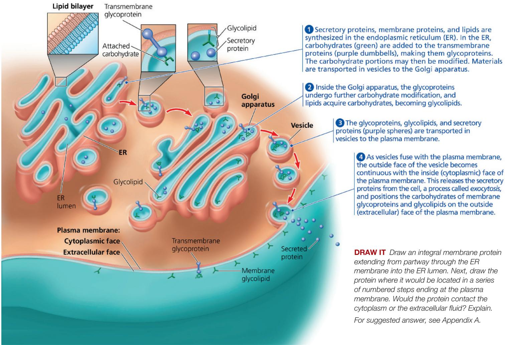

Figure 7.10 An aquaporin.

across cellular boundaries is essential to the cell's existence. We will see once again that form fits function: The fluid mosaic model helps explain how membranes regulate the cell's molecular traffic.

A steady traffic of small molecules and ions moves across the plasma membrane in both directions. Consider the chemical exchanges between a muscle cell and the extracellular fluid that bathes it. Sugars, amino acids, and other nutrients enter the cell, and metabolic waste products leave it. The cell takes in $O_{2}$ for use in cellular respiration and expels $CO_{2}$ . Also, the cell regulates its concentrations of inorganic ions, such as $Na^{+}$ , $K^{+}$ , $Ca^{2+}$ , and $Cl^{-}$ , by shuttling them one way or the other across the plasma membrane. In spite of heavy traffic through them, cell membranes are selective in their permeability: Substances do not cross the barrier indiscriminately. The cell is able to take up some small molecules and ions and exclude others.

## The Permeability of the Lipid Bilayer

Nonpolar molecules, such as hydrocarbons, $CO_{2}$ , and $O_{2}$ , are hydrophobic, as are lipids. They can all therefore dissolve in the lipid bilayer of the membrane and cross it easily, without the aid of membrane proteins. However, the hydrophobic interior of the membrane impedes direct passage through the membrane of ions and polar molecules, which are hydrophilic. Polar molecules such as glucose and other sugars pass only slowly through a lipid bilayer, and even water, a very small polar molecule, does not cross rapidly relative to nonpolar molecules. A charged atom or molecule and its surrounding shell of water (see Figure 3.8) are even less likely to penetrate the hydrophobic interior of the membrane. Furthermore, the lipid bilayer is only one aspect of the gatekeeper system responsible for a cell's selective permeability. Proteins built into the membrane play key roles in regulating transport.

## Transport Proteins

Specific ions and a variety of polar molecules can't move through cell membranes on their own. However, these hydrophilic substances can avoid contact with the lipid bilayer by passing through transport proteins that span the membrane.

Some transport proteins, called channel proteins, function by having a hydrophilic channel that certain molecules or ions use as a tunnel through the membrane (see Figure 7.7a, left). For example, the passage of water molecules through the membrane in certain cells is greatly facilitated by channel proteins known as aquaporins (Figure 7.10). Most aquaporin proteins consist of four identical polypeptide subunits. Each polypeptide forms a channel that water molecules pass through, single-file, overall allowing entry of up to 3 billion water molecules per second. Without aquaporins, only a tiny fraction of these water molecules would pass through the same area of the cell membrane in a second. Other transport proteins, called carrier proteins, hold on to their passengers and change shape in a way that shuttles them across the membrane (see Figure 7.7a, right).

## Interview

Interview with Peter Agre: Discovering aquaporins (eTextbook only)

This computer model shows water molecules (red and gray) passing through an aquaporin (blue ribbons) in a lipid bilayer (yellow, hydrophilic heads; green, hydrophobic tails).

A transport protein is specific for the substance it translocates (moves), allowing only a certain substance (or a small group of related substances) to cross the membrane. For example, a glucose carrier protein in the plasma membrane of red blood cells transports glucose across the membrane 50,000 times faster than glucose can pass through on its own. This “glucose transporter” is so selective that it even rejects fructose, a structural isomer of glucose (see Figure 5.3). Thus, the selective permeability of a membrane depends on both the discriminating barrier of the lipid bilayer and the specific transport proteins built into the membrane.

What establishes the direction of traffic across a membrane? And what mechanisms drive molecules across membranes? We will address these questions next as we explore two modes of membrane traffic: passive transport and active transport.

## Concept Check 7.2

1. What property allows $\mathrm{O}_2$ and $\mathrm{CO}_2$ to cross a lipid bilayer without the aid of membrane proteins?

2. VISUAL SKILLS Examine Figure 7.2. Why is a transport protein needed to move many water molecules rapidly across a membrane?

3. MAKE CONNECTIONS Aquaporins exclude passage of hydronium ions ( $H_{3}O^{+}$ ), but some aquaporins allow passage of glycerol, a three-carbon alcohol (see Figure 5.9), as well as $H_{2}O$ . Since $H_{3}O^{+}$ is closer in size to water than glycerol is, yet cannot pass through, what might be the basis of this selectivity?

For suggested answers, see Appendix A.

## Concept 7.3: Passive transport is diffusion of a substance across a membrane with no energy investment

Molecules have a type of energy called thermal energy, due to their constant motion (see Concept 3.2). One result of this motion is diffusion, the movement of particles of any substance so that they spread out into the available space. Each molecule moves randomly, yet diffusion of a population of molecules may be directional. Imagine a synthetic membrane separating pure water from a solution of a dye in water. Study Figure 7.11a carefully to see how diffusion would result in equal concentrations of dye molecules in both solutions. At that point, a dynamic equilibrium will exist, with as many dye molecules crossing per second in one direction as in the other.

Here is a simple rule of diffusion: In the absence of any other forces, a substance will diffuse from where it is more concentrated to where it is less concentrated. Put another way, a substance diffuses down its concentration gradient, the region along which the density of a chemical substance increases or decreases (in this case, decreases). Diffusion is a spontaneous process, needing no input of energy. Each substance diffuses down its own concentration gradient, unaffected by the concentration gradients of other substances (Figure 7.11b).

Much of the traffic across cell membranes occurs by diffusion. When a substance is more concentrated on one side of a membrane than on the other, there is a tendency for it to diffuse across, down its concentration gradient (assuming that the membrane is permeable to that substance). One important example is the uptake of oxygen by a cell performing cellular respiration. Dissolved oxygen diffuses into the cell across the plasma membrane. As long as cellular respiration consumes the $O_{2}$ as it enters, diffusion into the cell will continue because the concentration gradient favors movement in that direction.

Figure 7.11 Diffusion of solutes across a synthetic membrane. Each large arrow shows net diffusion of dye molecules of that color.  
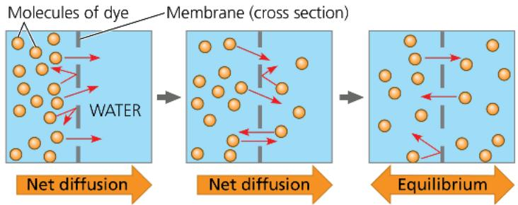  
(a) Diffusion of one solute. Molecules of orange dye can pass through membrane pores. Random movement of dye molecules will cause some to pass through the pores; this happens more often on the side with more dye molecules. The dye diffuses from the more concentrated side to the less concentrated side (called diffusing down a concentration gradient). A dynamic equilibrium results: Solute molecules still cross, but at roughly equal rates in both directions.

  
(b) Diffusion of two solutes. Solutions of two different dyes are separated by a membrane that is permeable to both. Each dye diffuses down its own concentration gradient. There will be a net diffusion of the purple dye (particles with dashed outlines) from right to left, even though the total solute concentration was initially greater on the left side.

The diffusion of a substance across a biological membrane is called passive transport because it requires no energy. The concentration gradient itself represents potential energy (see Concept 2.2 and Figure 8.5b) and drives diffusion. Remember, though, that membranes are selectively permeable and therefore have different effects on the rates of diffusion of various molecules. Water can diffuse very rapidly across the membranes of cells with aquaporins, compared with diffusion in the absence of aquaporins. The movement of water across the plasma membrane has important consequences for cells.

## Effects of Osmosis on Water Balance

To see how two solutions with different solute concentrations interact, picture a U-shaped glass tube with a selectively permeable artificial membrane separating two sugar solutions (Figure 7.12). Pores in this synthetic membrane are too small for sugar molecules to pass through but large enough for water

## Figure 7.12 Osmosis.

Two sugar solutions of different concentrations are separated by a membrane that the solvent (water) can pass through but the solute (sugar) cannot. Water molecules move randomly and may cross in either direction, but overall, water diffuses from the solution with less concentrated solute to that with more concentrated solute. This passive transport of water, or osmosis, makes the sugar concentrations on both sides roughly equal.

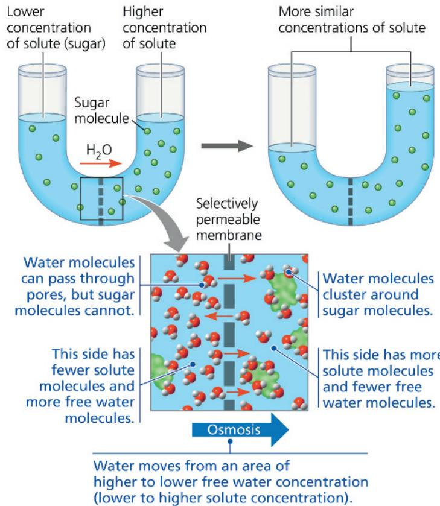  
VISUAL SKILLS If an orange dye capable of passing through the membrane was added to the left side of the tube above, how would it be distributed at the end of the experiment? (See Figure 7.11a.) Would the final solution levels in the tube be affected? What cellular component does the membrane represent in this experiment?
For suggested answer, see Appendix A.

molecules. However, tight clustering of water molecules around the hydrophilic solute molecules makes some of the water unavailable to cross the membrane. As a result, the solution with a higher solute concentration has a lower free water concentration. Water diffuses across the membrane from the region of higher free water concentration (lower solute concentration) to that of lower free water concentration (higher solute concentration) until the solute concentrations on both sides of the membrane are more nearly equal. The diffusion of free water across a selectively permeable membrane, whether artificial or cellular, is called osmosis. The movement of water across cell membranes and the balance of water between the cell and its environment are crucial to organisms. Let's now apply what we've learned about osmosis in this system to living cells.

## Water Balance of Cells Without Cell Walls

To explain the behavior of a cell in a solution, we must consider both solute concentration and membrane permeability. Both factors are taken into account in the concept of tonicity, the ability of a surrounding solution to cause a cell to gain or lose water. The tonicity of a solution depends in part on its concentration of solutes that cannot cross the membrane (nonpenetrating solutes) relative to that inside the cell. If there is a higher concentration of nonpenetrating solutes in the surrounding solution, water will tend to leave the cell, and vice versa.

If a cell without a cell wall, such as an animal cell, is immersed in an environment that is isotonic to the cell (iso means “same”), there will be no net movement of water across extracellular fluid that is isotonic to the cells. In hypertonic or hypotonic environments, however, organisms that lack rigid cell walls must have other adaptations for osmoregulation, the control of solute concentrations and water balance. For example, the unicellular protist Paramecium caudatum lives in pond water, which is hypotonic to the cell. Paramecium has a plasma membrane that is much less permeable to water than the membranes of most other cells, but this only slows the uptake of water, which continually enters the cell. The reason the Paramecium cell doesn't burst is that it has a contractile vacuole, an organelle that functions as a pump to force water out of the cell as fast as it enters by osmosis (Figure 7.14). In contrast, the bacteria and archaea that live in hypersaline (excessively salty) environments (see Figure 27.1) have cellular mechanisms that balance the internal and external solute concentrations to ensure that water does not move out of the cell. We'll examine other evolutionary adaptations for osmoregulation by animals in Concept 44.1.

## Water Balance of Cells with Cell Walls

The cells of plants, prokaryotes, fungi, and some protists are surrounded by cell walls (see Figure 6.27). When such a cell is immersed in a hypotonic solution—bathed in rainwater, for example—the cell wall helps maintain the cell's water balance. Consider a plant cell. Like an animal cell, the plant cell swells as water enters by osmosis (Figure 7.13b). However, the relatively inelastic cell wall will expand only so much before it exerts a back pressure on the cell, called turgor pressure, that opposes further

the plasma membrane. Water diffuses across the membrane, but at the same rate in both directions. In an isotonic environment, the volume of an animal cell is stable (Figure 7.13a).

Let's transfer the cell to a solution that is hypertonic to the cell (hyper means “more,” in this case referring to nonpenetrating solutes). The cell will lose water, shrivel, and probably die. This is why an increase in the salinity (saltiness) of a lake can kill the animals there; if the lake water becomes hypertonic to the animals' cells, they might shrivel and die. However, taking up too much water can be just as hazardous to a cell as losing water. If we place the cell in a solution that is hypotonic to the cell (hypo means “less”), water will enter the cell faster than it leaves, and the cell will swell and lyse (burst) like an overfilled water balloon.

A cell without rigid cell walls can't tolerate either excessive uptake or excessive loss of water. This problem of water balance is automatically solved if such a cell lives in isotonic surroundings. Seawater is isotonic to many marine invertebrates. The cells of most terrestrial (land-dwelling) animals are bathed in an

## Figure 7.13 The water balance of living cells.

How living cells react to changes in the solute concentration of their environment depends on whether or not they have cell walls. (a) Animal cells, such as this red blood cell, do not have cell walls. (b) Plant cells do have cell walls. (Arrows indicate net water movement after the cells were first placed in these solutions.)

(a) Animal cell. An animal cell, such as this red blood cell, does not have a cell wall. Animal cells fare best in an isotonic environment unless they have specialized adaptations that offset the osmotic uptake or loss of water.

(b) Plant cell. Plant cells are turgid (firm) and generally healthiest in a hypotonic environment, where the uptake of water is eventually balanced by the wall pushing back on the cell.

Hypotonic solution

Isotonic solution

Hypertonic solution  
  
Turgid (normal)  
Why do limp celery stalks become crisp when placed in a glass of water? For suggested answer, see Appendix A.

Figure 7.14 The contractile vacuole of Paramecium.
The vacuole collects fluid from canals in the cytoplasm. When full, the vacuole and canals contract, expelling fluid from the cell (LM).  

water uptake. At this point, the cell is turgid (very firm), which is the healthy state for most plant cells. Plants that are not woody, such as most houseplants, depend for mechanical support on cells kept turgid by a surrounding hypotonic solution. If a plant's cells and surroundings are isotonic, there is no net tendency for water to enter and the cells become flaccid (limp); the plant wilts.

However, a cell wall is of no advantage if the cell is immersed in a hypertonic environment. In this case, a plant cell, like an animal cell, will lose water to its surroundings and shrink. As the plant cell shrivels, its plasma membrane pulls away from the cell wall at multiple places. This phenomenon, called plasmolysis, causes the plant to wilt and can lead to plant death. The walled cells of bacteria and fungi also plasmolyze in hypertonic environments.

## Facilitated Diffusion: Passive Transport Aided by Proteins

Let's look more closely at how water and certain hydrophilic solutes cross a membrane. As mentioned earlier, many polar molecules and ions blocked by the lipid bilayer of the membrane diffuse passively with the help of transport proteins that span the membrane. This phenomenon is called facilitated diffusion. Cell biologists are still trying to learn exactly how various transport proteins facilitate diffusion. Most transport proteins are very specific: They transport some substances but not others.

As mentioned earlier, the two types of transport proteins are channel proteins and carrier proteins. Channel proteins simply provide corridors that allow specific molecules or ions to cross the membrane (Figure 7.15a). The hydrophilic passageways provided by these proteins can allow water molecules or small ions to diffuse very quickly from one side of the membrane to the other. Aquaporins, the water channel proteins, facilitate the massive levels of diffusion of water (osmosis) that occur in plant cells and in animal cells such as red blood cells (see Figure 7.13). Certain kidney cells also have a high number of aquaporins, allowing them to reclaim water from urine before it is excreted. If the kidneys didn't perform this function, you would excrete about $180\mathrm{L}$ of urine per day—and have to drink an equal volume of water!

Channel proteins that transport ions are called ion channels. Many ion channels function as gated channels, which open or

Figure 7.15 Two types of transport proteins that carry out facilitated diffusion.

In both cases, the protein can transport the solute in either direction, but the net movement is down the concentration gradient of the solute.

(a) A channel protein has a channel through which water molecules or a specific solute can pass.

(b) A carrier protein alternates between two shapes, moving a solute across the membrane during the shape change.

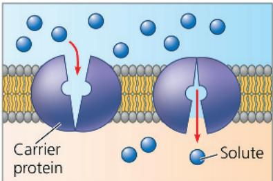  
Potassium ion channel protein (See also the side view of a calcium channel protein in Figure 6.32a.)

close in response to a stimulus (see Figure 11.8). For some gated channels, the stimulus is electrical. In a nerve cell, for example, a potassium ion channel protein (see computer model) opens in response to an electrical stimulus, allowing a stream of potassium ions to leave the cell. This restores the cell's ability to fire again. Other gated channels have a chemical stimulus: They open or close when a specific substance (not

the one to be transported) binds to the channel. Ion channels are important in the functioning of the nervous system, as you'll learn in Chapter 48.

## Interview

## Interview with Elba Serrano: Investigating how ion channels enable you to hear (eTextbook only)

Carrier proteins, such as the glucose transporter mentioned earlier, seem to undergo a subtle change in shape that somehow translocates the solute-binding site across the membrane (Figure 7.15b). Such a change in shape may be triggered by the binding and release of the transported molecule. Like ion channels, carrier proteins involved in facilitated diffusion result in the net movement of a substance down its concentration gradient. No energy input is thus required: This is passive transport. The Scientific Skills Exercise gives you an opportunity to work with data from an experiment related to glucose transport.

# Scientific Skills Exercise

# Interpreting a Scatter Plot with Two Sets of Data

Is Glucose Uptake into Cells Affected by Age? Glucose, an important energy source for animals, is transported into cells by facilitated diffusion using protein carriers. In this exercise, you will interpret a graph with two sets of data from an experiment that examined glucose uptake over time in red blood cells from guinea pigs of different ages. You will determine if the cells' rate of glucose uptake depended on the age of the guinea pig.

How the Experiment Was Done Researchers incubated guinea pig red blood cells in a 300 mM (millimolar) radioactive glucose solution at pH 7.4 at 25°C. Every 10 or 15 minutes, they removed a sample of cells and measured the concentration of radioactive glucose inside those cells. The cells came from either a 15-day-old or a 1-month-old guinea pig.

Data from the Experiment When you have multiple sets of data, it can be useful to plot them on the same graph for comparison. In the graph here, each set of dots (of the same color) forms a scatter plot, in which every data point represents two numerical values, one for each variable. For each data set, a curve that best fits the points has been drawn to make it easier to see the trends. (For additional information about graphs, see the Scientific Skills Review in Appendix D.)

## INTERPRET THE DATA

1. First make sure you understand the parts of the graph. (a) Which variable is the independent variable—the variable controlled by the researchers? (b) Which variable is the dependent variable—the variable that depended on the treatment and was measured by the researchers? (c) What do the red dots on the upper line represent? (d) The blue squares on the lower line?

## Concept Check 7.3

1. Speculate about how a cell performing cellular respiration might rid itself of the resulting $CO_{2}$ .

2. WHAT IF? If a Paramecium swims from a hypotonic to an isotonic environment, will its contractile vacuole become more active or less? Why?

For suggested answers, see Appendix A.

## Concept 7.4: Active transport uses energy to move solutes against their gradients

Despite the help of transport proteins, facilitated diffusion is considered passive transport because the solute is moving down its concentration gradient, a process that requires no energy. Facilitated

Glucose Uptake over Time in Guinea Pig Red Blood Cells.  
  
Data from T. Kondo and E. Beutler, Developmental changes in glucose transport of guinea pig erythrocytes, Journal of Clinical Investigation 65:1–4 (1980).

2. From the data points on the graph, construct a table of the data. Put "Incubation Time (min)" in the left column of the table.

3. What does the graph show? Compare and contrast glucose uptake in red blood cells from 15-day-old and 1-month-old guinea pigs.

4. Develop a hypothesis to explain the difference between glucose uptake in red blood cells from 15-day-old and 1-month-old guinea pigs. (Think about how glucose gets into cells.)

5. Design an experiment to test your hypothesis.

Instructors: A version of this Scientific Skills Exercise can be assigned in Mastering Biology.

diffusion speeds transport of a solute by providing efficient passage through the membrane, but it does not alter the direction of transport. Some other transport proteins, however, can use energy to move solutes against their concentration gradients, across the plasma membrane from the side where they are less concentrated (whether inside or outside) to the side where they are more concentrated.

## The Need for Energy in Active Transport

To pump a solute across a membrane against its gradient requires work; the cell must expend energy. Therefore, this type of membrane traffic is called active transport. The transport proteins that move solutes against their concentration gradients are all carrier proteins rather than channel proteins. This makes sense because when channel proteins are open, they merely allow solutes to diffuse down their concentration gradients rather than picking them up and transporting them against their gradients.

Active transport enables a cell to maintain internal concentrations of small solutes that differ from concentrations in its environment. For

Figure 7.16 The sodium-potassium pump: a specific case of active transport.

This transport system pumps ions against steep concentration gradients. The pump oscillates between two shapes in a cycle that moves $Na^{+}$ out of the cell (steps 1–3) and $K^{+}$ into the cell (steps 4–6). The two shapes have different binding affinities for $Na^{+}$ and $K^{+}$ . ATP hydrolysis powers the shape change by transferring a phosphate group to the transport protein (phosphorylating the protein).

VISUAL SKILLS For each ion ( $Na^{+}$ and $K^{+}$ ), describe its concentration inside the cell relative to outside. How many $Na^{+}$ are moved out of the cell and how many $K^{+}$ moved in per cycle? For suggested answer, see Appendix A.

1 Cytoplasmic Na $^{+}$ binds to the sodium-potassium pump with high affinity when the protein has this shape.

  
② Binding of 3 Na $^{+}$ ions stimulates phosphorylation by a kinase, using ATP.  
3 Phosphorylation leads to a change in protein shape, reducing its affinity for $\mathrm{Na^{+}}$ ; 3 $\mathrm{Na^{+}}$ are released outside.  
6 $2\mathrm{K}^{+}$ are released; affinity for $\mathrm{Na^{+}}$ is high again, and the cycle repeats.  
5 Loss of the phosphate group restores the protein's original shape, which has a lower affinity for $\mathsf{K}^+$ .  
4 The new shape has a high affinity for $\mathsf{K}^+$ ; $2\mathsf{K}^+$ bind on the extracellular side, triggering release of the phosphate group.

example, compared with its surroundings, an animal cell has a much higher concentration of potassium ions ( $K^{+}$ ) and a much lower concentration of sodium ions ( $Na^{+}$ ). The plasma membrane helps maintain these steep gradients by pumping $Na^{+}$ out of the cell and $K^{+}$ into the cell.

As in other types of cellular work, ATP hydrolysis supplies the energy for most active transport. One way ATP can power active transport is when its terminal phosphate group is transferred directly to the transport protein. This can induce the protein to change its shape in a manner that translocates a solute bound to the protein across the membrane. One transport system that works this way is the sodium-potassium pump, which exchanges $Na^{+}$ for $K^{+}$ across the plasma membrane of animal cells (Figure 7.16). The distinction between passive transport and active transport is reviewed in Figure 7.17.

## How Ion Pumps Maintain Membrane Potential

All cells have voltages across their plasma membranes. Voltage is electrical potential energy (see Concept 2.2)—a separation of opposite charges. The cytoplasmic side of the membrane is negative in charge relative to the extracellular side because of an unequal distribution of anions and cations on the two sides. The voltage across a membrane, called a membrane potential, ranges from about -50 to -200 millivolts (mV). (The minus sign indicates that the inside of the cell is negative relative to the outside.)

The membrane potential acts like a battery, an energy source that affects the traffic of all charged substances across

Figure 7.17 Review: passive and active transport.

Passive transport. Substances diffuse spontaneously down their concentration gradients, crossing a membrane with no expenditure of energy by the cell. The rate of diffusion can be greatly increased by transport proteins in the membrane.

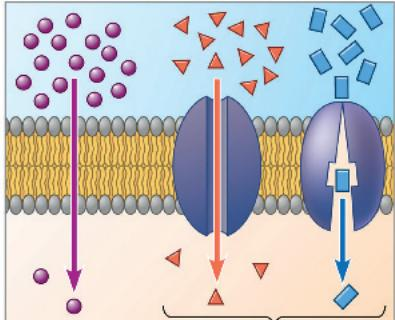

Diffusion.
Hydrophobic molecules and (at a slow rate) very small un-charged polar molecules can diffuse through the lipid bilayer.

## Active transport.

Active transport. Some transport proteins expend energy and act as pumps, moving substances across a membrane against their concentration (or electrochemical) gradients. Energy is usually supplied by ATP hydrolysis.

Facilitated diffusion. Many hydrophilic substances diffuse through membranes with the assistance of transport proteins, either channel proteins (left) or carrier proteins (right).

  
VISUAL SKILLS For each solute in the right panel, describe its direction of movement, and state whether it is moving with or against its concentration gradient.  
For suggested answer, see Appendix A.

the membrane. Because the inside of the cell is negative compared with the outside, the membrane potential favors the passive transport of cations into the cell and anions out of the cell. Thus, two forces drive the diffusion of ions across a membrane: a chemical force (the ion's concentration gradient, which has been our sole consideration thus far in the chapter) and an electrical force (the effect of the membrane potential on the ion's movement). This combination of forces acting on an ion is called the electrochemical gradient.

In the case of ions, then, we must refine our concept of passive transport: An ion diffuses not simply down its concentration gradient but, more exactly, down its electrochemical gradient. For example, the concentration of $Na^{+}$ inside a resting nerve cell is much lower than outside it. When the cell is stimulated, gated channels open that facilitate $Na^{+}$ diffusion. Sodium ions then “fall” down their electrochemical gradient, driven by the concentration gradient of $Na^{+}$ and by the attraction of these cations to the negative side (inside) of the membrane. In this example, both electrical and chemical contributions to the electrochemical gradient act in the same direction across the membrane, but this is not always so. In cases where electrical forces due to the membrane potential oppose the simple diffusion of an ion down its concentration gradient, active transport may be necessary. In Concepts 48.2 and 48.3, you’ll learn about the importance of electrochemical gradients and membrane potentials in the transmission of nerve impulses.

Some membrane proteins that actively transport ions contribute to the membrane potential. Study Figure 7.16 to see if you can see why the sodium-potassium pump is a good example. Notice that the pump does not translocate $Na^{+}$ and $K^{+}$ one for one, but pumps three sodium ions out of the cell for every two potassium ions it pumps into the cell. With each “crank” of the pump, there is a net transfer of one positive charge from the cytoplasm to the extracellular fluid, a process that stores energy as voltage. A transport protein that generates voltage across a membrane is called an electrogenic pump. The sodium-potassium pump appears to be the major electrogenic pump of animal cells. The main electrogenic pump of plants, fungi, and bacteria is a proton pump, which actively transports protons

## Figure 7.18 A proton pump.

Proton pumps are electrogenic pumps that store energy by generating voltage (charge separation) across membranes. A proton pump translocates positive charge in the form of hydrogen ions ( $H^{+}$ , or protons). The voltage and $H^{+}$ concentration gradient represent a dual energy source that can drive other processes, such as the uptake of nutrients. Most proton pumps are powered by ATP hydrolysis. (See Figure 6.32a.)

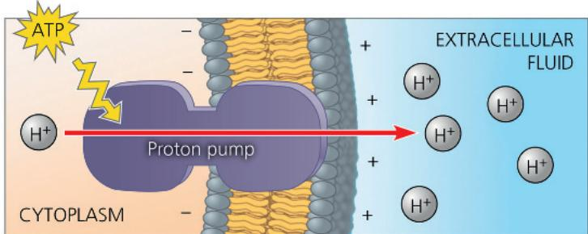

(hydrogen ions, $H^{+}$ ) out of the cell. The pumping of $H^{+}$ transfers positive charge from the cytoplasm to the extracellular solution (Figure 7.18). By generating voltage across membranes, electrogenic pumps help store energy that can be tapped for cellular work. One important use of proton gradients in the cell is for ATP synthesis during cellular respiration, as you will see in Concept 9.4. Another is a type of membrane traffic called cotransport.

## Cotransport: Coupled Transport by a Membrane Protein

A solute that exists in different concentrations across a membrane can do work as it moves across that membrane by diffusion down its concentration gradient. This is analogous to water that has been pumped uphill and performs work as it flows back down. In a mechanism called cotransport, a transport protein (a cotransporter) can couple the “downhill” diffusion of the solute to the “uphill” transport of a second substance against its own concentration gradient. For instance, a plant cell uses the gradient of $H^{+}$ generated by its ATP-powered proton pumps to drive the active transport of amino acids, sugars, and several other nutrients into the cell. In the example shown in Figure 7.19, a cotransporter couples the return of $H^{+}$ to the transport of sucrose into the cell. This protein can translocate sucrose into the cell against its concentration gradient, but only if the sucrose molecule travels in the company of an $H^{+}$ . The $H^{+}$ uses the transport protein as an avenue to diffuse down its own electrochemical gradient, which is maintained by the proton pump. Plants use $H^{+}/sucrose$

## Figure 7.19 Cotransport: active transport driven by a concentration gradient.

A carrier protein, such as this $H^{+}$ /sucrose cotransporter in a plant cell (top), is able to use the diffusion of $H^{+}$ down its electrochemical gradient into the cell to drive the uptake of sucrose. (The cell wall is not shown.) Although not technically part of the cotransport process, an ATP-driven proton pump is shown here (bottom), which concentrates $H^{+}$ outside the cell. The resulting $H^{+}$ gradient represents potential energy that can be used for active transport—of sucrose, in this case. Thus, ATP hydrolysis indirectly provides the energy necessary for cotransport.

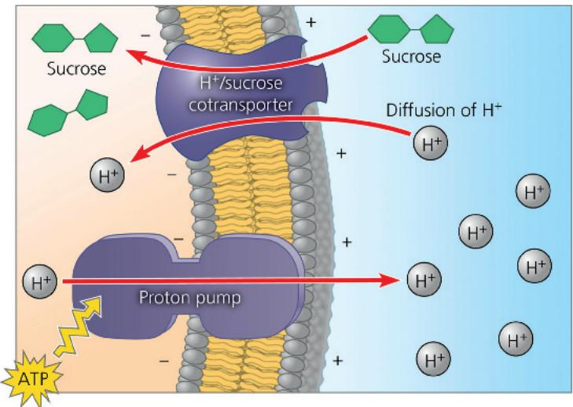

cotransport to load sucrose produced by photosynthesis into cells in the veins of leaves. The vascular tissue of the plant can then distribute the sugar to roots and other nonphotosynthetic organs that do not make their own sugars.

A similar cotransporter in animals transports glucose into intestinal cells together with $Na^{+}$ , which is moving down its concentration gradient into the cell. The glucose and $Na^{+}$ then exit the cell into the blood on the opposite side, the glucose by facilitated diffusion and the $Na^{+}$ by active transport (see Figure 7.16). Water follows these solutes into the cell, and then into the blood, via osmosis. Our understanding of $Na^{+}/glucose$ cotransporters has helped us to find effective treatments for severe diarrhea, a serious problem that can cause life-threatening dehydration even if patients drink large volumes of water. To treat diarrhea, patients are given a solution to drink containing therapeutic concentrations of salt (NaCl) and glucose. The solutes are taken up by $Na^{+}/glucose$ cotransporters and passed through the intestinal cells into the blood, followed by water via osmosis. Without the solutes, sufficient water cannot be absorbed from the intestine. In developing countries, where diarrheal illnesses in infants and young children are a substantial problem, this simple treatment has reduced mortality.

## Concept Check 7.4

1. $Na^{+}/K^{+}$ pumps help nerve cells establish a voltage across their plasma membranes. Do these pumps use ATP or produce ATP? Explain.

2. VISUAL SKILLS Compare the $Na^{+}/K^{+}$ pump in Figure 7.16 with the cotransporter in Figure 7.19. Explain why the $Na^{+}/K^{+}$ pump would not be considered a cotransporter.

3. MAKE CONNECTIONS Review the characteristics of the lysosome in Concept 6.4. Given the internal environment of a lysosome, what transport protein might you expect to see in its membrane?

For suggested answers, see Appendix A.

## Concept 7.5: Bulk transport across the plasma membrane occurs by exocytosis and endocytosis

Large molecules, such as proteins and polysaccharides, generally don't cross the membrane by diffusion or transport proteins. Instead, they usually enter and leave the cell in bulk, packaged in vesicles.

## Exocytosis

The cell secretes certain molecules by the fusion of vesicles with the plasma membrane; this process is called exocytosis (Figure 7.20). A transport vesicle that has budded from the

Figure 7.20 Exocytosis.

1 A vesicle containing secretory proteins buds off from the Golgi.

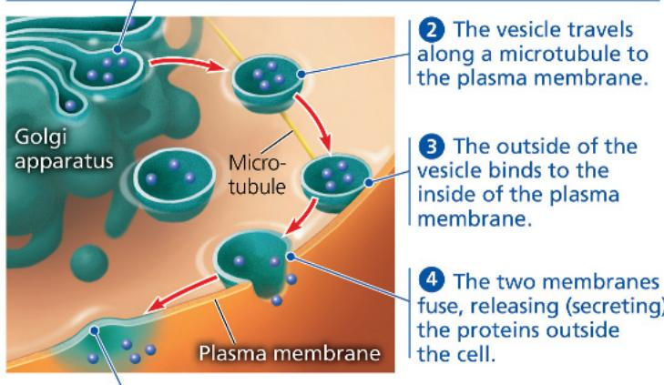  
5 The vesicle membrane becomes part of the plasma membrane.

Golgi apparatus moves along a microtubule of the cytoskeleton to the plasma membrane. When the vesicle membrane and plasma membrane come into contact, specific proteins in both membranes rearrange the lipid molecules of the two bilayers so that the two membranes fuse. The contents of the vesicle spill out of the cell, and the vesicle membrane becomes part of the plasma membrane.

Many secretory cells use exocytosis to export products. For example, cells in the pancreas that make insulin secrete it into the extracellular fluid by exocytosis. In another example, nerve cells use exocytosis to release neurotransmitters that signal other neurons or muscle cells (see Figure 7.1). When plant cells are making cell walls, exocytosis delivers some of the necessary proteins and carbohydrates from Golgi vesicles to the outside of the cell.

## Endocytosis

In endocytosis, the cell takes in molecules and particulate matter by forming new vesicles from the plasma membrane. Although the proteins involved in the processes are different, the events of endocytosis look like the reverse of exocytosis. First, a small area of the plasma membrane sinks inward to form a pocket. Then, as the pocket deepens, it pinches in, forming a vesicle containing material that had been outside the cell. Study Figure 7.21 carefully to understand the three types of endocytosis: phagocytosis (“cellular eating”), pinocytosis (“cellular drinking”), and receptor-mediated endocytosis.

Human cells use receptor-mediated endocytosis to take in cholesterol for membrane synthesis and the synthesis of other steroids. Cholesterol travels in the blood in particles called low-density lipoproteins (LDLs), each a complex of lipids and a protein. LDLs bind to LDL receptors on plasma membranes and then enter the cells by endocytosis. In the inherited disease familial hypercholesterolemia, characterized by a very high level of cholesterol in the blood, LDLs cannot enter cells because the

## Exploring Endocytosis in Animal Cells

Figure 7.21

## Phagocytosis

Pinocytosis  

In phagocytosis, a cell engulfs a particle by extending pseudopodia (singular, pseudopodium) around it and packaging it within a membranous sac called a food vacuole. The particle will be digested after the food vacuole fuses with a lysosome containing hydrolytic enzymes (see Figure 6.13a).

In pinocytosis, a cell continually “gulps” droplets of extracellular fluid into tiny vesicles, formed by infoldings of the plasma membrane. In this way, the cell obtains molecules dissolved in the droplets. Because any and all solutes are taken into the cell, pinocytosis as shown here is nonspecific for the substances it transports. In many cases, the parts of the plasma membrane that form vesicles are lined on their cytoplasmic side by a fuzzy layer of coat protein; the “pits” and resulting vesicles are called coated pits.

  
An amoeba engulfing a green algal cell via phagocytosis (TEM).

  
Pinocytotic vesicles forming (TEMs).

VISUAL SKILLS Use the scale bars to estimate the diameters of (a) the food vacuole that will form around the algal cell (left micrograph; measure the length, not the width) and (b) the coated vesicle (lower right micrograph). (c) Which is larger, and by what factor? For suggested answer, see Appendix A.

## Receptor-Mediated Endocytosis

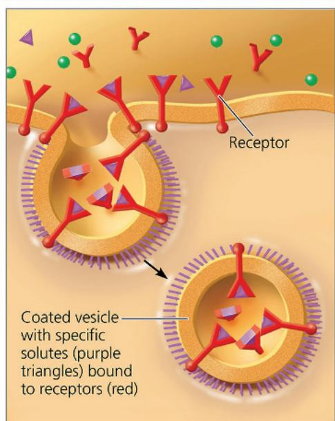  
Coated vesicle with specific solutes (purple triangles) bound to receptors (red)

Receptor-mediated endocytosis is a specialized type of pinocytosis that enables the cell to acquire bulk quantities of specific substances, even though those substances may not be very concentrated in the extracellular fluid. Embedded in the plasma membrane are proteins with receptor sites exposed to the extracellular fluid. Specific solutes bind to these receptors. The receptor proteins then cluster in coated pits, and each coated pit forms a vesicle containing the bound molecules. The diagram shows only bound molecules (purple triangles) inside the vesicle, but other molecules from the extracellular fluid are also present. After the ingested material is liberated from the vesicle, the emptied receptors are recycled to the plasma membrane by the same vesicle (not shown).

  
Top: A coated pit. Bottom: A coated vesicle forming during receptor-mediated endocytosis (TEMs).

LDL receptor proteins are defective or missing. Cholesterol thus accumulates in the blood, contributing to early atherosclerosis, the buildup of lipids within blood vessel walls. This narrows the space in the vessels and impedes blood flow, potentially resulting in heart damage and stroke.

Endocytosis and exocytosis also provide mechanisms for rejuvenating or remodeling the plasma membrane. These processes occur continually in most eukaryotic cells, yet the amount of plasma membrane in a nongrowing cell remains fairly constant. The addition of membrane by one process appears to offset the loss of membrane by the other.

## Concept Check 7.5

1. As a cell grows, its plasma membrane expands. Does this involve endocytosis or exocytosis? Explain.

2. DRAW IT Return to Figure 7.9, and circle a patch of plasma membrane that is coming from a vesicle involved in exocytosis.

3. MAKE CONNECTIONS In Concept 6.7, you learned that animal cells make an extracellular matrix (ECM). Describe the cellular pathway of synthesis and deposition of an ECM glycoprotein.

For suggested answers, see Appendix A.

## Chapter 7 Review

## Summary of Key Concepts

To review key terms, go to the Vocabulary Self-Quiz (eTextbook only).

## Concept 7.1: Cellular membranes are fluid mosaics of lipids and proteins

\- In the fluid mosaic model, amphipathic proteins are embedded in the phospholipid bilayer.

\- Phospholipids and some proteins move sideways within the membrane. The unsaturated hydrocarbon tails of some phospholipids keep membranes fluid at lower temperatures, while cholesterol helps membranes resist changes in fluidity caused by temperature changes.

\- Membrane proteins function in transport, enzymatic activity, signal transduction, cell-cell recognition, intercellular joining, and attachment to the cytoskeleton and extracellular matrix. Short chains of sugars linked to proteins (in glycoproteins) and lipids (in glycolipids) on the exterior side of the plasma membrane interact with surface molecules of other cells.

\- Membrane proteins and lipids are synthesized in the ER and modified in the ER and Golgi apparatus. The inside and outside faces of membranes differ in molecular composition.

In what ways are membranes crucial to life?

## Concept 7.2: Membrane structure results in selective permeability

\- A cell must exchange molecules and ions with its surroundings, a process controlled by the selective permeability of the plasma membrane. Hydrophobic substances are soluble in lipids and pass through membranes rapidly, whereas polar molecules and ions generally require specific transport proteins.

How do aquaporins affect the permeability of a membrane?

## Concept 7.3: Passive transport is diffusion of a substance across a membrane with no energy investment

\- Diffusion is the spontaneous movement of a substance down its concentration gradient. Water diffuses out of a cell (osmosis) if the solution outside has a higher concentration of nonpenetrating solutes (hypertonic); water enters if the solution has a lower solute concentration (hypotonic). If the concentrations are equal (isotonic), no net osmosis occurs. Cell survival depends on balancing water uptake and loss.

a transport protein speeds water or solute movement down its concentration gradient across a membrane. Ion channels facilitate the diffusion of ions across a membrane. Carrier proteins can undergo changes in shape that translocate bound solutes across the membrane.

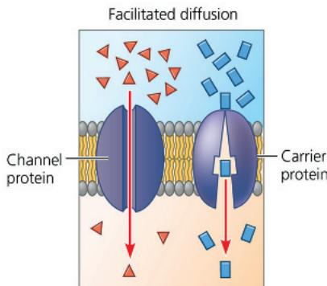

What happens to a cell placed in a hypertonic solution? Describe the free water concentration inside and out.

## Concept 7.4: Active transport uses energy to move solutes against their gradients

\- Specific membrane proteins use energy, usually in the form of ATP, to do the work of active transport.

\- Ions can have both a concentration (chemical) gradient and an electrical gradient (voltage). These gradients combine in the electrochemical gradient, which determines the net direction of ionic diffusion.

\- Cotransport of two solutes occurs when a membrane protein enables the “downhill” diffusion of one solute to drive the “uphill” transport of the other.

ATP is not directly involved in the functioning of a cotransporter. Why, then, is cotransport considered active transport?

Active transport  
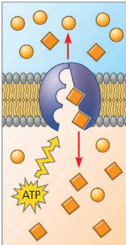

## Concept 7.5: Bulk transport across the plasma membrane occurs by exocytosis and endocytosis

In exocytosis, transport vesicles migrate to the plasma membrane, fuse with it, and release their contents. In endocytosis, molecules enter cells within vesicles that pinch inward from the plasma membrane. The three types of endocytosis are phagocytosis, pinocytosis, and receptor-mediated endocytosis.

Which type of endocytosis involves the binding of specific substances in the extracellular fluid to membrane proteins? What does this type of transport enable a cell to do?

For suggested answers, see Appendix A.

## Test Your Understanding

For more multiple-choice questions, go to the Practice Test (eTextbook only).

## Levels 1-2: Remembering/Understanding

1. In what way do the membranes of a eukaryotic cell vary?

(A) Phospholipids are found only in certain membranes.

(B) Certain proteins are unique to each membrane.

(C) Only certain membranes of the cell are selectively permeable.

(D) Only certain membranes are constructed from amphipathic molecules.

2. According to the fluid mosaic model of membrane structure, proteins of the membrane are mostly

(A) spread in a continuous layer over the inner and outer surfaces of the membrane.

(B) confined to the hydrophobic interior of the membrane.

(C) embedded in a lipid bilayer.

(D) randomly oriented in the membrane, with no fixed inside-outside polarity.

3. Which of the following factors would tend to increase membrane fluidity?

(A) a greater proportion of unsaturated phospholipids

(B) a greater proportion of saturated phospholipids

(C) a lower temperature

(D) a relatively high protein content in the membrane

## Levels 3-4: Applying/Analyzing

4. Which of the following processes includes all the others?

(A) osmosis

(B) diffusion of a solute across a membrane

(C) passive transport

(D) transport of an ion down its electrochemical gradient

5. Based on Figure 7.19, which of these experimental treatments would increase the rate of sucrose transport into a plant cell?

(A) decreasing extracellular sucrose concentration

(B) decreasing extracellular pH

(C) decreasing cytoplasmic pH

(D) adding a substance that makes the membrane more permeable to hydrogen ions

6. DRAW IT An artificial “cell” consisting of an aqueous solution enclosed in a selectively permeable membrane is immersed in a beaker containing a different solution, the “environment,” as shown in the accompanying diagram. The membrane is permeable to water and to the simple sugars glucose and fructose but impermeable to the disaccharide sucrose.

(a) Draw solid arrows to indicate the net movement of solutes into and/or out of the cell.

(b) Is the solution outside the cell isotonic, hypotonic, or hypertonic?

(c) Draw a dashed arrow to show the net osmosis, if any.

(d) Will the artificial cell become more flaccid, more turgid, or stay the same?

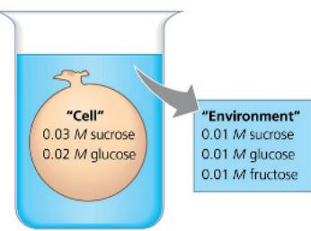

(e) Eventually, will the two solutions have the same or different solute concentrations?

## Levels 5-6: Evaluating/Creating

7. EVOLUTION CONNECTION Paramecium and other protists that live in hypotonic environments have cell membranes that limit water uptake, while those living in isotonic environments have membranes that are more permeable to water. Describe what water regulation adaptations might have evolved in protists in hypertonic habitats such as the Great Salt Lake and in habitats with changing salt concentration.

8. SCIENTIFIC INQUIRY An experiment is designed to study the mechanism of sucrose uptake by plant cells. Cells are immersed in a sucrose solution, and the pH of the solution is monitored. Samples of the cells are taken at intervals, and their sucrose concentration is measured. The pH is observed to decrease until it reaches a steady, slightly acidic level, and then sucrose uptake begins. (a) Evaluate these results and propose a hypothesis to explain them. (b) Predict what would happen if an inhibitor of ATP regeneration by the cell were added to the beaker once the pH was at a steady level. Explain.

9. SCIENCE, TECHNOLOGY, AND SOCIETY Extensive irrigation in arid regions causes salts to accumulate in the soil. (When water evaporates, salts that were dissolved in the water are left behind in the soil.) Based on what you learned about water balance in plant cells, explain why increased soil salinity (saltiness) might be harmful to crops.

10. WRITE ABOUT A THEME: INTERACTIONS A human pancreatic cell obtains $O_{2}$ —and necessary molecules such as glucose, amino acids, and cholesterol—from its environment, and it releases $CO_{2}$ as a waste product. In response to hormonal signals, the cell secretes digestive enzymes. It also regulates its ion concentrations by exchange with its environment. Based on what you have just learned about the structure and function of cellular membranes, write a short essay (100–150 words) to describe how such a cell accomplishes these interactions with its environment.

## 11. SYNTHESIZE YOUR KNOWLEDGE

  
In the supermarket, lettuce and other produce are often sprayed with water. Explain why this makes vegetables crisp.  
For selected answers, see Appendix A.

# An Introduction to Metabolism

## Key Concepts

8.1 An organism's metabolism transforms matter and energy

8.2 The free-energy change of a reaction tells us whether or not the reaction occurs spontaneously

8.3 ATP powers cellular work by coupling exergonic reactions to endergonic reactions

8.4 Enzymes speed up metabolic reactions by lowering energy barriers

8.5 Regulation of enzyme activity helps control metabolism

## Study Tip

Make a table: Fill in the following table for each process you read about in this chapter, such as water spilling over a dam or a chemical reaction.

<table><tr><td>Process</td><td>Starting Materials; Relative Energy Level</td><td>Ending Materials; Relative Energy Level</td><td>Will this process occur spontaneously (without an input of energy)?</td></tr><tr><td>Water spilling over a dam</td><td>Water at the top of a dam; higher energy level</td><td>Water at the bottom of a dam; lower energy level</td><td>Yes</td></tr><tr><td>Hydrolysis of ATP (Figure 8.9)</td><td></td><td></td><td></td></tr></table>

  
Figure 8.1 The green glowing spots on the outside of this Brazilian termite mound are larvae of the click beetle, Pyrophorus nyctophanus. These larvae convert the energy stored in organic molecules to light, a process called bioluminescence, which attracts termites that the larvae eat. Bioluminescence and other metabolic activities in a cell are energy transformations that are subject to physical laws.

## How do the laws of thermodynamics relate to biological processes?

The second law of thermodynamics: Every energy transfer or transformation increases the entropy (disorder) of the universe. For example, during every energy transformation, some energy is converted to thermal energy and released as heat:

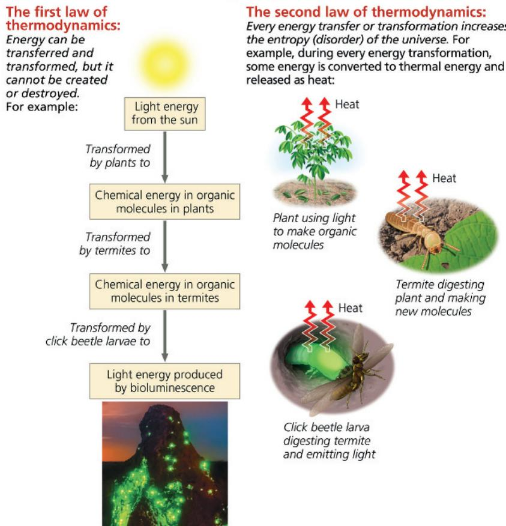  
Termite digesting plant and making new molecules  
Click beetle larva digesting termite and emitting light

# Concept 8.1: An organism's metabolism transforms matter and energy

The totality of an organism's chemical reactions is called metabolism (from the Greek metabole, change). Metabolism is an emergent property of life that arises from orderly interactions between molecules.

## Metabolic Pathways

We can picture a cell's metabolism as an elaborate road map of many chemical reactions, arranged as intersecting metabolic pathways. In a metabolic pathway, a specific molecule is altered in a series of defined steps, resulting in a certain product. Each step is catalyzed by a specific enzyme, a macromolecule that speeds up a chemical reaction:

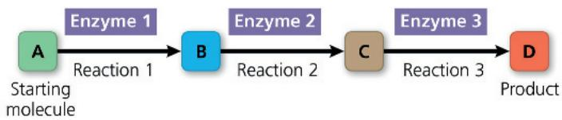

The mechanisms that regulate these enzymes balance metabolic supply and demand, just like traffic lights control the flow of traffic.

Metabolism as a whole manages the material and energy resources of the cell. Some metabolic pathways release energy by breaking down complex molecules to simpler compounds. These degradative processes are called catabolic pathways, or breakdown pathways. One major catabolic pathway is cellular respiration, which breaks down glucose and other organic fuels in the presence of oxygen to carbon dioxide and water. (Pathways can have more than one starting molecule and/or product.) Energy stored in the organic molecules becomes available to do cellular work, such as ciliary beating or membrane transport. Anabolic pathways, in contrast, consume energy to build complicated molecules from simpler ones; they are sometimes called biosynthetic pathways. Examples of anabolism are synthesis of an amino acid from simpler molecules and synthesis of a protein from amino acids. Catabolic and anabolic pathways are the “downhill” and “uphill” avenues of the metabolic landscape. Energy released from downhill reactions of catabolic pathways can be stored and then used to drive uphill reactions of anabolic pathways.

In this chapter, we will focus on mechanisms common to metabolic pathways. Because energy is fundamental to all metabolic processes, a basic knowledge of energy is necessary to understand how the living cell works. Although we'll look at some nonliving examples here to consider energetic principles, the concepts demonstrated by these examples also apply to bioenergetics, the study of how energy flows through living organisms.

## Forms of Energy

Energy is the capacity to cause change. In everyday life, energy is important because some forms of energy can be used to do work—that is, to move matter against opposing forces, such as gravity and friction. Put another way, energy is the ability to rearrange a collection of matter. For example, you expend energy to turn the pages of this book, and your cells expend

energy in transporting certain substances across membranes. Energy exists in various forms, and the work of life depends on the ability of cells to transform energy from one form to another.

Energy can be associated with the relative motion of objects; this energy is called kinetic energy. Moving objects can perform work by imparting motion to other matter: A pool player uses the motion of the cue stick to push the cue ball, which in turn moves the other balls; water gushing through a dam turns turbines; and the contraction of leg muscles pushes bicycle pedals. Thermal energy is kinetic energy associated with the random movement of atoms or molecules; thermal energy in transfer from one object to another is called heat. Light is also a type of energy that can be harnessed to perform work, such as powering photosynthesis in green plants.

An object not presently moving may still possess energy. Energy that is not kinetic is called potential energy; it is energy that matter possesses because of its location or structure. Water behind a dam, for instance, possesses energy because of its altitude above sea level. Molecules possess energy because of the arrangement of electrons in the bonds between their atoms. Chemical energy is a term used by biologists to refer to the potential energy available for release in a chemical reaction. Recall that catabolic pathways release energy by breaking down complex molecules. Biologists say that these complex molecules, such as glucose, are high in chemical energy. During a catabolic reaction, some bonds are broken and others are formed, releasing energy and resulting in lower-energy breakdown products. This transformation also occurs in the engine of a car when the hydrocarbons of gasoline react explosively with oxygen, releasing the energy that pushes the pistons and producing exhaust. Although less explosive, a similar reaction of food molecules with oxygen provides chemical energy in biological systems, producing carbon dioxide and water as waste products. Biochemical pathways, carried out in the context of cellular structures, enable cells to release chemical energy from food molecules and use the energy to power life processes.

How is energy converted from one form to another? Consider Figure 8.2. The woman climbing the ladder to the diving platform is releasing chemical energy from the food she ate for lunch and using some of that energy to perform the work of climbing. The kinetic energy of muscle movement is thus being transformed into potential energy due to her increasing height above the water. The man diving is converting his potential energy to kinetic energy, which is then transferred to the water as he enters it, resulting in splashing, noise, and increased movement of water molecules. A small amount of energy is lost as heat due to friction.

Figure 8.2 Transformations between potential energy and kinetic energy.  
  
Climbing up converts the kinetic energy of muscle movement to potential energy.  
A diver has less potential energy in the water than on the platform.

Figure 8.3 The first two laws of thermodynamics.  
  
(a) First law of thermodynamics: Energy can be transferred or transformed but neither created nor destroyed. For example, chemical reactions in this brown bear will convert the chemical (potential) energy in the fish into the kinetic energy of running.  
(b) Second law of thermodynamics: Every energy transfer or transformation increases the disorder (entropy) of the universe. For example, as the bear runs, disorder is increased around its body by the release of heat and small molecules that are the by-products of metabolism. A brown bear can run at speeds up to 35 miles per hour (56 km/hr)—as fast as a racehorse.

Now let's consider the original source of the organic food molecules that provided the necessary chemical energy for these divers to climb the steps. This chemical energy was itself derived from light energy absorbed by plants during photosynthesis. Organisms are energy transformers.

## The Laws of Energy Transformation

The study of the energy transformations that occur in a collection of matter is called thermodynamics. Scientists use the word system to denote the matter under study; they refer to the rest of the universe—everything outside the system—as the surroundings. An isolated system, such as that approximated by liquid in a thermos bottle, is unable to exchange either energy or matter with its surroundings outside the thermos. In an open system, energy and matter can be transferred between the system and its surroundings. Organisms are open systems. They absorb energy—for instance, light energy or chemical energy in the form of organic molecules—and release heat and metabolic waste products, such as carbon dioxide, to the surroundings. Two laws of thermodynamics govern energy transformations in organisms and all other collections of matter.

## The First Law of Thermodynamics

According to the first law of thermodynamics, the energy of the universe is constant: Energy can be transferred and transformed, but it cannot be created or destroyed. The first law is also known as the principle of conservation of energy. The electric company does not make energy, but merely converts it to a form that is convenient

for us to use. By converting sunlight to chemical energy, a plant acts as an energy transformer, not an energy producer.

The brown bear in Figure 8.3a will convert the chemical energy of the organic molecules in its food to kinetic and other forms of energy as it carries out biological processes. What happens to this energy after it has performed work? The second law of thermodynamics helps to answer this question.

## The Second Law of Thermodynamics

If energy cannot be destroyed, why can't organisms simply recycle their energy over and over again? It turns out that during every energy transfer or transformation, some energy is converted to thermal energy and released as heat, becoming unavailable to do work. Only a small fraction of the chemical energy from the food in Figure 8.3a is transformed into the motion of the brown bear shown in Figure 8.3b; most is lost as heat, which dissipates rapidly through the surroundings.

A system can put thermal energy to work only when there is a temperature difference that results in thermal energy flowing as heat from a warmer location to a cooler one. If temperature is uniform, as it is in a living cell, then the heat generated during a chemical reaction will simply warm a body of matter, such as the organism. (This can make a room crowded with people uncomfortably warm, as each person is carrying out a multitude of chemical reactions!)

A consequence of the loss of usable energy as heat to the surroundings is that each energy transfer or transformation makes the universe more disordered. We are all familiar with the word “disorder” in the sense of a messy room or a rundown building. The word “disorder” as used by scientists, however, has a specific molecular definition related to how dispersed the energy is in a system and how many different energy levels are present. For simplicity, we use “disorder” in the following discussion because our common understanding (the messy room) is a good analogy for molecular disorder.

Scientists use a quantity called entropy as a measure of molecular disorder, or randomness. The more randomly arranged a collection of matter is, the greater its entropy. We can now state the second law of thermodynamics: Every energy transfer or

transformation increases the entropy of the universe. Although order can increase locally, there is an unstoppable trend toward randomization of the universe as a whole.

The physical disintegration of a system's organized structure is a good analogy for an increase in entropy. For example, you can observe increasing entropy in the gradual decay of an unmaintained building over time. Much of the increasing entropy of the universe is more abstract, however, because it takes the form of increasing amounts of heat and less ordered forms of matter. As the bear in Figure 8.3b converts chemical energy to kinetic energy, it is also increasing the disorder of its surroundings by producing heat and small molecules, such as the $\mathrm{CO}_{2}$ it exhales, that are the breakdown products of food.

The concept of entropy helps us understand why certain processes are energetically favorable and occur on their own. It turns out that if a given process, by itself, leads to an increase in entropy, that process can proceed without requiring an input of energy. Such a process is called a spontaneous process. Note that as we're using it here, the word spontaneous does not imply that the process would occur quickly; rather, the word signifies that it is energetically favorable. (In fact, it may be helpful for you to think of the phrase “energetically favorable” when you read the formal term spontaneous, the word preferred by chemists.) Some spontaneous processes, such as an explosion, may be virtually instantaneous, while others, such as the rusting of an old car over time, are much slower.

A process that, on its own, leads to a decrease in entropy is said to be nonspontaneous: It will happen only if energy is supplied. We know from experience that certain events occur spontaneously and others do not. For instance, we know that water flows downhill spontaneously but moves uphill only with an input of energy, such as when a machine pumps the water against gravity. Some of that energy is inevitably lost as heat, increasing entropy in the surroundings, so usage of energy during a nonspontaneous process also leads to an increase in the entropy of the universe as a whole.

## Biological Order and Disorder

Living systems increase the entropy of their surroundings, as predicted by thermodynamic law. You may wonder, then, how cells create ordered structures from less organized starting materials. For example, simpler molecules are ordered into the more complex structure of an amino acid, and amino acids are ordered into polypeptide chains. At the organismal level as well, complex and beautifully ordered structures result from biological processes that use simpler starting materials (Figure 8.4). How can this happen, if entropy must constantly increase?

This increase in order is balanced by an organism's taking in organized forms of matter and energy from the surroundings and replacing them with less ordered forms. For example, an animal obtains starch, proteins, and other complex molecules from the food it eats. As catabolic pathways break these molecules down, the animal releases $\mathrm{CO}_{2}$ and $\mathrm{H}_2\mathrm{O}$ —small molecules that possess less chemical energy than the food did (see Figure 8.3b). The depletion of chemical energy is accounted for by heat generated during metabolism. On a larger scale, energy flows into most ecosystems in the form of light and exits in the form of heat (see Figure 1.9).

During the early history of life, complex organisms evolved from simpler ancestors. For instance, we can trace the ancestry of the plant kingdom from much simpler organisms called green algae to more complex flowering plants. However, this increase in organization

Figure 8.4 Order as a characteristic of life.

Order is evident in the detailed structures of (a) the Venus flower basket glass sponge, which inspired the Spanish architect Antoni Gaudi in his design of (b) the towers of La Sagrada Família church in Barcelona, Spain. (A related species of sponge is shown in its natural habitat in Figure 33.3.)

  
(a) Glass sponge  
(b) La Sagrada Família towers

over time in no way violates the second law. The entropy of a particular system, such as an organism, may actually decrease as long as the total entropy of the universe—the system plus its surroundings—increases. Thus, organisms are islands of low entropy in an increasingly random universe. The evolution of biological order is perfectly consistent with the laws of thermodynamics.

## Concept Check 8.1

1. MAKE CONNECTIONS How does the second law of thermodynamics help explain the diffusion of a substance across a membrane? (See Figure 7.11.)

2. Describe the forms of energy found in an apple as it grows on a tree, then falls, then is digested by someone who eats it.

3. WHAT IF? If you place a teaspoon of sugar in the bottom of a glass of water, it will dissolve completely over time. Left longer, eventually the water will disappear and the sugar crystals will reappear. Explain these observations in terms of entropy.

For suggested answers, see Appendix A.

## Concept 8.2: The free-energy change of a reaction tells us whether or not the reaction occurs spontaneously

The laws of thermodynamics that we've just explored apply to the universe as a whole. As biologists, we want to understand the chemical reactions of life—for example, which reactions occur spontaneously and which ones require some input of energy from outside. But how can we know this without assessing the energy and entropy changes in the entire universe for each separate reaction?

## Free-Energy Change, $\Delta G$

Recall that the universe is really equivalent to “the system” plus “the surroundings.” In 1878, J. Willard Gibbs, a professor at Yale, defined a very useful function called the Gibbs free energy of a system (without considering its surroundings), symbolized by the letter G. We’ll refer to the Gibbs free energy simply as free energy. Free energy is the portion of a system’s energy that can perform work when temperature and pressure are uniform throughout the system, as in a living cell. Let’s consider how we determine the free-energy change that occurs when a system changes—for example, during a chemical reaction.

The change in free energy, $\Delta G$ , can be calculated for a chemical reaction by applying the following equation:

$$
\Delta G = \Delta H - T \Delta S
$$

This equation uses only properties of the system (the reaction) itself: $\Delta H$ symbolizes the change in the system's enthalpy (in biological systems, equivalent to total energy); $\Delta S$ is the change in the system's entropy; and $T$ is the absolute temperature in Kelvin (K) units ( $K = ^{\circ}C + 273$ ).

Using chemical methods, we can measure $\Delta G$ for any reaction. (The value will depend on conditions such as pH, temperature, and concentrations of reactants and products.) Once we know the value of $\Delta G$ for a process, we can use it to predict whether the process will be spontaneous (that is, whether it is energetically favorable and will occur without an input of energy). More than a century of experiments has shown that only processes with a negative $\Delta G$ are spontaneous. For $\Delta G$ to be negative, $\Delta H$ must be negative (the system gives up enthalpy and H decreases) or $T\Delta S$ must be positive (the system gives up order and S increases), or both: When $\Delta H$ and $T\Delta S$ are tallied, $\Delta G$ has a negative value ( $\Delta G < 0$ ) for all spontaneous processes.

In other words, every spontaneous process decreases the system's free energy, and processes that have a positive or zero $\Delta G$ are never spontaneous.

This information is immensely interesting to biologists, for it allows us to predict which kinds of change can happen without an input of energy. Such spontaneous changes can be harnessed by the cell to perform work. This principle is very important in the study of metabolism, where a major goal is to determine which reactions can supply energy for cellular work.

## Free Energy, Stability, and Equilibrium

As we saw in the previous section, when a process occurs spontaneously in a system, we can be sure that $\Delta G$ is negative. Another way to think of $\Delta G$ is to realize that it represents the difference between the free energy of the final state and the free energy of the initial state:

$$
\Delta G = G _ {\mathrm{finalstate}} - G _ {\mathrm{initialstate}}
$$

For a reaction to have a negative $\Delta G$ , the system must lose free energy during the change from initial state to final state. Because it has less free energy, the system in its final state is less likely to change and is therefore more stable than it was previously.

We can think of free energy as a measure of a system's instability—its tendency to change to a more stable state. Unstable systems (higher $G$ ) tend to change in such a way that they become more stable (lower $G$ ). For example, a diver on top of a platform is less stable (more likely to fall) than when floating in the water; a drop of concentrated dye is less stable (more likely to disperse) than when the dye is spread randomly through the liquid; and a glucose molecule is less stable (more likely to break down) than the simpler molecules into which it can be split (Figure 8.5). Unless something

\- More free energy (higher $G$ )

\- Less stable

\- Greater work capacity

\- The free energy of the system decreases $(\Delta G < 0)$ .

• The system becomes more stable.

\- The released free energy can be harnessed to do work.

\- More stable

• Less work capacity

Figure 8.5 The relationship of free energy to stability, work capacity, and spontaneous change. Unstable systems (top) are rich in free energy, G. They tend to change spontaneously to a more stable state (bottom). This “downhill” change can be harnessed to perform work.  
  
(a) Gravitational motion. Objects move spontaneously from a higher altitude to a lower one.

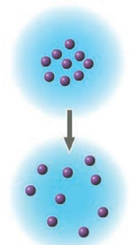  
(b) Diffusion. Molecules in a drop of dye diffuse until they are randomly dispersed.  
MAKE CONNECTIONS Compare the redistribution of molecules shown in (b) to the transport of hydrogen ions $(H^{+})$ across a membrane by a proton pump, creating a concentration gradient (see Figure 7.18). Which process(es) result(s) in higher free energy? Which system(s) can do work? For suggested answer, see Appendix A.

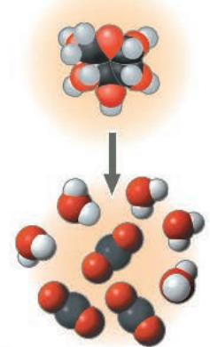  
(c) Chemical reaction. In a cell, a glucose molecule is broken down into simpler molecules.

prevents it, each of these systems will move toward greater stability: The diver falls, the solution becomes uniformly colored, and the glucose molecule is broken down into smaller molecules.

Another term that describes a state of maximum stability is equilibrium, which you learned about in Concept 2.4 in connection with chemical reactions. At equilibrium, the forward and reverse reactions occur at the same rate, and there is no further net change in the relative concentration of products and reactants. For a system at equilibrium, G is at its lowest possible value in that system. Free energy increases when a reaction is somehow pushed away from equilibrium, perhaps by removing some of the products (and thus changing their concentration relative to that of the reactants). We can think of the equilibrium state as a free-energy valley. Any change from the equilibrium position will have a positive $\Delta G$ and will not be spontaneous. For this reason, systems never spontaneously move away from equilibrium. Because a system at equilibrium cannot spontaneously change, it can do no work. A process is spontaneous and can perform work only when it is moving toward equilibrium.

## Free Energy and Metabolism

We can now apply the free-energy concept more specifically to the chemistry of life's processes.

## Exergonic and Endergonic Reactions in Metabolism

Based on their free-energy changes, chemical reactions can be classified as either exergonic (“energy outward”) or endergonic (“energy inward”). An exergonic reaction proceeds with a net release of free energy (Figure 8.6a). Because the chemical mixture loses free energy (G decreases), $\Delta G$ is negative for an exergonic reaction. Using $\Delta G$ as a standard for spontaneity, exergonic reactions are those that occur spontaneously. (Remember, the word spontaneous implies that it is energetically favorable, not that it will occur rapidly.) The magnitude of $\Delta G$ for an exergonic reaction represents the maximum amount of work the reaction can perform.\* The greater the decrease in free energy, the greater the amount of work that can be done.

We can use the overall reaction for cellular respiration as an example:

$$
\begin{array}{l}\mathrm{C} _ {1 6} \mathrm{H} _ {1 2} \mathrm{O} _ {6} + 6 \mathrm{O} _ {2} \rightarrow 6 \mathrm{CO} _ {2} + 6 \mathrm{H} _ {2} \mathrm{O}\\\Delta G = - 6 8 6 \mathrm{kcal/mol} (- 2, 8 7 0 \mathrm{kJ/mol})\end{array}
$$

For each mole (180 g) of glucose broken down by respiration under what are called “standard conditions” (1 M of each reactant and product, 25°C, pH 7), 686 kcal (2,870 kJ) of energy is made available for work. Because energy must be conserved, the chemical products of respiration store 686 kcal less free energy per mole than the reactants. The products are, in a sense, the spent exhaust of a process that tapped the free energy stored in the bonds of the sugar molecules.

It is important to realize that the breaking of bonds does not release energy; on the contrary, as you will soon see, it requires energy. The phrase “energy stored in bonds” is shorthand for the potential energy that can be released when new bonds are formed after the original bonds break, as long as the products are of lower free energy than the reactants.

Figure 8.6 Free energy changes $\Delta G$ in exergonic and endergonic reactions.  

An endergonic reaction is one that absorbs free energy from its surroundings (Figure 8.6b). Because this kind of reaction essentially stores free energy in molecules (G increases), $\Delta G$ is positive. Such reactions are non-spontaneous, and the magnitude of $\Delta G$ is the quantity of energy required to drive the reaction. If a chemical process is exergonic (downhill), releasing energy in one direction, then the reverse process must be endergonic (uphill), using energy. A reversible process cannot be downhill in both directions. If $\Delta G = -686$ kcal/mol for respiration, which converts glucose and oxygen to $CO_{2}$ and $H_{2}O$ , then the reverse process—the conversion of $CO_{2}$ and $H_{2}O$ to glucose and oxygen ( $O_{2}$ )—must be strongly endergonic, with $\Delta G = +686$ kcal/mol. Such a reaction would never happen by itself.

How, then, do plants make sugar? They get the required energy (686 kcal to make a mole of glucose) by capturing light from the sun and converting its energy to chemical energy. Next, in a long series of exergonic steps, they gradually spend that chemical energy to assemble glucose molecules.

## Equilibrium and Metabolism

Reactions in an isolated system eventually reach equilibrium and can then do no work, as illustrated by the isolated hydroelectric

Figure 8.7 Equilibrium and work in an isolated hydroelectric system.

Water flowing downhill turns a turbine that drives a generator providing electricity to a lightbulb, but only until the system reaches equilibrium.

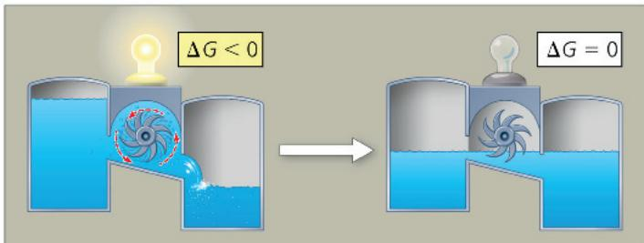

system in Figure 8.7. The chemical reactions of metabolism are reversible, and they, too, would reach equilibrium if they occurred in the isolation of a test tube. Because systems at equilibrium are at a minimum of G and can do no work, a cell that has reached metabolic equilibrium is dead! The fact that metabolism as a whole is never at equilibrium is one of the defining features of life.

Like most systems, a living cell is not in equilibrium. Materials flow in and out, keeping metabolic pathways from ever reaching equilibrium, and the cell continues to do work throughout its life. This principle is illustrated by the open (and more realistic) hydroelectric system in Figure 8.8a. However, unlike this simple single-step system, a catabolic pathway in a cell releases free energy in a series of reactions. An example is cellular

(a) An open hydroelectric system. Water flowing through a turbine keeps driving the generator because intake and outflow of water keep the system from reaching equilibrium.

Figure 8.8 Equilibrium and work in open systems.  
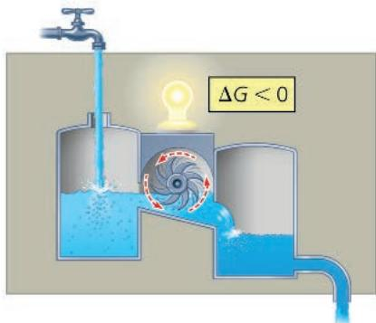

  
(b) A multistep open hydroelectric system. Cellular respiration is analogous to this system: Glucose is broken down in a series of exergonic reactions that power the work of the cell. The product of each reaction is used as the reactant for the next, so no reaction reaches equilibrium.

respiration, illustrated by analogy in Figure 8.8b. Some of the reversible reactions of respiration are constantly “pulled” in one direction—that is, they are kept out of equilibrium. The key to maintaining this lack of equilibrium is that the product of a reaction does not accumulate but instead becomes a reactant in the next step; finally, waste products are expelled from the cell. The overall sequence of reactions is kept going by the huge free-energy difference between glucose and $O_{2}$ at the top of the energy “hill” and $CO_{2}$ and $H_{2}O$ at the “downhill” end. As long as our cells have a steady supply of glucose or other fuels and oxygen and are able to expel waste products to the surroundings, their metabolic pathways never reach equilibrium and can continue to do the work of life.

Organisms are open systems. Sunlight provides a daily source of free energy for an ecosystem's plants and other photosynthetic organisms. Animals and other nonphotosynthetic organisms in an ecosystem must have a source of free energy—the organic products of photosynthesis. Now we are ready to see how a cell actually performs the work of life.

## Concept Check 8.2

1. Cellular respiration uses glucose and $O_{2}$ , which have high levels of free energy, and releases $CO_{2}$ and $H_{2}O$ , which have low levels of free energy. Is cellular respiration spontaneous or not? Is it exergonic or endergonic? What happens to the energy released from glucose?

2. VISUAL SKILLS How would the processes of catabolism and anabolism relate to Figure 8.5c?

3. WHAT IF? Some partygoers wear glow-in-the-dark necklaces that start glowing once they are “activated” by snapping the necklace. This allows two chemicals to react and emit light in the form of chemiluminescence. Is the reaction exergonic or endergonic? Explain.

For suggested answers, see Appendix A.

## Concept 8.3: ATP powers cellular work by coupling exergonic reactions to endergonic reactions

## A cell does three main kinds of work:

\- Chemical work, the pushing of endergonic reactions that would not occur spontaneously, such as the synthesis of polymers from monomers (chemical work will be discussed further here; examples are shown in Chapters 9 and 10)

\- Transport work, the pumping of substances across membranes against the direction of spontaneous movement (see Concept 7.4)

\- Mechanical work, such as the beating of cilia (see Concept 6.6), the contraction of muscle cells, and the movement of chromosomes during cellular reproduction

A key feature in the way cells manage their energy resources to do this work is energy coupling, the use of an exergonic

process to drive an endergonic one. ATP is responsible for mediating most energy coupling in cells, and in most cases it acts as the immediate source of energy that powers cellular work.

## The Structure and Hydrolysis of ATP

ATP (adenosine triphosphate; see Concept 4.3) contains the sugar ribose, with the nitrogenous base adenine and a chain of three phosphate groups (the triphosphate group) bonded to it (Figure 8.9a). In addition to its role in energy coupling, ATP is also one of the nucleoside triphosphates used to make RNA (see Figure 5.23).

The bonds between the phosphate groups of ATP can be broken by hydrolysis. When the terminal phosphate bond is broken by addition of a water molecule, a molecule of inorganic phosphate ( $HOPO_{3}^{2-}$ , abbreviated as $P_{1}$ throughout this book) leaves the ATP, which becomes adenosine diphosphate, or ADP

Figure 8.9 The structure and hydrolysis of adenosine triphosphate (ATP).

Throughout this book, the chemical structure of the triphosphate group seen in (a) will be represented by the three joined yellow circles shown in (b).

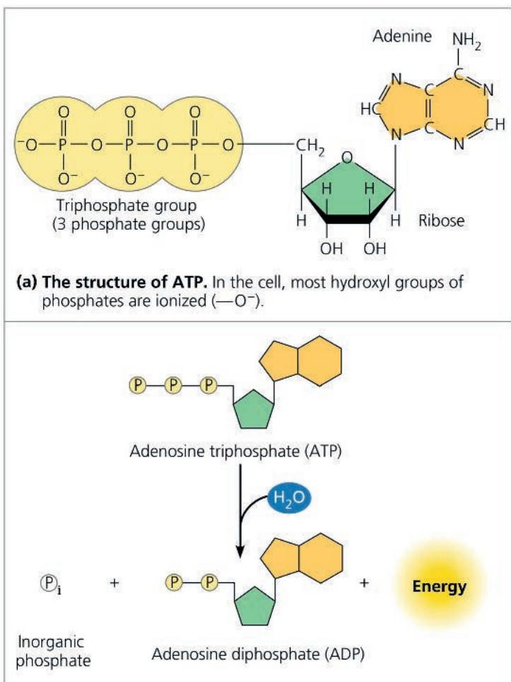  
(b) The hydrolysis of ATP. The reaction of ATP and water yields inorganic phosphate ( $P_{i}$ ) and ADP and releases energy.

(Figure 8.9b). The reaction is exergonic and releases 7.3 kcal of energy per mole of ATP hydrolyzed:

$$
\begin{array}{r l}&\mathrm{ATP} + \mathrm{H} _ {2} \mathrm{O} \rightarrow \mathrm{ADP} + \textcircled {\mathbb {P}} _ {\mathrm{i}}\\&\Delta G = - 7. 3 \mathrm{kcal/mol} (- 3 0. 5 \mathrm{kJ/mol})\end{array}
$$

This is the free-energy change measured under standard conditions. In the cell, conditions do not conform to standard conditions, primarily because reactant and product concentrations differ from 1 M. For example, when ATP hydrolysis occurs under typical cellular conditions, the actual $\Delta G$ is about -13 kcal/mol, 78% greater than the energy released by ATP hydrolysis under standard conditions.

Because their hydrolysis releases energy, the phosphate bonds of ATP are sometimes referred to as high-energy phosphate bonds, but the term is misleading. The phosphate bonds of ATP are not unusually strong bonds, as “high-energy” may imply; rather, the reactants (ATP and water) themselves have high energy relative to the energy of the products (ADP and $\textcircled{P}_{i}$ ). The release of energy during the hydrolysis of ATP comes from the chemical change of the system to a state of lower free energy, not from the phosphate bonds themselves.

ATP is useful to the cell because the energy it releases on losing a phosphate group is somewhat greater than the energy most other molecules could deliver. But why does this hydrolysis release so much energy? If we reexamine the ATP molecule in Figure 8.9a, we can see that all three phosphate groups are negatively charged. These like charges are crowded together, and their mutual repulsion contributes to the instability of this region of the ATP molecule. The triphosphate tail of ATP is the chemical equivalent of a compressed spring.

## How ATP Provides Energy That Performs Work

When ATP is hydrolyzed in a test tube, the release of free energy merely heats the surrounding water. In an organism, this same generation of heat can sometimes be beneficial. For instance, the process of shivering uses ATP hydrolysis during muscle contraction to warm the body. In most cases in the cell, however, the generation of heat alone would be an inefficient (and potentially dangerous) use of a valuable energy resource. Instead, the cell's proteins harness the energy released during ATP hydrolysis in several ways to perform the three types of cellular work—chemical, transport, and mechanical.

For example, with the help of specific enzymes, the cell is able to use the high free energy of ATP to drive chemical reactions that, by themselves, are endergonic. If the $\Delta G$ of an endergonic reaction is less than the amount of energy released by ATP hydrolysis, then the two reactions can be coupled so that, overall, the coupled reactions are exergonic. This usually involves phosphorylation, the transfer of a phosphate group from ATP to some other molecule, such as the reactant. The recipient molecule with the phosphate group covalently bonded to it is then called a phosphorylated intermediate. The key to coupling exergonic and endergonic reactions is the formation of this phosphorylated intermediate,

Figure 8.10 How ATP drives chemical work: energy coupling using ATP hydrolysis.

In this example, the exergonic process of ATP hydrolysis drives an endergonic process—synthesis of the amino acid glutamine.

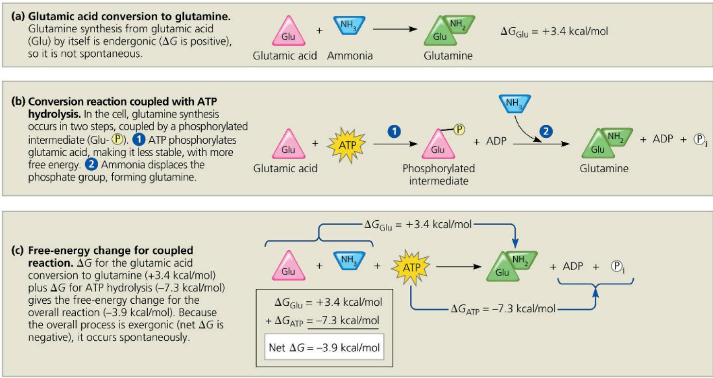  
MAKE CONNECTIONS Referring to Figure 5.14, explain why glutamine (Gln) is drawn in this figure

as a glutamic acid (Glu) with an amino group attached.

For suggested answer, see Appendix A.

which is more reactive (less stable, with more free energy) than the original unphosphorylated molecule (Figure 8.10).

Transport and mechanical work in the cell are also nearly always powered by the hydrolysis of ATP. In these cases, ATP hydrolysis leads to a change in a protein's shape and often its ability to bind another molecule. Sometimes this occurs via a phosphorylated intermediate, as seen for the transport protein in Figure 8.11a. In most instances of mechanical work involving motor proteins “walking”

along cytoskeletal elements (Figure 8.11b), a cycle occurs in which ATP is first bound noncovalently to the motor protein. Next, ATP is hydrolyzed, releasing ADP and $P_{i}$ Another ATP molecule can then bind. At each stage, the motor protein changes its shape and ability to bind the cytoskeleton, resulting in movement of the protein along the cytoskeletal track. Phosphorylation and dephosphorylation promote crucial protein shape changes during many other important cellular processes as well.

Figure 8.11 How ATP drives transport and mechanical work.

ATP hydrolysis causes changes in the shapes and binding affinities of proteins. This can occur either (a) directly, by phosphorylation, as shown for a membrane protein carrying out active transport of a solute (see also Figure 7.16 and the proton pump in Figure 6.32, upper left), or (b) indirectly, via noncovalent binding of ATP and its hydrolytic products, as is the case for motor proteins that move vesicles (and other organelles) along cytoskeletal “tracks” in the cell (see also Figures 6.21 and 6.32, lower right).

Figure 8.12 The ATP cycle.

Energy released by breakdown reactions (catabolism) in the cell is used to phosphorylate ADP, regenerating ATP. Chemical potential energy stored in ATP drives most cellular work.

## The Regeneration of ATP

An organism at work uses ATP continuously, but ATP is a renewable resource that can be regenerated by the addition of phosphate to ADP (Figure 8.12). The free energy required to phosphorylate ADP comes from exergonic breakdown reactions (catabolism) in the cell. This shuttling of inorganic phosphate and energy is called the ATP cycle, and it couples the cell's energy-yielding (exergonic) processes to the energy-consuming (endergonic) ones. The ATP cycle proceeds at an astonishing pace. For example, a working muscle cell recycles its entire pool of ATP in less than a minute. That turnover represents 10 million molecules of ATP consumed and regenerated per second per cell. If ATP could not be regenerated by the phosphorylation of ADP, humans would use up nearly their body weight in ATP each day.

Because both directions of a reversible process cannot be downhill, the regeneration of ATP from ADP and $P_{i}$ is necessarily endergonic:

$$
\mathrm{ADP} + \textcircled {P} _ {\mathrm{i}} \rightarrow \mathrm{ATP} + \mathrm{H} _ {2} \mathrm{O}
$$

$\Delta G = +7.3 \mathrm{kcal} / \mathrm{mol}$ (+30.5 kJ/mol)(standard conditions)

Since ATP formation from ADP and $P_{i}$ is not spontaneous, free energy must be spent to make it occur. Catabolic (exergonic) pathways, especially cellular respiration, provide the energy for the endergonic process of making ATP. Plants also use light energy to produce ATP. Thus, the ATP cycle is a key player in bioenergetics, functioning as a revolving door through which energy passes during its transfer from catabolic to anabolic pathways.

## Concept Check 8.3

1. How does ATP typically transfer energy from an exergonic to an endergonic reaction in the cell?

2. Which combination has more free energy:
glutamic acid + ammonia + ATP or glutamine + ADP + $\textcircled{P}_{i}$ Explain.

3. MAKE CONNECTIONS Does Figure 8.11a show passive or active transport? Explain. (See Concepts 7.3 and 7.4.)

For suggested answers, see Appendix A.

# Concept 8.4: Enzymes speed up metabolic reactions by lowering energy barriers

The laws of thermodynamics tell us what will and will not happen under given conditions but say nothing about the rate of these processes. A spontaneous chemical reaction occurs without any requirement for outside energy, but it may occur so slowly that it is imperceptible. For example, even though the hydrolysis of sucrose (table sugar) to glucose and fructose is exergonic, occurring spontaneously with a release of free energy ( $\Delta G = -7$ kcal/mol), a solution of sucrose dissolved in sterile water will sit for years at room temperature with no appreciable hydrolysis. However, if we add a small amount of the enzyme sucrase to the solution, then all the sucrose may be hydrolyzed within seconds, as shown here:

How does the enzyme do this? An enzyme is a macromolecule that acts as a catalyst, a chemical agent that speeds up a reaction without being consumed by the reaction. In this chapter, we focus on enzymes that are proteins. (Some RNA molecules, called ribozymes, can function as enzymes; these will be discussed in Concepts 17.3 and 25.1.) Without regulation by enzymes, chemical traffic through the pathways of metabolism would become terribly congested because many chemical reactions would take such a long time. In the next two sections, we will see why spontaneous reactions can be slow and how an enzyme changes the situation.

## The Activation Energy Barrier

Every chemical reaction between molecules involves both bond breaking and bond forming. For example, the hydrolysis of sucrose involves breaking the bond between glucose and fructose and one of the bonds of a water molecule and then forming two new bonds, as shown previously. Changing one molecule into another generally involves contorting the starting molecule into a highly unstable state before the reaction can proceed. This contortion can be compared to the bending of a metal key ring when you pry it open to add a new key. The key ring is highly unstable in its opened form but returns to a stable state once the key is threaded all the way onto the ring. To reach the contorted state where bonds can change, reactant molecules must absorb energy from their surroundings. When the new bonds of the product molecules form, energy is released as heat, and the molecules return to stable shapes with lower energy than the contorted state.

For suggested answer, see Appendix A.

The initial investment of energy for starting a reaction—the energy required to contort the reactant molecules so the bonds can break—is known as the free energy of activation, or activation energy, abbreviated $E_{A}$ in this book. We can think of activation energy as the amount of energy needed to push the reactants to the top of an energy barrier, or “uphill,” so that the “downhill” part of the reaction can begin. Activation energy is often supplied by heat in the form of thermal energy that the reactant molecules absorb from the surroundings. The absorption of thermal energy accelerates the reactant molecules, so they collide more often and more forcefully. It also agitates the atoms within the molecules, making the breakage of bonds more likely. When the molecules have absorbed enough energy for the bonds to break, the reactants are in an unstable condition known as the transition state.

Figure 8.13 graphs the energy changes for a hypothetical exergonic reaction that swaps portions of two reactant molecules:

$$
\begin{array}{l l}\mathrm{AB} + \mathrm{CD} \rightarrow \mathrm{AC} + \mathrm{BD}\\\text {Reactants}&\text {Products}\end{array}
$$

## Figure 8.13 Energy profile of an exergonic reaction.

The “molecules” are hypothetical, with A, B, C, and D representing portions of the molecules. Thermodynamically, this is an exergonic reaction, with a negative $\Delta G$ , and the reaction occurs spontaneously. However, the activation energy ( $E_{A}$ ) provides a barrier that determines the rate of the reaction.

The reactants AB and CD must absorb enough energy from the surroundings to reach the unstable transition state, where bonds can break.

After bonds have broken, new bonds form, releasing energy to the surroundings.

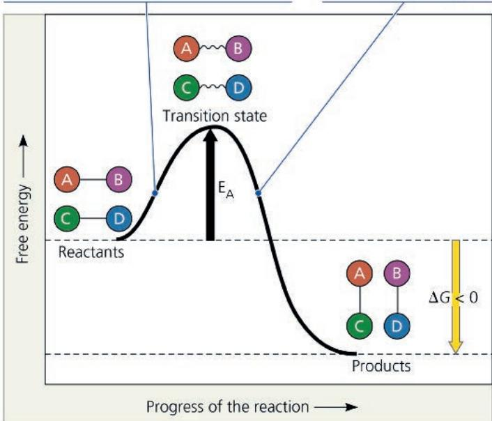  
DRAW IT Graph the progress of an endergonic reaction in which EF and GH form products EG and FH, assuming that the reactants must pass through a transition state.

The activation of the reactants is represented by the uphill portion of the graph, in which the free-energy content of the reactant molecules is increasing. At the summit, when energy equivalent to $E_{A}$ has been absorbed, the reactants are in the transition state: They are activated, and their bonds can be broken. As the atoms then settle into their new, more stable bonding arrangements, energy is released to the surroundings. This corresponds to the downhill part of the curve, which shows the loss of free energy by the molecules. The overall decrease in free energy means that $E_{A}$ is repaid with dividends, as the formation of new bonds releases more energy than was invested in the breaking of old bonds.

The reaction shown in Figure 8.13 is exergonic and occurs spontaneously ( $\Delta G < 0$ ). However, the activation energy provides a barrier that determines the rate of the reaction. The reactants must absorb enough energy to reach the top of the activation energy barrier before the reaction can occur. For some reactions, $E_{A}$ is modest enough that even at room temperature there is sufficient thermal energy for many of the reactant molecules to reach the transition state in a short time. In most cases, however, $E_{A}$ is so high and the transition state is reached so rarely that the reaction will hardly proceed at all. In these cases, the reaction will occur at a noticeable rate only if energy is provided, usually by heat. For example, the reaction of gasoline and oxygen is exergonic and will occur spontaneously, but energy is required for the molecules to reach the transition state and react. Only when the spark plugs fire in an automobile engine can there be the explosive release of energy that pushes the pistons. Without a spark, a mixture of gasoline hydrocarbons and oxygen will not react because the $E_{A}$ barrier is too high.

## How Enzymes Speed Up Reactions

Proteins, DNA, and other complex cellular molecules are rich in free energy and have the potential to decompose spontaneously; that is, the laws of thermodynamics favor their breakdown. These molecules only persist because at temperatures typical for cells, few molecules can make it over the hump of activation energy. The barriers for selected reactions must occasionally be surmounted, however, for cells to carry out the processes needed for life. Heat can increase the rate of a reaction by allowing reactants to attain the transition state more often, but this would not work well in biological systems. First, high temperature denatures proteins and kills cells. Second, heat would speed up all reactions, not just those that are needed. Instead of heat, organisms carry out catalysis, the process by which a catalyst selectively speeds up a reaction without itself being consumed. (You learned about catalysts earlier in this section.)

An enzyme catalyzes a reaction by lowering the $E_{A}$ barrier (Figure 8.14), enabling the reactant molecules to absorb enough energy to reach the transition state even at moderate temperatures, as we'll see shortly. It is crucial to note that an enzyme cannot change the $\Delta G$ for a reaction; it cannot make an endergonic reaction exergonic. Enzymes can only hasten reactions that would eventually occur anyway, but this enables the cell to have a dynamic metabolism,

Figure 8.14 The effect of an enzyme on activation energy. Without affecting the free-energy change ( $\Delta G$ ) for a reaction, an enzyme speeds the reaction by reducing its activation energy ( $E_{A}$ ).  

routing chemicals smoothly through metabolic pathways. Also, enzymes are very specific for the reactions they catalyze, so they determine which chemical processes will be going on in the cell at any given time.

## Substrate Specificity of Enzymes

The reactant an enzyme acts on is referred to as the enzyme's substrate. The enzyme binds to its substrate (or substrates, when there are two or more reactants), forming an enzyme-substrate complex. While enzyme and substrate are joined, the catalytic action of the enzyme converts the substrate to the product (or

products) of the reaction. The overall process can be summarized as follows:

$$
\begin{array}{c}\text {Enzyme +}\\\text {Substrate(s)}\end{array}\rightleftharpoons\begin{array}{c}\text {Enzyme -}\\\text {substrate}\\\text {complex}\end{array}\rightleftharpoons\begin{array}{c}\text {Enzyme +}\\\text {Product(s)}\end{array}
$$

Most enzyme names end in -ase. (See if you can find three examples of enzymes in the lower left of Figure 6.32.) For example, the enzyme sucrase catalyzes the hydrolysis of the disaccharide sucrose into its two monosaccharides, glucose and fructose (see the diagram at the beginning of Concept 8.4):

$$
\begin{array}{l l}\text {Sucrase +}&\text {Sucrase -}\\\text {Sucrose +}&\rightleftharpoons \text {sucrose- H _ {2} O}\\\text {H _ {2} O}&\text {complex}\end{array}\quad \rightleftharpoons \quad\begin{array}{l l}\text {Sucrase +}\\\text {Glucose +}\\\text {Fructose}\end{array}
$$

The reaction catalyzed by each enzyme is very specific; an enzyme can recognize its specific substrate even among closely related compounds. For instance, sucrase will act only on sucrose and will not bind to other disaccharides, such as maltose. What accounts for this molecular recognition? Recall that most enzymes are proteins, and that proteins are macromolecules with unique 3-D configurations. The specificity of an enzyme results from its shape, which is a consequence of its amino acid sequence.

Only a restricted region of the enzyme molecule actually binds to the substrate. This region, called the active site, is typically a pocket or groove on the surface of the enzyme where catalysis occurs (Figure 8.15a; see also Figure 5.16). Usually, the active site is formed by only a few of the enzyme's amino acids, with the rest of the protein molecule providing a framework that determines the shape of the active site. The specificity of an enzyme is attributed to a complementary fit between the shape of its active site and the shape of the substrate.

Figure 8.15 Induced fit between an enzyme and its substrate.  
  
(a) In this space-filling model of the enzyme hexokinase (blue), the active site forms a groove on the surface. The enzyme's substrate is glucose (red).  
(b) When the substrate enters the active site, it forms weak bonds with the enzyme, inducing a change in the shape of the protein. This change allows additional weak bonds to form, causing the active site to enfold the substrate and hold it in place.

An enzyme is not a stiff structure locked into a given shape. In fact, biochemical studies have shown that enzymes (and other proteins) seem to “dance” between subtly different shapes in a dynamic equilibrium, with slight differences in free energy for each “pose.” The shape that best fits the substrate isn’t necessarily the one with the lowest energy, but during the very short time the enzyme takes on this shape, its active site can bind to the substrate. The active site itself is also not a rigid receptacle for the substrate. As shown in Figure 8.15b, when the substrate enters the active site, the enzyme changes shape slightly due to interactions between the substrate’s chemical groups and chemical groups on the side chains of the amino acids

that form the active site. This shape change makes the active site fit even more snugly around the substrate. The tightening of the binding after initial contact—called induced fit—is like a clasping handshake. Induced fit brings chemical groups of the active site into positions that enhance their ability to catalyze the chemical reaction.

## Catalysis in the Enzyme's Active Site

In most enzymatic reactions, the substrate is held in the active site by so-called weak interactions, such as hydrogen bonds and ionic bonds. The R groups of a few of the amino acids that make up the active site catalyze the conversion of substrate to product, and the product departs from the active site. The enzyme is then free to take another substrate molecule into its active site. The entire cycle happens so fast that a single enzyme molecule typically acts on about 1,000 substrate molecules per second, and some enzymes are even faster. Enzymes, like other catalysts, emerge from the reaction in their original form. Therefore, very small amounts of enzyme can have a huge metabolic impact by functioning over and over again in catalytic cycles. Figure 8.16 shows a catalytic cycle involving two substrates and two products.

Figure 8.16 The active site and catalytic cycle of an enzyme. An enzyme can convert one or more reactant molecules to one or more product molecules. The enzyme shown here converts two substrate molecules to two product molecules.  
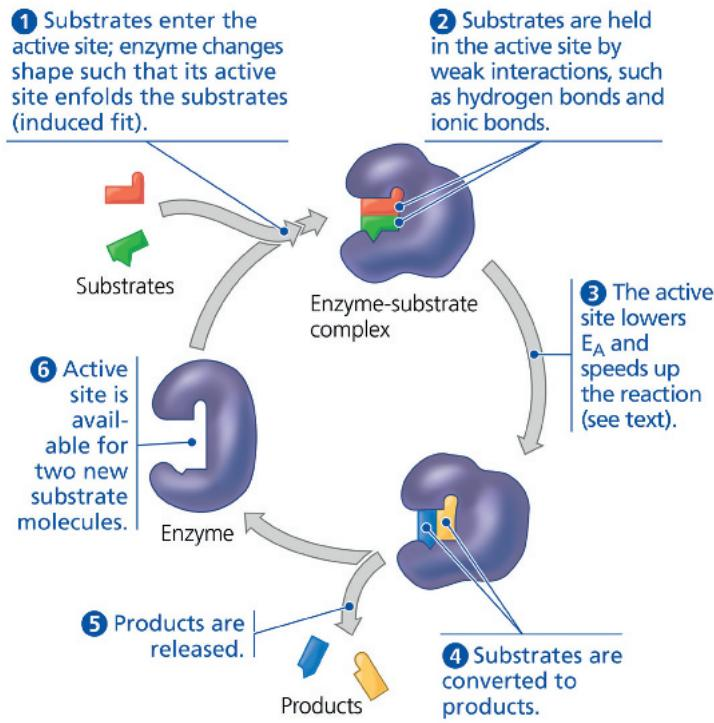  
VISUAL SKILLS The enzyme-substrate complex passes through a transition state (see Figure 8.13). Label the part of the cycle where the transition state occurs.  
For suggested answer, see Appendix A.

Most metabolic reactions are reversible, and an enzyme can catalyze either the forward or the reverse reaction, depending on which direction has a negative $\Delta G$ . This in turn depends mainly on the relative concentrations of reactants and products. The net effect is always in the direction of equilibrium.

Enzymes use a variety of mechanisms that lower activation energy and speed up a reaction (see Figure 8.16, 3):

\- In reactions involving two or more reactants, the active site provides a template on which the substrates can come together in the proper orientation for a reaction to occur between them.

\- As the active site of an enzyme clutches the bound substrates, the enzyme may stretch the substrate molecules toward their transition state form, stressing and bending critical chemical bonds to be broken during the reaction. Because $E_{A}$ is proportional to the difficulty of breaking the bonds, distorting the substrate helps it approach the transition state and thus reduces the amount of free energy that must be absorbed to achieve that state.

\- The active site may also provide a microenvironment that is more conducive to a certain reaction than the solution itself would be without the enzyme. For example, if the active site has amino acids with acidic R groups, it may provide a pocket of low pH in an otherwise neutral cell. Here, an acidic amino acid may facilitate $H^{+}$ transfer to the substrate as a key step in catalyzing the reaction.

\- Amino acids in the active site may directly participate in the chemical reaction. Sometimes this process involves brief covalent bonding between the substrate and the side chain of an amino acid of the enzyme. Subsequent steps restore the side chains to their original states so that the active site is the same after the reaction as it was before.

The rate at which a particular amount of enzyme converts substrate to product is partly a function of the initial concentration of the substrate: The more substrate molecules that are available, the more frequently they access the active sites of the enzyme molecules. However, there is a limit to how fast the reaction can be pushed by adding more substrate to a fixed concentration of enzyme. At some point, the concentration of substrate will be high enough that all enzyme molecules will have their active sites engaged. As soon as the product exits an active site, another substrate molecule enters. At this substrate concentration, the enzyme is said to be saturated, and the rate of the reaction is determined by the speed at which the active site converts substrate to product. When an enzyme population is saturated, the only way to increase the rate of product formation is to add more enzyme. Cells often increase the rate of a reaction by producing more enzyme molecules. You can graph the overall progress of an enzymatic reaction in the Scientific Skills Exercise.

# Scientific Skills Exercise Making a Line Graph and Calculating a Slope

Does the Rate of Glucose 6-Phosphatase Activity Change over Time in Isolated Liver Cells? Glucose 6-phosphatase, which is found in mammalian liver cells, is a key enzyme in control of blood glucose level. The enzyme catalyzes the breakdown of glucose 6-phosphate into glucose and inorganic phosphate ( $P_{i}$ ). These products are transported out of liver cells into the blood, increasing the blood glucose level. In this exercise, you will graph data from a time-course experiment that measured $P_{i}$ concentration in the buffer outside isolated liver cells, thus indirectly measuring glucose 6-phosphatase activity inside the cells.

How the Experiment Was Done Isolated rat liver cells were placed in a dish with buffer at physiological conditions (pH 7.4, 37°C). Glucose 6-phosphate (the substrate) was added so it could be taken up by cells and broken down by glucose 6-phosphatase. A sample of buffer was removed every 5 minutes and the concentration of $\textcircled{P}_{i}$ that had been transported out of the cells was determined.

## Data from the Experiment

<table><tr><td>Time (min)</td><td>Concentration of  $\textcircled{P}_i$  (μmol/mL)</td></tr><tr><td>0</td><td>0</td></tr><tr><td>5</td><td>10</td></tr><tr><td>10</td><td>90</td></tr><tr><td>15</td><td>180</td></tr><tr><td>20</td><td>270</td></tr><tr><td>25</td><td>330</td></tr><tr><td>30</td><td>355</td></tr><tr><td>35</td><td>355</td></tr><tr><td>40</td><td>355</td></tr></table>

Data from S. R. Commerford et al., Diets enriched in sucrose or fat increase gluconeogenesis and G-6-Pase but not basal glucose production in rats, American Journal of Physiology-Endocrinology and Metabolism 283:E545–E555 (2002).

## INTERPRET THE DATA

1. To see patterns in the data from a time-course experiment like this, it is helpful to graph the data. First, determine which set of data goes on each axis. (a) What did the researchers

## Effects of Local Conditions on Enzyme Activity

The activity of an enzyme—how efficiently the enzyme functions—is affected by general environmental factors, such as temperature and pH. It can also be affected by chemicals that specifically influence that enzyme. In fact, researchers

intentionally vary in the experiment? This is the independent variable, which goes on the x-axis. (b) What are the units (abbreviated) for the independent variable? Explain in words what the abbreviation stands for. (c) What was measured by the researchers? This is the dependent variable, which goes on the y-axis. (d) What does the units abbreviation stand for? Label each axis, including the units.

2. Next, mark off the axes with just enough evenly spaced tick marks to accommodate the full set of data. Determine the span of data values for each axis. (a) What is the largest value to go on the x-axis? What is a reasonable spacing for the tick marks, and what should be the highest one? (b) What is the largest value to go on the y-axis? What is a reasonable spacing for the tick marks, and what should be the highest one?

3. Plot the data points on your graph. Match each x-value with its partner y-value and place a point on the graph at that coordinate. Draw a line that connects the points. (For additional information about graphs, see the Scientific Skills Review in Appendix D.)

4. Examine your graph and look for patterns in the data. (a) Does the concentration of $\textcircled{P}_{i}$ increase evenly throughout the course of the experiment? To answer this question, describe the pattern you see in the graph. (b) What part of the graph shows the highest rate of enzyme activity? Consider that the rate of enzyme activity is related to the slope of the line, $\Delta y/\Delta x$ (the “rise” over the “run”), in $\mu mol/(mL\cdot min)$ , with the steepest slope indicating the highest rate of enzyme activity. Calculate the rate of enzyme activity (slope) where the graph is steepest. (c) Can you think of a biological explanation for the pattern

you see?

5. If your blood glucose level is low from skipping lunch, what reaction (discussed in this exercise) will occur in your liver cells? Write out the reaction and put the name of the enzyme over the reaction arrow. How will this reaction affect your blood glucose level?

Instructors: A version of this Scientific Skills Exercise can be assigned in Mastering Biology.

have learned much about enzyme function by employing such chemicals.

## Effects of Temperature and pH

The 3-D structures of proteins are sensitive to their environment (see Figure 5.20). As a consequence, each enzyme works better under some conditions than others, because these optimal conditions favor the most active shape for the enzyme.

Temperature and pH are environmental factors important in the activity of an enzyme. Up to a point, the rate of an enzymatic reaction increases with increasing temperature, partly because substrates collide with active sites more frequently when the molecules move rapidly. Above that temperature, however, the speed of the enzymatic reaction drops sharply. The thermal agitation of the enzyme molecule disrupts the hydrogen bonds, ionic bonds, and other weak interactions that stabilize the active shape of the enzyme, and the protein molecule eventually denatures. Each enzyme has an optimal temperature at which its reaction rate is greatest. Without denaturing the enzyme, this temperature allows the greatest number of molecular collisions and the fastest conversion of the reactants to product molecules. Most human enzymes have optimal temperatures of about 35–40°C (close to human body temperature). The thermophilic bacteria that live in hot springs contain enzymes with optimal temperatures of 70°C or higher (Figure 8.17a).

Just as each enzyme has an optimal temperature, it also has a pH at which it is most active. The optimal pH values for most enzymes fall in the range of pH 6–8, but there are exceptions. For example, pepsin, a digestive enzyme in the human stomach, works best at a very low pH. Such an acidic environment denatures most enzymes, but pepsin is well-adapted evolutionarily to maintain its functional 3-D structure in the acidic environment of the stomach. In contrast, trypsin, a digestive enzyme residing in the more alkaline environment of the human intestine would be denatured in the stomach (Figure 8.17b).

## Cofactors

Many enzymes require nonprotein helpers for catalytic activity, often for chemical processes like electron transfers that cannot easily be carried out by the amino acids in proteins. These adjuncts, called cofactors, may be bound tightly to the enzyme as permanent residents, or they may bind loosely and reversibly along with the substrate. The cofactors of some enzymes are inorganic, such as the metal atoms zinc, iron, and copper in ionic form. If the cofactor is an organic molecule, it is referred to, more specifically, as a coenzyme. Most vitamins are important in nutrition because they act as coenzymes or raw materials from which coenzymes are made.

## Enzyme Inhibitors

Certain chemicals selectively inhibit the action of specific enzymes. Sometimes the inhibitor attaches to the enzyme by covalent bonds, in which case the inhibition is usually irreversible. Many enzyme inhibitors, however, bind to the enzyme by weak interactions, and when this occurs the inhibition is reversible. Some reversible inhibitors resemble the normal

Figure 8.17 Environmental factors affecting enzyme activity. Each enzyme has an optimal (a) temperature and (b) pH that favor the most active shape of the protein molecule.  

  
(a) The photo shows thermophilic cyanobacteria (green) thriving in the hot water of a Nevada geyser. The graph compares the optimal temperatures for an enzyme from the thermophilic bacterium Thermus oshimai (75°C) and human enzymes (37°C, body temperature).

  
(b) This graph shows the rate of reaction for two digestive enzymes over a range of pH values.

INTERPRET THE DATA Looking at the graph in (b), what is the optimal pH for pepsin activity? Explain why natural selection might have resulted in the optimal pH for pepsin, a stomach enzyme (see Figure 3.11). What is the optimal pH for trypsin?

Figure 8.18 Inhibition of enzyme activity.  
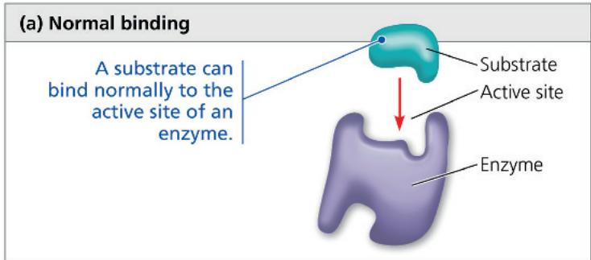

substrate molecule and compete for admission into the active site (Figure 8.18a and b). These mimics, called competitive inhibitors, reduce the productivity of enzymes by blocking substrates from entering active sites. This kind of inhibition can be overcome by increasing the concentration of substrate so that as active sites become available, more substrate molecules than inhibitor molecules are around to gain entry to the sites.

In contrast, noncompetitive inhibitors do not directly compete with the substrate to bind to the enzyme at the active site (Figure 8.18c). Instead, they impede enzymatic reactions by binding to another part of the enzyme. This interaction causes the enzyme molecule to change its shape in such a way that the active site becomes much less effective at catalyzing the conversion of substrate to product.

Toxins and poisons are often irreversible enzyme inhibitors. An example is sarin, a nerve gas. In 2017, sarin was used in a chemical attack in Syria, killing about 100 people and injuring hundreds more. This small molecule binds covalently to the R group on the amino acid serine, which is found in the active site of acetylcholinesterase, an enzyme important in the nervous system. Other examples include the pesticides DDT and parathion, inhibitors of key enzymes in the nervous system. Finally, many antibiotics are inhibitors of specific enzymes in bacteria. For instance,

penicillin blocks the active site of an enzyme that many bacteria use to make cell walls.

Citing enzyme inhibitors that are metabolic poisons may give the impression that enzyme inhibition is generally abnormal and harmful. In fact, molecules naturally present in the cell often regulate enzyme activity by acting as inhibitors. Such regulation—selective inhibition—is essential to the control of cellular metabolism, as you'll see in Concept 8.5.

## The Evolution of Enzymes

EVOLUTION Thus far, biochemists have identified more than 4,000 different enzymes in various species, most likely a very small fraction of all enzymes. How did this grand profusion of enzymes arise? Recall that most enzymes are proteins, and proteins are encoded by genes. A permanent change in a gene, known as a mutation, can result in a protein with one or more changed amino acids. In the case of an enzyme, if the changed amino acids are in the active site or some other crucial region, the altered enzyme might have a novel activity or might bind to a different substrate. Under environmental conditions where the new function benefits the organism, natural selection would tend to favor the mutated form of the gene, causing it to persist in the population. This simplified model is generally accepted as the main way in which the multitude of different enzymes arose over the past few billion years of life's history. Data supporting this model have been collected by researchers using a lab procedure that mimics evolution in natural populations (Figure 8.19).

## Figure 8.19 Mimicking evolution of an enzyme with a new function.

Researchers tested whether the function of an enzyme called $\beta$ -galactosidase, which breaks down the sugar lactose, could change over time in populations of the bacterium Escherichia coli. After seven rounds of mutation and selection in the lab, $\beta$ -galactosidase, evolved into an enzyme specialized for breaking down a sugar other than lactose. This ribbon model shows one subunit of the altered enzyme; six amino acids (indicated with labels) were different.

Two changed amino acids were found near the active site.

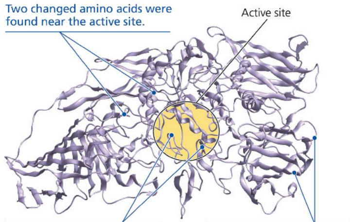  
Two changed amino acids were found in the active site.  
Two changed amino acids were found on the surface.

## Concept Check 8.4

1. Many spontaneous reactions occur very slowly. What factor explains why all spontaneous reactions don't occur instantly?

2. Say you are using a Bunsen burner in the lab. Why doesn't the flame creep back into the gas line and set the gas supply on fire?

3. WHAT IF? Malonate is an inhibitor of the enzyme succinate dehydrogenase. How would you determine whether malonate is a competitive or noncompetitive inhibitor?

4. DRAW IT A mature lysosome has an internal pH of around 4.5. Using Figure 8.17b as a guide, draw a graph showing what you would predict for the rate of reaction for a lysosomal enzyme. Label its optimal pH, assuming its optimal pH matches its environment.

For suggested answers, see Appendix A.

## Concept 8.5: Regulation of enzyme activity helps control metabolism

Chemical chaos would result if all of a cell's metabolic pathways were operating simultaneously. Intrinsic to life's processes is a cell's ability to tightly regulate its metabolic pathways by controlling when and where its various enzymes are active. It does this either by switching on and off the genes that encode specific enzymes (which will be discussed in Concepts 18.1 and 18.2) or, as discussed here, by regulating the activity of enzymes once they are made.

## Allosteric Regulation of Enzymes

In many cases, the molecules that naturally regulate enzyme activity in a cell behave something like reversible noncompetitive inhibitors (see Figure 8.18c): These regulatory molecules change an enzyme's shape and the functioning of its active site by binding to a site elsewhere on the molecule, via non-covalent interactions. Allosteric regulation is the term used to describe any case in which a protein's function at one site is affected by the binding of a regulatory molecule to a separate site. It may result in either inhibition or stimulation of an enzyme's activity.

## Allosteric Activation and Inhibition

Most enzymes known to be allosterically regulated are constructed from two or more subunits, each composed of a polypeptide chain with its own active site. The entire complex oscillates between two different shapes, one catalytically active and the other inactive (Figure 8.20a). In the simplest kind of allosteric regulation, an activating or inhibiting regulatory molecule binds to a regulatory site (sometimes called an allosteric site), often located where subunits join. The binding of an activator to a regulatory site stabilizes the shape that has functional active sites, whereas the binding of an inhibitor stabilizes the inactive form of the enzyme. The subunits of an allosteric enzyme fit together in such a way that a shape change in one subunit is transmitted to all others. Through this interaction of subunits, a single activator or inhibitor molecule that binds to one regulatory site will affect the active sites of all subunits.

Figure 8.20 Allosteric regulation of enzyme activity.  
  
At low concentrations, activators and inhibitors dissociate from the enzyme. The enzyme can then oscillate again.

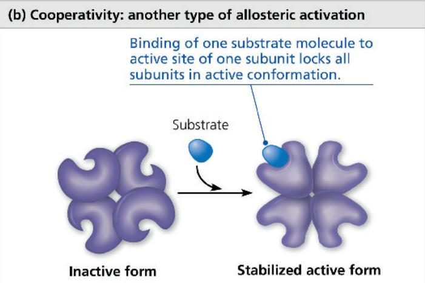  
The inactive form shown on the left oscillates with the active form when the active form is not stabilized by substrate.

Fluctuating concentrations of regulators can cause a sophisticated pattern of response in the activity of cellular enzymes. The products of ATP hydrolysis (ADP and $\textcircled{P}_{i}$ ), for example, play a complex role in balancing the flow of traffic between anabolic and catabolic pathways by their effects on key enzymes. ATP binds to several catabolic enzymes allosterically, lowering their affinity for substrate and thus inhibiting their activity. ADP, however, functions as an activator of the same enzymes. This is logical because catabolism functions in regenerating ATP. If ATP production lags behind its use, ADP accumulates and activates the enzymes that speed up catabolism, producing more ATP. If the supply of ATP exceeds demand, then catabolism slows down as ATP molecules accumulate and bind to the same enzymes, inhibiting them. (You'll see specific examples of this type of regulation when you learn about cellular respiration in the next chapter; see, for example, Figure 9.19.) ATP, ADP, and other related molecules also affect key enzymes in anabolic pathways. In this way, allosteric enzymes control the rates of important reactions in both sorts of metabolic pathways.

In another kind of allosteric activation, a substrate molecule binding to one active site in a multisubunit enzyme triggers a shape change in all the subunits, thereby increasing catalytic activity at the other active sites (Figure 8.20b). Called cooperativity, this mechanism amplifies the response of enzymes to substrates: One substrate molecule primes an enzyme to act on additional substrate molecules more readily. Cooperativity is considered allosteric regulation because even though substrate is binding to an active site, its binding affects catalysis in another active site.

Although hemoglobin is not an enzyme (it carries $O_{2}$ rather than catalyzing a reaction), classic studies of hemoglobin have elucidated the principle of cooperativity. Hemoglobin is made up of four subunits, each with an $O_{2}$ -binding site (see Figure 5.18). The binding of an $O_{2}$ to one binding site increases the affinity for $O_{2}$ of the remaining binding sites. Thus, where $O_{2}$ is at a high level, such as in the lungs or gills, hemoglobin's affinity for $O_{2}$ increases as more binding sites are filled. In $O_{2}$ -deprived tissues, however, the release of each $O_{2}$ molecule decreases the $O_{2}$ affinity of the other binding sites, resulting in the release of $O_{2}$ where it is most needed. Cooperativity works similarly in multisubunit enzymes that have been studied.

## Feedback Inhibition

Earlier, we looked at the allosteric inhibition of an enzyme in an ATP-generating pathway by ATP itself. This is a common mode of metabolic control, called feedback inhibition, in which a metabolic pathway is halted by the inhibitory binding of its end product to an enzyme that acts early in the pathway. Figure 8.21 shows an example of feedback inhibition operating on an anabolic pathway. Some cells use this five-step pathway to synthesize the amino acid isoleucine from threonine, another amino acid. As isoleucine accumulates, it slows down its own synthesis by allosterically inhibiting the enzyme for the first step of the pathway. Feedback inhibition thereby prevents the cell from making more isoleucine than is necessary and thus wasting chemical resources.

Figure 8.21 Feedback inhibition in isoleucine synthesis.  

## Localization of Enzymes Within the Cell

The cell is not just a bag of chemicals with thousands of different kinds of enzymes and substrates in a random mix. The cell is compartmentalized, and cellular structures help bring order to metabolic pathways. In some cases, a team of enzymes for several steps of a metabolic pathway are assembled into a multienzyme complex. The arrangement facilitates the sequence of reactions, with the product from the first enzyme becoming the substrate for an adjacent enzyme in the complex, and so on, until the end product is released. Some enzymes and enzyme complexes have fixed locations within the cell and act as structural components of particular membranes. Others are in solution within particular membrane-enclosed eukaryotic organelles, each with its own internal chemical environment. For example, in eukaryotic cells, the enzymes for the second and third stages of cellular respiration reside in specific locations within mitochondria (Figure 8.22; see also Figure 6.32b).

Figure 8.22 Organelles and structural order in metabolism.

Organelles such as the mitochondrion (TEM) contain enzymes that carry out specific functions, in this case the second and third stages of cellular respiration. (See also Figure 6.32b, lower left.)

  
The matrix contains enzymes in solution that are involved in the second stage of cellular respiration.  
Enzymes for the third stage of cellular respiration are embedded in the inner membrane.

In this chapter, you have learned about the laws of thermodynamics that govern metabolism, the intersecting set of chemical pathways characteristic of life. We have explored the bioenergetics of breaking down and building up biological molecules. To continue the theme of energy flow, and specifically of bioenergetics, we will next examine cellular respiration. This is the major catabolic pathway that breaks down organic molecules and releases energy that can be used for the crucial processes of life.

## Concept Check 8.5

1. How do an activator and an inhibitor have different effects on an allosterically regulated enzyme?

2. WHAT IF? Regulation of isoleucine synthesis is an example of feedback inhibition of an anabolic pathway. With that in mind, explain how ATP might be involved in feedback inhibition of a catabolic pathway.

For suggested answers, see Appendix A.

## Chapter 8 Review

## Summary of Key Concepts

To review key terms, go to the Vocabulary Self-Quiz (eTextbook only).

## Concept 8.1: An organism's metabolism transforms matter and energy

\- Metabolism is the collection of chemical reactions that occur in an organism. Enzymes catalyze reactions in intersecting metabolic pathways, which may be catabolic (breaking down molecules, releasing energy) or anabolic (building molecules, consuming energy). Bioenergetics is the study of the flow of energy through living organisms.

\- Energy is the capacity to cause change; some forms of energy do work by moving matter. Kinetic energy is associated with motion and includes thermal energy associated with random motion of atoms or molecules. Heat is thermal energy in transfer from one object to another. Potential energy is related to the location or structure of matter and includes chemical energy possessed by a molecule due to its structure.

\- The first law of thermodynamics, conservation of energy, states that energy cannot be created or destroyed, only transferred or transformed. The second law of thermodynamics states that spontaneous processes, those requiring no outside input of energy, increase the entropy (molecular disorder) of the universe.

Explain how the highly ordered structure of a cell does not conflict with the second law of thermodynamics.

## Concept 8.2: The free-energy change of a reaction tells us whether or not the reaction occurs spontaneously

\- A living system's free energy is energy that can do work under cellular conditions. The change in free energy $(\Delta G)$ during a biological process is related directly to enthalpy change $(\Delta H)$ and to the change in entropy ( $\Delta S$ ): $\Delta G = \Delta H - T\Delta S$ . Organisms live at the expense of free energy. A spontaneous process occurs with no energy input; during such a process, free energy decreases and the stability of a system increases. At maximum stability, the system is at equilibrium and can do no work.

\- In an exergonic (spontaneous) chemical reaction, the products have less free energy than the reactants $(- \Delta G)$ . Endergonic (nonspontaneous) reactions require an input of energy $(+ \Delta G)$ . The addition of starting materials and the removal of end products prevent metabolism from reaching equilibrium.

Explain the meaning of each component in the equation for the change in free energy of a spontaneous chemical reaction. Why are spontaneous reactions important in the metabolism of a cell?

## Concept 8.3: ATP powers cellular work by coupling exergonic reactions to endergonic reactions

\- ATP is the cell's energy shuttle. Hydrolysis of its terminal phosphate yields ADP and $\textcircled{P}_i$ and releases free energy.

\- Through energy coupling, the exergonic process of ATP hydrolysis drives endergonic reactions by transfer of a phosphate group to specific reactants, forming a phosphorylated intermediate that is more reactive. ATP hydrolysis (sometimes with protein phosphorylation) also causes changes in the shape and binding affinities of transport and motor proteins.

\- Catabolic pathways drive regeneration of ATP from ADP + $\textcircled{P}_{\text{i}}$ .

Describe the ATP cycle: How is ATP used and regenerated in a cell?

## Concept 8.4: Enzymes speed up metabolic reactions by lowering energy barriers

\- In a chemical reaction, the energy necessary to break the bonds of the reactants is the activation energy, $E_{A}$ .

## - Enzymes lower the $\mathrm{E}_{\mathrm{A}}$ barrier:

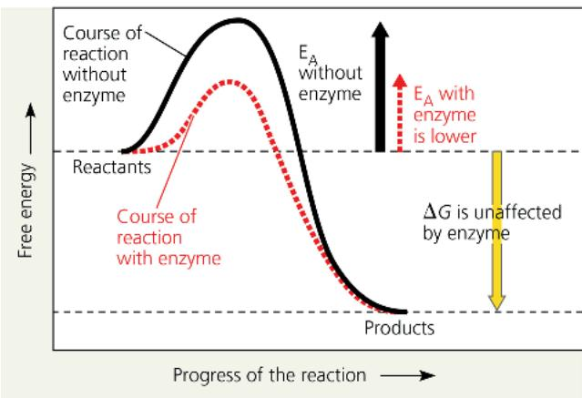

\- Each enzyme has a unique active site that binds one or more substrate(s), the reactants on which it acts. It then changes shape, binding the substrate(s) more tightly (induced fit).

\- The active site can lower an $E_{A}$ barrier by orienting substrates correctly, straining their bonds, providing a favorable microenvironment, or even covalently bonding with the substrate.

• Each enzyme has an optimal temperature and pH.

\- Inhibitors reduce enzyme function. A competitive inhibitor binds to the active site, whereas a noncompetitive inhibitor binds to a different site on the enzyme.

\- Natural selection, acting on organisms with variant enzymes, is responsible for the diversity of enzymes found in organisms.

How do both activation energy barriers and enzymes help maintain the structural and metabolic order of life?

## Concept 8.5: Regulation of enzyme activity helps control metabolism

\- Many enzymes are subject to allosteric regulation: Regulatory molecules, either activators or inhibitors, bind to specific regulatory sites, affecting the shape and function of the enzyme. In cooperativity, binding of one substrate molecule can stimulate binding or activity at other active sites. In feedback inhibition, the end product of a metabolic pathway allosterically inhibits the enzyme for a previous step in the pathway.

\- Some enzymes are grouped into complexes, some are incorporated into membranes, and some are contained inside organelles, increasing the efficiency of metabolic processes.

What roles do allosteric regulation and feedback inhibition play in the metabolism of a cell?

For suggested answers, see Appendix A.

## Test Your Understanding

For more multiple-choice questions, go to the Practice Test (eTextbook only).

## Levels 1-2: Remembering/Understanding

1. Catabolism is to anabolism as

(A) exergonic is to spontaneous.

(B) exergonic is to endergonic.

(C) free energy is to entropy.

(D) work is to energy.

2. Most cells cannot harness heat to perform work because

(A) heat does not involve a transfer of energy.

(B) cells do not have much thermal energy; they are relatively cool.

(C) temperature is usually uniform throughout a cell.

(D) heat can never be used to do work.

3. Which of the following metabolic processes can occur without a net influx of energy from some other process?

(A) ADP + $\textcircled{P}_{i}$ + → ATP + H₂O

(B) $C_{6}H_{12}O_{6} + 6O_{2} \rightarrow 6CO_{2} + 6H_{2}O$

(C) $6\ CO_{2} + 6\ H_{2}O \rightarrow C_{6}H_{12}O_{6} + 6\ O_{2}$

(D) Amino acids → Protein

4. If an enzyme in solution is saturated with substrate, the most effective way to obtain a faster yield of products is to

(A) add more of the enzyme.

(B) heat the solution to $90^{\circ}$ C.

(C) add more substrate.

(D) add a noncompetitive inhibitor.

5. Some bacteria are metabolically active in hot springs because

(A) they are able to maintain a lower internal temperature.

(B) high temperatures make catalysis unnecessary.

(C) their enzymes have high optimal temperatures.

(D) their enzymes are completely insensitive to temperature.

## Levels 3-4: Applying/Analyzing

6. If an enzyme is added to a solution where its substrate and product are in equilibrium, what will occur?

(A) Additional substrate will be formed.

(B) The reaction will change from endergonic to exergonic.

(C) The free energy of the system will change.

(D) Nothing; the reaction will stay at equilibrium.

## Levels 5-6: Evaluating/Creating

7. DRAW IT Using a series of arrows, draw the branched metabolic reaction pathway described by the following statements, and then answer the question at the end. Use red arrows and minus signs to indicate inhibition.

L can form either M or N.

M can form O.

O can form either P or R.

P can form Q.

R can form S.

O inhibits the reaction of L to form M.

Q inhibits the reaction of O to form P.

S inhibits the reaction of O to form R.

Which reaction would prevail if both Q and S were present in the cell in high concentrations?

(A) L → M

(B) $\mathrm{M}\rightarrow \mathrm{O}$

(C) L → N

(D) O → P

8. EVOLUTION CONNECTION Some people argue that biochemical pathways are too complex to have evolved because all intermediate steps in a given pathway must be present to produce the final product. Critique this argument. How could you use the diversity of metabolic pathways that produce the same or similar products to support your case?

## 9. WRITE ABOUT A THEME: ENERGY AND MATTER Life

requires energy. In a short essay (100–150 words), describe the basic principles of bioenergetics in an animal cell. How are the flow and transformation of energy different in a photosynthesizing cell? Include the role of ATP and enzymes in your discussion.

## 10. SYNTHESIZE YOUR KNOWLEDGE

  
Explain what is happening in this photo in terms of kinetic energy and potential energy. Include the energy conversions that occur when the penguins eat fish and climb back up on the glacier. Describe the role of ATP and enzymes in the underlying molecular processes, including what happens to the free energy of some of the molecules involved.

# Practice Applying Your Learning

11. This question assesses your ability to apply your understanding of enzyme structure and function to a new example.

Phenylalanine hydroxylase is a liver enzyme responsible for converting the essential amino acid phenylalanine to tyrosine. The active enzyme in humans consists of four subunits, each of which contains an iron ion. Deficiency in this enzyme can result in phenylketonuria (PKU), which can impair brain development and cognitive function in untreated individuals. Newborns are tested for PKU, as this condition can be managed with dietary restrictions.

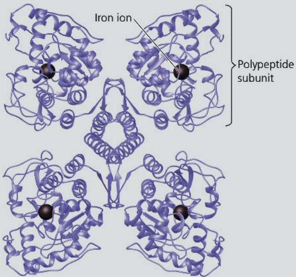

Use this information and your knowledge about the structure and function of enzymes to evaluate each statement as more likely to be TRUE or more likely to be FALSE.

a. This enzyme exhibits quaternary structure. \_\_\_\_

b. The substrate for this enzyme is tyrosine.

c. The catalytic activity of this enzyme involves a cofactor.

d. This enzyme is most active between $90^{\circ}$ C and $100^{\circ}$ C. \_\_\_\_

e. The change in free energy of this reaction is reduced as the concentration of the enzyme increases. \_\_\_\_

f. Having iron deficiency anemia will likely reduce the catalytic activity of this enzyme. \_\_\_\_

g. If you added phenylalanine and phenylalanine hydroxylase to a test tube, the concentration of tyrosine would start to increase. \_\_\_\_