# Cellular Respiration and Fermentation

## Key Concepts

9.1 Catabolic pathways yield energy by oxidizing organic fuels

9.2 Glycolysis harvests chemical energy by oxidizing glucose to pyruvate

9.3 After pyruvate is oxidized, the citric acid cycle completes the energy-yielding oxidation of organic molecules

9.4 During oxidative phosphorylation, chemiosmosis couples electron transport to ATP synthesis

9.5 Fermentation and anaerobic respiration enable cells to produce ATP without the use of oxygen

9.6 Glycolysis and the citric acid cycle connect to many other metabolic pathways

## Study Tip

Make a visual study guide: Draw a cell with a large mitochondrion, labeling the parts of the mitochondrion. As you go through the chapter, add key reactions for each stage of cellular respiration, linking the stages together. Label the carbon molecule(s) with the most energy and the carbon molecule(s) with the least energy. Your cell can be a simple sketch, as shown here.

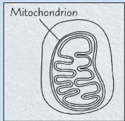

  
Figure 9.1 This hoary marmot (Marmota caligata) obtains energy for its cells by feeding on plants. In the process of cellular respiration, mitochondria in the cells of animals, plants, and other organisms break down organic molecules, generating ATP and waste products: carbon dioxide, water, and heat. Note that energy flows one way, but chemicals are recycled.

## How is the chemical energy stored in food used to generate ATP, the molecule that drives most cellular work?

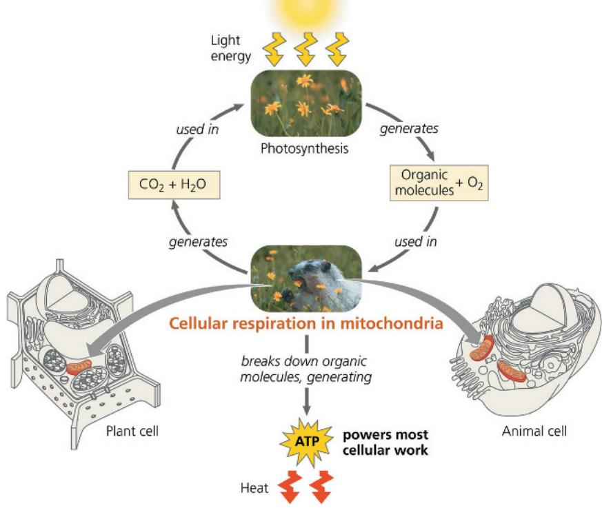

## Concept 9.1: Catabolic pathways yield energy by oxidizing organic fuels

Living cells require transfusions of energy from outside sources to perform their many tasks—for example, assembling polymers, pumping substances across membranes, moving, and reproducing. The outside source of energy is food, and the energy stored in the organic molecules of food ultimately comes from the sun. As shown in Figure 9.1, energy flows into an ecosystem as sunlight and exits as heat; in contrast, the chemical elements essential to life are recycled. Photosynthesis generates oxygen, as well as organic molecules used by the mitochondria of eukaryotes as fuel for cellular respiration. Respiration breaks this fuel down, using oxygen ( $O_{2}$ ) and generating ATP. The waste products of this type of respiration, carbon dioxide ( $CO_{2}$ ) and water ( $H_{2}O$ ), are the raw materials for photosynthesis.

Let's consider how cells harvest the chemical energy stored in organic molecules and use it to generate ATP, the molecule that drives most cellular work. Metabolic pathways that release stored energy by breaking down complex molecules are called catabolic pathways (see Concept 8.1). Transfer of electrons from food molecules (like glucose) to other molecules plays a major role in these pathways. In this section, we consider these processes, which are central to cellular respiration.

## Catabolic Pathways and Production of ATP

Organic compounds possess potential energy as a result of the arrangement of electrons in the bonds between their atoms. Compounds that can participate in exergonic reactions can act as fuels. Through the activity of enzymes (see Concept 8.4), a cell systematically degrades complex organic molecules that are rich in potential energy to simpler waste products that have less energy. Some of the energy taken out of chemical storage can be used to do work; the rest is dissipated as heat.

One catabolic process, fermentation, is a partial degradation of sugars or other organic fuel that occurs without the use of oxygen. However, the most efficient catabolic pathway is aerobic respiration, in which oxygen is consumed as a reactant along with the organic fuel (aerobic is from the Greek aer, air, and bios, life). The cells of most eukaryotic and many prokaryotic organisms can carry out aerobic respiration. Some prokaryotic organisms use substances other than oxygen as reactants in a similar process that harvests chemical energy without oxygen; this process is called anaerobic respiration (the prefix an- means “without”). Technically, the term cellular respiration includes both aerobic and anaerobic processes. However, it originated as a synonym for aerobic respiration because of the relationship of that process to organismal respiration, in which an animal breathes in oxygen ( $O_{2}$ ).

Thus, cellular respiration is often used to refer to the aerobic process, a practice we follow in most of this chapter.

Although very different in mechanism, aerobic respiration is in principle similar to the combustion of gasoline in an automobile engine after oxygen is mixed with the fuel (hydrocar-bons). Food provides the fuel for respiration, and the exhaust is carbon dioxide and water. The overall process can be summarized as follows:

$$
\begin{array}{l}\text { Organic }\\\text { compounds }\end{array}+ \text { Oxygen } \rightarrow \text { Carbon   dioxide } + \text { Water } + \text { Energy }
$$

Carbohydrates, fats, and proteins from food can all be processed and consumed as fuel. In animal diets, a major source of carbohydrates is starch, a storage polysaccharide that can be broken down into glucose ( $C_{6}H_{12}O_{6}$ ) subunits. Here, we will learn the steps of cellular respiration by tracking the degradation of the sugar glucose:

$$
\mathrm{C} _ {6} \mathrm{H} _ {1 2} \mathrm{O} _ {6} + 6 \mathrm{O} _ {2} \rightarrow 6 \mathrm{CO} _ {2} + 6 \mathrm{H} _ {2} \mathrm{O} + \text {   Energy   (ATP   +   heat)   }
$$

This breakdown of glucose is exergonic, having a free-energy change of -686 kcal (-2,870 kJ) per mole of glucose decomposed ( $\Delta G = -686$ kcal/mol). Recall that a negative $\Delta G (\Delta G < 0)$ indicates that the products of the chemical process store less energy than the reactants and that the reaction can happen spontaneously—in other words, without an input of energy (see Concept 8.2).

Catabolic pathways do not directly move flagella, pump solutes across membranes, polymerize monomers, or perform other cellular work. Catabolism is linked to work by a chemical drive shaft—ATP (see Concept 8.3). To keep working, the cell must regenerate its supply of ATP from ADP and $\widehat{P}_{i}$ (see Figure 8.12). To understand how cellular respiration accomplishes this, let's examine the fundamental chemical processes known as oxidation and reduction.

## Redox Reactions: Oxidation and Reduction

How do the catabolic pathways that decompose glucose and other organic fuels yield energy? The answer is based on the transfer of electrons during the chemical reactions. The relocation of electrons releases energy stored in organic molecules, and this energy ultimately is used to synthesize ATP.

## The Principle of Redox

In many chemical reactions, there is a transfer of one or more electrons ( $e^{-}$ ) from one reactant to another. These electron transfers are called oxidation-reduction reactions, or redox reactions for short. In a redox reaction, the loss of electrons from one substance is called oxidation, and the addition of electrons to another substance is known as reduction. (Note that adding electrons is called reduction; adding negatively charged electrons to an atom reduces the amount of positive charge of that atom.)

To take a simple, nonbiological example, consider the reaction between the elements sodium (Na) and chlorine (Cl) that forms table salt:

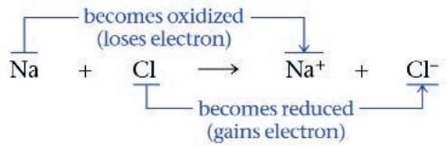

We could generalize a redox reaction this way:

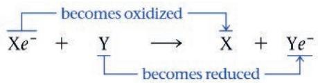

In the generalized reaction, substance $Xe^{-}$ , the electron donor, is called the reducing agent; it reduces Y, which accepts the donated electron. Substance Y, the electron acceptor, is the oxidizing agent; it oxidizes $Xe^{-}$ by removing its electron. Because an electron transfer requires both an electron donor and an acceptor, oxidation and reduction always go hand in hand.

Not all redox reactions involve the complete transfer of electrons from one substance to another; some change the degree of electron sharing in covalent bonds. Methane combustion, shown in Figure 9.2, is an example. The covalent electrons in methane are shared nearly equally between the bonded atoms because carbon and hydrogen have about the same affinity for valence electrons; they are about equally electronegative (see Concept 2.3). But when methane reacts

Figure 9.2 Methane combustion as an energy-yielding redox reaction.

The reaction releases energy to the surroundings because the electrons lose potential energy when they end up being shared unequally, spending more time near electronegative atoms such as oxygen.

  
VISUAL SKILLS Is the carbon atom oxidized or reduced during this reaction? Explain.  
For suggested answer, see Appendix A.

with $O_{2}$ , forming $CO_{2}$ , electrons end up shared less equally between the carbon atom and its new covalent partners, the oxygen atoms, which are very electronegative. In effect, the carbon atom has partially “lost” its shared electrons; thus, methane has been oxidized.

Now let's examine the fate of the reactant $O_{2}$ . The two atoms of $O_{2}$ share their electrons equally. But after the reaction with methane, when each O atom is bonded to two H atoms in $H_{2}O$ , the electrons of those covalent bonds spend more time near the oxygen (see Figure 9.2). In effect, each O atom has partially "gained" electrons, so the oxygen molecule ( $O_{2}$ ) has been reduced. Because the O atom is so electronegative, $O_{2}$ is one of the most powerful of all oxidizing agents.

Energy must be added to pull an electron away from an atom, just as energy is required to push a ball uphill. The more electronegative the atom (the stronger its pull on electrons), the more energy is required to take an electron away from it. An electron loses potential energy when it shifts from a less electronegative atom toward a more electronegative one, just as a ball loses potential energy when it rolls downhill. A redox reaction that moves electrons closer to an O atom, such as the burning (oxidation) of methane, therefore releases chemical energy that can be put to work.

## Oxidation of Organic Fuel Molecules During Cellular Respiration

The oxidation of methane by $O_{2}$ is the main combustion reaction that occurs at the burner of a gas stove. The combustion of gasoline in an automobile engine is also a redox reaction; the energy released pushes the pistons. But the energy-yielding redox process of greatest interest to biologists is respiration: the oxidation of glucose and other molecules in food. Examine again the summary equation for cellular respiration, but this time think of it as a redox process:

$$
\begin{array}{c} \text {becomes oxidized} \\ \mathrm{C} _ {6} \mathrm{H} _ {1 2} \mathrm{O} _ {6} + 6 \mathrm{O} _ {2} \longrightarrow 6 \mathrm{CO} _ {2} + 6 \mathrm{H} _ {2} \mathrm{O} + \text {Energy} \\ \text {becomes reduced} \end{array}
$$

As in the combustion of methane or gasoline, the fuel (glucose) is oxidized and $O_{2}$ is reduced. The electrons lose potential energy along the way, and energy is released.

In general, organic molecules that have an abundance of hydrogen are excellent fuels because their bonds are a source of "hilltop" electrons, whose energy may be released as these electrons "fall" down an energy gradient during their transfer to oxygen. The summary equation for respiration indicates that hydrogen is transferred from glucose to the O atoms in $\mathrm{O}_2$ . But the important point, not visible in the summary equation, is that the energy state of the electron changes as hydrogen (with its electron) is transferred to oxygen. In respiration, the oxidation of glucose transfers electrons to a lower energy state, liberating energy that becomes available for ATP synthesis. So, in general, we see fuels with multiple C—H bonds oxidized into products with multiple C—O bonds.

The main energy-yielding foods—carbohydrates and fats—are reservoirs of electrons associated with hydrogen, often in the form of C—H bonds. Only the barrier of activation energy holds back the flood of electrons to a lower energy state (see Figure 8.13). Without this barrier, a food substance like glucose would combine almost instantaneously with $O_{2}$ . If we supply the activation energy by igniting glucose, it burns in air, releasing 686 kcal (2,870 kJ) of heat per mole of glucose (about 180 g). Body temperature is not high enough to initiate burning, of course. Instead, if you swallow some glucose, enzymes in your cells will lower the barrier of activation energy, allowing the sugar to be oxidized in a series of steps.

## Stepwise Energy Harvest via NAD $^{+}$ and the Electron Transport Chain

If energy is released from a fuel all at once, it cannot be harnessed efficiently for constructive work. For example, if a gasoline tank explodes, it cannot drive a car very far. Cellular respiration does not oxidize glucose (or any other organic fuel) in a single explosive step either. Rather, glucose is broken down in a series of steps, each one catalyzed by an enzyme. At key steps, electrons are stripped from the glucose. As is often the case in oxidation reactions, each electron travels with a proton—thus, as a hydrogen atom. The hydrogen atoms are not transferred directly to $O_{2}$ , but instead are usually passed first to an electron carrier, a coenzyme called nicotinamide adenine dinucleotide, a derivative of the vitamin niacin. This coenzyme is well suited

as an electron carrier because it can cycle easily between its oxidized form, $NAD^{+}$ , and its reduced form, NADH. As an electron acceptor, $NAD^{+}$ functions as an oxidizing agent during respiration.

How does $NAD^{+}$ trap electrons from glucose and the other organic molecules in food? Enzymes called dehydrogenases remove a pair of hydrogen atoms (2 electrons and 2 protons) from the substrate (glucose, in the preceding example), thereby oxidizing it. The enzyme delivers the 2 electrons along with 1 proton to its coenzyme, $NAD^{+}$ , forming NADH (Figure 9.3). The other proton is released as a hydrogen ion ( $H^{+}$ ) into the surrounding solution:

$$
\mathrm{H} - \stackrel {|} {\mathrm{C}} - \mathrm{OH} + \mathrm{NAD} ^ {+} \xrightarrow {\text {   Dehydrogenase   }} \stackrel {|} {\mathrm{C}} = \mathrm{O} + \mathrm{NADH} + \mathrm{H} ^ {+}
$$

By receiving 2 negatively charged electrons but only 1 positively charged proton, the nicotinamide portion of $NAD^{+}$ has its charge neutralized when $NAD^{+}$ is reduced to NADH. The name NADH shows the hydrogen that has been received in the reaction. $NAD^{+}$ is the most versatile electron acceptor in cellular respiration and functions in several of the redox steps during the breakdown of glucose.

Electrons lose very little of their potential energy when they are transferred from glucose to $NAD^{+}$ . Each NADH molecule formed during respiration represents stored energy that can be tapped to make ATP when the electrons complete their “fall” down an energy gradient from NADH to $O_{2}$ .

Figure 9.3 NAD $^{+}$ as an electron shuttle.

The full name for $NAD^{+}$ , nicotinamide adenine dinucleotide, describes its structure—the molecule consists of two nucleotides joined together at their phosphate groups (shown in yellow circles). (Nicotinamide is a nitrogenous base, although not one that is present in DNA or RNA; see Figure 5.23.) The enzymatic transfer of 2 electrons and 1 proton ( $H^{+}$ ) from an organic molecule in food to $NAD^{+}$ reduces the $NAD^{+}$ to NADH: Most of the electrons removed from food are transferred initially to $NAD^{+}$ , forming NADH.

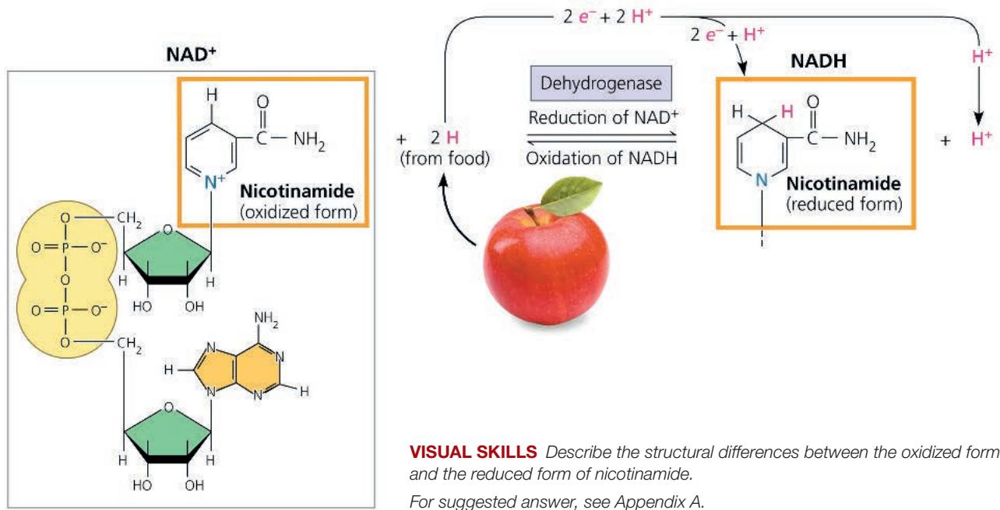

How do electrons that are extracted from glucose and stored as potential energy in NADH finally reach oxygen? It will help to compare the redox chemistry of cellular respiration to a much simpler reaction: the reaction between hydrogen and oxygen to form water (Figure 9.4a). Mix $H_{2}$ and $O_{2}$ , provide a spark for activation energy, and the gases combine explosively. In fact, combustion of liquid $H_{2}$ and $O_{2}$ is harnessed to help power the rocket engines that boost satellites into orbit and launch spacecraft. The explosion represents a release of energy as the electrons of hydrogen “fall” closer to the electronegative oxygen atoms. Cellular respiration also brings hydrogen and oxygen together to form water, but there are two important differences. First, in cellular respiration, the hydrogen atoms that react with oxygen are derived from organic molecules rather than $H_{2}$ . Second, instead of occurring in one explosive reaction, respiration uses an electron transport chain to break the fall of electrons to oxygen into several energy-releasing steps (Figure 9.4b). An electron transport chain consists of a

Figure 9.4 An introduction to electron transport chains.

(a) Uncontrolled reaction. The one-step exergonic reaction of hydrogen with oxygen to form water releases a large amount of energy in the form of heat and light: an explosion.

(b) Cellular respiration. In cellular respiration, the same reaction occurs in stages: An electron transport chain breaks the "fall" of electrons in this reaction into a series of smaller steps and stores some of the released energy in a form that can be used to make ATP. (The rest of the energy is released as heat.)

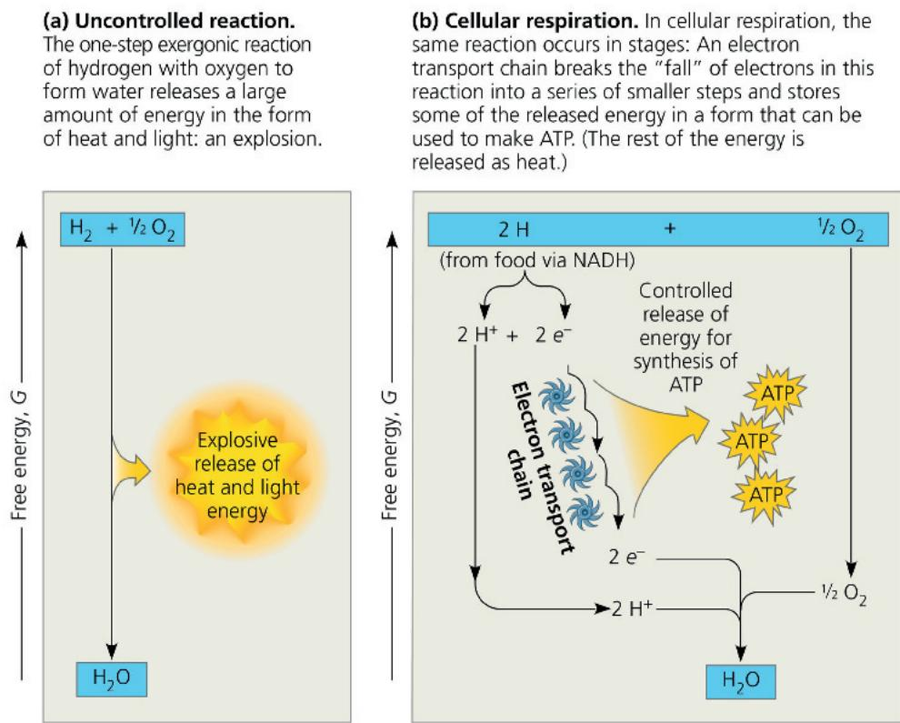  
respiration, let's look at the entire process by which energy is harvested from organic fuels.

number of molecules, mostly proteins, built

into the inner membrane of the mitochondria of eukaryotic cells (and the plasma membrane of respiring prokaryotic organisms). Electrons removed from glucose are shuttled by NADH to the "top," higher-energy end of the chain. At the "bottom," lower-energy end, $O_{2}$ captures these electrons along with hydrogen nuclei ( $H^{+}$ ), forming water. (Anaerobically respiring prokaryotic organisms have an electron acceptor at the end of the chain that is different from $O_{2}$ .)

Electron transfer from NADH to oxygen is an exergonic reaction with a free-energy change of -53 kcal/mol (-222 kJ/mol). Instead of this energy being released and wasted in a single explosive step, electrons cascade down the chain from one carrier molecule to the next in a series of redox reactions, losing a small amount of energy with each step until they finally reach oxygen, the terminal electron acceptor, which has a very great affinity for electrons. Each “downhill” carrier has a greater affinity for electrons than, and is thus capable of accepting electrons from (oxidizing), its “uphill” neighbor, with $O_{2}$ at the bottom of the chain. Therefore, the electrons transferred from glucose to $NAD^{+}$ , reducing it to NADH, fall down an energy gradient in the electron transport chain to a far more stable location in an electronegative oxygen atom from $O_{2}$ . Put another way, $O_{2}$ pulls electrons down the chain in an energy-yielding tumble analogous to gravity pulling objects downhill.

In summary, during cellular respiration, most electrons travel the following “downhill” route: glucose → NADH → electron transport chain → oxygen. Later in this chapter, you will learn more about how the cell uses the energy released from this exergonic electron fall to regenerate its supply of ATP. For now, having covered the basic redox mechanisms of cellular

## The Stages of Cellular Respiration: A Preview

The harvesting of energy from glucose by cellular respiration is a cumulative function of three metabolic stages. We list them here along with a color-coding scheme we will use throughout the chapter to help you keep track of the big picture:

1. GLYCOLYSIS (color-coded blue throughout the chapter)

2. PYRUVATE OXIDATION (light orange) and the CITRIC ACID CYCLE (dark orange)

3. OXIDATIVE PHOSPHORYLATION: Electron transport and chemiosmosis (purple)

Biochemists usually reserve the term cellular respiration for stages 2 and 3 together. In this text, however, we include glycolysis as a part of cellular respiration because most respiring cells deriving energy from glucose use glycolysis to produce the starting material for the citric acid cycle.

As diagrammed in Figure 9.5, glycolysis and then pyruvate oxidation and the citric acid cycle are the catabolic pathways that break down glucose and other organic fuels. Glycolysis, which occurs in the cytosol, begins the degradation process by breaking glucose into two molecules of a compound called pyruvate. In eukaryotes, pyruvate enters the mitochondrion and is oxidized to a compound called acetyl CoA, which enters the citric acid

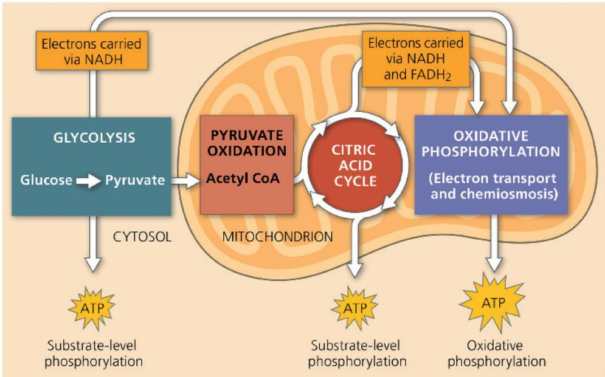

## Figure 9.5 An overview of cellular respiration.

cycle. There, the breakdown of glucose to carbon dioxide is completed. (In prokaryotic organisms, these processes take place in the cytosol.) Thus, the carbon dioxide produced by respiration represents fragments of oxidized organic molecules.

Some of the steps of glycolysis and the citric acid cycle are redox reactions in which dehydrogenases transfer electrons from substrates to $NAD^{+}$ or the related electron carrier FAD, forming NADH or $FADH_{2}$ . (You'll learn more about FAD and $FADH_{2}$ later.) In the third stage of respiration, the electron transport chain accepts electrons from NADH or $FADH_{2}$ generated during the first two stages and passes these electrons down the chain. At the end of the chain, the electrons are combined with molecular oxygen ( $O_{2}$ ) and hydrogen ions ( $H^{+}$ ), forming water (see Figure 9.4b). The energy released at each step of the chain is stored in a form the mitochondrion (or prokaryotic cell) can use to make ATP from ADP. This mode of ATP synthesis is called oxidative phosphorylation because it is powered by the redox reactions of the electron transport chain.

In eukaryotic cells, the inner membrane of the mitochondrion is the site of electron transport and another process called chemiosmosis, together making up oxidative phosphorylation. (In prokaryotic cells, these processes take place in the plasma membrane.) Oxidative phosphorylation accounts for almost 90% of the ATP generated by respiration. A smaller amount of ATP is formed directly in a few reactions of glycolysis and the citric acid cycle by a mechanism called substrate-level phosphorylation (Figure 9.6). This mode of ATP synthesis occurs when an enzyme transfers a phosphate group from a substrate molecule to ADP, rather than adding an inorganic phosphate to ADP as in oxidative phosphorylation. "Substrate molecule" here refers to an organic molecule generated as an intermediate during the catabolism of glucose. You'll see examples of substrate-level phosphorylation later in the chapter, in both glycolysis and the citric acid cycle.

You can think of the whole process this way: When you withdraw a relatively large sum of money from an ATM, it is not delivered to you in a single bill of a large denomination. Instead, the machine dispenses a number of smaller-denomination bills that you can spend more easily. This is analogous to ATP production during cellular respiration. For each molecule of glucose degraded to $CO_{2}$ and $H_{2}O$ by respiration, the cell makes

During glycolysis, each glucose molecule is broken down into two molecules of pyruvate. In eukaryotic cells, as shown here, the pyruvate enters the mitochondrion. There it is oxidized to acetyl CoA, which will be further oxidized to $CO_{2}$ in the citric acid cycle. The electron carriers NADH and $FADH_{2}$ transfer electrons derived from glucose to electron transport chains. During oxidative phosphorylation, electron transport chains convert the chemical energy to a form used for ATP synthesis in the process called chemiosmosis. (During earlier steps of cellular respiration, a few molecules of ATP are synthesized in a process called substrate-level phosphorylation.) To visualize these processes in their cellular context, see Figure 6.32b.

Figure 9.6 Substrate-level phosphorylation.

Some ATP is made by direct transfer of a phosphate group from an organic substrate to ADP by an enzyme. (For examples in glycolysis, see Figure 9.8, 7 and 10.)

  
MAKE CONNECTIONS Review Figure 8.9. In the reaction shown above, is the potential energy higher for the reactants or for the products? Explain. For suggested answer, see Appendix A.

up to about 32 molecules of ATP, each with 7.3 kcal/mol of free energy. Respiration cashes in the large denomination of energy banked in a single molecule of glucose (686 kcal/mol under standard conditions) for the small change of many molecules of ATP, which is more practical for the cell to spend on its work.

This preview has introduced you to how glycolysis, the citric acid cycle, and oxidative phosphorylation fit into the process of cellular respiration so you can keep the big picture in mind as you take a closer look at each of these three stages of respiration. As you read about the chemical reactions, remember that each reaction is catalyzed by a specific enzyme, some of which are shown in Figure 6.32b.

## Concept Check 9.1

1. Compare and contrast aerobic and anaerobic respiration, including the processes involved.

2. WHAT IF? If the following redox reaction occurred, which compounds would be oxidized? Reduced?

$$
\mathrm{C} _ {4} \mathrm{H} _ {6} \mathrm{O} _ {5} + \mathrm{NAD} ^ {+} \rightarrow \mathrm{C} _ {4} \mathrm{H} _ {4} \mathrm{O} _ {5} + \mathrm{NADH} + \mathrm{H} ^ {+}
$$

For suggested answers, see Appendix A.

# Concept 9.2: Glycolysis harvests chemical energy by oxidizing glucose to pyruvate

The word glycolysis means “sugar splitting,” and that is exactly what happens during this pathway. Glucose, a six-carbon sugar, is split into two three-carbon sugars. These smaller sugars are then oxidized and their remaining atoms rearranged to form two molecules of pyruvate. (Pyruvate is the ionized form of pyruvic acid.)

As summarized in Figure 9.7, glycolysis can be divided into two phases: the energy investment phase and the energy payoff phase. During the energy investment phase, the cell actually spends ATP. This investment is repaid with interest during the energy payoff phase, when ATP is produced by substrate-level phosphorylation and $\mathrm{NAD^{+}}$ is reduced to NADH by electrons released from the oxidation of glucose. The net energy yield from glycolysis, per glucose molecule, is 2 ATP plus 2 NADH. The ten steps of the glycolytic pathway are shown in Figure 9.8.

All of the carbon originally present in glucose is accounted for in the two molecules of pyruvate; no carbon is released as $CO_{2}$ during glycolysis. Glycolysis occurs whether or not $O_{2}$ is present. However, if $O_{2}$ is present, the chemical energy stored in pyruvate and NADH can be extracted by pyruvate oxidation, the citric acid cycle, and oxidative phosphorylation.

Figure 9.7 The inputs and outputs of glycolysis.  
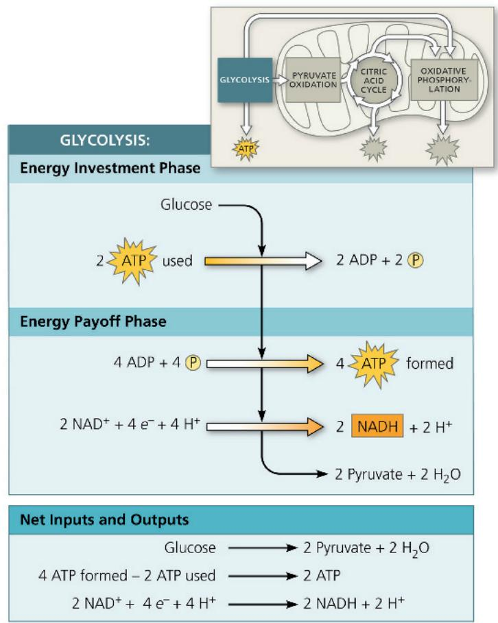

Figure 9.8 The steps of glycolysis.  
Glycolysis, a source of ATP and NADH, takes place in the cytosol. Two of the enzymes (in ① and ③) are shown in Figure 6.32b.  

## Concept Check 9.2

1. VISUAL SKILLS During the redox reaction in glycolysis (see step 6 in Figure 9.8), which one of the molecules acts as the oxidizing agent? The reducing agent?

For suggested answers, see Appendix A.

## Concept 9.3: After pyruvate is oxidized, the citric acid cycle completes the energy-yielding oxidation of organic molecules

Glycolysis releases less than a quarter of the chemical energy in glucose that can be harvested by cells; most of the energy remains stockpiled in the two molecules of pyruvate. When $O_{2}$ is present, the pyruvate in eukaryotic cells enters a mitochondrion, where the oxidation of glucose is completed. In aerobically respiring prokaryotic cells, this process occurs in the cytosol. (Later in the chapter, we'll examine other fates for pyruvate—for example, when $O_{2}$ is unavailable or in a prokaryotic organism that is unable to use $O_{2}$ .)

## Oxidation of Pyruvate to Acetyl CoA

Upon entering the mitochondrion via active transport, pyruvate is first converted to a compound called acetyl coenzyme A, or acetyl CoA (Figure 9.9). This step, linking glycolysis and the citric

Figure 9.9 Oxidation of pyruvate to acetyl CoA, the step before the citric acid cycle.

Pyruvate enters the mitochondrion through a transport protein and is processed by a complex of several enzymes known as pyruvate dehydrogenase (shown in the computer-generated image based on cryo-EMs). This complex catalyzes the three numbered steps, which are described in the text. The $CO_{2}$ molecule will diffuse out of the cell. The NADH will be used in oxidative phosphorylation. The acetyl group of acetyl CoA will enter the citric acid cycle. (Coenzyme A is abbreviated S-CoA when it is attached to a molecule, emphasizing its sulfur atom, S.)

acid cycle, is carried out by a multienzyme complex that catalyzes three reactions: ① Pyruvate's carboxyl group ( $—COO^{-}$ ), already somewhat oxidized and thus carrying little chemical energy, is now fully oxidized and given off as a molecule of $CO_{2}$ . This is the first step in which $CO_{2}$ is released during respiration. ② Next, the remaining two-carbon fragment is oxidized and the electrons transferred to $NAD^{+}$ , storing energy in the form of NADH.

③ Finally, coenzyme A (CoA), a sulfur-containing compound derived from a B vitamin, is attached via its sulfur atom to the two-carbon intermediate, forming acetyl CoA. Acetyl CoA has a high potential energy, which is used to transfer the acetyl group to a molecule in the citric acid cycle, a reaction that is therefore highly exergonic.

## The Citric Acid Cycle

The citric acid cycle functions as a metabolic furnace that further oxidizes organic fuel derived from pyruvate. Figure 9.10 summarizes the inputs and outputs as pyruvate is broken down to three $\mathrm{CO}_{2}$ molecules, including the molecule of $\mathrm{CO}_{2}$ released during the conversion of pyruvate to acetyl CoA. The cycle generates 1 ATP per turn by substrate-level phosphorylation, but most of the chemical energy is transferred to $\mathrm{NAD}^{+}$ and FAD during the redox reactions. The reduced coenzymes, NADH and $\mathrm{FADH}_{2}$ , shuttle their cargo of high-energy electrons into the electron transport chain. The citric acid cycle is also called the tricarboxylic acid cycle or the Krebs cycle, the latter honoring Hans Krebs. Krebs was the German-British scientist largely responsible for working out the pathway in the 1930s.

Now let's look at the citric acid cycle in more detail. The cycle has eight steps, each catalyzed by a specific enzyme. You can see in Figure 9.11 that for each turn of the citric acid cycle, two carbons (red) enter in the relatively reduced form of an acetyl group (①), and two different carbons (blue) leave in the completely oxidized form of $\mathrm{CO}_{2}$ molecules (③ and ④). The acetyl group of acetyl CoA joins the cycle by combining with the compound oxaloacetate, forming citrate (①). Citrate is the ionized form of citric acid, for which the cycle is named. The next seven steps decompose the citrate back to oxaloacetate. It is this regeneration of oxaloacetate that makes the process a cycle.

Referring to Figure 9.11, we can tally the energy-rich molecules produced by the citric acid cycle. For each acetyl group entering the cycle, 3 NAD $^{+}$ are reduced to NADH (3, 4, and 8). In 6, electrons are transferred not to NAD $^{+}$ , but to FAD, which accepts 2 electrons and 2 protons to become FADH $_{2}$ . In many animal tissue cells, the reaction in 5 produces a guanosine triphosphate (GTP) molecule by substrate-level phosphorylation. GTP is a molecule similar to ATP in its structure and cellular function. This GTP may be used to make an ATP molecule (as shown) or directly power work in the cell. In the cells of plants, bacteria, and some animal tissues, 5 forms an ATP molecule directly by substrate-level phosphorylation. The output from 5

Figure 9.10 An overview of pyruvate oxidation and the citric acid cycle.

The inputs and outputs per pyruvate molecule are shown with a focus on the carbon atoms involved. To calculate on a per-glucose basis, multiply by 2 because each glucose molecule is split during glycolysis into two pyruvate molecules.

represents the only ATP generated during the citric acid cycle. Recall that each glucose gives rise to two molecules of acetyl CoA that enter the cycle. Because the numbers noted earlier are obtained from a single acetyl group entering the pathway, the total yield per glucose from the citric acid cycle turns out to be doubled, or 6 NADH, 2 FADH $_{2}$ , and the equivalent of 2 ATP.

Most of the ATP produced by respiration is generated later, from oxidative phosphorylation, when the NADH and $FADH_{2}$ produced by the citric acid cycle and earlier steps relay the electrons extracted from food to the electron transport chain. In the process, they supply the necessary energy for the phosphorylation of ADP to ATP. We will explore this process in the next section.

Figure 9.11 A closer look at the citric acid cycle.

In the chemical structures, red type traces the fate of the two carbon atoms that enter the cycle via acetyl CoA (1), and blue type indicates the two carbons that exit the cycle as $\mathrm{CO}_{2}$ in 3 and 4. (The red type goes only through 5 because the succinate molecule is symmetrical; the two ends cannot be distinguished from each other.) Notice that the carbon atoms that enter the cycle from acetyl CoA do not leave the cycle in the same turn. They remain in the cycle, occupying a different location in the molecules on their next turn, after another acetyl group is added. Therefore, the oxaloacetate regenerated at ⑧ is made up of different carbon atoms each time around. Carboxylic acids are represented in their ionized forms, as $-\mathrm{COO}^{-}$ , because the ionized forms prevail at the pH within the mitochondrion. In eukaryotic cells, all the citric acid cycle enzymes are located in the mitochondrial matrix except for the enzyme that catalyzes ⑥, which resides in the inner mitochondrial membrane. (The enzyme that catalyzes ③, isocitrate dehydrogenase, is shown in Figure 6.32b.)

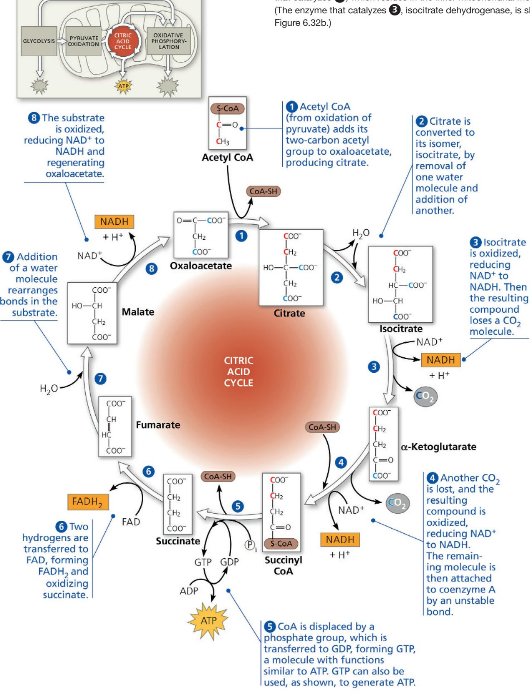

## Concept Check 9.3

1. VISUAL SKILLS In the citric acid cycle shown in Figure 9.11, what molecules capture energy from the redox reactions? How is ATP produced?

2. What processes in your cells produce the $CO_{2}$ that you exhale?

3. VISUAL SKILLS The conversions shown in Figure 9.9 and ④ of Figure 9.11 are each catalyzed by a large multienzyme complex. What similarities are there in the reactions that occur in these two cases?

For suggested answers, see Appendix A.

# Concept 9.4: During oxidative phosphorylation, chemiosmosis couples electron transport to ATP synthesis

Our main objective in this chapter is to learn how cells harvest the energy of glucose and other nutrients in food to make ATP. But the metabolic components of respiration we have examined so far, glycolysis and the citric acid cycle, produce only 4 ATP molecules per glucose molecule, all by substrate-level phosphorylation: 2 net ATP from glycolysis and 2 ATP from the citric acid cycle. At this point, molecules of NADH (and FADH $_{2}$ ) account for most of the energy extracted from each glucose molecule. These electron escorts link glycolysis and the citric acid cycle to the machinery of oxidative phosphorylation, which uses energy released by the electron transport chain to power ATP synthesis. In this section, you will learn first how the electron transport chain works and then how electron flow down the chain is coupled to ATP synthesis.

## The Pathway of Electron Transport

The electron transport chain is a collection of molecules embedded in the inner membrane of the mitochondrion in eukaryotic cells. (In prokaryotic cells, these molecules reside in the plasma membrane.) The folding of the inner membrane to form cristae increases its surface area, providing space for thousands of copies of each component of the electron transport chain in a mitochondrion. Structure fits function: The infolded membrane with its concentration of electron carrier molecules is well-suited for the series of sequential redox reactions that take place along the electron transport chain. Most components of the chain are proteins, which exist in multiprotein complexes numbered I through IV. Tightly bound to these proteins are prosthetic groups, nonprotein components such as cofactors and coenzymes essential for the catalytic functions of certain enzymes.

Figure 9.12 shows the sequence of electron carriers in the electron transport chain and the drop in free energy as electrons travel down the chain. During this electron transport, electron carriers alternate between reduced and oxidized states as they accept and then donate electrons. Each component of the chain becomes reduced when it accepts electrons from its “uphill” neighbor, which is a better electron donor. It then returns to its oxidized form as it passes electrons to its “downhill” neighbor, which is a better electron acceptor.

Figure 9.12 Free-energy change during electron transport.  
Figure 9.12 Free energy change during electron transport.

The overall energy drop ( $\Delta G$ ) for electrons traveling from NADH to oxygen is 53 kcal/mol, but this “fall” is broken up into a series of smaller steps by the electron transport chain. (An oxygen atom is represented here as $\frac{1}{2}O_{2}$ to show that $O_{2}$ is reduced, not individual oxygen atoms.) To view these proteins in their cellular context, see Figure 6.32b.  
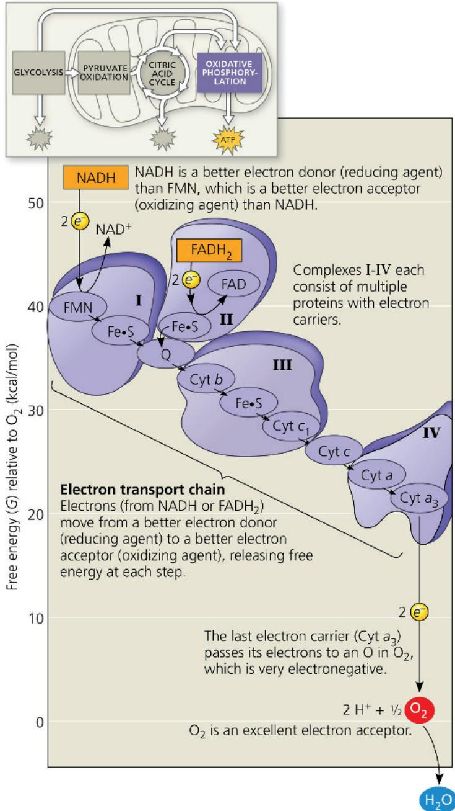  
VISUAL SKILLS Compare the position of the electrons in NADH (see Figure 9.3) at the top of the chain with that in $H_{2}O$ , at the bottom. Describe why the electrons in $H_{2}O$ have less potential energy, using the term electronegativity. For suggested answers, see Appendix A.

Now let's take a closer look at the electrons as they drop in energy level, passing through the components of the electron transport chain in Figure 9.12. We'll first look at the passage of electrons through complex I in some detail as an illustration of the general principles involved in electron transport. Electrons acquired from glucose by $\mathrm{NAD^{+}}$ during glycolysis and the citric acid cycle are transferred from NADH to the first molecule of the electron transport chain in complex I. This molecule is a flavoprotein, so named because it has a prosthetic group called flavin mononucleotide (FMN). In the next redox reaction, the flavoprotein returns to its oxidized form as it passes electrons to an iron-sulfur protein (Fe · S in complex I), one of a family of proteins with both iron and sulfur tightly bound. The iron-sulfur protein then passes the electrons to a compound called ubiquinone (Q in Figure 9.12). This electron carrier is a small hydrophobic molecule, the only member of the electron transport chain that is not a protein. Ubiquinone is individually mobile within the membrane rather than residing in a particular complex. (Another name for ubiquinone is coenzyme Q, or CoQ; you may have seen it sold as a nutritional supplement.)

Most of the remaining electron carriers between ubiquinone and oxygen are proteins called cytochromes. Their prosthetic group, called a heme group, has an iron atom that accepts and donates electrons. (The heme group in a cytochrome is similar to the heme group in hemoglobin, the protein of red blood cells, except that the iron in hemoglobin carries oxygen, not electrons.) The electron transport chain has several types of cytochromes, each named “cyt” with a letter and number to distinguish it as a different protein with a slightly different electron-carrying heme group. The last cytochrome of the chain, cyt $a_{3}$ , passes its electrons to oxygen (in $O_{2}$ ), which is very electronegative. Each O also picks up a pair of hydrogen ions (protons) from the aqueous solution, neutralizing the -2 charge of the added electrons and forming water.

Another source of electrons for the electron transport chain is $FADH_{2}$ , the other reduced product of the citric acid cycle. Notice in Figure 9.12 that $FADH_{2}$ adds its electrons from within complex II, at a lower energy level than NADH does. Consequently, although NADH and $FADH_{2}$ each donate an equivalent number of electrons (2) for oxygen reduction, the electron transport chain provides about one-third less energy for ATP synthesis when the electron donor is $FADH_{2}$ rather than NADH. We'll see why in the next section.

The electron transport chain makes no ATP directly. Instead, it eases the fall of electrons from food to oxygen, breaking a large free-energy drop into a series of smaller steps that release energy in manageable amounts, step by step. How does the mitochondrion (or the plasma membrane in prokaryotic cells) couple this electron transport and energy release to ATP synthesis? The answer is a mechanism called chemiosmosis.

## Chemiosmosis: The Energy-Coupling Mechanism

Populating the inner membrane of the mitochondrion or the prokaryotic plasma membrane are many copies of a protein complex called ATP synthase, the enzyme that makes ATP from ADP and inorganic phosphate (Figure 9.13). ATP synthase works like an ion pump running in reverse. Ion pumps usually use ATP as an energy source to transport ions against their gradients. Enzymes can catalyze a reaction in either direction, depending on the $\Delta G$ for the reaction, which is affected by the local concentrations of reactants and products (see Concepts 8.2 and 8.3). Under the conditions of cellular respiration, rather than hydrolyzing ATP to pump protons against their concentration gradient, ATP synthase uses the energy of an existing ion gradient to power ATP synthesis. The power source for ATP synthase is a difference in the concentration of $\mathrm{H^{+}}$ (a pH difference) on opposite sides of the inner mitochondrial membrane. This process, in which energy

Figure 9.13 ATP synthase, a molecular mill.

Multiple ATP synthases reside in eukaryotic mitochondrial and chloroplast membranes and in prokaryotic plasma membranes. (See Figure 6.32b and c.)

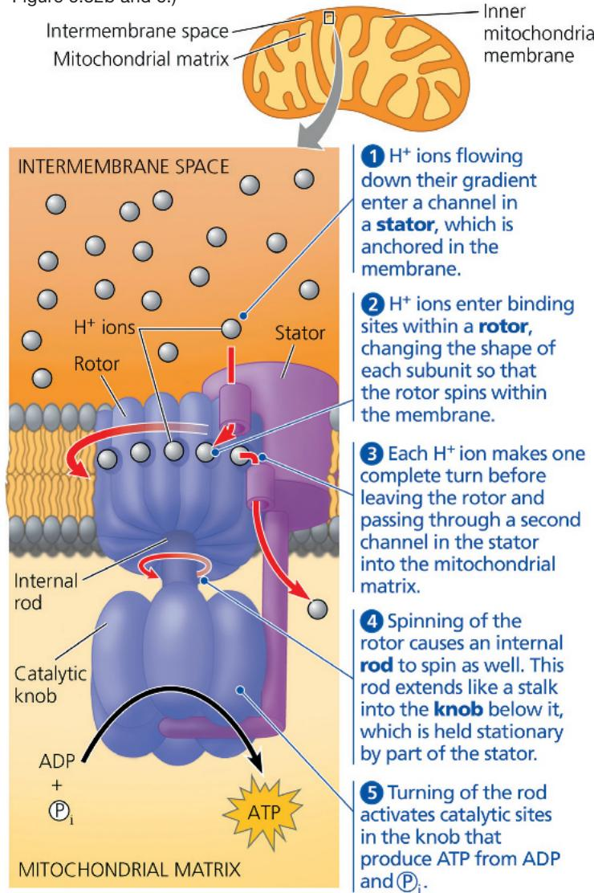

stored in the form of a hydrogen ion gradient across a membrane is used to drive cellular work such as the synthesis of ATP, is called chemiosmosis (from the Greek osmos, push). The word osmosis was previously used in discussing water transport, but here it refers to the flow of $H^{+}$ across a membrane.

From studying the structure of ATP synthase, scientists have learned how the flow of $H^{+}$ through this enzyme powers ATP generation. ATP synthase is a multisubunit complex with four main parts, each made up of multiple polypeptides (see Figure 9.13). Protons move one by one into binding sites on the rotor, causing it to spin in a way that catalyzes ATP production from ADP and $P_{i}$ . The flow of protons thus behaves somewhat like a rushing stream that turns a waterwheel. ATP synthase is the smallest molecular rotary motor known in nature.

Figure 9.14 Chemiosmosis couples the electron transport chain to ATP synthesis.

1 NADH and FADH $_2$ shuttle high-energy electrons extracted from food during glycolysis and the citric acid cycle into an electron transport chain built into the inner mitochondrial membrane. (See Figure 6.32b.) The gold arrows trace the transport of electrons, which are finally passed to a terminal acceptor (O $_2$ , in the case of aerobic respiration) at the “downhill” end of the chain, forming water. Most of the electron carriers of the chain are grouped into four complexes (I–IV). Two mobile carriers, ubiquinone (Q) and cytochrome c (Cyt c), move rapidly, ferrying electrons between the large complexes. As the complexes shuttle electrons, they pump protons

How does the inner mitochondrial membrane (or the prokaryotic plasma membrane) generate and maintain the $H^{+}$ gradient that drives ATP synthesis by the ATP synthase protein complex? Establishing the $H^{+}$ gradient is a major function of the electron transport chain, which is shown in its mitochondrial location in Figure 9.14. The chain is an energy converter that uses the exergonic flow of electrons from NADH and $FADH_{2}$ to pump $H^{+}$ across the membrane, from the mitochondrial matrix into the intermembrane space. The $H^{+}$ has a tendency to move back across the membrane, diffusing down its gradient. And the ATP synthases are the only sites that provide a route through the membrane for $H^{+}$ . As we described previously, the passage of $H^{+}$ through ATP synthase uses the exergonic flow of $H^{+}$ to drive the phosphorylation of ADP. Thus, the energy stored in an $H^{+}$

from the mitochondrial matrix into the intermembrane space. FADH $_{2}$ deposits its electrons via complex II and so results in fewer protons being pumped into the intermembrane space than occurs with NADH. Chemical energy originally harvested from food is transformed into a proton-motive force, a gradient of H $^{+}$ across the membrane. ② During chemiosmosis, the protons flow back down their gradient through ATP synthase, which is built into the membrane nearby. The ATP synthase harnesses the proton-motive force to phosphorylate ADP, forming ATP. Together, electron transport and chemiosmosis make up oxidative phosphorylation.

  
WHAT IF? If complex IV were nonfunctional, could chemiosmosis produce any ATP, and if so, how would the rate of synthesis differ?
For suggested answer, see Appendix A.

gradient across a membrane couples the redox reactions of the electron transport chain to ATP synthesis.

At this point, you may be wondering how the electron transport chain pumps hydrogen ions into the intermembrane space. Researchers have found that certain members of the electron transport chain accept and release protons ( $H^{+}$ ) along with electrons. (The aqueous solutions inside and surrounding the cell are a ready source of $H^{+}$ .) At certain steps along the chain, electron transfers cause $H^{+}$ to be taken up and released into the surrounding solution. In eukaryotic cells, the electron carriers are spatially arranged in the inner mitochondrial membrane in such a way that $H^{+}$ is accepted from the mitochondrial matrix and deposited in the intermembrane space (see Figure 9.14). The $H^{+}$ gradient that results is referred to as a proton-motive force, emphasizing the capacity of the gradient to perform work. The force drives $H^{+}$ back across the membrane through the $H^{+}$ channels provided by ATP synthases.

In general terms, chemiosmosis is an energy-coupling mechanism that uses energy stored in the form of an $H^{+}$ gradient across a membrane to drive cellular work. In mitochondria, the energy for gradient formation comes from exergonic redox reactions along the electron transport chain, and ATP synthesis is the work performed. But chemiosmosis also occurs elsewhere and in other variations. Chloroplasts use chemiosmosis to generate ATP during photosynthesis; in these organelles, light (rather than chemical energy) drives both electron flow down an electron transport chain and the resulting $H^{+}$ gradient formation. Prokaryotic organisms, as already mentioned, generate $H^{+}$ gradients across their plasma membranes. They then tap the proton-motive force not only to make ATP inside the cell but also to rotate their flagella and to pump nutrients and waste products across the membrane. Because of its central importance to energy conversions in prokaryotic and eukaryotic cells, chemiosmosis has helped unify the study of bioenergetics. Peter Mitchell was awarded the Nobel Prize in 1978 for originally proposing the chemiosmotic model.

## An Accounting of ATP Production by Cellular Respiration

In the last few sections, we have looked rather closely at the key processes of cellular respiration. Now let's take a step back and remind ourselves of its overall function: harvesting the energy of glucose for ATP synthesis.

During respiration, most energy flows in this sequence: glucose $\rightarrow$ NADH $\rightarrow$ electron transport chain $\rightarrow$ proton-motive force $\rightarrow$ ATP. We can do some bookkeeping to calculate the ATP profit when cellular respiration oxidizes a molecule of glucose to six molecules of carbon dioxide. The three main departments of this metabolic enterprise are glycolysis, pyruvate oxidation and the citric acid cycle, and the electron transport chain, which drives oxidative phosphorylation. Figure 9.15 gives a detailed accounting of the ATP yield for each glucose molecule that is oxidized. The tally adds the 4 ATP produced directly by substrate-level phosphorylation during glycolysis and the citric acid cycle to the many more molecules of ATP generated by oxidative phosphorylation. Each NADH that transfers a pair of electrons from glucose to the electron transport chain contributes enough to the proton-motive force to generate a maximum of about 3 ATP.

Figure 9.15 ATP yield per molecule of glucose at each stage of cellular respiration.  
  
VISUAL SKILLS After reading the discussion in the text, explain exactly how the total of 26 or 28 ATP from oxidative phosphorylation was calculated (see the yellow bar with the ATP numbers).  
For suggested answers, see Appendix A.

Why are the numbers in Figure 9.15 inexact? There are three reasons we cannot state an exact number of ATP molecules generated by the breakdown of one molecule of glucose. First, phosphorylation and the redox reactions are not directly coupled to each other, so the ratio of the number of NADH molecules to the number of ATP molecules is not a whole number. We know that 1 NADH results in $10\ H^{+}$ being transported out across the inner mitochondrial membrane, but the exact number of $H^{+}$ that must reenter the mitochondrial matrix via ATP synthase to generate 1 ATP has long been debated. Based on experimental data, however, most biochemists now agree that the most accurate number is $4\ H^{+}$ . Therefore, a single molecule of NADH generates enough proton-motive force for the synthesis of 2.5 ATP. The citric acid cycle also supplies electrons to the electron transport chain via $FADH_{2}$ , but since its electrons enter later in the chain, each molecule of this electron carrier is responsible for transport of only enough $H^{+}$ for the synthesis of 1.5 ATP. These numbers also take into account the slight energetic cost of moving the ATP formed in the mitochondrion out into the cytosol, where it will be used.

Second, the ATP yield varies slightly depending on the type of shuttle used to transport electrons from the cytosol into the mitochondrion. The mitochondrial inner membrane is not permeable to NADH, so NADH in the cytosol is segregated from the machinery of oxidative phosphorylation. The 2 electrons of NADH captured in glycolysis must be conveyed into the mitochondrion by one of several electron shuttle systems. Depending on the kind of shuttle in a particular cell type, the electrons are passed either to $NAD^{+}$ or to FAD in the mitochondrial matrix (see Figures 9.14 and 9.15). If the electrons are passed to FAD, as in brain cells, only about 1.5 ATP can result from each NADH that was originally generated in the cytosol. If the electrons are passed to mitochondrial $NAD^{+}$ , as in liver cells and heart cells, the yield is about 2.5 ATP per NADH.

A third variable that reduces the yield of ATP is the use of the proton-motive force generated by the redox reactions of respiration to drive other kinds of work. For example, the proton-motive force powers the mitochondrion's uptake of pyruvate from the cytosol (see Figure 9.9). However, if all the proton-motive force generated by the electron transport chain were used to drive ATP synthesis, one glucose molecule could generate a maximum of 28 ATP produced by oxidative phosphorylation plus 4 ATP (net) from substrate-level phosphorylation to give a total yield of about 32 ATP (or only about 30 ATP if the less efficient shuttle were functioning).

We can now roughly estimate the efficiency of respiration—that is, the percentage of chemical energy in glucose that has been transferred to ATP. Recall that the complete oxidation of a mole of glucose releases 686 kcal of energy under standard conditions ( $\Delta G = -686$ kcal/mol). Phosphorylation of ADP to form ATP stores at least 7.3 kcal per mole of ATP. Therefore, the efficiency of respiration is 7.3 kcal per mole of ATP times 32 moles of ATP per mole of glucose divided by 68 kcal per mole of glucose, which equals 0.34. Thus, about 34% of the potential chemical energy in glucose has been transferred to ATP; the actual percentage is bound to vary as $\Delta G$ varies under different cellular conditions. Cellular respiration is remarkably efficient in its energy conversion. By comparison, even the most efficient automobile converts only about 25% of the energy stored in gasoline to energy that moves the car.

The rest of the energy stored in glucose is lost as heat. We humans use some of this heat to maintain our relatively high body temperature ( $37^{\circ}$ C), and we dissipate the rest through sweating and other cooling mechanisms.

Surprisingly, perhaps, it may be beneficial under certain conditions to reduce the efficiency of cellular respiration. A remarkable adaptation is shown by hibernating mammals, which overwinter in a state of inactivity and lowered metabolism. Although their internal body temperature is lower than normal, it still must be kept significantly higher than the external air temperature. One type of tissue, called brown fat, is made up of cells packed full of mitochondria. The inner mitochondrial membrane contains a channel protein called the uncoupling protein that allows protons to flow back down their concentration gradient without generating ATP. Activation of these proteins in hibernating mammals results in ongoing oxidation of stored fuel (fats), generating heat without any ATP production. In the absence of such an adaptation, the buildup of ATP would eventually cause cellular respiration to be shut down by regulatory mechanisms that will be discussed later. Brown fat is also used for heat generation in humans. In the Scientific Skills Exercise, you can work with data in a related but different case where a decrease in metabolic efficiency in cells is used to generate heat.

## Concept Check 9.4

1. WHAT IF? What effect would an absence of $O_{2}$ have on the process shown in Figure 9.14?

2. WHAT IF? In the absence of $O_{2}$ , as in question 1, what do you think would happen if you decreased the pH of the intermembrane space of the mitochondrion? Explain your answer.

3. MAKE CONNECTIONS Membranes must be fluid to function properly (see Concept 7.1). How does the operation of the electron transport chain support that assertion?

For suggested answers, see Appendix A.

# Scientific Skills Exercise Making a Bar Graph and Evaluating a Hypothesis

INTERPRET THE DATA

Does Thyroid Hormone Level Affect $O_{2}$ Consumption in Cells? Some animals, such as mammals and birds, maintain a relatively constant body temperature, above that of their environment, by using heat produced as a by-product of metabolism. When the core temperature of these animals drops below an internal set point, their cells are triggered to reduce the efficiency of ATP production by the electron transport chains in mitochondria. At lower efficiency, extra fuel must be consumed to produce the same number of ATPs, generating additional heat. This response is moderated by the endocrine system, and researchers hypothesized that it might be triggered by thyroid hormone. In this exercise, you will use a bar graph to visualize data from an experiment that compared the metabolic rates (by measuring $O_{2}$ consumption) in mitochondria of cells from animals with different levels of thyroid hormone.

How the Experiment Was Done Liver cells were isolated from sibling rats that had low, normal, or elevated thyroid hormone levels. The oxygen consumption rate due to activity of the mitochondrial electron transport chains of each type of cell was measured under controlled conditions.

## Data from the Experiment

<table><tr><td>Thyroid Hormone Level</td><td>Oxygen Consumption Rate [nmol  $O_2$ /(min·mg cells)]</td></tr><tr><td>Low</td><td>4.3</td></tr><tr><td>Normal</td><td>4.8</td></tr><tr><td>Elevated</td><td>8.7</td></tr></table>

Data from M. E. Harper and M. D. Brand, The quantitative contributions of mitochondrial proton leak and ATP turnover reactions to the changed respiration rates of hepatocytes from rats of different thyroid status, Journal of Biological Chemistry 268:14850–14860 (1993).

## Concept 9.5: Fermentation and anaerobic respiration enable cells to produce ATP without the use of oxygen

Because most of the ATP generated by cellular respiration is due to the work of oxidative phosphorylation, our estimate of ATP yield from aerobic respiration depends on an adequate supply of $O_{2}$ to the cell. Without the electronegative oxygen

1. To visualize any differences in $O_{2}$ consumption between cell types, it will be useful to graph the data in a bar graph. First, set up the axes. (a) What is the independent variable (intentionally varied by the researchers), which goes on the x-axis? List the categories along the x-axis;

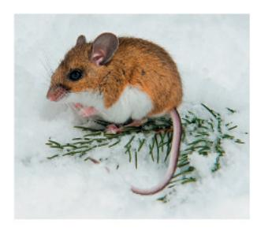

because they are discrete rather than continuous, you can list them in any order. (b) What is the dependent variable (measured by the researchers), which goes on the y-axis? (c) What units (abbreviated) should go on the y-axis? Label the y-axis, including the units specified in the data table. Determine the range of values of the data that will need to go on the y-axis. What is the largest value? Draw evenly spaced tick marks and label them, starting with 0 at the bottom.

2. Graph the data for each sample. Match each x-value with its y-value and place a mark on the graph at that coordinate, then draw a bar from the x-axis up to the correct height for each sample. Why is a bar graph more appropriate than a scatter plot or line graph? (For additional information about graphs, see the Scientific Skills Review in Appendix D.)

3. Examine your graph and look for a pattern in the data. (a) Which cell type had the highest rate of $O_{2}$ consumption, and which had the lowest? (b) Does this support the researchers' hypothesis? Explain. (c) Based on what you know about mitochondrial electron transport and heat production, predict which rats had the highest, and which had the lowest, body temperature.

Instructors: A version of this Scientific Skills Exercise can be assigned in Mastering Biology.

atoms in $O_{2}$ to pull electrons down the transport chain, oxidative phosphorylation eventually ceases. However, there are two general mechanisms by which certain cells can oxidize organic fuel and generate ATP without the use of $O_{2}$ : anaerobic respiration and fermentation. The distinction between these two is that an electron transport chain is used in anaerobic respiration but not in fermentation. (The electron transport chain is also called the respiratory chain because of its role in both types of cellular respiration.)

We have already mentioned anaerobic respiration, which takes place in certain prokaryotic organisms that live in environments without $O_{2}$ . These organisms have an electron transport chain but do not use $O_{2}$ as a final electron acceptor at the end of the chain.

$O_{2}$ performs this function very well because it consists of two extremely electronegative atoms, but other substances can also serve as final electron acceptors. Some “sulfate-reducing” marine bacteria, for instance, use the sulfate ion ( $SO_{4}^{2-}$ ) at the end of their respiratory chain. Operation of the chain builds up a proton-motive force used to produce ATP, but $H_{2}S$ (hydrogen sulfide) is made as a by-product rather than water. The rotten-egg odor you may have smelled while walking through a salt marsh or a mudflat signals the presence of sulfate-reducing bacteria.

Fermentation is a way of harvesting chemical energy without using either $O_{2}$ or any electron transport chain—in other words, without cellular respiration. How can food be oxidized without cellular respiration? Remember, oxidation simply refers to the loss of electrons to an electron acceptor, so it does not need to involve $O_{2}$ . Glycolysis oxidizes glucose to two molecules of pyruvate. The oxidizing agent of glycolysis is $NAD^{+}$ , and neither $O_{2}$ nor any electron transfer chain is involved. Overall, glycolysis is exergonic, and some of the energy made available is used to produce 2 ATP (net) by substrate-level phosphorylation. If $O_{2}$ is present, then additional ATP is made by oxidative phosphorylation when NADH passes electrons removed from glucose to the electron transport chain. But glycolysis generates 2 ATP whether oxygen is present or not—that is, whether conditions are aerobic or anaerobic.

As an alternative to respiratory oxidation of organic nutrients, fermentation is an extension of glycolysis that allows continuous generation of ATP by the substrate-level phosphorylation of glycolysis. For this to occur, there must be a sufficient supply of $NAD^{+}$ to accept electrons during the oxidation step of glycolysis. Without some mechanism to recycle $NAD^{+}$ from NADH, glycolysis would soon deplete the cell's pool of $NAD^{+}$ by reducing it all to NADH and would shut itself down for lack of an oxidizing agent. Under aerobic conditions, $NAD^{+}$ is recycled from NADH by the transfer of electrons to the electron transport chain. An anaerobic alternative is to transfer electrons from NADH to pyruvate, the end product of glycolysis.

## Types of Fermentation

Fermentation consists of glycolysis plus reactions that regenerate $NAD^{+}$ by transferring electrons from NADH to pyruvate or derivatives of pyruvate. The $NAD^{+}$ can then be reused to oxidize sugar by glycolysis, which nets two molecules of ATP by substrate-level phosphorylation. There are many types of fermentation, differing in the end products formed from pyruvate. Two types are alcohol fermentation and lactic acid fermentation, and both are harnessed by humans for food and industrial production.

In alcohol fermentation (Figure 9.16a), pyruvate is converted to ethanol (ethyl alcohol) in two steps. The first step releases $\mathrm{CO}_{2}$ from the pyruvate, which is converted to the two-carbon compound acetaldehyde. In the second step, acetaldehyde is reduced by NADH to ethanol. This regenerates the supply of $\mathrm{NAD^{+}}$ needed for the continuation of glycolysis. Many bacteria carry out alcohol fermentation under anaerobic conditions. Yeast (a fungus), in addition to aerobic respiration, also carries out alcohol fermentation. For thousands of years, humans have used yeast in brewing, winemaking, and baking. The $\mathrm{CO}_{2}$ bubbles generated by baker's yeast during alcohol fermentation allow bread to rise.

Figure 9.16 Fermentation.

In the absence of oxygen, many cells use fermentation to produce ATP by substrate-level phosphorylation. NAD $^{+}$ is regenerated for use in glycolysis when pyruvate, the end product of glycolysis, serves as an electron acceptor for oxidizing NADH. Two of the common end products formed from fermentation are (a) ethanol and (b) lactate, the ionized form of lactic acid.

(a) Alcohol fermentation  

During lactic acid fermentation (Figure 9.16b), pyruvate is reduced directly by NADH to form lactate as an end product,

regenerating $NAD^{+}$ with no release of $CO_{2}$ . (Lactate is the ionized form of lactic acid.) Lactic acid fermentation by certain fungi and bacteria is used in the dairy industry to make cheese and yogurt. A complex series of fermentation and aerobic respiration pathways carried out by yeasts and bacteria on cacao beans is responsible for the production of chocolate.

Cacao beans and fruits  

What about lactate production in humans? Previously, we thought that human muscle cells only produced lactate when $O_{2}$ was in short supply, such as during intense exercise. Research done over the last few decades, though, indicates that the lactate story, in mammals at least, is more complicated. There are two types of skeletal muscle fibers. One (red muscle) preferentially oxidizes glucose completely to $CO_{2}$ ; the other (white muscle) produces significant amounts of lactate from the pyruvate made during glycolysis, even under aerobic conditions, offering fast but energetically inefficient ATP production. The lactate product is then mostly oxidized by red muscle cells in the vicinity, with the remainder exported to liver or kidney cells for glucose formation. Because this lactate production is not anaerobic, but the result of glycolysis in these cells, exercise physiologists prefer not to use the term “fermentation.”

During strenuous exercise, when carbohydrate catabolism outpaces the supply of $\mathrm{O}_2$ from the blood to the muscle, lactate can't be oxidized to pyruvate. The lactate that accumulates was once thought to cause muscle fatigue during intense exercise and pain a day or so later. However, research suggests that, contrary to popular opinion, lactate production actually improves performance during exercise! Furthermore, within an hour, excess lactate is shuttled to other tissues for oxidation or to the liver and kidneys for production of glucose or its storage molecule, glycogen. (Next-day muscle soreness is more likely caused by trauma to cells in small muscle fibers, which leads to inflammation and pain.)

## Comparing Fermentation with Anaerobic and Aerobic Respiration

Fermentation, anaerobic respiration, and aerobic respiration are three alternative cellular pathways for producing ATP by harvesting the chemical energy of food. All three use glycolysis to oxidize glucose and other organic fuels to pyruvate, with a net production of 2 ATP by substrate-level phosphorylation. And in all three pathways, NAD $^{+}$ is the oxidizing agent that accepts electrons from food during glycolysis.

A key difference is the contrasting mechanisms for oxidizing NADH back to $NAD^{+}$ , which is required to sustain glycolysis. In fermentation, the final electron acceptor is an organic molecule such as pyruvate (lactic acid fermentation) or acetaldehyde (alcohol fermentation). In cellular respiration, by contrast, electrons carried by NADH are transferred to an electron transport chain, which regenerates the $NAD^{+}$ required for glycolysis.

Another major difference is the amount of ATP produced. Fermentation yields two molecules of ATP, produced by substrate-level phosphorylation. In the absence of an electron transport chain, the energy stored in pyruvate is unavailable. In cellular respiration, however, pyruvate is completely oxidized in the mitochondrion. Most of the chemical energy from this process is shuttled by NADH and $FADH_{2}$ in the form of electrons to the electron transport chain. There, the electrons move stepwise down a series of redox reactions to a final electron acceptor. [In aerobic respiration, the final electron acceptor is $O_{2}$ ; in anaerobic respiration, the final acceptor is another molecule with a high affinity for electrons (and thus a good electron acceptor), although less so than $O_{2}$ .] Stepwise electron transport drives oxidative

Figure 9.17 Pyruvate as a key juncture in catabolism.

Glycolysis is common to fermentation and cellular respiration. The end product of glycolysis, pyruvate, represents a fork in the catabolic pathways of glucose oxidation. In facultative anaerobes, such as yeasts, which are capable of both aerobic cellular respiration and fermentation, pyruvate is committed to one of those two pathways, usually depending on whether or not oxygen is present.

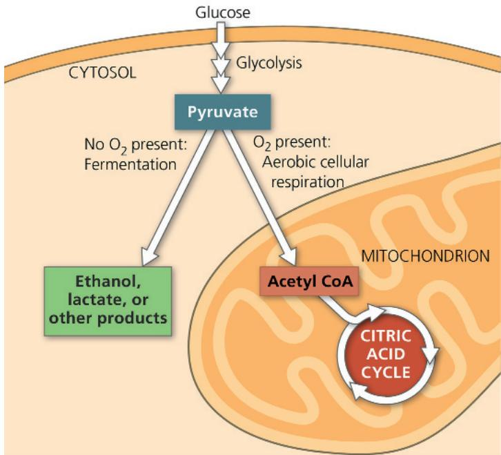

phosphorylation, yielding ATP. Thus, cellular respiration harvests much more energy from each sugar molecule than fermentation can. In fact, aerobic respiration yields up to 32 molecules of ATP per glucose molecule—up to 16 times as much as does fermentation.

Some organisms, called obligate anaerobes, carry out only fermentation or anaerobic respiration. In fact, these organisms cannot survive in the presence of oxygen, some forms of which can actually be toxic if protective systems are not present in the cell. A few cell types, such as cells of the vertebrate brain, can carry out only aerobic oxidation of pyruvate, and need $O_{2}$ to survive. Other organisms, including yeasts and many bacteria, can make enough ATP to survive using either fermentation or respiration. Such species are called facultative anaerobes. In yeast cells, for example, pyruvate is a fork in the metabolic road that leads to two alternative catabolic routes (Figure 9.17). Under aerobic conditions, pyruvate can be converted to acetyl CoA, and oxidation continues in the citric acid cycle via aerobic respiration. Under anaerobic conditions, lactic acid fermentation occurs. Pyruvate is diverted from the citric acid cycle, serving instead as an electron acceptor to recycle $NAD^{+}$ . To make the same amount of ATP, a facultative anaerobe has to consume sugar at a much faster rate when fermenting than when respiring.

## The Evolutionary Significance of Glycolysis

EVOLUTION The role of glycolysis in both fermentation and respiration has an evolutionary basis. Ancient prokaryotic organisms are thought to have used glycolysis to make ATP long before

oxygen was present in Earth's atmosphere. The oldest known fossils of bacteria date back 3.5 billion years, but appreciable quantities of oxygen probably did not begin to accumulate in the atmosphere until about 2.7 billion years ago. Cyanobacteria produced this $\mathrm{O}_2$ as a by-product of photosynthesis. Therefore, early prokaryotic organisms may have generated ATP exclusively from glycolysis. The fact that glycolysis is today the most widespread metabolic pathway among Earth's organisms suggests that it evolved very early in the history of life. The cytosolic location of glycolysis also implies great antiquity; the pathway does not require any of the membrane-enclosed organelles of the eukaryotic cell, which evolved approximately 1 billion years after the first prokaryotic cell. Glycolysis is a metabolic heirloom from early cells that continues to function in fermentation and as the first stage in the breakdown of organic molecules by respiration.

## Concept Check 9.5

1. Consider the NADH formed during glycolysis. What is the final acceptor for its electrons during fermentation? During aerobic respiration? During anaerobic respiration?

2. WHAT IF? A glucose-fed yeast cell is moved from an aerobic environment to an anaerobic one. How would its rate of glucose consumption change if ATP were to be generated at the same rate?

For suggested answers, see Appendix A.

## Concept 9.6: Glycolysis and the citric acid cycle connect to many other metabolic pathways

So far, we have looked at the oxidative breakdown of glucose in isolation from the cell's overall metabolic economy. In this section, you will learn that glycolysis and the citric acid cycle are major intersections of the cell's catabolic (breakdown) and anabolic (biosynthetic) pathways.

## The Versatility of Catabolism

Throughout this chapter, glucose has been used as an example of a fuel for cellular respiration. But free glucose molecules are not common in the diets of humans and other animals. We obtain most of our calories in the form of fats, proteins, and carbohydrates such as sucrose and other disaccharides, and starch, a polysaccharide. All these organic molecules in food can be used by cellular respiration to make ATP (Figure 9.18).

Glycolysis can accept a wide range of carbohydrates for catabolism. In the digestive tract, starch is hydrolyzed to glucose, which is broken down in cells by glycolysis and the citric acid cycle. Glycogen, the polysaccharide that humans and many other animals store in their liver and muscle cells, can be hydrolyzed to glucose between meals as fuel for respiration. Digestion of disaccharides, including sucrose, provides glucose and other monosaccharides as fuel for respiration.

Figure 9.18 The catabolism of various molecules from food. Carbohydrates, fats, and proteins can all be used as fuel for cellular respiration. Monomers of these molecules enter glycolysis or the citric acid cycle at various points. Glycolysis and the citric acid cycle are catabolic funnels through which electrons from all kinds of organic molecules flow on their exergonic fall to oxygen.  
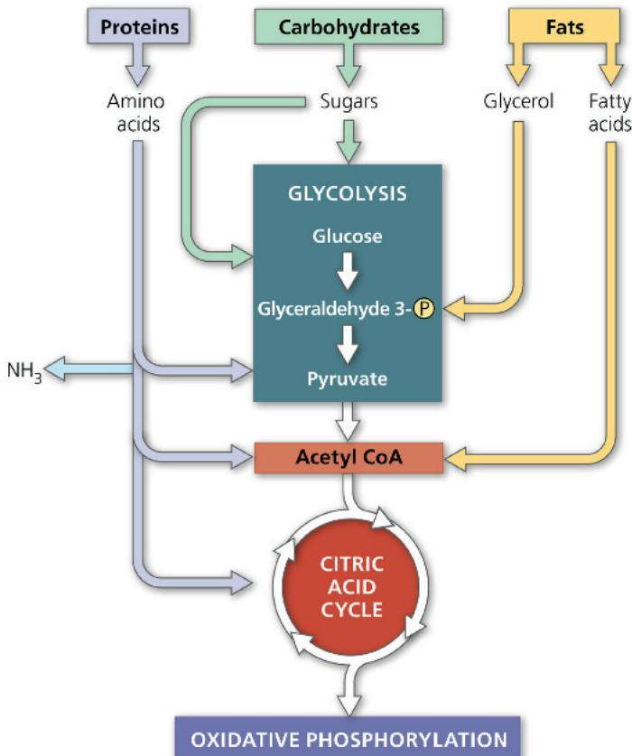

Proteins can also be used for fuel, but first they must be digested to their constituent amino acids. Many of the amino acids are used by the organism to build new proteins. Amino acids present in excess are converted by enzymes to intermediates of glycolysis and the citric acid cycle. Before amino acids can feed into glycolysis or the citric acid cycle, their amino groups must be removed, a process called deamination. The nitrogenous waste is excreted from the animal in the form of ammonia ( $NH_{3}$ ), urea, or other waste products.

Catabolism can also harvest energy stored in fats obtained either from food or from fat cells in the body. After fats are digested to glycerol and fatty acids, the glycerol is converted to glyceraldehyde 3-phosphate, an intermediate of glycolysis. Most of the energy of a fat is stored in the fatty acids. A metabolic sequence called beta oxidation breaks the fatty acids down to two-carbon fragments, which enter the citric acid cycle as acetyl CoA. NADH and FADH $_{2}$ are also generated during beta oxidation; they can enter the electron transport chain, leading to further ATP production. Fats make excellent fuels, in large part due to their chemical structure and the high energy level of their electrons (present in many C—H bonds, equally

shared between C and H) compared to those of carbohydrates. A gram of fat oxidized by respiration produces more than twice as much ATP as a gram of carbohydrate. Unfortunately, this also means that a person trying to lose weight must work hard to use up fat stored in the body because so many calories are stockpiled in each gram of fat.

## Biosynthesis (Anabolic Pathways)

Cells need substance as well as energy. Not all the organic molecules of food are destined to be oxidized as fuel to make ATP. In addition to calories, food must also provide the carbon skeletons that cells require to make their own molecules. Some organic monomers obtained from digestion can be used directly. For example, as previously mentioned, amino acids from the hydrolysis of proteins in food can be incorporated into the organism's own proteins. Often, however, the body needs specific molecules that are not present as such in food. Compounds formed as intermediates of glycolysis and the citric acid cycle can be diverted into anabolic pathways as precursors from which the cell can synthesize the molecules it requires. For example, humans can make about half of the 20 amino acids in proteins by modifying compounds siphoned away from the citric acid cycle; the rest are “essential amino acids” that must be obtained in the diet. Also, glucose can be made from pyruvate, and fatty acids can be synthesized from acetyl CoA. Of course, these anabolic, or biosynthetic, pathways do not generate ATP, but instead consume it.

In addition, glycolysis and the citric acid cycle function as metabolic interchanges that enable our cells to convert some kinds of molecules to others as we need them. For example, an intermediate compound generated during glycolysis, dihydroxyacetone phosphate (see Figure 9.8, step 5), can be converted to one of the major precursors of fats. If we eat more food than we need, we store fat even if our diet is fat-free. Metabolism is remarkably versatile and adaptable.

## Regulation of Cellular Respiration via Feedback Mechanisms

Basic principles of supply and demand regulate the metabolic economy. The cell does not waste energy making more of a particular substance than it needs. If there is a surplus of a certain amino acid, for example, the anabolic pathway that synthesizes that amino acid from an intermediate of the citric acid cycle is switched off. The most common mechanism for this control is feedback inhibition: The end product of the anabolic pathway inhibits the enzyme that catalyzes an early step of the pathway (see Figure 8.21). This prevents the needless diversion of key metabolic intermediates from uses that are more urgent.

The cell also controls its catabolism. If the cell is working hard and its ATP concentration begins to drop, cellular respiration speeds up. When there is plenty of ATP to meet demand, respiration slows down, sparing valuable organic molecules for other functions. Again, control is based mainly on regulating the activity of enzymes at strategic points in the catabolic pathway. As shown in Figure 9.19, one important switch is phosphofructokinase, the enzyme that catalyzes step 3 of glycolysis (see Figure 9.8). That is the first step

Figure 9.19 The control of cellular respiration.

Allosteric enzymes at certain points in the respiratory pathway respond to inhibitors and activators that help set the pace of glycolysis and the citric acid cycle. Phosphofructokinase, which catalyzes an early step in glycolysis (see Figure 9.8, ③ and Figure 6.32b), is one such enzyme. It is stimulated by AMP (derived from ADP) but is inhibited by ATP and by citrate. This feedback regulation adjusts the rate of respiration as the cell's catabolic and anabolic demands change.

that commits the substrate irreversibly to the glycolytic pathway. By controlling the rate of this step, the cell can speed up or slow down the entire catabolic process. Phosphofructokinase can thus be considered the pacemaker of cellular respiration.

Phosphofructokinase is an allosteric enzyme with receptor sites for specific inhibitors and activators. It is inhibited by ATP and stimulated by AMP (adenosine monophosphate), which the cell derives from ADP. As ATP accumulates, inhibition of the enzyme slows down glycolysis. The enzyme becomes active again as cellular work converts ATP to ADP (and AMP) faster than ATP is being regenerated. Phosphofructokinase is also sensitive to citrate, the first product of the citric acid cycle. If citrate accumulates in mitochondria, some of it passes into the cytosol and inhibits phosphofructokinase. This mechanism helps synchronize the rates of glycolysis and the citric acid cycle. As citrate accumulates, glycolysis slows down, and the supply of

pyruvate and thus acetyl groups to the citric acid cycle decreases. If citrate consumption increases, either because of a demand for more ATP or because anabolic pathways are draining off intermediates of the citric acid cycle, glycolysis accelerates and meets the demand. Metabolic balance is augmented by the control of enzymes that catalyze other key steps of glycolysis and the citric acid cycle. Cells are thrifty, expedient, and responsive in their metabolism.

Review the first page of this chapter to put cellular respiration into the broader context of energy flow and chemical cycling in ecosystems. The energy that keeps us alive is released, not produced, by cellular respiration. We are tapping energy that was stored in food by photosynthesis, which captures light and converts it to chemical energy, a process you will learn about next, in Chapter 10.

## Chapter 9 Review

## Summary of Key Concepts

To review key terms, go to the Vocabulary Self-Quiz (eTextbook only).

Concept 9.1: Catabolic pathways yield energy by oxidizing organic fuels

\- Cells break down glucose and other organic fuels to yield chemical energy in the form of ATP. Fermentation is a process that results in the partial degradation of glucose without the use of oxygen ( $O_{2}$ ). The process of cellular respiration is a more complete breakdown of glucose. In aerobic respiration, $O_{2}$ is used as a reactant; in anaerobic respiration, other substances are used in place of $O_{2}$ .

\- The cell taps the energy stored in food molecules through redox reactions, in which one substance partially or totally shifts electrons to another. Oxidation is the total or partial loss of electrons, while reduction is the total or partial addition of electrons. During aerobic respiration, glucose $\left(\mathrm{C}_{6}\mathrm{H}_{12}\mathrm{O}_{6}\right)$ is oxidized to $CO_{2}$ , and $O_{2}$ is reduced to $H_{2}O$ :

$$
\mathrm{C} _ {6} \mathrm{H} _ {1 2} \mathrm{O} _ {6} + 6 \mathrm{O} _ {2} \longrightarrow 6 \mathrm{CO} _ {2} + 6 \mathrm{H} _ {2} \mathrm{O} + \text {   becomes   oxidized   } \text {   becomes   reduced   }
$$

\- Electrons lose potential energy during their transfer from glucose or other organic compounds to $O_{2}$ . Electrons are usually passed first to $NAD^{+}$ , reducing it to NADH, and are then passed from NADH to an electron transport chain, which conducts the electrons to $O_{2}$ in energy-releasing steps. The energy that is released is used to make ATP.

\- Aerobic respiration occurs in three stages: (1) glycolysis, (2) pyruvate oxidation and the citric acid cycle, and (3) oxidative phosphorylation (electron transport and chemiosmosis).

Describe the difference between the two processes in cellular respiration that produce ATP: oxidative phosphorylation and substrate-level phosphorylation.

## Concept Check 9.6

1. MAKE CONNECTIONS Compare the structures of a carbohydrate and a fat (see Figures 5.3 and 5.9). What features make fat a much better fuel?

2. Under what circumstances might your body synthesize fat molecules?

3. VISUAL SKILLS What will happen in a muscle cell that has used up its supply of $O_{2}$ and ATP? (Review Figures 9.17 and 9.19.)

4. VISUAL SKILLS During intense exercise, can a muscle cell use fat as a concentrated source of chemical energy? Explain. (Review Figures 9.17 and 9.18.)

For suggested answers, see Appendix A.

## Concept 9.2: Glycolysis harvests chemical energy by oxidizing glucose to pyruvate

\- Glycolysis (“splitting of sugar”) is a series of reactions that breaks down glucose into two pyruvate molecules, which may go on to enter the citric acid cycle, and nets 2 ATP and 2 NADH per glucose molecule.

  
Which reactions in glycolysis are the source of energy for the formation of ATP and NADH?

Concept 9.3: After pyruvate is oxidized, the citric acid cycle completes the energy-yielding oxidation of organic molecules

\- In eukaryotic cells, pyruvate enters the mitochondrion and is oxidized to acetyl CoA, which is further oxidized in the citric acid cycle.

  
What molecular products indicate the complete oxidation of glucose during cellular respiration?

## Concept 9.4: During oxidative phosphorylation, chemiosmosis couples electron transport to ATP synthesis

\- NADH and $FADH_{2}$ transfer electrons to the electron transport chain. Electrons move down the chain, losing energy in several energy-releasing steps. Finally, electrons are passed to $O_{2}$ , reducing it to $H_{2}O$ .

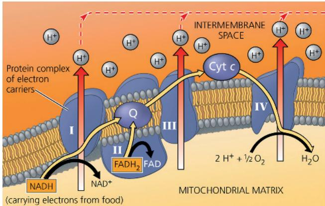  
MITOCHONDRIAL MATRIX  
(carrying electrons from food)

\- Along the electron transport chain, electron transfer causes protein complexes to move $H^{+}$ from the mitochondrial matrix (in eukaryotes) to the intermembrane space, storing energy as a proton-motive force ( $H^{+}$ gradient). As $H^{+}$ diffuses back into the matrix through ATP synthase, its passage drives the phosphorylation of ADP to form ATP, called chemiosmosis.

\- About 34% of the energy stored in a glucose molecule is transferred to ATP during cellular

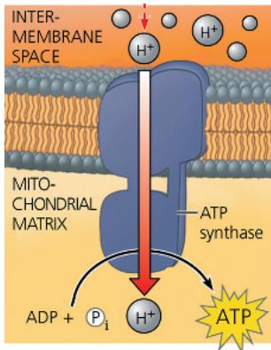

respiration, producing a maximum of about 32 ATP.

Briefly explain the mechanism by which ATP synthase produces ATP. List three locations in which ATP synthases are found.

## Concept 9.5: Fermentation and anaerobic respiration enable cells to produce ATP without the use of oxygen

\- Glycolysis nets 2 ATP by substrate-level phosphorylation, whether $O_{2}$ is present or not. Under anaerobic conditions, anaerobic respiration or fermentation can take place. In anaerobic respiration, an electron transport chain is present with a final electron acceptor other than oxygen. In fermentation, the electrons from NADH are passed to pyruvate or a derivative of pyruvate, regenerating the $NAD^{+}$ required to oxidize more glucose. Two common types of fermentation are alcohol fermentation and lactic acid fermentation.

\- Fermentation, anaerobic respiration, and aerobic respiration all use glycolysis to oxidize glucose, but they differ in their final electron acceptor and whether an electron transport chain is used (respiration) or not (fermentation). Respiration yields more ATP; aerobic respiration, with $O_{2}$ as the final

electron acceptor, yields about 16 times as much ATP as does fermentation.

\- Glycolysis occurs in nearly all organisms and is thought to have evolved in ancient prokaryotic species before there was $O_{2}$ in the atmosphere.

Which process yields more ATP, fermentation or anaerobic respiration? Explain.

## Concept 9.6: Glycolysis and the citric acid cycle connect to many other metabolic pathways

\- Catabolic pathways funnel electrons from many kinds of organic molecules into cellular respiration. Many carbohydrates can enter glycolysis, most often after conversion to glucose. Amino acids of proteins must be deaminated before being oxidized. The fatty acids of fats undergo beta oxidation to two-carbon fragments and then enter the citric acid cycle as acetyl CoA. Anabolic pathways can use small molecules from food directly or build other substances using intermediates of glycolysis or the citric acid cycle.

\- Cellular respiration is controlled by allosteric enzymes at key points in glycolysis and the citric acid cycle.

Describe how the catabolic pathways of glycolysis and the citric acid cycle intersect with anabolic pathways in the metabolism of a cell.

For suggested answers, see Appendix A.

## Test Your Understanding

For more multiple-choice questions, go to the Practice Test (eTextbook only).

## Levels 1-2: Remembering/Understanding

1. The immediate energy source that drives ATP synthesis by ATP synthase during oxidative phosphorylation is the

(A) oxidation of glucose and other organic compounds.

(B) flow of electrons down the electron transport chain.

(C) $H^{+}$ concentration gradient across the membrane holding ATP synthase.

(D) transfer of phosphate to ADP.

2. Which metabolic pathway is common to both fermentation and cellular respiration of a glucose molecule?

(A) the citric acid cycle

(B) the electron transport chain

(C) glycolysis

(D) reduction of pyruvate to lactate

3. The final electron acceptor of the electron transport chain that functions in aerobic oxidative phosphorylation is

(A) $O_{2}$ .

(B) water.

(C) $NAD^{+}$ .

(D) pyruvate.

4. In mitochondria, exergonic redox reactions

(A) are the source of energy driving prokaryotic ATP synthesis.

(B) provide the energy that establishes the proton gradient.

(C) reduce carbon atoms to carbon dioxide.

(D) are coupled via phosphorylated intermediates to endergonic processes.

## Levels 3-4: Applying/Analyzing

5. What is the oxidizing agent in the following reaction?
Pyruvate + NADH + H $^{+}$ → Lactate + NAD $^{+}$ (A) oxygen
(B) NADH
(C) lactate
(D) pyruvate

6. When electrons flow along the electron transport chains of mitochondria, which of the following changes occurs?
(A) The pH of the matrix increases.

(B) ATP synthase pumps protons by active transport.

(C) The electrons gain free energy.

(D) $NAD^{+}$ is oxidized.

7. Most $\mathrm{CO}_{2}$ from catabolism is released during (A) glycolysis. (B) the citric acid cycle. (C) lactate fermentation. (D) electron transport.

8. MAKE CONNECTIONS Step 3 in Figure 9.8 is a major point of regulation of glycolysis. The enzyme phosphofructokinase is allosterically regulated by ATP and related molecules (see Concept 8.5). Considering the overall result of glycolysis, would you expect ATP to inhibit or stimulate activity of this enzyme? Explain. (Hint: Make sure you consider the role of ATP as an allosteric regulator, not as a substrate of the enzyme.)

9. MAKE CONNECTIONS The proton pump shown in Figures 7.18 and 7.19 is a type of ATP synthase like that in Figure 9.13. Compare the processes shown in the three figures, and say whether they are involved in active or passive transport (see also Concepts 7.3 and 7.4).

10. VISUAL SKILLS This computer model shows the four parts of ATP synthase, each part consisting of a number of polypeptide subunits (the solid gray part is still an area of active research). Using Figure 9.13 as a guide, label the rotor, stator, internal rod, and catalytic knob of this molecular motor.

## Levels 5-6: Evaluating/Creating

## 11. INTERPRET THE DATA

Phosphofructokinase is an enzyme that acts on fructose 6-phosphate at an early step in glucose breakdown. Regulation of this enzyme controls whether the sugar will continue on in the glycolytic pathway. Considering this graph, under which condition is phosphofructokinase more active? Given what you know about

glycolysis and regulation of metabolism by this enzyme, explain the mechanism by which phosphofructokinase activity differs depending on ATP concentration. Explain why it makes sense that regulation of this enzyme has evolved so that it works this way.

12. DRAW IT The graph here shows the pH difference across the inner mitochondrial membrane over time in an actively respiring cell. At the time indicated by the vertical arrow, a metabolic poison is added that specifically and completely inhibits all function of mitochondrial ATP synthase. Draw what you would expect to see for the rest of the

graphed line over the next short period of time. Explain.

13. EVOLUTION CONNECTION ATP synthases are found in the prokaryotic plasma membrane and in mitochondria and chloroplasts. (a) Propose a hypothesis to account for an evolutionary relationship of these eukaryotic organelles and prokaryotic species. (b) Explain how the amino acid sequences of the ATP synthases from the different sources might either support or fail to support your hypothesis.

14. SCIENTIFIC INQUIRY In the 1930s, some physicians prescribed low doses of a compound called dinitrophenol (DNP) to help patients lose weight. This unsafe method was abandoned after some patients died. DNP uncouples the chemiosmotic machinery by making the lipid bilayer of the inner mitochondrial membrane leaky to $H^{+}$ . Explain how this could cause weight loss and death.

15. WRITE ABOUT A THEME: ORGANIZATION In a short essay (100–150 words), explain how oxidative phosphorylation—production of ATP using energy from the redox reactions of a spatially organized electron transport chain followed by chemiosmosis—is an example of how new properties emerge at each level of the biological hierarchy.

## 16. SYNTHESIZE YOUR KNOWLEDGE

Coenzyme Q (CoQ) is sold as a nutritional supplement. One company uses this marketing slogan for CoQ: "Give your heart the fuel it craves most." Considering the role of coenzyme Q, critique this claim. How do you think this product might function to benefit the heart? Is CoQ used as a "fuel" during cellular respiration?

For selected answers, see Appendix A.

# Photosynthesis

## Key Concepts

10.1 Photosynthesis feeds the biosphere
10.2 Photosynthesis converts light energy to the chemical energy of food

10.3 The light reactions convert solar energy to the chemical energy of ATP and NADPH

10.4 The Calvin cycle uses the chemical energy of ATP and NADPH to reduce $CO_{2}$ to sugar

10.5 Alternative mechanisms of carbon fixation have evolved in hot, arid climates

10.6 Photosynthesis is essential for life on Earth: A review

## Study Tip

Make a visual study guide: Draw a cell with a large chloroplast, labeling the parts of the chloroplast. As you go through the chapter, add key reactions for each stage of photosynthesis, linking the stages together. Label the carbon molecule(s) with the most energy and the carbon molecule(s) with the least energy.

  
Figure 10.1 Each leaf of this tree is harvesting energy from sunlight and using it to convert $CO_{2}$ and $H_{2}O$ into chemical energy stored in sugar and other organic molecules. The tree uses these sugars for energy and to build its own trunk, branches, and leaves. Remarkably, enough sugars are left over to feed other organisms (like moth larvae, shown below) that cannot carry out this extraordinary transformation.

How do photosynthetic cells use light to change carbon dioxide and water into organic molecules and oxygen?  

# Concept 10.1: Photosynthesis feeds the biosphere

The conversion process that transforms the energy of sunlight into chemical energy stored in sugars and other organic molecules is called photosynthesis. Let's begin by placing photosynthesis in its ecological context.

Photosynthesis nourishes almost the entire living world directly or indirectly. An organism acquires the organic compounds it uses for energy and carbon skeletons by one of two major modes: autotrophic nutrition or heterotrophic nutrition. Autotrophs are “self-feeders” (auto- means “self,” and trophos means “feeder”); they sustain themselves without eating anything derived from other living beings. Autotrophs produce their organic molecules from $CO_{2}$ and other inorganic raw materials obtained from the environment. They are the ultimate sources of organic compounds for all nonautotrophic organisms, and for this reason, biologists refer to autotrophs as the producers of the biosphere.

Almost all plants are autotrophs; the only nutrients they require are water and minerals from the soil and $CO_{2}$ from the air. Specifically, plants are photoautotrophs, organisms that use light as a source of energy to synthesize organic substances (Figure 10.1). Photosynthesis also occurs in seaweeds (multicellular algae) and certain prokaryotic and unicellular eukaryotic organisms (Figure 10.2). In this chapter, we will touch on these other groups in passing, but our emphasis will be on plants. Variations in autotrophic nutrition that occur in prokaryotic organisms will be described in Concept 27.3.

Heterotrophs are unable to make their own food; they live on compounds produced by other organisms (hetero- means “other”). Heterotrophs are the biosphere’s consumers. The most obvious “other-feeding” occurs when an animal eats plants or other organisms, but heterotrophic nutrition may be more subtle. Some heterotrophs consume the remains of other organisms and organic litter such as feces, and fallen leaves; these types of heterotrophs are known as decomposers. Most fungi and many types of prokaryotic organisms get their nourishment this way. Earth’s supply of fossil fuels was formed from remains of organisms that died hundreds of millions of years ago. In a sense, then, fossil fuels represent stores of the sun’s energy from the distant past. Almost all heterotrophs, including humans, are completely dependent, either directly or indirectly, on photoautotrophs for food—and also for oxygen, a by-product of photosynthesis.

## Concept Check 10.1

1. Why are heterotrophs dependent on autotrophs?

2. WHAT IF? Fossil fuels are being depleted faster than they are replenished. Therefore, researchers are developing ways to produce "biodiesel" from the products of photosynthetic algae. They have proposed placing containers of these algae near industrial plants or highly congested city streets. Considering the process of photosynthesis, how does this arrangement make sense?

For suggested answers, see Appendix A.

## Figure 10.2 Photoautotrophs.

These organisms use light energy to drive the synthesis of organic molecules from carbon dioxide and (in most cases) water. They feed themselves and the entire living world. On land, (a) plants are the predominant producers of food. In aquatic environments, photoautotrophs include unicellular and (b) multicellular algae, such as this kelp; (c) some other unicellular eukaryotes, such as Euglena; (d) cyanobacteria; and (e) other photosynthetic bacteria, such as these purple sulfur bacteria, which produce sulfur (the yellow globules within the cells) (c–e, LMs).

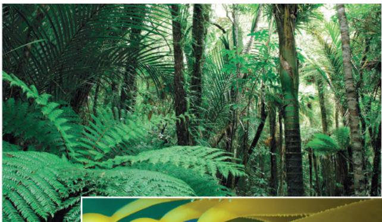  
(a) Plants

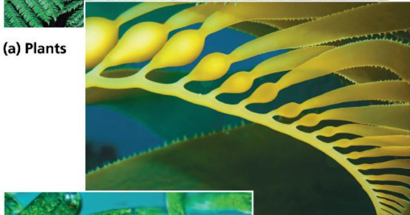

  
(b) Multicellular alga  
10 μm  
(c) Unicellular protists

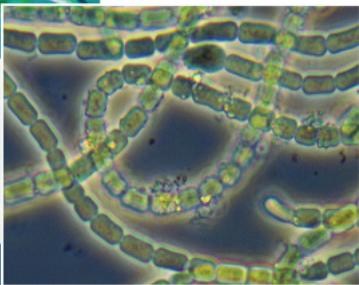

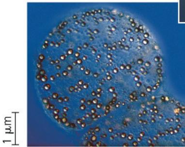  
(d) Cyanobacteria $\overline{20\ \mu m}$  
1μm  
(e) Purple sulfur bacteria

# Concept 10.2: Photosynthesis converts light energy to the chemical energy of food

The remarkable ability of an organism to harness light energy and use it to drive the synthesis of organic compounds emerges from structural organization in the cell: Photosynthetic enzymes and other molecules are grouped together as specialized molecular complexes in a biological membrane, enabling the necessary series of chemical reactions to be carried out efficiently. The process of photosynthesis most likely originated in a group of bacteria that had infolded regions of the plasma membrane containing clusters of such molecules. In currently existing photosynthetic bacteria, infolded photosynthetic membranes function similarly to the internal membranes of the chloroplast, the eukaryotic organelle that absorbs energy from sunlight and uses it to drive the synthesis of organic compounds from carbon dioxide ( $CO_{2}$ ) and water ( $H_{2}O$ ). According to what has come to be known as the endosymbiont theory, the original chloroplast was a photosynthetic bacterium that lived inside an ancestor of eukaryotic cells. (You learned about this theory in Concept 6.5, and it will be described more fully in Concept 25.3.) Chloroplasts are present in a variety of photosynthesizing organisms (see some examples in Figure 10.2); in this chapter, we focus on chloroplasts in plants, while mentioning prokaryotic organisms from time to time.

## Chloroplasts: The Sites of Photosynthesis in Plants

All green parts of a plant, including green stems and unripened fruit, have chloroplasts, but the leaves are the major sites of photosynthesis in most plants (Figure 10.3). There are about half a million chloroplasts in a chunk of leaf with a top surface area of $1 \, mm^2$ . Chloroplasts are found mainly in the cells of the mesophyll, the tissue in the interior of the leaf. $CO_2$ enters the leaf, and $O_2$ exits, by way of microscopic pores called stomata (singular, stoma; from the Greek, meaning “mouth”). Water absorbed by the roots is delivered to the leaves in veins. Leaves also use veins to export sugar to roots and other nonphotosynthetic parts of the plant.

A typical mesophyll cell has about 30–40 chloroplasts, each measuring about 2–4 $\mu$ m by 4–7 $\mu$ m. A chloroplast has two membranes surrounding a dense fluid called the stroma. Suspended within the stroma is a third membrane system, made up of sacs called thylakoids, which segregates the stroma from the thylakoid space inside these sacs. In some places, thylakoid sacs are stacked in columns called grana (singular, granum).

Chlorophyll, the green pigment that gives leaves their color, resides in the thylakoid membranes of the chloroplast. (The internal photosynthetic membranes of some prokaryotic organisms are also called thylakoid membranes; see Figure 27.8b.) It is the light energy absorbed by chlorophyll that drives the synthesis of organic molecules in the chloroplast. Now that we have looked at the sites of photosynthesis in plants, we are ready to look more closely at the process itself.

Figure 10.3 Zooming in on the location of photosynthesis in a plant. Leaves are the major organs of photosynthesis in plants. These images take you into a leaf, then into a cell, and finally into a chloroplast, the organelle where photosynthesis occurs (middle, LM; bottom, TEM).  

## Tracking Atoms Through Photosynthesis

Scientists have tried for centuries to piece together the process by which plants make food. Although some of the steps are still not completely understood, the overall photosynthetic equation has been known since the 1800s: In the presence of light, the green parts of plants produce organic compounds and $O_{2}$ from $CO_{2}$ and $H_{2}O$ . We can summarize the complex series of chemical reactions in photosynthesis with this chemical equation:

$$
6 \mathrm{CO} _ {2} + 1 2 \mathrm{H} _ {2} \mathrm{O} + \text { Light   energy } \rightarrow \mathrm{C} _ {6} \mathrm{H} _ {1 2} \mathrm{O} _ {6} + 6 \mathrm{O} _ {2} + 6 \mathrm{H} _ {2} \mathrm{O}
$$

We use glucose $\left(\mathrm{C}_{6}\mathrm{H}_{12}\mathrm{O}_{6}\right)$ here to simplify the relationship between photosynthesis and respiration, but the direct product of photosynthesis is actually a three-carbon sugar that can be used to make glucose. Water appears on both sides of the equation because 12 molecules are consumed and 6 molecules are newly formed during photosynthesis. We can simplify the equation by indicating only the net consumption of water:

$$
6 \mathrm{CO} _ {2} + 6 \mathrm{H} _ {2} \mathrm{O} + \text {   Light   energy   } \rightarrow \mathrm{C} _ {6} \mathrm{H} _ {1 2} \mathrm{O} _ {6} + 6 \mathrm{O} _ {2}
$$

Writing the equation in this form, we can see that the overall chemical change during photosynthesis is the reverse of the one that occurs during cellular respiration (see Concept 9.1). It is important to realize that both of these metabolic processes occur in plant cells. However, as you will soon learn, chloroplasts do not synthesize sugars by simply reversing the steps of respiration.

Now let's divide the photosynthetic equation by 6 to put it in its simplest possible form:

$$
\mathrm{CO} _ {2} + \mathrm{H} _ {2} \mathrm{O} \rightarrow [ \mathrm{CH} _ {2} \mathrm{O} ] + \mathrm{O} _ {2}
$$

Here, the brackets indicate that $CH_{2}O$ is not an actual sugar but represents the general formula for a carbohydrate (see Concept 5.2). In other words, we are imagining the synthesis of a sugar molecule one carbon at a time (with six repetitions theoretically adding up to a glucose molecule: $C_{6}H_{12}O_{6}$ ). Let's now see how researchers tracked the elements C, H, and O from the reactants of photosynthesis to the products.

## The Splitting of Water: Scientific Inquiry

One of the first clues to the mechanism of photosynthesis came from the discovery that the $O_{2}$ given off by plants is derived from $H_{2}O$ and not from $CO_{2}$ . The chloroplast splits water into hydrogen and oxygen atoms. Before this discovery, the prevailing hypothesis was that photosynthesis split carbon dioxide ( $CO_{2} \rightarrow C + O_{2}$ ) and then added water to the carbon ( $C + H_{2}O \rightarrow [CH_{2}O]$ ). That hypothesis predicted that the $O_{2}$ released during photosynthesis came from $CO_{2}$ , an idea challenged in the 1930s by C. B. van Niel, of Stanford University. Van Niel was investigating photosynthesis in bacteria that make their carbohydrate from $CO_{2}$ but do not release $O_{2}$ . He concluded that, at least in these bacteria, $CO_{2}$ is not split into carbon and oxygen. One group of bacteria used hydrogen sulfide ( $H_{2}S$ ) rather than water for photosynthesis, forming yellow globules of sulfur as a waste product (these globules are visible in Figure 10.2e). Here is the chemical equation for photosynthesis in these sulfur bacteria:

$$
\mathrm{CO} _ {2} + 2 \mathrm{H} _ {2} \mathrm{S} \rightarrow [ \mathrm{CH} _ {2} \mathrm{O} ] + \mathrm{H} _ {2} \mathrm{O} + 2 \mathrm{S}
$$

Van Niel reasoned that the bacteria split $H_{2}S$ and used the hydrogen atoms to make sugar. He then generalized that idea, proposing that all photosynthetic organisms require a hydrogen source but that the source varies:

$$
\begin{array}{r l}\text { Sulfur   bacteria: }&\mathrm{CO} _ {2} + 2 \mathrm{H} _ {2} \mathrm{S} \rightarrow [ \mathrm{CH} _ {2} \mathrm{O} ] + \mathrm{H} _ {2} \mathrm{O} + 2 \mathrm{S}\\\text { Plants: }&\mathrm{CO} _ {2} + 2 \mathrm{H} _ {2} \mathrm{O} \rightarrow [ \mathrm{CH} _ {2} \mathrm{O} ] + \mathrm{H} _ {2} \mathrm{O} + \mathrm{O} _ {2}\\\text { General: }&\mathrm{CO} _ {2} + 2 \mathrm{H} _ {2} \mathrm{X} \rightarrow [ \mathrm{CH} _ {2} \mathrm{O} ] + \mathrm{H} _ {2} \mathrm{O} + 2 \mathrm{X}\end{array}
$$

Thus, van Niel hypothesized that plants split $H_{2}O$ as a source of electrons from hydrogen atoms, releasing $O_{2}$ as a by-product.

Figure 10.4 Tracking atoms through photosynthesis.
The atoms from $CO_{2}$ are shown in magenta (solid arrows), and the atoms from $H_{2}O$ are shown in blue (dashed arrows).  
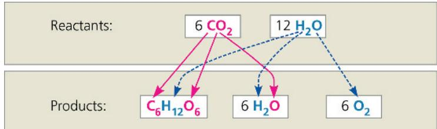

Nearly 20 years later, scientists confirmed van Niel's hypothesis by using oxygen-18 ( $^{18}$ O), a heavy isotope, as a tracer to follow the path of oxygen atoms during photosynthesis. The experiments showed that the O $_{2}$ produced by plants was labeled with $^{18}$ O only if water was the source of the tracer (experiment 1). If the $^{18}$ O was introduced to the plant in the form of CO $_{2}$ , the label did not turn up in the released O $_{2}$ (experiment 2). In the following summary, bold green type denotes labeled atoms of oxygen ( $^{18}$ O):

$$
\begin{array}{l}\text {Experiment 1:} \quad \mathrm{CO} _ {2} + 2 \mathrm{H} _ {2} \mathbf {O} \rightarrow [ \mathrm{CH} _ {2} \mathrm{O} ] + \mathrm{H} _ {2} \mathrm{O} + \mathbf {O} _ {2}\\\text {Experiment 2:} \quad \mathrm{CO} _ {2} + 2 \mathrm{H} _ {2} \mathrm{O} \rightarrow [ \mathrm{CH} _ {2} \mathbf {O} ] + \mathrm{H} _ {2} \mathbf {O} + \mathrm{O} _ {2}\end{array}
$$

A significant result of the shuffling of atoms during photosynthesis is the extraction of hydrogen from water and its incorporation into sugar. The waste product of photosynthesis, $O_{2}$ , is released to the atmosphere. Figure 10.4 shows the fates of all atoms in photosynthesis.

## Photosynthesis as a Redox Process

Let's briefly compare photosynthesis with cellular respiration. Both processes involve redox reactions. During cellular respiration, energy is released from sugar when electrons associated with hydrogen are transported by carriers to oxygen, forming water as a by-product (see Concept 9.1). The electrons lose potential energy as they "fall" down the electron transport chain toward electro-negative oxygen, and the mitochondrion harnesses that energy to synthesize ATP (see Figure 9.14). Photosynthesis reverses the direction of electron flow. Water is split, and its electrons are transferred along with hydrogen ions $(\mathrm{H}^{+})$ from the water to carbon dioxide, reducing it to sugar.

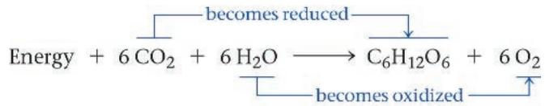

Because the electrons increase in potential energy as they move from water to sugar, this process requires energy—in other words, it is endergonic. This energy boost that occurs during photosynthesis is provided by light.

## The Two Stages of Photosynthesis: A Preview

The equation for photosynthesis is a deceptively simple summary of a very complex process. Actually, photosynthesis is not a single process, but two processes, each of which has multiple

## Figure 10.5 An overview of photosynthesis: cooperation of the light reactions and the Calvin cycle.

In the chloroplast, the thylakoid membranes (green) are the sites of the light reactions, whereas the Calvin cycle occurs in the stroma (gray). The light reactions use solar energy to make ATP and NADPH, which supply chemical energy and reducing power, respectively, to the Calvin cycle. The Calvin cycle incorporates $CO_{2}$ into organic molecules, which are converted to sugar. (Recall that most simple sugars have formulas that are some multiple of $CH_{2}O$ .) To visualize these processes in their cellular context, see Figure 6.32.

steps. These two stages of photosynthesis are known as the light reactions (the photo part of photosynthesis) and the Calvin cycle (the synthesis part) (Figure 10.5).

The light reactions are the steps of photosynthesis that convert solar energy to chemical energy. Water is split, providing a source of hydrogen atoms, each consisting of an electron and a proton ( $H^{+}$ , a hydrogen ion) and giving off $O_{2}$ as a by-product. Light absorbed by chlorophyll drives a transfer of the electrons and hydrogen ions from water to an acceptor called $NADP^{+}$ (nicotinamide adenine dinucleotide phosphate), where they are temporarily stored. (The electron acceptor $NADP^{+}$ is first cousin to $NAD^{+}$ , which functions as an electron carrier in cellular respiration; the two molecules differ only by the presence of an extra phosphate group in the $NADP^{+}$ molecule.) The light reactions use solar energy to reduce $NADP^{+}$ to NADPH by adding a pair of electrons along with an $H^{+}$ . The light reactions also generate ATP, using chemiosmosis to power the addition of a phosphate group to ADP, a process called photophosphorylation. Thus, light energy is initially converted to chemical energy in the form of two compounds: NADPH and ATP. NADPH, a source of electrons, acts as “reducing power” that can be passed along to an electron acceptor, reducing it, while ATP is the versatile energy currency of cells. Notice that the light reactions produce no sugar; that happens in the second stage of photosynthesis, the Calvin cycle.

The Calvin cycle is named for Melvin Calvin, who, along with his colleagues James Bassham and Andrew Benson, began to elucidate its steps in the late 1940s. The cycle begins by incorporating $CO_{2}$ from the air into organic molecules already present in the chloroplast. This initial incorporation of carbon into organic compounds is known as carbon fixation. The Calvin cycle then reduces the fixed carbon to carbohydrate by the addition of electrons. The reducing power is provided by NADPH, which acquired its cargo of electrons in the light reactions. To convert $CO_{2}$ to carbohydrate, the Calvin cycle also

requires chemical energy in the form of ATP, which is also generated by the light reactions. Thus, it is the Calvin cycle that makes sugar, but it can do so only with the help of the NADPH and ATP produced by the light reactions. The metabolic steps of the Calvin cycle are sometimes referred to as the dark reactions, or light-independent reactions, because none of the steps requires light directly. Nevertheless, the Calvin cycle in most plants occurs during daylight, for only then can the light reactions provide the NADPH and ATP that the Calvin cycle requires. In essence, the chloroplast uses light energy to make sugar by coordinating the two stages of photosynthesis.

As Figure 10.5 indicates, the thylakoids of the chloroplast are the sites of the light reactions, while the Calvin cycle occurs in the stroma. On the outside of the thylakoids, during the light reactions, molecules of NADP $^{+}$ and ADP pick up electrons and phosphate, respectively, and NADPH and ATP are then released to the stroma, where they play crucial roles in the Calvin cycle. The two stages of photosynthesis are treated in this figure as metabolic modules that take in ingredients and crank out products. In the next two sections, we’ll look more closely at how the two stages work, beginning with the light reactions.

## Concept Check 10.2

1. MAKE CONNECTIONS How do the $CO_{2}$ molecules used in photosynthesis reach and enter the chloroplasts inside leaf cells? (See Concept 7.2.)

2. Explain how the use of an oxygen isotope helped elucidate the chemistry of photosynthesis.

3. WHAT IF? The Calvin cycle requires ATP and NADPH, products of the light reactions. If a classmate asserted that the light reactions don't depend on the Calvin cycle and, with continual light, could just keep on producing ATP and NADPH, how would you respond?

## Concept 10.3: The light reactions convert solar energy to the chemical energy of ATP and NADPH

Chloroplasts are chemical factories powered by the sun. Their thylakoids transform light energy into the chemical energy of ATP and NADPH. To better understand the conversion of light to chemical energy, we need to know about some important properties of light.

## The Nature of Sunlight

Light is a form of energy known as electromagnetic energy, also called electromagnetic radiation. Electromagnetic energy travels in rhythmic waves analogous to those created by dropping a pebble into a pond. Electromagnetic waves, however, are disturbances of electric and magnetic fields rather than disturbances of a material medium such as water.

The distance between the crests of electromagnetic waves is called the wavelength. Wavelengths range from less than a nanometer (for gamma rays) to more than a kilometer (for radio waves). This entire range of radiation is known as the electromagnetic spectrum (Figure 10.6). The segment most important to life is the narrow band from about 380 nm to 740 nm in wavelength. This radiation is known as visible light because it can be detected as various colors by the human eye.

The model of light as waves explains many of light's properties, but in certain respects light behaves as though it consists of discrete particles, called photons. Photons are not tangible objects, but they act like objects in that each of them has a fixed quantity of energy. The amount of energy is inversely related to the wavelength of the light: The shorter the wavelength, the greater the energy of each photon of that light. Thus, a photon of violet light packs nearly twice as much energy as a photon of red light (see Figure 10.6).

Figure 10.6 The electromagnetic spectrum.  
White light is a mixture of all wavelengths of visible light. A prism can sort white light into its component colors by bending light of different wavelengths at different angles. (Droplets of water in the atmosphere can act as prisms, causing a rainbow to form.) Visible light drives photosynthesis.  
  
Figure 10.7 Why leaves are green: interaction of light with chloroplasts.  
The chlorophyll molecules of chloroplasts absorb violet-blue and red light (the colors most effective in driving photosynthesis) and reflect or transmit green light. This is why leaves appear green.

Although the sun radiates the full spectrum of electromagnetic energy, the atmosphere acts like a selective window, allowing visible light to pass through while screening out a substantial fraction of other radiation. The part of the spectrum we can see—visible light—is also the radiation that drives photosynthesis.

## Photosynthetic Pigments: The Light Receptors

When light meets matter, it may be reflected, transmitted, or absorbed. Substances that absorb visible light are known as pigments. Different pigments absorb light of different wavelengths, and the wavelengths that are absorbed disappear. If a pigment is illuminated with white light, the color we see is the color most reflected or transmitted by the pigment. (If a pigment absorbs all wavelengths, it appears black.) We see green when we look at a leaf because chlorophyll absorbs violet-blue and red light while transmitting and reflecting green light (Figure 10.7). The ability of a pigment to absorb various wavelengths of light can be measured with an instrument called a spectrophotometer. This machine directs beams of light of different wavelengths through a solution of the pigment and measures the fraction of the light transmitted at each wavelength. A graph plotting a pigment's light absorption versus wavelength is called an absorption spectrum (Figure 10.8).

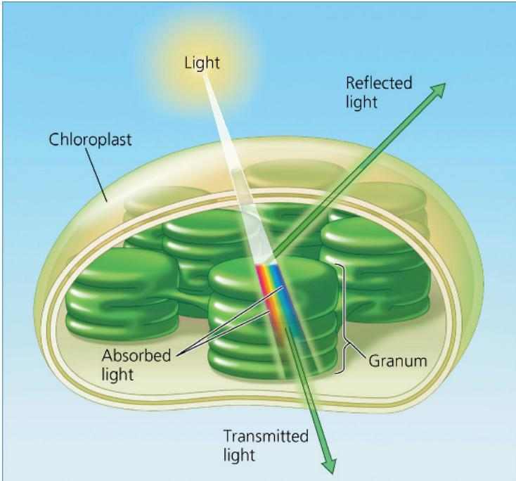

## Figure 10.8

# Research Method: Determining an Absorption Spectrum

## Application

An absorption spectrum is a visual representation of how well a particular pigment absorbs different wavelengths of visible light. Absorption spectra of various chloroplast pigments help scientists decipher the role of each pigment in a plant.

## Technique

A spectrophotometer measures the relative amounts of light of different wavelengths absorbed and transmitted by a pigment solution.

① White light is separated into colors (wavelengths) by a prism.
② One by one, the different colors of light are passed through the sample (chlorophyll in this example). Green light and blue light are shown here.

3 The transmitted light strikes a photoelectric tube, which converts the light energy to electricity.

4 The electric current is measured by a galvanometer. The meter indicates the fraction of light transmitted through the sample, from which we can determine the amount of light absorbed.

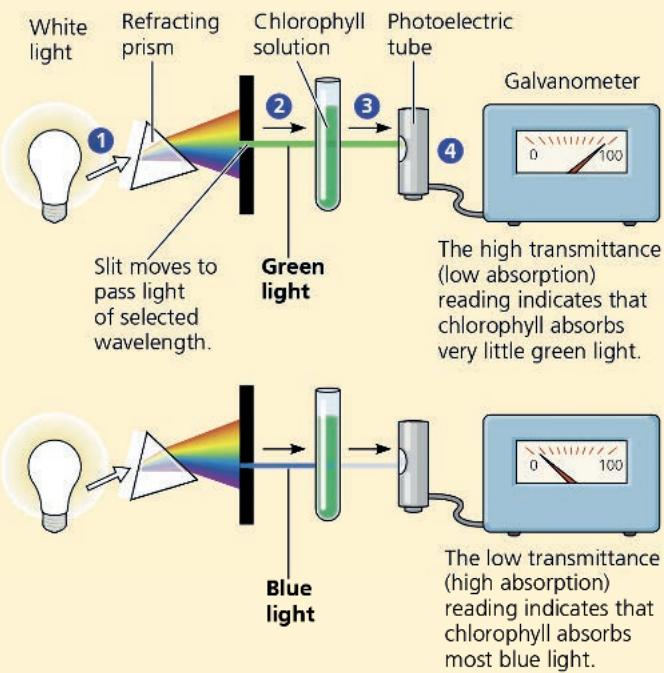

## Results

See Figure 10.9a for absorption spectra of three types of chloroplast pigments.

## Figure 10.9

## Inquiry: Which wavelengths of light are most effective in driving photosynthesis?

## Experiment and Results

Absorption and action spectra, along with a classic experiment by Theodor W. Engelmann, reveal which wavelengths of light are photosynthetically important.

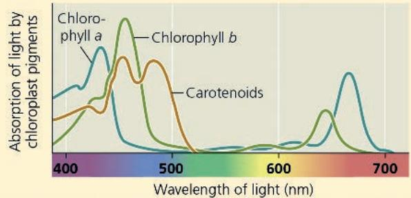  
(a) Absorption spectra. The three curves show the wavelengths of light best absorbed by three types of chloroplast pigments.

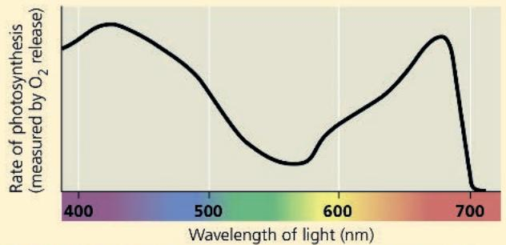  
(b) Action spectrum. This graph plots the rate of photosynthesis versus wavelength. The resulting action spectrum resembles the absorption spectrum for chlorophyll a but does not match exactly (see part a). This is partly due to the absorption of light by accessory pigments such as chlorophyll b and carotenoids.

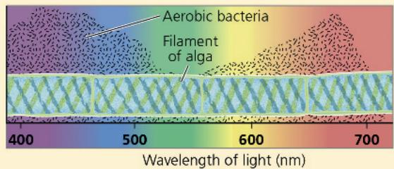  
(c) Engelmann's experiment. In 1883, Theodor W. Engelmann shined light through a prism onto an alga, exposing different segments of the alga to different wavelengths. He used aerobic bacteria, which congregate near an oxygen source, to determine which segments of the alga were releasing the most $\mathrm{O}_2$ and thus photosynthesizing most. Bacteria congregated in greatest numbers around the parts of the alga illuminated with violet-blue or red light.

## Conclusion

The action spectra, confirmed by the experiment, show which wavelengths are most effective in driving photosynthesis.

Data from T. W. Engelmann, Bacterium photometricum. Ein Beitrag zur vergleichenden Physiologie des Licht-und Farbensinnes, Archiv. für Physiologie 30:95–124 (1883).

Instructors: A related Experimental Inquiry Tutorial can be assigned in Mastering Biology.

INTERPRET THE DATA According to the graph, which wavelengths of light drive the highest rates of photosynthesis?

The absorption spectra of chloroplast pigments provide clues to the relative effectiveness of different wavelengths for driving photosynthesis since light can perform work in chloroplasts only if it is absorbed. Figure 10.9a shows the absorption spectra of three types of pigments in chloroplasts: chlorophyll a, the key light-capturing pigment that participates directly in the light reactions; the accessory pigment chlorophyll b; and a separate group of accessory pigments called carotenoids. The spectrum of chlorophyll a suggests that violet-blue light (around 450 nm) and red light (around 670 nm) work best for photosynthesis, since they are absorbed, while green light (around 540 nm) is the least effective color. This is confirmed by an action spectrum for photosynthesis (Figure 10.9b), which profiles the relative effectiveness of different wavelengths of radiation in driving the process. An action spectrum is prepared by illuminating chloroplasts with light of different colors and then plotting wavelength against some measure of photosynthetic rate, such as $CO_{2}$ consumption or $O_{2}$ release. The action spectrum for photosynthesis was first demonstrated by Theodor W. Engelmann, a German botanist, in 1883. Before equipment for measuring $O_{2}$ levels had even been invented, Engelmann performed a clever experiment in which he used $O_{2}$ -requiring bacteria to measure rates of photosynthesis in filamentous algae (Figure 10.9c). His results are a striking match to the modern action spectrum shown in Figure 10.9b.

Notice by comparing Figures 10.9a and 10.9b that the action spectrum for photosynthesis is much broader than the absorption spectrum of chlorophyll a. The absorption spectrum of chlorophyll a alone underestimates the effectiveness of certain wavelengths in driving photosynthesis. This is partly because accessory pigments with different absorption spectra—including chlorophyll b and carotenoids—broaden the spectrum of colors that can be used for photosynthesis. Figure 10.10 shows the structure of chlorophyll a compared with that of chlorophyll b. A slight structural difference between them is enough to cause the two pigments to absorb at slightly different wavelengths in the red and blue parts of the spectrum (see Figure 10.9a). As a result, chlorophyll a appears blue green and chlorophyll b olive green under visible light.

In the last decade, researchers have identified two other forms of chlorophyll—chlorophyll d and chlorophyll f—that absorb higher wavelengths of light. In 2018, researchers grew a species of cyanobacterium called Chroococcidiopsis thermalis under only far-red light with a wavelength of 750 nm. They concluded that chlorophyll f was functioning in place of chlorophyll a, enabling

Colony of the cyanobacterium Chroococcidiopsis thermalis. In this micrograph of cells becoming acclimated to higher wavelengths of light, cells that haven't yet acclimated and are still using chlorophyll a for photosynthesis appear purplish-pink, and cells that have acclimated and are using chlorophyll f appear yellow.

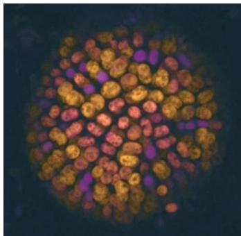

Figure 10.10 Structure of chlorophyll a and b. Chlorophyll a and b differ in only one functional group:  
  
Hydrocarbon tail: interacts with hydrophobic regions of proteins inside thylakoid membranes of chloroplasts

this cyanobacterium to flourish in very shaded conditions. Higher-wavelength light has less energy, so this observation extends the lower limit of energy (the “red limit”) needed for photosynthesis to occur.

Other accessory pigments include carotenoids, hydrocarbons that are various shades of yellow and orange because they absorb violet and blue-green light (see Figure 10.9a). Carotenoids may broaden the spectrum of colors that can drive photosynthesis. However, a more important function of at least some carotenoids seems to be photoprotection: These compounds absorb and dissipate excessive light energy that would otherwise damage chlorophyll or interact with oxygen, forming reactive oxidative molecules that are dangerous to the cell. Interestingly, carotenoids similar to the photoprotective ones in chloroplasts have a photoprotective role in the human eye. (Carrots, known for aiding night vision, are rich in carotenoids.) These and related molecules are, of course, found naturally in many vegetables and fruits. They are also often advertised in health food products as “phytochemicals” (from the Greek phyton, plant), some of which have antioxidant properties. Plants can synthesize all the antioxidants they require, but humans and other animals must obtain some of them from their diets.

## Excitation of Chlorophyll by Light

What exactly happens when chlorophyll and other pigments absorb light? The colors corresponding to the absorbed wavelengths disappear from the spectrum of the transmitted and reflected light, but energy cannot disappear. When a molecule absorbs a photon of light, one of the molecule's electrons is elevated to an orbital where it has more potential energy (see Figure 2.6b). When the electron

Figure 10.11 Excitation of isolated chlorophyll by light.

(a) Absorption of a photon causes a transition of the chlorophyll molecule from its ground state to its excited state. The photon boosts an electron to an orbital where it has more potential energy. If the illuminated molecule exists in isolation, its excited electron immediately drops back down to the ground-state orbital, and its excess energy is given off as heat and fluorescence (light). (b) A chlorophyll solution excited with ultraviolet light fluoresces with a red-orange glow.

WHAT IF? If a leaf containing the same concentration of chlorophyll as in the solution was exposed to the same ultraviolet light, no fluorescence would be seen. Propose an explanation for the difference in fluorescence emission between the solution and the leaf. For suggested answer, see Appendix A.

  
(a) Excitation of isolated chlorophyll molecule

  
(b) Fluorescence

is in its normal orbital, the pigment molecule is said to be in its ground state. Absorption of a photon boosts an electron to an orbital of higher energy, and the pigment molecule is then said to be in an excited state. The only photons absorbed are those whose energy is exactly equal to the energy difference between the ground state and an excited state, and this energy difference varies from one kind of molecule to another. Thus, a particular compound absorbs only photons corresponding to specific wavelengths, which is why each pigment has a unique absorption spectrum.

Once absorption of a photon raises an electron to an excited state, the electron cannot stay there long (Figure 10.11a). The excited state, like all high-energy states, is unstable. Generally, when isolated pigment molecules absorb light, their excited electrons drop back down to the ground-state orbital in a billionth of a second, releasing their excess energy as heat. This conversion of light energy to heat is what makes the top of an automobile so hot on a sunny day. (White cars are coolest because their paint reflects all wavelengths of visible light.) In isolation, some pigments, including chlorophyll, emit light as well as heat after absorbing photons. As excited electrons fall back to the ground state, photons are given off, an afterglow called fluorescence. An illuminated solution of chlorophyll isolated from chloroplasts will fluoresce in the red part of the spectrum and also give off heat (Figure 10.11b). This is best seen by illuminating with ultraviolet light, which chlorophyll can also absorb (see Figures 10.6 and 10.9a). Viewed under visible light, the fluorescence would be difficult to see against the green of the solution.

## A Photosystem: A Reaction-Center Complex Associated with Light-Harvesting Complexes

Chlorophyll molecules excited by the absorption of light energy produce very different results in an intact chloroplast than they do in isolation (see Figure 10.11). In their native environment of the thylakoid membrane, chlorophyll molecules are organized along with other small organic molecules and proteins into complexes called photosystems.

A photosystem is composed of a reaction-center complex surrounded by several light-harvesting complexes (Figure 10.12, on the next page). The reaction-center complex is an organized association of proteins holding a special pair of chlorophyll $a$ molecules and a primary electron acceptor. Each light-harvesting complex consists of various pigment molecules (which may include chlorophyll $a$ , chlorophyll $b$ , and multiple carotenoids) bound to proteins. The number and variety of pigment molecules enable a photosystem to harvest light over a larger surface area and a larger portion of the spectrum than could any single pigment molecule alone. Together, these light-harvesting complexes act as an antenna for the reaction-center complex. When a pigment molecule absorbs a photon, the energy is transferred from pigment molecule to pigment molecule within a light-harvesting complex, like a human “wave” at a sports arena, until it is passed to the pair of chlorophyll $a$ molecules in the reaction-center complex. This pair of chlorophyll $a$ molecules is special because their molecular environment—their location and the other molecules with which they are associated—enables them to use the energy from light not only to boost one of their electrons to a higher energy level, but also to transfer it to a different molecule—the primary electron acceptor, which is a molecule capable of accepting electrons and becoming reduced.

The solar-powered transfer of an electron from the reaction-center chlorophyll a pair to the primary electron acceptor is the first step of the light reactions. As soon as the chlorophyll electron is excited to a higher energy level, the primary electron acceptor captures it; this is a redox reaction. In the flask shown in Figure 10.11b, isolated chlorophyll fluoresces because there is no electron acceptor, so electrons of photoexcited chlorophyll drop right back to the ground state. In the structured environment of a chloroplast, however, an electron acceptor is readily available, and the potential energy represented by the excited electron is not dissipated as light and heat. Thus, each photosystem—a reaction-center complex surrounded by light-harvesting complexes—functions in the chloroplast as a unit. It converts light energy to chemical energy, which will ultimately be used for the synthesis of sugar.

Figure 10.12 The structure and function of a photosystem.  
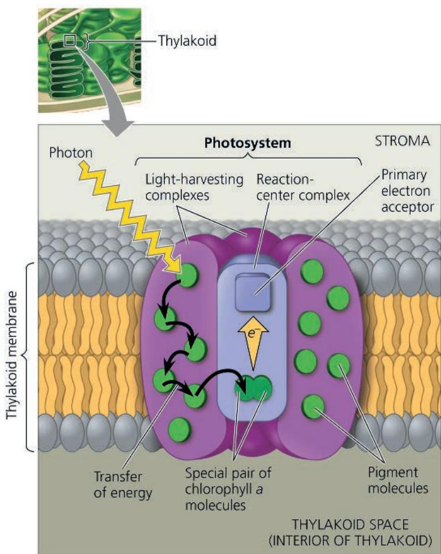  
(a) How a photosystem harvests light. When a photon strikes a pigment molecule in a light-harvesting complex, the energy is passed from molecule to molecule until it reaches the reaction-center complex. Here, an excited electron from the special pair of chlorophyll a molecules is transferred to the primary electron acceptor.

  
(b) Structure of a photosystem. This computer model, based on X-ray crystallography, shows two photosystem complexes side by side. Chlorophyll molecules (bright green ball-and-stick models within the membrane; the tails are not shown) are interspersed with protein subunits (purple ribbons; notice the many $\alpha$ helices spanning the membrane). For simplicity, a photosystem will be shown as a single complex in the rest of the chapter.

The thylakoid membrane is populated by two types of photosystems that cooperate in the light reactions of photosynthesis: photosystem II (PS II) and photosystem I (PS I). (They were named in order of their discovery, but

photosystem II functions first in the light reactions.) Each has a characteristic reaction-center complex—a particular kind of primary electron acceptor next to a special pair of chlorophyll $a$ molecules associated with specific proteins. The reaction-center chlorophyll $a$ of photosystem II is known as P680 because this pigment is best at absorbing light having a wavelength of 680 nm (in the red part of the spectrum). The chlorophyll $a$ at the reaction-center complex of photosystem I is called P700 because it most effectively absorbs light of wavelength 700 nm (in the far-red part of the spectrum). These two pigments, P680 and P700, are nearly identical chlorophyll $a$ molecules. However, their association with different proteins in the thylakoid membrane affects the electron distribution in the two pigments and accounts for the slight differences in their light-absorbing properties. Now let's see how the two types of photosystems work together in using light energy to generate ATP and NADPH, the two main products of the light reactions.

## Linear Electron Flow

Light drives the synthesis of ATP and NADPH by energizing the two types of photosystems embedded in the thylakoid membranes of chloroplasts. The key to this energy transformation is a flow of electrons through the photosystems and other molecular components built into the thylakoid membrane. This is called linear electron flow, and it occurs during the light reactions of photosynthesis, as shown in Figure 10.13. The numbered steps in the text correspond to the numbered steps in the figure.

A photon of light strikes one of the pigment molecules in a light-harvesting complex of PS II, boosting one of its electrons to a higher energy level. As this electron falls back to its ground state, an electron in a nearby pigment molecule is simultaneously raised to an excited state. The process continues, with the energy being relayed to other pigment molecules until it reaches the P680 pair of chlorophyll $a$ molecules in the PS II reaction-center complex. It excites an electron in this pair of chlorophylls to a higher energy state.

2 This electron is transferred from the excited P680 to the primary electron acceptor. We can refer to the resulting form of P680, missing the negative charge of an electron, as $\mathrm{P680^{+}}$ .

3 An enzyme catalyzes the splitting of a water molecule into two electrons, two hydrogen ions ( $H^{+}$ ), and an oxygen atom. The electrons are supplied one by one to the $P680^{+}$ pair, each electron replacing one transferred to the primary electron acceptor. ( $P680^{+}$ is the strongest biological oxidizing agent known; its electron “hole” must be filled. This greatly facilitates the transfer of electrons from the split water molecule.) The $H^{+}$ are released into the thylakoid space (interior of the thylakoid). The oxygen atom immediately combines with an oxygen atom generated by the splitting of another water molecule, forming $O_{2}$ .

4 Each photoexcited electron passes from the primary electron acceptor of PS II to PS I via an electron transport chain, the components of which are similar to those of the electron transport chain that functions in cellular respiration. The electron transport chain between PS II and PS I is made up of the electron carrier plastoquinone (Pq), a cytochrome

Figure 10.13 How linear electron flow during the light reactions generates ATP and NADPH. The gold arrows trace the flow of light-driven electrons from water to NADPH. The black arrows trace the transfer of energy from pigment molecule to pigment molecule. To see these proteins in their cellular context, see Figure 6.32b.

complex, and a protein called plastocyanin (Pc). Each component carries out redox reactions as electrons flow down the electron transport chain, releasing free energy that is used to pump protons ( $H^{+}$ ) into the thylakoid space, contributing to a proton gradient across the thylakoid membrane.

5 The potential energy stored in the proton gradient is used to make ATP in the process you learned about in Concept 9.4 called chemiosmosis, to be further discussed shortly.

6 Meanwhile, light energy has been transferred via light-harvesting complex pigments to the PS I reaction-center complex, exciting an electron of the P700 pair of chlorophyll a molecules located there. The photoexcited electron is then transferred to PS I's primary electron acceptor, creating an electron "hole" in the P700—which we now can call $\mathrm{P700^{+}}$ . In other words, $\mathrm{P700^{+}}$ can now act as an electron acceptor, accepting an electron that reaches the bottom of the electron transport chain from PS II.

7 Photoexcited electrons are passed in a series of redox reactions from the primary electron acceptor of PS I down a second electron transport chain through the protein ferredoxin (Fd). (This chain does not create a proton gradient and thus does not produce ATP.)

8 The enzyme NADP $^{+}$ reductase catalyzes the transfer of electrons from Fd to NADP $^{+}$ . Two electrons are required for its reduction to NADPH. Electrons in NADPH are at a higher energy level than they are in water (where they started), so they are more readily available for the reactions of the Calvin cycle. This process also removes an H $^{+}$ from the stroma.

The energy changes of electrons during their linear flow through the light reactions are shown in a mechanical analogy in

Figure 10.14 A mechanical analogy for linear electron flow during the light reactions.

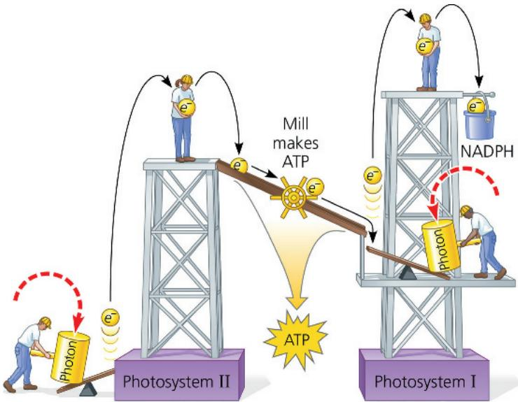

Figure 10.14. Although the scheme shown in Figures 10.13 and 10.14 may seem complicated, do not lose track of the big picture: The light reactions use solar power to generate ATP and NADPH, which provide chemical energy and reducing power, respectively, to the carbohydrate-synthesizing reactions of the Calvin cycle.

## Cyclic Electron Flow

In certain cases, photoexcited electrons can take an alternative path called cyclic electron flow, which uses photosystem I but not photosystem II. You can see in Figure 10.15 that cyclic flow is a short circuit: The electrons cycle back from ferredoxin (Fd) to the cytochrome complex, then via a plastocyanin molecule (Pc) to a P700 chlorophyll in the PS I reaction-center complex. There is no production of NADPH and no release of oxygen that results from this process. On the other hand, cyclic flow does generate ATP.

Rather than having both PS II and PS I, several of the currently existing groups of photosynthetic bacteria are known to have a single photosystem related to either PS II or PS I. For these species, which include the purple sulfur bacteria (see Figure 10.2e) and the green sulfur bacteria, cyclic electron flow is the one and only means of generating ATP during the process of photosynthesis. Evolutionary biologists hypothesize that these bacterial groups are descendants of ancestral bacteria in which photosynthesis first evolved, in a form similar to cyclic electron flow.

Cyclic electron flow can also occur in photosynthetic species that possess both photosystems; this includes some prokaryotic organisms, such as the cyanobacteria shown in Figure 10.2d, as well as the eukaryotic photosynthetic species that have been tested thus far. Although the process is probably in part an “evolutionary leftover,” research suggests it plays at least one beneficial role for

Figure 10.15 Cyclic electron flow.

Photoexcited electrons from PS I are occasionally shunted back from ferredoxin (Fd) to chlorophyll via the cytochrome complex and plastocyanin (Pc). This electron shunt supplements the supply of ATP (via chemiosmosis) but produces no NADPH. The “shadow” of linear electron flow is included in the diagram for comparison with the cyclic route. The two Fd molecules in this diagram are actually one and the same—the final electron carrier in the electron transport chain of PS I—although it is depicted twice to clearly show its role in two parts of the process.

  
VISUAL SKILLS Look at Figure 10.14 and explain how you would alter it to show a mechanical analogy for cyclic electron flow.

these organisms. Plants with mutations that render them unable to carry out cyclic electron flow are capable of growing well in low light, but do not grow well where light is intense. This is evidence for the idea that cyclic electron flow may be photoprotective. Later you'll learn more about cyclic electron flow as it relates to a particular adaptation of photosynthesis ( $C_{4}$ plants; see Concept 10.5).

Whether ATP synthesis is driven by linear or cyclic electron flow, the actual mechanism is the same. Before we move on to consider the Calvin cycle, let's review chemiosmosis, the process that uses membranes to couple redox reactions to ATP production.

## A Comparison of Chemiosmosis in Chloroplasts and Mitochondria

Chloroplasts and mitochondria generate ATP by the same basic mechanism: chemiosmosis (see Figure 9.14). An electron transport chain pumps protons ( $H^{+}$ ) across a membrane as electrons are passed through a series of carriers that have progressively more affinity for electrons. Thus, electron transport chains transform redox energy to a proton-motive force, potential energy stored in the form of an $H^{+}$ gradient across a membrane. An ATP synthase complex in the same membrane couples the diffusion of hydrogen ions down their gradient to the phosphorylation of ADP, forming ATP.

Some of the electron carriers, including the iron-containing proteins called cytochromes, are very similar in mitochondria and chloroplasts (see Figure 6.32b and c). The ATP synthase complexes of the two organelles are also quite similar. But there are noteworthy differences between photophosphorylation in chloroplasts and oxidative phosphorylation in mitochondria. Both work by way of chemiosmosis, but in chloroplasts, the high-energy electrons dropped down the transport chain come from water, while in mitochondria, they are extracted from organic molecules (which are thus oxidized). Chloroplasts do not need molecules from food to make ATP; their photosystems capture light energy and use it to drive the electrons from water to the top of the transport chain. In other words, mitochondria use chemiosmosis to transfer chemical energy from food molecules to ATP, whereas chloroplasts use it to transform light energy into chemical energy in ATP.

Although the spatial organization of chemiosmosis differs slightly between chloroplasts and mitochondria, it is easy to see similarities in the two (Figure 10.16). Electron transport chain proteins in the inner membrane of the mitochondrion pump protons from the mitochondrial matrix out to the intermembrane space, which then serves as a reservoir of hydrogen ions. Similarly, electron transport chain proteins in the thylakoid membrane of the chloroplast pump protons from the stroma into the thylakoid space, which functions as the $H^{+}$ reservoir. If you imagine the cristae of mitochondria pinching off from the inner membrane, this may help you see how the thylakoid space and the intermembrane space are comparable spaces in the two organelles, while the mitochondrial matrix is analogous to the stroma of the chloroplast.

Figure 10.16 Comparison of chemiosmosis in mitochondria and chloroplasts.  
  
MAKE CONNECTIONS Describe how you would change the pH in order to artificially cause ATP synthesis (a) outside an isolated mitochondrion (assume $H^{+}$ can freely cross the outer membrane; see Figure 9.14) and (b) in the stroma of a chloroplast. Explain. For suggested answer, see Appendix A.

In the mitochondrion, protons diffuse down their concentration gradient from the intermembrane space through ATP synthase to the matrix, driving ATP synthesis. In the chloroplast, ATP is synthesized as the hydrogen ions diffuse from the thylakoid space back to the stroma through ATP synthase complexes (Figure 10.17), whose catalytic knobs are on the stroma side of the membrane. Thus, ATP forms in the stroma, where it is used to help drive sugar synthesis during the Calvin cycle.

The proton (H $^{+}$ ) gradient, or pH gradient, across the thylakoid membrane is substantial. When chloroplasts in an experimental setting are illuminated, the pH in the thylakoid space drops to about 5 (the H $^{+}$ concentration increases), and the pH in the stroma increases to about 8 (the H $^{+}$ concentration decreases). This gradient of three pH units corresponds to a thousandfold difference in H $^{+}$ concentration. If the lights are then turned off, the pH gradient is abolished, but it can quickly be restored by turning the lights back on. Experiments such as this provided strong evidence in support of the chemiosmotic model.

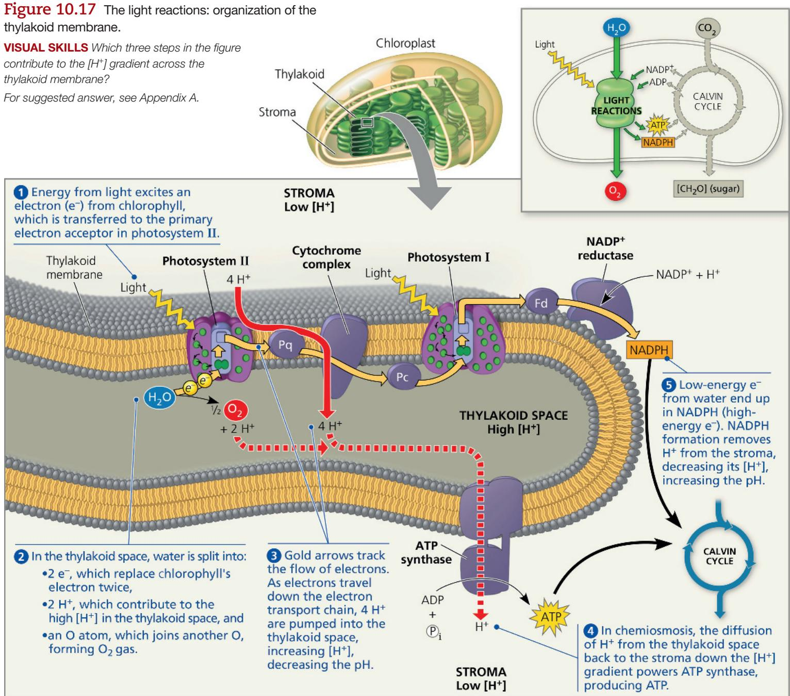

The currently accepted model for the organization of the light-reaction “machinery” within the thylakoid membrane is based on several research studies. Each of the molecules and molecular complexes in Figure 10.17 is present in numerous copies in each thylakoid. Notice that NADPH, like ATP, is produced on the side of the membrane facing the stroma, where the Calvin cycle reactions take place.

Let's step back and see the big picture by summarizing the light reactions. Electron flow pushes electrons from water, where they are at a state of low potential energy, ultimately to NADPH, where they are stored at a state of high potential energy. The light-driven electron flow also generates ATP. Thus, the equipment of the thylakoid membrane converts light energy to chemical energy stored in ATP and NADPH. $\mathrm{O}_2$ is produced as a by-product. Let's now see how the enzymes of the Calvin cycle use the products of the light reactions to synthesize sugar from $\mathrm{CO}_2$ .

## Concept Check 10.3

1. What color of light is least effective in driving photosynthesis? Explain.

2. In the light reactions, what is the initial electron donor? Where do the electrons finally end up?

3. WHAT IF? In an experiment, isolated chloroplasts placed in an illuminated solution with the appropriate chemicals can carry out ATP synthesis. Predict what would happen to the rate of synthesis if a compound is added to the solution that makes membranes freely permeable to hydrogen ions.

For suggested answers, see Appendix A.

## Concept 10.4: The Calvin cycle uses the chemical energy of ATP and NADPH to reduce CO₂ to sugar

The Calvin cycle takes place in the stroma; it is similar to the citric acid cycle in that a starting material is regenerated after some molecules enter and others exit the cycle. However, the citric acid cycle is catabolic, oxidizing acetyl CoA and using the energy to synthesize ATP (see Figure 9.11), while the Calvin cycle is anabolic, building carbohydrates from smaller molecules and consuming energy. Carbon enters the Calvin cycle in the form of $CO_{2}$ and leaves in the form of sugar. The cycle spends ATP as an energy source and consumes NADPH as reducing power for adding high-energy electrons to make the sugar.

As we mentioned in Concept 10.2, the carbohydrate produced directly from the Calvin cycle is not glucose. It is actually a three-carbon sugar called glyceraldehyde 3-phosphate (G3P). For the net synthesis of one molecule of G3P, the cycle must take place three times, fixing three molecules of $CO_{2}$ —one per turn of the cycle. (Recall that the term carbon fixation refers to the initial incorporation of $CO_{2}$ into organic material.) As we trace the steps of the Calvin cycle, keep in mind that we are following three molecules of $CO_{2}$ through the reactions. Figure 10.18 divides the Calvin cycle into three phases: carbon fixation, reduction, and regeneration of the $CO_{2}$ acceptor.

Phase 1: Carbon fixation. The Calvin cycle incorporates each $CO_{2}$ molecule, one at a time, by attaching it to a five-carbon sugar named ribulose bisphosphate (which is abbreviated RuBP). The enzyme that catalyzes this first step is RuBP carboxylase-oxygenase, or rubisco (see Figure 6.32c). (This is the most abundant protein in chloroplasts and is also thought to be the most abundant protein on Earth.) The product of the reaction is a six-carbon intermediate that is short-lived because it is so energetically unstable that it immediately splits in half, forming two molecules of 3-phosphoglycerate (for each $CO_{2}$ fixed).

Phase 2: Reduction. Each molecule of 3-phosphoglycerate receives an additional phosphate group from ATP, becoming 1, 3-phosphoglycerate. Next, a pair of electrons donated from NADPH reduces 1, 3-phosphoglycerate, which also loses a phosphate group in the process, becoming glyceraldehyde 3-phosphate (G3P). Specifically, the electrons from NADPH reduce a carboxyl group on 1, 3-bisphosphoglycerate to the aldehyde group of G3P, which stores more potential energy. G3P is a sugar—the same three-carbon sugar formed in glycolysis by the splitting of glucose (see Figure 9.8). Notice in Figure 10.18 that for every three molecules of $\mathrm{CO}_{2}$ that enter the cycle, there are six molecules of G3P formed. But only one molecule of this three-carbon sugar can be counted as a net gain of carbohydrate because the rest are required to complete the cycle. The cycle began with 15 carbons' worth of carbohydrate in the form of three molecules of the five-carbon sugar RuBP. Now there are 18 carbons' worth of carbohydrate in the form of six molecules of G3P. One molecule exits the cycle to be used by the plant cell, but the other five molecules must be recycled to regenerate the three molecules of RuBP.

Phase 3: Regeneration of the $CO_{2}$ acceptor (RuBP). In a complex series of reactions, the carbon skeletons of five molecules of G3P are rearranged by the last steps of the Calvin cycle into three molecules of RuBP. To accomplish this, the cycle spends three more molecules of ATP. The RuBP is now prepared to receive $CO_{2}$ again, and the cycle continues.

For the net synthesis of one G3P molecule, the Calvin cycle consumes a total of nine molecules of ATP and six molecules of NADPH. The light reactions regenerate the ATP and NADPH. The G3P spun off from the Calvin cycle becomes the starting material for metabolic pathways that synthesize other organic compounds, including glucose (from two molecules of G3P), sucrose, and other carbohydrates. Neither the light reactions nor the Calvin cycle alone can make sugar from $CO_{2}$ . Photosynthesis is an emergent property of the intact chloroplast, which integrates the two stages of photosynthesis.

## Figure 10.18 The Calvin cycle.

This diagram summarizes three turns of the cycle, tracking carbon atoms (shown as dark-gray spheres). The three phases of the cycle correspond to the phases discussed in the text. For every three molecules of $CO_{2}$ that enter the cycle, the net output is one molecule of glyceraldehyde 3-phosphate (G3P), a three-carbon sugar. The light reactions sustain the Calvin cycle by regenerating the required ATP and NADPH.

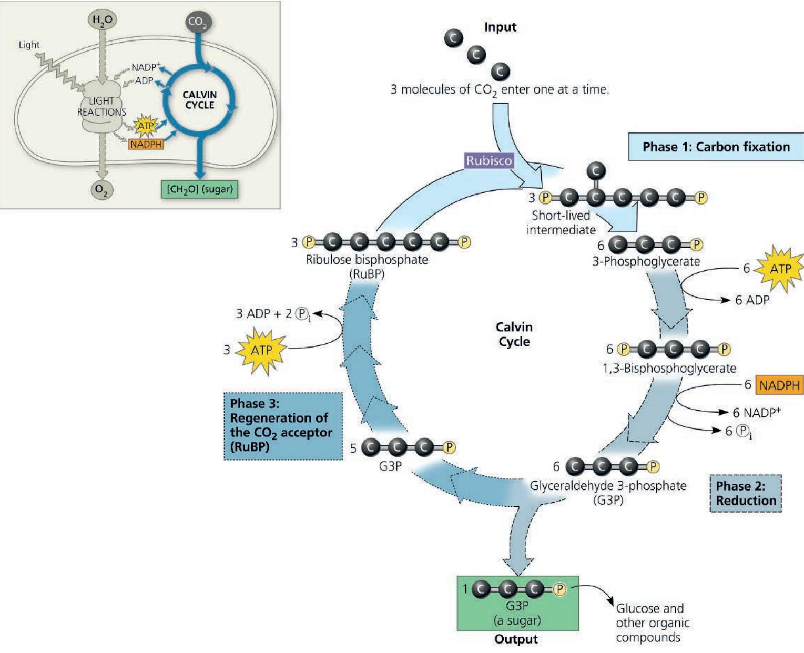

## Concept Check 10.4

1. To synthesize one glucose molecule, the Calvin cycle uses \_\_\_\_ molecules of $\mathrm{CO}_{2}$ , \_\_\_\_ molecules of ATP, and \_\_\_\_ molecules of NADPH.

2. How are the large numbers of ATP and NADPH molecules used during the Calvin cycle consistent with the high value of glucose as an energy source?

3. WHAT IF? Consider a poison that inhibits an enzyme of the Calvin cycle. Do you think such a poison will also inhibit the light reactions? Explain.

4. DRAW IT Draw a simple version of the Calvin cycle that shows only the number of carbon atoms at each step, using numerals rather than gray spheres (for example, “3 × 1C = 3C” at the beginning of the cycle). Explain how the total number of carbon atoms remains constant for every three turns of the cycle, noting the forms in which the carbon atoms enter and leave the cycle.

5. MAKE CONNECTIONS Review Figures 9.8 and 10.18, and then discuss the roles of intermediate and product played by glyceraldehyde 3-phosphate (G3P) in the two processes shown in these figures.

For suggested answers, see Appendix A.

## Concept 10.5: Alternative mechanisms of carbon fixation have evolved in hot, arid climates

EVOLUTION Ever since plants first moved onto land about 475 million years ago, they have been adapting to the problems of terrestrial life, particularly the problem of dehydration. In Concept 36.4, we will consider anatomical adaptations that help plants conserve water, while in this chapter we are concerned with metabolic adaptations. The solutions often involve trade-offs. An important example is the balance between photosynthesis and the prevention of excessive water loss from the plant. The $CO_{2}$ required for photosynthesis enters a leaf (and the resulting $O_{2}$ exits) via stomata, the pores on the leaf surface (see Figure 10.3). However, stomata are also the main avenues of transpiration, the evaporative loss of water from leaves. On a hot, dry day, most plants close their stomata, a response that conserves water but also reduces $CO_{2}$ levels. With stomata even partially closed, $CO_{2}$ concentrations begin to decrease in the air spaces within the leaf, and the concentration of $O_{2}$ released from the light reactions begins to increase. These conditions within the leaf favor an apparently wasteful process called photorespiration.

## Photorespiration: An Evolutionary Relic?

In most plants, initial fixation of carbon occurs via rubisco, the Calvin cycle enzyme that adds $CO_{2}$ to ribulose bisphosphate. Such plants are called $C_{3}$ plants because the first organic product of carbon fixation is a three-carbon compound, 3-phosphoglycerate (see Figure 10.18). $C_{3}$ plants include important agricultural plants such as rice, wheat, and soybeans. When their stomata close on hot, dry days, $C_{3}$ plants produce less sugar because the declining level of $CO_{2}$ in the leaf starves the Calvin cycle. In addition, rubisco is capable of binding $O_{2}$ in place of $CO_{2}$ . As $CO_{2}$ becomes scarce within the air spaces of the leaf and $O_{2}$ builds up, rubisco adds $O_{2}$ to the Calvin cycle instead of $CO_{2}$ . The product splits, and a two-carbon compound leaves the chloroplast. Peroxisomes and mitochondria within the plant cell rearrange and split this compound, releasing $CO_{2}$ . The process is called photorespiration because it occurs in the light (photo) and consumes $O_{2}$ while producing $CO_{2}$ (respiration). However, unlike normal cellular respiration, photorespiration uses ATP rather than generating it. And unlike photosynthesis, photorespiration produces no sugar. In fact, photorespiration decreases photosynthetic output by siphoning organic material from the Calvin cycle and releasing $CO_{2}$ that would otherwise be fixed. This $CO_{2}$ can eventually be fixed if it is still in the leaf once the $CO_{2}$ concentration builds up to a high enough level. In the meantime, though, the process is energetically costly, much like a hamster running on its wheel.

How can we explain the existence of a metabolic process that seems to be counterproductive for the plant? According to one hypothesis, photorespiration is evolutionary baggage—a metabolic relic from a much earlier time when the atmosphere had less $O_{2}$ and more $CO_{2}$ than it does today. In the ancient atmosphere that prevailed when rubisco first evolved, the ability of the enzyme's active site to bind $O_{2}$ would have made little difference. The hypothesis suggests that modern rubisco retains some of its chance affinity for $O_{2}$ , which is now so concentrated in the atmosphere that a certain amount of photorespiration is inevitable. There is also some evidence that photorespiration may provide protection against the damaging products of the light reactions, which build up when the Calvin cycle slows due to low $CO_{2}$ .

In many types of plants—including a significant number of crop plants—photorespiration drains away as much as 50% of the carbon fixed by the Calvin cycle. Indeed, if photorespiration could be reduced in certain plant species without otherwise affecting photosynthetic productivity, crop yields and food supplies might increase.

In some plant species, alternate modes of carbon fixation have evolved that minimize photorespiration and optimize the Calvin cycle—even in hot, arid climates. The two most important of these photosynthetic adaptations are $C_{4}$ photosynthesis and crassulacean acid metabolism (CAM).

## $C_{4}$ Plants

The $C_{4}$ plants are so named because they preface the Calvin cycle with an alternate mode of carbon fixation that forms a four-carbon compound as its first product. The $C_{4}$ pathway is believed to have evolved independently at least 45 separate times and is used by several thousand species in at least 19 plant families. Among the $C_{4}$ plants important to agriculture are sugarcane and corn, members of the grass family.

When the weather is hot and dry, a $C_{4}$ plant partially closes its stomata, conserving water but reducing the $CO_{2}$ concentration in the leaves. However, sugar is still made because $C_{4}$ plants use a multistep process that operates even under low $CO_{2}$ conditions. Photosynthesis begins in mesophyll cells but is completed in bundle-sheath cells, cells that are arranged into tightly packed sheaths around the veins of the leaf (Figure 10.19). In $C_{4}$ leaves, the loosely arranged mesophyll cells are located between the bundle-sheath cells and the leaf surface, no more than two to three cells away from the bundle-sheath cells. In mesophyll cells, $CO_{2}$ is incorporated into organic compounds that then move into the bundle-sheath cells, where the Calvin cycle takes place. See the numbered steps in Figure 10.19, which are also described here:

The first step is carried out by an enzyme present only in mesophyll cells called PEP carboxylase, which has a much higher affinity for $CO_{2}$ than does rubisco, and no affinity for $O_{2}$ . This enzyme adds $CO_{2}$ to phosphoenolpyruvate (PEP), forming the four-carbon product oxaloacetate; it does this even under conditions of lower $CO_{2}$ concentration and relatively higher $O_{2}$ concentration.

Figure 10.19 $C_{4}$ leaf anatomy and the $C_{4}$ pathway.

The structure and biochemical functions of the leaves of $C_{4}$ plants are an evolutionary adaptation to hot, dry climates. This adaptation maintains a $CO_{2}$ concentration in the bundle-sheath cells that favors photosynthesis over photorespiration.

2 After the $CO_{2}$ is fixed in the mesophyll cells, the four-carbon products (malate in the example shown in Figure 10.19) are exported to bundle-sheath cells through plasmodesmata (see Figure 6.29).

3 Within the bundle-sheath cells, an enzyme releases $CO_{2}$ from the four-carbon compounds; the $CO_{2}$ is re-fixed into organic material by rubisco and the Calvin cycle. The same reaction regenerates pyruvate, which is transported to mesophyll cells. There, ATP is used to convert pyruvate to PEP, which can then accept addition of another $CO_{2}$ , allowing the reaction cycle to continue. This ATP can be thought of, in a sense, as the “price” of concentrating $CO_{2}$ in the bundle-sheath cells. To generate this extra ATP, bundle-sheath cells carry out cyclic electron flow, the process described earlier in this chapter (see Figure 10.15). In fact, these cells contain PS I but no PS II, so cyclic electron flow is their only photosynthetic mode of generating ATP.

In effect, the mesophyll cells of a $C_{4}$ plant pump $CO_{2}$ into the bundle-sheath cells, keeping the $CO_{2}$ concentration in those cells high enough for rubisco to bind $CO_{2}$ rather than $O_{2}$ . The cyclic series of reactions involving PEP carboxylase and the regeneration of PEP can be thought of as an ATP-powered pump that concentrates $CO_{2}$ where it can be fixed. In this way, $C_{4}$ photosynthesis spends ATP energy to minimize photorespiration and enhance sugar production. This adaptation is especially advantageous in hot regions with intense sunlight, and it is in such environments that $C_{4}$ plants evolved and thrive today.

The concentration of $CO_{2}$ in the atmosphere has drastically increased since the Industrial Revolution began in the 1800s, and it continues to rise today due to human activities such as the burning of fossil fuels (see Concept 1.1). The resulting global climate change, including an increase in average temperatures around the planet, may have far-reaching effects on plant species. Scientists are concerned that increasing $CO_{2}$ concentration and temperature may affect $C_{3}$ and $C_{4}$ plants differently, thus changing the relative abundance of these species in a given plant community.

Which type of plant would stand to gain more from increasing $CO_{2}$ levels? Recall that in $C_{3}$ plants, the binding of $O_{2}$ rather than $CO_{2}$ by rubisco leads to photorespiration, lowering the efficiency of photosynthesis. $C_{4}$ plants overcome this problem by concentrating $CO_{2}$ in the bundle-sheath cells at the cost of ATP. Rising $CO_{2}$ levels should benefit $C_{3}$ plants by lowering the amount of photorespiration that occurs. At the same time, rising temperatures have the opposite effect, increasing photorespiration (Other factors such as water availability may also come into play.) In contrast, many $C_{4}$ plants could be largely unaffected by increasing $CO_{2}$ levels or temperature. Researchers have investigated aspects of this question in several studies; you can work with data from one such experiment in the Scientific Skills Exercise. In different regions, the particular combination of $CO_{2}$ concentration and temperature is likely to alter the balance of $C_{3}$ and $C_{4}$ plants in varying ways. The effects of such a widespread and variable change in community structure are unpredictable and thus a cause of legitimate concern.

# Scientific Skills Exercise Making Scatter Plots with Regression Lines

Does Atmospheric $CO_{2}$ Concentration Affect the Productivity of Agricultural Crops? The atmospheric concentration of $CO_{2}$ has been rising globally, and scientists wondered whether this would affect $C_{3}$ and $C_{4}$ plants differently. In this exercise, you will make a scatter plot to examine the relationship between $CO_{2}$ concentration and growth of both corn (maize), a $C_{4}$ crop plant, and velvetleaf, a $C_{3}$ weed found in cornfields.

How the Experiment Was Done For 45 days, researchers grew corn and velvetleaf plants under controlled conditions, where all plants received the same amounts of water and light. The plants were divided into three groups, and each was exposed to a different concentration of $CO_{2}$ in the air: 350, 600, or 1,000 ppm (parts per million).

Data from the Experiment The table shows the dry mass (in grams) of corn and velvetleaf plants grown at the three concentrations of $CO_{2}$ . The dry mass values are averages calculated from the leaves, stems, and roots of eight plants.

<table><tr><td></td><td>350 ppm  $CO_2$ </td><td>600 ppm  $CO_2$ </td><td>1,000 ppm  $CO_2$ </td></tr><tr><td>Average dry mass of one corn plant (g)</td><td>91</td><td>89</td><td>80</td></tr><tr><td>Average dry mass of one velvetleaf plant (g)</td><td>35</td><td>48</td><td>54</td></tr></table>

Data from D. T. Patterson and E. P. Flint, Potential effects of global atmospheric $CO_{2}$ enrichment on the growth and competitiveness of $C_{3}$ and $C_{4}$ weed and crop plants, Weed Science 28(1):71–75 (1980).

## INTERPRET THE DATA

1. To explore the relationship between the two variables, it is useful to graph the data in a scatter plot, and then draw a regression line. (a) First, place labels for the dependent and independent variables on the appropriate axes. Explain your choices. (b) Plot the data points for corn and velvetleaf using different symbols for each set of data, and add a key for the two symbols. (For additional information about graphs, see the Scientific Skills Review in Appendix D.)

2. Draw a “best-fit” line for each set of points. A best-fit line does not necessarily pass through all or even most points. Instead, it is a straight line that passes as close as possible to all data points from that set. Draw a best-fit line for each set of data. Because placement of the line is a matter of

$C_{4}$ photosynthesis is considered more efficient than $C_{3}$ photosynthesis because it uses less water and resources. On our planet today, the world population and demand for food are rapidly increasing. At the same time, the amount of land suitable

judgment, two individuals may draw two slightly different lines for a given set of points. The line that actually fits best, a regression line, can be identified by squaring the distances of all points to any candidate line, then selecting the line that mini-

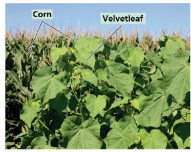  
Corn field with invasive velvetleaf plants.

mizes the sum of the squares. (See the graph in the Scientific Skills Exercise in Chapter 3 for an example of a linear regression line.) Excel or other software programs, including those on a graphing calculator, can plot a regression line once data points are entered. Using either Excel or a graphing calculator, enter the data points for each data set and have the program draw the two regression lines. Compare them to the lines you drew.

3. Describe the trends shown by the regression lines in your scatter plot. (a) Compare the relationship between increasing concentration of $CO_{2}$ and the dry mass of corn to that for velvetleaf. (b) Considering that velvetleaf is a weed invasive to cornfields, predict how increased $CO_{2}$ concentration may affect interactions between the two species.

4. Based on the data in the scatter plot, estimate the percentage change in dry mass of corn and velvetleaf plants if atmospheric $CO_{2}$ concentration increased from 390 ppm (current levels) to 800 ppm. (a) What is the estimated dry mass of corn and velvetleaf plants at 390 ppm? 800 ppm? (b) To calculate the percentage change in mass for each plant, subtract the mass at 390 ppm from the mass at 800 ppm (change in mass), divide by the mass at 390 ppm (initial mass), and multiply by 100. What is the estimated percentage change in dry mass for corn? For velvetleaf? (c) Do these results support the conclusion from other experiments that $C_{3}$ plants grow better than $C_{4}$ plants under increased $CO_{2}$ concentration? Why or why not?

Instructors: A version of this Scientific Skills Exercise can be assigned in Mastering Biology.

for growing crops is decreasing due to the effects of global climate change, which include an increase in sea level as well as a hotter, drier climate in many regions. To address issues of food supply, scientists in the Philippines have been working on genetically

modifying rice—an important food staple that is a $C_{3}$ crop—so that it can instead carry out $C_{4}$ photosynthesis. Results so far seem promising, and these researchers estimate that the yield of $C_{4}$ rice might be 30–50% higher than $C_{3}$ rice with the same input of water and resources.

## CAM Plants

A second photosynthetic adaptation to arid conditions has evolved in pineapples, many cacti, and other succulent (water-storing) plants, such as aloe and jade plants. These plants open their stomata at night and close them during the day, just the reverse of how other plants behave. Closing stomata during the day helps desert plants conserve water, but it also prevents $CO_{2}$ from entering the leaves. During the night, when their stomata are open, these plants take up $CO_{2}$ and incorporate it into a variety of organic acids. This mode of carbon fixation is called crassulacean acid metabolism, or CAM, after the plant family Crassulaceae, the succulents in which the process was first discovered. The mesophyll cells of CAM plants store the organic acids they make during the night in their vacuoles until morning, when the stomata close. During the day, when the light reactions can supply ATP and NADPH for the Calvin cycle, $CO_{2}$ is released from the organic acids made the night before to become incorporated into sugar in the chloroplasts.

Notice in Figure 10.20 that the CAM pathway is similar to the $C_{4}$ pathway in that $CO_{2}$ is first incorporated into organic intermediates before it enters the Calvin cycle. The difference is that in $C_{4}$ plants, the initial steps of carbon fixation are separated structurally from the Calvin cycle, whereas in CAM plants, the two steps occur within the same cell but at separate times. (Keep in mind that CAM, $C_{4}$ , and $C_{3}$ plants all eventually use the Calvin cycle to make sugar from carbon dioxide.)

## Concept Check 10.5

1. Describe how photorespiration lowers photosynthetic output for plants.

2. The presence of only PS I, not PS II, in the bundle-sheath cells of $C_{4}$ plants has an effect on $O_{2}$ concentration. What is that effect, and how might that benefit the plant?

3. MAKE CONNECTIONS Refer to the discussion of ocean acidification in Concept 3.3. Ocean acidification and changes in the distribution of $C_{3}$ and $C_{4}$ plants may seem to be two very different problems, but what do they have in common? Explain.

4. WHAT IF? How would you expect the relative abundance of $C_{3}$ versus $C_{4}$ and CAM species to change in a geographic region whose climate becomes much hotter and drier, with no change in $CO_{2}$ concentration?

For suggested answers, see Appendix A.

Figure 10.20 $C_{4}$ and CAM photosynthesis compared.

The $C_{4}$ and CAM pathways are two evolutionary solutions to the problem of maintaining photosynthesis with stomata partially or completely closed on hot, dry days. Both adaptations are characterized by: ① preliminary incorporation of $CO_{2}$ into organic acids, followed by ② transfer of $CO_{2}$ to the Calvin cycle.

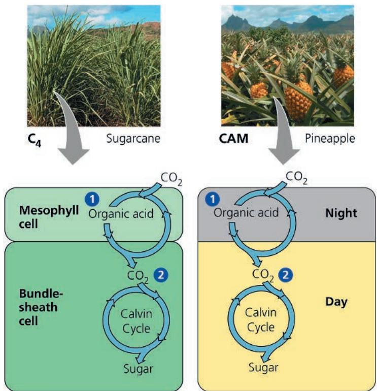  
(a) Spatial separation of steps. In $C_{4}$ plants, carbon fixation and the Calvin cycle occur in different types of cells.  
(b) Temporal separation of steps. In CAM plants, carbon fixation and the Calvin cycle occur in the same cell at different times.

## Concept 10.6: Photosynthesis is essential for life on Earth: A review

In this chapter, we have followed photosynthesis from photons to food. The light reactions capture solar energy and use it to make ATP and transfer electrons from $H_{2}O$ to $NADP^{+}$ , forming NADPH. The Calvin cycle uses the ATP and NADPH to produce sugar from $CO_{2}$ . The energy that enters the chloroplasts as sunlight becomes stored as chemical energy in organic compounds. The entire process is reviewed visually in Figure 10.21, where photosynthesis is also put in its natural context.

As for the fates of photosynthetic products, enzymes in the chloroplast and cytosol convert the G3P made in the Calvin cycle to many other organic compounds. In fact, the sugar made in the chloroplasts supplies the entire plant with chemical energy and carbon skeletons for the synthesis of all the major organic molecules of plant cells. About 50% of the organic material made by photosynthesis is consumed as fuel for cellular respiration in plant cell mitochondria.

Technically, green cells are the only autotrophic parts of the plant. The rest of the plant depends on organic molecules exported

Figure 10.21 A review of photosynthesis.

This diagram shows the main reactants and products of photosynthesis as they move through the tissues of a tree (left) and a chloroplast (right).

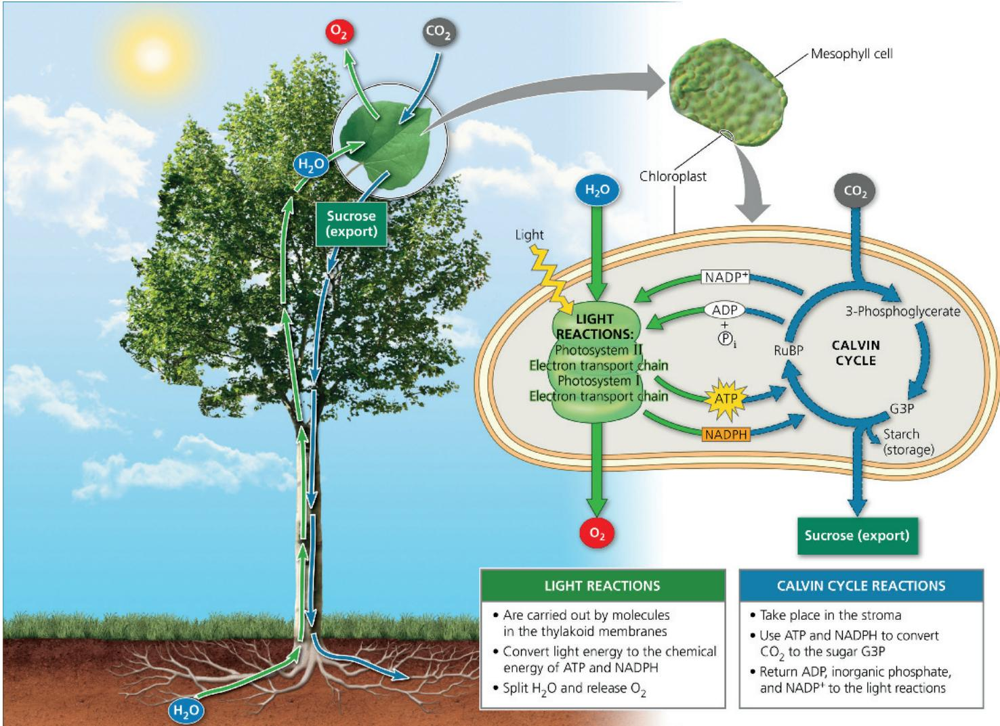

from leaves through veins (see Figure 10.21, top). In most plants, carbohydrate is transported out of the leaves to the rest of the plant in the form of sucrose, a disaccharide. After arriving at nonphotosynthetic cells, the sucrose provides raw material for cellular respiration and a multitude of anabolic pathways that synthesize proteins, lipids, and other products. A considerable amount of sugar in the form of glucose is linked together to make the polysaccharide cellulose (see Figure 5.6c), especially in plant cells that are still growing and maturing. Cellulose, the main ingredient of cell walls, is the most abundant organic molecule in the plant—and probably on the surface of the planet.

Most plants and other photosynthesizers make more organic material per day than they need to use as respiratory fuel and precursors for biosynthesis. For example, flowering plants stockpile the extra sugar in the form of starch, storing some in the chloroplasts and some in cells of roots, tubers, seeds, and fruits. In accounting for the use of food molecules produced by photosynthesis, note that most flowering plants lose leaves, roots, stems, fruits, and often their entire bodies to heterotrophs, including humans.

On a global scale, photosynthesis is the process responsible for the presence of $O_{2}$ in our atmosphere. Furthermore, although each chloroplast is minuscule, their collective productivity in terms of food production is enormous: Photosynthesis makes an estimated 150 billion metric tons of carbohydrate per year (a metric ton is 1,000 kg, about 1.1 tons). That's organic matter equivalent in mass to a stack of about 60 trillion biology textbooks—and the stack would reach 17 times the distance from Earth to the sun! No chemical process is more important than photosynthesis to the welfare of life on Earth.

In Chapters 5 through 10, you have learned about many activities of cells. Figure 10.22 integrates these cellular processes into the context of a working plant cell. As you study the figure, reflect on how each process fits into the big picture: As the most basic unit of living organisms, a cell performs all functions characteristic of life.

## Concept Check 10.6

1. MAKE CONNECTIONS How do plants use the sugar they produce during photosynthesis to directly power the work of the cell? Provide some examples of cellular work. (See Figures 8.10, 8.11, and 9.5.)

## Make Connections: The Working Cell

Figure 10.22

This figure illustrates how a generalized plant cell functions, integrating the cellular activities you learned about in Chapters 5–10. To see some of the enzymes involved, look at Figure 6.32.

## Flow of Genetic Information in the Cell: DNA → RNA → Protein (Chapters 5–7)

In the nucleus, DNA serves as a template for the synthesis of mRNA, which moves to the cytoplasm. (See Figures 5.22 and 6.9.)

2 mRNA attaches to a ribosome, which remains free in the cytosol or binds to the rough ER. Proteins are synthesized. (See Figures 5.22 and 6.10.)

3 Proteins and membrane produced by the rough ER flow in vesicles to the Golgi apparatus, where they are processed. (See Figures 6.15 and 7.9.)

4 Transport vesicles carrying proteins pinch off from the Golgi apparatus. (See Figure 6.15.)

5 Some vesicles merge with the plasma membrane, releasing proteins by exocytosis. (See Figure 7.9.)

6 Proteins synthesized on free ribosomes stay in the cell and perform specific functions; examples include the enzymes that catalyze the reactions of cellular respiration and photosynthesis. (See Figures 9.6, 9.8, and 10.18.)

MAKE CONNECTIONS The first enzyme that functions in glycolysis is hexokinase (see Figure 6.32a). How and where is hexokinase produced in this plant cell? Where does hexokinase function? (See Figures 5.18, 5.22, and 9.8.) For suggested answer, see Appendix A.

## Movement Across Cell Membranes (Chapter 7)

7 Water diffuses into and out of the cell directly through the plasma membrane and by facilitated diffusion through aquaporins. (See Figure 7.10.)

8 By passive transport, the $CO_{2}$ used in photosynthesis diffuses into the cell, and the $O_{2}$ formed as a by-product of photosynthesis diffuses out of the cell. Both solutes move down their concentration gradients. (See Figures 7.11 and 10.21.)

9 In active transport, energy (usually supplied by ATP) is used to transport a solute against its concentration gradient. (See Figure 7.17.)

Exocytosis (shown in step 5) and endocytosis move larger materials out of and into the cell. (See Figures 7.20 and 7.21.)

Energy Transformations in the Cell: Photosynthesis and Cellular Respiration (Chapters 8–10)

10 In chloroplasts, the process of photosynthesis uses the energy of light to convert $CO_{2}$ and $H_{2}O$ to organic molecules, with $O_{2}$ as a by-product. (See Figures 10.1 and 10.21.)

11 In mitochondria, organic molecules are broken down by cellular respiration, capturing energy in molecules of ATP, which are used to power the work of the cell, such as protein synthesis and active transport. $\mathrm{CO}_{2}$ and $\mathrm{H}_2\mathrm{O}$ are by-products. (See Figures 8.9, 8.11, 9.1, and 9.15.)

For suggested answers, see Appendix A.

## Summary of Key Concepts

To review key terms, go to the Vocabulary Self-Quiz (eTextbook only).

## Concept 10.1: Photosynthesis feeds the biosphere

\- Photosynthesis converts the energy of sunlight into chemical energy stored in sugars.

\- Autotrophs (“producers”) produce their organic molecules from $CO_{2}$ and other inorganic raw materials; plants are photoautotrophs that use light energy to do this. Heterotrophs (consumers, including decomposers) are unable to make their own food and live on compounds produced by others.

Using the terms producers, consumers, and decomposers, explain how photosynthesis feeds organisms, either directly or indirectly.

## Concept 10.2: Photosynthesis converts light energy to the chemical energy of food

\- In plants and other eukaryotic autotrophs, photosynthesis occurs in chloroplasts, organelles containing thylakoids. Stacks of thylakoids form grana. Photosynthesis is summarized as

$$
6 \mathrm{CO} _ {2} + 1 2 \mathrm{H} _ {2} \mathrm{O} + \text {   Light   energy   } \rightarrow \mathrm{C} _ {6} \mathrm{H} _ {1 2} \mathrm{O} _ {6} + 6 \mathrm{O} _ {2} + 6 \mathrm{H} _ {2} \mathrm{O}.
$$

Chloroplasts split water into hydrogen and oxygen, incorporating the electrons of hydrogen into sugar molecules. Photosynthesis is a redox process: $H_{2}O$ is oxidized, and $CO_{2}$ is reduced. The light reactions in the thylakoid membranes split water, releasing $O_{2}$ , producing ATP, and forming NADPH. The Calvin cycle in the stroma forms sugar from $CO_{2}$ , using ATP for energy and NADPH for reducing power.

Compare the roles of $CO_{2}$ and $H_{2}O$ in cellular respiration and photosynthesis.

## Concept 10.3: The light reactions convert solar energy to the chemical energy of ATP and NADPH

\- Light is a form of electromagnetic energy. The colors we see as visible light include those wavelengths that drive photosynthesis. A pigment absorbs light of specific wavelengths; chlorophyll a is the main photosynthetic pigment in plants. Other accessory pigments absorb different wavelengths of light and pass the energy on to chlorophyll a.

\- A pigment goes from a ground state to an excited state when a photon of light boosts one of the pigment's electrons to a higher-energy orbital. This excited state is unstable. Electrons from isolated pigments tend to fall back to the ground state, giving off heat and/or light.

\- A photosystem is composed of a reaction-center complex surrounded by light-harvesting complexes that funnel the energy of photons to the reaction-center complex. When a special pair of reaction-center chlorophyll $a$ molecules absorbs energy, one of its electrons is boosted to a higher energy level and transferred to the primary electron acceptor. Photosystem II contains P680 chlorophyll $a$ molecules in the reaction-center complex; photosystem I contains P700 molecules.

\- Linear electron flow during the light reactions uses both photosystems and produces NADPH, ATP, and oxygen:

\- Cyclic electron flow employs only one photosystem, producing ATP but no NADPH or $O_{2}$ .

\- During chemiosmosis in both mitochondria and chloroplasts, electron transport chains generate an $H^{+}$ gradient across a membrane. ATP synthase uses this proton-motive force to make ATP.

The absorption spectrum of chlorophyll a differs from the action spectrum of photosynthesis. Explain this observation.

Concept 10.4: The Calvin cycle uses the chemical energy of ATP and NADPH to reduce $CO_{2}$ to sugar

\- The Calvin cycle occurs in the stroma, using electrons from NADPH and energy from ATP.

\- One molecule of G3P exits the cycle per three $CO_{2}$ molecules fixed and is converted to glucose and other organic molecules.

  
DRAW IT On the diagram above, draw where ATP and NADPH are used and where rubisco functions. Describe these steps.

## Concept 10.5: Alternative mechanisms of carbon fixation have evolved in hot, arid climates

\- On dry, hot days, $C_{3}$ plants close their stomata, conserving water but keeping $CO_{2}$ out and $O_{2}$ in. Under these conditions, photorespiration can occur: Rubisco binds $O_{2}$ instead of $CO_{2}$ , consuming ATP and releasing $CO_{2}$ without producing ATP or carbohydrate. Photorespiration may be an evolutionary relic, and it may play a photoprotective role.

\- $C_4$ and CAM plants are adopted to hot, dry climates.

\- $C_{4}$ plants minimize the cost of photorespiration by incorporating $CO_{2}$ into four-carbon compounds in mesophyll cells. These compounds are exported to bundle-sheath cells, where they release carbon dioxide for use in the Calvin cycle.

\- CAM plants open their stomata at night, incorporating $CO_{2}$ into organic acids, which are stored in mesophyll cells. During the day, the stomata close, and the $CO_{2}$ is released from the organic acids for use in the Calvin cycle.

\- Organic compounds produced by photosynthesis provide the energy and building material for Earth's ecosystems.

Why are $C_{4}$ and CAM photosynthesis more energetically expensive than $C_{3}$ photosynthesis? What climate conditions would favor $C_{4}$ and CAM plants?

## Concept 10.6: Photosynthesis is essential for life on Earth: a review

\- Organic compounds produced by photosynthesis provide the energy and building material for Earth's ecosystems.

How do plants use the products of photosynthesis? For suggested answers, see Appendix A.

## Test Your Understanding

For more multiple-choice questions, go to the Practice Test (eTextbook only).

## Levels 1-2: Remembering/Understanding

1. The light reactions supply the Calvin cycle with

(A) light energy.

(B) $CO_{2}$ and ATP.

(C) $H_{2}O$ and NADPH.

(D) ATP and NADPH.

2. Which of the following sequences correctly represents the flow of electrons during photosynthesis?

(A) NADPH → O₂ → CO₂

(B) $H_{2}O \rightarrow NADPH \rightarrow Calvin cycle$

(C) $H_{2}O \rightarrow photosystem I \rightarrow photosystem II$

(D) NADPH → electron transport chain → $O_{2}$

3. How is photosynthesis similar in $C_{4}$ plants and CAM plants?

(A) In both cases, only photosystem I is used.

(B) Both types of plants make sugar without the Calvin cycle.

(C) In both cases, rubisco is not used to fix carbon initially.

(D) Both types of plants make most of their sugar in the dark.

4. Which of the following statements is a correct distinction between autotrophs and heterotrophs?

(A) Autotrophs, but not heterotrophs, can nourish themselves beginning with $CO_{2}$ and other nutrients that are inorganic.

(B) Only heterotrophs require chemical compounds from the environment.

(C) Cellular respiration is unique to heterotrophs.

(D) Only heterotrophs have mitochondria.

5. Which of the following occurs during the Calvin cycle?

(A) carbon fixation

(B) reduction of NADP $^{+}$

(C) release of oxygen

(D) generation of $CO_{2}$

## Levels 3-4: Applying/Analyzing

6. In mechanism, photophosphorylation is most similar to

(A) substrate-level phosphorylation in glycolysis.

(B) oxidative phosphorylation in cellular respiration.

(C) carbon fixation.

(D) reduction of NADP $^{+}$ .

7. Which process is most directly driven by light energy?

(A) creation of a pH gradient by pumping protons across the thylakoid membrane

(B) reduction of NADP $^{+}$ molecules

(C) transfer of energy from pigment molecule to pigment molecule

(D) ATP synthesis

## Levels 5-6: Evaluating/Creating

8. SCIENCE, TECHNOLOGY, AND SOCIETY Scientific evidence indicates that the $CO_{2}$ added to the air by the burning of wood and fossil fuels is contributing to global warming, a rise in global temperature. Tropical rain forests are estimated to be responsible for approximately 20% of global photosynthesis, yet the consumption of large amounts of $CO_{2}$ by living trees is thought to make little or no net contribution to reduction of global warming. Explain why this might be the case. (Hint: What processes in both living and dead trees produce $CO_{2}$ ?)

9. EVOLUTION CONNECTION Photorespiration can decrease soybeans' photosynthetic output by about 50%. Would this figure be higher or lower in wild relatives of soybeans? Why?

10. SCIENTIFIC INQUIRY • DRAW IT The following diagram represents an experiment with isolated thylakoids. The thylakoids were first made acidic by soaking them in a solution at pH 4. After the thylakoid space reached pH 4, the thylakoids were transferred to a basic solution at pH 8. The thylakoids then made ATP in the dark. (See Concept 3.3 to review pH.)

Draw an enlargement of part of the thylakoid membrane in the beaker with the solution at pH 8. Draw ATP synthase. Label the areas of high $H^{+}$ concentration and low $H^{+}$ concentration. Show the direction protons flow through the enzyme, and show the reaction where ATP is synthesized. Would ATP end up in the thylakoid or outside of it? Explain why the thylakoids in the experiment were able to make ATP in the dark.

11. WRITE ABOUT A THEME: ENERGY AND MATTER In a short essay (100–150 words), describe how photosynthesis transforms solar energy into the chemical energy of sugar molecules.

12. SYNTHESIZE YOUR KNOWLEDGE

  
"Watermelon snow" in Antarctica is caused by a certain species of photosynthetic green algae that thrives in subzero temperatures (Chlamydomonas nivalis). These algae are also found in high-altitude, year-round snowfields. In both locations, UV light levels tend to be high. Propose an explanation for why this alga appears reddish-pink.

For selected answers, see Appendix A.

# Explore Scientific Papers with Science in the Classroom | AAAS

Can we capture the sun's energy by mimicking plants? Go to "Replicating Photosynthesis" at www.scienceintheclassroom.org.

Instructors: Questions can be assigned in Mastering Biology.

# Cell Communication

## Key Concepts

11.1 External signals are converted to responses within the cell

11.2 Signal reception: A signaling molecule binds to a receptor, causing it to change shape

11.3 Signal transduction: Cascades of molecular interactions transmit signals from receptors to relay molecules in the cell

11.4 Cellular response: Cell signaling leads to regulation of transcription or cytoplasmic activities

11.5 Apoptosis requires integration of multiple cell-signaling pathways

## Study Tip

Make a table: As you read about examples of cell signaling in this chapter, make a table and classify the events of each example into three stages: signal reception, signal transduction, and cellular response.

<table><tr><td>Example of Cell Signaling</td><td>Signal Reception</td><td>Signal Transduction</td><td>Cellular Response</td></tr><tr><td>Epinephrine</td><td>Epinephrine binds cell-surface receptor.</td><td>Relay molecules each activate the next molecule.</td><td>An enzyme is activated that breaks down glycogen into glucose for energy to fight or flee.</td></tr><tr><td></td><td></td><td></td><td></td></tr></table>

  
Figure 11.1 This impala is fleeing for its life, racing to escape the predatory cheetah nipping at its heels. The impala is breathing rapidly, its heart pounding and its legs pumping furiously. These physiological functions are all part of the impala's “fight-or-flight” response, driven by hormones released from its adrenal glands at times of stress—in this case, upon sensing the cheetah.

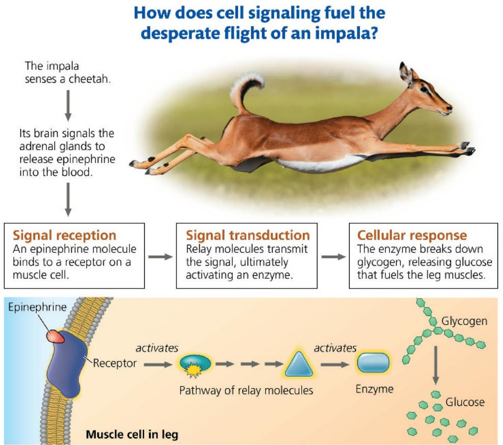

② Aggregation in progress

1 Individual rod-shaped cells

# Concept 11.1: External signals are converted to responses within the cell

Scientists think that signaling mechanisms first evolved hundreds of millions of years ago in ancient prokaryotic organisms and single-celled eukaryotes and then were adapted for new uses in their multicellular descendants. So let's begin by considering signaling in some examples of single-celled organisms: bacteria and yeasts.

## Evolution of Cell Signaling

EVOLUTION Research during the 1970s suggested that bacterial cells—somewhat surprisingly, since they are single-celled organisms—were capable of signaling to each other. Since then, we have come to understand that cell signaling is critical among bacteria. Bacterial cells secrete molecules that can be detected by other bacterial cells (Figure 11.2). Sensing the concentration of such signaling molecules allows bacteria to monitor their own local cell density, a phenomenon called quorum sensing.

Quorum sensing allows bacterial populations to coordinate the behavior of all cells in a population in activities that require a given density of cells acting at the same time. One example is formation of a biofilm, an aggregation of bacterial cells attached to a surface by

## Figure 11.2 Communication among bacteria.

Soil-dwelling bacteria called myxobacteria (“slime bacteria”) use chemical signals to share information about nutrient availability. When food is scarce, starving cells secrete a signaling molecule that stimulates

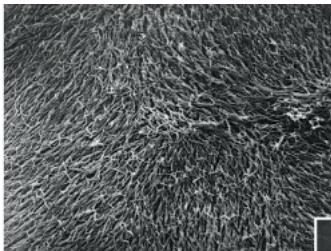

neighboring cells to aggregate. The cells form a structure called a fruiting body that produces spores, thick-walled cells that can survive until the environment improves. The myxobacteria shown here are the species Myxococcus xanthus (steps 1–3, SEMs; lower photo, LM).

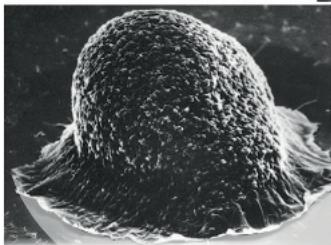

  
3 Spore-forming structure (fruiting body)  
Fruiting bodies

  
1 Exchange of mating factors. Each mating cell type secretes a mating factor that binds to receptors on the other mating type.

molecules secreted by the cells, but only after the cells have reached a certain density. The biofilm protects the cells in it, and they often derive nutrition from the surface they are on. Biofilms are believed to be involved in up to 80% of all human bacterial infections. You have probably encountered biofilms many times, perhaps without realizing it. The slimy coating on a fallen log or on leaves lying on a forest path, and even the film on your teeth each morning, are examples of bacterial biofilms. In fact, tooth-brushing and flossing disrupt biofilms that would otherwise cause cavities and gum disease.

## Interview

Interview with Bonnie Bassler: Exploring how bacteria communicate with each other (eTextbook only)

Another example of bacterial behavior coordinated by quorum sensing is the secretion of toxins by infectious bacteria, which has serious medical implications. Sometimes treatment by antibiotics doesn't work with such infections because of antibiotic resistance that has evolved in a particular strain of bacteria. A promising alternative treatment would be to disrupt toxin production by interfering with the signaling pathways used in quorum sensing. In the Problem-Solving Exercise, you can participate in the process of scientific thinking involved in this novel approach.

Now let's look at an example of cell signaling in yeasts (single-celled fungi) (Figure 11.3). Cells of the yeast

## Figure 11.3 Communication between mating yeast cells.

Saccharomyces cerevisiae cells use chemical signaling to identify cells of the opposite mating type and initiate the mating process. The two mating types and their corresponding chemical signaling molecules, or mating factors, are called a and $\alpha$ .

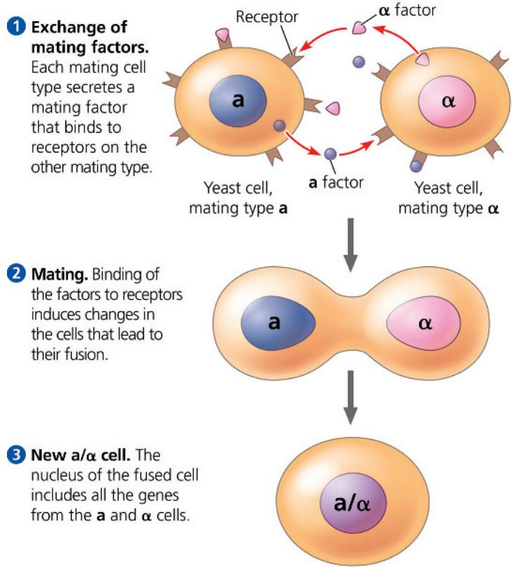  
2 Mating. Binding of the factors to receptors induces changes in the cells that lead to their fusion.  
3 New a/α cell. The nucleus of the fused cell includes all the genes from the a and α cells.

# Problem-Solving Exercise

Can a skin wound turn deadly?  

Staphylococcus aureus (S. aureus) is a common bacterial species found on the surface of healthy skin that can turn into a serious pathogen if introduced into tissue through a cut or abrasion. Once S. aureus cells enter the body and reach a certain density, they secrete a toxin that kills body cells and contributes significantly to inflammation and damage. Because about one in 100 people carry a strain of S. aureus that is resistant to common antibiotics, a minor infection can turn permanently harmful or even deadly.

Cells sense their own population density by quorum sensing, and at a certain density they start to secrete toxin. In this exercise, you will analyze whether blocking quorum sensing can stop S. aureus from producing toxin.

## Your Approach

In S. aureus, quorum sensing involves two separate signal transduction pathways. Two candidate synthetic peptides (short proteins), called peptides 1 and 2, have been proposed to interfere with S. aureus quorum-sensing pathways. Your job is to test each potential inhibitor of quorum sensing to see if it blocks either or both of the pathways that lead to toxin production.

For your experiment, you grow four cultures of S. aureus to a standardized high density and measure the concentration of toxin in the culture. The control culture contains no peptide. The other cultures have one or both candidate inhibitory peptides mixed into the growth medium before starting the cultures.

Saccharomyces cerevisiae—which are used to make bread, wine, and beer—identify their sexual mates by chemical signaling when they reproduce sexually. There are two sexes, or mating types, called a and $\alpha$ . Each type secretes a specific factor that binds only to receptors on the other type of cell. When exposed to each other's mating factors, a pair of cells of opposite type change shape, grow toward each other, and fuse (mate). The new a/ $\alpha$ cell contains all the genes of both original cells, providing advantages to the cell's descendants, which arise by subsequent cell divisions.

## Your Data

  
Data from N. Balaban et al., Treatment of Staphylococcus aureus biofilm infection by the quorum-sensing inhibitor RIP, Antimicrobial Agents and Chemotherapy 51(6):2226–2229 (2007).

## Your Analysis

1. Rank the cultures according to toxin production, from most to least.

2. Which, if any, of the cultures with peptide(s) resulted in a toxin concentration similar to the control culture? What is your evidence for this?

3. Was there an additive effect on toxin production when peptides 1 and 2 were both present in the growth medium? What is your evidence for this?

4. Based on these data, would you hypothesize that peptides 1 and 2 act on the same quorum-sensing pathway leading to toxin production or on two different pathways? What is your reasoning?

5. Do these data suggest a possible treatment for antibiotic-resistant S. aureus infections? What else would you want to know to investigate this further?

Instructors: A version of this Problem-Solving Exercise can be assigned in Mastering Biology. Or a more extensive investigation called “Solve It: Is It Possible to Treat Bacterial Infections Without Traditional Antibiotics?” can be assigned.

The unique match between mating factor and receptor is key to ensuring mating only between cells of the same species of yeast. How does the binding of a mating factor by the yeast cell-surface receptor initiate a signal that brings about the cellular response of mating? This occurs in a series of three major steps—signal reception, signal transduction, and cellular response—called a signal transduction pathway. Many such pathways exist in the cells of both unicellular and multicellular organisms. In fact, the molecular details of signal transduction in yeasts and mammals are strikingly similar, even though it's

been over a billion years since they shared a common ancestor. This similarity suggests that early versions of cell-signaling mechanisms evolved well before the first multicellular organisms appeared on Earth.

## Local and Long-Distance Signaling

Like bacteria or yeast cells, cells in a multicellular organism communicate by way of a signaling molecules targeted for cells that may or may not be immediately adjacent. As we saw in Concepts 6.7 and 7.1, eukaryotic cells may communicate by direct contact, which is one type of local signaling. Many animal and plant cells have cell junctions that directly connect the cytoplasms of adjacent cells (Figure 11.4a). In these cases, signaling substances dissolved in the cytosol can pass between neighboring cells. Moreover, some animal cells may communicate by direct contact between cell-surface molecules, as shown in Figure 11.4b. This type of local signaling is especially important in embryonic development, the immune response, and in maintaining adult stem cell populations.

In many other cases of local signaling, signaling molecules are secreted by the signaling cell. Some molecules travel only short distances; such local regulators influence cells that are nearby. This type of local signaling in animals is called paracrine signaling (Figure 11.5a). One class of local regulators in animals, growth factors, consists of compounds that stimulate nearby target cells to grow and divide. Numerous cells can simultaneously receive and respond to the growth factors produced by a single cell in their vicinity.

A highly specialized type of local signaling called synaptic signaling occurs in the animal nervous system (Figure 11.5b; see Concept 48.4). An electrical signal along a nerve cell triggers the secretion of neurotransmitter molecules. These molecules act as chemical signals, diffusing across the synapse—the narrow space between the nerve cell and its target cell—triggering a response in the target cell. Drugs to treat depression, anxiety, and post-traumatic stress disorder (PTSD) affect this signaling process.

Figure 11.4 Communication requiring contact between cells.  
  
(a) Cell junctions. Both animals and plants have cell junctions that allow molecules, including signaling molecules, to pass readily between adjacent cells without crossing plasma membranes.

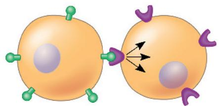  
(b) Cell-surface molecules. In many animal cells, cell-surface molecules on adjacent cells interact with each other, resulting in a signal passing between the cells.

Both animals and plants use molecules called hormones for long-distance signaling. In hormonal signaling in animals, also known as endocrine signaling, specialized cells release hormones, which travel through the circulatory system to other parts of the body, where they reach target cells that can recognize and respond to them (Figure 11.5c). Many plant hormones reach distant targets by traveling through cells (see Concept 39.2). Like local regulators, plant hormones vary widely in size and type. For instance, the plant hormone ethylene, which promotes fruit ripening and helps regulate growth, is a hydrocarbon of only six atoms ( $C_{2}H_{4}$ ), small enough to diffuse through the air and pass through cell walls. (Small signaling molecules probably evolved early on among single-celled organisms.) In contrast, the mammalian hormone insulin, which regulates sugar levels in the blood, is a protein with thousands of atoms.

Figure 11.5 Local and long-distance cell signaling by secreted molecules in animals.  
In both local and long-distance signaling, only specific target cells that can recognize a given signaling molecule will respond to it.  
  
(a) Paracrine signaling. A signaling cell acts on nearby target cells by secreting molecules of a local regulator (a growth factor, for example).  
(b) Synaptic signaling. A nerve cell releases neurotransmitter molecules into a synapse, stimulating the target cell, such as a muscle or another nerve cell.

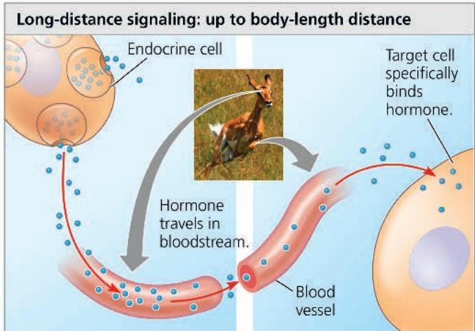  
(c) Endocrine (hormonal) signaling. Specialized endocrine cells secrete hormones into body fluids, often blood. Hormones reach most body cells, but are bound by and affect only some cells.

What happens when a potential target cell is exposed to a secreted signaling molecule? The ability of a cell to respond is determined by whether it has a specific receptor molecule that can bind to the signaling molecule. The information conveyed by this binding, the signal, must then be changed into another form—transduced—inside the cell before the cell can respond. The remainder of the chapter discusses this process, primarily as it occurs in animal cells. (Two signaling pathway proteins are shown in their cellular context in Figure 6.32a.)

## The Three Stages of Cell Signaling: A Preview

Our current understanding of how signaling molecules act through signal transduction pathways had its origins in the pioneering work of Earl W. Sutherland, whose research led to a Nobel Prize in 1971. Sutherland and his colleagues at Vanderbilt University were investigating how the animal hormone epinephrine (also called adrenaline) triggers the “fight-or-flight”

response in animals like the impala in Figure 11.1. One effect of epinephrine is to mobilize fuel reserves, which can be used by the animal to either defend itself (fight) or try to escape (flight). Epinephrine stimulates the breakdown of the storage polysaccharide glycogen within liver cells and skeletal muscle cells. The breakdown of glycogen releases the sugar glucose 1-phosphate, which the cell converts to glucose 6-phosphate. The liver or muscle cell can then use this compound, an early intermediate in glycolysis, for energy production (see Figure 9.8). Alternatively, the compound can be stripped of phosphate and released from the liver cell into the blood as glucose, which can fuel cells throughout the body.

But how, exactly, does epinephrine mobilize glucose for use? Sutherland's research team discovered that epinephrine outside the cell stimulates glycogen breakdown by somehow activating an enzyme, glycogen phosphorylase, inside the cell. However, when epinephrine was added to a solution containing the enzyme and its substrate, glycogen, no breakdown occurred. Glycogen phosphorylase could be activated by epinephrine only when the hormone was added to intact cells. This result told Sutherland two things. First, epinephrine does not interact directly with the enzyme responsible for glycogen breakdown; an intermediate step or series of steps must be occurring in the cell. Second, an intact, membrane-bound cell must be present for transmission of the signal to take place.

Sutherland's work suggested that the process going on at the receiving end of a cellular communication can be dissected into three stages: signal reception, signal transduction, and cellular response (Figure 11.6):

① Signal reception. Reception is the target cell's detection of a signaling molecule coming from outside the cell. A chemical signal is “detected” when the signaling molecule binds to a

## Figure 11.6 Overview of cell signaling.

From the perspective of the cell receiving the message, cell signaling can be divided into three stages: signal reception, signal transduction, and cellular response. When reception occurs at the plasma membrane, as shown here, the transduction stage is usually a pathway of several steps (three are shown as an example), with each specific relay molecule in the pathway bringing about a change in the next molecule. The final molecule in the pathway triggers the cell's response.

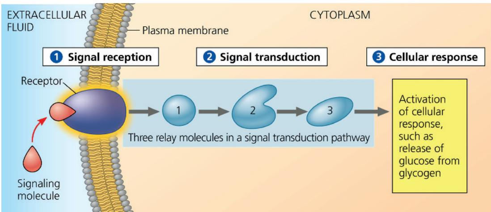  
VISUAL SKILLS Where would the epinephrine in Sutherland's experiment fit into this diagram of cell signaling? For suggested answer, see Appendix A.

Plasma membrane

receptor protein located at the cell's surface (or inside the cell, to be discussed later).

② Signal transduction. The binding of the signaling molecule changes the receptor protein in some way, initiating the process of transduction. The transduction stage converts the signal to a form that can bring about a specific cellular response. In Sutherland's system, the binding of epinephrine to a receptor protein in a liver cell's plasma membrane leads to activation of glycogen phosphorylase in the cytosol. Transduction sometimes occurs in a single step but more often requires a sequence of changes in a series of different molecules—a signal transduction pathway. The molecules in the pathway are often called relay molecules; three are shown as an example.

3 Cellular response. The transduced signal finally triggers a specific cellular response. The response may be almost any imaginable cellular activity—such as catalysis by an enzyme (for example, glycogen phosphorylase), rearrangement of the cytoskeleton, or activation of specific genes in the nucleus. The cell-signaling process helps ensure that crucial activities like these occur in the right cells, at the right time, and in proper coordination with the activities of other cells of the organism. We'll now explore the mechanisms of cell signaling in more detail, including a discussion of regulation and termination of the process.

## Concept Check 11.1

1. Explain how signaling is involved in ensuring that yeast cells fuse only with cells of the opposite mating type.

2. In liver cells, glycogen phosphorylase acts in one of the three stages of the signaling pathway associated with an epinephrine-initiated signal. Identify the stage.

3. WHAT IF? If epinephrine were mixed with glycogen phosphorylase and glycogen in a cell-free mixture in a test tube, would glucose 1-phosphate be generated? Why or why not?

For suggested answers, see Appendix A.

## Concept 11.2: Signal reception: A signaling molecule binds to a receptor, causing it to change shape

A wireless router may broadcast its network signal indiscriminately, but only computers with the correct password can connect to it: Reception of the signal depends on the receiver. Similarly, the signals emitted by an a mating type yeast cell are “heard” only by its prospective mates, $\alpha$ cells. In the case of the epinephrine circulating throughout the bloodstream of the impala in Figure 11.1, the hormone encounters many types of cells, but only certain target cells, those with the corresponding receptor protein, detect and respond to the epinephrine molecule. The signaling molecule is complementary in shape to a specific site on the receptor and attaches there, like a hand in a glove. The signaling molecule acts as a ligand, the term for a molecule that specifically binds to another (often larger) molecule. Ligand binding generally causes a receptor protein to undergo a change in shape. For many receptors, this shape change directly activates the receptor, enabling it to interact with other molecules in or on the cell. For other receptors, the immediate effect of ligand binding is to cause the aggregation of two or more receptor proteins, which leads to further molecular events inside the cell. Most signal receptors are plasma membrane proteins, but others are located inside the cell. We'll look at both of these types next.

## Receptors in the Plasma Membrane

Cell-surface transmembrane receptors play crucial roles in the biological systems of animals. The largest family of human cell-surface receptors is that of the G protein-coupled receptors (GPCRs). There are more than 800 GPCRs; an example is shown in Figure 11.7. Another example is the co-receptor hijacked by HIV to enter immune cells (see Figure 7.8); this GPCR is the target of the drug maraviroc, which has shown some success at treating AIDS.

Most water-soluble signaling molecules bind to specific sites on transmembrane receptor proteins that transmit information

## Figure 11.7 The structure of a G protein-coupled receptor (GPCR).

This is a model of the human $\beta_{2}$ -adrenergic receptor, which binds epinephrine (adrenaline). The receptor was crystallized (discussed later in this section) in the presence of both a molecule that mimics epinephrine (green in the model) and cholesterol in the membrane (orange). Two receptors (blue) are shown as ribbon models in a side view. Caffeine can also bind to this receptor; see question 10 at the end of the chapter.

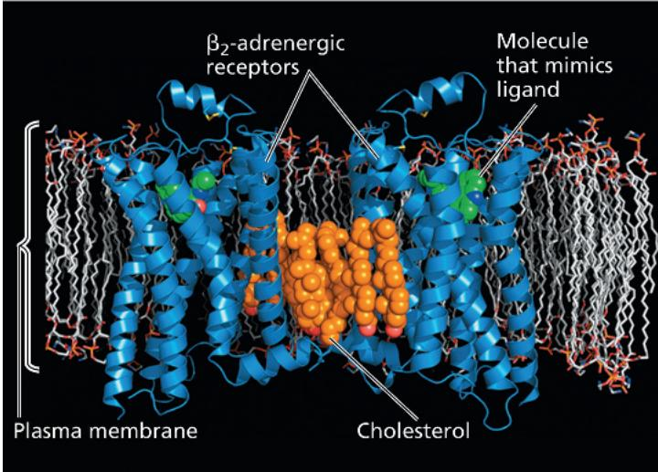

from the extracellular environment to the inside of the cell. We can see how cell-surface transmembrane receptors work by looking at three major types: G protein-coupled receptors (GPCRs), receptor tyrosine kinases, and ion channel receptors. These receptors are discussed and illustrated in Figure 11.8, on the next few pages; study this figure before going on.

Given the many important functions of cell-surface receptors, it is not surprising that their malfunctions are associated with many human diseases, including cancer, heart disease, and asthma. To better understand and treat these conditions, a major focus of both university research teams and the pharmaceutical industry has been to analyze the structure of these receptors.

Although cell-surface receptors (half of which are GPCRs) represent 30% of all human proteins, determining their structures by X-ray crystallography (see Figure 5.21) has proved challenging. For one thing, cell-surface receptors tend to be flexible and inherently unstable, thus difficult to crystallize. It took years of persistent efforts for researchers to determine the first few of these structures, such as the GPCR shown in Figure 11.7. In that case, the $\beta$ -adrenergic receptor was stable enough to be crystallized only while it was among membrane molecules and in the presence of a molecule mimicking its ligand. Newer techniques that do not require crystallization, like cryo-EM (see Figure 6.3), have shown promise in determining the structures of cell-surface receptors. Thus far, however, use of AlphaFold2 as a computational approach to determining structure (see Concept 5.5) has met with limited success due to the inherent structural instability of GPCRs.

Abnormal functioning of receptor tyrosine kinases (RTKs) is associated with many types of cancers. For example, some breast cancer patients have tumor cells with excessive levels of a receptor tyrosine kinase called HER2 (see Concept 12.3 and Figure 18.27). Using molecular biological techniques, researchers have developed a protein called Herceptin that binds to HER2 on cells and inhibits cell division, thus thwarting further tumor development. In some clinical studies, treatment with Herceptin improved patient survival rates by more than one-third. One goal of ongoing research into these cell-surface receptors and other cell-signaling proteins is development of additional successful treatments.

they are either hydrophobic enough or small enough to cross the hydrophobic interior of the membrane (see Concept 7.1). Hydrophobic signaling molecules include steroid hormones and thyroid hormones of animals. Another chemical signaling molecule that possesses an intracellular receptor is nitric oxide (NO), a gas; this very small molecule readily passes between the membrane phospholipids. Once a hormone or other signaling molecule has entered a cell, its binding to an intracellular receptor changes the receptor into a hormone-receptor complex that is able to cause a response—in many cases, the turning on or off of particular genes.

The behavior of aldosterone is a representative example of how steroid hormones work. This hormone is secreted by cells of the adrenal gland (a gland that lies above the kidney), then travels through the blood and enters cells all over the body. However, a response occurs only in kidney cells because they alone contain receptors for aldosterone. In these cells, the hormone binds to and activates the receptor protein. With aldosterone attached, the active form of the receptor protein then enters the nucleus and turns on specific genes that control water and sodium flow in kidney cells, ultimately affecting blood volume (Figure 11.9, after you turn the next page).

How does the activated hormone-receptor complex turn on genes? Recall that the genes in a cell's DNA function by being transcribed and processed into messenger RNA (mRNA), which leaves the nucleus and is translated into a specific protein by ribosomes in the cytoplasm (see Figure 5.22). Specialized proteins called transcription factors control which genes are turned on—that is, which genes are transcribed into mRNA—in a particular cell at a particular time. When the aldosterone receptor is activated, it acts as a transcription factor that turns on specific genes. (You'll learn more about transcription factors in Chapters 17 and 18.)

By acting as a transcription factor, the aldosterone receptor itself carries out two parts of the signaling pathway, as receptor and transducer. Most other intracellular receptors function in the same way, although many of them, such as the thyroid hormone receptor, are already in the nucleus before the signaling molecule reaches them. Interestingly, many of these intracellular receptor proteins are structurally similar, suggesting an evolutionary kinship.

## Interview

Interview with Diana Bautista: How cell signaling leads to itch and pain (eTextbook only)

## Intracellular Receptors

Intracellular receptor proteins are found in either the cytoplasm or nucleus of target cells. To reach such a receptor, a signaling molecule passes through the target cell's plasma membrane. A number of important signaling molecules can do this because

## Concept Check 11.2

1. Nerve growth factor (NGF) is a water-soluble signaling molecule. Would you expect the receptor for NGF to be intracellular or in the plasma membrane? Explain.

2. WHAT IF? What would the effect be if a cell made defective receptor tyrosine kinase proteins that were unable to dimerize?

3. MAKE CONNECTIONS How is ligand binding similar to the process of allosteric regulation of enzymes? (See Figure 8.20.)

For suggested answers, see Appendix A.

G protein-coupled receptor

# Exploring Cell-Surface Transmembrane Receptors

Figure 11.8

## G Protein-Coupled Receptors

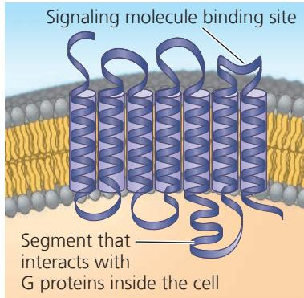  
Segment that interacts with G proteins inside the cell

A G protein-coupled receptor (GPCR) is a cell-surface transmembrane receptor that works with the help of a G protein, a protein that binds the energy-rich molecule GTP. Many different signaling molecules—including yeast mating factors, neurotransmitters, and epinephrine (adrenaline) and many other hormones—use GPCRs.

G protein-coupled receptors vary in the binding sites for their ligands and also for different types of G proteins inside the cell. Nevertheless, GPCR proteins are all remarkably similar in structure. In fact, they make up a large family of eukaryotic receptor proteins with a secondary structure in which the single polypeptide, represented here in a ribbon model, has seven transmembrane $\alpha$ helices (outlined with cylinders and depicted in a row for clarity). Specific loops between the helices form binding sites for signaling molecules

(outside the cell) and G proteins (on the cytoplasmic side).

GPCR-based signaling systems are extremely widespread and diverse in their functions, including roles in embryonic development and sensory reception. In humans, for example, vision, smell, and taste depend on GPCRs (see Concept 50.4). Similarities in the structures of G proteins and GPCRs in diverse organisms suggest that G proteins and their associated receptors evolved very early among eukaryotes.

Malfunctions of the associated G proteins themselves are involved in many human diseases, including bacterial infections. The bacteria that cause cholera, pertussis (whooping cough), and botulism, among others, make their victims ill by producing toxins that interfere with G protein function. Up to 35% of all medicines used today exert their effects by influencing G protein pathways.

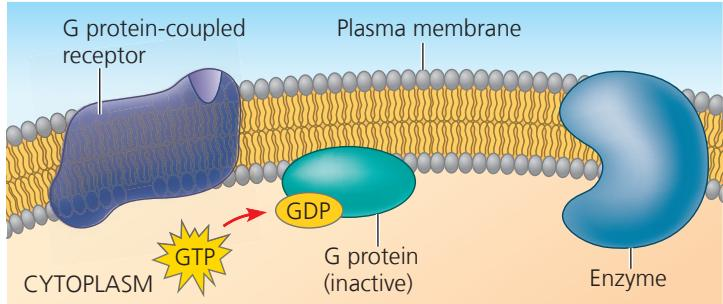

1 Attached but able to move along the cytoplasmic side of the membrane, a G protein functions as a molecular switch that is either on or off, depending on whether GDP or GTP is attached—hence the term G protein. (GTP, or guanosine triphosphate, is similar to ATP.) When GDP is bound to the G protein, as shown above, the G protein is inactive. The receptor and G protein work together with another protein, usually an enzyme.

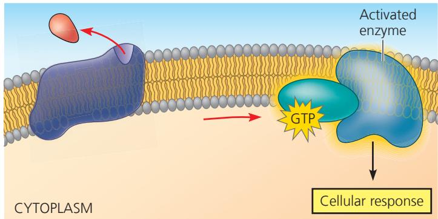  
3 The activated G protein dissociates from the receptor, diffuses along the membrane, and then binds to an enzyme, altering the enzyme's shape and activity. Once activated, the enzyme can trigger the next step leading to a cellular response. Binding of signaling molecules is reversible: Like other ligands, they bind and dissociate many times. The ligand concentration outside the cell determines how often a ligand is bound and initiates signaling.

2 When the appropriate signaling molecule binds to the extracellular side of the receptor, the receptor is activated and changes shape. Its cytoplasmic side then binds an inactive G protein, causing a GTP to displace the GDP. This activates the G protein.

  
4 The changes in the enzyme and G protein are only temporary: The G protein also acts as a GTPase, hydrolyzing its bound GTP to GDP and $P_{i}$ ; as a result, it can no longer activate the enzyme. The G protein leaves the enzyme, which returns to its inactive state. The G protein is now available for reuse. Its GTPase function allows the pathway to shut down rapidly when the signaling molecule is no longer present.

## Receptor Tyrosine Kinases

Receptor tyrosine kinases (RTKs) belong to a major class of plasma membrane receptors characterized by having enzymatic activity. An RTK is a protein kinase—an enzyme that catalyzes the transfer of phosphate groups from ATP to another protein. The part of the receptor protein extending into the cytoplasm functions more specifically as a tyrosine kinase, an enzyme that catalyzes the transfer of a phosphate group from ATP to the amino acid tyrosine of a substrate protein. Thus, RTKs are membrane receptors that attach phosphates to tyrosines.

Many receptor tyrosine kinases have the structure depicted schematically here. Before the signaling molecule binds, the receptors exist as individual units referred to as monomers. Notice that each monomer has an extracellular ligand-binding site, an $\alpha$ helix spanning the membrane, and an intracellular tail containing multiple tyrosines.

3 Dimerization activates the tyrosine kinase region of each monomer; each tyrosine kinase adds a phosphate from an ATP molecule to a tyrosine that is part of the tail of the other monomer.

Upon binding a ligand such as a growth factor, one RTK may activate ten or more different transduction pathways and cellular responses. Often, more than one signal transduction pathway can be triggered at once, helping the cell regulate and coordinate many aspects of cell growth and cell reproduction. The ability of a single ligand-binding event to trigger so many pathways is a key difference between RTKs and GPCRs; GPCRs generally activate a single transduction pathway. Abnormal RTKs that function even in the absence of signaling molecules are associated with many kinds of cancer.

2 The binding of a signaling molecule (such as a growth factor) causes two receptor monomers to associate closely with each other, forming a complex known as a dimer, a process called dimerization. (In some cases, larger clusters form. The details of monomer association are a focus of current research.)

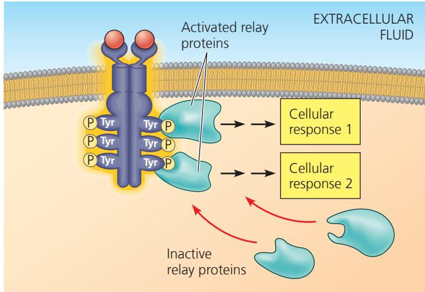

4 Now that the receptor is fully activated, it is recognized by specific relay proteins inside the cell. Each such protein binds to a specific phosphorylated tyrosine, undergoing a resulting structural change that activates the bound relay protein. Each activated protein triggers a transduction pathway, leading to a cellular response.

## Figure 11.8 (Continued)

## Ion Channel Receptors

A ligand-gated ion channel is a type of membrane channel receptor containing a region that can act as a “gate,” opening or closing the channel when the receptor changes shape. When a signaling molecule binds as a ligand to the channel receptor, the channel opens or closes, allowing or blocking the flow of specific ions, such as $Na^{+}$ or $Ca^{2+}$ . Like the other receptors we have discussed, these proteins bind the ligand at a specific site on their extracellular sides.

1 Here we show a ligand-gated ion channel receptor in which the channel remains closed until a ligand binds to the receptor.

2 When the ligand binds to the receptor and the channel opens, specific ions can flow through the channel and rapidly change the local concentration of that ion inside the cell. This change may directly affect the activity of the cell in some way.

3 When the ligand dissociates from this receptor, the channel closes and ions no longer enter the cell.

  
Figure 11.9 Steroid hormone interacting with an intracellular receptor.

Ligand-gated ion channels are very important in the nervous system. For example, the neurotransmitter molecules released at a synapse between two nerve cells (see Figure 11.5b) bind as ligands to some ion channels on the receiving cell, causing the channels to open. Ions flow in (or, in some cases, out), triggering an electrical signal that propagates down the length of the receiving cell. Some of the gated ion channels are controlled by electrical signals instead of ligands; these voltage-gated ion channels are crucial to the functioning of the nervous system, as you'll see in Chapter 48. One particular voltage-gated sodium channel is required for proper muscle contraction; defects in this protein can lead to muscle stiffness or weakness, or even temporary paralysis. Some ion channels are present on membranes of organelles, such as the ER.

MAKE CONNECTIONS Is the flow of ions through a ligand-gated channel an example of active or passive transport? (Review Concepts 7.3 and 7.4.) For suggested answer, see Appendix A.

The receptor shown here is cytoplasmic. Some receptors are nuclear, and the steroid hormone would enter the nucleus and bind them.

  
MAKE CONNECTIONS Why is a cell-surface receptor protein not required for this steroid hormone to enter the cell? (See Concept 7.2.)
For suggested answer, see Appendix A.

## Concept 11.3: Signal transduction: Cascades of molecular interactions transmit signals from receptors to relay molecules in the cell

When receptors for signaling molecules are plasma membrane proteins, like most of those we have discussed, the transduction stage of cell signaling is usually a multistep pathway involving many molecules. Steps often include activation of proteins by addition or removal of phosphate groups or release of other small molecules or ions that act as signaling molecules. One benefit of using multiple steps is that a signal caused by a small number of signaling molecules can be greatly amplified. If each molecule transmits the signal to numerous molecules at the next step in the series, the result is a geometric increase in the number of activated molecules by the end (see Figure 11.16). A second benefit of using multistep pathways is that they provide more opportunities for coordination and control than do simpler systems. This allows regulation of the response, as we'll see later in the chapter.

## Signal Transduction Pathways

The binding of a specific signaling molecule to a receptor in the plasma membrane triggers the first step in the signal transduction pathway—the chain of molecular interactions that leads to a particular response within the cell. Like falling dominoes, the signal-activated receptor activates another molecule, which activates yet another molecule, and so on, until the protein that produces the final cellular response is activated. The molecules that relay a signal from receptor to response, which we call relay molecules in this book, are often proteins. Protein-protein interactions are a major theme of cell signaling—indeed, a unifying theme of all cellular activities.

Keep in mind that the original signaling molecule is not physically passed along a signaling pathway; in most cases, it never even enters the cell. When we say that the signal is relayed along a pathway, we mean that certain information is passed on. At each step, the signal is transduced into a different form, commonly a shape change in the next protein. Very often, the shape change is brought about by phosphorylation.

Figure 11.10 A phosphorylation cascade.

In a phosphorylation cascade, a series of different proteins in a pathway are phosphorylated in turn, each protein adding a phosphate group to the next one in line. Here, phosphorylation activates each protein, and dephosphorylation returns it to its inactive form. The active and inactive forms of each protein are represented by different shapes to remind you that activation is usually associated with a change in molecular shape.

WHAT IF? What would happen if a mutation in protein kinase 2 made it incapable of being phosphorylated?

For suggested answer, see Appendix A.

## Protein Phosphorylation and Dephosphorylation

Previous chapters introduced the concept of activating a protein by adding one or more phosphate groups to it (see Figure 8.11a). In Figure 11.8, you have already seen how phosphorylation is involved in the activation of receptor tyrosine kinases. In fact, phosphorylation of proteins and its reverse, dephosphorylation, are commonly used in cells to regulate protein activity. An enzyme that transfers phosphate groups from ATP to a protein is generally known as a protein kinase. Recall that a receptor tyrosine kinase (RTK) is a specific kind of protein kinase that phosphorylates tyrosines on the other RTK in a dimer. Most cytoplasmic protein kinases, however, act on proteins different from themselves. Another distinction is that most cytoplasmic protein kinases phosphorylate either of two other amino acids, serine or threonine, rather than tyrosine. Serine/threonine kinases are widely involved in signaling pathways in animals, plants, and fungi.

Many signal transduction pathways use relay molecules that are protein kinases, and they often act on other protein kinases in the pathway. Figure 11.10 depicts a hypothetical pathway containing two different protein kinases that create a phosphorylation cascade. The sequence of steps shown in the figure is similar to many known pathways, including those triggered in yeast by mating factors and in animal cells by many growth factors. The signal is transmitted by a cascade of protein phosphorylations, each causing a shape change in the phosphorylated protein. The shape change results from the interaction of the newly added phosphate groups with charged or polar amino acids on the protein being phosphorylated (see

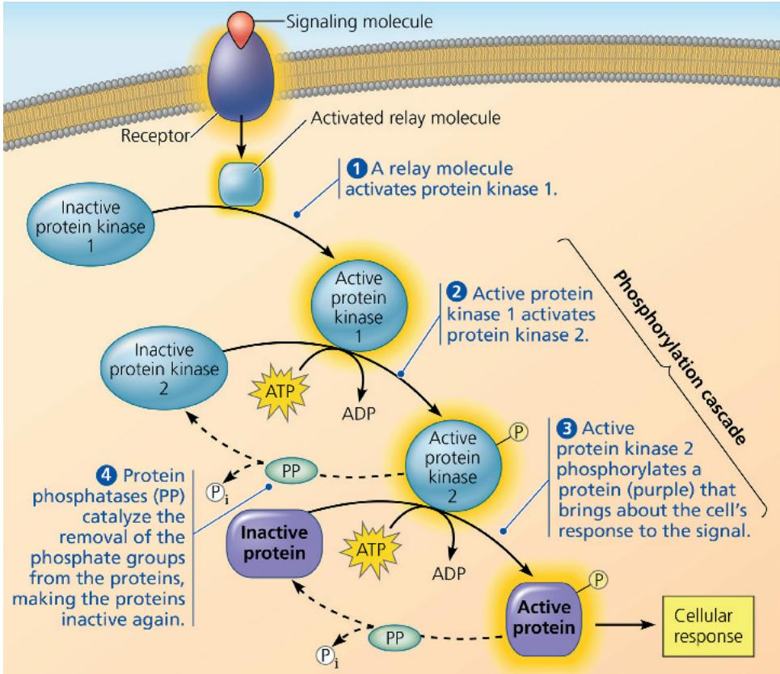

Figure 5.14). The shape change in turn alters the function of the protein, most often activating it. (In some cases, though, phosphorylation instead decreases the activity of the protein.)

A significant percentage of our own genes—about 2%—is thought to code for protein kinases. A single cell may have hundreds of different kinds, each specific for a different substrate protein. Together, protein kinases probably regulate the activity of a large proportion of the thousands of proteins in a cell. Among these are most of the proteins that, in turn, regulate cell division. Abnormal activity of such a kinase can cause abnormal cell division and contribute to the development of cancer.

Equally important in the phosphorylation cascade are the protein phosphatases, enzymes that can rapidly remove phosphate groups from proteins, a process called dephosphorylation. By dephosphorylating and thus inactivating protein kinases, phosphatases provide the mechanism for turning off the signal transduction pathway when the initial signal is no longer present. Phosphatases also make the protein kinases available for reuse, enabling the cell to respond again to an extracellular signal. The phosphorylation-dephosphorylation system acts as a molecular switch in the cell, turning activities on or off, or up or down, as required. At any given moment, the activity of a protein regulated by phosphorylation depends on the balance in the cell between active kinase molecules and active phosphatase molecules.

## Small Molecules and Ions as Second Messengers

Not all components of signal transduction pathways are proteins. Many signaling pathways also involve small, nonprotein, water-soluble molecules or ions called second messengers. (The pathway's "first messenger" is considered to be the extracellular signaling molecule—the ligand—that binds to the membrane receptor.) Because they are small and water-soluble, they can readily spread through regions of the cell by diffusion. For example, as we'll see shortly, a second messenger called

cyclic AMP carries the signal initiated by epinephrine from the plasma membrane of a liver or muscle cell into the cell's interior, where the signal eventually brings about glycogen breakdown. Second messengers participate in pathways that are initiated by both G protein-coupled receptors and receptor tyrosine kinases. The two most common second messengers are cyclic AMP and calcium ions, $\mathrm{Ca^{2+}}$ . A large variety of relay proteins respond to changes in the cytosolic concentration of one or the other of these second messengers.

## Cyclic AMP

Having discovered that epinephrine somehow causes glycogen breakdown within cells, Earl Sutherland next looked for a second messenger that transmits the signal from the plasma membrane to the metabolic machinery in the cytoplasm. He found that binding of epinephrine to the G protein-coupled receptor (GPCR) in the plasma membrane results in a rise in the cytosolic concentration of cyclic AMP (cAMP; cyclic adenosine monophosphate), a small molecule produced from ATP. As shown in Figure 11.11, an enzyme embedded in the plasma membrane, adenylyl cyclase (also known as adenylate cyclase), converts ATP to cAMP in response to an extracellular signal—in this case, provided by epinephrine. When epinephrine outside the cell binds to a GPCR, it activates a G protein that in turn activates adenylyl cyclase. Adenylyl cyclase can then catalyze the synthesis of many molecules of cAMP. In this way, the normal cellular concentration of cAMP can be boosted 20-fold in a matter of seconds. The cAMP broadcasts the signal to the cytoplasm. It does not persist for long in the absence of the hormone because a different enzyme, called phosphodiesterase, converts cAMP to AMP. Another surge of epinephrine is needed to boost the cytosolic concentration of cAMP again.

Subsequent research has revealed that epinephrine is only one of many hormones and many other signaling molecules that lead to activation of adenylyl cyclase by G proteins and formation of cAMP (Figure 11.12). The immediate effect of an elevation in cAMP level is usually the activation of a serine/threonine kinase called protein kinase A. The activated protein kinase A then

Figure 11.11 Cyclic AMP.

The second messenger cyclic AMP (cAMP) is made from ATP by adenylyl cyclase, an enzyme embedded in the plasma membrane. The phosphate group in cAMP is attached to both the 5' and the 3' carbons; cAMP's cyclic arrangement is the basis for its name. cAMP is inactivated by phosphodiesterase, an enzyme that converts it to AMP.

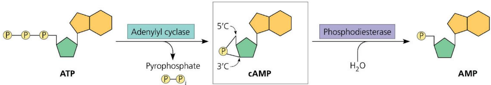  
WHAT IF? What would happen if a molecule that inactivated phosphodiesterase were introduced into the cell?  
For suggested answer, see Appendix A.

Figure 11.12 cAMP as a second messenger in a G protein signaling pathway.  
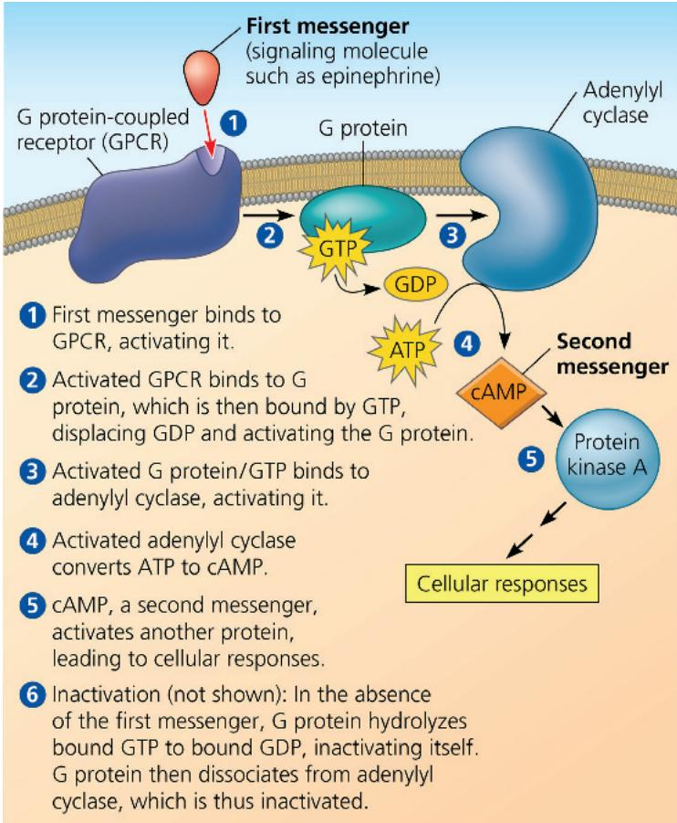

phosphorylates various other proteins, depending on the cell type. (The complete pathway for epinephrine's stimulation of glycogen breakdown is shown later, in Figure 11.16.)

Further regulation of cell metabolism is provided by other G protein systems that inhibit adenylyl cyclase. In these systems, a different signaling molecule activates a different receptor, which in turn activates an inhibitory G protein that blocks activation of adenylyl cyclase. Cell activities can be fine-tuned by the balance between these systems.

Now that we know about the role of cAMP in G protein signaling pathways, we can explain in molecular detail how certain microorganisms cause disease. Consider cholera, a disease that is frequently epidemic in places where the water supply is contaminated with human feces. People acquire the cholera bacterium, Vibrio cholerae, by drinking contaminated water. The bacteria form a biofilm on the lining of the small intestine and produce a toxin. The cholera toxin is an enzyme that chemically modifies a G protein involved in regulating salt and water secretion. Because the modified G protein is unable to hydrolyze GTP to GDP, it remains stuck in its active form, continuously stimulating adenylyl cyclase to make cAMP (see the question with Figure 11.12). The resulting high concentration of cAMP leads to the cellular response—the intestinal cells secrete large amounts of salts into the intestines, with water following by osmosis. An infected person quickly

develops profuse diarrhea and if left untreated can soon die from the loss of water and salts.

Our understanding of signaling pathways involving cyclic AMP or related messengers has allowed us to develop treatments for certain conditions in humans such as erectile dysfunction. In one pathway, the gas nitric oxide (NO) is released by a cell and enters a neighboring muscle cell, where it causes production of a molecule similar to cAMP called cyclic GMP (cGMP). The cGMP then acts as a second messenger that causes relaxation of muscles, such as those in the walls of arteries. A compound that prolongs the signal (by inhibiting the hydrolysis of cGMP to GMP) was originally prescribed for chest pains because it relaxed blood vessels and increased blood flow to the heart muscle. Under the trade name Viagra, this compound is now widely used as a treatment for erectile dysfunction in human males. Because Viagra leads to dilation of blood vessels, it also allows increased blood flow to the penis, optimizing physiological conditions for penile erections.

## Calcium Ions and Inositol Trisphosphate (IP $_{3}$ )

Many of the signaling molecules that function in animals—including neurotransmitters, growth factors, and some hormones—induce responses in their target cells through signal transduction pathways that increase the cytosolic concentration of calcium ions ( $Ca^{2+}$ ). Calcium is even more widely used than cAMP as a second messenger. Increasing the local cytosolic concentration of $Ca^{2+}$ causes many responses in animal cells, including muscle cell contraction, exocytosis of molecules (secretion), and cell division. In plant cells, a wide range of hormonal and environmental stimuli can cause brief increases in cytosolic $Ca^{2+}$ concentration, triggering various signaling pathways, such as the pathway for greening in response to light (see Figure 39.4). Cells use $Ca^{2+}$ as a second messenger in pathways triggered by both G protein-coupled receptors and receptor tyrosine kinases.

Although cells always contain some $Ca^{2+}$ , this ion can function as a second messenger because its concentration in the cytosol is normally much lower than the concentration outside the cell (Figure 11.13). In fact, the level of $Ca^{2+}$ in the blood and extracellular fluid of an animal is often more than 10,000 times higher than that in the cytosol. Calcium ions are actively transported out of the cell and are actively imported from the cytosol into the endoplasmic reticulum (and, under some conditions, into mitochondria and chloroplasts) by various protein pumps. As a result, the calcium concentration in the ER is usually much higher than that in the cytosol. Because the cytosolic calcium level is low, a small change in absolute numbers of ions represents a relatively large percentage change in local calcium concentration.

In response to a signal relayed by a signal transduction pathway, the cytosolic calcium level may rise, usually by a mechanism that releases $Ca^{2+}$ from the cell's ER. The pathways leading to calcium release involve two other second messengers,

Figure 11.13 The maintenance of calcium ion concentrations in an animal cell.

The $Ca^{2+}$ concentration in the cytosol is usually much lower (light green) than in the extracellular fluid and ER (dark green). Protein pumps in the plasma membrane and the ER membrane, driven by ATP, move $Ca^{2+}$ from the cytosol into the extracellular fluid and into the lumen of the ER. Mitochondrial pumps, driven by chemiosmosis (see Concept 9.4), move $Ca^{2+}$ into mitochondria when the calcium level in the cytosol rises significantly.

Key High $\left[\mathrm{Ca}^{2+}\right]$

Low $[\mathrm{Ca}^{2+}]$

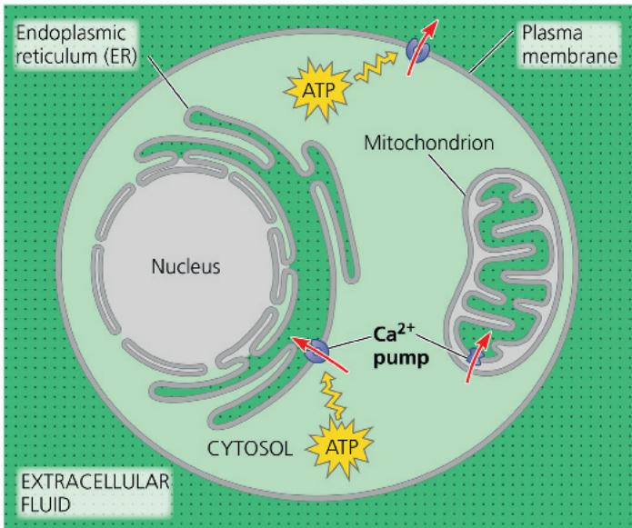

Calcium ions ( $Ca^{2+}$ ) and inositol trisphosphate ( $IP_{3}$ ) function as second messengers in many signal transduction pathways. In this figure, the process is initiated by the binding of a signaling molecule to a G protein-coupled receptor. A receptor tyrosine kinase could also initiate this pathway by activating phospholipase C.

MAKE CONNECTIONS Explain the difference in function (in terms of ion transport) between the $Ca^{2+}$ pump in Figure 11.13 and the $Ca^{2+}$ channel protein shown here. (See Figure 7.17.)

For suggested answer, see Appendix A.

inositol trisphosphate (IP $_{3}$ ) and diacylglycerol (DAG). These two messengers are produced by cleavage of a certain kind of phospholipid in the plasma membrane. Figure 11.14 shows the complete picture of how a signal causes IP $_{3}$ to stimulate the release of calcium from the ER. Because IP $_{3}$ acts before calcium in these pathways, calcium could be considered a “third messenger.” However, scientists use the term second messenger for all small, nonprotein components of signal transduction pathways.

Figure 11.14 Calcium and IP $_{3}$ in signaling pathways.

## Concept Check 11.3

1. What is a protein kinase, and what is its role in a signal transduction pathway?

2. When a signal transduction pathway involves a phosphorylation cascade, how does the cell's response get turned off?

3. What is the actual "signal" that is being transduced in any signal transduction pathway, such as those shown in Figures 11.6 and 11.10? In what way is this information being passed from the exterior to the interior of the cell?

4. WHAT IF? If you exposed a cell to a ligand that binds to a receptor and activates phospholipase C, predict the effect the $IP_{3}$ -gated calcium channel would have on $Ca^{2+}$ concentration in the cytosol.

For suggested answers, see Appendix A.

① A signaling molecule binds to a receptor, leading to activation of phospholipase C.

② Phospholipase C cleaves a plasma membrane phospholipid called $\mathrm{PIP}_2$ into DAG and $\mathrm{IP}_3$ .

③ DAG functions as a second messenger in other pathways.

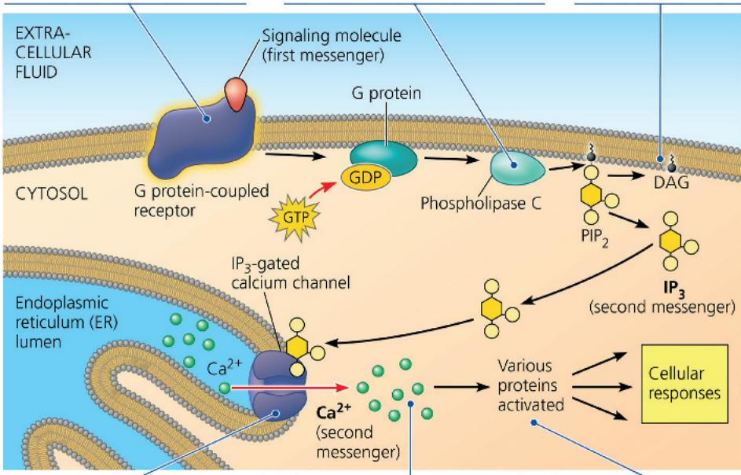  
④ IP $_{3}$ quickly diffuses through the cytosol and binds to an IP $_{3}$ -gated calcium channel in the ER membrane, causing it to open.  
5 Calcium ions flow out of the ER (down their concentration gradient), raising the $\mathrm{Ca^{2+}}$ level in the cytosol.  
⑥ The calcium ions activate the next protein in one or more signaling pathways.

# Concept 11.4: Cellular response: Cell signaling leads to regulation of transcription or cytoplasmic activities

We now take a closer look at the cell's subsequent response to an extracellular signal—what some researchers call the “output response.” What is the nature of the final step in a signaling pathway?

## Nuclear and Cytoplasmic Responses

Ultimately, a signal transduction pathway leads to the regulation of one or more cellular activities. The response may occur in the nucleus or in the cytoplasm of the cell.

Many signaling pathways ultimately regulate protein synthesis, usually by turning specific genes on or off in the nucleus. Like an activated steroid receptor (see Figure 11.9), the final activated molecule in a signaling pathway may function as a transcription factor. Figure 11.15 shows an example in which a signaling pathway activates a transcription factor that turns a gene on: The response to this growth factor signal is transcription, the synthesis of one or more specific mRNAs, which will be translated in the cytoplasm into specific proteins. In other cases, the transcription factor might regulate a gene by turning it off. Often, a transcription factor regulates several different genes.

Sometimes a signaling pathway may regulate the activity of proteins rather than causing their synthesis by activating gene expression. This directly affects proteins that function outside the nucleus. For example, a signal may cause the opening or closing of an ion channel in the plasma membrane or a change in the activity of a metabolic enzyme. As we have seen, the response of liver cells to the hormone epinephrine helps regulate cellular energy metabolism by affecting the activity of an enzyme. The final step in the epinephrine signaling pathway activates the enzyme that catalyzes the breakdown of glycogen. Figure 11.16, on the next page, shows the complete pathway leading to the release of glucose 1-phosphate molecules from glycogen. Notice that as each molecule is activated, the response is amplified, a subject we'll return to shortly.

Signal receptors, relay molecules, and second messengers participate in a variety of pathways, leading to both nuclear and cytoplasmic responses, including cell division. Malfunctioning of growth factor pathways like the one in Figure 11.15 can contribute to abnormal cell division and the development of cancer, as we'll see in Concept 18.5.

## Regulation of the Response

Whether the response occurs in the nucleus or in the cytoplasm, it is not simply turned “on” or “off.” Rather, the extent and specificity of the response are regulated in multiple ways. Here we’ll consider four aspects of this regulation. First, as mentioned

Figure 11.15 Nuclear responses to a signal: the activation of a specific gene by a growth factor.

This diagram shows a typical signaling pathway that leads to regulation of gene activity in the cell nucleus. The initial signaling molecule, in this case a growth factor, triggers a phosphorylation cascade, as in Figure 11.10. (The ATP molecules and phosphate groups are not shown.) Once phosphorylated, the last kinase in the sequence enters the nucleus and activates a transcription factor, which stimulates transcription of a specific gene (or genes). The resulting mRNAs then direct the synthesis of a particular protein.

earlier, signaling pathways generally amplify the cell's response to a single signaling event. The degree of amplification depends on the function of the specific molecules in the pathway. Second, the many steps in a multistep pathway provide control points at which the cell's response can be further regulated, contributing to the specificity of the response and allowing coordination with other signaling pathways. Third, the overall efficiency of the response is enhanced by the presence of proteins known as scaffolding proteins. Finally, a crucial point in regulating the response is the termination of the signal.

Figure 11.16 Cytoplasmic response to a signal: the stimulation of glycogen breakdown by epinephrine (adrenaline).

In this signaling system, the hormone epinephrine acts through a G protein-coupled receptor to activate a succession of relay molecules, including cAMP and two protein kinases (see also Figure 11.12). The final protein activated is the enzyme glycogen phosphorylase, which uses inorganic phosphate to release glucose monomers from glycogen in the form of glucose 1-phosphate molecules. This pathway amplifies the hormonal signal: One receptor protein can activate approximately 100 molecules of G protein, and each enzyme in the pathway, once activated, can act on many molecules of its substrate, the next molecule in the cascade. The number of activated molecules given for each step is approximate.

  
VISUAL SKILLS In the figure, how many glucose 1–phosphate molecules are released in response to one signaling molecule? Calculate the factor by which the response is amplified in going from each step to the next. For suggested answer, see Appendix A.

## Signal Amplification

Elaborate enzyme cascades amplify the cell's response to a signal. At each catalytic step in the cascade, the number of activated products can be much greater than in the preceding step. For example, in the epinephrine-triggered pathway in Figure 11.16, each adenylyl cyclase molecule catalyzes the formation of 100 or so cAMP molecules, each molecule of protein kinase A phosphorylates about 10 molecules of the next kinase in the pathway, and so on. The amplification effect stems from the fact that these proteins persist in their active form long enough to process multiple molecules of substrate before they become inactive again. As a result of the signal's amplification, a small number of epinephrine molecules binding to receptors on the surface of a liver cell or muscle cell can lead to the release of hundreds of millions of glucose molecules from glycogen.

## The Specificity of Cell Signaling and Coordination of the Response

Consider two different cells in your body—a liver cell and a heart muscle cell, for example. Both are in contact with your bloodstream and are therefore constantly exposed to many different hormone molecules, as well as to local regulators secreted by nearby cells. Yet the liver cell responds to some signals but ignores others, and the same is true for the heart cell. And some kinds of signals trigger responses in both cells—but different responses. For instance, epinephrine stimulates the liver cell to break down glycogen, but the main response of the heart cell to epinephrine is contraction, leading to a more rapid heartbeat. How do we account for this difference?

The explanation for the specificity exhibited in cellular responses to signals is the same as the basic explanation for virtually all differences between cells: Because different kinds of cells turn on different sets of genes, different kinds of cells have different collections of proteins. The response of a cell to a signal depends on its particular collection of signal receptor proteins, relay proteins, and proteins needed to carry out the response. A liver cell, for example, is poised to respond appropriately to epinephrine by having the proteins listed in Figure 11.16 as well as those needed to manufacture glycogen.

Thus, two cells that respond differently to the same signal differ in one or more proteins that respond to the signal. Also, within some cells, there are more complex pathways that branch or converge, as shown in Figure 11.17. Notice, though, that these different pathways still have some molecules in common. For example, cells A, B, and C all use the same receptor protein for the red signaling molecule; differences in other proteins account for their differing responses. In cell D, a different receptor protein is used for the same signaling molecule, leading to yet another response. In cell B, a pathway triggered by one signal diverges to produce two responses; such branched pathways often involve receptor tyrosine kinases (which can activate multiple relay proteins) or second messengers (which can regulate numerous proteins). In cell C, two pathways triggered by separate signals converge to modulate a single response. Branching of pathways and “cross-talk” (interaction) between pathways are important in regulating and coordinating a cell’s responses to information coming in from different sources in the body. (You’ll learn more

Figure 11.17 The specificity of cell signaling.

The particular proteins a cell possesses determine what signaling molecules it responds to and the nature of the response. The four cells in these diagrams respond to the same signaling molecule (red) in different ways because each has a different set of proteins (purple receptor and teal relay molecules). Note, however, that the same kinds of molecules can participate in more than one pathway.

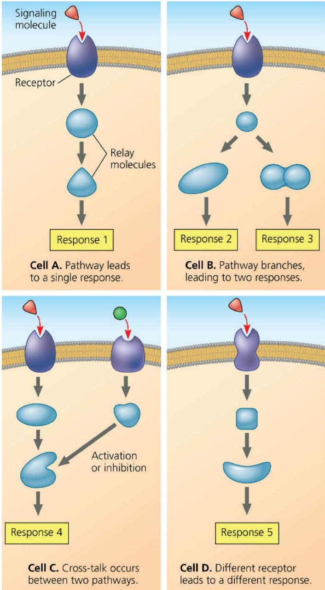

VISUAL SKILLS Study the signaling pathway shown in Figure 11.14, and explain how the situation pictured for cell B in Figure 11.17 could apply to that pathway.

For suggested answer, see Appendix A.

Instructors: The Scientific Skills Exercise “Using Experiments to Test a Model” can be assigned in Mastering Biology. It explores the cellular response of a yeast cell to the signal initiated by a mating factor from a cell of the opposite mating type.

about this coordination in Concept 11.5.) Moreover, the use of some of the same proteins in more than one pathway allows the cell to economize on the number of different proteins it must make.

## Signaling Efficiency: Scaffolding Proteins and Signaling Complexes

The illustrations of signaling pathways in Figure 11.17 (as well as diagrams of other pathways in this chapter) are greatly simplified. The diagrams show only a few relay molecules and, for clarity's sake, display these molecules spread out in the cytosol. If this were true in the cell, signaling pathways would operate very inefficiently because most relay molecules are proteins, and proteins are too large to diffuse quickly through the viscous cytosol. How does a given protein kinase, for instance, find its protein substrate?

In many cases, the efficiency of signal transduction is apparently increased by the presence of a scaffolding protein, a large relay protein to which several other relay proteins are simultaneously attached (Figure 11.18). Researchers have found scaffolding proteins in brain cells that permanently hold together networks of signaling pathway proteins at synapses. This hardwiring enhances the speed and accuracy of signal transfer between cells because the rate of protein-protein interaction is not limited by diffusion. Furthermore, in some cases the scaffolding proteins themselves may directly activate relay proteins.

The importance of the relay proteins that serve as points of branching or intersection in signaling pathways is highlighted by the problems arising when these proteins are defective or missing. For instance, in an inherited disorder called Wiskott-Aldrich syndrome (WAS), the absence of a single relay protein leads to such diverse effects as abnormal bleeding, eczema, and a predisposition to infections and leukemia. These symptoms are thought to arise primarily from the absence of the protein in cells of the immune system. By studying normal cells, scientists found that the WAS protein is located just beneath the immune cell surface. The protein interacts both with microfilaments of the cytoskeleton and with

## Figure 11.18 A scaffolding protein.

The scaffolding protein shown here (orange) simultaneously binds to a specific activated membrane receptor and three different protein kinases. This physical arrangement facilitates signal transduction by these molecules.

several different components of signaling pathways that relay information from the cell surface, including pathways regulating immune cell proliferation. This multifunctional relay protein is thus both a branch point and an important intersection point in a complex signal transduction network that controls immune cell behavior. When the WAS protein is absent, the cytoskeleton is not properly organized and signaling pathways are disrupted, leading to the WAS symptoms.

## Termination of the Signal

In the interest of keeping Figure 11.17 simple, we did not show the inactivation mechanisms that are an essential aspect of any cell-signaling pathway. For a cell of a multicellular organism to remain capable of responding to incoming signals, each molecular change in its signaling pathways must last only a short time. As we saw in the cholera example, if a signaling pathway component becomes locked into one state, whether active or inactive, consequences for the organism can be serious.

The ability of a cell to receive new signals depends on reversibility of the changes produced by prior signals. The binding of signaling molecules to receptors is reversible. As the external concentration of signaling molecules falls, fewer receptors are bound at any given moment, and the unbound receptors revert to their inactive form. The cellular response occurs only when the concentration of receptors with bound signaling molecules is above a certain threshold. When the number of active receptors falls below that threshold, the cellular response ceases. Then, by a variety of means, the relay molecules return to their inactive forms: The GTPase activity intrinsic to a G protein hydrolyzes its bound GTP; the enzyme phosphodiesterase converts cAMP to AMP; protein phosphatases inactivate phosphorylated kinases and other proteins; and so forth. As a result, the cell is soon ready to respond to a fresh signal.

In this section, we explored the complexity of signaling initiation and termination in a single pathway, and we saw the

## Concept Check 11.4

1. How can a target cell's response to a single hormone molecule result in a response that affects a million other molecules?

2. WHAT IF? If two cells have different scaffolding proteins, explain how they might behave differently in response to the same signaling molecule.

3. WHAT IF? Some human diseases are associated with malfunctioning protein phosphatases. How would such proteins affect signaling pathways? (Review the discussion of protein phosphatases in Concept 11.3 and see Figure 11.10.)

4. Epinephrine affects heart muscle cells by causing them to mobilize glucose, contract faster, and increase heart rate. The muscle cells around lungs and airways, on the other hand, have the opposite response to epinephrine: They relax, allowing more air to be breathed in. What might explain why respiratory (breathing-related) muscle cells can respond so differently from heart muscle cells?

For suggested answers, see Appendix A.

potential for pathways to intersect with each other. In the next section, we'll consider one especially important network of interacting pathways in the cell.

## Concept 11.5: Apoptosis requires integration of multiple cell-signaling pathways

When signaling pathways were first discovered, they were thought to be linear, independent pathways. Our understanding of cellular communication has benefited from the realization that signaling pathway components interact with each other in various ways. For a cell to carry out the appropriate response, cellular proteins often must integrate multiple signals. Let's consider an important cellular process—cellular suicide—as an example.

Cells that are infected, are damaged, or have reached the end of their functional life span often undergo “programmed cell death” (Figure 11.19). The best-understood type of this controlled cell suicide is apoptosis (from the Greek, meaning “falling off,” and used in a classic Greek poem to refer to leaves falling from a tree). During this process, cellular agents chop up the DNA and fragment the organelles and other cytoplasmic components. The cell shrinks and becomes lobed (a change called “blebbing”), and the cell’s parts are packaged up in vesicles that are engulfed and digested by specialized scavenger cells, leaving no trace. Apoptosis protects neighboring cells from damage that they would otherwise suffer if a dying cell merely leaked out all its contents, including its many digestive enzymes.

## Figure 11.19 Apoptosis of a human white blood cell.

On the left is a normal white blood cell, while on the right is a white blood cell undergoing apoptosis. The apoptotic cell is shrinking and forming lobes (“blebs”), which eventually are shed as membrane-bounded cell fragments (colorized SEMs).

The signal that triggers all of the complex events that occur during apoptosis can come from either outside or inside the cell. Outside the cell, signaling molecules released from other cells can initiate a signal transduction pathway that activates the genes and proteins responsible for carrying out cell death. Within a cell whose DNA has been irretrievably damaged, a series of protein-protein interactions can pass along a signal that similarly triggers cell death. Considering some examples of apoptosis can help us to see how signaling pathways are integrated in cells.

## Apoptosis in the Soil Worm Caenorhabditis elegans

The molecular mechanisms of apoptosis were worked out by researchers studying embryonic development of a small soil worm, a nematode called Caenorhabditis elegans. Because the adult worm has only about 1,000 cells, the researchers were able to work out the entire ancestry of each cell. The timely suicide of cells occurs exactly 131 times during normal development of C. elegans, at precisely the same points in the cell lineage of each worm. In worms and other species, apoptosis is triggered by signals that activate a cascade of “suicide” proteins in the cells destined to die.

Genetic research on C. elegans initially revealed two key apoptosis genes, called ced-3 and ced-4 (ced stands for “cell death”), which encode proteins essential for apoptosis. The proteins are called Ced-3 and Ced-4, respectively. These and most other proteins involved in apoptosis are continually present in cells, but in inactive form; thus, regulation in this case occurs at the level of protein activity rather than through gene activity and protein synthesis. In C. elegans, a protein in the outer mitochondrial membrane, called Ced-9 (the product of the ced-9 gene), serves as a master regulator of apoptosis, acting as a brake in the absence of a signal promoting apoptosis (Figure 11.20a). When a death signal is received by the cell, signal transduction involves a change in Ced-9 that disables the brake, and the apoptotic pathway activates proteases and nucleases, enzymes that cut up the proteins and DNA of the cell. The main proteases of apoptosis are called caspases; in the nematode, the chief caspase is the Ced-3 protein.

## Apoptotic Pathways and the Signals That Trigger Them

In humans and other mammals, several different pathways, involving about 15 different caspases, can carry out apoptosis. The pathway that is used depends on the type of cell and on the particular signal that initiates apoptosis. One major

Figure 11.20 Molecular basis of apoptosis in C. elegans.
Three proteins, Ced-3, Ced-4, and Ced-9, are critical to apoptosis and its regulation in the nematode. Apoptosis is more complicated in mammals but involves proteins similar to those in C. elegans.

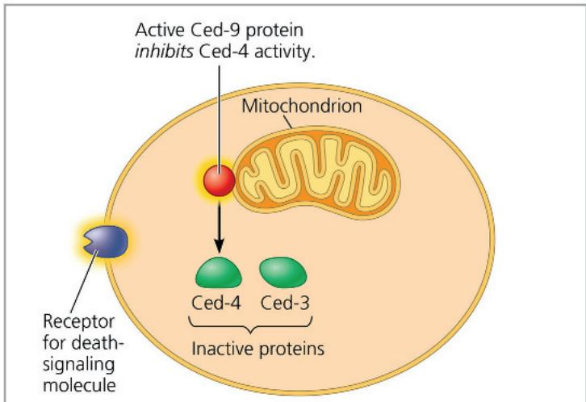  
(a) No death signal. As long as Ced-9, located in the outer mitochondrial membrane, is active, apoptosis is inhibited, and the cell remains alive.

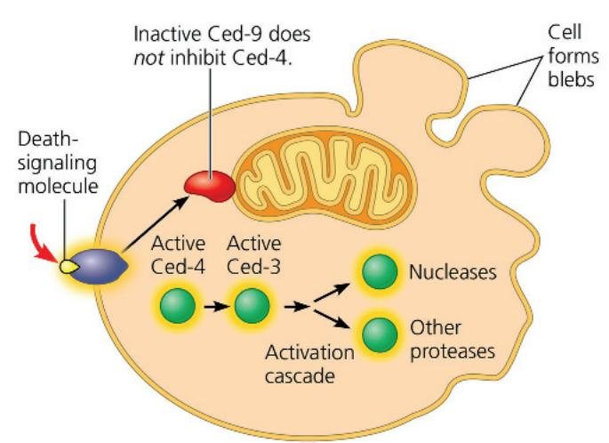  
(b) Death signal. When a cell receives a death signal, Ced-9 is inactivated, relieving its inhibition of Ced-4. Active Ced-4 activates Ced-3, a protease, which triggers a cascade of reactions leading to the activation of nucleases and other proteases. The action of these enzymes causes the changes seen in apoptotic cells and eventually leads to cell death.

pathway involves certain mitochondrial proteins that are triggered to form molecular pores in the mitochondrial outer membrane, causing it to leak and release other proteins that promote apoptosis. Perhaps surprisingly, these latter include cytochrome c, which functions in mitochondrial electron transport in healthy cells (see Figure 9.14) but acts as a cell death factor when released from mitochondria. The process of mitochondrial apoptosis in mammals uses proteins similar to the nematode proteins Ced-3, Ced-4, and Ced-9. These can be

## Figure 11.21 Effect of apoptosis during paw development in the mouse.

In mice, humans, other mammals, and land birds, the embryonic region that develops into feet or hands initially has a solid, platelike structure. Apoptosis eliminates the cells in the interdigital regions, thus forming the digits. The embryonic mouse paws shown in these fluorescence light micrographs are stained so that cells undergoing apoptosis appear a bright yellowish green. Apoptosis of cells begins at the margin of each interdigital region (left), peaks as the tissue in these regions is reduced (middle), and is no longer visible when the interdigital tissue has been eliminated (right).

thought of as relay proteins capable of transducing the apoptotic signal.

At key gateways into the apoptotic program, relay proteins integrate signals from several different sources and can send a cell down an apoptotic pathway. Often, the signal originates outside the cell, like the death-signaling molecule depicted in Figure 11.20b, which presumably was released by a neighboring cell. When a death-signaling ligand occupies a cell-surface receptor, this binding leads to activation of caspases and other enzymes that carry out apoptosis, without involving the mitochondrial pathway. This process of signal reception, transduction, and response is similar to what we have discussed throughout this chapter. In a twist on the classic scenario, two other types of alarm signals that can lead to apoptosis originate from inside the cell rather than from a cell-surface receptor. One signal comes from the nucleus, generated when the DNA has suffered irreparable damage, and a second comes from the endoplasmic reticulum when excessive protein misfolding occurs. Mammalian cells make life-or-death “decisions” by somehow integrating the death signals and life signals they receive from these external and internal sources.

A built-in cell suicide mechanism is essential to development and maintenance in all animals. The similarities between apoptosis genes in nematodes and those in mammals, as well as the observation that apoptosis occurs in multicellular fungi and even in single-celled yeasts, indicate that the basic mechanism evolved early in the evolution of eukaryotes. In vertebrates, apoptosis is essential for normal development of the nervous system, for normal operation of the immune system, and for normal morphogenesis of hands and feet in humans and paws in other mammals (Figure 11.21). The level of apoptosis between the developing digits is lower in the

webbed feet of ducks and other water birds than in the nonwebbed feet of land birds, such as chickens. In the case of humans, the failure of appropriate apoptosis can result in webbed fingers and toes.

Significant evidence points to the involvement of apoptosis in certain degenerative diseases of the nervous system, such as Parkinson's disease and Alzheimer's disease. In Alzheimer's disease, an accumulation of aggregated proteins in neuronal cells activates an enzyme that triggers apoptosis, resulting in the loss of brain function seen in these patients. Furthermore, cancer can result from a failure of cell suicide; some cases of human melanoma, for example, have been linked to faulty forms of the human version of the C. elegans Ced-4 protein. It is not surprising, therefore, that the signaling pathways feeding into apoptosis are quite elaborate. After all, the life-or-death question is the most fundamental one imaginable for a cell.

This chapter has introduced you to many of the general mechanisms of cell communication, such as ligand binding, protein-protein interactions and shape changes, cascades of interactions, and protein phosphorylation. Throughout your study of biology, you will encounter numerous examples of cell signaling.

## Concept Check 11.5

1. Give an example of apoptosis during embryonic development, and explain its function in the developing embryo.

2. WHAT IF? What types of protein defects might cause apoptosis to occur when it shouldn't? What types could result in apoptosis not occurring when it should?

For suggested answers, see Appendix A.

# Chapter 11 Review

## Summary of Key Concepts

To review key terms, go to the Vocabulary Self-Quiz (eTextbook only).

Concept 11.1: External signals are converted to responses within the cell

\- Signal transduction pathways are crucial for many processes. Bacterial cells can sense the local density of bacterial cells (quorum sensing). Signaling during yeast cell mating has much in common with processes in multicellular organisms, suggesting an early evolutionary origin of signaling mechanisms.

\- Local signaling by animal cells involves direct contact or the secretion of local regulators. For long-distance signaling, animal and plant cells use hormones; animals also pass signals electrically.

\- Like epinephrine, other hormones that bind to membrane receptors trigger a three-stage cell-signaling pathway:

  
What determines whether a cell responds to a hormone such as epinephrine? What determines how a cell responds to such a hormone?

## Concept 11.2: Signal reception: A signaling molecule binds to a receptor, causing it to change shape

\- The binding between signaling molecule (ligand) and receptor is highly specific. A specific shape change in a receptor is often the initial transduction of the signal.

\- Three of the major types of cell-surface transmembrane receptors are the following: (1) G protein-coupled receptors (GPCRs) work with cytoplasmic G proteins. Ligand binding activates the receptor, which then activates a specific G protein, which activates yet another protein, thus propagating the signal. (2) Receptor tyrosine kinases (RTKs) react to the binding of signaling molecules by forming dimers and then adding phosphate groups to tyrosines on the cytoplasmic part of the other monomer making up the dimer. Relay proteins in the cell can then be activated by binding to different phosphorylated tyrosines, allowing this receptor to trigger several pathways at once. (3) A ligand-gated ion channel opens or closes in response to binding by specific signaling molecules, regulating the flow of specific ions across the membrane.

\- The activity of all three types of receptors is crucial; abnormal GPCRs and RTKs are associated with many human diseases.

\- Intracellular receptors are cytoplasmic or nuclear proteins. Signaling molecules that are hydrophobic or small enough to cross the plasma membrane bind to these receptors inside the cell.

How are the structures of a GPCR and an RTK similar? How does initiation of signal transduction differ for these two types of receptors?

## Concept 11.3: Signal transduction: Cascades of molecular interactions transmit signals from receptors to relay molecules in the cell

\- At each step in a signal transduction pathway, the signal is transduced into a different form, which commonly involves a shape change in a protein. Many signal transduction pathways include phosphorylation cascades, in which a series of protein kinases each add a phosphate group to the next one in line, activating it. Enzymes called protein phosphatases remove the phosphate groups. The balance between phosphorylation and dephosphorylation regulates the activity of proteins involved in the sequential steps of a signal transduction pathway.

\- Second messengers, such as the small molecule cyclic AMP (cAMP) and the ion $Ca^{2+}$ , diffuse readily through the cytosol and thus help broadcast signals quickly. Many G proteins activate adenylyl cyclase, which makes cAMP from ATP. Cells use $Ca^{2+}$ as a second messenger in GPCR and RTK pathways. The tyrosine kinase pathways can also involve two other second messengers, diacylglycerol (DAG) and inositol trisphosphate ( $IP_{3}$ ). $IP_{3}$ can trigger a subsequent increase in $Ca^{2+}$ level.

What is the difference between a protein kinase and a second messenger? Can both operate in the same signal transduction pathway?

## Concept 11.4: Cellular response: Cell signaling leads to regulation of transcription or cytoplasmic activities

\- Some pathways lead to a nuclear response: Specific genes are turned on or off by activated transcription factors. In others, the response involves cytoplasmic regulation.

\- Cellular responses are not simply on or off; they are regulated at many steps. Each protein in a signaling pathway amplifies the signal by activating multiple copies of the next component; for long pathways, the total amplification may be over a millionfold. The combination of proteins in a cell confers specificity in the signals it detects and the responses it carries out. Scaffolding proteins increase signaling efficiency. Pathway branching further helps the cell coordinate signals and responses. Signal response can be terminated quickly because ligand binding is reversible.

What mechanisms in the cell terminate its response to a signal and maintain its ability to respond to new signals?

## Concept 11.5: Apoptosis requires integration of multiple cell-signaling pathways

\- Apoptosis is a type of programmed cell death in which cell components are disposed of in an orderly fashion. Studies of the soil worm Caenorhabditis elegans clarified molecular details of the relevant signaling pathways. A death signal leads to activation of caspases and nucleases, the main enzymes involved in apoptosis.

\- Several apoptotic signaling pathways with related proteins exist in the cells of humans and other mammals, triggered in different ways. Signals eliciting apoptosis can originate from outside or inside the cell.

What is an explanation for the similarities between genes in yeasts, nematodes, and mammals that control apoptosis?

For suggested answers, see Appendix A.

## Levels 3-4: Applying/Analyzing

6. Which observation suggested to Sutherland the involvement of a second messenger in epinephrine's effect on liver cells?

(A) Enzymatic activity was proportional to the amount of calcium added to a cell-free extract.

(B) Receptor studies indicated that epinephrine was a ligand.

(C) Glycogen breakdown was observed only when epinephrine was administered to intact cells.

(D) Glycogen breakdown was observed only when epinephrine and glycogen phosphorylase were mixed.

7. Protein phosphorylation is commonly involved with which of the following?

(A) ligand binding by receptor tyrosine kinases

(B) activation of G protein-coupled receptors

(C) activation of protein kinase molecules

(D) release of $Ca^{2+}$ from the ER lumen

## Test Your Understanding

For more multiple-choice questions, go to the Practice Test (eTextbook only).

## Levels 1-2: Remembering/Understanding

1. Binding of a signaling molecule to which type of receptor leads directly to a change in the distribution of substances on opposite sides of the membrane?

(A) intracellular receptor

(B) G protein-coupled receptor

(C) phosphorylated receptor tyrosine kinase dimer

(D) ligand-gated ion channel

2. The activation of receptor tyrosine kinases is characterized by

(A) dimerization and phosphorylation.

(B) dimerization and IP $_{3}$ binding.

(C) a phosphorylation cascade.

(D) GTP hydrolysis.

3. Why do lipid-soluble signaling molecules, such as aldosterone, cross the membranes of all cells but affect only target cells?

(A) Only target cells retain the appropriate DNA segments.

(B) Intracellular receptors are present only in target cells.

(C) Only target cells have enzymes that break down aldosterone.

(D) Only in target cells is aldosterone able to initiate the phosphorylation cascade that turns genes on.

4. Consider this pathway: epinephrine → G protein-coupled receptor → G protein → adenylyl cyclase → cAMP. Identify the second messenger.

(A) cAMP

(B) G protein

(C) GTP

(D) adenylyl cyclase

5. Which of the following occurs during apoptosis?

(A) lysis of the cell

(B) direct contact between signaling cells

(C) fragmentation of the DNA

(D) release of proteases outside the cell

## Levels 5-6: Evaluating/Creating

8. DRAW IT Draw the following apoptotic pathway, which operates in human immune cells. A death signal is received when a molecule called Fas binds its cell-surface receptor. The binding of many Fas molecules to receptors causes receptor clustering. The intracellular regions of the receptors, when together, bind proteins called adaptor proteins. These in turn bind to inactive molecules of caspase-8, which become activated and then activate caspase-3. Once activated, caspase-3 initiates apoptosis.

9. EVOLUTION CONNECTION Identify the evolutionary mechanisms that might account for the origin and persistence of cell-to-cell signaling systems in prokaryotic organisms.

10. SCIENTIFIC INQUIRY Epinephrine initiates a signal transduction pathway that produces cyclic AMP (cAMP) and leads to the breakdown of glycogen to glucose, a major energy source for cells. But glycogen breakdown is only part of the fight-or-flight response that epinephrine brings about; the overall effect on the body includes an increase in heart rate and alertness, as well as a burst of energy. Given that caffeine blocks the activity of cAMP phosphodiesterase, propose a mechanism by which caffeine ingestion leads to heightened alertness and sleeplessness.

11. SCIENCE, TECHNOLOGY, AND SOCIETY The aging process is thought to be initiated at the cellular level. Among the changes that can occur after a certain number of cell divisions is the loss of a cell's ability to respond to growth factors and other signals. Much research into aging is aimed at understanding such losses, with the ultimate goal of extending the human life span. Not everyone, however, agrees that this is a desirable goal. If life expectancy were greatly increased, discuss what might be the social and ecological consequences.

12. WRITE ABOUT A THEME: ORGANIZATION The properties of life emerge at the biological level of the cell. The highly regulated process of apoptosis is not simply the destruction of a cell; it is also an emergent property. Write a short essay (about 100–150 words) that briefly explains the role of apoptosis in the development and proper functioning of an animal, and describe how this form of programmed cell death is a process that emerges from the orderly integration of signaling pathways.

## 13. SYNTHESIZE YOUR KNOWLEDGE

  
There are five basic tastes—sour, salty, sweet, bitter, and “umami.” Salt is detected when the concentration of salt outside of a taste bud cell is higher than that inside of it, and ion channels

allow the passive leakage of $Na^{+}$ into the cell. The resulting change in membrane potential (see Concept 7.4) sends the “salty” signal to the brain. Umami is a savory taste generated by glutamate (glutamic acid, found in monosodium glutamate, or MSG), which is used as a flavor enhancer in foods such as taco-flavored tortilla chips. The glutamate receptor is a GPCR, which, when bound, initiates a signaling pathway that ends with a cellular response, perceived by you as “taste.” If you eat a regular potato chip and then rinse your mouth, you will no longer taste salt. But if you eat a flavored tortilla chip and then rinse, the taste persists. (Try it!) Propose a possible explanation for this difference.

For selected answers, see Appendix A.

# The Cell Cycle

## Key Concepts

12.1 Most cell division results in genetically identical daughter cells

12.2 The mitotic phase alternates with interphase in the cell cycle

12.3 The eukaryotic cell cycle is regulated by a molecular control system

  
Figure 12.1 A multicellular organism starts out as a single cell that divides into two. Those two cells then divide into four, as shown in these fluorescence micrographs of a marine worm embryo. Cell division continues throughout an organism's life, for growth or to replace worn-out or damaged cells. Each time a cell divides in this way, it is crucial that the daughter cells be genetically identical to the parent cell.

## Study Tip

## Make a visual study guide:

Figure 12.1 presents the events of the cell cycle as a simplified linear diagram. As you learn more about the cell cycle, draw a detailed linear diagram of the stages of interphase, mitosis, and cytokinesis. Include explanatory labels. Add the circular chart from Figure 12.6 and show how the two diagrams are related.

## How does one parent cell give rise to two genetically identical daughter cells?

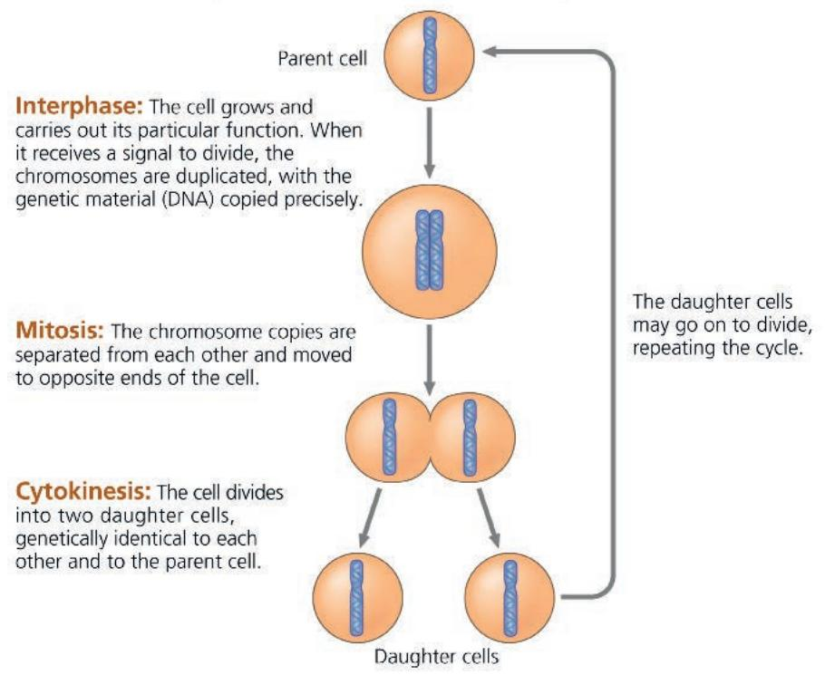  
Cytokinesis: The cell divides into two daughter cells, genetically identical to each other and to the parent cell.

# Concept 12.1: Most cell division results in genetically identical daughter cells

The ability of organisms to produce more of their own kind is the one characteristic that best distinguishes living things from non-living matter. This unique capacity to procreate, like all biological functions, has a cellular basis. The continuity of life is based on the reproduction of cells, or cell division.

## Key Roles of Cell Division

Cell division plays several important roles in life. When a pro-karyotic cell divides, it is actually reproducing because the process gives rise to a new organism (another cell). The same is true of any unicellular eukaryote, such as the amoeba shown in Figure 12.2a. As for multicellular eukaryotes, cell division enables each of these organisms to develop from a single cell—the fertilized egg. A two-celled embryo, the first stage in this process, is shown in Figure 12.2b. And cell division continues to function in renewal and repair in fully grown multicellular eukaryotes, replacing cells that die from accidents or normal wear and tear. For example, dividing cells in your bone marrow continuously make new blood cells (Figure 12.2c).

The reproduction of a cell, with all of its complexity, cannot occur by a mere pinching in half; a cell is not like a soap bubble that simply enlarges and splits in two. In both prokaryotes and eukaryotes, a crucial function of most cell divisions is the distribution of identical genetic material—DNA—to two daughter cells. (The exception is meiosis, the special type of eukaryotic cell division that can produce sperm and eggs in animals, or spores in plants.) What is most remarkable about cell division is the accuracy with which the DNA is passed from one generation of cells to the next. A dividing cell replicates its DNA, distributes the two copies to opposite ends of the cell, and then splits into daughter cells.

Figure 12.2 The functions of cell division.  
  
(b) Growth and development. This micrograph shows a sand dollar embryo shortly after the fertilized egg divided, forming two cells (LM).

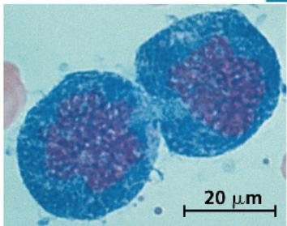  
(a) Asexual reproduction. An amoeba, a single-celled eukaryote, is dividing into two cells. Each new cell will be an individual organism (LM).

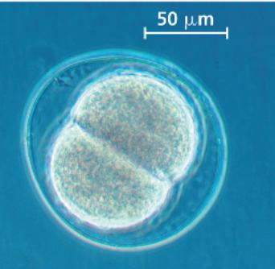  
(c) Tissue renewal. These dividing bone marrow cells will give rise to new blood cells (LM).  
Figure 12.3 Eukaryotic chromosomes.

## Cellular Organization of the Genetic Material

A cell's DNA, its genetic information, is called its genome. Although a prokaryotic genome is often a single DNA molecule, eukaryotic genomes usually consist of a number of DNA molecules. The overall length of DNA in a eukaryotic cell is enormous. A typical human cell, for example, has about $2\mathrm{m}$ of DNA—a length about 250,000 times greater than the cell's diameter. Before the cell can divide to form genetically identical daughter cells, all of this DNA must be copied, or replicated, and then the two copies must be separated so that each daughter cell ends up with a complete genome.

The replication and distribution of so much DNA are manageable because the DNA molecules are packaged into structures called chromosomes (from the Greek chroma, color, and soma, body), so named because they take up certain dyes used in microscopy (Figure 12.3). Each eukaryotic chromosome consists of one very long, linear DNA molecule associated with many proteins (see Figure 6.9). The DNA molecule carries several hundred to a few thousand genes, the units of information that specify an organism's inherited traits. The associated proteins maintain the structure of the chromosome and help control the activity of the genes. Together, the entire complex of DNA and proteins that is the building material of chromosomes is referred

Chromosomes (stained purple) are visible within the nucleus of this cell from an African blood lily. The thinner red threads in the surrounding cytoplasm are the cytoskeleton. The cell is preparing to divide (LM).

to as chromatin. As you will soon see, the chromatin of a chromosome varies in its degree of condensation during the process of cell division. (Figure 16.23 shows how this chromatin is packed into the cell nucleus.)

Every eukaryotic species has a characteristic number of chromosomes in each cell's nucleus. For example, the nuclei of human somatic cells (all body cells except the reproductive cells) each contain 46 chromosomes, made up of two sets of 23, one set inherited from each parent. Reproductive cells, or gametes—such as sperm and eggs—have half as many chromosomes as somatic cells; in our example, human gametes have one set of 23 chromosomes. The number of chromosomes in somatic cells varies widely among species: 18 in cabbage plants, 48 in chimpanzees, 56 in elephants, 90 in hedgehogs, and 148 in one species of alga. We'll now consider how these chromosomes behave during cell division.

## Distribution of Chromosomes During Eukaryotic Cell Division

When a cell is not dividing, and even as it replicates its DNA in preparation for cell division, each chromosome is in the form of a long, thin chromatin fiber. After DNA replication, however, the

chromosomes condense as a part of cell division: Each chromatin fiber becomes densely coiled and folded, making the chromosomes much shorter and so thick that we can see them with a light microscope. (See Figure 16.23.)

Each duplicated chromosome consists of two sister chromatids, which are joined copies of the original chromosome (Figure 12.4). The two chromatids, each containing an identical DNA molecule, are often attached all along their lengths by protein complexes called cohesins; this attachment is known as sister chromatid cohesion. Each sister chromatid has a centromere, a region made up of repetitive sequences in the chromosomal DNA where the chromatid is attached most closely to its sister chromatid. This attachment is mediated by proteins that recognize and bind to the centromeric DNA; other bound proteins condense the DNA, giving the duplicated chromosome a narrow “waist.” The portion of a chromatid to either side of the centromere is referred to as an arm of the chromatid. (An unduplicated chromosome has a single centromere, distinguished by the proteins that bind there, and two arms.)

Later in the cell division process, the two sister chromatids of each duplicated chromosome separate and move into two new nuclei, one forming at each end of the cell. Once the sister chromatids separate, they are no longer called sister chromatids but are considered individual chromosomes;

Figure 12.4 A highly condensed, duplicated human chromosome. (SEM)  
  
DRAW IT Circle one sister chromatid of this chromosome.  
For suggested answer, see Appendix A.

this is the step that essentially doubles the number of chromosomes during cell division. Thus, each new nucleus receives a collection of chromosomes identical to that of the parent cell (Figure 12.5). Mitosis, the division of the genetic material in the nucleus, is usually followed immediately by cytokinesis, the division of the cytoplasm. One cell has become two, each the genetic equivalent of the parent cell.

Figure 12.5 Chromosome duplication and distribution during cell division.  
  
How many chromatid arms does the chromosome in ② have? Identify the point in the figure where one chromosome becomes two. For suggested answer, see Appendix A.

In a dividing cell, the mitotic (M) phase alternates with interphase, a growth period.

From a fertilized egg, mitosis and cytokinesis produced the 37 trillion somatic cells that now make up your body, and the same processes continue to generate new cells to replace dead and damaged ones. In contrast, you produce gametes—eggs or sperm—by a variation of cell division called meiosis, which yields daughter cells with only one set of chromosomes, half as many chromosomes as the parent cell. Meiosis in humans occurs only in special cells in the ovaries or testes (the gonads). Generating gametes, meiosis reduces the chromosome number from 46 (two sets) to 23 (one set). Fertilization fuses two gametes together and returns the chromosome number to 46 (two sets). Mitosis then conserves that number in every somatic cell nucleus of the new human individual. In Chapter 13, we will examine the role of meiosis in reproduction and inheritance in more detail. In the remainder of this chapter, we focus on mitosis and the rest of the cell cycle in eukaryotes.

## Concept Check 12.1

1. How many chromosomes are drawn in each part of Figure 12.5? (Ignore the micrograph in step 2.)

2. WHAT IF? A chicken has 78 chromosomes in its somatic cells. How many chromosomes did the chicken inherit from each parent? How many chromosomes are in each of the chicken's gametes? How many chromosomes will be in each somatic cell of the chicken's offspring?

For suggested answers, see Appendix A.

## Concept 12.2: The mitotic phase alternates with interphase in the cell cycle

In 1882, a German anatomist named Walther Flemming developed dyes that allowed him to observe, for the first time, the behavior of chromosomes during mitosis and cytokinesis. (In fact, Flemming coined the terms mitosis and chromatin.) During the period between one cell division and the next, it appeared to Flemming that the cell was simply growing larger. But we now know that many critical events occur during this stage in the life of a cell.

## Phases of the Cell Cycle

Mitosis is just one part of the cell cycle, the life of a cell from the time it is first formed during division of a parent cell until its own division into two daughter cells (Figure 12.6). (Biologists use the words daughter or sister in relation to cells, but this is not meant to imply gender.) In fact, the mitotic phase (M), which includes both mitosis and cytokinesis, is usually the shortest part of the cell cycle. The mitotic phase alternates with a much longer stage called interphase, which often accounts for about 90% of the cycle. Interphase can be divided into three phases: the

  
MITOTIC (M) PHASE: Mitosis: Distribution of chromosomes into two daughter nuclei Cytokinesis: Division of cytoplasm, producing two daughter cells. Each daughter cell can start a new cell cycle.

G $_{1}$ phase (“first gap”), the S phase (“synthesis”), and the G $_{2}$ phase (“second gap”). The G phases were misnamed as “gaps” when they were first observed because the cells appeared inactive, but we now know that intense metabolic activity and growth occur throughout interphase. During all three phases of interphase, actually, a cell grows by producing proteins and cytoplasmic organelles such as mitochondria and endoplasmic reticulum. Duplication of the chromosomes, crucial for eventual division of the cell, occurs entirely during the S phase. (We’ll explore synthesis, or replication, of DNA in Concept 16.2.) Thus, a cell grows (G $_{1}$ ), continues to grow as it copies its chromosomes (S), grows more as it completes preparations for cell division (G $_{2}$ ), and divides (M). The daughter cells may then repeat the cycle.

A particular human cell might undergo one division in 24 hours. Of this time, the M phase would occupy less than 1 hour, while the S phase might occupy 10–12 hours, or about half the cycle. The rest of the time would be apportioned between the $G_{1}$ and $G_{2}$ phases. The $G_{2}$ phase usually takes 4–6 hours; in our example, $G_{1}$ would occupy about 5–6 hours. $G_{1}$ is the most variable in length in different types of cells. Some cells in a multicellular organism divide very infrequently or not at all. These cells spend their time in $G_{1}$ (or a related phase called $G_{0}$ , to be discussed later in the chapter) doing their job in the organism—a cell of the pancreas secretes digestive enzymes, for example.

Mitosis is conventionally broken down into five stages: prophase, prometaphase, metaphase, anaphase, and telophase. Overlapping with the latter stages of mitosis, cytokinesis completes the mitotic phase. Figure 12.7 describes these stages in an animal cell. Study this figure thoroughly before proceeding to the next two sections, which examine mitosis and cytokinesis more closely.

## Exploring Mitosis in an Animal Cell

Figure 12.7  
  
$G_{2}$ of Interphase

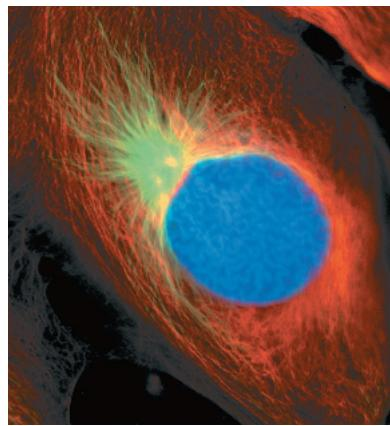  
Prophase

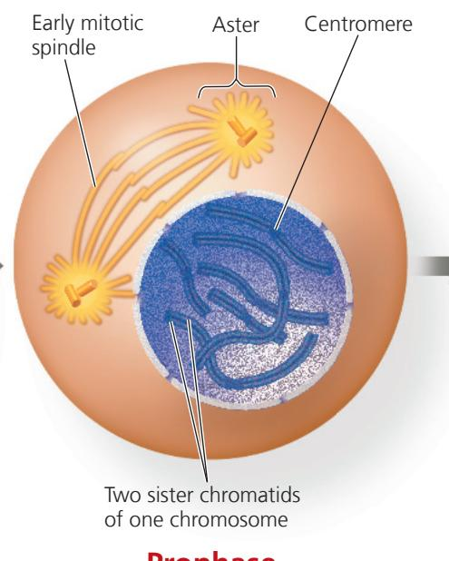

Prometaphase  
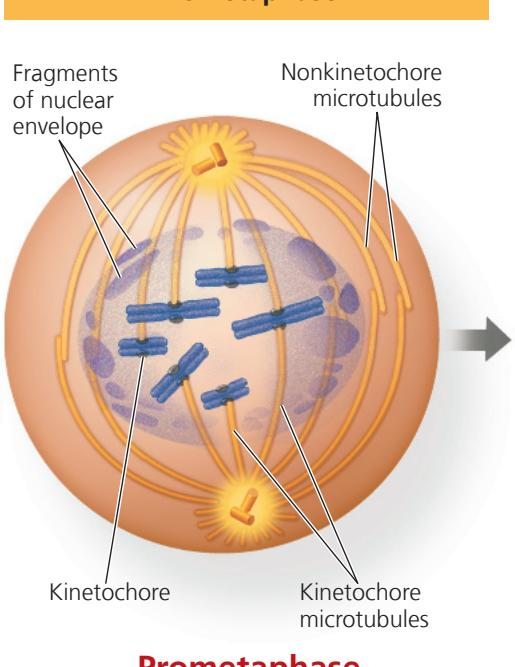

## $G_{2}$ of Interphase

• A nuclear envelope encloses the nucleus.

\- The nucleus contains one or more nucleoli (singular, nucleolus).

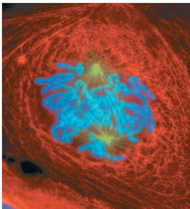

\- Two centrosomes have formed by duplication of a single centrosome. Centrosomes are regions in animal cells that organize the microtubules of the spindle. Each centrosome contains two centrioles.

\- Chromosomes, duplicated during S phase, cannot be seen individually because they have not yet condensed.

## Prophase

The fluorescence micrographs show dividing lung cells from a newt; this species has 22 chromosomes. Chromosomes appear blue, microtubules green, and intermediate filaments red. For simplicity, the drawings show only 6 chromosomes.

\- The chromatin fibers become more tightly coiled, condensing into discrete chromosomes observable with a light microscope.

• The nucleoli disappear.

\- Each duplicated chromosome appears as two identical sister chromatids joined at their centromeres and, in some species, all along their arms by cohesins, arms by cohesins (sister chromatid cohesion).

\- The mitotic spindle (named for its shape) begins to form. It is composed of the centrosomes and the microtubules that extend from them. The radial arrays of shorter microtubules that extend from the centrosomes are called asters (“stars”).

\- The centrosomes move away from each other, propelled partly by the lengthening microtubules between them.

## Prometaphase

\- The nuclear envelope fragments.

\- The microtubules extending from each centrosome can now invade the nuclear area.

\- The chromosomes have become even more condensed.

\- A kinetochore, a specialized protein structure, has now formed at the centromere of each chromatid (thus, two per chromosome).

\- Some of the microtubules attach to the kinetochores, becoming “kinetochore microtubules,” which jerk the chromosomes back and forth.

\- Nonkinetochore microtubules interact with those from the opposite pole of the spindle, lengthening the cell.

10 μm

  
Metaphase

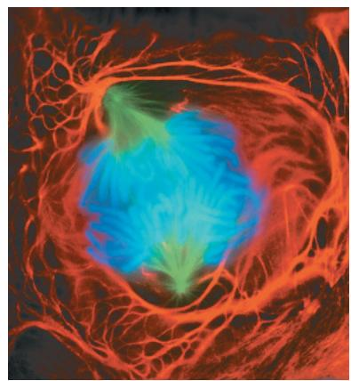  
Anaphase

  
Telophase and Cytokinesis

\- The centrosomes are now at opposite poles of the cell.

\- The chromosomes have all arrived at the metaphase plate, a plane that is equidistant between the spindle's two poles. The chromosomes' centromeres lie at the metaphase plate.

\- For each chromosome, the kinetochores of the sister chromatids are attached to kinetochore microtubules coming from opposite poles.

## Anaphase

\- Anaphase is the shortest stage of mitosis, often lasting only a few minutes.

\- Anaphase begins when the cohesin proteins are cleaved. This allows the two sister chromatids of each pair to part suddenly. Each chromatid thus becomes an independent chromosome.

\- The two new daughter chromosomes begin moving toward opposite ends of the cell as their kinetochore microtubules shorten. Because these microtubules are attached at the centromere region, the centromeres are pulled ahead of the arms, moving at a rate of about 1 $\mu$ m/min.

\- The cell elongates as the nonkinetochore microtubules lengthen.

\- By the end of anaphase, the two ends of the cell have equivalent and complete collections of chromosomes.

## Telophase

\- Two daughter nuclei form in the cell. Nuclear envelopes arise from the fragments of the parent cell's nuclear envelope and other portions of the endomembrane system.

\- Nucleoli reappear.

• The chromosomes become less condensed.

\- Any remaining spindle microtubules are depolymerized.

\- Mitosis, the division of one nucleus into two genetically identical nuclei, is now complete.

## Cytokinesis

\- The division of the cytoplasm is usually well under way by late telophase, so the two daughter cells appear shortly after the end of mitosis.

\- In animal cells, cytokinesis involves the formation of a cleavage furrow, which pinches the cell in two.

DRAW IT On the lower micrograph, draw a line indicating the position of the metaphase plate. Draw arrows showing the directions of chromosome movement when anaphase begins.
For suggested answer, see Appendix A.

## The Mitotic Spindle: A Closer Look

Many of the events of mitosis depend on the mitotic spindle, which begins to form in the cytoplasm during prophase. This structure consists of fibers made of microtubules and associated proteins. While the mitotic spindle assembles, the other microtubules of the cytoskeleton partially disassemble, providing the material used to construct the spindle. The spindle microtubules elongate (polymerize) by incorporating more subunits of the protein tubulin (see Table 6.1) and shorten (depolymerize) by losing subunits.

In animal cells, the assembly of spindle microtubules starts at the centrosome, a subcellular region containing material that functions throughout the cell cycle to organize the cell's microtubules. (It is also a type of microtubule-organizing center.) A pair of centrioles is located at the center of the centrosome, but they are not essential for cell division: If the centrioles are destroyed with a laser microbeam, a spindle nevertheless forms during mitosis. In fact, centrioles are not even present in plant cells, which do form mitotic spindles.

During interphase in animal cells, the single centrosome duplicates, forming two centrosomes, which remain near the nucleus. The two centrosomes move apart during prophase and prometaphase of mitosis as spindle microtubules grow out from them. By the end of prometaphase, the two centrosomes, one at each pole of the spindle, are at opposite ends of the cell. An aster, a radial array of short microtubules, extends from each centrosome. The spindle includes the centrosomes, the spindle microtubules, and the asters.

Each of the two sister chromatids of a duplicated chromosome has a kinetochore, a structure made up of proteins that have assembled on specific sections of DNA at each centromere. The chromosome's two kinetochores face in opposite directions. During prometaphase, some of the spindle microtubules attach to the kinetochores; these are called kinetochore microtubules. (The number of microtubules attached to a kinetochore varies among species, from one microtubule in yeast cells to 40 or so in some mammalian cells.) When one of a chromosome's kinetochores is "captured" by microtubules, the chromosome begins to move toward the pole from which those microtubules extend. However, this movement comes to a halt as soon as microtubules from the opposite pole attach to the kinetochore on the other chromatid. What happens next is like a tug-of-war that ends in a draw. The chromosome moves first in one direction and then in the other, back and forth, finally settling midway between the two ends of the cell. At metaphase, the centromeres of all the duplicated chromosomes are on a plane midway between the spindle's two poles. This plane is called the metaphase plate, which is an imaginary plate rather than an actual cellular structure (Figure 12.8). Meanwhile, microtubules that do not attach to kinetochores have been elongating, and by metaphase they overlap and interact with other nonkinetochore microtubules from the opposite pole of the spindle. By metaphase, the microtubules of the asters have also grown and are in contact with the plasma membrane. The spindle is now complete.

The structure of the spindle correlates well with its function during anaphase. Anaphase begins suddenly when the cohesins holding together the sister chromatids of each chromosome are cleaved by an enzyme called separase. Once separated, the chromatids become individual chromosomes that move toward opposite ends of the cell.

How do the kinetochore microtubules function in this poleward movement of chromosomes? Apparently, two

Figure 12.8 The mitotic spindle at metaphase.

The kinetochores of each chromosome's two sister chromatids face in opposite directions. Here, each kinetochore is attached to a cluster of kinetochore microtubules (see TEM) extending from the nearest centrosome. Nonkinetochore microtubules overlap at the metaphase plate. The fluorescent micrograph is a rat kangaroo cell at metaphase.

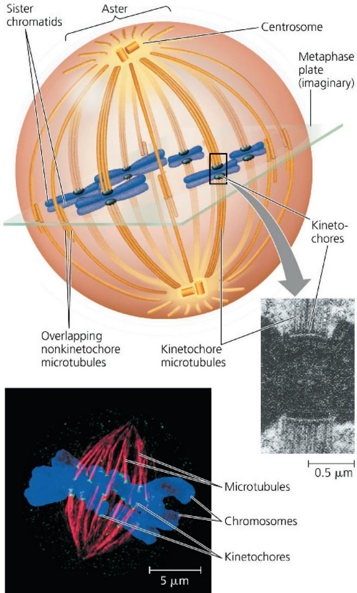

mechanisms are in play, both involving motor proteins. (To review how motor proteins move an object along a microtubule, see Figure 6.21.) Results of a cleverly designed experiment suggested that motor proteins on the kinetochores “walk” the chromosomes along the microtubules, which depolymerize at their kinetochore ends after the motor proteins have passed (Figure 12.9). (This is referred to as the “Pacman” mechanism because of its resemblance to the arcade game character that moves by eating all the dots in its path.) However, other researchers, working with different cell types or cells from other species, have shown that chromosomes are “reeled in” by motor proteins at the spindle poles and that the microtubules depolymerize after they pass by these motor proteins at the poles. The general consensus now is that both mechanisms are used and that their relative contributions vary among cell types.

## Figure 12.9

# Inquiry: At which end do kinetochore microtubules shorten during anaphase?

## Experiment

Gary Borisy and colleagues at the University of Wisconsin wanted to determine whether kinetochore microtubules depolymerize at the kinetochore end or the pole end as chromosomes move toward the poles during mitosis. First they labeled the microtubules of a pig kidney cell in early anaphase with a yellow fluorescent dye. (Nonkinetochore microtubules are not shown.)

Then they marked a region of the kinetochore microtubules between one spindle pole and the chromosomes by using a laser to eliminate the fluorescence from that region, while leaving the microtubules intact (see below). As anaphase proceeded, they monitored the changes in microtubule length on either side of the non-fluorescent mark.

In a dividing animal cell, the nonkinetochore microtubules are responsible for elongating the whole cell during anaphase. Nonkinetochore microtubules from opposite poles overlap each other extensively during metaphase (see Figure 12.8). During anaphase, the region of overlap is reduced as motor proteins attached to the microtubules walk them away from one another, using energy from ATP. As the microtubules push apart from each other, their spindle poles are pushed apart, elongating the cell. At the same time, the microtubules lengthen somewhat by the addition of tubulin subunits to their overlapping ends. As a result, the microtubules continue to overlap.

At the end of anaphase, duplicate groups of chromosomes have arrived at opposite ends of the elongated parent cell. Nuclei re-form during telophase. Cytokinesis generally begins during anaphase or telophase, and the spindle eventually disassembles by depolymerization of microtubules.

## Results

As the chromosomes moved poleward, the microtubule segments on the kinetochore side of the mark shortened, while those on the spindle pole side stayed the same length.

## Conclusion

During anaphase in this cell type, chromosome movement is correlated with kinetochore microtubules shortening at their kinetochore ends and not at their spindle pole ends. This experiment supports the hypothesis that during anaphase, a chromosome is walked along a microtubule as the microtubule depolymerizes at its kinetochore end, releasing tubulin subunits.

  
Data from G. J. Gorbsky, P. J. Sammak, and G. G. Borisy, Chromosomes move poleward in anaphase along stationary microtubules that coordinately disassemble from their kinetochore ends, Journal of Cell Biology 104:9–18 (1987).  
WHAT IF? If this experiment had been done on a cell type in which “reeling in” at the poles was the main cause of chromosome movement, how would the mark have moved relative to the poles? How would the microtubule portions on either side of the mark have changed?

For suggested answer, see Appendix A.

## Cytokinesis: A Closer Look

In animal cells, cytokinesis occurs by a process known as cleavage. The first sign of cleavage is the appearance of a cleavage furrow, a shallow groove in the cell surface near the old metaphase plate (Figure 12.10a). On the cytoplasmic side of the furrow is a contractile ring of actin microfilaments associated with molecules of the protein myosin. The actin microfilaments interact with the myosin molecules, causing the ring to contract. The contraction of the dividing cell's ring of microfilaments is like the pulling of a drawstring. The cleavage furrow deepens until the parent cell is pinched in two, producing two completely separated cells, each with its own nucleus and its own share of cytosol, organelles, and other subcellular structures.

Cytokinesis in plant cells, which have cell walls, is markedly different. There is no cleavage furrow. Instead, during telophase, vesicles derived from the Golgi apparatus move along microtubules to the middle of the cell, where they coalesce, producing a

Figure 12.10 Cytokinesis in animal and plant cells.  

cell plate. Cell wall materials carried in the vesicles collect inside the cell plate as it grows (Figure 12.10b). The cell plate enlarges until its surrounding membrane fuses with the plasma membrane along the perimeter of the cell. Two daughter cells result, each with its own plasma membrane. Meanwhile, a new cell wall arising from the contents of the cell plate forms between the daughter cells.

Figure 12.11 is a series of micrographs of a dividing plant cell. Examining this figure will help you review mitosis and cytokinesis.

## Binary Fission in Bacteria

Prokaryotic organisms (in both Bacteria and Archaea) can undergo a type of reproduction in which the cell grows to roughly double its size and then divides to form two cells. The term binary fission, meaning “division in half,” refers to this process and to the asexual reproduction of single-celled eukaryotes, such as the amoeba in Figure 12.2a. However, the process in eukaryotes involves mitosis, while that in prokaryotic organisms does not.

In bacteria, most genes are carried on a single bacterial chromosome that consists of a circular DNA molecule and associated proteins. Although bacteria are smaller and simpler than eukaryotic cells, the challenge of replicating their genomes in an orderly fashion and distributing the copies equally to two daughter cells is still formidable. For example, when it is fully stretched out, the chromosome of the bacterium Escherichia coli is about 500 times as long as the cell. For such a long chromosome to fit within the cell, it must be highly coiled and folded.

In some bacteria, the process of cell division is initiated when the DNA of the bacterial chromosome begins to replicate at a specific place on the chromosome called the origin of replication, producing two origins. As the chromosome continues to replicate, one origin moves rapidly toward the opposite end of the cell (Figure 12.12). While the chromosome is replicating, the cell elongates. When replication is complete and the bacterium has reached about twice its initial size, proteins cause its plasma membrane to pinch inward, dividing the parent bacterial cell into two daughter cells. In this way, each cell inherits a complete genome.

Using the techniques of modern DNA technology to tag the origins of replication with molecules that glow green in fluorescence microscopy (see Figure 6.3), researchers have directly observed the movement of bacterial chromosomes. This movement is reminiscent of the poleward movements of the centromere regions of eukaryotic chromosomes during anaphase of mitosis, but bacteria don't have visible mitotic spindles or even microtubules. In most bacterial species studied, the two origins of replication end up at opposite ends of the cell or in some other very specific location, possibly anchored there by one or more proteins. How bacterial chromosomes move and how their specific location is established and maintained are active areas of research. Several proteins that play important roles have been identified. Polymerization of one protein resembling eukaryotic actin apparently functions in bacterial chromosome movement during cell division, and another protein that is related to tubulin helps pinch the plasma membrane inward, separating the two bacterial daughter cells.

## The Evolution of Mitosis

EVOLUTION Given that prokaryotic organisms preceded eukaryotes on Earth by more than a billion years, we might hypothesize that mitosis evolved from simpler prokaryotic mechanisms of cell reproduction. The fact that some of the proteins involved in bacterial binary fission are related to eukaryotic proteins that function in mitosis supports that hypothesis.

As eukaryotes with nuclear envelopes and larger genomes evolved, the ancestral process of binary fission, seen today in bacteria,

  
Figure 12.12 Bacterial cell division by binary fission.
The bacterium E. coli, shown here, has a single, circular chromosome.  
Figure 12.11 Mitosis in a plant cell.

These light micrographs show mitosis in cells of an onion root.

Nucleus

Nucleolus

Chromosomes condensing

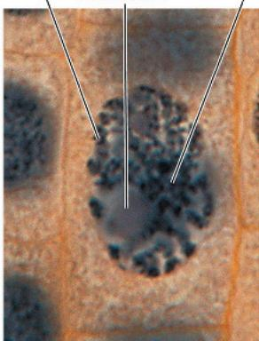

1 Prophase. The chromosomes are condensing and the nucleolus is beginning to disappear. Although not yet visible in the micrograph, the mitotic spindle is starting to form.

Chromosomes  

2 Prometaphase. Discrete chromosomes are now visible; each consists of two aligned, identical sister chromatids. Later in prometaphase, the nuclear envelope will fragment.

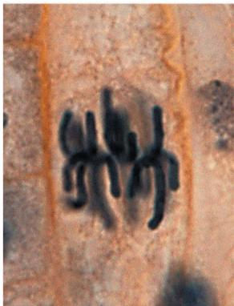

Metaphase. The spindle is complete, and the chromosomes, attached to microtubules at their kinetochores, are all at the metaphase plate.

Cell plate  

10 μm

4 Anaphase. Chromatids of each chromosome have separated. The daughter chromosomes are moving to the ends of the cell as their kinetochore microtubules shorten.

5 Telophase. Daughter nuclei are forming. Cytokinesis has started: The cell plate, which will divide the cytoplasm in two, grows toward the perimeter of the parent cell.

## 1 Chromosome

replication begins at the origin. Soon after, one copy of the origin moves rapidly toward the other end of the cell by a mechanism involving an actin-like protein.

2 Replication continues. One copy of the origin is now at each end of the cell. Meanwhile, the cell elongates.

3 Replication finishes. The plasma membrane is pinched inward by a tubulin-like protein, and a new cell wall is deposited.

Two daughter cells result.

somehow gave rise to mitosis. Variations on cell division exist in different groups of organisms. These variant processes may be similar to mechanisms used by ancestral species and thus may resemble steps in the evolution of mitosis from a binary fission-like process presumably carried out by very early bacteria. Possible intermediate stages are suggested by two unusual types of nuclear division found today in certain unicellular eukaryotes—dinoflagellates, diatoms, and some yeasts (Figure 12.13, on the next page). These two modes of nuclear division are thought to be cases where ancestral mechanisms have remained relatively unchanged over evolutionary time. In both types, the nuclear envelope remains intact, in contrast to what happens in most eukaryotic cells. Keep in mind, however, that we can't observe cell division in cells of extinct species. This hypothesis uses only currently existing species as some possible examples of intermediate mechanisms. Other mechanisms may have existed in species that have gone extinct; we simply have no way of knowing.

## Concept Check 12.2

1. How many chromosomes are shown in the illustration in Figure 12.8? Are they duplicated? How many chromatids are shown?

2. Compare cytokinesis in animal cells and plant cells.

3. During which stages of the cell cycle does a chromosome consist of two identical chromatids?

4. Compare the roles of tubulin and actin during eukaryotic cell division with the roles of tubulin-like and actin-like proteins during bacterial binary fission.

5. A kinetochore has been compared to a coupling device that connects a motor to the cargo that it moves. Explain.

6. MAKE CONNECTIONS What other functions do actin and tubulin carry out? Name the proteins they interact with to do so. (Review Figures 6.21a and 6.26a.)

Figure 12.13 Mechanisms of cell division in several groups of organisms.

Some unicellular eukaryotes existing today have mechanisms of cell division that may resemble intermediate steps in the evolution of mitosis. Except for (a), cell walls are not shown.

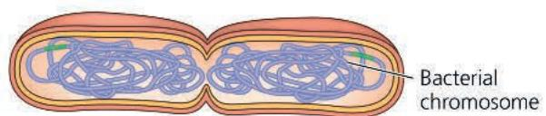

(a) Bacteria. During binary fission in bacteria, the origins of the daughter chromosomes move to opposite ends of the cell. The mechanism involves polymerization of actin-like molecules and possibly proteins that may anchor the daughter chromosomes to specific sites on the plasma membrane.

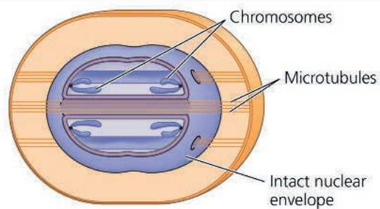  
(b) Dinoflagellates. In unicellular eukaryotes called dinoflagellates, the chromosomes attach to the nuclear envelope, which remains intact during cell division. Microtubules pass through the nucleus inside cytoplasmic tunnels, reinforcing the spatial orientation of the nucleus, which then divides in a process reminiscent of bacterial binary fission.

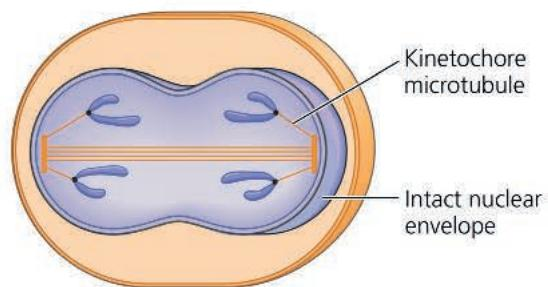

(c) Diatoms and some yeasts (unicellular fungi). In these two other groups of unicellular eukaryotes, the nuclear envelope also remains intact during cell division. In these organisms, the microtubules form a spindle within the nucleus. Microtubules separate the chromosomes, and the nucleus splits into two daughter nuclei.

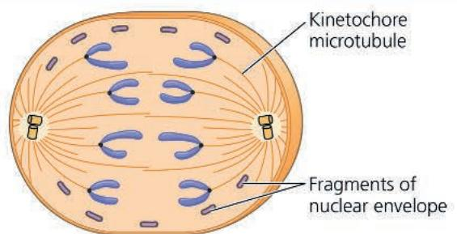  
(d) Most eukaryotes. In most other eukaryotes, including plants and animals, the spindle forms outside the nucleus, and the nuclear envelope breaks down during mitosis. Microtubules separate the chromosomes, and two nuclear envelopes then form.

# Concept 12.3: The eukaryotic cell cycle is regulated by a molecular control system

The timing and rate of cell division in different parts of a plant or animal are crucial to normal growth, development, and maintenance. The frequency of cell division varies with the type of cell. For example, human skin cells divide frequently throughout life, whereas liver cells maintain the ability to divide but keep it in reserve until an appropriate need arises—say, to repair a wound. Some of the most specialized cells, such as fully formed nerve cells and muscle cells, do not divide at all in a mature human. These cell cycle differences result from regulation at the molecular level. The mechanisms of this regulation are of great interest, not only to understand the life cycles of normal cells but also to learn how cancer cells manage to escape the usual controls.

## The Cell Cycle Control System

What controls the cell cycle? In the early 1970s, a variety of experiments led to the hypothesis that the cell cycle is driven by specific signaling molecules present in the cytoplasm. Some of the first strong evidence for this hypothesis came from experiments with mammalian cells grown in culture. In these experiments, two cells in different phases of the cell cycle were fused to form a single cell with two nuclei (Figure 12.14). If one of the original cells was in the S phase and the other was in $G_{1}$ , the $G_{1}$ nucleus immediately entered the S phase, as though stimulated by signaling molecules present in the cytoplasm of the first cell. Similarly, if a cell undergoing mitosis (M phase) was fused with another cell in any stage of its cell cycle, even $G_{1}$ , the second nucleus immediately entered mitosis, with condensation of the chromatin and formation of a mitotic spindle.

The experiment shown in Figure 12.14 and other experiments on animal cells and yeasts demonstrated that the sequential events of the cell cycle are directed by a distinct cell cycle control system, a cyclically operating set of molecules in the cell that both triggers and coordinates key events in the cell cycle (Figure 12.15). The cell cycle control system has been compared to the control device of a washing machine. Like the washer's timing device, the cell cycle control system proceeds on its own, according to a built-in clock. However, just as a washer's cycle is subject to both internal control (such as the sensor that detects when the tub is filled with water) and external adjustment (such as starting or stopping the machine), the cell cycle is regulated at certain checkpoints by both internal and external signals. A checkpoint in the cell cycle is a control point where stop and go-ahead signals can regulate the cycle. Three important checkpoints are found in the $G_1$ , $G_2$ , and M phases (red gates in Figure 12.15), which will be discussed shortly.

To understand how cell cycle checkpoints work, we'll first identify some of the molecules that make up the cell cycle control system (the molecular basis for the cell cycle clock) and describe how a cell progresses through the cycle. We'll then consider the internal and external checkpoint signals that can make the clock either pause or continue.

## Figure 12.14

# Inquiry: Do molecular signals in the cytoplasm regulate the cell cycle?

Experiment

Researchers at the University of Colorado wondered whether a cell's progression through the cell cycle is controlled by cytoplasmic molecules. They induced cultured mammalian cells at different phases of the cell cycle to fuse. Two experiments are shown.

## Results

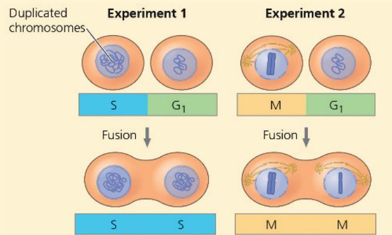  
When a cell in S phase was fused with a cell in $G_{1}$ , the $G_{1}$ nucleus immediately entered S phase—DNA was synthesized.  
When a cell in M phase was fused with a cell in $G_{1}$ , the $G_{1}$ nucleus immediately began mitosis—a spindle formed and the chromosomes condensed, even though the chromosomes had not been duplicated.

## Conclusion

The results of fusing a $G_{1}$ cell with a cell in the S or M phase of the cell cycle suggest that molecules present in the cytoplasm during the S or M phase control the progression to those phases.

Data from R. T. Johnson and P. N. Rao, Mammalian cell fusion: Induction of premature chromosome condensation in interphase nuclei, Nature 226:717–722 (1970).

WHAT IF? If the progression of phases did not depend on cytoplasmic molecules and each phase began when the previous one was complete, how would the results have differed?

For suggested answer, see Appendix A.

## The Cell Cycle Clock: Cyclins and Cyclin-Dependent Kinases

Rhythmic fluctuations in the abundance and activity of cell cycle control molecules pace the sequential events of the cell cycle. These regulatory molecules are mainly proteins of two types: protein kinases and cyclins. As you learned in Concept 11.3, protein kinases are enzymes that activate or inactivate other proteins by phosphorylating them.

Many of the kinases that drive the cell cycle are actually present at a constant concentration in the growing cell, but much of the time they are in an inactive form. To be active, such a kinase must be attached to a cyclin, a protein that gets its name from its cyclically fluctuating concentration in the cell. Because

Figure 12.15 Mechanical analogy for the cell cycle control system. In this diagram, the flat “stepping stones” around the perimeter represent sequential events. Like the control device of a washing machine, the cell cycle control system proceeds on its own, driven by a built-in clock. However, the system is subject to internal and external regulation at various checkpoints; three important checkpoints are shown (red gates).  

## Interview

Interview with Paul Nurse: Discovering how protein kinases control the cell cycle (eTextbook only)

of this requirement, these kinases are called cyclin-dependent kinases, or Cdks. The activity of a Cdk rises and falls with changes in the concentration of its cyclin partner. Figure 12.16a, on the next page, shows the fluctuating activity of MPF, the cyclin-Cdk complex that was discovered first (in frog eggs). Note that the peaks of MPF activity correspond to the peaks of cyclin concentration. The cyclin level rises during the S and $G_{2}$ phases and then falls abruptly during M phase.

The initials MPF stand for “maturation-promoting factor,” but we can think of MPF as “M-phase-promoting factor” because it triggers the cell’s passage into the M phase, past the $G_{2}$ checkpoint. When cyclins that accumulate during $G_{2}$ associate with Cdk molecules, the resulting MPF complex is active—it phosphorylates a variety of proteins, initiating mitosis (Figure 12.16b). MPF acts both directly as a kinase and indirectly by activating other kinases. For example, MPF causes phosphorylation of various proteins of the nuclear lamina (see Figure 6.9), which promotes fragmentation of the nuclear envelope during prometaphase of mitosis. There is also evidence that MPF contributes to molecular events required for chromosome condensation and spindle formation during prophase.

During anaphase, MPF helps switch itself off by initiating a process that leads to the destruction of its own cyclin. The noncyclin part of MPF, the Cdk, persists in the cell, inactive until it becomes part of MPF again by associating with new cyclin molecules synthesized during the S and $G_{2}$ phases of the next round of the cycle.

The fluctuating activities of different cyclin-Cdk complexes are of major importance in controlling all the stages of the cell

For suggested answer, see Appendix A.

VISUAL SKILLS Explain how the events in the diagram in (b) are related to the "Time" axis of the graph in (a), beginning at the left.

Figure 12.16 Molecular control of the cell cycle at the $G_{2}$ checkpoint.

The steps of the cell cycle are timed by rhythmic fluctuations in the activity of cyclin-dependent kinases (Cdks). Here we focus on a cyclin-Cdk complex in animal cells called MPF, which acts at the $G_{2}$ checkpoint as a go-ahead signal, triggering the events of mitosis.

  
(a) Fluctuation of MPF activity and cyclin concentration during the cell cycle

$$
G _ {2}
$$

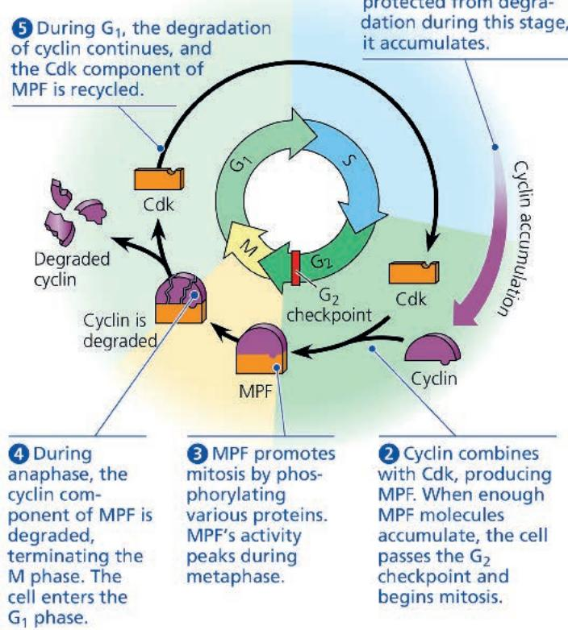  
(b) Molecular mechanisms that help regulate the cell cycle

cycle; they also give the go-ahead signals at some checkpoints. As mentioned above, MPF controls the cell's passage through the $G_{2}$ checkpoint. Cell behavior at the $G_{1}$ checkpoint is also regulated by the activity of cyclin-Cdk protein complexes. Animal cells appear to have at least three Cdk proteins and several different cyclins that operate at this checkpoint. Next, let's consider checkpoints in more detail.

## Stop and Go Signs: Internal and External Signals at the Checkpoints

Animal cells generally have built-in stop signals that halt the cell cycle at checkpoints until overridden by go-ahead signals. Many signals registered at checkpoints come from cellular surveillance mechanisms inside the cell. These signals report whether crucial cellular processes that should have occurred by that point have in fact been completed correctly and thus whether or not the cell cycle should proceed. Checkpoints also register signals from outside the cell. The signals are transmitted within the cell by signal transduction pathways (see Figure 11.6). Three important checkpoints are those in the $G_{1}$ , $G_{2}$ , and M phases (see Figure 12.15).

For many cells, the $G_{1}$ checkpoint (also called the restriction point) seems to be the most important. If a cell does not receive a go-ahead signal at the $G_{1}$ checkpoint, it may exit the cycle, switching into a nondividing state called the $G_{0}$ phase (Figure 12.17a). If a cell does receive a go-ahead signal that allows it to pass the $G_{1}$ checkpoint, it was thought until recently that the cell was committed to completing the $G_{1}$ , S, $G_{2}$ , and M phases and dividing, even in the absence of further signals. However, research studies reported in 2023 have identified a subset (up to 15%) of cells that pass the $G_{1}$ checkpoint but are not committed to dividing unless the go-ahead signals continue. These cells may go through S phase and then exit the cycle, or they may continue through cell division, depending on how long the go-ahead signals are present; cyclin proteins are involved here as well. This research is significant because it highlights the complex nature of checkpoints—something that is crucial to our understanding of cell cycle regulation, and therefore how its misregulation can contribute to cancer.

Most cells of the human body are actually in the $G_{0}$ phase. As mentioned earlier, mature nerve cells and muscle cells never divide. Other cells, such as liver cells, can be “called back” from the $G_{0}$ phase to the cell cycle by external cues, such as growth factors released during injury.

Biologists are currently working out the pathways that link signals originating inside and outside the cell with the responses by cyclin-dependent kinases and other proteins. An example of an internal signal occurs at the third important checkpoint, the M checkpoint (Figure 12.17b). Anaphase, the separation of sister chromatids, does not begin until all the chromosomes are properly attached to the spindle at the metaphase plate. Researchers have learned that as long as some kinetochores are unattached to spindle microtubules, the sister chromatids remain together, delaying anaphase. Only when the kinetochores of all the chromosomes are properly attached to the spindle does the appropriate regulatory protein complex become activated. (In this case, the regulatory molecule is not a cyclin-Cdk complex but, instead, a different complex made up of several proteins.) Once activated, the complex sets off a chain of molecular events that activates the enzyme separase, which cleaves the cohesins, allowing the sister chromatids to separate. This mechanism ensures that daughter cells do not end up with missing or extra chromosomes.

There are checkpoints in addition to those in $G_{1}$ , $G_{2}$ , and M. For instance, a checkpoint in S phase stops cells with DNA damage from proceeding in the cell cycle. And, a decade or so ago, researchers presented evidence for another checkpoint between

4 PDGF is added to half the vessels. The culture vessels are incubated at 37°C for 24 hours.

Figure 12.17 Two important checkpoints.

At certain checkpoints in the cell cycle (red gates), cells do different things depending on the signals they receive. Events of the (a) $G_{1}$ and (b) M checkpoints are shown. In (b), the $G_{2}$ checkpoint has already been passed by the cell.

In the absence of a go-ahead signal, a cell exits the cell cycle and enters $G_{0}$ , a nondividing state.

  
If a cell receives a go-ahead signal, the cell continues on in the cell cycle.

WHAT IF? What might be the result if the cell ignored either checkpoint and progressed through the cell cycle? For suggested answer, see Appendix A.

anaphase and telophase that ensures anaphase is completed and the chromosomes are well separated before cytokinesis can begin, thus avoiding chromosomal damage.

What about the stop and go-ahead signals themselves—what are the signaling molecules? Studies using animal cells in culture have led to the identification of many external factors, both chemical and physical, that can influence cell division. For example, cells fail to divide if an essential nutrient is lacking in the culture medium. (This is analogous to trying to run a washing machine without the water supply hooked up; an internal sensor won't allow the machine to continue past the point where water is needed.) And even if all other conditions are favorable, most types of mammalian cells divide in culture only if the growth medium includes specific growth factors. As mentioned in Concept 11.1, a growth factor is a protein released by certain cells that stimulates other cells to divide. Different cell types respond specifically to different growth factors or combinations of growth factors.

Consider, for example, platelet-derived growth factor (PDGF), which is made by blood cell fragments called platelets. When an injury occurs, platelets release PDGF in the vicinity. The experiment illustrated in Figure 12.18 demonstrates that PDGF is required for the division of cultured fibroblasts, a type of connective tissue cell. Fibroblasts have PDGF receptors on their plasma membranes. The binding of PDGF molecules to these receptors (which are receptor tyrosine kinases; see Figure 11.8) triggers a signal transduction pathway that allows the cells to pass the $G_{1}$ checkpoint and divide. PDGF stimulates fibroblast division not only in the artificial conditions of cell culture but also in an animal's body. Thus, injury results in a proliferation of fibroblasts that helps heal the wound.

The effect of an external physical factor on cell division is clearly seen in density-dependent inhibition, a phenomenon

Figure 12.18 The effect of platelet-derived growth factor (PDGF) on cell division.

2 Enzymes are used to digest the extracellular matrix in the tissue pieces, resulting in a suspension of free fibroblasts.

3 Cells are transferred to culture vessels containing a basic growth medium consisting of glucose, amino acids, salts, and antibiotics (to prevent bacterial growth).

Without PDGF

In the basic growth medium without PDGF (the control), the cells fail to divide.

In the basic growth medium plus PDGF, the cells proliferate. The SEM shows cultured fibroblasts.

MAKE CONNECTIONS PDGF signals cells by binding to a cell-surface receptor tyrosine kinase. If you added a chemical that blocked phosphorylation, how would the results differ? (See Figure 11.8.) For suggested answer, see Appendix A.

Cells anchor to dish surface and divide (anchorage dependence).

Figure 12.19 Density-dependent inhibition and anchorage dependence of cell division.

Individual cells are shown disproportionately large in the drawings.

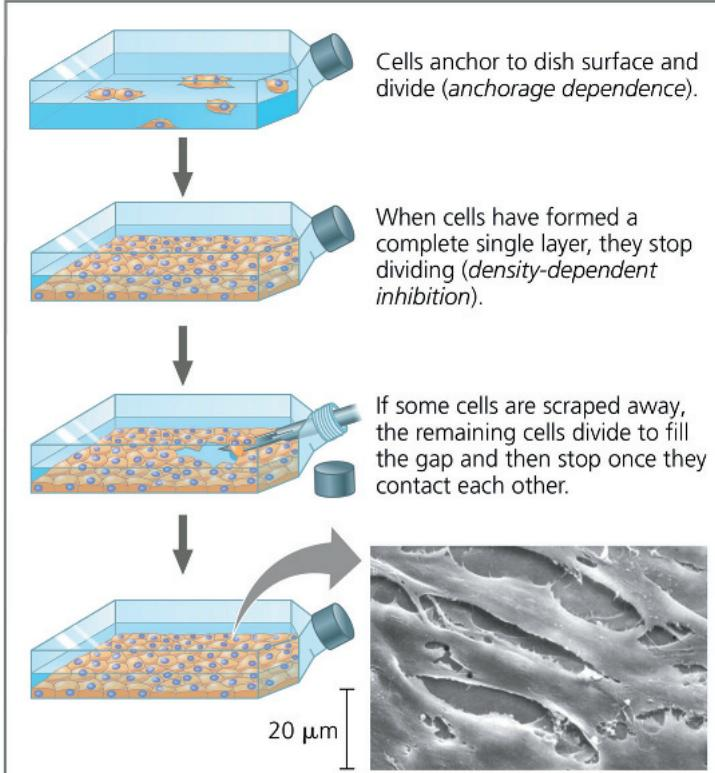  
When cells have formed a complete single layer, they stop dividing (density-dependent inhibition).

(a) Normal mammalian cells. Cell density is limited to a single layer by contact with neighboring cells and the availability of nutrients, growth factors, and a substratum for attachment.  
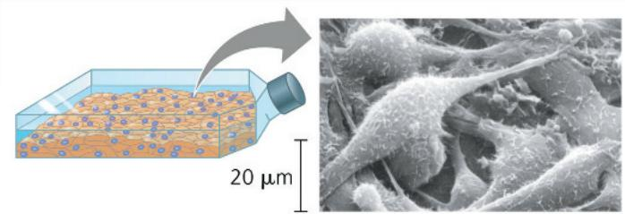  
(b) Cancer cells. Cancer cells usually continue to divide well beyond a single layer, forming a clump of overlapping cells. They do not exhibit anchorage dependence or density-dependent inhibition.

in which crowded cells stop dividing (Figure 12.19a). Studies done many years ago showed that cultured cells normally divide until they form a single layer of cells on the inner surface of a culture flask, at which point the cells stop dividing. If some cells are removed, those bordering the open space begin dividing again and continue until the vacancy is filled. Follow-up studies revealed that the binding of a cell-surface protein to its counterpart on an adjoining cell sends a signal to both cells that inhibits cell division, preventing them from moving forward in the cell cycle, even in the presence of growth factors.

Most animal cells also exhibit anchorage dependence (see Figure 12.19a). To divide, they must be attached to something, such as the inside of a culture flask or the extracellular matrix of a tissue. Experiments suggest that, like cell density, anchorage is signaled to the cell cycle control

system via pathways involving plasma membrane proteins and elements of the cytoskeleton linked to them.

Density-dependent inhibition and anchorage dependence appear to function not only in cell culture but also in the body's tissues, checking the growth of cells at some optimal density and location during embryonic development and throughout an organism's life. Cancer cells, which we examine next, exhibit neither density-dependent inhibition nor anchorage dependence (Figure 12.19b).

## Loss of Cell Cycle Controls in Cancer Cells

Cancer cells do not heed the normal signals that regulate the cell cycle. In culture, they do not stop dividing when growth factors are depleted. A logical hypothesis is that cancer cells do not need growth factors in their culture medium to grow and divide. They may make a required growth factor themselves, or they may have an abnormality in the signaling pathway that conveys the growth factor's signal to the cell cycle control system even in the absence of that factor. Another possibility is an abnormal cell cycle control system. In these scenarios, the underlying basis of the abnormality is almost always a change in one or more genes (for example, a mutation) that alters the function of their protein products, resulting in faulty cell cycle control. We'll explore the molecular basis for such changes in Concept 18.5.

There are other important differences between normal cells and cancer cells that reflect malfunctions of the cell cycle. If and when they stop dividing, cancer cells do so at random points in the cycle, rather than at the normal checkpoints. Moreover, cancer cells can go on dividing indefinitely in culture if they are given a continual supply of nutrients; in essence, they are “immortal.” A striking example is a cell line that has been reproducing in culture since 1951. Cells of this line are called HeLa cells because their original source was a tumor removed from a woman named Henrietta Lacks. (Neither Ms. Lacks nor her family gave permission or even knew about the propagation and use of her cells, which have helped biologists make countless significant discoveries over the years.) Cells in culture that acquire the ability to divide indefinitely are said to have undergone a process called transformation, causing them to behave (in cell division, at least) like cancer cells. By contrast, nearly all normal, nontransformed mammalian cells growing in culture divide only about 20 to 50 times before they stop dividing, age, and die. Finally, cancer cells evade the normal controls that trigger a cell to undergo apoptosis when something is wrong—for example, when an irreparable mistake has occurred during DNA replication preceding mitosis.

Abnormal cell behavior in the body can be catastrophic. The problem begins when a single cell in a tissue undergoes the first of many steps that convert a normal cell to a cancer cell. Such a cell often has altered proteins on its surface, and the body's immune system normally recognizes the cell as “nonself”—an insurgent—and destroys it. However, if the cell evades destruction, it may proliferate and form a tumor, a mass of abnormal cells within otherwise normal tissue. The abnormal cells may remain at the original site if their genetic and cellular changes don't allow them to move to or survive at another site. In that case, the tumor is called a benign tumor. Most benign tumors do not cause serious problems (depending on their location) and can be removed by surgery. In contrast, a malignant tumor includes

Figure 12.20 The growth and metastasis of a malignant breast tumor.  

cells whose genetic and cellular changes enable them to spread to new tissues and impair the functions of one or more organs; these cells are also sometimes called transformed cells (although usage of this term is generally restricted to cells in culture). An individual with a malignant tumor is said to have cancer (Figure 12.20).

The changes that have occurred in cells of malignant tumors show up in many ways besides excessive proliferation. These cells may have unusual numbers of chromosomes, though whether this is a cause or an effect of tumor-related changes is an ongoing debate. Their metabolism may be altered, and they may cease to function in any constructive way. Abnormal changes on the cell surface cause cancer cells to lose attachments to neighboring cells and the extracellular matrix, allowing them to spread into nearby tissues. Cancer cells may also secrete signaling molecules that cause blood vessels to grow toward the tumor. A few tumor cells may separate from the original tumor, enter blood vessels and lymph vessels, and travel to other parts of the body. There, they may proliferate and form a new tumor. This spread of cancer cells to locations distant from their original site is called metastasis (see Figure 12.20).

A tumor that appears to be localized may be treated with high-energy radiation, which damages DNA in cancer cells much more than DNA in normal cells, apparently because the majority of cancer cells have lost the ability to repair such damage. To treat known or suspected metastatic tumors, chemotherapy is used, in which drugs that are toxic to actively dividing cells are administered through the circulatory system. As you might expect, chemotherapeutic drugs interfere with specific steps in the cell cycle. For example, the drug Taxol freezes the mitotic spindle by preventing microtubule depolymerization, which stops actively dividing cells from proceeding past metaphase and leads to their destruction. The side effects of chemotherapy are due to the effects of the drugs on normal cells that divide frequently, due to the function of that cell type in the organism. For example, nausea results from chemotherapy's effects on intestinal cells, hair loss from effects on hair follicle cells, and susceptibility to infection from effects on immune system cells. You can work with data from an experiment involving a potential chemotherapeutic agent in the Scientific Skills Exercise.

Over the past several decades, researchers have produced a flood of valuable information about cell-signaling pathways and how their malfunction contributes to the development of cancer through effects on the cell cycle. Coupled with new molecular techniques, such as the ability to rapidly sequence the DNA of cells in a particular tumor, medical treatments for cancer are beginning to become more “personalized” to a particular patient’s tumor.

For example, the cells of roughly 20% of breast cancer tumors show abnormally high amounts of a cell-surface receptor tyrosine kinase called HER2, and many show an increase in the number of estrogen receptor (ER) molecules, intracellular receptors that can trigger cell division. Based on lab findings, a physician can prescribe chemotherapy with a molecule that blocks the function of the specific protein (Herceptin for HER2 and tamoxifen for ERs). Treatment using these agents, when appropriate, has led to increased survival rates and fewer cancer recurrences (see Make Connections Figure 18.27).

## Interview

Interview with Bruce Alberts: Cancer control and careers in science (eTextbook only)

## Concept Check 12.3

1. In Figure 12.14, why do the nuclei resulting from experiment 2 contain different amounts of DNA?

2. How does MPF allow a cell to pass the $G_{2}$ phase checkpoint and enter mitosis? (See Figure 12.16.)

3. MAKE CONNECTIONS Explain how receptor tyrosine kinases and intracellular receptors might function in triggering cell division. (Review Figures 11.8 and 11.9 and Concept 11.2.)

## Scientific Skills Exercise Interpreting Histograms

At What Phase Is the Cell Cycle Arrested by an Inhibitor? Many medical treatments are aimed at stopping cancer cell proliferation by blocking the cell cycle of cancerous tumor cells. One potential treatment is a cell cycle inhibitor derived from human umbilical cord stem cells. In this exercise, you will compare two histograms to determine where in the cell cycle the inhibitor blocks the division of cancer cells.

How the Experiment Was Done In the treated sample, human glioblastoma (brain cancer) cells were grown in tissue culture in the presence of the inhibitor, while a control sample of glioblastoma cells was grown in its absence. After 72 hours of growth, the two cell samples were harvested. To get a “snapshot” of the phase of the cell cycle each cell was in at that time, the samples were treated with a fluorescent chemical that binds to DNA and then run through a flow cytometer, an instrument that records the fluorescence level of each cell. Computer software then graphed the number of cells in each sample with a particular fluorescence level, as shown below.

## Data from the Experiment

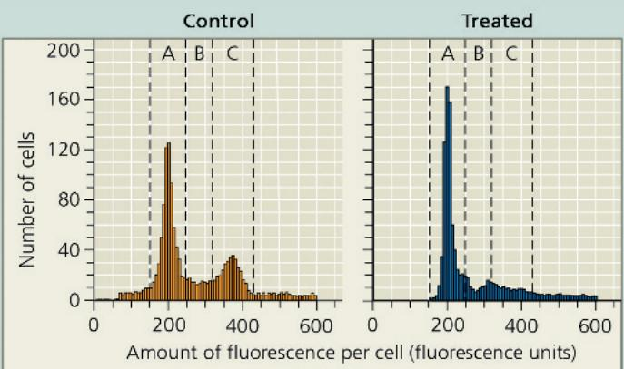  
Data from K. K. Velpula et al., Regulation of glioblastoma progression by cord blood stem cells is mediated by downregulation of cyclin D1, PLoS ONE 6(3):e18017 (2011).

The data are plotted in a type of graph called a histogram (above), which groups the values for a numeric variable on the x-axis into intervals. A histogram allows you to see how all the experimental subjects (cells, in this case) are distributed along a continuous variable (amount of fluorescence). In these histograms, the bars are so narrow that the data appear to follow a curve for which you can detect peaks and dips. Each narrow bar represents the number of cells observed to have a level of fluorescence in the range of that interval. This in turn indicates the relative amount of DNA in those cells. Overall, comparing the two histograms allows you to see how the DNA content of this cell population is altered by the treatment.

## INTERPRET THE DATA

1. Study the data in the histograms. (a) Which axis indirectly shows the relative amount of DNA per cell? Explain your answer. (b) In the control sample, compare the first peak in the histogram (in region A) to the second peak (in region C). Which peak shows the population of cells with the higher amount of DNA per cell? Explain. (For additional information about histograms, see the Scientific Skills Review in Appendix D.)

2. (a) In the control sample histogram, identify the phase of the cell cycle ( $G_{1}$ , S, or $G_{2}$ ) of the population of cells in each region delineated by vertical lines. Label the histogram with these phases and explain your answer. (b) Does the S phase population of cells show a distinct peak in the histogram? Why or why not?

3. The histogram representing the treated sample shows the effect of growing the cancer cells alongside human umbilical cord stem cells that produce the potential inhibitor.
(a) Label the histogram with the cell cycle phases. Which phase of the cell cycle has the greatest number of cells in the treated sample? Explain.
(b) Compare the distribution of cells among $G_{1}$ , S, and $G_{2}$ phases in the control and treated samples. What does this tell you about the cells in the treated sample?
(c) Based on what you learned in Concept 12.3, propose a mechanism by which the stem cell-derived inhibitor might arrest the cancer cell cycle at this stage. (More than one answer is possible.)

Instructors: A version of this Scientific Skills Exercise can be assigned in Mastering Biology.

# Chapter 12 Review

## Summary of Key Concepts

To review key terms, go to the Vocabulary Self-Quiz (eTextbook only).

## Concept 12.1: Most cell division results in genetically identical daughter cells

\- Unicellular organisms reproduce by cell division; multicellular organisms depend on cell division for their development from a fertilized egg and for growth and repair.

\- The genetic material (DNA) of a cell—its genome—is partitioned among chromosomes. Each eukaryotic chromosome consists of one DNA molecule associated with many proteins. Together, the complex of DNA and associated proteins is called chromatin. The chromatin of a chromosome exists in different states of condensation at different times. In animals, gametes have one set of chromosomes and somatic cells have two sets.

\- Cells replicate their genetic material before they divide, each daughter cell receiving a copy of the DNA. Prior to cell division, chromosomes are duplicated. Each one then consists of two identical sister chromatids often joined along their lengths by sister chromatid cohesion and held most tightly together at a constricted region at the centromeres. When this cohesion is broken, the chromatids separate during cell division, becoming the chromosomes of the daughter cells. Eukaryotic cell division consists of mitosis (division of the nucleus) and cytokinesis (division of the cytoplasm).

Differentiate between these terms: chromosome, chromatin, and chromatid.

## Concept 12.2: The mitotic phase alternates with interphase in the cell cycle

\- Cell division is part of the cell cycle, an ordered sequence of events in the life of a cell.

\- Between divisions, a cell is in interphase: the $G_{1}$ , S, and $G_{2}$ phases. The cell grows throughout interphase, with DNA being replicated during the synthesis (S) phase. Mitosis and cytokinesis make up the mitotic (M) phase of the cell cycle.

\- The mitotic spindle, made up of microtubules, controls chromosome movement during mitosis. In animal cells, it arises from the centrosomes and includes spindle microtubules and asters. Some spindle microtubules attach to the kinetochores of chromosomes and move the chromosomes to the metaphase plate. After sister chromatids separate, motor proteins move them along kinetochore microtubules toward opposite ends of the cell. The cell elongates when motor proteins push nonkinet-ochore microtubules from opposite poles away from each other.

\- Mitosis is usually followed by cytokinesis. Animal cells carry out cytokinesis by cleavage, and plant cells form a cell plate.

\- During binary fission in bacteria, the chromosome replicates and the daughter chromosomes actively move apart. Some of the proteins involved in bacterial binary fission are related to eukaryotic actin and tubulin.

\- Since prokaryotes preceded eukaryotes by more than a billion years, it is likely that mitosis evolved from prokaryotic cell division. Certain unicellular eukaryotes exhibit mechanisms of cell division that may be similar to those of ancestors of existing eukaryotes. Such mechanisms might represent intermediate steps in the evolution of mitosis.

In which of the three phases of interphase and the stages of mitosis do chromosomes exist as single DNA molecules?

## Concept 12.3: The eukaryotic cell cycle is regulated by a molecular control system

\- Signaling molecules present in the cytoplasm regulate progress through the cell cycle.

\- In the cell cycle control system, cyclic changes in regulatory proteins—including cyclins and cyclin-dependent kinases (Cdks)—work as a cell cycle clock. The cell cycle stops at specific checkpoints until a go-ahead signal is received; important checkpoints occur in $G_{1}$ , $G_{2}$ , and M phases. Internal and external signals control the cell cycle checkpoints via signal transduction pathways. Most cells exhibit density-dependent inhibition of cell division as well as anchorage dependence.

\- Cancer cells elude normal cell cycle regulation and divide unchecked, forming tumors. Malignant tumors invade nearby tissues and can undergo metastasis, exporting cancer cells to other sites, where they may form secondary tumors.

Explain the significance of the $G_{1}$ , $G_{2}$ , and M checkpoints and the go-ahead signals involved in the cell cycle control system.

For suggested answers, see Appendix A.

## Test Your Understanding

For more multiple-choice questions, go to the Practice Test (eTextbook only).

## Levels 1-2: Remembering/Understanding

1. Through a microscope, you can see a cell plate beginning to develop across the middle of a cell and nuclei forming on either side of the cell plate. This cell is most likely

(A) an animal cell in the process of cytokinesis.

(B) a plant cell in the process of cytokinesis.

(C) a bacterial cell dividing.

(D) a plant cell in metaphase.

2. Vinblastine is a standard chemotherapeutic drug used to treat cancer. Because it interferes with the assembly of microtubules, its effectiveness must be related to

(A) disruption of mitotic spindle formation.

(B) suppression of cyclin production.

(C) myosin denaturation and inhibition of cleavage furrow formation.

(D) inhibition of DNA synthesis.

3. One difference between cancer cells and normal cells is that cancer cells
(A) are unable to synthesize DNA.
(B) are arrested at the S phase of the cell cycle.
(C) continue to divide even when they are tightly packed together.
(D) cannot function properly because they are affected by density-dependent inhibition.

4. The decline of MPF activity at the end of mitosis is due to (A) the destruction of the protein kinase Cdk.
(B) decreased synthesis of Cdk.
(C) the degradation of cyclin.
(D) the accumulation of cyclin.

5. In the cells of some organisms, mitosis occurs without cytokinesis. This will result in
(A) cells with more than one nucleus.
(B) cells that are unusually small.
(C) cells lacking nuclei.
(D) cell cycles lacking an S phase.

6. Which of the following occurs during S phase?
(A) condensation of the chromosomes
(B) replication of the DNA
(C) separation of sister chromatids
(D) spindle formation

## Levels 3-4: Applying/Analyzing

7. Cell A has half as much DNA as cells B, C, and D in a mitotically active tissue. Cell A is most likely in
(A) $G_{1}$ .
(B) $G_{2}$ .
(C) prophase.
(D) metaphase.

8. The drug cytochalasin B blocks the function of actin. Which of the following aspects of the animal cell cycle would be most disrupted by cytochalasin B?
(A) spindle formation
(B) spindle attachment to kinetochores
(C) cell elongation during anaphase
(D) cleavage furrow formation and cytokinesis

9. VISUAL SKILLS The light micrograph shows dividing cells near the tip of an onion root. Identify a cell in each of the following stages: prophase, prometaphase, metaphase, anaphase, and telophase. Describe the major events occurring at each stage.

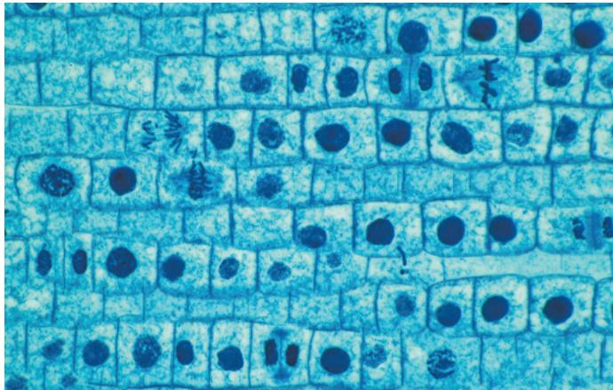

10. DRAW IT Draw one eukaryotic chromosome as it would appear during interphase, during each of the stages of mitosis, and during cytokinesis. Also draw and label the nuclear envelope and any microtubules attached to the chromosome(s).

## Levels 5-6: Evaluating/Creating

11. EVOLUTION CONNECTION The result of mitosis is that the daughter cells end up with the same number of chromosomes that the parent cell had. Another potential way to maintain the number of chromosomes would be to carry out cell division first and then duplicate the chromosomes in each daughter cell. Assess whether this would be an equally good way of organizing the cell cycle. Explain why evolution has not led to this alternative.

12. SCIENTIFIC INQUIRY Although both ends of a microtubule can gain or lose subunits, one end (called the plus end) polymerizes and depolymerizes at a higher rate than the other end (the minus end). For spindle microtubules, the plus ends are in the center of the spindle, and the minus ends are at the poles. Motor proteins that move along microtubules specialize in walking either toward the plus end or toward the minus end; the two types are called plus end-directed and minus end-directed motor proteins, respectively. Given what you know about chromosome movement and spindle changes during anaphase, predict which type of motor proteins would be present on (a) kinetochore microtubules and (b) nonkinetochore microtubules.

13. WRITE ABOUT A THEME: INFORMATION The continuity of life is based on heritable information in the form of DNA. In a short essay (100–150 words), explain how the process of mitosis faithfully parcels out exact copies of this heritable information in the production of genetically identical daughter cells.

## 14. SYNTHESIZE YOUR KNOWLEDGE

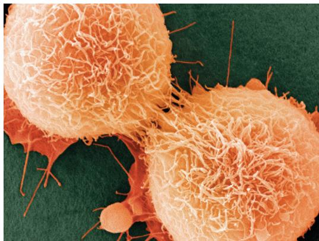  
Shown here are two HeLa cancer cells that are just completing cytokinesis. Explain how the cell division of cancer cells like these is misregulated. Identify genetic and other changes that might have caused these cells to escape normal cell cycle regulation.
For selected answers, see Appendix A.

Genetics

An Interview with Pardis Sabeti

Dr. Pardis Sabeti is a professor at Harvard University and the Harvard School of Public Health, a Howard Hughes Medical Investigator, a core institute member at the Broad Institute, and a member of the National Academy of Medicine. She attended Massachusetts Institute of Technology (MIT) as an undergraduate, received a master's degree and a PhD from Oxford University, and an MD from Harvard Medical School. Her genomic analysis of Ebola virus during the outbreak in West Africa in 2014 showed that it was being transmitted from person to person. Currently, her lab at the Broad Institute focuses on developing computational methods for detecting, tracking, and responding to deadly pathogens. Her many awards include "Person of the Year" in 2014 as one of the Ebola fighters and 100 Most Influential People in 2015, both from TIME magazine. Outside of work, Pardis is lead singer in the band Thousand Days.

## How did you get started in biology?

I was born in Iran and came to the United States in 1978 when I was 2 because of the revolution that happened in Iran. We were basically dropped into American culture. My entry into science was that I loved math and puzzles. In seventh grade, my math teacher brought in a video of a robotics competition at MIT. I couldn't believe a place like that existed—I immediately said, “I'll go there!” At MIT, I took a lot of math classes, but math was not a big major there. On the other hand, biology was huge. Eric Lander was my advisor, and I learned about genetics. I was never really a classical biologist—I just love how logic and math underlie genetics.

## What did you do after college?

I went to Oxford University in England as a Rhodes Scholar, intending to study anthropology and sociology before going to medical school. But when I got there, I was encouraged to study medical and population genetics because of my research experience. I got into computational genetics, developing mathematical tools to analyze genetic data. I ended up studying

African-American history using DNA sequences as a record. My PhD focused on understanding resistance to malaria in humans, also using computational genetics. I was basically “mining the genome,” which I continued doing in my postdoctoral position back at MIT.

## What were you looking for while mining the genome?

What's really cool about the genome is its logic. Humans pass their genes along according to certain principles, which leads to patterns in DNA sequences that you can see. Certain mutations occur again and again, and over time they leave a sort of “footprint” in our DNA that can be used to trace back information. I started recognizing patterns. Every time I saw a gene that was thought to be adaptive (beneficial to humans), a characteristic pattern in the DNA was associated with it. Essentially, some patterns indicate that a mutation has occurred recently, but has rapidly increased in the population. This type of natural selection, called positive selection, can tell us a lot about human evolution. We saw that one of the major drivers of human evolution is infectious disease. Looking at genomes across all populations, one of the most significant mutations that was being positively selected was in a gene important for infection by Lassa virus, a virus I'd never really heard about! Genomic research is like a scavenger hunt: You pull one thread and it leads to something else—you never know what you'll find. Once I realized viruses were so important in human evolution, I focused my research on both human genome evolution and infectious viruses.

"Genomic research is like a scavenger hunt: You pull one thread and it leads to something else—you never know what you'll find."

## You've worked on viruses all over the world. How have you navigated that work?

To understand genetic resistance to Lassa virus, we identified Lassa fever patients in clinics and villages in Nigeria and Sierra Leone, collecting samples and studying the virus. We realized that Lassa virus, and probably others, were widespread, but often undiagnosed. Together with Dr. Christian Happi of Redeemer's University in Ede, Nigeria, a molecular biologist and genomicist, we developed the African Center for Excellence for the Genomics of Infectious Diseases. We got a grant that has allowed us to train individuals in 53 of the 54 African countries. We started a program, Sentinel, to track viral outbreaks. Our goal is to democratize science, to put these efficient, effective tools in the hands of everyone; we want them to be freely available.

  
Dr. Pardis Sabeti

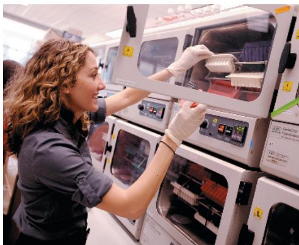  
Dr. Sabeti in the lab processing DNA microarray samples (see Figure 20.13) to analyze human genomic diversity.

That's such powerful work. What advice do you have for students beginning biology?

As a student, the number one thing that's associated with your mental fortitude and stamina is the health of your body. I had a near-fatal accident in 2015 and shattered my pelvis and both my knees. That taught me that there is no brain without the body. I also learned that I couldn't wait to get back to my work, because I love what I do. It's such an amazing job—I get to work with incredible people and to find out things about humans and the world that no one has ever known before. What a remarkable privilege to be able to do that!

# Meiosis and Sexual Life Cycles

## Key Concepts

13.1 Offspring acquire genes from parents by inheriting chromosomes

13.2 Fertilization and meiosis alternate in sexual life cycles

13.3 Meiosis reduces the number of chromosome sets from diploid to haploid

13.4 Genetic variation produced in sexual life cycles contributes to evolution

  
Figure 13.1 The family members shown in this photo have some similar features. Genetics explains why offspring tend to resemble their parents more than they resemble individuals to whom they are not biologically closely related.

## Study Tip

## Make a visual study guide:

Figure 13.1 presents the events of meiosis as a simplified diagram. As you learn more about meiosis, draw a detailed diagram of the stages of meiosis, starting with a sketch like the one shown here. Include explanatory labels. Compare your visual study guides of mitosis (from Chapter 12) and meiosis, listing similarities and differences.

## What biological mechanisms account for the resemblance between offspring and their parents?

Meiosis is a special type of cell division that produces cells with half the chromosomes of the parent cell. It occurs only in specialized cells, such as the cells of testes and ovaries in humans.

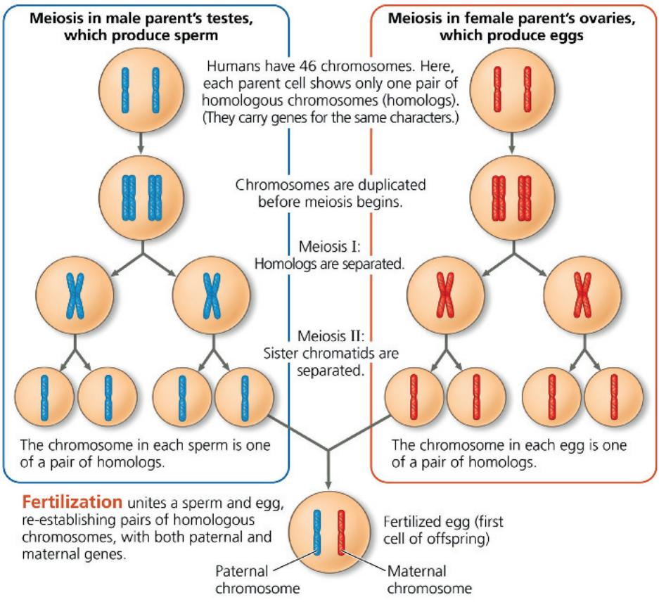

# Concept 13.1: Offspring acquire genes from parents by inheriting chromosomes

Have you ever heard someone say they have their mother's nose or their father's eyes? The transmission of traits from one generation to the next is called inheritance, or heredity (from the Latin heres, heir). At the same time, children are not identical copies of either parent or of their siblings. Along with inherited similarity, there is also variation. The study of both heredity and inherited variation is called genetics.

## Inheritance of Genes

Parents endow their offspring with coded information in the form of hereditary units called genes. The genes we inherit are our genetic link to our parents, and they account for family resemblances such as shared eye color or freckles. Our genes program specific traits that emerge as we develop from fertilized eggs into adults.

The genetic program is written in the language of DNA, the polymer of four different nucleotides you learned about in Concepts 1.1 and 5.5. Inherited information is passed on in the form of each gene's specific sequence of DNA nucleotides, much as printed information is communicated in the form of meaningful sequences of letters. In both cases, the language is symbolic. Just as your brain translates the word apple into a mental image of the fruit, cells translate genes into freckles and other features. Most genes program cells to synthesize specific enzymes and other proteins, whose cumulative action produces an organism's inherited traits. The programming of these traits in the form of DNA is one of the unifying themes of biology.

The transmission of hereditary traits has its molecular basis in the replication of DNA, which produces copies of genes that can be passed from parents to offspring. In animals and plants, reproductive cells called gametes are the vehicles that transmit genes from one generation to the next. During fertilization, male and female gametes (sperm and eggs) unite, passing on genes of both parents to their offspring.

Except for small amounts of DNA in mitochondria and chloroplasts, the DNA of a eukaryotic cell is packaged into chromosomes within the nucleus. Every species has a characteristic number of chromosomes. For example, humans have 46 chromosomes in each somatic cell—all cells of the body except the gametes and their precursors. Each chromosome consists of a single long DNA molecule, elaborately coiled in association with various proteins. One chromosome includes several hundred to a few thousand genes, each gene being a precise sequence of nucleotides along the DNA molecule. A gene’s specific location along the length of a chromosome is called the gene’s locus (plural, loci; from the Latin, meaning

"place"). Our genetic endowment (our genome) consists of the genes and other DNA that make up the chromosomes we inherited from our parents.

## Comparison of Asexual and Sexual Reproduction

Only organisms that reproduce asexually have offspring that are exact genetic copies of themselves. In asexual reproduction, a single individual (like a yeast cell or an amoeba; see Figure 12.2a) is the sole parent and passes copies of all its genes to its offspring without the fusion of gametes. For example, single-celled eukaryotic organisms can reproduce asexually by mitotic cell division, in which DNA is copied and allocated equally to two daughter cells. The genomes of the offspring are virtually exact copies of the parent's genome. Some multicellular organisms are also capable of reproducing asexually (Figure 13.2). Because the cells of the offspring arise via mitosis in the parent, the offspring is usually genetically identical to its parent. An individual that reproduces asexually gives rise to a clone, an individual or group of individuals that are genetically identical to the parent. Genetic differences occasionally arise in asexually reproducing organisms as a result of changes in the DNA called mutations, which we will discuss in Concept 17.5.

In sexual reproduction, two parents give rise to offspring that have unique combinations of genes inherited from the two parents. In contrast to a clone, offspring of sexual reproduction vary genetically from their siblings and both parents: They are variations on a common theme of family resemblance, not exact replicas. Genetic variation like that shown in Figure 13.1 is an important consequence of sexual reproduction. What mechanisms generate this genetic variation? The key is the behavior of chromosomes during the sexual life cycle.

Figure 13.2 Asexual reproduction in two multicellular organisms.
(a) This relatively simple animal, a hydra, reproduces by budding. The bud, a localized mass of mitotically dividing cells, develops into a small hydra, which detaches from the parent (LM). (b) All the trees in this circle of redwoods arose asexually from a single parent tree, whose stump is in the center of the circle.

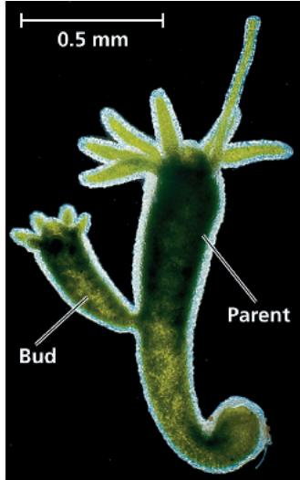  
(a) Hydra

  
(b) Redwoods

## Concept Check 13.1

1. MAKE CONNECTIONS Using your knowledge of gene expression in a cell, explain what causes the traits of parents (such as hair color) to show up in their offspring. (See Concept 5.5.)

2. Describe how an asexually reproducing eukaryotic organism produces offspring that are genetically identical to each other and to their parents.

3. WHAT IF? A horticulturalist breeds orchids, trying to obtain a plant with a unique combination of desirable traits. After many years, she finally succeeds, and wants to produce more plants like this one. Discuss whether she should crossbreed it with another plant or cause it to undergo asexual reproduction (forming a clone), and why.

For suggested answers, see Appendix A.

## Concept 13.2: Fertilization and meiosis alternate in sexual life cycles

A life cycle is the generation-to-generation sequence of stages in the reproductive history of an organism, from conception to production of its own offspring. In this section, we use humans as an example to track the behavior of chromosomes through the sexual life cycle.

## Figure 13.3

## Research Method: Preparing a Karyotype Application

A karyotype is a display of condensed chromosomes arranged in pairs. Karyotyping can be used to screen for defective chromosomes or abnormal numbers of chromosomes associated with certain congenital disorders, such as Down syndrome.

## Technique

Karyotypes are prepared from isolated somatic cells, which are treated with a drug to stimulate mitosis and then grown in culture for several days. Cells arrested when the chromosomes are most highly condensed—at metaphase—are stained and then viewed with a microscope equipped with a digital camera. An image of the chromosomes is displayed on a computer monitor, and digital software is used to arrange them in pairs according to their appearance.

We begin by considering the chromosome count in human somatic cells and gametes. We will then explore how the behavior of chromosomes relates to the human life cycle and other types of sexual life cycles.

## Sets of Chromosomes in Human Cells

In humans, each somatic cell has 46 chromosomes. Before mitosis begins, the chromosomes are duplicated. During mitosis, the chromosomes become condensed enough to be visible under a light microscope. At this point, they can be distinguished from one another by their size, the position of their centromeres, and the pattern of colored bands produced by certain chromatin-binding stains.

Careful examination of a micrograph of the 46 human chromosomes from a single cell in mitosis reveals that there are two chromosomes of each of 23 types. This becomes clear when images of the chromosomes are arranged in pairs, starting with the longest chromosomes. The resulting ordered display is called a karyotype (Figure 13.3). The two chromosomes of a pair have the same length, centromere position, and staining pattern: These are called homologous chromosomes (or homologs). Note that the centromere position can vary—for example, while the centromere for chromosome 1 is near the middle, the centromeres for chromosomes 13, 14, and 15 are close to the ends. Both chromosomes of each pair carry genes controlling the same inherited characters. For example, if a gene for eye color is situated at a particular locus on a certain chromosome, then its homologous chromosome (its homolog) will also have a version of the eye-color gene at the equivalent locus.

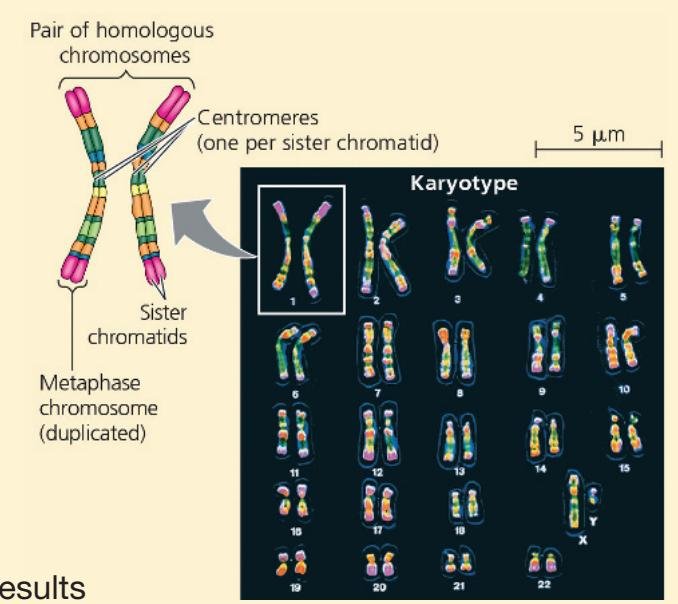

This karyotype shows the chromosomes from a human male (as seen by the presence of the XY chromosome pair), colored to emphasize their chromosome banding patterns. The size of the chromosome, position of the centromere, and pattern of stained bands help identify specific chromosomes. Although difficult to discern in the karyotype, each metaphase chromosome consists of two closely attached sister chromatids (see the diagram of the first pair of homologous duplicated chromosomes).

MAKE CONNECTIONS Explain why each chromosome in the karyotype consists of two sister chromatids. (See Figures 12.6 and 12.7.)

The two chromosomes referred to as X and Y are an important exception to the general pattern of homologous chromosomes in human somatic cells. Typically, human females have a homologous pair of X chromosomes (XX), while males have one X and one Y chromosome (XY; see Figure 13.3). Only small parts of the X and Y are homologous. Most of the genes carried on the X chromosome do not have counterparts on the tiny Y, and the Y chromosome has genes lacking on the X. Due to their role in sex determination, the X and Y chromosomes are called sex chromosomes. The other chromosomes are called autosomes.

The occurrence of pairs of homologous chromosomes in each human somatic cell is a consequence of our sexual origins. We inherit one chromosome of a pair from each parent. Thus, the 46 chromosomes in our somatic cells are actually two sets of 23 chromosomes—a maternal set (from our female parent) and a paternal set (from our male parent). The number of chromosomes in a single set is represented by n. Any cell with two chromosome sets is called a diploid cell and has a diploid number of chromosomes, abbreviated 2n. For humans, the diploid number is 46 (2n = 46), the number of chromosomes in our somatic cells. In a cell in which DNA synthesis has occurred, all the chromosomes are duplicated, and therefore each consists of two identical sister chromatids, associated closely at the centromere and along the arms. (Even though the chromosomes are duplicated, we still say the cell is diploid, or 2n. This is because it has only two sets of information regardless of the number of chromatids, which are merely copies of the information in one set.) Figure 13.4 helps clarify the various terms that we use to describe duplicated chromosomes in a diploid cell.

Unlike somatic cells, gametes contain a single set of chromosomes. Such a cell is called a haploid cell, and each has

Figure 13.4 Describing chromosomes.

A cell from an organism with a diploid number of 6 (2n = 6) is depicted here following chromosome duplication and condensation. Each of the six duplicated chromosomes consists of two sister chromatids associated closely along their lengths. Each homologous pair is composed of one chromosome from the maternal set (red) and one from the paternal set (blue). Each set is made up of three chromosomes in this example (long, medium, and short). Together, one maternal and one paternal chromatid in a pair of homologous chromosomes are called nonsister chromatids.

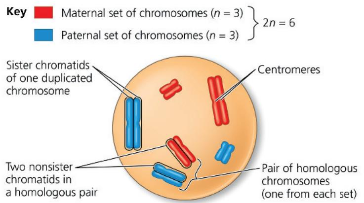  
VISUAL SKILLS How many sets of chromosomes are present in this diagram? How many pairs of homologous chromosomes are present? If the phases of mitosis in Figure 12.7 were redrawn using the color scheme shown in this figure, describe how the six chromosomes would be colored.
For suggested answer, see Appendix A.  
Figure 13.5 The human life cycle.

a haploid number of chromosomes $(n)$ . For humans, the haploid number is 23 $(n = 23)$ . The set of 23 consists of the 22 autosomes plus a single sex chromosome. An unfertilized egg contains an X chromosome; a sperm contains either an X or a Y chromosome.

Each sexually reproducing species has a characteristic diploid and haploid number. For example, the fruit fly Drosophila melanogaster has a diploid number $(2n)$ of 8 and a haploid number $(n)$ of 4, while for dogs, 2n is 78 and n is 39. The chromosome number generally does not correlate with the size or complexity of a species' genome; it simply reflects how many linear pieces of DNA make up the genome, which is a function of the evolutionary history of that species (see Concept 21.5). Now let's consider chromosome behavior during sexual life cycles. We'll use the human life cycle as an example.

## Behavior of Chromosome Sets in the Human Life Cycle

The human life cycle begins when a haploid sperm from the male parent fuses with a haploid egg from the female parent (Figure 13.5). This union of gametes, culminating in fusion of their nuclei, is called fertilization. The resulting fertilized egg,

In each generation, the number of chromosome sets per cell is halved during meiosis but doubles at fertilization. For humans, the number of chromosomes in a haploid cell is 23, consisting of one set $n = 23$ ; the number of chromosomes in the diploid zygote and all somatic cells arising from it is 46, consisting of two sets $2n = 46$ .

  
This figure introduces a key that will be used for other life cycles later in this text. The aqua arrows (solid outline) identify haploid stages of a life cycle, and the tan arrows (dashed outline) identify diploid stages.

or zygote, is diploid because it contains two (haploid) sets of chromosomes bearing genes representing the maternal and paternal family lines. As a human develops into a sexually mature adult, mitosis of the zygote and its descendant cells generates all the somatic cells of the body. Both chromosome sets in the zygote and all the genes they carry are passed with precision to the somatic cells.

The only cells of the human body not produced by mitosis are the gametes, which develop from specialized cells called germ cells in the gonads—ovaries in females and testes in males (see Figure 13.5). Imagine what would happen if human gametes were made by mitosis: They would be diploid like the somatic cells. At the next round of fertilization, when two gametes fused, the normal chromosome number of 46 would double to 92, and each subsequent generation would double the number of chromosomes yet again. This does not happen, however, because in sexually reproducing organisms, gamete formation involves a type of cell division called meiosis. This type of cell division reduces the number of sets of chromosomes from two in the parent cell to one in each gamete, counterbalancing the doubling that occurs at fertilization. As a result of meiosis, each human sperm and egg is haploid (n = 23). Fertilization restores the diploid condition by combining two sets of chromosomes, and the human life cycle is repeated, generation after generation (see Figure 13.5).

The steps of the human life cycle are typical of many sexually reproducing animals. Indeed, fertilization and meiosis are also the hallmarks of sexual reproduction in plants, fungi, and protists just as in animals. Fertilization and meiosis alternate in sexual life cycles, maintaining a constant number of chromosomes in a species from one generation to the next.

## The Variety of Sexual Life Cycles

Although the alternation of meiosis and fertilization is common to all organisms that reproduce sexually, the timing of these two events in the life cycle varies, depending on the species. These variations can be grouped into three main types of life cycles. In the type that occurs in humans and most other animals, gametes are the only haploid cells (Figure 13.6a). Meiosis occurs in germ cells during the production of gametes, which undergo no further cell division prior to fertilization. After fertilization, the diploid zygote divides by mitosis, producing a multicellular organism that is diploid.

Plants and some species of algae exhibit a second type of life cycle called alternation of generations (Figure 13.6b). This type includes both diploid and haploid stages that are multicellular. The multicellular diploid stage is called the sporophyte. Meiosis in the sporophyte produces haploid cells called spores. Unlike a gamete, a haploid spore doesn't fuse with another cell but divides mitotically, generating a multicellular haploid stage called the gametophyte. Certain cells of the gametophyte give rise to gametes by mitosis. Fusion of two haploid gametes at fertilization results in a diploid zygote, which develops into the next sporophyte generation. Therefore, in this type of life cycle, the sporophyte generation produces a gametophyte as its offspring, and the gametophyte generation produces a sporophyte. The name alternation of generations fits well for this type of life cycle.

A third type of life cycle occurs in most fungi and some protists, including some algae (Figure 13.6c). After gametes fuse and form a diploid zygote, meiosis occurs without a multicellular diploid offspring developing. Meiosis produces not gametes but haploid cells that then divide by mitosis and give

Figure 13.6 Three types of sexual life cycles.

The common feature of all three cycles is the alternation of meiosis and fertilization, key events that contribute to genetic variation among offspring. The cycles differ in the timing of these two key events. (Small circles are cells; large circles are organisms.)

  
VISUAL SKILLS For each type of life cycle, indicate whether haploid cells undergo mitosis, and if they do, describe the cells that are formed.  
For suggested answer, see Appendix A.

rise to either unicellular descendants or a haploid multicellular adult organism. Subsequently, the haploid organism carries out further mitoses, producing the cells that develop into gametes. The only diploid stage found in these species is the single-celled zygote.

Note that either haploid or diploid cells can divide by mitosis, depending on the type of life cycle. Only diploid cells, however, can undergo meiosis: Haploid cells can't because they already have a single set of chromosomes that cannot be further reduced. Though the three types of sexual life cycles differ in the timing of meiosis and fertilization, they share a fundamental result: genetic variation among offspring.

## Concept Check 13.2

1. MAKE CONNECTIONS In Figure 13.4, how many DNA molecules (double helices) are present (see Figure 12.5)? What is the haploid number of this cell? Is a set of chromosomes haploid or diploid?

2. VISUAL SKILLS In the karyotype in Figure 13.3, how many pairs of chromosomes are present? How many sets?

3. Using shoes as an analogy for chromosomes, how would you describe the collection of "shoes" in human diploid and haploid cells?

4. WHAT IF? A certain eukaryote lives as a unicellular organism, but during environmental stress, it produces gametes. The gametes fuse, and the resulting zygote undergoes meiosis, generating new single cells. What type of organism could this be?

For suggested answers, see Appendix A.

## Concept 13.3: Meiosis reduces the number of chromosome sets from diploid to haploid

Several steps of meiosis closely resemble corresponding steps in mitosis. Meiosis, like mitosis, is preceded by interphase, which includes S phase (the duplication of chromosomes). However, this is followed by not one but two consecutive cell divisions, called meiosis I and meiosis II. These two divisions result in four daughter cells (rather than the two daughter cells of mitosis), each with only half as many chromosomes as the parent cell—one set, rather than two.

## The Stages of Meiosis

The overview of meiosis in Figure 13.7 shows, for a single pair of homologous chromosomes in a diploid cell, that both members of the pair are duplicated and the copies sorted into four haploid daughter cells. Recall that sister chromatids are two copies of one chromosome, closely associated all along their lengths; this association is called sister chromatid cohesion. Together, the sister chromatids make up one duplicated chromosome (see Figure 13.4). In contrast, the two chromosomes of a homologous pair are individual chromosomes that were inherited from

Figure 13.7 Overview of meiosis: how meiosis reduces chromosome number.

After the chromosomes duplicate in interphase, the diploid cell divides twice, yielding four haploid daughter cells. This overview tracks just one pair of homologous chromosomes, which for the sake of simplicity are drawn in the condensed state throughout. (They would not normally be condensed during interphase.)

DRAW IT Redraw the cells in this figure using a simple double helix to represent each DNA molecule.

For suggested answer, see Appendix A.

each parent. Homologs appear alike in the microscope, but they may have different versions of genes at corresponding loci; each version is called an allele of that gene (see Figure 14.4). For example, one chromosome might have an allele for freckles, but the homologous chromosome may have an allele for the absence of freckles at the same locus. Homologs are not associated with each other in any obvious way except during meiosis.

Figure 13.8 describes in detail the stages of the two divisions of meiosis for an animal cell whose diploid number is 6. Study this figure thoroughly before going on.

## Exploring Meiosis in an Animal Cell

## Figure 13.8

## MEIOSIS I: Separates homologous chromosomes

Prophase I

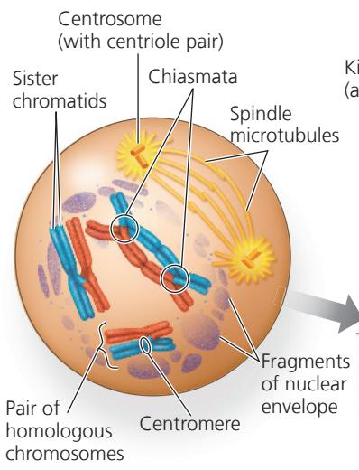  
Duplicated homologous chromosomes (red and blue) pair up and exchange segments; 2n = 6 in this example.  
Metaphase I

  
Anaphase I  
Sister chromatids remain together

## Chromosomes line up by homologous pairs.

  
Homologous
chromosomes
separate  
Telophase I and Cytokinesis

The two homologous chromosomes of each pair separate.

Two haploid cells form; each chromosome still consists of two sister chromatids.

## Prophase I

\- Centrosome movement, spindle formation, and nuclear envelope breakdown occur as in mitosis. Chromosomes condense progressively throughout prophase I.

\- During early prophase I, before the stage shown above, each chromosome pairs with its homolog, aligned gene by gene, and crossing over occurs: The DNA molecules of nonsister chromatids are broken (by proteins) and are rejoined to each other.

\- At the stage shown above, each homologous pair has one or more X-shaped regions called chiasmata (singular, chiasma), where crossovers have occurred.

\- Later in prophase I, microtubules from one pole or the other attach to the kinetochores, one at the centromere of each homolog. (The two kinetochores on the sister chromatids of a homolog are linked together by proteins and act as a single kinetochore.) Microtubules move the homologous pairs toward the metaphase plate.

## Metaphase I

\- Pairs of homologous chromosomes are now arranged at the metaphase plate, with one chromosome of each pair facing each pole.

• Each pair has lined up independently of other pairs. (This arrangement is called independent assortment, to be discussed later.)

\- Both chromatids of one homolog are attached to kinetochore microtubules from one pole; the chromatids of the other homolog are attached to microtubules from the opposite pole.

## Anaphase I

\- Breakdown of proteins that are responsible for sister chromatid cohesion along chromatid arms allows homologs to separate.

\- The homologs move toward opposite poles, guided by the spindle apparatus.

\- Sister chromatid cohesion persists at the centromere, causing the two chromatids of each chromosome to move as a unit toward the same pole.

## Telophase I and Cytokinesis

\- When telophase I begins, each half of the cell has a complete haploid set of duplicated chromosomes. Each chromosome is composed of two sister chromatids; one or both chromatids include regions of nonsister chromatid DNA.

\- Cytokinesis (division of the cytoplasm) usually occurs simultaneously with telophase I, forming two haploid daughter cells.

\- In animal cells like these, a cleavage furrow forms. (In plant cells, a cell plate forms.)

\- In some species, chromosomes decondense and nuclear envelopes form.

\- No chromosome duplication occurs between meiosis I and meiosis II.

## MEIOSIS II: Separates sister chromatids

Prophase II

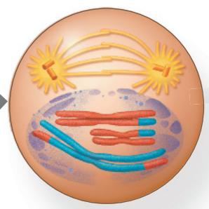

Metaphase II

Anaphase II

Telophase II and Cytokinesis

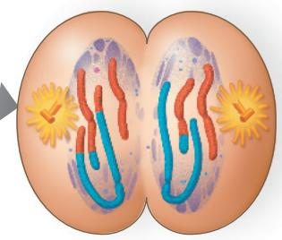

During another round of cell division, the sister chromatids finally separate; four haploid daughter cells result, containing unduplicated chromosomes.

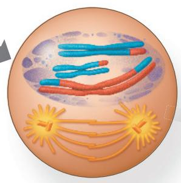

Sister chromatids separate

Haploid daughter cells forming

## Prophase II

• A spindle apparatus forms.

\- In late prophase II (not shown here), chromosomes, each still composed of two chromatids associated at the centromere, are moved by microtubules toward the metaphase II plate.

## Metaphase II

• The chromosomes are positioned at the metaphase plate as in mitosis.

\- Because of crossing over in meiosis I, the two sister chromatids of each chromosome are not genetically identical.

\- The kinetochores of sister chromatids are attached to microtubules extending from opposite poles.

## Anaphase II

\- Breakdown of proteins holding the sister chromatids together at the centromere allows the chromatids to separate and move toward opposite poles. Each chromatid has now become an individual chromosome.

## Telophase II and Cytokinesis

\- Nuclei form, the chromosomes begin decondensing, and cytokinesis occurs.

\- The meiotic division of one parent cell produces four daughter cells, each with a haploid set of (unduplicated) chromosomes.

\- The four daughter cells are genetically distinct from one another and from the parent cell.

MAKE CONNECTIONS Look at Figure 12.7 and imagine the two daughter cells undergoing another round of mitosis, yielding four cells. Compare the number of chromosomes in each of those four cells, after mitosis, with the number in each cell in Figure 13.8, after meiosis. Explain how the process of meiosis results in this difference, even though meiosis also includes two cell divisions.

For suggested answer, see Appendix A.