## Crossing Over and Synopsis During Prophase I

Prophase I of meiosis is a very busy time. The prophase I cell shown in Figure 13.8 is at a point fairly late in prophase I, when pairing of homologous chromosomes, crossing over, and chromosome condensation have already taken place. The sequence of events leading up to that point is shown in more detail in Figure 13.9.

After interphase, the chromosomes have been duplicated and the sister chromatids are held together by proteins called cohesins. ① Early in prophase I, the two members of a homologous pair associate loosely along their length. Each gene on one homolog is aligned precisely with the corresponding allele of that gene on the other homolog. The DNA of two nonsister chromatids—one maternal and one paternal—is broken by specific proteins at precisely matching points. ② Next, the formation of a zipper-like structure called the synaptonemal complex holds one homolog tightly to the other. ③ During this association, called synapsis, the DNA breaks are closed up so that each broken end is joined to the corresponding segment of the nonsister chromatid. Thus, a paternal chromatid is joined to a piece of maternal chromatid beyond the crossover point, and vice versa.

4 These points where crossing over has just occurred become visible as chiasmata (singular, chiasma) after the synaptonemal complex disassembles and the homologs move slightly apart from each other. The homologs remain attached because sister chromatids are still held together by sister chromatid cohesion, even though some of the DNA may no longer be attached to its original chromosomal DNA. At least one crossover per chromosome must occur in order for the homologous pair to stay together as it moves to the metaphase I plate, for reasons that will be explained shortly.

## A Comparison of Mitosis and Meiosis

Figure 13.10 summarizes the key differences between meiosis and mitosis in diploid cells. Meiosis produces four cells and reduces the number of chromosome sets from two (diploid) to one (haploid), whereas mitosis produces two cells and conserves the number of chromosome sets. Meiosis produces cells that differ genetically from the parent cell and from each other, whereas mitosis produces daughter cells that are genetically identical to their parent cell and to each other.

Three events unique to meiosis occur during meiosis I:

1. Synopsis and crossing over. During prophase I, duplicated homologs pair up and crossing over occurs as described previously and in Figure 13.9. Synopsis and crossing over do not occur during prophase of mitosis.

2. Alignment of homologous pairs at the metaphase plate. At metaphase I of meiosis, pairs of homologs are positioned at the metaphase plate, rather than individual chromosomes, as in metaphase of mitosis.

3. Separation of homologs. At anaphase I of meiosis, the duplicated chromosomes of each homologous pair move toward opposite poles, but the sister chromatids of each duplicated chromosome remain attached. In anaphase of mitosis, by contrast, sister chromatids separate.

Figure 13.9 Crossing over and synapsis in prophase I: a closer look.  

1 After interphase, the chromosomes have been duplicated, and sister chromatids are held together by proteins called cohesins (purple circles in this diagram). Each pair of homologs associate along their length. The DNA molecules of two nonsister chromatids are broken at precisely corresponding points. The chromatin of the chromosomes starts to condense.

  
2 A zipper-like protein complex, the synaptonemal complex (green lines), begins to form, attaching one homolog to the other. The chromatin continues to condense.

3 The synaptonemal complex is fully formed; the two homologs are said to be in synapsis. During synapsis, the DNA breaks are closed up when each broken end is joined to the corresponding segment of the nonsister chromatid, producing crossovers.

4 After the synaptonemal complex disassembles, the homologs move slightly apart from each other but remain attached because of sister chromatid cohesion, even though some of the DNA may no longer be attached to its original chromosome. The points of attachment where crossovers have occurred show up as chiasmata. The chromosomes continue to condense as they move toward the metaphase plate.

VISUAL SKILLS Label the four DNA breaks in step 2.

For suggested answer, see Appendix A.

Sister chromatids stay together due to sister chromatid cohesion, mediated by cohesin proteins. In mitosis, this attachment lasts until the end of metaphase, when enzymes cleave the cohesins, freeing the sister chromatids to move to opposite poles of the cell. In meiosis, sister chromatid cohesion is released in two steps: cohesion of arms at the start of anaphase I and cohesion of centromeres at anaphase II. In metaphase I, the two homologs of each pair are held together because there is still cohesion between sister chromatid arms in regions beyond points of crossing over, where stretches of sister chromatids now

Figure 13.10 A comparison of mitosis and meiosis.  
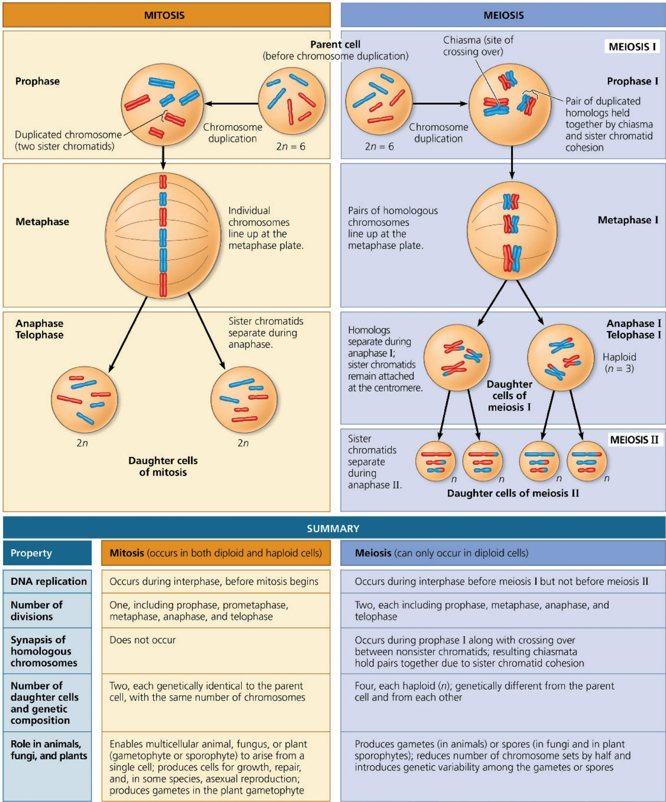

<table><tr><td colspan="3">SUMMARY</td></tr><tr><td>Property</td><td>Mitosis (occurs in both diploid and haploid cells)</td><td>Meiosis (can only occur in diploid cells)</td></tr><tr><td>DNA replication</td><td>Occurs during interphase, before mitosis begins</td><td>Occurs during interphase before meiosis I but not before meiosis II</td></tr><tr><td>Number of divisions</td><td>One, including prophase, prometaphase, metaphase, anaphase, and telophase</td><td>Two, each including prophase, metaphase, anaphase, and telophase</td></tr><tr><td>Synopsis of homologous chromosomes</td><td>Does not occur</td><td>Occurs during prophase I along with crossing over between nonsister chromatids; resulting chiasmata hold pairs together due to sister chromatid cohesion</td></tr><tr><td>Number of daughter cells and genetic composition</td><td>Two, each genetically identical to the parent cell, with the same number of chromosomes</td><td>Four, each haploid (n); genetically different from the parent cell and from each other</td></tr><tr><td>Role in animals, fungi, and plants</td><td>Enables multicellular animal, fungus, or plant (gametophyte or sporophyte) to arise from a single cell; produces cells for growth, repair, and, in some species, asexual reproduction; produces gametes in the plant gametophyte</td><td>Produces gametes (in animals) or spores (in fungi and in plant sporophytes); reduces number of chromosome sets by half and introduces genetic variability among the gametes or spores</td></tr></table>

DRAW IT Could any other combinations of chromosomes be generated during meiosis II from the specific cells shown in telophase I? Explain. (Hint: Draw the cells as they would appear in metaphase II.)

belong to different chromosomes. The combination of crossing over and sister chromatid cohesion along the arms results in the formation of a chiasma. Chiasmata hold homologs together as the spindle forms for the first meiotic division. At the onset of anaphase I, the release of cohesion along sister chromatid arms allows homologs to separate. At anaphase II, the release of sister chromatid cohesion at the centromeres allows the sister chromatids to separate. Thus, sister chromatid cohesion and crossing over, acting together, play an essential role in the lining up of chromosomes by homologous pairs at metaphase I.

## Scientific Skills Exercise Making a Line Graph and Converting Between Units of Data

How Does DNA Content Change as Budding Yeast Cells Proceed Through Meiosis? When nutrients are low, cells of the budding yeast (Saccharomyces cerevisiae) exit the mitotic cell cycle and enter meiosis. In this exercise, you will track the DNA content of a population of yeast cells as they progress through meiosis.

How the Experiment Was Done Researchers grew a culture of yeast cells in a nutrient-rich medium and then transferred the cells to a nutrient-poor medium to induce meiosis. At different times after induction, the DNA content per cell was measured in a sample of the cells, and the average DNA content per cell was recorded in femtograms (fg; 1 femtogram = $1 \times 10^{-15}$ gram).

Data from the Experiment

<table><tr><td>Time After Induction of Meiosis (hr)</td><td>Average Amount of DNA per Cell (fg)</td></tr><tr><td>0.0</td><td>24.0</td></tr><tr><td>1.0</td><td>24.0</td></tr><tr><td>2.0</td><td>40.0</td></tr><tr><td>3.0</td><td>47.0</td></tr><tr><td>4.0</td><td>47.5</td></tr><tr><td>5.0</td><td>48.0</td></tr><tr><td>6.0</td><td>48.0</td></tr><tr><td>7.0</td><td>47.5</td></tr><tr><td>7.5</td><td>25.0</td></tr><tr><td>8.0</td><td>24.0</td></tr><tr><td>9.0</td><td>23.5</td></tr><tr><td>9.5</td><td>14.0</td></tr><tr><td>10.0</td><td>13.0</td></tr><tr><td>11.0</td><td>12.5</td></tr><tr><td>12.0</td><td>12.0</td></tr><tr><td>13.0</td><td>12.5</td></tr><tr><td>14.0</td><td>12.0</td></tr></table>

Further Reading G. Simchen, Commitment to meiosis: What determines the mode of division in budding yeast? BioEssays 31:169–177 (2009).

Meiosis I reduces the number of chromosome sets: from two (diploid) to one (haploid). During the second meiotic division, sister chromatids separate, producing four haploid daughter cells. The mechanisms for separating sister chromatids in meiosis II and mitosis are virtually identical. The molecular basis of chromosome behavior during meiosis continues to be a focus of intense research. In the Scientific Skills Exercise, you can work with data that track the amount of DNA in cells as they progress through meiosis.

## INTERPRET THE DATA

1. First, set up your graph. (a) Place the labels for the independent and dependent variables on the appropriate axes, followed by units of measurement in parentheses. Explain your choices. (b) Add tick marks and values for each axis. Explain your choices. (For additional information about graphs, see the Scientific Skills Review in Appendix D.)

2. Because the variable on the x-axis varies continuously, it makes sense to plot the data on a line graph (if you are using Excel, choose "Scatter").
(a) Plot each data point from the table onto the graph.
(b) Connect the data points with line segments.

Budding yeast cells  

3. Most of the yeast cells in the culture were in $G_{1}$ of the cell cycle before being moved to the nutrient-poor medium.
(a) How many femtograms of DNA are there in each yeast cell in $G_{1}$ ? Estimate this value from the data in your graph.
(b) How many femtograms of DNA should be present in each cell in $G_{2}$ ? (See Concept 12.2 and Figure 12.6.) At the end of meiosis I (MI)? At the end of meiosis II (MII)? (See Figure 13.7.) (c) Using these values as a guideline, distinguish the different phases by inserting vertical dashed lines in the graph between phases and label each phase ( $G_{1}$ , S, $G_{2}$ , MI, MII). You can figure out where to put the dividing lines based on what you know about the DNA content of each phase (see Figure 13.7). (d) Think carefully about the point where the line at the highest value begins to slope downward. What specific point of meiosis does this “corner” represent? What stage(s) correspond(s) to the downward sloping line?

4. Given the fact that 1 fg of DNA = $9.78 \times 10^{5}$ base pairs (on average), you can convert the amount of DNA per cell to the length of DNA in numbers of base pairs. (a) Calculate the number of base pairs of DNA in the haploid yeast genome. Express your answer in millions of base pairs (Mb), a standard unit for expressing genome size. Show your work. (b) How many base pairs per minute were synthesized during the S phase of these yeast cells?

Instructors: A version of this Scientific Skills Exercise can be assigned in Mastering Biology.

## Concept Check 13.3

1. MAKE CONNECTIONS Compare the chromosomes in a cell at metaphase of mitosis with those in a cell at metaphase II. (See Figures 12.7 and 13.8.)

2. WHAT IF? After the synaptonemal complex disappears, how would any pair of homologous chromosomes be associated if crossing over did not occur? What effect might this have on gamete formation?

For suggested answers, see Appendix A.

## Concept 13.4: Genetic variation produced in sexual life cycles contributes to evolution

How do we account for the genetic variation of the family members in Figure 13.1? As you will learn more about in later chapters, mutations are the original source of genetic diversity. These changes in an organism's DNA create the different versions of genes, known as alleles. Once these differences arise, reshuffling of the alleles during sexual reproduction produces the variation that results in each member of a sexually reproducing population having a unique combination of traits.

## Origins of Genetic Variation Among Offspring

In species that reproduce sexually, the behavior of chromosomes during meiosis and fertilization is responsible for most of the variation that arises in each generation. Three mechanisms contribute to the genetic variation arising from sexual reproduction: inde-

pendent assortment of chromosomes, crossing over, and random fertilization.

## Independent Assortment of Chromosomes

One aspect of sexual reproduction that generates genetic variation is the random orientation of pairs of homologous chromosomes at metaphase of meiosis I. At metaphase I, the homologous pairs, each consisting of one maternal and one paternal chromosome, are situated at the metaphase plate. (Note that the terms maternal and paternal refer, respectively, to whether the chromosome in question was contributed by the female parent or the male parent of the individual whose cells are undergoing meiosis.) Each pair may orient with either its maternal or paternal homolog closer to a given pole—its orientation is as random as the flip of a coin. Thus, there is a 50% chance that a particular daughter cell of meiosis I will get the maternal chromosome of a certain homologous pair and a 50% chance that it will get the paternal chromosome.

Because each pair of homologous chromosomes is positioned independently of the other pairs at metaphase I, the first meiotic division results in each pair sorting its maternal and paternal homologs into daughter cells independently of every other pair. This is called independent assortment. Each daughter cell represents one outcome of all possible combinations of maternal and paternal chromosomes. As shown in Figure 13.11, the number of combinations possible for daughter cells formed by meiosis of a diploid cell with two pairs of homologous chromosomes (n = 2) is four: two possible arrangements for the first pair times two possible arrangements for the second pair. Note that only two of the four combinations of daughter cells shown in the figure would result from meiosis of a single diploid cell because a single parent cell would have one or the other possible chromosomal arrangement at metaphase I, but not both. However, the population of daughter cells resulting from meiosis of a large number of diploid cells contains all four types in approximately equal numbers. In the case of n = 3, eight combinations $(2 \times 2 \times 2 = 2^{3})$ of chromosomes are possible for daughter cells. More generally, the number of possible combinations when chromosomes sort independently during meiosis is $2^{n}$ , where n is the haploid number of the species.

In the case of humans ( $n = 23$ ), the number of possible combinations of maternal and paternal chromosomes in the resulting gametes is $2^{23}$ , or about 8.4 million. Each gamete that you produce in your lifetime contains one of roughly 8.4 million possible combinations of chromosomes. This is an underestimate, because it doesn't take into account crossing over, which we'll consider next.

## Crossing Over

As a consequence of the independent assortment of chromosomes during meiosis, each of us produces a collection of gametes differing greatly in their combinations of the

Figure 13.11 The independent assortment of homologous chromosomes in meiosis.  

chromosomes we inherited from our two parents. Figure 13.11 suggests that each chromosome in a gamete is exclusively maternal or paternal in origin. In fact, this is not the case, because crossing over produces recombinant chromosomes, individual chromosomes that carry genes (DNA) from two different parents (Figure 13.12). In meiosis in humans, an average of one to three crossover events occurs per chromosome pair, depending on the size of the chromosomes and the position of their centromeres.

As you learned in Figure 13.9, crossing over produces chromosomes with new combinations of maternal and paternal alleles. At metaphase II, chromosomes that contain one or more recombinant chromatids can be oriented in two alternative, nonequivalent ways with respect to other chromosomes because their sister chromatids are no longer identical (see Figure 13.12). The different possible arrangements of nonidentical sister chromatids during meiosis II further increase the number of genetic types of daughter cells that can result from meiosis.

You'll learn more about crossing over in Concept 15.3. The important point for now is that crossing over, by combining DNA inherited from two parents into a single chromosome, is an important source of genetic variation in sexual life cycles.

## Random Fertilization

The random nature of fertilization adds to the genetic variation arising from meiosis. In humans, each male and female gamete represents one of about 8.4 million ( $2^{23}$ ) possible chromosome combinations due to independent assortment. The fusion of a male gamete with a female gamete during fertilization will produce a zygote with any of about 70 trillion ( $2^{23} \times 2^{23}$ ) diploid combinations. If we factor in the variation brought about by crossing over, the number of possibilities is truly astronomical. You really are unique.

## The Evolutionary Significance of Genetic Variation Within Populations

EVOLUTION Now that you've learned how new combinations of genes arise among offspring in a sexually reproducing population, how does the genetic variation in a population relate to evolution? Darwin recognized that a population evolves through the differential reproductive success of its variant members. On average, those individuals best suited to the local environment leave the most offspring, thereby transmitting their genes. Thus, natural selection results in the accumulation of genetic variations favored in a certain environment. As the environment changes, the population may survive if, in each generation, at least some of its members can cope effectively with the new conditions. Mutations are the original source of different alleles, which are then mixed and matched during meiosis. New and different combinations of alleles may work better than those that previously prevailed.

In a stable environment, though, sexual reproduction seems as if it would be less advantageous than asexual reproduction, which ensures perpetuation of successful combinations of alleles. Furthermore, sexual reproduction is more expensive energetically than asexual reproduction. In spite of these apparent disadvantages, sexual reproduction is almost universal among animals. Why is this?

Figure 13.12 The results of crossing over during meiosis.  

The ability of sexual reproduction to generate genetic diversity is the most commonly proposed explanation for the evolutionary persistence of this process. However, consider the unusual case of the bdelloid rotifer (Figure 13.13). It appears that this group may not have reproduced sexually for more than 50 million years of their evolutionary history, a model that has been supported by

recent analysis of the genetic sequences in its genome. Does this mean that genetic diversity is not advantageous in this species? It turns out that bdelloid rotifers are an exception to the “rule” that sex alone generates genetic diversity: Bdelloids have mechanisms other than sexual reproduction for generating genetic diversity. For example, they live in environments that can dry up for long periods of time, during which they can enter a state of suspended animation. In this state, their cell membranes may crack in places,

Figure 13.13 A bdelloid rotifer, an animal that reproduces only asexually.

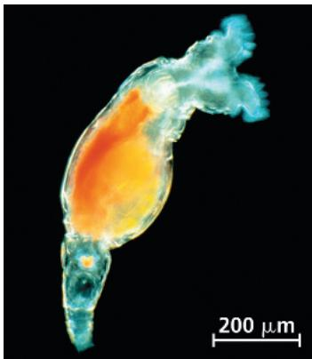

allowing entry of DNA from other rotifer species and even from more distantly related species. Evidence suggests that this foreign DNA can become incorporated into the genome of the bdelloid, leading to increased genetic diversity. In fact, the genomic analysis shows that bdelloid rotifers pick up non-bdelloid DNA at a much higher rate than most other species pick up foreign DNA. The conclusion that bdelloid rotifers have developed other ways of achieving genetic diversity supports the idea that genetic diversity is advantageous, but points out as well that sexual reproduction is not the only way of generating such diversity.

In this chapter, we have seen how sexual reproduction greatly increases the genetic variation present in a population. Although Darwin realized that heritable variation is what makes evolution possible, he could not explain why offspring resemble—but are not identical to—their parents. Ironically, Gregor Mendel, a contemporary of Darwin, published a theory of inheritance that helps explain genetic variation, but his discoveries had no impact on biologists until 1900, more than 15 years after Darwin (1809–1882) and Mendel (1822–1884) had died. In the next chapter, you'll learn how Mendel discovered the basic rules governing the inheritance of specific traits.

## Concept Check 13.4

1. What is the original source of variation among the different alleles of a gene?

2. The diploid number for fruit flies is 8, and the diploid number for grasshoppers is 46. If no crossing over took place, would the genetic variation among offspring from a given pair of parents be greater in fruit flies or grasshoppers? Explain.

3. WHAT IF? If maternal and paternal chromatids have the same two alleles for every gene, will crossing over lead to genetic variation?

For suggested answers, see Appendix A.

## Chapter 13 Review

## Summary of Key Concepts

To review key terms, go to the Vocabulary Self-Quiz (eTextbook only).

## Concept 13.1: Offspring acquire genes from parents by inheriting chromosomes

\- Each gene in an organism's DNA exists at a specific locus on a certain chromosome.

\- In asexual reproduction, a single parent produces genetically identical offspring by mitosis. Sexual reproduction combines genes from two parents, leading to genetically diverse offspring.

Explain why human offspring resemble their parents but are not identical to them.

## Concept 13.2: Fertilization and meiosis alternate in sexual life cycles

\- Normal human somatic cells are diploid. They have 46 chromosomes made up of two sets of 23 chromosomes, one set from each parent. Human diploid cells have 22 pairs of homologs that are autosomes, and one pair of sex chromosomes; the latter typically determines whether the person is female (XX) or male (XY).

\- In humans, ovaries and testes produce haploid gametes by meiosis, each gamete containing a single set of 23 chromosomes (n = 23). During fertilization, an egg and sperm unite, forming a diploid (2n = 46) single-celled zygote, which develops into a multicellular organism by mitosis.

\- Sexual life cycles differ in the timing of meiosis relative to fertilization and in the point(s) of the cycle at which a multicellular organism is produced by mitosis.

Compare and contrast the life cycles of animals and plants.

## Concept 13.3: Meiosis reduces the number of chromosome sets from diploid to haploid

\- The two cell divisions of meiosis, meiosis I and meiosis II, produce four haploid daughter cells. The number of chromosome sets is reduced from two (diploid) to one (haploid) during meiosis I.

\- Meiosis is distinguished from mitosis by three events of meiosis I:

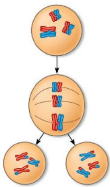

Prophase I: Each pair of homologous chromosomes undergoes synapsis and crossing over between nonsister chromatids with the subsequent appearance of chiasmata.

Metaphase I: Chromosomes line up as homologous pairs on the metaphase plate.

Anaphase I: Homologs separate from each other; sister chromatids remain joined at the centromere.

• Meiosis II separates the sister chromatids.

\- Sister chromatid cohesion and crossing over allow chiasmata to hold homologs together until anaphase I. Cohesins are cleaved along the arms at anaphase I, allowing homologs to separate, and at the centromeres in anaphase II, releasing sister chromatids from each other.

In prophase I, homologous chromosomes pair up and undergo synapsis and crossing over. Can this also occur during prophase II? Explain.

## Concept 13.4: Genetic variation produced in sexual life cycles contributes to evolution

\- Three events in sexual reproduction contribute to genetic variation in a population: independent assortment of chromosomes during meiosis I, crossing over during meiosis I, and random fertilization of egg cells by sperm. During crossing over, DNA of nonsister chromatids in a homologous pair is broken and rejoined.

\- Genetic variation is the raw material for evolution by natural selection. Mutations are the original source of this variation; recombination of variant genes generates additional genetic diversity.

Explain how three processes unique to sexual reproduction generate a great deal of genetic variation.

For suggested answers, see Appendix A.

## Test Your Understanding

For more multiple-choice questions, go to the Practice Test (eTextbook only).

## Levels 1-2: Remembering/Understanding

1. A human cell containing 22 autosomes and a Y chromosome is
(A) a sperm.
(B) an egg.
(C) a zygote.
(D) a somatic cell of a male.

2. The two homologs of a pair move toward opposite poles of dividing cell during
(A) mitosis.
(C) meiosis II.
(B) meiosis I.
(D) fertilization.

## Levels 3-4: Applying/Analyzing

3. Meiosis II is similar to mitosis in that
(A) sister chromatids separate during anaphase.
(B) DNA replicates before the division.
(C) the daughter cells are diploid.
(D) homologous chromosomes synapse.

4. If the DNA content of a diploid cell in the $G_{1}$ phase of the cell cycle is x, then the DNA content of the same cell at metaphase of meiosis I will be
(A) 0.25x. (B) 0.5x. (C) x. (D) 2x.

5. If we continue to follow the cell lineage from question 4, then the DNA content of a single cell at metaphase of meiosis II will be (A) 0.25x. (B) 0.5x (C) x. (D) 2x.

6. DRAW IT The diagram shows a cell in meiosis.

a. Label the appropriate structures with these terms: chromosome (label as duplicated or unduplicated), centromere, kinetochore, sister chromatids, nonsister chromatids, homologous pair (use a bracket when labeling), homolog (label each one), chiasma, sister chromatid cohesion, and gene loci. Circle and label the alleles of the F gene.

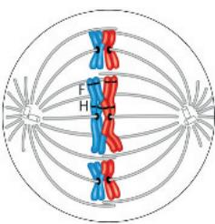

b. Precisely describe the makeup of a haploid set and a diploid set in this cell.

c. Identify the stage of meiosis shown.

## Levels 5-6: Evaluating/Creating

7. Explain how you can tell that the cell in question 6 is undergoing meiosis, not mitosis.

8. EVOLUTION CONNECTION Many species can reproduce either asexually or sexually. Explain what you think might be the evolutionary significance of the switch from asexual to sexual reproduction that occurs in some species when the environment becomes unfavorable.

9. SCIENTIFIC INQUIRY The diagram in question 6 represents just a few of the chromosomes of a meiotic cell in a certain person. Assume that the freckles gene is located at the locus marked F, and the hair-color gene is located at the locus marked H, both on the long chromosome. The individual from whom this cell was taken has inherited different alleles for each gene (“freckles” and “black hair” from one parent, and “no freckles” and “blond hair” from the other). Predict allele combinations in the gametes resulting from this meiotic event. (It will help if you draw out the rest of meiosis and label the alleles by name.) List other possible combinations of these alleles in this individual’s gametes.

10. WRITE ABOUT A THEME: INFORMATION The continuity of life is based on heritable information in the form of DNA. In a short essay (100–150 words), explain how chromosome behavior during sexual reproduction in animals ensures perpetuation of parental traits in offspring and, at the same time, genetic variation among offspring.

11. SYNTHESIZE YOUR KNOWLEDGE

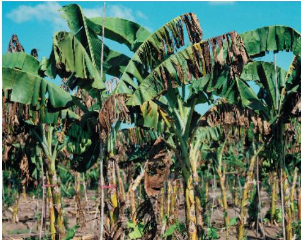

The Cavendish banana, the world's most popular fruit, is currently threatened by extinction due to a fungus. This banana variety is “triploid” (3n, with three sets of chromosomes) and can only reproduce through cloning by cultivators. Given what you know about meiosis, explain how the banana's triploid number accounts for its inability to form normal gametes. Considering genetic diversity, discuss how the absence of sexual reproduction might make this domesticated species vulnerable to infectious agents.

For selected answers, see Appendix A.

# Mendel and the Gene Idea

## Key Concepts

14.1 Mendel used the scientific approach to identify two laws of inheritance

14.2 Probability laws govern Mendelian inheritance

14.3 Inheritance patterns are often more complex than predicted by simple Mendelian genetics

14.4 Many human traits follow Mendelian patterns of inheritance

## Study Tip

Solving genetics problems: In Figure 14.5, you'll learn how to predict the offspring of a genetic cross with a Punnett square, like the example shown here. For crosses shown in other figures, cover up the Punnett square and draw your own. Also, check out the Tips for Genetics Problems at the end of the chapter.

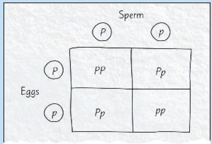

  
Figure 14.1 Flower color was one of the many characteristics of pea plants studied by Gregor Mendel. By breeding pea plants over many generations and carefully counting the types of offspring, Mendel developed a theory of inheritance that is the basis of modern genetics.

## How are traits, such as the purple or white color of flowers, transmitted from parents to offspring?

# Concept 14.1: Mendel used the scientific approach to identify two laws of inheritance

Modern genetics began during the mid-1800s with a monk named Gregor Mendel, who discovered the basic principles of heredity by breeding garden peas in carefully planned experiments. As we retrace his work, you will recognize the key elements of the scientific process that were introduced in Concept 1.3.

## Mendel's Experimental, Quantitative Approach

Mendel grew up on his parents' small farm in a region of Austria that is now part of the Czech Republic. In this agricultural area, Mendel received agricultural training in school along with a basic education. As an adolescent, Mendel overcame financial hardship and illness to excel in high school and, later, at the Olmutz Philosophical Institute.

In 1843, at the age of 21, Mendel entered an Augustinian monastery, a reasonable choice at that time for someone who valued the life of the mind. He considered becoming a teacher but failed the necessary examination. In 1851, he left the monastery to pursue two years of study in physics and chemistry at the University of Vienna. These were very important years for Mendel's development as a scientist, in large part due to the strong influence of two professors. One was the physicist Christian Doppler, who encouraged his students to learn science through experimentation and trained Mendel to use mathematics to help explain natural phenomena. The other was a botanist named Franz Unger, who aroused Mendel's interest in the causes of variation in plants.

After attending university, Mendel returned to the monastery and was assigned to teach at a local school, where several other instructors were enthusiastic about scientific research. In addition, his fellow monks shared a long-standing fascination with the breeding of plants. Around 1857, Mendel began breeding garden peas in the abbey garden to study inheritance. Although the question of heredity had long been a focus of curiosity at the monastery, Mendel's fresh approach allowed him to deduce principles that had remained elusive to others.

One reason Mendel probably chose to work with peas is that there are many varieties. For example, one variety has purple flowers, while another variety has white flowers. A heritable feature that varies among individuals, such as flower color, is called a character. Each variant for a character, such as purple or white color for flowers, is called a trait.

Other advantages of using peas are their short generation time and the large number of offspring from each mating. Furthermore, Mendel could strictly control mating between plants (Figure 14.2). Each pea flower has both pollen-producing organs (stamens) and an egg-bearing organ (carpel). In nature, pea plants usually self-fertilize: Pollen grains from the stamens land on the carpel of the same flower, and sperm released from the pollen grains fertilize eggs present in the carpel.\* To achieve cross-pollination of two plants, Mendel removed the immature stamens of a plant before they produced pollen and then dusted pollen from another plant onto the altered

flowers (see Figure 14.2). Each resulting zygote then developed into a plant embryo encased in a seed (a pea). His method allowed Mendel to always be sure of the parentage of new seeds.

## Figure 14.2

## Research Method: Crossing Pea Plants Application

By crossing, or mating, two true-breeding varieties of an organism, scientists can study patterns of inheritance. In this example, Mendel crossed pea plants that varied in flower color.

## Technique

## Results

When pollen from a white flower was transferred to a purple flower, the first-generation hybrids all had purple flowers. The result was the same for the reciprocal cross, which involved the transfer of pollen from purple flowers to white flowers.

Mendel chose to track only those characters that occurred in two distinct, alternative forms, such as purple or white flower color. He also made sure that he started his experiments with varieties that were true-breeding—that is, over many generations of self-pollination, these plants had produced only the same variety as the parent plant. For example, a plant with purple flowers is true-breeding if the seeds produced by self-pollination in successive generations all give rise to plants that also have purple flowers. (We'll describe the genetic basis for true-breeding shortly.)

In a typical breeding experiment, Mendel cross-pollinated two contrasting, true-breeding pea varieties—for example, purple-flowered plants and white-flowered plants (see Figure 14.2). This mating, or crossing, of two true-breeding varieties is called hybridization. The true-breeding parents are referred to as the P generation (parental generation), and their hybrid offspring are the $F_{1}$ generation (first filial generation, the word filial from the Latin word for “son”). Allowing these $F_{1}$ hybrids to self-pollinate (or to cross-pollinate with other $F_{1}$ hybrids) produces an $F_{2}$ generation (second filial generation). Mendel usually followed traits for at least the P, $F_{1}$ , and $F_{2}$ generations. Had he stopped his experiments with the $F_{1}$ generation, he would have missed the basic patterns of inheritance. Mendel’s quantitative analysis of the $F_{2}$ plants from thousands of genetic crosses like these allowed him to deduce two fundamental principles of heredity, now called the law of segregation and the law of independent assortment.

## The Law of Segregation

The explanation of heredity most widely in favor during the 1800s was the “blending” hypothesis, the idea that genetic material contributed by the two parents mixes just as blue and yellow paints blend to make green. This hypothesis predicts that over many generations, a freely mating population will give rise to a uniform population of individuals, something we don’t see.

If the blending model were correct, the $F_{1}$ hybrids from Mendel's cross between purple-flowered and white-flowered pea plants would have been pale purple flowers, a trait intermediate between those of the P generation. Notice in Figure 14.2 that the experiment produced a very different result: All the $F_{1}$ offspring had flowers of the same color as the purple-flowered parents. What happened to the white-flowered plants' genetic contribution to the hybrids? If it were lost, then the $F_{1}$ plants could produce only purple-flowered offspring in the $F_{2}$ generation. But when Mendel allowed the $F_{1}$ plants to self- or cross-pollinate and planted their seeds, the white-flower trait reappeared in the $F_{2}$ generation. The blending hypothesis is also inconsistent with this reappearance of traits after they've skipped a generation.

Mendel used very large sample sizes and kept accurate records of his results: 705 of the $\mathrm{F}_2$ plants had purple flowers, and 224 had white flowers. These data fit a ratio of approximately three purple to one white (Figure 14.3). Mendel reasoned that the heritable factor for white flowers did not disappear in the $\mathrm{F}_1$ plants but was somehow hidden, or masked, when the purple-flower factor was present. In Mendel's terminology, purple flower color is a dominant trait, and white flower color is a recessive trait. The reappearance of white-flowered plants in the $\mathrm{F}_2$ generation was evidence that the heritable factor causing white

## Figure 14.3

# Inquiry: When $F_{1}$ hybrid pea plants self-or cross-pollinate, which traits appear in the $F_{2}$ generation?

## Experiment

Mendel crossed true-breeding purple-flowered plants and white-flowered plants (crosses are symbolized by $\times$ ). The resulting $F_{1}$ hybrids were allowed to self-pollinate or were cross-pollinated with other $F_{1}$ hybrids. The $F_{2}$ generation plants were then observed for flower color.

## Results

Both purple-flowered and white-flowered plants appeared in the $F_{2}$ generation, in a ratio of approximately 3:1.

## Conclusion

The “heritable factor” for the recessive trait (white flowers) had not been destroyed, deleted, or “blended” in the $F_{1}$ generation but was merely masked by the presence of the factor for purple flowers, which is the dominant trait.

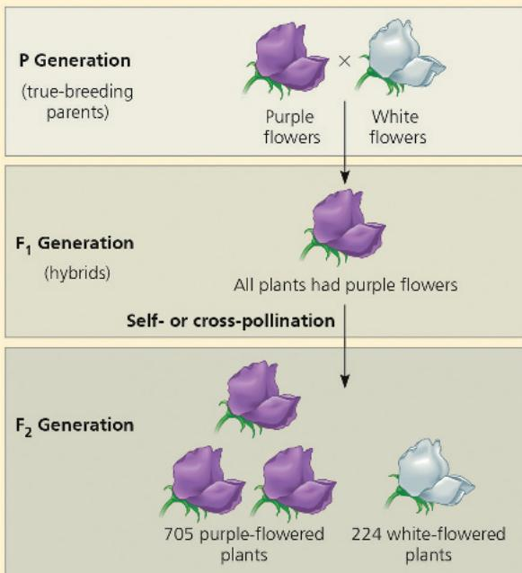  
Data from G. Mendel, Experiments in plant hybridization, Proceedings of the Natural History Society of Brünn 4:3–47 (1866).

WHAT IF? If you mated two purple-flowered plants from the P generation, what ratio of traits would you expect to observe in the offspring? Explain. What might Mendel have concluded if he stopped his experiment after the $F_{1}$ generation?

For suggested answer, see Appendix A.

flowers had not been diluted or destroyed by coexisting with the purple-flower factor in the $F_{1}$ hybrids. Mendel observed the same pattern of inheritance in six other characters, each represented by two distinctly different traits (Table 14.1). For example, when

Table 14.1 The Results of Mendel's $F_{1}$ Crosses for Seven Characters in Pea Plants

<table><tr><td>Character</td><td>Dominant Trait</td><td>×</td><td>Recessive Trait</td><td> $F_2$  Generation Dominant: Recessive</td><td>Ratio</td></tr><tr><td>Flower color</td><td>Purple</td><td>×</td><td>White</td><td>705:224</td><td>3.15:1</td></tr><tr><td>Seed color</td><td>Yellow</td><td>×</td><td>Green</td><td>6,022:2,001</td><td>3.01:1</td></tr><tr><td>Seed shape</td><td>Round</td><td>×</td><td>Wrinkled</td><td>5,474:1,850</td><td>2.96:1</td></tr><tr><td>Pod color</td><td>Green</td><td>×</td><td>Yellow</td><td>428:152</td><td>2.82:1</td></tr><tr><td>Pod shape</td><td>Inflated</td><td>×</td><td>Constricted</td><td>882:299</td><td>2.95:1</td></tr><tr><td>Flower position</td><td>Axial</td><td>×</td><td>Terminal</td><td>651:207</td><td>3.14:1</td></tr><tr><td>Stem length</td><td>Tall</td><td>×</td><td>Dwarf</td><td>787:277</td><td>2.84:1</td></tr></table>

## Figure 14.4 Alleles,

alternative versions of a gene.
This diagram shows a pair of homologous chromosomes in an $F_{1}$ hybrid pea plant, with the actual DNA sequence from the flower-color allele of each chromosome. The paternally inherited chromosome (blue) has an allele for purple flowers, which codes for a protein that indirectly controls synthesis of purple pigment. The maternally inherited chromosome (red) has an allele for white flowers, which results in no functional protein being made.

Mendel crossed a true-breeding variety that produced smooth, round pea seeds with one that produced wrinkled seeds, all the $F_{1}$ hybrids produced round seeds; this is the dominant trait for seed shape. In the $F_{2}$ generation, approximately 75% of the seeds were round and 25% were wrinkled—a 3:1 ratio, as in Figure 14.3. Now let's see how Mendel deduced the law of segregation from his experimental results. In the discussion that follows, we will use modern terms instead of some of the terms used by Mendel. (For example, we'll use “gene” instead of Mendel’s “heritable factor.”)

## Mendel's Model

Mendel developed a model to explain the 3:1 inheritance pattern that he consistently observed among the $\mathrm{F}_2$ offspring in his pea experiments. We'll now explore four related concepts making up Mendel's model, the fourth of which is the law of segregation.

First, alternative versions of genes account for variations in inherited characters. The gene for flower color in pea plants, for example, exists in two versions, one for purple flowers and the other for white flowers. Each of these alternative versions of a gene is called an allele. Today, we can relate this concept to chromosomes and DNA. As shown in Figure 14.4, each gene is a sequence of nucleotides at a specific place, or locus, along a particular chromosome. The DNA at that locus, however, can vary slightly in its nucleotide sequence. This variation in information content can affect the function of the encoded protein and thus an inherited character of the organism. The purple-flower allele and the white-flower allele are two DNA sequence variations possible at the flower-color locus on a pea plant's chromosomes. The purple-flower allele sequence allows synthesis of purple pigment, and the white-flower allele sequence does not.

Second, for each character, an organism inherits two versions (that is, two alleles) of a gene, one from each parent. Remarkably, Mendel made this deduction without knowing about the role, or even the existence, of chromosomes. Each somatic cell in a diploid organism has two sets of chromosomes, one set inherited from each parent (see Figure 13.4). Thus, a genetic locus is actually represented twice in a diploid cell, once on each

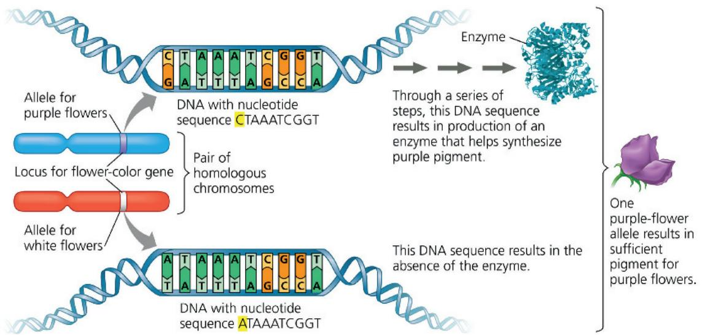

homolog of a specific pair of chromosomes. The two alleles at a particular locus may be identical, as in the true-breeding plants of Mendel's P generation. Or the alleles may differ, as in the $F_{1}$ hybrids (see Figure 14.4).

Third, if the two alleles at a locus differ, then one, the dominant allele, determines the organism's appearance; the other, the recessive allele, has no noticeable effect on the organism's appearance. Accordingly, Mendel's $F_{1}$ plants had purple flowers because the allele for that trait is dominant and the allele for white flowers is recessive.

The fourth and final part of Mendel's model, the law of segregation, states that the two alleles for a heritable character segregate (in other words, separate from each other) during gamete formation and end up in different gametes. Thus, an egg or a sperm gets only one of the two alleles that are present in the diploid cells of the organism making the gamete. In terms of chromosomes, this segregation corresponds to the distribution of copies of the two members of a pair of homologous chromosomes to different

Note that if an organism has identical alleles for a particular character, then that allele is present in all gametes. Because it is the only allele that can be passed on to offspring when the plant self-pollinates, the offspring always look the same as their parents in regard to that characteristic; this explains why these plants are true-breeding. But if different alleles are present, as in the $F_{1}$ hybrids, then 50% of the gametes receive the dominant allele and 50% receive the recessive allele.

Does Mendel's segregation model account for the 3:1 ratio he observed in the $\mathrm{F}_2$ generation of his numerous crosses? For the flower-color character, the model predicts that the two different alleles present in an $\mathrm{F}_1$ individual will segregate into gametes such that half the gametes will have the purple-flower allele and half will have the white-flower allele. During self-pollination, gametes of each class unite randomly. An egg with a purple-flower allele has an equal chance of being fertilized by a sperm with a purple-flower allele or by a sperm with a white-flower allele. Since the same is true for an egg with a white-flower allele, there are four equally likely combinations of sperm and egg. Figure 14.5 illustrates these combinations using a Punnett square, a handy diagrammatic device for predicting the allele composition of offspring from a cross between individuals of known genetic makeup. Notice that we use a capital letter to symbolize a dominant allele and a lowercase letter for a recessive allele. In our example, $P$ is the purple-flower allele, and p is the white-flower allele; it is often useful as well to be able to refer to the gene itself as the P/p gene.

In the $F_{2}$ offspring, what color will the flowers be? One-fourth of the plants have inherited two purple-flower alleles; clearly, these plants will have purple flowers. One-half of the $F_{2}$ offspring have inherited one purple-flower allele and one white-flower allele; these plants will also have purple flowers, the dominant trait. Finally, one-fourth of the $F_{2}$ plants have inherited two white-flower alleles and will express the recessive trait. Thus, Mendel's model accounts for the 3:1 ratio of traits that he observed in the $F_{2}$ generation.

## Useful Genetic Vocabulary

An organism that has a pair of identical alleles for a gene encoding a character is called a homozygote and is said to be homozygous for that gene. In the parental generation in Figure 14.5, the purple-flowered pea plant is homozygous for

Figure 14.5 Mendel's law of segregation.

This diagram shows the genetic makeup of the generations in Figure 14.3. It illustrates Mendel's model for inheritance of the alleles of a single gene. Each plant has two alleles for the gene controlling flower color, one allele inherited from each of the plant's parents. To construct a Punnett square that predicts the $F_{2}$ generation offspring, we list all the possible gametes from one parent (here, the $F_{1}$ female) along the left side of the square and all the possible gametes from the other parent (here, the $F_{1}$ male) along the top. The boxes represent the offspring resulting from all the possible unions of male and female gametes.

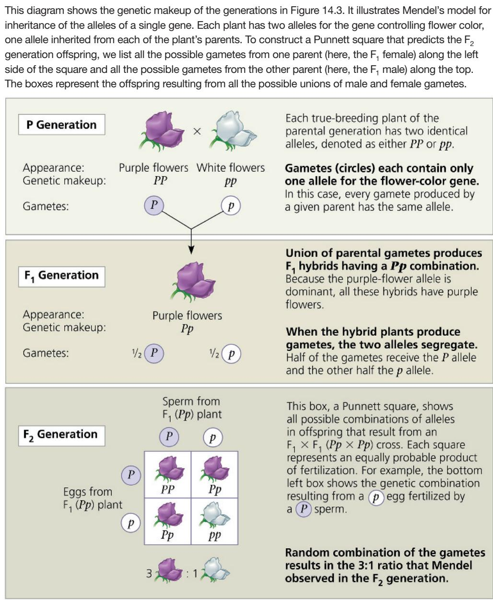

This box, a Punnett square, shows all possible combinations of alleles in offspring that result from an $F_{1} \times F_{1} (Pp \times Pp)$ cross. Each square represents an equally probable product of fertilization. For example, the bottom left box shows the genetic combination resulting from a $p$ egg fertilized by a $p$ sperm.

Random combination of the gametes results in the 3:1 ratio that Mendel observed in the $F_{2}$ generation.

the dominant allele (PP), while the white plant is homozygous for the recessive allele (pp). Homozygous plants “breed true” because all of their gametes contain the same allele—either P or p in this example. If we cross dominant homozygotes with recessive homozygotes, every offspring will have two different alleles—Pp in the case of the $F_{1}$ hybrids of our flower-color experiment (see Figure 14.5). An organism that has two different alleles for a gene is called a heterozygote and is said to be heterozygous for that gene. Unlike homozygotes, heterozygotes produce gametes with different alleles, so they are not true-breeding. For example, P- and p-containing gametes are both produced by our $F_{1}$ hybrids. Self-pollination of the $F_{1}$ hybrids thus produces both purple-flowered and white-flowered offspring.

Because of the different effects of dominant and recessive alleles, an organism's traits do not always reveal its genetic composition. Therefore, we distinguish between an organism's appearance or observable traits, called its phenotype, and its genetic makeup, its genotype. As shown in Figure 14.5 for the case of flower color in pea plants, PP and Pp plants have the same phenotype (purple flowers) but different genotypes. Figure 14.6 reviews these terms. Note that the term phenotype refers not only to traits that relate directly to physical appearance but also to physiological traits. For example, one pea variety lacks the normal ability to self-pollinate, which is a phenotypic trait (called non-self-pollination).

## The Testcross

Given a purple-flowered pea plant, we cannot tell if it is homozygous (PP) or heterozygous (Pp) because both genotypes result in the same purple phenotype. To determine the genotype, we can cross this plant with a white-flowered plant (pp),

Figure 14.6 Phenotype versus genotype.

Grouping $F_{2}$ offspring from a cross for flower color according to phenotype results in the typical 3:1 phenotypic ratio. In terms of genotype, however, there are actually two categories of purple-flowered plants, PP (homozygous) and Pp (heterozygous), giving a 1:2:1 genotypic ratio.

which will make only gametes with the recessive allele $(p)$ . The allele in the gamete contributed by the purple-flowered plant of unknown genotype will therefore determine the appearance of the offspring (Figure 14.7). If all the offspring of the cross have purple flowers, then the purple-flowered mystery plant must be homozygous for the dominant allele, because a $PP \times pp$ cross produces all Pp offspring. But if both the purple

## Figure 14.7

## Research Method: The Testcross

## Application

An organism that shows a dominant trait in its phenotype, such as purple flowers in pea plants, can be either homozygous for the dominant allele or heterozygous. To determine the organism's genotype, geneticists can perform a testcross.

## Technique

In a testcross, the individual with the unknown genotype is crossed with a homozygous individual expressing the recessive trait (white flowers in this example), and Punnett squares are used to predict the possible outcomes.

## Results

Matching the results to either prediction identifies the unknown parental genotype (either PP or Pp in this example). In this testcross, we transferred pollen from a white-flowered plant to the carpels of a purple-flowered plant; the opposite (reciprocal) cross would have led to the same results.

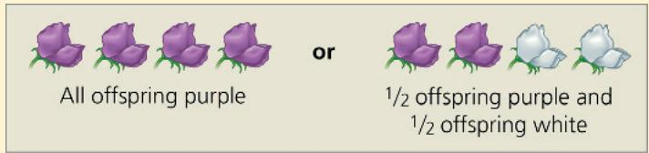

and the white phenotypes appear among the offspring, then the purple-flowered parent must be heterozygous. The offspring of a $Pp \times pp$ cross will be expected to have a 1:1 phenotypic ratio. Breeding an organism of unknown genotype with a recessive homozygote is called a testcross because it can reveal the genotype of that organism. The testcross was devised by Mendel and continues to be used by geneticists.

## The Law of Independent Assortment

Mendel derived the law of segregation from experiments in which he followed only a single character, such as flower color. All the $F_{1}$ progeny produced in his crosses of true-breeding parents were monohybrids, meaning that they were heterozygous for the one particular character being followed in the cross. We refer to a cross between such heterozygotes as a monohybrid cross.

Mendel worked out the second law of inheritance by following two characters at the same time, such as seed color and seed shape. Seeds (peas) may be either yellow or green. They also may be either round (smooth) or wrinkled. From single-character crosses, Mendel knew that the allele for yellow seeds is dominant (Y), and the allele for green seeds is recessive (y). For the seed-shape character, the allele for round is dominant (R), and the allele for wrinkled is recessive (r).

Imagine crossing two true-breeding pea varieties that differ in both of these characters—a cross between a plant with yellow round seeds (YYRR) and a plant with green wrinkled seeds (yyrr). The $F_{1}$ plants will be dihybrids, individuals heterozygous for the two characters being followed in the cross (YyRr). But are these two characters transmitted from parents to offspring as a package? That is, will the Y and R alleles always stay together, generation after generation? Or are seed color and seed shape inherited independently? Figure 14.8 shows how a dihybrid cross, a cross between $F_{1}$ dihybrids, can determine which of these two hypotheses is correct.

## Figure 14.8

## Inquiry: Do the alleles for one character segregate into gametes dependently or independently of the alleles for a different character?

## Experiment

To follow the characters of seed color and seed shape through the $F_{2}$ generation, Mendel crossed a true-breeding plant with yellow round seeds with a true-breeding plant with green wrinkled seeds, producing dihybrid $F_{1}$ plants. Self-pollination of the $F_{1}$ dihybrids produced the $F_{2}$ generation. The two hypotheses (dependent and independent “assortment” of the two genes) predict different phenotypic ratios.

## Results

315 Yellow round (YYRR, YyRR, YYRr, YyRr) 108 Green round (yyRR, yyRr) 101 Yellow wrinkled (YYrr, Yyrr) 32 Green wrinkled (yyrr) Phenotypic ratio approximately 9:3:3:1

## Conclusion

The results support the hypothesis of independent assortment, the only one that predicts two newly observed phenotypes: green round seeds and yellow wrinkled seeds

(see the right-hand Punnett square). The alleles for each gene segregate independently of those of the other, and the two genes are said to assort independently.

Data from G. Mendel, Experiments in plant hybridization, Proceedings of the Natural History Society of Brünn 4:3–47 (1866).

WHAT IF? Suppose Mendel had transferred pollen from an $F_{1}$ plant to the carpel of a plant that was homozygous recessive for both genes. Set up the cross and draw Punnett squares that predict the offspring for both hypotheses. Would this cross have supported the hypothesis of independent assortment equally well?

For suggested answer, see Appendix A.

The $F_{1}$ plants, of genotype YyRr, exhibit both dominant phenotypes, yellow seeds with round shapes, no matter which hypothesis is correct. The key step in the experiment is to see what happens when $F_{1}$ plants self-pollinate and produce $F_{2}$ offspring. If the hybrids must transmit their alleles in the same combinations in which the alleles were inherited from the P generation, then the $F_{1}$ hybrids will produce only two classes of gametes: YR and yr. As shown on the left side of Figure 14.8, this “dependent assortment” hypothesis predicts that the phenotypic ratio of the $F_{2}$ generation will be 3:1, just as in a monohybrid cross:

The alternative hypothesis is that the two pairs of alleles segregate independently of each other. In other words, genes are packaged into gametes in all possible allelic combinations, as long as each gamete has one allele for each gene (see Figure 13.11). In our example, an $F_{1}$ plant will produce four classes of gametes in equal quantities: YR, Yr, yR, and yr. If sperm of the four classes fertilize eggs of the four classes, there will be $16(4 \times 4)$ equally probable ways in which the alleles can combine in the $F_{2}$ generation, as shown on the right side of Figure 14.8. These combinations result in four phenotypic categories with a ratio of 9:3:3:1 (9 yellow round to 3 green round to 3 yellow wrinkled to 1 green wrinkled):

When Mendel did the experiment and classified the $F_{2}$ offspring, his results were close to the predicted 9:3:3:1 phenotypic ratio, supporting the hypothesis that the alleles for one gene—the gene for seed color, for example—segregate into gametes independently of the alleles of any other gene, such as the gene for seed shape.

Mendel tested his seven pea characters in various dihybrid combinations and always observed a 9:3:3:1 phenotypic ratio in the $\mathrm{F}_2$ generation. Is this consistent with the 3:1 phenotypic ratio seen for the monohybrid cross shown in Figure 14.5? To answer this question, count the number of yellow and green peas, ignoring shape, and calculate the ratio. The results of Mendel's dihybrid experiments are the basis for what we now call the law of independent assortment, which states that two or more genes assort independently—that is, each pair of alleles segregates independently of any other pair of alleles—during gamete formation.

This law applies only to genes (allele pairs) located on different chromosomes (that is, on chromosomes that are not homologous) or, alternatively, to genes that are very far apart on the same chromosome. (This will be explained in Concept 15.3, along with the more complex inheritance patterns of genes located near each other, alleles of which tend to be inherited together.) All the pea characters Mendel chose for analysis were controlled by genes on different chromosomes or were far apart on the same chromosome; this situation greatly simplified interpretation of his multicharacter pea crosses. All the examples we consider in the rest of this chapter involve genes located on different chromosomes.

## Concept Check 14.1

1. DRAW IT Pea plants heterozygous for flower position and stem length (AaTt) are allowed to self-pollinate, and 400 of the resulting seeds are planted. Draw a Punnett square for this cross. How many offspring would be predicted to have terminal flowers and be dwarf? (See Table 14.1.)

2. WHAT IF? List all gametes that could be made by a pea plant heterozygous for seed color, seed shape, and pod shape (YyRrli; see Table 14.1). How large a Punnett square would you need to draw to predict the offspring of a self-pollination of this “trihybrid”?

3. MAKE CONNECTIONS In some pea plant crosses, the plants are self-pollinated. Is self-pollination considered asexual or sexual reproduction? Explain. (See Concept 13.1.)

For suggested answers, see Appendix A.

## Concept 14.2: Probability laws govern Mendelian inheritance

Mendel's laws of segregation and independent assortment reflect the same rules of probability that apply to tossing coins, rolling dice, and drawing cards from a deck. The probability scale ranges from 0 to 1. An event that is certain to occur has a probability of 1, while an event that is certain not to occur has a probability of 0. With a coin that has heads on both sides, the probability of tossing heads is 1, and the probability of tossing tails is 0. With a normal coin, the chance of tossing heads is $\frac{1}{2}$ , and the chance of tossing tails is $\frac{1}{2}$ . The probability of drawing the ace of spades from a 52-card deck is $\frac{1}{52}$ . The probabilities of all possible outcomes for an event must add up to 1. With a deck of cards, the chance of picking a card other than the ace of spades is $\frac{51}{52}$ .

Tossing a coin illustrates an important lesson about probability. For every toss, the probability of heads is $\frac{1}{2}$ . The outcome of any particular toss is unaffected by what has happened on previous trials. We refer to phenomena such as coin tosses as independent events. Each toss of a coin, whether done sequentially with one coin or simultaneously with many, is independent of every other toss. And like two separate coin tosses, the alleles of one gene segregate into gametes independently of another gene's alleles (the law of independent assortment). We'll now look at two basic rules of probability that help us predict the outcome of the fusion of such gametes in simple monohybrid crosses and more complicated crosses as well.

## The Multiplication and Addition Rules Applied to Monohybrid Crosses

How do we determine the probability that two or more independent events will occur together in some specific combination? For example, what is the chance that two coins tossed simultaneously will both land heads up? The multiplication rule states that to determine the probability of one event and the other occurring, we multiply the probability of one event (one coin coming up heads) by the probability of the other event (the other coin coming up heads). By the multiplication rule, then, the probability that both coins will land heads up is $\frac{1}{2} \times \frac{1}{2} = \frac{1}{4}$ .

We can apply the same reasoning to an $F_{1}$ monohybrid cross. With seed shape in pea plants as the heritable character, the genotype of $F_{1}$ plants is Rr. Segregation in a heterozygous plant is like flipping a coin in terms of calculating the probability of each outcome: Each egg produced has a $\frac{1}{2}$ chance of carrying the dominant allele (R) and a $\frac{1}{2}$ chance of carrying the recessive allele (r). The same odds apply to each sperm cell produced. For a particular $F_{2}$ plant to have wrinkled seeds, the recessive trait, both the egg and the sperm that come together must carry the r allele. The probability that an r allele will be present in the egg and in the sperm at fertilization is found by multiplying $\frac{1}{2}$ (the probability that the egg will have an $r$ ) × $\frac{1}{2}$ (the probability that the sperm will have an r). Thus, the multiplication rule tells us that the probability of an $F_{2}$ plant having wrinkled seeds (rr) is $\frac{1}{4}$ (Figure 14.9). Likewise, the probability of an $F_{2}$ plant carrying both dominant alleles for seed shape (RR) is $\frac{1}{4}$ .

To figure out the probability that an $F_{2}$ plant from a monohybrid cross will be heterozygous rather than homozygous, we need to invoke a second rule. Notice in Figure 14.9 that the dominant allele can come from the egg and the recessive allele

## Figure 14.9 Segregation of alleles and fertilization as chance events.

When a heterozygote (Rr) forms gametes, whether a particular gamete ends up with an R or an r is like the toss of a coin. We can determine the probability for any genotype among the offspring of two heterozygotes by multiplying together the individual probabilities of an egg and sperm having a particular allele (R or r in this example).

from the sperm, or vice versa. That is, $F_{1}$ gametes can combine to produce Rr offspring in two mutually exclusive ways: For any particular heterozygous $F_{2}$ plant, the dominant allele can come from the egg or the sperm, but not from both. According to the addition rule, the probability that any one of two or more mutually exclusive events (one event or the other) will occur is calculated by adding their individual probabilities. As we have just seen, the multiplication rule gives us the individual probabilities that we will now add together. The probability for one possible way of obtaining an $F_{2}$ heterozygote—the dominant allele from the egg and the recessive allele from the sperm—is $\frac{1}{4}$ . The probability for the other possible way—the recessive allele from the egg and the dominant allele from the sperm—is also $\frac{1}{4}$ (see Figure 14.9). Using the rule of addition, then, we can calculate the probability of an $F_{2}$ heterozygote as $\frac{1}{4} + \frac{1}{4} = \frac{1}{2}$ . (Note that use of the word and in the statement is a clue that you should use the multiplication rule, while or suggests use of the addition rule.)

## Solving Complex Genetics Problems with the Rules of Probability

We can also apply the rules of probability to predict the outcome of crosses involving multiple characters. Recall that each allelic pair (gene) segregates independently during gamete formation (the law of independent assortment). Thus, a dihybrid or other multicharacter cross is equivalent to two or more independent monohybrid crosses occurring simultaneously. By applying what we have learned about monohybrid crosses, we can determine the probability of specific genotypes occurring in the $F_{2}$ generation without having to construct unwieldy Punnett squares.

Consider the dihybrid cross between $YyRr$ heterozygotes shown in Figure 14.8. We will focus first on the seed-color character. For a monohybrid cross of $Yy$ plants, we can use a simple Punnett square to determine that the probabilities of the offspring genotypes are $\frac{1}{4}$ for $YY$ , $\frac{1}{2}$ for $Yy$ , and $\frac{1}{4}$ for $yy$ . We can draw a second Punnett square to determine that the same probabilities apply to the offspring genotypes for seed shape: $\frac{1}{4} RR$ , $\frac{1}{2} Rr$ , and $\frac{1}{4} rr$ . Knowing these probabilities, we can simply use the multiplication rule to determine the probability of each of the genotypes in the $F_2$ generation. To give two examples, the calculations for finding the probabilities of two of the possible $F_2$ genotypes ( $YYRR$ and $YyRR$ ) are shown below:

<table><tr><td>Probability of YYRR = 1/4 (probability of YY) × 1/4 (RR) = 1/16</td></tr><tr><td>Probability of YγRR = 1/2 (Yγ) × 1/4 (RR) = 1/8</td></tr></table>

The YYRR genotype corresponds to the upper left box in the larger Punnett square in Figure 14.8 (one box = $\frac{1}{16}$ ). Looking closely at the larger Punnett square in Figure 14.8, you will see that 2 of the 16 boxes ( $\frac{1}{8}$ ) correspond to the YyRR genotype.

Now let's see how we can combine the multiplication and addition rules to solve even more complex problems in Mendelian genetics. Imagine a cross of two pea varieties in which we track the inheritance of three characters. Let's cross a trihybrid with

purple flowers and yellow round seeds (heterozygous for all three genes) with a plant with purple flowers and green wrinkled seeds (heterozygous for flower color but homozygous recessive for the other two characters). Using Mendelian symbols, our cross is $PpYyRr \times Ppyyrr$ . What fraction of offspring from this cross are predicted to exhibit the recessive phenotypes for at least two of the three characters?

To answer this question, we can start by listing all genotypes we could get that fulfill this condition: $ppyyRr$ , $ppYyrr$ , $Ppyyrr$ , $PPyyrr$ , and $ppyyrr$ . (Because the condition is at least two recessive traits, it includes the last genotype, which shows all three recessive traits.) Next, we calculate the probability for each of these genotypes resulting from our $PpYyRr \times Ppyyrr$ cross by multiplying together the individual probabilities for the allele pairs, just as we did in our dihybrid example. Note that in a cross involving heterozygous and homozygous allele pairs (for example, $Yy \times yy$ ), the probability of heterozygous ( $Yy$ ) offspring is $\frac{1}{2}$ and the probability of homozygous (in this case, $yy$ ) offspring is $\frac{1}{2}$ . Finally, we use the addition rule to add the probabilities for all the different genotypes that fulfill the condition of at least two recessive traits resulting from our $PpYyRr \times Ppyyrr$ cross, as shown below:

<table><tr><td>ppyyRr</td><td> $^{1}/_{4}$  (probability of pp)  $\times^{1}/_{2}$  (yy)  $\times^{1}/_{2}$  (Rr) =  $^{1}/_{16}$ </td></tr><tr><td>ppYyrr</td><td> $^{1}/_{4}$  (pp)  $\times^{1}/_{2}$  (Yy)  $\times^{1}/_{2}$  (rr) =  $^{1}/_{16}$ </td></tr><tr><td>Ppyyrr</td><td> $^{1}/_{2}$  (Pp)  $\times^{1}/_{2}$  (yy)  $\times^{1}/_{2}$  (rr) =  $^{2}/_{16}$ </td></tr><tr><td>PPyyrr</td><td> $^{1}/_{4}$  (PP)  $\times^{1}/_{2}$  (yy)  $\times^{1}/_{2}$  (rr) =  $^{1}/_{16}$ </td></tr><tr><td>ppyyrr</td><td> $^{1}/_{4}$  (pp)  $\times^{1}/_{2}$  (yy)  $\times^{1}/_{2}$  (rr) =  $^{1}/_{16}$ </td></tr><tr><td colspan="2">Chance of at least two recessive traits</td></tr></table>

In time, you'll be able to solve genetics problems faster by using the rules of probability than by filling in Punnett squares.

We cannot predict with certainty the exact numbers of progeny of different genotypes resulting from a genetic cross. But the rules of probability give us the likelihood of various outcomes. Usually, the larger the sample size, the closer the results will conform to our predictions. Mendel understood this statistical feature of inheritance and had a keen sense of the rules of chance. It was for this reason that he set up his experiments so as to generate, and then count, large numbers of offspring from his crosses.

## Concept Check 14.2

1. For any gene with a dominant allele A and recessive allele a, what proportions of the offspring from an $AA \times Aa$ cross are expected to be homozygous dominant, homozygous recessive, and heterozygous?

2. Two organisms, with genotypes BbDD and BBDd, are mated. Assuming independent assortment of the B/b and D/d genes, write the genotypes of all possible offspring from this cross and use the rules of probability to calculate the chance of each genotype occurring.

3. WHAT IF? Three characters (flower color, seed color, and pod shape) are considered in a cross between two pea plants: $PpYyIi \times ppYyIi$ . Using the rules of probability, determine the fraction of offspring predicted to be homozygous recessive for at least two of the three characters.

## Concept 14.3: Inheritance patterns are often more complex than predicted by simple Mendelian genetics

In the 1900s, geneticists extended Mendelian principles not only to diverse organisms, but also to patterns of inheritance more complex than those described by Mendel. For the work that led to his two laws of inheritance, Mendel chose pea plant characters that turn out to have a relatively simple genetic basis: Each character is determined by one gene, for which there are only two alleles, one completely dominant and the other completely recessive. (There is one exception: Mendel's pod shape character is actually determined by two genes.) Not all heritable characters are determined so simply, and the relationship between genotype and phenotype is rarely so straightforward. Mendel himself realized that he could not explain the more complicated patterns he observed in crosses involving other pea characters or other plant species. This does not diminish the utility of Mendelian genetics, however, because the basic principles of segregation and independent assortment apply even to more complex patterns of inheritance. In this section, we will extend Mendelian genetics to hereditary patterns that were not reported by Mendel.

## Extending Mendelian Genetics for a Single Gene

The inheritance of characters determined by a single gene deviates from simple Mendelian patterns when alleles are not completely dominant or recessive, when a particular gene has more than two alleles, or when a single gene produces multiple phenotypes. We will describe examples of each of these situations in this section.

## Degrees of Dominance

Alleles can show different degrees of dominance and recessiveness in relation to each other. In Mendel's classic pea crosses, the $\mathrm{F}_1$ offspring always looked like one of the two parental varieties because one allele in a pair showed complete dominance over the other. In such situations, the phenotypes of the heterozygote and the dominant homozygote are indistinguishable (see Figure 14.6).

For some genes, however, neither allele is completely dominant, and the $F_{1}$ hybrids have a phenotype somewhere between those of the two parental varieties. This phenomenon, called incomplete dominance, is seen when red snapdragons are crossed with white snapdragons: All the $F_{1}$ hybrids have pink flowers (Figure 14.10). This third, intermediate phenotype results from flowers of the heterozygotes having less red pigment than the red homozygotes. (This is unlike the case of Mendel's pea plants, where the Pp heterozygotes make enough pigment for the flowers to be purple, indistinguishable from those of PP plants.)

At first glance, incomplete dominance of either allele seems to provide evidence for the blending hypothesis of inheritance, which would predict that the red or white trait could never reappear among offspring of the pink hybrids. In fact, interbreeding

Figure 14.10 Incomplete dominance in snapdragon color. When red snapdragons are crossed with white ones, the $F_{1}$ hybrids have pink flowers. Segregation of alleles into gametes of the $F_{1}$ plants results in an $F_{2}$ generation with a 1:2:1 ratio for both genotype and phenotype. Neither allele is dominant, so rather than using upper- and lowercase letters, we use the letter C with a superscript to indicate an allele for flower color: $C^{R}$ for red and $C^{W}$ for white.

  
Suppose a classmate argues that this figure supports the blending hypothesis for inheritance. What might your classmate say, and how would you respond? For suggested answer, see Appendix A.

$F_{1}$ hybrids produces $F_{2}$ offspring with a phenotypic ratio of one red to two pink to one white. (Because heterozygotes have a separate phenotype from homozygotes, the genotypic and phenotypic ratios for the $F_{2}$ generation are the same, 1:2:1.) The segregation of the red-flower and white-flower alleles in the gametes produced by the pink-flowered plants confirms that the alleles for flower color are heritable factors that maintain their identity in the hybrids; that is, that the factors are discrete rather than “blendable.”

Another variation on dominance relationships between alleles is called codominance; in this variation, the two alleles each affect the phenotype in separate, distinguishable ways. For example, there are many molecules on the surface of human red blood cells that help determine blood type. You are probably most familiar with the ABO blood group, which we'll discuss shortly. A lesser-known example, the human MN blood group, is determined by codominant alleles for two specific molecules called M and N molecules. A single gene $(L)$ , for which two allelic variations are possible $(L^{M}$ or $L^{N})$ , determines the phenotype of this blood group.

Individuals homozygous for the $L^{M}$ allele ( $L^{M}L^{M}$ ) have red blood cells with only M molecules; individuals homozygous for the $L^{N}$ allele ( $L^{N}L^{N}$ ) have red blood cells with only N molecules. But both M and N molecules are present on the red blood cells of individuals heterozygous for the M and N alleles ( $L^{M}L^{N}$ ). Note that the MN phenotype is not intermediate between the M and N phenotypes, which distinguishes codominance from incomplete dominance. Rather, both M and N phenotypes are exhibited by heterozygotes, since both molecules are present.

## The Relationship Between Dominance and Phenotype

We've now seen that the relative effects of two alleles range from complete dominance of one allele to incomplete dominance of either allele to codominance of both alleles. It is important to understand that an allele is called dominant because it is seen in the phenotype, not because it somehow subdues a recessive allele. Alleles are simply variations in a gene's nucleotide sequence (see Figure 14.4). When a dominant allele coexists with a recessive allele in a heterozygote, they do not actually interact at all. It is in the pathway from genotype to phenotype that dominance and recessiveness come into play.

To illustrate the relationship between dominance and phenotype, we can use one of the characters Mendel studied—round versus wrinkled pea seed shape. The dominant allele (round) codes for an enzyme that helps convert an unbranched form of starch to a branched form in the seed. The recessive allele (wrinkled) codes for a defective form of this enzyme, leading to an accumulation of unbranched starch, which causes excess water to enter the seed by osmosis. Later, when the seed dries, it wrinkles. If a dominant allele is present, no excess water enters the seed and it does not wrinkle when it dries. One dominant allele results in enough of the enzyme to synthesize adequate amounts of branched starch, which means that dominant homozygotes and heterozygotes have the same phenotype: round seeds.

A closer look at the relationship between dominance and phenotype reveals an intriguing fact: For any character, the observed dominant/recessive relationship of alleles depends on the level at which we examine phenotype. Tay-Sachs disease, an inherited disorder in humans, is an example. The brain cells of a child with Tay-Sachs disease cannot metabolize certain lipids because a crucial enzyme does not work properly. As these lipids accumulate in brain cells, the child begins to experience seizures, blindness, and degeneration of motor and mental performance and dies within a few years.

Only children who inherit two copies of the Tay-Sachs allele (homozygotes) have the disease. Thus, at the organismal level, the Tay-Sachs allele qualifies as recessive. However, the activity level of the lipid-metabolizing enzyme in heterozygotes is intermediate between the activity level in individuals homozygous for the normal allele and the activity level in individuals with Tay-Sachs disease. (The term normal is used in the genetic sense to refer to the allele coding for the enzyme that functions properly.) The intermediate phenotype observed at the biochemical level is characteristic of incomplete dominance of either allele. Fortunately, the heterozygote condition does not lead to disease symptoms, apparently because half the normal enzyme activity is sufficient to prevent lipid accumulation in the brain. Extending our analysis to yet another level, we find that heterozygous individuals produce equal numbers of normal and dysfunctional enzyme molecules. Thus, at the molecular level, the normal allele and the Tay-Sachs allele are codominant. As you can see, whether alleles appear to be completely dominant, incompletely dominant, or codominant depends on the level at which the phenotype is analyzed.

## Frequency of Dominant Alleles

While you might assume that the dominant allele for a particular character would be more common than the recessive allele, this is not always the case. For an example of a rare dominant allele, about one baby out of 400 in the United States is born with extra fingers or toes, a condition known as polydactyly. Some cases are caused by the presence of a dominant allele. The low frequency of these types of polydactyly indicates that the recessive allele, which results in five digits per appendage, is far more prevalent than the dominant allele in the population.

## Multiple Alleles

Only two alleles exist for the pea characters that Mendel studied, but most genes have more than two alleles. The ABO blood groups in humans, for instance, are determined by the two alleles a person has of the blood group gene; the three possible alleles are $I^{A}$ , $I^{B}$ , and i. A person's blood group may be one of four types: A, B, AB, or O. These letters refer to two carbohydrates—A and B—that may be found attached to specific cell-surface molecules on red blood cells. An individual's blood cells may have carbohydrate A (type A blood), carbohydrate B (type B), both (type AB), or neither (type O), as shown in Figure 14.11, along with the relevant genotypes. Matching compatible blood groups is critical for safe blood transfusions (see Concept 43.3).

Figure 14.11 Multiple alleles for the ABO blood groups.
The four blood groups result from different combinations of three alleles.

<table><tr><td colspan="5">(a) The three alleles for the ABO blood groups and their carbohydrates. Each allele codes for an enzyme that may add a specific carbohydrate (designated by the superscript on the allele and shown as a triangle or circle) to red blood cells.</td></tr><tr><td>Allele</td><td> $I^A$ </td><td> $I^B$ </td><td colspan="2">i</td></tr><tr><td>Carbohydrate</td><td>A △</td><td>B ○</td><td colspan="2">none</td></tr><tr><td colspan="5"></td></tr><tr><td colspan="5">(b) Blood group genotypes and phenotypes. There are six possible genotypes, resulting in four different phenotypes.</td></tr><tr><td>Genotype</td><td> $I^AI^A$  or  $I^{Ai}$ </td><td> $I^BI^B$  or  $I^{Bi}$ </td><td> $I^AI^B$ </td><td>ii</td></tr><tr><td>Red blood cell with surface carbohydrates</td><td></td><td></td><td></td><td></td></tr><tr><td>Phenotype (blood group)</td><td>A</td><td>B</td><td>AB</td><td>O</td></tr></table>

VISUAL SKILLS Based on the surface carbohydrate phenotype in part (b), what are the dominance relationships among the alleles? For suggested answer, see Appendix A.

## Pleiotropy

So far, we have treated Mendelian inheritance as though each gene affects only one phenotypic character. Most genes, however, have multiple phenotypic effects, a property called pleiotropy (from the Greek pleion, more). In humans, for example, pleiotropic alleles are responsible for the multiple symptoms associated with certain hereditary diseases, such as cystic fibrosis and sickle-cell disease, discussed later in this chapter. In the garden pea, the gene that determines flower color also affects the color of the coating on the outer surface of the seed, which can be gray or white. Given the intricate molecular and cellular interactions responsible for an organism's development and physiology, it isn't surprising that a single gene can affect a number of characters.

## Extending Mendelian Genetics for Two or More Genes

Dominance relationships, multiple alleles, and pleiotropy all have to do with the effects of the alleles of a single gene. We now consider two situations in which two or more genes are involved in determining a particular phenotype. In the first case, called epistasis, one gene affects the phenotype of another because the two gene products interact; in the second case, called polygenic inheritance, multiple genes independently affect a single trait.

## Epistasis

In epistasis (from the Greek for “standing upon”), the phenotypic expression of a gene at one locus alters that of a gene at a second locus. An example will help clarify this concept. In Labrador retrievers (commonly called “Labs”), black coat color is dominant to brown. Let’s designate B and b as the two alleles for this character. For a Lab to have brown fur, its genotype must be bb; these dogs are called chocolate Labs. But there is more to the story. A second gene determines whether or not pigment will be deposited in the hair. The dominant allele, symbolized by E, results in the deposition of either black or brown pigment, depending on the genotype at the first locus. But if the Lab is homozygous recessive for the second locus (ee), then the coat is yellow, regardless of the genotype at the black/brown locus (yellow Labs). In this case, the gene for pigment deposition (E/e) is said to be epistatic to the gene that codes for black or brown pigment (B/b).

What happens if we mate black Labs that are heterozygous for both genes (BbEe)? Although the two genes affect the same phenotypic character (coat color), they follow the law of independent assortment. Thus, our breeding experiment represents an $F_{1}$ dihybrid cross, like those that produced a 9:3:3:1 ratio in Mendel's experiments. We can use a Punnett square to represent the genotypes of the $F_{2}$ offspring (Figure 14.12). As a result of epistasis, the phenotypic ratio among the $F_{2}$ offspring is 9 black to 3 chocolate to 4 yellow Labs. Other types of epistatic interactions produce different ratios, but all are modified versions of 9:3:3:1.

## Polygenic Inheritance

Mendel studied characters that could be classified on an either-or basis, such as purple versus white flower color. But many characters, such as human skin color and height, are not one

Figure 14.12 An example of epistasis.

This Punnett square illustrates the genotypes and phenotypes predicted for offspring of matings between two black Labrador retrievers of genotype BbEe. The E/e gene, which is epistatic to the B/b gene coding for hair pigment, controls whether or not pigment of any color will be deposited in the hair.

  
VISUAL SKILLS Compare this Punnett square with the right-hand one in Figure 14.8, focusing especially on the four squares in the lower right. Explain the genetic basis for the difference between the ratio (9:3:4) of phenotypes seen in this cross and the 9:3:3:1 ratio seen in Figure 14.8.
For suggested answer, see Appendix A.

of two discrete characters, but instead vary in the population in gradations along a continuum. These are called quantitative characters. Quantitative variation usually indicates polygenic inheritance, an additive effect of two or more genes on a single phenotypic character. (Contrast this with pleiotropy, where a single gene affects several phenotypic characters.) Height is a good example of polygenic inheritance: In 2014, a genomic study of over 250,000 people found almost 700 genetic variations in over 180 genes that affect height. Many variations were in or near genes involved in biochemical pathways affecting growth of the skeleton, but others were associated with genes not obviously related to growth. Another study in 2018, of 300,000 individuals, identified 124 genes that affect hair color. Although simplifying can sometimes be valuable in understanding genetic principles, as we'll see shortly, the classic idea of a single gene determining eye color or hair color or other such traits is an oversimplification. (Earlobe attachment, an example commonly used in textbooks, is affected by nearly 50 genes!)

Skin pigmentation in humans is also controlled by many separately inherited genes—378 at latest count, many of which are involved in the production of melanin skin pigments. Here, we'll simplify the story in order to understand the concept of polygenic inheritance. Let's consider three genes, with a dark-skin allele for each gene (A, B, or C) contributing one "unit" of darkness (also a simplification) to the phenotype and being incompletely dominant to the other, light-skin allele (a, b, or c). In our model, an AABBCC person would be very dark, whereas an aabbcc individual would be very light. An AaBbCc person would have skin of an intermediate shade. Because the alleles have a cumulative effect, the genotypes AaBbCc and AABbcc would make the same genetic contribution (three units) to skin darkness. There are seven skin color phenotypes that could result from a mating between AaBbCc heterozygotes, as shown in Figure 14.13. In a large number of such matings, the majority of offspring would be expected to have intermediate phenotypes (skin color in the middle range). You can graph the predictions from the Punnett square in the Scientific Skills Exercise. Environmental factors, such as exposure to the sun, also affect the skin color phenotype.

## Figure 14.13 A simplified model for polygenic inheritance of skin color.

In this model, three separately inherited genes affect skin color. (The reported number is actually 378 genes.) The heterozygous individuals (AaBbCc) represented by the two rectangles at the top of this figure each carry three dark-skin alleles (black circles, which represent A, B, or C) and three light-skin alleles (white circles, which represent a, b, or c). The Punnett square shows all possible genetic combinations in gametes and offspring of hypothetical matings between these two. The results are summarized by phenotypic frequencies (fractions) under the Punnett square. (The phenotypic ratio is 1:6:15:20:15:6:1.)

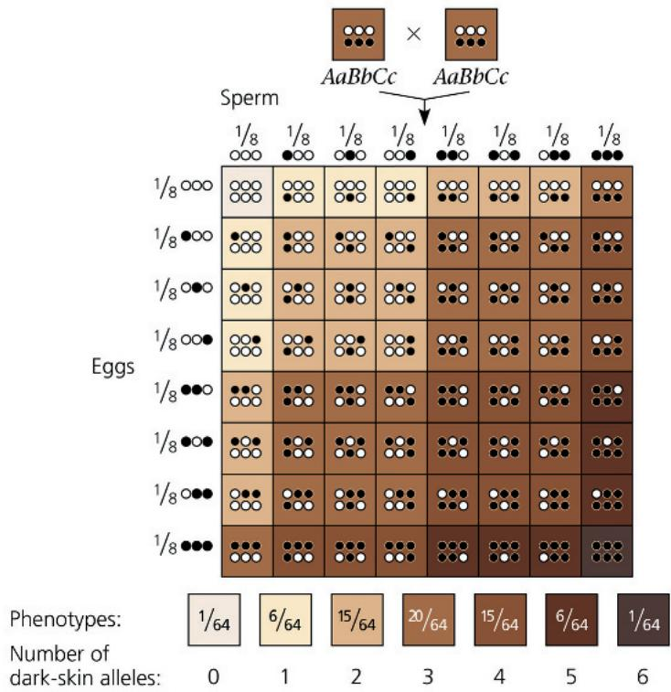

# Scientific Skills Exercise Making a Histogram and Analyzing a Distribution Pattern

INTERPRET THE DATA

What Is the Distribution of Phenotypes Among Offspring of Two Parents Who Are Both Heterozygous for Three Additive Genes? Human skin color is a polygenic trait that is determined by the additive effects of many different genes. In this exercise, you will work with a simplified model of skin color genetics where only three genes are assumed to affect the darkness of skin color and where each gene has two alleles—dark or light (see Figure 14.13). In this model, each dark allele contributes equally to the darkness of skin color, and each pair of alleles segregates independently of any other pair. Using a type of graph called a histogram, you will determine the distribution of phenotypes of offspring with different numbers of dark-skin alleles. (For additional information about graphs, see the Scientific Skills Review in Appendix D.)

How This Model Is Analyzed To predict the phenotypes of the offspring of parents heterozygous for the three genes in our simplified model, we can use the Punnett square in Figure 14.13. The heterozygous individuals (AaBbCc) represented by the two rectangles at the top of that figure each carry three dark-skin alleles (black circles, which represent A, B, or C) and three light-skin alleles (white circles, which represent a, b, or c). The Punnett square shows all the possible genetic combinations in gametes and in offspring of a large number of hypothetical matings between these heterozygotes.

Predictions from the Punnett Square If we assume that each square in the Punnett square represents one offspring of the heterozygous AaBbCc parents, then the squares below show the possible skin color phenotypes and their predicted frequencies. Below the squares is the number of dark-skin alleles for each phenotype.

Phenotypes:

Number of dark-skin alleles:

0 1 2 3 4 5 6

## Nature and Nurture: The Environmental Impact on Phenotype

1. A histogram is a bar graph that shows the distribution of numeric data (here, the number of dark-skin alleles). To make a histogram of the allele distribution, put skin color (as the number of dark-skin

Another departure from simple Mendelian genetics arises when the phenotype for a character depends on environment as well as genotype. A single tree, locked into its inherited genotype, has leaves that vary in size, shape, and greenness, depending on their exposure to wind and sun. For humans, nutrition influences height, exercise alters build, sun-tanning darkens the skin, and experience improves performance on intelligence tests. Even identical twins, who are genetic equals, accumulate phenotypic differences as a result of their unique experiences.

Whether human characters are more influenced by genes or the environment—in everyday terms, nature versus nurture—is a debate that we will not attempt to settle here. We can say, however, that a genotype generally is not associated with a rigidly defined phenotype, but rather with a range of phenotypic possibilities due to environmental influences (Figure 14.14). For

Further Reading R. A. Sturm, A golden age of human pigmentation genetics, Trends in Genetics 22:464–468 (2006).

alleles) along the x-axis and predicted number of offspring (out of 64) with each phenotype on the y-axis. There are no gaps in these allele data, so draw the bars next to each other with no space in between.

Instructors: A version of this Scientific Skills Exercise can be assigned in Mastering Biology.

2. You can see that the skin-color phenotypes are not distributed uniformly. (a) Which phenotype has the highest frequency? Draw a vertical dashed line through that bar. (b) Distributions of values like this one tend to show one of several common patterns. Sketch a rough curve that approximates the values and look at its shape. Is it symmetrically distributed around a central peak value (a “normal distribution,” sometimes called a bell curve); is it skewed to one end of the x-axis or the other (a “skewed distribution”); or does it show two apparent groups of frequencies (a “bimodal distribution”)? Explain the reason for the curve’s shape. (It will help to read the text description that supports Figure 14.13.)

## Figure 14.14 The effect of environment on phenotype.

The outcome of a genotype lies within a phenotypic range that depends on the environment in which the genotype is expressed. For example, the acidity and free aluminum content of the soil affect the color of hydrangea flowers, which range from pink (basic soil) to blue-violet (acidic soil). Free aluminum is necessary for bluer colors.

  
(a) Hydrangeas grown in basic soil

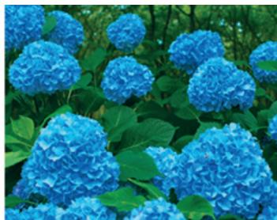  
(b) Hydrangeas of the same genetic variety grown in acidic soil with free aluminum

some characters, such as the ABO blood group system, the phenotypic range is extremely narrow; that is, a given genotype mandates a very specific phenotype. Other characters, such as a person's blood count of red and white cells, vary quite a bit, depending on such factors as the altitude, the customary level of physical activity, and the presence of infectious agents. Biologists use the term phenotypic plasticity to describe the ability of an individual genotype to produce different phenotypes under different environmental conditions.

Generally, the phenotypic range is broadest for polygenic characters. Environment contributes to the quantitative nature of these characters, as we have seen in the continuous variation of skin color. Geneticists refer to such characters as multifactorial, meaning that many factors, both genetic and environmental, collectively influence phenotype.

## A Mendelian View of Heredity and Variation

We have now broadened our view of Mendelian inheritance by exploring degrees of dominance as well as multiple alleles, pleiotropy, epistasis, polygenic inheritance, and the phenotypic impact of the environment. How can we integrate these refinements into a comprehensive theory of Mendelian genetics? The key is to make the transition from the reductionist emphasis on single genes and phenotypic characters to the emergent properties of the organism as a whole, one of the themes of this book.

The term phenotype can refer not only to specific characters, such as flower color and blood group, but also to an organism in its entirety—all aspects of its physical appearance, internal anatomy, physiology, and behavior. Similarly, the term genotype can refer to an organism’s entire genetic makeup, not just its alleles for a single genetic locus. In most cases, a gene’s impact on phenotype is affected by other genes and by the environment. In this integrated view of heredity and variation, an organism’s phenotype reflects its overall genotype and unique environmental history.

Considering all that can occur in the pathway from genotype to phenotype, it is indeed impressive that Mendel could uncover the fundamental principles governing the transmission of individual genes from parents to offspring. Mendel's laws of segregation and of independent assortment explain heritable variations in terms of alternative forms of genes (hereditary "particles," now known as the alleles of genes) that are passed along, generation after generation, according to simple rules of probability. This theory of inheritance is equally valid for peas, flies, fishes, birds, and human beings—indeed, for any organism with a sexual life cycle. Furthermore, by extending the principles of segregation and independent assortment to help explain such hereditary patterns as epistasis and quantitative characters, we begin to see how broadly Mendelian genetics applies. From Mendel's abbey garden came a theory of inheritance that anchors modern genetics. In the last section of this chapter, we will apply Mendelian genetics to human inheritance, with emphasis on the transmission of hereditary diseases.

## Concept Check 14.3

1. Incomplete dominance and epistasis are both terms that define genetic relationships. What is the most basic distinction between these terms?

2. If a male with type AB blood and a female with type O blood reproduce, what blood types would you expect in their children? What fraction would you expect of each type?

3. WHAT IF? A rooster with gray feathers and a hen of the same phenotype produce 15 gray, 6 black, and 8 white chicks. What is the simplest explanation for the inheritance of these colors in chickens? What phenotypes would you expect in the offspring of a cross between a gray rooster and a black hen?

For suggested answers, see Appendix A.

## Concept 14.4: Many human traits follow Mendelian patterns of inheritance

The study of human genetics is fueled by our desire to understand our own inheritance and to develop treatments for genetically based diseases. While peas are convenient subjects for genetic research, humans are not. The human generation span is long (about 20 years), human parents produce many fewer offspring than peas, and breeding experiments would be unethical!

## Pedigree Analysis

In place of breeding experiments, geneticists analyze the results of human matings that have already occurred. They collect information about a family's history for a particular trait and assemble this information into a family tree describing the trait across the generations—a family pedigree.

Figure 14.15a shows a three-generation pedigree that traces the occurrence of a pointed contour of the hairline on the forehead. We simplify the genetics of this trait, called a widow's peak, by assuming it is due to a dominant allele, W. (In reality, other genes are probably also involved.) In our model, because the widow's peak allele is dominant, all individuals who lack a widow's peak must be homozygous recessive (ww). The two grandparents with widow's peaks must have the Ww genotype since some of their offspring are homozygous recessive. The offspring in the second generation who do have widow's peaks must also be heterozygous because they are the products of $Ww \times ww$ matings. The third generation in this pedigree consists of two sisters. The one who has a widow's peak could be either homozygous (WW) or heterozygous (Ww), given what we know about the genotypes of her parents (both Ww).

Figure 14.15b is a pedigree of the same family, but this time we focus on a recessive trait, the inability of individuals to taste a chemical called PTC (phenylthiocarbamide). Compounds similar to PTC are found in broccoli, brussels sprouts, and related vegetables and account for the bitter taste some people report when eating these foods. We'll use $t$ for the recessive allele and $T$ for the dominant allele, which

Widow's peak

Cannot taste PTC

## Figure 14.15 Pedigree analysis.

Each pedigree traces a trait through three generations of the same family; the two traits have different inheritance patterns. For the sake of understanding genetic principles, each trait is shown as being determined by two alleles of a single gene—a simplification, since other genes likely also affect these two characters.

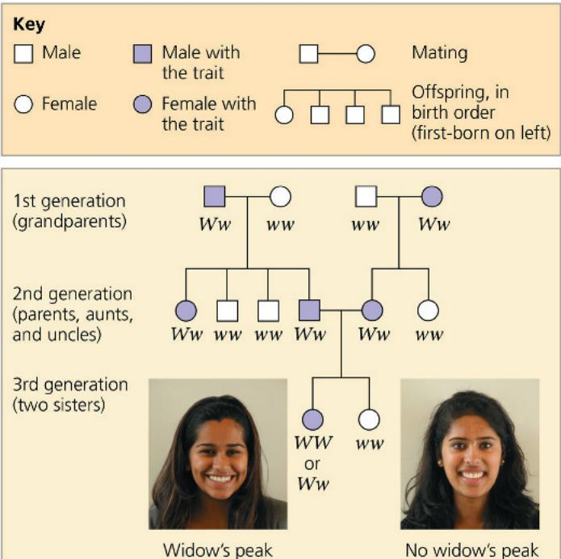  
No widow's peak  
(a) Is a widow's peak a dominant or recessive trait? Tips for pedigree analysis: Notice in the third generation that the second-born daughter lacks a widow's peak, although both of her parents had the trait. Such a pattern indicates that the trait is due to a dominant allele. If it were due to a recessive allele, and both parents had the recessive phenotype (straight hairline), all of their offspring would also have the recessive phenotype.

  
Can taste PTC

## (b) Is the inability to taste a chemical called PTC a dominant or recessive trait?

Tips for pedigree analysis: Notice that the first-born daughter in the third generation has the trait (is unable to taste PTC), although both parents lack that trait (they can taste PTC). Such a pattern is explained if the non-taster phenotype is due to a recessive allele. If it were due to a dominant allele, then at least one parent would also have had the trait.

results in the ability to taste PTC. As you work your way through the pedigree, notice once again that you can apply what you have learned about Mendelian inheritance to understand the genotypes shown for the family members.

An important application of a pedigree is to help us calculate the probability that a future child will have a particular genotype and phenotype. Suppose that the couple represented in the second generation of Figure 14.15 decides to have one more child. What is the probability that the child will have a widow's peak? This is equivalent to a Mendelian $F_{1}$ monohybrid cross ( $Ww \times Ww$ ), and therefore the probability that a child will inherit a dominant allele and have a widow's peak is $\frac{3}{4}$ ( $\frac{1}{4} WW + \frac{1}{2} Ww$ ). What is the probability that the child will be unable to taste PTC? We can also treat this as a monohybrid cross ( $Tt \times Tt$ ), but this time we want to know the chance that the offspring will be homozygous recessive (tt). That probability is $\frac{1}{4}$ . Finally, what is the chance that the child will have a widow's peak and be unable to taste PTC? Assuming that the genes for these two characters are on different chromosomes, the two pairs of alleles will assort independently in this dihybrid cross ( $WwTt \times WwTt$ ). Therefore, we can use the multiplication rule:

$^{3}/_{4}$ (chance of widow's peak)

$\times \frac{1}{4}$ (chance of inability to taste PTC)

$=\frac{3}{16}$ (chance of widow's peak and inability to taste PTC).

Pedigrees are a more serious matter when the alleles in question cause disabling or deadly diseases instead of innocuous human variations such as hairline or inability to taste a harmless chemical. However, for disorders inherited as simple Mendelian traits, the same techniques of pedigree analysis apply.

## Recessively Inherited Disorders

Thousands of genetic disorders are known to be inherited as simple recessive traits. These disorders range in severity from relatively mild, such as albinism (lack of pigmentation, which results in susceptibility to skin cancers and vision problems), to life-threatening, such as cystic fibrosis.

## The Behavior of Recessive Alleles

How can we account for the behavior of alleles that cause recessively inherited disorders? Recall that genes code for proteins of specific function. An allele that causes a genetic disorder (let's call it allele $a$ ) codes for either a malfunctioning protein or no protein at all. In the case of disorders classified as recessive, heterozygotes $(Aa)$ typically have the normal phenotype because one copy of the normal allele $(A)$ produces a sufficient amount of the specific protein. Thus, a recessively inherited disorder shows up only in the homozygous individuals $(aa)$ who inherit a recessive allele from each parent. Although phenotypically normal with regard to the disorder, heterozygotes may transmit the recessive allele to their offspring and thus are called carriers. Figure 14.16 illustrates these ideas using albinism as an example.

Most people who have recessive disorders are born to parents who are carriers of the disorder but have a normal phenotype, as is the case shown in the Punnett square in Figure 14.16. A mating between two carriers corresponds to a Mendelian $F_{1}$ monohybrid

Figure 14.16 Albinism: a recessive trait.

One of the two siblings shown does not have albinism; the other does. Most recessive homozygotes are born to parents who are carriers of the disorder but themselves have a normal phenotype, the case shown in the Punnett square.

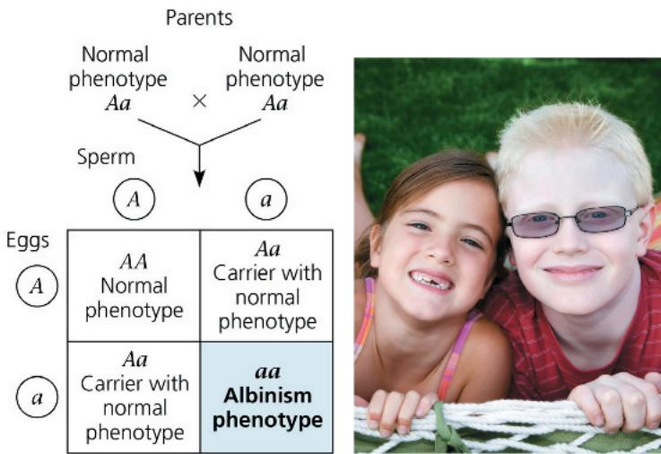  
What is the probability that the sibling on the left in the photograph is a carrier of the albinism allele?

For suggested answer, see Appendix A.

cross, so the predicted genotypic ratio for the offspring is 1 AA:2 Aa:1 aa. Thus, each child has a $\frac{1}{4}$ chance of inheriting a double dose of the recessive allele; in the case of albinism, such a child will have albinism. From the genotypic ratio, we also can see that out of three offspring with the normal phenotype (one AA plus two Aa), two are predicted to be heterozygous carriers, a $\frac{2}{3}$ chance. Recessive homozygotes could also result from $Aa \times aa$ and $aa \times aa$ matings, but if the disorder is lethal before reproductive age or results in sterility (neither of which is true for albinism), no aa individuals will reproduce. Even if recessive homozygotes are able to reproduce, this will occur relatively rarely because such individuals are much less common in the population than heterozygous carriers (for reasons we'll examine in Concept 23.2).

In general, genetic disorders are not evenly distributed among all groups of people. For example, the incidence of Tay-Sachs disease, which we described earlier in this chapter, is disproportionately high among Ashkenazic Jews, Jewish people whose ancestors lived in central Europe. In that population, Tay-Sachs disease occurs in one out of 3,600 births, an incidence about 100 times greater than that among non-Jews or Mediterranean (Sephardic) Jews. This uneven distribution results from the different genetic histories of the world's peoples during less technological times, when populations were more geographically (and hence genetically) isolated.

When a disease-causing recessive allele is rare, it is relatively unlikely that two carriers of the same harmful allele will meet and mate. The probability of passing on recessive traits increases greatly, however, if the male and female are close relatives (for example, siblings or first cousins). This is because people with recent common ancestors are more likely to carry the same recessive alleles than are unrelated people. Thus, these consanguineous (“same blood”) matings, indicated in pedigrees by double lines, are more likely to produce offspring homozygous for recessive traits—including harmful ones. Such effects can be observed in many types of domesticated and zoo animals that have become inbred.

Although geneticists generally agree that inbreeding causes an increase in autosomal recessive conditions compared to those resulting from matings between unrelated parents, they debate exactly how much human consanguinity increases the risk of inherited diseases. For one thing, many harmful alleles have such severe effects that a homozygous embryo is usually lost to miscarriage long before birth. Most societies and cultures have laws or taboos forbidding marriages between close relatives, some for social or economic reasons. These rules may have also resulted from the empirical observation that in most populations, stillbirths and physical or biochemical abnormalities at birth are more common when parents are closely related.

## Cystic Fibrosis

The most common lethal genetic disease in the United States is cystic fibrosis, which strikes one out of every 2,500 people of European descent but is much rarer in other groups. Among people of European descent, one out of 25 (4%) are carriers of the cystic fibrosis allele. The normal allele for this gene codes for a membrane protein that functions in the transport of chloride ions between certain cells and the extracellular fluid. These chloride transport channels are defective or absent in the plasma membranes of children who inherit two recessive alleles for cystic fibrosis. The result is an abnormally high concentration of intracellular chloride, which causes an uptake of water due to osmosis. This in turn causes the mucus that coats certain cells to become thicker and stickier than normal and to build up in the pancreas, lungs, digestive tract, and other organs. Multiple (pleiotropic) effects result, including poor absorption of nutrients from the intestines, chronic bronchitis, and recurrent bacterial infections.

Untreated, cystic fibrosis can cause death by the age of 5. Daily doses of antibiotics to stop infection, gentle pounding on the chest to clear mucus from clogged airways, and other therapies can prolong life. In the United States, more than half of those with cystic fibrosis now survive into their 40s.

## Sickle-Cell Disease: A Genetic Disorder with Evolutionary Implications

EVOLUTION In the United States, a genetic disease that is prevalent among African-Americans, occurring in one out of 365 births, is sickle-cell disease. Globally, the disease affects millions of individuals in regions of Africa, India, Turkey, South and Central America, the Caribbean, and Southeast Asia. Sickle-cell disease is caused by the substitution of a single amino acid in the hemoglobin protein of red blood cells; in homozygous individuals, all hemoglobin is of the sickle-cell (abnormal) variety. When the oxygen content of an affected individual's blood is low (at high altitudes or under physical stress, for instance), the sickle-cell hemoglobin proteins aggregate into long fibers that deform the red cells into a sickle shape (see Figure 5.19). Sickled cells may clump and clog small blood vessels, often leading to other symptoms throughout the body, including physical weakness, pain, organ damage, and even stroke and paralysis. Regular blood transfusions can ward off brain damage in children with sickle-cell disease, and new drugs can help prevent or treat other problems. There is currently no widely available cure, but gene therapy treatments called Casgevy and Lyfgenia that aim to cure the disease were approved in the United States and the United Kingdom in

late 2023. Safety studies are ongoing, although the current price of either treatment is prohibitive, at \$2–3 million.

Although two sickle-cell alleles are necessary for an individual to have sickle-cell disease and thus the condition is considered recessive, the presence of one sickle-cell allele can affect the phenotype. Thus, at the organismal level, the normal allele is incompletely dominant to the sickle-cell allele (Figure 14.17). At the molecular level, the two alleles are codominant; both normal and abnormal (sickle-cell) hemoglobins are made in heterozygotes (carriers), who are said to have sickle-cell trait. (Here the word “trait” is used to distinguish this condition from sickle-cell disease, not as it was defined earlier—as any variant of a character.) Heterozygotes are usually healthy but may suffer some symptoms during long periods of reduced blood oxygen.

Considering the severe detrimental effects of this allele in homozygotes, there is an unusually high percentage of heterozygotes. For example, about one out of ten African-Americans have sickle-cell trait. Why haven't evolutionary processes resulted in the disappearance of the allele among this population? One explanation is that having a single copy of the sickle-cell allele reduces the frequency and severity of malaria attacks, especially among young children. The malaria parasite spends part of its life cycle in red blood cells (see Figure 28.18), and the presence of even heterozygous amounts of sickle-cell hemoglobin results in lower parasite densities and hence reduced malaria symptoms. Thus, in tropical Africa, where infection with the malaria parasite is common, the sickle-cell allele confers an advantage to heterozygotes even though it is harmful in the homozygous state. (The balance between these two effects will be discussed in Concept 23.4; see Make Connections Figure 23.18.) The relatively high frequency of African-Americans with sickle-cell trait is a vestige of their tropical African ancestry.

Figure 14.17 Sickle-cell disease and sickle-cell trait.  
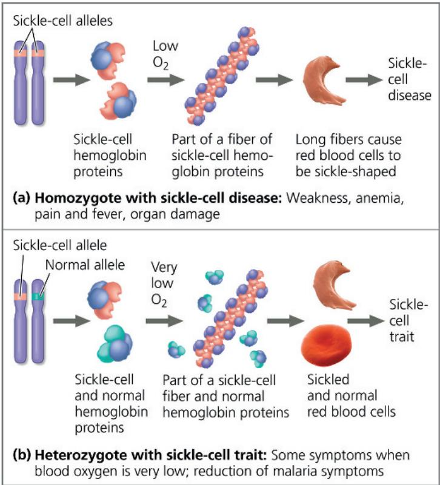

Figure 14.18 Achondroplasia: a dominant trait.

Dr. Michael C. Ain has achondroplasia, a form of dwarfism caused by a dominant allele. This has inspired his work: He is a specialist in the repair of bone defects caused by achondroplasia and other disorders. The dominant allele (D) might have arisen as a mutation in the egg or sperm of a parent or could have been inherited from an affected parent, as shown for an affected father in the Punnett square.

## Dominantly Inherited Disorders

Although many harmful alleles are recessive, some disorders are due to dominant alleles. One example is achondroplasia, a form of dwarfism that occurs in one of every 25,000 people. Heterozygous individuals have the dwarf phenotype (Figure 14.18). Therefore, all people who do not have achondroplasia—99.99% of the population—are homozygous recessive. Like the presence of extra fingers or toes mentioned earlier, achondroplasia is a trait for which the recessive allele is much more prevalent than the corresponding dominant allele.

Unlike the allele that causes achondroplasia, some dominant alleles cause lethal diseases. Those that do are much less common than recessive alleles that have lethal effects. A lethal recessive allele is only lethal when homozygous; it can be passed from one generation to the next by heterozygous carriers because the carriers themselves have normal phenotypes. A lethal dominant allele, however, often causes the death of afflicted individuals before they can mature and reproduce, and in this case the allele is not passed on to future generations.

A lethal dominant allele may be passed on, though, if the lethal disease symptoms first appear after reproductive age. In these cases, the individual may already have transmitted the allele to his or her children. For example, a degenerative disease of the nervous system, called Huntington's disease, is caused by a lethal dominant allele that has no obvious phenotypic effect until the individual is about 35 to 45 years old. Once the deterioration of the nervous system begins, it is irreversible and inevitably fatal. As with other dominant traits, a child born to a parent with the Huntington's disease allele has a $50\%$ chance of inheriting the allele and the disorder (see the Punnett square in Figure 14.18). In the United States, this disease affects about one in 10,000 people.

At one time, the onset of symptoms was the only way to know if a person had inherited the Huntington's allele, but this is no longer the case. By analyzing DNA samples from a large family with a high incidence of the disorder, geneticists tracked the Huntington's allele to a locus near the tip of chromosome 4, and the gene was sequenced in 1993. This information led to the development of a test that could detect the presence of the Huntington's allele in an individual's genome. (The methods that make such tests possible are discussed in Concepts 20.1 and 20.4.) The availability of this test poses an agonizing dilemma for those with a family history of Huntington's disease. Some individuals may want to be tested for this disease, whereas others may decide it would be too stressful to find out.

## Interview

Interview with Nancy Wexler: Mapping the gene that causes Huntington's disease (eTextbook only)

## Multifactorial Disorders

The hereditary diseases we have discussed so far are sometimes described as simple Mendelian disorders because they result from abnormality of one or both alleles at a single genetic locus. Many more people are susceptible to diseases that have a multifactorial basis—a genetic component plus a significant environmental influence. Heart disease, diabetes, cancer, alcoholism, certain mental illnesses such as schizophrenia and bipolar disorder, and many other diseases are multifactorial. In these cases, the hereditary component is polygenic. For example, many genes affect cardiovascular health, making some of us more prone than others to heart attacks and strokes. No matter what our genotype, however, our lifestyle has a tremendous effect on phenotype for cardiovascular health and other multifactorial characters. Exercise, a healthful diet, abstinence from smoking, and an ability to handle stressful situations all reduce our risk of heart disease and some types of cancer.

## Genetic Testing and Counseling

Avoiding simple Mendelian disorders is possible when the risk of a particular genetic disorder can be assessed before a child is conceived or during the early stages of the pregnancy. Many hospitals have genetic counselors who can provide information to prospective parents concerned about a family history for a specific disease. Fetal and newborn testing can also reveal genetic disorders.

## Counseling Based on Mendelian Genetics and Probability Rules

Consider the case of a hypothetical couple, Tyler and Amara. Each had a brother who died from the same recessively inherited lethal disease. Before conceiving their first child, Tyler and Amara seek genetic counseling to determine the risk of having a child with the disease. From the information about their brothers, we know that both parents of Tyler and both parents of Amara must have been carriers of the recessive allele. Thus, Tyler and Amara are both products of $Aa \times Aa$ crosses, where a symbolizes the allele that causes this particular disease. We also know that Tyler and Amara are not homozygous recessive (aa) because they do not have the disease. Therefore, their genotypes are either AA or Aa.

Given a genotypic ratio of 1 AA:2 Aa:1 aa for offspring of an $Aa \times Aa$ cross, Tyler and Amara each have a $\frac{2}{3}$ chance of being carriers (Aa). According to the rule of multiplication, the overall probability of their firstborn having the disorder is $\frac{2}{3}$ (the chance that Tyler is a carrier) times $\frac{2}{3}$ (the chance that Amara is a carrier) times $\frac{1}{4}$ (the chance of two carriers having a child with the disease), which equals $\frac{1}{9}$ . Suppose that Amara and Tyler decide to have a child—after all, there is an $\frac{8}{9}$ chance that their baby will not have the disorder. If, despite these odds, their child is born with the disease, then we would know that both Tyler and Amara are, in fact, carriers (Aa genotype). If both Tyler and Amara are carriers, there is a $\frac{1}{4}$ chance that any subsequent child this couple has will have the disease. The probability is higher for subsequent children because the diagnosis of the disease in the first child established that both parents are carriers, not because the genotype of the first child affects in any way that of future children.

When we use Mendel's laws to predict possible outcomes of matings, it is important to remember that each child represents an independent event in the sense that its genotype is unaffected by the genotypes of older siblings. Suppose that Tyler and Amara have three more children, and all three have the hypothetical hereditary disease. There is only one chance in $64(\frac{1}{4} \times \frac{1}{4} \times \frac{1}{4})$ that such an outcome will occur. Despite these circumstances, the chance that a fourth child of this couple will have the disease remains $\frac{1}{4}$ .

## Tests for Identifying Carriers

Most children with recessive disorders are born to parents with normal phenotypes. The key to accurately assessing the genetic risk for a particular disease is therefore to find out whether the prospective parents are heterozygous carriers of the recessive allele. Tests are available that can distinguish individuals of normal phenotype who are dominant homozygotes from those who are heterozygous carriers, using blood or cells from the inside of the cheek. Hundreds of different recessive alleles can be detected, including those for Tay-Sachs disease, sickle-cell disease, and cystic fibrosis.

These tests for identifying carriers enable people with family histories of genetic disorders to make informed decisions about having children, including whether to do genetic testing of the fetus, should they decide to become pregnant. The results can also lead carriers to alert family members that they may also be carriers and might choose to be tested. The tests raise other issues as well: Could carriers be denied health or life insurance or lose the jobs providing those benefits, even though they themselves are healthy? The Genetic Information Nondiscrimination Act, in place since 2008, allays these concerns by prohibiting discrimination in employment or health insurance coverage based on genetic test results. This is an important act that protects patients' rights but is unknown to many, including physicians. Genetic counselors, trained in a growing number of professional programs, can help individuals understand their genetic test results. Once test results are clearly understood, those with certain results may face difficult decisions. Advances in biotechnology offer the potential to reduce human suffering, but along with them come ethical issues that require conscientious deliberation.

## Fetal Testing

Two types of testing can be done to look for genetic disorders in the fetus: screening tests and diagnostic tests. Screening tests are generally noninvasive and can be followed by diagnostic tests if screening results suggest that a genetic disorder might be present or if there are other risks, as when both parents are carriers.

Screening tests include imaging and blood tests. Imaging techniques allow a physician to examine a fetus directly for major anatomical abnormalities that might not show up in genetic tests.

In the ultrasound technique, for example, reflected sound waves are used to produce an image of the fetus by a simple noninvasive procedure. An ultrasound is often accompanied by a blood test that looks for fetal proteins that might signal a genetic disorder.

Medical scientists have also developed methods for isolating and analyzing fetal DNA that has escaped into the maternal blood (cell-free fetal DNA), using various techniques. Cell-free fetal DNA tests and other blood tests are increasingly being used as noninvasive prenatal screening tests for certain chromosomal defects and disorders; a positive result indicates to the parents that further diagnostic testing should be considered.

One diagnostic test that can determine whether the developing fetus has a serious recessive disease is amniocentesis, which can be performed starting at the 15th or 16th week of pregnancy (Figure 14.19a). In this procedure, a physician inserts a needle into the uterus and extracts about 10 mL of amniotic fluid, the liquid that bathes the fetus. Some genetic disorders can be detected from the presence of certain proteins or hormones in the amniotic fluid itself. Tests for thousands of other disorders (such as cystic fibrosis) are performed on DNA from fetal cells sloughed off into the amniotic fluid using targeted DNA sequencing or a technique called a DNA microarray (see Figure 20.13) that tests for many alleles at the same time. A karyotype of these cultured cells can also confirm certain chromosomal defects that may not have been suggested by cell-free fetal DNA tests.

In an alternative diagnostic technique that is called chorionic villus sampling (CVS), a physician inserts a narrow tube through the cervix into the uterus and suctions out a tiny sample of tissue from the placenta, the organ that transmits nutrients

and fetal wastes between the fetus and the female parent (Figure 14.19b). The cells of the chorionic villi of the placenta—the portion sampled—are derived from the fetus and have the same genotype and DNA sequence as the new individual. DNA from these cells can be analyzed for the presence of many genetic disorders. The main advantage of CVS is that it can be performed as early as the 10th or 11th week of pregnancy.

Ultrasound and isolation of fetal cells or DNA from maternal blood pose no known risk to either the female parent or the fetus, while amniocentesis and CVS can cause complications in a small percentage of cases (for both, between 1 in 1,000 and 1 in 500 cases). Amniocentesis or CVS for diagnostic testing is generally offered to females over age 35, due to their increased risk of bearing a child with Down syndrome or other chromosomal disorders, and may also be offered to younger females if there are risk factors or conditions suggested by family history. If the fetal tests reveal a serious disorder, the parents may face the difficult choice of either terminating the pregnancy or preparing to care for a child with a genetic disorder, one that might even be fatal. Parental and fetal screening for Tay-Sachs alleles done since 1980 has reduced the number of children born with this incurable disease by 90%.

## Newborn Screening

Some genetic diseases and disorders can be detected at birth by simple biochemical tests that are routinely performed on blood from the baby's heel in most hospitals in the United States. One common screening program is for phenylketonuria (PKU), a recessively inherited disorder that occurs in about one out of every

Figure 14.19 Diagnostic fetal testing for genetic disorders.

Most testing for genetic abnormalities is now DNA-based. In some cases biochemical tests are used to detect particular disorders, and karyotyping may be done to see whether the chromosomes of the fetus are normal in number and appearance.

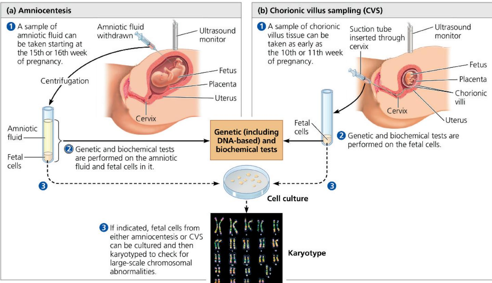

10,000–15,000 births in the United States. Children with this disease cannot properly metabolize the amino acid phenylalanine. This compound and its by-product, phenylpyruvate, can accumulate to toxic levels in the blood, causing severe intellectual disability. However, if PKU is detected in the newborn, a specialized diet low in phenylalanine will usually allow for typical development. (Among many other substances, this diet excludes the artificial sweetener aspartame, which contains phenylalanine.)

The number of newborn genetic tests, many for metabolic disorders or enzyme deficiencies, is over 100 and ever-increasing; each state regulates which tests are used. If screening identifies a baby with a disease or disorder for which treatment can be started early on, that individual has improved chances for better life quality. Some diseases, like PKU, are treated by dietary changes and others by replacement of missing enzymes. Unfortunately, there are quite a few diseases for which no treatment is yet known.

Fetal and newborn screening for serious inherited diseases, tests for identifying carriers, and genetic counseling all rely on the Mendelian model of inheritance. We owe the “gene idea”—the concept of heritable factors transmitted according to simple rules of chance—to the elegant quantitative experiments of Gregor Mendel. The importance of his discoveries was overlooked by most biologists until the early 1900s, decades after he reported his findings. In the next chapter, you will learn how Mendel’s laws have their physical basis in the behavior of chromosomes during

sexual life cycles and how the synthesis of Mendelian genetics and a chromosome theory of inheritance catalyzed progress in genetics.

## Concept Check 14.4

1. Lucia and Jared each have a sibling with cystic fibrosis, but neither Lucia nor Jared nor any of their parents have the disease. Calculate the probability that if this couple has a child, the child will have cystic fibrosis. What would be the probability if a test revealed that Jared is a carrier but Lucia is not? Explain your answers.

2. MAKE CONNECTIONS Explain how the change of a single amino acid in hemoglobin leads to the aggregation of hemoglobin into long fibers. (Review Figures 5.14, 5.18, and 5.19.)

3. Juanita was born with six toes on each foot, a dominant trait called polydactyly. Two of her five siblings and her mother, but not her father, also have extra digits. What is Juanita's genotype for the number-of-digits character? Explain your answer. Use $D$ and $d$ to symbolize the alleles for this character.

4. MAKE CONNECTIONS In Table 14.1, note the phenotypic ratio of the dominant to recessive trait in the $F_{2}$ generation for the monohybrid cross involving flower color. Then determine the phenotypic ratio for the offspring of the second-generation couple in Figure 14.15b. What accounts for the difference in the two ratios? For suggested answers, see Appendix A.

## Chapter 14 Review

## Summary of Key Concepts

To review key terms, go to the Vocabulary Self-Quiz (eTextbook only).

## Concept 14.1: Mendel used the scientific approach to identify two laws of inheritance

\- Gregor Mendel formulated a theory of inheritance based on experiments with garden peas, proposing that parents pass on to their offspring discrete genes that retain their identity through generations. This theory includes two “laws.”

\- The law of segregation states that genes have alternative forms, or alleles. In a diploid organism, the two alleles of a gene segregate (separate) during meiosis and gamete formation; each sperm or egg carries only one allele of each pair. This law explains the 3:1 ratio of $F_{2}$ phenotypes observed when monohybrids cross-or self-pollinate. Each organism inherits one allele for each gene from each parent. In heterozygotes, the two alleles are different: Expression of the dominant allele masks the phenotypic effect of the recessive allele. Homozygotes have identical alleles of a given gene and are therefore true-breeding.

\- The law of independent assortment states that the pair of alleles for a given gene segregates into gametes independently of the pair of alleles for any other gene. In a cross between dihybrids (individuals heterozygous for two genes), the offspring have four phenotypes in a 9:3:3:1 ratio.

When Mendel did crosses of true-breeding purple- and white-flowered pea plants, the white-flowered trait disappeared from the $F_{1}$ generation but reappeared in the $F_{2}$ generation. Use genetic terms to explain why that happened.

## Concept 14.2: Probability laws govern Mendelian inheritance

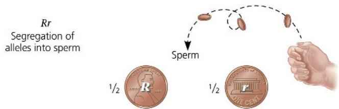

\- The multiplication rule states that the probability of two or more events occurring together (a statement using and) is equal to the product of the individual probabilities of the independent single events. The addition rule states that the probability of an event that can occur in two or more independent, mutually exclusive ways (using or) is the sum of the individual probabilities.

\- The rules of probability can be used to solve complex genetics problems. A dihybrid or other multicharacter cross is equivalent to two or more independent monohybrid crosses occurring simultaneously. In calculating the chances of the various offspring genotypes from such crosses, each character is first considered separately and then the individual probabilities are multiplied.

DRAW IT Redraw the Punnett square on the right side of Figure 14.8 as two smaller monohybrid Punnett squares, one for each gene. Below each square, list the fractions of each phenotype produced. Use the rule of multiplication to compute the overall fraction of each of the possible dihybrid phenotypes. What is the phenotypic ratio?

## Concept 14.3: Inheritance patterns are often more complex than predicted by simple Mendelian genetics

• Extensions of Mendelian genetics for a single gene:

<table><tr><td>Relationship among alleles of a single gene</td><td>Description</td><td>Example</td></tr><tr><td>Complete dominance of one allele</td><td>Heterozygous phenotype same as that of homo- zygous dominant</td><td>PP Pp</td></tr><tr><td>Incomplete dominance of either allele</td><td>Heterozygous phenotype intermediate between the two homozygous phenotypes</td><td>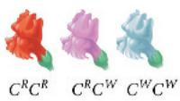</td></tr><tr><td>Codominance</td><td>Both phenotypes expressed in heterozygotes</td><td>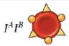</td></tr><tr><td>Multiple alleles</td><td>In the population, some genes have more than two alleles</td><td>ABO blood group alleles  ${I}^{A},{I}^{B},i$ </td></tr><tr><td>Pleiotropy</td><td>One gene affects multiple phenotypic characters</td><td>Sickle-cell disease</td></tr></table>

• Extensions of Mendelian genetics for two or more genes:

<table><tr><td>Relationship among two or more genes</td><td>Description</td><td>Example</td></tr><tr><td>Epistasis</td><td>The phenotypic expression of one gene affects the expression of another gene</td><td></td></tr><tr><td>Polygenic inheritance</td><td>A single phenotypic character is affected by two or more genes</td><td></td></tr></table>

\- The expression of a genotype can be affected by environmental influences, resulting in a range of phenotypes. Polygenic characters that are also influenced by the environment are called multifactorial characters.

\- An organism's overall phenotype reflects its overall genotype and unique environmental history. Even in more complex inheritance patterns, Mendel's fundamental laws still apply.

Which genetic relationships listed in the first column of the two tables above are demonstrated by the inheritance pattern of the ABO blood group alleles? For each genetic relationship, explain why this inheritance pattern is or is not an example.

## Concept 14.4: Many human traits follow Mendelian patterns of inheritance

\- Analysis of family pedigrees can be used to deduce the possible genotypes of individuals and make predictions about future offspring. Such predictions are statistical probabilities rather than certainties.

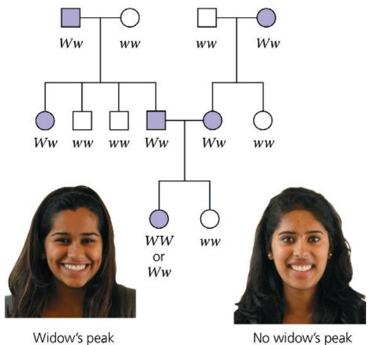  
Widow's peak  
No widow's peak

\- Many genetic disorders are inherited as simple recessive traits. Most affected (homozygous recessive) individuals are children of phenotypically normal, heterozygous carriers.

\- The sickle-cell allele has probably persisted for evolutionary reasons: Homozygotes have sickle-cell disease, but heterozygotes have an advantage because one copy of the sickle-cell allele reduces both the frequency and severity of malaria attacks.

\- Lethal dominant alleles are eliminated from the population if affected people die before reproducing. Nonlethal dominant alleles and lethal ones that strike relatively late in life can be inherited in a Mendelian way.

\- Many human diseases are multifactorial—that is, they have both genetic and environmental components and do not follow simple Mendelian inheritance patterns.

\- Using family histories, genetic counselors help couples determine the probability that their children will have genetic disorders. Genetic testing of prospective parents can reveal whether they are carriers of recessive alleles associated with specific disorders. Ultrasounds and blood tests can screen for certain disorders in a fetus. Amniocentesis and chorionic villus sampling can diagnose whether a suspected genetic disorder is present in a fetus. Other genetic tests can be performed after birth.

Both members of a couple know that they are carriers of the cystic fibrosis allele. None of their three children have cystic fibrosis, but any one of them might be a carrier. The couple would like to have a fourth child but are worried that he or she would very likely have the disease, since the first three do not. What would you tell the couple? Would it remove some uncertainty from their prediction if they could find out whether the three children are carriers?

For suggested answers, see Appendix A.

## Tips for Genetics Problems

1. Write down symbols for the alleles. (These may be given in the problem.) When represented by single letters, the dominant allele is uppercase and the recessive is lowercase.

2. Write down the possible genotypes, as determined by the phenotype.

(a) If the phenotype is that of the dominant trait (for example, purple flowers), then the genotype is either homozygous dominant or heterozygous (PP or Pp in this example).

(b) If the phenotype is that of the recessive trait, the genotype must be homozygous recessive (for example, pp).

(c) If the problem says "true-breeding," the genotype is homozygous.

3. Determine what the problem is asking for. If asked to do a cross, write it out in the form [genotype] × [genotype], using the alleles you've decided on.

4. To figure out the outcome of a cross, set up a Punnett square.

(a) Put the gametes of one parent at the top and those of the other on the left. To determine the allele(s) in each gamete for a given genotype, set up a systematic way to list all the possibilities. (Remember, each gamete has one allele of each gene.) Note that there are $2^{n}$ possible types of gametes, where $n$ is the number of gene loci that are heterozygous. For example, an individual with genotype $AaBbCc$ would produce $2^{3} = 8$ types of gametes. Write the genotypes of the gametes in circles above the columns and to the left of the rows.

(b) Fill in the Punnett square as if each possible sperm were fertilizing each possible egg, making all of the possible offspring. In a cross of $AaBbCc \times AaBbCc$ , for example, the Punnett square would have 8 columns and 8 rows, so there are 64 different offspring; you would know the genotype of each and thus the phenotype. Count genotypes and phenotypes to obtain the genotypic and phenotypic ratios. Because the Punnett square is so large, this method is not the most efficient. See tip 5.

5. You can use the rules of probability if a Punnett square would be too big. (For example, see the question at the end of the summary for Concept 14.2 and question 6 below.) You can consider each gene separately (see the section Solving Complex Genetics Problems with the Rules of Probability in Concept 14.2).

6. If the problem gives you the phenotypic ratios of offspring but not the genotypes of the parents in a given cross, the phenotypes can help you deduce the parents' unknown genotypes.

(a) For example, if $\frac{1}{2}$ of the offspring have the recessive phenotype and $\frac{1}{2}$ the dominant, you know that the cross was between a heterozygote and a homozygous recessive.

(b) If the ratio is 3:1, the cross was between two heterozygotes.

(c) If two genes are involved and you see a 9:3:3:1 ratio in the offspring, you know that each parent is heterozygous for both genes. Caution: Don't assume that the reported numbers will exactly equal the predicted ratios. For example, if there are 13 offspring with the dominant trait and 11 with the recessive, assume that the ratio is one dominant to one recessive.

7. For pedigree problems, use the tips in Figure 14.15 and below to determine what kind of trait is involved.

(a) If parents without the trait have offspring with the trait, the trait must be recessive and the parents both carriers.

(b) If the trait is seen in every generation, it is most likely dominant (see the next possibility, though).

(c) If both parents have the trait, then in order for it to be recessive, all offspring must show the trait.

(d) To determine the likely genotype of a certain individual in a pedigree, first label the genotypes of all the family members you can. Even if some of the genotypes are incomplete, label what you do know. For example, if an individual has the dominant phenotype, the genotype must be $AA$ or $Aa$ ; you can write this as $A-$ . Try different possibilities to see which fits the results. Use the rules of probability to calculate the probability of each possible genotype being the correct one.

## Test Your Understanding

For multiple-choice questions, go to the Practice Test (eTextbook only).

## Levels 1-2: Remembering/Understanding

1. DRAW IT A pea plant heterozygous for inflated pods (li) is crossed with a plant homozygous for constricted pods (ii). Draw a Punnett square for this cross to predict genotypic and phenotypic ratios. Assume that pollen comes from the ii plant.

2. A man with type A blood marries a woman with type B blood. Their child has type O blood. What are the genotypes of these three individuals? What genotypes, and in what frequencies, would you expect in future offspring from this couple?

3. A man who has six fingers on each hand and six toes on each foot and a woman who has the typical number of digits have a daughter who also has the typical number of digits. Remember that extra digits is a dominant trait. What fraction of this couple's children would be expected to have extra digits?

4. DRAW IT Two pea plants heterozygous for the characters of pod color and pod shape are crossed. (See Table 14.1.) Draw a Punnett square to determine the phenotypic ratios of the offspring.

## Levels 3-4: Applying/Analyzing

5. Hemochromatosis is an inherited disease caused by a recessive allele. If both members of a couple are carriers and they have three children, what is the probability of each of the following?

(A) All three children are of normal phenotype.

(B) One or more of the three children have the disease.

(C) All three children have the disease.

(D) At least one child is phenotypically normal.

(Note: It will help to remember that the probabilities of all possible outcomes always add up to 1.)

6. The genotype of $F_{1}$ individuals in a tetrahybrid cross is AaBbCcDd. Assuming independent assortment of these four genes, what are the probabilities that $F_{2}$ offspring will have the following genotypes?

(A) aabbccdd

(B) AaBbCcDd

(C) AABBCCDD

(D) AaBBccDd

(E) AaBBCCdd

7. What is the probability that each of the following pairs of parents will produce the indicated offspring? (Assume independent assortment of all gene pairs.)

(A) AABBCC × aabbcc → AaBbCc

(B) AABbCc × AaBbCc → AAbbCC

(C) $AaBbCc \times AaBbCc \rightarrow AaBbCc$

(D) $aaBbCC \times AABbcc \rightarrow AaBbCc$

8. Keisha and Jerome each have a sibling with sickle-cell disease. Neither Keisha nor Jerome nor any of their parents have the disease, and none of them have ever been tested to see if they carry the sickle-cell allele. Based on this incomplete information, calculate the probability that if Keisha and Jerome have a child, the child will have sickle-cell disease.

9. In 1981, a stray black cat with unusual rounded, curled-back ears was adopted by a family in California. Thousands of descendants of the cat have since been born, and cat fanciers have developed the curl cat into a show breed. Suppose you owned the first curl

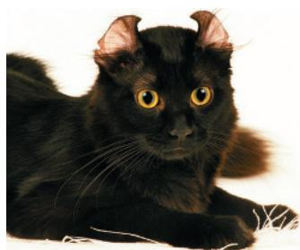

cat and wanted to develop a true-breeding variety. How would you determine whether the curl allele is dominant or recessive? How would you obtain true-breeding curl cats? How could you be sure they are true-breeding?

10. The pedigree below traces the inheritance of alkaptonuria, a biochemical disorder. Affected individuals, indicated here by the colored circles and squares, are unable to metabolize a substance called alkapton, which colors the urine and stains body tissues. Does alkaptonuria appear to be caused by a dominant allele or by a recessive allele? Fill in the genotypes of the individuals whose genotypes can be deduced. What genotypes are possible for each of the other individuals?

11. Imagine that you are a genetic counselor, and a couple planning to start a family comes to you for information. From a previous marriage, Charles has a child with cystic fibrosis. Charles is currently married to Elaine, whose brother died of cystic fibrosis. What is the probability that Charles and Elaine will have a baby with cystic fibrosis? (Neither Charles, Elaine, nor their parents have cystic fibrosis.)

## Levels 5-6: Evaluating/Creating

12. EVOLUTION CONNECTION Over the past half century, there has been a trend in the United States and other developed countries for people to have children later in life than did their parents and grandparents. What effects might this trend have on the incidence (frequency) of late-acting dominant lethal alleles in the population?

13. SCIENTIFIC INQUIRY You are handed a mystery pea plant with tall stems and axial flowers and asked to determine its genotype as quickly as possible. You know that the allele for tall stems (T) is dominant to that for dwarf stems (t) and that the allele for axial flowers (A) is dominant to that for terminal flowers (a).

(a) Identify all the possible genotypes for your mystery plant.

(b) Describe the one cross you would do in your garden to determine the exact genotype of your mystery plant.

(c) While waiting for the results of your cross, you predict the results for each possible genotype listed in part a. Explain how you do this and why this is not called “performing a cross.”

(d) Explain how the results of your cross and your predictions will help you learn the genotype of your mystery plant.

14. WRITE ABOUT A THEME: INFORMATION The continuity of life is based on heritable information in the form of DNA. In a short essay (100–150 words), explain how the passage of genes from parents to offspring, in the form of particular alleles, ensures perpetuation of parental traits in offspring and, at the same time, genetic variation among offspring. Use genetic terms in your explanation.

## 15. SYNTHESIZE YOUR KNOWLEDGE

  
Just for fun, imagine that “shirt-striping” is a phenotypic character caused by a single gene. Construct a genetic explanation for the appearance of the family in the above photograph, consistent with their “shirt phenotypes.” Include in your answer the presumed allele combinations for “shirt-striping” in each family member. Identify the inheritance pattern shown by the child.

## Practice Applying Your Learning

16. This question assesses your ability to apply your understanding of Mendelian inheritance patterns.

The zebrafish (Danio rerio) is a popular model organism. Zebrafish produce large numbers of young that reach adulthood quickly, and their transparent embryos make it easy for researchers to study their development. Typically, these fish are darkly pigmented (colored) and striped. Zebrafish that are homozygous for the gol (golden) mutation in a gene involved in skin color are lighter in color (and also smaller) than the typical darkly pigmented fish. Zebrafish that are homozygous for the leo (leopard) mutation in a gene involved in patterning have a spotted skin pattern rather than the typical striped skin pattern.

Suppose two darkly pigmented, striped fish produced offspring that are all dark and striped. These offspring are then allowed to breed, producing 1,000 fish that have a variety of striped and spotted phenotypes as well as both dark and light pigmented skin. Assume that these genes follow Mendelian inheritance patterns. Use this information and your knowledge about Mendelian genetics to evaluate each statement as more likely to be TRUE or more likely to be FALSE.

a. The generation of 1,000 fish produced in this example is called the $F_{1}$ generation.

b. Having spotted skin is likely a recessive trait. \_\_\_\_

c. Having golden skin is likely a dominant trait.

d. We would expect about 750 of the 1,000 offspring to be striped.

e. We would expect about 60 of the 1,000 offspring to be golden and spotted. \_\_\_\_

f. We would expect about 180 of the 1,000 offspring to be dark and striped. \_\_\_\_

g. We would expect about 250 of the 1,000 offspring to be dark and spotted. \_\_\_\_

For selected answers, see Appendix A.

# Explore Scientific Papers with Science in the Classroom | AAAS

What genes affect skin color? Go to "A Golden Fish

Reveals Pigmentation Loss in Europeans" at

www.scienceintheclassroom.org.

Instructors: Questions can be assigned in Mastering Biology.

Pair of homologous chromosomes (one from each parent)

# The Chromosomal Basis of Inheritance

## Key Concepts

15.1 Mendelian inheritance has its physical basis in the behavior of chromosomes

15.2 Sex-linked genes exhibit unique patterns of inheritance

15.3 Linked genes tend to be inherited together because they are located near each other on the same chromosome

15.4 Alterations of chromosome number or structure cause some genetic disorders

15.5 Some inheritance patterns are exceptions to standard Mendelian inheritance

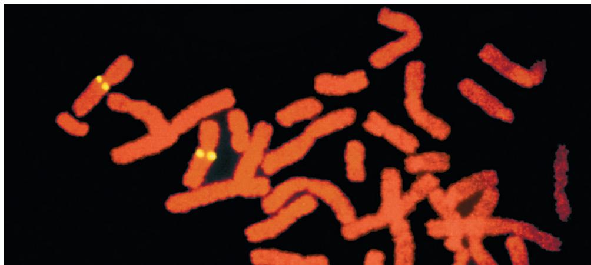  
Figure 15.1 The yellow dots mark the locations of a specific gene, tagged with a fluorescent yellow dye, on a pair of homologous chromosomes. The chromosomes have duplicated, so each chromosome has two sister chromatids, each with a copy of the gene. This provides a visual demonstration that genes—Mendel's “factors”—are segments of DNA located along chromosomes.

## Study Tip

Draw chromosomes: As you work on the figure legend questions in this chapter, draw the chromosomes for the crosses described in the questions. Shown here is a starting sketch for the What If? question that follows Figure 15.3. (Here you are including sex chromosomes to keep track of the offspring.)

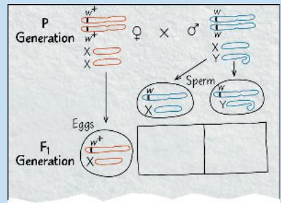  
Genes are located on chromosomes. In diploid cells, chromosomes and genes are present in pairs.  
Chromosomes duplicate before cell division. Each duplicated chromosome has two copies of each allele, one on each sister chromatid.

## What is the relationship between genes and chromosomes?

During meiosis I, homologous chromosomes separate and alleles segregate. In meiosis II, sister chromatids separate.

Genes are passed on as discrete units. Each chromosome has one version of a gene (one allele).

Offspring inherit one allele from each parent.

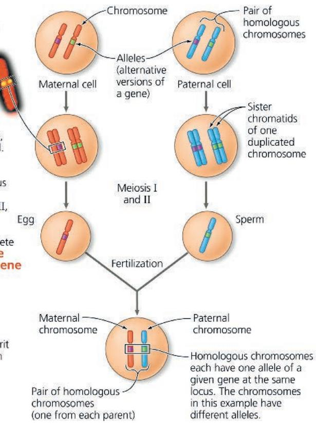  
— Homologous chromosomes each have one allele of a given gene at the same locus. The chromosomes in this example have different alleles.

## Concept 15.1: Mendelian inheritance has its physical basis in the behavior of chromosomes

When Gregor Mendel proposed the existence of “hereditary factors” in 1860, no cellular structures had been identified that could house these imaginary units, and most biologists were skeptical. When the processes of mitosis and meiosis were worked out later that century, biologists saw parallels between the behavior of Mendel’s proposed factors (genes) during sexual life cycles and the behavior of chromosomes: As shown in Figure 15.1, chromosomes and genes are both present in pairs in diploid cells, and homologous chromosomes separate and alleles segregate during the process of meiosis. After meiosis, fertilization restores the paired condition for both chromosomes and genes. Around 1902, Walter S. Sutton, Theodor Boveri, and others independently noted these parallels and began to develop the chromosome theory of inheritance. According to this theory, Mendelian genes have specific loci (sites) along chromosomes, and it is the chromosomes that undergo segregation and independent assortment.

The first solid evidence associating a specific gene with a specific chromosome came early in the 1900s from the work of Thomas Hunt Morgan, an experimental embryologist at Columbia University. Although Morgan was initially doubtful about both Mendelian genetics and the chromosome theory, his early experiments provided convincing evidence that chromosomes are indeed the location of Mendel's heritable factors.

## Morgan's Choice of Experimental Organism

Many times in the history of biology, important discoveries have come to those insightful or lucky enough to choose an experimental organism suitable for the research problem being tackled. Mendel chose the garden pea because a number of distinct varieties were available. For his work, Morgan selected a species of fruit fly, Drosophila melanogaster, a common insect that feeds on the fungi growing on fruit. Fruit flies are prolific breeders; a single mating will produce hundreds of offspring, and a new generation can be bred every two weeks. Morgan's laboratory began using this convenient organism for genetic studies in 1907 and soon became known as "the fly room."

Another advantage of the fruit fly is that it has only four pairs of chromosomes, which are easily distinguishable with a light microscope. There are three pairs of autosomes and one pair of sex chromosomes. Female fruit flies have a pair of homologous X chromosomes, and males have one X chromosome and one Y chromosome.

While Mendel could readily obtain different pea varieties from seed suppliers, Morgan was probably the first person to want different varieties of the fruit fly. He faced the tedious task of carrying out many matings and then microscopically inspecting large numbers of offspring in search of naturally occurring variant individuals. After many months of this, he complained, “Two years’ work wasted. I have been breeding those flies for all that time and I’ve got nothing out of it.” Morgan persisted, however, and was

Wild-type Drosophila flies have red eyes (left). Among his flies, Morgan discovered a mutant male with white eyes (right). This variation made it possible for Morgan to trace a gene for eye color to a specific chromosome.

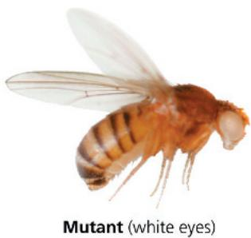  
Wild type (red eyes)  
Mutant (white eyes)

finally rewarded with the discovery of a single male fly with white eyes instead of the usual red. The phenotype for a character most commonly observed in natural populations, such as red eyes in Drosophila, is called the wild type (Figure 15.2). Traits that are alternatives to the wild type, such as white eyes in Drosophila, are called mutant phenotypes because they are due to alleles assumed to have originated as changes, or mutations, in the wild-type allele.

Morgan and his students invented a notation for symbolizing alleles in Drosophila that is still widely used for fruit flies. For a given character in flies, the gene takes its symbol from the first mutant (non-wild type) discovered. Thus, the allele for white eyes in Drosophila is symbolized by w. A superscript + identifies the allele for the wild-type trait: $w^{+}$ for the allele for red eyes, for example. Over the years, a variety of gene notation systems have been developed for different organisms. For example, human genes are usually written in all capitals, such as HTT for the gene involved in Huntington's disease. (More than one letter may be used for an allele, as in HTT.)

## Correlating Behavior of a Gene's Alleles with Behavior of a Chromosome Pair: Scientific Inquiry

Morgan mated his white-eyed male fly with a red-eyed female. All the $F_{1}$ offspring had red eyes, suggesting that the wild-type allele is dominant. When Morgan bred the $F_{1}$ flies to each other, he observed the classical 3:1 phenotypic ratio among the $F_{2}$ offspring. However, there was a surprising additional result: The white-eye trait showed up only in males. All the $F_{2}$ females had red eyes, while half the males had red eyes and half had white eyes. Therefore, Morgan concluded that somehow a fly's eye color was linked to its sex. (If the eye color gene were unrelated to sex, half of the white-eyed flies would have been female.)

Recall that a female fly has two X chromosomes (XX), while a male fly has an X and a Y (XY). The correlation between the trait of white eye color and the male sex of the affected $F_{2}$ flies suggested to Morgan that the gene involved in his white-eyed mutant was located exclusively on the X chromosome, with no corresponding allele present on the Y chromosome. His reasoning can be followed in Figure 15.3. For a male, a single copy of the mutant allele would confer white eyes; since a male has only one X chromosome, there can be no wild-type allele ( $w^{+}$ ) present to mask the recessive allele. However, a female could have white eyes only if both her X

## Figure 15.3

Inquiry: In a cross between a wild-type female fruit fly and a mutant white-eyed male, what color eyes will the $F_{1}$ and $F_{2}$ offspring have?

Experiment

Thomas Hunt Morgan wanted to analyze the behavior of two alleles of a fruit fly eye color gene. In crosses similar to those done by Mendel with pea plants, Morgan and his colleagues mated a wild-type (red-eyed) female with a mutant white-eyed male.

Morgan then bred an $F_{1}$ red-eyed female to an $F_{1}$ red-eyed male to produce the $F_{2}$ generation.

## Results

The $F_{2}$ generation showed a typical Mendelian ratio of 3 red-eyed flies: 1 white-eyed fly. However, all white-eyed flies were males; no females displayed the white-eye trait.

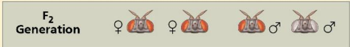

## Conclusion

All $F_{1}$ offspring had red eyes, so the mutant white-eye trait (w) must be recessive to the wild-type red-eye trait ( $w^{+}$ ). Since the

chromosomes carried the recessive mutant allele (w). This was impossible for the $F_{2}$ females in Morgan's experiment because all the $F_{1}$ males had red eyes, so each $F_{2}$ female received a $w^{+}$ allele on the X chromosome inherited from her male parent.

Morgan's finding of the correlation between a particular trait and an individual's sex provided support for the chromosome theory of inheritance: namely, that a specific gene is carried on a specific chromosome. In this case, an eye color gene is carried on the X chromosome.

Figure 15.4 illustrates the relationship between the chromosome theory of inheritance and Mendel's laws. The separation of homologs during anaphase I accounts for the segregation of the two alleles of a gene into separate gametes, and the random arrangement of chromosome pairs at metaphase I accounts for independent assortment of the alleles for two or more genes located on different homolog pairs. This figure traces the same dihybrid pea cross you learned about in Figure 14.8. By carefully studying Figure 15.4, you can see how the behavior of chromosomes during meiosis in the $\mathrm{F}_1$ generation and subsequent random fertilization give rise to the $\mathrm{F}_2$ phenotypic ratio observed by Mendel.

recessive trait—white eyes—was expressed only in males in the $F_{2}$ generation, Morgan deduced that this eye color gene is located on the X chromosome and that there is no corresponding locus on the Y chromosome.

Data from T. H. Morgan, Sex-limited inheritance in Drosophila, Science 32: 120–122 (1910).

Instructors: A related Experimental Inquiry Tutorial can be assigned in Mastering Biology.

WHAT IF? Suppose this eye color gene were located on an autosome rather than a sex chromosome. Predict the phenotypes (including sex) of the $F_{2}$ flies in this hypothetical cross. (Hint: Draw Punnett squares, including chromosomes, for the $F_{1}$ and $F_{2}$ generations; see the Study Tip at the beginning of this chapter.)

For suggested answer, see Appendix A.

In addition to showing that a specific gene is carried on a specific chromosome, Morgan's work indicated that genes located on a sex chromosome exhibit unique inheritance patterns, which we will discuss in the next section. Recognizing the importance of Morgan's early work, many bright students were attracted to his fly room.

## Concept Check 15.1

1. WHAT IF? Propose a possible reason that the first naturally occurring mutant fruit fly Morgan saw involved a gene on a sex chromosome and was found in a male.

2. Which one of Mendel's laws describes the inheritance of alleles for a single character? Which law relates to the inheritance of alleles for two characters in a dihybrid cross?

3. MAKE CONNECTIONS Review the description of meiosis (see Figure 13.8) and Mendel's laws of segregation and independent assortment (see Concept 14.1). What is the physical basis for each of Mendel's laws?

Figure 15.4 The chromosomal basis of Mendel's laws.

Here we correlate the results of one of Mendel's dihybrid crosses (see Figure 14.8) with the behavior of chromosomes during meiosis (see Figure 13.8). The arrangement of chromosomes at metaphase I of meiosis and their movement during anaphase I account for, respectively, the independent assortment and segregation of the alleles for seed color and shape. Each cell that undergoes meiosis in an $F_1$ plant produces two kinds of gametes. If we count the results for all cells, however, each $F_1$ plant produces equal numbers of all four kinds of gametes because the alternative chromosome arrangements at metaphase I are equally likely.

  
If you crossed an $F_{1}$ plant from this example with a plant that was homozygous recessive for both genes (yyrr), how would the phenotypic ratio of the offspring compare with the 9:3:3:1 ratio seen here?  
For suggested answer, see Appendix A.

# Concept 15.2: Sex-linked genes exhibit unique patterns of inheritance

Morgan's discovery of a trait (white eyes) that correlated with the sex of flies provided important support for the chromosome theory of inheritance. Because the identity of the sex chromosomes in an individual could be inferred by observing the sex of the fly, the behavior of the two members of the pair of sex chromosomes could be correlated with the behavior of the two alleles of the eye color gene. In this section, we'll take a closer look at the role of sex chromosomes in inheritance.

## The Chromosomal Basis of Sex

Although in many species sex has traditionally been described as binary—male or female—we are coming to understand that this classification may be too simplistic. Here, we use the term sex to refer to classification into a group with a shared set of anatomical and physiological traits. In this sense, sex in many species is determined largely by inheritance of sex chromosomes.

Humans and other mammals have two types of sex chromosomes, designated X and Y. The Y chromosome is much smaller than the X chromosome (Figure 15.5). A person who inherits two X chromosomes, one from each parent, usually develops anatomy we associate with the female sex, while male properties are associated with the inheritance of one X chromosome and one Y chromosome (Figure 15.6a). Short

## Figure 15.5 Human sex chromosomes (duplicated).

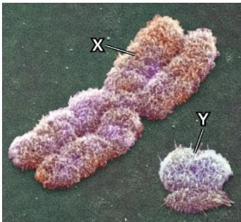

segments at either end of the Y chromosome are the only regions that are homologous with regions on the X. These homologous regions allow the X and Y chromosomes in males to pair and behave like homologs during meiosis in the testes.

In mammalian testes and ovaries, the two sex chromosomes segregate during meiosis. Each egg receives one X chromosome. In contrast, sperm fall into two categories: Half the sperm cells a male produces receive an X chromosome, and half receive a Y chromosome. We can trace the sex of each offspring to the events of conception: If a sperm cell bearing an X chromosome fertilizes an egg, the zygote is XX, a female; if a sperm cell containing a Y chromosome fertilizes an egg, the zygote is XY, a male (see Figure 15.6a). Thus, in general, sex determination is a matter of chance—a fifty-fifty chance. Note that the mammalian X-Y system isn't the only chromosomal system for determining sex, although some insects do have X-Y systems. (In fact, in 1905, Dr. Nettie Stevens of Bryn Mawr College was the first to show, using mealworms, that inheritance of the Y chromosome resulted in male offspring.) Figure 15.6b–d illustrates three other systems.

In humans, the anatomical signs of sex begin to emerge when the embryo is about 2 months old. Before then, the rudiments of the gonads are generic—they can develop into either testes or

Figure 15.6 Some chromosomal systems of sex determination. Numerals indicate the number of autosomes in the species pictured. In Drosophila, males are XY, but sex depends on the ratio of the number of X chromosomes to the number of autosome sets, not simply on the presence of a Y chromosome. In some species (not shown here), sex is determined not by chromosomes but by environmental factors such as temperature.  
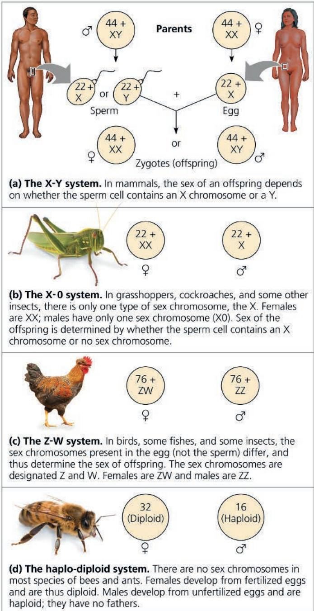

ovaries, depending on whether or not a Y chromosome is present, and depending on what genes are active. A gene on the Y chromosome—called SRY, for sex-determining region of Y—is required for the development of testes. In the absence of SRY, the gonads develop into ovaries, even in an XY embryo.

A gene located on either sex chromosome is called a sex-linked gene. The human X chromosome contains approximately 900 genes, which are called X-linked genes, while genes located on the Y chromosome are called Y-linked genes. The sequence of the human Y chromosome was finally completed in 2023; the researchers reported

Figure 15.7 The transmission of X-linked recessive traits.

In this diagram, red-green color blindness is used as an example. The superscript N represents the dominant allele for normal color vision carried on the X chromosome, while n represents the recessive allele, which has a mutation causing color blindness. White boxes indicate unaffected individuals, light orange boxes indicate carriers, and dark orange boxes indicate color-blind individuals.

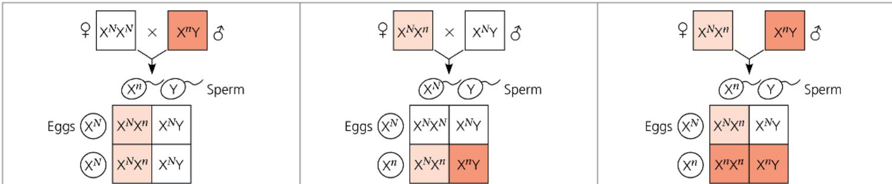  
(a) A male parent with color-blindness will transmit the mutant allele to all female offspring but to no male offspring. When the female parent is a dominant homozygote, the female offspring will have the normal phenotype but will be carriers of the mutation.  
(b) If a female carrier mates with a male who has normal color vision, there is a $50\%$ chance that each female offspring will be a carrier like their female parent and a $50\%$ chance that each male offspring will have the disorder.  
(c) If a female carrier mates with a color-blind male, there is a 50% chance that each child born to them will have the disorder, regardless of sex. Female offspring who have normal color vision will be carriers, whereas males who have normal color vision will be free of the recessive allele.  
If a color-blind female married a male who had normal color vision, what would be the probable phenotypes of their children? For suggested answer, see Appendix A.

identifying roughly 700 genes, of which about 100 coded for proteins (some genes are duplicates and the number of copies varies from person to person). About half of these genes are expressed only in the testis, and some are required for normal testicular functioning and the production of normal sperm. The Y chromosome is passed along virtually intact from a male parent to all his male offspring. Because there are so few Y-linked genes, very few disorders are transferred from male parent to male offspring on the Y chromosome.

The development of female gonads in humans requires a gene called WNT4 (on chromosome 1, an autosome), which encodes a protein that promotes ovary development. An embryo that is XY but has extra copies of the WNT4 gene can develop rudimentary female gonads. Overall, sex is determined by the interactions of a network of gene products like these.

The biochemical, physiological, and anatomical features associated with males and females are turning out to be more complicated than previously thought, with many genes involved in their development. Because of the complexity of this process, many variations exist: Some individuals vary in the number of sex chromosomes in their cells (see Concept 15.4), and others are born with intermediate sexual (intersex) characteristics. Sex determination is an active area of research that will likely yield a more sophisticated understanding in years to come.

## Inheritance of X-Linked Genes

The fact that males and females inherit a different number of X chromosomes leads to a pattern of inheritance different from that produced by genes located on autosomes. While there are very few Y-linked genes, many of which help determine sex, the X chromosomes have numerous genes for characters unrelated to sex. X-linked genes in humans follow the same pattern of inheritance that Morgan observed for the eye color locus he studied in

Drosophila (see Figure 15.3). A male parent passes X-linked alleles to all of his female offspring but to none of his male offspring. In contrast, a female parent can pass X-linked alleles to both male and female offspring, as shown in Figure 15.7 for the inheritance of a mild X-linked disorder, red-green color blindness.

If an X-linked trait is due to a recessive allele, a female will express the phenotype only if she is homozygous for that allele. Because males have only one locus, the terms homozygous and heterozygous lack meaning for describing their X-linked genes; the term hemizygous is used in such cases. Any male receiving the recessive allele from his female parent will express the trait. For this reason, far more males than females have X-linked recessive disorders. However, even though the chance of a female inheriting a double dose of the mutant allele is much less than the probability of a male inheriting a single dose, there are females with X-linked disorders. For instance, color blindness is almost always inherited as an X-linked trait. A color-blind daughter may be born to a color-blind father whose mate is a carrier (see Figure 15.7c). Because the X-linked allele for color blindness is relatively rare, though, the probability that such a male and female will mate is low.

A number of human X-linked disorders are much more serious than color blindness, such as Duchenne muscular dystrophy, which affects about one out of 5,000 males born in the United States. The disease is characterized by a progressive weakening of the muscles and loss of coordination. Affected individuals' life expectancy is into the 20s or 30s. Researchers have traced the disorder to the absence of a key muscle protein called dystrophin and have mapped the gene for this protein to a specific locus on the X chromosome. Research into gene therapy has led to a treatment that was fully approved by the FDA in 2024 for patients 4 years and older. This single-dose treatment involves introduction of an experimentally modified "gene" called microdystrophin that includes important portions of the dystrophin gene.

Figure 15.8 X inactivation and the tortoiseshell cat.

Hemophilia is an X-linked recessive disorder defined by the absence of one or more of the proteins required for blood clotting. When a person with hemophilia is injured, bleeding is prolonged because a firm clot is slow to form. Small cuts in the skin are usually not a problem, but bleeding in the muscles or joints can be painful and can lead to serious damage. In the 1800s, hemophilia was widespread among the royal families of Europe. Queen Victoria of England is known to have passed the allele to several of her descendants. Subsequent intermarriage with royal family members of other nations, such as Spain and Russia, further spread this X-linked trait, and its incidence is well documented in royal pedigrees. A few years ago, new genomic techniques allowed sequencing of DNA from tiny amounts isolated from the buried remains of royal family members. The genetic basis of the mutation, and how it resulted in a nonfunctional blood-clotting factor, is now understood. Since the 1970s, people with hemophilia have been treated with intravenous injections of the protein that is missing (typically a synthetic version in recent decades). More recently, in 2023, a gene therapy treatment was approved that introduces a gene for a clotting protein into patients with one type of severe hemophilia.

## X Inactivation in Female Mammals

Female mammals, including human females, inherit two X chromosomes—twice the number inherited by males—so you may wonder whether females make twice as many of the proteins encoded by X-linked genes as males. In fact, almost all of one X chromosome in each cell in female mammals becomes inactivated during early embryonic development. As a result, the cells of females and males have the same effective dose (one active copy) of most X-linked genes. The inactive X in each cell of a female condenses into a compact object called a Barr body (discovered by Canadian anatomist Murray Barr), which lies along the inside of the nuclear envelope. Most of the genes of the X chromosome that forms the Barr body are not expressed. In the ovaries, however, Barr body chromosomes are reactivated in the cells that give rise to eggs, resulting in every female gamete (egg) having an active X after meiosis.

British geneticist Mary Lyon demonstrated that the selection of which X chromosome will form the Barr body occurs randomly and independently in each embryonic cell present at the time of X inactivation. As a consequence, females consist of a mosaic of two types of cells: those with the active X derived from the male parent and those with the active X derived from the female parent. After an X chromosome is inactivated in a particular cell, all mitotic descendants of that cell have the same inactive X. Thus, if a female is heterozygous for a sex-linked trait, about half of her cells will express one allele, while the others will express the alternate allele. Figure 15.8 shows how this mosaicism results in the patchy coloration of a tortoiseshell cat. In humans, mosaicism can be observed in a recessive X-linked mutation that prevents the development of sweat glands. A female who is heterozygous for this trait has patches of normal skin and patches of skin lacking sweat glands.

Inactivation of an X chromosome involves modification of the DNA and proteins bound to it called histones, including attachment of methyl groups ( $—CH_{3}$ ) to DNA nucleotides. (The regulatory role of DNA methylation is discussed in Concept 18.2.) A particular region of each X chromosome contains several genes involved in the inactivation process. The two regions, one on each

The tortoiseshell gene is on the X chromosome, and the tortoiseshell phenotype requires the presence of two different alleles, one for orange fur and one for black fur. Normally, only females can have both alleles because only they have two X chromosomes. If a female cat is heterozygous for the tortoiseshell gene, she is tortoiseshell. Orange patches are formed by populations of cells in which the X chromosome with the orange allele is active; black patches have cells in which the X chromosome with the black allele is active. (“Calico” cats also have white areas, which are determined by another gene.)

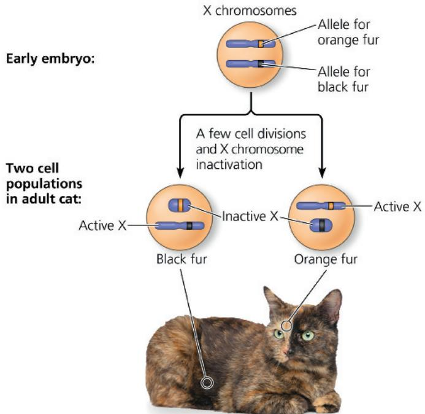

X chromosome, associate briefly with each other in each cell at an early stage of embryonic development. Then, one of the genes, called XIST (for X-inactive specific transcript), becomes active only on the chromosome that will become the Barr body (the inactive X). Multiple copies of the RNA product of this gene apparently attach to the X chromosome on which they are made, eventually almost covering it. Interaction of this RNA with the chromosome initiates X inactivation, and the RNA products of nearby genes help to regulate the process.

## Concept Check 15.2

1. A white-eyed female Drosophila is mated with a red-eyed (wild-type) male, the reciprocal cross of the one shown in Figure 15.3. What phenotypes and genotypes do you predict for the offspring from this cross?

2. Neither Tim nor Shonda has Duchenne muscular dystrophy, but their firstborn son does. What is the probability that a second child will have the disease? What is the probability if the second child is male? Female?

3. MAKE CONNECTIONS Consider what you learned about dominant and recessive alleles in Concept 14.1. If a disorder were caused by a dominant X-linked allele, how would the inheritance pattern differ from what we see for recessive X-linked disorders?

# Concept 15.3: Linked genes tend to be inherited together because they are located near each other on the same chromosome

The number of genes in a cell is far greater than the number of chromosomes; in fact, each chromosome (except the Y) has hundreds or thousands of genes. Genes located near each other on the same chromosome tend to be inherited together in genetic crosses; such genes are said to be genetically linked and are called linked genes. When geneticists follow linked genes in breeding experiments, the results deviate from those expected from Mendel's law of independent assortment.

## How Linkage Affects Inheritance

To see how linkage between genes affects the inheritance of two different characters, let's examine another of Morgan's Drosophila experiments. In this case, the characters are body color and wing size, each with two different phenotypes. Wild-type flies have gray bodies and normal-sized wings. In addition to these flies, Morgan had managed to obtain, through breeding, doubly mutant flies with black bodies and wings much smaller than normal, called vestigial wings. The mutant alleles are recessive to the wild-type alleles, and neither gene is on a sex chromosome. In his investigation of these two genes, Morgan carried out the crosses shown in Figure 15.9. The first was a P generation cross to generate $\mathrm{F}_1$ dihybrid flies, and the second was essentially a testcross.

The resulting flies had a much higher proportion of the combinations of traits seen in the P generation flies (called parental phenotypes) than would be expected if the two genes assorted independently. Morgan thus concluded that body color and wing size are usually inherited together in specific (parental) combinations because the genes are linked; they are near each other on the same chromosome:

As you proceed, be sure to keep in mind the distinction between the terms linked genes (two or more genes on the same chromosome that tend to be inherited together) and sex-linked gene (a single gene on a sex chromosome).

As Figure 15.9 shows, both of the combinations of traits not seen in the P generation (called nonparental phenotypes) were also produced in Morgan's experiments, suggesting that the body color and wing size alleles are not always linked genetically. To understand this conclusion, we need to further explore genetic recombination, the production of offspring with combinations of traits that differ from those found in either P generation parent.

## Genetic Recombination and Linkage

Meiosis and random fertilization generate genetic variation among offspring of sexually reproducing organisms due to independent assortment of chromosomes, crossing over in meiosis I, and the possibility of any sperm fertilizing any egg (see Concept 13.4). Here we'll examine the chromosomal basis of recombination of alleles in relation to the genetic findings of Mendel and Morgan.

## Recombination of Unlinked Genes: Independent Assortment of Chromosomes

Mendel learned from crosses in which he followed two characters that some offspring have combinations of traits that do not match those of either parent. For example, consider a cross of a dihybrid pea plant with yellow round seeds, heterozygous for both seed color and seed shape (YyRr), with a plant homozygous for both recessive alleles (with green wrinkled seeds, yyrr). (This cross acts as a testcross because the results will reveal the genotype not only of the dihybrid YyRr plant, which we know, but of the gametes made in that plant.) Let's represent the cross by the following Punnett square:

Notice in this Punnett square that one-half of the offspring are expected to inherit a phenotype that matches either of the phenotypes of the P (parental) generation originally crossed to produce the $F_{1}$ dihybrid (see Figure 15.2). These matching offspring are called parental types (short for phenotypes). But two nonparental phenotypes are also found among the offspring. Because these offspring have new combinations of seed shape and color, they are called recombinant types, or recombinants for short. When 50% of all offspring are recombinants, as in this example, geneticists say that there is a 50% frequency of recombination. The predicted phenotypic ratios among the offspring are similar to what Mendel actually found in his YrRr × yyrr crosses.

A 50% frequency of recombination in such testcrosses is observed for any two genes that are located on different chromosomes and thus cannot be linked. The physical basis of recombination between unlinked genes is the random orientation

## Figure 15.9

# Inquiry: How does linkage between two genes affect inheritance of characters? Experiment and Results

Morgan wanted to know whether the genes for body color and wing size are genetically linked and, if so, how this affects their

Morgan mated true-breeding P (parental) generation flies—wild-type flies with black, vestigial-winged flies—to produce heterozygous $F_{1}$ dihybrids ( $b^{+}b\quad vg^{+}vg$ ), all of which are wild-type in appearance.

He then mated wild-type $F_{1}$ dihybrid females with homozygous recessive males. This testcross will reveal the genotype of the eggs made by the dihybrid female.

The male's sperm contributes only recessive alleles, so the phenotype of the offspring reflects the genotype of the female's eggs.

Note: Although only females (with pointed abdomens) are shown, half the offspring in each class would be males (with rounded abdomens).

inheritance. The alleles for body color are $b^{+}$ (gray) and b (black), and those for wing size are $vg^{+}$ (normal) and vg (vestigial).

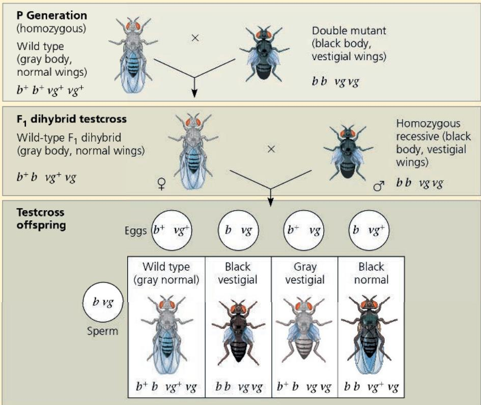

<table><tr><td rowspan="2">Predicted ratios of testcross offspring</td><td>if genes are located on different chromosomes:</td><td>1</td><td>:</td><td>1</td><td>:</td><td>1</td><td>:</td><td>1</td></tr><tr><td>if genes are located on the same chromosome and parental alleles are always inherited together:</td><td>1</td><td>:</td><td>1</td><td>:</td><td>0</td><td>:</td><td>0</td></tr><tr><td></td><td>Data from Morgan&#x27;s experiment:</td><td>965</td><td>:</td><td>944</td><td>:</td><td>206</td><td>:</td><td>185</td></tr></table>

## Conclusion

Since most offspring had a parental (P generation) phenotype, Morgan concluded that the genes for body color and wing size are genetically linked on the same chromosome. However, the production of a relatively small number of offspring with nonparental phenotypes indicated that some mechanism occasionally breaks the linkage between specific alleles of genes on the same chromosome.

of homologous chromosomes at metaphase I of meiosis, which leads to the independent assortment of the two unlinked genes (see Figure 13.11 and the question in the Figure 15.4 legend).

## Recombination of Linked Genes: Crossing Over

Now, let's explain the results of the Drosophila testcross in Figure 15.9. Recall that most (83%) of the offspring from the testcross for body color and wing size had parental phenotypes. That

Data from T. H. Morgan and C. J. Lynch, The linkage of two factors in Drosophila that are not sex-linked, Biological Bulletin 23:174–182 (1912).

WHAT IF? If the parental (P generation) flies had been true-breeding for gray body with vestigial wings and black body with normal wings, which phenotypic class(es) would be largest among the testcross offspring?

For suggested answer, see Appendix A.

suggested that the two genes were on the same chromosome, since the occurrence of parental types with a frequency greater than 50% indicates that the genes are linked. About 17% of offspring, however, were recombinants.

Seeing these results, Morgan proposed that some process must occasionally break the physical connection between specific alleles of genes on the same chromosome. Later experiments showed that this process, now called crossing over, accounts for the recombination of linked genes. In crossing over, which occurs while replicated homologous chromosomes are paired during

prophase of meiosis I, a set of proteins breaks the DNA molecules of one maternal and one paternal chromatid and rejoins each to the other (see Figure 13.9). In effect, when a single crossover occurs, end portions of two nonsister chromatids trade places.

Figure 15.10 shows how crossing over in a dihybrid female fly resulted in recombinant eggs and ultimately recombinant offspring in Morgan's testcross. Most eggs had a chromosome with either the $b^{+}vg^{+}$ or $bvg$ parental genotype, but some eggs

Figure 15.10 $^{9}$ Chromosomal basis for recombination of linked genes.

In these diagrams re-creating the testcross in Figure 15.9, we track chromosomes as well as genes. The maternal chromosomes (those present in the wild-type F $_{1}$ dihybrid) are color-coded red and pink to distinguish one homolog from the other before any meiotic crossing over has occurred. Because crossing over between the b $^{+}$ /b and vg $^{+}$ /vg loci occurs in some, but not most, egg-producing cells, more eggs with parental-type chromosomes than with recombinant ones are produced in the mating females. Fertilization of the eggs by sperm of genotype b vg gives rise to some recombinant offspring. The recombination frequency is the percentage of recombinant flies in the total pool of offspring.

DRAW IT Suppose, as in the question at the bottom of Figure 15.9, the parental (P generation) flies were true-breeding for gray body with vestigial wings and black body with normal wings. Draw the chromosomes in each of the four possible kinds of eggs from an $F_{1}$ female, and label each chromosome as “parental” or “recombinant.”

For suggested answer, see Appendix A.

had a recombinant chromosome $(b^{+}vg$ or $bvg^{+})$ . Fertilization of all classes of eggs by homozygous recessive sperm $(bvg)$ produced an offspring population in which 17% exhibited a nonparental, recombinant phenotype, reflecting combinations of alleles not seen before in either P generation parent. In the Scientific Skills Exercise, you can use a statistical test to analyze the results from an $F_{1}$ dihybrid testcross and see whether the two genes assort independently or are linked.

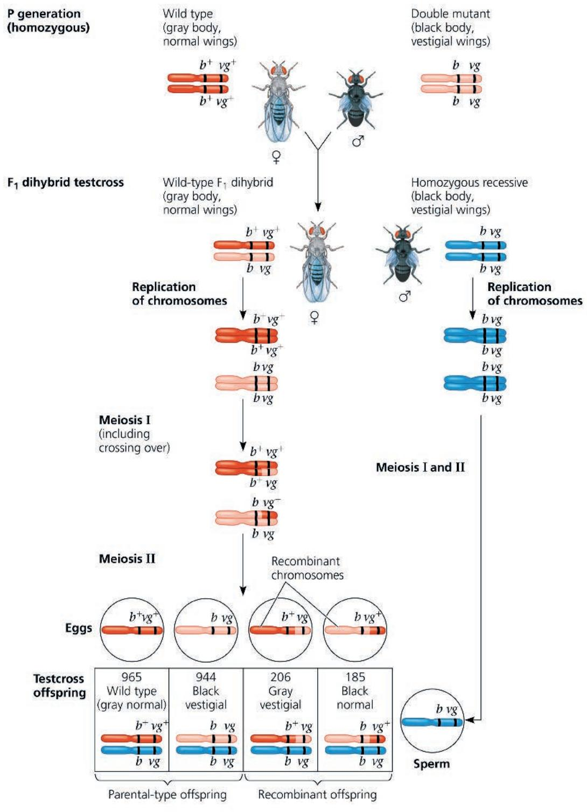  
Recombination frequency = $\frac{391\ recombinants}{2,300\ total\ offspring}$ × 100 = 17%

# Scientific Skills Exercise Using the Chi-Square ( $\chi^{2}$ ) Test

Are Two Genes Linked or Unlinked? Genes that are in close proximity on the same chromosome will result in the linked alleles being inherited together more often than not. But how can you tell if certain alleles are inherited together due to linkage or whether they just happen to assort together randomly? In this exercise, you'll use a simple statistical test, the chi-square $(\chi^2)$ test, to analyze phenotypes of $F_{1}$ testcross progeny in order to see whether two genes are linked or unlinked.

How These Experiments Are Done If genes are unlinked and assorting independently, the phenotypic ratio of offspring from an $F_{1}$ testcross is expected to be 1:1:1:1 (see Figure 15.9). If the two genes are linked, however, the observed phenotypic ratio of the offspring will not match that ratio. Given that random fluctuations in the data do occur, how much must the observed numbers deviate from the expected numbers for us to conclude that the genes are not assorting independently but may instead be linked?

To answer this question, scientists use a statistical test. This test, called a chi-square $(\chi^{2})$ test, compares an observed data set with an expected data set predicted by a hypothesis (here, that the genes are unlinked) and measures the discrepancy between the two, thus determining the “goodness of fit.” If the discrepancy between the observed and expected data sets is so large that it is unlikely to have occurred by random fluctuation, we say there is statistically significant evidence against the hypothesis (or, more specifically, evidence for the genes being linked). If the discrepancy is small, then our observations are well explained by random variation alone. In this case, we say that the observed data are consistent with our hypothesis, or that the discrepancy is statistically insignificant. Note, however, that consistency with our hypothesis is not the same as proof of our hypothesis. Also, the size of the experimental data set is important: With small data sets like this one, even if the genes are linked, discrepancies might be small by chance alone if the linkage is weak. For simplicity, we overlook the effect of sample size here.

Data from the Simulated Experiment In cosmos plants, purple stem (A) is dominant to green stem (a), and short petals (B) is dominant to long petals (b). In a simulated cross, AABB plants were crossed with aabb plants to generate $F_{1}$ dihybrids (AaBb), which were then testcrossed (AaBb × aabb). A total of 900 offspring plants were scored for stem color and flower petal length.

<table><tr><td>Offspring from testcross of  $AaBb\left( {F}_{1}\right)  \times$  aabb</td><td>Purple stem/short petals (A-B-)*</td><td>Green stem/short petals (aaB-)</td><td>Purple stem/long petals (A-bb)</td><td>Green stem/long petals (aabb)</td></tr><tr><td>Expected ratio if the genes are unlinked</td><td>1</td><td>1</td><td>1</td><td>1</td></tr><tr><td>Expected number of offspring (of 900)</td><td></td><td></td><td></td><td></td></tr><tr><td>Observed number of offspring (of 900)</td><td>220</td><td>210</td><td>231</td><td>239</td></tr></table>

\* If the phenotype is dominant, a dash is used for the second allele; it could be either the dominant or recessive allele.

## INTERPRET THE DATA

## Cosmos plants

1. The results in the data table are from a simulated $F_{1}$ dihybrid testcross. The hypothesis that the two genes are unlinked predicts that the offspring phenotypic ratio will be 1:1:1:1. Using this ratio, calculate the expected number of each phenotype out of the 900 total

offspring, and enter the values in that data table.

2. The goodness of fit is measured by $\chi^2$ . This statistic measures the amounts by which the observed values differ from their respective predictions to indicate how closely the two sets of values match. The formula for calculating this value is

$$
\chi^ {2} = \Sigma \frac {(o - e) ^ {2}}{e}
$$

where $\Sigma = sum of, o = observed, and e = expected.$ Calculate the $\chi^{2}$ value for the data using the table below. Fill out that table, carrying out the operations indicated in the top row. Then, add up the entries in the last column to find the $\chi^{2}$ value.

<table><tr><td>Testcross Offspring</td><td>Expected (e)</td><td>Observed (o)</td><td>Deviation (o - e)</td><td> ${\left( o - e\right) }^{2}$ </td><td> ${\left( o - e\right) }^{2}/e$ </td></tr><tr><td>A-B-</td><td></td><td>220</td><td></td><td></td><td></td></tr><tr><td>aaB-</td><td></td><td>210</td><td></td><td></td><td></td></tr><tr><td>A-bb</td><td></td><td>231</td><td></td><td></td><td></td></tr><tr><td>aabb</td><td></td><td>239</td><td></td><td></td><td></td></tr><tr><td colspan="5"> ${\chi }^{2} = \text{Sum}$ </td><td></td></tr></table>

3. The $\chi^{2}$ value means nothing on its own—it is used to find the probability that, assuming the hypothesis is true, the observed data set could have resulted from random fluctuations. A low probability suggests that the observed data are not consistent with the hypothesis and thus the hypothesis should be rejected. A standard cutoff point used by biologists is a probability of 0.05 (5%). If the probability corresponding to the $\chi^{2}$ value is 0.05 or less, the differences between observed and expected values are considered statistically significant and the hypothesis (that the genes are unlinked) should be rejected. If the probability is above 0.05, the results are not statistically significant; the observed data are consistent with the hypothesis that the genes are unlinked.

To find the probability, locate your $\chi^{2}$ value in the $\chi^{2}$ distribution table in Appendix D. The “degrees of freedom” (df) of your data set is the number of categories (here, 4 phenotypes) minus 1, so df = 3. (a) Determine which values on the df = 3 line of the table your calculated $\chi^{2}$ value lies between. (b) The column headings for these values show the probability range for your $\chi^{2}$ number. Based on whether there are nonsignificant (p > 0.05) or significant ( $p \leq 0.05$ ) differences between the observed and expected values, are the data consistent with the hypothesis that the two genes are unlinked and assorting independently, or is there enough evidence to reject this hypothesis?

Instructors: A version of this Scientific Skills Exercise can be assigned in Mastering Biology.

## New Combinations of Alleles: Variation for Natural Selection

EVOLUTION The physical behavior of chromosomes during meiosis contributes to the generation of variation in offspring (see Concept 13.4). Each pair of homologous chromosomes lines up independently of other pairs during metaphase I, and crossing over prior to that, during prophase I, can mix and match parts of maternal and paternal homologs. Mendel's elegant experiments show that the behavior of the abstract entities known as genes—or, more concretely, alleles of genes—also leads to variation in offspring (see Concept 14.1). Now, putting these different ideas together, you can see that the recombinant chromosomes resulting from crossing over may bring alleles together in new combinations, and the subsequent events of meiosis distribute to gametes the recombinant chromosomes in a multitude of combinations, such as the new variants seen in Figures 15.9 and 15.10. Random fertilization then increases even further the number of variant allele combinations that can be created.

This abundance of genetic variation provides the raw material on which natural selection works. If the traits conferred by particular combinations of alleles are better suited for a given environment, organisms possessing those genotypes will be expected to thrive and leave more offspring, ensuring the continuation of their genetic complement. In the next generation, of course, the alleles will be shuffled anew. Ultimately, the interplay between environment and phenotype (and thus genotype) will determine which genetic combinations persist over time.

## Mapping the Distance Between Genes Using Recombination Data: Scientific Inquiry

The discovery of linked genes and recombination due to crossing over motivated one of Morgan's students, Alfred H. Sturtevant, to work out a method for constructing a genetic map, an ordered list of the genetic loci along a particular chromosome.

Sturtevant hypothesized that the percentage of recombinant offspring, the recombination frequency, calculated from experiments like the one in Figures 15.9 and 15.10, depends on the distance between genes on a chromosome. He assumed that crossing over is a random event, with the chance of crossing over approximately equal at all points along a chromosome. Based on these assumptions, Sturtevant predicted that the farther apart two genes are, the higher the probability that a crossover will occur between them and, therefore, the higher the recombination frequency. His reasoning was simple: The greater the distance between two genes, the more points there are between them where crossing over can occur. Using recombination data from various fruit fly crosses, Sturtevant proceeded to assign relative positions to genes on the same chromosomes—that is, to map genes.

A genetic map based on recombination frequencies is called a linkage map. Figure 15.11 shows Sturtevant's linkage map of three genes: the body color (b) and wing size (vg) genes depicted in Figure 15.10 and a third gene, called cinnabar (cn). Cinnabar is one of many Drosophila genes affecting eye color. Cinnabar eyes, a mutant phenotype, are a brighter red than the wild-type color. The recombination frequency between cn and b is 9%; that between cn and vg, 9.25%; and that between b and vg, 17%. In other words,

## Figure 15.11

## Research Method: Constructing a Linkage Map

## Application

A linkage map shows the relative locations of genes along a chromosome.

## Technique

A linkage map is based on the assumption that the probability of a crossover between two genetic loci is proportional to the distance separating the loci. The recombination frequencies used to construct a linkage map for a particular chromosome are obtained from experimental crosses, such as the cross depicted in Figures 15.9 and 15.10. The distances between genes are expressed as map units, with one map unit equivalent to a 1% recombination frequency. Genes are arranged on the chromosome in the order that best fits the data.

## Results

In this example, the observed recombination frequencies between three Drosophila gene pairs (b and cn, 9%; cn and vg, 9.5%; and b and vg, 17%) best fit a linear order in which cn is positioned about halfway between the other two genes:

The b-vg recombination frequency (17%) is slightly less than the sum of the b-cn and cn-vg frequencies (9 + 9.5 = 18.5%) because of the few times that one crossover occurs between b and cn and another crossover occurs between cn and vg. The second crossover would “cancel out” the first, reducing the observed b-vg recombination frequency while contributing to the frequency between each of the closer pairs of genes. The value of 18.5% (18.5 map units) is closer to the actual distance between the genes. In practice, a geneticist would add the smaller distances in constructing a map.

crossovers between cn and b and between cn and vg are about half as frequent as crossovers between b and vg. Only a map that locates cn about midway between b and vg is consistent with these data, as you can prove to yourself by drawing alternative maps. Sturtevant expressed the distances between genes in map units, defining one map unit as equivalent to a 1% recombination frequency.

In practice, the interpretation of recombination data is more complicated than this example suggests. Some genes on a chromosome are so far from each other that a crossover between them is virtually certain. The observed frequency of recombination in crosses involving two such genes can have a maximum value of 50%, a result indistinguishable from that for genes on different

chromosomes. In this case, the physical connection between genes on the same chromosome is not reflected in the results of genetic crosses. Despite being on the same chromosome and thus being physically connected, the genes are genetically unlinked; alleles of such genes assort independently, as if they were on different chromosomes. In fact, at least two of the genes for pea characters that Mendel studied are now known to be on the same chromosome, but the distance between them is so great that linkage is not observed in genetic crosses. Consequently, the two genes behaved as if they were on different chromosomes in Mendel's experiments. Genes located far apart on a chromosome are mapped by adding the recombination frequencies from crosses involving closer pairs of genes lying between the two distant genes.

Using recombination data, Sturtevant and his colleagues were able to map numerous Drosophila genes in linear arrays. They found that the genes clustered into four groups of linked genes (linkage groups). Light microscopy had revealed four pairs of chromosomes in Drosophila, so the linkage map provided additional evidence that genes are located on chromosomes. Each chromosome has a linear array of specific genes, each gene with its own locus (Figure 15.12).

Because a linkage map is based strictly on recombination frequencies, it gives only an approximate picture of a chromosome. The frequency of crossing over is not actually uniform over the length of a chromosome, as Sturtevant assumed, and therefore map units do not correspond to actual physical distances (in nanometers, for instance). A linkage map does portray the order of genes along a chromosome, but it does not accurately portray the precise locations of those genes. Other methods enable geneticists to construct cytogenetic maps of chromosomes, which locate genes with respect to chromosomal features, such as stained bands, that can be seen in the microscope. Technical advances over recent decades have enormously increased the rate and affordability of

Figure 15.12 A partial genetic (linkage) map of a Drosophila chromosome.

This partial map shows just seven mapped genes on Drosophila chromosome II. (DNA sequencing has revealed over 9,000 genes on that chromosome.) The number at each gene locus is the number of map units from the arista length gene (far left).

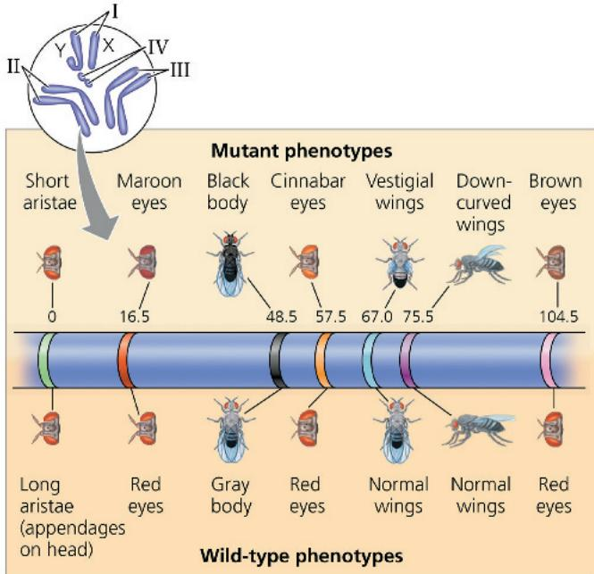

DNA sequencing. Therefore, today, most researchers sequence whole genomes to map the locations of genes of a given species. The entire nucleotide sequence is the ultimate physical map of a chromosome, revealing the physical distances in DNA nucleotides between gene loci (see Concept 21.1). Comparing a linkage map with such a physical map or with a cytogenetic map of the same chromosome, we find that the linear order of genes is identical in all the maps, but the spacing between genes is not.

## Concept Check 15.3

1. When two genes are located on the same chromosome, what is the physical basis for the production of recombinant offspring in a testcross between a dihybrid parent and a double-mutant (recessive) parent?

2. VISUAL SKILLS For each type of offspring of the testcross in Figure 15.9, explain the relationship between its phenotype and the alleles contributed by the female parent. (It will be useful to draw out the chromosomes of each fly and follow the alleles throughout the cross.)

3. WHAT IF? Genes A, B, and C are located on the same chromosome. Testcrosses show that the recombination frequency between A and B is 28% and that between A and C is 12%. Can you determine the linear order of these genes? Explain.

For suggested answers, see Appendix A.

## Concept 15.4: Alterations of chromosome number or structure cause some genetic disorders

As you have learned so far in this chapter, the phenotype of an organism can be affected by small-scale changes involving individual genes. Random mutations are the source of all new alleles, which can lead to new phenotypic traits.

Large-scale chromosomal changes can also affect an organism's phenotype. Physical and chemical disturbances, as well as errors during meiosis, can damage chromosomes in major ways or alter their number in a cell. Large-scale chromosomal alterations in humans and other mammals often lead to miscarriage of a fetus, and individuals born with these types of genetic defects commonly exhibit various developmental disorders. Plants appear to tolerate such genetic defects better than animals do.

## Interview

Interview with Terry Orr-Weaver: Why are humans so bad at meiosis? (eTextbook only)

## Abnormal Chromosome Number

Ideally, the meiotic spindle distributes chromosomes to daughter cells without error. But there is an occasional mishap, called a nondisjunction, in which the members of a pair of homologous

Figure 15.13 Meiotic nondisjunction.

Gametes with an abnormal chromosome number can arise by nondisjunction in either meiosis I or meiosis II. For simplicity, the figure does not show the spores formed by meiosis in plants. Ultimately, spores form gametes that have the defects shown. (See Figure 13.6.)

chromosomes do not move apart properly during meiosis I or sister chromatids fail to separate during meiosis II (Figure 15.13). In nondisjunction, one gamete receives two of the same type of chromosome and another gamete receives no copy. The other chromosomes are usually distributed normally.

If either of the aberrant gametes unites with a normal one at fertilization, the zygote will also have an abnormal number of a particular chromosome, a condition known as aneuploidy. Fertilization involving a gamete that has no copy of a particular chromosome will lead to a missing chromosome in the zygote (so that the cell has 2n - 1 chromosomes); the aneuploid zygote is said to be monosomic for that chromosome. If a chromosome is present in triplicate in the zygote (so that the cell has 2n + 1 chromosomes), the aneuploid cell is trisomic for that chromosome. Mitosis will subsequently transmit the anomaly to all embryonic cells. Monosomy and trisomy are estimated to occur in 10–25% of human conceptions and are the main reason for pregnancy loss. If the organism survives, it usually has a set of traits caused by the abnormal dose of the genes associated with the extra or missing chromosome. Down syndrome is an example of trisomy in humans that will be discussed later. Nondisjunction can also occur during mitosis. If such an error takes place early in embryonic development, then the aneuploid condition is passed along by mitosis to a large number of cells and is likely to have a substantial effect on the organism.

Some organisms have more than two complete chromosome sets in all somatic cells. The general term for this chromosomal alteration is polyploidy; the specific terms triploidy (3n) and tetraploidy (4n) indicate three and four chromosomal sets, respectively. One way a triploid cell may arise is by the fertilization of an abnormal diploid egg produced by nondisjunction of all its chromosomes. Tetraploidy could result from the failure of a 2n zygote to divide after replicating its chromosomes. Subsequent normal mitotic divisions would then produce a 4n embryo.

Polyploidy is fairly common in the plant kingdom. The spontaneous origin of polyploid individuals plays an important role in plant evolution (see Concept 24.2). Many species we eat are polyploid: Bananas are triploid, wheat hexaploid (6n), and strawberries octoploid (8n).

Examples of polyploid plants

Polyploid animal species are much less common, but there are a few fishes and amphibians known to be polyploid. In general, polyploids are more nearly normal in appearance than aneuploids. One extra (or missing) chromosome apparently disrupts genetic balance more than does an entire extra set of chromosomes.

## Alterations of Chromosome Structure

Errors in meiosis or damaging agents such as radiation can cause breakage of a chromosome, which can lead to four types of changes in chromosome structure (Figure 15.14). A deletion occurs when a chromosomal fragment is lost. The affected chromosome is then missing certain genes. A broken fragment may become reattached as an extra segment to a sister or nonsister chromatid, producing a duplication of a portion of that chromosome. A chromosomal fragment may also reattach to the original chromosome but in the reverse orientation, producing an inversion. A fourth possible result of chromosomal breakage is for the fragment to join a nonhomologous chromosome, a rearrangement called a translocation.

Deletions and duplications are especially likely to occur during meiosis. In crossing over, nonsister chromatids sometimes exchange unequal-sized segments of DNA, so that one partner gives up more genes than it receives (see Figure 21.13). The products of such an unequal crossover are one chromosome with a deletion and one chromosome with a duplication.

A diploid embryo that is homozygous for a large deletion (both homologs have the deletion) or, if a male, has a single X chromosome with a large deletion is usually missing a number of essential genes. This condition is typically lethal.

Duplications and translocations also tend to be harmful. In reciprocal translocations, in which segments are exchanged between nonhomologous chromosomes, and in inversions, the balance of genes is not abnormal—all genes are present in their normal doses. Nevertheless, translocations and inversions can alter phenotype because a gene's expression can be influenced by its location among neighboring genes, which can have devastating effects.

The red upward-pointing arrows indicate breakage points. The darker purple segments indicate the chromosomal parts affected by the rearrangements.

Figure 15.14 Alterations of chromosome structure.  
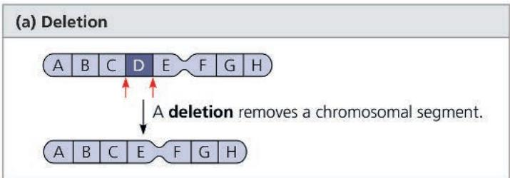

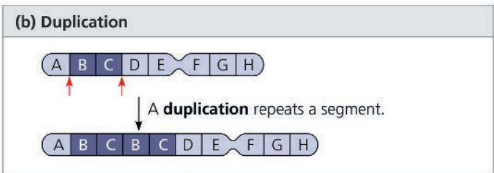

  
Less often, a nonreciprocal translocation occurs: A chromosome transfers a fragment but receives none in return (not shown).  
Figure 15.15 Down syndrome.

## Human Conditions Due to Chromosomal Alterations

Alterations of chromosome number and structure are associated with a number of human conditions, which vary in severity. As described earlier, nondisjunction in meiosis results in aneuploidy in gametes and any resulting zygotes. Although the frequency of aneuploid zygotes may be quite high in humans, most of these chromosomal alterations are so disastrous to development that the affected embryos are typically miscarried before birth. However, some types of aneuploidy appear to upset the genetic balance less than others, so individuals with certain aneuploid conditions can survive to birth and beyond. These individuals have a set of traits—a syndrome—characteristic of the type of aneuploidy. Genetic disorders caused by aneuploidy can be diagnosed before birth by fetal testing (see Figure 14.19).

The karyotype shows trisomy 21, the most common cause of Down syndrome. The child exhibits the facial features characteristic of this syndrome.

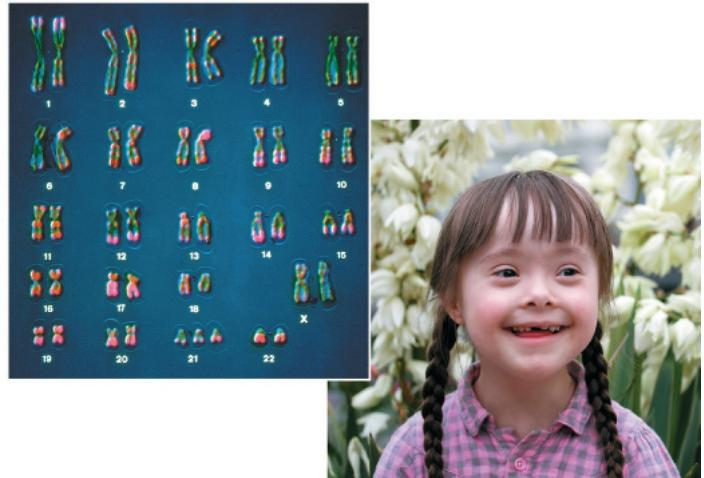

## Down Syndrome (Trisomy 21)

One aneuploid condition, Down syndrome, affects approximately one out of every 830 children born in the United States (Figure 15.15). Down syndrome is usually the result of an extra chromosome 21, so that each body cell has a total of 47 chromosomes. Because the cells are trisomic for chromosome 21, Down syndrome is often called trisomy 21. Down syndrome includes characteristic facial features, short stature, correctable heart defects, and developmental delays. Individuals with Down syndrome have an increased chance of developing leukemia and Alzheimer's disease but have a lower rate of high blood pressure, atherosclerosis (hardening of the arteries), stroke, and many types of solid tumors. People with Down syndrome have an average life span that is shorter than is typical; however, most live to middle age and beyond with proper medical care. Many live independently or at home with their families, are employed, and are valuable contributors to their communities. Almost all males and about half of females with Down syndrome are sexually underdeveloped and lack the ability to reproduce.

The frequency of Down syndrome increases with the age of the female parent. While the syndrome occurs in just 0.1% (1 out of 900) births of children born to females at age 30, the risk climbs to 1% (1 out of 100) for females at age 40 and is even higher for older female parents. The correlation of Down syndrome with maternal age has not yet been explained. Most cases result from nondisjunction during meiosis I, and some research points to an age-dependent abnormality in meiosis. Trisomies of some other chromosomes (13 and 18) also increase in incidence with maternal age, although infants with other autosomal trisomies rarely survive for long. Medical experts recommend that prenatal screening for trisomies in the embryo be offered to all pregnant patients due to its low risk and useful results. In 2008, a law was passed stipulating that medical practitioners give accurate, up-to-date information about any prenatal or postnatal diagnosis received by parents and that they connect parents with appropriate support services.

## Aneuploidy of Sex Chromosomes

Aneuploid conditions involving sex chromosomes appear to upset the genetic balance less than those involving autosomes. This may be because the Y chromosome carries relatively few genes. Also, extra copies of the X chromosome simply become inactivated as Barr bodies.

An extra X chromosome in a male, producing XXY, occurs approximately once in every 650 live male births. People with this condition, called Klinefelter syndrome, have male sex organs, but their testes are small and produce little or no sperm. Signs and symptoms vary widely, but may include taller than average height, less muscle mass, and enlarged breast tissue. Affected individuals may have learning disabilities. Testosterone replacement therapy helps stimulate changes that typically occur at puberty in males. About one of every 1,000 males is born with an extra Y chromosome (XYY). These males undergo typical sexual development and do not exhibit any well-defined syndrome, but tend to be taller than average.

Females with trisomy X (XXX), which occurs once in approximately 1,000 live female births, are generally healthy and have no unusual physical features other than being slightly taller than average. Females with trisomy X are at risk for learning disabilities. Monosomy X, which is called Turner syndrome, occurs about once in every 2,500 female births and is the only known viable monosomy in humans. Although these X0 individuals are phenotypically female, they usually lack the ability to reproduce because their sex organs do not mature. When provided with estrogen replacement therapy, girls with Turner syndrome do develop secondary sex characteristics. Most have typical intelligence.

## Disorders Caused by Structurally Altered Chromosomes

Many deletions in human chromosomes, even in a heterozygous state, cause severe problems. One such syndrome, known as cri du chat (“cry of the cat”), results from a specific deletion in chromosome 5. A child born with this deletion has a small head with unusual facial features, severe intellectual disabilities, and a cry that sounds like the mewing of a distressed cat. Such individuals usually die in infancy or early childhood.

## Figure 15.16 Translocation associated with chronic myelogenous leukemia (CML).

The cancerous cells in nearly all CML patients contain an abnormally short chromosome 22, the so-called Philadelphia chromosome, and an abnormally long chromosome 9. These altered chromosomes result from the reciprocal translocation shown here, which presumably occurred in a single white blood cell precursor undergoing mitosis and was then passed along to all descendant cells.

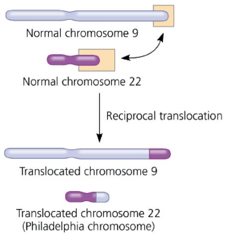

Chromosomal translocations can also occur during mitosis; some have been implicated in certain cancers, including chronic myelogenous leukemia (CML). This disease occurs when a reciprocal translocation happens during mitosis of cells that are precursors of white blood cells. The exchange of a large portion of chromosome 22 with a small fragment from a tip of chromosome 9 produces a much shortened, easily recognized chromosome 22, called the Philadelphia chromosome (Figure 15.16). Such an exchange causes cancer by creating a new “fused” gene that leads to uncontrolled cell cycle progression. (The mechanism of gene activation will be discussed in Concept 18.5.)

## Concept Check 15.4

1. About $5\%$ of individuals with Down syndrome have a chromosomal translocation in which a third copy of chromosome 21 is attached to chromosome 14. If this translocation occurred in a parent's gonad, how could it lead to Down syndrome in a child?

2. MAKE CONNECTIONS The ABO blood type locus has been mapped on chromosome 9. A male who has type AB blood and a female who has type O blood have a child with trisomy 9 and type A blood. Using this information, can you tell in which parent the nondisjunction occurred? Explain your answer. (See Figures 14.11 and 15.13.)

3. MAKE CONNECTIONS The gene that is activated on the Philadelphia chromosome codes for an intracellular tyrosine kinase. Review the discussion of cell cycle control in Concept 12.3, and explain how the activation of this gene could contribute to the development of cancer.

For suggested answers, see Appendix A.

## Concept 15.5: Some inheritance patterns are exceptions to standard Mendelian inheritance

In the previous section, you learned about deviations from the usual patterns of chromosomal inheritance due to abnormal events in meiosis and mitosis. We conclude this chapter by describing two normally occurring exceptions to Mendelian genetics, one involving genes located in the nucleus and the other involving genes located outside the nucleus. In both cases, the sex of the parent contributing an allele is a factor in the pattern of inheritance.

## Genomic Imprinting

Throughout our discussions of Mendelian genetics and the chromosomal basis of inheritance, we have assumed that a given allele will have the same effect whether it was inherited from the female parent or the male parent. This is probably a safe assumption most of the time. For example, when Mendel crossed purple-flowered pea plants with white-flowered pea plants, he observed the same results regardless of whether the purple-flowered parent supplied the eggs or the sperm. In recent years, however, geneticists have identified a number of traits in placental mammals (and some flowering plants) that depend on which parent passed along the alleles for those traits. Such variation in phenotype depending on whether an allele is inherited

from the male or female parent is called genomic imprinting. (Note that unlike sex-linked genes, most imprinted genes are on autosomes.) Using newer DNA sequence-based methods, over 200 imprinted genes have been identified in both humans and mice.

Genomic imprinting occurs during gamete formation and results in the silencing of a particular allele of certain genes. Because these genes are imprinted differently in sperm and eggs, the offspring expresses only one allele of an imprinted gene, the one that has been inherited from a specific parent—either the female parent or the male parent, depending on the particular gene. The imprints are then transmitted to all body cells during early development. In each generation, the old imprints are “erased” in gamete-producing cells, and the chromosomes of the developing gametes are newly imprinted according to the sex of the individual forming the gametes. In a given species, the imprinted genes are always imprinted in the same way. For instance, a gene imprinted for maternal allele expression is always imprinted this way, generation after generation.

Consider, for example, the mouse gene for insulin-like growth factor 2(Igf2), one of the first imprinted genes to be identified. Although this growth factor is required for normal prenatal growth, only the paternal allele is expressed (Figure 15.17a). Evidence that the Igf2 gene is imprinted came initially from crosses between normal-sized (wild-type) mice and dwarf (mutant) mice homozygous for a recessive mutation in the Igf2 gene. The phenotypes of heterozygous offspring (with one normal allele and one mutant) differed depending on whether the mutant allele came from the female parent or the male parent (Figure 15.17b).

What exactly is a genomic imprint? It turns out that imprinting can involve either silencing an allele in one type of gamete (egg or sperm) or activating it in the other. In many cases, the imprint seems to consist of methyl $\left(\mathrm{—CH}_{3}\right)$ groups that are added to cytosine nucleotides of one of the alleles. Such methylation may silence the allele, an effect consistent with evidence that heavily methylated genes are usually inactive (see Concept 18.2). However, for a few genes, methylation has been shown to activate expression of the allele. This is the case for the Igf2 gene: Methylation of certain cytosines on the paternal chromosome leads to expression of the paternal Igf2 allele, by an indirect mechanism involving chromatin structure and protein-DNA interactions.

Genomic imprinting may affect only a small fraction of the genes in mammalian genomes, but most of the known imprinted genes are critical for embryonic development. Recent research has revealed that imprinted genes are involved in regulation of body temperature, sleep, and other metabolic functions. Some evolutionary biologists have proposed that genomic imprinting represents a kind of evolved “competition” between male mammals (who benefit from larger offspring more likely to pass on the male parent's genes) and female mammals (who benefit from smaller offspring during birth).

For decades, mouse embryos engineered to inherit both copies of certain chromosomes from the same parent died before birth, whether that parent was male or female. In 2018, a team in China was able to produce mice with two female parents that lived into adulthood, and in 2025, they repeated the feat with mice that had two male parents. Their technique involved altering multiple regions of imprinted genes, with the altered regions being different in the two cases. This work underscores the importance of correct imprinting for normal embryonic development. The association of improper imprinting with abnormal development and certain cancers has spurred ongoing research in this field.

Figure 15.17 Genomic imprinting of the mouse lgf2 gene.  
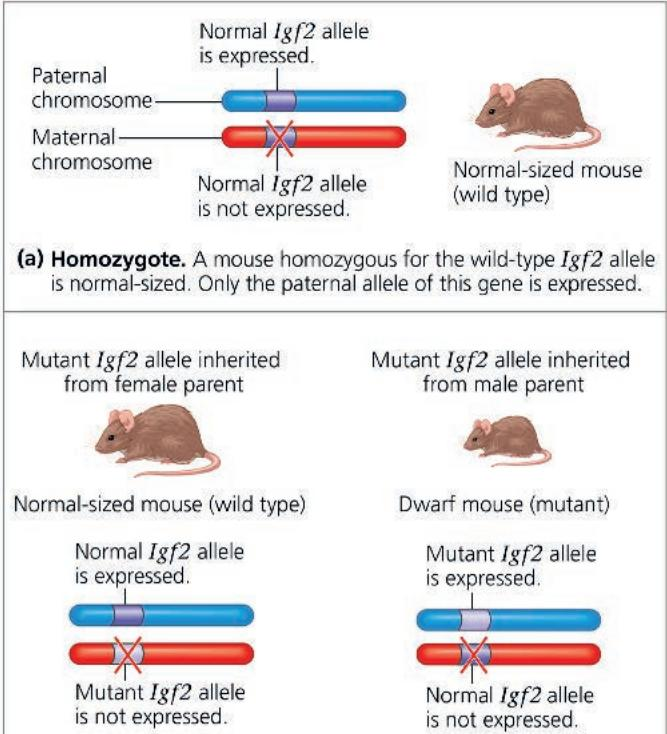  
(b) Heterozygotes. Heterozygotes have different phenotypes depending on which allele is contributed by each parent. Matings between wild-type mice and those homozygous for the recessive mutant Igf2 allele produce heterozygous offspring. Since the maternal Igf2 allele is not expressed, the dwarf (mutant) phenotype is seen only when the male parent contributes the mutant allele.

## Interview

Interview with Shirley Tilghman: Discovering imprinted genes (eTextbook only)

## Inheritance of Organelle Genes

Although our focus in this chapter has been on the chromosomal basis of inheritance, we end with an important amendment: Not all of a eukaryotic cell's genes are located on nuclear chromosomes, or even in the nucleus; some genes are located in organelles in the cytoplasm. Because they are outside the nucleus, these genes are sometimes called extranuclear genes or cytoplasmic genes. Mitochondria, as well as chloroplasts and other plastids in plants, contain small circular DNA molecules that carry a number of genes. These organelles reproduce themselves and transmit their genes to daughter organelles. Genes on organelle DNA are not distributed to offspring according to the same rules that direct the distribution of nuclear chromosomes during meiosis, so they do not display Mendelian inheritance.

The first hint that extranuclear genes exist came from studies by the German scientist Carl Correns on the inheritance of yellow or white patches on the leaves of an otherwise green plant. In 1909, he observed that the coloration of the offspring was determined only by the maternal parent (the source of eggs) and not by the paternal parent (the source of sperm). Subsequent research showed that such coloration patterns, or variegation (Figure 15.18), are due to mutations in genes controlling pigmentation that are located in the DNA circles in the organelles called plastids (see Concept 6.5). In most plants, a zygote receives all its plastids from the cytoplasm of the egg and none from the sperm, which contributes little more than a haploid set of chromosomes. An egg may contain plastids with different alleles for a pigmentation gene. As the zygote develops, plastids containing wild-type or mutant pigmentation genes are distributed randomly to daughter cells. The pattern of leaf coloration exhibited by a plant depends on the ratio of wild-type to mutant plastids in its various tissues.

Similar maternal inheritance is also the rule for mitochondrial genes in most animals and plants, because the mitochondria passed on to a zygote come from the cytoplasm of the egg. (The few mitochondria contributed by the sperm appear to be destroyed in the egg.) The products of most mitochondrial genes help make up some of the protein complexes of the electron transport chain and ATP synthase (see Figure 9.14). Defects in one or more of these proteins, therefore, reduce the amount of ATP the cell can make and have been shown to cause a number of human disorders in as many as one out of every 5,000 births. Because the parts of the body most susceptible to energy deprivation are the nervous system and the muscles, most mitochondrial diseases primarily affect these systems. For example, mitochondrial myopathy causes weakness, intolerance of exercise, and muscle deterioration. Another mitochondrial disorder is Leber's hereditary optic neuropathy, which can produce sudden blindness in people as young as their 20s or 30s. The four mutations found thus far to

## Figure 15.18 A painted nettle coleus plant.

The variegated (patterned) leaves on this coleus plant (Plectranthus scutellarioides) result from mutations that affect expression of pigment genes located in plastids, which generally are inherited from the maternal parent.

cause this disorder affect oxidative phosphorylation during cellular respiration, a crucial function for the cell (see Concept 9.4).

The fact that mitochondrial disorders are inherited only from the female parent led to development of a technique, first used in Mexico in 2016, that avoids passing along these disorders. The chromosomes from the egg of an affected female are transferred to an egg of a healthy donor that has had its own chromosomes removed. This “two-female-parent” egg is then fertilized by a sperm from the prospective male parent and transplanted into the womb of the affected female, becoming an embryo with three parents. This procedure has been carried out successfully in several countries, including the U.K., China, Jordan, and Ukraine. Some scientists are concerned that the procedure might have negative effects later in development and think that longer-term studies are necessary. In the United States, the procedure was prohibited by a 2015 federal law, and whether the benefits outweigh the risks is still under debate.

In addition to the rarer diseases clearly caused by defects in mitochondrial DNA, mitochondrial mutations inherited from a person's female parent may contribute to at least some types of diabetes and heart disease, as well as to other disorders that commonly debilitate the elderly, such as Alzheimer's disease. In the course of a lifetime, new mutations gradually accumulate in our mitochondrial DNA, and some researchers think that these mutations play a role in the normal aging process.

## Concept Check 15.5

1. Gene dosage—the number of copies of a gene that are actively being expressed—is important to proper development. Identify and describe two processes that establish the proper dosage of certain genes.

2. Reciprocal crosses between two primrose varieties,
A and B, produced the following results:
A female × B male → offspring with all green
(nonvariegated) leaves; B female × A male → offspring with
patterned (variegated) leaves. Explain these results.

3. WHAT IF? Mitochondrial genes are critical to the energy metabolism of cells, but mitochondrial disorders caused by mutations in these genes are generally not lethal. Why not?

For suggested answers, see Appendix A.

## Chapter 15 Review

## Summary of Key Concepts

To review key terms, go to the Vocabulary Self-Quiz (eTextbook only).

## Concept 15.1: Morgan showed that Mendelian inheritance has its physical basis in the behavior of chromosomes

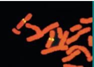

\- Morgan's work with an eye color gene in Drosophila led to the chromosome theory of inheritance, which states that genes are located on chromosomes and that the behavior of chromosomes during meiosis accounts for Mendel's laws.

What characteristic of the sex chromosomes allowed Morgan to correlate their behavior with that of the alleles of the eye color gene?

## Concept 15.2: Sex-linked genes exhibit unique patterns of inheritance

\- Sex is often chromosomally based. Humans and other mammals have an X-Y system in which sex is largely determined by whether a Y chromosome is present. Other systems are found in birds, fishes, and insects.

\- The sex chromosomes carry sex-linked genes, virtually all of which are on the X chromosome (X-inked). Any male who

inherits a recessive X-linked allele (from his female parent) will express the trait, such as color blindness.

\- In mammalian females, one of the two X chromosomes in each cell is randomly inactivated during early embryonic development, becoming highly condensed into a Barr body.

Why are males affected by X-linked disorders much more often than females?

Concept 15.3: Linked genes tend to be inherited together because they are located near each other on the same chromosome

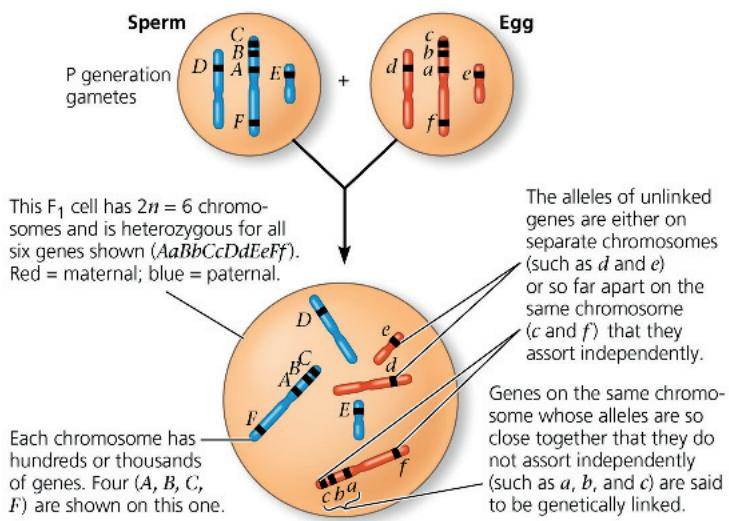

\- An $F_{1}$ dihybrid testcross yields parental types with the same combination of traits as those in the P generation parents and recombinant types (recombinants) with new combinations of traits not seen in either P generation parent. Because of the independent assortment of chromosomes, unlinked genes exhibit a 50% frequency of recombination in the gametes. For genetically linked genes, crossing over between nonsister chromatids during meiosis I accounts for the observed recombinants, always less than 50%.

\- The order of genes on a chromosome and the relative distances between them can be deduced from recombination frequencies observed in genetic crosses. These data allow construction of a linkage map (a type of genetic map). The farther apart genes are, the more likely their allele combinations will be recombined during crossing over.

Why are specific alleles of two distant genes more likely to show recombination than those of two closer genes?

## Concept 15.4: Alterations of chromosome number or structure cause some genetic disorders

\- Aneuploidy, an abnormal chromosome number, can result from nondisjunction during meiosis. When a normal gamete unites with one containing two copies or no copies of a particular chromosome, the resulting zygote and its descendant cells either have one extra copy of that chromosome (trisomy, $2n + 1$ ) or are missing a copy (monosomy, 2n - 1). Polyploidy (extra sets of chromosomes) can result from nondisjunction of all chromosomes.

\- Chromosome breakage can result in alterations of chromosome structure: deletions, duplications, inversions, and translocations. Translocations can be reciprocal or nonreciprocal.

\- Changes in the number of chromosomes per cell or in the structure of individual chromosomes can affect the phenotype and, in some cases, lead to disorders. Such alterations cause Down syndrome (usually due to trisomy of chromosome 21), certain cancers associated with chromosomal translocations that occur during mitosis, and various other human disorders.

Why are inversions and reciprocal translocations less likely to be lethal than are aneuploidy, duplications, deletions, and nonreciprocal translocations?

## Concept 15.5: Some inheritance patterns are exceptions to standard Mendelian inheritance

\- In mammals, the phenotypic effects of a small number of particular genes depend on which allele is inherited from each parent, a phenomenon called genomic imprinting. Imprints are formed during gamete production, with the result that one allele (either maternal or paternal) is not expressed in offspring.

\- The inheritance of traits controlled by the genes present in mitochondria and plastids depends solely on the maternal parent because the zygote's cytoplasm containing these organelles comes from the egg. Some diseases affecting the nervous and muscular systems are caused by defects in mitochondrial genes that prevent cells from making enough ATP.

Explain how genomic imprinting and inheritance of mitochondrial and chloroplast DNA are exceptions to standard Mendelian inheritance.
For suggested answers, see Appendix A.

## Test Your Understanding

For multiple-choice questions, go to the Practice Test (eTextbook only).

## Levels 1-2: Remembering/Understanding

1. A male with hemophilia (a recessive, sex-linked condition) has a daughter without hemophilia who marries a male without hemophilia. What is the probability of their daughter having hemophilia? Their son? If they have four sons, what is the probability that all will be affected?

2. Pseudohypertrophic muscular dystrophy is an inherited disorder that causes gradual deterioration of the muscles. It is seen almost exclusively in male children born to unaffected parents and usually results in death in the early teens. Is this disorder caused by a dominant or a recessive allele? Is its inheritance sex-linked or autosomal? How do you know? Explain why this disorder is almost never seen in female children.

3. A wild-type fruit fly (heterozygous for gray body color and normal wings) is mated with a black fly with vestigial wings. The offspring have the following phenotypic distribution: wild-type, 778; black vestigial, 785; black normal, 158; gray vestigial, 162. What is the recombination frequency between these genes for body color and wing size? Is this consistent with the results of the experiment in Figure 15.9? Draw the chromosomes in the wild-type and black parents.

4. A planet is inhabited by creatures that reproduce with the same hereditary patterns seen in humans. Three phenotypic characters are height (T = tall, t = dwarf), head appendages (A = antennae, a = no antennae), and nose shape (S = upturned snout, s = downturned snout). Since the creatures are not “intelligent,” Earth scientists are able to do some controlled breeding experiments using various heterozygotes in testcrosses. For tall heterozygotes with antennae, the offspring are tall/antennae, 46; dwarf/antennae, 7; dwarf/no antennae, 42; tall/no antennae, 5. For heterozygotes with antennae and an upturned snout, the offspring are antennae/upturned snout, 47; antennae/downturned snout, 2; no antennae/downturned snout, 48; no antennae/upturned snout, 3. Calculate the recombination frequencies for both experiments.

## Levels 3-4: Applying/Analyzing

5. Scientists do a testcross of the creatures from problem 4 using heterozygotes for height and nose shape. The offspring are tall/upturned snout, 41; dwarf/upturned snout, 8; dwarf/downturned snout, 43; tall/downturned snout, 8. Calculate the recombination frequency from these data, and then use your answer from problem 4 to determine the correct order of the three linked genes.

6. A wild-type fruit fly (heterozygous for gray body color and red eyes) is mated with a black fruit fly with purple eyes. The offspring are wild-type, 721; black/purple, 751; gray/purple, 49; black/red, 45. What is the recombination frequency between these genes for body color and eye color? Using information from problem 3, what fruit flies (genotypes and phenotypes) would you mate to determine the order of the body color, wing size, and eye color genes on the chromosome?

7. Assume that genes A and B are 50 map units apart on the same chromosome. An animal heterozygous at both loci is crossed with one that is homozygous recessive at both loci. What percentage of the offspring will show recombinant phenotypes resulting from crossovers? Without knowing these genes are on the same chromosome, how would you interpret the results of this cross?

8. Two genes of a flower, one controlling blue (B) versus white (b) petals and the other controlling round (R) versus oval (r) stamens, are linked and are 10 map units apart. You cross a homozygous blue/oval plant with a homozygous white/round plant. The resulting $F_{1}$ progeny are crossed with homozygous white/oval plants, and 1,000 offspring plants are obtained. How many $F_{2}$ plants of each of the four phenotypes do you expect?

9. You design Drosophila crosses to provide recombination data for gene a, which is located on the chromosome shown in Figure 15.12. Gene a has recombination frequencies of 14% with the vestigial wing locus and 26% with the brown eye locus. Approximately where is a located along the chromosome relative to these two loci?

## Levels 5-6: Evaluating/Creating

10. Banana plants, which are triploid, are seedless and therefore sterile. Thinking about meiosis, propose a possible explanation.

11. EVOLUTION CONNECTION Crossing over is thought to be evolutionarily advantageous because it continually shuffles genetic alleles into novel combinations. It was thought that Y-linked genes might degenerate because they lack homologous genes on the X chromosome with which to pair up prior to

crossing over. However, when the Y chromosome was sequenced, scientists discovered eight large regions that were internally homologous to each other, and several genes are duplicates. (Y chromosome researcher David Page has called it a "hall of mirrors.") How might this be beneficial?

12. SCIENTIFIC INQUIRY • DRAW IT Assume you are mapping genes A, B, C, and D in Drosophila. You know that these genes are linked on the same chromosome, and you determine the recombination frequencies between each pair of genes to be as follows: A and B, 8%; A and C, 28%; A and D, 25%; B and C, 20%; B and D, 33%.

(a) Describe how you determined the recombination frequency for each pair of genes.

(b) Draw a chromosome map based on your data.

13. WRITE ABOUT A THEME: INFORMATION The continuity of life is based on heritable information in the form of DNA. In a short essay (100–150 words), relate the structure and behavior of chromosomes to inheritance in both asexually and sexually reproducing species.

## 14. SYNTHESIZE YOUR KNOWLEDGE

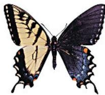

Butterflies have an X–Y sex determination system that is different from that of flies or humans. Female butterflies may be either XY or X0, while butterflies with two or more X chromosomes are males. This photograph shows a tiger swallowtail gynandromorph, which is half male (left

side) and half female (right side). Given that the first division of the zygote divides the embryo into the future right and left halves of the butterfly, propose a hypothesis that explains how nondisjunction during the first mitosis might have produced this unusual-looking butterfly.

For selected answers, see Appendix A.

# Explore Scientific Papers with Science in the Classroom | AAAS

How does smoking affect the Y chromosome? Go to “Does Smoking Make a Man Less of a Man?” at www.scienceintheclassroom.org.

Instructors: Questions can be assigned in Mastering Biology.

# The Molecular Basis of Inheritance

## Key Concepts

16.1 DNA is the genetic material

16.2 Many proteins work together in DNA replication and repair

16.3 A chromosome consists of a DNA molecule packed together with proteins

## Study Tip

Draw DNA replication: Make up a single-stranded DNA sequence that is 40 nucleotides in length. As you go through Concepts 16.1 and 16.2, use your sequence to draw a double-stranded DNA molecule, labeling the ends. Then diagram the process of replication of your DNA molecule.

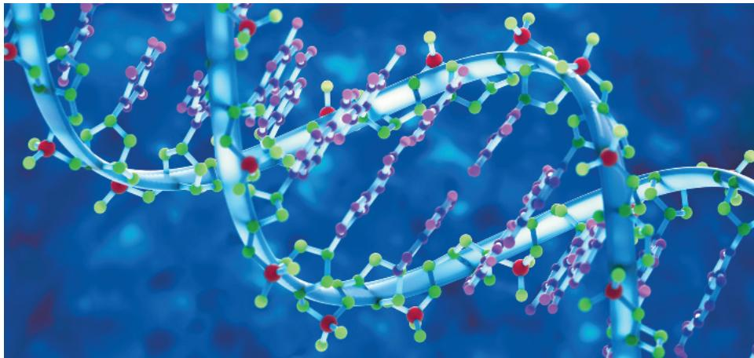  
Figure 16.1 The elegant double-helical structure of deoxyribonucleic acid (DNA) shook the scientific world when it was proposed in April 1953 by James Watson and Francis Crick. The DNA you inherited from your parents contains all your genes—your genetic information.

## How does DNA replication transmit genetic information?

DNA replication allows genetic information to be inherited from a parent cell to daughter cells (by mitosis) and from generation to generation (starting with meiosis).

## Concept 16.1: DNA is the genetic material

Today, even schoolchildren have heard of DNA, and scientists routinely manipulate DNA in the laboratory. Early in the 20th century, however, identifying the molecules of inheritance posed a major challenge to biologists.

## The Search for the Genetic Material: Scientific Inquiry

Once T. H. Morgan's group showed that genes exist as parts of chromosomes (described in Concept 15.1), the two chemical components of chromosomes—DNA and protein—emerged as the leading candidates for the genetic material. Until the 1940s, the case for proteins seemed stronger: Biochemists had identified proteins as a class of macromolecules with great heterogeneity and specificity of function, essential requirements for the hereditary material. Moreover, little was known about nucleic acids, whose physical and chemical properties seemed far too uniform to account for the multitude of specific inherited traits exhibited by every organism. This view gradually changed as the role of DNA in heredity was worked out in studies of bacteria and the viruses that infect them, systems far simpler than fruit flies or humans. Let's trace the search for the genetic material as a case study in scientific inquiry.

## Evidence That DNA Can Transform Bacteria

In 1928, a British medical officer named Frederick Griffith was trying to develop a vaccine against pneumonia. He was studying Streptococcus pneumoniae, a bacterium that causes pneumonia in mammals. Griffith had two strains (varieties) of the bacterium, one pathogenic (disease-causing) and one nonpathogenic (harmless). He was surprised to find that when he killed the pathogenic bacteria with heat and then mixed the cell remains with living bacteria of the nonpathogenic strain, some of the living cells became pathogenic (Figure 16.2). Furthermore, this newly acquired trait of pathogenicity was inherited by all the descendants of the transformed bacteria. Apparently, some chemical component of the dead pathogenic cells caused this heritable change, although the identity of the substance was not known. Griffith called the phenomenon transformation, now defined as a change in genotype and phenotype due to the taking up of external DNA by a cell. Later work by Oswald Avery, Maclyn McCarty, and Colin MacLeod identified the transforming substance as DNA.

Scientists remained skeptical, however, since many still viewed proteins as better candidates for the genetic material. Also, many biologists were not convinced that bacterial genes would be similar in composition and function to those of more complex organisms. But the major reason for the continued doubt was that so little was known about DNA.

## Evidence That Viral DNA Can Program Cells

Additional evidence that DNA was the genetic material came from studies of viruses that infect bacteria (Figure 16.3). These viruses are called bacteriophages (meaning “bacteria-eaters”), or phages for short. Viruses are much simpler than cells. A virus is little more than

## Figure 16.2

# Inquiry: Can a genetic trait be transferred between different bacterial strains?

Experiment

Frederick Griffith studied two strains of the bacterium Streptococcus pneumoniae. The S (smooth) strain can cause pneumonia in mice; it is pathogenic because the cells have an outer capsule that protects them from an animal's immune system. Cells of the R (rough) strain lack a capsule and are nonpathogenic. To test for the trait of pathogenicity, Griffith injected mice with the two strains:

Living S cells (pathogenic control)

Living R cells (nonpathogenic control)

Heat-killed S cells (nonpathogenic control)

Mixture of heat-killed S cells and living R cells

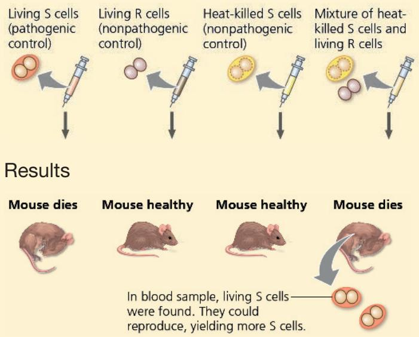

Conclusion

The living R bacteria had been transformed into pathogenic S bacteria by an unknown, heritable substance from the dead S cells that enabled the R cells to make capsules.

Data from F. Griffith, The significance of pneumococcal types, Journal of Hygiene 27:113–159 (1928).

WHAT IF? How did this experiment rule out the possibility that the R cells simply used the dead S cells' capsules to become pathogenic? For suggested answer, see Appendix A.

DNA (or sometimes RNA) enclosed by a protective coat, which is often simply protein. To produce more viruses, a virus must infect a cell and take over the cell's metabolic machinery.

Phages have been widely used as tools by researchers in molecular genetics. In 1952, Alfred Hershey

## Figure 16.3 A virus infecting a bacterial cell.

A phage called T2 attaches to a host cell and injects its genetic material through the plasma membrane, while the head and tail parts remain on the outer bacterial surface (colorized TEM).

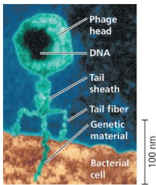

and Martha Chase performed experiments showing that DNA is the genetic material of a phage known as T2. This is one of many phages that infect Escherichia coli (E. coli), a bacterium that normally lives in the intestines of mammals and is a model organism for molecular biologists. At that time, biologists already knew that T2, like many other phages, was composed almost entirely of DNA and protein. They also knew that the T2 phage could quickly turn an E. coli cell into a T2-producing factory that released many copies of new phages when the cell ruptured. Somehow, T2 could reprogram its host cell to produce viruses. But which viral component—protein or DNA—was responsible?

Hershey and Chase answered this question by devising an experiment showing that only one of the two components of T2 actually enters the E. coli cell during infection (Figure 16.4). In their

## Figure 16.4

## Inquiry: Is protein or DNA the genetic material of phage T2?

## Experiment

Alfred Hershey and Martha Chase used radioactive sulfur and phosphorus to trace the fates of protein and DNA, respectively, of T2 phages that infected bacterial cells. They

1 Mixed radioactively labeled phages with bacteria. The phages infected the bacterial cells.

wanted to see which of these molecules entered the cells and could reprogram them to make more phages.

2 Agitated the mixture in a blender to free the phage parts outside the bacteria from the cells.

3 Centrifuged the mixture so that bacteria formed a pellet at the bottom of the test tube; free phages and phage parts, which are lighter, remained suspended in the liquid.

4 Measured the radioactivity in the pellet and the liquid.

Batch 1: Phages were grown with radioactive sulfur ( $^{35}$ S), which was incorporated into phage protein (pink).

Radioactivity (phage protein) found in liquid

Batch 2: Phages were grown with radioactive phosphorus ( $^{32}$ P), which was incorporated into phage DNA (blue).

## Results

When proteins were labeled (batch 1), radioactivity remained outside the cells, but when DNA was labeled (batch 2), radioactivity was found inside the cells. Cells containing radioactive phage DNA released new phages with some radioactive phosphorus.

## Conclusion

Phage DNA entered bacterial cells, but phage proteins did not. Hershey and Chase concluded that DNA, not protein, functions as the genetic material of phage T2.

Data from A. D. Hershey and M. Chase, Independent functions of viral protein and nucleic acid in growth of bacteriophage, Journal of General Physiology 36:39–56 (1952).

WHAT IF? How would the results have differed if proteins carried the genetic information?

For suggested answer, see Appendix A.

experiment, they used a radioactive isotope of sulfur to tag protein in one batch of T2 and a radioactive isotope of phosphorus to tag DNA in a second batch. Because protein, but not DNA, contains sulfur, radioactive sulfur atoms were incorporated only into the protein of the phage. In a similar way, the atoms of radioactive phosphorus labeled only the DNA, not the protein, because nearly all the phage's phosphorus is in its DNA. In the experiment, different samples of nonradioactive E. coli cells were infected separately with the protein-labeled and DNA-labeled batches of T2. The researchers then tested the two samples shortly after the onset of infection to see which type of radioactively labeled molecule—protein or DNA—had entered the bacterial cells and would therefore be capable of reprogramming them.

Hershey and Chase found that the phage DNA entered the host cells, but the phage protein did not. Moreover, when these bacteria were returned to a culture medium and the infection ran its course, the E. coli released phages that contained some radioactive phosphorus. This result further showed that the DNA inside the cell played an ongoing role during the infection process. They concluded that the DNA injected by the phage must be the molecule carrying the genetic information that makes the cells produce new viral DNA and proteins. The Hershey-Chase experiment was a landmark study because it provided powerful evidence that nucleic acids, rather than proteins, are the hereditary material, at least for certain viruses.

## Additional Evidence That DNA Is the Genetic Material

Further evidence that DNA is the genetic material came from the laboratory of biochemist Erwin Chargaff. DNA was known to be a polymer of nucleotides, each having three components: a nitrogenous (nitrogen-containing) base, a pentose sugar called deoxyribose, and a phosphate group (Figure 16.5). The base can be adenine (A), thymine (T), guanine (G), or cytosine (C). Chargaff analyzed the base composition of DNA from a number of different organisms. In 1950, he reported that the base composition of DNA varies from one species to another. For example, he found that 32.8% of sea urchin DNA nucleotides have the base A, whereas only 24.7% of those from the bacterium E. coli have an A. This evidence of molecular diversity among species, which most scientists had presumed to be absent from DNA, made DNA a more credible candidate for the genetic material.

Chargaff also noticed a peculiar regularity in the ratios of nucleotide bases. In the DNA of each species he studied, the number of adenines approximately equaled the number of thymines, and the number of guanines approximately equaled the number of cytosines. In sea urchin DNA, for example, the four bases are present in these percentages: A = 32.8% and T = 32.1%; G = 17.7% and C = 17.3%. (The percentages are not exactly the same because of limitations in Chargaff's techniques.)

These two findings became known as Chargaff's rules: (1) DNA base composition varies between species, and (2) for each species, the percentages of A and T bases are roughly equal, as are those of G and C bases. In the Scientific Skills Exercise, you can use Chargaff's rules to predict percentages of nucleotide bases. The basis for these rules remained unexplained until the discovery of the double helix.

## Figure 16.5 The structure of a DNA strand.

Each DNA nucleotide monomer consists of the sugar deoxyribose (blue pentagon) attached to both a nitrogenous base (A, T, G, or C), and a phosphate group (yellow circle). The phosphate group of one nucleotide is attached to the sugar of the next by a covalent bond, forming a “backbone” of alternating phosphates and sugars from which the bases project. A polynucleotide strand has directionality, from the 5' end (with the phosphate group) to the 3' end (with the —OH group of the sugar). 5' and 3' refer to the numbers assigned to the carbons in the sugar ring (see magenta numbers).

Sugar-phosphate backbone

Nitrogenous bases

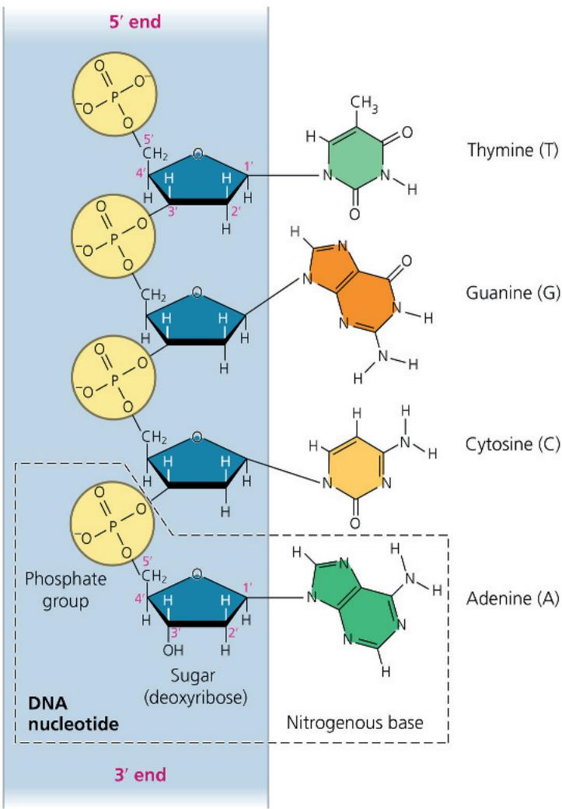

## Building a Structural Model of DNA

Once most biologists were convinced that DNA was the genetic material, the challenge was to determine how the structure of DNA could account for its role in inheritance. By the early 1950s, the arrangement of covalent bonds in a nucleic acid polymer was well established (see Figure 16.5), and researchers focused on discovering the three-dimensional structure of DNA. Among the scientists working on the problem were Linus Pauling, at the California Institute of Technology, and Maurice Wilkins and Rosalind Franklin, at King's College in London. First to come up with the complete answer, however, were two scientists who were relatively unknown at the time—the American James Watson and the Englishman Francis Crick.

The collaborative work that solved the puzzle of DNA structure began soon after Watson went to Cambridge University, where Crick

# Scientific Skills Exercise Working with Data in a Table

Given the Percentage Composition of One Nucleotide in a Genome, Can We Predict the Percentages of the Other Three Nucleotides? Even before the structure of DNA was elucidated, Erwin Chargaff and his co-workers noticed a pattern in the base composition of nucleotides from different species: The percentage of adenine (A) bases roughly equaled that of thymine (T) bases, and the percentage of cytosine (C) bases roughly equaled that of guanine (G) bases. Further, the percentage of each pair (A–T or C–G) varied from species to species. We now know that the 1:1 A/T and C/G ratios are due to complementary base pairing between A and T and between C and G in the DNA double helix, and differences between species are due to the unique sequences of bases along a DNA strand. In this exercise, you will apply Chargaff's rules to predict the composition of bases in a genome.

How the Experiments Were Done In Chargaff's experiments, DNA was extracted from the given species, hydrolyzed to break apart the nucleotides, and then analyzed chemically. These studies provided approximate values for each type of nucleotide. (Today, whole-genome sequencing allows base composition analysis to be done more precisely directly from the sequence data.)

Data from the Experiments Tables are useful for organizing sets of data representing a common set of values (here, percentages of A, G, C, and T) for a number of different samples (in this case, from different species). You can apply the patterns that you see in the known data to predict unknown values. In the table shown here, the complete base distribution data are given for sea urchin DNA and salmon DNA; you will use Chargaff's rules to fill in the rest of the table with predicted values.

was studying protein structure with a technique called X-ray crystallography (see Figure 5.21). While visiting the laboratory of Maurice Wilkins, Watson saw an X-ray diffraction image of DNA produced by Wilkins's accomplished colleague Rosalind Franklin (Figure 16.6). Images produced by X-ray crystallography are not actually pictures of molecules. The spots in the image were produced by X-rays that were diffracted (diverted) as they passed through aligned fibers of purified DNA. Watson was familiar with the type of X-ray diffraction pattern of helical molecules, and seeing the photo that Wilkins showed him confirmed that DNA was helical in shape. The photo also added to earlier data obtained by Franklin and others suggesting the width of the helix and the spacing of the nitrogenous bases along it. The pattern in this photo implied that the helix was made up of two strands, contrary to a three-stranded model proposed by Linus Pauling a short time earlier. The presence of two strands accounts for the now-familiar term double helix. DNA is shown in some of its many different representations in Figure 16.7. Watson and Crick began building models of a double helix that would conform to the X-ray measurements and what was then

<table><tr><td rowspan="2">Source of DNA</td><td colspan="4">Base Percentage</td></tr><tr><td>Adenine</td><td>Guanine</td><td>Cytosine</td><td>Thymine</td></tr><tr><td>Sea urchin</td><td>32.8</td><td>17.7</td><td>17.3</td><td>32.1</td></tr><tr><td>Salmon</td><td>29.7</td><td>20.8</td><td>20.4</td><td>29.1</td></tr><tr><td>Wheat</td><td>28.1</td><td>21.8</td><td>22.7</td><td></td></tr><tr><td>E. coli</td><td>24.7</td><td>26.0</td><td></td><td></td></tr><tr><td>Human</td><td>30.4</td><td></td><td></td><td>30.1</td></tr><tr><td>Ox</td><td>29.0</td><td></td><td></td><td></td></tr><tr><td>Average %</td><td></td><td></td><td></td><td></td></tr></table>

Data from several papers by Chargaff: for example, E. Chargaff et al., Composition of the desoxypentose nucleic acids of four genera of sea-urchin, Journal of Biological Chemistry 195: 155–160 (1952).

## INTERPRET THE DATA

1. Explain how the sea urchin and salmon data demonstrate both of Chargaff's rules.

2. Using Chargaff's rules, fill in the table with your predictions of the missing percentages of bases, starting with the wheat genome and proceeding through $E. coli$ , human, and ox. Show how you arrived at your answers.

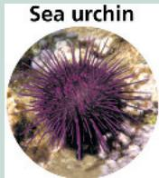

3. If Chargaff's rule—that the amount of A equals the amount of T and the amount of C equals the amount of G—is valid, then hypothetically we could extrapolate this to the combined DNA of all species on Earth (like one huge Earth genome). To see whether the data in the table support this hypothesis, calculate the average percentage for each base in your completed table by averaging the values in each column. Does Chargaff's equivalence rule still hold true?

Instructors: A version of this Scientific Skills Exercise can be assigned in Mastering Biology.

Figure 16.6 Rosalind Franklin and her X-ray diffraction photo of DNA.  
  
(a) Rosalind Franklin

  
(b) Franklin's X-ray diffraction photograph of DNA

Diameter $= 2\mathrm{nm}$

One full turn every 10 base pairs (3.4 nm)

## Visualizing DNA

## Figure 16.7

DNA can be illustrated in many ways, but all diagrams represent the same basic structure. The level of detail shown depends on the process or the type of information being conveyed.

Here, the two DNA strands are shown untwisted so it's easier to see the chemical details. Note that the strands are antiparallel—they are oriented in opposite directions, like the lanes of a divided street.

## Structural Images

The space-filling model on the left shows the 3-D shape of the DNA double helix; the diagram on the right shows chemical details of DNA's structure. In both images, phosphate groups are yellow, deoxyribose sugars are blue, and nitrogenous bases are shades of green and orange.

The DNA double helix is "right-handed." To see why, picture a person's right hand held as shown, following the sugar phosphate backbone up the helix and around to the back. (It won't work with their left hand.)

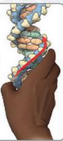

1. Describe the bonds that hold together the nucleotides in one DNA strand. Then compare them with the bonds that hold the two DNA strands together.

2. How do the two ends of a DNA strand differ in structure?

## Simplified Images

When molecular detail is not necessary, DNA is portrayed in a range of simplified diagrams, depending on the focus of the figure.

These flattened "ladder style" diagrams of DNA depict the sugar-phosphate backbones like the side rails of a ladder, with the base pairs as rungs. Light blue is used to indicate the more recently synthesized strand.

Sometimes the double-stranded DNA molecule is shown simply as two straight lines.

3. Compare the information conveyed in the three ladder diagrams.

## DNA Sequences

Genetic information is carried in DNA as a linear sequence of nucleotides that may be transcribed into mRNA and translated into a polypeptide. When focusing on the DNA sequence, each nucleotide can be represented simply as the letter of its base: A, T, C, or G.

3' - ACGTAAGCGGTTAAT-5'
5' - TGCATTTCGCCAATTA-3'

Instructors: Additional questions related to this Visualizing Figure can be assigned in Mastering Biology. For suggested answers, see Appendix A.

known about the chemistry of DNA, including Chargaff's rule of base equivalences. Having also read an unpublished annual report summarizing Franklin's work, they knew she had concluded that the sugar-phosphate backbones were on the outside of the DNA molecule, contrary to their working model. Franklin's arrangement was appealing because it put the negatively charged phosphate groups facing the aqueous surroundings, while the relatively hydrophobic nitrogenous bases were hidden in the interior. Watson constructed such a model, in which the two sugar-phosphate backbones are antiparallel—that is, their subunits run in opposite directions (see Figure 16.7). You can imagine the overall arrangement as a rope ladder with rigid rungs. The side ropes represent the sugar-phosphate backbones, and the rungs represent pairs of nitrogenous bases. Now imagine twisting the ladder to form a helix. Franklin's X-ray data indicated that the helix makes one full turn every $3.4\mathrm{nm}$ along its length. With the bases stacked just $0.34\mathrm{nm}$ apart, there are ten layers of base pairs, or rungs of the ladder, in each full turn of the helix.

The nitrogenous bases of the double helix are paired in specific combinations: adenine (A) with thymine (T), and guanine (G) with cytosine (C). It was mainly by trial and error that Watson and Crick arrived at this key feature of DNA. At first, Watson imagined that the bases paired like with like—for example, A with A and C with C. But this model did not fit the X-ray data, which suggested that the double helix had a uniform diameter. Why is this requirement inconsistent with like-with-like pairing of bases? Adenine and guanine are purines, nitrogenous bases with two organic rings, while cytosine and thymine are nitrogenous bases called pyrimidines, which have a single ring. Pairing a purine with a pyrimidine is the only combination that results in a uniform diameter for the double helix (Figure 16.8).

Watson and Crick reasoned that there must be additional specificity of pairing dictated by the structure of the bases. Each base has chemical side groups that can form hydrogen bonds with its appropriate partner: Adenine can form two hydrogen bonds with thymine and only thymine; guanine forms three hydrogen bonds with cytosine and only cytosine. In shorthand, A pairs with T, and G pairs with C (Figure 16.9).

The Watson-Crick model took into account Chargaff's ratios and ultimately explained them. Wherever one strand of a DNA molecule has an A, the partner strand has a T. Similarly, a G in one strand is always paired with a C in the complementary strand. Therefore, in the DNA of any organism, the amount of adenine equals the amount of thymine, and the amount of guanine equals the amount of cytosine. (Modern DNA-sequencing techniques have confirmed that the amounts are exactly equal.) Although the

Purine + purine: too wide

  
Pyrimidine + pyrimidine: too narrow  
Purine + pyrimidine: width consistent with X-ray data

## Figure 16.9 Base pairing in DNA.

Nitrogenous base pairs are held together by hydrogen bonds.

Figure 16.8 Possible base pairings in the DNA double helix.  

base-pairing rules dictate the combinations of nitrogenous bases that form the “rungs” of the double helix, they do not restrict the sequence of nucleotides along each DNA strand. The linear sequence of the four bases can be varied in countless ways, and each gene has a unique base sequence.

In April 1953, Watson and Crick surprised the scientific world with a succinct, one-page paper that reported their molecular model for DNA: the double helix, which has since become an icon of molecular biology. They did not include Rosalind Franklin as an author, in spite of using her data to build their model. Watson and Crick, along with Maurice Wilkins, were awarded the Nobel Prize in 1962 for this work. (Sadly, Franklin had died at the age of 37 in 1958 and was thus ineligible for the prize.) The beauty of the double helix model was that the structure of DNA suggested the basic mechanism of its replication.

## Concept Check 16.1

1. Given a polynucleotide sequence such as GAATTC, explain what further information you would need in order to identify which is the 5' end. (See Figure 16.5.)

2. VISUAL SKILLS While trying to develop a vaccine for S. pneumoniae, Griffith was surprised to discover the phenomenon of bacterial transformation. Based on the results in the second and third panels of Figure 16.2, what result was he expecting in the fourth panel? Explain.

For suggested answers, see Appendix A.

## Concept 16.2: Many proteins work together in DNA replication and repair

Hereditary information in DNA directs the development of your biochemical, anatomical, physiological, and, to some extent, behavioral traits. A person's resemblance to their parents has its basis in the accurate replication of DNA prior to meiosis and therefore its transmission from the parents' generation to the children's. Replication prior to mitosis ensures faithful transmission of genetic information from a parent cell to two daughter cells.

Of all nature's molecules, nucleic acids are unique in their ability to dictate their own replication from monomers. The relationship between structure and function is evident in the double helix: The specific complementary pairing of nitrogenous bases in DNA has a functional significance. Watson and Crick ended their classic paper with this statement: "It has not escaped our notice that the specific

Figure 16.10 A model for DNA replication: the basic concept.  
In this simplified illustration, a short segment of DNA has been untwisted. Simple shapes symbolize the four kinds of bases. Dark blue represents DNA strands present in the parental molecule; light blue represents newly synthesized DNA.  
  
(a) The parental molecule has two complementary strands of DNA. Each base is paired by hydrogen bonding with its specific partner, A with T and G with C.

  
(b) First, the two DNA strands are separated. Each parental strand can now serve as a template for a new, complementary strand.

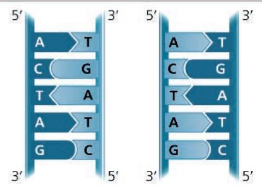  
(c) Nucleotides complementary to the parental (dark blue) strand are connected to form the sugar-phosphate backbones of the new "daughter" (light blue) strands.  
somehow come back together after the process (that is, the parental molecule is conserved). In yet a third model, called the dispersive model, all four strands of DNA following replication have a mixture of old and new DNA (Figure 16.11).

pairing we have postulated immediately suggests a possible copying mechanism for the genetic material."¹ In this section, you will learn about the basic principle of DNA replication, the copying of DNA, as well as some important details of the process.

## The Basic Principle: Base Pairing to a Template Strand

In a second paper, Watson and Crick stated their hypothesis for how DNA replicates: "Now our model for deoxyribonucleic acid is, in effect, a pair of templates, each of which is complementary to the other. We imagine that prior to duplication the hydrogen bonds are broken, and the two chains unwind and separate. Each chain then acts as a template for the formation on to itself of a new companion chain, so that eventually we shall have two pairs of chains, where we only had one before. Moreover, the sequence of the pairs of bases will have been duplicated exactly."2

Figure 16.10 illustrates the basic idea. If you cover a DNA strand in Figure 16.10a, its linear sequence of nucleotides is revealed by applying the base-pairing rules to the uncovered strand. The two strands are complementary; each stores the information necessary to reconstruct the other. When a cell copies a DNA molecule, each strand serves as a template for ordering nucleotides into a new, complementary strand. Nucleotides line up along the template strand according to the base-pairing rules and are linked to form the new strands. One double-stranded DNA molecule becomes two, each an exact replica of the “parental” molecule.

This model of DNA replication remained untested for several years following publication of the DNA structure. The necessary experiments were simple in concept but difficult to perform. Watson and Crick's model predicts that when a double helix replicates, each of the two daughter molecules will have one old strand, from the parental molecule, and one newly made strand. This semiconservative model can be distinguished from a conservative model of replication, in which the two parental strands

## Figure 16.11 DNA replication: three alternative models.

Each short segment of double helix symbolizes the DNA within a cell. Beginning with a parent cell, we follow the DNA for two more generations of cells—two rounds of DNA replication. Parental DNA is dark blue; newly made DNA is light blue.

<table><tr><td></td><td>Parent cell</td><td>First replication</td><td>Second replication</td></tr><tr><td>(a) Conservative model.The two parental strands reassociate after acting as templates for new strands, thus restoring the parental double helix.</td><td></td><td></td><td></td></tr><tr><td>(b) Semiconservative model.The two strands of the parental molecule separate, and each functions as a template for synthesis of a new, complementary strand.</td><td></td><td></td><td></td></tr><tr><td>(c) Dispersive model.Each strand of both daughter molecules contains a mixture of old and newly synthesized DNA.</td><td colspan="3">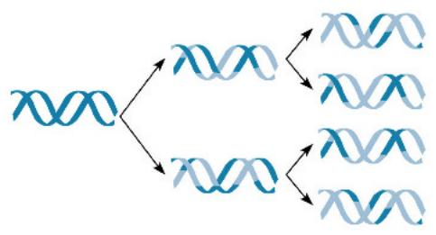</td></tr></table>

## Figure 16.12

# Inquiry: Does DNA replication follow the conservative, semiconservative, or dispersive model?

Experiment

Matthew Meselson and Franklin Stahl cultured E. coli for several generations in a medium containing nucleotide precursors labeled with a heavy isotope of nitrogen, ${}^{15}$ N. They then transferred the bacteria to a medium with only ${}^{14}$ N, a lighter isotope. They took one sample after the first DNA replication and another after the second replication. They extracted DNA from the bacteria in the samples and then centrifuged each DNA sample to separate DNA of different densities.

## Conclusion

Meselson and Stahl compared their results to those predicted by each of the three models in Figure 16.11, as summarized in the following diagram. The first replication in the ${}^{14}$ N medium produced a single band of many molecules of hybrid ( ${}^{15}$ N- ${}^{14}$ N) DNA. This

Although mechanisms for conservative or dispersive DNA replication are not easy to devise, these models remained possibilities until they could be ruled out. After two years of preliminary work at the California Institute of Technology in the late 1950s, Matthew Meselson and Franklin Stahl devised a clever experiment that distinguished between the three models, described in Figure 16.12. Their results supported the semiconservative model of DNA replication, as predicted by Watson and Crick, and their experiment is widely recognized among biologists as a classic example of elegant design.

The basic principle of DNA replication is conceptually simple. However, the actual process involves some complicated biochemical gymnastics, as we will now see.

## DNA Replication: A Closer Look

The bacterium E. coli has a single chromosome of about 4.6 million nucleotide pairs. In a favorable environment, an E. coli cell can copy all of this DNA and divide to form two genetically identical daughter cells in considerably less than an hour. Each of result eliminated the conservative model. The second replication produced both light and hybrid DNA, refuting the dispersive model and supporting the semiconservative model. They therefore concluded that DNA replication is semiconservative.

  
Data from M. Meselson and F. W. Stahl, The replication of DNA in Escherichia coli, Proceedings of the National Academy of Sciences USA 44:671–682 (1958).

INQUIRY IN ACTION Read and analyze the original paper in Inquiry in Action: Interpreting Scientific Papers.

Instructors: A related Experimental Inquiry Tutorial can be assigned in Mastering Biology.

WHAT IF? If Meselson and Stahl had first grown the cells in ${}^{14}$ N-containing medium and then moved them into ${}^{15}$ N-containing medium before taking samples, what would have been the result after each of the two replications?

For suggested answer, see Appendix A.

your somatic cells has 46 DNA molecules in its nucleus, one long double-helical molecule per chromosome. In all, that represents about 6 billion nucleotide pairs, or over 1,000 times more DNA than is found in most bacterial cells. If we were to print the one-letter symbols for these bases (A, G, C, and T) the size of the type you are now reading, the 6 billion nucleotide pairs of information in a diploid human cell would fill about 1,400 biology textbooks. Yet it takes one of your cells just a few hours to copy all of this DNA during S phase of interphase. This replication of an enormous amount of genetic information is achieved with very few errors—only about one per 10 billion nucleotides. The copying of DNA is remarkable in its speed and accuracy.

More than a dozen enzymes and other proteins participate in DNA replication. Much more is known about how this “replication machine” works in bacteria (such as $E.\ coli$ ) than in eukaryotes, and we will describe the basic steps of the process for $E.\ coli$ , except where otherwise noted. What scientists have learned about eukaryotic DNA replication suggests, however, that most of the process is fundamentally similar for prokaryotes and eukaryotes.

## Getting Started

The replication of chromosomal DNA begins at particular sites called origins of replication, short stretches of DNA that have a specific sequence of nucleotides. The E. coli chromosome, like many other bacterial chromosomes, is circular and has a single origin. Proteins that initiate DNA replication recognize this sequence and attach to the DNA, separating the two strands and opening up a replication “bubble” (Figure 16.13a). Replication of DNA then proceeds in both directions until the entire molecule is copied. In contrast to a bacterial chromosome, a eukaryotic chromosome may have hundreds or even a few thousand replication origins. Multiple replication bubbles form and eventually fuse, thus speeding up the copying of the very long DNA molecules (Figure 16.13b). As in bacteria, eukaryotic DNA replication proceeds in both directions from each origin.

At each end of a replication bubble is a replication fork, a Y-shaped region where the parental strands of DNA are being unwound. Several kinds of proteins participate in the unwinding (Figure 16.14). Helicases are enzymes that untwist the double helix at the replication forks, separating the two parental strands and making them available as template strands. After the parental strands separate, single-strand binding proteins bind to the unpaired DNA strands, keeping them from re-pairing. The untwisting of the double helix causes tighter twisting and strain ahead of the replication fork. Topoisomerase is an enzyme that helps relieve this strain by breaking, swiveling, and rejoining DNA strands.

## Synthesizing a New DNA Strand

The unwound sections of parental DNA strands are now available to serve as templates for the synthesis of new complementary DNA strands. However, the enzymes that synthesize DNA cannot initiate the synthesis of a polynucleotide; they can only add DNA nucleotides to the end of an already existing chain that is base-paired with the template strand. An initial nucleotide chain that can be used as a pre-existing chain is produced during DNA synthesis; this is actually a short stretch of RNA, not DNA. The RNA chain is called a primer

Figure 16.13 Origins of replication in E. coli and eukaryotes.  
The smaller red arrows indicate the movement of the replication forks and thus the overall directions of DNA replication within each bubble.  
  
The circular chromosome of E. coli and other bacteria has only one origin of replication. The parental strands separate there, forming a replication bubble with two forks (red arrows). Replication proceeds in both directions until the forks meet on the other side, resulting in two daughter DNA molecules. The TEM shows a bacterial chromosome with a replication bubble.

  
Two daughter DNA molecules

  
In a linear chromosome of a eukaryote, replication bubbles form at many sites along the giant DNA molecule during S phase of interphase. The bubbles expand as replication proceeds in both directions (red arrows). Eventually, the bubbles fuse and synthesis of the daughter strands is complete. The TEM shows three replication bubbles along the DNA of a cultured Chinese hamster cell.

Figure 16.14 Some of the proteins involved in the initiation of DNA replication.

The same proteins function at both replication forks in a replication bubble. For simplicity, only the left-hand fork is shown, and the DNA bases are drawn much larger in relation to the proteins than they are in reality.

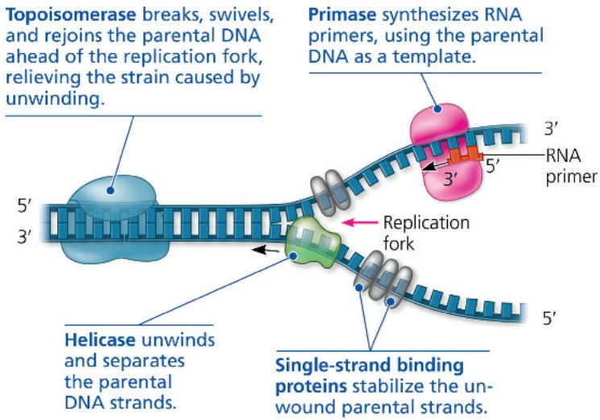

and is synthesized by the enzyme primase (see Figure 16.14). Primase starts a complementary RNA chain with a single RNA nucleotide and adds RNA nucleotides one at a time, using the parental DNA strand as a template. The completed primer, generally five to ten nucleotides long, is thus base-paired to the template strand. The new DNA strand will start from the 3' end of the RNA primer; the RNA primer will be destroyed later, as we'll describe in a bit.

Enzymes called DNA polymerases catalyze the synthesis of new DNA by adding nucleotides to the 3' end of a preexisting chain. In E. coli, there are several DNA polymerases, but two of them appear to play the major roles in DNA replication: DNA polymerase III and DNA polymerase I. The situation in eukaryotes is more complicated, with at least 11 different DNA polymerases discovered so far, although the general principles are the same.

Most DNA polymerases require a primer and a DNA template strand, along which complementary DNA nucleotides are lined up, one by one. In E. coli, DNA polymerase III (abbreviated DNA pol III) adds a DNA nucleotide to the RNA primer and then continues adding DNA nucleotides, which are complementary to the parental DNA template strand, to the growing end of the new DNA strand. The rate of elongation is about 500 nucleotides per second in bacteria and 50 per second in human cells.

Each nucleotide to be added to a growing DNA strand consists of a sugar attached to a base and to three phosphate groups. You have already encountered such a molecule—ATP (adenosine triphosphate; see Figure 8.9). The only difference between the ATP of energy metabolism and dATP, the adenine nucleotide used to make DNA, is the sugar component, which is deoxyribose in the building block of DNA but ribose in ATP. Like ATP, the nucleotides used for DNA synthesis are chemically reactive, partly because their triphosphate tails have an unstable cluster of negative charge. DNA polymerase catalyzes the addition of each monomer to the growing end of a DNA strand by a condensation reaction in which two phosphate groups are lost as a molecule of pyrophosphate. Subsequent hydrolysis of the pyrophosphate to two molecules of inorganic phosphate is a coupled exergonic reaction that helps drive the polymerization reaction (Figure 16.15).

## Antiparallel Elongation

As we have noted previously, the two ends of a DNA strand are different, giving each strand directionality, like a one-way street (see Figure 16.5). In addition, the two strands of DNA in a double helix are antiparallel, meaning that they are oriented in opposite directions to each other, like the two sides of a divided street (see Figure 16.15). Therefore, the two new strands formed during DNA replication must also be antiparallel to their template strands.

The antiparallel arrangement of the double helix, together with a constraint on the function of DNA polymerases, has an important effect on how replication occurs. Because of their structure, DNA polymerases can add nucleotides only to the free 3' end of a primer or growing DNA strand, never to the 5' end (see Figure 16.15). Thus, a new DNA strand can elongate only in the 5' → 3' direction. With this in mind, let's examine one of the two replication forks in a bubble (Figure 16.16). Along one template strand, DNA polymerase III can synthesize a complementary strand continuously by elongating the new DNA in the mandatory 5' → 3' direction. DNA pol III remains in the replication fork on that template strand and continuously adds nucleotides to the new complementary strand as the fork progresses. The DNA strand made by this mechanism is called the leading strand. Only one primer is required for DNA pol III to synthesize the entire leading strand (see Figure 16.16).

To elongate the other new strand of DNA in the mandatory $5'\rightarrow3'$ direction, DNA pol III must work along the other template strand in the direction away from the replication fork. The DNA strand elongating in this direction is called the lagging strand. In contrast to the leading strand, which elongates continuously, the

Figure 16.15 Addition of a nucleotide to a DNA strand. DNA polymerase catalyzes addition of a nucleotide to the 3' end of a growing DNA strand, with the release of two phosphates.  
  
DRAW IT Circle the area where the new bond was made. For suggested answer, see Appendix A.

## Figure 16.16 Synthesis of the leading strand during DNA replication.

This diagram focuses on the left replication fork shown in the overview box. DNA polymerase III (DNA pol III), shaped like a cupped hand, is shown closely associated with a protein called the “sliding clamp” that encircles the newly synthesized double helix like a doughnut. The sliding clamp moves DNA pol III along the DNA template strand.

lagging strand is synthesized discontinuously, as a series of segments. These segments of the lagging strand are called Okazaki fragments, after Reiji Okazaki, the Japanese scientist who discovered them. The fragments are about 1,000–2,000 nucleotides long in E. coli and 100–200 nucleotides long in eukaryotes.

Figure 16.17 illustrates the steps in the synthesis of the lagging strand at one fork. Whereas only one primer is required on the leading strand, each Okazaki fragment on the lagging strand must be primed separately (1 and 4). After DNA pol III forms an Okazaki fragment (2 to 4), another DNA polymerase, DNA pol I, replaces the RNA nucleotides of the adjacent primer with DNA nucleotides one at a time (5). But DNA pol I cannot join the final nucleotide of this replacement DNA segment to the first DNA nucleotide of the adjacent Okazaki fragment. Another enzyme, DNA ligase, accomplishes this task, joining the sugar-phosphate backbones of all the Okazaki fragments into a continuous DNA strand (6).

Synthesis of the leading strand and synthesis of the lagging strand occur concurrently and at the same rate. The lagging strand is so named because its synthesis is delayed slightly relative to synthesis of the

Figure 16.17 Synthesis of the lagging strand.  

leading strand; each new fragment of the lagging strand cannot be started until enough template has been exposed at the replication fork.

Figure 16.18 and Table 16.1 summarize DNA replication. Please study them carefully before proceeding.

## The DNA Replication Complex

It is traditional—and convenient—to represent DNA polymerase molecules as locomotives moving along a DNA railroad track, but such a model is inaccurate in two important ways. First, the various proteins that participate in DNA replication actually form a single large complex, a “DNA replication machine.” Many protein-protein interactions facilitate the efficiency of this complex. For example, by interacting with other proteins at the fork, primase apparently acts as a molecular brake, slowing progress of the replication fork and coordinating the placement of primers and the

rates of replication on the leading and lagging strands. Second, the DNA replication complex may not move along the DNA; rather, the DNA may move through the complex during the replication process. In eukaryotic cells, multiple copies of the complex, perhaps grouped into “factories,” may be anchored to the nuclear matrix, a framework of fibers extending through the interior of the nucleus.

Some experimental evidence supports a model in which two DNA polymerase molecules, one on each template strand, "reel in" the parental DNA and extrude newly made daughter DNA molecules. In this so-called trombone model, the lagging strand is also looped back through the complex (Figure 16.19). Whether the complex moves along the DNA or whether the DNA moves through the complex, either anchored or not, are still open, unresolved questions that are under active investigation.

Figure 16.18 A summary of bacterial DNA replication.  
The detailed diagram shows the left-hand replication fork of the replication bubble shown in the overview (upper right). Viewing each daughter strand in its entirety in the overview, you can see that half of it is made continuously as the leading strand, while the other half (on the other side of the origin) is synthesized in fragments as the lagging strand.  
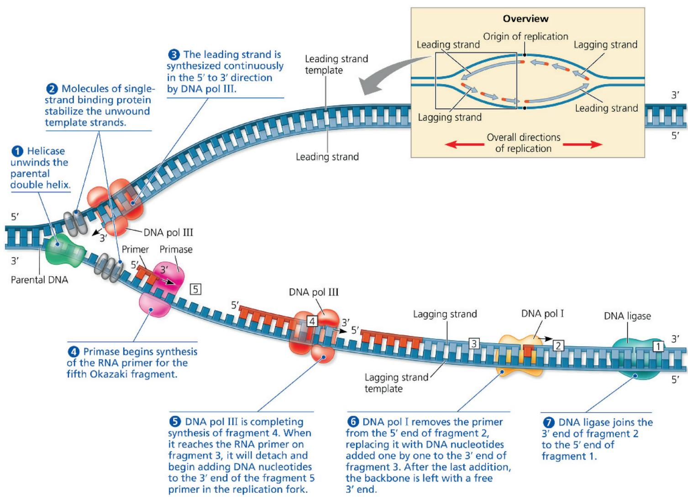  
DRAW IT Draw a diagram showing the right-hand fork of the bubble in this figure. Number the Okazaki fragments, and label all 5' and 3' ends.  
For suggested answer, see Appendix A.

Table 16.1 Bacterial DNA Replication Proteins and Their Functions

<table><tr><td>Protein</td><td>Function</td></tr><tr><td>Helicase</td><td>Unwinds parental double helix at replication forks</td></tr><tr><td>Single-strand binding protein</td><td>Binds to and stabilizes single-stranded DNA until it is used as a template</td></tr><tr><td>Topoisomerase</td><td>Relieves overwinding strain ahead of replication forks by breaking, swiv-elling, and rejoining DNA strands</td></tr><tr><td>Primase</td><td>Synthezises an RNA primer at 5&#x27; end of leading strand and at 5&#x27; end of each Okazaki fragment of lagging strand</td></tr><tr><td>DNA pol IIT</td><td>Using parental DNA as a template, synthezises new DNA strand by add-ing nucleotides to an RNA primer or a pre-existing DNA strand</td></tr><tr><td>DNA pol I</td><td>Removes RNA nucleotides of primer from 5&#x27; end and replaces them with DNA nucleotides added to 3&#x27; end of adjacent fragment</td></tr><tr><td>DNA ligase</td><td>Joins Okazaki fragments of lagging strand; on leading strand, joins 3&#x27; end of DNA that replaces primer to rest of leading strand DNA</td></tr></table>

Figure 16.19 The “trombone” model of the DNA replication complex.

## Proofreading and Repairing DNA

The accuracy of DNA replication is not solely due to the specificity of base pairing. Initial pairing errors between incoming nucleotides and those in the template strand occur at a rate of one in $10^{5}$ nucleotides. However, errors in the completed DNA molecule amount to only one in $10^{10}$ (10 billion) nucleotides, an error rate that is 100,000 times lower. This is because during DNA replication, many DNA polymerases proofread each nucleotide against its template as soon as it is covalently bonded to the growing strand. Upon finding an incorrectly paired nucleotide, the polymerase removes the nucleotide and then resumes synthesis. (This action is similar to fixing a texting error by deleting the wrong letter and then entering the correct one.)

Mismatched nucleotides sometimes evade proofreading by a DNA polymerase. In mismatch repair, other enzymes remove and replace incorrectly paired nucleotides that have resulted from replication errors. Researchers highlighted the importance of such repair enzymes when they found that a hereditary defect in one of them is associated with a form of colon cancer. Apparently, this defect allows cancer-causing errors to accumulate in the DNA faster than normal.

Incorrectly paired or altered nucleotides can also arise after replication. In fact, maintenance of the genetic information encoded in DNA requires frequent repair of various kinds of

In this proposed model, two molecules of DNA polymerase III work together in a complex, one on each strand, with helicase and other proteins. The lagging strand template DNA loops through the complex, resembling the slide of a trombone.

  
DRAW IT Draw a line tracing the lagging strand template in this figure. For suggested answer, see Appendix A.

damage to existing DNA. DNA molecules are constantly subjected to potentially harmful chemical and physical agents, such as X-rays, as we'll discuss in Concept 17.5. In addition, DNA bases may undergo spontaneous chemical changes under normal cellular conditions. However, these changes in DNA are usually corrected before they become permanent changes—mutations—perpetuated through successive replications. Each cell continuously monitors and repairs its genetic material. Because repair of damaged DNA is so important to the survival of an organism, it is no surprise that many different DNA repair enzymes have evolved. Almost 100 are known in E. coli, and about 170 have been identified so far in humans.

Most cellular systems for repairing incorrectly paired nucleotides, whether they are due to DNA damage or to replication errors, use a mechanism that takes advantage of the base-paired structure of DNA. In many cases, a segment of the strand containing the damage is cut out (excised) by a DNA-cutting enzyme—a nuclease—and the resulting gap is then filled in with nucleotides, using the undamaged strand as a template. The enzymes involved in filling the gap are a DNA polymerase and DNA ligase. There are several such DNA repair systems; one is called nucleotide excision repair.

An example is shown in Figure 16.20. An important function of the DNA repair enzymes in our skin cells is to repair genetic damage caused by the UV rays of sunlight: For example, adjacent thymine bases on a DNA strand can become covalently linked into thymine dimers, causing the DNA to buckle and interfere with DNA replication. The importance of repairing this kind of damage is underscored by a disorder called xeroderma pigmentosum (XP), which in most cases is caused by an inherited defect in a nucleotide excision repair enzyme. Individuals with XP are hypersensitive to sunlight; mutations in their skin cells caused by ultraviolet light are left uncorrected, often resulting in skin cancer. The effects are extreme: Without sun protection, children who have XP can develop skin cancer by age 10.

Figure 16.20 Nucleotide excision repair of DNA damage.  

## Evolutionary Significance of Altered DNA Nucleotides

EVOLUTION Faithful replication of the genome and repair of DNA damage are important for the functioning of the organism and for passing on a complete, accurate genome to the next generation. The error rate after proofreading and repair is extremely low, but rare mistakes do slip through. Once a mismatched nucleotide pair is replicated, the sequence change is permanent in the daughter molecule that has the incorrect nucleotide as well as in any subsequent copies. As we mentioned earlier, a permanent change in the DNA sequence is called a mutation.

Mutations can change the phenotype of an organism (see Concept 17.5). And if they occur in germ cells, which give rise to gametes, mutations can be passed on from generation to generation. The vast majority of such changes either have no effect or are harmful, but a very small percentage can be beneficial. In either case, mutations are the original source of the variation on which natural selection operates during evolution and are ultimately responsible for the appearance of new species. (You'll learn more

about this process in Unit Four.) The balance between complete fidelity of DNA replication or repair and a low mutation rate has resulted in new proteins that contribute to different phenotypes. Ultimately, over long periods of time, this process leads to new species and thus to the rich diversity of life on Earth today.

## Replicating the Ends of DNA Molecules

For linear DNA, such as the DNA of eukaryotic chromosomes, the usual replication machinery cannot complete the 5' ends of daughter DNA strands because there is no 3' end of a preexisting polynucleotide for DNA polymerase to add onto. This is another consequence of the enzyme's requirements. Even if an Okazaki fragment can be started with an RNA primer hydrogen-bonded to the very end of the template strand, once that primer is removed, it cannot be replaced with DNA because there is no 3' end available for nucleotide addition (Figure 16.21). As a result, repeated rounds of replication produce shorter and shorter DNA molecules with uneven ("staggered") ends.

Most prokaryotic organisms have a circular chromosome, with no ends, so the shortening of DNA does not occur. But what protects the genes of linear eukaryotic chromosomes from being eroded away during successive rounds of DNA replication? Eukaryotic chromosomal DNA molecules have special nucleotide sequences called telomeres at their ends (Figure 16.22). Telomeres do not contain genes; instead, the DNA typically consists of multiple repetitions of one short nucleotide sequence. In each human telomere, for example, the six-nucleotide sequence TTAGGG is repeated between 100 and 1,000 times.

Telomeres have two protective functions. First, specific proteins associated with telomeric DNA prevent the staggered ends of the daughter molecule from activating the cell's systems for monitoring DNA damage. (Staggered ends of a DNA molecule, which often result from double-strand breaks, can trigger signal transduction pathways leading to cell cycle arrest or cell death.) Second, telomeric DNA acts as a kind of buffer zone that provides some protection against the organism's genes shortening, somewhat like how the plastic-wrapped ends of a shoelace slow down its unraveling. Telomeres do not prevent the erosion of genes near the ends of chromosomes; they merely postpone it.

As shown in Figure 16.21, telomeres become shorter during every round of replication. Thus, as expected, telomeric DNA tends to be shorter in dividing somatic cells of older individuals and in cultured cells that have divided many times. It has been proposed that shortening of telomeres is somehow connected to the aging process of certain tissues and even to aging of the organism as a whole.

But what about germ cells, whose genome must persist virtually unchanged from an organism to its offspring over many generations? If the chromosomes of germ cells became shorter in every cell cycle, essential genes would eventually be missing from the gametes they produce. However, this does not occur: An enzyme called telomerase catalyzes the lengthening of telomeres in eukaryotic germ cells, thus restoring their original length and compensating for the shortening that occurs during DNA replication. This enzyme contains its own RNA molecule that it uses as a template to artificially “extend” the leading strand, allowing the lagging strand to maintain a given length.

Figure 16.21 Shortening of the ends of linear DNA molecules. Here we follow the left end of one DNA molecule through two rounds of replication. After the first round, the new lagging strand is shorter than its template. After a second round, both the leading and lagging strands have become shorter than the original parental DNA. Although not shown here, the other ends of these chromosomal DNA molecules (not shown) also become shorter.

  
Figure 16.22 Telomeres.

Eukaryotes have repetitive, noncoding sequences called telomeres at the ends of their DNA. Telomeres are the bright spots stained orange in these mouse chromosomes (LM).  

Telomerase is not active in most human somatic cells, but its activity varies from tissue to tissue. The activity of telomerase in germ cells results in telomeres of maximum length in the zygote.

The notion that longer telomeres could provide a sort of “fountain of youth” has prompted a number of studies. A decade ago, one study that artificially extended telomere length in cultured cells reported that, indeed, the cells had much longer life spans, as measured by how many times they could divide. As a logical extension, in 2023, a research team carried out a study on a group of related individuals with a mutation that led to longer telomeres. Comparing these individuals with family members without the mutation, the researchers reported that although some of those with the mutation showed signs of youthfulness, a large number of them developed tumors, cancers, and harmful blood conditions.

A likely conclusion is that normal shortening of telomeres may protect organisms from cancer by limiting the number of divisions that somatic cells can undergo. Cells from large tumors often have unusually short telomeres, as we would expect for cells that have undergone many cell divisions. Further shortening would presumably lead to self-destruction of the tumor cells. Telomerase activity is abnormally high in cancerous somatic cells, suggesting that its ability to stabilize telomere length may allow these cancer cells to persist. Many cancer cells do seem capable of unlimited cell division, as do immortal strains of cultured cells (see Concept 12.3). For several years, researchers have studied inhibition of telomerase as a possible cancer therapy. While studies that inhibited telomerase in mice with tumors have led to the death of cancer cells, eventually the cells have restored the length of their telomeres by an alternative pathway. This is an area of ongoing research that may eventually yield useful cancer treatments.

## Concept Check 16.2

1. What role does complementary base pairing play in the replication of DNA?

2. Identify two major functions of DNA pol III in DNA replication.

3. MAKE CONNECTIONS What is the relationship between DNA replication and the S phase of the cell cycle? See Figure 12.6.

4. VISUAL SKILLS If the DNA pol I in a given cell were non-functional, how would that affect the synthesis of a leading strand? In the overview box in Figure 16.18, point out where DNA pol I would normally function on the top leading strand.

For suggested answers, see Appendix A.

## Concept 16.3: A chromosome consists of a DNA molecule packed together with proteins

Now let's examine how DNA is packaged into chromosomes, the structures that carry genetic information. The main component of the genome in most bacteria is a double-stranded, circular DNA molecule that is associated with specific proteins. A bacterial chromosome differs from a eukaryotic chromosome in that a eukaryotic chromosome consists of a single linear DNA molecule associated with a large number of proteins. In E. coli, the chromosomal DNA consists of about 4.6 million nucleotide pairs, representing about 4,400 genes. This is 100 times more DNA than is found in a typical virus, but only about one-thousandth as much DNA as in a human somatic cell. Even so, that is a tremendous amount of DNA to be packaged in such a small container.

Stretched out, the DNA of an E. coli cell would measure about a millimeter in length, 1,000 times longer than the region it occupies in the cell. Within a bacterium, however, certain proteins cause the chromosome to coil and “supercoil,” densely packing it so that it fills only part of the cell. Unlike the nucleus of a eukaryotic cell, this dense region of DNA in a bacterium, called the nucleoid, is not bounded by a membrane (see Figure 6.5).

Each eukaryotic chromosome contains a single linear DNA double helix that, in humans, averages about $1.5 \times 10^{8}$ nucleotide pairs. This is an enormous amount of DNA relative to a chromosome's condensed length. If completely stretched out, such a DNA molecule would be about $4\mathrm{cm}$ long, thousands of times the diameter of a cell nucleus—and that's not even considering the DNA of the other 45 human chromosomes!

In the cell, eukaryotic DNA is precisely combined with a large amount of protein. The exact way in which this complex of DNA and protein, called chromatin, fits into the nucleus has long been debated. Figure 16.23 outlines the current view of the organization of chromatin during interphase and how it is condensed during mitosis into the metaphase chromosome. Study this figure carefully before reading further.

# Exploring Chromatin Packing in a Eukaryotic Chromosome

Figure 16.23

## DNA, the Double Helix

Shown below is a ribbon model of DNA, with each ribbon representing one of the polynucleotide strands. The TEM shows a molecule of naked (protein-free) DNA; the double helix is 2 nm across.

## Histones

Proteins called histones are responsible for the main level of DNA packing in interphase chromatin. More than a fifth of a histone's amino acids are positively charged (Lys or Arg) and therefore bind tightly to the negatively charged DNA.

Four types of histones are most common in chromatin. The histones are very similar among eukaryotes, probably reflecting their important role in chromatin structure.

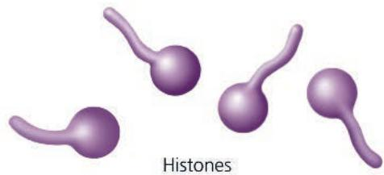

## Nucleosomes in a 10-nm Fiber

In electron micrographs, unfolded chromatin is roughly 10 nm in diameter (the 10-nm fiber). Such chromatin resembles beads on a string (see the TEM). Each “bead” is a nucleosome, the basic unit of DNA packing; the “string” between beads is called linker DNA.

A nucleosome consists of DNA wound twice around a protein core of eight histones, two each of the four main histone types. The amino end of each histone (the histone tail) extends outward from the nucleosome and is involved in regulation of gene expression.

In the cell cycle, the histones leave the DNA only briefly during DNA replication. Generally, they do the same during the process of transcription, which requires access to the DNA by transcription proteins.

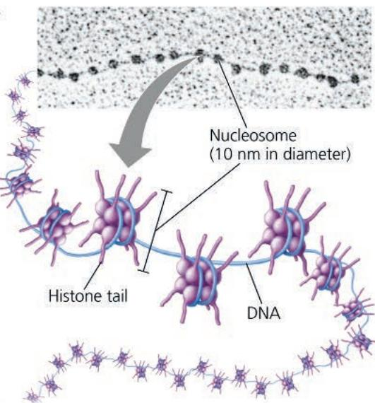  
Euchromatin (loosely arranged 10-nm fiber)

## Euchromatin/Heterochromatin

A recent technique called ChromEMT allows scientists to visualize chromatin in intact cells. ChromEMT and other new techniques have shown that the 10-nm fiber is the basic constituent of interphase chromatin.

During interphase, different regions of a chromosome may exist as euchromatin (below left) or heterochromatin (below). In euchromatin, the 10-nm fiber is loosely arranged in a more open configuration than heterochromatin; higher degrees of organization, including the 30-nm fiber in one older model, may exist in specific cells or at certain times. (This is an area of very active research.) The DNA in euchromatin is accessible to the proteins that carry out transcription, and its genes can be expressed. In heterochromatin, the 10-nm fiber is more densely arranged and less accessible to these proteins; genes in heterochromatin are generally not expressed.

Euchromatin and heterochromatin are organized into regions by other proteins not shown here; this organization is dynamic but disappears once mitosis begins.

  
Heterochromatin (densely arranged 10-nm fiber)

Chromatin undergoes striking changes in how densely it is packed during the course of the cell cycle (see Figure 12.7). In interphase cells stained for light microscopy, the chromatin usually appears as a diffuse mass within the nucleus, with some denser clumps, including in regions of centromeres and telomeres. The less compacted, more dispersed interphase chromatin is called euchromatin (“true chromatin”) to distinguish it from the more compacted, denser-appearing heterochromatin (see Figure 16.23). Recent research has clarified our understanding of chromatin structure: For both types of chromatin, the basic organizing unit is the 10-nm fiber—nucleosomes joined by linker DNA. In heterochromatin, this 10-nm fiber is folded and bent back on itself to a much greater degree than in euchromatin, accounting for its denser appearance.

Because heterochromatin is so compacted, it is largely inaccessible to the proteins responsible for transcribing the genetic information, a crucial early step in gene expression. In contrast, the looser packing of euchromatin makes its DNA accessible to those proteins, and the genes present in euchromatin are available for transcription.

Early on, biologists assumed that interphase chromatin was a tangled mass in the nucleus, like a bowl of spaghetti, but this is far from the case. Although an interphase chromosome lacks an obvious scaffold, there are proteins that further organize the 10-nm fiber into larger compartments and smaller looped domains. Some of the looped domains appear to be attached to the nuclear lamina, on the inside of the nuclear envelope, and perhaps also to fibers of the nuclear matrix. These attachments may help

## Prophase

When mitosis begins, DNA replication has already occurred, so each chromosome consists of two sister chromatids. During prophase, the chromatin of each sister chromatid begins to condense. Two related proteins called condensin II and condensin I play important roles. First, condensin II proteins (red) bind to the 10-nm fiber of DNA and form DNA loops that get larger and larger. The condensin II proteins form a central scaffold from which the loops extend. As the loops grow, the chromosome gets wider and shorter. By the end of prophase, the chromosome

## Prometaphase

When prometaphase begins, condensin I proteins (green) bind to DNA outside the central scaffold, making smaller loops (not shown) out of the larger loops generated by condensin II. The process continues, with more and more loops extending outward, and the chromosome getting denser, shorter, and wider. The scaffold itself also begins to twist into a helix (suggested by the curved gray arrows), allowing even more loops per given length of chromosome.

## Metaphase

At metaphase, the chromosome is at its most dense, with the most loops per turn, and therefore is at its shortest length. The two sister chromatids are fully condensed.

  
Replicated chromosome (1,400 nm)

Figure 16.24 "Painting" chromosomes.

Researchers can treat (“paint”) human chromosomes with molecular tags that cause each chromosome pair to appear a different color.

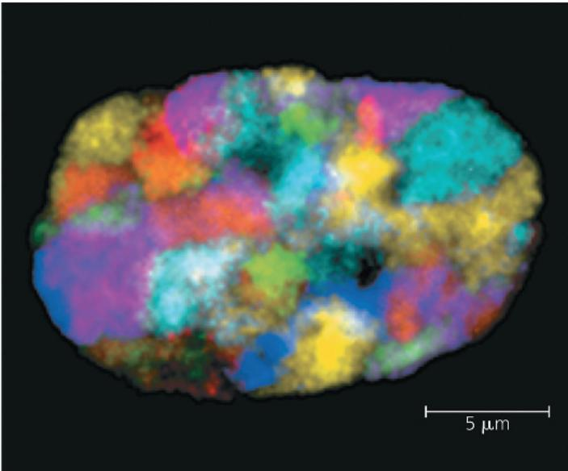

(a) The ability to visually distinguish among chromosomes makes it possible to see how the chromosomes are arranged in the interphase nucleus. Each chromosome appears to occupy a specific territory during interphase. In general, the two homologs of a pair are not located together.

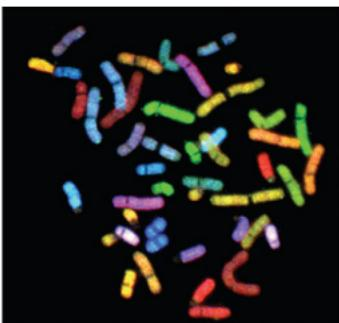

(b) These metaphase chromosomes have been "painted" so that the two homologs of a pair are the same color. On the left is a spread of treated chromosomes; on the right, they have been organized into a karyotype.

MAKE CONNECTIONS If you arrested a human cell in metaphase I of meiosis and applied this technique, what would you observe? How would this differ from what you would see in metaphase of mitosis? Review Figure 13.8 and Figure 12.7.

For suggested answer, see Appendix A.

## Chapter 16 Review

## Summary of Key Concepts

To review key terms, go to the Vocabulary Self-Quiz (eTextbook only).

## Concept 16.1: DNA is the genetic material

\- Experiments with bacteria and with phages provided the first strong evidence that the genetic material is DNA.

organize regions of chromatin where genes are active. The chromatin of each chromosome occupies a specific restricted area within the interphase nucleus, and the chromatin fibers of different chromosomes do not appear to be entangled (Figure 16.24a).

As a cell prepares for mitosis, its chromatin becomes organized into loops and coils, eventually condensing into a characteristic number of short, thick metaphase chromosomes that are distinguishable from each other with the light microscope (Figure 16.24b).

The chromosome is a dynamic structure that is condensed, loosened, modified, and remodeled as necessary for various cell processes, including DNA replication, mitosis, meiosis, and gene expression. Certain chemical modifications of histones affect the state of chromatin condensation and also have multiple effects on gene expression, as you'll see in Concept 18.2.

In this chapter, you have learned how DNA molecules are arranged in chromosomes and how DNA replication provides the copies of genes that parents pass to offspring. However, it is not enough that genes be copied and transmitted; the information they carry must be used by the cell. In other words, genes must also be expressed. In the next chapter, we will examine how the cell expresses the genetic information encoded in DNA.

## Concept Check 16.3

1. Describe the structure of a nucleosome, the basic unit of DNA packing in eukaryotic cells.

2. How does euchromatin differ from heterochromatin in structure and function?

3. MAKE CONNECTIONS Interphase chromosomes appear to be attached to the nuclear lamina and perhaps also the nuclear matrix. Describe these two structures. See Figure 6.9 and the associated text.

For suggested answers, see Appendix A.

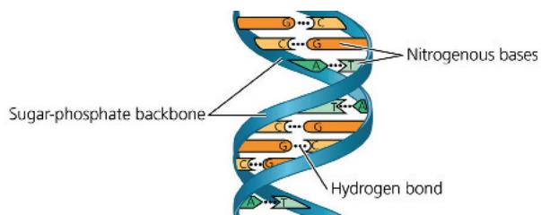  
What does it mean when we say that the two DNA strands in the double helix are antiparallel? What would an end of the double helix look like if the strands were parallel?

## Concept 16.2: Many proteins work together in DNA replication and repair

\- The Meselson-Stahl experiment showed that DNA replication is semiconservative: The parental molecule unwinds, and each strand then serves as a template for the synthesis of a new strand according to base-pairing rules.

• DNA replication at one replication fork is summarized here:

\- DNA polymerases proofread new DNA, replacing incorrect nucleotides. In mismatch repair, enzymes correct errors that persist. Nucleotide excision repair is a process by which nucleases cut out and other enzymes replace damaged stretches of DNA.

\- The ends of eukaryotic chromosomal DNA get shorter with each round of replication. The presence of telomeres, repetitive sequences at the ends of linear DNA molecules, postpones the erosion of genes. Telomerase catalyzes the lengthening of telomeres in germ cells.

Compare DNA replication on the leading and lagging strands, including similarities and differences.

## Concept 16.3: A chromosome consists of a DNA molecule packed together with proteins

\- The chromosome of most bacterial species is a circular DNA molecule with some associated proteins, making up the nucleoid.

\- The chromatin making up a eukaryotic chromosome is composed of DNA, histones, and other proteins. The histones bind to each other and to the DNA to form nucleosomes, the most basic units of DNA packing, which exist as part of the 10-nm fiber. Histone tails extend outward from each bead-like nucleosome core. Additional coiling and folding lead ultimately to the highly condensed chromatin of the metaphase chromosome.

\- Chromosomes occupy restricted areas in the interphase nucleus. In interphase cells, most 10-nm fiber chromatin is loosely arranged (euchromatin), but some is more densely arranged (heterochromatin). Euchromatin, but not heterochromatin, is generally accessible for gene transcription.

Describe the levels of chromatin packing you'd expect to see in an interphase nucleus. For suggested answers, see Appendix A.

## Test Your Understanding

For more multiple-choice questions, go to the Practice Test (eTextbook only).

## Levels 1-2: Remembering/Understanding

1. In his work with pneumonia-causing bacteria and mice, Griffith found that

(A) the protein coat from pathogenic cells was able to transform nonpathogenic cells.

(B) heat-killed pathogenic cells caused pneumonia.

(C) some substance from pathogenic cells was transferred to nonpathogenic cells, making them pathogenic.

(D) the polysaccharide coat of bacteria caused pneumonia.

2. What is the basis for the difference in how the leading and lagging strands of DNA molecules are synthesized?

(A) The origins of replication occur only at the $5'$ end.

(B) Helicases and single-strand binding proteins work at the 5' end.

(C) DNA polymerase can join new nucleotides only to the $3'$ end of a pre-existing strand, and the strands are antiparallel.

(D) DNA ligase works only in the $3'\rightarrow5'$ direction.

3. In analyzing the number of different bases in a DNA sample, which result would be consistent with the base-pairing rules?
(A) A = G
(B) A + G = C + T
(C) A + T = G + C
(D) A = C

4. The elongation of the leading strand during DNA synthesis

(A) progresses away from the replication fork.

(B) occurs in the $3'\rightarrow5'$ direction.

(C) produces Okazaki fragments.

(D) depends on the action of DNA polymerase.

5. In a nucleosome, the DNA is wrapped around

(A) histones.

(B) ribosomes.

(C) polymerase molecules.

(D) a thymine dimer.

## Levels 3-4: Applying/Analyzing

6. E. coli cells grown on ${}^{15}$ N medium are transferred to ${}^{14}$ N medium and allowed to grow for two more generations (two rounds of DNA replication). DNA extracted from these cells is centrifuged. What density distribution of DNA would you expect in this experiment?

(A) one high-density and one low-density band

(B) one intermediate-density band

(C) one high-density and one intermediate-density band

(D) one low-density and one intermediate-density band

7. A student isolates, purifies, and combines in a test tube a variety of molecules needed for DNA replication. When she adds some DNA to the mixture, replication occurs, but each DNA molecule consists of a normal strand paired with numerous segments of DNA a few hundred nucleotides long. What has she probably left out of the mixture?

(A) DNA polymerase

(B) DNA ligase

(C) Okazaki fragments

(D) primase

8. The spontaneous loss of amino groups from adenine in DNA results in hypoxanthine, an uncommon base, opposite thymine. What combination of proteins could repair such damage?

(A) nuclease, DNA polymerase, DNA ligase

(B) telomerase, primase, DNA polymerase

(C) telomerase, helicase, single-strand binding protein

(D) DNA ligase, replication fork proteins, adenylyl cyclase

9. MAKE CONNECTIONS Although the proteins that cause the E. coli chromosome to coil are not histones, what property would you expect them to share with histones, given their ability to bind to DNA (see Figure 5.14)?

## Levels 5-6: Evaluating/Creating

10. EVOLUTION CONNECTION Some bacteria may be able to respond to environmental stress by increasing the rate at which mutations occur during cell division. How might this be accomplished? Might there be an evolutionary advantage to this ability? Explain.

## 11. SCIENTIFIC INQUIRY

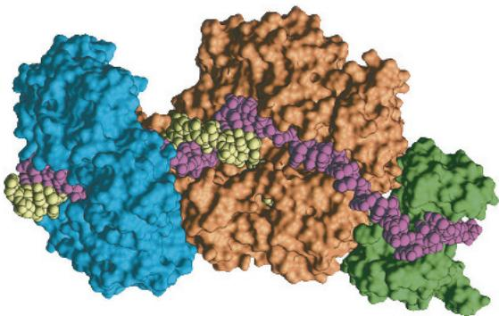

DRAW IT Model building can be an important part of the scientific process. The illustration shown above is a computer-generated model of a DNA replication complex. The parental and newly synthesized DNA strands are color-coded differently, as are each of the following three proteins: DNA pol III, the sliding clamp, and single-strand binding protein.

(a) Using what you've learned in this chapter to clarify this model, label each DNA strand and each protein.

(b) Draw an arrow to indicate the overall direction of DNA replication.

12. WRITE ABOUT A THEME: ORGANIZATION The continuity of life is based on heritable information in the form of DNA, and structure and function are correlated at all levels of biological organization. In a short essay (100–150 words), describe how the structure of DNA is correlated with its role as the molecular basis of inheritance.

## 13. SYNTHESIZE YOUR KNOWLEDGE

This image shows DNA (gray double helix) interacting with a computer-generated model of a TAL protein (multicolored ribbons and connecting wires), one of a family of proteins found only in a species of the bacterium Xanthomonas. The bacterium uses proteins like this one to find specific gene sequences in cells of the organisms it infects, such as tomatoes, rice, and citrus fruits. Given what you know about DNA structure and considering the image above, discuss how the TAL protein's structure suggests that it functions.

For selected answers, see Appendix A.

# Gene Expression: From Gene to Protein

## Key Concepts

17.1 Genes specify proteins via transcription and translation

17.2 Transcription is the DNA-directed synthesis of RNA: A Closer Look

17.3 Eukaryotic cells modify RNA after transcription

17.4 Translation is the RNA-directed synthesis of a polypeptide: A Closer Look

17.5 Mutations of one or a few nucleotides can affect protein structure and function

## Study Tip

Make a visual study guide: Sketch the process shown here, and add labels and details as you read the chapter. (In this exercise, assume all processes take place in a eukaryotic cell.)

  
Figure 17.1 A population of albino donkeys grazes on vegetation on the hillsides of Asinara, an Italian island. Several centuries ago, a recessive mutation that disables pigment synthesis arose in the DNA of one donkey and was passed down through the generations. Inbreeding has resulted in a large number of homozygous albino donkeys living on the island today.

## How can one change in DNA result in such a dramatic change in appearance?

Proteins are the link between genotype and phenotype. Gene expression is the process by which DNA directs the synthesis of proteins:

## Concept 17.1: Genes specify proteins via transcription and translation

Inherited traits like albinism are determined by genes, which have information content in the form of specific sequences of nucleotides along stretches of DNA, the genetic material. The DNA inherited by an organism leads to specific traits by dictating the synthesis of proteins and of RNA molecules involved in protein synthesis. In the case of coat and skin color, the gene containing the information to synthesize an enzyme that makes pigment allows normal coloring, and a faulty version of that gene leads to lack of color, or the albino phenotype. Proteins are the link between genotype and phenotype. Gene expression is the process by which DNA directs the synthesis of proteins (or, in some cases, just RNAs). The expression of genes that code for proteins includes two stages: transcription and translation.

Before going into the details of how genes direct protein synthesis, let's step back and examine how the fundamental relationship between genes and proteins was discovered.

## Evidence from Studying Metabolic Defects

In 1902, British physician Archibald Garrod was the first to suggest that genes dictate phenotypes through enzymes, proteins that catalyze specific chemical reactions in the cell. He postulated that the symptoms of an inherited disease reflect an inability to make a particular enzyme. He later referred to such diseases as “inborn errors of metabolism.” For example, people with a disease called alkaptonuria have black urine because it contains a chemical called alkapton, which darkens upon exposure to air. Garrod reasoned that these people cannot make an enzyme that breaks down alkapton, so alkapton is expelled in their urine.

Several decades later, research supported Garrod's hypothesis that a gene dictates the production of a specific enzyme, later named the one gene–one enzyme hypothesis. Biochemists learned that cells synthesize and degrade most organic molecules via metabolic pathways, in which each chemical reaction in a sequence is catalyzed by a specific enzyme (see Concept 8.1). Such metabolic pathways lead, for instance, to the synthesis of the pigments that give the brown donkey in Figure 17.1 its fur color or fruit flies (Drosophila) their eye color (see Figure 15.3). In the 1930s, the American biochemist and geneticist George Beadle and his French colleague Boris Ephrussi speculated that in Drosophila, each mutation affecting eye color blocks pigment synthesis at a specific step by preventing production of the enzyme that catalyzes that step. But neither the chemical reactions nor the enzymes that catalyze them were known at the time.

## Nutritional Mutants in Neurospora: Scientific Inquiry

A breakthrough in demonstrating the relationship between genes and enzymes came a few years later at Stanford University, where Beadle and Edward Tatum began working with a bread mold,

Neurospora crassa. Unlike the diploid organisms studied by Mendel (peas) and T. H. Morgan (fruit flies), Neurospora is a haploid species. Because its genome contains only one copy of each gene, that single copy determines the individual's expressed phenotype. Therefore, when Beadle and Tatum wanted to discover the function of any gene, they only needed to mutate and disable that one allele. They chose to study the protein-coding genes required for a specific nutritional activity. They caused mutations in genes by bombarding Neurospora with X-rays and looked among the survivors for mutants that differed in their nutritional needs from the wild-type bread mold.

Wild-type Neurospora has modest food requirements. It can grow in the laboratory on minimal medium—a simple solution containing minimal nutrients for growth—inorganic salts, glucose, and the vitamin biotin—incorporated into agar, a support medium. From these basics, wild-type mold cells use their metabolic pathways to produce all the other nutrient molecules (like amino acids) they need for growth, dividing repeatedly and forming visible colonies of genetically identical cells. As shown in Figure 17.2, Beadle and Tatum generated different “nutritional mutants” of Neurospora cells, each of which had a mutation in one gene and was unable to synthesize a

Figure 17.2 Beadle and Tatum's experimental approach.  
  
6 The vials were observed for growth. In this example, the mutant cells grew only on minimal medium + arginine, indicating that this mutant was missing the enzyme for the synthesis of arginine.

particular essential nutrient. Such cells could not grow on minimal medium but could grow on complete medium, which contains all nutrients needed for growth. For Neurospora, the complete medium consists of the minimal medium supplemented with all 20 amino acids and a few other nutrients. Beadle and Tatum hypothesized that in each nutritional mutant, the gene for the enzyme that synthesizes a particular nutrient had been disabled by the mutation. They were able to determine experimentally which nutrient each mutant strain (original cell and its descendants) was unable to synthesize.

This approach resulted in a valuable collection of mutant strains of Neurospora, each catalogued by its defect in a particular pathway. Two colleagues, Adrian Srb and Norman Horowitz, used a collection of arginine-requiring mutants to investigate the biochemical pathway for arginine synthesis in Neurospora (Figure 17.3). Srb and Horowitz pinned down each mutant's defect more specifically, using additional tests to distinguish among three classes of arginine-requiring mutants. Mutants in each class required a different set of compounds along the arginine-synthesizing pathway, which has three steps. These results, and those of many similar experiments done by Beadle and Tatum, suggested that each class was blocked at a different step in this pathway because mutants in that class lacked the enzyme that catalyzes the blocked step.

Because Beadle and Tatum set up their experimental conditions so that each mutant was defective in a single gene, the collected results, taken together, provided strong support for the one gene–one enzyme hypothesis, as they dubbed it: that the function of a gene is to dictate the production of a specific enzyme. Further support for this hypothesis came from experiments that identified the specific enzymes lacking in the mutants. Beadle and Tatum shared a Nobel Prize in 1958 for “their discovery that genes act by regulating definite chemical events” (in the words of the Nobel committee).

Today, we know of countless examples in which a mutation in a gene causes a faulty enzyme that in turn leads to an identifiable condition. The albino donkeys in Figure 17.1 lack a key enzyme called tyrosinase in the metabolic pathway that produces melanin, a dark pigment. The absence of melanin causes white fur and other effects throughout the donkey's body. Its nose, ears, and hooves, as well as its eyes, are pink because no melanin is present to mask the reddish color of the blood vessels that run through those structures.

## The Products of Gene Expression: A Developing Story

As researchers learned more about proteins, they made revisions to the one gene—one enzyme hypothesis. First of all, not all proteins are enzymes. Keratin, the structural protein of animal hair, and the hormone insulin are two examples of nonenzyme proteins. Because proteins that are not enzymes are nevertheless gene products, molecular biologists began to think in terms of one gene—one protein. However, many proteins are constructed from two or more different polypeptide chains, and each polypeptide is specified by its own gene. For example, hemoglobin—the oxygen-transporting protein of vertebrate red blood cells—contains two kinds of polypeptides, and thus two genes code for this protein,

one for each type of polypeptide (see Figure 5.18). Beadle and Tatum's idea was therefore restated as the one gene—one polypeptide hypothesis. Even this description is not entirely accurate, though. First, in many cases, a eukaryotic gene can code for a set of closely related polypeptides via a process called alternative splicing, which you will learn about later in this chapter. Second, quite a few genes code for RNA molecules that have important functions in cells even though they are never translated into protein. For now, we will focus on genes that do code for polypeptides. (Note that it is common to refer to these gene products as proteins—a practice you will encounter in this book—rather than more precisely as polypeptides.)

## Basic Principles of Transcription and Translation

Genes provide the instructions for making specific proteins, but a gene does not build a protein directly. The bridge between DNA and protein synthesis is the nucleic acid RNA. RNA is chemically similar to DNA except that it contains ribose instead of deoxyribose as its sugar and has the nitrogenous base uracil rather than thymine (see Figure 5.23). Thus, each nucleotide along a DNA strand has A, G, C, or T as its base, and each nucleotide along an RNA strand has A, G, C, or U as its base. An RNA molecule usually consists of a single strand.

We often describe the flow of information from gene to protein in terms of languages. Just as specific sequences of letters communicate information in a language such as English, specific sequences of monomers convey information in polymers like nucleic acids and proteins. In DNA or RNA, the monomers are the four types of nucleotides listed previously, which differ in their nitrogenous bases. Genes are typically hundreds or thousands of nucleotides long, each gene having a specific sequence of nucleotides. Each polypeptide of a protein also has monomers arranged in a particular linear order (the protein's primary structure; see Figure 5.18), but its monomers are amino acids. Thus, nucleic acids and proteins contain information written in two different chemical languages. Getting from DNA to protein involves two major stages: transcription and translation.

Transcription is the synthesis (production) of RNA using information in the DNA. The two nucleic acids are written in different forms of the same language, and the information is simply transcribed, or “rewritten,” from DNA to RNA. Just as a DNA strand provides a template for making a new complementary strand during DNA replication (see Concept 16.2), it also can serve as a template for assembling a complementary sequence of RNA nucleotides. For a protein-coding gene, the resulting RNA molecule is a faithful transcript of the gene’s protein-building instructions. This type of RNA molecule is called messenger RNA (mRNA) because it carries a genetic message from the DNA to the protein-synthesizing machinery of the cell. (Transcription is the general term for the synthesis of any kind of RNA on a DNA template. Later, you will learn about some other types of RNA produced by transcription.)

Translation is the synthesis of a polypeptide using the information in the mRNA. During this stage, there is a change in

## Figure 17.3

# Inquiry: Do individual genes specify the enzymes that function in a biochemical pathway?

Working with the mold Neurospora crassa, Adrian Srb and Norman Horowitz, then at Stanford University, used Beadle and Tatum's experimental approach (see Figure 17.2) to isolate mutants that required arginine in their growth medium. The researchers showed that these mutants fell into three classes, each defective in a different gene. From studies by others on mammalian liver cells, they suspected that the metabolic pathway of arginine biosynthesis involved a precursor nutrient and the intermediate molecules ornithine and citrulline, as shown in the diagram.

Their most famous experiment, shown here, tested both the one gene–one enzyme hypothesis and their postulated arginine-synthesizing pathway. In this experiment, they grew their three classes of mutants under the four different conditions shown in the results table below. They included minimal medium (MM) as a control, knowing that wild-type cells could grow on MM but mutant cells could not. (See test tube diagram.)

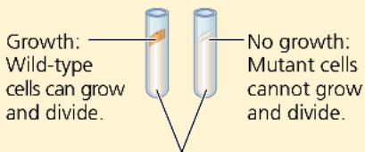  
Control: Minimal medium

## Results

As shown in the table with test tubes, the wild-type strain was capable of growth under all experimental conditions, requiring only the minimal medium. The three classes of mutants each had a specific set of growth requirements. For example, class II mutants could not grow when ornithine alone was added but could grow when either citrulline or arginine was added.

## Conclusion

From the growth requirements of the mutants, Srb and Horowitz deduced that each class of mutant was unable to carry out one step in the pathway for synthesizing arginine, presumably because it lacked the necessary enzyme, as shown in the table with arginine synthesis pathways. Because each of their mutants was mutated in a single gene, they concluded that each mutated gene must normally dictate the production of one enzyme. Their results supported the one gene—one enzyme hypothesis, proposed by Beadle and Tatum, and also confirmed that the arginine pathway described in the mammalian liver also operates in Neurospora. (Notice in the results table that a mutant can grow only if supplied with a compound made after the defective step because this bypasses the defect.)

Data from A. M. Srb and N. H. Horowitz, The ornithine cycle in Neurospora and its genetic control, Journal of Biological Chemistry 154:129–139 (1944).

  
WHAT IF? Suppose the experiment had shown that class I mutants could grow only in MM supplemented by ornithine or arginine and that class II mutants could grow in MM supplemented by citrulline, ornithine, or arginine. What conclusions would the researchers have drawn from those results regarding the biochemical pathway and the defect in class I and class II mutants?
For suggested answer, see Appendix A.

language: The cell must translate the nucleotide sequence of an mRNA molecule into the amino acid sequence of a polypeptide. The sites of translation are ribosomes, molecular complexes that facilitate the orderly linking of amino acids into polypeptide chains.

Transcription and translation occur in all organisms. Because most studies have involved bacteria and eukaryotic cells, they are our main focus in this chapter. The basic mechanics of transcription and translation are similar for bacteria and eukaryotes, but there is an important difference in the flow of genetic information within the cells. Bacteria do not have nuclei. Therefore, nuclear membranes do not separate bacterial DNA and mRNA from ribosomes and the other protein-synthesizing equipment (Figure 17.4a). This lack of compartmentalization allows translation of an mRNA to begin while its transcription is still in progress, as you'll see later. By contrast, eukaryotic cells have nuclei. The presence of a nuclear envelope separates transcription from translation in space and time (Figure 17.4b). Transcription occurs in the nucleus, but the mRNA must be transported to the cytoplasm for translation. In eukaryotes, before RNA transcripts from protein-coding genes can leave the nucleus, they are modified in various ways to produce the final, functional mRNA. The transcription of a protein-coding eukaryotic gene results in pre-mRNA, and further RNA processing yields the finished mRNA. The initial RNA transcript from any gene, including those specifying RNA that is not translated into protein (such as tRNA and rRNA, which will be described in Concept 17.4), is more generally called a primary transcript.

To summarize: Genes program protein synthesis via genetic messages in the form of messenger RNA. Put another way, cells are governed by a molecular chain of command with a directional flow of genetic information:

This idea, that the flow of information went only one way, was named the central dogma by Francis Crick in 1956. In the 1970s, however, scientists were surprised to discover some enzymes that use RNA molecules as templates for DNA synthesis, an example of information flow from RNA to DNA (see Concept 19.2). Still, these exceptions do not discredit the idea that, in general, genetic information flows from DNA to RNA to protein. In the next section, we discuss how the instructions for assembling amino acids into a specific order are encoded in nucleic acids.

## The Genetic Code

When biologists began to suspect that the instructions for protein synthesis were encoded in DNA, they recognized a problem: There are only four nucleotide bases to specify 20 amino acids. Thus, the genetic code cannot be a language where each written symbol corresponds to a word. How many nucleotides, then, would turn out to correspond to an amino acid?

## Codons: Triplets of Nucleotides

If each kind of nucleotide base were translated into an amino acid, only four amino acids could be specified, one per nucleotide base.

Figure 17.4 Overview: the roles of transcription and translation in the flow of genetic information.

In a cell, inherited information flows from DNA to RNA to protein. The two main stages of information flow are transcription and translation. A miniature version of part (a) or (b) accompanies several figures later in the chapter as an orientation diagram to help you see where a particular figure fits into the overall scheme of gene expression.

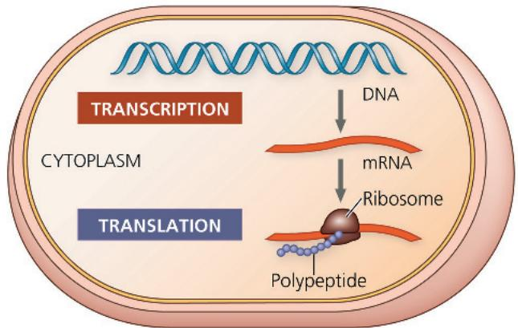  
(a) Bacterial cell. In a bacterial cell, which lacks a nucleus, mRNA produced by transcription is immediately translated without additional processing.

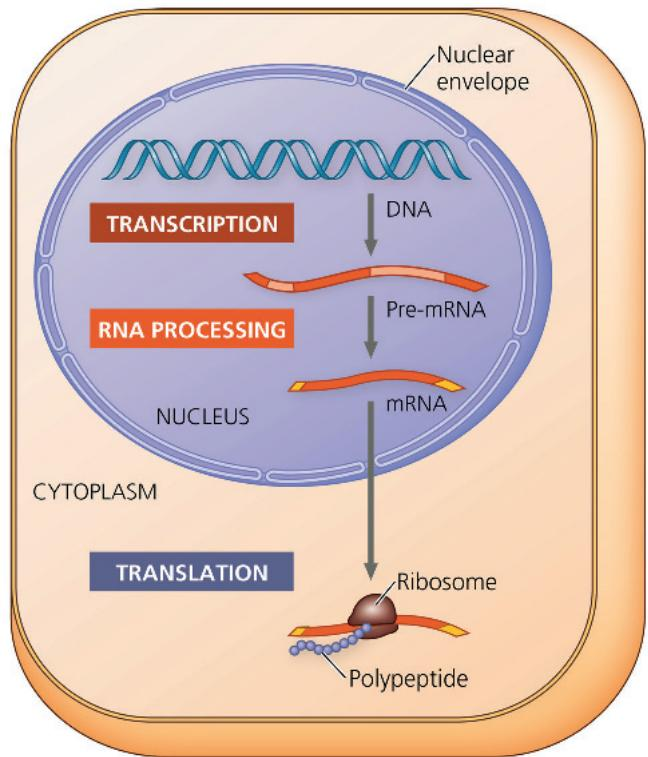  
(b) Eukaryotic cell. The nucleus provides a separate compartment for transcription. The original RNA transcript, called pre-mRNA, is processed in various ways before leaving the nucleus as mRNA.

So, what about a language of two-letter code words? The two-nucleotide sequence AG, for example, could specify one amino acid, and GT could specify another. Since there are four possible nucleotide bases in each position, this would give us 16 (that is, $4 \times 4$ , or $4^{2}$ ) possible arrangements—still not enough to code for all 20 amino acids.

Triplets of nucleotide bases are the smallest units of uniform length that can code for all the amino acids. If each arrangement of three consecutive nucleotide bases specifies an amino acid, there can be 64 (that is, $4^{3}$ ) possible code words—more than enough to specify all the amino acids. Experiments have verified that the flow of information from gene to protein is based on a triplet code: The genetic instructions for a polypeptide chain are written in the DNA as a series of nonoverlapping, three-nucleotide words. The series of words in a gene is transcribed into a complementary series of nonoverlapping, three-nucleotide words in mRNA, which is then translated into a chain of amino acids (Figure 17.5).

Figure 17.5 The triplet code.

For each gene, one DNA strand functions as a template for transcription of RNAs, such as mRNA. The base-pairing rules for DNA synthesis also guide transcription, except that RNA is made with uracil (U) instead of thymine (T). During translation, the mRNA is read as a sequence of nucleotide triplets, called codons. Each codon specifies an amino acid to be added to the growing polypeptide chain. The mRNA is read in the $5'\rightarrow3'$ direction.

  
VISUAL SKILLS By convention, the nontemplate strand, also called the coding strand, is used to represent a DNA sequence. Write the sequence of the mRNA strand and the nontemplate strand—in both cases reading from 5' to 3'—and compare them. Why do you think this convention was adopted? (Hint: Why is this called the coding strand?)
For suggested answer, see Appendix A.

During transcription, the gene determines the sequence of nucleotide bases along the length of the RNA molecule that is being synthesized. For each gene, only one of the two DNA strands is transcribed. This strand is called the template strand because it provides the pattern, or template, for the sequence of nucleotides in an RNA transcript. For any given gene, the same strand is used as the template every time that gene is transcribed. However, farther along on the same chromosomal DNA molecule, the opposite strand may function as the template for a different gene. Particular DNA sequences associated with a gene determine how the enzyme that transcribes genes is oriented when it binds, and this establishes which strand will be used as the template.

An mRNA molecule is complementary rather than identical to its DNA template because RNA nucleotides are assembled on the template according to base-pairing rules (see Figure 17.5). The pairs are similar to those that form during DNA replication, except that U (the RNA substitute for T) pairs with A and the mRNA nucleotides contain ribose instead of deoxyribose. Like a new strand of DNA, the RNA molecule is synthesized in an antiparallel direction to the template strand of DNA. (To review what is meant by “antiparallel” and the 5′ and 3′ ends of a nucleic acid chain, see Figure 16.7.) In the example in Figure 17.5, the nucleotide triplet ACC along the DNA template strand (written as 3′-ACC-5′) provides a template for 5′-UGG-3′ in the mRNA molecule. The mRNA nucleotide triplets are called codons, and they are customarily written in the 5′ → 3′ direction. In our example, UGG is the codon for the amino acid tryptophan (abbreviated Trp, or W). The term codon is also used for the DNA nucleotide triplets along the nontemplate strand. These codons are complementary to the template strand and thus identical in sequence to the mRNA (except for T’s instead of U’s). For this reason, the nontemplate DNA strand is often called the coding strand; by convention, the sequence of the coding strand is used when a gene’s sequence is reported.

During translation, the sequence of codons along an mRNA molecule is decoded, or translated, into a sequence of amino acids making up a polypeptide chain. The codons are read by the translation machinery in the $5'\rightarrow3'$ direction along the mRNA. Each codon specifies which one of the 20 amino acids will be incorporated at the corresponding position along a polypeptide. Because codons are nucleotide triplets, the number of nucleotides making up a genetic message must be three times the number of amino acids in the protein product. For example, 300 nucleotides along an mRNA strand code for 100 amino acids in the polypeptide it encodes.

## Cracking the Code

Molecular biologists cracked the genetic code of life in the early 1960s when a series of elegant experiments disclosed the amino acid translations of each of the mRNA codons. The first codon was deciphered in 1961 by Marshall Nirenberg, of the National Institutes of Health, and colleagues. They synthesized an artificial mRNA made up of only uracil-bearing nucleotides, thus containing only one codon (UUU) over and over. When added to a test-tube mixture that contained all 20 amino acids, ribosomes, and the other components required for protein synthesis, the “poly-U” mRNA was translated into a polypeptide containing many units of the phenylalanine (Phe, or F) amino acids, strung together as a polyphenylalanine chain. Thus, Nirenberg determined that the mRNA codon UUU specifies the amino acid phenylalanine. Soon, the amino acids specified by the codons AAA, GGG, and CCC were similarly identified.

Although more elaborate techniques were required to decode mixed triplets such as AUA and CGA, all 64 codons were deciphered by the mid-1960s. As Figure 17.6 shows, 61 of the 64 triplets code for amino acids. The other three codons act as “stop” signals, or termination codons, marking the end of translation. Notice that the codon AUG has a dual function: It codes for the amino acid methionine (Met, or M) and also functions as a “start” signal, or initiation codon. Genetic messages usually begin with the mRNA codon AUG, which signals the protein-synthesizing machinery to begin translating the mRNA at that location. (Because AUG also stands for methionine, polypeptide chains all begin with methionine when they are synthesized. However, an enzyme may subsequently remove this starter amino acid from the chain.)

Notice in Figure 17.6 that there is redundancy in the genetic code, but no ambiguity. For example, although codons GAA and GAG both specify glutamic acid (redundancy), neither of

## Figure 17.6 The codon table for mRNA.

The three nucleotide bases of an mRNA codon are designated here as the first, second, and third bases, reading in the $5'\rightarrow3'$ direction along the mRNA. The codon AUG not only stands for the amino acid methionine (Met, or M) but also functions as a “start” signal for ribosomes to begin translating the mRNA at that point. Three of the 64 codons function as “stop” signals, marking where ribosomes end translation. Both one- and three-letter codes are shown for the amino acids; see Figure 5.14 for their full names.

Second mRNA base  
  
VISUAL SKILLS A segment in the middle of an mRNA has the sequence 5'-AGAGAACCGCGA-3'. Using the codon table, translate this sequence, assuming the first three nucleotides are a codon.  
For suggested answer, see Appendix A.

them ever specifies any other amino acid (no ambiguity). The redundancy in the code is not altogether random. In many cases, codons that are synonyms for a particular amino acid differ only in the third nucleotide base of the triplet. We will see why this is later in the chapter.

Our ability to extract the intended message from a written language depends on reading the symbols in the correct groupings—that is, in the correct reading frame. Consider this statement: “The red dog ate the bug.” Group the letters incorrectly by starting at the wrong point, and the result will probably be gibberish: for example, “her edd oga tet heb ug.” The reading frame is also important in the molecular language of cells. The short stretch of polypeptide shown in Figure 17.5, for instance, will be made correctly only if the mRNA nucleotides are read from left to right ( $5' \rightarrow 3'$ ) in the groups of three shown in the figure: UGG UUU GGC UCA. Although a genetic message is written with no spaces between the codons, the cell’s protein-synthesizing machinery reads the message as a series of nonoverlapping three-letter words. The message is not read as a series of overlapping words—UGG, GUU, and so on—which would convey a very different message.

## Evolution of the Genetic Code

EVOLUTION The genetic code is nearly universal, shared by organisms from the simplest bacteria to the most complex plants and animals. The mRNA codon CCG, for instance, is translated as the amino acid proline in all organisms whose genetic code has been examined. In laboratory experiments, genes can be transcribed and translated after being transplanted from one species to another, sometimes with quite striking results, as shown in Figure 17.7.

Figure 17.7 Evidence for evolution: expression of genes from different species.

Because diverse forms of life share a common genetic code due to their shared ancestry, one species can be programmed to produce proteins characteristic of a second species by introducing DNA from the second species into the first.

  
(a) Tobacco plant expressing a firefly gene. The yellow glow is produced by a chemical reaction catalyzed by the protein product of the firefly gene.

  
(b) Mosquito larva expressing a jellyfish gene. The gene codes for green fluorescent protein (GFP) and is inserted into organisms as a reporter gene so researchers can tell if a gene of interest is being expressed.

Bacteria can be programmed by the insertion of human genes to synthesize certain human proteins for medical use, such as insulin. Such applications have produced many exciting developments in the area of biotechnology (see Concept 20.4).

The evolutionary significance of the code's near universality is clear. A language shared by all living things must have been operating very early in the history of life—early enough to be present in the common ancestor of all present-day organisms. A shared genetic vocabulary is a reminder of the kinship of all life.

## Concept Check 17.1

1. MAKE CONNECTIONS In a research article about alkaptonuria published in 1902, Garrod suggested that humans inherit two “characters” (alleles) for a particular enzyme and that both parents must contribute a faulty version for the offspring to have alkaptonuria. Today, would this disorder be called dominant or recessive? (See Concept 14.4.)

2. Describe the polypeptide product you would expect from a poly-G mRNA that is 30 nucleotides long.

3. DRAW IT The template strand of a gene contains the sequence 3'-TTCAGTCGT-5'. Suppose that the nontemplate sequence were transcribed instead of the template sequence. Draw the nontemplate sequence in 3' to 5' order. Then, draw the mRNA sequence and translate it using Figure 17.6. Predict how well the protein synthesized from the nontemplate strand would function, if at all.

For suggested answers, see Appendix A.

## Concept 17.2: Transcription is the DNA-directed synthesis of RNA: A Closer Look

Now that we have considered the linguistic logic and evolutionary significance of the genetic code, we are ready to reexamine transcription, the first stage of gene expression, in greater detail.

## Molecular Components of Transcription

Messenger RNA, the carrier of information from DNA to the cell's protein-synthesizing machinery, is transcribed from the template strand of a gene. An enzyme called an RNA polymerase pries the two strands of DNA apart and joins together RNA nucleotides complementary to the DNA template strand, thus elongating the RNA polynucleotide (Figure 17.8). Like the DNA polymerases that function in DNA replication, RNA polymerases can assemble a polynucleotide only in its $5' \rightarrow 3'$ direction, adding onto its $3'$ end. Unlike DNA polymerases, however, RNA polymerases are able to start a chain from scratch; they don't need to add the first nucleotide onto a pre-existing primer.

Figure 17.8 The stages of transcription: initiation, elongation, and termination.

This general depiction of transcription applies to both bacteria and eukaryotes, but the details of termination differ, as described in the text. Also, in a bacterium, the RNA transcript is immediately usable as mRNA; in a eukaryote, the RNA transcript must first undergo processing.

  
MAKE CONNECTIONS Compare the use of a template strand during transcription and replication. See Figure 16.18.  
For suggested answer, see Appendix A.

Specific sequences of nucleotides along the DNA mark where transcription of a gene begins and ends. The DNA sequence where RNA polymerase attaches and initiates transcription is known as the promoter; in bacteria, the sequence that signals the end of transcription is called the terminator. (The termination mechanism in eukaryotes will be described later.) Molecular biologists refer to the direction of transcription as “downstream” and the other direction as “upstream.” These terms are also used to describe the positions of nucleotide sequences within the DNA or RNA. Thus, the promoter sequence in DNA is said to be upstream from the terminator. The stretch of DNA downstream from the promoter that is transcribed into an RNA molecule is called a

## transcription unit.

Bacteria have a single type of RNA polymerase that synthesizes not only mRNA but also other types of RNA that function in gene expression, such as ribosomal RNA. In contrast, eukaryotes have at least three types of RNA polymerase in their nuclei; the one used for pre-mRNA synthesis is called RNA polymerase II. The other RNA polymerases transcribe RNA molecules that are not translated into protein. In the discussion that follows, we start with the features of mRNA synthesis common to both bacteria and eukaryotes and then describe some key differences.

## Synthesis of an RNA Transcript

The three stages of transcription, as shown in Figure 17.8 and described next, are initiation, elongation, and termination of the RNA chain. Study Figure 17.8 to familiarize yourself with the stages and the terms used to describe them.

## RNA Polymerase Binding and Initiation of Transcription

The promoter sequence of a gene includes within it the transcription start point—the nucleotide where RNA polymerase actually begins synthesizing the mRNA—and typically extends several dozen or so nucleotide pairs upstream from the start point (Figure 17.9). Based on interactions with proteins (transcription factors), RNA polymerase binds in a precise location and orientation on the promoter. This binding determines where transcription starts and the direction it will travel, thus which strand of DNA is used as the template.

Certain sections of a promoter sequence are especially important for binding RNA polymerase in a way that ensures that transcription will begin at the correct start point. In bacteria, part of the RNA polymerase itself specifically recognizes and binds to the promoter. In eukaryotes, a collection of proteins called transcription factors (purple proteins in Figure 17.9), help guide the binding of RNA polymerase and the initiation of transcription. Only after transcription factors are attached to the promoter does RNA polymerase II bind to it. The whole complex of transcription factors and RNA polymerase II bound to the promoter is called a transcription initiation complex. Figure 17.9 shows the role of transcription factors and a crucial promoter DNA sequence called the TATA box in forming the initiation complex at a eukaryotic promoter.

The interaction between eukaryotic RNA polymerase II and transcription factors is an example of the importance of protein-protein interactions in controlling eukaryotic transcription. Once the appropriate transcription factors are firmly attached to the promoter DNA and the polymerase is bound to them in the correct orientation on the DNA, the enzyme unwinds the two DNA strands and begins transcribing the template strand at the start point.

Figure 17.9 The initiation of transcription at a eukaryotic promoter. In eukaryotic cells, proteins called transcription factors mediate the initiation of transcription by RNA polymerase II.  
  
Explain how the interaction of RNA polymerase with the promoter would differ if the figure showed transcription initiation for bacteria.
For suggested answer, see Appendix A.

## Elongation of the RNA Strand

As RNA polymerase moves along the DNA, it untwists the double helix, exposing about 10–20 DNA nucleotides at a time for pairing with RNA nucleotides (Figure 17.10). The enzyme adds nucleotides to the 3' end of the growing RNA molecule as it moves along the double helix. As transcription proceeds forward, the newly synthesized RNA molecule behind the RNA polymerase peels away from its DNA template, and the DNA double helix reforms. Transcription progresses at a rate of about 40 nucleotides per second in eukaryotes.

A single gene can be transcribed simultaneously by several molecules of RNA polymerase following each other like trucks in a convoy. A growing strand of RNA trails off from each polymerase, with the length of each new strand reflecting how far along the template the enzyme has traveled from the start point (see the mRNA molecules in Figure 17.23). The congregation of many polymerase molecules simultaneously transcribing a single gene increases the amount of mRNA transcribed from it, which helps the cell make the encoded protein in large amounts.

## Termination of Transcription

Bacteria and eukaryotes differ in the way they terminate transcription. In bacteria, transcription proceeds through a terminator sequence in the DNA. The transcribed terminator (an RNA sequence) functions as the termination signal, causing the polymerase to detach from the DNA and release the transcript, which requires no further modification before translation. In eukaryotes, RNA polymerase II transcribes a sequence on the

Figure 17.10 Transcription elongation.

RNA polymerase moves along the DNA template strand, joining complementary RNA nucleotides to the 3' end of the growing RNA transcript. Behind the polymerase, the new RNA peels away from the template strand, which re-forms a double helix with the nontemplate strand.

DNA called the polyadenylation signal sequence, which specifies a polyadenylation signal (AAUAAA) in the pre-mRNA. This is called a “signal” because once this stretch of six RNA nucleotides appears, it is immediately bound by certain proteins in the nucleus. Then, at a point about 10–35 nucleotides downstream from the AAUAAA, these proteins cut the RNA transcript free from the polymerase, releasing the pre-mRNA. The pre-mRNA then undergoes processing, the topic of the next section. Although that cleavage marks the end of the mRNA, the RNA polymerase II continues to transcribe. Enzymes begin to degrade the RNA made after cleavage, starting at its newly exposed 5' end. The polymerase continues transcribing, pursued by the enzymes, until they catch up to the polymerase and it dissociates from the DNA.

## Concept Check 17.2

1. What is a promoter? Is it located at the upstream or downstream end of a transcription unit?

2. What enables RNA polymerase to start transcribing a gene at the right place on the DNA in a bacterial cell? In a eukaryotic cell?

3. WHAT IF? Suppose X-rays caused a sequence change in the TATA box of a particular gene's promoter. How would that affect transcription of the gene? (See Figure 17.9.)

For suggested answers, see Appendix A.

## Concept 17.3: Eukaryotic cells modify RNA after transcription

Enzymes in the eukaryotic nucleus modify pre-mRNA in specific ways before the genetic message is dispatched to the cytoplasm. During this RNA processing, both ends of the primary transcript are altered. Also, in most cases, certain interior sections of the RNA molecule are cut out and the remaining parts spliced together. These modifications produce an mRNA molecule ready for translation.

## Alteration of mRNA Ends

Each end of a pre-mRNA molecule is modified in a particular way (Figure 17.11). The 5' end, which is synthesized first, receives a 5' cap, a modified form of a guanine (G) nucleotide added onto the 5' end after transcription of the first 20–40 nucleotides have been transcribed. The 3' end of the pre-mRNA molecule is also modified before the mRNA exits the nucleus. Recall that the pre-mRNA is cut and released soon after the polyadenylation signal, AAUAAA, is transcribed. At the 3' end, an enzyme then adds 50–250 more adenine (A) nucleotides, forming a poly-A tail. The 5' cap and poly-A tail share several important functions. First, they seem to facilitate the export of the mature mRNA from the nucleus. Second, they help protect the mRNA from degradation by hydrolytic enzymes. And third, they help ribosomes attach to

Figure 17.11 RNA processing: addition of the 5' cap and poly-A tail.

Enzymes modify the two ends of a eukaryotic pre-mRNA molecule. The modified ends may promote the export of mRNA from the nucleus, and they help protect the mRNA from degradation. When the mRNA reaches the cytoplasm, the modified ends, in conjunction with certain cytoplasmic proteins, help with ribosome attachment. The 5' cap and poly-A tail are not translated into protein, nor are the regions called the 5' untranslated region (5' UTR) and 3' untranslated region (3' UTR). The lighter red segments are introns, which will be described shortly (see Figure 17.12).

the 5' end of the mRNA once it reaches the cytoplasm. In addition to the cap and tail on a eukaryotic mRNA molecule, Figure 17.11 shows the untranslated regions (UTRs) at the 5' and 3' ends of the mRNA (referred to as the 5' UTR and 3' UTR). The UTRs are parts of the mRNA that will not be translated into protein, but they have other functions, such as ribosome binding.

## Split Genes and RNA Splicing

A remarkable stage of RNA processing in the eukaryotic nucleus is called RNA splicing (Figure 17.12), in which large portions of the RNA primary transcript molecules are removed and the remaining portions are reconnected. This cut-and-paste job is similar to editing a movie. The average length of a transcription unit along a human DNA molecule is about 27,000 nucleotide pairs, so the primary RNA transcript is also that long. However, the average-sized protein of 400 amino acids requires only 1,200 nucleotides

in RNA to code for it. (Remember, each amino acid is encoded by a triplet of nucleotides.) This is because most eukaryotic genes and their RNA transcripts have long noncoding stretches of nucleotides, regions that are not translated. Even more surprising is that most of these noncoding sequences are interspersed between coding segments of the gene and thus between coding segments of the pre-mRNA. In other words, the sequence of DNA nucleotides that codes for a eukaryotic polypeptide is usually not continuous; it is split into segments. The noncoding segments of nucleic acid that lie between coding regions are called intervening sequences, or introns. The other regions are called exons, because they are eventually expressed, usually by being translated into amino acid sequences. (Exceptions include the UTRs of the exons at the ends of the RNA, which make up part of the mRNA but are not translated into protein. Because of these exceptions, you may prefer to think of exons as sequences of RNA that exit the nucleus.) The terms intron and exon are used for both RNA sequences and the DNA sequences that specify them.

## Figure 17.12 RNA processing: RNA splicing.

The RNA molecule shown here codes for $\beta$ -globin, one of the polypeptides of hemoglobin. The numbers under the RNA refer to codons; $\beta$ -globin is 146 amino acids long. The $\beta$ -globin gene and its pre-mRNA transcript have three exons, corresponding to sequences that will exit the nucleus as mRNA. (The 5' UTR and 3' UTR do not code for proteins, but they are parts of exons because they remain in the mRNA.) During RNA processing, the introns are cut out and the exons spliced together. In many genes, the introns are much longer than the exons.

  
DRAW IT On the mRNA, indicate the sites of the start and stop codons.  
For suggested answer, see Appendix A.

Figure 17.13 A spliceosome splicing a pre-mRNA.

The diagram shows a portion of a pre-mRNA transcript, with an intron (lighter red) flanked by two exons (darker red). Small RNAs within the spliceosome base-pair with nucleotides at specific sites along the intron. Next, small spliceosome RNAs catalyze cutting of the pre-mRNA and the splicing together of the exons, releasing the intron for rapid degradation.

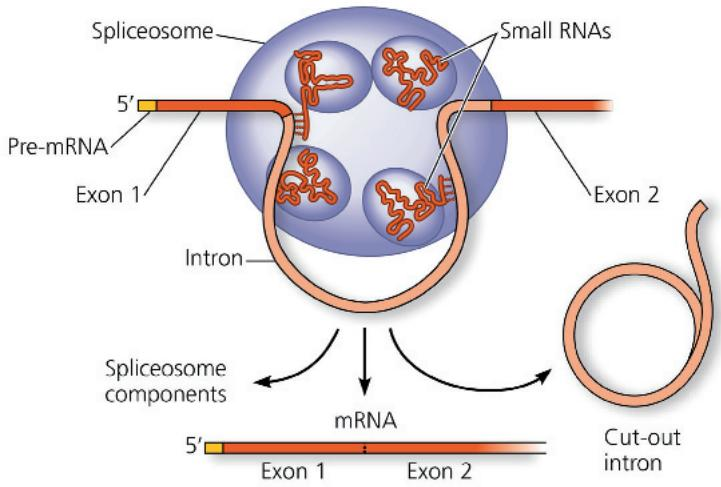

In making a primary transcript from a gene, RNA polymerase II transcribes both introns and exons from the DNA, but the mRNA molecule that enters the cytoplasm is an abridged version. In the process of RNA splicing, the introns are cut out from the molecule and the exons joined together, forming an mRNA molecule with a continuous coding sequence.

How is pre-mRNA splicing carried out? The removal of introns is accomplished by a large complex made of proteins and small RNAs called a spliceosome. This complex binds to several short nucleotide sequences along an intron, including key sequences at each end (Figure 17.13). The intron is then released (and rapidly degraded), and the spliceosome joins together the two exons that flanked the intron. The small RNAs in the spliceosome not only participate in spliceosome assembly and splice site recognition, but also catalyze the splicing reaction; like proteins, RNAs can act as catalysts.

## Interview

Interview with Joan Steitz: Studying RNA, her "favorite molecule" (eTextbook only)

## Ribozymes

The idea of a catalytic role for the RNAs in the spliceosome arose from the discovery of ribozymes, RNA molecules that function as enzymes. In some organisms, RNA splicing can occur without proteins or even additional RNA molecules: The intron RNA functions as a ribozyme and catalyzes its own removal. For example, in the ciliate protist Tetrahymena, self-splicing occurs in the production of ribosomal RNA (rRNA), a component of the organism's ribosomes. The pre-rRNA actually removes its own introns!

The discovery of ribozymes invalidated the idea that all biological catalysts are proteins.

Three properties of RNA enable some RNA molecules to function as enzymes. First, because RNA is single-stranded, a region of an RNA molecule may base-pair, in an antiparallel arrangement, with a complementary region elsewhere in the same molecule; this gives the molecule a particular three-dimensional structure. A specific structure is essential to the catalytic function of ribozymes, just as it is for enzymatic proteins. Second, like certain amino acids in an enzymatic protein, some of the bases in RNA contain functional groups that can participate in catalysis. Third, the ability of RNA to hydrogen-bond with other nucleic acid molecules (either RNA or DNA) adds specificity to its catalytic activity. For example, complementary base pairing between the RNA of the spliceosome and the RNA of a primary RNA transcript precisely locates the region where the ribozyme catalyzes splicing. Later in this chapter, you will see how these properties of RNA also allow it to perform important noncatalytic roles in the cell, such as recognition of the three-nucleotide codons on mRNA.

## The Functional and Evolutionary Importance of Introns

EVOLUTION Whether or not RNA splicing and the presence of introns have provided selective advantages during evolutionary history is a matter of some debate. In any case, it is informative to consider their possible adaptive benefits. Specific functions have not been identified for most introns, but at least some contain sequences that regulate gene expression, and many affect gene products.

One important consequence of the presence of introns in genes is that a single gene can encode more than one kind of polypeptide. Many genes are known to give rise to two or more different polypeptides, depending on which segments are treated as exons during RNA processing; this is called alternative RNA splicing (see Figure 18.14). Results from the Human Genome Project (discussed in Concept 21.1) suggest that alternative RNA splicing is one reason humans can get along with about the same number of genes as a nematode (roundworm). Because of alternative splicing, the number of different protein products an organism produces can be much greater than its number of genes.

Proteins often have a modular architecture consisting of discrete structural and functional regions called domains. One domain of an enzyme, for example, might include the active site, while another might allow the enzyme to bind to a cellular membrane. In quite a few cases, different exons code for the different domains of a protein (Figure 17.14).

The presence of introns in a gene may facilitate the evolution of new and potentially beneficial proteins as a result of a process known as exon shuffling (see Figure 21.16). Introns increase the probability of crossing over between the exons of alleles of a gene—simply by providing more terrain for crossovers without interrupting coding sequences. This might result in new combinations of exons and proteins with altered structure and function. We can also imagine the occasional mixing and matching of exons between completely different (nonallelic) genes. Exon shuffling of either sort could lead to new proteins with novel combinations of functions. While most of the shuffling would result in nonbeneficial changes, occasionally a beneficial variant might arise.

Figure 17.14 Correspondence between exons and protein domains.  
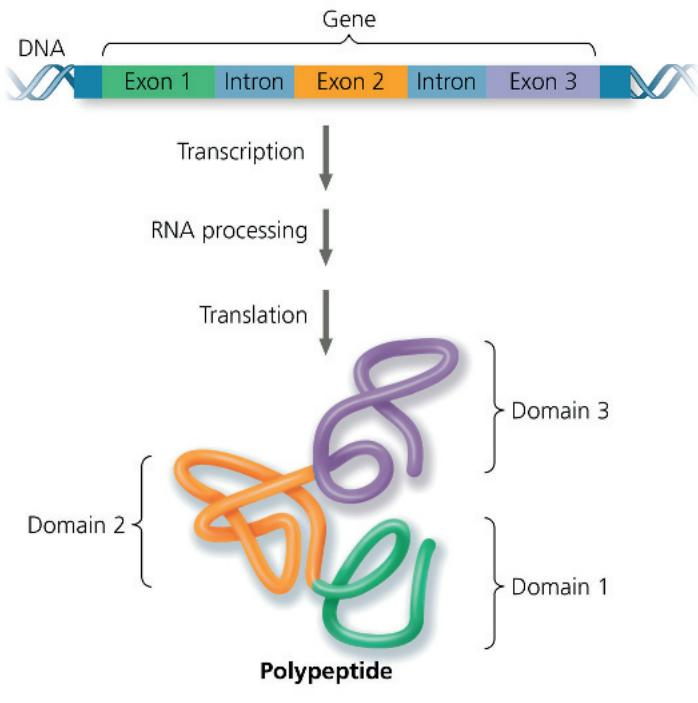  
Figure 17.15 Translation: the basic concept.

## Concept Check 17.3

1. Given that there are about 20,000 human protein-coding genes, how can human cells make 75,000–100,000 different proteins?

2. Compare RNA splicing to how you would watch a prerecorded television show. What would introns correspond to in this analogy?

3. WHAT IF? What would be the effect of treating cells with an agent that removed the 5' cap from mRNAs?

For suggested answers, see Appendix A.

# Concept 17.4: Translation is the RNA-directed synthesis of a polypeptide: A Closer Look

We will now examine how genetic information flows from mRNA to protein—the process of translation (Figure 17.15). We'll focus on the basic steps of translation that occur in both bacteria and eukaryotes, while pointing out key differences.

## Molecular Components of Translation

In the process of translation, a cell “reads” a genetic message and builds a polypeptide accordingly. The message is a series of codons along an mRNA molecule, and the translator is called

As a molecule of mRNA is moved through a ribosome, codons are translated into amino acids, one by one. The translators, or interpreters, are tRNA molecules, each type with a specific anticodon at one end and a corresponding amino acid at the other end. A tRNA adds its amino acid cargo to a growing polypeptide chain when the anticodon hydrogen-bonds to the complementary codon on the mRNA.

a transfer RNA (tRNA). The function of a tRNA is to transfer an amino acid from the cytoplasmic pool of amino acids to a growing polypeptide in a ribosome. A cell keeps its cytoplasm stocked with all 20 amino acids, either by synthesizing them from other compounds or by taking them up from the surrounding solution. The ribosome, a structure made of proteins and RNAs, adds each amino acid brought to it by a tRNA to the growing end of a polypeptide chain (see Figure 17.15).

Translation is simple in principle but complex in its biochemistry and mechanics, especially in the eukaryotic cell. In dissecting translation, we'll focus on the slightly less complicated version of the process that occurs in bacteria. We'll first look at the major players in this process.

## The Structure and Function of Transfer RNA

The key to translating a genetic message into a specific amino acid sequence is the fact that each tRNA molecule enables translation of a given mRNA codon into a certain amino acid. This is possible because a tRNA bears a specific amino acid at one end of its three-dimensional structure, while at the other end is a nucleotide triplet that can base-pair with the complementary codon on mRNA.

A tRNA molecule consists of a single RNA strand that is only about 80 nucleotides long (compared to hundreds of nucleotides for most mRNA molecules). The presence of complementary stretches of nucleotide bases that can hydrogen-bond to each other allows this single strand to fold back on itself and form a molecule with a particular 3-D structure. Flattened into one plane to clarify this base pairing, a tRNA molecule looks like a cloverleaf (Figure 17.16a). The tRNA actually twists and folds into a compact 3-D structure that is roughly L-shaped (Figure 17.16b), with the 5' and 3' ends of the linear tRNA both located near one end of the structure. The protruding 3' end acts as the attachment site for an amino acid. The loop extending from the other end of the L includes the anticodon, the particular nucleotide triplet that base-pairs to a specific mRNA codon. Thus, the structure of a tRNA molecule fits its function.

Anticodons are conventionally written $3'\rightarrow5'$ to align properly with codons written $5'\rightarrow3'$ (see Figure 17.15). (For base pairing, RNA strands must be antiparallel, like DNA.) As an example of how tRNAs work, consider the mRNA codon $5'$ -GGC- $3'$ , which is translated as the amino acid glycine. The tRNA that base-pairs with this codon by hydrogen bonding has $3'$ -CCG- $5'$ as its anticodon and carries glycine at its other end (see the incoming tRNA approaching the ribosome in Figure 17.15). As an mRNA molecule is moved through a ribosome, glycine will be added to the polypeptide chain whenever the codon $5'$ -GGC- $3'$ is presented for translation. Codon by codon, the genetic message is translated as tRNAs position each amino acid in the order prescribed, and the ribosome adds that amino acid onto the growing polypeptide chain. The tRNA molecule is a translator in the sense that, in the context of the ribosome, it can read a nucleic acid word (the mRNA codon) and interpret it as a protein word (the amino acid).

Like mRNA and other types of cellular RNA, transfer RNA molecules are transcribed from DNA templates. In a eukaryotic cell, tRNA, like mRNA, is made in the nucleus and then travels to the cytoplasm, where it will participate in the process of translation. In both bacterial and eukaryotic cells, each tRNA molecule is used repeatedly, picking up its designated amino acid in the cytosol, depositing this cargo onto a polypeptide chain at the ribosome, and then leaving the ribosome, ready to pick up another of the same amino acid.

The accurate translation of a genetic message requires two instances of molecular recognition. First, a tRNA that binds to an mRNA codon specifying a particular amino acid must carry that amino acid, and no other, to the ribosome. The correct matching up of tRNA and amino acid is carried out by a family of related enzymes that are aptly named aminoacyl-tRNA synthetases (Figure 17.17). The active site of each type of aminoacyl-tRNA synthetase fits only a specific combination of amino acid and tRNA. (Regions of both the amino acid attachment end and the anticodon end of the tRNA ensure the specific fit.) There are 20 different synthetases, one for each amino acid. A synthetase joins a given amino acid to an appropriate tRNA; one synthetase is able to bind to all the different tRNAs for its particular amino acid. The synthetase catalyzes the covalent attachment of the amino acid to its tRNA in a process driven by the hydrolysis of ATP. The resulting aminoacyl tRNA, also called a charged tRNA, is released from the enzyme and is then available to deliver its amino acid to a growing polypeptide chain on a ribosome.

Figure 17.16 The structure of transfer RNA (tRNA).  

(a) Two-dimensional structure. The four base-paired regions and three loops are characteristic of all tRNAs, as is the base sequence of the amino acid attachment site at the 3' end. The anticodon triplet is unique to each tRNA type, as are some sequences in the other two loops. (The asterisks mark bases that have been chemically modified, a characteristic of tRNA. The modified bases contribute to tRNA function in a way that is not yet understood.)  
  
VISUAL SKILLS Look at the tRNA shown in this figure. Based on its anticodon, identify the codon it would bind to, as well as the amino acid that it would carry. For suggested answer, see Appendix A.

The second instance of molecular recognition is the pairing of the tRNA anticodon with the appropriate mRNA codon. If one tRNA type existed for each mRNA codon specifying an amino acid, there would be 61 tRNAs (see Figure 17.6). In bacteria, however, there are only about 45 tRNAs, signifying that some tRNAs must be able to bind to more than one codon.

Figure 17.17 Aminoacyl-tRNA synthetases provide specificity in joining amino acids to their tRNAs.

Linkage of a tRNA to its amino acid is an endergonic process that occurs at the expense of ATP, which loses two phosphate groups, becoming AMP.

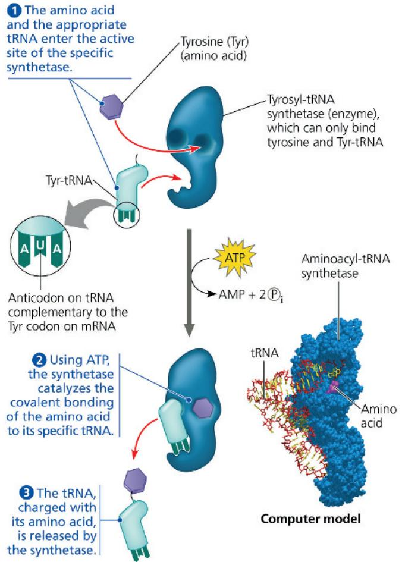  
This is possible because the rules for base pairing between the third nucleotide base of a codon and the corresponding base of a tRNA anticodon are relaxed compared to those at other codon positions. For example, the nucleotide base U at the 5' end of a tRNA anticodon can pair with either A or G in the third position (at the 3' end) of an mRNA codon. The flexible base pairing at this codon position is called wobble. Wobble explains why the synonymous codons for a given amino acid most often differ in their third nucleotide base. Accordingly, a tRNA with the anticodon 3'-UCU-5' can base-pair with either the mRNA codon 5'-AGA-3' or 5'-AGG-3', both of which code for arginine (see Figure 17.6).

## The Structure and Function of Ribosomes

Although the ribosomes of bacteria and eukaryotes are very similar in structure and function, eukaryotic ribosomes are slightly larger and differ somewhat from bacterial ribosomes in their molecular composition. The differences are medically significant. Certain antibiotic drugs can inactivate bacterial ribosomes without affecting the ability of eukaryotic ribosomes to make proteins. These drugs, including tetracycline and streptomycin, are used to combat bacterial infections.

Ribosomes facilitate the specific coupling of tRNA anticodons with mRNA codons during protein synthesis. A ribosome consists of a large subunit and a small subunit, each made up of proteins and one or more ribosomal RNAs, or rRNAs (Figure 17.18). In eukaryotes, the subunits are made in the nucleolus. Ribosomal RNA genes are transcribed, and the RNA is processed and assembled

Figure 17.18 The anatomy of a functioning ribosome.  
  
(a) Computer model of functioning ribosome. This is a model of a bacterial ribosome, showing its overall shape. The eukaryotic ribosome is roughly similar. A ribosomal subunit is a complex of ribosomal RNA molecules and proteins.

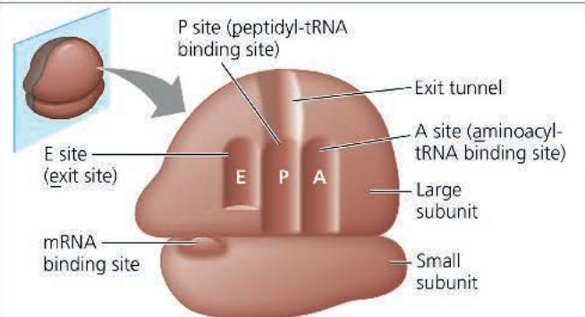  
(b) Schematic model showing binding sites. A ribosome has an mRNA binding site and three tRNA binding sites, known as the A, P, and E sites. This schematic ribosome will appear in later diagrams.

  
(c) Schematic model with mRNA and tRNA. A tRNA fits into the A site when its anticodon base-pairs with an mRNA codon. The P site holds the tRNA attached to the growing polypeptide. The A site holds the tRNA carrying the next amino acid to be added to the polypeptide chain. Discharged tRNAs leave from the E site. The polypeptide grows at its carboxyl end.

# Scientific Skills Exercise Interpreting a Sequence Logo

How Can a Sequence Logo Be Used to Identify Ribosome Binding Sites on Bacterial mRNAs? When initiating translation, ribosomes bind to an mRNA at a ribosome binding site upstream

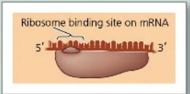

of the AUG start codon. Because mRNAs from different genes all bind to a ribosome, the genes encoding these mRNAs are likely to have a similar base sequence where the ribosomes bind. Therefore, candidate ribosome binding sites on mRNA can be identified by comparing DNA sequences (and thus the mRNA sequences) of multiple genes in a species, searching the region upstream of the start codon for shared (conserved) stretches of bases. In this exercise, you will analyze DNA sequences from multiple such genes, represented by a visual graphic called a sequence logo.

How the Experiment Was Done The DNA sequences of 149 genes from the E. coli genome were aligned using computer software. The aim was to identify similar base sequences—at the appropriate location in each gene—as potential ribosome binding sites. Rather than presenting the data as a series of 149 sequences aligned in a column (a sequence alignment), the researchers used a sequence logo.

Data from the Experiment The potential ribosome binding regions from ten E. coli genes are shown below in a sequence alignment, followed by the sequence logo derived from the aligned sequences. Note that the DNA shown is the nontemplate (coding) strand, how DNA sequences are typically presented. (All data from Thomas D. Schneider.)

## Sequence alignment

## INTERPRET THE DATA

1. In the sequence logo, the horizontal axis shows the primary sequence of the DNA by nucleotide position. Letters for each base are stacked on top of each other according to their relative frequency at that position among the aligned sequences, with the most common base as the largest letter at the top of the stack. The height of each letter represents the relative frequency of that base at that position. (a) In the sequence alignment, count the number of each base at position -9 and order them from most to least frequent. Compare this to the size and placement of each base at -9 in the logo. (b) Do the same for positions 0 and 1.

2. The height of a stack of letters in a logo indicates the predictive power of that stack (determined statistically). If the stack is tall, we can be more confident in predicting what base will be in that position if a new sequence is added. For example, at position 2 in the sequence alignment, all ten sequences have a G; the probability of finding a G there in a new sequence is very high. For short stacks, the bases all have about the same frequency, so it's hard to predict a base at those positions.
(a) Looking at the sequence logo, which two positions have the most predictable bases? What bases do you predict would be at those positions in a newly sequenced gene? (b) Which 12 positions have the least predictable bases? How does this reflect the relative frequencies of the bases shown at these positions in the sequence alignment? Use the two leftmost positions as examples in your answer.

3. The actual experiment used 149 sequences to build the sequence logo, shown below. There is a stack at each position, even if short, because the sequence logo includes more data.
(a) Which three positions in this sequence logo have the most predictable bases? Name the most frequent base at each.
(b) Which four positions have the least predictable bases?

4. A consensus sequence identifies the base occurring most often at each position in the set of sequences. (a) Write out the consensus sequence of this (the nontemplate) strand. In any position where the base can't be determined, put a dash. (b) Which provides more information—the consensus sequence or the sequence logo? What is lost in the less informative method?

5. (a) Based on the logo, what five adjacent base positions in the 5' UTR region are most likely to be involved in ribosome binding? (b) What is represented by the bases in positions 0–2?

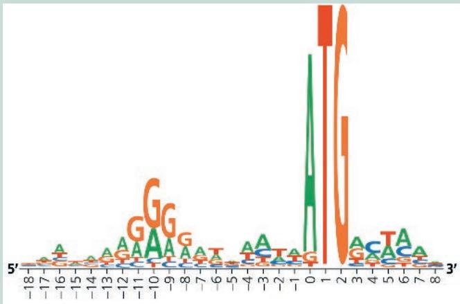  
Instructors: A version of this Scientific Skills Exercise can be assigned in Mastering Biology.

with proteins imported from the cytoplasm. Completed ribosomal subunits are then exported via nuclear pores to the cytoplasm. In both bacteria and eukaryotes, a large and a small subunit join to form a functional ribosome only when attached to an mRNA molecule. About one-third of the mass of a ribosome is made up of proteins; the rest consists of three rRNA molecules (in bacteria) or four (in eukaryotes). Because most cells contain thousands of ribosomes, rRNA is the most abundant type of cellular RNA.

The structure of a ribosome reflects its function of bringing an mRNA molecule together with tRNAs carrying amino acids. The mRNA itself has a binding site for the ribosome. (In the Scientific Skills Exercise, you can work with DNA sequences representing this binding site in a group of Escherichia coli genes.) The ribosome, in turn, has a binding site for mRNA, as well as three binding sites for tRNA (see Figure 17.18). The P site (peptidyl-tRNA binding site) holds the tRNA carrying the growing polypeptide chain, while the A site (aminoacyl-tRNA binding site) holds the tRNA carrying the next amino acid to be added to the chain. Discharged tRNAs leave the ribosome from the E site (exit site). The ribosome holds the tRNA and mRNA in close proximity and positions the new amino acid so that it can be added to the carboxyl end of the growing polypeptide. It then catalyzes the formation of the peptide bond. As the polypeptide becomes longer, it passes through an exit tunnel in the ribosome's large subunit. When the polypeptide is complete, it is released through the exit tunnel.

The widely accepted model is that rRNAs, rather than ribosomal proteins, are primarily responsible for both the structure and the function of the ribosome. The proteins, which are largely on the exterior, support the shape changes of the rRNA molecules as they carry out catalysis during translation.

first amino acid of the polypeptide, and the two subunits of a ribosome. First, a small ribosomal subunit binds to both the mRNA and a specific initiator tRNA, which carries the amino acid methionine. In bacteria, the small subunit can bind the two in either order; it binds the mRNA at a specific RNA sequence, just upstream of the AUG start codon. In eukaryotes, the small subunit, with the initiator tRNA already bound, binds to the 5' cap of the mRNA and then moves, or scans, downstream along the mRNA until it reaches the AUG start codon, where the initiator tRNA then hydrogen-bonds, as shown in step 1 of Figure 17.19. In either bacteria or eukaryotes, the AUG signals the start of translation; this is important because it establishes the codon reading frame for the mRNA.

The union of mRNA, initiator tRNA, and the small ribosomal subunit is followed by the attachment of a large ribosomal subunit, completing the translation initiation complex (see Figure 17.19). Proteins called initiation factors are required to bring all these components together. The cell also expends energy obtained by hydrolysis of a GTP molecule to form the initiation complex. At the completion of the initiation process, the initiator tRNA sits in the P site of the ribosome, and the vacant A site is ready for the next aminoacyl tRNA. Note that a polypeptide is always synthesized in one direction, from the initial methionine at the amino end, also called the N-terminus, toward the final amino acid at the carboxyl end, also called the C-terminus (see Figure 5.15).

## Elongation of the Polypeptide Chain

In the elongation stage of translation, amino acids are added one by one to the previous amino acid at the C-terminus of the

Ribosomal RNA is the main constituent of the A and P sites and of the interface between the two subunits; it also acts as the catalyst of peptide bond formation. Thus, a ribosome could actually be considered one colossal ribozyme!

## Building a Polypeptide

We can divide translation, the synthesis of a polypeptide, into three stages: initiation, elongation, and termination. All three require protein “factors” that aid in the translation process. Some steps of initiation and elongation also require energy, provided by the hydrolysis of guanosine triphosphate (GTP).

## Ribosome Association and Initiation of Translation

The initiation stage of translation brings together an mRNA, a tRNA bearing the

Figure 17.19 The initiation of translation.  

A small ribosomal subunit binds to an mRNA. In a bacterial cell, the mRNA binding site on this subunit recognizes a specific nucleotide sequence on the mRNA just upstream of the start codon (see the Scientific Skills Exercise). An initiator tRNA, with the anticodon UAC, base-pairs with the start codon, AUG. This tRNA carries the amino acid methionine (Met).

Figure 17.20 The elongation cycle of translation.

The hydrolysis of GTP plays an important role in the elongation process; elongation factors are not shown.

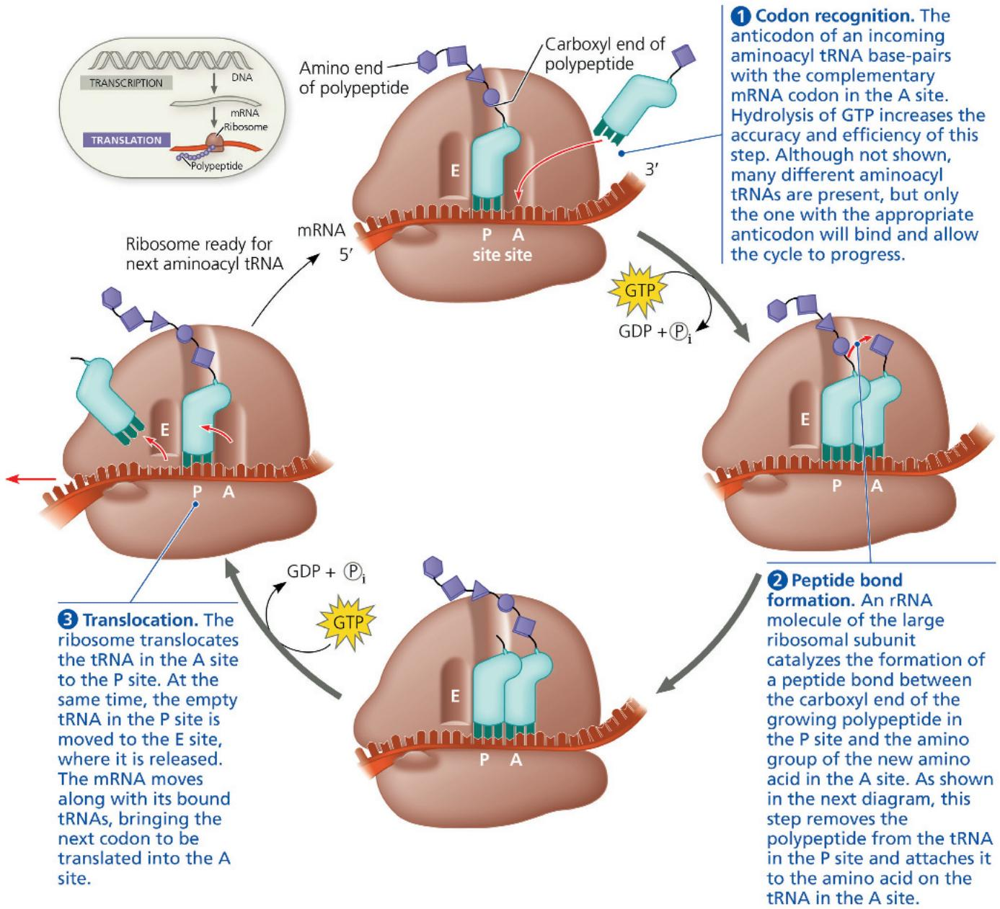

growing chain. Each addition involves several proteins called elongation factors and occurs in a three-step cycle described in Figure 17.20. Energy expenditure occurs in the first and third steps. Codon recognition requires hydrolysis of one molecule of GTP, which increases the accuracy and efficiency of this step. One more GTP is hydrolyzed (broken up) to provide energy for the translocation step.

The mRNA is moved through the ribosome in one direction only, $5'$ end first; this is equivalent to the ribosome moving $5' \rightarrow 3'$ on the mRNA. The main point is that the ribosome and the mRNA move relative to each other, unidirectionally, codon by codon. The elongation cycle takes less than a tenth of a second in bacteria and is repeated as each amino acid is added until the polypeptide is completed. The empty tRNAs that are released from the E site return to the cytoplasm, where they will be reloaded with the appropriate amino acid (see Figure 17.17).

## Termination of Translation

The final stage of translation is termination (Figure 17.21). Elongation continues until a stop codon in the mRNA reaches the A site. The nucleotide base triplets UAG, UAA, and UGA (all written $5'\rightarrow3'$ ) do not code for amino acids but instead act as signals to stop translation. A release factor, a protein shaped like an aminoacyl tRNA, binds directly to the stop codon in the A site.

Figure 17.21 The termination of translation.  
Like elongation, termination requires GTP hydrolysis as well as additional protein factors, which are not shown here.  
  
When a ribosome reaches a stop codon on mRNA, the A site of the ribosome accepts a "release factor"—a protein shaped like a tRNA—instead of an aminoacyl tRNA.  
2 The release factor promotes hydrolysis of the bond between the tRNA in the P site and the last amino acid of the polypeptide, thus freeing the polypeptide from the ribosome.  
3 The two ribosomal subunits and the other components of the assembly dissociate with the hydrolysis of two GTP molecules.

The release factor causes the addition of a water molecule instead of an amino acid to the polypeptide chain. (Water molecules are abundant in the cytosol.) This reaction hydrolyzes (breaks) the bond between the completed polypeptide and the tRNA in the P site, releasing the polypeptide through the exit tunnel of the ribosome's large subunit. The remainder of the translation assembly then comes apart in a multistep process, aided by other protein factors. Breakdown of the translation assembly requires the hydrolysis of two more GTP molecules.

## Completing and Targeting the Functional Protein

The process of translation is often not sufficient to make a functional protein. In this section, you will learn about modifications that polypeptide chains undergo after the translation process as well as some of the mechanisms used to target completed proteins to specific sites in the cell.

## Protein Folding and Post-translational Modifications

During its synthesis, a polypeptide chain begins to coil and fold spontaneously as a consequence of its amino acid sequence (primary structure), forming a protein with a specific shape: a three-dimensional molecule with secondary and tertiary structure (see Figure 5.18). Thus, a gene determines primary structure, which in turn determines shape.

Additional steps—post-translational modifications—may be required before the protein can begin doing its particular job in the cell. Certain amino acids may be chemically modified by the attachment of sugars, lipids, phosphate groups, or other additions. Enzymes may remove one or more amino acids from the leading (amino) end of the polypeptide chain. In some cases, a polypeptide chain may be enzymatically cleaved into two or more pieces. In other cases, two or more polypeptides that are synthesized separately may come together, if the protein has quaternary structure; an example is hemoglobin (see Figure 5.18).

## Targeting Polypeptides to Specific Locations

In electron micrographs of eukaryotic cells active in protein synthesis, two populations of ribosomes are evident: free and bound (see Figure 6.10). Free ribosomes are suspended in the cytosol and mostly synthesize proteins that stay in the cytosol and function there. In contrast, bound ribosomes are attached to the cytosolic side of the endoplasmic reticulum (ER) or to the nuclear envelope. Bound ribosomes make proteins of the endomembrane system (see Figure 6.15) as well as proteins secreted from the cell, such as insulin. It is important to note that the ribosomes themselves are identical and can alternate between being free ribosomes one time they are used and being bound ribosomes the next.

What determines whether a ribosome is free in the cytosol or bound to rough ER? Polypeptide synthesis always begins in the cytosol as a free ribosome starts to translate an mRNA molecule. There, the process continues to completion—unless the growing polypeptide itself cues the ribosome to attach to the ER. The polypeptides of proteins destined for the endomembrane system or for secretion are marked by a signal peptide, which targets the protein to the ER. The signal peptide, a sequence of about 20 amino acids at or near the leading end (N-terminus) of the polypeptide, is recognized as

Figure 17.22 The signal mechanism for targeting proteins to the ER.

① Polypeptide synthesis begins on a free ribosome in the cytosol.

② An SRP binds to the signal peptide, (if present), halting synthesis momentarily.

③ The SRP binds to a receptor protein in the ER membrane, part of a protein complex that forms a pore.

4 The SRP leaves, and polypeptide synthesis resumes, with simultaneous translocation across the membrane.

⑤ The signal peptide is cleaved by an enzyme in the receptor protein complex.

⑥ The rest of the completed polypeptide leaves the ribosome and folds into its final conformation.

  
MAKE CONNECTIONS If this protein were destined for secretion, what would happen to it after its synthesis was completed? See Figure 7.9.  
For suggested answer, see Appendix A.

it emerges from the ribosome by a protein-RNA complex called a signal-recognition particle (SRP). This particle escorts the ribosome to a receptor protein built into the ER membrane, as shown in Figure 17.22. The receptor is part of a multiprotein translocation complex. Polypeptide synthesis continues there, and the growing polypeptide snakes across the membrane into the ER lumen via a protein pore. The signal peptide is removed by an enzyme. The rest of the completed polypeptide, if it is to be secreted from the cell, is released into solution within the ER lumen (see Figure 17.22). Or, if the polypeptide is to be a membrane protein, amino acid sequences further in the chain cause that part to remain embedded in the ER membrane. In either case, it travels in a transport vesicle to its destination (see Figure 7.9).

Other kinds of signal peptides are used to target polypeptides to mitochondria, chloroplasts, the interior of the nucleus, and other organelles that are not part of the endomembrane system. The critical difference in these cases is that translation is completed in the cytosol before the polypeptide is imported into the organelle. Translocation mechanisms also vary, but in all cases studied to date, the “postal zip codes” that address proteins for secretion or to cellular locations are signal peptides of some sort. Bacteria also employ signal peptides to target proteins to the plasma membrane or for secretion.

## Making Multiple Polypeptides in Bacteria and Eukaryotes

In previous sections, you learned how a single polypeptide is synthesized using the information encoded in an mRNA molecule. When a polypeptide is required in a cell, though, the need is for many copies, not just one.

In both bacteria and eukaryotes, multiple ribosomes translate an mRNA at the same time (Figure 17.23); that is, a single mRNA is used to make many copies of a polypeptide simultaneously. Once a ribosome is far enough past the start codon, a second ribosome can attach to the mRNA, eventually resulting in a number of ribosomes trailing along the mRNA. Such strings of ribosomes, called polyribosomes (or polysomes), can be seen with an electron microscope; they can be either free or bound. They enable a cell to rapidly make many copies of a polypeptide.

Another way both bacteria and eukaryotes increase the number of copies of a polypeptide is by transcribing multiple mRNAs from the same gene. However, the coordination of the two processes—transcription and translation—differs in the two groups. The most important differences between bacteria and eukaryotes arise from the bacterial cell's lack of compartmental

Figure 17.23 Polyribosomes.  

(a) An mRNA molecule is generally translated simultaneously by several ribosomes in clusters called polyribosomes.  
  
(b) This micrograph shows a large polyribosome in a bacterial cell. Growing polypeptides are not visible here (TEM).

Figure 17.24 Coupled transcription and translation in bacteria. In bacterial cells, the translation of mRNA can begin as soon as the leading (5') end of the mRNA molecule peels away from the DNA template. The micrograph (TEM) shows a strand of E. coli DNA being transcribed by RNA polymerase molecules. Attached to each RNA polymerase molecule is a growing strand of mRNA, which is already being translated by ribosomes. The newly synthesized polypeptides are not visible in the micrograph but are shown in the diagram.

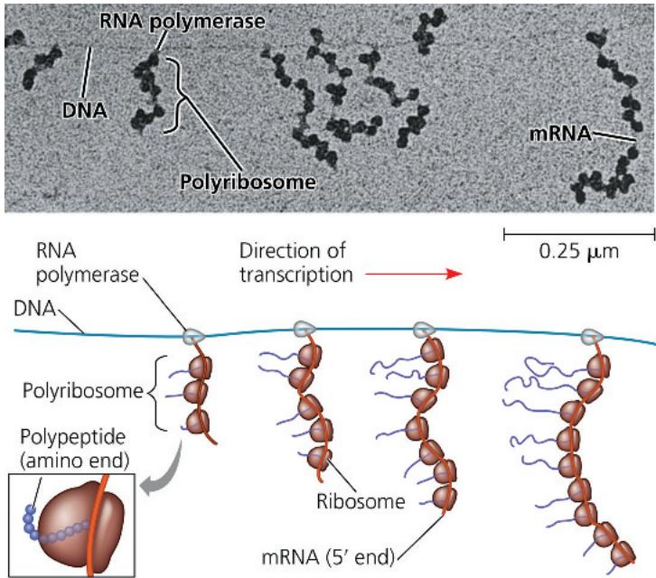  
VISUAL SKILLS Which one of the mRNA molecules started being transcribed first? On that mRNA, which ribosome started translating the mRNA first? For suggested answer, see Appendix A.

organization. Like a one-room workshop, a bacterial cell ensures a streamlined operation by coupling the two processes. With no nuclear envelope, it can simultaneously transcribe and translate the same gene (Figure 17.24), and the newly made protein can quickly diffuse to its site of function.

In contrast, the eukaryotic cell's nuclear envelope segregates transcription from translation and provides a compartment for extensive RNA processing. This processing stage includes additional steps, discussed earlier, the regulation of which can help coordinate the eukaryotic cell's elaborate activities.

Figure 17.25, on the next page, summarizes the path from gene to polypeptide in a eukaryotic cell.

## Concept Check 17.4

1. What two processes ensure that the correct amino acid is added to a growing polypeptide chain?

2. Describe how a polypeptide to be secreted reaches the endomembrane system.

3. DRAW IT Draw a tRNA with the anticodon 3'-CGU-5'. Given wobble, what two different codons could it bind to? Draw each codon on an mRNA, labeling all 5' and 3' ends, the tRNA, and the amino acid it carries.

4. WHAT IF? In eukaryotic cells, mRNAs have been found to have a circular arrangement in which proteins hold the poly-A tail near the 5' cap. How might this increase translation efficiency?

For suggested answers, see Appendix A.

## Concept 17.5: Mutations of one or a few nucleotides can affect protein structure and function

Now that you have explored the process of gene expression, you can consider the effects of changes to the genetic information of a cell. Because these changes, called mutations, are the ultimate source of new genes, they are responsible for the huge diversity of genes found among organisms. Earlier, we considered chromosomal rearrangements that affect long segments of DNA (see Figure 15.14); these are considered large-scale mutations. Here we examine small-scale mutations of one or a few nucleotide pairs, including point mutations, changes in a single nucleotide pair of a gene.

If a point mutation occurs in a gamete or in a cell that gives rise to gametes, it may be transmitted to offspring and to future generations. If the mutation has an adverse effect on the phenotype of a person, the mutant condition is referred to as a genetic disorder or hereditary disease. For example, we can trace the genetic basis of sickle-cell disease to the mutation of a single nucleotide pair in the gene that encodes the $\beta$ -globin polypeptide of hemoglobin. The change of a single nucleotide in the DNA's template strand leads to an altered mRNA and the

Figure 17.25 A summary of transcription and translation in a eukaryotic cell.

This diagram shows the path from one gene to one polypeptide. Each gene in the DNA can be transcribed repeatedly into many identical RNA molecules, and each mRNA can be translated repeatedly to yield many identical polypeptide molecules. (Remember that the final products of some genes are not polypeptides but RNA molecules that don't get translated, including tRNAs and rRNAs.) In general, the steps of transcription and translation are similar in bacterial, archaeal, and eukaryotic cells. The major difference is the occurrence of RNA processing in the eukaryotic nucleus. Other significant differences are found in the initiation stages of both transcription and translation and in the termination of transcription. To visualize these processes in their cellular context, see Figure 6.32d-f.

## RNA PROCESSING

2 In eukaryotes, the RNA transcript (pre-mRNA) is spliced and modified to produce mRNA, which moves from the nucleus to the cytoplasm.

## AMINO ACID ACTIVATION

4 Each amino acid attaches to its proper tRNA with the help of a specific enzyme and ATP.

## TRANSLATION

5 A succession of tRNAs add their amino acids to the polypeptide chain as the mRNA is moved through the ribosome one codon at a time. When completed, the polypeptide is released from the ribosome.

Figure 17.26 The molecular basis of sickle-cell disease: a point mutation.

The allele that causes sickle-cell disease differs from the wild-type (normal) allele by a single DNA nucleotide pair. The micrographs are SEMs of a normal red blood cell (on the left) and a sickled red blood cell (right) from individuals homozygous for wild-type and mutant alleles, respectively.

production of an abnormal protein (Figure 17.26; also see Figure 5.19). In individuals who are homozygous for the mutant allele, the sickling of red blood cells caused by the altered hemoglobin produces the multiple symptoms associated with sickle-cell disease (see Concept 14.4 and Figure 23.18). Another disorder caused by a point mutation is a heart condition called familial cardiomyopathy, which is responsible for some of the tragic incidents of sudden death in young athletes. Point mutations in several genes encoding muscle proteins have been identified, any of which can lead to this disorder.

## Types of Small-Scale Mutations

Many mutations occur in regions outside of protein-coding genes, and any potential effect they have on the phenotype of the organism may be subtle and hard to detect. For this reason, here we'll concentrate on mutations within protein-coding genes. Small-scale mutations within a gene can be divided into two general categories: (1) single nucleotide-pair substitutions and (2) nucleotide-pair insertions or deletions. Insertions and deletions can involve one or more nucleotide pairs.

## Substitutions

A nucleotide-pair substitution is the replacement of one nucleotide and its partner with another pair of nucleotides (Figure 17.27a, on the next page). Some substitutions have no effect on the encoded protein, owing to the redundancy of the genetic code. For example, if 3'-CCG-5' on the template strand mutated to 3'-CCA-5', the mRNA codon that used to be GGC would become GGU, but a glycine would still be inserted at the proper location in the protein (see Figure 17.6). In other words, a change in a nucleotide pair may transform one codon into another that is translated into the same amino acid. Such a change is an example of a silent mutation, which has no observable effect on the phenotype. (Silent mutations can occur outside genes as well.) Interestingly, there is evidence that some silent mutations may indirectly affect where or at what level the gene gets expressed, even though the actual protein is the same.

Substitutions that change one amino acid to another one are called missense mutations. Such a mutation may have little effect on the protein: The new amino acid may have properties similar to those of the amino acid it replaces, or it may be in a region of the protein where the exact sequence of amino acids is not essential to the protein's function.

However, the nucleotide-pair substitutions of greatest interest are those that cause a major change in a protein. The alteration of a single amino acid in a crucial area of a protein—such

as in the part of the $\beta$ -globin subunit of hemoglobin shown in Figure 17.26 or in the active site of an enzyme as shown in Figure 8.19—can significantly alter protein activity. Occasionally, such a mutation leads to an improved protein or one with novel capabilities, but much more often such mutations are neutral or detrimental, leading to a useless or less active protein that impairs cellular function. A second example of a missense mutation is a mutation in the tyrosinase gene that causes the albino phenotype in the Asinara donkey. Recently, Italian researchers sequenced the tyrosinase gene in donkeys from this wild population and showed that a recessive mutation is responsible for the lack of pigment. In this gene, a C is changed to a G, resulting in a histidine being added to the protein instead of an aspartic acid. The changed amino acid is in a site in tyrosinase that normally binds a copper atom, and it makes the enzyme incapable of binding copper, rendering it nonfunctional. As in the case of sickle-cell disease, just one change in a nucleotide base results in a dramatic phenotypic change.

Substitution mutations are usually missense mutations; that is, the altered codon still codes for an amino acid and thus makes sense, although not necessarily the right sense. But a point mutation can also change a codon for an amino acid into a stop codon. This is called a nonsense mutation, and it causes translation to be terminated prematurely; the resulting polypeptide will be shorter than the polypeptide encoded by the normal gene. Most nonsense mutations lead to nonfunctional proteins.

In the Problem-Solving Exercise, you'll work with a few common single nucleotide-pair substitution mutations in the gene encoding insulin, some or all of which may lead to diabetes. You will classify these mutations into one of the types we just described and characterize the change in the amino acid sequence.

Figure 17.27 Types of small-scale mutations that affect mRNA sequence. All but one of the types shown here also affect the amino acid sequence of the encoded polypeptide.  

## Insertions and Deletions

Insertions and deletions are additions or losses of nucleotide pairs in a gene (Figure 17.27b). These mutations have a disastrous effect on the resulting protein more often than substitutions do. Insertion or deletion of nucleotides may alter the reading frame of the genetic message, the triplet grouping of nucleotides on the mRNA that is read during translation. Such a mutation, called a frameshift mutation, occurs whenever the number of nucleotides inserted or deleted is not a multiple of three. All nucleotides downstream of the deletion or insertion will be improperly grouped into codons; the result will be extensive missense mutations, usually ending sooner or later in a nonsense mutation that leads

to premature termination. Unless the frameshift is very near the end of the gene, the protein is almost certain to be nonfunctional. Insertions and deletions also occur outside of coding regions; these are not called frameshift mutations, but can have effects on the phenotype—for instance, they can affect how a gene is expressed.

## New Mutations and Mutagens

Mutations can arise in a number of ways. Errors during DNA replication or recombination can lead to nucleotide-pair substitutions, insertions, or deletions, as well as to mutations affecting longer stretches of DNA. If an incorrect nucleotide is added to a

## Problem-Solving Exercise

Are insulin mutations the cause of three infants' neonatal diabetes?

## Your Data

You will analyze the cDNA codons for amino acids 35–54 (of the 110 amino acids) of each patient's insulin protein, so the start codon (AUG) is not present. The sequences of the wild-type cDNA and the patients' cDNA are shown below, arranged in codons.

Wild-type cDNA 5'-CTG GTG GAA GCT CTC TAC CTA GTG TGC GGG GAA CGA GGC TTC TTC TAC ACA CCC AAG ACC -3'
Patient 1 cDNA 5'-CTG GTG GAA GCT CTC TAC CTA GTG TGC GGG GAA CGA GGC TGC TTC TAC ACA CCC AAG ACC -3'
Patient 2 cDNA 5'-CTG GTG GAA GCT CTC TAC CTA GTG TGC GGG GAA CGA GGC TCC TTC TAC ACA CCC AAG ACC -3'
Patient 3 cDNA 5'-CTG GTG GAA GCT CTC TAC CTA GTG TGC GGG GAA CGA GGC TTC TTG TAC ACA CCC AAG ACC -3'

Data from N. Nishi and K. Nanjo, Insulin gene mutations and diabetes, Journal of Diabetes Investigation 2:92–100 (2011).

Insulin is a hormone that acts as a key regulator of blood glucose level, and insulin deficiency can lead to diabetes. In some cases of neonatal (newborn) diabetes, the gene coding for the insulin protein has a nucleotide-pair substitution mutation that alters the protein structure enough to cause it to malfunction. Doctors can use DNA sequence information to diagnose diabetes and other diseases. For example, the insulin gene sequence of a patient with neonatal diabetes can be analyzed to determine if it has a mutation and, if so, its effect.

In this exercise, you will determine the effect of mutations within insulin gene sequences in infant diabetes patients.

## Your Approach

Suppose you are a medical geneticist presented with three infant patients, all of whom have a nucleotide-pair substitution in their insulin gene. It is your job to analyze each mutation to figure out its effect on the amino acid sequence of the insulin protein. To identify the mutation in each patient, you will compare his or her individual insulin complementary DNA (cDNA) sequence to that of the wild-type cDNA. (cDNA is a double-stranded DNA molecule that is based on the mRNA sequence and thus contains only the portion of a gene that is translated—introns are not included. cDNA sequences are commonly used to compare the coding regions of genes.) Identifying the codons that have been changed will tell you which, if any, amino acids are altered in the patient's insulin protein.

growing chain during replication, for example, the base on that nucleotide will then be mismatched with the nucleotide base on the other strand. In many cases, the error will be corrected by DNA proofreading and repair systems (see Concept 16.2). Otherwise, the incorrect base will be used as a template in the next round of replication, resulting in a mutation. Such mutations are called spontaneous mutations. It is difficult to calculate the rate at which such mutations occur. Rough estimates have been made of the rate of mutation during DNA replication for both E. coli and eukaryotes, and the numbers are similar: About one nucleotide in every $10^{10}$ is altered, and the change is passed on to the next generation of cells.

## Your Analysis

1. Compare each patient's cDNA sequence to the wild-type cDNA sequence. Circle the codons where a nucleotide-pair substitution mutation has occurred.

2. Use a codon table (see Figure 17.6) to identify the amino acid encoded by the codon with the mutation in each patient's insulin sequence, and compare it to the amino acid encoded by the codon in the corresponding wild-type sequence. As is standard practice with DNA sequences, the coding (nontemplate) strand of the cDNA has been provided, so to convert it to mRNA for use with the codon table, you only need to change T to U. Classify each patient's nucleotide-pair substitution mutation: Is it a silent, missense, or nonsense mutation? Explain, for each answer.

3. Compare the structure of the amino acid you identified in each patient's insulin sequence to that of the corresponding amino acid in the wild-type sequence (see Figure 5.14). Given that each patient has neonatal diabetes, discuss how the change of amino acid in each might have affected the insulin protein and thus resulted in the disease. (Consider the chemical nature of the side chains.)

Instructors: A version of this Problem-Solving Exercise can be assigned in Mastering Biology. Or a more extensive investigation called “Solve It: Which Insulin Mutations May Result in Disease?” can be assigned.

A number of physical and chemical agents, called mutagens, interact with DNA in ways that cause mutations. In the 1920s, Hermann Muller discovered that X-rays caused genetic changes in fruit flies, and he used X-rays to make Drosophila mutants for his genetic studies (just as Beadle and Tatum did with their Neurospora cells). But Muller also recognized an alarming implication of his discovery: X-rays and other forms of high-energy radiation pose hazards to the genetic material of people as well as laboratory organisms. Mutagenic radiation, a physical mutagen, includes ultraviolet (UV) light, which can cause disruptive thymine dimers in DNA (see Figure 16.20).

Chemical mutagens fall into several categories. Nucleotide analogs are chemicals similar to normal DNA nucleotides but that pair incorrectly during DNA replication. Other chemical mutagens interfere with correct DNA replication by inserting themselves into the DNA and distorting the double helix. Still other mutagens cause chemical changes in bases that change their pairing properties.

Researchers have developed a variety of methods to test the mutagenic activity of chemicals. A major application of these tests is the preliminary screening of chemicals to identify those that may cause cancer. This approach makes sense because most carcinogens (cancer-causing chemicals) are mutagenic, and conversely, most mutagens are carcinogenic.

## Using CRISPR to Edit Genes and Correct Disease-Causing Mutations

Ever since biologists have understood how disease-causing proteins were the result of mutations in genes, they have sought techniques for gene editing—altering genes in a specific, predictable way. Their aim has been to use such a technique to change specific genes in living cells, in part to try to correct genes that cause disease. Over the past couple of decades, biologists have developed a powerful new technique for gene editing, called the CRISPR-Cas9 system, that is transforming the field of genetic engineering, the direct manipulation of genes for practical purposes. Cas9 is a bacterial protein that helps defend bacteria against the viruses that infect them (bacteriophages). In bacterial cells, Cas9 acts together with “guide RNA” made from the CRISPR region of the bacterial genome. (Figure 19.7 explains how this defense system works in bacteria.)

## Interview

Interview with Francisco Mojica: Discovering CRISPR in bacteria (eTextbook only)

Similar to other DNA-cutting enzymes involved in DNA repair (described in Concept 16.2), Cas9 is a nuclease that cuts double-stranded DNA molecules. The power of Cas9 for gene editing is that the Cas9 protein will cut any sequence to which it is directed. Cas9 is directed to its target by a guide RNA molecule that it binds and uses as a homing device, cutting both strands of any DNA sequence that is complementary to the guide RNA. Scientists have been able to exploit the function of Cas9 by introducing a Cas9–guide RNA complex into a cell they wish to alter (Figure 17.28). The guide RNA in the complex is engineered to be complementary to the “target” gene. Cas9 cuts both strands of the target DNA, and the resulting broken ends of DNA trigger a DNA repair system (similar to that shown in Figure 16.20). When there is no undamaged DNA for the enzymes of the repair system to use as a template, as shown at the bottom left of Figure 17.28, the repair enzymes introduce or remove random nucleotides while

Figure 17.28 Gene editing using the CRISPR-Cas9 system.  
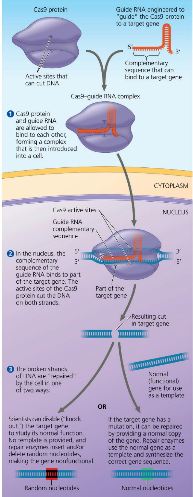

rejoining the ends. Generally, this process alters the DNA sequence so that the gene no longer works properly. This technique is a highly successful way for researchers to “knock out” (disable) a given gene to study what that gene does in an organism.

But what about using this system to help treat genetic diseases? Researchers have modified the technique so that the CRISPR-Cas9 system can be used to repair a gene that has a harmful mutation. They introduce a segment from the normal (functional) gene along with the CRISPR-Cas9 system. After Cas9 cuts the target DNA, repair enzymes can use the normal DNA as a template to repair the target DNA at the break point. In this way, the CRISPR-Cas9 system edits the defective gene so that it is corrected (see the bottom right of Figure 17.28).

After studies using mouse models, CRISPR-based treatments for sickle-cell disease and another disease caused by a mutation of the $\beta$ -globin gene called beta-thalassemia were tested in human clinical trials. These disorders are good targets because they are caused by a mutation in a single gene, and they involve blood cells. The patients' blood cells are removed and genetically edited outside the body, then returned to the patient. In these clinical trials, rather than trying to correct the $\beta$ -globin mutation, the approach was to re-activate a gene for fetal hemoglobin, a different form that is normally turned off at birth but can substitute for $\beta$ -globin. A significant majority of patients showed remarkable results, having near-normal hemoglobin levels and not needing blood transfusions or experiencing pain crises. In 2024, this gene therapy treatment for these two blood-based disorders was approved for usage by the U.S. Food and Drug Administration (FDA).

Researchers, physicians, and patients alike are excited about the potential of CRISPR technology to treat or even cure human diseases that have a genetic basis, such as autoimmune diseases, Alzheimer's, and Parkinson's diseases, as well as some types of cancer. As of early 2025, 20 gene therapy treatments have been approved by the FDA. However, there are still concerns about using CRISPR-treated cells in humans because of possible effects on genes that are not being targeted (so-called "off-target" genes); this is an active area of research. The risks associated with cutting both strands of DNA by CRISPR are avoided when CRISPR is used in conjunction with a new technique called base editing. In this process, specific bases in a gene are not cut and replaced, but rather chemically modified to resemble a different base, thus altering the resulting protein so it is no longer harmful. In another approach, researchers are using different forms of Cas proteins that are more accurate.

Jennifer Doudna, a co-discoverer of CRISPR-Cas9, recognized not only its incredible potential but also the danger of its misapplication. After having a dream in which Adolf Hitler asked her what could be done with this gene-editing tool, Doudna realized it was imperative to spend some time reflecting on ethical considerations. In 2015, she convened a conference of biologists who agreed at the end of the meeting to urge extreme caution as the field moves forward—and the discussion continues.

## What Is a Gene? Revisiting the Question

Our definition of a gene has evolved over the past few chapters, as it has through the history of genetics. We began with the Mendelian concept of a gene as a discrete unit of inheritance that affects a phenotypic character (Chapter 14). We saw that Morgan and his colleagues assigned such genes to specific loci on chromosomes (Chapter 15). We went on to view a gene as a region of specific nucleotide sequence along the length of the DNA molecule of a chromosome (Chapter 16). Finally, in this chapter, we have considered a functional definition of a gene as a DNA sequence that codes for a specific polypeptide chain or a functional RNA molecule, such as a tRNA. All these definitions are useful, depending on the context in which genes are being studied.

We have noted that merely saying a gene codes for a polypeptide is an oversimplification. Most eukaryotic genes contain noncoding segments (such as introns), so large portions of these genes have no corresponding segments in polypeptides. Molecular biologists also often include promoters and certain other regulatory regions of DNA within the boundaries of a gene. These DNA sequences are not transcribed, but they can be considered part of the functional gene because they must be present for transcription to occur. Our definition of a gene must also be broad enough to include the DNA that is transcribed into rRNA, tRNA, and other RNAs that are not translated. These genes have no polypeptide products but play crucial roles in the cell. Thus, we arrive at the following definition: A gene is a region of DNA that can be expressed to produce a final functional product that is either a polypeptide or an RNA molecule.

When considering phenotypes, however, it is often useful to start by focusing on genes that code for polypeptides. In this chapter, you have learned in molecular terms how a typical gene is expressed—by transcription into RNA and then translation into a polypeptide that forms a protein of specific structure and function. Proteins, in turn, bring about an organism's observable phenotype.

A given type of cell expresses only a subset of its genes. This is an essential feature in multicellular organisms: You'd be in trouble if the lens cells in your eyes started expressing the genes for hair proteins, which are normally expressed only in hair follicle cells! Gene expression is precisely regulated, which we'll explore in the next chapter, beginning with the simpler case of bacteria and continuing with eukaryotes.

## Concept Check 17.5

1. What happens when one nucleotide pair is lost from the middle of the coding sequence of a gene?

2. MAKE CONNECTIONS Individuals heterozygous for the sickle-cell allele are generally healthy but show phenotypic effects of the allele under some circumstances (see Figure 14.17). Explain in terms of gene expression.

3. DRAW IT The template strand of a gene includes this sequence:
3'-TACTTGTCCGATATC-5'. The sequence is mutated to 3'-TACTTGTCCAATATC-5'. For both wild-type and mutant sequences, draw the double-stranded DNA, the resulting mRNA, and the amino acid sequence each encodes. What is the effect of the mutation on the amino acid sequence?

4. WHAT IF? How could you use the CRISPR-Cas9 system to correct the mutation described in question 3? Based on the answer to question 3, would this be worth doing?